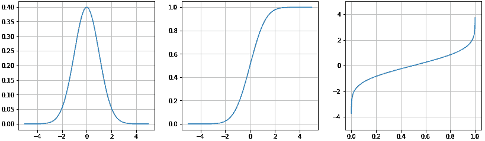
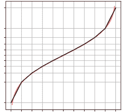
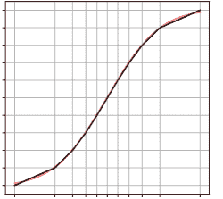
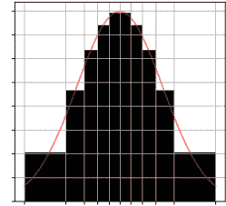
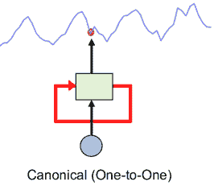
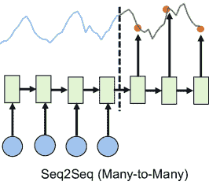

<!--yml

分类：未分类

日期：2024-09-06 20:01:33

-->

# [2004.10240] 时间序列预测中的深度学习：教程和文献综述

> 来源：[`ar5iv.labs.arxiv.org/html/2004.10240`](https://ar5iv.labs.arxiv.org/html/2004.10240)

# 时间序列预测中的深度学习：教程和文献综述

Konstantinos Benidis

亚马逊研究院

德国柏林

kbenidis@amazon.com

&Syama Sundar Rangapuram

亚马逊研究院

德国柏林

rangapur@amazon.com

&Valentin Flunkert

亚马逊研究院

德国柏林

flunkert@amazon.com

&Yuyang Wang

亚马逊研究院

美国加州东帕洛阿尔托

yuyawang@amazon.com

&Danielle Maddix

亚马逊研究院

美国加州东帕洛阿尔托

dmmaddix@amazon.com

&Caner Turkmen

亚马逊研究院

德国柏林

atturkm@amazon.com

&Jan Gasthaus

亚马逊研究院

德国柏林

gasthaus@amazon.com

&Michael Bohlke-Schneider

亚马逊研究院

德国柏林

bohlkem@amazon.com

&David Salinas

亚马逊研究院

德国柏林

dsalina@amazon.com

&Lorenzo Stella

亚马逊研究院

德国柏林

stellalo@amazon.com

&François-Xavier Aubet

亚马逊研究院

德国柏林

aubetf@amazon.com

&Laurent Callot

亚马逊研究院

德国柏林

lcallot@amazon.com

&Tim Januschowski^†^†脚注：

Zalando SE

德国柏林

tim.januschowski@zalando.de 相同贡献。工作完成时在 AWS。

###### 摘要

基于深度学习的预测方法在许多时间序列预测或*预报*应用中已成为首选方法，通常优于其他方法。因此，近年来，这些方法现在在大规模工业预测应用中无处不在，并在预测竞赛中（例如，M4 和 M5）始终排名靠前。这一实际成功进一步激发了学术界对理解和改进深度预测方法的兴趣。本文提供了该领域的介绍和概述：我们深入介绍了深度预测的一些重要构建块；使用这些构建块，我们随后调查了近期深度预测文献的广度。

*K*eywords 时间序列 $\cdot$ 预测 $\cdot$ 深度学习

## 1 引言

预测是将时间序列外推到未来的任务。它有许多重要的应用，例如预测零售商出售商品的需求[54]，交通流量[41, 190, 156, 136, 14, 25]，能源的需求和供应[111, 126, 118]，或金融中的协方差矩阵、波动性和长尾分布[45, 170, 117, 157], [30, 29, 124, 12, 197]。因此，这是一个研究较多的领域（例如，参见[84]以获取介绍），拥有自己专门的研究社区。机器学习、数据科学、系统和运筹学社区以及应用特定的研究社区也对这个问题进行了深入研究（例如，参见一系列近期教程[56, 55, 57, 58]）。与传统的预测应用相比，现代的预测通常涉及大量相关的时间序列，这些序列需要同时进行预测[89]。尽管这些问题特征使得深度学习或神经网络（NNs）成为一个合适的选择，但正如历史上许多领域一样，NNs 并不总是解决这些问题的标准工具。实际上，它们的有效性在历史上被认为是混合的（例如，[202]）。

神经网络（NNs）的历史始于 1957 年[152]，而在预测领域则始于 1964 年[83]。自那时以来，对 NNs 的兴趣经历了波动，关注的上升归因于突破性进展。NNs 在时间序列预测中的应用也随着普及度的一般趋势而变化，通常滞后几年。这样的突破性进展的例子包括 Rumelhart 等人[153, 154]，他们推广了使用反向传播训练多层感知机（MLPs）。随后的重大进展包括使用卷积神经网络（CNNs）[113]，以及解决循环神经网络（RNNs）训练问题的长短期记忆（LSTM）[81]单元，仅举几例。尽管有这些进展，NNs 仍然难以训练和使用。1990 年代开发的支持向量机（SVMs）[26]和随机森林[79]等方法被证明非常有效（LeCun 等人[114]发现 SVMs 与当时最佳设计的 NNs 表现相当），并且得到了有吸引力的理论支持。这使得研究人员的兴趣从 NNs 转移开来。预测也不例外，NNs 获得的结果大多不一如人意，如一项高度引用的综述所反映[202]。标志着深度学习时代曙光的突破出现在 2006 年，当时 Hinton 等人[78]展示了如果权重初始化得当，可以训练具有大量层（深层）的 NNs。因此，深度学习对预测产生了巨大影响[110]，NNs 已长期成为预测的标准技术之一[84]。专门为预测任务设计的新模型已经被提出，利用深度学习来增强经典预测模型或开发全新的方法。这一最近对*深度预测*模型的关注是悠久而丰富历史中的最新发展。

由于（封闭源代码的）大规模时间序列面板的可用性，深度预测模型，即基于神经网络的预测模型，在过去几年里主要在应用工业研究部门中得到了开发[111, 64, 156, 190]。¹¹1 预测是机器学习社区中的一个子领域，其在已发表研究中的相对较少关注与其巨大的商业影响形成了鲜明对比。随着深度预测方法在 M4 竞赛中的巨大成功[169]，这也使得曾经持怀疑态度的学者[128, 129]改变了看法。在最近的 M5 竞赛中，深度预测方法获得了第二和第三名[130]，尽管竞赛其他方面则被树模型预测方法如 LightGBM[99]和 XGBoost[33]所主导，参见，例如[92]。现代软件框架[1, 143, 34]加速了神经网络模型的开发，并提供了专门的预测软件包[4]。

尽管神经网络在预测中的历史丰富，但本文的重点是近年来神经网络在预测中的最新发展，大致从“深度学习”这一术语被创造出来的时间开始。因此，我们不尝试给出完整的历史概述，而是以近期性为重。本文的主要目标是对神经网络驱动的最新预测发展进行教育、审查和推广，以便于一般读者。因此，我们在第一部分（第 2）中通过深度预测教程强调了教育方面。在第二部分，第 3，我们提供了现代深度预测模型的最先进概况。我们的阐述旨在识别现代深度预测模型的主要构建块，希望能帮助读者更容易地消化快速增长的文献。我们不尝试对所有现有方法进行分类，我们对构建块的选择是主观的，受我们在这一领域创新经验的驱动，特别关注实际应用。与其他综述[119, 76, 202]相比，我们提供了更全面的概述，特别关注近期的先进主题。最后，在第四部分，我们总结并对未来研究的潜在有益领域进行了一些推测。

## 2 深度预测：教程

接下来，我们将形式化预测问题，总结我们认为与预测最相关的深度学习进展，揭示神经网络的重要构建模块，并详细讨论典型模型。对于推动深度学习复兴的总体改进，如权重初始化、优化算法或通用组件如激活函数，我们参考标准教材如 [71]。我们意识到在主题选择和表达风格上可能有主观性。我们尝试从一个类似深度预测模型构建者的角度出发，将预测模型从多个构建模块中组合而成，例如神经网络架构、输入变换和输出表示。尽管并非所有模型都能完全契合这种描述，但我们希望这种缺点被允许感兴趣的读者更容易发明新模型的好处所抵消。

### 2.1 预测问题的符号和形式化

矩阵、向量和标量分别用大写粗体字母、小写粗体字母和小写普通字母表示，即 $\mathbf{X}$、$\mathbf{x}$ 和 $x$。设 $\mathcal{Z}=\{\mathbf{z}_{i,1:T_{i}}\}_{i=1}^{N}$ 为 $N$ 个单变量时间序列的集合，其中 $\mathbf{z}_{i,1:T_{i}}=(z_{i,1},\dots,z_{i,T_{i}})$，$z_{i,t}$ 是第 $i$ 个时间序列在时间 $t$ 的值，$\mathbf{Z}_{t_{1}:t_{2}}$ 是所有 $N$ 个时间序列在时间片段 $[t_{1},t_{2}]$ 的值。时间序列值的典型领域包括 $\mathbb{R},\mathbb{N},\mathbb{Z},[0,1]$。时间序列集合与协变量向量集合 $\mathcal{X}=\{\mathbf{X}_{i,1:T_{i}}\}_{i=1}^{N}$ 相关，其中 $\mathbf{x}_{i,t}\in\mathbb{R}^{d_{x}}$。注意，每个向量 $\mathbf{x}_{i,t}$ 可以包括时间变化的特征或静态特征。我们用 $\alpha$ 表示模型中的一个一般输入（可以是协变量和目标滞后值的任意组合），用 $\beta$ 表示一个一般输出。由于 $\alpha$ 和 $\beta$ 代表的是一般情况，我们总是用小写普通字母来表示它们。我们用 $\theta$ 表示模型的参数（例如，分布的参数），用 $\Phi$ 表示基础神经网络（NN）的可学习自由参数（例如，权重和偏置）。

在最一般的形式中，预测中的关注对象是条件分布。

|  | $p(\mathbf{Z}_{t+1:t+h}&#124;\mathbf{Z}_{1:t},\mathbf{X}_{1:t+h};\theta),$ |  | (1) |
| --- | --- | --- | --- |

其中 $\theta$ 是（概率）模型的参数。Eq. (1) 是一般的，因为每个 $\mathbf{z}_{i}\in\mathcal{Z}$ 是多维的（时间序列的长度），$\mathcal{Z}$ 是多变量的（时间序列的数量 $|\mathcal{Z}|=N>1$），且预测是多步的（$h$ 步）。文献中考虑了 Eq. (1) 的不同简化程度，例如通过假设 $p$ 的分解和不同的 $\theta$ 估计方法。接下来，我们介绍三种典型模型来解决 Eq. (1)。

局部单变量模型：为每个 $N$ 个时间序列独立训练一个单独的 (*局部*) 模型，建模预测分布

|  | $p(\mathbf{z}_{i,t+1:t+h} \mid \mathbf{z}_{i,1:t},\mathbf{X}_{i,1:t+h};\theta_{i}),\quad\theta_{i}=\Psi(\mathbf{z}_{i,1:t},\mathbf{X}_{i,1:t+h}),$ |  | (2) |
| --- | --- | --- | --- |

其中 $\Psi$ 是一个通用函数，将输入特征映射到概率模型的参数 $\theta_{i}$，这些参数对第 $i$ 个时间序列是局部的。需要注意的是，虽然可以为每个 $N$ 个模型使用多维协变量 $\mathbf{x}_{i,t}$，但它们仍在解决单变量问题，即仅预测一个时间序列。使用对所有 $N$ 模型都通用的协变量是可能的，但在一个模型中学习到的任何模式不会在另一个模型中使用（除非明确提供，这会禁止并行训练）。许多经典方法都属于这一类，传统上神经网络以这种局部方式使用（例如，[202]）。需要注意的是，这种方法不适用于冷启动问题：即在没有历史值的情况下预测时间序列。

全球单变量模型：使用来自所有 $N$ 个时间序列的可用数据训练一个单一的 *全球* 模型 [91, 135]。然而，该模型仍然用于预测单一的目标。它不会生成所有时间序列的联合预测，而是逐个时间序列进行预测。这有时也称为交叉学习方法，例如 [161]。更一般地，全球单变量模型专注于 Eq. (1) 来

|  | $p(\mathbf{z}_{i,t+1:t+h}\mid\mathbf{Z}_{1:t},\mathbf{X}_{1:t+h};\theta_{i}),\quad\theta_{i}=\Psi(\mathbf{z}_{i,1:t},\mathbf{X}_{i,1:t+h},\Phi),$ |  | (3) |
| --- | --- | --- | --- |

其中 $\Phi$ 是所有 $N$ 时间序列之间共享的参数。

在本文中，全球模型中的 $\Psi$ 通常是一个神经网络（NN），而 $\mathbf{X}_{i}$ 包括项目特定特征，以允许模型区分不同的时间序列。虽然每个时间序列的概率模型参数 $\theta_{i}$ 是不同的，但它们仍然使用共享参数（或权重） $\Phi$ 在 $\Psi$ 中进行预测。这允许模型通过从所有时间序列中汇集信息来高效学习，特别是与局部单变量模型相比，改进了较短时间序列的推断。这样的模型预计会学习一些高级特征（“嵌入”），利用跨时间序列的信息。一旦这些高级特征通过 $\Psi$ 学会，全球模型就被用来独立预测每个时间序列。也就是说，尽管在训练期间模型会看到所有相关时间序列，预测还是通过单独查看每个时间序列来完成。注意，全球模型中学到的嵌入不仅对训练中使用的 $N$ 时间序列有用，还能解决冷启动问题，即全球模型可以用来为没有历史值的时间序列提供预测。全球模型在计量经济学和统计学中也被称为交叉学习或面板模型，并且已经成为大量研究的主题，例如，通过动态因子模型 [66]。

多变量模型：在这里，为所有 $N$ 时间序列使用所有可用数据学习一个单一模型，直接预测多变量目标：

|  | $p(\mathbf{Z}_{t+1:t+h}\mid\mathbf{Z}_{1:t},\mathbf{X}_{1:t+h};\theta),\quad\theta=\Psi(\mathbf{Z}_{1:t},\mathbf{X}_{1:t+h},\Phi).$ |  | (4) |
| --- | --- | --- | --- |

注意，该模型还学习了时间序列之间的依赖结构。从技术上讲，方程式 (4) 是一个全球多变量模型，并且可以与局部多变量模型（如 VARMA [125]）进行进一步区分。

##### 备注

注意，在公式 (1)和以下模型特定的情况中，我们选择了多步预测分布。我们可以通过滚动的一步预测分布始终获得多步预测分布。在到目前为止的讨论中，我们展示了学习未来值整个分布的概率预测模型。然而，可能更希望建模特定的值，例如均值、中位数或其他分位数，而不是整个概率分布。这些被称为点预测模型，将概率预测转换为点预测的总结统计量的最佳选择取决于用于判断点预测质量的度量[104]。更具体地说，点预测全局单变量模型学习一个量 $\hat{\mathbf{z}}_{i,t+1:t+h}=\Psi(\mathbf{z}_{i,1:t},\mathbf{X}_{i,1:t+h},\Phi)$，其中 $\hat{\mathbf{z}}_{i,t+1:t+h}$ 是时间序列未来值的某个点估计。表 1 总结了基于预测和模型类型的各种建模选项。

表 1：基于预测和模型类型的深度预测模型总结。对于一步预测和多步预测模型，分别取$h=1$和$h>1$。

| 预测类型 | 模型类型 | 形式化 |
| --- | --- | --- |
| 点预测 | 本地单变量 | $\hat{\mathbf{z}}_{i,t+1:t+h}=\Psi(\mathbf{z}_{i,1:t},\mathbf{X}_{i,1:t+h})$ |
| 全球单变量 | $\hat{\mathbf{z}}_{i,t+1:t+h}=\Psi(\mathbf{z}_{i,1:t},\mathbf{X}_{i,1:t+h},\Phi)$ |
| 多变量 | $\hat{\mathbf{Z}}_{t+1:t+h}=\Psi(\mathbf{Z}_{1:t},\mathbf{X}_{1:t+h},\Phi)$ |
| 概率 | 本地单变量 | $P(\mathbf{z}_{i,t+1:t+h}&#124;\mathbf{z}_{i,1:t},\mathbf{X}_{i,1:t+h};\theta_{i}),\quad\theta_{i}=\Psi(\mathbf{z}_{i,1:t},\mathbf{X}_{i,1:t+h})$ |
| 全球单变量 | $P(\mathbf{z}_{i,t+1:t+h}&#124;\mathbf{Z}_{1:t},\mathbf{X}_{1:t+h};\theta_{i}),\quad\theta_{i}=\Psi(\mathbf{z}_{i,1:t},\mathbf{X}_{i,1:t+h},\Phi)$ |
| 多变量 | $P(\mathbf{Z}_{t+1:t+h}&#124;\mathbf{Z}_{1:t},\mathbf{X}_{1:t+h};\theta),\quad\theta=\Psi(\mathbf{Z}_{1:t},\mathbf{X}_{1:t+h},\Phi)$ |

### 2.2 神经网络架构

神经网络（NNs）是由简单的构建块组成的可微分函数的组合，以从数据中学习某些未知函数的近似。一个 NN 通常表示为一个由节点和边组成的有向无环图。节点之间的边包含从数据中学习到的权重（也称为参数）。每个 NN 的基本单元是一个神经元（如图 1(a)所示），包括一个输入，一个具有可学习权重的仿射变换和（可选的）非线性激活函数。不同类型的 NN 以不同方式安排这些组件。有关主要架构的更多详细信息，请参考其他综述[119]。在这里，我们仅提供一个高层次的总结，主要关注神经网络在预测中特定的组成部分，如输入处理和损失函数。

#### 2.2.1 多层感知机

在多层感知机（MLPs）或同义的前馈神经网络中，神经元层被堆叠在一起，以学习数据的更复杂的非线性表示。一个 MLP 由输入层和输出层组成，而中间的层称为隐藏层。网络中每一层的节点都与上一层的所有节点完全连接。最后一个隐藏层的输出可以看作是从网络输入中获得的一些非线性特征表示（也称为*嵌入*）。输出层随后学习从这些非线性特征到实际目标的映射。使用 MLP，或者更普遍地说，使用神经网络的学习可以被认为是学习输入的非线性特征映射以及这个特征映射与实际目标之间关系的过程。图 1(b)展示了一个具有两个隐藏层的 MLP 的结构。现代 MLP 变体加入了重要细节，以缓解如梯度消失等问题[80]。例如，ResNet[75]包含隐藏层$\ell-1$和$\ell+1$之间的直接连接，跳过隐藏层$\ell$。

MLP 的主要局限之一是它们没有利用在计算机视觉、自然语言处理和预测等应用中经常存在的数据结构。此外，输入和输出的数量是固定的，使它们不适用于输入和输出大小变化的问题，如预测。接下来，我们将讨论克服这些局限性的更复杂的架构，其中 MLP 通常作为基本构建块使用。

<svg   height="167.55" overflow="visible" version="1.1" width="311.85"><g transform="translate(0,167.55) matrix(1 0 0 -1 0 0) translate(26.37,0) translate(0,67.89)" fill="#000000" stroke="#000000" stroke-width="0.4pt"><g transform="matrix(1.0 0.0 0.0 1.0 -6.36 57.32)" fill="#000000" stroke="#000000"><foreignobject width="12.73" height="8.45" transform="matrix(1 0 0 -1 0 16.6)" overflow="visible">$\alpha_{1}$</foreignobject></g><g transform="matrix(1.0 0.0 0.0 1.0 -21.75 75.75)" fill="#000000" stroke="#000000"><foreignobject width="38.9" height="12.15" transform="matrix(1 0 0 -1 0 16.6)" overflow="visible">输入</foreignobject></g><g transform="matrix(1.0 0.0 0.0 1.0 55.51 57.32)" fill="#000000" stroke="#000000"><foreignobject width="14.15" height="8.45" transform="matrix(1 0 0 -1 0 16.6)" overflow="visible">$w_{1}$</foreignobject></g><g transform="matrix(1.0 0.0 0.0 1.0 36.22 75.75)" fill="#000000" stroke="#000000"><foreignobject width="48.51" height="12.3" transform="matrix(1 0 0 -1 0 16.6)" overflow="visible">权重</foreignobject></g><g transform="matrix(1.0 0.0 0.0 1.0 -6.36 -1.73)" fill="#000000" stroke="#000000"><foreignobject width="12.73" height="8.45" transform="matrix(1 0 0 -1 0 16.6)" overflow="visible">$\alpha_{2}$</foreignobject></g><g transform="matrix(1.0 0.0 0.0 1.0 55.51 -1.73)" fill="#000000" stroke="#000000"><foreignobject width="14.15" height="8.45" transform="matrix(1 0 0 -1 0 16.6)" overflow="visible">$w_{2}$</foreignobject></g><g transform="matrix(1.0 0.0 0.0 1.0 120 -4.73)" fill="#000000" stroke="#000000"><foreignobject width="9.99" height="9.46" transform="matrix(1 0 0 -1 0 16.6)" overflow="visible">$\displaystyle\Sigma$</foreignobject></g><g transform="matrix(1.0 0.0 0.0 1.0 180.34 -3.46)" fill="#000000" stroke="#000000"><foreignobject width="22.87" height="13.84" transform="matrix(1 0 0 -1 0 16.6)" overflow="visible">$f(\cdot)$</foreignobject></g> <g transform="matrix(1.0 0.0 0.0 1.0 152.4 24.96)" fill="#000000" stroke="#000000"><foreignobject width="78.74" height="26.21" transform="matrix(1 0 0 -1 0 16.6)" overflow="visible">激活函数</foreignobject></g> <g transform="matrix(1.0 0.0 0.0 1.0 252.35 -3.46)" fill="#000000" stroke="#000000"><foreignobject width="7.83" height="12.3" transform="matrix(1 0 0 -1 0 16.6)" overflow="visible">$\beta$</foreignobject></g><g transform="matrix(1.0 0.0 0.0 1.0 231.67 18.62)" fill="#000000" stroke="#000000"><foreignobject width="44.59" height="12.15" transform="matrix(1 0 0 -1 0 16.6)" overflow="visible">输出</foreignobject></g><g transform="matrix(1.0 0.0 0.0 1.0 -6.36 -60.79)" fill="#000000" stroke="#000000"><foreignobject width="12.73" height="8.45" transform="matrix(1 0 0 -1 0 16.6)" overflow="visible">$\alpha_{3}$</foreignobject></g><g transform="matrix(1.0 0.0 0.0 1.0 55.51 -60.79)" fill="#000000" stroke="#000000"><foreignobject width="14.15" height="8.45" transform="matrix(1 0 0 -1 0 16.6)" overflow="visible">$w_{3}$</foreignobject></g> <g transform="matrix(1.0 0.0 0.0 1.0 85.63 77.1)" fill="#000000" stroke="#000000"><foreignobject width="78.74" height="26.21" transform="matrix(1 0 0 -1 0 16.6)" overflow="visible">偏置 $b$</foreignobject></g></g></svg>

(a) 单个节点

<svg height="226.29" overflow="visible" version="1.1" width="252.26"><g transform="translate(0,226.29) matrix(1 0 0 -1 0 0) translate(25.37,0) translate(0,187.54)" fill="#000000" stroke="#000000" stroke-width="0.4pt"><g stroke="#808080"><g transform="matrix(1.0 0.0 0.0 1.0 -6.36 -41.1)" fill="#000000" stroke="#000000"><foreignobject width="12.73" height="8.45" transform="matrix(1 0 0 -1 0 16.6)" overflow="visible">$\alpha_{1}$</foreignobject></g><g transform="matrix(1.0 0.0 0.0 1.0 -6.36 -80.47)" fill="#000000" stroke="#000000"><foreignobject width="12.73" height="8.45" transform="matrix(1 0 0 -1 0 16.6)" overflow="visible">$\alpha_{2}$</foreignobject></g><g transform="matrix(1.0 0.0 0.0 1.0 -6.36 -119.84)" fill="#000000" stroke="#000000"><foreignobject width="12.73" height="8.45" transform="matrix(1 0 0 -1 0 16.6)" overflow="visible">$\alpha_{3}$</foreignobject></g><g transform="matrix(1.0 0.0 0.0 1.0 -6.36 -159.21)" fill="#000000" stroke="#000000"><foreignobject width="12.73" height="8.45" transform="matrix(1 0 0 -1 0 16.6)" overflow="visible">$\alpha_{4}$</foreignobject></g><g transform="matrix(1.0 0.0 0.0 1.0 210.58 -82.2)" fill="#000000" stroke="#000000"><foreignobject width="11.7" height="12.3" transform="matrix(1 0 0 -1 0 16.6)" overflow="visible">$\beta_{1}$</foreignobject></g><g transform="matrix(1.0 0.0 0.0 1.0 210.58 -121.57)" fill="#000000" stroke="#000000"><foreignobject width="11.7" height="12.3" transform="matrix(1 0 0 -1 0 16.6)" overflow="visible">$\beta_{2}$</foreignobject></g></g> <g transform="matrix(1.0 0.0 0.0 1.0 38.3 24.45)" fill="#000000" stroke="#000000"><foreignobject width="41.51" height="28.9" transform="matrix(1 0 0 -1 0 16.6)" overflow="visible">隐藏层 1 <g transform="matrix(1.0 0.0 0.0 1.0 -20.76 22.63)" fill="#000000" stroke="#000000"><foreignobject width="41.51" height="25.25" transform="matrix(1 0 0 -1 0 16.6)" overflow="visible">输入层</foreignobject></g> <g transform="matrix(1.0 0.0 0.0 1.0 97.35 24.45)" fill="#000000" stroke="#000000"><foreignobject width="41.51" height="28.9" transform="matrix(1 0 0 -1 0 16.6)" overflow="visible">隐藏层 2</foreignobject></g> <g transform="matrix(1.0 0.0 0.0 1.0 156.41 24.45)" fill="#000000" stroke="#000000"><foreignobject width="41.51" height="28.9" transform="matrix(1 0 0 -1 0 16.6)" overflow="visible">输出层</foreignobject></g>

(b) 多层感知器

图 1: (a) 单个节点或神经元的结构。对输入应用仿射变换后，接着使用激活函数，即 $\beta=f\left(\sum\alpha_{i}w_{i}+b\right)$。权重和偏置参数在训练过程中学习。 (b) MLP 结构的示意图。隐藏层和输出层中的每个圆圈都是一个节点，即对其输入集合应用仿射变换后，再进行非线性激活。

#### 2.2.2 卷积神经网络

卷积神经网络（CNNs）[112] 是一种特殊的 NN 类，设计用于输入具有已知序列结构的应用，如图像和时间序列[71]。CNN 是局部连接的 NN，通过应用卷积函数于输入数据的较小邻域，利用输入数据中的结构。卷积在这里指的是通过在输入数据的不同部分滑动所谓的滤波器或核来计算加权移动和。滤波器的大小以及滤波器在输入上滑动的方式是模型的超参数。然后，对卷积操作的输出应用非线性激活，通常是 ReLU [68]。

除了卷积层，CNN 通常还使用池化层来减少特征表示的大小，并使从卷积层提取的特征更具鲁棒性。例如，常用的最大池化层，它应用于卷积层的输出，提取给定邻域中特征的最大值。类似于卷积操作，池化操作通过在输入上滑动相应的滤波器应用于较小的邻域。然而，池化层没有任何可学习的权重，因此卷积层和池化层在 CNN 中被视为一层。

对于预测而言，所谓的*因果*卷积特别重要，定义为

|  | $h_{j}=\sum_{d\in\mathcal{D}}w_{d}\alpha_{j-d}\,,$ |  |
| --- | --- | --- |

其中 $h_{j}$ 是隐藏节点的输出，$\mathbf{\alpha}$ 表示输入，$\mathcal{D}=\{1,\ldots,n\}$ 对于某些 $n$，$|\mathcal{D}|$ 是因果卷积的*宽度*（也称为感受野），$\mathbf{w}$ 是可学习的参数。换句话说，因果卷积是加权移动平均，只考虑在 $j$ 之前的输入，因此其名称中提到了因果性。一种变体是*dilated* 因果卷积，其中我们改变索引集 $\mathcal{D}$，例如，使其不一定包含连续值，而是每隔 $k$ 个值。通常，这些扩张的因果卷积会堆叠在一起，其中一层扩张因果卷积的输出是另一层因果卷积的输入，并且扩张随 NN 的深度增长。图 2(a) 展示了带有扩张因果卷积的 CNN 的一般结构。

<svg height="211.76" overflow="visible" version="1.1" width="270.81"><g transform="translate(0,211.76) matrix(1 0 0 -1 0 0) translate(-41.76,0) translate(0,17.3)" fill="#000000" stroke="#808080" stroke-width="0.4pt"><g transform="matrix(1.0 0.0 0.0 1.0 52.69 -1.73)" fill="#000000" stroke="#000000"><foreignobject width="12.73" height="8.45" transform="matrix(1 0 0 -1 0 16.6)" overflow="visible">$\alpha_{1}$</foreignobject></g><g transform="matrix(1.0 0.0 0.0 1.0 111.75 -1.73)" fill="#000000" stroke="#000000"><foreignobject width="12.73" height="8.45" transform="matrix(1 0 0 -1 0 16.6)" overflow="visible">$\alpha_{2}$</foreignobject></g><g transform="matrix(1.0 0.0 0.0 1.0 170.8 -1.73)" fill="#000000" stroke="#000000"><foreignobject width="12.73" height="8.45" transform="matrix(1 0 0 -1 0 16.6)" overflow="visible">$\alpha_{3}$</foreignobject></g><g transform="matrix(1.0 0.0 0.0 1.0 229.86 -1.73)" fill="#000000" stroke="#000000"><foreignobject width="12.73" height="8.45" transform="matrix(1 0 0 -1 0 16.6)" overflow="visible">$\alpha_{4}$</foreignobject></g><g transform="matrix(1.0 0.0 0.0 1.0 288.91 -1.73)" fill="#000000" stroke="#000000"><foreignobject width="12.73" height="8.45" transform="matrix(1 0 0 -1 0 16.6)" overflow="visible">$\alpha_{5}$</foreignobject></g></g></svg>

(a) CNN

<svg   height="145.78" overflow="visible" version="1.1" width="270.81"><g transform="translate(0,145.78) matrix(1 0 0 -1 0 0) translate(17.3,0) translate(0,17.3)" fill="#000000" stroke="#808080" stroke-width="0.4pt"><g transform="matrix(1.0 0.0 0.0 1.0 52.69 -1.73)" fill="#000000" stroke="#000000"><foreignobject width="12.73" height="8.45" transform="matrix(1 0 0 -1 0 16.6)" overflow="visible">$\alpha_{1}$</foreignobject></g><g transform="matrix(1.0 0.0 0.0 1.0 111.75 -1.73)" fill="#000000" stroke="#000000"><foreignobject width="12.73" height="8.45" transform="matrix(1 0 0 -1 0 16.6)" overflow="visible">$\alpha_{2}$</foreignobject></g><g transform="matrix(1.0 0.0 0.0 1.0 170.8 -1.73)" fill="#000000" stroke="#000000"><foreignobject width="12.73" height="8.45" transform="matrix(1 0 0 -1 0 16.6)" overflow="visible">$\alpha_{3}$</foreignobject></g><g transform="matrix(1.0 0.0 0.0 1.0 -5.78 55.5)" fill="#000000" stroke="#000000"><foreignobject width="11.56" height="12.11" transform="matrix(1 0 0 -1 0 16.6)" overflow="visible">$\mathbf{h}_{0}$</foreignobject></g><g transform="matrix(1.0 0.0 0.0 1.0 53.27 55.5)" fill="#000000" stroke="#000000"><foreignobject width="11.56" height="12.11" transform="matrix(1 0 0 -1 0 16.6)" overflow="visible">$\mathbf{h}_{1}$</foreignobject></g><g transform="matrix(1.0 0.0 0.0 1.0 112.33 55.5)" fill="#000000" stroke="#000000"><foreignobject width="11.56" height="12.11" transform="matrix(1 0 0 -1 0 16.6)" overflow="visible">$\mathbf{h}_{2}$</foreignobject></g><g transform="matrix(1.0 0.0 0.0 1.0 171.38 55.5)" fill="#000000" stroke="#000000"><foreignobject width="11.56" height="12.11" transform="matrix(1 0 0 -1 0 16.6)" overflow="visible">$\mathbf{h}_{3}$</foreignobject></g><g transform="matrix(1.0 0.0 0.0 1.0 230.44 55.5)" fill="#000000" stroke="#000000"><foreignobject width="11.56" height="12.11" transform="matrix(1 0 0 -1 0 16.6)" overflow="visible">$\mathbf{h}_{4}$</foreignobject></g><g transform="matrix(1.0 0.0 0.0 1.0 53.2 114.65)" fill="#000000" stroke="#000000"><foreignobject width="11.7" height="12.3" transform="matrix(1 0 0 -1 0 16.6)" overflow="visible">$\beta_{1}$</foreignobject></g><g transform="matrix(1.0 0.0 0.0 1.0 112.26 114.65)" fill="#000000" stroke="#000000"><foreignobject width="11.7" height="12.3" transform="matrix(1 0 0 -1 0 16.6)" overflow="visible">$\beta_{2}$</foreignobject></g><g transform="matrix(1.0 0.0 0.0 1.0 171.31 114.65)" fill="#000000" stroke="#000000"><foreignobject width="11.7" height="12.3" transform="matrix(1 0 0 -1 0 16.6)" overflow="visible">$\beta_{3}$</foreignobject></g></g></svg>

(b) RNN

图 2：（a）由三层因果卷积层堆叠组成的 CNN 结构。输入层（绿色）是非扩张的，其余两个是扩张的。（b）展开的 RNN 结构。在每个时间步$t$，网络接收外部输入$\alpha_{t}$和来自上一个时间步$\mathbf{h}_{t-1}$的隐藏单元的输出。所有隐藏单元共享相同的权重。网络的内部状态更新为$\mathbf{h}_{t}$，将在下一个时间步$t+1$中充当先前状态。最后，网络输出$\beta_{t}$，它是$\alpha_{t}$和$\mathbf{h}_{t}$的函数。

#### 2.2.3 循环神经网络

循环神经网络（RNNs）是专门设计用于处理序列数据的神经网络，这些数据常见于时间序列、自然语言处理和语音识别等应用中。核心思想是将神经网络的隐藏单元循环地连接回自身，带有时间延迟[94, 95]。由于隐藏单元学习到原始输入的某种特征表示，将它们反馈到自身可以解释为为网络提供了动态记忆。一个关键细节是，相同的网络用于所有时间步，即网络的权重在时间步之间共享。这种权重共享的想法类似于卷积神经网络（CNNs），其中相同的滤波器用于输入的不同部分。这使得 RNN 能够在训练期间处理不同长度的序列，并且更重要的是，可以推广到训练期间未见过的序列长度。图 2(b)展示了一个（展开的）RNN 的基本结构。

尽管 RNN 在实际应用中被广泛使用，但由于它们通常应用于长序列数据，训练起来非常困难。使用基于梯度的方法通过反向传播训练非常深的神经网络时，常见的问题是梯度消失或爆炸[142]，这使得学习变得具有挑战性。Hochreiter 和 Schmidhuber[81]提出了长短期记忆网络（LSTM）来解决这个问题。类似于 Resnet，通过跳跃连接，LSTM（以及简化版本的门控循环单元（GRU）[36]）总是提供一种梯度不消失或爆炸的路径。

#### 2.2.4 Transformer

一种较新的架构基于注意力机制，这在其他序列学习任务中引起了越来越多的关注 [37, 38, 184, 116]，因为它能够改进长期序列预测任务，相比于递归神经网络（RNN）。一种自然的解决方案是学习多个特征表示（与 RNN 相反），例如，为输入序列的每个时间步学习一个特征表示，并决定这些表示中哪些对预测目标序列的当前元素有用。Bahdanau 等人 [10] 建议使用加权和的表示，其中权重与特征表示学习和预测一起联合学习。请注意，在每个时间步的预测中，需要为表示学习一组单独的权重。这本质上是训练预测器学习应关注输入序列的哪些部分来生成预测。注意力机制已被证明对语音识别和机器翻译任务的最新技术具有重要作用 [37, 38]。受注意力模型成功的启发，Vaswani 等人 [184] 开发了所谓的 Transformer 模型，并展示了仅使用注意力机制就足够，从而使训练适合于并行化和大量参数 [28, 44]。在文献中，术语 Transformer 可以指特定模型或整体架构。

### 2.3 输入变换

输入（图 1 和 2 中的参数 $\alpha_{t}$）的精确处理对于深度学习模型，尤其是深度预测模型，是一个实际重要的因素。深度预测模型最常作为所谓的全局模型进行部署（见第 2.1 节），这意味着神经网络的权重在时间序列面板上进行训练。因此，输入的尺度必须是可比的。像均值-方差缩放这样的标准技术可以用于预测设置中。在实际操作中，重要的是避免在归一化方案中泄露未来值，以便均值和方差是基于过去窗口计算的（类似于因果卷积）。

传统上，预测文献使用了像 Box-Cox 这样的变换，即，

|  | $h=\frac{z^{\lambda}-1}{\lambda},$ |  | (5) |
| --- | --- | --- | --- |

其中 $z$ 是变换的输入，$h$ 是输出，$\lambda$ 是自由参数。Box-Cox 是一种流行的启发式方法，用于使输入数据更接近高斯分布。Box-Cox 变换可以方便地集成到神经网络中，自由参数 $\lambda$ 在训练过程中与网络的其他参数一起优化。基于概率积分变换（PIT）或 Copulas 的更复杂方法也是可能的，例如 [88]（以及其中的参考文献）提供了一个近期的例子。

另一种标准技术是将输入离散化为分类值或 *区间*，例如通过选择区间的数量和边界，使每个区间包含相等的质量，例如 [145] 提供了预测中的一个示例。

我们注意到，任何输入变换必须被逆转以获得实际关注领域的值。这是模型设计者决定何时/何地应用这种逆转的选择。两种极端的选择是将输入和输出的变换完全置于神经网络之外，或者将输入变换作为神经网络的一部分，从而接受学习。

### 2.4 输出模型和损失函数

与输入类似，输出（图 1 和 2 中的 $\beta_{t}$）值得特别讨论。相关的问题是我们用来训练神经网络的损失函数的选择。最简单的输出形式是单个值，也称为 *点* 预测。在这种情况下，输出 $\hat{z}_{i,t}$ 是对真实值 $z_{i,t}$ 的最佳（相对于选择的损失函数）估计。可以使用标准回归损失函数（如 $\ell_{p}$ 损失及其正则化修改），或更复杂的精度度量，专门用于预测，如 MASE、sMAPE 或其他 [85]。

如在第 2.1 节中所述，点估计$\hat{z}_{i,t}$可以看作是$ p(z_{i,t})$的概率估计的一种特定实现。根据预测中使用的准确度指标，可能需要不同的实现[104]。因此，即使是获得点预测，*概率性*预测也很重要。更重要的是，预测通常用于下游优化问题，其中需要最小化某种形式的*期望*成本，为此，需要对整个概率分布进行估计。概率分布可以通过其概率密度函数（PDF）、累积分布函数（CDF）或其反函数，即分位数函数等效表示。图 3 展示了高斯分布不同表示的可视化。在深度预测领域，大多数方法（例如[156，64，150，147，146]）选择了 PDF 和分位数函数来表示$p(z_{i,t})$，接下来我们将讨论一般方法。由于 CDF 通常未被选择来表示$p(z_{i,t})$，我们不再进一步讨论。

图 3：对于高斯分布，其密度函数$f$在左侧面板中，相应的累积分布函数$F$（$f$的原始积分）在中央面板中，分位数函数$F^{-1}$在右侧面板中。

#### 2.4.1 PDF

可以说，预测中最常见的概率分布表示方法是通过其 PDF。文献中包含了使用标准参数分布族来表示概率预测的例子。例如，神经网络（NN）的输出层可能会产生高斯分布的均值和方差参数。因此，图 1 和 2 中的参数$\beta_{t}$是一个二维向量，对应于高斯分布的$\mu_{t}$和$\sigma_{t}$。我们通常通过 softplus 函数将相应的参数映射为$\sigma_{t}\geq 0$。对于损失函数，自然的选择是负对数似然（NLL），因为 PDF 允许直接计算点在其下的似然。

除了高斯似然，文献中还使用了多种可微分的参数分布，这取决于预测问题的性质，例如，对于连续数据使用学生-t 分布或 Tweedie 分布，对于计数数据使用负二项分布，并通过高斯混合模型采用更灵活的方法。尽管预测最常用于数值值领域（即我们假设$z_{i,t}$在$\mathbb{R}$或$\mathbb{N}$中），但其他分布，如多项分布，也在预测中取得了成功，即使它们对域没有排序的概念[145]。多项分布的部署需要对输入值进行分箱（见第 2.3 节）。另一种方法是将输出空间分割成若干箱，将每一箱视为均匀分布，同时用参数分布建模尾部[50]，这会导致分段线性累积分布函数（CDF）。

#### 2.4.2 分位数函数

$p(z_{i,t})$的另一种表示方法是通过分位数函数，这在预测中具有特别重要的意义。通常，某个特定的分位数具有实际意义。例如，在简化的供应链库存控制场景中，所选择的分位数与新闻贩问题中的安全库存水平之间存在直接对应关系[54]。

因此，自然地，通过分位数回归方法[103]直接估计分位数是一种常见的预测选择，无论是选择单一分位数（在点预测方法中）还是同时选择多个分位数[51, 190]。本质上，这种方法离散化了分位数函数，并仅估计特定的点。常见的损失函数选择是分位数损失或弹球损失。对于$q$-th 分位数和$F^{-1}$的分位数函数，分位数损失定义为

|  | $\mathrm{QS}_{q}\left(\hat{F}_{i,t}^{-1}(q),z_{i,t}\right)\vcentcolon=2\left(\mathbbm{1}_{\{z_{i,t}\leq\hat{F}_{i,t}^{-1}(q)\}}-q\right)\left(\hat{F}_{i,t}^{-1}(q)-z_{i,t}\right),$ |  | (6) |
| --- | --- | --- | --- |

其中$\mathbbm{1}_{\{\text{{cond}}\}}$是指示函数，当条件为真时等于 1，否则为 0。NN 的输出是$\hat{F}_{i,t}^{-1}(q)$，即$q$-th 分位数的估计值。对于$q=0.5$，这等同于预测分布的中位数，是点预测的常见选择。

作为分位数回归方法的替代方案，我们可以对分位数函数做参数假设，并直接估计它。建模分位数函数的主要要求是其定义域应限制在$[0,1]$，且函数应单调递增。例如，这可以通过线性样条轻松实现，因此 NN 的最后几层输出即为对应的自由参数。关于损失函数，存在丰富的连续排名概率分数（CRPS）理论[132, 69]，并且 CRPS 可以直接用作损失函数。CRPS 可以定义[108]以总结所有可能的分位数损失为

|  | $\displaystyle\mathrm{CRPS}(\hat{F}_{i,t},z_{i,t})$ | $\displaystyle\vcentcolon=\int_{0}^{1}\mathrm{QS}_{q}\left(\hat{F}_{i,t}^{-1}(q),z_{i,t}\right)\ dq.$ |  | (7) |
| --- | --- | --- | --- | --- |

多变量扩展，例如能量分数[69]，是存在的。

有趣的是，一种流行的离散化策略，自适应分箱，用于多项分布对应于由分段线性样条参数化的分位数函数，见图 4。

图 4：一个说明，如何通过线性样条参数化的分位数函数（左侧面板）对应于分段线性 CDF（中间），而分段常数 PDF 则假设在自适应分箱策略中（右侧面板）。

#### 2.4.3 进一步的方法

最近的深度学习文献中包含了更多先进的密度估计示例，其中最突出的是通过生成对抗网络（GANs）。我们在第 3.8 节中讨论了这些方法，并在此讨论*归一化流*，它们在预测中显然产生了更强的共鸣。归一化流是可逆的神经网络，它将简单分布转换为更复杂的输出分布。可逆性保证了概率质量的守恒，并允许在所有地方评估相关的密度函数。关键的观察是，观察值 $z_{i,t}$ 的概率密度可以使用变量变化公式计算：

|  | $p(z_{i,t})=p_{y_{i,t}}(f^{-1}(z_{i,t}))&#124;\text{det}[\text{Jac}{f_{i,t}^{-1}}{z_{i,t}}]&#124;,$ |  | (8) |
| --- | --- | --- | --- |

首项 $p_{y_{i,t}}(f^{-1}(z_{i,t}))$ 是变量 $y_{i,t}$ 的（通常是简单的）密度，第二项是雅可比矩阵 $f_{i,t}^{-1}$ 在 $z_{i,t}$ 处的行列式的绝对值。

可逆函数 $f$ 通常由神经网络参数化。一个特定的实例是 Box-Cox 变换，见公式（5）。归一化流领域（例如，[46, 101, 137]）研究通常将各向同性高斯分布转换为更复杂数据分布的可逆神经网络。选择 $f$ 的特定实例可以在负对数似然（NLL）作为损失函数时简化给定点的似然计算。或者，对于其他实例，生成样本可能在计算上更可行（这通常也是生成对抗网络的情况）。在这种情况下，NLL 可以被其他损失函数如 CRPS 替代。

有许多扩展的可能性。例如，对于$p(z_{i,t})$，可以使用更复杂的模型，如隐马尔可夫模型或线性动态系统。神经网络可以输出这些模型的自由参数，但随后需要与这些模型相关的学习和推断方案结合使用，例如线性动态系统中的卡尔曼滤波/平滑[146, 42]或隐马尔可夫模型中的前向/后向算法[5]。另一种途径是放宽对$p(z_{i,t})$表示的约束，以获得计算属性更有利的相关对象。例如，*基于能量的模型*（EBMs）近似无归一化对数概率[115, 77]。EBMs 在学习高维分布方面表现良好，但训练难度较大[174]，并已应用于预测[151]。

### 2.5 原型架构

图 5：标准模型与序列到序列模型的对比。

在所有关键组件到位后，本节将更详细地介绍流行的预测架构。特别地，我们关注广泛使用的基于 RNN 的架构，该架构以其先前的隐藏状态、当前可用信息为输入，并生成目标时间序列的一步预测。有关如何在训练期间处理多步展开模型的细节（例如，[109]），我们将略过。我们进一步探讨了序列到序列（seq2seq）建模方法，其中模型将*编码序列*作为输入，并将其映射到*解码*序列（预定长度），在训练过程中计算与实际值$\mathbf{z}$的损失。

<svg   height="194.46" overflow="visible" version="1.1" width="302.31"><g transform="translate(0,194.46) matrix(1 0 0 -1 0 0) translate(17.3,0) translate(0,17.3)" fill="#000000" stroke="#808080" stroke-width="0.4pt"><g transform="matrix(1.0 0.0 0.0 1.0 57.88 -1.73)" fill="#000000" stroke="#000000"><foreignobject width="18.11" height="8.45" transform="matrix(1 0 0 -1 0 16.6)" overflow="visible">$\alpha_{t-1}$</foreignobject></g><g transform="matrix(1.0 0.0 0.0 1.0 128.03 -1.79)" fill="#000000" stroke="#000000"><foreignobject width="11.65" height="8.34" transform="matrix(1 0 0 -1 0 16.6)" overflow="visible">$\alpha_{t}$</foreignobject></g><g transform="matrix(1.0 0.0 0.0 1.0 190.01 -1.41)" fill="#000000" stroke="#000000"><foreignobject width="21.55" height="9.1" transform="matrix(1 0 0 -1 0 16.6)" overflow="visible">$\alpha_{t+1}$</foreignobject></g><g transform="matrix(1.0 0.0 0.0 1.0 -8.47 55.5)" fill="#000000" stroke="#000000"><foreignobject width="16.94" height="12.11" transform="matrix(1 0 0 -1 0 16.6)" overflow="visible">$\mathbf{h}_{t-2}$</foreignobject></g><g transform="matrix(1.0 0.0 0.0 1.0 58.46 55.5)" fill="#000000" stroke="#000000"><foreignobject width="16.94" height="12.11" transform="matrix(1 0 0 -1 0 16.6)" overflow="visible">$\mathbf{h}_{t-1}$</foreignobject></g><g transform="matrix(1.0 0.0 0.0 1.0 128.62 55.44)" fill="#000000" stroke="#000000"><foreignobject width="10.49" height="11.99" transform="matrix(1 0 0 -1 0 16.6)" overflow="visible">$\mathbf{h}_{t}$</foreignobject></g><g transform="matrix(1.0 0.0 0.0 1.0 190.59 55.82)" fill="#000000" stroke="#000000"><foreignobject width="20.39" height="12.75" transform="matrix(1 0 0 -1 0 16.6)" overflow="visible">$\mathbf{h}_{t+1}$</foreignobject></g><g transform="matrix(1.0 0.0 0.0 1.0 257.52 55.82)" fill="#000000" stroke="#000000"><foreignobject width="20.39" height="12.75" transform="matrix(1 0 0 -1 0 16.6)" overflow="visible">$\mathbf{h}_{t+2}$</foreignobject></g><g transform="matrix(1.0 0.0 0.0 1.0 49.14 144.18)" fill="#000000" stroke="#000000"><foreignobject width="35.58" height="13.84" transform="matrix(1 0 0 -1 0 16.6)" overflow="visible">$(\hat{\mu}_{t},\hat{\sigma}_{t})$</foreignobject></g><g transform="matrix(1.0 0.0 0.0 1.0 106.17 144.18)" fill="#000000" stroke="#000000"><foreignobject width="55.38" height="13.84" transform="matrix(1 0 0 -1 0 16.6)" overflow="visible">$(\hat{\mu}_{t+1},\hat{\sigma}_{t+1})$</foreignobject></g><g transform="matrix(1.0 0.0 0.0 1.0 173.1 144.18)" fill="#000000" stroke="#000000"><foreignobject width="55.38" height="13.84" transform="matrix(1 0 0 -1 0 16.6)" overflow="visible">$(\hat{\mu}_{t+2},\hat{\sigma}_{t+2})$</foreignobject></g></g></svg>

图 6：DeepAR：该模型输出先前选择的分布族的参数。在预测过程中（虚线）或在$\alpha_{t}$缺失的情况下，可以将该分布的样本反馈给模型。

在这种方法中，训练集中的典型实例由目标值和协变量值组成，直到时间 $t$ 作为编码序列，NN 的输出是时间 $t$ 之后的预定数量的目标值。图 5 对比了这两种方法。接下来，我们将详细介绍两个流行的深度预测模型，DeepAR 和 MQRNN/MQCNN，以说明核心概念。它们分别代表了基于 RNN 的一步预测和 seq2seq 方法。

#### 2.5.1 DeepAR

现代深度预测模型中最早的之一是 DeepAR [156]，它是一个全球单变量模型（见表 1），由一个 RNN 主干（通常是 LSTM）组成。²²2Hewamalage 等 [76] 提供了专门针对 RNN 进行预测的概述。模型的输入是滞后目标值和相关协变量的组合。输出可以是带有标准损失函数的点预测，或者在基本变体中，通过 PDF 的参数（例如，高斯分布的 $\mu$ 和 $\sigma$）进行概率预测，其中损失函数为 NLL。DeepAR 的输出建模已经成为后续工作的主题，例如，Jeon 和 Seong [93] 提出了 Tweedie 损失，Mukherjee 等 [136] 提出了高斯混合作为分布以及领域特定特征处理块。图 6 总结了架构。图中的虚线箭头对应于绘制一个可以用作替代输入（作为滞后目标）在训练期间（即使 $\alpha_{t}$ 可能可用或在 $\alpha_{t}$ 缺失的情况下）和在预测期间，以获得多步预测。

也可以改变 DeepAR 的输出，以建模分位数函数，并使用 CRPS，公式 (7) 作为损失函数 [64, 96, 72]。虽然这在一般情况下计算上具有挑战性，但特殊情况可以进行实际计算。例如，我们可以假设通过线性等距回归样条对分位数函数进行参数化：

|  | $\displaystyle s(q;\gamma,b,d)=\gamma+\sum_{\ell=0}^{L}b_{\ell}(q-d_{\ell})_{+}\;$ |  | (9) |
| --- | --- | --- | --- |

其中 $q\in[0,1]$ 是分位数水平，$\gamma\in\mathbb{R}$ 是截距项，$b\in\mathbb{R}^{L+1}$ 是描述函数片段斜率的权重，$d\in\mathbb{R}^{L+1}$ 是节点位置向量，$L$ 是样条的片段数量，$(x)_{+}=\max(x,0)$ 是 ReLU 函数。为了使 $s(\cdot)$ 表示分位数函数，我们需要保证其单调性，并将其定义域限制在 $[0,1]$。这两个约束可以通过使用标准的神经网络工具并重新参数化方程 (9) 来轻松实现，而 CRPS 可以为线性样条形式求解（参见 [64]）。

##### 各种技巧的集合。

尽管 DeepAR 的一般设置很简单，但通过一系列算法优化，它变成了一个强大的通用预测模型。通过从概率分布中替换样本来处理缺失值就是一个这样的例子。另一个例子是在训练过程中对“重要”训练样本进行过采样，其中“重要性”通常对应于绝对值较大的时间序列。添加滞后值进一步有助于提高预测准确性。滞后值可以基于时间序列的频率进行启发式选择。例如，在具有每日频率的时间序列中，7 天的滞后通常会有所帮助。类似地，与日历事件相关的协变量（例如，周末或假期的指示变量）也可以进一步提供帮助。

#### 2.5.2 MQRNN/MQCNN

作为另一种深度预测模型的例子，我们接下来讨论多时间跨度分位数递归预测模型（MQRNN）[190]，该模型与 DeepAR 同时构思。与 DeepAR 相对，它最自然地作为一个分位数回归设置中的判别性 seq2seq 模型进行部署。在预测范围内的每个时间点 $t$，MQRNN 输出一个选择的分位数估计值，并且 MQRNN 的损失函数是方程 (6)，即针对所有分位数和时间点的钉球损失的总和。

尽管 MQRNN 可以使用多种配置，但在实践中，为了计算效率，通常选择基于 CNN 的架构（MQCNN）作为编码器，而不是基于 RNN 的方法，并且解码器中使用两个 MLP。第一个 MLP 捕捉了预测时间范围内的所有输入和编码器提供的上下文。第二个局部 MLP 仅适用于特定的时间范围，它使用对应的可用输入和 MLP 的输出。MQCNN 还提供了一种通过所谓的*分叉序列*进行训练的创新方法，其中模型通过在编码器的每个时间步放置一系列具有共享参数的解码器来进行预测。因此，模型可以在每个时间步进行结构化预测，而优化过程则通过一起更新来自序列的梯度来稳定。MQRNN 的另一个组件是一个局部 MLP 组件，旨在专门建模峰值和事件。

## 3 文献综述

在前一部分，我们对选定的基本主题进行了深入介绍。在这一部分，我们在更广泛的范围内审视了现代深度预测模型的文献。鉴于文献的广度，我们的选择必然是主观的。

我们的步骤如下。在第 3.1 节中，我们介绍了概率预测模型，包括一步预测和多步预测。同样，在第 3.2 节中，我们总结了点预测模型。我们指出，在第二部分之后，我们有方法可以将一步预测模型转化为多步预测模型，将点预测模型转化为概率模型。我们在第 3.3 节中讨论了深度学习与状态空间模型的混合，在第 3.4 节中讨论了多变量预测，在第 3.5 节中讨论了基于物理的模型，在第 3.6 节中讨论了全球-局部模型，在第 3.7 节中讨论了间歇性时间序列模型，在第 3.8 节中讨论了用于预测的生成对抗网络。我们在第 3.9 节中总结了大量可用模型，并提供了开始使用深度预测模型的指导方针。

### 3.1 概率预测模型

#### 3.1.1 一步预测

在第 2.5.1 节中介绍的 DeepAR 模型，是一种一步经典预测模型的例子。在其基本变体中，DeepAR 是一个全局单变量模型，学习单变量分布；我们在第 3.4 节讨论了多变量扩展。DeepAR 可以配备表示参数化 PDF 的输出，包括高斯混合分布 Mukherjee 等人[136]或分位数函数 Gasthaus 等人[64]。

Rasul 等人[151]提出了 TimeGrad，它与 DeepAR 类似，是一种使用 LSTM 或 GRU 单元的 RNN 模型，其中样本在每个时间步骤从数据分布中抽取。不同之处在于，TimeGrad 的 RNN 条件化了一个扩散概率模型[172]，这使得模型能够轻松扩展到多变量时间序列，并准确地利用维度之间的依赖关系。已经提出用扩张因果卷积替换 DeepAR 的 RNN 骨干，无论是点预测还是概率预测模型[20, 4, 183]。

#### 3.1.2 多步预测

与第 3.1.1 节中的一些模型不同，这些模型只能产生一步预测，多步预测可以通过 seq2seq 架构直接获得。在第 2.5.2 节中，我们回顾了 MQRNN/MQCNN 架构[190]作为一种用于概率预测的 seq2seq 架构。seq2seq 相对于一步预测模型的主要优点是解码器架构可以一次性输出所有未来的目标值。这避免了在预测视野上展开的需求，因为早期的预测误差会在预测视野中传播，导致*误差累积*。因此，seq2seq 预测模型的解码器通常是 MLP，而其他架构也用于编码器[190, 138]。

Wen 和 Torkkola [189] 使用生成分位数 copula 扩展了 MQCNN 模型。该模型学习将分位数索引（一个基于协变量的均匀随机变量）映射到目标的条件分位数函数。在训练过程中，模型从均匀分布中抽取分位数索引。这将 MQCNN 转变为生成的边际分位数模型。作者将这种方法与高斯 copula 结合，绘制相关的边际分位数索引随机值。他们展示了高斯 copula 组件在分布尾部改善预测的效果。Chen 等人 [35] 提出了 DeepTCN，这是另一个 seq2seq 模型，其中编码器是具有残差块的膨胀因果卷积，解码器则只是一个带有残差连接的 MLP。从结构上看，DeepTCN 与 MQCNN 的基本结构几乎相同 [190]，即没有旨在建模尖峰和事件的本地 MLP 组件。

Park 等人 [141] 提出了增量分位数函数（IQF），这是一种灵活且高效的无分布分位数估计框架，通过简单的 NN 层解决了分位数交叉问题。尽管该方法可以直接应用于具有一步预测的递归模型，但使用了 seq2seq 编码器-解码器结构 [156]。IQF 使用 CRPS 损失（Eq. (7)) 进行训练，类似于 [64]。

结合递归和编码器-解码器结构也被探索过。在 [205] 中，作者使用 LSTM 和 Monte Carlo dropout 作为编码器和解码器。然而，与直接使用 RNN 生成预测的其他模型不同，解码步骤结束时学习到的嵌入被输入到 MLP 预测网络中，并与其他外部特征结合生成预测。类似地，Laptev 等人 [111] 使用 LSTM 作为特征提取器（LSTM 自编码器），并将提取的特征与外部输入结合，以另一种 LSTM 生成预测。

Van Den Oord 等人 [183] 引入了 WaveNet 架构，这是一种用于语音合成的生成模型，使用膨胀因果卷积来学习对音频信号重要的长期依赖关系。由于该架构基于卷积，因此在 GPU 上训练非常高效——预测仍然是顺序的，并且需要进一步的更改以实现快速推断。WaveNet 的预测适配版可用 [4]。

### 3.2 点预测模型

点预测模型不建模时间序列未来值的概率分布，而是直接输出一个点预测，该预测通常对应于预测分布的总结统计量。我们在第 2.4 节讨论了如何将点预测模型转变为概率预测模型的通用方法，文献中还有更多的例子（例如，[74, 175] 提供了近期的补充方法）。

#### 3.2.1 一步预测

社区中有相当多的关注集中在一步预测上。LSTNet [107] 是一种结合了 CNN 和 RNN 的模型。针对多变量时间序列，LSTNet 使用卷积网络（无池化）来提取短期时间模式以及变量间的关联。卷积网络的输出被送入递归层和时间注意力层，这些与自回归组件结合，生成最终的点预测。虽然 LSTNet 使用标准的点预测损失函数，但可以通过第二部分中描述的组件，轻松转变为概率预测模型，例如，通过修改 LSTNet 输出概率分布的参数，并使用 NLL 作为损失函数。Qiu 等人 [144] 提出了一个深度信念网络的集成用于预测。所有网络的输出被连接在一起，并送入支持向量回归模型（SVR）以给出最终预测。然而，NNs 和 SVR 并未联合训练。Hsu [82] 提出了一个扩展的 LSTM 模型，它将自编码器与 LSTM 单元结合。输入观测首先被编码为潜在变量，相当于特征提取，然后送入 LSTM 单元。解码器是一个 MLP，它将 LSTM 输出映射到预测值。对于点预测的多变量预测，Yoo 和 Kang [198] 提出了时间不变注意力，以学习时间序列维度之间的依赖关系，并将其与卷积架构结合以建模时间序列。

基于 CNN 在其他应用领域的成功，Borovykh 等人[24]提出了对 WaveNet 的调整[183]，使其适用于条件预测。他们在各种数据集上评估了他们的模型，结果不一，最终认为该模型可以作为一个强大的基准，并且可以进行各种改进。类似地，受到 Transformer 架构[184]的启发，Song 等人[173]提出了一种调整，使得该架构适用于时间序列。他们的方法被应用于回归和分类任务。

#### 3.2.2 多步预测

N-BEATS[138]是一种专为预测任务设计的神经网络架构，依赖于深层的、残差堆叠的 MLP 层来获得点预测。这一架构的基本构建块是一个分叉的 MLP 堆叠，它接收块输入并将中间表示传递给不同的 MLP，以学习上下文的参数（作者称之为回溯）和预测时间序列模型。残差架构在传递给下一个块之前移除其可以很好解释的上下文信号部分，并将预测结果加总。学习到的时间序列模型可以有自由参数，也可以被约束为遵循特定的功能形式。将模型约束为趋势和季节性功能形式不会对误差产生很大影响，并生成可解释的模型堆叠，因为模型的趋势和季节性成分可以被分离和分析。N-BEATS 也被解释为一种元学习模型[139]，其中残差块的重复应用可以被视为一个内部优化循环。N-BEATS 在以源数据集（例如，M4-monthly）进行训练并应用于不同的目标数据集（例如，M3-monthly）时，比其他架构具有更好的泛化能力。

Lv 等人 [126] 提出了一个 *堆叠自编码器*（SAE）架构，用于从时空交通流数据中学习特征。在自编码器的基础上，使用逻辑回归层来输出未来时间窗口内所有位置的交通流预测。最终的架构是以贪婪的方式逐层训练的。实验结果表明，该方法相比其他浅层架构有显著的改进，表明 SAE 能够提取关于数据时空相关性的潜在特征。在时空预测的相同背景下，Li 等人 [118] 提出了扩散卷积递归神经网络（DCRNN）。扩散卷积用于捕捉空间域的依赖关系，而 RNN 用于建模时间依赖性。最后，Asadi 和 Regan [6] 提出了一个框架，其中时间序列在初步预处理步骤中被分解，以将短期、长期和空间模式分别输入到神经网络的不同组件中。相邻时间序列根据残差的相似性进行聚类，因为空间时间序列可能具有有意义的短期模式。然后，在基于 CNN 的架构中，多核卷积层的每个卷积核应用于一个时间序列集群，以提取邻近区域的短期特征。卷积层的输出通过趋势进行拼接，之后跟随卷积-LSTM 层，以捕捉更大区域内的长期模式。

Bandara 等人 [13] 解决了预测一组不同时间序列的问题，这些序列可能无法通过单一的全局模型很好地捕捉。因此，作者提出根据使用[87]中的技术和 Snob 聚类算法 [186] 提取的特征向量对时间序列进行聚类。只有在将序列分解为趋势、季节性和残差分量后，才会对每个聚类训练一个 RNN。RNN 后面跟着一个仿射神经层，以将单元输出映射到目标预测范围的维度。该方法应用于公开可用的时间序列竞赛数据集，似乎始终优于学习单一全局模型。在后续工作中，Bandara 等人 [15] 继续将启发式方法（此处为来自经典预测方法的季节性分解技术）与标准 NN 技术结合。他们的目标是在存在多种季节性的场景中改进，如日内和每日内的季节性。研究发现，对于某种程度上不相关的时间序列面板，这些分解技术有助于全局模型，而对于相关或同质的时间序列面板，这可能是有害的。作者没有尝试将这些步骤整合到 NN 架构中，这将允许端到端学习。

Cinar 等人 [39] 提出了一个内容注意机制，置于任何 seq2seq RNN 的顶部。其思想是选择历史中的隐藏状态的组合，并使用伪周期权重向量将它们结合到预测输出步骤。

Li 等人[116]对 Transformer 架构进行了两个改进，以提高其预测性能。首先，他们在注意力机制中加入了因果卷积，使得键和值的上下文依赖性更强，从而使模型对局部上下文更加敏感。其次，他们引入了稀疏注意力机制，即模型不能关注历史中的所有点，而只能关注选定的点。通过在这些点之间指数级增加距离，内存复杂度可以从二次方降低到$O(T(\log T)^{2})$，其中$T$是序列长度，这对在预测中频繁出现的长序列非常重要。最近，Transformer 模型的其他结构改进也被用来提高预测应用中的准确性和计算复杂性。例如，Lim 等人[120]引入了 Temporal Fusion Transformer (TFT)，它包含用于嵌入静态协变量、执行“变量选择”和跳过无关上下文部分的门控组件的新模型组件。TFT 经过训练以预测预测分位数，并通过修改自注意力和学习输入变量重要性来促进预测可解释性。Eisenach 等人[51]提出了 MQ-Transformer，这是一种在编码器和解码器中分别采用新型注意力机制的 Transformer 架构，并考虑从事件指示符中学习位置嵌入。作者讨论了改进不仅在预测准确性上的表现，还有在超额预测波动方面的提升，模型优于现有技术。最后，Zhou 等人[204]最近提出了 Informer，这是一种计算高效的 Transformer 架构，特别针对具有长预测视野的应用。Informer 引入了 ProbSparse 注意力层和蒸馏机制，以将学习的时间复杂度和内存使用减少到$O(T\log T)$，同时在深度预测基准上提高了预测性能。

### 3.3 深度状态空间模型

与第二部分中介绍的纯深度学习时间序列预测方法相比，Rangapuram 等人[146] 提出了将经典状态空间模型（SSM）[49, 86]与深度学习结合的方案。主要动机是填补 SSM 的空白，SSM 提供了一个有原则的框架来纳入结构性假设，但无法学习跨时间序列的模式，而神经网络（NN）则能提取更高阶的特征，但结果是模型难以解释。他们的方法使用 RNN 对线性高斯 SSM 进行参数化。RNN 的参数从原始时间序列数据集和相关协变量中共同学习。与第 2.1 节中术语所述的单独或局部学习第$i$个时间序列的 SSM 参数$\theta_{i,1:T_{i}}$不同，该模型是全局的，并且从与每个目标时间序列相关的协变量中学习到一个线性 SSM 的共享映射。这个映射$\theta_{i,t}=f(\mathbf{x}_{i,1:t};\Phi)$，对于$i=1,\ldots,N$和$t=1,\ldots,T_{i}+h$，由一个具有共享权重$\Phi$的 RNN 实现，这些权重在不同时间序列和不同时间步长之间共享。注意，$f$依赖于直到时间$t$的整个协变量时间序列以及共享参数集$\Phi$。由于每个单独的时间序列$i$使用参数$\Theta_{i}$的 SSM 进行建模，因此可以轻松地强加预测中的时间平滑性等假设。通过最大化给定观察值$\mathcal{Z}=\{\mathbf{z}_{i,1:T_{i}}\}_{i=1}^{N}$的似然来学习共享模型参数$\Phi$。每个时间序列的似然项简化为线性高斯 SSM 下的标准似然计算，这可以通过卡尔曼滤波[16]高效地进行。一旦学习到参数$\Phi$，可以通过 SSM 参数$\theta_{i,T_{i}+1:T_{i}+h}$直接获得预测分布。

Rangapuram 等人[146]提出的方法有两个主要的局限性：首先，观测值被假设为遵循高斯分布，其次，生成观测值的潜在过程被假设为线性演变。de Bézenac 等人[42]通过使用归一化卡尔曼滤波器（NKF）来解决第一个局限性，通过将 SSMs 与归一化流[46, 101, 137]结合，赋予它们建模非高斯、多模态数据的灵活性。他们的主要思路是通过一系列可学习的非线性变换（例如，归一化流）将非高斯观测值$\{\mathbf{z}_{i,1:T_{i}}\}$映射到更类似高斯的观测值，以便可以在变换后的观测值上应用[146]中的方法。尽管更具灵活性，他们的方法仍保留了线性高斯 SSMs 的吸引性特性，即精确推断和似然计算的可处理性、高效的采样以及对噪声的鲁棒性。

与[42]的并行工作中，Kurle 等人[106]通过解决两者的局限性改进了[146]中的方法。特别是，为了建模非线性潜在动态，他们提出了一种递归切换高斯状态空间模型（SSM），该模型使用额外的潜在变量在不同的线性动态之间切换。此外，为了处理非高斯观测，他们通过解码器类型的神经网络（NN）提出了一种非线性发射模型[61]。尽管这些改进使得精确推断变得不可行，但他们展示了近似推断和似然估计可以进行 Rao-Blackwell 化；即，高斯潜在状态的推断可以精确完成，而切换变量的推断则需要近似处理。

最后，Ansari 等人[5]提出通过引入切换动态来扩展[146]。递归显式时长切换动态系统（RED-SDS）是一个灵活的模型，能够识别时间序列中的状态依赖和时间依赖切换动态。状态依赖切换由递归的状态到切换连接实现，显式的时长计数变量用于改善时间依赖切换行为。通过推断网络近似连续状态的后验，并对离散切换和计数进行精确推断的混合算法提供了高效的推断。该方法能够从数据中推断出有意义的切换模式，并将学习到的模式外推到预测范围内。

### 3.4 多变量预测

到目前为止提出的模型主要是全球单变量模型，即它们是在所有时间序列上进行训练，但仍然用于预测单变量目标。在处理多变量时间序列时，应能够利用面板中不同时间序列之间的依赖结构，扩展到方程(3)到方程(4)。

Toubeau 等人[179]和 Salinas 等人[155]将基于 RNN 的模型与 copulas 结合，用于建模多变量分布。[179]中的模型使用非参数 copula 来捕捉多变量依赖结构。相比之下，[155]中的研究采用了高斯 copula 过程方法。Salinas 等人[155]使用低秩协方差矩阵近似来扩展到数千维。此外，该模型实现了边际的非参数变换，以处理维度上的变化尺度和非高斯数据。最近，Rasul 等人[150]提出了一种通过称为 Masked Autoregressive Flows[140]的正则化流来表示数据分布的方法，同时使用 RNN 或 Transformer[184]来建模时间序列的多变量时间动态。正则化流也被用来将深度 SSMs[146]扩展到灵活的多变量场景[42]。Rasul 等人[151]提出了 TimeGrad，这类似于 DeepAR，是一种 RNN 模型，样本在每个时间步从数据分布中提取，不同之处在于 TimeGrad 中的 RNN 对一个扩散概率模型[172]进行条件化，使模型能够轻松扩展到多变量时间序列并准确利用维度之间的依赖关系。

全球多变量模型的一个近期应用是用于层次预测问题 [17, 191, 176, 7]。通常，在这类问题中定义了一个聚合结构（例如，通过产品层次结构），并且必须在预测准确性与相对于聚合结构的预测一致性之间进行权衡。在这里，预测一致性或一致性意味着预测符合聚合结构，使得聚合预测与聚合时间序列的预测相同。这种聚合结构通常通过线性约束进行编码，其中聚合结构在矩阵$S$中被捕获。Rangapuram 等人 [147] 提出使用多变量模型，如 [155]，并通过将样本的投影与$S$结合到学习问题中来强制预测样本的一致性。专门的工作也存在于时间维度上的聚合 [178, 8, 148]。

在一些多变量预测设置中，不同的维度通过某些可解释的连接（除了层级结构）联系在一起，这可以被建模为输入层的一部分，而不是像之前讨论的那样作为输出层的一部分。例如，可以考虑预测一个城市的交通网络，其中城市中每个地点的交通状况主要受邻近地点交通的影响，如 PEMS-BAY 和 METR-LA [118]。图神经网络（GNN）已被应用于这种预测设置中 [163, 43, 193, 102, 63, 206]，在这种设置中，除了预测任务之外，挑战在于如何最佳利用所提供的图信息，甚至在没有图的情况下学习图。提出学习图的方法通过寻找能够产生最准确预测的图来实现。每个维度的嵌入被学习，并且使用这些嵌入计算每两个维度之间的相似性得分，从中获得邻接矩阵，邻接矩阵可以通过取 K-top 边 [43, 193] 或从中进行采样 [163, 102]。目前，已经提出了两种主要策略来学习节点嵌入，要么通过简单的梯度下降 [43, 193]，要么通过从时间序列中获取表示 [163, 102]，后者方法似乎产生了更好的结果。虽然这些方法都被呈现为点预测方法，但通过训练这些模型以参数化预测分布，可以获得概率预测，如第 2.4 节中所解释的那样。

### 3.5 基于物理的模型

在*基于物理的*模型中，已经提出了深度预测方法，这些方法以复杂的方式建模潜在的动态。Chen 等人[32]提出了神经常微分方程（NODE）模型，其中一个常微分方程（ODE）在时间上向前求解，伴随方程通过反向传播在时间上向后求解。神经 ODE 模型的一个限制是未知参数$\theta$被假设为时间不变。其他限制，如计算复杂性，在后续工作中得到了处理，例如[18]。Vialard 等人[185]扩展了 NODE 模型，通过引入发射公式使参数$\theta(t)$能够随时间变化。在发射公式中，通过最小化正则化损失函数来确定最佳$\theta$。Vialard 等人[185]还展示了残差网络（ResNet）可以表示为具有时间步长$\Delta t=1$的 ODE 的向前欧拉离散化。Wang 等人[187]将成功的时间序列深度序列模型，如[156, 146]，与 NODE 及其他混合深度学习模型进行了比较，以建模 COVID-19 动态，以及使用 Lotka-Volterra 方程建模人口动态。通过他们的基准研究，作者展示了分布偏移可能对这些任务中的深度序列模型造成问题，并提出了一种混合模型 AutoODE 来建模潜在的动态。

### 3.6 全球-局部

使用局部模型时，模型的自由参数是针对集合中的每个序列单独学习的，参见第 2.1 节。经典的局部时间序列模型如 SSMs、ARIMA 和指数平滑（ETS）[84]擅长在具有足够长历史的情况下建模个体时间序列的复杂动态。其他局部模型包括高斯 SSMs，这些模型计算高效，例如，通过卡尔曼滤波器，以及高斯过程（GPs）[149, 159, 67, 27]。这些方法提供不确定性估计，这对于最佳的下游决策制定至关重要。由于这些方法是局部的，它们为每个时间序列学习一个模型，无法有效地提取跨多个时间序列的信息。这些方法无法解决冷启动问题，即需要为具有很少或没有观察历史的时间序列生成预测。

相反，回忆一下在全球模型中，它们的自由参数是通过对每个时间序列集合中的所有序列进行联合学习来获得的。NNs 证明特别适合作为全球模型 [156, 64, 146, 190, 111]。全球方法可以从不规则时间序列的集合中提取模式，即使这些模式在单个序列中无法区分。

已提出全球-本地模型，以结合全球模型和本地模型的优点。例如，混合效应模型 [40] 包括两种效应：描述整个群体的固定（全球）效应，以及捕捉个体或子群体特异性的随机（本地）效应。类似的混合方法在层次贝叶斯 [65] 方法中使用，这些方法结合了全球和本地模型，以联合建模相关统计问题的群体。在早期的层次贝叶斯模型示例中，[31] 结合了全球和本地特征，用于零售规划中的间歇性需求预测。在 [3, 123] 中，详细描述了其他组合的全球和本地模型。

最近的全球-本地模型系列，Deep Factors [188] 提供了一种将神经网络的表达能力与经典概率本地模型的数据效率和不确定性估计能力结合起来的替代方法。每个时间序列，或其对于非高斯数据的潜在函数，都被表示为全球时间序列和本地模型的加权和。全球部分由一组深度动态因子的线性组合给出，其中负载通过注意机制在时间上确定。本地模型是随机的。典型的选择包括白噪声过程、线性动态系统、GPs [127] 或 RNNs。随机本地组件允许不确定性随时间传播，而全球 NN 模型能够提取多个时间序列中的复杂非线性模式。全球-本地结构在全局范围内提取复杂的非线性模式，同时在本地捕捉每个时间序列的个体随机效应。

深度全球局部预测器（DeepGLO）[162]是一种“全球思考，局部行动”的方法，用于预测高达数百万条时间序列的集合。它主要依赖于一种时间卷积（所谓的分层网络），这种网络可以在不同尺度的大量时间序列上进行训练，无需标准化或重新缩放。DeepGLO 是一种混合模型，使用一个全球矩阵分解模型[200]，通过时间深度分层网络进行正则化，并结合局部时间深度层级网络以捕捉每条时间序列特定的模式。每条时间序列通过$k$个基础时间序列的线性组合来表示，其中$k\ll N$，$N$是时间序列的总数。全球和局部模型通过数据驱动的注意力机制结合在一起，以处理每条时间序列。

全球-局部模型类的另一个例子是 Smyl 提出的 ES-RNN 模型[169]，该模型因在 M4 比赛中[129]在两个评估设置中大幅度获胜而受到关注。在 ES-RNN 模型中，局部估计的水平和趋势成分与 RNN 模型乘法组合。除了全球-局部性质外，它还将不同模型类别的方面整合到一个类似于深度状态空间模型的单一模型中（第 3.3 节）。特别地，$h$步预测$\hat{\mathbf{z}}_{i,t+1:t+h}=l_{i,t}\cdot\mathbf{s}_{i,t+1:t+h}\cdot\exp(\text{RNN}(\mathbf{x}_{i,t}))$由通过局部指数平滑获得的水平$l_{i,t}$和季节成分$s_{i,t}$组成，以及一个全球 RNN 模型的输出$\text{RNN}(\mathbf{x}_{i,t})$，其中$\mathbf{x}_{i,t}$是从去季节化和标准化的时间序列中提取的预处理数据向量$\mathbf{x}_{i,t}=\log(\mathbf{z}_{i,t-K:t}/(\mathbf{s}_{i,t-K:t}l_{i,t}))$，被截取在长度为$K+1$的窗口中。RNN 模型由扩张 LSTM 层和额外的残差连接组成。M4 获胜的条目对比赛中不同类型的时间序列使用了略有不同的架构。

### 3.7 间歇性时间序列

我们在引言中指出，深度预测模型对操作预测问题产生了重大影响。在这些大规模问题中，间歇性时间序列经常出现[25]。因此，关于间歇性时间序列预测的神经网络研究一直是一个活跃的领域。Salinas 等人[156] 提出了一个标准的 RNN 架构，使用负二项分布似然来处理类似于经典方法中[171]的间歇性需求。根据我们所知，其他在经典模型中为间歇性时间序列提出的似然，例如[160]，尚未被应用于神经网络。然而，一些初步工作已经通过更标准的似然[156, 93]可用。

在关于间歇性需求预测的开创性论文[41]中，Croston 将数据分为观察到的非零需求序列和正需求观察之间的时间间隔序列，并分别对这两个序列进行指数平滑。对神经网络与经典模型进行的间歇性需求比较首次出现在 Gutierrez 等人[73]的研究中，作者将浅层且狭窄的 MLP 与 Croston 方法的性能进行比较。他们发现神经网络在性能上显著优于经典方法。

Kourentzes[105] 提出了两种间歇性需求的 MLP 架构，将需求大小和时间间隔作为输入。与 Gutierrez 等人[73]一样，这些网络在现代标准下被认为是浅层且狭窄的，仅有一个隐藏层和三个隐藏单元。这两种架构的区别在于输出。在一种情况下，间隔时间和非零出现次数分别输出，而另一种情况下则计算二者的比率。Kourentzes 提出的[105] 方法主要在库存指标上优于其他方法，但在预测准确性指标上却不如[73]中的结果。这些模型是否作为全局模型或局部模型使用尚不明确。然而，考虑到过拟合和正则化的问题，我们假设这些模型主要在实验中作为局部模型使用。

[73, 105] 两种方法仅提供点预测。[180, 182] 通过提出将更新过程作为间歇性需求预测的自然模型来解决这一不足。具体来说，他们使用 RNNs 来调节离散时间和连续时间更新过程，使用简单的类比，将 RNNs 替代[41]中的指数平滑。

最后，序列建模中的一个新趋势是使用神经网络建模在连续时间中观察到的离散事件序列 [48, 133, 194, 164, 181, 165] 和 [166] 以获取概述。值得注意的是，Xiao 等人 [195] 使用两个 RNN 来参数化一个概率“点过程”模型。这些网络分别处理来自异步事件序列的数据和均匀采样的时间序列观察值。他们的模型可以用于预测任务，其中时间序列数据可以通过连续时间中的离散事件观察进行丰富。

### 3.8 泛化对抗网络

除了第 2.4 和第 2.4.3 节中提到的方法外，最近的文献中还包含了更多的密度估计示例，最突出的是通过泛化对抗网络（GANs） [70]。尽管 GAN 在整体深度学习文献中受到广泛关注 [98, 199, 52, 121, 53]，但这种关注并没有反映在预测中。我们推测这是因为判别网络可以被如 CRPS 这样的度量替代，这些度量衡量生成样本的质量。因此，我们在这里仅提供简要概述，并提到尽管它们依赖于第二部分中讨论的基础构件，但它们通常需要比这里讨论的更复杂的架构，并导致复杂的优化问题。

尽管 GAN 在预测领域受到的关注相对较少，但它们最近已被应用于时间序列领域 [53, 199] 来合成数据 [177, 53] 或在预测任务中使用对抗损失 [192]。许多时间序列 GAN 架构使用递归网络来建模时间动态 [134, 53, 199]。建模长程依赖关系并将递归网络扩展到更长的序列本质上是困难的，并限制了时间序列 GAN 的应用于短序列长度 [199, 53]。实现更长的真实合成时间序列的一种方法是使用卷积 [183, 11, 62] 和自注意力架构 [184]。

卷积架构能够从原始时间序列数据中学习相关特征[183, 11, 62]，但最终受限于局部感受野，只能通过多个卷积层堆叠捕获长期依赖关系。自注意力可以弥补这一差距，并允许从卷积特征图中建模长期依赖关系，这在图像[203]和时间序列预测领域[116]中取得了成功。另一种实现长样本大小的技术是渐进生长，通过在训练过程中向 GAN 生成器和判别器添加层来逐步增加分辨率[97]。最近的一个提案[22]将渐进生长与卷积和自注意力综合为一种新型架构，特别针对时间序列。

### 3.9 总结和实用指南

在第二部分和本节中，我们介绍了大量的深度预测模型。我们在表 LABEL:tab:model_summary 中总结了主要方法。以下列表提供了阅读表格的关键。

+   •

    *Forecast* 区分概率预测（*Prob*）和*点*预测。

+   •

    *Horizon* 表示模型是否进行一步预测（记作 $1$），在这种情况下，多步预测是递归获得的，或者模型是否直接预测整个序列（$\geq 1$）。

+   •

    *Loss* 和 *Metrics* 指定了用于训练的损失函数和用于评估的指标。在这里，我们只提供缩写的解释，而不是每个指标的定义，具体定义可以在相关论文中找到：负对数似然（NLL）、分位数损失（QL）、连续排名概率得分（CRPS）、（归一化的）（均方根）误差（NRMSE, RMSE, MSE）、根相对平方误差（RRSE）、相对几何均方根误差（RGRMSE）、加权绝对百分比误差（WAPE）、归一化偏差（ND）、平均绝对偏差（MAD）、平均绝对误差（MAE）、平均相对误差（MRE）、（加权的）平均绝对百分比误差（wMAPE, MAPE）、平均绝对缩放误差（MASE）、整体加权平均（OWA）、平均缩放区间得分（MSIS）、Kullback-Leibler 散度（KL）、风险值（VaR）、预期短缺（ES）、经验相关系数（CORR）、接收者操作特征曲线下面积（AUROC）、最佳百分比（PB）。

表 LABEL:tab:model_summary 旨在展示目前可用的丰富深度预测方法，其数量之多可能稍显令人不知所措。此外，对不同架构有效性的实证证据迄今为止尚未揭示出明显优越的方法[4]。在这方面，预测不同于其他领域，例如自然语言处理，其中基于 Transformer 的模型[184]总体上占据主导地位。此外，深度预测方法似乎与其他模型家族有所不同，例如树基方法，其中 LightGBM[99] 或 XGBoost[33] 占主导地位（如在最近的 M5 预测比赛中[92]）。我们推测这种模糊的现象部分是由于实际原因、该领域的相对不成熟以及相应的软件实现，部分是由于预测问题的广泛性和多样性作为自然结果的根本原因。

因此，为手头的问题选择合适的架构可能是一项艰巨的任务。接下来，我们将尝试提供有关更有根据的深度预测模型选择的指南。这些指南主要基于我们在处理实际预测问题中的经验，应主要作为模型探索的非详尽性指导。

#### 3.9.1 基准方法和标准部署模式

在任何深入的模型探索开始时，考虑基准模型通常被认为是最佳实践。根据我们的了解，最成熟的深度预测模型是 DeepAR[156] 和 MQCNN[190]，这些模型在许多开源和商业实现中存在。³³3[`aws.amazon.com/blogs/machine-learning/now-available-in-amazon-sagemaker-deepar-algorithm-for-more-accurate-time-series-forecasting/`](https://aws.amazon.com/blogs/machine-learning/now-available-in-amazon-sagemaker-deepar-algorithm-for-more-accurate-time-series-forecasting/) 作为实用指南，我们建议至少使用这些方法作为基准来开始模型探索。我们还考虑的其他候选方法有 N-BEATS[138]、WaveNet[183] 和基于 Transformer 的模型。这些方法与其他方法的相对性能应提供合理的方向性证据，表明所处理的问题是否适合深度预测方法。我们注意到，虽然 AutoML 方法对于预测是可用的⁴⁴4[`ai.googleblog.com/2020/12/using-automl-for-time-series-forecasting.html`](http://ai.googleblog.com/2020/12/using-automl-for-time-series-forecasting.html)，但虽然有前景，但仍处于初期阶段。至少在 M5 比赛中，它们仍被前述更专业的深度预测模型所超越。

我们的典型建议是将神经网络作为全局模型，因为在有足够数据的情况下，与处理相似时间序列组的经典局部方法相比，全局方法会表现出色。⁵⁵5 这是一个不仅适用于神经网络的更普遍的事实。Montero-Manso 和 Hyndman[135]展示了全局模型相对于局部模型具有有利的理论和实证性质。有趣的是，最近的实证证据表明，即使在不同的时间序列组中，全局模型也能取得最先进的性能。这得到了 M4[129]和 M5 比赛的支持，其中表现最佳的模型具有某种全局性。这表明了全局方法在实际应用中具有更广泛的适用性，对于需要一种通用的自动化预测机制的实际应用产生了很大的影响。

#### 3.9.2 数据特征

可用数据量是选择深度预测模型中最容易的维度之一。首先，与其他参数更为简约的模型相比，神经网络需要更少的数据才能发挥有效作用。这也许是神经网络成功应用于预测中最重要的因素。对于特定应用，需要多少数据？这个问题上有几个重要的观点需要讨论。首先，数据量通常被误解为*时间序列的数量*，但实际上，数据量通常与*观测数量*相关联。例如，一个人可能只有一个时间序列，但有成千上万次的观测，就像实时传感器的时间序列，在一年内每秒进行测量，可以适应一个复杂的神经网络[2]。其次，可能更好地将数据量看作*信息量*。例如，在金融领域，每小时成百万次交易的信息量是有限的，因为信噪比非常低，与之形成鲜明对比的是，零售商的产品具有明显的季节性和规律性，更容易应用深度学习方法。数据结构化程度越高（例如通过强烈的季节性或对基础过程的了解），将结构纳入深层预测模型的效果就越好。相反，如果时间序列更不规则或更短，则更数据驱动的方法（例如基于 Transformer 的模型）通常更可取。对于手头的预测问题的附加信息的重要性可以进一步帮助确定正确的方法。一些神经网络架构需要扩展以包括这些信息，而其他一些则可以轻易接受它们。

从实际角度来看，已有报告指出，神经网络（NNs）在[156]中从 50000 个观测值开始表现优于需求预测基准，而在负载预测中从几百个观测值开始表现优于[146, 188]。更好地理解这些限制，无论是理论上的还是经验上的，是当前研究的一个领域，尚未被完全理解。有关全球-局部方法样本复杂性的当前理论工作可参考[131]，经验性工作可参考[23]。

#### 3.9.3 问题特征

需要解决的预测问题的特征是自然重要的决策点。我们列出了一些需要考虑的维度。

模型的一个重要方面是其预测性质，即它是生成概率预测还是点预测。这一选择高度依赖于基础应用。为了说明这一点，我们可以检查两个不同的预测用例：产品需求和 CPU 利用率。在前者中，人们希望预测产品的未来需求，以便对仓库中所需库存量做出更为明智的决策，或根据预计的流量优化劳动力计划。在后者中，CPU 利用率的预测可以用来及时识别一个进程是否会失败，以便主动解决相关问题，或者检测可能的异常行为，从而触发根本原因分析和系统改进。尽管这两种应用都需要预测，但最终目标不同，这改变了所选择预测模型的要求。例如，对于产品需求，未来需求的整个分布可能是重要的：不能仅依赖于单一的预测值，因为预测中的方差在避免缺货问题或避免劳动力规划不足/过度中扮演了重要角色。因此，在这个应用中，使用一个专注于准确预测整个分布的模型是重要的。另一方面，对于 CPU 利用率，人们可能更关心第$99$百分位数，因为低于该阈值的内容可能不特别重要或不会产生任何可操作的警报。在这种情况下，专注于特定分位数的模型比预测整个分布但在选定分位数上的准确性可能较差的模型更为重要。

观察到[156, 146, 155, 42, 106]实证结果表明，自动回归模型在性能（即预测准确性）上优于状态空间模型，尤其是在数据噪声较小且预测范围不是很长时。这并不奇怪，因为自动回归模型直接使用过去的观察作为输入特征，并在多步预测设置中将自身的预测作为滞后输入。一个一般的经验法则是，如果提前知道预测范围、查询的分位数或预测问题的确切目标，并且这些目标不太可能改变，那么判别模型通常是一个好的默认选择。相反，当存在缺失和/或噪声观察时，状态空间模型证明是鲁棒的[42]。此外，如果可以将特定应用的约束纳入潜在状态，那么即使在数据较少的情况下，状态空间模型通常表现更好[146]。

需要进一步考虑的是预测范围相对于历史数据的长度，或者更一般地说，历史值对未来值的重要性。例如，非常长的预测范围可能需要控制（例如，通过微分方程）目标中的指数增长。一个经典的例子是疫情预测。这个例子进一步阐明了能够生成反事实进行“假设分析”（例如，干预的纳入）的重要性，并非所有深度预测模型都允许这样做。

#### 3.9.4 其他方面

还有一些其他方面可以进一步帮助缩小模型探索的范围。例如，计算约束（例如，训练所需的时间/资金是否有限，推断期间是否存在延迟约束）可以倾向于选择“更简单”的神经网络，详见[23]关于多目标预测模型选择的讨论。另一个需要考虑的方面可能是卷积神经网络（CNN）与递归神经网络（RNN）架构的对比。可用的研究团队的技能水平也是一个重要因素。例如，概率模型通常对参数化更为敏感，确定合理的参数范围需要深入的知识。另一方面，解决基于 Transformer 的模型问题需要深度学习经验，而不是所有研究团队都具备这种经验。模型开发的时间预算和愿意扩展现有模型的意愿也是进一步的因素。

## 4 结论与未来工作的方向

本文尝试介绍和概述了用于预测或深度预测的神经网络。我们首先提供了现代文献中一些核心概念的全景视图，这些概念根据其与预测的相关程度进行选择。然后，我们回顾了深度预测模型的最新进展文献。

深度预测方法在文献中受到相当多的关注，因为它们在处理具有许多相关时间序列的预测问题和从大量数据中提取微弱信号和复杂模式方面表现优异。从实际角度来看，高效的编程框架的可用性有助于缓解从事其他预测方法的实践者所经历的许多痛点，例如手动特征工程或需要推导梯度。然而，神经网络并不是万能的。对于许多重要的预测问题类别，如长期宏观经济预测或需要从数据中无法学习的外部领域知识的其他问题，深度预测方法可能并不是最合适的选择，也可能永远不会。然而，我们坚信神经网络属于每个预测员的工具箱，无论是在工业界还是学术界。

在现有神经网络预测的有希望的工作基础上，许多挑战仍待解决。我们预计，将现有时间序列技术与神经网络[146, 169, 64, 180] 混合以及将其他相关领域或通用技术的创新带入预测[70, 183, 184] 的当前趋势将继续有机发展。神经网络的典型普遍挑战，如数据有效性，在预测中也很重要，可能需要特殊处理（参见[59]关于转移学习的时间序列分类方法）。其他如可解释性、解释性和因果关系等通用机器学习兴趣话题（例如[19, 122, 158]）在预测环境中尤为重要。我们希望，诸如新的神经网络架构等原创方法将在时间序列预测领域得到开创，并进而反馈到神经网络的通用文献中，帮助解决其他学科中的问题。

除了这些有机改进，我们推测神经网络（NNs）在另一个领域也产生了巨大的影响[167, 168]，即深度强化学习。与当前的实践不同，目前的预测仅作为下游决策问题（通常是混合整数非线性随机优化问题）的输入，例如解决补货决策问题，强化学习允许直接在商业环境中学习最佳决策[90]。有趣的是，强化学习方法是否能改善决策制定，以及优秀的预测模型如何帮助改进强化学习方法。

随着方法学的进步，其适用性也会提高。许多预测方法的潜在应用尚未充分探索。为了选择与作者兴趣接近的领域，在数据库管理、云计算和系统操作中，大量应用将从使用有原则的预测方法中受益（参见，例如，21, 9, 60）。预测还可以用来改进核心机器学习任务，如超参数优化（例如，47），我们预计这一领域会有更多应用的出现。

## 参考文献

+   Abadi 等 [2016] Martin Abadi, Paul Barham, Jianmin Chen, Zhifeng Chen, Andy Davis, Jeffrey Dean, Matthieu Devin, Sanjay Ghemawat, Geoffrey Irving, Michael Isard, Manjunath Kudlur, Josh Levenberg, Rajat Monga, Sherry Moore, Derek G. Murray, Benoit Steiner, Paul Tucker, Vijay Vasudevan, Pete Warden, Martin Wicke, Yuan Yu, 和 Xiaoqiang Zheng. Tensorflow: 一个大规模机器学习系统。在*第 12 届 USENIX 操作系统设计与实现研讨会 (OSDI 16)*上，第 265–283 页, 2016。

+   Ahmad 等 [2017] Subutai Ahmad, Alexander Lavin, Scott Purdy, 和 Zuha Agha. 无监督实时异常检测用于流数据。*神经计算*, 262:134–147, 2017。

+   Ahmed 等 [2012] Amr Ahmed, Moahmed Aly, Joseph Gonzalez, Shravan Narayanamurthy, 和 Alexander J Smola. 潜变量模型中的可扩展推断。在*第五届 ACM 国际网络搜索与数据挖掘会议*上，第 123–132 页。ACM, 2012。

+   Alexandrov 等 [2020] Alexander Alexandrov, Konstantinos Benidis, Michael Bohlke-Schneider, Valentin Flunkert, Jan Gasthaus, Tim Januschowski, Danielle C Maddix, Syama Sundar Rangapuram, David Salinas, Jasper Schulz, 等。Gluonts: Python 中的概率性和神经时间序列建模。*机器学习研究杂志*, 21(116):1–6, 2020。

+   Ansari 等 [2021] Abdul Fatir Ansari, Konstantinos Benidis, Richard Kurle, Ali Caner Turkmen, Harold Soh, Alexander J Smola, Bernie Wang, 和 Tim Januschowski. 用于时间序列的深度显式持续切换模型。*神经信息处理系统进展*, 34, 2021。

+   Asadi 和 Regan [2020] Reza Asadi 和 Amelia C Regan. 一种基于空间-时间分解的深度神经网络用于时间序列预测。*应用软计算*, 87:105963, 2020。

+   Athanasopoulos 等 [2009] George Athanasopoulos, Roman A Ahmed, 和 Rob J Hyndman. 澳大利亚国内旅游的层次预测。*国际预测杂志*, 25(1):146–166, 2009。

+   Athanasopoulos 等 [2017] George Athanasopoulos, Rob J Hyndman, Nikolaos Kourentzes, 和 Fotios Petropoulos. 利用时间层级进行预测。*欧洲运筹学杂志*, 262(1):60–74, 2017。

+   Ayed 等 [2020] Fadhel Ayed, Lorenzo Stella, Tim Januschowski, 和 Jan Gasthaus. 大规模异常检测: 深度分布时间序列模型的案例，2020。

+   Bahdanau et al. [2014] Dzmitry Bahdanau, Kyunghyun Cho 和 Yoshua Bengio. 通过联合学习对齐和翻译的神经机器翻译。*arXiv 预印本 arXiv:1409.0473*，2014 年。

+   Bai et al. [2018] Shaojie Bai, J Zico Kolter 和 Vladlen Koltun. 对通用卷积和递归网络进行序列建模的实证评估。*arXiv 预印本 arXiv:1803.01271*，2018 年。

+   Ballestra et al. [2019] Luca Vincenzo Ballestra, Andrea Guizzardi 和 Fabio Palladini. 对 VIX 期货市场的预测与交易：一种基于开盘到收盘回报和一致性指标的神经网络方法。*国际预测期刊*，35(4):1250 – 1262, 2019。ISSN 0169-2070。

+   Bandara et al. [2017] Kasun Bandara, Christoph Bergmeir 和 Slawek Smyl. 使用长短期记忆网络在类似系列的时间序列数据库之间进行预测。*arXiv 预印本 arXiv:1710.03222*，8:805–815，2017 年。

+   Bandara et al. [2019] Kasun Bandara, Peibei Shi, Christoph Bergmeir, Hansika Hewamalage, Quoc Tran 和 Brian Seaman. 使用长短期记忆神经网络方法进行电子商务销售需求预测。发表于 *神经信息处理国际会议*，第 462–474 页。Springer，2019 年。

+   Bandara et al. [2020] Kasun Bandara, Christoph Bergmeir 和 Hansika Hewamalage. LSTM-MSNet：利用具有多重季节性模式的相关时间序列集合进行预测。*IEEE 神经网络与学习系统汇刊*，2020 年。

+   Barber [2012] David Barber. *贝叶斯推理与机器学习*。剑桥大学出版社，2012 年。

+   Ben Taieb et al. [2017] Souhaib Ben Taieb, James W Taylor 和 Rob J Hyndman. 层次时间序列的连贯概率预测。发表于 *国际机器学习会议*，第 3348–3357 页，2017 年。

+   Biloš et al. [2021] Marin Biloš, Johanna Sommer, Syama Sundar Rangapuram, Tim Januschowski 和 Stephan Günnemann. 神经流：神经 ODE 的高效替代方案。*神经信息处理系统进展*，34，2021 年。

+   Binder et al. [2016] Alexander Binder, Sebastian Bach, Gregoire Montavon, Klaus-Robert Müller 和 Wojciech Samek. 深度神经网络架构的层级相关传播。发表于 *信息科学与应用 (ICISA)*，第 913–922 页。Springer，2016 年。

+   Bischoff 和 Gross [2019] Toby Bischoff 和 Austin Gross. Wavenet 与 dropout：一种高效的规模化竞争预测设置。发表于 *国际预测研讨会论文集*，2019 年。

+   Bohlke-Schneider et al. [2020] Michael Bohlke-Schneider, Shubham Kapoor 和 Tim Januschowski. 强韧的神经预测系统。发表于 *第四届端到端机器学习数据管理国际研讨会论文集*，DEEM’20，纽约，NY，美国，2020 年。计算机协会。ISBN 9781450380232。

+   Bohlke-Schneider 等 [2022] 迈克尔·博尔克-施奈德、保罗·杰哈、佩德罗·梅尔卡多、舒巴姆·卡普尔、扬·加斯陶斯 和 蒂姆·扬舒夫斯基。PSA-GAN: 进阶自注意力生成对抗网络用于合成时间序列。*国际学习表征会议 (ICLR)*，2022 年。

+   Borchert 等 [2022] 奥利弗·博尔赫特、戴维·萨利纳斯、瓦伦丁·弗伦克特、蒂姆·扬舒夫斯基 和 斯特凡·君曼。时间序列预测的多目标模型选择。*arXiv 预印本 arXiv:2202.08485*，2022 年。

+   Borovykh 等 [2017] 安娜斯塔西亚·博罗维赫、桑德·博赫特 和 科内利斯·W·奥斯特尔。使用卷积神经网络进行条件时间序列预测。*arXiv 预印本 arXiv:1703.04691*，2017 年。

+   Böse 等 [2017] 乔斯-亨德里克·博泽、瓦伦丁·弗伦克特、扬·加斯陶斯、蒂姆·扬舒夫斯基、达斯汀·朗、戴维·萨利纳斯、塞巴斯蒂安·谢尔特、马蒂亚斯·西格 和 于洋·王。大规模概率需求预测。*VLDB 资助会会议录*，10(12):1694–1705，2017 年。

+   Boser 等 [1992] 伯恩哈德·E·博泽、伊莎贝尔·M·古永 和 弗拉基米尔·N·瓦普尼克。最优间隔分类器的训练算法。发表于*第 5 届年度计算学习理论研讨会论文集*，COLT ’92，第 144–152 页，纽约，NY，美国，1992 年。ACM。

+   Brahim-Belhouari 和 Bermak [2004] 索非安·布拉希姆-贝尔胡阿里 和 阿敏·伯马克。用于非平稳时间序列预测的高斯过程。*计算统计与数据分析*，47(4):705–712，2004 年。

+   Brown 等 [2020] 汤姆·布朗、本杰明·曼、尼克·赖德、梅拉妮·萨比亚、贾雷德·D·卡普兰、普拉弗拉·达里瓦尔、阿尔文·尼拉坎坦、普拉纳夫·夏姆、吉里什·萨斯特里、阿曼达·阿斯克尔 等。语言模型是少样本学习者。*神经信息处理系统进展*，33:1877–1901，2020 年。

+   Callot 等 [2019] 洛朗·卡洛特、梅赫梅特·贾内尔、Özlem Önder 和 埃斯拉·乌拉尚。基于节点的回归方法估计大型投资组合。*商业与经济统计学杂志*，第 1–12 页，2019 年。

+   Callot 等 [2017] 洛朗·AF·卡洛特、安德斯·B·科克 和 马塞洛·C·梅德罗斯。建模和预测大型实现协方差矩阵及投资组合选择。*应用计量经济学杂志*，32(1):140–158，2017 年。

+   Chapados [2014] 尼古拉斯·查帕多斯。相关计数时间序列组的有效贝叶斯建模。发表于*国际机器学习会议*，第 1395–1403 页。PMLR，2014 年。

+   Chen 等 [2018] 瑞奇·TQ 陈、尤莉亚·鲁巴诺娃、杰西·贝滕考特 和 大卫·K 杜维诺。神经普通微分方程。*神经信息处理系统进展*，31，2018 年。

+   Chen 和 Guestrin [2016] 田启陈 和 卡洛斯·古斯特林。XGBoost: 一种可扩展的树提升系统。发表于*第 22 届 ACM SIGKDD 国际知识发现与数据挖掘大会论文集*，KDD ’16，第 785–794 页。ACM，2016 年。

+   Chen et al. [2015] Tianqi Chen, Mu Li, Yutian Li, Min Lin, Naiyan Wang, Minjie Wang, Tianjun Xiao, Bing Xu, Chiyuan Zhang, 和 Zheng Zhang. Mxnet：用于异构分布式系统的灵活高效的机器学习库。*NeurIPS Workshop on Machine Learning Systems*，2015 年。

+   Chen et al. [2020] Yitian Chen, Yanfei Kang, Yixiong Chen, 和 Zizhuo Wang. 基于时间卷积神经网络的概率预测。*Neurocomputing*，399:491–501，2020 年。

+   Cho et al. [2014] KyungHyun Cho, Bart van Merrienboer, Dzmitry Bahdanau, 和 Yoshua Bengio. 神经机器翻译的属性：编码器-解码器方法。*CoRR*，abs/1409.1259，2014 年。

+   Chorowski et al. [2014] Jan Chorowski, Dzmitry Bahdanau, Kyunghyun Cho, 和 Yoshua Bengio. 基于注意力的递归神经网络的端到端连续语音识别：初步结果。*arXiv preprint arXiv:1412.1602*，2014 年。

+   Chorowski et al. [2015] Jan K Chorowski, Dzmitry Bahdanau, Dmitriy Serdyuk, Kyunghyun Cho, 和 Yoshua Bengio. 基于注意力的语音识别模型。在*Advances in Neural Information Processing Systems*，第 577–585 页，2015 年。

+   Cinar et al. [2017] Yagmur Gizem Cinar, Hamid Mirisaee, Parantapa Goswami, Eric Gaussier, Ali Aït-Bachir, 和 Vadim Strijov. 基于位置的内容注意力用于序列到序列 RNN 的时间序列预测。在*International Conference on Neural Information Processing*，第 533–544 页，2017 年。

+   Crawley [2012] Michael J Crawley. 混合效应模型。*The R Book, Second Edition*，第 681–714 页，2012 年。

+   Croston [1972] J. D. Croston. 间歇性需求的预测与库存控制。*Journal of the Operational Research Society*，23(3):289–303，1972 年 9 月。ISSN 1476-9360。

+   de Bézenac et al. [2020] Emmanuel de Bézenac, Syama Sundar Rangapuram, Konstantinos Benidis, Michael Bohlke-Schneider, Richard Kurle, Lorenzo Stella, Hilaf Hasson, Patrick Gallinari, 和 Tim Januschowski. 用于多变量时间序列分析的归一化卡尔曼滤波器。*Advances in Neural Information Processing Systems*，33，2020 年。

+   Deng and Hooi [2021] Ailin Deng 和 Bryan Hooi. 基于图神经网络的多变量时间序列异常检测。在*Proceedings of the 35th AAAI Conference on Artificial Intelligence, Vancouver, BC, Canada*，第 2–9 页，2021 年。

+   Devlin et al. [2019] Jacob Devlin, Ming-Wei Chang, Kenton Lee, 和 Kristina Toutanova. BERT：用于语言理解的深度双向变换器预训练。在*Proceedings of the 2019 Conference of the North American Chapter of the Association for Computational Linguistics: Human Language Technologies, Volume 1 (Long and Short Papers)*，第 4171–4186 页，明尼阿波利斯，明尼苏达州，2019 年 6 月。计算语言学协会。

+   Dimoulkas et al. [2019] I. Dimoulkas, P. Mazidi, 和 L. Herre. 用于 GEFCom2017 概率负荷预测的神经网络。*International Journal of Forecasting*，35(4):1409 – 1423，2019 年。

+   Dinh et al. [2017] Laurent Dinh、Jascha Sohl-Dickstein 和 Samy Bengio。使用真实 NVP 的密度估计。在*第 5 届国际学习表征会议，ICLR 2017*，2017 年。

+   Domhan et al. [2015] Tobias Domhan、Jost Tobias Springenberg 和 Frank Hutter。通过学习曲线外推加速深度神经网络的自动超参数优化。在*第 24 届国际人工智能会议论文集*，IJCAI’15，第 3460–3468 页。AAAI 出版社，2015 年。ISBN 978-1-57735-738-4。

+   Du et al. [2016] Nan Du、Hanjun Dai、Rakshit Trivedi、Utkarsh Upadhyay、Manuel Gomez-Rodriguez 和 Le Song。递归标记时间点过程：将事件历史嵌入向量。在*第 22 届 ACM SIGKDD 国际知识发现与数据挖掘会议论文集*，第 1555–1564 页。ACM，2016 年。

+   Durbin and Koopman [2012] James Durbin 和 Siem Jan Koopman。*状态空间方法的时间序列分析*，第 38 卷。牛津大学出版社，2012 年。

+   Ehrlich et al. [2021] Elena Ehrlich、Laurent Callot 和 François-Xavier Aubet。用于稳健建模重尾时间序列的拼接型箱型帕累托分布。*arXiv 预印本 arXiv:2106.10952*，2021 年。

+   Eisenach et al. [2020] Carson Eisenach、Yagna Patel 和 Dhruv Madeka。Mqtransformer：具有上下文依赖和反馈感知注意力的多视角预测。*arXiv 预印本 arXiv:2009.14799*，2020 年。

+   Engel et al. [2018] Jesse Engel、Kumar Krishna Agrawal、Shuo Chen、Ishaan Gulrajani、Chris Donahue 和 Adam Roberts。GANSynth：对抗性神经音频合成。在*国际学习表征会议*，2018 年。

+   Esteban et al. [2017] Cristóbal Esteban、Stephanie L Hyland 和 Gunnar Rätsch。具有递归条件 GAN 的实值（医学）时间序列生成。*arXiv 预印本 arXiv:1706.02633*，2017 年。

+   et al. [2020] Fotios Petropoulos 等人。预测：理论与实践。*国际预测学杂志*，2020 年。

+   Faloutsos et al. [2018] Christos Faloutsos、Jan Gasthaus、Tim Januschowski 和 Yuyang Wang。大时间序列预测：旧与新。*VLDB 基金会会议录*，11(12)：2102–2105，2018 年。

+   Faloutsos et al. [2019a] Christos Faloutsos、Valentin Flunkert、Jan Gasthaus、Tim Januschowski 和 Yuyang Wang。大时间序列预测：理论与实践。在*第 25 届 ACM SIGKDD 国际知识发现与数据挖掘会议论文集，KDD 2019，美国安克雷奇，2019 年 8 月 4-8 日*，2019a。

+   Faloutsos et al. [2019b] Christos Faloutsos、Jan Gasthaus、Tim Januschowski 和 Yuyang Wang。大时间序列预测的经典与现代方法。在*2019 年数据管理国际会议论文集*，SIGMOD ’19，美国纽约，2019b。ACM。

+   Faloutsos 等人 [2020] Christos Faloutsos, Valentin Flunkert, Jan Gasthaus, Tim Januschowski, 和 Yuyang Wang. 大时间序列预测：理论与实践。在 *Web 会议 2020 附录*，WWW ’20，第 320–321 页。计算机协会，2020 年。

+   Fawaz 等人 [2018] Hassan Ismail Fawaz, Germain Forestier, Jonathan Weber, Lhassane Idoumghar, 和 Pierre-Alain Muller. 时间序列分类的迁移学习。在 *IEEE 国际大数据会议，大数据 2018，华盛顿州西雅图，美国，2018 年 12 月 10-13 日*，第 1367–1376 页，2018 年。

+   Flunkert 等人 [2020] Valentin Flunkert, Quentin Rebjock, Joel Castellon, Laurent Callot, 和 Tim Januschowski. 一种简单有效的大规模云应用预测资源扩展启发式方法。*arXiv 预印本 arXiv:2008.01215*，2020 年。

+   Fraccaro 等人 [2017] Marco Fraccaro, Simon Kamronn, Ulrich Paquet, 和 Ole Winther. 一种用于无监督学习的解耦识别与非线性动态模型。*神经信息处理系统进展*，30，2017 年。

+   Franceschi 等人 [2019] Jean-Yves Franceschi, Aymeric Dieuleveut, 和 Martin Jaggi. 用于多变量时间序列的无监督可扩展表示学习。*神经信息处理系统进展*，32，2019 年。

+   Garcia Satorras 等人 [2022] Victor Garcia Satorras, Syama Sundar Rangapuram, 和 Tim Januschowski. 带有潜在图推断的多变量时间序列预测。*arXiv 预印本*，2022 年。

+   Gasthaus 等人 [2019] Jan Gasthaus, Konstantinos Benidis, Yuyang Wang, Syama Sundar Rangapuram, David Salinas, Valentin Flunkert, 和 Tim Januschowski. 使用样条分位函数 RNN 的概率预测。在 *第 22 届人工智能与统计国际会议*，第 1901–1910 页，2019 年。

+   Gelman 等人 [2013] Andrew Gelman, John B Carlin, Hal S Stern, David B Dunson, Aki Vehtari, 和 Donald B Rubin. *贝叶斯数据分析*。CRC 出版社，2013 年。

+   Geweke [1977] John Geweke. 经济时间序列的动态因子分析。*社会经济模型中的潜在变量*，1977 年。

+   Girard 等人 [2003] Agathe Girard, Carl Edward Rasmussen, Joaquin Quinonero Candela, 和 Roderick Murray-Smith. 带有不确定输入的高斯过程先验应用于多步预测时间序列。在 *神经信息处理系统进展*，第 545–552 页，2003 年。

+   Glorot 等人 [2011] Xavier Glorot, Antoine Bordes, 和 Yoshua Bengio. 深度稀疏整流神经网络。在 *第 14 届人工智能与统计国际会议论文集*，第 315–323 页，2011 年。

+   Gneiting 等人 [2007] Tilmann Gneiting, Fadoua Balabdaoui, 和 Adrian E Raftery. 概率预测、校准与准确性。*皇家统计学会杂志：B 系列（统计方法）*，69(2):243–268，2007 年。

+   Goodfellow 等人 [2014] Ian Goodfellow、Jean Pouget-Abadie、Mehdi Mirza、Bing Xu、David Warde-Farley、Sherjil Ozair、Aaron Courville 和 Yoshua Bengio. 生成对抗网络. *神经信息处理系统进展*, 27, 2014.

+   Goodfellow 等人 [2016] Ian Goodfellow、Yoshua Bengio 和 Aaron Courville. *深度学习*. MIT Press, 2016. [`www.deeplearningbook.org`](http://www.deeplearningbook.org).

+   Gouttes 等人 [2021] Adèle Gouttes、Kashif Rasul、Mateusz Koren、Johannes Stephan 和 Tofigh Naghibi. 隐式分位网络的概率时间序列预测. *arXiv 预印本 arXiv:2107.03743*, 2021.

+   Gutierrez 等人 [2008] Rafael S. Gutierrez、Adriano O. Solis 和 Somnath Mukhopadhyay. 使用神经网络的波动需求预测. *国际生产经济学期刊*, 111(2):409–420, 2008 年 2 月.

+   Hasson 等人 [2021] Hilaf Hasson、Bernie Wang、Tim Januschowski 和 Jan Gasthaus. 概率预测：一种水平集方法. 载于 *神经信息处理系统进展*. Curran Associates, Inc., 2021.

+   He 等人 [2016] Kaiming He、Xiangyu Zhang、Shaoqing Ren 和 Jian Sun. 用于图像识别的深度残差学习. 载于 *IEEE 计算机视觉与模式识别会议论文集*, 页 770–778, 2016.

+   Hewamalage 等人 [2021] Hansika Hewamalage、Christoph Bergmeir 和 Kasun Bandara. 时间序列预测的递归神经网络：现状与未来方向. *国际预测期刊*, 37(1):388–427, 2021.

+   Hinton [2002] Geoffrey E. Hinton. 通过最小化对比散度训练专家产品. *神经计算*, 14(8):1771–1800, 2002 年 8 月.

+   Hinton 等人 [2006] Geoffrey E Hinton、Simon Osindero 和 Yee-Whye Teh. 一种快速学习算法用于深度信念网络. *神经计算*, 18(7):1527–1554, 2006.

+   Ho [1995] Tin Kam Ho. 随机决策森林. 载于 *第三届国际文档分析与识别会议论文集*, 第 1 卷, 页 278–282. IEEE, 1995.

+   Hochreiter [1998] Sepp Hochreiter. 在学习递归神经网络过程中消失梯度问题及其解决方案. *不确定性、模糊性与知识系统国际期刊*, 6(02):107–116, 1998.

+   Hochreiter 和 Schmidhuber [1997] Sepp Hochreiter 和 Jürgen Schmidhuber. 长短期记忆. *神经计算*, 9(8):1735–1780, 1997.

+   Hsu [2017] Daniel Hsu. 基于增强长短期记忆的时间序列预测. *arXiv 预印本 arXiv:1707.00666*, 2017.

+   Hu 和 Root [1964] M. J. C. Hu 和 Halbert E. Root. 用于天气预测的自适应数据处理系统. *应用气象学期刊*, 1964.

+   Hyndman 和 Athanasopoulos [2018] Rob J Hyndman 和 George Athanasopoulos. *预测：原理与实践*. OTexts, 2018.

+   Hyndman 和 Koehler [2006] Rob J Hyndman 和 Anne B Koehler. 另一种预测准确性度量方法. *国际预测期刊*, 页 679–688, 2006.

+   Hyndman et al. [2008] Rob J Hyndman, Anne B Koehler, J Keith Ord, 和 Ralph D Snyder. *使用指数平滑的预测：状态空间方法*。Springer，2008 年。

+   Hyndman et al. [2015] Rob J Hyndman, Earo Wang, 和 Nikolay Laptev. 大规模异常时间序列检测。在*IEEE 国际数据挖掘会议研讨会（ICDMW）*，第 1616–1619 页，2015 年。

+   Janke et al. [2021] Tim Janke, Mohamed Ghanmi, 和 Florian Steinke. 隐式生成型协方差函数。*神经信息处理系统进展*，34，2021 年。

+   Januschowski and Kolassa [2019] Tim Januschowski 和 Stephan Kolassa. 商业预测问题分类。*前瞻：国际应用预测期刊*，52:36–43，2019 年。

+   Januschowski et al. [2018] Tim Januschowski, Jan Gasthaus, Yuyang Wang, Syama Sundar Rangapuram, 和 Laurent Callot. 深度学习在预测中的应用：当前趋势与挑战。*前瞻：国际应用预测期刊*，51:42–47，2018 年。

+   Januschowski et al. [2019] Tim Januschowski, Jan Gasthaus, Yuyang Wang, David Salinas, Valentin Flunkert, Michael Bohlke-Schneider, 和 Laurent Callot. 预测方法分类标准。*国际预测期刊*，2019 年。

+   Januschowski et al. [2021] Tim Januschowski, Yuyang Wang, Hilaf Hasson, Timo Erkkila, Kari Torkkila, 和 Jan Gasthaus. 使用树进行预测。*国际预测期刊*，2021 年。

+   Jeon and Seong [2021] Yunho Jeon 和 Sihyeon Seong. 针对间歇性时间序列预测的鲁棒递归网络模型。*国际预测期刊*，2021 年。

+   Jordan [1986] Michael I. Jordan. 序列顺序：一种并行分布式处理方法。技术报告，加州大学圣地亚哥分校认知科学研究所，1986 年。

+   Jordan [1989] Michael I. Jordan. 序列顺序：一种并行分布式处理方法。在*连接主义理论进展：语音*。Erlbaum，1989 年。

+   Kan et al. [2022] Kelvin Kan, François-Xavier Aubet, Tim Januschowski, Youngsuk Park, Konstantinos Benidis, Lars Ruthotto, 和 Jan Gasthaus. 多变量分位数函数预测器。在*第 25 届国际人工智能与统计学会议*，2022 年。

+   Karras et al. [2017] Tero Karras, Timo Aila, Samuli Laine, 和 Jaakko Lehtinen. 生成对抗网络的渐进式增长以提高质量、稳定性和多样性。*arXiv 预印本 arXiv:1710.10196*，2017 年。

+   Karras et al. [2019] Tero Karras, Samuli Laine, 和 Timo Aila. 一种基于风格的生成对抗网络生成器架构。在*IEEE/CVF 计算机视觉与模式识别会议（CVPR）*，2019 年 6 月。

+   Ke et al. [2017] Guolin Ke, Qi Meng, Thomas Finley, Taifeng Wang, Wei Chen, Weidong Ma, Qiwei Ye, 和 Tie-Yan Liu. LightGBM：一种高效的梯度提升决策树。*神经信息处理系统进展*，30，2017 年。

+   Khashei 和 Bijari [2011] Mehdi Khashei 和 Mehdi Bijari. 用于时间序列预测的人工神经网络和 ARIMA 模型的新型混合。*应用软计算*，11(2):2664–2675，2011 年。

+   Kingma 和 Dhariwal [2018] Diederik P. Kingma 和 Prafulla Dhariwal. Glow：具有可逆 1x1 卷积的生成流。在*神经信息处理系统进展 31: 神经信息处理系统年度会议 2018*，页码 10236–10245，2018 年。

+   Kipf et al. [2018] Thomas Kipf, Ethan Fetaya, Kuan-Chieh Wang, Max Welling, 和 Richard Zemel. 用于交互系统的神经关系推断。在*国际机器学习大会*，页码 2688–2697。PMLR，2018 年。

+   Koenker [2005] Roger Koenker. *分位数回归*。计量经济学学会专著。剑桥大学出版社，2005 年。

+   Kolassa [2020] Stephan Kolassa. 为什么“最佳”点预测取决于误差或准确性度量。*国际预测学杂志*，36(1):208–211，2020 年。

+   Kourentzes [2013] Nikolaos Kourentzes. 用神经网络进行间歇性需求预测。*国际生产经济学杂志*，143(1):198–206，2013 年。

+   Kurle et al. [2020] Richard Kurle, Syama Sundar Rangapuram, Emmanuel de Bézenac, Stephan Günnemann, 和 Jan Gasthaus. 用于时间序列预测的深度拉奥-布莱克维尔粒子滤波器。*神经信息处理系统进展*，33，2020 年。

+   Lai et al. [2018] Guokun Lai, Wei-Cheng Chang, Yiming Yang, 和 Hanxiao Liu. 使用深度神经网络建模长期和短期时间模式。在*第 41 届国际 ACM SIGIR 信息检索研究与发展会议*，页码 95–104。ACM，2018 年。

+   Laio 和 Tamea [2007] F. Laio 和 S. Tamea. 连续水文变量概率预测的验证工具。*水文学与地球系统科学*，11(4):1267–1277，2007 年。

+   Lamb et al. [2016] Alex M Lamb, Anirudh Goyal, Ying Zhang, Saizheng Zhang, Aaron C Courville, 和 Yoshua Bengio. 教授强制：一种用于训练递归网络的新算法。*神经信息处理系统进展*，29，2016 年。

+   Längkvist et al. [2014] Martin Längkvist, Lars Karlsson, 和 Amy Loutfi. 对时间序列建模的无监督特征学习和深度学习的综述。*模式识别快报*，42:11–24，2014 年。

+   Laptev et al. [2017] Nikolay Laptev, Jason Yosinsk, Li Li Erran, 和 Slawek Smyl. Uber 中基于神经网络的时间序列极端事件预测。在*ICML 时间序列研讨会*，2017 年。

+   LeCun [1989] Yann LeCun. 泛化与网络设计策略。在*连接主义视角*，1989 年。

+   LeCun 和 Bengio [1995] Yann LeCun 和 Yoshua Bengio. 图像、语音和时间序列的卷积网络。*大脑理论与神经网络手册*，3361(10)，1995 年。

+   LeCun 等人 [1995] Yann LeCun, L.D. Jackel, Leon Bottou, A. Brunot, Corinna Cortes, J. S. Denker, Harris Drucker, I. Guyon, U.A. Muller, Eduard Sackinger, Patrice Simard 和 V. Vapnik. 手写数字识别学习算法的比较。见 *国际人工神经网络会议*，第 60 卷，第 53–60 页。澳大利亚珀斯，1995 年。

+   LeCun 等人 [2006] Yann LeCun, Sumit Chopra, Raia Hadsell, Fu Jie Huang 等人. 关于能量基础学习的教程。见 *预测结构化数据*。MIT Press，2006 年。

+   Li 等人 [2019a] Shiyang Li, Xiaoyong Jin, Yao Xuan, Xiyou Zhou, Wenhu Chen, Yu-Xiang Wang 和 Xifeng Yan. 提升局部性并突破变换器在时间序列预测中的记忆瓶颈。*神经信息处理系统进展*，第 32 卷，2019 年。

+   Li 等人 [2019b] Xuerong Li, Wei Shang 和 Shouyang Wang. 基于文本的原油价格预测：一种深度学习方法。*国际预测期刊*，35(4):1548–1560，2019 年。

+   Li 等人 [2018] Yaguang Li, Rose Yu, Cyrus Shahabi 和 Yan Liu. 扩散卷积递归神经网络：数据驱动的交通预测。见 *国际学习表征会议*，2018 年。

+   Lim 和 Zohren [2021] Bryan Lim 和 Stefan Zohren. 使用深度学习进行时间序列预测：综述。*皇家学会哲学交易 A：数学、物理与工程科学*，379(2194)，2021 年 2 月。

+   Lim 等人 [2021] Bryan Lim, Sercan Ö Arık, Nicolas Loeff 和 Tomas Pfister. 用于可解释的多时间段时间序列预测的时间融合变换器。*国际预测期刊*，37(4):1748–1764，2021 年。

+   Lin 等人 [2017] Kevin Lin, Dianqi Li, Xiaodong He, Zhengyou Zhang 和 Ming-Ting Sun. 语言生成的对抗性排名。*神经信息处理系统进展*，第 30 卷，2017 年。

+   Lipton [2018] Zachary C. Lipton. 模型可解释性的神话。*Queue*，16(3):30:31–30:57，2018 年。ISSN 1542-7730。

+   Low 等人 [2011] Yucheng Low, Deepak Agarwal 和 Alexander J Smola. 多领域用户个性化。见 *第 17 届 ACM SIGKDD 国际知识发现与数据挖掘会议论文集*，第 123–131 页。ACM，2011 年。

+   Luo 等人 [2018] Rui Luo, Weinan Zhang, Xiaojun Xu 和 Jun Wang. 神经随机波动模型。见 *AAAI 人工智能会议论文集*，第 32 卷，2018 年。

+   Lütkepohl [2005] Helmut Lütkepohl. 向量自回归移动平均过程。见 *多重时间序列分析新介绍*，第 419–446 页。Springer，2005 年。

+   Lv 等人 [2014] Yisheng Lv, Yanjie Duan, Wenwen Kang, Zhengxi Li 和 Fei-Yue Wang. 利用大数据进行交通流预测：一种深度学习方法。*IEEE 智能交通系统汇刊*，16(2):865–873，2014 年。

+   Maddix 等人 [2018] Danielle C Maddix, Yuyang Wang 和 Alex Smola. 使用高斯过程的深度因子预测。*arXiv 预印本 arXiv:1812.00098*，2018 年。

+   Makridakis et al. [2018a] Spyros Makridakis, Evangelos Spiliotis, 和 Vassilios Assimakopoulos. 统计和机器学习预测方法：关注点与前进方向。*PLOS ONE*, 13, 03 2018a。

+   Makridakis et al. [2018b] Spyros Makridakis, Evangelos Spiliotis, 和 Vassilios Assimakopoulos. M4 竞赛：结果、发现、结论及前进方向。*国际预测学期刊*, 34(4):802–808, 2018b。

+   Makridakis et al. [2021] Spyros Makridakis, Evangelos Spiliotis, Vassilios Assimakopoulos, Zhi Chen, Anil Gaba, Ilia Tsetlin, 和 Robert L Winkler. m5 不确定性竞赛：结果、发现与结论。*国际预测学期刊*, 2021。

+   Mariet and Kuznetsov [2019] Zelda Mariet 和 Vitaly Kuznetsov. 时间序列的序列到序列建模基础。见于 *第 22 届人工智能与统计国际会议*, 页 408–417\. PMLR, 2019。

+   Matheson and Winkler [1976] James E. Matheson 和 Robert L. Winkler. 连续概率分布的评分规则。*管理科学*, 22(10):1087–1096, 1976。

+   Mei and Eisner [2017] Hongyuan Mei 和 Jason M. Eisner. 神经 Hawkes 过程：一种神经自调节的多变量点过程。见于 *神经信息处理系统进展*, 页 6754–6764, 2017。

+   Mogren [2016] Olof Mogren. C-RNN-GAN：带有对抗训练的连续递归神经网络。*arXiv 预印本 arXiv:1611.09904*, 2016。

+   Montero-Manso and Hyndman [2020] Pablo Montero-Manso 和 Rob J Hyndman. 时间序列组预测的原理和算法：局部性与全球性。*arXiv 预印本 arXiv:2008.00444*, 2020。

+   Mukherjee et al. [2018] Srayanta Mukherjee, Devashish Shankar, Atin Ghosh, Nilam Tathawadekar, Pramod Kompalli, Sunita Sarawagi, 和 Krishnendu Chaudhury. ARMDN：用于电子零售需求预测的关联与递归混合密度网络。*arXiv 预印本 arXiv:1803.03800*, 2018。

+   Oliva et al. [2018] Junier Oliva, Avinava Dubey, Manzil Zaheer, Barnabas Poczos, Ruslan Salakhutdinov, Eric Xing, 和 Jeff Schneider. 转换自回归网络。见于 *国际机器学习会议*, 页 3898–3907\. PMLR, 2018。

+   Oreshkin et al. [2019] Boris N Oreshkin, Dmitri Carpov, Nicolas Chapados, 和 Yoshua Bengio. N-beats：用于可解释时间序列预测的神经基扩展分析。*arXiv 预印本 arXiv:1905.10437*, 2019。

+   Oreshkin et al. [2020] Boris N Oreshkin, Dmitri Carpov, Nicolas Chapados, 和 Yoshua Bengio. 元学习框架及其在零样本时间序列预测中的应用。*arXiv 预印本 arXiv:2002.02887*, 2020。

+   Papamakarios et al. [2017] George Papamakarios, Theo Pavlakou, 和 Iain Murray. 用于密度估计的掩码自回归流。*arXiv 预印本 arXiv:1705.07057*, 2017。

+   Park 等人 [2022] Youngsuk Park, Danielle Maddix, François-Xavier Aubet, Kelvin Kan, Jan Gasthaus, 和 Yuyang Wang. 无量纲时间序列预测中的学习分位数函数而不发生分位数交叉. 见于*第 25 届国际人工智能与统计会议*，2022.

+   Pascanu 等人 [2013] Razvan Pascanu, Tomas Mikolov, 和 Yoshua Bengio. 训练递归神经网络的难度. 见于*第 30 届国际机器学习大会会议论文集*，第 28 卷，页码 1310–1318, 2013.

+   Paszke 等人 [2019] Adam Paszke, Sam Gross, Francisco Massa, Adam Lerer, James Bradbury, Gregory Chanan, Trevor Killeen, Zeming Lin, Natalia Gimelshein, Luca Antiga 等人. Pytorch：一种命令式风格的高性能深度学习库. *神经信息处理系统进展*，32, 2019.

+   Qiu 等人 [2014] Xueheng Qiu, Le Zhang, Ye Ren, Ponnuthurai N Suganthan, 和 Gehan Amaratunga. 回归和时间序列预测的集成深度学习. 见于*集成学习计算智能研讨会 (CIEL)*，页码 1–6. IEEE, 2014.

+   Rabanser 等人 [2020] Stephan Rabanser, Tim Januschowski, Valentin Flunkert, David Salinas, 和 Jan Gasthaus. 离散化在预测中的有效性：对神经时间序列模型的实证研究. *arXiv 预印本 arXiv:2005.10111*, 2020.

+   Rangapuram 等人 [2018] Syama Sundar Rangapuram, Matthias W Seeger, Jan Gasthaus, Lorenzo Stella, Yuyang Wang, 和 Tim Januschowski. 用于时间序列预测的深度状态空间模型. 见于*神经信息处理系统进展*，页码 7785–7794, 2018.

+   Rangapuram 等人 [2021] Syama Sundar Rangapuram, Lucien D Werner, Konstantinos Benidis, Pedro Mercado, Jan Gasthaus, 和 Tim Januschowski. 对于层次时间序列的连贯概率预测的端到端学习. 见于*国际机器学习大会*，页码 8832–8843. PMLR, 2021.

+   Rangapuram 等人 [2022] Syama Sundar Rangapuram, Shubham Shubham Kapoor, Rajbir Nirwan, Pedro Mercado, Tim Januschowski, Yuyang Wang, 和 Michael Bohlke-Schneider. 时间层次的连贯概率预测, 2022.

+   Rasmussen 和 Williams [2006] Carl Edward Rasmussen 和 Christopher KI Williams. *机器学习的高斯过程*. MIT 出版社, 2006.

+   Rasul 等人 [2020] Kashif Rasul, Abdul-Saboor Sheikh, Ingmar Schuster, Urs Bergmann, 和 Roland Vollgraf. 通过条件正则化流进行多变量概率时间序列预测. *arXiv 预印本 arXiv:2002.06103*, 2020.

+   Rasul 等人 [2021] Kashif Rasul, Calvin Seward, Ingmar Schuster, 和 Roland Vollgraf. 自回归去噪扩散模型用于多变量概率时间序列预测. 见于*国际机器学习大会*，页码 8857–8868. PMLR, 2021.

+   Rosenblatt [1957] Frank Rosenblatt. *感知器，一个感知和识别自动化项目*. 康奈尔航空实验室, 1957.

+   Rumelhart 等人 [1985] David E Rumelhart、Geoffrey E Hinton 和 Ronald J Williams。通过误差传播学习内部表征。技术报告，加州大学圣地亚哥分校，拉荷亚认知科学研究所，1985。

+   Rumelhart 等人 [1986] David E. Rumelhart、Geoffrey E. Hinton 和 Ronald J. Williams。通过反向传播误差学习表征。*自然*，323(6088)：533–536，1986。

+   Salinas 等人 [2019] David Salinas、Michael Bohlke-Schneider、Laurent Callot 和 Jan Gasthaus。使用低秩高斯 Copula 过程进行高维多变量预测。在 *神经信息处理系统进展* 中，2019。

+   Salinas 等人 [2020] David Salinas、Valentin Flunkert、Jan Gasthaus 和 Tim Januschowski。DeepAR：使用自回归递归网络的概率预测。*国际预测杂志*，36(3)：1181–1191，2020。

+   Saxena 等人 [2019] Harshit Saxena、Omar Aponte 和 Katie T. McConky。用于预测计费周期峰值电负荷天数的混合机器学习模型。*国际预测杂志*，35(4)：1288 – 1303，2019。

+   Schölkopf [2019] Bernhard Schölkopf。机器学习的因果关系。*arXiv 预印本 arXiv:1911.10500*，2019。

+   Seeger [2004] Matthias Seeger。用于机器学习的高斯过程。*国际神经系统杂志*，14(02)：69–106，2004。

+   Seeger 等人 [2016] Matthias W Seeger、David Salinas 和 Valentin Flunkert。大规模库存的贝叶斯间歇需求预测。在 *神经信息处理系统进展* 中，页码 4646–4654，2016。

+   Semenoglou 等人 [2021] Artemios-Anargyros Semenoglou、Evangelos Spiliotis、Spyros Makridakis 和 Vassilios Assimakopoulos。调查交叉学习时间序列预测方法的准确性。*国际预测杂志*，37(3)：1072–1084，2021。

+   Sen 等人 [2019] Rajat Sen、Hsiang-Fu Yu 和 Inderjit S Dhillon。全球思考，本地行动：一种深度神经网络方法用于高维时间序列预测。*神经信息处理系统进展*，32，2019。

+   Shang 等人 [2021] Chao Shang、Jie Chen 和 Jinbo Bi。用于预测多时间序列的离散图结构学习。在 *国际学习表征会议* 中，2021。

+   Sharma 等人 [2018] Anuj Sharma、Robert Johnson、Florian Engert 和 Scott Linderman。幼鱼行为的点过程潜变量模型。在 *神经信息处理系统进展* 中，页码 10919–10930，2018。

+   Shchur 等人 [2021a] Oleksandr Shchur、Ali Caner Turkmen、Tim Januschowski、Jan Gasthaus 和 Stephan Günnemann。使用时间点过程检测异常事件序列。*神经信息处理系统进展*，34，2021a。

+   Shchur 等人 [2021b] Oleksandr Shchur、Ali Caner Türkmen、Tim Januschowski 和 Stephan Günnemann。神经时间点过程：综述。*arXiv 预印本 arXiv:2104.03528*，2021b。

+   Silver 等人 [2016] David Silver, Aja Huang, Chris J Maddison, Arthur Guez, Laurent Sifre, George Van Den Driessche, Julian Schrittwieser, Ioannis Antonoglou, Veda Panneershelvam, Marc Lanctot 等人. 使用深度神经网络和树搜索掌握围棋。*自然*，529(7587)：484–489，2016。

+   Silver 等人 [2018] David Silver, Thomas Hubert, Julian Schrittwieser, Ioannis Antonoglou, Matthew Lai, Arthur Guez, Marc Lanctot, Laurent Sifre, Dharshan Kumaran, Thore Graepel, Timothy Lillicrap, Karen Simonyan 和 Demis Hassabis. 一种通用的强化学习算法，通过自我对弈掌握国际象棋、将棋和围棋。*科学*，362(6419)：1140–1144，2018。

+   Smyl [2020] Slawek Smyl. 一种指数平滑和递归神经网络的混合方法用于时间序列预测。*国际预测杂志*，36(1)：75–85，2020。

+   Smyl 和 Hua [2019] Slawek Smyl 和 N. Grace Hua. 用于 GEFCom2017 概率负荷预测的机器学习方法。*国际预测杂志*，35(4)：1424–1431，2019。

+   Snyder 等人 [2012] Ralph D. Snyder, J. Keith Ord 和 Adrian Beaumont. 预测慢速移动库存的间歇性需求：一种建模方法。*国际预测杂志*，28(2)：485–496，2012。

+   Sohl-Dickstein 等人 [2015] Jascha Sohl-Dickstein, Eric Weiss, Niru Maheswaranathan 和 Surya Ganguli. 使用非平衡热力学的深度无监督学习。发表于 *国际机器学习会议*，第 2256–2265 页。PMLR，2015。

+   Song 等人 [2018] Huan Song, Deepta Rajan, Jayaraman J Thiagarajan 和 Andreas Spanias. 关注与诊断：使用注意力模型的临床时间序列分析。发表于 *第三十二届 AAAI 人工智能会议*，2018。

+   Song 和 Kingma [2021] Yang Song 和 Diederik P Kingma. 如何训练你的基于能量的模型。*arXiv 预印本 arXiv:2101.03288*，2021。

+   Stankeviciute 等人 [2021] Kamile Stankeviciute, Ahmed M Alaa 和 Mihaela van der Schaar. 形状一致的时间序列预测。*神经信息处理系统进展*，34，2021。

+   Taieb 等人 [2021] Souhaib Ben Taieb, James W Taylor 和 Rob J Hyndman. 基于智能电表数据的电力需求分层概率预测。*美国统计协会杂志*，116(533)：27–43，2021。

+   Takahashi 等人 [2019] Shuntaro Takahashi, Yu Chen 和 Kumiko Tanaka-Ishii. 使用生成对抗网络建模金融时间序列。*物理学 A：统计力学及其应用*，527：121261，2019。

+   Theodosiou 和 Kourentzes [2021] Filotas Theodosiou 和 Nikolaos Kourentzes. 使用深度时间层次进行预测。*可在 SSRN 上获取：https://ssrn.com/abstract=3918315 或 http://dx.doi.org/10.2139/ssrn.3918315*，2021。

+   Toubeau 等 [2018] Jean-François Toubeau, Jérémie Bottieau, François Vallée 和 Zacharie De Grève. 基于深度学习的多变量概率预测用于电力市场的短期调度。*IEEE 电力系统学报*，34(2):1203–1215，2018 年。

+   Turkmen 等 [2019] Ali Caner Turkmen, Yuyang Wang 和 Tim Januschowski. 使用深度更新过程的间歇性需求预测。*arXiv 预印本 arXiv:1911.10416*，2019 年。

+   Türkmen 等 [2019] Ali Caner Türkmen, Yuyang Wang 和 Alexander J. Smola. Fastpoint: 可扩展的深度点过程。见于 *欧洲联合机器学习与数据库知识发现会议*，2019 年。

+   Turkmen 等 [2021] Ali Caner Turkmen, Tim Januschowski, Yuyang Wang 和 Ali Taylan Cemgil. 预测间歇性和稀疏时间序列：通过深度更新过程的统一概率框架。*PlosOne*，2021 年。

+   Van Den Oord 等 [2016] Aäron Van Den Oord, Sander Dieleman, Heiga Zen, Karen Simonyan, Oriol Vinyals, Alex Graves, Nal Kalchbrenner, Andrew W Senior 和 Koray Kavukcuoglu. Wavenet: 一种用于原始音频的生成模型。*SSW*，125，2016 年。

+   Vaswani 等 [2017] Ashish Vaswani, Noam Shazeer, Niki Parmar, Jakob Uszkoreit, Llion Jones, Aidan N Gomez, Łukasz Kaiser 和 Illia Polosukhin. 注意力机制是你所需的一切。见于 *神经信息处理系统进展*，第 5998–6008 页，2017 年。

+   Vialard 等 [2020] François-Xavier Vialard, Roland Kwitt, Suan Wei 和 Marc Niethammer. 深度学习的发射式公式。见于 *神经信息处理系统进展*，2020 年。

+   Wallace 和 Dowe [2000] Chris S Wallace 和 David L Dowe. MML 聚类的多状态、泊松、冯·米塞斯圆形和高斯分布。*统计学与计算*，10(1):73–83，2000 年。

+   Wang 等 [2021] Rui Wang, Danielle Maddix, Christos Faloutsos, Yuyang Wang 和 Rose Yu. 结合基于物理的建模和数据驱动建模来学习动态系统。见于 *动态与控制的学习*，第 385–398 页，PMLR，2021 年。

+   Wang 等 [2019] Yuyang Wang, Alex Smola, Danielle Maddix, Jan Gasthaus, Dean Foster 和 Tim Januschowski. 用于预测的深度因子。见于 *国际机器学习大会*，第 6607–6617 页，2019 年。

+   Wen 和 Torkkola [2019] Ruofeng Wen 和 Kari Torkkola. 用于概率预测的深度生成量化-副本模型。*arXiv 预印本 arXiv:1907.10697*，2019 年。

+   Wen 等 [2017] Ruofeng Wen, Kari Torkkola, Balakrishnan Narayanaswamy 和 Dhruv Madeka. 多时间尺度量化递归预测器。*arXiv 预印本 arXiv:1711.11053*，2017 年。

+   Wickramasuriya 等 [2015] Shanika L Wickramasuriya, George Athanasopoulos, Rob J Hyndman 等. 通过迹最小化预测层次和分组时间序列。*经济计量学与商业统计系，莫纳什大学*，2015 年。

+   Wu 等 [2020a] Sifan Wu, Xi Xiao, Qianggang Ding, Peilin Zhao, Ying Wei 和 Junzhou Huang. 对抗稀疏变换器用于时间序列预测。*神经信息处理系统进展*，33:17105–17115，2020a 年。

+   Wu 等 [2020b] Zonghan Wu, Shirui Pan, Guodong Long, Jing Jiang, Xiaojun Chang 和 Chengqi Zhang. 连接点：利用图神经网络进行多变量时间序列预测。在 *第 26 届 ACM SIGKDD 国际知识发现与数据挖掘大会论文集*，第 753–763 页，2020b 年。

+   Xiao 等 [2017a] Shuai Xiao, Mehrdad Farajtabar, Xiaojing Ye, Junchi Yan, Le Song 和 Hongyuan Zha. Wasserstein 深度生成点过程模型学习。在 *神经信息处理系统进展*，第 3247–3257 页，2017a 年。

+   Xiao 等 [2017b] Shuai Xiao, Junchi Yan, Mehrdad Farajtabar, Le Song, Xiaokang Yang 和 Hongyuan Zha. 带有注意力的双重递归神经网络的事件序列和时间序列联合建模。*arXiv 预印本 arXiv:1703.08524*，2017b 年。

+   Xu 等 [2016] Qifa Xu, Xi Liu, Cuixia Jiang 和 Keming Yu. 分位自回归神经网络模型及其在评估风险价值中的应用。*应用软计算*，49:1–12，2016 年。

+   Yan 等 [2018] Xing Yan, Weizhong Zhang, Lin Ma, Wei Liu 和 Qi Wu. 通过序列学习的金融资产尾部动态的简约分位回归。*神经信息处理系统进展*，31，2018 年。

+   Yoo 和 Kang [2021] Jaemin Yoo 和 U Kang. 基于注意力的自回归用于准确和高效的多变量时间序列预测。在 *2021 年 SIAM 国际数据挖掘会议（SDM）论文集*，第 531–539 页。SIAM，2021 年。

+   Yoon 等 [2019] Jinsung Yoon, Daniel Jarrett 和 Mihaela Van der Schaar. 时间序列生成对抗网络。*神经信息处理系统进展*，32，2019 年。

+   Yu 等 [2016] Hsiang-Fu Yu, Rao N. 和 I.S. Dhillon. 时序正则化矩阵分解用于高维时间序列预测。*神经信息处理系统进展*，第 847–855 页，2016 年。

+   Zhang [2003] G Peter Zhang. 使用混合 ARIMA 和神经网络模型的时间序列预测。*神经计算*，50:159–175，2003 年。

+   Zhang 等 [1998] Guoqiang Zhang, B Eddy Patuwo 和 Michael Y Hu. 使用人工神经网络的预测：现状。*国际预测期刊*，14(1):35–62，1998 年。

+   Zhang 等 [2019] Han Zhang, Ian Goodfellow, Dimitris Metaxas 和 Augustus Odena. 自注意力生成对抗网络。在 *国际机器学习会议*，第 7354–7363 页。PMLR，2019 年。

+   Zhou 等 [2020] Haoyi Zhou, Shanghang Zhang, Jieqi Peng, Shuai Zhang, Jianxin Li, Hui Xiong 和 Wancai Zhang. Informer：超越高效的变换器用于长序列时间序列预测。*arXiv 预印本 arXiv:2012.07436*，2020 年。

+   朱和拉普捷夫 [2017] 朱灵雪和尼古拉·拉普捷夫。Uber 中时间序列的深度和自信预测。发表于 *IEEE 国际数据挖掘会议工作坊（ICDMW）*，页码 103–110，2017 年。

+   Zügner 等人 [2021] 丹尼尔·兹格纳、弗朗索瓦-泽维尔·奥贝、维克多·加西亚·萨托拉斯、蒂姆·贾努什科夫斯基、斯特凡·居内曼和扬·加斯图斯。关于联合图推断和预测的研究。*arXiv 预印本 arXiv:2109.04979*，2021 年。
