<!--yml

类别：未分类

日期：2024-09-06 20:01:29

-->

# [2004.12150] 关于将领域知识融入深度学习以进行医学图像分析的调查

> 来源：[`ar5iv.labs.arxiv.org/html/2004.12150`](https://ar5iv.labs.arxiv.org/html/2004.12150)

# 关于将领域知识融入深度学习以进行医学图像分析的调查

Xie Xiaozheng，Niu Jianwei，Liu Xuefeng，Chen Zhengsu，Tang Shaojie 和 Shui Yu X. Xie、J. Niu、X. Liu 和 Z. Chen 均来自北京航空航天大学计算机科学与工程学院虚拟现实技术与系统国家重点实验室，中国北京 100191。电子邮件：{xiexzheng, niujianwei, liu_xuefeng, danczs}@buaa.edu.cn J. Niu 还与北京大数据与脑计算高级创新中心（BDBC）及北京航空航天大学杭州创新研究院有关。S. Tang 在德克萨斯大学达拉斯分校金达尔管理学院任职。电子邮件：tangshaojie@gmail.com S. Yu 在澳大利亚悉尼科技大学计算机科学学院任职。电子邮件：Shui.Yu@uts.edu.au

###### 摘要

尽管像 CNN 这样的深度学习模型在医学图像分析中取得了巨大成功，但医学数据集的规模小仍然是该领域的主要瓶颈。为了解决这个问题，研究人员已经开始寻找超出当前可用医学数据集的外部信息。传统方法通常通过迁移学习利用自然图像中的信息。最近的工作则利用来自医学医生的领域知识，创建出类似于医学医生训练方式的网络，模拟他们的诊断模式，或关注他们特别关注的特征或区域。在本调查中，我们总结了将医学领域知识整合到深度学习模型中的当前进展，涉及疾病诊断、病灶、器官和异常检测、病灶和器官分割等各种任务。对于每个任务，我们系统地分类了已经利用的不同类型的医学领域知识及其相应的整合方法。我们还提供了当前的挑战和未来研究的方向。

###### 索引词：

医学图像分析，医学领域知识，深度神经网络。

## 1 引言

近年来，计算机辅助检测/诊断（CAD）在医学成像和诊断放射学中取得了巨大进展，这主要得益于深度学习技术的进步。各种深度学习模型，主要是卷积神经网络（CNNs），在计算机视觉任务中取得了巨大成功，并很快被应用于 CAD。应用包括乳腺癌、肺癌、青光眼和皮肤癌的早期检测和诊断[1, 2, 3, 4]。

然而，医学数据集的规模较小仍然是获得令人满意的 CAD 深度学习模型的问题；一般来说，数据集越大，深度学习模型的效果越好 [5]。在传统计算机视觉任务中，有许多大规模且标注良好的数据集，例如 ImageNet ¹¹1http://www.image-net.org/（超过 1400 万张标注图像，涵盖 2 万个类别）和 COCO ²²2http://mscoco.org/（超过 20 万张标注图像，涵盖 80 个类别）。相比之下，一些流行的公开医学数据集要小得多（参见表 I）。例如，在不同任务的数据集中，只有 ChestX-ray14 和 DeepLesion 包含超过 10 万张标注医学图像，而大多数数据集仅有几千张甚至几百张医学图像。

表 I: 医学领域中流行数据集的示例

| 名称 | 目的 | 类型 | 成像 | 图像数量 |
| --- | --- | --- | --- | --- |

|

&#124; ADNI [6] &#124;

| 分类 | 大脑 | 多种 | 1921 位患者 |
| --- | --- | --- | --- |
| ABIDE [7] | 分类 | 大脑 | MRI | 539 位患者和 573 位对照 |

|

&#124; ACDC [8] &#124;

| 分类 | 心脏 | MRI | 150 位患者 |
| --- | --- | --- | --- |
| ChestX-ray14 [9] | 检测 | 胸部 | X-ray | 112,120 张图像来自 30,805 位患者 |

|

&#124; LIDC-IDRI [10] &#124;

| 检测 | 肺部 | CT, X-ray | 1,018 位患者 |
| --- | --- | --- | --- |

|

&#124; LUNA16 [11] &#124;

| 检测 | 肺部 | CT | 888 张图像 |
| --- | --- | --- | --- |
| MURA [12] | 检测 | 骨骼肌肉系统 | X-ray |

&#124; 40,895 张图像来自 14,982 位患者 &#124;

|

|

&#124; BraTS2018 [13] &#124;

| 分割 | 大脑 | MRI | 542 张图像 |
| --- | --- | --- | --- |

|

&#124; STARE [14] &#124;

| 分割 | 眼睛 | SLO | 400 张图像 |
| --- | --- | --- | --- |

|

&#124; DDSM [15] &#124;

|

&#124; 分类 &#124;

&#124; 检测 &#124;

| 乳腺 | 乳腺 X 光 | 2,500 位患者 |
| --- | --- | --- |

|

&#124; DeepLesion [16] &#124;

|

&#124; 分类 &#124;

&#124; 检测 &#124;

| 多种 | CT | 32,735 张图像来自 4,427 位患者 |
| --- | --- | --- |

|

&#124; 心脏 MRI [17] &#124;

|

&#124; 分类 &#124;

&#124; 分割 &#124;

| 心脏 | MRI | 7,980 张图像来自 33 个案例 |
| --- | --- | --- |

|

&#124; ISIC 2018 [18] &#124;

|

&#124; 分类 &#124;

&#124; 检测 &#124;

&#124; 分割 &#124;

| 皮肤 | 皮肤镜 | 13,000 张图像 |
| --- | --- | --- |

医学数据集的不足表现为三个方面。首先，数据集中的医学图像数量通常较少。这一问题主要由于数据收集的高成本。医学图像来源于计算机断层扫描（CT）、超声成像（US）、磁共振成像（MRI）扫描、正电子发射断层扫描（PET），这些都是昂贵且劳动密集的。其次，只有少量医学图像经过注释。这些注释包括分类标签（例如，良性或恶性）、病灶区域的分割注释等，需要经验丰富的医生的努力。第三，对于一些罕见疾病，收集足够的阳性病例以获得平衡的数据集也是困难的。

缺乏良好注释的医学数据的一个直接后果是，训练出的深度学习模型很容易遭遇过拟合问题[19]。因此，模型在训练数据集上表现非常好，但在处理来自问题领域的新数据时却表现不佳。相应地，许多现有的医学图像分析研究采用计算机视觉技术来解决过拟合问题，例如减少网络复杂性[20, 21]、采用一些正则化技术[22]，或使用数据增强策略[23]。

然而，从本质上讲，降低模型复杂性和利用数据增强技术只是关注给定数据集上的目标任务，但*并没有向深度学习模型引入任何新信息*。如今，除了给定的医学数据集，引入更多信息已经成为解决小规模医学数据集问题的更有前景的方法。

引入外部信息以提高计算机辅助诊断（CAD）深度学习模型性能的想法并不新颖。例如，通常的做法是先在一些自然图像数据集（如 ImageNet）上训练深度学习模型，然后在目标医学数据集上进行微调[24]。这个过程称为迁移学习[25]，它隐式地引入了自然图像中的信息。除了自然图像，多模态医学数据集或来自不同但相关疾病的医学图像也可以用来提高深度学习模型的性能[26, 27]。

此外，由于经验丰富的医疗医生（如放射科医生、眼科医生和皮肤科医生）通常能够提供相当准确的结果，他们的知识可能帮助深度学习模型更好地完成指定任务也就不足为奇了。医疗医生的领域知识包括他们浏览图像的方式、他们通常关注的特定区域、他们特别注意的特征以及他们使用的解剖学先验知识。这些知识是通过大量案例由众多从业者在多年中积累、总结和验证的。请注意，在本调查中，任何在其训练或设计过程中融入这些类型知识的网络都应被视为融入了医学领域知识的网络。

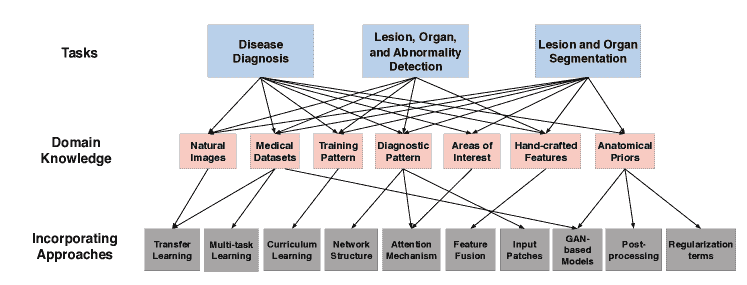

图 1：疾病诊断中的信息分类和方法融入方法；病灶、器官和异常检测；病灶和器官分割。

在本调查中，我们关注医学图像分析的三个主要任务：（1）疾病诊断，（2）病灶、器官和异常检测，以及（3）病灶和器官分割。我们还包括其他相关任务，如图像重建、图像检索和报告生成。该调查表明，几乎所有任务中，识别和仔细整合一种或多种与指定任务相关的领域知识将提高深度学习模型的性能。我们根据以下三个方面组织现有工作：任务类型、引入的领域知识类型以及引入领域知识的方法。

更具体地说，在领域知识的类型方面，有些是高级的，例如训练模式[28、29、30]和诊断模式。一些领域知识则是低级的，例如特定特征和医疗医生更关注的特殊区域[31]。特别是在疾病诊断任务中，高级领域知识被广泛利用。对于目标检测任务，低级领域知识，如检测模式和医疗医生特别关注的具体特征，更为常见。对于病灶或器官分割任务，解剖学先验和来自不同模态的知识似乎更为有用[32、33、34]。

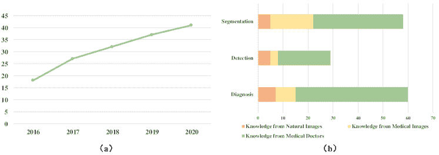

图 2： (a) 按时间顺序排列的论文数量（2016-2020）。 (b) 选择的论文在不同医学图像分析应用中的分布。

在整合方法方面，设计了各种方法将不同类型的领域知识融入网络中[35]。例如，一种简单的方法是将手工制作的特征与从深度学习模型中提取的特征进行连接[36]。在一些工作中，网络架构被修改以模拟放射科医生在阅读图像时的模式[37]。注意机制，允许网络对图像的特定区域给予更多关注，是一种有效的技术，用于融入放射科医生的领域知识[38]。此外，多任务学习和元学习也被广泛用于将医学领域知识引入深度学习模型中[39, 40]。

尽管已有许多关于深度学习在医学图像分析中的综述，包括[41, 42, 43, 44]，但它们都从应用角度描述现有工作，即深度学习技术如何应用于各种医学应用。根据我们所知，目前没有综述系统性地介绍*医学领域知识如何帮助深度学习模型*。我们认为，这一方面是深度学习模型用于计算机辅助诊断（CAD）与用于一般计算机视觉任务的独特之处。

图 1 概述了我们如何组织相关研究。在顶层，现有研究根据其目的被分为三个主要类别：（1）疾病诊断，（2）病灶、器官和异常检测，以及（3）病灶和器官分割。在每个类别中，我们根据融入的额外知识类型将其组织为几个组。在底层，根据领域知识的不同整合方法进一步分类。

本调查包含了 200 多篇论文（其中 163 篇涉及领域知识），大多数是最近（2016-2020 年）发表的，涉及深度学习技术在医学图像分析中的广泛应用。此外，大多数相关工作来自于 MICCAI、EMBC、ISBI 等会议论文集，以及 TMI、Medical Image Analysis、JBHI 等期刊。

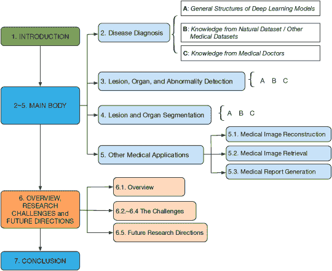

图 3：本调查的组织结构。

这些论文的分布如图 2(a) 所示。从 2016 年到 2020 年，论文数量急剧增加。就应用而言，大多数论文与疾病诊断和病灶/器官分割相关（见图 2(b)）。总之，通过本次调查，我们的目标是：

+   •

    总结和分类在医学领域中用于提高深度学习模型在各种应用中的性能的不同类型的领域知识；

+   •

    总结和分类将医学领域知识引入深度学习模型的不同方式；

+   •

    介绍将医学领域知识整合到深度学习模型中的挑战和未来方向。

剩余的调查内容组织如下：第 2、3 和 4 节介绍了医学图像分析中三个主要任务的现有工作。除了这三个主要任务，医学图像分析中的其他任务在第五部分中描述。在每一节中，我们首先介绍该任务的深度学习模型的通用架构，然后根据待整合的领域知识类型对相关工作进行分类。随后描述每种领域知识的各种整合方法。第六部分讨论了研究挑战，并展望未来方向。最后，第七部分总结了本次调查。调查的结构如图 3 所示。

## 2 疾病诊断

疾病诊断是指基于提供的医学图像确定可能的疾病类型和状态的任务。在本节中，我们概述了通常用于疾病诊断的深度学习模型。具体而言，2.1 小节概述了用于疾病诊断的深度学习模型的一般结构。2.2 小节介绍了利用自然图像或其他医学数据集中的知识的研究。利用医学专家知识的深度学习模型在 2.3 小节中详细介绍。最后，2.4 小节总结了疾病诊断的研究。

### 2.1 深度学习模型在疾病诊断中的一般结构

在过去几十年里，深度学习技术，特别是 CNNs，在疾病诊断中取得了巨大成功。

图 4 显示了用于胸部 X 光图像疾病诊断的典型 CNN 结构。该 CNN 采用交替的卷积层和池化层，并且每层包含可训练的滤波器组。每个滤波器组中的单个滤波器能够生成特征图。这个过程是交替进行的，CNN 可以学习越来越抽象的特征，这些特征将被全连接层用于完成分类任务。

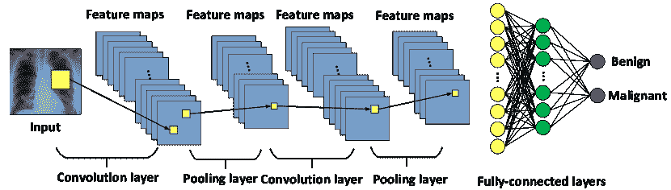

图 4：用于医学疾病诊断的典型 CNN 结构。

从 AlexNet [45]、GoogLeNet [46]、VGGNet [47]、ResNet [48] 到 DenseNet [49] 等不同类型的卷积神经网络（CNN）架构，在各种疾病的诊断中取得了巨大的成功。例如，GoogLeNet、ResNet 和 VGGNet 模型被用于犬类溃疡性角膜炎的诊断 [50]，其中大多数在分类浅层和深层角膜溃疡时的准确率超过 90%。DenseNet 被用于胸部 X 射线影像的肺结节诊断 [51]，实验结果显示超过 99% 的肺结节能够被检测到。此外，研究发现，VGGNet 和 ResNet 在许多医学诊断任务中比其他网络结构更有效 [37, 52, 53, 54]。

然而，上述工作通常直接将 CNN 应用于医学图像分析，或对 CNN 进行轻微修改（例如，修改卷积核数量、通道数量或滤波器大小），而未融入医学知识。此外，这些方法通常需要大量的医学数据集才能达到令人满意的性能。

在接下来的子章节中，我们系统地回顾了利用医学领域知识进行疾病诊断的研究。知识类型及其结合方法在表 II 中进行了总结。

表 II: 疾病诊断中使用的知识及其相应结合方法的汇编

|

&#124; 知识来源 &#124;

|

&#124; 知识类型 &#124;

|

&#124; 结合方法 &#124;

| 参考文献 |
| --- |

|

&#124; 自然数据集 &#124;

|

&#124; 自然图像 &#124;

|

&#124; 迁移学习 &#124;

|

&#124; [55][1]  [56][57][58]  [59]  [60][61] &#124;

|

| 医学数据集 |
| --- |

&#124; 多模态图像 &#124;

|

&#124; 迁移学习 &#124;

|

&#124; [26][62]  [63][64][65][66] &#124;

|

|

&#124; 来自其他疾病的数据集 &#124;

|

&#124; 多任务学习 &#124;

|

&#124; [67][68] &#124;

|

| 医学专家 |
| --- |

&#124; 训练模式 &#124;

|

&#124; 课程学习 &#124;

|

&#124; [28][29]  [69][70][71]  [72][73][74] &#124;

|

|

&#124; 诊断模式 &#124;

|

&#124; 网络设计 &#124;

|

&#124; [37][75]  [76][77]  [78][79] &#124;

|

|

&#124; 医生关注的领域 &#124;

|

&#124; 注意力机制 &#124;

|

&#124; [38]  [53]  [80][81]  [82][83] &#124;

|

| 医生关注的特征 |
| --- |

&#124; 决策层融合 &#124;

|

&#124; [61]  [84]  [85][86]  [87][88] &#124;

|

|

&#124; 特征层融合 &#124;

|

&#124; [36][89]  [57]  [90]  [91][92] &#124;

|

|

&#124; 输入层融合 &#124;

|

&#124; [93]  [54]  [94][95]  [96] &#124;

|

|

&#124; CNN 标签 &#124;

|

&#124; [39][59]  [97] &#124;

|

|

&#124; 其他相关信息 &#124;

|

&#124; 多任务学习 &#124;

&#124; /网络设计 &#124;

|

&#124; [52]  [98]  [99][100]  [101] &#124;

|

### 2.2 从自然数据集或其他医疗数据集中融入知识

尽管自然图像和医疗图像之间存在差异，但已经证明在大规模、标注良好的自然图像数据集上全面训练的 CNN 仍对疾病诊断任务有帮助[56]。从本质上讲，这种迁移学习过程将自然图像中的知识引入网络，用于医疗图像诊断。

根据[42]，可以通过两种不同方式利用在自然图像上预训练的网络：作为固定特征提取器，或作为初始化，然后在目标医疗数据集上进行微调。这两种策略分别在图 5(a) 和图 5(b) 中展示。

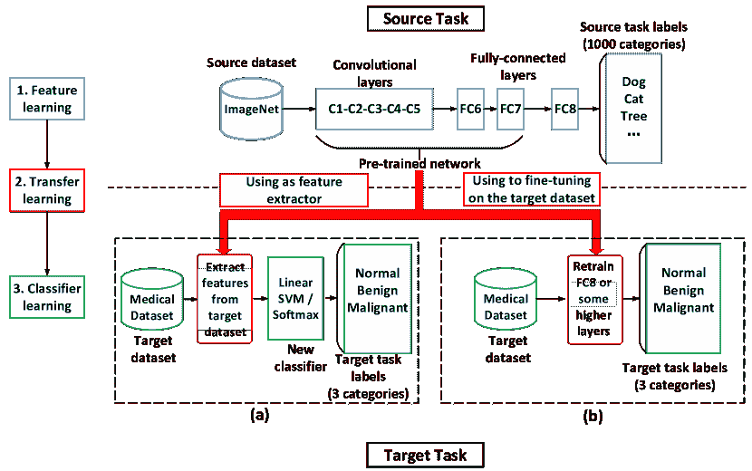

图 5: 利用在自然图像上预训练的网络的两种策略：(a) 作为特征提取器，(b) 作为初始化，在目标数据集上进行微调。

第一个策略是取一个预训练的网络，移除其最后一个全连接层，并将其余部分作为固定特征提取器。提取的特征然后输入到线性分类器（如支持向量机（SVM））中，该分类器在目标医疗数据集上进行训练。此类应用包括乳腺 X 光检查肿块分类[61]和胸部病理识别[55]。

利用自然图像信息进行疾病诊断的成功可以归因于网络在自然图像上预训练的事实，特别是在早期层中，包含了更多的通用特征（例如，边缘检测器和颜色斑块检测器）[102]。

在第二种策略中，预训练网络的权重根据医疗数据集进行微调。可以微调网络中所有层的权重，或者保持一些早期层不变，只微调网络中某些高级部分。这可以应用于皮肤癌[1]、乳腺癌[57]、胸部疾病[58]、前列腺癌[60]和间质性肺疾病[59]的分类。

除了自然图像的信息，使用来自其他医疗数据集的图像也相当流行。

含有与目标图像相同或相似模态的图像的医疗数据集具有相似的分布，因此可以提供帮助。例如，为了在数字化的乳腺 X 光筛查图像（SFM）中分类恶性和良性乳腺肿块，提出了一种多任务迁移学习的 DCNN，该模型结合了数字乳腺图像（DM）的信息[63]。与仅使用 SFM 的单任务迁移学习 DCNN 相比，发现其性能显著提高。

此外，即使是不同模态的医疗图像也可以提供互补信息。例如，[26]使用在乳腺 X 光检查数据集上预训练的模型，展示了该模型能够获得比仅在包含数字乳腺断层摄影（DBT）图像的目标数据集上训练的模型更好的结果。另一个例子是在前列腺癌分类中，首先使用射频超声图像训练深度卷积神经网络（DCNN），然后在 B 模式超声图像上微调模型[64]。使用不同模态图像的其他例子可以在[62、65、66]中找到。

此外，由于不同类别的数据集可以在分类任务中互相帮助[103]，具有多种疾病图像的医学数据集也可能具有类似的形态结构或分布，这对其他任务可能是有益的。例如，[68]中提出了一种多任务深度学习（MTDL）方法。MTDL 可以同时利用多个癌症数据集，以便这些数据集之间的隐藏表示可以为小规模癌症数据集提供更多信息，从而增强分类性能。另一个例子是[67]中提出的跨疾病注意网络（CANet）。CANet 利用特殊设计的疾病相关注意模块来表征和利用糖尿病视网膜病变（DR）和糖尿病黄斑水肿（DME）在眼底图像中的关系。对两个公开数据集的实验结果表明，CANet 在诊断这两种疾病方面优于其他方法。

### 2.3 融入医生知识

经验丰富的医生可以对给定的医学图像给出相当准确的结论，这主要得益于他们所接受的培训和多年来积累的专业知识。一般来说，他们在阅读医学图像时常常遵循某些特定的模式或采取某些程序。将这些类型的知识融入深度学习模型中，可以提高诊断性能。

用于疾病诊断的深度学习模型中利用的医学领域知识可以总结为以下五类：

1.  1.

    培训模式，

1.  2.

    他们查看图像的一般诊断模式，

1.  3.

    他们通常关注的领域，

1.  4.

    他们特别关注的特征（例如，特性、结构、形状），以及

1.  5.

    其他与诊断相关的信息。

每一类的研究工作将在以下部分中描述。

#### 2.3.1 医生的培训模式

医学生的培训过程具有一个特点：他们通过逐渐增加难度的任务进行训练。例如，学生们从一些较简单的任务开始，比如判断图像中是否有病变，然后逐步要求完成更具挑战性的任务，如判断病变是良性还是恶性。随着时间的推移，他们将会逐渐进入更难的任务，如判断图像中病变的亚型。

这种培训模式可以通过课程学习[104]引入深度神经网络的训练过程中。课程学习决定了一系列按学习难度递增排序的训练样本。课程学习已成为计算机视觉领域的一个活跃研究课题，并且最近被用于医学图像诊断。

例如，针对 DCE-MRI 的乳腺筛查分类，提出了一种教师-学生课程学习策略 [28]。在引入恶性肿瘤检测的困难问题之前，深度学习模型在较简单的任务上进行训练。这一策略与其他方法相比，表现出了更好的性能。

同样地，[29] 通过利用从放射学报告中挖掘的严重程度属性，提出了一种基于 CNN 的注意力引导课程学习框架。按照难度（按不同的严重程度分组）排序的图像被输入到 CNN 中，以逐步提升学习过程。

在 [69] 中，课程学习被用于支持从 X 光图像中分类近端股骨骨折。这种方法为每个训练样本分配了难度等级。通过首先学习“简单”示例，然后学习“困难”示例，即使数据量较少，模型也能达到更好的性能。其他使用课程学习进行疾病诊断的例子可以在 [70、71、72、73、74] 中找到。

#### 2.3.2 医生的一般诊断模式

有经验的医生在阅读医学图像时通常遵循一些模式。这些模式可以通过适当修改架构将其集成到深度学习模型中。

例如，放射科医生在阅读胸部 X 光图像时通常遵循三阶段的方法：首先浏览整个图像，然后集中注意局部病变区域，最后将全局和局部信息结合起来做出决策。这种模式被纳入了用于胸部疾病分类的网络架构设计中 [37]（参见图 6）。所提出的网络有三个分支，一个用于查看整个图像，第二个用于查看局部区域，第三个用于将全局和局部信息结合起来。该网络在 ChestX-ray14 数据集上达到了最先进的准确率。此外，除了全图和局部病变区域的信息外，[76] 还利用了肺部区域的信息。特别地，首先使用分割子网络从整个图像中定位肺部区域，然后通过使用注意力热图生成病变区域。最后，融合最具区分性的特征以进行最终的疾病预测。另一个例子是为同时处理前面和侧面胸部 X 光片而提出的 Dual-Ray Net [77]，它也模拟了放射科医生的阅读模式。

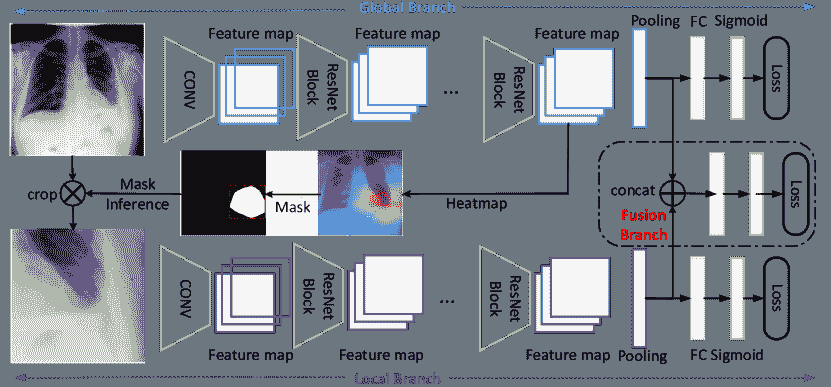

图 6：利用放射科医生的诊断模式进行胸部疾病诊断的示例[37]，其中使用三个分支提取和结合全局与局部特征。

在皮肤病变诊断中，经验丰富的皮肤科医生通常首先定位病变，然后从病变区域识别皮肤镜特征，最后根据这些特征进行诊断。这种模式在皮肤病变诊断的网络设计中得到了模拟[75]。所提出的网络 DermaKNet 包括几个具有专门任务的子网络：病变-皮肤分割、皮肤镜特征检测和全局病变诊断。DermaKNet 相比传统的卷积神经网络模型表现出更高的性能。

此外，在乳腺 X 光图像的质量识别中，放射科医生通常会同时分析双侧和同侧视图。为了模拟这种阅读习惯，[78]提出了 MommiNet 来进行乳腺 X 光图像的端到端双侧和同侧分析。此外，还从这些视图中聚合了对称性和几何约束。实验表明在 DDSM 上达到了最先进的肿块识别准确率。另一个利用这种医疗医生诊断模式的示例可以在皮肤病变诊断和胸部疾病分类中找到[79]。

#### 2.3.3 医疗医生通常关注的区域

当经验丰富的医生阅读图像时，他们通常会集中注意于几个特定区域，因为这些区域在疾病诊断中比其他地方更具信息性。因此，关于医生关注区域的信息可能有助于深度学习模型取得更好的结果。

上述知识通常被表示为“注意力图”，这是医疗医生在阅读图像时指出他们关注区域的注释。例如，一个名为 AG-CNN 的卷积神经网络明确地融入了用于青光眼诊断的“注意力图”[38]。眼科医生的注意力图通过模拟眼动实验收集，用于指示他们在阅读图像时关注的地方。青光眼诊断中捕捉眼科医生注意力图的一个示例见图 7。为了融入注意力图，AG-CNN 中设计了一个注意力预测子网，并利用测量生成的和真实注意力图（由眼科医生提供）之间差异的注意力预测损失来监督训练过程。实验结果表明，AG-CNN 显著超越了最先进的青光眼检测方法。

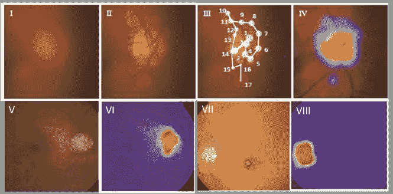

图 7：眼科医生在青光眼诊断中捕捉注意力图的示例[38]。I、II、III 和 IV 分别为原始模糊视网膜图像、眼科医生的注视区域、清晰区域的顺序以及基于捕获的注视生成的注意力图。V 和 VII 表示原始视网膜图像。VI 和 VIII 是使用 I-IV 方法生成的 V 和 VII 的相应注意力图。

这个类别中的另一个例子是用于视网膜光学相干断层扫描（OCT）图像分类的病灶感知卷积神经网络（LACNN）[80]。LACNN 通过关注局部病灶相关区域，模拟眼科医生的诊断模式。具体来说，‘注意力图’首先表示为标注了病灶区域的 OCT 图像，使用了边界多边形。为了融入这些信息，LACNN 提出了一个病灶注意力模块，以增强来自局部病灶相关区域的特征，同时保持全局 OCT 图像中的有意义结构。对两个临床获得的 OCT 数据集的实验结果表明，引入注意力图在视网膜 OCT 图像分类中具有有效性，与基线方法相比，性能提升了 8.3%。

此外，[53]提出了一种注意力分支网络（ABN），以融入放射科医生在糖尿病视网膜病变中的知识。ABN 引入了一个分支结构，生成突出网络注意区域的注意力图。在训练过程中，ABN 允许将注意力图与疾病区域的语义分割标签进行修改。语义标签也由放射科医生注释为真实的注意力图。对视网膜图像疾病等级识别的实验结果表明，ABN 实现了 93.73%的分类准确率，其可解释性比传统方法更清晰。

其他将医学专家的注意力图纳入诊断的例子包括放射治疗相关食管瘘的诊断[81]、乳腺癌诊断[82]以及黑色素瘤筛查中的短期病灶变化检测[83]。

#### 2.3.4 医学专家特别关注的特征

在过去几十年里，各种医学领域逐渐制定了许多指南和规则，以指出一些重要的诊断特征。这些特征被称为*‘手工特征’*，因为它们是由医学专家指定的。例如，广泛使用的 ABCD 规则[105]被皮肤科医生用来分类黑色素瘤。ABCD 规则指出了四个区分特征，即不对称性、边界、颜色和差异结构，以确定待检查的黑色素瘤皮肤病变是良性还是恶性。

表 III：BI-RADS 指南中用于分类乳腺超声图像中良性和恶性肿瘤的特征[106]

|  | 良性 | 恶性 |
| --- | --- | --- |
| 边缘 | 光滑、细、规则 | 不规则、粗 |
| 形状 | 圆形或椭圆形 | 不规则 |
| 微钙化 | 无 | 有 |
| 回声模式 | 清晰 | 不清晰 |
| 声学衰减 | 不明显 | 明显 |
| 侧声学阴影 | 明显 | 不明显 |

另一个例子是乳腺癌诊断领域。放射科医生使用 BI-RADS（乳腺影像报告和数据系统）评分[106]将异常发现分为不同类别，其中评分 1 表示阴性发现，评分 6 表示乳腺癌。更重要的是，对于每种成像方式，BI-RADS 指示与其评分密切相关的一些特征，包括边缘、形状、微钙化和回声模式。例如，对于乳腺超声图像，具有光滑、细且规则边缘的肿瘤更可能是良性的，而具有不规则和粗边缘的肿瘤则高度怀疑为恶性。其他可以帮助分类良性和恶性乳腺肿瘤的特征见表 III。类似地，对于[59]中肺结节的良恶性风险评估，六种高级结节特征，包括钙化、球形度、边缘、分叶、刺状和质地，显示出与恶性评分的紧密关联（见图 8）。

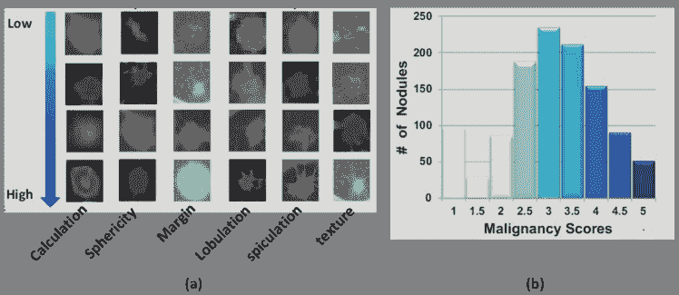

图 8：不同恶性评分的肺结节特征[59]。(a) 从上到下，六种不同的结节特征从缺失到最高突出性。(b) 不同恶性评分的结节数量。

这些不同类型的手工特征已被广泛应用于许多传统的 CAD 系统。这些系统通常首先从医学图像中提取这些特征，然后将其输入一些分类器，如 SVM 或随机森林[107, 108]。例如，对于 CT 图像上的肺结节分类，许多 CAD 系统利用包括大小、形状、形态和质地等特征来处理可疑病变区域[109, 54]。类似地，在乳腺超声图像的 CAD 系统中，使用了强度、质地和形状等特征[31]。

当使用具有自动提取代表性特征能力的深度学习模型（如 CNN）时，有四种方法将“手工设计的特征”与 CNN 提取的特征结合起来。

+   •

    决策级融合：这两种特征分别输入到两个分类器中，然后将两个分类器的决策进行结合。

+   •

    特征级融合：这两种特征通过连接等技术直接组合。

+   •

    输入级融合：手工设计的特征被表示为图像补丁，然后作为输入提供给 CNN。

+   •

    特征作为 CNN 标签的使用：手工设计的特征首先被标注，然后在训练过程中作为 CNN 的标签使用。

决策级融合：这种方法的结构如图 9 所示。在这种方法中，手工设计的特征和从 CNN 提取的特征分别输入到两个分类器中。然后，使用一些决策融合技术将两个分类器的分类结果结合起来，以生成最终的分类结果。

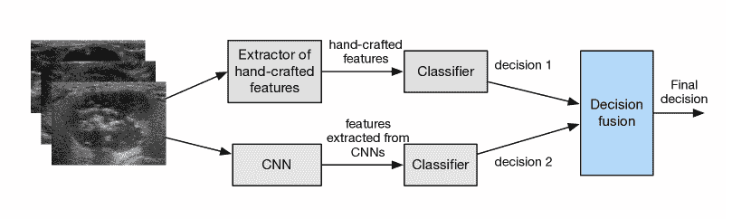

图 9：决策级融合：来自两个分类器的决策，一个基于手工设计的特征，另一个基于 CNN，进行组合。

例如，在[85]中提出的皮肤病变分类模型结合了两个 SVM 分类器的结果。第一个使用手工设计的特征（即 RSurf 特征和局部二值模式（LBP））作为输入，第二个使用从 CNN 提取的特征。这两个分类器都为每个测试图像预测类别并给出分类得分。这些得分随后用于确定最终分类结果。

同样，乳腺肿瘤分类方法也在决策级融合中结合特征[61]。在分别使用 CNN 特征和分析提取的特征（如对比度、纹理和边缘刺状）进行分类后，该方法采用软投票来结合两个独立分类器的输出。实验结果表明，集成分类器的性能显著优于单个分类器。其他采用这种方法的例子包括肺结节诊断[86]、乳腺癌诊断[87]、心脏切片分类[84]以及 I 期肺腺癌侵袭风险预测[88]。

特征级融合：在这种方法中，将手工设计的特征与从 CNN 中提取的特征进行拼接，然后将组合特征输入到分类器中进行诊断。该方法的结构如图 10 所示。

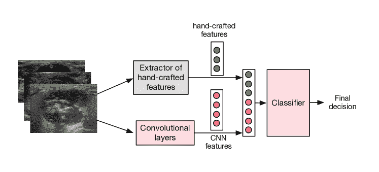

图 10：特征级融合：手工设计的特征与从 CNN 中提取的特征结合，形成新的特征向量。

例如，通过[36]提出了一种基于组合特征的分类方法，称为 CFBC，用于肺结节分类。在 CFBC 中，将手工设计的特征（包括纹理和形状描述符）与九层 CNN 学习到的特征结合，并输入到反向传播神经网络中。来自公开数据集的实验结果表明，与纯 CNN 模型相比，融合手工设计的特征可以分别提高准确率、敏感性和特异性 3.87%、6.41%和 3.21%。

这一类别的另一个例子是组织学图像中的乳腺癌分类 [57]。更具体地说，将两种手工设计的特征，即无参数阈值邻接统计量和灰度共生矩阵，与从五个不同深度模型中提取的五组深度学习特征融合在一起。结果表明，经过融合手工设计的特征后，深度学习模型的准确率可以显著提高。

其他应用特征级融合的例子包括青光眼诊断 [90]、皮肤病变分类 [89]、肺结节分类 [91] 和脑肿瘤诊断 [92]。

输入级融合：在这种方法中，手工设计的特征首先表示为突出对应特征的图像块。然后，这些图像块作为输入提供给 CNN，以得出最终结论。使用这种方法，CNN 预期会更多依赖于手工设计的特征。需要注意的是，一般来说，每种手工设计的特征需要一个 CNN，并且从这些 CNN 获得的信息需要以某种方式结合起来，以做出最终决策。该方法的结构如图 11 所示。

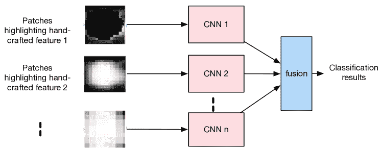

图 11：输入级融合：手工设计的特征被表示为图像块，作为 CNN 的输入。

例如，在[94]中，三种手工特征，即初步结节候选者（INCs）与外部环境的对比信息、方向梯度直方图（HOG）特征以及 LBP 特征，被转换为相应的补丁，并作为多个 CNN 的输入。结果表明，这种方法优于传统的基于 CNN 的方法以及基于手工特征的传统机器学习方法。

另一个使用输入级融合方法的例子是用于肺结节分类的 MV-KBC（多视角知识基础协作）算法[54]。MV-KBC 首先提取与三种特征对应的补丁：整体外观（OA）、结节的体素值异质性（HVV）和形状异质性（HS）。每种类型的补丁被输入到 ResNet 中。然后，这些 ResNet 的输出被结合起来生成最终的分类结果。

此外，[93]提出了用于甲状腺分类的双路径半监督条件生成对抗网络（DScGAN）。具体来说，首先从超声 B 模式图像和超声弹性成像图像中提取特征，作为 OB 补丁（表示 B 模式图像中的感兴趣区域（ROI））、OS 补丁（描述结节的形状）和 OE 补丁（根据 B 模式 ROI 位置指示弹性 ROI）。然后，这些补丁作为 DScGAN 的输入。利用这些补丁中的信息被证明有效地提高了分类性能。其他使用输入级融合的方法可以在甲状腺结节诊断[95]和多序列 MRI 中的乳腺癌诊断[96]中找到。

特征作为 CNN 标签的使用：在这种方法中，除了图像的原始分类标签外，医学专家还提供了一些手工特征的标签。这些额外的信息通常通过多任务学习结构纳入深度学习模型中。

例如，在[39]中，放射科医生根据九种手工特征（如刺突、纹理和边缘）对肺图像中的结节进行了定量评级。多任务学习框架用于将上述信息纳入肺结节分类的主要任务中。

此外，对于低剂量 CT 扫描中的肺结节良恶性风险评估[59]，利用了关于六种高级结节特征的二元标签，即钙化、球形度、边缘、分叶、刺突和纹理。设计了六个 CNN，每个 CNN 旨在学习一个特征。CNN 自动学习到的这些特征在多任务学习框架中融合，以获得最终的风险评估分数。

同样，在[97]中，每个胶质瘤细胞核图像都以图像中心最核的形状和属性作为独家标记。然后这些特征通过多任务 CNN 进行学习。实验证明，所提出的方法优于基线 CNN。

#### 2.3.5 与诊断相关的其他类型信息

在本节中，我们总结了其他类型的信息，可以帮助深度学习模型提高其诊断性能。这些信息类型包括额外的类别标签和临床诊断报告。

额外的类别标签

对于医学图像，除了分类标签（即正常、恶性或良性），放射科医师可能会给出一些额外的类别标签。例如，在乳腺癌超声诊断中，一张图像通常具有 BI-RADS 标签，将图像分类为 0$\sim$6 [106] ——0 类建议重新检查，1 和 2 类表示可能是良性病变，3 类表示可能是良性发现，4 和 5 类被怀疑恶性，6 类绝对被认为是恶性）。这些标签还包含有关病变状态的信息。在[52]中，每幅医学图像的 BI-RADS 标签被纳入多任务学习结构作为辅助任务的标签。实验结果表明，纳入这些 BI-RADS 标签可以提高主要分类任务的诊断性能。另一个利用 BI-RADS 标签信息的例子可以在[100]中找到。

此外，在图像注释过程中，专家之间关于图像的一致性或不一致性反映出图像的可分级性和难度级别，这也是医学领域知识的一种表现。为了整合这些信息，[101]提出了一种多分支模型结构，用于预测青光眼图像最敏感、最特异和平衡融合的结果。与此同时，一致性损失也被用来鼓励敏感性和特异性分支对具有一致性和不一致性标签的图像生成一致和矛盾的预测。

附加临床诊断报告

临床报告是对放射学研究检查期间确定的所有临床发现和印象的总结。它通常包含丰富的信息，反映了医生的发现和描述。将临床报告纳入设计用于疾病诊断的 CNNs 通常是有益的。由于医疗报告通常由递归神经网络（RNNs）处理，因此通常需要包含既包含 CNNs 又包含 RNNs 的混合网络来整合来自医疗报告的信息。

例如，文本-图像嵌入网络 (TieNet) 旨在分类胸部 X 光片中的常见胸部疾病 [98]。TieNet 具有端到端的 CNN-RNN 架构，使其能够整合放射报告的信息。与完全基于医学图像的基线 CNN 相比，分类结果显著提高（AUC 平均提高约 6%）。

此外，在 [99] 中探讨了使用诊断报告中的语义信息来理解病理性膀胱癌图像。设计了一个双重注意力模型，以促进语义信息和视觉信息的高级交互。实验表明，整合诊断报告中的信息显著提高了癌症诊断性能，相较于基线方法。

### 2.4 总结

在前面的章节中，我们介绍了不同类型的领域知识及其相应的整合方法，以应用于疾病诊断的深度学习模型中。一般而言，几乎所有类型的领域知识都被证明能有效提升诊断性能，特别是使用准确率和 AUC 指标的情况下，表 IV 列出了部分示例及其定量改进。

表 IV: 整合领域知识后的某些疾病诊断方法的定量指标比较

| 参考文献 |
| --- |

&#124; 基线模型/带领域知识 &#124;

| 准确率 | AUC |
| --- | --- |
| [37] |

&#124; 仅 AG-CNN &#124;

&#124; 全局分支/AG-CNN &#124;

| –/– | 0.840/0.871 |
| --- | --- |
| [75] |

&#124; ResNet-50/DermaKNet &#124;

| –/– | 0.874/0.908 |
| --- | --- |
| [62] |

&#124; 微调的 VGG-Net/ &#124;

&#124; 微调的 MG-Net &#124;

| 0.900/0.930 | 0.950/0.970 |
| --- | --- |
| [89] |

&#124; ResNet-50/ResNet-50 &#124;

&#124; 带手工特征 &#124;

| –/– | 0.830/0.940 |
| --- | --- |
| [38] |

&#124; 未使用的 CNN &#124;

&#124; 注意力图/AG-CNN &#124;

| 0.908/0.953 | 0.966/0.975 |
| --- | --- |
| [67] |

&#124; ResNet50/CANet &#124;

| 0.828/0.851 | –/– |
| --- | --- |
| [52] |

&#124; VGG16/多任务 VGG16 &#124;

| 0.829 /0.833 | –/– |
| --- | --- |
| [28] | DenseNet/BMSL | –/– | 0.850/0.900 |
| [26] |

&#124; 单阶段 CNN/ &#124;

&#124; 多阶段迁移学习 &#124;

| –/– | 0.850/0.910 |
| --- | --- |
| [29] |

&#124; CNN/AGCL &#124;

| –/– | 0.771/0.803 |
| --- | --- |
| [93] |

&#124; DScGAN 无/有 &#124;

&#124; 领域知识 &#124;

| 0.816/0.905 | 0.812/0.914 |
| --- | --- |

关于用于疾病诊断的领域知识，自然图像中的知识被广泛地整合到深度学习模型中。然而，考虑到自然图像与医学图像之间的差距，使用来自相同疾病、相似模态（例如，SFM 和 DM）[63]、不同模态（DBT 和 MM，超声）[26]，甚至不同疾病[68]的外部医学数据集中的信息可能更为有效。整合上述信息相对容易，转移学习和多任务学习已被广泛采用。然而，目前尚无比较研究来评估不同额外数据集如何提高深度学习模型的性能。

对于医学医生的领域知识，高层领域知识（例如，训练模式和诊断模式）通常对不同疾病是通用的。另一方面，低层领域知识，例如医学医生通常关注的图像区域和疾病特征，对于不同的疾病通常是不同的。领域知识的通用性与实用性之间通常存在权衡。为了诊断某种特定疾病，整合适用于多种疾病的通用领域知识的好处可能不如使用特定于该疾病的领域知识显著。然而，识别这种特定领域知识可能并不容易，并且通常需要医学医生付出更多的努力（例如，识别手工制作的特征或注意力图）。

我们相信，可以探索和利用更多种类的医学领域知识来进行疾病诊断。此外，还应该对不同类型的领域知识及其在疾病诊断中的不同整合方法在一些基准数据集上的比较研究。这些结果可以进一步洞察医学领域知识对深度学习模型的实用性。

## 3 病变、器官和异常检测

检测医学影像中的病变是一个重要任务，是许多疾病诊断的关键部分。类似地，器官检测是图像配准、器官分割和病变检测的必要预处理步骤。在许多应用中，检测医学影像中的异常，如脑 MRI 影像中的脑微出血和视网膜图像中的硬性渗出物，也是必需的。

本节首先在小节 3.1 中描述了广泛用于医学图像目标检测的深度学习模型。然后，在小节 3.2 和小节 3.3 中详细介绍了利用自然和医学数据集以及医学医生知识的现有工作。最后，我们在小节 3.4 中总结和讨论了这些不同类型的领域知识及其融入方法。

### 3.1 医学图像中目标检测深度学习模型的一般结构

设计用于自然图像中目标检测的深度学习模型已被直接应用于医学图像中的目标检测。这些应用包括 CT 图像中的肺结节检测 [110]，视网膜眼底中的视网膜疾病检测 [111] 等。

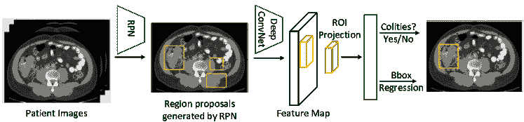

图 12：使用 Faster R-CNN 结构进行结肠炎检测的方法工作流程 [112]。

一种常见的模型类型是两阶段检测器，例如 Faster R-CNN [113] 和 Mask R-CNN [114]。这些模型通常包括一个区域建议网络（RPN），用于假设候选对象的位置，以及一个检测网络，用于细化区域建议。此类别的应用包括 CT 图像中的结肠炎检测 [112]，X 光图像中的椎间盘检测 [115]，以及乳腺 X 光检查中的结构扭曲检测 [116]。图 12 显示了使用 Faster R-CNN 结构进行结肠炎检测的示例 [112]。

另一类是像 YOLO（You Only Look Once）[117]、SSD（Single Shot MultiBox Detector）[118] 和 RetinaNet [119]这样的单阶段模型。这些网络跳过了区域提议阶段，直接通过考虑物体在图像中每个点出现的概率来进行检测。与双阶段模型相比，这种方法的模型通常更快、更简单。这类模型的示例包括乳腺 X 光检查中的乳腺肿瘤检测[120]、CT 中的肺结节检测[121]，以及 CT 图像中不同病变（例如肝病变、肺病变、骨病变、腹部病变）的检测[122]。使用单阶段结构进行病变检测的示例如图 13 所示。

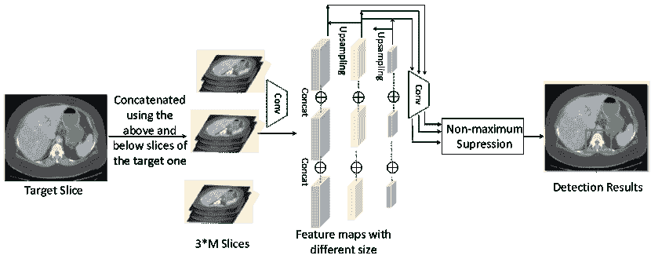

图 13：使用单阶段结构进行 CT 图像病变检测的示例[122]。

在接下来的子节中，我们将介绍将外部知识融入深度学习模型以进行医学图像中的物体检测的相关工作。这些工作的总结见表 V。

表 V：病变、器官和异常检测及其融合知识的研究列表

|

&#124; 知识来源 &#124;

|

&#124; 知识类型 &#124;

|

&#124; 融合方法 &#124;

| 参考文献 |
| --- |

|

&#124; 自然数据集 &#124;

|

&#124; 自然图像 &#124;

|

&#124; 迁移学习 &#124;

|

&#124; [21][123]  [124][125]  [126] &#124;

|

|

&#124; 医学数据集 &#124;

|

&#124; 多模态图像 &#124;

|

&#124; 迁移学习 &#124;

|

&#124; [127][128][129] &#124;

|

| 医学医生 |
| --- |

&#124; 训练模式 &#124;

|

&#124; 课程学习 &#124;

|

&#124; [29][130]  [131] &#124;

|

| 检测模式 |
| --- |

&#124; 使用收集的图像 &#124;

&#124; 在不同设置下 &#124;

| [132][133] |
| --- |

|

&#124; 比较双侧或 &#124;

&#124; 跨视图图像 &#124;

|

&#124; [134][135]  [136, 137]  [138] &#124;

|

|

&#124; 分析相邻切片 &#124;

| [121] |
| --- |

|

&#124; 医生关注的特征 &#124;

|

&#124; 特征级融合 &#124;

|

&#124; [139][140]  [141][95]  [142][143] &#124;

|

|

&#124; 其他相关信息 &#124;

|

&#124; 多任务学习 &#124;

&#124; /训练模式设计 &#124;

|

&#124; [29][144]  [145][146] &#124;

|

### 3.2 从自然数据集或其他医疗数据集中引入知识

类似于疾病诊断，预训练一个大型自然图像数据集（通常是 ImageNet）以引入医疗领域的对象检测信息也很流行。可以在淋巴结检测 [21]、息肉和肺栓塞检测 [126]、乳腺肿瘤检测 [123]、结直肠息肉检测 [124, 125] 等方面找到相关例子。

此外，利用其他医疗数据集（即多模态图像）也相当常见。例如，PET 图像被用来帮助肝脏 CT 扫描中的病灶检测 [128]。具体来说，PET 图像首先通过 FCN 和 GAN 的组合结构从 CT 扫描生成，然后将合成的 PET 图像用于假阳性减少层以检测恶性病变。定量结果显示，每个病例的平均假阳性减少了 28%。此外，[127] 开发了一种策略，通过微调在乳腺 X 光数据集上预训练的模型来检测数字断层摄影中的乳腺肿块。另一个使用多模态医疗图像的例子可以在肝肿瘤检测中找到 [129]。

### 3.3 从医疗医生那里引入知识

在本小节中，我们总结了现有的将医疗医生知识融入医疗图像对象检测的方法。来自医疗医生的领域知识可以分为以下四类：

1.  1.

    训练模式，

1.  2.

    他们查看图像的常规检测模式，

1.  3.

    他们特别关注的特征（例如位置、结构、形状），以及

1.  4.

    其他与检测相关的信息。

#### 3.3.1 医疗医生的训练模式

医疗医生的训练模式，通常以任务难度逐渐增加为特征，也被用于医疗图像中的对象检测。与疾病诊断类似，大多数工作利用课程学习来引入这种模式。例如，提出了一种注意力引导的课程学习（AGCL）框架，用于定位胸部 X 光中的病灶 [29]。在这个过程中，按照难度顺序（按不同严重程度分组）的图像逐渐输入到 CNN 中，CNN 生成的疾病热图用于定位病灶区域。

另一个工作是称为 CASED 的肺结节检测方法[130]。CASED 采用课程自适应采样技术来解决极端数据不平衡的问题。特别是，CASED 让网络首先学习如何区分结节与其周围环境，然后逐渐增加难以分类的全局上下文，直到从经验数据分布中均匀采样。通过这种方式，CASED 以 88.35%的平均敏感度得分在 LUNA16 挑战赛中名列前茅。另一个使用课程学习的例子可以在心脏标志物检测中找到[131]。

#### 3.3.2 医生的一般检测模式

当经验丰富的医生在医学图像中定位可能的病变时，他们也会展示特定的模式，这些模式可以融入深度学习模型中以进行目标检测。经验丰富的医生通常有以下模式：（1）他们通常考虑在不同设置（如亮度和对比度）下收集的图像，（2）他们经常比较双侧图像或使用交叉视图图像，（3）他们通常阅读相邻的切片。

例如，为了在 CT 图像的视觉检查中定位可能的病变，放射科医生会结合在不同设置（如亮度和对比度）下收集的图像。为了模拟上述过程，[132]中提出了一种多视角特征金字塔网络（FPN），其中多视角特征从具有不同亮度和对比度的图像中提取。然后，使用位置感知注意力模块结合多视角信息。实验表明，所提出的模型在 NIH DeepLesion 数据集上相较于之前的最先进方法取得了绝对提升 5.65%。另一个使用不同设置下的图像的例子可以在基于 COVID-19 肺炎的肺部病变检测中找到[133]。

此外，双侧信息被放射科医生广泛使用。例如，在标准的乳腺 X 光筛查中，会捕获双侧乳腺的图像，经验丰富的放射科医生通常比较双侧乳腺图像以寻找肿块。为了融合这一模式，[134]中提出了一种对比双侧网络（CBN），其中双侧图像首先粗略对齐，然后输入一对网络以提取特征用于后续的检测步骤（如图 14 所示）。实验结果证明了融合双侧信息的有效性。

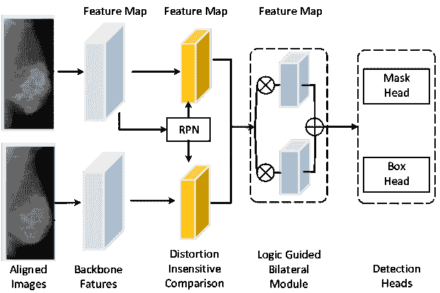

图 14：通过整合双侧信息[134]进行乳腺肿块检测的工作流程，其中对齐的图像分别输入到两个网络中以提取特征用于进一步检测。

类似地，为了在无对比剂 CT 图像中检测急性中风的迹象，经验丰富的神经放射科医师通常会比较左右半球的外观和 Hounsfield 单位强度，然后找到中风发作中最常受影响的区域。[137]通过模拟这种模式来检测密集的血管和缺血。实验结果显示，引入该模式大大提高了检测缺血的性能。其他集成双侧特征比较或对称约束的例子可以在脑 CT 图像中的血栓检测[136]和出血性病变检测[138]中找到。

除了双侧图像，来自交叉视图（即，侧面斜视和头尾视图）的信息高度相关且互补，因此也用于乳腺 X 线图像中的肿块检测。在[135]中，引入了一种双分图卷积网络，以赋予现有方法放射科医师的交叉视图推理能力。具体而言，构建了双分节点集来表示相对一致的区域，并使用双分边来建模固有的交叉视图几何约束和对应点之间的外观相似性。这个过程能够使空间视觉特征具备交叉视图推理能力。DDSM 数据集上的实验结果达到最先进的性能（在每张图像 0.5 个假阳性下的召回率为 79.5）。

在 CT 图像中寻找小结节时，放射科医师通常会观察每一切片及其相邻切片，类似于在视频中检测物体。这种工作流程在[121]中被模拟用于检测 CT 图像中的肺结节，其中应用了最先进的目标检测器 SSD。这种方法在 LUNA16 数据集中取得了最先进的 FROC 得分 0.892。

#### 3.3.3 医生特别关注的特征

类似于疾病诊断，医生也使用许多“手工特征”来帮助他们在医学图像中找到目标物体（例如，结节或病变）。

例如，在[140]中，为了检测乳腺 X 线图像中的病变，首先提取不同类型的手工特征（例如，对比度特征、几何特征和位置特征），然后与 CNN 学习到的特征进行连接。结果显示，这些手工特征，特别是位置和上下文特征，可以补充网络，从而比单独使用 CNN 生成更高的特异性。

同样，[141]提出了一种基于 Faster R-CNN 的深度学习模型，用于从内窥镜图像中检测食管异常。特别是，为了增强纹理细节，所提出的检测系统通过在检测阶段的串联中将 Gabor 手工特征与 CNN 特征相结合。在两个数据集（Kvasir 和 MICCAI 2015）上的实验结果表明，该模型能够超越最先进的性能。

另一个例子可以在[139]中找到，用于检测肺结节，其中提取了 88 个手工特征，包括强度，形状，纹理，并与 CNN 提取的特征相结合，然后馈入分类器。实验结果证明了手工特征和 CNN 特征的组合的有效性。

在甲状腺结节的自动检测中，考虑了结节的大小和形状属性[95]。为了结合以上信息，对区域提议的生成过程加以限制，并且在两个不同数据集上的检测结果显示出高准确性。

此外，在肿瘤学成像中的淋巴结肿瘤体积（GTV [LN]）检测中，还利用了淋巴结（LNs）的一些属性[142]。受到先前的临床知识的启发，即来自连通淋巴系统的 LN，并且癌细胞在 LNs 之间的传播通常遵循某些路径，为 GTV[ LN]检测提出了 LN 外观和 LN 之间关系学习框架。更具体地说，首先通过 3D CNN 提取实例化外观特征，然后使用图神经网络（GNN）来建模 LN 之间的关系，并在此过程中包含全局 LN-肿瘤空间先验。该方法显著改进了最先进的方法。在肺部病变检测方面，还可以找到另一个将手工特征和深度特征结合的例子[143]。

#### 3.3.4 与检测相关的其他类型信息

与疾病诊断类似，还有其他信息（例如，放射学报告，额外标签）也可以整合到病变检测过程中。

例如，在[29]中，为了定位胸部 X 射线片上的胸部疾病，首先从放射学报告中提取每个样本的难度，表示为胸部疾病的严重程度。然后采用课程学习技术，即按难度递增的顺序将训练样本呈现给网络。对 ChestXray14 数据库上的实验证实了相对基线方法的显着性能提升的有效性。

使用额外标签的例子可以在[144]中找到。在这种方法中，将分类标签的信息纳入，以帮助胸部 X 光片和乳腺 X 光片中的病灶定位。特别地，提出了一个名为自我迁移学习（STL）的框架，该框架联合优化分类和定位网络，以帮助定位网络关注正确的病灶。实验结果表明，与之前的弱监督定位方法相比，STL 能够显著提高定位性能。更多使用额外标签的例子可以在乳腺 X 光片的检测中找到[145, 146]。

### 3.4 摘要

在前面的章节中，我们介绍了不同类型的领域知识以及将其整合到深度学习模型中的方法，以用于医学图像的目标检测。表 VI 展示了与基线方法相比，一些典型工作在医学图像目标检测中的灵敏度和召回率方面的定量改进。结果表明，通常情况下，整合领域知识对检测任务是有利的。

类似于疾病诊断，医疗医生的高级培训模式是通用的，可以用于检测不同的疾病或器官。相对而言，低级别的领域知识，例如医疗医生在搜索病灶时采用的检测模式以及他们更加关注的一些手工特征，通常对于不同的疾病是不同的。例如，比较双侧图像的模式只能用于检测具有对称结构的器官[137, 134]。此外，从表 VI 中可以看出，利用医疗医生的模式在平均表现上优于集成手工特征。这可能表明在医学图像的目标检测中，仍有很大的空间可以探索更有效的特征。

表 VI: 结合领域知识后，一些医学目标检测方法的定量指标比较

| 参考文献 |
| --- |

&#124; 基线模型/与领域知识 &#124;

| 灵敏度 | 召回率 |
| --- | --- |
| [139] |

&#124; CNN/CNN 与手工特征 &#124;

| 0.890/0.909 | –/– |
| --- | --- |
| [141] |

&#124; ResNet/CNN 与手工特征 &#124;

| –/– | 0.940/0.950 |
| --- | --- |
| [121] | SSD/MSSD | 0.927/0.976 | –/– |
| [134] | Mask R-CNN/CBD | –/– | 0.869/0.890 |
| [135] | Mask R-CNN/BG-RCNN | –/– | 0.918/0.945 |
| [29] |

&#124; CNN/AGCL &#124;

| –/– | 0.660/0.730 |
| --- | --- |

+   1

    性能在[139、134、135、26]中以每张图像 4 个假阳性进行评估。

## 4 病灶和器官分割

医学图像分割致力于从背景中识别病灶或器官的像素，通常被视为病灶评估和疾病诊断的先决步骤。近年来，基于深度学习模型的分割方法已成为主流技术，并被广泛应用于脑肿瘤[147]、乳腺肿瘤[148]以及肝脏[149]和胰腺[150]等器官的分割。

在子节 4.1 中，我们描述了医学领域中一般用于对象分割的模型。然后在子节 4.2 中，介绍了利用自然和其他医学数据集领域知识的研究。接着，在子节 4.3 中介绍了利用医学医生领域知识的模型。本节的总结在子节 4.4 中提供。

### 4.1 医学图像中对象分割的深度学习模型的通用结构

用于医学图像分割的深度学习模型通常分为三类：基于 FCN（全卷积网络）[151]的模型、基于 U-Net [152]的模型，以及基于 GAN [153]的模型。

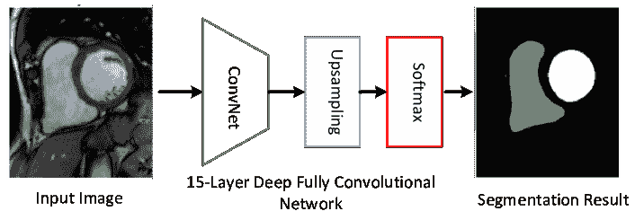

图 15：使用 FCN 结构进行心脏分割的示意图[154]。

特别是，FCN 在各种医学图像分割任务中表现出色[155, 156]。FCN 的一些变体，如级联 FCN[157]、并行 FCN[158]和递归 FCN[159]，也广泛用于医学图像中的分割任务。图 15 展示了使用 FCN 模型进行心脏分割的一个示例。

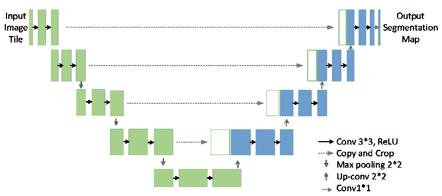

图 16：U-Net 的网络结构[152]。

此外，U-Net[152]（见图 16）及其变体也被广泛用于医学图像分割。U-Net 建立在 FCN 结构的基础上，主要由一系列卷积层和反卷积层组成，并在相同分辨率的层之间有短连接。U-Net 及其变体，如 UNet++[160]和递归 U-Net[161]，在许多医学图像分割任务中表现良好[162]。

在基于 GAN 的模型[163, 164]中，生成器用于根据某些编码器-解码器结构（如 FCN 或 U-Net）预测目标的掩模。鉴别器则作为形状调节器，帮助生成器获得令人满意的分割结果。GAN-based 模型在医学图像分割中的应用包括脑部分割[165]、皮肤病变分割[166]、血管分割[167]和视网膜眼底图像中的异常分割[168]。图 17 展示了使用 GAN-based 模型进行显微图像中的血管分割的一个示例。

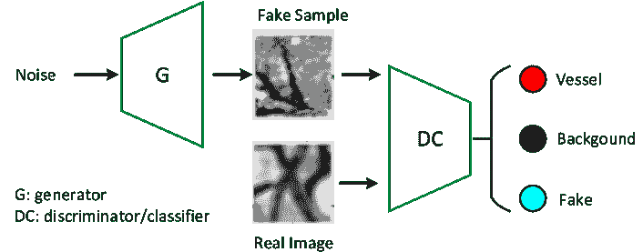

图 17：使用 GAN-based 模型进行血管分割的一个示例[167]。

表 VII：病变、器官分割研究及其融入的知识列表

|

&#124; 知识来源 &#124;

|

&#124; 知识类型 &#124;

|

&#124; 融入 &#124;

&#124; 方法 &#124;

| 参考文献 |
| --- |

|

&#124; 自然数据集 &#124;

|

&#124; 自然图像 &#124;

|

&#124; 迁移学习 &#124;

|

&#124; [155][169][170][171]  [126] &#124;

|

| 医学数据集 | 多模态图像 |
| --- | --- |

&#124; 迁移学习 &#124;

|

&#124; [172][34] &#124;

|

|

&#124; 多任务/多模态学习 &#124;

|

&#124; [173][174] &#124;

|

|

&#124; 模态转换/合成 &#124;

|

&#124; [175][176]  [177]  [165]  [178] &#124;

&#124; [179][180][181][182]  [183][184] &#124;

|

| 其他疾病的数据集 | 迁移学习 | [185] |
| --- | --- | --- |

|

&#124; 疾病领域转换 &#124;

| [27] |
| --- |
| 医学专家 |

&#124; 训练模式 &#124;

|

&#124; 课程学习 &#124;

|

&#124; [186]  [30]  [187][188]  [189][190] &#124;

|

| 诊断模式 |
| --- |

&#124; 使用不同视角作为输入 &#124;

|

&#124; [191][32] &#124;

|

|

&#124; 注意力机制 &#124;

| [192] |
| --- |

|

&#124; 网络设计 &#124;

| [193][194] |
| --- |
| 解剖学先验 |

&#124; 融入后处理 &#124;

|

&#124; [195]  [196, 197]  [33] &#124;

|

|

&#124; 融入损失函数 &#124;

|

&#124; [198][199]  [200][201]  [40] &#124;

&#124; [202]  [198]  [203] &#124;

|

|

&#124; 生成模型 &#124;

|

&#124; [32][204]  [205][206]  [207] &#124;

&#124; [208]  [209][210]  [211] &#124;

|

| 手工特征 |
| --- |

&#124; 特征级融合 &#124;

|

&#124; [212][213] &#124;

|

|

&#124; 输入级融合 &#124;

|

&#124; [214][215] &#124;

|

在接下来的章节中，我们将介绍将领域知识融入深度分割模型的研究。这些工作的总结见表 VII。

### 4.2 融合自然数据集或其他医学数据集的知识

深度学习分割模型首先在大规模自然图像数据集（如 ImageNet）上训练，然后在目标数据集上微调，这种做法也相当常见。利用上述迁移学习策略引入自然图像的知识已被证明能在医疗图像分割中取得更好的性能。可以在内膜-中膜边界分割[126]和产前超声图像分割[170]中找到相关示例。除了 ImageNet，[155]还采用了在 PASCAL VOC 数据集上训练的现成 DeepLab 模型，用于超声图像中的解剖结构分割。这个预训练模型也被用于深度轮廓感知网络（DCAN），该网络旨在用于组织病理图像中的腺体分割[169]。

除了使用在‘静态’数据集（如 ImageNet 和 PASCAL VOC）上预训练的模型，许多深度神经网络，特别是那些设计用于 3D 医疗图像分割的模型，还利用在大规模视频数据集上预训练的模型。例如，在 3D MRI 中自动分割近端股骨时，采用了在 Sports-1M 数据集上预训练的 C3D 模型作为提出的 3D U-Net [171]的编码器。值得注意的是，C3D 模型是在 Sports-1M 数据集上训练的，该数据集是具有 487 个类别的 110 万体育视频的最大视频分类基准[216]。

除了自然图像，利用来自外部医疗数据集的不同模态和不同疾病的知识也相当流行。

例如，[172]研究了最初在旧版低分辨率数据上训练的 CNN 模型在同一扫描仪但具有更高图像分辨率的新数据上的知识转移能力。同样，在[34]中使用了不同 MRI 扫描仪和协议的图像，通过迁移学习帮助多发性硬化症分割过程。

在[173]中，采用了多任务学习方法，其中同时使用脑部 MRI、乳腺 MRI 和心脏 CT 血管造影（CTA）的数据作为多个任务。另一方面，[174]采用了多模态学习结构用于器官分割。提出了一种双流编码器-解码器架构，用于学习模态无关的特征，从而在具有不同模态（MRI 和 CT 图像）的医疗数据集中共享一般化和鲁棒的特征。实验结果证明了这种多模态学习结构的有效性。

此外，许多工作采用基于 GAN 的模型实现不同模态数据集之间的领域转换。例如，提出了一种名为 SeUDA（无监督领域适应）的模型用于左右肺分割过程 [175]。它利用语义感知 GAN 将知识从一个胸部数据集转移到另一个数据集。具体而言，目标图像首先通过语义感知 GAN 损失的约束映射到源数据空间。然后，从在源领域上学习的分割 DNN 中获得分割结果。实验结果表明，SeUDA 的分割性能非常具有竞争力。

使用其他模态图像知识的更多例子可以在脑部 MRI 分割 [165, 182]、心脏分割 [178, 183, 181, 180, 184]、肝脏分割 [179]、肺肿瘤分割 [177]、心脏子结构和腹部多脏器分割 [176] 中找到。

还有一些工作利用了其他疾病的数据集。例如，[185] 首先通过整合八个不同的三维医学分割数据集构建了一个联合数据集（3DSeg-8），并设计了 Med3D 网络，以便基于 3DSeg-8 进行联合训练。然后，将从 Med3D 获得的预训练模型转移到肺部和肝脏分割任务中。实验表明，这种方法不仅提高了准确性，还加速了训练收敛速度。此外，带注释的视网膜图像被用于帮助进行心脏血管分割，而无需注释 [27]。特别地，使用了形状一致的生成对抗网络（SC-GAN）来生成合成图像及其对应的标签。然后，使用合成图像来训练分割器。实验表明，冠状动脉分割的准确性非常高。

### 4.3 融入医学医生的知识

在设计医学图像分割任务的深度学习模型时，医生的领域知识也被广泛采用。医疗医生在深度分割模型中利用的领域知识可以分为四类：

1.  1.

    训练模式，

1.  2.

    他们查看图像时的一般诊断模式，

1.  3.

    病变或器官的解剖先验信息（例如，形状、位置、拓扑）以及

1.  4.

    另一方面，他们特别关注的其他手工特征。

#### 4.3.1 医生的训练模式

类似于疾病诊断和病变/器官检测，许多医学图像中的目标分割研究也模仿了医学医生的训练模式，其中包括分配逐渐增加难度的任务。在这个过程中，还利用了课程学习技术或其衍生方法，如自适应学习（SPL）[217]。

例如，对于多器官 CT 图像的分割[186]，每张标注的图像被分成小块。在训练过程中，网络产生较大误差的块会被高概率选择。这样，网络可以将采样重点放在困难区域，从而提高性能。此外，[30]将 SPL 与主动学习相结合，用于 3D 图像中的肺部分割。该系统实现了最先进的分割结果。

此外，提出了一种三阶段课程学习方法用于肝肿瘤分割[187]。第一阶段在整个输入体积上进行以初始化网络，第二阶段的学习集中在肿瘤特定特征上，通过对肿瘤块的训练来完成，最后在第三阶段对整个输入进行重新训练。与 MICCAI 2017 肝肿瘤分割（LiTS）挑战数据集中常用的级联方法相比，这种方法表现出显著的改进。更多例子还可以在左心室分割[188]、手指骨分割[189]和血管分割[190]中找到。

#### 4.3.2 医学医生的一般诊断模式

在病变或器官分割任务中，一些医学医生采用的特定模式也被融入到网络中。

例如，在 CT 图像的视觉检查过程中，放射科医生通常会改变窗口宽度和窗口中心，以帮助决策不确定的结节。这种模式在[191]中被模仿。特别地，不同窗口宽度和窗口中心的图像块被叠加在一起作为深度学习模型的输入，以获取丰富的信息。对公开的 LIDC-IDRI 数据集的评估表明，该方法在肺结节分割方面的表现优于最先进的方法。

此外，经验丰富的临床医生通常通过多种标准视图来评估心脏的形态和功能，使用长轴（LA）和短轴（SA）图像来形成对心脏解剖学的理解。受上述观察的启发，提出了一种心脏 MR 分割方法，该方法以三视 LA 和一视 SA 作为输入[32]。特别地，首先使用多视图自编码器（MAE）结构提取特征，然后将这些特征输入到分割网络中。实验结果表明，该方法在分割准确性上优于最先进的方法。

此外，专家手动分割通常依赖于感兴趣的解剖结构的边界。例如，放射科医生在从 CT 图像中分割肝脏时，通常会先描绘肝脏的边缘，然后推导出内部分割掩模。相应地，[192]中提出了边界感知 CNN 用于医学图像分割。这些网络设计用于考虑器官边界信息，既提供了一个特殊的网络边缘分支，也提供了边缘感知的损失项。这些边界感知分割网络在 BraTS 2018 数据集上的脑肿瘤分割任务中进行了有效性测试。

最近，在 GTV[LN]检测和分割方法中模仿了名为“分而治之”的诊断模式[193]。具体来说，GTV[LN]首先通过软距离门控的二值化被分为“肿瘤近端”和“肿瘤远端”两个子组。然后，训练一个多分支的检测-分割网络，每个分支专注于学习一个 GTV[LN]类别的特征。经过多分支融合，方法在平均召回率上从 72.5%显著提高到 78.2%。另一个使用医学医生诊断模式的例子可以在肿瘤总体和临床靶体积分割中找到[194]。

#### 4.3.3 病变或器官的解剖学先验

与非医学图像相比，医学图像具有许多解剖学先验，例如器官或病变的形状、位置和拓扑结构。经验丰富的医生在对这些图像进行分割任务时非常依赖这些解剖学先验。将解剖学先验的知识融入深度学习模型已被证明是准确医学图像分割的有效方法。一般来说，将这些解剖学先验融入深度学习模型有三种不同的方法：（1）在后处理阶段融入解剖学先验，（2）将解剖学先验作为损失函数中的正则化项，以及（3）通过生成模型学习解剖学先验。

在后处理阶段融入解剖学先验

第一个方法是在后处理阶段中融入解剖学先验。分割网络的结果通常是模糊的，后处理通常是必要的，以细化分割结果。

例如，根据病理学，大多数乳腺肿瘤始于腺体组织，并位于乳腺层内[218]。[195]在其后处理阶段利用了这一位置特征，其中采用了全连接条件随机场（CRF）模型。具体而言，将肿瘤的位置及其与乳腺层的相对位置作为 CRF 能量函数中的新项，以获得更好的分割结果。

此外，一些研究首先学习解剖学先验，然后将其融入后处理阶段，以帮助生成解剖学上合理的分割结果[33, 196, 197]。例如，通过使用对抗变分自编码器（aVAE）首先学习解剖学上正确的心脏形状，然后用于将错误的分割图转换为解剖学上合理的图[196]。实验表明，aVAE 能够适应任何分割方法，并将其解剖学上不合理的结果转换为合理的结果，而不影响整体的几何和临床指标。

在[33]中的另一个例子介绍了基于去噪自编码器（DAE）的后处理步骤，用于肺部分割。具体而言，DAE 仅使用分割掩膜进行训练，然后将学习到的解剖形状和拓扑约束应用于原始分割结果（如图 18 所示）。通过在任意分割方法得到的掩膜上应用 Post-DAE，X 光图像的肺部解剖分割显示出合理的结果。

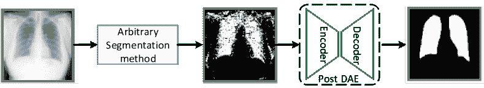

图 18：在后处理阶段集成形状先验的例子[33]。

将解剖学先验作为正则化项纳入损失函数中。

第二种方法是将解剖先验作为分割网络目标函数中的正则化项进行整合。例如，在心脏 MR 图像的分割中，提出了一种名为 SRSCN 的网络[40]。SRSCN 包括一个形状重建神经网络（SRNN）和一个空间约束网络（SCN）。SRNN 旨在保持分割结果的真实形状，而 SCN 则用于整合 2D 切片的空间信息。SRSCN 的损失来自三个部分：分割损失、用于形状正则化的形状重建（SR）损失，以及辅助分割的空间约束（SC）损失。使用 45 名患者的图像的结果展示了 SR 和 SC 正则化项的有效性，并显示了 SRSCN 在分割性能上相较于传统方案的优越性。

该类别中的另一个例子是针对皮肤病变分割设计的[201]。在这项工作中，星形状先验被编码为 FCN 中的一个新损失项，以改善其从周围健康皮肤中分割皮肤病变的能力。通过这种方式，FCN 预测图中的非星形状分割会受到惩罚，以确保分割结果的全球结构。ISBI 2017 皮肤分割挑战数据集上的实验结果展示了通过星形状先验正则化 FCN 参数的优势。

该类别中的更多例子可以在腺体分割[200]、肾脏分割[199]、肝脏分割[202]和心脏分割[198, 203]中找到。

通过生成模型学习解剖先验

在第三种方法中，解剖先验（尤其是形状先验）首先由一些生成模型学习，然后被整合到分割网络中。

例如，在心脏 MR 分割过程中，提出了一种形状多视角自编码器（MAE）以从多个标准视角的 MR 图像中学习形状先验[32]。训练好的形状 MAE 在潜在空间中编码的信息被整合到多视角 U-Net（MV U-Net）的融合块中，以指导分割过程。

另一个例子见于[206]，其中提出了形状约束网络（SCN），以将形状先验整合到眼部分割网络中。更具体地说，先验信息首先由 VAE-GAN 学习，然后利用预训练的编码器和判别器来正则化训练过程。

更多的例子可以在 MRI 脑部几何分割[204]、3D 精细肾动脉分割[205]、重叠的颈部细胞质分割[207]、肩胛骨分割[208]、肝脏分割[209]、颈动脉分割[210]和头颈部分割[211]中找到。

#### 4.3.4 其他手工特征

除了解剖先验外，还利用了一些手工特征用于分割任务。一般来说，将手工特征融入深度学习模型有两种方式：特征级融合和输入级融合。

在特征级融合中，手工特征与深度模型学习到的特征进行连接。例如，在组织病理图像中的腺体分割 [213]，首先从图像中计算两个手工特征，即不变的 LBP 特征以及 $H\&amp;E$ 组分。然后，这些特征与网络最后一个卷积层生成的特征连接以预测分割结果。同样，在脑部结构分割 [212] 中，空间图谱先表示为向量，然后与深度特征连接。

对于输入级融合，手工特征被转换为输入补丁。然后，将原始图像补丁和特征转换的补丁输入到深度分割网络中。例如，在 [214] 中，对于 MRI 图像中的自动脑肿瘤分割，首先提取三个手工特征（即均值强度、LBP 和 HOG）。基于这些特征，使用 SVM 生成置信度表面模态 (CSM) 补丁。然后，将 CSM 补丁和 MRI 图像中的原始补丁输入到分割网络中。这种方法在 BRATS2015 数据集上取得了良好的性能。

表 VIII：在融合领域知识后，一些医学目标分割方法的定量指标比较

| 参考文献 |
| --- |

&#124; 基线模型/带领域知识 &#124;

| Dice 分数 |
| --- | --- | --- |
| [32] | 3D U-Net/MV U-Net | 0.923/0.926 |
| [205] | V-Net/DPA-DenseBiasNet | 0.787/0.861 |
| [177] |

&#124; 掩码循环-GAN/肿瘤 &#124;

&#124; 感知半监督 &#124;

| 0.630/0.800 |
| --- |
| [174] |

&#124; 模态特定方法/双流 &#124;

&#124; 编码器-解码器多模型方法 &#124;

| 0.838/0.860 |
| --- |
| [40] | U-Net/SRSCN | 0.737/0.830 |
| [27] |

&#124; U-Net/SC-GAN &#124;

| 0.742/0.824 |
| --- |
| [183] |

&#124; 循环和形状一致性 GAN &#124;

&#124; 无/有合成数据训练 &#124;

| 0.678/0.744 |
| --- |

此外，输入级融合中使用手工特征也应用于细胞核分割 [215]。特别是，由于细胞核预计具有近似圆形，因此计算梯度收敛图，并由 CNN 作为额外通道使用，除了荧光显微镜图像。实验结果表明，与其他方法相比，F1 分数更高。另一个此类别的例子可以在脑肿瘤分割 [214] 中找到。

### 4.4 总结

上述章节描述了在医学图像中将领域知识应用于对象（病灶或器官）分割的研究。一些方法的分割性能显示在表格 VIII 中，其中 Dice 评分用于评估，得分越高表示性能越好。

我们可以看到，与疾病诊断类似，使用自然图像（如 ImageNet）的信息在病灶和器官分割任务中非常流行。这背后的原因可能是分割可以被视为一个特定的分类问题。同时，除了 ImageNet，一些视频数据集也可以用于分割 3D 医学图像（例如，[171]）。利用具有不同模态的额外医学数据集也被证明是有帮助的，尽管大多数应用仍限于使用 MRI 来辅助 CT 图像的分割任务[174]。利用医学医生的领域知识在分割任务中也被广泛使用。特别是，器官的解剖先验被广泛采用。然而，解剖先验仅适用于具有固定形状的器官，如心脏[32]或肺部[32]。

## 5 其他医学应用

在本节中，我们简要介绍了将领域知识融入其他医学图像分析应用的研究，如医学图像重建、医学图像检索和医学报告生成。

### 5.1 医学图像重建

医学图像重建的目标是从多个测量值（例如，CT 中的 X 射线投影或 MRI 中的空间频率信息）中重建诊断图像。基于深度学习的方法已在这一领域得到广泛应用[219、220]。将外部信息融入深度学习模型进行医学图像重建也是相当常见的。

一些方法在医学图像重建过程中融合了手工特征。例如，提出了一种名为 DAGAN 的网络模型，用于压缩感知磁共振成像（CS-MRI）的重建[221]。在 DAGAN 中，为了更好地保留重建过程中的纹理和边缘，敌对损失与内容损失相结合。此外，还结合了频域信息，以强制图像和频域之间的相似性。实验结果表明，DAGAN 方法在保留感知图像细节方面提供了优越的重建效果。

在[222]中，提出了一种新的图像重建方法，用于解决在强散射介质中的有限角度和有限来源乳腺癌扩散光学断层成像（DOT）图像重建问题。通过自适应地关注重要特征并使用模糊 Jaccard 损失过滤不相关和噪声特征，网络能够减少假阳性重建像素，并重建更准确的图像。

类似地，提出了一种基于 GAN 的方法来恢复目标对比度的 MRI 图像[223]。该方法同时利用了在收集到的证据中相对较低空间频率的信息和在源对比度中相对较高空间频率的信息。对脑 MRI 数据集的演示表明，该方法优于最新的重建方法，增强了高频组织结构的恢复，并提高了对特征泄漏或丢失的可靠性。

### 5.2 医学图像检索

医院正在生成大量的影像数据，医学图像检索的发展，特别是基于内容的图像检索（CBIR）系统，可以极大地帮助临床医生浏览这些大型数据集。深度学习方法已被应用于 CBIR，并由于其自动提取特征的优越能力，取得了高性能。

此外，这些用于 CBIR 的深度学习模型也常常利用超出给定医学数据集的外部信息。一些方法采用迁移学习来利用自然图像或外部医学数据集的知识[224, 225, 226]。例如，基于 ImageNet 预训练的 VGG 模型在脑肿瘤检索过程中得到应用[226]，其中提出了一种块级微调策略，以提升 T1 加权 CE-MRI 数据集上的检索性能。另一个例子是 x 射线图像检索过程[225]，在该过程中，预训练于大规模增强数据集的模型被微调到目标数据集上以提取通用特征。

此外，特征在 CBIR 的相似性分析中扮演着重要角色，一些方法将先验特征与深度特征融合。特别是在胸部 X 光图像检索过程中，二进制特征和纹理特征的决策值与深度特征通过决策级融合的形式结合[227]。类似地，患者的年龄和性别等元数据与从深度 CNN 中提取的基于图像的特征结合，用于 X 光胸部病理图像检索[228]。此外，从显著区域提取的特征也可以注入到从整个图像提取的特征中，以实现更高的检索准确性[224]。

### 5.3 医学报告生成

最近，深度学习模型在图像描述生成中的成功应用已被用于医学报告的自动生成[229, 230]。研究还发现，融入外部知识可以帮助深度学习模型生成更好的医学报告。

例如，一些方法尝试融入医生在撰写报告时采用的特定或通用模式。例如，放射科医师通常使用特定的模板撰写报告。因此，在句子生成过程中使用了某些模板[231, 232]。此外，由于医生给出的解释相对简单且短语的变化不会改变其含义，提出了一种模型无关的方法来学习短文本描述以解释这一决策过程[233]。

此外，放射科医师在撰写报告时遵循一些程序：他们通常首先检查患者的影像是否有异常发现，然后按照特定的模板撰写报告，并根据每个个案的具体情况调整模板中的陈述[234]。这一过程在[232]中得到了模拟，该研究首先将医学影像的视觉特征转化为异常图谱，然后根据异常及其属性为胸部 X 光图像检索文本模板。

在[235]中，利用了一个基于图卷积神经网络（graph CNN）建模的预构建图嵌入模块来辅助生成报告。知识图谱的引入允许对每种疾病发现进行专门的特征学习，并建模它们之间的关系。在公开数据集（IU-RR）上的实验展示了与所提出的图模块集成的方法的卓越性能。

## 6 研究挑战与未来方向

上述部分回顾了将医学领域知识融入深度学习模型进行各种任务的研究。尽管在深度学习模型中使用医学领域知识非常流行，但在医学领域知识的选择、表示和融入方法上仍存在许多困难。在接下来的部分中，我们总结了该领域的挑战和未来方向。

### 6.1 医学领域知识识别与选择相关的挑战

识别医疗领域知识并不是一件容易的事。首先，医疗医生的经验通常是主观和模糊的，并非所有医生都能准确客观地描述他们为完成特定任务而借用的经验。此外，医疗医生的经验可能会有显著差异，甚至相互矛盾。此外，医疗医生通常同时利用多种领域知识。最后，目前医疗领域知识是通过手动识别的，尚无关于自动和全面识别特定领域医疗知识的现有工作。

识别医疗知识的一个解决方案是通过对涉及不同医疗领域的指南、书籍和医疗报告进行文本挖掘技术。指南或书籍比个人经验更为可靠。医疗报告通常包含描述肿瘤特征的特定术语（通常是形容词）。这些术语包含对医生诊断有帮助的重要信息，可能对深度学习模型有利。

除了医疗领域知识的识别，如何选择合适的知识来帮助图像分析任务也是一项挑战。需要注意的是，医疗医生的常见做法可能无法帮助深度学习模型，因为*领域知识可能通过训练数据被深度学习模型学习到。* 我们认为，那些不易被深度学习模型学习到的知识可以极大地帮助模型提高性能。

### 6.2 医疗领域知识表示相关的挑战

医疗医生的原始领域知识通常以描述性句子的形式存在，例如‘我们将更加关注肿瘤的边缘区域，以确定其是良性还是恶性’，或‘我们经常比较双侧图像以做出决策’。如何将这些知识转化为适当的表示并将其纳入深度学习模型中需要仔细设计。

表示某种医学领域知识通常有四种方式。一种是将知识表示为补丁或高亮图像（如[94]所示）。当医生更关注特定区域时，通常使用这种方法。第二种方法是将知识表示为特征向量[85]。当选定的领域知识可以描述为某些特征时，这种方式适用。第三种方法是将领域知识表示为额外的标签[59, 52]，适用于临床报告中的知识或疾病的额外特征属性。最后一种方法是将医学领域知识嵌入网络结构设计中，适用于表示高层次的领域知识，如医学医生的训练模式和诊断模式[69, 134, 135]。

### 6.3 医学领域知识整合方法相关的挑战

当前，医学领域知识的融入方式有四种。第一种是将知识转化为某些补丁或高亮图像，作为额外输入[54]。第二种方法是通过拼接[213]。领域知识通常转化为特征向量，并与深度学习模型提取的特征向量拼接。第三种方法是注意力机制[38]。当医生关注医学图像的特定区域或医学视频的特定时间段时，这种方法适用。最后一种方法是通过使用一些特定的网络结构，如生成模型[32, 206]，来学习领域知识。

然而，大多数现有工作仅融入单一类型的医学领域知识，或少数相同模态的医学领域知识（例如，一些手工制作的特征）。实际上，有经验的医学医生通常在不同阶段结合不同的经验。

一些研究同时引入高层次领域知识（例如，诊断模式、训练模式）和低层次领域知识（例如，手工制作的特征、解剖先验）。特别是，高层次领域知识作为输入图像引入，低层次知识则通过特定的网络结构进行学习[32]。此外，除了直接融入网络中外，低层次领域知识的信息还可以结合易到难的训练模式用于设计训练顺序[29]。我们认为，同时融入多种医学领域知识可以更好地帮助深度学习模型在各种医学应用中。

### 6.4 未来的研究方向

除了上述挑战外，还有几个方向需要在未来进一步探讨。

领域适应

领域适应的目的是将信息从源领域转移到目标领域。通过诸如对抗学习[153]等技术，领域适应能够缩小源领域和目标领域之间的领域偏移，涵盖输入空间[236]、特征空间[237, 238]和输出空间[239, 240]。它可以自然地用于将一个医学数据集的知识转移到另一个数据集[181]，即使它们具有不同的成像模式或属于不同的疾病[172, 177]。

此外，**无监督领域适应（UDA）**是一种有前景的途径，可以在目标领域提高深度神经网络的性能，使用的标签仅来自源领域。这对于医学领域尤其有用，因为标注医学图像非常费力，医学数据集中缺乏标注的情况也很常见。一些实例已经证明了 UDA 在疾病诊断和器官分割中的有效性[175, 93, 241, 242]，但未来需要进行更深入的研究。

知识图谱

我们相信，具有嵌入不同类型知识特性的知识图谱[243]，是一种通用且灵活的方法，可以整合多模态医学领域知识。尽管目前应用较少，但它在医学图像分析任务中也显示出优势，特别是在医学报告生成[232]方面。我们相信，更多类型的知识图谱可以用于表示和学习医学图像分析任务中的领域知识。

根据图中的不同关系，可以建立三种可能类型的知识图谱。第一种知识图谱反映了不同种类的医学领域知识与某种疾病之间的关系。这种知识图谱可以帮助我们识别一些关键类型的知识，可能有助于提高深度学习模型的性能。第二种知识图谱可能反映了不同疾病之间的关系。这种知识图谱可以帮助我们发现其他相关疾病中的潜在领域知识。第三种知识图谱可以描述医学数据集之间的关系。这些数据集可以属于不同的疾病并具有不同的成像模式（例如 CT、MRI、超声）。这种类型的知识图谱将有助于识别可能有助于提高当前深度学习模型性能的外部数据集。

生成模型

生成模型，如 GAN 和 AE，已经显示出将医学领域知识融入深度学习模型的巨大潜力，特别是在分割任务中。GAN 展示了其利用来自不同成像模式的额外数据集的信息的能力（例如，使用 MRI 数据集帮助分割 CT 图像[175, 177]）。此外，GAN 能够以弱监督或完全无监督的方式学习医学图像中的重要特征，因此非常适合医学图像分析。

基于 AE 的模型在特征提取方面已经取得了很大成功，特别是在以完全无监督方式处理器官或病变等对象的形状先验方面[32, 206]。AE 学习到的特征也可以轻松地集成到网络的训练过程中。

网络架构搜索（NAS）

最后，我们在前一节提到，一个挑战是找到合适的网络架构以融入医学领域知识。我们相信，解决这个问题的一种方法是网络架构搜索（NAS）技术。NAS 已证明其在许多计算机视觉任务中自动找到良好网络架构的能力[244]，并在医学领域具有极大的潜力[245]。例如，当使用一些手工特征作为领域知识时，在 NAS 的帮助下，可以识别出网络结构，其中包含领域知识特征和深度特征之间的特殊连接。此外，不仅可以为这两种特征设计特征融合方法（特征级融合、决策级融合或输入级融合），还可以在搜索过程中确定这两种特征的集成阶段和集成强度。

## 7 结论

在本文中，我们对将医学领域知识融入深度学习模型以处理各种医学图像分析任务进行了全面的综述，包括从疾病诊断、病变、器官和异常检测到病变和器官分割等任务。此外，还包括一些其他任务，如医学图像重建、医学图像检索和医学报告生成。对于每个任务，我们首先介绍不同类型的医学领域知识，然后回顾一些将领域知识引入目标任务的不同融入方法。从这项综述中，我们可以看出，通过适当的集成方法，不同类型的领域知识可以帮助深度学习模型更好地完成相应的任务。

除了回顾将领域知识融入深度学习模型的现有工作外，我们还总结了使用医学领域知识的挑战，并介绍了医学领域知识的识别、选择、表示和融入方法。最后，我们给出了一些将领域知识融入医学图像分析任务的未来方向。

## 致谢

本研究得到了中国国家自然科学基金资助[资助编号 61976012, 61772060]；中国国家重点研发计划资助[资助编号 2017YFB1301100]；以及 CERNET 创新项目资助[资助编号 NGII20170315]。

## 参考文献

+   [1] A. Esteva, B. Kuprel, R. A. Novoa, J. M. Ko, S. M. Swetter, H. M. Blau, 和 S. Thrun，“利用深度神经网络进行皮肤癌的皮肤科医生级分类，” *Nature*，第 542 卷，第 7639 期，页码 115–118，2017 年。

+   [2] S. Y. Shin, S. Lee, I. D. Yun, S. M. Kim, 和 K. M. Lee，“联合弱监督和半监督深度学习用于乳腺超声图像中肿块的定位和分类，” *IEEE TMI*，第 38 卷，第 3 期，页码 762–774，2019 年。

+   [3] Z. Zhou, J. Y. Shin, L. Zhang, S. R. Gurudu, M. B. Gotway, 和 J. Liang，“微调卷积神经网络用于生物医学图像分析：主动和逐步，” *CVPR2017*，页码 4761–4772，2017 年。

+   [4] W. Zhu, C. Liu, W. Fan, 和 X. Xie，“Deeplung：用于自动化肺结节检测和分类的深度 3D 双路径网络，” *计算机视觉应用研讨会*，页码 673–681，2018 年。

+   [5] A. Halevy, P. Norvig, 和 F. Pereira，“数据的非凡有效性，” *IEEE Intelligent Systems*，第 24 卷，第 2 期，页码 8–12，2009 年。

+   [6] M. W. Weiner, D. P. Veitch, P. S. Aisen, L. A. Beckett, N. J. Cairns, R. C. Green, D. Harvey, C. R. Jack, W. Jagust, J. C. Morris, R. C. Petersen, J. Salazar, A. J. Saykin, L. M. Shaw, A. W. Toga, 和 J. Q. Trojanowski，“阿尔茨海默病神经影像学倡议 3：临床试验改进的持续创新，” *Alzheimer’s and Dementia*，第 13 卷，第 5 期，页码 561 – 571，2017 年。[在线]。可用网址：http://www.sciencedirect.com/science/article/pii/S1552526016330722

+   [7] A. Di Martino, C.-G. Yan, Q. Li, E. Denio, F. X. Castellanos, K. Alaerts, J. S. Anderson, M. Assaf, S. Y. Bookheimer, M. Dapretto *等*，“自闭症脑成像数据交换：朝着对自闭症中固有脑结构的大规模评估迈进，” *Molecular Psychiatry*，第 19 卷，第 6 期，页码 659–667，2014 年。

+   [8] C. MICCAI，“自动化心脏诊断挑战（acdc），” 2017 年。[在线]。可用网址：https://www.creatis.insa-lyon.fr/Challenge/acdc/databases.html

+   [9] X. Wang, Y. Peng, L. Lu, Z. Lu, M. Bagheri, 和 R. Summers，“Chestx-ray14：医院规模的胸部 X 光数据库及常见胸部疾病的弱监督分类和定位基准，” 2017 年 9 月。

+   [10] S. G. Armato III, G. McLennan, L. Bidaut, M. F. McNitt-Gray, C. R. Meyer, A. P. Reeves, B. Zhao, D. R. Aberle, C. I. Henschke, E. A. Hoffman *等*, “肺部图像数据库联盟（LIDC）和图像数据库资源倡议（IDRI）：完成的 CT 扫描肺结节参考数据库，” *医学物理学*, 卷 38，第 2 期，第 915–931 页, 2011。

+   [11] A. T. B. v. G. Colin Jacobs, Arnaud Arindra Adiyoso Setio, “肺结节分析 2016,” 2016\. [在线]. 可用链接: https://luna16.grand-challenge.org/

+   [12] P. Rajpurkar, J. Irvin, A. Bagul, D. Ding, T. Duan, H. Mehta, B. Yang, K. Zhu, D. Laird, R. L. Ball *等*, “Mura：用于肌肉骨骼放射图像异常检测的大型数据集，” *arXiv 预印本 arXiv:1712.06957*, 2017。

+   [13] S. Bakas, M. Reyes, A. Jakab, S. Bauer, M. Rempfler, A. Crimi, R. T. Shinohara, C. Berger, S. M. Ha, M. Rozycki *等*, “在 BRATS 挑战赛中识别用于脑肿瘤分割、进展评估和总体生存预测的最佳机器学习算法，” *arXiv 预印本 arXiv:1811.02629*, 2018。

+   [14] A. Hoover, V. Kouznetsova, 和 M. Goldbaum, “通过逐段阈值探测匹配滤波响应来定位视网膜图像中的血管，” *IEEE 医学成像学报*, 卷 19，第 3 期，第 203–210 页, 2000。

+   [15] M. Heath, K. Bowyer, D. Kopans, R. Moore, 和 P. Kegelmeyer, “用于筛查乳腺 X 光照片的数字数据库，” *第四届数字乳腺摄影国际研讨会论文集*, 01 2000。

+   [16] K. Yan, X. Wang, L. Lu, 和 R. M. Summers, “Deeplesion：利用深度学习自动挖掘大规模病变标注和通用病变检测，” *医学成像杂志*, 卷 5，第 3 期，第 036501 页, 2018。

+   [17] J. K. T. Alexander A., “用于心脏 MRI 分析的高效且通用的形状和外观统计模型，” *医学图像分析*, 卷 12，第 3 期，第 335–357 页, 2008\. [在线]. 可用链接: http://www.sciencedirect.com/science/article/pii/S1361841508000029

+   [18] N. Codella, V. Rotemberg, P. Tschandl, M. E. Celebi, S. Dusza, D. Gutman, B. Helba, A. Kalloo, K. Liopyris, M. Marchetti *等*, “皮肤病变分析以检测黑色素瘤 2018：由国际皮肤成像合作组织（ISIC）主办的挑战赛，” *arXiv 预印本 arXiv:1902.03368*, 2019。

+   [19] H. Chen, X. J. Qi, J. Z. Cheng, 和 P. A. Heng, “用于神经结构分割的深度上下文网络，” 见于 *第三十届 AAAI 人工智能会议*, 2016。

+   [20] F. Ciompi, B. de Hoop, S. J. van Riel, K. Chung, E. T. Scholten, M. Oudkerk, P. A. de Jong, M. Prokop, 和 B. van Ginneken, “使用 2D 视图和卷积神经网络的组合进行计算机断层扫描中肺部裂缝结节的自动分类，” *医学图像分析*, 卷 26，第 1 期，第 195–202 页, 2015。

+   [21] H.-C. Shin, H. R. Roth, M. Gao, L. Lu, Z. Xu, I. Nogues, J. Yao, D. Mollura, 和 R. M. Summers, “用于计算机辅助检测的深度卷积神经网络：CNN 架构、数据集特征和迁移学习，”*IEEE TMI*，第 35 卷，第 5 期，第 1285–1298 页，2016。

+   [22] B. J. Erickson, P. Korfiatis, Z. Akkus, 和 T. L. Kline, “医学影像中的机器学习，”*Radiographics*，第 37 卷，第 2 期，第 505–515 页，2017。

+   [23] J.-Y. Zhu, T. Park, P. Isola, 和 A. A. Efros, “使用循环一致对抗网络的无配对图像到图像翻译，”在*ICCV 2017*中，2017，第 2223–2232 页。

+   [24] B. Huynh, K. Drukker, 和 M. Giger, “Mo-de-207b-06: 使用深度卷积神经网络的迁移学习进行乳腺超声图像的计算机辅助诊断，”*Medical physics*，第 43 卷，第 6 期第 30 页，第 3705–3705 页，2016。

+   [25] S. J. Pan 和 Q. Yang, “迁移学习综述，”*IEEE Transactions on knowledge and data engineering*，第 22 卷，第 10 期，第 1345–1359 页，2009。

+   [26] R. K. Samala, H.-P. Chan, L. Hadjiiski, M. A. Helvie, C. D. Richter, 和 K. H. Cha, “在数字乳腺断层扫描中的乳腺癌诊断：训练样本大小对使用深度神经网络的多阶段迁移学习的影响，”*IEEE TMI*，第 38 卷，第 3 期，第 686–696 页，2018。

+   [27] F. Yu, J. Zhao, Y. Gong, Z. Wang, Y. Li, F. Yang, B. Dong, Q. Li, 和 L. Zhang, “通过从视网膜图像知识转移的无注释心脏血管分割，”在*MICCAI2019*中，2019，第 714–722 页。

+   [28] G. Maicas, A. P. Bradley, J. C. Nascimento, I. Reid, 和 G. Carneiro, “像放射科医生一样训练医学图像分析系统，”在*MICCAI2018*中，2018，第 546–554 页。

+   [29] Y. Tang, X. Wang, A. P. Harrison, L. Lu, J. Xiao, 和 R. M. Summers, “用于胸部 X 光片上胸部疾病的弱监督分类和定位的注意力引导课程学习，”在*International Workshop on Machine Learning in Medical Imaging*中，Springer，2018，第 249–258 页。

+   [30] W. Wang, Y. Lu, B. Wu, T. Chen, D. Z. Chen, 和 J. Wu, “用于肺结节分割的深度主动自适应学习，”在*MICCAI2018*中，Springer，2018，第 723–731 页。

+   [31] S.-M. Hsu, W.-H. Kuo, F.-C. Kuo, 和 Y.-Y. Liao, “使用定量超声参数图像的不同特征进行乳腺肿瘤分类，”*International journal of computer assisted radiology and surgery*，第 14 卷，第 4 期，第 623–633 页，2019。

+   [32] C. Chen, C. Biffi, G. Tarroni, S. E. Petersen, W. Bai, 和 D. Rueckert, “从多视角图像中学习形状先验以进行稳健的心脏 MR 分割。”在*Medical Image Computing and Computer-Assisted Intervention*中，2019，第 523–531 页。

+   [33] A. J. Larrazabal, C. E. Martinez, 和 E. Ferrante, “通过后处理与去噪自编码器结合的解剖先验用于图像分割，”在*MICCAI2019*中，2019，第 585–593 页。

+   [34] S. Valverde, M. Salem, M. Cabezas, D. Pareto, J. C. Vilanova, L. Ramiotorrenta, A. Rovira, J. Salvi, A. Oliver, 和 X. Llado，“使用卷积神经网络进行多发性硬化症病灶分割的单次领域适应，” *NeuroImage: Clinical*，第 21 卷，第 101638 页，2019 年。

+   [35] C. Ji, S. Basodi, X. Xiao, 和 Y. Pan，“基于多阶段卷积神经网络的婴儿声音分类，结合混合特征和先验知识，”在 *International Conference on AI and Mobile Services* 中。 Springer，2020 年，第 3–16 页。

+   [36] Y. Xie, J. Zhang, S. Liu, W. Cai, 和 Y. Xia，“通过联合使用视觉描述符和深度特征进行肺结节分类，”在 *Medical Computer Vision and Bayesian and Graphical Models for Biomedical Imaging* 中。 Springer，2016 年，第 116–125 页。

+   [37] Q. Guan, Y. Huang, Z. Zhong, Z. Zheng, L. Zheng, 和 Y. Yang，“像放射科医生一样诊断：用于胸部疾病分类的注意力引导卷积神经网络，” *arXiv preprint arXiv:1801.09927*，2018 年。

+   [38] L. Li, M. Xu, X. Wang, L. Jiang, 和 H. Liu，“基于注意力的青光眼检测：一个大规模数据库和 CNN 模型，”在 *CVPR2019* 中，2019 年，第 10 571–10 580 页。

+   [39] S. Chen, J. Qin, X. Ji, B. Lei, T. Wang, D. Ni, 和 J.-Z. Cheng，“利用多任务特征利用的自动评分：关于 CT 图像中肺结节的研究，” *IEEE TMI*，第 36 卷，第 3 期，第 802–814 页，2016 年。

+   [40] Q. Yue, X. Luo, Q. Ye, L. Xu, 和 X. Zhuang，“利用形状和空间先验的深度神经网络进行心脏分割，”在 *MICCAI2019* 中。 Springer，2019 年，第 559–567 页。

+   [41] T. G. Debelee, F. Schwenker, A. Ibenthal, 和 D. Yohannes，“乳腺癌图像分析中的深度学习调查，” *Evolving Systems*，第 1–21 页，2019 年。

+   [42] G. Litjens, T. Kooi, B. E. Bejnordi, A. A. A. Setio, F. Ciompi, M. Ghafoorian, J. A. Van Der Laak, B. Van Ginneken, 和 C. I. Sánchez，“深度学习在医学图像分析中的调查，” *Medical Image Analysis*，第 42 卷，第 60–88 页，2017 年。

+   [43] D. Shen, G. Wu, 和 H.-I. Suk，“医学图像分析中的深度学习，” *Annual review of biomedical engineering*，第 19 卷，第 221–248 页，2017 年。

+   [44] K. Suzuki，“深度学习在医学图像分析中的应用调查，” *Medical Imaging Technology*，第 35 卷，第 4 期，第 212–226 页，2017 年。

+   [45] A. Krizhevsky, I. Sutskever, 和 G. E. Hinton，“使用深度卷积神经网络进行 Imagenet 分类，” *neural information processing systems*，第 141 卷，第 5 期，第 1097–1105 页，2012 年。

+   [46] C. Szegedy, W. Liu, Y. Jia, P. Sermanet, S. E. Reed, D. Anguelov, D. Erhan, V. Vanhoucke, 和 A. Rabinovich，“更深入的卷积网络，” *CVPR2015*，第 1–9 页，2015 年。

+   [47] K. Simonyan 和 A. Zisserman，“用于大规模图像识别的非常深度卷积网络，” *ICLR*，2015 年。

+   [48] K. He, X. Zhang, S. Ren, 和 J. Sun，“用于图像识别的深度残差学习，” *CVPR2016*，第 770–778 页，2016 年。

+   [49] G. Huang, Z. Liu, L. V. Der Maaten, 和 K. Q. Weinberger, “密集连接卷积网络，” *CVPR2017*，第 2261–2269 页，2017 年。

+   [50] J. Y. Kim, H. E. Lee, Y. H. Choi, S. J. Lee, 和 J. S. Jeon, “基于 CNN 的犬只溃疡性角膜炎诊断模型，” *科学报告*，第 9 卷，第 1 期，第 1–7 页，2019 年。

+   [51] X. Li, L. Shen, X. Xie, S. Huang, Z. Xie, X. Hong, 和 J. Yu, “用于胸部 X 光片肺结节检测的多分辨率卷积网络，” *医学中的人工智能*，第 101744 页，2019 年。

+   [52] J. Liu, W. Li, N. Zhao, K. Cao, Y. Yin, Q. Song, H. Chen, 和 X. Gong, “在训练 CNN 中整合领域知识用于超声乳腺癌诊断，” *MICCAI2018*，2018 年，第 868–875 页。

+   [53] M. Mitsuhara, H. Fukui, Y. Sakashita, T. Ogata, T. Hirakawa, T. Yamashita, 和 H. Fujiyoshi, “通过注意力图在深度神经网络中嵌入人类知识，” *arXiv 预印本 arXiv:1905.03540*，2019 年。

+   [54] Y. Xie, Y. Xia, J. Zhang, Y. Song, D. Feng, M. J. Fulham, 和 W. Cai, “基于知识的协作深度学习用于胸部 CT 的良性-恶性肺结节分类，” *IEEE TMI*，第 38 卷，第 4 期，第 991–1004 页，2019 年。

+   [55] Y. Bar, I. Diamant, L. Wolf, 和 H. Greenspan, “使用非医学训练的深度学习进行胸部病理识别，” *医学影像 2015：计算机辅助诊断*，第 9414 卷。 国际光学与光子学学会，2015 年，第 94140V 页。

+   [56] G. Wimmer, S. Hegenbart, A. Vécsei, 和 A. Uhl, “用于乳糜泻自动诊断的卷积神经网络架构，” *计算机辅助与机器人内镜国际研讨会*。 Springer，2016 年，第 104–113 页。

+   [57] H. Cao, S. Bernard, L. Heutte, 和 R. Sabourin, “通过不相似性基的多视图学习改进迁移学习性能，无需微调，应用于乳腺癌组织学图像，” *国际图像分析与识别会议*，2018 年，第 779–787 页。

+   [58] X. Wang, Y. Peng, L. Lu, Z. Lu, M. Bagheri, 和 R. M. Summers, “Chestx-ray8: 医院级胸部 X 光数据库及常见胸部疾病的弱监督分类和定位基准，” *CVPR2017*，2017 年，第 2097–2106 页。

+   [59] S. Hussein, K. Cao, Q. Song, 和 U. Bagci, “使用基于 3D CNN 的多任务学习进行肺结节风险分层，” *国际信息处理会议*，第 249–260 页，2017 年。

+   [60] W. Li, J. Li, K. V. Sarma, K. C. Ho, S. Shen, B. S. Knudsen, A. Gertych, 和 C. W. Arnold, “用于前列腺癌诊断和组织学图像 Gleason 分级的 Path R-CNN，” *IEEE TMI*，第 38 卷，第 4 期，第 945–954 页，2018 年。

+   [61] B. Q. Huynh, H. Li, 和 M. L. Giger, “使用深度卷积神经网络的迁移学习进行数字乳腺 X 光肿瘤分类，” *医学影像学杂志*，第 3 卷，第 3 期，第 034501 页，2016 年。

+   [62] O. Hadad, R. Bakalo, R. Ben-Ari, S. Hashoul, 和 G. Amit，“使用跨模态深度学习进行乳腺病变分类，” 在 *ISBI 2017* 中。 IEEE，2017 年，第 109–112 页。

+   [63] R. K. Samala, H.-P. Chan, L. M. Hadjiiski, M. A. Helvie, K. H. Cha, 和 C. D. Richter，“多任务迁移学习深度卷积神经网络：应用于计算机辅助诊断乳腺癌的乳腺 X 光片，” *Physics in Medicine & Biology*，第 62 卷，第 23 期，第 8894 页，2017 年。

+   [64] S. Azizi, P. Mousavi, P. Yan, A. Tahmasebi, J. T. Kwak, S. Xu, B. Turkbey, P. Choyke, P. Pinto, B. Wood *等*，“从射频到 B 模式时效增强超声特征的迁移学习用于前列腺癌检测，” *International journal of computer assisted radiology and surgery*，第 12 卷，第 7 期，第 1111–1121 页，2017 年。

+   [65] X. Li, G. Qin, Q. He, L. Sun, H. Zeng, Z. He, W. Chen, X. Zhen, 和 L. Zhou，“数字乳腺断层摄影与数字乳腺 X 光摄影：图像模态的整合增强了基于深度学习的乳腺肿块分类，” *European radiology*，第 30 卷，第 2 期，第 778–788 页，2020 年。

+   [66] X. Han, J. Wang, W. Zhou, C. Chang, S. Ying, 和 J. Shi，“深度双重监督迁移网络用于不平衡超声成像模态的乳腺癌诊断，” 在 *国际医学图像计算与计算机辅助干预会议* 中。 Springer，2020 年，第 141–149 页。

+   [67] X. Li, X. Hu, L. Yu, L. Zhu, C.-W. Fu, 和 P.-A. Heng，“Canet: 跨疾病注意力网络用于糖尿病视网膜病变和糖尿病性黄斑水肿的分级，” *IEEE TMI*，2019 年。

+   [68] Q. Liao, Y. Ding, Z. L. Jiang, X. Wang, C. Zhang, 和 Q. Zhang，“用于癌症诊断的多任务深度卷积神经网络，” *Neurocomputing*，第 348 卷，第 66–73 页，2019 年。

+   [69] A. Jiménez-Sánchez, D. Mateus, S. Kirchhoff, C. Kirchhoff, P. Biberthaler, N. Navab, M. A. G. Ballester, 和 G. Piella，“用于改进骨折分类的基于医学的深度课程学习，” 在 *MICCAI2019* 中。 Springer，2019 年，第 694–702 页。

+   [70] C. Haarburger, M. Baumgartner, D. Truhn, M. Broeckmann, H. Schneider, S. Schrading, C. Kuhl, 和 D. Merhof，“多尺度课程 CNN 用于上下文感知的乳腺 MRI 恶性分类，” 在 *MICCAI2019* 中。 Springer，2019 年，第 495–503 页。

+   [71] R. Zhao, X. Chen, Z. Chen, 和 S. Li，“Egdcl：用于无偏青光眼诊断的自适应课程学习框架，” 在 *欧洲计算机视觉会议* 中。 Springer，2020 年，第 190–205 页。

+   [72] A. Jiménez-Sánchez, D. Mateus, S. Kirchhoff, C. Kirchhoff, P. Biberthaler, N. Navab, M. A. G. Ballester, 和 G. Piella，“用于注释高效医学图像分析的课程学习：通过先验知识和不确定性调度数据，” *arXiv 预印本 arXiv:2007.16102*，2020 年。

+   [73] J. Wei, A. Suriawinata, B. Ren, X. Liu, M. Lisovsky, L. Vaickus, C. Brown, M. Baker, M. Nasir-Moin, N. Tomita *等*，“像病理学家一样学习：通过标注者一致性的课程学习用于组织病理学图像分类，” *arXiv 预印本 arXiv:2009.13698*，2020 年。

+   [74] Q. Qi, X. Lin, C. Chen, W. Xie, Y. Huang, X. Ding, X. Liu, 和 Y. Yu，“用于表皮-基质分类的课程特征对齐领域适应方法，” *IEEE Journal of Biomedical and Health Informatics*，2020 年。

+   [75] I. González-Díaz，“Dermaknet：将皮肤科医生的知识融入卷积神经网络以进行皮肤病变诊断，” *IEEE Journal of Biomedical and Health Informatics*，第 23 卷，第 2 期，第 547–559 页，2018 年。

+   [76] K. Wang, X. Zhang, S. Huang, F. Chen, X. Zhang, 和 L. Huangfu，“利用知识引导的深度缩放神经网络学习识别胸部 X 光中的胸部疾病，” *IEEE Access*，第 8 卷，第 159 790–159 805 页，2020 年。

+   [77] X. Huang, Y. Fang, M. Lu, F. Yan, J. Yang, 和 Y. Xu，“双射线网：利用前视和侧视胸部 X 光自动诊断胸部疾病，” *Journal of Medical Imaging and Health Informatics*，第 10 卷，第 2 期，第 348–355 页，2020 年。

+   [78] Z. Yang, Z. Cao, Y. Zhang, M. Han, J. Xiao, L. Huang, S. Wu, J. Ma, 和 P. Chang，“Momminet：乳腺 X 光多视角肿块识别网络，” 在 *国际医学图像计算与计算机辅助干预会议*。  Springer，2020 年，第 200–210 页。

+   [79] Q. Liu, L. Yu, L. Luo, Q. Dou, 和 P. A. Heng，“基于关系驱动自我集成模型的半监督医学图像分类，” *IEEE Transactions on Medical Imaging*，2020 年。

+   [80] L. Fang, C. Wang, S. Li, H. Rabbani, X. Chen, 和 Z. Liu，“关注病变：用于视网膜光学相干断层扫描图像分类的病变感知卷积神经网络，” *IEEE TMI*，第 38 卷，第 8 期，第 1959–1970 页，2019 年 8 月。

+   [81] H. Cui, Y. Xu, W. Li, L. Wang, 和 H. Duh，“用于放射治疗相关食管瘘预测的跨通道临床注意力的协作学习，” 在 *国际医学图像计算与计算机辅助干预会议*。  Springer，2020 年，第 212–220 页。

+   [82] X. Xie, J. Niu, X. Liu, Q. Li, Y. Wang, J. Han, 和 S. Tang，“Dg-cnn：将边距信息引入卷积神经网络用于超声图像中的乳腺癌诊断，” *Journal of Computer Science and Engineering*，2020 年。

+   [83] B. Zhang, Z. Wang, J. Gao, C. Rutjes, K. Nufer, D. Tao, D. D. Feng, 和 S. W. Menzies，“用于黑色素瘤筛查的短期病变变化检测与新型孪生神经网络。” *IEEE Transactions on Medical Imaging*，2020 年。

+   [84] M. Moradi, Y. Gur, H. Wang, P. Prasanna, 和 T. Syeda-Mahmood，“一种混合学习方法用于心脏 CT 切片的语义标注和体位识别，” 在 *ISBI 2016*。  IEEE，2016 年，第 1418–1421 页。

+   [85] T. Majtner, S. Yildirim-Yayilgan, 和 J. Y. Hardeberg, “将深度学习和手工特征结合用于皮肤病变分类，”发表于 *2016 年第六届国际图像处理理论、工具与应用大会（IPTA）*。IEEE，2016 年，第 1–6 页。

+   [86] Y. Xie, J. Zhang, Y. Xia, M. Fulham, 和 Y. Zhang, “在决策层融合纹理、形状和深度模型学习的信息，用于自动化分类胸部 CT 中的肺结节，” *信息融合*，第 42 卷，第 102–110 页，2018 年。

+   [87] N. Antropova, B. Q. Huynh, 和 M. L. Giger, “一种用于乳腺癌诊断的深度特征融合方法，展示在三种成像模式数据集上，” *医学物理学*，第 44 卷，第 10 期，第 5162–5171 页，2017 年。

+   [88] X. Xia, J. Gong, W. Hao, T. Yang, Y. Lin, S. Wang, 和 W. Peng, “比较和融合深度学习与放射组学特征，以预测 CT 扫描中 I 期肺腺癌的侵袭风险，” *肿瘤学前沿*，第 10 卷，2020 年。

+   [89] J. Hagerty, J. Stanley *等*，“深度学习与手工方法融合：提高黑色素瘤皮肤镜图像的诊断准确性，” *IEEE 生物医学与健康信息学期刊*，2019 年。

+   [90] Y. Chai, H. Liu, 和 J. Xu, “基于深度学习模型隐含特征和领域知识的青光眼诊断，” *基于知识的系统*，第 161 卷，第 147–156 页，2018 年。

+   [91] M. Buty, Z. Xu, M. Gao, U. Bagci, A. Wu, 和 D. J. Mollura, “使用混合形状和外观特征对肺结节恶性程度进行表征，”发表于 *MICCAI2016*，2016 年，第 662–670 页。

+   [92] T. Saba, A. S. Mohamed, M. El-Affendi, J. Amin, 和 M. Sharif, “使用手工特征与深度学习特征融合的脑肿瘤检测，” *认知系统研究*，第 59 卷，第 221–230 页，2020 年。

+   [93] W. Yang, J. Zhao, Y. Qiang, X. Yang, Y. Dong, Q. Du, G. Shi, 和 M. B. Zia, “Dscgans：在训练双路径半监督条件生成对抗网络和 s3vm 中融入领域知识，用于超声甲状腺结节分类，”发表于 *MICCAI2019*，2019 年，第 558–566 页。

+   [94] J. Tan, Y. Huo, Z. Liang, 和 L. Li, “注入专家知识的深度学习用于自动肺结节检测，” *X 射线科学与技术杂志*，预印本，第 1–20 页，2019 年。

+   [95] T. Liu, Q. Guo, C. Lian, X. Ren, S. Liang, J. Yu, L. Niu, W. Sun, 和 D. Shen, “使用临床知识指导的卷积神经网络自动检测和分类甲状腺结节，” *医学影像分析*，第 58 卷，第 101555 页，2019 年。

+   [96] H. Feng, J. Cao, H. Wang, Y. Xie, D. Yang, J. Feng, 和 B. Chen, “一种知识驱动的特征学习和集成方法，用于多序列 MRI 中的乳腺癌诊断，” *磁共振成像*，2020 年。

+   [97] V. Murthy, L. Hou, D. Samaras, T. M. Kurc, 和 J. H. Saltz， “具有注入特征的中心聚焦多任务 CNN 用于分类神经胶质瘤核图像”，见于 *2017 IEEE Winter Conference on Applications of Computer Vision (WACV)*。 IEEE, 2017, 第 834–841 页。

+   [98] X. Wang, Y. Peng, L. Lu, Z. Lu, 和 R. M. Summers， “Tienet：用于胸部 X 光片中常见胸部疾病分类和报告的文本-图像嵌入网络”，见于 *CVPR2018*，2018，第 9049–9058 页。

+   [99] Z. Zhang, P. Chen, M. Sapkota, 和 L. Yang， “Tandemnet：使用诊断报告作为可选语义参考从医学图像中提取知识”，见于 *MICCAI2017*。 Springer, 2017, 第 320–328 页。

+   [100] N. Wu, J. Phang, J. Park, Y. Shen, Z. Huang, M. Zorin, S. Jastrzebski, T. Févry, J. Katsnelson, E. Kim *等*， “深度神经网络提高了放射科医生在乳腺癌筛查中的表现”， *IEEE transactions on medical imaging*，第 39 卷，第 4 期， 第 1184–1194 页，2019。

+   [101] S. Yu, H.-Y. Zhou, K. Ma, C. Bian, C. Chu, H. Liu, 和 Y. Zheng， “难度感知青光眼分类与多评估者共识建模”，见于 *International Conference on Medical Image Computing and Computer-Assisted Intervention*。 Springer, 2020, 第 741–750 页。

+   [102] J. Yosinski, J. Clune, Y. Bengio, 和 H. Lipson， “深度神经网络中的特征可转移性如何？”见于 *Advances in neural information processing systems*，2014，第 3320–3328 页。

+   [103] X. Xiao, C. Ji, T. B. Mudiyanselage, 和 Y. Pan， “PK-GCN：使用图卷积网络的先验知识辅助图像分类”， *arXiv preprint arXiv:2009.11892*，2020。

+   [104] Y. Bengio, J. Louradour, R. Collobert, 和 J. Weston， “课程学习”，见于 *Proceedings of the 26th annual international conference on machine learning*。 ACM, 2009, 第 41–48 页。

+   [105] F. Nachbar, W. Stolz, T. Merkle, A. B. Cognetta, T. Vogt, M. Landthaler, P. Bilek, O. Braun-Falco, 和 G. Plewig， “皮肤镜检查的 ABCD 规则：在诊断可疑黑色素皮肤病变中的高前瞻性价值”， *Journal of the American Academy of Dermatology*，第 30 卷，第 4 期， 第 551–559 页，1994。

+   [106] B. W. 等， Mendelson EB, Bohm-V lez M， “ACR BI-RADS 超声。见于：ACR BI-RADS Atlas, Breast Imaging Reporting and Data System。” *Reston, VA, American College of Radiology*，2013。

+   [107] L. Breiman， “随机森林”， *Machine learning*，第 45 卷，第 1 期， 第 5–32 页，2001。

+   [108] C. Cortes 和 V. Vapnik， “支持向量网络”， *Machine learning*，第 20 卷，第 3 期， 第 273–297 页，1995。

+   [109] M. Alilou, M. Orooji, 和 A. Madabhushi， “ intra-perinodular textural transition (ipris)：用于肺 CT 结节诊断的 3D 描述符”，见于 *MICCAI2017*。 Springer, 2017, 第 647–655 页。

+   [110] A. A. A. Setio, F. Ciompi, G. Litjens, P. Gerke, C. Jacobs, S. J. Van Riel, M. M. W. Wille, M. Naqibullah, C. I. Sánchez, 和 B. van Ginneken， “CT 图像中的肺结节检测：使用多视角卷积网络减少假阳性”，*IEEE TMI*，第 35 卷，第 5 期，页码 1160–1169，2016 年。

+   [111] V. Gulshan, L. Peng, M. Coram, M. C. Stumpe, D. Wu, A. Narayanaswamy, S. Venugopalan, K. Widner, T. Madams, J. Cuadros *等*， “开发和验证用于检测视网膜眼底照片中糖尿病视网膜病变的深度学习算法”，*JAMA*，第 316 卷，第 22 期，页码 2402–2410，2016 年。

+   [112] J. Liu, D. Wang, L. Lu, Z. Wei, L. Kim, E. B. Turkbey, B. Sahiner, N. A. Petrick, 和 R. M. Summers， “使用深度卷积神经网络在计算机断层扫描中检测和诊断结肠炎”，*医学物理*，第 44 卷，第 9 期，页码 4630–4642，2017 年。

+   [113] S. Ren, K. He, R. Girshick, 和 J. Sun， “Faster R-CNN：朝着实时对象检测与区域提议网络的目标前进”，第 2015 卷，页码 91–99，2015 年。

+   [114] K. He, G. Gkioxari, P. Dollar, 和 R. B. Girshick， “Mask R-CNN”，*国际计算机视觉会议*，页码 2980–2988，2017 年。

+   [115] R. Sa, W. Owens, R. Wiegand, M. Studin, D. Capoferri, K. Barooha, A. Greaux, R. Rattray, A. Hutton, J. Cintineo *等*， “使用 Faster R-CNN 在 X 射线图像中检测椎间盘”，收录于*2017 年第 39 届 IEEE 医学与生物学工程年会（EMBC）*。   IEEE，2017 年，页码 564–567。

+   [116] R. Ben-Ari, A. Akselrod-Ballin, L. Karlinsky, 和 S. Hashoul， “用于检测乳腺 X 线照片中结构扭曲的领域特定卷积神经网络”，收录于*ISBI 2017*。   IEEE，2017 年，页码 552–556。

+   [117] J. Redmon, S. Divvala, R. Girshick, 和 A. Farhadi， “你只看一次：统一的实时目标检测”，收录于*CVPR2016*，2016 年，页码 779–788。

+   [118] W. Liu, D. Anguelov, D. Erhan, C. Szegedy, S. Reed, C.-Y. Fu, 和 A. C. Berg， “SSD：单次多框检测器”，收录于*欧洲计算机视觉会议*。   Springer，2016 年，页码 21–37。

+   [119] T.-Y. Lin, P. Goyal, R. Girshick, K. He, 和 P. Dollár， “密集目标检测的焦点损失”，收录于*IEEE 国际计算机视觉会议论文集*，2017 年，页码 2980–2988。

+   [120] R. Platania, S. Shams, S. Yang, J. Zhang, K. Lee, 和 S.-J. Park， “使用深度学习和感兴趣区域检测的自动化乳腺癌诊断（BC-Droid）”，收录于*第八届 ACM 国际生物信息学、计算生物学与健康信息学会议论文集*。   ACM，2017 年，页码 536–543。

+   [121] N. Li, H. Liu, B. Qiu, W. Guo, S. Zhao, K. Li, 和 J. He， “检测与关注：通过模仿医生从 CT 中诊断肺癌”，*arXiv 预印本 arXiv:1712.05114*，2017 年。

+   [122] G. Cai, J. Chen, Z. Wu, H. Tang, Y. Liu, S. Wang, 和 S. Su， “基于 3D 上下文卷积神经网络的一阶段病变检测”，*计算机与电气工程*，第 79 卷，页码 106449，2019 年。

+   [123] M. H. Yap, G. Pons, J. Marti, S. Ganau, M. Sentis, R. Zwiggelaar, A. K. Davison 和 R. Marti，“使用卷积神经网络自动检测乳腺超声病变”，*IEEE 生物医学与健康信息学杂志*，第 22 卷，第 4 期，第 1218–1226 页，2018 年。

+   [124] J. J. Näppi, T. Hironaka, D. Regge 和 H. Yoshida，“虚拟内腔视图的深度迁移学习用于 CT 结肠造影中息肉的检测”，在*医学影像 2016: 计算机辅助诊断*中，第 9785 卷。 国际光学和光子学学会，2016 年，第 97852B 页。

+   [125] R. Zhang, Y. Zheng, T. W. C. Mak, R. Yu, S. H. Wong, J. Y. Lau 和 C. C. Poon，“通过从非医学领域迁移低级 CNN 特征来自动检测和分类结直肠息肉”，*IEEE 生物医学与健康信息学杂志*，第 21 卷，第 1 期，第 41–47 页，2016 年。

+   [126] N. Tajbakhsh, J. Y. Shin, S. R. Gurudu, R. T. Hurst, C. B. Kendall, M. B. Gotway 和 J. Liang，“用于医学图像分析的卷积神经网络：全量训练还是微调？”，*IEEE TMI*，第 35 卷，第 5 期，第 1299–1312 页，2016 年。

+   [127] J. Zhang, E. H. Cain, A. Saha, Z. Zhu 和 M. A. Mazurowski，“通过基于全卷积网络的热图回归进行乳腺肿块检测”，在*医学影像 2018: 计算机辅助诊断*中，第 10575 卷。 国际光学和光子学学会，2018 年，第 1057525 页。

+   [128] A. Ben-Cohen, E. Klang, S. P. Raskin, S. Soffer, S. Ben-Haim, E. Konen, M. M. Amitai 和 H. Greenspan，“使用 FCN 和 GAN 网络从 CT 到 PET 的跨模态合成，以改进自动病变检测”，*人工智能工程应用*，第 78 卷，第 186–194 页，2019 年。

+   [129] J. Zhao, D. Li, Z. Kassam, J. Howey, J. Chong, B. Chen 和 S. Li，“Tripartite-gan: 合成肝脏对比增强 MRI 以改善肿瘤检测”，*医学影像分析*，第 101667 页，2020 年。

+   [130] A. Jesson, N. Guizard, S. H. Ghalehjegh, D. Goblot, F. Soudan 和 N. Chapados，“Cased: 适应极端数据不平衡的课程采样”，在*MICCAI2017*中，2017 年，第 639–646 页。

+   [131] P. Astudillo, P. Mortier, M. De Beule *等*，“具有不同探索策略的课程深度强化学习：心脏标志检测的可行性研究”，在*BIOIMAGING 2020: 第七届国际生物影像会议*中，2020 年。

+   [132] Z. Li, S. Zhang, J. Zhang, K. Huang, Y. Wang 和 Y. Yu，“Mvp-net: 带有位置感知注意力的多视角 FPN 用于深度通用病变检测”，在*医学影像计算与计算机辅助干预*中，2019 年，第 13–21 页。

+   [133] Q. Ni, Z. Y. Sun, L. Qi, W. Chen, Y. Yang, L. Wang, X. Zhang, L. Yang, Y. Fang, Z. Xing *等*，“一种深度学习方法用于表征 2019 冠状病毒病（COVID-19）肺炎在胸部 CT 图像中的特征”，*欧洲放射学*，第 30 卷，第 12 期，第 6517–6527 页，2020 年。

+   [134] Y. Liu, Z. Zhou, S. Zhang, L. Luo, Q. Zhang, F. Zhang, X. Li, Y. Wang, 和 Y. Yu, “从单侧到双侧学习：使用对比双侧网络检测乳腺 X 光检查中的肿块，” 见于 *Medical Image Computing and Computer-Assisted Intervention*，2019 年，第 477–485 页。

+   [135] Y. Liu, F. Zhang, Q. Zhang, S. Wang, 和 Y. Yu, “基于二分图卷积网络的交叉视图对应推理用于乳腺 X 光检查肿块检测，” 见于 *IEEE Conference on Computer Vision and Pattern Recognition (CVPR)*，2020 年。

+   [136] A. Lisowska, E. Beveridge, K. Muir, 和 I. Poole, “使用卷积神经网络在 CT 脑扫描中检测血栓。” 见于 *BIOIMAGING*，2017 年，第 24–33 页。

+   [137] A. Lisowska, A. O Neil, V. Dilys, M. Daykin, E. Beveridge, K. Muir, S. Mclaughlin, 和 I. Poole, “基于上下文感知的卷积神经网络用于中风症状检测（非对比 CT 扫描），” 见于 *Annual Conference on Medical Image Understanding and Analysis*。 Springer，2017 年，第 494–505 页。

+   [138] L. Li, M. Wei, B. Liu, K. Atchaneeyasakul, F. Zhou, Z. Pan, S. Kumar, J. Zhang, Y. Pu, D. S. Liebeskind *等*，“深度学习用于脑 CT 图像中的出血性病变检测和分割，” *IEEE Journal of Biomedical and Health Informatics*，2020 年。

+   [139] L. Fu, J. Ma, Y. Ren, Y. S. Han, 和 J. Zhao, “肺结节的自动检测：使用卷积神经网络和手工特征减少假阳性，” 见于 *Medical Imaging 2017: Computer-Aided Diagnosis*，第 10134 卷。 国际光学与光子学学会，2017 年，第 101340A 页。

+   [140] T. Kooi, G. Litjens, B. Van Ginneken, A. Gubern-Mérida, C. I. Sánchez, R. Mann, A. den Heeten, 和 N. Karssemeijer, “大规模深度学习用于计算机辅助检测乳腺 X 光病变，” *Medical Image Analysis*，第 35 卷，第 303–312 页，2017 年。

+   [141] N. Ghatwary, X. Ye, 和 M. Zolgharni, “利用基于 densenet 的 faster r-cnn 和 gabor 特征检测食道异常，” *IEEE Access*，第 7 卷，第 84,374–84,385 页，2019 年。

+   [142] C.-H. Chao, Z. Zhu, D. Guo, K. Yan, T.-Y. Ho, J. Cai, A. P. Harrison, X. Ye, J. Xiao, A. Yuille *等*，“通过图神经网络的关系学习在肿瘤学影像中检测淋巴结肿瘤体积，” 见于 *International Conference on Medical Image Computing and Computer-Assisted Intervention*。 Springer，2020 年，第 772–782 页。

+   [143] A. Sóñora-Mengan Sr, P. Gonidakis, B. Jansen, J. Garcı?a-Naranjo, 和 J. Vandemeulebroucke, “评估将基于手工特征的系统与深度学习系统结合的几种方式，使用 luna16 挑战框架，” 见于 *Medical Imaging 2020: Computer-Aided Diagnosis*，第 11314 卷。 国际光学与光子学学会，2020 年，第 113143T 页。

+   [144] S. Hwang 和 H.-E. Kim, “弱监督病变定位的自我迁移学习，” 见于 *MICCAI2016*。 Springer，2016 年，第 239–246 页。

+   [145] R. Bakalo, R. Ben-Ari 和 J. Goldberger，“通过双分支深度神经网络在乳腺 X 光图像中进行分类和检测的弱监督，” 见 *2019 IEEE 第 16 届生物医学成像国际研讨会（ISBI 2019）*。   IEEE，2019 年，第 1905–1909 页。

+   [146] G. Liang, X. Wang, Y. Zhang 和 N. Jacobs，“用于乳腺癌定位的弱监督自我训练，” 见 *2020 年第 42 届 IEEE 医学与生物学学会国际年会（EMBC）*。   IEEE，2020 年，第 1124–1127 页。

+   [147] M. Havaei, A. Davy, D. Warde-Farley, A. Biard, A. Courville, Y. Bengio, C. Pal, P.-M. Jodoin 和 H. Larochelle，“使用深度神经网络进行脑肿瘤分割，” *医学图像分析*，第 35 卷，第 18–31 页，2017 年。

+   [148] J. Zhang, A. Saha, Z. Zhu 和 M. A. Mazurowski，“用于 MRI 中乳腺肿瘤分割的层次卷积神经网络及其在放射基因组学中的应用，” *IEEE TMI*，第 38 卷，第 2 期，第 435–447 页，2018 年。

+   [149] P. F. Christ, F. Ettlinger, F. Grün *等*，“使用级联全卷积神经网络对 CT 和 MRI 体积进行自动肝脏和肿瘤分割，” *arXiv 预印本 arXiv:1702.05970*，2017 年。

+   [150] H. R. Roth, A. Farag, L. Lu, E. B. Turkbey 和 R. M. Summers，“用于 CT 成像中的胰腺分割的深度卷积网络，” 见 *医学成像 2015：图像处理*，第 9413 卷。   国际光学和光子学学会，2015 年，第 94131G 页。

+   [151] J. Long, E. Shelhamer 和 T. Darrell，“用于语义分割的全卷积网络，” *CVPR2015*，第 3431–3440 页，2015 年。

+   [152] O. Ronneberger, P. Fischer 和 T. Brox，“U-net：用于生物医学图像分割的卷积网络，” 见 *MICCAI2015*。   Springer，2015 年，第 234–241 页。

+   [153] I. Goodfellow, J. Pouget-Abadie, M. Mirza, B. Xu, D. Warde-Farley, S. Ozair, A. Courville 和 Y. Bengio，“生成对抗网络，” 见 *神经信息处理系统进展*，2014 年，第 2672–2680 页。

+   [154] P. V. Tran, “一种用于短轴 MRI 心脏分割的全卷积神经网络，” *arXiv 预印本 arXiv:1604.00494*，2016 年。

+   [155] H. Chen, Y. Zheng, J.-H. Park, P.-A. Heng 和 S. K. Zhou，“用于超声图像的解剖结构检测和分割的迭代多领域正则化深度学习，” 见 *MICCAI2016*。   Springer，2016 年，第 487–495 页。

+   [156] E. Gibson, F. Giganti, Y. Hu, E. Bonmati, S. Bandula, K. Gurusamy, B. R. Davidson, S. P. Pereira, M. J. Clarkson 和 D. C. Barratt，“朝着图像引导的胰腺和胆道内窥镜检查：在腹部 CT 上使用密集扩张网络进行自动多器官分割，” 见 *MICCAI2017*，2017 年，第 728–736 页。

+   [157] P. F. Christ, M. E. A. Elshaer, *等*，“使用级联全卷积神经网络和 3D 条件随机场进行 CT 中的自动肝脏和病变分割，” 见 *MICCAI2016*。   Springer，2016 年，第 415–423 页。

+   [158] K. Kamnitsas, C. Ledig, V. F. Newcombe, J. P. Simpson, A. D. Kane, D. K. Menon, D. Rueckert, 和 B. Glocker, “用于准确脑损伤分割的高效多尺度 3D CNN 和全连接 CRF,” *医学图像分析*, vol. 36, 页码 61–78, 2017 年。

+   [159] X. Yang, L. Yu, L. Wu, Y. Wang, D. Ni, J. Qin, 和 P.-A. Heng, “细粒度递归神经网络用于自动前列腺分割在超声图像中,” 在 *第三十一届 AAAI 人工智能会议* 中, 2017 年。

+   [160] Z. Zhou, M. M. R. Siddiquee, N. Tajbakhsh, 和 J. Liang, “Unet++: 一种用于医学图像分割的嵌套 U-Net 架构,” 在 *医学图像分析中的深度学习及多模态学习用于临床决策支持* 中。Springer, 2018 年, 页码 3–11。

+   [161] M. Z. Alom, M. Hasan, C. Yakopcic, T. M. Taha, 和 V. K. Asari, “基于 U-Net 的递归残差卷积神经网络（R2U-Net）用于医学图像分割,” *arXiv 预印本 arXiv:1802.06955*, 2018 年。

+   [162] Y. Gordienko, P. Gang, J. Hui, W. Zeng, Y. Kochura, O. Alienin, O. Rokovyi, 和 S. Stirenko, “结合肺部分割和骨影排除技术的深度学习用于胸部 X 光分析肺癌,” 在 *计算机科学、工程与教育应用国际会议* 中。Springer, 2018 年, 页码 638–647。

+   [163] D. Yang, D. Xu, S. K. Zhou, B. Georgescu, M. Chen, S. Grbic, D. Metaxas, 和 D. Comaniciu, “利用对抗图像到图像网络进行自动肝脏分割,” 在 *MICCAI 2017* 中。Springer, 2017 年, 页码 507–515。

+   [164] M. Zhao, L. Wang, J. Chen, D. Nie, Y. Cong, S. Ahmad, A. Ho, P. Yuan, S. H. Fung, H. H. Deng *等*, “利用深度监督对抗学习从 MRI 中分割颅面骨结构,” 在 *MICCAI 2018* 中, 2018 年, 页码 720–727。

+   [165] K. Kamnitsas, C. Baumgartner *等*, “在脑损伤分割中利用对抗网络进行无监督领域适配,” 在 *医学图像信息处理国际会议* 中。Springer, 2017 年, 页码 597–609。

+   [166] S. Izadi, Z. Mirikharaji, J. Kawahara, 和 G. Hamarneh, “利用生成对抗网络分割皮肤病变,” 在 *ISBI 2018* 中。IEEE, 2018 年, 页码 881–884。

+   [167] A. Lahiri, K. Ayush, P. Kumar Biswas, 和 P. Mitra, “生成对抗学习用于减少大规模显微图像语义分割中的手动注释：以视网膜眼底图像中的自动血管分割为测试案例,” 在 *CVPR 研讨会* 中, 2017 年, 页码 42–48。

+   [168] T. Schlegl, P. Seeböck, S. M. Waldstein, U. Schmidt-Erfurth, 和 G. Langs, “利用生成对抗网络进行无监督异常检测以指导标记发现,” 在 *医学图像信息处理国际会议* 中。Springer, 2017 年, 页码 146–157。

+   [169] H. Chen, X. Qi, L. Yu, Q. Dou, J. Qin, 和 P.-A. Heng, “Dcan: 基于深度轮廓感知网络的组织图像目标实例分割,” *医学图像分析*, vol. 36, 页码 135–146, 2017 年。

+   [170] L. Wu, Y. Xin, S. Li, T. Wang, P.-A. Heng, 和 D. Ni, “级联全卷积网络用于自动产前超声图像分割，”在 *ISBI 2017* 中。 IEEE, 2017, 页码 663–666。

+   [171] G. Zeng, X. Yang, J. Li, L. Yu, P.-A. Heng, 和 G. Zheng, “带有多级深度监督的 3D U-Net：完全自动分割 3D MR 图像中的近端股骨，”在 *国际医学影像机器学习研讨会* 中。 Springer, 2017, 页码 274–282。

+   [172] M. Ghafoorian, A. Mehrtash, T. Kapur, N. Karssemeijer, E. Marchiori, M. Pesteie, C. R. Guttmann, F.-E. de Leeuw, C. M. Tempany, B. van Ginneken *等*，“迁移学习在 MRI 中的领域适应：用于脑病灶分割的应用，”在 *MICCAI2017* 中。 Springer, 2017, 页码 516–524。

+   [173] P. Moeskops, J. M. Wolterink, B. H. van der Velden, K. G. Gilhuijs, T. Leiner, M. A. Viergever, 和 I. Išgum, “深度学习用于多任务医学图像分割的多模态应用，”在 *MICCAI2016* 中。 Springer, 2016, 页码 478–486。

+   [174] V. V. Valindria, N. Pawlowski *等*，“从未配对图像中进行多模态学习：在 CT 和 MRI 中的多脏器分割应用，”在 *2018 年 IEEE 冬季计算机视觉应用会议 (WACV)* 中。 IEEE, 2018, 页码 547–556。

+   [175] C. Chen, Q. Dou, H. Chen, 和 P.-A. Heng, “语义感知生成对抗网络用于胸部 X 光图像分割中的无监督领域适应，”在 *国际医学影像机器学习研讨会* 中。 Springer, 2018, 页码 143–151。

+   [176] C. Chen, Q. Dou, H. Chen, J. Qin, 和 P. A. Heng, “通过深度协同图像和特征对齐的无监督双向跨模态适应用于医学图像分割，” *IEEE TMI*，2020。

+   [177] J. Jiang, Y.-C. Hu, N. Tyagi, P. Zhang, A. Rimner, G. S. Mageras, J. O. Deasy, 和 H. Veeraraghavan, “肿瘤感知的对抗领域适应从 CT 到 MRI 进行肺癌分割，”在 *MICCAI2018* 中。 Springer, 2018, 页码 777–785。

+   [178] W. Yan, Y. Wang, S. Gu, L. Huang, F. Yan, L. Xia, 和 Q. Tao, “医学图像分割中的领域转移问题和通过 U-Net-GAN 的厂商适应，”在 *MICCAI2019* 中。 Springer, 2019, 页码 623–631。

+   [179] J. Yang, N. C. Dvornek, F. Zhang, J. Chapiro, M. Lin, 和 J. S. Duncan, “通过解缠表示的无监督领域适应：应用于跨模态肝脏分割，”在 *MICCAI2019* 中。 Springer, 2019, 页码 255–263。

+   [180] K. Li, L. Yu, S. Wang, 和 P.-A. Heng, “通过在线互知识蒸馏实现跨模态医学图像分割，”在 *AAAI 人工智能会议论文集* 中，卷 34，第 01 期，2020，页码 775–783。

+   [181] K. Li, S. Wang, L. Yu, 和 P.-A. Heng, “双教师：整合内领域和跨领域教师以实现高效标注的心脏分割，”在 *国际医学图像计算与计算机辅助干预会议* 中。 Springer, 2020, 页码 418–427。

+   [182] M. Hu, M. Maillard, Y. Zhang, T. Ciceri, G. La Barbera, I. Bloch, 和 P. Gori，“从多模态到单模态分割网络的知识蒸馏，” 在 *国际医学图像计算与计算机辅助手术会议*. Springer, 2020, 页 772–781。

+   [183] Z. Zhang, L. Yang, 和 Y. Zheng，“使用循环和形状一致性生成对抗网络翻译和分割多模态医学体积，” 在 *CVPR2018*, 2018, 页 9242–9251。

+   [184] A. Chartsias, G. Papanastasiou, C. Wang, S. Semple, D. Newby, R. Dharmakumar, 和 S. Tsaftaris，“为多模态和半监督图像分割解开、对齐和融合。” *IEEE 医学成像交易*, 2020。

+   [185] S. Chen, K. Ma, 和 Y. Zheng，“Med3d: 用于 3d 医学图像分析的迁移学习。” *arXiv 预印本 arXiv:1904.00625*, 2019。

+   [186] L. Berger, H. Eoin, M. J. Cardoso, 和 S. Ourselin，“一种自适应采样方案以高效训练用于语义分割的全卷积网络，” 在 *医学图像理解与分析年会*. Springer, 2018, 页 277–286。

+   [187] H. Li, X. Liu, S. Boumaraf, W. Liu, X. Gong, 和 X. Ma，“一种新的三阶段课程学习方法用于基于深度网络的肝肿瘤分割，” 在 *2020 国际联合神经网络会议 (IJCNN)*. IEEE, 2020, 页 1–6。

+   [188] H. Kervadec, J. Dolz, É. Granger, 和 I. B. Ayed，“课程半监督分割，” 在 *国际医学图像计算与计算机辅助手术会议*. Springer, 2019, 页 568–576。

+   [189] Z. Zhao, X. Zhang, C. Chen, W. Li, S. Peng, J. Wang, X. Yang, L. Zhang, 和 Z. Zeng，“用于手指骨分割的半监督自学深度学习，” 在 *2019 IEEE EMBS 国际生物医学与健康信息学会议 (BHI)*. IEEE, 2019, 页 1–4。

+   [190] J. Zhang, G. Wang, H. Xie, S. Zhang, N. Huang, S. Zhang, 和 L. Gu，“通过自适应学习从噪声标签和建议注释中进行弱监督血管分割，” *Neurocomputing*, 卷 417, 页 114–127, 2020。

+   [191] B. Wu, Z. Zhou, J. Wang, 和 Y. Wang，“用于肺结节分割、属性和恶性预测的联合学习，” 在 *ISBI 2018*. IEEE, 2018, 页 1109–1113。

+   [192] A. Hatamizadeh, D. Terzopoulos, 和 A. Myronenko，“用于医学图像分割的端到端边界感知网络，” 在 *国际医学影像机器学习研讨会*. Springer, 2019, 页 187–194。

+   [193] Z. Zhu, D. Jin, K. Yan, T.-Y. Ho, X. Ye, D. Guo, C.-H. Chao, J. Xiao, A. Yuille, 和 L. Lu，“通过基于距离的门控使用 3d ct/pet 成像在放射治疗中检测和分割淋巴结总肿瘤体积，” 在 *国际医学图像计算与计算机辅助手术会议*. Springer, 2020, 页 753–762。

+   [194] D. Jin、D. Guo、T.-Y. Ho、A. P. Harrison、J. Xiao、C.-k. Tseng 和 L. Lu， “Deeptarget：食管癌放疗中的肿瘤和临床靶体积分割，” *Medical Image Analysis*，第 101909 页，2020 年。

+   [195] K. Huang、H.-D. Cheng、Y. Zhang、B. Zhang、P. Xing 和 C. Ning， “医学知识约束的语义乳腺超声图像分割，” 收录于 *2018 年第 24 届国际模式识别大会（ICPR）*。 IEEE，2018，第 1193–1198 页。

+   [196] N. Painchaud、Y. Skandarani、T. Judge、O. Bernard、A. Lalande 和 P.-M. Jodoin， “具有强解剖学保证的心脏 MRI 分割，” 收录于 *MICCAI2019*。 Springer，2019，第 632–640 页。

+   [197] ——， “具有强解剖学保证的心脏分割，” *IEEE Transactions on Medical Imaging*，第 39 卷，第 11 期，第 3703–3713 页，2020 年。

+   [198] O. Oktay、E. Ferrante *et al.*， “解剖学约束神经网络（ACNNs）：应用于心脏图像增强和分割，” *IEEE TMI*，第 37 卷，第 2 期，第 384–395 页，2017 年。

+   [199] H. Ravishankar、R. Venkataramani、S. Thiruvenkadam、P. Sudhakar 和 V. Vaidya， “学习和融入形状模型用于语义分割，” 收录于 *MICCAI2017*。 Springer，2017，第 203–211 页。

+   [200] A. BenTaieb 和 G. Hamarneh， “用于组织腺体分割的拓扑感知全卷积网络，” 收录于 *MICCAI2018*。 Springer，2016，第 460–468 页。

+   [201] Z. Mirikharaji 和 G. Hamarneh， “用于皮肤病变分割的星形先验全卷积网络，” 收录于 *MICCAI2018*。 Springer，2018，第 737–745 页。

+   [202] H. Zheng、L. Lin、H. Hu、Q. Zhang、Q. Chen、Y. Iwamoto、X. Han、Y. Chen、R. Tong 和 J. Wu， “使用对抗学习和深度图谱先验的半监督肝脏分割，” 收录于 *Medical Image Computing and Computer-Assisted Intervention*，2019，第 148–156 页。

+   [203] C. Zotti、Z. Luo、A. Lalande 和 P. Jodoin， “应用形状先验的卷积神经网络用于心脏 MRI 分割，” *IEEE Biomedical and Health Informatics*，第 23 卷，第 3 期，第 1119–1128 页，2019 年。

+   [204] A. V. Dalca、J. Guttag 和 M. R. Sabuncu， “卷积网络中的解剖学先验用于无监督生物医学分割，” 收录于 *CVPR2018*，2018，第 9290–9299 页。

+   [205] Y. He、G. Yang、Y. Chen、Y. Kong、J. Wu、L. Tang、X. Zhu、J. Dillenseger、P. Shao 和 S. Zhang *et al.*， “Dpa-densebiasnet：使用密集偏置网络和深度先验解剖学的半监督 3D 细分肾动脉分割。” 收录于 *Medical Image Computing and Computer-Assisted Intervention*，2019，第 139–147 页。

+   [206] B. Luo、J. Shen、S. Cheng、Y. Wang 和 M. Pantic， “用于野外眼部分割的形状约束网络，” 收录于 *The IEEE Winter Conference on Applications of Computer Vision*，2020，第 1952–1960 页。

+   [207] Y. Song, L. Zhu, B. Lei, B. Sheng, Q. Dou, J. Qin, 和 K.-S. Choi，“形状掩码生成器：学习优化形状先验以分割重叠的宫颈细胞质，” 在 *国际医学图像计算与计算机辅助干预会议*。   Springer，2020 年，第 639–649 页。

+   [208] A. Boutillon, B. Borotikar, V. Burdin, 和 P.-H. Conze，“结合形状先验与条件对抗网络以改进 MR 图像中肩胛骨分割，” 在 *2020 IEEE 第 17 届国际生物医学成像研讨会（ISBI）*。   IEEE，2020 年，第 1164–1167 页。

+   [209] D. Pham, G. Dovletov, 和 J. Pauli，“结合 MRI 数据的 CT 肝脏分割：通过轮廓提取和形状先验进行零样本领域适应，” 在 *2020 IEEE 第 17 届国际生物医学成像研讨会（ISBI）*。   IEEE，2020 年，第 1538–1542 页。

+   [210] M. Engin, R. Lange, A. Nemes, S. Monajemi, M. Mohammadzadeh, C. K. Goh, T. M. Tu, B. Y. Tan, P. Paliwal, L. L. Yeo *等*，“Agan：一种解剖校正条件生成对抗网络，” 在 *国际医学图像计算与计算机辅助干预会议*。   Springer，2020 年，第 708–717 页。

+   [211] Y. Gao, R. Huang, Y. Yang, J. Zhang, K. Shao, C. Tao, Y. Chen, D. N. Metaxas, H. Li, 和 M. Chen，“Focusnetv2：具有对抗形状约束的大型和小型器官分割的不平衡头颈 CT 图像，” *医学影像分析*，第 67 卷，第 101831 页，2020 年。

+   [212] K. Kushibar, S. Valverde, S. González-Villà, J. Bernal, M. Cabezas, A. Oliver, 和 X. Lladó，“结合空间和深度卷积特征的自动亚皮质脑结构分割，” *医学影像分析*，第 48 卷，第 177–186 页，2018 年。

+   [213] S. Rezaei, A. Emami *等*，“在组织病理学图像中使用深度网络和手工特征进行腺体分割，” 在 *2019 年第 41 届 IEEE 医学与生物学工程学会年会（EMBC）*。   IEEE，2019 年，第 1031–1034 页。

+   [214] H. Khan, P. M. Shah, M. A. Shah, S. ul Islam, 和 J. J. Rodrigues，“级联手工特征与卷积神经网络用于物联网支持的脑肿瘤分割，” *计算机通信*，2020 年。

+   [215] H. Narotamo, J. M. Sanches, 和 M. Silveira，“结合深度学习和手工特征进行细胞核分割，” 在 *2020 年第 42 届 IEEE 医学与生物学工程学会年会（EMBC）*。   IEEE，2020 年，第 1428–1431 页。

+   [216] D. Tran, L. Bourdev, R. Fergus, L. Torresani, 和 M. Paluri，“利用 3D 卷积网络学习时空特征，” 在 *IEEE 国际计算机视觉会议论文集*，2015 年，第 4489–4497 页。

+   [217] M. P. Kumar, B. Packer, 和 D. Koller，“自适应学习用于潜变量模型，” 在 *神经信息处理系统进展*，2010 年，第 1189–1197 页。

+   [218] G. N. Sharma, R. Dave, J. Sanadya, P. Sharma 和 K. Sharma，“乳腺癌的各种类型及其管理：概述”，*Journal of advanced pharmaceutical technology & research*，第 1 卷，第 2 期，页码 109，2010 年。

+   [219] C. Qin, J. Schlemper, J. Caballero, A. N. Price, J. V. Hajnal 和 D. Rueckert，“用于动态 MR 图像重建的卷积递归神经网络”，*IEEE TMI*，第 38 卷，第 1 期，页码 280–290，2018 年。

+   [220] J. Schlemper, J. Caballero, J. V. Hajnal, A. N. Price 和 D. Rueckert，“用于动态 MR 图像重建的深度卷积神经网络级联”，*IEEE TMI*，第 37 卷，第 2 期，页码 491–503，2017 年。

+   [221] G. Yang, S. Yu, H. Dong, G. Slabaugh, P. L. Dragotti, X. Ye, F. Liu, S. Arridge, J. Keegan, Y. Guo *等*，“Dagan: 深度去混叠生成对抗网络用于快速压缩感知 MRI 重建”，*IEEE TMI*，第 37 卷，第 6 期，页码 1310–1321，2017 年。

+   [222] H. B. Yedder, M. Shokoufi, B. Cardoen, F. Golnaraghi 和 G. Hamarneh，“使用深度学习进行有限角度漫射光学断层图像重建”，见 *MICCAI2019*。Springer，2019 年，页码 66–74。

+   [223] S. U. H. Dar, M. Yurt, M. Shahdloo, M. E. Ildız 和 T. Çukur，“通过生成对抗网络进行协同重建和合成以加速多对比 MRI”，*arXiv 预印本 arXiv:1805.10704*，2018 年。

+   [224] J. Ahmad, M. Sajjad, I. Mehmood 和 S. W. Baik，“Sinc: 用于医学放射图像表示和高效检索的显著性注入神经代码”，*PloS one*，第 12 卷，第 8 期，2017 年。

+   [225] A. Khatami, M. Babaie, H. R. Tizhoosh, A. Khosravi, T. Nguyen 和 S. Nahavandi，“利用 CNN 迁移学习和 Radon 投影池进行医学图像检索的顺序搜索空间缩小”，*Expert Systems with Applications*，第 100 卷，页码 224–233，2018 年。

+   [226] Z. N. K. Swati, Q. Zhao, M. Kabir, F. Ali, Z. Ali, S. Ahmed 和 J. Lu，“基于内容的脑肿瘤 MR 图像检索使用迁移学习”，*IEEE Access*，第 7 卷，页码 17,809–17,822，2019 年。

+   [227] Y. Anavi, I. Kogan, E. Gelbart, O. Geva 和 H. Greenspan，“使用二值纹理和深度学习分类进行胸部放射图像检索的比较研究”，见 *EMBC 2015*。IEEE，2015 年，页码 2940–2943。

+   [228] Y. Anavi, I. Kogan *等*，“利用患者年龄和性别可视化和增强深度学习框架用于胸部 X 光图像检索”，见 *Medical Imaging 2016: Computer-Aided Diagnosis*，第 9785 卷。国际光学和光子学学会，2016 年，页码 978510。

+   [229] B. Jing, P. Xie 和 E. Xing，“医学影像报告的自动生成”，*arXiv 预印本 arXiv:1711.08195*，2017 年。

+   [230] G. Liu, T. H. Hsu, M. B. A. Mcdermott, W. Boag, W. Weng, P. Szolovits 和 M. Ghassemi，“临床准确的胸部 X 光报告生成。” *arXiv 预印本 arXiv: 1904.02633*，2019 年。

+   [231] Y. Li, X. Liang, Z. Hu, 和 E. P. Xing，“用于医学图像报告生成的混合检索-生成增强代理”，发表于*神经信息处理系统进展*，2018 年，第 1530–1540 页。

+   [232] C. Y. Li, X. Liang, Z. Hu, 和 E. P. Xing，“基于知识的编码、检索、改述用于医学图像报告生成”，发表于*AAAI 人工智能会议论文集*，第 33 卷，2019 年，第 6666–6673 页。

+   [233] W. Gale, L. Oakden-Rayner, G. Carneiro, A. P. Bradley, 和 L. J. Palmer，“为可解释的人工智能生成放射科医师质量的报告”，*arXiv 预印本 arXiv:1806.00340*，2018 年。

+   [234] Y. Hong 和 C. E. Kahn，“报告模板和自由文本放射学报告的内容分析”，*数字成像杂志*，第 26 卷，第 5 期，第 843–849 页，2013 年。

+   [235] Y. Zhang, X. Wang, Z. Xu, Q. Yu, A. Yuille, 和 D. Xu，“当放射学报告生成遇上知识图谱”，*arXiv 预印本 arXiv:2002.08277*，2020 年。

+   [236] J. Hoffman, E. Tzeng, T. Park, J.-Y. Zhu, P. Isola, K. Saenko, A. Efros, 和 T. Darrell，“Cycada：循环一致的对抗领域适应”，发表于*国际机器学习会议*。PMLR，2018 年，第 1989–1998 页。

+   [237] M. Long, H. Zhu, J. Wang, 和 M. I. Jordan，“使用残差转移网络的无监督领域适应”，发表于*神经信息处理系统进展*，2016 年，第 136–144 页。

+   [238] E. Tzeng, J. Hoffman, K. Saenko, 和 T. Darrell，“对抗性辨别领域适应”，发表于*CVPR2017*，2017 年，第 7167–7176 页。

+   [239] Y. Luo, L. Zheng, T. Guan, J. Yu, 和 Y. Yang，“深入探讨领域偏移：用于语义一致领域适应的类别级对抗者”，发表于*CVPR2019*，2019 年，第 2507–2516 页。

+   [240] Y.-H. Tsai, W.-C. Hung, S. Schulter, K. Sohn, M.-H. Yang, 和 M. Chandraker，“学习适应结构化输出空间用于语义分割”，发表于*CVPR2018*，2018 年，第 7472–7481 页。

+   [241] Y. Zhang, Y. Wei, Q. Wu, P. Zhao, S. Niu, J. Huang, 和 M. Tan，“用于医学图像诊断的协作无监督领域适应”，*IEEE 图像处理学报*，第 29 卷，第 7834–7844 页，2020 年。

+   [242] D. Liu, D. Zhang, Y. Song, F. Zhang, L. O Donnell, H. Huang, M. Chen, 和 W. Cai，“Pdam：用于显微图像中无监督领域自适应实例分割的全景级特征对齐框架”，*IEEE 医学成像学报*，2020 年。

+   [243] Z. Wang, J. Zhang, J. Feng, 和 Z. Chen，“知识图谱与文本的联合嵌入”，第 1591–1601 页，2014 年。

+   [244] M. Wistuba, A. Rawat, 和 T. Pedapati，“神经架构搜索综述”，*arXiv 预印本 arXiv: 1905.01392*，2019 年。

+   [245] D. Guo, D. Jin, Z. Zhu, T.-Y. Ho, A. P. Harrison, C.-H. Chao, J. Xiao, 和 L. Lu，“使用分层学习和神经架构搜索的头颈癌器官风险分割”，发表于*IEEE/CVF 计算机视觉与模式识别会议论文集*，2020 年，第 4223–4232 页。
