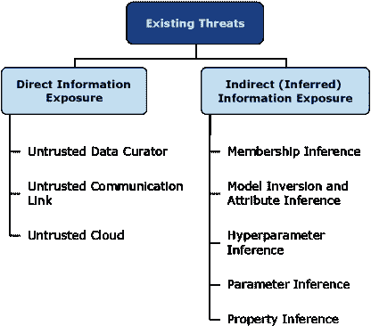
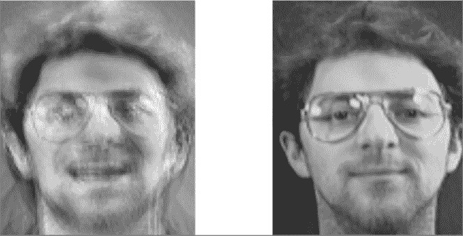
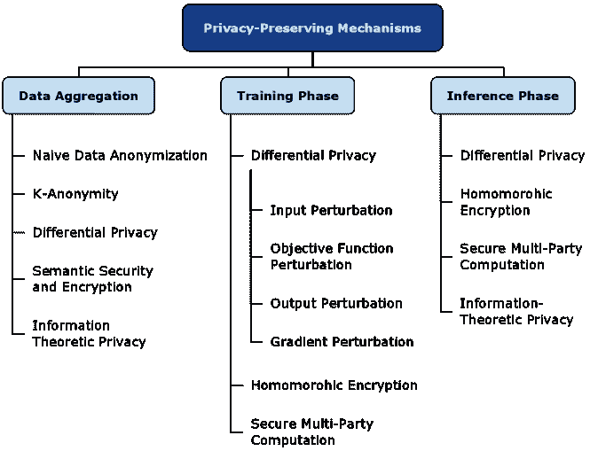
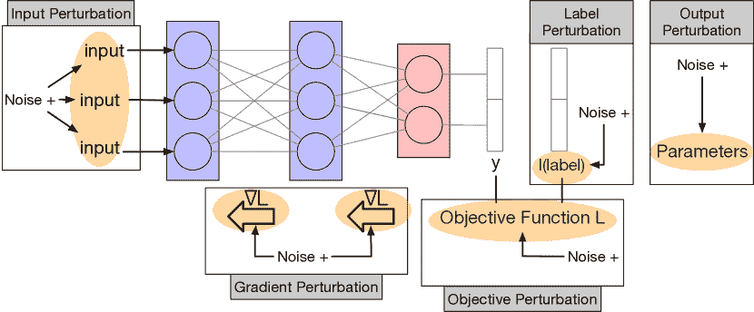
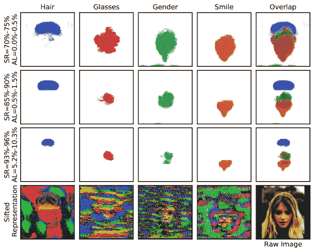
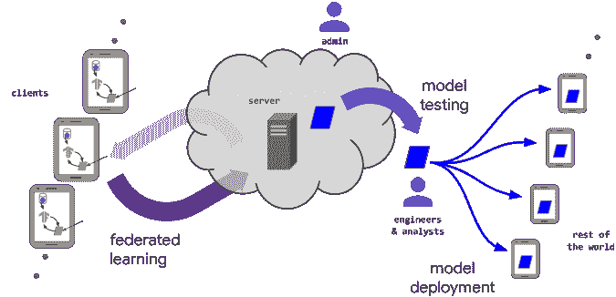
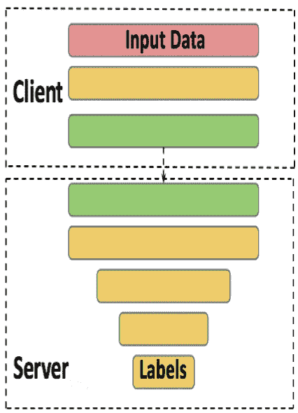
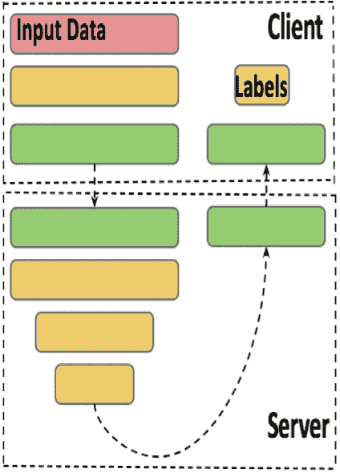

<!--yml

分类：未分类

日期：2024-09-06 20:01:26

-->

# [2004.12254] 深度学习中的隐私：综述

> 来源：[`ar5iv.labs.arxiv.org/html/2004.12254`](https://ar5iv.labs.arxiv.org/html/2004.12254)

# 深度学习中的隐私：综述

Fatemehsadat Mireshghallah¹, Mohammadkazem Taram¹, Praneeth Vepakomma²,

Abhishek Singh², Ramesh Raskar², Hadi Esmaeilzadeh¹,

¹ 加州大学圣地亚哥分校，² 麻省理工学院

{fatemeh, mtaram, hadi}@ucsd.edu,

{vepakom, abhi24, raskar}@mit.edu

###### 摘要

深度学习在许多领域的持续进步，包括视觉、推荐系统、自然语言处理等，已经导致深度神经网络（DNNs）在生产系统中的广泛应用。大型数据集和高计算能力是这些进步的主要推动因素。这些数据集通常是众包获得的，可能包含敏感信息。这带来了严重的隐私问题，因为这些数据可能被滥用或通过各种漏洞泄露。即使云服务提供商和通信链路是可信的，仍然存在推断攻击的威胁，攻击者可能推测用于训练的数据的特性，或找到基础模型的架构和参数。在本综述中，我们回顾了深度学习带来的隐私问题以及为解决这些问题而提出的缓解技术。我们还指出了关于测试时推断隐私的文献中的空白，并提出了可能的未来研究方向。

## 1 介绍

深度神经网络（DNNs）在视觉、医学、推荐系统、自然语言处理等各个领域的成功，导致它们在众多生产系统中的部署 [1, 2, 3, 4]。在医学领域，学习用于发现患者历史中的模式，并识别医学影像中的异常，这有助于疾病的诊断和预后。正如 Fredrikson 等人所示，机器学习在医疗保健中的使用可能会泄露患者的基因标记，从而危及患者隐私 [5]。深度学习还被广泛应用于金融领域，用于预测价格或创建投资组合等众多应用。在这些情况下，通常一个实体会训练自己的模型，模型参数被视为机密。能够发现或推断这些参数被认为是隐私的泄露 [6]。对大型数据集和高计算能力（GPUs 和 TPUs）的轻松访问为上述进展铺平了道路。这些数据集通常是众包获得的，可能包含敏感信息。这带来了严重的隐私问题，因为神经网络被用于我们生活的不同方面 [7, 5, 8, 9, 10, 11, 12]。

图 1 展示了可能对深度学习构成威胁的分类。其中一种威胁是通过不可信的数据策展人、通信链路或云 [13, 14]，直接有意或无意地暴露敏感信息。这些信息可以是训练数据、推理查询或模型参数或超参数。如果我们假设信息不能直接获得，仍然存在通过推理间接暴露信息的威胁。成员推理攻击 [15] 可以推断某个数据实例是否是模型训练过程的一部分。模型反演和属性推断攻击可以从训练模型的观察预测中推断数据实例的敏感特征以及该数据实例的其他非敏感特征 [16, 17]。一些攻击则针对窃取关于已部署模型的信息，例如其架构 [18]、训练参数 [19] 或其训练数据的一般属性，例如训练图像是否全部取自户外 [20]。

针对这些威胁，已经提出了大量方法。这些方法大多数集中在数据聚合/数据集发布和深度学习训练阶段。我们将这些方法分为三类。第一类方法关注于清理数据，尝试在保持统计趋势的同时移除敏感信息 [21, 22]。第二类方法关注于使 DNN 训练阶段保密，并保护用于训练的数据 [23, 24, 25, 26, 27, 28]。最后一类方法，只有少数几项，试图通过保护用户发送给已部署 DNN 的输入数据（请求）来保护测试时推理阶段的隐私 [29, 30, 31]。

在本文中，我们首先简要讨论了针对深度学习的现有攻击和隐私威胁。然后，我们重点介绍了现有的深度学习隐私保护方法，并展示了文献中关于测试时推理隐私的空白。还有一些可以在深度学习模型中利用的其他安全漏洞，例如对抗性攻击 [32]，数据中毒 [33]。这项工作仅关注隐私特定的脆弱性，其他此类攻击超出了本文的范围。

## 2 现有威胁

在本节中，我们映射了深度学习和一般机器学习中现有隐私威胁的空间。虽然本调查的重点是隐私保护技术，但我们提供了攻击的简要总结，以更好地说明隐私保护的必要性。图 1 显示了这些威胁的全貌，我们将其分为直接和间接信息暴露的两大类。直接威胁是指攻击者可以直接访问实际信息。而在间接攻击中，攻击者试图推测或猜测信息，而无法访问实际信息。

### 2.1 直接信息暴露

直接的有意或无意的数据泄露可能发生在许多不同的环境中，并不仅限于机器学习。数据集通过数据管理者或存储数据的实体发生泄露，可能是由于黑客、恶意软件、病毒或社会工程学的无意行为，这些行为通过欺骗个人将敏感数据交给对手 [13]。英特尔安全的研究 [34] 表明，员工对数据泄露负责的比例为 43%，其中一半被认为是无意的。恶意方可以利用系统的后门绕过服务器的认证机制，直接访问敏感数据集，或敏感参数和模型 [35, 36, 37]。例如，近期对 Equifax 的黑客攻击利用了 Apache Struts 软件中的一个漏洞，该软件被 Equifax 使用 [35]。

通过未经适当加密传输机密数据来进行数据共享是数据通过通信链路暴露的一个例子 [38]。卡巴斯基实验室在 2018 年报告称，他们发现了四百万个将未加密的用户资料数据发送到广告商服务器的 Android 应用程序 [39]。私密数据也可能通过接收数据并在其上运行过程的云服务被暴露，例如机器学习即服务（MLaaS）。一些这些服务没有说明数据处理完毕后的去向，也没有提到他们将用户的数据发送到云端，而不是在本地处理 [8]。

表 1：一些显著针对机器学习隐私的攻击特性。MIA 表示表中的模型逆转攻击。

| 攻击 | 会员 | 模型 | 超参数 | 参数 | 属性 | 访问 | 访问 |
| --- | --- | --- | --- | --- | --- | --- | --- |
|  | 推断 | 逆转 | 推断 | 推断 | 推断 | 到模型 | 到输出 |
| 会员推断 [15] | ● | ○ | ○ | ○ | ○ | 黑箱 | 逻辑回归 |
| 测量会员隐私 [40] | ● | ○ | ○ | ○ | ○ | 黑箱 | 逻辑回归 |
| ML-Leaks [41] | ● | ○ | ○ | ○ | ○ | 黑箱 | 逻辑回归 |
| 自然审计者 [42] | ● | ○ | ○ | ○ | ○ | 黑箱 | 标签 |
| LOGAN [43] | ● | ○ | ○ | ○ | ○ | 两者 | Logits |
| 数据来源 [44] | ● | ○ | ○ | ○ | ○ | 黑箱 | Logits |
| 机器学习中的隐私风险 [17] | ● | ● | ○ | ○ | ○ | 白箱 | Logits+附加信息 |
| Fredrikson 等 [5] | ○ | ● | ○ | ○ | ○ | 黑箱 | Logits |
| 带置信度值的 MIA [16] | ○ | ● | ○ | ○ | ○ | 两者 | Logits |
| 对抗性神经网络逆向 [45] | ○ | ● | ○ | ○ | ○ | 黑箱 | Logits |
| 更新泄漏 [46] | ○ | ● | ○ | ○ | ○ | 黑箱 | Logits |
| 协作推断 MIA [47] | ○ | ● | ○ | ○ | ○ | 两者 | Logits |
| 秘密分享者 [48] | ○ | ○ | ○ | ○ | ● | 黑箱 | Logits |
| FCNNs 的属性推断 [20] | ○ | ○ | ○ | ○ | ● | 白箱 | Logits |
| 入侵智能机器 [49] | ○ | ○ | ○ | ○ | ● | 白箱 | Logits |
| 缓存心灵感应 [18] | ○ | ○ | ○ | ● | ○ | 黑箱 | Logits |
| 偷窃超参数 [50] | ○ | ○ | ○ | ● | ○ | 黑箱 | Logits |

| 偷窃机器学习模型 [19] | ○ | ○ | ● | ● | ○ | 黑箱 | 标签 | 

图 1: 现有深度学习威胁的分类

### 2.2 间接（推断）信息暴露

如图 1 所示，我们将间接攻击分为 5 大类：成员推断、模型逆向、超参数推断、参数推断和属性推断攻击。表 1 显示了不同攻击及其属性的总结。“模型访问”列决定了攻击是否需要白箱或黑箱访问模型才能成功实施。白箱访问假定可以访问完整的目标模型，而黑箱访问仅假定可以查询模型，但不了解目标模型的架构或参数。最后一列显示了攻击者是否需要访问模型的输出置信度值（概率，logits），或者仅预测标签是否足够。

#### 2.2.1 成员推断

给定一个数据实例和对预训练目标模型的（黑箱或白箱）访问，成员推断攻击会推测给定的数据实例是否参与了目标模型的训练步骤。Shokri 等人[15] 提出了首个机器学习中的成员推断攻击，他们考虑了一个攻击者，该攻击者具有对目标模型的黑箱查询访问权限，并且可以获得查询输入的置信度评分（概率向量）。攻击者使用这个置信度评分来推断给定数据在训练中的参与情况。他们首先在标记数据集上训练影子模型，该数据集可以通过三种方法生成：模型反演攻击（我们将接下来讨论）、基于统计的合成（通过对训练集的底层分布的假设）或带噪声的真实数据。利用这些影子模型，攻击者训练一个“攻击模型”，以区分数据实例是否参与了影子模型的训练集。最后，对于主要的推断攻击，攻击者对目标部署模型进行查询，以接收每个给定输入数据实例的置信度评分，并推断输入是否属于目标训练数据的一部分。这种攻击建立在这样的假设上：如果一个记录用于模型的训练，它将产生比模型以前未见过的记录更高的置信度评分。

一些研究[51, 52, 17] 将成员推断攻击归因于泛化差距、模型的过拟合和神经网络的数据记忆能力。已经证明深度神经网络会记住训练数据[53, 54, 55]，而不是学习数据的潜在属性，这意味着它们往往倾向于过度拟合训练数据。Long 等人[40] 提出了一种更准确测试给定实例成员身份的方法。他们在有和没有这个给定实例的情况下训练影子模型，然后在推断时，攻击者测试实例是否用于训练目标模型，这与 Shokri 等人的方法类似。最近，Salem 等人[41] 提出了一个更通用的攻击方法，这种方法可以放宽之前攻击中的主要要求（例如使用多个影子模型、了解目标模型结构，以及拥有与目标模型训练数据相同分布的数据集），并显示这些攻击在成本较低的情况下仍然有效，而不会显著降低其效果。

成员推断攻击并不总是需要访问目标模型的置信值（logits），正如宋和施马季科夫在最近的攻击中所示[42]，该攻击可以通过对模型进行非常少量的查询来检测特定用户的文本是否用于训练模型。

Yeom 等人 [17] 提出了一种成员推断攻击，适用于攻击者可以获得目标模型的白箱访问权限并知道模型的平均训练损失的情况。在这种攻击中，对于一个输入记录，攻击者评估模型的损失，如果损失小于阈值（训练集上的平均损失），则该输入记录被认为是训练集的一部分。成员推断攻击也可以应用于生成对抗网络（GANs），如 Hayes 等人 [43] 所示。

图 2：左侧的图像是使用 Fredrikson 等人的模型反演攻击恢复的 [16]。右侧的图像显示了训练集中的一张图像。攻击者仅获得了个人的姓名以及访问一个返回分类置信度分数的面部识别系统的权限 [16]。

#### 2.2.2 模型反演和属性推断

模型反演和属性推断攻击针对属性隐私，攻击者尝试从发布的模型和实例的非敏感属性中推断给定数据实例的敏感属性 [56]。这些攻击中最显著的是针对公开发布的线性回归模型，其中 Fredrikson 等人 [5] 反演了药物（华法林）剂量预测任务的模型。他们基于模型输出和其他若干非敏感属性（如身高、年龄、体重）恢复了患者的基因组信息。这种攻击只需对目标模型进行黑箱 API 访问即可应用。Fredrikson 等人将此攻击形式化为最大化敏感属性的后验概率估计。换句话说，攻击者假设每个数据实例的特征$f_{1}$到$f_{d-1}$是非敏感的。然后，攻击者试图最大化特征$f_{d}$的后验概率，给定特征$f_{1}$到$f_{d-1}$的非敏感特征以及模型输出。

在另一项工作中，Fredrikson 等人 [16] 证明，在获得神经网络的白盒访问权限的情况下，他们可以从观察到的模型预测中提取训练数据实例。图 2 显示了一个恢复的面部图像，该图像与输入图像相似，通过利用目标模型的置信度分数进行重建。Yeom 等人 [17] 还提出了一种属性推断攻击，该攻击基于与其会员推断攻击相同的原理，如第 2.2.1 节中提到的。攻击者评估模型在输入实例上的损失，对于不同的敏感属性值，并推断出产生与原始数据输出相似的损失值的敏感值。Salem 等人 [46] 建议对在线学习进行模型反演攻击，使用生成对抗网络，并基于梯度更新前后模型之间的差异。在相同方向上，Brockschmidt 等人 [57] 演示了语言模型更新的信息泄露。最近，He 等人 [47] 提出了一套新的攻击方法，以破坏测试时推断查询的隐私，在协作深度学习系统中，其中一个 DNN 被拆分并分发给不同的参与者。这一方案被称为拆分学习 [58]，在第四部分中讨论。他们展示了，通过他们的攻击，一个恶意参与者可以恢复输入系统中的任意输入，即使没有访问其他参与者的数据或计算。

#### 2.2.3 模型窃取：超参数和参数推断

训练好的模型被视为其所有者的知识产权，并且在许多情况下可以被视为机密[6]，因此提取模型可能被视为隐私侵犯。除此之外，正如前面讨论的那样，深度神经网络（DNN）被证明会记住关于其训练数据的信息，因此暴露模型参数可能会导致训练数据的暴露。模型盗窃攻击旨在通过对目标模型的黑箱访问来恢复模型参数。Tramer 等人[19]设计了一种攻击方法，该方法通过观察模型的预测（置信值）来找到模型的参数。他们的攻击尝试通过方程求解来找到模型参数，基于输入-输出对。该攻击无法在未提供置信值的情况下进行。超参数盗窃攻击试图找到在模型训练期间使用的超参数，例如正则化系数[50]或模型架构[18]。

#### 2.2.4 属性推断

这类攻击试图从目标模型中推断特定的信息模式。这些攻击的一个例子是记忆攻击，它旨在发现目标模型训练数据中的敏感模式[48]。这些攻击已针对隐马尔可夫模型（HMM）、支持向量机（SVM）[49]和神经网络[20]进行过。

## 3 隐私保护机制

在本节中，我们回顾了深度学习和机器学习的一般隐私保护机制的文献。图 3 展示了我们对这一领域的分类。我们将文献分为三个主要组别。第一组是私人数据聚合方法，旨在收集数据并形成数据集，同时保护贡献者的隐私[21, 22]。第二组包括大量的研究工作，重点是设计机制使得模型的训练过程保持私密，从而不暴露训练数据集中参与者的敏感信息。最后，第三组关注深度学习的测试推断阶段。它试图保护已部署模型用户的隐私，这些用户将其数据发送给训练好的模型以进行特定的推断服务。

### 3.1 数据聚合

在这里，我们介绍最突出的数据隐私保护机制。并非所有这些方法都应用于深度学习，但为了全面性，我们将简要讨论它们。这些方法可以大致分为两组：无上下文隐私和上下文感知隐私。无上下文隐私解决方案，例如差分隐私，对数据将被使用的具体上下文或目的并不知晓。而上下文感知隐私解决方案，例如信息论隐私，能够了解数据将被使用的上下文，并能够实现改进的隐私-效用权衡 [59]。

#### 3.1.1 简单数据匿名化

本调查中所指的简单匿名化是指从数据中移除标识符，例如参与者的姓名、地址和完整邮政编码，以保护隐私。这种方法曾用于保护患者在处理医疗数据时的隐私，但已被证明在许多情况下失败 [60, 21, 61]。也许最突出的失败案例是 Netflix 奖的情况，其中 Narayanan & Shmatikov 将他们的去匿名化技术应用于 Netflix 奖数据集。该数据集包含 500,000 名 Netflix 订阅者的匿名电影评分。他们展示了一个具有辅助知识的对手（来自公开的互联网电影数据库记录）可以轻易识别用户并揭示潜在的敏感信息 [60]。

#### 3.1.2 K-匿名性

一个数据集具有 k-匿名性特性，如果每个参与者的信息不能与数据集中至少$k-1$个其他参与者的信息区分开来 [21]。K-匿名性意味着，对于任何对对手可用的属性组合（这些属性被称为准标识符），至少有 k 行具有完全相同的属性集。K-匿名性的目标是阻止重新识别。然而，k-匿名化在高维数据集的匿名化上表现较差 [62]。这导致了如 l-多样性 [63]和 t-接近性 [64]等隐私概念，这些概念超出了本调查的范围。

#### 3.1.3 差分隐私

###### 定义 3.1。

$\epsilon$-差分隐私 ($\epsilon$-DP)。对于$\epsilon\geq 0$，一个算法$A$满足$\epsilon$-DP [65, 22] 当且仅当对于任意一对仅在一个元素上有所不同的数据集$D$和$D^{\prime}$：

|  | $\mathcal{P}[A(D)=t]\leq e^{\epsilon}\mathcal{P}[A(D^{\prime})=t]\;\;\;\forall t$ |  | (1) |
| --- | --- | --- | --- |

其中，$\mathcal{P}[A(D)=t]$ 表示算法 $A$ 输出 $t$ 的概率。在这种设置下，量 $ln\frac{\mathcal{P}[A(D)=t]}{\mathcal{P}[A(D^{\prime})=t]}$ 被称为隐私损失。DP 试图通过确保因包含一个人的数据而产生的效果很小，来近似个体选择退出数据集的效果。当处理数值数据时，广泛使用的 DP 机制之一是拉普拉斯机制。

###### 定义 3.2。

拉普拉斯机制 [22] 给定目标函数 $f$ 和固定的 $\epsilon\geq 0$，随机化算法 $A_{f}(D)=f(D)+x$ 其中 $x$ 是从拉普拉斯分布 $Lap(\mu,\frac{\Delta_{f}}{\epsilon})$ 中抽取的扰动随机变量，被称为拉普拉斯机制，并且是 $\epsilon$-DP。在这里，$\Delta_{f}$ 是函数 $f$ 的全局敏感度，定义为 $\Delta_{f}=\sup|f(D)-f(D^{\prime})|$，对于所有在仅一个元素上有所不同的数据集对 $(D,D^{\prime})$。找到这种敏感度并不总是简单的，特别是当函数 $f$ 是深度神经网络，甚至是其多个层时 [66]。

差分隐私满足一种组合属性，该属性表明，当两个隐私预算为 $\epsilon_{1}$ 和 $\epsilon_{2}$ 的机制应用于相同的数据集时，它们总共使用的隐私预算为 $\epsilon_{1}$ + $\epsilon_{2}$。因此，组合多个差分隐私机制会消耗线性增长的隐私预算。已经证明可以达到更紧的隐私界限，以使隐私预算以次线性方式减少 [67, 68]。已有多种传统的 $\epsilon$-差分隐私变体被提出，以提供更紧的隐私预算分析。其中之一是具有高级组合（AC）的差分隐私 [69]，它允许在方程 1 的右侧添加泄漏概率参数 $\delta$。

微分隐私也可以通过让每个参与者在共享数据之前对其数据应用微分隐私随机化来实现，而不需要信任一个集中服务器。这个模型被称为局部微分隐私模型，方法“随机响应”被证明是局部微分隐私的[70]。局部微分隐私已被部署在许多系统中，用于私密地收集统计数据[71, 72]。例如，Google 使用一种名为 RAPPOR 的技术[71]，允许网页浏览器开发者私密地收集使用统计数据。已经提出了大量的微分隐私机制用于各种应用[73, 24, 74]。Triastcyn 和 Faltings 提出了一种生成合成数据集的技术，这些数据集在提供微分隐私保证的同时仍具有真实数据的统计属性[75]。

一种名为 Pufferfish 的微分隐私广义版本由[76]提出。Pufferfish 框架可以用于创建针对特定应用的新的隐私定义[77]，例如普查数据发布。另一个也是对微分隐私进行位置模糊处理的框架称为 geo-indistinguishablity[78]。Geo-indistinguishablity 通过引入距离度量 $d$（在公式 1 中乘以 $\epsilon$）来放宽微分隐私的保证。这种距离允许调整模糊处理，使得被模糊到更近点（映射到接近真实值的点）的概率高于被模糊到远点的概率。

#### 3.1.4 语义安全与加密

语义安全[79]（计算上安全）是加密方案的标准隐私要求，它声明具有背景信息的对手的优势（衡量对手攻击加密算法成功的程度）应该是加密学上微小的。虽然理论上语义安全是可能被突破的，但通过任何已知的实际手段这样做是不可行的[80]。安全多方计算（SMC），我们在第 3.2 节中讨论，基于语义安全定义[81]。

#### 3.1.5 信息论隐私

信息论隐私是一种上下文感知的隐私解决方案。上下文感知解决方案明确地对数据集统计信息进行建模，而非像上下文无关解决方案那样假设最坏情况下的数据集统计信息和对手情况。有一些研究工作研究了基于信息论的隐私和公平方法，其中隐私和公平是通过信息降级、模糊化或对抗性学习来提供，并通过互信息减少来加以论证 [82, 83, 59, 84, 85, 86, 87, 88, 89, 90, 91]。黄等人引入了一种称为生成对抗隐私（GAP）的上下文感知隐私框架，利用生成对抗网络（GANs）生成私有数据集。他们的方案包括一个试图移除私有属性的清洗器，以及一个试图推断私有属性的对手 [59]。他们表明，从数据中学习的隐私机制（以生成对抗方式）与理论上的最佳机制相匹配。

### 3.2 训练阶段

表 2：一些值得注意的隐私保护机制的分类。在表中，使用了以下缩写：ERM 代表经验风险最小化，GM 代表生成模型，AE 代表自动编码器，LIR 代表线性回归，LOR 代表逻辑回归，LM 代表线性均值，FLD 代表费舍尔线性判别，NB 代表朴素贝叶斯，RF 代表随机森林。

| 方法 | DP | SMC | HE | 数据集 | 任务 |
| --- | --- | --- | --- | --- | --- |
| DPSGD [24] | ● | ○ | ○ | MNIST, CIFAR-10 | 使用 DNN 进行图像分类 |
| DP LSTM [92] | ● | ○ | ○ | Reddit 帖子 | 使用 LSTM 进行语言模型 |
| DP LOR [93] | ● | ○ | ○ | 人工数据 | 逻辑回归 |
| DP ERM [94] | ● | ○ | ○ | Adult, KDD-99 | 使用 ERM 进行分类 |
| DP GAN [95] | ● | ○ | ○ | MNIST, MIMIC-III | 使用 GAN 进行数据生成 |
| DP GM [96] | ● | ○ | ○ | MNIST, CDR, TRANSIT | 使用 GM 进行数据生成 |
| DP AE [97] | ● | ○ | ○ | 健康社交网络数据 | 使用 AE 进行行为预测 |
| DP 信念网络[98] | ● | ○ | ○ | YesiWell, MNIST | 使用 DNN 进行分类 |
| 自适应拉普拉斯机制 [99] | ● | ○ | ○ | MNIST, CIFAR-10 | 使用 DNN 进行图像分类 |
| 使用 PATE 进行图像分类 [25] | ● | ○ | ○ | MNIST, SVHN | 使用 DNN 进行图像分类 |
| 使用 PATE 进行可伸缩学习 [100] | ● | ○ | ○ | MNIST, SVHN, Adult, Glyph | 使用 DNN 进行图像分类 |
| DP Ensemble [26] | ● | ○ | ○ | KDD-99, UCI-HAR, URLs | 使用 ERM 进行分类 |
| SecProbe [101] | ● | ○ | ○ | US, MNIST, SVHN | 使用 DNN 进行回归和分类 |
| 分布式 DP [102] | ● | ○ | ○ | eICU, TCGA | 使用 DNN 进行分类 |
| DP 模型发布 [103] | ● | ○ | ○ | MNIST, CIFAR | 使用 DNN 的图像分类 |
| DP 联邦学习 [104] | ● | ○ | ○ | MNIST | 使用 DNN 的图像分类 |
| ScalarDP, PrivUnit [105] | ● | ○ | ○ | MNIST, CIFAR | 使用 DNN 的图像分类 |
| DSSGD [23] | ● | ○ | ○ | MNIST, SVHN | 使用 DNN 的图像分类 |
| Private Collaborative NN [106] | ● | ● | ○ | MNIST | 使用 DNN 的图像分类 |
| Secure Aggregation for ML [107] | ○ | ● | ○ | - | 联邦学习 |
| QUOTIENT [108] | ○ | ● | ○ | MNIST, 甲状腺, 信用 | 使用 DNN 的分类 |
| SecureNN [109] | ○ | ● | ○ | MNIST | 使用 DNN 的图像分类 |
| ABY3 [110] | ○ | ● | ○ | MNIST | LIR, LOR, NN |
| Trident [111] | ○ | ● | ○ | MNIST, 波士顿房价 | LIR, LOR, NN |
| SecureML [112] | ○ | ● | ● | MNIST, Gisette, Arcene | LIR, LOR, NN |
| Deep Learning w/ AHE [113] | ○ | ○ | ● | MNIST | 使用 DNN 的图像分类 |
| ML Confidential [114] | ○ | ○ | ● | 威斯康星乳腺癌 | LM, FLD |
| Encrypted Statistical ML [115] | ○ | ○ | ● | 来自 UCI ML 的 20 个数据集 | LOR, NB, RF |
| CryptoDL [27] | ○ | ○ | ● | MNIST, CIFAR-10 | 使用 DNN 的图像分类 |
| DPHE [116] | ○ | ○ | ● | Caltech101/256, CelebA | 使用 SVM 的图像分类 |

图 3: 隐私保护方案在深度学习中的分类。

关于深度学习和机器学习的私有训练的文献可以根据这些方法提供的保障进行分类，这些保障通常基于差分隐私（第 3.1.3 节）或语义安全和加密（第 3.1.4 节）。使用加密的隐私保护是通过对加密数据进行计算实现的。最常见的两种方法是同态加密（HE）和安全多方计算（SMC）。

同态加密（HE）。HE [117] 允许对加密数据进行计算。客户端可以将其数据以加密格式发送到服务器，服务器可以在不解密的情况下对数据进行计算，然后将密文（加密结果）发送回客户端进行解密。HE 计算密集型，因此尚未在许多生产系统中部署 [118, 119]。

安全多方计算（SMC）。SMC 试图设计一个计算方网络（其中并非所有计算方都必须被用户信任），以执行给定的计算，并确保数据不会泄漏。网络中的每个方仅能访问数据的加密部分。SMC 确保只要数据的拥有者信任网络中的至少一个计算系统，他们的输入数据将保持秘密。使用此方案可以轻松计算简单函数。也可以支持任意复杂的函数计算，但通常会有较高的计算成本 [119]。

在这项调查中，我们将私人训练的文献分为三组方法：1）差分隐私（DP），2）同态加密（HE）和 3）安全多方计算（SMC）。表 2 展示了我们在本节中讨论的文献的这一分类。

#### 3.2.1 差分隐私

图 4：深度学习框架的工作概述以及差分隐私如何应用于管道的不同部分。

本节简要讨论了修改深度学习算法以满足差分隐私的方法。图 4 展示了深度学习框架的概览。如图所示，满足差分隐私（或隐私保护噪声）所需的随机化可以插入五个位置：输入、损失/目标函数、梯度更新、输出（训练模型的优化参数）和标签 [25]。

输入扰动可以被视为使用一个已清理的数据集（见第 3.1 节）进行训练的等效方式。目标函数扰动和输出扰动在具有凸目标函数的机器学习任务中被探索。例如，在逻辑回归的情况下，Chaudhuri 等人证明目标扰动需要在$\frac{2}{n\epsilon}$尺度上进行采样噪声，而输出扰动需要在$\frac{2}{n\lambda\epsilon}$尺度上进行采样噪声，其中$n$是样本数量，$\lambda$是正则化系数[94]。最近，Iyengar 等人[120]提出了一种更实用和通用的目标扰动方法，并使用高维真实数据进行了基准测试。在深度学习任务中，由于目标函数的非凸性，计算函数的敏感性（这对于确定添加噪声的强度是必要的）变得不那么简单。一种解决方案是用近似的凸多项式函数[97, 98, 99]来替代非凸函数，然后使用目标函数扰动。这种近似限制了传统 DNN 的能力和效用。鉴于讨论的限制，梯度扰动是深度学习中广泛使用的隐私保护训练方法。对梯度应用扰动需要将梯度范数限制在一定范围内，由于在深度学习任务中梯度可能是无界的，因此通常使用剪切来缓解这个问题。

Shokri 等人展示了深度神经网络可以以分布式方式和使用扰动参数进行训练以实现隐私保护 [23]，但他们的实现需要与目标模型大小成正比的$\epsilon$，这个大小可能达到几百万。Abadi 等人 [24] 提出了一个称为“时刻会计师（MA）”的机制，用于界定在深度神经网络上顺序应用不同差分隐私算法的累计隐私预算。时刻会计师利用隐私损失随机变量的矩生成函数来跟踪组合过程中隐私损失的界限。MA 分三个步骤操作：首先，计算算法 $A_{1}$、$A_{2}$、.. 的矩生成函数，这些算法是随机化算法。然后通过组合定理将这些矩组合在一起，最后找到给定隐私预算 $\epsilon$ 的最佳泄漏参数 ($\delta$)。时刻会计师在各种用于私密深度学习的差分隐私机制中得到广泛应用。Papernot 等人使用 MA 来帮助界定其教师集成方法的隐私预算，该方法使用了噪声投票和标签扰动 [25, 100]。MA 也被应用于 [102, 103, 104, 95, 96, 105] 等工作中，这些工作都使用了扰动梯度。

最近，Bu 等人将 Dong 等人提出的高斯差分隐私（GDP）概念 [121] 应用于深度学习 [122]，以实现对神经网络训练的更精细分析，与 Abadi 等人 [24] 的分析相比。他们分析了使用 Adam 优化器的私密 DNN 训练中的隐私预算消耗，无需开发复杂的技术，如时刻会计师。他们展示了 GDP 允许一种新的隐私分析，这种分析改进了时刻会计师的分析，并提供了更好的保障（即更低的 $\epsilon$ 值）。

本质上，将差分隐私应用于深度学习会由于噪声和剪辑的添加而导致效用损失。Bagdasaryan 等人已证明，这种效用损失在不同的人群子组之间存在差异，且不同子组的规模各异 [123]。他们通过实验表明，训练样本较少（表现较差）的子组比样本充分的子组损失更多的准确性，即穷者愈穷。

一些工作尝试实验性地测量和审计不同 ially private 学习算法带来的隐私 [124, 125]。Jagielski 等人 [124] 研究了 DP-SGD 是否在实际中提供了比其分析所保证的更好的隐私，使用了数据投毒攻击。Jayaraman 等人 [125] 对多个差分隐私机器学习和深度学习算法进行成员资格和属性推断攻击，并比较它们的性能。

#### 3.2.2 同态加密

只有少数工作完全利用同态加密进行机器学习模型的私人训练 [114, 115, 27]。Graepel 等人使用了一种某种同态加密 (SHE) 方案来训练线性均值 (LM) 和 Fisher 线性判别 (FLD) 分类器 [114]。同态加密算法在它们能计算的函数方面存在一些限制（例如，它们无法实现非线性）。因此，Graepel 等人提出了无除法算法，并专注于简单的分类器，而不是像神经网络这样的复杂算法。

Hesamifard 等人 [27] 试图利用同态加密进行深度学习任务。他们引入了用低度多项式近似最常用的神经网络激活函数（ReLU、Sigmoid 和 Tanh）的方法。这是设计高效同态加密方案的关键步骤。然后，他们用这些近似的多项式函数训练卷积神经网络，并最终在加密数据上实现卷积神经网络，测量模型的性能。

#### 3.2.3 安全多方计算 (SMC)

研究私密和安全计算的一个趋势是为应用程序设计定制协议，例如线性回归和逻辑回归 [112] 以及神经网络训练和推断 [112, 108, 126]。这些方法通常针对的是不同地点的不同数据集共同训练模型，或者将计算任务委托给不相互勾结的计算服务器群体。SMC 需要所有参与者始终在线，这需要大量的通信 [127]。Mohassel 和 Zhang 提出了 SecureML，这是一种基于随机梯度下降的隐私保护方法，用于在多方计算环境中私密地训练机器学习算法，例如线性回归、逻辑回归和神经网络。SecureML 使用秘密共享在训练过程中实现隐私保护。在最近的一项工作中 [110]，Mohassel 等人设计了安全的三方 DNN 训练协议，确保大多数方诚实。Agrawal 等人提出了 QUOTIENT [108]，他们的目标是设计一个优化算法及其定制的安全计算协议，而不是使用传统的在现有优化算法上加密的方法。

### 3.3 推断阶段

表 3：一些显著隐私保护机制的分类。在此表中，NB 是 Naive Bayes 的缩写，DT 是 Decision Tree 的缩写。

| 方法 | DP | SMC | HE | IT | 数据集 | 任务 |
| --- | --- | --- | --- | --- | --- | --- |
| ARDEN [128] | ● | ○ | ○ | ○ | MNIST, CIFAR-10, SVHN | 使用 DNN 进行图像分类 |
| Cryptonets [129] | ○ | ○ | ● | ○ | MNIST | 使用 DNN 进行图像分类 |
| Private Classification [130] | ○ | ○ | ● | ○ | MNIST | 使用 DNN 进行图像分类 |
| TAPAS [131] | ○ | ○ | ● | ○ | MNIST, Faces, Cancer, Diabetes | 使用 DNN 进行图像分类 |
| FHE–DiNN [132] | ○ | ○ | ● | ○ | MNIST | 使用 DNN 进行图像分类 |
| Face Match [133] | ○ | ○ | ● | ○ | LFW, IJB-A, IJB-B, CASIA | 使用 CNN 进行人脸识别 |
| Cheetah [134] | ○ | ○ | ● | ○ | MNIST, Imagenet | 使用 DNN 进行图像分类 |
| EPIC [119] | ○ | ● | ○ | ○ | CIFAR-10, MIT, Caltech | 使用 DNN 进行图像分类 |
| DeepSecure [135] | ○ | ● | ○ | ○ | MNIST, UCI-HAR | 使用 DNN 进行分类 |
| XONN [118] | ○ | ● | ○ | ○ | MNIST, CIFAR-10 | 使用 DNN 进行图像分类 |
| Chameleon [136] | ○ | ● | ○ | ○ | MNIST, Credit Approval | 使用 DNN 和 SVM 进行分类 |
| CRYPTFLOW [137] | ○ | ● | ○ | ○ | MNIST, CIFAR, ImageNet | 使用 DNN 进行分类 |
| Classification over Encrypted Data[138] | ○ | ● | ● | ○ | Wisconsin Breast Cancer | 使用 NB、DT 进行分类 |
| MiniONN [139] | ○ | ● | ● | ○ | MNIST, CIFAR-10 | 基于 DNN 的图像分类 |
| GAZELLE [140] | ○ | ● | ● | ○ | MNIST, CIFAR-10 | 基于 DNN 的图像分类 |
| DELPHI [141] | ○ | ● | ● | ○ | CIFAR-10, CIFAR-100 | 基于 DNN 的图像分类 |
| Shredder [31] | ○ | ○ | ○ | ● | SVHN, VGG-Face, ImageNet | 基于 DNN 的分类 |
| 传感器数据混淆 [142] | ○ | ○ | ○ | ● | Iphone 6s 加速度计数据 | 基于 DNN 的活动识别 |
| Olympus [143] | ○ | ○ | ○ | ● | 驾驶图像 | 基于 DNN 的活动识别 |
| DPFE [29] | ○ | ○ | ○ | ● | CelebA | 基于 DNN 的图像分类 |
| Cloak [144] | ○ | ○ | ○ | ● | CIFAR-100, CelebA, UTKFace | 基于 DNN 的图像分类 |

如表 3 所示，与训练领域相比，推理隐私领域的工作较少。推理隐私针对的是部署用于提供推理即服务的系统。在这些情况下，假定部署的系统已完成训练，并且不应从用户提供的数据中学习任何新内容。它仅应执行指定的推理任务。推理隐私的文献分类与训练类似，只是多了一个额外的组，称为信息理论（IT）隐私。这个组的工作通常提供信息理论的数学或实证证据，说明他们的方法如何运作并帮助隐私。这些工作基于第 3.1.5 节的上下文感知隐私定义，旨在减少发送到服务提供商进行推理的数据中的信息内容，以便输入中的信息仅限于服务所需的内容，而不多。 

训练隐私和推理隐私之间一个显著的区别是不同类别的文献量差异。似乎存在一种趋势，即将差分隐私用于训练，将加密方法（HE 和 SMC）用于推理。一个潜在的原因可能是计算复杂性和实现。加密方法，特别是同态加密，显示出至少比传统执行慢两个数量级 [140]。这就是为什么将它们用于训练会显著增加训练时间。此外，如第 3.2.2 节所述，由于近似非线性函数，神经网络在处理加密数据时的性能能力变得有限。然而，对于推理来说，采用加密则较为简单，因为模型已经经过训练。然而，采用差分隐私和噪声添加对于推理来说则不那么简单，因为如果处理不当，可能会损害训练模型的准确性。下面我们将更深入地探讨每一类别的文献。

#### 3.3.1 差分隐私

使用差分隐私进行推理的研究非常少。主要原因是差分隐私提供了最坏情况下的保障，这要求对所有输入片段施加高强度的噪声（标准差大的噪声）。这本质上导致了预训练网络的性能下降。Wang 等人 [128] 提出了 Arden，这是一种数据无效化和差分隐私噪声注入机制，用于推理。Arden 将 DNN 分割到边缘设备和云端。移动设备上执行简单的数据转换，而计算繁重且复杂的推理则依赖于云数据中心。Arden 使用数据无效化和噪声注入来使不同查询不可区分，从而保护客户的隐私。该方案需要对整个网络进行有噪声的重新训练，并在不同层注入噪声。由于计算神经网络每一层的全局灵敏度很复杂，因此输入到噪声注入层的数据被剪裁为训练集中成员创建的最大值。

#### 3.3.2 同态加密

CryptoNets 是同态加密推理领域的开创性工作之一 [129]。Dowlin 等人提出了一种将训练好的神经网络转换为加密网络的方法，称为 CryptoNet。这使得推理服务的客户端可以以加密格式发送数据并接收结果，而无需解密数据。CryptoNets 允许使用 SIMD（单指令多数据）操作，这提高了系统的吞吐量。然而，对于单个查询，这种方案的延迟仍然较高。

Chabanne 等人 [130] 使用低阶多项式近似 ReLu 非线性激活函数，并在激活函数之前提供了归一化层，确保了高准确率。然而，他们没有展示其方法的延迟结果。最近，Juvekar 等人提出了 GAZELLE [140]，这是一个具有较低延迟（相较于之前的工作）的安全私密神经网络推理系统。GAZELLE 结合了同态加密与传统的双方计算技术（如混淆电路）。借助其同态线性代数内核，将神经网络操作映射到优化的同态矩阵-向量乘法和卷积中，GAZELLE 的速度比 CryptoNets 快了三个数量级。Sanyal 等人利用二值化神经网络加速他们的 HE 推理方法。他们声称，与仅保护数据的 CryptoNets 不同，他们提出的方案也能保护模型的隐私。

#### 3.3.3 安全多方计算（SMC）

Liu 等人提出了 MiniONN [139]，在预处理步骤中使用加法同态加密（AHE），不同于直接利用 AHE 加速线性代数的 GAZELLE。MiniONN 显示出相较于 CryptoNets 的显著性能提升，同时没有精度损失。然而，它只是一个双方计算方案，不支持多方计算。Riazi 等人介绍了 Chameleon，一个双方计算框架，其签名定点数的向量点积提高了基于重矩阵乘法的分类方法的预测效率。Chameleon 比 MiniONN 的延迟提高了 4.2$\times$。如上所示，深度学习领域的 SMC 大多集中在加速计算方面，也可以参考 [118]、[119]、[135]。上述方法的准确性损失与其预训练模型相比微不足道（不到 1%）。

#### 3.3.4 信息论隐私

依赖于信息理论方法的隐私保护方案通常假设一个非敏感任务，即服务应该执行的任务，并尝试减少输入数据中对主要推断任务不必要的多余信息[142, 145, 143, 29, 31, 146]。[142, 143, 145] 提出了通过混淆保护时间敏感数据的匿名化方案。Malekzadeh 等人[142] 提出了一个多目标损失函数，用于训练深度自编码器以提取和混淆与用户身份相关的信息，同时保持传感器数据的实用性。训练过程会调节编码器以忽略用户可识别的模式，并调整解码器，使输出不依赖于训练集中的用户。

另一部分工作[31, 147, 29, 144] 提出了用于计算机视觉任务和图像隐私保护的方案。Osia 等人提出了深度私人特征提取（DPFE）[29]，其目的是通过修改网络拓扑结构和重新训练所有模型参数，来混淆输入图像以阻碍对给定敏感（私人）标签的分类。DPFE 将网络分为两个部分，第一部分部署在边缘，第二部分部署在云端。它还通过在中间添加一个自编码器来修改网络架构，然后用其损失函数重新训练整个网络。自编码器的编码器部分部署在边缘设备上，而解码器部署在服务器上。自编码器旨在减少发送数据的维度，从而降低通信成本，并减少发送的信息量，这有助于保护隐私。

DPFE 的损失函数可以在方程 2 中看到。它由三部分组成：首先，是用于分类问题的交叉熵损失，涉及 M 类（$y_{o,c}$表示观测值$o$是否属于类$c$，$p_{o,c}$是网络为观测值属于类$c$提供的概率）。这一项旨在保持准确性。其次，是一个旨在减少具有不同隐私标签的输入之间中间激活的距离的项，以及一个最终项，旨在增加具有相同隐私标签的输入之间中间激活的距离。$\gamma$是一个依赖于维度数量和训练数据的常量，用作归一化因子。$k$也是一个依赖于训练数据的常量。$i$和$j$分别是主批次和随机批次的迭代器，而$Y$是该批次成员的隐私标签。

|  | $\begin{split}-\sum_{c=1}^{M}y_{o,c}log(p_{o,c})+\gamma(\sum_{(i,j):Y_{i}\neq Y_{j}}&#124;&#124;a^{\prime}_{i}-a^{\prime}_{j}&#124;&#124;_{2}\\ +\sum_{(i,j):Y_{i}=Y_{j}}(k-&#124;&#124;a^{\prime}_{i}-a^{\prime}_{j}&#124;&#124;_{2}))\end{split}$ |  | (2) |
| --- | --- | --- | --- |

DPFE 使用该损失函数对给定的神经网络和自编码器进行再训练。训练可以视为尝试创建数据的聚类表示，其中具有相同隐私标签的输入进入不同的聚类，而具有不同标签的输入被推向相同的聚类，以误导任何试图推断隐私标签的对手。鉴于其损失函数，DPFE 在没有隐私标签的情况下无法操作。因此，如果存在没有提供敏感标签的设置，则无法使用 DPFE。训练后，对于每个推断请求，都会随机生成噪声并动态添加到中间结果中。此噪声并不是为了实现差分隐私。

最近，Mireshghallah 等人建议了 Shredder [31]，这是一个在不改变预训练网络的拓扑结构或权重的情况下，启发式地学习附加噪声分布的框架，这些分布减少了传输数据的信息内容，同时对推断准确性造成的损失最小。Shredder 的方法还包括剪切神经网络并在边缘设备上执行其中的一部分，类似于 DPFE。与在云端运行整个神经网络相比，这种方法在某些情况下被证明能减少总体执行时间 [31]，因为通信占用了大量时间，而感知中间表示有时可以节省通信，因为维度更少。

Shredder 通过从位置为 $0$、尺度为 $b$ 的拉普拉斯分布中采样来初始化噪声张量，其维度与中间激活相同，$b$ 是一个超参数。然后，使用方程 3 中显示的损失函数，它试图保持模型的准确性（第一项），同时增加附加噪声的量（第二项）。$\lambda$ 是一个提供准确性-隐私权衡的控制参数。

|  | $-\sum_{c=1}^{M}y_{o,c}log(p_{o,c})-\lambda\sum_{i=1}^{N}{&#124;n_{i}&#124;}$ |  | (3) |
| --- | --- | --- | --- |

一旦训练结束，会将拉普拉斯分布拟合到训练后的张量上，并保存该分布的参数以及元素的顺序。这些分布被收集起来。在推理过程中，从保存的分布中采样噪声并重新排序以匹配保存的顺序。然后将这个噪声张量添加到中间表示中，然后再发送到云端。

DPFE 和 Shredder 都通过实验证明了原始数据和发送的中间表示之间的互信息比的减少。DPFE 只有在用户知道自己想要保护什么时才能有效，而 Shredder 提供了一种更为通用的方法，试图消除与主要任务无关的任何信息。实证评估显示，相比于 DPFE，Shredder 平均可以丢失更多的互信息。然而，在推断私人标签的任务中，由于 DPFE 在训练时可以访问私人标签，它通过使对手的误分类率更高，表现略好。

最近，Mireshghallah 等人提出了一种名为 Cloak 的非侵入性可解释方法，该方法无需更改/重新训练网络参数，也无需对其进行分割。这项工作试图通过分离在测试时推理过程中对 DNN 决策至关重要和不重要的输入特征子集来解释深度神经网络（DNN）的决策过程。这种分离是通过采用不同特征集合的信息理论界限来实现的。在识别出关键子集后，Cloak 使用学习到的值抑制其余特征，并仅发送关键特征。在这方面，Cloak 提供了一种可解释的隐私保护机制。Cloak 生成的表示和有利/不利特征分离的示例如图 5 中所示。

图 5：Cloak 为目标 DNN 分类器（VGG-16）发现的特征，用于黑发颜色、眼镜、性别和笑容检测。彩色特征有助于任务。每个任务描绘的 3 组特征对应不同的抑制比（SR）。AL 表示抑制施加的准确度损失范围。

## 4 隐私增强执行模型和环境

除了隐私保护方案，这些方案是直接优化特定隐私定义的方法，还有一些执行模型和环境有助于增强隐私，但本身并非隐私保护的。在本节中，我们将简要讨论联邦学习、分裂学习和可信执行环境，这些方法已被用于增强隐私。这些方法通常伴随前一节中的隐私保护方案。

### 4.1 联邦学习

图 6：联邦学习模型的工作流程[127]。

联邦学习（FL）是一种机器学习设置，多个客户端在中央服务器的管理下协作训练模型，同时保持训练数据本地。联邦学习建立在集中收集和数据最小化的原则上，这可以缓解集中式机器学习的隐私风险[127]。

联邦学习的工作流程如图 6 所示。这个工作流程分为六个阶段[127]：

1.  1.

    问题识别：首先需要定义要使用联邦学习解决的问题。

1.  2.

    客户端工具：可以指示客户端保存训练所需的数据。例如，运行在边缘设备上的应用程序可能需要本地保存一些元数据（例如用户交互数据）以及主要数据（例如文本消息）。

1.  3.

    模拟原型（可选）：部署系统的工程师可能需要在联邦学习模拟中原型化不同的架构并尝试不同的超参数。

1.  4.

    联邦模型训练：启动多个联邦训练任务，这些任务训练模型的不同变体或使用不同的优化超参数。

1.  5.

    模型评估：当任务完成训练阶段（通常在几天后）时，模型会进行分析和评估，无论是在标准的集中式数据集上还是在本地客户端数据上。

1.  6.

    部署：当分析完成并选择了模型后，启动发布过程。该过程包括实时 A/B 测试、手动质量保证和分阶段推出。

联邦学习广泛应用于 SMC 和差分隐私[127, 107, 148]。Bonawitz 等人应用安全聚合来私密地组合用户设备上本地机器学习的输出，以更新全球模型。安全聚合指的是在多方环境中计算总和，其中没有任何一方将其更新明文显示，即使是给聚合者。将安全聚合添加到联邦学习中时，模型更新的聚合由通过安全多方通信引导的虚拟不可篡改第三方执行。使用这种设置，云提供商只了解聚合后的模型更新。还有一些研究考虑了用户数据的混洗，以隐藏每个数据项的来源。Cheu 等人和 Balle 等人提出了在混洗模型中满足差分隐私保证的安全聚合协议[149, 150]。最近的工作[151]减少了混洗模型中产生的误差和通信开销。关于联邦学习工作流程和集成的更深入细节超出了本调查的范围。

### 4.2 分割学习

(a) 原始分割学习

(b) 回旋镖分割学习

图 7：原始的分割学习配置，其中原始数据在客户端和服务器之间不共享，以及回旋镖（U 形）配置，其中原始数据和标签都不在客户端和服务器之间共享[152]。

分割学习是一种执行模型，其中神经网络在客户端和服务器之间分割[58]。这与 Shredder[31]和 DPFE[29]中描述的神经网络分区非常相似。原始的分割学习是由每个客户端计算通过深度神经网络到特定层（称为切割层）的前向传递。切割层的输出，称为破碎数据，从边缘设备发送到另一个实体（可以是服务器或另一客户端），该实体完成其余计算。通过这种执行方案，一轮前向传递在不共享原始数据的情况下计算完成。梯度然后可以以类似方式从服务器回传到切割层。切割层的梯度被转移回客户端，剩余的反向传播在客户端完成。通过这种方式，训练或推理在客户端无需直接访问彼此的原始数据即可完成。一个实例，其中标签也未与原始数据一起共享，如图 7 所示。

### 4.3 受信执行环境（TEEs）

可信执行环境，也称为安全区，为将去中心化学习或推断过程的部分移至云中受信任的环境提供了机会，其代码可以被证明和验证。最近，Mo 等人建议了一种框架，该框架使用边缘设备的可信执行环境（TEE）与模型分区结合，以限制对 DNN 的攻击面[153]。TEE 在执行期间可以提供完整性和保密性。TEE 已以多种形式部署，包括 Intel 的 SGX 启用 CPU [154, 155, 156, 157]，Arm 的 TrustZone [158]。然而，这种执行模型要求用户将数据发送到运行在远程服务器上的安全区，这使得远程服务器可以访问原始数据，并且如新发现的硬件漏洞[37, 36, 159, 160, 161, 162]所示，这种访问可能会导致隐私泄露。

## 5 结论

机器学习的激增是由于数据和计算能力的增长。这些数据主要来自人们[7]，并包含大量敏感信息。这项工作试图提供一个全面而系统的总结，概述在深度学习环境中保护用户隐私的努力。我们发现数据聚合、训练和推断阶段之间的努力数量存在明显差异。特别是，在推断阶段对用户隐私的关注较少。

## 参考文献

+   [1] S. Laine, T. Karras, T. Aila, A. Herva, S. Saito, R. Yu, H. Li, 和 J. Lehtinen, “使用深度卷积神经网络进行生产级别的人脸性能捕捉”，发表于 ACM SIGGRAPH / Eurographics 计算机动画研讨会，SCA ’17，（美国纽约），计算机机械协会，2017 年。

+   [2] V. Këpuska 和 G. Bohouta, “下一代虚拟个人助理（微软 Cortana、苹果 Siri、亚马逊 Alexa 和谷歌 Home）”，2018 IEEE 第 8 届年度计算与通信研讨会及会议（CCWC），第 99–103 页，2018 年。

+   [3] G. A. Kaissis, M. R. Makowski, D. Rückert, 和 R. F. Braren, “医疗影像中的安全、隐私保护和联邦机器学习”，Nature Machine Intelligence，第 1–7 页，2020 年。

+   [4] S. Singh, H. Sikka, S. Kotti, 和 A. Trask, “医学影像中的差分隐私残差网络基准测试”，arXiv 预印本 arXiv:2005.13099，2020 年。

+   [5] M. Fredrikson, E. Lantz, S. Jha, S. Lin, D. Page, 和 T. Ristenpart, “药物基因组学中的隐私：个性化华法林剂量的端到端案例研究”，发表于第 23 届 USENIX 安全研讨会，SEC’14，（美国），第 17–32 页，USENIX 协会，2014 年。

+   [6] R. J. Bolton 和 D. J. Hand, “统计欺诈检测：综述”，Statist. Sci., 第 17 卷, 页 235–255, 2002 年 8 月。

+   [7] S. A. Thompson 和 C. Warzel，“隐私项目：一千二百万部手机，一个数据集，零隐私”，2019 年。在线访问于 2020 年 2 月 [`www.nytimes.com/interactive/2019/12/19/opinion/location-tracking-cell-phone.html`](https://www.nytimes.com/interactive/2019/12/19/opinion/location-tracking-cell-phone.html)。

+   [8] C. Warzel，“隐私项目：Faceapp 显示了我们对隐私的关心但不了解它”，2019 年。在线访问于 2020 年 2 月 [`www.nytimes.com/2019/07/18/opinion/faceapp-privacy.html`](https://www.nytimes.com/2019/07/18/opinion/faceapp-privacy.html)。

+   [9] A. Newcomb，“Facebook 数据收集丑闻扩大到 8700 万人”，2018 年。在线访问于 2020 年 2 月 [`www.nbcnews.com/tech/tech-news/facebook-data-harvesting-scandal-widens-87-million-people-n862771`](https://www.nbcnews.com/tech/tech-news/facebook-data-harvesting-scandal-widens-87-million-people-n862771)。

+   [10] A. Frome, G. Cheung, A. Abdulkader, M. Zennaro, B. Wu, A. Bissacco, H. Adam, H. Neven 和 L. Vincent，“Google 街景中的大规模隐私保护”，2009 年 IEEE 第 12 届国际计算机视觉会议，第 2373–2380 页，2009 年。

+   [11] J. Schiff, M. Meingast, D. K. Mulligan, S. S. Sastry 和 K. Goldberg，“尊重隐私的摄像头：实时检测视觉标记以解决隐私问题”，在《视频监控中的隐私保护》中，2009 年。

+   [12] A. Senior, S. Pankanti, A. Hampapur, L. Brown, Ying-Li Tian, A. Ekin, J. Connell, Chiao Fe Shu, 和 M. Lu，“通过计算机视觉实现视频隐私”，IEEE Security Privacy，第 3 卷，第 3 期，第 50–57 页，2005 年。

+   [13] L. Cheng, F. Liu 和 D. D. Yao，“企业数据泄露：原因、挑战、预防及未来方向”，WIREs 数据挖掘与知识发现，第 7 卷，第 5 期，第 e1211 页，2017 年。

+   [14] T. Armerding，“21 世纪最大的数据泄露事件”，2018 年。在线访问于 2020 年 2 月 [`www.csoonline.com/article/2130877/the-biggest-data-breaches-of-the-21st-century.html`](https://www.csoonline.com/article/2130877/the-biggest-data-breaches-of-the-21st-century.html)。

+   [15] R. Shokri, M. Stronati 和 V. Shmatikov，“对机器学习模型的成员身份推断攻击”，CoRR，第 abs/1610.05820 卷，2016 年。

+   [16] M. Fredrikson, S. Jha 和 T. Ristenpart，“利用置信信息的模型反演攻击及其基本对策”，在第 22 届 ACM SIGSAC 计算机与通信安全会议（CCS '15）论文集中，（纽约，NY，美国），第 1322–1333 页，计算机协会，2015 年。

+   [17] S. Yeom, I. Giacomelli, M. Fredrikson 和 S. Jha，“机器学习中的隐私风险：分析与过拟合的联系”，在 2018 年 IEEE 第 31 届计算机安全基础研讨会（CSF）上，第 268–282 页，2018 年 7 月。

+   [18] M. Yan, C. W. Fletcher 和 J. Torrella，“缓存心灵感应：利用共享资源攻击学习深度神经网络架构”，ArXiv，第 abs/1808.04761 卷，2018 年。

+   [19] F. Tramèr, F. Zhang, A. Juels, M. K. Reiter, 和 T. Ristenpart, “通过预测 API 窃取机器学习模型，” CoRR，卷 abs/1609.02943，2016 年。

+   [20] K. Ganju, Q. Wang, W. Yang, C. A. Gunter, 和 N. Borisov, “使用置换不变表示对全连接神经网络进行属性推断攻击，” 见于 2018 年 ACM SIGSAC 计算机与通信安全会议论文集，CCS ’18，（纽约，NY，USA），第 619–633 页，计算机协会，2018 年。

+   [21] L. Sweeney, “k-匿名性：保护隐私的模型，” 不确定性、模糊性与知识基础系统国际期刊，卷 10，第 05 期，第 557–570 页，2002 年。

+   [22] C. Dwork, F. McSherry, K. Nissim, 和 A. Smith, “在私人数据分析中将噪声与敏感度进行校准，” 见于第三届密码学理论会议论文集，TCC’06，（柏林，海德堡），第 265–284 页，Springer-Verlag，2006 年。

+   [23] R. Shokri 和 V. Shmatikov, “隐私保护的深度学习，” 见于第 22 届 ACM SIGSAC 计算机与通信安全会议论文集，CCS ’15，（纽约，NY，USA），第 1310–1321 页，计算机协会，2015 年。

+   [24] M. Abadi, A. Chu, I. Goodfellow, H. B. McMahan, I. Mironov, K. Talwar, 和 L. Zhang, “具有差分隐私的深度学习，” 见于 2016 年 ACM SIGSAC 计算机与通信安全会议论文集，CCS ’16，（纽约，NY，USA），第 308–318 页，计算机协会，2016 年。

+   [25] N. Papernot, M. Abadi, Úlfar Erlingsson, I. Goodfellow, 和 K. Talwar, “从私密训练数据中进行半监督知识迁移的深度学习，” 2016 年。

+   [26] J. Hamm, P. Cao, 和 M. Belkin, “从多方数据中进行私密学习，” CoRR，卷 abs/1602.03552，2016 年。

+   [27] E. Hesamifard, H. Takabi, 和 M. Ghasemi, “Cryptodl：加密数据上的深度神经网络，” CoRR，卷 abs/1711.05189，2017 年。

+   [28] T. Zhang, Z. He, 和 R. B. Lee, “通过数据混淆实现隐私保护的机器学习，” ArXiv，卷 abs/1807.01860，2018 年。

+   [29] S. A. Ossia, A. Taheri, A. S. Shamsabadi, K. Katevas, H. Haddadi, 和 H. R. Rabiee, “深度私有特征提取，” IEEE 知识与数据工程学报，卷 32，第 54–66 页，2018 年。

+   [30] N. Dowlin, R. Gilad-Bachrach, K. Laine, K. Lauter, M. Naehrig, 和 J. Wernsing, “Cryptonets：将神经网络应用于加密数据，以实现高吞吐量和准确性，” 见于第 33 届国际机器学习会议论文集 - 第 48 卷，ICML’16，第 201–210 页，JMLR.org，2016 年。

+   [31] F. Mireshghallah, M. Taram, A. Jalali, D. Tullsen, 和 H. Esmaeilzadeh, “Shredder：学习噪声分布以保护推理隐私，” 见于第二十五届程序语言与操作系统体系结构支持国际会议论文集，ASPLOS ’20，（纽约，NY，USA），计算机协会，2020 年 3 月。

+   [32] A. Chakraborty, M. Alam, V. Dey, A. Chattopadhyay, 和 D. Mukhopadhyay, “对抗性攻击与防御：综述,” CoRR, vol. abs/1810.00069, 2018.

+   [33] B. Biggio, B. Nelson, 和 P. Laskov, “对支持向量机的毒化攻击,” 在第 29 届国际机器学习会议论文集中，ICML’12, (麦迪逊, WI, 美国), p. 1467–1474, Omnipress, 2012.

+   [34] I. Security, “数据外泄研究：演员、战术与检测（2015 年）,” 2015.

+   [35] C. Warzel, “中国黑客令人担忧，数据经纪人也是如此,” 2020. 在线访问于 2020 年 2 月 [`www.nytimes.com/2020/02/10/opinion/equifax-breach-china-hacking.html`](https://www.nytimes.com/2020/02/10/opinion/equifax-breach-china-hacking.html).

+   [36] M. Lipp, M. Schwarz, D. Gruss, T. Prescher, W. Haas, A. Fogh, J. Horn, S. Mangard, P. Kocher, D. Genkin, Y. Yarom, 和 M. Hamburg, “Meltdown: 从用户空间读取内核内存,” 在第 27 届 USENIX 安全研讨会 (USENIX Security 18), 2018.

+   [37] P. Kocher, J. Horn, A. Fogh, , D. Genkin, D. Gruss, W. Haas, M. Hamburg, M. Lipp, S. Mangard, T. Prescher, M. Schwarz, 和 Y. Yarom, “Spectre 攻击：利用预测执行,” 在第 40 届 IEEE 安全与隐私研讨会 (S&P’19), 2019.

+   [38] A. Whitten 和 J. D. Tygar, “为什么约翰尼不能加密：PGP 5.0 的可用性评估,” 在第 8 届 USENIX 安全研讨会会议论文集中 - 卷 8, SSYM’99, (美国), p. 14, USENIX Association, 1999.

+   [39] R. Unuchek, “广告泄漏——用户数据真的安全吗？,” 2018 年 4 月. 在线访问于 2020 年 2 月 [`published-prd.lanyonevents.com/published/rsaus18/sessionsFiles/8161/ASEC-T08-Leaking-Ads-Is-User-Data-Truly-Secure.pdf`](https://published-prd.lanyonevents.com/published/rsaus18/sessionsFiles/8161/ASEC-T08-Leaking-Ads-Is-User-Data-Truly-Secure.pdf).

+   [40] Y. Long, V. Bindschaedler, 和 C. A. Gunter, “朝向测量会员隐私,” ArXiv, vol. abs/1712.09136, 2017.

+   [41] A. Salem, Y. Zhang, M. Humbert, M. Fritz, 和 M. Backes, “Ml-leaks: 模型和数据独立的会员推断攻击与防御,” ArXiv, vol. abs/1806.01246, 2018.

+   [42] C. Song 和 V. Shmatikov, “自然审计员：如何判断他人是否使用你的话语训练了他们的模型,” ArXiv, vol. abs/1811.00513, 2018.

+   [43] J. Hayes, L. Melis, G. Danezis, 和 E. D. Cristofaro, “LOGAN: 使用生成对抗网络评估生成模型的隐私泄露,” CoRR, vol. abs/1705.07663, 2017.

+   [44] C. Song 和 V. Shmatikov, “在文本生成模型中审计数据来源,” 在第 25 届 ACM SIGKDD 国际知识发现与数据挖掘会议论文集中, KDD ’19, (纽约, NY, 美国), p. 196–206, 计算机协会, 2019.

+   [45] Z. Yang, E.-C. Chang, 和 Z. Liang, “通过辅助知识对齐进行对抗性神经网络反演,” ArXiv, vol. abs/1902.08552, 2019.

+   [46] A. Salem, A. Bhattacharyya, M. Backes, M. Fritz 和 Y. Zhang，“Updates-leak: 在线学习中的数据集推断与重建攻击”，CoRR, vol. abs/1904.01067, 2019 年。

+   [47] Z. He, T. Zhang 和 R. B. Lee，“针对协作推断的模型反演攻击”，发表于第 35 届年度计算机安全应用会议，ACSAC ’19，（美国纽约），第 148–162 页，计算机协会，2019 年。

+   [48] N. Carlini, C. Liu, J. Kos, Ú. Erlingsson 和 D. Song，“秘密共享者：测量意外的神经网络记忆与提取秘密”，CoRR, vol. abs/1802.08232, 2018 年。

+   [49] G. Ateniese, G. Felici, L. V. Mancini, A. Spognardi, A. Villani 和 D. Vitali，“用更智能的机器破解智能机器：如何从机器学习分类器中提取有意义的数据”，CoRR, vol. abs/1306.4447, 2013 年。

+   [50] B. Wang 和 N. Z. Gong，“窃取机器学习中的超参数”，2018 年 IEEE 安全与隐私研讨会 (SP)，第 36–52 页，2018 年。

+   [51] A. Sablayrolles, M. Douze, Y. Ollivier, C. Schmid 和 H. Jégou，“白盒与黑盒：会员推断的贝叶斯最优策略”，2019 年。

+   [52] S. Truex, L. Liu, M. E. Gursoy, L. Yu 和 W. Wei，“揭开会员推断攻击的神秘面纱”，ArXiv, vol. abs/1807.09173, 2018 年。

+   [53] D. Arpit, S. Jastrzundefinedbski, N. Ballas, D. Krueger, E. Bengio, M. S. Kanwal, T. Maharaj, A. Fischer, A. Courville, Y. Bengio 等，“深入分析深度网络中的记忆”，发表于第 34 届国际机器学习会议 - 第 70 卷，ICML’17，第 233–242 页，JMLR.org，2017 年。

+   [54] C. R. Meehan, K. Chaudhuri 和 S. Dasgupta，“检测生成模型中数据复制的非参数测试”，ArXiv, vol. abs/2004.05675, 2020 年。

+   [55] Z. Izzo, M. A. Smart, K. Chaudhuri 和 J. Zou，“从机器学习模型中近似数据删除：算法与评估”，ArXiv, vol. abs/2002.10077, 2020 年。

+   [56] X. Wu, M. Fredrikson, S. Jha 和 J. F. Naughton，“一种形式化模型反演攻击的方法论”，发表于 2016 年 IEEE 第 29 届计算机安全基础研讨会 (CSF)，第 355–370 页，2016 年 6 月。

+   [57] M. Brockschmidt, B. Köpfe, O. Ohrimenko, A. Paverd, V. Rühle, S. Tople, L. Wutschitz 和 S. Zanella-Béguelin，“分析自然语言模型更新的信息泄露”，2020 年。

+   [58] O. Gupta 和 R. Raskar，“多个代理上的深度神经网络分布式学习”，J. Netw. Comput. Appl., vol. 116, 第 1–8 页, 2018 年。

+   [59] C. Huang, P. Kairouz, X. Chen, L. Sankar 和 R. Rajagopal，“上下文感知生成对抗隐私”，CoRR, vol. abs/1710.09549, 2017 年。

+   [60] A. Narayanan 和 V. Shmatikov，“大规模稀疏数据集的强健去匿名化”，发表于 2008 年 IEEE 安全与隐私研讨会 (sp 2008)，第 111–125 页，2008 年 5 月。

+   [61] N. Homer, S. Szelinger, M. Redman, D. Duggan, W. Tembe, J. Muehling, J. V. Pearson, D. A. Stephan, S. F. Nelson, 和 D. W. Craig，“使用高密度 SNP 基因分型微阵列解析对高度复杂混合物贡献微量 DNA 的个体，” PLoS genetics, vol. 4, no. 8, 2008 年。

+   [62] C. C. Aggarwal，“关于 k-匿名性和维度诅咒，” 在第 31 届国际大型数据库会议，VLDB ’05, p. 901–909, VLDB Endowment, 2005 年。

+   [63] A. Machanavajjhala, D. Kifer, J. Gehrke, 和 M. Venkitasubramaniam，“l-多样性：超越 k-匿名性，” ACM Trans. Knowl. Discov. Data, vol. 1, p. 3–es, 2007 年 3 月。

+   [64] N. Li, T. Li, 和 S. Venkatasubramanian，“t-接近性：超越 k-匿名性和 l-多样性，” 在 2007 年 IEEE 第 23 届国际数据工程会议，pp. 106–115, IEEE, 2007 年。

+   [65] C. Dwork, K. Kenthapadi, F. McSherry, I. Mironov, 和 M. Naor，“我们的数据，我们自己：通过分布式噪声生成实现隐私，” 在第 24 届国际密码技术理论与应用大会论文集中，EUROCRYPT’06，（柏林, 海德堡），pp. 486–503, Springer-Verlag, 2006 年。

+   [66] M. Lécuyer, V. Atlidakis, R. Geambasu, D. Hsu, 和 S. Jana，“对抗样本的认证鲁棒性与差分隐私，” 2019 年 IEEE 安全与隐私研讨会（SP），pp. 656–672, 2018 年。

+   [67] C. Dwork, G. Rothblum, 和 S. Vadhan，“提升与差分隐私，” 在第 51 届年度 IEEE 计算机科学基础研讨会（FOCS ‘10）论文集中，（拉斯维加斯, NV），p. 51–60, IEEE, 2010 年 10 月 23–26 日。

+   [68] S. Oh 和 P. Viswanath，“差分隐私的组合定理，” CoRR, vol. abs/1311.0776, 2013 年。

+   [69] C. Dwork 和 A. Roth，“差分隐私的算法基础，” Found. Trends Theor. Comput. Sci., vol. 9, pp. 211–407, 2014 年 8 月。

+   [70] P. Kairouz, S. Oh, 和 P. Viswanath，“本地差分隐私的极端机制，” CoRR, vol. abs/1407.1338, 2014 年。

+   [71] Ú. Erlingsson, A. Korolova, 和 V. Pihur，“RAPPOR：随机聚合隐私保护序数响应，” CoRR, vol. abs/1407.6981, 2014 年。

+   [72] J. Geumlek 和 K. Chaudhuri，“基于配置文件的本地私有计算隐私，” 2019 年 IEEE 信息理论国际研讨会（ISIT），pp. 537–541, 2019 年。

+   [73] S. Gopi, P. Gulhane, J. Kulkarni, J. H. Shen, M. Shokouhi, 和 S. Yekhanin，“差分隐私集合并，” ArXiv, vol. abs/2002.09745, 2020 年。

+   [74] H. B. McMahan, D. Ramage, K. Talwar, 和 L. Zhang，“学习差分隐私递归语言模型，” arXiv 预印本 arXiv:1710.06963, 2017 年。

+   [75] A. Triastcyn 和 B. Faltings，“使用 GAN 生成差分隐私数据集，” CoRR, vol. abs/1803.03148, 2018 年。

+   [76] D. Kifer 和 A. Machanavajjhala，“Pufferfish：一种数学隐私定义框架，” ACM Trans. Database Syst., vol. 39, 2014 年 1 月。

+   [77] Y. Wang, S. Song 和 K. Chaudhuri, “保护隐私的相关数据分析，” CoRR, vol. abs/1603.03977, 2016。

+   [78] M. E. Andrés, N. E. Bordenabe, K. Chatzikokolakis 和 C. Palamidessi, “地理不可区分性：基于位置系统的差分隐私，” 在 2013 年 ACM SIGSAC 计算机与通信安全会议论文集，CCS ’13，（纽约，美国），第 901–914 页，计算机协会，2013 年。

+   [79] S. Goldwasser 和 S. Micali, “概率加密，” 《计算机与系统科学杂志》，vol. 28, no. 2, 第 270–299 页，1984 年。

+   [80] K. Nissim 和 A. Wood, “隐私就是隐私吗？”，《皇家学会 A 辑：数学、物理和工程科学哲学杂志》，vol. 376, no. 2128, p. 20170358, 2018。

+   [81] J. Liu, L. Xiong 和 J. Luo, “语义安全：隐私定义的重新审视，” Trans. Data Privacy, vol. 6, no. 3, 第 185–198 页，2013 年。

+   [82] M. Diaz, H. Wang, F. P. Calmon 和 L. Sankar, “信息论隐私度量和机制的鲁棒性研究，” CoRR, vol. abs/1811.06057, 2018。

+   [83] A. Pinceti, O. Kosut 和 L. Sankar, “数据驱动的合成负载数据集生成，保留时空特征，” 2019 IEEE 电力能源学会年会（PESGM），第 1–5 页，2019 年 8 月。

+   [84] P. Kairouz, J. Liao, C. Huang 和 L. Sankar, “使用生成对抗模型的审查和公平通用表示，” 2019 年。

+   [85] D. P. Varodayan 和 A. Khisti, “使用可充电电池保护智能电表隐私：最小化信息泄露率，” 2011 IEEE 国际声学、语音和信号处理会议（ICASSP），第 1932–1935 页，2011 年。

+   [86] H. L. Hsu, S. Asoodeh 和 F. du Pin Calmon, “通过信息密度估计进行混淆，” ArXiv, vol. abs/1910.08109, 2019。

+   [87] A. Li, J. Guo, H. Yang 和 Y. Chen, “Deepobfuscator：用于隐私保护图像分类的对抗训练框架，” ArXiv, vol. abs/1909.04126, 2019。

+   [88] V. Mirjalili, S. Raschka 和 A. Ross, “Flowsan：隐私增强的半对抗网络，用于混淆任意基于面部的性别分类器，” IEEE Access, vol. 7, 第 99735–99745 页，2019 年。

+   [89] P. C. Roy 和 V. N. Boddeti, “减轻图像表示中的信息泄露：一种最大熵方法，” 2019 IEEE/CVF 计算机视觉与模式识别会议（CVPR），第 2581–2589 页，2019 年。

+   [90] Z. Wu, Z. Wang, Z. Wang 和 H. Jin, “通过对抗训练实现隐私保护的视觉识别：一项初步研究，” ArXiv, vol. abs/1807.08379, 2018。

+   [91] C. Xu, J. Ren, D. Zhang, Y. Zhang, Z. Qin 和 K. Ren, “Ganobfuscator：在 GAN 下通过差分隐私减轻信息泄露，” IEEE 信息取证与安全事务，vol. 14, 第 2358–2371 页，2019 年。

+   [92] H. B. McMahan, D. Ramage, K. Talwar 和 L. Zhang, “在不失准确性的情况下学习不同 ially private 语言模型，” CoRR, vol. abs/1710.06963, 2017。

+   [93] K. Chaudhuri 和 C. Monteleoni，“隐私保护的逻辑回归”，发表于《神经信息处理系统进展 21》（D. Koller, D. Schuurmans, Y. Bengio, 和 L. Bottou 编），第 289–296 页，Curran Associates, Inc., 2009。

+   [94] K. Chaudhuri, C. Monteleoni, 和 A. D. Sarwate，“差分隐私经验风险最小化”，J. Mach. Learn. Res., 卷 12，第 1069–1109 页，2011 年 7 月。

+   [95] L. Xie, K. Lin, S. Wang, F. Wang, 和 J. Zhou，“差分隐私生成对抗网络”，CoRR，卷 abs/1802.06739，2018。

+   [96] G. Ács, L. Melis, C. Castelluccia, 和 E. D. Cristofaro，“差分隐私生成神经网络混合模型”，CoRR，卷 abs/1709.04514，2017。

+   [97] N. Phan, Y. Wang, X. Wu, 和 D. Dou，“深度自编码器的差分隐私保护：人类行为预测的应用”，发表于《第三十届 AAAI 人工智能会议论文集》，AAAI’16，第 1309–1316 页，AAAI Press，2016。

+   [98] N. Phan, X. Wu, 和 D. Dou，“在卷积深度置信网络中保护差分隐私”，Mach. Learn., 卷 106，第 1681–1704 页，2017 年 10 月。

+   [99] N. Phan, X. Wu, H. Hu, 和 D. Dou，“自适应拉普拉斯机制：深度学习中的差分隐私保护”，CoRR，卷 abs/1709.05750，2017。

+   [100] N. Papernot, S. Song, I. Mironov, A. Raghunathan, K. Talwar, 和 Úlfar Erlingsson，“可扩展的隐私学习与 pate”，2018。

+   [101] L. Zhao, Y. Zhang, Q. Wang, Y. Chen, C. Wang, 和 Q. Zou，“隐私保护的协作深度学习与不规则参与者”，CoRR，卷 abs/1812.10113，2018。

+   [102] B. K. Beaulieu-Jones, W. Yuan, S. G. Finlayson, 和 Z. S. Wu，“隐私保护的临床数据分布式深度学习”，CoRR，卷 abs/1812.01484，2018。

+   [103] L. Yu, L. Liu, C. Pu, M. E. Gursoy, 和 S. Truex，“深度学习中的差分隐私模型发布”，CoRR，卷 abs/1904.02200，2019。

+   [104] R. C. Geyer, T. Klein, 和 M. Nabi，“差分隐私联邦学习：客户端视角”，CoRR，卷 abs/1712.07557，2017。

+   [105] A. Bhowmick, J. C. Duchi, J. Freudiger, G. Kapoor, 和 R. Rogers，“防御重建及其在私有联邦学习中的应用”，ArXiv，卷 abs/1812.00984，2018。

+   [106] M. Chase, R. Gilad-Bachrach, K. Laine, K. E. Lauter, 和 P. Rindal，“私有协作神经网络学习”，IACR Cryptology ePrint Archive，卷 2017，第 762 页，2017。

+   [107] K. Bonawitz, V. Ivanov, B. Kreuter, A. Marcedone, H. B. McMahan, S. Patel, D. Ramage, A. Segal, 和 K. Seth，“隐私保护机器学习的实用安全聚合”，发表于《2017 年 ACM SIGSAC 计算机与通信安全会议论文集》，CCS ’17，（纽约，NY，美国），第 1175–1191 页，计算机协会，2017。

+   [108] N. Agrawal, A. S. Shamsabadi, M. J. Kusner, 和 A. Gascón，“QUOTIENT：双方安全神经网络训练与预测”，CoRR，卷 abs/1907.03372，2019。

+   [109] S. Wagh, D. Gupta, 和 N. Chandran, “Securenn: 用于神经网络训练的三方安全计算，” 隐私增强技术会议论文集，卷 2019，第 26–49 页，2019 年。

+   [110] P. Mohassel 和 P. Rindal, “Aby3: 用于机器学习的混合协议框架，” 第 2018 届 ACM SIGSAC 计算机与通信安全会议论文集，CCS ’18，（纽约，NY，美国），第 35–52 页，计算机协会，2018 年。

+   [111] R. Rachuri 和 A. Suresh, “Trident: 高效的 4PC 框架用于隐私保护的机器学习，” IACR Cryptol. ePrint Arch.，卷 2019，第 1315 页，2019 年。

+   [112] P. Mohassel 和 Y. Zhang, “Secureml: 可扩展隐私保护机器学习系统，” 2017 IEEE 安全与隐私研讨会（SP），第 19–38 页，2017 年 5 月。

+   [113] L. T. Phong, Y. Aono, T. Hayashi, L. Wang, 和 S. Moriai, “通过加法同态加密的隐私保护深度学习，” IEEE 信息取证与安全学报，卷 13，第 1333–1345 页，2018 年 5 月。

+   [114] T. Graepel, K. Lauter, 和 M. Naehrig, “ML Confidential: 加密数据上的机器学习，” 信息安全与密码学 – ICISC 2012（T. Kwon, M.-K. Lee, 和 D. Kwon 编），（柏林，海德堡），第 1–21 页，Springer Berlin Heidelberg，2013 年。

+   [115] L. J. M. Aslett, P. M. Esperança, 和 C. C. Holmes, “加密统计机器学习：新的隐私保护方法，” 2015 年。

+   [116] R. Yonetani, V. N. Boddeti, K. M. Kitani, 和 Y. Sato, “使用双重置换同态加密的隐私保护视觉学习，” 2017 IEEE 国际计算机视觉会议（ICCV），第 2059–2069 页，2017 年。

+   [117] C. Gentry, “使用理想格的完全同态加密，” 在 Proc. STOC 会议论文集，第 169–178 页，2009 年。

+   [118] M. S. Riazi, M. Samragh, H. Chen, K. Laine, K. Lauter, 和 F. Koushanfar, “Xonn: 基于 Xnor 的隐匿深度神经网络推理，” 第 28 届 USENIX 安全研讨会论文集，SEC’19，（美国），第 1501–1518 页，USENIX 协会，2019 年。

+   [119] E. Makri, D. Rotaru, N. P. Smart, 和 F. Vercauteren, “Epic: 高效的私密图像分类（或：向大师学习）”，在 CT-RSA 会议上，2019 年。

+   [120] R. Iyengar, J. P. Near, D. Song, O. Thakkar, A. Thakurta, 和 L. Wang, “迈向实用的差分隐私凸优化，” 2019 IEEE 安全与隐私研讨会（SP），第 299–316 页，IEEE，2019 年。

+   [121] J. Dong, A. Roth, 和 W. Su, “高斯差分隐私，” ArXiv，卷 abs/1905.02383，2019 年。

+   [122] Z. Bu, J. Dong, Q. Long, 和 W. Su, “具有高斯差分隐私的深度学习，” ArXiv，卷 abs/1911.11607，2019 年。

+   [123] E. Bagdasaryan, O. Poursaeed, 和 V. Shmatikov, “差分隐私对模型准确性具有不同影响，” 在神经信息处理系统进展会议上，第 15479–15488 页，2019 年。

+   [124] M. Jagielski, J. Ullman, 和 A. Oprea, “审计差分隐私机器学习：私密 SGD 的隐私性如何？”，ArXiv，卷 abs/2006.07709，2020 年。

+   [125] B. Jayaraman 和 D. Evans，“实践中评估不同隐私保护的机器学习，” 28th $\{$USENIX$\}$ Security Symposium ($\{$USENIX$\}$ Security 19)，第 1895–1912 页，2019。

+   [126] A. S. Shamsabadi, A. Gascón, H. Haddadi 和 A. Cavallaro，“Privedge：从本地到分布式的私人训练和预测，” ArXiv, vol. abs/2004.05574, 2020。

+   [127] P. Kairouz, H. B. McMahan, B. Avent, A. Bellet, M. Bennis, A. N. Bhagoji, K. Bonawitz, Z. Charles, G. Cormode, R. Cummings, R. G. L. D’Oliveira, S. E. Rouayheb, D. Evans, J. Gardner, Z. A. Garrett, A. Gascón, B. Ghazi, P. B. Gibbons, M. Gruteser, Z. Harchaoui, C. He, L. He, Z. Huo, B. Hutchinson, J. Hsu, M. Jaggi, T. Javidi, G. Joshi, M. Khodak, J. Konecný, A. Korolova, F. Koushanfar, O. Koyejo, T. Lepoint, Y. Liu, P. Mittal, M. Mohri, R. Nock, A. Özgür, R. Pagh, M. Raykova, H. Qi, D. Ramage, R. Raskar, D. X. Song, W. Song, S. U. Stich, Z. Sun, A. T. Suresh, F. Tramèr, P. Vepakomma, J. Wang, L. Xiong, Z. Xu, Q. Yang, F. X. Yu, H. Yu 和 S. Zhao，“联邦学习的进展与开放问题，” ArXiv, vol. abs/1912.04977, 2019。

+   [128] J. Wang, J. Zhang, W. Bao, X. Zhu, B. Cao 和 P. S. Yu，“不仅仅是隐私，” 第 24 届 ACM SIGKDD 国际知识发现与数据挖掘大会论文集，2018 年 7 月。

+   [129] N. Dowlin, R. Gilad-Bachrach, K. Laine, K. Lauter, M. Naehrig 和 J. Wernsing，“Cryptonets：将神经网络应用于加密数据，实现高吞吐量和高准确性，” 技术报告 MSR-TR-2016-3，2016 年 2 月。

+   [130] H. Chabanne, A. de Wargny, J. Milgram, C. Morel 和 E. Prouff，“隐私保护分类的深度神经网络，” IACR Cryptology ePrint Archive, vol. 2017，第 35 页，2017。

+   [131] A. Sanyal, M. J. Kusner, A. Gascón 和 V. Kanade，“TAPAS：加速（加密）预测服务的技巧，” CoRR, vol. abs/1806.03461, 2018。

+   [132] F. Bourse, M. Minelli, M. Minihold 和 P. Paillier，“快速同态评估深度离散神经网络，” 在 CRYPTO，2017。

+   [133] V. N. Boddeti，“使用完全同态加密的安全人脸匹配，” ArXiv, vol. abs/1805.00577, 2018。

+   [134] B. Reagen, W. Choi, Y. Ko, V. Lee, G.-Y. Wei, H.-H. S. Lee 和 D. Brooks，“Cheetah：优化和加速同态加密以实现私密推断，” 2020。

+   [135] B. D. Rouhani, M. S. Riazi 和 F. Koushanfar，“Deepsecure：可扩展的可证明安全深度学习，” CoRR, vol. abs/1705.08963, 2017。

+   [136] M. S. Riazi, C. Weinert, O. Tkachenko, E. M. Songhori, T. Schneider 和 F. Koushanfar，“Chameleon：一种用于机器学习应用的混合安全计算框架，” CoRR, vol. abs/1801.03239, 2018。

+   [137] N. Kumar, M. Rathee, N. Chandran, D. Gupta, A. Rastogi 和 R. Sharma，“Cryptflow：安全 TensorFlow 推断，” 2020 IEEE 安全与隐私研讨会（SP），第 336–353 页，2020。

+   [138] R. Bost, R. A. Popa, S. Tu 和 S. Goldwasser，“加密数据上的机器学习分类，” IACR Cryptology ePrint Archive, vol. 2014，第 331 页，2014。

+   [139] J. Liu, M. Juuti, Y. Lu, 和 N. Asokan, “通过 minionn 转换进行隐形神经网络预测，” 发表在《2017 年 ACM SIGSAC 计算机与通信安全会议论文集》，CCS ’17，（美国纽约），第 619–631 页，计算机协会，2017 年。

+   [140] C. Juvekar, V. Vaikuntanathan, 和 A. Chandrakasan, “Gazelle：一种低延迟的安全神经网络推理框架，” 发表在《第 27 届 USENIX 安全研讨会论文集》，SEC’18，（美国），第 1651–1668 页，USENIX 协会，2018 年。

+   [141] P. Mishra, R. T. Lehmkuhl, A. Srinivasan, W. Zheng, 和 R. A. Popa, “Delphi：一种用于神经网络的密码学推理服务，” IACR 密码学电子打印档案，卷 2020，第 50 页，2020 年。

+   [142] M. Malekzadeh, R. G. Clegg, A. Cavallaro, 和 H. Haddadi, “移动传感器数据匿名化，” 发表在《国际物联网设计与实现会议论文集》，IoTDI ’19，（美国纽约），第 49–58 页，计算机协会，2019 年。

+   [143] N. Raval, A. Machanavajjhala, 和 J. Pan, “Olympus：通过关注效用的模糊化保护传感器隐私，”《隐私增强技术论文集》，卷 2019，号 1，第 5–25 页，2019 年。

+   [144] F. Mireshghallah, M. Taram, A. Jalali, A. T. Elthakeb, D. M. Tullsen, 和 H. Esmaeilzadeh, “在深度神经推理中学习随机表示以保护隐私的原则性方法，” ArXiv，卷 abs/2003.12154，2020 年。

+   [145] M. Malekzadeh, R. G. Clegg, A. Cavallaro, 和 H. Haddadi, “保护感应数据免受敏感推断，” 发表在《第一届分布式系统隐私设计研讨会论文集》，W-P2DS’18，（美国纽约），计算机协会，2018 年。

+   [146] M. Malekzadeh, R. G. Clegg, A. Cavallaro, 和 H. Haddadi, “隐私和实用性保护的传感器数据转换，”《普适计算与移动计算》，第 101132 页，2020 年。

+   [147] S. A. Osia, A. S. Shamsabadi, S. Sajadmanesh, A. Taheri, K. Katevas, H. R. Rabiee, N. D. Lane, 和 H. Haddadi, “用于隐私保护的移动分析的混合深度学习架构，”《IEEE 物联网期刊》，第 1–1 页，2020 年。

+   [148] B. Hitaj, G. Ateniese, 和 F. Pérez-Cruz, “对抗生成网络下的深度模型：来自协作深度学习的信息泄露，” 发表在 CCS ’17，2017 年。

+   [149] A. Cheu, A. D. Smith, J. Ullman, D. Zeber, 和 M. Zhilyaev, “通过洗牌实现分布式差分隐私，” IACR 密码学电子打印档案，卷 2019，第 245 页，2019 年。

+   [150] B. Balle, J. Bell, A. Gascón, 和 K. Nissim, “洗牌模型的隐私保护，” 发表在 CRYPTO 会议，2019 年。

+   [151] B. Ghazi, R. Pagh, 和 A. Velingker, “在洗牌模型中的可扩展和差分隐私分布式聚合，” ArXiv，卷 abs/1906.08320，2019 年。

+   [152] P. Vepakomma, O. Gupta, T. Swedish, 和 R. Raskar, “健康领域的分割学习：分布式深度学习而不共享原始患者数据，” ArXiv，卷 abs/1812.00564，2018 年。

+   [153] F. Mo, A. S. Shamsabadi, K. Katevas, S. Demetriou, I. Leontiadis, A. Cavallaro, 和 H. Haddadi，“Darknetz: 通过受信执行环境在边缘实现模型隐私，”ArXiv，卷 abs/2004.05703，2020 年。

+   [154] V. Costan 和 S. Devadas，“Intel SGX 解释，”IACR Cryptology ePrint Archive，卷 2016，第 86 页，2016 年。

+   [155] K. G. Narra, Z. Lin, Y. Wang, K. Balasubramaniam, 和 M. Annavaram，“使用受信执行环境的机器学习服务中的隐私保护推理，”ArXiv，卷 abs/1912.03485，2019 年。

+   [156] H. Hashemi, Y. Wang, 和 M. Annavaram，“Darknight: 深度神经网络训练和推理的数据隐私方案，”ArXiv，卷 abs/2006.01300，2020 年。

+   [157] F. Tramer 和 D. Boneh，“Slalom: 在受信硬件中快速、可验证和私密的神经网络执行，”发表于国际学习表征会议，2019 年。

+   [158] A. inc.，“Arm TrustZone 技术。”在线访问于 2020 年 2 月 [`developer.arm.com/ip-products/security-ip/trustzone`](https://developer.arm.com/ip-products/security-ip/trustzone)。

+   [159] O. Weisse, J. Van Bulck, M. Minkin, D. Genkin, B. Kasikci, F. Piessens, M. Silberstein, R. Strackx, T. F. Wenisch, 和 Y. Yarom，“Foreshadow-NG: 通过瞬态乱序执行破解虚拟内存抽象，”技术报告，2018 年。

+   [160] C. Canella, D. Genkin, L. Giner, D. Gruss, M. Lipp, M. Minkin, D. Moghimi, F. Piessens, M. Schwarz, B. Sunar, J. Van Bulck, 和 Y. Yarom，“Fallout: 漏洞数据泄露于抗 meltdown 的 CPU，”发表于 ACM SIGSAC 计算机与通信安全会议（CCS）论文集，ACM，2019 年。

+   [161] M. Taram, A. Venkat, 和 D. M. Tullsen，“Packet Chasing: 通过缓存侧信道监视网络数据包，”ArXiv，卷 abs/1909.04841，2019 年。

+   [162] M. Taram, A. Venkat, 和 D. Tullsen，“上下文敏感的围栏: 通过微码定制保护推测执行，”发表于第二十四届程序设计语言和操作系统体系结构支持国际会议，ASPLOS ’19，（纽约，NY，美国），第 395–410 页，计算机协会，2019 年。
