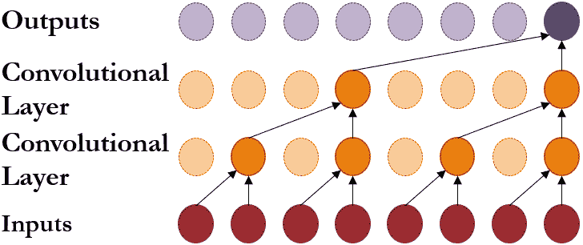
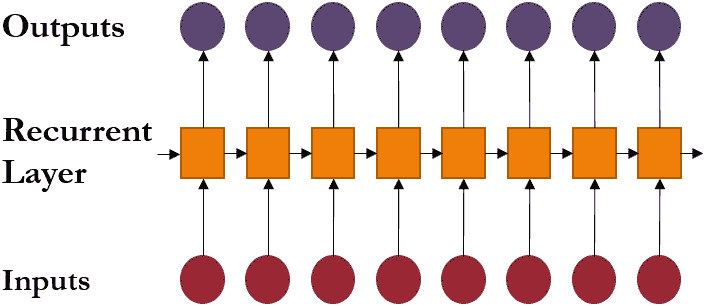
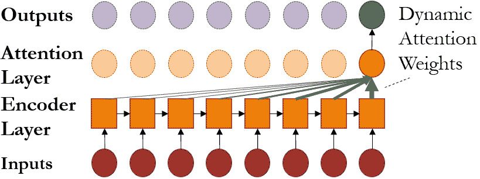
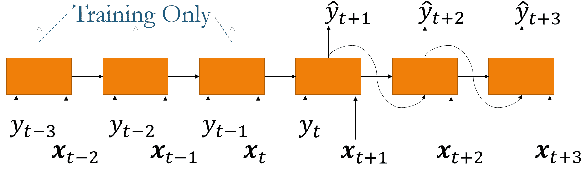
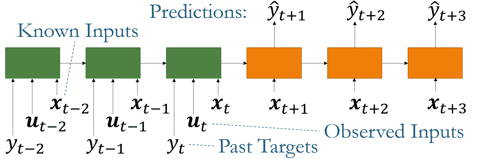

<!--yml

category: 未分类

日期：2024-09-06 20:01:22

-->

# [2004.13408] 时间序列预测与深度学习：综述

> 来源：[`ar5iv.labs.arxiv.org/html/2004.13408`](https://ar5iv.labs.arxiv.org/html/2004.13408)

\subject

深度学习，时间序列建模

\corres

Bryan Lim

# 时间序列预测与深度学习：综述

Bryan Lim¹ 和 Stefan Zohren¹ ¹牛津大学工程科学系，牛津，英国 blim@robots.ox.ac.uk

###### 摘要

许多深度学习架构已经被开发出来，以适应不同领域时间序列数据集的多样性。在这篇文章中，我们调查了在一步预测和多步预测中使用的常见编码器和解码器设计——描述了每个模型如何将时间信息纳入预测中。接下来，我们强调了混合深度学习模型的最新发展，这些模型结合了成熟的统计模型与神经网络组件，以提高纯方法在任一类别中的性能。最后，我们概述了深度学习如何利用时间序列数据促进决策支持的一些方式。

###### 关键词：

深度神经网络，时间序列预测，不确定性估计，混合模型，可解释性，对抗预测{fmtext}

## 1 引言

时间序列建模历来是学术研究的一个重要领域——在气候建模 [1]、生物科学 [2] 和医学 [3] 等主题的应用中，商业决策在零售 [4] 和金融 [5] 等领域中也发挥了重要作用。虽然传统方法侧重于由领域知识提供的信息的参数模型——如自回归 (AR) [6]、指数平滑 [7, 8] 或结构时间序列模型 [9]——但现代机器学习方法提供了一种完全数据驱动的方式来学习时间动态 [10]。随着数据可用性和计算能力的增加，机器学习已经成为下一代时间序列预测模型的重要组成部分。

深度学习尤其在最近获得了流行，受到图像分类 [11]、自然语言处理 [12] 和强化学习 [13] 的显著成就的启发。通过引入反映数据集细微差别的定制架构假设——即归纳偏差 [14]——深度神经网络能够学习复杂的数据表示 [15]，从而减轻了手动特征工程和模型设计的需求。开放源代码的反向传播框架 [16, 17] 也简化了网络训练，使得网络组件和损失函数的定制成为可能。

鉴于各个领域时间序列问题的多样性，出现了许多神经网络设计选择。在本文中，我们总结了使用深度神经网络进行时间序列预测的常见方法。首先，我们描述了用于常见预测问题的最新技术——例如多视角预测和不确定性估计。其次，我们分析了混合模型新趋势的出现，这些模型将领域特定的定量模型与深度学习组件相结合，以提高预测性能。接下来，我们概述了两种关键方法，通过解释性和反事实预测的方法，神经网络可以用于促进决策支持。最后，我们总结了一些有前景的未来研究方向，特别是在时间序列预测中的深度学习形式，如连续时间模型和层次模型。

虽然我们努力提供现代深度学习方法的全面概述，但我们指出我们的综述绝不是包罗万象的。确实，关于时间序列预测的自动化方法存在丰富的文献——包括自动参数模型选择[18]，以及传统的机器学习方法，如核回归[19]和支持向量回归[20]。此外，高斯过程[21]已经被广泛用于时间序列预测——最近的扩展包括深度高斯过程[22]，以及通过神经过程[23]在深度学习中的类比。此外，历史上，旧的神经网络模型也曾用于时间序列应用，如[24]和[25]所示。

## 2 深度学习架构在时间序列预测中的应用

时间序列预测模型用于预测给定实体$i$在时间$t$的目标$y_{i,t}$的未来值。每个实体代表时间信息的逻辑分组——例如气候学中来自个别气象站的测量数据，或医学中来自不同患者的生命体征——这些信息可以在相同时间进行观察。在最简单的情况下，一步前预测模型的形式如下：

|  | $\hat{y}_{i,t+1}=f(y_{i,t-k:t},\bm{x}_{i,t-k:t},\bm{s}_{i}),$ |  | (1) |
| --- | --- | --- | --- |

其中$\hat{y}_{i,t+1}$是模型预测，$y_{i,t-k:t}=\{y_{i,t-k},\dots,y_{i,t}\}$，$\bm{x}_{i,t-k:t}=\{\bm{x}_{i,t-k},\dots,\bm{x}_{i,t}\}$分别是目标和外生输入在回溯窗口$k$上的观测值，$s_{i}$是与实体（例如传感器位置）相关的静态元数据，$f(.)$是模型学习的预测函数。虽然我们在本调查中专注于单变量预测（即 1-D 目标），但我们注意到这些组件可以扩展到多变量模型而不会丧失一般性[26, 27, 28, 29, 30]。为了简化符号表示，后续部分将省略实体索引$i$，除非明确要求。

### 2.1 基本构建块

深度神经网络通过使用一系列非线性层来构建中间特征表示，从而学习预测关系[15]。在时间序列环境中，这可以看作是将相关历史信息编码到潜在变量$\bm{z}_{t}$中，最终预测仅使用$\bm{z}_{t}$生成：

|  | $\displaystyle f(y_{t-k:t},\bm{x}_{t-k:t},\bm{s})=g_{\mathrm{dec}}(\bm{z}_{t}),$ |  | (2) |
| --- | --- | --- | --- |
|  | $\displaystyle\bm{z}_{t}=g_{\mathrm{enc}}(y_{t-k:t},\bm{x}_{t-k:t},\bm{s}),$ |  | (3) |

其中$g_{\mathrm{enc}}(.)$、$g_{\mathrm{dec}}(.)$分别是编码器和解码器函数，并且回顾到方程（1）中的下标$i$已被移除以简化符号（例如$y_{i,t}$被替换为$y_{t}$）。这些编码器和解码器因此形成了深度学习架构的基本构建块，网络的选择决定了模型可以学习的关系类型。在本节中，我们将考察现代编码器的设计选择，如图 1 所概述，并探讨其与传统时间模型的关系。此外，我们还将探索时间序列预测应用中常用的网络输出和损失函数。

(a) CNN 模型。

(b) RNN 模型。

(c) 基于注意力的模型。

图 1：使用不同编码器架构整合时间信息。

#### 2.1.1 卷积神经网络

卷积神经网络（CNN）传统上是为图像数据集设计的，提取在空间维度上不变的局部关系 [31, 11]。为了将 CNN 适应于时间序列数据集，研究人员利用多个层的因果卷积 [32, 33, 34] —— 即设计为仅使用过去信息进行预测的卷积滤波器。对于隐藏层 $l$ 的中间特征，每个因果卷积滤波器的形式如下：

|  | $\displaystyle\bm{h}_{t}^{l+1}$ | $\displaystyle=A\bigg{(}\left(\bm{W}*\bm{h}\right)(l,t)\bigg{)},$ |  | (4) |
| --- | --- | --- | --- | --- |
|  | $\displaystyle\left(\bm{W}*\bm{h}\right)(l,t)$ | $\displaystyle=\sum_{\tau=0}^{k}\bm{W}(l,\tau)\bm{h}_{t-\tau}^{l},$ |  | (5) |

其中 $\bm{h}_{t}^{l}\in\mathbb{R}^{\mathcal{H}_{in}}$ 是时间 $t$ 时第 $l$ 层的中间状态，$*$ 是卷积算子，$\bm{W}(l,\tau)\in\mathbb{R}^{\mathcal{H}_{out}\times\mathcal{H}_{in}}$ 是第 $l$ 层的固定滤波器权重，而 $A(.)$ 是激活函数，例如 sigmoid 函数，表示任何架构特定的非线性处理。对于使用总共 $L$ 层卷积的 CNN，我们注意到编码器的输出为 $\bm{z}_{t}=\bm{h}^{L}_{t}$。

考虑到一维情况，我们可以看到方程式 (5) 与数字信号处理中的有限冲激响应 (FIR) 滤波器非常相似 [35]。这对于 CNN 学习的时间关系有两个关键含义。首先，与标准 CNN 的空间不变性假设一致，时间 CNN 假设关系是时间不变的 —— 在每个时间步和所有时间上使用相同的一组滤波器权重。此外，CNN 只能使用其定义的回顾窗口或感受野内的输入来进行预测。因此，感受野大小 $k$ 需要仔细调整，以确保模型可以利用所有相关的历史信息。值得注意的是，具有线性激活函数的单层因果 CNN 等同于自回归（AR）模型。

##### 膨胀卷积

使用标准卷积层在长期依赖关系显著的情况下可能计算上具有挑战性，因为参数数量直接随着感受野的大小增长。为了解决这个问题，现代架构常常使用膨胀卷积层 [32, 33]，这扩展了方程式 (5) 如下：

|  | $\displaystyle\left(\bm{W}*\bm{h}\right)(l,t,d_{l})$ | $\displaystyle=\sum_{\tau=0}^{\lfloor k/d_{l}\rfloor}\bm{W}(l,\tau)\bm{h}_{t-d_{l}\tau}^{l},$ |  | (6) |
| --- | --- | --- | --- | --- |

其中 $\lfloor.\rfloor$ 是下取整运算符，$d_{l}$ 是特定层的膨胀率。因此，膨胀卷积可以被解释为对下层特征的下采样版本进行卷积——降低分辨率以整合来自远古过去的信息。因此，通过在每一层中增加膨胀率，膨胀卷积可以逐渐聚合不同时间块的信息，从而以高效的方式利用更多的历史信息。例如，在 [32] 的 WaveNet 架构中，膨胀率按 2 的幂次增加，相邻时间块在每一层中被聚合——允许在第 $l$ 层使用 $2^{l}$ 个时间步，如图 1a 所示。

#### 2.1.2 循环神经网络

循环神经网络 (RNNs) 在序列建模中历史上已经被使用 [31]，在各种自然语言处理任务中取得了强有力的成果 [36]。鉴于时间序列数据自然地被解释为输入和目标的序列，许多基于 RNN 的架构已被开发用于时间预测应用 [37, 38, 39, 40]。RNN 单元的核心包含一个内部记忆状态，作为过去信息的紧凑总结。记忆状态随着每个时间步的新观察被递归更新，如图 1b 所示，即：

|  | $\displaystyle\bm{z}_{t}$ | $\displaystyle=\nu\left(\bm{z}_{t-1},y_{t},\bm{x}_{t},\bm{s}\right),$ |  | (7) |
| --- | --- | --- | --- | --- |

其中 $\bm{z}_{t}\in\mathbb{R}^{\mathcal{H}}$ 是 RNN 的隐藏内部状态，而 $\nu(.)$ 是学习到的记忆更新函数。例如，Elman RNN [41]，作为最简单的 RNN 变体之一，其形式如下：

|  | $\displaystyle y_{t+1}$ | $\displaystyle=\gamma_{y}(\bm{W}_{y}\bm{z}_{t}+\bm{b}_{y}),$ |  | (8) |
| --- | --- | --- | --- | --- |
|  | $\displaystyle\bm{z}_{t}$ | $\displaystyle=\gamma_{z}(\bm{W}_{z_{1}}\bm{z}_{t-1}+\bm{W}_{z_{2}}y_{t}+\bm{W}_{z_{3}}\bm{x}_{t}+\bm{W}_{z_{4}}\bm{s}+\bm{b}_{z}),$ |  | (9) |

其中 $\bm{W}_{.},\bm{b}_{.}$ 分别是网络的线性权重和偏置，而 $\gamma_{y}(.),\gamma_{z}(.)$ 是网络激活函数。注意，RNN 不需要像 CNN 那样显式指定回溯窗口。从信号处理的角度来看，主要的递归层 —— 即公式 (9) —— 因此类似于无限脉冲响应（IIR）滤波器的非线性版本。

##### 长短期记忆

由于无限回溯窗口，RNN 的旧变体在学习数据中的长期依赖性时可能会受到限制 [42, 43] —— 这与梯度爆炸和消失的问题有关 [31]。直观地，这可以被视为记忆状态中的一种共鸣。长短期记忆网络（LSTMs）[44] 因此被开发出来以解决这些限制，通过改善网络内部的梯度流。这是通过使用一个存储长期信息的单元状态 $\bm{c}_{t}$ 实现的，该状态通过一系列门控机制进行调节，如下所示：

|  | 输入门： | $\displaystyle\bm{i}_{t}$ | $\displaystyle=\sigma(\bm{W}_{i_{1}}\bm{z}_{t-1}+\bm{W}_{i_{2}}y_{t}+\bm{W}_{i_{3}}\bm{x}_{t}+\bm{W}_{i_{4}}\bm{s}+\bm{b}_{i}),$ |  | (10) |
| --- | --- | --- | --- | --- | --- |
|  | 输出门： | $\displaystyle\bm{o}_{t}$ | $\displaystyle=\sigma(\bm{W}_{o_{1}}\bm{z}_{t-1}+\bm{W}_{o_{2}}y_{t}+\bm{W}_{o_{3}}\bm{x}_{t}+\bm{W}_{o_{4}}\bm{s}+\bm{b}_{o}),$ |  | (11) |
|  | 遗忘门： | $\displaystyle\bm{f}_{t}$ | $\displaystyle=\sigma(\bm{W}_{f_{1}}\bm{z}_{t-1}+\bm{W}_{f_{2}}y_{t}+\bm{W}_{f_{3}}\bm{x}_{t}+\bm{W}_{f_{4}}\bm{s}+\bm{b}_{f}),$ |  | (12) |

其中 $\bm{z}_{t-1}$ 是 LSTM 的隐藏状态，$\sigma(.)$ 是 sigmoid 激活函数。门控机制修改 LSTM 的隐藏状态和单元状态如下：

|  | 隐藏状态： | $\displaystyle\bm{z}_{t}$ | $\displaystyle=\bm{o}_{t}\odot\text{tanh}(\bm{c}_{t}),$ |  | (13) |
| --- | --- | --- | --- | --- | --- |
|  | 单元状态： | $\displaystyle\bm{c}_{t}$ | $\displaystyle=\bm{f}_{t}\odot\bm{c}_{t-1}$ |  |
|  | $\displaystyle+\bm{i}_{t}\odot\text{tanh}(\bm{W}_{c_{1}}\bm{z}_{t-1}+\bm{W}_{c_{2}}y_{t}+\bm{W}_{c_{3}}\bm{x}_{t}+\bm{W}_{c_{4}}\bm{s}+\bm{b}_{c}),$ |  | (14) |

其中 $\odot$ 是逐元素（Hadamard）乘积，$\text{tanh}(.)$ 是 tanh 激活函数。

##### 与贝叶斯过滤的关系

如 [39] 中所述，贝叶斯滤波器[45] 和 RNN 在维护一个被递归更新的隐藏状态方面是相似的。对于贝叶斯滤波器，如卡尔曼滤波器 [46]，推断通过更新潜在状态的充分统计来执行——使用一系列状态转移和误差修正步骤。由于贝叶斯滤波步骤使用确定性方程来修改充分统计，RNN 可以被视为对这两个步骤的同时近似——其中内存向量包含了进行预测所需的所有相关信息。

#### 2.1.3 注意力机制

注意力机制的开发[47, 48]也促进了长期依赖学习的改进——变换器架构在多个自然语言处理应用中实现了最先进的性能[49, 50, 12]。注意力层使用动态生成的权重来聚合时间特征（见图 1c），使得网络能够直接关注过去的关键时间步——即使这些时间步在回溯窗口中距离很远。从概念上讲，注意力机制是一种基于给定查询的键值查找机制[51]，其形式如下：

|  | $\displaystyle\bm{h}_{t}=\sum_{\tau=0}^{k}\alpha(\bm{\kappa}_{t},\bm{q}_{\tau})\bm{v}_{t-\tau},$ |  | (15) |
| --- | --- | --- | --- |

其中键 $\bm{\kappa}_{t}$、查询 $\bm{q}_{\tau}$ 和值 $\bm{v}_{t-\tau}$ 是由网络的较低层在不同时间步生成的中间特征。此外，$\alpha(\bm{\kappa}_{t},\bm{q}_{\tau})\in[0,1]$ 是在时间 $t$ 生成的 $t-\tau$ 的注意力权重，而 $\bm{h}_{t}$ 是注意力层的上下文向量输出。请注意，多个注意力层也可以像 CNN 的情况一样一起使用，最终层的输出形成编码的潜变量 $\bm{z}_{t}$。

最近的研究还展示了在时间序列预测应用中使用注意力机制的好处，相比于类似的递归网络有了改进的性能[52, 53, 54]。例如，[52] 使用注意力来聚合由 RNN 编码器提取的特征，注意力权重的生成如下：

|  | $\displaystyle\bm{\alpha}(t)$ | $\displaystyle=\text{softmax}(\bm{\eta}_{t}),$ |  | (16) |
| --- | --- | --- | --- | --- |
|  | $\displaystyle\bm{\eta}_{t}$ | $\displaystyle=\mathbf{W}_{\eta_{1}}\text{tanh}(\mathbf{W}_{\eta_{2}}\bm{\kappa}_{t-1}+\mathbf{W}_{\eta_{3}}\bm{q}_{\tau}+\bm{b}_{\eta}),$ |  | (17) |

其中 $\bm{\alpha}(t)=[\alpha(t,0),\dots\alpha(t,k)]$ 是注意力权重向量，$\bm{\kappa}_{t-1},\bm{q}_{t}$ 是用于特征提取的 LSTM 编码器的输出，$\text{softmax}(.)$ 是 softmax 激活函数。最近，Transformer 架构也被考虑在内 [53, 54]，它将标量点积自注意力 [49] 应用到回顾窗口内提取的特征上。从时间序列建模的角度来看，注意力提供了两个关键好处。首先，具有注意力的网络能够直接关注任何重要事件的发生。例如，在零售预测应用中，这包括可能对销售产生积极影响的节假日或促销期。其次，如 [54] 所示，基于注意力的网络还可以学习特定阶段的时间动态——通过对每个阶段使用不同的注意力权重模式。

#### 2.1.4 输出和损失函数

鉴于神经网络的灵活性，深度神经网络已被用于建模离散 [55] 和连续 [37, 56] 目标——通过自定义神经网络的解码器和输出层以匹配所需的目标类型。在一步前预测问题中，这可以简单地将编码器输出的线性变换（即公式 (2)) 与适当的目标输出激活结合起来。不论目标形式如何，预测可以进一步分为两种不同的类别——点估计和概率预测。

##### 点估计

一种常见的预测方法是确定未来目标的期望值。这本质上涉及将问题重新表述为离散输出的分类任务（例如预测未来事件），以及连续输出的回归任务——使用上述描述的编码器。对于二分类情况，解码器的最终层通常具有一个线性层和一个 sigmoid 激活函数——使网络能够预测在给定时间步上事件发生的概率。对于二分类和连续目标的一步前预测，网络分别使用二元交叉熵和均方误差损失函数进行训练：

|  | $\displaystyle\mathcal{L}_{classification}$ | $\displaystyle=-\frac{1}{T}\sum_{t=1}^{T}y_{t}\log(\hat{y}_{t})+(1-y_{t})\log(1-\hat{y}_{t})$ |  | (18) |
| --- | --- | --- | --- | --- |
|  | $\displaystyle\mathcal{L}_{regression}$ | $\displaystyle=\frac{1}{T}\sum_{t=1}^{T}\left(y_{t}-\hat{y}_{t}\right)^{2}$ |  | (19) |

虽然上述损失函数是应用中最常见的，但我们注意到神经网络的灵活性也允许采用更复杂的损失——例如，分位数回归的损失 [56] 和多项式分类的损失 [32]。

##### 概率输出

虽然点估计对预测目标的未来值至关重要，但理解模型预测的不确定性对于不同领域的决策者也是有用的。例如，当预测不确定性很大时，模型用户可以在将预测纳入决策时更加谨慎，或依赖其他信息来源。在一些应用中，如金融风险管理，能够获取完整的预测分布将允许决策者在面对稀有事件时优化其行动——例如，允许风险管理者保护投资组合免受市场崩盘的影响。

一种常见的不确定性建模方法是使用深度神经网络生成已知分布的参数 [37, 27, 38]。例如，高斯分布通常用于具有连续目标的预测问题，网络输出每一步预测分布的均值和方差参数，如下所示：

|  | $\displaystyle y_{t+\tau}$ | $\displaystyle\sim N(\mu(t,\tau),\zeta(t,\tau)^{2}),$ |  | (20) |
| --- | --- | --- | --- | --- |
|  | $\displaystyle\mu(t,\tau)$ | $\displaystyle=\bm{W}_{\mu}\bm{h}^{L}_{t}+\bm{b}_{\mu},$ |  | (21) |
|  | $\displaystyle\zeta(t,\tau)$ | $\displaystyle=\text{softplus}(\bm{W}_{\Sigma}\bm{h}^{L}_{t}+\bm{b}_{\Sigma}),$ |  | (22) |

其中 $\bm{h}^{L}_{t}$ 是网络的最后一层，$\text{softplus}(.)$ 是 softplus 激活函数，用于确保标准差仅取正值。

### 2.2 多时间段预测模型

在许多应用中，能够在未来多个时间点获取预测估计值通常是有益的——这允许决策者可视化未来视野中的趋势，并优化其整个路径上的行动。从统计学角度来看，多时间段预测可以被视为对一步预测问题的轻微修改（即公式 (1)）如下：

|  | $\hat{y}_{t+\tau}=f(y_{t-k:t},\bm{x}_{t-k:t},\bm{u}_{t-k:t+\tau},\bm{s},\tau),$ |  | (23) |
| --- | --- | --- | --- |

其中$\tau\in\{1,\dots,\tau_{max}\}$是离散预测视角，$\bm{u}_{t}$是已知的未来输入（例如日期信息，如星期几或月份）在整个视角内，而$\bm{x}_{t}$是只能从历史上观察到的输入。根据传统计量经济学方法[57, 58]，用于多视角预测的深度学习架构可以分为迭代方法和直接方法 – 如图 2 所示，并在下文中详细描述。

(a) 迭代方法

(b) 直接方法

图 2：主要的多视角预测模型类型。颜色用于区分模型权重 – 迭代模型在整个预测范围内使用一个共同模型，而直接方法采用序列到序列的方法。

#### 2.2.1 迭代方法

多视角预测的迭代方法通常使用自回归深度学习架构[37, 39, 53, 40] – 通过递归地将目标样本输入未来时间步来生成多视角预测（见图 2a）。通过重复这一过程生成多个轨迹，预测是使用每一步目标值的采样分布来产生的。例如，预测均值可以通过蒙特卡罗估计获得$\hat{y}_{t+\tau}=\sum_{j=1}^{J}\tilde{y}_{t+\tau}^{(j)}/J$，其中$\tilde{y}_{t+\tau}^{(j)}$是基于方程(20)的模型取样。由于自回归模型与一步预测模型（即通过时间反向传播）以完全相同的方式进行训练，因此迭代方法允许将标准模型轻松地推广到多步预测。然而，由于每个时间步都会产生少量的误差，迭代方法的递归结构可能会导致较长预测视角上的误差积累。此外，迭代方法假设除了目标外的所有输入在运行时都是已知的 – 只需将目标的样本输入未来时间步。这在许多实际场景中可能是一个限制，因为存在观察到的输入，这促使了对更灵活方法的需求。

#### 2.2.2 直接方法

直接方法通过直接利用所有可用输入来产生预测，从而缓解了迭代方法的问题。它们通常使用序列到序列的架构 [56, 52, 54]，利用编码器总结过去的信息（即目标、观测输入和先验已知输入），以及解码器将其与已知的未来输入结合起来——如图 2b 所示。正如[59]中所描述的，另一种方法是使用更简单的模型直接生成一个固定长度的向量，以匹配所需的预测视角。然而，这确实要求指定一个最大预测视角（即$\tau_{max}$），并且仅在预定义的离散时间点进行预测。

## 3 融合领域知识与混合模型

尽管其受欢迎程度很高，但历史上对机器学习在时间序列预测中的有效性提出了质疑——如 M 竞赛 [60] 所示。在 2018 年的 M4 竞赛 [61] 之前，普遍认为复杂的方法并不能产生更准确的预测，而使用集成的简单模型往往效果更佳 [62, 63, 59]。已确定两个关键原因来解释机器学习方法表现不佳的原因。首先，机器学习方法的灵活性可能是一把双刃剑——使其容易过拟合 [59]。因此，在数据量少的情况下，简单模型可能会表现更好，这在具有少量历史观测的预测问题中尤其常见（例如季度宏观经济预测）。其次，与统计模型的平稳性要求类似，机器学习模型对输入数据的预处理非常敏感 [37, 26, 59]，确保训练和测试时的数据分布相似。

最近，深度学习中的一个趋势是开发混合模型来解决这些限制，在各种应用中表现出优于纯统计或机器学习模型的改进性能 [64, 38, 65, 66]。混合方法将经过充分研究的定量时间序列模型与深度学习结合——使用深度神经网络在每个时间步生成模型参数。一方面，混合模型允许领域专家使用先前信息来指导神经网络训练——减少网络的假设空间并提高泛化能力。这对于小数据集尤为有用 [38]，因为在深度学习模型中有更大的过拟合风险。此外，混合模型允许将平稳和非平稳分量分开，并避免了自定义输入预处理的需求。一个例子是获胜于 M4 比赛的指数平滑 RNN（ES-RNN） [64]，它使用指数平滑捕捉非平稳趋势，并与 RNN 学习附加效应。一般而言，混合模型以两种方式利用深度神经网络：a）对非概率参数模型进行时间变化参数编码 [64, 65, 67]，和 b）为概率模型生成分布参数 [38, 40, 66]。

### 3.1 非概率混合模型

对于参数时间序列模型，预测方程通常是通过分析定义的，并为未来目标提供点预测。因此，非概率混合模型修改这些预测方程，以结合统计和深度学习组件。例如，ES-RNN 利用 Holt-Winters 指数平滑模型 [8] 的更新方程——将乘法水平和季节性分量与深度学习输出结合，如下所示：

|  | $\displaystyle\hat{y}_{i,t+\tau}$ | $\displaystyle=\exp(\bm{W}_{ES}\bm{h}^{L}_{i,t+\tau}+\bm{b}_{ES})\times l_{i,t}\times\gamma_{i,t+\tau},$ |  | (24) |
| --- | --- | --- | --- | --- |
|  | $\displaystyle l_{i,t}$ | $\displaystyle=\beta_{1}^{(i)}y_{i,t}/\gamma_{i,t}+(1-\beta_{1}^{(i)})l_{i,t-1},$ |  | (25) |
|  | $\displaystyle\gamma_{i,t}$ | $\displaystyle=\beta_{2}^{(i)}y_{i,t}/l_{i,t}+(1-\beta_{2}^{(i)})\gamma_{i,t-\kappa},$ |  | (26) |

其中 $\bm{h}^{L}_{i,t+\tau}$ 是 $\tau$ 步预测的网络最终层，$l_{i,t}$ 是水平分量，$\gamma_{i,t}$ 是周期为 $\kappa$ 的季节性分量，而 $\beta_{1}^{(i)},\beta_{2}^{(i)}$ 是特定实体的静态系数。从上述方程中，我们可以看到指数平滑分量（$l_{i,t},\gamma_{i,t}$）处理数据集中的更广泛（例如指数）趋势，减少了对额外输入缩放的需求。

### 3.2 概率混合模型

概率混合模型也可以用于分布建模重要的应用场景——利用概率生成模型处理时间动态，如高斯过程 [40] 和线性状态空间模型 [38]。与其修改预测方程，概率混合模型使用神经网络在每一步生成预测分布的参数。例如，深度状态空间模型 [38] 将线性状态空间模型的时间变化参数编码如下——通过卡尔曼滤波方程 [46] 进行推断：

|  | $\displaystyle y_{t}$ | $\displaystyle=\bm{a}(\bm{h}^{L}_{i,t+\tau})^{T}\bm{l}_{t}+\phi(\bm{h}^{L}_{i,t+\tau})\epsilon_{t},$ |  | (27) |
| --- | --- | --- | --- | --- |
|  | $\displaystyle\bm{l}_{t}$ | $\displaystyle=\bm{F}(\bm{h}^{L}_{i,t+\tau})\bm{l}_{t-1}+\bm{q}(\bm{h}^{L}_{i,t+\tau})+\bm{\Sigma}(\bm{h}^{L}_{i,t+\tau})\odot\bm{\Sigma}_{t},$ |  | (28) |

其中 $\bm{l}_{t}$ 是隐藏的潜在状态，$\bm{a}(.)$、$\bm{F}(.)$、$\bm{q}(.)$ 是 $\bm{h}^{L}_{i,t+\tau}$ 的线性变换，$\phi(.)$、$\bm{\Sigma}(.)$ 是带有 softmax 激活的线性变换，$\epsilon_{t}\sim N(0,1)$ 是单变量残差，而 $\bm{\Sigma}_{t}\sim N(0,\mathbb{I})$ 是多变量正态随机变量。

## 4 使用深度神经网络促进决策支持

尽管模型构建者主要关注预测的准确性，但终端用户通常使用预测来指导他们的未来行动。例如，医生可以利用临床预测（例如疾病发作和死亡率的概率）来帮助他们优先排序测试、制定诊断并确定治疗方案。因此，虽然时间序列预测是一个至关重要的初步步骤，但对时间动态和模型预测背后的动机的更好理解可以帮助用户进一步优化他们的行动。在本节中，我们探讨了神经网络在时间序列数据上促进决策支持的两个方向——重点关注可解释性和因果推断的方法。

### 4.1 时间序列数据的可解释性

随着神经网络在关键任务应用中的部署 [68]，对模型如何以及为何做出某种预测的理解需求日益增加。此外，终端用户可能对其数据中的关系了解甚少，而数据集的规模和复杂性近年来也在增长。鉴于标准神经网络架构的黑箱性质，出现了一系列新的研究方向，致力于解释深度学习模型。我们在下面总结了相关内容——并参考专门的调查以获取更深入的分析 [69, 70]。

##### 事后可解释性技术

后验可解释模型旨在解释训练好的网络，并帮助识别重要特征或示例，而无需修改原始权重。方法主要可以分为两大类。首先，一种可能的方法是在神经网络的输入和输出之间应用更简单的可解释替代模型，并依赖于近似模型提供解释。例如，局部可解释模型无关解释 (LIME) [71] 通过将特定实例的线性模型拟合到输入的扰动上来识别相关特征，线性系数提供了重要性度量。Shapley 加性解释 (SHAP) [72] 提供了另一种替代方法，利用合作博弈论中的 Shapley 值来识别数据集中的重要特征。接下来，梯度基方法——如显著性图 [73、74] 和影响函数 [75]——也已被提出，这些方法分析网络梯度以确定哪些输入特征对损失函数的影响最大。虽然后验可解释性方法可以帮助进行特征归因，但它们通常忽略输入之间的任何顺序依赖性——使其难以应用于复杂的时间序列数据集。

##### 使用注意力权重的固有可解释性

另一种方法是直接设计具有可解释组件的架构，通常以战略性放置的注意力层的形式存在。由于注意力权重是从 softmax 层输出的，权重被约束为总和为 1，即 $\sum_{\tau=0}^{k}\alpha(t,\tau)=1$。对于时间序列模型，方程 (15) 的输出也可以解释为在每一步使用注意力层提供的权重对时间特征进行加权平均。然后，可以分析注意力权重以理解每个时间步特征的相对重要性。[76、55、53] 的实例级可解释性研究展示了如何通过具体示例说明 $\alpha(t,\tau)$ 的大小可以指示哪些时间点对预测最为重要。通过分析跨时间的注意力向量分布，[54] 还展示了注意力机制如何用于识别数据集中的持续时间关系——例如季节模式。

### 4.2 反事实预测与随时间变化的因果推断

除了理解网络学习到的关系外，深度学习还可以通过产生观察数据集之外的预测或反事实预测来帮助促进决策支持。反事实预测在情景分析应用中尤为有用——允许用户评估不同操作集合对目标轨迹的影响。这在历史角度上非常有用，即确定如果发生了不同的情况会发生什么，以及从预测角度出发，即确定采取哪些措施以优化未来的结果。

尽管存在大量用于估计静态设置中因果效应的深度学习方法[77, 78, 79]，但时间序列数据集中的主要挑战是时间依赖的混杂效应。这是由于当可以影响目标的操作也取决于目标的观察时，出现循环依赖的问题。如果不对时间依赖的混杂因素进行调整，简单的估计技术可能会导致偏倚结果，如[80]所示。最近，出现了几种方法来训练深度神经网络，同时调整时间依赖的混杂因素，这些方法基于统计技术的扩展和新的损失函数设计。通过统计方法，[81]扩展了流行病学中的边际结构模型的逆概率加权（IPTW）方法——使用一组网络来估计治疗应用概率，并使用序列到序列模型来学习无偏预测。[82]中的另一种方法扩展了 G 计算框架，使用深度学习联合建模目标和操作的分布。此外，[83]中提出了新的损失函数，该函数采用领域对抗训练来学习患者历史的平衡表示。

## 5 结论与未来方向

随着最近数据可用性和计算能力的增长，深度神经网络架构在多个领域的预测问题上取得了很大成功。本文回顾了用于时间序列预测的主要架构——突出神经网络设计中使用的关键构建块。我们研究了它们如何将时间信息用于一步预测，并描述了它们如何扩展以用于多时间段预测。此外，我们概述了近期混合深度学习模型的趋势，这些模型结合了统计和深度学习组件，超越了任何一种方法的纯粹效果。最后，我们总结了深度学习可以如何扩展以改善决策支持的方法，重点关注解释性和反事实预测的方法。

尽管已经开发了大量用于时间序列预测的深度学习模型，但仍然存在一些局限性。首先，深度神经网络通常要求时间序列在规律的间隔上进行离散化，这使得预测数据集时难以处理缺失或随机间隔的观察值。尽管已经通过神经常微分方程[84]进行了关于连续时间模型的一些初步研究，但仍需要进一步的工作来扩展这一工作，以处理具有复杂输入（例如静态变量）的数据集，并将其与现有模型进行基准测试。此外，如[85]所述，时间序列通常具有层次结构，在轨迹之间存在逻辑分组——例如在零售预测中，相同地理位置的产品销售可能受共同趋势的影响。因此，开发明确考虑这些层次结构的架构可能是一个有趣的研究方向，并可能提高现有单变量或多变量模型的预测性能。

\competing

作者声明他们没有竞争利益。

## 参考文献

+   [1] Mudelsee M. 气候时间序列的趋势分析：方法回顾。地球科学评论。2019；190：310 – 322。

+   [2] Stoffer DS, Ombao H. 编辑：生物科学中的时间序列分析特刊。时间序列分析杂志。2012；33(5)：701–703。

+   [3] Topol EJ. 高性能医学：人类与人工智能的融合。自然医学。2019 年 1 月；25(1)：44–56。

+   [4] Böse JH, Flunkert V, Gasthaus J, Januschowski T, Lange D, Salinas D, 等。大规模概率需求预测。Proc VLDB Endow. 2017 年 8 月；10(12)：1694–1705。

+   [5] Andersen TG, Bollerslev T, Christoffersen PF, Diebold FX. 波动率预测。国家经济研究局；2005。11188。

+   [6] Box GEP, Jenkins GM. 时间序列分析：预测与控制。Holden-Day；1976。

+   [7] Gardner Jr ES. 指数平滑：现状。预测杂志。1985；4(1)：1–28。

+   [8] Winters PR. 通过指数加权移动平均法预测销售。管理科学。1960；6(3)：324–342。

+   [9] Harvey AC. 预测、结构时间序列模型与卡尔曼滤波器。剑桥大学出版社；1990。

+   [10] Ahmed NK, Atiya AF, Gayar NE, El-Shishiny H. 机器学习模型在时间序列预测中的实证比较。计量经济学评论。2010；29(5-6)：594–621。

+   [11] Krizhevsky A, Sutskever I, Hinton GE. 使用深度卷积神经网络进行 ImageNet 分类。在：Pereira F, Burges CJC, Bottou L, Weinberger KQ，编辑。神经信息处理系统进展 25（NIPS）；2012 年。第 1097–1105 页。

+   [12] Devlin J, Chang MW, Lee K, Toutanova K. BERT：深度双向转换器的预训练用于语言理解。在：2019 年北美计算语言学协会：人类语言技术会议论文集，第 1 卷（长篇和短篇论文）；2019 年。第 4171–4186 页。

+   [13] Silver D, Huang A, Maddison CJ, Guez A, Sifre L, van den Driessche G 等. 使用深度神经网络和树搜索掌握围棋游戏。《自然》。2016 年；529：484–503。

+   [14] Baxter J. 归纳偏置学习模型。《人工智能研究期刊》。2000 年；12(1)：149–198。

+   [15] Bengio Y, Courville A, Vincent P. 表示学习：综述与新视角。《IEEE 模式分析与机器智能汇刊》。2013 年；35(8)：1798–1828。

+   [16] Abadi M, Agarwal A, Barham P, Brevdo E, Chen Z, Citro C 等. TensorFlow: 大规模机器学习在异构系统上的应用；2015 年。软件可从 tensorflow.org 获取。访问网址：[`tensorflow.org/`](http://tensorflow.org/)。

+   [17] Paszke A, Gross S, Massa F, Lerer A, Bradbury J, Chanan G 等. PyTorch：一种命令式风格的高性能深度学习库。在：神经信息处理系统进展 32；2019 年。第 8024–8035 页。

+   [18] Hyndman RJ, Khandakar Y. 自动时间序列预测：R 的 forecast 包。《统计软件期刊》。2008 年；26(3)：1–22。

+   [19] Nadaraya EA. 关于回归估计。《概率论与其应用》。1964 年；9(1)：141–142。

+   [20] Smola AJ, Schölkopf B. 支持向量回归教程。《统计与计算》。2004 年；14(3)：199–222。

+   [21] Williams CKI, Rasmussen CE. 回归的高斯过程。在：神经信息处理系统进展（NIPS）；1996 年。

+   [22] Damianou A, Lawrence N. 深度高斯过程。在：人工智能与统计学会议论文集（AISTATS）；2013 年。

+   [23] Garnelo M, Rosenbaum D, Maddison C, Ramalho T, Saxton D, Shanahan M 等. 条件神经过程。在：国际机器学习会议论文集（ICML）；2018 年。

+   [24] Waibel A. 用于语音识别的时间延迟神经网络的模块化构建。《神经计算》。1989 年；1(1)：39–46。

+   [25] Wan E. 使用具有内部延迟线的连接主义网络进行时间序列预测。在：时间序列预测。Addison-Wesley；1994 年。第 195–217 页。

+   [26] Sen R, Yu HF, Dhillon I. 全球思考，本地行动：一种深度神经网络方法用于高维时间序列预测。在：神经信息处理系统（NeurIPS）进展；2019 年。

+   [27] Wen R, Torkkola K. 深度生成量化-耦合模型用于概率预测。在：ICML 时间序列研讨会；2019 年。

+   [28] Li Y, Yu R, Shahabi C, Liu Y. 扩散卷积递归神经网络：数据驱动的交通预测。在：（国际学习表示会议 ICLR 论文集）；2018 年。

+   [29] Ghaderi A, Sanandaji BM, Ghaderi F. Deep Forecast：基于深度学习的时空预测。见：ICML 时间序列研讨会；2017 年。

+   [30] Salinas D, Bohlke-Schneider M, Callot L, Medico R, Gasthaus J. 使用低秩高斯 Copula 过程的高维多变量预测。见：神经信息处理系统会议（NeurIPS）论文集；2019 年。

+   [31] Goodfellow I, Bengio Y, Courville A. 深度学习。MIT 出版社；2016 年。[`www.deeplearningbook.org`](http://www.deeplearningbook.org)。

+   [32] van den Oord A, Dieleman S, Zen H, Simonyan K, Vinyals O, Graves A, 等. WaveNet：用于原始音频的生成模型。arXiv 电子预印本。2016 年 9 月；第 arXiv:1609.03499 页。

+   [33] Bai S, Zico Kolter J, Koltun V. 对通用卷积和递归网络进行序列建模的经验评估。arXiv 电子预印本。2018 年；第 arXiv:1803.01271 页。

+   [34] Borovykh A, Bohte S, Oosterlee CW. 使用卷积神经网络的条件时间序列预测。arXiv 电子预印本。2017 年；第 arXiv:1703.04691 页。

+   [35] Lyons RG. 理解数字信号处理（第二版）。美国：Prentice Hall PTR；2004 年。

+   [36] Young T, Hazarika D, Poria S, Cambria E. 基于深度学习的自然语言处理的最新趋势[综述文章]。IEEE 计算智能杂志。2018 年；13(3):55–75。

+   [37] Salinas D, Flunkert V, Gasthaus J. DeepAR：具有自回归递归网络的概率预测。arXiv 电子预印本。2017 年；第 arXiv:1704.04110 页。

+   [38] Rangapuram SS, Seeger MW, Gasthaus J, Stella L, Wang Y, Januschowski T. 用于时间序列预测的深度状态空间模型。见：神经信息处理系统会议（NIPS）论文集；2018 年。

+   [39] Lim B, Zohren S, Roberts S. 递归神经滤波器：学习用于时间序列预测的独立贝叶斯滤波步骤。见：国际神经网络联合会议（IJCNN）；2020 年。

+   [40] Wang Y, Smola A, Maddix D, Gasthaus J, Foster D, Januschowski T. 用于预测的深度因子。见：国际机器学习会议（ICML）论文集；2019 年。

+   [41] Elman JL. 在时间中寻找结构。认知科学。1990 年；14(2):179 – 211。

+   [42] Bengio Y, Simard P, Frasconi P. 用梯度下降学习长期依赖是困难的。IEEE 神经网络学报。1994 年；5(2):157–166。

+   [43] Kolen JF, Kremer SC. 见：递归网络中的梯度流：学习长期依赖的困难；2001 年。第 237–243 页。

+   [44] Hochreiter S, Schmidhuber J. 长短期记忆。神经计算。1997 年 11 月；9(8):1735–1780。

+   [45] Srkk S. 贝叶斯滤波与平滑。剑桥大学出版社；2013 年。

+   [46] Kalman RE. 线性滤波和预测问题的新方法。基础工程杂志。1960 年；82(1):35。

+   [47] Bahdanau D, Cho K, Bengio Y. 通过联合学习对齐和翻译进行神经机器翻译。见：国际学习表示会议（ICLR）论文集；2015 年。

+   [48] Cho K, van Merriënboer B, Gulcehre C, Bahdanau D, Bougares F, Schwenk H, 等人。使用 RNN 编码器-解码器进行统计机器翻译的短语表示学习。在：2014 年自然语言处理经验方法会议（EMNLP）论文集；2014 年。

+   [49] Vaswani A, Shazeer N, Parmar N, Uszkoreit J, Jones L, Gomez AN, 等人。注意力即一切。在：神经信息处理系统进展（NIPS）；2017 年。

+   [50] Dai Z, Yang Z, Yang Y, Carbonell J, Le Q, Salakhutdinov R。Transformer-XL：超越固定长度上下文的注意力语言模型。在：第 57 届计算语言学协会年会（ACL）论文集；2019 年。

+   [51] Graves A, Wayne G, Danihelka I。神经图灵机。CoRR。2014 年；abs/1410.5401。

+   [52] Fan C, Zhang Y, Pan Y, Li X, Zhang C, Yuan R, 等人。基于时间注意学习的多时间尺度时间序列预测。在：ACM SIGKDD 国际知识发现与数据挖掘会议（KDD）论文集；2019 年。

+   [53] Li S, Jin X, Xuan Y, Zhou X, Chen W, Wang YX, 等人。增强变压器在时间序列预测中的局部性并突破记忆瓶颈。在：神经信息处理系统进展（NeurIPS）；2019 年。

+   [54] Lim B, Arik SO, Loeff N, Pfister T。用于可解释的多时间尺度时间序列预测的时间融合变压器。arXiv 预印本。2019 年；页码 arXiv:1912.09363。

+   [55] Choi E, Bahadori MT, Sun J, Kulas JA, Schuetz A, Stewart WF。RETAIN：一种使用逆时间注意机制的可解释预测模型用于医疗保健。在：神经信息处理系统进展（NIPS）；2016 年。

+   [56] Wen R, 等人。多时间尺度分位数递归预测模型。在：NIPS 2017 时间序列研讨会；2017 年。

+   [57] Taieb SB, Sorjamaa A, Bontempi G。多输出建模用于多步预测时间序列。《神经计算》。2010 年；73(10):1950 – 1957。

+   [58] Marcellino M, Stock J, Watson M。直接和迭代多步自回归方法在宏观经济时间序列预测中的比较。《计量经济学杂志》。2006 年；135:499–526。

+   [59] Makridakis S, Spiliotis E, Assimakopoulos V。统计和机器学习预测方法：问题与前进方向。《PLOS ONE》。2018 年 3 月；13(3):1–26。

+   [60] Hyndman R。预测竞赛的简要历史。《国际预测杂志》。2020 年；36(1):7–14。

+   [61] M4 竞赛：100,000 个时间序列和 61 种预测方法。《国际预测杂志》。2020 年；36(1):54 – 74。

+   [62] Fildes R, Hibon M, Makridakis S, Meade N。关于单变量预测方法的泛化：进一步的实证证据。《国际预测杂志》。1998 年；14(3):339 – 358。

+   [63] Makridakis S, Hibon M。M3-竞赛：结果、结论及其影响。《国际预测杂志》。2000 年；16(4):451 – 476。M3-竞赛。

+   [64] Smyl S. 指数平滑与递归神经网络的混合方法用于时间序列预测。国际预测期刊。2020 年；36(1)：75 – 85。M4 竞赛。

+   [65] Lim B, Zohren S, Roberts S. 利用深度神经网络增强时间序列动量策略。《金融数据科学期刊》。2019 年。

+   [66] Grover A, Kapoor A, Horvitz E. 用于天气预测的深度混合模型。载于：ACM SIGKDD 国际知识发现与数据挖掘会议（KDD）会议录；2015 年。

+   [67] Binkowski M, Marti G, Donnat P. 自回归卷积神经网络用于异步时间序列。载于：国际机器学习会议（ICML）会议录；2018 年。

+   [68] Moraffah R, Karami M, Guo R, Raglin A, Liu H. 机器学习的因果可解释性——问题、方法与评估。arXiv 预印本。2020 年；第 arXiv:2003.03934 页。

+   [69] Chakraborty S, Tomsett R, Raghavendra R, Harborne D, Alzantot M, Cerutti F, 等。深度学习模型的可解释性：结果调查。载于：2017 年 IEEE SmartWorld 会议录；2017 年。第 1–6 页。

+   [70] Rudin C. 停止为高风险决策解释黑箱机器学习模型，而改用可解释模型。自然机器智能。2019 年 5 月；1(5)：206–215。

+   [71] Ribeio M, Singh S, Guestrin C. “我为什么要相信你？”解释任何分类器的预测。载于：KDD；2016 年。

+   [72] Lundberg S, Lee SI. 统一模型预测解释方法。载于：神经信息处理系统进展（NIPS）；2017 年。

+   [73] Simonyan K, Vedaldi A, Zisserman A. 深入卷积网络：可视化图像分类模型和显著性图。arXiv 预印本。2013 年；第 arXiv:1312.6034 页。

+   [74] Siddiqui SA, Mercier D, Munir M, Dengel A, Ahmed S. TSViz：时间序列分析中深度学习模型的揭示。IEEE Access。2019 年；7：67027–67040。

+   [75] Koh PW, Liang P. 通过影响函数理解黑箱预测。载于：国际机器学习会议（ICML）会议录；2017 年。

+   [76] Bai T, Zhang S, Egleston BL, Vucetic S. 通过捕捉疾病进程进行医疗保健的可解释表征学习。载于：ACM SIGKDD 国际知识发现与数据挖掘会议（KDD）会议录；2018 年。

+   [77] Yoon J, Jordon J, van der Schaar M. GANITE: 使用生成对抗网络估计个性化治疗效果。载于：国际学习表征会议（ICLR）；2018 年。

+   [78] Hartford J, Lewis G, Leyton-Brown K, Taddy M. 深度 IV：一种用于反事实预测的灵活方法。载于：第 34 届国际机器学习会议（ICML）会议录；2017 年。

+   [79] Alaa AM, Weisz M, van der Schaar M. 深度反事实网络与倾向性丢弃。载于：第 34 届国际机器学习会议（ICML）会议录；2017 年。

+   [80] Mansournia MA, Etminan M, Danaei G, Kaufman JS, Collins G. 处理观察研究中的时间变化混杂因素。BMJ。2017 年；359。

+   [81] Lim B, Alaa A, van der Schaar M. 使用递归边际结构网络预测时间上的治疗反应。见：NeurIPS；2018 年。

+   [82] Li R, Shahn Z, Li J, Lu M, Chakraborty P, Sow D, 等. G-Net：一种用于动态治疗方案下反事实结果预测的深度学习方法。arXiv 电子预印本。2020 年；p. arXiv:2003.10551。

+   [83] Bica I, Alaa AM, Jordon J, van der Schaar M. 通过对抗性平衡表示估计时间上的反事实治疗结果。见：国际学习表征会议（ICLR）；2020 年。

+   [84] Chen RTQ, Rubanova Y, Bettencourt J, Duvenaud D. 神经常微分方程。见：国际神经信息处理系统会议（NIPS）论文集；2018 年。

+   [85] Fry C, Brundage M. M4 预测竞赛——从实践者的角度。国际预测期刊。2019 年。
