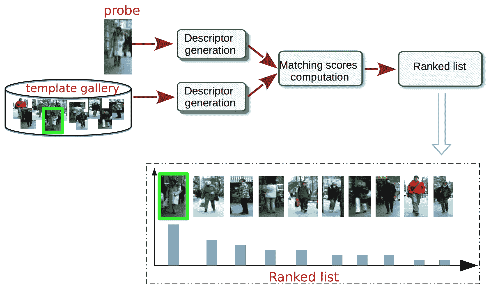
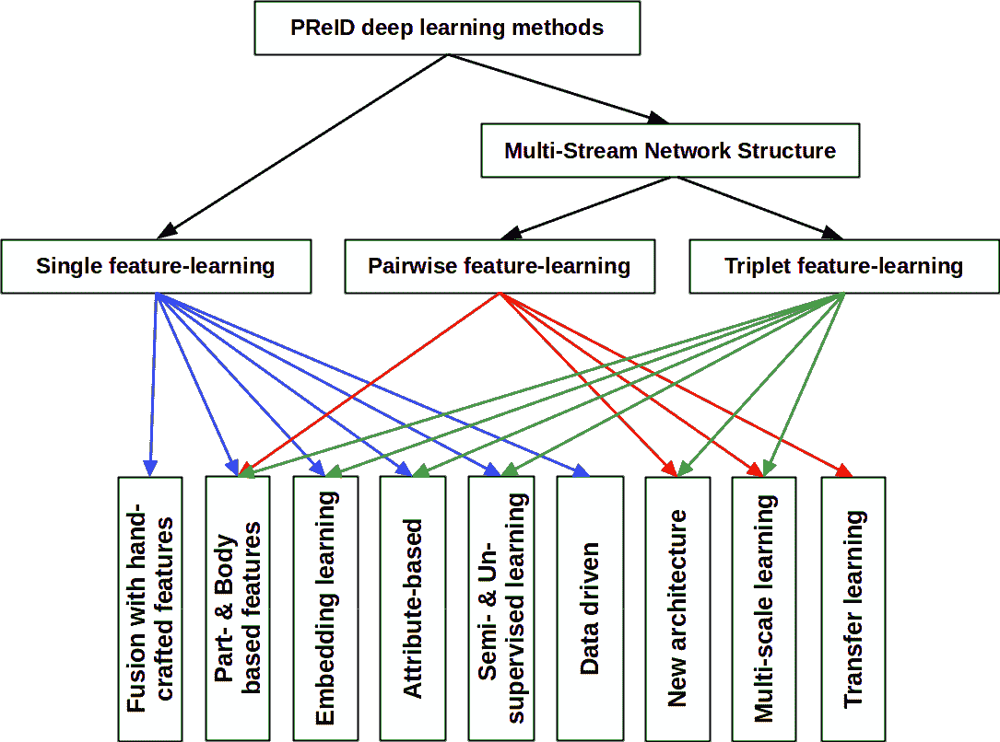
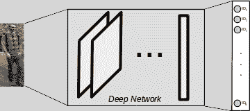
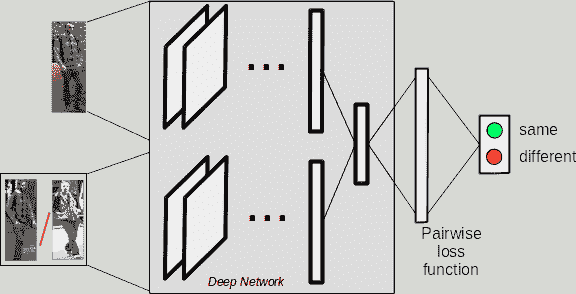
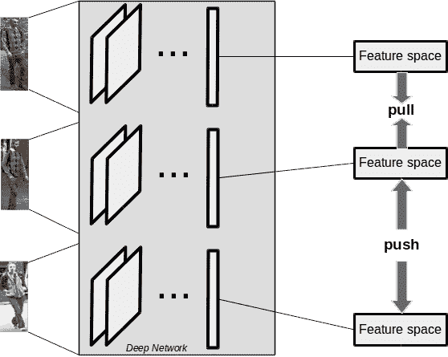
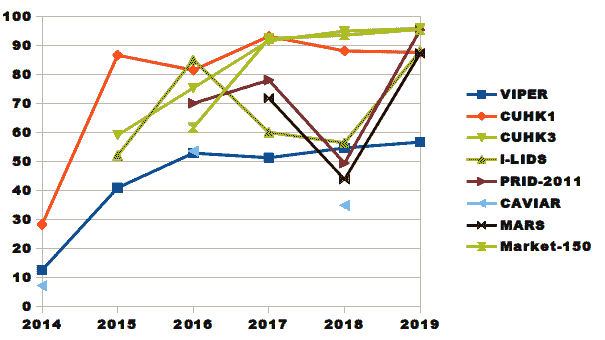

<!--yml

类别: 未分类

日期: 2024-09-06 20:01:20

-->

# [2005.00355] 关于可靠深度学习基础的人体再识别模型的调查：我们已经达到目标了吗？

> 来源：[`ar5iv.labs.arxiv.org/html/2005.00355`](https://ar5iv.labs.arxiv.org/html/2005.00355)

# 关于可靠深度学习基础的人体再识别模型的调查：我们已经达到目标了吗？

Bahram Lavi 通讯作者: bahram.lavi@ic.unicamp.br 巴西圣保罗坎皮纳斯大学计算机学院（UNICAMP）。Ihsan Ullah 数据挖掘与机器学习组，爱尔兰国立大学戈尔韦分校。Mehdi Fatan 计算机工程与数学系，西班牙罗维拉·伊·维尔吉里大学，塔拉戈纳。Anderson Rocha 巴西圣保罗坎皮纳斯大学计算机学院（UNICAMP）。

###### 摘要

*智能视频监控*（IVS）目前是计算机视觉和机器学习的一个活跃研究领域，为监控操作员和法医视频调查员提供了有用的工具。人体再识别（PReID）是 IVS 中的一个重要问题，涉及识别某个个体是否已经在网络中的摄像头上被观察过。PReID 的解决方案有众多应用，包括检索显示目标个体的视频序列，甚至多摄像头视角下的行人跟踪。文献中提出了各种技术来提高 PReID 的性能，最近研究人员利用了深度神经网络（DNNs），因其在类似视觉问题上的出色表现和测试时的快速执行。鉴于再识别解决方案的重要性和广泛应用，我们的目标是讨论该领域的工作，并提出一个关于当前最先进 DNN 模型的调查。我们介绍了每个模型的描述，并在一组基准数据集上对其进行评估。最后，我们展示了这些模型的详细比较，并讨论了它们的局限性，这些讨论可以作为未来研究的指南。

## 1 引言

社会上对人们安全和保障的重要性不断增长。政府和私人组织对公共区域如机场和购物中心的安全非常关注。为公众提供安全保障需要大量的努力和财务支出。为了优化这些努力，视频监控系统发挥了关键作用。如今，视频摄像机的使用日益广泛，成为解决各种安全问题的有用工具，例如法医调查、犯罪预防以及保护受限区域。

从网络摄像头中每日连续录制视频会导致需要分析大量视频，这在人工视频监控系统中是令人望而生畏的任务。监控操作员需要同时分析这些视频以检测特定事件或异常，这是一项具有挑战性且耗时的任务。智能视频监控系统（IVSS）旨在自动化监控和分析来自摄像头网络的视频，以帮助监控操作员处理和理解获取的视频。这使得 IVSS 领域成为计算机工程和计算机科学中最活跃和具有挑战性的研究领域之一，其中计算机视觉（CV）和机器学习（ML）技术发挥了关键作用。该研究领域支持各种工具，例如用于人/物检测和跟踪的在线应用程序、从摄像头网络中识别可疑行为的工具，以及支持操作员和法医调查员从不同摄像头视图中获取图像的离线应用程序。

人物识别是 IVSS 中的一个研究重点。它包括在可能视角不重叠的视频监控摄像头网络中识别个体[1, 2, 3]。通常，PReID 的应用是支持监控操作员和法医调查员从给定的图像（即探针）中检索显示特定个体的视频。因此，所有个体的视频帧或轨迹（即模板库）根据与探针的相似度降序排序。这使用户能够在排名靠前的位置找到特定个体的出现（如果有的话）。

人物再识别是一项具有挑战性的任务，原因包括图像分辨率低、姿态不受约束、光照变化以及遮挡，这些因素都依赖于使用诸如面部等稳健的生物特征。尽管如此，像步态和人体测量这些线索也在一些现有的 PReID 系统中被使用。大多数现有技术依赖于定义衣物的特定描述符（通常包括颜色和纹理），以及描述符对之间的特定相似度度量（评估为匹配分数），这些度量可以是手动定义的，也可以直接从数据中学习得到[1, 4, 5, 6, 7]。

标准 PReID 方法论：对于给定的个人图像（即**探测图像**），PReID 系统旨在从模板库中寻找该人的对应图像。需要考虑的是，创建模板库依赖于重新识别设置，我们可以将其分类为：(i) 单帧，即每个人只有一个模板帧，以及(ii) 多帧，即每个人有多个模板帧。在这种情况下，使用连续 PReID 系统进行实时匹配，其中，目标个体会不断与模板图像进行匹配，使用当前看到的帧作为探测图像。图。1 展示了一个基本的 PReID 框架。在生成探测图像的描述后，将计算模板库中每个图像之间的匹配分数；最后，通过对匹配分数进行降序排序，生成排名列表。

图 1：标准人员重新识别系统。给定探测图像和一组模板图像，目标是从每个图像生成一个稳健的图像签名，并计算它们之间的相似度，最后通过排序的排名列表呈现。

许多现有描述符的策略使用手工制作的特征。深度学习（DL）模型——例如卷积神经网络（CNNs）[8, 9, 10]——特别用于通过从数据中学习来解决 PReID 问题。基于 CNN 的模型生成一组特征图，其中每个图像的像素对应于特定的特征表示。期望的输出应位于所用模型的顶部。训练深度神经网络（DNN）模型有不同的方法。DNN 模型可以以有监督、半监督和无监督的方式进行训练，这取决于问题场景和标记数据的可用性。在 PReID 任务中，仅有一小部分训练数据可用。因此，通常在半监督和无监督的方式下开发学习模型是具有挑战性的，模型可能会导致失败或 PReID 性能较差。本文讨论的大多数论文涉及有监督学习技术，只有少数考虑了半监督或无监督方法。此外，我们将用于 PReID 的模型分为{单一、对、三重}特征学习策略三类。详细信息在第三部分中介绍和讨论。本文介绍了基于 DNN 的 PReID 技术的最先进方法，并提供了有关这些方法的详细信息。文献综述包括 2014 年至今发表的论文。我们提供了 PReID 深度特征学习方法的分类，包括比较、局限性、未来研究方向和潜力以及研究机会。与[11, 12]不同，我们提供了对现有技术的全面和详细的评审，特别是依赖于 DNN 特征学习策略的更现代的方法。我们强调，在本文中，我们只考虑直接涉及 PReID 任务程序的最新 DNN 技术。对于每种技术，我们分析其实验结果，并进一步从不同的角度比较所取得的性能，例如比较采用不同策略解决问题时 DNN 的表现（例如，单一、对和三重学习）。

本文的结构组织如下：第二部分简要说明了用于 PreID 的基准数据集。第三部分描述了深度神经网络（DNN）方法，突出了其重要内容，如目标函数、损失函数、数据增强等的影响。而第四部分讨论了性能测量、结果及其比较，以及局限性和未来方向。最后，第五部分总结了本文并对 PReID 和本文作出最终的评论。

## 2 人员再识别基准数据集

数据是当前深度神经网络（DNN）模型的重要因素之一。

在评估人员再识别解决方案时，必须考虑一些因素以达到可靠的识别率。每个数据集都专门针对一个或多个这些因素进行收集。对于 PReID 任务造成问题的因素包括遮挡（在 i-LIDS 数据集中明显存在）和光照变化（在大多数数据集中很常见）。另一方面，背景和前景分割以区分人的身体是一个具有挑战性的任务。一些数据集提供了一个人的身体分割区域（例如，在 VIPeR、ETHZ 和 CAVIAR 数据集中）。而其他数据集则为评估再识别任务而准备。最广泛使用的数据集是 VIPeR、CUHK01 和 CUHK03。当仅给出两个固定摄像头视角时，VIPeR、CAVIAR 和 PRID 数据集被用来评估人员再识别方法的性能。表 1 提供了每个数据集的摘要。下面我们简要讨论每一个数据集。

VIPeR [4]: VIPeR 是一个具有挑战性的数据集，因为每个个体的图像数量很少。它由来自两个摄像头视角的 632 名个体的两张图像组成。包含姿态和光照变化。图像被裁剪并缩放为$128\times 48$像素。这是 PReID 中最广泛使用的数据集之一，也是新研究人员进入 PReID 领域的良好起点。提高该数据集上的 Rank-1 性能仍然是一个开放的挑战。

i-LIDS [13]: 包含 476 张来自机场大厅的 119 名行人的图像，这些图像由不同视角的摄像头拍摄，具有姿态和光照变化以及强遮挡。每个行人至少有两张图像，平均有四张图像。

ETHZ [14]: 该数据集包含来自两台移动摄像机的三个拥挤街道视频序列；图像展示了显著的光照变化、尺度变化和遮挡。图像大小各异。该数据集提供了来自每个序列的多个个体图像的三个序列。序列 1、2 和 3 分别有 83、35 和 28 名行人。

CAVIAR [15]: 该数据集包含 72 人和两个视角，其中 50 人同时出现在两个视角中，而 22 人只出现在一个视角中。每个人在每个视角下有五张图像，由于分辨率变化、光照条件、遮挡和不同姿态而产生了不同的外观变化。

CUHK: 该数据集分为三个不同的部分，每部分都有特定的设置。*CUHK01* [16] 包括$1,942$张图像，涵盖$971$名行人。它由在两个不重叠的摄像机视角下捕捉的两张图像组成，摄像机（A）具有多个视角和姿态变化，而摄像机（B）主要包括摄像机的正面和背面视图。*CUHK02* [17] 包含$1,816$名个体，由五对摄像机视角（P1-P5，共十个摄像机视角）构成。每对视角包括 971、306、107、193 和 239 名个体，每个个体在每个摄像机视角下有两张图像。该数据集用于评估当测试中的摄像机视角与训练中的不同视角时的性能。最后，*CUHK03* [18] 包括$13,164$张图像，涵盖$1,360$名行人。该数据集由六台监控摄像机捕捉。每个身份由两个不重叠的摄像机视角观察，每个视角平均有$4.8$张图像；所有手动裁剪的行人图像展示了光照变化、错位、遮挡和身体部位缺失。

PRID [19]: 该数据集专门为 PReID 设计，专注于单次拍摄场景。它包含两个图像集，分别由摄像机 A 和摄像机 B 捕捉到 385 人和 749 人。这两个子集共享 200 个相同的人物。

WARD [20]: 该数据集包含 4,786 张图像，涵盖 70 个人物，这些图像是在一个真实监控场景中获取的，使用了三台非重叠的摄像机，具有巨大的光照变化、分辨率变化和姿态变化。

Re-identification Across indoor-outdoor Dataset (RAiD) [21]: 该数据集包含 6,920 个边界框，涵盖 43 个身份，由四台摄像机捕捉。摄像机分为四个部分，其中前两台摄像机在室内，剩下的两台在室外。图像显示了由于室内和室外变化而产生的显著光照变化。

Market-1501 [22]: 总共使用了六台摄像机，包括 5 台高分辨率摄像机和 1 台低分辨率摄像机。不同摄像机之间存在重叠。总体而言，该数据集包含 32,668 个标注的边界框，涉及 1,501 个身份。其中，来自 751 个身份的 12,936 张图像用于训练，来自 750 个身份加干扰者的 19,732 张图像用于图库集。

MARS [23]: 该数据集包含 1,261 个身份，每个身份至少由两台摄像机捕捉。数据集包含 20,478 个轨迹片段和 1,191,003 个边界框。

DukeMTMC [24]: 该数据集包含 36,441 张手动裁剪的图像，涉及 1,812 个人物，由八台室外摄像机捕捉。数据集还提供了完整帧、帧级真实数据和校准细节等附加信息。

MSMT [25]: 该数据集包含 126,441 张图像，涉及 4,101 个个体，图像来自 12 台室内摄像机和 3 台室外摄像机，具有不同的光照变化、姿势和尺度变化。

RPIfield [26]: 该数据集使用了 12 台同步摄像机，由 112 位明确时间戳的行人演员在大约 4000 名干扰行人中沿特定路径提供。

Indoor Train Station Dataset (ITSD) [27]: 该数据集包含从铁路车站的真实监控摄像机捕捉到的人员图像。图像大小为$64\times 128$像素，包含 5607 张图像，443 个身份，具有不同的视角。

| Dataset | Year | Multiple images | Multiple camera | Illumination variations | Pose variations | Partial occlusions | Scale variations | Crop image size |
| --- | --- | --- | --- | --- | --- | --- | --- | --- |
| VIPeR | 2007 | $\times$ | ✓ | ✓ | ✓ | ✓ | $\times$ | $128\times 48$ |
| ETHZ | 2007 | ✓ | $\times$ | ✓ | $\times$ | ✓ | ✓ | vary |
| PRID | 2011 | $\times$ | ✓ | ✓ | ✓ | ✓ | $\times$ | $128\times 64$ |
| CAVIAR | 2011 | ✓ | ✓ | ✓ | ✓ | ✓ | ✓ | vary |
| WARD | 2012 | ✓ | ✓ | ✓ | ✓ | $\times$ | $\times$ | $128\times 48$ |
| CUHK01 | 2012 | ✓ | ✓ | ✓ | ✓ | ✓ | $\times$ | $160\times 60$ |
| CUHK02 | 2013 | ✓ | ✓ | ✓ | ✓ | ✓ | $\times$ | $160\times 60$ |
| CUHK03 | 2014 | ✓ | ✓ | ✓ | ✓ | ✓ | $\times$ | vary |
| i-LIDS | 2014 | ✓ | ✓ | ✓ | ✓ | ✓ | ✓ | vary |
| RAiD | 2014 | ✓ | ✓ | ✓ | ✓ | $\times$ | $\times$ | $128\times 64$ |
| Market-1501 | 2015 | ✓ | ✓ | ✓ | ✓ | ✓ | ✓ | $128\times 64$ |
| MARS | 2016 | ✓ | ✓ | ✓ | ✓ | ✓ | $\times$ | $256\times 128$ |
| DukeMTMC | 2017 | ✓ | ✓ | ✓ | ✓ | $\times$ | ✓ | vary |
| MSMT | 2018 | ✓ | ✓ | ✓ | ✓ | $\times$ | ✓ | vary |
| RPIfield | 2018 | ✓ | ✓ | ✓ | ✓ | ✓ | ✓ | vary |
| ITSD | 2019 | ✓ | ✓ | $\times$ | ✓ | ✓ | $\times$ | $64\times 128$ |

表 1：基准 PReID 数据集的总结。

## 3 Deep Neural Networks for PReID

深度学习技术已经在多个计算机视觉（CV）问题中得到了广泛应用。这是因为这些学习模型的辨别能力和泛化能力带来了令人满意的性能和成果。PReID 是计算机视觉领域中具有挑战性的任务之一，对于这个任务，深度学习模型是当前研究社区中的最佳选择之一。在接下来的部分，我们将概述针对 PReID 任务的最新深度学习工作。为了提高 PReID 的性能，提出了几种有趣的深度学习模型。这些最先进的深度学习方法可以通过考虑它们在 PReID 系统中所使用的学习方法来分类。一些工作将 PReID 视为标准分类问题。另一方面，一些工作考虑到 PReID 任务中缺乏训练数据样本的问题，并提出了一种学习模型以在对或三元组单元中学习更具辨别性的特征。图 2 显示了用于 PReID 的模型类型分类，将在本文的后续部分讨论。

图 2：PReID 的深度特征学习方法分类

### 3.1 单特征学习方法

基于单一特征学习模型或单一深度模型的模型可以类似于其他多类分类问题进行开发。在 PReID 系统中，设计了一个分类模型来确定个体所属身份的概率 [28]。图 3 显示了一个基于单一特征学习的 PReID 模型的深度学习模型示例。这种单流深度模型可以进一步分为图 2 所示的以下几类。

图 3：PReID 系统中的单特征学习模型：该模型以个体的原始图像作为输入，并计算个体对应类别的概率。

深度模型特征融合与手工特征：已经有大量论文发表，旨在通过生成深度特征来提升 PReID 的性能。其中一些工作还将手工特征作为补充特征，与深度学习特征一起融合。这些特征进一步通过传统的降维技术——例如主成分分析（PCA）进行减少。

Wu 等人 [29] 提出了一个特征融合 DNN，以规范化 CNN 特征，并结合了手工设计的特征。网络以尺寸为 $224\times 224\times 3$ 像素的单张图像作为网络输入，并使用先进的 PReID 描述符之一（最佳性能来自局部特征（ELF）描述符的集成 [30]）提取手工设计的特征。然后，这些提取的特征通过一个缓冲层和一个全连接层，这两个层共同作为融合层。缓冲层用于融合，这是必要的，因为它弥合了两个不同领域特征（即手工设计特征和深度特征）之间的差距。然后，softmax 损失层接收全连接层的输出向量，以最小化交叉熵损失，并输出深度特征表示。整个网络通过应用小批量随机梯度下降算法进行反向传播训练。在 [31] 中，从 LAB 颜色空间的 14 个重叠补丁（每个补丁尺寸为 $32\times 32$ 像素，步幅为 16 像素）中提取了两个低级描述符，SIFT 和颜色直方图。接着，应用诸如 PCA 的降维方法，来缩放不变特征变换（SIFT）和颜色直方图特征，以减少特征空间的维度。这些特征进一步嵌入以生成特征表示，使用 Fisher 向量编码，这些特征是线性可分的。一个 Fisher 向量在 SIFT 上计算，另一个在颜色直方图特征上计算，最终将两个 Fisher 向量连接成一个单一的特征向量。一个混合网络在 Fisher 向量的输入上构建全连接层，并采用线性判别分析（LDA）作为目标函数，以最大化两个类别之间的间隔。

在一个基于 CNN 的模型中使用了结构化图拉普拉斯算法[32]。与传统的对比损失和三元组损失在联合学习方面不同，结构化图拉普拉斯算法还被额外嵌入到网络的顶部。他们确实将三元组网络构造成一种单一的特征学习方法，并进一步使用生成的深层特征在训练样本上进行联合学习。Softmax 函数用于最大化不同个体之间的类间变化，而结构化图拉普拉斯算法用于最小化类内变化。正如作者所指出的，设计的网络不需要额外的网络分支，这使得训练过程更高效。后来，同一作者提出了一种结构化图拉普拉斯嵌入方法[33]，该方法通过将结构化欧几里得距离关系重新表述为图拉普拉斯形式来利用联合 CNNs。提出了一种三元组嵌入方法，通过考虑个人之间的分散性和个人内部的紧凑性来生成高级特征。

基于部位和整体特征：一些研究尝试通过从特定身体部位提取特征以及从整个人体提取特征来生成更多判别性特征，以用于与深度学习模型结果特征融合的特征向量。在 [34]中，提出了一种深度卷积模型来处理行人图像的错位和姿态变化。整体的多类行人重识别网络由两个子网络组成：首先采用卷积模型从原始图像中学习全局特征；然后使用基于部位的网络从图像中学习局部特征，这些局部特征涵盖了六个不同的行人身体部位。最后，这两个子网络在融合层中结合作为网络的输出，训练期间共享权重参数。网络的输出进一步用作图像签名，以利用欧几里得距离评估其行人重识别方法的性能。提出的深度架构明确支持在行人身体部位上学习有效的特征表示和自适应相似性度量。Li 等人[35]设计了一种多尺度上下文感知网络，以在整个身体及不同身体部位上学习强大的特征，该网络通过在每层中堆叠多尺度的卷积来捕捉局部上下文知识。此外，提出的模型通过具有新空间限制的空间变换网络来学习和定位可变形的行人部位，而不是使用预定义的刚性部件。由于基于身体部位的表示受到变异和背景杂乱的影响，导致一些困难，因此全身表示的学习过程与身体部位表示相结合以进行多类识别。Chen 等人[36]提出了一种深度金字塔特征学习（DPFL）CNN 架构，以明确地从单一输入图像中学习多尺度深度特征。此外，设计了一个跨$m$尺度的融合分支，用于学习多尺度特征的互补组合。

嵌入学习：一些研究人员还将嵌入学习和属性学习方法视为互补特征，其中作者提出设计一种可以通过联合学习高级和低级特征来同时学习额外中级特征的模型。在[37]中，提出了一种匹配策略来计算个体特征图和相应嵌入文本之间的相似性。他们的方法通过优化局部视觉和语言特征之间的全局和局部关联来进行学习，其中计算每个样本的注意力权重。注意力权重进一步由长短期记忆（LSTM）网络用于丰富最终预测。研究表明，基于视觉信息的学习可能更具鲁棒性。同样，Chi 等人[38]提出了一种从嵌入属性中学习的多任务学习模型。属性嵌入被用作与低级和中级特征集成的低秩属性嵌入，用以描述个体的外观。另一方面，通过利用深度学习框架作为高级特征提取器来获得深度特征。然后，通过寻找任务间显著的相关性来同时学习所有特征。

基于属性的学习器：在[39]中提出了一种联合深度学习网络，该网络由两个深度学习框架分支组成；在第一个分支中，网络旨在通过三重 Siamese 网络学习个体的身份信息（更多细节见 3.2.3），同时在第二个分支中利用基于属性的分类学习一个层次化的损失引导结构以提取有意义的特征。然后，将两个分支获得的特征向量连接成一个单一的特征向量。最后，依据特征距离对图库中的人员图像进行排序。在[40]中提出了一种基于注意力掩码的特征学习方法；作者提出了一种基于 CNN 的混合架构，使网络能够关注个体图像中更具辨别性的部分。这是一种多任务解决方案，其中模型从输入图像中预测注意力掩码，并进一步将其施加于低级特征上，以重新加权特征空间中的局部特征。

半监督和无监督学习：关于半监督和无监督学习方法预测个人身份（即个体对应类别标签的概率）的相关研究也很少。Li 等人[41] 提出了一种新颖的无监督学习方法，旨在替代手动标记数据的方式。该方法在端到端分类问题的策略下，联合优化相机视角内的无标签个人数据以及跨相机视角的数据。它利用 CNN 模型生成的深度特征作为其无监督学习模型的输入。Wang 等人[42] 通过领域迁移学习提出了一种异构多任务模型，并解决了 PReID 问题的可扩展无监督学习。两条 CNN 分支被用来同时从个人图像中捕捉和学习身份和属性。两条分支的输出与另一条由浅层神经网络组成的分支融合，以实现联合学习。来自两条分支的信息被推断到一个单一的属性空间。当他们的模型在源数据集上训练并在未标记的目标数据集上测试时，显示出了有希望的结果。

[43]中的方法解决了 PReID 中的对齐和遮挡问题。它旨在从不同预定义的身体部位提取特征，并将其视为姿势特征和注意力感知特征。Yu 等人[44] 提出了一种新颖的无监督损失函数，其中模型可以学习不对称度量，并进一步将其嵌入到一个端到端的深度特征学习网络中。此外，Huang 等人[45] 通过引入多伪标签正则化来解决训练数据不足的问题。该方法试图基于对抗性机器学习技术生成图像，其中对应的类别标签是基于在小训练集上进行的半监督学习进行估计的。这可能是生成合成数据以训练最近的深层神经网络模型的一种可能方式。

数据驱动：为了解决训练数据样本不足的问题，数据驱动技术也被考虑用于 PReID 任务。Xiao 等人 [46] 提出了通过使用 CNN 从多个数据集学习深层特征表示，以发现每个训练集的有效神经元。他们首先通过结合多个 re-id 数据集的数据和标签，并使用 softmax 损失训练 CNN，创建了一个可以同时在多个数据集上工作的强基准模型。接下来，对于每个数据集，他们对其所有样本执行前向传播，并计算每个神经元对目标函数的平均影响。然后，他们用确定性的“领域引导 dropout”替代了标准的 dropout，通过在训练过程中丢弃某些神经元来学习泛化，并继续训练 CNN 模型若干轮。一些神经元仅对特定数据集有效，而由于数据集偏差，可能对其他数据集无用。例如，i-LIDS 是唯一包含带行李的行人的数据集，因此捕捉行李特征的神经元对识别来自其他数据集的人可能无用。另一种克服训练数据样本不足的方法是数据增强技术。这些技术包括翻转、旋转、剪切等方法，这些方法可以应用于原始图像。尽管有这些技术，但在 [47] 中，提出了一种用于 PReID 的新型数据增强技术，其中开发了一个相机风格模型，通过风格迁移学习生成训练数据样本。

### 3.2 多流网络结构：成对和三元组特征学习方法

PReID 问题中的深度学习模型仍然面临训练数据样本不足的问题；这是因为一些 PReID 数据集仅提供每个人的少量图像（例如，VIPeR 数据集 [4] 仅包含每个人的一对图像），这导致模型因过拟合问题而在评估性能时失败。因此，已经开发了 Siamese 网络来解决这一问题 [18]。

由于该研究领域训练样本不足，**Siamese 网络模型**已广泛应用于 PReID。Siamese 神经网络（SNN）是一种包含两个或更多相同子网络的神经网络架构（即，相同指的是子网络在共享相同的网络架构、参数和权重时——也称为*共享权重参数*）。Siamese 网络可以作为成对模型使用（当包括两个子网络时，例如 [48, 3]），或者三元组模型（当存在三个子网络时 [49, 50]）。Siamese 模型的输出是一个相似度评分，该评分位于网络的顶部。例如，基于成对特征学习的模型接受两张图像作为输入，并输出它们之间的相似度评分。在现有 PReID 数据集[51]上训练时，采用这样的 Siamese 模型可能是一个极佳的解决方案，尤其当训练样本较少时。

图 4: 成对损失特征学习模型。

这些模型可以按照我们在前一节 3.1 中讨论的单流模型的方式进行划分，如图 2 所示。然而，本节的其余部分分为三个子部分。首先，我们简要解释了 DL-based PReID 方法中使用的相似度函数。这些是计算在训练 DL 模型过程中，从给定的多输入图像中获得的多（两个/三个）模型输出之间相似度距离的基本概念。在第二个子部分中，我们描述了针对成对方法的已发布 DL-based 工作，第三个子部分则介绍了三元组方法。这两种方法都遵循单流特征学习方法。

#### 3.2.1 相似度函数

为了测量 Siamese 网络中一对输入图像之间的相似度，通常使用目标函数。目标函数（也称为损失函数或成本函数）旨在将某些值直观地映射为一个单一的实数。这表示与这些值相关的成本。像 NN 这样的技术旨在最小化损失函数。当对 Siamese 模型使用损失函数时，这取决于所使用模型的类型（即，成对模型或三元组模型）。

对于成对模型，设$X=\{x_{1},x_{2},\dots,x_{n}\}$ 和 $Y=\{y_{1},y_{2},\dots,y_{n}\}$为一组图像及其对应的标签，可以表示为

|  | $I(x_{i},x_{j})=\bigg{\{}\begin{array}[]{lll}positive\&if\&y_{i}=y_{j},\\ negative\&if\&y_{i}!=y_{j}\end{array}$ |  | (1) |
| --- | --- | --- | --- |

目标是最小化匹配对之间的相对距离，并最大化不匹配对的距离，对于给定的一对图像表示$x_{1}$和$x_{2}$以及相应的标签$y\in\{+1,-1\}$。

在现有的对偶分类模型损失函数中，Hinge 和对比损失函数被广泛应用于此领域。Hinge 损失函数指的是最大间隔分类；当正对的距离相似度大于负对的距离与边界值$m$相比时，该损失为零。该损失定义如下：

|  | $I(x_{1},x_{2},y)=\bigg{\{}\begin{array}[]{lll}\left\lVert x_{1}-x_{2}\right\rVert\&if\&y=1\\ max(0,m-\left\lVert x_{1}-x_{2}\right\rVert)\&if\&y=-1\end{array}$ |  | (2) |
| --- | --- | --- | --- |

余弦相似度损失函数最大化正对的余弦值并减少它们之间的角度，同时，当负对的余弦值小于边界值时，最小化余弦值。

|  | $I(x_{1},x_{2},y)=\bigg{\{}\begin{array}[]{lll}max(0,cos(x_{1},x_{2})-m)\&if\&y=1\\ 1-cos(x_{1},x_{2})\&if\&y=-1\end{array}$ |  | (3) |
| --- | --- | --- | --- |

对比损失函数通过保持输出流形上相邻点的输入向量相似性和远离点的不相似向量来最小化从高维到低维空间映射的有意义映射。因此，损失可以计算为：

|  | $I(x_{1},x_{2},y)=(1-y)\frac{1}{2}(D)^{2}+(y)\frac{1}{2}\{max(0,m-D)\}^{2}$ |  | (4) |
| --- | --- | --- | --- |

其中$m>0$是作为边界的边距参数，而$D$是计算为$D(x_{1},x_{2})=\left\lVert x_{1}-x_{2}\right\rVert_{2}$的两个特征向量之间的距离。为了计算上述每个对偶损失函数的平均总损失，可以计算为：

|  | $\mathcal{L}(X_{1},X_{2},Y)=-\frac{1}{n}\sum_{i=1}^{n}I(x_{i}^{1},x_{i}^{2},y_{i})$ |  | (5) |
| --- | --- | --- | --- |

对于三元组模型，目标函数用于训练网络模型，创建正样本对和负样本对之间的距离边际。对于这种类型的 Siamese 模型，在两个距离输出的网络顶部使用了 softmax 层。设 $O_{i}=\{(I_{i},I^{+}_{i},I^{-}_{i})\}^{N}_{i=1}$ 为一组三元组图像，其中 $I_{i}$ 和 $I^{+}_{i}$ 是同一人的图像，而 $I^{-}_{i}$ 是不同的人。三元组损失函数用于训练网络模型，使得 $I_{i}$ 和 $I^{+}_{i}$ 之间的距离小于学习特征空间中的不匹配对 $I_{i}$ 和 $I^{-}_{i}$ 之间的距离。在基于三元组的模型中，欧几里得损失函数通常用作距离度量函数。损失函数在 *L2* 距离度量下表示为 $d(W,O_{i})$；其中 $W={W_{i}}$ 是网络参数，$F_{w}(I)$ 表示图像 $I$ 的网络输出。计算匹配对和不匹配对之间的距离差异：

|  | $d(W,I_{i})=\lVert{F_{W}(I_{i})-F_{W}(I_{i}^{+})}\rVert^{2}-\lVert{F_{W}(I_{i})-F_{W}(I_{i}^{-})}\rVert^{2}$ |  | (6) |
| --- | --- | --- | --- |

此外，Hinge 损失函数是另一种广泛使用的距离测量。该损失函数是 0-1 排名误差损失的凸近似，用于近似模型在三元组中指定的排名顺序的违规情况。

|  | $\mathcal{L}(I_{i},I^{+}_{i},I^{-}_{i})=max(0,g+D(I_{i},I^{+}_{i})-D(I_{i},I^{-}_{i}))$ |  | (7) |
| --- | --- | --- | --- |

其中 $g$ 是一个边际参数，用于规范化两个图像对 $(I_{i},I_{i}^{+})$ 和 $(I_{i},I_{i}^{-})$ 之间的距离边际，$D$ 是两个欧几里得点之间的欧几里得距离。

#### 3.2.2 配对损失方法

一些研究依赖于配对建模，以便从少量训练数据中学习特征。为此，一些研究提出了新的深度学习架构，用于以配对方式进行学习。这种学习方法将 PReID 任务视为一个二分类问题 [18, 52, 53]。在 [54] 中，基于 Siamese 配对的模型将两张图像作为两个子网络的输入，其中两个网络局部连接到第一个卷积层。他们在网络的顶部使用了线性 SVM，而不是使用 softmax 激活函数，以测量输入图像对的相似度作为网络的输出。

在[55]中，设计了一种孪生神经网络（SNN）来学习成对的相似性。每对输入图像首先被划分为三个重叠的水平部分。这些部分对通过三个独立的孪生网络进行匹配，最后在得分层面上进行合并。李等人[18]提出了一种深度滤波配对神经网络，用于编码相机视图之间的光度变换。网络中进一步添加了一个补丁匹配层，以处理成对图像在不同水平条带中的多个卷积特征图。随后，Ahmed 等人[52]改进了基于对的孪生模型，其中网络以图像对作为输入，并输出图像对中两张图像是否属于同一人或不同人的概率。生成的特征图通过最大池化核传递到另一个卷积层，然后经过最大池化层，以减少特征图的大小。接着，交叉输入邻域层计算另一张图像相邻位置的特征差异。

新架构：王等人[56]开发了一种 CNN 模型，用于联合学习单图像表示（SIR）和跨图像表示（CIR）以进行 PReID。他们的方法依赖于研究两个具有类似深度结构的模型，以比较成对和三重图像（在下一节中进行解释）。每个模型配置了用于 SIR 和 CIR 学习的不同子网络，以及一个由 SIR 和 CIR 学习共享的子网络。对于成对比较，他们使用欧几里得距离作为损失函数来学习 SIR，并制定了 CIR 学习，将其视为二分类问题，并采用标准 SVM 来学习 CIR 作为其损失函数。它使用这两个损失函数的组合作为成对比较的总体损失函数。对于三重比较，学习 SIR 的损失函数使匹配对之间的距离低于不匹配对之间的距离。CIR 学习将其表述为排序学习问题，并采用“RankSVM”作为其损失函数。为此，使用这两种学习方法的组合作为三重比较的总体损失函数。共享子网络在训练阶段共享参数。

王等人[57]提出了一种成对的孪生模型，通过在网络顶部嵌入度量学习方法来学习时空特征。网络接受一对图像以获得 CNN 特征，并通过采用二次判别分析方法输出两张图像是否属于同一个人。

为了处理多视角人物图像并以成对方式进行学习，提出了一种新的深度多视角特征学习（DMVFL）模型[58]，该模型将手工特征（例如，局部最大出现（LOMO）[59])与由基于 CNN 的模型生成的深度特征相结合；并在网络顶部嵌入度量距离方法以学习度量距离。为此，采用了交叉视角二次判别分析（XQDA）度量学习方法[59]，以联合学习手工特征和深度学习（DL）特征。通过这种方式，可以研究手工特征如何受到深度 CNN 特征的影响。此外，提出了一种具有新组件名为金字塔人物匹配网络（PPMN）的双通道 CNN[60]，其架构与 GoogLeNet 相同。该网络接受一对图像并通过卷积层提取语义特征。最后，金字塔匹配模块基于多尺度卷积层学习语义特征之间的相似性。在[3]中，提出了一种严格金字塔深度度量学习方法，其中一个 Siamese 网络由两个严格金字塔 CNN 块组成，这些块之间具有共享参数，并产生个体的显著特征作为网络的输出。其目标是呈现一个简单的网络结构，即使参数较少也能表现良好，并在较低计算和内存成本与其他神经网络之间进行权衡。在[61]中，设计了一种 Siamese 成对模型作为重新排名方法，其中采用 CNN 模型生成高级特征。从两个子网络中获得的特征图被映射到单个特征向量中。然后将其分为$K$个特征组，其中网络的输出等于特征组的数量，并以与每对图像对应的相似性分数的形式呈现。Shen 等人[62]解决了来自个人外观的空间信息问题。他们利用 Kronecker 积匹配（KPM）对每个个体的特征图进行对齐，并进一步使用它们生成图像对之间的匹配置信度图。在模型开始时，分别利用两个 CNN 模型为每对图像生成特征图。然后，利用 KPM 方法生成包裹特征图。通过简单的逐元素减法，将两个特征向量之间的差异映射到第一幅图像生成的特征图与包裹特征图之间。此外，还在第一幅图像的特征图上采用自残差注意力学习。最后，通过逐元素加法将计算出的特征图进一步映射为单一特征图。最终特征图经过逐元素平方、批量归一化和 softmax 层处理，得出图像对之间的最终概率分数。

提出了一个成对的多任务 DL 模型[63]，为每个辅助任务如识别、姿态标记和每个属性标记任务使用一个单独的 softmax。使用 CNN 生成图像表示，其中一张$64\times 64$大小的单图像作为输入。它处理一对图像，为每对图像嵌入一个特定的成本函数。例如，他们为每个任务使用 softmax 回归成本函数，其中多类线性分类器计算一个人的身份概率。他们使用 SGD 最小化成本函数以适应每个任务的权重，然后，将线性组合的整体成本函数作为网络的最终成本函数。设计的网络由三层卷积层和两层最大池化层组成，最后一个全连接层作为网络的输出。每个卷积层之间使用了双曲正切激活函数，而在最后一个卷积层和全连接层之间使用了线性层。全连接层中神经元的激活提供了输入图像的特征表示；在最后一个卷积层和全连接层之间使用了 dropout 正则化。

提出了一个基于**Siamese 长短期记忆（LSTM）**的全新架构[64]，旨在通过选择相关的上下文来利用上下文依赖，从而增强局部特征的判别能力。他们提出了一个成对的 Siamese 模型，该模型包含六个 LSTM 模型，每个子网络对应一个。首先，将每张图像分成六个水平的非重叠部分。从每个部分中，通过使用两个先进的描述符（即 LOMO 和 Color Names）提取图像表示。每个特征向量分别输入到具有共享参数的单个 LSTM 网络中。每个 LSTM 网络的输出被组合，子网络的相对距离通过对比损失函数计算。整个成对网络使用迷你批量 SGD 算法进行训练。

部分与身体基础特征融合：此外，一些研究还考虑了从人物图像中学习多尺度和多部分特征。Wang 等人[65] 设计了一个结合多尺度和多部分特征的 CNN 集成方法，以共同学习图像表示和相似性度量。该网络将两张人物图像作为输入，从原始图像中衍生出全尺度、半尺度、上部和中部图像对。网络输出图像对的相似性得分。该架构由四个独立的子-CNN 组成，每个子-CNN 嵌入不同尺度或不同部分的图像。第一个子-CNN 处理尺寸为 $200\times 100$ 的全图像，第二个子-CNN 处理尺寸为 $100\times 50$ 的下采样图像。接下来的两个子-CNN 分别处理上部和中部图像。四个子-CNN 都由两个卷积层、两个最大池化层、一个全连接层和一个 L2 正则化层组成。他们从每个子-CNN 中获得图像表示，然后计算其相似性得分。最终得分通过四个独立得分的平均值计算；每层使用 ReLU 激活函数作为神经元激活函数，全连接层使用 dropout 层以降低过拟合的风险。

Liu 等人[66] 将一个基于软注意力的深度模型集成到一个孪生网络中。该模型在基于对的孪生模型中关注输入图像的局部部分。

多尺度学习模型：在[67] 中提出了一种多尺度学习模型，该方法可以从不同分辨率的图像中学习判别特征。采用基于显著性的学习策略来学习重要的权重尺度。与旨在区分图像对是否属于同一个人的对比孪生模型并行，设计了一个 tied 层用于每个分支的每一层之间，以验证个体身份。设计的模型由五个组件组成：tied 卷积层、多尺度流层、基于显著性的学习融合层、验证子网和分类子网络。最近，同一作者在[68] 提出了另一种方法，以从多个位置和空间尺度的不同分辨率滤波器中学习行人特征。

在[69] 中提出了一种基于补丁的特征学习方法。一个成对的 Siamese 网络将 CNN 特征对作为输入，并通过应用余弦和欧几里得距离函数输出它们之间的相似度值。每个子网络包含一个基于 CNN 的模型，以获取每对输入图像的深度特征，然后每幅图像被分割成三个重叠的颜色补丁。深度网络建立在三个不同的分支中，每个分支以单个补丁作为输入；最后，三个分支通过一个全连接层汇总。

一些研究尝试在成对特征学习模型中采用度量学习和迁移学习方法。陈等人[70] 提出了一个深度排序模型，用于共同学习图像表示和相似度，以便比较成对的图像。为此，训练一个深度 CNN，利用逻辑激活函数 $\sigma(x)=log_{2}(1+2^{-x})$，将正样本对赋予比任何负样本对更高的相似度评分。他们首先将一对图像水平拼接形成一个输入图像，然后网络返回一个相似度评分作为输出。基于 CNN 的深度混合相似性学习模型（DHSL）[71] 被提出用于学习图像对之间的相似性。该双通道 CNN 具有十层，旨在学习成对特征向量，区分输入对以最小化对相似图像对的网络输出值，同时最大化对不同图像对的输出值。提出了一种新的混合距离方法，利用元素级绝对差和乘法来改进 CNN 在相似性度量学习中的表现。

迁移学习：这是一种技术，包括对已经在不同数据集上训练过的网络进行微调，以便将其适应到新的系统中。弗朗哥等人[72] 提出了一个粗到细的方法，通过迁移学习实现从通用到特定的知识。该方法包括三个步骤：首先训练一个混合网络以识别一个人，然后训练另一个混合网络以区分该人的性别；两个网络的输出通过粗到细的迁移学习方法传递到成对的 Siamese 网络中，以实现最终的 PReID 目标，即测量这两个特征之间的相似性。随后，同样的作者提出了一种基于卷积协方差描述符（CCF）[73] 的不同特征类型。他们打算在上述方法的相同策略下，获取混合网络提取的特征图上的一组局部协方差矩阵。

#### 3.2.3 三元组损失方法

一些研究提出了基于深度学习架构的创新 PReID 系统，用于以三重方式学习。三重模型主要用于图像检索[74]和人脸识别[75]问题。该模型采用三张个体图像作为三重单元，旨在最小化同一人的相关相似度距离，并最大化不同人的相似度距离。图 5 显示了一个基本的三重模型。这类模型可以共享权重，也可以保持独立。

图 5：三重损失特征学习模型。

丁等人[76] 是第一个在 PReID 任务中采用三重深度 CNN 模型来从原始图像中生成鲁棒特征表示的工作。该模型以$250\times 100$像素的图像大小作为三重单元，并且每个子网络之间的权重是共享的。其目标是在$L_{2}$损失函数下最大化同一人和不同人的图像对之间的相对距离。该模型使用 SGD 算法对网络的输出特征进行训练。

提出了一个学习方法[77]，旨在重新定义 PReID 任务中的多任务问题；该方法被认为是一种联合系统总体图像检索技术，结合了不同摄像头视角的深度特征和哈希学习函数。利用深度神经网络架构生成哈希码，权重矩阵通过将尺寸为$250\times 100$像素的原始图像作为网络输入。该网络以三元组方式训练，以相似特征学习来确保同一人的图像具有相似的哈希码。对于每个三元组单元，它最大化匹配对和不匹配对之间的间隔。使用了预训练的 Alexnet 网络，该网络由十层组成：前六层形成具有修正线性激活和平均池化操作的卷积-池化网络。他们在第一、第二和第三卷积层中分别使用了 32、64 和 128 个$5\times 5$的内核，每个卷积层的步幅为 2 像素。池化的步幅为 1，池化操作符的大小设置为$2\times 2$。最后四层包括两个全连接层和一个类似正切的层，用于生成哈希码输出，以及一个逐元素连接层，通过加权每个哈希码的箱子来调整哈希码长度。第一全连接层设置为 512 个单元，第二全连接层的输出等于哈希码的长度。第二全连接层的激活函数为 tanh-like 函数，而其他层则采用 ReLu 激活函数。

基于部件和全身的特征：Cheng 等人[49]提出了一种三元组损失函数，其中网络将一组三元组图像作为输入，并从全身和局部部件特征中共同学习，以获得稳健的表示。网络顶部这两种特征的融合被呈现为网络的输出。使用的 CNN 模型从一个卷积层开始，分为四个相等的部分，每部分形成一个独立的部件通道，旨在从该部件学习特征。这四个部件通道与全身通道构成五个独立的通道，这些通道彼此分开训练（没有参数共享）。在网络顶部，从这五个独立通道获得的输出被串联成一个单一向量，并通过最终的全连接层。Bai 等人[78]提出了一种深度人物模型，用于生成人物身体的全局和部件特征表示。每组三元组图像被输入到一个骨干 CNN 中，以生成具有共享参数的低级特征。骨干网络的输出特征进一步输入到一个两层双向 LSTM 中，旨在生成基于部件的特征表示；采用 LSTM 是因为它具有上下文信息的部件表示的判别能力，处理与序列级人物表示的不对齐。同时，层输出特征也输入到另一个网络分支，进行全局特征学习，包括全局平均池化、全连接和 Softmax 层。最终，输出特征通过采用另一个网络分支在整个网络训练过程中学习相似性距离。引入了一种连贯且有意识的深度学习方法，能够覆盖整个网络相机[79]。该方法旨在寻求不同相机间的全局最佳匹配。深度特征在三元组框架下生成全身和部件特征，其中每组三元组图像中的一个样本图像来自一个相机视角，而其他图像来自其他相机视角。一旦生成深度特征，就使用余弦相似度来获得它们之间的相似性得分，然后采用梯度下降法获得最终的最佳关联。所有计算都涉及前向和反向传播，以更新 CNN 特征。

属性基模型：Chen 等人提出了一种基于属性的方法[80]，该方法使用嵌入学习从一个人的外观中驱动属性和身份注释，同时学习两个基于嵌入的 CNN。该工作的预定义属性主要依赖于行人的外观，以便提取同一人之间的相似线索——例如，如果一个行人同时穿着红色 T 恤和/或黑色背包。采用改进的三元组损失来学习它们的融合。由于姿势/视角变化引起的空间变化，该模型在行人属性外观的多样性方面表现出强大的鲁棒性。提出了一种多图像重新排序方法[27]，其中形成了一个图像池以收集每个身份的图像。该方法使用基于 CNN 的三元组模型，其中在重新排序步骤中从网络获得的特征向量用于计算图像池和图库中模板的相似性。

多尺度学习：多部分和多尺度的方法也以三元组的方式进行考虑。Liu 等人[50] 提出了一个多尺度三元组网络，通过使用单个基于 CNN 的网络和两个浅层神经网络（即，从图像中生成较少的不变性和低级外观特征），它们之间共享参数。深层网络设计有五个卷积层、五个最大池化层、两个局部归一化层和三个全连接层，而每个浅层网络由两个卷积层和两个池化层组成。每个网络的输出在嵌入层进一步组合，以生成最终的特征表示。Wu 等人[81] 提出了一种注意力多尺度深度学习技术，用于低级和高级特征的联合学习。该深度架构包含五个分支，其中网络的第一个分支用于通过注意力块学习深度特征。采用三元组和四个分类损失，通过第二和第三分支学习全局描述符。此外，多尺度特征学习应用于他们网络的第四和第五分支。

半监督方法：提出了一种新颖的半监督深度属性学习方法，详见[82]，该方法包含三个基于深度卷积神经网络的网络，整个网络通过属性三元组损失进行训练。第一个网络在独立数据集上训练以预测预定义的属性（例如）。第二个网络在另一个数据集上训练，结合第一个子网络的预测属性标签。最后，最后一个网络用于区分属性，并在另一个数据集上通过各个类标签进行训练。该方法在实际场景中对于 PReID 更为可靠，并且所提出的解决方案可以应用于其他未知目标数据集。

## 4 结果与开放问题

表 2：基于 Rank-1 识别率 PReID 的现有深度学习模型比较。模型类型（单一、成对和三元组）由$S$、$P$和$T$表示，并分别用蓝色、红色和绿色标记。此表格最佳以彩色查看。

|  | 特定数据集上的 Rank-1 识别率 |
| --- | --- |
| Ref.# | 年份 | 模型 | VIPeR | CUHK01 | CUHK03 | i-LIDS | PRID-2011 | CAVIAR | MARS | Market-1501 |
| Li [18] | 2014 | ${\color[rgb]{1,0,0}P}$ | – | 20.65 | – | – | – | – | – | – |
| Zhang [54] | 2014 | ${\color[rgb]{1,0,0}P}$ | 12.50 | – | – | – | – | 7.20 | – | – |
| Yi [55] | 2014 | ${\color[rgb]{1,0,0}P}$ | – | 28.23 | – | – | – | – | – | – |
| Ahmed [52] | 2015 | ${\color[rgb]{1,0,0}P}$ | 34.81 | 65.00 | 54.74 | – | – | – | – | – |
| Ding [76] | 2015 | ${\color[rgb]{0,1,0}T}$ | 40.50 | – | – | 52.10 | – | – | – | – |
| Zhang [77] | 2015 | ${\color[rgb]{0,1,0}T}$ | – | – | 18.74 | – | – | – | – | – |
| Shi [83] | 2015 | ${\color[rgb]{1,0,0}P}$ | 40.91 | 86.59 | 59.05 | – | – | – | – | – |
| Liu [66] | 2016 | ${\color[rgb]{1,0,0}P}$ | – | 81.40 | 65.65 | – | – | – | – | 48.24 |
| Cheng [49] | 2016 | ${\color[rgb]{0,1,0}T}$ | 47.80 | 53.70 | – | – | 22.00 | – | – | – |
| Chen [70] | 2016 | ${\color[rgb]{1,0,0}P}$ | 52.85 | 57.28 | – | – | – | 53.60 | – | – |
| Wu [29] | 2016 | ${\color[rgb]{0,0,1}S}$ | 51.06 | 55.51 | – | – | 66.62 | – | – | – |
| Xiao [46] | 2016 | ${\color[rgb]{0,0,1}S}$ | 38.60 | 66.60 | 75.30 | 64.60 | 64.00 | – | – | – |
| Wu [53] | 2016 | ${\color[rgb]{1,0,0}P}$ | – | 71.14 | 64.90 | – | – | – | – | 37.21 |
| Li [84] | 2016 | ${\color[rgb]{1,0,0}P}$ | – | – | – | – | – | – | – | 59.56 |
| Shi [69] | 2016 | ${\color[rgb]{1,0,0}P}$ | 40.91 | 69.00 | – | – | – | – | – | – |
| Varior [64] | 2016 | ${\color[rgb]{1,0,0}P}$ | 42.40 | – | 57.30 | – | – | – | – | 61.60 |
| Wang [65] | 2016 | ${\color[rgb]{1,0,0}P}$ | 40.51 | 57.02 | 55.89 | – | – | – | – | – |
| Wang [56] | 2016 | ${\color[rgb]{1,0,0}P}$ | 29.75 | 58.93 | 43.36 | – | – | – | – | – |
| Wang [56] | 2016 | ${\color[rgb]{0,1,0}T}$ | 35.13 | 65.21 | 51.33 | – | – | – | – | – |
| Franco [72] | 2016 | ${\color[rgb]{1,0,0}P}$ | – | 44.94 | 63.51 | 62.30 | 53.33 | – | – | – |
| Wu [31] | 2016 | ${\color[rgb]{0,0,1}S}$ | 44.11 | 67.12 | – | – | – | – | – | 48.15 |
| Wang [57] | 2016 | ${\color[rgb]{1,0,0}P}$ | – | 38.28 | 27.92 | – | – | – | – | – |
| Su [82] | 2016 | ${\color[rgb]{0,1,0}T}$ | 43.50 | – | – | – | 22.60 | – | – | – |
| Mclaughlin [63] | 2016 | ${\color[rgb]{1,0,0}P}$ | 33.60 | – | – | – | – | – | – | – |
| McLaughlin [85] | 2016 | ${\color[rgb]{1,0,0}P}$ | – | – | – | 85.00 | 70.00 | – | – | – |
| Liu [50] | 2016 | ${\color[rgb]{0,1,0}T}$ | – | – | – | – | – | – | – | 55.40 |
| Iodice [3] | 2016 | ${\color[rgb]{1,0,0}P}$ | 18.04 | – | – | – | – | – | – | – |
| Su [34] | 2017 | ${\color[rgb]{0,0,1}S}$ | 51.27 | – | 78.29 | – | – | – | – | 63.14 |
| Li [35] | 2017 | ${\color[rgb]{0,0,1}S}$ | 38.08 | – | 74.21 | – | – | – | 71.77 | 80.31 |
| Franco [73] | 2017 | ${\color[rgb]{1,0,0}P}$ | – | 63.85 | 63.90 | 55.85 | – | – | – | – |
| Qian [67] | 2017 | ${\color[rgb]{1,0,0}P}\&amp;{\color[rgb]{0,0,1}S}$ | 43.30 | 79.01 | 76.87 | 41.00 | 65.00 | – | – | – |
| Zhu [71] | 2017 | ${\color[rgb]{1,0,0}P}$ | 44.87 | – | – | – | – | – | – | – |
| Cheng [32] | 2017 | ${\color[rgb]{0,1,0}T}$ | – | 70.09 | 84.70 | – | – | – | – | 83.6 |
| Tao [58] | 2017 | ${\color[rgb]{1,0,0}P}$ | 46.00 | – | – | – | – | – |  |  |
| Mao [60] | 2017 | ${\color[rgb]{1,0,0}P}$ | 45.82 | 93.10 | 85.50 | – | – | – | – | – |
| Lin [79] | 2017 | ${\color[rgb]{0,1,0}T}$ | – | – | – | – | – | – | – | 81.15 |
| Bai [78] | 2017 | ${\color[rgb]{0,1,0}T}$ | – | – | 91.50 | – | – | – | – | 92.31 |
| Chung [48] | 2017 | ${\color[rgb]{0,1,0}T}$ | – | – | – | 60.00 | 78.00 | – | – | – |
| Chen [86] | 2017 | ${\color[rgb]{0,0,1}S}$ | 50.30 | 74.50 | 84.30 | – | – | – | – | 68.70 |
| Li [41] | 2018 | ${\color[rgb]{0,0,1}S}$ | – | – | 44.70 | 26.70 | 49.40 | – | 43.80 | 63.70 |
| Chen [37] | 2018 | ${\color[rgb]{0,0,1}S}$ | – | 84.08 | 92.50 | – | – | – | – | 93.30 |
| Chi [38] | 2018 | ${\color[rgb]{0,0,1}S}$ | 45.40 | – | – | 56.40 | 21.00 | – | – | – |
| Sun [39] | 2018 | ${\color[rgb]{0,0,1}S}$ | – | – | – | – | – | – | – | 87.05 |
| Wang [42] | 2018 | ${\color[rgb]{0,0,1}S}$ | 38.50 | – | – | – | – | 34.80 | – | 58.20 |
| Xu [43] | 2018 | ${\color[rgb]{0,0,1}S}$ | – | 88.07 | 91.39 | – | – | – | – | 88.69 |
| Chen [36] | 2018 | ${\color[rgb]{0,0,1}S}$ | – | – | 86.70 | – | – | – | – | 88.90 |
| Shen [61] | 2018 | ${\color[rgb]{1,0,0}P}$ | – | – | 94.90 | – | – | – | – | 82.50 |
| Huang [45] | 2018 | ${\color[rgb]{0,0,1}S}$ | 54.65 | 78.83 | 81.28 | – | – | – | – | 87.96 |
| Shen [62] | 2018 | ${\color[rgb]{1,0,0}P}$ | – | – | 93.40 | – | – | – | – | 90.10 |
| Chen [80] | 2018 | ${\color[rgb]{0,1,0}T}$ | – | – | 65.00 | – | – | – | – | – |
| Cheng [33] | 2018 | ${\color[rgb]{0,1,0}T}$ | – | 70.90 | 84.70 | – | – | – | – | 83.60 |
| Chen [87] | 2018 | ${\color[rgb]{1,0,0}P}$ | – | – | 90.20 | – | – | – | – | 93.50 |
| Li [88] | 2018 | ${\color[rgb]{0,0,1}S}$ | – | – | 44.40 | – | – | – | – | 91.20 |
| Yu [44] | 2018 | ${\color[rgb]{0,0,1}S}$ | 34.15 | 69.00 | 45.82 | – | – | – | – | 60.24 |
| Ding [40] | 2019 | ${\color[rgb]{0,0,1}S}$ | – | 42.60 | – | – | – | – | – | 86.00 |
| Yuan [27] | 2019 | ${\color[rgb]{0,1,0}T}$ | – | – | – | 66.00 | 81.00 | – | – | – |
| Xiong [89] | 2019 | ${\color[rgb]{0,0,1}S}$ | – | – | 63.50 | – | – | – | – | 92.50 |
| Zhong [47] | 2019 | ${\color[rgb]{0,0,1}S}$ | – | – | – | – | – | – | – | 89.49 |
| Yao [90] | 2019 | ${\color[rgb]{0,0,1}S}$ | 56.65 | – | 82.75 | – | – | – | – | 88.02 |
| Chen [91] | 2019 | ${\color[rgb]{0,0,1}S}$ | – | – | – | – | – | – | – | 94.50 |
| Zheng [92] | 2019 | ${\color[rgb]{0,0,1}S}$ | – | – | 45.88 | – | – | – | – | 87.33 |
| Zheng [93] | 2019 | ${\color[rgb]{0,0,1}S}$ | – | – | – | 88.00 | 95.30 | – | 87.20 | – |
| Qian [68] | 2019 | ${\color[rgb]{0,0,1}S}$ | – | 87.55 | 95.84 | – | – | – | – | 95.34 |
| Wu [81] | 2019 | ${\color[rgb]{0,1,0}T}$ | – | – | 81.00 | – | – | – | – | 95.50 |

性能测量 为了评估 PReID 系统的性能，通常会计算累积匹配特征（CMC）曲线，并将其作为标准识别率来展示，其中个体在排序的排名列表中被正确识别。换句话说，CMC 曲线定义为正确身份在前$\mathrm{{}^{\prime}r^{\prime}}$排名中的概率，其中$\mathrm{r}=1,2,\ldots,n$，$n$是测试 PReID 系统时涉及的模板图像总数。根据定义，CMC 曲线随着$\mathrm{{}^{\prime}r^{\prime}}$的增加而增加，并且在$\mathrm{r}=n$时最终等于 1。

我们尝试收集之前讨论的每项工作中展示的原始 CMC 曲线，以进行全面的比较。然而，大多数这些工作的 CMC 曲线并未公开。因此，我们在表 2 中列出了现有深度 PReID 技术自 2014 年以来的第一名（Rank-1）识别率，并进行了比较。Rank-1 在 PReID 中具有更高的重要性，因为系统需要在第一眼就从有限且难以识别的数据中识别出人。进一步地，我们展示了分类模型的类型，即表中用 $S$、$P$ 和 $T$ 表示的单模型、配对模型和三元组模型，分别用蓝色、红色和绿色标示。表中粗体显示了方法中的全球最佳结果。此外，图 6 展示了每个数据集多年间的 Rank-1 识别准确率（%）。接下来，我们将讨论并强调最佳的方法以及训练算法与损失函数和优化器的组合，以获得 PReID 的显著性能。

每个数据集的最佳结果 VIPeR 是一个小而具有挑战性的数据集。因此，主要使用单模型。目前 VIPeR 的最佳结果由单模型给出，即 56.65。相比之下，VIPeR 的 Pairwise 和 Triplet 模型的最佳结果分别为 52.85 和 47.80。CUHK01 和 CUHK03 仍然是具有挑战性的数据集。这些数据集的最佳表现由 Pairwise 模型给出，即分别为 93.10 和 94.90。Triplet 模型在这些数据集上显示了第二佳结果，而 Single 模型在这些数据集上的表现有所下降。在 i-LIDS 上，单模型显示了最佳结果，其次是 Pairwise，然后是 Triplet，分别为 88.0、85.0 和 66.0。单模型在 PRID-2011 上显示了最佳结果，其次是 Triplet 模型，然后是 Pairwise 模型，即 95.30、81.0 和 70.0。CAVIAR 仅使用了三次，其中两次模型为 Pairwise，而一次使用了单模型。然而，最佳结果由 Pairwise 模型给出。另一方面，MARS 也使用了三次，每次都是用单模型进行评估。Market-1501 是被评估次数最多的数据集，其中最佳结果由 Single、Pairwise，然后是 Triplet 模型给出。

最终，只有[79]评估了他们的方法在 WARD 数据集上的表现。WARD 数据集的 Rank-1 率为 $99.71\%$，显示出理想且几乎最优的性能，为未来的研究留下的余地很小。然而，在监控领域，仍然需要 $100\%$ 的识别率以避免异常情况。

图 6：多年来在基准数据集上的识别准确率。

比较：这里讨论的所有解决方案都使用*SGD*和反向传播算法对其模型进行了训练。这些研究中的大多数评估了它们在 PReID 任务中的模型，数据集包括 CUHK03 (33)、Market-1501 (29)、VIPeR (27) 和 CUHK01 (26)。表格 2 显示，VIPeR 数据集自 2014 年以来是 PReID 问题中最常用的数据集之一，但它仍然是最具挑战性的数据集之一。原因之一是它的规模较小。然而，未来的模型需要能够通过直接学习或迁移学习展示良好的结果。

尽管各种大型模型已经显示出了良好的性能，但在实际应用场景中，模型需要快速且有效。几乎在许多视频监控系统中，为了获得更高的准确性，处理时间的概念被忽略。然而，由于需要强大的计算机来运行这些深度模型，这通常是非常昂贵的，因此处理时间应始终被考虑在内。必须在这方面做出努力，使方法更高效，并能够在网络规模较小的情况下实现高性能[3]。可以通过减少层数、参数数量或引入具有较低连接性的全新方案来减少网络规模。在[94， 95]中，作者通过提出多阶段排名系统，旨在在排名准确性和处理时间之间找到平衡，并展示了有希望的结果。

局限性与未来方向：PReID 任务仍然受到训练数据样本不足的困扰。尽管通过成对的 Siamese 网络和数据增强的联合帮助来解决了这个问题，并展示了有希望的性能，但这种技术仍然存在一个主要的局限性，即其引入噪声到原始数据集中，这可能影响模型在现实世界场景中的表现。需要大规模的数据集来使模型更可靠，以应对图像中的姿态和视角变化等挑战。在机器学习（ML）中，分类问题通常适用于类别数量有限但每个类别实例数量庞大的问题。为此，现有的机器学习方法，如人工神经网络，允许解决具有上述限制的分类问题。在 PReID 中，某些人员和相应的类别每天都在增加。然而，从摄像头网络获取的实例数量仍然很少。因此，PReID 不能完全被视为一个标准分类问题，尤其是在深度神经网络（DNN）中。与传统分类问题相对，本文讨论的度量学习方法可以作为解决 PReID 问题的合适工具，帮助克服深度模型的局限性。

许多近期应用领域，如自动驾驶车辆和空中车辆[96], [97], [98]，使用合成数据进行训练。迄今为止，尚未发布用于 PReID 问题的数据集。使用游戏引擎生成并发布合成数据集用于 PreID 可以是一个可能且可行的解决方案。这将有助于 PReID 研究人员在训练模型时使用，并在较小的数据集上进行迁移学习。

针对基于图像的 PReID 数据集提出的技术尚未应用于基于视频的数据集，以生成目标样本序列。这也可以被视为该研究社区的未来方向。

跨模态方法也是 PReID 的另一个热门研究主题。这种方法使 PReID 系统能够与其他模态互动，以获取关于行人的替代信息。这些信息可以进一步帮助系统在不同场景下进行更好的分析，从而提高性能准确度。例如，[99]提出了一种用于热成像和可见光领域联合学习的跨模态 PReID，并解决了夜间 PReID 的问题。在这方面，领域知识迁移[100]是 PReID 的另一条有趣的研究路线。开发一个系统在标记数据集上学习特定知识（例如，学习属性），并在*未见*数据上进一步评估，这可以使 PReID 系统在 PReID 开放集场景中更具可部署性。

本文讨论的模型主要尝试通过考虑相机视角来解决短期场景。当前，在实际长期场景中部署 PReID 系统是一项艰巨的任务。此外，少数工作考虑了以半监督和无监督的方式训练模型。这种学习方式更符合在实际场景中部署 PReID 系统的现实。然而，现有的半监督和无监督方法表现出比监督学习模型弱得多的性能，这突显了在这一领域还需做大量工作，以避免对标签数据的需求或有助于生成标签数据。为此，开放集 PReID 场景[101]已被少数工作探讨，特别是非深度学习方法。这是一个具有挑战性的场景，需要更多考虑以实现 PReID 的主要目标。

表 2 中的每个模型在一个或两个基准数据集上表现良好，但由于上述限制，应用于实际 PReID 场景的范围较窄。然而，在 60 个模型中，只有一个模型（即[93]）在多个数据库上显示了最佳结果。这突显了当前模型的弱点，并促使研究人员提出能够在至少 50%的可用数据集上表现良好的模型。另一方面，未来研究中的一个可能解决方案是提出特定规则/场景来结合所有数据集。此外，除了单独发布新数据集外，将新图像集添加到旧数据集中，并评估其模型将是一个更好的选择。这将帮助研究人员在单一数据集上评估他们的模型。

需要强调的一个重要因素是，使用基于 DNN 的模型时，必须注意网络的大小。DNN 具有大量的参数，训练后的模型需要更多的磁盘空间。因此，当使用成对或三元组模型时，这些模型可能会导致更重的训练模型。最终，这将使得在内存有限的小型嵌入式设备上存储这些模型变得困难。因此，应该考虑具有较少参数且性能相等或更好的模型。

## 5 结论

人员再识别是智能视频监控系统中的一个具有挑战性的任务，应用领域广泛。尽管其重要性很高，但由于模型在实际场景中的表现不佳，仍面临许多问题。在本次调查中，我们总结了从 2014 年至今，使用深度神经网络（DNNs）在人员再识别（PReID）任务中的最新进展。我们展示了考虑到其实现细节的不同模型类型。此外，我们还重点介绍了该领域所有可用的数据集。VIPeR 数据集是迄今为止最具挑战性和广泛使用的数据集。为了解决数据不足的问题，利用合成数据被提议作为一个可行的解决方案。最后，除了提升模型的性能外，还必须考虑减少模型的大小（通过减少层数或模型中的参数数量），而不降低整体的 Rank-1 识别率。

## 致谢

本研究得到了圣保罗研究基金会（FAPESP）的资助，资助主题项目为“*DéjàVu: Feature-Space-Time Coherence from Heterogeneous Data for Media Integrity Analytics and Interpretation of Events*”，资助编号为 18/05668-3。

## 参考文献

+   [1] Bedagkar.Gala, A., Shah, S.K.: ‘A survey of approaches and trends in person re-identification’, *Image and Vision Computing*, 2014, 32, (4), pp. 270–286

+   [2] Saghafi, M.A., Hussain, A., Zaman, H.B., Saad, M.H.M. 《人员重识别技术综述》，*IET 计算机视觉*，2014 年，8 卷（6 期），页码 455–474

+   [3] Iodice, S., Petrosino, A., Ullah, I. 《严格的金字塔深度架构用于人员重识别》。载于：**《神经网络进展》**。（Springer, 2016 年，页码 179–186）

+   [4] Gray, D., Tao, H. 《通过本地化特征集成的视角不变行人识别》。载于：**《欧洲计算机视觉会议（ECCV）》**。（Springer, 2008 年，页码 262–275）

+   [5] Farenzena, M., Bazzani, L., Perina, A., Murino, V., Cristani, M. 《通过对称驱动的局部特征累积进行人员重识别》。载于：**IEEE 计算机视觉与模式识别会议（CVPR）**。（IEEE, 2010 年，页码 2360–2367）

+   [6] Hirzer, M., Roth, P.M., Bischof, H. 《通过高效的冒名顶替者基础度量学习进行人员重识别》。载于：**IEEE 第九届国际高级视频与信号基础监控会议（AVSS）**。（IEEE, 2012 年，页码 203–208）

+   [7] Ma, B., Su, Y., Jurie, F. 《基于生物启发特征的协方差描述符用于人员重识别与面部验证》，*图像与视觉计算*，2014 年，32 卷（6 期），页码 379–390

+   [8] LeCun, Y., Kavukcuoglu, K., Farabet, C. 《卷积网络及其在视觉中的应用》。载于：**2010 IEEE 国际电路与系统研讨会（ISCAS）**。 （IEEE, 2010 年，页码 253–256）

+   [9] Krizhevsky, A., Sutskever, I., Hinton, G.E. 《使用深度卷积神经网络的 Imagenet 分类》。载于：**神经信息处理系统进展**。（2012 年，页码 1097–1105）

+   [10] Russakovsky, O., Deng, J., Su, H., Krause, J., Satheesh, S., Ma, S., 等：《Imagenet 大规模视觉识别挑战》，*国际计算机视觉杂志*，2015 年，115 卷（3 期），页码 211–252

+   [11] Wu, D., Zheng, S.J., Zhang, X.P., Yuan, C.A., Cheng, F., Zhao, Y., 等：《基于深度学习的方法进行人员重识别：综合评述》，*神经计算*，2019 年

+   [12] Leng, Q., Ye, M., Tian, Q. 《开放世界人员重识别综述》，*IEEE 视频技术电路与系统汇刊*，2019 年

+   [13] Branch, H.O.S.D. 《用于智能检测系统的图像库（i-lids）》。载于：**工程与技术学会犯罪与安全会议**，2006 年。（IET, 2006 年，页码 445–448）

+   [14] Ess, A., Leibe, B., Van.Gool, L. 《用于移动场景分析的深度与外观》。载于：**IEEE 第 11 届国际计算机视觉会议（ICCV）**。（IEEE, 2007 年，页码 1–8）

+   [15] Cheng, D.S., Cristani, M., Stoppa, M., Bazzani, L., Murino, V. 《用于重识别的定制图形结构》。载于：**BMVC**。第 1 卷。（Citeseer, 2011 年，页码 6）

+   [16] Li, W., Zhao, R., Wang, X. 《通过迁移度量学习进行人体重识别》。载于：**《亚洲计算机视觉会议》**。（Springer, 2012 年，页码 31–44）

+   [17] Li, W., Wang, X. 《跨视角的局部对齐特征变换》。收录于：IEEE 计算机视觉与模式识别会议（CVPR）论文集。（, 2013\. 页码 3594–3601）

+   [18] Li, W., Zhao, R., Xiao, T., Wang, X. 《Deepreid：用于人员重识别的深度滤波配对神经网络》。收录于：IEEE 计算机视觉与模式识别会议（CVPR）论文集。（, 2014\. 页码 152–159）

+   [19] Hirzer, M., Beleznai, C., Roth, P.M., Bischof, H. 《通过描述性和判别性分类进行人员重识别》。收录于：图像分析。（Springer, 2011\. 页码 91–102）

+   [20] Martinel, N., Micheloni, C. 《在广域摄像头网络中重新识别人员》。收录于：计算机视觉与模式识别研讨会（CVPRW），2012 IEEE 计算机学会会议。（IEEE, 2012\. 页码 31–36）

+   [21] Das, A., Chakraborty, A., Roy.Chowdhury, A.K. 《摄像头网络中的一致性重识别》。收录于：欧洲计算机视觉会议（ECCV）。（Springer, 2014\. 页码 330–345）

+   [22] Zheng, L., Shen, L., Tian, L., Wang, S., Wang, J., Tian, Q. 《可扩展的人员重识别：一个基准》。收录于：IEEE 国际计算机视觉会议论文集。（, 2015\. 页码 1116–1124）

+   [23] Springer. 《MARS：用于大规模人员重识别的视频基准》，2016

+   [24] Ristani, E., Solera, F., Zou, R., Cucchiara, R., Tomasi, C. 《多目标、多摄像头跟踪的性能测量和数据集》。收录于：欧洲计算机视觉会议（ECCV）。（Springer, 2016\. 页码 17–35）

+   [25] Wei, L., Zhang, S., Gao, W., Tian, Q. 《人员转移 GAN：为人员重识别弥合领域间隙》。收录于：计算机视觉与模式识别会议（CVPR），IEEE 国际会议。（, 2018）

+   [26] Zheng, M., Karanam, S., Radke, R.J. 《Rpifield：一个用于时间性评估人员重识别的新数据集》。收录于：IEEE 计算机视觉与模式识别会议研讨会论文集。（, 2018\. 页码 1893–1895）

+   [27] Yuan, M., Yin, D., Ding, J., Zhou, Z., Zhu, C., Zhang, R., 等. 《具有可更新图像池的多图像联合重排序框架用于人员重识别》，*视觉通信与图像表示杂志*，2019, 59, 页码 527–536

+   [28] Cheng, L., Jing, X.Y., Zhu, X., Qi, F., Ma, F., Jia, X., 等. 《基于混合 2D 和 3D 卷积的递归网络用于视频基础的人员重识别》。收录于：神经信息处理国际会议。（Springer, 2018\. 页码 439–451）

+   [29] Wu, S., Chen, Y.C., Li, X., Wu, A.C., You, J.J., Zheng, W.S. 《增强的深度特征表示用于人员重识别》。收录于：IEEE 冬季计算机视觉应用会议（WACV）。（IEEE, 2016\. 页码 1–8）

+   [30] Ma, B., Su, Y., Jurie, F. 《通过 Fisher 向量编码的局部描述符用于人员重识别》。收录于：欧洲计算机视觉会议（ECCV）。（Springer, 2012\. 页码 413–422）

+   [31] Wu, L., Shen, C., van den Hengel, A.: ‘在费舍尔网络上的深度线性判别分析：用于人物重识别的混合架构’， *模式识别*，2017 年，65，第 238–250 页

+   [32] Cheng, D., Gong, Y., Chang, X., Shi, W., Hauptmann, A., Zheng, N.: ‘通过结构化图拉普拉斯嵌入进行深度特征学习用于人物重识别’， *模式识别*，2018 年，82，第 94–104 页

+   [33] De, C., Yihong, G., Xiaojun, C., Weiwei, S., Alexander, H., Nanning, Z.: ‘通过结构化图拉普拉斯嵌入进行深度特征学习用于人物重识别’， *模式识别*，2018 年，82，第 94–104 页

+   [34] Su, C., Li, J., Zhang, S., Xing, J., Gao, W., Tian, Q. ‘基于姿态的深度卷积模型用于人物重识别’。 见：IEEE 国际计算机视觉会议（ICCV）。 (IEEE，2017 年，第 3980–3989 页

+   [35] Li, D., Chen, X., Zhang, Z., Huang, K. ‘通过深度上下文感知特征学习进行身体和潜在部分的人物重识别’。 见：IEEE 计算机视觉与模式识别会议（CVPR）论文集。 (，2017 年，第 384–393 页

+   [36] Chen, Y., Zhu, X., Gong, S., 等.: ‘通过深度学习多尺度表示进行人物重识别’， 2018 年，第 2590–2600 页

+   [37] Chen, D., Li, H., Liu, X., Shen, Y., Shao, J., Yuan, Z., 等. ‘通过全局和局部图像-语言关联改进深度视觉表示用于人物重识别’。 见：欧洲计算机视觉会议（ECCV）。 (Springer，2018 年，第 56–73 页

+   [38] Su, C., Yang, F., Zhang, S., Tian, Q., Davis, L.S., Gao, W.: ‘低秩属性嵌入的多任务学习用于多摄像头人物重识别’， *IEEE 模式分析与机器智能汇刊*，2018 年，40，（5），第 1167–1181 页

+   [39] Sun, C., Jiang, N., Zhang, L., Wang, Y., Wu, W., Zhou, Z. ‘联合属性分类与人物重识别的统一框架’。 见：国际人工神经网络会议。 (Springer，2018 年，第 637–647 页

+   [40] Ding, G., Khan, S., Tang, Z., Porikli, F.: ‘用于人物重识别的特征掩码网络’， *模式识别快报*，2019 年

+   [41] Li, M., Zhu, X., Gong, S.: ‘通过深度学习轨迹关联进行无监督的人物重识别’， 2018 年，第 737–753 页

+   [42] Wang, J., Zhu, X., Gong, S., Li, W.: ‘可转移的联合属性-身份深度学习用于无监督的人物重识别’， 2018 年，第 2275–2284 页

+   [43] Xu, J., Zhao, R., Zhu, F., Wang, H., Ouyang, W.: ‘关注意识的组合网络用于人物重识别’， 2018 年，第 2119–2128 页

+   [44] Yu, H.X., Wu, A., Zheng, W.S.: ‘通过深度非对称度量嵌入进行无监督的人物重识别’， *IEEE 模式分析与机器智能汇刊*，2018 年

+   [45] Huang, Y., Xu, J., Wu, Q., Zheng, Z., Zhang, Z., Zhang, J.: ‘用于生成数据的多伪正则化标签在人物重识别中的应用’， *IEEE 图像处理汇刊*，2018 年

+   [46] Xiao, T., Li, H., Ouyang, W., Wang, X. ‘利用领域引导的丢弃法学习深度特征表示用于人员重识别’. 见：IEEE 计算机视觉与模式识别会议（CVPR）论文集. (, 2016\. 第 1249–1258 页

+   [47] Zhong, Z., Zheng, L., Zheng, Z., Li, S., Yang, Y.: ‘Camstyle：一种用于人员重识别的新型数据增强方法’，*IEEE 图像处理汇刊*，2019，28，（3），第 1176–1190 页

+   [48] Chung, D., Tahboub, K., Delp, E.J. ‘一种用于人员重识别的双流孪生卷积神经网络’. 见：IEEE 计算机视觉与模式识别会议（CVPR）论文集. (, 2017\. 第 1983–1991 页

+   [49] Cheng, D., Gong, Y., Zhou, S., Wang, J., Zheng, N. ‘通过多通道基于部分的 cnn 与改进的三元组损失函数进行人员重识别’. 见：IEEE 计算机视觉与模式识别会议（CVPR）论文集. (, 2016\. 第 1335–1344 页

+   [50] Liu, J., Zha, Z.J., Tian, Q., Liu, D., Yao, T., Ling, Q., et al. ‘多尺度三元组 cnn 用于人员重识别’. 见：2016 年 ACM 多媒体会议论文集.（ACM，2016\. 第 192–196 页

+   [51] Zheng, L., Yang, Y., Hauptmann, A.G.: ‘人员重识别：过去、现在与未来’，*arXiv 预印本 arXiv:161002984*，2016，

+   [52] Ahmed, E., Jones, M., Marks, T.K. ‘改进的深度学习架构用于人员重识别’. 见：IEEE 计算机视觉与模式识别会议（CVPR）论文集. (, 2015\. 第 3908–3916 页

+   [53] Wu, L., Shen, C., Hengel, A.v.d.: ‘Personnet：基于深度卷积神经网络的人员重识别’，*arXiv 预印本 arXiv:160107255*，2016，

+   [54] Zhang, G., Kato, J., Wang, Y., Mase, K. ‘基于深度卷积神经网络的人员重识别’. 见：计算机视觉理论与应用国际会议（VISAPP）。第 3 卷.（IEEE，2014\. 第 216–223 页

+   [55] Yi, D., Lei, Z., Li, S.Z.: ‘用于实际人员重识别的深度度量学习’，*arXiv 预印本 arXiv:14074979*，2014，

+   [56] Wang, F., Zuo, W., Lin, L., Zhang, D., Zhang, L. ‘单图像与跨图像表示的联合学习用于人员重识别’. 见：IEEE 计算机视觉与模式识别会议（CVPR）论文集. (, 2016\. 第 1288–1296 页

+   [57] Wang, S., Zhang, C., Duan, L., Wang, L., Wu, S., Chen, L. ‘基于深度时空特征和迁移学习的人员重识别’. 见：国际神经网络联合会议（IJCNN）。（IEEE，2016\. 第 1660–1665 页

+   [58] Tao, D., Guo, Y., Yu, B., Pang, J., Yu, Z.: ‘深度多视角特征学习用于人员重识别’，*IEEE 视频技术电路与系统汇刊*，2018，28，（10），第 2657–2666 页

+   [59] Liao, S., Hu, Y., Zhu, X., Li, S.Z. ‘基于局部最大出现表示和度量学习的行人重识别’。发表于：IEEE 计算机视觉与模式识别会议（CVPR）论文集。（2015 年，pp. 2197–2206）

+   [60] Mao, C., Li, Y., Zhang, Z., Zhang, Y., Li, X. ‘用于行人重识别的金字塔匹配网络’。发表于：亚洲机器学习会议。（2017 年，pp. 487–497）

+   [61] Shen, Y., Li, H., Xiao, T., Yi, S., Chen, D., Wang, X. ‘深度组洗牌随机游走用于行人重识别’。发表于：IEEE 计算机视觉与模式识别会议（CVPR）论文集。（2018 年，pp. 2265–2274）

+   [62] Shen, Y., Xiao, T., Li, H., Yi, S., Wang, X. ‘端到端深度克罗内克积匹配用于行人重识别’。发表于：IEEE 计算机视觉与模式识别会议（CVPR）论文集。（2018 年，pp. 6886–6895）

+   [63] McLaughlin, N., del Rincon, J.M., Miller, P.: ‘使用深度卷积网络和多任务学习进行行人重识别’，*IEEE 视频技术电路与系统汇刊*，2017 年，第 27 卷，第 3 期，pp. 525–539

+   [64] Varior, R.R., Shuai, B., Lu, J., Xu, D., Wang, G. ‘用于人类重识别的孪生长短期记忆架构’。发表于：欧洲计算机视觉会议（ECCV）。(Springer, 2016 年，pp. 135–153)

+   [65] Wang, J., Wang, Z., Gao, C., Sang, N., Huang, R.: ‘Deeplist：通过自适应列表约束学习深度特征用于行人重识别’，*IEEE 视频技术电路与系统汇刊*，2017 年，第 27 卷，第 3 期，pp. 513–524

+   [66] Liu, H., Feng, J., Qi, M., Jiang, J., Yan, S.: ‘端到端比较注意力网络用于行人重识别’，*IEEE 图像处理汇刊*，2017 年，第 26 卷，第 7 期，pp. 3492–3506

+   [67] Qian, X., Fu, Y., Jiang, Y.G., Xiang, T., Xue, X.: ‘用于行人重识别的多尺度深度学习架构’，2017 年，pp. 5399–5408

+   [68] Qian, X., Fu, Y., Xiang, T., Jiang, Y.G., Xue, X.: ‘基于领导者的多尺度注意力深度架构用于行人重识别’，*IEEE 模式分析与机器智能汇刊*，2019 年

+   [69] Shi, H., Yang, Y., Zhu, X., Liao, S., Lei, Z., Zheng, W., 等人 ‘嵌入深度度量用于行人重识别：针对大变化的研究’。发表于：欧洲计算机视觉会议（ECCV）。(Springer, 2016 年，pp. 732–748)

+   [70] Chen, S.Z., Guo, C.C., Lai, J.H.: ‘通过联合表示学习进行行人重识别的深度排名’，*IEEE 图像处理汇刊*，2016 年，第 25 卷，第 5 期，pp. 2353–2367

+   [71] Zhu, J., Zeng, H., Liao, S., Lei, Z., Cai, C., Zheng, L.: ‘深度混合相似性学习用于行人重识别’，*IEEE 视频技术电路与系统汇刊*，2018 年，第 28 卷，第 11 期，pp. 3183–3193

+   [72] Franco, A., Oliveira, L. ‘粗到细的深度学习用于行人重识别’。发表于：IEEE 计算机视觉应用冬季会议（WACV）。(IEEE, 2016 年，pp. 1–7)

+   [73] Alexandre, F., Luciano, O.: ‘卷积协方差特征：在人员重新识别中的构思、整合和性能’, *模式识别*, 2017, 61, 第 593–609 页

+   [74] Wang, J., Song, Y., Leung, T., Rosenberg, C., Wang, J., Philbin, J., 等. ‘通过深度排名学习细粒度图像相似性’. 见：IEEE 计算机视觉与模式识别会议论文集. (, 2014. 第 1386–1393 页)

+   [75] Schroff, F., Kalenichenko, D., Philbin, J. ‘Facenet: 用于人脸识别和聚类的统一嵌入’. 见：IEEE 计算机视觉与模式识别会议论文集. (, 2015. 第 815–823 页)

+   [76] Ding, S., Lin, L., Wang, G., Chao, H.: ‘基于相对距离比较的深度特征学习用于人员重新识别’, *模式识别*, 2015, 48, (10), 第 2993–3003 页

+   [77] Zhang, R., Lin, L., Zhang, R., Zuo, W., Zhang, L.: ‘带有正则化相似度学习的位可扩展深度哈希用于图像检索和人员重新识别’, *IEEE 图像处理期刊*, 2015, 24, (12), 第 4766–4779 页

+   [78] Bai, X., Yang, M., Huang, T., Dou, Z., Yu, R., Xu, Y.: ‘Deep-person: 学习用于人员重新识别的判别性深度特征’, *arXiv 预印本 arXiv:171110658*, 2017,

+   [79] Lin, J., Ren, L., Lu, J., Feng, J., Zhou, J. ‘在摄像头网络中进行人员重新识别的一致性感知深度学习’. 见：IEEE 计算机视觉与模式识别会议（CVPR）。第 6 卷. (, 2017. 第 5771–5780 页)

+   [80] Chen, Y., Duffner, S., Stoian, A., Dufour, J.Y., Baskurt, A.: ‘基于深度和低级特征的人员重新识别属性学习’, *图像与视觉计算*, 2018, 79, 第 25–34 页

+   [81] Wu, D., Wang, C., Wu, Y., Huang, D.S.: ‘具有多尺度深度监督的注意力深度模型用于人员重新识别’, *arXiv 预印本 arXiv:191110335*, 2019,

+   [82] Su, C., Zhang, S., Xing, J., Gao, W., Tian, Q. ‘深度属性驱动的多摄像头人员重新识别’. 见：欧洲计算机视觉会议（ECCV）。(Springer, 2016. 第 475–491 页)

+   [83] Shi, H., Zhu, X., Liao, S., Lei, Z., Yang, Y., Li, S.Z.: ‘约束的深度度量学习用于人员重新识别’, *arXiv 预印本 arXiv:151107545*, 2015,

+   [84] Li, S., Liu, X., Liu, W., Ma, H., Zhang, H. ‘基于判别空白空间的深度学习方法用于人员重新识别’. 见：国际云计算与智能系统会议（CCIS）。(IEEE, 2016. 第 480–484 页)

+   [85] McLaughlin, N., del Rincon, J.M., Miller, P. ‘用于视频人员重新识别的递归卷积网络’. 见：IEEE 计算机视觉与模式识别会议（CVPR）。(IEEE, 2016. 第 1325–1334 页)

+   [86] Chen, Y.C., Zhu, X., Zheng, W.S., Lai, J.H.: ‘通过摄像头相关感知特征增强进行人员重新识别’, *IEEE 模式分析与机器智能期刊*, 2017, 40, (2), 第 392–408 页

+   [87] Chen, D., Xu, D., Li, H., Sebe, N., Wang, X. ‘通过深度条件随机场的群体一致相似性学习用于人员再识别’. In: Proceedings of the IEEE Conference on Computer Vision and Pattern Recognition (CVPR). (, 2018\. pp.  8649–8658

+   [88] Li, W., Zhu, X., Gong, S. ‘和谐注意力网络用于人员再识别’. In: Computer Vision and Pattern Recognition (CVPR). vol. 1\. (, 2018. p. 2

+   [89] Xiong, F., Xiao, Y., Cao, Z., Gong, K., Fang, Z., Zhou, J.T. ‘为人员再识别构建有效 cnn 基线模型的良好实践’. In: Tenth International Conference on Graphics and Image Processing (ICGIP 2018). vol. 11069\. (国际光学与光子学学会, 2019\. p. 110690I

+   [90] Yao, H., Zhang, S., Hong, R., Zhang, Y., Xu, C., Tian, Q.: ‘部分损失下的深度表征学习用于人员再识别’, *IEEE Transactions on Image Processing*, 2019, 28, (6), pp. 2860–2871

+   [91] Chen, B., Zha, Y., Min, W., Yuan, Z. ‘基于线性分类裕度的人员再识别’. In: IOP Conference Series: Materials Science and Engineering. vol. 490\. (IOP Publishing, 2019\. p. 042006

+   [92] Zheng, L., Huang, Y., Lu, H., Yang, Y.: ‘深度人员再识别的姿势不变嵌入’, *IEEE Transactions on Image Processing*, 2019,

+   [93] Zhang, R., Li, J., Sun, H., Ge, Y., Luo, P., Wang, X., et al.: ‘扫描：视频人员再识别的自注意力网络和协作注意力网络’, *IEEE Transactions on Image Processing*, 2019,

+   [94] Lavi, B., Fumera, G., Roli, F.: ‘快速人员再识别的多阶段排名方法’, *IET Computer Vision*, 2018,

+   [95] Lavi, B., Fumera, G., Roli, F. ‘用于快速人员再识别的多阶段方法’. In: Joint IAPR International Workshops on Statistical Techniques in Pattern Recognition (SPR) and Structural and Syntactic Pattern Recognition (SSPR). (Springer, 2016\. pp.  63–73

+   [96] Huang, S., Ramanan, D. ‘期望之外：用于异常行人的检测器训练与对抗冒名顶替者’. In: 2017 IEEE Conference on Computer Vision and Pattern Recognition (CVPR). (, 2017\. pp.  4664–4673

+   [97] Gaidon, A., Wang, Q., Cabon, Y., Vig, E. ‘虚拟世界作为多目标跟踪分析的代理’. In: CVPR. (, 2016.

+   [98] Smyth, D.L., Fennell, J., Abinesh, S., Karimi, N.B., Glavin, F.G., Ullah, I., et al. ‘用于关键事件调查的多机器人导航、分析和决策支持的虚拟环境’. In: IJCAI. (, 2018.

+   [99] Ye, M., Wang, Z., Lan, X., Yuen, P.C. ‘可见热人员再识别通过双约束排名。’. In: IJCAI. (, 2018\. pp.  1092–1099

+   [100] Narayan, N., Sankaran, N., Setlur, S., Govindaraju, V.: ‘通过非重叠摄像机进行在线人员追踪的深度特征学习：一项调查’, *Image and Vision Computing*, 2019, 89, pp. 222–235

+   [101] 王华，朱晓，向涛，龚斯特。‘迈向无监督的开放集行人重识别’。发表于：2016 年 IEEE 国际图像处理会议（ICIP）。（IEEE，2016 年。页 769–773）
