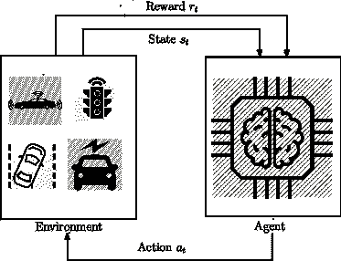
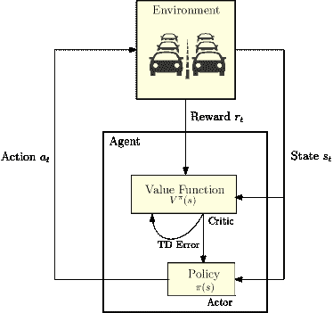
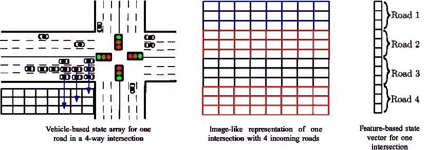

<!--yml

分类: 未分类

日期: 2024-09-06 20:01:16

-->

# [2005.00935] 深度强化学习在智能交通系统中的应用：综述

> 来源：[`ar5iv.labs.arxiv.org/html/2005.00935`](https://ar5iv.labs.arxiv.org/html/2005.00935)

# 深度强化学习在智能交通系统中的应用：综述

Ammar Haydari Yasin Yilmaz

###### 摘要

最新的技术进步提升了交通质量。新的数据驱动方法为所有基于控制的系统带来了新的研究方向，例如交通、机器人、物联网和电力系统。将数据驱动应用与交通系统结合在最近的交通应用中发挥了关键作用。本文综述了基于最新深度强化学习（RL）的交通控制应用。具体而言，详细讨论了基于（深度）RL 的交通信号控制（TSC）应用，这些应用在文献中得到了广泛研究。综合讨论了 TSC 的不同问题表述、RL 参数和仿真环境。文献中也有几个使用深度 RL 模型研究的自动驾驶应用。我们的综述通过根据应用类型、控制模型和研究算法对现有工作进行分类，广泛总结了该领域的现有成果。最后，我们讨论了深度 RL 基础的交通应用面临的挑战和未解问题。

###### 关键词：

深度强化学习，智能交通系统，交通信号控制，自动驾驶，多智能体系统。

## I 引言

随着城市化进程的加快和自动化技术的最新进展，交通研究发展为更智能的系统，即智能交通系统（ITS）。人工智能（AI）试图通过最小化人工干预来控制系统。ITS 和 AI 的结合为 21 世纪的交通研究提供了有效的解决方案。ITS 的主要目标是为参与者提供安全、有效和可靠的交通系统。为此，最优的交通信号控制（TSC）、自动驾驶控制和交通流量控制是一些关键的研究领域。

未来的交通系统预计将包括完全自主的功能，例如自主交通管理和自主驾驶。即使在现在，半自主车辆已经占据了道路，未来自主级别有可能会进一步提高。权威机构希望交通智能系统（ITS）实现自主控制的原因有很多，比如为驾驶员节省时间、为环境节能和提高所有参与者的安全性。协调和连接的交通系统可以通过自我自主系统更高效地控制，从而提供旅行时间的节省。当车辆在交通中花费更多时间时，燃油消耗增加，这对环境和经济有影响。另一个希望最小化人工干预的原因是人类行为的不可预测性。预计自主驾驶将减少交通事故，提高运输质量。基于以上所有原因，对 ITS 中各种自主控制的需求非常高。一种流行的方法是使用基于经验的学习模型，类似于人类学习。

城市区域人口增长导致交通量大，同时 2018 年美国驾驶员的年拥堵成本为 97 小时和$1,348 [1]。因此，使用自适应模块控制交通信号灯是当前 ITS 研究的重点。通过交通信号灯设计自适应交通管理系统是减少交通拥堵的有效解决方案。优化交通信号灯的最佳方法仍然是一个未解的问题，但一种有前景的优化交通信号控制（TSC）方法是使用基于学习的人工智能技术。

机器学习主要有三种范式。监督学习基于训练中提供的输出标签做出决策。无监督学习则在没有预先知道输出标签的情况下，基于模式发现进行工作。第三种机器学习范式是强化学习（RL），它在马尔可夫决策过程（MDP）中进行顺序行动，并依据奖励或惩罚标准来进行。强化学习与深度学习结合，称为深度强化学习（deep RL），目前被接受为控制系统中的最先进学习框架。虽然强化学习可以解决复杂的控制问题，但深度学习有助于从复杂数据集中逼近高度非线性函数。

最近，许多基于深度强化学习的解决方法被提出用于不同的 ITS 应用。对基于 RL 的控制机制在 ITS 应用中的兴趣不断增加，例如交通管理系统和自主驾驶应用。将所有与深度 RL 相关的数据驱动 ITS 研究汇总，并在论文中讨论这些应用，对于向 ITS 研究人员提供深度 RL 的信息，以及向深度 RL 研究人员提供 ITS 的信息是必要的。

在本文中，我们回顾了为 ITS 问题提出的深度 RL 应用，主要是交通信号控制（TSC）。讨论了文献中不同的 RL 方法。基于标准 RL 技术的 TSC 解决方案在深度 RL 发明之前已经有过研究。因此，我们认为标准 RL 技术在审视 ITS，特别是 TSC 的深度 RL 解决方案时也具有重要意义。由于交通交叉口模型主要是连接的和分布式的，多智能体动态控制技术在 RL 基础的 ITS 应用中也发挥着关键作用，这些技术在本综述中也得到了广泛讨论。

### I-A 贡献

本文通过讨论深度 RL 的理论概述、TSC 的不同问题表述、TSC 和其他 ITS 主题的各种深度 RL 应用以及未来研究方向中的挑战，提供了关于深度 RL 在 ITS 中应用的全面综述。目标读者是那些希望迅速了解深度 RL 技术的 ITS 研究人员，以及对 ITS 应用感兴趣的深度 RL 研究人员。我们还相信，这项综述将作为“深度 RL 在 ITS 中的紧凑手册”供更有经验的研究人员回顾现有方法和开放挑战。我们的贡献可以总结如下。

+   •

    本文呈现了关于在 ITS 中基于 RL 和深度 RL 应用的第一次全面调查。

+   •

    从广义上讲，解释了强化学习和深度强化学习模型的理论背景，特别是那些在智能交通系统（ITS）文献中使用的模型。

+   •

    现有的交通信号控制（TSC）领域中使用强化学习（RL）和深度强化学习（deep RL）的研究工作进行了讨论，并在表格中清晰总结，以便进行适当的比较。

+   •

    同样，其他 ITS 领域如自动驾驶中的不同深度 RL 应用也进行了展示，并在表格中总结以便比较。

### I-B 组织结构

论文组织如下。

+   •

    第 II 节：相关工作

+   •

    第 III 节：深度强化学习概述

    +   –

        第 III-A 节：强化学习

    +   –

        第 III-B 节：深度强化学习

    +   –

        第 III-C 节：深度强化学习总结

+   •

    第 IV 节：TSC 中的深度 RL 设置

    +   –

        部分 IV-A：状态

    +   –

        部分 IV-B：行动

    +   –

        部分 IV-C：奖励

    +   –

        部分 IV-D：神经网络结构

    +   –

        部分 IV-E：仿真环境

+   •

    部分 V：深度 RL 应用于 TSC

    +   –

        部分 V-A：标准 RL 应用

    +   –

        部分 V-B：深度 RL 应用

+   •

    部分 VI：深度 RL 用于其他 ITS 应用

    +   –

        部分 VI-A：自动驾驶

    +   –

        部分 VI-B：能源管理

    +   –

        部分 VI-C：道路控制

    +   –

        部分 VI-D：各种 ITS 应用

+   •

    部分 VII：挑战与开放研究问题

## II 相关工作

最早总结用于交通信号控制（TSC）的 AI 模型，包括强化学习（RL）和其他方法的工作可以追溯到 2007 年[2]。当时，模糊逻辑、人工神经网络和强化学习是研究人员应用于交通信号控制的三种主要流行 AI 方法。由于智能交通系统（ITS）组件之间的关联性，例如交叉口，多智能体模型比单智能体模型提供了更完整和现实的解决方案。因此，将交通信号控制问题表述为多智能体系统具有很高的研究潜力。多智能体强化学习在交通信号控制中的机会和研究方向在[3]中进行了研究。[4] 从实验角度讨论了文献中流行的强化学习方法。另一个全面的强化学习方法的交通信号控制调查在[5]中提出。最近在[6]中提出的调查从广泛的角度研究了智能交通系统中的 AI 方法。它考虑了监督学习、无监督学习和强化学习在车对车通信中的应用。

Abduljabbar 等人在[7]中总结了基于 AI 的交通应用文献，涉及三个主要主题：交通管理应用、公共交通和自动驾驶车辆。在[8]中，作者一般性地讨论了交通信号控制方法，包括经典控制方法、激励控制、绿波、最大带宽系统和基于强化学习的控制方法。Veres 等人突出介绍了深度学习应用于智能交通系统的趋势和挑战[9]。深度学习模型在深度强化学习中发挥了重要作用。非线性神经网络克服了传统的数据驱动智能交通应用中的挑战，如可扩展性。最近，在[10]中提出了针对自动驾驶车辆的深度强化学习应用调查，作者讨论了近期的工作及其在现实世界部署中的挑战。除了自动驾驶，本调查还讨论了深度强化学习在智能交通系统中越来越受欢迎的广泛应用类，以及对深度强化学习概念的全面概述。

文献中没有专门针对智能交通系统深度强化学习应用的调查，我们认为这是智能交通系统研究中的一个非常及时的话题。因此，本文将填补智能交通系统研究人员和对智能交通系统感兴趣的深度强化学习研究人员之间的重要空白。

## III 深度强化学习：概述

深度强化学习是最成功的 AI 模型之一，也是与人类学习最接近的机器学习范式。它结合了深度神经网络和强化学习，以更高效和稳定的方式进行函数逼近，特别适用于高维和无限状态问题。本节描述了传统强化学习的理论背景以及在智能交通系统应用中实施的主要深度强化学习算法。

### III-A 强化学习

强化学习是一种通用的学习工具，其中一个智能体通过与环境互动来学习如何在环境中行为，前提是没有任何先验知识，智能体通过学习最大化一个数值定义的奖励（或最小化惩罚）来达到这一点。在采取行动后，强化学习智能体会在每个时间步 $t$ 从环境中获得关于其行动表现的反馈。利用这些反馈（奖励或惩罚），智能体迭代地更新其行动策略，以达到最佳控制策略。强化学习通过与环境的经验学习，表现出类似于人类学习的试错学习方式 [11]。强化学习中的探索与利用之间的基本权衡在于新动作和已学动作之间的平衡。从计算的角度来看，强化学习是一种数据驱动的方法，它迭代地计算接近最佳控制策略的近似解。因此，它也被称为近似动态规划 [11]，这是动态规划（DP）的一种序列优化问题。

在一个通用的强化学习模型中，一个受算法控制的智能体在每个时间步 $t$ 观察系统状态 $s_{t}$，并在采取行动 $a_{t}$ 后从其环境/系统中获得奖励 $r_{t}$。在根据当前策略 $\pi$ 采取行动后，系统过渡到下一个状态 $s_{t+1}$。在每次交互后，强化学习智能体更新其关于环境的知识。图 1 描绘了强化学习过程的示意图。

图 1：强化学习控制循环。

#### III-A1 马尔可夫决策过程

强化学习方法论正式来源于马尔可夫决策过程（MDP），这是一个用于序列决策算法的通用数学框架。MDP 由一个包含 5 个元素的元组组成：

+   •

    一组状态 $\mathcal{S}$，

+   •

    一组动作 $\mathcal{A}$，

+   •

    转移函数 $\mathcal{T}(s_{t+1}|s_{t},a_{t})$，它将每个时间点 $t$ 的状态-动作对映射到下一个状态 $s_{t+1}$ 的分布，

+   •

    奖励函数 $\mathcal{R}(s_{t},a_{t},s_{t+1})$，它为从状态 $s_{t}$ 执行动作 $a_{t}$ 过渡到下一个状态 $s_{t+1}$ 时的奖励提供值，

+   •

    折扣因子 $\gamma$ 在 0 和 1 之间，用于未来奖励的计算。

基本的马尔可夫性质是，给定当前状态 $s_{t}$，系统的下一个状态 $s_{t+1}$ 与之前的状态 $(s_{0},s_{1},...,s_{t-1})$ 是独立的。在包括交通系统在内的控制系统中，MDP 模型通常是 *episodic* 的，其中系统根据结束时间 $T$ 或结束状态 $s_{T}$ 为每一集设定了终点。MDP 代理的目标是找到最优策略 $\pi^{*}$，以最大化每个状态 $s$ 的期望累积奖励 $\mathbb{E}[R_{t}\mid s,\pi]$ 和累积折扣奖励（即回报）。

|  | $R_{t}=\sum_{i=0}^{T-1}\gamma^{i}r_{t+i},$ |  | (1) |
| --- | --- | --- | --- |

这里使用折扣参数 $\gamma$ 来反映未来奖励的重要性。选择更大的 $\gamma$ 值（介于 0 和 1 之间）意味着代理的动作对未来奖励的依赖程度更高。相反，较小的 $\gamma$ 值会导致动作主要关注瞬时奖励 $r_{t}$。

一般来说，强化学习（RL）代理可以通过两种方式行动：（i）通过了解/学习从状态 $s_{t}$ 到 $s_{t+1}$ 的转移概率 $\mathcal{T}$，这称为基于模型的强化学习，（ii）通过探索环境而不学习转移模型，这称为无模型强化学习。无模型强化学习算法还分为两大类：基于值的方法和基于策略的方法。在基于值的强化学习中，代理在每次迭代时更新一个将每个状态-动作对映射到一个值的值函数，而在基于策略的方法中，策略在每次迭代时使用策略梯度更新[11]。接下来我们将详细解释基于值和基于策略的强化学习方法。

#### III-A2 基于值的强化学习

值函数通过估计在给定策略 $\pi$ 下，状态 $s$ 的价值（即期望回报）来确定状态对代理的好坏。

|  | ${V}^{\pi}(s)=\mathbb{E}[R_{t}\mid s,\pi].$ |  | (2) |
| --- | --- | --- | --- |

最优值函数 ${V}^{*}(s)$ 描述了在所有状态下，通过策略最大化的状态值函数：

|  | ${V}^{*}(s)=\max_{\pi}{V}^{\pi}(s),\forall{s}\;\epsilon\;\mathcal{S}.$ |  | (3) |
| --- | --- | --- | --- |

考虑动作的影响，状态-动作值函数（即质量函数 Q 函数）通常用于反映状态-动作对的期望回报：

|  | ${Q}^{\pi}(s,a)=\mathbb{E}[R_{t}\mid s,a,\pi].$ |  | (4) |
| --- | --- | --- | --- |

最优动作值函数（Q 函数）的计算方式与最优状态值函数类似，通过最大化所有状态的期望回报。最优状态值函数和动作值函数之间的关系由下式给出：

|  | ${V}^{*}(s)=\max_{a}{Q}^{*}(s,a),\forall{s}\;\epsilon\;\mathcal{S}.$ |  | (5) |
| --- | --- | --- | --- |

Q 函数 $Q^{*}(s,a)$ 通过选择最大化状态 $s$ 的 $Q$ 值的动作 $a$ 来提供最优策略 $\pi^{*}$：

|  | $\pi^{*}(s)=\operatorname*{argmax}_{a}{Q}^{*}(s,a),\forall{s}\;\epsilon\;\mathcal{S}.$ |  | (6) |
| --- | --- | --- | --- |

根据上述定义，有两个主要的基于价值的强化学习算法：Q-learning [12] 和 SARSA [13]，分别被归类为离策略强化学习算法和在策略强化学习算法。在这两个算法中，状态-动作对的值（$Q$-值）被存储在$Q$-表中，并通过利用马尔可夫性质的贝尔曼方程的递归性质来学习：

|  | $Q^{\pi}(s_{t},a_{t})\;=\;\mathbb{E}_{\pi}[r_{t}+\gamma Q^{\pi}(s_{t+1},\pi(s_{t+1})].$ |  | (7) |
| --- | --- | --- | --- |

实际上，$Q^{\pi}$估计值通过学习率$\alpha$进行更新，以改善估计，具体如下：

|  | $Q^{\pi}(s_{t},a_{t})\leftarrow Q^{\pi}(s_{t},a_{t})+\alpha(y_{t}-Q^{\pi}(s_{t},a_{t}))$ |  | (8) |
| --- | --- | --- | --- |

其中$y_{t}$是$Q^{\pi}(s_{t},a_{t})$的时间差（TD）目标。TD 步骤大小是一个用户定义的参数，决定了在计算$y_{t}$时考虑多少经验步骤（即动作），$y_{t}$是$Q^{\pi}(s_{t},a_{t})$的新瞬时估计。在预定义的$n$个 TD 步骤中，奖励$R_{t}^{(n)}=\sum_{i=0}^{n-1}\gamma^{i}r_{t+i}$，加上$n$步骤后的 Q 值$Q^{\pi}(s_{t+n},a_{t+n})$，给出$y_{t}$。Q-learning 和 SARSA 之间的区别在此阶段变得清晰。Q-learning 是一个离策略模型，其中代理的动作通过最大化 Q 值来更新，而 SARSA 是一个在策略模型，其中代理的动作根据从$Q$-函数推导出的策略$\pi$进行更新。

|  | $y_{t}^{Q-learning}=R_{t}^{(n)}+\gamma^{n}\max_{a_{t+n}}Q^{\pi}(s_{t+n},a_{t+n}),$ |  | (9) |
| --- | --- | --- | --- |
|  | $y_{t}^{SARSA}=R_{t}^{(n)}+\gamma^{n}Q^{\pi}(s_{t+n},a_{t+n}).$ |  | (10) |

虽然 Q-learning 采用贪婪方法来更新其 Q-值估计，SARSA 则在更新 Q-值和执行动作时遵循相同的策略。为了鼓励探索新的状态，通常在 Q-learning 和 SARSA 中使用$\epsilon$-贪婪策略来执行动作。在$\epsilon$-贪婪策略中，以概率$\epsilon$执行随机动作，以概率$1-\epsilon$执行相对于当前策略$Q(s,a)$定义的最佳动作。

在 Q-learning 和 SARSA 中，最大 TD 步骤的情况，通常用$n=\infty$来表示回合的结束，对应于一种完全基于经验的技术，称为蒙特卡罗强化学习，其中 Q 值仅在每回合结束时更新一次。这意味着在整个回合中使用相同的策略而不进行任何更新来执行动作。TD$(\lambda)$技术通过对从$1$到$\infty$的所有 TD 目标进行加权平均来推广 TD 学习，其中$\lambda$是衰减率 [11]。

#### III-A3 基于策略的强化学习

基于策略的强化学习算法将策略$\pi_{\theta}$视为由$\theta$参数化的状态-动作对的概率分布。策略参数$\theta$会被更新以最大化目标函数$J(\theta)$，例如期望回报$\mathbb{E}_{\pi_{\theta}}[R_{t}|\theta]=\mathbb{E}_{\pi_{\theta}}[Q^{\pi_{\theta}}(s_{t},a_{t})|\theta]$。在具有无限维动作空间或高维问题的连续控制问题中，基于策略的方法的表现通常优于基于价值的方法，因为策略不需要探索大而连续空间中的所有状态并将其存储在表格中。虽然文献中有一些有效的无梯度优化策略的方法[14]，但基于梯度的方法在所有类型的强化学习算法中被认为对策略优化更为有用。

在这里，我们简要讨论基于策略梯度的强化学习算法，这些算法使用目标函数$J(\theta)$对$\theta$的梯度来选择动作，这个梯度被称为策略梯度。在著名的策略梯度算法 REINFORCE [15]中，目标函数是期望回报，通过使用对数导数技巧$\nabla\log\pi_{\theta}=\frac{\nabla\pi_{\theta}}{\pi_{\theta}}$，策略梯度可以写作

|  | $\nabla_{\theta}J(\theta)=\mathbb{E}_{\pi_{\theta}}[Q^{\pi_{\theta}}(s,a)\nabla_{\theta}\log\pi_{\theta}].$ |  | (11) |
| --- | --- | --- | --- |

由于计算整个梯度效率不高，REINFORCE 使用了流行的随机梯度下降技术来逼近梯度，从而更新参数$\theta$。在每次蒙特卡罗迭代中，使用时间$t$的回报$R_{t}$作为$Q^{\pi_{\theta}}(s_{t},a_{t})$的估计器来进行更新

|  | $\theta\leftarrow\theta+\alpha\nabla_{\theta}\log\pi_{\theta}R_{t},$ |  | (12) |
| --- | --- | --- | --- |

其中$\alpha$是学习率。具体而言，$\theta$在$\nabla_{\theta}\log\pi_{\theta}$方向上以权重$R_{t}$进行更新。也就是说，如果近似策略梯度对应于高回报$R_{t}$，则算法在更新参数时会*强化*这一梯度方向。

蒙特卡罗策略梯度的一个问题是其高方差。为了减少策略梯度估计中的方差，演员-评论家算法使用状态值函数$V^{\pi_{\theta}(s)}$作为基准。策略梯度中使用的是优势函数[16] $A^{\pi_{\theta}}(s,a)=Q^{\pi_{\theta}}(s,a)-V^{\pi_{\theta}}(s)$，而不是$Q^{\pi_{\theta}}(s,a)$。

|  | $\nabla_{\theta}J(\theta)=\mathbb{E}_{\pi_{\theta}}[A^{\pi_{\theta}}(s,a)\nabla_{\theta}\log\pi_{\theta}].$ |  | (13) |
| --- | --- | --- | --- |

优势函数，无论是正值还是负值，决定了更新方向：朝着与高于/低于平均奖励的动作相同/相反的方向前进。Actor-Critic 方法将在深度强化学习讨论中的第 III-B3 节进一步讨论。

#### III-A4 多智能体强化学习

许多现实世界问题需要多个智能体的互动以最大化学习性能。多智能体学习是一项具有挑战性的任务，因为每个智能体都需要考虑其他智能体的行动以达成全局最优解。增加智能体的数量也会增加状态-动作维度，因此将任务在智能体之间分解是大规模控制系统的可扩展方法。多智能体强化学习中的高维系统在状态和动作方面有两个主要问题：稳定性和智能体对环境的适应性[17]。当每个智能体在优化其行动时不考虑附近的智能体时，整体系统的最佳学习将变得非平稳。有几种方法可以解决多智能体强化学习系统中的这个问题，如分布式学习、合作学习和竞争学习[17]。

### III-B 深度强化学习

在高维状态空间中，标准强化学习算法无法有效地计算所有状态的价值函数或策略函数。尽管有一些线性函数逼近方法被提出以解决强化学习中的大状态空间问题，但它们的能力仍然有限。在高维和复杂系统中，标准强化学习方法无法学习环境的有用特征以进行有效的函数逼近。然而，这个问题可以通过基于深度学习的函数逼近器轻松解决，其中深度神经网络被训练来学习最优策略或价值函数。不同的神经网络结构，如卷积神经网络（CNN）和递归神经网络（RNN），被用于训练大状态空间中的强化学习算法[18]。

深度学习的主要概念是从数据中提取有用的模式。深度学习模型大致受到人类神经系统多层结构的启发。如今，深度学习在计算机视觉、语音识别、自然语言处理和深度强化学习应用等多个领域都有应用。

#### III-B1 深度 Q 网络

由于基于值的强化学习（RL）算法通过填充 Q 表来学习 Q 函数，在大型状态空间和连续动作问题中，访问所有状态和动作是不切实际的。解决这个问题的主要方法是深度 Q 网络（DQN）[19]，它使用深度神经网络来近似 Q 函数。原始 DQN 接收原始输入图像作为状态，并使用卷积神经网络（CNN）从中估计 Q 值。用$\theta$表示神经网络参数，则 Q 函数近似表示为$Q(s,a;\theta)$。神经网络的输出是根据(6)使用离散的近似动作值集合来选择的最佳动作。

*Mnih 等人*[19]的主要贡献是提出了两种新技术来稳定深度神经网络的学习：目标网络和经验回放。原始 DQN 算法在几个经典的 Atari 视频游戏中明显超越了专家级人类表现。带有经验回放和目标网络的完整 DQN 算法由算法 1 给出。

*目标网络*：DQN 中稳定学习的主要部分之一是目标网络。DQN 有两个独立的网络，一个是主网络，它近似 Q 函数，另一个是目标网络，它为更新主网络提供 TD 目标。在训练阶段，主网络参数$\theta$在每次动作后都会更新，而目标网络参数$\theta^{\textendash}$则在一定时间间隔后更新。目标网络不在每次迭代后更新的原因是，它调整主网络的更新，以保持值估计的控制。如果两个网络同时更新，由于目标网络的反馈循环，主网络的变化将被夸大，从而导致网络不稳定。类似于(9)，1 步 TD 目标$y_{t}$表示为

|  | $y_{t}^{DQN}=r_{t}+\gamma\max_{a_{t+1}}Q^{\pi}(s_{t+1},a_{t+1};\theta^{\textendash}_{t}),$ |  | (14) |
| --- | --- | --- | --- |

其中$Q^{\pi}(s_{t+1},a_{t+1};\theta^{\textendash}_{t})$表示目标网络。

*经验回放*：DQN 引入了另一个独特的特性，即经验回放，它将近期的经历 $(s_{t},a_{t},r_{t},s_{t+1})$ 存储在回放记忆中，并从回放记忆中均匀抽取批量数据用于训练神经网络。使用经验回放在 DQN 中有两个主要原因。首先，它通过随机抽样防止智能体陷入最近的轨迹，因为 RL 智能体容易受到连续样本的时间相关性影响。此外，DQN 智能体不是在完整观察上进行学习，而是在小批量数据上进行学习，从而提高了训练效率。在定义为经验回放的固定大小内存中，内存仅存储最近的 $M$ 个样本，通过移除最旧的经验来为最新样本分配空间。其他深度 RL 算法也使用了相同的技术 [20]，[21]。

*优先经验回放*：经验回放技术从内存中均匀抽样经历，但有些经历对学习的影响比其他经历更大。[22] 提出了一个优先考虑重要动作的新方法，通过改变 DQN 算法的抽样分布来实现。优先经验回放的总体思路是，通过应用具有比例优先权或基于排名的优先权的随机抽样，使得具有更高 TD 误差的样本 $y_{t}^{DQN}-Q^{\pi}(s_{t},a_{t};\theta_{t}^{-})$ 在概率上获得更高的排名。根据分配的概率抽样经历。

算法 1 DQN 算法

1:  *输入* 回放记忆大小 $M$，批量大小 $d$，回合数 $E$，和时间步数 $T$2:  初始化主网络权重 $\theta$3:  初始化目标网络权重 $\theta^{-}$4:  初始化回放记忆 5:  对于 $e=1,\ldots,E$ 执行 6:     初始化状态 $s_{1}$，和动作 $a_{1}$7:     对于 $t=1,\ldots,T$ 执行 8:        以概率 $1-\epsilon$ 执行动作 $a_{t}=\operatorname*{argmax}_{a}Q^{\pi}(s_{t},a;\theta)$，或以概率 $\epsilon$ 执行随机动作 9:        获得奖励 $r_{t}$ 并观察下一个状态 $s_{t+1}$10:        如果 回放容量 $M$ 满了，则 11:          删除记忆中最旧的元组 12:        结束 如果 13:        将元组 $(s_{t},a_{t},r_{t},s_{t+1})$ 存储到回放记忆中 14:        从回放记忆中随机抽取 $d$ 个元组 15:        <math alttext="y_{t}=\begin{cases}r_{t},&amp;\text{if $t=T$}.

$y_t=\begin{cases}r_t,&\text{如果$t=T$}.\\ r_t+\gamma\max_{a}Q^{\pi}(s_{t+1},a_{t+1};\theta^{\textendash}_{t}),&\text{否则}.\end{cases}$16: 使用$y_{t}$执行策略梯度以更新$\theta$17: 每$N$步更新一次目标网络，$\theta^{\textendash}=\theta$18: 结束循环 19: 结束循环

#### III-B2 双重对抗 DQN

DQN 是标准 Q 学习算法的改进版本，具有单一估计器。由于只有单一的 $Q$ 函数估计，DQN 和 Q 学习都会高估一些动作。[23] 的作者建议将估计器加倍，主网络用于动作选择，目标网络用于动作评估，类似于表格双重 Q 学习技术 [24]。与使用目标网络选择最大化未来奖励的 Q 值（见 Eq. (14)）不同，双重 DQN 网络使用主网络选择动作，并使用目标网络评估它。动作选择与目标网络解耦，以获得更好的 Q 值估计。

|  | $y_{t}^{DDQN}=r_{t}+\gamma Q^{\pi}(s_{t+1},\operatorname*{argmax}_{a_{t+1}}Q^{\pi}(s_{t+1},a_{t+1};\theta);\theta^{\textendash}_{t}).$ |  | (15) |
| --- | --- | --- | --- |

DQN 的另一个改进版本是对抗网络架构，它分别为每个动作估计状态价值函数 $V^{\pi}(s)$ 和优势函数 $A^{\pi}(s,a)$ [25]。这两个网络组合的输出是通过聚合层得到的离散动作集的 Q 值。这样，对抗 DQN 学习了重要的状态值，而不考虑它们对动作的相应影响，因为状态价值函数 $V^{\pi}(s)$ 是一种无动作估计。

这两种双重和对抗模型基于优先经验回放的 DQN 算法被认为是离散动作深度强化学习的最先进技术。

#### III-B3 演员-评论员方法

Actor-critic 强化学习模型介于基于策略的算法和基于价值的算法之间，因为它们有两个估计器：演员使用 Q 值估计，评论员使用状态价值函数估计（见图 2）。演员根据策略控制代理的行为，而评论员根据价值函数评估采取的行动。最近有一些论文处理了使用深度强化学习方法的演员-评论员模型的变体 [20], [21], [26]，其中演员和评论员的函数近似器都基于深度神经网络。

图 2：演员-评论员控制回路。

标准 DQN 技术与单网络估计器适用于低维离散动作空间。最近引入了一种名为深度确定性策略梯度（DDPG）的演员-评论员算法，用于解决高维连续控制问题，它使用确定性策略梯度方法对状态空间进行估计，而不是对状态和动作空间一起进行随机策略梯度估计[20]。DDPG 与标准 DQN 的一个区别在于它使用了一种新的软目标更新模型，进行频繁的软更新。

#### III-B4 异步方法

硬件系统的改进使得 RL 研究人员能够使用多个 CPU 或 GPU 进行并行计算，从而加快学习速度。首先在 DQN 上测试的并行模型提高了代理的表现，体现在更低的训练时间和更高的收敛结果。例如，[27]中提出的异步多演员-学习者模型在连续和离散动作空间中均表现出非常高的性能。多个演员-学习者使 RL 代理能够以不同的探索速率探索环境。此外，异步更新不需要重放记忆，学习者在预定更新周期$T$内使用所有实验的累积多个梯度。异步优势演员-评论员（A3C）是一种最先进的深度 RL 算法，它在并行处理器上异步更新策略和价值网络。每个网络在更新周期$T$内单独更新，主共享网络根据参数$\theta^{\pi}$和$\theta^{V}$进行更新。A3C 的同步且更简单的版本被称为优势演员-评论员（A2C）。

### III-C 深度 RL 总结

在本节中，我们讨论了深度 RL 的背景，包括基于策略和基于价值的 RL 模型。在讨论深度 RL 在智能交通系统中的应用细节之前，值得提及的是，某些深度 RL 算法在不同应用中具有不同的偏好，这取决于应用领域的规格。虽然开发新的深度 RL 技术是一个活跃的研究领域，但基于 Q 学习的 DQN 和基于 actor-critic 的 DDPG 算法仍然主导 RL 基础的智能交通系统控制器。对于高维状态空间，深度 RL 方法比标准 RL 方法更受欢迎。关于动作空间，基于策略的深度 RL 方法比基于价值的深度 RL 方法更适合连续动作空间。对于离散动作空间，智能交通系统控制器通常使用 DQN 及其变体，因为它们的结构比基于策略的方法更简单。一般来说，我们可以说基于 Q 学习的 DQN 模型通常用于状态和动作空间有限的较简单系统，而基于策略或 actor-critic 算法主要用于大型复杂系统，包括多智能体控制系统。我们还应注意，在许多情况下，设计师可以在设置问题时选择离散和连续状态及动作空间。例如，在 TSC 中，如下节所述，一些作者将连续动作定义为延长绿灯的时间，而其他作者将离散动作空间定义为选择绿灯方向。

## IV 深度 RL 在 TSC 中的设置

到目前为止，我们讨论了 AI 在交通系统中的重要性以及 RL 的理论背景，特别是深度 RL。深度 RL 在智能交通系统中的一个主要应用领域是控制有信号的交叉口。由于现有的大多数研究都是面向应用的，所提出的方法在各个方面都不同——例如，将深度 RL 应用于不同的交叉口模型，使用不同的技术来监控交通，利用不同的状态-动作-奖励表示来表征 RL 模型，以及使用不同的神经网络结构。因此，通常无法直接比较它们的性能。

在这些应用中，学习算法（在我们的案例中是深度 RL）被实施在 TSC 中心，以适应交通流量的交通信号控制。首先，控制单元收集状态信息，这些信息可以是不同格式的，如排队长度、车辆位置、车辆速度等，然后控制单元根据当前的深度 RL 方法的策略采取行动。最后，代理（控制单元）根据采取的行动获得奖励。通过遵循这些步骤，代理试图找到一个最优策略，以减少交叉口的拥堵。

在模拟器上处理 TSC 问题时使用 RL 算法需要在多个部分进行良好的问题表述：状态、动作、奖励定义和神经网络结构。在本节中，我们将讨论这些主要的深度 RL 配置以及文献中使用的交通模拟器。

### IV-A 状态

学习性能高度依赖于准确而具体的状态定义。因此，对于交通信号灯的 RL 应用，有许多不同的状态表示方法。[28] 和 [29] 的作者考虑了将原始 RGB 图像作为状态表示，采用与原始 DQN [19] 相同的方法。另一种类似的图像状态表示方法是拍摄受控交叉口的快照，以形成车辆的位置和速度 [30]。被称为离散交通状态编码（DTSE）的图像状表示格式，是 TSC 应用中最流行的状态定义之一 [31, 32, 33, 34, 35, 36, 37, 29, 38, 39]。研究人员倾向于使用 DTSE 的原因在于它能够从交叉口获取最高的分辨率和最真实的信息。考虑到交叉口的 $n$ 个车道，每个交叉口被划分为若干单元格，每个单元格的大小平均为一个车辆，从交叉口的停车点起向 $m$ 米后退。车辆的速度和位置、信号相位以及加速度在 DTSE 中以单独的数组显示。这四种输入类型的不同变体由不同的研究人员选择。例如，一些研究人员将速度和位置一起选择 [31, 33]，而另一些则仅选择四种输入类型中的一种作为状态表示，例如车辆的位置 [23, 29]。而 DTSE 仅考虑车道特征，[30] 则考虑了包括道路边信息在内的完整摄像头视图。如今，许多交叉口都配备了高质量的摄像头来监控交叉口的交通。为了实现 DTSE 类型的状态表示，这些设备可以很容易地扩展用于监控连接到交叉口的道路。

图 3：两种流行的状态表示类型：DTSE 矩阵（中间）和基于特征的向量（右侧）。左图显示了带有相应车辆状态数组的交通模型。在每个单元格中，表示一辆车。中间的矩阵显示了一个交叉口的完整矩阵，其中每条道路以不同颜色表示。右侧图为基于特征的状态向量，每个单元格表示一个车道。

另一种常见的状态表示方法是形成基于特征的价值向量。在特征基础的状态形式中，每条车道的特定信息的平均值或总值会在一个向量上表示，而不是基于车辆的状态表示。队列长度、一个相位周期内的累计等待时间、车道上的平均速度、相位持续时间（绿灯、红灯、黄灯）以及每条车道上的车辆数量是一些常用于状态表示的特征。通常，这类信息的组合是从交叉口收集的 [40, 41, 42, 43]。这种信息的一个优点是可以通过路面传感器或环形探测器轻松收集。还有一些其他独特的交通特征，如基于车道探测器的最大速度评分 [41]、信号控制阈值指标 [44] 和左转占用情况 [45]，这些特征在研究中不常用。两种常见的状态表示形式，DTSE 和特征向量，如图 3 所示。

对于具有多个交叉口的 TSC 模型，状态定义还包括邻近交通信号灯的信息，如信号相位、车辆数量和平均速度 [34, 44, 46]。

### IV-B 行动

在接收到状态后，RL 算法从一组可能的行动中选择的行动对学习有着关键影响。在一个单一的四路交叉口，每个方向都有绿灯、红灯和黄灯相位的控制。对于单一交叉口，有几种常见的行动选择。最常见的一种是选择其中一个可能的绿灯相位。另一种是二元行动选择，即保持相同的相位或改变方向。第三种且相对较少见的行动模型是用预定义的时长更新相位持续时间。

对于单个交叉口，通常有 4 种可能的绿灯阶段：南北绿灯（NSG）、东西绿灯（EWG）、南北前进左转绿灯（NSLG）、东西前进左转绿灯（EWLG）。在某个方向的绿灯阶段，车辆通过交叉口前往允许的方向。当动作选择设置为选择可能的绿灯阶段之一时，深度强化学习代理在每个时间点$t$从这四种绿灯阶段中选择一个动作。在经历黄灯和红灯过渡后，所选动作将在交通信号灯上执行。成功的代理学习和安全交通也取决于正确的红灯和黄灯阶段定义。早期的应用将阶段定义简化为仅两个绿灯阶段，南北绿灯（NSG）和东西绿灯（EWG）[32, 40]，忽略了左转。另一种动作选择模型是二元动作，其中绿灯阶段间隔长度预先定义，并且在每个时间点$t$，代理决定是保持相同阶段还是进入预定义周期中的下一个阶段，例如，NSG $\to$ EWG $\to$ NSLG $\to$ EWLG。当代理选择更改阶段的动作时，在执行下一个绿灯阶段之前，首先执行黄灯和红灯过渡阶段，以确保安全的交通流[33, 42, 37, 38, 47]。

大多数应用考虑从一组动作中选择离散动作，但也有一些应用考虑连续输出 [20]，这仅控制下一阶段的持续时间。这种类型的动作定义最适合多个交叉口。根据预定义的最小和最大阶段持续时间，算法预测当前阶段的时间长度 [41, 48]。

### IV-C 奖励

强化学习中的状态可以是特征向量或高维矩阵，类似地，动作可以是连续值或离散选择的向量。然而，奖励始终是一个标量值，它是交通数据的函数。奖励在强化学习中的作用是分析所采取动作相对于状态的质量，即对代理进行惩罚或奖励。等待时间、累计延迟和排队长度是交通信号控制中最常见的奖励定义。等待时间由车辆停滞的时间总和给出。延迟是连续绿灯阶段等待时间之间的差异。排队长度是为交叉口中的每条车道计算的。某些工作中使用美国公共道路局（BPR）定义的特殊拥堵函数作为奖励定义 [34, 47]。虽然一些工作中使用了交通数据的绝对值作为奖励，但其他工作中也使用了负值或平均值。

### IV-D 神经网络结构

深度神经网络的结构对深度强化学习中的学习有着重大影响。因此，文献中提出了不同的神经网络结构用于时间序列分类（TSC）。多层感知器（MP），即标准的全连接神经网络模型，是经典数据分类的有用工具。多层感知器的扩展，具有卷积核的卷积神经网络（CNN），在将图像映射到输出上表现出色。标准 DQN 考虑了使用连续原始像素帧作为状态定义的 CNN。有许多 TSC 论文使用 CNN 进行 DTSE 状态定义（见图 3），例如[31，49，33]。残差网络（ResNet）用于处理基于 CNN 的深度网络结构中的过拟合问题[34]。另一种用于图操作的卷积网络结构是图卷积网络（GCN）。递归神经网络（RNN），例如长短期记忆网络（LSTM），被设计用于处理序列数据。由于 TSC 中的控制是顺序进行的，因此 RNN 也被用于深度强化学习设置[35，37]。另一种神经网络模型是自编码器，它在较低维子空间中学习高维输入数据的编码。编码后的输入可以解码以重建输入，这通常用于清除输入数据上的噪声[40]。

### IV-E 仿真环境

由于现实世界实验中的生命威胁条件，TSC 的 RL 和深度 RL 应用主要在交通模拟器上进行。一些作者也使用真实数据集进行实验研究，但他们仍然基于真实数据创建模拟环境 [50]。微观个体车辆基础的模拟器在 ITS 应用中已经使用多年。最早的交通模拟器是基于 Java 的 Green Light District (GLD) 交通模拟器 [51]，最初是为 RL 基于 TSC 问题提出的。许多 RL 论文在 GLD 模拟器上进行实验（见表 II），然而最受欢迎的开源交通模拟器是 Simulation Urban Mobility (SUMO) [52]。开源平台允许用户自由修改模拟器以满足他们的需求。SUMO 使用户可以通过交通控制接口 (TraCI) 库使用 Python 与环境互动。可以动态模拟不同的交通模型，包括个人车辆、公共车辆和行人。AIMSUN 是由 Transport Simulation Systems（西班牙）设计和营销的商业交通模拟器 [53]。Paramics 是 Quadstone Paramics（英国）分发的著名交通模拟器之一 [54]。VISSIM [55] 是研究人员偏爱的模拟器，因为它与 MATLAB 互动，类似于 AIMSUN。

## V 深度强化学习在交通信号控制中的应用

本节重点关注用于自适应 TSC 的（深度）RL 研究。RL 和深度 RL 模型的工作总结分别显示在不同的表格中。我们可以根据智能体的数量将学习型模型分为两类：单智能体 RL，它使用一个智能体为整个 TSC 网络学习最佳策略，以及多智能体 RL，它在网络中使用多个智能体来获取最佳策略。对于标准 RL 和深度 RL 基于 TSC 的工作，我们将根据其特征特征，如状态、动作、奖励定义和神经网络结构，讨论所提出的模型。

### V-A 标准强化学习应用

表 I：单智能体 RL 方法在 TSC 中的概述

| 工作 | RL 方法 | 状态 | 动作 | 奖励 | 结果比较 |
| --- | --- | --- | --- | --- | --- |
| Thorpe 等人 [56] | SARSA | 车辆计数 固定车辆距离 可变车辆距离 | 二元阶段 | 固定惩罚（-1） | 固定时间 不同状态 |
| Abudlhai 等人 [57] | Q-学习 | 队列长度 | 二元阶段 | 总延迟 | 固定时间 |
| Camponogara 等人 [58] | Q-学习 | 位置和车辆数量 | 绿色和红色阶段 | 等待车辆数量 | 随机策略 最长队列优先 |
| Wen 等人 [59] | SARSA | 车辆数量 | 二元阶段 | 状态系数 | 固定时间 激励控制 |
| El-Tantawy 等人 [60] | Q-learning | 车辆数量 / 队列长度 队列长度 累积延迟 | 绿灯相位 | 累积延迟变化 | 固定时间 |
| El-Tantawy 等人 [61] | Q-learning SARSA TD 错误 | 车辆数量 / 队列长度 队列长度 累积延迟 | 二元相位 绿灯相位 | 即时延迟 累积延迟 队列长度 停车次数 | 固定时间 驱动控制 |
| Shoufeng 等人 [62] | Q-learning | 总延迟 | 绿灯相位时间变化 | 总延迟 | 固定时间 |
| Toubhi 等人 [63] | Q-learning | 最大残余队列 | 绿灯周期时长 | 队列长度 累积延迟 吞吐量 | 车辆需求 |

#### V-A1 单智能体 RL

自 1990 年代后期以来，优化交叉口的学习智能体受到研究人员的高度关注。智能体通过与模拟环境互动，学习使用 RL 算法对交通交叉口进行最佳控制策略。最终目标主要是控制协调的交叉口网络，但这项研究的初步步骤是针对如何使用 RL 控制单个交叉口。现在我们呈现一些基于 RL 的单交叉口研究及其独特特征。

基于 RL 的机器学习的交通信号控制由文献 [56] 开创，该文献在单个交叉口应用了无模型的 SARSA 算法。在这项工作中，Thorpe 和 Anderson 考虑了两种场景：一个没有黄灯过渡阶段的四车道交叉口，以及一个 $4\times 4$ 网格风格的连接交叉口，其中每个交叉口分别学习自己的 Q 值。在这项初步研究之后，提出了针对单交叉口和多交叉口交通网络的几种解决方案，其中协调的多智能体和多目标 RL 主导了适应性 TSC 的 RL 研究。Wen 等人 [59] 提出了另一种基于 SARSA 的单交叉口 TSC 方法，采用了随机控制机制以考虑更现实的交通情况。该工作引入了特定的状态空间，通过将车辆数量划分为稀疏的离散值。作者展示了他们提出的模型在队列车辆数量方面优于固定时间控制器和驱动控制器。

在 [57] 中，作者提出了一种无模型的 Q-learning 算法，针对单交叉口，将队列长度作为状态表示，将两个动作周期之间的总延迟作为奖励函数。这是第一篇提出仅切换相位方向的简单二元动作模型的论文。这项工作的结果与不同交通流模式下的固定时间信号控制器进行了比较，比较的标准是平均车辆延迟。Camponogara 和 Kraus Jr. [58] 提出了类似的基于 Q-learning 的 RL 模型，基于分布式 Q-learning 技术，在两个交叉口上为每个个体智能体分配了单独的 Q 值。

Abdulhai 等人 [60] 提出了第一个基于 RL 的实际交叉口场景，该场景位于加拿大多伦多，使用了具有三种不同状态定义的 Q-learning。第一个状态定义是一个二值函数：当前绿灯方向的到达车辆数量和红灯方向的排队车辆数量。其他状态被定义为队列长度和累积延迟，无论交通信号灯如何。该工作的可变相位动作模型在四种定义的相位中选择一个绿灯相位（NSG、EWG、NSLG、EWLG），而不是固定周期的二进制动作模型。同一工作扩展到一个更一般的概念，讨论了在实验视角下各种状态、动作、奖励定义的几种在线、离线 RL 算法 [61]。除了 [60] 中的三种状态表示和可变相位动作模型外，作者还在固定绿灯相位周期下测试了他们的模型，以及四种奖励函数，即即时延迟、累积延迟、队列长度和停车次数。不同的 RL 算法，包括 Q-learning、SARSA 和 TD 错误，在单一交叉口的不同状态、动作和奖励设置中进行了测试。此外，还考虑了两种不同的多交叉口配置，分别是多伦多市中心的 5 个交叉口和多伦多市中心的大规模网络，以与 Paramics 模拟器上的固定时间信号控制和动作信号控制模型进行比较。Toubhi 等人 [63] 使用 Q-learning 在单一交叉口上评估了三种奖励定义：队列长度、累积延迟和通行能力。每种奖励定义的性能在高需求和低需求交通模式下进行了探索。还有一些其他工作也使用 Q-learning 方法处理单一交叉口控制问题 [62, 64]。所呈现工作的总结见表 I。

#### V-A2 多智能体 RL

表 II：多智能体 RL 方法在 TSC 中的概述

| 工作 | RL 方法 | 解决方案方法 | 场景 | 模拟器 | 结果比较 |
| --- | --- | --- | --- | --- | --- |
| Wiering [65] | 基于模型的 RL | 等待时间共享 | 3x2 网格 | 未指定 | 固定时间控制器 随机控制器 最大队列优先 |
| Steingrover 等人 [66] | 基于模型的 RL | 拥堵值共享 | 12 个混合交叉口 | GDL | TC-1 [65] |
| Iša 等人 [67] | 基于模型的 RL | 拥堵与事故值共享 | 12 个混合交叉口 | GDL | TC-1 [65] TC-most 事故车辆移除 |
| Kuyer 等人 [68] | 基于模型的强化学习 | 协调图最大加法 | 3 个交叉口 4 个交叉口 15 个混合交叉口 | GDL | TC-1 [65] TC-SBC [66] 最大加法 |
| Bakker 等人 [69] | 基于模型的强化学习 | 部分观测马尔可夫决策过程 | 15 个混合交叉口 | GDL | TC-1 [65] 不同的部分观测技术 |
| Houli 等人 [70] | 基于模型的强化学习 | 多目标学习 | 北京的实际道路图 | Paramics | 固定控制器 驱动控制 单代理强化学习 |
| Brys 等人 [71] | SARSA | 多目标学习 瓦片编码 | 2x2 网格 | AIM | 驱动控制 分布式学习 [72] |
| Khamis 等人 [73] | 基于模型的强化学习与贝叶斯转移函数 | 多目标学习 | 12 个混合交叉口 | GLD | TC-1 [65] |
| Khamis 等人 [74] | 基于模型的强化学习与贝叶斯转移函数 | 多目标学习 代理合作 | 12 个混合交叉口 | GLD | TC-1 [65] |
| Khamis 等人 [75] | 基于模型的强化学习与贝叶斯转移函数 混合探索 | 多目标学习 代理合作 | 22 个混合交叉口 | GLD | TC-1 [65] SOTL [76] |
| Jin 等人 [77] | 带函数逼近器的 SARSA | 多目标学习 阈值词典排序 | 斯德哥尔摩的 3 个交叉口 | SUMO | 多个函数逼近器之间的比较 |
| Prashanth 等人 [78] | Q-learning 演员-评论家 | 函数逼近 | 2x2 网格 5 个交叉口 | GLD | 固定时间控制 无函数逼近 |
| Prashanth 等人 [79] | Q-learning | 函数逼近 | 2x2 网格 3x3 网格 5 个交叉口 9 个交叉口 | GLD | 固定时间控制 无函数逼近 SOTL [76] |
| Pham 等人 [80] | SARSA | 瓦片编码 | 2x2 网格 | AIM | 随机强化学习 分布式学习 [72] |
| Abdoos 等人 [81] | Q-learning | 两级层次控制 | 3x3 网格 | AIMSUN | 1 级 Q-learning |
| Arel 等人 [82] | Q-learning | 神经网络 层次控制 | 5 个交叉口 | MATLAB | 最长排队优先 |
| El-Tantawy 等人 [83] | Q-learning | 间接协调 直接协调 | 5 个交叉口 | Paramics | 提议模型之间的比较 |
| El-Tantawy 等人 [84] | Q-learning | 间接协调 直接协调 | 多伦多市中心的实际道路图 | Paramics | 固定时间控制 半驱动控制 全驱动控制 |
| Salkham 等人 [85] | Q-learning | 自适应轮流协作 | 都柏林市的实际道路图 | UTC | 独立强化学习 固定时间 SAT 类似 [86] |
| Aziz 等人 [87] | 平均期望回报 | 多重奖励结构 | 8 个交叉口 11 个交叉口 | VISSIM | Q-learning SARSA 固定时间控制 自适应控制 |
| Aslani 等人 [88] | Actor-critic | 瓷砖编码 径向基函数 | 德黑兰市中心真实道路地图 | AIMSUN | Q-learning 固定时间控制 反馈控制 |
| Xu 等人 [89] | Q-learning | 非零和基于马尔可夫游戏 | 3x3 网格 | MATLAB | 独立 Q-learning 固定时间控制 最长队列优先 |
| Abdoos 等人 [90] | Q-learning | 状态离散化 | 50 个交叉口 | AIMSUN | 固定时间控制 |
| Balaji 等人 [91] | Q-learning | 邻里合作 | 新加坡真实道路地图 | Paramics | 分层 MS [92] 协同集成 反馈控制 |
| Cahill 等人 [93] | Q-learning | 基于 CUSUM 的模式变化检测 | 都柏林市真实道路地图 | UTC | 类 SAT[86] |
| Araghi 等人 [94] | Q-learning | 分布式学习 | 3x3 网格 | Paramics | 固定时间控制 |

单独在不同交叉口应用单一智能体 RL 算法可以在一定程度上提供良好的解决方案，但大规模交叉口网络则会受到这种方法的限制。需要一种合作学习方法，以便在整个网络中达到最优策略。已经提出了几种多智能体学习模型，用于协同控制多个交叉口。

尽管大多数单交叉口的强化学习应用考虑的是无模型算法，如 Q 学习和 SARSA，但早期的多智能体论文提出了基于模型的强化学习算法，这些算法形成了一个转移概率分布。Wiering 的[65]是一个著名的大型交通网络的多智能体强化学习工作，其中提出了三种算法，即 TC-1、TC-2、TC-3，这些算法基于车辆与交叉口之间的协调，考虑了状态函数的局部和全局信息。状态是基于交叉口的交通灯配置、车辆的位置以及每个交叉口的车辆目的地来形成的。由于每辆车的目的地未知，这项早期工作的状态表示方法并不现实。提出的模型通过迭代更新价值函数来最小化车辆的等待时间。结果与四种标准交通信号控制模型进行了比较：定时控制、随机控制、最长队列优先和最多车辆模型。几个研究从不同角度扩展了 Wiering 的方法。例如，Steingrover 等人通过在其他交叉口中包含拥堵信息来扩展 TC-1 方法[66]。作者提出了两个不同的扩展，称为 TC-SBC 和 TC-GAC。前者通过将拥堵值添加到状态空间中来增加状态大小，而后者则在计算价值函数时使用拥堵因子，而不是增加状态空间。Isa 等人[67]进一步改进了 TC-1 方法，将拥堵和事故信息纳入状态表示中，进一步增加了状态表示。虽然到目前为止的工作没有考虑智能体之间的协调以进行联合行动选择，Kuyer 等人引入了一种新的方法，通过使用 max-plus 算法来实现智能体之间的协调[68]。在这个模型中，智能体通过有限的迭代协调彼此，以达到最优的联合行动。Bakker 等人[69]提出了另一种具有部分观察的多智能体强化学习模型，用于连接交叉口的状态空间。当系统由于一些原因（如传感器故障）无法访问完整的状态信息时，这种情况很有趣。所有这些工作[66, 67, 68, 69]都使用了 Wiering 的方法[65]作为基准。

多目标性在强化学习（RL）中越来越受欢迎[95]，因其在复杂环境中的能力。当为整体交通系统选择单一目标时，例如旨在减少所有车辆等待时间的 Wiering 目标，它可能无法很好地满足不同交通条件的需求。[70]中的作者在他们的多智能体 RL 交通信号控制（TSC）工作中考虑了多目标方法。特别是，车辆停靠、平均等待时间和最大排队长度分别作为低、中和高交通量的目标。在这三种交通条件下，不同的 Q 函数与适当的奖励函数一起更新。Taylor 等人提出了一种非 RL 基础的基本学习算法，称为分布式协调探索与利用（DCEE）[72]，以解决 TSC 问题。[71]和[80]中的作者考虑了一种基于多智能体 RL 的 SARSA 算法，采用了瓷砖编码，并在不同交通条件下与 DCEE 进行了比较。

Khamis 等人研究了交通信号的多目标 RL 控制，发表了三篇论文[73、74、75]。在第一篇论文[73]中，作者考虑了用于模型基础 RL 的贝叶斯转移概率，并使用多个目标来形成奖励函数。第二篇论文[74]采用了相同的方法，但目标更为具体。第三篇论文[75]将之前的工作扩展到总共七个目标，提出了一种新颖的协作探索函数，并在几种道路条件和车辆需求下进行了实验。该论文还从不同角度提高了 GLD 交通模拟器的实用性，例如连续控制和概率旅行需求。这三篇论文的结果与 Wiering 提出的 TC-1[65]和自适应 SOTL 方法[76]进行了比较。最新且最紧凑的基于 RL 的多目标多智能体 TSC 研究在[77]中提出。在这项工作中，旅行延迟和燃油消耗被定义为 RL 智能体的学习目标，并使用了一种称为阈值词典排序的特定技术进行在线多目标适应。本研究中的 SARSA 在几种函数近似器上进行了实验，其中之一基于神经网络。值得注意的是，带有 Q 值估计的 SARSA 不被视为深度 RL 方法，因为它不包括 III-B1 中讨论的经验重放和目标网络技巧。

在 DQN 引入之前，函数逼近器在大状态空间的 Q 函数中很受欢迎。例如，[78, 79]中的作者提出了两种使用基于函数逼近的 Q 学习和演员-评论员策略迭代的 TSC 强化学习模型。所提出的 Q 学习方法在全面状态表示下优于标准 Q 学习。[82]中提出了一种新型的基于神经网络的多智能体强化学习方法，用于 TSC，该方法使用本地智能体和全局智能体。虽然本地智能体通过“最长队列优先”算法控制交通信号灯，但全局智能体则使用基于神经网络的 Q 学习方法控制交通信号灯，这与 III-B 中讨论的 DQN 非常相似。

基于演员-评论员的多智能体强化学习是一个新兴领域，它使用连续状态表示。离散化状态空间容易导致丢失关于状态的信息。Aslani 等人提出了一种用于多个交叉口的连续空间演员-评论员控制模型[88]，其中介绍了网格编码和基于径向基函数的逼近器。尽管状态空间是连续的，但确定下一个绿灯周期的时间的动作空间是离散的。在实验中，离散和连续状态空间的演员-评论员模型在德黑兰市进行了测试。在另一项研究中，探讨了两层分层多智能体强化学习方法[81]，该方法在每个交叉口实现一个单独的智能体，使用 Q 学习，并在第二层使用基于网格编码的函数逼近器控制广泛的区域网络。

有几个研究提供了邻近智能体之间的协调以达到共同的最佳性能。为此，Tantawy 等人提出了一种基于 Q 学习的多智能体强化学习方法，用于道路网络协调[83, 84]。强化学习智能体直接或间接地学习协调，称为 MARLIN-DC 和 MARLIN-IC。在[83]中介绍了一个小规模的道路网络，而在扩展的论文[84]中，作者研究了多伦多市中心一个有 59 个交叉口的大型网络。[91]提出了另一种基于协调的 TSC 模型，为大型网络实现了分布式 Q 学习智能体，其中邻近智能体之间共享拥堵值。实验在 Paramics 模拟环境中使用新加坡的实际交通网络进行，配置了不同的旅行需求。Xu 等人[89]提出了一个基于非零和 Markov 游戏的协调模块，用于多智能体强化学习环境。Q 学习在每个交叉口作为单个智能体使用，其协调通过基于 Markov 游戏的数学模型进行控制。

在[87]中提出了一种用于多交叉口环境的新技术，使用了 R-马尔可夫平均奖励技术和多目标奖励定义进行 RL。该工作的结果与固定时间控制器、激活控制器、Q-learning 和 SARSA 在 Paramics 模拟环境中进行比较，模拟了一个 18 个交叉口的网络。Chu 等人[96]提出了一种区域到中央的多智能体 RL 模型，用于大规模交通网络。在低交通密度情况下，作者声称大规模网络中区域间的协作并不必要，即学习局部区域的交通模型足以实现全局适当学习。Araghi 等人[94]提出了一种基于分布式 Q-learning 的多智能体 RL 控制器，该控制器预测下一个相位周期的绿灯持续时间。其他多智能体 RL 应用在[90, 93, 85]中进行了研究。表 II 给出了多智能体 RL 工作的概述。

### V-B 深度强化学习应用

在这里，我们讨论了基于深度强化学习的 TSC 应用。讨论内容的总结见表格 III，涵盖了使用的深度强化学习算法、网络结构、模拟环境及与基准的比较。

#### V-B1 单智能体深度强化学习

表 III：TSC 的深度强化学习方法概述。

| 工作 | 深度强化学习神经网络结构 | 多智能体 | 状态 - DTSE | 场景 | 模拟器 | 结果比较 |
| --- | --- | --- | --- | --- | --- | --- |
| Genders 等人 [31] | DQN - CNN | 否 | 是 | 单交叉口 | SUMO | MP(64) DQN |
| Van der Pool 等人 [49] | DQN - CNN | 最大加法传输规划 | 是 | 单交叉口，2 个交叉口，3 个交叉口，2x2 网格 | SUMO | 基于模型的 RL |
| Van der Pool 等人 [32] | DQN - CNN | 最大加法传输规划 | 是 | 2 个交叉口，3 个交叉口，2x2 网格 | SUMO | 基于模型的 RL |
| Li 等人 [40] | DQN - 自编码器 | 否 | 否 | 单交叉口 | Paramics | Q-learning |
| Gao 等人 [33] | DQN - CNN | 否 | 是 | 单交叉口 | SUMO | 固定时间控制 最长队列优先 |
| Liu 等人 [34] | DQN-ResNeT[97] | 策略共享 | 是 | 2x2 网格 | SUMO | SOTL DQN 无 CNN Q-learning |
| Casas [41] | DDPG | 多演员-评论员学习者 | 否 | 单交叉口，6 个交叉口，来自巴塞罗那的真实地图 | Aumsim | Q-learning 随机 |
| Shi 等人 [35] | DQN-RNN | 最大加法传输规划 | 是 | 2x2 网格 | USTCMTS2.1 | 固定时间控制 Q-learning |
| Mousavi et al. [28] | DQN-CNN A2C-CNN | 否 | 真实图像 | 单个交叉口 | SUMO | 固定时间控制 |
| Lin et al. [42] | A2C-CNN | 多个演员-评论家学习者 | 否 | 3x3 网格 | SUMO | 固定时间控制 驱动控制 |
| Genders et al. [98] | A3C-MP | 否 | 是 | 单个交叉口 | SUMO | 驱动控制 |
| Shabestary et al. [36] | DQN-CNN | 否 | 是 | 单个交叉口 | Paramics | 不同奖励 Q-learning |
| Choe et al. [37] | DQN-RNN | 否 | 是 | 单个交叉口 | SUMO | CNN-DQN |
| Garg et al. [29] | DQN-CNN（基于策略） | 否 | 是 | 单个交叉口 | Unity3d | 固定时间控制 无交通灯 |
| Coskun et al. [99] | DQN-CNN Actor-Critic | 联合学习 | 否 | 4 个交叉口 | SUMO | DQN（基于策略） |
| Wei et al. [38] | DQN-CNN | 否 | 是 | 单个交叉口 | SUMO 真实数据集 | 固定时间 SOTL |
| Natafgi et al. [50] | DQN-CNN | 否 | 否 | 单个交叉口 | SUMO | 固定时间 |
| Nishi et al. [100] | NFQI-Graph CNN [101] | 否 | 否 | 6 个交叉口 | SUMO | 固定时间 CNN-DQN |
| Wan et al. [45] | 修改版 DQN | 否 | 否 | 单个交叉口 | VISSIM | DQN 固定时间控制 |
| Calvo et al. [39] | DQN-CNN | 独立 DQN 指纹 | 是 | 3 个交叉口 | SUMO | 固定时间控制 |
| Genders [48] | DDPG | 多个学习者 | 否 | 卢森堡的真实地图 | SUMO | 固定时间控制 |
| Chu et al. [102] | A2C-RNN | 策略共享 | 否 | 5x5 网格 摩纳哥城市地图 | SUMO | Ind-Q-learning Ind-DQN Ind-A2C |
| Liang et al. [30] | 双重对抗 DQN-CNN | 否 | 是 | 单个交叉口 | SUMO | 固定时间控制 驱动控制 DQN |
| Genders et al. [103] | 异步 n 步 Q-learning | 否 | 否 | 单个交叉口 | SUMO | 线性学习 驱动控制 随机控制 |
| Zhou et al. [44] | DQN-MP | 基于阈值 | 否 | 纽约市的真实地图 | SUMO | 不同车辆需求 |
| Xu et al. [47] | DQN-RNN | 关键节点发现 | 否 | 20 个交叉口 50 个交叉口 100 个交叉口 | SUMO | 固定时间 SOTL Q-learning DQN |
| Tan et al. [104] | DQN（基于价值） DDPG（Wolpertinger） | 分层合作 | 否 | 6 个交叉口 12 个交叉口 24 个交叉口 | SUMO | 固定时间控制 Q-learning DQN |
| Ge et al. [46] | DQN-CNN | Q 值传递 | 是 | 异质 4 个交叉口 2x3 网格 | SUMO | 分布式 Q-learning DQN |
| Liu et al. [105] | DQN-MP | 否 | 否 | 单个交叉口 4 个交叉点 | Python | 无对比 |
| Zhang et al. [106] | DQN | 否 | 否 | 动脉拓扑 4x4 网格 | SUMO | 部分可观察状态 |

近年来，基于深度强化学习（RL）的自适应交叉口控制工具受到交通研究人员的极大关注。在过去二十年里，研究人员为不同的交通场景提出了几种标准 RL 架构，深度 RL 的发明对智能交通系统（ITS）研究产生了巨大影响，尤其是交通信号控制（TSC）。由于其处理大规模状态空间的能力，已提出了许多深度 RL 模型用于控制交通信号灯。深度 RL 范式基本上是基于使用深度神经网络近似 Q 函数。这种方法的最早工作是[82]。虽然这篇论文提出了基于神经网络的 RL 模型，但由于缺乏经验重放和目标网络，这些是 DQN 的基本组件，因此它并不是一个完整的 DQN 算法[19]。

关于使用深度 RL 方法控制交通信号的初步工作是[31]由 Genders 等人完成的。在这项工作中，作者使用了一个离散交通状态编码模型，称为 DTSE，以基于交通环境的详细信息形成类似图像的状态表示。所提出的状态模型作为输入用于 CNN，以近似离散动作的 Q 值。实验在 SUMO 仿真环境中的单个交叉口上进行，其中选择了 4 个绿灯阶段作为动作。为了展示 CNN 在 DTSE 状态形式上的优势，结果与使用单层神经网络的 Q 学习进行比较。在[98]中，同一作者研究了使用 A3C 算法的不同状态表示对交叉口优化的影响。三个不同的状态定义在动态交通环境中的单个交叉口上进行实验。论文中考虑的第一种状态定义是每条车道的占用率和平均速度。第二种状态定义是每条车道的排队长度和车辆密度。第三种状态形式是类似图像的表示，即 DTSE，包含布尔位置信息，其中车辆的存在用 1 表示。结果表明，状态表示的分辨率不会影响 RL 代理在延迟和排队长度方面的性能。近期，同一作者在[103]的论文中研究了用于 TSC 的异步深度 RL 模型。在异步 n 步 Q 学习[27]中，主要工作被分配到多个处理器上，每个处理器独立学习其局部最优参数。一般网络的全局参数在每 n 步后更新。[103]中提出的架构相比于固定时间和激活式交通控制器，性能提高了近 40%。

在[40]中，作者提出了一种基于自编码器的深度 RL 算法，用于具有动态交通流的单个交叉口。自编码器被用于通过将输入队列长度映射到低维度动作集来选择动作。瓶颈层，即解码部分的输出，用于 Q 函数近似。结果与使用 Paramics 模拟器的标准 Q 学习进行了比较。目前，这项工作是文献中唯一使用自编码器来近似动作值的工作。在[33]中，Gao 等人提出了一种新的神经网络架构，其中状态是基于 DTSE 的车辆速度和位置的组合。神经网络的输出是一个二进制动作，用于判断是否在预定义的周期中保持相同动作或改变动作。该模型与固定时间控制器和最长队列优先控制器进行了比较。

在[28]中，作者提出了两种用于控制孤立交叉口的深度强化学习（RL）算法：基于值的 DQN 和基于策略的 actor-critic。两个智能体的状态都是原始的连续图像帧，采用与原始 DQN 完全相同的方法。正如原论文[19]所述，DQN 算法存在不稳定性问题。[28]表明，基于策略的深度 RL 技术通过实现平滑的收敛和收敛后的稳定趋势来解决这一问题。Shabestary 等人[36]提出了一种基于 DQN 的解决方案，用于使用新的奖励定义进行孤立交叉口的自适应交通信号控制。本文中定义的奖励和动作是累计延迟的变化和 8 个不同的绿灯阶段，而不是通常使用的二进制动作集或单个交叉口的 4 个绿灯阶段。

Choe 等人提出了一种基于 RNN 的 DQN 模型，用于单个交叉口 TSC 场景[37]。结果表明，与流行的 CNN 结构相比，基于 RNN 的 DQN 减少了旅行时间。[29]中提出了一种基于策略梯度的深度 RL 方法，用于自适应交通交叉口控制，该方法在名为 Unity3D 的全新现实交通环境中进行实验，使用原始像素作为输入状态来进行基于策略的 DQN。所提出的模型与固定时间交叉口控制模型具有类似的结果。C. Wan 等人[45]提出了一种具有新型折扣因子的基于动作值的 DQN。所提出的动态折扣因子通过无限几何级数考虑了执行时间。该模型在使用 SUMO 模拟器的单个交叉口上进行了测试，并与固定时间控制器和标准 DQN 基础控制器进行了比较。

在[38]中描述了一种新的基于 DQN 的控制器，称为 IntelliLight，具有新的网络架构。奖励函数由多个组件组成：所有车道的排队长度总和、延迟总和、等待时间总和、交通灯状态指示器、自上次动作以来通过交叉口的车辆数量，以及自上次动作以来的旅行时间总和。所提出的方法在 SUMO 上进行了实验，使用的是一个单一的交叉口。使用从中国真实摄像头收集的真实数据作为 SUMO 的输入。IntelliLight 在[107]中被选为基准，该基准介绍了一种新的转移学习模型和批量学习框架。在隔离交叉口上，使用了相同的真实世界数据和生成均匀分布交通的合成模拟数据进行实验。另一项基于 DQN 的研究在[50]中提出，使用了黎巴嫩一个三路非均质真实交叉口的数据。实验结果与交叉口当前使用的固定时间控制器在排队长度和延迟方面进行了比较。

梁等人研究了一种不同的深度强化学习模型，该模型在动作集合和深度强化学习算法方面有所不同[30]。该工作更新了相位周期中的下一个阶段持续时间，而不是从绿色阶段集合中选择一个动作。考虑到一个四相位单交叉口，定义了相位变更持续时间。所选的相位持续时间可以加到或减去下一个周期阶段的持续时间。在这个模型中，对于一个四路交叉口，动作集合包括 9 个离散动作。本文提出的算法考虑了新的 DQN 技术，即双重对决 DQN 和优先经验回放，以提高性能。在另一篇论文中，张等人[43]讨论了如何通过基于 Java 的 AnyLogic 多用途模拟器将 DQN 代理与交通模拟器集成。刘等人[105]提出了一种不同的状态定义方法，用于检查 DQN 在线性道路拓扑中对绿色波动模式的影响。实验仅在 Python 环境中进行，该环境从概率分布中创建交通数据，而未使用任何交通模拟器。此外，考虑到用于车辆与基础设施（V2I）通信的专用短程通信（DSRC）技术，张等人[106]探讨了部分检测车辆情况下的交通信号控制。他们研究未检测到车辆的交通信号控制的动机来自于并非所有车辆都使用 DSRC 的情况。

#### V-B2 多代理深度强化学习

首个基于深度强化学习的多交叉口控制机制在 [32] 中提出，该机制定义了一个新的奖励函数，并提出了用于多个交通灯的协调工具。本文中的奖励定义考虑了特定交通条件的组合，即事故或拥堵、紧急停车和交通灯变化，以及所有车辆的等待时间。奖励函数对每种特定的交通情况进行适当的惩罚。为了使多个交叉口具有较高的交通流量，本文使用了传输规划技术针对较小的交叉口集，并将学习结果链接到较大的交叉口集，通过最大加协调算法实现。在这项工作中，基准是 [65] 中提出的早期协调基础的 RL 方法。正如预期的那样，基于 DQN 的协调方法优于早期的标准 RL 方法。本文扩展为硕士论文 [23]，呈现了单代理场景和不同多代理场景的结果。在 [35] 中，类似于 [32]，提出了一种基于多代理的深度 RL 方法，用于 2×2 交叉口网格模型，其中使用最大加和转移学习来实现具有协调性的全局最优学习。本文与 [32] 主要的不同在于使用了 RNN，特别是 LSTM 层，而不是完全连接层来进行 Q 函数近似。与 Q 学习和固定时间控制相比，基于 RNN 结构的深度 RL 方法在低流量和高流量需求场景下都显示出较低的平均延迟。

刘等人 [34] 介绍了一种用于控制多个交叉口和多个代理的合作深度强化学习（RL）模型。提出的算法是带有 ResNet 结构的 DQN，用于构建状态空间。奖励函数根据驾驶员行为和等待时间使用 BPR 函数进行惩罚（见第 IV-C 节）。通过每 n 步与其他代理共享策略来确保代理之间的合作。该研究的实验使用 SUMO 上的 2×2 交叉口模型进行。SOTL、Q 学习和 DQN 被选作验证所提模型的参考点。

多个交通交叉口可以表示为一个网络图，其中道路之间的车道连接形成一个有向图。Nish 等人 [100] 提出了一个基于 GCN 的神经网络结构用于 RL 代理。GCN 与一种特定的 RL 算法 k-step 神经拟合 Q-迭代 [101] 结合，该算法通过为每个交叉口分配一个代理，考虑整个网络形成状态空间，从而以分布式方式更新代理。实验结果显示，与固定时间控制器和标准 CNN 基于 RL 控制器相比，基于 GCN 的算法减少了所有 6 个交叉口的等待时间。 [44] 提出了一个用于 TSC 的分层控制结构。下层通过交叉口控制优化局部区域交通，而上层通过调整下层局部区域的优化程度来优化城市级交通。在本研究中，多交叉口学习建立在从各个交叉口收集的阈值基础上。高层控制器的动作集是增加或减少阈值，从而改变每个交叉口对邻近交叉口的敏感度。本文的学习模型不同于其他基于深度 RL 的交叉口控制器，因为该模型通过基于阈值的机制来减少高层控制中的算法复杂性，而不是设置相位周期或相位持续时间。

[39] 研究了合作多智能体深度 RL 模型。在这里，每个交叉口都分配了一个具有独立双重对抗 DQN 模型并支持优先经验回放的代理。为了提高协调性能，在经验回放中使用了一种特殊的采样技术，即指纹技术。指纹技术通过贝叶斯推断 [108] 利用邻近代理的策略来估计 Q 函数。所提模型在 SUMO 上进行的异质多个交叉口测试结果表明，该算法在多个旅行需求场景下优于固定时间控制器和没有经验回放的 DQN 控制器。

在多智能体系统中，一种方法是仅更新关键边以提高效率。[47] 首先基于多个标准通过特定的排名算法 CRRank 确定重要节点，该算法利用双向三分图创建旅行网络。根据数据和三分图，系统根据分配的分数对边进行排名。一旦识别出关键交叉点，结构化的 RNN DQN 智能体便会学习最优策略。该模型在 SUMO 上使用 20、50 和 100 个交叉点进行测试，并与固定时间、SOTL、Q 学习和 DQN 控制器的结果进行比较。最近，[46] 提出了一个带有 Q 值传递的合作深度 RL 方法。在每个交叉点，DQN 智能体通过接收来自其他智能体的 Q 值来控制交通信号灯，以学习最优策略。所提出的算法在同质和异质交叉点上进行了广泛实验。拥有异质交通场景是重要的，因为所有交叉点的特性（如道路数量和车道数量）并不相同。作者将其结果与两个基准论文进行了比较：协调 Q 学习 [32] 和分布式 Q 学习 [94] 方法。

[41] 的工作研究了将深度确定性策略梯度（DDPG）算法应用于城市规模的交通网络。作者通过连续控制相位持续时间来使用 DDPG 公式化 TSC 问题。该模型通过保持总相位周期不变来一次性更新所有网络的相位持续时间，以控制整个网络的同步。在这项工作中，考虑了使用每个检测器的最大速度计算的特定信息——速度评分，以形成状态向量。对三种从小到大的交通场景进行了测试：孤立交叉点、2x3 网格交叉点以及具有 43 个交叉点的巴塞罗那城市规模地图。所提出的方法在奖励性能上优于多智能体 Q 学习控制器。值得注意的是，演员-评论员模型可以应用于大型交叉点模型，而无需额外的多智能体控制技术。Genders 在其博士论文 [48] 中研究了另一种基于 DDPG 的大规模网络深度 RL 控制器。该系统模型由一个并行架构组成，每个交叉点配有去中心化的智能体和覆盖交叉点子集的中心学习者。策略决定每个交叉点绿色阶段的持续时间。为了测试模型的性能，使用了包含 196 个交叉点的卢森堡城市地图，这是迄今为止 RL 基于 TSC 的最大测试环境。

Lin 等人提出了一种考虑 A2C 算法的多演员-学习者架构用于多个交叉口，如 [42] 所示。多个演员观察不同的状态，并且并行地遵循不同的探索策略。由于演员-评论员方法是基于优势函数的，作者在学习过程中考虑了一种叫做一般优势估计函数的技术 [109]。实验在 SUMO 上的 3×3 交叉口网格上进行，结果与固定时间控制器和执行控制器进行了比较。

独立 Q 学习是文献中流行的多智能体 RL 方法之一。Chu 等人 [102] 最近将这种方法扩展到独立的 A2C 以应对多智能体 TSC。稳定性问题通过两种方法解决，即邻近交叉口的指纹和空间折扣因子。前者为每个智能体提供有关邻近智能体的局部政策和交通分布的信息，后者使每个智能体能够专注于改善局部交通。A2C 算法中的网络结构是基于 LSTM 的 RNN 模型。实验评估使用了一个 5×5 网格的合成交通网络和一个来自摩纳哥城市的真实网络（30 个交叉口）。

通过 [104] 的合作实现了大规模交通网络的系统学习。一个大系统被划分为多个子集，每个局部区域由一个 RL 代理控制。通过将学习策略转移到全局代理，实现了全局学习。对于局部控制器，作者研究了两种深度 RL 算法：基于价值的每动作 DQN 和基于演员-评论员的 Wolpertinger-DDPG [110]。每动作 DQN 类似于标准的 DQN 算法，但不同于 DQN，因为它将状态-动作对作为输入并生成一个单一的 Q 值。Wolpertinger-DDPG 提供了一种基于 k-近邻方法的新政策方法，利用 DDPG 处理大规模离散动作空间。在实验中，使用了三种不同的交通网络，并将结果与使用线性函数逼近器的去中心化 Q 学习算法以及两种基于规则的基准（固定时间和随机时间控制器）进行了比较。

Coskun 等人 [99] 扩展了 [28]，该方法使用基于价值的 DQN 和基于策略的标准演员-评论员，将其扩展到使用基于价值的 DQN 和基于策略的 A2C 的多个交叉口。两种算法的深度学习结果与标准 RL 方法在每集平均奖励方面的结果一致，其中 DQN 的平均奖励高于 A2C。

## VI 深度 RL 在其他 ITS 应用中的应用

表 IV：其他 ITS 应用中深度 RL 方法的概述

| 案例研究 | 深度 RL 方法 | 目标应用 | 解决方案 | 测试 | 结果比较 |
| --- | --- | --- | --- | --- | --- |
| Sallab et al. [111] | DQN DDPG | 自主驾驶 | 空间聚合、递归时间聚合 | TORCH game | RNN-LSTM Kalman-GRNN |
| Xia et al. [112] | 带有过滤经验回放的 DQN | 自主驾驶 | 最优控制 | TORCH game | NFQ [101] |
| Xiong et al. [113] | DDPG | 自主驾驶 | 碰撞避免 | TORCH game | - |
| Sharifzadeh et al. [114] | DQN | 自主驾驶 | 车道变换 | 个人模拟器 | 专家驾驶员 |
| Hoel et al. [115] | AlphaGo Zero | 自主驾驶 | 基于蒙特卡罗树搜索的决策规划 | 个人模拟器 | MCTS IDM/MOBIL |
| Hoel et al. [116] | DQN | 自主驾驶 | 速度变化 车道变换 | 个人模拟器 | CNN-FCNN IDM |
| Chae et al. [117] | DQN | 自主制动 | 行人检测 | PreScan 车辆模拟器 | 无创伤记忆 |
| Shi et al. [118] | 分层 DQN | 自主驾驶 | 安全间隔调整 车道变换 | 个人模拟器 | - |
| Wang et al. [119] | 基于规则的 DQN | 自主驾驶 | 车道变换 | Udacity 模拟器 | 不同的策略结构 |
| Ye et al. [120] | DDPG | 自主驾驶 | 车道变换 车随行 | VISSIM | IDM |
| Makansis et al. [121] | DDQN | 自主驾驶 | 最优高速公路控制 | SUMO | DP |
| Yu et al. [122] | 多智能体 Q-learning | 自主驾驶 | 协调图 | 个人模拟器 | 专家驾驶员 独立 Q-learning |
| Qian et al. [123] | 双重延迟 DDPG | 自主驾驶 | 路径规划 | 个人模拟器 | 专家驾驶员 DQN |
| Zhou et al. [124] | DDPG | 自主驾驶 | TSC 交叉口的最优控制 | 个人模拟器 | 人类驾驶员 政策梯度 DQN |
| Osinski et al. [125] | PPO2 [126] | 自主驾驶 | 最优控制 | 现实世界 CARLA | 连续驾驶模型 |
| Huang et al. [127] | DDPG | 自主驾驶 | 人工介入训练 | IPG CarMker | 模仿学习 |
| Isele et al. [128] | DQN | 自主驾驶 | 在遮挡交叉口导航 | SUMO | TTC [129] |
| Kreidieh et al. [130] | TRPO [131] | 停走波消散 | 迁移学习 | 流量 | 人类驾驶员 随机政策 |
| Chalaki et al. [132] | TRPO | 坡道信号控制 | 政策转移到城市规模地图 对抗噪声注入 | 扩展智能城市 | 人类驾驶员 |
| Jang et al. [133] | TRPO | 坡道信号控制 | 政策转移到城市规模地图 | 扩展智能城市 | IDM 控制器 |
| Belletti et al. [134] | TRPO | 坡道信号控制 | 多任务控制 | 个人模拟器 | REINFORCE PPO [135] |
| Chaoui 等人 [136] | DQN | 电动汽车 | 多电池的能源管理 | 个人模拟器 | - |
| Wu 等人 [137] | DDPG | 混合动力电动公交 | 针对道路状况的自适应能源管理 | 个人模拟器 | DQN DP |
| Hu 等人 [138] | DQN | 混合动力电动汽车 | 能源管理 | MATLAB ADVISOR [139] | 不同的训练模型 |
| Wu 等人 [140] | DDPG | 高速公路控制 | 变速限制 | SUMO | Q-learning DQN |
| Wu 等人 [141] | ES [142] | 高速公路控制 | 匝道流量计 速度限制 车道变更 | SUMO | 无控制 DQN-RM TRPO-RM DDPG-DVSL |
| Pandey 等人 [143] | 稀疏协作 Q-learning [144] | 收费公路 | 动态车道管理 | 个人模拟器 | 基于密度 基于比例 随机搜索 |
| Pandey 等人 [145] | Vanilla PG Proximal PG [126] | 快车道定价 | 多目标优化 转移学习 | 个人模拟器 | 反馈控制 |
| Gunarathna 等人 [146] | 多智能体 Q-learning | 车道方向变更 | 动态协调图 | 纽约实际出租车行程 | 不同的车道变更模型 |
| Min 等人 [147] | QR-DQN | 驾驶辅助 | 车道保持 车道变更 加速控制 | Unity [148] | DQN DDQN |
| Schults 等人 [149] | DQN | 交通模拟器 | 交通模型标定 | - | - |
| Bacchiani 等人 [150] | A3C | 交通模拟器 | 交通模型标定 | - | - |

已介绍几种有用的深度强化学习机制用于智能交通系统中的其他应用。人工智能技术在智能交通系统中的一个主要应用领域是自动驾驶，其中深度强化学习在此背景下占据重要地位。自动控制从多个方面使用深度强化学习方法进行研究。匝道计量、车道变更、加速/减速、交叉口的操控是一些使用深度强化学习研究的各种例子（见表 IV）。

### VI-A 自动驾驶

初始论文展示了基于深度强化学习（RL）的自动驾驶控制，并在 TORCS 游戏环境中测试了他们的模型[151]。Sallab 等人[111]提出的控制框架使用了两种类型的深度 RL 方法：用于离散动作集的 DQN 方法结合 RNNs，以及用于连续动作域的基于演员-评论员的 DDPG 方法。作者在 TORCS 上实验了这些算法而未使用回放记忆，这导致了更快的收敛速度。Xia 等人[112]研究了一种称为深度 Q 学习与过滤经验（DQFE）的控制策略，用于教导自动驾驶汽车如何驾驶。学习性能显示出在 TORCS 游戏模拟器上优于神经网络拟合 Q 学习技术。

[113]中提出的一种连续控制策略将 DDPG 算法与安全控制策略相结合。这种组合是必要的，因为仅依赖过去的经验无法提供安全的自动驾驶控制。Hoel 等人[115]介绍了一个包括规划和学习的自动驾驶模型，使用蒙特卡罗树搜索和深度 RL。驾驶规划通过蒙特卡罗树搜索完成，而驾驶学习则通过使用 AlphaGO Zero 算法的深度 RL 智能体来进行[152]。在这项工作中，提出的方法与一个称为 IDM/MOBIL 智能体的基线进行比较，该智能体用于专家驾驶行为[153]， [154]。

[120] 的作者使用 DDDP 方法在 VISSIM 上研究了自动驾驶车辆的跟车和变道行为。Makantasis 等人[121] 描述了另一种基于 RL 的自动驾驶策略，使用了 DDQN 和优先经验回放，在混合自治场景下进行研究。提出的基于深度 RL 的驾驶策略与不同交通密度下的 DP 基优化策略进行了比较，使用了 SUMO。深度 RL 自动驾驶研究通常针对混合自治环境或完全自治环境中的个体代理，以寻找最佳驾驶策略。然而，[122] 的作者提出了一种具有动态协调图的多代理深度 RL 方法。在这项研究中，协调中的自动驾驶车辆学习如何在高速公路场景中行为。该工作研究了两种不同的协调图模型：基于身份的动态协调和基于位置的动态协调。Qian 等人[123] 从不同的角度描述了使用双延迟 DDPG[155] 的自动驾驶。他们提出了一种两级策略来填补决策和未来规划之间的差距。Zhou 等人[124] 提出了使用 DDPG 方法在信号化交通交叉口进行自动驾驶。在最近的自动驾驶研究[125]中，分析了在交通模拟器 CARLA[156] 上使用 RGB 图像输入的 RL 方法。[127] 的作者实验了一种不同的训练和测试策略，用于基于 DDPG 的自动驾驶，使用一种称为 IPG CarMaker 的人机交互动态模拟器。在该软件上由人类司机控制车辆，而 DDPG 代理学习如何在前进和停车两种不同场景下驾驶。

在交通研究中，通过自动驾驶车辆控制停车-起步波是一种新方法，建议使用基于深度强化学习（RL）的解决方案[130]。作者实现了由各自的深度 RL 代理控制的多个自动驾驶车辆，以提高交通流量。Isele 等人[128] 使用 DQN 方法研究了自驾车在司机对交叉口有部分了解时在交叉口的特殊情况。本文测试了三种行动选择模式。第一种行动模式是停车或前进，第二种模式是有序行动，即加速、减速或保持恒定速度，最后一种行动模式是前两种模式的结合，即等待、缓慢移动或前进。所有三种行动模式在 5 种不同的情况下进行了测试。

[116] 中的作者提出了一个用于自动驾驶卡车-拖车与周围车辆的速度和车道变化框架，采用双重 DQN。这项工作考虑了包括高速公路交通和一个被称为超车的双向交通场景在内的多种交通情况，以便对提出的算法进行泛化。Sharifzadeh 等人 [114] 采用逆深度 RL 方法，在自编程的交通模拟器上提出了一种无碰撞车道变换的驾驶模型，具有连续轨迹。所研究的模型包括两个独立的代理。其中一个代理仅控制车道变换而不调整速度，另一个代理则控制带有加速的车道变换动作。另一个用于自动驾驶车辆的车道变换应用在 [118] 中提出，考虑了带有二次 Q 函数逼近器的 DQN。实现了一种层次控制技术，作为离散领域中的车道变换模块，并在连续领域中设置了一个间隙调整模块，使用了独立的深度 RL 代理。与其他论文类似，[119] 中的作者提出了一种基于规则的 DQN 方法用于解决自动驾驶车辆的车道变换问题。

大多数基于学习的控制模型在智能交通系统（ITS）中测试提出的工作，如自动驾驶车辆控制、交通信号控制、交通流量控制。Chalaki 等人 [132] 研究了从模拟器到实际世界实验的首个学习策略转移。该研究的实验平台是特拉华大学的缩小城市地图，在此地图中观察了多个自动驾驶车辆在环形交叉口的行为，并采用了深度 RL 控制技术。为了有效转移策略，将对状态和动作空间注入对抗性噪声。相同工作的初步结果针对带高斯噪声的单一代理在 [133] 中进行了研究。

### VI-B 能量管理

能量管理系统是未来交通的关键组成部分。电动车有不同的资源分配方案。功耗在不同的车辆单元中变化，这会极大影响电池的性能。Chaoui 等人提出了一种基于深度强化学习（RL）的能量管理解决方案，以延长并联电池的生命周期 [136]。在 [138] 中的作者建议使用 DQN 公式来优化混合动力车辆的能量消耗。所提的自适应学习模型通过基于深度 RL 的能量管理方案提供了更好的燃料消耗效果。Wu 等人 [137] 提出了一个用于混合动力电动公交车的能量管理解决方案，采用基于 actor-critic 的 DDPG 算法。考虑到两个参数——乘客数量和交通信息，深度 RL 代理可以通过连续控制来优化能量消耗。

### VI-C 道路控制

道路控制器是 ITS 中交通控制的一个重要部分。有几个研究使用深度 RL 方法进行速度限制控制、收费公路定价、匝道计量等。车道间的动态速度限制控制是交通运输中的一项挑战性任务。We 等人[140] 研究了一种动态解决方法，使用演员-评论家连续控制方案进行可变速度限制控制，以提高流量并减少排放。[143] 中提出了一种基于深度 RL 的车道定价模型，用于收费公路，以在多个入口和出口的情况下最大化总收入。[145] 中提出了另一种用于快速车道的动态车道定价模型，其中作者使用了多目标 RL 和多类别单元传输模型，以提升深度 RL 代理的性能。高速公路从侧道的连接通过信号控制的匝道计量进行控制。为了提高主干道流量的效率，[134] 中提出了一种新的多智能体深度 RL 技术，用于基于离散化偏微分方程的交通模型。该控制模型在具有多个匝道计量的模拟高速公路场景中进行了测试。Wu 等人[141] 提出了一个使用深度 RL 的高速公路控制模型，其中不同部分的高速公路使用了各种智能体。作者提议协调使用一个流入匝道计量控制智能体、一个动态车道速度限制控制智能体和一个动态车道变更控制智能体。传统道路的进出车道数量是固定的。车道方向变更的研究旨在通过多智能体深度 RL 和动态图配置来改善交通流量[146]。[117] 中提出了一个通过 DQN 实现的自动刹车系统，在需要立即采取行动的情况下提供交通安全。

### VI-D 各种 ITS 应用

最近，Schultz 等人提出了一种新的优化交通模拟器的工具[149]。交通模拟器的输入（交通特性）和输出（交通拥堵）通过使用 DQN 的自适应学习技术进行关联。另一个计算接口 Flow，允许深度 RL 库 RLlib [157] 与 SUMO 和 Aimsun 进行轻松集成，用于 ITS 中的各种控制问题[158]。Flow 用户可以通过 Python 创建自定义网络，以测试复杂的控制问题，例如匝道控制、自适应交通信号控制和与自动驾驶车辆的流量控制。[150] 中的作者介绍了一种交通模拟器，该模拟器提供了一种新的环境，通过合作的多智能体学习方法分析自动驾驶车辆的行为。它能够测试各种交通场景。Min 等人[147] 提出了一个使用分位回归 DQN 的驾驶员辅助系统，用于车道保持、车道变更和加速控制等各种控制。

## VII 挑战与未解研究问题

尽管对深度 RL 基础的智能交通系统（ITS）解决方案有着显著的兴趣和努力，并且迄今为止取得了有希望的结果，但在提出的研究能够产生现实世界产品之前，仍然面临许多主要挑战。在本节中，我们将讨论深度 RL 在 ITS 中的主要挑战和未解研究问题。

所有基于 RL 的 ITS 控制研究结果都在模拟器上进行实验，因为实际应用可能带来生命威胁。最近，作者在[132]中展示了一个从模拟到城市规模测试环境的政策转移应用，用于自动驾驶，但这一研究方向仍处于起步阶段。现实世界部署与使用学习算法的模拟器应用之间存在巨大差距。对于 TSC 和其他 ITS 控制应用，需要进行现实世界部署，以证明深度 RL 基础的自动化控制的适用性。

针对 TSC，文献中基于模拟的应用有两种方法：首先，模拟一个人工道路网络并使用人工数据，其次，基于真实数据集模拟道路网络。虽然第二种方法接近现实测试，但它仅考虑了不同时间段的交通需求，没有现实挑战。研究人员需要考虑的另一个点是增加模拟环境的真实性，例如包括人为干预场景。为了减少 TSC 中的人为干预，控制系统应能适应最坏情况下的不稳定交通状况。为此，应该研究具有一些可预测极端场景的城市网络，而不是标准的交通模型，以观察深度 RL 实施的后果。我们期望将行人和公共交通纳入模拟环境将对学习性能产生重大影响。

文献中提出了许多用于控制交通信号灯的深度强化学习（RL）模型。尽管标准的 RL 模型之间有比较来验证其提案，但深度 RL 模型在交通信号控制（TSC）中的比较却不令人满意。对于多个交叉口，研究人员大多选择了 DQN、标准 RL 和固定时间控制器作为基准。然而，它们应该特别与文献中的其他多智能体方法进行比较，如分布式控制、协调控制等。另一个挑战是很少有论文将其性能与常用的实时控制器进行比较，而实时控制器是最受欢迎的现实世界 TSC 实施方案。

状态定义是深度强化学习应用中的一个关键点。因此，研究人员关注于不同的状态形式以及不同的硬件系统，如摄像头、回路检测器和传感器，但在基于深度强化学习的交通信号控制（TSC）应用中，状态形式仍未有明确的共识。状态定义高度依赖于静态设备，因此所有设备必须始终正确收集数据。一个新的研究方向可以是研究部分可观察和噪声状态定义，其中一些设备不能正常工作。当基于强化学习的自适应交通信号在交叉口实施时，系统必须在面对这种故障时保持保护和稳定（即，鲁棒和弹性）。

关于自动驾驶汽车，研究人员一直在提出针对非常具体子系统的解决方案，但没有考虑这些子系统之间的互动。为了获得更现实的解决方案，需要对多个组件实施统一的管理和自适应控制策略。例如，一个有影响力的深度强化学习（RL）应用应该同时控制车道变换、刹车、流量安排和能量管理组件。为不同的自动驾驶汽车子系统实施不同的学习算法可能会导致互操作性问题。

## VIII 结论

考虑到世界人口和城市化的增加，研究人员一直在使用基于学习的人工智能技术进行智能交通系统（ITS）应用的研究。交通系统的动态特性不允许所有 ITS 应用有一个简单的控制机制。通过强化学习（RL）方法控制交通系统在工业和学术界越来越受欢迎。近年来，在 ITS 中解决自动控制问题的研究成果有很多，例如交通信号灯、自动驾驶、自动刹车和车辆能量管理。最受欢迎的深度强化学习应用是在交叉口的自适应交通信号控制（TSC）。我们对 ITS 中的深度强化学习应用进行了全面的综述。讨论了 RL 和深度 RL 的关键概念，以及它们在 TSC 中应用的环境，以便为文献提供顺畅的介绍。对现有工作的特征细节在几个类别中进行了单独的表格比较，以便进行清晰的比较。最后，我们还讨论了开放的研究方向以及现有工作与实际应用之间的差距。这项调查显示，存在不同的单一代理和多代理 RL 解决方案用于 TSC，这些解决方案在模拟环境中超越了标准控制方法。然而，现有工作仍未在现实环境中进行测试，除了一个针对特定场景的自动驾驶汽车应用。

## 参考文献

+   [1] G. Cookson, “Inrix 全球交通评分卡，” *INRIX 研究*，2018。

+   [2] Z. Liu，“城市交通信号控制中的智能方法综述，” *IJCSNS 计算机科学与网络安全国际期刊*，第 7 卷，第 7 期，第 105–112 页，2007 年。

+   [3] A. L. Bazzan，“多智能体系统和多智能体强化学习在交通控制中的机会，” *自主智能体与多智能体系统*，第 18 卷，第 3 期，第 342 页，2009 年。

+   [4] P. Mannion, J. Duggan 和 E. Howley，“适应性交通信号控制的强化学习算法的实验回顾，” 收录于 *自主道路交通支持系统*。 Springer，2016 年，第 47–66 页。

+   [5] K.-L. A. Yau, J. Qadir, H. L. Khoo, M. H. Ling 和 P. Komisarczuk，“交通信号控制的强化学习模型和算法综述，” *ACM 计算机调查（CSUR）*，第 50 卷，第 3 期，第 34 页，2017 年。

+   [6] W. Tong, A. Hussain, W. X. Bo 和 S. Maharjan，“车联网的人工智能：综述，” *IEEE Access*，第 7 卷，第 10 823–10 843 页，2019 年。

+   [7] R. Abduljabbar, H. Dia, S. Liyanage 和 S. Bagloee，“人工智能在交通中的应用：概述，” *可持续性*，第 11 卷，第 1 期，第 189 页，2019 年。

+   [8] H. Wei, G. Zheng, V. Gayah 和 Z. Li，“交通信号控制方法综述，” *arXiv 预印本 arXiv:1904.08117*，2019 年。

+   [9] M. Veres 和 M. Moussa，“智能交通系统中的深度学习：新兴趋势的综述，” *IEEE 智能交通系统汇刊*，2019 年。

+   [10] B. R. Kiran, I. Sobh, V. Talpaert, P. Mannion, A. A. A. Sallab, S. Yogamani 和 P. Pérez，“用于自主驾驶的深度强化学习：综述，” *arXiv 预印本 arXiv:2002.00444*，2020 年。

+   [11] R. S. Sutton 和 A. G. Barto，*强化学习：导论*。 MIT 出版社，2018 年。

+   [12] C. J. Watkins 和 P. Dayan，“Q 学习，” *机器学习*，第 8 卷，第 3-4 期，第 279–292 页，1992 年。

+   [13] G. A. Rummery 和 M. Niranjan，*使用连接主义系统的在线 Q 学习*。 剑桥大学，工程系，英国剑桥，1994 年，第 37 卷。

+   [14] L. M. Rios 和 N. V. Sahinidis，“无导数优化：算法回顾及软件实现比较，” *全球优化期刊*，第 56 卷，第 3 期，第 1247–1293 页，2013 年。

+   [15] R. J. Williams，“用于连接主义强化学习的简单统计梯度跟随算法，” *机器学习*，第 8 卷，第 3-4 期，第 229–256 页，1992 年。

+   [16] L. C. Baird，“连续时间中的强化学习：优势更新，” 收录于 *1994 年 IEEE 国际神经网络会议（ICNN'94）论文集*，第 4 卷。 IEEE，1994 年，第 2448–2453 页。

+   [17] L. Busoniu, R. Babuska 和 B. De Schutter，“多智能体强化学习：综述，” 收录于 *2006 年第九届国际控制、自动化、机器人与视觉会议*。 IEEE，2006 年，第 1–6 页。

+   [18] Y. LeCun, Y. Bengio 和 G. Hinton，“深度学习，” *自然*，第 521 卷，第 7553 期，第 436 页，2015 年。

+   [19] V. Mnih, K. Kavukcuoglu, D. Silver, A. A. Rusu, J. Veness, M. G. Bellemare, A. Graves, M. Riedmiller, A. K. Fidjeland, G. Ostrovski *等*，“通过深度强化学习实现人类水平的控制，” *自然*，第 518 卷，第 7540 期，p. 529，2015 年。

+   [20] T. P. Lillicrap, J. J. Hunt, A. Pritzel, N. Heess, T. Erez, Y. Tassa, D. Silver, 和 D. Wierstra，“基于深度强化学习的连续控制，” *arXiv 预印本 arXiv:1509.02971*，2015 年。

+   [21] Z. Wang, V. Bapst, N. Heess, V. Mnih, R. Munos, K. Kavukcuoglu, 和 N. de Freitas，“样本高效的演员-评论员算法与经验回放，” *arXiv 预印本 arXiv:1611.01224*，2016 年。

+   [22] T. Schaul, J. Quan, I. Antonoglou, 和 D. Silver，“优先级经验回放，” *arXiv 预印本 arXiv:1511.05952*，2015 年。

+   [23] H. Van Hasselt, A. Guez, 和 D. Silver，“使用双重 q 学习的深度强化学习，” 收录于 *第三十届 AAAI 人工智能会议*，2016 年。

+   [24] H. V. Hasselt，“双重 q 学习，” 收录于 *神经信息处理系统进展*，2010 年，pp. 2613–2621。

+   [25] Z. Wang, T. Schaul, M. Hessel, H. Van Hasselt, M. Lanctot, 和 N. De Freitas，“深度强化学习的对抗网络架构，” *arXiv 预印本 arXiv:1511.06581*，2015 年。

+   [26] B. O’Donoghue, R. Munos, K. Kavukcuoglu, 和 V. Mnih，“结合策略梯度和 q 学习，” *arXiv 预印本 arXiv:1611.01626*，2016 年。

+   [27] V. Mnih, A. P. Badia, M. Mirza, A. Graves, T. Lillicrap, T. Harley, D. Silver, 和 K. Kavukcuoglu，“深度强化学习的异步方法，” 收录于 *国际机器学习会议*，2016 年，pp. 1928–1937。

+   [28] S. S. Mousavi, M. Schukat, 和 E. Howley，“使用深度策略梯度和价值函数基础的强化学习进行交通灯控制，” *IET 智能交通系统*，第 11 卷，第 7 期，pp. 417–423，2017 年。

+   [29] D. Garg, M. Chli, 和 G. Vogiatzis，“用于自主交通灯控制的深度强化学习，” 载于 *2018 年第 3 届 IEEE 智能交通工程国际会议（ICITE）*，IEEE，2018 年，pp. 214–218。

+   [30] X. Liang, X. Du, G. Wang, 和 Z. Han，“用于交通灯周期控制的深度强化学习网络，” *IEEE 车辆技术学报*，第 68 卷，第 2 期，pp. 1243–1253，2019 年。

+   [31] W. Genders 和 S. Razavi，“使用深度强化学习代理进行交通信号控制，” *arXiv 预印本 arXiv:1611.01142*，2016 年。

+   [32] E. Van der Pol 和 F. A. Oliehoek，“协调的深度强化学习者用于交通灯控制，” *学习、推理和多智能体系统控制会议论文集（在 NIPS 2016 上）*，2016 年。

+   [33] J. Gao, Y. Shen, J. Liu, M. Ito, 和 N. Shiratori，“自适应交通信号控制：具有经验回放和目标网络的深度强化学习算法，” *arXiv 预印本 arXiv:1705.02755*，2017 年。

+   [34] M. LIU, J. DENG, M. XU, X. ZHANG, 和 W. WANG，“用于交通信号控制的合作深度强化学习，” 2017 年。

+   [35] S. Shi 和 F. Chen，“用于区域交通协调控制的深度递归 Q 学习方法，”*数学与计算机科学前沿期刊*，第 1–11 页，2018 年。

+   [36] S. M. A. Shabestary 和 B. Abdulhai，“深度学习与离散强化学习在自适应交通信号控制中的对比，”在*2018 年第 21 届智能交通系统国际会议（ITSC）*上。IEEE，2018 年，第 286–293 页。

+   [37] C.-J. Choe, S. Baek, B. Woon 和 S.-H. Kong，“结合 LSTM 的深度 Q 学习用于交通灯控制，”在*2018 年第 24 届亚太通讯会议（APCC）*上。IEEE，2018 年，第 331–336 页。

+   [38] H. Wei, G. Zheng, H. Yao 和 Z. Li，“Intellilight: 一种用于智能交通灯控制的强化学习方法，”在*第 24 届 ACM SIGKDD 国际知识发现与数据挖掘会议论文集*上。ACM，2018 年，第 2496–2505 页。

+   [39] J. J. A. Calvo 和 I. Dusparic，“异质多智能体深度强化学习用于交通灯控制，”在*第 26 届爱尔兰人工智能与认知科学会议*上，2018 年，第 1–12 页。

+   [40] L. Li, Y. Lv 和 F.-Y. Wang，“通过深度强化学习进行交通信号定时，”*IEEE/CAA 自动化学报*，第 3 卷，第 3 期，第 247–254 页，2016 年。

+   [41] N. Casas，“用于城市交通灯控制的深度确定性策略梯度，”*arXiv 预印本 arXiv:1703.09035*，2017 年。

+   [42] Y. Lin, X. Dai, L. Li 和 F.-Y. Wang，“一种高效的深度强化学习模型用于城市交通控制，”*arXiv 预印本 arXiv:1808.01876*，2018 年。

+   [43] I. Jang, D. Kim, D. Lee 和 Y. Son，“基于深度强化学习的智能交通信号控制的代理模型仿真，”在*2018 年信息与通信技术融合国际会议（ICTC）*上。IEEE，2018 年，第 1028–1030 页。

+   [44] P. Zhou, T. Braud, A. Alhilal, P. Hui 和 J. Kangasharju，“ERL: 基于边缘的强化学习用于优化城市交通信号控制。”

+   [45] C.-H. Wan 和 M.-C. Hwang，“基于价值的深度强化学习用于自适应孤立交叉口信号控制，”*IET 智能交通系统*，第 12 卷，第 9 期，第 1005–1010 页，2018 年。

+   [46] H. Ge, Y. Song, C. Wu, J. Ren 和 G. Tan，“用于多交叉口信号控制的合作深度 Q 学习与 Q 值转移，”*IEEE Access*，2019 年。

+   [47] M. Xu, J. Wu, L. Huang, R. Zhou, T. Wang 和 D. Hu，“基于关键节点发现和深度强化学习的网络范围交通信号控制，”*智能交通系统期刊*，第 1–10 页，2018 年。

+   [48] W. Genders，“深度强化学习自适应交通信号控制，”博士论文，2018 年。

+   [49] E. van der Pol，“协调交通灯控制的深度强化学习，”*阿姆斯特丹大学硕士论文*，2016 年。

+   [50] M. B. Natafgi, M. Osman, A. S. Haidar 和 L. Hamandi, “使用机器学习的智能交通灯系统，” 在 *2018 年 IEEE 国际多学科工程技术会议（IMCET）* 中。IEEE，2018 年，页码 1–6。

+   [51] M. Wiering, J. Vreeken, J. Van Veenen 和 A. Koopman, “城市交通的模拟与优化，” 在 *IEEE 智能车辆研讨会，2004 年* 中。IEEE，2004 年，页码 453–458。

+   [52] M. Behrisch, L. Bieker, J. Erdmann 和 D. Krajzewicz, “SUMO——城市流动性的模拟：概述，” 在 *SIMUL 2011，第三届系统仿真国际会议论文集* 中。ThinkMind，2011 年。

+   [53] J. Casas, J. L. Ferrer, D. Garcia, J. Perarnau 和 A. Torday, “使用 Aimsun 进行交通模拟，” 在 *交通模拟基础* 中。Springer，2010 年，页码 173–232。

+   [54] G. D. Cameron 和 G. I. Duncan, “Paramics——道路交通的并行微观模拟，” *超级计算期刊*，第 10 卷，第 1 期，页码 25–53，1996 年。

+   [55] M. Fellendorf 和 P. Vortisch, “微观交通流量模拟器 vissim，” 在 *交通模拟基础* 中。Springer，2010 年，页码 63–93。

+   [56] T. L. Thorpe 和 C. W. Anderson, “使用三种状态表示的 sarsa 进行交通灯控制，” Citeseer，技术报告，1996 年。

+   [57] B. Abdulhai, R. Pringle 和 G. J. Karakoulas, “用于真正自适应交通信号控制的强化学习，” *交通工程期刊*，第 129 卷，第 3 期，页码 278–285，2003 年。

+   [58] E. Camponogara 和 W. Kraus, “城市交通控制中的分布式学习代理，” 在 *葡萄牙人工智能会议* 中。Springer，2003 年，页码 324–335。

+   [59] K. Wen, S. Qu 和 Y. Zhang, “孤立交叉口的随机自适应控制模型，” 在 *2007 年 IEEE 国际机器人与生物仿真会议（ROBIO）* 中。IEEE，2007 年，页码 2256–2260。

+   [60] S. El-Tantawy 和 B. Abdulhai, “基于代理的学习用于去中心化和协调的交通信号控制，” 在 *第 13 届国际 IEEE 智能交通系统会议* 中。IEEE，2010 年，页码 665–670。

+   [61] S. El-Tantawy, B. Abdulhai 和 H. Abdelgawad, “自适应交通信号控制的强化学习参数设计，” *智能交通系统期刊*，第 18 卷，第 3 期，页码 227–245，2014 年。

+   [62] L. Shoufeng, L. Ximin 和 D. Shiqiang, “基于延迟最小化策略的自适应交通信号控制中的 Q 学习，” 在 *2008 年 IEEE 国际网络、传感和控制会议* 中。IEEE，2008 年，页码 687–691。

+   [63] S. Touhbi, M. A. Babram, T. Nguyen-Huu, N. Marilleau, M. L. Hbid, C. Cambier 和 S. Stinckwich, “自适应交通信号控制：探索强化学习的奖励定义，” *Procedia 计算机科学*，第 109 卷，页码 513–520，2017 年。

+   [64] Y. K. Chin, L. K. Lee, N. Bolong, S. S. Yang 和 K. T. K. Teo，“探索交通信号时间计划管理中的 q-learning 优化”，收录于 *2011 Third International Conference on Computational Intelligence, Communication Systems and Networks*。IEEE, 2011，第 269–274 页。

+   [65] M. Wiering，“用于交通信号灯控制的多智能体强化学习”，收录于 *Machine Learning: Proceedings of the Seventeenth International Conference (ICML’2000)*，2000 年，第 1151–1158 页。

+   [66] M. Steingrover, R. Schouten, S. Peelen, E. Nijhuis, B. Bakker *等*，“适应交通拥堵的交通信号灯控制器的强化学习”，收录于 *BNAIC*。Citeseer, 2005，第 216–223 页。

+   [67] J. Iša, J. Kooij, R. Koppejan 和 L. Kuijer，“适应事故的交通信号灯控制器的强化学习”，*Design and Organisation of Autonomous Systems*，第 1–14 页，2006 年。

+   [68] L. Kuyer, S. Whiteson, B. Bakker 和 N. Vlassis，“用于城市交通控制的多智能体强化学习使用协调图”，收录于 *Joint European Conference on Machine Learning and Knowledge Discovery in Databases*。Springer, 2008，第 656–671 页。

+   [69] B. Bakker, S. Whiteson, L. Kester 和 F. C. Groen，“通过多智能体强化学习系统进行交通信号灯控制”，收录于 *Interactive Collaborative Information Systems*。Springer, 2010，第 475–510 页。

+   [70] D. Houli, L. Zhiheng 和 Z. Yi，“基于车载自组网的交通信号控制的多目标强化学习”，*EURASIP journal on advances in signal processing*，第 2010 卷，第 1 期，第 724035 页，2010 年。

+   [71] T. Brys, T. T. Pham 和 M. E. Taylor，“交通信号灯控制中的分布式学习和多目标性”，*Connection Science*，第 26 卷，第 1 期，第 65–83 页，2014 年。

+   [72] M. E. Taylor, M. Jain, P. Tandon, M. Yokoo 和 M. Tambe，“在不确定性下的分布式在线多智能体优化：平衡探索与开发”，*Advances in Complex Systems*，第 14 卷，第 03 期，第 471–528 页，2011 年。

+   [73] M. A. Khamis, W. Gomaa 和 H. El-Shishiny，“基于贝叶斯概率解释的多目标交通信号控制系统”，收录于 *2012 15th International IEEE Conference on Intelligent Transportation Systems*。IEEE, 2012，第 995–1000 页。

+   [74] M. A. Khamis 和 W. Gomaa，“用于城市交通信号灯控制的增强型多智能体多目标强化学习”，收录于 *2012 11th International Conference on Machine Learning and Applications*，第 1 卷。IEEE, 2012，第 586–591 页。

+   [75] G. W. Khamis, Mohamed A，“基于合作多智能体框架的混合探索的自适应多目标强化学习用于交通信号控制”，*Engineering Applications of Artificial Intelligence*，第 29 卷，第 134–151 页，2014 年。

+   [76] S.-B. Cools, C. Gershenson 和 B. D’Hooghe，“自组织交通信号灯：一种现实的仿真”，收录于 *Advances in applied self-organizing systems*。Springer, 2013，第 45–55 页。

+   [77] J. Jin 和 X. Ma，“具有多目标的基于代理的控制方法在智能交通信号系统中的应用”，*IEEE 智能交通系统汇刊*，2019 年。

+   [78] B. S. Prashanth, LA，“用于交叉口交通灯自适应控制的平均成本强化学习”，见于*2011 年第 14 届国际 IEEE 智能交通系统会议（ITSC）*。IEEE，2011 年，页码 1640–1645。

+   [79] L. Prashanth 和 S. Bhatnagar，“用于交通信号控制的功能逼近强化学习”，*IEEE 智能交通系统汇刊*，第 12 卷，第 2 期，页码 412–421，2011 年。

+   [80] T. T. Pham, T. Brys 和 M. E. Taylor，“协调交通灯控制的学习”，见于*自适应与学习代理研讨会（在 AAMAS-13 上）*，第 10 卷。IEEE，2013 年，页码 1196–1201。

+   [81] M. Abdoos, N. Mozayani 和 A. L. Bazzan，“使用带有平铺编码的 q 学习进行交通信号的分层控制”，*应用智能*，第 40 卷，第 2 期，页码 201–213，2014 年。

+   [82] I. Arel, C. Liu, T. Urbanik 和 A. Kohls，“基于强化学习的多智能体系统用于网络交通信号控制”，*IET 智能交通系统*，第 4 卷，第 2 期，页码 128–135，2010 年。

+   [83] S. El-Tantawy 和 B. Abdulhai，“用于自适应交通信号控制器综合网络的多智能体强化学习（marlin-atsc）”，见于*2012 年第 15 届国际 IEEE 智能交通系统会议*。IEEE，2012 年，页码 319–326。

+   [84] S. El-Tantawy, B. Abdulhai 和 H. Abdelgawad，“用于自适应交通信号控制器综合网络（marlin-atsc）的多智能体强化学习：方法论及其在多伦多市区的大规模应用”，*IEEE 智能交通系统汇刊*，第 14 卷，第 3 期，页码 1140–1150，2013 年。

+   [85] A. a. Salkham, R. Cunningham, A. Garg 和 V. Cahill，“一种协作的强化学习方法用于城市交通控制优化”，见于*2008 IEEE/WIC/ACM 国际会议论文集：网络智能与智能代理技术-第 02 卷*。IEEE 计算机学会，2008 年，页码 560–566。

+   [86] S. Richter *等*，“学习道路交通控制：基于策略梯度的实际交通控制方法”，2006 年。

+   [87] H. A. Aziz, F. Zhu 和 S. V. Ukkusuri，“基于学习的交通信号控制算法与邻域信息共享：可持续交通的应用”，*智能交通系统期刊*，第 22 卷，第 1 期，页码 40–52，2018 年。

+   [88] M. Aslani, M. S. Mesgari 和 M. Wiering，“在具有不同交通干扰事件的实际交通网络中使用演员-评论家方法进行自适应交通信号控制”，*运输研究 C 部分：新兴技术*，第 85 卷，页码 732–752，2017 年。

+   [89] L.-H. Xu, X.-H. Xia, 和 Q. Luo，“多智能体 Markov 游戏环境下交通自适应控制的强化学习研究，”*工程中的数学问题*，第 2013 卷，2013。

+   [90] M. Abdoos, N. Mozayani, 和 A. L. Bazzan，“基于多智能体 Q 学习的非平稳环境中的交通信号控制，”发表于*2011 年第 14 届国际 IEEE 智能交通系统会议（ITSC）*。IEEE，2011，第 1580–1585 页。

+   [91] P. Balaji, X. German, 和 D. Srinivasan，“使用强化学习代理的城市交通信号控制，”*IET 智能交通系统*，第 4 卷，第 3 期，第 177–188 页，2010。

+   [92] C. K. Keong，“滑行系统—新加坡城市交通控制系统，”*交通评论*，第 13 卷，第 4 期，第 295–305 页，1993。

+   [93] V. Cahill *等*，“Soilse: 使用强化学习优化波动城市交通的分散方法，”发表于*第 13 届国际 IEEE 智能交通系统会议*。IEEE，2010，第 531–538 页。

+   [94] S. Araghi, A. Khosravi, 和 D. Creighton，“多交叉口交通网络的分布式 Q 学习控制器，”发表于*国际神经信息处理会议*。Springer，2015，第 337–344 页。

+   [95] C. Liu, X. Xu, 和 D. Hu，“多目标强化学习：全面概述，”*IEEE 系统、人和控制论学报：系统*，第 45 卷，第 3 期，第 385–398 页，2015。

+   [96] T. Chu, S. Qu, 和 J. Wang，“区域强化学习的大规模交通网格信号控制，”发表于*2016 美国控制会议（ACC）*。IEEE，2016，第 815–820 页。

+   [97] K. He, X. Zhang, S. Ren, 和 J. Sun，“用于图像识别的深度残差学习，”发表于*IEEE 计算机视觉与模式识别会议论文集*，2016，第 770–778 页。

+   [98] W. Genders 和 S. Razavi，“评估用于自适应交通信号控制的强化学习状态表示，”*计算机科学程序*，第 130 卷，第 26–33 页，2018。

+   [99] M. Coşkun, A. Baggag, 和 S. Chawla，“用于交通信号优化的深度强化学习，”发表于*2018 IEEE 国际数据挖掘会议研讨会（ICDMW）*。IEEE，2018，第 564–571 页。

+   [100] T. Nishi, K. Otaki, K. Hayakawa, 和 T. Yoshimura，“基于图卷积神经网络的强化学习交通信号控制，”发表于*2018 年第 21 届国际智能交通系统会议（ITSC）*。IEEE，2018，第 877–883 页。

+   [101] M. Riedmiller，“神经拟合 Q 迭代—数据高效神经强化学习方法的初步经验，”发表于*欧洲机器学习会议*。Springer，2005，第 317–328 页。

+   [102] T. Chu, J. Wang, L. Codecà, 和 Z. Li，“用于大规模交通信号控制的多智能体深度强化学习，”*IEEE 智能交通系统学报*，2019。

+   [103] W. Genders 和 S. Razavi, “异步 n 步 Q 学习自适应交通信号控制，” *Journal of Intelligent Transportation Systems*, vol. 23, no. 4, pp. 319–331, 2019。

+   [104] T. Tan, F. Bao, Y. Deng, A. Jin, Q. Dai, 和 J. Wang, “大规模交通网格信号控制的合作深度强化学习，” *IEEE 网络系统交易*, 2019。

+   [105] X.-Y. Liu, Z. Ding, S. Borst, 和 A. Walid, “用于智能交通系统的深度强化学习，” *第 32 届神经信息处理系统会议 (NIPS 2018), 蒙特利尔, 加拿大*，2018。

+   [106] R. Zhang, A. Ishikawa, W. Wang, B. Striner, 和 O. Tonguz, “智能交通信号控制：使用部分检测的强化学习，” *arXiv 预印本 arXiv:1807.01628*, 2018。

+   [107] N. Xu, G. Zheng, K. Xu, Y. Zhu, 和 Z. Li, “针对交通信号计划的目标知识迁移，” 见于 *Pacific-Asia Conference on Knowledge Discovery and Data Mining*。   Springer, 2019, pp. 175–187。

+   [108] J. Foerster, N. Nardelli, G. Farquhar, T. Afouras, P. H. Torr, P. Kohli, 和 S. Whiteson, “稳定深度多智能体强化学习的经验回放，” 见于 *第 34 届国际机器学习会议论文集-第 70 卷*。   JMLR.org, 2017, pp. 1146–1155。

+   [109] J. Schulman, P. Moritz, S. Levine, M. Jordan, 和 P. Abbeel, “使用广义优势估计的高维连续控制，” *arXiv 预印本 arXiv:1506.02438*, 2015。

+   [110] G. Dulac-Arnold, R. Evans, H. van Hasselt, P. Sunehag, T. Lillicrap, J. Hunt, T. Mann, T. Weber, T. Degris, 和 B. Coppin, “在大规模离散动作空间中的深度强化学习，” *arXiv 预印本 arXiv:1512.07679*, 2015。

+   [111] A. E. Sallab, M. Abdou, E. Perot, 和 S. Yogamani, “用于自主驾驶的深度强化学习框架，” *Electronic Imaging*, vol. 2017, no. 19, pp. 70–76, 2017。

+   [112] W. Xia, H. Li, 和 B. Li, “基于深度强化学习的自主车辆控制策略，” 见于 *2016 年第 9 届计算智能与设计国际研讨会 (ISCID)*, vol. 2。   IEEE, 2016, pp. 198–201。

+   [113] X. Xiong, J. Wang, F. Zhang, 和 K. Li, “将深度强化学习与基于安全的控制结合用于自主驾驶，” *arXiv 预印本 arXiv:1612.00147*, 2016。

+   [114] S. Sharifzadeh, I. Chiotellis, R. Triebel, 和 D. Cremers, “使用逆强化学习和深度 Q 网络学习驾驶，” *arXiv 预印本 arXiv:1612.03653*, 2016。

+   [115] C.-J. Hoel, K. Driggs-Campbell, K. Wolff, L. Laine, 和 M. J. Kochenderfer, “在自主驾驶的战术决策中结合规划和深度强化学习，” *arXiv 预印本 arXiv:1905.02680*, 2019。

+   [116] C.-J. Hoel, K. Wolff, 和 L. Laine, “使用深度强化学习进行自动化速度和车道变换决策，” 见于 *2018 年第 21 届国际智能交通系统会议 (ITSC)*。   IEEE, 2018, pp. 2148–2155。

+   [117] H. Chae, C. M. Kang, B. Kim, J. Kim, C. C. Chung, 和 J. W. Choi, “通过深度强化学习实现的自动刹车系统，” 见 *2017 IEEE 第 20 届智能交通系统国际会议（ITSC）*。   IEEE，2017 年，第 1–6 页。

+   [118] T. Shi, P. Wang, X. Cheng, 和 C.-Y. Chan, “基于深度强化学习的自动驾驶车道变更决策和控制，” *arXiv 预印本 arXiv:1904.10171*，2019 年。

+   [119] J. Wang, Q. Zhang, D. Zhao, 和 Y. Chen, “通过深度强化学习和基于规则的约束进行车道变更决策，” *arXiv 预印本 arXiv:1904.00231*，2019 年。

+   [120] Y. Ye, X. Zhang, 和 J. Sun, “使用深度强化学习和高保真模拟环境进行自动驾驶行为决策，” *运输研究 C 部分：新兴技术*，第 107 卷，第 155–170 页，2019 年。

+   [121] K. Makantasis, M. Kontorinaki, 和 I. Nikolos, “基于深度强化学习的自动驾驶车辆驾驶策略，” *IET 智能交通系统*，2019 年。

+   [122] C. Yu, X. Wang, X. Xu, M. Zhang, H. Ge, J. Ren, L. Sun, B. Chen, 和 G. Tan, “基于动态协调图的高速公路自动驾驶分布式多智能体协调学习，” *IEEE 智能交通系统汇刊*，2019 年。

+   [123] L. Qian, X. Xu, Y. Zeng, 和 J. Huang, “具有规划特征的深度一致性行为决策用于自动驾驶车辆，” *电子学*，第 8 卷，第 12 期，第 1492 页，2019 年。

+   [124] M. Zhou, Y. Yu, 和 X. Qu, “信号灯交叉口连接和自动化车辆的高效驾驶策略开发：一种强化学习方法，” *IEEE 智能交通系统汇刊*，2019 年。

+   [125] B. Osiński, A. Jakubowski, P. Miłoś, P. Zikecina, C. Galias, 和 H. Michalewski, “基于仿真的强化学习用于现实世界的自动驾驶，” *arXiv 预印本 arXiv:1911.12905*，2019 年。

+   [126] J. Schulman, F. Wolski, P. Dhariwal, A. Radford, 和 O. Klimov, “邻近策略优化算法，” *arXiv 预印本 arXiv:1707.06347*，2017 年。

+   [127] W. Huang, F. Braghin, 和 S. Arrigoni, “通过深度确定性策略梯度实现自动驾驶，” 见 *ASME 2019 国际设计工程技术会议与计算机和信息工程会议*。   美国机械工程师学会数字收藏，2019 年。

+   [128] D. Isele, R. Rahimi, A. Cosgun, K. Subramanian, 和 K. Fujimura, “使用深度强化学习在遮挡交叉口导航自动驾驶车辆，” 见 *2018 IEEE 国际机器人与自动化会议（ICRA）*。   IEEE，2018 年，第 2034–2039 页。

+   [129] M. M. Minderhoud 和 P. H. Bovy, “扩展的碰撞时间测量用于道路交通安全评估，” *事故分析与预防*，第 33 卷，第 1 期，第 89–97 页，2001 年。

+   [130] A. R. Kreidieh, C. Wu 和 A. M. Bayen，“通过深度强化学习消除闭环和开放网络中的停车和启动波，” 见 *2018 年第 21 届智能交通系统国际会议（ITSC）*。 IEEE，2018 年，第 1475–1480 页。

+   [131] J. Schulman, S. Levine, P. Abbeel, M. Jordan 和 P. Moritz，“信任区域策略优化，” 见 *国际机器学习会议*，2015 年，第 1889–1897 页。

+   [132] B. Chalaki, L. Beaver, B. Remer, K. Jang, E. Vinitsky, A. Bayen 和 A. A. Malikopoulos，“零样本自主车辆政策转移：通过对抗学习从模拟到现实世界，” *arXiv 预印本 arXiv:1903.05252*，2019 年。

+   [133] K. Jang, E. Vinitsky, B. Chalaki, B. Remer, L. Beaver, A. A. Malikopoulos 和 A. Bayen，“从模拟到缩放城市：通过自主车辆进行零样本政策转移以控制交通，” 见 *第 10 届 ACM/IEEE 国际网络物理系统会议论文集*。 ACM，2019 年，第 291–300 页。

+   [134] F. Belletti, D. Haziza, G. Gomes 和 A. M. Bayen，“基于多任务深度强化学习的匝道流量控制专家级控制，” *IEEE 智能交通系统汇刊*，第 19 卷，第 4 期，第 1198–1207 页，2018 年。

+   [135] Y. Duan, X. Chen, R. Houthooft, J. Schulman 和 P. Abbeel，“连续控制的深度强化学习基准测试，” 见 *国际机器学习会议*，2016 年，第 1329–1338 页。

+   [136] H. Chaoui, H. Gualous, L. Boulon 和 S. Kelouwani，“用于多电池电动车的深度强化学习能源管理系统，” 见 *2018 IEEE 车辆动力和推进会议（VPPC）*。 IEEE，2018 年，第 1–6 页。

+   [137] Y. Wu, H. Tan, J. Peng, H. Zhang 和 H. He，“具有连续控制策略和交通信息的深度强化学习能源管理，用于系列并联插电式混合动力公交车，” *应用能源*，第 247 卷，第 454–466 页，2019 年。

+   [138] Y. Hu, W. Li, K. Xu, T. Zahid, F. Qin 和 C. Li，“基于深度强化学习的混合动力电动车能量管理策略，” *应用科学*，第 8 卷，第 2 期，第 187 页，2018 年。

+   [139] T. Markel, A. Brooker, T. Hendricks, V. Johnson, K. Kelly, B. Kramer, M. O’Keefe, S. Sprik 和 K. Wipke，“Advisor：一种先进车辆建模的系统分析工具，” *电源期刊*，第 110 卷，第 2 期，第 255–266 页，2002 年。

+   [140] Y. Wu, H. Tan 和 B. Ran，“通过深度强化学习对高速公路重复瓶颈进行差分变量限速控制，” *arXiv 预印本 arXiv:1810.10952*，2018 年。

+   [141] Y. Wu, H. Tan, Z. Jiang 和 B. Ran，“Es-ctc：一种用于合作智能高速公路交通控制的深度神经进化模型，” *arXiv 预印本 arXiv:1905.04083*，2019 年。

+   [142] T. Salimans, J. Ho, X. Chen, S. Sidor 和 I. Sutskever，“演化策略作为一种可扩展的强化学习替代方案，” *arXiv 预印本 arXiv:1703.03864*，2017 年。

+   [143] V. Pandey 和 S. D. Boyles, “用于管理车道的分布式动态定价的多智能体强化学习算法，” 见 *2018 年第 21 届国际智能交通系统会议 (ITSC)*。 IEEE，2018 年，页码 2346–2351。

+   [144] J. R. Kok 和 N. Vlassis, “通过收益传播的协作多智能体强化学习，” *机器学习研究杂志*，第 7 卷，9 月号，页码 1789–1828，2006 年。

+   [145] V. Pandey, E. Wang, 和 S. D. Boyles, “用于多个接入点的快速车道动态定价的深度强化学习算法，” *arXiv 预印本 arXiv:1909.04760*，2019 年。

+   [146] U. Gunarathna, H. Xie, E. Tanin, S. Karunasekara, 和 R. Borovica-Gajic, “利用强化学习进行动态图配置以支持连接的自动驾驶车辆轨迹，” *arXiv 预印本 arXiv:1910.06788*，2019 年。

+   [147] K. Min, H. Kim, 和 K. Huh, “基于深度分布式强化学习的高层驾驶策略确定，” *IEEE 智能车辆学报*，第 4 卷，第 3 期，页码 416–424，2019 年。

+   [148] A. Juliani, V.-P. Berges, E. Vckay, Y. Gao, H. Henry, M. Mattar, 和 D. Lange, “Unity：一个通用的智能体平台，” *arXiv 预印本 arXiv:1809.02627*，2018 年。

+   [149] L. Schultz 和 V. Sokolov, “用于动态城市交通问题的深度强化学习，” *arXiv 预印本 arXiv:1806.05310*，2018 年。

+   [150] G. Bacchiani, D. Molinari, 和 M. Patander, “通过合作的多智能体深度强化学习进行微观交通仿真，” *arXiv 预印本 arXiv:1903.01365*，2019 年。

+   [151] B. Wymann, E. Espié, C. Guionneau, C. Dimitrakakis, R. Coulom, 和 A. Sumner, “Torcs，开放赛车模拟器，” *软件可在 http://torcs. sourceforge. net*，第 4 卷，第 6 期，2000 年。

+   [152] D. Silver, J. Schrittwieser, K. Simonyan, I. Antonoglou, A. Huang, A. Guez, T. Hubert, L. Baker, M. Lai, A. Bolton *等*，“在没有人类知识的情况下掌握围棋游戏，” *自然*，第 550 卷，第 7676 期，页码 354，2017 年。

+   [153] M. Treiber, A. Hennecke, 和 D. Helbing, “经验观察和微观仿真中的拥堵交通状态，” *物理评论 E*，第 62 卷，第 2 期，页码 1805，2000 年。

+   [154] A. Kesting, M. Treiber, 和 D. Helbing, “用于车-following 模型的一般车道变换模型 mobil，” *运输研究记录*，第 1999 卷，第 1 期，页码 86–94，2007 年。

+   [155] S. Fujimoto, H. Van Hoof, 和 D. Meger, “在演员-评论家方法中解决函数逼近误差，” *arXiv 预印本 arXiv:1802.09477*，2018 年。

+   [156] A. Dosovitskiy, G. Ros, F. Codevilla, A. Lopez, 和 V. Koltun, “Carla：一个开放的城市驾驶模拟器，” *arXiv 预印本 arXiv:1711.03938*，2017 年。

+   [157] E. Liang, R. Liaw, R. Nishihara, P. Moritz, R. Fox, K. Goldberg, J. E. Gonzalez, M. I. Jordan, 和 I. Stoica, “RLlib：分布式强化学习的抽象，” 见 *国际机器学习会议 (ICML)*，2018 年。

+   [158] C. Wu, A. Kreidieh, K. Parvate, E. Vinitsky, 和 A. M. Bayen, “Flow: A modular learning framework for autonomy in traffic,” *arXiv 预印本 arXiv:1710.05465*, 2017.

| ![[无标题图片]](img/0415400bbb39f51ae410fd7a45d5508d.png) | Ammar Haydari 于 2014 年在土耳其伊斯坦布尔的 Uludag 大学获得电气工程学士学位。目前，他是南佛罗里达大学电气工程系的硕士研究生。他的研究兴趣包括智能交通系统和机器学习。 |
| --- | --- |
| ![[无标题图片]](img/dbf0d55ac9dcf8b8c7bd168d36fdde7c.png) | Yasin Yılmaz (S’11-M’14)于 2014 年在纽约哥伦比亚大学获得电气工程博士学位。目前，他是南佛罗里达大学电气工程系的助理教授。他于 2015 年获得哥伦比亚大学的协作研究奖。他的研究兴趣包括统计信号处理、机器学习及其在网络安全、网络物理系统、物联网网络、交通系统、能源系统和通信系统中的应用。 |
