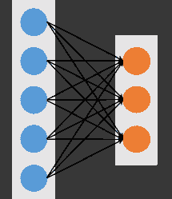
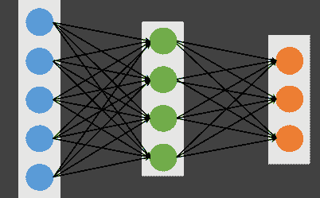
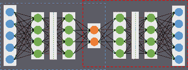
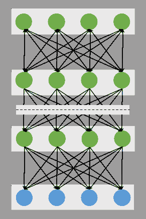
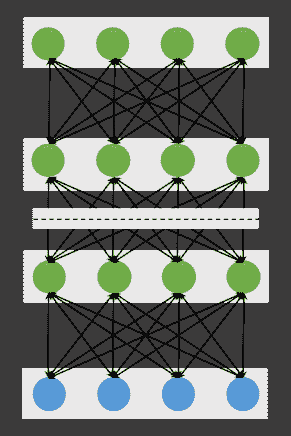
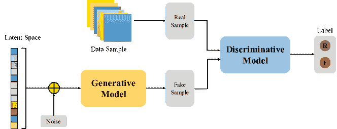
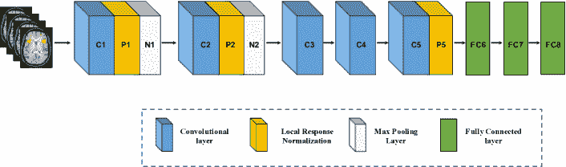
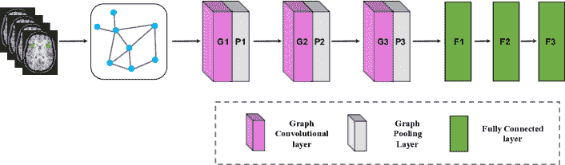
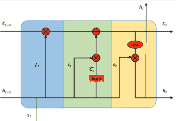
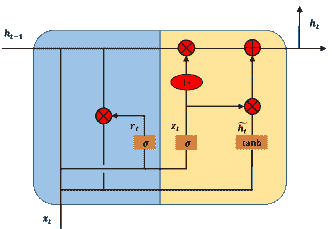

<!--yml

分类：未分类

日期：2024-09-06 20:01:14

-->

# [2005.04573] 深度学习在基于神经影像的脑部疾病分析中的调查

> 来源：[`ar5iv.labs.arxiv.org/html/2005.04573`](https://ar5iv.labs.arxiv.org/html/2005.04573)

# 深度学习在基于神经影像的脑部疾病分析中的调查

李章¹、王明亮²、刘明霞^(3,∗)和张道强^(2,∗)

###### 摘要

近年来，深度学习被用于神经影像分析，如结构磁共振成像（MRI）、功能性 MRI 和正电子发射断层扫描（PET），在计算机辅助脑部疾病诊断中相较于传统机器学习取得了显著的性能提升。本文回顾了深度学习方法在基于神经影像的脑部疾病分析中的应用。我们首先全面概述了深度学习技术和流行的网络架构，通过介绍各种类型的深度神经网络及其最新发展。然后，我们回顾了用于计算机辅助分析四种典型脑部疾病的深度学习方法，包括阿尔茨海默病、帕金森病、自闭症谱系障碍和精神分裂症，其中前两种疾病为神经退行性疾病，后两种则分别为神经发育性和精神疾病。更重要的是，我们讨论了现有研究的局限性并提出了可能的未来方向。

1.  1.

    南京林业大学计算机科学与技术学院，中国南京 210037。

1.  2.

    南京航空航天大学计算机科学与技术学院，中国南京 211106。

1.  3.

    北卡罗来纳大学教堂山分校放射科与 BRIC，美国北卡罗来纳州 27599。

关键词：深度学习、神经影像、阿尔茨海默病、帕金森病、自闭症谱系障碍、精神分裂症。

## 1 引言

医学影像学指的是几种不同的技术，这些技术用于提供人体内部的视觉表现，以帮助放射科医生和临床医生更高效地早期发现、诊断或治疗疾病[1]。在过去几十年里，医学影像迅速成为主导且有效的工具，代表了各种影像学方式，包括 X 光、乳腺摄影、超声、计算机断层扫描、磁共振成像（MRI）和正电子发射断层扫描（PET）[2]。这些技术中的每一种都提供了关于不同身体器官的各种解剖和功能信息，用于诊断和研究。在临床实践中，医学图像的详细解读需要由放射科医生和临床医生等专家来完成。然而，对于大量的医学图像，解读过程既耗时又容易受到专家偏见和潜在疲劳的影响。因此，从 20 世纪 80 年代初开始，医生和研究人员开始使用计算机辅助诊断（CAD）系统来解读医学图像并提高其效率。

在 CAD 系统中，机器学习能够提取能够良好描述数据固有模式的信息特征，并在医学图像分析中发挥关键作用[3, 4]。几种传统的机器学习算法，如稀疏学习、支持向量机（SVM）、高斯网络、随机森林、决策树和隐马尔可夫模型等，广泛应用于此[5]。然而，医学图像的结构非常复杂，特征选择步骤仍由专家根据其领域特定的知识完成。这对非专家利用机器学习技术进行医学图像分析造成了挑战。因此，手工特征选择不适合医学图像。此外，这些传统机器学习算法的浅层结构限制了它们的表现力[6]。

自然地，下一步的研究方向是让算法自动学习能够最佳表示数据的特征。深度学习与这一概念完美契合，并迅速成为近年来医学图像分析的首选方法[7, 8, 9]。与传统的机器学习算法相比，深度学习能够自动发现信息丰富的表示，无需领域专家的专业知识，且允许非专家有效使用深度学习技术。由于高科技中央处理单元（CPU）和图形处理单元（GPU）的计算能力提升、海量数据的可用性以及设计新颖的算法来训练深度神经网络，深度学习在许多人工智能应用中取得了前所未有的成功，如计算机视觉[10]、自然语言处理[11]和语音识别[12]。特别是计算机视觉的改进和成功同时促进了深度学习在医学图像分析中的应用[13, 14]。

目前，深度学习在医学图像分析方面取得了显著进展。我们可以将医学图像分析任务分为几个主要类别：分类、检测/定位、配准、分割[15]。分类是深度学习对医学图像分析做出重要贡献的第一个任务之一。该任务旨在将医学图像分类为两个或更多类别。通过结合医学图像和生物特征，使用堆叠自编码器模型来识别阿尔茨海默病或轻度认知障碍[16]。检测/定位任务包括在整个医学图像中定位和识别标记或病变。例如，深度卷积神经网络被用于在 CT 图像中检测淋巴结[17]。分割任务是将医学图像划分为不同的有意义的区域，如不同的组织类别、器官、病理或其他生物学相关结构。U-net 是最著名的深度学习架构之一，使用卷积网络进行生物医学图像分割[18]。医学图像配准是一个寻找图像正确对齐的过程。Wu 等人利用卷积层从输入补丁中无监督地提取特征。然后，将获得的特征向量用于替代 HAMMER 配准算法中的手工特征[19]。此外，医学图像分析还包含其他有意义的任务，如基于内容的图像检索[20]、图像生成和增强[21]、以及将图像数据与报告结合[22]。

有许多论文综合调查了使用深度学习技术的医学图像分析[13, 14, 15]。然而，这些论文通常回顾了所有人类组织，包括大脑、胸部、眼睛、乳腺、心脏、腹部、肌肉骨骼系统等。几乎没有论文专注于某一特定组织或疾病[23]。脑部疾病是我们社会面临的最严重健康问题之一，造成了无尽的人类痛苦和巨大的经济成本。许多研究成功地使用了医学成像技术用于早期检测、诊断和治疗人类脑部疾病，如神经退行性疾病、神经发育性疾病和精神疾病[24, 25]。因此，我们在本综述中更加关注人类脑部疾病。

本综述的结构大致可以分为两部分：深度学习架构和深度学习在脑部疾病分析中的应用，组织如下。在第二部分中，我们简要介绍了一些流行的深度学习模型。在第三部分中，我们提供了使用深度学习技术对四种脑部疾病的最新研究的详细概述，包括阿尔茨海默病、帕金森病、自闭症谱系障碍和精神分裂症。最后，我们分析了深度学习技术在医学图像分析中的局限性，并提供了一些进一步研究的方向。为方便读者，以下上下文中使用的术语缩写列于 1。

表 1：以下部分使用术语的缩写。

| 术语 | 缩写 | 术语 | 缩写 |
| --- | --- | --- | --- |
| 阿尔茨海默病 | AD | 二维卷积神经网络 | 2D-CNN |
| 自闭症谱系障碍 | ASD | 三维卷积神经网络 | 3D-CNN |
| 计算机辅助诊断 | CAD | 自动编码器 | AE |
| 转化 MCI | cMCI | 人工神经网络 | ANN |
| 脑脊液 | CSF | 反向传播 | BP |
| 计算机断层扫描 | CT | 卷积神经网络 | CNN |
| 扩散张量成像 | DTI | 去噪自动编码器 | DAE |
| 脑电图 | EEG | 深度置信网络 | DBN |
| 功能性磁共振成像 | fMRI | 深度玻尔兹曼机 | DBM |
| 灰质 | GM | 深度生成模型 | DGM |
| 轻度认知障碍 | MCI | 深度神经网络 | DNN |
| 磁共振成像 | MRI | 前馈神经网络 | FFNN |
| 正常对照 | NC | 生成对抗网络 | GAN |
| 帕金森病 | PD | 图卷积网络 | GCN |
| 正电子发射断层扫描 | PET | 门控递归单元 | GRU |
| 感兴趣区域 | ROI | 长短期记忆 | LSTM |
| 静息态 fMRI | rs-fMRI | 多层感知机 | MLP |
| 稳定性 MCI | sMCI | 主成分分析 | PCA |
| 结构性 MRI | sMRI | 限制玻尔兹曼机 | RBM |
| 单光子发射计算机断层扫描 | SPECT | 循环神经网络 | RNN |
| 精神分裂症 | SZ | 区域卷积神经网络 | R-CNN |
| 白质 | WM | 堆叠自编码器 | SAE |
|  |  | 堆叠稀疏自编码器 | SSAE |
|  |  | 支持向量机 | SVM |
|  |  | 变分自编码器 | VAE |

左列中的缩写与医学图像分析相关，右列中的缩写与机器学习和深度学习架构相关。

## 2 深度学习

本节介绍了文献中基本深度学习模型的基本概念，这些模型已广泛应用于医学图像分析，特别是人脑疾病诊断。这些模型包括前馈神经网络、堆叠自编码器、深度信念网络、深度玻尔兹曼机、生成对抗网络、卷积神经网络、图卷积网络和循环神经网络。

### 2.1 前馈神经网络

在机器学习中，人工神经网络（ANN）旨在通过模仿生物神经网络的功能来模拟智能行为。最简单的人工神经网络是单层架构，由输入层和输出层组成（图 1.a）。然而，尽管在输出层使用了非线性激活函数，单层神经网络通常在处理复杂数据模式时表现较差。为了克服这一限制，多层感知机（MLP），也称为前馈神经网络（FFNN）（图 1.b），在输入层和输出层之间包括一个所谓的隐藏层。每一层包含多个单元，这些单元与邻近层的单元完全连接，但同一层内的单元之间没有连接。给定一个输入可见向量 $\bm{x}$，输出单元 $\bm{y}$ 的组成函数可以写作如下：

|  | $y_{k}(\bm{x};\bm{\theta})=f^{(2)}\left(\sum_{j=1}^{M}w_{k,j}^{(2)}f^{(1)}\left(\sum_{i=1}^{N}w_{j,i}^{(1)}x_{i}+b_{j}^{(1)}\right)+b_{k}^{(2)}\right)$ |  | (1) |
| --- | --- | --- | --- |

其中上标表示层索引，$M$ 是隐藏单元的数量，$b_{j}$ 和 $b_{k}$ 分别表示输入层和隐藏层的偏置。$f^{(1)}(\cdot)$ 和 $f^{(2)}(\cdot)$ 分别表示非线性激活函数，参数集为 $\bm{\theta}=\{\bm{w}_{j}^{(1)},\bm{w}_{k}^{(2)},b_{j}^{(1)},b_{k}^{(2)}\}$。反向传播（BP）是一种在 FFNN 中高效评估梯度的算法 [26]。BP 算法是通过网络将误差值从输出层传播回输入层。一旦获得了所有层的梯度向量，就可以更新参数 $\bm{\theta}$。直到损失函数收敛或达到预定义的迭代次数，更新过程才会停止，网络将获得模型参数 $\bm{\theta}$。

图 1：单层（a）和多层（b）神经网络的架构。蓝色、绿色和橙色实心圆分别表示输入可见单元、隐藏单元和输出单元。

### 2.2 堆叠自编码器

自编码器（AE），也称为自关联器，以无监督的方式学习输入数据的潜在表示（称为编码），然后利用这些表示重构输出数据（称为解码）。由于结构简单且较浅，典型 AE 的表示能力相对有限。然而，当多个 AE 堆叠形成深层网络，即堆叠自编码器（SAE）（图 2），SAE 的表示能力可以显著提高 [27]。由于其深层结构特征，SAE 能够学习和发现输入数据中更复杂的模式。下层只能学习较简单的数据模式，而高层则能够提取更复杂的数据模式。总而言之，SAE 的不同层代表了数据信息的不同级别。此外，还提出了各种 AE 变体，如去噪自编码器（DAE） [28]、稀疏自编码器（稀疏 AE） [29] 和变分自编码器（VAE） [30]，并且这些变体也可以堆叠成 SAE，例如堆叠稀疏 AE（SSAE） [31]。这些自编码器的扩展不仅可以学习更有用的潜在表示，还能提高鲁棒性。

图 2：堆叠自编码器的架构。蓝色和红色虚线框分别代表编码和解码阶段。

对于 SAE 的训练参数，贪婪逐层方法是学习权重矩阵和偏差的著名选择。它可以避免 BP 算法的缺点，即梯度可能陷入不良的局部最优 [32]。贪婪逐层方法的重要特点是逐层预训练。换句话说，第 $l$ 层隐藏层的输出被用作 $(l+1)$ 层隐藏层的输入数据。该过程以无监督的方式进行预训练，并使用标准的 BP 算法。预训练的重要优势在于能够使用未标记样本来增加训练数据集的大小。

### 2.3 深度置信网络

深度置信网络（DBN）通过堆叠多个 RBM 来构建深度架构 [33]。DBN 具有一个可见层和多个隐藏层，如图 3a 所示。下层形成有向生成模型。然而，顶层的两个层形成 RBM 的分布，这是一个无向生成模型。因此，给定可见单元 $\bm{v}$ 和 $L$ 层隐藏层 $\bm{h}^{(1)},\bm{h}^{(2)},\dots,\bm{h}^{(L)}$，DBN 的联合分布定义为：

|  | $P(\bm{v},\bm{h^{(1)}},\dots,\bm{h^{(L)}})=P(\bm{v}&#124;\bm{h^{(1)}})\big{(}\prod_{l=1}^{L-2}P(\bm{h^{(l)}}&#124;\bm{h^{(l+1)}})\big{)}P(\bm{h^{(L-1)}},\bm{h^{(L)}})$ |  | (2) |
| --- | --- | --- | --- |

其中 $P(\bm{h^{(l)}}|\bm{h^{(l+1)}})$ 表示给定隐藏层 $l+1$ 的单元情况下隐藏层 $l$ 单元的条件分布，$P(\bm{h^{(L-1)}},\bm{h^{(L)}})$ 对应于顶层隐藏层 $L-1$ 和 $L$ 的联合分布。

关于训练 DBN，有两个步骤，包括预训练和微调。在预训练步骤中，通过逐层堆叠 RBM 来训练 DBN，以找到参数空间。每一层都作为一个 RBM 进行训练。具体来说，第 $l$ 层隐藏层使用 $(l-1)$ 层隐藏层的输出表示数据进行训练，然后重复训练每一层直到顶层。预训练完成后，进行微调以进一步优化网络，寻找最佳参数。唤醒-睡眠算法和标准反向传播算法分别擅长于生成模型和判别模型的微调 [34]。对于实际应用问题，使用预训练步骤获得的参数来初始化 DNN，然后可以通过如 BP 的监督学习算法对深度模型进行微调。

(a) 深度置信网络

(b) 深度玻尔兹曼机

图 3: 深度置信网络和深度玻尔兹曼机的示意图

### 2.4 深度玻尔兹曼机

深度玻尔兹曼机（DBM）也是通过堆叠多个 RBM 构建的，如图 3 所示。b [35, 36]。然而，与 DBN 不同的是，DBM 的所有层形成一个完全无向的模型，并且隐藏层中的每个变量是相互独立的。因此，隐藏层$l$依赖于其两个相邻层$l-1$和$l+1$，其概率分布为$P(\bm{h}^{(l)}\mid\bm{h}^{(l-1)},\bm{h}^{(l+1)})$。给定相邻层的值，关于可见层和$L$组隐藏单元的条件概率由逻辑 sigmoid 函数给出：

|  | $\displaystyle P(v_{i}\mid\bm{h}^{1})$ | $\displaystyle=\sigma\big{(}\sum_{j}W_{ij}^{(1)}h_{j}^{(1)}\big{)}$ |  | (3) |
| --- | --- | --- | --- | --- |
|  | $\displaystyle P(h_{k}^{(l)}\mid\bm{h}^{(l-1)},\bm{h}^{(l+1)})$ | $\displaystyle=\sigma\big{(}\sum_{m}W_{mk}^{(l)}h_{m}^{(l-1)}+\sum_{n}W_{kn}^{(l+1)}h_{n}^{(l+1)}\big{)}$ |  | (4) |
|  | $\displaystyle P(h_{t}^{(L)}\mid\bm{h}^{(L-1)})$ | $\displaystyle=\sigma\big{(}\sum_{s}W_{st}^{(L)}h_{s}^{(L-1)}\big{)}$ |  | (5) |

请注意，在计算隐藏单元$\bm{h}^{({l})}$的条件概率时，该概率同时考虑了下层隐藏层$\bm{h}^{({l-1})}$和上层隐藏层$\bm{h}^{(l+1)}$。由于综合了来自下层和上层的信息，DBM 的表示能力对噪声观察数据更加稳健[37]。然而，这一特性使得 DBM 的条件概率$P(\bm{h}^{(l)}\mid\bm{h}^{(l-1)},\bm{h}^{(l+1)})$比 DBN 的条件概率$P(\bm{h}^{(l)}\mid\bm{h}^{(l+1)})$更复杂。

### 2.5 生成对抗网络

由于其在无需大量注释训练数据的情况下学习深层表示的能力，生成对抗网络（GAN）在计算机视觉和自然语言处理领域获得了广泛关注[38]。GAN 由两个相互竞争的神经网络组成，一个生成器 $G$ 和一个判别器 $D$，如图 4 所示。生成器 $G$ 由 $\theta$ 参数化，输入来自先验分布 $p_{\bm{z}}(\bm{z};\theta)$ 的随机噪声向量 $\bm{z}$，并输出样本 $G(\bm{z})$，该样本可以视为从生成器数据分布 $p_{g}$ 中抽取的样本。判别器 $D$ 输入 $G(\bm{z})$ 或 $\bm{x}$，并输出概率 $D(\bm{x})$ 或 $D(\bm{G(\bm{z})})$，以评估该样本是来自生成器 $G$ 还是来自真实数据分布。GAN 同时训练生成器和判别器，其中生成器 $G$ 试图生成逼真的数据以欺骗判别器，而判别器 $D$ 则试图区分真实样本和伪造样本。受博弈论的启发，训练过程形成一个具有如下价值函数的双人最小化最大化游戏：

|  | $\min_{G}\max_{D}V(G,D)=\mathbb{E}_{\bm{x}\sim p_{data}(\bm{x})}[\log D(\bm{x})]+\mathbb{E}_{\bm{z}\sim p_{\bm{z}}(\bm{z})}[\log(1-D(G(\bm{z})))]$ |  | (6) |
| --- | --- | --- | --- |

其中 $p_{data}(\bm{x})$ 表示真实数据分布。经过交替训练后，如果 $G$ 和 $D$ 具有足够的能力，它们将达到一个点，在该点上两者都无法改进，因为 $p_{g}=p_{data}$。换句话说，判别器无法区分真实样本和生成样本之间的差异，即 $D(\bm{x})=0.5$。尽管原始 GAN 在各种应用中引起了相当大的关注，但训练和评估 GAN 仍面临一些挑战，例如模型崩溃和鞍点[39]。因此，许多 GAN 的变体，如 WGAN [40] 和 DCGAN [41] 被提出以克服这些挑战。

图 4：生成对抗网络的架构

### 2.6 卷积神经网络

与 SAE、DBN 和 DBM 相比，CNN 旨在更好地保留和利用相邻像素或体素之间的结构信息，并且通过直接接受二维（2D）或三维（3D）图像作为输入，所需的预处理最少[42]。从结构上看，CNN 是一系列层，每一层通过可微分函数将一个激活体积转换为另一个。图 5 展示了用于计算机视觉任务的典型 CNN 架构，包括三种类型的神经层：卷积层、池化层和全连接层。卷积层与池化层交替排列，最终导致全连接层。卷积层处理输入图像小块的像素或体素，称为局部感受野，然后利用各种可学习的卷积核对感受野进行卷积以生成多个特征图。池化层执行非线性下采样，以减少输入体积的空间维度，为下一个卷积层做准备。全连接层将 3D 或 2D 特征图输入到 1D 特征向量中。

图 5: 卷积神经网络的架构

训练深度模型的主要问题是过拟合，这源于有限的训练样本与大量可学习参数之间的差距。因此，各种技术被设计用来使模型训练和泛化更好，例如 dropout 和批量归一化等。dropout 层在每次训练迭代中随机丢弃部分单元或连接[43]。已经证明 dropout 能够成功避免过拟合。此外，批量归一化是另一种有用的正则化方法，通过对每个小批量的均值-方差统计量的运行平均值进行归一化。使用批量归一化不仅大大加快了训练时间，还提高了泛化性能[44]。

### 2.7 图卷积网络

尽管卷积神经网络（CNN）在从欧几里得数据（例如图像、文本和视频）中提取潜在表示方面取得了巨大成功，但数据生成自非欧几里得领域并需要高效分析的应用数量正在迅速增加。研究人员直接借鉴 CNN 的思想来设计图卷积网络（GCN）的架构，以处理复杂的图数据[45]。图 6 展示了一个简单的 GCN 的过程，其中包含用于图分类任务的图池化层。第一步是将传统数据转换为图数据，然后将图结构和节点内容信息视为输入。图卷积层在从其邻居聚合特征信息中提取节点隐藏表示方面起着核心作用。图池化层可以与 GCN 层交替使用，并将粗化的图转换为子图，以便为每个节点在粗化的子图上获得更高的图级表示。经过多个全连接层后，使用 softmax 输出层来预测类别标签。

图 6: 图卷积网络的架构

根据图卷积的类型，GCN 可以分为基于谱的方法和基于空间的方法。基于谱的方法通过从图单处理的角度引入滤波器来制定图卷积。基于空间的方法直接在图上定义图卷积，操作在空间上接近的邻居以聚合特征信息。由于基于谱的方法在效率、普适性和灵活性方面的缺陷，基于空间的方法近年来受到更多关注[46]。

### 2.8 循环神经网络

循环神经网络（RNN）是前馈神经网络（FFNN）的扩展，能够从序列和时间序列数据中学习特征和长期依赖性。最流行的 RNN 架构是长短期记忆（LSTM）[47]，它由一个记忆单元 $C_{t}$、一个遗忘门 $f_{t}$、输入门 $i_{t}$ 和输出门 $o_{t}$ 组成（图 7.a）。记忆单元将相关信息传递到序列链中，这些门控制来自各种来源的激活信号，以决定哪些信息被添加到记忆单元中，哪些信息被移除。

与传统的 RNN 不同，LSTM 可以通过上述引入的门决定是否保留现有记忆。理论上，如果 LSTM 从输入的序列数据中学习到一个重要特征，它可以在较长时间内保留这一特征，从而捕捉潜在的长期依赖关系。一种流行的 LSTM 变体是门控递归单元（GRU）（图 7.b），它将遗忘门和输入门合并为一个“更新门”，并将记忆单元状态和隐藏状态合并为一个状态。更新门决定了添加和丢弃多少信息，而重置门决定了遗忘多少先前的信息。这使得 GRU 比标准 LSTM 更简单 [48]。

(a) 长短期记忆

(b) 门控递归单元

图 7：长短期记忆（a）和门控递归单元（b）的结构图。在子图（a）中，蓝色、绿色和黄色分别表示遗忘门、输入门和输出门。在子图（b）中，蓝色和黄色分别表示重置门和更新门。为了保持图示简单，未显示偏置。

### 2.9 开源深度学习库

随着深度学习技术在各种应用中的巨大成功，一些著名的研究组和公司已经发布了他们的源代码和深度学习工具。由于这些开源工具包，人们可以轻松地为他们的应用构建深度模型，即使他们不熟悉深度学习技术。表 2 列出了最受欢迎的深度学习工具包并展示了它们的主要特性。表中的所有软件都支持使用 GPU 加速。目前，有许多深度学习工具包可供选择，但这给人们带来的问题是如何选择最适合自己应用的工具包。选择最佳工具包取决于项目目标、可用数据集的特性、研究人员的技能和背景以及可用工具包的特性 [49, 50]。因此，当一个项目开始时，值得花时间评估候选工具包，以确保选择了最适合相应应用的工具包。

表 2：流行的开源深度学习工具包

| 名称 | 创建者 | GitHub | 许可证 | 平台 | 语言 | 接口 |
| --- | --- | --- | --- | --- | --- | --- |
| Caffe [51] | 伯克利中心 | BVLC/caffe | BSD | Linux, macOS, Windows | C++ | Python, MATLAB, C++ |
| Deeplearning4j [52] | Skymind | deeplearning4j/deeplearning4j | Apache 2.0 | Linux, macOS, Windows, Android | C++, Java | Java, Scala, Clojure, Python, Kotlin |
| Keras [53] | Franois Systems | fchollet/keras | MIT 许可证 | Linux, macOS, Windows | Python | Python, R |
| MXNet [54] | Apache 软件基金会 | apache/incubator-mxnet | Apache 2.0 | Linux, macOS, Windows, AWS, Android, iOS, JavaScript | C++ | C++, Python, Julia, Matlab, JavaScript, Go, R, Scala, Perl |
| TensorFlow [55] | Google | tensorflow/tensorflow | Apache 2.0 | Linux, macOS, Windows, Android | C++, Python | Python, C, C++, Java, Go, JavaScript, R, Julia, Swift |
| PyTorch [56] | Adam Paszke 等 | pytorch/pytorch | BSD | Linux, macOS, Windows | Python, C | Python |
| Theano [57] | 蒙特利尔大学 | Theano/Theano | BSD | Linux, macOS, Windows | Python | Python |
| Torch [58] | Ronan Collobert 等 | torch/torch7 | BSD | Linux, macOS, Windows, Android, iOS | C, Lua, LuaJIT | C, Lua, LuaJIT |
| CNTK [59] | Microsoft | Microsoft/CNTK | MIT 许可证 | Linux, macOS, Windows | C++ | Python, C++, C$\#$, Java |
| MATLAB | MathWorks | - | 专有 | Linux, macOS, Windows | C, C++, Java, MATLAB | MATLAB |

## 3 应用于脑部疾病分析的医学图像

人脑易受多种不同疾病的影响，这些疾病在生命的每个阶段都会发生。发育性障碍通常在早期儿童期首次出现，例如自闭症谱系障碍和阅读困难。尽管精神疾病通常在青少年或成年早期被诊断出来，但其根源可能在生活的早期就已存在，例如抑郁症和精神分裂症。随着年龄的增长，人们越来越容易受到阿尔茨海默病、帕金森病和其他痴呆症的影响。在本节中，我们选择了四种典型的脑部疾病，包括阿尔茨海默病、帕金森病、自闭症谱系障碍和精神分裂症。阿尔茨海默病和帕金森病都是神经退行性疾病。自闭症谱系障碍和精神分裂症分别是神经发育性疾病和精神疾病。

### 3.1 深度学习在阿尔茨海默病分析中的应用

阿尔茨海默病（AD）是一种神经性、不可逆、进行性的脑部疾病，是最常见的痴呆症原因。直到现在，AD 的原因尚未完全理解，但对 AD 的准确诊断在患者护理中发挥着重要作用，尤其是在早期阶段。对于 AD 诊断的研究，最著名的公共神经影像数据集来自阿尔茨海默病神经影像倡议（ADNI），这是一个多中心研究，旨在改善 AD 预防和治疗的临床试验。ADNI 研究自 2004 年以来已运行，目前进入了第三阶段[60]。研究人员收集、验证和利用数据，包括 MRI 和 PET 图像、遗传学、认知测试、脑脊液（CSF）和血液生物标志物，作为疾病的预测指标。到目前为止，ADNI 数据集包括 ADNI-1、ADNI-GO、ADNI-2 和 ADNI-3，涵盖了超过 1000 名患者。根据简易精神状态检查（MMSE）得分，这些患者处于三种疾病阶段：正常对照（NC）、轻度认知障碍（MCI）和 AD。MCI 受试者可以分为两类：转换性 MCI（cMCI）和稳定性 MCI（sMCI），基于受试者是否在一定时间内（例如 24 个月）转变为 AD。ADNI-GO 和 ADNI-2 提供了两种不同的 MCI 组：早期轻度认知障碍（EMCI）和晚期轻度认知障碍（LMCI），由韦氏记忆量表（WMS）神经心理学测试确定。

最近，关于 AD 诊断的深度学习技术发表了大量论文。根据不同的模型架构，这些方法大致可以分为两类：基于 DGM 的方法和基于 CNN 的方法。基于 DGM 的方法包括 DBN、DNM、SAE 和 AE 变体。李等人堆叠了多个 RBM 来构建一个稳健的深度学习框架，该框架结合了稳定性选择和多任务学习策略[61]。Suk 等人提出了一系列基于深度学习模型的方法，如 DBM[62]和 SAE[16, 63]。例如，文献[16]应用 SAE 从 sMRI、PET 和 CSF 中学习潜在表示。然后，使用多核 SVM 分类器融合所选的多模态特征。刘等人也使用 SAE 从多模态数据中提取特征，然后应用零遮蔽策略融合这些学习到的特征[64]。石等人采用了多模态堆叠去噪稀疏 AE（SDAE）来融合从 MR 脑图像中估计的横截面和纵向特征[65]。卢等人开发了一个多尺度深度学习网络，该网络将多尺度块状代谢特征作为输入[66]。这项研究可能是首次利用如此大量的 FDG-PET 图像数据。Martinez-Murcia 等人使用了深度卷积 AE（DCAE）架构来提取特征，这些特征与临床变量如年龄、tau 蛋白沉积，特别是神经心理检查显示出很大的相关性[67]。

基于 CNN 的方法从原始像素中学习所有层次的特征，避免了手动 ROI 注释过程，并且可以进一步细分为两类子类别：2D-CNN 和 3D-CNN。Gupta 等人通过对自然图像的随机补丁进行稀疏 AE 预训练了一个基于 sMRI 数据的 2D-CNN [68]。关键技术是使用跨领域特征来呈现 MRI 数据。Liu 等人使用了类似的策略，并在 ImageNet 上预训练了一个深度 CNN [69]。Sarraf 等人首次将 fMRI 数据应用于深度学习 [70]。在预处理步骤中，将 4D rs-fMRI 和 3D MRI 数据分解为 2D 格式的图像，然后 CNN 基于这些图像构建了其输入层。Billones 等人设计了一个基于 16 层 VGGNet 的 DemNet 模型。DemNet 仅选择了 2D 格式图像中索引为 111 到 130 的冠状切片，假设这些切片覆盖了对分类任务具有重要特征的区域 [71]。Liu 等人提出了一个新颖的分类框架，通过将 3D PET 图像分解为 2D 切片序列来学习特征 [72]。然后，构建了分层 2D-CNN 来捕捉切片内特征，同时采用 GRU 来提取切片间特征。

表 3：使用深度学习技术进行 AD 诊断的文献概述。

| 参考文献 | 年份 | 数据库 | 受试者 | 模态 | 模型 |  |
| --- | --- | --- | --- | --- | --- | --- |
| AD | cMCI | sMCI | NC |  |
| Li 等人 [61] | 2015 | ADNI | 51 | 43 | 56 | 52 | sMRI+PET+CSF | DBN |  |
| Liu 等人 [64] | 2015 | ADNI | 85 | 67 | 102 | 77 | sMRI+PET | SAE |  |
| Suk 等人 [62] | 2014 | ADNI | 93 | 76 | 128 | 101 | sMRI+PET | DBM |  |
| Suk 等人 [16] | 2015 | ADNI | 51 | 43 | 56 | 52 | sMRI+PET+CSF | SAE |  |
| Suk 等人 [63] | 2016 | ADNI | 51 | 43 | 56 | 52 | sMRI+PET+CSF | SAE |  |
| - | 198 | 167 | 236 | 229 |  |
| Shi 等人 [65] | 2016 | ADNI | 95 | 121 | 123 | sMRI + Age | SDAE |  |
| Lu 等人 [66] | 2018 | ADNI | 226 | 112 | 409 | 304 | PET | SAE |  |
| Martinez-Murcia 等人 [67] | 2019 | ADNI | 99 | 212 | 168 | rs-fMRI | DCAE |  |
| Gupta 等人 [68] | 2013 | ADNI | 200 | 411 | 232 | sMRI | 2D-CNN |  |
| Liu 等人 [69] | 2014 | ADNI | 200 | 411 | 232 | sMRI | 2D-CNN |  |
| Billones 等人 [71] | 2016 | ADNI | 300 | 300 | 300 | rs-fMRI | 2D-CNN |  |
| Sarraf 等人 [70] | 2016 | ADNI | 211 | - | - | 91 | sMRI | 2D-CNN |  |
| 52 | - | - | 92 | rs-fMRI |  |
| Liu 等人 [72] | 2017 | ADNI | 93 | 146 | 100 | PET | 2D-CNN+RNN |  |
| Payan 等人 [73] | 2015 | ADNI | 755 | 755 | 755 | sMRI | 3D-CNN |  |
| Hosseini-Asl 等人 [74] | 2016 | ADNI | 70 | 70 | 70 | sMRI | 3D-CNN |  |
| Karasawa 等人 [75] | 2017 | ADNI | 348 | 450 | 358 | 574 | sMRI | 3D-CNN |  |
| Liu 等人 [76] | 2018 | ADNI | 93 | 76 | 128 | 100 | sMRI+PET | 3D-CNN |  |
| Li 等人 [77] | 2014 | ADNI | 193 | 167 | 236 | 229 | sMRI+ PET | 3D-CNN |  |
| Liu 等人 [78] | 2018 | ADNI | 358 | 205 | 465 | 429 | sMRI | 3D-CNN |  |
| Liu 等人 [79] | 2018 | ADNI | 358 | - | - | 429 | sMRI | 3D-CNN |  |
| Pan 等人 [80] | 2018 | ADNI | 358 | 205 | 465 | 429 | sMRI+ PET | 3D-CNN+GAN |  |

由于在预处理步骤中需要将 3D 脑图像分解为 2D 切片，这导致 2D-CNN 方法丢弃了空间信息。因此，提出了许多 3D-CNN 方法，它们可以直接输入 3D 脑图像。Payan 等人通过稀疏自编码器在来自 sMRI 扫描的小 3D 补丁上预训练了一个 3D-CNN[73]。Hosseini-Asl 等人提出了一种深度 3D-CNN，基于 3D 自编码器来捕捉 sMRI 扫描中的解剖形状变化[74]。Liu 等人使用多个深度 3D-CNN 在不同的局部图像补丁上学习 MRI 和 PET 图像的区分特征。然后，将一组高层 CNN 级联以集成学习到的局部特征，并发现了用于 AD 分类的潜在多模态特征[76]。Karasawa 等人提出了基于残差学习框架（ResNet）的 39 层更深的 3D-CNN 架构，以提高性能[75]。Liu 等人设计了一个基于标志点的深度特征学习框架来学习补丁级别的特征，这些特征是体素级别和 ROI 级别之间的中间尺度[79]。作者首先采用数据驱动的方式从 MR 图像中识别出具有区分性的解剖标志点，然后提出了一个 3D-CNN 来学习基于补丁的特征。这一策略可以避免体素级别的高维问题以及 ROI 级别的人工定义。随后，Liu 等人开发了一个深度多实例 CNN 框架[78]，其中多个图像补丁被用作实例包来表示每个特定的主体，然后每个包的标签由整个图像级别的类标签给出。为了克服多模态图像数据中的缺失模态问题，Li 等人[77]提出了一个简单的 3D-CNN，从 sMRI 数据中预测缺失的 PET 图像。结果显示，预测的 PET 数据与真实的 PET 数据达到了相似的分类准确率。此外，合成的 PET 数据和真实的 sMRI 数据明显优于单一的 sMRI 数据。Pan 等人使用 Cycle-GAN 学习 sMRI 和 PET 的双向映射，以根据其对应的 sMRI 扫描合成缺失的 PET 扫描。然后，基于标志点的 3D-CNN 被用于混合图像数据上的 AD 分类[80]。表 3 和表 4 总结了上述每篇论文在 AD 诊断中的统计信息。

表 4：论文在 AD 诊断中的分类性能。

| 参考文献 | 准确率$(\%)$ |
| --- | --- |
| AD/NC | AD/MCI | MCI/NC | cMCI/sMCI | 3-ways¹ | 4-ways² |
| Li 等人 [61] | 91.4$\pm$ 1.8 | 70.1$\pm$ 2.3 | 77.4$\pm$ 1.7 | 57.4$\pm$ 3.6 |  |  |
| Liu 等人 [64] | 91.4$\pm$ 5.56 | - | 82.10$\pm$ 4.91 | - | - | 53.79 |
| Suk 等人 [62] | 95.35 $\pm$ 5.23 | - | 85.67$\pm$ 5.22 | 75.92$\pm$ 15.37 | - | - |
| Suk 等人 [16] | 98.8 $\pm$0.9 | 83.7$\pm$1.5 | 90.7$\pm$1.2 | 83.3 $\pm$2.1 | - | - |
| Suk 等人 [63] | 95.09$\pm$ 2.28 | - | 80.11 $\pm$ 2.64 | 74.15 $\pm$ 3.35 | 62.93 | 53.72 |
| 90.27 | - | 70.86 | 73.93 | 57.74 | 47.83 |
| Shi 等人 [65] | 91.95 $\pm$1.00 | - | 83.72$\pm$ 1.16 | - | - | - |
| Lu 等人 [66] | 93.58 $\pm$ 5.2 | - | - | 81.55 $\pm$7.42 | - | - |
| Martinez-Murcia 等人 [67] | 84.3$\pm$6 | - | - | 71.5$\pm$9 | - | - |
| Gupta 等人 [68] | 94.74 | 88.10 | 86.35 | - | 85.0 | - |
| Liu 等人 [69] | 97.18$\pm$1.5 | 94.51$\pm$1.43 | 93.21$\pm$1.02 | - | 91.72$\pm$1.8 | - |
| Billones 等人 [71] | 98.33 | 93.89 | 91.67 | - | 91.85 | - |
| Sarraf 等人 [70] | 98.84 /99.90 | - | - | - | - | - |
| Liu 等人 [72] | 91.92 | - | 78.9 | - | - | - |
| Payan 等人 [73] | 95.39 | 86.84 | 92.11 | - | 89.47 | - |
| Hosseini-Asl 等人 [74] | 99.3$\pm$1.6 | 100 | 94.2$\pm$2.0 | - | 94.8$\pm$2.6 | - |
| Karasawa 等人 [75] | 94.0 | - | 90.0 | - | 87.0 | - |
| Liu 等人 [76] | 93.26 | - | 73.34 | - | - | - |
| Li 等人 [77] | 92.87$\pm$2.07 | - | 76.21$\pm$2.05 | 72.44$\pm$2.41 | - | - |
| Liu 等人 [78] | 91.09 | - | - | 76.90 | - | - |
| Liu 等人 [79] | 90.56 | - | - | - | - | - |
| Pan 等人 [80] | 92.50 | - | - | 79.06 | - | - |

+   1

    3-ways 代表比较：AD 与 NC 与 MCI。

+   2

    4-ways 代表比较：AD 与 NC 与 cMCI 与 sMCI。

作为 AD 的早期阶段，MCI 的转换率在 5 年内高达 10%-15%，但 MCI 也是治疗的最佳时期。因此，构建有效的预测模型以进行 MCI 的早期诊断已成为一个热门话题。最近，一些基于 GCN 的 MCI 预测研究已经展开。Zhao 等人 和 Yu 等人 都使用了结合了神经影像信息和人口统计关系的 GCN 进行 MCI 预测 [81, 82]。Song 等人 实现了一个多类别 GCN 分类器，用于将 AD 谱系中的受试者分类为四个类别 [83]。Guo 等人 提出了基于 GCN 的 PETNET 模型，用于分析定义在群体推断图结构上的 PET 信号 [84]。表 5 和表 6 总结了用于 MCI 预测的四篇论文。

表 5：使用深度学习技术进行 MCI 预测的论文概览。

| 参考文献 | 年份 | 数据库 | 受试者 | 模态 | 模型 |
| --- | --- | --- | --- | --- | --- |
| NC | EMCI | LMCI | AD |
| --- | --- | --- | --- |
| Zhao 等人 [81] | 2019 | ADNI | 67 | 77 | 40 | - | rs-fMRI | GCN |
| Yu 等人 [82] | 2019 | ADNI | 44 | 44 | 38 | - | rs-fMRI | GCN |
| Song 等人 [83] | 2019 | ADNI | 12 | 12 | 12 | 12 | DTI | GCN |
| Guo 等人 [84] | 2019 | ADNI | 100 | 96 | 137 | - | PET | GCN |

表 6：用于 MCI 预测的论文分类性能。

| 参考文献 | 准确率$(\%)$ |
| --- | --- |
| EMCI/NC | LMCI/NC | EMCI/LMIC | MCI/NC | 3-ways¹ | 4-ways² |
| Zhao 等人 [81] | 78.4 | 84.3 | 85.6 | - | - | - |
| Yu 等人 [82] | 87.5 | 89.02 | 79.27 | - | - | - |
| Song 等人 [83] | - | - | - | - | - | 89.0$\pm$6 |
| Guo 等人 [84] | - | - | - | 93.0³ | 77.0 | - |

+   1

    3-ways 代表了比较：NC 与 EMCI 与 LMCI。

+   2

    4-ways 代表了比较：NC 与 EMCI 与 LMCI 与 AD。

+   3

    MCI = ECMI + LMCI

### 3.2 深度学习在帕金森病分析中的应用

帕金森病（PD）是最常见的神经退行性疾病，仅次于阿尔茨海默病，其病因是由于大脑中化学信使的逐渐停止生产，导致神经元的逐步损害和退化。帕金森进展标志计划（PPMI）是一项观察性临床研究，旨在验证帕金森病的进展标志。PPMI 队列包括 400 例新诊断的 PD 病例，200 名健康个体，以及 70 名被临床诊断为 PD 病例但未显示多巴胺缺乏证据的个体。这后一组患者被称为 SWEDDs（无多巴胺缺乏证据的扫描）[85]。

一些基于深度学习的努力已经设计了帮助帕金森病诊断的算法。Martinez-Murcia 团队持续发表了一系列使用深度学习技术进行帕金森病诊断的论文，涉及 SPECT 图像数据集。Ortiz 等人设计了一个框架，利用深度稀疏过滤特征自动诊断帕金森病[86]。稀疏过滤基于$\ell_{2}$-范数正则化，提取了适合的特征，这些特征可以作为三层 DNN 的隐藏层权重。随后，该团队首次将 3D-CNN 应用于帕金森病诊断。这些方法达到了 95.5$\%$的准确率和 96.2$\%$的灵敏度[87]。然而，这种只有两层卷积的 3D-CNN 架构过于浅显，限制了提取更多区分特征的能力。因此，Martinez-Murcia 等人提出了一种深度卷积自编码器（DCAE）架构用于特征提取[88]。DCAE 克服了两个常见问题：空间归一化的需求和不平衡数据集的影响。对于一个严重不平衡（5.69/1）的帕金森病数据集，DCAE 达到了 93$\%$以上的准确率。Choi 等人开发了一个由四个 3D 卷积层组成的深度 CNN 模型（PDNet）[89]。与专家评估的定量结果相比，PDNet 获得了高分类准确率，并能进一步区分 SWEDD 和 NC 受试者。Esmaeilzadeh 等人利用了患者的 sMRI 扫描和人口统计信息（如年龄和性别）来训练一个 3D-CNN 模型[90]。该方法首先发现，大脑右半球的$Superior$ $Parietal$部分在帕金森病诊断中至关重要。Sivaranjini 等人直接引入了通过迁移学习网络训练的 AlexNet 模型[91]。Shen 等人提出了一种改进的 DBN 模型，采用重叠组 lasso 稀疏惩罚来学习有用的低级特征表示[92]。为了融合多种脑神经影像学模式，McDaniel 等人和 Zheng 等人均使用了 GCN 模型，并提出了一个端到端的管道，无需额外参数用于视图汇聚和成对匹配[93, 94]。表 7 总结了上述每篇论文对帕金森病诊断的综述。

表 7：使用深度学习技术进行帕金森病诊断的论文概览。

| 参考文献 | 年份 | 数据库 | 模态 | 方法 | 模态 | 准确率$(\%)$ |
| --- | --- | --- | --- | --- | --- | --- |
|  |  |  |  | PD | NC | SWEED | PD/NC | SWEED/NC |
| Ortiz 等人[86] | 2016 | PPMI | SPECT | DNN | - | - | - | 95.0 | - |
| Martinez-Murcia 等人[87] | 2017 | PPMI | SPECT | 3D-CNN | 158 | 111 | 32 | 95.5$\pm$4.4 | 82.0$\pm$6.8 |
| Choi 等人 [89] | 2017 | PPMI | SPECT | 3D-CNN | 431 | 193 | 77 | 96.0 | 76.5 |
| SNUH¹ | SPECT | 72 | 10 | - | 98.8 | - |
| Esmaeilzadeh 等人 [90] | 2018 | PPMI | sMRI+DI⁴ | 3D-CNN | 452 | 204 | - | 1.0 | - |
| Martinez-Murcia 等人 [88] | 2018 | PPMI | SPECT | DCAE | 1110 | 195 | - | 93.3$\pm$1.6 | - |
| Sivaranjini 等人 [91] | 2019 | PPMI | SPECT | 2D-CNN | 100 | 82 | - | 88.9 | - |
| McDaniel 等人 [93] | 2019 | PPMI | sMRI+DTI | GCNN | 117 | 30 | - | 92.14 | - |
| Zhang 等人 [94] | 2018 | PPMI | sMRI+DTI | GCNN | 596 | 158 | - | 95.37(AUC) | - |
| Shen 等人 [92] | 2019 | HSHU² | PET | DBN | 100 | 200 | - | 90.0 | - |
| WXH³ | PET | 25 | 25 | - | 86.0 | - |

+   1

    SNUH：首尔国立大学医院队列。

+   2

    HSH：华山医院队列。

+   3

    WXH：无锡 904 医院队列。

+   4

    DI：人口统计信息。

### 3.3 深度学习在自闭症谱系障碍分析中的应用

自闭症谱系障碍（ASD）是一种常见的神经发育障碍，2015 年全球有 6220 万个 ASD 案例。自闭症影像数据交换（ABIDE）计划汇总了来自全球实验室的 rs-fMRI 脑部扫描、解剖和表型数据集。ABIDE 计划包括两个大规模的集合：ABIDE I 和 ABIDE II，分别于 2012 年和 2016 年发布。ABIDE I 集合包括 17 个国际站点，共有 1,112 名受试者，其中 539 名来自自闭症患者，573 名来自正常对照。为了进一步增加样本数量并提供更好的表征，ABIDE II 集合包括 19 个国际站点，汇总了 1,114 名受试者，包括 521 名 ASD 个体和 593 名正常对照受试者 [95]。

许多方法已经被提出用于深度学习在 ASD 诊断中的应用。这些方法可以分为三类：基于 AE 的方法、基于卷积的方法和基于 RNN 的方法。基于 AE 的方法使用了各种 AE 变体或堆叠多个 AE 以减少数据维度并发现高度可区分的表示。Hazlett 等人实现了基本的 SAE，该方法主要使用了 6 个月和 12 个月大婴儿脑 MRI 的表面积信息来预测 24 个月时对自闭症的诊断，特别是在自闭症高风险家庭的儿童中。SAE 包含了 3 个隐藏层，将 315 维度的测量值减少到仅 2 个特征[96]。两篇论文均使用了多个稀疏 AE（SSAE）堆叠以学习功能连接模式的低维高质量表示[97, 98]。但不同之处在于，Guo 等人输入了全脑功能连接模式，而 Kong 等人仅选择了按 F-score 降序排列的前 3,000 个连接特征。Dekhil 等人构建了一个自动化自闭症诊断系统，使用了 34 个稀疏 AE 分别针对 34 个空间激活区域[99]。每个稀疏 AE 提取了时间序列中的功率谱密度（PSD），并同时减少了特征向量的维度。Choi 等人使用 VAE 将功能连接网络总结为二维特征[100]。一个特征在 ASD 和 NC 之间表现出了高度的区分，并且与 ASD 相关的大脑区域密切相关。Heinsfeld 等人使用 DAE 来减少多站点异质数据的影响，并提高了泛化能力[101]。由于训练样本不足，Li 等人开发了一种新的深度神经网络框架，并结合迁移学习技术以增强 ASD 分类[102]。该框架首先训练了一个 SSAE，以从现有数据库中的健康受试者那里学习功能连接模式。然后，将训练好的 SSAE 转移到新的分类任务中，该任务中目标受试者有限。Saeed 等人设计了一种数据增强策略，以生成训练 ASD-DiagNet 模型所需的合成数据集。该模型由一个 AE 和一个单层感知器组成，以提高提取特征的质量[103]。

由于将 rs-fMRI 扫描合并为特征向量，上述方法丢弃了脑网络的空间结构。为了充分利用整个大脑的空间 fMRI 信息，Li 等人 实现了 3D-CNN 来捕捉空间结构信息，并使用滑动窗口在时间上测量时间统计数据 [104]。该模型能够从中间卷积层的输出中学习与 ASD 相关的生物标志物。Khosla 等人 提出了一种用于连通组分类的 3D-CNN 框架。每个体素与各种目标 ROI 的功能连接性被用作输入特征，这保留了体素之间的空间关系。然后采用集成学习策略来平均不同的 ROI 定义，以减少经验选择的影响，并获得更强健和准确的结果 [105]。Ktena 等人 实现了一个孪生 GCN 来学习图相似性度量，这在考虑图结构的图之间的相似性时非常重要 [106]。这是图卷积在脑连接网络上的度量学习的首次应用。Parisot 等人 引入了一种用于大脑分析的谱 GCN，结合了影像信息和非影像信息 [107]。这些人群被表示为稀疏图，其中每个顶点对应于一个受试者的影像特征向量，边权重与表型数据（如年龄、性别、采集地点）相关。类似于基于图的标签传播，GCN 模型被用来推断部分标记图上的未标记节点的类别。在实践中，没有确定的构造可靠图的方法。因此，Anirudh 等人提出了一种自举版本的 GCN，以减少模型对初始图构建步骤的敏感性 [108]。自举 GCN 使用一组弱 GCN，每个 GCN 通过随机图进行训练。此外，Yao 等人 提出了一种多尺度三元组 GCN，以避免单一模板的空间限制 [109]。对粗到细的 ROI 分割应用了多尺度模板，以构建每个受试者的多尺度功能连接模式。然后开发了一个三重 GCN 模型，以学习脑网络的多尺度图特征。

表 8：使用深度学习技术进行 ASD 诊断的文献概览。

| 参考文献 | 年份 | 数据库 | 主题 | 模态 | 模型 | 准确率$(\%)$ |
| --- | --- | --- | --- | --- | --- | --- |
| ASD | NC |
| Guo 等人 [97] | 2017 | ABIDE I | 55 | 55 | rs-fMRI | SSAE | 86.36 |
| Kong 等人 [98] | 2019 | ABIDE I | 78 | 104 | rs-fMRI | SSAE | 90.39 |
| Li 等人 [102] | 2018 | ABIDE: UM¹ | 48 | 65 | rs-fMRI | SSAE | 67.2 |
| ABIDE: UCLA² | 36 | 39 | 62.3 |
| ABIDE: USM³ | 38 | 23 | 70.4 |
| ABIDE: LEUVEN⁴ | 27 | 34 | 68.3 |
| Choi 等人 [100] | 2017 | ABIDE | 465 | 507 | rs-fMRI | VAE | 0.60(AUC) |
| Heinsfeld 等人 [101] | 2018 | ABIDE | 505 | 530 | rs-fMRI | DAE | 70.0 |
| Hazlett 等人 [96] | 2017 | NDAR⁵ | 106 | 42 | rs-fMRI | SAE | 88.0 |
| Dekhil 等人 [99] | 2018 | NDAR | 123 | 160 | rs-fMRI | SSAE | 91.0$\pm$3.2 |
| Saeed 等人 [103] | 2019 | ABIDE | 505 | 530 | rs-fMRI | AE | 70.1$\pm$3.2 |
| Li 等人 [104] | 2018 | - | 82 | 48 | rs-fMRI | 3D-CNN | 89.0$\pm$5.0(F-score) |
| Khosla 等人 [105] | 2018 | ABIDE | 542 | 625 | rs-fMRI | 3D-CNN | 73.3 |
| Ktena 等人 [106] | 2017 | ABIDE | 403 | 468 | rs-fMRI | GCN | 62.9 |
| Parisot 等人 [107] | 2017 | ABIDE | 403 | 468 | rs-fMRI | GCN | 69.5 |
| Anirudh 等人 [108] | 2017 | ABIDE | 404 | 468 | rs-fMRI | GCN | 70.8 |
| Yao 等人 [109] | 2019 | ABIDE | 438 | 544 | rs-fMRI | GCN | 67.3 |
| Bi 等人 [110] | 2018 | ABIDE | 50 | 42 | rs-fMRI | RNN | 84.7$\pm$3.2 |
| Dvornek 等人 [111] | 2017 | ABIDE | 1100 | - | rs-fMRI | LSTM | 68.5$\pm$5.5 |

+   1

    密歇根大学。

+   2

    加州大学洛杉矶分校。

+   3

    犹他大学医学院。

+   4

    洛桑大学。

+   5

    国家自闭症研究数据库。

一些基于 RNN 的方法被提出，以充分利用 rs-fMRI 时间序列数据中的时间信息。Bi 等人设计了一个随机 NN 集群，将多个 NN 结合到一个模型中，以提高在 ASD 诊断中的分类性能 [110]。与五种不同的 NN 相比，随机 Elman 集群获得了最高的准确率。这是因为 Elman NN 适合处理动态数据。Dvornek 等人首次将 LSTM 应用于 ASD 分类，直接使用 rs-fMRI 时间序列数据，而不是预计算的脑功能连接度量 [111]。作者认为，rs-fMRI 时间序列数据包含比单一和静态功能连接度量更多的动态脑活动有用信息。为清晰起见，上述论文的重要信息总结在表 8 中。

### 3.4 用于精神分裂症分析的深度学习

精神分裂症（SZ）是一种常见的精神疾病，全球约有 1%的人口受到影响。由于临床症状复杂，精神分裂症的病理机制仍不清楚，且 SZ 的诊断没有确定的标准。不同于用于 AD 诊断的 ADNI、用于 PD 诊断的 PPMI 和用于 ASD 诊断的 ABIDE，目前尚无广泛使用的神经影像数据集用于 SZ 诊断。因此，许多研究利用了来自医学研究中心、大学和医院的各种源数据集。

最近，一些研究成功应用了深度学习算法于 SZ 诊断，并获得了显著改进。这些方法根据输入数据的类型分为两类：单模态和多模态，而不是根据深度学习架构如 AD 或 ASD 诊断进行分类。

单模态类别仅使用单一类型的 MRI，并且可以进一步分类为子类：sMRI 方法和 fMRI 方法。sMRI 方法从 sMRI 数据集中发现潜在特征，这些特征可以提供大脑组织结构的信息，如灰质、白质和脑脊液。Plis et al. 和 Pinaya et al. 使用了只包含三个隐藏层的 DBN 模型，以自动提取特征用于 SZ 识别。结果比浅层架构的 SVM 方法取得了适度更高的预测性能。与 [113] 中的 DBN 模型不同，Pinaya et al. 训练了一个 SAE 模型，从 1113 个 NC 受试者中创建了一个规范模型，然后使用该模型估计 SZ 患者的总体和区域神经解剖偏差。Ulloa et al. 提出了一种新颖的分类架构，利用合成 sMRI 扫描来减轻样本量有限的影响。为了生成合成样本，设计了一种数据驱动的模拟器，能够使用独立成分分析（ICA）和随机变量采样方法捕捉观察数据的统计特性。然后，训练了一个仅在连续生成的合成数据上进行训练的 10 层 DNN，大大提高了 SZ 患者和 NC 的分类泛化能力。

表 9：使用深度学习技术进行 SZ 诊断的文献概述。

| 参考文献 | 年份 | 数据库 | 主题 | 模态 | 模型 | 准确率$(\%)$ |
| --- | --- | --- | --- | --- | --- | --- |
| SZ | NC |
| --- | --- |
| Plis et al. [112] | 2014 | Multi-site1¹ | 198 | 191 | sMRI | DBN | 91.0+14(F-score) |
| Ulloa et al. [115] | 2015 | Multi-site1 | 198 | 191 | sMRI | DNN | 75.0$\pm$4(AUC) |
| Pinaya et al. [113] | 2016 | UNIFESP² | 143 | 83 | sMRI | DBN | 73.55$\pm$6.84 |
| Pinaya et al. [114] | 2019 | NUSDAST³ | 30 | 40 | sMRI | SAE | 70.7 |
| Kim 等 [116] | 2015 | NITRC⁴ | 50 | 50 | rs-fMRI | DNN | 85.8 |
| Patel 等 [117] | 2016 | COBRE⁵ | 72 | 74 | rs-fMRI | SAE | 92.0 |
| Zeng 等 [118] | 2018 | 多站点 2⁶ | 357 | 377 | rs-fMRI | SAE | 85.0$\pm$1.2 |
| Qureshi 等 [119] | 2019 | COBRE | 72 | 74 | rs-fMRI | 3D-CNN | 98.09$\pm$1.01 |
| Dakka 等 [120] | 2017 | FBIRN⁷ | 46 | 49 | rs-fMRI | CNN+LSTM | 66.4 |
| Yan 等 [121] | 2019 | 多站点 3⁸ | 558 | 542 | rs-fMRI | CNN+GRU | 83.2$\pm$3.2 |
| Qi 等 [122] | 2016 | MLSP2014 | 69 | 75 | sMRI+fMRI | DCCA/DCCAE | 94.2/95.0(AUC) |
| Srinivasagopalan 等 [123] | 2019 | MLSP2014 | 69 | 75 | sMRI+fMRI | DNN | 94.44 |
| Ulloa 等 [124] | 2018 | FBIRN | 135 | 169 | sMRI+fMRI | DNN | 85.0$\pm$5.0(AUC) |

+   1

    约翰霍普金斯大学；马里兰精神病研究中心；精神病研究所；匹兹堡大学西部精神病学研究所与诊所。

+   2

    圣保罗联邦大学。

+   3

    西北大学精神分裂症数据与软件工具。

+   4

    神经影像信息学工具与资源清理库网站。

+   5

    生物医学研究卓越中心。

+   6

    西京医院；安徽医科大学第一附属医院；第二湘雅医院；COBRE；加州大学洛杉矶分校和华盛顿大学医学院。

+   7

    功能生物医学信息学研究网络数据。

+   8

    北京大学第六医院；北京回龙观医院；新乡医院；新乡医院；西京医院；武汉大学人民医院；驻马店精神病医院。

fMRI 方法从 rs-fMRI 脑影像中提取了具有区分性的特征，这些特征通过功能连接网络获得。Kim 等人通过 DNN 模型学习了从低到高的特征，每个隐藏层都加入了$L_{1}$-正则化以控制权重的稀疏性，并达到了 85.8%的准确率[116]。Patel 等人使用了一个包含四个隐藏层的 SAE 模型，分别在每个脑区上进行训练。输入层直接使用所有活跃体素的完整时间序列，而不是将其转换为区域均值时间序列。因此，这使得模型保留了更多信息[117]。由于 SZ 数据集的规模有限，Zeng 等人从七个神经影像资源中收集了一个大规模的多站点 rs-fMRI 数据集。设计了一个带有优化判别项的 SAE 模型，用于学习影像站点共享的功能连接特征。该模型可以在多个独立影像站点上实现准确的 SZ 分类性能，学习到的特征发现皮层-纹状体-小脑回路的功能失调整合可能在 SZ 中发挥重要作用[118]。Qureshi 等人建立了一个基于 3D-CNN 的深度学习分类框架，该框架使用 3D ICA 功能网络图作为输入。这些 ICA 图作为高度区分性的 3D 影像特征，用于 SZ 的区分[119]。为了利用空间和时间信息，Dakka 等人和 Yan 等人分别提出了一个递归卷积神经网络，分别使用 CNN 和 LSTM、GRU。CNN 提取了空间特征，然后将其输入到随后的 RNN 模型中，以学习时间依赖性[120, 121]。

众所周知，结合多模态脑影像可以提高疾病诊断的准确性。MLSP2014（信号处理中的机器学习）SZ 分类挑战提供了 75 个 NC 和 69 个 SZ 样本，这些样本都包含 sMRI 和 rs-fMRI 脑影像。Qi 等人使用深度典型相关分析（DCCA）和深度典型相关自编码器（DCCAE）来融合多模态特征[122]。但在所提出的方法中，两种模态特征直接被组合为 411 维的向量，然后输入到 3 层 DNN 模型中[123]。为了缓解缺失模态的问题，提出了一种生成器生成合成的 sMRI 和 rs-fMRI 图像，然后用于训练多模态 DNN[124]。为了清晰起见，上述论文的重要信息汇总在表 9 中。从表中可以看出，SZ 诊断的数据集来源于不同的大学、医院和医疗中心。

## 4 讨论与未来方向

尽管深度学习模型在基于神经影像的脑部疾病分析领域取得了巨大成功，但仍存在一些值得进一步研究的挑战。我们总结了这些潜在挑战，并探讨了可能的解决方案。

首先，深度学习方法需要大量样本来训练神经网络，而在许多现实场景中，尤其是神经影像数据的训练样本通常难以获取。神经影像分析中缺乏足够的训练数据已被反复提及作为应用深度学习算法的一大挑战。为应对这一挑战，提出了数据增强策略，并广泛应用于增加训练样本数量。此外，利用迁移学习[125, 126]提供了另一种解决方案，通过将对大样本数据集（与待分析疾病相关）进行良好训练的网络迁移到小样本数据集上进行进一步训练。

其次，在多模态神经影像研究中，缺失数据问题是不可避免的，因为受试者可能由于患者流失和数据质量差而缺少某些模态。传统方法通常会丢弃缺失数据的受试者，这将显著减少训练受试者的数量并降低诊断性能。尽管提出了许多数据填补方法，但大多数集中于填补由专家定义的用于表示神经影像的手工特征值，而这些手工特征本身可能对疾病诊断和预后并不具备区分性。一些最新研究[80, 127]提出基于另一种模态神经影像（例如 MRI）直接填补缺失的神经影像（例如 PET），但影像数据和非影像数据之间的对应关系尚未探讨。我们期望在不久的将来看到更多深度网络架构，以探索不同数据模态之间的关联，以填补这些缺失数据。

第三，有效融合多模态数据一直是该领域的一大挑战。多模态数据从不同方面反映正常组织和器官的形态、结构和生理功能，且不同模型之间具有强大的互补特性。以前关于多模态数据融合的研究可以分为两类：数据级融合（侧重于如何结合不同模态的数据）和决策级融合（侧重于集成分类器）。深度神经网络架构允许第三种形式的多模态融合，即学习表示的中间融合，提供了一种真正灵活的多模态融合方法。由于深度学习架构在其隐藏层中学习数据的层次表示，因此可以在不同的抽象层次上融合不同模态的学习表示。需要进一步研究以确定哪一层深度融合对于当前问题是最优的。

此外，不同的成像模态通常反映大脑的不同时间和空间尺度信息。例如，sMRI 数据反映大脑的分钟级时间尺度信息，而 fMRI 数据则可以提供秒级时间尺度信息。在实际的大脑疾病诊断中，通过正确引入患病大脑区域与其他区域的空间关系以及疾病进展的时间关系，对实施早期诊断和医疗干预具有重要意义[128, 129]。虽然以前的研究已经开始在广泛的时间和空间尺度上研究大脑疾病的病理机制，但这些方法通常只考虑时间或空间特征。因此，开发一系列深度学习框架，以融合时间和空间信息用于自动化大脑疾病诊断，是非常必要的。

最后，利用多站点数据进行疾病分析最近受到越来越多的关注[101, 130, 131]，因为来自多个成像站点的大量受试者对研究疾病影响大脑的病理变化是有益的。以前的方法通常受到不同成像站点的扫描参数和受试者群体差异导致的站点间异质性的影响，假设这些多站点数据来自相同的数据分布。使用异质多站点数据构建准确且稳健的学习模型仍然是一个具有挑战性的任务。为了缓解站点间数据异质性，同时学习自适应分类器和可转移特征可能是一个有前景的方法。

## 5 结论

在本文中，我们回顾了应用深度学习技术于神经影像学脑部疾病分析的最新研究，重点关注了四种典型的疾病。AD 和 PD 都是神经退行性疾病，而 ASD 和 SZ 分别是神经发育性和精神疾病。深度学习模型在使用脑部图像分析这四种脑部疾病时已取得了最先进的表现。最后，我们总结了这些潜在挑战并讨论了可能的研究方向。随着人类脑部疾病致病机制的进一步明晰，深度学习技术的进一步发展，开源数据集的规模扩大，人机协作在医疗诊断和治疗中的应用将最终成为未来的共生体。

## 6 致谢

本工作部分得到了中国国家自然科学基金（NSFC）的资助（项目编号：61802193，61876082，61861130366 和 61473149），江苏省自然科学基金的资助（项目编号：BK20170934），皇家学会-医学科学院牛顿高级研究员资助（项目编号：NAF$\backslash$R1$\backslash$180371），以及中央高校基本科研业务费（项目编号：NP2018104）。

## 参考文献

+   [1] Herb Brody. 医学成像。自然，502(7473)：S81–S81，2013 年。

+   [2] Axel Heidenreich, F Desgrandschamps 和 F Terrier. 急性腰部疼痛的现代诊断和管理方法：所有影像学方法的综述。欧洲泌尿学，41(4)：351–362，2002 年。

+   [3] Miles N Wernick, Yongyi Yang, Jovan G Brankov, Grigori Yourganov 和 Stephen C Strother. 医学成像中的机器学习。IEEE 信号处理杂志，27(4)：25–38，2010 年。

+   [4] Bradley J Erickson, Panagiotis Korfiatis, Zeynettin Akkus 和 Timothy L Kline. 医学成像中的机器学习。Radiographics，37(2)：505–515，2017 年。

+   [5] Guorong Wu, Dinggang Shen 和 Mert Sabuncu. 机器学习与医学成像。学术出版社，2016 年。

+   [6] Mrudang D Pandya, Parth D Shah 和 Sunil Jardosh. 疾病检测的医学图像诊断：一种深度学习方法。见于《U-Healthcare 监测系统》，第 37–60 页。Elsevier，2019 年。

+   [7] Ian Goodfellow, Yoshua Bengio, Aaron Courville 和 Yoshua Bengio. 深度学习，第 1 卷。MIT 出版社，剑桥，2016 年。

+   [8] Yann LeCun, Yoshua Bengio 和 Geoffrey Hinton. 深度学习。自然，521(7553)：436，2015 年。

+   [9] Jürgen Schmidhuber. 神经网络中的深度学习：概述。神经网络，61：85–117，2015 年。

+   [10] Athanasios Voulodimos, Nikolaos Doulamis, Anastasios Doulamis 和 Eftychios Protopapadakis. 计算机视觉的深度学习：简要综述。计算智能与神经科学，2018 年，2018。

+   [11] Ruhi Sarikaya, Geoffrey E Hinton 和 Anoop Deoras. 深度置信网络在自然语言理解中的应用。IEEE/ACM 音频、语音和语言处理（TASLP）交易，22(4)：778–784，2014 年。

+   [12] Dzmitry Bahdanau、Jan Chorowski、Dmitriy Serdyuk、Philemon Brakel 和 Yoshua Bengio. 端到端基于注意力的大词汇量语音识别。2016 IEEE 国际声学、语音与信号处理会议，4945–4949 页。IEEE，2016 年。

+   [13] June-Goo Lee、Sanghoon Jun、Young-Won Cho、Hyunna Lee、Guk Bae Kim、Joon Beom Seo 和 Namkug Kim. 医学成像中的深度学习：概述。韩国放射学杂志，18(4):570–584，2017 年。

+   [14] Dinggang Shen、Guorong Wu 和 Heung-Il Suk. 医学图像分析中的深度学习。生物医学工程年鉴，19:221–248，2017 年。

+   [15] Geert Litjens、Thijs Kooi、Babak Ehteshami Bejnordi、Arnaud Arindra Adiyoso Setio、Francesco Ciompi、Mohsen Ghafoorian、Jeroen AWM van der Laak、Bram Van Ginneken 和 Clara I Sánchez. 关于医学图像分析中的深度学习的调查。医学图像分析，42:60–88，2017 年。

+   [16] Heung-Il Suk、Seong-Whan Lee、Dinggang Shen、阿尔茨海默病神经影像学计划等。用于 AD/MCI 诊断的堆叠自编码器的潜在特征表示。大脑结构与功能，220(2):841–859，2015 年。

+   [17] Holger R Roth、Le Lu、Ari Seff、Kevin M Cherry、Joanne Hoffman、Shijun Wang、Jiamin Liu、Evrim Turkbey 和 Ronald M Summers. 使用深度卷积神经网络随机集合的新型 2.5D 表示用于淋巴结检测。国际医学图像计算与计算机辅助干预会议，520–527 页。Springer，2014 年。

+   [18] Olaf Ronneberger、Philipp Fischer 和 Thomas Brox. U-net：用于生物医学图像分割的卷积网络。国际医学图像计算与计算机辅助干预会议，234–241 页。Springer，2015 年。

+   [19] Guorong Wu、Minjeong Kim、Qian Wang、Yaozong Gao、Shu Liao 和 Dinggang Shen. 用于 MR 脑图像的无监督深度特征学习。国际医学图像计算与计算机辅助干预会议，649–656 页。Springer，2013 年。

+   [20] Zhongyu Li、Xiaofan Zhang、Henning Müller 和 Shaoting Zhang. 大规模医学图像检索：综合评述。医学图像分析，43:66–84，2018 年。

+   [21] Ozan Oktay、Wenjia Bai、Matthew Lee、Ricardo Guerrero、Konstantinos Kamnitsas、Jose Caballero、Antonio de Marvao、Stuart Cook、Declan O’Regan 和 Daniel Rueckert. 使用卷积神经网络进行多输入心脏图像超分辨率。国际医学图像计算与计算机辅助干预会议，246–254 页。Springer，2016 年。

+   [22] Thomas Schlegl、Sebastian M Waldstein、Wolf-Dieter Vogl、Ursula Schmidt-Erfurth 和 Georg Langs. 使用卷积神经网络从医学图像中预测语义描述。国际医学影像信息处理会议，437–448 页。Springer，2015 年。

+   [23] Zilong Hu, Jinshan Tang, Ziming Wang, Kai Zhang, Lin Zhang, 和 Qingling Sun. 基于图像的癌症检测与诊断的深度学习——综述。模式识别，23:134–149, 2018。

+   [24] Sandra Vieira, Walter HL Pinaya, 和 Andrea Mechelli. 使用深度学习调查精神病学和神经病学疾病的神经影像学相关性：方法与应用。神经科学与生物行为评论，74:58–75, 2017。

+   [25] Daniel Durstewitz, Georgia Koppe, 和 Andreas Meyer-Lindenberg. 精神病学中的深度神经网络。分子精神病学，第 1 页, 2019。

+   [26] David E Rumelhart, Geoffrey E Hinton, 和 Ronald J Williams. 通过反向传播错误学习表示。自然，323(6088):533, 1986。

+   [27] Geoffrey E Hinton 和 Ruslan R Salakhutdinov. 使用神经网络降低数据的维度。科学，313(5786):504–507, 2006。

+   [28] Pascal Vincent, Hugo Larochelle, Yoshua Bengio, 和 Pierre-Antoine Manzagol. 使用去噪自编码器提取和组合鲁棒特征。在第 25 届国际机器学习会议论文集中，第 1096–1103 页。ACM, 2008。

+   [29] Christopher Poultney, Sumit Chopra, Yann L Cun, 等等。使用基于能量的模型高效学习稀疏表示。在神经信息处理系统进展中，第 1137–1144 页, 2007。

+   [30] Diederik P Kingma 和 Max Welling. 自编码变分贝叶斯。arXiv 预印本 arXiv:1312.6114, 2013。

+   [31] Hoo-Chang Shin, Matthew R Orton, David J Collins, Simon J Doran, 和 Martin O Leach. 堆叠自编码器用于无监督特征学习和多脏器检测：使用 4D 患者数据的初步研究。IEEE 模式分析与机器智能学报，35(8):1930–1943, 2013。

+   [32] Hugo Larochelle, Yoshua Bengio, Jérôme Louradour, 和 Pascal Lamblin. 探索训练深度神经网络的策略。机器学习研究期刊，10(1 月):1–40, 2009。

+   [33] Geoffrey E Hinton, Simon Osindero, 和 Yee-Whye Teh. 深度信念网络的快速学习算法。神经计算，18(7):1527–1554, 2006。

+   [34] Geoffrey E Hinton, Peter Dayan, Brendan J Frey, 和 Radford M Neal. 无监督神经网络的“觉醒-睡眠”算法。科学，268(5214):1158–1161, 1995。

+   [35] Ruslan Salakhutdinov 和 Hugo Larochelle. 高效学习深度玻尔兹曼机。在第十三届国际人工智能与统计会议论文集中，第 693–700 页, 2010。

+   [36] Ruslan Salakhutdinov. 学习深度生成模型。统计与应用年度回顾，2:361–385, 2015。

+   [37] Juha Karhunen, Tapani Raiko, 和 KyungHyun Cho. 无监督深度学习：简短综述。在独立成分分析与学习机器进展中，第 125–142 页。Elsevier, 2015。

+   [38] Ian Goodfellow, Jean Pouget-Abadie, Mehdi Mirza, Bing Xu, David Warde-Farley, Sherjil Ozair, Aaron Courville 和 Yoshua Bengio. 生成对抗网络。在神经信息处理系统进展中，第 2672–2680 页，2014 年。

+   [39] Antonia Creswell, Tom White, Vincent Dumoulin, Kai Arulkumaran, Biswa Sengupta 和 Anil A Bharath. 生成对抗网络：概述。IEEE 信号处理杂志，35(1):53–65，2018 年。

+   [40] Martin Arjovsky, Soumith Chintala 和 Léon Bottou. Wasserstein gan。arXiv 预印本 arXiv:1701.07875，2017 年。

+   [41] Alec Radford, Luke Metz 和 Soumith Chintala. 使用深度卷积生成对抗网络的无监督表示学习。arXiv 预印本 arXiv:1511.06434，2015 年。

+   [42] Yann LeCun, Léon Bottou, Yoshua Bengio 和 Patrick Haffner. 应用于文档识别的基于梯度的学习。《IEEE 会议录》，86(11):2278–2324，1998 年。

+   [43] Nitish Srivastava, Geoffrey Hinton, Alex Krizhevsky, Ilya Sutskever 和 Ruslan Salakhutdinov. Dropout：一种简单的防止神经网络过拟合的方法。《机器学习研究杂志》，15(1):1929–1958，2014 年。

+   [44] Sergey Ioffe 和 Christian Szegedy. 批量归一化：通过减少内部协方差偏移加速深度网络训练。arXiv 预印本 arXiv:1502.03167，2015 年。

+   [45] Thomas N Kipf 和 Max Welling. 基于图卷积网络的半监督分类。arXiv 预印本 arXiv:1609.02907，2016 年。

+   [46] Zonghan Wu, Shirui Pan, Fengwen Chen, Guodong Long, Chengqi Zhang 和 Philip S Yu. 图神经网络的全面调查。arXiv 预印本 arXiv:1901.00596，2019 年。

+   [47] Sepp Hochreiter 和 Jürgen Schmidhuber. 长短期记忆。神经计算，9(8):1735–1780，1997 年。

+   [48] Kyunghyun Cho, Bart Van Merriënboer, Dzmitry Bahdanau 和 Yoshua Bengio. 神经机器翻译的特性：编码器-解码器方法。arXiv 预印本 arXiv:1409.1259，2014 年。

+   [49] Bradley J Erickson, Panagiotis Korfiatis, Zeynettin Akkus, Timothy Kline 和 Kenneth Philbrick. 深度学习的工具包和库。数字成像杂志，30(4):400–405，2017 年。

+   [50] Jan Zacharias, Michael Barz 和 Daniel Sonntag. 智能用户界面的深度学习工具包和库调查。arXiv 预印本 arXiv:1803.04818，2018 年。

+   [51] Yangqing Jia, Evan Shelhamer, Jeff Donahue, Sergey Karayev, Jonathan Long, Ross Girshick, Sergio Guadarrama 和 Trevor Darrell. Caffe：用于快速特征嵌入的卷积架构。在 ACM 国际多媒体会议上，2014 年。

+   [52] Eclipse Deeplearning4j 开发团队. Deeplearning4j：用于 JVM 的开源分布式深度学习。Apache 软件基金会许可证 2.0，http://deeplearning4j.org。

+   [53] Francois Chollet 和其他人。Keras。https://keras.io，2015 年。

+   [54] Tianqi Chen, Mu Li, Yutian Li, Min Lin, Naiyan Wang, Minjie Wang, Tianjun Xiao, Bing Xu, Chiyuan Zhang 和 Zheng Zhang. MXNet: 一个灵活高效的异构分布式系统机器学习库。CoRR，abs/1512.01274，2015 年。

+   [55] Martın Abadi, Ashish Agarwal, Paul Barham, Eugene Brevdo, Zhifeng Chen, Craig Citro, Greg S. Corrado, Andy Davis, Jeffrey Dean 和 Matthieu Devin. TensorFlow: 大规模机器学习在异构分布式系统上的应用。2016 年。

+   [56] Adam Paszke, Sam Gross, Soumith Chintala, Gregory Chanan, Edward Yang, Zachary DeVito, Zeming Lin, Alban Desmaison, Luca Antiga 和 Adam Lerer. PyTorch 中的自动微分。2017 年。

+   [57] Rami Alrfou, Guillaume Alain, Amjad Almahairi, Christof Angermueller, Dzmitry Bahdanau, Nicolas Ballas, Frederic Bastien, Justin Bayer, Anatoly Belikov, Alexander Belopolsky 等. Theano: 用于快速计算数学表达式的 Python 框架。arXiv: 符号计算，2016 年。

+   [58] Collobert Ronan, Koray Kavukcuoglu 和 Clément Farabet. Torch7: 一个类似 Matlab 的机器学习环境。在 BigLearn，NIPS 研讨会，2011 年。

+   [59] Frank Seide 和 Amit Agarwal. CNTK: 微软的开源深度学习工具包。在第 22 届 ACM SIGKDD 国际知识发现与数据挖掘会议论文集中，页面 2135–2135，纽约，NY，美国，2016 年。ACM。

+   [60] Susanne G Mueller, Michael W Weiner, Leon J Thal, Ronald C Petersen, Clifford Jack, William Jagust, John Q Trojanowski, Arthur W Toga 和 Laurel Beckett. 阿尔茨海默病神经影像学倡议。神经影像学临床杂志，15(4):869–877，2005 年。

+   [61] Feng Li, Loc Tran, Kim-Han Thung, Shuiwang Ji, Dinggang Shen 和 Jiang Li. 一种改进的深度模型用于阿尔茨海默病/轻度认知障碍患者的分类。IEEE 生物医学与健康信息学期刊，19(5):1610–1616，2015 年。

+   [62] Heung-Il Suk, Seong-Whan Lee, Dinggang Shen, 阿尔茨海默病神经影像学倡议 等. 基于深度学习的阿尔茨海默病/轻度认知障碍诊断的分层特征表示与多模态融合。神经影像，101:569–582，2014 年。

+   [63] Heung-Il Suk, Seong-Whan Lee, Dinggang Shen, 阿尔茨海默病神经影像学倡议 等. 基于深度稀疏多任务学习的阿尔茨海默病诊断特征选择。脑结构与功能，221(5):2569–2587，2016 年。

+   [64] Siqi Liu, Sidong Liu, Weidong Cai, Hangyu Che, Sonia Pujol, Ron Kikinis, Dagan Feng, Michael J Fulham 等. 多模态神经影像特征学习用于阿尔茨海默病的多类别诊断。IEEE 生物医学工程学报，62(4):1132–1140，2015 年。

+   [65] Bibo Shi, Yani Chen, Pin Zhang, Charles D Smith, Jundong Liu, 阿尔茨海默病神经影像学倡议 等. 非线性特征变换和深度融合用于阿尔茨海默病分期分析。模式识别，63:487–498，2017 年。

+   [66] 陆东环, 卡尔特克·波普里, 加文·伟光·丁, 拉克什·巴拉昌达尔, 米尔扎·费萨尔·贝格, 阿尔茨海默病神经影像计划, 等。基于多尺度深度神经网络的 fdg-pet 图像分析用于阿尔茨海默病的早期诊断。《医学图像分析》，46:26–34，2018 年。

+   [67] 弗朗西斯科·J·马丁内斯-穆尔西亚, 安德烈斯·奥尔蒂斯, 胡安-曼努埃尔·戈里斯, 哈维尔·拉米雷斯, 和迭戈·卡斯蒂略-巴恩斯。研究阿尔茨海默病的流形结构：使用卷积自编码器的深度学习方法。《IEEE 生物医学与健康信息学杂志》，2019 年。

+   [68] 阿希什·古普塔, 穆拉特·阿扬, 和安东尼·麦达。自然图像基于神经影像数据表示。在国际机器学习会议上，第 987–994 页，2013 年。

+   [69] 刘飞尧 和 沈春华。学习深度卷积特征用于基于 MRI 的阿尔茨海默病分类。arXiv 预印本 arXiv:1404.3366，2014 年。

+   [70] 萨曼·萨拉夫, 加瑟姆·托菲希, 等。DeepAD：通过深度卷积神经网络使用 MRI 和 fMRI 进行阿尔茨海默病分类。bioRxiv，第 070441 页，2016 年。

+   [71] 奇普里安·D·比洛内斯, 奥利维亚·詹·卢维尔·D·德梅特里亚, 大卫·厄尔·D·霍斯塔勒, 和普罗斯佩罗·C·纳瓦尔。DemNet：用于阿尔茨海默病和轻度认知障碍检测的卷积神经网络。在第 10 区域会议上，2016 IEEE，第 3724–3727 页。IEEE，2016 年。

+   [72] 刘曼华, 程丹妮, 和闫伟武。通过结合卷积神经网络和递归神经网络对阿尔茨海默病进行分类，使用 fdg-pet 图像。《神经信息学前沿》，12:35，2018 年。

+   [73] 阿德里安·佩扬 和 乔凡尼·蒙塔纳。预测阿尔茨海默病：一个使用 3d 卷积神经网络的神经影像学研究。arXiv 预印本 arXiv:1502.02506，2015 年。

+   [74] 埃赫桑·霍赛尼-阿斯尔, 乔治·吉梅尔法布, 和艾曼·埃尔-巴兹。通过深度监督适应性 3D 卷积网络进行阿尔茨海默病诊断。arXiv 预印本 arXiv:1607.00556，2016 年。

+   [75] 原纪·唐泽, 刘建良, 和大和·大和田。用于阿尔茨海默病诊断的深度 3d 卷积神经网络架构。在亚洲智能信息与数据库系统会议上，第 287–296 页。施普林格，2018 年。

+   [76] 刘曼华, 程丹妮, 王坤东, 王亚平, 阿尔茨海默病神经影像计划, 等。用于阿尔茨海默病诊断的多模态级联卷积神经网络。《神经信息学》，第 1–14 页，2018 年。

+   [77] 李荣建, 张文露, 石兴亿, 王丽, 李江, 沈定刚, 和纪水旺。基于深度学习的影像数据补全以改善脑疾病诊断。在医学图像计算与计算机辅助干预国际会议上，第 305–312 页。施普林格，2014 年。

+   [78] 刘名霞, 张俊, 埃赫桑·阿德利, 和沈定刚。基于地标的深度多实例学习用于脑疾病诊断。《医学图像分析》，43:157–168，2018 年。

+   [79] Mingxia Liu, Jun Zhang, Dong Nie, Pew-Thian Yap 和 Dinggang Shen。基于解剖标志的深度特征表示用于脑疾病诊断中的 MR 图像。IEEE 生物医学与健康信息学期刊，2018 年。

+   [80] Yongsheng Pan, Mingxia Liu, Chunfeng Lian, Tao Zhou, Yong Xia 和 Dinggang Shen。利用循环一致生成对抗网络从 MRI 合成缺失的 PET 用于阿尔茨海默病诊断。在《医学图像计算与计算机辅助干预国际会议》中，第 455–463 页。Springer，2018 年。

+   [81] Xin Zhao, Feng Zhou, Le Ou-Yang, Tianfu Wang 和 Baiying Lei。用于轻度认知障碍预测的图卷积网络分析。在 2019 年 IEEE 第 16 届生物医学成像国际研讨会（ISBI 2019）中，第 1598–1601 页。IEEE，2019 年。

+   [82] Shuangzhi Yu, Guanghui Yue, Ahmed Elazab, Xuegang Song, Tianfu Wang 和 Baiying Lei。用于轻度认知障碍检测的多尺度图卷积网络。在医学成像图学习国际研讨会中，第 79–87 页。Springer，2019 年。

+   [83] Tzu-An Song, Samadrita Roy Chowdhury, Fan Yang, Heidi Jacobs, Georges El Fakhri, Quanzheng Li, Keith Johnson 和 Joyita Dutta。用于阿尔茨海默病分类的图卷积神经网络。在 2019 年 IEEE 第 16 届生物医学成像国际研讨会（ISBI 2019）中，第 414–417 页。IEEE，2019 年。

+   [84] Jiaming Guo, Wei Qiu, Xiang Li, Xuandong Zhao, Ning Guo 和 Quanzheng Li。通过层次图卷积从正电子发射断层扫描成像预测阿尔茨海默病。arXiv 预印本 arXiv:1910.00185，2019 年。

+   [85] Kenneth Marek, Danna Jennings, Shirley Lasch, Andrew Siderowf, Caroline Tanner, Tanya Simuni, Chris Coffey, Karl Kieburtz, Emily Flagg, Sohini Chowdhury 等。帕金森病进展标志计划（PPMI）。神经生物学进展，95(4):629–635，2011 年。

+   [86] Andrés Ortiz, Francisco J Martínez-Murcia, María J García-Tarifa, Francisco Lozano, Juan M Górriz 和 Javier Ramírez。通过深度稀疏过滤特征自动诊断帕金森综合征。在医学与保健创新国际会议中，第 249–258 页。Springer，2016 年。

+   [87] Francisco Jesús Martinez-Murcia, Andres Ortiz, Juan Manuel Górriz, Javier Ramírez, Fermin Segovia, Diego Salas-Gonzalez, Diego Castillo-Barnes 和 Ignacio A Illán。基于三维卷积神经网络的帕金森病诊断方法。在《自然与人工计算交互国际工作会议》中，第 324–333 页。Springer，2017 年。

+   [88] Francisco Jesús Martinez-Murcia, Andres Ortiz, Juan Manuel Gorriz, Javier Ramirez, Diego Castillo-Barnes, Diego Salas-Gonzalez 和 Fermin Segovia。深度卷积自编码器与 PCA 在高度不平衡的帕金森病数据集中的对比：一个 DATSCAN 研究。在第 13 届工业与环境应用软计算模型国际会议中，第 47–56 页。Springer，2018 年。

+   [89] Hongyoon Choi, Seunggyun Ha, Hyung Jun Im, Sun Ha Paek 和 Dong Soo Lee. 通过基于深度学习的多巴胺转运体成像解释改进帕金森病诊断。NeuroImage: Clinical, 16:586–594, 2017 年。

+   [90] Soheil Esmaeilzadeh, Yao Yang 和 Ehsan Adeli. 使用 3D-CNN 进行脑 MR 图像的端到端帕金森病诊断。arXiv 预印本 arXiv:1806.05233, 2018 年。

+   [91] S Sivaranjini 和 CM Sujatha. 基于深度学习的帕金森病诊断，使用卷积神经网络。Multimedia Tools and Applications, 页码 1–13, 2019 年。

+   [92] Ting Shen, Jiehui Jiang, Wei Lin, Jingjie Ge, Ping Wu, Yongjin Zhou, Chuantao Zuo, Jian Wang, Zhuangzhi Yan 和 Kuangyu Shi. 使用重叠组 lasso 稀疏深度信念网络区分帕金森病和正常对照。Frontiers in Neuroscience, 13:396, 2019 年。

+   [93] Christian McDaniel 和 Shannon Quinn. 开发基于图卷积的多模态神经影像数据分析管道：应用于帕金森病。2019 年。

+   [94] Xi Zhang, Lifang He, Kun Chen, Yuan Luo, Jiayu Zhou 和 Fei Wang. 多视角图卷积网络及其在帕金森病神经影像分析中的应用。在 AMIA 年度研讨会论文集中，2018 年，第 1147 页。美国医学信息学协会，2018 年。

+   [95] Martino A Di, C. G. Yan, Q. Li, E Denio, F. X. Castellanos, K Alaerts, J. S. Anderson, M Assaf, S. Y. Bookheimer 和 M Dapretto. 自闭症脑影像数据交换：朝着对自闭症内在脑结构的大规模评估。Molecular Psychiatry, 19(6):659–667, 2014 年。

+   [96] Heather Cody Hazlett, Hongbin Gu, Brent C Munsell, Sun Hyung Kim, Martin Styner, Jason J Wolff, Jed T Elison, Meghan R Swanson, Hongtu Zhu, Kelly N Botteron 等. 高风险自闭症谱系障碍婴儿的早期脑发育。Nature, 542(7641):348, 2017 年。

+   [97] Xinyu Guo, Kelli C. Dominick, Ali A. Minai, Hailong Li, Craig A. Erickson 和 Long J. Lu. 使用深度神经网络及新型特征选择方法从脑静息态功能连接模式中诊断自闭症谱系障碍。Frontiers in Neuroscience, 11:1–19, 2017 年。

+   [98] Yazhou Kong, Jianliang Gao, Yunpei Xu, Yi Pan, Jianxin Wang 和 Jin Liu. 通过结合脑连接性和深度神经网络分类器对自闭症谱系障碍进行分类。Neurocomputing, 324:63–68, 2019 年。

+   [99] Omar Dekhil, Hassan Hajjdiab, Ahmed Shalaby, Mohamed T Ali, Babajide Ayinde, Andy Switala, Aliaa Elshamekh, Mohamed Ghazal, Robert Keynton, Gregory Barnes 等. 使用静息态功能 MRI 构建个性化自闭症诊断系统。PloS One, 13(10):e0206351, 2018 年。

+   [100] Hongyoon Choi. 通过深度特征学习识别自闭症谱系障碍的功能连接模式。arXiv 预印本 arXiv:1707.07932, 2017 年。

+   [101] Anibal Sólon Heinsfeld, Alexandre Rosa Franco, R. Cameron Craddock, Augusto Buchweitz, 和 Felipe Meneguzzi. 使用深度学习和 ABIDE 数据集识别自闭症谱系障碍。《神经影像临床》，17:16–23，2018 年。

+   [102] Hailong Li, Nehal A Parikh, 和 Lili He. 一种新颖的迁移学习方法以增强深度神经网络对脑功能连接组的分类。《神经科学前沿》，12:491，2018 年。

+   [103] Fahad Saeed, Taban Eslami, Vahid Mirjalili, Alvis Fong, 和 Angela Laird. ASD-Diagnet：一种混合学习方法用于自闭症谱系障碍的检测，利用 fMRI 数据。《神经信息学前沿》，13:70，2019 年。

+   [104] Xiaoxiao Li, Nicha C Dvornek, Xenophon Papademetris, Juntang Zhuang, Lawrence H Staib, Pamela Ventola, 和 James S Duncan. 用于 fMRI 分析的 2 通道卷积 3D 深度神经网络 (2cc3d)：ASD 分类和特征学习。发表于 2018 IEEE 第 15 届国际生物医学影像学研讨会 (ISBI 2018)，页码 1252–1255。IEEE，2018 年。

+   [105] Meenakshi Khosla, Keith Jamison, Amy Kuceyeski, 和 Mert R Sabuncu. 用于功能连接组分类的 3D 卷积神经网络。发表于《医学影像分析中的深度学习与临床决策支持的多模态学习》，页码 137–145。Springer，2018 年。

+   [106] Sofia Ira Ktena, Sarah Parisot, Enzo Ferrante, Martin Rajchl, Matthew Lee, Ben Glocker, 和 Daniel Rueckert. 在脑连接网络上进行谱图卷积的度量学习。《神经影像》，169:431–442，2018 年。

+   [107] Sarah Parisot, Sofia Ira Ktena, Enzo Ferrante, Matthew Lee, Ricardo Guerrero Moreno, Ben Glocker, 和 Daniel Rueckert. 基于谱图卷积的群体疾病预测。发表于《医学影像计算与计算机辅助干预国际会议》，页码 177–185。Springer，2017 年。

+   [108] Rushil Anirudh 和 Jayaraman J Thiagarajan. 自闭症谱系障碍分类的图卷积神经网络自举。arXiv 预印本 arXiv:1704.07487，2017 年。

+   [109] Dongren Yao, Mingxia Liu, Mingliang Wang, Chunfeng Lian, Jie Wei, Li Sun, Jing Sui, 和 Dinggang Shen. 用于功能连接的多尺度分析的三元图卷积网络。发表于《医学影像中的图学习国际研讨会》，页码 70–78。Springer，2019 年。

+   [110] Xia-an Bi, Yingchao Liu, Qin Jiang, Qing Shu, Qi Sun, 和 Jianhua Dai. 基于随机神经网络簇的自闭症谱系障碍诊断。《人类神经科学前沿》，12:257，2018 年。

+   [111] Nicha C Dvornek, Pamela Ventola, Kevin A Pelphrey, 和 James S Duncan. 使用长短期记忆网络从静息态 fMRI 中识别自闭症。发表于《医学影像中的机器学习国际研讨会》，页码 362–370。Springer，2017 年。

+   [112] Sergey M. Plis, Devon R. Hjelm, Ruslan Salakhutdinov, Elena A. Allen, Henry J. Bockholt, Jeffrey D. Long, Hans J. Johnson, Jane S. Paulsen, Jessica A. Turner, 和 Vince D. Calhoun。用于神经影像学的深度学习：一项验证研究。Frontiers in Neuroscience, 8:1–11, 2014 年。

+   [113] W. H. Pinaya, A Gadelha, O. M. Doyle, C Noto, A Zugman, Q Cordeiro, A. P. Jackowski, R. A. Bressan, 和 J. R. Sato。利用深度信念网络建模表征精神分裂症大脑形态学差异。Scientific Reports, 6(38897):1–9, 2016 年。

+   [114] Walter HL Pinaya, Andrea Mechelli, 和 João R Sato。使用深度自编码器识别神经精神疾病中的异常大脑结构模式：一项大规模多样本研究。Human brain mapping, 40(3):944–954, 2019 年。

+   [115] A. Ulloa, S. Plis, E. Erhardt, 和 V. Calhoun。合成结构磁共振图像生成器改进了深度学习对精神分裂症的预测。在 2015 IEEE 第 25 届国际信号处理机器学习研讨会（MLSP），第 1–6 页，2015 年。

+   [116] J Kim, V. D. Calhoun, E Shim, 和 J. H. Lee。具有权重稀疏控制和预训练的深度神经网络提取层次特征并增强分类性能：来自精神分裂症全脑静息态功能连接模式的证据。Neuroimage, 124(Pt A):127–146, 2015 年。

+   [117] Pinkal Patel, Priya Aggarwal, 和 Anubha Gupta。使用深度学习对精神分裂症与正常受试者进行分类。在第十届印度计算机视觉、图形与图像处理会议，第 28 页，2016 年。

+   [118] L. L. Zeng, H. Wang, P. Hu, B. Yang, W. Pu, H. Shen, X. Chen, Z. Liu, H. Yin, 和 Q. Tan。使用功能连接 MRI 进行多站点精神分裂症诊断分类，采用判别深度学习。Ebiomedicine, 30:74–85, 2018 年。

+   [119] Muhammad Naveed Iqbal Qureshi, Jooyoung Oh, 和 Boreom Lee。基于 3D-CNN 的精神分裂症辨别使用静息态 fMRI。Artificial Intelligence in Medicine, 2019 年。

+   [120] Jumana Dakka, Pouya Bashivan, Mina Gheiratmand, Irina Rish, Shantenu Jha, 和 Russell Greiner。使用递归神经网络学习精神分裂症的神经标记。arXiv 预印本 arXiv:1712.00512, 2017 年。

+   [121] Weizheng Yan, Vince Calhoun, Ming Song, Yue Cui, Hao Yan, Shengfeng Liu, Lingzhong Fan, Nianming Zuo, Zhengyi Yang, Kaibin Xu, 等。使用递归神经网络对多站点 fMRI 数据的时间序列进行精神分裂症辨别。EBioMedicine, 47:543–552, 2019 年。

+   [122] Jun Qi 和 Javier Tejedor。针对精神分裂症和精神分裂情感障碍的多模态特征的深度多视图表示学习。在 IEEE 国际声学、语音与信号处理会议，第 952–956 页，2016 年。

+   [123] 斯里瓦特桑·斯里尼瓦萨戈帕兰，贾斯廷·巴里，瓦拉德拉杰·古鲁普尔，和沙尔玛·坦卡昌。用于诊断精神分裂症患者的深度学习方法。实验与理论人工智能期刊，页码 1–14，2019 年。

+   [124] 阿尔瓦罗·乌略亚，谢尔盖·普利斯，和文斯·卡尔洪。使用结构和功能性 MRI 的多模态多层感知机模型提高精神分裂症的分类率。arXiv 预印本 arXiv:1804.04591，2018 年。

+   [125] 程博，刘明霞，沈定刚，李左勇，和张道强。用于阿尔茨海默病早期诊断的多领域迁移学习。神经信息学，15(2):115–132，2017 年 4 月。

+   [126] 程博，刘明霞，徐亨-伊尔，沈定刚，和张道强。针对 MCI 转化预测的多模态流形正则化迁移学习。脑影像与行为，9(4):913–926，2015 年 12 月。

+   [127] 潘永生，刘明霞，连春风，夏勇，和沈定刚。用于脑部疾病诊断的特定疾病图像生成对抗网络，适用于不完全的多模态神经影像。在国际医学图像计算与计算机辅助干预会议，2019 年。

+   [128] 王明亮，连春风，姚东仁，张道强，刘明霞，和沈定刚。通过卷积-递归网络进行功能性 MRI 分析的时空依赖建模与网络枢纽检测。IEEE 生物医学工程汇刊，2019 年。

+   [129] 姜彪，刘明霞，连春风，施锋，和沈定刚。开发用于卷积神经网络的新型加权相关核，从功能性 MRI 提取分层功能连接性以进行疾病诊断。在国际医学影像机器学习研讨会，页码 1–9，施普林格，2018 年。

+   [130] 王明亮，张道强，黄家爽，沈定刚，和刘明霞。用于多中心自闭症谱系障碍识别的低秩表示。在医学影像计算与计算机辅助干预 – MICCAI 2018，页码 647–654，施姆，2018 年。施普林格国际出版公司。

+   [131] 王明亮，张道强，黄家爽，叶佩天，沈定刚，和刘明霞。通过低秩领域适应识别自闭症谱系障碍。IEEE 医学影像汇刊，39(3):644–655，2019 年。
