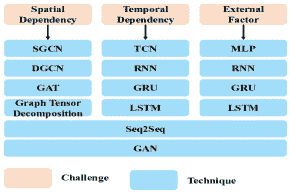

<!--yml

类别: 未分类

日期: 2024-09-06 20:01:09

-->

# [2005.11691] 如何在交通领域构建基于图的深度学习架构: 调查

> 来源：[`ar5iv.labs.arxiv.org/html/2005.11691`](https://ar5iv.labs.arxiv.org/html/2005.11691)

# 如何在交通领域构建基于图的深度学习架构: 调查

Jiexia Ye, Juanjuan Zhao*, Kejiang Ye, IEEE 会员, Chengzhong Xu, IEEE 研究员 *通讯作者: Juanjuan Zhao Jiexia Ye, Juanjuan Zhao, Kejiang Ye 在中国科学院深圳先进技术研究院工作（电子邮件: {jx.ye, jj.zhao, kj.ye}@siat.ac.cn）。Chengzhong Xu 在澳门大学计算机科学系物联网系统国家重点实验室工作（电子邮件: czxu@um.edu.mo）。

###### 摘要

近年来，已经提出了各种深度学习架构以解决交通领域中的复杂挑战（例如空间依赖性、时间依赖性），这些架构已取得令人满意的性能。这些架构由多个深度学习技术组成，以应对交通任务中的各种挑战。传统上，卷积神经网络（CNNs）用于通过将交通网络分解为网格来建模空间依赖性。然而，许多交通网络本质上是图结构的。为了充分利用这些空间信息，更合适的做法是将交通网络在数学上表述为图。最近，已经开发了各种新颖的深度学习技术来处理图数据，这些技术称为图神经网络（GNNs）。越来越多的工作将 GNNs 与其他深度学习技术结合，以构建一种架构来处理复杂交通任务中的各种挑战，其中 GNNs 负责提取交通网络中的空间关联。这些基于图的架构已实现了最先进的性能。为了全面清晰地呈现这一新兴趋势，本调查仔细检查了许多交通应用中的各种基于图的深度学习架构。我们首先提供了将交通问题基于图进行表述的指南，并从各种交通数据集中构建图。然后，我们对这些基于图的架构进行分解，讨论它们共享的深度学习技术，澄清每种技术在交通任务中的应用。此外，我们总结了一些常见的交通挑战及相应的基于图的深度学习解决方案。最后，我们提供了基准数据集、开源代码和该快速发展的领域的未来研究方向。

###### 索引词:

图神经网络，GNNs，图卷积网络，GCN，图，深度学习，交通预测，交通领域，智能交通系统

## I 引言

随着城市化进程的加速，大量人口迅速向城市聚集。在许多城市，尤其是发展中国家的城市，私人车辆数量的快速增长和对公共交通服务需求的增加对现有交通系统造成了巨大压力。交通问题如频繁的交通拥堵、严重的交通事故和长时间的通勤严重降低了城市的运行效率，并恶化了乘客的出行体验。为了应对这些挑战，许多城市致力于开发一个智能交通系统（ITS），以提供高效的交通管理、准确的交通资源分配和高质量的交通服务。这样的系统可以减少交通事故、缓解交通拥堵，并确保公共交通安全。

为了构建一个使城市智能化的智能交通系统，主要有两个不可或缺的组件，即智能基础设施和先进算法。

一方面，随着对交通基础设施投资的增加，道路网络上出现了越来越多的交通设备和系统，包括环形探测器、探头、道路摄像头、出租车或公交车上的 GPS、地铁和公交车上的智能卡、自动收费系统和在线打车系统。这些基础设施全天候产生交通数据，这些数据是异构的，包括数值数据（例如 GPS 轨迹、交通测量）、图像/视频数据（例如车辆图像）和文本数据（例如事件报告）。这些交通数据在体量上庞大，结构上复杂，包含复杂的交通模式（例如时空依赖性、高度非线性、复杂的动态性）。急需利用更智能、更强大的方法来处理这些交通数据。

另一方面，在交通领域，研究人员目睹了算法从统计方法、到机器学习模型、最近到深度学习方法的演变。在早期阶段，统计方法包括 ARIMA 及其变体[1]、[2]，VAR[3]，Kalman 滤波[4]曾经广泛使用，因为它们具有坚实且被广泛接受的数学基础。然而，这些方法的线性和稳定性假设被交通数据中的高度非线性和动态性所违背，导致实际表现不佳。传统的机器学习方法如支持向量机[5]、K-近邻[6]可以建模非线性，并提取交通数据中的更复杂的关联。然而，这些模型的浅层架构、手动特征选择和分离学习在大数据场景中被认为是不令人满意的[7]。

深度学习在许多领域的突破，包括计算机视觉和自然语言处理，已引起交通行业和研究界的关注。深度学习技术通过从原始交通数据中提供端到端学习，克服了手工特征工程的限制。深度学习技术理论上能够近似任何复杂函数，从而能够建模各种交通任务中的复杂模式。近年来，由于计算能力的提高（例如 GPU）和足够的交通数据 [7]，基于深度学习的技术已被广泛应用，并在各种交通应用中取得了最先进的性能。基于递归神经网络（RNNs）和卷积神经网络（CNNs）的架构曾在提取时空依赖性方面非常流行。在这些架构中，RNN 或其变体被用来提取交通数据中的时间相关性 [8]。CNNs 用于捕捉网格状交通网络中的空间相关性 [9]。然而，许多交通网络本质上是图结构的，例如道路网络 [10] 和地铁网络。在 CNN 中学习到的空间特征并不适合表示基于图的交通网络。尽管一些先前的工作已经从图的角度分析了交通问题 [11], [12]，这些传统方法在处理大数据和解决交通网络中的复杂相关性方面并不够强大。

最近，许多研究者扩展了深度学习方法在图数据上的应用，以利用图结构信息 [13]，并提出了一组新的神经网络，称为图神经网络（GNNs）[14], [15], [16]，旨在解决图相关的应用。GNNs 已成为许多领域的最先进方法，包括计算机视觉 [17]、自然语言处理 [18]、生物学 [19]、推荐系统 [20]。由于许多交通数据是图结构的，许多现有的工作将 GNNs 融入深度学习架构中，以捕捉空间依赖性。近期的工作表明，这种基于 GNNs 的架构可以比基于 CNNs 的架构实现更好的性能，因为大多数交通网络自然是图结构的，GNNs 能够更准确地提取空间依赖性。此外，一些任务本质上要求研究人员基于图进行预测，例如预测具有不规则形状的交通网络。近年来已经产生了许多相关工作，还有更多正在进行中。在这种情况下，对这些图基深度学习架构在交通领域的全面文献综述将非常及时，这正是我们的工作。

据我们所知，我们是首个对交通领域中的基于图的深度学习工作的全面调查进行综述的研究。值得注意的是，我们评审的一些工作实际上解决了类似的交通问题，并使用了类似的技术。我们的工作可以帮助未来的研究者避免重复的工作，集中于新的解决方案。此外，本调查中的实际和清晰的指导使参与者能够迅速将这些新兴方法应用于现实世界的交通任务中。

总结来说，本文的主要贡献如下：

+   •

    我们系统地概述了交通问题、相关研究方向、挑战和交通领域的技术，这可以帮助相关研究人员定位或扩展他们的研究。

+   •

    我们总结了关于各种交通问题的一般性公式，并提供了从几种典型的原始交通数据集中构建图的具体指导。这种彻底的总结非常实用，可以加速基于图的方法在交通领域的应用。

+   •

    我们提供了对广泛应用于基于图的交通工作中的典型深度学习技术的全面回顾。我们详细阐述了它们的理论方面、优点、局限性和在特定交通任务中的变体，希望能够激发研究者开发更多创新模型。

+   •

    我们讨论了大多数基于图的交通任务所面临的一些挑战。对于每个挑战，我们总结了多种基于深度学习的解决方案，并进行必要的比较，为交通任务中的模型选择提供有用的建议。

+   •

    我们收集了基准数据集和相关论文中的开源代码，以促进交通领域的基线实验。最后，我们提出了一些未来的研究方向。

论文的其余部分组织如下。第 II 节介绍了交通领域的一些调查以及图神经网络的一些评论。第 III 节简要概述了几个交通问题以及相应的研究方向、挑战和解决方案。第 IV 节总结了有关交通问题的一般性公式化以及从交通数据集中构建图的过程。第 V 节分析了 GNNs 和其他深度学习技术的功能、优点和缺陷，并探讨了在特定交通任务中创建这些技术的新变体的技巧。第 VI 节讨论了交通领域的常见挑战以及相应的多种解决方案。第 VII 节提供了我们调查论文中的数据集和开源代码的超链接。第 VIII 节介绍了未来的研究方向。第 IX 节总结了论文内容。

## II 相关研究调查

已有一些综述从不同的角度总结了交通任务中算法的发展过程。Karlaftis 等人 [21] 讨论了统计方法和神经网络之间的异同，以促进这两个社区之间的理解。Vlahogianni 等人 [22] 回顾了短期交通预测的十个挑战，这些挑战源于 ITS 应用需求的变化。Xie 等人 [23] 对城市流量预测的方法进行了全面的概述。Liu 等人 [7] 将基于深度学习的城市大数据融合方法分为三类，即 DL 输出基融合、DL 输入基融合和 DL 双阶段融合。有关交通网络表示、交通流预测、交通信号控制、自动车辆检测等热门话题的深度学习方法在 [24]、[25] 中进行了讨论。Veres 等人 [26] 和 Chen 等人 [27] 对各种交通运输主题中新兴的深度学习模型进行了类似但更详细的分析。Wang 等人 [28] 从时空角度总结了交通领域和其他领域的深度学习技术。然而，除了 Wang 等人 [28] 在非常简短的子章节中提到 GNN 外，所有这些综述均未考虑图神经网络（GNN）相关的文献。

另一方面，近年来有几篇综述总结了关于 GNN 的不同方面的文献。Bronstein 等人 [29] 是首个概述处理非欧几里得空间（如图数据）中的深度学习技术的研究。Zhou 等人 [30] 将 GNN 按图类型、传播类型和训练类型进行了分类。此外，他们还将相关应用分为结构场景、非结构场景和其他场景。Zhang 等人 [31] 分别介绍了小图和大图中的 GNN。Quan 等人 [32] 和 Zhang 等人 [33] 专注于回顾 GNN 的特定分支，即图卷积网络（GCN）的研究。然而，他们很少介绍 GNN 在交通场景中的工作。Wu 等人 [34] 提出了唯一一个在交通领域描述 GNN 的综述，然而仅用一段话描述显然不足以满足任何希望深入探讨这一领域的人的需求。

总之，目前仍缺乏一个系统且详尽的综述，以探讨最近在交通领域快速发展的基于图的深度学习技术。我们的工作旨在填补这一空白，促进交通社区对新兴技术的理解。

## III 问题、研究方向和挑战

图 1：典型交通问题及其对应的研究方向

在本节中，我们简要介绍交通领域的背景知识，包括一些重要的交通问题及其相应的研究方向（如图 1 所示），以及这些问题下的常见挑战和技术。一方面，我们相信这样简洁但系统的介绍可以帮助读者迅速理解这一领域。另一方面，我们的调查显示，现有与图基深度学习技术相关的工作仅涵盖了部分研究方向，这激励了后继者将类似技术转移到剩余方向。

### III-A 交通问题

交通社区的目标包括缓解交通拥堵、满足旅行需求、增强交通管理、确保交通安全和实现自动驾驶。每个与相应交通目标相关的问题可以细分为若干研究方向，每个方向可以服务于多个问题。

#### III-A1 交通拥堵

交通拥堵[35]是现代城市中最重要和最紧迫的问题之一，涉及显著的时间损失、空气污染和能源浪费。可以通过提高交通效率[36]，[37]、缓解道路网络上的交通拥堵[38]，[39]，[40]、通过交通状态预测控制道路条件[41]，[42]、通过控制交通信号优化车辆流量[43]，[44]、通过预测公共交通系统中的乘客需求优化乘客流量[45]来解决拥堵问题。

#### III-A2 交通需求

旅行需求预测指的是从人群角度出发的交通服务需求，例如出租车、自行车、地铁和公交。随着在线打车平台（如 Uber、滴滴）和公共交通系统（如地铁系统和公交系统）的快速发展，旅行需求预测对交通部门、商业部门和个人的重要性越来越高。对相关部门而言，这有助于更好地分配资源，例如在高峰时段增加地铁频次，增加热门区域的公交车数量。对商业部门而言，它使他们能够更好地管理出租车租赁[46]、拼车[47]、共享自行车服务[48], [49]，并最大化收入。对个人而言，它鼓励用户考虑各种交通方式，以减少通勤时间并改善旅行体验。

#### III-A3 交通安全

交通安全是公共安全不可或缺的一部分。交通事故不仅会对受害者、车辆和道路基础设施造成损害，还会导致交通拥堵，降低道路网络的效率。因此，监控交通事故对于避免财产损失和拯救生命至关重要。许多研究者关注的方向包括检测交通事件[50]、从社交媒体数据预测交通事故[51]、预测交通事故的伤害严重性[52], [53]、预测事故预防[54], [55], [56]。

#### III-A4 交通监控

现在，监控摄像头已经在城市道路上广泛部署，生成了大量的图像和视频[27]。这种发展增强了交通监控，包括交通执法、自动收费[57]以及交通监控系统。交通监控的研究方向包括车牌检测[58]、自动车辆检测[59]、行人检测[60]。

#### III-A5 自动驾驶

最近，自动驾驶车辆已成为交通领域的研究热点。许多任务涉及视觉识别。自动驾驶的研究方向包括车道/车辆检测[61]、行人检测[62]、交通标志检测[63]以及人/车轨迹预测[64]。

### III-B 研究方向

我们对交通领域基于图的深度学习的调查显示，现有的工作主要集中在交通状态预测、旅行需求预测和轨迹预测上。少数工作关注于车辆行为分类[65]、优化动态电子收费（DETC）方案[57]、路径可用性[66]、交通信号控制[67]。据我们了解，基于图视角的交通事件检测和车辆检测尚未得到探索。

#### III-B1 交通状态预测

文献中的交通状态指的是交通流量、交通速度、旅行时间、交通密度等。交通流量预测（TFP）[68], [69]、交通速度预测（TSP）[70], [71]、旅行时间预测（TTP）[72], [73], [74]是交通状态预测的热点分支，并吸引了大量研究。

#### III-B2 旅行需求预测

旅行需求预测旨在估计未来需要交通服务的用户数量。它可以分为两种类型，即区域级需求预测和出发地-目的地旅行需求预测。前者旨在预测城市每个区域的未来旅行需求，例如，预测城市各个区域的未来出租车请求 [75],[76]，或预测地铁系统的车站级乘客需求 [77], [78], [79], [45]，或预测城市每个区域的自行车租赁需求 [48],[49]。后者旨在预测从一个区域到另一个区域的旅行需求，这比区域级需求预测提供了更丰富的信息，是一个值得深入探索的更具挑战性的问题。至今，仅有少数研究 [80], [81], [82]] 关注基于出发地-目的地的旅行需求预测，这是一个有前景的研究方向。

#### III-B3 交通信号控制

交通信号控制旨在适当控制交通灯，以减少车辆在交叉路口的停留时间，从而在长期内 [25]。交通信号控制 [67] 可以优化交通流量，减少交通拥堵和车辆排放。

#### III-B4 交通事件检测

重大事件可能导致旅客重伤和道路网络的长时间延误。因此，了解事件的主要原因以及事件对交通网络的影响对现代交通管理系统至关重要 [50],[52], [53]。

#### III-B5 人员/车辆轨迹预测

轨迹预测 [64], [83], [84] 旨在预测场景中动态代理的未来位置。准确的人员/车辆轨迹预测对包括自动驾驶和交通监控在内的下游任务非常重要 [85]。例如，准确的行人轨迹预测可以帮助控制器在危险环境中控制前方车辆 [86]。它还可以使交通监控系统识别可疑活动 [87]。

### III-C 挑战与技术概述

图 2：交通挑战及相应的深度学习技术。SGCN 指谱图卷积网络，DGCN 指扩散图卷积网络，GAT 指图注意力网络，TCN 指时间卷积网络，RNN 指递归神经网络，GRU 指门控递归单元，LSTM 指长短期记忆网络，MLP 指多层感知器，Seq2Seq 指序列到序列模型，GAN 指生成对抗网络。

尽管交通问题及相关研究方向有所不同，但大多数都面临相同的挑战，例如空间依赖性、时间依赖性、外部因素。

#### III-C1 时空依赖性

交通数据中存在复杂的时空依赖性，这可能影响交通任务中的预测。例如，要预测某一地区的交通拥堵，其之前的交通状况及周围地区的交通状况是预测的重要因素[35],[38],[39]。在车辆轨迹预测中，周围车辆的随机行为和自身轨迹的历史信息会影响预测性能[88]。预测某一地区的网约车需求时，该地区的历史订单以及其他具有相似功能地区的订单对预测至关重要[89]。预测交通信号时，需要考虑多个交叉口的几何特征，以及周围的交通流量[67]。

#### III-C2 外部因素

除了时空数据外，一些类型的数据在交通任务中扮演着重要角色，称为外部因素，例如假期、天气条件（如降雨、温度、空气质量）、极端事件[90]和交通事件（如事件时间、事件类型）[91]。外部因素对交通状况的影响在日常生活中是可以观察到的。暴风雨可能会影响交通量。大规模音乐会或足球比赛会导致交通拥堵，影响周围的交通状况。

为应对上述挑战，提出了各种深度学习技术。本文聚焦于交通领域的图基深度学习架构。在这些图基深度学习框架中，图神经网络（GNNs）通常用于建模交通网络中的空间依赖性。递归神经网络（RNNs）和时间卷积网络（TCN）通常用于建模交通数据中的时间依赖性。RNNs 和多层感知器（MLPs）通常用于处理外部因素。序列到序列（Seq2Seq）模型通常用于进行多步骤交通预测。这些技术与其他技巧（如门控机制、注意力机制）有机结合，以提高预测准确性。

在本文中，我们旨在为读者提供如何构建基于图的深度学习架构的指导，并且我们调查了大量现有的采用图基深度学习解决方案的交通相关工作。在接下来的部分中，我们首先介绍一种常见的交通问题制定方式，并提供详细的指导以从各种交通数据中构建交通图。然后，我们从两个角度澄清挑战与技术之间的关联（如图 2 所示），即技术角度和挑战角度。在技术角度中，我们介绍几种常见技术，并解释它们如何应对交通任务中的挑战。在挑战角度中，我们详细阐述每个挑战，并总结可以解决这些挑战的技术。总之，我们希望提供基于图视角的各种深度学习技术解决交通挑战的见解。

## IV 问题制定与图构建

在我们调查的基于图的深度学习交通文献中，大多数任务（超过 80%）属于时空预测问题，特别是交通状态预测和出行需求预测。在本节中，我们首先列出常用的符号。然后我们总结了交通领域中基于图的时空预测的一般制定方式。我们提供了从各种交通数据集中构建图的详细信息。我们还讨论了邻接矩阵的多种定义，它代表了基于图的交通网络的拓扑结构，是图基解决方案的关键元素。

表 I：本文中的符号

| 图相关元素 |
| --- |
| $\mathbf{G}$ | 图 |
| $\mathbf{E}$ | 图 $\mathbf{G}$ 的边 |
| $\mathbf{V}$ | 图 $\mathbf{G}$ 的顶点 |
| $\mathbf{A}\in\mathbb{R}^{\mathbf{N}\times\mathbf{N}}$ | 图 $\mathbf{G}$ 的邻接矩阵 |
| $\mathbf{A}^{T}\in\mathbb{R}^{\mathbf{N}\times\mathbf{N}}$ | $\mathbf{A}$ 的转置矩阵 |
| $\mathbf{\tilde{A}}\in\mathbb{R}^{\mathbf{N}\times\mathbf{N}}$ | 等于 $\mathbf{A}+\mathbf{I_{N}}$ 的自环矩阵 $\mathbf{A}$ |
| $\mathbf{D}\in\mathbb{R}^{\mathbf{N}\times\mathbf{N}}$ | 邻接矩阵 $\mathbf{A}$ 的度矩阵 |
| $\mathbf{D_{I}}\in\mathbb{R}^{\mathbf{N}\times\mathbf{N}}$ | 邻接矩阵 $\mathbf{A}$ 的入度矩阵 |
| $\mathbf{D_{O}}\in\mathbb{R}^{\mathbf{N}\times\mathbf{N}}$ | 邻接矩阵 $\mathbf{A}$ 的出度矩阵 |
| $\mathbf{L}\in\mathbb{R}^{\mathbf{N}\times\mathbf{N}}$ | 图 $\mathbf{G}$ 的拉普拉斯矩阵 |
| $\mathbf{U}\in\mathbb{R}^{\mathbf{N}\times\mathbf{N}}$ | $\mathbf{L}$ 的特征向量矩阵 |
| $\mathbf{\Lambda}\in\mathbb{R}^{\mathbf{N}\times\mathbf{N}}$ | $\mathbf{L}$ 的对角特征值矩阵 |
| $\boldsymbol{\lambda}_{max}$ | $\mathbf{L}$ 的最大特征值 |
| $\mathbf{I_{N}}\in\mathbb{R}^{\mathbf{N}\times\mathbf{N}}$ | 单位矩阵 |
| 超参数 |
| $\mathbf{N}$ | 图 $\mathbf{G}$ 中的节点数量 |
| $\mathbf{F_{I}}$ | 输入特征的数量 |
| $\mathbf{F_{H}}$ | 隐藏特征的数量 |
| $\mathbf{F_{O}}$ | 输出特征的数量 |
| $\mathbf{P}$ | 过去时间切片的数量 |
| $\mathbf{Q}$ | 未来时间切片的数量 |
| $\mathbf{d}$ | 扩张率 |
| 可训练的参数 |
| $W,b,\theta,\phi$ | 可训练的参数 |
| $\Theta$ | 核 |
| 激活函数 |
| $\boldsymbol{\rho}(\boldsymbol{\cdot})$ | 激活函数，例如 tanh, sigmoid, ReLU |
| $\boldsymbol{\sigma}(\boldsymbol{\cdot})\in[0,1]$ | Sigmoid 函数 |
| $\boldsymbol{tanh}(\boldsymbol{\cdot})\in[-1,1]$ | 双曲正切函数 |
| $\boldsymbol{ReLU}(\boldsymbol{\cdot})\in[0,x]$ | ReLU 函数 |
| 操作 |
| $\boldsymbol{*_{\mathcal{G}}}$ | 图上的卷积运算符 |
| $\boldsymbol{\odot}$ | 元素级乘法 |
| $\boldsymbol{\cdot}$ | 矩阵乘法 |
| 空间变量 |
| $X\in\mathbb{R}^{\mathbf{N}\times\mathbf{F_{I}}}$ | 由 $\mathbf{N}$ 个节点和 $\mathbf{F_{I}}$ 特征组成的输入图 |
| $X_{j}\in\mathbb{R}^{\mathbf{N}}$ | 输入图的第 $j^{th}$ 特征 |
| $X^{i}\in\mathbb{R}^{\mathbf{F_{I}}}$ | 输入图中的节点 $i$ |
| $x\in\mathbb{R}^{\mathbf{N}}$ | 一个简单的输入图 |
| $Y\in\mathbb{R}^{\mathbf{N}\times\mathbf{F_{O}}}$ | 由 $\mathbf{N}$ 个节点和 $\mathbf{\mathbf{F_{O}}}$ 特征组成的输出图 |
| $Y_{j}\in\mathbb{R}^{\mathbf{N}}$ | 输出图的第 $j^{th}$ 特征 |
| $Y^{i}\in\mathbb{R}^{\mathbf{F_{O}}}$ | 输出图中的节点 $i$ |
| $y\in\mathbb{R}^{\mathbf{N}}$ | 一个简单的输出图 |
| 时间变量 |
| $\mathbf{X}\in\mathbb{R}^{\mathbf{P}\times\mathbf{F_{I}}}$ | 在 $\mathbf{P}$ 时间切片上的 $\mathbf{F_{I}}$ 特征的序列输入 |
| $\mathbf{X}_{t}\in\mathbb{R}^{\mathbf{F_{I}}}$ | 时间 $t$ 的序列输入的元素 |
| $\mathbf{x}\in\mathbb{R}^{\mathbf{P}}$ | 在 $\mathbf{P}$ 时间切片上的简单序列输入 |
| $\mathbf{x}_{t}\in\mathbb{R}$ | 时间 $t$ 的简单序列输入的元素 |
| $\mathbf{H}_{t}\in\mathbb{R}^{\mathbf{F_{H}}}$ | 时间 $t$ 的隐藏状态，具有 $\mathbf{\mathbf{F}_{H}}$ 特征 |
| $\mathbf{Y}\in\mathbb{R}^{\mathbf{P}\times\mathbf{F_{O}}}$ | 在 $\mathbf{P}$ 时间切片上的 $\mathbf{F_{O}}$ 特征的序列输出 |
| $\mathbf{Y}_{t}\in\mathbb{R}^{\mathbf{F_{O}}}$ | 时间 $t$ 的序列输出的元素 |
| $\mathbf{y}\in\mathbb{R}^{\mathbf{P}}$ | 在 $\mathbf{P}$ 时间切片上简单的序列输出 |
| $\mathbf{y}_{t}\in\mathbb{R}$ | 时间$t$时简单顺序输出的元素 |
| 空间-时间变量 |
| $\mathcal{X}\in\mathbb{R}^{\mathbf{P}\times\mathbf{N}\times\mathbf{F_{I}}}$ | 一系列输入图，由$\mathbf{N}$个节点和$\mathbf{F_{I}}$特征组成，覆盖$\mathbf{P}$个时间片段 |
| $\mathcal{X}_{t}\in\mathbb{R}^{\mathbf{N}\times\mathbf{F_{I}}}$ | 时间$t$时的输入图 |
| $\mathcal{X}^{i}_{t}\in\mathbb{R}^{\mathbf{F_{I}}}$ | 时间$t$时输入图中的节点$i$ |
| $\mathcal{X}_{t,j}\in\mathbb{R}^{\mathbf{N}}$ | 时间$t$时输入图的第$j^{th}$特征 |
| $\mathcal{X}^{i}_{t,j}\in\mathbb{R}$ | 时间$t$时输入图中节点$i$的第$j^{th}$特征 |
| $\mathcal{Y}\in\mathbb{R}^{\mathbf{P}\times\mathbf{N}\times\mathbf{F_{O}}}$ | 一系列输出图，由$\mathbf{N}$个节点和$\mathbf{F_{O}}$特征组成，覆盖$\mathbf{P}$个时间片段 |
| $\mathcal{Y}_{t}\in\mathbb{R}^{\mathbf{N}\times\mathbf{F_{O}}}$ | 时间$t$时的输出图 |
| $\mathcal{Y}^{i}_{t}\in\mathbb{R}^{\mathbf{F_{O}}}$ | 时间$t$时输出图中的节点$i$ |
| $\mathcal{Y}_{t,j}\in\mathbb{R}^{\mathbf{N}}$ | 时间$t$时输出图的第$j^{th}$特征 |
| $\mathcal{Y}^{i}_{t,j}\in\mathbb{R}$ | 时间$t$时输出图中节点$i$的第$j^{th}$特征 |

### IV-A 符号

在本节中，我们已标记一些常用符号，包括图相关元素、变量、参数（超参数或可训练的）、激活函数和操作。变量包括输入变量{$x$, $X$, $\mathbf{x}$, $\mathbf{X}$, $\mathcal{X}$}和输出变量{$y$, $Y$, $\mathbf{y}$, $\mathbf{Y}$, $\mathcal{Y}$}。这些变量可以分为空间变量、时间变量和空间-时间变量。空间变量仅与空间属性相关，时间变量仅与时间属性相关，而空间-时间变量与空间和时间属性都相关。

### IV-B 基于图的空间-时间预测

据我们了解，大多数现有的基于图的深度学习交通工作可以归类为空间-时间预测，因为大多数交通数据集同时具有空间属性和时间属性。尽管数学符号和表示方式不同，它们以非常相似的方式形式化其预测问题。我们总结了它们的工作，以提供一种通用的图形空间-时间问题的公式化方法。

交通网络表示为一个图 $\mathbf{G}=(\mathbf{V},\mathbf{E},\mathbf{A})$，可以是加权的 [92], [72], [68] 或非加权的 [66], [93], [94]，有向的 [66], [95], [96] 或无向的 [69], [97]，这取决于具体任务。 $\mathbf{V}$ 是节点的集合，$|\mathbf{V}|=\mathbf{N}$ 表示图中的$\mathbf{N}$个节点。每个节点代表一个交通对象，可以是传感器 [70], [69], [98]，一个道路段 [92], [99], [100]，一个道路交叉口 [72], [95], [68]。$\mathbf{E}$ 是表示节点之间连通性的边的集合。

$\mathbf{A}=(\mathbf{a}_{ij})_{\mathbf{N}\times\mathbf{N}}\in\mathbb{R}^{\mathbf{N}\times\mathbf{N}}$ 是包含交通网络拓扑信息的邻接矩阵，这对交通预测非常有价值。矩阵$\mathbf{A}$中的条目$\mathbf{a}_{ij}$表示节点的接近度，在不同的应用中有所不同。它可以是二进制值$0$或$1$ [69], [93], [94]。具体而言，$0$表示节点$i$和节点$j$之间没有边，而$1$表示这两个节点之间有边。它也可以是浮点值，表示节点之间某种关系 [92], [101]，例如两个传感器之间的道路距离 [70], [102], [96]。

$\mathcal{X}_{t}=[\mathcal{X}_{t}^{1},\cdots,\mathcal{X}_{t}^{i},\cdots,\mathcal{X}_{t}^{\mathbf{N}}]\in\mathbb{R}^{\mathbf{N}\times\mathbf{F_{I}}}$ 是时间$t$时刻的整个图的特征矩阵。 $\mathcal{X}^{i}_{t}\in\mathbb{R}^{\mathbf{F_{I}}}$ 代表时间$t$时刻具有$\mathbf{F_{I}}$个特征的节点$i$。这些特征通常是交通指标，如交通流量 [97], [96], 交通速度 [70], [99], [95], 或铁路运单 [89], [101], 乘客流量 [77], [78]。通常，连续指标在数据预处理阶段会进行归一化处理。

给定过去 $\mathbf{P}$ 个时间切片的整个交通网络历史指标，记作 $\mathcal{X}=[\mathcal{X}_{1},\cdots,\mathcal{X}_{t},\cdots,\mathcal{X}_{\mathbf{P}}]\in\mathbb{R}^{\mathbf{P}\times\mathbf{N}\times\mathbf{F_{I}}}$，交通领域中的时空预测问题旨在预测未来 $\mathbf{Q}$ 个时间切片的交通指标，记作 $\mathcal{Y}=[\mathcal{Y}_{1},\cdots,\mathcal{Y}_{t},\cdots,\mathcal{Y}_{\mathbf{Q}}]\in\mathbb{R}^{\mathbf{Q}\times\mathbf{N}\times\mathbf{F_{O}}}$，其中 $\mathcal{Y}_{t}\in\mathbb{R}^{\mathbf{N}\times\mathbf{F_{O}}}$ 表示时间 $t$ 处具有 $\mathbf{F_{O}}$ 特征的输出图。该问题（如图 3 所示）可以表述如下：

|  | $\mathcal{Y}=f(\mathcal{X};\mathbf{G})$ |  | (1) |
| --- | --- | --- | --- |

图 3：交通领域中的图基时空问题表述

一些研究预测未来的多个交通指标（即 $\mathbf{F_{O}}>1$），而其他研究预测单一交通指标（即 $\mathbf{F_{O}}=1$），例如交通速度 [99], [95], 铁路隐藏订单 [89], [101]。一些研究仅考虑一步预测 [103], [75], [57]，即预测下一时间步的交通状况，并且 $\mathbf{Q}=1$。但是，为一步预测设计的模型不能直接应用于多步预测，因为它们是在训练阶段通过减少下一步的误差来优化的，而不是随后的时间步 [76]。许多研究集中于多步预测（即 $\mathbf{Q}>1$） [104], [42], [105]。根据我们的调查，生成多步输出的主要有三种技术，即全连接（FC）层、Seq2Seq 和扩张技术。全连接（FC）层是最简单的技术，它作为输出层来获得所需的输出形状 [70], [69], [106], [93], [91], [107]。一些研究采用了基于 RNN 的 Seq2Seq 架构，通过多个步骤递归生成输出 [108], [98], [109], [104], [110], [96]。扩张技术则被用来获得所需的输出长度 [102], [105]。

图 4：来自各种交通数据集的图构建：a) 在传感器图中，传感器表示节点，且在道路同侧的相邻传感器之间有一条边。b) 在道路段图中，道路段表示节点，相连的两个段之间有一条边。c) 在道路交叉口图中，道路交叉口表示节点，且在由道路段连接的两个道路交叉口之间有一条边。大多数研究认为边的方向是交通流向[70],[98],[66],[96],[68],[111]，而有些研究忽略方向，构建无向图[69],[102],[94][100],[95]。

此外，一些研究不仅考虑交通指标，还考虑外部因素（例如时间属性、天气）[70],[112],[91],[113]。因此，问题的表述变为：

|  | $\mathcal{Y}=f(\mathcal{X},\mathcal{E};\mathbf{G})$ |  | (2) |
| --- | --- | --- | --- |

其中$\mathcal{E}$是外部因素。

### IV-C 来自交通数据集的图构建

将交通网络建模为图对于任何打算利用图基深度学习架构解决交通问题的研究来说都是至关重要的。用于预测的交通图$\mathbf{G}$通常由四部分组成，即节点$\mathbf{V}$、节点特征（特征矩阵$\mathcal{X}_{t}$）、边$\mathbf{E}$、边权重$\mathbf{a}_{ij}$。请注意，边和边权重可以通过邻接矩阵$\mathbf{A}=(\mathbf{a}_{ij})_{\mathbf{N}\times\mathbf{N}}$表示。节点和节点特征可以从交通数据集中构建。邻接矩阵的构建不仅依赖于交通数据集，还依赖于节点关系的假设，这可以是静态的或动态的。我们首先介绍如何从各种交通数据集中构建节点和节点特征，然后系统地介绍流行的邻接矩阵。

#### IV-C1 节点和节点特征构建

由于所收集的交通数据集不同，许多研究在图构建上有所不同。我们根据交通基础设施将这些数据集分为四类：由道路网络上部署的传感器收集的数据[70],[69],[71]，车辆 GPS 轨迹[68],[111],[95]，铁路叫车系统的订单[101],[76],[113]，地铁系统的交易记录[77],[78]或公交系统[111]。对于每一类，我们描述数据集并解释节点$\mathbf{V}$、特征矩阵$\mathcal{X}_{t}$的构建。

传感器数据集 交通测量（例如交通速度）通常在大城市（如北京 [92]、加州 [71]、洛杉矶 [70]、纽约 [99]、费城 [106]、西雅图 [94]、厦门 [98] 和华盛顿 [106]）的道路网络上由传感器（例如环形探测器、探针）在短时间间隔内收集。传感器数据集是现有研究中最为普遍的数据集，特别是来自加州的 PEMS 数据集。通常，道路网络包含交通对象，如传感器、路段。

传感器图（如图 4 所示）在 [70]，[69]，[96] 中被构建，其中传感器表示一个节点，该节点的特征是其对应传感器收集的交通测量值。

路段图（如图 4 所示）在 [92]，[99]，[106] 中被构建，其中路段表示一个节点，该节点的特征是其对应路段上所有传感器记录的平均交通测量值（例如交通速度）。

GPS 数据集 GPS 轨迹数据集通常由城市中大量出租车在一段时间内生成，例如北京 [68]、成都 [68]、深圳 [93]、科隆 [95] 和芝加哥 [100]。每辆出租车每天生成大量的 GPS 记录，包括时间、位置、速度信息。每条 GPS 记录都被拟合到城市道路地图上最近的道路上。所有道路通过道路交叉口被划分为多个路段。

路段图（如图 4 所示）在 [100]，[93] 中被构建，其中路段表示一个节点，该节点的特征是其对应路段上所有 GPS 点记录的平均交通测量值。

道路交叉口图（如图 4 所示）在 [72]，[68]，[95] 中被构建，其中道路交叉口表示一个节点，该节点的特征是通过它的交通测量值的总和。

铁路召车数据集 这些数据集记录了在北京[89],[101], 成都[101]和上海[89], 曼哈顿, 纽约[99]等城市的一段时间内的汽车/出租车/自行车需求订单。目标城市使用 OpenStreetMap 被划分为相等大小的网格区域（如图 5 所示）。每个区域定义为图中的一个节点。每个节点的特征是在给定时间间隔内相应区域的订单数量。

图 5：多重关系：a) 空间局部性图：该图基于空间接近性，并在一个 3 x 3 网格中构建区域与其 8 个相邻区域之间的边。b) 功能相似性图：该图假设共享相似功能的区域可能具有类似的需求模式。边在具有类似周边兴趣点（POI）的区域之间构建。c) 交通连接性图：该图假设地理上与目标区域距离较远但通过交通（如高速公路、高速公路或地铁）便捷到达的区域与目标区域具有较强的相关性。它们之间应存在边。

交易数据集 这些数据集由自动票务收集（AFC）系统在公共交通网络中收集，例如地铁网络和公交网络。在[77],[78],[111]中构建了地铁图。地铁系统中的每个车站被视为一个节点。车站的特征通常包括在给定时间间隔内从车站离开的乘客数量和到达车站的乘客数量，基于地铁 AFC 系统收集的交易记录，这些系统记录了每个乘客何时进入和离开地铁系统。

在[111]中构建了公交图。每个公交站被视为一个节点。公交站的特征通常包括在给定时间间隔内离开车站的乘客数量，但不包括到达乘客的数量，因为大多数公交 AFC 系统仅记录每个乘客的登车记录。

#### IV-C2 邻接矩阵构建

邻接矩阵 $\mathbf{A}=(\mathbf{a}_{ij})_{\mathbf{N}\times\mathbf{N}}\in\mathbb{R}^{\mathbf{N}\times\mathbf{N}}$ 是捕捉空间依赖性的关键，这对预测非常有价值。元素 $\mathbf{a}_{ij}$（加权或未加权）表示节点之间的异质成对关系。然而，在不同的交通场景中，节点关系有不同的假设，基于这些假设，邻接矩阵的设计可以有所不同，例如固定矩阵、动态矩阵、演变矩阵。

固定矩阵 许多研究假设节点之间的相关性是固定的，并且不会随时间变化。因此，设计了一个固定矩阵，并在整个实验过程中保持不变。研究人员设计了各种固定的邻接矩阵，以捕捉交通图中节点之间的各种预定义相关性，例如功能相似性和交通连接性 [89]、语义连接 [101]、时间相似性 [71]。在这里，我们介绍几种流行的邻接矩阵。

连接矩阵衡量节点之间的连接性。矩阵中的条目值定义为 $1$（连接）或 $0$（断开连接） [69]、[106]、[93]、[94]。

距离矩阵从几何距离的角度衡量节点之间的接近度。条目值定义为节点之间距离的函数 [85]。例如，一些研究 [72]、[68]、[100]、[97]、[76]、[95] 使用阈值高斯核来定义 $\mathbf{a}_{ij}$ 如下：

|  | $\mathbf{a}_{ij}=\left\{\begin{array}[]{l}\exp\left(-\frac{\mathbf{d}_{ij}^{2}}{\sigma^{2}}\right),i\neq j\text{ 和 }\mathbf{d}_{ij}\geq\epsilon\\ 0\quad,i=j\text{ 或 }\mathbf{d}_{ij}<\epsilon\end{array}\right.$ |  | (3) |
| --- | --- | --- | --- |

其中 $\mathbf{d}_{ij}$ 是节点 $i$ 和节点 $j$ 之间的距离。超参数 $\sigma^{2}$ 和 $\epsilon$ 是控制矩阵 $\mathbf{A}$ 的分布和稀疏性的阈值。

功能相似性矩阵衡量两个节点在功能性方面是否相似（例如，它们都是商业区）。对应的功能相似性图见图 5。它假设功能相似的区域可能有类似的需求模式 [89]。在具有相似周边兴趣点（POIs）的区域之间构建边。

交通连通矩阵衡量的是地理上距离较远但通过高速公路、国道或地铁方便到达的区域之间的相关性。相应的交通连通图如图 5 所示。它们之间应该存在边[89]。

动态矩阵 一些研究认为，预定义矩阵由于先验知识缺陷或数据不完整，未必能真实反映节点间的真实依赖关系[72]。因此，提出了一种通过数据学习得到的新型自适应矩阵。实验表明，在一些交通任务中，自适应矩阵能更准确地捕捉隐藏的空间依赖[102],[72],[99]。

发展矩阵 在一些场景中，图结构可能会随时间演变，因为某些边可能变得不可用，比如道路拥堵或封闭，缓解拥堵后又恢复可用。一个演变的拓扑结构[66], [114]被纳入模型中以捕捉这种动态空间变化。

## V 深度学习技术视角

表 II: 本文研究的基于图的深度学习架构的分解

| 参考文献 | 年份 | 方向 | 模型 | 模块 |
| --- | --- | --- | --- | --- |
| [83] | 2019 | 人车轨迹预测 | SAGCN | SGCN, TCN, 注意力 |
| [87] | 2019 | 人车轨迹预测 | Social-BiGAT | GAT, LSTM, GAN |
| [85] | 2020 | 人车轨迹预测 | Social-STGCNN | SGCN, TCN |
| [64] | 2020 | 人车轨迹预测 | Social-WaGDAT | GAT, Seq2Seq, MLP |
| [88] | 2020 | 人车轨迹预测 |  | SGCN, LSTM |
| [57] | 2019 | 最优 DETC 方案 |  | SGCN |
| [65] | 2020 | 车辆行为分类 | MR-GCN | SGCN, LSTM |
| [67] | 2018 | 交通信号控制 |  | SGCN, 强化学习 |
| [66] | 2019 | 路径可用性 | LRGCN-SAPE | SGCN, LSTM |
| [72] | 2019 | 行程时间预测 |  | SGCN |
| [68] | 2018 | 交通流预测 | KW-GCN | SGCN, LCN |
| [97] | 2018 | 交通流预测 | Graph-CNN | CNN, 图矩阵 |
| [115] | 2018 | 交通流预测 | DST-GCNN | SGCN |
| [69] | 2019 | 交通流预测 |  | SGCN, CNN, 注意机制 |
| [111] | 2019 | 交通流预测 |  | SGCN, TCN, 残差 |
| [109] | 2019 | 交通流预测 | GHCRNN | SGCN, GRU, Seq2Seq |
| [104] | 2019 | 交通流量预测 | STGSA | GAT, GRU, Seq2Seq |
| [96] | 2019 | 交通流量预测 | DCRNN-RIL | DGCN, GRU, Seq2Seq |
| [116] | 2019 | 交通流量预测 | MVGCN | SGCN, FNN, Gate Mechanism, Residual |
| [117] | 2019 | 交通流量预测 | STGI- ResNet | SGCN, Residual |
| [118] | 2020 | 交通流量预测 | FlowConvGRU | DGCN, GRU |
| [45] | 2020 | 交通流量预测 | Multi-STGCnet | SGCN, LSTM |
| [119] | 2018 | 交通速度预测 |  | GAT, GRU, Gate Mechanism |
| [70] | 2019 | 交通速度预测 | GTCN | SGCN, TCN, Residual |
| [71] | 2019 | 交通速度预测 | 3D-TGCN | SGCN, Gate Mechanism |
| [91] | 2019 | 交通速度预测 | DIGC-Net | SGCN, LSTM |
| [120] | 2019 | 交通速度预测 | MW-TGC | SGCN, LSTM |
| [110] | 2019 | 交通速度预测 | AGC-Seq2Seq | SGCN, GRU, Seq2Seq, Attention Mechanism |
| [95] | 2019 | 交通速度预测 | GCGA | SGCN, GAN |
| [107] | 2019 | 交通速度预测 | ST-GAT | GAT, LSTM |
| [92] | 2018 | 交通状态预测 | STGCN | SGCN, TCN, Gate Mechanism |
| [108] | 2018 | 交通状态预测 | DCRNN | DGCN, GRU, Seq2Seq |
| [99] | 2019 | 交通状态预测 |  | SGCN, CNN, Gate Mechanism |
| [112] | 2019 | 交通状态预测 | MRes-RGNN | DGCN, GRU, Residual, Gate Mechanism |
| [100] | 2019 | 交通状态预测 | GCGAN | DGCN, LSTM, GAN, Seq2Seq, Attention Mechanism |
| [102] | 2019 | 交通状态预测 | Graph WaveNet | DGCN, TCN, Residual, Gate Mechanism |
| [93] | 2019 | 交通状态预测 | T-GCN | SGCN, GRU |
| [94] | 2019 | 交通状态预测 | TGC-LSTM | SGCN, LSTM |
| [41] | 2019 | 交通状态预测 | DualGraph | Seq2Seq, MLP, Graph Matrix |
| [105] | 2019 | 交通状态预测 | ST-UNet | SGCN, GRU |
| [98] | 2020 | 交通状态预测 | GMAN | GAT, Gate Mechanism, Seq2Seq, Attention Mechanism |
| [106] | 2020 | 交通状态预测 | OGCRNN | SGCN, GRU, Attention Mechanism |
| [42] | 2020 | 交通状态预测 | MRA-BGCN | SGCN, GRU, Seq2Seq, Attention Mechanism |
| [48] | 2018 | 旅行需求-自行车 |  | SGCN, LSTM, Seq2Seq |
| [49] | 2018 | 旅行需求-自行车 | GCNN-DDGF | SGCN, LSTM |
| [77] | 2020 | 旅行需求-地铁 | PVCGN | SGCN, GRU, Seq2Seq, Attention Mechanism |
| [78] | 2019 | 旅行需求-地铁 | WDGTC | Tensor Completion, Graph Matrix |
| [89] | 2019 | 旅行需求-出租车 | CGRNN | SGCN, RNN, Attention Mechanism, Gate Mechanism |
| [101] | 2019 | 旅行需求-出租车 | GEML | SGCN, LSTM |
| [75] | 2019 | 旅行需求-出租车 | MGCN | SGCN |
| [76] | 2019 | 旅行需求-出租车 | STG2Seq | SGCN, Seq2Seq, 注意力机制, 门控机制, 残差 |
| [113] | 2019 | 旅行需求-出租车 |  | SGCN, LSTM, Seq2Seq |
| [103] | 2019 | 旅行需求-出租车 | ST-ED-RMGC | SGCN, LSTM, Seq2Seq, 残差 |

我们总结了现有交通文献中的基于图的深度学习架构，发现其中大多数由图神经网络（GNNs）和其他模块组成，如递归神经网络（RNNs）、时间卷积网络（TCN）、序列到序列（Seq2Seq）模型、生成对抗网络（GAN）（如表格 II 所示）。GNNs 与其他深度学习技术的合作在许多交通场景中实现了最先进的性能。本节旨在介绍这些技术在交通任务中的功能、优点、缺陷和变体，这可以帮助参与者了解如何在交通领域利用这些深度学习技术。

### V-A 图神经网络

图 6：图神经网络的结构通常由两种类型的层组成：1) 聚合层：在每个特征维度上，相邻节点的特征被聚合到中央节点上。从数学上讲，聚合层的输出是邻接矩阵和特征矩阵的乘积。2) 非线性变换层：每个节点的所有聚合特征都输入到非线性变换层，以创建更高层次的特征表示。所有节点共享相同的变换核。$\{1,2,3,4\}$ 是节点索引。

在过去几年中，受到深度学习方法（如 CNNs、RNNs）巨大成功的激励，越来越多的人关注将神经网络推广到任意结构的图上，这些网络被归类为图神经网络（GNNs）。在早期阶段，关于 GNNs 的研究可以分为受 RNNs 启发的递归图神经网络（RecGNNs）[34]。随后，受 CNNs 巨大成功的启发，许多工作集中于将 CNN 的卷积扩展到图数据上，这些工作可以归类为卷积图神经网络（ConvGNNs）[34]。近年来也出现了其他分支的 GNNs，例如图自编码器（GAEs）[121]和图注意力网络（GATs）[122]。根据我们的调查，大多数交通研究工作集中在 ConvGNNs 上，目前只有少数研究[119]采用了 GNNs 的其他分支。此外，ConvGNNs 可以分为两大主流，即基于谱的方法，它们基于谱理论开发图卷积，以及基于空间的方法，它们根据节点之间的空间关系定义图卷积[123]。近年来，许多新颖的基于空间的卷积方法涌现，其中扩散卷积是一种受欢迎的基于空间的图卷积，它将图卷积视为一个扩散过程。

根据我们的调查，大多数现有的交通研究工作采用了谱图卷积或扩散图卷积。还有其他一些新颖的卷积方法[68]，但在交通领域中的应用相对较少。因此，在本节中，我们重点介绍谱图卷积（SGC）和扩散图卷积（DGC）在交通领域中的应用。在本文中，我们将采用谱图卷积的图神经网络称为 SGCN，而将扩散图卷积的图神经网络称为 DGCN。需要注意的是，SGC 适用于无向图，而 DGC 既可以应用于有向图，也可以应用于无向图。此外，SGC 和 DGC 的目标都是通过特征聚合和非线性变换为图中的每个节点生成新的特征表示（如图 6 所示）。

#### V-A1 谱图卷积

在谱理论中，图通过其对应的归一化拉普拉斯矩阵 $\mathbf{L}=\mathbf{I_{N}}-\mathbf{D}^{-\frac{1}{2}}\mathbf{A}\mathbf{D}^{-\frac{1}{2}}\in\mathbb{R}^{\mathbf{N}\times\mathbf{N}}$ 表示。实对称矩阵 $\mathbf{L}$ 可以通过特征分解对角化为 $\mathbf{L}=\mathbf{U}\mathbf{\Lambda}\mathbf{U}^{T}$，其中 $\mathbf{U}\in\mathbb{R}^{\mathbf{N}\times\mathbf{N}}$ 是特征向量矩阵，$\mathbf{\Lambda}\in\mathbb{R}^{\mathbf{N}\times\mathbf{N}}$ 是对角特征值矩阵。由于 $\mathbf{U}$ 也是一个正交矩阵，Shuman 等人 [124] 将其作为图傅里叶基，定义图信号 $x\in\mathbb{R}^{\mathbf{N}}$ 的图傅里叶变换为 $\hat{x}=\mathbf{U}^{T}x$，其逆变换为 $x=\mathbf{U}\hat{x}$。

Bruna 等人 [125] 尝试在谱域构建 CNN 卷积的类似物，并将谱卷积定义为 $y=\Theta\boldsymbol{*_{\mathcal{G}}}x=\mathbf{U}\Theta\mathbf{U}^{T}x$，即将 $x$ 转换到谱域，通过对角核 $\Theta=\operatorname{diag}(\theta_{0},\ldots,\theta_{\mathbf{N}-1})\in\mathbb{R}^{\mathbf{N}\times\mathbf{N}}$ 调整其幅度，并进行反傅里叶变换以获得最终结果 $y$ 在空间域中。虽然这种卷积在理论上是保证的，但由于与 $\mathbf{U}$ 的乘法是 $\mathcal{O}(\mathbf{N}^{2})$，且 $\mathbf{L}$ 的特征分解对大规模图来说是不可接受的，因此计算开销很大。此外，它通过具有 $\mathbf{N}$ 个参数的核 $\Theta$ 考虑所有节点，无法提取空间定位。

为了避免这种限制，Defferrard 等人 [126] 将卷积局部化，并通过将核 $\Theta$ 限制为特征值矩阵 $\mathbf{\Lambda}$ 的多项式形式 $\Theta=\sum_{k=0}^{\mathbf{K}-1}\theta_{k}\mathbf{\Lambda}^{k}$ 来减少其参数，其中 $\mathbf{K}$ 确定了从中心节点的卷积最大半径。因此，卷积可以重写为 $\Theta\boldsymbol{*_{\mathcal{G}}}x=\sum_{k=0}^{\mathbf{K}-1}\theta_{k}\mathbf{U}\mathbf{\Lambda}^{k}\mathbf{U}^{T}x=\sum_{k=0}^{\mathbf{K}-1}\theta_{k}\mathbf{L}^{k}x$。进一步地，Defferrard 等人 [126] 采用了切比雪夫多项式 $T_{k}(x)$ 来逼近 $\mathbf{L}^{k}$，从而得到 $\Theta\boldsymbol{*_{\mathcal{G}}}x\approx\sum_{k=0}^{\mathbf{K}-1}\theta_{k}T_{k}(\tilde{\mathbf{L}})x$，其中 $\tilde{\mathbf{L}}=\frac{2}{\boldsymbol{\lambda}_{\max}}\mathbf{L}-\mathbf{I_{N}}$，$\boldsymbol{\lambda}_{\max}$ 是 $\mathbf{L}$ 的最大特征值，$T_{k}(x)=2xT_{k-1}(x)-T_{k-2}(x)$，$T_{0}(x)=1$，$T_{1}(x)=x$ [127]。通过递归计算 $T_{k}(x)$，这种 $\mathbf{K}$-局部化卷积的复杂度可以降低到 $\mathcal{O}(\mathbf{K}|\mathbf{E}|)$，其中 $|\mathbf{E}|$ 是边的数量。

基于 [126]，Kipf 等人 [128] 通过将 $\mathbf{K}=2$ 和 $T_{0}(\tilde{\mathbf{L}})=1$，$T_{1}(\tilde{\mathbf{L}})=\tilde{\mathbf{L}}$ 简化了谱图卷积。他们得到 $\Theta\boldsymbol{*_{\mathcal{G}}}x\approx\theta_{0}T_{0}(\tilde{\mathbf{L}})x+\theta_{1}T_{1}(\tilde{\mathbf{L}})x=\theta_{0}x+\theta_{1}\tilde{\mathbf{L}}x$。注意到 $\tilde{\mathbf{L}}=\frac{2}{\lambda_{\max}}\mathbf{L}-\mathbf{I_{N}}$，他们设置 $\boldsymbol{\lambda}_{\max}=2$，结果得到 $\Theta\boldsymbol{*_{\mathcal{G}}}x\approx\theta_{0}x+\theta_{1}(\mathbf{L}-\mathbf{I_{N}})x$。由于 $\mathbf{L}=\mathbf{I_{N}}-\mathbf{D}^{-\frac{1}{2}}\mathbf{A}\mathbf{D}^{-\frac{1}{2}}$ 和 $\mathbf{L}-\mathbf{I_{N}}=-\mathbf{D}^{-\frac{1}{2}}\mathbf{A}\mathbf{D}^{-\frac{1}{2}}$，他们得到 $\Theta\boldsymbol{*_{\mathcal{G}}}x\approx\theta_{0}x-\theta_{1}(\mathbf{D}^{-\frac{1}{2}}\mathbf{A}\mathbf{D}^{-\frac{1}{2}})x$。此外，他们通过设置 $\theta=\theta_{0}=-\theta_{1}$ 来减少参数数量，以应对过拟合，并得到 $\Theta\boldsymbol{*_{\mathcal{G}}}x\approx\theta(\mathbf{I_{N}}+\mathbf{D}^{-\frac{1}{2}}\mathbf{A}\mathbf{D}^{-\frac{1}{2}})x$。他们定义了 $\tilde{\mathbf{A}}=\mathbf{A}+\mathbf{I_{N}}$ 并采用了重新归一化技巧，得到 $y=\Theta\boldsymbol{\boldsymbol{*_{\mathcal{G}}}}x\approx\theta\tilde{\mathbf{D}}^{-\frac{1}{2}}\tilde{\mathbf{A}}\tilde{\mathbf{D}}^{-\frac{1}{2}}x$，其中 $\tilde{\mathbf{D}}$ 是 $\tilde{\mathbf{A}}$ 的度矩阵。最后，Kipf 等人 [128] 提出了如下的谱图卷积层：

|  | $\begin{split}Y_{j}&amp;=\boldsymbol{\rho}(\Theta_{j}\boldsymbol{*_{\mathcal{G}}}X)=\boldsymbol{\rho}(\sum_{i=1}^{\mathbf{F_{I}}}\theta_{i,j}\tilde{\mathbf{D}}^{-\frac{1}{2}}\tilde{\mathbf{A}}\tilde{\mathbf{D}}^{-\frac{1}{2}}X_{i}),1\leq j\leq\mathbf{F_{O}}\\ Y&amp;=\boldsymbol{\rho}(\tilde{\mathbf{D}}^{-\frac{1}{2}}\tilde{\mathbf{A}}\tilde{\mathbf{D}}^{-\frac{1}{2}}XW)\end{split}$ |  | (4) |
| --- | --- | --- | --- |

这里，$X\in\mathbb{R}^{\mathbf{N}\times\mathbf{F_{I}}}$ 是具有 $\mathbf{F_{I}}$ 特征的层输入，$X_{i}\in\mathbb{R}^{\mathbf{N}}$ 是其第 $i^{th}$ 特征。$Y\in\mathbb{R}^{\mathbf{N}\times\mathbf{F_{O}}}$ 是具有 $\mathbf{F_{O}}$ 特征的层输出，$Y_{j}\in\mathbb{R}^{\mathbf{N}}$ 是其第 $j^{th}$ 特征。$W\in\mathbb{R}^{\mathbf{F_{I}}\times\mathbf{F_{O}}}$ 是一个可训练参数。$\boldsymbol{\rho}(\boldsymbol{\cdot})$ 是激活函数。这样的层可以聚合 1-hop 邻居的信息。通过堆叠多个图卷积层，可以扩展邻域的感受野 [42]。

#### V-A2 扩散图卷积

谱图卷积需要对称的拉普拉斯矩阵来实现特征分解。对于具有非对称拉普拉斯矩阵的定向图，这种方法无效。扩散卷积源自图扩散，对图没有约束。图扩散[129], [130]可以表示为过渡矩阵的幂级数，给出在每一步从一个节点跳到另一个节点的概率。经过许多步之后，这种马尔可夫过程会收敛到一个稳态分布 $\mathcal{P}=\sum_{k=0}^{\infty}\alpha(1-\alpha)^{k}(\mathbf{D_{O}}^{-1}\mathbf{A})^{k}$，其中 $\mathbf{D_{O}}^{-1}\mathbf{A}$ 是过渡矩阵，$\alpha\in[0,1]$ 是重启概率，$k$ 是扩散步骤。在实践中，采用有限的 $\mathbf{K}$ 步截断扩散过程，并为每一步分配一个可训练的权重 $\theta$。基于 $\mathbf{K}$ 步扩散过程，Li 等人[108] 定义了扩散图卷积：

|  | $y=\Theta\boldsymbol{*_{\mathcal{G}}}x=\sum_{k=0}^{\mathbf{K}-1}(\theta_{k,1}(\mathbf{D_{O}}^{-1}\mathbf{A})^{k}+\theta_{k,2}(\mathbf{D_{I}}^{-1}\mathbf{A}^{T})^{k})x$ |  | (5) |
| --- | --- | --- | --- |

在这里，$\mathbf{D_{O}}^{-1}\mathbf{A}$ 代表过渡矩阵，$\mathbf{D_{I}}^{-1}\mathbf{A}^{T}$ 是其转置。这样的双向扩散使得操作能够捕捉定向图上的空间关联[108]。类似于谱图卷积层，扩散图卷积层的构建如下：

|  | $\begin{split}Y_{j}&=\boldsymbol{\rho}(\sum_{k=0}^{\mathbf{K}-1}\sum_{i=1}^{\mathbf{F_{I}}}(\theta_{k,1,i,j}(\mathbf{D_{O}}^{-1}\mathbf{A})^{k}+\theta_{k,2,i,j}(\mathbf{D_{I}}^{-1}\mathbf{A}^{T})^{k})X_{i})\\ Y&=\boldsymbol{\rho}(\sum_{k=0}^{\mathbf{K}-1}(\mathbf{D_{O}}^{-1}\mathbf{A})^{k}XW_{k1}+(\mathbf{D_{I}}^{-1}\mathbf{A}^{T})^{k}XW_{k2})\end{split}$ |  | (6) |
| --- | --- | --- | --- |

其中 $1\leq j\leq\mathbf{F_{O}}$，参数 $W_{k1},W_{k2}\in\mathbb{R}^{\mathbf{F_{I}}\times\mathbf{F_{O}}}$ 是可训练的。

#### V-A3 交通领域中的 GNNs

许多交通工程，如地铁网络和道路网络，自然地呈现图结构（参见第 IV 节"）。与之前将交通网络建模为网格的工作[131],[132]相比，将交通网络建模为图的工作能够充分利用空间信息。

到目前为止，许多研究直接在交通图上应用卷积操作，以捕捉交通数据的复杂空间依赖性。他们中的大多数采用了谱图卷积（SGC），而一些则使用了扩散图卷积（DGC）[112], [108], [100], [102], [96], [118]。还有一些其他基于图的深度学习技术，如图注意力网络（GAT）[119], [107], [98], [104]，图上的张量分解与完成[78]，但相关工作较少，可能是未来的研究方向。

SGC 和 DGC 之间的关键区别在于它们的矩阵，这些矩阵代表了对交通网络中空间关联的不同假设。SGC 中的邻接矩阵推测图中的中心节点与其邻近节点的关联比其他远离节点的关联更强[89], [70]。DGC 中的状态转移矩阵表明空间依赖性是随机的，取决于重启概率，并且是动态的而不是固定的。交通流与交通图上的扩散过程相关，以建模其动态空间关联。此外，DGC 中的双向扩散为模型提供了更多的灵活性，以捕捉来自上游和下游交通的影响[108]。总之，DGC 比 SGC 更复杂。DGC 可以在对称或非对称交通网络图中使用，而 SGC 只能用于处理对称交通图。

现有的图卷积理论主要应用于二维信号 $X\in\mathbb{R}^{\mathbf{N}\times\mathbf{F_{I}}}$。然而，具有空间和时间属性的交通数据通常是三维信号 $\mathcal{X}\in\mathbb{R}^{\mathbf{P}\times\mathbf{N}\times\mathbf{F_{I}}}$。卷积操作需要进一步推广到三维信号。在每个时间步骤上并行施加相同核的卷积操作（例如 SGC、DGC）[92], [70], [111], [115]。

为了提升图卷积在交通任务中的性能，许多研究开发了 SGC 的各种变体。

Guo 等人[69] 重新定义了带有注意力机制的 SGC，以自适应地捕捉交通网络中的动态关联：$\Theta\boldsymbol{*_{\mathcal{G}}}x\approx\sum_{k=0}^{\mathbf{K}-1}\theta_{k}(T_{k}(\tilde{\mathbf{L}})\boldsymbol{\odot}\mathbf{S})x$，其中 $\mathbf{S}=W_{1}\boldsymbol{\odot}\boldsymbol{\rho}((XW_{2})W_{3}(W_{4}X)^{T}+b)\in\mathbb{R}^{\mathbf{N}\times\mathbf{N}}$ 是空间注意力。

Yu 等人[71] 通过扫描图上的 $\mathbf{K}$ 阶邻居和时间轴上的 $\mathbf{K}_{t}$ 邻居来将 SGC 推广到空间和时间维度，而无需填充。方程如下：

|  | $\mathcal{Y}_{t,j}=\boldsymbol{\rho}(\sum_{t^{\prime}=0}^{\mathbf{K}_{t}-1}\sum_{k=0}^{\mathbf{K}-1}\sum_{i=1}^{\mathbf{F_{I}}}\theta_{j,t^{\prime},k,i}\tilde{\mathbf{L}}^{k}\mathcal{X}_{t-t^{\prime},i})$ |  | (7) |
| --- | --- | --- | --- |

其中$\mathcal{X}_{t-t^{\prime},i}\in\mathbb{R}^{\mathbf{N}}$是时间$t-t^{\prime}$时输入$\mathcal{X}$的第$i$个特征，$\mathcal{Y}_{t,j}\in\mathbb{R}^{\mathbf{N}}$是时间$t$时输出$\mathcal{Y}$的第$j$个特征。

赵等人[94] 将 SGC 修改为$\Theta\boldsymbol{*_{\mathcal{G}}}x=(W\boldsymbol{\odot}\tilde{\mathbf{A}}^{\mathbf{K}}\boldsymbol{\odot}\mathcal{FFR})x$，其中$\tilde{\mathbf{A}}^{\mathbf{K}}$是$\mathbf{K}$跳邻域矩阵，$\mathcal{FFR}$是表示道路网络物理属性的矩阵。一些研究人员[120],[110] 继承了这项工作，并重新定义了$\Theta\boldsymbol{*_{\mathcal{G}}}x=(W\boldsymbol{\odot}Bi(\mathbf{A}^{\mathbf{K}}+\mathbf{I_{N}}))x$，其中$Bi(.)$是一个将矩阵中每个非零元素截断为 1 的函数。

孙等人[116] 将 SGC 中的邻接矩阵$\mathbf{A}$修改为$\mathbf{S}=\mathbf{A}\boldsymbol{\odot}\omega$，以将地理空间位置信息整合到模型中，$\omega$是通过阈值高斯核加权函数计算的矩阵。该层构建为$Y=\boldsymbol{\rho}(\tilde{\mathbf{Q}}^{-\frac{1}{2}}\tilde{\mathbf{S}}\tilde{\mathbf{Q}}^{-\frac{1}{2}}XW)$，其中$\tilde{\mathbf{Q}}$是$\tilde{\mathbf{S}}=\mathbf{S}+\mathbf{I_{N}}$的度矩阵。

邱等人[57] 设计了一种新颖的基于边缘的 SGC 来提取边缘特征的时空相关性。特征矩阵$X$和邻接矩阵$\mathbf{A}$都定义在边缘而不是节点上。

### V-B RNNs

循环神经网络（RNNs）是一种主要用于检测序列数据中模式的神经网络架构[133]。许多交通任务中收集的交通数据是时间序列数据，因此 RNNs 通常用于这些交通任务中以捕捉交通数据中的时间依赖性。在这一小节中，我们介绍了三种经典的 RNN 模型（即 RNN、LSTM、GRU）及其之间的关联，为参与者选择适合特定交通问题的模型提供理论依据。

#### V-B1 RNN

图 7：循环神经网络的折叠与展开结构

类似于经典的前馈神经网络（FNN），简单的递归神经网络（RNN）[134] 包含三层，即输入层、隐藏层和输出层 [135]。RNN 与 FNN 的区别在于隐藏层。FNN 中的隐藏层将信息传递给输出层，而在 RNN 中，它还将信息传递回自身，形成一个循环 [133]。因此，RNN 中的隐藏层被称为递归隐藏层。这种循环机制可以保留历史信息，使 RNN 能够处理时间序列数据。

假设 RNN 的输入层、隐藏层和输出层分别有 $\mathbf{F_{I}}$、$\mathbf{F_{H}}$ 和 $\mathbf{F_{O}}$ 个单元。输入层接收时间序列数据 $\mathbf{X}=[\mathbf{X}_{1},\cdots,\mathbf{X}_{\mathbf{P}}]\in\mathbb{R}^{\mathbf{P}\times\mathbf{F_{I}}}$。对于时间 $t$ 的每个元素 $\mathbf{X}_{t}\in\mathbb{R}^{\mathbf{F_{I}}}$，隐藏层将其转换为 $\mathbf{H}_{t}\in\mathbb{R}^{\mathbf{F_{H}}}$，输出层将 $\mathbf{H}_{t}$ 映射为 $\mathbf{Y}_{t}\in\mathbb{R}^{\mathbf{F_{O}}}$。请注意，隐藏层不仅以 $\mathbf{X}_{t}$ 作为输入，还以 $\mathbf{H}_{t-1}$ 作为输入。这种循环机制使得 RNN 能够记住过去的信息（如图 7 所示）。隐藏层和输出层的数学表示如下：

|  | $\begin{split}\mathbf{H}_{t}&amp;=\boldsymbol{tanh}([\mathbf{H}_{t-1},\mathbf{X}_{t}]\boldsymbol{\cdot}W_{h}+b_{h})\\ \mathbf{Y}_{t}&amp;=\boldsymbol{\rho}(\mathbf{H}_{t}\boldsymbol{\cdot}W_{y}+b_{y})\end{split}$ |  | (8) |
| --- | --- | --- | --- |

其中 $W_{h}\in\mathbb{R}^{(\mathbf{F_{I}+\mathbf{F_{H}}})\times\mathbf{F_{H}}}$，$W_{y}\in\mathbb{R}^{\mathbf{F_{H}}\times\mathbf{F_{O}}}$，$b_{h}\in\mathbb{R}^{\mathbf{F_{H}}}$，$b_{y}\in\mathbb{R}^{\mathbf{F_{O}}}$ 是可训练的参数。$t=1,\cdots,\mathbf{P}$，$\mathbf{P}$ 是输入序列的长度。$\mathbf{H}_{0}$ 使用小的非零元素初始化，这可以改善网络的整体性能和稳定性 [136]。

简言之，RNN 将序列数据作为输入，并生成另一长度相同的序列：$[\mathbf{X}_{1},\cdots,\mathbf{X}_{\mathbf{P}}]\stackrel{{\scriptstyle RNN}}{{\longrightarrow}}[\mathbf{Y}_{1},\cdots,\mathbf{Y}_{\mathbf{P}}]$。请注意，我们可以通过堆叠多个递归隐藏层来深化 RNN。

#### V-B2 LSTM

尽管隐藏状态使得 RNN 能够记住过去时间步的输入信息，但它也引入了对（可能非常长的）序列的矩阵乘法。矩阵乘法中的小值导致梯度在每个时间步减少，从而导致最终的梯度消失现象。相反，大值则导致爆炸问题[137]。梯度消失或梯度爆炸实际上阻碍了 RNN 学习数据中长期序列依赖的能力[135]。

为了克服这个障碍，提出了长短期记忆（LSTM）神经网络[138]，以捕捉序列学习中的长期依赖性。与 RNN 中的隐藏层相比，LSTM 隐藏层多了四个部分，即一个记忆单元、输入门、遗忘门和输出门。这三个范围在[0,1]之间的门控可以控制信息流入记忆单元，并保存来自前一个时间步的提取特征。这些简单的变化使得记忆单元能够存储和读取尽可能多的长期信息。LSTM 隐藏层的数学表示如下：

|  | <math   alttext="\begin{split}i_{t}&amp;=\boldsymbol{\sigma}([\mathbf{H}_{t-1},\mathbf{X}_{t}]\boldsymbol{\cdot}W_{i}+b_{i})\\ o_{t}&amp;=\boldsymbol{\sigma}([\mathbf{H}_{t-1},\mathbf{X}_{t}]\boldsymbol{\cdot}W_{o}+b_{o})\\

f_{t}&amp;=\boldsymbol{\sigma}([\mathbf{H}_{t-1},\mathbf{X}_{t}]\boldsymbol{\cdot}W_{f}+b_{f})\\

\mathbf{C}_{t}&amp;=f_{t}\boldsymbol{\odot}\mathbf{C}_{t-1}+i_{t}\boldsymbol{\odot}\boldsymbol{tanh}([\mathbf{H}_{t-1},\mathbf{X}_{t}]\boldsymbol{\cdot}W_{c}+b_{c})\\

\mathbf{H}_{t}&amp;=o_{t}\boldsymbol{\odot}\boldsymbol{tanh}(\mathbf{C}_{t})\end{split}" display="block"><semantics ><mtable columnspacing="0pt" displaystyle="true" rowspacing="0pt"  ><mtr ><mtd columnalign="right"  ><msub ><mi mathsize="80%" >i</mi><mi mathsize="80%" >t</mi></msub></mtd><mtd columnalign="left"  ><mrow ><mo mathsize="80%" >=</mo><mrow ><mi mathsize="80%"  >𝝈</mi><mo lspace="0em" rspace="0em"  >​</mo><mrow ><mo maxsize="80%" minsize="80%"  >(</mo><mrow ><mrow ><mrow ><mo maxsize="80%" minsize="80%"  >[</mo><msub ><mi mathsize="80%"  >𝐇</mi><mrow ><mi mathsize="80%" >t</mi><mo mathsize="80%" >−</mo><mn mathsize="80%" >1</mn></mrow></msub><mo mathsize="80%"  >,</mo><msub ><mi mathsize="80%"  >𝐗</mi><mi mathsize="80%"  >t</mi></msub><mo maxsize="80%" minsize="80%" rspace="0.055em"  >]</mo></mrow><mo mathsize="80%" mathvariant="bold" rspace="0.222em" >⋅</mo><msub ><mi mathsize="80%"  >W</mi><mi mathsize="80%"  >i</mi></msub></mrow><mo mathsize="80%"  >+</mo><msub ><mi mathsize="80%"  >b</mi><mi mathsize="80%"  >i</mi></msub></mrow><mo maxsize="80%" minsize="80%"  >)</mo></mrow></mrow></mrow></mtd></mtr><mtr ><mtd columnalign="right"  ><msub ><mi mathsize="80%" >o</mi><mi mathsize="80%" >t</mi></msub></mtd><mtd columnalign="left"  ><mrow ><mo mathsize="80%" >=</mo><mrow ><mi mathsize="80%" >𝝈</mi><mo lspace="0em" rspace="0em" >​</mo><mrow ><mo maxsize="80%" minsize="80%" >(</mo><mrow ><mrow ><mrow ><mo maxsize="80%" minsize="80%" >[</mo><msub ><mi mathsize="80%" >𝐇</mi><mrow ><mi mathsize="80%" >t</mi><mo mathsize="80%" >−</mo><mn mathsize="80%" >1</mn></mrow></msub><mo mathsize="80%" >,</mo><msub ><mi mathsize="80%" >𝐗</mi><mi mathsize="80%" >t</mi></msub><mo maxsize="80%" minsize="80%" rspace="0.055em"  >]</mo></mrow><mo mathsize="80%" mathvariant="bold" rspace="0.222em" >⋅</mo><msub ><mi mathsize="80%"  >W</mi><mi mathsize="80%"  >o</mi></msub></mrow><mo mathsize="80%"  >+</mo><msub ><mi mathsize="80%"  >b</mi><mi mathsize="80%"  >o</mi></msub></mrow><mo maxsize="80%" minsize="80%"  >)</mo></mrow></mrow></mrow></mtd></mtr><mtr ><mtd columnalign="right"  ><msub ><mi mathsize="80%" >f</mi><mi mathsize="80%" >t</mi></msub></mtd><mtd columnalign="left"  ><mrow ><mo mathsize="80%" >=</mo><mrow ><mi mathsize="80%" >𝝈</mi><mo lspace="0em" rspace="0em" >​</mo><mrow ><mo maxsize="80%" minsize="80%" >(</mo><mrow ><mrow ><mrow ><mo maxsize="80%" minsize="80%" >[</mo><msub ><mi mathsize="80%" >𝐇</mi><mrow ><mi mathsize="80%" >t</mi><mo mathsize="80%" >−</mo><mn mathsize="80%" >1</mn></mrow></msub><mo mathsize="80%" >,</mo><msub ><mi mathsize="80%" >𝐗</mi><mi mathsize="80%" >t</mi></msub><mo maxsize="80%" minsize="80%" rspace="0.055em"  >]</mo></mrow><mo mathsize="80%" mathvariant="bold" rspace="0.222em" >⋅</mo><msub ><mi mathsize="80%"  >W</mi><mi mathsize="80%"  >f</mi></msub></mrow><mo mathsize="80%"  >+</mo><msub ><mi mathsize="80%"  >b</mi><mi mathsize="80%"  >f</mi></msub></mrow><mo maxsize="80%" minsize="80%"  >)</mo></mrow></mrow></mrow></mtd></mtr><mtr ><mtd columnalign="right"  ><msub ><mi mathsize="80%" >𝐂</mi><mi mathsize="80%" >t</mi></msub></mtd><mtd columnalign="left"  ><mrow ><mo mathsize="80%" >=</mo><mrow ><mrow  ><msub ><mi mathsize="80%" >f</mi><mi mathsize="80%" >t</mi></msub><mo lspace="0.222em" mathsize="80%" mathvariant="bold" rspace="0.222em"  >⊙</mo><msub ><mi mathsize="80%" >𝐂</mi><mrow ><mi mathsize="80%" >t</mi><mo mathsize="80%" >−</mo><mn mathsize="80%" >1</mn></mrow></msub></mrow><mo mathsize="80%" >+</mo><mrow ><mrow ><msub ><mi mathsize="80%" >i</mi><mi mathsize="80%" >t</mi></msub><mo lspace="0.222em" mathsize="80%" mathvariant="bold" rspace="0.222em" >⊙</mo><mi mathsize="80%" >𝒕</mi></mrow><mo lspace="0em" rspace="0em" >​</mo><mi mathsize="80%"  >𝒂</mi><mo lspace="0em" rspace="0em"  >​</mo><mi mathsize="80%"  >𝒏</mi><mo lspace="0em" rspace="0em"  >​</mo><mi mathsize="80%"  >𝒉</mi><mo lspace="0em" rspace="0em"  >​</mo><mrow ><mo maxsize="80%" minsize="80%"  >(</mo><mrow ><mrow ><mrow ><mo maxsize="80%" minsize="80%"  >[</mo><msub ><mi mathsize="80%"  >𝐇</mi><mrow ><mi mathsize="80%"  >t</mi><mo mathsize="80%"  >−</mo><mn mathsize="80%"  >1</mn></mrow></msub><mo mathsize="80%"  >,</mo><msub ><mi mathsize="80%"  >𝐗</mi><mi mathsize="80%"  >t</mi></msub><mo maxsize="80%" minsize="80%" rspace="0.055em"  >]</mo></mrow><mo mathsize="80%" mathvariant="bold" rspace="0.222em" >⋅</mo><msub ><mi mathsize="80%"  >W</mi><mi mathsize="80%"  >c</mi></msub></mrow><mo mathsize="80%"  >+</mo><msub ><mi mathsize="80%"  >b</mi><mi mathsize="80%"  >c</mi></msub></mrow><mo maxsize="80%" minsize="80%"  >)</mo></mrow></mrow></mrow></mrow></mtd></mtr><mtr ><mtd columnalign="right"  ><msub ><mi mathsize="80%" >𝐇</mi><mi mathsize="80%" >t</mi></msub></mtd><mtd columnalign="left"  ><mrow ><mo

其中 $i_{t}$、$o_{t}$ 和 $f_{t}$ 分别是时间 $t$ 的输入门、输出门和遗忘门。$\mathbf{C}_{t}$ 是时间 $t$ 的记忆单元。

#### V-B3 GRU

虽然 LSTM 是避免梯度消失或爆炸的可行选择，但其复杂的结构导致了更多的内存需求和更长的训练时间。Chung 等人[139] 提出了 LSTM 的一种简单而强大的变体，即门控循环单元 (GRU)。LSTM 单元有三个门，但 GRU 单元只有两个门，从而减少了参数数量，缩短了训练时间。然而，GRU 的实际效果与 LSTM 同样有效[139]，并且在各种任务中得到了广泛应用。GRU 隐藏层的数学符号如下：

|  | <math   alttext="\begin{split}r_{t}&amp;=\boldsymbol{\sigma}([\mathbf{H}_{t-1},\mathbf{X}_{t}]\boldsymbol{\cdot}W_{r}+b_{r})\\ u_{t}&amp;=\boldsymbol{\sigma}([\mathbf{H}_{t-1},\mathbf{X}_{t}]\boldsymbol{\cdot}W_{u}+b_{u})\\

\tilde{\mathbf{H}_{t}}&amp;=\boldsymbol{tanh}(r_{t}\boldsymbol{\odot}[\mathbf{H}_{t-1},\mathbf{X}_{t}]\boldsymbol{\cdot}W_{h}+b_{h})\\

\mathbf{H}_{t}&amp;=u_{t}\boldsymbol{\odot}\mathbf{H}_{t-1}+(1-u_{t})\boldsymbol{\odot}\tilde{\mathbf{H}_{t}}\\

\end{split}" display="block"><semantics ><mtable columnspacing="0pt" displaystyle="true" rowspacing="0pt"  ><mtr ><mtd columnalign="right"  ><msub ><mi mathsize="80%" >r</mi><mi mathsize="80%" >t</mi></msub></mtd><mtd columnalign="left"  ><mrow ><mo mathsize="80%" >=</mo><mrow ><mi mathsize="80%"  >𝝈</mi><mo lspace="0em" rspace="0em"  >​</mo><mrow ><mo maxsize="80%" minsize="80%"  >(</mo><mrow ><mrow ><mrow ><mo maxsize="80%" minsize="80%" >[</mo><msub ><mi mathsize="80%"  >𝐇</mi><mrow ><mi mathsize="80%" >t</mi><mo mathsize="80%"  >−</mo><mn mathsize="80%"  >1</mn></mrow></msub><mo mathsize="80%"  >,</mo><msub ><mi mathsize="80%"  >𝐗</mi><mi mathsize="80%"  >t</mi></msub><mo maxsize="80%" minsize="80%" rspace="0.055em" >]</mo></mrow><mo  mathsize="80%" mathvariant="bold" rspace="0.222em"  >⋅</mo><msub ><mi mathsize="80%"  >W</mi><mi mathsize="80%"  >r</mi></msub></mrow><mo mathsize="80%"  >+</mo><msub ><mi mathsize="80%" >b</mi><mi mathsize="80%"  >r</mi></msub></mrow><mo maxsize="80%" minsize="80%"  >)</mo></mrow></mrow></mrow></mtd></mtr><mtr ><mtd columnalign="right"  ><msub ><mi mathsize="80%" >u</mi><mi mathsize="80%" >t</mi></msub></mtd><mtd columnalign="left"  ><mrow ><mo mathsize="80%" >=</mo><mrow ><mi mathsize="80%" >𝝈</mi><mo lspace="0em" rspace="0em"  >​</mo><mrow ><mo maxsize="80%" minsize="80%"  >(</mo><mrow ><mrow ><mrow ><mo maxsize="80%" minsize="80%" >[</mo><msub ><mi mathsize="80%" >𝐇</mi><mrow ><mi mathsize="80%" >t</mi><mo mathsize="80%" >−</mo><mn mathsize="80%" >1</mn></mrow></msub><mo mathsize="80%"  >,</mo><msub ><mi mathsize="80%" >𝐗</mi><mi mathsize="80%" >t</mi></msub><mo maxsize="80%" minsize="80%" rspace="0.055em"  >]</mo></mrow><mo mathsize="80%" mathvariant="bold" rspace="0.222em" >⋅</mo><msub ><mi mathsize="80%"  >W</mi><mi mathsize="80%"  >u</mi></msub></mrow><mo mathsize="80%"  >+</mo><msub ><mi mathsize="80%" >b</mi><mi mathsize="80%"  >u</mi></msub></mrow><mo maxsize="80%" minsize="80%"  >)</mo></mrow></mrow></mrow></mtd></mtr><mtr ><mtd columnalign="right"  ><mover accent="true"  ><msub ><mi mathsize="80%" >𝐇</mi><mi mathsize="80%"  >t</mi></msub><mo mathsize="80%"  >~</mo></mover></mtd><mtd columnalign="left"  ><mrow ><mo mathsize="80%" >=</mo><mrow ><mi mathsize="80%" >𝒕</mi><mo lspace="0em" rspace="0em"  >​</mo><mi mathsize="80%"  >𝒂</mi><mo lspace="0em" rspace="0em"  >​</mo><mi mathsize="80%"  >𝒏</mi><mo lspace="0em" rspace="0em"  >​</mo><mi mathsize="80%"  >𝒉</mi><mo lspace="0em" rspace="0em"  >​</mo><mrow ><mo maxsize="80%" minsize="80%"  >(</mo><mrow ><mrow ><mrow ><msub ><mi mathsize="80%" >r</mi><mi mathsize="80%" >t</mi></msub><mo lspace="0.222em" mathsize="80%" mathvariant="bold" rspace="0.222em" >⊙</mo><mrow ><mo maxsize="80%" minsize="80%" >[</mo><msub ><mi mathsize="80%" >𝐇</mi><mrow ><mi mathsize="80%" >t</mi><mo mathsize="80%" >−</mo><mn mathsize="80%" >1</mn></mrow></msub><mo mathsize="80%" >,</mo><msub ><mi mathsize="80%" >𝐗</mi><mi mathsize="80%" >t</mi></msub><mo maxsize="80%" minsize="80%" rspace="0.055em"  >]</mo></mrow></mrow><mo mathsize="80%" mathvariant="bold" rspace="0.222em" >⋅</mo><msub ><mi mathsize="80%"  >W</mi><mi mathsize="80%"  >h</mi></msub></mrow><mo mathsize="80%"  >+</mo><msub ><mi mathsize="80%" >b</mi><mi mathsize="80%"  >h</mi></msub></mrow><mo maxsize="80%" minsize="80%"  >)</mo></mrow></mrow></mrow></mtd></mtr><mtr ><mtd columnalign="right"  ><msub ><mi mathsize="80%" >𝐇</mi><mi mathsize="80%" >t</mi></msub></mtd><mtd columnalign="left"  ><mrow ><mo mathsize="80%" >=</mo><mrow ><mrow ><msub  ><mi mathsize="80%"  >u</mi><mi mathsize="80%"  >t</mi></msub><mo lspace="0.222em" mathsize="80%" mathvariant="bold" rspace="0.222em"  >⊙</mo><msub ><mi mathsize="80%" >𝐇</mi><mrow ><mi mathsize="80%" >t</mi><mo mathsize="80%"  >−</mo><mn mathsize="80%"  >1</mn></mrow></msub></mrow><mo mathsize="80%"  >+</mo><mrow ><mrow ><mo maxsize="80%" minsize="80%" >(</mo><mrow ><mn mathsize="80%" >1</mn><mo mathsize="80%" >−</mo><msub ><mi mathsize="80%" >u</mi><mi mathsize="80%" >t</mi></msub></mrow><mo maxsize="80%" minsize="80%" rspace="0.055em"  >)</mo></mrow><mo mathsize="80%" mathvariant="bold" rspace="0.222em" >⊙</mo><mover accent="true"  ><msub ><mi mathsize="80%"  >𝐇</mi><mi mathsize="80%"  >t</mi></msub><mo mathsize="80%"  >~</mo></mover></mrow></mrow></mrow></mtd></mtr></mtable><annotation-xml encoding="MathML-Content" ><apply ><apply  ><apply ><csymbol cd="ambiguous" >subscript</csymbol><ci >𝑟</ci><ci >𝑡</ci></apply><apply ><ci  >𝝈</ci><apply ><apply ><ci  >bold-⋅</ci><interval closure="closed"  ><apply ><csymbol cd="ambiguous"  >subscript</csymbol><ci >𝐇</ci><apply ><ci  >𝑡</ci><cn type="integer"  >1</cn></apply></apply><apply ><csymbol cd="ambiguous"  >subscript</csymbol><ci >𝐗</ci><ci >𝑡</ci></apply></interval><apply ><csymbol cd="ambiguous" >subscript</csymbol><ci >𝑊</ci><ci >𝑟</ci></apply

其中 $r_{t}$ 是重置门，$u_{t}$ 是更新门。

#### V-B4 交通领域中的 RNN

RNNs（循环神经网络）在处理时间序列数据方面展现了令人印象深刻的能力。由于交通数据具有明显的时间依赖性，因此通常使用 RNN 来捕捉交通数据中的时间相关性。在我们调查的工作中，只有**Geng**等人[89]利用 RNN 来捕捉交通数据中的时间依赖性，而超过一半的研究采用了 GRU，部分研究使用了 LSTM。这可以解释为，RNN 在面对严重的梯度消失或梯度爆炸时仍能存活，而 LSTM 和 GRU 能够成功应对这些问题，并且 GRU 可以缩短训练时间。

此外，还有许多技巧可以增强 RNN 在交通领域建模复杂时间动态的能力，例如注意力机制、门控机制和残差机制。

例如，**Geng**等人[89]将上下文信息，即包含相关区域信息的 SGCN 输出，纳入注意力操作中，以建模不同时间戳观测值之间的相关性：

|  | <math   alttext="\begin{split}z&amp;=F_{pool}(\mathbf{X}_{t},SGCN(\mathbf{X}_{t}))\\ S&amp;=\boldsymbol{\sigma}(W_{1}\boldsymbol{ReLU}(W_{2}z))\\

\mathbf{H}_{t}&amp;=RNN([\mathbf{H}_{t-1},\mathbf{X}_{t}]\boldsymbol{\odot}S)\\

\end{split}" display="block"><semantics ><mtable columnspacing="0pt" displaystyle="true" rowspacing="0pt"  ><mtr ><mtd columnalign="right"  ><mi mathsize="80%"  >z</mi></mtd><mtd columnalign="left"  ><mrow ><mo mathsize="80%" >=</mo><mrow ><msub  ><mi mathsize="80%"  >F</mi><mrow ><mi mathsize="80%" >p</mi><mo lspace="0em" rspace="0em"  >​</mo><mi mathsize="80%"  >o</mi><mo lspace="0em" rspace="0em"  >​</mo><mi mathsize="80%"  >o</mi><mo lspace="0em" rspace="0em"  >​</mo><mi mathsize="80%"  >l</mi></mrow></msub><mo lspace="0em" rspace="0em"  >​</mo><mrow ><mo maxsize="80%" minsize="80%"  >(</mo><msub ><mi mathsize="80%" >𝐗</mi><mi mathsize="80%" >t</mi></msub><mo mathsize="80%"  >,</mo><mrow ><mi mathsize="80%" >S</mi><mo lspace="0em" rspace="0em"  >​</mo><mi mathsize="80%"  >G</mi><mo lspace="0em" rspace="0em"  >​</mo><mi mathsize="80%"  >C</mi><mo lspace="0em" rspace="0em"  >​</mo><mi mathsize="80%"  >N</mi><mo lspace="0em" rspace="0em"  >​</mo><mrow ><mo maxsize="80%" minsize="80%"  >(</mo><msub ><mi mathsize="80%"  >𝐗</mi><mi mathsize="80%"  >t</mi></msub><mo maxsize="80%" minsize="80%"  >)</mo></mrow></mrow><mo maxsize="80%" minsize="80%"  >)</mo></mrow></mrow></mrow></mtd></mtr><mtr ><mtd columnalign="right"  ><mi mathsize="80%"  >S</mi></mtd><mtd columnalign="left"  ><mrow ><mo mathsize="80%" >=</mo><mrow ><mi mathsize="80%" >𝝈</mi><mo lspace="0em" rspace="0em"  >​</mo><mrow ><mo maxsize="80%" minsize="80%"  >(</mo><mrow ><msub ><mi mathsize="80%" >W</mi><mn mathsize="80%" >1</mn></msub><mo lspace="0em" rspace="0em" >​</mo><mi mathsize="80%"  >𝑹</mi><mo lspace="0em" rspace="0em"  >​</mo><mi mathsize="80%"  >𝒆</mi><mo lspace="0em" rspace="0em"  >​</mo><mi mathsize="80%"  >𝑳</mi><mo lspace="0em" rspace="0em"  >​</mo><mi mathsize="80%"  >𝑼</mi><mo lspace="0em" rspace="0em"  >​</mo><mrow ><mo maxsize="80%" minsize="80%"  >(</mo><mrow ><msub ><mi mathsize="80%"  >W</mi><mn mathsize="80%"  >2</mn></msub><mo lspace="0em" rspace="0em"  >​</mo><mi mathsize="80%"  >z</mi></mrow><mo maxsize="80%" minsize="80%"  >)</mo></mrow></mrow><mo maxsize="80%" minsize="80%"  >)</mo></mrow></mrow></mrow></mtd></mtr><mtr ><mtd columnalign="right"  ><msub ><mi mathsize="80%" >𝐇</mi><mi mathsize="80%" >t</mi></msub></mtd><mtd columnalign="left"  ><mrow ><mo mathsize="80%" >=</mo><mrow ><mi mathsize="80%" >R</mi><mo lspace="0em" rspace="0em"  >​</mo><mi mathsize="80%"  >N</mi><mo lspace="0em" rspace="0em"  >​</mo><mi mathsize="80%"  >N</mi><mo lspace="0em" rspace="0em"  >​</mo><mrow ><mo maxsize="80%" minsize="80%"  >(</mo><mrow ><mrow ><mo maxsize="80%" minsize="80%" >[</mo><msub ><mi mathsize="80%" >𝐇</mi><mrow ><mi mathsize="80%" >t</mi><mo mathsize="80%" >−</mo><mn mathsize="80%" >1</mn></mrow></msub><mo mathsize="80%" >,</mo><msub ><mi mathsize="80%" >𝐗</mi><mi mathsize="80%" >t</mi></msub><mo maxsize="80%" minsize="80%" rspace="0.055em"  >]</mo></mrow><mo mathsize="80%" mathvariant="bold" rspace="0.222em" >⊙</mo><mi mathsize="80%"  >S</mi></mrow><mo maxsize="80%" minsize="80%"  >)</mo></mrow></mrow></mrow></mtd></mtr></mtable><annotation-xml encoding="MathML-Content" ><apply ><apply  ><ci >𝑧</ci><apply ><apply  ><csymbol cd="ambiguous"  >subscript</csymbol><ci >𝐹</ci><apply ><ci  >𝑝</ci><ci >𝑜</ci><ci >𝑜</ci><ci >𝑙</ci></apply></apply><interval closure="open"  ><apply ><csymbol cd="ambiguous" >subscript</csymbol><ci >𝐗</ci><ci >𝑡</ci></apply><apply ><ci  >𝑆</ci><ci >𝐺</ci><ci >𝐶</ci><ci >𝑁</ci><apply ><csymbol cd="ambiguous" >subscript</csymbol><ci >𝐗</ci><ci >𝑡</ci></apply></apply></interval><ci >𝑆</ci></apply></apply><apply ><apply ><ci  >𝝈</ci><apply ><apply ><csymbol cd="ambiguous" >subscript</csymbol><ci >𝑊</ci><cn type="integer" >1</cn></apply><ci >𝑹</ci><ci  >𝒆</ci><ci >𝑳</ci><ci >𝑼</ci><apply ><apply  ><csymbol cd="ambiguous"  >subscript</csymbol><ci >𝑊</ci><cn type="integer"  >2</cn></apply><ci >𝑧</ci></apply></apply><apply ><csymbol cd="ambiguous" >subscript</csymbol><ci >𝐇</ci><ci >𝑡</ci></apply></apply></apply><apply ><apply  ><ci >𝑅</ci><ci >𝑁</ci><ci  >𝑁</ci><apply ><csymbol cd="latexml" >direct-product</csymbol><interval closure="closed"  ><apply ><csymbol cd="ambiguous" >subscript</csymbol><ci >𝐇</ci><apply ><ci >𝑡</ci><cn type="integer" >1</cn></apply></apply><apply ><csymbol cd="ambiguous" >subscript</csymbol><ci >𝐗</ci><ci >𝑡</ci></apply></interval><ci >𝑆</ci></apply></apply></apply></apply></annotation-xml><annotation encoding="application/x-tex" >\begin{split}z&=F_{pool}(\mathbf{X}_{t},SGCN(\mathbf{X}_{t}))\\ S&=\boldsymbol{\sigma}(W_{1}\boldsymbol{ReLU}(W_{2}z))\\ \mathbf{H}_{t}&=RNN([\mathbf{H}_{t-1},\mathbf{X}_{t}]\boldsymbol{\odot}S)\\ \end{split}</annotation></semantics></math> |  | (11) |

其中 $F_{pool}(\boldsymbol{\cdot})$ 是一个全局平均池化层，$RNN(\boldsymbol{\cdot})$ 表示 RNN 隐藏层。

陈等人 [112] 通过将外部属性嵌入输入中来考虑外部因素。此外，他们通过一个残差快捷路径将前一个隐藏状态添加到下一个隐藏状态中，他们认为这可以使 GRU 对交通历史观测中的突发变化更加敏感和稳健。新的隐藏状态被表述为：$\mathbf{H}_{t}=GRU([\mathbf{H}_{t-1},\mathbf{X}_{t}],\mathbf{E}_{t})+\mathbf{H}_{t-1}W$，其中 $\mathbf{E}_{t}$ 是时间 $t$ 的外部特征，$W$ 是一个线性可训练参数，$\mathbf{H}_{t-1}W$ 是残差快捷路径。

于等人 [105] 通过将隐藏状态从 $\mathbf{H}_{t}=GRU([\mathbf{H}_{t-1},\mathbf{X}_{t}])$ 改为 $\mathbf{H}_{t}=GRU(\mathbf{H}_{t-s},\mathbf{X}_{t})$，在 GRU 中插入了一个扩张跳跃连接，其中 $s$ 指每层的跳跃长度或扩张率，$GRU(\boldsymbol{\cdot})$ 表示 GRU 隐藏层。这种扩张的分层设计为不同层的递归单元引入了多个时间尺度，实现了多时间尺度建模。

尽管有上述技巧，一些研究通过用谱图卷积（SGC）或扩散图卷积（DGC）替代 RNN 隐藏层中的矩阵乘法，以共同捕捉时空相关性。以 GRU 为例：

|  | <math   alttext="\begin{split}r_{t}&amp;=\boldsymbol{\sigma}([\mathbf{H}_{t-1},\mathbf{X}_{t}]\boldsymbol{*_{\mathcal{G}}}W_{r}+b_{r})\\ u_{t}&amp;=\boldsymbol{\sigma}([\mathbf{H}_{t-1},\mathbf{X}_{t}]\boldsymbol{*_{\mathcal{G}}}W_{u}+b_{u})\\

\tilde{\mathbf{H}_{t}}&amp;=\boldsymbol{tanh}(r_{t}\boldsymbol{\odot}[\mathbf{H}_{t-1},\mathbf{X}_{t}]\boldsymbol{*_{\mathcal{G}}}W_{h}+b_{h})\\

\mathbf{H}_{t}&amp;=u_{t}\boldsymbol{\odot}\mathbf{H}_{t-1}+(1-u_{t})\boldsymbol{\odot}\tilde{\mathbf{H}_{t}}\\

\end{split}" display="block"><semantics ><mtable columnspacing="0pt" displaystyle="true" rowspacing="0pt"  ><mtr ><mtd columnalign="right"  ><msub ><mi mathsize="80%" >r</mi><mi mathsize="80%" >t</mi></msub></mtd><mtd columnalign="left"  ><mrow ><mo mathsize="80%" >=</mo><mrow ><mi mathsize="80%"  >𝝈</mi><mo lspace="0em" rspace="0em"  >​</mo><mrow ><mo maxsize="80%" minsize="80%"  >(</mo><mrow ><mrow ><mrow ><mo maxsize="80%" minsize="80%" >[</mo><msub ><mi mathsize="80%"  >𝐇</mi><mrow ><mi mathsize="80%" >t</mi><mo mathsize="80%"  >−</mo><mn mathsize="80%"  >1</mn></mrow></msub><mo mathsize="80%"  >,</mo><msub ><mi mathsize="80%"  >𝐗</mi><mi mathsize="80%"  >t</mi></msub><mo maxsize="80%" minsize="80%" rspace="0.055em" >]</mo></mrow><msub ><mo  mathsize="80%" mathvariant="bold" rspace="0.222em"  >∗</mo><mi mathsize="80%" >𝓖</mi></msub><msub ><mi mathsize="80%" >W</mi><mi mathsize="80%" >r</mi></msub></mrow><mo mathsize="80%" >+</mo><msub ><mi mathsize="80%" >b</mi><mi mathsize="80%"  >r</mi></msub></mrow><mo maxsize="80%" minsize="80%"  >)</mo></mrow></mrow></mrow></mtd></mtr><mtr ><mtd columnalign="right"  ><msub ><mi mathsize="80%" >u</mi><mi mathsize="80%" >t</mi></msub></mtd><mtd columnalign="left"  ><mrow ><mo mathsize="80%" >=</mo><mrow ><mi mathsize="80%" >𝝈</mi><mo lspace="0em" rspace="0em"  >​</mo><mrow ><mo maxsize="80%" minsize="80%"  >(</mo><mrow ><mrow ><mrow ><mo maxsize="80%" minsize="80%" >[</mo><msub ><mi mathsize="80%" >𝐇</mi><mrow ><mi mathsize="80%" >t</mi><mo mathsize="80%" >−</mo><mn mathsize="80%" >1</mn></mrow></msub><mo mathsize="80%" >,</mo><msub ><mi mathsize="80%" >𝐗</mi><mi mathsize="80%" >t</mi></msub><mo maxsize="80%" minsize="80%" rspace="0.055em"  >]</mo></mrow><msub ><mo mathsize="80%" mathvariant="bold" rspace="0.222em" >∗</mo><mi mathsize="80%" >𝓖</mi></msub><msub ><mi mathsize="80%" >W</mi><mi mathsize="80%" >u</mi></msub></mrow><mo mathsize="80%" >+</mo><msub ><mi mathsize="80%" >b</mi><mi mathsize="80%"  >u</mi></msub></mrow><mo maxsize="80%" minsize="80%"  >)</mo></mrow></mrow></mrow></mtd></mtr><mtr ><mtd columnalign="right"  ><mover accent="true"  ><msub ><mi mathsize="80%" >𝐇</mi><mi mathsize="80%"  >t</mi></msub><mo mathsize="80%"  >~</mo></mover></mtd><mtd columnalign="left"  ><mrow ><mo mathsize="80%" >=</mo><mrow ><mi mathsize="80%" >𝒕</mi><mo lspace="0em" rspace="0em"  >​</mo><mi mathsize="80%"  >𝒂</mi><mo lspace="0em" rspace="0em"  >​</mo><mi mathsize="80%"  >𝒏</mi><mo lspace="0em" rspace="0em"  >​</mo><mi mathsize="80%"  >𝒉</mi><mo lspace="0em" rspace="0em"  >​</mo><mrow ><mo maxsize="80%" minsize="80%"  >(</mo><mrow ><mrow ><mrow ><msub ><mi mathsize="80%" >r</mi><mi mathsize="80%" >t</mi></msub><mo lspace="0.222em" mathsize="80%" mathvariant="bold" rspace="0.222em" >⊙</mo><mrow ><mo maxsize="80%" minsize="80%" >[</mo><msub ><mi mathsize="80%" >𝐇</mi><mrow ><mi mathsize="80%" >t</mi><mo mathsize="80%" >−</mo><mn mathsize="80%" >1</mn></mrow></msub><mo mathsize="80%" >,</mo><msub ><mi mathsize="80%" >𝐗</mi><mi mathsize="80%" >t</mi></msub><mo maxsize="80%" minsize="80%" rspace="0.055em"  >]</mo></mrow></mrow><msub ><mo mathsize="80%" mathvariant="bold" rspace="0.222em" >∗</mo><mi mathsize="80%" >𝓖</mi></msub><msub ><mi mathsize="80%" >W</mi><mi mathsize="80%" >h</mi></msub></mrow><mo mathsize="80%" >+</mo><msub ><mi mathsize="80%" >b</mi><mi mathsize="80%"  >h</mi></msub></mrow><mo maxsize="80%" minsize="80%"  >)</mo></mrow></mrow></mrow></mtd></mtr><mtr ><mtd columnalign="right"  ><msub ><mi mathsize="80%" >𝐇</mi><mi mathsize="80%" >t</mi></msub></mtd><mtd columnalign="left"  ><mrow ><mo mathsize="80%" >=</mo><mrow ><mrow ><msub  ><mi mathsize="80%"  >u</mi><mi mathsize="80%"  >t</mi></msub><mo lspace="0.222em" mathsize="80%" mathvariant="bold" rspace="0.222em"  >⊙</mo><msub ><mi mathsize="80%" >𝐇</mi><mrow ><mi mathsize="80%" >t</mi><mo mathsize="80%"  >−</mo><mn mathsize="80%"  >1</mn></mrow></msub></mrow><mo mathsize="80%"  >+</mo><mrow ><mrow ><mo maxsize="80%" minsize="80%" >(</mo><mrow ><mn mathsize="80%" >1</mn><mo mathsize="80%" >−</mo><msub ><mi mathsize="80%" >u</mi><mi mathsize="80%" >t</mi></msub></mrow><mo maxsize="80%" minsize="80%" rspace="0.055em"  >)</mo></mrow><mo mathsize="80%" mathvariant="bold" rspace="0.222em" >⊙</mo><mover accent="true"  ><msub ><mi mathsize="80%"  >𝐇</mi><mi mathsize="80%"  >t</mi></msub><mo mathsize="80%"  >~</mo></mover></mrow></mrow></mrow></mtd></mtr></mtable><annotation-xml encoding="MathML-Content" ><apply ><apply  ><apply ><csymbol cd="ambiguous" >subscript</csymbol><ci >𝑟</ci><ci >𝑡</ci></apply><apply ><ci  >𝝈</ci><apply ><apply ><apply  ><csymbol cd="ambiguous"  >subscript</csymbol><ci >𝓖</ci></apply><interval closure="closed"  ><apply ><csymbol cd="ambiguous"  >subscript</csymbol><ci >𝐇</ci><apply ><ci  >𝑡</ci><cn type="integer"  >1</cn></apply></apply><apply ><csymbol

$\boldsymbol{*_{\mathcal{G}}}$ 可以表示 SGC、DGC 或其他卷积操作。在我们调查的文献中，大多数替换发生在 GRU 中，只有一个发生在 LSTM 中[66]。在与 GRU 相关的交通工作中，[112]、[108]、[106]、[96]、[118]用 DGC 替代了矩阵乘法，[42]、[105]、[77]用 SGC 替代了矩阵乘法，[104]、[119]用 GAT 替代了矩阵乘法。

请注意，除了 RNN 之外，其他技术（例如下一小节中的 TCN）也是提取交通任务时间动态的热门选择。

### V-C TCN

尽管基于 RNN 的模型在时间序列分析中变得广泛，但用于交通预测的 RNN 仍然面临着耗时的迭代、复杂的门控机制以及对动态变化响应缓慢的问题[92]。相反，1D-CNN 具有快速训练、结构简单以及没有对前一步骤的约束等优点[140]。然而，由于缺乏对长序列的记忆，1D-CNN 在实践中不如 RNN 常见[141]。2016 年，提出了一种将因果卷积和膨胀卷积相结合的新型卷积操作[142]，在文本到语音任务中优于 RNN。因果卷积的预测依赖于先前的元素，而不依赖于未来的元素。膨胀卷积通过用零扩展原始滤波器的感受野[143]。Bai 等人[144]简化了因果膨胀卷积[142]以解决序列建模问题，并将其重新命名为时间卷积网络（TCN）。最近，越来越多的工作使用 TCN 处理交通数据[92]、[70]、[102]、[111]。

#### V-C1 序列建模与 1-D TCN

给定一个长度为$\mathbf{P}$的输入序列，表示为$\mathbf{x}=[\mathbf{x}_{1},\cdots,\mathbf{x}_{\mathbf{P}}]\in\mathbb{R}^{\mathbf{P}}$，序列建模的目标是生成一个长度相同的输出序列，表示为$\mathbf{y}=[\mathbf{y}_{1},\cdots,\mathbf{y}_{\mathbf{P}}]\in\mathbb{R}^{\mathbf{P}}$。关键假设是当前时间的输出$\mathbf{y}_{t}$仅依赖于历史数据$[\mathbf{x}_{1},\cdots,\mathbf{x}_{t}]$，而不依赖于任何未来的输入$[\mathbf{x}_{t+1},\cdots,\mathbf{x}_{\mathbf{P}}]$，即$\mathbf{y}_{t}=f(\mathbf{x}_{1},\cdots,\mathbf{x}_{t})$，$f$是映射函数。

显然，RNN、LSTM 和 GRU 可以解决序列建模任务。然而，TCN 可以比 RNN 更高效地处理序列建模问题，因为它可以以非递归的方式有效捕捉长序列。TCN 中的膨胀因果卷积公式如下：

|  | $\mathbf{y}_{t}=\Theta*_{\mathcal{T}^{\mathbf{d}}}\mathbf{x}_{t}=\sum_{k=0}^{\mathbf{K}-1}w_{k}\mathbf{x}_{t-\mathbf{d}k}$ |  | (13) |
| --- | --- | --- | --- |

其中 $*_{\mathcal{T}^{\mathbf{d}}}$ 是膨胀因果算子，膨胀率 $\mathbf{d}$ 控制跳跃距离，$\Theta=[w_{0},\cdots,w_{\mathbf{K-1}}]\in\mathbb{R}^{\mathbf{K}}$ 是卷积核。利用零填充策略使得输出长度与输入长度相同（如图 8 所示）。如果不进行填充，输出长度将缩短 $(\mathbf{K}-1)\mathbf{d}$ [92]。

图 8：TCN 中的多个膨胀因果卷积层：$[\mathbf{x}_{1},\mathbf{x}_{2},\mathbf{x}_{3}]$ 是输入序列，$[\mathbf{y}_{1},\mathbf{y}_{2},\mathbf{y}_{3}]$ 是具有相同长度的输出序列。卷积核的大小为 $2$，膨胀率序列为 $[1,2,4]$。采用了零填充策略。

为了扩大感受野，TCN 堆叠了多个膨胀的因果卷积层，其中第 $l^{th}$ 层的膨胀率为 $\mathbf{d}=2^{l}$（如图 8 所示）。因此，网络中的感受野呈指数增长，无需大量卷积层或更大的滤波器，这样可以用更少的层处理更长的序列，并节省计算资源 [102]。

#### V-C2 TCN 在交通领域

有许多与序列建模相关的交通研究，特别是交通时空预测任务。与 RNNs 相比，无递归计算方式使得 TCN 能够缓解梯度爆炸问题，并通过并行计算促进训练。因此，一些研究采用 TCN 来捕捉交通数据中的时间依赖性。

大多数基于图的交通数据是 3-D 信号，记作 $\mathcal{X}\in\mathbb{R}^{\mathbf{P}\times\mathbf{N}\times\mathbf{F_{I}}}$，这需要将 1-D TCN 泛化到 3-D TCN。可以采用膨胀因果卷积来生成节点 $i$ 在时间 $t$ 的第 $j^{th}$ 输出特征，如下所示 [70]：

|  | $\begin{split}\mathcal{Y}_{t,j}^{i}&amp;=\boldsymbol{\rho}(\Theta_{j}*_{\mathcal{T}^{\mathbf{d}}}\mathcal{X}_{t}^{i})=\boldsymbol{\rho}(\sum_{m=1}^{\mathbf{F_{I}}}\sum_{k=0}^{\mathbf{K}-1}w_{j,m,k}\mathcal{X}_{t-\mathbf{d}k,m}^{i})\end{split}$ |  | (14) |
| --- | --- | --- | --- |

其中 $1\leq j\leq\mathbf{F_{O}}$，$\mathcal{Y}_{t,j}^{i}\in\mathbb{R}$ 是节点 $i$ 在时间 $t$ 的第 $j^{th}$ 输出特征。$\mathcal{X}_{t-\mathbf{d}k,m}^{i}\in\mathbb{R}$ 是节点 $i$ 在时间 $t-\mathbf{d}k$ 的第 $m^{th}$ 输入特征。卷积核 $\Theta_{j}\in\mathbb{R}^{\mathbf{K}\times\mathbf{F_{I}}}$ 是可训练的。$\mathbf{F_{O}}$ 是输出特征的数量。

相同的卷积核应用于交通网络中的所有节点，每个节点生成 $\mathbf{F_{O}}$ 个新特征。每一层的数学公式如下 [70],[111]：

|  | $\mathcal{Y}=\boldsymbol{\rho}(\Theta*_{\mathcal{T}^{\mathbf{d}}}\mathcal{X})$ |  | (15) |
| --- | --- | --- | --- |

其中 $\mathcal{X}\in\mathbb{R}^{\mathbf{P}\times\mathbf{N}\times\mathbf{F_{I}}}$ 表示过去 $\mathbf{P}$ 个时间片段中整个交通网络的历史观测，$\Theta\in\mathbb{R}^{\mathbf{K}\times\mathbf{F_{I}}\times\mathbf{F_{O}}}$ 表示相关的卷积核，$\mathcal{Y}\in\mathbb{R}^{\mathbf{P}\times\mathbf{N}\times\mathbf{F_{O}}}$ 是 TC 层的输出。

有一些技巧可以提升 TC 在特定交通任务中的表现。例如，Fang 等人 [111] 堆叠了多个 TC 层，通过底层提取短期邻近依赖性，通过高层提取长期时间依赖性：

|  | $\mathcal{Y}^{(l+1)}=\boldsymbol{\sigma}(\Theta^{l}*_{\mathcal{T}^{\mathbf{d}}}\mathcal{Y}^{(l)})$ |  | (16) |
| --- | --- | --- | --- |

其中 $\mathcal{Y}^{(l)}$ 是第 $l$ 层的输入，$\mathcal{Y}^{(l+1)}$ 是输出，$\mathcal{Y}^{(0)}=\mathcal{X}$。$\mathbf{d}=2^{l}$ 是第 $l$ 层的膨胀率。

为了减少模型训练的复杂性，Ge 等人 [70] 构建了一个包含两个具有相同膨胀率的 TC 层的残差块。将块输入加到最后一个 TC 层以获得块输出：

|  | $\mathcal{Y}^{(l+1)}=\mathcal{Y}^{(l)}+\boldsymbol{ReLU}(\Theta_{1}^{l}*_{\mathcal{T}^{\mathbf{d}}}(\boldsymbol{ReLU}(\Theta_{0}^{l}*_{\mathcal{T}^{\mathbf{d}}}\mathcal{Y}^{(l)})))$ |  | (17) |
| --- | --- | --- | --- |

其中 $\Theta^{l}_{1},\Theta^{l}_{2}$ 分别是第一层和第二层的卷积核。$\mathcal{Y}^{(l)}$ 是残差块的输入，$\mathcal{Y}^{(l+1)}$ 是其输出。

Wu 等人[102] 将门控机制[141]与 TC 结合，学习交通数据中的复杂时间依赖性：

|  | $\mathcal{Y}=\boldsymbol{\rho}_{1}(\Theta_{1}*_{\mathcal{T}^{\mathbf{d}}}\mathcal{X}+b_{1})\boldsymbol{\odot}\boldsymbol{\rho}_{2}(\Theta_{2}*_{\mathcal{T}^{\mathbf{d}}}\mathcal{X}+b_{2})$ |  | (18) |
| --- | --- | --- | --- |

其中 $\boldsymbol{\rho}_{2}(\boldsymbol{\cdot})\in[0,1]$ 确定传递到下一层的信息比例。

同样，Yu 等人[92] 使用了门控 TC 并将膨胀率设置为 $\mathbf{d}=1$，没有零填充，将输出长度缩短为 $\mathcal{Y}=(\Theta_{1}*_{\mathcal{T}^{1}}\mathcal{X})\boldsymbol{\odot}\boldsymbol{\sigma}(\Theta_{2}*_{\mathcal{T}^{1}}\mathcal{X})$。他们认为这可以发现时间序列流量数据中的变化。

### V-D Seq2Seq

#### V-D1 Seq2Seq

图 9：没有注意力机制的序列到序列结构

2014 年提出的序列到序列（Seq2Seq）模型 [145] 已被广泛应用于序列预测，如机器翻译 [146]。Seq2Seq 架构包含两个组件，即一个负责将输入序列 $\mathbf{X}$ 转换为固定潜在向量 $\mathbf{C}$ 的编码器和一个负责将 $\mathbf{C}$ 转换为输出序列 $\mathbf{Y}$ 的解码器（如图 9 所示）。请注意，$\mathbf{X}$ 和 $\mathbf{Y}$ 可以具有不同的长度。

|  | $\mathbf{X}\!=\![\mathbf{X}_{1}\!,\cdots,\!\mathbf{X}_{i},\cdots,\mathbf{X}_{\mathbf{P}}]\stackrel{{\scriptstyle Seq2Seq}}{{\longrightarrow}}\mathbf{Y}=[\mathbf{Y}_{1},\cdots,\mathbf{Y}_{j},\cdots,\mathbf{Y}_{\mathbf{Q}}]$ |  | (19) |
| --- | --- | --- | --- |

其中 $\mathbf{P}$ 是输入长度，$\mathbf{Q}$ 是输出长度。 $\mathbf{X}_{i}$ 是第 $i$ 步的输入。 $\mathbf{Y}_{j}$ 是第 $j$ 步的输出。

$\mathbf{Y}_{j}$ 的具体计算表示如下：

|  | <math alttext="\begin{split}\mathbf{H}_{i}&amp;=Encoder(\mathbf{X}_{i},\mathbf{H}_{i-1})\\ \mathbf{C}&amp;=\mathbf{H}_{\mathbf{P}},\mathbf{S}_{0}=\mathbf{H}_{\mathbf{P}}\\

\mathbf{S}_{j}&amp;=Decoder(\mathbf{C},\mathbf{Y}_{j-1},\mathbf{S}_{j-1})\\

\mathbf{H}_{i}&=编码器(\mathbf{X}_{i},\mathbf{H}_{i-1})\\ \mathbf{C}&=\mathbf{H}_{\mathbf{P}},\mathbf{S}_{0}=\mathbf{H}_{\mathbf{P}}\\ \mathbf{S}_{j}&=解码器(\mathbf{C},\mathbf{Y}_{j-1},\mathbf{S}_{j-1})\\ \mathbf{Y}_{j}&=\mathbf{S}_{j}W\end{split}

其中，$\mathbf{H}_{i}$ 是编码器的隐藏状态。$\mathbf{H}_{0}$ 使用小的非零元素进行初始化。$\mathbf{S}_{j}$ 是解码器的隐藏状态。$\mathbf{Y}_{0}$ 是开始符号的表示。注意，编码器和解码器可以是任何模型，只要它能接受序列并生成序列，如 RNN、LSTM、GRU 或其他新型模型。

Seq2Seq 的一个主要限制是潜在向量 $\mathbf{C}$ 对每个 $\mathbf{Y}_{j}$ 是固定的，而 $\mathbf{Y}_{j}$ 可能与 $\mathbf{X}_{j}$ 的相关性比其他元素更强。为了解决这个问题，注意力机制被集成到 Seq2Seq 中，使解码器能够关注输入序列中的任务相关部分，帮助解码器做出更好的预测。

|  | <math   alttext="\begin{split}\mathbf{H}_{i}&amp;=Encoder(\mathbf{X}_{i},\mathbf{H}_{i-1})\\ \mathbf{C}_{j}&amp;=\sum_{i=1}^{\mathbf{P}}(\theta_{ji}\mathbf{H}_{i}),\mathbf{S}_{0}=\mathbf{H}_{\mathbf{P}}\\

\mathbf{S}_{j}&amp;=Decoder(\mathbf{C}_{j},\mathbf{Y}_{j-1},\mathbf{S}_{j-1})\\

\mathbf{Y}_{j}&amp;=\mathbf{S}_{j}W\\

\end{split}" display="block"><semantics ><mtable columnspacing="0pt" displaystyle="true" rowspacing="0pt" ><mtr ><mtd columnalign="right" ><msub ><mi mathsize="80%"  >𝐇</mi><mi mathsize="80%"  >i</mi></msub></mtd><mtd columnalign="left" ><mrow ><mo mathsize="80%"  >=</mo><mrow ><mi mathsize="80%" >E</mi><mo lspace="0em" rspace="0em" >​</mo><mi mathsize="80%" >n</mi><mo lspace="0em" rspace="0em" >​</mo><mi mathsize="80%" >c</mi><mo lspace="0em" rspace="0em" >​</mo><mi mathsize="80%" >o</mi><mo lspace="0em" rspace="0em" >​</mo><mi mathsize="80%" >d</mi><mo lspace="0em" rspace="0em" >​</mo><mi mathsize="80%" >e</mi><mo lspace="0em" rspace="0em" >​</mo><mi mathsize="80%" >r</mi><mo lspace="0em" rspace="0em" >​</mo><mrow ><mo maxsize="80%" minsize="80%"  >(</mo><msub ><mi mathsize="80%" >𝐗</mi><mi mathsize="80%" >i</mi></msub><mo mathsize="80%" >,</mo><msub ><mi mathsize="80%"  >𝐇</mi><mrow ><mi mathsize="80%"  >i</mi><mo mathsize="80%"  >−</mo><mn mathsize="80%"  >1</mn></mrow></msub><mo maxsize="80%" minsize="80%"  >)</mo></mrow></mrow></mrow></mtd></mtr><mtr ><mtd  columnalign="right" ><msub ><mi mathsize="80%"  >𝐂</mi><mi mathsize="80%"  >j</mi></msub></mtd><mtd columnalign="left" ><mrow ><mrow ><mo mathsize="80%" rspace="0.111em" >=</mo><mrow ><munderover ><mo maxsize="80%" minsize="80%" movablelimits="false" rspace="0em" stretchy="true"  >∑</mo><mrow ><mi mathsize="80%" >i</mi><mo mathsize="80%"  >=</mo><mn mathsize="80%"  >1</mn></mrow><mi mathsize="80%"  >𝐏</mi></munderover><mrow ><mo maxsize="80%" minsize="80%" >(</mo><mrow ><msub ><mi mathsize="80%" >θ</mi><mrow ><mi mathsize="80%" >j</mi><mo lspace="0em" rspace="0em" >​</mo><mi mathsize="80%" >i</mi></mrow></msub><mo lspace="0em" rspace="0em"  >​</mo><msub ><mi mathsize="80%" >𝐇</mi><mi mathsize="80%" >i</mi></msub></mrow><mo maxsize="80%" minsize="80%"  >)</mo></mrow></mrow></mrow><mo mathsize="80%"  >,</mo><mrow ><msub ><mi mathsize="80%"  >𝐒</mi><mn mathsize="80%"  >0</mn></msub><mo mathsize="80%"  >=</mo><msub ><mi mathsize="80%" >𝐇</mi><mi mathsize="80%" >𝐏</mi></msub></mrow></mrow></mtd></mtr><mtr ><mtd  columnalign="right" ><msub ><mi mathsize="80%"  >𝐒</mi><mi mathsize="80%"  >j</mi></msub></mtd><mtd columnalign="left" ><mrow ><mo mathsize="80%"  >=</mo><mrow ><mi mathsize="80%" >D</mi><mo lspace="0em" rspace="0em" >​</mo><mi mathsize="80%" >e</mi><mo lspace="0em" rspace="0em" >​</mo><mi mathsize="80%" >c</mi><mo lspace="0em" rspace="0em" >​</mo><mi mathsize="80%" >o</mi><mo lspace="0em" rspace="0em" >​</mo><mi mathsize="80%" >d</mi><mo lspace="0em" rspace="0em" >​</mo><mi mathsize="80%" >e</mi><mo lspace="0em" rspace="0em" >​</mo><mi mathsize="80%" >r</mi><mo lspace="0em" rspace="0em" >​</mo><mrow ><mo maxsize="80%" minsize="80%"  >(</mo><msub ><mi mathsize="80%" >𝐂</mi><mi mathsize="80%" >j</mi></msub><mo mathsize="80%" >,</mo><msub ><mi mathsize="80%"  >𝐘</mi><mrow ><mi mathsize="80%"  >j</mi><mo mathsize="80%"  >−</mo><mn mathsize="80%"  >1</mn></mrow></msub><mo mathsize="80%"  >,</mo><msub ><mi mathsize="80%" >𝐒</mi><mrow ><mi mathsize="80%" >j</mi><mo mathsize="80%" >−</mo><mn mathsize="80%" >1</mn></mrow></msub><mo maxsize="80%" minsize="80%"  >)</mo></mrow></mrow></mrow></mtd></mtr><mtr ><mtd  columnalign="right" ><msub ><mi mathsize="80%"  >𝐘</mi><mi mathsize="80%"  >j</mi></msub></mtd><mtd columnalign="left" ><mrow ><mo mathsize="80%"  >=</mo><mrow ><msub ><mi mathsize="80%" >𝐒</mi><mi mathsize="80%" >j</mi></msub><mo lspace="0em" rspace="0em"  >​</mo><mi mathsize="80%"  >W</mi></mrow></mrow></mtd></mtr></mtable><annotation-xml encoding="MathML-Content" ><apply ><csymbol cd="ambiguous" >formulae-sequence</csymbol><apply ><apply  ><apply ><csymbol cd="ambiguous"  >subscript</csymbol><ci >𝐇</ci><ci >𝑖</ci></apply><apply ><ci  >𝐸</ci><ci >𝑛</ci><ci >𝑐</ci><ci  >𝑜</ci><ci >𝑑</ci><ci >𝑒</ci><ci  >𝑟</ci><interval closure="open"  ><apply ><csymbol cd="ambiguous"  >subscript</csymbol><ci >𝐗</ci><ci >𝑖</ci></apply><apply ><csymbol cd="ambiguous"  >subscript</csymbol><ci >𝐇</ci><apply ><ci >𝑖</ci><cn type="integer"  >1</cn></apply></apply></interval><apply ><csymbol cd="ambiguous"  >subscript</csymbol><ci >𝐂</ci><ci >𝑗</ci></apply></apply></apply><apply ><apply ><apply ><csymbol cd="ambiguous" >superscript</csymbol><apply ><csymbol cd="ambiguous" >subscript</csymbol><apply ><ci  >𝑖</ci><cn type="integer"  >1</cn></apply></apply><ci >𝐏</ci></apply><apply ><apply ><csymbol cd="ambiguous"  >subscript</csymbol><ci >𝜃</ci><apply ><ci >𝑗</ci><ci >𝑖</ci></apply></apply><apply ><csymbol cd="ambiguous" >subscript</csymbol><ci >𝐇</ci><ci >𝑖</ci></apply></apply></apply></apply></apply><apply ><apply ><apply ><csymbol cd="ambiguous" >subscript</csymbol><ci >𝐒</ci><cn type="integer" >0</cn></apply><apply ><apply ><csymbol cd="ambiguous" >subscript</csymbol><ci >𝐇</ci><ci >𝐏</ci></apply><apply ><csymbol cd="ambiguous" >subscript</csymbol><ci >𝐒</ci><ci

其中 $\theta_{ji}=\frac{\exp(f_{ji})}{\sum_{k=1}^{\mathbf{P}}\exp(f_{jk})}$ 是归一化的注意力得分，$f_{ji}=f(\mathbf{H}_{j},\mathbf{S}_{i-1})$ [146] 是一个用于测量第 $i^{th}$ 输入和第 $j^{th}$ 输出之间相关性的函数，例如，Luong 等人 [147] 提出了三种注意力得分计算方法。

|  | <math alttext="f_{ji}=\left\{\begin{array}[]{ll}\mathbf{H}_{j}^{T}\mathbf{S}_{i-1}&amp;\text{ 点积 }\\ \mathbf{H}_{j}^{T}\boldsymbol{W}_{\boldsymbol{a}}\mathbf{S}_{i-1}&amp;\text{ 一般 }\\

**f**_{ji}=\left\{\begin{array}[]{ll}\mathbf{H}_{j}^{T}\mathbf{S}_{i-1}&\text{ 点积 }\\ \mathbf{H}_{j}^{T}\boldsymbol{W}_{\boldsymbol{a}}\mathbf{S}_{i-1}&\text{ 一般形式 }\\ \boldsymbol{v}_{a}^{T}\tanh\left(\boldsymbol{W}_{\boldsymbol{a}}\left[\mathbf{H}_{j},\mathbf{S}_{i-1}\right]\right)&\text{ 连接形式 }\end{array}\right.

提升 Seq2Seq 性能的另一种方法是计划采样技术[148]。训练和测试阶段的解码器输入不同。训练阶段的解码器输入真实标签，而测试阶段则输入自身生成的预测，这会在测试时积累误差并导致性能下降。为缓解这个问题，模型中集成了计划采样。在训练过程中第 $j^{th}$ 次迭代时，输入解码器的真实标签的概率设置为 $\epsilon_{j}$，输入预测的概率设置为 $1-\epsilon_{j}$。概率 $\epsilon_{j}$ 会逐渐降低至 0，使解码器能够学习测试分布[108]，尽可能保持训练和测试的一致性。

#### V-D2 Seq2Seq 在交通领域

由于 Seq2Seq 可以接受不同长度的输入序列并生成不同长度的输出序列，它在许多交通任务中被应用于多步预测。编码器将历史交通数据编码成潜在空间向量，然后将潜在向量输入解码器，以生成未来的交通条件。

注意力机制通常被整合进 Seq2Seq 中，以建模不同时间点的历史交通观测对未来预测的不同影响[100],[98], [110],[76]。

在许多交通文献中，编码器和解码器负责捕捉时空依赖关系。例如，Li 等人[108] 提出了 DCGRU 作为编码器和解码器，它可以同时捕捉空间和时间动态。编码器和解码器的设计通常是相关工作的核心贡献和新颖部分。注意，编码器和解码器不一定相同，我们在之前的基于图的交通工作中对 Seq2Seq 结构进行了总结（如表 III 所示）。

表 III：序列到序列架构的编码器和解码器

| 参考文献 | 编码器 | 解码器 |
| --- | --- | --- |
| [108] | GRU+DGCN | 与编码器相同 |
| [100] | SGCN +LSTM | LSTM+SGCN |
| [98] | STAtt Block | 与编码器相同 |
| [41] | MLPs | 一个 MLP |
| [109] | SGCN+Pooling+GRU | GCN+Upooling+GRU |
| [104] | 带图自注意力的 GRU | 与编码器相同 |
| [42] | GRU+SGCN | 与编码器相同 |
| [110] | SGCN+ 双向 GRU | 与编码器相同 |
| [76] | 长期编码器（门控 SGCN） | 短期编码器 |
| [113] | SGCN+LSTM | LSTM |
| [96] | SGCN+GRU | 与编码器相同 |
| [77] | CGRM (GRU, SGCN) | 与编码器相同 |
| [103] | LSTM+RGC | RGC |
| [48] | LSTM | 与编码器相同 |

基于 RNN 的解码器在测试推理过程中存在严重的误差积累问题，因为每个先前的预测步骤都是生成下一个步骤预测的输入。为缓解这个问题，[108]、[104] 中采用了计划采样方法。基于 RNN 的解码器被替换为仅接收上一步预测的短期和长期解码器，从而减轻了误差积累 [76]。在交通领域中，Seq2Seq 技术的应用是灵活的。例如，Seq2Seq 被集成到一个更大的框架中，作为 GAN 的生成器和判别器 [100]。

### V-E GAN

#### V-E1 GAN

图 10：生成对抗网络：生成器 $G$ 负责从随机向量 $z$ 中生成生成样本 $x_{f}=G(z)$，其中 $z$ 是从先验分布 $p_{z}$ 中采样得到的。判别器 $D$ 负责区分从 $G$ 生成的伪造样本 $x_{f}$ 和来自训练数据的真实样本 $x_{r}$。

生成对抗网络（GAN） [149] 是一种强大的深度生成模型，旨在生成尽可能无法与真实样本区分的人工样本。GAN 受到博弈论的启发，由两个玩家组成，一个是称为生成器 $G$ 的生成神经网络，另一个是称为判别器 $D$ 的对抗网络（如图 10 所示）。

判别器 $D$ 尝试确定输入样本是属于生成的数据还是实际的数据，而生成器 $G$ 试图通过生成尽可能真实的样本来欺骗判别器 $D$。这两个相互对立且优化的过程交替训练，从而增强了 $D$ 和 $G$ 的性能。当 $G$ 生成的伪造样本非常接近真实数据且 $D$ 无法再区分时，认为生成器 $G$ 已经学会了真实数据的真实分布，模型也就收敛了。这时，我们可以认为这个游戏达到了纳什均衡 [150]。

从数学上讲，这一过程可以被表述为最小化它们的损失 $Loss_{G}$ 和 $Loss_{D}$。损失函数为交叉熵，记作 $f$，可以表示为：

|  | <math   alttext="\begin{split}Loss_{G}&amp;=f(D(G(z)),1)=-\sum\log D(G(z))\\ \phi^{*}&amp;=\underset{\phi}{\operatorname{argmin}}(Loss_{G})=\underset{\phi}{\operatorname{argmax}}(-Loss_{G})\\

&amp;=\underset{\phi}{\operatorname{argmax}}\mathbb{E}(\log D(G(z)))\end{split}" display="block"><semantics ><mtable columnspacing="0pt" displaystyle="true" rowspacing="0pt"  ><mtr ><mtd  columnalign="right" ><mrow ><mi mathsize="80%"  >L</mi><mo lspace="0em" rspace="0em"  >​</mo><mi mathsize="80%"  >o</mi><mo lspace="0em" rspace="0em"  >​</mo><mi mathsize="80%"  >s</mi><mo lspace="0em" rspace="0em"  >​</mo><msub ><mi mathsize="80%" >s</mi><mi mathsize="80%" >G</mi></msub></mrow></mtd><mtd columnalign="left"  ><mrow ><mo mathsize="80%" >=</mo><mrow ><mi mathsize="80%"  >f</mi><mo lspace="0em" rspace="0em"  >​</mo><mrow ><mo maxsize="80%" minsize="80%"  >(</mo><mrow ><mi mathsize="80%" >D</mi><mo lspace="0em" rspace="0em"  >​</mo><mrow ><mo maxsize="80%" minsize="80%"  >(</mo><mrow ><mi mathsize="80%"  >G</mi><mo lspace="0em" rspace="0em"  >​</mo><mrow ><mo maxsize="80%" minsize="80%"  >(</mo><mi mathsize="80%"  >z</mi><mo maxsize="80%" minsize="80%"  >)</mo></mrow></mrow><mo maxsize="80%" minsize="80%"  >)</mo></mrow></mrow><mo mathsize="80%"  >,</mo><mn mathsize="80%"  >1</mn><mo maxsize="80%" minsize="80%"  >)</mo></mrow></mrow><mo mathsize="80%"  >=</mo><mrow ><mo mathsize="80%" >−</mo><mrow ><mo maxsize="80%" minsize="80%" movablelimits="false" stretchy="true" >∑</mo><mrow ><mrow  ><mi mathsize="80%"  >log</mi><mo lspace="0.167em"  >⁡</mo><mi mathsize="80%"  >D</mi></mrow><mo lspace="0em" rspace="0em"  >​</mo><mrow ><mo maxsize="80%" minsize="80%"  >(</mo><mrow ><mi mathsize="80%"  >G</mi><mo lspace="0em" rspace="0em"  >​</mo><mrow ><mo maxsize="80%" minsize="80%"  >(</mo><mi mathsize="80%"  >z</mi><mo maxsize="80%" minsize="80%"  >)</mo></mrow></mrow><mo maxsize="80%" minsize="80%"  >)</mo></mrow></mrow></mrow></mrow></mrow></mtd></mtr><mtr ><mtd columnalign="right"  ><msup ><mi mathsize="80%" >ϕ</mi><mo mathsize="80%" >∗</mo></msup></mtd><mtd columnalign="left"  ><mrow ><mo mathsize="80%" >=</mo><mrow ><munder accentunder="true" ><mi mathsize="80%" >argmin</mi><mo mathsize="80%" mathvariant="italic" >ϕ</mo></munder><mo lspace="0em" rspace="0em" >​</mo><mrow ><mo maxsize="80%" minsize="80%"  >(</mo><mrow ><mi mathsize="80%" >L</mi><mo lspace="0em" rspace="0em"  >​</mo><mi mathsize="80%"  >o</mi><mo lspace="0em" rspace="0em"  >​</mo><mi mathsize="80%"  >s</mi><mo lspace="0em" rspace="0em"  >​</mo><msub ><mi mathsize="80%" >s</mi><mi mathsize="80%" >G</mi></msub></mrow><mo maxsize="80%" minsize="80%"  >)</mo></mrow></mrow><mo mathsize="80%"  >=</mo><mrow ><munder accentunder="true" ><mi mathsize="80%" >argmax</mi><mo mathsize="80%" mathvariant="italic" >ϕ</mo></munder><mo lspace="0em" rspace="0em" >​</mo><mrow ><mo maxsize="80%" minsize="80%"  >(</mo><mrow ><mo mathsize="80%" >−</mo><mrow ><mi mathsize="80%" >L</mi><mo lspace="0em" rspace="0em"  >​</mo><mi mathsize="80%"  >o</mi><mo lspace="0em" rspace="0em"  >​</mo><mi mathsize="80%"  >s</mi><mo lspace="0em" rspace="0em"  >​</mo><msub ><mi mathsize="80%"  >s</mi><mi mathsize="80%"  >G</mi></msub></mrow></mrow><mo maxsize="80%" minsize="80%"  >)</mo></mrow></mrow></mrow></mtd></mtr><mtr ><mtd columnalign="left"  ><mrow ><mo mathsize="80%" >=</mo><mrow ><munder accentunder="true" ><mi mathsize="80%" >argmax</mi><mo mathsize="80%" mathvariant="italic" >ϕ</mo></munder><mo lspace="0.167em" rspace="0em" >​</mo><mi mathsize="80%"  >𝔼</mi><mo lspace="0em" rspace="0em"  >​</mo><mrow ><mo maxsize="80%" minsize="80%"  >(</mo><mrow ><mrow ><mi mathsize="80%"  >log</mi><mo lspace="0.167em"  >⁡</mo><mi mathsize="80%"  >D</mi></mrow><mo lspace="0em" rspace="0em"  >​</mo><mrow ><mo maxsize="80%" minsize="80%"  >(</mo><mrow ><mi mathsize="80%"  >G</mi><mo lspace="0em" rspace="0em"  >​</mo><mrow ><mo maxsize="80%" minsize="80%"  >(</mo><mi mathsize="80%"  >z</mi><mo maxsize="80%" minsize="80%"  >)</mo></mrow></mrow><mo maxsize="80%" minsize="80%"  >)</mo></mrow></mrow><mo maxsize="80%" minsize="80%"  >)</mo></mrow></mrow></mrow></mtd></mtr></mtable><annotation-xml encoding="MathML-Content" ><apply ><apply  ><apply ><ci >𝐿</ci><ci  >𝑜</ci><ci >𝑠</ci><apply ><csymbol cd="ambiguous" >subscript</csymbol><ci >𝑠</ci><ci  >𝐺</ci></apply></apply><apply ><ci >𝑓</ci><interval closure="open" ><apply  ><ci >𝐷</ci><apply ><ci  >𝐺</ci><ci >𝑧</ci></apply></apply><cn type="integer"  >1</cn></interval></apply></apply><apply ><apply ><apply  ><apply ><apply ><ci  >𝐷</ci></apply><apply ><ci >𝐺</ci><ci >𝑧</ci></apply><apply ><csymbol cd="ambiguous" >superscript</csymbol><ci >italic-ϕ</ci></apply></apply></apply></apply></apply><apply ><apply ><apply  ><ci >italic-ϕ</ci><ci >argmin</ci></apply><apply ><ci >𝐿</ci><ci  >𝑜</ci><ci >𝑠</ci><apply ><csymbol cd="ambiguous" >subscript</csymbol><ci >𝑠</ci><ci >𝐺</ci></apply></apply></apply></apply><apply ><apply ><apply  ><ci >italic-ϕ</ci><ci >argmax</ci></apply><apply ><apply ><ci  >𝐿</ci><ci >𝑜</ci><ci >𝑠</ci><apply ><csymbol

|  | <math   alttext="\begin{split}Loss_{D}&amp;=f(D(x_{r}),1,D(x_{f}),0)\\ &amp;=-\sum\log D(x_{r})-\sum\log(1-D(x_{f}))\\

\theta^{*}&amp;=\underset{\theta}{\operatorname{argmin}}(Loss_{D})=\underset{\theta}{\operatorname{argmax}}(-Loss_{D})\\

&amp;=\underset{\theta}{\operatorname{argmax}}(\mathbb{E}(\log D(x_{r})+\log(1-D(x_{f}))))\end{split}" display="block"><semantics ><mtable columnspacing="0pt" displaystyle="true" rowspacing="0pt"  ><mtr ><mtd columnalign="right"  ><mrow ><mi mathsize="80%" >L</mi><mo lspace="0em" rspace="0em" >​</mo><mi mathsize="80%" >o</mi><mo lspace="0em" rspace="0em" >​</mo><mi mathsize="80%" >s</mi><mo lspace="0em" rspace="0em" >​</mo><msub  ><mi mathsize="80%"  >s</mi><mi mathsize="80%"  >D</mi></msub></mrow></mtd><mtd columnalign="left"  ><mrow ><mo mathsize="80%" >=</mo><mrow ><mi mathsize="80%"  >f</mi><mo lspace="0em" rspace="0em"  >​</mo><mrow ><mo maxsize="80%" minsize="80%"  >(</mo><mrow ><mi mathsize="80%" >D</mi><mo lspace="0em" rspace="0em"  >​</mo><mrow ><mo maxsize="80%" minsize="80%"  >(</mo><msub ><mi mathsize="80%"  >x</mi><mi mathsize="80%"  >r</mi></msub><mo maxsize="80%" minsize="80%"  >)</mo></mrow></mrow><mo mathsize="80%"  >,</mo><mn mathsize="80%"  >1</mn><mo mathsize="80%"  >,</mo><mrow ><mi mathsize="80%" >D</mi><mo lspace="0em" rspace="0em"  >​</mo><mrow ><mo maxsize="80%" minsize="80%"  >(</mo><msub ><mi mathsize="80%"  >x</mi><mi mathsize="80%"  >f</mi></msub><mo maxsize="80%" minsize="80%"  >)</mo></mrow></mrow><mo mathsize="80%"  >,</mo><mn mathsize="80%"  >0</mn><mo maxsize="80%" minsize="80%"  >)</mo></mrow></mrow></mrow></mtd></mtr><mtr ><mtd columnalign="left"  ><mrow ><mo mathsize="80%" >=</mo><mrow ><mrow ><mo mathsize="80%" >−</mo><mrow ><mo maxsize="80%" minsize="80%" movablelimits="false" stretchy="true"  >∑</mo><mrow ><mrow ><mi mathsize="80%"  >log</mi><mo lspace="0.167em"  >⁡</mo><mi mathsize="80%"  >D</mi></mrow><mo lspace="0em" rspace="0em"  >​</mo><mrow ><mo maxsize="80%" minsize="80%"  >(</mo><msub ><mi mathsize="80%"  >x</mi><mi mathsize="80%"  >r</mi></msub><mo maxsize="80%" minsize="80%"  >)</mo></mrow></mrow></mrow></mrow><mo mathsize="80%" rspace="0.055em"  >−</mo><mrow ><mo maxsize="80%" minsize="80%" movablelimits="false" stretchy="true" >∑</mo><mrow ><mi mathsize="80%" >log</mi><mo >⁡</mo><mrow ><mo maxsize="80%" minsize="80%" >(</mo><mrow ><mn mathsize="80%" >1</mn><mo mathsize="80%"  >−</mo><mrow ><mi mathsize="80%" >D</mi><mo lspace="0em" rspace="0em" >​</mo><mrow ><mo maxsize="80%" minsize="80%" >(</mo><msub ><mi mathsize="80%" >x</mi><mi mathsize="80%" >f</mi></msub><mo maxsize="80%" minsize="80%" >)</mo></mrow></mrow></mrow><mo maxsize="80%" minsize="80%"  >)</mo></mrow></mrow></mrow></mrow></mrow></mtd></mtr><mtr ><mtd columnalign="right"  ><msup ><mi mathsize="80%" >θ</mi><mo mathsize="80%" >∗</mo></msup></mtd><mtd columnalign="left"  ><mrow ><mo mathsize="80%" >=</mo><mrow ><munder accentunder="true" ><mi mathsize="80%" >argmin</mi><mo mathsize="80%"  >𝜃</mo></munder><mo lspace="0em" rspace="0em"  >​</mo><mrow ><mo maxsize="80%" minsize="80%"  >(</mo><mrow ><mi mathsize="80%"  >L</mi><mo lspace="0em" rspace="0em"  >​</mo><mi mathsize="80%"  >o</mi><mo lspace="0em" rspace="0em"  >​</mo><mi mathsize="80%"  >s</mi><mo lspace="0em" rspace="0em"  >​</mo><msub ><mi mathsize="80%"  >s</mi><mi mathsize="80%"  >D</mi></msub></mrow><mo maxsize="80%" minsize="80%"  >)</mo></mrow></mrow><mo mathsize="80%"  >=</mo><mrow ><munder accentunder="true" ><mi mathsize="80%" >argmax</mi><mo mathsize="80%"  >𝜃</mo></munder><mo lspace="0em" rspace="0em"  >​</mo><mrow ><mo maxsize="80%" minsize="80%"  >(</mo><mrow ><mo mathsize="80%"  >−</mo><mrow ><mi mathsize="80%"  >L</mi><mo lspace="0em" rspace="0em"  >​</mo><mi mathsize="80%"  >o</mi><mo lspace="0em" rspace="0em"  >​</mo><mi mathsize="80%"  >s</mi><mo lspace="0em" rspace="0em"  >​</mo><msub ><mi mathsize="80%"  >s</mi><mi mathsize="80%"  >D</mi></msub></mrow></mrow><mo maxsize="80%" minsize="80%"  >)</mo></mrow></mrow></mrow></mtd></mtr><mtr ><mtd columnalign="left"  ><mrow ><mo mathsize="80%" >=</mo><mrow ><munder accentunder="true" ><mi mathsize="80%" >argmax</mi><mo mathsize="80%"  >𝜃</mo></munder><mo lspace="0em" rspace="0em"  >​</mo><mrow ><mo maxsize="80%" minsize="80%"  >(</mo><mrow ><mi mathsize="80%"  >𝔼</mi><mo lspace="0em" rspace="0em"  >​</mo><mrow ><mo maxsize="80%" minsize="80%"  >(</mo><mrow ><mrow ><mrow ><mi mathsize="80%"  >log</mi><mo lspace="0.167em"  >⁡</mo><mi mathsize="80%"  >D</mi></mrow><mo lspace="0em" rspace="0em" >​</mo><mrow ><mo maxsize="80%" minsize="80%" >(</mo><msub ><mi mathsize="80%" >x</mi><mi mathsize="80%" >r</mi></msub><mo maxsize="80%" minsize="80%" >)</mo></mrow></mrow><mo mathsize="80%"  >+</mo><mrow ><mi mathsize="80%"  >log</mi><mo >⁡</mo><mrow ><mo maxsize="80%" minsize="80%"  >(</mo><mrow ><mn mathsize="80%"  >1</mn><mo mathsize="80%"  >−</mo><mrow ><mi mathsize="80%"  >D</mi><mo lspace="0em" rspace="0em" >​</mo><mrow ><mo maxsize="80%" minsize="80%" >(</mo><msub ><

其中 $1$ 是真实样本 $x_{r}$ 的标签。$0$ 是伪造样本 $x_{f}=G(z)$ 的标签。$\phi$ 和 $\theta$ 分别是 $G$ 和 $D$ 的可训练参数。注意，当 $G$ 进行训练时，$D$ 是不可训练的。有兴趣的读者可以参考 [151], [152] 以了解 GAN 的综述。

#### V-E2 交通领域中的 GAN

当 GAN 应用于交通预测任务时 [153], [154]，生成器 $G$ 通常用于基于历史观察生成未来的交通观测。然后，将生成的数据和未来的真实数据输入判别器 $D$ 进行训练。训练后，生成器 $G$ 可以通过大量历史数据学习真实交通流数据的分布，并用于预测未来的交通状态 [100]。GAN 也可以用于解决交通数据的稀疏性问题，因为其在数据生成方面的有效性 [95]。

此外，GAN 的生成器或判别器可以是任何模型，如 RNN、Seq2Seq，具体取决于任务的需求。

## VI 挑战视角

交通任务由于交通数据中的复杂空间依赖性、时间依赖性而非常具有挑战性。此外，假期或事件等外部因素也会影响交通状况。在本节中，我们介绍了交通领域中的四个常见挑战。我们仔细考察了每个挑战及其对应的解决方案，并进行了必要的比较。

### VI-A 空间依赖性

图 11：双向道路的表述：道路 $R_{1}$ 的交通状况仅受同侧道路 $R_{2}$ 的影响，与对侧道路 $R_{3}$ 的关联较弱。但如果将该区域建模为网格，$R_{3}$ 对 $R_{1}$ 的影响与 $R_{2}$ 类似，这与实际情况不符。如果将其建模为图，$R_{1}$ 与 $R_{2}$ 连接，而与 $R_{3}$ 断开，这可以反映真实的关系。

如前一节所述，一些文献[131],[132],[155]通过将整个交通网络分解为网格，然后使用 CNN 处理基于网格的数据来提取空间特征。然而，这种基于网格的假设实际上违背了交通网络的自然拓扑。许多交通网络在物理上被组织成图，图的拓扑信息显然对交通预测具有价值（如图 11 所示）。根据我们的调查，图神经网络比基于网格的方法更好地建模图形化交通网络中的空间依赖。此外，交通网络中的复杂空间依赖可以分为三种空间属性，即空间局部性、多重关系和全局连接性。不同类型的 GNN 结合其他深度学习技术被用于解决不同的空间属性。

#### VI-A1 空间局部性

空间局部性指的是相邻区域通常彼此高度相关。例如，地铁站的客流量显然受到其连接站点的影响。$\mathbf{K}$-局部化谱图卷积网络（SGCN）被广泛采用，以将从$0$到$\mathbf{K}-1$跳的邻居信息聚合到中央区域。此外，一些工作对空间局部性做出了不同的假设，并利用了一些新颖的技巧。

代表交通拓扑的邻接矩阵通常是预定义的，而一些工作[69],[42]则认为相邻位置之间的相关性是动态的。他们将注意力机制融入 SGCN，以适应地捕捉周围区域之间的动态相关性。

SGCN 要求所有区域具有相同的局部统计特征，其卷积核是位置无关的。然而，张等人[68]澄清了交通数据的局部统计特征在不同区域之间有所变化，他们为不同区域自动设计了位置相关的卷积核。

#### VI-A2 多重关系

虽然局部属性关注空间邻近性，但目标区域可以通过功能相似性、交通连通性（如图 5）、语义邻居等各种非欧几里得关系与远处区域相关。功能相似性指的是远离区域在功能上与目标区域相似，这可以通过周围的 POI 来表征[89], [70]。交通连通性建议那些地理上远但方便到达的区域可以相关联[89]。到达方式可以是高速公路、高速路、地铁。语义邻居被用来建模起点和终点之间的相关性[101]。这种相关性通过它们之间的客流量来衡量。为了明确提取这些相关信息，使用多个图的不同类型的相关性被编码[89]，并且利用了多图卷积。

#### VI-A3 全球连通性

空间邻近性和多重关系关注网络的部分区域，而忽视了整个结构。全球连通性指的是不同区域的交通状况在整个网络规模上相互影响。有几种策略可以利用交通网络的全球结构信息。

捕捉全球连通性的一个流行方法是将交通网络中变化的交通状况建模为在网络规模上发生的扩散过程，这通过转移矩阵的幂级数来表示。然后，采用扩散图卷积网络（DGCN）来全球提取空间依赖[112], [108], [100], [102], [96], [118]。

设计了一个新颖的空间图池化层与路径增长算法，用于生成更粗略的图[105]。该池化层堆叠在 SGC 层之前，以获得多粒度的图卷积，这可以在不同范围内提取空间特征。

提出了一个具有自适应邻接矩阵的 SGC 层[102]，用于捕捉数据中隐藏的全局空间依赖。这个自适应邻接矩阵通过端到端的监督训练从数据中学习得出。

### VI-B 时间依赖性

时间依赖性指的是在某一时刻对交通状况的预测通常与各种历史观察相关联[92]。

如第 V 节所述，许多研究通过基于 RNN 的方法提取时间依赖性。然而，基于 RNN 的方法在捕捉长序列时会遭遇时间消耗大的迭代过程以及梯度消失/爆炸问题。与基于 RNN 的方法相比，基于 TCN 的方法具有结构简单、并行计算和梯度稳定的优点。因此，一些研究 [92], [70] 采用基于 TCN 的方法来捕捉交通数据中的时间模式。此外，TCN 通过堆叠多个层能够处理不同的时间层次。例如，方等人 [111] 和吴等人 [102] 堆叠了多个 TCN 层，其中底层提取短期邻近依赖性，高层学习长期时间模式。

#### VI-B1 多时间尺度

一些研究从多时间尺度的角度提取时间依赖性 [69], [116]。时间依赖性被分解为近期、每日和每周依赖性 [69]。近期依赖性指未来的交通状况受最近的交通状况影响。例如，早上 9 点的交通拥堵不可避免地会影响接下来几个小时的交通流量。每日依赖性描述了由于人们的日常规律，交通数据中重复出现的每日模式，例如早高峰和晚高峰。每周依赖性考虑了相同周属性所造成的影响。例如，所有的星期一在短期内有类似的交通模式。郭等人 [69] 设置了三个具有相同结构的并行组件，分别对这三种时间属性进行建模。

#### VI-B2 不同的权重

一些研究认为历史观察和未来观察之间的相关性在不同的过去时间片段中是不同的。郭等人 [69] 采用了时间注意机制，以自适应地赋予历史数据不同的重要性。

### VI-C 时空依赖性

许多研究将空间和时间依赖性分别以顺序方式捕捉 [110], [100], [94], [65], [91], [120], [88]，而在交通数据中，空间和时间依赖性是紧密交织的。郭等人 [69] 认为不同时间不同地点的历史观察对未来中心区域的影响各不相同。举一个明显的例子，关键道路上的交通事故会导致相关道路的严重拥堵，但在不同时间，由于交通拥堵的逐渐形成和扩散。

单独建模的一个局限性是忽略了空间特征与时间特征之间的潜在交互，这可能会影响预测性能。为克服这一局限性，一种流行的方法是将图卷积操作（例如 SGC, DGC）结合到 RNN 中（如第 VI 节所述），以联合捕捉时空相关性 [66], [112], [108], [106], [96],[118],[42], [105], [77]。

### VI-D 外部因素

一些因素如节假日、时间属性（例如小时、日、周、月、季节、年）[70],[116]，天气（例如降雨量、温度、空气质量）[116]，特殊事件、POI[89]和交通事故（例如事故时间、事故类型）[91]可以在一定程度上影响交通预测，我们将其称为外部因素或上下文因素。此外，Zhang 等人 [110] 将历史统计速度信息（例如交通速度的平均值或标准差）视为外部因素。

一些因素如日期属性、节假日和天气条件被编码为离散值，通常通过独热编码转换为二进制向量。其他因素包括温度、风速被编码为连续值，通常通过最小-最大归一化或 Z-score 归一化来进行标准化。

在我们调查的文献中，有两种处理外部因素的方法。第一种方法是将外部因素与其他特征拼接在一起，并输入模型 [112], [70]。第二种方法是设计一个专门处理外部因素的外部组件。外部组件通常包含两个全连接层，第一个用于提取重要特征，第二个将低维特征映射到高维特征 [70], [91],[116],[48]。Bai 等人 [113] 采用了多层 LSTM 来提取外部因素的表示。外部组件的输出与其他组件融合以生成最终结果。

## VII 公共数据集和开源代码

表 IV: 一些开放的交通数据集

| 数据集 | 链接 | 参考文献 |
| --- | --- | --- |
| 纽约市出租车 | https://www1.nyc.gov/site/tlc/about/tlc-trip-record-data.page | [99], [116],[91],[103] |
| 纽约市自行车 | https://www.citibikenyc.com/system-data | [116], [48], [76], [113] |
| 旧金山出租车 | https://crawdad.org/ crawdad/epfl/mobility/20090224/ | [91] |
| 芝加哥自行车 | https://www.divvybikes.com/system-data | [48] |
| BikeDC (华盛顿自行车) | https://www.capitalbikeshare.com/system-data | [116] |
| 加州 - PEMS | http://pems.dot.ca.gov/ | [92],[70],[69],[99],[112],[71],[98],[102],[106],[66],[96] |

### VII-A 公共数据集

我们总结了一些公共数据集（如表 IV 所示），以帮助后继者参与该领域并产生更多有价值的工作。

### VII-B 开源代码

开源实现对研究人员比较他们的方法非常有帮助。我们提供了本文所述文献的公共源代码超链接（如表 V 所示），以方便在交通领域的基线实验。

表 V：一些开源代码

| 参考文献 | 模型 | 年份 | 框架 | Github |
| --- | --- | --- | --- | --- |
| [108] | DCRNN | 2018 | Tensorflow | https://github.com/liyaguang/DCRNN |
| [97] | GCNN | 2018 | Keras | https://github.com/RingBDStack/GCNN-In-Traffic |
| [93] | T-GCN | 2019 | Tensorflow | https://github.com/lehaifeng/T-GCN |
| [98] | GMAN | 2019 | Tensorflow | https://github.com/zhengchuanpan/GMAN |
| [102] | Graph-WaveNet | 2019 | Torch | https://github.com/nnzhan/Graph-WaveNet |

## VIII 未来方向

我们调查了基于图的交通文献中的最新进展，并在表 II 中总结了这些文献。此外，我们建议研究人员探索一些方向，这些方向可以分为三类，即应用相关、技术相关和外部因素相关方向。

#### VIII-1 应用相关方向

如表 II 所示，许多工作利用基于图的深度学习架构来处理交通状态预测和交通需求预测，已取得了最先进的性能。然而，只有少数工作在其他研究方向上从图的角度分析交通数据，例如车辆行为分类[65]，最优动态电子收费（DETC）方案[57]，路径可用性[66]，交通信号控制[67]。在交通事件检测、车辆检测、起点-终点旅行需求预测以及城市间的迁移学习方面，采用基于图的深度学习技术的工作仍然稀少。因此，未来的参与者可以从图的角度探索这些方向，并学习现有工作的成功经验。

#### VIII-2 技术相关方向

一方面，大多数现有的研究采用了光谱图卷积网络（SGCN）和扩散图卷积网络（DGCN）这两种流行的 GNNs 来分析交通任务。只有少数工作在交通领域利用了图注意力网络（GATs）[122], [98], [104], [107], [119]。其他类型的 GNNs，如图自编码器（GAEs）[156], [157]，递归图神经网络（RecGNNs）[158]在其他领域已取得了最先进的性能，但迄今为止在交通领域鲜有探讨。因此，将这些 GNN 的分支扩展到交通领域是值得的。另一方面，近期的研究将 GNNs 与其他深度学习技术如 RNNs、TCN、Seq2Seq、GAN 结合，解决交通任务中的挑战。然而，很少有交通工作将迁移学习、持续学习和强化学习与 GNNs 结合，这可能是一个有前景的研究方向。此外，大多数基于图的交通研究是回归任务，而分类任务则较少[66], [65]。研究人员可以从图的角度探索分类交通任务。

#### VIII-3 外部因素相关方向

最后，许多现有的交通模型未考虑外部因素，因为外部因素难以收集且格式多样。外部因素的数据稀疏性仍然是研究界面临的挑战。此外，处理外部因素的技术相当幼稚，例如简单的全连接层。应该有更多的方法来处理外部因素。

## IX 结论

在本次调查中，我们对近期交通领域中各种基于图的深度学习架构进行了全面回顾。更具体地说，我们总结了交通问题的一般图基模型及各种交通数据集中的图构建方法。此外，我们分解了所有研究过的架构，并分析了它们共享的共同模块，包括图神经网络（GNNs）、递归神经网络（RNNs）、时间卷积网络（TCN）、序列到序列（Seq2Seq）模型、生成对抗网络（GAN）。我们详细描述了它们在交通任务中的变体，希望为未来的研究者提供关于如何设计新技术的见解。我们还总结了许多交通场景中的常见挑战，如空间依赖、时间依赖、外部因素。更重要的是，我们为每个挑战提出了多种基于深度学习的解决方案。此外，我们提供了一些相关工作的公共数据集和代码的超链接，以方便未来的研究。最后，我们建议了一些对该领域感兴趣的参与者的未来研究方向。

## 致谢

作者们感谢匿名评审人提供的宝贵意见。

本工作得到中国国家重点研发计划（No.2019YFB2102100）、中国国家自然科学基金（No.61802387）、中国博士后科学基金（No.2019M663183）、深圳市国家自然科学基金（No.JCYJ20190812153212464）、深圳市北斗定位服务技术提升工程研究中心（No.XMHT20190101035）、澳门特别行政区科技发展基金（FDCT）编号 0015/2019/AKP、深圳市城市计算与数据智能学科建设项目的支持。

## 参考文献

+   [1] G. Yu and C. Zhang, “基于 ARIMA 模型的交通流预测，” in *ICASSP*, 2004, pp. 429–432.

+   [2] B. M. Williams and L. A. Hoel, “将车辆交通流建模和预测为季节性 ARIMA 过程：理论基础和实证结果，” *Journal of Transportation Engineering*, vol. 129, no. 6, pp. 664–672, 2003.

+   [3] S. R. Chandra and H. Al-Deek, “使用向量自回归模型预测高速公路交通速度和流量，” *IEEE Transactions on Intelligent Transportation Systems*, vol. 13, no. 2, pp. 53–72, 2009.

+   [4] Y. Xie, Y. Zhang, and Z. Ye, “使用卡尔曼滤波和离散小波分解进行短期交通流量预测，” *Computer-Aided Civil and Infrastructure Engineering*, vol. 22, no. 5, pp. 326–334, 2007.

+   [5] H. Fu, H. Ma, Y. Liu, and D. Lu, “基于层次多支持向量机的拥挤交通场景中的车辆分类系统，” *Neurocomputing*, vol. 211, pp. 182–190, 2016.

+   [6] M. May, D. Hecker, C. Körner, S. Scheider, and D. Schulz, “基于向量几何的空间 k 近邻算法用于交通频率预测，” in *ICDM Workshops*, 2008, pp. 442–447.

+   [7] J. Liu, T. Li, P. Xie, S. Du, F. Teng, 和 X. Yang，“基于深度学习的城市大数据融合：概述，” *Information Fusion*，第 53 卷，第 123–133 页，2020 年。

+   [8] Z. Lv, J. Xu, K. Zheng, H. Yin, P. Zhao, 和 X. Zhou，“LC-RNN：用于交通速度预测的深度学习模型，” 在 *IJCAI*，2018 年，第 3470–3476 页。

+   [9] X. Ma, Z. Dai, Z. He, J. Ma, Y. Wang, 和 Y. Wang，“将交通学习为图像：一种用于大规模交通网络速度预测的深度卷积神经网络，” *Sensors*，第 17 卷，第 4 期，第 818 页，2017 年。

+   [10] L. Yan, H. Shen, J. Zhao, C. Xu, F. Luo, 和 C. Qiu，“Catcharger：通过车辆流量的分类和聚类在大都市道路网络中部署无线充电车道，” 在 *INFOCOM*，2017 年，第 1–9 页。

+   [11] Y. Sun, X. Yu, R. Bie, 和 H. Song，“在交通图上发现时间相关的最短路径以实现绿色驾驶，” *Journal of Network and Computer Applications*，第 83 卷，第 204–212 页，2017 年。

+   [12] H. Sun, J. Wu, D. Ma, 和 J. Long，“不同网络拓扑中交通拥堵和瓶颈的空间分布复杂性，” *Applied Mathematical Modelling*，第 38 卷，第 2 期，第 496–505 页，2014 年。

+   [13] M. Gori, G. Monfardini, 和 F. Scarselli，“图域学习的新模型，” 在 *IJCNN*，第 2 卷，2005 年，第 729–734 页。

+   [14] F. Scarselli, M. Gori, A. C. Tsoi, M. Hagenbuchner, 和 G. Monfardini，“图神经网络模型，” *IEEE Transactions on Neural Networks*，第 20 卷，第 1 期，第 61–80 页，2008 年。

+   [15] M. Henaff, J. Bruna, 和 Y. LeCun，“图结构数据上的深度卷积网络，” *arXiv:1506.05163*，2015 年。

+   [16] Y. Li, O. Vinyals, C. Dyer, R. Pascanu, 和 P. Battaglia，“学习图的深度生成模型，” *arXiv:1803.03324*，2018 年。

+   [17] Z.-M. Chen, X.-S. Wei, P. Wang, 和 Y. Guo，“使用图卷积网络进行多标签图像识别，” 在 *CVPR*，2019 年，第 5177–5186 页。

+   [18] Z. Guo, Y. Zhang, 和 W. Lu，“用于关系提取的注意力引导图卷积网络，” 在 *ACL*，2019 年，第 241–251 页。

+   [19] D. K. Duvenaud, D. Maclaurin, J. Iparraguirre, 和 e. Bombarell，“用于学习分子指纹的图卷积网络，” 在 *NIPS*，2015 年，第 2224–2232 页。

+   [20] R. Ying, R. He, K. Chen, P. Eksombatchai, W. L. Hamilton, 和 J. Leskovec，“用于网络规模推荐系统的图卷积神经网络，” 在 *KDD*，2018 年，第 974–983 页。

+   [21] M. G. Karlaftis 和 E. I. Vlahogianni，“交通研究中的统计方法与神经网络：差异、相似性及一些见解，” *Transportation Research Part C: Emerging Technologies*，第 19 卷，第 3 期，第 387–399 页，2011 年。

+   [22] E. I. Vlahogianni, M. G. Karlaftis, 和 J. C. Golias，“短期交通预测：我们的位置与未来发展方向，” *Transportation Research Part C: Emerging Technologies*，第 43 卷，第 3–19 页，2014 年。

+   [23] P. Xie, T. Li, J. Liu, S. Du, X. Yang, 和 J. Zhang，“基于时空数据的城市流动预测：综述”，*信息融合*，2020 年。

+   [24] H. Nguyen, L.-M. Kieu, T. Wen, 和 C. Cai，“交通领域的深度学习方法：综述”，*IET 智能交通系统*，第 12 卷，第 9 期，页码 998–1004，2018 年。

+   [25] Y. Wang, D. Zhang, Y. Liu, B. Dai, 和 L. H. Lee，“通过深度学习增强交通系统：综述”，*运输研究 C 部分：新兴技术*，第 99 卷，页码 144–163，2019 年。

+   [26] M. Veres 和 M. Moussa，“智能交通系统中的深度学习：新兴趋势综述”，*IEEE 智能交通系统杂志*，2019 年。

+   [27] Q. Chen, W. Wang, F. Wu, S. De, 和 e. Wang，“新兴领域综述：智能城市数据的深度学习”，*IEEE 计算智能前沿话题杂志*，第 3 卷，第 5 期，页码 392–410，2019 年。

+   [28] S. Wang, J. Cao, 和 P. S. Yu，“时空数据挖掘中的深度学习：综述”，*arXiv:1906.04928*，2019 年。

+   [29] M. M. Bronstein, J. Bruna, Y. LeCun, A. Szlam, 和 P. Vandergheynst，“几何深度学习：超越欧几里得数据”，*IEEE 信号处理杂志*，第 34 卷，第 4 期，页码 18–42，2017 年。

+   [30] J. Zhou, G. Cui, Z. Zhang, 和 e. Yang，“图神经网络：方法与应用综述”，*arXiv:1812.08434*，2018 年。

+   [31] J. Zhang，“小图和大规模网络表示学习的图神经网络：概述”，*arXiv:1908.00187*，2019 年。

+   [32] P. Quan, Y. Shi, M. Lei, J. Leng, T. Zhang, 和 L. Niu，“图卷积网络中的感受野简要综述”，在*IEEE/WIC/ACM 国际网络智能会议-伴随卷*，2019 年，页码 106–110。

+   [33] S. Zhang, H. Tong, J. Xu, 和 R. Maciejewski，“图卷积网络：全面综述”，*计算社会网络*，第 6 卷，第 1 期，页码 11，2019 年。

+   [34] Z. Wu, S. Pan, F. Chen, G. Long, 和 e. Zhang，“图神经网络的全面综述”，*IEEE 神经网络与学习系统杂志*，2020 年。

+   [35] Y. Chen, Y. Lv, Z. Li, 和 F. Wang，“基于在线开放数据的交通拥堵预测的长短期记忆模型”，在*ITSC*，2016 年，页码 132–137。

+   [36] L. Yan 和 H. Shen，“TOP：通过车辆轨迹优化车辆驾驶速度以最小化旅行时间和避免道路拥堵”，*ACM 网络与物理系统事务*，第 4 卷，第 2 期，页码 17:1–17:25，2020 年。

+   [37] L. Yan, H. Shen, 和 K. Chen，“Mobit：一种分布式和抗拥堵的基于轨迹的车辆延迟容忍网络路由”，*IEEE/ACM 网络事务*，第 26 卷，第 3 期，页码 1078–1091，2018 年。

+   [38] X. Ma, H. Yu, Y. Wang, 和 Y. Wang，“基于深度学习理论的大规模交通网络拥堵演变预测”，*PloS one*，第 10 卷，第 3 期，2015 年。

+   [39] F. Sun, A. Dubey, 和 J. White，“Dxnat—解释非重复性交通拥堵的深度神经网络，” 在 *大数据*，2017 年。

+   [40] L. Yan, H. Shen, 和 K. Chen，“Mobit：一种分布式且抗拥堵的基于轨迹的路由算法，用于车辆延迟容忍网络，” 在 *第二届国际物联网设计与实施会议论文集，IoTDI 2017，匹兹堡，PA，美国，2017 年 4 月 18-21 日*，2017 年，页码 209–214。

+   [41] L. Wei, Z. Yu, Z. Jin, L. Xie, J. Huang, D. Cai, X. He, 和 X.-S. Hua，“用于交通预测的双图模型，” *IEEE Access*，2019 年。

+   [42] W. Chen, L. Chen, Y. Xie, W. Cao, Y. Gao, 和 X. Feng，“用于交通预测的多范围注意双组件图卷积网络，” *AAAI*，2020 年。

+   [43] Z. Cao, S. Jiang, J. Zhang, 和 H. Guo，“一个统一的框架用于车辆重新规划和交通信号灯控制以减少交通拥堵，” *IEEE 智能交通系统学报*，第 18 卷，第 7 期，页码 1958–1973，2017 年。

+   [44] L. Qi, M. Zhou, 和 W. Luan，“一种双层交通信号灯控制策略用于防止基于事件的城市交通拥堵，” *IEEE 智能交通系统学报*，第 19 卷，第 1 期，页码 13–24，2018 年。

+   [45] J. Ye, J. Zhao, K. Ye, 和 C. Xu，“Multi-stgcnet：一种基于图卷积的时空框架用于地铁客流预测，” 在 *2020 国际神经网络联合会议 (IJCNN)*，2020 年，页码 1–8。

+   [46] F. Rodrigues, I. Markou, 和 F. C. Pereira，“结合时间序列和文本数据进行事件区域出租车需求预测：一种深度学习方法，” *信息融合*，第 49 卷，页码 120–129，2019 年。

+   [47] D. Wang, W. Cao, J. Li, 和 J. Ye，“Deepsd：使用深度神经网络进行在线打车服务的供需预测，” 在 *ICDE*，2017 年，页码 243–254。

+   [48] D. Chai, L. Wang, 和 Q. Yang，“使用多图卷积网络进行单车流量预测，” 在 *SIGSPATIAL*，2018 年。

+   [49] L. Lin, Z. He, 和 S. Peeta，“在大规模共享单车网络中预测站点级每小时需求：一种图卷积神经网络方法，” *运输研究 C 部分：新兴技术*，第 97 卷，页码 258–276，2018 年。

+   [50] X. Han, T. Grubenmann, R. Cheng, S. C. Wong, X. Li, 和 W. Sun，“交通事件检测：一种基于轨迹的方法，” 在 *ICDE*，2020 年，页码 1866–1869。

+   [51] Z. Zhang, Q. He, J. Gao, 和 M. Ni，“一种深度学习方法用于从社交媒体数据中检测交通事故，” *运输研究 C 部分：新兴技术*，第 86 卷，页码 580–596，2018 年。

+   [52] M. I. Sameen 和 B. Pradhan，“使用递归神经网络进行交通事故严重性预测，” *应用科学*，2017 年。

+   [53] S. Alkheder, M. Taamneh, 和 S. Taamneh，“使用人工神经网络进行交通事故严重性预测，” *预测学报*，第 36 卷，第 1 期，页码 100–108，2017 年。

+   [54] A. M. Kashevnik, I. Lashkov, 和 A. V. Gurtov，“驾驶行为分析与事故预防的方法论与移动应用”，*IEEE Transactions on Intelligent Transportation Systems*，第 21 卷，第 6 期，第 2427–2436 页，2020 年。

+   [55] M. Hanninen，“用于海事交通事故预防的贝叶斯网络：益处与挑战”，*Accident Analysis & Prevention*，第 73 卷，第 305–312 页，2014 年。

+   [56] B. Jo, Y. Lee, R. M. A. Khan, J. Kim, 和 D. Kim，“用于施工现场碰撞事故预防的鲁棒建设安全系统（RCSS）”，*Sensors*，第 19 卷，第 4 期，第 932 页，2019 年。

+   [57] W. Qiu, H. Chen, 和 B. An，“通过边缘图卷积网络的多智能体深度强化学习进行动态电子收费”，发表于*IJCAI*，2019，第 4568–4574 页。

+   [58] H. Li, P. Wang, 和 C. Shen，“基于深度神经网络的端到端汽车车牌检测与识别”，*IEEE Transactions on Intelligent Transportation Systems*，第 20 卷，第 3 期，第 1126–1136 页，2019 年。

+   [59] X. Chen, S. Xiang, C.-L. Liu, 和 C.-H. Pan，“通过混合深度卷积神经网络在卫星图像中进行车辆检测”，*IEEE Geoscience and remote sensing letters*，2014 年。

+   [60] S. Zhang, J. Yang, 和 B. Schiele，“通过 CNN 中的引导注意力进行遮挡行人检测”，发表于*CVPR*，2018，第 6995–7003 页。

+   [61] H. Tayara, K. G. Soo, 和 K. T. Chong，“使用卷积回归神经网络在高分辨率航空图像中进行车辆检测与计数”，*IEEE Access*，第 6 卷，第 2220–2230 页，2017 年。

+   [62] J. Li, X. Liang, S. Shen, T. Xu, J. Feng, 和 S. Yan，“尺度感知快速 R-CNN 用于行人检测”，*IEEE transactions on Multimedia*，第 20 卷，第 4 期，第 985–996 页，2017 年。

+   [63] M. A. S. Kamal, T. Hayakawa, 和 J. Imura，“在混合自动化交通场景下的自适应交通信号控制方案的开发与评估”，*IEEE Transactions on Intelligent Transportation Systems*，第 21 卷，第 2 期，第 590–602 页，2020 年。

+   [64] J. Li, H. Ma, Z. Zhang, 和 M. Tomizuka，“Social-wagdat：通过 Wasserstein 图双重注意力网络进行互动感知的轨迹预测”，*arxiv:2002.06241*，2020 年。

+   [65] S. Mylavarapu, M. Sandhu, P. Vijayan, K. M. Krishna, B. Ravindran, 和 A. Namboodiri，“通过多关系图卷积网络实现准确的车辆行为分类”，*arXiv:2002.00786*，2020 年。

+   [66] J. Li, Z. Han, H. Cheng, J. Su, P. Wang, J. Zhang, 和 L. Pan，“在时间演变图中预测路径失败”，发表于*KDD*，2019，第 1279–1289 页。

+   [67] T. Nishi, K. Otaki, K. Hayakawa, 和 T. Yoshimura，“基于图卷积神经网络的强化学习交通信号控制”，发表于*ITSC*，2018，第 877–883 页。

+   [68] Q. Zhang, Q. Jin, J. Chang, S. Xiang, 和 C. Pan，“核加权图卷积网络：一种用于交通预测的深度学习方法”，发表于*ICPR*，2018，第 1018–1023 页。

+   [69] S. Guo, Y. Lin, N. Feng, C. Song, 和 H. Wan，“基于注意力的时空图卷积网络用于交通流量预测”，发表于*AAAI*，2019 年，页码 922–929。

+   [70] L. Ge, H. Li, J. Liu, 和 A. Zhou，“考虑外部因素的交通速度预测的时间图卷积网络”，发表于*MDM*，2019 年，页码 234–242。

+   [71] B. Yu, M. Li, J. Zhang, 和 Z. Zhu，“带有时间图的 3D 图卷积网络：用于交通预测的空间信息自由框架”，*arXiv:1903.00919*，2019 年。

+   [72] J. Hu, C. Guo, B. Yang, 和 C. S. Jensen，“使用图卷积网络的道路网络随机权重补全”，发表于*ICDE*，2019 年，页码 1274–1285。

+   [73] D. Wang, J. Zhang, W. Cao, J. Li, 和 Y. Zheng，“你什么时候到？基于深度神经网络的旅行时间估计”，发表于*AAAI*，2018 年。

+   [74] L. Yan, H. Shen, Z. Li, A. Sarker, J. A. Stankovic, C. Qiu, J. Zhao, 和 C. Xu，“利用机会充电减少电动出租车的空闲时间”，*Proc. ACM Interact. Mob. Wearable Ubiquitous Technol.*，第 2 卷，第 1 期，页码 47:1–47:25，2018 年。

+   [75] X. Geng, X. Wu, L. Zhang, Q. Yang, Y. Liu, 和 J. Ye，“用于城市时空预测的多模态图交互多图卷积网络”，*arXiv:1905.11395*，2019 年。

+   [76] L. Bai, L. Yao, S. S. Kanhere, X. Wang, 和 Q. Z. Sheng，“Stg2seq: 空间-时间图到序列模型用于多步乘客需求预测”，发表于*IJCAI*，2019 年，页码 1981–1987。

+   [77] J. Chen, L. Liu, H. Wu, J. Zhen, G. Li, 和 L. Lin，“站级地铁乘客量预测的物理-虚拟协作图网络”，*arXiv:2001.04889*，2020 年。

+   [78] Z. Li, N. D. Sergin, H. Yan, C. Zhang, 和 F. Tsung，“用于地铁乘客流预测的图上弱依赖数据的张量补全”，*AAAI*，2020 年。

+   [79] J. Ye, J. Zhao, L. Zhang, C. Xu, J. Zhang, 和 K. Ye，“用于城市地铁系统动态 OD 乘客流矩阵估计的数据驱动方法”，发表于*BigData 2020*，第 12402 卷。  Springer，2020 年，页码 116–126。

+   [80] H. Shi, Q. Yao, Q. Guo, Y. Li, L. Zhang, J. Ye, Y. Li, 和 Y. Liu，“通过多视角图卷积网络预测起始-目的地流量”，发表于*ICDE*，2020 年，页码 1818–1821。

+   [81] J. Hu, B. Yang, C. Guo, C. S. Jensen, 和 H. Xiong，“使用双阶段图卷积和递归神经网络的随机起始-目的地矩阵预测”，发表于*ICDE*，2020 年，页码 1417–1428。

+   [82] K. F. Chu, A. Y. S. Lam, 和 V. O. K. Li，“用于旅行需求和起始-目的地预测的深度多尺度卷积 LSTM 网络”，*IEEE Transactions on Intelligent Transportation Systems*，第 21 卷，第 8 期，页码 3219–3232，2020 年。

+   [83] Y. Sun, T. He, J. Hu, H. Huang, 和 B. Chen，“社会感知图卷积网络用于人类轨迹预测”，发表于*ITNEC*，2019 年，页码 325–333。

+   [84] A. Monti, A. Bertugli, S. Calderara, 和 R. Cucchiara，“Dag-net: 双重注意力图神经网络用于轨迹预测”，*Carxiv:2005.12661*，2020 年。

+   [85] A. Mohamed, K. Qian, M. Elhoseiny, 和 C. Claudel, “Social-stgcnn：一种用于人类轨迹预测的社会时空图卷积神经网络，” 在 *CVPR*，2020，pp. 14 412–14 420。

+   [86] J. Li, F. Yang, M. Tomizuka, 和 C. Choi, “Evolvegraph：具有演变交互图的异质多智能体多模态轨迹预测，” *arxiv:2003.13924*，2020。

+   [87] V. Kosaraju, A. Sadeghian, R. Martín-Martín, I. D. Reid, H. Rezatofighi, 和 S. Savarese, “Social-bigat：使用自行车生成对抗网络和图注意力网络的多模态轨迹预测，” 在 *NIPS*，2019，pp. 137–146。

+   [88] Z. Zhao, H. Fang, Z. Jin, 和 Q. Qiu, “Gisnet：基于图的信息共享网络用于车辆轨迹预测，” *arXiv:2003.11973*，2020。

+   [89] X. Geng, Y. Li, L. Wang, L. Zhang, Q. Yang, J. Ye, 和 Y. Liu, “用于网约车需求预测的时空多图卷积网络，” 在 *AAAI*，vol. 33，2019，pp. 3656–3663。

+   [90] N. Laptev, J. Yosinski, L. E. Li, 和 S. Smyl, “在 Uber 使用神经网络进行时间序列极端事件预测，” 在 *ICML*，vol. 34，2017，pp. 1–5。

+   [91] Q. Xie, T. Guo, Y. Chen, Y. Xiao, X. Wang, 和 B. Y. Zhao, “城市事件如何影响交通速度？一种用于事件驱动交通速度预测的深度图卷积网络，” *arXiv:1912.01242*，2019。

+   [92] B. Yu, H. Yin, 和 Z. Zhu, “时空图卷积网络：一个用于交通预测的深度学习框架，” 在 *IJCAI*，2018，pp. 3634–3640。

+   [93] L. Zhao, Y. Song, C. Zhang, Y. Liu, P. Wang, T. Lin, M. Deng, 和 H. Li, “T-gcn：一种用于交通预测的时间图卷积网络，” *IEEE 智能交通系统汇刊*，pp. 1–11，2019。

+   [94] Z. Cui, K. Henrickson, R. Ke, 和 Y. Wang, “交通图卷积递归神经网络：一个用于网络规模交通学习与预测的深度学习框架，” *IEEE 智能交通系统汇刊*，2019。

+   [95] J. J. Q. Yu 和 J. Gu, “基于图卷积生成对抗自编码器的实时交通速度估计，” *IEEE 智能交通系统汇刊*，vol. 20，no. 10，pp. 3940–3951，2019。

+   [96] Y. Huang, Y. Weng, S. Yu, 和 X. Chen, “具有排名影响学习的扩散卷积递归神经网络用于交通预测，” 在 *TrustCom*，2019，pp. 678–685。

+   [97] J. Li, H. Peng, L. Liu, G. Xiong, B. Du, H. Ma, L. Wang, 和 M. Z. A. Bhuiyan, “用于城市交通乘客流量预测的图卷积神经网络，” 在 *SmartWorld*，2018，pp. 29–36。

+   [98] C. Zheng, X. Fan, C. Wang, 和 J. Qi, “Gman：一种用于交通预测的图多重注意力网络，” 2020。

+   [99] Z. Diao, X. Wang, D. Zhang, Y. Liu, K. Xie, 和 S. He, “用于交通预测的动态时空图卷积神经网络，” 在 *AAAI*，2019，pp. 890–897。

+   [100] Y. Zhang, S. Wang, B. Chen, 和 J. Cao, “GCGAN：用于网络规模交通预测的生成对抗网络与图卷积网络，” 在 *IJCNN*，2019，pp. 1–8。

+   [101] Y. Wang, H. Yin, H. Chen, T. Wo, J. Xu, 和 K. Zheng，"通过图卷积预测起点-终点矩阵：乘客需求建模的新视角"，在*KDD*，2019 年。

+   [102] Z. Wu, S. Pan, G. Long, J. Jiang, 和 C. Zhang，"用于深度空间-时间图建模的图 wavenet"，在*IJCAI*，2019 年。

+   [103] J. Ke, X. Qin, H. Yang, Z. Zheng, Z. Zhu, 和 J. Ye，"使用时空编码器-解码器残差多图卷积网络预测起点-终点乘车需求"，*arXiv:1910.09103*，2019 年。

+   [104] Z. Kang, H. Xu, J. Hu, 和 X. Pei，"用于交通流量预测的动态图嵌入学习：一种图自注意力方法"，2019 年，第 2570–2576 页。

+   [105] B. Yu, H. Yin, 和 Z. Zhu，"St-unet: 用于图结构时间序列建模的时空 u 网络"，*arXiv:1903.05631*，2019 年。

+   [106] K. Guo, Y. Hu, Z. Qian, H. Liu, 和 e. Zhang，"用于交通预测的优化图卷积递归神经网络"，*IEEE Transactions on Intelligent Transportation Systems*，第 1–12 页，2020 年。

+   [107] C. Zhang, J. J. Q. Yu, 和 Y. Liu，"时空图注意力网络：用于交通预测的深度学习方法"，*IEEE Access*，第 7 卷，第 166246–166256 页，2019 年。

+   [108] Y. Li, R. Yu, C. Shahabi, 和 Y. Liu，"扩散卷积递归神经网络：数据驱动的交通预测"，在*ICLR*，2018 年。

+   [109] M. Lu, K. Zhang, H. Liu, 和 N. Xiong，"用于车辆状态预测的图层次卷积递归神经网络（GHCRNN）"，*arXiv:1903.06261*，2019 年。

+   [110] Z. Zhang, M. Li, X. Lin, Y. Wang, 和 F. He，"交通网络上的多步速度预测：考虑时空依赖的深度学习方法"，*Transportation Research Part C: Emerging Technologies*，第 105 卷，第 297–322 页，2019 年。

+   [111] S. Fang, Q. Zhang, G. Meng, S. Xiang, 和 C. Pan，"Gstnet: 用于交通流量预测的全球空间-时间网络"，在*IJCAI*，2019 年，第 2286–2293 页。

+   [112] C. Chen, K. Li, S. G. Teo, X. Zou, K. Wang, J. Wang, 和 Z. Zeng，"用于交通预测的门控残差递归图神经网络"，在*AAAI*，2019 年，第 485–492 页。

+   [113] L. Bai, L. Yao, S. S. Kanhere, X. Wang, W. Liu, 和 Z. Yang，"用于城市范围乘客需求预测的时空图卷积和递归网络"，在*CIKM*，2019 年，第 2293–2296 页。

+   [114] S. Yan, Y. Xiong, 和 D. Lin，"用于骨架动作识别的时空图卷积网络"，在*AAAI*，2018 年，第 7444–7452 页。

+   [115] M. Wang, B. Lai, Z. Jin, Y. Lin, X. Gong, J. Huang, 和 X. Hua，"用于交通预测的动态时空图卷积神经网络"，*arXiv:1812.02019*，2018 年。

+   [116] J. Sun, J. Zhang, Q. Li, X. Yi, 和 Y. Zheng，"使用多视角图卷积网络预测不规则区域的城市范围人群流动"，*arXiv:1903.07789*，2019 年。

+   [117] Y. Zhang、T. Cheng 和 Y. Ren，“一种用于大型道路网络短期交通预测的图深度学习方法”，*计算机辅助土木与基础设施工程*，第 34 卷，第 10 期，第 877–896 页，2019 年。

+   [118] X. Zhou、Y. Shen 和 L. Huang，“重新审视流信息以进行交通预测”，*arXiv:1906.00560*，2019 年。

+   [119] J. Zhang、X. Shi、J. Xie、H. Ma、I. King 和 D. Yeung，“Gaan：用于大规模和时空图学习的门控注意力网络”，发表于 *UAI*，2018 年，第 339–349 页。

+   [120] Y. Y. Shin 和 Y. Yoon，“结合交通网络动态性的多权重交通图卷积用于交通预测”，*arXiv:1909.07105*，2019 年。

+   [121] A. Majumdar，“图结构自编码器”，*神经网络*，第 106 卷，第 271–280 页，2018 年。

+   [122] P. Velickovic、G. Cucurull、A. Casanova、A. Romero、P. Liò 和 Y. Bengio，“图注意力网络”，发表于 *ICLR*，2018 年。

+   [123] W. L. Hamilton、Z. Ying 和 J. Leskovec，“大规模图上的归纳表示学习”，发表于 *NIPS*，2017 年，第 1024–1034 页。

+   [124] D. I. Shuman、S. K. Narang、P. Frossard、A. Ortega 和 P. Vandergheynst，“图上的信号处理新兴领域：将高维数据分析扩展到网络和其他不规则领域”，*IEEE 信号处理杂志*，第 30 卷，第 3 期，第 83–98 页，2013 年。

+   [125] J. Bruna、W. Zaremba、A. Szlam 和 Y. LeCun，“图上的谱网络和局部连接网络”，发表于 *ICLR*，2014 年。

+   [126] M. Defferrard、X. Bresson 和 P. Vandergheynst，“带有快速局部谱滤波的图卷积神经网络”，发表于 *NIPS*，2016 年，第 3837–3845 页。

+   [127] D. K. Hammond、P. Vandergheynst 和 R. Gribonval，“通过谱图理论在图上进行小波变换”，*应用与计算谐波分析*，第 30 卷，第 2 期，第 129–150 页，2011 年。

+   [128] T. N. Kipf 和 M. Welling，“使用图卷积网络的半监督分类”，发表于 *ICLR*，2017 年。

+   [129] S. Teng，“用于数据和网络分析的可扩展算法”，*理论计算机科学基础与趋势*，第 12 卷，第 1-2 期，第 1–274 页，2016 年。

+   [130] S.-H. Teng，“用于数据和网络分析的可扩展算法”，*理论计算机科学基础与趋势®*，第 12 卷，第 1-2 期，第 1–274 页，2016 年。

+   [131] J. Zhang、Y. Zheng 和 D. Qi，“用于城市范围人群流动预测的深度时空残差网络”，发表于 *AAAI*，2017 年。

+   [132] S. Du、T. Li、X. Gong 和 S. Horng，“一种使用多模态深度学习的交通流预测混合方法”，*国际计算智能系统期刊*，第 13 卷，第 1 期，第 85–97 页，2020 年。

+   [133] R. M. Schmidt，“递归神经网络（RNNs）：温和介绍和概述”，*arXiv:1912.05911*，2019 年。

+   [134] Y. Bengio、P. Y. Simard 和 P. Frasconi，“通过梯度下降学习长期依赖关系是困难的”，*IEEE 神经网络汇刊*，第 5 卷，第 2 期，第 157–166 页，1994 年。

+   [135] H. Salehinejad, S. Sankar, J. Barfett, E. Colak 和 S. Valaee, “递归神经网络的最新进展，” *arXiv:1801.01078*，2017 年。

+   [136] I. Sutskever, J. Martens, G. E. Dahl 和 G. E. Hinton, “深度学习中初始化和动量的重要性，”发表于 *ICML*，第 28 卷，2013 年，第 1139–1147 页。

+   [137] G. Chen, “递归神经网络及误差反向传播的温和教程，” *arXiv:1610.02583*，2016 年。

+   [138] S. Hochreiter 和 J. Schmidhuber, “长短期记忆，” *Neural Computation*，第 9 卷，第 8 期，第 1735–1780 页，1997 年。

+   [139] J. Chung, C. Gulcehre, K. Cho 和 Y. Bengio, “门控递归神经网络在序列建模中的实证评估，”发表于 *NIPS Workshop*，2014 年。

+   [140] N. Kalchbrenner, L. Espeholt, K. Simonyan, A. v. d. Oord, A. Graves 和 K. Kavukcuoglu, “线性时间的神经机器翻译，” *arXiv:1610.10099*，2016 年。

+   [141] Y. N. Dauphin, A. Fan, M. Auli 和 D. Grangier, “使用门控卷积网络进行语言建模，”发表于 *ICML*，第 70 卷，2017 年，第 933–941 页。

+   [142] A. van den Oord, S. Dieleman, H. Zen, K. Simonyan, O. Vinyals, A. Graves, N. Kalchbrenner, A. W. Senior 和 K. Kavukcuoglu, “WaveNet：一种生成原始音频的模型，”发表于 *ISCA Workshop*，2016 年，第 124–125 页。

+   [143] F. Yu 和 V. Koltun, “通过膨胀卷积进行多尺度上下文聚合，”发表于 *ICLR*，2016 年。

+   [144] S. Bai, J. Z. Kolter 和 V. Koltun, “通用卷积和递归网络在序列建模中的实证评估，” *arXiv:1803.01271*，2018 年。

+   [145] I. Sutskever, O. Vinyals 和 Q. V. Le, “使用神经网络进行序列到序列学习，”发表于 *NIPS*，2014 年，第 3104–3112 页。

+   [146] D. Bahdanau, K. Cho 和 Y. Bengio, “通过联合学习对齐和翻译的神经机器翻译，”发表于 *ICLR*，2015 年。

+   [147] T. Luong, H. Pham 和 C. D. Manning, “基于注意力的神经机器翻译的有效方法，”发表于 *EMNLP*，2015 年，第 1412–1421 页。

+   [148] S. Bengio, O. Vinyals, N. Jaitly 和 N. Shazeer, “递归神经网络的序列预测中的计划采样，”发表于 *NIPS*，2015 年，第 1171–1179 页。

+   [149] I. Goodfellow, J. Pouget-Abadie, M. Mirza 和 e. Xu, “生成对抗网络，”发表于 *NIPS*，2014 年，第 2672–2680 页。

+   [150] M. Heusel, H. Ramsauer, T. Unterthiner, B. Nessler 和 S. Hochreiter, “由双时间尺度更新规则训练的 GAN 收敛到局部纳什均衡，”发表于 *NIPS*，2017 年，第 6626–6637 页。

+   [151] A. Creswell, T. White, V. Dumoulin, K. Arulkumaran, B. Sengupta 和 A. A. Bharath, “生成对抗网络：概述，” *IEEE Signal Process. Mag.*，第 35 卷，第 1 期，第 53–65 页，2018 年。

+   [152] K. Wang, C. Gou, Y. Duan, Y. Lin, X. Zheng 和 F. Wang, “生成对抗网络：介绍与展望，” *IEEE CAA J. Autom. Sinica*，第 4 卷，第 4 期，第 588–598 页，2017 年。

+   [153] Y. Lin, X. Dai, L. Li, 和 F. Wang，“基于生成对抗框架的交通流模式敏感预测，” *IEEE 智能交通系统汇刊*，第 20 卷，第 6 期，第 2395–2400 页，2019 年。

+   [154] Y. Liang, Z. Cui, Y. Tian, H. Chen, 和 Y. Wang，“一种用于网络范围空间-时间交通状态估计的深度生成对抗架构，” *交通研究记录*，2018 年。

+   [155] H. Yao, F. Wu, J. Ke, X. Tang, Y. Jia, S. Lu, P. Gong, J. Ye, 和 Z. Li，“用于出租车需求预测的深度多视角空间-时间网络，” 见 *AAAI*，2018 年。

+   [156] A. Hasanzadeh, E. Hajiramezanali, K. R. Narayanan, N. Duffield, M. Zhou, 和 X. Qian，“半隐式图变分自编码器，” 见 *NIPS*，2019 年，第 10 711–10 722 页。

+   [157] M. Simonovsky 和 N. Komodakis，“Graphvae: 利用变分自编码器生成小图，” 见 *国际人工神经网络会议*，2018 年，第 412–422 页。

+   [158] H. Dai, Z. Kozareva, B. Dai, A. Smola, 和 L. Song，“图上的迭代算法稳态学习，” 见 *ICML*，2018 年。

| ![[未标注的图片]](img/1d7fb309c9e595c71b931c456a475c51.png) | 叶杰霞于 2012 年获得中山大学经济学学士学位。她目前在中国科学院深圳先进技术研究院攻读硕士学位。她的研究兴趣包括交通和金融领域的图神经网络/图嵌入。 |
| --- | --- |
| ![[未标注的图片]](img/1e81511f7c9e9ea7831b5064d31aa045.png) | 赵娟娟于 2017 年获得中国科学院大学深圳先进技术学院的博士学位，并于 2009 年获得武汉理工大学计算机科学系的硕士学位。她是中国科学院深圳先进技术研究院的助理教授。她的研究主题包括数据驱动的城市系统、移动数据采集、跨域数据融合、异构模型集成。 |
| ![[未标注的图片]](img/4cd2e27d31c079a359306593a72a77c4.png) | 叶克江于 2008 年和 2013 年分别获得浙江大学计算机科学本科和博士学位。他还曾在 2012 到 2013 年期间担任悉尼大学的联合博士生。毕业后，他在 2014 至 2015 年期间担任卡内基梅隆大学的博士后研究员，并在 2015 至 2016 年期间在韦恩州立大学工作。他目前是中国科学院深圳先进技术研究院的副教授。他的研究兴趣包括云计算、大数据和网络系统。 |
| ![[未标注的图片]](img/42aa77c8c307ff7b9a0d293d5cee2820.png) | 徐成中于 1993 年获得香港大学的博士学位。他是澳门大学计算机科学系国家重点实验室的院长，同时也是澳门大学计算机科学的讲座教授。他曾担任中国科学院深圳先进技术研究院（SIAT）的首席科学家，以及 SIAT 先进计算与数字工程研究所所长。他还曾在美国韦恩州立大学任教 18 年。徐博士的研究兴趣主要集中在并行和分布式系统、云计算和边缘计算，以及数据驱动智能领域。他在这些领域发表了 300 多篇同行评审论文，引用超过 1 万次。徐博士曾在多个领先期刊的编辑委员会服务，包括《IEEE 计算机学报》、《IEEE 云计算学报》、《IEEE 并行与分布式系统学报》和《并行与分布式计算学报》。他是《中兴通讯》的副主编，同时也是 IEEE 分布式处理技术委员会的主席。 |
