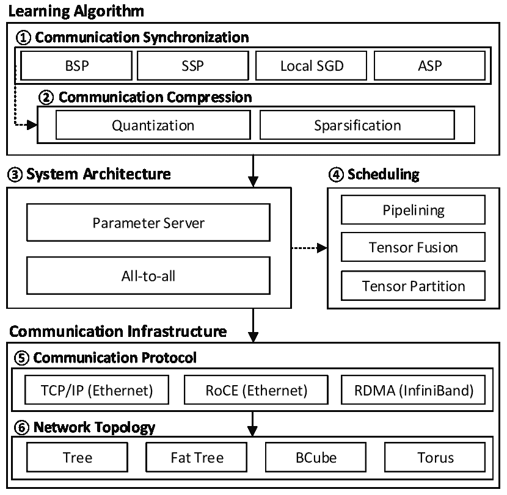

<!--yml

分类：未分类

日期：2024-09-06 20:01:05

-->

# [2005.13247] 分布式深度学习中的通信优化定量调查

> 来源：[`ar5iv.labs.arxiv.org/html/2005.13247`](https://ar5iv.labs.arxiv.org/html/2005.13247)

# 分布式深度学习中的通信优化定量调查

Shaohuai Shi、Zhenheng Tang、Xiaowen Chu1、Chengjian Liu、Wei Wang 和 Bo Li *通讯作者。Shaohuai Shi、Wei Wang 和 Bo Li 来自香港科技大学计算机科学与工程系。Zhenheng Tang 和 Xiaowen Chu 来自香港浸会大学计算机科学系。Chengjian Liu 来自深圳技术大学大数据与互联网学院。*

###### 摘要

目前，大型和复杂的深度学习（DL）模型越来越多地在多个工作机器上以分布式方式进行训练，其中工人之间的广泛通信带来了严重的扩展问题。在这篇文章中，我们提供了对数据并行分布式深度学习通信优化技术的定量调查。我们首先识别主要的通信挑战，并将现有解决方案分为三个层次，即学习算法、系统架构和网络基础设施。我们介绍了最先进的通信优化技术，并在一个 32-GPU 集群上进行了一项关于七种常见无损分布式深度学习方法的比较研究，该集群配备了 100Gbps InfiniBand (IB)。我们展示了（1）即使在 100Gbps IB 上使用最佳可用无损算法，模型强度较低的 DL 模型（例如 BERT 和 BERT-Large）仍然难以扩展；（2）系统架构和调度算法对扩展特性有重要影响。我们以对进一步研究的开放问题进行讨论作为结尾。

## 1 引言

深度学习（DL）的显著技术进步使得众多实际的人工智能应用成为可能，涵盖了从计算机视觉到自然语言处理再到机器人技术的各个领域。在一个典型的深度学习工作流程中，深度神经网络模型被训练以解决一个学习问题（例如，图像分类）在标记数据集上；训练后的模型可以用来对新的输入进行推断（例如，预测图像标签）。流行的深度学习训练算法包括标准的小批量随机梯度下降（SGD）及其变种。这些算法通过不断更新模型参数来最小化预定义的损失函数，更新过程是通过从训练集中采样一个小批量数据来计算随机梯度完成的。

根据 OpenAI 的一项最新研究，自 2012 年以来，深度学习训练所需的计算复杂度每 3.4 个月翻一番，超出了摩尔定律。随着训练数据和深度学习模型的指数级增长（例如，BDD100K 自动驾驶数据集有 1.2 亿张图像，而 BERT-xlarge 语言模型拥有超过 10 亿个参数），在单个 GPU 或 TPU 设备上训练深度模型会导致极其漫长的时间。一个常见的做法是将深度学习训练并行化到多个处理器¹¹1 在本文中，工人和处理器可以互换使用。上，以协同更新模型参数。然而，这种分布式训练需要处理器之间的迭代通信，造成了严重的性能瓶颈，因为设备互连的改进远远落后于 AI 处理器计算能力的迅猛增长。结果是系统可扩展性受限，正如 Amdahl 定律所建议的。因此，如何解决分布式深度学习中的通信瓶颈近年来引起了学术界和工业界的广泛关注。

模型并行和数据并行是使多个处理器协同训练单个模型的两种主要并行化方案[1]。模型并行将模型参数集合拆分并分配到所有处理器，但由于不同神经元之间的高度依赖性以及深度模型中不平衡的参数大小，使得模型并行难以扩展。另一方面，数据并行则将不同数据样本的计算负载分配给共享相同模型参数的不同处理器。与模型并行相比，由于其改进的可扩展性和更简单的实现，数据并行更具吸引力。在本文中，我们主要关注数据并行。

图 1(a) 展示了分布式 DL 中数据并行的流行同步 SGD 算法，其收敛性能（以迭代次数为标准）与单个工作节点上的 SGD 相同。在这种方法中，工作节点加载不同的数据样本来独立计算梯度；所有梯度被聚合以更新模型参数。数据并行同步 SGD 可以用有向无环图（DAG）来建模，如图 1(b) 所示。梯度的反向传播计算从最后一层到第一层（用 $b_{P-1},...,b_{1},b_{0}$ 表示），分布式梯度在进入下一次迭代的前向计算（用 $f_{0},f_{1},...,f_{P-1}$ 表示）之前应该被聚合（用 $c_{P-1},...,c_{1},c_{0}$ 表示）。分布式同步 SGD 也被称为大批量同步并行（BSP）SGD，因为它要求在每次迭代中进行通信和同步。梯度可以通过一个或多个专用参数服务器（PS）[2] 或通过全对全（A2A）通信 [3] 进行聚合。

(a) 数据并行

(b) DAG 示例

图 1：分布式 DL 的数据并行。

最近提出了许多工作来改进分布式深度学习（DL）的可扩展性。在本文中，我们制定了一个分类法来描述分布式 DL 中的通信高效技术，并对 BSP 风格训练算法的通信优化技术进行了定量调查。我们确定了模型强度和批量大小是影响系统可扩展性的两个关键因素，并进行了定量研究，以比较在 32-GPU 集群和 100Gbps IB 下的七种最先进的分布式训练方法。我们的评估方法和结果可以为从业者设计他们的分布式 DL 平台提供参考²²2 我们的源代码可以在 https://github.com/HKBU-HPML/ddl-benchmarks. 上公开获取。通过这项研究，我们的主要观察结果如下：

+   •

    模型强度低且批量大小小（因此通信与计算比率高）的模型难以扩展。

+   •

    去中心化的 A2A 架构对延迟更敏感，而中心化的 PS 架构需要额外的服务器和网络端口才能实现良好的性能。

+   •

    调度算法可以用于隐藏 PS 和 A2A 架构中的通信成本。特别地，张量融合适用于 A2A，而张量分区更适用于 PS。

本文的其余部分组织如下。我们首先识别分布式深度学习中的通信问题和现有解决方案。然后详细说明常用的通信优化技术，接着是我们的实验研究。最后，我们讨论挑战和可能的未来研究方向。

## 2 通信问题与解决方案

### 2.1 范围、假设和术语

在本文中，我们主要讨论数据并行分布式深度学习中的通信问题，重点关注网络速度高且稳定的数据中心或高性能计算环境。

在典型的数据并行分布式深度学习（例如 BSP-SGD）中，每次训练迭代包括几个步骤。首先，每个工作节点加载一个小批量的数据作为输入，并进行前向计算以计算与相应标签的损失值。接下来，每个工作节点进行反向传播以计算模型参数的一阶梯度。所有工作节点的本地梯度被聚合，最终使用平均梯度来更新模型参数。算法进入下一次迭代，直到满足某个收敛条件。在本文中，我们假设数据 I/O 可以与计算重叠，因此不考虑数据 I/O 时间。

考虑一个具有 $D$ 个参数的深度模型训练任务，使用小批量大小为 $M$ 的 SGD。假设每次训练迭代中每个数据样本所需的算术操作数量为 $C$。一个拥有 $N$ 个工作节点的数据并行解决方案将把 $MC$ 个算术操作分配到 $N$ 个工作节点（例如，每个工作节点的本地小批量大小为 $M/N$）。在通信任务与计算任务不重叠的最简单情况下，$N$ 个工作节点实现的加速比为 $\frac{t_{s}}{t_{s}/N+t_{m}}$，其中 $t_{s}$ 是单个工作节点的计算时间，$t_{m}$ 是 $N$ 个工作节点分布式训练的通信时间。随着 $N$ 的增大，加速比接近 $t_{s}/t_{m}$，这解释了通信优化在分布式深度学习中的重要性。为了消除计算速度和通信速度对加速比分析的影响，我们定义了分布式训练任务的通信到计算（C2C）比率，即通信流量总量除以计算总量。由于通信任务和计算任务之间的依赖关系（见图 1(b)），C2C 比率是影响系统可扩展性的关键因素。

实际上，总通信流量与模型大小$D$成线性比例，还依赖于工作节点的数量$N$。因此，我们可以使用$D\cdot f(N)$来建模通信量³³3 为了简单起见，通信的单位是一个模型参数或梯度的大小。但实际上，模型参数的大小可能与梯度的大小不同。这里的$f(N)$取决于通信方案。然后，C2C 比率可以通过$\frac{D\cdot f(N)}{M\cdot C}$计算。我们定义模型强度为$I=\frac{C}{D}$，它是每次迭代中每个数据样本每个模型参数的平均算术运算次数。这里的$I$是模型的内在特征，捕捉了并行性的难度。然后，C2C 比率可以简化为$\frac{f(N)}{M\cdot I}$。我们在第四部分中的实验结果验证了低强度$I$和/或小批量大小$M$的模型很难扩展。为了降低给定深度学习模型的 C2C 比率，我们需要设计具有小$f(N)$的良好通信方案，并选择较大的批量大小$M$。

### 2.2 通信问题

我们以 BERT-Large 语言模型（具有 3.36 亿个参数）为例来说明分布式训练中的通信挑战。给定一个本地批量大小为 8（受限于可用 GPU 内存大小），每次迭代需要$597\times 10^{9}$次浮点运算（FLOPs），在 Nvidia RTX2080Ti 上需要 163ms。存在一些通信挑战限制了分布式训练系统的可扩展性。

通信大小：在每次训练迭代中，所有的模型参数或其梯度需要在所有工作节点之间交换。如果参数以 32 位格式存储，则 BERT-Large 模型的大小为 1.34GB。考虑到$N$个工作节点，在短时间内找到$N$组数据的平均值并同步更新后的模型是非常具有挑战性的。例如，当在连接通过 PCIe 3.0 的 4 个 RTX2080Ti 的服务器上训练 BERT-Large 时，每次迭代需要 441ms 的通信时间进行全归约操作，导致了$1.08\times$的较差加速。

通信性能：深度模型具有分层结构，参数及其对应的梯度通常存储为数十到数百个张量。首先，这些张量在运算中逐层计算，从而产生内在的时间依赖性，限制了调度计算和通信任务设计空间。其次，张量的大小范围从千字节到兆字节不等。在交换小消息时，很难充分利用高网络带宽[3]。例如，在我们的测试环境中，通过 10GbE（TCP/IP）、100GbE（TCP/IP）和 100GbIB（RDMA）传输 1MB 的消息，分别实现了有效吞吐量为 8.2Gbps、16.5Gbps 和 83.2Gbps；而在 10GbE、100GbE 和 100GbIB 之间传输较小的 16KB 消息时，只能实现较低的吞吐量，分别为 1.2Gbps、4.6Gbps 和 16.7Gbps。在一组工作者之间优化地交换各种张量，需要同时考虑带宽和通信延迟的消息交换算法和网络系统架构的联合设计。

图 2：通信高效的分布式深度学习的三级分类法。

### 2.3 解决方案

为了解决上述挑战，已经采取了三个不同的方向：1）减小 C2C 比率，2）将通信任务与计算任务重叠，3）通过先进的系统架构和通信原语的设计来改进通信性能。在图 2 中，我们制定了一个三级分类法来描述通信高效的分布式深度学习。

#### 2.3.1 学习算法

在顶层是具有不同通信复杂度的高级学习算法（旨在减小 C2C 比率），可分为两种类型：1）增加计算的工作量（例如，大批量训练[4））和 2）通过量化和/或稀疏化减少通信复杂度。这些算法通常是有损的，因为它们产生与单工作者随机梯度下降不一致的结果。有损算法可能需要更多的迭代才能达到相同的收敛水平，尽管每次迭代完成得更快。

大批量训练是通过增大批量大小来减小 C2C 比率的一种直接方法。通过适当的优化技巧（例如，分层自适应率缩放），大批量训练可以保持与单工作者随机梯度下降相同的泛化能力。然而，本地批量大小受 AI 处理器内存大小的限制。

我们还可以放宽同步要求或减少工作节点之间的通信频率（例如，过时的同步并行（SSP）[5]、局部 SGD [4] 和异步并行（ASP）[6] SGD）。SSP SGD 允许某些工作节点在同步之前运行更多的迭代，这在不同计算能力的工作节点的异质环境中是高效的。局部 SGD 允许所有工作节点在同步之前独立运行特定数量的本地更新。ASP SGD 使所有工作节点可以在不等待其他工作节点更新模型参数的情况下训练模型。压缩技术如梯度量化 [7] 和稀疏化 [8] 也是一种有损算法的线程。梯度量化将每个梯度量化为几个比特，对收敛影响很小，而梯度稀疏化则选择一小部分梯度用于模型更新。

#### 2.3.2 系统架构

中间层是定义工作节点如何交换信息的系统架构。参数服务器（PS）（例如，[2]）和全对全（A2A）（例如，[3]）是两种最流行的系统架构，它们可以配备不同的通信调度算法，这些算法可以重叠通信与计算，或通过张量融合/分区来提高通信性能。PS 是一种集中式架构，需要一个或多个中央服务器来管理模型参数，而 A2A 是一种分散式架构，利用消息传递接口（MPI）或类似技术来执行数据通信任务。这一层的优化技术通常是无损的，因为它们不会改变学习算法的训练结果。

#### 2.3.3 通信基础设施

在最底层，有多种通信基础设施提供基本的数据通信服务，包括通信协议和网络拓扑。在这一层的优化技术通常是无损的。

流行的通信协议有 TCP/IP、InfiniBand 上的 RDMA 和 RoCE。TCP/IP 被商品以太网交换机广泛支持。然而，由于内核缓冲区和应用程序缓冲区之间的数据拷贝成本，它在高速数据通信中效率较低。RDMA 能提供比 TCP/IP 更低的延迟和更高的吞吐量 [9]。RDMA 最初在 InfiniBand 上运行，而 RoCE（通过以太网的 RDMA）使得更便宜的以太网能够支持 RDMA。网络拓扑设计对于提高分布式深度学习的性能也很重要。例如，王等人 [10] 显示 BCube 比 Fat-tree 更适合用于分布式深度学习。

总结来说，分布式训练方法可能涉及六个不同方面：<svg height="13.74" overflow="visible" version="1.1" width="13.74"><g transform="translate(0,13.74) matrix(1 0 0 -1 0 0) translate(6.87,0) translate(0,6.87)" fill="#000000" stroke="#000000" stroke-width="0.4pt"><g transform="matrix(1.0 0.0 0.0 1.0 -3.46 -4.46)" fill="#000000" stroke="#000000"><foreignobject width="6.92" height="8.92" transform="matrix(1 0 0 -1 0 16.6)" overflow="visible">1</foreignobject></g></g></svg> 通信同步，<svg height="13.74" overflow="visible" version="1.1" width="13.74"><g transform="translate(0,13.74) matrix(1 0 0 -1 0 0) translate(6.87,0) translate(0,6.87)" fill="#000000" stroke="#000000" stroke-width="0.4pt"><g transform="matrix(1.0 0.0 0.0 1.0 -3.46 -4.46)" fill="#000000" stroke="#000000"><foreignobject width="6.92" height="8.92" transform="matrix(1 0 0 -1 0 16.6)" overflow="visible">2</foreignobject></g></g></svg> 通信压缩，<svg height="13.74" overflow="visible" version="1.1" width="13.74"><g transform="translate(0,13.74) matrix(1 0 0 -1 0 0) translate(6.87,0) translate(0,6.87)" fill="#000000" stroke="#000000" stroke-width="0.4pt"><g transform="matrix(1.0 0.0 0.0 1.0 -3.46 -4.46)" fill="#000000" stroke="#000000"><foreignobject width="6.92" height="8.92" transform="matrix(1 0 0 -1 0 16.6)" overflow="visible">3</foreignobject></g></g></svg> 系统架构，<svg height="13.74" overflow="visible" version="1.1" width="13.74"><g transform="translate(0,13.74) matrix(1 0 0 -1 0 0) translate(6.87,0) translate(0,6.87)" fill="#000000" stroke="#000000" stroke-width="0.4pt"><g transform="matrix(1.0 0.0 0.0 1.0 -3.46 -4.46)" fill="#000000" stroke="#000000"><foreignobject width="6.92" height="8.92" transform="matrix(1 0 0 -1 0 16.6)" overflow="visible">4</foreignobject></g></g></svg> 调度，<svg height="13.74" overflow="visible" version="1.1" width="13.74"><g transform="translate(0,13.74) matrix(1 0 0 -1 0 0) translate(6.87,0) translate(0,6.87)" fill="#000000" stroke="#000000" stroke-width="0.4pt"><g transform="matrix(1.0 0.0 0.0 1.0 -3.46 -4.46)" fill="#000000" stroke="#000000"><foreignobject width="6.92" height="8.92" transform="matrix(1 0 0 -1 0 16.6)" overflow="visible">5</foreignobject></g></g></svg> 通信协议，以及 <svg height="13.74" overflow="visible" version="1.1" width="13.74"><g transform="translate(0,13.74) matrix(1 0 0 -1 0 0) translate(6.87,0) translate(0,6.87)" fill="#000000" stroke="#000000" stroke-width="0.4pt"><g transform="matrix(1.0 0.0 0.0 1.0 -3.46 -4.46)" fill="#000000" stroke="#000000"><foreignobject width="6.92" height="8.92" transform="matrix(1 0 0 -1 0 16.6)" overflow="visible">6</foreignobject></g></g></svg> 网络拓扑。这可以描述为“它利用 <svg height="13.74" overflow="visible" version="1.1" width="13.74"><g transform="translate(0,13.74) matrix(1 0 0 -1 0 0) translate(6.87,0) translate(0,6.87)" fill="#000000" stroke="#000000" stroke-width="0.4pt"><g transform="matrix(1.0 0.0 0.0 1.0 -3.46 -4.46)" fill="#000000" stroke="#000000"><foreignobject width="6.92" height="8.92" transform="matrix(1 0 0 -1 0 16.6)" overflow="visible">1</foreignobject></g></g></svg> 有/没有 <svg height="13.74" overflow="visible" version="1.1" width="13.74"><g transform="translate(0,13.74) matrix(1 0 0 -1 0 0) translate(6.87,0) translate(0,6.87)" fill="#000000" stroke="#000000" stroke-width="0.4pt"><g transform="matrix(1.0 0.0 0.0 1.0 -3.46 -4.46)" fill="#000000" stroke="#000000"><foreignobject width="6.92" height="8.92" transform="matrix(1 0 0 -1 0 16.6)" overflow="visible">2</foreignobject></g></g></svg>，在 <svg height="13.74" overflow="visible" version="1.1" width="13.74"><g transform="translate(0,13.74) matrix(1 0 0 -1 0 0) translate(6.87,0) translate(0,6.87)" fill="#000000" stroke="#000000" stroke-width="0.4pt"><g transform="matrix(1.0 0.0 0.0 1.0 -3.46 -4.46)" fill="#000000" stroke="#000000"><foreignobject width="6.92" height="8.92" transform="matrix(1 0 0 -1 0 16.6)" overflow="visible">3</foreignobject></g></g></svg> 上运行，或有/没有 <svg height="13.74" overflow="visible" version="1.1" width="13.74"><g transform="translate(0,13.74) matrix(1 0 0 -1 0 0) translate(6.87,0) translate(0,6.87)" fill="#000000" stroke="#000000" stroke-width="0.4pt"><g transform="matrix(1.0 0.0 0.0 1.0 -3.46 -4.46)" fill="#000000" stroke="#000000"><foreignobject width="6.92" height="8.92" transform="matrix(1 0 0 -1 0 16.6)" overflow="visible">4</foreignobject></g></g></svg>，在 <svg height="13.74" overflow="visible" version="1.1" width="13.74"><g transform="translate(0,13.74) matrix(1 0 0 -1 0 0) translate(6.87,0) translate(0,6.87)" fill="#000000" stroke="#000000" stroke-width="0.4pt"><g transform="matrix(1.0 0.0 0.0 1.0 -3.46 -4.46)" fill="#000000" stroke="#000000"><foreignobject width="6.92" height="8.92" transform="matrix(1 0 0 -1 0 16.6)" overflow="visible">5</foreignobject></g></g></svg> 和 <svg height="13.74" overflow="visible" version="1.1" width="13.74"><g transform="translate(0,13.74) matrix(1 0 0 -1 0 0) translate(6.87,0) translate(0,6.87)" fill="#000000" stroke="#000000" stroke-width="0.4pt"><g transform="matrix(1.0 0.0 0.0 1.0 -3.46 -4.46)" fill="#000000" stroke="#000000"><foreignobject

## 3 一个流行的通信优化组合

图 3：分布式深度学习中的通信优化组合。

在本节中，我们重点讨论系统架构设计和调度算法中的通信优化技术。这些技术是无损的，使它们对于行业从业者特别具有吸引力，因为模型准确性对许多 AI 应用来说是最重要的。图 3 展示了通信优化技术的示意图。

### 3.1 系统架构

PS 和 A2A 代表了两种不同的设计理念，它们具有不同的通信特性。

#### 3.1.1 参数服务器（PS）

在 PS 架构中，PS 在逻辑上是一个中央服务器，聚合来自工作节点的梯度，更新模型参数，并将最新模型发送回工作节点。它为系统实现提供了一个简单而灵活的框架。然而，由于 PS 需要接收来自所有工作节点的梯度，并将参数（或平均梯度）发送到所有工作节点，它可能很容易成为 BSP 算法中的系统瓶颈，其中所有工作节点几乎同时与 PS 进行通信。使用单个 PS 时，每个工作节点的通信流量为$2D$，PS 的通信流量为$2ND$。为了缓解单个 PS 的通信压力，可以部署多个 PS。

在这里我们介绍一个代表性的 PS 实现，称为 BytePS⁴⁴4https://github.com/bytedance/byteps，这是一个高度优化的框架，通过均衡负载的方式对梯度张量进行分区，支持多个 PS。给定$S$个 PS，$D$维梯度被划分为$D/S$部分，以便每个 PS 从$N$个工作节点接收$ND/S$个梯度。接收到的$N$个梯度张量在服务器端进行平均，并返回给所有$N$个工作节点。因此，每个 PS 的通信流量减少到$2ND/S$。

#### 3.1.2 全到全（A2A）

可以通过 A2A 操作计算分布式梯度或参数张量的平均值，例如 MPI 中的 all-reduce 原语。在分布式深度学习中，环形 all-reduce 集合是常用的，它通过将张量划分为小消息并以流水线方式同时交换这些消息来达到带宽最优。然而，基于环的 all-reduce 有一个与工作节点数量成线性关系的延迟项，这在大型集群中会变得低效。在高性能通信库（NCCL⁵⁵5https://developer.nvidia.com/nccl）中，双二叉树算法[11]被集成用于密集型 GPU 集群，这在保持带宽最优性的同时提供对数级延迟。对于一些带宽不平衡的网络系统，使用通信带宽的层次结构可以进一步提高通信效率[12]。

Horovod⁶⁶6https://github.com/horovod/horovod 是一个流行的分布式深度学习框架，构建于 A2A 架构，并支持许多先进的分布式通信库（例如，MPI、NCCL 和 Gloo⁷⁷7https://github.com/facebookincubator/gloo）。

### 3.2 调度

在分布式深度学习的训练过程中，计算和通信任务可以用 DAG 来描述。深度模型的层级（或张量级）结构使得可以智能地调度不同的任务，从而隐藏部分通信开销，如图 3 <svg height="13.74" overflow="visible" version="1.1" width="13.74"><g transform="translate(0,13.74) matrix(1 0 0 -1 0 0) translate(6.87,0) translate(0,6.87)" fill="#000000" stroke="#000000" stroke-width="0.4pt"><g transform="matrix(1.0 0.0 0.0 1.0 -3.46 -4.46)" fill="#000000" stroke="#000000"><foreignobject width="6.92" height="8.92" transform="matrix(1 0 0 -1 0 16.6)" overflow="visible">4</foreignobject></g></g></svg> 所示。

#### 3.2.1 层级流水线和张量融合

深度模型由一系列层组成，每层的可学习参数通常由一个或两个张量表示。在反向传播过程中，如果层 $P$ 的梯度已经计算完成，则可以立即进行通信，从而使通信任务与层 $P-1$ 的计算任务进行流水线处理。反向传播过程中通信和计算之间的简单流水线也称为无等待反向传播（WFBP） [13]，这种方法可以应用于 PS 和 A2A 架构。

在带有流水线的 A2A 中，每个张量需要进行全归约操作，这通常将张量划分为多个小消息。考虑到同时传输两个小消息通常比分别传输两个消息更快（例如，在我们的 100Gbps InfiniBand 集群中，传输一个 16KiB 的消息需要 7.85 微秒，而传输一个 32KiB 的消息需要 10.1 微秒），MG-WFBP 算法通过最优地合并几个连续层的梯度来实现张量融合，以最小化迭代时间 [3]。张量融合可以有效缓解传输小消息带来的负面影响。

#### 3.2.2 张量划分和优先级调度

在 PS 架构中，通信发生在工作节点和 PS 之间，张量可以作为单一消息传输，使得张量融合的效果不如 A2A。除了流水线处理外，优先级调度提供了另一种性能提升的机会。在 PS 中，有两个通信方向：梯度推送和参数拉取。对于每一层，参数拉取通常紧随梯度推送。如果当前层的张量很大，它会阻塞其他小张量的层。ByteScheduler [14]是一种高效的调度策略，它将大张量划分为多个较小的张量，并允许较低层先于较高层进行调度。通过优先级调度，可以将通信任务与前向传播和反向传播计算任务重叠 [15, 14]。

## 4 比较研究

为了展示第三部分中提出的优化组合的关键因素，我们评估并比较了表 I 中列出的七种具有代表性的分布式训练方法，这些方法在实践中广泛使用，是定量研究不同优化技术的良好示例。BSP-PS 和 BSP-A2A 是没有特殊优化的基线情况，用于比较 PS 和 A2A 的效率。WFBP-PS 和 WFBP-A2A 采用 WFBP 调度，评估 WFBP 在不同架构上的有效性。MG-WFBP 使用张量融合解决 WFBP-A2A 的延迟问题。ByteScheduler-PS 和 ByteScheduler-A2A 在 PS 和 A2A 架构下分别采用流水线和张量划分，可以展示张量划分的性能。

我们选择了三个具有代表性的深度模型进行评估，即 ResNet-50、BERT-Base 和 BERT-Large，这些模型通常用于图像分类和自然语言处理。它们的模型强度分别为 470、249 和 248。在 RTX2080Ti 上，ResNet-50 和 BERT-Base 支持本地批量大小为 64，而 BERT-Large 只能支持 8。 这三个模型可以很好地说明模型强度和批量大小对系统可扩展性的影响。

表 I：评估的实验设置。对于 BytePS，按照官方发布的建议，我们使用的 PS 数量与工作服务器的数量相同。每个工作服务器有多个工作节点（即 GPU）。

| 方法 | 系统架构 | 调度 | 分布式软件 | 常用库 |
| --- | --- | --- | --- | --- |
| PS/全到全 | 流水线 | 张量融合 | 张量划分 |
| BSP-PS [13] | PS | ✘ | ✘ | ✘ | BytePS | PyTorch-1.4 CUDA-10.1 NCCL-2.4.8 |
| BSP-A2A [3, 11] | 全到全 | ✘ | ✘ | ✘ | Horovod |
| WFBP-PS [13] | PS | ✔ | ✘ | ✘ | BytePS |
| WFBP-A2A [3, 11] | 全到全 | ✔ | ✘ | ✘ | Horovod |
| MG-WFBP [3] | 全到全 | ✔ | ✔ | ✘ | Horovod |
| ByteScheduler-PS [14] | PS | ✔ | ✘ | ✔ | BytePS |
| ByteScheduler-A2A [14] | 全到全 | ✔ | ✘ | ✔ | Horovod |

### 4.1 实验设置

硬件: 我们在一个 GPU 集群上进行实验，该集群通过 100Gbps IB 的 RDMA 连接。该集群由 8 个节点（或工作服务器）组成。每个节点配有四个 Nvidia RTX2080Ti GPU（11GB RAM），通过 PCIe3.0 x16 互联，两个 Intel(R) Xeon(R) Gold 6230 CPU 和 512GB 内存。

软件: 我们使用 PyTorch-1.4⁸⁸8https://pytorch.org/ 作为核心框架，配备 CUDA-10.1、cuDNN-7.6 和 NCCL-2.4.8 的 GPU 库。我们分别使用高度优化的 BytePS 和 Horovod 库来支持 PS 和 A2A 架构。

测量: 我们使用系统吞吐量（即每秒样本数）作为处理数据样本的性能评估指标。对于 ResNet-50，一个样本是分辨率为 $224\times 224\times 3$ 的图像；对于 BERT-Base 和 BERT-Large，一个样本是长度为 $64$ 个单词的句子。我们使用单 RTX2080Ti 的 SGD 训练作为基准来计算加速比。注意，在比较不同工作节点的结果时，它们具有不同的有效批次大小，其收敛性可能不同。

### 4.2 实验结果

(a) ResNet-50 ($I$ = 470, $LBS$ = 64)

(b) BERT-Base ($I$ = 249, $LBS$ = 64)

(c) BERT-Large ($I$ = 248, $LBS$ = 8)

图 4: 系统吞吐量比较。$I$: 模型强度。$LBS$: 本地批次大小。条形图顶部的数字是七种评估方法中相对于单 GPU SGD 算法的最佳加速比。

图 4 展示了实验结果，这些结果是五次独立实验的平均值。对于每次实验，我们进行 10 次训练迭代以进行热身，再进行 100 次迭代以测量平均吞吐量。我们在表 II 中总结了主要发现。

表 II: 实验结果的主要发现。

| 部分 | 相关因素 | 主要发现 |
| --- | --- | --- |
| 4.2.1 | 模型强度和 | 1) 模型强度较高的模型更容易进行并行化。 |
|  | 批量大小 | 2) 增加批量大小以减少 C2C 比率使得并行化更容易，但最大本地批量大小 |
|  |  | 批量大小受限于 GPU 内存。 |
| 4.2.2 | PS 与 A2A | 3) 在 PS 和 A2A 中没有单一的赢家。两者在增强时都能实现可比的性能。 |
|  |  | 使用不同的优化算法。但 PS 需要额外的服务器和网络交换端口。 |
|  |  | 与 A2A 竞争。 |
| 4.2.3 | 调度 | 4) 等待无关反向传播（WFBP）通常可以隐藏一些通信成本。调度是 |
|  |  | 当通信时间与每个工作节点的计算时间相当时，效果显著。 |
|  |  | 5) 张量融合（例如，MG-WFBP）适用于 A2A，因为它解决了传输小消息的低效问题。 |
|  |  | A2A 中的小消息。 |
|  |  | 6) 张量分割（例如，ByteScheduler）适用于 PS，这使得通信效果更佳。 |
|  |  | 与计算重叠。 |

#### 4.2.1 模型强度和批量大小的影响

ResNet-50 与 BERT-Base：由于 ResNet-50 的模型强度约为 BERT-Base 的两倍，并且它们的本地批量大小都是 64，ResNet-50 的 C2C 比率约为 BERT-Base 的一半。比较图 4(a) 与图 4(b)，我们可以看到 ResNet-50 的扩展性远优于 BERT-Base。例如，在使用 4 个 GPU 的节点内训练中，ResNet-50 实现了 $4\times$ 的最佳加速，而 BERT-Base 只有 $3.1\times$；使用 32 个 GPU 时，ResNet-50 的加速比为 $31.6\times$，而 BERT-Base 只有 $23.2\times$。结果确认了强度更高的模型更容易并行化。 |

BERT-Base 与 BERT-Large：BERT-Base 和 BERT-Large 的模型强度非常接近，但由于 BERT-Base 的 GPU 内存占用较小，其本地批量大小比 BERT-Large 大$8\times$。因此，BERT-Large 的 C2C 比率约为 BERT-Base 的$8\times$，这使得 BERT-Large 的并行化难度大大增加，这一点从图 4(c)与图 4(b)的比较中可以确认。BERT-Large 的较小加速主要由于小批量大小和 PCIe3.0 的带宽限制。例如，BERT-Large 的 4-GPU 训练最大加速为$1.2\times$，而 BERT-Base 为$3.1\times$。RTX2080Ti 的较小 GPU 内存和 PCIe3.0 的带宽限制不适合 BERT-Large 的分布式训练。作为对比，当在一个更昂贵的服务器上训练 BERT-Large，该服务器配有四个 Nvidia V100 GPU（32GB 内存），并通过 NVLink（带宽比 PCIe3.0 高出$10\times$）互连，本地批量大小可以达到 128，我们获得了$3.82\times$的加速。

#### 4.2.2 系统架构：PS 与 A2A

众所周知，单个 PS 的 PS 架构扩展性较差。在我们的 PS 架构评估中，我们使用相同数量的 PS 和工作服务器 [14]。注意，在这种设置下，PS 架构消耗的网络交换机端口和总网络带宽都比 A2A 要多。

关于没有管道化的 BSP-PS 和 BSP-A2A，BSP-A2A 在所有情况下都优于 BSP-PS。然而，当利用 WFBP [13]将通信与计算进行管道化时，WFBP-PS 优于 WFBP-A2A，特别是在 32 个工作节点上。这是因为 A2A 架构有一个不可忽略的延迟项，该延迟与使用树形/环形算法的工作节点数量呈对数/线性关系，而 WFBP 需要梯度按张量聚合，这导致了明显的启动开销 [3]。张量融合技术 [3] 可以很好地解决这个启动问题。正如我们从图 4 中观察到的，MG-WFBP 在 BERT-Base（除了 8 个工作节点的情况）和 BERT-Large 上实现了最佳加速。但对于模型强度较高的 ResNet-50，ByteScheduler-PS 的性能略优于 MG-WFBP。总之，PS 和 A2A 之间没有明确的胜者。当配备适当的优化技术时，两种架构都能实现相当的性能。然而，PS 需要额外的服务器和交换机端口才能在竞争中保持领先。

#### 4.2.3 调度

调度的思想是将通信任务与计算任务重叠。关于 WFBP 算法，在大多数情况下，WFBP-PS 和 WFBP-A2A 的运行速度均快于 BSP-PS 和 BSP-A2A。但 WFBP-A2A 有时会受到启动延迟问题的影响，因为需要传输许多小消息，例如在 32 个工作节点下的 BERT-Base 和 BERT-Large。MG-WFBP 显著提高了 WFBP-A2A 的可扩展性，特别是在大量工作节点的情况下。ByteScheduler-A2A 通过分割张量而不是合并张量来将通信调度在 MG-WFBP 的相反方向，其性能并不非常理想。然而，使用 PS 架构时，ByteScheduler-PS 在 ResNet-50 中略微优于 WFBP-PS。这表明，在不增加额外的延迟的情况下，通过分割张量的通信可以更好地调度与反向传播和前向计算重叠[14]。总之，调度算法可以通过隐藏通信开销来提高系统的可扩展性。然而，当通信时间主导训练时间时（例如 BERT-Large），总体加速效果会受到限制，我们需要要么提高网络速度，要么考虑有损算法。

## 5 挑战与未来方向

尽管已经提出了许多技术来解决分布式深度学习中的通信问题，但仍然存在一些技术挑战待解答。

### 5.1 通信压缩

随着模型规模的增加，通信成本也会增长，这可能导致非常高的 C2C 比率。在系统架构设计和调度中的无损优化算法只能实现边际改进，因为通信成本主导了训练时间。通信压缩技术在这种情况下将非常有用，可以显著减少通信流量。主要挑战是如何在保持收敛性能的同时维护模型准确性。现有方法已经证明，通信压缩可以实现与普通 SGD 相同的渐进收敛速度。然而在实践中，具有非常高压缩比的情况通常需要更多的迭代才能达到目标损失值。一种可能的方向是为不同层设置不同的压缩比，以最大化交换信息。另一种可能性是在不同训练迭代中动态设置适当的压缩比。

### 5.2 自动选择系统架构

PS 和 A2A 架构在工业界和学术界广泛应用于 BSP 算法。直观上，A2A 架构比 PS 更高效，因为它不需要中央服务器；但 A2A 对延迟的敏感性比 PS 更高。此外，可以使用多个 PS 来减少中央服务器的网络负担。更不确定的是，在不同的硬件配置、模型属性和调度算法下，没有一种解决方案在所有情况下始终最佳。一个有趣但具有挑战性的问题是根据训练环境（例如，GPU 数量、网络拓扑、链路带宽和延迟、模型属性等）为 PS 和 A2A 构建数学性能模型，以便为训练目标模型选择更好的架构。

### 5.3 通用调度

根据分布式深度学习的特点，各种调度算法尝试最大化计算任务和通信任务的并行性。然而，这些算法是基于具有三种任务类型（即前向传播、反向传播和梯度通信）的 BSP 有向无环图（DAG）。如果通信时间远长于计算时间，调度算法仅能带来微小的改进。尽管通信压缩可以减少通信成本，但当前的调度方法不适用于具有梯度压缩的 BSP，因为压缩引入了额外的不可忽视的计算成本和较小的通信流量，这使得调度更加困难。一个可能的解决方案是为配置的 DAG 设计一个通用调度器。由于张量分割或融合，DAG 会发生变化。对于配置的 DAG，调度器可以使用一些启发式算法来搜索性能更好的配置。此外，目前的调度技术如 MG-WFBP [3]和 ByteScheduler [14]在调度上采取了两种相反的方向（即张量融合和张量分割）。在实际应用中，没有哪一种始终优越。一个智能调度器应当能够适应训练环境，并动态确定是否应该合并或分割张量，以实现更高的性能。

## 6 结论

在这篇文章中，我们概述了应对分布式深度学习通信挑战的技术。我们首先分析了深度学习模型分布式训练中的通信问题，然后展示了现有前沿技术的分类法和调研。我们特别关注了常用的无损方法，并根据实际实验对这些方法进行了定量分析。最后，我们讨论了该领域的挑战和未来可能的研究方向。

## 致谢

这项研究部分得到了香港 RGC GRF 资助（合同号 HKBU 12200418，HKUST 16206417 和 16207818），以及中国国家自然科学基金资助（资助号 62002240）。

## 参考文献

+   [1] J. Dean, G. Corrado, R. Monga, K. Chen, M. Devin, M. Mao, M. Ranzato, A. Senior, P. Tucker, K. Yang *等人*，“大规模分布式深度网络”，收录于 *《神经信息处理系统进展》*，2012 年，第 1223–1231 页。

+   [2] C. Chen, W. Wang, 和 B. Li，“轮询同步：缓解参数服务器中的通信瓶颈”，收录于 *IEEE INFOCOM 2019-IEEE 计算机通信会议*。IEEE，2019 年，第 532–540 页。

+   [3] S. Shi, X. Chu, 和 B. Li，“MG-WFBP：分布式同步 SGD 算法的高效数据通信”，收录于 *IEEE INFOCOM 2019-IEEE 计算机通信会议*。IEEE，2019 年，第 172–180 页。

+   [4] T. Lin, S. U. Stich, K. K. Patel, 和 M. Jaggi，“不要使用大批量，使用本地 SGD”，收录于 *国际学习表征会议*，2020 年。

+   [5] X. Zhao, A. An, J. Liu, 和 B. X. Chen，“深度学习的动态过时同步并行分布式训练”，收录于 *2019 IEEE 第 39 届国际分布式计算系统会议（ICDCS）*。IEEE，2019 年，第 1507–1517 页。

+   [6] B. Recht, C. Re, S. Wright, 和 F. Niu，“Hogwild：一种无锁的并行随机梯度下降方法”，收录于 *《神经信息处理系统进展》*，2011 年，第 693–701 页。

+   [7] J. Bernstein, Y.-X. Wang, K. Azizzadenesheli, 和 A. Anandkumar，“signSGD：非凸问题的压缩优化”，收录于 *国际机器学习大会*，2018 年，第 560–569 页。

+   [8] S. Shi, Q. Wang, K. Zhao, Z. Tang, Y. Wang, X. Huang, 和 X. Chu，“一种具有全局 Top-k 稀疏化的分布式同步 SGD 算法，用于低带宽网络”，收录于 *2019 IEEE 第 39 届国际分布式计算系统会议（ICDCS）*。IEEE，2019 年，第 2238–2247 页。

+   [9] J. Xue, Y. Miao, C. Chen, M. Wu, L. Zhang, 和 L. Zhou，“通过 RDMA 进行快速分布式深度学习”，收录于 *第十四届 EuroSys 会议论文集 2019*，2019 年，第 1–14 页。

+   [10] S. Wang, D. Li, J. Geng, Y. Gu, 和 Y. Cheng，“网络拓扑对 DML 性能的影响：理论分析和实际因素”，收录于 *IEEE INFOCOM 2019-IEEE 计算机通信会议*。IEEE，2019 年，第 1729–1737 页。

+   [11] P. Sanders, J. Speck, 和 J. L. Träff，“用于全带宽广播、归约和扫描的双树算法”，*《并行计算》*，第 35 卷，第 12 期，第 581–594 页，2009 年。

+   [12] M. Cho, U. Finkler, D. S. Kung, 和 H. C. Hunter，“BlueConnect：在异构网络层级上分解全归约以进行深度学习”，收录于 *《2019 年机器学习与系统会议论文集，MLSys 2019，斯坦福，加州，美国，2019 年 3 月 31 日 - 4 月 2 日》*，2019 年。

+   [13] H. Zhang, Z. Zheng, S. Xu, W. Dai, Q. Ho, X. Liang, Z. Hu, J. Wei, P. Xie, 和 E. P. Xing，“Poseidon：一种高效的 GPU 集群分布式深度学习通信架构”，发表于 *2017 年 USENIX 年度技术会议（USENIX ATC 17）*，2017，页码 181–193。

+   [14] Y. Peng, Y. Zhu, Y. Chen, Y. Bao, B. Yi, C. Lan, C. Wu, 和 C. Guo，"用于分布式 DNN 训练加速的通用通信调度器"，发表于 *第 27 届 ACM 操作系统原理研讨会论文集*。ACM，2019，页码 16–29。

+   [15] A. Jayarajan, J. Wei, G. Gibson, A. Fedorova, 和 G. Pekhimenko，“基于优先级的分布式 DNN 训练参数传播”，发表于 *2019 年机器学习与系统会议论文集，MLSys 2019，斯坦福，加州，美国，2019 年 3 月 31 日至 4 月 2 日*，2019。

## 传记

|  | Shaohuai Shi (shaohuais@cse.ust.hk) 2010 年获得华南理工大学软件工程学士学位，2013 年获得哈尔滨工业大学计算机科学硕士学位，2020 年获得香港浸会大学计算机科学博士学位。他目前是香港科技大学计算机科学与工程系的研究助理教授。他的研究兴趣包括 GPU 计算和机器学习系统。他是 IEEE 的会员。 |
| --- | --- |
|  | Zhenheng Tang (zhtang@comp.hkbu.edu.hk) 2018 年获得华中科技大学通信工程学士学位。他是香港浸会大学的博士生。他的研究兴趣包括 GPU 计算和分布式深度学习。 |
|  | Xiaowen Chu (chxw@comp.hkbu.edu.hk) 1999 年获得清华大学计算机科学学士学位，2003 年获得香港科技大学计算机科学博士学位。目前，他是香港浸会大学计算机科学系的全职教授。他的研究兴趣包括并行和分布式计算、云计算和无线网络。他担任 IEEE Access 和 IEEE Internet of Things Journal 的副编辑，是 IEEE 的高级会员。 |
|  | Chengjian Liu (liuchengjian@sztu.edu.cn) 2013 年在深圳大学计算机科学与软件工程学院获得硕士学位，2018 年在香港浸会大学获得计算机科学博士学位。目前，他是深圳技术大学大数据与互联网学院的助理教授。他的研究兴趣包括分布式存储、区块链、通用 GPU 计算。 |
|  | Wei Wang (weiwa@cse.ust.hk) 获得了上海交通大学电气与计算机工程学士（荣誉）学位和硕士学位，并于 2015 年获得了多伦多大学电气与计算机工程博士学位。他是香港科技大学计算机科学与工程系的助理教授。他还与香港科技大学大数据研究所相关联。他的研究兴趣涵盖了分布式系统的广泛领域，特别关注大数据和机器学习系统、云计算和计算机网络等方面。 |
|  | Bo Li (bli@cse.ust.hk) 获得了清华大学计算机科学学士学位和马萨诸塞大学安姆斯特分校电气与计算机工程博士学位。他是香港科技大学计算机科学与工程系的教授。他曾担任中国缓存公司（NASDAQ CCIH）的首席技术顾问，该公司是中国最大的 CDN 运营商。他曾担任上海交通大学的长江学者访问讲座教授（2010-2013），以及微软亚洲研究院（1999-2007）和微软高级技术中心（2007-2009）的兼职研究员。他目前的研究兴趣包括：多媒体通信、互联网内容分发、数据中心网络、云计算和无线传感器网络。他在互联网视频广播领域做出了开创性贡献，其系统 Coolstreaming 被认为是世界上第一个大规模点对点实时视频流系统。这项工作发表在 IEEE INFOCOM（2005），并获得了 IEEE INFOCOM 2015 测试时间奖。他曾担任十多个 IEEE 期刊和杂志的编辑或特邀编辑。他是 IEEE INFOCOM 2004 的共同程序委员会主席。他获得了五次 IEEE 最佳论文奖。他于 2005 年获得了中国自然科学基金青年科学家奖，并于 2011 年获得了中国国家自然科学奖（二等奖）。他是 IEEE 的会士。 |
