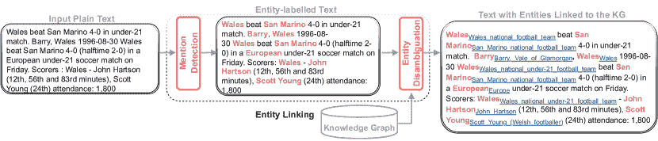
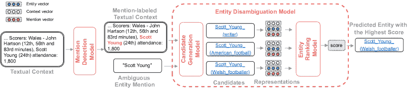
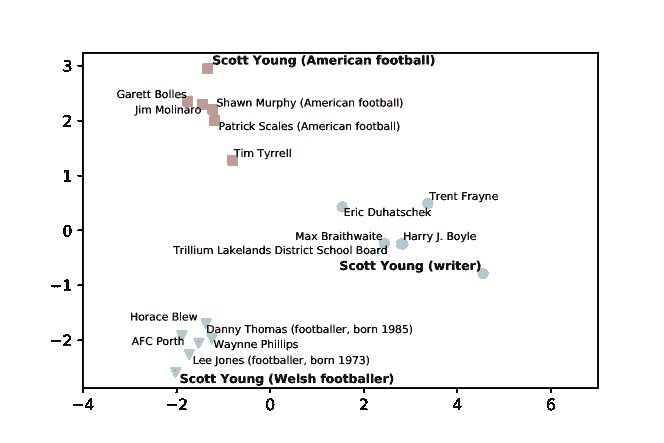
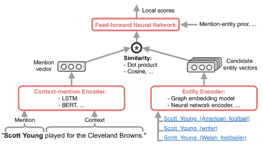
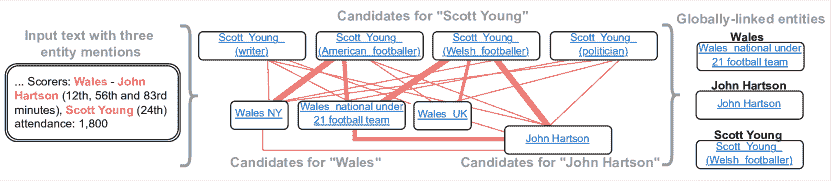
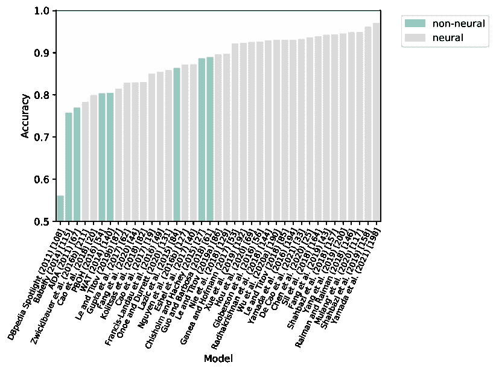
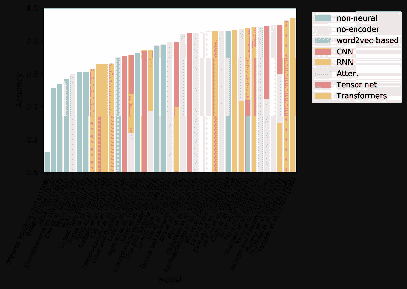
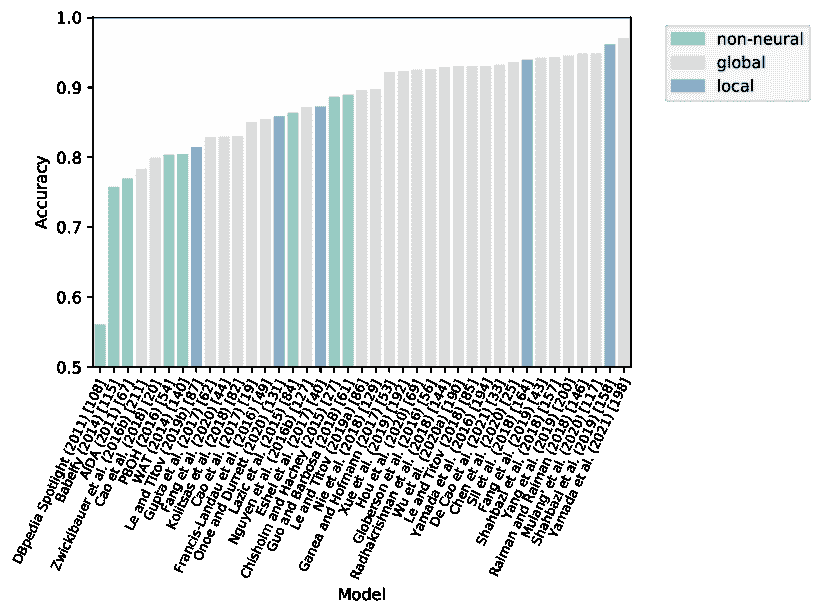

<!--yml

分类：未分类

日期：2024-09-06 20:01:02

-->

# [2006.00575] 神经实体链接：基于深度学习的模型调查

> 来源：[`ar5iv.labs.arxiv.org/html/2006.00575`](https://ar5iv.labs.arxiv.org/html/2006.00575)

# 神经实体链接：基于深度学习的模型调查

Ö.Özge Sevgililabel=e1]oezge.sevgili.ergueven@studium.uni-hamburg.de 平等贡献。通讯作者。[    A.Artem Shelmanovlabel=e2]shelmanov@airi.net 平等贡献。通讯作者。[    M.Mikhail Arkhipovlabel=e3]arkhipov@yahoo.com [    A.Alexander Panchenkolabel=e4]a.panchenko@skoltech.ru [    C.Chris Biemannlabel=e5]christian.biemann@uni-hamburg.de [ 语言技术组，\orgname 汉堡大学信息学部，Vogt-Kölln-Straße 30, 22527 汉堡，\cny 德国 presep=

]e1,e5 人工智能技术中心，\orgname 斯科尔科沃科技学院，Bolshoy Boulevard 30，bld. 1，121205，莫斯科，\cny 俄罗斯 presep=

]e4 研究计算中心，\orgname 罗蒙诺索夫莫斯科国立大学，GSP-1，列宁山，119991，莫斯科，\cny 俄罗斯 AIRI，Nizhny Susalny lane 5 p. 19，105064，莫斯科，\cny 俄罗斯 presep=

]e2 神经网络与深度学习实验室，\orgname 莫斯科物理技术学院，9 Institutskiy per.，Dolgoprudny，141701，莫斯科，\cny 俄罗斯 presep=

]e3 \orgnameFIZ Karlsruhe - 莱布尼茨信息基础设施研究所，\cny 德国 \orgnameLIPN，巴黎第北大学，\cny 法国 \orgname 阿姆斯特丹自由大学，\cny 荷兰 \orgname 知识媒体研究所 (KMi)，开放大学，\cny 英国 \orgname 卡利亚里大学，\cny 意大利 \orgnameFIZ Karlsruhe - 莱布尼茨信息基础设施研究所，\cny 德国 \orgname 大学或公司名称，\cny 国家 \orgname 大学或公司名称，\cny 国家 \orgname 大学或公司名称，\cny 国家 \orgname 大学或公司名称，\cny 国家 \orgname 大学或公司名称，\cny 国家 \orgname 大学或公司名称，\cny 国家 \orgname 大学或公司名称，\cny 国家（0000）

###### 摘要

本综述全面描述了自 2015 年以来在自然语言处理中的“深度学习革命”背景下开发的近期神经实体链接（EL）系统。其目标是系统化神经实体链接系统的设计特性，并将其性能与经典方法在常见基准上的表现进行比较。这项工作提炼出神经 EL 系统的通用架构，并讨论其组件，如候选生成、提及上下文编码和实体排名，总结了每个组件的主要方法。这种通用架构的广泛修改被归纳为几个共同主题：联合实体提及检测与消歧、全局链接模型、包括零样本和远程监督方法在内的领域无关技术，以及跨语言方法。由于许多神经模型利用实体和提及/上下文嵌入来表示其意义，这项工作还概述了突出的实体嵌入技术。最后，综述涉及实体链接的应用，重点讨论了最近出现的基于 Transformer 架构的深度预训练掩码语言模型的增强用例。

实体链接、深度学习、神经网络、自然语言处理、知识图谱，

###### 关键词：

^†^†卷号：0

免责声明：©  Özge Sevgili, Artem Shelmanov, Mikhail Arkhipov, Alexander Panchenko, 和 Chris Biemann, 2022。本文的最终版经过同行评审和编辑，已发表于《语义网杂志》，深度学习与知识图谱特刊，2022 年

, , , ,

{评审}

编辑 \评审人梅赫维什·阿拉姆 \评审人大维德·布斯卡尔迪 \评审人迈克尔·科切兹 \评审人弗朗切斯科·奥斯本 \评审人迭戈·雷福尔贾托·雷库佩罗 \评审人哈拉德·萨克

{评审}

征稿 \评审人意大利·洛佩斯·奥利维拉 \评审人萨哈尔·瓦赫达提 \评审人莫伊塔巴·纳耶里 \评审人达扎·克鲁兹 \评审人匿名 {评审}开放 \评审人第一位开放评审人 \评审人第二位开放评审人

## 1 引言

知识图谱（KGs），如 Freebase [Bollacker et al. (2008)]、DBpedia [Lehmann et al. (2015)] 和 Wikidata [Vrandečić and Krötzsch (2014)]，包含了关于各种实体的丰富而精确的信息，例如人名、地点、组织、电影和科学理论，仅举几例。每个实体都有一组精心定义的关系和属性，例如“出生地”或“效力于”。这种结构化信息的丰富性促进了语义处理算法的发展，因为这些算法可以直接操作和利用这些实体表示。例如，假设有一个搜索引擎可以检索到上个月新闻中所有净收入超过 10 亿美元的退役 NBA 球员的提及。包含球员名单及其收入和退役信息的知识图谱可能会提供这些信息。有了这些信息，查找新闻中的退役篮球运动员的提及似乎是直接的。然而，这种设置的主要障碍是实体的词汇歧义。在这种应用的背景下，人们只希望检索到“迈克尔·乔丹（篮球运动员）”¹¹1[`en.wikipedia.org/wiki/MichaelJordan`](https://en.wikipedia.org/wiki/MichaelJordan)的提及，并排除其他同名人物如“迈克尔·乔丹（数学家）”²²2[`en.wikipedia.org/wiki/MichaelI.Jordan`](https://en.wikipedia.org/wiki/MichaelI.Jordan)的提及。

这就是为什么实体链接（EL）——将文本上下文中的提及，例如“迈克尔·乔丹”，与符合上下文的知识图谱记录（例如“篮球运动员”或“数学家”）匹配的过程——是实现各种语义应用的关键技术。因此，EL 的任务是识别文本中的实体提及并将其链接到知识图谱中的条目。

实体链接是许多信息提取（IE）和自然语言理解（NLU）流程中的关键组件，因为它解决了实体提及的词汇歧义问题，并确定了它们在上下文中的意义。文本提及与知识图谱中实体之间的链接还使我们能够利用语义图中的信息，这在信息提取、生物医学文本处理、语义解析和问答等 NLU 任务中被证明是有用的（见第五部分）。这种广泛的直接应用是实体链接在学术界和工业界都受到极大关注的原因，已有二十多年。

### 1.1 本调查的目标和范围

最近，基于神经模型和深度学习的实体链接新一代方法应运而生，将这一任务的最先进表现提升到一个新水平。我们调查的目标是概述这一最新波段的模型，这些模型自 2015 年开始涌现。

基于神经网络的模型在实体链接（EL）以及许多其他自然语言处理任务中表现出色，这是由于它们能够学习语言数据的有用分布式语义表示[Collobert et al. (2011), Young et al. (2018), Bengio et al. (2003)]。这些当前最先进的神经实体链接模型相较于“经典”³³3 关于经典机器学习与深度学习的对比： [`towardsdatascience.com/deep-learning-vs-classical-machine-learning-9a42c6d48aa`](https://towardsdatascience.com/deep-learning-vs-classical-machine-learning-9a42c6d48aa) 机器学习方法[Lazic et al. (2015), Ratinov et al. (2011), Chisholm and Hachey (2015)]等基于浅层架构（例如支持向量机）和/或主要依赖手工特征的模型显示出显著的改进。这些模型往往无法捕捉所有相关的统计依赖性和交互[Ganea and Hofmann (2017)]。相比之下，深度神经网络能够在其深层架构中学习复杂的表示。这减少了手动特征工程的负担，并在实体链接及其他任务中实现了显著的改进。

在本次调查中，我们系统化了最近提出的神经模型，提炼出大多数神经实体链接模型使用的通用架构（如图 2 和 5 所示）。我们描述了该架构中每个组件使用的模型，例如候选生成、提及上下文编码、实体排名。还讨论了该通用架构的显著变体，如端到端实体链接或全局模型。为了更好地结构化大量可用模型，各种方法类型在分类法中进行了说明（图 3 和 6），而每个模型的显著特征则以表格形式仔细汇总（表 2）。我们讨论了模型在常用实体链接/消歧 benchmark 和实体相关性数据集上的表现。由于工作量巨大，我们无法尝试可用的软件，并比较进一步的参数，如计算复杂性、运行时间和内存需求。然而，我们创建了一个全面的参考资料集合，包含本调查中讨论的实体链接模型和系统的公开官方实现（见附录 A 的表 7）。

神经实体链接系统的一个重要组成部分是分布式实体表示和实体编码方法。研究表明，将知识图谱结构（实体关系）、实体定义或来自大规模文本语料库的词汇/实体共现统计信息编码为低维向量，可以提高实体链接模型的泛化能力[Huang et al. (2015)，Ganea and Hofmann (2017)]。因此，我们还总结了分布式实体表示模型和实体编码的新方法。

许多自然语言处理系统利用了深度预训练语言模型，如 ELMo [Peters et al. (2018)]，BERT [Devlin et al. (2019)]，以及它们的变体。EL 已经融入这些模型中，作为引入存储在 KG 中的信息的一种方式，这有助于将词汇表示适应某些文本处理任务。我们讨论了 EL 的这一新颖应用及其进一步发展。

### 1.2 文章收集方法

我们没有像 Oliveira 等人 (2021) 进行的那样的严格文章收集算法。我们的主要目标是提供并描述一个可以应用于大多数最近提出的神经 EL 方法的概念框架。然而，与所有调查一样，我们不得不在某个点上做出取舍。纳入本次调查的主要标准是这些论文必须在 2015 年或之后发表，并且主要关注 EL 任务，即将文本提及解析为 KG 中的条目，或讨论 EL 应用。我们明确排除了与 (细粒度) 实体类型（参见 Aly 等人 (2021); Choi 等人 (2018)) 相关的工作，这些工作也包括一个消歧任务，以及用于其他任务而非 EL 的 KG 的工作。该调查也不试图涵盖为特定领域（如生物医学文本或社交媒体消息）设计的所有 EL 方法。对于在成熟基准上评估的通用 EL 模型，我们尽可能全面地涵盖适合概念框架的近期论文，无论它们出现在何处（但重点关注自然语言处理和语义网领域的顶级会议和期刊）。

图 1：实体链接任务。一个实体链接（EL）模型接收原始文本输入，并通过将实体提及链接到知识图谱（KG）中的节点来丰富它。该任务通常分为实体提及检测和实体消歧两个子任务。

### 1.3 以往的调查

关于 EL 的首次调查之一是由 Shen 等人 (2015) 在 2015 年准备的。他们涵盖了实体链接的主要方法（例如候选生成、排名等模块）、其应用、评估方法以及未来方向。在同一年，Ling 等人 (2015) 提出了旨在提供（1）一个标准问题定义，以减少因存在与 EL 相关的不同类似任务而产生的混淆（例如，Wikification Milne 和 Witten (2008) 和命名实体链接 Hoffart 等人 (2011))，以及（2）对模型及其各个方面的明确比较。

还有其他调查涉及更广泛的范围。 Martínez-Rodríguez 等人 (2020) 于 2020 年发表的工作涉及信息提取模型和语义网技术。具体来说，他们考虑了许多任务，如命名实体识别、实体链接、术语提取、关键词提取、主题建模、主题标注、关系提取任务。类似地，Al-Moslmi 等人 (2020) 于 2020 年发布的工作概述了 2014 至 2019 年间在命名实体识别、命名实体消歧和实体链接领域的研究。

Oliveira 等人 (2021) 于 2020 年发表的另一篇近期调查论文分析并总结了表现出一定整体性的 EL 方法。这种观点将调查范围限制在利用 EL 任务各种特殊性的工作上：存储在特定输入中的附加元数据（如微博）、从这些输入中提取的特定特征（如推文中的地理坐标、时间戳、发布这些推文的用户兴趣），以及利用这些附加特征的特定消歧方法。在同期的工作中，Möller 等人 (2022) 概述了专门为将英语实体链接到 Wikidata Vrandečić 和 Krötzsch (2014) 开发的模型，并讨论了可以利用这些 KG 特征来提高链接性能的特性。

以往对类似主题的调查 (a) 未涵盖许多最近的出版物，如 Ling 等人 (2015) 和 Shen 等人 (2015)；(b) 广泛涵盖了多个主题，如 Martínez-Rodríguez 等人 (2020) 和 Al-Moslmi 等人 (2020)；或 (c) 仅专注于特定类型的方法，如 Oliveira 等人 (2021) 或知识图谱 Möller 等人 (2022)。据我们所知，目前尚未有专门致力于近期神经实体链接模型的详细调查。以往的调查也未涉及实体和上下文/提及编码、EL 应用于深度预训练语言模型以及跨语言 EL 的主题。我们也是首次总结领域独立的 EL 方法，其中几种方法基于零样本技术。

### 1.4 贡献

更具体地说，本文做出了以下贡献：

+   •

    对最先进的神经实体链接模型的调查；

+   •

    对神经 EL 方法各种特征及其在流行基准上的评估结果的系统化；

+   •

    对实体和上下文/提及嵌入技术的总结；

+   •

    对最近的领域独立（零样本）和跨语言实体链接方法的讨论；

+   •

    对 EL 应用于建模词表示的调查。

本调查的结构如下。我们首先在第二部分定义 EL 任务。在第 3.1 节，介绍了神经实体链接系统的一般架构。第 3.2 节讨论了该基本流程的修改和变体。在第四部分，我们总结了 EL 模型在标准基准测试上的性能，并呈现了实体相关性评估的结果。第五部分专注于 EL 的应用，特别是针对近期出现的改进神经语言模型的应用。最后，第六部分总结了调查结果，并提出了未来工作的有希望方向。

图 2：神经实体链接的总体架构。实体链接（EL）包括两个主要步骤：提及检测（MD），在文本中识别实体提及边界，以及实体消歧（ED），为给定的提及预测相应的实体。实体消歧进一步分为两个步骤：候选生成，当选择可能的候选实体进行提及时，以及实体排序，当通过比较它们的向量表示计算上下文/提及与每个候选实体之间的对应分数。

## 2 任务描述

### 2.1 非正式定义

以图 1 为例，其中提到的实体 Scott Young 出现在一个与足球比赛相关的上下文中。字面上，这个常见的名字可以指代至少三个人：美国橄榄球运动员、威尔士足球运动员或作家。实体链接任务是 (1) 正确检测文本中的实体提及，(2) 解决其歧义并最终提供指向知识图谱中相应实体条目的链接，例如，在这种情况下，为 Scott Young 提供指向威尔士足球运动员的链接⁴⁴4[`en.wikipedia.org/wiki/ScottYoung(Welshfootballer)`](https://en.wikipedia.org/wiki/ScottYoung(Welshfootballer)) 而不是作家⁵⁵5[`en.wikipedia.org/wiki/ScottYoung(writer)`](https://en.wikipedia.org/wiki/ScottYoung(writer))。为了实现这个目标，任务通常被分解为两个子任务，如图 1 中所示：提及检测（MD）和实体消歧（ED）。

### 2.2 正式定义

#### 2.2.1 知识图谱（KG）

一个知识图谱（KG）包含实体、关系和事实，其中事实表示为三元组（即头实体、关系、尾实体），如 Ji 等人（2022）所定义。正式地，如 Färber 等人（2018）所定义，知识图谱是 RDF 三元组的集合，其中每个三元组 $(s,p,o)$ 是以下术语的有序集合：一个主体 $s\in U\cup B$、一个谓词 $p\in U$ 和一个对象 $o\in U\cup B\cup L$。RDF 术语可以是 URI $u\in U$、空白节点 $b\in B$ 或文字 $l\in L$。URI（或 IRI）节点用于全球识别 Web 上的实体；文字节点用于字符串和其他数据类型的值（例如整数、日期）；空白节点用于匿名节点，这些节点没有分配标识符，如 Hogan 等人（2021）所解释。

这种 RDF 表示可以看作是一个多关系图 $G=(E,\mathbb{A}=\{A_{\_}0,A_{\_}1,...,A_{\_}m\subseteq(E\times E)\})$，其中 $E$ 是 KG 中所有实体的集合，$\mathbb{A}$ 是长度为 $m$ 的类型边集族。例如，$A_{\_}0$ 是“职业”谓词的邻接矩阵，$A_{\_}1$ 是“创立”谓词的邻接矩阵，等等。

还有一个等效的三维张量表示的知识图谱 $\mathcal{A}\in\{0,1\}^{n\times m\times n}$，其中

|  | $\mathcal{A}_{\_}{i,k,j}=\begin{cases}1&amp;\text{if $(i,j)\in A_{\_}k:k\leq m$}\\ 0&amp;\text{otherwise.}\end{cases}$ |  | (1) |
| --- | --- | --- | --- |

#### 2.2.2 提及检测（MD）

提及检测的目标是识别实体提及范围，而实体消歧则是将找到的提及链接到知识图谱的条目。我们可以将这个任务视为确定一个 $\mathsf{MD}$ 函数，该函数以文本上下文 $c_{\_}i\in C$（例如，一个文档集合中的文档）为输入，并输出该上下文中 $n$ 个提及的序列 $(m_{\_}1,\dots m_{\_}n)$，其中 $m_{\_}i\in M$，$M$ 是上下文中所有可能的文本范围的集合。

|  | $\mathsf{MD}:C\xrightarrow{}M^{n}.$ |  | (2) |
| --- | --- | --- | --- |

在大多数关于 EL 的研究中，通常假设提及已经给出或被检测到，例如，使用命名实体识别（NER）系统（有时称为命名实体识别与分类（NERC） Aly 等（2021）；Nadeau 和 Sekine（2007））。我们应该注意，通常除了 MD，NER 系统还会用预定义的类型标记/分类提及 Li 等（2022）；van Hulst 等（2020）；Oliveira 等（2021）；Martins 等（2019），这些类型也可以用于消歧 Martins 等（2019）。

#### 2.2.3 实体消歧（ED）

实体消歧任务可以被视为确定一个函数 $\mathsf{ED}$，该函数在给定文档中的 $n$ 个提及及其上下文 $(c_{\_}1,\dots,c_{\_}n)$ 的情况下，输出一个实体分配 $(e_{\_}1,\dots,e_{\_}n),e_{\_}i\in E$，其中 $E$ 是一个知识图谱中的实体集合。

|  | $\mathsf{ED}:(M,C)^{n}\xrightarrow{}E^{n}.$ |  | (3) |
| --- | --- | --- | --- |

为了学习从上下文中的实体提及到知识图谱中的实体条目的映射，实体链接（EL）模型使用像手动标注的提及-实体对这样的监督信号。知识图谱的大小各异；它们可以包含数十万甚至数百万个实体。由于其庞大的规模，EL 的训练数据会极度不平衡；训练集可能缺少某个特定实体或提及的一个示例，例如在流行的 AIDA 语料库中 Hoffart 等（2011）。为了解决这个问题，EL 模型应具备广泛的泛化能力。

尽管知识图谱通常很大，但它们是不完整的。因此，文本中的一些提及无法正确映射到任何知识图谱条目。确定这些无法链接的提及，通常被指定为链接到 $\mathsf{NIL}$ 条目，是当前 EL 面临的挑战之一。解决此问题的方法提供了一个单独的函数，或者在消歧函数中扩展实体集合以包括这个特殊条目：

|  | $\mathsf{ED}:(M,C)^{n}\xrightarrow{}(E\cup\mathsf{NIL})^{n}.$ |  | (4) |
| --- | --- | --- | --- |

### 2.3 术语方面

在文献中，这些技术和模型有时会被不同地称呼。即，Wikification Cheng 和 Roth (2013) 和实体消歧被认为是 EL 的子类型 Moro et al. (2014)。为了全面涵盖此调查，我们假设实体链接任务包括实体提及检测和实体消歧。然而，只有少数研究提出了同时执行 MD 和 ED 的模型，而大多数关于 EL 的论文专注于 ED 并假设提及边界由外部实体识别器给出 Rizzo et al. (2014)（这可能导致一些术语上的混淆）。许多只执行 MD（例如在 NER 任务中）而不进行实体消歧的技术在许多先前的调查中被考虑 Nadeau 和 Sekine (2007); Sharnagat (2014); Goyal et al. (2018); Yadav 和 Bethard (2018); Li et al. (2022) 等，并不在本文讨论范围之内。

实体链接在一般情况下并不限于将提及链接到图节点，而是链接到知识库中的概念。然而，大多数现代广泛使用的知识库以图的形式组织信息 Lehmann et al. (2015); Bollacker et al. (2008); Vrandečić 和 Krötzsch (2014)，即使在特定领域，例如学术领域 Dessì et al. (2021)。数据/知识库中的基本陈述通常可以表示为一个主题-谓词-对象元组 $(s,p,o)$，例如 (John_Lennon, occupation, singer) 或 (New_York_City, founded, 1624)，一组这样的元组可以表示为一个多关系图。这种形式有助于高效组织知识，适用于从搜索引擎到问答系统和推荐系统的许多应用 Hogan et al. (2021); Ji et al. (2022)。因此，在本文中，知识图谱 (KG) 和知识库 (KB) 这两个术语是可以互换使用的。

<svg   height="197.67" overflow="visible" version="1.1" width="662.28"><g transform="translate(0,197.67) matrix(1 0 0 -1 0 0) translate(316.2,0) translate(0,187.94)"><g stroke="#000000"><g fill="#000000"><g stroke-width="0.4pt"><g transform="matrix(1.0 0.0 0.0 1.0 -78.74 -4.84)" fill="#EA6B66" stroke="#EA6B66"><foreignobject width="157.48" height="9.69" transform="matrix(1 0 0 -1 0 16.6)" overflow="visible" color="#EA6B66">3.1 - 一般架构 <g stroke-width="0.4pt"><g stroke-opacity="0.5" fill="#808080" fill-opacity="0.5" transform="matrix(1.0 0.0 0.0 1.0 2.98 -2.98)"><path d="M -176.63 -49.6 L -307.62 -49.6 C -312.21 -49.6 -315.92 -53.32 -315.92 -57.9 L -315.92 -60.21 C -315.92 -64.79 -312.21 -68.51 -307.62 -68.51 L -176.63 -68.51 C -172.05 -68.51 -168.33 -64.79 -168.33 -60.21 L -168.33 -57.9 C -168.33 -53.32 -172.05 -49.6 -176.63 -49.6 Z M -315.92 -68.51" style="stroke:none"></path></g><g stroke-width="0.4pt" fill="#FFFFFF"><path d="M -176.63 -49.6 L -307.62 -49.6 C -312.21 -49.6 -315.92 -53.32 -315.92 -57.9 L -315.92 -60.21 C -315.92 -64.79 -312.21 -68.51 -307.62 -68.51 L -176.63 -68.51 C -172.05 -68.51 -168.33 -64.79 -168.33 -60.21 L -168.33 -57.9 C -168.33 -53.32 -172.05 -49.6 -176.63 -49.6 Z M -315.92 -68.51"></path></g><g transform="matrix(1.0 0.0 0.0 1.0 -311.31 -63.9)" fill="#EA6B66" stroke="#EA6B66"><foreignobject width="138.37" height="9.69" transform="matrix(1 0 0 -1 0 16.6)" overflow="visible" color="#EA6B66">3.1.1 - 候选生成</foreignobject></g></g> <g stroke="#999999" fill="#999999" stroke-width="0.8pt" color="#999999"><path d="M -39.89 -9.73 L -195.95 -47.79" style="fill:none"><g transform="matrix(-0.97153 -0.23692 0.23692 -0.97153 -195.95 -47.79)"><path d="M 6.48 0 C 4.56 0.36 1.44 1.44 -0.72 2.7 L -0.72 -2.7 C 1.44 -1.44 4.56 -0.36 6.48 0" style="stroke:none"></path></g></path></g><g stroke-width="0.4pt"><g stroke-opacity="0.5" fill="#808080" fill-opacity="0.5" transform="matrix(1.0 0.0 0.0 1.0 2.98 -2.98)"><path d="M -15.21 -49.52 L -146.2 -49.52 C -150.79 -49.52 -154.51 -53.24 -154.51 -57.83 L -154.51 -60.28 C -154.51 -64.87 -150.79 -68.59 -146.2 -68.59 L -15.21 -68.59 C -10.63 -68.59 -6.91 -64.87 -6.91 -60.28 L -6.91 -57.83 C -6.91 -53.24 -10.63 -49.52 -15.21 -49.52 Z M -154.51 -68.59" style="stroke:none"></path></g><g stroke-width="0.4pt" fill="#FFFFFF"><path d="M -15.21 -49.52 L -146.2 -49.52 C -150.79 -49.52 -154.51 -53.24 -154.51 -57.83 L -154.51 -60.28 C -154.51 -64.87 -150.79 -68.59 -146.2 -68.59 L -15.21 -68.59 C -10.63 -68.59 -6.91 -64.87 -6.91 -60.28 L -6.91 -57.83 C -6.91 -53.24 -10.63 -49.52 -15.21 -49.52 Z M -154.51 -68.59"></path></g><g transform="matrix(1.0 0.0 0.0 1.0 -149.89 -63.82)" fill="#EA6B66" stroke="#EA6B66"><foreignobject width="138.37" height="9.84" transform="matrix(1 0 0 -1 0 16.6)" overflow="visible" color="#EA6B66">3.1.2 - 上下文提及编码</foreignobject></g></g> <g stroke="#999999" fill="#999999" stroke-width="0.8pt" color="#999999"><path d="M -13.3 -9.73 L -62.08 -45.42" style="fill:none"><g transform="matrix(-0.80707 -0.59045 0.59045 -0.80707 -62.08 -45.42)"><path d="M 6.48 0 C 4.56 0.36 1.44 1.44 -0.72 2.7 L -0.72 -2.7 C 1.44 -1.44 4.56 -0.36 6.48 0" style="stroke:none"></path></g></path></g><g stroke-width="0.4pt"><g stroke-opacity="0.5" fill="#808080" fill-opacity="0.5" transform="matrix(1.0 0.0 0.0 1.0 2.98 -2.98)"><path d="M 146.2 -49.52 L 15.21 -49.52 C 10.63 -49.52 6.91 -53.24 6.91 -57.83 L 6.91 -60.28 C 6.91 -64.87 10.63 -68.59 15.21 -68.59 L 146.2 -68.59 C 150.79 -68.59 154.51 -64.87 154.51 -60.28 L 154.51 -57.83 C 154.51 -53.24 150.79 -49.52 146.2 -49.52 Z M 6.91 -68.59" style="stroke:none"></path></g><g stroke-width="0.4pt" fill="#FFFFFF"><path d="M 146.2 -49.52 L 15.21 -49.52 C 10.63 -49.52 6.91 -53.24 6.91 -57.83 L 6.91 -60.28 C 6.91 -64.87 10.63 -68.59 15.21 -68.59 L 146.2 -68.59 C 150.79 -68.59 154.51 -64.87 154.51 -60.28 L 154.51 -57.83 C 154.51 -53.24 150.79 -49.52 146.2 -49.52 Z M 6.91 -68.59"></path></g><g transform="matrix(1.0 0.0 0.0 1.0 11.52 -63.82)" fill="#EA6B66" stroke="#EA6B66"><foreignobject width="138.37" height="9.84" transform="matrix(1 0 0 -1 0 16.6)" overflow="visible" color="#EA6B66">3.1.3 - 实体编码</foreignobject></g></g> <g stroke="#999999" fill="#

Ganea 和 Hofmann (2017); Newman-Griffis 等人 (2018)</foreignobject></g> <g stroke-width="0.4pt" fill="#FFFFFF"><path d="M 26.26 -150.71 h 186.39 v 42.43 h -186.39 Z" style="stroke:none"></path></g><g stroke-width="0.4pt" fill="#000000" stroke="#000000" transform="matrix(1.0 0.0 0.0 1.0 30.87 -122.57)"><foreignobject width="177.17" height="33.21" transform="matrix(1 0 0 -1 0 16.6)" overflow="visible">关系信息基础

Perozzi 等人 (2014); Bordes 等人 (2013); Yamada 等人 (2016)</foreignobject></g> <g stroke-width="0.4pt" fill="#FFFFFF"><path d="M 26.26 -184.54 h 186.39 v 42.43 h -186.39 Z" style="stroke:none"></path></g><g stroke-width="0.4pt" fill="#000000" stroke="#000000" transform="matrix(1.0 0.0 0.0 1.0 30.87 -156.41)"><foreignobject width="177.17" height="33.21" transform="matrix(1 0 0 -1 0 16.6)" overflow="visible">其他基于信息（例如。

描述页面）Gupta 等人 (2017)；Francis-Landau 等人 (2016)；Gillick 等人 (2019)</foreignobject></g> <g stroke-width="0.4pt" fill="#FFFFFF"><path d="M 199.06 -111.34 h 147.02 v 25.83 h -147.02 Z" style="stroke:none"></path></g><g stroke-width="0.4pt" fill="#000000" stroke="#000000" transform="matrix(1.0 0.0 0.0 1.0 203.67 -99.81)"><foreignobject width="137.8" height="16.6" transform="matrix(1 0 0 -1 0 16.6)" overflow="visible">无候选者 Sil 等人 (2018)；Tsai 和 Roth (2016)</foreignobject></g> <g stroke-width="0.4pt" fill="#FFFFFF"><path d="M 198.77 -136.87 h 117.15 v 25.83 h -117.15 Z" style="stroke:none"></path></g><g stroke-width="0.4pt" fill="#000000" stroke="#000000" transform="matrix(1.0 0.0 0.0 1.0 203.38 -125.34)"><foreignobject width="107.93" height="16.6" transform="matrix(1 0 0 -1 0 16.6)" overflow="visible">阈值 Lazic 等人 (2015)；Peters 等人 (2019)</foreignobject></g> <g stroke-width="0.4pt" fill="#FFFFFF"><path d="M 198.77 -162.41 h 117.15 v 25.83 h -117.15 Z" style="stroke:none"></path></g><g stroke-width="0.4pt" fill="#000000" stroke="#000000" transform="matrix(1.0 0.0 0.0 1.0 203.38 -150.88)"><foreignobject width="107.93" height="16.6" transform="matrix(1 0 0 -1 0 16.6)" overflow="visible">NIL 预测器 Kolitsas 等人 (2018)</foreignobject></g> <g stroke-width="0.4pt" fill="#FFFFFF"><path d="M 199.06 -187.94 h 147.02 v 25.83 h -147.02 Z" style="stroke:none"></path></g><g stroke-width="0.4pt" fill="#000000" stroke="#000000" transform="matrix(1.0 0.0 0.0 1.0 203.67 -176.41)"><foreignobject width="137.8" height="16.6" transform="matrix(1 0 0 -1 0 16.6)" overflow="visible">分离模型 Moreno 等人 (2017)；Martins 等人 (2019)</foreignobject></g><g stroke="#999999" fill="#999999" stroke-width="0.8pt" color="#999999"><path d="M -278.45 -68.79 L -278.45 -98.43 L -287.58 -98.43" style="fill:none"><g transform="matrix(-1.0 0.0 0.0 -1.0 -287.58 -98.43)"><path d="M 6.48 0 C 4.56 0.36 1.44 1.44 -0.72 2.7 L -0.72 -2.7 C 1.44 -1.44 4.56 -0.36 6.48 0" style="stroke:none"></path></g></path></g><g stroke="#999999" fill="#999999" stroke-width="0.8pt" color="#999999"><path d="M -278.45 -68.79 L -278.45 -130.88 L -287.58 -130.88" style="fill:none"><g transform="matrix(-1.0 0.0 0.0 -1.0 -287.58 -130.88)"><path d="M 6.48 0 C 4.56 0.36 1.44 1.44 -0.72 2.7 L -0.72 -2.7 C 1.44 -1.44 4.56 -0.36 6.48 0" style="stroke:none"></path></g></path></g><g stroke="#999999" fill="#999999" stroke-width="0.8pt" color="#999999"><path d="M -278.45 -68.79 L -278.45 -163.33 L -287.58 -163.33" style="fill:none"><g transform="matrix(-1.0 0.0 0.0 -1.0 -287.58 -163.33)"><path d="M 6.48 0 C 4.56 0.36 1.44 1.44 -0.72 2.7 L -0.72 -2.7 C 1.44 -1.44 4.56 -0.36 6.48 0" style="stroke:none"></path></g></path></g><g stroke="#999999" fill="#999999" stroke-width="0.8pt" color="#999999"><path d="M -117.32 -68.86 L -117.32 -98.43 L -128.93 -98.43" style="fill:none"><g transform="matrix(-1.0 0.0 0.0 -1.0 -128.93 -98.43)"><path d="M 6.48 0 C 4.56 0.36 1.44 1.44 -0.72 2.7 L -0.72 -2.7 C 1.44 -1.44 4.56 -0.36 6.48 0" style="stroke:none"></path></g></path></g><g stroke="#999999" fill="#999999" stroke-width="0.8pt" color="#999999"><path d="M -117.32 -68.86 L -117.32 -130.88 L -128.96 -130.88" style="fill:none"><g transform="matrix(-1.0 0.0 0.0 -1.0 -128.96 -130.88)"><path d="M 6.48 0 C 4.56 0.36 1.44 1.44 -0.72 2.7 L -0.72 -2.7 C 1.44 -1.44 4.56 -0.36 6.48 0" style="stroke:none"></path></g></path></g><g stroke="#999999" fill="#999999" stroke-width="0.8pt" color="#999999"><path d="M 44.1 -68.86 L 44.1 -99.81 L 32.46 -99.81" style="fill:none"><g transform="matrix(-1.0 0.0 0.0 -1.0 32.46 -99.81)"><path d="M 6.48 0 C 4.56 0.36 1.44 1.44 -0.72 2.7 L -0.72 -2.7 C 1.44 -1.44 4.56 -0.36 6.48 0" style="stroke:none"></path></g></path></g><g stroke="#999999" fill="#999999" stroke-width="0.8pt" color="#999999"><path d="M 44.1 -68.86 L 44.1 -129.49 L 32.46 -129.49" style="fill:none"><g transform="matrix(-1.0 0.0 0.0 -1.0 32.46 -129.49)"><path d="M 6.48 0 C 4.56 0.36 1.44 1.44 -0.72 2.7 L -0.72 -2.7 C 1.44 -1.44 4.56 -0.36 6.48 0" style="stroke:none"></path></g></path></g><g stroke="#999999" fill="#999999" stroke-width="0.8pt" color="#999999"><path d="M 44.1 -68.86 L 44.1 -163.33 L 32.46 -163.33" style="fill:none"><g transform="matrix(-1.0 0.0 0.0 -1.0 32.46 -163.33)"><path d="M 6.48 0 C 4.56 0.

图 3: 神经实体链接系统通用架构的参考图。通用神经实体链接架构中每一步的分类，包含替代设计选择和示例参考，说明每个选择。

## 3 神经实体链接

我们从最通用的实体链接流水线架构开始讨论神经实体链接方法，并继续探讨各种特定的修改，如联合实体提及检测和链接、利用全局上下文的消歧技术、包括零样本方法在内的领域独立实体链接方法，以及跨语言模型。

### 3.1 通用架构

一些基于神经网络的实体链接尝试将其视为一个多类分类任务，其中实体对应于类别。然而，这种直接的方法会导致类别数量庞大，从而在没有任务共享的情况下表现不佳 Kar 等人 (2018)。精简的实体链接方法是将其视为一个排名问题。我们在图 2 中展示了通用的实体链接架构，这适用于大多数神经方法。在这里，提及检测模型识别文本中的提及边界。接下来的步骤是为提及生成一个可能的实体（候选实体）名单，例如，生成 Scott_Young_(writer) 作为候选实体，而不是完全随机的实体。然后，提及编码器生成提及在上下文中的语义向量表示。实体编码器生成候选实体的一组向量表示。最后，实体排名模型比较提及和实体的表示，并估计提及-实体对应分数。一个可选的步骤是确定不可链接的提及，即知识图谱中没有对应实体的提及。通用神经实体链接架构中每一步的分类在图 3 中进行了总结。

表 1: 候选生成示例。使用几种候选生成方法获得的示例提及 “Big Blue” 的候选实体。高亮的候选实体是“正确的”实体，假设给定的提及指的是 IBM 公司而不是河流，例如 Big_Blue_River_(Kansas)。

| 方法 | 示例提及 “Big Blue” 的 5 个候选实体 |
| --- | --- |

|

&#124; 基于表面形式匹配的 &#124;

&#124; 来自 DBpedia 名称⁶⁶6 从 DBpedia 标签数据集中随机匹配 – [`downloads.dbpedia.org/2016-10/core-i18n/en/labelsen.ttl.bz2`](http://downloads.dbpedia.org/2016-10/core-i18n/en/labelsen.ttl.bz2) &#124;

|

&#124; Big_Blue_Trail, Big_Bluegrass, Big_Blue_Spring_cave_crayfish, &#124;

&#124; Dexter_Bexley_and_the_Big_Blue_Beastie, IBM_Big_Blue_(X-League) &#124;

|

|

&#124; 使用别名的扩展 &#124;

&#124; 来自 YAGO-means⁷⁷7YAGO-means 数据集（Hoffart 等，(2011）– [`resources.mpi-inf.mpg.de/yago-naga/aida/download/aidameans.tsv.bz2`](http://resources.mpi-inf.mpg.de/yago-naga/aida/download/aidameans.tsv.bz2) &#124;

|

&#124; Big_Blue_River_(Indiana), Big_Blue_River_(Kansas), &#124;

&#124; Big_Blue_(crane), BigRed(drink), IBM &#124;

|

|

&#124; 概率 + 使用别名扩展 &#124;

&#124; 来自 Ganea 和 Hofmann (2017)：Anchor prob. + CrossWikis + YAGO &#124;

⁸⁸8 我们使用 Peters 等 (2019) 的源代码生成了这些示例 – [`github.com/allenai/kb`](https://github.com/allenai/kb) |

&#124; IBM, Big_Blue_River_(Kansas), The_Big_Blue &#124;

&#124; Big_Blue_River_(Indiana), Big_Blue_(crane) &#124;

|

#### 3.1.1 候选生成

实体链接（EL）的一个关键部分是候选生成。这个步骤的目标是，在给定一个模糊的实体提及，例如“Scott Young”，提供一个可能的“含义”列表，这些含义由知识图谱（KG）中的实体指定。EL 类似于词义消歧（WSD）任务（Moro 等，(2014）；Navigli (2009），因为它也解决了词汇歧义的问题。然而，在 WSD 中，WordNet（Fellbaum (1998）可以清晰定义每个词义，而在 EL 中，KG 不提供提及与实体之间的精确映射（Moro 等，(2014）；Navigli (2009）；Chang 等，(2016））。因此，一个提及可能与 KG 中的任何实体相关联，导致搜索空间很大，例如“Big Blue”指的是 IBM。在候选生成步骤中，通过对实体列表进行有效的初步过滤来解决这个问题。

形式上，给定一个提及 $m_{\_}i$，候选生成器为文档中的每个实体提及提供一个可能实体的列表 $e_{\_}1,e_{\_}2,...,e_{\_}k$。

|  | $\mathsf{CG}:M\xrightarrow{}(e_{\_}1,e_{\_}2,...,e_{\_}k).$ |  | (5) |
| --- | --- | --- | --- |

类似于 Shen 等人 (2015) 和 Al-Moslmi 等人 (2020)，我们在神经实体链接中区分了三种常见的候选生成方法：（1）基于表面形式匹配，（2）基于别名扩展，以及（3）基于先验匹配概率计算。在第一种方法中，候选列表由与文本中的提及词的各种表面形式匹配的实体组成 Zwicklbauer 等人 (2016b)；Moreno 等人 (2017)；Le 和 Titov (2019b)。对于提及形式和匹配标准的生成，有许多启发式方法，如 Levenshtein 距离、n-grams 和归一化。以“Big Blue”作为例子，这种方法效果不佳，因为指代实体“IBM”或其全称“International Business Machines”不包含提及字符串。候选实体集合的示例见表 1，在该表中我们搜索了 DBpedia 中所有维基百科文章标题中“Big Blue”的名称匹配，并展示了随机的 5 个匹配。

在第二种方法中，使用知识图谱（KG）元数据（如维基百科的消歧义/重定向页面）Fang 等 (2019)；Zwicklbauer 等 (2016b)，或使用别名和/或同义词的字典（例如，“NYC”代表“New York City”）来构建额外的别名字典。这有助于提高候选生成的召回率，因为表面形式匹配通常无法捕捉到这种情况。Pershina 等 (2015) 将给定的提及扩展为上下文中找到的最长提及，使用共指解析。然后，如果实体的标题与提及的最长版本匹配，或者该实体出现在此提及的消歧义/重定向页面中，则选择该实体作为候选实体。该资源在许多实体链接（EL）模型中被使用，例如 Yamada 等 (2016)；Cao 等 (2017)；Newman-Griffis 等 (2018)；Radhakrishnan 等 (2018)；Martins 等 (2019)；Onoe 和 Durrett (2020)；Sil 等 (2018)。另一个著名的替代方案是 YAGO Suchanek 等 (2007)——一个从维基百科和 WordNet 自动构建的本体。它提供了许多其他关系，其中包括“means”关系，这一映射被用于候选生成，如 Hoffart 等 (2011)；Yamada 等 (2016)；Ganea 和 Hofmann (2017)；Sil 等 (2018)；Shahbazi 等 (2018)。在这项技术中，外部信息将有助于将“Big Blue”消歧为“IBM”。表 1 展示了使用 Hoffart 等 (2011)中使用的 YAGO-means 候选映射数据集生成的候选示例。

第三种候选生成方法基于对特定提及与实体之间对应关系的预计算先验概率$p(e|m)$。许多研究依赖于基于维基百科实体超链接计算的提及-实体先验。维基百科实体页面的超链接网址决定了一个候选实体，而超链接的锚文本决定了一个提及。另一种广泛使用的选项是 CrossWikis Spitkovsky 和 Chang (2012)，这是一个利用网页抓取数据中提及-实体链接频率的广泛资源，Ganea 和 Hofmann (2017)；Gupta 等 (2017)。

通常会同时应用多种方法进行候选生成。例如，由 Ganea 和 Hofmann (2017) 构建的资源被许多其他 EL 方法使用，如 Kolitsas 等 (2018)；Peters 等 (2019)；Yamada 等 (2021)；Shahbazi 等 (2019)；Le 和 Titov (2019a) 依赖于从 CrossWikis Spitkovsky 和 Chang (2012) 和维基百科获得的实体超链接计数统计数据以及 YAGO 本体 Hoffart 等 (2011) 的“means”关系获得的实体别名。这种方法可以将示例提及 “Big Blue” 链接到其指代实体 “IBM”，如表 1 所示。另一个例子是 Fang 等 (2020) 利用表面形式匹配和别名。他们在本地上下文中共享缩写及其扩展版本之间的候选项。别名来自维基百科重定向和消歧义页面、维基百科搜索引擎以及 WordNet Fellbaum (1998) 的同义词。此外，他们将拼写错误或包含多个单词的提及提交到维基百科和谷歌搜索引擎，搜索相应的维基百科文章。值得注意的是，一些研究还采用候选剪枝步骤以减少候选数量。

最近的零样本模型 Logeswaran 等 (2019)；Gillick 等 (2019)；Wu 等 (2020b) 在没有外部资源的情况下进行候选生成。第 3.2.3 节对此进行了详细描述。

#### 3.1.2 上下文-提及编码

要正确消歧义一个实体提及，至关重要的是彻底捕捉其上下文中的信息。目前主流的方法是使用编码器神经网络构建提及 $\boldsymbol{y}_{\_}m$ 的密集上下文向量表示。

|  | $\mathsf{mENC}:(C,M)^{n}\xrightarrow{}(\boldsymbol{y}_{\_}{m_{\_}1},\boldsymbol{y}_{\_}{m_{\_}2},...,\boldsymbol{y}_{\_}{m_{\_}n}).$ |  | (6) |
| --- | --- | --- | --- |

早期的一些神经 EL 技术使用卷积编码器 Sun 等 (2015)；Francis-Landau 等 (2016)；Nguyen 等 (2016b)；Sorokin 和 Gurevych (2018)，以及候选实体嵌入与提及周围单词的嵌入之间的注意力 Ganea 和 Hofmann (2017)；Le 和 Titov (2019a)。然而，在近期模型中，两种方法占主导地位：递归网络和自注意力 Vaswani 等 (2017)。

具有 LSTM 单元的递归结构由 Hochreiter 和 Schmidhuber (1997) 提出，该模型作为许多 NLP 应用的基础模型，被 Kolitsas 等人 (2018)；Martins 等人 (2019)；Le 和 Titov (2019b)；Fang 等人 (2019)；Nie 等人 (2018)；Gupta 等人 (2017)；Sil 等人 (2018) 等人在实体链接中采用。Gupta 等人 (2017) 将两个独立编码提及的左右上下文（包括提及本身）的 LSTM 网络的输出进行拼接。同样，Sil 等人 (2018) 通过 LSTM 编码左右局部上下文，但还跨所有提及在共指链中进行结果汇聚，并使用张量网络对左右表示进行后处理。LSTM 的一种变体 – GRU 由 Chung 等人 (2014) 提出 – 被 Eshel 等人 (2017) 与 Bahdanau 等人 (2015) 提出的注意力机制结合使用，以编码提及的左右上下文。Kolitsas 等人 (2018) 将实体提及表示为包含在提及范围内的 LSTM 隐状态的组合。Le 和 Titov (2019b) 仅在单词上运行一个双向 LSTM 网络，并补充目标提及的单词位置嵌入。Shahbazi 等人 (2019) 通过平均提及单词向量采用了预训练的 ELMo 由 Peters 等人 (2018) 提出。

基于自注意力的编码方法最近变得非常普遍。Wu 等人 (2020b)；Logeswaran 等人 (2019)；Peters 等人 (2019)；Yamada 等人 (2021)；Chen 等人 (2020) 和其他人提出的 EL 模型依赖于从预训练 BERT 层 Devlin 等人 (2019) 获取的上下文和提及编码。在 Peters 等人 (2019) 中，提及表示通过对提及跨度内的词片进行池化来建模。作者还在所有提及表示上添加了一个额外的自注意力块，以编码句子中多个实体之间的交互。建模提及的另一种方法是围绕提及插入特殊标签，并对整个编码序列进行简化。Wu 等人 (2020b) 通过保留在序列开头插入的特殊池化符号‘[CLS]’的表示来简化序列。Logeswaran 等人 (2019) 通过将提及跨度内单词的嵌入与特殊向量相加来标记提及跨度的位置，并使用与 Wu 等人 (2020b) 相同的简化策略。Yamada 等人 (2021) 将文本与其中所有提及连接，并通过基于预训练 BERT 的自注意力模型对该序列进行联合编码。除了 Ganea 和 Hofmann (2017) 的简单基于注意力的编码器外，Chen 等人 (2020) 利用 BERT 捕捉提及和实体候选之间的类型相似性。他们用特殊的“[MASK]”标记替换提及标记，并提取 BERT 为该标记生成的嵌入。通过对多个提及的嵌入取平均值来生成对应的实体表示。

图 4：实体嵌入的可视化。与模糊实体提及“Scott Young”相关的实体嵌入空间。展示了来自 Wikipedia 的三个候选实体。对于每个实体，其最相似的 $5$ 个实体以相同颜色显示。实体嵌入通过 PCA 可视化，PCA 用于降维（在这个例子中为 2D），使用由 Yamada 等人 (2020b) 提供的预训练嵌入¹⁰¹⁰10 我们使用了英文 100D 嵌入

[`wikipedia2vec.github.io/wikipedia2vec/pretrained`](https://wikipedia2vec.github.io/wikipedia2vec/pretrained)。

#### 3.1.3 实体编码

为了使 EL 系统更具鲁棒性，必须以捕捉实体在各种方面的语义相关性的方式构建实体候选的分布式向量表示。

|  | $\mathsf{eENC}:E^{k}\xrightarrow{}(\boldsymbol{y}_{\_}{e_{\_}1},\boldsymbol{y}_{\_}{e_{\_}2},...,\boldsymbol{y}_{\_}{e_{\_}k}).$ |  | (7) |
| --- | --- | --- | --- |

例如，在图 10 中，Scott Young 在 Scott_Young_(American_football) 意义上的最相似实体与美国橄榄球相关，而在 Scott_Young_(writer) 意义上的最相似实体则与作家相关。

在实体链接 (EL) 中，实体编码的三种常见方法是：（1）使用非结构化文本和像 word2vec Mikolov 等人 (2013a) 这样的算法学习的实体表示，这些算法基于共现统计数据，并最初用于嵌入词；（2）使用知识图谱 (KG) 中实体之间的关系和各种图嵌入方法构建的实体表示；（3）训练一个完整的神经编码器，将实体的文本描述和/或其他信息转换为嵌入。

在第一类中，Ganea 和 Hofmann (2017) 从两个来源收集实体-词语共现统计数据：来自维基百科的实体描述页面；以及指向维基百科页面的超链接周围的文本。他们使用最大边际目标训练实体嵌入，利用类似 word2vec 模型中的负采样方法，因此共现词和实体的向量比随机词和实体的向量更接近。其他一些方法直接用实体标识符替换或扩展提及注释（通常是超链接的锚文本），并在修改后的语料库上直接训练类似 word2vec 的词表示模型，例如 Zwicklbauer 等人 (2016b, a)；Moreno 等人 (2017)；Tsai 和 Roth (2016)；Yamada 等人 (2017)。在 Moreno 等人 (2017)；Ganea 和 Hofmann (2017)；Tsai 和 Roth (2016)；Newman-Griffis 等人 (2018) 中，实体嵌入以这样的方式进行训练，使得实体嵌入到与词（或文本，即句子和段落 Yamada 等人 (2017)）相同的语义空间中。例如，Newman-Griffis 等人 (2018) 提出了一个远程监督方法，将 word2vec 目标扩展到在共享空间中共同学习词语和实体表示。作者利用来自术语的远程监督，这些术语将实体映射到其表面形式（例如维基百科页面标题和重定向或来自 UMLS Bodenreider (2004) 的术语）。

在第二类使用 KG 中实体之间关系的实体编码方法中，Huang et al. (2015) 训练了一个模型，该模型基于实体相关性从稀疏实体特征（例如实体关系、描述）生成密集实体表示。几项工作通过对齐词汇（或提及）和实体在统一的向量空间中的函数，扩展了它们的实体相关性目标 Fang et al. (2016)；Yamada et al. (2016)；Yamada et al. (2020b)；Cao et al. (2017)；Shi et al. (2020)；Radhakrishnan et al. (2018)，就像第一类方法一样。例如，Yamada et al. (2016) 通过共同优化三个目标来学习词和实体的表示：预测给定目标词的邻近词，基于 KG 中的关系预测目标实体的邻近实体，以及预测给定实体的邻近词。

最近，知识图谱嵌入已成为一种显著的技术，并促进了解决各种 NLP 和数据挖掘任务 Wang et al. (2017)，从 KG 完成 Nayyeri et al. (2019)；Bordes et al. (2013)；Wang et al. (2014) 到实体分类 Nickel et al. (2011)。对于实体链接，两种主要的图嵌入算法被广泛采用：DeepWalk Perozzi et al. (2014) 和 TransE Bordes et al. (2013)。

DeepWalk Perozzi et al. (2014) 算法的目标是生成保留图中顶点邻近关系的嵌入。它首先为图中的每个顶点生成若干随机游走。这些生成的游走被用作 skip-gram 算法的训练数据。与语言建模中的 word2vec 类似，给定一个顶点，该算法最大化生成的游走中其邻居的概率。Parravicini et al. (2019)；Sevgili et al. (2019) 利用基于 DeepWalk 的图嵌入，建立于 DBpedia Lehmann et al. (2015)，用于实体链接。Parravicini et al. (2019) 使用实体嵌入计算全球实体链接中候选实体的余弦相似度得分。Sevgili et al. (2019) 表明，与仅使用基于文本的嵌入相比，结合图和文本基嵌入可以略微提高神经实体消歧的性能。

TransE Bordes et al. (2013) 算法的目标是构建顶点和关系的嵌入，使其与知识图谱中的事实兼容 Wang et al. (2017)。考虑到知识图谱中的事实以三元组（即头实体、关系、尾实体）的形式表示。如果一个事实包含在知识图谱中，TransE 基于边际的排序标准有助于嵌入之间存在如下对应关系：$head+relation\approx tail$。这意味着知识图谱中的关系应该是实体嵌入空间中的线性转换。同时，如果知识图谱中没有这样的事实，这种功能关系不应该成立。从 Wikidata Vrandečić 和 Krötzsch (2014) 和 Freebase Bollacker et al. (2008) 构建的基于 TransE 的实体表示已被用于语言建模 Zhang et al. (2019) 和多个实体链接（EL）相关工作 Banerjee et al. (2020); Sorokin 和 Gurevych (2018); Nedelchev et al. (2020)。Banerjee et al. (2020); Sorokin 和 Gurevych (2018) 将基于 Wikidata 的实体嵌入作为神经模型的输入组件，并结合其他实体信息。Banerjee et al. (2020) 进行的消融研究表明，TransE 实体嵌入是其实体链接模型中最重要的特征。他们将这一发现归因于图嵌入包含关于知识图谱结构的丰富信息。同样，Sorokin 和 Gurevych (2018) 发现，如果没有知识图谱结构信息，他们的实体链接器会出现显著的性能下降。Nedelchev et al. (2020) 将从 Freebase 和词嵌入构建的知识图谱嵌入整合到一个端到端的模型中，联合解决实体和关系链接任务。定量分析显示，他们的基于知识图谱嵌入的方法有助于选择正确的实体候选。最近，Wu et al. (2020a) 也利用 TransE 嵌入与其他类型的实体嵌入，如 Ganea 和 Hofmann (2017) 或动态表示，来计算成对实体的相关性得分。

还有许多其他的知识图谱嵌入技术：Grover 和 Leskovec (2016)；Wang 等人 (2014)；Nickel 等人 (2011)；Trouillon 等人 (2016)；Yang 等人 (2015)；Dettmers 等人 (2018) 等，以及最近的 5*E Nayyeri 等人 (2021)，旨在在嵌入空间中保留复杂的图结构。然而，目前它们在实体链接中并不广泛使用。对所有图嵌入算法的详细概述超出了当前工作的范围。我们将读者参考之前关于此主题的调查文献：Goyal 和 Ferrara (2018)；Cai 等人 (2018)；Wang 等人 (2017)；Ruffinelli 等人 (2020)，并认为将新颖的知识图谱嵌入技术整合到实体链接模型中是一个有前景的研究方向。

在最后一个类别中，我们将使用其他类型的信息（如实体描述和实体类型）来生成实体表示的方法归入其中。通常，实体编码器是一个完整的神经网络，它是实体链接架构的一部分。Sun 等人 (2015) 使用神经张量网络来编码实体表面形式与其来自知识图谱的类别信息之间的交互。同样，Francis-Landau 等人 (2016) 和 Nguyen 等人 (2016b) 通过使用卷积神经网络对标题和实体描述页面进行编码来构建实体表示。除了用于实体描述的卷积编码器，Gupta 等人 (2017) 还通过使用 FIGER Ling 和 Weld (2012) 的类型集来包含对细粒度实体类型的编码。Gillick 等人 (2019) 通过使用前馈网络对实体页面标题、简短实体描述和实体类别信息进行编码来构建实体表示。Le 和 Titov (2019b) 仅使用来自知识图谱的实体类型信息以及一个简单的前馈网络来进行实体编码。Hou 等人 (2020) 也利用实体类型。然而，与 Gupta 等人 (2017) 依赖现有类型集的方法不同，他们使用来自维基百科页面起始句子的词语来构建自定义的细粒度语义类型。为了表示实体，他们首先平均实体类型的词向量，然后将其与 Ganea 和 Hofmann (2017) 的嵌入进行线性聚合。

最近的工作利用了深度语言模型，如 BERT Devlin et al. (2019)或 ELMo Peters et al. (2018)来编码实体。Nie et al. (2018)使用基于递归网络的架构从维基百科实体描述页面获取实体表示。随后，几个模型采用 BERT 来实现同样的目的，如 Logeswaran et al. (2019)；Wu et al. (2020b)等。Yamada et al. (2021)提出了一种掩蔽实体预测任务，其中基于 BERT 架构的模型学习预测随机掩蔽的输入实体。这项任务使模型学会了如何生成实体表示以及标准的词表示。Shahbazi et al. (2019)引入了 E-ELMo，这是一种扩展了 ELMo 模型 Peters et al. (2018)的额外目标的模型。该模型以多任务方式进行训练：预测下一词/前一词，如标准的双向语言模型，并在遇到其提及时预测目标实体。因此，除了用于提及编码的模型外，还获得了实体表示。Mulang’ et al. (2020)使用双向 Transformer 共同编码提及的上下文、候选实体名称以及从 KG 中提取的多个候选实体关系，这些关系以文本三元组的形式表达：“[主语] [谓语] [宾语]”。编码器的输入序列简单地通过添加所有这些类型的信息，并用特殊分隔符标记进行分隔。

图 5：实体排名。一个广义的实体候选排名神经架构：实体候选根据其在当前上下文中特定提及的适用性进行排名。

#### 3.1.4 实体排名

这一阶段的目标是给定一个来自知识图谱（KG）的实体候选列表$(e_{\_}1,e_{\_}2,...,e_{\_}k)$以及一个包含提及$M$的上下文$C$，对这些实体进行排名，为每个实体分配一个分数，如公式 8 所示，其中$n$是文档中实体提及的数量，$k$是候选实体的数量。图 5 描绘了排名组件的典型架构。

|  | $\mathsf{RNK}:((e_{\_}1,e_{\_}2,...,e_{\_}k),C,M)^{n}\xrightarrow{}\mathbb{R}^{n\times k}.$ |  | (8) |
| --- | --- | --- | --- |

在提及编码步骤中生成的提及表示 $\boldsymbol{y}_{\_}{m}$ 会根据相似度度量 $s(m,e_{\_}{i})$ 与候选实体表示 $\boldsymbol{y}_{\_}{e_{\_}{i}}(i=1,2,\dots,k)$ 进行比较。实体表示可以预训练（见第 3.1.3 节）或由另一个编码器生成，如某些零样本方法中所述（见第 3.2.3 节）。Yamada 等人（2021）的基于 BERT 的模型在统一架构中同时学习如何编码提及和实体嵌入。

大多数最先进的研究使用点积计算提及 $m$ 和实体 $e$ 表示之间的相似度 $s(m,e)$，如 Ganea 和 Hofmann（2017）、Gupta 等人（2017）、Kolitsas 等人（2018）、Peters 等人（2019）、Wu 等人（2020b）所述。

|  | $s\left(m,e_{\_}{i}\right)=\boldsymbol{y}_{\_}{m}\cdot\boldsymbol{y}_{\_}{e_{\_}{i}};$ |  | (9) |
| --- | --- | --- | --- |

或者如 Sun 等人（2015）、Francis-Landau 等人（2016）、Gillick 等人（2019）所述的余弦相似度：

|  | $s\left(m,e_{\_}{i}\right)=\cos(\boldsymbol{y}_{\_}{m},\boldsymbol{y}_{\_}{e_{\_}{i}})=\frac{\boldsymbol{y}_{\_}{m}\cdot\boldsymbol{y}_{\_}{e_{\_}{i}}}{\&#124;\boldsymbol{y}_{\_}{m}\&#124;\cdot\&#124;\boldsymbol{y}_{\_}{e_{\_}{i}}\&#124;}.$ |  | (10) |
| --- | --- | --- | --- |

最终的消歧决策是通过概率分布 $P(e_{\_}i\mid m)$ 推断的，这通常通过对候选者使用 softmax 函数来近似。计算出的相似性评分或概率可以与候选生成阶段获得的提及-实体先验结合使用 Francis-Landau 等 (2016)；Ganea 和 Hofmann (2017)；Kolitsas 等 (2018)，或者其他特征 $f(e_{\_}i,m)$，例如各种相似性、字符串匹配指示符以及实体类型或类型相似性 Francis-Landau 等 (2016)；Shahbazi 等 (2018)；Sil 等 (2018)；Shahbazi 等 (2019)；Yang 等 (2019)；Chen 等 (2020)。一种常见的技术是使用一个或两个额外的前馈网络 $\phi(\cdot,\cdot)$ Francis-Landau 等 (2016)；Ganea 和 Hofmann (2017)；Shahbazi 等 (2019)。获得的局部相似性评分 $\Phi(e_{\_}i,m)$ 或概率分布可以进一步用于全局评分（见第 3.2.2 节）。

|  | $P(e_{\_}i\mid m)=\frac{\exp(s(m,e_{\_}i))}{\sum_{\_}{i=1}^{k}{\exp(s(m,e_{\_}i))}}.$ |  | (11) |
| --- | --- | --- | --- |
|  | $\Phi(e_{\_}i,m)=\phi(P(e_{\_}i\mid m),f(e_{\_}i,m)).$ |  | (12) |

在实体链接（EL）的文献中，有几种方法用于制定训练目标。假设我们有 $k$ 个目标提及 $m$ 的候选者，其中之一是真正的实体 $e_{\_}*$。在一些研究中，模型使用标准的负对数似然目标进行训练，类似于分类任务 Logeswaran 等 (2019)；Wu 等 (2020b)。然而，使用的不是类别，而是负候选者：

|  | $\mathcal{L}\left(m\right)=-s\left(m,e_{\_}*\right)+\log\sum_{\_}{i=1}^{k}\exp\left(s\left(m,e_{\_}{i}\right)\right).$ |  | (13) |
| --- | --- | --- | --- |

与负对数似然函数不同，一些研究使用了排序损失的变体。这种方法的基本思想是强制将正负候选者的相似性评分之间保持一个正的间隔 $\gamma>0$。例如，Ganea 和 Hofmann (2017)；Kolitsas 等 (2018)；Peters 等 (2019)：

|  | $\mathcal{L}(m)=\sum_{\_}i{\ell(e_{\_}i,m)},\text{ 其中 }$ |  | (14) |
| --- | --- | --- | --- |
|  | $\ell(e_{\_}i,m)=\left[\gamma-\Phi\left(e_{\_}*,m\right)+\Phi(e_{\_}i,m)\right]_{\_}{+}.$ |  | (15) |

或者

|  | <math   alttext="\begin{array}[]{l}\ell(e_{\_}i,m)=\\ \quad\left\{\begin{array}[]{ll}\left[\gamma-\Phi(e_{\_}i,m)\right]_{\_}{+},&amp;\text{ 如果 }e_{\_}i\text{ 等于 }e_{\_}*\\

\(\ell(e_{\_}i,m)=\left\{\begin{array}{ll}\left[\gamma-\Phi(e_{\_}i,m)\right]_{\_}{+},& \text{如果 } e_{\_}i \text{ 等于 } e_{\_}*\\ \left[\Phi(e_{\_}i,m)\right]_{\_}{+},& \text{否则。}\end{array}\right.\)

<svg   height="187.29" overflow="visible" version="1.1" width="632.4"><g transform="translate(0,187.29) matrix(1 0 0 -1 0 0) translate(316.2,0) translate(0,174.1)"><g stroke="#000000"><g fill="#000000"><g stroke-width="0.4pt"><g transform="matrix(1.0 0.0 0.0 1.0 -78.74 -1.38)" fill="#EA6B66" stroke="#EA6B66"><foreignobject width="157.48" height="16.6" transform="matrix(1 0 0 -1 0 16.6)" overflow="visible" color="#EA6B66">3.2 - 通用架构的修改 <g stroke-width="0.4pt"><g stroke-opacity="0.5" fill="#808080" fill-opacity="0.5" transform="matrix(1.0 0.0 0.0 1.0 2.98 -2.98)"><path d="M -176.63 -49.52 L -307.62 -49.52 C -312.21 -49.52 -315.92 -53.24 -315.92 -57.83 L -315.92 -60.28 C -315.92 -64.87 -312.21 -68.59 -307.62 -68.59 L -176.63 -68.59 C -172.05 -68.59 -168.33 -64.87 -168.33 -60.28 L -168.33 -57.83 C -168.33 -53.24 -172.05 -49.52 -176.63 -49.52 Z M -315.92 -68.59" style="stroke:none"></path></g><g stroke-width="0.4pt" fill="#FFFFFF"><path d="M -176.63 -49.52 L -307.62 -49.52 C -312.21 -49.52 -315.92 -53.24 -315.92 -57.83 L -315.92 -60.28 C -315.92 -64.87 -312.21 -68.59 -307.62 -68.59 L -176.63 -68.59 C -172.05 -68.59 -168.33 -64.87 -168.33 -60.28 L -168.33 -57.83 C -168.33 -53.24 -172.05 -49.52 -176.63 -49.52 Z M -315.92 -68.59"></path></g><g transform="matrix(1.0 0.0 0.0 1.0 -311.31 -63.82)" fill="#EA6B66" stroke="#EA6B66"><foreignobject width="138.37" height="9.84" transform="matrix(1 0 0 -1 0 16.6)" overflow="visible" color="#EA6B66">3.2.1 - 共同实体提及检测和消歧义架构</foreignobject></g></g> <g stroke="#999999" fill="#999999" stroke-width="0.8pt" color="#999999"><path d="M -54.07 -13.19 L -195.63 -47.71" style="fill:none"><g transform="matrix(-0.97153 -0.23692 0.23692 -0.97153 -195.63 -47.71)"><path d="M 6.48 0 C 4.56 0.36 1.44 1.44 -0.72 2.7 L -0.72 -2.7 C 1.44 -1.44 4.56 -0.36 6.48 0" style="stroke:none"></path></g></path></g><g stroke-width="0.4pt"><g stroke-opacity="0.5" fill="#808080" fill-opacity="0.5" transform="matrix(1.0 0.0 0.0 1.0 2.98 -2.98)"><path d="M -15.21 -49.6 L -146.2 -49.6 C -150.79 -49.6 -154.51 -53.32 -154.51 -57.9 L -154.51 -60.21 C -154.51 -64.79 -150.79 -68.51 -146.2 -68.51 L -15.21 -68.51 C -10.63 -68.51 -6.91 -64.79 -6.91 -60.21 L -6.91 -57.9 C -6.91 -53.32 -10.63 -49.6 -15.21 -49.6 Z M -154.51 -68.51" style="stroke:none"></path></g><g stroke-width="0.4pt" fill="#FFFFFF"><path d="M -15.21 -49.6 L -146.2 -49.6 C -150.79 -49.6 -154.51 -53.32 -154.51 -57.9 L -154.51 -60.21 C -154.51 -64.79 -150.79 -68.51 -146.2 -68.51 L -15.21 -68.51 C -10.63 -68.51 -6.91 -64.79 -6.91 -60.21 L -6.91 -57.9 C -6.91 -53.32 -10.63 -49.6 -15.21 -49.6 Z M -154.51 -68.51"></path></g><g transform="matrix(1.0 0.0 0.0 1.0 -149.89 -63.9)" fill="#EA6B66" stroke="#EA6B66"><foreignobject width="138.37" height="9.69" transform="matrix(1 0 0 -1 0 16.6)" overflow="visible" color="#EA6B66">3.2.2 - 全局上下文架构</foreignobject></g></g> <g stroke="#999999" fill="#999999" stroke-width="0.8pt" color="#999999"><path d="M -18.02 -13.19 L -62.19 -45.5" style="fill:none"><g transform="matrix(-0.80708 -0.59044 0.59044 -0.80708 -62.19 -45.5)"><path d="M 6.48 0 C 4.56 0.36 1.44 1.44 -0.72 2.7 L -0.72 -2.7 C 1.44 -1.44 4.56 -0.36 6.48 0" style="stroke:none"></path></g></path></g><g stroke-width="0.4pt"><g stroke-opacity="0.5" fill="#808080" fill-opacity="0.5" transform="matrix(1.0 0.0 0.0 1.0 2.98 -2.98)"><path d="M 146.2 -49.52 L 15.21 -49.52 C 10.63 -49.52 6.91 -53.24 6.91 -57.83 L 6.91 -60.28 C 6.91 -64.87 10.63 -68.59 15.21 -68.59 L 146.2 -68.59 C 150.79 -68.59 154.51 -64.87 154.51 -60.28 L 154.51 -57.83 C 154.51 -53.24 150.79 -49.52 146.2 -49.52 Z M 6.91 -68.59" style="stroke:none"></path></g><g stroke-width="0.4pt" fill="#FFFFFF"><path d="M 146.2 -49.52 L 15.21 -49.52 C 10.63 -49.52 6.91 -53.24 6.91 -57.83 L 6.91 -60.28 C 6.91 -64.87 10.63 -68.59 15.21 -68.59 L 146.2 -68.59 C 150.79 -68.59 154.51 -64.87 154.51 -60.28 L 154.51 -57.83 C 154.51 -53.24 150.79 -49.52 146.2 -49.52 Z M 6.91 -68.59"></path></g><g transform="matrix(1.0 0.0 0.0 1.0 11.52 -63.82)" fill="#EA6B66" stroke="#EA6B66"><foreignobject width="138.37" height="9.84" transform="matrix(1 0 0 -1 0 16.6)" overflow="visible" color="#EA6B66">3.2.3 - 无领域独立架构</foreignobject></g></g> <g stroke="#999999" fill="#999999" stroke-width="0.8pt" color="#999999"><path d="M 18.02 -13.19 L 62.08 -45.42" style="fill:none"><g transform="matrix(0.80707 -0.59045 0.59045 0.80707 62.08 -45.42)"><path d="M 6.48 0 C 4.56 0.36 1.44 1.44 -0.72 2.7 L -0.72 -2.7 C 1.44 -1.44 4.56 -0.36 6.48 0" style="stroke:none"></path></g></path></g><g stroke-width="0.4pt"><g stroke-opacity="0.5" fill="#808080" fill-opacity="0.5" transform="matrix(1.0 0.0 0.0 1.0 2.98 -2.98)"><path d="M 307.62 -49.52 L 176.63 -49.52 C 172.05 -49.52 168.33 -53.24 168.33 -57.83 L 168.33 -60.28 C 168.33 -64.87 172.05 -68.59 176.63 -68.59 L 307.62 -68.59 C 312.21 -68.59 315.92 -64.87 315.92 -60.28 L 315.92 -57.83 C 315.92 -53.24 312.21 -49.52 307.62 -49.52 Z M 168.33 -68.59" style="stroke:none"></path></g><g stroke-width="0.4pt" fill="#FFFFFF"><path d="M 307.62 -49.52 L 176.63 -49.52 C 172.05 -49.52 168.33 -53.24 168.33 -57.83 L 168.33 -60.28 C 168.33 -64.87 172.05 -68.59 176.63 -68.59 L 307.62 -68.59 C 312.21 -68.59 315.92 -64.87 315.92 -60.28 L 315.92 -57.83 C 315.92 -53.24 312.21 -49.52 307.62 -49.52 Z M 168.33 -68.59"></path></g><g transform="matrix(1.0 0.0 0.0 1.0 172.94 -63.82)" fill="#EA6B66" stroke="#EA6B66"><foreignobject width="138.37" height="9.84" transform="matrix(1 0 0 -1 0 16.6)" overflow="visible" color="#EA6B66">3.2.4 - 跨语言架构</foreignobject></g></g> <g stroke="#999999" fill="#999999" stroke-width="0.8pt" color="#999999"><path d="M 54.07 -13.19 L 195.63 -47.71" style="fill:none"><g transform="matrix(0.97153 -0.23692 0.23692 0.97153 195.63 -47.71)"><path d="M 6.48 0 C 4.56 0.36 1.44 1.44 -0.72 2.7 L -0.72 -2.7 C 1.44 -1.44 4.56 -0.36 6.48 0" style="stroke:none"></path></g></path></g><g stroke-width="0.4pt" fill="#FFFFFF"><path d="M -294.88 -111.34 h 147.02 v 25.83 h -147.02 Z" style="stroke:none"></path></g><g stroke-width="0.4pt" fill="#000000" stroke="#000000" transform="matrix(1.0 0.0 0.0 1.0 -290.27 -99.81)"><foreignobject width="137.8" height="16.6" transform="matrix(1 0 0 -1 0 16.6)" overflow="visible">基于候选人的 Kolitsas 等人[2018]；Peters 等人[2019]</foreignobject></g> <g stroke-width="0.4pt" fill="#FFFFFF"><path d="M -293.78 -136.87 h 117.15 v 25.83 h -117.15 Z" style="stroke:none"></path></g><g stroke-width="0.4pt" fill="#000000" stroke="#000000" transform="matrix(1.0 0.0 0.0 1.0 -289.17 -125.34)"><foreignobject width="107.93" height="16.6" transform="matrix(1 0 0 -1 0 16.6)" overflow="visible">多任务学习 Martins 等人[2019]</foreignobject></g> <g stroke-width="0.4pt" fill="#FFFFFF"><path d="M -293.78 -162.41 h 117.15 v 25.83 h -117.15 Z" style="stroke:none"></path></g><g stroke-width="0.4pt" fill="#000000" stroke="#000000" transform="matrix(1.0 0.0 0.0 1.0 -289.17 -150.88)"><foreignobject width="107.93" height="16.6" transform="matrix(1 0 0 -1 0 16.6)" overflow="visible">序列标注 Broscheit[2019]</foreignobject></g> <g stroke-width="0.4pt" fill="#FFFFFF"><path d="M -135.27 -100.27 h 131.27 v 25.83 h -131.27 Z" style="stroke:none"></path></g><g stroke-width="0.4pt" fill="#000000" stroke="#000000" transform="matrix(1.0 0.0 0.0 1.0 -130.66 -88.74)"><foreignobject width="122.05" height="16.6" transform="matrix(1 0 0 -1 0 16.6)" overflow="visible">基于图的 Zwicklbauer 等人[2016b]；Cao 等人[2018]</foreignobject></g> <g stroke-width="0.4pt" fill="#FFFFFF"><path d="M -134.85 -136.87 h 147.02 v 42.43 h -147.02 Z" style="stroke:none"></path></g><g stroke-width="0.4pt" fill="#000000" stroke="#000000" transform="matrix(1.0 0.0 0.0 1.0 -130.23 -108.74)"><foreignobject width="137.8" height="33.21" transform="matrix(1 0 0 -1 0 16.6)" overflow="visible">最大化 CRF 潜力 Ganea 和 Hofmann[2017]；Le 和 Titov[2018]</foreignobject></g> <g stroke-width="0.4pt" fill="#FFFFFF"><path d="M -133.93 -155.49 h 206.07 v 25.83 h -206.07 Z" style="stroke:none"></path></g><g stroke-width="0.4pt" fill="#000000" stroke="#000000" transform="matrix(1.0 0.0 0.0 1.0 -129.32 -143.96)"><foreignobject width="196.85" height="16.6" transform="matrix(1 0 0 -1 0 16.6)" overflow="visible">顺序决策任务 Fang 等人[2019]；Yang 等人[2019]；Yamada 等人[2021]</foreignobject></g> <g stroke-width="0.4pt" fill="#FFFFFF"><path d="M -133.46 -174.1 h 147.02 v 25.83 h -147.02 Z" style="stroke:none"></path></g><g stroke-width="0.4pt" fill="#000000" stroke="#000000" transform="matrix(1.0 0.0 0.0 1.0 -128.85 -162.57)"><foreignobject width="137.8" height="16.6" transform="matrix(1 0 0 -1 0 16.6)" overflow="visible">其他 Kolitsas 等人[2018]；Fang 等人[2016]</foreignobject></g> <g stroke-width="0.4pt" fill="#FFFFFF"><path d="M 25.34 -104.42 h 127.33 v 25.83 h -127.

图 6：神经 EL 通用架构修改的参考图。展示了每个修改的分类、各种设计选择以及说明每种选择的示例参考文献。第 3.2.3 和 3.2.4 部分根据其 EL 解决方案进行了分类。

#### 3.1.5 不可链接提及预测

某些提及的参考实体可能在知识图谱（KGs）中缺失，例如没有关于 Scott Young 作为 Stenhousemuir 板球队员的维基百科条目。¹¹¹¹11 关于 Scott Young 作为板球队员的信息：[`www.stenhousemuircricketclub.com/teams/171906/player/scott-young-1828009`](https://www.stenhousemuircricketclub.com/teams/171906/player/scott-young-1828009)。因此，EL 系统应该能够预测在特定上下文中出现提及时参考缺失，这被称为 NIL 预测任务：

|  | $\mathsf{NILp}:(C,M)^{n}\xrightarrow{}\{0,1\}^{n}.$ |  | (17) |
| --- | --- | --- | --- |

NIL 预测任务本质上是一种带有拒绝选项的分类 Hellman (1970); Fumera et al. (2000); Herbei 和 Wegkamp (2006)。执行 NIL 预测有四种常见方法。有时候候选生成器不会为提及生成任何对应实体；这些提及被视为 trivially 不可链接 Tsai 和 Roth (2016); Sil et al. (2018)。可以为最佳链接概率（或分数）设置一个阈值，低于该阈值的提及被视为不可链接 Peters et al. (2019); Lazic et al. (2015)。一些模型在排名阶段引入了一个额外的特殊“NIL”实体，因此模型可以预测它作为提及的最佳匹配 Kolitsas et al. (2018)。还可以训练一个额外的二元分类器，该分类器在排名阶段后接受提及-实体对以及几个附加特征（最佳链接分数、是否由专用 NER 系统检测到提及等）作为输入，并做出关于提及是否可链接的最终决定 Moreno et al. (2017); Martins et al. (2019)。

### 3.2 通用架构的修改

本节介绍了神经实体链接模型的一般架构在第 3.1 节和图 2 及 5 中提出的最显著修改和改进。每个修改的分类总结在图 6 中。

#### 3.2.1 联合实体提及检测与消歧

尽管通常会将提及检测（参见公式 2 ‣ 2.2 正式定义 ‣ 2 任务描述 ‣ 神经实体链接：基于深度学习模型的综述")）和实体消歧阶段（参见公式 3 ‣ 2.2 正式定义 ‣ 2 任务描述 ‣ 神经实体链接：基于深度学习模型的综述")）分开，如图 1 所示，少数系统提供了实体链接的联合解决方案，其中实体提及检测和消歧由同一模型同时完成。正式来说，该任务变为在给定上下文 $c_{\_}i\in C$ 中检测提及 $m_{\_}i\in M$ 并预测实体 $e_{\_}i\in E$，对所有 $n$ 个实体提及进行处理：

|  | $\mathsf{EL}:C\xrightarrow{}(M,E)^{n}.$ |  | (18) |
| --- | --- | --- | --- |

毫无疑问，同时解决这两个问题使任务更加具有挑战性。然而，由于这些步骤之间的自然相互依赖，它们的互动可能对提升整体管道的质量有所帮助。尽管最早提供联合解决方案的竞争模型是概率图模型 Luo 等人 (2015)；Nguyen 等人 (2016a)，我们关注的是最近提出的纯神经网络方法 Sorokin 和 Gurevych (2018)；Kolitsas 等人 (2018)；Peters 等人 (2019)；Martins 等人 (2019)；Broscheit (2019)；Chen 等人 (2020)；Poerner 等人 (2020)；De Cao 等人 (2021)。

联合模型的主要区别在于需要同时生成提及候选项。为此，Kolitsas 等人 (2018) 和 Peters 等人 (2019) 列出了句子中所有一定最大宽度的跨度，通过几个启发式规则进行筛选（去除含有停用词、标点符号、省略号、引号和货币符号的提及），并尝试将它们与用于候选生成的预构建实体索引进行匹配。如果一个提及候选项至少有一个对应的实体候选项，则进一步由一个排名神经网络处理，该网络也可以通过考虑无法链接到知识图谱中的任何实体来丢弃该候选项（参见第 3.1.4 节）。因此，在实体消歧阶段的决策会影响提及检测。类似地，Sorokin 和 Gurevych (2018) 将每个令牌 n-gram（直到一定长度）视为可能的提及候选项。他们使用一个额外的二分类器来筛选候选跨度，该分类器与实体链接器共同训练。Banerjee 等人 (2020) 也列出了所有可能的 n-grams，并用候选实体扩展每个 n-gram，这导致了一长串点序列，对应于特定提及 n-gram 的候选实体。这个序列进一步由一个单层 BiLSTM 指针网络 Vinyals 等人 (2015) 处理，该网络生成输入序列中潜在实体的索引号。Li 等人 (2020) 考虑各种可能的跨度作为提及候选项，并引入了一个边界检测的损失组件，该组件与消歧的损失一起优化。

Martins 等人 (2019) 通过多任务学习描述了检测和链接阶段之间更紧密集成的方法。作者提出了一种基于堆叠的双向 LSTM 网络，具有移位-归约机制和用于实体识别的注意力机制，它将其内部状态传播到链接网络中进行候选实体排名。链接器还附加了一个 NIL 预测网络。这些网络通过优化来自所有三个组件的损失总和进行联合训练。

图 7：全球实体消歧。全球实体链接基于实体一致性同时解析所有提及。较粗的线条表示实体-实体相似度预期较高。

Broscheit (2019) 进一步提出了一种完全端到端的方法，该方法将提及检测和链接联合处理，而不需要显式地执行候选生成步骤。在这项工作中，实体链接任务被形式化为一个序列标注问题，其中文本中的每个标记被分配一个实体链接或 NIL 类。他们利用基于预训练 BERT 的序列标注器来实现这一目的。这种简单的方法并未取代 Kolitsas 等人 (2018) 的方法，但优于基线方法，在基线方法中，候选生成、提及检测和链接是独立进行的。同样，Chen 等人 (2020) 使用序列标注框架来联合进行实体提及检测和消歧。但他们在有候选列表和没有候选列表的两种情况下进行实验，并证明即使没有候选集合，也可以实现高链接性能。类似于 Li 等人 (2020)，他们优化了链接和提及边界检测的联合损失。

Poerner 等人 (2020) 提出了一个模型 E-BERT-MLM，在该模型中，他们重新利用了掩码语言模型 (MLM) 的目标用于在端到端的 EL 流水线中选择实体候选。候选提及跨度和候选实体集合的生成方式与 Kolitsas 等人 (2018) 相同。对于候选选择，E-BERT-MLM 在考虑的候选提及跨度之前向文本中插入一个特殊的 “[E-MASK]” 标记，并尝试为其恢复一个实体表示。通过最小化潜在跨度生成的实体分布与真实实体之间的交叉熵来训练模型。除了标准 BERT 架构外，该模型还包含一个线性变换，该变换经过预训练以将实体嵌入与词片令牌的嵌入对齐。

De Cao 等人 (2021) 最近提出了一种生成方法，用于联合执行提及检测和消歧义。他们的模型基于 BART Lewis 等人 (2020)，进行带有提及跨度信息和指向知识图谱实体链接的文本标记的序列到序列自回归生成。生成过程受标记格式和候选集的约束，候选集从标准的预构建资源中检索出来。大多数时候，网络在复制-粘贴模式下工作，当它复制输入标记到输出中时。当找到提及的开始时，模型用方括号标记，复制提及的所有标记，添加结束方括号，并生成指向实体的链接。尽管这种 EL 方法乍看之下反直觉且与标准双编码器架构的解决方案完全不同，但该模型在联合 MD 和 ED 的任务中达到了接近最先进的结果，并在仅 ED 基准上表现出竞争力。然而，正如论文中所示，为了实现如此令人印象深刻的结果，模型必须在一个大型带注释的基于维基百科的数据集上进行预训练 Wu 等人 (2020b)。作者还指出，所提模型的内存占用比基于标准架构的模型要小得多，因为不需要存储实体嵌入。

#### 3.2.2 全局上下文架构

实体消歧义中有两种上下文信息可用：局部和全局。在局部 ED 方法中，每个提及是根据周围的词汇独立消歧的，如下函数所示：

|  | $\mathsf{LED}:(M,C)\xrightarrow{}E.$ |  | (19) |
| --- | --- | --- | --- |

全局 ED 方法考虑了上下文中多个实体之间的语义一致性（连贯性）。在这种情况下，组中的所有 $q$ 个实体提及是相互依赖地消歧的：一个实体的消歧决策会受到上下文中其他实体的决策的影响，如图 7 和方程 20 中说明。

|  | $\mathsf{GED}:((m_{\_}1,m_{\_}2,...,m_{\_}q),C)\xrightarrow{}E^{q}.$ |  | (20) |
| --- | --- | --- | --- |

在图 7 中展示的示例中，正确实体候选之间的一致性评分：威尔士国家足球队的意义与威尔士足球运动员 Scott Young 和 John Hartson 的意义，预计会高于错误实体之间的一致性评分。

除了涉及一致性外，全球方法中提到的上下文通常比本地方法中的更大，甚至扩展到整个文档。虽然建模实体间的一致性和全球上下文的额外信息可以提高消歧义准确性，但可能的实体分配数量是组合性的（Ganea 等，2016），这导致了消歧义的高时间复杂度（Yang 等，2019；Ganea 和 Hofmann，2017）。另一个困难是尝试为实体分配一致性评分，因为由于同时消歧义，这个评分无法预先计算（Yamada 等，2016）。

全球消歧义的典型方法是生成一个图，包括上下文中提及的候选实体，并对其执行一些图算法，如随机游走算法（例如 PageRank（Page 等，1999））或图神经网络，以选择高度一致的实体（Zwicklbauer 等，2016b，a；Pershina 等，2015；Guo 和 Barbosa，2018）。最近，Xue 等（2019）提出了一种基于候选实体转移矩阵的神经递归随机游走网络学习算法，该转移矩阵包含相关性评分，这些评分由超链接信息和实体的余弦相似性创建（Cao 等，2018）。此外，Cao 等（2018）从邻近提及的候选实体中构建一个子图，整合每个候选的本地和全球特征，并在这个子图上应用图卷积网络。在这种方法中，图是静态的，这在两个提及会在不同主题的不同文档中共同出现的情况下会有问题，因为生成的图将是相同的，因此无法捕捉到不同的信息（Wu 等，2020a）。为了解决这个问题，Wu 等（2020a）提出了一种动态图卷积架构，其中实体相关性评分在每一层中基于前一层的信息（初始化时包含一些特征，包括上下文评分）和实体相似性评分进行计算和更新。Globerson 等（2016）引入了一种具有注意力机制的模型，该模型仅考虑目标提及的子图，而不是文档中所有提及的所有交互，并通过注意力限制提及的数量。

一些研究通过最大化条件随机场（CRF）潜力来接近全球实体识别（ED），其中第一个组件 $\Psi$ 代表局部实体提及得分，另一个组件 $\Phi$ 衡量选定候选项之间的一致性，如 Ganea 和 Hofmann (2017)；Ganea 等 (2016)；Le 和 Titov (2018，2019a) 所定义：

|  | $g(e,m,c)=\sum_{\_}{i=1}^{n}\Psi(e_{\_}i,m_{\_}i,c_{\_}i)+\sum_{\_}{i<j}\Phi(e_{\_}i,e_{\_}j).$ |  | (21) |
| --- | --- | --- | --- |

然而，模型训练及其精确推理是 NP 难的。Ganea 和 Hofmann (2017) 利用截断的循环信念传播拟合方法，Ganea 等 (2016)；Globerson 等 (2016) 使用可微分和可训练的消息传递迭代，通过使用成对实体得分来降低复杂性。Le 和 Titov (2018) 以一种方式扩展了这一方法，使得成对得分考虑到提及之间的关系（例如，located_in，或共指：如果提及指的是同一个实体，则这些提及是共指的），通过将提及之间的关系建模为潜在变量。Shahbazi 等 (2018) 开发了一种贪婪的束搜索策略，该策略从一个局部最优的初始解开始，并通过搜索可能的修正来加以改进，重点是最不确定的提及。

尽管如一些前述工作中提出了优化方法，但考虑到所有提及项候选者的连贯性得分可能会非常缓慢。此外，由于错误实体间的错误连贯性，这种方法也可能存在恶意。Fang 等人 (2019) 例如，如果两个提及项有连贯的错误候选项，这些噪声信息可能会误导最终的全局评分。为了解决这个问题，一些研究将全局 ED 问题定义为一个序列决策任务，其中新实体的消歧基于已高置信度消歧的实体。Fang 等人 (2019) 训练了一个用于序列选择实体的策略网络，采用强化学习。消歧按局部得分排序，因此高置信度实体的提及项会更早解决。策略网络利用 LSTM 全局编码器的输出，保持早期消歧决策的信息。Yang 等人 (2019) 也利用强化学习进行提及消歧。他们使用注意力模型从之前链接的实体中获取知识。该模型动态选择目标提及项的最相关实体并计算连贯性得分。Yamada 等人 (2021) 通过 BERT 模型迭代预测尚未解决的提及项的实体，同时关注之前最有信心的实体选择。类似地，Gu 等人 (2021) 根据 BERT 基础局部模型产生的歧义度对提及项进行排序，并基于已链接的实体更新查询/上下文，以便下一次预测可以利用之前的知识。他们还利用门机制来控制历史提示——链接实体的表示。Yamada 等人 (2016) 和 Radhakrishnan 等人 (2018) 首先基于明确的提及项测量相似性，然后预测复杂案例的实体。Nguyen 等人 (2016b) 使用 RNN 隐式存储先前见过的提及项及相应实体的信息。他们利用 RNN 的隐藏状态将这些信息作为全局得分计算的特征。Tsai 和 Roth (2016) 直接使用之前链接实体的嵌入作为消歧模型的特征。最近，Fang 等人 (2020) 将序列方法与图基方法结合，其中模型根据当前状态动态变化图。图的构建包括之前解决的实体、当前候选实体和后续提及项的候选实体。作者在这个图上使用图注意力网络进行全局评分。如前所述，Wu 等人 (2020a) 也根据 GCN 的前一层输出动态改变实体图。Zwicklbauer 等人 (2016b) 将候选图中包括一个由已消歧实体集合创建的主题节点。

一些研究，例如 Kolitsas et al. (2018)，将一致性组件建模为一个额外的前馈神经网络，该网络使用目标实体与具有高局部得分的候选实体的平均嵌入之间的相似度分数。Fang et al. (2016) 将目标实体与其周围实体候选在指定窗口中的相似度分数作为消歧模型的一个特征。

另一种可以被视为全球的方法是利用文档范围的上下文，这通常包含多个提及，并帮助隐式捕获一致性，而不是显式设计实体一致性组件 Peters et al. (2019); Gupta et al. (2017); Moreno et al. (2017); Francis-Landau et al. (2016)。

#### 3.2.3 域独立架构

域独立性是 EL 系统最期望的特性之一。标注资源非常有限，仅存在于少数几个领域。在新领域中获得标注数据需要大量的劳动。早期，这一问题由一些基于无监督的方法解决 Wang et al. (2015); Cao et al. (2017); Newman-Griffis et al. (2018) 和半监督模型 Lazic et al. (2015)。最近的研究提供了基于远程学习和零样本方法的解决方案。

Le 和 Titov (2019a, b) 提出了仅使用未标记文档的远程学习技术。他们依赖于来自表面匹配启发式的弱监督，并将 EL 任务框定为二元多实例学习。该模型学习区分一组正面实体和一组随机负面实体。正面集合是通过检索与提及词重叠度高且在知识图谱中与句子中的其他提及候选实体有关系的实体获得的。尽管表现出有前景的性能，在某些情况下与完全监督系统的结果相媲美，但这些方法要么需要描述实体关系的知识图谱 Le 和 Titov (2019b)，要么需要从维基百科提取的实体超链接统计计算的提及实体先验 Le 和 Titov (2019a)。

最近提出的零样本技术 Logeswaran 等人 (2019); Wu 等人 (2020b); Yao 等人 (2020); Tang 等人 (2021) 解决了将 EL 系统适应于新领域的问题。在零样本设置中，唯一可用的实体信息是其描述。与其他设置一样，也提供了包含提及-实体对的文本。零样本方法的关键思想是先在具有丰富标注数据资源的领域上训练 EL 系统，然后将其应用于仅有最少可用数据（如领域特定实体的描述）的新领域。其中一个首次提出这种技术的研究是 Gupta 等人 (2017)（不是纯粹的零样本，因为他们还使用实体类型）。现有的零样本系统不需要诸如表面形式词典、先验实体-提及概率、知识图谱实体关系和实体类型等信息资源，这使得它们特别适合构建领域独立的解决方案。然而，信息来源的限制带来了若干挑战。

由于目标领域只有实体的文本描述，因此无法依赖预构建的词典来生成候选项。所有零样本方法都依赖于相同的策略来处理候选生成：预计算实体描述的表示（有时称为缓存），计算提及的表示，并计算其与所有描述表示的相似度。预计算的描述表示在推理阶段节省了大量时间。特别是，Logeswaran 等人 (2019) 使用了 BM25 信息检索公式 Jones 等人 (2000)，这是一种用于基于计数的表示的相似性函数。

计数基础方法的自然扩展是嵌入（embeddings）。Gillick 等人提出的方法（2019），作为零样本方法的前身，使用平均的 unigram 和 bigram 嵌入，然后通过密集层获得提及和描述的表示。唯一将这种方法与纯零样本技术区分开来的方面是使用实体类别以及描述来构建实体表示。余弦相似度用于比较表示。由于这种方法的计算简单性，它可以以单阶段的方式使用，其中候选生成和排名是相同的。为了进一步加速，可以将该算法分为两个阶段。在第一阶段，可以使用近似搜索来检索候选集合。在第二阶段，可以使用检索到的较小集合进行精确相似度计算。Wu 等人（2020b）建议使用基于 BERT 的双编码器来进行候选生成，而不是简单的嵌入。两个独立的编码器生成提及和实体描述的表示。与之前的工作类似，候选选择是基于通过提及/实体表示的点积获得的得分。

对于实体排名，Gillick 等人 (2019) 描述的一种非常简单的基于嵌入的方法在 TAC KBP-2010 基准测试中表现出非常具有竞争力的分数，超越了一些复杂的神经网络架构。Logeswaran 等人 (2019) 和 Wu 等人 (2020b) 的最新研究利用基于 BERT 的交叉编码器来对提及和实体进行联合编码。交叉编码器将上下文与提及和实体描述进行拼接，以产生每个候选项的标量分数。交叉注意力有助于利用每层编码器网络 Humeau 等人 (2020) 和 Reimers 和 Gurevych (2019) 上下文和定义中的语义信息。在这两项研究中，交叉编码器相比于双编码器和基于计数的方法取得了更优的结果。对于实体链接，Nie 等人 (2018) 也使用了提及上下文表示与实体描述之间的交叉注意力。然而，他们利用递归架构进行编码。Yao 等人 (2020) 在 Logeswaran 等人 (2019) 的架构中引入了对位置嵌入的小调整，旨在更好地处理长上下文。Tang 等人 (2021) 解决了标准 BERT 模型能够处理的提及上下文和实体描述的有限大小问题。他们认为 512 个标记的输入大小不足以捕捉上下文和实体描述的相关性，因为链接的证据可能散布在不同的段落中，并建议了一种新的架构来解决这个问题。粗略来说，他们的模型将提及和实体描述的上下文拆分成多个段落，对这些段落的表示进行交叉注意力，并汇总结果以进行消歧。实验结果表明，他们的模型在保持推理时间在可接受范围内的同时，显著提高了零-shot 性能。

评估零-shot 系统需要来自不同领域的数据。Logeswaran 等人 (2019) 提出了 Zero-shot EL¹²¹²12[`github.com/lajanugen/zeshel`](https://github.com/lajanugen/zeshel) 数据集，该数据集由多个 Wikias¹³¹³13[`www.wikia.com`](https://www.wikia.com) 构建。在提出的设置中，训练在一个 Wikias 数据集上进行，而评估在其他数据集上进行。Gillick 等人 (2019) 构建了 Wikinews 数据集。该数据集可以在训练完成后用于评估。

显然，经过在通用开放语料上预训练的复杂神经网络架构大大提升了零-shot 技术的性能。Logeswaran 等人（2019）指出，在源数据和目标数据上进一步进行无监督预训练是有益的。开发更好的利用无标注数据的方法可能是一个有前景的研究方向。此外，快速表示基础的双编码器和计算密集型的交叉编码器之间的实体排名性能差距仍然是一个悬而未决的问题。

#### 3.2.4 跨语言架构

英语中的标注数据丰富，而其他语言中的标注数据则相对稀少。Ji 等人（2015）提出的跨语言实体链接（有时称为 XEL）方法旨在通过利用来自资源丰富语言的监督来克服资源贫乏语言的标注不足。许多这些方法之所以可行，是因为存在一种独特的实体链接监督来源——维基百科，提供了多种语言的内容。维基百科中的跨语言链接将一种语言的页面映射到另一种语言的等效页面，也有助于映射不同语言中的对应实体。

XEL 的挑战始于候选生成和提及检测步骤，因为资源贫乏语言可能缺乏提及字符串和实体之间的映射。除了基于跨语言链接的标准提及-实体先验 Tsai 和 Roth（2016）；Sil 等人（2018）；Upadhyay 等人（2018a），候选生成还可以通过挖掘翻译词典 Pan 等人（2017）、训练翻译和对齐模型 Tsai 和 Roth（2018）；Upadhyay 等人（2018b），或应用神经字符级字符串匹配模型 Rijhwani 等人（2019）；Zhou 等人（2019）来实现。在后者的方法中，模型被训练以将高资源中转语言的字符串匹配到英语字符串。如果高资源中转语言与目标低资源语言相似，则该模型能够为后者生成合理的候选。神经字符串匹配方法可以通过更简单的平均 n-gram 编码和扩展实体-实体对与提及-实体示例 Zhou 等人（2020）进一步改进。这种方法也可以应用于实体识别 Cotterell 和 Duh（2017）。Fu 等人（2020）批评了仅依赖维基百科的方法，因为资源贫乏语言缺乏跨语言链接。他们提出了一种利用在线搜索引擎（Google 和 Google Maps）查询结果的候选生成方法，并显示由于其较高的召回率，相比其他方法，它可以显著提高 XEL 的性能。

处理缺乏注释示例的候选排名有几种方法利用跨语言数据。Pan 等人 (2017) 使用了**抽象意义表示（AMR）** Banarescu 等人 (2013) 在英文维基百科中的统计数据，并提到上下文用于排名。为了训练 AMR 标记器，使用了伪标注技术 Lee (2013)。Tsai 和 Roth (2016) 通过用相应的实体标记替换每个实体提及，联合训练了单语嵌入。通过使用跨语言链接，他们学习了从多种语言到英语嵌入空间的投影函数。对于排名，上下文嵌入被平均，投影到英语空间，并与实体嵌入进行比较。作者展示了这种方法有助于构建更好的实体表示，并在跨语言设置中提高了西班牙语和中文的 EL 准确率超过 1%。Sil 等人 (2018) 提出了一种从高资源语言进行零样本转移的方法。作者将先前的方法扩展为具有最小二乘目标的嵌入投影学习、CNN 上下文编码器以及可训练的上下文和实体表示的每个维度的重加权。所提出的方法显示出相比于以往非零样本方法的性能提升。Upadhyay 等人 (2018a) 认为零样本跨语言方法 Tsai 和 Roth (2016); Sil 等人 (2018) 的成功可能主要源于对提及实体先验概率的更好估计。他们的方法扩展了 Sil 等人 (2018) 的工作，结合了全局上下文信息和将类型信息融入上下文和实体表示中（系统在训练过程中学习预测类型）。作者报告了没有提及实体先验时零样本跨语言 EL 性能的显著下降，同时在有先验的情况下展示了最先进的结果。他们还展示了在资源丰富的语言上训练可能对低资源设置非常有利。

前述的跨语言实体链接技术严重依赖于预训练的多语言嵌入来进行实体排序。尽管在有先验概率的环境下效果显著，但在现实的零样本场景中性能急剧下降。随着最近大规模预训练语言模型在零样本多语言迁移上的成功，这激发了利用强大的多语言自监督模型的动机。Botha 等人（2020）使用了 Wu 等人（2020b）的零样本单语言架构；Logeswaran 等人（2019）和 mBERT Pires 等人（2019）构建了一个涵盖 100 多种语言的大规模多语言实体链接模型。他们的系统通过双编码器、困难负样本挖掘以及额外的跨语言实体描述检索任务，在近 2000 万候选实体中有效选择出合适的实体。在零样本和少样本设置下，相较于基线取得了最大的改进，这展示了在大量多语言数据上训练的好处。

### 3.3 不适合通用架构的方法

有一些研究提出的方法不符合图 2 和 5 中展示的一般架构。Raiman 和 Raiman (2018) 依赖于实体类型的中间补充任务，而不是直接执行实体消歧。他们在知识图谱中学习一个类型系统，并训练一个中间类型分类器，这显著地精炼了最终链接模型的候选数量。Onoe 和 Durrett (2020) 利用来自 Wikipedia 页面的远程监督和 Wikipedia 分类系统来训练一个细粒度的实体类型模型。在测试时，他们使用软类型预测和来自 Wikipedia 的候选类型信息来执行最终消歧。作者声称这种方法有助于提高他们 EL 系统的领域独立性。Kar 等人 (2018) 考虑了一种分类方法，其中每个实体被视为一个单独的类别或任务。他们表明，直接分类由于内存需求过大而变得困难。因此，他们尝试了多任务学习，将参数学习分解为解决任务组。Globerson 等人 (2016) 没有任何编码器组件；相反，他们依赖于上下文和成对特征基础的评分。他们为全球实体消歧提供了一个注意机制，并进行非线性优化，如 3.2.2 节所述。

### 3.4 总结

表 2：神经 EL 模型的特征。根据其架构特征比较神经实体链接模型。列的描述见第 3.4 节开始。表中的脚注在第 3.4 节末尾进行编号。

| 模型 |
| --- |

&#124; 编码器类型 &#124;

| 全球 |
| --- |

&#124; MD+ &#124;

&#124; 实体消歧 &#124;

|

&#124; NIL &#124;

&#124; 预测 &#124;

|

&#124; 实体编码器 &#124;

&#124; 基于源 &#124;

|

&#124; 候选 &#124;

&#124; 生成 &#124;

|

&#124; 学习类型 &#124;

&#124; 用于消歧 &#124;

|

&#124; 交叉- &#124;

&#124; 语言 &#124;

|

| --- | --- | --- | --- | --- | --- | --- | --- | --- |
| --- | --- | --- | --- | --- | --- | --- | --- | --- |
| Sun 等 (2015) Sun 等 (2015) |

&#124; CNN+Tensor 网络 &#124;

|  |  |  | 实体特定信息 |
| --- | --- | --- | --- |

&#124; 表面匹配+别名 &#124;

| 有监督 |  |
| --- | --- |
| Francis-Landau 等 (2016) Francis-Landau 等 (2016) | CNN | ✘³ |  | ✘ | 实体特定信息 | 表面匹配+先验 | 有监督 |  |
| Fang 等 (2016) Fang 等 (2016) | 基于 word2vec | ✘ |  |  | 关系信息 | 不适用 | 有监督 |  |
| Yamada 等 (2016) Yamada 等 (2016) | 基于 word2vec | ✘ |  |  | 关系信息 | 别名 | 有监督 |  |
| Zwicklbauer 等 (2016b) Zwicklbauer 等 (2016b) | 基于 word2vec | ✘ |  | ✘ |

&#124; 非结构化文本 + &#124;

&#124; 实体特定信息 &#124;

|

&#124; 表面匹配 &#124;

| 无监督⁵ |  |
| --- | --- |
| Tsai 和 Roth (2016) Tsai 和 Roth (2016) | 基于 word2vec | ✘ |  | ✘ | 非结构化文本 | 先验 | 有监督 | ✘ |
| Nguyen 等 (2016b) Nguyen 等 (2016b) |

&#124; CNN &#124;

| ✘ |  | ✘ | 实体特定信息 |
| --- | --- | --- | --- |

&#124; 表面匹配+先验 &#124;

| 有监督 |  |
| --- | --- |
| Globerson 等 (2016) Globerson 等 (2016) | 不适用 | ✘ |  |  | 不适用 | 先验+别名 | 有监督 |  |
| Cao 等 (2017) Cao 等 (2017) | 基于 word2vec | ✘ |  |  | 关系信息 | 别名 |

&#124; 有监督或 &#124;

&#124; 无监督 &#124;

|  |
| --- |
| Eshel 等 (2017) Eshel 等 (2017) |

&#124; GRU+Atten. &#124;

|  |  |  | 非结构化文本¹ |
| --- | --- | --- | --- |

&#124; 别名或表面匹配 &#124;

| 有监督 |  |
| --- | --- |
| Ganea 和 Hofmann (2017) Ganea 和 Hofmann (2017) | Atten. | ✘ |  |  | 非结构化文本 |

&#124; 先验+别名 &#124;

| 有监督 |  |
| --- | --- |
| Moreno 等 (2017) Moreno 等 (2017) | 基于 word2vec | ✘³ |  | ✘ | 非结构化文本 |

&#124; 表面匹配+别名 &#124;

| 有监督 |  |
| --- | --- |
| Gupta 等 (2017) Gupta 等 (2017) | LSTM | ✘³ |  |  | 实体特定信息 | 先验 | 有监督⁴ |  |
| Nie 等 (2018) Nie 等 (2018) | LSTM+CNN | ✘ |  |  | 实体特定信息 | 表面匹配+先验 | 有监督 |  |
| Sorokin 和 Gurevych (2018) Sorokin 和 Gurevych (2018) | CNN | ✘ | ✘ |  | 关系信息 | 表面匹配 | 有监督 |  |
| Shahbazi 等 (2018) Shahbazi 等 (2018) | Atten. | ✘ |  |  | 非结构化文本 | 先验+别名 | 有监督 |  |
| Le 和 Titov (2018) Le 和 Titov (2018) | 注意力机制 | ✘ |  |  | 非结构化文本 | 先验+别名 | 有监督 |  |
| Newman-Griffis 等 (2018) Newman-Griffis 等 (2018) | 基于 word2vec |  |  |  | 非结构化文本 | 别名 | 无监督 |  |
| Radhakrishnan 等 (2018) Radhakrishnan 等 (2018) | n/a | ✘ |  |  | 关系信息 | 别名 | 有监督 |  |
| Kolitsas 等 (2018) Kolitsas 等 (2018) | LSTM | ✘ | ✘ |  | 非结构化文本 |

&#124; 先验+别名 &#124;

| 有监督 |  |
| --- | --- |
| Sil 等 (2018) Sil 等 (2018) |

&#124; LSTM+张量网络 &#124;

|  |  | ✘ | 实体特定信息 |
| --- | --- | --- | --- |

&#124; 先验或 &#124;

&#124; 先验+别名 &#124;

|

&#124; 零样本 &#124;

| ✘ |
| --- |
| Upadhyay 等 (2018a) Upadhyay 等 (2018a) | CNN | ✘³ |  |  | 实体特定信息 | 先验 |

&#124; 零样本 &#124;

| ✘ |
| --- |
| Cao 等 (2018) Cao 等 (2018) | 注意力机制 | ✘ |  |  | 关系信息 | 先验+别名 | 有监督 |  |
| Raiman 和 Raiman (2018) Raiman 和 Raiman (2018) | n/a | ✘ |  |  | n/a |

&#124; 先验+类型分类器 &#124;

| 有监督 | ✘ |
| --- | --- |
| Mueller 和 Durrett (2018) Mueller 和 Durrett (2018) |

&#124; GRU+注意力+CNN &#124;

|  |  |  | 非结构化文本¹ | 表面匹配 | 有监督 |  |
| --- | --- | --- | --- | --- | --- | --- |
| Shahbazi 等 (2019) Shahbazi 等 (2019) | ELMo |  |  |  | 非结构化文本 |

&#124; 先验+别名 &#124;

&#124; 或 别名 &#124;

| 有监督 |  |
| --- | --- |
| Logeswaran 等 (2019) Logeswaran 等 (2019) | BERT |  |  |  | 实体特定信息 | BM25 | 零样本 |  |
| Gillick 等 (2019) Gillick 等 (2019) | FFNN |  |  |  | 实体特定信息 |

&#124; 最近邻 &#124;

| 有监督⁴ |  |
| --- | --- |
| Peters 等 (2019) Peters 等 (2019)² | BERT | ✘³ | ✘ | ✘ | 非结构化文本 |

&#124; 先验+别名 &#124;

| 有监督 |  |
| --- | --- |
| Le 和 Titov (2019b) Le 和 Titov (2019b) | LSTM |  |  |  | 实体特定信息 | 表面匹配 |

&#124; 弱监督 &#124;

&#124; 有监督 &#124;

|  |
| --- |
| Le 和 Titov (2019a) Le 和 Titov (2019a) | 注意力机制 | ✘ |  |  | 非结构化文本 |

&#124; 先验+别名 &#124;

|

&#124; 弱监督 &#124;

&#124; 有监督 &#124;

|  |
| --- |
| Fang 等 (2019) Fang 等 (2019) | LSTM | ✘ |  |  |

&#124; 非结构化文本 + &#124;

&#124; 实体特定信息 &#124;

| 别名 | 有监督 |  |
| --- | --- | --- |
| Martins et al. (2019) Martins et al. (2019) | LSTM |  | ✘ | ✘ | 非结构化文本 | 别名 | 监督 |  |
| Yang et al. (2019) Yang et al. (2019) |

&#124; 注意力或 CNN &#124;

| ✘ |  |  |
| --- | --- | --- |

&#124; 非结构化文本或 &#124;

&#124; 实体特定信息 &#124;

| 先验+别名 | 监督 |  |
| --- | --- | --- |
| Xue et al. (2019) Xue et al. (2019) | CNN | ✘ |  |  | 实体特定信息 | 先验+别名 | 监督 |  |
| Zhou et al. (2019) Zhou et al. (2019) | 不适用 | ✘ |  |  | 非结构化文本 |

&#124; 先验+字符- &#124;

&#124; 级别模型 &#124;

| 零样本 | ✘ |
| --- | --- |
| Broscheit (2019) Broscheit (2019) | BERT |  | ✘ | ✘ | 不适用 | 不适用 | 监督 |  |
| Hou et al. (2020) Hou et al. (2020) | 注意力 | ✘ |  |  |

&#124; 实体特定信息+ &#124;

&#124; 非结构化文本 &#124;

| 先验+别名 | 监督 |  |
| --- | --- | --- |
| Onoe and Durrett (2020) Onoe and Durrett (2020) |

&#124; ELMo+注意力 &#124;

&#124; +CNN+LSTM &#124;

|  |  |  | 不适用 |
| --- | --- | --- | --- |

&#124; 先验或别名 &#124;

| 监督⁴ |  |
| --- | --- |
| Chen et al. (2020) Chen et al. (2020) | BERT |  | ✘ |  | 关系信息 | 不适用或别名 | 监督 |  |
| Wu et al. (2020b) Wu et al. (2020b) | BERT |  |  |  | 实体特定信息 |

&#124; 最近邻 &#124;

|

&#124; 零样本 &#124;

|  |
| --- |
| Banerjee et al. (2020) Banerjee et al. (2020) | fastText |  | ✘ |  | 关系信息 | 表面匹配 | 监督 |  |
| Wu et al. (2020a) Wu et al. (2020a) | ELMo | ✘ |  |  |

&#124; 非结构化文本+ &#124;

&#124; 关系信息 &#124;

|

&#124; 先验+别名 &#124;

| 监督 |  |
| --- | --- |
| Fang et al. (2020) Fang et al. (2020) | BERT | ✘ |  |  | 实体特定信息 |

&#124; 表面匹配+别名+ &#124;

&#124; 谷歌搜索 &#124;

| 监督 |  |
| --- | --- |
| Chen et al. (2020) Chen et al. (2020) | Atten.+BERT | ✘ |  |  | 非结构化文本 |

&#124; 先验+别名 &#124;

| 监督 |  |
| --- | --- |
| Botha et al. (2020) Botha et al. (2020) | BERT |  |  |  | 实体特定信息 | 最近邻 | 零样本 | ✘ |
| Yao et al. (2020) Yao et al. (2020) | BERT |  |  |  | 实体特定信息 | BM25 | 零样本 |  |
| Li et al. (2020) Li et al. (2020) | BERT |  | ✘ |  | 实体特定信息 | 最近邻 | 零样本 |  |
| Poerner et al. (2020) Poerner et al. (2020)² | BERT | ✘ | ✘ | ✘ | 关系信息 | 先验+别名 | 监督 |  |
| Fu 等 (2020) Fu 等 (2020) | M-BERT |  |  |  | 实体特定信息 |

&#124; 谷歌搜索 &#124;

&#124; 谷歌地图 &#124;

| zero-shot | ✘ |
| --- | --- |
| Mulang’ 等 (2020) Mulang’ 等 (2020) |

&#124; Atten. 或 CNN 或 BERT &#124;

| ✘ |  |  | 关系信息 | 先验+别名 | 监督 |  |
| --- | --- | --- | --- | --- | --- | --- |
| Yamada 等 (2021) Yamada 等 (2021) | BERT | ✘ |  |  | 非结构化文本 |

&#124; 先验+别名 &#124;

&#124; 或别名 &#124;

| 监督 |  |
| --- | --- |
| Gu 等 (2021) Gu 等 (2021) | BERT | ✘ |  | ✘ | 实体特定信息 |

&#124; 表面匹配+先验 &#124;

&#124; 或别名 &#124;

| 监督 |  |
| --- | --- |
| Tang 等 (2021) Tang 等 (2021) | BERT |  |  |  | 实体特定信息 | BM25 | zero-shot |  |
| De Cao 等 (2021) De Cao 等 (2021) | BART | ✘ | ✘ |  | 无 | 先验+别名 | 监督 |  |

我们在表 2 中总结了神经实体链接模型的设计特征，并在附录 A 的表 7 中链接了它们的公开实现。提及编码器已转向自注意力架构，并开始使用诸如 BERT 之类的深度预训练模型。大多数研究仍然依赖外部知识来生成候选项。存在一些解决领域适应问题的 zero-shot 模型。然而，zero-shot 共同实体提及检测和链接的任务尚未得到解决。几项研究表明，交叉编码器架构优于具有独立提及和实体编码器的模型。全局上下文被广泛使用，但最近专注于局部实体链接的研究较少。

表 2 中的每一列对应一个模型特征。编码器类型列展示了神经实体链接模型的提及编码器架构。它包含以下选项：

+   •

    n/a – 模型没有用于提及/上下文的神经编码器。

+   •

    CNN – 基于卷积层的编码器（通常带有池化）。

+   •

    Tensor net. – 使用张量网络的编码器。

+   •

    Atten. – 指上下文提及编码器利用注意力机制来突出上下文中使用实体候选的部分。

+   •

    GRU – 基于递归神经网络和门控递归单元的编码器 Chung 等 (2014)。

+   •

    LSTM – 基于递归神经网络和长短期记忆单元的编码器 Hochreiter 和 Schmidhuber（1997）（也可能是双向的）。

+   •

    FFNN – 基于简单前馈神经网络的编码器。

+   •

    ELMo – 基于预训练 ELMo 模型的编码器 Peters 等人（2018）。

+   •

    BERT – 基于预训练 BERT 模型的编码器 Devlin 等人（2019）。

+   •

    fastText – 基于预训练 fastText 模型的编码器 Bojanowski 等人（2017）。

+   •

    基于 word2vec – 利用 CBOW 或 skip-gram 算法原理的编码器 Le 和 Mikolov（2014）；Mikolov 等人（2013a）；Mikolov 等人（2013b）。

请注意，各种类型的编码器的理论复杂度是不同的。正如 Vaswani 等人（2017）所讨论的，自注意力的每层复杂度为$O(n^{2}\cdot d)$，相比之下，递归层的复杂度为$O(n\cdot d^{2})$，卷积层的复杂度为$O(k\cdot n\cdot d^{2})$，其中$n$是输入序列的长度，$d$是维度，$k$是卷积的核大小。同时，自注意力允许比递归网络更好的并行化，因为自注意力的序列执行操作的数量为常数$O(1)$，而递归层需要$O(n)$的序列操作。总体而言，各种神经网络的训练和推理的计算复杂度估计超出了本调查的目标范围。感兴趣的读者可以参考 Vaswani 等人（2017）以及关于该主题的专门文献，例如 Orponen（1994）；Šíma 和 Orponen（2003）；Livni 等人（2014）。

全局列显示系统是否使用全局解决方案（见 3.2.2）。MD+ED 列指的是联合实体提及检测和消歧模型，其中实体的检测和消歧是共同执行的（见 3.2.1）。NIL 预测列指出那些也标记不可链接提及的模型。实体嵌入列展示了用于训练实体表示的资源，基于 3.1.3 中的分类，其中

+   •

    n/a – 模型没有用于实体的神经编码器。

+   •

    非结构化文本 – 实体表示通过基于共现统计的非结构化文本构建，这些统计最初为 word2vec Mikolov 等人 (2013a) 开发。

+   •

    关系信息 – 一个模型使用知识图谱（KG）中实体之间的关系。

+   •

    实体特定信息 – 实体编码器使用其他类型的信息，如实体描述、类型或类别。

在候选生成列中，指定了候选生成方法（第 3.1.1 节）。包含以下选项：

+   •

    不适用 – 没有明确候选生成步骤的解决方案（例如，Broscheit 提出的方案 (2019)）。

+   •

    表面匹配 – 表面形式匹配启发式。

+   •

    别名 – 知识图谱中实体的附加别名。

+   •

    先验 – 使用预先计算的提及-实体先验概率或频率计数过滤候选。

+   •

    类型分类器 – Raiman 和 Raiman (2018) 使用分类器过滤候选，以实现自动学习的类型系统。

+   •

    BM25 – TF-IDF 的一种变体，用于基于描述页面衡量提及与候选实体之间的相似性。

+   •

    最近邻 – 计算提及和实体表示之间的相似性，并将作为提及最近邻的实体检索为候选。Wu 等人 (2020b) 为此目的训练了一个补充模型。

+   •

    Google 搜索 – 利用 Google 搜索引擎来检索实体候选。

+   •

    字符级模型 – 神经字符级字符串匹配模型。

消歧义列的学习类型显示模型是“监督式”、“非监督式”、“弱监督式”还是“零样本”。跨语言列指提供跨语言实体链接解决方案的模型（第 3.2.4 节）。

此外，以下上标符号用于表示表 2 中方法的特定特征：

1.  1.

    这些研究仅使用实体描述页面，但由于其训练方法基于 word2vec 原理，因此被标记为第一类（非结构化文本）。

1.  2.

    作者将实体链接（EL）作为语言建模的一个子系统提供。

1.  3.

    这些解决方案不依赖于全局一致性，但被标记为“全局”因为它们使用文档范围的上下文或一次多次提及来解决实体歧义。

1.  4.

    这些研究是领域无关的，如第 3.2.3 节中所讨论的。

1.  5.

    Zwicklbauer 等人 (2016b) 可能无法被接受为完全无监督的，因为他们在消歧算法中有一些在标记数据集上调整的阈值参数。

表 3: 评估数据集。这次调查中使用的评估数据集的描述性统计数据，用于比较 EL 模型。MSNBC、AQUAINT 和 ACE2004 数据集的值基于 Guo 和 Barbosa (2018) 的更新。AIDA-B、MSNBC、AQUAINT、ACE2004、CWEB 和 WW 的统计数据根据 Ganea 和 Hofmann (2017) 报告（提及数量仅计算非 NIL 实体引用）。TAC KBP 数据集统计数据根据 Ji 等人 (2010); Wu 等人 (2020b); Ellis 等人 (2015); Ji 等人 (2015) 报告（提及数量也考虑了 NIL 实体引用）。

| 语料库 | 文本类型 | 文档数量 | 提及数量 |
| --- | --- | --- | --- |
| AIDA-B Hoffart 等人 (2011) | 新闻 | 231 | 4,485 |
| MSNBC Cucerzan (2007) | 新闻 | 20 | 656 |
| AQUAINT Milne 和 Witten (2008) | 新闻 | 50 | 727 |
| ACE2004 Ratinov 等人 (2011) | 新闻 | 36 | 257 |
| CWEB Guo 和 Barbosa (2018); Gabrilovich 等人 (2013) | 网页与维基百科 | 320 | 11,154 |
| WW Guo 和 Barbosa (2018) | 网页与维基百科 | 320 | 6,821 |
| TAC KBP 2010 Ji 等人 (2010) | 新闻与网页 | 2,231 | 2,250 |

|

&#124; TAC KBP 2015 中文 Ji 等人 (2015) &#124;

|

&#124; 新闻与论坛 &#124;

| 166 | 11,066 |
| --- | --- |

|

&#124; TAC KBP 2015 西班牙语 Ji 等人 (2015) &#124;

|

&#124; 新闻与论坛 &#124;

| 167 | 5,822 |
| --- | --- |

表 4: 实体消歧评估。神经实体消歧的微观 F1/准确度评分，与一些经典模型在通用评估数据集上的表现进行比较。

| 模型 | AIDA-B | KBP’10 | MSNBC | AQUAINT | ACE-2004 | CWEB | WW | KBP’15 (es) | KBP’15 (zh) |
| --- | --- | --- | --- | --- | --- | --- | --- | --- | --- |
|  | 准确度 | 准确度 | 微观 F1 | 微观 F1 | 微观 F1 | 微观 F1 | 微观 F1 | 准确度 | 准确度 |
| 非神经基线模型 |
| DBpedia Spotlight (2011) Mendes 等人 (2011) | 0.561 | - | 0.421 | 0.518 | 0.539 | - | - | - | - |
| AIDA (2011) Hoffart 等人 (2011) | 0.770 | - | 0.746 | 0.571 | 0.798 | - | - | - | - |
| Ratinov 等人 (2011) Ratinov 等人 (2011) | - | - | 0.750 | 0.830 | 0.820 | 0.562 | 0.672 | - | - |
| WAT (2014) Piccinno 和 Ferragina (2014) | 0.805 | - | 0.788 | 0.754 | 0.796 | - | - | - | - |
| Babelfy （2014）莫罗等人（2014） | 0.758 | - | 0.762 | 0.704 | 0.619 | - | - | - | - |
| Lazic 等人 (2015) Lazic 等人（2015） | 0.864 | - | - | - | - | - | - | - | - |
| Chisholm 和 Hachey (2015) Chisholm 和 Hachey（2015） | 0.887 | - | - | - | - | - | - | - | - |
| PBOH（2016）Ganea 等人（2016） | 0.804 | - | 0.861 | 0.841 | 0.832 | - | - | - | - |
| 郭和巴博萨 (2018) 郭和巴博萨（2018） | 0.890 | - | 0.920 | 0.870 | 0.880 | 0.770 | 0.845 | - | - |
| 神经网络模型 |
| 孙等人 (2015) 孙等人（2015） | - | 0.839 | - | - | - | - | - | - | - |
| Francis-Landau 等人 (2016) Francis-Landau 等人（2016） | 0.855 | - | - | - | - | - | - | - | - |
| 方等人 (2016) 方等人（2016） | - | 0.889 | 0.755 | 0.852 | 0.808 | - | - | - | - |
| 山田等人 (2016) 山田等人（2016） | 0.931 | 0.855 | - | - | - | - | - | - | - |
| 兹威克尔鲍尔等人 (2016b) 兹威克尔鲍尔等人（2016b） | 0.784 | - | 0.911 | 0.842 | 0.907 | - | - | - | - |
| Tsai 和 Roth (2016) Tsai 和 Roth（2016） | - | - | - | - | - | - | - | 0.824 | 0.851 |
| 阮等人 (2016b) 阮等人（2016b） | 0.872 | - | - | - | - | - | - | - | - |
| Globerson 等人 (2016) Globerson 等人（2016） | 0.927 | 0.872 | - | - | - | - | - | - | - |
| 曹等人 (2017) 曹等人（2017） | 0.851 | - | - | - | - | - | - | - | - |
| Eshel 等人 (2017) Eshel 等人（2017） | 0.873 | - | - | - | - | - | - | - | - |
| Ganea 和霍夫曼 (2017) Ganea 和霍夫曼（2017） | 0.922 | - | 0.937 | 0.885 | 0.885 | 0.779 | 0.775 | - | - |
| 古普塔等人 (2017) 古普塔等人（2017） | 0.829 | - | - | - | 0.907 | - | - | - | - |
| 聂等人 (2018) 聂等人（2018） | 0.898 | 0.891 | - | - | - | - | - | - | - |
| 沙巴兹等人 (2018) 沙巴兹等人（2018） | 0.944 | 0.879 | - | - | - | - | - | - | - |
| 勒和蒂托夫 (2018) 勒和蒂托夫（2018） | 0.931 | - | 0.939 | 0.884 | 0.900 | 0.775 | 0.780 | - | - |
| Radhakrishnan 等人 (2018) Radhakrishnan 等人（2018） | 0.930 | 0.896 | - | - | - | - | - | - | - |
| Kolitsas 等 (2018) | 0.831 | - | 0.864 | 0.832 | 0.855 | - | - | - | - |
| Sil 等 (2018) | 0.940 | 0.874 | - | - | - | - | - | 0.823 | 0.844 |
| Upadhyay 等 (2018a) | - | - | - | - | - | - | - | 0.844 | 0.860 |
| Cao 等 (2018) | 0.800 | 0.910 | - | 0.870 | 0.880 | - | 0.860 | - | - |
| Raiman 和 Raiman (2018) | 0.949 | 0.909 | - | - | - | - | - | - | - |
| Shahbazi 等 (2019) | 0.962 | 0.883 | 0.923 | 0.901 | 0.887 | 0.784 | 0.798 | - | - |
| Gillick 等 (2019) | - | 0.870 | - | - | - | - | - | - | - |
| Le 和 Titov (2019b) | 0.815 | - | - | - | - | - | - | - | - |
| Le 和 Titov (2019a) | 0.897 | - | 0.922 | 0.907 | 0.881 | 0.782 | 0.817 | - | - |
| Fang 等 (2019) | 0.943 | - | 0.928 | 0.875 | 0.912 | 0.785 | 0.828 | - | - |
| Yang 等 (2019) | 0.946 | - | 0.946 | 0.885 | 0.901 | 0.756 | 0.788 | - | - |
| Xue 等 (2019) | 0.924 | - | 0.944 | 0.919 | 0.911 | 0.801 | 0.855 | - | - |
| Zhou 等 (2019) | - | - | - | - | - | - | - | 0.829 | 0.855 |
| Hou 等 (2020) | 0.926 | - | 0.943 | 0.912 | 0.907 | 0.785 | 0.819 | - | - |
| Onoe 和 Durrett (2020) | 0.859 | - | - | - | - | - | - | - | - |
| Wu 等 (2020b) | - | 0.945 | - | - | - | - | - | - | - |
| Wu 等 (2020a) | 0.931 | - | 0.927 | 0.894 | 0.906 | 0.814 | 0.792 | - | - |
| Fang 等 (2020) | 0.830 | - | 0.800 | 0.880 | 0.890 | - | - | - | - |
| Chen 等 (2020) | 0.937 | - | 0.945 | 0.898 | 0.908 | 0.782 | 0.810 | - | - |
| Mulang’ 等 (2020) | 0.949 | - | - | - | - | - | - | - | - |
| Yamada 等 (2021) | 0.971 | - | 0.963 | 0.935 | 0.919 | 0.789 | 0.892 | - | - |
| De Cao 等人 (2021) De Cao 等人 (2021) | 0.933 | - | 0.943 | 0.909 | 0.911 | 0.773 | 0.879 | - | - |

## 4 评估

在本节中，我们展示了在常用数据集上进行的实体链接和实体相关性任务的评估结果。

### 4.1 实体链接

#### 4.1.1 实验设置

评估结果基于两种不同的评估设置。第一个设置是实体消歧（ED），其中系统可以访问提及边界。第二个设置是实体提及检测和消歧（MD+ED），其中执行 MD 和 ED 的系统的输入仅为纯文本。由于联合模型的分数累积了提及检测阶段的错误，因此我们将它们的结果分别呈现在不同的表中。

##### 数据集

我们报告了最近研究出版物中广泛使用的英语数据集上的单语言 EL 模型的评估结果：AIDA Hoffart 等人 (2011)，TAC KBP 2010 Ji 等人 (2010)，MSNBC Cucerzan (2007)，AQUAINT Milne 和 Witten (2008)，ACE2004 Ratinov 等人 (2011)，CWEB Guo 和 Barbosa (2018)；Gabrilovich 等人 (2013)，以及 WW Guo 和 Barbosa (2018)。AIDA 是基准测试 EL 系统的最受欢迎的数据集。对于 AIDA，我们报告了计算得出的测试集（AIDA-B）结果。

跨语言 EL 结果报告了 TAC KBP 2015 Ji 等人 (2015) 的西班牙语（es）和中文（zh）数据集。数据集及其文本类型的描述性统计数据如表 3 中所示，依据 Ganea 和 Hofmann (2017)；Wu 等人 (2020b)；Ji 等人 (2010, 2015)；Ellis 等人 (2015) 的信息。

图 8：实体消歧进展。经典实体链接模型（绿色）与较新的神经模型（灰色）在 AIDA 测试集上的性能显示出改进（约 10 个准确率点）。

图 9：用于实体消歧的提及/上下文编码器类型。实体消歧模型在 AIDA 测试集上的性能，以不同颜色显示的提及/上下文编码器，如表 2 中定义。多色条形图表示使用不同类型编码器模型的模型；这些条形图不反映百分比的含义。注意：我们将“RNN”标签分配给 LSTM、GRU 和 ELMo 模型；“Transformers”标签分配给 BERT 和 BART 模型。

图 10：局部-全球实体消歧。实体消歧模型在 AIDA 测试集上的表现，局部/全球模型以不同颜色显示，如表 2 所定义。注意，一些模型，如 Francis-Landau 等人（2016），不依赖于全球一致性，但它们使用文档范围的上下文或同时出现的多个提及，如表 2 所解释。

##### 评价指标

对于 ED 设置，我们展示了模型作者报告的微 F1 或准确度分数。我们注意到，由于提及作为输入提供，模型预测的提及数量等于地面真实值中的提及数量 Shen 等人（2015），因此在这种设置下，微 F1、精度、召回率和准确度分数是相等的，如 Shen 等人（2015）所解释：

|  | $F1=Acc=\frac{\#\ correctly\ disamb.\ mentions}{\#\ total\ mentions}.$ |  | (22) |
| --- | --- | --- | --- |

对于 MD+ED 设置，即评估联合模型的情况，我们报告了基于强注释匹配的微 F1 分数。计算 F1 分数的公式如下所示，如 Shen 等人（2015）和 Ganea 等人（2016）所描述：

|  | $\displaystyle P=\frac{\#\ correctly\ detected\ and\ disamb.\ mentions}{\#\ predicted\ mentions\ by\ model},$ |  | (23) |
| --- | --- | --- | --- |
|  | $\displaystyle R=\frac{\#\ correctly\ detected\ and\ disamb.\ mentions}{\#\ mentions\ in\ ground\ truth},$ |  | (24) |
|  | $\displaystyle F1=\frac{2\cdot P\cdot R}{P+R}.$ |  | (25) |

我们注意到，在多个考虑的论文中报告的结果通常是使用 GERBIL Röder 等人（2018）获得的——这是一个用于评估 EL 模型的基准平台。它实现了各种实验设置，包括标记为 D2KB 的实体消歧和标记为 A2KB 的提及检测与消歧的组合。GERBIL 以标准化的方式包含了许多评估数据集及其注释，并提供评估指标的计算，即微宏精度、召回率和 F 度量。

##### 基线模型

虽然我们的目标是对神经实体链接（EL）系统进行调查，但我们还报告了几个典型和显著的经典非神经系统的结果作为基准，以突出神经模型所带来的进展。更具体地说，我们报告了 DBpedia Spotlight (2011) Mendes 等人 (2011)，AIDA (2011) Hoffart 等人 (2011)，Ratinov 等人 (2011) Ratinov 等人 (2011)，WAT (2014) Piccinno 和 Ferragina (2014)，Babelfy (2014) Moro 等人 (2014)，Lazic 等人 (2015) Lazic 等人 (2015)，Chisholm 和 Hachey (2015) Chisholm 和 Hachey (2015)，以及 PBOH (2016) Ganea 等人 (2016) 的结果。

对于考虑的神经 EL 系统，我们展示了作者报告的最佳分数。对于基准系统，结果根据 Kolitsas 等人 (2018)¹⁴¹⁴14 一些基准分数已在 Kolitsas 等人 (2018) 的附录中列出，该附录可在 [`arxiv.org/pdf/1808.07699.pdf`](https://arxiv.org/pdf/1808.07699.pdf) 查阅，以及 Ganea 和 Hofmann (2017) 的结果。

#### 4.1.2 结果讨论

##### 实体消歧结果

我们从实体消歧（ED）模型的结果讨论开始，对于这些模型，已提供提及边界。图 8 显示了在过去十年中，实体消歧模型在最广泛使用的数据集 AIDA 上的表现如何提高，以及基于经典机器学习方法的最佳消歧模型（标记为“非神经”）如何与基于深度神经网络的最新最先进模型（标记为“神经”）相对应。可以观察到，基于深度学习的模型显著提升了 EL 性能，使准确率提高了约 10 个百分点。

表 4 详细展示了上述几个数据集上 ED 模型的比较。Yamada 等人 (2021) 的模型在 AIDA 上取得了最佳结果，并且在不同数据集上表现稳健，获得了大多数数据集的最高分或接近最高分。在这里，我们还应提到，任何非神经基准模型在任何数据集上都未能达到最佳结果。

在消歧的本地模型中，Shahbazi 等人 (2019) 和 Wu 等人 (2020b) 报告了最佳结果。值得注意的是，后者模型可以在零样本设置中使用。Shahbazi 等人 (2019) 在 AIDA 上的得分在其他本地模型中最好，超过其他模型的幅度相当大。然而，这是因为使用了 Pershina 等人 (2015) 提供的较少歧义的资源用于候选生成，而许多其他工作使用的是 Ganea 和 Hofmann (2017) 提供的基于 YAGO 的资源，这通常会导致较低的结果。

常见的趋势是，全局模型（那些试图一次性消歧多个实体出现）优于本地模型（依赖于单一提及及其上下文）。被认为是最好的 ED 模型是 Yamada 等人 (2021) 的全局模型。作者将其性能的提升归因于新颖的掩蔽实体预测目标，该目标有助于微调预训练 BERT，以生成上下文化的实体嵌入，以及多步骤的全局消歧算法。

最后，从表 4 可以看出，对非英语数据集（中文和西班牙语的 TAC KBP 数据集）的实验数量最少。在报告的四个结果中，Upadhyay 等人 (2018a) 的方法提供了最佳得分，但仅比其他三种方法略胜一筹。

##### 提及/上下文编码器类型

图 9 提供了对上述实体消歧模型性能的进一步分析。表现最好的模型由 Yamada 等人 (2021) 提出，基于 Transformers。紧随其后的是 Shahbazi 等人 (2019) 的模型，该模型依赖于 RNN，特别是基于预训练双向 LSTM 单元的 ELMo 编码器。总体而言，RNN 是提及-上下文编码器的热门选择。然而，最近基于自注意力的编码器，尤其是基于预训练 Transformer 网络的编码器，已经获得了更大的关注。

一些方法，如 Yamada 等人 (2016)，依赖于基于 word2vec 模型的简单编码器，但没有一个能够超越更复杂的深度架构。

##### 本地-全局模型

图 10 可视化了在各种实体消歧义模型中局部和全局上下文的使用情况。从图中可以观察到，大多数模型执行全局实体消歧义，包括由 Yamada 等人 (2021) 提出的表现最好的模型。尽管 Shahbazi 等人 (2019) 提供了一个局部模型，但他们也展示了良好的性能。

表 5：联合 MD-ED 模型的评估。AIDA-B 和 MSNBC 数据集上的联合实体提及检测和实体消歧义评估的 Micro F1 分数。

| 模型 | AIDA-B | MSNBC |
| --- | --- | --- |
| 非神经基线模型 |
| DBpedia Spotlight (2011) Mendes 等人 (2011) | 0.578 | 0.406 |
| AIDA (2011) Hoffart 等人 (2011) | 0.728 | 0.651 |
| WAT (2014) Piccinno 和 Ferragina (2014) | 0.730 | 0.645 |
| Babelfy (2014) Moro 等人 (2014) | 0.485 | 0.397 |
| 神经模型 |
| Kolitsas et al. (2018) | 0.824 | 0.724 |
| Martins et al. (2019) | 0.819 | - |
| Peters et al. (2019) | 0.744 | - |
| Broscheit (2019) | 0.793 | - |
| Chen et al. (2020) | 0.877 | - |
| Poerner et al. (2020) | 0.850 | - |
| De Cao et al. (2021) | 0.837 | 0.737 |

##### 联合实体提及检测和消歧义

表格 5 展示了联合 MD 和 ED 模型的结果。只有表格 2 中展示的一部分模型能够同时进行实体提及检测和歧义消解，因此结果列表要短得多。在联合 MD 和 ED 解决方案中，AIDA 数据集上最好的结果由 Chen 等人(2020)报告。然而，Poerner 等人(2020)指出，这些结果可能由于不同的评估协议而无法与其他结果直接比较。AIDA 数据集上最具可比性的结果由 E-BERT Poerner 等人(2020)展示。在 MSNBC 数据集上，De Cao 等人(2021)的自回归模型取得了最高分。一次性解决两个任务的系统分数低于仅进行歧义消解的系统，因为它们依赖于自己产生的嘈杂提及边界。在联合 MD 和 ED 设置中，神经模型也显著（最高约 10 分）超越了经典模型。

##### 超参数搜索的效果

如上所述，在表格 4 和 5 中，我们展示了模型作者报告的最佳分数。原则上，每个神经模型可以进一步调整，如 Reimers 和 Gurevych(2017)所示，但神经模型的方差通常也较高。因此，可能可以进一步优化一个（可能更简单的）神经模型的元参数，使其超越一个更复杂（但调整不够优化）的模型。这种情况的一个常见例子是 RoBERTa Liu 等人(2020)，它基本上是经过精心和稳健优化的原始 BERT 模型。该模型超越了许多 BERT 模型的继任者，在各种任务上展示了新的最先进结果，同时保持了原始架构。

### 4.2 实体相关性

实体表示的质量可以通过它们捕捉实体间语义相关性的能力来衡量 Huang et al. (2015); Ganea and Hofmann (2017); Yamada et al. (2016); Cao et al. (2017); Shi et al. (2020)。此外，语义相关性在全球 EL 中是一个重要特征 El Vaigh et al. (2019); Ceccarelli et al. (2013)。在这一部分，我们展示了实体相关性评估的结果，这与 EL 流水线的评估不同。

表 6: 实体相关性评估。报告了在 Ceccarelli et al. (2013) 的测试集上进行的实体相关性评估结果。

| 模型 | nDCG@1 | nDCG@5 | nDCG@10 | MAP |
| --- | --- | --- | --- | --- |
| Milne and Witten (2008) Milne and Witten (2008) | 0.540 | 0.520 | 0.550 | 0.480 |
| Huang et al. (2015) Huang et al. (2015) | 0.810 | 0.730 | 0.740 | 0.680 |
| Yamada et al. (2016) Yamada et al. (2016) | 0.590 | 0.560 | 0.590 | 0.520 |
| Ganea and Hofmann (2017) Ganea and Hofmann (2017) | 0.632 | 0.609 | 0.641 | 0.578 |
| Cao et al. (2017) Cao et al. (2017) | 0.613 | 0.613 | 0.654 | 0.582 |
| El Vaigh et al. (2019) El Vaigh et al. (2019) | 0.690 | 0.640 | 0.580 | - |
| Shi et al. (2020) Shi et al. (2020) | 0.680 | 0.814 | 0.820 | - |

#### 4.2.1 实验设置

我们总结了在 Ceccarelli et al. (2013) 的基准上获得的几个工作的结果，这些结果基于 Hoffart et al. (2011) 的数据集。给定一个目标实体和一个候选实体列表，任务是将语义上与目标相关的候选项排在比其他候选项更高的位置 Ganea and Hofmann (2017)。对于大多数考虑的工作，相关性是通过实体表示的余弦相似度来衡量的。为了比较，我们还添加了两种其他方法的结果：一种是 Milne and Witten (2008) 提出的著名的基于 Wikipedia 超链接的度量，称为 WLM，另一种是 El Vaigh et al. (2019) 的基于知识图谱的度量。

评估指标是归一化折扣累积增益（nDCG） Järvelin and Kekäläinen (2002) 和平均精度均值（MAP） Manning et al. (2008)。nDCG 是信息检索中常用的指标。它根据预测中的排名来折扣正确答案 Manning et al. (2008)：

|  | $nDCG(Q,k)=\frac{1}{\|Q\|}\sum_{\_}{j=1}^{\|Q\|}Z_{\_}{kj}\sum_{\_}{m=1}^{k}\frac{2^{R(j,m)}-1}{{\log_{\_}{2}(1+m)}},$ |  | (26) |
| --- | --- | --- | --- |

其中 $Q$ 是目标实体（查询）的集合；$Z_{\_}{kj}$ 是一个归一化因子，对应于理想排序；$k$ 是每个查询的候选数；$R(j,m)\in\{0,1\}$ 是目标实体 $j$ 与候选 $m$ 之间的相关性的黄金标准注释。

MAP 是信息检索中另一种常见的度量标准 Manning 等 (2008)：

|  | $MAP(Q)=\frac{1}{\vert Q \vert}\sum_{\_}{j=1}^{\vert Q \vert}\frac{1}{m_{\_}j}\sum_{\_}{k=1}^{m_{\_}j}Precision@r_{\_}{jk},$ |  | (27) |
| --- | --- | --- | --- |

其中 $Q$ 是目标实体（查询）的集合；$m_{\_}j$ 是与目标 $j$ 相关的候选实体的数量，$Precision@r_{\_}{jk}$ 是在排名 $r_{\_}{jk}$ 下的精度，其中 $r_{\_}{jk}$ 是预测中每个相关候选的排名 $k=1..m_{\_}j$ Manning 等 (2008)。

#### 4.2.2 结果讨论

表 6 总结了模型作者报告的实体相关性任务的评估结果。Milne 和 Witten (2008) 的得分来源于 Huang 等 (2015)。

Huang 等 (2015) 报告了 nDCG@1 和 MAP 的最高得分，而 Shi 等 (2020) 报告了 nDCG@5 和 nDCG@10 的最佳得分。Huang 等 (2015) 的高分可归因于使用了不同的信息来源来构建实体表示，包括实体类型和实体关系 Ganea 和 Hofmann (2017)。Shi 等 (2020) 也使用了各种类型的数据源来构建实体表示，包括文本和知识图谱信息，如知识图谱的类别层次提供的类型。

请注意，基于余弦相似度的度量在 nDCG@10 上表现优于基于知识图谱（KG）中的关系的方法（在表 6 中以斜体显示）。

## 5 实体链接的应用

在本节中，我们首先简要概述实体链接技术的已建立应用，然后讨论最近出现的与神经实体链接相关的用例，这些用例将这些模型作为更大神经网络的一部分，例如，在神经语言模型中。

### 5.1 已建立的应用

##### 文本挖掘

实体链接（EL）工具是文本挖掘系统的典型构建模块。提取和解决实体提及的歧义是常见信息提取流程中的第一步。由于医学术语的多样性、如 UMLS Bodenreider（2004）等医学本体的复杂性以及标注资源的稀缺，歧义问题在生物医学和临床文本处理等领域尤为重要。针对生物医学文献和电子健康记录挖掘应用，EL 工具的发展有着悠久的历史 Aronson 和 Lang（2010）；Savova 等（2010）；Soldaini 和 Goharian（2016）；Tutubalina 等（2020）；Zhu 等（2020）；Loureiro 和 Jorge（2020）；Kraljevic 等（2021）；Miftahutdinov 等（2021）；Chen 等（2021）。这些工具已经成功应用于临床报告的总结 MacAvaney 等（2019）、药物-疾病治疗关系的提取 Khare 等（2014）、化学诱导疾病关系的挖掘 Bansal 等（2020）、鉴别诊断 Amiri 等（2021）、患者筛查 Eyre 等（(即将发表, n.d.)）以及许多其他任务。除了医学文本处理，EL 还广泛用于社交网络和新闻的挖掘 Moon 等（2018）；Adjali 等（2020）。例如，Twitcident Abel 等（2012）利用 DBpedia Spotlight Mendes 等（2011）EL 系统来挖掘 Twitter 消息中的小规模事件。Provatorova 等（2020）利用最近提出的 EL 工具包 REL van Hulst 等（2020）挖掘历史报纸中的人物、地点和其他实体，在 CLEF HIPE 2020 评估活动中 Ehrmann 等（2020）。Luo 等（2021）自动构建了一个大型数据集，该数据集包含描述真实和超出上下文的新闻的图像和文本说明。他们利用 REL 进行图像说明中的实体链接，这有助于自动衡量图像与其文本说明之间的不一致性。

##### 知识图谱构建

EL 是知识图谱填充算法的必要步骤之一。在用从原始文本中提取的新事实填充知识图谱之前，我们必须确定这些文本中提到的概念，并将它们链接到相应的图谱节点。一系列评估研讨会 TAC¹⁵¹⁵15https://tac.nist.gov/2019/index.html 提供了知识图谱填充工具（TAC KBP）的讨论平台，以及包括 EL 在内的各种子系统的基准。例如，Ji 和 Grishman (2011) 和 Ellis 等人 (2015) 概述了参与 TAC KBP 2010 和 2015 任务的各种成功的知识图谱填充系统。Shen 等人 (2018) 提出了一个知识图谱填充算法，该算法不仅使用 EL 的结果，还帮助改善 EL 本身。它迭代地填充知识图谱，同时 EL 模型从新增知识中受益，不断学习以更好地消歧义。

##### 信息检索和问答

EL 在信息检索和问答系统中也被广泛使用。EL 有助于用额外的语义信息补充搜索结果，解决查询歧义，并限制搜索空间。例如，Lee 等人 (2016) 使用 EL 来补充生物医学文献搜索引擎的结果，包括找到的实体：基因、疾病、药物等。COVIDASK Lee 等人 (2020)，一个帮助研究人员检索与冠状病毒相关信息的实时问答系统，使用 BioSyn 模型 Sung 等人 (2020) 处理 COVID-19 文章，并将药物、症状、疾病的提及链接到生物医学本体中的概念。链接到实体描述帮助用户浏览搜索结果，从而增强了系统的可用性。Yih 等人 (2015) 应用 EL 来修剪问答系统的搜索空间。例如，对于查询：“谁最早为《家庭 Guy》中的 Meg 配音？”，在将“Meg”和“Family Guy”链接到知识图谱中的实体后，任务变为将谓词解析到“Family Guy（电视节目）”条目，而不是知识图谱中的所有条目。Shnayderman 等人 (2019) 开发了一个快速的 EL 算法，用于为其自主辩论系统 Slonim 等人 (2021) 预处理大规模语料库，目的是与对手就某一主题进行辩论，并证明预定义的观点。该系统利用实体链接的结果进行基于语料库的论证检索。

### 5.2 新兴应用：神经实体链接以训练更好的神经语言模型

神经 EL 模型开辟了经典机器学习方法未曾涉及的新应用类别。即，神经模型允许将整个实体链接系统集成到更大的神经网络（如 BERT）中。由于它们都是神经网络，这种集成变得可能。在将实体链接器集成到另一个模型的架构中后，我们还可以通过额外的 EL 相关任务扩展训练目标，并联合训练所有神经组件的参数：

|  | $\mathcal{L}_{\_}{\text{JOINT }}=\mathcal{L}_{\_}{\text{BERT }}+\mathcal{L}_{\_}{\text{EL-related }}.$ |  | (28) |
| --- | --- | --- | --- |

神经实体链接器可以集成到任何其他网络中。主要的新趋势是将 EL 信息用于表示学习。几项研究表明，通过将 EL 集成到深度语言模型（LMs）中进行迁移学习，语境词表示可以从存储在知识图谱（KGs）中的信息中受益。

KnowBERT Peters 等人（2019）在 BERT 架构的顶层之间注入一个或多个实体链接器，并为多个任务优化整个网络：来自原始 BERT 模型的掩蔽语言模型（MLM）任务和下一个句子预测（NSP），以及 EL：

|  | $\mathcal{L}_{\_}{\mathrm{BERT}}=\mathcal{L}_{\_}{\mathrm{NSP}}+\mathcal{L}_{\_}{\mathrm{MLM}}.$ |  | (29) |
| --- | --- | --- | --- |
|  | $\mathcal{L}_{\_}{\text{KnowBert }}=\mathcal{L}_{\_}{\mathrm{NSP}}+\mathcal{L}_{\_}{\mathrm{MLM}}+\mathcal{L}_{\_}{\text{EL }}.$ |  | (30) |

作者采用了 Kolitsas 等人（2018）的一般端到端 EL 架构，但仅使用局部上下文进行消歧，并基于自注意力机制的编码器，该编码器作用于基础 BERT 层生成的表示。如果 EL 子系统在给定句子中检测到实体提及，则利用候选实体的预构建表示来计算当前 BERT 层生成的更新上下文词表示。这些表示被用作后续层的输入，并且也可以被后续的 EL 子系统修改。基于 Wikidata 和 WordNet 的两个 EL 子系统的实验表明，KnowBERT 中的修改使其在关系提取、词义消歧和实体类型标注任务中略微超过了其他深度预训练语言模型。

ERNIE Zhang 等人 (2019) 在 BERT Devlin 等人 (2019) 的架构基础上扩展了一个知识编码器（K-Encoder），该编码器将从基础自注意力网络中获得的上下文词表示与从预训练的 TransE 模型 Bordes 等人 (2013) 中获得的实体表示融合。在这项研究中，EL 由外部工具 TAGME Ferragina 和 Scaiella (2010) 执行。除了 MLM 任务外，作者还引入了一个任务，即在给定序列中恢复随机掩盖的实体，同时保留其余实体和标记。他们将这一过程称为去噪实体自动编码器（dEA）：

|  | $\mathcal{L}_{\_}{\text{ERNIE }}=\mathcal{L}_{\_}{\mathrm{NSP}}+\mathcal{L}_{\_}{\mathrm{MLM}}+\mathcal{L}_{\_}{\text{dEA }}.$ |  | (31) |
| --- | --- | --- | --- |

使用英文 Wikipedia 和 Wikidata 作为训练数据，作者展示了引入的修改在实体分类、关系分类以及多个 GLUE 任务 Wang 等人 (2018) 中带来了性能提升。

Wang 等人 (2021) 训练了一个名为 KEPLER 的消歧网络，该网络结合了两种损失：常规 MLM 和基于 TransE Bordes 等人 (2013) 目标的知识嵌入（KE）损失，用于编码图结构：

|  | $\mathcal{L_{\_}{\mathrm{KEPLER}}}=\mathcal{L}_{\_}{\mathrm{MLM}}+\mathcal{L}_{\_}{\mathrm{KE}}.$ |  | (32) |
| --- | --- | --- | --- |

在 KE 损失中，实体的表示来自于其文本描述，这些描述通过自注意力网络 Liu 等人 (2020) 编码，关系的表示是可训练的向量。网络在一个包含从 Wikipedia 和 Wikidata 收集的描述的实体-关系-实体三元组数据集上进行训练。尽管系统在 GLUE Wang 等人 (2018) 等通用 NLP 基准上表现出显著性能下降，但在 TACRED Zhang 等人 (2017)、FewRel Han 等人 (2018) 和 OpenEntity Choi 等人 (2018) 等多种与知识库相关的任务上显示出性能提升。

Yamada 等人 (2020a) 提出了一个深度预训练模型，称为“基于知识嵌入的语言理解”（LUKE）。他们通过引入额外的预训练目标和实体感知自注意力机制来修改 RoBERTa Liu 等人 (2020)。目标是将 MLM 任务简单地应用于实体 $\mathcal{L}_{\_}{MLMe}$，而不是标记，作者建议在实体标注的语料库中恢复随机掩盖的实体。

|  | $\mathcal{L_{\_}{\mathrm{LUKE}}}=\mathcal{L}_{\_}{\mathrm{MLM}}+\mathcal{L}_{\_}{\mathrm{MLMe}}.$ |  | (33) |
| --- | --- | --- | --- |

尽管这项工作中使用的语料库是通过考虑到其他 Wikipedia 页面超链接作为知识图谱中的实体提及来构建的，但也可以通过使用外部实体链接器生成。

实体感知注意力机制帮助 LUKE 通过引入四种不同的查询矩阵来区分词和实体：每种输入类型对（实体-实体、实体-词、词-实体以及标准词-词）各一种。所提出的修改使 LUKE 在五个任务上相较于以往模型表现出色：Open Entity（实体分类）Choi 等人 (2018)，TACRED（关系分类）Zhang 等人 (2017)，CoNLL-2003（命名实体识别）Tjong Kim Sang 和 De Meulder (2003)，ReCoRD（填空式问答）Zhang 等人 (2018)，以及 SQuAD 1.1（阅读理解）Rajpurkar 等人 (2016)。

Févry 等人 (2020) 提出了一种同时训练语言模型和实体表示的方法，称为“实体作为专家（EaE）”。该模型基于 Transformer 架构，类似于 KnowBERT Peters 等人 (2019)。然而，除了可训练的词嵌入矩阵外，EaE 还具有一个独立的可训练实体嵌入矩阵，称为“记忆”。标准 Transformer 还扩展了一个“实体记忆”层，该层从前一个 Transformer 层的输出中获取并填充文本中提及的实体嵌入。检索到的实体嵌入通过求和的方式整合到标记表示中，然后进行层归一化。为了避免在推理时依赖外部提及检测器，该模型对 Transformer 块的输出应用了一个分类器，类似于序列标注模型。

类似于 Yamada 等人 (2020a)，EaE 在带有提及和实体链接标注的语料库上进行训练。最终的损失函数由三部分组成：标准的 MLM 目标，作为序列标注模型的提及边界检测损失 $\mathcal{L}_{\_}{NER}$，以及一个实体链接目标，使得模型生成的实体表示接近标注实体的实体嵌入。

|  | $\mathcal{L_{\_}{\mathrm{EaE}}}=\mathcal{L}_{\_}{\mathrm{MLM}}+\mathcal{L}_{\_}{\mathrm{NER}}+\mathcal{L}_{\_}{\mathrm{EL}}.$ |  | (34) |
| --- | --- | --- | --- |

将实体知识整合到语言模型中的这种方法在开放领域的问答任务中提供了显著的性能提升。EaE 仅有 3.67 亿个参数，却在 TriviaQA 任务中超越了 110 亿参数的 T5 Raffel 等人 (2020)。作者还展示了 EAE 比同样大小的 BERT 模型包含更多的事实知识。

Poerner 等人（2020）提出了一种 E-BERT 语言模型，该模型也利用了实体表示。该模型与 Zhang 等人（2019）的模型相似，因为它也将实体直接注入文本中，并以类似的方式将实体表示与词嵌入混合。然而，它们不是更新整个预训练语言模型的权重，而是仅训练一个线性变换，以将预训练实体表示与 BERT 的词片令牌表示对齐。这种小的修改帮助该模型在无监督问题回答、监督关系分类和端到端实体链接任务中超越了基线。

相关研究表明，结构化知识图谱（KGs）与语言模型（LMs）的整合通常有助于解决以知识为导向的任务：问题回答（包括开放领域 QA）、实体分类、关系提取等。来自 KGs 的高精度监督信号要么显著提升性能，要么在保持类似性能的同时减少 LM 的可训练参数数量。实体链接作为高度结构化知识图谱与更灵活语言模型之间的桥梁。我们预计这种方法对未来基础模型的构建至关重要。

## 6 结论

在这项调查中，我们分析了最近提出的神经实体链接模型，这些模型通常比经典方法具有更高的准确性。我们提供了一种通用的神经实体链接架构，适用于大多数神经实体链接系统，包括其组件的描述，如候选生成、实体排序、提及和实体编码。通用架构的各种修改被分为四个常见方向：（1）联合实体提及检测和链接模型，（2）全球实体链接模型，（3）领域无关的方法，包括零样本和远程监督方法，以及（4）跨语言技术。提供了分类图和特征表，以解释分类并展示每种方法使用的显著特征。

大多数研究仍然依赖外部知识来生成候选项。提及编码器已经从卷积和递归模型转向自注意力架构，并开始使用像 BERT 这样的预训练上下文语言模型。目前出现了一些方法，解决了将一个领域训练的模型适应到另一个领域的零样本问题。这些方法不需要目标领域中的任何标注数据，仅需该领域实体的描述即可进行适应。一些研究表明，跨编码器架构优于具有独立提及和实体编码器的模型。虽然全球上下文被广泛使用，但最近有少数研究仅关注局部实体链接。

在执行提及检测和实体消歧的方法中，领导地位由 Poerner et al. (2020)的实体增强 BERT 模型（E-BERT）和 De Cao et al. (2021)基于 BART 的自回归模型占据。在已发布的本地消歧模型中，Shahbazi et al. (2019)和 Wu et al. (2020b)报告了最佳结果。前者利用实体感知 ELMo（E-ELMo），该模型经过训练以额外预测实体以及语言建模任务中的词汇。后者基于 BERT 双向/交叉编码器，并可以用于零-shot 设置。Yamada et al. (2021)报告了与所有其他解决方案相比始终更好的结果。他们的高分数归因于用于实体嵌入的掩码实体预测机制以及基于 BERT 的多步骤全局评分函数。

## 7 未来方向

我们确定了五个有前景的实体链接未来工作方向，如下所示：

1.  1.

    更多没有显式候选生成步骤的端到端模型：候选生成步骤依赖于预先构建的外部资源或启发式方法，如 3.1.1 节中所讨论的。EL 系统的召回率和精确度取决于其完整性和模糊性。构建这些资源的必要性也是在零-shot / 跨语言设置中应用模型的明显障碍。最近的一些工作表明，可以在没有外部预构建资源的情况下实现高水平的 EL 性能 Gillick et al. (2019); Wu et al. (2020b)，或消除候选生成步骤 Broscheit (2019); Botha et al. (2020)。还有一系列工作致力于执行提及检测和实体消歧的方法 Kolitsas et al. (2018); De Cao et al. (2021)，这有助于避免通过 EL 管道中的多个独立处理步骤造成的错误传播。我们认为，可能的进一步研究方向是开发完全端到端可训练的 EL 管道，类似于 Broscheit (2019)的系统。

1.  2.

    进一步发展零-shot 方法以解决新兴实体：我们还期望零-shot EL 将快速发展，涉及文档中所有实体的全球一致性、NIL 预测、MD 和 ED 步骤的结合，或提供完全端到端的解决方案。后者将是一个特别具有挑战性的任务，但也是一个令人兴奋的研究方向。为了进行适当的比较，急需更多标准化的基准测试和零-shot 方法的评估过程。

1.  3.

    更多实体链接增强的语言模型的使用案例：一些研究（Peters 等人（2019）；Zhang 等人（2019）；Wang 等人（2021）；Poerner 等人（2020））通过包括存储在知识图谱中的知识而提高了上下文语言模型的表现。他们将实体链接融入这些深度模型中，以利用知识图谱中的信息。在未来的工作中，预计更多的使用案例将通过使用实体链接来增强语言模型。增强的表示将用于下游任务，从而实现改进。

1.  4.

    在更多神经模型中集成实体链接损失：将实体链接损失集成到与语言模型不同的其他神经模型中可能是有趣的，但以类似于第 5.2 节中描述的模型的方式。由于端到端实体链接模型也只是一个神经网络，因此与其他网络的这种集成在技术上是直接的。一些多任务学习方法已经被提出，例如联合关系提取和实体链接（Bansal 等人（2020））。由于实体链接是信息提取的关键步骤，注入有关实体的信息到实体链接模型和多任务学习中，预计将对解决其他相关任务有所帮助。

1.  5.

    多模态实体链接（EL）：我们见证了一个引人注目的信息提取研究方向的兴起，该方向旨在构建能够处理文本以及其他模态数据（如图像）的模型。例如，Moon 等人（2018）和 Adjali 等人（2020）在社交媒体帖子中利用文本和图像进行实体链接。如果不考虑额外的模态，在非常嘈杂且有限的文本环境中正确消歧义实体将是不可能的。未来，实体链接方法可能会利用多模态跨注意力和最近开发的其他技术，以在单一架构中处理多种类型的数据（Nagrani 等人（2021）；Jaegle 等人（2021））。我们认为反过来也是可能的：实体链接可以无缝地集成到处理多模态数据的模型中。实体链接不仅提供了文本中提及的消歧义，还将数据实例连接到知识图谱，这为在解决最终任务时使用推理元素提供了可能性。

{acks}

该工作部分得到了德国学术交流中心（DAAD）博士奖学金和德国研究基金会资助的 JOIN-T 项目 BI 1544/4 的支持。Artem Shelmanov 在当前研究中的工作（涉及将实体链接应用于神经语言模型、实体排名、上下文-提及编码及文本和结果的整体协调）得到了俄罗斯科学基金（项目 20-11-20166）的支持。最后，该工作还部分得到了 MTS-Skoltech 联合实验室的支持。

## 附录 A 神经实体链接模型的公开实现

表 7：公开可用的实现（无论是在论文中提供还是在[PapersWithCode.com](https://paperswithcode.com)上可用）展示了表 2 中列出的神经模型。

| 模型 | 源代码链接 |
| --- | --- |
| 孙等人 (2015) Sun et al. (2015) | - |
| 弗朗西斯-兰道等人 (2016) Francis-Landau et al. (2016) | [`github.com/matthewfl/nlp-entity-convnet`](https://github.com/matthewfl/nlp-entity-convnet) |
| 方等人 (2016) Fang et al. (2016) | - |
| 山田等人 (2016) Yamada et al. (2016) | [`github.com/wikipedia2vec/wikipedia2vec`](https://github.com/wikipedia2vec/wikipedia2vec) |
| 兹维克尔鲍尔等人 (2016b) Zwicklbauer et al. (2016b) | [`github.com/quhfus/DoSeR`](https://github.com/quhfus/DoSeR) |
| 蔡和罗斯 (2016) Tsai and Roth (2016) | - |
| 阮等人 (2016b) Nguyen et al. (2016b) | - |
| 格罗伯森等人 (2016) Globerson et al. (2016) | - |
| 曹等人 (2017) Cao et al. (2017) | [`github.com/TaoMiner/bridgeGap`](https://github.com/TaoMiner/bridgeGap) |
| 埃谢尔等人 (2017) Eshel et al. (2017) | [`github.com/yotam-happy/NEDforNoisyText`](https://github.com/yotam-happy/NEDforNoisyText) |
| 甘尼亚和霍夫曼 (2017) Ganea and Hofmann (2017) | [`github.com/dalab/deep-ed`](https://github.com/dalab/deep-ed) |
| 莫雷诺等人 (2017) Moreno et al. (2017) | - |
| 古普塔等人 (2017) Gupta et al. (2017) | [`github.com/nitishgupta/neural-el`](https://github.com/nitishgupta/neural-el) |
| 聂等人 (2018) Nie et al. (2018) | - |
| Sorokin 和 Gurevych (2018) Sorokin 和 Gurevych (2018) | [`github.com/UKPLab/starsem2018-entity-linking`](https://github.com/UKPLab/starsem2018-entity-linking) |
| Shahbazi 等 (2018) Shahbazi 等 (2018) | - |
| Le 和 Titov (2018) Le 和 Titov (2018) | [`github.com/lephong/mulrel-nel`](https://github.com/lephong/mulrel-nel) |
| Newman-Griffis 等 (2018) Newman-Griffis 等 (2018) | [`github.com/OSU-slatelab/JET`](https://github.com/OSU-slatelab/JET) |
| Radhakrishnan 等 (2018) Radhakrishnan 等 (2018) | [`github.com/priyaradhakrishnan0/ELDEN`](https://github.com/priyaradhakrishnan0/ELDEN) |
| Kolitsas 等 (2018) Kolitsas 等 (2018) | [`github.com/dalab/end2endneuralel`](https://github.com/dalab/end2endneuralel) |
| Sil 等 (2018) Sil 等 (2018) | - |
| Upadhyay 等 (2018a) Upadhyay 等 (2018a) | [`github.com/shyamupa/xelms`](https://github.com/shyamupa/xelms) |
| Cao 等 (2018) Cao 等 (2018) | [`github.com/TaoMiner/NCEL`](https://github.com/TaoMiner/NCEL) |
| Raiman 和 Raiman (2018) Raiman 和 Raiman (2018) | [`github.com/openai/deeptype`](https://github.com/openai/deeptype) |
| Mueller 和 Durrett (2018) Mueller 和 Durrett (2018) | [`github.com/davidandym/wikilinks-ned`](https://github.com/davidandym/wikilinks-ned) |
| Shahbazi 等 (2019) Shahbazi 等 (2019) | - |
| Logeswaran 等 (2019) Logeswaran 等 (2019) | [`github.com/lajanugen/zeshel`](https://github.com/lajanugen/zeshel) |
| Gillick 等 (2019) Gillick 等 (2019) | [`github.com/google-research/google-research/tree/master/denserepresentationsforentityretrieval`](https://github.com/google-research/google-research/tree/master/denserepresentationsforentityretrieval) |
| Peters 等 (2019) Peters 等 (2019) | [`github.com/allenai/kb`](https://github.com/allenai/kb) |
| Le 和 Titov (2019b) Le 和 Titov (2019b) | [`github.com/lephong/dl4el`](https://github.com/lephong/dl4el) |
| Le 和 Titov (2019a) Le 和 Titov (2019a) | [`github.com/lephong/wnel`](https://github.com/lephong/wnel) |
| Fang 等 (2019) Fang 等 (2019) | - |
| 马丁斯等人 (2019) 马丁斯等人 (2019) | - |
| 杨等人 (2019) 杨等人 (2019) | [`github.com/YoungXiyuan/DCA`](https://github.com/YoungXiyuan/DCA) |
| 薛等人 (2019) 薛等人 (2019) | [`github.com/DeepLearnXMU/RRWEL`](https://github.com/DeepLearnXMU/RRWEL) |
| 周等人 (2019) 周等人 (2019) | [`github.com/shuyanzhou/burnxel`](https://github.com/shuyanzhou/burnxel) |
| 布罗谢特 (2019) 布罗谢特 (2019) | [`github.com/samuelbroscheit/entityknowledgeinbert`](https://github.com/samuelbroscheit/entityknowledgeinbert) |
| 侯等人 (2020) 侯等人 (2020) | [`github.com/fhou80/EntEmb`](https://github.com/fhou80/EntEmb) |
| 小野和杜雷特 (2020) 小野和杜雷特 (2020) | [`github.com/yasumasaonoe/ET4EL`](https://github.com/yasumasaonoe/ET4EL) |
| 陈等人 (2020) 陈等人 (2020) | - |
| 吴等人 (2020b) 吴等人 (2020b) | [`github.com/facebookresearch/BLINK`](https://github.com/facebookresearch/BLINK) |
| 班纳吉等人 (2020) 班纳吉等人 (2020) | [`github.com/debayan/pnel`](https://github.com/debayan/pnel) |
| 吴等人 (2020a) 吴等人 (2020a) | [`github.com/wujsAct/DGCNEL`](https://github.com/wujsAct/DGCNEL) |
| 方等人 (2020) 方等人 (2020) | [`github.com/fangzheng123/SGEL`](https://github.com/fangzheng123/SGEL) |
| 陈等人 (2020) 陈等人 (2020) | - |
| 博萨等人 (2020) 博萨等人 (2020) | [`goo.gle/mewsli-dataset`](http://goo.gle/mewsli-dataset) |
| 姚等人 (2020) 姚等人 (2020) | [`github.com/seasonyao/Zero-Shot-Entity-Linking`](https://github.com/seasonyao/Zero-Shot-Entity-Linking) |
| 李等人 (2020) 李等人 (2020) | [`github.com/facebookresearch/BLINK/tree/master/elq`](https://github.com/facebookresearch/BLINK/tree/master/elq) |
| 波尔纳等人 (2020) 波尔纳等人 (2020) | [`github.com/npoe/ebert`](https://github.com/npoe/ebert) |
| 傅等人 (2020) 傅等人 (2020) | [`cogcomp.org/page/publicationview/911`](http://cogcomp.org/page/publicationview/911) |
| Mulang’ et al. (2020) | [`github.com/mulangonando/Impact-of-KG-Context-on-ED`](https://github.com/mulangonando/Impact-of-KG-Context-on-ED) |
| Yamada et al. (2021) | [`github.com/studio-ousia/luke`](https://github.com/studio-ousia/luke) |
| Gu et al. (2021) | - |
| Tang et al. (2021) | - |
| De Cao et al. (2021) | [`github.com/facebookresearch/GENRE`](https://github.com/facebookresearch/GENRE) |

## 参考文献

+   Abel et al. (2012) F. Abel, C. Hauff, G.-J. Houben, R. Stronkman 和 K. Tao, 《Twitcident：利用社交网络信息抗击火灾》，载于：第 21 届国际万维网大会论文集，WWW ’12 Companion，计算机协会，纽约，NY，USA，2012 年，第 305–308 页。ISBN 9781450312301。doi:10.1145/2187980.2188035。

+   Adjali et al. (2020) O. Adjali, R. Besançon, O. Ferret, H. Le Borgne 和 B. Grau, 《推特的多模态实体链接》，载于：信息检索进展，J.M. Jose, E. Yilmaz, J. Magalhães, P. Castells, N. Ferro, M.J. Silva 和 F. Martins 编著，Springer International Publishing，Cham，2020 年，第 463–478 页。ISBN 978-3-030-45439-5。

+   Al-Moslmi et al. (2020) T. Al-Moslmi, M. Gallofré Ocaña, A.L. Opdahl 和 C. Veres, 《知识图谱的命名实体提取：文献综述》，《IEEE Access》8 (2020)，32862–32881 页。doi:10.1109/ACCESS.2020.2973928。

+   Aly et al. (2021) R. Aly, A. Vlachos 和 R. McDonald, 《利用类型描述进行零样本命名实体识别与分类》，载于：第 59 届计算语言学协会年会和第 11 届国际自然语言处理联合会议论文集（第 1 卷：长文），计算语言学协会，在线，2021 年，第 1516–1528 页。doi:10.18653/v1/2021.acl-long.120。 [`aclanthology.org/2021.acl-long.120`](https://aclanthology.org/2021.acl-long.120)。

+   Amiri et al. (2021) H. Amiri, M. Mohtarami 和 I. Kohane, 《用于鉴别诊断的注意力多视角文本表示》，载于：第 59 届计算语言学协会年会和第 11 届国际自然语言处理联合会议论文集（第 2 卷：短文），计算语言学协会，在线，2021 年，第 1012–1019 页。doi:10.18653/v1/2021.acl-short.128。 [`aclanthology.org/2021.acl-short.128`](https://aclanthology.org/2021.acl-short.128)。

+   Aronson and Lang (2010) A.R. Aronson 和 F.-M. Lang, 《MetaMap 概述：历史视角与最新进展》，《美国医学信息学会杂志》17(3) (2010)，229–236 页。doi:10.1136/jamia.2009.002733。

+   Bahdanau et al. (2015) D. Bahdanau, K. Cho 和 Y. Bengio，《通过共同学习对齐和翻译实现神经机器翻译》，在：第 3 届国际表示学习会议，ICLR 2015，美国加利福尼亚州圣地亚哥，2015 年。 [`arxiv.org/abs/1409.0473`](http://arxiv.org/abs/1409.0473)。

+   Banarescu et al. (2013) L. Banarescu, C. Bonial, S. Cai, M. Georgescu, K. Griffitt, U. Hermjakob, K. Knight, P. Koehn, M. Palmer 和 N. Schneider，《用于语义标注的抽象意义表示》，在：第 7 届语言注释研讨会暨话语互操作性研讨会，计算语言学协会，保加利亚索非亚，2013 年，页 178–186。 [`aclanthology.org/W13-2322`](https://aclanthology.org/W13-2322)。

+   Banerjee et al. (2020) D. Banerjee, D. Chaudhuri, M. Dubey 和 J. Lehmann，《PNEL：基于指针网络的知识图谱端到端实体链接》，在：语义网 – ISWC 2020 - 第 19 届国际语义网会议，希腊雅典，2020 年 11 月 2-6 日，论文集，第 12506 卷，J.Z. Pan, V. Tamma, C. d’Amato, K. Janowicz, B. Fu, A. Polleres, O. Seneviratne 和 L. Kagal 编辑，施普林格国际出版，Cham，2020 年，页 21–38。ISBN 978-3-030-62419-4。doi:10.1007/978-3-030-62419-42。

+   Bansal et al. (2020) T. Bansal, P. Verga, N. Choudhary 和 A. McCallum，《同时链接实体与从生物医学文本中提取关系而无需提及级别监督》，《AAAI 人工智能会议论文集》34(05) (2020)，7407–7414。doi:10.1609/aaai.v34i05.6236。 [`ojs.aaai.org/index.php/AAAI/article/view/6236`](https://ojs.aaai.org/index.php/AAAI/article/view/6236)。

+   Bengio et al. (2003) Y. Bengio, R. Ducharme, P. Vincent 和 C. Janvin，《神经概率语言模型》，《机器学习研究期刊》3(null) (2003)，1137–1155–。

+   Bodenreider (2004) O. Bodenreider，《统一医学语言系统（UMLS）：整合生物医学术语》，《核酸研究》32(suppl1) (2004)，D267–D270。doi:10.1093/nar/gkh061。

+   Bojanowski et al. (2017) P. Bojanowski, E. Grave, A. Joulin 和 T. Mikolov，《通过子词信息丰富词向量》，《计算语言学协会期刊》5 (2017)，135–146。doi:10.1162/tacla00051。 [`aclanthology.org/Q17-1010`](https://aclanthology.org/Q17-1010)。

+   Bollacker et al. (2008) K. Bollacker, C. Evans, P. Paritosh, T. Sturge 和 J. Taylor，《Freebase：一个协作创建的图形数据库，用于结构化人类知识》，在：2008 年 ACM SIGMOD 国际数据管理会议论文集，SIGMOD ’08，计算机协会，纽约，美国，2008 年，页 1247–1250–。ISBN 9781605581026。doi:10.1145/1376616.1376746。

+   Bordes 等人 (2013) A. Bordes, N. Usunier, A. Garcia-Duran, J. Weston 和 O. Yakhnenko, 通过嵌入翻译建模多关系数据, 载于：神经信息处理系统进展, 第 26 卷, C.J.C. Burges, L. Bottou, M. Welling, Z. Ghahramani 和 K.Q. Weinberger 编辑, Stateline, 内华达州, 美国, 2013 年, 页码 2787–2795. [`papers.nips.cc/paper/2013/file/1cecc7a77928ca8133fa24680a88d2f9-Paper.pdf`](https://papers.nips.cc/paper/2013/file/1cecc7a77928ca8133fa24680a88d2f9-Paper.pdf).

+   Botha 等人 (2020) J.A. Botha, Z. Shan 和 D. Gillick, 100 种语言中的实体链接, 载于：2020 年自然语言处理实证方法会议 (EMNLP) 论文集, 计算语言学协会, 在线, 2020 年, 页码 7833–7845. doi:10.18653/v1/2020.emnlp-main.630. [`aclanthology.org/2020.emnlp-main.630`](https://aclanthology.org/2020.emnlp-main.630).

+   Broscheit (2019) S. Broscheit, 通过简单神经端到端实体链接调查 BERT 中的实体知识, 载于：第 23 届计算自然语言学习会议 (CoNLL) 论文集, 计算语言学协会, 香港, 中国, 2019 年, 页码 677–685. doi:10.18653/v1/K19-1063. [`aclanthology.org/K19-1063`](https://aclanthology.org/K19-1063).

+   Cai 等人 (2018) H. Cai, V.W. Zheng 和 K. Chang, 图嵌入的综合调查：问题、技术和应用, IEEE 知识与数据工程学报 30(09) (2018), 1616–1637. doi:10.1109/TKDE.2018.2807452.

+   Cao 等人 (2017) Y. Cao, L. Huang, H. Ji, X. Chen 和 J. Li, 通过学习多原型实体提及嵌入桥接文本和知识, 载于：第 55 届计算语言学协会年会 (卷 1：长篇论文), 计算语言学协会, 加拿大温哥华, 2017 年, 页码 1623–1633. doi:10.18653/v1/P17-1149. [`aclanthology.org/P17-1149`](https://aclanthology.org/P17-1149).

+   Cao 等人 (2018) Y. Cao, L. Hou, J. Li 和 Z. Liu, 神经集体实体链接, 载于：第 27 届国际计算语言学会议论文集, 计算语言学协会, 新墨西哥州圣菲, 美国, 2018 年, 页码 675–686. [`aclanthology.org/C18-1057`](https://aclanthology.org/C18-1057).

+   Ceccarelli 等人 (2013) D. Ceccarelli, C. Lucchese, S. Orlando, R. Perego 和 S. Trani, 学习实体链接的相关性度量, 载于：第 22 届 ACM 国际信息与知识管理会议, CIKM ’13, 计算机协会, 纽约, NY, 美国, 2013 年, 页码 139–148. ISBN 9781450322638. doi:10.1145/2505515.2505711.

+   Chang 等 (2016) A. Chang, V.I. Spitkovsky, C.D. Manning 和 E. Agirre, 命名实体消歧与词义消歧的比较, 在：第十届语言资源与评估国际会议论文集（LREC’16）, 欧洲语言资源协会（ELRA），斯洛文尼亚波特罗日，2016 年, 页码 860–867. [`aclanthology.org/L16-1139`](https://aclanthology.org/L16-1139).

+   Chen 等 (2020) H. Chen, X. Li, A. Zukov Gregoric 和 S. Wadhwa, 上下文化的端到端神经实体链接, 在：第 1 届亚太地区计算语言学协会会议和第 10 届国际联合自然语言处理会议论文集, 计算语言学协会，中国苏州，2020 年, 页码 637–642. [`aclanthology.org/2020.aacl-main.64`](https://aclanthology.org/2020.aacl-main.64).

+   Chen 等 (2021) L. Chen, G. Varoquaux 和 F.M. Suchanek, 一种轻量级的生物医学实体链接神经模型, 2021, 页码 12657–12665. [`ojs.aaai.org/index.php/AAAI/article/view/17499`](https://ojs.aaai.org/index.php/AAAI/article/view/17499).

+   Chen 等 (2020) S. Chen, J. Wang, F. Jiang 和 C.-Y. Lin, 通过建模潜在实体类型信息改善实体链接, 《AAAI 人工智能会议论文集》34(05) (2020), 7529–7537. doi:10.1609/aaai.v34i05.6251. [`ojs.aaai.org/index.php/AAAI/article/view/6251`](https://ojs.aaai.org/index.php/AAAI/article/view/6251).

+   Cheng 和 Roth (2013) X. Cheng 和 D. Roth, 用于维基化的关系推理, 在：2013 年自然语言处理经验方法会议论文集, 计算语言学协会，美国华盛顿州西雅图，2013 年, 页码 1787–1796. [`aclanthology.org/D13-1184`](https://aclanthology.org/D13-1184).

+   Chisholm 和 Hachey (2015) A. Chisholm 和 B. Hachey, 使用网页链接的实体消歧, 《计算语言学协会会刊》3 (2015), 145–156. doi:10.1162/tacla00129. [`aclanthology.org/Q15-1011`](https://aclanthology.org/Q15-1011).

+   Choi 等 (2018) E. Choi, O. Levy, Y. Choi 和 L. Zettlemoyer, 超精细实体类型划分, 在：第 56 届计算语言学协会年会论文集（卷 1：长篇论文）, 计算语言学协会，澳大利亚墨尔本，2018 年, 页码 87–96. doi:10.18653/v1/P18-1009. [`aclanthology.org/P18-1009`](https://aclanthology.org/P18-1009).

+   Chung 等 (2014) J. Chung, C. Gulcehre, K. Cho 和 Y. Bengio, 门控递归神经网络在序列建模中的经验评估, 在：NIPS 2014 深度学习研讨会, 加拿大蒙特利尔，2014 年. [`arxiv.org/abs/1412.3555`](https://arxiv.org/abs/1412.3555).

+   Collobert 等 (2011) R. Collobert, J. Weston, L. Bottou, M. Karlen, K. Kavukcuoglu 和 P. Kuksa, 《从零开始的自然语言处理》，《机器学习研究期刊》12(无) (2011)，2493–2537。

+   Cotterell 和 Duh (2017) R. Cotterell 和 K. Duh, 《基于跨语言、字符级神经条件随机场的低资源命名实体识别》，收录于第八届国际自然语言处理联合会议论文集（第 2 卷：短文），亚洲自然语言处理联盟，台北，台湾，2017 年，页码 91–96。 [`aclanthology.org/I17-2016`](https://aclanthology.org/I17-2016)。

+   Cucerzan (2007) S. Cucerzan, 《基于维基百科数据的大规模命名实体消歧》，收录于 2007 年自然语言处理和计算自然语言学习联合会议论文集（EMNLP-CoNLL），计算语言学协会，布拉格，捷克共和国，2007 年，页码 708–716。 [`aclanthology.org/D07-1074`](https://aclanthology.org/D07-1074)。

+   De Cao 等 (2021) N. De Cao, G. Izacard, S. Riedel 和 F. Petroni, 《自回归实体检索》，收录于国际学习表征会议，2021 年。 [`openreview.net/forum?id=5k8F6UU39V`](https://openreview.net/forum?id=5k8F6UU39V)。

+   Dessì 等 (2021) D. Dessì, F. Osborne, D. Reforgiato Recupero, D. Buscaldi 和 E. Motta, 《通过在学术领域中使用自然语言处理和机器学习技术生成知识图谱》，未来计算机系统 116 (2021)，253–264。doi:10.1016/j.future.2020.10.026。 [`www.sciencedirect.com/science/article/pii/S0167739X2033003X`](https://www.sciencedirect.com/science/article/pii/S0167739X2033003X)。

+   Dettmers 等 (2018) T. Dettmers, P. Minervini, P. Stenetorp 和 S. Riedel, 《卷积二维知识图嵌入》，收录于人工智能协会会议论文集 32(1) (2018)。 [`ojs.aaai.org/index.php/AAAI/article/view/11573`](https://ojs.aaai.org/index.php/AAAI/article/view/11573)。

+   Devlin 等 (2019) J. Devlin, M.-W. Chang, K. Lee 和 K. Toutanova, 《BERT：用于语言理解的深度双向变换器的预训练》，收录于 2019 年北美计算语言学协会会议：人类语言技术会议论文集，第 1 卷（长文和短文），计算语言学协会，明尼阿波利斯，明尼苏达州，2019 年，页码 4171–4186。doi:10.18653/v1/N19-1423。 [`aclanthology.org/N19-1423`](https://aclanthology.org/N19-1423)。

+   Ehrmann 等人（2020）M. Ehrmann, M. Romanello, A. Flückiger 和 S. Clematide，CLEF HIPE 2020 概述：历史报纸上的命名实体识别和链接，见：《实验信息检索遇见多语言性、多模态性和交互》，A. Arampatzis, E. Kanoulas, T. Tsikrika, S. Vrochidis, H. Joho, C. Lioma, C. Eickhoff, A. Névéol, L. Cappellato 和 N. Ferro 主编，Springer International Publishing，Cham，2020，第 288–310 页。ISBN ISBN 978-3-030-58219-7。doi:10.1007/978-3-030-58219-721。

+   El Vaigh 等人（2019）C.B. El Vaigh, F. Goasdoué, G. Gravier 和 P. Sébillot，利用知识库语义进行上下文感知的实体链接，见：《ACM 文档工程研讨会 2019》，DocEng ’19，计算机协会，纽约，NY，USA，2019。ISBN ISBN 9781450368872。doi:10.1145/3342558.3345393。

+   Ellis 等人（2015）J. Ellis, J. Getman, D. Fore, N. Kuster, Z. Song, A. Bies 和 S.M. Strassel，TAC KBP 2015 评估的语言资源概述：方法论和结果，见：《2015 年文本分析会议论文集》，TAC 2015，NIST，盖瑟斯堡，马里兰，USA，2015。 [`tac.nist.gov/publications/2015/additional.papers/TAC2015.KBP_resources_overview.proceedings.pdf`](https://tac.nist.gov/publications/2015/additional.papers/TAC2015.KBP_resources_overview.proceedings.pdf)。

+   Eshel 等人（2017）Y. Eshel, N. Cohen, K. Radinsky, S. Markovitch, I. Yamada 和 O. Levy，噪声文本中的命名实体消歧，见：《第 21 届计算自然语言学习会议论文集》（CoNLL 2017），计算语言学协会，温哥华，加拿大，2017，第 58–68 页。doi:10.18653/v1/K17-1008。 [`aclanthology.org/K17-1008`](https://aclanthology.org/K17-1008)。

+   Eyre 等人（（待刊，n.d.））H. Eyre, A.B. Chapman, K.S. Peterson, J. Shi, P.R. Alba, M.M. Jones, T.L. Box, S.L. DuVall 和 O.V. Patterson，利用 medspaCy 进入临床领域：一种新的 Python 临床文本处理工具包，arXiv 预印本 arXiv:2106.07799 （（待刊，n.d.））。

+   Fang 等人（2016）W. Fang, J. Zhang, D. Wang, Z. Chen 和 M. Li，基于知识和文本的联合嵌入的实体消歧，见：《第 20 届 SIGNLL 计算自然语言学习会议论文集》，计算语言学协会，柏林，德国，2016，第 260–269 页。doi:10.18653/v1/K16-1026。 [`aclanthology.org/K16-1026`](https://aclanthology.org/K16-1026)。

+   Fang 等人（2019）Z. Fang, Y. Cao, Q. Li, D. Zhang, Z. Zhang 和 Y. Liu，利用深度强化学习的联合实体链接，见：《全球网络会议》，WWW ’19，计算机协会，纽约，NY，USA，2019，第 438–447 页。ISBN ISBN 9781450366748。doi:10.1145/3308558.3313517。

+   Fang et al. (2020) Z. Fang, Y. Cao, R. Li, Z. Zhang, Y. Liu 和 S. Wang, *High Quality Candidate Generation and Sequential Graph Attention Network for Entity Linking*, 载于: *Proceedings of The Web Conference 2020, WWW ’20*, Association for Computing Machinery, New York, NY, USA, 2020, 页码 640–650. ISBN ISBN 9781450370233. doi:10.1145/3366423.3380146.

+   Färber et al. (2018) M. Färber, F. Bartscherer, C. Menne 和 A. Rettinger, *Linked Data Quality of DBpedia, Freebase, OpenCyc, Wikidata, and YAGO*, *Semantic Web 9(1)* (2018), 77–129. doi:10.3233/SW-170275. [`content.iospress.com/articles/semantic-web/sw275`](https://content.iospress.com/articles/semantic-web/sw275).

+   Fellbaum (1998) C. Fellbaum (编), *WordNet: An Electronic Lexical Database*, MIT Press, Cambridge, MA, 1998. ISBN ISBN 978-0-262-06197-1.

+   Ferragina 和 Scaiella (2010) P. Ferragina 和 U. Scaiella, *TAGME: On-the-Fly Annotation of Short Text Fragments (by Wikipedia Entities)*, 载于: *Proceedings of the 19th ACM International Conference on Information and Knowledge Management, CIKM ’10*, Association for Computing Machinery, New York, NY, USA, 2010, 页码 1625–1628. ISBN ISBN 9781450300995. doi:10.1145/1871437.1871689.

+   Févry et al. (2020) T. Févry, L. Baldini Soares, N. FitzGerald, E. Choi 和 T. Kwiatkowski, *Entities as Experts: Sparse Memory Access with Entity Supervision*, 载于: *Proceedings of the 2020 Conference on Empirical Methods in Natural Language Processing (EMNLP)*, Association for Computational Linguistics, 在线, 2020, 页码 4937–4951. doi:10.18653/v1/2020.emnlp-main.400. [`aclanthology.org/2020.emnlp-main.400`](https://aclanthology.org/2020.emnlp-main.400).

+   Francis-Landau et al. (2016) M. Francis-Landau, G. Durrett 和 D. Klein, *Capturing Semantic Similarity for Entity Linking with Convolutional Neural Networks*, 载于: *Proceedings of the 2016 Conference of the North American Chapter of the Association for Computational Linguistics: Human Language Technologies*, Association for Computational Linguistics, San Diego, California, 2016, 页码 1256–1261. doi:10.18653/v1/N16-1150. [`aclanthology.org/N16-1150`](https://aclanthology.org/N16-1150).

+   Fu et al. (2020) X. Fu, W. Shi, X. Yu, Z. Zhao 和 D. Roth, *Design Challenges in Low-resource Cross-lingual Entity Linking*, 载于: *Proceedings of the 2020 Conference on Empirical Methods in Natural Language Processing (EMNLP)*, Association for Computational Linguistics, 在线, 2020, 页码 6418–6432. doi:10.18653/v1/2020.emnlp-main.521. [`aclanthology.org/2020.emnlp-main.521`](https://aclanthology.org/2020.emnlp-main.521).

+   Fumera et al. (2000) G. Fumera, F. Roli 和 G. Giacinto, *Reject option with multiple thresholds*, *Pattern recognition 33(12)* (2000), 2099–2101.

+   Gabrilovich et al. (2013) E. Gabrilovich, M. Ringgaard 和 A. Subramanya, *FACC1: Freebase annotation of ClueWeb corpora, version 1* (发布日期 2013-06-26, 格式版本 1, 更正级别 0), 2013, 注意: [`lemurproject.org/clueweb09/`](http://lemurproject.org/clueweb09/).

+   Ganea 和 Hofmann（2017）O.-E. Ganea 和 T. Hofmann，《带局部神经注意力的深度联合实体消歧》，收录于：2017 年自然语言处理实证方法会议论文集，计算语言学协会，丹麦哥本哈根，2017 年，页码 2619–2629。doi:10.18653/v1/D17-1277。 [`aclanthology.org/D17-1277`](https://aclanthology.org/D17-1277)。

+   Ganea 等（2016）O.-E. Ganea, M. Ganea, A. Lucchi, C. Eickhoff 和 T. Hofmann，《用于实体链接的概率超链接包模型》，收录于：第 25 届国际万维网会议论文集，WWW ’16，国际万维网会议指导委员会，瑞士日内瓦，2016 年，页码 927–938。ISBN 9781450341431。doi:10.1145/2872427.2882988。

+   Gillick 等（2019）D. Gillick, S. Kulkarni, L. Lansing, A. Presta, J. Baldridge, E. Ie 和 D. Garcia-Olano，《用于实体检索的密集表示学习》，收录于：第 23 届计算自然语言学习会议论文集（CoNLL），计算语言学协会，中国香港，2019 年，页码 528–537。doi:10.18653/v1/K19-1049。 [`aclanthology.org/K19-1049`](https://aclanthology.org/K19-1049)。

+   Globerson 等（2016）A. Globerson, N. Lazic, S. Chakrabarti, A. Subramanya, M. Ringgaard 和 F. Pereira，《多焦点注意力下的集体实体解析》，收录于：第 54 届计算语言学协会年会论文集（第 1 卷：长篇论文），计算语言学协会，德国柏林，2016 年，页码 621–631。doi:10.18653/v1/P16-1059。 [`aclanthology.org/P16-1059`](https://aclanthology.org/P16-1059)。

+   Goyal 等（2018）A. Goyal, V. Gupta 和 M. Kumar，《近期命名实体识别与分类技术：系统综述》，计算机科学评论 29（2018），21–43。doi:10.1016/j.cosrev.2018.06.001。 [`www.sciencedirect.com/science/article/pii/S1574013717302782`](https://www.sciencedirect.com/science/article/pii/S1574013717302782)。

+   Goyal 和 Ferrara（2018）P. Goyal 和 E. Ferrara，《图嵌入技术、应用和性能：一项调查》，知识基础系统 151（2018），78–94。doi:10.1016/j.knosys.2018.03.022。 [`www.sciencedirect.com/science/article/pii/S0950705118301540`](https://www.sciencedirect.com/science/article/pii/S0950705118301540)。

+   Grover 和 Leskovec（2016）A. Grover 和 J. Leskovec，《Node2vec：网络的可扩展特征学习》，收录于：第 22 届 ACM SIGKDD 国际知识发现与数据挖掘会议论文集，KDD ’16，计算机协会，美国纽约，2016 年，页码 855–864。ISBN 9781450342322。doi:10.1145/2939672.2939754。

+   Gu 等人（2021）Y. Gu, X. Qu, Z. Wang, B. Huai, N.J. Yuan 和 X. Gui, 《阅读、回顾、选择：一个 MRC 框架用于短文本实体链接》，《AAAI 人工智能会议论文集》 35(14) (2021), 12920–12928。 [`ojs.aaai.org/index.php/AAAI/article/view/17528`](https://ojs.aaai.org/index.php/AAAI/article/view/17528)。

+   Guo 和 Barbosa（2018）Z. Guo 和 D. Barbosa, 《利用随机游走进行稳健的命名实体消歧》，《语义网》 9(4) (2018), 459–479。 doi:10.3233/SW-170273。 [`content.iospress.com/articles/semantic-web/sw273`](https://content.iospress.com/articles/semantic-web/sw273)。

+   Gupta 等人（2017）N. Gupta, S. Singh 和 D. Roth, 《通过联合编码类型、描述和上下文进行实体链接》，发表于：2017 年自然语言处理经验方法会议论文集，计算语言学协会，丹麦哥本哈根，2017 年，页码 2681–2690。 doi:10.18653/v1/D17-1284。 [`www.aclweb.org/anthology/D17-1284`](https://www.aclweb.org/anthology/D17-1284)。

+   Han 等人（2018）X. Han, H. Zhu, P. Yu, Z. Wang, Y. Yao, Z. Liu 和 M. Sun, 《FewRel：一种大规模监督式少样本关系分类数据集与最先进的评估》，发表于：2018 年自然语言处理经验方法会议论文集，计算语言学协会，比利时布鲁塞尔，2018 年，页码 4803–4809。 doi:10.18653/v1/D18-1514。 [`aclanthology.org/D18-1514`](https://aclanthology.org/D18-1514)。

+   Hellman（1970）M.E. Hellman, 《带拒绝选项的最近邻分类规则》，《IEEE 系统科学与控制论汇刊》 6(3) (1970), 179–185。 doi:10.1109/TSSC.1970.300339。

+   Herbei 和 Wegkamp（2006）R. Herbei 和 M.H. Wegkamp, 《带拒绝选项的分类》，《加拿大统计学杂志》 34(4) (2006), 709–721。 [`www.jstor.org/stable/20445230`](http://www.jstor.org/stable/20445230)。

+   Hochreiter 和 Schmidhuber（1997）S. Hochreiter 和 J. Schmidhuber, 《长短期记忆》，《神经计算》 9(8) (1997), 1735–1780。 doi:10.1162/neco.1997.9.8.1735。

+   Hoffart 等人（2011）J. Hoffart, M.A. Yosef, I. Bordino, H. Fürstenau, M. Pinkal, M. Spaniol, B. Taneva, S. Thater 和 G. Weikum, 《文本中命名实体的稳健消歧》，发表于：2011 年自然语言处理经验方法会议论文集，计算语言学协会，爱丁堡，苏格兰，英国，2011 年，页码 782–792。 [`aclanthology.org/D11-1072`](https://aclanthology.org/D11-1072)。

+   Hogan 等人（2021）A. Hogan, E. Blomqvist, M. Cochez, C. D’amato, G.D. Melo, C. Gutierrez, S. Kirrane, J.E.L. Gayo, R. Navigli, S. Neumaier, A.-C.N. Ngomo, A. Polleres, S.M. Rashid, A. Rula, L. Schmelzeisen, J. Sequeda, S. Staab 和 A. Zimmermann, 《知识图谱》，《ACM 计算机调查》 54(4) (2021)。 doi:10.1145/3447772。

+   Hou 等（2020）F. Hou, R. Wang, J. He 和 Y. Zhou, *Improving Entity Linking through Semantic Reinforced Entity Embeddings*，载于《第 58 届计算语言学协会年会论文集》，计算语言学协会，线上，2020 年，页码 6843–6848。doi:10.18653/v1/2020.acl-main.612。 [`aclanthology.org/2020.acl-main.612`](https://aclanthology.org/2020.acl-main.612)。

+   Huang 等（2015）H. Huang, L. Heck 和 H. Ji, *Leveraging deep neural networks and knowledge graphs for entity disambiguation*，arXiv 预印本 arXiv:1504.07678（2015）。 [`arxiv.org/abs/1504.07678`](https://arxiv.org/abs/1504.07678)。

+   Humeau 等（2020）S. Humeau, K. Shuster, M.-A. Lachaux 和 J. Weston, *Poly-encoders: Architectures and Pre-training Strategies for Fast and Accurate Multi-sentence Scoring*，载于国际表示学习大会，2020 年。 [`openreview.net/forum?id=SkxgnnNFvH`](https://openreview.net/forum?id=SkxgnnNFvH)。

+   Jaegle 等（2021）A. Jaegle, F. Gimeno, A. Brock, O. Vinyals, A. Zisserman 和 J. Carreira, *Perceiver: General Perception with Iterative Attention*，载于 M. Meila 和 T. Zhang 编辑的《第 38 届国际机器学习大会论文集》，机器学习研究论文集，第 139 卷，PMLR，2021 年，页码 4651–4664。 [`proceedings.mlr.press/v139/jaegle21a.html`](https://proceedings.mlr.press/v139/jaegle21a.html)。

+   Järvelin 和 Kekäläinen（2002）K. Järvelin 和 J. Kekäläinen, *Cumulated Gain-Based Evaluation of IR Techniques*，ACM 信息系统交易，第 20 卷第 4 期（2002），页码 422–446。doi:10.1145/582415.582418。

+   Ji 和 Grishman（2011）H. Ji 和 R. Grishman, *Knowledge Base Population: Successful Approaches and Challenges*，载于《第 49 届计算语言学协会年会论文集：人类语言技术》，计算语言学协会，美国俄勒冈州波特兰，2011 年，页码 1148–1158。 [`aclanthology.org/P11-1115`](https://aclanthology.org/P11-1115)。

+   Ji 等（2010）H. Ji, R. Grishman, H.T. Dang, K. Griffitt 和 J. Ellis, *Overview of the TAC 2010 knowledge base population track*，载于 2010 年第三届文本分析大会（TAC），美国马里兰州盖瑟斯堡，2010 年。 [`blender.cs.illinois.edu/paper/kbp2010overview.pdf`](https://blender.cs.illinois.edu/paper/kbp2010overview.pdf)。

+   Ji 等（2015）H. Ji, J. Nothman, B. Hachey 和 R. Florian, *Overview of TAC-KBP2015 Tri-lingual Entity Discovery and Linking*，载于 2015 年文本分析大会（TAC 2015），NIST，美国马里兰州盖瑟斯堡，2015 年，页码 16–17。 [`tac.nist.gov/publications/2015/additional.papers/TAC2015.KBP_Trilingual_Entity_Discovery_and_Linking_overview.proceedings.pdf`](https://tac.nist.gov/publications/2015/additional.papers/TAC2015.KBP_Trilingual_Entity_Discovery_and_Linking_overview.proceedings.pdf)

+   Ji 等（2022）S. Ji、S. Pan、E. Cambria、P. Marttinen 和 P.S. Yu，"知识图谱综述：表示、获取和应用"，IEEE 神经网络与学习系统会刊 33（2）（2022），494–514。doi:10.1109/TNNLS.2021.3070843。

+   Jones 等（2000）K.S. Jones、S. Walker 和 S.E. Robertson，"信息检索的概率模型：开发与比较实验（第二部分）"，信息处理与管理 36（6）（2000），809–840。doi:10.1016/S0306-4573(00)00016-9。

+   Joshi 等（2017）M. Joshi、E. Choi、D. Weld 和 L. Zettlemoyer，"TriviaQA：大规模远程监督挑战数据集用于阅读理解"，载于：第 55 届计算语言学协会年会论文集（第 1 卷：长篇论文），计算语言学协会，加拿大温哥华，2017，页码 1601–1611。doi:10.18653/v1/P17-1147。 [`aclanthology.org/P17-1147`](https://aclanthology.org/P17-1147)。

+   Kar 等（2018）R. Kar、S. Reddy、S. Bhattacharya、A. Dasgupta 和 S. Chakrabarti，"面向任务的表示学习用于 Web 规模的实体消歧"，AAA 人工智能会议论文集 32（1）（2018）。 [`ojs.aaai.org/index.php/AAAI/article/view/12066`](https://ojs.aaai.org/index.php/AAAI/article/view/12066)。

+   Khare 等（2014）R. Khare、J. Li 和 Z. Lu，"LabeledIn：为人用药物编目标记指示"，生物医学信息学期刊 52（2014），448–456。doi:10.1016/j.jbi.2014.08.004。 [`www.sciencedirect.com/science/article/pii/S1532046414001853`](https://www.sciencedirect.com/science/article/pii/S1532046414001853)。

+   Kolitsas 等（2018）N. Kolitsas、O.-E. Ganea 和 T. Hofmann，"端到端神经实体链接"，载于：第 22 届计算自然语言学习会议论文集，计算语言学协会，比利时布鲁塞尔，2018，页码 519–529。doi:10.18653/v1/K18-1050。 [`aclanthology.org/K18-1050`](https://aclanthology.org/K18-1050)。

+   Kraljevic 等（2021）Z. Kraljevic、T. Searle、A. Shek、L. Roguski、K. Noor、D. Bean、A. Mascio、L. Zhu、A.A. Folarin、A. Roberts、R. Bendayan、M.P. Richardson、R. Stewart、A.D. Shah、W.K. Wong、Z. Ibrahim、J.T. Teo 和 R.J.B. Dobson，"MedCAT 的多领域临床自然语言处理：医学概念标注工具包"，医学中的人工智能 117（2021），102083。doi:10.1016/j.artmed.2021.102083。 [`www.sciencedirect.com/science/article/pii/S0933365721000762`](https://www.sciencedirect.com/science/article/pii/S0933365721000762)。

+   Lazic 等（2015）N. Lazic、A. Subramanya、M. Ringgaard 和 F. Pereira，"Plato：一种选择性上下文模型用于实体解析"，计算语言学协会会刊 3（2015），503–515。doi:10.1162/tacla00154。 [`aclanthology.org/Q15-1036`](https://aclanthology.org/Q15-1036)。

+   Le 和 Titov (2018) P. Le 和 I. Titov, 通过建模提及之间的潜在关系来改进实体链接, 见: 第 56 届计算语言学协会年会论文集 (第 1 卷: 长篇论文), 计算语言学协会, 墨尔本, 澳大利亚, 2018, 第 1595–1604 页. doi:10.18653/v1/P18-1148. [`aclanthology.org/P18-1148`](https://aclanthology.org/P18-1148).

+   Le 和 Titov (2019a) P. Le 和 I. Titov, 通过利用未标记文档提升实体链接性能, 见: 第 57 届计算语言学协会年会论文集, 计算语言学协会, 佛罗伦萨, 意大利, 2019a, 第 1935–1945 页. doi:10.18653/v1/P19-1187. [`aclanthology.org/P19-1187`](https://aclanthology.org/P19-1187).

+   Le 和 Titov (2019b) P. Le 和 I. Titov, 通过自动噪声检测进行实体链接的远程学习, 见: 第 57 届计算语言学协会年会论文集, 计算语言学协会, 佛罗伦萨, 意大利, 2019b, 第 4081–4090 页. doi:10.18653/v1/P19-1400. [`aclanthology.org/P19-1400`](https://aclanthology.org/P19-1400).

+   Le 和 Mikolov (2014) Q. Le 和 T. Mikolov, 句子和文档的分布式表示, 见: 第 31 届国际机器学习会议论文集, E.P. Xing 和 T. Jebara 主编, 机器学习研究论文集, 第 32 卷, PMLR, 北京, 中国, 2014, 第 1188–1196 页. [`proceedings.mlr.press/v32/le14.html`](https://proceedings.mlr.press/v32/le14.html).

+   Lee (2013) D.-H. Lee, Pseudo-label: 简单高效的半监督学习方法用于深度神经网络, 见: 表示学习挑战研讨会, ICML, 第 3 卷, JMLR, 亚特兰大, 美国, 2013, 第 2 页. [`deeplearning.net/wp-content/uploads/2013/03/pseudo_label_final.pdf`](http://deeplearning.net/wp-content/uploads/2013/03/pseudo_label_final.pdf).

+   Lee 等 (2020) J. Lee, S.S. Yi, M. Jeong, M. Sung, W. Yoon, Y. Choi, M. Ko 和 J. Kang, 实时回答 COVID-19 问题, 见: 第 1 届 NLP for COVID-19 研讨会（第二部分），EMNLP 2020, 计算语言学协会, 在线, 2020. doi:10.18653/v1/2020.nlpcovid19-2.1. [`aclanthology.org/2020.nlpcovid19-2.1`](https://aclanthology.org/2020.nlpcovid19-2.1).

+   Lee 等 (2016) S. Lee, D. Kim, K. Lee, J. Choi, S. Kim, M. Jeon, S. Lim, D. Choi, S. Kim, A.-C. Tan 和 J. Kang, BEST: 下一代生物医学实体搜索工具，用于从生物医学文献中发现知识, PLOS ONE 11(10) (2016), 1–16. doi:10.1371/journal.pone.0164680.

+   Lehmann 等人（2015）J. Lehmann, R. Isele, M. Jakob, A. Jentzsch, D. Kontokostas, P.N. Mendes, S. Hellmann, M. Morsey, P. van Kleef, S. Auer 和 C. Bizer, DBpedia - 从维基百科提取的大规模多语言知识库，《语义网期刊》6(2) (2015), 167–195, doi:10.3233/SW-140134. [`content.iospress.com/articles/semantic-web/sw134`](https://content.iospress.com/articles/semantic-web/sw134).

+   Lewis 等人（2020）M. Lewis, Y. Liu, N. Goyal, M. Ghazvininejad, A. Mohamed, O. Levy, V. Stoyanov 和 L. Zettlemoyer, BART: 用于自然语言生成、翻译和理解的去噪序列到序列预训练, 见：第 58 届计算语言学协会年会论文集, 计算语言学协会, 在线, 2020, pp. 7871–7880. doi:10.18653/v1/2020.acl-main.703. [`aclanthology.org/2020.acl-main.703`](https://aclanthology.org/2020.acl-main.703).

+   Li 等人（2020）B.Z. Li, S. Min, S. Iyer, Y. Mehdad 和 W.-t. Yih, 高效的一次性端到端实体链接方法, 见：2020 年自然语言处理实证方法会议（EMNLP）论文集, 计算语言学协会, 在线, 2020, pp. 6433–6441. doi:10.18653/v1/2020.emnlp-main.522. [`aclanthology.org/2020.emnlp-main.522`](https://aclanthology.org/2020.emnlp-main.522).

+   Li 等人（2022）J. Li, A. Sun, J. Han 和 C. Li, 深度学习在命名实体识别中的调查, 《IEEE 知识与数据工程学报》34(1) (2022), 50–70. doi:10.1109/TKDE.2020.2981314.

+   Ling 和 Weld（2012）X. Ling 和 D.S. Weld, 细粒度实体识别, 见：第二十六届人工智能协会会议论文集, AAAI’12, AAAI Press, 2012, pp. 94–100–. [`ojs.aaai.org/index.php/AAAI/article/view/8122`](https://ojs.aaai.org/index.php/AAAI/article/view/8122).

+   Ling 等人（2015）X. Ling, S. Singh 和 D.S. Weld, 实体链接的设计挑战, 《计算语言学协会交易》3 (2015), 315–328. doi:10.1162/tacla00141. [`aclanthology.org/Q15-1023`](https://aclanthology.org/Q15-1023).

+   Liu 等人（2020）Y. Liu, M. Ott, N. Goyal, J. Du, M. Joshi, D. Chen, O. Levy, M. Lewis, L. Zettlemoyer 和 V. Stoyanov, Ro{BERT}a: 一种鲁棒优化的{BERT}预训练方法, 2020. [`openreview.net/forum?id=SyxS0T4tvS`](https://openreview.net/forum?id=SyxS0T4tvS).

+   Livni 等人（2014）R. Livni, S. Shalev-Shwartz 和 O. Shamir, 关于训练神经网络的计算效率, 见：神经信息处理系统进展, Vol. 27, Z. Ghahramani, M. Welling, C. Cortes, N. Lawrence 和 K.Q. Weinberger, 编, Curran Associates, Inc., 2014, pp. 855–863–. [`proceedings.neurips.cc/paper/2014/file/3a0772443a0739141292a5429b952fe6-Paper.pdf`](https://proceedings.neurips.cc/paper/2014/file/3a0772443a0739141292a5429b952fe6-Paper.pdf).

+   Logeswaran 等 (2019) L. Logeswaran、M.-W. Chang、K. Lee、K. Toutanova、J. Devlin 和 H. Lee，《通过阅读实体描述实现零样本实体链接》，见于：第 57 届计算语言学协会年会，计算语言学协会，意大利佛罗伦萨，2019 年，页码 3449–3460。doi:10.18653/v1/P19-1335。 [`aclanthology.org/P19-1335`](https://aclanthology.org/P19-1335)。

+   Loureiro 和 Jorge (2020) D. Loureiro 和 A.M. Jorge，《MedLinker: 基于神经表示和词典匹配的医学实体链接》，见于：信息检索进展，J.M. Jose、E. Yilmaz、J. Magalhães、P. Castells、N. Ferro、M.J. Silva 和 F. Martins 主编，Springer 国际出版公司，Cham，2020 年，页码 230–237。ISBN 978-3-030-45442-5。doi:10.1007/978-3-030-45442-529。

+   Luo 等 (2015) G. Luo、X. Huang、C.-Y. Lin 和 Z. Nie，《联合实体识别与消歧》，见于：2015 年自然语言处理经验方法会议论文集，计算语言学协会，葡萄牙里斯本，2015 年，页码 879–888。doi:10.18653/v1/D15-1104。 [`aclanthology.org/D15-1104`](https://aclanthology.org/D15-1104)。

+   Luo 等 (2021) G. Luo、T. Darrell 和 A. Rohrbach，《NewsCLIPpings: 自动生成脱离上下文的多模态媒体》，见于：2021 年自然语言处理经验方法会议论文集，计算语言学协会，在线及多米尼加共和国蓬塔卡纳，2021 年，页码 6801–6817。doi:10.18653/v1/2021.emnlp-main.545。 [`aclanthology.org/2021.emnlp-main.545`](https://aclanthology.org/2021.emnlp-main.545)。

+   MacAvaney 等 (2019) S. MacAvaney、S. Sotudeh、A. Cohan、N. Goharian、I. Talati 和 R.W. Filice，《面向本体的临床抽象总结》，见于：第 42 届国际 ACM SIGIR 信息检索研究与发展会议，SIGIR’19，计算机协会，美国纽约，2019 年，页码 1013–1016。ISBN 9781450361729。doi:10.1145/3331184.3331319。

+   Manning 等 (2008) C.D. Manning、P. Raghavan 和 H. Schütze，《信息检索导论》，剑桥大学出版社，美国，2008 年。ISBN 0521865719。

+   Martínez-Rodríguez 等 (2020) J.L. Martínez-Rodríguez、A. Hogan 和 I. López-Arévalo，《信息提取与语义网的结合：综述》，《语义网》11(2) (2020)，255–335。doi:10.3233/SW-180333。 [`content.iospress.com/articles/semantic-web/sw180333`](https://content.iospress.com/articles/semantic-web/sw180333)。

+   Martins 等 (2019) P.H. Martins、Z. Marinho 和 A.F.T. Martins，《联合学习命名实体识别与实体链接》，见于：第 57 届计算语言学协会年会：学生研究工作坊论文集，计算语言学协会，意大利佛罗伦萨，2019 年，页码 190–196。doi:10.18653/v1/P19-2026。 [`aclanthology.org/P19-2026`](https://aclanthology.org/P19-2026)。

+   Mendes et al. (2011) P.N. Mendes, M. Jakob, A. García-Silva 和 C. Bizer，《DBpedia Spotlight：揭示文档网络》，见：第 7 届国际语义系统会议论文集，I-Semantics ’11，计算机协会，美国纽约，第 1–8 页。ISBN ISBN 9781450306218。doi:10.1145/2063518.2063519。

+   Miftahutdinov et al. (2021) Z. Miftahutdinov, A. Kadurin, R. Kudrin 和 E. Tutubalina，《基于生物医学实体表示变换器的药物和疾病解释学习》，见：信息检索进展，D. Hiemstra, M.-F. Moens, J. Mothe, R. Perego, M. Potthast 和 F. Sebastiani 编，Springer International Publishing，Cham，2021 年，第 451–466 页。ISBN ISBN 978-3-030-72113-8。doi:10.1007/978-3-030-72113-830。

+   Mikolov et al. (2013a) T. Mikolov, I. Sutskever, K. Chen, G.S. Corrado 和 J. Dean，《词语和短语的分布式表示及其组合性》，见：第 26 届国际神经信息处理系统会议论文集 - 第 2 卷，NIPS’13，Curran Associates Inc.，美国红钩，第 3111–3119 页。 [`papers.nips.cc/paper/2013/file/9aa42b31882ec039965f3c4923ce901b-Paper.pdf`](https://papers.nips.cc/paper/2013/file/9aa42b31882ec039965f3c4923ce901b-Paper.pdf)。

+   Mikolov et al. (2013b) T. Mikolov, K. Chen, G.S. Corrado 和 J. Dean，《在向量空间中有效估计词表示》，见：第 1 届国际学习表示会议，ICLR 2013，亚利桑那州斯科茨代尔，美国，2013b。

+   Milne 和 Witten (2008) D. Milne 和 I.H. Witten，《学习如何链接维基百科》，见：第 17 届 ACM 信息与知识管理会议论文集，CIKM ’08，计算机协会，美国纽约，第 509–518 页。ISBN ISBN 9781595939913。doi:10.1145/1458082.1458150。

+   Moon et al. (2018) S. Moon, L. Neves 和 V. Carvalho，《针对嘈杂社交媒体帖子进行多模态命名实体消歧》，见：第 56 届计算语言学协会年会论文集（第 1 卷：长篇论文），计算语言学协会，澳大利亚墨尔本，2018 年，第 2000–2008 页。doi:10.18653/v1/P18-1186. [`aclanthology.org/P18-1186`](https://aclanthology.org/P18-1186)。

+   Moreno et al. (2017) J.G. Moreno, R. Besançon, R. Beaumont, E. D’hondt, A.-L. Ligozat, S. Rosset, X. Tannier 和 B. Grau，《结合词和实体嵌入进行实体链接》，见：语义网，E. Blomqvist, D. Maynard, A. Gangemi, R. Hoekstra, P. Hitzler 和 O. Hartig 编，Springer International Publishing，Cham，2017 年，第 337–352 页。ISBN ISBN 978-3-319-58068-5。doi:10.1007/978-3-319-58068-521。

+   Moro et al. (2014) A. Moro, A. Raganato 和 R. Navigli，《实体链接与词义消歧相遇：一种统一的方法》，计算语言学协会会刊 2 (2014)，231–244。doi:10.1162/tacla00179. [`aclanthology.org/Q14-1019`](https://aclanthology.org/Q14-1019)。

+   Mueller 和 Durrett (2018) D. Mueller 和 G. Durrett，**在嘈杂的实体链接中有效利用上下文**，见：**2018 年自然语言处理经验方法会议论文集**，计算语言学协会，比利时布鲁塞尔，2018 年，第 1024–1029 页。doi:10.18653/v1/D18-1126。[`aclanthology.org/D18-1126`](https://aclanthology.org/D18-1126)。

+   Mulang’ 等 (2020) I.O. Mulang’, K. Singh, C. Prabhu, A. Nadgeri, J. Hoffart 和 J. Lehmann，**评估知识图谱上下文对实体消歧模型的影响**，见：**第 29 届 ACM 国际信息与知识管理大会论文集**，CIKM ’20，计算机协会，纽约，NY，美国，2020 年，第 2157–2160 页。ISBN 9781450368599。doi:10.1145/3340531.3412159。

+   Möller 等 (2022) C. Möller, J. Lehmann 和 R. Usbeck，**Wikidata 上的英语实体链接调查：数据集与方法**，**IOS Press** 预印本卷，2022 年，第 1–42 页。doi:10.3233/SW-212865。[`content.iospress.com/articles/semantic-web/sw212865`](https://content.iospress.com/articles/semantic-web/sw212865)。

+   Nadeau 和 Sekine (2007) D. Nadeau 和 S. Sekine，**命名实体识别与分类综述**，**Lingvisticæ Investigationes** 30(1) (2007)，3–26。doi:10.1075/li.30.1.03nad。

+   Nagrani 等 (2021) A. Nagrani, S. Yang, A. Arnab, A. Jansen, C. Schmid 和 C. Sun，**多模态融合中的注意力瓶颈**，见：**神经信息处理系统进展**，A. Beygelzimer, Y. Dauphin, P. Liang 和 J.W. Vaughan 编辑，2021 年。[`openreview.net/forum?id=KJ5h-yfUHa`](https://openreview.net/forum?id=KJ5h-yfUHa)。

+   Navigli (2009) R. Navigli，**词义消歧：综述**，**ACM 计算机调查** 41(2) (2009)。doi:10.1145/1459352.1459355。

+   Nayyeri 等 (2019) M. Nayyeri, S. Vahdati, J. Lehmann 和 H.S. Yazdi，**学术知识图谱补全中的软边际 TransE**，**CoRR** abs/1904.12211 (2019)。 [`arxiv.org/abs/1904.12211`](http://arxiv.org/abs/1904.12211)。

+   Nayyeri 等 (2021) M. Nayyeri, S. Vahdati, C. Aykul 和 J. Lehmann，**知识图谱嵌入与投影变换**，**AAAI 人工智能会议论文集** 35(10) (2021)，9064–9072。[`ojs.aaai.org/index.php/AAAI/article/view/17095`](https://ojs.aaai.org/index.php/AAAI/article/view/17095)。

+   Nedelchev 等 (2020) R. Nedelchev, D. Chaudhuri, J. Lehmann 和 A. Fischer，**端到端实体链接与消歧利用词汇和知识图谱嵌入**，**CoRR** abs/2002.11143 (2020)。 [`arxiv.org/abs/2002.11143`](https://arxiv.org/abs/2002.11143)。

+   Newman-Griffis 等 (2018) D. Newman-Griffis, A.M. Lai 和 E. Fosler-Lussier，**使用远程监督联合嵌入实体和文本**，见：**第三届自然语言处理表示学习研讨会论文集**，计算语言学协会，澳大利亚墨尔本，2018 年，第 195–206 页。doi:10.18653/v1/W18-3026。[`aclanthology.org/W18-3026`](https://aclanthology.org/W18-3026)。

+   Nguyen 等（2016a）D.B. Nguyen, M. Theobald 和 G. Weikum，《J-NERD：结合丰富语言特征的联合命名实体识别与消歧》，《计算语言学协会会刊》4（2016a），215–229。doi:10.1162/tacla00094。 [`aclanthology.org/Q16-1016`](https://aclanthology.org/Q16-1016)。

+   Nguyen 等（2016b）T.H. Nguyen, N. Fauceglia, M. Rodriguez Muro, O. Hassanzadeh, A. Massimiliano Gliozzo 和 M. Sadoghi，《通过神经网络联合学习局部和全局特征以实现实体链接》，见：COLING 2016，第 26 届计算语言学国际会议：技术论文集，COLING 2016 组织委员会，大阪，日本，2016b，第 2310–2320 页。 [`aclanthology.org/C16-1218`](https://aclanthology.org/C16-1218)。

+   Nickel 等（2011）M. Nickel, V. Tresp 和 H.-P. Kriegel，《三元模型用于多关系数据的集体学习》，见：第 28 届国际机器学习会议论文集，ICML’11，Omnipress，麦迪逊，WI，美国，2011 年，第 809–816 页。ISBN 9781450306195。

+   Nie 等（2018）F. Nie, Y. Cao, J. Wang, C.-Y. Lin 和 R. Pan，《用于实体消歧的提及和实体描述共注意力》，《AAAI 人工智能会议论文集》32(1)（2018）。 [`ojs.aaai.org/index.php/AAAI/article/view/12043`](https://ojs.aaai.org/index.php/AAAI/article/view/12043)。

+   Oliveira 等（2021）I.L. Oliveira, R. Fileto, R. Speck, L.P.F. Garcia, D. Moussallem 和 J. Lehmann，《迈向整体实体链接：调查与方向》，《信息系统》95（2021），101624。doi:10.1016/j.is.2020.101624。 [`www.sciencedirect.com/science/article/pii/S0306437920300958`](https://www.sciencedirect.com/science/article/pii/S0306437920300958)。

+   Onoe 和 Durrett（2020）Y. Onoe 和 G. Durrett，《用于领域独立实体链接的细粒度实体分类》，《AAAI 人工智能会议论文集》34(05)（2020），8576–8583。doi:10.1609/aaai.v34i05.6380。 [`ojs.aaai.org/index.php/AAAI/article/view/6380`](https://ojs.aaai.org/index.php/AAAI/article/view/6380)。

+   Orponen（1994）P. Orponen，《神经网络的计算复杂性：综述》，《北欧计算期刊》1(1)（1994），94–110。

+   Page 等（1999）L. Page, S. Brin, R. Motwani 和 T. Winograd，《PageRank 引用排名：为网络带来秩序》，技术报告，1999-66，斯坦福 InfoLab，1999 年，前编号 = SIDL-WP-1999-0120。 [`ilpubs.stanford.edu:8090/422/`](http://ilpubs.stanford.edu:8090/422/)。

+   Pan 等（2017）X. Pan, B. Zhang, J. May, J. Nothman, K. Knight 和 H. Ji，282 种语言的跨语言名称标注和链接，见：第 55 届计算语言学协会年会（第 1 卷：长篇论文）论文集，计算语言学协会，温哥华，加拿大，2017，第 1946–1958 页。doi:10.18653/v1/P17-1178。 [`aclanthology.org/P17-1178`](https://aclanthology.org/P17-1178)。

+   Parravicini 等（2019）A. Parravicini, R. Patra, D.B. Bartolini 和 M.D. Santambrogio，通过图嵌入实现快速而准确的实体链接，见：第 2 届联合国际图数据管理经验与系统（GRADES）和网络数据分析（NDA）研讨会论文集，GRADES-NDA’19，计算机协会，纽约，NY，美国，2019。ISBN ISBN 9781450367899。doi:10.1145/3327964.3328499。

+   Perozzi 等（2014）B. Perozzi, R. Al-Rfou 和 S. Skiena，DeepWalk：社会表征的在线学习，见：第 20 届 ACM SIGKDD 国际知识发现与数据挖掘大会论文集，KDD ’14，计算机协会，纽约，NY，美国，2014，第 701–710 页。ISBN ISBN 9781450329569。doi:10.1145/2623330.2623732。

+   Pershina 等（2015）M. Pershina, Y. He 和 R. Grishman，用于命名实体消歧义的个性化 Page Rank，见：2015 年北美计算语言学协会年会：人类语言技术会议论文集，计算语言学协会，丹佛，科罗拉多州，2015，第 238–243 页。doi:10.3115/v1/N15-1026。 [`aclanthology.org/N15-1026`](https://aclanthology.org/N15-1026)。

+   Peters 等（2018）M.E. Peters, M. Neumann, M. Iyyer, M. Gardner, C. Clark, K. Lee 和 L. Zettlemoyer，深度上下文化词表示，见：2018 年北美计算语言学协会年会：人类语言技术会议论文集，第 1 卷（长篇论文），计算语言学协会，新奥尔良，路易斯安那州，2018，第 2227–2237 页。doi:10.18653/v1/N18-1202。 [`aclanthology.org/N18-1202`](https://aclanthology.org/N18-1202)。

+   Peters 等（2019）M.E. Peters, M. Neumann, R. Logan, R. Schwartz, V. Joshi, S. Singh 和 N.A. Smith，知识增强的上下文词表示，见：2019 年自然语言处理实证方法大会暨第 9 届国际联合自然语言处理会议（EMNLP-IJCNLP）论文集，计算语言学协会，香港，中国，2019，第 43–54 页。doi:10.18653/v1/D19-1005。 [`aclanthology.org/D19-1005`](https://aclanthology.org/D19-1005)。

+   Piccinno 和 Ferragina（2014）F. Piccinno 和 P. Ferragina，从 TagME 到 WAT：一种新的实体标注工具，见：第一次国际实体识别与消歧义研讨会论文集，ERD ’14，计算机协会，纽约，NY，美国，2014，第 55–62 页。ISBN ISBN 9781450330237。doi:10.1145/2633211.2634350。

+   Pires et al. (2019) T. Pires, E. Schlinger 和 D. Garrette, 多语言 BERT 的多语言能力如何？在：《第 57 届计算语言学协会年会论文集》，计算语言学协会，意大利佛罗伦萨，2019 年，第 4996–5001 页。doi:10.18653/v1/P19-1493. [`aclanthology.org/P19-1493`](https://aclanthology.org/P19-1493)。

+   Poerner et al. (2020) N. Poerner, U. Waltinger 和 H. Schütze, E-BERT：高效且有效的 BERT 实体嵌入，在：《计算语言学协会：EMNLP 2020 发现》，计算语言学协会，在线，2020 年，第 803–818 页。doi:10.18653/v1/2020.findings-emnlp.71. [`aclanthology.org/2020.findings-emnlp.71`](https://aclanthology.org/2020.findings-emnlp.71)。

+   Provatorova et al. (2020) V. Provatorova, S. Vakulenko, E. Kanoulas, K. Dercksen 和 J.M. van Hulst, 历史报纸上的命名实体识别与链接：UvA.ILPS & REL 在 CLEF HIPE 2020 上，工作笔记：CLEF 2020 - 评估论坛会议与实验室，L. Cappellato, C. Eickhoff, N. Ferro 和 A. Névéol 主编，CEUR 工作论文集，第 2696 卷，CEUR-WS.org，希腊塞萨洛尼基，2020 年。 [`ceur-ws.org/Vol-2696/paper_209.pdf`](http://ceur-ws.org/Vol-2696/paper_209.pdf)。

+   Radhakrishnan et al. (2018) P. Radhakrishnan, P. Talukdar 和 V. Varma, ELDEN：使用密集知识图谱改进实体链接，在：《2018 年北美计算语言学协会会议：人类语言技术论文集第 1 卷（长篇论文）》，计算语言学协会，美国路易斯安那州新奥尔良，2018 年，第 1844–1853 页。doi:10.18653/v1/N18-1167. [`aclanthology.org/N18-1167`](https://aclanthology.org/N18-1167)。

+   Raffel et al. (2020) C. Raffel, N. Shazeer, A. Roberts, K. Lee, S. Narang, M. Matena, Y. Zhou, W. Li 和 P.J. Liu, 探索统一文本到文本转换器的迁移学习极限，《机器学习研究期刊》21(140) (2020), 1–67. [`jmlr.org/papers/v21/20-074.html`](http://jmlr.org/papers/v21/20-074.html)。

+   Raiman 和 Raiman (2018) J. Raiman 和 O. Raiman, DeepType：通过神经类型系统进化进行多语言实体链接，在：AAAI 人工智能大会，美国路易斯安那州新奥尔良，2018 年。 [`www.aaai.org/ocs/index.php/AAAI/AAAI18/paper/view/17148`](https://www.aaai.org/ocs/index.php/AAAI/AAAI18/paper/view/17148)。

+   Rajpurkar et al. (2016) P. Rajpurkar, J. Zhang, K. Lopyrev 和 P. Liang, SQuAD：100,000+ 个机器理解文本的问题，在：《2016 年自然语言处理实证方法会议论文集》，计算语言学协会，美国德克萨斯州奥斯汀，2016 年，第 2383–2392 页。doi:10.18653/v1/D16-1264. [`aclanthology.org/D16-1264`](https://aclanthology.org/D16-1264)。

+   Ratinov 等 (2011) L. Ratinov, D. Roth, D. Downey 和 M. Anderson, 《局部与全局算法在维基百科消歧中的应用》，收录于：第 49 届计算语言学协会年会：人类语言技术 - 卷 1，HLT ’11，计算语言学协会，美国，2011，页码 1375–1384。ISBN 9781932432879. [`dl.acm.org/citation.cfm?id=2002472.2002642`](http://dl.acm.org/citation.cfm?id=2002472.2002642)。

+   Reimers 和 Gurevych (2017) N. Reimers 和 I. Gurevych, 《报告得分分布的差异：LSTM 网络在序列标注中的性能研究》，收录于：2017 年自然语言处理实证方法会议论文集，计算语言学协会，丹麦哥本哈根，2017，页码 338–348。doi:10.18653/v1/D17-1035. [`aclanthology.org/D17-1035`](https://aclanthology.org/D17-1035)。

+   Reimers 和 Gurevych (2019) N. Reimers 和 I. Gurevych, 《Sentence-BERT: 使用 Siamese BERT 网络的句子嵌入》，收录于：2019 年自然语言处理实证方法会议及第 9 届国际联合自然语言处理会议 (EMNLP-IJCNLP) 论文集，计算语言学协会，中国香港，2019，页码 3982–3992。doi:10.18653/v1/D19-1410. [`aclanthology.org/D19-1410`](https://aclanthology.org/D19-1410)。

+   Rijhwani 等 (2019) S. Rijhwani, J. Xie, G. Neubig 和 J. Carbonell, 《零样本神经迁移用于跨语言实体链接》，发表在《AAAI 人工智能会议论文集》第 33 卷第 01 期 (2019)，页码 6924–6931。doi:10.1609/aaai.v33i01.33016924. [`ojs.aaai.org/index.php/AAAI/article/view/4670`](https://ojs.aaai.org/index.php/AAAI/article/view/4670)。

+   Rizzo 等 (2014) G. Rizzo, M. van Erp 和 R. Troncy, 《语义网中命名实体的提取与消歧的基准测试》，收录于：第九届语言资源与评估国际会议 (LREC’14) 论文集，欧洲语言资源协会 (ELRA)，冰岛雷克雅未克，2014，页码 4593–4600。 [`www.lrec-conf.org/proceedings/lrec2014/pdf/176_Paper.pdf`](http://www.lrec-conf.org/proceedings/lrec2014/pdf/176_Paper.pdf)。

+   Röder 等 (2018) M. Röder, R. Usbeck 和 A.N. Ngomo, 《GERBIL - 一致的命名实体识别和链接基准测试》，《语义网》第 9 卷第 5 期 (2018)，页码 605 – 625。doi:10.3233/SW-170286. [`content.iospress.com/articles/semantic-web/sw286`](https://content.iospress.com/articles/semantic-web/sw286)。

+   Ruffinelli 等 (2020) D. Ruffinelli, S. Broscheit 和 R. Gemulla, 《你可以教老狗新把戏！关于训练知识图谱嵌入》，收录于：国际学习表示大会，2020。 [`openreview.net/forum?id=BkxSmlBFvr`](https://openreview.net/forum?id=BkxSmlBFvr)。

+   Savova et al. (2010) G.K. Savova, J.J. Masanz, P.V. Ogren, J. Zheng, S. Sohn, K.C. Kipper-Schuler 和 C.G. Chute, Mayo 临床文本分析与知识提取系统 (cTAKES)：架构、组件评估和应用, 美国医学信息学学会期刊 17(5) (2010), 507–513. doi:10.1136/jamia.2009.001560。

+   Sevgili et al. (2019) Ö. Sevgili, A. Panchenko 和 C. Biemann, 通过图嵌入提高神经实体消歧, 在：第 57 届计算语言学协会年会：学生研究研讨会，计算语言学协会，意大利佛罗伦萨，2019 年，pp. 315–322. doi:10.18653/v1/P19-2044. [`aclanthology.org/P19-2044`](https://aclanthology.org/P19-2044)

+   Shahbazi et al. (2018) H. Shahbazi, X. Fern, R. Ghaeini, C. Ma, R.M. Obeidat 和 P. Tadepalli, 联合神经实体消歧与输出空间搜索, 在：第 27 届国际计算语言学会议论文集，计算语言学协会，圣菲，新墨西哥州，美国，2018 年，pp. 2170–2180. [`aclanthology.org/C18-1184`](https://aclanthology.org/C18-1184)。

+   Shahbazi et al. (2019) H. Shahbazi, X.Z. Fern, R. Ghaeini, R. Obeidat 和 P. Tadepalli, 实体感知 ELMo：学习上下文实体表示以进行实体消歧, arXiv 预印本 arXiv:1908.05762 (2019). [`arxiv.org/abs/1908.05762`](https://arxiv.org/abs/1908.05762)。

+   Sharnagat (2014) R. Sharnagat, 命名实体识别：文献综述, 印度语言技术中心 (2014). [`www.cfilt.iitb.ac.in/resources/surveys/rahul-ner-survey.pdf`](http://www.cfilt.iitb.ac.in/resources/surveys/rahul-ner-survey.pdf)。

+   Shen et al. (2015) W. Shen, J. Wang 和 J. Han, 基于知识库的实体链接：问题、技术和解决方案, IEEE 知识与数据工程汇刊 27(02) (2015), 443–460. doi:10.1109/TKDE.2014.2327028。

+   Shen et al. (2018) W. Shen, J. Han, J. Wang, X. Yuan 和 Z. Yang, SHINE+：一个用于领域特定实体链接的通用框架，具有异质信息网络, IEEE 知识与数据工程汇刊 30(2) (2018), 353–366. doi:10.1109/TKDE.2017.2730862。

+   Shi et al. (2020) W. Shi, S. Zhang, Z. Zhang, H. Cheng 和 J.X. Yu, 句子级命名实体链接的联合嵌入, arXiv 预印本 arXiv:2002.04936 (2020). [`arxiv.org/abs/2002.04936`](https://arxiv.org/abs/2002.04936)。

+   Shnayderman et al. (2019) I. Shnayderman, L. Ein-Dor, Y. Mass, A. Halfon, B. Sznajder, A. Spector, Y. Katz, D. Sheinwald, R. Aharonov 和 N. Slonim, 快速端到端维基化, arXiv 预印本 arXiv:1908.06785 (2019)。

+   Sil et al. (2018) A. Sil, G. Kundu, R. Florian 和 W. Hamza, 神经跨语言实体链接, AAAI 人工智能会议论文集 32(1) (2018). [`ojs.aaai.org/index.php/AAAI/article/view/11964`](https://ojs.aaai.org/index.php/AAAI/article/view/11964)。

+   Šíma and Orponen (2003) J. Šíma 和 P. Orponen, 《神经网络的通用计算：复杂性理论结果综述》，《神经计算》15(12) (2003)，第 2727–2778 页。 doi:10.1162/089976603322518731。

+   Slonim et al. (2021) N. Slonim, Y. Bilu, C. Alzate, R. Bar-Haim, B. Bogin, F. Bonin, L. Choshen, E. Cohen-Karlik, L. Dankin, L. Edelstein 等, 《一个自主辩论系统》，《自然》591(7850) (2021)，第 379–384 页。 doi:10.1038/s41586-021-03215-w。

+   Soldaini and Goharian (2016) L. Soldaini 和 N. Goharian, 《QuickUMLS：一种快速的无监督医学概念提取方法》，见：MedIR 研讨会，SIGIR，2016 年，第 1–4 页。 [`medir2016.imag.fr/data/MEDIR_2016_paper_16.pdf`](http://medir2016.imag.fr/data/MEDIR_2016_paper_16.pdf)。

+   Sorokin and Gurevych (2018) D. Sorokin 和 I. Gurevych, 《混合上下文粒度以改进跨实体类别问答数据上的实体链接》，见：第七届联合词汇与计算语义学会议论文集，计算语言学协会，新奥尔良，路易斯安那州，2018 年，第 65–75 页。 doi:10.18653/v1/S18-2007. [`aclanthology.org/S18-2007`](https://aclanthology.org/S18-2007)。

+   Spitkovsky and Chang (2012) V.I. Spitkovsky 和 A.X. Chang, 《面向英文维基百科概念的跨语言词典》，见：第八届国际语言资源与评估会议论文集（LREC’12），欧洲语言资源协会（ELRA），土耳其伊斯坦布尔，2012 年，第 3168–3175 页。 [`www.lrec-conf.org/proceedings/lrec2012/pdf/266_Paper.pdf`](http://www.lrec-conf.org/proceedings/lrec2012/pdf/266_Paper.pdf)。

+   Suchanek et al. (2007) F.M. Suchanek, G. Kasneci 和 G. Weikum, 《YAGO：语义知识核心》，见：第 16 届国际万维网大会论文集，WWW ’07，计算机协会，纽约，NY，美国，2007 年，第 697–706 页。 ISBN 9781595936547。 doi:10.1145/1242572.1242667。

+   Sun et al. (2015) Y. Sun, L. Lin, D. Tang, N. Yang, Z. Ji 和 X. Wang, 《使用神经网络建模提及、上下文和实体以进行实体消歧》，见：第 24 届国际人工智能会议论文集，IJCAI’15，AAAI 出版社，2015 年，第 1333–1339 页。 ISBN 9781577357384。

+   Sung et al. (2020) M. Sung, H. Jeon, J. Lee 和 J. Kang, 《通过同义词边际化的生物医学实体表示》，见：第 58 届计算语言学协会年会论文集，计算语言学协会，在线，2020 年，第 3641–3650 页。 doi:10.18653/v1/2020.acl-main.335. [`www.aclweb.org/anthology/2020.acl-main.335`](https://www.aclweb.org/anthology/2020.acl-main.335)。

+   Tang et al. (2021) H. Tang, X. Sun, B. Jin 和 F. Zhang, 《一种双向多段落阅读模型用于零样本实体链接》，2021 年，第 13889–13897 页。 [`ojs.aaai.org/index.php/AAAI/article/view/17636`](https://ojs.aaai.org/index.php/AAAI/article/view/17636)。

+   Tjong Kim Sang 和 De Meulder (2003) E.F. Tjong Kim Sang 和 F. De Meulder, CoNLL-2003 共享任务介绍：语言独立命名实体识别，收录于：第七届自然语言学习会议论文集，HLT-NAACL 2003，2003 年，第 142–147 页。 [`aclanthology.org/W03-0419`](https://aclanthology.org/W03-0419)。

+   Trouillon 等 (2016) T. Trouillon, J. Welbl, S. Riedel, E. Gaussier 和 G. Bouchard, 用于简单链接预测的复杂嵌入，收录于：第 33 届国际机器学习大会论文集，M.F. Balcan 和 K.Q. Weinberger 主编，机器学习研究论文集，第 48 卷，PMLR，美国纽约，2016 年，第 2071–2080 页。 [`proceedings.mlr.press/v48/trouillon16.html`](https://proceedings.mlr.press/v48/trouillon16.html)。

+   Tsai 和 Roth (2016) C.-T. Tsai 和 D. Roth, 使用多语言嵌入的跨语言维基化，收录于：2016 年北美计算语言学协会会议：人类语言技术会议论文集，计算语言学协会，圣地亚哥，加利福尼亚州，2016 年，第 589–598 页。doi:10.18653/v1/N16-1072. [`aclanthology.org/N16-1072`](https://aclanthology.org/N16-1072)。

+   Tsai 和 Roth (2018) C.-T. Tsai 和 D. Roth, 改进跨语言维基化的名字翻译，AAAI 人工智能会议论文集 32(1) (2018)。 [`ojs.aaai.org/index.php/AAAI/article/view/12018`](https://ojs.aaai.org/index.php/AAAI/article/view/12018)。

+   Tutubalina 等 (2020) E. Tutubalina, A. Kadurin 和 Z. Miftahutdinov, 概念规范化中的公平评估：基于 BERT 模型的大规模比较分析，收录于：第 28 届国际计算语言学会议论文集，国际计算语言学委员会，西班牙巴塞罗那（在线），2020 年，第 6710–6716 页。doi:10.18653/v1/2020.coling-main.588. [`aclanthology.org/2020.coling-main.588`](https://aclanthology.org/2020.coling-main.588)。

+   Upadhyay 等 (2018a) S. Upadhyay, N. Gupta 和 D. Roth, 跨语言实体链接的联合多语言监督，收录于：2018 年自然语言处理实证方法会议论文集，计算语言学协会，比利时布鲁塞尔，2018a 年，第 2486–2495 页。doi:10.18653/v1/D18-1270. [`aclanthology.org/D18-1270`](https://aclanthology.org/D18-1270)。

+   Upadhyay 等 (2018b) S. Upadhyay, J. Kodner 和 D. Roth, 受限发现的自举音译方法，用于资源稀缺语言，收录于：2018 年自然语言处理实证方法会议论文集，计算语言学协会，比利时布鲁塞尔，2018b 年，第 501–511 页。doi:10.18653/v1/D18-1046. [`aclanthology.org/D18-1046`](https://aclanthology.org/D18-1046)。

+   van Hulst 等（2020）J.M. van Hulst, F. Hasibi, K. Dercksen, K. Balog 和 A.P. de Vries，《REL：站在巨人肩膀上的实体链接器》，见于《第 43 届国际 ACM SIGIR 信息检索研究与发展会议论文集》，计算机协会，美国纽约，2020 年，2197–2200 页。ISBN 9781450380164。 [`doi.org/10.1145/3397271.3401416`](https://doi.org/10.1145/3397271.3401416)。

+   Vaswani 等（2017）A. Vaswani, N. Shazeer, N. Parmar, J. Uszkoreit, L. Jones, A.N. Gomez, L. Kaiser 和 I. Polosukhin，《Attention is All You Need》，见于《第 31 届神经信息处理系统国际会议论文集》，NIPS’17，Curran Associates Inc.，美国纽约，2017 年，6000–6010 页。ISBN 9781510860964。 [`papers.nips.cc/paper/2017/file/3f5ee243547dee91fbd053c1c4a845aa-Paper.pdf`](https://papers.nips.cc/paper/2017/file/3f5ee243547dee91fbd053c1c4a845aa-Paper.pdf)。

+   Vinyals 等（2015）O. Vinyals, M. Fortunato 和 N. Jaitly，《指针网络》，见于《神经信息处理系统第 28 届年会进展》，C. Cortes, N.D. Lawrence, D.D. Lee, M. Sugiyama 和 R. Garnett 编，Curran Associates, Inc.，2015 年，2692–2700 页。 [`papers.nips.cc/paper/5866-pointer-networks.pdf`](http://papers.nips.cc/paper/5866-pointer-networks.pdf)。

+   Vrandečić 和 Krötzsch（2014）D. Vrandečić 和 M. Krötzsch，《Wikidata：一个免费的协作知识库》，《ACM 通讯》第 57 卷第 10 期（2014 年），78–85 页。doi:10.1145/2629489。

+   Wang 等（2018）A. Wang, A. Singh, J. Michael, F. Hill, O. Levy 和 S. Bowman，《GLUE：自然语言理解的多任务基准与分析平台》，见于《2018 年 EMNLP 研讨会 BlackboxNLP：分析与解释 NLP 中的神经网络》，计算语言学协会，比利时布鲁塞尔，2018 年，353–355 页。doi:10.18653/v1/W18-5446。 [`aclanthology.org/W18-5446`](https://aclanthology.org/W18-5446)。

+   Wang 等（2015）H. Wang, J.G. Zheng, X. Ma, P. Fox 和 H. Ji，《语言和领域无关的实体链接与量化集体验证》，见于《2015 年自然语言处理经验方法会议论文集》，计算语言学协会，葡萄牙里斯本，2015 年，695–704 页。doi:10.18653/v1/D15-1081。 [`aclanthology.org/D15-1081`](https://aclanthology.org/D15-1081)。

+   Wang 等（2017）Q. Wang, Z. Mao, B. Wang 和 L. Guo，《知识图谱嵌入：方法与应用综述》，《IEEE 知识与数据工程学报》第 29 卷第 12 期（2017 年），2724–2743 页。doi:10.1109/TKDE.2017.2754499。

+   Wang 等（2021）X. Wang, T. Gao, Z. Zhu, Z. Zhang, Z. Liu, J. Li 和 J. Tang，《KEPLER：知识嵌入与预训练语言表示的统一模型》，《计算语言学学会会刊》第 9 卷（2021 年），176–194 页。doi:10.1162/tacla00360。 [`doi.org/10.1162/tacl_a_00360`](https://doi.org/10.1162/tacl_a_00360)。

+   王等人（2014 年）Z. Wang，J. Zhang，J. Feng 和 Z. Chen，利用超平面进行知识图嵌入，第 28 届人工智能 AAAI 会议论文集 28（1）（2014 年）。 [`ojs.aaai.org/index.php/AAAI/article/view/8870`](https://ojs.aaai.org/index.php/AAAI/article/view/8870).

+   Wu 等人（2020a）J. Wu，R. Zhang，Y. Mao，H. Guo，M. Soflaei 和 J. Huai，动态图卷积网络实体链接，在 Web 会议 2020 年论文集中，WWW '20，美国计算机协会，纽约，纽约，美国，2020a，第 1149-1159 页。 ISBN 9781450370233. doi:10.1145/3366423.3380192.

+   Wu 等人（2020b）L. Wu，F. Petroni，M. Josifoski，S. Riedel 和 L. Zettlemoyer，具有稠密实体检索的可扩展零-shot 实体链接，在 2020 年经验方法会议论文集（EMNLP），计算语言学协会，在线，2020b，页 6397-6407。 doi:10.18653/v1/2020.emnlp-main.519. [`aclanthology.org/2020.emnlp-main.519`](https://aclanthology.org/2020.emnlp-main.519).

+   薛等人（2019）M. Xue，W. Cai，J. Su，L. Song，Y. Ge，Y. Liu 和 B. Wang，基于递归随机游走网络学习的神经集体实体链接，在第二十八届国际人工智能联合大会论文集 IJCAI-19，2019，页 5327-5333。 doi:10.24963/ijcai.2019/740.

+   Yadav 和 Bethard（2018）V. Yadav 和 S. Bethard，深度学习模型在命名实体识别方面的最新进展调查，在第 27 届国际计算语言学会议论文集，计算语言学协会，美国新墨西哥州圣菲市，2018，第 2145-2158 页。 [`www.aclweb.org/anthology/C18-1182`](https://www.aclweb.org/anthology/C18-1182).

+   Yamada 等人（2016）I. Yamada，H. Shindo，H. Takeda 和 Y. Takefuji，词和实体嵌入的联合学习用于命名实体消歧，在第 20 届自然语言计算签尔会议论文集，计算语言学协会，德国柏林，2016 年，第 250-259 页。 doi:10.18653/v1/K16-1025。 [`aclanthology.org/K16-1025`](https://aclanthology.org/K16-1025).

+   Yamada 等人（2017）I. Yamada，H. Shindo，H. Takeda 和 Y. Takefuji，从知识库学习文本和实体的分布表示，计算语言学协会交易 5（2017），397-411 页。 doi:10.1162/tacla00069。 [`aclanthology.org/Q17-1028`](https://aclanthology.org/Q17-1028).

+   Yamada 等（2020a）I. Yamada, A. Asai, H. Shindo, H. Takeda 和 Y. Matsumoto, LUKE: 深度上下文化的实体表示与实体感知自注意力, 见：2020 年自然语言处理经验方法会议（EMNLP）论文集, 计算语言学协会, 在线, 2020a, 第 6442–6454 页. doi:10.18653/v1/2020.emnlp-main.523. [`aclanthology.org/2020.emnlp-main.523`](https://aclanthology.org/2020.emnlp-main.523)。

+   Yamada 等（2020b）I. Yamada, A. Asai, J. Sakuma, H. Shindo, H. Takeda, Y. Takefuji 和 Y. Matsumoto, Wikipedia2Vec: 一个高效的工具包用于从 Wikipedia 中学习和可视化词语和实体的嵌入, 见：2020 年自然语言处理经验方法会议：系统演示论文集, 计算语言学协会, 在线, 2020b, 第 23–30 页. doi:10.18653/v1/2020.emnlp-demos.4. [`aclanthology.org/2020.emnlp-demos.4`](https://aclanthology.org/2020.emnlp-demos.4)。

+   Yamada 等（2021）I. Yamada, K. Washio, H. Shindo 和 Y. Matsumoto, 使用预训练的上下文嵌入进行全球实体消歧, arXiv 预印本 arXiv:1909.00426v3 (2021). [`arxiv.org/abs/1909.00426v3`](https://arxiv.org/abs/1909.00426v3)。

+   Yang 等（2015）B. Yang, S.W.-t. Yih, X. He, J. Gao 和 L. Deng, 实体和关系的嵌入用于知识库中的学习和推理, 见：2015 年国际学习表征会议（ICLR）论文集，2015 年国际学习表征会议（iclr）论文集，2015 年。 [`www.microsoft.com/en-us/research/wp-content/uploads/2016/02/ICLR2015_updated.pdf`](https://www.microsoft.com/en-us/research/wp-content/uploads/2016/02/ICLR2015_updated.pdf)。

+   Yang 等（2019）X. Yang, X. Gu, S. Lin, S. Tang, Y. Zhuang, F. Wu, Z. Chen, G. Hu 和 X. Ren, 学习动态上下文增强以进行全球实体链接, 见：2019 年自然语言处理经验方法会议暨第九届国际自然语言处理联合会议（EMNLP-IJCNLP）论文集, 计算语言学协会, 香港, 中国, 2019 年, 第 271–281 页. doi:10.18653/v1/D19-1026. [`aclanthology.org/D19-1026`](https://aclanthology.org/D19-1026)。

+   Yao 等（2020）Z. Yao, L. Cao 和 H. Pan, 零样本实体链接与高效的长距离序列建模, 见：计算语言学协会：EMNLP 2020 发现, 计算语言学协会, 在线, 2020 年, 第 2517–2522 页. doi:10.18653/v1/2020.findings-emnlp.228. [`aclanthology.org/2020.findings-emnlp.228`](https://aclanthology.org/2020.findings-emnlp.228)

+   Yih 等（2015 年）W.-t. Yih, M.-W. Chang, X. He 和 J. Gao，通过分阶段查询图生成进行语义解析：基于知识库的问答，在：第 53 届计算语言学协会年会和第 7 届国际自然语言处理联合会议（第 1 卷：长篇论文）论文集，计算语言学协会，北京，中国，2015 年，1321–1331 页。doi:10.3115/v1/P15-1128. [`aclanthology.org/P15-1128`](https://aclanthology.org/P15-1128)。

+   Young 等（2018 年）T. Young, D. Hazarika, S. Poria 和 E. Cambria，基于深度学习的自然语言处理的最新趋势 [综述文章]，《IEEE 计算智能杂志》第 13 卷第 3 期（2018 年），55–75 页。doi:10.1109/MCI.2018.2840738。

+   Zhang 等（2018 年）S. Zhang, X. Liu, J. Liu, J. Gao, K. Duh 和 B.V. Durme，ReCoRD：弥合人类与机器常识阅读理解之间的差距，《计算机科学研究报告》abs/1810.12885（2018 年）。[`arxiv.org/abs/1810.12885`](http://arxiv.org/abs/1810.12885)。

+   Zhang 等（2017 年）Y. Zhang, V. Zhong, D. Chen, G. Angeli 和 C.D. Manning，位置感知注意力和监督数据改进槽填充，在：2017 年自然语言处理经验方法会议论文集，计算语言学协会，哥本哈根，丹麦，2017 年，35–45 页。doi:10.18653/v1/D17-1004. [`aclanthology.org/D17-1004`](https://aclanthology.org/D17-1004)。

+   Zhang 等（2019 年）Z. Zhang, X. Han, Z. Liu, X. Jiang, M. Sun 和 Q. Liu，ERNIE：具有信息实体的增强语言表示，在：第 57 届计算语言学协会年会论文集，计算语言学协会，佛罗伦萨，意大利，2019 年，1441–1451 页。doi:10.18653/v1/P19-1139. [`aclanthology.org/P19-1139`](https://aclanthology.org/P19-1139)。

+   Zhou 等（2019 年）S. Zhou, S. Rijhwani 和 G. Neubig，迈向零资源跨语言实体链接，在：第 2 届低资源 NLP 深度学习方法研讨会（DeepLo 2019）论文集，计算语言学协会，香港，中国，2019 年，243–252 页。doi:10.18653/v1/D19-6127. [`aclanthology.org/D19-6127`](https://aclanthology.org/D19-6127)。

+   Zhou 等（2020 年）S. Zhou, S. Rijhwani, J. Wieting, J. Carbonell 和 G. Neubig，改进低资源跨语言实体链接的候选生成，《计算语言学协会会刊》第 8 卷（2020 年），109–124 页。doi:10.1162/tacla00303. [`doi.org/10.1162/tacl_a_00303`](https://doi.org/10.1162/tacl_a_00303)。

+   Zhu 等（2020 年）M. Zhu, B. Celikkaya, P. Bhatia 和 C.K. Reddy，LATTE：生物医学实体链接的潜在类型建模，《AAAI 人工智能会议论文集》第 34 卷第 05 期（2020 年），9757–9764 页。doi:10.1609/aaai.v34i05.6526. [`ojs.aaai.org/index.php/AAAI/article/view/6526`](https://ojs.aaai.org/index.php/AAAI/article/view/6526)。

+   Zwicklbauer 等人 (2016a) S. Zwicklbauer, C. Seifert 和 M. Granitzer，DoSeR - 一个知识库无关的实体消歧框架，使用语义嵌入，载于：语义网。最新进展与新领域，H. Sack, E. Blomqvist, M. d’Aquin, C. Ghidini, S.P. Ponzetto 和 C. Lange 主编，Springer 国际出版，Cham，2016a，第 182–198 页。ISBN ISBN 978-3-319-34129-3。doi:10.1007/978-3-319-34129-312。

+   Zwicklbauer 等人 (2016b) S. Zwicklbauer, C. Seifert 和 M. Granitzer， 通过语义嵌入实现鲁棒且集体的实体消歧，载于：第 39 届国际 ACM SIGIR 信息检索研究与发展会议论文集，SIGIR ’16，计算机协会，纽约，NY，美国，2016b，第 425–434 页。ISBN ISBN 9781450340694。doi:10.1145/2911451.2911535。
