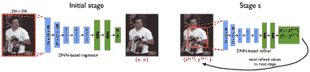

<!--yml

类别：未分类

日期：2024-09-06 20:00:58

-->

# [2006.01423] 单目人体姿态估计：基于深度学习方法的综述

> 来源：[`ar5iv.labs.arxiv.org/html/2006.01423`](https://ar5iv.labs.arxiv.org/html/2006.01423)

# 单目人体姿态估计：基于深度学习方法的综述

陈宇成 chenyucheng@mail.nwpu.edu.cn 田颖丽 ytian@ccny.cuny.edu 贺名义 myhe@nwpu.edu.cn 西安西北工业大学，美国纽约市城市大学的城市学院

###### 摘要

基于视觉的单目人体姿态估计，作为计算机视觉中最基本且具有挑战性的问题之一，旨在从输入图像或视频序列中获取人体姿态。深度学习技术的最新发展在人体姿态估计领域带来了显著进展和突破。本文广泛回顾了自 2014 年以来发表的基于深度学习的 2D 和 3D 人体姿态估计方法。本文总结了挑战、主要框架、基准数据集、评估指标、性能比较，并讨论了一些有前景的未来研究方向。

###### 关键词：

###### MSC：

41A05, 41A10, 65D05, 65D17 \KWDKeyword1, Keyword2, Keyword3 深度学习；人体姿态估计；综述；^†^†期刊：计算机视觉与图像理解

## 1 引言

人体姿态估计（HPE）任务，经过数十年的发展，旨在从给定的传感器输入中获取人体姿态。基于视觉的方法通常通过使用摄像头来提供这样的解决方案。近年来，深度学习在图像分类（Krizhevsky et al., 2012）、目标检测（Ren et al., 2015）、语义分割（Long et al., 2015）等众多计算机视觉任务上表现良好，HPE 也通过应用深度学习技术取得了快速进展。主要的发展包括设计良好的具有出色估计能力的网络、更丰富的数据集（Lin et al., 2014；Joo et al., 2017；Mehta et al., 2017a）用于网络训练，以及对身体模型的更实际的探索（Loper et al., 2015；Kanazawa et al., 2018）。尽管已有一些关于 HPE 的现有综述，但仍然缺乏总结最新深度学习成果的调查。本文广泛回顾了基于深度学习的 2D/3D 人体姿态估计方法，基于单目图像或视频资料。依赖其他传感器如深度（Shotton et al., 2012）、红外光源（Faessler et al., 2014）、射频信号（Zhao et al., 2018）和多视角输入（Rhodin et al., 2018b）的算法未包含在此调查中。

作为计算机视觉的基础任务之一，HPE 是一个非常重要的研究领域，可以应用于许多场景，如动作/活动识别（Li et al., 2017b; Luvizon et al., 2018; Li et al., 2018b）、动作检测（Li et al., 2017a）、人体跟踪（Insafutdinov et al., 2017）、电影和动画、虚拟现实、人机交互、视频监控、医疗辅助、自动驾驶、运动动作分析等。

电影和动画：各种生动数字角色的生成离不开对人体运动的捕捉。便宜且准确的人体动作捕捉系统可以更好地促进数字娱乐产业的发展。

虚拟现实：虚拟现实是一项非常有前景的技术，既可以应用于教育也可以应用于娱乐。人体姿态估计可以进一步明确人类与虚拟现实世界之间的关系，并增强互动体验。

人机交互（HCI）：HPE 对于计算机和机器人更好地理解人的识别、定位和动作非常重要。通过人的姿态（例如手势），计算机和机器人可以以更简单的方式执行指令，变得更智能。

视频监控：视频监控是早期应用 HPE 技术进行跟踪、动作识别、在特定范围内重新识别人员的应用之一。

医疗辅助：在医疗辅助应用中，HPE 可以为医生提供定量的人体运动信息，尤其是用于康复训练和物理治疗。

自动驾驶：先进的自动驾驶技术发展迅速。通过 HPE，自动驾驶汽车可以更适当地响应行人，并提供与交通协调员更全面的互动。

运动动作分析：估计运动视频中运动员的姿态可以进一步获取运动员指标的统计数据（例如跑步距离、跳跃次数）。在训练中，HPE 可以提供动作细节的定量分析。在体育教育中，教练可以通过 HPE 对学生进行更客观的评估。

图 1：单目图像或视频中 HPE 的典型挑战。示例图像来自马克斯·普朗克信息学研究所（MPII）数据集（Andriluka et al., 2014）。

单目人体姿态估计具有一些独特的特征和挑战。如图 1 所示，人体姿态估计的挑战主要体现在三个方面：

+   1.

    灵活的身体配置表示复杂的相互依赖的关节和高自由度的肢体，这可能导致自遮挡或稀有/复杂的姿态。

+   2.

    多样化的身体外观包括不同的服装和自我相似的部分。

+   3.

    复杂的环境可能导致前景遮挡、邻近人物的遮挡或类似部位、各种视角以及相机视野中的截断。

人体姿态估计的论文可以通过不同的方式进行分类。根据是否使用设计的人体模型，这些方法可以分为生成方法（基于模型）和判别方法（无模型）。根据处理的起始层次（高层次抽象或低层次像素证据），它们可以被分类为自上而下的方法和自下而上的方法。不同类别策略的详细信息汇总在表格 2 中，并在第 2.1 节中进行了描述。

如表 1 所列，随着过去几十年人体姿态估计的发展，一些显著的综述总结了这一领域的研究工作。这些综述（Aggarwal and Cai, 1999; Gavrila, 1999; Poppe, 2007; Ji and Liu, 2010; Moeslund et al., 2011）从多个方面（例如检测与跟踪、姿态估计、识别）回顾了人体运动分析的早期工作，并描述了人体姿态估计与其他相关任务之间的关系。虽然 Hu et al. (2004)总结了用于视频监控应用的人体运动分析研究，但综述（Moeslund and Granum, 2001; Moeslund et al., 2006）则专注于人体运动捕捉系统。最近的综述主要集中于相对狭窄的方向，例如 RGB-D 基础的动作识别（Chen et al., 2013; Wang et al., 2018b）、3D HPE（Sminchisescu, 2008; Holte et al., 2012; Sarafianos et al., 2016）、基于模型的 HPE（Holte et al., 2012; Perez-Sala et al., 2014）、基于身体部位的 HPE（Liu et al., 2015）以及单目 HPE（Sminchisescu, 2008; Gong et al., 2016）。

与现有的综述论文不同，这项调查广泛总结了自 2014 年发布的基于深度学习的人体姿态估计方法的最新里程碑工作。为了提供全面的总结，本调查包括了一些在某些综述中讨论过的研究工作（Liu et al., 2015; Gong et al., 2016; Sarafianos et al., 2016），但大多数最近的进展在之前的任何综述中都没有呈现。

本文的其余部分组织如下。第二部分介绍了现有的有关人体运动分析和 HPE 的综述论文、HPE 方法的不同分类方式，以及广泛使用的人体模型。第三部分和第四部分分别描述了 2D HPE 和 3D HPE 方法。在每一节中，我们进一步描述了单人姿态估计和多人姿态估计的 HPE 方法。由于数据是深度学习方法中非常重要和基础的元素，第五部分总结了近期的 HPE 数据集和评估指标。最后，第六部分总结了论文并讨论了几个有前景的未来研究方向。

表 1：人体运动分析和 HPE 相关综述的总结。

| 序号 | 综述 $\&amp;$ 参考文献 | 发表场所 | 内容 |
| --- | --- | --- | --- |

|

&#124; 1 &#124;

| 人体运动分析：综述 (Aggarwal 和 Cai, 1999) | CVIU | 包括身体结构分析、运动跟踪和动作识别的人体运动分析综述。 |
| --- | --- | --- |
| 2 | 人体运动的视觉分析：综述 (Gavrila, 1999) | CVIU | 全身和手部运动分析的综述。 |
| 3 | 基于计算机视觉的人体运动捕捉综述 (Moeslund 和 Granum, 2001) | CVIU | 基于运动捕捉系统的概述，包括初始化、跟踪、姿态估计和识别。 |
| 4 | 关于物体运动和行为的视觉监控综述 (Hu et al., 2004) | TSMCS | 基于动态场景视觉监控框架的人体运动分析总结。 |
| 5 | 基于视觉的人体运动捕捉和分析的进展综述 (Moeslund et al., 2006) | CVIU | 从 2000 年到 2006 年的人体运动捕捉和分析的进一步总结，继承自(Moeslund 和 Granum, 2001)。 |
| 6 | 基于视觉的人体运动分析：概述 (Poppe, 2007) | CVIU | 无标记数据的基于视觉的人体运动分析总结。 |
| 7 | 单目视频中的 3D 人体运动分析：技术和挑战 (Sminchisescu, 2008) |

&#124; 书籍 &#124;

&#124; 章节 &#124;

| 单视角摄像机视频序列重建三维人体运动的概述。 |
| --- |
| 8 | 基于视角不变的人体运动分析进展：综述（Ji 和 Liu，2010） | TSMCS | 人体运动分析的总结，包括人体检测、视角不变的姿势表示与估计，以及行为理解。 |
| 9 | 人体的视觉分析（Moeslund 等，2011） | 书籍 | 人体分析的综合概述，包括检测与跟踪、姿势估计、识别以及人体和面部的应用。 |
| 10 | 从多视角视频中估计人体姿势与活动识别：近期发展比较探索（Holte 等，2012） | JSTSP | 基于模型的 3D HPE 和动作识别方法在多视角下的综述。 |
| 11 | 使用深度图像的人体运动分析调查（Chen 等，2013） | PRL | 传统的基于 RGB-D 的人体动作识别方法的调查，包括传感器的描述、相关数据集和方法。 |
| 12 | 2D 和 3D 视觉人体姿势恢复的模型基础方法综述（Perez-Sala 等，2014） | 传感器 | 基于模型的 HPE 方法的综述，分为五个主要模块：外观、视角、空间关系、时间一致性和行为。 |
| 13 | 人体姿势估计的调查：基于身体部位解析的方法（Liu 等，2015） | JVCIR | 基于身体部位解析的 HPE 方法的调查，涵盖单视角和多视角的不同输入源（图像、视频、深度）。 |
| 14 | 从单目图像中估计人体姿势：全面综述（Gong 等，2016） | 传感器 | 单目基础的传统 HPE 方法的综述，以及少量基于深度学习的方法。 |
| 15 | 3D 人体姿势估计：文献综述与协变量分析（Sarafianos 等，2016） | CVIU | 3D HPE 方法的综述，涵盖不同类型的输入（例如，单张图像或视频，单目或多视角）。 |
| 16 | 基于 RGB-D 的深度学习人体运动识别：综述（Wang 等，2018b） | CVIU | RGB-D 基础的运动识别的调查，分为四类：基于 RGB 的、基于深度的、基于骨架的和基于 RGB-D 的。 |
| 17 | 单目人体姿势估计：基于深度学习的方法综述 | 我们的 | 深度学习基础的单目 HPE 研究及人体姿势数据集的全面综述，分为四组：2D 单目 HPE、2D 多目 HPE、3D 单目 HPE 和 3D 多目 HPE。 |

## 2 HPE 方法与人体模型的类别

表 2：基于深度学习的单目人体姿势估计的类别。

| 方向 | 子方向 | 类别 | 子类别 |
| --- | --- | --- | --- |
| 2D HPE | 2D 单目 | 基于回归 | (1) 直接预测：（Krizhevsky 等，2012），在视频上（Pfister 等，2014） |
| (2) 监督改进：将热图转换为关节坐标 (Luvizon et al., 2017；Nibali et al., 2018)，递归细化 (Carreira et al., 2016)，基于骨架的约束 (Sun et al., 2017) |
| (3) 多任务：带有身体部位检测 (Li et al., 2014)，带有人物检测和动作分类 (Gkioxari et al., 2014a)，带有基于热图的关节检测 (Fan et al., 2015)，带有视频序列上的动作识别 (Luvizon et al., 2018) |
| 基于检测 | (1) 基于补丁： (Jain et al., 2013；Chen and Yuille, 2014；Ramakrishna et al., 2014) |
| (2) 网络设计： (Tompson et al., 2015；Bulat and Tzimiropoulos, 2016；Xiao et al., 2018)，多尺度输入 (Rafi et al., 2016)，基于热图的改进 (Papandreou et al., 2017)，Hourglass (Newell et al., 2016)，CPM (Wei et al., 2016)，PRM (Yang et al., 2017)，前馈模块 (Belagiannis and Zisserman, 2017)，HRNet (Sun et al., 2019)，GAN (Chou et al., 2017；Chen et al., 2017；Peng et al., 2018) |
| (3) 身体结构约束： (Tompson et al., 2014；Lifshitz et al., 2016；Yang et al., 2016；Gkioxari et al., 2016；Chu et al., 2016，2017；Ning et al., 2018；Ke et al., 2018；Tang et al., 2018a；Tang and Wu, 2019) |
| (4) 时间约束： (Jain et al., 2014；Pfister et al., 2015；Luo et al., 2018) |
| (5) 网络压缩： (Tang et al., 2018b；Debnath et al., 2018；Feng et al., 2019) |
| 2D 多重 | 自上而下 | 粗到细 (Iqbal and Gall, 2016；Huang et al., 2017)，边界框细化 (Fang et al., 2017)，多级特征融合 (Xiao et al., 2018；Chen et al., 2018)，结果细化 (Moon et al., 2019) |
| 自下而上 | (1) 两阶段：DeepCut (Pishchulin et al., 2016)，DeeperCut (Insafutdinov et al., 2016)，OpenPose (Cao et al., 2016)，PPN (Nie et al., 2018)，PifPafNet (Kreiss et al., 2019) |
| (2) 单阶段：热图和关联嵌入图 (Newell et al., 2017) |
| (3) 多任务：实例分割 (Papandreou et al., 2018)，关键点检测和语义分割 (Kocabas et al., 2018) |
| 3D 人体姿态估计 | 3D 单人 | 无模型 | (1) 单阶段：直接预测 (Li 和 Chan，2014；Pavlakos 等，2017)，身体结构约束 (Li 等，2015b；Tekin 等，2016；Sun 等，2017；Pavlakos 等，2018a) |
| (2) 2D 转 3D： (Martinez 等，2017；Zhou 等，2017；Tekin 等，2017；Li 和 Lee，2019；Qammaz 和 Argyros，2019；Chen 和 Ramanan，2017；Moreno-Noguer，2017；Wang 等，2018a；Yang 等，2018) |
| 基于模型 | (1) 基于 SMPL： (Bogo 等，2016；Tan 等，2017；Pavlakos 等，2018b；Omran 等，2018；Varol 等，2018；Kanazawa 等，2018；Arnab 等，2019) |
| (2) 基于运动学模型： (Mehta 等，2017a；Nie 等，2017；Zhou 等，2016；Mehta 等，2017c；Rhodin 等，2018a) |
|  |  | (3) 其他基于模型：概率模型 (Tome 等，2017) |
|  | 3D 多人 |  | 自下而上 (Mehta 等，2017b)，自上而下 (Rogez 等，2017)，基于 SMPL (Zanfir 等，2018)，实时 (Mehta 等，2019) |

### 2.1 人体姿态估计方法类别

本节总结了基于深度学习的人体姿态估计方法的不同类别，依据不同特征进行分类：1) 生成型（基于人体模型）和判别型（无人体模型）；2) 自上而下（从高层抽象到低层像素证据）和自下而上（从低层像素证据到高层抽象）；3) 基于回归（直接从输入图像映射到身体关节位置）和基于检测（生成关节位置的中间图像补丁或热图）；4) 单阶段（端到端训练）和多阶段（逐阶段训练）。

生成式与判别式：生成式方法和判别式方法之间的主要区别在于方法是否使用人体模型。根据人体模型的不同表示，生成式方法可以通过不同的方式处理，例如关于人体模型结构的先验知识、从不同视角到二维或三维空间的几何投影、高维参数空间优化的回归方法。有关人体模型表示的更多细节可以在第 2.2 节中找到。判别式方法直接学习从输入源到人体姿态空间的映射（基于学习）或在现有示例中进行搜索（基于示例），而不使用人体模型。判别式方法通常比生成式方法更快，但在未训练过的姿态上可能鲁棒性较差。

自上而下与自下而上：对于多人姿态估计，HPE 方法通常可以根据预测的起点分为自上而下和自下而上两种方法：高层抽象或低层像素证据。自上而下的方法从高层抽象开始，首先检测人物并生成人物的边界框位置。然后对每个人进行姿态估计。相反，自下而上的方法首先预测输入图像中每个人的所有身体部位，然后通过人体模型拟合或其他算法将它们分组。需要注意的是，身体部位可以是关节、四肢或小模板补丁，具体取决于不同的方法。随着图像中人物数量的增加，自上而下的方法的计算成本显著增加，而自下而上的方法则保持稳定。然而，如果有一些人存在较大的重叠，自下而上的方法在分组相应身体部位时面临挑战。

基于回归与基于检测：根据不同的问题表述，基于深度学习的人体姿态估计方法可以分为基于回归和基于检测的方法。基于回归的方法直接将输入图像映射到身体关节的坐标或人体模型的参数。基于检测的方法将身体部位视为检测目标，基于两种广泛使用的表示：图像块和关节位置的热图。从图像到关节坐标的直接映射非常困难，因为这是一个高度非线性的问题，而小区域表示提供了更密集的像素信息，具有更强的鲁棒性。与原始图像大小相比，小区域表示的检测结果限制了最终关节坐标的准确性。

一阶段方法与多阶段方法的对比：基于深度学习的一阶段方法旨在通过使用端到端网络将输入图像映射到人体姿态，而多阶段方法通常在多个阶段预测人体姿态，并伴有中间监督。例如，一些多人体姿态估计方法首先检测人的位置，然后为每个检测到的人估计人体姿态。其他 3D 人体姿态估计方法首先在 2D 平面上预测关节位置，然后将其扩展到 3D 空间。一阶段方法的训练比多阶段方法更容易，但约束条件较少。

本调查综述了最近的工作，分为两个主要部分：2D 人体姿态估计（第三部分）和 3D 人体姿态估计（第四部分）。对于每一部分，我们进一步根据其各自的特点将其细分为子部分（有关所有类别及对应论文的总结请参见表格 2）。

### 2.2 人体模型

人体建模是 HPE 的关键组成部分。人体是一个灵活且复杂的非刚性物体，具有许多特定特征，如运动学结构、体型、表面纹理、身体部位或关节的位置等。一个成熟的人体模型不一定包含所有人体属性，但应满足特定任务的要求，以构建和描述人体姿态。如图 2 所示，根据不同的表示水平和应用场景，在 HPE 中常用的人体模型有三种类型：基于骨架的模型、基于轮廓的模型和基于体积的模型。有关人体模型的更详细描述，请参阅两篇总结良好的论文（Liu et al., 2015; Gong et al., 2016）。

图 2：常用的人体模型。（a）基于骨架的模型；（b）基于轮廓的模型；（c）基于体积的模型。

基于骨架的模型：基于骨架的模型，也称为 stick-figure 或运动学模型，表示一组关节（通常在 10 到 30 个之间）位置及其对应的肢体方向，遵循人体骨骼结构。骨架模型也可以描述为一个图，其中顶点表示关节，边表示骨架结构内关节的约束或先验连接（Felzenszwalb 和 Huttenlocher, 2005）。这种人体拓扑结构非常简单且灵活，广泛用于 2D 和 3D HPE（Cao et al., 2016；Mehta et al., 2017c）以及人体姿势数据集（Andriluka et al., 2014；Wu et al., 2017）。虽然具有简单和灵活表示的明显优势，但也存在许多缺点，如缺乏纹理信息，表示了人体的宽度和轮廓信息的缺失。

基于轮廓的模型：轮廓模型在早期 HPE 方法中被广泛使用，包含了身体肢体和躯干的粗略宽度和轮廓信息。人体部位大致用矩形或人影的边界表示。广泛使用的轮廓模型包括纸板模型（Ju et al., 1996）和活动形状模型（ASMs）（Cootes et al., 1995）。

基于体积的模型：3D 人体形状和姿势通常由具有几何形状或网格的体积模型表示。早期用于建模身体部位的几何形状包括圆柱体、圆锥体等（Sidenbladh et al., 2000）。现代体积模型以网格形式表示，通常通过 3D 扫描捕获。广泛使用的体积模型包括 Shape Completion and Animation of People (SCAPE)（Anguelov et al., 2005）、Skinned Multi-Person Linear 模型 (SMPL)（Loper et al., 2015）和统一变形模型（Joo et al., 2018）。

## 2D 人体姿势估计

2D 人体姿势估计通过单目图像或视频计算人体关节的位置。在深度学习对基于视觉的人体姿势估计产生巨大影响之前，传统的 2D HPE 算法采用手工特征提取和复杂的身体模型来获得局部表示和全局姿势结构（Dantone et al., 2013；Chen 和 Yuille, 2014；Gkioxari et al., 2014b）。在这里，最近的基于深度学习的 2D 人体姿势估计方法被分为“单人姿势估计”和“多人姿势估计”。

### 2D 单人姿势估计

2D 单人姿态估计是定位输入图像中单个人的身体关节位置。对于有多个人的图像，需要预处理以裁剪原始图像，使得输入图像中只有一个人，如使用上半身检测器（Eichner 和 Ferrari，2012a）或全身检测器（Ren 等，2015），以及基于标注的人员中心和身体尺度从原始图像中裁剪（Andriluka 等，2014；Newell 等，2016）。将深度学习引入人体姿态估计的早期工作主要是通过简单地用神经网络替换一些框架组件来扩展传统的 HPE 方法（Jain 等，2013；Ouyang 等，2014）。

根据人体姿态估计任务的不同公式，使用 CNN 的方法可以分为两类：基于回归的方法和基于检测的方法。基于回归的方法试图通过端到端框架学习从图像到运动体关节坐标的映射，并通常直接产生关节坐标（Toshev 和 Szegedy，2014）。基于检测的方法旨在预测身体部位（Chen 和 Yuille，2014）或关节（Newell 等，2016）的大致位置，通常通过一系列矩形窗口（每个窗口包含一个特定的身体部位）（Jain 等，2013；Chen 和 Yuille，2014）或热图（每个热图通过一个以关节位置为中心的二维高斯分布指示一个关节位置）（Newell 等，2016；Wei 等，2016）来监督。每种方法都有其优缺点。仅学习一个单点的直接回归具有难度，因为这是一个高度非线性的问题，缺乏鲁棒性，而热图学习由密集像素信息进行监督，结果更具鲁棒性。与原始图像大小相比，由于 CNN 中的池化操作，热图表示具有较低的分辨率，这限制了关节坐标估计的准确性。而从热图中获得关节坐标通常是一个不可微的过程，这阻碍了网络的端到端训练。2D 单人姿态估计的近期代表性工作总结在表 3 中，最后一列是 MPII 测试集上的 PCKh@0.5 分数比较。数据集和评估指标的更多细节在第五部分中描述。

表 3：2D 单人姿态估计方法总结。请注意，最后一列显示的是 Max Planck 信息学研究所（MPII）人体姿态测试集上的 PCKh@0.5 分数。

| 方法 | 主干网络 | 输入尺寸 | 亮点 | PCKh (%) |
| --- | --- | --- | --- | --- |
| 回归基础 |
| (Toshev and Szegedy, 2014) |

&#124; AlexNet &#124;

| 220$\times$220 | 直接回归，多阶段精炼 | - |
| --- | --- | --- |
| (Carreira et al., 2016) | GoogleNet | 224$\times$224 | 从初始姿势进行迭代错误反馈精炼 | 81.3 |
| (Sun et al., 2017) | ResNet-50 | 224$\times$224 | 基于骨骼的表示作为附加约束，适用于 2D/3D HPE | 86.4 |
| (Luvizon et al., 2017) |

&#124; Inception-v4+ &#124;

&#124; Hourglass &#124;

| 256$\times$256 | 多阶段架构，提出的 soft-argmax 函数将热图转换为关节位置 | 91.2 |
| --- | --- | --- |
| 检测基础 |
| (Tompson et al., 2014) | AlexNet | 320$\times$240 | 热图表示，多尺度输入，MRF 类空间模型 | 79.6 |
| (Yang et al., 2016) | VGG | 112$\times$112 | 通过可变形部分模型联合学习 DCNN | - |
| (Newell et al., 2016) | Hourglass | 256$\times$256 | 提出的堆叠 Hourglass 架构，具有中间监督 | 90.9 |
| (Wei et al., 2016) | CPM | 368$\times$368 | 提出的卷积姿态机器（CPM）具有中间输入和监督，学习身体部位之间的空间关系 | 88.5 |
| (Chu et al., 2017) | Hourglass | 256$\times$256 | 从多尺度特征中生成多分辨率注意力图，提出微型 Hourglass 残差单元以增加感受野 | 91.5 |
| (Yang et al., 2017) | Hourglass | 256$\times$256 | 提出的金字塔残差模块（PRM）为不同分辨率的输入特征学习滤波器 | 92.0 |
| (Chen et al., 2017) | conv-deconv | 256$\times$256 | GAN，堆叠的 conv-deconv 架构，多任务用于姿态和遮挡，两个判别器用于区分姿态是否“真实”以及置信度是否强 | 91.9 |
| (Peng et al., 2018) | Hourglass | 256$\times$256 | GAN，提出的增强网络生成数据增强，无需寻找更多数据 | 91.5 |
| (Ke et al., 2018) | Hourglass | 256$\times$256 | 改进的 Hourglass 网络，具有多尺度中间监督、多尺度特征组合、结构感知损失和关节遮罩的数据增强 | 92.1 |
| (Tang et al., 2018a) | Hourglass | 256$\times$256 | 组合模型，对身体部位进行层次表示以进行中间监督 | 92.3 |
| (Sun et al., 2019) | HRNet | 256$\times$256 | 全网络中的高分辨率特征表示，多尺度融合 | 92.3 |
| (Tang and Wu, 2019) | Hourglass | 256$\times$256 | 数据驱动的关节分组，提出了基于部分的分支网络（PBN）来学习特定于每个部分组的表示。 | 92.7 |

#### 3.1.1 回归方法

AlexNet (Krizhevsky et al., 2012) 是早期的深度学习基础 HPE 方法之一，因其简单的架构和令人印象深刻的性能而广受欢迎。Toshev 和 Szegedy (2014) 首次尝试训练类似 AlexNet 的深度神经网络，以非常直接的方式从完整图像中学习关节坐标，而不使用任何身体模型或部分检测器，如图 3 所示。此外，采用了多阶段精炼回归器的级联架构，以精炼前一阶段的裁剪图像并显示出改进的性能。Pfister 等人 (2014) 还应用了类似 AlexNet 的网络，使用一系列串联的帧作为输入来预测视频中的人体姿势。

图 3: DeepPose 的框架 (Toshev 和 Szegedy, 2014)。

仅使用关节而没有周围信息缺乏鲁棒性。将热图监督转换为数值关节位置监督可以保留两种表示方法的优点。Luvizon 等人 (2017) 提出了一个 Soft-argmax 函数来将热图转换为关节坐标，这可以将基于检测的网络转换为可微分的回归网络。Nibali 等人 (2018) 设计了一个可微分的空间到数值转换（DSNT）层，以从热图计算关节坐标，这在低分辨率热图中效果良好。

直接从输入图像预测关节坐标并且限制条件很少是非常困难的，因此引入了具有改进或身体模型结构的更强大的网络。Carreira 等人 (2016) 提出了一个基于 GoogleNet 的迭代误差反馈网络，该网络递归地处理输入图像和输出结果的组合。最终姿势通过迭代从初始的平均姿势中改进。Sun 等人 (2017) 提出了一个基于 ResNet-50 的结构感知回归方法。与使用关节表示姿势不同，该方法通过涉及身体结构信息设计了一个基于骨骼的表示，以实现比仅使用关节位置更稳定的结果。基于骨骼的表示也适用于 3D HPE。

处理人类身体多个紧密相关任务的网络可能会学习多样化的特征，以提高关节坐标的预测精度。Li 等人 (2014) 使用了一种类似于 AlexNet 的多任务框架，以回归方式处理从完整图像中预测关节坐标的任务，以及从滑动窗口获得的图像补丁中检测身体部位的任务。Gkioxari 等人 (2014a) 使用了 R-CNN 架构来同步检测人、估计姿势和分类动作。Fan 等人 (2015) 提出了双源深度 CNNs，输入图像补丁和完整图像，输出热图表示的关节检测结果以及坐标表示的关节定位结果。最终估计的姿势是通过结合这两个结果得到的。Luvizon 等人 (2018) 设计了一个可以从视频序列中联合处理 2D/3D 姿势估计和动作识别的网络。网络中间估计的姿势可以用作动作识别的参考。

#### 3.1.2 基于检测的方法

基于检测的方法源自身体部位检测方法。在传统的基于部位的 HPE 方法中，首先从图像补丁候选区域检测身体部位，然后将其组合以适配人体模型。早期工作的检测到的身体部位相对较大，通常由矩形滑动窗口或补丁表示。我们参考了(Poppe, 2007; Gong 等人, 2016) 获取更详细的介绍。一些早期方法使用神经网络作为身体部位检测器，以区分候选补丁是否为特定的身体部位 (Jain 等人, 2013)，在预定义模板中分类候选补丁 (Chen 和 Yuille, 2014)，或预测属于多个类别的置信度图 (Ramakrishna 等人, 2014)。身体部位检测方法通常对复杂背景和身体遮挡较为敏感。因此，只有局部外观的独立图像补丁可能不足以区分身体部位。

为了提供比仅关节坐标更多的监督信息，并便于 CNN 的训练，较新的研究采用了热图来表示关节位置的真实情况（Tompson 等，2014；Jain 等，2014）。如图 4 所示，每个关节占据一个热图通道，该通道中心在目标关节位置的二维高斯分布。此外，Papandreou 等人（2017）提出了一种改进的关节位置表示方法，即二进制激活热图与相应偏移量的组合。由于热图表示比坐标表示更为鲁棒，因此大多数近期研究基于热图表示。

图 4：不同关节的热图表示。

神经网络架构对于更好地利用输入信息非常重要。一些方法主要基于经典网络并进行了适当的改进，例如具有多尺度输入的 GoogLeNet 网络（Rafi 等，2016），具有反卷积层的 ResNet 网络（Xiao 等，2018）。在迭代精炼方面，一些工作设计了多阶段风格的网络，通过端到端学习从粗略预测中细化结果（Tompson 等，2015；Bulat 和 Tzimiropoulos，2016；Newell 等，2016；Wei 等，2016；Yang 等，2017；Belagiannis 和 Zisserman，2017）。这些网络通常使用中间监督来解决梯度消失问题。Newell 等（2016）提出了一种新颖的堆叠沙漏结构，使用残差模块作为组件单元。Wei 等（2016）提出了一种多阶段预测框架，每个阶段都有输入图像。Yang 等（2017）设计了金字塔残差模块（PRMs），用来替代沙漏网络的残差模块，通过在不同尺度上学习特征来增强 DCNN 的尺度不变性。Belagiannis 和 Zisserman（2017）将 7 层前馈模块与递归模块相结合，迭代地细化结果。该模型学习预测关节和身体肢体的位置热图。此外，他们分析了关键点的可见性与不平衡的真实分布。为了在整个网络中保持高分辨率特征表示，Sun 等（2019）提出了一种新型的高分辨率网络（HRNet），实现了多尺度特征融合。

不同于早期尝试将检测到的身体部位适配到身体模型中的工作，最近的一些研究尝试将人体结构信息编码到网络中。Tompson 等人 (2014) 共同训练了一个带有类似 MRF 的空间模型的网络，以学习关节之间的典型空间关系。Lifshitz 等人 (2016) 将图像离散化为围绕每个关节中心的对数极坐标箱，并采用基于 VGG 的网络来预测每对关节的类别置信度（即二元项）。利用所有相对置信度分数，可以通过反卷积网络生成每个关节的最终热图。Yang 等人 (2016) 设计了一个两阶段网络。第一阶段是一个卷积神经网络，用于预测热图表示中的关节位置。第二阶段是一个根据人体结构手动连接的消息传递模型，用于通过最大求和算法找到最佳的关节位置。Gkioxari 等人 (2016) 提出了一个卷积递归神经网络，按照链模型一个接一个地输出关节位置。每一步的输出依赖于输入图像和先前预测的输出。该网络可以处理图像和视频，并具有不同的连接策略。Chu 等人 (2016) 提出了通过双向树转换卷积核，以在树状身体模型中的对应关节之间传递信息。Chu 等人 (2017) 用更复杂的残差模块替换了 Hourglass 网络的残差模块。条件随机场 (CRF) 被用于注意力图作为中间监督，以学习身体结构信息。（Ning 等人， 2018）设计了一个分形网络，以施加身体先验知识来指导网络。外部知识的视觉特征通过使用学习到的投影矩阵被编码到基本网络中。Ke 等人 (2018) 提出了一个基于 Hourglass 网络的多尺度结构感知网络，具有多尺度监督、多尺度特征组合、结构感知损失和关节遮挡的数据增强。在 Hourglass 网络的基本框架上，Tang 等人 (2018a) 设计了一个身体部位的分层表示，用于中间监督，替代每个关节的热图。因此，网络学习的是自底向上/自顶向下的身体结构，而不仅仅是分散的关节。Tang 和 Wu (2019) 提出了一个基于部件的分支网络 (PBN)，以学习每个部件组的特定表示，而不是从一个分支预测所有关节热图。然后通过计算关节的互信息来划分数据驱动的部件组。

生成对抗网络（GANs）也被用来为学习人体结构或网络训练提供对抗性监督。Chou 等人（2017）引入了生成对抗学习，其中两个相同的 Hourglass 网络分别作为生成器和判别器。生成器预测每个关节的热图位置，而判别器则区分真实的热图和生成的热图。Chen 等人（2017）提出了一种结构感知卷积网络，具有一个生成器和两个判别器，以结合人体结构的先验信息。生成器由 Hourglass 网络设计，用于预测关节热图以及遮挡热图。姿态判别器可以区分合理的身体配置和不合理的身体配置。置信度判别器显示预测的置信度分数。Peng 等人（2018）研究了如何在不寻求更多数据的情况下共同优化数据增强和网络训练。他们不是使用随机数据增强，而是应用增强来增加网络损失，同时姿态网络从生成的增强数据中学习。

时间信息的利用对于在单目视频序列中估计 2D 人体姿态也非常重要。Jain 等人（2014）设计了一个框架，该框架包含两个分支的 CNN，输入为多尺度 RGB 帧和光流图。提取的特征在最后的卷积层之前被拼接在一起。Pfister 等人（2015）使用光流图作为引导，根据视频的时间上下文对来自邻近帧的预测热图进行对齐。Luo 等人（2018）利用时间信息，使用从 CPM 重新设计的递归神经网络，通过将多阶段架构改为 LSTM 结构。

为了在低容量设备上估计人体姿态，可以减少网络参数，同时仍保持竞争性能。Tang 等人（2018b）致力于通过提出密集连接的 U-Net 和高效的内存使用来改进网络结构。该网络类似于 Hourglass 网络的概念，同时利用 U-Net 作为每个组件，通过跨每个阶段的更优化全局连接，结果是参数更少，模型大小更小。Debnath 等人（2018）通过在 MobileNets 的最后两层设计分流架构，将 MobileNets（Howard 等人，2017）适配用于姿态估计。Feng 等人（2019）设计了一种 Hourglass 网络的轻量级变体，并通过 Fast Pose Distillation（FPD）训练策略用完整的教师 Hourglass 网络对其进行训练。

总结来说，热图表示比基于检测的方法中的坐标表示更适合于深度学习中 2D 单人姿态估计的网络训练。

### 3.2 2D 多人体姿态估计

与单人姿态估计不同，多人姿态估计需要同时处理检测和定位任务，因为输入图像中没有提示有多少人。根据从哪个层次（高层次抽象或低层次像素证据）开始计算，人体姿态估计方法可以分为自上而下的方法和自下而上的方法。

自上而下的方法通常采用人物检测器来获取输入图像中人的边界框集合，然后直接利用现有的单人姿态估计器来预测人体姿态。预测的姿态在很大程度上依赖于人物检测的精度。整个系统的运行时间与人数成正比。而自下而上的方法则直接预测所有人的 2D 关节，然后将它们组装成独立的骨架。在复杂环境中正确分组关节点是一个具有挑战性的研究任务。表 4 总结了最近基于深度学习的 2D 多人姿态估计方法，涵盖了自上而下和自下而上的类别。表 4 的最后一列是 COCO 测试开发数据集上的平均精度（AP）分数。数据集和评估指标的更多细节描述见第五部分。

表 4：2D 多人姿态估计方法的比较。请注意，最后一列显示了 COCO 测试开发集上的平均精度（AP）分数。带有 * 的结果是使用 COCO16 训练集获得的，而其他结果是使用 COCO17 训练集获得的。

| 方法 | 网络类型 | 亮点 | AP 分数 (%) |
| --- | --- | --- | --- |
| 自上而下 |
| (Iqbal and Gall, 2016) | Faster R-CNN + CPM | 在人物检测和单人 HPE 之后，使用整数线性规划（ILP）细化检测到的局部关节候选。 | - |
| (Fang et al., 2017) | Faster R-CNN + Hourglass | 将对称空间变换网络（SSTN）和 Hourglass 模型结合以对检测结果进行 SPPE；提出了一个参数化的姿态 NMS 来细化姿态提案；设计了一个姿态引导提案生成器来扩充现有的训练样本 | $63.3^{*}$ |
| (Papandreou et al., 2017) | Faster R-CNN + ResNet-101 | 为 SPPE 生成每个关节的热图和偏移图，并通过聚合过程将它们结合；使用基于关键点的 NMS 避免重复姿态 | $64.9^{*}$ |
| (Huang et al., 2017) | Faster R-CNN + Inception-v2 | 为 SPPE 生成粗略和精细的姿态，具有多级监督；多尺度特征融合 | $72.2^{*}$ |
| (He et al., 2017) | Mask R-CNN + ResNet-FPN | Mask R-CNN 框架的扩展；同步预测关键点和人体掩模 | $63.1^{*}$ |
| (Xiao et al., 2018) | Faster R-CNN + ResNet | 仅在 ResNet 之后添加了几个反卷积层，以从深层和低分辨率特征中生成热图 | 73.7 |
| (Chen et al., 2018) | FPN + CPN | 提出了具有特征金字塔的 CPN；两阶段网络；在线困难关键点挖掘 | 73.0 |
| (Moon et al., 2019) | ResNet + 上采样 | 提出了 PoseFix 网络以根据姿态误差分布从任何 HPE 方法中精细化估计的姿态 | - |
| (Sun et al., 2019) | Faster R-CNN + HRNet | 跨整个网络的高分辨率特征表示，多尺度融合 | 75.5 |
| 自下而上的方法 |
| (Pishchulin et al., 2016) | Fast R-CNN | 将区分不同人员的问题表述为 ILP 问题；对检测到的部件候选进行聚类；结合人员簇和标记部件以获得最终姿态 | - |
| (Insafutdinov et al., 2016) | ResNet | 使用图像条件配对项来组装部件提议 | - |
| (Cao et al., 2016) | VGG-19 + CPM | OpenPose；实时；在双分支架构中同时进行关节检测和关联；提出了部件亲和场（PAFs）来编码肢体的位置和方向 | $61.8^{*}$ |
| (Newell et al., 2017) | Hourglass | 在一个分支中同时进行关节检测和关联；提出了密集关联嵌入标签以进行检测关节分组 | 65.5 |
| (Nie et al., 2018) | Hourglass | 在双分支架构中同时进行关节检测和关联；在嵌入空间中生成由关节候选上的人员质心参数化的分区；通过局部贪婪推理方法估计姿态实例 | - |
| (Papandreou et al., 2018) | ResNet | 多任务（姿态估计和实例分割）网络；在多分支架构中同时进行关节检测和关联；使用树状运动学图指导关节分组的多范围关节偏移 | 68.7 |
| (Kocabas et al., 2018) | ResNet-FPN + RetinaNet | 多任务（姿态估计、行人检测和行人分割）网络；在双分支架构中同时进行关键点检测和行人检测；提出了 Pose Residual Network (PRN)来将关键点检测分配给行人实例 | 69.6 |
| (Kreiss et al., 2019) | ResNet-50 | 预测部件强度场（PIF）和部件关联场（PAF）来表示身体关节的位置和关节关联；在低分辨率下效果良好 | 66.7 |

#### 3.2.1 自上而下的方法

自顶向下的人体姿态估计方法的两个最重要的组成部分是人体区域候选检测器和单人姿态估计器。大部分研究集中在基于现有人体检测器（如 Faster R-CNN (Ren et al., 2015)、Mask R-CNN (He et al., 2017)、FPN (Lin et al., 2017)等）进行的人体部位估计上。Iqbal 和 Gall (2016) 利用基于卷积姿态机的姿态估计器生成初始姿态，然后应用整数线性规划(ILP)获得最终姿态。Fang 等人 (2017) 采用空间变换网络（STN）(Jaderberg et al., 2015)、非最大值抑制（NMS）和 Hourglass 网络来促进在存在不准确人体边界框的情况下的姿态估计。Huang 等人 (2017) 开发了一个由 Inception-v2 网络(Szegedy et al., 2016)作为骨干的粗细网络（CFN）。该网络在多个层面上进行监督学习，学习粗糙和精细预测。Xiao 等人 (2018) 在 ResNet 的最后一个卷积层上添加了几层反卷积层，从深层和低分辨率特征生成热图。Chen 等人 (2018) 提出了一种级联金字塔网络（CPN），通过使用来自不同层的多尺度特征图来获得更多来自局部和全局特征的推理，并采用在线难关键点挖掘损失进行难关节。基于不同 HPE 方法的类似姿态误差分布，Moon 等人 (2019) 设计了 PoseFix 网络来改进来自任何方法的估计姿态。

自顶向下的人体姿态估计方法可以通过组合现有的检测网络和单一的姿态估计网络轻松实现。与此同时，这类方法的性能受人体检测结果的影响，通常操作速度不是实时的。

#### 3.2.2 自下而上的方法

自下而上的 HPE 方法的主要组成部分包括身体关节检测和关节候选分组。大多数算法分别处理这两个组件。DeepCut (Pishchulin et al., 2016) 使用基于 Fast R-CNN 的身体部位检测器，首先检测所有身体部位候选，然后将每个部位标记为其对应的部位类别，并使用整数线性规划将这些部位组装成完整的骨架。DeeperCut (Insafutdinov et al., 2016) 通过使用基于 ResNet 的更强大的部位检测器和探索关节候选的几何和外观约束的更好增量优化策略改进了 DeepCut。OpenPose (Cao et al., 2016) 使用 CPM 通过 Part Affinity Fields (PAFs) 预测所有身体关节的候选。所提出的 PAFs 能够编码肢体的位置和方向，将估计的关节组装成不同的人体姿势。Nie et al. (2018) 提出了一个 Pose Partition Network (PPN) 来进行关节检测和关节分区的密集回归。然后，PPN 对关节配置进行局部推断。类似于 OpenPose，Kreiss et al. (2019) 设计了一个 PifPaf 网络来预测 Part Intensity Field (PIF) 和 Part Association Field (PAF) 以表示身体关节位置和身体关节关联。由于精细的 PAF 和利用了拉普拉斯损失，它在低分辨率图像上表现良好。

以上方法都遵循了关节检测和关节分组的分离。最近，一些方法能够在一个阶段完成预测。Newell et al. (2017) 引入了一个单阶段深度网络架构，以同时执行检测和分组。该网络可以生成每个关节的检测热图以及包含每个关节分组标签的关联嵌入图。

一些方法采用了多任务结构。Papandreou et al. (2018) 提出了一个无框多任务网络用于姿势估计和实例分割。基于 ResNet 的网络可以同步预测每个人的所有关键点的关节热图及其相对位移。然后，分组从最可信的检测开始，并基于树结构运动学图进行贪婪解码过程。Kocabas et al. (2018) 提出的网络将多任务模型与新颖的分配方法相结合，以同时处理人体关键点估计、检测和语义分割任务。其骨干网络是 ResNet 和 FPN 的组合，具有共享的关键点和人员检测子网络的特征。人体检测结果被用作人物空间位置的约束。

目前，底层方法的处理速度非常快，一些方法（Cao et al., 2016; Nie et al., 2018）可以实时运行。然而，性能可能受到复杂背景和人体遮挡的很大影响。顶层方法在几乎所有基准数据集上都达到了最先进的性能，但处理速度受到检测到的人数的限制。

## 4 3D 人体姿态估计

3D 人体姿态估计是从图像或其他输入源中预测身体关节在 3D 空间中的位置。虽然像 Kinect（Kinect, accessed on 2019）、VICON（Vicon, accessed on 2019）和 TheCaptury（TheCaptury, accessed on 2019）这样的商业产品都用于 3D 身体姿态估计，但这些系统都在非常受限的环境中工作或需要在人体上标记特殊标记。单目相机作为最广泛使用的传感器，对 3D 人体姿态估计非常重要。深度神经网络有能力从单目图像中估计密集深度（Li et al., 2015a, 2018a, 2019）和稀疏深度点（关节）。此外，单目输入的 3D 人体姿态估计的进展可以进一步改善受限环境中的多视角 3D 人体姿态估计。因此，本节重点关注基于深度学习的方法，这些方法从单目 RGB 图像和视频中估计 3D 人体姿态，包括 3D 单人姿态估计和 3D 多人姿态估计。

### 4.1 3D 单人姿态估计

与 2D HPE 相比，3D HPE 更具挑战性，因为它需要预测身体关节的深度信息。此外，3D HPE 的训练数据不像 2D HPE 那样容易获得。现有的大多数数据集是在受限环境下获得的，通用性有限。对于单人姿态估计，通常提供图像中的人物边界框，因此不需要结合人物检测过程。本节将 3D 单人姿态估计的方法分为无模型和基于模型两类，并在表 5 中总结了近期工作。表 5 的最后一列是 Human3.6M 数据集中在协议 #1 下的每关节位置误差（MPJPE）的比较，以毫米为单位。数据集和评估指标的更多细节在第五部分中描述。

表 5：3D 单人姿势估计方法的比较。这里“E.”代表“额外数据”，“T.”表示“时间信息”。最后一列是 Human3.6M 数据集中协议 #1 下的每关节位置平均误差（MPJPE），单位为毫米。带有 $*$ 的结果来自测试集中 6 个动作，而其他结果来自全部 17 个动作。带有 $\dagger$ 的结果使用 2D 关节真实值。带有 $\#$ 的方法也报告了关节旋转。

| 方法 | 主干 | E. | T. | 亮点 | MPJPE (毫米) |
| --- | --- | --- | --- | --- | --- |
| 无模型 |
| (Li 和 Chan，2014) | 浅层 CNN | ✗ | ✗ | 一个多任务网络，用于预测身体部位检测与滑动窗口和 3D 姿势估计联合进行 | $132.2^{*}$ |
| (Li 等，2015b) | 浅层 CNN | ✗ | ✗ | 计算图像-姿势对的匹配得分 | $120.2^{*}$ |
| (Tekin 等，2016) | 自编码器+浅层 CNN | ✗ | ✗ | 使用自编码器学习 3D 姿势的高维表示；使用浅层 CNN 网络学习高维姿势表示 | $116.8^{*}$ |
| (Tekin 等，2017) | Hourglass | ✓ | ✗ | 首先预测关节的 2D 热图；然后使用可训练的融合架构将 2D 热图和提取的特征结合；2D 模块在 MPII 上预训练 | $69.7$ |
| (Chen 和 Ramanan，2017) | CPM | ✓ | ✗ | 首先从图像中估计 2D 姿势；然后通过匹配到 3D 姿势库来估计深度；2D 模块在 MPII 上预训练 | $82.7$  $/57.5^{\dagger}$ |
| (Moreno-Noguer，2017) | CPM | ✓ | ✗ | 使用欧氏距离矩阵（EDM）编码 2D 和 3D 身体关节的成对距离；训练网络学习 2D 到 3D EDM 回归；与其他 3D (Humaneva-I) 数据集联合训练 | $87.3$ |
| (Pavlakos 等，2017) | Hourglass | ✓ | ✗ | 用于 3D 人体姿势的体积表示；粗到细的预测方案；2D 模块在 MPII 上预训练 | $71.9$ |
| (Zhou 等，2017) | Hourglass | ✓ | ✗ | 提出的损失来自 2D 数据的几何约束；骨长约束；与 2D (MPII) 数据集联合训练 | $64.9$ |
| (Martinez 等，2017) | Hourglass | ✓ | ✗ | 通过两个线性层将预测的 2D 姿势直接映射到 3D 姿势；2D 模块在 MPII 上预训练；实时处理 | $62.9$  $/45.5^{\dagger}$ |
| (Sun 等，2017)^# | ResNet | ✓ | ✗ | 基于骨骼的表示，涉及身体结构信息以增强鲁棒性；骨长约束；与 2D (MPII) 数据集联合训练 | $48.3$ |
| (Yang 等，2018) | Hourglass | ✓ | ✗ | 用于 2D/3D 数据集领域适应的对抗学习；采用 (Zhou 等，2017) 的生成器；多源判别器包括图像、成对几何结构和关节位置；与 2D (MPII) 数据集联合训练 | $58.6$ |
| Pavlakos et al. (2018a) | Hourglass | ✓ | ✗ | 3D 人体姿态的体积表示；为人体关节增加了额外的序数深度注释；与 2D（MPII）和 3D（Humaneva-I）数据集联合训练 | $56.2$ |
| (Sun et al., 2018) | Mask R-CNN | ✓ | ✗ | 3D 人体姿态的体积表示；积分操作统一了热图表示和关节回归；与 2D（MPII）数据集联合训练 | $40.6$ |
| (Li and Lee, 2019) | Hourglass | ✓ | ✗ | 从 2D 姿态生成多个 3D 姿态假设；通过 2D 重新投影选择最佳一个；2D 模块使用 MPII 进行预训练 | $52.7$ |
| 基于模型 |
| (Bogo et al., 2016)^# | DeepCut | ✗ | ✗ | SMPL 模型；通过最小化 2D 关节和投影的 3D 模型关节之间的距离来拟合 SMPL 模型 | $82.3$ |
| (Zhou et al., 2016)^# | ResNet | ✗ | ✗ | 运动学模型；将运动学对象模型嵌入网络中，以实现通用的关节对象姿态估计；方向和旋转约束 | $107.3$ |
| (Mehta et al., 2017c)^# | ResNet | ✓ | ✓ | 一个实时管道，结合了时间平滑滤波器和基于模型的运动学骨架拟合；2D 模块使用 MPII 和 LSP 进行预训练；实时处理；提供身体高度 | $80.5$ |
| (Tan et al., 2017) | 浅层 CNN | ✗ | ✗ | SMPL 模型；首先训练一个解码器从 SMPL 参数预测 2D 身体轮廓；然后训练一个编码-解码网络，利用图像和相应的轮廓；训练后的编码器可以从图像预测 SMPL 参数 | - |
| (Mehta et al., 2017a) | Resnet | ✓ | ✗ | 运动学模型；从为 2D 姿态估计学习的特征进行迁移学习；将 2D 姿态预测作为辅助任务；预测相对关节位置，遵循运动学树体模型；与 2D（MPII 和 LSP）数据集联合训练 | $74.1$ |
| (Nie et al., 2017) | RMPE + LSTM | ✓ | ✗ | 运动学模型；从全局 2D 姿态和骨架-LSTM 以及局部身体部位和补丁-LSTM 中进行关节深度估计；2D 模块使用 MPII 进行预训练 | $79.5$ |
| (Kanazawa et al., 2018)^# | ResNet | ✓ | ✗ | SMPL 模型；用于 2D 图像和 3D 人体模型领域适应的对抗学习；提出一个学习 SMPL 参数的框架；与 2D（LSP、MPII 和 COCO）数据集联合训练；实时处理 | $88.0$ |
| (Pavlakos et al., 2018b)^# | Hourglass | ✓ | ✗ | SMPL 模型；首先预测关节和人体轮廓的 2D 热图；其次生成 SMPL 参数；2D 模块使用 MPII 和 LSP 进行训练 | $75.9$ |
| (Omran et al., 2018)^# | RefineNet | ✗ | ✗ | SMPL 模型；首先从 RGB 图像中预测 2D 身体部位分割；其次利用该分割预测 SMPL 参数 | $59.9$ |
| (Varol et al., 2018) | Hourglass | ✓ | ✗ | SMPL 模型；首先预测 2D 姿态和 2D 身体部位分割；其次预测 3D 姿态；最后预测体积形状以适配 SMPL 模型；2D 模块使用 MPII 和 SURREAL 进行训练 | $49.0$ |
| (Arnab et al., 2019)^# | ResNet | ✓ | ✓ | SMPL 模型；2D 关键点、SMPL 和相机参数估计；离线束调整与时间约束；2D 模块使用 COCO 进行训练 | $77.8$  $/63.3^{\dagger}$ |
| (Tome et al., 2017) | CPM | ✓ | ✗ | 预训练的概率 3D 姿态模型；在 CPM-like 网络内通过概率模型进行 3D 提升和投影；2D 模块使用 MPII 进行预训练；实时处理 | $88.4$ |
| (Rhodin et al., 2018a) | Hourglass | ✗ | ✗ | 从多视图图像中学习的潜变量身体模型；一个编码器-解码器预测给定图像的全新视图图像；预训练编码器与额外的浅层网络以从图像中预测 3D 姿态 | - |

#### 4.1.1 无模型方法

无模型方法不使用人体模型作为预测目标或中间提示。它们大致可以分为两种类型：1）直接将图像映射到 3D 姿态，2）根据从 2D 姿态估计方法中间预测的 2D 姿态估计深度。

直接从图像特征估计 3D 姿态的方法通常约束很少。Li 和 Chan (2014)使用浅层网络直接回归 3D 关节坐标，并与滑动窗口的身体部位检测同步任务。Pavlakos et al. (2017)提出了一种 3D 人体姿态的体积表示，并采用粗到精的预测方案通过多阶段结构来细化预测。一些研究者尝试将身体结构信息或人体关节之间的依赖关系添加到深度学习网络中。Li et al. (2015b)设计了一个嵌入子网络，以学习潜在的姿态结构信息来引导 3D 关节坐标映射。该子网络可以为输入图像-姿态对分配匹配分数，并使用最大边际成本函数。Tekin et al. (2016)预训练了一个无监督自编码器，学习 3D 姿态的高维潜在姿态表示，以添加关于人体的隐含约束，然后使用浅层网络学习高维姿态表示。Sun et al. (2017)提出了一种结构感知回归方法。他们设计了一种基于骨骼的表示，涉及比仅使用关节位置更稳定的身体结构信息。Pavlakos et al. (2018a)使用额外的关节排序深度作为约束来训练网络，通过这种方式，2D 人体数据集也可以通过排序深度注释进行输入。

中间估计 2D 姿势的 3D HPE 方法获得了 2D HPE 的优势，并且可以轻松利用来自 2D 人类数据集的图像。其中一些采用了现成的 2D HPE 模块，首先估计 2D 姿势，然后扩展到 3D 姿势。（Martinez 等人，2017）设计了一个仅有两层线性层的 2D 到 3D 姿势预测器。（Zhou 等人，2017）提出了一个深度回归模块，通过提出的几何约束损失来预测 2D 热图中的 3D 姿势。Tekin 等人（2017）提出了一个双分支框架来预测 2D 热图并从图像中提取特征。提取的特征通过一个可训练的融合方案与 2D 热图融合，而不是手工制作，以获得最终的 3D 关节坐标。Li 和 Lee（2019）将 3D HPE 视为具有多种可行解的逆问题。生成多个 3D 姿势的可行假设，从 2D 姿势中选择最佳的，通过 2D 重投影进行选择。Qammaz 和 Argyros（2019）提出了 MocapNET，直接将 2D 姿势编码为 3D BVH（Meredith 等人，2001）格式以进行后续渲染。通过整合 OpenPose（Cao 等人，2016），该架构使用仅 CPU 处理来实时估计和渲染 3D 人体姿势。

将 2D 姿势映射到 3D 姿势时，可能会应用不同的策略。Chen 和 Ramanan（2017）使用了一种匹配策略，从库中估计 2D 姿势和 3D 姿势。Moreno-Noguer（2017）将 2D 和 3D 身体关节的成对距离编码为两个欧几里得距离矩阵（EDMs），并训练了一个回归网络来学习这两个矩阵的映射。Wang 等人（2018a）预测了人体关节的深度排名作为从 2D 姿势推断 3D 关节位置的线索。Yang 等人（2018）采用了（Zhou 等人，2017）的生成器，并设计了一个多源判别器，结合了图像、成对几何结构和关节位置的信息。

#### 4.1.2 基于模型的方法

基于模型的方法通常使用参数化的身体模型或模板来从图像中估计人体姿势和形状。早期基于几何的模型未包括在本文中。更现代的模型通常通过对多个人进行扫描（Hasler 等人，2009；Loper 等人，2015；Pons-Moll 等人，2015；Zuffi 和 Black，2015）或不同身体模型的组合（Joo 等人，2018）来估计。这些模型通常由单独的身体姿势和形状组件参数化。

一些研究使用了 SMPL 的身体模型（Loper 等人，2015），并尝试从图像中估计 3D 参数。例如，Bogo 等人（2016）将 SMPL 模型拟合到估计的 2D 关节上，并提出了一种基于优化的方法来从 2D 关节恢复 SMPL 参数。Tan 等人（2017）通过首先训练一个解码器来预测来自 SMPL 参数的轮廓，再用训练好的解码器学习一个图像编码器，从而推断 SMPL 参数。训练好的编码器可以从输入图像中预测 SMPL 参数。直接学习 SMPL 参数很困难，一些研究预测了中间线索作为约束。例如，中间 2D 姿态和人体分割（Pavlakos 等人，2018b），身体部位分割（Omran 等人，2018），2D 姿态和身体部位分割（Varol 等人，2018）。为了克服人体模型训练数据不足的问题，（Kanazawa 等人，2018）通过使用生成器预测 SMPL 参数，并使用判别器区分真实的 SMPL 模型和预测模型来采用对抗学习。（Arnab 等人，2019）从视频序列中重建人物，探索了多视角信息。

动力学模型在 3D HPE 中得到广泛应用。（Mehta 等人，2017a）在动力学树体模型下，从 2D 热图中预测相对关节位置。（Nie 等人，2017）使用 LSTM 来利用全球 2D 关节位置和局部身体部位图像，这两种线索用于关节深度估计。Zhou 等人（2016）将一个动力学对象模型嵌入到网络中，用于通用的关节化对象姿态估计，提供了方向和旋转约束。Mehta 等人（2017c）提出了一种 3D 单体 HPE 实时运行的管道。时间信息和动力学身体模型分别作为平滑滤波器和骨架拟合使用。Rhodin 等人（2018a）使用编码器-解码器网络在自我监督下学习潜在变量身体模型，没有 2D 或 3D 注释，然后使用预训练的编码器来预测 3D 姿态。

除了那些典型的身体模型外，还使用了从数据中学习到的潜在 3D 姿态模型用于 3D HPE。Tome 等人（2017）提出了一种多阶段类似 CPM 的网络，包括一个经过预训练的概率 3D 姿态模型层，该层可以从 2D 热图生成 3D 姿态。

表 6：3D 多人姿态估计方法总结。

| 方法 | 网络类型 | 亮点 |
| --- | --- | --- |
| (Mehta 等人，2017b) | ResNet | 提出了一个抗遮挡姿态图（ORPM），即使在（自我）遮挡下也能进行全身姿态推断；结合 2D 姿态和部分亲和场来推断人物实例 |
| (Rogez 等人，2017) | Faster R-CNN + VGG-16 | 使用 Faster R-CNN 定位人类边界框；为每个提议分类最接近的锚点姿态；回归锚点姿态以获得最终姿态 |
| (Zanfir 等人，2018) | DMHS | 身体部位语义分割和 3D 姿态估计的前馈过程；对身体模型 SMPL 的姿态和形状参数进行精细化的反向传播过程 |
| Mehta 等人 (2019) | SelecSLS Net | 实时；一种新的 CNN 架构，使用选择性的长短距离跳跃连接；2D 和 3D 姿态特征预测以及所有可见关节的身份分配；包括遮挡关节的完整 3D 姿态重建；时间稳定性精细化和运动骨架拟合。 |

### 4.2 3D 多人姿态估计

单目 3D 多人姿态估计的成就基于 3D 单人姿态估计和其他深度学习方法。该研究领域相对较新，提出的方法也很少。表 6 总结了这些方法。

Mehta 等人 (2017b) 提出了一个自下而上的方法，通过使用 2D 姿态和部件亲和场来推断人员实例。提出了一种遮挡鲁棒的姿态映射（ORPM），无论人员数量多少，都能提供多样化的遮挡信息。Rogez 等人 (2017) 提出了一个三阶段处理的定位-分类-回归网络（LCR-Net）。首先，使用 Faster R-CNN 检测人员位置。其次，每个姿态提议都由分类器分配到最接近的锚点姿态。最终姿态通过回归器分别进行精细化。Zanfir 等人 (2018) 提出了一个框架，该框架包含前馈和反向传播阶段，用于 3D 多人姿态和形状估计。前馈过程包括对身体部位的语义分割和基于 DMHS 的 3D 姿态估计（Popa 等人，2017）。然后，反向传播过程对 SMPL（Loper 等人，2015）的姿态和形状参数进行精细化。Mehta 等人 (2019) 通过三个阶段实时估计多个姿态。首先，SelecSLS Net 推断 2D 姿态和可见身体关节的中间 3D 姿态编码。然后，基于每个检测到的人员，重建完整的 3D 姿态，包括遮挡关节。最后，提供时间稳定性和运动骨架拟合的精细化。

## 5 数据集和评估协议

数据集在基于深度学习的人体姿态估计中扮演着重要角色。数据集不仅对不同算法的公平比较至关重要，而且通过扩展和改进带来了更多挑战和复杂性。随着商业运动捕捉系统和众包服务的成熟，最近的数据集不再受数据量或实验室环境的限制。

本节讨论了用于 2D 和 3D 人体姿态估计的流行公开数据集，介绍了这些数据集的特点、评估方法以及近期在多个流行数据集上最先进工作的表现。除了这些基础数据集外，一些研究人员以自己的方式扩展了现有的数据集（Pavlakos 等，2018a；Lassner 等，2017）。此外，一些相关的人体数据集也包含在本节范围内（Güler 等，2018）。还提供了研究人员如何收集每个数据集的所有标注图像的简要描述，以激发希望生成自己数据集的读者的灵感。

### 5.1 2D 人体姿态估计的数据集

在深度学习为 2D HPE 带来显著进展之前，已经存在许多用于特定场景和任务的 2D 人体姿态数据集。上半身姿态数据集包括 Buffy Stickmen（Ferrari 等，2008）（正面视图，来自室内电视节目）、ETHZ PASCAL Stickmen（Eichner 等，2009）（正面视图，来自 PASCAL VOC（Everingham 等，2010））、We Are Family（Eichner 和 Ferrari，2010）（群体照片场景）、Video Pose 2（Sapp 等，2011）（来自室内电视节目）、Sync. Activities（Eichner 和 Ferrari，2012b）（体育，全身图像，上半身标注）。全身姿态数据集包括 PASCAL Person Layout（Everingham 等，2010）（日常场景，来自 PASCAL VOC（Everingham 等，2010））、Sport（Wang 等，2011）（运动场景）和 UIUC people（Li 和 Fei-fei，2007）（运动场景）。有关这些数据集的详细描述，我们参考了几篇总结良好的论文（Andriluka 等，2014）和（Gong 等，2016）。

上述早期的 2D 人体姿态估计数据集存在许多不足之处，例如场景少、视角单一、活动缺乏多样性以及图像数量有限。数据集的规模是深度学习方法中最重要的方面。小型训练集不足以学习到稳健的特征，不适合具有深层和复杂设计的网络，并且可能容易导致过拟合。因此，在本节中，我们仅介绍图像数量超过 1,000 的 2D 人体姿态数据集。这些选定的 2D HPE 数据集的特征总结在表 7 中，部分带注释的示例图像在图 5 中展示。

表 7：用于人体姿态估计的流行 2D 数据库。带注释的选定示例图像见图 5。这里的 Jnt.表示关节的数量。

| Dataset | Single/ | Jnt. | Number of images/videos | Evaluation | Highlights |
| --- | --- | --- | --- | --- | --- |
| name | Multiple | Train | Val | Test | protocol |
| Image-based |
| FLIC | single | 10 | $\approx$5k | 0 | $\approx$1k | PCP&PCK | 上半身姿态；从电影中抽样；FLIC-full 是完整版本（Sapp 和 Taskar，2013）；FLIC-plus 是清理过的版本（Tompson 等，2014）；FLIC 是没有困难姿态的简易版本。 |
| FLIC-full | $\approx$20k | 0 | 0 |
| FLIC-plus | $\approx$17k | 0 | 0 |
| LSP | single | 14 | $\approx$1k | 0 | $\approx$1k | PCP | 全身姿态；来自 Flickr，具有 8 个运动标签（Johnson 和 Everingham，2010）；通过添加最具挑战性的姿态扩展，涵盖了 3 个标签（Johnson 和 Everingham，2011）。 |
| LSP-extended | $\approx$10k | 0 | 0 |
| MPII | single | 16 | $\approx$29k | 0 | $\approx$12k | PCPm/PCKh | 各种身体姿态；从 YouTube 下载的视频；多重注释（边界框、头部和躯干的 3D 视角、眼睛和鼻子的位置、关节位置）；（Andriluka 等，2014）。 |
| multiple | $\approx$3.8k | 0 | $\approx$1.7k | mAP |
| COCO16 | multiple | 17 | $\approx$45k | $\approx$22k | $\approx$80k | AP | 各种身体姿态；来自 Google、Bing 和 Flickr；多重注释（边界框、人体遮罩、关节位置）；约 120K 未标记图像用于半监督学习；（Lin 等，2014） |
| COCO17 | $\approx$64k | $\approx$2.7k | $\approx$40k |
| AIC- HKD | 多样 | 14 | $\approx$210k | $\approx$30k | $\approx$60k | AP | 各种体态；来自互联网搜索引擎；多重标注（边界框、关节位置）；（Wu et al., 2017） |
| 基于视频 |
| Penn Action | 单一 | 13 | $\approx$1k | 0 | $\approx$1k | - | 全身姿势；来自 YouTube；15 种动作；多重标注（关节位置、边界框、动作类别）（Zhang et al., 2013）。 |
| J-HMDB | 单一 | 15 | $\approx$0.6k | 0 | $\approx$0.3k | - | 全身姿势；从动作识别数据集生成；21 种动作；多重标注（关节位置和关系、光流、分割掩码）（Jhuang et al., 2013）。 |
| PoseTrack | 多样 | 15 | 292 | 50 | 208 | mAP | 各种体态；扩展自 MPII；密集标注（关节位置、头部边界框）（Andriluka et al., 2018）。 |

图 5: 一些从典型 2D 人体姿势估计数据集中选出的带注释的示例图像。

Frames Labeled In Cinema (FLIC) 数据集（Sapp 和 Taskar，2013）包含 $5,003$ 张从流行好莱坞电影中收集的图像。对 30 部电影的每第十帧，运行了一个人检测器（Bourdev 和 Malik，2009），以获得约 20K 人物候选。然后将所有候选发送到 Amazon Mechanical Turk 以获取 10 个上半身关节的真实标注。最后，手动删除了人物被遮挡或严重非正面的视图的图像。未删除的原始集合称为 FLIC-full，其中包含遮挡、非正面或明显标注错误的样本（$20,928$ 个样本）也可用。此外，在 (Tompson et al., 2014) 中，FLIC-full 数据集进一步清理为 FLIC-plus，以确保训练子集不包含与测试子集相同场景的任何图像。

Leeds Sports Pose (LSP) 数据集（Johnson 和 Everingham，2010）包含 $2,000$ 张全身姿势图像，这些图像通过下载 8 个运动标签（田径、羽毛球、棒球、体操、跑酷、足球、网球和排球）从 Flickr 收集而来。每张图像标注了最多 14 个可见的关节位置。此外，扩展版本 Leeds Sports Pose Extended (LSP-extended) 训练数据集（Johnson 和 Everingham，2011）是为扩展 LSP 数据集而专门收集的，仅用于训练。它包含 $10,000$ 张图像，这些图像从 Flickr 搜索中收集，带有 3 个最具挑战性的标签（跑酷、体操和田径）。这些标注通过 Amazon Mechanical Turk 完成，准确性不能保证。

马克斯·普朗克信息学研究所（MPII）人体姿态数据集（Andriluka 等，2014）是当前用于评估关节人体姿态估计的最先进基准之一，具有丰富的注释。首先，在（Ainsworth 等，2011）提出的两级人类活动层次结构的指导下，从 YouTube 下载了涵盖 $491$ 种不同活动的 $3,913$ 个视频。然后，手动选择了包含视频中不同人物或同一人物在非常不同姿态下的帧，共得到 $24,920$ 帧。由内部工作人员和在亚马逊 Mechanical Turk 上的工人标注了丰富的注释，包括 $16$ 个身体关节、头部和躯干的 3D 视角以及眼睛和鼻子的位置信息。对于对应的关节，还以以人为中心的方式注释了可见性和左右标签。MPII 中的图像具有各种身体姿态，适用于许多任务，如 2D 单人/多人姿态估计、动作识别等。

微软常见物体背景（COCO）数据集（Lin 等，2014）是一个大规模数据集，最初用于自然环境中的日常物体检测和分割。通过改进和扩展，COCO 的使用范围涵盖了图像字幕生成和关键点检测。图像来自 Google、Bing 和 Flickr 图像搜索，包含孤立或成对的物体类别。注释工作在亚马逊 Mechanical Turk 上完成。整个数据集包含超过 $200,000$ 张图像和 $250,000$ 个标注的人体实例。适当的示例被选择用于人体姿态估计，从而形成两个数据集：COCO 关键点 2016 和 COCO 关键点 2017，分别对应两个公开的关键点检测挑战。这两个版本之间唯一的区别在于基于社区反馈的训练/验证/测试分割策略（见表 7），由于测试集中的图像相同，可以直接比较跨年度的结果。COCO 关键点检测挑战旨在定位在非受控图像中的人物关键点。每个人的注释包括 $17$ 个身体关节的可见性和左右标签，以及实例人体分割。请注意，COCO 数据集包含大约 120K 张未标记图像，具有与标记图像相同的类别分布，可用于无监督或半监督学习。

AI Challenger 人体关键点检测（AIC-HKD）数据集（Wu et al., 2017）拥有最大数量的训练样本。它包含 $210,000$、$30,000$、$30,000$ 和 $30,000$ 张用于训练、验证、测试 A 和测试 B 的图像。图像专注于人们的日常生活，收集自互联网搜索引擎。然后，经过去除不适当的样本（例如政治、警察、暴力和色情内容；人类形象过小或过于拥挤），每个图像中的每个人都用一个边界框和 14 个关键点进行标注。每个关键点都有可见性及左右标签。

除了上述静态图像风格的数据集外，密集标注的视频帧数据集被收集于更接近实际应用场景的环境中，这提供了利用时间信息的可能性，并可用于动作识别。其中一些专注于单个个体（Zhang et al., 2013; Jhuang et al., 2013; Charles et al., 2016），而其他的则为多人提供了姿态标注（Insafutdinov et al., 2017; Iqbal et al., 2016; Andriluka et al., 2018）。

Penn Action 数据集（Zhang et al., 2013）包含 $2,326$ 个从 YouTube 下载的视频，涵盖 15 种动作：棒球投球、棒球挥棒、卧推、保龄球、清洁与挺举、高尔夫挥杆、跳绳、开合跳、引体向上、俯卧撑、仰卧起坐、深蹲、弹吉他、网球正手击球和网球发球。每一帧的标注由 VATIC（Vondrick et al., 2013）（一个标注工具）在 Amazon Mechanical Turk 上完成。每个视频包括一个动作类别标签，每个视频帧包含一个人类的边界框和 13 个关节位置的可见性及左右标签。

关节标注的人体动作数据库（J-HMDB）（Jhuang 等，2013）基于 HMDB51（Jhuang 等，2011），后者最初是为了动作识别而收集的。首先，从 HMDB51 的 51 种动作中选择了 21 种具有较大身体运动的动作类别，包括：刷头发、接球、拍手、爬楼梯、高尔夫、跳跃、踢球、拾取、倒水、引体向上、推、跑步、射球、射箭、射击、坐、站、挥棒、投掷、走路和挥手。然后，在选择和清理过程中，选择了 $928$ 个剪辑，共 $31,838$ 帧已标注的帧。最后，使用 2D 关节化人体木偶模型（Zuffi 等，2012）生成所有所需的标注，采用 Amazon Mechanical Turk。2D 木偶模型是一个关节化的人体模型，提供尺度、姿势、分割、粗略视角和密集的光流。标注包括 15 个关节位置和关系、对应于人体运动的 2D 光流、人体分割掩码。70$\%$ 的图像用于训练，30$\%$ 的图像用于测试。J-HMDB 还可以用于动作识别和人体检测任务。

有几个视频数据集标注了人体上半身姿势。BBC Pose（Charles 等，2014）包含 20 个视频（10/5/5 用于训练/验证/测试，总计 150 万帧），其中包括 9 位手语使用者。$2,000$ 帧用于验证和测试是手动标注的，其余帧使用半自动方法标注。扩展 BBC Pose 数据集（Pfister 等，2014）为 BBC Pose 增加了 $72$ 个额外的训练视频，总共有约 $7$ 百万帧。MPII Cooking（Rohrbach 等，2012）数据集包含 $1,071$ 帧用于训练，$1,277$ 帧用于测试，并对烹饪活动的关节位置进行手动标注。YouTube Pose 数据集（Charles 等，2016）包含 $50$ 个 YouTube 视频，每个视频中只有一个人。活动包括舞蹈、单口相声、教程、运动、DJ、表演艺术和手语使用者。每个视频的 $100$ 帧手动标注了上半身的关节位置。这些数据集的场景相对简单，视角静态，人物通常在较小的运动范围内。

从未标记的 MPII 人体姿态（Andriluka 等，2014）视频数据中，有几个扩展版本产生了密集的视频帧注释。一般方法是将原始标记帧与前后连接的帧进行扩展，并以与标记帧相同的方式注释未标记的帧。MPII 视频姿态数据集（Insafutdinov 等，2017）提供了 28 个视频，每个视频包含 21 帧，选取了具有挑战性的标记图像及其未标记的相邻 +/-10 帧。Multi-Person PoseTrack 数据集（Iqbal 等，2016）中，每个选定的标记帧扩展为包含 +/-20 帧的未标记片段，每个人都有唯一的 ID。此外，还提供了超过 41 帧的额外视频，以用于更长和可变长度的序列。总共包含 60 个视频，并附有超过 41 帧的额外视频用于更长和可变长度的序列。PoseTrack 数据集（Andriluka 等，2018）是上述两个数据集的综合扩展，是当前最大的多人姿态估计和跟踪数据集。视频中的每个人都有一个唯一的跟踪 ID，并标注了一个头部边界框和 15 个身体关节位置。所有姿态注释都使用 VATIC（Vondrick 等，2013）进行标记。PoseTrack 包含$550$个视频序列，帧数主要在$41$到$151$帧之间，涉及各种日常活动，按照原始 MPII 拆分策略分为$292$、$50$和$208$个视频用于训练、验证和测试。

### 5.2 2D 人体姿态估计的评估指标

不同数据集具有不同的特征（例如，各种范围的人体尺寸，上半身/全身）以及不同的任务要求（单人/多人姿态估计），因此存在多种 2D 人体姿态估计的评估指标。常用的不同评估指标的总结列在表 8 中。

表 8: 常用 2D HPE 评估指标的总结。

| 指标 | 含义 | 典型数据集和描述 |
| --- | --- | --- |
| 单人 |
| PCP |

&#124; 百分比 &#124;

&#124; 正确的 &#124;

&#124; 部件 &#124;

| LSP |
| --- |

&#124; 预测的部件中其端点落在阈值范围内的正确比例 &#124;

|

| PCK |
| --- |

&#124; 百分比 &#124;

&#124; 正确的 &#124;

&#124; 关键点 &#124;

|

&#124; LSP &#124;

&#124; MPII &#124;

|

&#124; 正确预测的关节中落在阈值范围内的百分比 &#124;

|

| 多人 |
| --- |
| AP | 平均精度 |

&#124; MPII &#124;

&#124; PoseTrack &#124;

|

&#124; 平均精度（mAP）通过每个身体部件的 AP 来报告，分配预测后 &#124;

&#124; 通过 PCKh 评分将姿势与真实姿势对齐。 &#124;

|

| COCO | $\bullet$  $AP_{coco}$: 在 OKS=.50:.05:.95 下（主要指标） |
| --- | --- |
| $\bullet$  $AP^{OKS=.50}_{coco}$: 在 OKS=.50 下（宽松指标） |
| $\bullet$  $AP^{OKS=.75}_{coco}$: 在 OKS=.75 下（严格指标） |
| $\bullet$  $AP^{medium}_{coco}$: 对于中等大小的物体：$32^{2}$  $<$ 面积 $<$  $96^{2}$ |
| $\bullet$  $AP^{large}_{coco}$: 对于大物体：面积 $>$  $96^{2}$ |
| AR | 平均召回率 | COCO | $\bullet$  $AR_{coco}$: 在 OKS=.50:.05:.95 下 |
| $\bullet$  $AR^{OKS=.50}_{coco}$: 在 OKS=.50 下 |
| $\bullet$  $AR^{OKS=.75}_{coco}$: 在 OKS=.75 下 |
| $\bullet$  $AR^{medium}_{coco}$: 对于中等大小的物体：$32^{2}$  $<$ 面积 $<$  $96^{2}$ |
| $\bullet$  $AR^{large}_{coco}$: 对于大物体：面积 $>$  $96^{2}$ |
| OKS |

&#124; 对象 &#124;

&#124; 关键点 &#124;

&#124; 相似度 &#124;

| COCO |
| --- |

&#124; 类似于交并比（IoU）在 AP/AR 中的作用。 &#124;

|

正确部件百分比（PCP）（Ferrari 等，2008）在早期研究中被广泛使用。它报告了肢体的定位准确性。如果肢体的两个端点在一个阈值范围内接近相应的真实端点，则该肢体被认为定位正确。阈值可以是肢体长度的 $50\%$。除了均值 PCP，一些肢体 PCP（躯干、上腿、下腿、上臂、前臂、头部）通常也会报告（Johnson 和 Everingham，2010）。每个肢体的百分比曲线可以通过阈值在指标中的变化获得（Gkioxari 等，2013）。类似的指标 PCPm 来自（Andriluka 等，2014），使用整个测试集上平均真实段长度的 $50\%$ 作为匹配阈值。

正确关键点百分比（PCK）（Yang 和 Ramanan，2013）衡量身体关节定位的准确性。如果候选身体关节落在真实关节的阈值像素范围内，则认为其正确。阈值可以是人体边框框大小的一部分（Yang 和 Ramanan，2013）、每个测试样本的躯干高度标准化的像素半径（Sapp 和 Taskar，2013）（在（Toshev 和 Szegedy，2014）中表示为检测到的关节百分比（PDJ））、每张测试图像头部段长度的 $50\%$（在（Andriluka 等，2014）中表示为 PCKh@0.5）。此外，通过阈值的变化，可以生成曲线下面积（AUC）以便进一步分析。

平均精度（AP）。对于只有关节点但没有注释的边界框用于人类身体/头部或图像中人数作为测试时的真实值的系统，检测问题也必须得到解决。类似于目标检测，提出了一种平均精度（AP）评估方法，在（Yang 和 Ramanan，2013）中首次称为关键点的平均精度（APK）。在 AP 测量中，如果预测的关节落在真实关节位置的阈值范围内，则被计为真正例。注意，候选者和真实姿势之间的对应关系是针对每个关键点单独建立的。对于多人姿态评估，所有预测姿态根据 PCKh 分数顺序逐一分配给真实姿态，而未分配的预测被计为假正例（Pishchulin 等，2016）。从每个身体关节的 AP 中报告平均精度（mAP）。

平均精度（AP）、平均召回率（AR）及其变体。在（Lin 等，2014）中，将多人人体姿态估计结果作为目标检测问题进行评估的方案进一步设计。AP、AR 及其变体是基于类似的相似度度量报告的：目标关键点相似度（OKS），它与交并比（IoU）具有相同的作用。此外，COCO 数据集中也报告了具有不同人体尺度的 AP/AR。表 8 总结了上述所有评估指标。

帧率、权重数量和每秒吉浮点运算数（GFLOPs）。计算性能指标对于 HPE 也非常重要。帧率表示输入数据的处理速度，通常以每秒帧数（FPS）或每张图像秒数（s/image）表示（Cao 等，2016）。权重数量和 GFLOPs 显示网络的效率，主要与网络设计和具体使用的 GPUs/CPUs 相关（Sun 等，2019）。这些计算性能指标同样适用于 3D HPE。

### 3D 人体姿态估计的数据集

为了更好地理解 3D 空间中的人体，有多种不同的现代设备提供了各种身体表示。3D 人体形状扫描，如 SCAPE（Anguelov 等，2005），INRIA4D（INRIA4D，2019 年访问）和 FAUST（Bogo 等，2014，2017），使用时间飞行（TOF）深度传感器的 3D 人体表面点云（Shahroudy 等，2016），使用运动捕捉系统（MoCap）捕捉的 3D 人体反射标记（Sigal 等，2010；Ionescu 等，2014），使用惯性测量单元（IMU）的 3D 人体数据的方向和加速度（von Marcard 等，2016，2018）。很难总结所有这些，本文总结了涉及 RGB 图像和 3D 关节坐标的数据集。选定的 3D 数据集的详细信息总结在表 9，一些带注释的示例图像显示在图 6。

表 9: 3D 人体姿态估计的流行数据库。带注释的示例图像显示在图 6（Cams. 表示相机数量；Jnt. 表示关节数量）

| 数据集 | 相机数量 | 关节数量 | 帧/视频数量 | 评估 | 亮点 |
| --- | --- | --- | --- | --- | --- |
| 名称 | 训练 | 验证 | 测试 | 协议 |
| 单人 |
| HumanEva-I | 7 | 15 | $\approx$6.8k | $\approx$6.8k | $\approx$24k | MPJPE | 4/2 (I/II) 受试者，6/1 (I/II) 动作，Vicon 数据，室内环境。（Sigal 等，2010） |
| HumanEva-II | 4 | 0 | 0 | $\approx$2.5k |

|

&#124; Human3.6M &#124;

| 4 | 17 | $\approx$1.5M | $\approx$0.6M | $\approx$1.5M | MPJPE | 11 个受试者，17 个动作，Vicon 数据，多重注释（3D 关节、人物边界框、深度数据、3D 身体扫描），室内环境。（Ionescu 等，2014） |
| --- | --- | --- | --- | --- | --- | --- |

|

&#124; TNT15 &#124;

| 8 | 15 | $\approx$13k | HumanEva | 4 个受试者，5 个动作，IMU 数据，3D 身体扫描，室内环境。（von Marcard 等，2016） |
| --- | --- | --- | --- | --- |

|

&#124; MPI-INF-3DHP &#124;

| 14 | 15 | $\approx$1.3M | 3DPCK | 8 个受试者，8 个动作，商业无标记系统，室内和室外场景。（Mehta 等，2017a） |
| --- | --- | --- | --- | --- |

|

&#124; TotalCapture &#124;

| 8 | 26 | $\approx$1.9M | MPJPE | 5 个受试者，5 个动作，IMU 和 Vicon 数据，室内环境。（Trumble 等，2017） |
| --- | --- | --- | --- | --- |
| 多人 |

|

&#124; Panoptic &#124;

| 521 | 15 | 65 个视频（5.5 小时） | 3DPCK | 每个视频最多 8 个受试者、社交互动、无标记的工作室、多重标注（3D 关节、点云、光流）、室内环境。（Joo 等，2017） |
| --- | --- | --- | --- | --- |

|

&#124; 3DPW &#124;

| 1 | 18 | 60 个视频（约 51k 帧） | MPJPE MPJAE | 7 个受试者（最多 2 个）、日常动作、从视频和附加 IMUs 估计的 3D 姿势、3D 人体扫描、SMPL 模型拟合，野外环境。（von Marcard 等，2018） |
| --- | --- | --- | --- | --- |

图 6：来自典型 3D 人体姿势估计数据集的部分选定示例图像及其注释。

HumanEva-I&II 数据集（Sigal 等，2010）。两个数据集的地面真实标注是使用 ViconPeak 的商业动作捕捉系统捕获的。HumanEva-I 数据集包含 7 个视角的视频序列（4 个灰度和 3 个彩色），与 3D 人体姿势同步。数据集包括 4 名身上有标记的受试者在一个 3 米 x 2 米的捕捉区域内执行 6 项常见动作（例如行走、慢跑、做手势、扔和接球、拳击、组合动作）。HumanEva-II 是 HumanEva-I 数据集的扩展，用于测试，包含 2 名受试者执行组合动作。

Human3.6M 数据集（Ionescu 等，2014）使用准确的基于标记的动作捕捉系统（Vicon，访问于 2019）在室内实验室环境中收集，参与者为 11 名专业演员（5 名女性和 6 名男性），穿着中等真实感的服装。该数据集包含 360 万个 3D 人体姿势和来自 4 个不同视角的对应图像。执行的 $17$ 项日常活动包括讨论、吸烟、拍照、打电话等。主要捕捉设备包括 4 台数字视频摄像机、1 台飞行时间传感器、10 台同步工作的动作摄像机。捕捉区域约为 4 米 x 3 米。提供的标注包括 3D 关节位置、关节角度、人员边界框以及每个演员的 3D 激光扫描。评估包括三个具有不同训练和测试数据划分的协议（协议 #1、协议 #2 和协议 #3）。

TNT15 数据集（von Marcard 等，2016）包含来自 $8$ 台 RGB 摄像机和 $10$ 台 IMUs 的同步数据流。它在一个办公环境中记录。该数据集记录了 4 名演员执行五项活动（例如行走、原地跑步、旋转手臂、跳跃和滑雪练习、动态拳击），包含约 $13$k 帧，包括通过背景减除获得的二值分割图像、3D 激光扫描以及每个演员的配准网格。

MPI-INF-3DHP（Mehta 等，2017a）是使用无标记的多摄像头 MoCap 系统（TheCaptury，访问于 2019）在室内和室外场景中收集的。数据集包含来自 $14$ 个不同视角的超过 $1.3$M 帧。记录了 $8$ 名受试者（4 名女性和 4 名男性）执行 $8$ 种活动（例如步行/站立、锻炼、坐着、蹲下/伸手、地板上的动作、运动、杂项）。

TotalCapture 数据集（Trumble 等，2017）是在一个大约 8m x 4m 的室内空间中捕获的，使用了 $8$ 台校准过的 HD 视频相机，帧率为 60Hz。数据集中包含 $4$ 名男性和 $1$ 名女性受试者，每人表演四种不同的动作，共重复 3 次：运动范围（ROM）、步态、表演和自由风格。数据总量为 $1,892,176$ 帧同步视频、IMU 和 Vicon 数据。特别是在表演和自由风格序列中，包含的变换和身体动作非常具有挑战性，例如瑜伽、指引方向、弯腰和爬行等动作在训练和测试数据中都有出现。

MARCOnI 数据集（Elhayek 等，2017）是一个测试数据集，包含各种未受控的室内和室外场景序列。这些序列根据不同的数据模态（多个视频、视频 + 标记位置）、跟踪演员的数量和身份、动作的复杂性、使用的相机数量、背景中移动物体的存在和数量以及光照条件（例如某些身体部位被照亮而某些则在阴影中）而有所不同。相机类型各异（从手机到专业相机），帧分辨率和帧率也不同。

Panoptic 数据集（Joo 等，2017）是通过无标记的运动捕捉技术和多个视角系统捕获的，包含 $480$ 个 VGA 相机视角、$31$ 个 HD 视角、$10$ 个 RGB-D 传感器和硬件同步系统。它包含 $65$ 个序列（5.5 小时）的社交互动数据，包含 $150$ 万个 3D 骨架点。注释包括 3D 关键点、点云、光流等。

3DPW 数据集（von Marcard 等，2018）是在自然环境中使用单个手持摄像机捕获的。3D 注释是通过附在受试者四肢上的 IMU 和提议的方法 Video Inertial Poser 估计的。所有受试者都提供了 3D 扫描。数据集包含 $60$ 个视频序列（超过 $51,000$ 帧），包括步行在城市中、上楼梯、喝咖啡或乘坐公交车等日常动作。

除了使用 MoCap 系统收集的数据集外，还有其他方法可以创建用于 3D 人体姿态估计的数据集。JTA（Joint Track Auto）（Fabbri et al., 2018）是一个完全合成的数据集，生成自高度真实感的电子游戏《侠盗猎车手 V》。它包含了近 $10M$ 个标注的身体姿态和超过 $460,800$ 个密集标注的帧。在 Human3D+（Chen et al., 2016）中，训练图像是通过将真实背景图像与从 SCAPE 模型（Anguelov et al., 2005）生成的不同纹理变形的 3D 纹理模型整合而来的。生成基本 SCAPE 模型的参数是从 MoCap 系统中捕获的，或者从人工标注的 2D 姿态中推断出来的。SURREAL（Synthetic hUmans foR REAL）（Varol et al., 2017）包含了带有真实未改变背景的单一合成人物的视频。它包含了身体部位分割、深度、光流和表面法线的注释。该数据集使用 SMPL 身体模型来生成身体姿态和形状。LSP-MPII-Ordinal（Pavlakos et al., 2018a）是对两个 2D 人体姿态数据集（LSP（Johnson and Everingham, 2010）和 MPII（Andriluka et al., 2014））的扩展，通过为每对关节添加了序数深度关系。UP-3D（Lassner et al., 2017）是将来自 2D 人体姿态基准数据集（如 LSP（Johnson and Everingham, 2010）和 MPII（Andriluka et al., 2014））的彩色图像与人体模型 SMPL（Bogo et al., 2016）相结合的结果。这些 3D 人体形状候选者通过人工标注者与彩色图像相匹配。DensePose（Güler et al., 2018）是对 50K COCO 图像中的人物的扩展。所有 RGB 图像都手动标注了基于表面的身体表示。AMASS 数据集（Mahmood et al., 2019）统一了 15 个不同的光学标记基础的人体运动捕捉数据集，并以 SMPL（Loper et al., 2015）身体模型作为人体骨架和表面网格的标准拟合表示。该丰富数据集中的每个身体关节具有 3 个旋转自由度（DoF），其参数化使用了指数坐标。

### 5.4 3D 人体姿态估计的评估指标

针对 3D 人体姿态估计，有几种评估指标，每种指标都有不同的限制因素。请注意，我们仅列出了以下广泛使用的评估指标。

平均每关节位置误差（MPJPE）是评估 3D 姿态估计性能的最广泛使用的指标。它计算从估计的 3D 关节到实际值的欧几里得距离（以毫米为单位），并在一张图片中的所有关节上取平均。在一组帧的情况下，平均误差是在所有帧上取平均的。对于不同的数据集和不同的协议，在计算 MPJPE 之前，对估计的关节进行不同的数据后处理。例如，在 Human3.6M 的协议 #1 中，MPJPE 在对根关节（通常是盆骨关节）的深度对齐后计算（Tome et al., 2017; Yang et al., 2018），这也称为 N-MPJPE（Rhodin et al., 2018a）。在 HumanEva-I 和 Human3.6M 的协议 #2 & #3 中，MPJPE 是在使用 Procrustes 分析（Gower, 1975）对预测和实际值进行刚性变换对齐后计算的，这也称为重建误差（Kanazawa et al., 2018; Pavlakos et al., 2018b）、P-MPJPE（Rhodin et al., 2018a）或 PA-MPJPE（Sun et al., 2018）。

正确关键点的百分比（PCK）和曲线下面积（AUC）由（Mehta et al., 2017a）建议用于 3D 姿态评估，类似于 MPII 中用于 2D 姿态评估的 PCK 和 AUC。PCK 计算落在某个阈值范围内的点的百分比，也称为 3DPCK，而 AUC 是通过一系列 PCK 阈值计算的。3D 空间中的一般阈值为 150 毫米，约为头部大小的一半。

除了 3D 关节坐标的评估指标，还有另一种评估测量：平均每顶点误差，用于报告 3D 身体形状的结果，这报告了预测网格与实际网格之间的误差（Varol et al., 2018; Pavlakos et al., 2018b）。

## 6 结论与未来研究方向

人体姿态估计是计算机视觉领域的热门研究方向，随着深度学习的蓬勃发展而不断演变。由于硬件设备能力的限制以及训练数据的数量和质量，早期的网络相对较浅，使用方式非常直接，只能处理小图像或图像块（Toshev 和 Szegedy，2014；Tompson 等，2015；Li 和 Chan，2014）。更近期的网络更强大、更深且更高效（Newell 等，2016；Cao 等，2016；He 等，2017；Sun 等，2019）。在本文中，我们回顾了针对单目图像或视频镜头中的 2D/3D 人体姿态估计问题的最新深度学习研究，并根据具体任务将方法整理为四类：（1）2D 单人姿态估计，（2）2D 多人姿态估计，（3）3D 单人姿态估计，以及（4）3D 多人姿态估计。此外，我们总结了流行的人体姿态数据集和评估协议。

尽管单目人体姿态估计在深度学习的推动下取得了重大进展，但仍存在一些未解决的挑战和研究与实际应用之间的差距，例如身体部位遮挡和拥挤人群的影响。高效的网络和充足的训练数据是基于深度学习方法的最重要要求。

未来的网络应探索全球和局部上下文，以获取人体的更多辨别特征，同时将人体结构融入网络以进行先验约束。目前的网络已经验证了一些有效的网络设计技巧，如多阶段结构、中间监督、多尺度特征融合、多任务学习、身体结构约束。网络效率也是将算法应用于实际应用中的一个非常重要的因素。

多样化的数据可以提高网络处理复杂场景的鲁棒性，尤其是对于不规则姿态、遮挡的身体肢体和拥挤人群。针对特定复杂场景的数据收集是一种选择，此外还有其他方法可以扩展现有的数据集。合成技术理论上可以生成无限的数据，但合成数据与真实数据之间存在领域差距。跨数据集补充，特别是用 2D 数据集补充 3D 数据集，可以缓解训练数据多样性不足的问题。

## 致谢

本手稿基于国家科学基金会（NSF）资助的工作，奖号为 IIS-1400802，以及中国国家自然科学基金（61420106007，61671387）。陈玉成的贡献是在他作为纽约城市大学的访问学生时进行的，由中国国家留学基金资助。

## 参考文献

+   Aggarwal 和 Cai (1999) Aggarwal, J.K., Cai, Q., 1999. 人体运动分析：综述。计算机视觉与图像理解 73, 428–440。

+   Ainsworth 等 (2011) Ainsworth, B.E., Haskell, W.L., Herrmann, S.D., Meckes, N., Bassett Jr, D.R., Tudor-Locke, C., Greer, J.L., Vezina, J., Whitt-Glover, M.C., Leon, A.S., 2011. 2011 年体力活动汇编：代码和 MET 值的第二次更新。医学与运动科学 43, 1575–1581。

+   Andriluka 等 (2018) Andriluka, M., Iqbal, U., Milan, A., Insafutdinov, E., Pishchulin, L., Gall, J., Schiele, B., 2018. Posetrack：人体姿态估计和跟踪基准，发表于：IEEE 计算机视觉与模式识别会议论文集，第 5167–5176 页。

+   Andriluka 等 (2014) Andriluka, M., Pishchulin, L., Gehler, P., Schiele, B., 2014. 2D 人体姿态估计：新的基准和最新分析，发表于：IEEE 计算机视觉与模式识别会议论文集，第 3686–3693 页。

+   Anguelov 等 (2005) Anguelov, D., Srinivasan, P., Koller, D., Thrun, S., Rodgers, J., Davis, J., 2005. Scape：人类形状补全和动画，发表于：ACM 图形学交易，ACM. 第 408–416 页。

+   Arnab 等 (2019) Arnab, A., Doersch, C., Zisserman, A., 2019. 利用时间上下文进行野外 3D 人体姿态估计，发表于：IEEE 计算机视觉与模式识别会议论文集，第 3395–3404 页。

+   Belagiannis 和 Zisserman (2017) Belagiannis, V., Zisserman, A., 2017. 循环人类姿态估计，发表于：IEEE 自动面部和姿态识别会议论文集，IEEE. 第 468–475 页。

+   Bogo 等 (2016) Bogo, F., Kanazawa, A., Lassner, C., Gehler, P., Romero, J., Black, M.J., 2016. 保持简单：从单张图像自动估计 3D 人体姿态和形状，发表于：欧洲计算机视觉会议论文集，Springer. 第 561–578 页。

+   Bogo 等 (2014) Bogo, F., Romero, J., Loper, M., Black, M.J., 2014. FAUST：3D 网格注册数据集和评估，发表于：IEEE 计算机视觉与模式识别会议论文集，第 3794–3801 页。

+   Bogo 等 (2017) Bogo, F., Romero, J., Pons-Moll, G., Black, M.J., 2017. 动态 FAUST：注册运动中的人类身体，发表于：IEEE 计算机视觉与模式识别会议论文集，第 6233–6242 页。

+   Bourdev 和 Malik (2009) Bourdev, L., Malik, J., 2009. Poselets：使用 3D 人体姿态注释训练的身体部位检测器，发表于：IEEE 国际计算机视觉会议论文集，IEEE. 第 1365–1372 页。

+   Bulat 和 Tzimiropoulos (2016) Bulat, A., Tzimiropoulos, G., 2016. 通过卷积部分热图回归进行人体姿态估计，发表于：欧洲计算机视觉会议论文集，Springer. 第 717–732 页。

+   Cao 等 (2016) Cao, Z., Simon, T., Wei, S.E., Sheikh, Y., 2016. 实时多人 2D 姿态估计使用部分亲和场。arXiv 预印本 arXiv:1611.08050。

+   卡雷拉等（2016）卡雷拉，J.，阿格拉瓦尔，P.，弗拉基亚达基，K.，马利克，J.，2016。具有迭代误差反馈的人体姿态估计，载于：IEEE 计算机视觉与模式识别会议论文集，第 4733–4742 页。

+   查尔斯等（2014）查尔斯，J.，费斯特，T.，埃弗宁汉，M.，齐泽曼，A.，2014。用于手语视频的自动高效人体姿态估计。计算机视觉国际期刊 110，70–90。

+   查尔斯等（2016）查尔斯，J.，费斯特，T.，梅吉，D.，霍格，D.，齐泽曼，A.，2016。个性化的人体视频姿态估计，载于：IEEE 计算机视觉与模式识别会议论文集，第 3063–3072 页。

+   陈和拉马南（2017）陈，C.H.，拉马南，D.，2017。三维人体姿态估计 = 二维姿态估计 + 匹配，载于：IEEE 计算机视觉与模式识别会议论文集，第 7035–7043 页。

+   陈等（2013）陈，L.，魏，H.，费瑞曼，J.，2013。基于深度图像的人体运动分析综述。模式识别快报 34，1995–2006。

+   陈等（2016）陈，W.，王，H.，李，Y.，苏，H.，王，Z.，屠，C.，利施金斯基，D.，科恩-奥尔，D.，陈，B.，2016。合成训练图像以提升三维人体姿态估计，载于：IEEE 国际三维视觉会议论文集，第 479–488 页。

+   陈和尤伊尔（2014）陈，X.，尤伊尔，A.L.，2014。通过具有图像依赖配对关系的图形模型进行关节姿态估计，载于：神经信息处理系统进展，第 1736–1744 页。

+   陈等（2017）陈，Y.，沈，C.，魏，X.S.，刘，L.，杨，J.，2017。对抗性姿态网络：一种结构感知卷积网络用于人体姿态估计。CoRR，abs/1705.00389 2。

+   陈等（2018）陈，Y.，王，Z.，彭，Y.，张，Z.，余，G.，孙，J.，2018。用于多人体姿态估计的级联金字塔网络，载于：IEEE 计算机视觉与模式识别会议论文集，第 7103–7112 页。

+   周等（2017）周，C.J.，钱，J.T.，陈，H.T.，2017。用于人体姿态估计的自我对抗训练。arXiv 预印本 arXiv:1707.02439。

+   傅等（2016）傅，X.，欧阳，W.，李，H.，王，X.，2016。用于姿态估计的结构化特征学习，载于：IEEE 计算机视觉与模式识别会议论文集，第 4715–4723 页。

+   傅等（2017）傅，X.，杨，W.，欧阳，W.，马，C.，尤伊尔，A.L.，王，X.，2017。用于人体姿态估计的多上下文注意力。arXiv 预印本 arXiv:1702.07432 1。

+   库特斯等（1995）库特斯，T.F.，泰勒，C.J.，库珀，D.H.，格雷厄姆，J.，1995。主动形状模型——其训练和应用。计算机视觉与图像理解 61，38–59。

+   丹顿等（2013）丹顿，M.，盖尔，J.，莱斯特纳，C.，范·古尔，L.，2013。使用依赖于身体部位的关节回归器的人体姿态估计，载于：IEEE 计算机视觉与模式识别会议论文集，第 3041–3048 页。

+   Debnath 等人（2018）Debnath, B., O’Brien, M., Yamaguchi, M., Behera, A., 2018. 适配 MobileNets 进行基于移动设备的上半身姿态估计，见：Proc. IEEE Conference on Advanced Video and Signal Based Surveillance，页码 1–6。

+   Eichner 和 Ferrari（2010）Eichner, M., Ferrari, V., 2010. 我们是一家人：多人联合姿态估计，见：Proc. European Conference on Computer Vision，Springer，页码 228–242。

+   Eichner 和 Ferrari（2012a）Eichner, M., Ferrari, V., 2012a. Calvin 上半身检测器 v1.04。网址：[`groups.inf.ed.ac.uk/calvin/calvin_upperbody_detector/`](http://groups.inf.ed.ac.uk/calvin/calvin_upperbody_detector/)。

+   Eichner 和 Ferrari（2012b）Eichner, M., Ferrari, V., 2012b. 人体姿态联合估计及其应用。IEEE transactions on pattern analysis and machine intelligence 34, 2282–2288。

+   Eichner 等人（2009）Eichner, M., Ferrari, V., Zurich, S., 2009. 更好的外观模型用于图像结构，见：Proc. British Machine Vision Conference，页码 5。

+   Elhayek 等人（2017）Elhayek, A., de Aguiar, E., Jain, A., Thompson, J., Pishchulin, L., Andriluka, M., Bregler, C., Schiele, B., Theobalt, C., 2017. Marconi—基于 ConvNet 的无标记动作捕捉，适用于室内和室外场景。IEEE transactions on pattern analysis and machine intelligence 39, 501–514。

+   Everingham 等人（2010）Everingham, M., Van Gool, L., Williams, C.K., Winn, J., Zisserman, A., 2010. Pascal 视觉对象类别（VOC）挑战。International journal of computer vision 88, 303–338。

+   Fabbri 等人（2018）Fabbri, M., Lanzi, F., Calderara, S., Palazzi, A., Vezzani, R., Cucchiara, R., 2018. 在虚拟世界中学习检测和跟踪可见和遮挡的身体关节，见：Proc. European Conference on Computer Vision，页码 430–446。

+   Faessler 等人（2014）Faessler, M., Mueggler, E., Schwabe, K., Scaramuzza, D., 2014. 基于红外 LED 的单目姿态估计系统，见：Proc. IEEE International Conference on Robotics and Automation，IEEE，页码 907–913。

+   Fan 等人（2015）Fan, X., Zheng, K., Lin, Y., Wang, S., 2015. 结合局部外观和整体视图：用于人体姿态估计的双源深度神经网络。arXiv 预印本 arXiv:1504.07159。

+   Fang 等人（2017）Fang, H., Xie, S., Tai, Y.W., Lu, C., 2017. RMPE：区域多人姿态估计，见：Proc. IEEE International Conference on Computer Vision，页码 2334–2343。

+   Felzenszwalb 和 Huttenlocher（2005）Felzenszwalb, P.F., Huttenlocher, D.P., 2005. 用于对象识别的图像结构。International journal of computer vision 61, 55–79。

+   Feng 等人（2019）Feng, Z., Xiatian, Z., Mao, Y., 2019. 快速人体姿态估计，见：Proc. IEEE Conference on Computer Vision and Pattern Recognition，页码 1–8。

+   Ferrari 等人（2008）Ferrari, V., Marin-Jimenez, M., Zisserman, A., 2008. 人体姿态估计的渐进搜索空间减少，见：Proc. IEEE Conference on Computer Vision and Pattern Recognition，页码 1–8。

+   Gavrila (1999) Gavrila, D.M., 1999. 人体运动的视觉分析：一项调查。计算机视觉与图像理解 73，82–98。

+   Gkioxari 等 (2013) Gkioxari, G., Arbelaez, P., Bourdev, L., Malik, J., 2013. 使用判别式臂套分类器进行关节姿态估计，见：IEEE 计算机视觉与模式识别会议论文集，第 3342–3349 页。

+   Gkioxari 等 (2014a) Gkioxari, G., Hariharan, B., Girshick, R., Malik, J., 2014a. 用于姿态估计和动作检测的 R-CNNs。arXiv 预印本 arXiv:1406.5212。

+   Gkioxari 等 (2014b) Gkioxari, G., Hariharan, B., Girshick, R., Malik, J., 2014b. 使用 k-poselets 检测人物并定位其关键点，见：IEEE 计算机视觉与模式识别会议论文集，第 3582–3589 页。

+   Gkioxari 等 (2016) Gkioxari, G., Toshev, A., Jaitly, N., 2016. 使用卷积神经网络进行链式预测，见：欧洲计算机视觉会议论文集，Springer，第 728–743 页。

+   Gong 等 (2016) Gong, W., Zhang, X., Gonzàlez, J., Sobral, A., Bouwmans, T., Tu, C., Zahzah, E.h., 2016. 从单目图像中进行人体姿态估计：一项全面的调查。传感器 16，1966。

+   Gower (1975) Gower, J.C., 1975. 广义 Procrustes 分析。心理计量学 40，33–51。

+   Güler 等 (2018) Güler, R.A., Neverova, N., Kokkinos, I., 2018. Densepose：野外的密集人体姿态估计，见：IEEE 计算机视觉与模式识别会议论文集，第 7297–7306 页。

+   Hasler 等 (2009) Hasler, N., Stoll, C., Sunkel, M., Rosenhahn, B., Seidel, H.P., 2009. 人体姿态和体型的统计模型，见：计算机图形学论坛，Wiley 在线图书馆，第 337–346 页。

+   He 等 (2017) He, K., Gkioxari, G., Dollár, P., Girshick, R., 2017. Mask R-CNN，见：IEEE 国际计算机视觉会议论文集，IEEE，第 2980–2988 页。

+   Holte 等 (2012) Holte, M.B., Tran, C., Trivedi, M.M., Moeslund, T.B., 2012. 从多视角视频中进行人体姿态估计和活动识别：对近期发展的比较探索。IEEE 选择信号处理学报 6，538–552。

+   Howard 等 (2017) Howard, A.G., Zhu, M., Chen, B., Kalenichenko, D., Wang, W., Weyand, T., Andreetto, M., Adam, H., 2017. Mobilenets：用于移动视觉应用的高效卷积神经网络。arXiv 预印本 arXiv:1704.04861。

+   Hu 等 (2004) Hu, W., Tan, T., Wang, L., Maybank, S., 2004. 关于物体运动和行为的视觉监控调查。IEEE 系统、人和控制论学报，C 部分（应用与评论）34，334–352。

+   Huang 等 (2017) Huang, S., Gong, M., Tao, D., 2017. 用于关键点定位的粗细网络，见：IEEE 国际计算机视觉会议论文集，第 3028–3037 页。

+   INRIA4D (访问于 2019) INRIA4D，访问于 2019。网址：[`4drepository.inrialpes.fr`](http://4drepository.inrialpes.fr)。

+   Insafutdinov 等（2017）Insafutdinov, E., Andriluka, M., Pishchulin, L., Tang, S., Levinkov, E., Andres, B., Schiele, B., 2017。Arttrack：野外的多人体关节跟踪，见：IEEE 计算机视觉与模式识别会议论文集，pp. 6457–6465。

+   Insafutdinov 等（2016）Insafutdinov, E., Pishchulin, L., Andres, B., Andriluka, M., Schiele, B., 2016。Deepercut：一个更深、更强、更快的多人姿态估计模型，见：欧洲计算机视觉会议论文集，Springer。pp. 34–50。

+   Ionescu 等（2014）Ionescu, C., Papava, D., Olaru, V., Sminchisescu, C., 2014。Human3.6m：用于自然环境中的 3D 人体感知的大规模数据集和预测方法。IEEE 模式分析与机器智能学报 36，1325–1339。

+   Iqbal 和 Gall（2016）Iqbal, U., Gall, J., 2016。带有局部关节到人的关联的多人姿态估计，见：欧洲计算机视觉会议论文集，Springer。pp. 627–642。

+   Iqbal 等（2016）Iqbal, U., Milan, A., Gall, J., 2016。Posetrack：联合多人的姿态估计与跟踪。arXiv:1611.07727。

+   Jaderberg 等（2015）Jaderberg, M., Simonyan, K., Zisserman, A., 等，2015。空间变换网络，见：神经信息处理系统进展，pp. 2017–2025。

+   Jain 等（2013）Jain, A., Tompson, J., Andriluka, M., Taylor, G.W., Bregler, C., 2013。利用卷积网络学习人体姿态估计特征。arXiv 预印本 arXiv:1312.7302。

+   Jain 等（2014）Jain, A., Tompson, J., LeCun, Y., Bregler, C., 2014。Modeep：一个使用运动特征进行人体姿态估计的深度学习框架，见：亚洲计算机视觉会议论文集，Springer。pp. 302–315。

+   Jhuang 等（2013）Jhuang, H., Gall, J., Zuffi, S., Schmid, C., Black, M.J., 2013。为了理解动作识别，见：IEEE 国际计算机视觉会议论文集，pp. 3192–3199。

+   Jhuang 等（2011）Jhuang, H., Garrote, H., Poggio, E., Serre, T., Hmdb, T., 2011。一个大型视频数据库用于人体动作识别，见：IEEE 国际计算机视觉会议论文集，第 6 页。

+   Ji 和 Liu（2010）Ji, X., Liu, H., 2010。在视角不变的人体动作分析方面的进展：综述。IEEE 系统、人类与控制论学报，第 C 部分（应用与综述）40，13–24。

+   Johnson 和 Everingham（2010）Johnson, S., Everingham, M., 2010。用于人体姿态估计的聚类姿态与非线性外观模型，见：英国机器视觉会议论文集，第 5 页。

+   Johnson 和 Everingham（2011）Johnson, S., Everingham, M., 2011。从不准确的标注中学习有效的人体姿态估计，见：IEEE 计算机视觉与模式识别会议论文集，pp. 1465–1472。

+   Joo et al. (2017) Joo, H., Simon, T., Li, X., Liu, H., Tan, L., Gui, L., Banerjee, S., Godisart, T.S., Nabbe, B., Matthews, I., Kanade, T., Nobuhara, S., Sheikh, Y., 2017. Panoptic studio：一个大规模多视角系统用于社会互动捕捉。IEEE 模式分析与机器智能学报 41, 190–204。

+   Joo et al. (2018) Joo, H., Simon, T., Sheikh, Y., 2018. 全捕捉：用于跟踪面部、手部和身体的 3D 形变模型，见：IEEE 计算机视觉与模式识别会议论文集，页码 8320–8329。

+   Ju et al. (1996) Ju, S.X., Black, M.J., Yacoob, Y., 1996. 纸板人：一个参数化的关节图像运动模型，见：IEEE 自动面部和姿态识别会议论文集，页码 38–44。

+   Kanazawa et al. (2018) Kanazawa, A., Black, M.J., Jacobs, D.W., Malik, J., 2018. 端到端的人体形状与姿态恢复，见：IEEE 计算机视觉与模式识别会议论文集，页码 7122–7131。

+   Ke et al. (2018) Ke, L., Chang, M.C., Qi, H., Lyu, S., 2018. 多尺度结构感知网络用于人体姿态估计。arXiv 预印本 arXiv:1803.09894。

+   Kinect (accessed on 2019) Kinect，访问于 2019 年。网址：[`developer.microsoft.com/en-us/windows/kinect`](https://developer.microsoft.com/en-us/windows/kinect)。

+   Kocabas et al. (2018) Kocabas, M., Karagoz, S., Akbas, E., 2018. Multiposenet：使用姿态残差网络的快速多人体姿态估计，见：欧洲计算机视觉会议，Springer。页码 437–453。

+   Kreiss et al. (2019) Kreiss, S., Bertoni, L., Alahi, A., 2019. Pifpaf: 人体姿态估计的复合场，见：IEEE 计算机视觉与模式识别会议论文集，页码 11977–11986。

+   Krizhevsky et al. (2012) Krizhevsky, A., Sutskever, I., Hinton, G.E., 2012. 使用深度卷积神经网络进行 Imagenet 分类，见：神经信息处理系统的进展，页码 1097–1105。

+   Lassner et al. (2017) Lassner, C., Romero, J., Kiefel, M., Bogo, F., Black, M.J., Gehler, P.V., 2017. 统一人群：3D 与 2D 人体表示之间的闭环，见：IEEE 计算机视觉与模式识别会议论文集，页码 4704–4713。

+   Li et al. (2017a) Li, B., Chen, H., Chen, Y., Dai, Y., He, M., 2017a. 骨架框：使用单个深度卷积神经网络解决基于骨架的动作检测，见：IEEE 多媒体与展会研讨会国际会议论文集，页码 613–616。

+   Li et al. (2017b) Li, B., Dai, Y., Cheng, X., Chen, H., Lin, Y., He, M., 2017b. 基于骨架的动作识别：使用平移-尺度不变图像映射和多尺度深度 CNN，见：IEEE 多媒体与展会研讨会国际会议论文集，页码 601–604。

+   Li et al. (2018a) Li, B., Dai, Y., He, M., 2018a. 单目深度估计：通过扩张 CNN 和软加权和推理的层次融合。模式识别 83, 328–339。

+   Li et al. (2018b) Li, B., He, M., Dai, Y., Cheng, X., Chen, Y., 2018b. 基于 3D 骨架的视频领域转换-尺度不变映射和多尺度扩张 CNN 进行动作识别。多媒体工具与应用 77, 22901–22921。

+   Li et al. (2015a) Li, B., Shen, C., Dai, Y., Hengel, A., He, M., 2015a. 使用深度特征回归和层次化 CRFs 从单目图像中估计深度和表面法线, 见于：IEEE 计算机视觉与模式识别会议论文集, 页 1119–1127。

+   Li and Lee (2019) Li, C., Lee, G.H., 2019. 利用混合密度网络生成 3D 人体姿态估计的多种假设, 见于：IEEE 计算机视觉与模式识别会议论文集, 页 9887–9895。

+   Li and Fei-fei (2007) Li, L., Fei-fei, L., 2007. 什么、哪里和谁？通过场景和物体识别分类事件, 见于：IEEE 国际计算机视觉会议论文集, 页 6。

+   Li and Chan (2014) Li, S., Chan, A.B., 2014. 利用深度卷积神经网络从单目图像中进行 3D 人体姿态估计, 见于：亚洲计算机视觉会议论文集, Springer. 页 332–347。

+   Li et al. (2014) Li, S., Liu, Z.Q., Chan, A.B., 2014. 利用深度卷积神经网络进行人体姿态估计的异质多任务学习, 见于：IEEE 计算机视觉与模式识别会议研讨会论文集, 页 482–489。

+   Li et al. (2015b) Li, S., Zhang, W., Chan, A.B., 2015b. 使用深度网络进行 3D 人体姿态估计的最大边际结构学习, 见于：IEEE 国际计算机视觉会议论文集, 页 2848–2856。

+   Li et al. (2019) Li, Z., Dekel, T., Cole, F., Tucker, R., Snavely, N., Liu, C., Freeman, W., 2019. 通过观看静态图像学习移动人群的深度, 4521–4530。

+   Lifshitz et al. (2016) Lifshitz, I., Fetaya, E., Ullman, S., 2016. 使用深度共识投票进行人体姿态估计, 见于：欧洲计算机视觉会议论文集, Springer. 页 246–260。

+   Lin et al. (2017) Lin, T.Y., Dollár, P., Girshick, R., He, K., Hariharan, B., Belongie, S., 2017. 用于物体检测的特征金字塔网络, 见于：IEEE 计算机视觉与模式识别会议论文集, 页 2117–2125。

+   Lin et al. (2014) Lin, T.Y., Maire, M., Belongie, S., Hays, J., Perona, P., Ramanan, D., Dollár, P., Zitnick, C.L., 2014. Microsoft coco: 上下文中的常见物体, 见于：欧洲计算机视觉会议论文集, Springer. 页 740–755。

+   Liu et al. (2015) Liu, Z., Zhu, J., Bu, J., Chen, C., 2015. 人体姿态估计的综述：基于身体部位解析的方法。视觉通信与图像表示杂志 32, 10–19。

+   Long et al. (2015) Long, J., Shelhamer, E., Darrell, T., 2015. 用于语义分割的全卷积网络, 见于：IEEE 计算机视觉与模式识别会议论文集, 页 3431–3440。

+   Loper et al. (2015) Loper, M., Mahmood, N., Romero, J., Pons-Moll, G., Black, M.J., 2015. SMPL: 一个皮肤化的多人物线性模型。ACM 图形学学报 34, 248。

+   Luo et al. (2018) Luo, Y., Ren, J., Wang, Z., Sun, W., Pan, J., Liu, J., Pang, J., Lin, L., 2018. LSTM 姿态机器，见：IEEE 计算机视觉与模式识别会议论文集，第 5207–5215 页。

+   Luvizon et al. (2018) Luvizon, D.C., Picard, D., Tabia, H., 2018. 使用多任务深度学习进行 2D/3D 姿态估计和动作识别，见：IEEE 计算机视觉与模式识别会议论文集，第 5137–5146 页。

+   Luvizon et al. (2017) Luvizon, D.C., Tabia, H., Picard, D., 2017. 通过结合间接部件检测和上下文信息进行人体姿态回归。arXiv 预印本 arXiv:1710.02322。

+   Mahmood et al. (2019) Mahmood, N., Ghorbani, N., Troje, N.F., Pons-Moll, G., Black, M.J., 2019. AMASS：作为表面形状的动作捕捉档案。arXiv 预印本 arXiv:1904.03278。

+   von Marcard et al. (2018) von Marcard, T., Henschel, R., Black, M.J., Rosenhahn, B., Pons-Moll, G., 2018. 使用 IMU 和移动相机在野外恢复准确的 3D 人体姿态，见：欧洲计算机视觉会议论文集，第 601–617 页。

+   von Marcard et al. (2016) von Marcard, T., Pons-Moll, G., Rosenhahn, B., 2016. 从视频和 IMU 中进行人体姿态估计。IEEE 模式分析与机器智能学报 38, 1533–1547。

+   Martinez et al. (2017) Martinez, J., Hossain, R., Romero, J., Little, J.J., 2017. 一种简单而有效的 3D 人体姿态估计基准，见：IEEE 国际计算机视觉会议论文集，第 2640–2649 页。

+   Mehta et al. (2017a) Mehta, D., Rhodin, H., Casas, D., Fua, P., Sotnychenko, O., Xu, W., Theobalt, C., 2017a. 使用改进的 CNN 监督进行野外单目 3D 人体姿态估计，见：IEEE 国际 3D 视觉会议论文集，IEEE，第 506–516 页。

+   Mehta et al. (2019) Mehta, D., Sotnychenko, O., Mueller, F., Xu, W., Elgharib, M., Fua, P., Seidel, H.P., Rhodin, H., Pons-Moll, G., Theobalt, C., 2019. Xnect：使用单个 RGB 相机进行实时多人 3D 人体姿态估计。arXiv:1907.00837。

+   Mehta et al. (2017b) Mehta, D., Sotnychenko, O., Mueller, F., Xu, W., Sridhar, S., Pons-Moll, G., Theobalt, C., 2017b. 从单目 RGB 输入中进行单次多人人体 3D 姿态估计。arXiv 预印本 arXiv:1712.03453。

+   Mehta et al. (2017c) Mehta, D., Sridhar, S., Sotnychenko, O., Rhodin, H., Shafiei, M., Seidel, H.P., Xu, W., Casas, D., Theobalt, C., 2017c. Vnect：使用单个 RGB 相机进行实时 3D 人体姿态估计。ACM 图形学报 36, 44。

+   Meredith et al. (2001) Meredith, M., Maddock, S., et al., 2001. 动作捕捉文件格式说明。谢菲尔德大学计算机科学系 211, 241–244。

+   Moeslund and Granum (2001) Moeslund, T.B., Granum, E., 2001. 基于计算机视觉的人体动作捕捉综述。计算机视觉与图像理解 81, 231–268。

+   Moeslund et al. (2006) Moeslund, T.B., Hilton, A., Krüger, V., 2006. 基于视觉的人体动作捕捉和分析进展综述。计算机视觉与图像理解 104, 90–126。

+   Moeslund 等人（2011）Moeslund，T.B.，Hilton，A.，Krüger，V.，Sigal，L.，2011. “Visual analysis of humans”，Springer。

+   Moon 等人（2019）Moon，G.，Chang，J.Y.，Lee，K.M.，2019. "Posefix: Model-agnostic general human pose refinement network",IEEE 计算机视觉与模式识别会议论文集，pp. 7773–7781。

+   Moreno-Noguer（2017）Moreno-Noguer，F.，2017. “3d human pose estimation from a single image via distance matrix regression”，IEEE 计算机视觉与模式识别会议论文集，pp. 1561–1570。

+   Newell 等人（2017）Newell，A.，Huang，Z.，Deng，J.，2017. “Associative embedding: End-to-end learning for joint detection and grouping”，神经信息处理系统的进展，pp. 2277–2287。

+   Newell 等人（2016）Newell，A.，Yang，K.，Deng，J.，2016. “Stacked hourglass networks for human pose estimation”，欧洲计算机视觉会议论文集，Springer，pp. 483–499。

+   Nibali 等人（2018）Nibali，A.，He，Z.，Morgan，S.，Prendergast，L.，2018. “Numerical coordinate regression with convolutional neural networks”，arXiv 预印本 arXiv:1801.07372。

+   Nie 等人（2017）Nie，B.X.，Wei，P.，Zhu，S.C.，2017. "Monocular 3d human pose estimation by predicting depth on joints"，IEEE 国际计算机视觉会议论文集，pp. 3447–3455。

+   Nie 等人（2018）Nie，X.，Feng，J.，Xing，J.，Yan，S.，2018. "Pose partition networks for multi-person pose estimation"，欧洲计算机视觉会议论文集，pp. 684–699。

+   Ning 等人（2018）Ning，G.，Zhang，Z.，He，Z.，2018. “Knowledge-guided deep fractal neural networks for human pose estimation”，IEEE 多媒体交易，20，1246–1259。

+   Omran 等人（2018）Omran，M.，Lassner，C.，Pons-Moll，G.，Gehler，P.，Schiele，B.，2018. "Neural body fitting: Unifying deep learning and model based human pose and shape estimation",IEEE 3D Vision 国际会议，IEEE，pp. 484–494。

+   Ouyang 等人（2014）Ouyang，W.，Chu，X.，Wang，X.，2014. “Multi-source deep learning for human pose estimation”，IEEE 计算机视觉与模式识别会议论文集，pp. 2329–2336。

+   Papandreou 等人（2018）Papandreou，G.，Zhu，T.，Chen，L.C.，Gidaris，S.，Tompson，J.，Murphy，K.，2018. “Personlab: Person pose estimation and instance segmentation with a bottom-up, part-based, geometric embedding model”，arXiv 预印本 arXiv:1803.08225。

+   Papandreou 等人（2017）Papandreou，G.，Zhu，T.，Kanazawa，N.，Toshev，A.，Tompson，J.，Bregler，C.，Murphy，K.，2017. “Towards accurate multi-person pose estimation in the wild”，IEEE 计算机视觉与模式识别会议论文集，pp. 4903–4911。

+   Pavlakos 等人（2018a）Pavlakos，G.，Zhou，X.，Daniilidis，K.，2018a. “Ordinal depth supervision for 3d human pose estimation”，arXiv 预印本 arXiv:1805.04095。

+   Pavlakos 等人（2017）Pavlakos, G., Zhou, X., Derpanis, K.G., Daniilidis, K., 2017. 单图像 3D 人体姿态的粗到细体积预测，发表于：IEEE 计算机视觉与模式识别会议论文集，页码 1263–1272。

+   Pavlakos 等人（2018b）Pavlakos, G., Zhu, L., Zhou, X., Daniilidis, K., 2018b. 学习从单张彩色图像中估计 3D 人体姿态和形状。arXiv 预印本 arXiv:1805.04092。

+   Peng 等人（2018）Peng, X., Tang, Z., Yang, F., Feris, R.S., Metaxas, D., 2018. 联合优化数据增强和网络训练：在人体姿态估计中的对抗性数据增强，发表于：IEEE 计算机视觉与模式识别会议论文集，页码 2226–2234。

+   Perez-Sala 等人（2014）Perez-Sala, X., Escalera, S., Angulo, C., Gonzalez, J., 2014. 基于模型的二维和三维视觉人体姿态恢复的调查。传感器 14, 4189–4210。

+   Pfister 等人（2015）Pfister, T., Charles, J., Zisserman, A., 2015. 视频中用于人体姿态估计的流动卷积网络，发表于：IEEE 国际计算机视觉会议论文集，页码 1913–1921。

+   Pfister 等人（2014）Pfister, T., Simonyan, K., Charles, J., Zisserman, A., 2014. 用于手势视频中高效姿态估计的深度卷积神经网络，发表于：亚洲计算机视觉会议论文集，Springer. 页码 538–552。

+   Pishchulin 等人（2016）Pishchulin, L., Insafutdinov, E., Tang, S., Andres, B., Andriluka, M., Gehler, P.V., Schiele, B., 2016. Deepcut：用于多人姿态估计的联合子集划分和标记，发表于：IEEE 计算机视觉与模式识别会议论文集，页码 4929–4937。

+   Pons-Moll 等人（2015）Pons-Moll, G., Romero, J., Mahmood, N., Black, M.J., 2015. Dyna：一个动态人体形状模型。ACM 图形学汇刊 34, 120。

+   Popa 等人（2017）Popa, A.I., Zanfir, M., Sminchisescu, C., 2017. 用于集成 2D 和 3D 人体感知的深度多任务架构，发表于：IEEE 计算机视觉与模式识别会议论文集，页码 4714–4723。

+   Poppe（2007）Poppe, R., 2007. 基于视觉的人体运动分析：概述。计算机视觉与图像理解 108, 4–18。

+   Qammaz 和 Argyros（2019）Qammaz, A., Argyros, A., 2019. Mocapnet：用于 RGB 图像中的 3D 人体姿态估计的 SNN 编码器集成，发表于：英国机器视觉会议论文集。

+   Rafi 等人（2016）Rafi, U., Leibe, B., Gall, J., Kostrikov, I., 2016. 一种高效的卷积网络用于人体姿态估计，发表于：英国机器视觉会议论文集，页码 2。

+   Ramakrishna 等人（2014）Ramakrishna, V., Munoz, D., Hebert, M., Bagnell, J.A., Sheikh, Y., 2014. 姿态机器：通过推理机器进行关节姿态估计，发表于：欧洲计算机视觉会议论文集，Springer. 页码 33–47。

+   Ren 等人（2015）Ren, S., He, K., Girshick, R., Sun, J., 2015. Faster R-CNN：通过区域建议网络实现实时目标检测，发表于：神经信息处理系统进展，页码 91–99。

+   Rhodin 等 (2018a) Rhodin, H., Salzmann, M., Fua, P., 2018a. 无监督几何感知表示用于 3D 人体姿态估计。arXiv:1804.01110。

+   Rhodin 等 (2018b) Rhodin, H., Spörri, J., Katircioglu, I., Constantin, V., Meyer, F., Müller, E., Salzmann, M., Fua, P., 2018b. 从多视角图像中学习单目 3D 人体姿态估计，发表于：IEEE 计算机视觉与模式识别会议论文集，页码 8437–8446。

+   Rogez 等 (2017) Rogez, G., Weinzaepfel, P., Schmid, C., 2017. Lcr-net: 人体姿态的定位-分类-回归方法，发表于：IEEE 计算机视觉与模式识别会议论文集，页码 3433–3441。

+   Rohrbach 等 (2012) Rohrbach, M., Amin, S., Andriluka, M., Schiele, B., 2012. 一种用于烹饪活动精细检测的数据库，发表于：IEEE 计算机视觉与模式识别会议论文集，页码 1194–1201。

+   Sapp 和 Taskar (2013) Sapp, B., Taskar, B., 2013. Modec: 人体姿态估计的多模态可分解模型，发表于：IEEE 计算机视觉与模式识别会议论文集，页码 3674–3681。

+   Sapp 等 (2011) Sapp, B., Weiss, D., Taskar, B., 2011. 使用可拉伸模型解析人体运动，发表于：IEEE 计算机视觉与模式识别会议论文集，页码 1281–1288。

+   Sarafianos 等 (2016) Sarafianos, N., Boteanu, B., Ionescu, B., Kakadiaris, I.A., 2016. 3D 人体姿态估计：文献综述与协变量分析。计算机视觉与图像理解 152，1–20。

+   Shahroudy 等 (2016) Shahroudy, A., Liu, J., Ng, T.T., Wang, G., 2016. NTU RGB+D: 大规模 3D 人体活动分析数据集，发表于：IEEE 计算机视觉与模式识别会议论文集，页码 1010–1019。

+   Shotton 等 (2012) Shotton, J., Girshick, R., Fitzgibbon, A., Sharp, T., Cook, M., Finocchio, M., Moore, R., Kohli, P., Criminisi, A., Kipman, A., 等，2012. 从单一深度图像中高效地进行人体姿态估计。IEEE 模式分析与机器智能汇刊 35，2821–2840。

+   Sidenbladh 等 (2000) Sidenbladh, H., De la Torre, F., Black, M.J., 2000. 建模 3D 人物外观的框架，发表于：IEEE 自动面部和手势识别会议论文集，IEEE。页码 368–375。

+   Sigal 等 (2010) Sigal, L., Balan, A.O., Black, M.J., 2010. Humaneva: 同步视频和动作捕捉数据集以及用于评估关节人体运动的基线算法。计算机视觉国际期刊 87，4。

+   Sminchisescu (2008) Sminchisescu, C., 2008. 单目视频中的 3D 人体运动分析：技术与挑战，发表于：人类运动。Springer，页码 185–211。

+   Sun 等 (2019) Sun, K., Xiao, B., Liu, D., Wang, J., 2019. 深度高分辨率表示学习用于人体姿态估计，发表于：IEEE 计算机视觉与模式识别会议论文集。

+   Sun 等（2017）Sun, X., Shang, J., Liang, S., Wei, Y., 2017. 组合人体姿态回归，见于：IEEE 国际计算机视觉会议论文集，页 7。

+   Sun 等（2018）Sun, X., Xiao, B., Wei, F., Liang, S., Wei, Y., 2018. 整体人体姿态回归，见于：欧洲计算机视觉会议论文集，页 529–545。

+   Szegedy 等（2016）Szegedy, C., Vanhoucke, V., Ioffe, S., Shlens, J., Wojna, Z., 2016. 重新思考计算机视觉中的 Inception 架构，见于：IEEE 计算机视觉与模式识别会议论文集，页 2818–2826。

+   Tan 等（2017）Tan, J., Budvytis, I., Cipolla, R., 2017. 间接深度结构学习用于 3d 人体形状和姿态预测，见于：英国机器视觉会议论文集。

+   Tang 和 Wu（2019）Tang, W., Wu, Y., 2019. 针对相关部分学习特定特征是否有助于人体姿态估计？，见于：IEEE 计算机视觉与模式识别会议论文集，页 1107–1116。

+   Tang 等（2018a）Tang, W., Yu, P., Wu, Y., 2018a. 深度学习的组合模型用于人体姿态估计，见于：欧洲计算机视觉会议论文集，页 190–206。

+   Tang 等（2018b）Tang, Z., Peng, X., Geng, S., Wu, L., Zhang, S., Metaxas, D., 2018b. 量化密集连接 u-net 用于高效的标志点定位，见于：欧洲计算机视觉会议论文集，页 339–354。

+   Tekin 等（2016）Tekin, B., Katircioglu, I., Salzmann, M., Lepetit, V., Fua, P., 2016. 使用深度神经网络进行 3d 人体姿态的结构化预测。arXiv 预印本 arXiv:1605.05180。

+   Tekin 等（2017）Tekin, B., Marquez Neila, P., Salzmann, M., Fua, P., 2017. 学习融合 2d 和 3d 图像线索进行单目身体姿态估计，见于：IEEE 国际计算机视觉会议论文集，页 3941–3950。

+   TheCaptury（访问于 2019）TheCaptury, 访问于 2019。网址：[`thecaptury.com/`](https://thecaptury.com/)。

+   Tome 等（2017）Tome, D., Russell, C., Agapito, L., 2017. 从深度学习提升：从单张图像进行卷积 3d 姿态估计，页 2500–2509。

+   Tompson 等（2015）Tompson, J., Goroshin, R., Jain, A., LeCun, Y., Bregler, C., 2015. 使用卷积网络进行高效物体定位，见于：IEEE 计算机视觉与模式识别会议论文集，页 648–656。

+   Tompson 等（2014）Tompson, J.J., Jain, A., LeCun, Y., Bregler, C., 2014. 联合训练卷积网络和图形模型用于人体姿态估计，见于：神经信息处理系统进展，页 1799–1807。

+   Toshev 和 Szegedy（2014）Toshev, A., Szegedy, C., 2014. DeepPose：通过深度神经网络进行人体姿态估计，见于：IEEE 计算机视觉与模式识别会议论文集，页 1653–1660。

+   Trumble 等（2017）Trumble, M., Gilbert, A., Malleson, C., Hilton, A., Collomosse, J., 2017. 全捕获：融合视频和惯性传感器的 3d 人体姿态估计，见于：英国机器视觉会议论文集，页 1–13。

+   Varol 等（2018 年）Varol, G., Ceylan, D., Russell, B., Yang, J., Yumer, E., Laptev, I., Schmid, C., 2018 年。Bodynet：3D 人体形状的体积推断。arXiv 预印本 arXiv:1804.04875。

+   Varol 等（2017 年）Varol, G., Romero, J., Martin, X., Mahmood, N., Black, M.J., Laptev, I., Schmid, C., 2017 年。从合成人体中学习，见：IEEE 计算机视觉与模式识别会议论文集，页码 4627–4635。

+   Vicon（访问于 2019 年）Vicon，访问于 2019 年。网址：[`www.vicon.com/`](https://www.vicon.com/)。

+   Vondrick 等（2013 年）Vondrick, C., Patterson, D., Ramanan, D., 2013 年。高效扩展众包视频注释。计算机视觉国际期刊 101, 184–204。

+   Wang 等（2018a 年）Wang, M., Chen, X., Liu, W., Qian, C., Lin, L., Ma, L., 2018a 年。Drpose3d：3D 人体姿势估计中的深度排名。arXiv 预印本 arXiv:1805.08973。

+   Wang 等（2018b 年）Wang, P., Li, W., Ogunbona, P., Wan, J., Escalera, S., 2018b 年。基于 RGB-D 的人体运动识别与深度学习：综述。计算机视觉与图像理解 171, 118–139。

+   Wang 等（2011 年）Wang, Y., Tran, D., Liao, Z., 2011 年。学习层次化姿势模型用于人体解析，见：IEEE 计算机视觉与模式识别会议论文集，页码 1705–1712。

+   Wei 等（2016 年）Wei, S.E., Ramakrishna, V., Kanade, T., Sheikh, Y., 2016 年。卷积姿态网络，见：IEEE 计算机视觉与模式识别会议论文集，页码 4724–4732。

+   Wu 等（2017 年）Wu, J., Zheng, H., Zhao, B., Li, Y., Yan, B., Liang, R., Wang, W., Zhou, S., Lin, G., Fu, Y., 等，2017 年。Ai 挑战者：一个用于深入图像理解的大规模数据集。arXiv 预印本 arXiv:1711.06475。

+   Xiao 等（2018 年）Xiao, B., Wu, H., Wei, Y., 2018 年。用于人体姿势估计和跟踪的简单基线，见：欧洲计算机视觉会议论文集，页码 466–481。

+   Yang 等（2017 年）Yang, W., Li, S., Ouyang, W., Li, H., Wang, X., 2017 年。学习特征金字塔用于人体姿势估计，见：IEEE 国际计算机视觉会议论文集，页码 1281–1290。

+   Yang 等（2016 年）Yang, W., Ouyang, W., Li, H., Wang, X., 2016 年。端到端学习变形部件混合和深度卷积神经网络用于人体姿势估计，见：IEEE 计算机视觉与模式识别会议论文集，页码 3073–3082。

+   Yang 等（2018 年）Yang, W., Ouyang, W., Wang, X., Ren, J., Li, H., Wang, X., 2018 年。通过对抗学习进行野外 3D 人体姿势估计，见：IEEE 计算机视觉与模式识别会议论文集，页码 5255–5264。

+   Yang 和 Ramanan（2013 年）Yang, Y., Ramanan, D., 2013 年。灵活部件混合的关节化人体检测。IEEE 模式分析与机器智能汇刊 35, 2878–2890。

+   Zanfir 等人（2018）Zanfir, A., Marinoiu, E., Sminchisescu, C., 2018. 自然场景中多人的单目 3D 姿态与形状估计——多场景约束的重要性，见：IEEE 计算机视觉与模式识别大会论文集，第 2148–2157 页。

+   Zhang 等人（2013）Zhang, W., Zhu, M., Derpanis, K.G., 2013. 从动作单位到动作：一种用于详细动作理解的强监督表示，见：IEEE 国际计算机视觉大会论文集，第 2248–2255 页。

+   Zhao 等人（2018）Zhao, M., Li, T., Abu Alsheikh, M., Tian, Y., Zhao, H., Torralba, A., Katabi, D., 2018. 基于无线电信号的穿墙人体姿态估计，见：IEEE 计算机视觉与模式识别大会论文集，第 7356–7365 页。

+   Zhou 等人（2017）Zhou, X., Huang, Q., Sun, X., Xue, X., Wei, Y., 2017. 面向真实环境的 3D 人体姿态估计：一种弱监督方法，见：IEEE 国际计算机视觉大会论文集，第 398–407 页。

+   Zhou 等人（2016）Zhou, X., Sun, X., Zhang, W., Liang, S., Wei, Y., 2016. 深度运动学姿态回归，见：欧洲计算机视觉大会论文集，Springer，第 186–201 页。

+   Zuffi 和 Black（2015）Zuffi, S., Black, M.J., 2015. 缝合木偶：3D 人体形状和姿态的图形模型，见：IEEE 计算机视觉与模式识别大会论文集，第 3537–3546 页。

+   Zuffi 等人（2012）Zuffi, S., Freifeld, O., Black, M.J., 2012. 从图像结构到可变结构，见：IEEE 计算机视觉与模式识别大会论文集，第 3546–3553 页。
