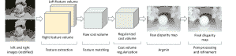
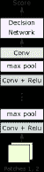
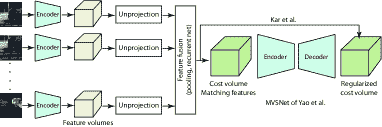
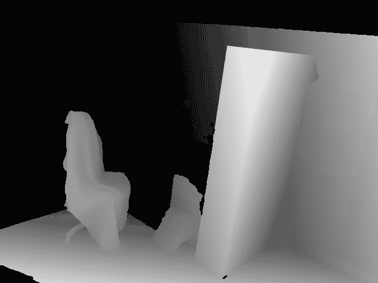
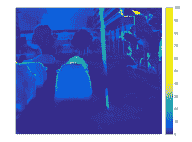

<!--yml

类别：未分类

日期：2024-09-06 20:00:54

-->

# [2006.02535] 基于立体的深度估计技术综述

> 来源：[`ar5iv.labs.arxiv.org/html/2006.02535`](https://ar5iv.labs.arxiv.org/html/2006.02535)

# 基于立体的深度估计技术综述

对于基于立体的深度估计

哈米德·拉加、劳伦特·瓦伦丁·朱斯潘、法里德·布萨伊德    穆罕默德·本纳蒙 哈米德·拉加就职于澳大利亚默多克大学信息技术、数学与统计学学科，同时也在南澳大利亚大学的表型学与生物信息学研究中心工作。电子邮箱：H.Laga@murdoch.edu.au 劳伦特·瓦伦丁·朱斯潘就职于澳大利亚西澳大学，珀斯，WA 6009。电子邮箱：laurent.jospin@research.uwa.edu.au 法里德·布萨伊德就职于澳大利亚西澳大学，珀斯，WA 6009。电子邮箱：farid.boussaid@uwa.edu.au 穆罕默德·本纳蒙就职于澳大利亚西澳大学，珀斯，WA 6009。电子邮箱：mohammed.bennamoun@uwa.edu.au 手稿收到日期：2020 年 6 月；修订日期：2020 年 6 月。

###### 摘要

从 RGB 图像中估计深度是一个长期存在的难题，这一问题在计算机视觉、图形学和机器学习领域已被探索了数十年。在现有技术中，由于与人类双眼系统的强关联，立体匹配仍然是文献中使用最广泛的方法之一。传统上，基于立体的深度估计是通过在多幅图像之间匹配手工制作的特征来解决的。尽管进行了大量研究，但这些传统技术在处理高纹理区域、大面积均匀区域和遮挡物时仍然存在问题。受益于其在解决各种 2D 和 3D 视觉问题上的成功，基于深度学习的立体深度估计受到越来越多的关注，在 2014 年至 2019 年间，相关领域发表了超过 150 篇论文。这一新一代方法在性能上取得了显著的突破，使得诸如自动驾驶和增强现实等应用成为可能。本文提供了对这一新兴且持续增长的研究领域的全面综述，总结了最常用的流程，并讨论了其优缺点。在回顾迄今为止的成就时，我们还推测了基于深度学习的立体深度估计研究的未来发展方向。

###### 索引词：

CNN，深度学习，3D 重建，立体匹配，多视角立体，视差估计，特征学习，特征匹配。

## 1 引言

从单张或多张 RGB 图像中进行深度估计是一个长期存在的难题，应用领域包括机器人技术、自动驾驶、物体识别和场景理解、3D 建模与动画、增强现实、工业控制和医学诊断。这个问题已经被广泛研究了几十年。在所有提出的技术中，立体匹配由于其与人类双眼系统的紧密联系，一直是最被探索的技术之一。

第一代基于立体视觉的深度估计方法通常依赖于在使用准确标定的相机拍摄的多张图像中匹配像素。虽然这些技术可以取得良好的结果，但在许多方面仍然有限。例如，当处理遮挡、无特征区域或具有重复纹理的高度纹理区域时，它们并不适用。有趣的是，作为人类，我们擅长通过利用先验知识来解决此类难解的逆问题。例如，我们可以轻松推测物体的近似大小、它们的相对位置，甚至它们与我们眼睛的相对距离。我们之所以能够做到这一点，是因为所有先前看到的物体和场景使我们能够建立先验知识，并形成 3D 世界的心理模型。第二代方法试图通过将问题表述为学习任务来利用这些先验知识。计算机视觉中深度学习技术的出现[1]加上大型训练数据集的日益普及，催生了第三代方法，这些方法能够恢复丢失的维度。尽管这些方法比较新，但在与计算机视觉和图形相关的各种任务中表现出了令人兴奋和有前途的结果。

在这篇文章中，我们提供了一个全面且结构化的综述，涵盖了基于立体图像的深度估计的最新进展，这些进展使用了深度学习技术。这些方法使用了由空间分布的 RGB 相机拍摄的两张或更多图像¹¹深度学习基于单目图像和视频的深度估计是一个新兴领域，需要单独的综述.. 我们收集了超过**150**篇论文，这些论文发表于**2014**年 1 月到**2019**年 12 月之间的主要计算机视觉、计算机图形学和机器学习会议及期刊²²在撰写本文时.. 其目标是帮助读者在这个新兴领域中进行导航，该领域在过去几年中获得了显著的动力。

本文的主要贡献如下；

+   •

    据我们所知，这是第一篇使用深度学习技术调查基于立体视觉的深度估计的文章。我们对过去六年在主要会议和期刊上发表的超过**150**篇论文进行了全面的综述。

+   •

    我们提供了最先进技术的全面分类。我们首先描述常见的处理流程，然后讨论每个流程内方法的相似性和差异。

+   •

    我们提供了对问题所有方面的全面回顾和深刻分析，包括训练数据、网络架构及其对重建性能的影响、训练策略和泛化能力。

+   •

    我们提供了一个比较总结，涵盖了使用公开可用数据集和内部图像的某些关键方法的属性和性能。后者被选择用于测试这些方法在全新场景中的表现。

本文的其余部分组织如下：第二部分 formulates the problem and lays down the taxonomy. 第三部分回顾了用于训练和测试基于立体的深度重建算法的各种数据集。第四部分重点介绍了使用深度学习架构学习如何在图像之间匹配像素的工作。第五部分回顾了立体匹配的端到端方法，第六部分讨论了这些方法如何扩展到多视角立体的情况。第七部分专注于包括损失函数选择和监督程度在内的训练过程。第八部分讨论了关键方法的性能。最后，第九部分讨论了潜在的未来研究方向，第十部分总结了本文的主要贡献。

## 2 范围与分类

设 $\textbf{I}=\{I_{k},k=1,\dots,n\}$ 为一组 $n\geq 1$ 的 RGB 图像，这些图像来自同一 3D 场景，使用的相机的内参和外参可以是 *已知的* 或 *未知的*。目标是估计一个或多个深度图，这些深度图可以与输入图像的视角相同 [2, 3, 4, 5]，也可以是来自新的任意视角 [6, 7, 8, 9, 10]。本文重点讨论基于深度学习的立体视觉深度估计方法，即在立体匹配的情况下 $n=2$，在多视角立体（MVS）的情况下 $n>2$。单目和基于视频的深度估计方法超出了本文的范围，需要另行调查。

基于学习的深度重建可以总结为学习一个预测器 $f_{\theta}$ 的过程，该预测器可以从一组图像 I 推断出一个尽可能接近未知深度图 $D$ 的深度图 $\hat{D}$。换句话说，我们寻求找到一个函数 $f_{\theta}$，使得 $\mathcal{L}(\textbf{I})=d\left(f_{\theta}(\textbf{I}),D\right)$ 被最小化。这里，$\theta$ 是一组参数，$d(\cdot,\cdot)$ 是实际深度图 $D$ 和重建深度图 $f_{\theta}(\textbf{I})$ 之间的某种距离度量。重建目标 $\mathcal{L}$ 也被称为 *损失函数*。

我们可以区分两大类方法。第一类方法（第四部分") 模仿传统的立体匹配技术 [11]，通过显式学习如何匹配或对应输入图像中的像素。这些对应关系可以被转换为光流或视差图，进而被转换为参考图像中每个像素的深度。预测器 $f$ 由三个模块组成：特征提取模块、特征匹配和成本聚合模块，以及视差/深度估计模块。每个模块都是独立训练的。

第二类方法（第五部分）通过一个可以端到端训练的管道解决立体匹配问题。已经提出了两类主要的方法。早期方法将深度估计公式化为回归问题。换句话说，深度图直接从输入中回归出来，而不需要在视图之间显式匹配特征。虽然这些方法在运行时简单且快速，但它们需要大量训练数据，这很难获得。第二类方法通过将问题分解为由可微分块组成的阶段，从而模仿传统的立体匹配管道，并允许端到端训练。虽然大量文献集中于成对立体方法，但也有几篇论文涉及到多视角立体问题，这些将在第六部分中回顾。

在所有方法中，估计的深度图可以通过使用细化模块 [12, 2, 13, 3] 和/或逐步重建策略进一步细化，其中重建会在每次新图像可用时进行改进。

最后，基于深度学习的立体方法的性能不仅依赖于网络架构，还依赖于其训练的数据集（第三部分）和用于优化其参数的训练过程（第七部分）。后者包括损失函数的选择和监督模式，这可以是完全监督的 3D 注释、弱监督的或自监督的。我们将在后续部分讨论这些方面。

## 3 数据集

表 I: 深度/差异估计数据集。 "GT"：真实值，"Tr."：训练，"Ts."：测试，"fr."：帧，"Vol."：体积，"Eucl"：欧几里得，"Ord"：序数，"Int."：内部，"Ext."：外部。

|  | 年份 | 类型 | 目的 | 图像 |  | 深度 |  | 相机参数 |
| --- | --- | --- | --- | --- | --- | --- | --- | --- |
|  | 分辨率 | 场景数量 | 每场景视图数量 | 训练场景数量 | 测试场景数量 |  | 分辨率 | GT 帧数量 | 类型 | 深度范围 | 差异范围 |  | 内部 | 外部 |
| Make3D [14] | 2009 | 真实 | 单目深度 | $2272\times 1704$ | $534$ | 单目 | $400$ | $134$ |  | $78\times 51$ | $534$ | 密集 | $-$ | $-$ |  |  |  |
| KITTI2012 [15] | 2012 | 真实 | 立体 | $1240\times 376$ | $389$ | $2$ | $194$ | $195$ |  | $1226\times 370$ | $-$ | 稀疏 | $-$ | $-$ |  | Y | Y |
| MPI Sintel [16] | 2012 | 合成 | 光流 | $1024\times 436$ | $35$ 视频 | $50$ | $23$ 视频 | $12$ 视频 |  | $-$ | $-$ | 密集 | $-$ | $-$ |  |  |  |
| NYU2 [17] | 2012 | 实际 - 室内 | 单目深度，物体分割 | $640\times 480$ | $464$ 视频，100$+$ 帧每视频 | 单目 | $-$ | $-$ |  | $-$ | $1,449$ | Kinect 深度 | $-$ | $-$ |  | 否 | 否 |
| RGB-D SLAM [18] | 2012 | 实际 | SLAM | $640\times 480$ | $19$ 视频 |  | $15$ 视频 | $4$ 视频 |  | $-$ | $-$ | 密集 | $-$ | $-$ |  | 是 | 是 |
| SUN3D [19] | 2013 | 实际 - 房间 | 单目视频 | $640\times 480$ | $415$ 视频，10$-$1000$+$ 帧每视频 | $-$ | $-$ | $-$ |  | $-$ | $-$ | 密集，SfM | $-$ | $-$ |  |  | 是 |
| Middleburry [20] | 2014 | 室内 | 立体 | $2948\times 1988$ | $30$ | $2$ | $15$ | $15$ |  | $2948\times 1988$ | $30$ | 密集 | $-$ | $260$ |  | 是 | 是 |
| KITTI 2015 [21] | 2015 | 实际 | 立体 | $1242\times 375$ | $400$ | $4$ | $200$ | $200$ |  | $1242\times 375$ | $-$ | 稀疏 | $-$ | $-$ |  | 是 | 是 |
| KITTI-MVS2015 [21] | 2015 | 实际 | MVS | $1242\times 375$ | $400$ | $20$ | $200$ | $200$ |  | $-$ | $-$ | 稀疏 | $-$ | $-$ |  | 是 | 是 |
| FlyingThings3D, Monkaa, Driving [22] | 2016 | 合成 | 立体，视频，光流 | $960\times 540$ | $39$K 帧 | $2$ | $21,818$ | $4,248$ |  | $384\times 192$ | $-$ | 密集 | $-$ | $160$px |  | 是 | 是 |
| CityScapes [23] | 2016 | 街景 | 语义分割，密集标签 | $2048\times 1024$ | $5$K | $2$ | $2975$ | $1525$ |  | $-$ | $-$ | NA | $-$ | $-$ |  | 自我运动 |
|  |  |  | 语义分割，粗略标签 | $2048\times 1024$ | $20$K | $2$ |  |  |  | NA | NA | NA | NA | NA |  | 自我运动 |
| DTU [24] | 2016 | 实际，小物体 | MVS | $1200\times 1600$ | $80$ | $49-64$ | $-$ | $-$ |  | $-$ | $-$ | 结构光扫描 | $-$ | $-$ |  | 是 | 是 |
| ETH3D [25] | 2017 | 实际，室内/室外 | 低分辨率，立体 | $940\times 490$ | $47$ | $2$ | $27$ | $20$ |  | $-$ | $47$ | 密集 | $-$ | $-$ |  | 是 | 是 |
|  |  |  | 低分辨率，视频上的 MVS | $940\times 490$ | $10$ 视频 | $4$ | $5$ 视频 | $5$ 视频 |  | $-$ | $-$ | 密集 | $-$ | $-$ |  | 是 | 是 |
|  |  |  | 高分辨率，使用 DSLR 相机的 MVS | $940\times 490$ | $25$ | $14-76$ | $13$ | $12$ |  | $-$ | $25$ | 密集 | $-$ | $-$ |  | 是 | 是 |
| SUNCG [26] | 2017 | 合成，室内 | 场景完成 | $-$ | $45$K | $-$ | $-$ | $-$ |  | $640\times 480$ | $-$ | 深度和体积 GT | $-$ | $-$ |  |  |  |
| MVS-Synth [27] | 2018 | 合成 - 城市 | MVS | $1920\times 1080$ | $120$ | $100$ |  |  |  | $-$ | $-$ | 密集 | $-$ | $-$ |  | 是 | 是 |
| MegaDepth [28] | 2018 | 实际（互联网图片） | 单目，欧氏和有序深度 | $1600\times 1600$ | $130$K | 单目 | $-$ | $-$ |  | $-$ | $100$K（欧氏），$30$K（有序） | 密集，欧氏，有序 | $-$ | $-$ |  |  |  |
| Jeon and Lee [29] | $2018$ | 真实 | 深度增强 | $-$ | $4$K 图像 | $-$ | $-$ | $-$ |  | $640\times 480$ | $4,000$ | 密集 | $0.01-30$m | $-$ |  | Y | Y |
| OmniThings [30, 31] | 2019 | 合成，鱼眼图像 | 全景 MVS | $800\times 768$ | $10240$ | $4$ | $9216$ | $1024$ |  | $640\times 320$ | $-$ | 密集 | $-$ | $\leq 192$px |  |  |  |
| OmniHouse [30, 31] | 2019 | 合成，鱼眼图像 | 全景 MVS | $800\times 768$ | $2,560$ | $4$ | $2048$ | $512$ |  | $640\times 320$ | $-$ | 密集 | $-$ | $\leq 192$px |  |  |  |
| HR-VS [32] | 2019 | 合成，户外 | 高分辨率立体 | $2056\times 2464$ | $780$ | $2$ | $-$ | $-$ |  | $1918\times 2424$ | 780 | 密集，欧几里得 | $2.52$到$200$m | $9.66$到$768$px |  |  |  |
|  |  | 真实，户外 | 高分辨率立体 | $1918\times 2424$ | $33$ | $2$ | $-$ | $-$ |  | $1918\times 2424$ | 33 | 密集，欧几里得 |  | $5.41$到$182.3$px |  |  |  |
| DrivingStereo [33] | 2019 | 驾驶 | 高分辨率立体 | $1762\times 800$ | $182,188$ | $2$ | $174,437$ | $7,751$ |  | $1762\times 800$ | $182,188$ | 稀疏 | 高达 $80$m |  |  |  |  |
| ApolloScape [34] | 2019 | 自动驾驶 | 高分辨率立体 | $3130\times 960$ | $5,165$ | $2$ | $4,156$ | $1,009$ |  | $-$ | $5165$ | LIDAR | $-$到$-$m | $-$ |  | Y | $-$ |
| A2D2 [35] | 2020 | 自动驾驶 | 高分辨率立体 | $2.3$M 像素 | $41,277$ | $6$ | $-$ | $-$ |  | $-$ | $-$ | LIDAR | 高达 $100$m | $-$ |  | Y | Y |

表格 I 总结了用于训练和测试基于深度学习的深度估计算法的一些数据集。下面，我们根据这些数据集的大小、空间和深度分辨率、提供的深度标注类型以及许多基于深度学习的算法面临的领域差距（或偏移）问题进行讨论。

(1) 数据集大小。最早出现的几个数据集，出现在$2016$年前，由于创建地面真实 3D 注释的难度，规模较小。例如，两个 KITTI 数据集[15, 21]，包含$200$对立体图像及其对应的视差真实值。它们已被广泛用于训练和测试用于立体匹配算法的基于块的 CNN（见第四部分），这些算法具有较小的感受野。因此，一个立体图像对可以产生数千个训练样本。然而，在端到端架构（第五部分和第六部分），一个立体图像对仅对应一个样本。端到端网络具有大量参数，因此需要大型数据集以实现高效训练。虽然收集大型图像数据集非常容易，*例如*，使用视频序列，如*例如*，NYU2[17]、ETH3D[25]、SUN3D[19]和 ETH3D[25]，但用 3D 标签进行注释是耗时的。最近的工作，*例如*，AppoloScape[34]和 A2D2[35]，使用 LIDAR 获取密集的 3D 注释。

数据增强策略，*例如*，通过对可用图像应用几何和光度变换，已经在文献中被广泛使用。然而，还有一些其他策略是特定于深度估计的。这包括从 3D CAD 模型人工合成和渲染各种（随机）视角、姿态和光照条件下的 2D 和 2.5D 视图。还可以将渲染的 3D 模型覆盖在真实图像上。这种方法已被用于生成 FlyingThings3D、Monkaa 和 Driving 数据集[22]，以及 OmniThings 和 OmniHouse 数据集，用于对全景图像的 MVS 进行基准测试[30, 31]。黄*等人*[27]遵循了类似的思路，但使用了视频游戏中的场景生成 MVS-Synth，这是一个为基于学习的多视图立体算法准备的照片级真实合成数据集。

主要挑战在于生成包含各种现实世界外观和运动的大量合成数据并非易事[36]。因此，一些研究通过训练其深度网络而无需 3D 监督来克服对真实深度信息的需求，见第 7.1 节。其他研究使用传统的深度估计和运动结构（SfM）技术来生成 3D 标注。例如，李*等人*[28]结合现代运动结构和多视角立体（MVS）方法及多视角互联网照片集合创建了大规模的 MegaDepth 数据集，通过更大的训练数据集提高了深度估计的准确性。该数据集还通过语义分割自动增强了序数深度关系。

(2) 空间和深度分辨率。视差/深度信息可以是与输入图像相同或更低分辨率的地图形式，也可以是参考图像中某些位置的稀疏深度值。大多数现有数据集的空间分辨率较低。然而，近年来，越来越多地关注于高分辨率图像的立体匹配。一个高分辨率数据集的例子是杨*等人*[32]的 HR-VS 和 HR-RS，其中每对分辨率为$1918\times 2424$的 RGB 图像都标注有相同分辨率的深度图。然而，该数据集仅包含$800$对立体图像，对于端到端训练来说相对较小。其他数据集如 ApolloScape[34]和 A2D2[35]包含非常高分辨率的图像，约为$3130\times 960$，其中 ApolloScape 的立体驾驶视频超过$100+$小时，专门设计用于测试自动驾驶算法。

(3) 欧几里得深度与序数深度。与其手动标注图像的确切*即*欧几里得深度值，不如一些论文*例如*MegaDepth[28]提供序数标注，即像素$x_{1}$距离更近、更远或与像素$x_{2}$在相同深度。序数标注比欧几里得标注更简单、更快捷。实际上，可以使用传统的立体匹配算法准确获得序数深度，因为序数深度对深度估计中的不准确性不那么敏感。

(4) 域间差距。虽然通过人工扩充训练数据集可以丰富现有数据，但由于真实数据和合成数据之间条件的巨大差异，可能会导致在真实环境中准确性降低。我们将在第 7.3 节中讨论文献中如何解决这一域间差距问题。

## 4 通过立体匹配的深度

表 II：基于深度学习的立体匹配技术的分类与比较。

| 方法 | 年份 | 特征计算 |  | 相似性 |  | 训练 |  | 正则化 |
| --- | --- | --- | --- | --- | --- | --- | --- | --- |
| 架构 | 维度 |  |  | 监督程度 | 损失 |  |
| Zagoruyko [37] | $2015$ | ConvNet | 多尺度 |  | FCN |  | 有监督，正负样本 | 挤压和平方 $L_{2}$ |  | NA |
| Han [38] | $2015$ | ConvNet | 固定尺度 |  | FCN |  | 有监督 | 交叉熵 |  | NA |
| Zbontar [39] | $2015$ | ConvNet | 固定尺度 |  | 手工制作 |  | 三元对比学习 | $L_{1}$ |  | MRF |
| Chen [40] | $2015$ | ConvNet | 多尺度 |  | 相关性 $+$ 投票 |  | 有监督，正负样本 | $L_{1}$ |  | MRF |
| Simo [41] | $2015$ | ConvNet | 固定尺度 |  | $L_{2}$ |  | 有监督，正负样本 | $L_{2}$ |  | NA |
| Zbontar [42] | $2016$ | ConvNet | 固定尺度 |  | 手工制作, FCN |  | 有监督，已知视差 | 挤压 |  | 经典立体 |
| Balantas [43] | $2016$ | ConvNet | 固定尺度 |  | $L_{2}$ |  | 有监督，三元对比学习 | 软正负样本 (Soft-PN) |  | $-$ |
| Mayer [22] | $2016$ | ConvNet | 固定尺度 |  | 手工制作 |  | 有监督 | $-$ |  | 编码器-解码器 |
| Luo [44] | $2016$ | ConvNet | 固定尺度 |  | 相关性 |  | 有监督 | 交叉熵 |  | MRF |
| Kumar [45] | 2016 | ConvNet | 固定尺度 |  | ConvNet |  | 有监督，三元对比学习 | 最大化类间距离 |  | $-$ |
|  |  |  |  |  |  |  |  | 最小化类间距离。 |  |  |
| Shaked [46] | $2017$ | 高速网络 | 固定尺度 |  | FCN |  | 有监督 | 挤压$+$交叉熵 |  | 经典$+$4Conv$+$ |
|  |  | 多层跳跃连接 |  |  |  |  |  |  |  | 5FC |
| Hartmann [47] | $2017$ | ConvNet | 固定尺度 |  | ConvNet |  | 有监督 | 交叉熵 |  | 编码器 |
| Park [48] | $2017$ | ConvNet | 固定尺度 |  | $1\times 1$ 卷积 |  | 有监督 | $-$ |  | NA |
|  |  |  |  |  | ReLU, SPP |  |  |  |  |  |
| Ye [49] | $2017$ | ConvNet | 固定尺度 |  | FCN |  | 有监督 | $L_{1}$ |  | SGM |
|  |  | 多尺寸池化 |  |  | ($1\times 1$ 卷积) |  |  |  |  |  |
| Tulyakov [50] | $2017$ | 通用 - 与网络架构无关 |  | 弱监督 | MIL, 对比, 对比-DP |  | $-$ |

基于立体的深度重建方法采用 $n=2$ RGB 图像，并生成一个视差图 $D$，该视差图最小化形式为：

|  | $E(D)=\sum_{x}C(x,0pt_{x})+\sum_{x}\sum_{y\in\mathcal{N}_{x}}E_{s}(0pt_{x},0pt_{y}).$ |  | (1) |
| --- | --- | --- | --- |

这里，$x$ 和 $y$ 是图像像素，$\mathcal{N}_{x}$ 是位于 $x$ 邻域内的像素集合。公式 (1) 的第一项是匹配代价。在使用矫正后的立体对时，$C(x,0pt_{x})$ 测量将左图像的像素 $x=(i,j)$ 与右图像的像素 $y=(i,j-0pt_{x})$ 匹配的代价。在这种情况下，$0pt_{x}=D(x)\in[d_{min},d_{max}]$ 是像素 $x$ 的视差。然后可以通过三角测量推断深度。当视差范围离散为 $n_{d}$ 个视差级别时，$C$ 变成一个大小为 $0pt\times 0pt\times n_{d}$ 的 3D 代价体积。在更一般的多视角立体情况下，*即，* $n\geq 2$，代价 $C(x,0pt_{x})$ 测量 $x$ 在参考图像上具有深度 $0pt_{x}$ 的逆概率。公式 (1) 的第二项是一个正则化项，用于施加平滑性和左右一致性等约束。

图 1：立体匹配流水线的构建模块。

传统上，这个问题是通过使用四个构建模块的流水线来解决的 [11]，见图 1：（1）特征提取，（2）图像间特征匹配，（3）视差计算，以及（4）视差细化和后处理。前两个模块构建了代价体积 $C$。第三个模块对代价体积进行正则化，然后通过最小化公式 (1)，找到视差图的初步估计。最后一个模块对初步视差图进行细化和后处理。

本节重点介绍如何使用基于深度学习的方法实现这些单独的模块。表 II 总结了最新的技术方法。

### 4.1 学习特征提取和匹配

|  |  |  |  |  |  |
| --- | --- | --- | --- | --- | --- |
| (a) MC-CNN [39, 42]. | (b) [37] 和 [38]. | (c) [37]. | (d) LW-CNN [48]. | (e) FED-D2DRR [49]. | (f) [37]. |

图 2：特征学习架构。

早期的深度学习技术用于立体匹配，取代了手工制作的特征（图 LABEL:ig:stereo_matching_pipeline 的 A 块），采用了学习到的特征[37, 38, 39, 42]。它们取两个图块，一个中心在左图中的像素$x=(i,j)$，另一个中心在右图中的像素$y=(i,j-d)$（其中$d\in\{0,\dots,n_{d}\}$），使用 CNN 计算它们的特征向量，然后匹配它们（图 LABEL:ig:stereo_matching_pipeline 的 B 块），生成相似度分数$C(x,d)$，使用标准的相似度度量如$L_{1}$、$L_{2}$和相关度量，或者使用顶级网络学习的度量。这两个组件可以分别训练，也可以联合训练。

#### 4.1.1 基本网络架构

基本网络架构在[37, 38, 39, 42]中介绍，并在图 2-(a)中展示，由两个 CNN 编码分支组成，这些分支作为描述符计算模块。第一个分支接收左图中一个像素$x=(i,j)$周围的图块，并输出一个特征向量来表征该图块。第二个分支接收围绕像素$y=(i,j-d)$的图块，其中$d\in[d_{min},d_{max}]$是一个候选视差。Zbontar 和 LeCun[39]及后来 Zbontar *et al.*[42]使用由四个卷积层组成的编码器，见图 2-(a)。除了最后一层，每一层后面都跟着一个 ReLU 单元。Zagoruyko 和 Komodakis[37]以及 Han *et al.*[38]使用类似的架构，但增加了：

+   •

    每一层之后都进行最大池化和子采样，除了最后一层，见图 2-(b)。因此，与 [39, 42] 相比，网络能够处理更大的补丁尺寸和更大的视角变化。

+   •

    在每个特征提取分支的末尾添加一个空间金字塔池化 (SPP) 模块 [37]，以便网络能够处理任意大小的补丁，同时产生固定大小的特征，见图 2-(c)。其作用是通过空间池化将最后一层卷积的特征汇总到一个固定大小的特征网格中。该模块的设计方式使得池化区域的大小随着输入的大小变化，以确保输出特征网格具有固定的大小，而不依赖于输入补丁或图像的大小。因此，网络能够处理任意大小的补丁/图像，并计算相同维度的特征向量，而无需改变其结构或重新训练。

学到的特征然后被输入到一个顶部模块，该模块返回一个相似度评分。它可以实现为标准的相似度度量，*例如*，$L_{2}$ 距离、余弦距离和（归一化的）相关距离（或内积），如在 [39, 42] 的 MC-CNN-fast (MC-CNN-fst) 架构中。相关距离相对于 $L_{2}$ 距离的主要优势在于，它可以通过 2D [51] 或 1D [22] 卷积操作层实现，称为 *相关层*。相关层不需要训练，因为滤波器实际上是由网络的第二分支计算的特征。因此，相关层在文献中得到了广泛应用 [39, 41, 42, 22, 44]。

近期的研究使用了由全连接（FC）层组成的决策网络[38, 37, 42, 46, 49]，而不是手工制作的相似性度量，这些网络可以实现为$1\times 1$卷积、全卷积层[47]，或者是卷积层后接全连接层。决策网络与特征提取模块联合训练，以评估两个图像块之间的相似性。Han *et al.*[38]使用了由三个全连接层和一个 softmax 组成的顶层网络。Zagoruyko 和 Komodakis[37]使用两个线性全连接层（每个有$512$个隐藏单元），并由 ReLU 激活层分隔，而 Zbontar *et al.*[42]的 MC-CNN-acrt 网络使用了多达五个全连接层。在所有情况下，由特征编码模块的两个分支计算出的特征首先被连接在一起，然后输入到顶层网络中。另一方面，Hartmann *et al.*[47]通过均值池化将来自多个图像块的特征进行聚合，然后将其输入到决策网络中。池化聚合的主要优点是它可以处理任意数量的图像块，而不需要更改网络架构或重新训练。因此，它适合于计算多图像块的相似性。

使用决策网络代替手工制作的相似性度量方法可以从数据中学习到适当的相似性度量，而不是一开始就强加一个。这比使用相关层更准确，但速度明显较慢。

#### 4.1.2 网络架构变体

自引入以来，基线架构已经在几个方面进行了扩展，以：(1) 使用残差网络（ResNet）[46]改进训练，(2) 扩大网络的接收域，同时不在分辨率或计算效率上妥协[48, 49, 52]，(3) 处理多尺度特征[37, 40]，(4) 减少前向传播次数[37, 44]，以及(5) 通过学习相似性而非显式学习特征来简化训练过程[37]。

##### 4.1.2.1 ConvNet 与 ResNet

虽然 Zbontar *et al.*[39, 42]和 Han *et al.*[38]在特征提取块中使用了标准卷积层，但 Shaked 和 Wolf[46]则添加了具有多级加权残差连接的残差块，以促进非常深层网络的训练。其特别之处在于网络能够自我调整跳跃连接的贡献。已经证明，这种架构优于 Zbontar *et al.*[39]的基础网络。

##### 4.1.2.2 扩大网络的接收域

学习特征的尺度由（1）输入补丁的大小，（2）网络的感受野，以及（3）每层中使用的卷积滤波器和池化操作的核大小定义。虽然增加核大小可以捕捉图像像素之间更多的全局交互，但这会导致高计算成本。此外，传统的池化，如在[39，42]中使用的，会降低分辨率并可能导致细节丢失，这不适合密集对应估计。

为了在不降低分辨率或增加计算时间的情况下扩大感受野，一些技术，例如，[52]，使用扩张卷积，即大型卷积滤波器但带有孔，因此计算效率高。其他技术，例如，[48，49]，使用空间金字塔池化（SPP）模块，放置在网络中的不同位置，见图 2-(c-e)。例如，Park *等人* [48]，介绍了用于立体匹配的 FW-CNN，在决策网络的末尾附加了一个 SPP 模块，见图 2-(d)。结果，感受野可以扩大。然而，对于参考图像中的每个像素，完全连接层和池化操作需要计算$n_{d}$次，其中$n_{d}$是视差级别的数量。为了避免这种情况，Ye *等人* [49]将 SPP 模块放在每个特征计算分支的末尾，见图 2-(c)和(e)。这样，每个补丁只需计算一次。此外，Ye *等人* [49]采用多个单步池化，使用不同的窗口大小，作用于不同层，然后将它们的输出拼接以生成特征图，见图 2-(e)。

##### 4.1.2.3 学习多尺度特征

|  |  |
| --- | --- |
| (a) 中心-环绕[37] | (b) 基于投票[40]。 |

图 3: 多尺度特征学习架构。

目前描述的方法可以通过使用多流网络扩展到在多个尺度上学习特征，每个补丁大小一个流[37, 40]，见图 3。Zagoruyko 和 Komodakis[37]提出了一种双流网络，本质上是由两个西阿摩斯网络组成，通过一个顶层网络在输出处结合，见图 3-(a)。第一个西阿摩斯网络，称为中央高分辨率流，接收两个$32\times 32$的补丁，中心围绕感兴趣的像素。第二个网络，称为周围低分辨率流，接收两个$64\times 64$的补丁，但下采样到$32\times 32$。这两个流的输出然后被连接并送入一个顶层决策网络，该网络返回一个匹配分数。Chen *et al.* [40]使用了类似的方法，但不是在将两个流计算的特征送入顶层决策网络之前进行聚合，而是在每个流上附加一个顶层网络以产生匹配分数。然后通过投票聚合这两个分数，见图 3-(b)。

多流架构的主要优点是它可以在一次前向传递中计算多个尺度的特征。然而，它需要每个尺度一个流，如果需要多个尺度，这种方法就不太实际。

##### 4.1.2.4 减少前向传递的次数

使用迄今为止描述的方法，从一对立体图像推断原始成本体积是通过类似移动窗口的方法进行的，这需要每个像素进行多次前向传播，每个像素需要 $n_{d}$ 次前向传播，其中 $n_{d}$ 是视差水平的数量。然而，由于相关性高度并行化，前向传播的次数可以显著减少。例如，Luo *et al.* [44] 通过使用一个西格玛网络，将前向传播次数减少到每个像素一次，该网络的第一个分支处理像素周围的一个补丁，而第二个分支处理一个扩展到所有可能视差的大补丁。输出是左分支的一个 64D 表示，以及右分支的 $n_{d}\times 64$。然后，相关层计算长度为 $n_{d}$ 的向量，其中其 $0pt-$th 元素是将左图像上的像素 $x$ 与校正右图像上的像素 $x-0pt$ 匹配的成本。

Zagoruyko 和 Komodakis [37] 表明，两种特征提取子网络的输出只需每个像素计算一次，不需要对每个视差进行重新计算。这可以通过传播全分辨率图像而不是小补丁在整个图像中进行单次前向传播来完成。此外，由完全连接层组成的顶层网络（即 MC-CNN-Accr）的输出可以通过用 $1\times 1$ 卷积层替代完全连接层来在单次前向传播中计算。然而，它仍然需要对每个考虑中的视差进行一次前向传播。

##### 4.1.2.5 无需特征学习的相似性学习

特征提取和相似性计算网络的联合训练将特征学习和度量学习步骤统一起来。Zagoruyko 和 Komodakis [37] 提出了另一种架构，该架构没有直接的特征概念，见图 2-(f)。在这种架构中，左侧和右侧的补丁被一起打包，并共同输入到由卷积和 ReLU 层组成的双通道网络中，之后是完全连接层。网络直接输出输入补丁对之间的相似性，而不是计算特征。Zagoruyko 和 Komodakis [37] 表明这种架构易于训练。然而，它在运行时成本较高，因为整个网络需要每个像素运行 $n_{d}$ 次。

#### 4.1.3 训练程序

本节描述的网络由特征提取模块和特征匹配模块组成。由于目标是学习如何匹配图块，这两个模块要么以监督学习（第 4.1.3.1 节），要么以弱监督学习（第 4.1.3.2 节）的方式进行联合训练。

##### 4.1.3.1 监督训练

现有的监督训练方法使用由正负样本组成的训练集。每个正样本（或负样本）是由参考图块和其匹配图块（或不匹配图块）组成的对。训练过程要么一次使用一个样本，正样本或负样本，并调整相似度[40, 41, 38, 37]，要么每一步同时使用一个正样本和一个负样本，并最大化相似度之间的差异，从而使正样本对中的两个图块更相似于彼此，而比负样本对中的两个图块更相似[43, 45, 39]。这种方法被称为三元组对比学习。

Zbontar *等人* [39, 42] 使用了 KITTI2012 [15] 或 Middlebury [20] 数据集的真实视差。对于每一个已知视差，该方法提取一个负样本对和一个正样本对作为训练样本。因此，该方法能够从 KITTI2012 [15] 数据集中提取超过$25$百万个训练样本，从 Middlebury 数据集中提取超过$38$百万个样本。该方法也被 Chen *等人* [40]，Zagoruyku 和 Komodakis [37]，以及 Han *等人* [38] 使用。通过使用数据增强技术，如翻转图块和在不同方向上旋转图块，可以进一步增加训练数据的数量。

尽管监督学习效果很好，但神经网络模型的复杂性需要非常大的标注训练集，这对于实际应用来说难以或成本高昂（*例如，* 考虑火星地形的立体重建）。即使有如此大规模的数据集，真实值通常是通过深度传感器生成的，并且通常包含噪声，从而降低了监督学习的有效性 [53]。这可以通过用随机扰动 [39] 或合成数据 [54, 22] 增强训练集来缓解。然而，合成过程是手工制作的，并未考虑立体系统和目标场景的特定规律。

损失函数。监督立体匹配网络通过最小化匹配损失进行训练，该损失函数测量每个训练样本的真实值与预测匹配分数之间的差异。可以使用（1）$L_{1}$ 距离 [42, 40, 46]，（2）铰链损失 [42, 46]，或（3）交叉熵损失 [44] 来定义。

##### 4.1.3.2 弱监督学习

弱监督技术利用一个或多个立体约束来减少手动标注的数量。Tulyakov *等* [50] 将多实例学习（MIL）与立体约束和场景的粗略信息结合起来，以训练用于没有真实值的数据集的立体匹配网络。与需要配对的匹配和不匹配补丁的监督技术不同，训练集由$N$个三元组组成。每个三元组包括：（1）从参考图像的水平线提取的$W$个参考补丁，（2）从右图像的相应水平线提取的$W$个正补丁，以及（3）从右图像的另一条水平线提取的$W$个负补丁，*即，* 不匹配参考补丁的补丁。因此，训练集可以从立体对自动构建，无需手动标注。

然后，通过利用五个约束来训练该方法：极线约束、视差范围约束、唯一性约束、连续性（平滑性）约束和排序约束。他们定义了三种使用这些约束不同子集的损失函数，即：

+   •

    多实例学习（MIL）损失函数利用了极线约束和视差范围约束。根据这两个约束，我们知道每个非遮挡的参考补丁在已知的索引区间内都有一个匹配的正补丁，但没有匹配的负补丁。因此，对于每个参考补丁，最佳参考正匹配的相似度应大于最佳参考负匹配的相似度。

+   •

    **Constractive** 损失为 MIL 方法增加了唯一性约束。它告诉我们匹配的正样本是唯一的。因此，对于每个补丁，最佳匹配的相似度应该大于第二佳匹配的相似度。

+   •

    **Constractive-DP** 使用所有约束条件，但通过动态规划找到最佳匹配。

该方法已应用于训练一个深度**孪生神经网络**，该网络以两个补丁作为输入并预测相似度度量。在标准数据集上的基准测试表明，其性能与 MC-CNN-fst [39] 上发布的结果一样好或更好，后者使用相同的网络架构，但使用完全标记的数据进行训练。

### 4.2 正则化和视差估计

一旦原始成本体积被估计出来，可以通过去掉 Eqn. (1）中的正则化项来估计视差，或者等效地，图 Fig. 1 中的块 C，然后取 argmin、softargmin 或亚像素 MAP 近似（图 Fig. 1 中的块 D）。然而，从图像特征计算出的原始成本体积可能会受到噪声污染，*例如*，由于非兰伯特表面、物体遮挡或重复图案的存在。因此，估计的深度图可能会很嘈杂。因此，一些方法通过使用传统的 MRF 基于立体的框架来进行成本体积正则化来克服这个问题 [40, 39, 44]。在这些方法中，初始成本体积 $C$ 被输入到全局 [11] 或半全局 [55] 匹配器中以计算视差图。半全局匹配提供了准确性和计算需求之间的良好折衷。在这种方法中，Eqn. (1) 的平滑项定义为：

|  | $\small{E_{s}(0pt_{x},0pt_{y})=\alpha_{1}\delta(&#124;0pt_{xy}=1)+\alpha_{2}\delta(&#124;0pt_{xy}>1),}$ |  | (2) |
| --- | --- | --- | --- |

其中 $0pt_{xy}=0pt_{x}-0pt_{y}$，$\alpha_{1}$ 和 $\alpha_{2}$ 是选择的正权重，使得 $\alpha_{2}>\alpha_{1}$，$\delta$ 是克罗内克 δ 函数，当括号中的条件满足时，值为 $1$，否则为 $0$。为了求解这个优化问题，SGM 能量被分解为多个能量 $E_{s}$，每个能量沿路径 $s$ 定义。这些能量被独立最小化，然后聚合。使用所有方向的聚合成本的赢家通吃策略计算 $x$ 处的视差：

|  | $d_{x}=\arg\min_{d}\sum_{s}E_{s}(x,d).$ |  | (3) |
| --- | --- | --- | --- |

该方法需要设置方程式 (2) 中的两个参数 $\alpha_{1}$ 和 $\alpha_{2}$。Seki *等人* [56] 提出了 SGM-Net，一种训练神经网络以在每个图像像素处提供这些参数的方法。他们获得了比手动调整方法 [39] 更好的惩罚结果。

SGM 方法使用一种聚合方案来结合来自多个 1D 扫描线优化的成本，但存在两个主要问题：（1）扫描线优化方法引起的条纹伪影可能导致不准确的结果；（2）高内存占用可能在高分辨率图像或资源受限的设备上变得过于繁重。因此，Schonberger *等人* [57] 将融合步骤重新表述为在图像的每个像素中选择所有扫描线优化提议中的最佳值的任务。他们使用每像素随机森林分类器来解决这一任务。

Poggi *等人* [58] 研究了一种加权聚合，其中每个 1D 扫描线优化的权重是通过使用传统技术 [59] 或深度神经网络计算的置信度图来定义的，详见第 5.5 节。

## 5 从立体视觉端到端深度

图 4: 基于立体视觉的视差估计的网络架构分类。

最近的研究通过使用端到端训练的管道解决立体匹配问题。已经提出了两类主要方法。早期方法，如 FlowNetSimple [51] 和 DispNetS [22]，使用单个编码器-解码器，将左图和右图堆叠成一个 6D 体积，并回归视差图。这些方法不需要显式的特征匹配模块，运行速度快。然而，它们需要大量的训练数据，这些数据难以获得。第二类方法模仿传统的立体匹配管道，将问题分解为多个阶段，每个阶段由可微分的块组成，从而允许端到端训练。以下是对这些技术的详细回顾。图 4 提供了最新技术的分类，而表 III 比较了基于该分类的 $28$ 种关键方法。

### 5.1 特征学习

特征学习网络遵循与图 2 和 3 所描述的相同架构。然而，与处理单独的补丁不同，整个图像在一次前向传递中处理，生成与输入图像相同或较低分辨率的特征图。为了实现图像间的特征匹配，使用了两种策略：

(1) 由 $n$ 个分支组成的多分支网络，其中 $n$ 是输入图像的数量。每个分支生成一个特征图，描述其输入图像 [22, 60, 61, 62, 63, 64, 65]。这些技术假设输入图像已被矫正，因此对应点的搜索限制在水平扫描线上。

(2) 由 $n_{d}$ 个分支组成的多分支网络，其中 $n_{d}$ 是视差层级的数量。第 $d$ 个分支，$1\leq d\leq n_{d}$，处理一对图像的堆栈，如图 2-(f) 所示；第一张图像是参考图像。第二张是右图像，但重新投影到第 $d$ 个深度平面上 [66]。每个分支生成一个相似度特征图，描述参考图像与重新投影到给定深度平面上的右图像之间的相似性。虽然这些技术不对图像进行矫正，但假设已知内在和外在相机参数。此外，视差层级的数量不能在不更新网络架构和重新训练的情况下改变。

在这两种方法中，特征提取模块使用全卷积（ConvNet）网络，如 VGG，或残差网络，如 ResNets [67]。后者有助于训练非常深的网络 [68]。它们还可以通过使用扩张卷积（第 4.1.2.2 节）或多尺度方法来捕捉并融入更多的全局上下文。例如，Chang 和 Chen [64] 的 PSM-Net 增加了一个空间金字塔池化（SPP）模块，以提取和汇聚多尺度的特征。Nie *et al.* [65] 使用称为*多层上下文超聚合（MLCUA）*的模式扩展了 PSM-Net。它通过层内和层间特征组合将所有卷积特征封装成更具区分性的表示。它使用浅层跳跃连接将最浅、最小尺度的特征与更深、大尺度的特征结合。这与 PSM-Net [64] 相比，在不显著增加网络参数数量的情况下，性能有所提升。

表 III：$28$种端到端深度学习基础的视差估计技术的分类与比较。“FCN”：全连接网络，“SPN”：空间传播网络。“LRCR”：左右对比递归模型，“MCUA”：用于立体匹配的多层上下文超聚合。“DLA”：深度层聚合 [69]，“VPP”：体积金字塔池化。性能在 KITTI2015 测试数据集上进行测量。

| 方法 | 年份 |  | 特征计算 |  | 成本体积 |  | 差异 |  | 精细化/后处理 |  | 监督 | 性能 |
| --- | --- | --- | --- | --- | --- | --- | --- | --- | --- | --- | --- | --- |
|  | 架构 | 维度 |  | 类型 | 构造 | 正则化 |  |  | 空间/深度分辨率 | 完成/去噪 |  | D1-all/est | D1-all/fg |
| FlowNetCorr [51] | 2015 |  | ConvNet | 单尺度 |  | 3D | 相关 | 2D ConvNet |  |  |  | 上采样卷积 | 临时，变分 |  | 监督 | $-$ | $-$ |
| DispNetC [22] | 2016 |  | ConvNet | 单尺度 |  | 3D | 相关 | 2D ConvNet |  | $-$ |  | $-$ | $-$ |  | 监督 | $4.34$ | $4.32$ |
| Zhong *et al.* [70] | 2017 |  | ConvNet | 单尺度 |  | 4D | 交错 | 3D Conv |  | Soft argmin |  | 运行时自我改进 |  | 自监督 | $3.57$ | $7.12$ |
|  |  |  | 带跳跃连接 |  |  |  | 特征拼接 | 编码器-解码器 |  |  |  |  |  |  |  |  |
| Kendall *et al.* [61] | 2017 |  | ConvNet | 单尺度 |  | 4D | 特征拼接 | 3D Conv，编码器- |  | Soft argmax |  | $-$ | $-$ |  | 监督 | $2.87$ | $6.16$ |
|  |  |  | 带跳跃连接 |  |  |  |  | 解码器，分层 |  |  |  |  |  |  |  |  |  |
| 庞 *等人* [62] | 2017 |  | ConvNet | 单尺度 |  | 3D | 相关性 | 2D ConvNet |  |  |  | 上采样$+$残差学习 |  |  | 有监督 | $2.67$ | $3.59$ |
| 克诺贝尔赖特 *等人* [71] | 2017 |  | ConvNet | 单尺度 |  | 3D | 相关性 | 混合 CNN-CRF |  |  |  | 无后处理 |  | 有监督 |  |  |
| 常 *等人* [64] | 2018 |  | SPP | 多尺度 |  | 4D | 特征拼接 | 3D Conv, 堆叠的编码器-解码器 |  | 软最小值 |  | 渐进细化 |  |  | 有监督 | $2.32$ | $4.62$ |
| 卡米斯 *等人* [72] | 2018 |  | ResNet | 单尺度 |  | 3D | $L_{2}$ | 3D ConvNet |  | 软最小值 |  | 分层，上采样$+$残差学习 |  | 有监督 | $4.83$ | $7.45$ |
| 梁 *等人* [63] | 2018 |  | ConvNet | 多尺度 |  | 3D | 相关性 | 2D ConvNet |  | 编码器-解码器 |  | 迭代上采样$+$残差学习 |  | 有监督 | $2.67$ | $3.59$ |
| 杨 *等人* [68] | 2018 |  | 浅层 | 单尺度 |  | 3D | 相关性，左侧特征，分割掩码 |  | 回归与 |  | $-$ | $-$ |  | 自监督 | $2.25$ | $4.07$ |
|  | ResNet |  |  | 编码器-解码器 |  |  |  |  |  |  |  |
| 张 *等人* [73] | 2018 |  | ConvNet | 单尺度 |  | 3D | 手工设计 | NA |  | 软最小值 |  | 上采样$+$残差学习 |  | 自监督 | $-$ | $-$ |
| 季 *等人* [74] | 2018 |  | 恒定高速公路网络 | 单尺度 |  | 3D | FCN | $-$ |  | 基于 RNN 的 LRCR |  | $-$ | $-$ |  | 有监督 | $3.03$ | $5.42$ |
| 伊尔格 *等人* [75] | 2018 |  | ConvNet | 单尺度 |  | 3D | 相关性 | 编码器-解码器，联合视差和遮挡 |  | 编码器-解码器级联，残差学习 |  | 有监督 | $2.19$ | $-$ |
| 宋 *等人* [76] | 2018 |  | 浅层 ConvNet | 单尺度 |  | 3D | 相关性 | 边缘引导, 上下文金字塔 |  | 残差金字塔 |  | $-$ | $-$ |  | 有监督 | $2.59$ | $4.18$ |
|  |  |  |  |  |  |  | 编码器 |  |  |  |  |  |  |  |  |  |
| 于 *等人* [77] | 2018 |  | ResNet | 单尺度 |  | 3D | 特征拼接 | 3D Conv $+$ SGM |  | 软最小值 |  | $-$ | $-$ |  | 有监督 | $2.79$ | $5.46$ |
|  |  |  |  |  |  |  | 编码器-解码器 |  |  |  |  |  |  |  |  |  |  |
| 图利亚科夫 *等人* [78] | 2018 |  | $-$ | 单尺度 |  | 4D | 压缩 | 3D Conv |  | 多模态 - |  | $-$ | $-$ |  | 有监督 | $2.58$ | $4.05$ |
|  |  |  |  |  |  |  | 匹配特征 |  |  | 子像素 MAP |  |  |  |  |  |  |  |
| EMCUA *等人* [65] | 2019 |  | SPP | 多尺度 |  | 4D | 特征拼接 | 3D Conv, MCUA 方案 |  | 软最小值 |  | $-$ | $-$ |  | 有监督 | $2.09$ | $4.27$ |
| Yang *等* [32] | 2019 |  | SPP | 多尺度 |  | 金字塔 4D | 特征差异 | Conv3D 块 $+$ 体积金字塔池化 |  | Arg softmax |  | 通过成本体积上采样的空间和深度分辨率 |  | 监督学习 | $2.14$ | $3.85$ |
| Wu *等* [79] | 2019 |  | ResNet50, SPP | 多尺度 |  | 金字塔 4D | 特征连接 | 编码器-解码器 |  | 3D 卷积, soft argmin |  | $-$ | $-$ |  | 监督学习 | $2.11$ | $3.89$ |
|  |  |  |  |  |  |  |  | $+$ 特征融合 |  |  |  |  |  |  | 视差与边界损失 |  |  |
| Yin *等* [80] | 2019 |  | DLA 网络 | 多尺度 |  | 3D | 相关 | 密度解码器 |  | 输出离散值 |  | $-$ | $-$ |  | 监督学习 | 2.02 | $3.63$ |
|  |  |  |  |  |  |  |  |  |  | 匹配分布 |  |  |  |  |  |  |  |
| Chabra *等* [81] | 2019 |  | 卷积网络 $+$ | 多尺度 |  | 3D | $L_{1}$ | 膨胀 3D 卷积网络 |  | Soft argmax |  | 上采样$+$残差学习 |  | 监督学习 | $2.26$ | $4.95$ |
|  |  |  | 漩涡池化 [82] |  |  |  |  |  |  |  |  |  |  |  |  |  |  |
| Duggal *等* [83] | 2019 |  | ResNet, SPP | 多尺度 |  | 3D, 稀疏 | 相关, 自适应 | 编码器-解码器 |  | Soft argmax |  | 编码器 | $-$ |  | 监督学习 | $2.35$ | 3.43 |
|  |  |  |  |  |  |  | PatchMatch 修剪 |  |  |  |  |  |  |  |  |  |  |
| Tonioni *等* [84] | 2019 |  | 卷积网络 | 多尺度 |  | 3D | 相关 |  |  | 编码器 |  | 递归上采样 $+$ 残差学习 |  | 在线自适应 | $4.66$ | $-$ |
| Yang *等* [32] | 2019 |  | 卷积网络, SPP | 多尺度 |  | 金字塔, 4D | 连接 | 解码器, 残差块 |  | Conv3D 块 |  | $-$ | $-$ |  | 监督学习 | $2.14$ | $3.85$ |
|  |  |  |  |  |  |  |  | VPP |  |  |  |  |  |  |  |  |
| Zhang *等* [85] | 2019 |  | 堆叠式沙漏 | 单尺度 |  | 4D | 连接 | 半全局聚合层 |  | Soft argmax |  | $-$ | $-$ |  | 监督学习 | $2.03$ | $3.91$ |
|  |  |  |  |  |  |  |  | 局部引导聚合层 |  |  |  |  |  |  |  |  |
| Guo *等* [86] | 2019 |  | SPP | 多尺度 |  | 混合 3D-4D | 分组相关 | 堆叠式沙漏网络 |  | Soft argmin |  | $-$ | $-$ |  | 监督学习 | $2.11$ | $3.93$ |
| Chen *等* [87] | 2019 |  |  |  |  |  |  |  |  | 单模态加权平均 |  |  |  |  | 监督学习 | $2.14$ | $4.33$ |
| Wang *等* [88] | 2019 |  | 卷积网络 | 多分辨率图 |  | 3D | $L_{1}$ | 逐步细化 |  | Soft argmin |  | 上采样, | 空间传播 |  | 监督学习 | $-$ | $-$ |
|  |  |  |  |  |  |  |  | (3D 卷积) |  |  |  | 残差学习 | 网络 |  |  |  |  |

### 5.2 成本体积构建

一旦特征被计算出来，下一步就是计算匹配分数，这些分数将以代价体积的形式输入到顶层网络中进行正则化和视差估计。代价体积可以是三维的 (3D)，其中第三维度是视差水平（见 5.2.1），四维的 (4D)，其中第三维度是特征维度，第四维度是视差水平（见 5.2.2），或混合型，以利用 3D 和 4D 代价体积的特性（见 5.2.3）。通常，代价体积在较低分辨率下构建，例如，$\nicefrac{{1}}{{8}}$-分辨率，而不是输入[72、73]。然后，它要么被后续地上采样和精化，要么按原样用于估计低分辨率视差图，再通过精化模块进行上采样和精化。

#### 5.2.1 3D 代价体积

##### 5.2.1.1 构建

3D 代价体积可以通过计算左图像和右图像在预定义视差范围内的特征之间的$L_{1}$、$L_{2}$或相关距离来简单地构建，参见[22、73、74、72、80、81、83]，以及[51]的 FlowNetCorr。基于相关性的异质性优势在于它们可以通过一个不需要训练的卷积层来实现（其滤波器是网络第二分支计算的特征）。FlowNetCorr[51]等流估计网络使用 2D 相关性。视差估计网络，如[22、68]、iResNet[63]、DispNet3[75]、EdgeStereo[76]、HD³[80]和[84、83]，使用 1D 相关性。

##### 5.2.1.2 3D 代价体积的正则化

一旦计算出成本体积，可以使用 argmin、softargmin 或子像素 MAP 近似来估计初始视差图，详见例如[73]和图 5-(a)。这等同于去掉方程(1)中的正则化项。然而，通常情况下，原始成本体积会被噪声污染（*例如，*由于存在非兰伯特表面、物体遮挡和重复模式）。正则化模块的目标是利用空间和/或视差维度的上下文来优化成本体积，然后再估计初始视差图。

(1) 使用传统方法的正则化。早期论文使用传统技术，*例如，*马尔可夫随机场（MRF）、条件随机场（CRF）和半全局匹配（SGM），通过显式地纳入深度图的空间约束（*例如，*平滑性）来正则化成本体积。最近的论文表明，深度学习网络可以用来微调这些方法的参数。例如，Knöbelreiter *et al.* [71] 提出了一个混合 CNN-CRF。CNN 计算方程(1)的匹配项，该项成为 CRF 模块的单项。CRF 的对偶项通过另一个 CNN 计算的边缘权重进行参数化。经过端到端训练的 CNN-CRF 管道可以用更少的参数（从而更好地利用训练数据）实现具有竞争力的性能，优于早期方法。

郑*等* [89] 提供了一种将条件随机场（CRFs）建模为递归神经网络（RNN）用于分割任务的方法，从而可以对整个管道进行端到端训练。与分割不同，在深度估计中，深度样本的数量（其对应物是分割任务中的语义标签）预计会因不同场景而异。因此，薛*等* [90] 重新设计了 RNN 形成的 CRF 模块，使得模型参数与深度样本的数量无关。Paschalidou*等* [91] 将 MRF 中的推断公式化为可微分函数，从而允许使用反向传播进行端到端训练。需要注意的是，郑*等* [89] 和 Paschalidou*等* [91] 专注于多视角立体（第六部分）。然而，他们的方法是通用的，可以用来对通过成对立体网络获得的 3D 代价体进行规范化。

图 5: 代价体正则化方案 [92]: (a) 不考虑上下文，(b) 使用 2D 卷积捕获空间维度上的上下文，(c) 通过 2D 卷积的递归正则化捕获空间和视差维度上的上下文，以及(d) 使用 3D 卷积捕获所有维度上的上下文。

(2) 使用 2D 卷积（2DConvNet）的正则化，见图 5-(b)和(c)。另一种方法是使用一系列 2D 卷积层处理 3D 代价体，产生另一个 3D 代价体 [22, 51, 62, 63]。2D 卷积计算效率高，但仅捕获和汇聚空间维度上的上下文，见图 5-(b)，忽略了视差维度上的上下文。姚*等* [92] 通过 Gated Recurrent Unit (GRU) 顺序地对 2D 代价图进行深度方向的正则化，见图 5-(c)。这大幅降低了内存消耗，例如，从 [93] 中的 $15.4$GB 降至约 $5$GB，使得高分辨率重建成为可能，同时捕获了空间和视差维度上的上下文。

(3) 使用 3D 卷积进行正则化（3DConvNet），见图 5-(d)。Khamis *等人* [72] 使用$L_{2}$距离来计算初始的 3D 成本体积，并通过 3D 卷积对空间和视差维度进行正则化，见图 5-(d)。由于其内存需求，该方法首先估计低分辨率的视差图，然后通过残差学习逐步改进。Zhang *等人* [73] 采用相同的方法，但细化块从分别在上采样的视差和输入图像上运行的卷积层开始，然后合并特征以产生残差。Chabra *等人* [81] 观察到成本体积正则化步骤是最消耗计算资源的步骤。他们提出了一种使用 3D 膨胀卷积在宽度、高度和视差维度上进行正则化的模块，以减少计算时间，同时捕捉更广泛的上下文。

#### 5.2.2 4D 成本体积

##### 5.2.2.1 构建

4D 成本体积用于保持特征的维度 [70, 61, 64, 65, 32, 79]。4D 成本体积的原理是让顶层网络学习适当的相似性度量来比较特征，而不是像在第 5.2.1 节中使用的手工设计的度量。

4D 成本体积可以通过预定义视差范围内的特征差异构建 [32]，这会生成大小为 $0pt\times 0pt\times 2n_{d}\times c$ 的成本体积，或者通过将网络不同分支计算出的特征进行连接 [61, 70, 64, 65, 79]。使用这种方法，**Kendall et al.** [61] 构建了一个大小为 $0pt\times 0pt\times(n_{d}+1)\times c$ 的 4D 体积（$c$ 是特征的维度）。**Zhong et al.** [70] 采用相同的方法，但以交错的方式连接特征。即，如果 $\textbf{f}_{L}$ 是左图像的特征图，而 $\textbf{f}_{R}$ 是右图像的特征图，那么最终的特征体积是这样组装的：其 $2i-$th 切片保存左特征图，而 $(2i+1)-$th 切片保存右特征图，但视差为 $d=i$。这会生成一个比 **Kendall et al.** [61] 的成本体积大两倍的 4D 成本体积。为了在成本体积中捕捉多尺度上下文，**Chang 和 Chen** [64] 为每个输入图像生成特征金字塔，将它们上采样到相同维度，然后通过连接构建一个单一的 4D 成本体积。**Wu et al.** [79] 从多尺度特征（四个尺度）构建了多尺度 4D 成本体积。

与 3D 成本体积相比，4D 成本体积包含更丰富的信息。然而，请注意，通过连接获得的体积不包含关于特征相似性的信息，因此后续模块中需要更多的参数来学习相似性函数。

##### 5.2.2.2 4D 成本体积的正则化

4D 成本体积通过 3D 卷积进行正则化，这些卷积利用高度、宽度和视差维度之间的相关性，生成一个 3D 成本体积。**Kendall et al.** [61] 使用了一个带有 3D 卷积和跳跃连接的 U-net 编码器-解码器。**Zhong et al.** [70] 采用了类似的方法，但在正则化网络的收缩部分和扩展部分之间增加了残差连接。为了在不显著增加计算负担的情况下考虑大范围的上下文，**Kendall et al.** [61] 通过四级子采样对成本体积进行分层正则化，从而可以明确地利用广阔视野的上下文。多尺度 4D 成本体积 [79] 通过 3D 多成本聚合模块聚合成一个单一的 3D 成本体积，该模块以配对的方式操作，从最小的体积开始。每个体积通过编码器-解码器处理，向上采样到金字塔中的下一个分辨率，然后使用 3D 特征融合模块进行融合。

此外，半全局匹配 (SGM) 技术也被用来正则化 4D 成本体，其参数使用卷积网络进行估计。特别地，Yu *等人* [77] 使用由 3D 卷积和上卷积组成的编码器-解码器处理初始的 4D 成本体，并产生另一个 3D 成本体。随后的聚合步骤是通过端到端的双流网络完成的：第一流生成三个代价聚合提议 $C_{i}$，每个提议沿着三个维度 *即* 高度、宽度和视差。第二流是一个引导流，用于选择最佳提议。它使用 2D 卷积生成三个引导（置信度）图 $W_{i}$。最终的 3D 成本体作为三个提议的加权和生成，*即* $\max_{i}(C_{i}*W_{i})$。

3D 卷积在内存需求和计算时间方面成本高昂。因此，紧随 Kendall *等人* [61] 开创性工作的后续研究集中于 (1) 减少 3D 卷积层的数量 [85]，(2) 渐进地细化成本体和视差图 [64, 88]，以及 (3) 压缩 4D 成本体 [78]。以下，我们将深入讨论这些方法。

(1) 减少 3D 卷积层的数量。张 *等人* [85] 提出了 GANet，该方法用 (1) 两个 3D 卷积层、(2) 一个半全局聚合层 (SGA) 和 (3) 一个局部引导聚合层 (LGA) 替代了正则化块中的大量 3D 卷积层。SGA 是半全局匹配 (SGM) 的可微近似。与 SGM 不同，SGA 中的用户定义参数是可学习的。此外，它们被作为匹配代价项的惩罚系数/权重添加。因此，它们在不同位置对不同情况具有自适应性和更大的灵活性。另一方面，LGA 层则附加在末尾，旨在细化细结构和物体边缘。SGA 和 LGA 层用于替代高成本的 3D 卷积，捕捉局部和全图的代价依赖性。它们显著提高了在遮挡、大面积无纹理/反射区域和细结构等挑战区域的视差估计准确性。

(2) 渐进方法。一些技术避免直接使用昂贵的 3D 卷积对高分辨率的 4D 成本体进行正则化。相反，它们以渐进的方式进行操作。例如，Chang 和 Chen [64] 提出了 PSM-Net，该方法首先估计一个低分辨率的 4D 成本体，然后使用堆叠的 hourglass 3D 编码器-解码器块对其进行正则化。每个块返回一个 3D 成本体，然后进行上采样，并使用额外的 3D 卷积层和 softmax 操作器回归高分辨率视差图。因此，堆叠的 hourglass 块可以视为细化模块。

Wang *等人* [88] 使用一个三阶段视差估计网络，称为 AnyNet，该网络以粗到细的方式构建成本体积。第一阶段以低分辨率特征图作为输入，构建一个低分辨率的 4D 成本体积，然后使用 3D 卷积在小视差范围内估计低分辨率的视差图。上一层的预测结果随后被上采样并用于在更高尺度下扭曲输入特征，使用相同的视差估计网络来估计视差残差。这个方法有两个优点；首先，在更高分辨率下，网络只需学习预测残差，从而降低计算成本。其次，该方法是渐进的，可以选择返回中间视差，以在精度和速度之间进行权衡。

(3) 4D 成本体积压缩。Tulyakov *等人* [78] 通过将特征压缩成紧凑的匹配签名来减少内存使用，而不牺牲精度。因此，内存占用显著减少。更重要的是，它允许网络处理任意数量的多视角图像，并在运行时调整输入数量，而无需重新训练网络。

#### 5.2.3 混合 3D-4D 成本体积

相关层提供了一种高效的方法来衡量特征相似性，但由于它仅为每个视差级别生成一个单通道图，因此会丢失大量信息。另一方面，通过特征级联获得的 4D 成本体积包含了更多信息，但资源需求较高。这也需要在后续的聚合网络中使用更多的参数来学习相似性函数。为此，Guo *等人* [86] 提出了一个混合方法，该方法构建了两个成本体积；一个通过特征级联生成，但使用两个卷积压缩到$12$个通道。第二个成本体积是通过将高维特征图沿特征通道划分为$N_{g}$组，在每组内计算所有视差级别的相关性，然后将相关图拼接形成另一个 4D 体积。然后将两个体积结合起来，传递给一个由四个 3D 卷积层和三个堆叠的 3D 沙漏网络组成的 3D 正则化模块。与仅通过特征级联构建的 4D 成本体积相比，这种方法显著减少了参数数量，同时不会像完全相关性那样丢失太多信息。

### 5.3 视差计算

从正则化成本体积 $C$ 中估计视差图的最简单方法是使用逐像素 argmin，即 $0pt_{x}=\arg\min_{0pt}C(x,0pt)$（或者如果体积 $C$ 编码了似然，则等效于 $\arg\max$）。然而，argmin/argmax 操作符无法产生子像素精度，并且由于其不可微性无法通过反向传播进行训练。另一种方法是对视差进行可微的软 argmin/max [66, 61, 73, 72]。

|  | $d^{*}=\frac{1}{\sum_{j=0}^{n_{d}}e^{-C(x,j)}}\sum_{d=0}^{n_{d}}d\times e^{-C(x,d)}.$ |  | (4) |
| --- | --- | --- | --- |

当分布是单峰且对称时，软 argmin 操作符能够逼近子像素 MAP 解[78]。当这一假设不成立时，软 argmin 会混合各模式，可能会产生远离所有模式的解，导致过度平滑。Chen *et al.* [87] 观察到，特别是在边界像素处，估计的视差遵循多峰分布。为了解决这些问题，Chen *et al.* [87] 仅在概率最大的模式中心的窗口上应用加权平均操作，而不是对整个视差范围使用全带宽加权平均。

Tulyakov *et al.* [78] 引入了子像素 MAP 逼近方法，该方法计算围绕具有最大后验概率的视差的加权均值，如下所示：

|  | $d^{*}=\sum_{d:&#124;\hat{d}-d&#124;\leq\delta}d\cdot\sigma(C(x,d)),$ |  | (5) |
| --- | --- | --- | --- |

其中 $\delta$ 是在 [78] 中设定为 $4$ 的元参数，$\sigma(C(x,d))$ 是像素 $x$ 具有视差 $d$ 的概率，$\displaystyle\hat{d}=\arg\max_{d}C(x,d)$。子像素 MAP 仅用于推断。Tulyakov *et al.* [78] 还展示了，与软 argmin/max 不同，这种方法允许在运行时更改视差范围而无需重新训练网络。

### 5.4 变体

到目前为止描述的流程推断出的视差图可能是低分辨率的（在宽度、高度和视差维度上）、不完整、噪声多、缺乏细节，并且特别是在物体边界处容易过度平滑。因此，已经引入了许多变体来（1）提高其分辨率（第 5.4.1 节），（2）提高处理时间，尤其是在运行时（第 5.4.3 节），以及（3）进行视差完成和去噪（第 5.4.2 节）。

#### 5.4.1 学习推断高分辨率视差图

直接回归包含细节的高分辨率深度图，例如，通过添加更多的上卷积层来放大代价体积，需要大量的参数，因此计算开销大，训练困难。因此，最先进的方法在处理高分辨率图像时由于内存限制或速度限制而面临挑战。这通过使用自下而上或自上而下的技术来解决。

自下而上的技术采用类似滑动窗口的方法。它们取小块图像，并为整个小块或小块中心的像素估计细化的视差。Lee *et al.* [94] 采用分裂和合并的方法。输入图像被分割成区域，每个区域估计一个深度。这些估计通过一个在傅里叶域中运行的融合网络进行合并，从而处理具有不同裁剪比的深度图。尽管滑动窗口和分裂合并方法减少了内存需求，但它们需要多次前向传递，因此不适合实时应用。此外，这些方法不能捕捉全局上下文，可能限制其性能。

相对而言，自顶向下的方法以分层的方式操作视差图估计。它们首先估计一个低分辨率的视差图，然后将其上采样到所需分辨率，*例如*，使用双线性上采样，并通过残差学习进一步处理，以恢复小细节和细微结构 [72, 73, 81]。这个过程还可以通过级联许多这样的精细化块逐步进行，每个块都精细化前一个块的估计 [62, 72]。与上采样代价体积不同，精细化视差图在计算上更高效，因为它仅需要 2D 卷积。现有方法主要在附加到上采样视差图的附加信息类型上有所不同。例如：

+   •

    Khamis *等人* [72] 将上采样的视差图与原始参考图像进行连接。

+   •

    Liang *等人* [63] 将代价体积和重建误差附加到初始视差图中，重建误差定义为左侧图像与右侧图像之间的差异，但被变换到左侧图像中，使用估计的视差图。

+   •

    Chabra *等人* [81] 将左侧图像和重建误差放在一侧，并将左侧视差与几何误差图进行比较，几何误差图定义为估计的左侧视差与右侧视差之间的差异，但被变换到左侧视图中。这些数据通过一层卷积和批量归一化独立过滤。两个流的结果被连接在一起，然后通过一系列卷积层进一步处理，生成精细化的视差图。

这些方法提高了空间分辨率，但没有提高视差分辨率。为了同时提高空间和深度分辨率，同时处理高分辨率图像，杨*等人* [32] 提出了在粗到细的层次结构上逐步搜索对应点的方法。这种方法构建了四个 4D 代价体积的金字塔，每个体积具有逐步增加的空间和深度分辨率。每个体积通过六个 3D 卷积块进行滤波，并进一步通过体积金字塔池化块处理，体积金字塔池化是对特征体积的空间金字塔池化的扩展，以生成捕获高分辨率输入的充分全局上下文的特征。然后，输出可以（1）通过另一个 conv3D 块处理，生成一个可以直接回归视差的 3D 代价体积。这允许报告从当前尺度计算的按需视差，或者（2）以三线性上采样到更高的空间和视差分辨率，以便与金字塔中的下一个 4D 体积融合。为了最小化内存需求，该方法在金字塔的最后一个和倒数第二个体积中沿视差维度进行步长处理。网络通过多尺度损失进行端到端训练。这种层次化设计还允许通过限制中间粗糙结果来随时按需报告视差，从而在低延迟（30 毫秒）下进行准确的近距离结构预测。

这种方法与肯德尔*等人* [61] 的方法有一些相似之处，肯德尔*等人*的办法构建了分层的 4D 特征体积，并使用 3D 卷积从粗到细进行处理。然而，肯德尔*等人*的办法[61] 已被用于利用广阔视场的上下文，而杨*等人*[32] 则将粗到细的原则应用于高分辨率输入和随时按需处理。

#### 5.4.2 完成和去噪的学习

原始视差可能会很嘈杂且不完整，尤其是在物体边界附近，物体之间的深度模糊仍然是一个挑战。已经开发了几种去噪和补全技术。其中一些是专门的，即后处理嘈杂且不完整的初始估计以生成干净且完整的深度图。其他方法则解决了补全和去噪的训练数据不足的问题。还有一些方法提出了更适合此任务的新颖深度表示，特别是用于解决物体之间的深度模糊问题。

特殊方法处理最初估计的视差，采用变分方法[51, 95]，全连接条件随机场（DenseCRF）[27, 96]，分层条件随机场[2]，以及由置信度图引导的扩散过程[40, 97]。它们鼓励空间上相近且颜色相似的像素具有更接近的视差预测。刘*等人*[5]也对此进行了探讨。然而，与李*等人*[2]不同，刘*等人*[5]使用卷积神经网络来最小化条件随机场的能量。卷积空间传播网络（CSPN）[98, 99]，实现了各向异性扩散过程，特别适用于深度补全，因为它们通过深度卷积神经网络预测扩散张量。然后，这个张量应用于初始图以获得精细化的图。

基于深度学习的深度补全和去噪的主要挑战之一是缺乏标记的训练数据，即有噪声、不完整的深度图与其对应的干净深度图对。为了解决这个问题，Jeon 和 Lee [29] 提出了一种使用密集的三维表面重建和过滤方法生成成对深度图像数据集的方法，以去除低质量对。他们还提出了一种基于多尺度拉普拉斯金字塔的神经网络和结构保持损失函数，以逐步减少从粗到细尺度的噪声和孔洞。该方法首先在最粗尺度下预测干净的完整深度图，该尺度为原始分辨率的四分之一。然后，通过金字塔逐步上采样预测出半尺寸和原始尺寸的图像。在粗糙层面，该方法捕捉全球背景，而在更细的尺度上捕捉局部信息。此外，在下采样过程中提取的特征通过跳跃连接传递到上采样金字塔中，以防止在上采样过程中输入深度图像中原始细节的丢失。

Imran *等人* [100] 提出了一个新的深度表示方法，称为深度系数（DC），以解决对象之间深度模糊的问题。该表示方法使得卷积操作能够更容易地避免对象之间的深度混合。该表示方法使用一个与目标深度图大小相同的多通道图像，每个通道表示一个固定的深度。深度值以大小为 $b$ 的均匀步长递增。（该方法使用了 $80$ 个区间。）区间数量的选择是在内存和精度之间权衡的结果。由这些值组成的向量在给定像素处定义了该像素的深度系数。对于每个像素，这些系数被限制为非负且总和为 $1$。这种深度表示提供了一种更简单的方式，使 CNN 避免深度混合。首先，CNN 可以根据需要学习避免在不同通道中混合深度。其次，由于卷积对所有通道同时应用，深度依赖关系，如遮挡效应，可以通过神经网络进行建模和学习。然而，主要的限制是深度范围需要预先设定，并且在运行时不能更改而无需重新训练网络。Imran *等人* [100] 还展示了标准的均方误差（MSE）损失函数可能会促进深度混合，因此建议使用交叉熵损失来估计深度系数。

#### 5.4.3 实时处理的学习

目标是设计高效的立体算法，这些算法不仅能够产生可靠和准确的估计，还能实时运行。例如，在 PSMNet [64]中，成本体积的构建和聚合耗时超过$250$ms（在 nNvidia Titan-Xp GPU 上）。这使得实时应用变得不可行。为了加快这一过程，Khamis *et al.* [72] 首先估计一个低分辨率的视差图，然后对其进行分层细化。Yin *et al.* [80] 采用固定的粗到细程序来迭代地找到匹配。Chabra *et al.* [81] 在过滤成本体积时使用宽度、高度和视差通道中的 3D 膨胀卷积。Duggal *et al.* [83] 将深度学习与 PatchMatch [101] 结合，以自适应地修剪可能很大的搜索空间，并显著加速推断。基于 PatchMatch 的修剪模块能够预测每个像素的置信度范围，并构建一个需要显著更少操作的稀疏成本体积。这也使得模型只关注高概率区域，从而节省计算和内存。为了实现端到端训练，Duggal *et al.* [83] 将 PatchMatch 展开为一个 RNN，其中每一步展开等同于算法的一个迭代。这种方法实现了与最先进技术相当的性能，*例如*，[64, 68]，同时将 KITTI2015 数据集中每张图像的计算时间从$600$ms 减少到$60$ms。

### 5.5 学习置信度图

检测并随后修复失败案例的能力对自动驾驶和医疗成像等应用非常重要。因此，很多研究致力于估计置信度或不确定性图，这些图随后用于通过去除潜在错误来稀疏化估计的视差，并用可靠的邻近像素替换它们。视差图还可以被纳入视差细化管道，以指导细化过程 [102, 103, 74]。例如，Seki *et al.* [102] 将置信度图融入到一个半全局匹配（SGM）模块中进行密集视差估计。Gidaris *et al.* [103] 使用置信度图来检测不正确的估计，用邻近区域的视差替换它们，然后使用细化网络细化视差。另一方面，Jie *et al.* [74] 估计两个置信度图，每个输入图像一个，将它们与相关的成本体积连接起来，并将它们作为输入传递给 3D 卷积 LSTM，以在随后的步骤中选择性地关注左-右不匹配区域。

传统的置信度估计方法大多基于对匹配成本体积分析的假设和启发式方法，参见 [59] 以获取早期方法的综述和评估。最近的技术则基于监督学习 [104, 105, 106, 107, 108, 109]。这些技术直接从视差空间中估计置信度图，或以特别的方式，或以集成的方式进行训练，从而能够与视差/深度估计一起端到端地训练。Poggi *等人* [110] 提供了定量评估。下面，我们将深入探讨这些技术的一些方面。

#### 5.5.1 来自左右一致性检查的置信度

左右一致性是衡量视差估计置信度的最常用标准之一。其理念是估计两个视差图，一个来自左图像（$D_{left}$），另一个来自右图像（$D_{right}$）。然后，通过对 $D_{left}$ 和 $D_{right}$ 进行逐像素差异计算来生成误差图，但将其重新映射回左图像，并将其转换为概率 [63]。这种度量适用于检测遮挡，即在一个视图中可见但在另一个视图中不可见的区域。

左右一致性也可以通过由全卷积层组成的深度或浅层网络来学习 [102, 74]。Seki *等人* [102] 提出了一个基于补丁的置信度预测（PBCP）网络，该网络需要两个视差图，一个是从左图像估计的，另一个是从右图像估计的。PBCP 使用了一个双通道网络。第一个通道强制执行左右一致性，而第二个通道则强制执行局部一致性。该网络以分类器的方式进行训练，每个像素输出一个标签，指示估计的视差是否正确。

Jie *等人* [74] 并未将左右一致性检查视为一个孤立的后处理步骤，而是与视差估计联合进行，使用了一个左右比较递归（LRCR）模型。该模型由两个并行的卷积 LSTM 网络 [111] 组成，产生两个误差图：一个用于左侧视差，另一个用于右侧视差。然后，将这两个误差图与它们关联的成本体积连接，并作为 3D 卷积 LSTM 的输入，在下一步中选择性地聚焦于左右不匹配的区域。

#### 5.5.2 来自单个原始视差图的置信度

左右一致性检查估计两个视差图，因此在运行时开销较大。Shaked 和 Wolf [46] 通过二元交叉熵损失训练一个由两层全连接层组成的网络，仅从参考图像预测估计视差的正确性。Poggi 和 Mattoccia [107] 将置信度估计视为回归问题，并使用在小补丁上训练的 CNN 解决它。对于每个像素，该方法提取一个像素周围的方形补丁，并将其输入到一个训练好的 CNN 中，该 CNN 用于区分正确和错误的视差分配模式。这是一个单通道网络，设计用于 $9\times 9$ 图像补丁。Zhang *et al.* [73] 使用类似的置信度图估计网络，称为 *无效网络*。其关键思想是训练网络通过计算左视差和右视差之间的像素级误差来预测置信度。在运行时，网络只需要左视差。最后，Poggi 和 Mattoccia [112] 显示，可以通过在置信度估计中强制局部一致性来改善使用之前算法估计的置信度图。

#### 5.5.3 来自匹配密度的置信度图

传统的深度网络将激活和输出表示为确定性点估计。Gast 和 Roth [113] 探索了用概率输出层替代确定性输出的可能性。更进一步，他们将所有中间激活替换为分布。因此，该网络可以用于估计匹配概率密度，以下简称为 *匹配密度*，这些密度可以在运行时转化为不确定性（或置信度）。估计匹配密度的主要挑战是计算时间。为了解决这个问题，Gast 和 Roth [113] 假设了参数分布。Yin *et al.* [80] 放宽了这一假设，并提出了一种金字塔结构，以使计算成本可持续，并允许在运行时进行置信度估计。

#### 5.5.4 局部与全局推理

一些技术，如 Seki *et al.* [102] 的方法，通过强制局部一致性来进行局部推理。Tosi *et al.* [114] 引入了 LGC-Net，以超越局部推理。输入参考图像及其视差图被转发到一个局部网络，例如 C-CNN [107]，以及一个全局网络，例如具有大接收域的编码器/解码器结构。两个网络的输出和初始视差与参考图像连接后，进一步处理于三个独立的卷积塔，其输出被连接并通过三个 $1\times 1$ 卷积层处理，最终推断置信度图。

#### 5.5.5 结合多个估计器

一些论文结合多个算法的估计以实现更好的准确性。Haeusler *et al.* [104] 将一个包含 $23$ 个置信度图的随机森林输入其中，这些置信度图是使用传统技术估计的，相比池中的任何置信度图，获得了更好的准确性。Batsos *et al.* [109] 采用了类似的想法，但结合了四种基本立体匹配器的优点并减轻其缺点，以生成一个鲁棒的匹配体积，用于随后的优化和正则化步骤。Poggi 和 Mattoccia [58] 训练了一个集成回归树分类器。这些方法独立于视差估计模块，并依赖于代价体积的可用性。

## 6 学习多视图立体

|  |  |
| --- | --- |
| (a) Hartmann *et al.* [47]。 | (b) Flynn *et al.* [66]。 |
|  |
| (c) Kar *et al.* [60] 和 Yao *et al.* [93]。 |
|  |
| (d) Huang *et al.* [27]。 |

图 6：多视图立体方法的分类。(a)、(b) 和 (c) 执行早期融合，而 (d) 通过聚合深度平面上的特征进行早期融合，并通过在视图之间聚合代价体积进行晚期融合。

多视图立体（MVS）方法遵循与深度从立体图像相同的流程。早期的工作集中在计算多个补丁之间的相似性。例如，Hartmann *et al.* [47]（图 6-(a)）将立体匹配中使用的成对相关层替换为平均池化层，以聚合 $n\geq 2$ 个输入补丁的学习特征，然后将输出送入一个顶层网络，该网络返回一个匹配分数。使用这种方法，为参考图像上的像素计算最佳匹配需要 $n_{d}^{n-1}$ 次前向传播。($n_{d}$ 是深度层级的数量，$n$ 是图像的数量。) 这在处理高分辨率图像时计算成本非常高。

计算深度图的单次前向传递技术在将多视图信息输入网络和汇聚信息的方式上有所不同。我们将其分类为体积表示（第 6.1 节）或平面扫描体积 (PSV) 基础（第 6.2 节）。后者不依赖于 3D 几何的中间体积表示。唯一的例外是 Hou *等人* [115] 的方法，该方法对输入图像的潜在表示进行时间上的融合。然而，该方法需要时间排序的图像。表 IV 提供了一个分类，并比较了 $13$ 种最先进的 MVS 技术。

### 6.1 体积表示

MVS 重建的主要问题之一是如何高效地匹配多幅图像中的特征。配对立体方法对图像进行校正，以便在水平视差线中限制对应点的搜索。但由于图像之间的视角差异较大，这在 MVS 中是不可行的。这一问题通过使用场景几何的体积表示得到解决 [116, 60]。然后通过从所需视点的投影生成深度图。对于给定的输入图像，已知相机参数时，从视点发射一条光线穿过每个图像像素。与该光线相交的体素被赋予该像素的颜色 [116] 或学习到的特征 [60]。现有方法在融合多视图信息的方式上存在差异：

(1) 融合特征网格。Kar *等人* [60] (图 6-(c)) 使用递归神经网络 (RNN) 递归地融合反投影的 3D 特征网格。产生的 3D 网格通过编码器-解码器进行正则化。为了避免依赖图像的顺序，Kar *等人* [60] 在训练过程中随机排列输入图像，同时约束输出保持不变。

(2) 配对代价体积的融合。Choi *等人* [117] 使用加权和的方式融合从每对图像计算的代价体积，其中每个体积的权重是从该代价体积计算出的置信度图。

(3) 融合重建的表面。Ji *等人* [116] 使用 3D 卷积神经网络（CNN）处理每对体积网格，该网络对体素是否为表面点进行分类。为了避免对每一对可能的图像进行穷举组合，Ji *等人* [116] 学习它们的相对重要性，使用由全连接层组成的网络，自动选择少量视图对来重建多个体积网格，并对其加权求和以生成最终的 3D 重建。

为了处理高分辨率的体积网格，Ji *等人* [116] 将整个空间分割成小的彩色体素立方体（CVCs），并逐立方体回归表面。虽然这减少了内存需求，但需要多次前向传递，从而增加了计算时间。Paschalidou *等人* [91] 避免显式使用体积表示。相反，网格的每个体素被投影到每个输入视图上，然后计算每对视图上对应学习特征之间的配对相关性，并对所有视图对的相关性进行平均。对每个深度值重复此过程将得到每个像素的深度分布。此深度分布通过一个以差分形式构建的 MRF 进行正则化，以实现端到端训练。

在性能方面，Ji *等人* [116] 的体积方法需要 $4$ 小时才能获得 DTU 数据集中典型场景的完整重建。Paschalidou *等人* [91] 的方法在带有 Nvidia GTX Titan X GPU 的 Intel i7 计算机上完成相同任务大约需要 $25$ 分钟。最后，进行重建后融合的方法相比于早期融合的方法具有更高的重建误差。

### 6.2 平面扫掠体积表示

这些方法直接从输入中估计深度图，而不使用 3D 几何的中间体积表示。因此，它们在计算上更为高效。主要挑战是如何在单次前向传递中高效匹配多个视图中的特征。这是通过使用平面扫掠体积（PSV）[66, 27, 118, 93, 119, 90] 实现的，即，它们将输入图像[66, 27, 118] 或其学习特征[93, 119, 90] 反投影到不同深度值的平面上，形成 PSVs，从中估计深度图。现有的方法在特征提取和特征匹配模块处理中对 PSVs 的处理方式有所不同。

Flynn *等人*的网络[66]（图 6-(b)）由 $n_{d}$ 个分支组成，每个深度平面一个。网络的 $0pt-$ 分支将参考图像和位于深度 $0pt$ 的其他图像的 PSV 平面作为输入。这些数据被打包在一起并输入到一个两阶段网络中。第一阶段计算参考图像与位于深度 $0pt$ 的所有 PSV 平面之间的匹配特征。第二阶段使用卷积层建模深度平面之间的交互。网络的最终块是一个逐像素的 softmax 深度预测，返回每个像素最可能的深度值。该方法要求已知视图数量和每个视图的相机参数。

黄*等人*[27]的方法（图 6-(d)）从一对匹配步骤开始，在参考图像和每个输入图像之间计算成本体积。对于给定的对 $(I_{1},I_{i}),i=2,\dots,n$，$I_{i}$ 首先被反投影到 PSV 中。然后，一个孪生网络计算 $I_{1}$ 和每个 PSV 平面之间的匹配成本体积。这些体积通过编码器-解码器网络聚合成一个单一的成本体积。这称为体内聚合。最后，使用最大池化层将多个体内体积聚合成一个单一的体间体积，然后用于预测深度图。与 Flynn *等人*[66]的方法不同，黄*等人*[27]的方法不需要固定数量的输入视图，因为聚合是通过池化进行的。事实上，视图的数量在训练和运行时可以有所不同。

与[66、27]不同，Yao *et al.* [93]的 MVSNet 通过相机参数将学习到的特征反投影到参考相机的 3D 截锥体中，该截锥体被切分为平行的前面平面，每个深度值对应一个平面。然后，该方法基于像素级方差度量生成匹配成本体积，最后使用通用的 3D U-Net 对匹配成本体积进行正则化，以估计深度图。Luo *et al.* [119]将 MVSNet [93]扩展为 P-MVSNet，主要有两个方面。首先，在将原始成本体积输入到正则化网络之前，使用可学习的补丁级聚合函数处理成本体积，这提高了对噪声数据的匹配鲁棒性和准确性。其次，P-MVSNet 使用混合各向同性-各向异性 3D U-Net 进行正则化，而不是使用通用的 3D-UNet 网络。平面扫描体积在深度和空间方向上本质上是各向异性的，但它们通常被各向同性成本体积所近似，这可能有害。实际上，人们可以沿匹配成本体积的深度方向推断相应的深度图，但不能在其他方向上获得相同的信息。Luo *et al.* [119]利用这一点，通过提出的混合 3D U-Net（具有各向同性和各向异性 3D 卷积）来指导匹配置信度体积的正则化。

使用 PSVs 的主要优势在于，它们消除了提供校正图像的需要。换句话说，相机参数是隐式编码的。然而，为了计算 PSVs，必须预先提供或使用例如结构从运动技术[27]进行估计的内在和外在相机参数。此外，这些方法还需要预先设置视差范围及其离散化。而且，这些方法通常导致复杂的网络结构。Wang *et al.* [120]提出了一种轻量级架构。该架构将参考图像和使用参考图像与其他图像（在不同深度平面上）的绝对差计算的成本体积堆叠在一起，并将其输入到具有跳跃连接的编码器-解码器网络中，以在三种不同分辨率下估计逆深度。Wang *et al.* [120]使用视图选择规则，选择具有足够角度或平移差异的帧，然后使用这些选定的帧计算成本体积。

最后，需要注意的是，Won *et al.* [30]也使用了特征反投影来进行全向深度估计，这是一种基于宽基线多视图立体设置的方法。该方法使用了球面映射和球面成本体积。

表 IV：$13$种基于深度学习的 MVS 技术的分类与比较。

| 方法 | 年份 | 表示 | 融合 | 训练 |  | 在（DTU，SUN3D，ETH3D）上的性能 |  | 复杂度 |
| --- | --- | --- | --- | --- | --- | --- | --- | --- |
|  | #图像数量 | 错误（$mm$） | % $<1mm$ | % $<2mm$ |  | 参数数量 | 内存 | 复杂性 | 时间（秒） |
| Kar *等* [60] | 2017 | 体积测量 | 循环融合 | 监督学习 |  | 可变 | $-$ | $-$ | $-$ |  | $-$ | $-$ | $-$ | $-$ |
|  |  |  | 3D 特征网格 |  |  |  |  |  |  |  |  |  |  |  |
| Hartmann *等* [47] | 2017 | 用池化替代相关性 | 监督学习 |  | $5$ | $(1.356,-,-)$ | $-$ | $-$ |  | $-$ | $-$ | $-$ | $-$ |
|  |  |  |  |  |  | （可变） |  |  |  |  |  |  |  |  |
| Ji *等* [116] | 2017 | 体积测量 | 重建表面 | 监督学习 |  | $5$ | $(0.745,-,-)$ | $69.95$ | $74.4$ |  | $-$ | $-$ | $-$ | $4$小时 |
| Choi *等* [117] | 2018 | 体积测量 | 成对成本体积 | 监督学习 |  | $5$ | $(0.6511,-,-)$ | $-$ | $-$ |  | $-$ | $-$ | $-$ | $-$ |
| Huang *等* [27] | 2018 | PSV | 用于体积内的编码器-解码器 | 监督学习 |  | 可变 | $(-,0.419,0.412)$ | $-$ | $-$ |  | $-$ | $-$ | $-$ | $-$ |
|  |  |  | 对体积间进行最大池化 |  |  |  |  |  |  |  |  |  |  |  |
| Leroy *等* [118] | 2018 | PSV | 深度融合 | 监督学习 |  | 可变 | $(0.599,-,-)$ | $-$ | $-$ |  | $72$K | $-$ | $-$ | $-$ |
| Paschalidou *等* [91] | 2018 | 基于深度 | 对特征进行平均池化 | 监督学习 |  | 可变 | $(-,-,-)$ | $-$ | $-$ |  | $-$ | $7$GB | $-$ | $25$分钟 |
|  |  |  | 成对相关性 |  |  |  |  |  |  |  |  |  |  |  |
| Yao *等* [93] | 2018 | PSV | 按方差进行特征池化 | 监督学习 |  | $5$ | $(0.462,0.397,0.470)$ | $75.69$ | $80.25$ |  | $363$K | $5.28$GB | $O(0pt\times 0pt\times n_{d})$ | $0.9$s |
| Wang *等* [120] | 2018 | PSV 和绝对值 | 成对的级联 | 监督学习 |  | 可变 | $(-,0.114,0.257)$ | $-$ | $-$ |  | $33.9$M | $-$ | $-$ | $0.04$ |
|  |  | 差异 | 成本体积和参考图像 |  |  |  |  |  |  |  | $n_{d}=64$ |  |  |  |
| Hou *等* [115] | 2019 | $-$ | 时间融合 | 监督学习 |  | 可变 | $(-,\textbf{0.101},0.229)$ | $-$ | $-$ |  | $-$ | $-$ | $-$ | $-$ |
|  |  |  | 潜在表示 |  |  | （视频序列） |  |  |  |  |  |  |  |  |
| Luo *等* [119] | 2019 | PSV | 按方差进行特征池化 | 监督学习 |  | 可变 | $(0.406,-,-)$ | $-$ | $-$ |  | $-$ | $-$ | $-$ | $-$ |
| Xue *等* [90] | 2019 | PSV | 成本体积 | 监督学习 |  | $5$ | $(\textbf{0.398},-,-)$ | $80.02$ | $83.84$ |  | $571$K | $5.43$GB | $O(0pt\times 0pt\times n_{d})$ | $1.8$s |
|  |  |  | 按方差进行池化 |  |  | （可变） |  |  |  |  |  |  |  |  |
| Won *等* [30] | 2019 | 球面 PSV | 级联 | 监督学习 |  | $-$ | $-$ | $-$ | $-$ |  | $-$ | $-$ | $-$ | $-$ |

## 7 个端到端立体视觉方法的训练

训练过程的目标是找到网络参数 $W$，以最小化损失函数 $\mathcal{L}(W;\hat{D},\Theta)$，其中 $\hat{D}$ 是估计的差异，$\Theta$ 是监督提示。损失函数定义为数据项 $\mathcal{L}_{1}(\hat{D},\Theta,W)$ 的和，该数据项测量真实值与估计差异之间的差距，以及正则化或平滑项 $\mathcal{L}_{2}(\hat{D},W)$，它对解施加局部或全局约束。监督提示的类型定义了监督的程度（第 7.1 节），可以通过 3D 真实值进行监督（第 7.1.1 节），使用辅助提示进行自我监督（第 7.1.2 节），或弱监督（第 7.1.3 节）。一些方法使用额外的提示，以约束解的形式，来提高准确性和性能（第 7.2 节）。深度学习技术的主要挑战之一是其在新领域的泛化能力。第 7.3 节回顾了针对这一问题的方法。最后，第 7.4 节回顾了学习网络架构的方法。

### 7.1 监督方法

#### 7.1.1 3D 监督方法

监督方法的训练旨在最小化一个损失函数，该函数测量真实差异与估计差异之间的误差。其形式为：

|  | $\mathcal{L}=\frac{1}{N}\sum C(x)H(C(x)-\epsilon)\mathcal{D}\left(\Phi(d_{x}),\Phi(\hat{d}_{x})\right),$ |  | (6) |
| --- | --- | --- | --- |

其中：$d_{x}$ 和 $\hat{d}_{x}$ 分别是像素 $x$ 处的真实值和估计的视差。$\mathcal{D}$ 是一种距离度量，可以是 $L_{2}$，$L_{1}$ [61, 121, 62, 99]，平滑 $L_{1}$ [64]，或使用双参数鲁棒函数 $\rho(\cdot)$ 近似的平滑 $L_{1}$ [72, 122]。$C(x)\in[0,1]$ 是 $x$ 处估计视差的置信度。设置 $C(x)=1$ 和阈值 $\epsilon=0,\forall x$ 等同于忽略置信度图。$H(x)$ 是 Heaviside 函数，当 $x\geq 0$ 时等于 $1$，否则等于 $0$。$\Phi(\cdot)$ 可以是恒等函数或对数函数。后者避免了网络对大视差的过拟合。

一些论文将方程（6）中的和限制为仅在有效像素或感兴趣区域上，例如前景或可见像素 [123]，以避免离群值。其他，如 Yao *et al.* [93]，将损失分为两部分，一部分是初始视差，另一部分是精细化视差。总体损失定义为两种损失的加权和。

#### 7.1.2 自监督方法

自监督方法最初用于光流估计 [124, 125]，在缺乏足够真实训练数据的情况下被提出作为一种可能的解决方案。这些方法主要依赖于图像重建损失，利用投影几何学以及在多个图像可用时的空间和时间一致性。其原理是，如果估计的视差图尽可能接近真实值，则参考图像与其他任何图像（但未通过估计的深度图在参考图像上重新投影）之间的差异也被最小化。一般的损失函数形式为：

|  | $\mathcal{L}=\frac{1}{N}\sum_{x}\mathcal{D}\left(\Phi\left(I_{ref}\right)(x)-\Phi\left(\tilde{I}_{ref}\right)(x)\right),$ |  | (7) |
| --- | --- | --- | --- |

其中 $\tilde{I}_{ref}$ 是 $I_{right}$，但使用估计的视差未矫正到 $I_{ref}$ 上，而 $\mathcal{D}$ 是一种距离度量。映射函数 $\Phi$ 可以是：

+   •

    身份[126, 127, 70, 68]。在这种情况下，方程（7）的损失称为光度或图像重建损失。

+   •

    映射到特征空间 [68]，*即*，$\Phi\left(I_{ref}\right)=\textbf{f}$ 其中 f 是学习到的特征图。

+   •

    图像的梯度，*即*，$\Phi\left(I_{ref}\right)=\nabla I_{ref}$，相比光度损失，对光照和采集条件的变化更不敏感。

距离$\mathcal{D}$可以是$L_{1}$或$L_{2}$距离。一些论文[70]也使用更复杂的度量，比如$I_{ref}$和$\tilde{I}_{ref}$之间的结构差异[128]。

虽然基于立体的监督方法不需要真实的 3D 标签，但它们依赖于训练期间可用的校准立体对。

#### 7.1.3 弱监督方法

如果在大量的真实深度数据上训练，监督方法可以获得令人满意的结果。然而，手动获取真实深度数据是极其困难且昂贵的，并且容易受到噪声和不准确性的影响。弱监督方法依赖于辅助信号以减少手动标注的数量。特别是，Tonioni *et al.*[129]使用传统立体匹配技术估计的深度作为监督信号，来微调深度估计网络。由于这些深度数据可能稀疏、嘈杂且容易出错，他们提出了一种置信度引导的损失，惩罚那些被认为不可靠的真实深度值。它通过将$\mathcal{D}(\cdot)$设置为$L_{1}$距离，以及$\epsilon>0$来定义（见 Eqn. (6）。Kuznietsov *et al.*[130]使用稀疏的真实深度进行监督学习，同时强制深度网络在立体设置中生成光度一致的密集深度图，使用直接图像对齐/重投影损失。这两种方法依赖于临时的视差估计器。为了避免这种情况，Zhou *et al.*[131]提出了一种迭代方法，该方法从随机初始化的网络开始。在每次迭代中，它计算从左到右图像的匹配，以及从右到左图像的匹配。然后，它选择高置信度的匹配，并将它们添加为标注数据，以供后续迭代中的进一步训练。置信度是使用 Eqn. (12)中的左右一致性计算的。

### 7.2 引入额外线索

许多研究结合了额外的提示和约束来提高视差估计的质量。例如，平滑性 [70]、左右一致性 [70]、最大深度 [70] 和尺度不变梯度损失 [121]。这些提示也可以是辅助信息，如语义提示，用于指导视差估计网络。下面，我们将讨论一些这些工作。

(1) 平滑性。通常，可以假设相邻像素具有类似的视差值。这种平滑性约束可以通过最小化以下内容来强制：

+   •

    预测在 $x$ 处的视差与在 $x$ 周围某个预定义邻域 $\mathcal{N}_{x}$ 内每个像素 $y$ 处预测的视差之间的绝对差异：

    |  | $\mathcal{L}=\frac{1}{N}\sum_{x}\sum_{y\in\mathcal{N}_{x}}&#124;d_{x}-d_{y}&#124;.$ |  | (8) |
    | --- | --- | --- | --- |

    其中，$N$ 是像素的总数。

+   •

    估计视差图的一级梯度的大小 $\nabla$ [68]：

    |  | $\small{\mathcal{L}=\frac{1}{N}\sum_{x}\left\{(\nabla_{u}d_{x})+(\nabla_{v}d_{x})\right\},x=(u,v).}$ |  | (9) |
    | --- | --- | --- | --- |

+   •

    估计视差的二级梯度的大小 [127, 132]：

    |  | $\mathcal{L}=\frac{1}{N}\sum_{x}\left\{(\nabla_{u}^{2}d_{x})^{2}+(\nabla_{v}^{2}d_{x})^{2}\right\}.$ |  | (10) |
    | --- | --- | --- | --- |

+   •

    由图像的二级梯度加权的估计视差图的二级梯度 [70]：

|  | $\small{\mathcal{L}=\frac{1}{N}\sum_{x}\left\{&#124;\nabla_{u}^{2}d_{x}&#124;e^{-&#124;\nabla_{u}^{2}I(x)&#124;}+&#124;\nabla_{v}^{2}d_{x}&#124;e^{-&#124;\nabla_{v}^{2}I(x)&#124;}\right\}.}$ |  | (11) |
| --- | --- | --- | --- |

(2) 一致性。Zhong *et al.* [70] 引入了回环一致性损失，其构造如下。考虑左图 $I_{left}$ 和通过将右图扭曲到左图坐标系中获得的合成图像 $\tilde{I}_{left}$，使用定义在右图上的视差图。第二张合成左图 $\tilde{\tilde{I}}_{left}$ 也可以通过将左图扭曲到右图坐标系中，使用左图的视差，然后再通过右图的视差扭曲回左图生成。左图的三个版本提供了两个约束：$I_{left}=\tilde{I}_{left}$ 和 $I_{left}=\tilde{\tilde{I}}_{left}$，可以用来规范化视差图。Godard *et al.* [133] 引入了左右一致性项，这是回环一致性的线性近似。该损失尝试使左视图的视差图等于投影的右视图视差图。定义为：

|  | $\mathcal{L}=\frac{1}{N}\sum_{x}&#124;d_{x}-\tilde{d}_{x}&#124;,$ |  | (12) |
| --- | --- | --- | --- |

其中 $\tilde{d}$ 是右图的视差，但重新投影到左图的坐标上。

(3) 最大深度启发式。可能存在多个形变函数实现类似的形变损失，特别是在无纹理区域。为了在这些区域提供强大的正则化，Zhong *et al.* [70] 使用定义为所有深度/视差总和的最大深度启发式（MDH）[134]：

|  | $\mathcal{L}=\frac{1}{N}\sum_{x}&#124;d_{x}&#124;.$ |  | (13) |
| --- | --- | --- | --- |

(4) 尺度不变梯度损失 [121]。它的定义为：

|  | $\mathcal{L}=\sum_{h\in A}\sum_{x}\&#124;g_{h}D-g_{h}\hat{D}\&#124;_{2},$ |  | (14) |
| --- | --- | --- | --- |

其中 $A=\{1,2,4,8,16\}$，$x=(i,j)$，$f_{i,j}\equiv f(i,j)$，以及

|  | $\small{g_{h}f=\left(\frac{f_{i+h,j}-f_{i,j}}{&#124;f_{i+h,j}-f_{i,j}&#124;},\frac{f_{i,j+h}-f_{i,j}}{&#124;f_{i,j+h}-f_{i,j}&#124;}\right)^{\top}.}$ |  | (15) |
| --- | --- | --- | --- |

该损失惩罚邻近像素之间的相对深度误差。它促使网络在每个像素的局部邻域内比较深度值，强调深度的不连续性，刺激锐利的边缘，并增加同质区域的平滑度。

(5) 融入语义提示。一些论文融入额外的提示，如法线 [135]、分割 [68] 和边缘 [76] 图，以指导视差估计。这些可以在开始时提供，例如，通过 [76] 中的单独方法估计，或与视差图共同估计。Qi *et al.* [135] 提出了一个机制，该机制使用深度图来细化法线估计的质量，以及使用法线图来细化深度估计的质量。这个过程是通过一个双流网络完成的：一个用于使用初始深度估计细化法线图的深度到法线网络，另一个用于使用估计的法线图进行深度细化的法线到深度网络。

Yang *et al.* [68] 和 Song *et al.* [76] 通过将语义图（在 [68] 的情况下为分割掩码，在 [76] 的情况下为边缘特征）与 3D 成本体积堆叠来整合语义。Yang *et al.* [68] 通过使用定义为重建误差、平滑项和分割误差的加权和的损失函数，联合训练视差估计网络和分割网络。Song *et al.* [76] 进一步将边缘提示整合到边缘感知平滑损失中，以惩罚平坦区域中的剧烈深度变化。此外，为了允许物体边界处的深度不连续性，边缘感知平滑损失是基于从边缘检测子网络获得的梯度图定义的，这比原始像素强度的变化更具语义意义。

吴*等*[79]提出了一种将多尺度 4D 代价体积与通过分割子网络获得的语义特征融合的方法。该方法将左右图像的特征作为输入，送入类似于 PSPNet 的语义分割网络[136]。然后，从分割网络的分类层输出中获得每幅图像的语义特征。通过将每个单一语义特征与其对应的来自相反立体图像的单一特征在每个视差层次上进行拼接，获得一个 4D 语义代价体积。空间金字塔代价体积和语义代价体积都被送入一个 3D 多代价聚合模块，该模块将它们通过编码器-解码器和一个 3D 特征融合模块以对对方式聚合成一个单一的 3D 代价体积，从最小体积开始。

总结来说，将语义特征附加到代价体积上可以改善细节的重建，特别是在物体边界附近。

### 7.3 领域自适应与迁移学习

深度估计的深度架构受到领域偏移问题的严重影响，这在对训练阶段使用的数据显著不同的图像进行推理时会降低其有效性。例如，这种情况可以在从室内环境到室外环境、从合成数据到真实数据（见图 7）或在不同的室外/室内环境之间、以及更换相机模型/参数时观察到。因此，在一个领域（例如，通过使用合成数据）上训练的深度学习网络，当应用到另一个领域（例如，真实数据）时，会遭遇*泛化问题*[137]，导致物体边界模糊以及在诸如物体遮挡、重复模式和无纹理区域等不良区域出现错误。

已提出几种策略来解决这一领域偏差问题。它们可以分为两类：通过微调的适应（第 7.3.1）和通过数据转换的适应（第 7.3.2）。在这两种情况下，适应可以是离线的或在线的。

图 7：合成图像（左）和真实图像（右）之间领域差距的示意图。左侧图像来自 FlyingThings 合成数据集[22]。

#### 7.3.1 通过微调进行适应

这一类别的方法通过首先在来自某一领域的图像上训练网络，例如，[22]中的合成图像，然后在来自目标领域的图像上进行微调来实现领域适应。一个主要的困难是收集目标领域的立体或多视图图像的准确真实深度。依靠主动传感器，例如，LiDAR 来获取这种监督标记数据在实际应用中是不可行的。因此，最近的工作，例如，[129, 138, 137] 依赖现成的立体算法以无监督的方式获取真实视差/深度标签，并结合最先进的置信度测量来验证现成立体算法的测量正确性。后者在[129, 138]中用于区分可靠和不可靠的视差测量，以选择前者并微调预训练模型，例如，DispNet [22]，使用这些较小且稀疏的点集，仿佛它们是实际标签。

Pang *et al.* [137] 还使用类似于[129, 138]的方法来解决泛化问题。然而，这种方法利用了尺度多样性，即，通过对立体对进行上采样，使模型能够以亚像素精度在局部范围内执行立体匹配，通过对在输入的多个分辨率下获得的预测进行迭代优化。

注意，自监督和弱监督技术用于视差估计，例如，[139, 133, 140, 141] 也可以用于离线领域适应。特别是，如果目标领域的立体对可用，这些技术可以在无监督的方式下，通过重投影损失进行微调，请参见第 7.1.2 节和第 7.1.3 节。

尽管有效，这些离线适应技术降低了方法的可用性，因为用户需要每次面对新领域时都重新训练模型。因此，最近的几篇论文开发了在线适应技术。例如，托尼奥尼*等人* [84] 通过将适应视为一个持续学习过程来解决领域转移问题，从而使得立体网络能够基于在真实部署期间通过相机收集的图像进行在线演变。这是在无监督的方式下通过计算当前帧上的误差信号，单次反向传播迭代更新整个网络，然后转到下一对输入帧来实现的。为了保持足够高的帧率，托尼奥尼*等人* [84] 提出了一个轻量级、快速且模块化的架构，称为 MADNet，这使得可以独立训练整个网络的子部分。这允许在约$25$ fps 的速度下在无监督的情况下将视差估计网络适应到未见过的环境，同时达到与 DispNetC [22] 相当的准确性。同样，钟*等人* [142] 使用视频序列从随机初始化中在线训练深度网络。他们在模型中使用 LSTM 来利用预测期间的时间信息。

钟*等人* [142] 和托尼奥尼*等人* [84] 将在线适应与初始训练分开考虑。另一方面，托尼奥尼*等人* [143] 将适应过程纳入学习目标，以获得适合在线适应的一组初始参数，*即*，这些参数可以快速适应未见过的环境。这是通过[144]的模型无关元学习框架来实现的，这是一个明确的*学习以适应*框架，使立体方法能够以无监督的方式快速而持续地适应新的目标领域。

#### 7.3.2 通过数据转换进行适应

这一类别的方法将一个领域的数据转换为与另一个领域的数据在风格上相似。例如，Atapour-Abarghoue *等人* [145] 提出了一个两阶段的方法。第一阶段使用合成数据训练一个深度估计模型。第二阶段则训练将合成图像的风格转移到真实世界图像的能力。通过这种方式，首先将真实图像的风格转换为与合成数据的风格匹配，然后将其输入到已经在合成数据上训练的深度估计网络中。Zheng *等人* [146] 则采用相反的方法，将合成图像转换为更真实的图像，并使用这些图像训练深度估计网络。Zhao *等人* [147] 考虑了合成到真实 [146] 和真实到合成 [148, 145] 的翻译。两个转换器通过对抗损失和循环一致性损失以对抗的方式进行训练。也就是说，将合成图像转换为真实图像并再转换回合成领域时，应与原始图像相似。

尽管这些方法已用于单目深度估计，但它们同样适用于（多视角）立体匹配方法。

### 7.4 学习网络架构

深度估计的许多研究工作集中在手动优化网络架构上，但如果最优的网络架构及其参数也可以通过数据学习得到呢？Saika *等人* [149] 展示了如何使用和扩展现有的 AutoML 技术 [150] 来有效优化大规模 U-Net 类的编码器-解码器架构，用于基于立体的深度估计。传统的 AutoML 技术具有极高的计算需求，限制了它们在小规模分类任务中的应用。Saika *等人* [149] 将可微分架构搜索（DARTs） [151] 应用于编码器-解码器架构。其主要思想是拥有一个包含所有架构选择的大型网络，并通过优化选择该网络的最佳部分。这可以放松为一个连续优化问题，这与常规的网络训练一起，形成一个双层优化问题。对 [75] 的 DispNet（一种改进版本的 [22]）进行的实验表明，自动优化的 DispNet（AutoDispNet）相较于基线 DispNet [75] 在性能上更优，参数数量大致相同。论文还显示，自动优化的好处也扩展到大型堆叠网络。

## 8 讨论与比较

表格 III 和 IV 分别比较了本文调查的方法在标准数据集上的表现，例如用于配对立体方法的 KITTI2015，以及用于多视角立体方法的 DTU、SUN3D 和 ETH3D。这些方法大多在这些公开数据集的子集上进行了训练。一种好的视差估计方法，一旦经过适当训练，应该能在公开基准和任意新图像上都能取得良好性能。它们不应在每次使用领域发生变化时都需要重新训练或微调。在本节中，我们将深入探讨这些方法在新颖未见图像上的表现。我们将首先在第 8.1 节描述评估协议、将使用的图像和评估指标。然后在第 8.2 和第 8.3 节讨论这些方法的性能。

### 8.1 评估协议

我们考虑了几种关键方法，并在 ApolloScape 数据集的立体子集 [34]及一组自采集的四张图像上评估了它们的性能。选择这两个数据集的原因有两个方面。首先，ApolloScape 数据集由在自动驾驶环境中户外拍摄的立体图像组成。因此，它展示了与无法控制的复杂和变化的光照条件以及严重遮挡相关的多个挑战。其次，这个数据集是新的，现有方法尚未在该数据集上进行训练或测试。因此，它可以用来评估这些方法在新场景中的泛化能力。在此数据集中，真实差异通过从 Lidar 累积 3D 点云并将 3D CAD 模型拟合到单独移动的汽车上来获得。我们还使用了四张尺寸为$0pt=640$和$0pt=480$的自采集图像，参见图 9，这些图像专门设计用于挑战这些方法。其中两张图像是实际场景：一个包含停车自行车的自行车场景和一个包含办公家具的室内办公桌场景。我们使用移动立体相机捕捉多个立体对，并使用运动结构（SfM）构建场景的 3D 模型。然后，我们从真实相机的视角渲染深度图。深度估计具有高置信度的区域将用作真实值。其余两张图像是合成的，但外观逼真。它们包含具有复杂结构的物体，如植物等细小结构、大面积的均匀颜色或纹理及重复图案的表面，这对基于立体的深度估计算法提出了多个挑战。

|  |  |  |
| --- | --- | --- |
| (a) 基准：具有良好光照条件的图像。 |
|  |  |  |
| (b) 挑战：具有挑战性光照条件的图像。 |

图 8：来自 ApolloScape 数据集的立体对及其真实差异图的示例 [34]。

|  |  |  |  |
| --- | --- | --- | --- |
| (a) 左侧图像。 |
|  |  |  |  |
| (b) 突出显示了地面真实视差可用的感兴趣区域 |
| 以高置信度估计。 |
|  |  |  |  |
| (c) 右侧图像。 |
|  |  |  |  |
| 视差 $\in[9.3,34.0]$ | 视差 $\in[18.7,29.9]$ | 视差 $\in[5.6,14.5]$ | 视差 $\in[5.5,13.2]$ |
| 深度 $\in[2.1,7.8]$ | 深度 $\in[2.4,3.3]$ | 深度 $\in[7.8,25.0]$ | 深度 $\in[10.8,25.6]$ |
| (d) 地面真实视差图。 |

图 9: 四张内部收集的图像，用于测试$16$种最先进的方法。某些左侧图像上的绿色掩膜突出显示了地面真实视差可用的像素。视差范围以像素显示，深度范围以米为单位。

我们测试了$16$种立体视觉方法，发布于$9$篇论文（2018 至 2019 年之间），见下文。我们使用了作者提供的网络权重。

(1) AnyNet [88]: 这是一个四阶段的网络，采用粗到细的方式构建 3D 代价体积。第一阶段通过在较小的视差范围内搜索来估计低分辨率的视差图。随后的阶段使用残差学习来估计精细化的视差图。

(2) DeepPruner [83]: 它结合了深度学习和 PatchMatch [101]，通过自适应地剪枝可能的大搜索空间来加快推理速度。提出了两个变体：DeepPruner (Best)，其代价体积下采样因子为$4$，以及 DeepPruner (Fast)，其下采样因子为$8$。

(3) DispNet3 [75]，是 DispNet [22]的改进版，其中遮挡和视差图被联合估计。

(4) GANet [85]: 它用（1）两个 3D 卷积层，（2）一个半全局聚合层（SGA）和（3）一个局部引导聚合层（LGA）替换了常规化块中的大量 3D 卷积层。SGA 和 LGA 层捕捉局部和全图的代价依赖关系。它们旨在提高在遮挡、大的无纹理/反射区域和细结构等挑战性区域的准确性。

(5) HighResNet [32]: 为了在处理高分辨率图像时同时提升空间和深度分辨率，该方法使用粗到细的层级结构逐步寻找对应关系。其层级设计还允许随时按需生成视差报告。

(6) PSMNet [64]: 它逐步规范化低分辨率的 4D 成本体积，该体积是从特征金字塔中估计得到的。

(7) iResNet [63]: 初始视差和学习到的特征用于计算特征一致性图，该图测量立体匹配的正确性。初始视差图和特征一致性图随后被送入子网络进行视差细化。

(8) UnsupAdpt [129]: 这是一种无监督的适应方法，能够在没有真实信息的情况下进行微调。它首先使用 KITTI 2012 训练数据集训练 DispNet-Corr1D [22]，然后将网络适应到 KITTI2015 和 Middlebury 2014。

(9) SegStereo [68]: 这是一种无监督的视差估计方法，它使用分割掩模来引导视差估计。分割图和视差图是通过端到端网络联合估计的。

方法 (1) 到 (7) 使用真实深度图进行监督，而方法 (8) 和 (9) 是自监督的。我们使用定义为的整体均方根误差 (RMSE) 比较它们的准确性：

|  | $\text{RMSE}^{2}_{\text{linear}}={\frac{1}{N}\sum_{N}{&#124;0pt_{i}-\hat{0}pt_{i}&#124;}^{2}},$ |  | (16) |
| --- | --- | --- | --- |

以及定义为视差估计偏差超过 $n$ 像素的像素百分比的 Bad-n 错误。我们使用 $n\in\{0.5,1,2,3,4,5\}$。Bad-n 错误考虑了错误的分布和扩散，因此能更好地洞察方法的准确性。除了准确性，我们还报告了运行时的计算时间和内存占用。

### 8.2 计算时间和内存占用

表 V: 计算时间和内存消耗，在大小为 $640\times 480$ 的图像上运行。SegStereo [68] 在配备 Nvidia GeForce RTX 2080 的 PC 上进行了测试。其他方法在配备 Nvidia Tesla K40 GPU 和 12 GB 显存的 PC 上进行了测试。请参阅补充材料以获取视觉表示。

| 方法 | 监督 | 成本体积 | 时间 (秒) | 内存 (GB) | 训练集 | 基线 |  | 挑战 |
| --- | --- | --- | --- | --- | --- | --- | --- | --- |
| 模式 | 背景 | 前景 | 背景$+$前景 |  | 背景 | 前景 | 背景$+$前景 |
| AnyNet [88] | 有监督 | 3D | $0.285$ | 0.232 | KITTI2015 | 9.46 | 10.74 | 10.34 |  | 9.83 | 11.60 | 11.15 |
|  |  |  |  |  | KITTI2012 | 9.80 | 10.29 | 10.20 |  | 9.34 | 10.62 | 10.61 |
| DeepPruner (Best) [83] | 有监督 | 3D | $8.430$ | $8.845$ | KITTI2012$+$2015 | 9.64 | 9.43 | 9.46 |  | 12.38 | 8.74 | 10.48 |
| DeepPruner (Fast) [83] | 有监督 | 3D | $3.930$ | $6.166$ | KITTI2012$+$2015 | 9.56 | 9.90 | 9.94 |  | 8.74 | 9.75 | 9.86 |
| DispNet3 [75] | 有监督 | 3D | $-$ | $10.953$ | CSS-ft-KITTI | 9.68 | 9.62 | 9.70 |  | 8.38 | 11.00 | 11.11 |
|  |  |  |  |  | CSS-FlyingThings3D [22] | 9.11 | 9.64 | 9.54 |  | 8.97 | 9.91 | 10.19 |
|  |  |  |  |  | css-FlyingThings3D [22] | 9.29 | 9.98 | 9.87 |  | 9.66 | 10.34 | 10.61 |
| GANet [85] | 有监督 | 4D | $8.336$ | 3.017 | KITTI2015 | 9.55 | 9.38 | 9.39 |  | 9.37 | 9.50 | 9.89 |
|  |  |  |  |  | KITTI2012 | 9.98 | 10.29 | 10.25 |  | 10.69 | 10.95 | 11.55 |
| HighResNet [32] | 有监督 | 4D | 0.037 | $0.474$ | Middleburry [20], KITTI2015 [21], | 9.47 | 9.91 | 9.94 |  | 8.58 | 9.64 | 9.78 |
|  |  |  |  |  | ETH3D [25], HR-VS [32] |  |  |  |  |  |  |  |
| PSMNet [64] | 有监督 | 4D | $1.314$ | $1.900$ | KITTI2015 | 9.88 | 9.81 | 9.80 |  | 10.10 | 9.42 | 9.93 |
|  |  |  |  |  | KITTI2012 | 10.17 | 10.24 | 10.29 |  | 10.66 | 10.33 | 11.00 |
| iResNet [63] | 有监督 | 3D | $0.939$ | $7.656$ | KITTI2015 | 60.04 | 61.72 | 60.54 |  | 45.87 | 46.85 | 47.86 |
|  |  |  |  |  | ROB [152] | 22.08 | 17.16 | 18.08 |  | 23.01 | 16.51 | 18.83 |
| UnsupAdpt [129] | 自监督 | 3D | $-$ | $-$ | KITTI2012 调整至 KITTI2015 | 9.44 | 10.39 | 10.19 |  | 10.10 | 10.42 | 10.78 |
|  |  |  |  |  | Shadow-on-Truck | 8.52 | 10.08 | 9.58 |  | 10.66 | 10.88 | 10.27 |
| SegStereo [68] | 自监督 | 3D | $0.195$ | $\sim 12.00$ | CityScapes [23] | 9.26 | 10.30 | 10.17 |  | 9.03 | 10.49 | 10.54 |

从表 V 中，我们可以区分三种类型的方法：慢速方法，如 PSMNet [64]、DeepPruner（最佳）和（快速）[83]，以及 GANet [85]，这些方法需要超过 $1$ 秒来估计一个视差图。它们在运行时还需要 $3$GB 到 $10$GB（对于 DispNet3 [75]）的内存。因此，这些方法在移动平台上非常难以部署。中速方法，如 AnyNet [88] 和 iResNet [63]，大约需要一秒钟来生成一个视差图。最后，快速方法，如 HighResNet [32]，需要少于 $0.1$ 秒。一般来说，使用 3D 成本体积的方法比使用 4D 成本体积的方法更快，内存需求也更少。然而，有两个例外：iResNet [63] 和 DeepPruner [83]，这两种方法使用 3D 成本体积，但在运行时需要大量内存。虽然 iResNet 处理 $640\times480$ 大小图像的时间不到一秒，因为它使用 2D 卷积来规整成本体积，但 DeepPruner [83] 需要超过 $3$ 秒。我们还观察到，高分辨率网络 HighResNet [32] 使用 4D 成本体积，但采用分层方法按需生成视差，在计算时间方面非常高效，只需 $37$ 毫秒，这几乎是 AnyNet [88]（使用 3D 成本体积）的 $8$ 倍速度。另请注意，AnyNet [88] 由于其内存效率，可以在移动设备上运行。

### 8.3 重建准确性

图 10：总体 Bad-n 误差，$n\in[0.5,5.0]$，基于 ApolloScape 数据集中 $141$ 张（基准）立体视觉挑战的图像 [34]。在挑战子集上观察到类似的行为，请参见补充材料。水平轴为误差 $n$，垂直轴为估计视差与真实值偏差超过 $n$ 像素的像素百分比。

表 V 显示了第 8.1 节中描述的每种方法的平均 RMSE。我们报告了由 $141$ 张图像组成的基线子集的结果，这些图像或多或少类似于 KITTI2012 图像，此后称为 *baseline*，以及由 $33$ 张具有挑战性光照条件的图像组成的另一个子集，此后称为 *challenge*。在这里，我们专注于方法之间的相对比较，因为一些高误差可能与 ApolloScape [34] 数据集中地面真实值的获取方式有关，而不是方法本身。

我们观察到这些方法在两个子集上的表现几乎相同。然而，重建误差显著重要，$>8$ 像素，相比于在标准数据集如 KITTI2012 和 KITTI2015 上报告的误差。这表明，当训练和测试之间存在显著的领域差距时，重建精度可能会受到显著影响。

我们还在图 10 的 Bad-n 曲线中观察到了相同的趋势，其中，在所有方法中，超过 $25\%$ 的像素的重建误差大于 $5$ 像素。Bad-n 曲线显示前景像素上的误差很大，*即*对应于汽车的像素，其中超过 $55\%$ 的像素的误差大于 $3$ 像素（背景像素的误差为 $35\%$）。有趣的是，表 V 和图 10 显示，大多数方法实现了类似的重建精度。唯一的例外是 iResNet [63]，它在 Kitti2015 和 ROB [152] 上训练，分别有超过 $90\%$ 和 $55\%$ 的像素的误差大于 $5$ 像素。在所有方法中，少于 $5\%$ 的像素的误差小于 $2$ 像素。这表明，实现亚像素精度仍然是未来研究的重要挑战。

请注意，SegStereo [68] 是一种自监督方法，其性能与许多监督方法相当或更好。此外，Tonioni *et al.* [129] 提出的无监督自适应方法，将基于 KITTI 2012 训练的 DispNet-Corr1D 网络 [22] 适配到 KITTI2015 和 Middlebury 2014，在前景区域实现了最佳性能之一。

|  |  |  |  |  |  |
| --- | --- | --- | --- | --- | --- |
| AnyNet (Kitti2012) | AnyNet (Kitti2015) | DeepPruner (fast) | DispNet3 (css) | GANet (Kittit2015) | Unsup.Adapt (Kitti) |
|  |  |  |  |  |  |
| iResNet (Kitti2015) | iResNet (ROB) | PSMNet (Kitti2012) | PSMNet (Kitti2015) | SegStereo | Unsup.Adapt |
|  |  |  |  |  | (shadowsontruck) |
| (a) 图中的结果见 8-(a)。 |
|  |  |  |  |  |  |
| AnyNet (Kitti2012) | AnyNet (Kitti2015) | DeepPruner (fast) | DispNet3 (css) | GANet (Kittit2015) | Unsup.Adapt (Kitti) |
|  |  |  |  |  |  |
| iResNet (Kitti2015) | iResNet (ROB) | PSMNet (Kitti2012) | PSMNet (Kitti2015) | SegStereo | Unsup.Adapt |
|  |  |  |  |  | (shadowsontruck) |
| (b) 图中的结果见 8-(b)。 |

图 11: 地面实况视差与图像中视差估计之间的像素级误差，见图 8。

就估计的视差的视觉质量而言，参见图 11，我们观察到大多数方法能够恢复树木的整体形状，但在重建细节，尤其是叶子方面存在困难。平坦区域和物体边界周围的重建误差较高。此外，高反射材料和较差的光照条件仍然对这些方法构成重大挑战，如图 11-(b)所示。补充材料提供了图 9 中四对立体图像的更多结果。

## 9 未来研究方向

基于深度学习的立体视觉深度估计方法已取得了有希望的结果。然而，该领域仍处于起步阶段，未来还有待进一步发展。在本节中，我们介绍了一些当前的问题，并强调了未来研究的方向。

(1) 相机参数。本文调查的大多数基于立体视觉的技术都需要矫正图像。多视角立体技术使用平面扫描体积（Plane-Sweep Volumes）或反向投影图像/特征。图像矫正和 PSVs 都需要已知的相机参数，这在实际环境中难以估计。许多论文尝试通过联合优化相机参数和 3D 场景几何来解决单目深度估计和 3D 形状重建的问题 [153]。

(2) 光照条件和复杂材料特性。较差的光照条件和复杂的材料特性对大多数当前方法仍然构成挑战，例如见图 11-(b)。结合物体识别、高级场景理解和低级特征学习，可能是解决这些问题的一个有希望的途径。

(3) 空间和深度分辨率。当前的大多数技术无法处理高分辨率输入图像，并且通常生成低空间和深度分辨率的深度图。深度分辨率特别有限，使得这些方法无法重建细结构，如*例如*，植被和头发，以及位于远离相机的地方的结构。尽管细化模块可以改善估计深度图的分辨率，但与输入图像的分辨率相比，增益仍然很小。最近使用分层技术解决了这一问题，这允许按需报告视差，通过限制中间结果的分辨率[32]。在这些方法中，可以实时生成低分辨率深度图，因此可以在移动平台上使用，而高分辨率图则需要更多计算时间。实时生成高空间和深度分辨率的准确图仍然是未来研究的挑战。

(4) 实时处理。大多数深度学习方法用于视差估计，使用 3D 和 4D 代价体积，这些体积使用 2D 和 3D 卷积进行处理和正则化。在内存需求和处理时间方面，它们都很昂贵。开发轻量级、快速的端到端深度网络仍然是未来研究的一个具有挑战性的方向。

(5) 视差范围。现有技术均匀离散化视差范围。这会导致多个问题。特别是，尽管视差空间中的重建误差可能很小，但在深度空间中可能导致米级误差，尤其是在远距离处。缓解这个问题的一种方法是均匀离散视差和深度的对数空间。此外，改变视差范围需要重新训练网络。将深度视为一个连续体可能是未来研究的一个有希望的方向。

(6) 训练。深度网络在很大程度上依赖于标注了真实标签的训练图像。这对深度/视差重建来说非常昂贵且劳动密集。因此，方法的性能及其泛化能力可能会显著受到影响，包括模型过拟合特定领域的风险。现有技术通过设计不需要 3D 注释的损失函数，或使用领域适应和迁移学习策略来缓解这个问题。然而，前者需要标定相机。领域适应技术，特别是无监督的[138]，最近引起了更多关注，因为通过这些技术，可以同时使用易于获得的合成数据和真实数据进行训练。它们还会在无监督的情况下，并在运行时适应不断变化的环境，只要有新的图像收集到。早期结果非常令人鼓舞，因此预计未来会出现类似于 ImageNet 的大型数据集，用于 3D 重建。

(7) 从数据中自动学习网络架构、激活函数及其参数。现有的大部分研究都集中在设计新颖的网络架构和优化参数的新训练方法上。直到最近，一些论文才开始关注自动学习最佳架构。早期的尝试，*例如* [149]，集中在简单架构上。我们期望未来能看到更多关于自动学习复杂视差估计架构及其激活函数的研究，例如利用神经进化理论[154, 155]，这将免去手动设计网络的需求。

## 10 结论

本文提供了基于立体视觉的深度估计技术的最新进展的全面综述。尽管这些技术仍处于初期阶段，但已取得了最先进的成果。自 2014 年以来，我们进入了一个数据驱动和机器学习技术在基于图像的深度重建中发挥核心作用的新纪元。从 $2014$ 年到 $2019$ 年，相关领域的主要计算机视觉、计算机图形学和机器学习会议及期刊上发表了超过 $150$ 篇论文。即使在提交的最后阶段，新的论文仍在不断发表，这使得跟踪最新进展变得困难，尤其是对该领域的新手来说，了解这些进展的差异和相似性更是重要。因此，这份及时的综述可以作为读者导航这一快速发展的研究领域的指南。

最后，本综述未涵盖的相关主题还有很多。例如，基于图像的 3D 物体重建，最近由 Han *et al.* [153] 进行了综述，以及单目和视频基础的深度估计，鉴于过去 $5$ 到 $6$ 年发表了大量相关论文，需要单独的综述论文。其他主题包括光度立体和主动立体[156, 157]，这些都超出了本文的范围。

致谢。我们感谢所有公开其代码和数据集的参考文献的作者。此项工作部分得到了默多克大学副校长创新小步资金计划的支持，以及 ARC DP150100294 和 DP150104251 的资助。

## 参考文献

+   [1] S. Khan, H. Rahmani, S. A. A. Shah, 和 M. Bennamoun, “计算机视觉中的卷积神经网络指南，” *计算机视觉综合讲座*，第 8 卷，第 1 期，页码 1–207，2018 年。

+   [2] B. Li, C. Shen, Y. Dai, A. Van Den Hengel, 和 M. He, “使用深度特征和层次 CRFs 的回归从单目图像中估计深度和表面法线，” *IEEE CVPR*，2015 年，页码 1119–1127。

+   [3] D. Eigen 和 R. Fergus， “使用通用多尺度卷积架构预测深度、表面法线和语义标签”，发表于 *IEEE ICCV*，2015 年，页码 2650–2658。

+   [4] R. Garg, V. K. BG, G. Carneiro, 和 I. Reid， “用于单视图深度估计的无监督 CNN：几何学的拯救”，发表于 *ECCV*，2016 年，页码 740–756。

+   [5] F. Liu, C. Shen, G. Lin, 和 I. D. Reid， “利用深度卷积神经场从单一单目图像中学习深度”， *IEEE PAMI*，第 38 卷，第 10 期，页码 2024–2039，2016 年。

+   [6] J. Yang, S. E. Reed, M.-H. Yang, 和 H. Lee， “用于 3D 视图合成的弱监督解缠结与递归变换”，发表于 *NIPS*，2015 年，页码 1099–1107。

+   [7] T. D. Kulkarni, W. F. Whitney, P. Kohli, 和 J. Tenenbaum， “深度卷积逆向图形网络”，发表于 *NIPS*，2015 年，页码 2539–2547。

+   [8] M. Tatarchenko, A. Dosovitskiy, 和 T. Brox， “利用卷积网络从单张图像生成多视角 3D 模型”，发表于 *ECCV*，2016 年，页码 322–337。

+   [9] T. Zhou, S. Tulsiani, W. Sun, J. Malik, 和 A. A. Efros， “通过外观流进行视图合成”，发表于 *ECCV*，2016 年，页码 286–301。

+   [10] E. Park, J. Yang, E. Yumer, D. Ceylan, 和 A. C. Berg， “基于变换的图像生成网络用于新颖的 3D 视图合成”，发表于 *IEEE CVPR*，2017 年，页码 702–711。

+   [11] D. Scharstein 和 R. Szeliski， “稠密双帧立体对应算法的分类和评估”， *IJCV*，第 47 卷，第 1-3 期，页码 7–42，2002 年。

+   [12] D. Eigen, C. Puhrsch, 和 R. Fergus， “使用多尺度深度网络从单张图像预测深度图”，发表于 *NIPS*，2014 年，页码 2366–2374。

+   [13] X. Wang, D. Fouhey, 和 A. Gupta， “为表面法线估计设计深度网络”，发表于 *IEEE CVPR*，2015 年，页码 539–547。

+   [14] A. Saxena, M. Sun, 和 A. Y. Ng， “Make3d：从单张静态图像学习 3D 场景结构”， *IEEE PAMI*，第 31 卷，第 5 期，页码 824–840，2009 年。

+   [15] A. Geiger, P. Lenz, 和 R. Urtasun， “我们准备好进行自主驾驶了吗？KITTI 视觉基准套件”，发表于 *IEEE CVPR*，2012 年，页码 3354–3361。

+   [16] D. J. Butler, J. Wulff, G. B. Stanley, 和 M. J. Black， “用于光流评估的自然开放源电影”，发表于 *ECCV*，2012 年，页码 611–625。

+   [17] N. Silberman, D. Hoiem, P. Kohli, 和 R. Fergus， “从 rgbd 图像中进行室内分割和支持推断”， *ECCV*，页码 746–760，2012 年。

+   [18] J. Sturm, N. Engelhard, F. Endres, W. Burgard, 和 D. Cremers， “rgb-d slam 系统评估的基准”，发表于 *IROS*，2012 年，页码 573–580。

+   [19] J. Xiao, A. Owens, 和 A. Torralba， “Sun3d：一个使用 sfm 和对象标签重建的大型空间数据库”，发表于 *IEEE ICCV*，2013 年，页码 1625–1632。

+   [20] D. Scharstein, H. Hirschmüller, Y. Kitajima, G. Krathwohl, N. Nešić, X. Wang, 和 P. Westling， “具有亚像素精确地面真实值的高分辨率立体数据集”，发表于 *德国模式识别会议*，2014 年，页码 31–42。

+   [21] M. Menze 和 A. Geiger， “用于自主车辆的对象场景流”，发表于 *IEEE CVPR*，2015 年，页码 3061–3070。

+   [22] N. Mayer, E. Ilg, P. Hausser, P. Fischer, D. Cremers, A. Dosovitskiy, 和 T. Brox, “用于视差、光流和场景流估计的卷积网络训练大数据集”，发表于*IEEE CVPR*，2016 年，第 4040–4048 页。

+   [23] M. Cordts, M. Omran, S. Ramos, T. Rehfeld, M. Enzweiler, R. Benenson, U. Franke, S. Roth, 和 B. Schiele, “用于语义城市场景理解的 Cityscapes 数据集”，发表于*IEEE CVPR*，2016 年，第 3213–3223 页。

+   [24] H. Aanæs, R. R. Jensen, G. Vogiatzis, E. Tola, 和 A. B. Dahl, “大规模多视图立体数据”，*国际计算机视觉杂志*，第 120 卷，第 2 期，第 153–168 页，2016 年。

+   [25] T. Schöps, J. L. Schönberger, S. Galliani, T. Sattler, K. Schindler, M. Pollefeys, 和 A. Geiger, “高分辨率图像和多摄像机视频的多视图立体基准测试”，发表于*IEEE CVPR*，2017 年，第 3260–3269 页。

+   [26] S. Song, F. Yu, A. Zeng, A. X. Chang, M. Savva, 和 T. Funkhouser, “从单幅深度图像中进行语义场景补全”，发表于*IEEE CVPR*，2017 年，第 1746–1754 页。

+   [27] P.-H. Huang, K. Matzen, J. Kopf, N. Ahuja, 和 J.-B. Huang, “DeepMVS：学习多视图立体视觉”，发表于*IEEE CVPR*，2018 年，第 2821–2830 页。

+   [28] Z. Li 和 N. Snavely, “MegaDepth：从互联网照片中学习单视图深度预测”，发表于*IEEE CVPR*，2018 年，第 2041–2050 页。

+   [29] J. Jeon 和 S. Lee, “基于重建的对深度数据集进行深度图像增强的 CNN”，发表于*ECCV*，2018 年，第 422–438 页。

+   [30] C. Won, J. Ryu, 和 J. Lim, “OmniMVS：用于全景立体匹配的端到端学习”，发表于*IEEE ICCV*，2019 年，第 8987–8996 页。

+   [31] ——, “带有不确定性先验的全景立体匹配端到端学习”，*IEEE PAMI*，2020 年。

+   [32] G. Yang, J. Manela, M. Happold, 和 D. Ramanan, “高分辨率图像上的分层深度立体匹配”，发表于*IEEE CVPR*，2019 年，第 5515–5524 页。

+   [33] G. Yang, X. Song, C. Huang, Z. Deng, J. Shi, 和 B. Zhou, “DrivingStereo：用于自动驾驶场景的大规模立体匹配数据集”，发表于*IEEE CVPR*，2019 年，第 899–908 页。

+   [34] P. Wang, X. Huang, X. Cheng, D. Zhou, Q. Geng, 和 R. Yang, “ApolloScape 开放数据集及其在自动驾驶中的应用”，*IEEE 模式分析与机器智能学报*，2019 年。

+   [35] J. Geyer, Y. Kassahun, M. Mahmudi, X. Ricou, R. Durgesh, A. S. Chung, L. Hauswald, V. H. Pham, M. Mühlegg, S. Dorn *等*，“A2d2：奥迪自动驾驶数据集”，*arXiv 预印本 arXiv:2004.06320*，2020 年。

+   [36] N. Mayer, E. Ilg, P. Fischer, C. Hazirbas, D. Cremers, A. Dosovitskiy, 和 T. Brox, “什么样的合成训练数据对学习视差和光流估计效果最好？” *国际计算机视觉杂志*，第 126 卷，第 9 期，第 942–960 页，2018 年。

+   [37] S. Zagoruyko 和 N. Komodakis, “通过卷积神经网络学习比较图像补丁”，发表于*IEEE CVPR*，2015 年，第 4353–4361 页。

+   [38] X. Han, T. Leung, Y. Jia, R. Sukthankar, 和 A. C. Berg，“MatchNet：统一特征和度量学习用于基于补丁的匹配，”在*IEEE CVPR*，2015 年，第 3279–3286 页。

+   [39] J. Zbontar 和 Y. LeCun，“使用卷积神经网络计算立体匹配成本，”在*IEEE CVPR*，2015 年，第 1592–1599 页。

+   [40] W. Chen, X. Sun, L. Wang, Y. Yu, 和 C. Huang，“用于立体匹配成本的深度视觉对应嵌入模型，”在*IEEE ICCV*，2015 年，第 972–980 页。

+   [41] E. Simo-Serra, E. Trulls, L. Ferraz, I. Kokkinos, P. Fua, 和 F. Moreno-Noguer，“深度卷积特征点描述符的辨别学习，”在*IEEE ICCV*，2015 年，第 118–126 页。

+   [42] J. Zbontar 和 Y. LeCun，“通过训练卷积神经网络比较图像补丁进行立体匹配，”*Journal of Machine Learning Research*，第 17 卷，第 1-32 期，第 2 页，2016 年。

+   [43] V. Balntas, E. Johns, L. Tang, 和 K. Mikolajczyk，“PN-Net：用于学习局部图像描述符的联合三重深度网络，”*CoRR*，2016 年。

+   [44] W. Luo, A. G. Schwing, 和 R. Urtasun，“高效的深度学习用于立体匹配，”在*IEEE CVPR*，2016 年，第 5695–5703 页。

+   [45] B. Kumar, G. Carneiro, I. Reid *等*，“通过最小化全局损失函数使用深度孪生和三重卷积网络学习局部图像描述符，”在*IEEE CVPR*，2016 年，第 5385–5394 页。

+   [46] A. Shaked 和 L. Wolf，“通过常数高速公路网络和反射置信学习改进立体匹配，”在*IEEE CVPR*，2017 年，第 4641–4650 页。

+   [47] W. Hartmann, S. Galliani, M. Havlena, L. Van Gool, 和 K. Schindler，“学习的多补丁相似性，”在*IEEE ICCV*，2017 年，第 1595–1603 页。

+   [48] H. Park 和 K. M. Lee，“通过卷积神经网络扩大视野来匹配图像补丁，”*IEEE Signal Processing Letters*，第 24 卷，第 12 期，第 1788–1792 页，2017 年。

+   [49] X. Ye, J. Li, H. Wang, H. Huang, 和 X. Zhang，“利用深度局部和上下文信息的高效立体匹配，”*IEEE Access*，第 5 卷，第 18,745–18,755 页，2017 年。

+   [50] S. Tulyakov, A. Ivanov, 和 F. Fleuret，“弱监督学习深度度量用于立体重建，”在*IEEE ICCV*，2017 年，第 1339–1348 页。

+   [51] A. Dosovitskiy, P. Fischer, E. Ilg, P. Hausser, C. Hazirbas, V. Golkov, P. Van Der Smagt, D. Cremers, 和 T. Brox，“FlowNet：使用卷积网络学习光流，”在*IEEE ICCV*，2015 年，第 2758–2766 页。

+   [52] H. Fu, M. Gong, C. Wang, K. Batmanghelich, 和 D. Tao，“用于单目深度估计的深度序数回归网络，”在*IEEE CVPR*，2018 年 6 月。

+   [53] S. Sukhbaatar 和 R. Fergus，“通过深度神经网络从噪声标签中学习，”*ICLR Workshop*，2014 年。

+   [54] P. Fischer, A. Dosovitskiy, 和 T. Brox，“使用卷积神经网络进行描述符匹配：与 sift 的比较，”*CoRR*，2014 年。

+   [55] H. Hirschmuller，“通过半全局匹配和互信息进行立体处理，”*IEEE PAMI*，第 30 卷，第 2 期，第 328–341 页，2008 年。

+   [56] A. Seki 和 M. Pollefeys，“SGM-Nets: 使用神经网络进行半全局匹配”，在 *IEEE CVPR Workshops*，2017 年，第 21–26 页。

+   [57] J. L. Schönberger, S. N. Sinha, 和 M. Pollefeys，“学习从多条扫描线优化中融合提案以进行半全局匹配”，在 *ECCV 会议论文集*，2018 年，第 739–755 页。

+   [58] M. Poggi 和 S. Mattoccia，“基于 o(1) 特征和更智能的聚合策略的通用置信度度量学习，用于半全局匹配”，在 *3DV*，2016 年，第 509–518 页。

+   [59] X. Hu 和 P. Mordohai，“立体视觉中置信度测量的定量评估”，*IEEE PAMI*，第 34 卷，第 11 期，第 2121–2133 页，2012 年。

+   [60] A. Kar, C. Häné, 和 J. Malik，“学习一个多视角立体机器”，在 *NIPS*，2017 年，第 364–375 页。

+   [61] A. Kendall, H. Martirosyan, S. Dasgupta, P. Henry, R. Kennedy, A. Bachrach, 和 A. Bry，“深度立体回归的端到端几何和上下文学习”，*IEEE ICCV*，第 66–75 页，2017 年。

+   [62] J. Pang, W. Sun, J. S. Ren, C. Yang, 和 Q. Yan，“级联残差学习：一种用于立体匹配的两阶段卷积神经网络”，在 *ICCV Workshops*，第 7 卷，第 8 期，2017 年。

+   [63] Z. Liang, Y. Feng, Y. G. H. L. W. Chen, 和 L. Q. L. Z. J. Zhang，“通过特征一致性学习视差估计”，在 *IEEE CVPR*，2018 年，第 2811–2820 页。

+   [64] J. Chang 和 Y. Chen，“金字塔立体匹配网络”，*IEEE CVPR*，第 5410–5418 页，2018 年。

+   [65] G.-Y. Nie, M.-M. Cheng, Y. Liu, Z. Liang, D.-P. Fan, Y. Liu, 和 Y. Wang，“用于立体匹配的多层次上下文超聚合”，在 *IEEE CVPR*，2019 年，第 3283–3291 页。

+   [66] J. Flynn, I. Neulander, J. Philbin, 和 N. Snavely，“DeepStereo: 从世界图像中学习预测新视图”，在 *IEEE CVPR*，2016 年，第 5515–5524 页。

+   [67] K. He, X. Zhang, S. Ren, 和 J. Sun，“深度残差学习用于图像识别”，在 *IEEE CVPR*，2016 年，第 770–778 页。

+   [68] G. Yang, H. Zhao, J. Shi, Z. Deng, 和 J. Jia，“SegStereo: 利用语义信息进行视差估计”，在 *ECCV*，2018 年，第 636–651 页。

+   [69] F. Yu, D. Wang, E. Shelhamer, 和 T. Darrell，“深度层次聚合”，在 *IEEE CVPR*，2018 年，第 2403–2412 页。

+   [70] Y. Zhong, Y. Dai, 和 H. Li，“具有自我改进能力的立体匹配自监督学习”，*arXiv:1709.00930*，2017 年。

+   [71] P. Knöbelreiter, C. Reinbacher, A. Shekhovtsov, 和 T. Pock，“用于立体的混合 CNN-CRF 模型的端到端训练”，在 *IEEE CVPR*，2017 年，第 1456–1465 页。

+   [72] S. Khamis, S. Fanello, C. Rhemann, A. Kowdle, J. Valentin, 和 S. Izadi，“StereoNet: 实时边缘感知深度预测的引导层次细化”，*ECCV*，2018 年。

+   [73] Y. Zhang, S. Khamis, C. Rhemann, J. Valentin, A. Kowdle, V. Tankovich, M. Schoenberg, S. Izadi, T. Funkhouser, 和 S. Fanello，“ActiveStereoNet: 端到端自监督学习用于主动立体系统”，*ECCV*，第 784–801 页，2018 年。

+   [74] Z. Jie, P. Wang, Y. Ling, B. Zhao, Y. Wei, J. Feng, 和 W. Liu，“用于立体匹配的左右比较递归模型，”在*IEEE CVPR*，2018 年，第 3838–3846 页。

+   [75] E. Ilg, T. Saikia, M. Keuper, 和 T. Brox，“具有通用网络的遮挡、运动和深度边界估计，”在*ECCV*，2018 年，第 614–630 页。

+   [76] X. Song, X. Zhao, H. Hu, 和 L. Fang，“EdgeStereo: 用于立体匹配的上下文集成残差金字塔网络，”*ACCV*，2018 年。

+   [77] L. Yu, Y. Wang, Y. Wu, 和 Y. Jia，“具有显式代价聚合子架构的深度立体匹配，”*AAAI*，2018 年。

+   [78] S. Tulyakov, A. Ivanov, 和 F. Fleuret，“实用深度立体（PDS）：面向应用友好的深度立体匹配，”*NIPS*，第 5871–5881 页，2018 年。

+   [79] Z. Wu, X. Wu, X. Zhang, S. Wang, 和 L. Ju，“具有金字塔代价体积的语义立体匹配，”在*IEEE ICCV*，2019 年，第 7484–7493 页。

+   [80] Z. Yin, T. Darrell, 和 F. Yu，“用于匹配密度估计的分层离散分布分解，”在*IEEE CVPR*，2019 年，第 6044–6053 页。

+   [81] R. Chabra, J. Straub, C. Sweeney, R. Newcombe, 和 H. Fuchs，“StereoDRNet: 膨胀残差 StereoNet，”在*IEEE CVPR*，2019 年，第 11 786–11 795 页。

+   [82] C.-W. Xie, H.-Y. Zhou, 和 J. Wu，“漩涡池化：改善语义分割中的上下文表示，”*arXiv:1804.06242*，2018 年。

+   [83] S. Duggal, S. Wang, W.-C. Ma, R. Hu, 和 R. Urtasun，“DeepPruner: 通过可微分 PatchMatch 学习高效立体匹配，”在*IEEE ICCV*，2019 年，第 4384–4393 页。

+   [84] A. Tonioni, F. Tosi, M. Poggi, S. Mattoccia, 和 L. D. Stefano，“实时自适应深度立体，”在*IEEE CVPR*，2019 年，第 195–204 页。

+   [85] F. Zhang, V. Prisacariu, R. Yang, 和 P. H. Torr，“GA-Net: 用于端到端立体匹配的引导聚合网络，”在*IEEE CVPR*，2019 年，第 185–194 页。

+   [86] X. Guo, K. Yang, W. Yang, X. Wang, 和 H. Li，“组级相关立体网络，”在*IEEE CVPR*，2019 年，第 3273–3282 页。

+   [87] C. Chen, X. Chen, 和 H. Cheng，“关于基于 CNN 的视差估计的过度平滑问题，”在*IEEE ICCV*，2019 年，第 8997–9005 页。

+   [88] Y. Wang, Z. Lai, G. Huang, B. H. Wang, L. van der Maaten, M. Campbell, 和 K. Q. Weinberger，“移动设备上的任何时间立体图像深度估计，”在*ICRA*，2019 年，第 5893–5900 页。

+   [89] S. Zheng, S. Jayasumana, B. Romera-Paredes, V. Vineet, Z. Su, D. Du, C. Huang, 和 P. H. Torr，“条件随机场作为递归神经网络，”在*IEEE CVPR*，2015 年，第 1529–1537 页。

+   [90] Y. Xue, J. Chen, W. Wan, Y. Huang, C. Yu, T. Li, 和 J. Bao，“MVSCRF: 使用条件随机场学习多视图立体，”在*IEEE ICCV*，2019 年，第 4312–4321 页。

+   [91] D. Paschalidou, O. Ulusoy, C. Schmitt, L. Van Gool, 和 A. Geiger，“RayNet: 使用射线势学习体积三维重建，”在*IEEE CVPR*，2018 年 6 月，第 3897–3906 页。

+   [92] Y. Yao, Z. Luo, S. Li, T. Shen, T. Fang, 和 L. Quan, “递归 MVSNet 用于高分辨率多视角立体深度推断，” 收录于 *IEEE CVPR*，2019 年，第 5525–5534 页。

+   [93] Y. Yao, Z. Luo, S. Li, T. Fang, 和 L. Quan, “MVSNet: 用于非结构化多视角立体深度推断，” *ECCV*，第 767–783 页，2018 年。

+   [94] J.-H. Lee, M. Heo, K.-R. Kim, 和 C.-S. Kim, “基于傅里叶域分析的单幅图像深度估计，” 收录于 *IEEE CVPR*，2018 年 6 月。

+   [95] T. Brox 和 J. Malik, “大位移光流：在变分运动估计中的描述符匹配，” *IEEE PAMI*，第 33 卷，第 3 期，第 500–513 页，2011 年。

+   [96] P. Krähenbühl 和 V. Koltun, “在全连接 CRF 中使用高斯边缘势的高效推断，” 收录于 *NIPS*，2011 年，第 109–117 页。

+   [97] X. Sun, X. Mei, S. Jiao, M. Zhou, Z. Liu, 和 H. Wang, “实时局部立体通过边缘感知视差传播，” *Pattern Recognition Letters*，第 49 卷，第 201–206 页，2014 年。

+   [98] S. Liu, S. De Mello, J. Gu, G. Zhong, M.-H. Yang, 和 J. Kautz, “通过空间传播网络学习亲和力，” 收录于 *NIPS*，2017 年，第 1520–1530 页。

+   [99] X. Cheng, P. Wang, 和 R. Yang, “通过卷积空间传播网络学习的亲和力进行深度估计，” 收录于 *ECCV*，2018 年，第 103–119 页。

+   [100] S. Imran, Y. Long, X. Liu, 和 D. Morris, “用于深度补全的深度系数，” 收录于 *IEEE CVPR*，2019 年 6 月。

+   [101] C. Barnes, E. Shechtman, A. Finkelstein, 和 D. B. Goldman, “Patchmatch: 一种用于结构图像编辑的随机对应算法，” 收录于 *ACM TOG*，第 28 卷，第 3 期，2009 年，第 24 页。

+   [102] A. Seki 和 M. Pollefeys, “基于 Patch 的稠密视差图置信度预测，” 收录于 *BMVC*，第 2 卷，第 3 期，2016 年，第 4 页。

+   [103] S. Gidaris 和 N. Komodakis, “检测、替换、优化：像素级标注的深度结构化预测，” 收录于 *IEEE CVPR*，2017 年，第 5248–5257 页。

+   [104] R. Haeusler, R. Nair, 和 D. Kondermann, “用于立体视觉的置信度度量的集成学习，” 收录于 *IEEE CVPR*，2013 年，第 305–312 页。

+   [105] A. Spyropoulos, N. Komodakis, 和 P. Mordohai, “学习检测地面控制点以提高立体匹配的准确性，” 收录于 *IEEE CVPR*，2014 年，第 1621–1628 页。

+   [106] M.-G. Park 和 K.-J. Yoon, “利用基于学习的置信度度量进行立体匹配，” 收录于 *IEEE CVPR*，2015 年，第 101–109 页。

+   [107] M. Poggi 和 S. Mattoccia, “从头开始学习置信度度量，” 收录于 *BMVC*，2016 年。

+   [108] A. S. Wannenwetsch, M. Keuper, 和 S. Roth, “Probflow: 联合光流和不确定性估计，” 收录于 *IEEE ICCV*，2017 年，第 1173–1182 页。

+   [109] K. Batsos, C. Cai, 和 P. Mordohai, “CBMV: 一种用于视差估计的合并双向匹配体积，” *IEEE CVPR*，2018 年。

+   [110] M. Poggi, F. Tosi, 和 S. Mattoccia, “在机器学习世界中对置信度度量的定量评估，” 收录于 *IEEE 国际计算机视觉会议论文集*，2017 年，第 5228–5237 页。

+   [111] S. Xingjian, Z. Chen, H. Wang, D.-Y. Yeung, W.-K. Wong 和 W.-c. Woo, “卷积 LSTM 网络：一种用于降水即刻预报的机器学习方法，” 在 *NIPS*，2015 年，第 802–810 页。

+   [112] M. Poggi 和 S. Mattoccia, “学习预测立体可靠性，强化置信图的局部一致性，” 在 *IEEE CVPR*，2017 年，第 2452–2461 页。

+   [113] J. Gast 和 S. Roth, “轻量级概率深度网络，” 在 *IEEE CVPR*，2018 年，第 3369–3378 页。

+   [114] F. Tosi, M. Poggi, A. Benincasa 和 S. Mattoccia, “超越局部推理的深度学习立体置信度估计，” 在 *ECCV*，2018 年，第 319–334 页。

+   [115] Y. Hou, J. Kannala 和 A. Solin, “通过时间非参数融合的多视角立体视觉，” 在 *IEEE ICCV*，2019 年，第 2651–2660 页。

+   [116] M. Ji, J. Gall, H. Zheng, Y. Liu 和 L. Fang, “SurfaceNet: 一种端到端的 3D 神经网络用于多视角立体视觉，” *IEEE ICCV*，第 2307–2315 页，2017 年。

+   [117] S. Choi, S. Kim, K. Park 和 K. Sohn, “在多视角立体视觉中学习描述符、置信度和深度估计，” 在 *IEEE CVPR Workshops*，2018 年，第 276–282 页。

+   [118] V. Leroy, J.-S. Franco 和 E. Boyer, “利用体积扫描和学习的光度一致性进行形状重建，” 在 *ECCV*，2018 年，第 781–796 页。

+   [119] K. Luo, T. Guan, L. Ju, H. Huang 和 Y. Luo, “P-MVSNet: 学习基于补丁的匹配置信度聚合用于多视角立体视觉，” 在 *IEEE ICCV*，2019 年，第 10 452–10 461 页。

+   [120] K. Wang 和 S. Shen, “Mvdepthnet: 实时多视角深度估计神经网络，” 在 *2018 3DV*，2018 年，第 248–257 页。

+   [121] B. Ummenhofer, H. Zhou, J. Uhrig, N. Mayer, E. Ilg, A. Dosovitskiy 和 T. Brox, “Demon: 学习单目立体视觉的深度和运动网络，” 在 *IEEE CVPR*，第 5 卷，2017 年，第 6 页。

+   [122] J. T. Barron, “更通用的鲁棒损失函数，” *arXiv:1701.03077*，2017 年。

+   [123] T. Zhou, P. Krahenbuhl, M. Aubry, Q. Huang 和 A. A. Efros, “通过 3D 指导的循环一致性学习稠密对应关系，” 在 *IEEE CVPR*，2016 年，第 117–126 页。

+   [124] A. Ahmadi 和 I. Patras, “用于运动估计的无监督卷积神经网络，” 在 *ICIP*，2016 年，第 1629–1633 页。

+   [125] J. Y. Jason, A. W. Harley 和 K. G. Derpanis, “回归基础：通过亮度一致性和运动平滑性无监督学习光流，” 在 *ECCV*，2016 年，第 3–10 页。

+   [126] M. Bai, W. Luo, K. Kundu 和 R. Urtasun, “利用语义信息和深度匹配进行光流估计，” 在 *ECCV*，2016 年，第 154–170 页。

+   [127] T. Zhou, M. Brown, N. Snavely 和 D. G. Lowe, “从视频中无监督学习深度和自我运动，” 在 *IEEE CVPR*，第 2 卷，第 6 期，2017 年，第 7 页。

+   [128] Z. Wang, A. C. Bovik, H. R. Sheikh 和 E. P. Simoncelli, “图像质量评估：从错误可见性到结构相似性，” *IEEE TIP*，第 13 卷，第 4 期，第 600–612 页，2004 年。

+   [129] A. Tonioni, M. Poggi, S. Mattoccia 和 L. Di Stefano, “深度立体视觉的无监督适应，” 在 *IEEE ICCV*，2017 年，第 1614–1622 页。

+   [130] Y. Kuznietsov, J. Stuckler, 和 B. Leibe，“Semi-supervised deep learning for monocular depth map prediction，” 发表在*IEEE CVPR*，2017，第 6647–6655 页。

+   [131] C. Zhou, H. Zhang, X. Shen, 和 J. Jia，“Unsupervised learning of stereo matching，” 发表在*IEEE ICCV*，2017，第 1567–1575 页。

+   [132] S. Vijayanarasimhan, S. Ricco, C. Schmid, R. Sukthankar, 和 K. Fragkiadaki，“Sfm-net: Learning of structure and motion from video，” 发表在*arXiv:1704.07804*，2017。

+   [133] C. Godard, O. Mac Aodha, 和 G. J. Brostow，“Unsupervised monocular depth estimation with left-right consistency，” 发表在*CVPR*，第 2 卷，第 6 期，2017，第 7 页。

+   [134] M. Perriollat, R. Hartley, 和 A. Bartoli，“Monocular template-based reconstruction of inextensible surfaces，” 发表在*IJCV*，第 95 卷，第 2 期，第 124–137 页，2011。

+   [135] X. Qi, R. Liao, Z. Liu, R. Urtasun, 和 J. Jia，“GeoNet: Geometric Neural Network for Joint Depth and Surface Normal Estimation，” 发表在*IEEE CVPR*，2018 年 6 月。

+   [136] H. Zhao, J. Shi, X. Qi, X. Wang, 和 J. Jia，“Pyramid scene parsing network，” 发表在*IEEE CVPR*，2017，第 2881–2890 页。

+   [137] J. Pang, W. Sun, C. Yang, J. Ren, R. Xiao, J. Zeng, 和 L. Lin，“Zoom and learn: Generalizing deep stereo matching to novel domains，” 发表在*IEEE CVPR*，2018，第 2070–2079 页。

+   [138] A. Tonioni, M. Poggi, S. Mattoccia, 和 L. Di Stefano，“Unsupervised domain adaptation for depth prediction from images，” 发表在*IEEE TPAMI*，2019。

+   [139] X. Zhou, Q. Huang, X. Sun, X. Xue, 和 Y. Wei，“Weakly-supervised transfer for 3d human pose estimation in the wild，” 发表在*arXiv:1704.02447*，2017。

+   [140] Z. Zhang, C. Xu, J. Yang, Y. Tai, 和 L. Chen，“Deep hierarchical guidance and regularization learning for end-to-end depth estimation，” 发表在*Pattern Recognition*，第 83 卷，第 430–442 页，2018。

+   [141] M. Poggi, F. Aleotti, F. Tosi, 和 S. Mattoccia，“Towards real-time unsupervised monocular depth estimation on CPU，” 发表在*IROS*，2018，第 5848–5854 页。

+   [142] Y. Zhong, H. Li, 和 Y. Dai，“Open-world stereo video matching with deep RNN，” 发表在*ECCV*，2018，第 101–116 页。

+   [143] A. Tonioni, O. Rahnama, T. Joy, L. D. Stefano, T. Ajanthan, 和 P. H. Torr，“Learning to Adapt for Stereo，” 发表在*IEEE CVPR*，2019，第 9661–9670 页。

+   [144] C. Finn, P. Abbeel, 和 S. Levine，“Model-agnostic meta-learning for fast adaptation of deep networks，” 发表在*Proceedings of the 34th International Conference on Machine Learning-Volume 70*，2017，第 1126–1135 页。

+   [145] A. Atapour-Abarghouei 和 T. P. Breckon，“Real-Time Monocular Depth Estimation Using Synthetic Data With Domain Adaptation via Image Style Transfer，” 发表在*IEEE CVPR*，2018，第 2800–2810 页。

+   [146] C. Zheng, T.-J. Cham, 和 J. Cai，“T2Net: Synthetic-to-Realistic Translation for Solving Single-Image Depth Estimation Tasks，” 发表在*ECCV*，2018，第 767–783 页。

+   [147] S. Zhao, H. Fu, M. Gong, 和 D. Tao，“Geometry-Aware Symmetric Domain Adaptation for Monocular Depth Estimation，” 发表在*IEEE CVPR*，2019，第 9788–9798 页。

+   [148] J. Nath Kundu, P. Krishna Uppala, A. Pahuja, 和 R. Venkatesh Babu，“AdaDepth: 用于深度估计的无监督内容一致适应”，发表于 *IEEE CVPR*，2018 年，第 2656–2665 页。

+   [149] T. Saikia, Y. Marrakchi, A. Zela, F. Hutter, 和 T. Brox，“AutoDispNet: 通过 AutoML 改进视差估计”，发表于 *IEEE ICCV*，2019 年，第 1812–1823 页。

+   [150] F. Hutter, L. Kotthoff, 和 J. Vanschoren，“自动化机器学习—方法、系统、挑战”，2019 年。

+   [151] H. Liu, K. Simonyan, 和 Y. Yang，“Darts: 可微分架构搜索”，发表于 *国际学习表示会议*，2019 年。

+   [152] “鲁棒视觉挑战，” *http://www.robustvision.net/*。

+   [153] X. Han, H. Laga, 和 M. Bennamoun，“基于图像的 3D 物体重建：深度学习时代的现状与趋势”， *IEEE PAMI*，2020 年。

+   [154] K. O. Stanley, J. Clune, J. Lehman, 和 R. Miikkulainen，“通过神经进化设计神经网络”， *自然机器智能*，第 1 卷，第 1 期，第 24–35 页，2019 年。

+   [155] G. Bingham, W. Macke, 和 R. Miikkulainen，“深度学习激活函数的进化优化”， *arXiv 预印本 arXiv:2002.07224*，2020 年。

+   [156] B. Haefner, Z. Ye, M. Gao, T. Wu, Y. Queau, 和 D. Cremers，“一般光照下的变分非校准光度立体视觉”，发表于 *IEEE ICCV*，2019 年。

+   [157] Q. Zheng, Y. Jia, B. Shi, X. Jiang, L.-Y. Duan, 和 A. C. Kot，“SPLINE-Net: 通过光照插值和法线估计网络进行稀疏光度立体视觉”，发表于 *IEEE ICCV*，2019 年。

| ![[无标题图片]](img/16e086e850516e7c4f2e78643ba70a3f.png) | Hamid Laga 于 2006 年获得东京工业大学计算机科学博士学位。目前他是澳大利亚墨尔本大学的副教授，同时也是南澳大利亚大学表型学与生物信息学研究中心（PBRC）的兼职副教授。他的研究兴趣涵盖机器学习、计算机视觉、计算机图形学和模式识别的多个领域，特别关注静态和可变形 3D 物体的 3D 重建、建模和分析，以及农业和健康领域的图像分析和大数据。他曾获得 SGP2017、DICTA2012 和 SMI2006 的最佳论文奖。 |
| --- | --- |
| ![[无标题图片]](img/4a3320fd363a27b311e54d30ed236cfa.png) | Laurent Valentin Jospin 是计算机视觉领域的一名年轻研究生。他的主要研究兴趣包括 3D 重建、采样和图像获取策略、计算机视觉在机器人导航和环境科学中的应用。自 2017 年起，他持有 EPFL 环境工程硕士学位，论文主题为航空制图中的准确性预测。他的研究生涯从 EPFL 两个实验室的实习生开始，在此过程中发表了前三篇论文，然后于 2019 年在西澳大学开始了计算机科学博士学位研究。他的论文项目专注于使用不同计算机视觉技术进行实时 3D 重建。 |
| ![[无标题图片]](img/57419594ca27d67ab20d45120fcb016a.png) | Faird Boussaid 于 1996 年和 1999 年分别在法国图卢兹应用科学国家学院（INSA）获得微电子学硕士和博士学位。2000 年，他加入了澳大利亚珀斯的 Edith Cowan University，担任博士后研究员，并成为视觉信息处理研究小组的成员。2005 年，他加入了澳大利亚克劳利的西澳大学，目前担任教授。他的当前研究兴趣包括类脑工程、智能传感器和机器学习。 |
| ![[无标题图片]](img/084657efb02b745d94d8b2dee70502dd.png) | Mohammed Bennamoun 是西澳大学计算机科学与软件工程系的 Winthrop 教授，并在计算机视觉、机器/深度学习、机器人技术以及信号/语音处理领域进行研究。他已出版 4 本书（可在亚马逊上购买），1 本编辑书，1 篇百科全书文章，14 个书籍章节，120+ 篇期刊论文，250+ 篇会议论文，16 篇邀请和主旨演讲论文。他的 h-index 为 47，引用次数超过 10,000（Google Scholar）。他获得了 65+ 项来自澳大利亚研究委员会及其他政府、西澳大学和行业研究资助的竞争性研究资助。他成功指导了 26 名博士生完成学业。他曾获得 QUT 的年度最佳导师奖（1998 年），并在西澳大学获得研究指导奖（2008 年和 2016 年）以及副校长奖（2016 年）。他在包括 IEEE CVPR 2016、Interspeech 2014、IEEE ICASSP 和 ECCV 在内的主要会议上进行了大会教程，并应邀在国际深度学习暑期学校（DeepLearn 2017）上做了教程演讲。 |
