<!--yml

类别：未分类

日期：2024-09-06 20:00:43

-->

# [2006.11391] 计算机视觉与深度学习在农业植物表型中的应用：调查

> 来源：[`ar5iv.labs.arxiv.org/html/2006.11391`](https://ar5iv.labs.arxiv.org/html/2006.11391)

¹¹机构文本：          ¹印度理工学院           ²东京大学

海得拉巴

# 计算机视觉与深度学习在农业植物表型中的应用：调查

Akshay L Chandra^(†1)    Sai Vikas Desai^(†1)    Wei Guo²

Vineeth N Balasubramanian¹

###### 摘要

鉴于全球对食品需求不断增长，农业面临着越来越大的挑战，高效的作物管理技术对于提高作物产量至关重要。精准农业技术使利益相关者能够根据从作物环境监测中获得的数据做出有效且定制化的作物管理决策。植物表型技术在准确的作物监测中发挥着重要作用。深度学习的进步使以前难以完成的表型任务变得可能。本次调查旨在介绍深度植物表型领域的最新研究成果。

^†^† $\dagger$等贡献

## 1 介绍

人口增长、收入增加以及发展中国家的快速城市化预计将导致食品需求的急剧上升[1]。这一预期的食品需求增长给农业带来了若干挑战。由于全球可耕地面积持续减少[2]，提高现有农业用地的生产力变得非常必要。这一需求促使科学界将努力集中在开发高效且可持续的方式以提高作物产量上[3, 4, 5]。为此，精准农业技术吸引了大量关注。精准农业是一组用于监测作物、收集数据和执行知情作物管理任务的方法，例如施用最佳水量、选择合适的农药以及减少环境影响。这些方法涉及使用传感器、无人机和静态摄像头等专业设备来监测作物。准确的作物监测对于帮助农民做出正确的决策以获得最大产量至关重要。植物表型学作为一个快速发展的研究领域，在理解作物相关特征中发挥着重要作用。植物表型学是对植物的物理和生理特征进行描述和量化的科学。它提供了植物在各种环境条件下的属性及其行为的定量评估。理解这些属性对于有效进行作物管理至关重要。

植物表型研究迅速增长，这得益于成本效益高且易于使用的数字成像设备的普及，如 RGB、多光谱和高光谱相机，这些设备促进了大量数据的收集。这些数据的涌入加上机器学习算法的使用，推动了各种高通量表型工具的开发[refs]，用于杂草检测、果实/器官计数、疾病检测和产量估算等任务。一个机器学习管道通常包括特征提取，随后是分类/回归模块进行预测。尽管机器学习技术帮助构建了复杂的表型工具，但它们通常缺乏鲁棒性。它们严重依赖于手工特征提取技术和手动超参数调优方法。因此，如果特征提取没有在领域专家的监督下仔细进行，它们往往在无法控制的环境中表现不佳，例如农业领域，其中照明、天气、曝光等因素通常无法调节。因此，从数据中提取特征一直是开发高效高通量植物表型系统的主要瓶颈之一。

深度学习的进步，作为机器学习的一个子领域，允许在大规模数据上进行自动特征提取和预测，导致了视觉植物表型方法的发展激增。深度学习特别以其在处理基于视觉的任务（如图像分类、目标检测、语义分割和场景理解）方面的有效性而闻名。巧合的是，这些任务中的许多形成了各种植物表型任务的基础，如疾病检测、果实检测和产量估算。图 1 说明了基于机器学习的植物表型与基于深度学习的植物表型之间的区别。我们相信深度学习系统的表达能力和鲁棒性可以被植物研究人员有效利用，从原始数据中识别复杂模式，并制定高效的精准农业方法。此调查的目的是让读者全面了解深度学习基于植物表型领域的进展，理解现有问题，并熟悉一些需要进一步研究的开放问题。

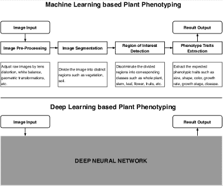

图 1：基于机器学习和深度学习的植物表型之间的区别。

## 2 背景

### 2.1 植物表型

植物表型学是量化植物的物理和生理特征的科学。植物表型学主要惠及两个群体：农民和植物育种者。通过更好地理解作物的特征，农民可以通过做出明智的作物管理决策来优化作物产量。同样，理解作物的行为对植物育种者选择最适合给定地点和环境的作物品种至关重要。在过去，植物表型学是一项手动工作。手动观察少量作物样本并定期报告观察结果的过程缓慢、劳动密集且效率低下。这些方法的低通量特性阻碍了植物育种研究的进展。然而，现代数据采集方法的出现以及各种传感器、摄像头和无人机（UAVs）的进步，再加上机器学习技术的发展，已经导致高通量植物表型方法的发展，这些方法能够有效地用于精准农业。

根据数据收集的方法，植物表型技术可以分为地面基础、航空和卫星基础方法。在地面基础表型中，高精度传感器被嵌入到手持设备或安装在可移动的车辆上，以测量有用的特征，如植物高度、植物生物量、作物发育阶段、作物产量等。图 6 总结了讨论的分类。可移动的表型车辆如 BoniRob [6] 已经被开发，其中可以安装 RGB 摄像头、超光谱摄像头、LIDAR 传感器、GPS 接收器和其他传感器。航空基础方法通常涉及使用无人机（UAVs）进行作物监测。无人机和高分辨率摄像头的最新进展使研究人员能够获取高质量的作物图像。无人机已经有效地执行了除草图谱绘制、作物产量估计、植物疾病检测和农药喷洒等任务。卫星基础植物表型涉及从如 Landsat-8 和 WorldView-3 等卫星遥感农业地块。卫星基础方法通常用于大规模区域如地区/国家的作物健康监测。然而，获取卫星图像的成本、云层的影响以及拍摄和获取图像之间的时间差限制了其在精准农业中的高通量植物表型应用。

借助各种数据收集工具，大量的图像和传感器数据已经被提供用于植物表型研究。下一部分介绍深度学习，一种可以有效识别大量数据集中有用模式的方法。

### 2.2 深度学习

机器学习（ML）是人工智能（AI）的一个子集，处理的是通过观察数据进行学习的算法方法，而不是通过明确编程来实现。机器学习在过去几十年里极大地革新了多个领域。神经网络（NN）[7, 8, 9] 是机器学习的一个子领域，正是这个子领域催生了深度学习（DL）。深度学习显著提升的主要因素之一是大量高质量、公开可用的标记数据集的出现，以及并行 GPU 计算的提升，这使得从基于 CPU 的训练转向基于 GPU 的训练，从而显著加速了深度模型的训练。自 2006 年复兴以来[10]，深度学习领域一直在创建越来越复杂和智能的算法，在多个智能任务中表现优于人类。深度学习中的“深度”源于学习的深层架构或其算法的层次性质。深度学习算法在输入层和输出层之间堆叠多个非线性信息处理单元，这些单元称为人工神经元（AN）。这些人工神经元以层次化的方式堆叠，允许通过有效的学习算法利用特征学习和模式识别。已经证明，神经网络是任何函数的通用近似器[9]，这使得深度学习任务具有任务不可知性[11]。图 2 展示了人工智能的分类。

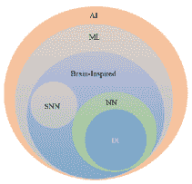

图 2：人工智能的分类[12]。AI：人工智能；ML：机器学习；NN：神经网络；DL：深度学习；SNN：尖峰神经网络。

深度学习方法可以分为以下几类：监督学习、半监督或部分监督学习以及无监督学习¹¹1 强化学习（RL）或深度 RL（DRL）通常被视为半监督或有时是无监督方法。监督学习技术使用标记数据。在监督深度学习中，环境包括输入和对应输出对（通常是大量的），一个随时评估模型性能的标准称为成本或损失函数，一个优化算法用于最小化成本函数。半监督学习技术仅使用部分标记数据集（通常是少量标记数据，大量未标记数据）。流行的生成对抗网络（GAN）[13]是半监督学习技术。无监督学习系统在没有标记数据的情况下工作。在这种情况下，系统学习内部表示或重要特征，以发现输入数据中的未知关系或结构。通常，聚类、降维和生成技术被视为无监督学习方法。

### 2.3 计算机视觉中的深度学习

#### 卷积神经网络

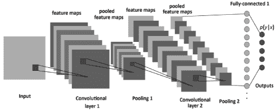

图 3: CNN 的结构 [14]，由卷积层、池化层和全连接层组成。

卷积神经网络（CNN）是利用输入的空间结构的神经网络子类。这个网络结构最初由福岛于 1988 年提出 [15]。当时由于计算硬件训练网络的限制，未被广泛使用。在 1990 年代，LeCun 等人 [16] 将基于梯度的学习算法应用于 CNN，并在手写数字分类问题上获得了成功的结果。CNN 在计算机视觉应用中非常成功，如人脸识别、物体检测、机器人视觉和自动驾驶汽车。CNN 模型具有标准结构，包括交替的卷积层和池化层（通常每个池化层位于卷积层之后）。最后几层是少量的全连接层，最终层是一个 softmax 分类器，如图 3 所示。CNN 的每一层将输入体积转换为神经元激活的输出体积，最终导致最终的全连接层，从而将输入数据映射到 1D 特征向量。简而言之，CNN 包括三种主要类型的神经层，即（i）卷积层，（ii）池化层，和（iii）全连接层。每种类型的层发挥不同的作用。

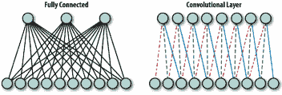

图 4：在完全连接层（左）中，每个单元与前一层的所有单元相连。在卷积层（右）中，每个单元仅与前一层的局部区域中的固定数量单元相连。此外，在卷积层中，这些连接的权重是共享的，如共享的线型所示。图示及描述摘自[17]。

(i) 卷积层。在卷积层中，CNN 对整个图像以及中间特征图进行不同内核的卷积，生成各种特征图。利用卷积操作的优势，多个研究提出用卷积层替代完全连接层，以实现更快的学习时间。完全连接层和卷积层之间的区别见图 4。

(ii) 池化层。池化层负责减少卷积层输入体积的空间维度，而卷积层紧接在池化层之后。池化层不会影响体积的深度维度。该层执行的操作也称为下采样或降采样，因为大小的减少会导致信息的同时丧失。然而，这种损失对网络是有益的，因为网络被迫只学习有意义的特征表示。此外，尺寸的减少会减少后续网络层的计算开销，并且有助于防止过拟合。平均池化和最大池化是最常用的策略。在[18]中对最大池化和平均池化的性能进行了详细的理论分析，而[19]中则表明最大池化可以导致更快的收敛，选择更优的不变特征，并提高泛化能力。

(iii) 完全连接层。在若干卷积层和池化层之后，神经网络中的高级推理是通过完全连接层进行的。完全连接层中的神经元与前一层的所有激活有完全连接，正如其名称所示。因此，它们的激活可以通过矩阵乘法加上偏置偏移来计算。完全连接层最终将 2D 特征图转换为 1D 特征向量。学习到的向量表示可以用于分类或作为进一步处理的特征向量。

#### 目标检测与分割

目标检测和分割是计算机视觉中最重要和最具挑战性的两个分支，它们已广泛应用于现实世界的应用中，例如监控安全、自动驾驶等，目的是定位某一类别语义对象的实例。简而言之，目标检测是识别图像中的对象（带有边界框）的任务。而分割任务是将图像中的每个像素分类为对象（狗、猫、飞机等）。有关这些任务的更多信息，我们参考 [20, 21]。图 5 直观地对比了这些任务之间的差异。

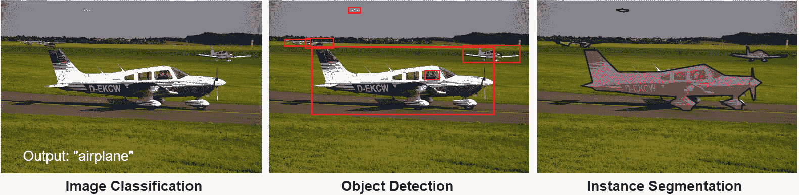

图 5：图示显示任务之间的差异 - 图像分类、目标检测和实例分割。示例取自 MS-COCO 数据集 [22]。

## 深度学习在植物表型分析中的应用

### 3.1 基于地面的植物表型遥感

农业自动化和机器人精密农业活动需要大量关于环境、田地、植物条件和植物表型的信息。数据的增加使得这些机器人工具在实际条件下的成功应用成为可能。利用现有数据，加上如 BoniRob [6] 等自主导航的机器人，深度学习中的计算机视觉在实现自主农业中发挥了重要作用。以前需要大量劳动的任务，如植物生长速度、植物茎位置、生物量、叶片数量、叶片面积、作物间距、作物植株数量等，现在几乎可以无缝完成。

#### 作物识别与分类

对于选择性和植物特定的处理，一个关键的前提是农业机器人需要配备有效的植物识别和分类系统，为机器人提供何时何地触发其执行器以实时执行所需动作的信息。例如，杂草在食品、营养或药物方面通常没有实用价值，但它们的生长速度较快，并且寄生性地与实际作物竞争养分和空间。由于人工除草等低效过程导致了显著损失和因人工劳动而增加的成本 [23]，因此大量的研究集中在作物与杂草分类和杂草识别 [24, 25, 26, 27, 28, 29] 以及植物幼苗分类 [30, 31]。这对于通过适当调节除草剂喷洒以应对杂草侵染水平，从而提高精确农业技术在杂草控制中的效率是非常有用的。

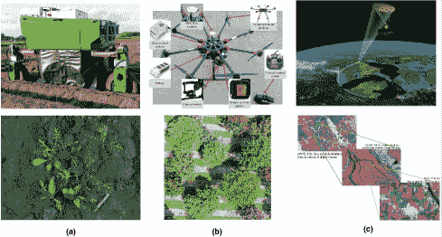

图 6：（a）的顶 row 显示了 BoniRob [6]，一个地面遥感机器人；（b）显示了一架无人机 [32]；（c）显示了一颗卫星扫描大面积土地的图像。底 row 跨（a）、（b）和（c）显示了相应的示例图像。卫星图像来源：NASA。

#### 作物检测与分割

在野外作物检测可以说是多个农场管理任务中的关键步骤，例如视觉作物分类[33]、实时植物病害和害虫识别[34]、自动化采摘和收割机器人[35]、作物生长的健康和质量监测[36]以及产量估算[37]。然而，目前在其他研究领域取得先进性能的深度学习网络并不适用于作物管理等农业任务，例如灌溉[38]、采摘[39]、喷洒农药[40]和施肥[41]。主要原因是缺乏专门为各种农业任务设计的公共基准数据集。现有的少量丰富数据集包括用于检测的 CropDeep [42]、多模态数据集如 Rosette 植物或拟南芥数据集[43, 44, 45]、高粱头数据集[37]、小麦穗数据集[46]、作物/杂草分割数据集[24]和作物/穗分割数据集[47]。图 7 展示了来自 CropDeep [42]数据集的一些示例。图 8 则展示了 Rosette 植物表型数据集[43, 44]中提供的多模态注释，即检测、分割、叶片中心以及其他少见的元数据。

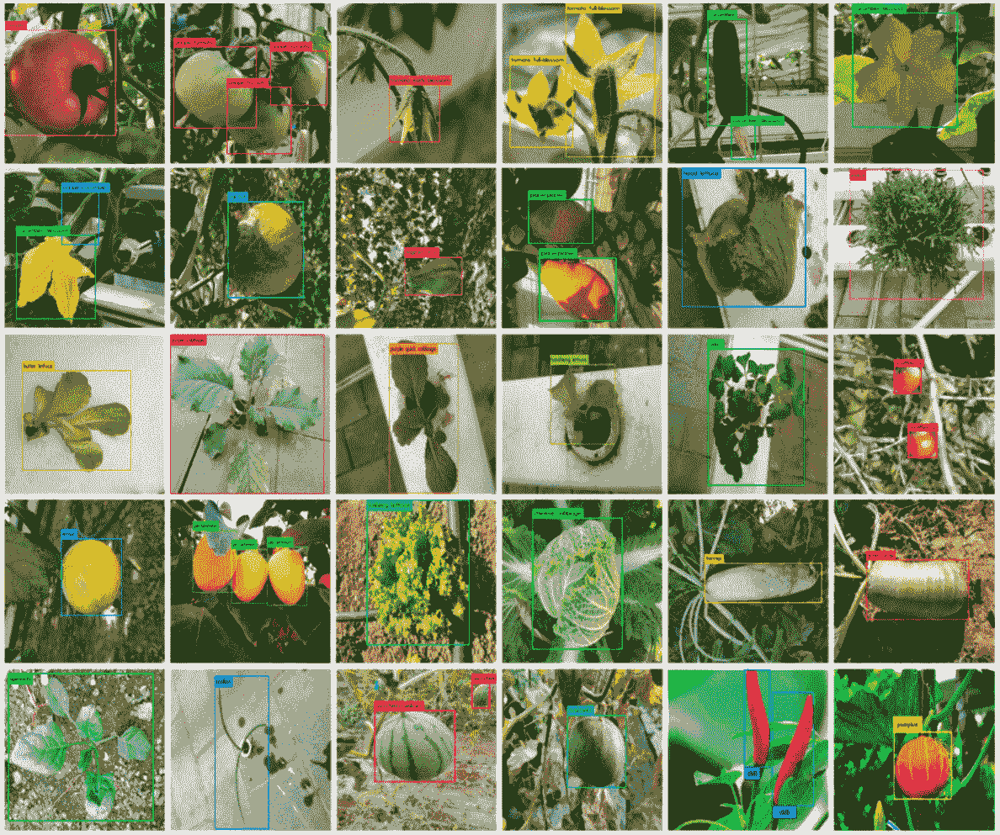

图 7：CropDeep 数据集[42]中的一些注释示例。

从图像中高效估算产量也是农民和植物育种者准确量化其生态系统整体产出的关键任务之一。近期在穗或 spike 检测[48, 49, 50, 37]、叶片计数[51]、果实检测[52]以及像素级分割任务如穗分割[53, 54]方面的努力显示出了非常有前景的结果。

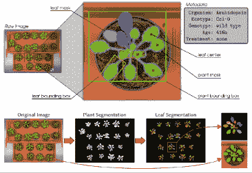

图 8：展示[43, 44]数据集中所有类型注释的视觉示例。

#### 作物病害和害虫识别

现代技术赋予了人类社会生产足够食物以满足超过 70 亿人口需求的能力。然而，食物安全仍受到许多因素的威胁，包括气候变化[55]、授粉者数量减少[56]、植物疾病[57]等。植物疾病不仅对全球范围的食物安全构成威胁，而且对依赖健康作物生计的小农户造成灾难性的后果。印度因植物疾病每年损失 35%的作物产量[58]。在发展中国家，超过 80%的农业生产由小农户提供[59]，而因病虫害造成 50%以上产量损失的报告频繁出现[60]。此外，最多的饥饿人口（50%）生活在小农户家庭中[61]，使得小农户成为特别容易受到病原体干扰食品供应的群体。

由于这些因素，及时识别疾病和虫害成为农民的优先任务。除此之外，农民没有太多选择，只能咨询其他农民或寻求政府资助的热线帮助[62]。像 PlantVillage[63]、PlantDoc[58]这样的公共数据集的可用性推动了疾病和虫害检测领域的发展。最近的研究在虫害和昆虫检测[64、65、66、67、68]、海洋水产养殖中的入侵物种检测[69]以及植物叶片中的疾病检测[70、71、72、73、74]、水稻[75、76、77]、番茄[34、78、79、80]、香蕉[81]、葡萄[82]、甘蔗[83]、茄子[84]、黄瓜[85]、大豆[86]、橄榄[87]、茶[88]、咖啡[89]以及其他类似工作的研究，向无病害农业迈出了鼓舞人心的步伐。图 9 展示了来自[81]的香蕉疾病和虫害检测结果。此工作[90]报告了植物疾病检测中现有局限性的解决方案。

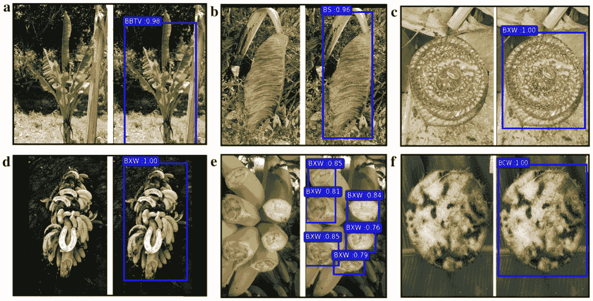

图 9：经过训练的疾病检测模型的检测类别和预期输出。a 受香蕉簇顶病毒（BBTV）影响的整个植物，b 受黑斑病（BS）影响的叶子，c 受黄单胞菌枯萎病（BXW）影响的切割假茎显示黄色细菌渗出物，d 受黄单胞菌枯萎病（BXW）影响的果串，e 受黄单胞菌枯萎病（BXW）影响的切割水果，f 受香蕉茎象甲（BCW）影响的块茎。图和描述摘自[81]。

### 3.2 无人机用于植物表型分析

过去几十年见证了无人机（UAV）在民用领域的巨大进步，尤其是在摄影测量和遥感方面。与载人飞机和卫星平台相比，无人机平台具有许多有前景的特性：灵活性、高效性、高空间/时间分辨率、低成本、操作简便等，这些使其成为其他遥感平台的有效补充和成本效益高的遥感手段。我们建议读者参考文献[91, 92]以了解无人机在精准农业、遥感、搜救、建设和基础设施检查中的技术和应用的详细报告，并探讨其他市场机会。无人机可以用于精准农业（PA）的作物管理和监测[93, 94]、杂草检测[95]、灌溉调度[96]、农业模式检测[97]、农药喷洒[93]、牲畜检测[98]、疾病检测[99, 100]、昆虫检测[101]和地面传感器数据收集（湿度、土壤属性等）[102]。在精准农业中部署无人机是一种具有成本效益和节省时间的技术，有助于提高作物产量、农场生产力和农业系统的盈利能力。此外，无人机还促进了农业管理、杂草监测和病虫害防治，从而有助于快速应对这些挑战[103]。

无人机还可以用于监测和量化灌溉的几个因素，如土壤水分的可用性、作物水分需求（表示各种作物生长所需的水量）、降雨量、灌溉系统的效率 [104]。在这项工作 [105] 中，无人机正被用于估计表层土壤湿度的空间分布，通过高分辨率多光谱影像结合地面采样。无人机还被用于热遥感，以监测作物病害在不同病害发展阶段的空间和时间模式，从而减少农民的作物损失。这项工作 [106] 检测了无人机影像中土壤传染真菌的早期阶段发展。土壤质地可以作为土壤质量的指示，这反过来影响作物生产力。因此，无人机热图像被用来在区域尺度上量化土壤质地，通过测量在相对均匀的气候条件下土地表面温度的差异 [107, 108]。准确评估作物残余对于正确实施保护性耕作实践至关重要，因为作物残余为农田提供了保护层，防止土壤受到风和水的侵蚀。在 [109] 中，作者证明了与使用可见光和近红外图像的 77%相比，航空热图像可以解释作物残余覆盖量的 95%以上的变异性。

农民必须监测作物的成熟度以确定收获时间。无人机可以是解决这个问题的实用方案 [110]。农民需要准确的早期作物产量估计，原因包括作物保险、收获和储存需求的规划以及现金流预算。在 [111] 中，无人机影像被用于估计泰国稻米作物的产量和总生物量。在 [112] 中，无人机影像也被用于预测德国早期到中期生长阶段的玉米粒产量。

也有成功的努力无缝结合了空中和地面系统以实现精确农业 [113]。随着飞行法规的放宽以及机器学习技术、地理参考、镶嵌和其他相关算法的显著改进，无人机在土壤和作物监测方面具有巨大潜力 [114]。鼓励更多精确农业研究设计和实施专用类型的相机和传感器安装在无人机上，以便能够在实时场景中进行远程作物监测和土壤及其他农业特征的检测。

### 3.3 卫星在植物表型研究中的应用

气候变化及其不可预测性已经导致大多数农业作物在生产和维护方面受到影响。随着超过七十亿人口对粮食的需求增加，农业面临的压力比以往任何时候都要大，同时土地还受到土壤侵蚀、矿物耗竭和干旱等因素的退化。政府优先支持农民，提供有关天气变化、土壤条件等重要信息成为首要任务。目前，卫星影像通过减少农民的勘察工作、优化氮肥使用（根据施用的可变速率）、优化用水计划、识别田间表现和基准田等方式，使农业变得更加高效 [115]。仅印度就有 7 颗特别设计用于农民利益的卫星 [116]。

卫星及其影像在农业中有多种应用，最初用于估算作物产量 [117] 和作物类型 [118]、土壤盐度、土壤湿度、土壤 pH [119, 120, 121]。光学和雷达传感器能够准确描绘耕种面积，同时区分作物类型，并确定其健康状况和成熟度。光学卫星传感器可以检测从农业土地反射的可见光和近红外波长。这些波长的结合可以被操作，以帮助我们了解作物的状况。这些信息有助于市场的了解，并提供作物失败或饥荒的早期预警。

进一步说，卫星也被用作精细农业的管理工具，通过卫星图像详细描绘农田，通常与地理信息系统（GIS）结合使用，以实现更高效、更集中的耕作实践。例如，可能会建议不同的作物在不同的田地中种植，同时以更经济和环保的方式优化农民的肥料使用。提供卫星影像的访问也对建立农民、政府和参与的私人机构之间的信任非常重要。基于网络的平台，如 Google Earth Engine、Planet.com、NASA 的 Earth Data Search、Earth Observing System 的 LandViewer、Geocento [122] 等，提供了你感兴趣的过去和现在（甚至是每日）的卫星影像。

农业监测也越来越多地应用于林业，不仅用于森林管理，还作为表征森林碳汇以帮助减少气候变化的一种方式——特别是在联合国的 REDD 计划中 [124]。

## 4 有限标记数据的植物表型分析

尽管基于深度学习的植物表型分析显示出巨大的潜力，但对大规模标注数据集的需求仍然是瓶颈。表型分析任务通常特定于环境和遗传条件，找到符合这些条件的大数据集并不总是可能。这导致研究人员需要获取自己的数据集并进行标注，这通常是一项繁重且昂贵的工作。此外，小数据集常常导致模型过拟合。针对有限标注数据的深度学习方法将极大地帮助植物表型分析社区，因为这将鼓励更多的农民、育种者和研究人员采用可靠的植物表型分析技术，以优化作物产量。为此，我们列出了一些在有限标注数据下进行深度植物表型分析的最新努力。

### 数据增强

计算机视觉领域一直在使用数据集增强技术，通过人工变换来增加数据量。使用仿射变换（例如旋转、缩放、平移）对原始数据集进行人工扰动现在被视为一种常见做法。然而，这种方法有一些限制：增强的数据仅捕捉到可用训练集的变异性（例如，如果数据集中不包含一种特有颜色的水果，那么这种特有情况将永远不会被学习）。为了解决这个问题，提出了几种数据增强方法，这些方法利用了图像生成领域的最新进展。在这项工作[125]中，作者使用生成对抗网络（GAN）[126]生成具有特定期望特征（例如超过 7 片叶子）的阿拉伯芥植物图像（称为 ARIGAN），这些特征在数据集中原本较少见。图 10 (a)展示了 ARIGAN 生成的图像示例。其他最新的工作[127, 128]使用更先进的 GAN 变体生成现实的植物图像，特别是具有有利的叶片分割，这有助于提高学习模型的叶片计数准确性。在[129]中，作者提出了一种无监督图像翻译技术，以提高植物疾病识别性能。LeafGAN [130]，一种图像到图像的翻译模型，生成各种植物疾病的叶片图像，并大幅提高了诊断性能。图 10 (b)展示了 LeafGAN 生成的两组示例图像。其他数据增强技术也正被研究人员使用，以训练植物疾病诊断模型，针对生成的病变[131]。

提供精细注释数据的努力已显著提高了分割性能的最新水平。一些研究已经开始致力于将从标注植物的 RGB 图像中获得的知识有效地转移到其他物种或其他成像模式上。在这项工作[132]中，作者成功地将从 RGB 图像中的拟南芥标注叶片获得的知识转移到同一植物的叶绿素荧光成像图像中。

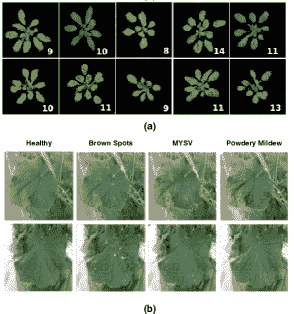

图 10: (a) 显示了 ARIGAN 生成的拟南芥植物图像[125]。右下角的数字表示叶片数量。 (b) 显示了由 LeafGAN 生成的两组健康叶片及其对应的易病叶片[130]。

### 弱监督学习

果实/器官计数是植物表型研究社区中一个研究较为深入的任务。然而，目前我们拥有的许多基于视觉的解决方案需要在各种环境中对果实和器官进行高度准确的实例和密度标注。这些标注过程通常非常繁琐且容易出错，在许多农业场景中，可能无法获得足够数量的标注样本以实现对图像噪声或其他形式的协变量变化具有鲁棒性的稳定性能。这就是为什么仅使用弱标注对于具有成本效益的植物表型研究至关重要的原因。

最近，很多关注被放在了用于植物表型研究的弱监督学习框架上。在[48]中，作者创建了一个用于高粱穗检测任务的弱监督框架，其中标注者仅在模型达到所需性能水平之前标注数据。之后，模型输出直接作为数据标签，从而实现了注释成本的指数级降低，同时模型准确性损失最小。在其他工作[133]中，作者提出了一种无需任务特定监督标签（如手动标记的目标边界框或总实例计数）的水果计数学习策略。在[134]中，作者使用在缺陷分类数据上训练的 CNN，并利用其激活图来分割土豆上的感染区域。分割任务需要非常详细的标签（图像的每个像素都需要标注），因此该任务实际上完全绕过了分割的标注。另一方面，水稻抽穗日期的准确估计大大帮助育种者了解作物对不同环境和遗传条件的适应能力。准确的抽穗日期估计需要监测稻穗数量的增加。从作物图像中检测稻穗通常需要训练目标检测模型，如 Faster R-CNN 或 YOLO，这需要昂贵的边界框标注。然而，最近提出的方法[49]使用基于滑动窗口的检测器，只需训练图像分类器，标注更容易获取。

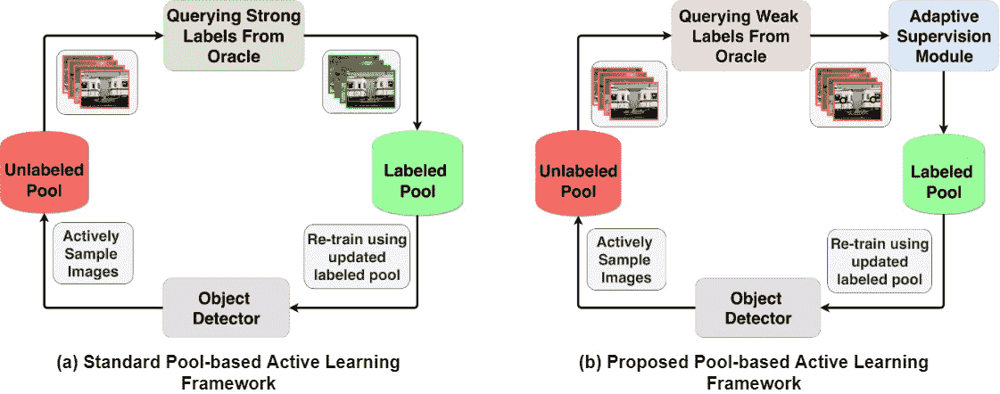

图 11：（a）标准池化式主动学习框架（b）提出的框架[135]，在主动学习过程中交替使用弱监督。这一新颖的框架包含一个自适应监督模块，允许在训练模型时根据需要切换到更强的监督形式。oracle 是标签来源，也就是标注者。

### 迁移学习

迁移学习是一种学习类型，能够将解决一个问题时获得的知识应用到不同但相关的问题上，即一个在某种表型任务（如土豆叶分类）上训练的模型能够协助另一个表型（如番茄叶分类）任务。迁移学习是机器学习领域一个非常成熟的研究方向。在采用现有迁移学习技术进行植物表型分析的第一步中，[136] 的作者使用了在 ImageNet 数据集 [137] 上预训练的 CNN（AlexNet、GoogleNet 和 VGGNet），并在 LifeCLEF [138] 2015 挑战中使用的植物数据集上进行微调。在迁移学习的帮助下，他们能够将当时现有的 LifeCLEF 最佳表现提高 15%。类似地，在 [139] 中，作者报告了在分割任务中迁移学习的帮助下取得比人类更好的结果，其中他们将训练于花生根数据集的模型迁移至 switchgrass 根数据集（他们还报告了使用 ImageNet 预训练模型的结果）。叶病检测和治疗推荐的性能也在 [140] 中显示了在迁移学习的帮助下得到了提升。在 [141] 中，作者有趣地将一种最先进的弱监督水果计数模型与一种无监督风格迁移方法相结合，用于水果计数。他们使用 Cycle-Generative Adversarial Network（C-GAN）进行从一个水果数据集到另一个的无监督领域适应，并与一种存在-缺失分类器（PAC）一起训练，该分类器区分包含水果的图像与不包含水果的图像，最终取得了比完全监督模型更好的表现。

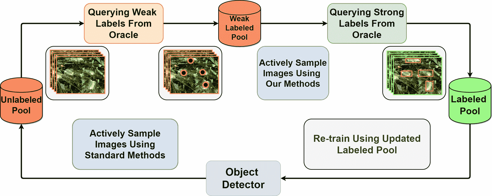

图 12: 提出的点监督框架 [142] 进入基于池的主动学习循环。在这个框架中，仅在根据图像的点监督被认为具有信息量后，才会查询强监督。

### 主动学习

**主动学习**[143]是一种迭代训练方法，通过有针对性地选择最佳样本进行训练，已被证明可以减少训练深度分类网络时对标注数据的需求[144, 145, 146]。在物体检测领域的主动学习研究[147, 148, 149]可以说是有限的。然而，许多植物表型分析任务，如作物产量的检测与量化以及果实计数，都直接依赖于物体检测。考虑到这一点，已有研究提出了一种**主动学习**方法[135]，用于训练深度物体检测模型，其中模型可以选择性地查询弱标注（指向物体）或强标注（围绕物体绘制框）。通过引入一个用于弱标注和强标注的切换模块，作者在训练小麦穗检测[46]模型时节省了 24%的标注时间。图 11 展示了常规主动学习周期和提议的主动学习周期之间的区别。这种方法展示了主动学习在植物表型分析中的适用性，因为获取标注数据往往非常困难。同样，为了减轻用于训练作物检测模型的标注数据需求，最近提出了一种基于弱监督的主动学习方法[142]。在这种主动学习方法中，模型通过迭代查询仅最具信息量的图像的标签，而不是数据集中所有图像的标签，从而不断与人工标注者互动。图 12 直观展示了所提框架。这种主动查询方法专门为谷物作物设计，这些作物通常具有外观变化较小的穗部。这种训练方法已被证明可以减少在高粱穗和小麦穗检测数据集上的标注成本超过 50%。我们期待在不久的将来看到更多使用主动学习来处理有限标注数据的植物表型分析研究。

## 5 个挑战和待解决的问题

在这一部分，我们描述了植物表型分析方法中存在的一些挑战，这些挑战需要进一步研究。

### 训练数据瓶颈

现代表型方法依赖于深度学习，深度学习以需要大量标注数据而闻名。虽然在开发数据高效的表型模型方面取得了一些进展，但减少训练高效表型工具的标注工作仍然是一个开放问题。我们相信，有效地适应深度学习技术，如无监督、自监督、弱监督、主动学习和半监督学习，将极大地惠及表型社区，使其能够在小数据集下观察植物特征。

### 可解释性

深度神经网络通常被认为是黑箱模型，它们在没有足够理由的情况下给出预测。这使得神经网络的调试变得困难，即很难理解错误预测的原因。基于不准确表型结果的作物管理决策可能会导致经济损失。因此，开发可解释的植物表型模型是该领域的一个开放问题。利用可解释模型获取特定植物特征背后的原因有可能在理解植物在不同遗传和环境条件下的行为方面取得突破。

### 数据收集

基于视觉的植物表型学面临诸如遮挡、作物 3D 重建不准确和天气变化造成的光照条件差等挑战。因此，开发对视觉变化具有鲁棒性的表型工具是必要的。

## 6 结论

高通量植物表型方法在高效监测作物以进行植物育种和农业作物管理方面显示了巨大的潜力。深度学习的研究加速了植物表型研究的进展，导致了各种图像分析工具的开发，以观察植物特征。然而，高通量表型工具的广泛应用受限于一些问题，如：1) 深度网络对大量数据集的依赖，这些数据集难以策划；2) 田间环境的巨大变化无法始终捕捉；3) 资本和维护费用在发展中国家可能过于昂贵。鉴于植物表型学中许多开放问题需要进一步研究，现在确实是利用深度学习进步来研究植物表型并取得快速进展的最佳时机。

## 参考文献

+   [1] 汉特，史密斯，施皮根斯基，阿特伍德，莫滕森：2050 年的农业：重新校准可持续强化的目标。生物科学 67 (02 2017)

+   [2] 吴晓光，郭建平，韩梅，陈光辉：全球经济耕地利用概述：通过全球供应链从源头到终点。土地利用政策 76 (2018) 201 – 214

+   [3] 加戈，杜特，库普曼，加列戈，里巴斯-卡博，弗莱克萨斯，埃斯卡隆，梅德拉诺：无人机在评估水分胁迫以实现可持续农业中的挑战。农业水管理 153 (2015) 9 – 19

+   [4] Aubert, B.A., Schroeder, A., Grimaudo, J.: 作为可持续农业的推动者：对农民采用精准农业技术决策的实证分析。决策支持系统 54(1) (2012) 510 – 520

+   [5] Sladojevic, S., Arsenovic, M., Anderla, A., Culibrk, D., Stefanovic, D.: 基于深度神经网络的植物疾病识别，通过叶片图像分类。见：计算智能与神经科学 (2016)

+   [6] Ruckelshausen, A., Biber, P., Dorna, M., Gremmes, H., Klose, R., Linz, A., Rahe, R., Resch, R., Thiel, M., Trautz, D., Weiss, U.: Bonirob：一个用于个体植物表型分析的自主田间机器人平台。精准农业 9 (01 2009) 841–847

+   [7] Fitch, F.B.: Warren S. McCulloch 和 Walter Pitts。神经活动中固有思想的逻辑演算。数学生物物理学公报，第 5 卷 (1943)，第 115–133 页。符号逻辑期刊 9(2) (1944) 49–50

+   [8] Rosenblatt, F.F.: 感知器：一种用于信息存储和组织的大脑中的概率模型。心理学评论 65 6 (1958) 386–408

+   [9] Hornik, K., Stinchcombe, M., White, H.: 多层前馈网络是通用逼近器。神经网络 2(5) (1989 年 7 月) 359–366

+   [10] Bengio, Y., Lamblin, P., Popovici, D., Larochelle, H., Montreal, U.: 贪婪的逐层训练深度网络。第 19 卷 (01 2007)

+   [11] Bengio, Y.: 为人工智能学习深度架构。基础 2 (01 2009) 1–55

+   [12] Alom, M.Z., Taha, T.M., Yakopcic, C., Westberg, S., Sidike, P., Nasrin, M.S., Hasan, M., Van Essen, B.C., Awwal, A.A.S., Asari, V.K.: 深度学习理论与架构的最新研究。电子学 8(3) (2019 年 3 月) 292

+   [13] Goodfellow, I., Pouget-Abadie, J., Mirza, M., Xu, B., Warde-Farley, D., Ozair, S., Courville, A., Bengio, Y.: 生成对抗网络。见 Ghahramani, Z., Welling, M., Cortes, C., Lawrence, N.D., Weinberger, K.Q., 编：神经信息处理系统进展 27. Curran Associates, Inc. (2014) 2672–2680

+   [14] : 深度卷积神经网络架构设计的框架。熵 19(6) (2017 年 5 月) 242

+   [15] Fukushima, K.: Neocognitron：一种能够进行视觉模式识别的分层神经网络。神经网络 1 (1988) 119–130

+   [16] Lecun, Y., Bottou, L., Bengio, Y., Haffner, P.: 基于梯度的学习应用于文档识别。IEEE 会议记录 86(11) (1998 年 11 月) 2278–2324

+   [17] Itay Lieder, Yehezkel S. Resheff, T.H.: 学习 TensorFlow. (2017) 第四章

+   [18] Boureau, Y.L., Ponce, J., Lecun, Y.: 特征池化在视觉识别中的理论分析。 (2010 年 11 月) 111–118

+   [19] Scherer, D., Müller, A., Behnke, S.: 卷积架构中池化操作的评估。见 Diamantaras, K., Duch, W., Iliadis, L.S., 编：人工神经网络 – ICANN 2010，柏林，海德堡，Springer Berlin Heidelberg (2010) 92–101

+   [20] Jiao, L., Zhang, F., Liu, F., Yang, S., Li, L., Feng, Z., Qu, R.: 基于深度学习的目标检测调查。IEEE Access 7（2019 年）128837–128868

+   [21] Lu, Z., Xu, H., Liu, G.: 目标共同分割调查。IEEE Access PP（2019 年 5 月）1–1

+   [22] Lin, T.Y., Maire, M., Belongie, S.J., Hays, J., Perona, P., Ramanan, D., Dollár, P., Zitnick, C.L.: 微软 COCO：上下文中的常见物体。见：ECCV.（2014 年）

+   [23] Y. Gharde, P. Singh, R.D., Gupta, P.: 印度农业中由于杂草导致的产量和经济损失评估。第 107 卷。（2018 年）12–18

+   [24] Haug, S., Ostermann, J.: 用于评估基于计算机视觉的精准农业任务的作物/杂草田地图像数据集。见：ECCV Workshops.（2014 年）

+   [25] Binguitcha-Fare, A.A., Sharma, P.: 使用卷积神经网络进行作物和杂草分类，通过优化迁移学习参数

+   [26] Fawakherji, M., Youssef, A., Bloisi, D.D., Pretto, A., Nardi, D.: 用于精准农业的作物和杂草分类，基于上下文无关的像素级分割。2019 年第三届 IEEE 国际机器人计算会议（IRC）（2019 年）146–152

+   [27] Guerrero, J.M., Pajares, G., Montalvo, M., Romeo, J., Guijarro, M.: 用于玉米田作物/杂草识别的支持向量机。专家系统与应用 39（2012 年）11149–11155

+   [28] Sa, I., Chen, Z., Popovic, M., Khanna, R., Liebisch, F., Nieto, J., Siegwart, R.: WeedNet：使用多光谱图像和 MAV 进行智能农业的密集语义杂草分类。IEEE 机器人与自动化快报 3（2017 年）588–595

+   [29] Rani, K., Supriya, P., Sarath, T.V.: 基于计算机视觉的胡萝卜和咖喱叶植物分离及胡萝卜田中的杂草识别。2017 年国际计算方法与通信会议（ICCMC）（2017 年）185–188

+   [30] Nkemelu, D.K., Omeiza, D., Lubalo, N.: 用于植物幼苗分类的深度卷积神经网络。ArXiv abs/1811.08404（2018 年）

+   [31] Elnemr, H.A.: 用于植物幼苗分类的卷积神经网络架构。（2019 年）

+   [32] Xiang, T.Z., Xia, G.S., Zhang, L.: 基于迷你无人机的遥感：技术、应用和前景（2018 年 12 月）

+   [33] Patrício, D.I., Rieder, R.: 粮食作物精准农业中的计算机视觉和人工智能：系统评审。计算机与电子农业 153（2018 年）69–81

+   [34] Fuentes, A., Yoon, S., Kim, S.C., Park, D.S.: 一种基于深度学习的鲁棒检测器，用于实时番茄植物疾病和害虫识别。见：传感器。（2017 年）

+   [35] Bachche, S.: 关于自动收割系统设计策略的探讨：一项调查。机器人学 4（2015 年）194–222

+   [36] Allende, A., Monaghan, J.M., Uyttendaele, M., Franz, E., Schlüter, O.: 绿叶作物的灌溉水质：风险与潜在解决方案的视角。见：国际环境研究与公共健康杂志。（2015 年）

+   [37] Guo, W., Zheng, B., Potgieter, A.B., Diot, J., Watanabe, K., Noshita, K., Jordan, D.R., Wang, X., Watson, J., Ninomiya, S., Chapman, S.C.: 航空影像分析 – 量化高粱穗的外观和数量，用于育种和农业应用。植物科学前沿 9(10 月) (2018 年) 1–9

+   [38] Chai, Q., Gan, Y., Zhao, C., Xu, H.l., Waskom, R., Niu, Y., Siddique, K.: 干旱压力下作物生产的调控缺水灌溉。综述。可持续发展农业学报 36 (2016 年 03 月)

+   [39] Zhao, D., Liu, X., Chen, Y., Ji, W., Jia, W., Hu, C.: 夜间图像识别用于苹果采摘机器人。农业机械学报/中国农业机械学会学报 46 (2015 年 03 月) 15–22

+   [40] Yamane, S., Miyazaki, M.: 低浓度、高容量应用的静电喷雾系统研究。 (2017 年)

+   [41] Oktay, K., Bedoschi, G., Pacheco, F., Turan, V., Emirdar, V.: 冻存卵巢组织与人类细胞外基质支架联合移植后的首次妊娠、活产和体外受精结果，采用机器人辅助手术。美国妇产科杂志 214 (2015 年 11 月)

+   [42] Zheng, Y.Y., Kong, J.L., bo Jin, X., Wang, X.Y., Su, T.L., Zuo, M.: Cropdeep: 精准农业中基于深度学习的分类和检测作物视觉数据集。传感器杂志. (2019 年)

+   [43] Minervini, M., Fischbach, A., Scharr, H., Tsaftaris, S.: 细粒度标注数据集用于基于图像的植物表型分析。模式识别快报 81 (2015 年 11 月)

+   [44] Scharr, H., Minervini, M., Fischbach, A., Tsaftaris, S.: 玫瑰植物的标注图像数据集 (2014 年 07 月)

+   [45] Cruz, J., Yin, X., Liu, X., Imran, S., Morris, D., Kramer, D., Chen, J.: 多模态影像数据库用于植物表型分析。机器视觉与应用 27 (2016 年 07 月)

+   [46] Madec, S., Jin, X., Lu, H., de Solan, B., Liu, S., Duyme, F., Heritier, E., Frederic, B.: 使用深度学习技术从高分辨率 RGB 图像中估算耳密度。农业与森林气象学 264 (2019 年 01 月) 225–234

+   [47] Lu, H., Cao, Z.G., Xiao, Y., Li, Y., Zhu, Y.: 野外作物和花序的联合分割。 (2015 年 11 月)

+   [48] Ghosal, S., Zheng, B., Chapman, S.C., Potgieter, A.B., Jordan, D., Wang, X., Singh, A.K., Singh, A., Hirafuji, M., Ninomiya, S., Ganapathysubramanian, B., Sarkar, S., Guo, W.: 一种弱监督的深度学习框架用于高粱穗的检测与计数。 (2019 年)

+   [49] Desai, S.V., Balasubramanian, V.N., Fukatsu, T., Ninomiya, S., Guo, W.: 使用深度学习自动估算水稻的抽穗日期。植物方法 15(1) (2019 年) 76

+   [50] Hasan, M.M., Chopin, J.P., Laga, H., Miklavcic, S.J.: 使用卷积神经网络检测和分析小麦穗。植物方法 14(1) (2018 年 11 月) 100

+   [51] 乌本斯, J., 赛斯拉克, M., 普鲁辛基维奇, P., 斯塔夫内斯, I.: 植物模型在深度学习中的应用：以玫瑰植物叶子计数为例。发表于：植物方法。（2018）

+   [52] 萨伊, I., 葛志, Z., 达尤布, F., 阿普克罗夫特, B., 佩雷斯, T., 麦库尔, C.: Deepfruits：一种使用深度神经网络的水果检测系统。发表于：传感器。（2016）

+   [53] 熊熙, 段莉, 刘磊, 涂华, 杨鹏, 吴迪, 陈光, 熊力, 杨伟, 刘青: Panicle-seg：基于深度学习和超像素优化的稻穗田间图像分割方法。植物方法 13(1) (2017 年 11 月) 104

+   [54] 哦, M.h., 奥尔森, P., 拉马穆尔西, K.N.: 粟米穗的计数与分割。（2019 年 5 月）

+   [55] 泰, A., 瓦尔·马丁, M., 希尔德, C.: 气候变化和臭氧空气污染对未来全球粮食安全的威胁。自然气候变化 4 (2014 年 7 月) 817–821

+   [56] 未知: 传粉者对我们食品供应至关重要，面临威胁。国际生物多样性与生态系统服务政府间平台新闻稿。（2016）

+   [57] 斯特兰奇, R., 斯科特, P.: 植物病害：对全球粮食安全的威胁。植物病理学年鉴 43 (2005 年 2 月) 83–116

+   [58] 辛格, D., 贾恩, N., 贾恩, P., 卡亚尔, P., 库马瓦特, S., 巴特拉, N.: Plantdoc：用于视觉植物病害检测的数据集。发表于：CoDS COMAD 2020。（2020）

+   [59] 沃尔波尔, M., 史密斯, J., 罗瑟, A., 布朗, C., 舒尔特-赫布鲁根, B., 布斯, H., 萨森, M., 马本登贝, A., 方克特, M., 比耶里, M., 格拉泽, S., 科里根, C., 纳洛赫, U., 伦斯滕, L., 詹金斯, M., 戈梅拉, M., 哈顿, J.: 小农户、粮食安全与环境（2013 年 3 月）

+   [60] 哈维·塞利亚·A., 拉科托贝·佐·拉莱纳, R.N.S.D.R.R.H.R.R.H.R.H., L., M.J.: 马达加斯加小农户对农业风险和气候变化的极端脆弱性（2014 年 4 月）

+   [61] 桑切斯, P., 斯瓦米那坦, M.: 将世界饥饿减少一半。科学（纽约, N.Y.）307 (2005 年 2 月) 357–9

+   [62] 农业部: 印度政府 2019 年。kisaan 知识管理系统。（2019）

+   [63] 休斯, D., 萨拉特, M.: 开放访问的植物健康图像库，以支持通过机器学习和众包技术开发移动疾病诊断工具。（2015 年 11 月）

+   [64] 刘博, 朱华, 赵宇, 白杨, 王勇: 使用智能监测自主机器人在自然农田场景中识别鳞翅目昆虫（2019 年 1 月）

+   [65] 邓丽, 王勇, 韩志, 于荣: 基于生物启发方法的昆虫害虫图像检测与识别研究。（2018）

+   [66] 贾维德, M.H., 赫马伊尔, M., 雅库布, B., 诺尔, N., 阿尔沙德, T.: 基于 K-means 的自动害虫检测与分类用于喷洒农药。国际高级计算机科学与应用期刊 8 (2017 年 1 月)

+   [67] 刘涛, 陈伟, 吴伟, 孙超, 郭伟, 朱欣: 使用计算机视觉技术检测小麦田中的蚜虫。生物系统工程 141 (2016 年 1 月) 82–93

+   [68] Zhong, Y., Gao, J., Lei, Q., Zhou, Y.: 一种基于视觉的飞行昆虫计数与识别系统用于智能农业。见：Sensors。（2018）

+   [69] Galloway, A., Taylor, G.W., Ramsay, A., Moussa, M.A.: ciona17 数据集用于海洋水产环境中入侵物种的语义分割。2017 年第十四届计算机与机器人视觉会议（CRV）（2017）361–366

+   [70] Zhang, S., Wu, X., You, Z.H., Zhang, L.: 基于叶片图像的黄瓜病害识别使用稀疏表示分类。计算机与电子农业 134（2017）135–141

+   [71] Ferentinos, K.P.: 用于植物病害检测和诊断的深度学习模型。计算机与电子农业 145（2018）311–318

+   [72] Pallagani, V., Khandelwal, V., Chandra, B., Udutalapally, V., Das, D., Mohanty, S.P.: dcrop：一个基于深度学习的框架，用于智能农业中作物疾病的准确预测。2019 IEEE 国际智能电子系统研讨会（iSES）（原 iNiS）（2019）29–33

+   [73] Mohanty, S.P., Hughes, D.P., Salathé, M.: 使用深度学习进行基于图像的植物病害检测。见：Front. Plant Sci.（2016）

+   [74] Francis, M., Deisy, C.: 使用卷积神经网络进行农业植物的疾病检测与分类——视觉理解。2019 年第六届信号处理与集成网络国际会议（SPIN）（2019）1063–1068

+   [75] Li, D., Wang, R., Xie, C., Liu, L., Zhang, J., Li, R., Wang, F., Zhou, M., Liu, W.: 基于深度卷积神经网络的水稻植物病害和害虫视频检测识别方法。传感器 20 3（2020）

+   [76] jie Liang, W., Zhang, H., feng Zhang, G., xin Cao, H.: 基于深度卷积神经网络的水稻稻瘟病识别。见：Scientific Reports。（2019）

+   [77] Zhou, G., Zhang, W., Chen, A., He, M., Ma, X.: 基于 fcm-km 和 faster r-cnn 融合的水稻病害快速检测。IEEE Access 7（2019）143190–143206

+   [78] Maeda-Gutiérrez, V., Galván Tejada, C., Zanella Calzada, L., Celaya Padilla, J., Galván Tejada, J., Gamboa-Rosales, H., Luna-Garcia, H., Magallanes-Quintanar, R., Carlos, G.M., Olvera-Olvera, C.: 卷积神经网络架构在番茄植物病害分类中的比较。应用科学 10（02 2020）1245

+   [79] Fuentes, A., Yoon, S., Lee, J., Park, D.S.: 高性能深度神经网络基础的番茄植物病害与害虫诊断系统，配有精细化滤波器组。见：Front. Plant Sci.（2018）

+   [80] Gutierrez, A., Ansuategi, A., Susperregi, L., Tubío, C., Rankić, I., Lenža, L.: 针对番茄植物的害虫检测与识别的学习策略基准，适用于使用内部数据库的自主巡逻机器人。传感器杂志 2019（05 2019）1–15

+   [81] Michael Gomez Selvaraj, Alejandro Vergara, H.R.N.S.S.E.W.O.G.B.: 人工智能驱动的香蕉病害和害虫检测。植物方法 2019（08 2019）

+   [82] Aravind, K.R., Raja, P., Aniirudh, R., Mukesh, K.V., Ashiwin, R., Vikas, G.: 使用迁移学习方法进行葡萄作物病害分类。(2018)

+   [83] Shadab, M., Dwivedi, M., S N, O., Javed, T., Bakey, A., Raqib, M., Chakravarthy, A.: 使用深度学习对甘蔗作物进行病害识别 (09 2019)

+   [84] Rangarajan, A.K., Purushothaman, R.: 使用预训练的 vgg16 和 msvm 进行茄子病害分类。科学报告 10 (2020)

+   [85] Zhang, S., Wu, X., You, Z.H., Zhang, L.: 基于叶片图像的黄瓜病害识别使用稀疏表示分类。计算机电子农业 134 (2017) 135–141

+   [86] Kaur, S., Pandey, S., Goel, S.: 半自动化豆类叶病检测与分类系统。IET 图像处理 12 (2018) 1038–1048

+   [87] Cruz, A.C., Luvisi, A., Bellis, L.D., Ampatzidis, Y.: X-fido: 一种利用深度学习和数据融合检测橄榄快速衰退综合症的有效应用。在：前沿植物科学. (2017)

+   [88] Chen, J., Liu, Q., Gao, L.: 使用卷积神经网络模型的视觉茶叶病害识别。对称性 11 (2019) 343

+   [89] Esgario, J., Krohling, R., Ventura, J.: 深度学习在咖啡叶生物应激分类和严重程度估计中的应用 (07 2019)

+   [90] Arsenovic, M., Karanovic, M., Sladojevic, S., Anderla, A., Stefanovic, D.: 解决基于深度学习的方法在植物病害检测中的当前局限性。对称性 11 (2019) 939

+   [91] Shakhatreh, H., Sawalmeh, A.H., Al-Fuqaha, A., Dou, Z., Almaita, E., Khalil, I.M., Othman, N.S., Khreishah, A., Guizani, M.: 无人驾驶航空器（UAVs）：民用应用与关键研究挑战的综述。IEEE Access 7 (2019) 48572–48634

+   [92] Xiang, T., Xia, G.S., Zhang, L.: 基于迷你无人机的遥感：技术、应用和前景。IEEE 地球科学与遥感杂志 7 (2019) 29–63

+   [93] Huang, Y., Thomson, S.J., Hoffmann, W.C., Lan, Y., Fritz, B.K.: 无人机技术在农业生产管理中的发展与前景。(2013)

+   [94] Dastgheibifard, S., Asnafi, M.: 关于无人机在建筑行业潜在应用的综述。(07 2018)

+   [95] Kazmi, W., Bisgaard, M., Garcia-Ruiz, F.J., Hansen, K.D., la Cour-Harbo, A.: 使用自主车辆团队对作物进行适应性调查和早期处理。在：ECMR. (2011)

+   [96] V. Gonzalez-Dugo, P. Zarco-Tejada, E.N.P.N.J.A.D.I., Fereres, E.: 使用高分辨率无人机热成像评估商业果园内五种果树物种的水分状态变化。精准农业 14(6) (12 2013) 660–678

+   [97] Chiu, M.T., Xu, X., Wei, Y., Huang, Z., Schwing, A.G., Brunner, R., Khachatrian, H., Karapetyan, H., Dozier, I., Rose, G., Wilson, D., Tudor, A.P., Hovakimyan, N., Huang, T.S., Shi, H.: 农业视觉：一个用于农业模式分析的大型航空影像数据库。ArXiv abs/2001.01306 (2020)

+   [98] Barbedo, J., Koenigkan, L., Santos, T., Santos, P.：基于深度学习的无人机图像中牛的检测研究。传感器 19 (2019 年 12 月) 5436

+   [99] Garcia-Ruiz, F., Sankaran, S., Maja, J.M., Lee, W.S., Rasmussen, J., Ehsani, R.：两种航空成像平台在识别黄龙病感染的柑橘树方面的比较。计算机与电子农业 91 (2013 年 02 月) 106–115

+   [100] Kerkech, M., Hafiane, A., Canals, R.：基于深度学习分割方法在无人机多光谱图像中检测葡萄疾病。(2019 年)

+   [101] Stumph, B., Virto, M.H., Medeiros, H., Tabb, A., Wolford, S., Rice, K., Leskey, T.C.：利用无人机检测入侵昆虫。2019 国际机器人与自动化会议 (ICRA) (2019 年) 648–654

+   [102] Mathur, P., Nielsen, R.H., Prasad, N.R., Prasad, R.：在无线传感器网络中使用微型无人机进行数据收集。IET 无线传感器系统 6 (2016 年) 17–25

+   [103] Primicerio, J., Di Gennaro, S., Fiorillo, E., Genesio, L., Lugato, E., Matese, A., Vaccari, F.：用于精准农业的灵活无人机。精准农业 (2012 年 08 月)

+   [104] F. M. Rhoads, C.D.Y.：玉米灌溉调度——为何以及如何。国家玉米手册 (2000 年)

+   [105] Hassan-Esfahani, L., Torres-Rua, A., Jensen, A., McKee, M.：使用高分辨率多光谱影像和人工神经网络评估表层土壤湿度。遥感 7 (2015 年 03 月) 2627–2646

+   [106] Calderón Madrid, R., Navas Cortés, J., Lucena, C., Zarco-Tejada, P.：利用荧光、温度和窄带光谱指数，通过高分辨率航空高光谱和热成像技术对橄榄树黄萎病进行早期检测。环境遥感 139 (2013 年 09 月) 231–245

+   [107] Wang, D.C., Zhang, G.L., Pan, X., Zhao, Y.G., Zhao, M.S., Wang, G.F.：基于地表日温差的模糊 C 均值聚类方法对平原地区土壤纹理的映射。土壤圈 22 (2012 年 06 月) 394–403

+   [108] Wang, D.C., Zhang, G.L., Zhao, M.S., Pan, X., Zhao, Y.G., Li, D.C., Macmillan, B.：基于 MODIS 数据的地表日温差范围数据对土壤纹理的检索与映射。PLOS ONE 10 (2015 年 06 月) e0129977

+   [109] Sullivan, D., Shaw, J., Mask, P., Rickman, D., Guertal, E., Luvall, J., Wersinger, J.：多光谱数据在小麦秸秆残留覆盖快速评估中的应用。美国土壤科学学会期刊 68 (2004 年 11 月)

+   [110] Jensen, T., Apan, A., Zeller, L.：使用低成本低空遥感系统进行作物成熟度映射。(2009 年)

+   [111] Swain, K., Thomson, S., Jayasuriya, H.：采用无人直升机进行低空遥感，以估算稻作的产量和总生物量。ASABE 学报 53 (2010 年 01 月)

+   [112] Geipel, J., Link, J., Claupein, W.: 基于无人机系统获取的航拍图像和作物表面模型的玉米产量的光谱与空间建模结合。遥感 6（11 2014）10335–10355

+   [113] Pretto, A., Aravecchia, S., Burgard, W., Chebrolu, N., Dornhege, C., Falck, T., Fleckenstein, F.V., Fontenla, A., Imperoli, M., Khanna, R., Liebisch, F., Lottes, P., Milioto, A., Nardi, D., Nardi, S., Pfeifer, J., Popovic, M., Potena, C., Pradalier, C., Rothacker-Feder, E., Sa, I., Schaefer, A., Siegwart, R., Stachniss, C., Walter, A., Winterhalter, W., Wu, X.L., Nieto, J.: 建立一个用于精准农业的空中-地面机器人系统。ArXiv abs/1911.03098（2019）

+   [114] Primicerio, J., Di Gennaro, S., Fiorillo, E., Genesio, L., Lugato, E., Matese, A., Vaccari, F.: 一种灵活的无人机用于精准农业。精准农业（08 2012）

+   [115] Press: 卫星如何提高农业效率。Gamaya 博客文章（2017）

+   [116] Press: 为农民利益设计的卫星。印度政府，空间部（2016）

+   [117] Unknown: 农民从卫星覆盖中受益。ESA Earth Online

+   [118] Rußwurm, M., Lefèvre, S., Körner, M.: Breizhcrops: 用于作物类型识别的卫星时间序列数据集。ArXiv abs/1905.11893（2019）

+   [119] Ghazali, M., Wikantika, K., Harto, A., Kondoh, A.: 从卫星图像生成土壤盐碱度、土壤湿度、土壤 pH 值及其分析。农业信息处理（08 2019）

+   [120] Sheffield, K., Morse-McNabb, E.: 使用卫星图像评估跨区域土壤和作物生产力趋势。IOP 会议系列：地球与环境科学 25（07 2015）012013

+   [121] Kumar, N., Anouncia, S., Madhavan, P.: 应用卫星遥感通过土壤颜色寻找土壤施肥情况。国际在线工程期刊 9（05 2013）

+   [122] Geocento: 在线卫星和无人机图像提供商

+   [123] Unknown: 2019 年 7 大免费卫星图像资源。地球观测系统（2019）

+   [124] Unknown: 农业概述。ESA Earth Online

+   [125] Giuffrida, M.V., Scharr, H., Tsaftaris, S.A.: Arigan：利用生成对抗网络合成的拟南芥植物。2017 IEEE 计算机视觉国际会议研讨会（ICCVW）（2017）2064–2071

+   [126] Goodfellow, I.J., Pouget-Abadie, J., Mirza, M., Xu, B., Warde-Farley, D., Ozair, S., Courville, A.C., Bengio, Y.: 生成对抗网络。ArXiv abs/1406.2661（2014）

+   [127] Zhu, Y., Aoun, M., Krijn, M., Vanschoren, J.: 使用条件生成对抗网络进行数据增强，用于拟南芥植物的叶片计数。在: BMVC。（2018）

+   [128] Kuznichov, D., Zvirin, A., Honen, Y., Kimmel, R.: 用于叶片分割和计数任务的数据增强，针对玫瑰花植物。在: CVPR 研讨会。（2019）

+   [129] Nazki, H., Yoon, S., Fuentes, A., Park, D.S.: 使用对抗网络进行的无监督图像翻译，以改善植物病害识别。Comput. Electron. Agric. 168 (2019)

+   [130] Cap, Q.H., Uga, H., Kagiwada, S., Iyatomi, H.: Leafgan：一种有效的数据增强方法，用于实际的植物病害诊断。 (2020)

+   [131] Sun, R., Zhang, M., Yang, K.: 使用生成病斑的数据增强进行植物病害分类。 (2020)

+   [132] Sapoukhina, N., Samiei, S., Rasti, P., Rousseau, D.: 从 RGB 到叶绿素荧光成像的数据增强应用于从顶视图图像中分割拟南芥。 在：CVPR Workshops。 (2019)

+   [133] Bellocchio, E., Ciarfuglia, T., Costante, G., Valigi, P.: 利用空间一致性的弱监督水果计数用于产量估算。IEEE Robotics and Automation Letters PP (03 2019) 1–1

+   [134] Marino, S., Beauseroy, P., Smolarz, A.: 用于土豆缺陷分割的弱监督学习方法。人工智能工程应用 85 (07 2019) 337–346

+   [135] Desai, S.V., Chandra, A.L., Guo, W., Ninomiya, S., Balasubramanian, V.N.: 一种用于目标检测的主动学习的自适应监督框架。英国机器视觉会议 (2019)

+   [136] Mehdipour-Ghazi, M., Yanikoglu, B.A., Aptoula, E.: 通过优化迁移学习参数的深度神经网络进行植物识别。Neurocomputing 235 (2017) 228–235

+   [137] Deng, J., Dong, W., Socher, R., Li, L.J., Li, K., Li, F.F.: Imagenet：一个大规模的层次化图像数据库。 (06 2009) 248–255

+   [138] Joly, A., Goëau, H., Spampinato, C., Bonnet, P., Vellinga, W.P., Planqué, R., Rauber, A., Palazzo, S., Fisher, B., Müller, H.: Lifeclef 2015：多媒体生命物种识别挑战。 (09 2015)

+   [139] Xu, W., Yu, G., Zare, A., Zurweller, B., Rowland, D., Reyes-Cabrera, J., Fritschi, F.B., Matamala, R., Juenger, T.E.: 使用迁移学习克服小型微根孔数据集。ArXiv abs/1903.09344 (2019)

+   [140] Malpe, S.: 使用迁移学习的自动化叶片病害检测和治疗推荐。 (2019)

+   [141] Bellocchio, E., Costante, G., Cascianelli, S., Fravolini, m., Valigi, P.: 结合领域适应和空间一致性进行未见水果计数：一种准无监督的方法。IEEE Robotics and Automation Letters 5 (01 2020) 1–1

+   [142] Chandra, A.L., Desai, S.V., Balasubramanian, V.N., Ninomiya, S., Guo, W.: 带有点监督的主动学习，用于谷物作物中的经济高效的穗检测。BMC Plant Methods (2020)

+   [143] Settles, B.: 主动学习文献综述。技术报告，威斯康星大学麦迪逊分校 (2010)

+   [144] Gal, Y., Islam, R., Ghahramani, Z.: 基于图像数据的深度贝叶斯主动学习。在：ICML。 (2017)

+   [145] Sener, O., Savarese, S.: 用于卷积神经网络的主动学习：一种核心集方法。在：ICLR 2018。 (2018)

+   [146] Wang, K., Zhang, D., Li, Y., Zhang, R., Lin, L.：用于深度图像分类的成本效益高的主动学习。《IEEE 视频技术电路与系统汇刊》27(12)（2017 年 12 月）2591–2600

+   [147] Brust, C., Käding, C., Denzler, J.：深度目标检测的主动学习。CoRR abs/1809.09875（2018 年）

+   [148] Roy, S., Unmesh, A., Namboodiri, V.P.：用于目标检测的深度主动学习。会议论文：BMVC。（2018 年）

+   [149] Vijayanarasimhan, S., Grauman, K.：大规模实时主动学习：利用抓取的数据和众包训练目标检测器。《计算机视觉国际期刊》108(1)（2014 年 5 月）97–114
