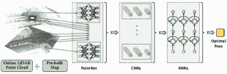

<!--yml

分类：未分类

日期：2024-09-06 20:00:38

-->

# [2006.12567] 深度学习在定位与地图构建中的调查：迈向空间机器智能时代

> 来源：[`ar5iv.labs.arxiv.org/html/2006.12567`](https://ar5iv.labs.arxiv.org/html/2006.12567)

# 深度学习在定位与地图构建中的调查：

迈向空间机器智能时代

陈昌浩，王兵，陆晓轩，尼基·特里戈尼，安德鲁·马克汉

牛津大学计算机科学系  通讯作者：陈昌浩 (changhao.chen@cs.ox.ac.uk)  项目网站更新了额外的资料和扩展的参考文献列表，网址为 https://github.com/changhao-chen/deep-learning-localization-mapping。

###### 摘要

基于深度学习的定位和地图构建最近引起了广泛关注。与通过利用物理模型或几何理论创建手工设计的算法不同，深度学习方法提供了一种数据驱动的解决方案。得益于不断增长的数据量和计算能力，这些方法正在迅速发展成为一个新领域，提供准确且稳健的系统来跟踪运动并估计场景及其结构以应用于实际世界。在这项工作中，我们提供了一项全面的调查，并提出了基于深度学习的定位和地图构建的新分类法。我们还讨论了当前模型的局限性，并指出了可能的未来方向。覆盖了从学习里程估计、地图构建到全球定位和同时定位与地图构建（SLAM）等广泛主题。我们重新审视了通过车载传感器感知自我运动和场景理解的问题，并展示了如何通过将这些模块整合到一个前景空间机器智能系统（SMIS）中来解决这一问题。我们希望这项工作能连接机器人学、计算机视觉和机器学习领域的新兴成果，并为未来的研究人员提供指导，以应用深度学习解决定位和地图构建问题。

###### 关键词：

深度学习、定位、地图构建、SLAM、感知、匹配、 不确定性估计

## 1 引言

本地化和映射是人类和移动代理的基本需求。作为一个激励性的例子，人类能够通过多模态感官感知来感知自身运动和环境，并依靠这种意识在复杂的三维空间中定位和导航[1]。这种能力是人类空间能力的一部分。此外，感知自我运动和周围环境的能力在认知和运动控制的发展中扮演着至关重要的角色[2]。类似地，人工代理或机器人也应能通过车载传感器感知环境并估计其系统状态。这些代理可以是任何形式的机器人，例如自动驾驶车辆、配送无人机或家庭服务机器人，它们通过感知周围环境自主做出决策[3]。同样，随着新兴的增强现实（AR）和虚拟现实（VR）技术将网络空间和物理环境交织在一起，机器的感知意识能力支撑了无缝的人机交互。进一步的应用还包括移动和可穿戴设备，如智能手机、手环或物联网（IoT）设备，为用户提供广泛的基于位置的服务，从步行导航[4]到运动/活动监测[5]，再到动物追踪[6]，以及急救响应[7]。

图 1：空间机器智能系统利用车载传感器感知自我运动、全球姿态、场景几何和语义。(a) 传统模型基础解决方案构建手工设计的算法将输入传感器数据转换为目标值。(c) 数据驱动解决方案利用学习模型来构建这种映射函数。(b) 混合方法结合了手工制作的算法和学习模型。本调查讨论了(b) 和(c)。

图 2：关于深度学习在本地化和映射中的现有工作分类。

实现这些以及其他数字代理的高水平自主性需要精确和稳健的本地化，并逐步构建和维护一个世界模型，具备持续处理新信息并适应各种场景的能力。这种追求在我们的工作中被称为“空间机器智能系统（SMIS）”，或者最近在[8]中称为空间人工智能。广义上说，本地化是指获取机器人运动的内部系统状态的能力，包括位置、方向和速度，而映射则是指感知外部环境状态并捕捉周围环境的能力，包括二维或三维场景的几何形状、外观和语义。这些组件可以单独作用于感知内部或外部状态，或像在同时定位与地图构建（SLAM）中一样联合作用，以在全局框架中跟踪姿态并构建一致的环境模型。

### 1.1 为什么要研究用于本地化和映射的深度学习

本地化和映射的问题已经研究了几十年，开发了各种复杂的手工设计模型和算法，例如，里程计估计（包括视觉里程计[9、10、11]、视觉惯性里程计[12、13、14、15]和激光雷达里程计[16]）、基于图像的定位[17、18]、地点识别[19]、SLAM[20、10、21]和从运动中恢复结构（SfM）[22、23]。在理想条件下，这些传感器和模型能够在不同环境下准确估计系统状态，无时间限制。然而，实际上，不完美的传感器测量、不准确的系统建模、复杂的环境动态和不切实际的约束会影响手工设计系统的准确性和可靠性。

模型基解决方案的局限性，加上最近在机器学习，特别是深度学习方面的进展，促使研究人员考虑数据驱动（学习）方法作为解决问题的替代方案。图 1 总结了输入传感器数据（例如视觉、惯性、激光雷达数据或其他传感器）与输出目标值（例如位置、方向、场景几何或语义）之间的关系，作为一个映射函数。传统的模型基解决方案是通过手工设计算法并校准到特定应用领域来实现的，而基于学习的方法通过学习知识来构建这个映射函数。基于学习的方法有三方面的优势：

首先，学习方法可以利用高度表达的深度神经网络作为通用近似器，并自动发现与任务相关的特征。这种属性使得学习到的模型能够对环境具有韧性，如无特征区域、动态光照条件、运动模糊、精确相机校准，这些都是人工建模具有挑战性的[3]。作为一个代表性例子，视觉里程计通过在其设计中融入数据驱动的方法，在稳健性方面取得了显著的改进[24, 25]，超越了最先进的传统算法。此外，学习方法能够将抽象元素与人类可理解的术语联系起来[26, 27]，如 SLAM 中的语义标注，这在正式的数学方式中难以描述。

图 3：空间机器智能系统（即基于深度学习的定位和地图绘制）的高级概念图。圆角矩形代表功能模块，而箭头线连接这些模块以进行数据输入和输出。执行此系统并不一定需要包含所有模块。

其次，学习方法使空间机器智能系统能够从过去的经验中学习，并主动利用新信息。通过构建一个通用的数据驱动模型，它避免了在部署之前，人工指定数学和物理规则的全部知识[28]，以解决特定领域的问题。这种能力有可能使学习机器自动发现新的计算解决方案，进一步发展自身并改进其模型，以适应新的场景或面对新的情况。一个很好的例子是，通过使用新颖的视图合成作为自我监督信号，可以从未标记的视频中恢复自我运动和深度[29, 30]。此外，学习到的表示可以进一步支持高级任务，如路径规划[31]和决策制定[32]，通过构建任务驱动的地图。

第三个好处是它能够充分利用不断增加的传感器数据和计算能力。深度学习或深度神经网络具有扩展到大规模问题的能力。DNN 框架内的大量参数通过最小化损失函数来自动优化，通过在大数据集上进行反向传播和梯度下降算法进行训练。例如，最近发布的 GPT-3[33]，这是最大的预训练语言模型，具有超过 1750 亿个参数，在各种自然语言处理（NLP）任务中实现了最先进的结果，即使没有微调。此外，已经发布了各种与定位和制图相关的大规模数据集，例如，在自动驾驶汽车场景中，[34、35、36]包含了丰富的传感器数据组合，以及运动和语义标签。这让我们设想可能利用数据和计算的力量来解决定位和制图问题。

然而，也必须指出，这些学习技术依赖于大量数据集来提取统计上有意义的模式，并且可能难以推广到数据集之外的环境中。模型的可解释性不足。此外，尽管高度可并行化，它们通常也比简单模型更具计算成本。有关限制的详细信息在第七部分讨论。

### 1.2 与其他调查的比较

有几篇综述论文广泛讨论了基于模型的定位和制图方法。SLAM 问题的早期发展已在[37、38]中得到了很好的总结。开创性的综述[39]对现有的 SLAM 工作进行了彻底讨论，回顾了发展历程并规划了若干未来方向。尽管本文包含了一个简要讨论深度学习模型的章节，但并未全面概述该领域，特别是由于过去五年研究的爆炸性增长。其他 SLAM 综述论文仅关注 SLAM 系统的个别类型，包括 SLAM 的概率公式[40]、视觉里程计[41]、姿态图 SLAM[42]和动态环境中的 SLAM[43]。我们建议读者参考这些综述，以更好地理解传统的基于模型的解决方案。另一方面，[3]讨论了深度学习在机器人研究中的应用；然而，其主要关注点并非定位和制图，而是对深度学习在广泛机器人背景下的潜力和限制的更一般性看法，包括策略学习、推理和规划。

值得注意的是，尽管定位和映射问题属于机器人技术的关键概念，但学习方法的结合与其他研究领域如机器学习、计算机视觉甚至自然语言处理同步发展。因此，这一跨学科领域在全面总结相关工作时带来了非同寻常的难度。据我们所知，这是第一篇全面而深入地涵盖深度学习在定位和映射中的现有工作的调查文章。

### 1.3 调查组织

论文的其余部分组织如下：第二部分提供了一个概述，并展示了现有基于深度学习的定位和映射的分类法；第 3、4、5、6 节分别讨论了现有的深度学习在相对运动（里程计）估计、几何、语义和一般的映射方法、全球定位以及以 SLAM 后端为重点的同时定位与映射方面的工作；第七部分总结了未解决的问题，讨论现有工作的局限性和未来前景；最后，第八部分对论文进行总结。

## 2 现有方法的分类法

我们提供了一种新的现有深度学习方法的分类法，相关于定位和映射，以连接机器人技术、计算机视觉和机器学习领域。大体上，它们可以被分类为里程计估计、映射、全球定位和 SLAM，如图 2 所示。

1) 里程计估计关注于计算两帧或更多传感器数据之间的相对位姿变化，包括平移和旋转。它持续追踪自我运动，接着将这些位姿变化与初始状态进行整合，以推导出全球位姿，包括位置和方向。这通常被称为所谓的航迹推算解决方案。里程计估计可以用于提供位姿信息，并作为里程计运动模型来辅助机器人控制的反馈回路。关键问题在于准确估计来自各种传感器测量的运动变换。为此，深度学习被应用于以端到端的方式建模运动动态或提取有用特征以支持预构建系统的混合方式。

2) 映射构建并重建一个一致的模型来描述周围环境。映射可以用于提供人类操作员和高级机器人任务所需的环境信息，限制里程计估计的误差漂移，并检索查询观察以进行全局定位 [39]。深度学习被用作发现高维原始数据中场景几何和语义的有用工具。基于深度学习的映射方法被细分为几何、语义和通用映射，这取决于神经网络是否学习场景的显式几何或语义，或者将场景编码为隐式神经表示。

3) 全局定位在已知场景中利用先验知识检索移动代理的全球姿态。这是通过将查询输入数据与预先构建的 2D 或 3D 地图、其他空间参考或先前访问过的场景进行匹配来实现的。它可以用来减少惯性导航系统的姿态漂移或解决“被绑架的机器人”问题[40]。深度学习用于解决因视角、照明、天气和场景动态变化而复杂的数据关联问题。

4) 同时定位与地图构建（SLAM）将上述的里程计估计、全局定位和映射过程整合为前端，并联合优化这些模块，以提高定位和映射的性能。除了这些上述模块，还有几个其他 SLAM 模块执行以下操作，以确保整个系统的一致性：*局部优化* 确保相机运动和场景几何的一致性；*全局优化* 旨在约束全球轨迹的漂移，并在全球范围内；*关键帧检测* 在基于关键帧的 SLAM 中用于实现更高效的推断，而系统误差漂移可以通过全局优化来缓解，一旦通过*回环检测* 检测到回环；*不确定性估计* 提供对学习姿态和映射的信任度度量，对于 SLAM 系统中的概率传感器融合和后端优化至关重要。

图 4：视觉里程计的监督学习的典型结构，即 DeepVO [24] 和视觉里程计的无监督学习，即 SfmLearner [29]。

尽管各个组件的设计目标不同，但上述组件可以集成到空间机器智能系统（SMIS）中，以解决现实世界中的挑战，实现鲁棒操作和长期自主。图 3 展示了这样一个集成的深度学习基础定位和映射系统的概念图，显示了这些组件之间的关系。在接下来的章节中，我们将详细讨论这些组件。

## 3 里程计估计

我们从里程计估计开始，它持续跟踪相机自我运动并生成相对姿态。通过整合这些相对姿态，可以重建全局轨迹，给定初始状态，因此保持运动变换估计的准确性对于确保全球范围内的高精度定位至关重要。本节讨论了从各种传感器数据中实现里程计估计的深度学习方法，这些方法在数据属性和应用场景上存在根本性的不同。讨论主要集中在从视觉、惯性和点云数据中进行的里程计估计，因为这些是移动代理上的常见传感方式。

### 3.1 视觉里程计

视觉里程计（VO）估计相机的自我运动，并将图像之间的相对运动整合为全局姿态。深度学习方法能够从图像中提取高级特征表示，从而提供解决 VO 问题的替代方案，而无需手工设计特征提取器。现有的基于深度学习的 VO 模型可以分为*端到端 VO*和*混合 VO*，具体取决于它们是否完全基于神经网络，还是经典 VO 算法和深度神经网络的结合。根据训练阶段是否有地面真实标签，端到端 VO 系统可以进一步分类为*有监督*VO 和*无监督*VO。

#### 3.1.1 有监督 VO 学习

我们首先介绍有监督 VO，这是学习型里程计中最主要的方法之一，通过在标记数据集上训练深度神经网络模型，直接构建从连续图像到运动变换的映射函数，而不是像传统 VO 系统那样利用图像的几何结构[41]。最基本的，深度神经网络的输入是一对连续图像，输出是两帧图像之间的估计平移和旋转。

这一领域的首批研究之一是 Konda 等人[44]。这种方法将视觉里程计公式化为一个分类问题，并使用卷积神经网络（ConvNet）从输入图像中预测方向和速度的离散变化。Costante 等人[45]使用 ConvNet 从稠密光流中提取视觉特征，并基于这些视觉特征输出逐帧运动估计。然而，这两项工作尚未实现从图像到运动估计的端到端学习，它们的性能仍然有限。

DeepVO [24] 利用卷积神经网络（ConvNet）和递归神经网络（RNN）的组合，实现视觉里程计的端到端学习。由于其在端到端学习中的专长，DeepVO 框架成为实现 VO 监督学习的典型选择。图 4 (a)展示了基于 RNN+ConvNet 的 VO 系统的架构，该系统通过 ConvNet 从图像对中提取视觉特征，并通过 RNN 对特征的时间相关性进行建模。其 ConvNet 编码器基于 FlowNet 结构，以提取适合光流和自运动估计的视觉特征。使用基于 FlowNet 的编码器可以看作是将光流的先验知识引入学习过程，从而可能防止 DeepVO 过度拟合训练数据集。递归模型将历史信息总结到其隐藏状态中，使输出可以从过去经验和当前的 ConvNet 特征中推断。它在大规模数据集上进行训练，标签为地面真实的相机姿态。为了恢复框架的最优参数$\bm{\theta}^{*}$，优化目标是最小化估计平移$\mathbf{\hat{p}}\in\mathbb{R}^{3}$和基于欧拉角的旋转$\hat{\bm{\varphi}}\in\mathbb{R}^{3}$的均方误差（MSE）： 

|  | $\bm{\theta}^{*}=\operatorname*{arg\,min}_{\bm{\theta}}\frac{1}{N}\displaystyle\sum_{i=1}^{N}\displaystyle\sum_{t=1}^{T}\&#124;\hat{\mathbf{p}}_{t}-\mathbf{p}_{t}\&#124;_{2}^{2}+\&#124;\hat{\bm{\varphi}}_{t}-\bm{\varphi}_{t}\&#124;_{2}^{2},$ |  | (1) |
| --- | --- | --- | --- |

其中$(\hat{\mathbf{p}}_{t},\hat{\bm{\varphi}}_{t})$是时刻$t$的相对姿态估计，$(\mathbf{p},\bm{\varphi})$是相应的真实值，$\bm{\theta}$是 DNN 框架的参数，$N$是样本数量。

DeepVO 在估计驾驶车辆的姿态方面报告了令人印象深刻的结果，即使在以前未见过的场景中也是如此。在 KITTI 测程数据集的实验中[46]，这种数据驱动的解决方案优于传统的代表性单目视觉里程计，例如 VISO2[47]和 ORB-SLAM（不带回环检测）[21]。另一个优势是有监督的视觉里程计自然会生成具有绝对尺度的轨迹，而经典的视觉里程计算法仅使用单目信息时尺度模糊。这是因为深度神经网络可以从大量图像中隐式学习和保持全局尺度，这可以被视为从过去的经验中学习以预测当前的尺度度量。

基于这种典型的有监督视觉里程计模型，一些研究进一步扩展了这种方法以提高模型性能。为了提高有监督视觉里程计的泛化能力，[48]引入了课程学习（即通过增加数据复杂性训练模型）和几何损失约束。知识蒸馏（即通过教一个较小的模型来压缩一个较大的模型）被应用于有监督视觉里程计框架中，以大大减少网络参数的数量，使其更适合在移动设备上实时操作[49]。此外，Xue 等人[50]引入了一个存储全局信息的记忆模块和一个利用保留的上下文信息改进姿态估计的精炼模块。

总结来说，这些端到端学习方法利用了近期在机器学习技术和计算能力方面的进展，能够直接从原始图像中自动学习姿态变换，从而应对具有挑战性的实际世界测程估计问题。

#### 3.1.2 无监督视觉里程计学习

对无监督视觉里程计学习的探索越来越受到关注。无监督解决方案能够利用未标记的传感器数据，从而节省了标记数据的人工工作，并且在没有标记数据的新场景中具有更好的适应性和泛化能力。这在一个自我监督的框架中实现了，该框架通过利用视图合成作为监督信号[29]，联合学习深度和相机自运动。

如图 4 (b) 所示，一个典型的无监督 VO 解决方案包括一个深度网络用于预测深度图，以及一个姿态网络用于产生图像之间的运动变换。整个框架以连续图像作为输入，监督信号基于新视图合成——给定源图像 $\mathbf{I}_{s}$，视图合成任务是生成合成目标图像 $\mathbf{I}_{t}$。源图像 $\mathbf{I}_{s}(p_{s})$ 的一个像素通过以下方式投影到目标视图 $\mathbf{I}_{t}(p_{t})$ 上：

|  | $p_{s}\sim\mathbf{K}\mathbf{T}_{t\to s}\mathbf{D}_{t}(p_{t})\mathbf{K}^{-1}p_{t}$ |  | (2) |
| --- | --- | --- | --- |

其中 $\mathbf{K}$ 是相机的内参矩阵，$\mathbf{T}_{t\to s}$ 表示从目标帧到源帧的相机运动矩阵，$\mathbf{D}_{t}(p_{t})$ 表示目标帧中每个像素的深度图。训练目标是通过优化真实目标图像与合成图像之间的光度重建损失来确保场景几何的一致性：

|  | $\mathcal{L}_{\text{photo}}=\sum_{<\mathbf{I}_{1},...,\mathbf{I}_{N}>\in S}\sum_{p}&#124;\mathbf{I}_{t}(p)-\hat{\mathbf{I}}_{s}(p)&#124;,$ |  | (3) |
| --- | --- | --- | --- |

其中 p 表示像素坐标，$\mathbf{I}_{t}$ 是目标图像，$\hat{\mathbf{I}}_{s}$ 是从源图像 $\mathbf{I}_{s}$ 生成的合成目标图像。

表 I：现有的深度学习里程估计方法的总结。

| 模型 | 传感器 | 监督 | 比例 | 性能 | 贡献 |
| --- | --- | --- | --- | --- | --- |
| Seq09 | Seq10 |
| VO | Konda 等人[44] | MC | 有监督 | 是 | - | - | 将 VO 表述为分类问题 |
| Costante 等人[45] | MC | 有监督 | 是 | 6.75 | 21.23 | 从光流中提取特征用于 VO 估计 |
| Backprop KF[51] | MC | 混合 | 是 | - | - | 基于可微分 Kalman 滤波器的 VO |
| DeepVO[24] | MC | 有监督 | 是 | - | 8.11 | 结合 RNN 和 ConvNet 进行端到端学习 |
| SfmLearner[29] | MC | 无监督 | 否 | 17.84 | 37.91 | 用于自监督学习的新视图合成 |
| Yin 等人[52] | MC | 混合 | 是 | 4.14 | 1.70 | 引入学习的深度以恢复尺度度量 |
| UnDeepVO[53] | SC | 无监督 | 是 | 7.01 | 10.63 | 使用固定立体线来恢复尺度度量 |
| Barnes 等人[54] | MC | 混合 | 是 | - | - | 集成了学习的深度和瞬态掩码 |
| GeoNet[55] | MC | 无监督 | 否 | 43.76 | 35.6 | 几何一致性损失和 2D 流生成器 |
| Zhan 等人[56] | SC | 无监督 | 否 | 11.92 | 12.45 | 使用固定立体线进行尺度恢复 |
| DPF[57] | MC | 混合 | 是 | - | - | 基于可微分粒子滤波器的 VO |
| Yang 等人[58] | MC | 混合 | 是 | 0.83 | 0.74 | 将学习的深度应用于经典 VO |
| Zhao 等人[59] | MC | 监督 | 是 | - | 4.38 | 生成密集的 3D 流用于 VO 和地图 |
| Struct2Depth[60] | MC | 无监督 | 否 | 10.2 | 28.9 | 在学习过程中引入 3D 几何结构 |
| Saputra 等人[48] | MC | 监督 | 是 | - | 8.29 | 课程学习与几何损失约束 |
| GANVO[61] | MC | 无监督 | 否 | - | - | 对抗学习生成深度 |
| CNN-SVO[62] | MC | 混合 | 是 | 10.69 | 4.84 | 使用学习的深度初始化 SVO |
| Xue 等人[50] | MC | 监督 | 是 | - | 3.47 | 记忆和优化模块 |
| Wang 等人[63] | MC | 无监督 | 是 | 9.30 | 7.21 | 集成 RNN 和流一致性约束 |
| Li 等人[64] | MC | 无监督 | 否 | - | - | 姿态图的全局优化 |
| Saputra 等人[49] | MC | 监督 | 是 | - | - | 知识蒸馏以压缩深度 VO 模型 |
| Gordon[65] | MC | 无监督 | 否 | 2.7 | 6.8 | 相机矩阵学习 |
| Koumis 等人[66] | MC | 监督 | 是 | - | - | 3D 卷积网络 |
| Bian 等人[30] | MC | 无监督 | 是 | 11.2 | 10.1 | 从单目图像中恢复尺度 |
| Zhan 等人[67] | MC | 混合 | 是 | 2.61 | 2.29 | 整合学习的光流和深度 |
| D3VO[25] | MC | 混合 | 是 | 0.78 | 0.62 | 整合学习的深度、不确定性和姿态 |
| VIO | VINet[68] | MC+I | 监督 | 是 | - | - | 将 VIO 表述为顺序学习问题 |
| VIOLearner[69] | MC+I | 无监督 | 是 | 1.51 | 2.04 | 在线校正模块 |
| Chen 等人[70] | MC+I | 监督 | 是 | - | - | 深度传感器融合的特征选择 |
| DeepVIO[71] | SC+I | 无监督 | 是 | 0.85 | 1.03 | 从立体图像和 IMU 中学习 VIO |
| LO | Velas 等人[72] | L | 监督 | 是 | 4.94 | 3.27 | ConvNet 从点云中估计里程计 |
| LO-Net[73] | L | 监督 | 是 | 1.37 | 1.80 | 几何约束损失 |
| DeepPCO[74] | L | 监督 | 是 | - | - | 并行神经网络 |
| Valente 等人[75] | MC+L | 监督 | 是 | - | 7.60 | LIDAR 和相机的传感器融合 |

+   •

    模型：VO、VIO 和 LO 分别代表视觉里程计、视觉惯性里程计和 LIDAR 里程计。

+   •

    传感器：MC、SC、I 和 L 分别代表单目相机、立体相机、惯性测量单元和 LIDAR。

+   •

    监督表示该工作是否是一个纯粹的基于神经网络的模型，使用地面真实标签（监督）进行训练，或没有标签（无监督），或者是经典和深度神经网络的组合（混合）

+   •

    规模表示是否可以生成具有全球尺度的轨迹。

+   •

    性能报告定位误差（数值越小越好），即 KITTI 里程数据集上长度为 100m-800m 的平均平移 RMSE 漂移（%）[46]。大多数工作在序列 09 和 10 上进行了评估，因此我们从其原始论文中提取了这两个序列的结果进行性能比较。注意，不同的工作中的训练集可能有所不同。

+   •

    贡献总结了每项工作相对于以往研究的主要贡献。

然而，原始工作[29]中基本存在两个主要问题未解决：1）基于单目图像的方法无法提供一致的全球尺度姿态估计。由于尺度模糊，无法重建具有物理意义的全球轨迹，从而限制了其实际应用。2）光度损失假设场景是静态的且没有相机遮挡。虽然作者提出了使用可解释性掩膜去除场景动态，但这些环境因素的影响仍未完全解决，这违反了假设。为了解决这些问题，越来越多的工作[53, 55, 56, 58, 59, 61, 64, 76, 77]扩展了这一无监督框架以实现更好的性能。

为了解决全球尺度问题，[53, 56]提出利用立体图像对来恢复姿态估计的绝对尺度。他们引入了左右图像对之间的额外空间光度损失，因为立体基线（即左右图像之间的运动变换）在整个数据集中是固定且已知的。一旦训练完成，网络仅使用单目图像进行姿态预测。因此，虽然在没有真实数据的情况下这是无监督的，但训练数据集（立体）与测试集（单目）不同。[30]通过引入几何一致性损失来解决尺度问题，该损失强制执行预测深度图与重建深度图之间的一致性。该框架将预测深度图转换为 3D 空间，并将其投影回去生成重建深度图。通过这种方式，深度预测能够在连续帧上保持尺度一致，从而使姿态估计也保持尺度一致。

光度一致性约束假设整个场景仅由刚性静态结构（如建筑物和车道）构成。然而，在实际应用中，环境动态（如行人和车辆）将扭曲光度投影，降低位姿估计的准确性。为了解决这一问题，GeoNet [55] 将学习过程分为两个子任务，通过刚性结构重建器和非刚性运动定位器分别估计静态场景结构和运动动态。此外，GeoNet 强制执行几何一致性损失，以减轻由相机遮挡和非朗伯表面造成的问题。[59] 添加了一个 2D 流生成器以及一个深度网络，以生成 3D 流。凭借对环境更好的 3D 理解，他们的框架能够生成更准确的相机位姿，以及一个点云地图。GANVO [61] 采用生成对抗学习范式来生成深度，并引入了一个时间递归模块来进行位姿回归。Li 等人 [76] 还利用生成对抗网络（GAN）生成更逼真的深度图和位姿，并进一步鼓励目标帧中更准确的合成图像。与手工制作的度量标准不同，采用了一个判别器来评估合成图像生成的质量。这样，生成对抗设置有助于生成的深度图更富有纹理和更清晰。通过这种方式，高级场景感知和表示得以准确捕捉，环境动态也被隐式地容忍。

尽管无监督视觉里程计（VO）的性能仍无法与有监督视觉里程计相媲美，如图 5 所示，但其在尺度度量和场景动态问题上的顾虑已在很大程度上得到解决。凭借自监督学习的优势以及性能的持续提升，无监督 VO 将在提供位姿信息方面成为一个有前途的解决方案，并与空间机器智能系统中的其他模块紧密结合。

#### 3.1.3 混合视觉里程计

与仅依赖深度神经网络从数据中解释位姿的端到端视觉里程计不同，混合视觉里程计将经典几何模型与深度学习框架相结合。基于成熟的几何理论，它们利用深度神经网络来表达性地替代几何模型的部分。

一种直接的方法是将学习到的深度估计融入传统的视觉里程计算法，以恢复姿态的绝对尺度度量[52]。学习深度估计是计算机视觉领域的一个广泛研究的领域。例如，[78, 79, 80, 81]通过使用训练好的深度神经网络模型提供了全局尺度的每像素深度。因此，传统视觉里程计的所谓尺度问题得到了缓解。Barnes 等人[54]将预测的深度图和短暂的掩码（即运动物体的区域）结合到视觉里程计系统中，以提高其对运动物体的鲁棒性。Zhan 等人[67]将学习的深度和光流预测整合到传统的视觉里程计模型中，在其他基线方法上实现了具有竞争力的性能。其他工作结合了物理运动模型和深度神经网络，例如通过可微分的卡尔曼滤波器[82]和粒子滤波器[83]。物理模型作为学习过程中的算法先验。此外，D3VO[25]将深度、姿态和不确定性的深度预测整合到直接视觉里程计中。

结合几何理论和深度学习的优势，混合模型通常比端到端的视觉里程计更准确，如表 1 所示。值得注意的是，混合模型甚至在常见基准测试中超越了最先进的传统单目视觉里程计或视觉-惯性里程计（VIO）系统，例如，D3VO[25]击败了几个流行的传统视觉里程计/VIO 系统，如 DSO[84]、ORB-SLAM[21]、VINS-Mono[15]。这表明该领域的进展速度非常快。

### 3.2 视觉-惯性里程计

将视觉和惯性数据整合为视觉-惯性里程计（VIO）是移动机器人中的一个明确问题。相机和惯性传感器都相对低成本、功耗低且广泛部署。这两种传感器是互补的：单目相机捕捉 3D 场景的外观和结构，但尺度模糊，对挑战性场景（例如强光变化、纹理缺乏和高速运动）不够鲁棒；相比之下，IMU 完全是自我中心的、场景独立的，并且还可以提供绝对度量尺度。然而，缺点是惯性测量，特别是来自低成本设备的测量，常受到过程噪声和偏差的困扰。有效融合这两种互补传感器的测量对准确的姿态估计至关重要。因此，根据它们的信息融合方法，传统的基于模型的视觉-惯性方法大致分为三类：滤波方法[12]、固定时滞平滑器[13]和全平滑方法[14]。

数据驱动的方法已经出现，考虑直接从视觉和惯性测量中学习 6 自由度姿态，而无需人工干预或校准。VINet [68] 是首个将视觉惯性里程计表述为序列学习问题的工作，并提出了一种深度神经网络框架，以端到端的方式实现 VIO。VINet 使用基于卷积网络（ConvNet）的视觉编码器从两张连续的 RGB 图像中提取视觉特征，并使用惯性编码器从一系列 IMU 数据中提取惯性特征，后者采用长短期记忆（LSTM）网络。这里，LSTM 旨在建模惯性数据的时间状态演变。视觉和惯性特征被连接在一起，并作为输入送入进一步的 LSTM 模块，以预测相对姿态，依赖于系统状态的历史。这种学习方法具有对校准和相对时间偏移误差更具鲁棒性的优势。然而，VINet 尚未完全解决学习有意义的传感器融合策略的问题。

为了解决深度传感器融合问题，Chen 等人[70] 提出了选择性传感器融合框架，这种框架选择性地学习依赖上下文的表示，以进行视觉惯性姿态估计。他们的直觉是，根据外部（即环境）和内部（即设备/传感器）动态，应该考虑不同模态特征的重要性，充分利用两个传感器的互补行为。他们的方法优于那些没有融合策略的方法，例如 VINet，避免了灾难性的失败。

类似于无监督视觉里程计（VO），视觉惯性里程计也可以通过新颖的视图合成以自监督方式解决。VIOLearner [69] 从原始惯性数据构建运动变换，并通过第二部分提到的方程式，将源图像转换为目标图像，使用相机矩阵和深度图。此外，一个在线错误修正模块修正了框架中的中间错误。网络参数通过优化光度损失来恢复。类似地，DeepVIO [71] 将惯性数据和立体图像纳入这个无监督学习框架，并通过专用损失进行训练，以重建全球尺度的轨迹。

基于学习的 VIO 无法击败最先进的经典模型基础 VIO，但由于深度神经网络在特征提取和运动建模中的出色能力，它们通常对实际问题如测量噪声、时间同步不良等更具鲁棒性[68, 70, 71]。

### 3.3 惯性里程计

除了视觉里程计和视觉惯性里程计外，惯性单一解决方案，即惯性里程计，为解决里程计估计问题提供了一种普遍替代方案。与视觉方法相比，惯性传感器成本相对较低，体积小，能效高且保护隐私。它对环境因素如光照条件或移动物体的免疫性相对较强。然而，广泛存在于机器人和移动设备上的低成本 MEMS 惯性测量单元（IMU）存在较高的传感器偏差和噪声，如果惯性数据被双重积分，则会导致 strapdown 惯性导航系统（SINS）中的无界误差漂移。

陈等人[85] 将惯性里程计建模为一个序列学习问题，他们的关键观察是可以从独立的分段惯性数据窗口中学习极坐标（即极向量）中的二维运动位移。关键观察是，当跟踪人类和带轮配置时，其振动频率与移动速度相关，这通过惯性测量得到体现。基于此，他们提出了 IONet，一个基于 LSTM 的框架，用于从惯性测量序列中端到端地学习相对姿态。通过积分运动位移生成轨迹。[86] 利用深度生成模型和领域适应技术来提高深度惯性里程计在新领域中的泛化能力。[87] 通过改进的三通道 LSTM 网络扩展了这一框架，以从惯性数据和采样时间中预测极向量以实现无人机定位。RIDI [88] 训练深度神经网络从惯性数据中回归线性速度，将收集的加速度校准以满足所学习速度的约束，并用传统的物理模型将加速度双重积分到位置中。类似地，[89] 在学习的速度帮助下补偿了经典 SINS 模型的误差漂移。其他工作也探索了使用深度学习来检测零速度阶段，以便为行人[90] 和车辆[91] 导航。这个零速度阶段提供了上下文信息，通过卡尔曼滤波来修正系统误差漂移。

仅依靠惯性解决方案可以作为极端环境中的备选方案，在这些环境中视觉信息不可用或高度扭曲。深度学习已经证明了其从噪声 IMU 数据中学习有用特征的能力，并能补偿惯性航迹推算的误差漂移，这是经典算法难以解决的问题。

图 5：基于深度学习的视觉里程估计性能比较，评估了 KITTI 数据集的轨迹 10。

### 3.4 LIDAR 里程估计

LIDAR 传感器提供高频率的距离测量，其优点是能够在复杂的光照条件和光学特征不足的场景中稳定工作。移动机器人和自动驾驶车辆通常配备 LIDAR 传感器，以获取相对自运动（即 LIDAR 里程估计）和相对于 3D 地图的全球姿态（LIDAR 重新定位）。LIDAR 里程估计的性能对点云配准误差非常敏感，这种误差是由于运动不平滑造成的。此外，LIDAR 测量的数据质量也受到极端天气条件的影响，例如大雨或雾霾。

传统上，LIDAR 里程估计依赖于点云配准来检测特征点，例如线段和表面片段，并使用匹配算法通过最小化两个连续点云扫描之间的距离来获得姿态变换。数据驱动的方法考虑通过利用深度神经网络从点云扫描序列到姿态估计构建映射函数，以端到端的方式解决 LIDAR 里程估计 [72, 73, 74]。由于点云数据由于其稀疏和不规则采样格式难以直接被神经网络处理，这些方法通常通过圆柱投影将点云转换为规则矩阵，并采用卷积网络从连续点云扫描中提取特征。这些网络回归相对姿态，并通过地面真值标签进行训练。LO-Net [73] 报告了比传统的最先进算法，即 LIDAR 里程估计与地图（LOAM）算法 [16] 更具竞争力的性能。

### 3.5 里程估计比较

表 I 比较了现有的里程计估计工作，包括它们的传感器类型、模型、是否产生了具有绝对尺度的轨迹，以及它们在 KITTI 数据集上的性能评估（如果有的话）。由于深度惯性里程计未在 KITTI 数据集上进行评估，因此我们没有在此表中包括惯性里程计。KITTI 数据集[46]是一个常用的里程计估计基准，由来自汽车驾驶场景的传感器数据组成。由于大多数数据驱动的方法采用 KITTI 数据集的 09 和 10 轨迹来评估模型性能，我们根据官方 KITTI 视觉里程计/SLAM 评估指标提供的所有子序列的平移均方根误差（RMSE）进行比较。

我们以视觉里程计为例。图 5 展示了 KITTI 数据集第 10 条轨迹上深度视觉里程计模型随时间的平移漂移情况。显然，混合视觉里程计的表现优于监督式和无监督式视觉里程计，因为混合模型既受益于传统视觉里程计算法的成熟几何模型，又具有深度学习的强大特征提取能力。虽然监督式视觉里程计仍然优于无监督式视觉里程计，但随着无监督视觉里程计局限性的逐步解决，它们之间的性能差距正在缩小。例如，已经发现无监督视觉里程计现在可以从单目图像中恢复全局尺度[30]。总体而言，数据驱动的视觉里程计模型性能显著提升，表明深度学习方法在实现更准确的里程计估计方面具有潜力。

## 4 制图

制图指的是移动代理构建一致的环境模型以描述周围场景的能力。深度学习促进了一套用于场景感知和理解的工具，应用范围包括深度预测、语义标注、到 3D 几何重建。本节提供了与基于深度学习的制图方法相关的现有工作的概述。我们将其分类为几何制图、语义制图和通用制图。表 II 总结了基于深度学习的制图方法。

表 II：关于深度学习制图的现有方法总结。

|  | 输出表示 | 使用者 |
| --- | --- | --- |
| 几何地图 | 深度表示 | [78, 92, 79], [80, 81], [29], [53, 55, 56, 58, 59, 93, 61, 64], [76, 77] |
| 体素表示 | [94, 95], [96](对象), [97], [98](对象), [99](对象), [100](对象) |
| 点表示 | [101](对象) |
| 网格表示 | [102](对象), [103](对象), [104](对象), [105](对象), [106, 107] |
| 语义地图 | 语义分割 | [26, 27, 108] |
| 实例分割 | [109, 110, 111] |
| 全景分割 | [112] |
| 通用地图 | 神经表示 | [113],[114, 115, 116], [117, 118, 31, 32] |

+   •

    对象表示该方法仅在重建单个对象而非场景时经过验证。

### 4.1 几何映射

广义上，几何映射捕捉了场景的形状和结构描述。在几何映射中使用的典型场景表示包括深度、体素、点和网格。我们遵循这种表示法，将深度学习在几何映射中的应用分为上述四类。图 6 演示了这些几何表示在斯坦福兔基准上的应用。

图 6：斯坦福兔基准上的场景表示插图：(a) 原始模型，(b) 深度表示，(c) 体素表示 (d) 点表示 (e) 网格表示。

#### 4.1.1 深度表示

深度图在理解场景几何和结构中发挥着关键作用。通过融合深度图和 RGB 图像 [119, 120] 实现了密集场景重建。传统 SLAM 系统使用密集深度图（即 2.5D）表示场景几何，例如 DTAM [121]。此外，准确的深度估计有助于视觉 SLAM 的绝对尺度恢复。

从原始图像中学习深度是计算机视觉领域一个快速发展的方向。最早的工作将深度估计公式化为输入单幅图像的映射函数，通过多尺度深度神经网络[78]构建，从单幅图像中输出每像素的深度图。通过联合优化深度和自我运动估计[79]可以获得更准确的深度预测。这些监督学习方法[78, 92, 79]可以通过在包含相应深度标签的大量图像数据集上训练深度神经网络来预测每像素的深度。尽管这些方法比传统的基于结构的方法如[122]表现更好，但它们的有效性在很大程度上依赖于模型训练，并且在缺乏标注数据的情况下，难以推广到新场景。

另一方面，该领域的最新进展集中于无监督解决方案，通过将深度预测重新表述为新颖视图合成问题。[80, 81]利用光度一致性损失作为训练神经模型的自我监督信号。通过立体图像和已知的相机基线，[80, 81]从右图像和左视图的预测深度图中合成左视图。通过最小化合成图像与真实图像之间的距离，即空间一致性，网络的参数可以通过这种自我监督方式以端到端的方式恢复。除了空间一致性，[29]提出通过从源时间帧合成目标时间帧的图像，应用时间一致性作为自我监督信号。同时，伴随深度估计恢复自我运动。该框架仅需单目图像即可学习深度图和自我运动。许多后续工作[53, 55, 56, 58, 59, 93, 61, 64, 76, 77]扩展了这一框架，并在深度和自我运动估计中取得了更好的表现。我们建议读者参见第 3.1.2 节，其中讨论了各种额外的约束。

利用 ConvNets 预测的深度图，基于学习的 SLAM 系统可以整合深度信息来解决经典单目解决方案的一些限制。例如，CNN-SLAM [123] 将从单幅图像中学习的深度信息融入单目 SLAM 框架（即 LSD-SLAM [124]）。他们的实验显示，学习到的深度图如何有助于缓解位姿估计和场景重建中的绝对尺度恢复问题。CNN-SLAM 即使在无纹理区域也能实现密集场景预测，这通常是传统 SLAM 系统难以做到的。

#### 4.1.2 体素表示

基于体素的表示是表示 3D 几何形状的一种自然方式。类似于图像中像素（即 2D 元素）的使用，体素是在三维空间中的体积元素。之前的研究探讨了使用多个输入视角来重建场景的体积表示[94, 95]和物体[96]。例如，SurfaceNet [94]学习预测体素的置信度，以确定它是否在表面上，并重建场景的 2D 表面。RayNet [95]通过提取视图不变特征，同时施加几何约束来重建场景几何。近期的研究集中在生成高分辨率的 3D 体积模型[98, 97]。例如，Tatarchenko 等人[97]设计了一种基于八叉树表示的卷积解码器，以实现更高分辨率的场景重建。还可以找到基于 RGB-D 数据的场景补全的其他工作[99, 100]。体素表示的一个限制是高计算需求，尤其是在尝试以高分辨率重建场景时。

#### 4.1.3 点表示

基于点的表示由 3D 空间中点的三维坐标（x, y, z）组成。点表示易于理解和操作，但存在歧义问题，这意味着不同形式的点云可以表示相同的几何形状。开创性工作 PointNet [125] 用一个对称函数 - 最大池化来处理无序点数据，以聚合点特征进行分类和分割。Fan 等人[101]开发了一种深度生成模型，该模型从单幅图像中生成基于点的 3D 几何。在他们的工作中，引入了基于地球搬运工距离的损失函数来解决数据歧义问题。然而，他们的方法仅在单个物体的重建任务上得到验证。目前尚未发现用于场景重建的点生成工作。

#### 4.1.4 网格表示

基于网格的表述编码了 3D 模型的基本结构，如边缘、顶点和面。这是一种强大的表示方式，能够自然地捕捉 3D 形状的表面。一些研究考虑了从图像 [102, 103] 或点云数据 [104, 105] 学习网格生成的问题。然而，这些方法只能重建单一对象，并且限于生成具有简单结构或来自熟悉类别的模型。为了解决网格表示中的场景重建问题，[106] 将单目 SLAM 的稀疏特征与 ConvNet 的密集深度图进行集成，用于更新 3D 网格表示。深度预测被融合到单目 SLAM 系统中，以恢复姿态和场景特征估计的绝对尺度。为了实现高效计算和灵活的信息融合，[107] 利用 2.5D 网格来表示场景几何。在他们的方法中，网格顶点的图像平面坐标由深度神经网络学习，而深度图作为自由变量进行优化。

### 4.2 语义地图

图 7： (b) 语义分割，(c) 实例分割和 (d) 语义映射的全景分割 [126]。

语义映射将语义概念（例如，物体分类、材料组成等）与环境的几何形状连接起来。这被视为一个数据关联问题。深度学习的进展极大地推动了物体识别和语义分割的发展。具有语义意义的地图使得移动智能体能够在超越纯几何的基础上，对其环境进行更高级的理解，并允许更广泛的功能性和自主性。

SemanticFusion [26] 是早期结合了深度卷积网络的语义分割标签与来自 SLAM 系统的密集场景几何的工作之一。它通过概率性地将 2D 帧与 3D 地图关联，逐帧地将语义分割预测集成到密集的 3D 地图中。这种结合不仅生成了具有有用语义信息的地图，而且显示了与 SLAM 系统的集成有助于增强单帧分割。SemanticFusion 中的两个模块是松散耦合的。[27] 提出了一个自监督网络，通过对多个视图中的语义预测一致性施加约束，预测一致的语义标签。DA-RNN [108] 将递归模型引入语义分割框架，以学习多个视图帧之间的时间连接，从 KinectFusion [127] 中生成更准确、一致的语义标签。然而，这些方法没有提供对象实例的信息，这意味着它们无法区分同一类别中的不同对象。

随着实例分割技术的进步，语义映射逐渐发展到实例级别。一个好的例子是[109]，它通过边界框检测模块和无监督几何分割模块识别单个对象，提供了对象级别的语义映射。与其他密集语义映射方法不同，Fusion++ [110] 构建了基于语义图的地图，仅预测对象实例，并通过循环闭合检测、姿态图优化和进一步的精细化保持一致的地图。[111] 提出了一个实现实例感知语义映射的框架，并支持新对象发现。最近，全景分割 [126] 引起了很多关注。PanopticFusion [112] 将语义映射提升到“物体与事物”级别，将静态物体（如墙壁、门、车道）分类为“物体”类别，将其他可归类对象（如移动车辆、人类和桌子）分类为“事物”类别。图 7 比较了语义分割、实例分割和全景分割。

### 4.3 一般地图

超越显式的几何和语义地图表示，深度学习模型能够将整个场景编码为隐式表示，即通用地图表示，以捕捉底层场景几何和外观。

利用深度自编码器可以自动发现高维数据的高层次紧凑表示。一个显著的例子是 CodeSLAM [113]，它将观察到的图像编码成紧凑且可优化的表示，以包含密集场景的基本信息。这个通用表示进一步用于基于关键帧的 SLAM 系统，以推断姿态估计和关键帧深度图。由于学习表示的尺寸减少，CodeSLAM 允许高效优化跟踪相机运动和场景几何，以实现全局一致性。

神经渲染模型是另一类通过利用视图合成作为自我监督信号来隐式建模 3D 场景结构的工作。神经渲染任务的目标是从未知视角重建新场景。开创性的工作，生成查询网络（GQN）[128] 学会捕捉表示并渲染新场景。GQN 由一个表示网络和一个生成网络组成：表示网络将来自参考视角的观察编码成场景表示；生成网络基于递归模型，从新的视角重建场景，条件是场景表示和随机潜变量。GQN 将来自多个视角的观察图像和新视角的相机姿态作为输入，预测这个新视角的物理场景。直观地，通过端到端训练，表示网络可以通过生成网络捕捉 3D 环境中对场景重建任务必要和重要的因素。GQN 通过结合几何感知注意机制来扩展，以允许更复杂的环境建模[114]，以及包括多模态数据进行场景推断[115]。场景表示网络（SRN）[116] 通过学习的连续场景表示来解决场景渲染问题，将相机姿态与其对应的观察连接起来。一个可微分的光线行进算法被集成到 SRN 中，以强制网络一致地建模 3D 结构。然而，由于现实世界环境的复杂性，这些框架只能应用于合成数据集。

最后但同样重要的是，在“无地图”导航的追求中，任务驱动的地图作为一种新颖的地图表示方法出现。这种表示方法由深度神经网络根据具体任务进行联合建模。通常，这些任务利用位置信息，如导航或路径规划，要求移动代理理解环境的几何形状和语义。在这些工作中，无结构环境（即使是城市规模）的导航被表述为一个策略学习问题[117, 118, 31, 32]，并通过深度强化学习解决。与传统方法不同，传统方法遵循构建显式地图、规划路径和做出决策的过程，这些基于学习的技术直接从传感器观测中预测控制信号，采用端到端的方式，无需显式建模环境。模型参数通过稀疏奖励信号进行优化，例如，每当代理到达目的地时，将给予正奖励以调整神经网络。一旦模型训练完成，代理的动作可以根据环境的当前观测（即图像）来确定。在这种情况下，所有环境因素，如场景的几何形状、外观和语义，都嵌入在深度神经网络的神经元中，并适合于解决当前任务。有趣的是，在强化学习任务上训练的神经模型中，神经元的可视化具有与人脑中的网格细胞和位置细胞相似的模式。这为支持神经地图表示的有效性提供了认知线索。

## 5 全球定位

全球定位涉及在已知场景中检索移动代理的绝对姿态。不同于依赖于估计内部动态模型的里程计估计并且能够在未见过的场景中执行，全球定位中提供并利用了有关场景的先验知识，通过 2D 或 3D 场景模型。广义上，它描述了传感器观测与地图之间的关系，通过将查询图像或视图与预构建的模型进行匹配，并返回全球姿态的估计。

我们根据查询数据和地图的类型将基于深度学习的全局定位分为三类：*2D-to-2D 定位* 将 2D 图像与显式地理参考图像数据库或隐式神经地图进行对比；*2D-to-3D 定位* 建立 2D 图像像素与 3D 场景模型中的 3D 点之间的对应关系；*3D-to-3D 定位* 将 3D 扫描与预建的 3D 地图进行匹配。表 III、IV 和 V 分别总结了基于深度学习的 2D-to-2D 定位、2D-to-3D 定位和 3D-to-3D 定位的现有方法。

### 5.1 2D-to-2D 定位

2D-to-2D 定位通过 2D 地图回归图像的相机姿态。这样的 2D 地图由地理参考数据库显式构建或隐式编码在神经网络中。

图 8：基于 2D-to-2D 的定位的典型架构，包括（a）显式地图，即 RelocNet [129] 和（b）隐式地图，即 PoseNet [130]

表 III：基于深度学习的 2D-to-2D 全局定位现有方法的总结

| 模型 | 不相关 | 性能（m/度） | 贡献 |
| --- | --- | --- | --- |
| 7Scenes | 剑桥 |
| 2D-to-2D 定位 | 显式地图 | NN-Net [131] | 是 | 0.21/9.30 | - | 结合检索和相对姿态估计 |
| DeLS-3D [132] | 否 | - | - | 与语义共同学习 |
| AnchorNet [133] | 是 | 0.09/6.74 | 0.84/2.10 | 锚点分配 |
| RelocNet [129] | 是 | 0.21/6.73 | - | 相机视锥重叠损失 |
| CamNet [134] | 是 | 0.04/1.69 | - | 多阶段图像检索 |
| 隐式地图 | PoseNet [130] | 否 | 0.44/10.44 | 2.09/6.84 | 全局姿态回归中的首个神经网络 |
| Bayesian PoseNet [135] | 否 | 0.47/9.81 | 1.92/6.28 | 估计全局姿态的贝叶斯不确定性 |
| BranchNet [136] | 否 | 0.29/8.30 | - | 用于方向和位移的多任务学习 |
| VidLoc [137] | 否 | 0.25/- | - | 从图像序列中高效定位 |
| Geometric PoseNet [138] | 否 | 0.23/8.12 | 1.63/2.86 | 几何感知损失 |
| SVS-Pose [139] | 否 | - | 1.33/5.17 | 3D 空间中的数据增强 |
| LSTM PoseNet [140] | 无 | 0.31/9.85 | 1.30/5.52 | 空间相关性 |
| Hourglass PoseNet [141] | 无 | 0.23/9.53 | - | 沙漏形状的架构 |
| VLocNet [142] | 无 | 0.05/3.80 | 0.78/2.82 | 共同学习全局定位和里程计 |
| MapNet [143] | 无 | 0.21/7.77 | 1.63/3.64 | 强加空间和时间约束 |
| SPP-Net [144] | 无 | 0.18/6.20 | 1.24/2.68 | 合成数据增强 |
| GPoseNet [145] | 无 | 0.30/9.90 | 2.00/4.60 | 与高斯过程回归器的混合模型 |
| VLocNet++ [146] | 无 | 0.02/1.39 | - | 共同学习里程计和语义 |
| LSG [147] | 无 | 0.19/7.47 | - | 里程计辅助定位 |
| PVL [148] | 无 | - | 1.60/4.21 | 基于先验的 dropout 掩码以提高鲁棒性 |
| AdPR [149] | 无 | 0.22/8.8 | - | 对抗性架构 |
| AtLoc [150] | 无 | 0.20/7.56 | - | 注意力引导的空间相关性 |

+   •

    Agnostic 表示它是否能够推广到新场景。

+   •

    性能报告了在 7-Scenes（室内）[151] 和剑桥（室外）数据集[130]上位置（米）和方向（度）的误差（数字越小越好）。这两个数据集都被分为训练集和测试集。我们报告了测试集上的平均误差。

+   •

    贡献总结了每项工作的主要贡献，与以往研究相比。

#### 5.1.1 显式地图基础定位

显式地图基础的 2D 到 2D 定位通常通过地理标记图像（参考）数据库来表示场景 [152, 153, 154]。图 8 (a) 说明了这种基于 2D 参考的定位的两个阶段：图像检索确定与视觉查询最相关的场景部分，由参考图像表示；姿态回归获取查询图像相对于参考图像的相对姿态。

这里的问题之一是如何找到合适的图像描述符进行图像检索。基于深度学习的方法 [155, 156] 基于预训练的 ConvNet 模型提取图像级特征，然后使用这些特征评估与其他图像的相似性。在具有挑战性的情况下，首先提取局部描述符，然后将其聚合以获得鲁棒的全局描述符。一个好的例子是 NetVLAD [157]，它设计了一个可训练的广义 VLAD（局部聚合描述符向量）层。这个 VLAD 层可以插入到现成的 ConvNet 架构中，以鼓励更好的描述符学习用于图像检索。

为了获得更精确的查询姿态，需要对检索到的图像进行额外的相对姿态估计。传统上，相对姿态估计通过极线几何来处理，依赖于由局部描述符确定的 2D-2D 对应关系[158, 159]。相对而言，深度学习方法直接从成对图像中回归相对姿态。例如，NN-Net [131] 利用神经网络估计查询图像与排名前 N 的参考图像之间的成对相对姿态。一个基于三角测量的融合算法将预测的 N 个相对姿态与 3D 几何姿态的真实值结合，最终自然计算绝对查询姿态。此外，Relocnet [129] 引入了一个视锥体重叠损失来帮助学习适用于相机定位的全局描述符。受到这些方法的启发，CamNet [134] 采用了两个阶段的检索，即基于图像的粗略检索和基于姿态的精细检索，以选择最相似的参考帧来实现最终精确的姿态估计。由于不需要在特定场景中进行训练，基于参考的方法在新场景中自然具有可扩展性和灵活性。由于基于参考的方法需要维护一个地理标记图像的数据库，相比于基于结构的方法，它们在大规模场景中的扩展更加简单。总体而言，这些基于图像检索的方法在准确性和可扩展性之间达成了一种平衡。

#### 5.1.2 隐式地图基础定位

隐式地图基础定位通过在深度神经网络中隐式表示整个场景的结构，直接从单幅图像中回归相机姿态。常见的流程如图 8（b）所示 - 神经网络的输入是单幅图像，而输出是查询图像的全球位置和方向。

PoseNet [130] 是首个通过训练卷积网络从单张 RGB 图像中以端到端的方式预测相机姿态来解决相机重新定位问题的工作。PoseNet 基于 GoogleNet [160] 的主要结构来提取视觉特征，但去掉了最后的 softmax 层。相反，引入了一个全连接层来输出一个 7 维的全局姿态，其中包括 3 维和 4 维的位置信息和方向向量。然而，PoseNet 设计时使用了一个简单的回归损失函数，未考虑几何信息，因此其超参数需要昂贵的手动调整。此外，由于特征嵌入的高维度和有限的训练数据，PoseNet 也面临过拟合问题。因此，各种扩展方法通过利用 LSTM 单元来降低维度 [140]、应用合成生成来增强训练数据 [139, 136, 144]、用 ResNet34 替换骨干网络 [141]、建模姿态不确定性 [135, 145] 和引入几何感知损失函数 [138] 来增强原始流程。另一方面，Atloc [150] 在空间域中与注意机制关联特征，这鼓励网络关注在时间上具有一致性和鲁棒性的图像部分。同样，RVL [148] 还采用了一个先验引导的 dropout 掩膜，以进一步消除动态物体引起的不确定性。不同的这种方法仅考虑空间连接，VidLoc [137] 综合了图像序列的时间约束，以建模输入图像的时间连接用于视觉定位。此外，MapNet [143] 在其中还利用了额外的运动约束，包括空间约束和来自 GPS 或 SLAM 系统的其他传感器约束，以强制预测姿态之间的一致性。类似的运动约束也通过联合优化重新定位网络和视觉里程计网络 [142, 147] 添加。然而，作为应用特定的，定位任务中学习到的场景表示可能忽略了一些它们未设计的有用特征。为此，VLocNet++ [146] 和 FGSN [161] 额外利用了学习语义和回归姿态之间的任务间关系，取得了令人印象深刻的结果。

隐式地图基础的定位方法利用深度学习自动提取特征，这些特征在无特征环境中的全局定位中扮演着至关重要的角色，而传统方法则容易失败。然而，场景特定的训练需求使其无法在不重新训练的情况下推广到未见过的场景。此外，目前的隐式地图基础方法在性能上未能与其他显式地图基础方法[162]相媲美。

### 5.2 2D 到 3D 定位

2D 到 3D 定位指的是恢复相对于 3D 场景模型的 2D 图像的相机姿态的方法。这个 3D 地图在进行全局定位之前是预先构建的，通过结构从运动（SfM）[43]等方法。如图 9 所示，2D 到 3D 方法通过局部描述符匹配[163, 164, 165]或通过从像素块回归 3D 坐标[166, 167, 151, 168]，在查询图像的 2D 像素和场景模型的 3D 点之间建立 2D-3D 对应关系。这些 2D-3D 匹配然后用于通过在 RANSAC 循环[171]内应用透视 n 点（PnP）求解器[169, 170]来计算相机姿态。

图 9：基于 2D 到 3D 的定位的典型架构，通过（a）描述符匹配，即 HF-Net [172] 和（b）场景坐标回归，即 Confidence SCR [173]。

表 IV：现有的深度学习 2D 到 3D 全局定位方法的总结

| 模型 | 通用性 | 性能 (m/度) | 贡献 |
| --- | --- | --- | --- |
| 7Scenes | 剑桥 |
| 2D-3D 定位 | 基于描述符 | NetVLAD [157] | 是 | - | - | 可微的 VLAD 层 |
| DELF [174] | 是 | - | - | 专注的局部特征描述符 |
| InLoc [175] | 是 | 0.04/1.38 | 0.31/0.73 | 密集数据关联 |
| SVL [176] | 否 | - | - | 利用生成模型进行描述符学习 |
| SuperPoint [177] | 是 | - | - | 联合提取兴趣点和描述符 |
| Sarlin et al. [178] | 是 | - | - | 层次化定位 |
| NC-Net [179] | 是 | - | - | 邻域共识约束 |
| 2D3D-MatchNet [180] | 是 | - | - | 联合学习 2D 和 3D 关键点的描述符 |
| Unsuperpoint [181] | 是 | - | - | 无监督的检测器和描述符学习 |
| HF-Net [172] | 是 | - | - | 粗到精的定位 |
| D2-Net [182] | 是 | - | - | 联合学习关键点和描述符 |
| Speciale 等 [183] | 否 | - | - | 隐私保护定位 |
| OOI-Net [184] | 否 | - | - | 感兴趣物体的注释 |
| Camposeco 等 [185] | 是 | - | 0.56/0.66 | 混合场景压缩用于定位 |
| Cheng 等 [186] | 是 | - | - | 级联并行滤波 |
| Taira 等 [187] | 是 | - | - | 姿态验证的综合分析 |
| R2D2 [188] | 是 | - | - | 学习描述符的判别能力预测器 |
| ASLFeat [189] | 是 | - | - | 利用可变形卷积网络 |
| 场景坐标回归 | DSAC [190] | 否 | 0.20/6.3 | 0.32/0.78 | 可微的 RANSAC |
| DSAC++ [191] | 否 | 0.08/2.40 | 0.19/0.50 | 不使用场景的 3D 模型 |
| Angle DSAC++ [192] | 否 | 0.06/1.47 | 0.17/0.50 | 基于角度的重投影损失 |
| Dense SCR [193] | 否 | 0.04/1.4 | - | 全帧场景坐标回归 |
| Confidence SCR [173] | 否 | 0.06/3.1 | - | 对应关系的模型不确定性 |
| ESAC [194] | 否 | 0.034/1.50 | - | 将 DSAC 整合到专家混合中 |
| NG-RANSAC [195] | 否 | - | 0.24/0.30 | 先验引导的模型假设搜索 |
| SANet [196] | 是 | 0.05/1.68 | 0.23/0.53 | 针对相机定位的场景无关架构 |
| MV-SCR [197] | 否 | 0.05/1.63 | 0.17/0.40 | 多视角约束 |
| HSC-Net [198] | 否 | 0.03/0.90 | 0.13/0.30 | 层次化场景坐标网络 |
| KFNet [199] | 否 | 0.03/0.88 | 0.13/0.30 | 将问题扩展到时间域 |

+   •

    Agnostic 表示它是否可以推广到新的场景。

+   •

    性能报告了在 7-Scenes（室内）[151]和 Cambridge（室外）数据集[130]上的位置（m）和方向（degree）误差（小的数字更好）。这两个数据集都被分为训练集和测试集。我们报告了在测试集上的平均误差。

+   •

    贡献总结了每项工作的主要贡献，与之前的研究进行比较。

#### 5.2.1 描述符匹配基础的定位

描述符匹配方法主要依赖于特征检测器和描述符，并建立 2D 输入与 3D 模型之间的特征对应关系。根据检测器和描述符在学习过程中的角色，它们可以进一步分为三种类型：先检测再描述、检测和描述、以及描述再检测。

检测-然后-描述方法首先执行特征检测，然后从围绕每个关键点的补丁中提取特征描述符 [200, 201]。关键点检测器通常负责提供对可能的实际问题（如尺度变换、旋转或视角变化）的鲁棒性或不变性，通过相应地归一化补丁。然而，这些职责中的一些也可能被委托给描述符。常见的流程包括使用手工制作的检测器 [202, 203] 和描述符 [204, 205]，用学习的替代品替换描述符 [206, 207, 208, 179, 209, 210] 或检测器 [211, 212, 213]，或同时学习检测器和描述符 [214, 215]。为了提高效率，特征检测器通常只考虑小的图像区域，并且通常专注于低级结构，如角点或斑点 [216]。然后，描述符在关键点周围较大的补丁中捕获更高级的信息。

相比之下，检测-描述方法推进了描述阶段。通过共享深度神经网络的表示，SuperPoint [177]、UnSuperPoint [181] 和 R2D2 [188] 尝试学习密集的特征描述符和特征检测器。然而，它们依赖于不同的解码器分支，这些分支通过特定的损失函数独立训练。相反，D2-net [182] 和 ASLFeat [189] 在检测和描述之间共享所有参数，并使用一种联合公式同时优化这两个任务。

类似地，描述-检测方法，例如 D2D [217]，也将检测推迟到后期，但将这种检测器应用于预学习的密集描述符上，以提取稀疏的关键点集合及其对应的描述符。密集特征提取跳过检测阶段，在整个图像上密集地进行描述 [218, 219, 220, 176]。在实际应用中，这种方法已显示出比稀疏特征匹配更好的匹配结果，尤其是在光照变化较大的情况下 [221, 222]。不同于这些纯粹依赖于图像特征的工作，2D3D-MatchNet [180] 提出了学习局部描述符的方法，允许直接匹配 2D 图像和 3D 点云中的关键点。同样，LCD [223] 介绍了一种双重自编码器架构来提取跨域局部描述符。然而，它们仍然需要单独定义 2D 和 3D 关键点，这会导致由于不一致的关键点选择规则而产生较差的匹配结果。

图 10: 3D 到 3D 定位的典型架构，例如 L3-Net [224]。

表 V: 深度学习在 3D 到 3D 定位上的现有方法总结

| 模型 | 泛化性 | 贡献 |
| --- | --- | --- |
| LocNet[225] | 否 | 将 3D 点转换为 2D 矩阵，在全局先验图中搜索 |
| PointNetVLAD[226] | 是 | 从点云中学习全局描述符 |
| Barsan et al.[227] | 否 | 从 LIDAR 强度图和在线点云中学习 |
| L3-Net[224] | 否 | 通过 PointNet 提取特征 |
| PCAN[228] | 是 | 根据上下文预测每个局部点的重要性 |
| DeepICP[229] | 是 | 从学习到的匹配概率生成匹配对应 |
| DCP[230] | 是 | 基于学习的迭代最近点 |
| D3Feat[231] | 是 | 联合学习 3D 点的检测器和描述符 |

+   •

    泛化性指它是否能够推广到新场景。

+   •

    贡献总结了每项工作相对于以往研究的主要贡献。

#### 5.2.2 场景坐标回归基础的定位

与在计算姿态之前建立 2D-3D 对应关系的匹配方法不同，场景坐标回归方法估计来自查询图像的每个像素在世界坐标系统中的 3D 坐标，即场景坐标。这可以看作是学习从查询图像到场景的全局坐标的变换。DSAC [190] 利用 ConvNet 模型回归场景坐标，随后通过新型的可微分 RANSAC 允许整个流程的端到端训练。然后通过引入重投影损失 [191, 232, 192] 或多视角几何约束 [197] 来改进这种常见流程，以实现无监督学习，联合学习观测置信度 [173, 195] 以提高采样效率和准确性，利用专家混合（MoE）策略 [194] 或层次化粗到细 [198] 来消除环境歧义。与这些方法不同，KFNet [199] 将场景坐标回归问题扩展到时间域，从而弥合了时间性和一次性重定位方法之间的现有性能差距。然而，它们仍然针对特定场景进行训练，无法在不重新训练的情况下推广到未见过的场景。为了构建场景无关的方法，SANet [196] 通过插值与检索场景图像相关联的 3D 点来回归查询的场景坐标图。与上述以补丁为基础的训练方法不同，Dense SCR [193] 提出在全帧模式下执行场景坐标回归，以提高测试时计算效率，更重要的是，为回归过程添加更多全局上下文，以提高鲁棒性。

场景坐标回归方法在小型室内场景中通常表现出更好的鲁棒性和更高的准确性，超越了传统算法，如[18]。但它们尚未证明在大规模场景中的能力。

### 5.3 3D-to-3D 定位

3D-to-3D 定位（或 LIDAR 定位）指的是通过建立 3D-to-3D 对应匹配，恢复 3D 点（即 LIDAR 点云扫描）的全局姿态的方法。图 10 展示了 3D-to-3D 定位的流程：在线扫描或预测的粗略姿态用于查询最相似的 3D 地图数据，这些数据进一步用于通过计算预测姿态和实际姿态之间的偏差或估计在线扫描与查询场景之间的相对姿态进行精确定位。

通过将 LIDAR 定位表述为递归贝叶斯推断问题，[227] 将 LIDAR 强度图和在线点云扫描嵌入共享空间中，以实现完全可微分的姿态估计。LocNet [225] 不直接处理 3D 数据，而是将点云扫描转换为 2D 旋转不变表示，用于在全局先验图中搜索相似帧，然后执行迭代最近点（ICP）方法来计算全局姿态。为了提出一种基于学习的 LIDAR 定位框架，该框架直接处理点云，L3-Net [224] 使用 PointNet [125] 处理点云数据，以提取编码特定有用属性的特征描述符，并通过递归神经网络建模运动动态的时间连接。它通过最小化点云输入与 3D 地图之间的匹配距离来优化预测姿态与实际值之间的损失。一些技术，如 PointNetVLAD [226]、PCAN [228] 和 D3Feat [231] 探索了在开始时检索参考场景，而其他技术如 DeepICP [229] 和 DCP [230] 则允许从 3D 扫描中估计相对运动变换。与包括 2D 到 3D 和 2D 到 2D 的基于图像的重新定位相比，3D 到 3D 定位相对未被充分探讨。

## 6 SLAM

同时跟踪自我运动和估计周围环境的结构构建了一个同时定位与地图构建（SLAM）系统。上面部分讨论的定位和地图构建的各个模块可以视为完整 SLAM 系统的模块。本节概述了使用深度学习的 SLAM 系统，主要关注于那些有助于 SLAM 系统集成的模块，包括局部/全局优化、关键帧/回环闭合检测和不确定性估计。表格 VI 总结了本节讨论的基于深度学习的 SLAM 模块的现有方法。

### 6.1 局部优化

在联合优化估计的相机运动和场景几何时，SLAM 系统强制它们满足某种约束。这是通过最小化几何或光度损失来确保它们在局部区域——相机姿态周围的区域中的一致性，这可以被视为一个捆绑调整（BA）问题[233]。基于学习的方法通过两个独立的网络[29]在大型数据集上进行训练，预测深度图和自我运动。在在线部署时的测试过程中，有一个要求强制预测满足局部约束。为了实现本地优化，传统上使用二阶求解器，如高斯-牛顿（GN）方法或列文伯格-马夸特（LM）算法 [234]，来优化运动变换和每像素深度图。

为此，LS-Net [235] 通过将分析求解器集成到其学习过程中，采用基于学习的优化器来解决这个问题。它学习一个数据驱动的先验，然后通过分析优化器来细化 DNN 预测，以确保光度一致性。BA-Net [236] 将可微分的二阶优化器（LM 算法）集成到深度神经网络中，实现端到端学习。BA-Net 不是最小化几何或光度误差，而是在特征空间上优化从卷积网络提取的多视角图像的特征一致性损失。这种特征级优化器可以缓解几何或光度解决方案的基本问题，例如几何优化中可能会丢失一些信息，而环境动态和光照变化可能会影响光度优化。这些基于学习的优化器提供了解决捆绑调整问题的替代方案。

表 VI：深度学习在 SLAM 中现有方法的总结

| 模块 | 使用者 |
| --- | --- |
| 本地优化 | [235, 236] |
| 全局优化 | [123, 237, 64, 238] |
| 关键帧检测 | [77] |
| 回环检测 | [239, 240, 241, 242] |
| 不确定性估计 | [243, 135, 137] |

### 6.2 全局优化

里程计估计在长期操作过程中会受到累积误差漂移的影响，这是由于路径积分的基本问题，即系统误差在没有有效限制的情况下累积。为了解决这个问题，图-SLAM [42] 构建了一个拓扑图，将相机姿态或场景特征表示为图节点，这些节点通过边（由传感器测量）连接，以约束姿态。该基于图的表述可以优化，以确保图节点和边的全局一致性，减轻姿态估计的可能误差和固有的传感器测量噪声。用于全局优化的一个流行求解器是通过 Levenberg-Marquardt (LM) 算法。

在深度学习时代，深度神经网络在特征提取以及从观测数据到姿态和场景表示的函数构建方面表现出色。对 DNN 预测进行全局优化是减少全局轨迹漂移并支持大规模映射所必需的。与经典 SLAM 中各种经过深入研究的解决方案相比，全局优化深度预测尚未得到充分探索。

现有的研究探索了在不同层次将学习模块与经典 SLAM 系统相结合——在前端，DNN 生成预测作为先验，然后将这些深度预测融入后端进行下一步优化和精细调整。一个很好的例子是 CNN-SLAM [123]，它将学到的每像素深度应用于 LSD-SLAM [124]，一个完整的 SLAM 系统，以支持回环闭合和图优化。相机姿态和场景表示与深度图共同优化，以生成一致的尺度度量。在 DeepTAM [237] 中，将深度神经网络的深度和姿态预测引入经典的 DTAM 系统 [121]，通过后端进行全局优化，以实现更准确的场景重建和相机运动跟踪。类似的工作可以在将无监督 VO 与图优化后端 [64] 集成中找到。DeepFactors [238] 则将可优化的场景表示（他们所谓的代码表示）集成到另一种风格的后端——用于全局优化的概率因子图。基于因子图的表述的优势在于它灵活地包含传感器测量、状态估计和约束。在因子图后端中，添加新的传感器模态、成对约束和系统状态以进行优化非常简单和方便。然而，这些后端优化器尚未具有可微分性。

### 6.3 关键帧和回环检测

关键帧和回环闭合对 SLAM 系统的后端优化至关重要。

关键帧选择有助于提高 SLAM 系统的效率。在基于关键帧的 SLAM 系统中，只有在检测到关键帧时，姿态和场景估计才会被细化。[77] 提供了一种学习解决方案，用于检测关键帧，同时进行自我运动跟踪和深度估计的无监督学习[29]。一个图像是否为关键帧是通过将其特征相似性与现有关键帧进行比较来确定的（即，如果相似性低于某个阈值，该图像将被视为新的关键帧）。

回环检测或位置识别也是 SLAM 后端中的一个重要模块，以减少开环误差。传统方法基于词袋模型（BoW）来存储和使用来自手工设计探测器的视觉特征。然而，实际场景中光照、天气、视角和移动物体的变化使得这个问题变得复杂。为了解决这个问题，以前的研究者如[239]提出使用 ConvNet 特征，这些特征来自于在通用大规模图像处理数据集上预训练的模型。这些方法由于深度神经网络提取的高级表示，对视角和条件的变化具有更强的鲁棒性。其他代表性的工作[240, 241, 242]则基于深度自编码器结构提取紧凑的表示，这种表示以无监督的方式压缩场景。基于深度学习的回环闭合提供了更强大和有效的视觉特征，并在位置识别中取得了最先进的性能，适合集成到 SLAM 系统中。

### 6.4 不确定性估计

安全性和可解释性是将移动智能体实际应用到日常生活中的关键步骤：前者使智能体能够与人类可靠地共存和行动，而后者则使用户能够更好地理解模型的行为。尽管深度学习模型在广泛的回归和分类任务中实现了最先进的性能，但某些特殊情况也应给予足够的关注。在这些失败的情况下，一个组件的错误将传播到其他下游模块，导致灾难性的后果。为此，迫切需要对深度神经网络进行不确定性估计，以确保安全性并提供可解释性。

深度学习模型通常只生成预测的均值，例如，基于 DNN 的视觉里程计模型的输出是一个 6 维相对姿态向量，即平移和旋转。为了捕捉深度模型的不确定性，学习模型可以增强为贝叶斯模型 [244, 245]。贝叶斯模型中的不确定性广泛分为 Aleatoric 不确定性和 Epistemic 不确定性：Aleatoric 不确定性反映观察噪声，例如传感器测量或运动噪声；Epistemic 不确定性捕捉模型的不确定性 [245]。在本次调查的背景下，我们专注于在定位和地图构建特定任务中估计不确定性的工作，涉及其用途，即它们是否以运动跟踪或场景理解为目的来捕捉不确定性。

DNN 基于的里程计估计的不确定性已经被探索过 [243, 246]。他们采用了一种常见策略，将目标预测转换为高斯分布，以姿态估计的均值和协方差为条件。框架内的参数通过包含均值和协方差的损失函数进行优化。通过最小化误差函数以找到最佳组合，不确定性以无监督的方式自动学习。通过这种方式，运动变换的不确定性被恢复。运动不确定性在概率传感器融合或 SLAM 系统的后端优化中起着至关重要的作用。为了验证 SLAM 系统中不确定性估计的有效性，[243] 将学习到的不确定性集成到图 SLAM 中，作为里程计边缘的协方差。基于这些协方差，随后进行全局优化以减少系统漂移。这也确认了不确定性估计比固定预定义协方差值的基线更能提升 SLAM 系统的性能。类似的贝叶斯模型被应用于全局重新定位问题。正如 [135, 137] 中所示，深度模型中的不确定性能够反映全局位置误差，通过这种信念度量避免了不可靠的姿态估计。

除了运动/重定位的不确定性外，场景理解的不确定性也对 SLAM 系统有影响。这种不确定性提供了对环境感知和场景结构应信任程度的度量。例如，在语义分割和深度估计任务中，不确定性估计为 DNN 预测提供了每像素的不确定性[247、245、248、249]。此外，场景不确定性还适用于构建混合 SLAM 系统。例如，光度不确定性可以通过学习来捕捉每个图像像素的强度变化，从而提高 SLAM 系统对观测噪声的鲁棒性[25]。

## 7 个开放性问题

尽管深度学习在定位和映射研究中取得了巨大成功，但如前所述，现有模型仍不够成熟，无法完全解决当前问题。深度解决方案的现状仍处于起步阶段。面向野外的高度自主性，未来研究者面临诸多挑战。对这些技术的实际应用应视为一个系统的研究问题。我们讨论了几个可能引领该领域进一步发展的开放性问题。

1) 端到端模型与混合模型。端到端学习模型能够直接从原始数据中预测自我运动和场景，无需任何手工工程。得益于深度学习的进步，端到端模型正在快速发展，以在准确性、效率和鲁棒性方面取得越来越好的表现。同时，这些模型也更容易与其他高级学习任务，如路径规划和导航[31]，进行集成。从根本上讲，存在潜在的物理或几何模型来控制定位和映射系统。我们是否应该仅依靠数据驱动方法的力量来开发端到端模型，还是将深度学习模块集成到预先构建的物理/几何模型中作为混合模型，这是未来研究的一个关键问题。正如我们所见，混合模型已经在许多任务中取得了最先进的结果，例如视觉里程计[25]和全球定位[191]。因此，研究如何更好地利用深度学习中的先验经验知识以改进混合模型是合理的。另一方面，纯端到端模型对数据的需求很大。目前模型的性能可能受限于训练数据集的大小，创建大规模且多样化的数据集以扩大数据驱动模型的能力至关重要。

2) 统一的评估基准和指标。找到合适的评估基准和指标始终是 SLAM 系统关注的问题。这对于基于 DNN 的系统尤为重要。DNN 的预测受到训练和测试数据特征的影响，包括数据集大小、超参数（如批量大小和学习率等）以及测试场景的差异。因此，在考虑数据集差异、训练/测试配置或每个工作中采用的评估指标时，很难公平地进行比较。例如，KITTI 数据集是评估视觉里程计的常见选择，但之前的工作以不同的方式划分训练和测试数据（例如，[24, 48, 50] 使用了 Sequence 00、02、08、09 作为训练集，Sequence 03、04、05、06、07、10 作为测试集，而 [30, 25] 使用了 Sequence 00 - 08 作为训练集，09 和 10 作为测试集）。其中一些甚至基于不同的评估指标（例如，[24, 48, 50] 采用了 KITTI 官方评估指标，而 [29, 56] 采用了绝对轨迹误差（ATE）作为评估指标）。所有这些因素使得它们之间的直接和公平比较变得困难。此外，KITTI 数据集相对简单（车辆仅在 2D 平移中移动）且规模较小。如果仅提供 KITTI 基准上的结果，而没有在长期现实世界实验中的综合评估，那是不令人信服的。实际上，越来越需要创建一个涵盖各种环境、自我运动和动态的系统评估基准。

3) 现实世界的部署。在现实世界环境中部署深度学习模型是一个系统性的研究问题。在现有研究中，预测准确性始终是他们遵循的“金科玉律”，而其他关键问题却被忽视，例如模型结构和框架参数数量是否最优。计算和能源消耗必须考虑到资源受限的系统，例如低成本机器人或 VR 可穿戴设备。需要利用并行化机会，例如卷积滤波器或其他并行神经网络模块，以更好地利用 GPU。需要考虑的例子包括在何种情况下应该返回反馈以微调系统，如何将自监督模型纳入系统以及系统是否允许实时在线学习。

4) 终身学习。我们迄今讨论的大多数工作仅在简单的封闭数据集上验证，例如视觉里程计和深度预测是在 KITTI 数据集上进行的。然而，在开放世界中，移动代理将面临不断变化的环境因素和移动动态。这将要求深度神经网络模型不断且连贯地学习和适应世界的变化。此外，新概念和对象将意外出现，需要一个对象发现和新知识扩展阶段来支持机器人。

5) 新传感器：除了常见的车载传感器，如摄像头、IMU 和 LIDAR，新兴的传感器提供了构建更准确、更强大的多模态系统的替代方案。新传感器包括事件摄像头[250], 热成像摄像头[251], 毫米波设备[252], 无线电信号[253], 磁传感器[254]，它们与主流 SLAM 传感器（如摄像头、IMU 和 LIDAR）相比具有不同的特性和数据格式。然而，有效的学习方法来处理这些非传统传感器仍然探索不足。

6) 可扩展性。基于学习的定位和映射模型在评估基准上已经取得了令人满意的结果。然而，它们受到某些场景的限制。例如，里程计估计总是在城市区域或道路上进行评估。这些技术是否可以应用于其他环境，例如乡村或森林区域，仍然是一个悬而未决的问题。此外，现有的场景重建工作限制于单一物体、合成数据或房间级别。值得探索这些学习方法是否能够扩展到更复杂和大规模的重建问题。

7) 安全性、可靠性和可解释性。安全性和可靠性对于实际应用至关重要，例如自动驾驶车辆。在这些场景中，即使是姿态或场景估计的一个小错误也会对整个系统造成灾难。深度神经网络长期以来被批评为“黑箱”，加剧了对关键任务的安全担忧。一些初步努力探索了深度模型的可解释性[255]。例如，不确定性估计[244, 245]可以提供一个信任度指标，表示我们对模型的信任程度。通过这种方式，避免了不可靠的预测（具有低不确定性），以确保系统保持安全和可靠。

## 8 结论

本工作全面概述了深度学习在定位和建图领域的应用，并提供了一种新的分类法，以涵盖来自机器人学、计算机视觉和机器学习领域的相关现有方法。学习模型被纳入定位和建图系统，以通过自动从原始数据中提取有用特征来连接输入传感器数据和目标值，无需人工干预。基于深度学习的技术迄今已在各种任务中取得了最先进的性能，从视觉里程计、全局定位到密集场景重建。由于深度神经网络具有高度的表达能力，这些模型能够隐式地建模一些难以手工建模的因素，如环境动态或传感器噪声，因此在实际应用中相对更具鲁棒性。此外，基于学习的框架使得移动代理能够轻松地进行高层次的理解和互动。深度学习的快速发展提供了一种数据驱动的解决经典定位和建图问题的替代方案，同时为下一代基于 AI 的空间感知解决方案铺平了道路。

## 致谢

本工作得到了 EPSRC 项目“ACE-OPS：从自主性到紧急操作中的认知辅助”（资助编号：EP/S030832/1）的支持。

## 参考文献

+   [1] C. R. Fetsch, A. H. Turner, G. C. DeAngelis, 和 D. E. Angelaki, “自我运动感知过程中视觉与前庭线索的动态重标定”，神经科学杂志，第 29 卷，第 49 期，页码 15601–15612，2009 年。

+   [2] K. E. Cullen, “前庭系统：多模态整合与自我运动编码用于运动控制”，神经科学趋势，第 35 卷，第 3 期，页码 185–196，2012 年。

+   [3] N. Sünderhauf, O. Brock, W. Scheirer, R. Hadsell, D. Fox, J. Leitner, B. Upcroft, P. Abbeel, W. Burgard, M. Milford, 和 P. Corke, “深度学习在机器人学中的局限性与潜力”，国际机器人研究杂志，第 37 卷，第 4-5 期，页码 405–420，2018 年。

+   [4] R. Harle, “关于行人室内惯性定位系统的调查”，IEEE 通信调查与教程，第 15 卷，第 3 期，页码 1281–1293，2013 年。

+   [5] M. Gowda, A. Dhekne, S. Shen, R. R. Choudhury, X. Yang, L. Yang, S. Golwalkar, 和 A. Essanian, “将物联网引入体育分析”，发表于 USENIX 网络系统设计与实现研讨会（NSDI），2017 年。

+   [6] M. Wijers, A. Loveridge, D. W. Macdonald, 和 A. Markham, “Caracal: 一种多功能被动声学监测工具，用于野生动物研究和保护”，Bioacoustics，页码 1–17，2019 年。

+   [7] A. Dhekne, A. Chakraborty, K. Sundaresan, 和 S. Rangarajan, “TrackIO：从内部追踪第一响应者”，发表于 USENIX 网络系统设计与实现研讨会（NSDI），2019 年。

+   [8] A. J. Davison, “FutureMapping: 空间 AI 系统的计算结构”，arXiv，2018 年。

+   [9] D. Nister, O. Naroditsky, 和 J. Bergen，“视觉里程计，”在 IEEE/CVF 计算机视觉与模式识别会议（CVPR），第 1 卷，第 I–652–I–659 页，第 1 卷，2004 年。

+   [10] J. Engel, J. Sturm, 和 D. Cremers，“单目相机的半稠密视觉里程计，”在 IEEE 国际计算机视觉会议（ICCV），第 1449–1456 页，2013 年。

+   [11] C. Forster, M. Pizzoli, 和 D. Scaramuzza，“SVO：快速半直接单目视觉里程计，”在 IEEE 国际机器人与自动化会议（ICRA），第 15–22 页，2014 年。

+   [12] M. Li 和 A. I. Mourikis，“高精度、一致的基于 EKF 的视觉-惯性里程计，”《国际机器人研究杂志》，第 32 卷，第 6 期，第 690–711 页，2013 年。

+   [13] S. Leutenegger, S. Lynen, M. Bosse, R. Siegwart, 和 P. Furgale，“基于关键帧的视觉-惯性里程计使用非线性优化，”《国际机器人研究杂志》，第 34 卷，第 3 期，第 314–334 页，2015 年。

+   [14] C. Forster, L. Carlone, F. Dellaert, 和 D. Scaramuzza，“实时视觉-惯性里程计的流形预积分，”《IEEE 机器人学报》，第 33 卷，第 1 期，第 1–21 页，2017 年。

+   [15] T. Qin, P. Li, 和 S. Shen，“VINS-Mono：一种强大而多功能的单目视觉-惯性状态估计器，”《IEEE 机器人学报》，第 34 卷，第 4 期，第 1004–1020 页，2018 年。

+   [16] J. Zhang 和 S. Singh，“LOAM：实时激光雷达里程计与映射，”在机器人学：科学与系统，2010 年。

+   [17] W. Zhang 和 J. Kosecka，“城市环境中的基于图像的定位，”在国际三维数据处理、可视化与传输研讨会（3DPVT），第 6 卷，第 33–40 页，Citeseer，2006 年。

+   [18] T. Sattler, B. Leibe, 和 L. Kobbelt，“使用直接 2D 到 3D 匹配的快速图像定位，”在国际计算机视觉会议（ICCV），第 667–674 页，IEEE，2011 年。

+   [19] S. Lowry, N. Sünderhauf, P. Newman, J. J. Leonard, D. Cox, P. Corke, 和 M. J. Milford，“视觉地点识别：综述，”《IEEE 机器人学报》，第 32 卷，第 1 期，第 1–19 页，2015 年。

+   [20] A. J. Davison, I. D. Reid, N. D. Molton, 和 O. Stasse，“MonoSLAM：实时单摄像头 SLAM，”《IEEE 模式分析与机器智能学报》，第 29 卷，第 6 期，第 1052–1067 页，2007 年。

+   [21] R. Mur-Artal, J. Montiel, 和 J. D. Tardos，“ORB-SLAM：一种多功能且准确的单目 SLAM 系统，”《IEEE 机器人学报》，第 31 卷，第 5 期，第 1147–1163 页，2015 年。

+   [22] H. C. Longuet-Higgins，“一种从两个投影重建场景的计算机算法，”《自然》，第 293 卷，第 5828 期，第 133–135 页，1981 年。

+   [23] C. Wu，“面向线性时间增量结构从运动，”在 2013 年国际三维视觉会议（3DV 2013），第 127–134 页，IEEE，2013 年。

+   [24] S. Wang, R. Clark, H. Wen, 和 N. Trigoni，“DeepVO：基于深度递归卷积神经网络的端到端视觉里程计，”在国际机器人与自动化会议（ICRA），2017 年。

+   [25] N. Yang, L. von Stumberg, R. Wang, 和 D. Cremers, “D3vo：深度深度、深度姿态和深度不确定性的单目视觉里程计，” CVPR, 2020 年。

+   [26] J. McCormac, A. Handa, A. Davison, 和 S. Leutenegger, “Semanticfusion：利用卷积神经网络进行密集的 3D 语义映射，” 在 2017 IEEE 国际机器人与自动化会议（ICRA），第 4628–4635 页，IEEE，2017 年。

+   [27] L. Ma, J. Stückler, C. Kerl, 和 D. Cremers, “用于一致语义映射的多视图深度学习与 RGB-D 相机，” 在 2017 IEEE/RSJ 国际智能机器人与系统会议（IROS），第 598–605 页，IEEE，2017 年。

+   [28] I. Goodfellow, Y. Bengio, 和 A. Courville, 《深度学习》。MIT 出版社，2016 年。

+   [29] T. Zhou, M. Brown, N. Snavely, 和 D. G. Lowe, “从视频中无监督学习深度和自我运动，” 在 IEEE/CVF 计算机视觉与模式识别会议（CVPR），2017 年。

+   [30] J. Bian, Z. Li, N. Wang, H. Zhan, C. Shen, M.-M. Cheng, 和 I. Reid, “从单目视频中无监督地学习尺度一致的深度和自我运动，” 在《神经信息处理系统进展》中，第 35–45 页，2019 年。

+   [31] Y. Zhu, R. Mottaghi, E. Kolve, J. J. Lim, A. Gupta, L. Fei-Fei, 和 A. Farhadi, “在室内场景中使用深度强化学习进行目标驱动的视觉导航，” 2017 IEEE 国际机器人与自动化会议（ICRA），第 3357–3364 页，IEEE，2017 年。

+   [32] P. Mirowski, M. Grimes, M. Malinowski, K. M. Hermann, K. Anderson, D. Teplyashin, K. Simonyan, A. Zisserman, R. Hadsell, 等， “在没有地图的情况下学习在城市中导航，” 在《神经信息处理系统进展》中，第 2419–2430 页，2018 年。

+   [33] T. B. Brown, B. Mann, N. Ryder, M. Subbiah, J. Kaplan, P. Dhariwal, A. Neelakantan, P. Shyam, G. Sastry, A. Askell, 等， “语言模型是少样本学习者，” arXiv 预印本 arXiv:2005.14165, 2020 年。

+   [34] W. Maddern, G. Pascoe, C. Linegar, 和 P. Newman, “1 年，1000 公里：牛津 RobotCar 数据集，” 《国际机器人研究杂志》，第 36 卷，第 1 期，第 3–15 页，2016 年。

+   [35] P. Wang, X. Huang, X. Cheng, D. Zhou, Q. Geng, 和 R. Yang, “ApolloScape 开放数据集及其在自动驾驶中的应用，” IEEE 模式分析与机器智能汇刊，2019 年。

+   [36] P. Sun, H. Kretzschmar, X. Dotiwalla, A. Chouard, V. Patnaik, P. Tsui, J. Guo, Y. Zhou, Y. Chai, B. Caine, V. Vasudevan, W. Han, J. Ngiam, H. Zhao, A. Timofeev, S. Ettinger, M. Krivokon, A. Gao, A. Joshi, Y. Zhang, J. Shlens, Z. Chen, 和 D. Anguelov, “自动驾驶中的感知可扩展性：Waymo 开放数据集，” 2019 年。

+   [37] H. Durrant-Whyte 和 T. Bailey, “同时定位与地图构建：第一部分，” IEEE 机器人与自动化杂志，第 13 卷，第 2 期，第 99–110 页，2006 年。

+   [38] T. Bailey 和 H. Durrant-Whyte, “同时定位与地图构建（slam）：第二部分，” IEEE 机器人与自动化杂志，第 13 卷，第 3 期，第 108–117 页，2006 年。

+   [39] C. Cadena, L. Carlone, H. Carrillo, Y. Latif, D. Scaramuzza, J. Neira, I. Reid, 和 J. J. Leonard，“同时定位与地图构建的过去、现在与未来：迈向稳健感知时代”，《IEEE 机器人学报》，第 32 卷，第 6 期，页 1309–1332，2016 年。

+   [40] S. Thrun, W. Burgard, 和 D. Fox，《概率机器人》。MIT 出版社，2005 年。

+   [41] D. Scaramuzza 和 F. Fraundorfer，“视觉里程计 [教程]”，《IEEE 机器人与自动化杂志》，第 18 卷，第 4 期，页 80–92，2011 年。

+   [42] G. Grisetti, R. Kummerle, C. Stachniss, 和 W. Burgard，“图基 SLAM 教程”，《IEEE 智能交通系统杂志》，第 2 卷，第 4 期，页 31–43，2010 年。

+   [43] M. R. U. Saputra, A. Markham, 和 N. Trigoni，“动态环境中的视觉 SLAM 和运动恢复：综述”，《ACM 计算调查（CSUR）》第 51 卷，第 2 期，页 1–36，2018 年。

+   [44] K. Konda 和 R. Memisevic，“使用卷积网络学习视觉里程计”，在国际计算机视觉理论与应用会议中，页 486–490，2015 年。

+   [45] G. Costante, M. Mancini, P. Valigi, 和 T. A. Ciarfuglia，“探索使用 CNNs 进行帧到帧自我运动估计的表征学习”，《IEEE 机器人与自动化快报》，第 1 卷，第 1 期，页 18–25，2015 年。

+   [46] A. Geiger, P. Lenz, C. Stiller, 和 R. Urtasun，“视觉与机器人技术的结合：KITTI 数据集”，《国际机器人研究期刊》，第 32 卷，第 11 期，页 1231–1237，2013 年。

+   [47] A. Geiger, J. Ziegler, 和 C. Stiller，“Stereoscan：实时稠密 3D 重建”，在 2011 年 IEEE 智能车辆研讨会（IV）中，页 963–968，IEEE，2011 年。

+   [48] M. R. U. Saputra, P. P. de Gusmao, S. Wang, A. Markham, 和 N. Trigoni，“通过几何感知课程学习学习单目视觉里程计”，在 2019 年国际机器人与自动化会议（ICRA）中，页 3549–3555，IEEE，2019 年。

+   [49] M. R. U. Saputra, P. P. de Gusmao, Y. Almalioglu, A. Markham, 和 N. Trigoni，“从深度姿态回归网络中提取知识”，在《IEEE 国际计算机视觉会议（ICCV）论文集》中，页 263–272，2019 年。

+   [50] F. Xue, X. Wang, S. Li, Q. Wang, J. Wang, 和 H. Zha，“超越跟踪：选择记忆并精炼姿态以进行深度视觉里程计”，在《IEEE 计算机视觉与模式识别会议（CVPR）》论文集中，页 8575–8583，2019 年。

+   [51] T. Haarnoja, A. Ajay, S. Levine, 和 P. Abbeel，“Backprop kf：学习判别性确定性状态估计器”，在《神经信息处理系统进展》中，页 4376–4384，2016 年。

+   [52] X. Yin, X. Wang, X. Du, 和 Q. Chen，“使用深度卷积神经网络估计的深度进行单目视觉里程计的尺度恢复”，在《IEEE 国际计算机视觉会议论文集》中，页 5870–5878，2017 年。

+   [53] R. Li, S. Wang, Z. Long, 和 D. Gu， “Undeepvo：通过无监督深度学习的单目视觉里程计，” 见于 2018 年 IEEE 国际机器人与自动化会议（ICRA），第 7286–7291 页，IEEE，2018 年。

+   [54] D. Barnes, W. Maddern, G. Pascoe, 和 I. Posner， “被分心：自监督的干扰学习用于城市环境中稳健的单目视觉里程计，” 见于 2018 年 IEEE 国际机器人与自动化会议（ICRA），第 1894–1900 页，IEEE，2018 年。

+   [55] Z. Yin 和 J. Shi， “GeoNet：无监督学习的稠密深度、光流和相机姿态，” 见于 IEEE/CVF 计算机视觉与模式识别会议（CVPR），2018 年。

+   [56] H. Zhan, R. Garg, C. S. Weerasekera, K. Li, H. Agarwal, 和 I. Reid， “通过深度特征重建进行无监督单目深度估计和视觉里程计学习，” 见于 IEEE/CVF 计算机视觉与模式识别会议（CVPR），第 340–349 页，2018 年。

+   [57] R. Jonschkowski, D. Rastogi, 和 O. Brock， “可微分粒子滤波器：具有算法先验的端到端学习，” 《机器人学：科学与系统》，2018 年。

+   [58] N. Yang, R. Wang, J. Stuckler, 和 D. Cremers， “深度虚拟立体视觉里程计：利用深度预测进行单目直接稀疏视觉里程计，” 见于欧洲计算机视觉会议（ECCV），第 817–833 页，2018 年。

+   [59] C. Zhao, L. Sun, P. Purkait, T. Duckett, 和 R. Stolkin， “通过稠密三维流进行稠密三维映射的单目视觉里程计学习，” 见于 2018 年 IEEE/RSJ 国际智能机器人与系统会议（IROS），第 6864–6871 页，IEEE，2018 年。

+   [60] V. Casser, S. Pirk, R. Mahjourian, 和 A. Angelova， “无需传感器的深度预测：利用结构进行无监督学习单目视频，” 见于 AAAI 人工智能会议，卷 33，第 8001–8008 页，2019 年。

+   [61] Y. Almalioglu, M. R. U. Saputra, P. P. de Gusmao, A. Markham, 和 N. Trigoni， “Ganvo：基于生成对抗网络的无监督深度单目视觉里程计与深度估计，” 见于 2019 年国际机器人与自动化会议（ICRA），第 5474–5480 页，IEEE，2019 年。

+   [62] S. Y. Loo, A. J. Amiri, S. Mashohor, S. H. Tang, 和 H. Zhang， “Cnn-svo：通过单图像深度预测改善半直接视觉里程计中的映射，” 见于 2019 年国际机器人与自动化会议（ICRA），第 5218–5223 页，IEEE，2019 年。

+   [63] R. Wang, S. M. Pizer, 和 J.-M. Frahm， “用于（无）监督学习的单目视频视觉里程计和深度的递归神经网络，” 见于 IEEE 计算机视觉与模式识别会议（CVPR），第 5555–5564 页，2019 年。

+   [64] Y. Li, Y. Ushiku, 和 T. Harada， “用于无监督单目视觉里程计的姿态图优化，” 见于 2019 年国际机器人与自动化会议（ICRA），第 5439–5445 页，IEEE，2019 年。

+   [65] A. Gordon, H. Li, R. Jonschkowski, 和 A. Angelova，“来自野外视频的深度：从未知相机的无监督单目深度学习”，发表于 IEEE 国际计算机视觉会议，第 8977–8986 页，2019 年。

+   [66] A. S. Koumis, J. A. Preiss, 和 G. S. Sukhatme，“使用 3D 卷积网络从视频中估计度量尺度视觉里程计”，发表于 2019 年 IEEE/RSJ 国际智能机器人与系统会议（IROS），第 265–272 页，IEEE，2019 年。

+   [67] H. Zhan, C. S. Weerasekera, J. Bian, 和 I. Reid，“视觉里程计再探讨：应该学习什么？”，国际机器人与自动化会议（ICRA），2020 年。

+   [68] R. Clark, S. Wang, H. Wen, A. Markham, 和 N. Trigoni，“VINet: 将视觉-惯性里程计视为序列到序列学习问题”，发表于 AAAI 人工智能会议（AAAI），第 3995–4001 页，2017 年。

+   [69] E. J. Shamwell, K. Lindgren, S. Leung, 和 W. D. Nothwang，“用于 RGB-D 图像的无监督深度视觉-惯性里程计及在线误差修正”，IEEE 模式分析与机器智能交易，第 2019 年。

+   [70] C. Chen, S. Rosa, Y. Miao, C. X. Lu, W. Wu, A. Markham, 和 N. Trigoni，“用于神经视觉-惯性里程计的选择性传感器融合”，发表于 IEEE 计算机视觉与模式识别会议，第 10542–10551 页，2019 年。

+   [71] L. Han, Y. Lin, G. Du, 和 S. Lian，“Deepvio: 使用 3D 几何约束的自监督深度单目视觉惯性里程计学习”，arXiv 预印本 arXiv:1906.11435，2019 年。

+   [72] M. Velas, M. Spanel, M. Hradis, 和 A. Herout，“使用 Velodyne 激光雷达的 IMU 辅助里程计估计的 CNN”，发表于 2018 年 IEEE 国际自主机器人系统与竞赛会议（ICARSC），第 71–77 页，IEEE，2018 年。

+   [73] Q. Li, S. Chen, C. Wang, X. Li, C. Wen, M. Cheng, 和 J. Li，“Lo-net: 深度实时激光雷达里程计”，发表于 IEEE 计算机视觉与模式识别会议（CVPR），第 8473–8482 页，2019 年。

+   [74] W. Wang, M. R. U. Saputra, P. Zhao, P. Gusmao, B. Yang, C. Chen, A. Markham, 和 N. Trigoni，“Deeppco: 通过深度并行神经网络进行端到端点云里程计”，2019 年 IEEE/RSJ 国际智能机器人与系统会议（IROS 2019），2019 年。

+   [75] M. Valente, C. Joly, 和 A. de La Fortelle，“用于实时里程计估计的深度传感器融合”，2019 年 IEEE/RSJ 国际智能机器人与系统会议（IROS），2019 年。

+   [76] S. Li, F. Xue, X. Wang, Z. Yan, 和 H. Zha，“自监督深度视觉里程计的序列对抗学习”，发表于 IEEE 国际计算机视觉会议（ICCV），第 2851–2860 页，2019 年。

+   [77] L. Sheng, D. Xu, W. Ouyang, 和 X. Wang，“无监督关键帧检测与视觉里程计协作学习，面向单目深度 SLAM”，发表于 IEEE 国际计算机视觉会议（ICCV），第 4302–4311 页，2019 年。

+   [78] D. Eigen, C. Puhrsch, 和 R. Fergus，“利用多尺度深度网络从单张图像预测深度图”，发表于《神经信息处理系统进展》，第 2366–2374 页，2014 年。

+   [79] B. Ummenhofer, H. Zhou, J. Uhrig, N. Mayer, E. Ilg, A. Dosovitskiy, 和 T. Brox，“Demon：深度与运动网络用于学习单目立体视觉”，发表于《IEEE 计算机视觉与模式识别会议论文集》，第 5038–5047 页，2017 年。

+   [80] R. Garg, V. K. BG, G. Carneiro, 和 I. Reid，“无监督的单视图深度估计：几何学的救援”，发表于《欧洲计算机视觉会议》，第 740–756 页，Springer，2016 年。

+   [81] C. Godard, O. Mac Aodha, 和 G. J. Brostow，“基于无监督的单目深度估计与左右一致性”，发表于《IEEE 计算机视觉与模式识别会议论文集》，第 270–279 页，2017 年。

+   [82] T. Haarnoja, A. Ajay, S. Levine, 和 P. Abbeel，“Backprop KF：学习判别性确定性状态估计器”，发表于《神经信息处理系统进展》（NeurIPS），2016 年。

+   [83] R. Jonschkowski, D. Rastogi, 和 O. Brock，“可微分粒子滤波器：具有算法先验的端到端学习”，发表于《机器人：科学与系统》，2018 年。

+   [84] L. Von Stumberg, V. Usenko, 和 D. Cremers，“使用动态边缘化的直接稀疏视觉惯性里程计”，发表于 2018 IEEE 国际机器人与自动化会议（ICRA），第 2510–2517 页，IEEE，2018 年。

+   [85] C. Chen, X. Lu, A. Markham, 和 N. Trigoni，“Ionet：学习解决惯性里程计中的漂移诅咒”，发表于第 32 届 AAAI 人工智能会议，2018 年。

+   [86] C. Chen, Y. Miao, C. X. Lu, L. Xie, P. Blunsom, A. Markham, 和 N. Trigoni，“Motiontransformer：在不同领域之间转移神经惯性跟踪”，发表于《AAAI 人工智能会议论文集》，第 33 卷，第 8009–8016 页，2019 年。

+   [87] M. A. Esfahani, H. Wang, K. Wu, 和 S. Yuan，“Aboldeepio：一种用于自动驾驶车辆的新型深度惯性里程计网络”，《IEEE 智能交通系统汇刊》，2019 年。

+   [88] H. Yan, Q. Shan, 和 Y. Furukawa，“Ridi：鲁棒的 IMU 双重积分”，发表于《欧洲计算机视觉会议论文集》（ECCV），第 621–636 页，2018 年。

+   [89] S. Cortés, A. Solin, 和 J. Kannala，“基于深度学习的速度估计，用于约束智能手机上的惯性导航”，发表于 2018 IEEE 第 28 届信号处理机器学习国际研讨会（MLSP），第 1–6 页，IEEE，2018 年。

+   [90] B. Wagstaff 和 J. Kelly，“基于 LSTM 的零速度检测用于鲁棒惯性导航”，发表于 2018 年国际室内定位与室内导航会议（IPIN），第 1–8 页，IEEE，2018 年。

+   [91] M. Brossard, A. Barrau, 和 S. Bonnabel，“Rins-w：轮上的鲁棒惯性导航系统”，2019 IEEE/RSJ 国际智能机器人与系统会议（IROS），2019 年。

+   [92] F. Liu, C. Shen, G. Lin, 和 I. Reid, “使用深度卷积神经场从单张单目图像中学习深度，” IEEE 模式分析与机器智能期刊，卷. 38, 期. 10, pp. 2024–2039, 2015。

+   [93] C. Wang, J. Miguel Buenaposada, R. Zhu, 和 S. Lucey, “通过直接方法从单目视频中学习深度，” 发表在 IEEE 计算机视觉与模式识别会议论文集，pp. 2022–2030, 2018。

+   [94] M. Ji, J. Gall, H. Zheng, Y. Liu, 和 L. Fang, “Surfacenet：一种端到端的 3D 神经网络用于多视角立体视觉，” 发表在 IEEE 国际计算机视觉会议论文集，pp. 2307–2315, 2017。

+   [95] D. Paschalidou, O. Ulusoy, C. Schmitt, L. Van Gool, 和 A. Geiger, “Raynet：使用光线潜能学习体积 3D 重建，” 发表在 IEEE 计算机视觉与模式识别会议论文集，pp. 3897–3906, 2018。

+   [96] A. Kar, C. Häne, 和 J. Malik, “学习多视角立体机器，” 发表在神经信息处理系统进展，pp. 365–376, 2017。

+   [97] M. Tatarchenko, A. Dosovitskiy, 和 T. Brox, “Octree 生成网络：高分辨率 3D 输出的高效卷积架构，” 发表在 IEEE 国际计算机视觉会议论文集，pp. 2088–2096, 2017。

+   [98] C. Häne, S. Tulsiani, 和 J. Malik, “用于 3D 物体重建的分层表面预测，” 发表在 2017 年国际 3D 视觉会议（3DV），pp. 412–420, IEEE, 2017。

+   [99] A. Dai, C. Ruizhongtai Qi, 和 M. Nießner, “使用 3D 编码器预测 CNN 和形状合成的形状补全，” 发表在 IEEE 计算机视觉与模式识别会议论文集，pp. 5868–5877, 2017。

+   [100] G. Riegler, A. O. Ulusoy, H. Bischof, 和 A. Geiger, “Octnetfusion：从数据中学习深度融合，” 发表在 2017 年国际 3D 视觉会议（3DV），pp. 57–66, IEEE, 2017。

+   [101] H. Fan, H. Su, 和 L. J. Guibas, “一种用于从单张图像重建 3D 物体的点集生成网络，” 发表在 IEEE 计算机视觉与模式识别会议论文集，pp. 605–613, 2017。

+   [102] T. Groueix, M. Fisher, V. G. Kim, B. C. Russell, 和 M. Aubry, “一种纸糊法的 3D 表面生成学习方法，” 发表在 IEEE 计算机视觉与模式识别会议论文集，pp. 216–224, 2018。

+   [103] N. Wang, Y. Zhang, Z. Li, Y. Fu, W. Liu, 和 Y.-G. Jiang, “Pixel2mesh：从单张 RGB 图像生成 3D 网格模型，” 发表在欧洲计算机视觉会议（ECCV）论文集，pp. 52–67, 2018。

+   [104] L. Ladicky, O. Saurer, S. Jeong, F. Maninchedda, 和 M. Pollefeys, “从点云到网格的回归方法，” 发表在 IEEE 国际计算机视觉会议论文集，pp. 3893–3902, 2017。

+   [105] A. Dai 和 M. Nießner, “Scan2mesh：从非结构化范围扫描到 3D 网格，” 发表在 IEEE 计算机视觉与模式识别会议论文集，pp. 5574–5583, 2019。

+   [106] T. Mukasa, J. Xu 和 B. Stenger，“基于 CNN 深度预测和稀疏单目 SLAM 的 3D 场景网格”，发表于 IEEE 国际计算机视觉会议工作坊，第 921–928 页，2017 年。

+   [107] M. Bloesch, T. Laidlow, R. Clark, S. Leutenegger 和 A. J. Davison，“为密集视觉 SLAM 学习网格”，发表于 IEEE 国际计算机视觉会议论文集，第 5855–5864 页，2019 年。

+   [108] Y. Xiang 和 D. Fox，“Da-rnn: 使用数据关联递归神经网络的语义映射”，《机器人学: 科学与系统》，2017 年。

+   [109] N. Sünderhauf, T. T. Pham, Y. Latif, M. Milford 和 I. Reid，“具有面向对象语义映射的有意义地图”，发表于 2017 年 IEEE/RSJ 国际智能机器人与系统会议（IROS），第 5079–5085 页，IEEE，2017 年。

+   [110] J. McCormac, R. Clark, M. Bloesch, A. Davison, 和 S. Leutenegger，“Fusion++: 体积级别对象 SLAM”，发表于 2018 年国际 3D 视觉会议（3DV），第 32–41 页，IEEE，2018 年。

+   [111] M. Grinvald, F. Furrer, T. Novkovic, J. J. Chung, C. Cadena, R. Siegwart 和 J. Nieto，“体积实例感知语义映射与 3D 对象发现”，《IEEE 机器人与自动化通讯》，第 4 卷，第 3 期，第 3037–3044 页，2019 年。

+   [112] G. Narita, T. Seno, T. Ishikawa 和 Y. Kaji，“Panopticfusion: 在事物级别进行在线体积语义映射”，IEEE/RSJ 国际智能机器人与系统会议（IROS），2019 年。

+   [113] M. Bloesch, J. Czarnowski, R. Clark, S. Leutenegger 和 A. J. Davison，“CodeSLAM — 学习紧凑的、可优化的密集视觉 SLAM 表示”，发表于 IEEE/CVF 计算机视觉与模式识别会议（CVPR），2018 年。

+   [114] J. Tobin, W. Zaremba 和 P. Abbeel，“几何感知神经渲染”，发表于《神经信息处理系统进展》，第 11555–11565 页，2019 年。

+   [115] J. H. Lim, P. O. Pinheiro, N. Rostamzadeh, C. Pal 和 S. Ahn，“神经多感官场景推断”，发表于《神经信息处理系统进展》，第 8994–9004 页，2019 年。

+   [116] V. Sitzmann, M. Zollhöfer 和 G. Wetzstein，“场景表示网络：连续 3D 结构感知神经场景表示”，发表于《神经信息处理系统进展》，第 1119–1130 页，2019 年。

+   [117] M. Jaderberg, V. Mnih, W. M. Czarnecki, T. Schaul, J. Z. Leibo, D. Silver 和 K. Kavukcuoglu，“具有无监督辅助任务的强化学习”，ICLR，2017 年。

+   [118] P. Mirowski, R. Pascanu, F. Viola, H. Soyer, A. J. Ballard, A. Banino, M. Denil, R. Goroshin, L. Sifre, K. Kavukcuoglu 等，“学习在复杂环境中导航”，ICLR，2017 年。

+   [119] C. Kerl, J. Sturm 和 D. Cremers，“针对 RGB-D 相机的密集视觉 SLAM”，发表于 2013 年 IEEE/RSJ 国际智能机器人与系统会议，第 2100–2106 页，IEEE，2013 年。

+   [120] T. Whelan, M. Kaess, H. Johannsson, M. Fallon, J. J. Leonard, 和 J. McDonald, “实时大规模密集 rgb-d slam 与体积融合，” 国际机器人研究杂志，第 34 卷，第 4-5 期，第 598–626 页，2015 年。

+   [121] R. A. Newcombe, S. J. Lovegrove, 和 A. J. Davison, “DTAM：实时密集跟踪与地图构建，” 在 IEEE 国际计算机视觉大会（ICCV）上，第 2320–2327 页，2011 年。

+   [122] K. Karsch, C. Liu, 和 S. B. Kang, “深度转移：使用非参数采样从视频中提取深度，” IEEE 模式分析与机器智能汇刊，第 36 卷，第 11 期，第 2144–2158 页，2014 年。

+   [123] K. Tateno, F. Tombari, I. Laina, 和 N. Navab, “Cnn-slam：基于学习深度预测的实时密集单目 slam，” 在 IEEE 计算机视觉与模式识别会议论文集中，第 6243–6252 页，2017 年。

+   [124] J. Engel, T. Schöps, 和 D. Cremers, “Lsd-slam：大规模直接单目 slam，” 在欧洲计算机视觉会议上，第 834–849 页，Springer，2014 年。

+   [125] C. R. Qi, H. Su, K. Mo, 和 L. J. Guibas, “Pointnet：针对 3D 分类和分割的点集深度学习，” 在 IEEE 计算机视觉与模式识别会议论文集中，第 652–660 页，2017 年。

+   [126] A. Kirillov, K. He, R. Girshick, C. Rother, 和 P. Dollár, “全景分割，” 在 IEEE 计算机视觉与模式识别会议论文集中，第 9404–9413 页，2019 年。

+   [127] R. A. Newcombe, S. Izadi, O. Hilliges, D. Molyneaux, D. Kim, A. J. Davison, P. Kohi, J. Shotton, S. Hodges, 和 A. Fitzgibbon, “Kinectfusion：实时密集表面映射与跟踪，” 在 2011 年第 10 届 IEEE 国际混合与增强现实研讨会上，第 127–136 页，IEEE，2011 年。

+   [128] S. A. Eslami, D. J. Rezende, F. Besse, F. Viola, A. S. Morcos, M. Garnelo, A. Ruderman, A. A. Rusu, I. Danihelka, K. Gregor, 等, “神经场景表示与渲染，” 科学，第 360 卷，第 6394 期，第 1204–1210 页，2018 年。

+   [129] V. Balntas, S. Li, 和 V. Prisacariu, “Relocnet：使用神经网络进行连续度量学习重新定位，” 在欧洲计算机视觉会议（ECCV）论文集中，第 751–767 页，2018 年。

+   [130] A. Kendall, M. Grimes, 和 R. Cipolla, “Posenet：一种用于实时 6 自由度相机重新定位的卷积网络，” 在 IEEE 国际计算机视觉会议（ICCV）论文集中，第 2938–2946 页，2015 年。

+   [131] Z. Laskar, I. Melekhov, S. Kalia, 和 J. Kannala, “通过计算对相对姿态的卷积神经网络进行相机重新定位，” 在 IEEE 国际计算机视觉会议研讨会上，第 929–938 页，2017 年。

+   [132] P. Wang, R. Yang, B. Cao, W. Xu, 和 Y. Lin, “Dels-3d：使用 3D 语义地图的深度定位与分割，” 在 IEEE 计算机视觉与模式识别会议论文集中，第 5860–5869 页，2018 年。

+   [133] S. Saha, G. Varma, 和 C. Jawahar, “通过发现锚点来改进视觉重新定位，” arXiv 预印本 arXiv:1811.04370, 2018。

+   [134] M. Ding, Z. Wang, J. Sun, J. Shi, 和 P. Luo, “Camnet: 从粗到细的相机重新定位检索，” 在 IEEE 国际计算机视觉会议论文集（ICCV），pp. 2871–2880, 2019。

+   [135] A. Kendall 和 R. Cipolla, “在深度学习中建模相机重新定位的不确定性，” 在 2016 IEEE 国际机器人与自动化会议（ICRA），pp. 4762–4769, IEEE, 2016。

+   [136] J. Wu, L. Ma, 和 X. Hu, “深入探讨卷积神经网络用于相机重新定位，” 在 2017 IEEE 国际机器人与自动化会议（ICRA），pp. 5644–5651, IEEE, 2017。

+   [137] R. Clark, S. Wang, A. Markham, N. Trigoni, 和 H. Wen, “VidLoc: 一种深度时空模型用于 6 自由度视频片段重新定位，” 在 IEEE/CVF 计算机视觉与模式识别会议（CVPR），2017。

+   [138] A. Kendall 和 R. Cipolla, “用于相机姿态回归的几何损失函数与深度学习，” 在 IEEE 计算机视觉与模式识别会议（CVPR）论文集，pp. 5974–5983, 2017。

+   [139] T. Naseer 和 W. Burgard, “基于单目相机的 6 自由度全球定位的深度回归，” 在 2017 IEEE/RSJ 国际智能机器人与系统会议（IROS），pp. 1525–1530, IEEE, 2017。

+   [140] F. Walch, C. Hazirbas, L. Leal-Taixe, T. Sattler, S. Hilsenbeck, 和 D. Cremers, “使用 LSTM 进行结构化特征关联的图像基础定位，” 在 IEEE 国际计算机视觉会议论文集（ICCV），pp. 627–637, 2017。

+   [141] I. Melekhov, J. Ylioinas, J. Kannala, 和 E. Rahtu, “基于图像的定位使用小时玻璃网络，” 在 IEEE 国际计算机视觉会议论文集，pp. 879–886, 2017。

+   [142] A. Valada, N. Radwan, 和 W. Burgard, “视觉定位和里程计的深度辅助学习，” 在 2018 IEEE 国际机器人与自动化会议（ICRA），pp. 6939–6946, IEEE, 2018。

+   [143] S. Brahmbhatt, J. Gu, K. Kim, J. Hays, 和 J. Kautz, “基于几何感知的相机定位地图学习，” 在 IEEE/CVF 计算机视觉与模式识别会议（CVPR），pp. 2616–2625, 2018。

+   [144] P. Purkait, C. Zhao, 和 C. Zach, “用于绝对姿态回归和图像合成的合成视图生成，” 在 BMVC，p. 69, 2018。

+   [145] M. Cai, C. Shen, 和 I. D. Reid, “一种用于相机重新定位的混合概率模型，” 在 BMVC，vol. 1, p. 8, 2018。

+   [146] N. Radwan, A. Valada, 和 W. Burgard, “Vlocnet++: 深度多任务学习用于语义视觉定位和里程计，” IEEE Robotics and Automation Letters, vol. 3, no. 4, pp. 4407–4414, 2018。

+   [147] F. Xue, X. Wang, Z. Yan, Q. Wang, J. Wang, 和 H. Zha, “局部支持全球：通过序列增强进行深度相机重定位,” 见于 IEEE 国际计算机视觉会议 (ICCV), 页 2841–2850, 2019。

+   [148] Z. Huang, Y. Xu, J. Shi, X. Zhou, H. Bao, 和 G. Zhang, “优先指导的 dropout 用于动态环境中的鲁棒视觉定位,” 见于 IEEE 国际计算机视觉会议 (ICCV), 页 2791–2800, 2019。

+   [149] M. Bui, C. Baur, N. Navab, S. Ilic, 和 S. Albarqouni, “用于相机姿态回归和优化的对抗网络,” 见于 IEEE 国际计算机视觉会议研讨会, 页 0–0, 2019。

+   [150] B. Wang, C. Chen, C. X. Lu, P. Zhao, N. Trigoni, 和 A. Markham, “Atloc: 基于注意力的相机定位,” arXiv 预印本 arXiv:1909.03557, 2019。

+   [151] J. Shotton, B. Glocker, C. Zach, S. Izadi, A. Criminisi, 和 A. Fitzgibbon, “场景坐标回归森林用于 RGB-D 图像中的相机重定位,” 见于 IEEE 计算机视觉与模式识别大会, 页 2930–2937, 2013。

+   [152] R. Arandjelović 和 A. Zisserman, “Dislocation: 可扩展的描述符特异性用于位置识别,” 见于亚洲计算机视觉大会, 页 188–204, Springer, 2014。

+   [153] D. M. Chen, G. Baatz, K. Köser, S. S. Tsai, R. Vedantham, T. Pylvänäinen, K. Roimela, X. Chen, J. Bach, M. Pollefeys, 等, “移动设备上的城市规模地标识别,” 见于 CVPR 2011, 页 737–744, IEEE, 2011。

+   [154] A. Torii, R. Arandjelovic, J. Sivic, M. Okutomi, 和 T. Pajdla, “24/7 场所识别通过视图合成,” 见于 IEEE 计算机视觉与模式识别大会, 页 1808–1817, 2015。

+   [155] Z. Chen, O. Lam, A. Jacobson, 和 M. Milford, “基于卷积神经网络的场所识别,” arXiv 预印本 arXiv:1411.1509, 2014。

+   [156] N. Sünderhauf, S. Shirazi, F. Dayoub, B. Upcroft, 和 M. Milford, “卷积网络特征在场所识别中的性能,” 见于 2015 IEEE/RSJ 智能机器人与系统国际会议 (IROS), 页 4297–4304, IEEE, 2015。

+   [157] R. Arandjelovic, P. Gronat, A. Torii, T. Pajdla, 和 J. Sivic, “Netvlad: 用于弱监督场所识别的 CNN 架构,” 见于 IEEE 计算机视觉与模式识别大会, 页 5297–5307, 2016。

+   [158] Q. Zhou, T. Sattler, M. Pollefeys, 和 L. Leal-Taixe, “学习与否：从本质矩阵进行视觉定位,” arXiv 预印本 arXiv:1908.01293, 2019。

+   [159] I. Melekhov, A. Tiulpin, T. Sattler, M. Pollefeys, E. Rahtu, 和 J. Kannala, “Dgc-net: 稠密几何对应网络,” 见于 2019 IEEE 冬季计算机视觉应用会议 (WACV), 页 1034–1042, IEEE, 2019。

+   [160] C. Szegedy, W. Liu, Y. Jia, P. Sermanet, S. Reed, D. Anguelov, D. Erhan, V. Vanhoucke, 和 A. Rabinovich, “通过卷积深入探索,” 见于 CVPR, 2015。

+   [161] M. Larsson, E. Stenborg, C. Toft, L. Hammarstrand, T. Sattler, 和 F. Kahl, “细粒度分割网络：自监督分割以改进长期视觉定位，” 载于 IEEE 国际计算机视觉大会论文集，页 31–41，2019 年。

+   [162] T. Sattler, Q. Zhou, M. Pollefeys, 和 L. Leal-Taixe, “理解基于 CNN 的绝对相机姿态回归的局限性，” 载于 IEEE 计算机视觉与模式识别会议论文集，页 3302–3312，2019 年。

+   [163] Y. Li, N. Snavely, 和 D. P. Huttenlocher, “使用优先特征匹配进行位置识别，” 载于欧洲计算机视觉会议论文集，页 791–804，Springer，2010 年。

+   [164] Y. Li, N. Snavely, D. Huttenlocher, 和 P. Fua, “使用 3D 点云进行全球姿态估计，” 载于欧洲计算机视觉会议论文集，页 15–29，Springer，2012 年。

+   [165] B. Zeisl, T. Sattler, 和 M. Pollefeys, “大规模基于图像的定位的相机姿态投票，” 载于 IEEE 国际计算机视觉大会论文集，页 2704–2712，2015 年。

+   [166] T. Cavallari, S. Golodetz, N. A. Lord, J. Valentin, L. Di Stefano, 和 P. H. Torr, “在线相机重新定位的回归森林即时适应，” 载于 IEEE 计算机视觉与模式识别会议论文集，页 4457–4466，2017 年。

+   [167] A. Guzman-Rivera, P. Kohli, B. Glocker, J. Shotton, T. Sharp, A. Fitzgibbon, 和 S. Izadi, “用于相机重新定位的多输出学习，” 载于 IEEE 计算机视觉与模式识别会议论文集，页 1114–1121，2014 年。

+   [168] D. Massiceti, A. Krull, E. Brachmann, C. Rother, 和 P. H. Torr, “随机森林与神经网络——哪种更适合相机定位？”， 2017 IEEE 国际机器人与自动化大会（ICRA），页 5118–5125，IEEE，2017 年。

+   [169] X.-S. Gao, X.-R. Hou, J. Tang, 和 H.-F. Cheng, “透视三点问题的完整解法分类，” IEEE 模式分析与机器智能汇刊，第 25 卷，第 8 期，页 930–943，2003 年。

+   [170] V. Lepetit, F. Moreno-Noguer, 和 P. Fua, “Epnp：解决 PNP 问题的精确 O(n)方案，” 国际计算机视觉杂志，第 81 卷，第 2 期，页 155，2009 年。

+   [171] M. A. Fischler 和 R. C. Bolles, “随机样本一致性：一种用于模型拟合的范式及其在图像分析和自动制图中的应用，” ACM 通讯，第 24 卷，第 6 期，页 381–395，1981 年。

+   [172] P.-E. Sarlin, C. Cadena, R. Siegwart, 和 M. Dymczyk, “从粗略到精细：大规模鲁棒层次定位，” 载于 IEEE 计算机视觉与模式识别会议论文集，页 12716–12725，2019 年。

+   [173] M. Bui, S. Albarqouni, S. Ilic, 和 N. Navab, “基于图像的定位的场景坐标和对应学习，” arXiv 预印本 arXiv:1805.08443，2018 年。

+   [174] H. Noh, A. Araujo, J. Sim, T. Weyand, 和 B. Han, “基于注意力的深度局部特征大规模图像检索,” 见于 IEEE 国际计算机视觉大会论文集, 页码 3456–3465, 2017。

+   [175] H. Taira, M. Okutomi, T. Sattler, M. Cimpoi, M. Pollefeys, J. Sivic, T. Pajdla, 和 A. Torii, “Inloc: 基于密集匹配和视图合成的室内视觉定位,” 见于 IEEE 计算机视觉与模式识别会议论文集, 页码 7199–7209, 2018。

+   [176] J. L. Schönberger, M. Pollefeys, A. Geiger, 和 T. Sattler, “语义视觉定位,” 见于 IEEE 计算机视觉与模式识别会议论文集, 页码 6896–6906, 2018。

+   [177] D. DeTone, T. Malisiewicz, 和 A. Rabinovich, “Superpoint: 自监督兴趣点检测和描述,” 见于 IEEE 计算机视觉与模式识别会议工作坊论文集, 页码 224–236, 2018。

+   [178] P.-E. Sarlin, F. Debraine, M. Dymczyk, R. Siegwart, 和 C. Cadena, “利用深度视觉描述符进行层次化高效定位,” arXiv 预印本 arXiv:1809.01019, 2018。

+   [179] I. Rocco, M. Cimpoi, R. Arandjelović, A. Torii, T. Pajdla, 和 J. Sivic, “邻域共识网络,” 见于 神经信息处理系统进展, 页码 1651–1662, 2018。

+   [180] M. Feng, S. Hu, M. H. Ang, 和 G. H. Lee, “2d3d-matchnet: 学习在 2d 图像和 3d 点云之间匹配关键点,” 见于 2019 年国际机器人与自动化大会 (ICRA), 页码 4790–4796, IEEE, 2019。

+   [181] P. H. Christiansen, M. F. Kragh, Y. Brodskiy, 和 H. Karstoft, “Unsuperpoint: 端到端无监督兴趣点检测器和描述符,” arXiv 预印本 arXiv:1907.04011, 2019。

+   [182] M. Dusmanu, I. Rocco, T. Pajdla, M. Pollefeys, J. Sivic, A. Torii, 和 T. Sattler, “D2-net: 一种可训练的 cnn 用于局部特征的联合描述和检测,” 见于 IEEE 计算机视觉与模式识别会议论文集, 页码 8092–8101, 2019。

+   [183] P. Speciale, J. L. Schönberger, S. B. Kang, S. N. Sinha, 和 M. Pollefeys, “隐私保护的基于图像的定位,” 见于 IEEE 计算机视觉与模式识别会议论文集, 页码 5493–5503, 2019。

+   [184] P. Weinzaepfel, G. Csurka, Y. Cabon, 和 M. Humenberger, “通过学习感兴趣对象的密集匹配回归进行视觉定位,” 见于 IEEE 计算机视觉与模式识别会议论文集, 页码 5634–5643, 2019。

+   [185] F. Camposeco, A. Cohen, M. Pollefeys, 和 T. Sattler, “用于视觉定位的混合场景压缩,” 见于 IEEE 计算机视觉与模式识别会议论文集, 页码 7653–7662, 2019。

+   [186] W. Cheng, W. Lin, K. Chen, 和 X. Zhang, “用于内存高效图像定位的级联并行过滤,” 见于 IEEE 国际计算机视觉大会论文集, 页码 1032–1041, 2019。

+   [187] H. Taira, I. Rocco, J. Sedlar, M. Okutomi, J. Sivic, T. Pajdla, T. Sattler, 和 A. Torii，“这是正确的位置吗？室内视觉定位的几何-语义姿态验证，” 见于 IEEE 国际计算机视觉大会论文集，页码 4373–4383，2019 年。

+   [188] J. Revaud, P. Weinzaepfel, C. De Souza, N. Pion, G. Csurka, Y. Cabon, 和 M. Humenberger，“R2d2：可重复且可靠的检测器和描述符，” arXiv 预印本 arXiv:1906.06195，2019 年。

+   [189] Z. Luo, L. Zhou, X. Bai, H. Chen, J. Zhang, Y. Yao, S. Li, T. Fang, 和 L. Quan，“ASLFeat：学习准确形状和定位的局部特征，” arXiv 预印本 arXiv:2003.10071，2020 年。

+   [190] E. Brachmann, A. Krull, S. Nowozin, J. Shotton, F. Michel, S. Gumhold, 和 C. Rother，“DSAC——可微分的 RANSAC 用于相机定位，” 见于 IEEE 计算机视觉与模式识别大会论文集，页码 6684–6692，2017 年。

+   [191] E. Brachmann 和 C. Rother，“学习少即是多——通过 3D 表面回归进行 6D 相机定位，” 见于 IEEE 计算机视觉与模式识别大会论文集，页码 4654–4662，2018 年。

+   [192] X. Li, J. Ylioinas, J. Verbeek, 和 J. Kannala，“带有基于角度的重投影损失的场景坐标回归用于相机重新定位，” 见于欧洲计算机视觉大会 (ECCV) 论文集，页码 0–0，2018 年。

+   [193] X. Li, J. Ylioinas, 和 J. Kannala，“基于图像的定位的全帧场景坐标回归，” arXiv 预印本 arXiv:1802.03237，2018 年。

+   [194] E. Brachmann 和 C. Rother，“应用专家样本一致性于相机重新定位，” 见于 IEEE 国际计算机视觉大会论文集，页码 7525–7534，2019 年。

+   [195] E. Brachmann 和 C. Rother，“神经引导 RANSAC：学习模型假设的采样位置，” 见于 IEEE 国际计算机视觉大会论文集，页码 4322–4331，2019 年。

+   [196] L. Yang, Z. Bai, C. Tang, H. Li, Y. Furukawa, 和 P. Tan，“Sanet：场景无关网络用于相机定位，” 见于 IEEE 国际计算机视觉大会 (ICCV) 论文集，页码 42–51，2019 年。

+   [197] M. Cai, H. Zhan, C. Saroj Weerasekera, K. Li, 和 I. Reid，“通过利用多视图约束进行场景坐标回归的相机重新定位，” 见于 IEEE 国际计算机视觉研讨会论文集，页码 0–0，2019 年。

+   [198] X. Li, S. Wang, Y. Zhao, J. Verbeek, 和 J. Kannala，“层次化场景坐标分类与回归用于视觉定位，” 见于 CVPR，2020 年。

+   [199] L. Zhou, Z. Luo, T. Shen, J. Zhang, M. Zhen, Y. Yao, T. Fang, 和 L. Quan，“Kfnet：使用卡尔曼滤波学习时间相机重新定位，” arXiv 预印本 arXiv:2003.10629，2020 年。

+   [200] K. Mikolajczyk 和 C. Schmid，“尺度与仿射不变兴趣点检测器，” 国际计算机视觉期刊，第 60 卷，第 1 期，页码 63–86，2004 年。

+   [201] S. Leutenegger, M. Chli, 和 R. Y. Siegwart, “Brisk: 二进制鲁棒不变可扩展关键点”，发表于 2011 年国际计算机视觉会议，第 2548–2555 页，IEEE，2011 年。

+   [202] H. Bay, T. Tuytelaars, 和 L. Van Gool, “Surf: 加速鲁棒特征”，发表于《欧洲计算机视觉会议》，第 404–417 页，Springer，2006 年。

+   [203] D. G. Lowe, “来自尺度不变关键点的独特图像特征”，《计算机视觉国际期刊》，第 60 卷，第 2 期，第 91–110 页，2004 年。

+   [204] M. Calonder, V. Lepetit, C. Strecha, 和 P. Fua, “Brief: 二进制鲁棒独立基本特征”，发表于《欧洲计算机视觉会议》，第 778–792 页，Springer，2010 年。

+   [205] E. Rublee, V. Rabaud, K. Konolige, 和 G. Bradski, “Orb: 作为 SIFT 或 SURF 的高效替代方案”，发表于 2011 年国际计算机视觉会议，第 2564–2571 页，IEEE，2011 年。

+   [206] V. Balntas, E. Riba, D. Ponsa, 和 K. Mikolajczyk, “使用三元组和浅层卷积神经网络学习局部特征描述符”，发表于 BMVC，第 1 卷，第 3 页，2016 年。

+   [207] E. Simo-Serra, E. Trulls, L. Ferraz, I. Kokkinos, P. Fua, 和 F. Moreno-Noguer, “深度卷积特征点描述符的辨别学习”，发表于《IEEE 国际计算机视觉会议》，第 118–126 页，2015 年。

+   [208] K. Simonyan, A. Vedaldi, 和 A. Zisserman, “使用凸优化学习局部特征描述符”，《IEEE 模式分析与机器智能汇刊》，第 36 卷，第 8 期，第 1573–1585 页，2014 年。

+   [209] K. Moo Yi, E. Trulls, Y. Ono, V. Lepetit, M. Salzmann, 和 P. Fua, “学习找到良好的对应关系”，发表于《IEEE 计算机视觉与模式识别会议》，第 2666–2674 页，2018 年。

+   [210] P. Ebel, A. Mishchuk, K. M. Yi, P. Fua, 和 E. Trulls, “超越局部描述符的笛卡尔表示”，发表于《IEEE 国际计算机视觉会议》，第 253–262 页，2019 年。

+   [211] N. Savinov, A. Seki, L. Ladicky, T. Sattler, 和 M. Pollefeys, “Quad-networks: 无监督学习的兴趣点检测排序”，发表于《IEEE 计算机视觉与模式识别会议》，第 1822–1830 页，2017 年。

+   [212] L. Zhang 和 S. Rusinkiewicz, “学习检测纹理图像中的特征”，发表于《IEEE 计算机视觉与模式识别会议》，第 6325–6333 页，2018 年。

+   [213] A. B. Laguna, E. Riba, D. Ponsa, 和 K. Mikolajczyk, “Key. net: 通过手工制作和学习的 CNN 滤波器进行关键点检测”，arXiv 预印本 arXiv:1904.00889，2019 年。

+   [214] Y. Ono, E. Trulls, P. Fua, 和 K. M. Yi, “Lf-net: 从图像中学习局部特征”，发表于《神经信息处理系统进展》，第 6234–6244 页，2018 年。

+   [215] K. M. Yi, E. Trulls, V. Lepetit, 和 P. Fua, “Lift: 学习的不变特征变换”，发表于《欧洲计算机视觉会议》，第 467–483 页，Springer，2016 年。

+   [216] C. G. Harris, M. Stephens 等，“一种结合角点和边缘检测器，”在 Alvey 视觉会议，卷 15，页码 10–5244，Citeseer，1988 年。

+   [217] Y. Tian, V. Balntas, T. Ng, A. Barroso-Laguna, Y. Demiris 和 K. Mikolajczyk，“D2D：使用描述到检测方法的关键点提取，”arXiv 预印本 arXiv:2005.13605，2020 年。

+   [218] C. B. Choy, J. Gwak, S. Savarese 和 M. Chandraker，“通用对应网络，”在《神经信息处理系统进展》论文集中，页码 2414–2422，2016 年。

+   [219] M. E. Fathy, Q.-H. Tran, M. Zeeshan Zia, P. Vernaza 和 M. Chandraker，“用于 2D 和 3D 几何对应的分层度量学习与匹配，”在《欧洲计算机视觉会议（ECCV）论文集》中，页码 803–819，2018 年。

+   [220] N. Savinov, L. Ladicky 和 M. Pollefeys，“匹配神经路径：从识别到对应搜索的迁移，”在《神经信息处理系统进展》论文集中，页码 1205–1214，2017 年。

+   [221] T. Sattler, W. Maddern, C. Toft, A. Torii, L. Hammarstrand, E. Stenborg, D. Safari, M. Okutomi, M. Pollefeys, J. Sivic 等，“在变化条件下的 6DOF 户外视觉定位基准测试，”在《IEEE 计算机视觉与模式识别会议论文集》中，页码 8601–8610，2018 年。

+   [222] H. Zhou, T. Sattler 和 D. W. Jacobs，“评估日夜匹配的局部特征，”在《欧洲计算机视觉会议》中，页码 724–736，Springer，2016 年。

+   [223] Q.-H. Pham, M. A. Uy, B.-S. Hua, D. T. Nguyen, G. Roig 和 S.-K. Yeung，“LCD：用于 2D-3D 匹配的学习跨域描述符，”arXiv 预印本 arXiv:1911.09326，2019 年。

+   [224] W. Lu, Y. Zhou, G. Wan, S. Hou 和 S. Song，“L3-net：面向基于学习的激光雷达定位用于自动驾驶，”在《IEEE 计算机视觉与模式识别会议（CVPR）》论文集，页码 6389–6398，2019 年。

+   [225] H. Yin, L. Tang, X. Ding, Y. Wang 和 R. Xiong，“LOCNET：用于移动车辆的 3D 点云全局定位，”在 2018 年 IEEE 智能车辆研讨会（IV）中，页码 728–733，IEEE，2018 年。

+   [226] M. Angelina Uy 和 G. Hee Lee，“PointNetVLAD：基于深度点云的大规模场所识别检索，”在《IEEE 计算机视觉与模式识别会议论文集》中，页码 4470–4479，2018 年。

+   [227] I. A. Barsan, S. Wang, A. Pokrovsky 和 R. Urtasun，“使用激光雷达强度图学习定位，”在 CoRL 中，页码 605–616，2018 年。

+   [228] W. Zhang 和 C. Xiao，“PCAN：使用上下文信息进行点云检索的 3D 注意力图学习，”在《IEEE 计算机视觉与模式识别会议论文集》中，页码 12436–12445，2019 年。

+   [229] W. Lu, G. Wan, Y. Zhou, X. Fu, P. Yuan 和 S. Song，“DeepICP：用于 3D 点云配准的端到端深度神经网络，”arXiv 预印本 arXiv:1905.04153，2019 年。

+   [230] Y. Wang 和 J. M. Solomon, “深度最近点：用于点云配准的学习表示，” 发表在 IEEE 计算机视觉国际会议论文集，第 3523–3532 页, 2019。

+   [231] X. Bai, Z. Luo, L. Zhou, H. Fu, L. Quan, 和 C.-L. Tai, “D3feat: 3D 局部特征的密集检测和描述的联合学习，” arXiv 预印本 arXiv:2003.03164, 2020。

+   [232] E. Brachmann 和 C. Rother, “使用 DSAC 从 RGB 和 RGB-D 图像进行视觉相机重定位，” arXiv 预印本 arXiv:2002.12324, 2020。

+   [233] B. Triggs, P. F. McLauchlan, R. I. Hartley, 和 A. W. Fitzgibbon, “束调整—现代综合，” 发表在视觉算法国际研讨会论文集，第 298–372 页, Springer, 1999。

+   [234] J. Nocedal 和 S. Wright, 《数值优化》。Springer Science & Business Media, 2006。

+   [235] R. Clark, M. Bloesch, J. Czarnowski, S. Leutenegger, 和 A. J. Davison, “学习解决单目立体的非线性最小二乘问题，” 发表在欧洲计算机视觉会议（ECCV）论文集，第 284–299 页, 2018。

+   [236] C. Tang 和 P. Tan, “Ba-net: 密集束调整网络，” 国际学习表示会议（ICLR），2019。

+   [237] H. Zhou, B. Ummenhofer, 和 T. Brox, “Deeptam: 使用卷积神经网络进行深度跟踪和地图构建，” 《计算机视觉国际杂志》，第 128 卷，第 3 期，第 756–769 页, 2020。

+   [238] J. Czarnowski, T. Laidlow, R. Clark, 和 A. J. Davison, “Deepfactors: 实时概率密集单目 SLAM，” IEEE 机器人与自动化通讯，2020。

+   [239] N. Sünderhauf, S. Shirazi, A. Jacobson, F. Dayoub, E. Pepperell, B. Upcroft, 和 M. Milford, “使用卷积网络地标的场所识别：视角鲁棒、条件鲁棒、无需训练，” 发表在《机器人学：科学与系统 XII》论文集，2015。

+   [240] X. Gao 和 T. Zhang, “使用深度神经网络进行视觉 SLAM 系统的无监督回环检测，” 《自主机器人》，第 41 卷，第 1 期，第 1–18 页, 2017。

+   [241] N. Merrill 和 G. Huang, “轻量级无监督深度回环闭合，” 《机器人学：科学与系统》，2018。

+   [242] A. R. Memon, H. Wang, 和 A. Hussain, “使用监督和无监督深度神经网络进行回环闭合检测以应用于单目 SLAM 系统，” 《机器人与自主系统》，第 126 卷，第 103470 页, 2020。

+   [243] S. Wang, R. Clark, H. Wen, 和 N. Trigoni, “端到端的序列到序列概率视觉里程计通过深度神经网络，” 《国际机器人研究杂志》，第 37 卷，第 4-5 期，第 513–542 页, 2018。

+   [244] Y. Gal 和 Z. Ghahramani, “Dropout 作为贝叶斯近似：在深度学习中表示模型不确定性，” 发表在国际机器学习会议， 第 1050–1059 页, 2016。

+   [245] A. Kendall 和 Y. Gal, “在计算机视觉中，贝叶斯深度学习需要什么不确定性？”， 发表在神经信息处理系统进展， 第 5574–5584 页, 2017。

+   [246] C. Chen, X. Lu, J. Wahlstrom, A. Markham, 和 N. Trigoni，“基于深度神经网络的低成本惯性测量单元惯性里程计，” IEEE 移动计算汇刊，2019 年。

+   [247] A. Kendall, V. Badrinarayanan, 和 R. Cipolla，“贝叶斯 SegNet：深度卷积编码-解码架构中的模型不确定性用于场景理解，” 收录于 2017 年英国机器视觉会议（BMVC 2017），2017 年。

+   [248] R. McAllister, Y. Gal, A. Kendall, M. Van Der Wilk, A. Shah, R. Cipolla, 和 A. Weller，“自动驾驶车辆安全的具体问题：贝叶斯深度学习的优势，” 收录于第 26 届国际人工智能联合会议论文集，第 4745–4753 页，AAAI 出版社，2017 年。

+   [249] M. Klodt 和 A. Vedaldi，“用旧知识指导新知识：从 SfM 学习 SfM，” 收录于欧洲计算机视觉会议（ECCV），第 698–713 页，2018 年。

+   [250] H. Rebecq, T. Horstschäfer, G. Gallego, 和 D. Scaramuzza，“Evo：一种几何方法用于基于事件的 6 自由度并行跟踪与实时映射，” IEEE 机器人与自动化快报，第 2 卷，第 2 期，第 593–600 页，2016 年。

+   [251] M. R. U. Saputra, P. P. de Gusmao, C. X. Lu, Y. Almalioglu, S. Rosa, C. Chen, J. Wahlström, W. Wang, A. Markham, 和 N. Trigoni，“Deeptio：一种具有视觉幻觉的深度热惯性里程计，” IEEE 机器人与自动化快报，第 5 卷，第 2 期，第 1672–1679 页，2020 年。

+   [252] C. X. Lu, S. Rosa, P. Zhao, B. Wang, C. Chen, J. A. Stankovic, N. Trigoni, 和 A. Markham，“穿透烟雾：利用低成本毫米波雷达进行鲁棒的室内映射，” 收录于第 18 届移动系统、应用和服务国际会议（MobiSys ’20），（纽约，NY，美国），第 14–27 页，计算机协会，2020 年。

+   [253] B. Ferris, D. Fox, 和 N. D. Lawrence， “使用高斯过程潜变量模型的 Wifi-slam，” 收录于 IJCAI，第 7 卷，第 2480–2485 页，2007 年。

+   [254] C. X. Lu, Y. Li, P. Zhao, C. Chen, L. Xie, H. Wen, R. Tan, 和 N. Trigoni，“利用电力网络电磁场进行同时定位与地图构建，” 收录于第 24 届年度国际移动计算与网络会议（MobiCom），第 607–622 页，2018 年。

+   [255] Q.-s. Zhang 和 S.-C. Zhu，“深度学习的视觉可解释性：综述，” 信息技术与电子工程前沿，第 19 卷，第 1 期，第 27–39 页，2018 年。
