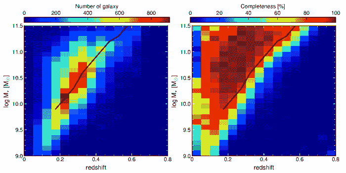
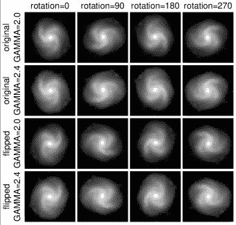
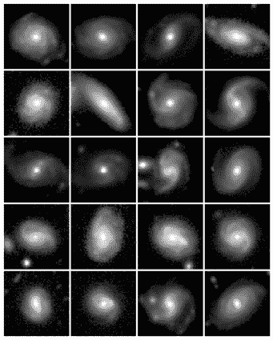
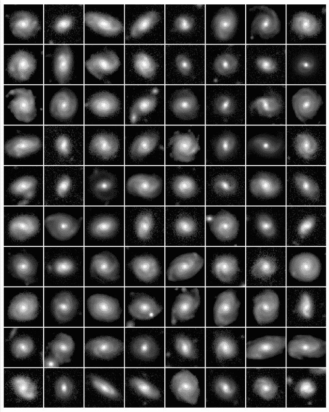

<!--yml

类别：未分类

日期：2024-09-06 20:00:34

-->

# [2006.13544] 螺旋星系的自旋对称性 II：基于 Subaru Hyper Suprime-Cam 调查和深度学习的大数据的 80,000 个螺旋星系目录

> 来源：[`ar5iv.labs.arxiv.org/html/2006.13544`](https://ar5iv.labs.arxiv.org/html/2006.13544)

# 螺旋星系的自旋对称性 II：基于 Subaru Hyper Suprime-Cam 调查和深度学习的大数据的 80,000 个螺旋星系目录

Ken-ichi Tadaki,¹ Masanori Iye,¹ Hideya Fukumoto,² Masao Hayashi,¹ Cristian E. Rusu,¹ Rhythm Shimakawa,¹ 和 Tomoka Tosaki,³

¹日本国立天文台，2-21-1 Osawa, Mitaka, Tokyo 181-8588, Japan

²日本开放大学，2-11 Wakaba, Mihama-ku, Chiba 261-8586, Japan

³上越教育大学，山屋町，上越，新潟 943-8512，日本 电子邮件：tadaki.ken@nao.ac.jp（接受 XXX。收到 YYY；原始形式 ZZZ）

###### 摘要

我们报告了一种将星系自动分类为 S 型螺旋星系、Z 型螺旋星系和非螺旋星系的方法，使用了来自 Subaru/Hyper Suprime-Cam (HSC) 调查的大型图像数据和基于卷积神经网络（CNN）的深度学习技术。HSC $i$-波段图像比 Sloan Digital Sky Survey (SDSS) 的图像深约 25 倍，空间分辨率高两倍，使我们能够识别 $z>0.1$ 的星系中的螺旋臂和条纹等子结构。我们通过使用 1447 个 S 型螺旋星系、1382 个 Z 型螺旋星系和 51,650 个非螺旋星系的 HSC 图像来训练 CNN 分类器。由于每类图像的数量不平衡，我们通过水平翻转、旋转和重新缩放图像来增强螺旋星系的数据，以使三类的数量相似。训练后的 CNN 模型正确分类了 97.5% 的验证数据，这些数据未用于训练。我们将 CNN 应用于 320 平方度区域内 $i<20$ 的 50 万个星系的 HSC 图像。识别出了 37,917 个 S 型螺旋星系和 38,718 个 Z 型螺旋星系，表明两类星系的数量没有显著差异。在总共 76,635 个螺旋星系中，48,576 个位于 $z>0.2$，在 SDSS 图像中我们几乎无法识别螺旋臂。我们的尝试表明，HSC 大数据和 CNN 的结合具有很大的潜力，可以分类各种类型的形态，例如条纹、合并和强引力透镜物体。

###### 关键词：

星系：螺旋 – 技术：图像处理 – 目录^†^†出版年：2020^†^†页码范围：螺旋星系的自旋对称性 II：基于 Subaru Hyper Suprime-Cam 调查和深度学习的大数据的 80,000 个螺旋星系目录–A

## 1 引言

螺旋臂是银河系中最美丽的结构之一，吸引了许多人的兴趣。密度波理论是解释银河系螺旋图案的传统概念（Lin & Shu, 1964），而近期的数值模拟则支持螺旋臂是由于与银河剪切运动相关的摆动放大效应形成的（例如，Baba 等，2013；Dobbs & Baba，2014），这一理论最早由 Goldreich & Lynden-Bell (1965) 提出。螺旋臂的缠绕方向相对于银河旋转方向也一直是观测和理论研究螺旋星系的经典争议主题，直到 20 世纪 60 年代左右。Iye 等 (2019) 证明了所有银河系都是尾随螺旋，只要暗条主导的一侧是靠近我们的盘面一侧。一旦确定了螺旋臂的缠绕方向，我们可以推断出银河系的自旋矢量，这是银河系形成过程中的一个重要物理属性。在潮汐扭矩理论框架下（例如，Doroshkevich，1970；Peebles，1969；White，1984），银河系在结构形成的线性阶段通过邻近星系的潮汐场获得角动量。因此，银河系的缠绕方向，即自旋矢量，本来是随机分布的，导致 S-型螺旋（S-spirals）与 Z-型螺旋（Z-spirals）的数量相同。如果缠绕方向的空间分布存在全球各向异性，大规模的涡旋如银河团潮汐相互作用将影响银河系的自旋（Sugai & Iye，1995）。然而，过去二十年里缠绕方向的统计分析并没有得到很好的发展，除了少数几项研究（Hayes 等，2017；Shamir，2017）。

我们可以通过目视检查立即识别银河系中的螺旋臂，并判断它是 S-型螺旋还是 Z-型螺旋。然而，重复这个过程 1 万次或更多次并不容易。另一个问题是，视觉分类依赖于观察图像的人的专业知识和经验。在 Galaxy Zoo 项目中（Lintott 等，2011；Willett 等，2013），约 10 万名志愿者对从斯隆数字天空调查（SDSS；York 等，2000）中提取的约 90 万银河系在$0.001<z<0.25$范围内进行了形态分类。Masters 等 (2010) 研究了来自 Galaxy Zoo 数据库的 5,433 个面向的螺旋星系，$0.03<z<0.085$。为了制作一个类似的大样本的更远螺旋星系在$z>0.1$的情况下，我们需要更高灵敏度和更高分辨率的广域成像数据集。

我们正在利用 Hyper Suprime-Cam (HSC) 在 Subaru Strategic Program (HSC-SSP; Aihara et al. 2018) 进行多波段成像调查。HSC 拥有 8 米级望远镜中最大的 1.5 度直径视场。该调查的宽层覆盖了 1400 平方度的五个宽带 ($grizy$)，具有 5$\sigma$ 点源深度 $i\sim 26.2$，比 SDSS 深约 3.5 个星等。增加的灵敏度使我们能够在 $z>0.1$ 的远处星系中表征螺旋臂，同时广域调查产生了超过一百万个星系的图像。因此，我们需要在大数据时代开发自动化的形态分类方法。常用的参数化方法，如 Sérsic 模型拟合（例如，Peng et al. 2010）以及非参数化方法，如集中度 (C)、不对称性 (A)、斑块性 (S) 方法和 Gini/M[20] 参数（例如，Conselice, 2014），不适合识别星系中的子结构，如螺旋臂、棒状结构和潮汐流。目前，仅有少数研究成功地自动提取了螺旋结构（Davis & Hayes, 2014; Kuminski & Shamir, 2016; Hart et al., 2017）。

到 2012 年，深度学习已经发展到足以以约 84% 的高准确率正确识别猫的图片（Krizhevsky et al., 2012）。图像分类的准确性在 2015 年超过了人类准确性（约 95%；He et al. 2016）。卷积神经网络（CNN）现在是一种常用的技术，用于将图像分类为多个类别（例如，Fukushima, 1980；LeCun et al., 1998；Russakovsky et al., 2015）。CNN 使用多个卷积核（滤波器）对图像进行卷积，以减少信息量并有效提取图像中的局部特征。Dieleman et al. (2015) 将 CNN 技术应用于天文图像以进行星系形态分类，并成功地再现了 Galaxy Zoo 的结果，准确率为 99%（参见，例如 Huertas-Company et al., 2015；Domínguez Sánchez et al., 2018；Abraham et al., 2018）。这些方法大多是监督学习，需要一个带有预标记图像的训练数据集。另一方面，也有一些研究采用无监督学习方法进行自动形态分类（例如，Hocking et al., 2018；Martin et al., 2019）。此外，Schawinski et al. (2017) 使用生成对抗网络（Goodfellow et al., 2014）从人工降质的低分辨率图像生成超分辨率图像，尽管他们对应用于未包含在训练数据集中的未知星系种群持谨慎态度。CNN 和其他深度学习技术在天文学中变得越来越常见。

在本文中，我们展示了使用 HSC 成像数据识别银河系螺旋臂的 CNN 模型。在第二部分中，我们描述了来自 HSC-SSP 调查的成像数据，并构建了一个训练数据集。我们展示了 CNN 的架构，并在第三部分中使用验证数据集估计形态分类的准确性。我们将训练好的 CNN 应用于 50 万个星系图像的未标记数据集，并在第四部分中展示了 8 万个螺旋星系的目录。

## 2 数据

### 2.1 Subaru Hyper Suprime Cam 数据样本

本研究基于 HSC-SSP 第二次公开数据发布（PDR-2）中的数据，涉及宽层（Aihara et al., 2019）。对于形态分类，我们使用 $i-$波段图像，这些图像的曝光时间约为 20 分钟。图 1 显示了来自 HSC-SSP 数据和 SDSS 的两张螺旋星系图像，展示了我们能够在 $z>0.1$ 的遥远星系中识别螺旋缠绕方向的出色图像质量。

图 1：SDSS 和 HSC $i-$带图像的比较，左侧是 $i=18.7$、$z=0.16$ 的 S-型螺旋星系，右侧是 $i=18.8$、$z=0.19$ 的 Z-型螺旋星系。所有图像大小为 10.8 角秒 $\times$ 10.8 角秒。

图 2：左侧：在 Wide XMM-LSS 区域中 $i<20$ 的 56,787 个星系的恒星质量与红移的关系。右侧：恒星质量和红移的完整性函数。黑线表示 90% 的完整性。

我们使用 5.7 角秒孔径的 $i<20$ 星系，以便我们可以直观地分类其形态。即使对于 $i\sim 21$ 的星系，在 HSC 图像中仍然可以识别螺旋臂，这使得对高红移星系进行形态分类成为可能。然而，由于这种情况较少，包含更暗星系使得识别更多的螺旋星系以训练 CNN 变得困难。因此，我们在本研究中选择了 $i<20$ 的亮度截断。

在 HSC-SSP 数据库中，通过 i_extendedness_value 标志提前移除了星系。由于大多数星系在其他四个宽带滤光器（$grzy$）中被观测到，因此它们的光度红移是可用的，由直接经验光度代码（DEmP: Hsieh & Yee 2014）提供。对于 $i<20$ 的星系，光度红移误差 $\Delta z=(z_{\mathrm{phot}}-z_{\mathrm{spec}})/(1+z_{\mathrm{spec}})$ 和离群值分数 $|\Delta z|>0.15$ 分别为 $\sigma_{\Delta z}=0.02$ 和 5–10%（Tanaka et al., 2018; Nishizawa et al., 2020）。我们移除了 VIPERS (Garilli et al., 2014)、SDSS (Alam et al., 2015)、Wiggle-Z (Drinkwater et al., 2010)、GAMA (Liske et al., 2015) 和 PRIMUS (Cool et al., 2013) 提供的 $z_{\mathrm{spec}}<0.05$ 的附近星系，因为在 $z>0.1$ 时，物理尺度分辨率显著不同。也提前移除了主轴与副轴比小于 0.1 的边缘状物体，因为难以区分螺旋星系和非螺旋星系。

对于广域 XMM 大尺度结构调查（XMM-LSS）领域中 56,787 个 $i<20$ 的银河系子样本，红移和恒星质量分布如图 2 所示。恒星质量是通过多波长光度测量估算的，经验上由 DEmP 代码（Hsieh & Yee，2014）给出。我们还通过计算 $i<20$ 的银河系数量与 $i<22$ 的较暗银河系数量的比率来推导红移和恒星质量的完整性。恒星质量 90%的完整性限制在 $z=0.2$ 时为 $\log(M_{\star}/M_{\odot})\sim 10$ ，在 $z=0.4$ 时为 $\log(M_{\star}/M_{\odot})\sim 11$。

我们通过使用 STIFF 软件（Bertin，2012）将银河系的 FITS 图像转换为联合图像专家组（JPEG）格式。我们采用 GAMMA=2.2 自动调整 JPEG 图像的对比度和亮度，以便进行分类，并稍微调整该参数以进行数据增强（见 2.2）。将图像转换为 JPEG 图像可能会丢失与原始 FITS 图像相关的信息。灰度图像的优化是提高深度学习分类效果的关键挑战之一，但超出了我们的研究范围。在本文中，我们简单地使用 JPEG 图像，遵循了之前的工作（例如，Dieleman 等，2015；Huertas-Company 等，2015；Domínguez Sánchez 等，2018；Abraham 等，2018）。邮票图像的尺寸为 64 像素 $\times$ 64 像素，覆盖 10.8 弧秒 $\times$ 10.8 弧秒，其中大多数银河系的主要螺旋特征都在覆盖范围内。

尽管彩色合成图像通常用于分类星系形态，但我们出于两个原因使用 $i$ 带的单色图像。首先，$i$ 带观测在进行宇宙剪切测量的最佳观测条件下执行（Mandelbaum et al., 2018）。$i$ 带的中位视宁度为 0.6 角秒，对应于 $z=0.1$ 时的 1.1 kpc 和 $z=0.2$ 时的 2.1 kpc，而其他波段为 0.7-0.8 角秒。其次，合成图像包含星系颜色和星系形态的信息。颜色和形态之间有很强的相关性：蓝色星系往往具有带螺旋臂的盘，而红色星系则是椭圆形的（例如，Strateva et al., 2001）。红色螺旋星系可能是理解从蓝色到红色星系过渡的重要群体（Masters et al., 2010），但其数量密度比蓝色螺旋星系少。如果考虑颜色信息，训练模型可能倾向于将红色星系分类为非螺旋星系。因此，我们使用 $i$ 带图像以避免颜色偏差，并保持形态信息独立于颜色。

### 2.2 训练数据集

图 3：数据增强的示例。一个银河系的 FITS 图像被转换为多个具有不同灰度值的 JPEG 图像，这些灰度值由 GAMMA 参数调整。S 螺旋的原始图像被水平翻转，并被视为 Z 螺旋图像。此外，这些图像被旋转了 90、180、270 度。

我们选择了 XMM-LSS 区域（Pierre et al., 2004），覆盖约 $\sim 28$ 平方度，来制作 CNN 的训练数据集。在 56,787 个对象中，我们通过视觉检查确认了 1,447 个具有明显 S 形螺旋结构的螺旋星系和 1,382 个具有明显 Z 形螺旋结构的螺旋星系。所有作者对它们进行了视觉检查。此外，另外 1,177 个和 1,131 个星系被识别为具有 S 形和 Z 形螺旋结构，但信心水平稍低。为了尽可能清晰地定义螺旋结构，我们将这些星系分类为不清楚/可疑的类别，这些星系不用于训练 CNN。剩余的 51,650 个星系为非螺旋星系。在这项工作中，我们不区分并合体和非并合体星系。即使螺旋星系明显受到伴星的潮汐相互作用影响，它们也被归类为 S 螺旋或 Z 螺旋。我们在附录 A 中展示了每个类别随机选择的 100 个星系的示例图像。

我们采用 K 折交叉验证技术来评估 CNN 模型的性能。我们将原始样本在每个类别中随机划分为五个子集，其中包括 289 个 S 形螺旋星系、276 个 Z 形螺旋星系和 10,330 个非螺旋星系。四个子集（1,156 个 S 形螺旋星系、1,104 个 Z 形螺旋星系和 41,320 个非螺旋星系）用于训练，剩下的一个子集用于验证。由于 S 形螺旋星系和 Z 形螺旋星系的数量远小于非螺旋星系，我们对螺旋星系数据进行了扩增。我们将 Z 形螺旋星系和 S 形螺旋星系的水平翻转图像添加到 S 形螺旋星系和 Z 形螺旋星系类别中，使得 S 形螺旋星系和 Z 形螺旋星系的数量相同。翻转螺旋星系图像对于生成无偏训练数据集也很重要。当 CNN 在偏向于 S 形螺旋星系的样本上进行训练时，训练后的模型自然会比 Z 形螺旋星系多预测 S 形螺旋星系。我们进一步将图像旋转 90 度、180 度和 270 度，并使用 GAMMA=2.0、2.1、2.3、2.4 参数调整图像的亮度（图 3）。数据扩增将螺旋星系的数量增加了 40 倍，使三类的数量相似。因此，训练数据集包含了 45,200 个 S 形螺旋星系、45,200 个 Z 形螺旋星系和 41,320 个非螺旋星系。最终，我们通过选择不同的子集进行验证，制作了五个不同的训练数据集。

## 3 卷积神经网络

我们构建 CNN 模型，将星系形态分类为非螺旋、S-螺旋和 Z-螺旋，方法与之前的工作类似（例如，Dieleman 等，2015）。表 1 总结了本文使用的 CNN 配置。输入图像的大小为 64 像素 $\times$ 64 像素。共有四层卷积层，卷积核大小分别为 5 像素 $\times$ 5 像素，$5\times 5$，$3\times 3$ 和 $3\times 3$。卷积滤波器的数量分别为 32，64，128 和 128。每个滤波器生成一个特征图。我们添加了两层池化层，分别采用 4 像素 $\times$ 4 像素和 $2\times 2$ 的最大池化。最大池化有效提取了边缘等重要特征，并通过重采样减少了信息量。在卷积层之后，128 个 5 像素 $\times$ 5 像素的特征图被展平，并输入到具有 3200 特征的全连接层中。这些特征在密集层中进行组合。我们还包括了三层 Dropout 层，以避免 CNN 的过拟合（Srivastava 等，2014）。在这些层中，20%，50%，50%的输入单元被随机设为零。最终层使用 Softmax 函数，其计算公式为

|  | $p_{i,c}=e^{s_{i,c}}/\sum_{c=1}^{3}e^{s_{i,c}},$ |  | (1) |
| --- | --- | --- | --- |

其中$s_{i,c}$是第$i$张图像的第$c$类的形态分类输出分数（非螺旋、S-螺旋和 Z-螺旋），$p_{i,c}$对应每个类别的预测概率。我们最终采用概率最高的类别来确定形态。

表 1: 本文使用的卷积神经网络结构

|  | 层 | 输出形状 |
| --- | --- | --- |
| 1 | 输入 | (64 像素, 64 像素, 1 图) |
| 2 | 卷积 (5 像素 $\times$ 5 像素) | (60 像素, 60 像素, 32 图) |
| 3 | 卷积 (5 像素 $\times$ 5 像素) | (56 像素, 56 像素, 64 图) |
| 4 | 最大池化 (4 像素 $\times$ 4 像素) | (14 像素, 14 像素, 64 图) |
| 5 | 卷积 (3 像素 $\times$ 3 像素) | (12 像素, 12 像素, 128 图) |
| 6 | 卷积 (3 像素 $\times$ 3 像素) | (10 像素, 10 像素, 128 图) |
| 7 | 最大池化 (2 像素 $\times$ 2 像素) | (5 像素, 5 像素, 128 图) |
| 8 | Dropout | (5 像素, 5 像素, 128 图) |
| 9 | 展平 | (3200 特征) |
| 10 | 全连接 | (3200 特征) |
| 11 | Dropout | (3200 特征) |
| 12 | 全连接 | (3200 特征) |
| 13 | Dropout | (3200 特征) |
| 14 | 全连接 | (3 类别) |

图 4: 六次交叉验证测试之一的训练（黑线）和验证数据集（红线）的准确度和 CE 损失函数。蓝色水平线表示验证损失最小化的时期。

我们使用 Keras 库（Chollet et al.，2015）和单个 GPU，NVIDIA GeForce GTX 1080 Ti 进行 CNN 训练。通过最小化损失函数来确定模型的总共 20,769,539 个可训练参数，该损失函数表达实际类别与预测概率之间的不一致性（Krizhevsky & Inc，2014）。我们采用定义如下的交叉熵（CE）损失函数，

|  | $\mathrm{CE\ loss}=-\sum_{i=1}^{256}\sum_{c=1}^{3}t_{i,c}\log p_{i,c},$ |  | (2) |
| --- | --- | --- | --- |

其中 $t_{i,c}$ 是实际标签（如果为真则为 1，如果为假则为 0）。我们使用 Adam 算法（Kingma & Ba，2014），该算法基于损失函数的梯度下降来优化参数，使用从训练数据集中随机选择的 256 张图像的子样本。这种方法称为迷你批量随机梯度下降。一个训练周期在计算损失函数时使用了整个训练数据集一次，时长为 33 秒。我们重复这一过程 60 次，计算准确率（即正确预测的图像与所有图像的比率）和每个周期的 CE 损失。一个 CNN 模型的结果如图 4 所示。训练准确率持续接近 100%，而验证准确率在大约 20 个周期时饱和。损失函数在 32 个周期时达到最低点，并在后续周期开始上升。由于这明显是对训练数据集的过拟合，我们采用了验证损失最小的 CNN 模型。其他四个 CNN 模型分别在 29、32、41 和 28 个周期时达到最低点。验证数据集不直接用于 CNN 的训练，但间接影响最佳模型的选择。因此，我们计算了 5 个 CNN 模型的交叉验证平均准确率（见章节 2.2）。

表 2：交叉验证中每个标记类别下预测类别的图像分数。

| 预测类别 | 标记类别 |
| --- | --- |
|  | 非螺旋 | S-螺旋 | Z-螺旋 |
| --- | --- | --- | --- |
| 非螺旋 | 96.31$\pm$0.47% | 1.86$\pm$0.20% | 1.83$\pm$0.34% |
| S-螺旋 | 1.71$\pm$0.17% | 98.12$\pm$0.24% | 0.16$\pm$0.10% |
| Z-螺旋 | 1.90$\pm$0.22% | 0.19$\pm$0.13% | 97.91$\pm$0.34% |

图 5：每个类别的 HSC 图像分类错误示例。从每个图像底部的左到右，我们显示了非螺旋、S-螺旋和 Z-螺旋的预测概率。

图 6: 验证数据集中卷积神经网络模型的准确率作为$i$-band 等级、光度红移、FWHM 大小和长短轴比的函数。蓝线显示总体准确率为 0.9748。

平均准确率和标准偏差为 97.48$\pm$0.14%。对于预测概率为$>$0.95 的星系图像，准确率增加到 99.37$\pm$0.10%。请注意，不同形态类别之间的准确率是不同的。我们在表 2 中展示了混淆矩阵，即每个预测类别中正确或不正确预测的比例。大多数失败是由于将非螺旋星系错误地分类为 S-螺旋星系或 Z-螺旋星系，反之亦然。S-螺旋星系（Z-螺旋星系）被误分类为 Z-螺旋星系（S-螺旋星系）的比例只有 0.2%。

约 2.5%的验证数据集中，预测类别与标记类别不同。图 5 展示了误分类的例子。一些对象在标记类别中的第二大概率为 0.1-0.5，而另一些对象被错误分类为概率高于$>0.95$的类别。与不同预测的非螺旋星系似乎具有一些亚结构，这表明它们可能具有低对比度的螺旋臂。与正面视图相比，边缘星系似乎经常被错误分类。验证数据集中的准确率取决于长短轴比，这可以解释为倾角（图 6）。对于轴比$<0.2$的星系，准确率降至 96%。这可能是由于训练数据集中缺乏边视对象，因为通过视观检查更难识别螺旋臂。

我们评估了作为$i-$波段亮度、光度红移和 FWHM 大小的函数的准确性（图 6）。还有一个微弱的趋势，即较亮的物体分类更准确。另一方面，准确率在红移范围$z\sim 0.5$内趋于恒定。FWHM 大小是从$i$-波段图像中的高斯加权二阶矩估计的（Bernstein & Jarvis，2002）。该矩存储为 PDR2 数据库中的 i_sdssshape_shape11,22,12。我们计算行列式半径为$r_{\mathrm{det}}=($shape11 $\times$ shape22 - shape12${}^{2})^{0.25}$。在高斯假设下，我们通过应用$2\sqrt{2\ln 2}$将半径转换为 FWHM。FWHM$\sim$1″的紧凑星系中高准确率的原因是大多数星系在 HSC 图像中被分类为非螺旋星系。

我们还研究了样本量如何影响卷积神经网络（CNN）的表现。我们通过使用每个类别中随机选择的 100、200、400 和 800 个星系的图像来训练 CNN，并测量验证数据的准确率。当仅使用原始图像进行训练时，准确率从 100 的 52%逐渐增加到 800 的 90%。数据增强，包括水平翻转、旋转和缩放，显著提高了准确率，从 100 图像的 52%提升到 89%。使用数据增强，至少需要 100 张图像才能达到超过 90%的准确率。

## 4 螺旋星系目录

表 3：螺旋星系的自旋奇偶性目录。对象 ID 在 HSC-SSP 宽层（Aihara 等，2019）的 PDR-2 中相同。$p_{0}$、$p_{1}$和$p_{2}$分别表示非螺旋星系、S 型螺旋星系和 Z 型螺旋星系的预测概率。完整表格在线提供。

| 对象 ID | 类别标志^a | $p_{0}$ | $p_{1}$ | $p_{2}$ |
| --- | --- | --- | --- | --- |
| 40959011452899104 | 2 | 0.091 | 0.000 | 0.909 |
| 40959011452899880 | 2 | 0.093 | 0.000 | 0.907 |
| 40959011452901552 | 1 | 0.272 | 0.728 | 0.000 |
| 40959015747870352 | 2 | 0.009 | 0.000 | 0.991 |
| 40959015747871064 | 1 | 0.011 | 0.989 | 0.000 |
| 40959020042835800 | 2 | 0.006 | 0.000 | 0.994 |
| 40959020042837000 | 1 | 0.000 | 1.000 | 0.000 |
| . | . | . | . | . |

^a 标记：1=S 型螺旋星系；2=Z 型螺旋星系

图 7：S 螺旋星系（红色圆圈）和 Z 螺旋星系（蓝色圆圈）在所有星系中的比例，作为$i$-带亮度、光度红移、全宽半高（FWHM）尺寸和主轴与次轴比的函数（前四个面板）。中间四个面板和底部四个面板分别显示了螺旋星系的数量以及 S 螺旋星系和 Z 螺旋星系之间数量差异的显著性水平。误差$\Delta(N_{\mathrm{S}}-N_{\mathrm{Z}})$考虑了泊松误差和 CNN 分类不完整性。

现在，我们将训练好的 CNN 模型应用于其他 HSC-SSP 领域的大型数据集，其中有 561,251 张星系图像，覆盖了约 320 平方度的区域。我们使用 5 个通过交叉验证得到的 CNN 模型来推导每个类别的平均预测概率。我们识别出 37,917 个 S 螺旋星系和 38,718 个 Z 螺旋星系，并在表格 3 中提供了包括预测概率在内的目录。其余的 484,616 个星系是非螺旋星系。S 螺旋星系和 Z 螺旋星系数量的差异为$N_{\mathrm{S}}-N_{\mathrm{Z}}=-801$。当仅使用泊松统计来估计星系图像数量的不确定性时，其显著性水平为 2.9$\sigma$（Gehrels, 1986）。然而，这些数字的不确定性可能主要由 CNN 分类中的错误分类主导，而不是泊松误差。原则上，S 螺旋星系和 Z 螺旋星系受到相同程度的污染。在验证数据集中，S 螺旋星系被错误分类为非螺旋星系的比例与 Z 螺旋星系被错误分类为非螺旋星系的比例相似，尽管 CNN 模型之间存在一些差异（0.20%, 0.34%）（表格 2）。这是不可忽视的，因为绝大多数的五十万星系是非螺旋星系。考虑到错误分类的不确定性，差异的误差为$\Delta(N_{\mathrm{S}}-N_{\mathrm{Z}})$=1,932，这比实际测量值要大。我们还使用 5 个单独训练的 CNN 对 561,251 张图像进行分类，以计算螺旋星系的数量的平均值和标准差，$N_{\mathrm{S}}=38625\pm 1138$和$N_{\mathrm{Z}}=39537\pm 1479$，对应于误差为$\Delta(N_{\mathrm{S}}-N_{\mathrm{Z}})$=1866）。为了使不确定性主要由泊松误差主导，分类中的错误率需要稳定在 0.04%。我们需要使用更多的验证数据来训练模型。

我们没有发现 S-螺旋和 Z-螺旋星系之间数量的显著差异。另一方面，在我们的训练数据集和 Galaxy Zoo 目录中，S-螺旋星系相对于 Z-螺旋星系有显著的过剩（Land 等，2008；Lintott 等，2008）。这可能是由人为选择偏差引起的（Hayes 等，2017）。人工视觉检查可能会无意识地选择更多的 S-螺旋星系。我们还计算了 S-螺旋和 Z-螺旋星系数量差异的显著性水平，$(N_{\mathrm{S}}-N_{\mathrm{Z}})/\Delta(N_{\mathrm{S}}-N_{\mathrm{Z}})$，在$i-$波段光度、光度红移、FWHM 大小和主轴与副轴比率的区间中（图 7）。我们考虑了基于 CNN 的分类的不完整性（表 2）以及泊松误差。我们没有发现$|(N_{\mathrm{S}}-N_{\mathrm{Z}})|>3\Delta(N_{\mathrm{S}}-N_{\mathrm{Z}})$的 S-螺旋或 Z-螺旋星系的显著过剩。

包括 S-螺旋和 Z-螺旋在内的所有螺旋星系占所有星系的比例为 13.7%，不过这取决于星系的属性。注意，我们只能识别具有可见螺旋臂的星系，这取决于用于分类的图像的敏感性和空间分辨率。在 Galaxy Zoo 项目中，具有螺旋臂特征的星系在$z=0.1$时的比例为 10%，在$z=0.2$时为$\sim 0$%（Willett 等，2013）。在更深的 HSC 图像中，在$z=0.1-0.2$的星系中，螺旋臂在$\sim$20%的星系中可见（图 7）。测得的螺旋星系比例仍然是一个下限，因为在更深和更高分辨率的图像中可以识别出更多具有较暗或对比度较低的螺旋臂的星系。我们实际上发现，大约$\sim$50%具有 FWHM$\sim$3 角秒的扩展星系被分类为螺旋星系，因为 HSC 的分辨率足够高，可以识别它们的螺旋臂。

图 8: S-螺旋星系（左）和 Z-螺旋星系（右）的 HSC 图像示例，预测概率$>$0.95。它们是从$z_{\mathrm{spec}}=0.2-0.3$的光谱确认星系中随机选择的。

图 8 展示了具有光谱红移$z_{\mathrm{spec}}=0.2-0.3$的 S-螺旋和 Z-螺旋的示例。在 76,635 个螺旋星系中，有 48,576 个位于$z_{\mathrm{phot}}>0.2$的区域，在该区域我们无法用 SDSS 图像识别螺旋臂。螺旋星系的比例从$z_{\mathrm{phot}}=0.2$的 20%下降到$z_{\mathrm{phot}}=0.6$的 10%。红移的依赖性受到宇宙暗化效应的强烈影响，表面亮度随$(1+z)^{-4}$减小。在高红移星系中，检测像螺旋臂这样的扩展子结构变得困难。螺旋比例的光度依赖性与红移依赖性相关，因为微弱源倾向于具有更高的红移。螺旋星系中轴比小于$0.2$的减少可能是由于人为偏见，因为在边缘观测的星系中，螺旋臂的视觉识别变得困难。

尽管宇宙暗化效应很强，但在$z_{\mathrm{phot}}=0.5-0.7$的情况下，已识别出 2,524 个具有螺旋臂的星系。其中 1,455 个星系的恒星质量为$\log(M_{\star}/M_{\odot})>10.8$，这与仙女座星系（M31: Geehan et al. 2006）相似。螺旋臂的存在表明这些星系仍在形成恒星。在$0<z<0.7$时，大多数 M31 质量的星系具有早期类型形态，没有螺旋臂，并且抑制了恒星形成（Papovich et al., 2015）。这些已识别的巨型螺旋星系可能是 M31 的前身。

## 5 总结

我们开发了一个 CNN 模型，通过使用由 Subaru HSC 调查拍摄的图像，将星系形态分类为三类（S-螺旋，Z-螺旋和非螺旋）。优质的图像质量使我们能够通过目视检查识别$i\sim 20$的微弱星系中的螺旋臂。在对图像进行翻转、缩放和旋转等数据增强后，我们共使用了 20 万张图像来训练模型。训练好的模型成功地对未用于训练和验证的测试数据集进行了分类，结果准确率为 97.5$\pm$0.1%。当训练数据集每类包含少于 100 张图像时，准确率降至$\sim$90%。当发现稀有物体时，这将成为更大的问题。

我们将训练好的 CNN 模型应用于 561,251 张银河系图像，覆盖面积约为$\sim$320 deg²。我们的自动分类系统有效地识别出螺旋星系并确定其螺旋臂的旋转方向，提供了 37,917 个 S-型螺旋星系和 38,718 个 Z-型螺旋星系。我们没有发现 S-型螺旋星系明显多于 Z-型螺旋星系，这在训练数据集和银河动物园目录中有所体现。我们还识别出了 1,455 个质量大的螺旋星系，满足$\log(M_{\star}/M_{\odot})>10.8$，在$z_{\mathrm{phot}}=0.5-0.7$，这些星系可能是 M31 的祖先。

我们的 CNN 分类方法存在一些局限性。螺旋臂的标准由训练数据集定义，这些数据集是通过我们目视检查选定的。虽然我们使用了螺旋臂清晰可见的星系样本进行训练，以最小化非螺旋星系的污染，但清晰螺旋的标准仍然有些模糊。这种模糊定义可能是导致验证数据集中 2.5%样本被误分类的原因之一。制作干净的训练样本非常重要。通过数值模拟生成模拟图像是为模型训练准备大数据集的几种有效方法之一（例如，Huertas-Company 等，2018；Metcalf 等，2019）。另一种定义重复形态类别的方向是无监督学习方法，它不需要视觉分类的训练数据集（例如，Hocking 等，2018；Martin 等，2019）。尽管如此，我们的尝试已经证明 CNN 在从大数据集中制作具有特定子结构（如螺旋臂）的大量星系样本以及有效地识别稀有物体（如大质量螺旋星系）方面是非常强大的。

## 致谢

我们非常感谢审稿人提出的建设性建议以改进论文。Hyper Suprime-Cam（HSC）合作项目包括日本和台湾的天文界以及普林斯顿大学。HSC 的仪器和软件由日本国立天文台（NAOJ）、宇宙物理与数学研究所（Kavli IPMU）、东京大学、高能加速器研究组织（KEK）、台湾中央研究院天文与天体物理研究所（ASIAA）和普林斯顿大学开发。资助来自日本内阁办公室的 FIRST 计划、文部科学省（MEXT）、日本学术振兴会（JSPS）、日本科学技术振兴机构（JST）、东丽科学基金会、NAOJ、Kavli IPMU、KEK、ASIAA 和普林斯顿大学。

本文使用了为大型巡天望远镜开发的软件。我们感谢 LSST 项目将他们的代码以免费软件形式提供，网址为[`dm.lsst.org`](http://dm.lsst.org)。

本文基于在 Subaru 望远镜上收集的数据，并从 HSC 数据档案系统中检索，该系统由 Subaru 望远镜和 NAOJ 的天文学数据中心（ADC）操作。数据分析部分在 NAOJ 的计算天体物理中心（CfCA）合作下进行。

Pan-STARRS1 调查（PS1）和 PS1 公共科学档案得以实现，得到了天文学研究所、夏威夷大学、Pan-STARRS 项目办公室、马克斯·普朗克学会及其参与机构、海德堡马克斯·普朗克天文学研究所、加尔兴马克斯·普朗克外星物理研究所、约翰斯·霍普金斯大学、达勒姆大学、爱丁堡大学、贝尔法斯特女王大学、哈佛-史密森天体物理中心、拉斯坎布雷斯天文台全球望远镜网络、台湾中央大学、空间望远镜科学研究所、国家航空航天局通过 NASA 科学任务局的行星科学部颁发的 NNX08AR22G 号资助、国家科学基金会 AST-1238877 号资助、马里兰大学、厄尔特大学（ELTE）、洛斯阿拉莫斯国家实验室以及戈登与贝蒂·摩尔基金会的贡献。

C.E.R 感谢 Anupreeta More 提供了一个用于图像视觉检查的工具。

## 参考文献

+   Abraham 等（2018）Abraham S.、Aniyan A. K.、Kembhavi A. K.、Philip N. S.、Vaghmare K.，2018，[MNRAS](http://dx.doi.org/10.1093/mnras/sty627)，[477, 894](https://ui.adsabs.harvard.edu/abs/2018MNRAS.477..894A)

+   Aihara 等（2018）Aihara H. 等，2018，[PASJ](http://dx.doi.org/10.1093/pasj/psx066)，[70, S4](https://ui.adsabs.harvard.edu/abs/2018PASJ...70S...4A)

+   Aihara 等（2019）Aihara H. 等，2019，[PASJ](http://dx.doi.org/10.1093/pasj/psz103)，[71, 114](https://ui.adsabs.harvard.edu/abs/2019PASJ...71..114A)

+   Alam 等（2015）Alam S. 等，2015，[ApJS](http://dx.doi.org/10.1088/0067-0049/219/1/12)，[219, 12](https://ui.adsabs.harvard.edu/abs/2015ApJS..219...12A)

+   Baba 等（2013）Baba J.、Saitoh T. R.、Wada K.，2013，[ApJ](http://dx.doi.org/10.1088/0004-637X/763/1/46)，[763, 46](https://ui.adsabs.harvard.edu/abs/2013ApJ...763...46B)

+   Bernstein & Jarvis（2002）Bernstein G. M.、Jarvis M.，2002，[AJ](http://dx.doi.org/10.1086/338085)，[123, 583](https://ui.adsabs.harvard.edu/abs/2002AJ....123..583B)

+   Bertin（2012）Bertin E.，2012，见 Ballester P.、Egret D.、Lorente N. P. F. 编辑，《太平洋天文学会会议系列》第 461 卷，《天文学数据分析软件与系统 XXI》。第 263 页

+   Chollet 等（2015）Chollet F. 等，2015，Keras，[`keras.io`](https://keras.io)

+   Conselice（2014）Conselice C. J.，2014，[ARA&A](http://dx.doi.org/10.1146/annurev-astro-081913-040037)，[52, 291](https://ui.adsabs.harvard.edu/abs/2014ARA&A..52..291C)

+   Cool 等（2013）Cool R. J., 等，2013 年，[ApJ](http://dx.doi.org/10.1088/0004-637X/767/2/118)，[767, 118](https://ui.adsabs.harvard.edu/abs/2013ApJ...767..118C)

+   Davis & Hayes（2014）Davis D. R., Hayes W. B., 2014 年，[ApJ](http://dx.doi.org/10.1088/0004-637X/790/2/87)，[790, 87](https://ui.adsabs.harvard.edu/abs/2014ApJ...790...87D)

+   Dieleman 等（2015）Dieleman S., Willett K. W., Dambre J., 2015 年，[MNRAS](http://dx.doi.org/10.1093/mnras/stv632)，[450, 1441](https://ui.adsabs.harvard.edu/abs/2015MNRAS.450.1441D)

+   Dobbs & Baba（2014）Dobbs C., Baba J., 2014 年，[Publ. Astron. Soc. Australia](http://dx.doi.org/10.1017/pasa.2014.31)，[31, e035](https://ui.adsabs.harvard.edu/abs/2014PASA...31...35D)

+   Domínguez Sánchez 等（2018）Domínguez Sánchez H., Huertas-Company M., Bernardi M., Tuccillo D., Fischer J. L., 2018 年，[MNRAS](http://dx.doi.org/10.1093/mnras/sty338)，[476, 3661](https://ui.adsabs.harvard.edu/abs/2018MNRAS.476.3661D)

+   Doroshkevich（1970）Doroshkevich A. G., 1970 年，[Astrophysics](http://dx.doi.org/10.1007/BF01001625)，[6, 320](https://ui.adsabs.harvard.edu/abs/1970Ap......6..320D)

+   Drinkwater 等（2010）Drinkwater M. J., 等，2010 年，[MNRAS](http://dx.doi.org/10.1111/j.1365-2966.2009.15754.x)，[401, 1429](https://ui.adsabs.harvard.edu/abs/2010MNRAS.401.1429D)

+   Fukushima（1980）Fukushima K., 1980 年，《生物控制论》，36，193

+   Garilli 等（2014）Garilli B. 等，2014 年，[A&A](http://dx.doi.org/10.1051/0004-6361/201322790)，[562, A23](https://ui.adsabs.harvard.edu/abs/2014A&A...562A..23G)

+   Geehan 等（2006）Geehan J. J., Fardal M. A., Babul A., Guhathakurta P., 2006 年，[MNRAS](http://dx.doi.org/10.1111/j.1365-2966.2005.09863.x)，[366, 996](https://ui.adsabs.harvard.edu/abs/2006MNRAS.366..996G)

+   Gehrels（1986）Gehrels N., 1986 年，[ApJ](http://dx.doi.org/10.1086/164079)，[303, 336](https://ui.adsabs.harvard.edu/abs/1986ApJ...303..336G)

+   Goldreich & Lynden-Bell（1965）Goldreich P., Lynden-Bell D., 1965 年，[MNRAS](http://dx.doi.org/10.1093/mnras/130.2.125)，[130, 125](https://ui.adsabs.harvard.edu/abs/1965MNRAS.130..125G)

+   Goodfellow 等（2014）Goodfellow I., Pouget-Abadie J., Mirza M., Xu B., Warde-Farley D., Ozair S., Courville A., Bengio Y., 2014 年，在 Ghahramani Z., Welling M., Cortes C., Lawrence N. D., Weinberger K. Q. 主编，《神经信息处理系统进展 27》。Curran Associates, Inc.，第 2672-2680 页

+   Hart 等（2017）Hart R. E., 等，2017 年，[MNRAS](http://dx.doi.org/10.1093/mnras/stx2137)，[472, 2263](https://ui.adsabs.harvard.edu/abs/2017MNRAS.472.2263H)

+   Hayes 等（2017）Hayes W. B., Davis D., Silva P., 2017 年，[MNRAS](http://dx.doi.org/10.1093/mnras/stw3290)，[466, 3928](https://ui.adsabs.harvard.edu/abs/2017MNRAS.466.3928H)

+   He 等（2016）He K., Zhang X., Ren S., Sun J., 2016 年，在 2016 IEEE 计算机视觉与模式识别大会，CVPR 2016，美国内华达州拉斯维加斯，2016 年 6 月 27-30 日。第 770-778 页，[doi:10.1109/CVPR.2016.90](http://dx.doi.org/10.1109/CVPR.2016.90)

+   Hocking 等（2018）Hocking A., Geach J. E., Sun Y., Davey N., 2018，[MNRAS](http://dx.doi.org/10.1093/mnras/stx2351)，[473, 1108](https://ui.adsabs.harvard.edu/abs/2018MNRAS.473.1108H)

+   Hsieh & Yee（2014）Hsieh B. C., Yee H. K. C., 2014，[ApJ](http://dx.doi.org/10.1088/0004-637X/792/2/102)，[792, 102](https://ui.adsabs.harvard.edu/abs/2014ApJ...792..102H)

+   Huertas-Company 等（2015）Huertas-Company M. 等，2015，[ApJS](http://dx.doi.org/10.1088/0067-0049/221/1/8)，[221, 8](https://ui.adsabs.harvard.edu/abs/2015ApJS..221....8H)

+   Huertas-Company 等（2018）Huertas-Company M. 等，2018，[ApJ](http://dx.doi.org/10.3847/1538-4357/aabfed)，[858, 114](https://ui.adsabs.harvard.edu/abs/2018ApJ...858..114H)

+   Iye 等（2019）Iye M., Tadaki K.-i., Fukumoto H., 2019，[ApJ](http://dx.doi.org/10.3847/1538-4357/ab4a18)，[886, 133](https://ui.adsabs.harvard.edu/abs/2019ApJ...886..133I)

+   Kingma & Ba（2014）Kingma D. P., Ba J., 2014，arXiv 预印本 arXiv:1412.6980

+   Krizhevsky & Inc（2014）Krizhevsky A., Inc G., 2014，技术报告，《用于并行化卷积神经网络的一个奇怪技巧》

+   Krizhevsky 等（2012）Krizhevsky A., Sutskever I., Hinton G. E., 2012，见 Pereira F., Burges C. J. C., Bottou L., Weinberger K. Q. 编，《神经信息处理系统 25 进展》。Curran Associates, Inc., pp 1097–1105

+   Kuminski & Shamir（2016）Kuminski E., Shamir L., 2016，[ApJS](http://dx.doi.org/10.3847/0067-0049/223/2/20)，[223, 20](https://ui.adsabs.harvard.edu/abs/2016ApJS..223...20K)

+   Land 等（2008）Land K. 等，2008，[MNRAS](http://dx.doi.org/10.1111/j.1365-2966.2008.13490.x)，[388, 1686](https://ui.adsabs.harvard.edu/abs/2008MNRAS.388.1686L)

+   LeCun 等（1998）LeCun Y., Bottou L., Bengio Y., Haffner P., 1998，[IEEE 会议录](http://dx.doi.org/10.1109/5.726791)，86，2278

+   Lin & Shu（1964）Lin C. C., Shu F. H., 1964，[ApJ](http://dx.doi.org/10.1086/147955)，[140, 646](https://ui.adsabs.harvard.edu/abs/1964ApJ...140..646L)

+   Lintott 等（2008）Lintott C. J., 等，2008，[MNRAS](http://dx.doi.org/10.1111/j.1365-2966.2008.13689.x)，[389, 1179](https://ui.adsabs.harvard.edu/abs/2008MNRAS.389.1179L)

+   Lintott 等（2011）Lintott C. 等，2011，[MNRAS](http://dx.doi.org/10.1111/j.1365-2966.2010.17432.x)，[410, 166](https://ui.adsabs.harvard.edu/abs/2011MNRAS.410..166L)

+   Liske 等（2015）Liske J. 等，2015，[MNRAS](http://dx.doi.org/10.1093/mnras/stv1436)，[452, 2087](https://ui.adsabs.harvard.edu/abs/2015MNRAS.452.2087L)

+   Mandelbaum 等（2018）Mandelbaum R. 等，2018，[PASJ](http://dx.doi.org/10.1093/pasj/psx130)，[70, S25](https://ui.adsabs.harvard.edu/abs/2018PASJ...70S..25M)

+   Martin 等（2019）Martin G., Kaviraj S., Hocking A., Read S. C., Geach J. E., 2019，arXiv 电子预印本，[p. arXiv:1909.10537](https://ui.adsabs.harvard.edu/abs/2019arXiv190910537M)

+   Masters 等（2010）Masters K. L. 等，2010，[MNRAS](http://dx.doi.org/10.1111/j.1365-2966.2010.16503.x)，[405, 783](https://ui.adsabs.harvard.edu/abs/2010MNRAS.405..783M)

+   Metcalf 等（2019）Metcalf R. B. 等，2019，[A&A](http://dx.doi.org/10.1051/0004-6361/201832797)，[625, A119](https://ui.adsabs.harvard.edu/abs/2019A&A...625A.119M)

+   Nishizawa 等（2020）Nishizawa A. J.，Hsieh B.-C.，Tanaka M.，Takata T.，2020，arXiv e-prints，[p. arXiv:2003.01511](https://ui.adsabs.harvard.edu/abs/2020arXiv200301511N)

+   Papovich 等（2015）Papovich C. 等，2015，[ApJ](http://dx.doi.org/10.1088/0004-637X/803/1/26)，[803, 26](https://ui.adsabs.harvard.edu/abs/2015ApJ...803...26P)

+   Peebles（1969）Peebles P. J. E.，1969，[ApJ](http://dx.doi.org/10.1086/149876)，[155, 393](https://ui.adsabs.harvard.edu/abs/1969ApJ...155..393P)

+   Peng 等（2010）Peng C. Y.，Ho L. C.，Impey C. D.，Rix H.-W.，2010，[AJ](http://dx.doi.org/10.1088/0004-6256/139/6/2097)，[139, 2097](https://ui.adsabs.harvard.edu/abs/2010AJ....139.2097P)

+   Pierre 等（2004）Pierre M. 等，2004，[宇宙学与天体物理学期刊](http://dx.doi.org/10.1088/1475-7516/2004/09/011)，[2004, 011](https://ui.adsabs.harvard.edu/abs/2004JCAP...09..011P)

+   Russakovsky 等（2015）Russakovsky O. 等，2015，[计算机视觉国际期刊（IJCV）](http://dx.doi.org/10.1007/s11263-015-0816-y)，115，211

+   Schawinski 等（2017）Schawinski K.，Zhang C.，Zhang H.，Fowler L.，Santhanam G. K.，2017，[MNRAS](http://dx.doi.org/10.1093/mnrasl/slx008)，[467, L110](https://ui.adsabs.harvard.edu/abs/2017MNRAS.467L.110S)

+   Shamir（2017）Shamir L.，2017，[澳大利亚天文学会出版物](http://dx.doi.org/10.1017/pasa.2017.40)，[34, e044](https://ui.adsabs.harvard.edu/abs/2017PASA...34...44S)

+   Srivastava 等（2014）Srivastava N.，Hinton G.，Krizhevsky A.，Sutskever I.，Salakhutdinov R.，2014，《机器学习研究期刊》，15，1929

+   Strateva 等（2001）Strateva I. 等，2001，[AJ](http://dx.doi.org/10.1086/323301)，[122, 1861](https://ui.adsabs.harvard.edu/abs/2001AJ....122.1861S)

+   Sugai & Iye（1995）Sugai H.，Iye M.，1995，[MNRAS](http://dx.doi.org/10.1093/mnras/276.1.327)，[276, 327](https://ui.adsabs.harvard.edu/abs/1995MNRAS.276..327S)

+   Tanaka 等（2018）Tanaka M. 等，2018，[PASJ](http://dx.doi.org/10.1093/pasj/psx077)，[70, S9](https://ui.adsabs.harvard.edu/abs/2018PASJ...70S...9T)

+   White（1984）White S. D. M.，1984，[ApJ](http://dx.doi.org/10.1086/162573)，[286, 38](https://ui.adsabs.harvard.edu/abs/1984ApJ...286...38W)

+   Willett 等（2013）Willett K. W. 等，2013，[MNRAS](http://dx.doi.org/10.1093/mnras/stt1458)，[435, 2835](https://ui.adsabs.harvard.edu/abs/2013MNRAS.435.2835W)

+   York 等（2000）York D. G. 等，2000，[AJ](http://dx.doi.org/10.1086/301513)，[120, 1579](https://ui.adsabs.harvard.edu/abs/2000AJ....120.1579Y)

## 附录 A 一些额外材料

在图 9 和图 10 中，我们展示了从训练数据集中随机选择的 S-螺旋和 Z-螺旋的示例图像。我们在数据增强后，例如翻转、缩放和旋转图像，使用它们来训练 CNN 模型。

图 9：S-螺旋的示例图像。

图 10：Z-螺旋的示例图像。
