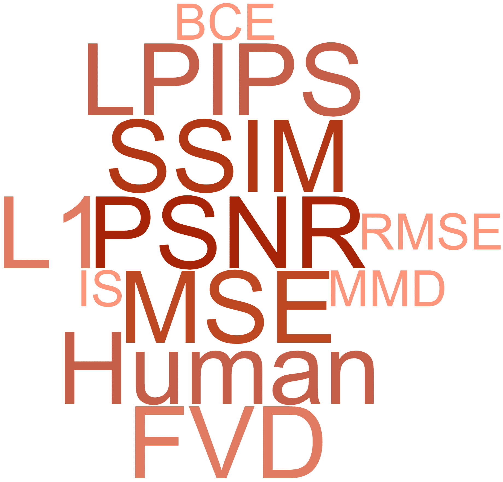
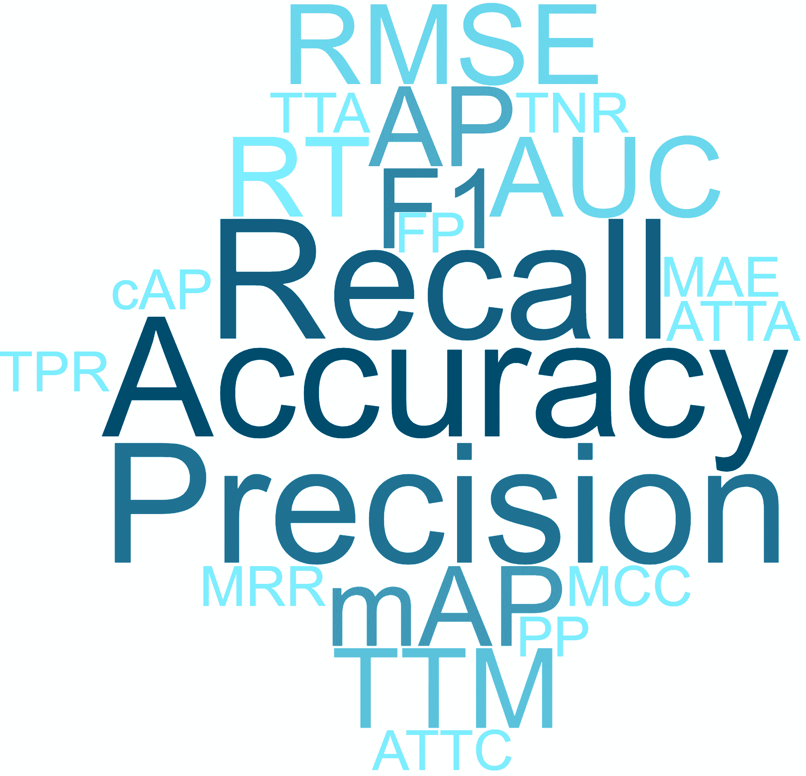
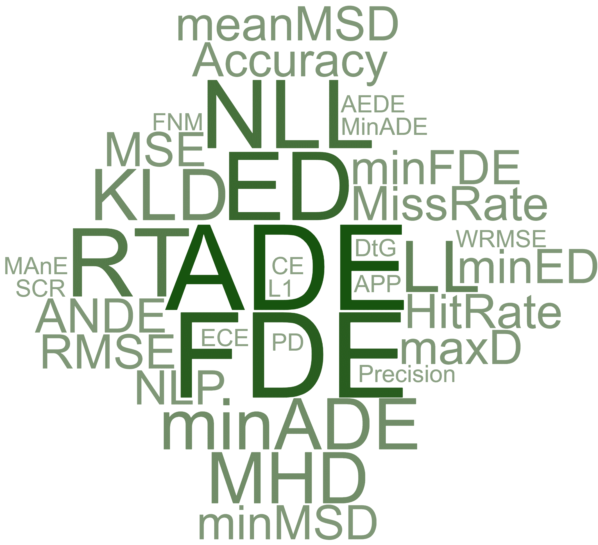
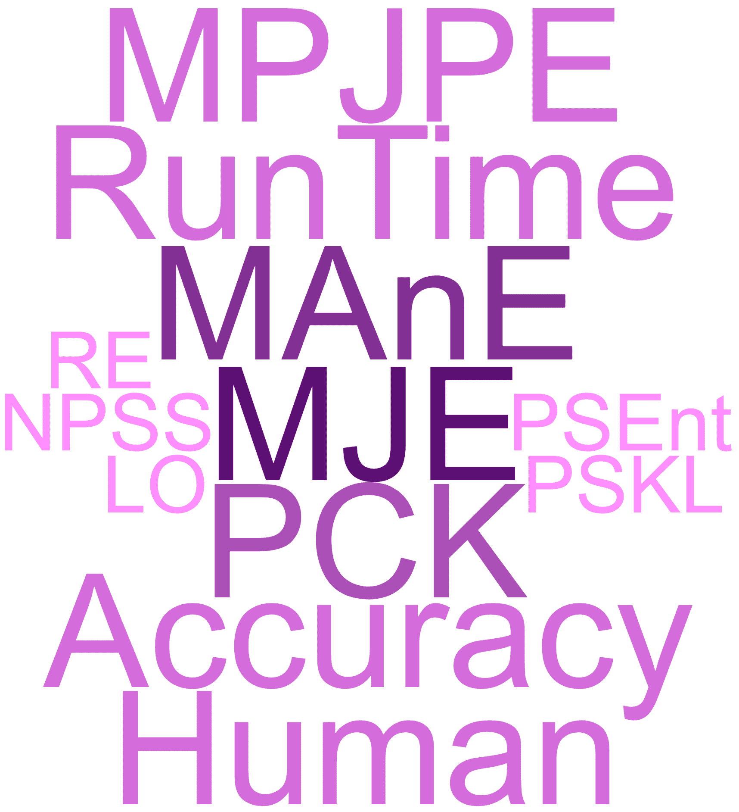
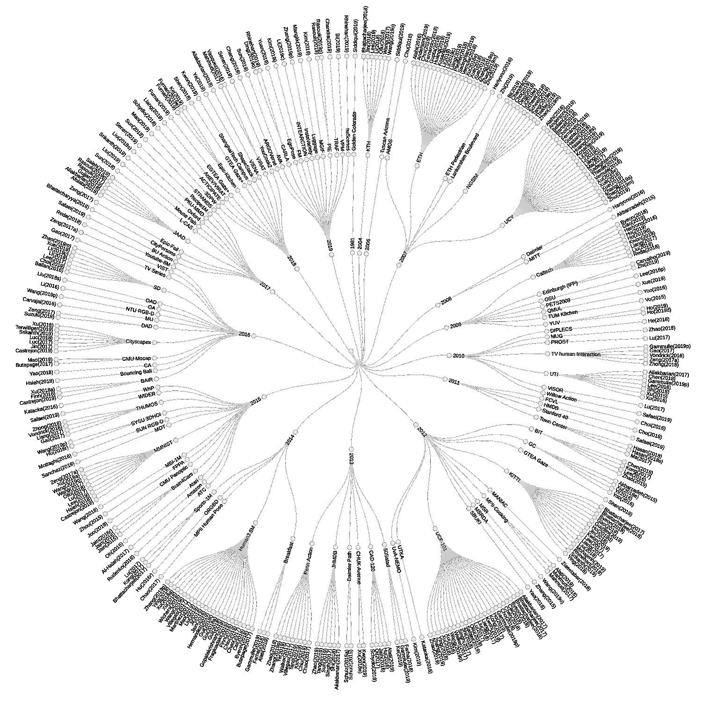

<!--yml

category: 未分类

日期：2024-09-06 20:00:31

-->

# [2007.00095] 深度学习在基于视觉的预测中的应用：综述

> 来源：[`ar5iv.labs.arxiv.org/html/2007.00095`](https://ar5iv.labs.arxiv.org/html/2007.00095)

# 深度学习在基于视觉的预测中的应用：综述

Amir Rasouli A. Rasouli 目前在华为技术加拿大公司的诺亚方舟实验室工作，地址为 19 Allstate Pkwy, Markham, ON L3R 5A4

电子邮件：amir.rasouli@huawei.com

###### 摘要

基于视觉的预测算法在自动驾驶、监控、人机交互、天气预测等多个领域有广泛的应用。本文的目标是提供过去五年该领域的概述，特别关注深度学习方法。为此，我们将这些算法分类为视频预测、动作预测、轨迹预测、身体运动预测和其他预测应用。对于每个类别，我们突出常见的架构、训练方法和使用的数据类型。此外，我们还讨论了用于基于视觉的预测任务的常见评估指标和数据集。所有这些信息的数据库，按照论文、数据集和指标进行交叉引用，可以在[`github.com/aras62/vision-based-prediction`](https://github.com/aras62/vision-based-prediction)在线找到。

###### 关键词：

视频预测、动作预测、轨迹预测、运动预测、综述。

## 1 引言

预测环境变化和物体行为的能力在许多应用中至关重要，例如监控、自动驾驶、场景理解等。预测是各种人工智能社区广泛研究的领域。这些算法的一个子集主要依赖物体和场景的视觉外观来推断未来。其他方法则使用不同形式的传感器，如可穿戴传感器或环境传感器，以了解环境或物体的过去状态。

本报告的重点是基于视觉的预测算法，这些算法主要使用视觉信息来观察环境变化并预测未来。在这种情况下，预测可以表现为生成未来场景或推理物体的特定方面，例如其轨迹、姿态等。

对于这次审查，我们将预测算法分为五组，即视频预测、动作预测、轨迹预测、运动（姿态）预测和其他涉及各种预测应用的组，如趋势预测、视觉天气预测、地图预测、语义预测等。此外，我们还简要讨论了使用预测形式作为中间步骤以执行诸如目标检测、动作检测和识别等任务的算法。此外，对于每组预测算法，我们将讨论常见的数据集和指标，并讨论其特征。需要注意的是，由于本审查的范围广泛以及基于视觉的预测工作的庞大，这次审查仅关注自五年前在主要计算机视觉、机器人和机器学习领域发表的工作。此外，正如论文标题所示，讨论的主要焦点将是深度学习方法，因为它们在近年来非常流行。

## 2 基于视觉的预测

在审阅基于视觉的预测算法之前，需要考虑一些要点。

### 2.1 应用

根据我们的审查，我们确定了四个主要的基于视觉的应用，即视频预测、动作预测、轨迹预测和运动预测。我们在专门的部分讨论每个类别中的每项研究。一些预测工作，如视觉天气预测、语义预测、竞赛结果预测，不适合任何四个主要类别，会在其他应用部分中介绍。

一些工作涉及多个预测任务，例如同时预测轨迹和动作，因此可能属于多个类别。需要注意的是，我们只在每个类别中包含对应任务直接评估的算法。例如，如果一个算法执行未来动作分类的视频预测，并且仅评估预测动作的准确性，它将仅出现在动作预测类别中。此外，本文中审阅的一些工作提出了多个架构，例如递归和前馈，以解决相同的问题。在基于架构的分类中，这些算法可能会出现多次。

### 2.2 方法

#### 2.2.1 算法

本研究关注基于视觉的算法，这些算法使用某种形式的视觉输入，如 RGB 相机图像或 LIDAR 等主动传感器。值得注意的是，许多算法，特别是轨迹预测算法，仅使用真实数据，如对象轨迹，而没有实际的视觉处理，例如对象检测。然而，只要这些算法在视觉数据集上进行评估，它们就被包括在本文中。请注意，已发布代码的完整论文列表可以在附录 A 中找到。

#### 2.2.2 架构

如前所述，我们关注具有深度学习组件的算法，无论是在视觉表示生成阶段（例如，使用卷积特征）还是推理阶段（例如，使用多层感知器（MLP）进行分类）。然而，我们会通过提及一些主要技术并将其包括在本文的数据集和指标部分，来承认经典方法。

我们根据训练技术和架构对算法进行分类。在实践中，这非常具有挑战性，因为大多数算法使用不同方法的组合。例如，递归网络通常依赖卷积神经网络（CNNs）的某种形式来生成场景、代理姿势等的特征表示。为了更好地区分不同类别的算法，我们只关注每个算法的核心组件，即用于推理未来的部分。因此，例如，如果一个算法使用 CNN 模型进行输入数据的预处理，并使用递归网络进行时间推理，我们将该算法视为递归型。另一方面，如果特征与全连接网络一起使用，我们将该算法归类为前馈或一次性方法。一些算法提议使用两种架构进行推理。我们将这些方法称为混合型。此外，应注意，许多研究提出了使用每种架构的替代方法。因此，我们将它们分类到多个组中。

#### 2.2.3 数据类型

正如预期的那样，基于视觉的算法主要依赖于视觉信息。然而，许多算法使用预训练的现成算法将输入转换为某些显式特征空间，例如姿势、轨迹、动作标签，并在这些特征空间中进行推理。如果预处理不是主要算法的一部分，我们将这些次要特征视为不同类型的数据输入。如果使用了基本处理，例如生成场景的卷积特征，我们将数据类型视为原始输入的类型，例如 RGB 图像。

## 3 视频预测

视频或未来场景预测可以视为最通用的预测形式。视频预测算法的目标是生成未来场景，通常以 RGB 图像[1, 2, 3, 4]和/或光流图[5, 6, 1, 7]的形式呈现。生成的图像反过来可以用于各种任务，如动作预测[8]、事件预测[9]、流估计[6]、语义分割[10]等。

视频预测应用依赖于生成模型，其任务是基于对输入序列的短时间观察（或在某些情况下仅一张图像[11]）来预测未来场景。尽管许多方法使用前馈架构[2, 1, 4, 5, 9, 12, 11, 7, 13, 14, 8, 15]，大多数算法利用递归神经网络（RNNs），例如门控递归单元（GRUs）[16]、长短期记忆（LSTM）网络[17, 18, 19, 20, 21, 22, 23, 24, 25, 26, 27, 28, 29, 30]、其变体卷积 LSTM（ConvLSTMs）[3, 31, 32, 33, 34, 35, 36, 6, 29]或这些的组合[37, 27]。

生成对抗网络（GANs）在视频预测领域特别受欢迎。[2, 18, 31, 19, 21, 22, 24, 13, 14, 36, 6, 26, 15]。在这些对抗训练框架中，有两个组件：一个生成网络负责生成未来的表示，另一个是判别器，其目标是通过生成一个二分类分数来区分预测的表示（例如光流[6]、帧[18]、运动[31]）或它们的时间一致性[2, 19]与实际的真实数据。许多算法使用判别器来判断最终生成图像[18, 21, 22, 24, 13, 36]的真实性或中间特征（例如姿态[26]），而其他算法在不同处理阶段使用多个判别器。例如，[2, 19]的作者使用两个判别器，一个负责判断生成帧的时间一致性（即生成帧的顺序是否真实），另一个评估生成的帧是否真实。Lee 等人[31]使用三个判别器来评估生成帧的质量及其中间运动和内容特征。使用双流方法，[6]中的方法同时生成下一帧和光流，每个流都用一个单独的判别器进行训练。[15]的预测网络使用一个判别器来处理从输入场景生成的中间特征，另一个判别器处理最终结果。

变分自编码器（VAEs）[38]或条件变分自编码器（CVAEs）[39]在一些方法中也有使用[3, 18, 11, 23, 26]。VAEs 通过定义一些潜在变量空间上的后验分布来建模生成未来帧的不确定性[3, 23, 26]。在 CVAEs 中，后验分布以一个额外的参数为条件，例如场景中的观察动作[18]或初始观察[11]。使用 VAEs 时，在推理时，从后验分布中随机抽样生成未来帧。

许多视频预测算法仅基于输入图像操作，并提出了各种架构创新来编码内容和生成未来图像 [2, 3, 32, 33, 16, 34, 13, 14, 35, 8, 15, 27]。例如，[2] 中的方法执行双向预测，即前向和后向预测。每个预测依赖于两个判别器来评估生成图像的质量和时间一致性。[3] 中提出的模型通过将图像序列输入到 ConvLSTM 中来训练一个上下文网络，其输出用于初始化负责生成下一帧的卷积网络。Xu 等人 [32] 除了原始像素值，还对图像应用高通滤波器的输出进行编码，以保持场景中物体的结构完整性。在 [15] 中，作者使用了一个两步方法，首先进行粗略的帧预测，然后进行精细的帧预测。在 [13] 中，该算法分两个阶段进行学习。一个判别器在从场景生成特征后应用，另一个则在最终生成帧后应用。

光流预测已广泛用于视频预测算法的中间步骤 [1, 4, 31, 20, 5, 11, 25, 36, 6]。例如，为了处理动态场景中的遮挡，Gao 等人 [1] 将光流和像素级预测分解为两个步骤：算法首先预测场景的光流，然后将其与输入帧结合，预测未来。类似的多步骤方法也在 [6, 36, 11, 31] 中使用。在 [31] 中，作者使用了两个独立的分支：一个分支接收两个连续帧 $(t,t+1)$ 并生成上下文信息。第二个分支通过接收两个相隔 $k$ 步的帧（即 $t+1$, $t+k$）生成运动信息。这两个分支的输出被融合并输入到最终的场景生成器中。在 [6] 中，方法同时生成下一帧和相应的光流图。在该架构中，使用了两个额外的网络：一个流估计器，它利用帧生成器的输出和最后的观察来估计流图，以及一个变形层，它根据预测的流图执行差分二维空间变换，将最后观察到的图像扭曲到未来预测的帧中。

一些算法依赖于视频预测的各种中间步骤[17, 18, 21, 22, 23, 24, 7, 14, 35]。例如，[17]中的方法考虑了个体实体（如立方体）的位置和特征以进行最终场景预测。Kim 等人[18]首先识别关键点，这些关键点可能对应于重要结构如关节，然后预测它们的运动。对于涉及人的视频，在[21, 22, 7]中，作者识别并推理姿势的变化，并利用这些信息生成未来帧。在[14, 35]中，除了原始输入图像外，还使用了学习过程中的连续帧差异。

预测网络还可以提供额外的信息以指导未来帧的生成。在[19, 12]中，除了 RGB 图像外，还使用了光流网络；在[26, 28]中，除了 RGB 图像外，还使用了姿态估计网络。在[18]中，作者利用 CVAE 架构将动作标签作为生成帧的条件输入。在主动任务的背景下，例如使用机器人手臂进行物体操作，其中行动的后果影响未来场景配置，通常将未来场景生成条件化于当前或未来预期的动作[37, 29, 30]。

### 3.1 摘要

视频预测算法基于生成模型，这些模型在给定短时间观察，或在极端情况下只给定场景的单一视角的情况下生成未来图像。递归模型和前馈模型在该领域广泛使用，其中递归模型略微更受欢迎。架构设计和训练策略如 VAEs 或 GANs 非常常见。然而，很难确定这些方法中哪一种更优，因为大多数视频预测算法都是与应用无关的，即它们在具有非常不同特征的视频数据集上进行评估，如交通场景、活动、游戏、物体操作等（更多内容见第十一部分）。

尽管该领域取得了重大进展，视频预测算法仍面临一些主要挑战。其中之一是生成视觉表现的能力，即对观察阶段不可见的场景部分进行生成，例如由于遮挡。这在复杂图像如交通场景、电影等中尤为突出。场景的复杂性也决定了生成图像的退化速度。虽然这些算法在简单的合成视频或动作序列中显示出有希望的结果，但在实际应用中仍面临困难。此外，许多这些算法无法推测未来对象的预期存在或缺失。例如，如果在观察中存在一个移动物体并且它即将退出视野，算法会在未来的场景中考虑它，只要观察阶段中可见它的一部分。这在安全关键的应用中，如自动驾驶，其中交通元素的存在或缺失以及它们之间的互动对动作规划至关重要，可能会成为问题。

## 4 动作预测

动作预测算法可以分为两类：下一步动作或事件预测（或动作预期）和早期动作预测。在前者类别中，算法使用当前活动或场景配置的观察结果来预测接下来会发生什么。另一方面，早期动作预测算法观察当前进行中的部分动作，并预测这个动作是什么。经典的学习方法如条件随机场（CRFs）[40]，支持向量机（SVMs）与手工特征[41, 42, 43, 44, 45, 46, 47]，马尔可夫模型[48, 49, 50, 51, 52, 53]，贝叶斯网络[54, 55]以及其他统计方法[56, 57, 58, 59, 60, 61, 62]在近年来被广泛使用。然而，如前所述，我们将只关注深度学习方法。

### 4.1 动作预期

动作预测算法被广泛应用于各种场景，包括烹饪活动 [63, 64, 65, 66, 67, 68, 69, 70]，交通理解 [71, 72, 9, 73, 74, 75, 74, 76, 77, 78, 79, 80]，事故预测 [81, 82, 83, 84]，体育 [85, 86] 以及其他形式的活动 [87, 88, 89, 90, 91, 8, 92, 93, 94, 95]。虽然大多数这些算法使用的是对象和行为者完全可观察的序列，但一些方法依赖于自我中心的场景 [63, 64, 68, 89, 85, 95]，这些场景是从行为者的视角记录的，只能观察到他们身体的一部分（例如手）。

行为预测方法主要使用基于 RNN 的架构变体，包括 LSTMs [87, 64, 65, 66, 74, 67, 68, 82, 89, 75, 74, 90, 91, 85, 84, 86, 70, 92, 96, 79, 80], GRUs [88, 71, 72, 69], ConvLSTMs [76]，以及 Quasi-RNNs (QRNNs) [83]。例如，在[88, 67]中，作者使用了一种基于图的 RNN 架构，其中节点代表动作，图的边代表动作之间的转移。[69]中的方法采用两步法：使用识别算法识别观察到的动作及其持续时间。这些形成一个一热编码向量，并输入到 GRUs 中，以预测未来的活动、相应的开始时间和长度。在车辆行为预测的背景下，Ding 等人[72]使用基于两流 GRU 的架构来编码两辆车的轨迹，以及一个共享激活单元来编码车辆之间的相互作用。Scheel 等人[97]将自车与周围车辆之间的关系编码为相互距离。向量化编码随后输入到双向 LSTM 中。在每个时间步，LSTM 的输出使用 softmax 激活进行分类，得到一个二元值，指示自车是否可以安全变道。在[83]中，作者使用 QRNN 网络捕捉道路使用者之间的关系，以预测交通事故的可能性。为了训练模型，作者提出了一种自适应损失函数，根据模型预测事故的提前程度分配惩罚权重。

作为递归架构的替代方案，一些算法使用前馈架构，利用了 3D [63, 9, 73] 和 2D [81, 69, 77, 86, 78, 8, 93, 94, 95] 卷积网络。例如，在行人过马路预测的背景下，[9] 中的作者使用生成的 3D CNN 模型来生成未来场景，并随后使用分类器。[73] 中的方法检测并跟踪场景中的行人，然后将这些跟踪的视觉表示（以图像序列的形式）输入到 3D CNN 架构中，该架构直接分类行人过马路的可能性。为了预测交通事故的时间，[81] 中的方法使用 2D CNN 模型处理每张输入图像，然后结合表示并通过一个全连接（fc）层进行预测。Farha 等人[69] 通过对每个观察段的动作进行独热编码堆叠，创建一个 2D 矩阵，并使用 2D 卷积网络生成未来动作的编码。Casas 等人[77] 使用一个双流 2D CNN，每个流处理堆叠的体素化 LIDAR 扫描和场景地图。来自每个流的特征图被融合并输入到一个主干网络中，然后经过三个头部，负责检测车辆及预测其意图和轨迹。在体育预测方面，Felsen 等人[86] 按通道将 5 个图像观察结果串联起来，并将得到的输出输入到一个由 4 个卷积层和一个全连接层组成的 2D CNN 网络中。

尽管一些算法依赖于单一的信息源，例如来自 RGB 图像的预处理特征集合[88, 82, 83, 91, 84, 86, 70, 92, 96]或轨迹[72]，许多算法则采用多模态的方法，通过使用各种信息源如光流图[64, 67, 68, 75, 95]，姿态[87, 71, 67, 90, 80]，场景属性（如道路结构、语义）[87, 74, 89, 77]，文本[65]，动作标签[66]，动作长度[69]，速度（如自车或周围代理）[71, 74, 75, 97, 85]，注视[89, 90]，当前活动[78]和动作的时间[63]。例如，[65]中的方法使用了一个多流 LSTM，其中两个 LSTM 编码视觉特征和烹饪食谱，另一个 LSTM 对其进行解码以进行最终预测。为了捕捉序列内和序列之间的关系，Gammulle 等[66]提出了一个具有外部神经记忆单元的双流 LSTM 网络。每个流负责编码视觉特征和动作标签。在[71]中，使用了一个多层 GRU 结构，其中具有不同模态的特征在不同层次进入网络，并与之前的层次编码进行融合。融合过程根据数据模态的复杂性进行，例如，更复杂的特征如行人外观的编码在底层进入网络，而位置和速度特征分别在倒数第二层和最后一层进入。Farha 等[69]使用了一个两层堆叠的 GRU 架构，输入为活动长度的特征元组及其对应的 one-hot 向量编码。在[75]中，该方法使用了一个两阶段架构：首先将有关场景外观、光流（通过 CNN 预处理）和车辆动态的信息输入到各个 LSTM 单元中。然后，这些单元的输出被组合并通过一个 fc 层创建上下文表示。这个表示被另一个 LSTM 网络用来预测未来的交通动作。在人机交互的背景下，[90]的作者结合了人类的注视和姿态信息，使用编码器-解码器 LSTM 架构来预测他们的下一步动作。Jain 等[80]使用了一个融合网络，将驾驶员的头部姿态信息、外部场景特征、GPS 信息和车辆动态结合起来，以预测驾驶员的下一步动作。

在总结本节内容之前，有必要讨论近年来颇受欢迎的注意力模块的使用[63, 87, 88, 64, 74, 68, 82, 89, 84, 79]。顾名思义，注意力模块的目标是确定在特定时间需要给予更多关注的内容。这些模块可以有不同的形式，并可应用于数据的不同维度以及各种处理过程。其中一些模块包括用于识别关键帧的时间注意力[63, 82, 89]，用于在不同数据输入模态之间进行优先级排序的模态注意力[64, 68]，用于突出场景重要部分的空间注意力[84, 79]，以及用于加权图节点的图注意力[88]。在某些情况下，使用了不同注意力机制的组合[87, 74]。

#### 4.1.1 总结

在动作预测领域，RNN 架构受到强烈青睐。与前馈算法相比，递归方法在处理变长观察序列和多模态数据时具有灵活性，特别是当这些数据显著不同，例如轨迹和 RGB 图像时。然而，基本的递归架构如 LSTM 和 GRU 依赖于某些形式的预处理，尤其是在处理高维数据如 RGB 图像时，这需要使用各种卷积网络，这一过程可能计算开销较大。另一方面，前馈模型可以一蹴而就地进行预测，这意味着它们可以在一个框架内同时进行时间推理和空间特征生成，因此，处理时间可能更短。

许多前面提到的方法本质上是生成性的。它们在某些特征空间中生成表示，然后利用这些表示预测接下来会发生什么。一些算法更进一步，生成实际的未来图像并利用这些图像进行预测。虽然这种方法对于单一演员事件如烹饪场景和人机互动看似有效，但对于多代理预测（例如推理行人或交通场景中汽车的行为）而言，这不是一种可行的方法。

本节回顾的大多数方法使用多模态数据输入。这似乎是一种非常有效的方法，特别是在诸如预测道路用户行为等高维问题中，在这些问题中，道路用户、观察者以及其他代理的状态（例如位置和速度），以及场景结构、光照条件和许多其他因素，都在预测未来行为中发挥作用。

多任务处理，例如预测动作和轨迹，是预测未来动作的有效方法。例如，轨迹可以暗示某些动作的可能性，例如，朝着道路移动暗示该人可能会过马路。因此，同时学习不同任务可能是有益的。

最后但同样重要的是使用注意力模块。这些模块被认为非常有效，特别是对于输入数据的模态、场景结构和时间关系具有高复杂性的任务。

### 4.2 早期动作预测

类似于动作预期方法，早期动作预测算法广泛使用递归网络架构[88, 98, 99, 100, 101, 102, 103, 104, 105, 106]。虽然许多这些算法使用与动作预期算法类似的方法，但有些提出了新的方法。例如，在[98]中，作者使用教师-学生学习方案，其中教师通过双向 LSTM 学习识别完整序列，而学生则依靠部分视频使用 LSTM 网络。他们通过链接两个网络的特征表示来执行知识蒸馏。使用 GAN 框架，[99, 102]中的方法预测视频的未来特征表示以预测动作。赵等人[100]实现了一种使用 LSTM 架构的卡尔曼滤波器。在这种方法中，动作是在观察每一帧后预测的，并且如果下一次观察提供了额外的信息，则会进行修正。[105]的方法使用两步 LSTM 架构，首先使用上下文感知卷积特征生成上下文编码，然后将这些编码与动作感知卷积特征结合以预测动作。该方法的作者提出了一种新的损失函数，该函数以相同的强度惩罚假阴性，并以线性增加的强度惩罚假阳性，达到与假阴性相同的权重。在[106]中，作者根据可用证据的数量对动作类型进行粗到细的预测。

许多早期的动作预测方法采用前馈结构[107、108、109、104、110、111、112、113]。[107]的作者通过将单幅图像转化为称为排名显著性图和预测光流的新表示来预测动作。这一表示通过 2D 卷积层和全连接层进行最终预测。在[108、104]中，作者使用时序卷积神经网络（TCNNs）结构，这是一系列 1D 扩张卷积层，旨在捕捉特征表示的时间依赖性，例如姿势的向量表示[108]或描述视频帧的词嵌入[104]。陈等人[109]使用由 CNN 模型生成的身体部位特征，并训练一个注意力模块，目标是激活仅对动作预测有贡献的特征。在[112]中，作者使用一个动作检测框架，该框架基于当前检测逐步预测演员的位置和动作类别。

早期的大多数动作预测算法通过例如不同形式的卷积神经网络[98、100、107、102、104、111、105、113]或其他特征形式[106]对整个观察场景进行预处理。一些算法通过光流图[99、104、112]来补充这些特征。另一组动作预测方法则专注于观察的特定部分。例如，在[108、101、103、110]中，作者利用演员姿势的变化来预测他们的动作。[109]中的方法使用通过裁剪识别关节周围的局部补丁提取的身体部位。[113]的作者仅使用从检测到的边界框中提取的演员的视觉外观以及它们之间的关系。

#### 4.2.1 摘要

早期行动检测方法在架构设计方面与行动预测算法有许多共同之处。然而，在这个领域中，有一些例外情况更为适用。这些例外包括知识蒸馏的师生训练方案、识别区分特征和递归预测/校正机制。此外，早期行动预测算法，除了少数例外，通常依赖单一模态数据进行预测，很少使用像注意力模块这样的优化框架。采用这些技术并在多模态特征空间上操作可以进一步提升早期行动预测算法的性能。与行动预测方法不同，对于递归或前馈方法并没有强烈的偏好。一些方法利用了在语言处理领域流行的架构，例如时间卷积神经网络（CNN），并展示了它们在早期行动预测任务中的有效性。

## 5 轨迹预测

正如名字所示，轨迹预测算法预测物体的未来轨迹，即物体随时间变化的未来位置。这些方法在智能驾驶和监控等应用中尤其受欢迎。预测的轨迹可以直接使用，例如用于自动驾驶车辆的路线规划，或者用于预测未来事件、异常或行动。

在本节中，我们遵循之前的例程，重点关注具有深度学习组件的算法，同时承认许多最近使用经典方法的工作，包括高斯混合模型[114、115]和过程[116、117]、马尔可夫决策过程（MDP）[118、119、120、121、122、123、124、125、126]、马尔可夫链[127、128]和其他技术[129、130、131、132、133、134、135、136]。

轨迹预测应用程序与许多其他序列预测任务一样，主要依赖于递归架构，例如 LSTMs [137, 87, 138, 139, 140, 141, 142, 143, 144, 145, 146, 147, 148, 149, 150, 151, 152, 153, 154, 155, 101, 156, 157, 158, 159, 160] 和 GRUs [161, 162, 163, 164, 165, 166]。这些方法通常使用编码器-解码器架构，其中一个网络，例如 LSTM，对场景的单模态或多模态观测进行编码，另一个网络则根据观测的编码生成未来的轨迹。根据输入数据的复杂性，这些算法可能依赖于某种形式的预处理来生成特征或嵌入机制，以最小化数据的维度。

前馈算法 [161, 167, 168, 169, 170, 171, 172, 173, 77, 174, 175, 176] 通常使用整个场景的视图（即环境和移动对象），并通过卷积层进行编码，然后使用回归层来预测轨迹。一些算法使用混合方法，其中同时使用卷积和递归推理 [177, 178]。

根据预测任务的不同，算法可能依赖于单一或多模态的观察。例如，在视觉监控的背景下，当固定摄像头提供自上而下或鸟瞰角度时，许多算法仅使用代理的过去轨迹，这些轨迹可以是实际的 2D 帧坐标，或通过每个时间步变化计算出的速度[178, 139, 143, 145, 149, 151, 179, 153, 155, 164, 156, 180, 152, 159, 160]。除了对个体轨迹的观察，这些算法还重点建模代理之间的互动及其相互影响。例如，张等人[139]使用了一个状态细化模块，该模块通过接收当前主体位置及其来自 LSTM 单元的编码来对场景中的所有行人进行对齐，采用了消息传递机制。在[143]中，使用了基于图的方式，将行人视为节点，将它们之间的互动视为图的边。通过聚合来自邻近节点的信息，网络学习为每个节点分配不同的重要性等级。[153, 160]的作者通过共享具有空间接近性的各个 LSTM 的状态，对生成的表示进行池化操作。

如一些研究所示，监控对象时使用了其他信息来源[87, 138, 140, 142, 146, 163, 154, 101, 156, 158, 165, 175, 176]。例如，除了编码与环境的交互外，Liang 等人[87]还使用了场景的语义信息以及行人的姿态变化。在[138, 140, 142, 146, 163, 158, 165, 176]中包含了环境布局的视觉表征和被监测对象的外观。[156]的作者使用了一个占用图，突出了被监测对象可能通过的区域。[154]中的方法考虑了行人的头部朝向，以估计他们的视野范围，从而预测哪些对象可能会相互互动。为了预测人类之间的互动，[101]的作者使用了代理的姿态和轨迹。Ma 等人[175]进一步考虑了行人的特征（如年龄、性别），从博弈论的角度来确定一个行人的轨迹如何影响其他人。

在交通理解的背景下，由于涉及到摄像头自我运动（例如预测是从移动车辆的视角出发）、不同类型物体之间的互动（例如车辆和行人），以及交通规则、信号等特定约束，预测轨迹可能更具挑战性。为了实现鲁棒性，该领域的许多方法利用多模态数据进行轨迹预测[177, 137, 161, 141, 144, 162, 169, 147, 170, 181, 182, 163, 150, 168, 172, 183, 166, 173, 77, 165]。除了使用过去的轨迹，这些算法还考虑了道路结构（无论是从自我车辆的视角还是俯视图）通常以原始视觉输入的形式，或者在某些情况下，作为占用图[141, 173]。场景布局可以隐式捕捉道路的结构、物体的外观（例如形状）和动态（例如速度或位置）。这种隐式信息可以通过显式数据进一步增强，例如物体的形状（在车辆的情况下）[177]、自我车辆的速度[144, 170, 183]和转向角度[170, 183]、物体之间的距离[137, 182]、交通规则[182]和信号[77]，以及运动学约束[174]。例如，[183]中的方法使用了一个双流 LSTM 编码器-解码器方案：第一个流编码当前自我车辆的里程计（转向角度和速度）以及场景的最后观察，并预测车辆的未来里程计。第二个流是一个轨迹流，它联合编码行人的位置信息和自我车辆的里程计，然后将编码与里程计流的预测结合，以预测行人的未来轨迹。[144]中的方法进一步扩展了这种方法，并添加了一个意图预测流，输出观察到的行人打算过马路的可能性。意图可能性是通过一个 LSTM 网络生成的，该网络编码了行人的动态、外观和周围环境。Chandra 等人[177]通过考虑道路使用者的形状和速度及其在邻近区域内的空间坐标，创建了上下文信息的嵌入。这些嵌入随后被输入到一些 LSTM 网络中，然后经过若干卷积层以捕捉场景的动态。在[141]中，作者使用独立的 LSTM 来编码行人和车辆（作为定向边界框）的轨迹，然后通过生成以每个代理为中心的场景占用图，将它们组合成一个统一的框架，接着进行池化操作以捕捉不同主体之间的互动。Lee 等人[165]将车辆的未来轨迹预测分为两个步骤：首先，编码器-解码器 GRU 架构通过观察过去的轨迹预测未来轨迹。然后，细化网络通过考虑社会互动、相关代理的动态和道路结构的上下文信息来调整预测的轨迹。

类似于动作预测算法，注意力模块在轨迹预测方法中得到了广泛应用[87, 138, 139, 143, 144, 146, 163, 152, 180, 164]。例如，在[87, 143]中，注意力模块共同测量空间和时间交互。[138, 139, 146, 180]的作者提出了使用社会注意力模块来估计目标与其邻近对象之间交互的相对重要性。[144]中的方法使用了两个注意力机制，一个时间注意力模块用于测量观察轨迹中每个时间步的重要性，另一个是一系列自注意力模块，这些模块应用于预测前的观察编码。[152]的 Xue 等人提出了一种注意力机制，用于测量不同数据模态之间的相对重要性，即对象的位置和速度。

轨迹预测的主要挑战之一是建模预测的不确定性，尤其是在存在多种可能性的场景中（例如，交叉路口的行人）。一些算法如[87, 139, 144, 152, 153, 160]通过直接测量真实轨迹和预测轨迹之间的误差来训练模型，例如，通过使用 L2 目标函数。在推理时，这些算法生成确定性的预测。为了测量预测的不确定性，这些模型通过随机初始化参数进行多次训练。另一种方法是通过概率目标函数来估计不确定性，例如，高斯对数似然，如[177, 161, 172, 142, 154, 183]。与单一空间点不同，这些算法预测一个捕捉预测不确定性的分布。变分自编码器（VAEs）是另一种可以用来估计不确定性的技术[161, 182, 163, 184, 165]。使用这些方法，在训练时，通过条件化（例如，未来轨迹）来学习一些潜在空间$z$的后验分布。在推理时，从潜在空间中随机抽取样本以进行预测。

由于轨迹预测算法本质上是生成型的，许多方法依赖于对抗训练技术 [178, 138, 140, 145, 148, 149, 163, 153, 164]，在训练过程中，使用鉴别器来预测生成的轨迹是真实的还是伪造的。Kosaraju 等人 [146] 通过使用两个鉴别器扩展了这一方法：一个局部鉴别器，仅使用过去的轨迹来预测预测结果，另一个全局鉴别器则作用于整个网络的输出，即基于轨迹和场景信息的预测结果。

### 5.1 总结

轨迹预测是计算机视觉领域广泛研究的一个领域。尽管这些研究主要使用递归网络架构，但许多方法，例如在交通场景理解领域使用的方法，采用前馈网络。轨迹预测算法依赖于一个或多个信息源，例如主体的过去轨迹、周围的视觉上下文、物体属性、车辆传感器读数等。许多轨迹预测算法的共同因素是建模动态或动态与静态对象之间的交互。关系通过将场景整体进行显式或隐式编码来捕捉。像许多其他预测方法一样，轨迹预测算法通过各种形式的注意机制来学习物体之间的空间、时间或社会交互的重要性。为了建模不确定性，使用了概率目标和变分编码等技术。

轨迹预测算法主要依赖于过去的轨迹信息来预测未来。尽管过去的运动观察非常有用，但在某些情况下，例如交通场景中，它们显然是不够的。需要更明确地编码上下文信息，例如道路条件、主体属性、规则和约束、场景结构等。许多方法成功地包括了这些因素的一个子集，但应该考虑更全面的方法。

## 6 运动预测

尽管在许多情况下，“运动预测”这一术语用于指代未来轨迹预测，但在这里我们仅考虑那些旨在预测人体姿态变化的算法。运动预测在所有预测方法中都扮演着基础性角色，例如，反映未来视觉表现的样子或预期的动作类型。像许多其他预测应用一样，这一领域主要由深度学习模型主导，尽管一些方法仍依赖于经典技术 [56, 48, 185]。

类似于其他预测算法，运动预测方法广泛使用递归架构，如 LSTM[186, 187, 188, 101, 103, 189, 26]和 GRU[190, 191, 192, 193, 194, 96, 195]，或者两者的结合[196]。例如，在[190]中，作者使用了一个两层 GRU 模型，其中顶层向后操作以学习噪声过程，底层用于根据过去的姿态观察和顶层的输出预测姿态。Chiu 等人[187]提出了一种分层 LSTM 架构，其中网络的每一层在不同的时间尺度上编码观察到的姿态。在 3D 姿态预测的背景下，一些算法依赖于两阶段过程，其中视觉输入，无论是单张图像[189]还是一系列图像[188]，被输入到递归网络中以预测代理的 2D 姿态。然后进行一个精细化过程，将 2D 姿态转换为 3D。

一些方法采用前馈架构[197, 198, 199, 200, 110]。例如，[198]中的方法在两阶段过程中使用两个前馈网络。首先，将输入姿态输入到一个由完全连接层（通过 1D 卷积实现，卷积核大小为 1）和自注意力块组成的自编码器中。然后，这些编码被多层 2D 卷积块用于最终预测。张等人[199]从 RGB 视频中预测 3D 姿态。在他们的方法中，图像通过卷积网络转换为特征空间，然后这些特征用于学习 3D 人类动态的潜在 3D 表示。这一表示被网络用来预测未来的 3D 姿态。为了捕捉运动模式，[197]中提出的方法将姿态转换为轨迹空间，使用离散余弦变换。新形成的表示随后被用于 Graph-CNN 框架中，以学习不同关节轨迹之间的依赖关系。

为了训练运动预测模型，一些作者使用对抗训练方法，其中使用判别器来分类预测的姿态是真实的还是虚假的[198, 193]。这一判别程序也可以用于评估预测的连续性，即预测的正确顺序，如[192]所示。在[196]中，判别评分用于生成未来动作预测的策略，这在模仿学习的背景下进行。

### 6.1 摘要

运动预测算法主要集中在预测观察到的代理的动态变化（即姿态）。这样的预测对许多其他应用，如视频或轨迹预测任务（其中一些已经讨论过），可能是基础性的。

在最近的研究中，递归网络架构被强烈偏好。选择的架构通常取决于输入数据的表示方式，例如是否直接使用关节坐标或将其编码成高维表示。

尽管许多成功的运动预测算法已经得到开发，但这些方法中的大多数依赖于单一的信息源，例如姿态或场景。编码更高层次的上下文信息，如场景语义、交互等，可能会产生更为稳健的预测，这在其他预测应用中已有所示例。除了一个实例外，注意力模块也尚未被广泛应用于运动预测算法中。鉴于在其他预测应用中注意力机制的成功，运动预测算法可能会从使用注意力机制中受益。

## 7 其他应用

在自主机器人领域，一些算法被设计用来预测占用网格地图（OGMs），这些地图是机器人的周围环境的灰度表示，显示环境中哪些部分是可 traversable 的。这些方法通常与物体无关，关注于生成未来的 OGMs，这些 OGMs 被自主代理用来进行路径规划。近年来，经典的 [201, 202, 203, 204] 和深度学习 [205, 206, 207, 208, 209] 方法都被使用。深度学习方法本质上类似于视频预测方法，其中模型接收一系列 OGMs 作为输入，并预测在一段时间内的未来 OGMs。在这种情况下，递归 [205, 207, 209] 和前馈 [206, 208] 方法都很常见。另一组生成方法是语义地图预测算法 [10, 210, 211, 212]。这些算法接收场景的 RGB 图像作为输入，并预测未来的分割图。

其他基于视觉的预测应用包括天气[213, 214]和太阳辐射预测[215]、转向角预测[212]、基于推文图像和用户历史的推文流行度预测[216]、时尚趋势预测[217]、故事情节预测[8]、疼痛预期[218]、操控物体后的力效应预测[219]、根据选手礼服预测环球小姐获胜者[220]以及根据候选人的面部特征预测选举结果[221]。这些算法依赖于本文前面讨论的多种技术的结合。

## 8 其他视觉应用中的预测

在总结我们的视觉预测方法讨论之前，值得一提的是，预测技术也广泛应用于其他视觉处理任务，如视频摘要[222]、异常检测[223]、跟踪[224]、主动对象识别[225]、动作检测[226, 227]和识别[228]。例如，跟踪算法与轨迹预测算法密切相关，并且通常依赖于短期预测来处理跟踪中的间隙，例如由于遮挡。在[224]中，该方法使用递归框架生成未来帧以在下一帧中定位行人。在动作检测的背景下，一些方法依赖于未来帧[226]或对象的轨迹预测来检测动作[227]。在[225]中，采用一种方法通过预测对象的下一个最佳观察角度来检测 3D 对象。Liu 等人[223]使用视频预测框架来预测未来的运动流图和图像。不符合预期的未来预测将被识别为异常。

## 9 最先进技术的评估

在算法评估方面，有两个重要因素：度量标准和数据集。这些因素突出了算法的优缺点，并提供了比较方法相对性能的手段。鉴于这两个因素在算法设计中的重要性，我们将以下章节专门讨论用于基于视觉的预测任务的常见度量标准和数据集。由于这些应用中使用的数据集和度量标准高度多样，我们将重点讨论每个预测类别中的一些主要标准，并提供视觉辅助工具来总结过去的工作用于评估的情况。

## 10 度量标准

图 1：视觉预测应用中使用的指标。从左到右：视频、动作、轨迹和运动预测。

在本节中，我们遵循与之前工作讨论相同的例程，将指标划分为不同类别。有关指标的总结可以在图 1 中找到。感兴趣的读者还可以参考附录 B，获取有关指标及其应用论文的更多信息。请注意，在讨论每个类别的指标时，我们仅在附录 C 中提供了最流行指标的数学表达式。

### 10.1 视频预测

视频预测涉及生成逼真的图像，因此，当生成的图像与真实图像之间的差异最小时，性能最佳。计算差异最直接的方法是使用均方误差（MSE）[2, 4, 20, 34, 16, 12, 229, 23, 14, 7, 6, 27, 30]，该方法计算像素间的平均平方强度差异。与 MSE 相关的另一个更流行的指标是峰值信噪比（PSNR）[2, 1, 4, 31, 19, 20, 21, 5, 32, 33, 22, 34, 16, 12, 229, 24, 13, 14, 35, 36, 6, 15, 27, 28, 29]。PSNR 是最大像素值（即可能的信号功率）的比率，例如在 8 位图像中为 255，除以 MSE（或图像失真噪声的功率）度量。两幅图像之间的误差越小，PSNR 值越高，从而生成的图像质量也越高。由于信号的动态范围很广，PSNR 值以对数分贝尺度表示。

尽管 MSE 和 PSNR 指标容易计算，但它们无法测量生成图像的感知视觉质量。解决这个问题的替代指标是结构相似性（SSIM）指数 ([230]) [2, 3, 1, 4, 31, 19, 20, 21, 5, 32, 33, 22, 34, 16, 12, 24, 13, 14, 35, 6, 15, 27, 29]，它旨在模拟图像失真。为了捕捉两幅图像之间的结构差异，SSIM 将光照信息分离，因为它与对象的结构无关。因此，相似度通过三种比较的组合来衡量，即亮度、对比度和结构。

更高级的上下文相似性可能无法通过像素值上的距离度量来捕捉。最近提出的指标，学习感知图像块相似性（LPIPS），([231])[3, 17, 37, 11]通过比较训练用于高层分类任务的卷积网络的内部激活来测量两幅图像之间的相似性。该值通过归一化深度特征上的平均 L2 距离计算得出。

文献中使用的一些其他指标包括定性人工判断 [11, 25, 8, 28]，Frechet 视频距离（FVD） ([232]) [3, 18]，最大均值差异（MMD） [26]，Inception 分数（IS） ([233]) [26]，二元交叉熵（BCE） [23]，L1 [9, 12]，以及均方根误差（RMSE） [11]。

### 10.2 动作预测

与分类任务类似，许多动作预测算法使用准确率来报告性能，即正确预测与总预测数量的比率 [56, 63, 64, 99, 100, 66, 71, 9, 74, 48, 49, 107, 67, 68, 69, 108, 83, 101, 109, 89, 102, 75, 103, 97, 76, 91, 110, 111, 85, 105, 86, 70, 50, 112, 8, 104, 93, 41, 94, 52, 59, 42, 106, 61, 113, 54, 43, 44, 95, 62, 45, 55, 46, 40, 47]。尽管使用广泛，但准确率本身并不是性能的强指标，特别是在处理类别不平衡的数据时。这是因为，例如，模型可以简单地偏向于更多表示的类别，并将每个输入预测为该类别。这将导致高准确率，因为该指标只考虑正确预测的比率。为了应对这些缺点，一些研究使用了补充指标，这些指标除了正确预测之外，还考虑了不同类型的错误预测。这些指标包括精确率 [63, 71, 72, 9, 74, 67, 82, 83, 70, 58, 51, 96, 80, 52, 42, 53]、召回率 [63, 64, 65, 71, 72, 9, 74, 67, 68, 82, 83, 77, 70, 58, 51, 96, 80, 52, 42, 53]和精确召回曲线下面积（AUC） [71, 112, 54]。精确率和召回率也构成了计算一些更高级指标的基础，如 F1 分数 [71, 72, 9, 83, 90, 58, 96, 52, 42]、平均精度（AP） [88, 9, 73, 82, 79]及其变体均值 AP（mAP） [87, 107, 83, 77, 84, 78, 92, 112]和校准 AP（cAP） [92]。一些不太常见的性能指标包括马修斯相关系数（MCC） [76]、假阳性（FP）[53]、真正率（TPR）和假阳性率（FPR） [47]、预测能力（PP） [57]以及均值倒数排名（MRR） [44]。

根据应用的不同，一些算法通过模型的运行时间（RT）[9, 73, 43] 或事件时间来评估时间因素，例如下一活动的开始时间[70]，事故时间（或碰撞时间）（TTA）[81, 82, 83, 84]，以及在驾驶环境中的机动时间（TTM）[74, 49, 96, 80, 53]。

### 10.3 轨迹预测

也许最受欢迎的轨迹预测性能度量是平均位移误差（ADE）[182, 171, 101, 234, 159]，其计算为预测位置与实际位置在所有时间步长上的平均误差。一些方法通过其扩展的最终位移误差（FDE）[177, 87, 138, 140, 141, 142, 143, 146, 163, 168, 172, 152, 153, 155, 164, 180, 158, 160]来补充 ADE 度量。顾名思义，FDE 仅测量实际位置与生成轨迹在最终时间步长上的误差。

许多其他工作使用与 ADE 相同的度量[161, 170, 148, 150, 129, 183, 184, 118, 119, 121, 127, 115, 132, 117, 123] 或 ADE/FDE [139, 144, 169, 151, 179, 154, 131, 176]，但未使用相同的术语。还常见的做法是，不使用平均或最终时间步长度量，而是计算一段时间内不同时间步的误差[140, 147, 114, 173, 130, 156, 120, 77, 165, 124, 133, 125, 134, 135, 136]。

为了测量概率轨迹预测算法中的位移误差，一些工作生成一定数量的样本，并报告最佳度量（即最小误差）[161, 165, 178, 168, 162, 166]，或者对所有样本取平均[174, 162, 166]。根据所使用的误差度量，一些研究将这些度量称为最小 ADE/FDE（MinADE/FDE）[137, 178, 168]（使用欧几里得距离）或平均/最小均方位移（Mean/MinMSD）[162, 166]（使用 MSE）。其他概率度量包括对数似然（LL）[145, 181, 120]、负对数似然（NLL）[172, 183, 174, 175, 123, 125]、Kullback–Leibler 散度（KLD）[181, 127, 125]、负对数概率（NLP）[118, 119]、交叉熵（CE）[166]、平均预测概率（APP）[157]。

性能还可以使用常见的分类度量进行评估。例如，在[161, 128]中使用了命中率（HR），而在[184, 165]中使用了漏检率（MR）度量。在这些情况下，如果预测轨迹与真实值的距离低于（或高于）某个阈值，则被视为命中或漏检。采用类似的方法，一些作者计算了准确率[167, 127]或预测的精确度[115]。

文献中使用的一些其他度量包括运行时间（RT）[147, 118, 121, 123, 135]、平均非线性位移误差（ANDE）[155, 160]、最大距离（MaxD）[165, 184]、状态碰撞率（SCR）[175]、偏差百分比（PD）[122]、到目标的距离（DtG）[125]、接近错过的比例（FNM）[126]、期望校准误差（ECE）[172]，以及定性（Q）[116]。一些工作预测行人[154, 234, 131]或车辆[77]的方向，因此也报告了使用平均角误差（MAnE）的性能。

#### 10.3.1 轨迹预测度量的陷阱

与视频和动作预测领域不同，轨迹预测算法的性能测量在误差指标和测量单位上并未标准化。例如，在测量位移误差时，虽然许多算法使用欧几里得距离（ED）（也称为 L2-距离、L2-范数、欧几里得范数）[87, 138, 140, 141, 146, 163, 168, 172, 152, 153, 155, 180, 158, 182, 234, 159, 150, 184, 115, 139, 169, 151, 179, 154, 131, 114, 173, 130, 156, 77, 165, 124, 133, 125, 134, 135, 136, 161, 168, 155, 176, 125]，许多其他算法依赖于不同的误差指标，包括均方误差（MSE）[143, 160, 171, 101, 170, 129, 183, 127, 144, 162, 166]，均方根误差（RMSE）[177, 161, 140, 170, 140, 147]，加权均方根误差（Weighted RMSE）[120]，平均绝对误差（MAE）[77, 148]，豪斯多夫距离（HD）[174]，修正豪斯多夫距离（MHD）[118, 119, 121, 115, 132, 123, 125]，以及离散弗雷歇距离（DFD）[179]。此外，轨迹预测算法使用不同的单位来测量位移误差，这些单位包括米[177, 87, 138, 140, 146, 168, 172, 153, 180, 182, 161, 170, 148, 150, 129, 121, 139, 169, 179, 154, 131, 140, 147, 114, 173, 130, 156, 77, 165, 124, 133, 135, 136, 161, 165, 168, 166]，像素[138, 140, 141, 142, 163, 152, 183, 132, 165]，归一化像素[142, 158, 125]和英尺[184]。

尽管不同应用中误差度量和单位之间的这种不一致是预期中的问题，但当提出的工作没有指定误差度量[142, 178]、测量单位[143, 155, 160, 171, 101, 118, 119, 127, 115, 123, 151, 176, 120, 174, 178, 155]或两者[164, 117]时，问题就会出现。尽管报告的结果可能暗示了度量和单位的选择，但缺乏规格说明可能导致错误的比较，特别是因为许多作者直接使用了前期工作中报告的结果。

不幸的是，在相同的应用程序和相同的误差测量技术中存在度量和单位的不一致。例如，在 ADE 度量的情况下，该度量最初在[235]中以 ED 的形式提出，尽管[160]的作者使用了 MSE，但他们称之为 ADE。这在许多使用 ADE 度量的后续工作中也很明显。例如，大多数方法使用原始度量并以 ED 为单位报告结果[87, 138, 141, 152, 153, 155, 146, 163, 168, 172, 180, 158, 182, 234, 159]，而一些工作则使用 MSE[143, 160, 171, 101]和 RMSE[177, 140]，或者没有指定度量[142, 164]。虽然这些度量的公式看起来相似，但它们产生不同的结果。例如，使用 ED 的 ADE 是所有样本和时间步骤上平方差的平方根。与 ED 不同的是，RMSE 的平均是在平方根操作内部进行的。另一方面，MSE 与其他两个度量非常不同，不计算误差的平方根。正如我们在一些过去的工作中所见，这种不一致可能会导致对使用的预期和实际度量的困惑。例如，在[140]中，作者提出使用 MAE 度量，同时给出欧几里得距离的数学公式。[159, 176]的作者也犯了类似的错误，定义了 ED 公式但称之为 MSE。

此外，同一应用程序中的一些算法使用相同的数据集，但测量单位不同。例如，在监控的背景下，ETH [235] 是最常用的数据集之一。许多研究使用该数据集来基准测试他们提出的算法性能，但它们要么使用不同的单位，如米 [87, 138, 139, 146, 149, 153, 156, 180]，像素 [163, 140, 142, 152]，归一化像素 [158, 142]，或未指定使用的单位 [143, 178, 151, 155, 164, 160]。

最后但同样重要的是，性能评估中的另一个潜在误差来源在于实验设计。以监控应用程序为例，通常的做法是用过去的 8 帧观察数据来评估算法，并预测未来的 12 步 [178, 87, 138, 139, 153, 180, 160]。然而，在某些情况下，最先进的算法在标准 8/12 条件下的性能报告是准确的，但提出的算法在不同条件下进行了测试。例如，在 [155] 中，作者错误地将他们提出的算法在 5 个观察和 5 个预测下的性能与在标准 8/12 条件下评估的先前工作的结果进行了比较。

### 10.4 运动预测

由于人体运动的固有随机性，运动预测算法通常将其预测范围限制在大约 $500ms$。为了测量相应真实姿态与预测姿态之间的误差，这些算法使用均值绝对误差，既可以在角度空间 (MAnE) [190, 236, 197, 198, 196, 187, 191, 192, 193, 194, 96, 195]，也可以在关节空间 (MJE) 以关节坐标 [236, 188, 101, 103, 56, 103, 26, 110, 187, 186, 200] 的形式。 在 3D 运动预测领域，使用了一种称为每关节预测误差 (MPJPE) [197, 199] 的度量，它是相对于根关节归一化的关节误差。

作为距离误差度量的替代方案，正确关键点百分比 (PCK) [199, 187, 189, 188] 衡量的是预测正确的关键点（例如关节）数量。正确的预测是那些低于某个误差阈值（例如 0.05）的预测。一些工作还使用准确度度量来报告算法在误差容差区域内定位特定关节位置的能力 [48, 195]。

文献中使用的其他度量包括标准化功率谱相似度 (NPSS) [190]、重建误差 (RE) [199]、肢体方向 (LO) [56]、PoSe 熵 (PSEnt)、PoSe KL (PSKL) [198]、定性人工判断 [198, 192] 和方法运行时间 (RT) [236, 188]。

#### 10.4.1 运动预测度量的陷阱

类似于轨迹方法，运动预测算法使用基于距离的方法来评估，即计算姿态向量之间的误差。在 MAnE 测量的情况下，一些方法使用 ED 度量 [197, 196, 193, 194, 96, 195]，而其他方法使用 MSE [190, 236, 198, 191, 192]。有时没有指定度量 [187]。MJE 测量也是如此，使用的度量包括 MSE [236, 101, 103, 103]、RMSE [188, 200]、ED [26, 110, 186]、MAE [187]，或者没有指定度量 [56]。

坐标基础误差度量（例如 MJE、MPJPE）中的额外挑战在于误差单位。虽然许多方法没有明确指定单位 [236, 103, 103, 26, 110, 187, 186]，但也有一些明确指出单位是像素 [188, 101]、厘米 [56]、米 [200] 或毫米 [197, 199]。与之前一样，许多在相同数据集上进行基准测试的算法可能使用不同的性能度量，例如使用流行的人体数据集 Human 3.6M [237]，使用 MAnE (ED)、MAnE (MSE) [191] 和 MJE (ED) [193]。

### 10.5 其他预测应用

根据任务目标，其他预测应用中使用的度量标准与目前讨论的类似。例如，分类未来事件或结果的应用程序，如比赛或选举获胜者、讲故事的下一张图片索引、严重天气和疼痛，使用的常见度量标准包括准确率[220, 221, 8]、精确率、召回率[213, 218]、正确预测的百分比 (PCP) [219]以及马修斯相关系数 (MCC) [218]，MCC 通过考虑假阳性和真阳性来预测二分类的质量。

基于回归的方法，如温度、趋势或方向预测，使用的距离度量包括欧几里得距离 (ED) [202, 238]、均方根误差 (RMSE) [214]、均方误差 (MSE) [212]、平均绝对误差 (MAE) [239, 217, 204]、平均绝对百分比误差 (MAPE) [216, 217]、标准化平均绝对百分比误差 (nMAPE) [215]和斯皮尔曼等级相关系数 (SRC) [216]，后者衡量两个变量之间关系的强度和方向。

特别值得关注的是用于评估生成模型的度量标准，这些模型预测占用网格图 (OGMs) 和分割图。OGMs 是灰度图像，突出显示某个区域（在网格中表示为一个单元）被占用的可能性。生成的地图可以通过使用图像相似度度量标准来与实际情况进行比较，例如 SSIM [205, 206]、PSNR [206] 或 psi ($\psi$) [203]。另外，OGM 也可以通过二分类度量标准进行评估。在这里，通过应用阈值将网格单元分类为已占用或空闲，然后可以使用诸如真正例 (TP)、真负例 (TN) [205]、接收者操作特征 (ROC) 曲线覆盖 TP 和 TN [207, 208]、F1-score [201, 207]、精确率、召回率及其对应的 AUC [209] 等度量标准对整体进行评估。鉴于 OGM 预测算法主要用于安全关键应用，如自动驾驶，一些算法也根据其运行时间 (RT) [205, 206, 209] 进行评估。

图像相似性度量，如 PSNR 和 SSIM 也可以用于分割预测领域 [211]。然而，最常见的度量是交并比 (IoU) [10, 210, 211, 212]，它测量分割实例与真实分割的平均重叠度。此外，通过对 IoU 分数应用阈值，可以识别真实匹配并用于计算平均精度 (AP) 分数，如 [210] 中所示。其他用于分割预测任务的度量包括端点误差 (EPE) [212]、概率随机指数 (RI)、全局一致性误差 (GCE) 和信息变异 (VoI) [210]。

## 11 数据集

| 年份 | 数据集 | 类型 | 注释 | 应用 |
| --- | --- | --- | --- | --- |
| V | A | T | M | O |
| 2019 | ARGOVerse [137] | 交通 | RGB, LIDAR, 3D BB |  |  | x |  |  |
| CARLA [162] | 交通（模拟） | RGB |  | x |  |  |  |
| EgoPose [186] | 姿态（自我） | RGB, 3D 姿态 |  |  |  | x |  |
| Future Motion (FM) [167] | 混合 | RGB, BB, 属性 |  |  | x |  |  |
| InstaVariety [240] | 活动 | RGB, BB, 姿态 |  |  |  | x |  |
| INTEARCTION [241] | 交通 | 地图, 轨迹 |  |  | x |  |  |
| Luggage [81] | 机器人 | 立体 RGB, BB |  | x |  |  |  |
| MGIF [242] | 活动 | RGB | x |  |  |  |  |
| Pedestrian Intention Estimation (PIE) [144] | 交通 | RGB, BB, 类别, 属性, 时间段, 车辆传感器 |  | x | x |  |  |
| nuScenes [243] | 交通 | RGB, LIDAR, 3D BB, 车辆传感器 |  |  | x |  |  |
| Vehicle-Pedestrian-Mixed (VPM) [141] | 交通 | RGB, BB |  |  | x |  |  |
| TRAF [177] | 交通 | RGB, BN, 类别, 时间段 |  |  | x |  |  |
| 2018 | 3D POSES IN THE WILD (3DPW) [244] | 户外 | RGB, 2D/3D 姿态, 模型 |  |  |  | x |  |
| ActEV/VIRAT [245] | 监控 | RGB, BB, 活动, 时间段 |  | x | x |  |  |
| ACTICIPATE [246] | 互动 | RGB, 注视, 姿态 |  | x |  |  |  |
| Atomic Visual Actions (AVA) [247] | 活动 | RGB, 活动, 时间段 |  | x |  |  |  |
| Epic-Kitchen [248] | 烹饪（自我） | RGB, 音频, BB, 类别, 文本, 时间段 |  | x |  |  |  |
| EGTEA Gaze+ [249] | 烹饪（自我） | RGB, 注视, 掩码, 活动, 时间段 |  | x |  |  |  |
| ShanghaiTech Campus (STC) [223] | 监控 | RGB, 异常 | x |  |  |  |  |
| ShapeStack [250] | 物体（模拟） | RGBD, 掩码, 稳定性 | x |  |  |  |  |
| VIENA [75] | 交通（模拟） | RGB, 活动, 车辆传感器 |  | x |  |  |  |
| YouCook2 [251] | 烹饪 | RGB, 音频, 文本, 活动, 时间段 |  | x |  |  |  |
| 2017 | BU 行动 (BUA) [252] | 活动 | RGB (图像), 活动 |  | x |  |  |  |
| CityPerson [253] | 交通 | 立体 RGB, BB, 语义分割 |  |  | x |  |  |
| Epic-Fail [84] | 风险评估 | RGB, BB, 轨迹, 时间段 |  | x |  |  |  |
| 自动驾驶中的共同注意 (JAAD) [78] | 交通 | RGB, BB, 属性, 时间段 | x | x | x |  | x |
| L-CAS [254] | 交通 | LIDAR, 3D BB, 属性 |  |  | x |  |  |
| 老鼠鱼 [255] | 动物 | 深度, 3D 姿态 |  |  |  | x |  |
| 牛津机器人车 (ORC) [256] | 交通 | 立体 RGB, LIDAR, 车辆传感器 |  |  | x |  |  |
| PKU-MMD [257] | 活动, 互动 | RGBD, 红外, 3D 姿态, 多视角, 时间段 |  | x |  |  |  |
| Recipe1M [258] | 烹饪 | RGB (图像), 文本 |  | x |  |  |  |
| STRANDS [259] | 交通 | RGBD, 3D BB |  |  | x |  |  |
| 2016 | BAIR 推动 [29] | 物体操控 | RGB | x |  |  |  |  |
| 弹跳球 (BB) [260] | 模拟 | RGB | x |  |  |  |  |
| 环球小姐 (MU) [220] | 环球小姐 | RGB, BB, 分数 |  |  |  |  | x |
| Cityscapes [261] | 交通 | 立体 RGB, BB, 语义分割, 车辆传感器 | x |  | x |  | x |
| CMU 动作捕捉 [262] | 活动 | 3D 姿态, 活动 |  | x |  | x |  |
| 行车记录仪事故数据集 (DAD) [79] | 交通, 事故 | RGB, BB, 类别, 时间段 |  | x |  |  |  |
| NTU RGB-D [263] | 活动 | RGBD, 红外, 3D 姿态, 活动 |  | x |  |  |  |
| 持续活动 (OA) [106] | 活动 | RGB, 活动 |  | x |  |  |  |
| OAD [264] | 活动 | RGBD, 3D 姿态, 活动, 时间段 |  | x |  |  |  |
| 斯坦福无人机 (SD) [265] | 监控 | RGB, BB, 类别 |  |  | x |  |  |
| 电视剧 [266] | 活动 | RGB, 活动, 时间段 |  | x |  |  |  |
| 视觉讲故事 (VIST) [267] | 视觉故事 | RGB, 文本 |  |  |  |  | x |
| Youtube-8M [268] | 活动 | RGB, 活动, 时间段 | x |  |  |  |  |
| 2015 | 亚马逊 [269] | 时尚 | 特征, 属性, 文本 |  |  |  |  | x |
| Atari [30] | 游戏 | RGB | x |  |  |  |  |
| Brain4Cars [53] | 交通, 驾驶员 | RGB, BB, 属性, 时间段, 车辆传感器 |  | x |  |  |  |
| CMU 全景 [270] | 互动 | RGBD, 多视角, 3D 姿态, 3D 面部标志点 | x | x |  | x |  |
| 第一人称个性化活动 (FPPA) [95] | 活动 (自我) | RGB, 活动, 时间段 |  | x |  |  |  |
| GTEA 注视 + [271] | 烹饪 (自我) | RGB, 注视, 面具, 活动, 时间段 |  | x |  |  |  |
| 微博图像 (MBI-1M) [272] | 推文 | RGB (图像), 属性, 文本 |  |  |  |  | x |
| MOT [273] | 监控 | RGB, 边框 |  |  | x |  |  |
| Moving MNIST (MMNIST) [274] | 数字 | 灰度 | x |  |  |  |  |
| SUN RGB-D [275] | 场所 | RGBD, 3D 边框, 分类 |  |  |  |  | x |
| SYSU 3DHOI [276] | 物体交互 | RGBD, 3D 姿态, 活动 |  | x |  |  |  |
| THUMOS [277] | 活动 | RGB, 活动, 时间段 | x | x |  |  |  |
| Watch-n-Push (WnP) [278] | 活动 | RGBD, 3D 姿态, 活动, 时间段 |  | x |  |  |  |
| Wider [279] | 活动 | RGB（图像）, 活动 |  | x |  |  |  |
| 2014 | 早餐 [280] | 烹饪 | RGB, 活动, 时间段 |  | x |  |  |  |
| Human3.6M [237] | 活动 | RGB, 3D 姿态, 活动 | x | x |  | x |  |
| MPII Human Pose [281] | 活动 | RGB, 姿态, 活动 |  |  |  | x |  |
| Online RGBD Action Dataset (ORGBD) [282] | 活动 | RGBD, 边框, 3D 姿态, 活动 |  | x |  |  |  |
| Sports-1M [283] | 体育 | RGB, 活动 | x | x |  |  |  |

TABLE I: 一个总结 2014-2019 年常用数据集的表格，用于基于视觉的预测应用，包括视频（V）、动作（A）、轨迹（T）、运动（M）及其他（O）。注释列指定数据类型（例如 RGB，红外(IR)）和注释类型。所有数据集都包含图像序列，除非标明“图像”。关于注释，BB 代表边框。属性包括任何物体特征（例如行人特征，行为）。车辆传感器可能包括速度、转向角度、GPS 等。时间段标识那些指定事件开始和结束的数据集。

| 年 | 数据集 | 类型 | 注释 | 应用 |
| --- | --- | --- | --- | --- |
| V | A | T | M | O |
| 2013 | 50 沙拉 [284] | 烹饪（自我） | RGBD, 活动, 时间段 |  | x |  |  |  |
| ATC [285] | 监控 | RGB, 轨迹, 属性 |  |  | x |  |  |
| CAD-120 [286] | 活动 | RGBD, 3D 姿态, 活动 |  | x |  |  |  |
| CHUK Avenue [287] | 监控 | RGB, 边框, 异常, 时间段 | x |  | x |  |  |
| Daimler Path [288] | 交通 | 立体灰度, 边框, 时间段, 车辆传感器 |  | x |  |  |  |
| Joint-annotated HMDB (JHMDB) [289] | 活动 | RGB, 遮罩, 活动, 姿态, 光流 | x | x |  |  |  |
| Penn Action [290] | 活动 | RGB, 边框, 姿态, 活动 | x |  |  | x |  |
| 2012 | BIT [291] | 互动 | RGB, 活动 |  | x |  |  |  |
| GTEA Gaze [292] | 烹饪（自我） | RGB, 注视, 遮罩, 活动, 时间段 |  | x |  |  |  |
| KITTI [293] | 交通 | 立体 RGB, LIDAR, 边框, 光流, 车辆传感器 | x |  | x |  | x |
| MANIAC [294] | 物体操作 | RGBD, 语义分割, 活动 |  | x |  |  |  |
| MPII-烹饪 [295] | 烹饪 | RGB, 3D 姿态, 活动, 时间段 |  | x |  |  |  |
| MSR 日常活动 (MSRDA) [296] | 活动 | 深度, 活动 |  | x |  |  |  |
| 纽约大中央 (GC) [297] | 监控 | RGB, 轨迹 |  |  | x |  |  |
| SBU 运动互动 (SBUKI) [298] | 互动 | RGBD, 3D 姿态, 活动 |  | x | x | x |  |
| UCF-101 [299] | 活动 | RGB, 活动 | x | x |  | x |  |
| UTKinect-Action (UTKA) [300] | 活动 | RGBD, 3D 姿态, 活动, 时间段 |  | x |  |  |  |
| UvA-NEMO [301] | 微笑 | RGB | x |  |  |  |  |
| 2011 | 福特校园视觉激光雷达 (FCVL) [302] | 交通 | RGB, LIDAR, 车辆传感器 |  |  |  |  | x |
| 人体运动数据库 (HMDB) [303] | 活动 | RGB, BB, 掩模, 活动 |  | x |  |  |  |
| 斯坦福 40 [304] | 活动 | RGB (图像), BB, 活动 |  | x |  |  |  |
| 市中心 [305] | 监控 | RGB, BB |  |  | x |  |  |
| VIRAT [306] | 监控, 活动 | RGB, BB, 活动, 时间段 |  | x | x |  |  |
| 2010 | DISPLECS [307] | 交通 | RGB, 车辆传感器 |  |  |  |  | x |
| MSR [308] | 活动 | 深度, 活动 | x |  |  |  |  |
| MUG [309] | 面部表情 | RGB, 关键点, 标签 | x |  |  |  |  |
| PROST [310] | 物体 | RGB, BB | x |  |  |  |  |
| TV 人体互动 (THI) [311] | 互动 | RGB, BB, 头部姿态, 活动 |  | x |  |  |  |
| UT 互动 (UTI) [312] | 互动 | RGB, BB, 活动, 时间段 |  | x |  |  |  |
| VISOR [313] | 监控 | RGB, BB, 姿态, 属性 | x |  |  |  |  |
| Willow Action [314] | 活动 | RGB (图像), 活动 |  | x |  |  |  |
| 2009 | 加州理工学院行人 [315] | 交通 | RGB, BB | x | x |  |  |  |
| 集体活动 (CA) [316] | 互动 | RGB, BB, 属性, 活动, 时间段 |  | x | x | x |  |
| 爱丁堡 IFP [317] | 监控 | RGB, BB |  |  | x |  |  |
| ETH [235] | 监控 | RGB, 轨迹 |  |  | x |  |  |
| OSU [318] | 体育 | RGB, BB, 属性 |  |  | x |  |  |
| PETS2009 [319] | 监控 | RGB, BB |  |  | x |  |  |
| QMUL [320] | 交通, 异常 | RGB, 轨迹 |  |  | x |  |  |
| TUM 厨房 [321] | 活动 | RGB, RFID, 3D 姿态, 活动, 时间段 |  |  | x |  |  |
| YUV 视频 [322] | 混合视频 | RGB | x |  |  |  |  |
| 2008 | Daimler [323] | 交通 | 灰度, BB |  | x |  |  |  |
| MIT 轨迹 (MITT) [324] | 监控 | RGB, 轨迹 |  |  | x |  |  |
| 2007 | AMOS [325] | 天气 | RGB, 温度, 时间 |  |  |  |  | x |
| ETH Pedestrian [326] | 交通 | RGB, BB |  | x |  |  |  |
| Lankershim Boulevard [327] | 交通 | RGB, 轨迹 |  |  | x |  |  |
| 下一代仿真（NGSIM）[328] | 交通 | 地图, 轨迹 |  | x | x |  |  |
| UCY [329] | 监控 | RGB, 轨迹, 凝视 |  |  | x |  |  |
| 2006 | Tuscan Arizona [330] | 天气 | RGB |  |  |  |  | x |
| 2004 | KTH [331] | 活动 | 灰度, 活动 | x |  |  |  |  |
| 1981 | Golden Colorado [332] | 天气 | RGB |  |  |  |  | x |

表 II: 对于 2013 年及更早年份中用于基于视觉的预测应用的常见数据集的总结，即视频（V）、动作（A）、轨迹（T）、运动（M）以及其他（O）。注释列指定了数据的类型（例如 RGB、红外线（IR））和注释类型。所有数据集都包含序列，除非标明为“图像”。在注释方面，BB 代表边界框。属性包括任何物体特征（例如行人特征、行为）。车辆传感器可能包括速度、转向角、GPS 等。时间段标记识别那些指定事件开始和结束的数据集。

图 2: 使用数据集和论文的示意图。

我们已经识别出 100 多个在基于视觉的预测文献中使用的数据集。详细讨论所有数据集超出了本文的范围。我们在表格 I 和 II 中提供了数据集及其特性的总结，并简要讨论了各领域中更受欢迎的数据集。图 2 展示了用于评估的论文列表和相应的数据集。请注意，未使用公开数据集的论文未在此图中列出。有关更多信息，读者还可以参考附录 D 和 E。

视频预测。几乎任何形式的顺序 RGB 图像都可以用于视频预测算法的评估。在最常见的数据集中，有交通数据集如 KITTI [293] 和 Caltech Pedestrians [315]。KITTI 是从车辆内部记录的数据集，包含城市道路的图像，图像中标注有边界框信息。它还包含深度图、LIDAR 点云和语义分割图。Caltech Pedestrian 是一个类似的数据集，但仅包含 RGB 图像和行人的边界框。它还包含遮挡边界框，突出显示行人的可见部分。活动数据集如 UCF-101 [299] 和 Human3.6M [237] 也被广泛使用。UCF-101 包含各种类型活动的视频，如运动、化妆、演奏乐器，并为每个视频标注了活动标签。Human3.6M 包含 360 万个人体 3D 姿态和由 11 名专业演员录制的相应图像。该数据集包含 17 种通用场景，如讨论、吸烟和拍照。

动作预测。在这个领域中的算法在各种数据集上进行评估。对于预判任务，使用了交通数据集，如 Next Generation Simulation (NGSIM) [328] 和 Joint Attention in Autonomous Driving (JAAD) [78]。NGSIM 包含美国高速公路上车辆的轨迹，这些轨迹配有相应道路结构的俯视图。JAAD 数据集包含使用车载摄像头记录的行人过马路的视频。该数据集包含逐帧的行人边界框、动作标签以及行人和道路的属性。与 JAAD 类似的数据集还有 Pedestrian Intention Estimation (PIE) [144]，它除了提供自车传感器数据和交通元素的空间注释外，还提供了额外的信息。

在这个领域中，另一类受欢迎的数据集是包含烹饪活动视频的数据集。这些数据集包括 Epic-Kitchen [248]、50salads [284]、Breakfast [280] 和 MPII-Cooking [295]。这些数据集包含展示不同烹饪动作的准备餐点的序列视频。所有视频都有时间段以及对应的活动标签。有些数据集还提供额外的注释，例如 Epic-Kitchen 中的物体边界框、语音和文本，以及 MPII-Cooking 中演员的姿势。

早期动作预测工作广泛使用流行的 UCF-101 数据集 [299] 和互动数据集如 UT Interaction (UTI) [312] 和 BIT [291]。UTI 和 BIT 包含了人们互动的视频，并附有互动类型的标签。此外，UTI 还增加了时间段注释，详细描述了互动的不同阶段。

轨迹预测。该领域最常见的数据集是 ETH [235] 和 UCY [329]，它们包含了行人在人行道上行走的监控视频，并注释了他们的位置坐标。UCY 还提供了视线方向以捕捉行人的视角。另一个流行的数据集是斯坦福航空行人（SAP），也称为斯坦福无人机（SD） [265]。该数据集包含了由无人机从俯视角度记录的道路使用者视频。注释包括边界框和物体类别标签。

动作预测。该领域的算法主要在之前描述的广泛流行的数据集 Human 3.6M [237]上进行评估。该数据集特别适合这些应用，因为它包含由高速动作捕捉系统记录的演员准确的 3D 姿势。使用该数据集，背景可以被准确去除，使算法可以专注于姿势的变化。该领域的另一个流行数据集是 Penn Action [290]，它包含各种活动的 RGB 视频，以及相应的活动标签和参与者的姿势。

其他应用。最显著的数据集是 KITTI [293]，它被 OGM 预测算法使用，以及 CityScapes [261]，它被分割预测算法使用。CityScapes 包含由车载摄像头记录的城市环境视频素材。数据被注释了交通物体的语义掩膜和相应的边界框。

## 12 总结与讨论

### 12.1 架构

选择视觉预测任务架构的因素有很多。这些因素包括输入数据的类型和预期输出、计算效率、应用特定的限制等。例如，在网络选择方面，无论是前馈型还是递归型，在视频应用中都没有观察到偏好。然而，在动作、轨迹和运动预测的情况下，递归架构被强烈偏好。这可能是因为这些应用通常依赖于多模态数据，递归框架更易于结合。在轨迹预测的情况下，递归架构提供了观察和预测长度变化的灵活性，而无需进行架构修改。

生成对抗网络（GANs）广泛应用于视频预测以及在某种程度上用于轨迹预测方法。使用生成模型的主要挑战之一是处理未来表示的固有不确定性，特别是在轨迹预测的背景下，由于人类运动的高度不可预测性，这成为了一个问题。为了解决这个问题并捕捉运动的不确定性，诸如变分自编码器等技术，其中不确定性被建模为潜在分布，以及使用概率目标函数都是常见的。

在视觉预测领域（以及其他计算机视觉应用领域），一个较新的趋势是使用注意力模块。这些模块可以应用于空间或时间层面，甚至调整不同数据模态的影响。

### 12.2 数据表示与处理

数据类型和处理方法因不同应用而异。例如，视频应用主要依赖于图像，但也利用了诸如光流、姿态、基于对象的关键点等替代表示，并报告了改进的结果。同样，许多动作预测算法使用不同的信息来源，如光流、姿态、场景属性、文本、补充传感器读数（如车辆速度）、注视和动作时间。

轨迹预测算法主要依赖于轨迹信息，但也有一些例外使用场景布局、补充传感器读数或其他约束。在这一领域，特别是在监控方面的主要应用是建模动态代理之间的社会互动。与其他视觉应用不同，运动预测算法主要是单模态的，仅使用代理的姿态和图像作为输入。

### 12.3 评估

#### 12.3.1 指标

指标可能因视觉预测的不同应用而有所不同。例如，视频预测算法主要使用 MSE、SSIM 和 PSNR 进行评估，而在动作预测算法的情况下，主要指标是准确率、精确率和召回率。轨迹预测工作通常测量实际位置和预测位置之间的平均距离（ADE）或最终距离（FDE）。具有概率输出的模型也使用 NLL 和 KLD 指标进行评估。在运动预测方法中，距离相关的指标用于计算关节预测中的误差，通常计算为平均值（MJE）或每个关节（MPJPE）。此外，关节准确率可以通过 PCK 指标报告，PCK 指标定义了一个容忍阈值来判断预测的关节是否正确。

尽管视频和动作预测算法的性能误差计算相对标准化，但在轨迹和运动预测算法的误差计算方式上，各个研究之间存在较大差异。例如，在轨迹预测中，距离误差通过使用诸如 MSE、RMSE、ED 等指标以及像素和米等单位来计算。这样的差异以及许多研究省略提及误差指标和单位的选择，增加了模型间不正确比较的可能性。

#### 12.3.2 数据集

数据集的选择取决于应用的目标。例如，针对烹饪活动的动作预测算法在 Epic-Kitchen、50Salads、Breakfast 和 MPII-Cooking 数据集上进行评估，而针对交通事件的算法在 JAAD、NSGIM 和 PIE 上进行评估。类似地，监控中的轨迹预测工作广泛使用 UCY、ETH 和 SD 数据集，交通预测则使用 NGSIM 数据集。运动预测算法更侧重于不同背景下的个体动作，因此主要使用 Human3.6M 和 Penn Action 数据集。

与其他应用相比，视频预测是一个例外。该组中的算法几乎在任何包含视频内容的数据集上进行评估。该领域的算法通常是任务不可知的，即相同的方法可以在包含交通场景（例如 KITTI、Caltech Pedestrian）、一般活动（例如 UCF-101、Penn Action）、基本动作（例如 Human3.6M、KTH）和合成数据（例如 MMNIST、Atari games）的数据集上进行评估。尽管这种跨领域的泛化能力是视频预测算法的一个可取特性，但往往没有讨论选择数据集的原因，这引发了选择特定数据集是否受到算法限制的质疑。

### 12.4 接下来做什么

近年来，我们见证了基于视觉的预测领域作品数量的指数增长。然而，该领域仍存在许多亟待解决的研究问题。

在视频预测应用中，生成或虚拟化之前未观察到的图像部分仍然是一个重大挑战。此外，该领域的算法无法处理未来时间帧中某些对象消失的情况。动作预测算法的表现仍未达到最佳，特别是在如交通场景中的事件预测等安全关键和复杂任务中。要在这种情况下进行预测，应该考虑许多数据模态及其之间的关系，而这在提出的方法中往往没有被考虑到。

轨迹预测算法主要依赖于代理位置的变化来预测其未来状态。然而，这种方法对于任务如监控可能有效，但在许多其他情况下可能不足以应对。例如，为了预测交通场景中行人的轨迹，许多其他信息来源，如他们的姿势和方向、道路结构、互动、道路状况、交通流量等，都可能相关。这种背景分析也对主要依赖姿势变化来预测未来的运动预测算法有利。

在学习架构和训练方案的选择方面，系统性比较不同方法，如使用前馈与递归网络、使用对抗训练方案的好处、各种不确定性建模方法等，仍然缺失。这类信息可以从现有文献中部分提取，但由于缺乏标准评估程序和指标、相关实现代码及比较使用的数据集的缺失，许多情况下无法实现。

## 参考文献

+   [1] H. Gao、H. Xu、Q.-Z. Cai、R. Wang、F. Yu 和 T. Darrell，“解开传播与生成的关系用于视频预测”，发表于*ICCV*，2019 年。

+   [2] Y.-H. Kwon 和 M.-G. Park，“使用回顾性循环生成对抗网络预测未来帧”，发表于*CVPR*，2019 年。

+   [3] L. Castrejon、N. Ballas 和 A. Courville，“改进的条件 VRNNs 用于视频预测”，发表于*ICCV*，2019 年。

+   [4] Y.-H. Ho、C.-Y. Cho、W.-H. Peng 和 G.-L. Jin，“Sme-net: 通过强化学习进行稀疏运动估计的参数视频预测”，发表于*ICCV*，2019 年。

+   [5] C. 张、T. 陈、H. 刘、Q. 沈 和 Z. 马，“Looking-ahead: 神经网络未来视频帧预测”，发表于*ICIP*，2019 年。

+   [6] X. Liang、L. Lee、W. Dai 和 E. P. Xing，“双重运动生成对抗网络用于未来流嵌入的视频预测”，发表于*ICCV*，2017 年。

+   [7] D. 吉、Z. 韦、E. 邓 和 J. M. Frahm，“动态视觉序列预测与运动流网络”，发表于*WACV*，2018 年。

+   [8] K.-H. Zeng、W. B. Shen、D.-A. Huang、M. Sun 和 J. Carlos Niebles，“通过模仿自然序列中的动态进行视觉预测”，发表于*ICCV*，2017 年。

+   [9] P. Gujjar 和 R. Vaughan，“使用预测的城市驾驶场景视频提前分类行人动作”，发表于*ICRA*，2019 年。

+   [10] A. Terwilliger、G. Brazil 和 X. Liu，“递归流引导的语义预测”，发表于*WACV*，2019 年。

+   [11] Y. Li、C. Fang、J. Yang、Z. Wang、X. Lu 和 M.-H. Yang，“基于流的空间-时间视频预测从静态图像”，发表于*ECCV*，2018 年。

+   [12] F. A. Reda、G. Liu、K. J. Shih、R. Kirby、J. Barker、D. Tarjan、A. Tao 和 B. Catanzaro，“SDC-Net: 使用空间位移卷积的视频预测”，发表于*ECCV*，2018 年。

+   [13] P. Bhattacharjee 和 S. Das，“使用基于特征的局部引导目标预测视频帧”，发表于*ACCV*，C. Jawahar、H. Li、G. Mori 和 K. Schindler 主编，2019 年。

+   [14] G. Ying, Y. Zou, L. Wan, Y. Hu, 和 J. Feng，“更好的引导者预测未来更好：差异引导的生成对抗网络，” 发表在 *ACCV*，C. Jawahar, H. Li, G. Mori, 和 K. Schindler 编辑，2018 年。

+   [15] P. Bhattacharjee 和 S. Das，“基于时间一致性的标准，通过深度多阶段生成对抗网络预测视频帧，” 发表在 *NeurIPS*，2017 年。

+   [16] M. Oliu, J. Selva, 和 S. Escalera，“用于未来视频预测的折叠递归神经网络，” 发表在 *ECCV*，2018 年。

+   [17] Y. Ye, M. Singh, A. Gupta, 和 S. Tulsiani，“组合视频预测，” 发表在 *ICCV*，2019 年。

+   [18] Y. Kim, S. Nam, I. Cho, 和 S. J. Kim，“用于指导类别条件视频预测的无监督关键点学习，” 发表在 *NeurIPS*，2019 年。

+   [19] J. Wang, B. Hu, Y. Long, 和 Y. Guan，“顺序重要：视频预测的序列打乱生成，” 发表在 *BMVC*，2019 年。

+   [20] Y. Ho, C. Cho, 和 W. Peng，“用于视频预测的深度强化学习，” 发表在 *ICIP*，2019 年。

+   [21] J. Tang, H. Hu, Q. Zhou, H. Shan, C. Tian, 和 T. Q. S. Quek，“姿态引导的全局和局部 GAN 用于外观保留的人类视频预测，” 发表在 *ICIP*，2019 年。

+   [22] H. Cai, C. Bai, Y.-W. Tai, 和 C.-K. Tang，“深度视频生成、预测和人类动作序列的补全，” 发表在 *ECCV*，2018 年。

+   [23] J.-T. Hsieh, B. Liu, D.-A. Huang, L. F. Fei-Fei, 和 J. C. Niebles，“学习分解和解耦表示以进行视频预测，” 发表在 *NeurIPS*，2018 年。

+   [24] J. Xu, B. Ni, 和 X. Yang，“通过选择性采样的视频预测，” 发表在 *NeurIPS*，2018 年。

+   [25] N. Wichers, R. Villegas, D. Erhan, 和 H. Lee，“无监督的层次化长期视频预测，” 发表在 *ICML*，2018 年。

+   [26] J. Walker, K. Marino, A. Gupta, 和 M. Hebert，“姿态知道：通过生成姿态未来进行视频预测，” 发表在 *ICCV*，2017 年。

+   [27] Y. Wang, M. Long, J. Wang, Z. Gao, 和 P. S. Yu，“Predrnn: 使用时空 LSTM 的递归神经网络预测学习，” 发表在 *NeurIPS*，2017 年。

+   [28] R. Villegas, J. Yang, Y. Zou, S. Sohn, X. Lin, 和 H. Lee，“通过层次化预测学习生成长期未来，” 发表在 *ICML*，2017 年。

+   [29] C. Finn, I. Goodfellow, 和 S. Levine，“通过视频预测进行物理交互的无监督学习，” 发表在 *NeurIPS*，2016 年。

+   [30] J. Oh, X. Guo, H. Lee, R. L. Lewis, 和 S. Singh，“使用深度网络在 Atari 游戏中的动作条件视频预测，” 发表在 *NeurIPS*，2015 年。

+   [31] J. Lee, J. Lee, S. Lee, 和 S. Yoon，“基于解耦特征的视频预测互抑制网络，” 发表在 *BMVC*，2019 年。

+   [32] J. Xu, B. Ni, Z. Li, S. Cheng, 和 X. Yang，“结构保持的视频预测，” 发表在 *CVPR*，2018 年。

+   [33] W. Byeon, Q. Wang, R. Kumar Srivastava, 和 P. Koumoutsakos，“Contextvp: 完全上下文感知的视频预测，” 发表在 *ECCV*，2018 年。

+   [34] W. Liu, A. Sharma, O. Camps, 和 M. Sznaier，“Dyan: 一种基于动态原子的网络用于视频预测，” 发表在 *ECCV*，2018 年。

+   [35] B. Jin, Y. Hu, Y. Zeng, Q. Tang, S. Liu, 和 J. Ye，“Varnet：探索无监督视频预测的变异性，”发表于 *IROS*，2018。

+   [36] C. Lu, M. Hirsch, 和 B. Scholkopf，“用于视频预测的灵活时空网络，”发表于 *CVPR*，2017。

+   [37] M. Jung, T. Matsumoto, 和 J. Tani，“在变分预测编码下的目标导向行为：视觉注意力和工作记忆的动态组织，”发表于 *IROS*，2019。

+   [38] D. P. Kingma 和 M. Welling，“自编码变分贝叶斯，” *arXiv:1312.6114*，2013。

+   [39] D. J. Rezende, S. Mohamed, 和 D. Wierstra，“深度生成模型中的随机反向传播和近似推断，” *arXiv:1401.4082*，2014。

+   [40] A. T. Schulz 和 R. Stiefelhagen，“基于潜在动态条件随机场的行人意图识别，”发表于 *IV*，2015。

+   [41] J.-F. Hu, W.-S. Zheng, L. Ma, G. Wang, 和 J. Lai，“通过软回归进行实时 rgb-d 活动预测，”发表于 *ECCV*，B. Leibe, J. Matas, N. Sebe, 和 M. Welling 编，2016。

+   [42] F. Schneemann 和 P. Heinemann，“基于上下文的行人过马路意图检测，用于城市环境中的自动驾驶，”发表于 *IROS*，2016。

+   [43] B. Völz, K. Behrendt, H. Mielenz, I. Gilitschenski, R. Siegwart, 和 J. Nieto，“一种数据驱动的行人意图估计方法，”发表于 *ITSC*，2016。

+   [44] Z. Xu, L. Qing, 和 J. Miao，“活动自动补全：从部分视频中预测人类活动，”发表于 *ICCV*，2015。

+   [45] H. Zhang 和 L. E. Parker，“生物启发的骨架轨迹预测的预测方向分解，用于实时人类活动预测，”发表于 *ICRA*，2015。

+   [46] S. Köhler, M. Goldhammer, K. Zindler, K. Doll, 和 K. Dietmeyer，“基于立体视觉的行人意图检测在移动车辆中，”发表于 *ITSC*，2015。

+   [47] B. Völz, H. Mielenz, G. Agamennoni, 和 R. Siegwart，“学习行人过马路行为的特征相关性估计，”发表于 *ITSC*，2015。

+   [48] R. C. Luo 和 L. Mai，“人类意图推断与人机协作中的在线手部运动预测，”发表于 *IROS*，2019。

+   [49] M. Wu, T. Louw, M. Lahijanian, W. Ruan, X. Huang, N. Merat, 和 M. Kwiatkowska，“基于凝视的意图预测在半自主车辆的驾驶动作中，”发表于 *IROS*，2019。

+   [50] N. Rhinehart 和 K. M. Kitani，“利用在线逆强化学习进行第一人称活动预测，”发表于 *ICCV*，2017。

+   [51] J.-Y. Kwak, B. C. Ko, 和 J.-Y. Nam，“基于动态模糊自动机的夜间驾驶行人意图预测，” *Infrared Physics & Technology*，第 81 卷，第 41–51 页，2017。

+   [52] N. Hu, A. Bestick, G. Englebienne, R. Bajscy, 和 B. Kröse，“利用内在运动学约束进行人类意图预测，”发表于 *IROS*，2016。

+   [53] A. Jain, H. S. Koppula, B. Raghavan, S. Soh, 和 A. Saxena，“汽车预知你之前的行为：通过学习时间驾驶模型预测动作，”发表于 *ICCV*，2015。

+   [54] J. Hariyono, A. Shahbaz, L. Kurnianggoro, 和 K.-H. Jo，“为了提高驾驶员安全，碰撞风险估计”，发表于*IECON*，2016 年。

+   [55] Y. Hashimoto, Y. Gu, L.-T. Hsu, 和 S. Kamijo，“在信号灯斑马线上预测行人过马路意图的概率估计”，发表于*ICVES*，2015 年。

+   [56] H. Joo, T. Simon, M. Cikara, 和 Y. Sheikh，“走向社会人工智能：三方互动中的非语言社会信号预测”，发表于*CVPR*，2019 年。

+   [57] F. Ziaeetabar, T. Kulvicius, M. Tamosiunaite, 和 F. Wörgötter，“利用语义空间推理预测操控动作类别”，发表于*IROS*，2018 年。

+   [58] S. Qi, S. Huang, P. Wei, 和 S.-C. Zhu，“使用随机语法预测人类活动”，发表于*ICCV*，2017 年。

+   [59] C. Park, J. Ondřej, M. Gilbert, K. Freeman, 和 C. O’Sullivan，“嗨，机器人：基于人类意图的安全高效导航规划”，发表于*IROS*，2016 年。

+   [60] T. Mahmud, M. Hasan, A. Chakraborty, 和 A. K. Roy-Chowdhury，“一种用于活动预测的泊松过程模型”，发表于*ICIP*，2016 年。

+   [61] K. Xu, Z. Qin, 和 G. Wang，“通过学习组合稀疏表示预测人类活动”，发表于*ICIP*，2016 年。

+   [62] C. Pérez-D’Arpino 和 J. A. Shah，“使用时间序列分类快速预测人类达动的目标用于合作人机操作任务”，发表于*ICRA*，2015 年。

+   [63] Q. Ke, M. Fritz, 和 B. Schiele，“一次性时间条件动作预测”，发表于*CVPR*，2019 年。

+   [64] A. Furnari 和 G. M. Farinella，“你会期待什么？利用滚动-解滚 LSTM 和模态注意力预测自我中心的动作”，发表于*ICCV*，2019 年。

+   [65] F. Sener 和 A. Yao，“零样本预测指令活动”，发表于*ICCV*，2019 年。

+   [66] H. Gammulle, S. Denman, S. Sridharan, 和 C. Fookes，“使用神经记忆网络预测未来的动作序列”，发表于*BMVC*，2019 年。

+   [67] E. Alati, L. Mauro, V. Ntouskos, 和 F. Pirri，“通过预测该做什么来提供帮助”，发表于*ICIP*，2019 年。

+   [68] A. Furnari 和 G. M. Farinella，“通过解开编码和推理预测自我中心的动作”，发表于*ICIP*，2019 年。

+   [69] Y. Abu Farha, A. Richard, 和 J. Gall，“你什么时候会做什么？——预测活动的时间发生”，发表于*CVPR*，2018 年。

+   [70] T. Mahmud, M. Hasan, 和 A. K. Roy-Chowdhury，“在未剪辑视频中联合预测活动标签和起始时间”，发表于*ICCV*，2017 年。

+   [71] A. Rasouli, I. Kotseruba, 和 J. K. Tsotsos，“使用上下文特征融合在堆叠 RNN 中预测行人动作”，发表于*BMVC*，2019 年。

+   [72] W. Ding, J. Chen, 和 S. Shen，“利用行为交互网络预测扩展时间范围内的车辆行为”，发表于*ICRA*，2019 年。

+   [73] K. Saleh, M. Hossny, 和 S. Nahavandi，“通过时空密集网络实时预测自动驾驶车辆的行人意图”，发表于*ICRA*，2019 年。

+   [74] O. Scheel, N. S. Nagaraja, L. Schwarz, N. Navab, 和 F. Tombari，“基于注意力的车道变换预测”，发表于*ICRA*，2019 年。

+   [75] M. S. Aliakbarian，F. S. Saleh，M. Salzmann，B. Fernando，L. Petersson 和 L. Andersson，“Viena：驾驶预测数据集”，在 *ACCV*，C. V. Jawahar，H. Li，G. Mori 和 K. Schindler，Eds.，2019。

+   [76] M. Strickland，G. Fainekos 和 H. B. Amor，“自动驾驶碰撞风险评估的深度预测模型”，在 *ICRA*，2018。

+   [77] S. Casas，W. Luo 和 R. Urtasun，“Intentnet：从原始传感器数据学习预测意图”，在 *CORL*，2018。

+   [78] A. Rasouli，I. Kotseruba 和 J. K. Tsotsos，“他们会过马路吗？行人过马路行为的基准数据集和基线”，在 *ICCVW*，2017。

+   [79] F.-H. Chan，Y.-T. Chen，Y. Xiang 和 M. Sun，“在行车记录仪视频中预测事故”，在 *ACCV*，S.-H. Lai，V. Lepetit，K. Nishino 和 Y. Sato，Eds.，2017。

+   [80] A. Jain，A. Singh，H. S. Koppula，S. Soh 和 A. Saxena，“通过感官融合架构对驾驶员活动进行循环神经网络预测”，在 *ICRA*，2016。

+   [81] A. Manglik，X. Weng，E. Ohn-Bar 和 K. M. Kitani，“从单眼视频预测碰撞时间的可行性、数据集和挑战”，在 *IROS*，2019。

+   [82] P. Wang，S. Lien 和 M. Lee，“基于学习的婴儿意外预测模型”，在 *ICIP*，2019。

+   [83] T. Suzuki，H. Kataoka，Y. Aoki 和 Y. Satoh，“使用自适应损失和大规模事件数据库预测交通事故”，在 *CVPR*，2018。

+   [84] K.-H. Zeng，S.-H. Chou，F.-H. Chan，J. Carlos Niebles 和 M. Sun，“以代理为中心的风险评估：事故预测和危险区域定位”，在 *CVPR*，2017。

+   [85] S. Su，J. Pyo Hong，J. Shi 和 H. Soo Park，“从第一人称视频中预测篮球运动员的行为”，在 *CVPR*，2017。

+   [86] P. Felsen，P. Agrawal 和 J. Malik，“接下来会发生什么？预测体育视频中球员的动作”，在 *ICCV*，2017。

+   [87] J. Liang，L. Jiang，J. C. Niebles，A. G. Hauptmann 和 L. Fei-Fei，“窥探未来：预测视频中未来的个人活动和位置”，在 *CVPR*，2019。

+   [88] C. Sun，A. Shrivastava，C. Vondrick，R. Sukthankar，K. Murphy 和 C. Schmid，“关系动作预测”，在 *CVPR*，2019。

+   [89] Y. Shen，B. Ni，Z. Li 和 N. Zhuang，“通过事件调制注意预测自我中心活动”，在 *ECCV*，2018。

+   [90] P. Schydlo，M. Rakovic，L. Jamone 和 J. Santos-Victor，“人机合作中的预测：多动作序列预测的递归神经网络方法”，在 *ICRA*，2018。

+   [91] Y. Zhong 和 W. Zheng，“无监督学习预测动作表现”，在 *ICIP*，2018。

+   [92] J. Gao，Z. Yang 和 R. Nevatia，“RED：强化编码器-解码器网络用于动作预测”，在 *BMVC*，2017。

+   [93] C. Vondrick，H. Pirsiavash 和 A. Torralba，“从未标记视频中预测视觉表现”，在 *CVPR*，2016。

+   [94] H. Kataoka、Y. Miyashita、M. Hayashi、K. Iwata 和 Y. Satoh，“使用判别时间 CNN 特征进行短期动作预测的过渡动作识别”，发表于 *BMVC*，2016 年。

+   [95] Y. Zhou 和 T. L. Berg，“自我中心视频中的时间感知与预测”，发表于 *ICCV*，2015 年。

+   [96] A. Jain、A. R. Zamir、S. Savarese 和 A. Saxena，“结构化 RNN：在时空图上的深度学习”，发表于 *CVPR*，2016 年。

+   [97] O. Scheel、L. Schwarz、N. Navab 和 F. Tombari，“车道变更计划的情况评估：结合递归模型与预测”，发表于 *ICRA*，2018 年。

+   [98] X. Wang、J.-F. Hu、J.-H. Lai、J. Zhang 和 W.-S. Zheng，“用于早期动作预测的渐进式师生学习”，发表于 *CVPR*，2019 年。

+   [99] H. Gammulle、S. Denman、S. Sridharan 和 C. Fookes，“预测未来：一种联合学习的动作预期模型”，发表于 *ICCV*，2019 年。

+   [100] H. Zhao 和 R. P. Wildes，“用于动作预测的时空特征残差传播”，发表于 *ICCV*，2019 年。

+   [101] T. Yao、M. Wang、B. Ni、H. Wei 和 X. Yang，“多粒度群体互动预测”，发表于 *CVPR*，2018 年。

+   [102] Y. Shi、B. Fernando 和 R. Hartley，“使用 RBF 核映射 RNN 的动作预期”，发表于 *ECCV*，2018 年。

+   [103] J. Bütepage、H. Kjellström 和 D. Kragic，“预见多种未来：用于人机交互的在线人类运动预测与生成”，发表于 *ICRA*，2018 年。

+   [104] S. Cho 和 H. Foroosh，“用于动作识别和预测的时间序列学习”，发表于 *WACV*，2018 年。

+   [105] M. Sadegh Aliakbarian、F. Sadat Saleh、M. Salzmann、B. Fernando、L. Petersson 和 L. Andersson，“鼓励 LSTMs 早期预见动作”，发表于 *ICCV*，2017 年。

+   [106] W. Li 和 M. Fritz，“通过在分层标签空间上的序列预测识别正在进行的复杂活动”，发表于 *WACV*，2016 年。

+   [107] M. Safaei 和 H. Foroosh，“通过预测时空像素演变进行静态图像动作识别”，发表于 *WACV*，2019 年。

+   [108] J. Liu、A. Shahroudy、G. Wang、L.-Y. Duan 和 A. C. Kot，“SSNet：用于在线 3D 动作预测的尺度选择网络”，发表于 *CVPR*，2018 年。

+   [109] L. Chen、J. Lu、Z. Song 和 J. Zhou，“基于部分激活深度强化学习的动作预测”，发表于 *ECCV*，2018 年。

+   [110] J. Butepage、M. J. Black、D. Kragic 和 H. Kjellstrom，“用于人类运动预测与分类的深度表示学习”，发表于 *CVPR*，2017 年。

+   [111] Y. Kong、Z. Tao 和 Y. Fu，“用于动作预测的深度序列上下文网络”，发表于 *CVPR*，2017 年。

+   [112] G. Singh、S. Saha、M. Sapienza、P. H. S. Torr 和 F. Cuzzolin，“在线实时多重时空动作定位与预测”，发表于 *ICCV*，2017 年。

+   [113] Dong-Gyu Lee 和 Seong-Whan Lee，“基于子体积关系描述符的人类活动预测”，发表于 *ICPR*，2016 年。

+   [114] J. F. Carvalho、M. Vejdemo-Johansson、F. T. Pokorny 和 D. Kragic，“使用路径同源簇进行运动轨迹的长期预测”，发表于 *IROS*，2019 年。

+   [115] Y. Yoo, K. Yun, S. Yun, J. Hong, H. Jeong 和 J. Young Choi，“复杂场景中拥挤移动物体的视觉路径预测”，发表于 *CVPR*，2016 年。

+   [116] A. Møgelmose, M. M. Trivedi 和 T. B. Moeslund，“用于提升行人安全的轨迹分析与预测：集成框架与评估”，发表于 *IV*，2015 年。

+   [117] Chenghui Zhou, B. Balle 和 J. Pineau，“用于行人运动预测的时间序列模型学习”，发表于 *ICRA*，2016 年。

+   [118] A. Rudenko, L. Palmieri 和 K. O. Arras，“使用基于规划的社会力方法进行人类运动的联合长期预测”，发表于 *ICRA*，2018 年。

+   [119] A. Rudenko, L. Palmieri, A. J. Lilienthal 和 K. O. Arras，“在社会分组约束下的人类运动预测”，发表于 *IROS*，2018 年。

+   [120] J. Schulz, C. Hubmann, J. Löchner 和 D. Burschka，“城市环境中的互动感知概率行为预测”，发表于 *IROS*，2018 年。

+   [121] M. Shen, G. Habibi 和 J. P. How，“交叉口的可迁移行人运动预测模型”，发表于 *IROS*，2018 年。

+   [122] F. Shkurti 和 G. Dudek，“用于概率追踪的拓扑独特轨迹预测”，发表于 *IROS*，2017 年。

+   [123] D. Vasquez，“用于人类运动预测的新型基于规划的算法”，发表于 *ICRA*，2016 年。

+   [124] V. Karasev, A. Ayvaci, B. Heisele 和 S. Soatto，“行人运动的意图感知长期预测”，发表于 *ICRA*，2016 年。

+   [125] N. Lee 和 K. M. Kitani，“预测美式足球中的宽接收者轨迹”，发表于 *WACV*，2016 年。

+   [126] H. Bai, S. Cai, N. Ye, D. Hsu 和 W. S. Lee，“针对拥挤环境中自主驾驶的意图感知在线 POMDP 规划”，发表于 *ICRA*，2015 年。

+   [127] S. Solaimanpour 和 P. Doshi，“在多机器人环境中预测领导者运动的分层 HMM”，发表于 *ICRA*，2017 年。

+   [128] Y. F. Chen, M. Liu 和 J. P. How，“用于运动预测的增强字典学习”，发表于 *ICRA*，2016 年。

+   [129] R. Sanchez-Matilla 和 A. Cavallaro，“用于第一人称视觉的移动物体预测器”，发表于 *ICIP*，2019 年。

+   [130] B. Lee, J. Choi, C. Baek 和 B. Zhang，“通过深度贝叶斯轨迹预测实现鲁棒的人体跟随，适用于家用服务机器人”，发表于 *ICRA*，2018 年。

+   [131] I. Hasan, F. Setti, T. Tsesmelis, A. Del Bue, M. Cristani 和 F. Galasso，“‘眼见为实’：使用视觉注意力体进行行人轨迹预测”，发表于 *WACV*，2018 年。

+   [132] L. Ballan, F. Castaldo, A. Alahi, F. Palmieri 和 S. Savarese，“场景特定运动预测的知识转移”，发表于 *ECCV*，B. Leibe, J. Matas, N. Sebe 和 M. Welling 编，2016 年。

+   [133] M. Pfeiffer, U. Schwesinger, H. Sommer, E. Galceran 和 R. Siegwart，“预测行动以实现可预测行为：使用最大熵模型进行合作性部分运动规划”，发表于 *IROS*，2016 年。

+   [134] N. N. Vo 和 A. F. Bobick，“通过结构化活动推断增强物理状态预测”，发表于 *ICRA*，2015 年。

+   [135] V. Akbarzadeh, C. Gagné 和 M. Parizeau，“目标轨迹预测的核密度估计”，发表于 *IROS*，2015 年。

+   [136] A. Schulz 和 R. Stiefelhagen，“一种控制的交互式多模型滤波器用于行人意图识别和路径预测”，发表于*ITSC*，2015 年。

+   [137] M.-F. Chang, J. Lambert, P. Sangkloy, J. Singh, S. Bak, A. Hartnett, D. Wang, P. Carr, S. Lucey, D. Ramanan 和 J. Hays，“Argoverse：具有丰富地图的 3D 跟踪和预测”，发表于*CVPR*，2019 年。

+   [138] A. Sadeghian, V. Kosaraju, A. Sadeghian, N. Hirose, H. Rezatofighi 和 S. Savarese，“Sophie：一个用于预测符合社会和物理约束路径的注意力型 GAN”，发表于*CVPR*，2019 年。

+   [139] P. Zhang, W. Ouyang, P. Zhang, J. Xue 和 N. Zheng，“Sr-lstm：用于行人轨迹预测的 LSTM 状态优化”，发表于*CVPR*，2019 年。

+   [140] T. Zhao, Y. Xu, M. Monfort, W. Choi, C. Baker, Y. Zhao, Y. Wang 和 Y. N. Wu，“用于上下文轨迹预测的多智能体张量融合”，发表于*CVPR*，2019 年。

+   [141] H. Bi, Z. Fang, T. Mao, Z. Wang 和 Z. Deng，“在车辆-行人混合场景中的运动轨迹联合预测”，发表于*ICCV*，2019 年。

+   [142] C. Choi 和 B. Dariush，“关注关系以预测未来轨迹”，发表于*ICCV*，2019 年。

+   [143] Y. Huang, H. Bi, Z. Li, T. Mao 和 Z. Wang，“Stgat：为人类轨迹预测建模时空交互”，发表于*ICCV*，2019 年。

+   [144] A. Rasouli, I. Kotseruba, T. Kunic 和 J. K. Tsotsos，“Pie：一个用于行人意图估计和轨迹预测的大规模数据集和模型”，发表于*ICCV*，2019 年。

+   [145] L. A. Thiede 和 P. P. Brahma，“在概率轨迹预测背景下分析多样性损失”，发表于*ICCV*，2019 年。

+   [146] V. Kosaraju, A. Sadeghian, R. Martín-Martín, I. Reid, H. Rezatofighi 和 S. Savarese，“Social-bigat：使用自行车-gan 和图注意力网络的多模态轨迹预测”，发表于*NeurIPS*，2019 年。

+   [147] W. Ding 和 S. Shen，“使用策略预测网络和基于优化的上下文推理进行在线车辆轨迹预测”，发表于*ICRA*，2019 年。

+   [148] J. Li, H. Ma 和 M. Tomizuka，“通过对抗学习的交互感知多智能体跟踪和概率行为预测”，发表于*ICRA*，2019 年。

+   [149] C. Anderson, X. Du, R. Vasudevan 和 M. Johnson-Roberson，“用于行人轨迹预测的随机采样模拟”，发表于*IROS*，2019 年。

+   [150] S. Srikanth, J. A. Ansari, S. Sharma *等*，“Infer：用于未来预测的中间表示”，发表于*IROS*，2019 年。

+   [151] Y. Zhu, D. Qian, D. Ren 和 H. Xia，“Starnet：使用星形拓扑的深度神经网络进行行人轨迹预测”，发表于*IROS*，2019 年。

+   [152] H. Xue, D. Huynh 和 M. Reynolds，“用于行人轨迹预测的位置-速度注意力”，发表于*WACV*，2019 年。

+   [153] A. Gupta, J. Johnson, L. Fei-Fei, S. Savarese 和 A. Alahi，“Social gan：使用生成对抗网络生成社会可接受的轨迹”，发表于*CVPR*，2018 年。

+   [154] I. Hasan, F. Setti, T. Tsesmelis, A. Del Bue, F. Galasso, 和 M. Cristani，“Mx-lstm: 混合轨迹片段和视觉片段以联合预测轨迹和头部姿态”，发表于*CVPR*，2018 年。

+   [155] Y. Xu, Z. Piao, 和 S. Gao，“利用深度神经网络编码人群互动以进行行人轨迹预测”，发表于*CVPR*，2018 年。

+   [156] M. Pfeiffer, G. Paolo, H. Sommer, J. Nieto, R. Siegwart, 和 C. Cadena，“一个数据驱动的模型用于在物体杂乱环境中进行交互感知的行人运动预测”，发表于*ICRA*，2018 年。

+   [157] E. Rehder, F. Wirth, M. Lauer, 和 C. Stiller，“通过规划使用深度神经网络进行行人预测”，发表于*ICRA*，2018 年。

+   [158] H. Xue, D. Q. Huynh, 和 M. Reynolds，“Ss-lstm: 一种用于行人轨迹预测的分层 lstm 模型”，发表于*WACV*，2018 年。

+   [159] F. Bartoli, G. Lisanti, L. Ballan, 和 A. Del Bimbo，“基于上下文的轨迹预测”，发表于*ICPR*，2018 年。

+   [160] A. Alahi, K. Goel, V. Ramanathan, A. Robicquet, L. Fei-Fei, 和 S. Savarese，“Social lstm: 在拥挤空间中进行人类轨迹预测”，发表于*CVPR*，2016 年。

+   [161] J. Hong, B. Sapp, 和 J. Philbin，“道路规则: 使用卷积模型预测驾驶行为中的语义互动”，发表于*CVPR*，2019 年。

+   [162] N. Rhinehart, R. McAllister, K. Kitani, 和 S. Levine，“Precog: 在视觉多智能体环境中基于目标的预测”，发表于*ICCV*，2019 年。

+   [163] J. Li, H. Ma, 和 M. Tomizuka，“用于概率轨迹预测的条件生成神经系统”，发表于*IROS*，2019 年。

+   [164] T. Fernando, S. Denman, S. Sridharan, 和 C. Fookes，“Gd-gan: 用于轨迹预测和人群组检测的生成对抗网络”，发表于*ACCV*，C. V. Jawahar, H. Li, G. Mori, 和 K. Schindler 编辑，2019 年。

+   [165] N. Lee, W. Choi, P. Vernaza, C. B. Choy, P. H. S. Torr, 和 M. Chandraker，“Desire: 在具有交互代理的动态场景中进行远期预测”，发表于*CVPR*，2017 年。

+   [166] N. Rhinehart, K. M. Kitani, 和 P. Vernaza，“R2p2: 一种重新参数化的推前策略用于多样、精确的生成路径预测”，发表于*ECCV*，2018 年。

+   [167] K.-R. Kim, W. Choi, Y. J. Koh, S.-G. Jeong, 和 C.-S. Kim，“基于序数回归的单图像实例级未来运动估计”，发表于*ICCV*，2019 年。

+   [168] Y. Chai, B. Sapp, M. Bansal, 和 D. Anguelov，“Multipath: 多种概率锚点轨迹假设用于行为预测”，发表于*CoRL*，2019 年。

+   [169] H. Cui, V. Radosavljevic, F. Chou, T. Lin, T. Nguyen, T. Huang, J. Schneider, 和 N. Djuric，“利用深度卷积网络进行自动驾驶的多模态轨迹预测”，发表于*ICRA*，2019 年。

+   [170] X. Huang, S. G. McGill, B. C. Williams, L. Fletcher, 和 G. Rosman，“在城市交叉口进行不确定性感知的驾驶轨迹预测”，发表于*ICRA*，2019 年。

+   [171] S. Zhou, M. J. Phielipp, J. A. Sefair, S. I. Walker, 和 H. B. Amor，“Clone swarms: 通过模仿学习预测和控制多机器人系统”，发表于*IROS*，2019 年。

+   [172] A. Jain, S. Casas, R. Liao, Y. Xiong, S. Feng, S. Segal, 和 R. Urtasun，“用于概率行人行为预测的离散残差流”，发表于 *CoRL*，2019 年。

+   [173] U. Baumann, C. Guiser, M. Herman, 和 J. M. Zollner，“从环境观察中预测自车路径，使用深度神经网络”，发表于 *ICRA*，2018 年。

+   [174] Y. Zhang, W. Wang, R. Bonatti, D. Maturana, 和 S. Scherer，“将运动学和环境背景整合到深度逆强化学习中，以预测越野车轨迹”，发表于 *CoRL*，2018 年。

+   [175] W.-C. Ma, D.-A. Huang, N. Lee, 和 K. M. Kitani，“通过虚拟博弈预测行人的互动动态”，发表于 *CVPR*，2017 年。

+   [176] S. Yi, H. Li, 和 X. Wang，“使用深度神经网络理解和预测行人行为”，发表于 *ECCV*，B. Leibe, J. Matas, N. Sebe, 和 M. Welling 编，2016 年。

+   [177] R. Chandra, U. Bhattacharya, A. Bera, 和 D. Manocha，“Traphic：使用加权交互在密集和异质交通中进行轨迹预测”，发表于 *CVPR*，2019 年。

+   [178] Y. Li，“你要去哪儿？用于动态场景路径预测的模仿决策学习”，发表于 *CVPR*，2019 年。

+   [179] W. Zhi, L. Ott, 和 F. Ramos，“用于多模态概率运动预测的核轨迹图”，发表于 *CoRL*，2019 年。

+   [180] A. Vemula, K. Muelling, 和 J. Oh，“社会注意力：在人群中建模注意力”，发表于 *ICRA*，2018 年。

+   [181] C. Tang, J. Chen, 和 M. Tomizuka，“通过物理可行的贝叶斯递归神经网络进行自适应概率车辆轨迹预测”，发表于 *ICRA*，2019 年。

+   [182] K. Cho, T. Ha, G. Lee, 和 S. Oh，“使用多智能体联合轨迹预测和交通规则的深度预测自主驾驶”，发表于 *IROS*，2019 年。

+   [183] A. Bhattacharyya, M. Fritz, 和 B. Schiele，“在交通场景中长期板载预测人群的不确定性”，发表于 *CVPR*，2018 年。

+   [184] P. Felsen, P. Lucey, 和 S. Ganguly，“他们会去哪儿？使用条件变分自编码器预测细粒度对抗性多智能体运动”，发表于 *ECCV*，2018 年。

+   [185] S. Cao 和 R. Nevatia，“使用多体动态模型预测人类姿态和运动”，发表于 *WACV*，2015 年。

+   [186] Y. Yuan 和 K. Kitani，“自我姿态估计与预测作为实时 PD 控制”，发表于 *ICCV*，2019 年。

+   [187] H. Chiu, E. Adeli, B. Wang, D. Huang, 和 J. C. Niebles，“与动作无关的人体姿态预测”，发表于 *WACV*，2019 年。

+   [188] E. Wu 和 H. Koike，“Futurepose - 使用 RGB 摄像头进行实时 3D 人体姿态预测的混合现实武术训练”，发表于 *WACV*，2019 年。

+   [189] Y.-W. Chao, J. Yang, B. Price, S. Cohen, 和 J. Deng，“从静态图像中预测人类动态”，发表于 *CVPR*，2017 年。

+   [190] A. Gopalakrishnan, A. Mali, D. Kifer, L. Giles, 和 A. G. Ororbia，“用于人类运动预测的神经时间模型”，发表于 *CVPR*，2019 年。

+   [191] L.-Y. Gui, Y.-X. Wang, D. Ramanan, 和 J. M. F. Moura，“通过元学习进行少样本人类动作预测”，发表于 *ECCV*，2018 年。

+   [192] L.-Y. Gui, Y.-X. Wang, X. Liang, 和 J. M. F. Moura，“对抗几何感知的人类运动预测，”发表于 *ECCV*，2018 年。

+   [193] L. Gui, K. Zhang, Y. Wang, X. Liang, J. M. F. Moura, 和 M. Veloso，“教机器人预测人类运动，”发表于 *IROS*，2018 年。

+   [194] J. Martinez, M. J. Black, 和 J. Romero，“使用递归神经网络进行人体运动预测，”发表于 *CVPR*，2017 年。

+   [195] K. Fragkiadaki, S. Levine, P. Felsen, 和 J. Malik，“用于人类动态的递归网络模型，”发表于 *ICCV*，2015 年。

+   [196] B. Wang, E. Adeli, H.-k. Chiu, D.-A. Huang, 和 J. C. Niebles，“用于人体姿态预测的模仿学习，”发表于 *ICCV*，2019 年。

+   [197] W. Mao, M. Liu, M. Salzmann, 和 H. Li，“学习轨迹依赖性以进行人类运动预测，”发表于 *ICCV*，2019 年。

+   [198] A. Hernandez, J. Gall, 和 F. Moreno-Noguer，“通过时空修补进行人类运动预测，”发表于 *ICCV*，2019 年。

+   [199] J. Y. Zhang, P. Felsen, A. Kanazawa, 和 J. Malik，“从视频中预测三维人类动态，”发表于 *ICCV*，2019 年。

+   [200] C. Talignani Landi, Y. Cheng, F. Ferraguti, M. Bonfe, C. Secchi, 和 M. Tomizuka，“机器人抓取动作的人类手臂目标预测，”发表于 *IROS*，2019 年。

+   [201] V. Guizilini, R. Senanayake, 和 F. Ramos，“动态希尔伯特图：在变化环境中的实时占据预测，”发表于 *ICRA*，2019 年。

+   [202] D. Graves, K. Rezaee, 和 S. Scheideman，“在自主驾驶应用中使用通用价值函数进行感知作为预测，”发表于 *IROS*，2019 年。

+   [203] O. Afolabi, K. Driggs–Campbell, R. Dong, M. J. Kochenderfer, 和 S. S. Sastry，“人作为传感器：从人类动作中推断地图，”发表于 *IROS*，2018 年。

+   [204] G. N. Wilson, A. Ramirez-Serrano, 和 Q. Sun，“户外自主高速越野 UGVs 的车辆状态预测，”发表于 *ICRA*，2015 年。

+   [205] N. Mohajerin 和 M. Rohani，“使用递归神经网络进行占据网格地图的多步预测，”发表于 *CVPR*，2019 年。

+   [206] K. Katyal, K. Popek, C. Paxton, P. Burlina, 和 G. D. Hager，“使用生成网络进行不确定性感知的占据地图预测，用于机器人导航，”发表于 *ICRA*，2019 年。

+   [207] M. Schreiber, S. Hoermann, 和 K. Dietmayer，“使用递归神经网络的长期占据网格预测，”发表于 *ICRA*，2019 年。

+   [208] S. Hoermann, M. Bach, 和 K. Dietmayer，“城市自主驾驶的动态占据网格预测：一种具有完全自动标记的深度学习方法，”发表于 *ICRA*，2018 年。

+   [209] S. Choi, K. Lee, 和 S. Oh，“在动态环境中使用递归流网络进行鲁棒建模和预测，”发表于 *IROS*，2016 年。

+   [210] P. Luc, C. Couprie, Y. LeCun, 和 J. Verbeek，“通过预测卷积特征预测未来实例分割，”发表于 *ECCV*，2018 年。

+   [211] P. Luc, N. Neverova, C. Couprie, J. Verbeek, 和 Y. LeCun，“预测语义分割的更深远未来，”发表于 *ICCV*，2017 年。

+   [212] X. Jin, H. Xiao, X. Shen, J. Yang, Z. Lin, Y. Chen, Z. Jie, J. Feng, 和 S. Yan，“预测未来的场景解析和运动动态，”发表于*NeurIPS*，2017 年。

+   [213] S. Kim, H. Kim, J. Lee, S. Yoon, S. E. Kahou, K. Kashinath, 和 M. Prabhat，“深度飓风跟踪器：跟踪和预测极端气候事件，”发表于*WACV*，2019 年。

+   [214] W. Chu, K. Ho, 和 A. Borji，“视觉天气温度预测，”发表于*WACV*，2018 年。

+   [215] T. A. Siddiqui, S. Bharadwaj, 和 S. Kalyanaraman，“基于深度学习的天空视频辐射预报方法，”发表于*WACV*，2019 年。

+   [216] K. Wang, M. Bansal, 和 J. Frahm，“转发战争：通过动态多模态回归预测推文的受欢迎程度，”发表于*WACV*，2018 年。

+   [217] Z. Al-Halah, R. Stiefelhagen, 和 K. Grauman，“时尚前沿：预测时尚中的视觉风格，”发表于*ICCV*，2017 年。

+   [218] I. Sur 和 H. Ben Amor，“预见疼痛的机器人：通过深度预测模型从视觉线索中预测物理扰动，”发表于*IROS*，2017 年。

+   [219] R. Mottaghi, M. Rastegari, A. Gupta, 和 A. Farhadi，““如果发生什么…”学习预测图像中力的效果，”发表于*ECCV*，B. Leibe, J. Matas, N. Sebe, 和 M. Welling, 编辑，2016 年。

+   [220] J. Carvajal, A. Wiliem, C. Sanderson, 和 B. Lovell，“走向宇宙小姐自动预测：晚礼服比赛，”发表于*ICPR*，2016 年。

+   [221] J. Joo, F. F. Steen, 和 S.-C. Zhu，“自动面部特征判断与选举结果预测：面部的社会维度，”发表于*ICCV*，2015 年。

+   [222] S. Lal, S. Duggal, 和 I. Sreedevi，“在线视频摘要：预测未来以更好地总结现在，”发表于*WACV*，2019 年。

+   [223] W. Liu, W. Luo, D. Lian, 和 S. Gao，“异常检测的未来帧预测——一个新的基准，”发表于*CVPR*，2018 年。

+   [224] T. Fernando, S. Denman, S. Sridharan, 和 C. Fookes，“通过预测进行跟踪：用于多人的位置定位和跟踪的深度生成模型，”发表于*WACV*，2018 年。

+   [225] D. Jayaraman 和 K. Grauman，“跃前看：通过预测运动效果进行端到端主动识别，”发表于*ECCV*，B. Leibe, J. Matas, N. Sebe, 和 M. Welling, 编辑，2016 年。

+   [226] A. Dave, O. Russakovsky, 和 D. Ramanan，“用于动作检测的预测-校正网络，”发表于*CVPR*，2017 年。

+   [227] Z. Yang, J. Gao, 和 R. Nevatia，“级联提案和位置预测的时空动作检测，”发表于*BMVC*，2017 年。

+   [228] M. Ziaeefard, R. Bergevin, 和 L.-P. Morency，“双人活动的时间切片预测，”发表于*英国机器视觉会议 (BMVC)*，2015 年。

+   [229] L. Zhao, X. Peng, Y. Tian, M. Kapadia, 和 D. Metaxas，“学习预测和优化图像到视频生成的残差运动，”发表于*ECCV*，2018 年。

+   [230] Z. Wang, A. C. Bovik, H. R. Sheikh, E. P. Simoncelli *等*，“图像质量评估：从错误可见性到结构相似性，”*IEEE 图像处理学报*，第 13 卷，第 4 期，第 600–612 页，2004 年。

+   [231] R. Zhang, P. Isola, A. A. Efros, E. Shechtman, 和 O. Wang，“深度特征作为感知度量的非凡有效性，” 在 *CVPR*，2018 年。

+   [232] T. Unterthiner, S. van Steenkiste, K. Kurach, R. Marinier, M. Michalski, 和 S. Gelly，“迈向准确的视频生成模型：一种新度量及挑战，” *arXiv:1812.01717*，2018 年。

+   [233] T. Salimans, I. Goodfellow, W. Zaremba, V. Cheung, A. Radford, 和 X. Chen，“改进的 GAN 训练技术，” 在 *NeurIPS*，2016 年。

+   [234] L. Sun, Z. Yan, S. M. Mellado, M. Hanheide, 和 T. Duckett，“从长期自主移动机器人部署数据中学习的 3D 运动预测，” 在 *ICRA*，2018 年。

+   [235] S. Pellegrini, A. Ess, K. Schindler, 和 L. Van Gool，“你永远不会独行：为多目标跟踪建模社交行为，” 在 *ICCV*，2009 年。

+   [236] Z. Liu, S. Wu, S. Jin, Q. Liu, S. Lu, R. Zimmermann, 和 L. Cheng，“迈向自然和准确的人类及动物未来运动预测，” 在 *CVPR*，2019 年。

+   [237] C. Ionescu, D. Papava, V. Olaru, 和 C. Sminchisescu，“Human3.6m：大规模数据集和自然环境中 3D 人体感知的预测方法，” *PAMI*，第 36 卷，第 7 期，页码 1325–1339，2014 年。

+   [238] M. P. Zapf, M. Kawanabe, 和 L. Y. Morales Saiki，“用于高效移动机器人探索的行人密度预测，” 在 *IROS*，2019 年。

+   [239] S. He, D. Kangin, Y. Mi, 和 N. Pugeault，“用于转向角预测的聚合稀疏注意力，” 在 *ICPR*，2018 年。

+   [240] A. Kanazawa, J. Y. Zhang, P. Felsen, 和 J. Malik，“从视频中学习 3D 人体动态，” 在 *CVPR*，2019 年。

+   [241] W. Zhan, L. Sun, D. Wang, H. Shi, A. Clausse, M. Naumann, J. Kummerle, H. Konigshof, C. Stiller, A. de La Fortelle *等*，“交互数据集：一个国际性的、对抗性和合作性的互动驾驶场景运动数据集，附带语义地图，” *arXiv:1910.03088*，2019 年。

+   [242] A. Siarohin, S. Lathuilière, S. Tulyakov, E. Ricci, 和 N. Sebe，“通过深度运动迁移动画任意对象，” 在 *CVPR*，2019 年。

+   [243] H. Caesar, V. Bankiti, A. H. Lang, S. Vora, V. E. Liong, Q. Xu, A. Krishnan, Y. Pan, G. Baldan, 和 O. Beijbom，“nuscenes：一个用于自动驾驶的多模态数据集，” *arXiv:1903.11027*，2019 年。

+   [244] T. von Marcard, R. Henschel, M. Black, B. Rosenhahn, 和 G. Pons-Moll，“使用 IMU 和移动相机在野外恢复准确的 3D 人体姿态，” 在 *ECCV*，2018 年。

+   [245] G. Awad, A. Butt, K. Curtis, Y. Lee, J. Fiscus, A. Godil, D. Joy, A. Delgado, A. Smeaton, Y. Graham *等*，“视频活动检测、视频字幕生成和匹配、视频讲故事链接和视频搜索的基准测试，” 在 *TRECVID*，2018 年。

+   [246] P. Schydlo, M. Rakovic, L. Jamone, 和 J. Santos-Victor，“人机合作中的预期：一种用于多个动作序列预测的递归神经网络方法，” 在 *ICRA*，2018 年。

+   [247] C. Gu, C. Sun, D. A. Ross, C. Vondrick, C. Pantofaru, Y. Li, S. Vijayanarasimhan, G. Toderici, S. Ricco, R. Sukthankar *等*，“Ava: 一个时空局部化的原子视觉动作视频数据集”，发表于 *CVPR*，2018 年。

+   [248] D. Damen, H. Doughty, G. M. Farinella, S. Fidler, A. Furnari, E. Kazakos, D. Moltisanti, J. Munro, T. Perrett, W. Price 和 M. Wray，“扩展自我中心视觉：Epic-Kitchens 数据集”，发表于 *ECCV*，2018 年。

+   [249] Y. Li, M. Liu 和 J. M. Rehg，“在观察者眼中：在第一人称视频中联合学习注视和动作”，发表于 *ECCV*，2018 年。

+   [250] O. Groth, F. B. Fuchs, I. Posner 和 A. Vedaldi，“Shapestacks: 学习基于视觉的物理直觉以进行通用对象堆叠”，发表于 *ECCV*，2018 年。

+   [251] L. Zhou, C. Xu 和 J. J. Corso，“自动学习来自网络教学视频的程序”，发表于 *AI*，2018 年。

+   [252] S. Ma, S. A. Bargal, J. Zhang, L. Sigal 和 S. Sclaroff，“少做更多事：利用来自网络的动作图像训练卷积神经网络进行动作识别”，*Pattern Recognition*，第 68 卷，第 334–345 页，2017 年。

+   [253] S. Zhang, R. Benenson 和 B. Schiele，“Citypersons: 一个多样化的行人检测数据集”，发表于 *CVPR*，2017 年。

+   [254] Z. Yan, T. Duckett 和 N. Bellotto，“基于 3D 激光雷达跟踪的人类分类在线学习”，发表于 *IROS*，2017 年。

+   [255] C. Xu, L. N. Govindarajan, Y. Zhang 和 L. Cheng，“Lie-x: 基于深度图像的关节对象姿态估计、跟踪和动作识别”，*IJCV*，第 123 卷，第 3 期，第 454–478 页，2017 年。

+   [256] W. Maddern, G. Pascoe, C. Linegar 和 P. Newman，“1 年，1000 公里：牛津 RobotCar 数据集”，*IJRR*，第 36 卷，第 1 期，第 3–15 页，2017 年。

+   [257] L. Chunhui, H. Yueyu, L. Yanghao, S. Sijie 和 L. Jiaying，“Pku-mmd：一个用于连续多模态人类动作理解的大规模基准”，*arXiv:1703.07475*，2017 年。

+   [258] A. Salvador, N. Hynes, Y. Aytar, J. Marin, F. Ofli, I. Weber 和 A. Torralba，“学习用于烹饪食谱和食物图像的跨模态嵌入”，发表于 *CVPR*，2017 年。

+   [259] N. Hawes, C. Burbridge, F. Jovan, L. Kunze, B. Lacerda, L. Mudrova, J. Young, J. Wyatt, D. Hebesberger, T. Kortner *等*，“The Strands 项目：日常环境中的长期自主性”，*IEEE Robotics & Automation Magazine*，第 24 卷，第 3 期，第 146–156 页，2017 年。

+   [260] M. B. Chang, T. Ullman, A. Torralba 和 J. B. Tenenbaum，“一种基于组合对象的物理动态学习方法”，*arXiv:1612.00341*，2016 年。

+   [261] M. Cordts, M. Omran, S. Ramos, T. Rehfeld, M. Enzweiler, R. Benenson, U. Franke, S. Roth 和 B. Schiele，“用于语义城市场景理解的 cityscapes 数据集”，发表于 *CVPR*，2016 年。

+   [262] CMU，“CMU 图形实验室动作捕捉数据库”，http://mocap.cs.cmu.edu/，2016 年。

+   [263] A. Shahroudy, J. Liu, T.-T. Ng 和 G. Wang，“Ntu rgb+d：一个大规模 3D 人类活动分析数据集”，发表于 *CVPR*，2016 年。

+   [264] Y. Li, C. Lan, J. Xing, W. Zeng, C. Yuan 和 J. Liu，“使用联合分类-回归递归神经网络的在线人类动作检测”，*ECCV*，2016。

+   [265] A. Robicquet, A. Sadeghian, A. Alahi 和 S. Savarese，“学习社交礼仪：拥挤场景中的人类轨迹理解”，在 *ECCV*，2016。

+   [266] R. De Geest, E. Gavves, A. Ghodrati, Z. Li, C. Snoek 和 T. Tuytelaars，“在线动作检测”，在 *ECCV*，2016。

+   [267] T.-H. K. Huang, F. Ferraro, N. Mostafazadeh, I. Misra, J. Devlin, A. Agrawal, R. Girshick, X. He, P. Kohli, D. Batra *等*，“视觉讲故事”，在 *NAACL*，2016。

+   [268] S. Abu-El-Haija, N. Kothari, J. Lee, P. Natsev, G. Toderici, B. Varadarajan 和 S. Vijayanarasimhan，“Youtube-8m: 一个大规模视频分类基准”，*arXiv:1609.08675*，2016。

+   [269] J. McAuley, C. Targett, Q. Shi 和 A. Van Den Hengel，“基于图像的风格和替代品推荐”，在 *SIGIR*，2015。

+   [270] H. Joo, H. Liu, L. Tan, L. Gui, B. Nabbe, I. Matthews, T. Kanade, S. Nobuhara 和 Y. Sheikh，“Panoptic studio: 一个大规模多视角社交动作捕捉系统”，在 *ICCV*，2015。

+   [271] Y. Li, Z. Ye 和 J. M. Rehg，“深入探讨自我中心动作”，在 *CVPR*，2015。

+   [272] S. Cappallo, T. Mensink 和 C. G. Snoek，“视觉流行预测的潜在因素”，在 *ICMR*，2015。

+   [273] L. Leal-Taixé, A. Milan, I. Reid, S. Roth 和 K. Schindler，“Motchallenge 2015: 朝着多目标跟踪基准迈进”，*arXiv:1504.01942*，2015。

+   [274] N. Srivastava, E. Mansimov 和 R. Salakhudinov，“使用 lstms 的无监督视频表示学习”，在 *ICML*，2015。

+   [275] S. Song, S. P. Lichtenberg 和 J. Xiao，“Sun rgb-d: 一个 rgb-d 场景理解基准套件”，在 *CVPR*，2015。

+   [276] J.-F. Hu, W.-S. Zheng, J. Lai 和 J. Zhang，“联合学习异质特征用于 rgb-d 活动识别”，在 *CVPR*，2015。

+   [277] A. Gorban, H. Idrees, Y.-G. Jiang, A. Roshan Zamir, I. Laptev, M. Shah 和 R. Sukthankar，“THUMOS 挑战：具有大量类别的动作识别”，[`www.thumos.info/`](http://www.thumos.info/)，2015。

+   [278] C. Wu, J. Zhang, S. Savarese 和 A. Saxena，“Watch-n-patch: 无监督理解动作和关系”，在 *CVPR*，2015。

+   [279] Y. Xiong, K. Zhu, D. Lin 和 X. Tang，“通过融合深度通道从静态图像中识别复杂事件”，在 *CVPR*，2015。

+   [280] H. Kuehne, A. B. Arslan 和 T. Serre，“行动的语言：恢复目标导向人类活动的语法和语义”，在 *CVPR*，2014。

+   [281] M. Andriluka, L. Pishchulin, P. Gehler 和 B. Schiele，“2d 人体姿态估计：新的基准和现状分析”，在 *CVPR*，2014。

+   [282] G. Yu, Z. Liu 和 J. Yuan，“用于实时识别人类-物体交互的判别性 orderlet 挖掘”，在 *ACCV*，D. Cremers, I. Reid, H. Saito 和 M.-H. Yang 编，2015。

+   [283] A. Karpathy, G. Toderici, S. Shetty, T. Leung, R. Sukthankar, 和 L. Fei-Fei, “使用卷积神经网络进行大规模视频分类，” 在 *CVPR*，2014 年。

+   [284] S. Stein 和 S. J. McKenna, “将嵌入式加速度计与计算机视觉结合用于识别食品准备活动，” 在 *UbiComp*，2013 年。

+   [285] D. Brščić, T. Kanda, T. Ikeda, 和 T. Miyashita, “在大型公共空间中使用三维范围传感器进行人员跟踪，” *人机系统交易*，第 43 卷，第 6 期，页码 522–534，2013 年。

+   [286] H. S. Koppula, R. Gupta, 和 A. Saxena, “从 RGB-D 视频中学习人类活动和物体可用性，” *IJRR*，第 32 卷，第 8 期，页码 951–970，2013 年。

+   [287] C. Lu, J. Shi, 和 J. Jia, “在 MATLAB 中以 150 fps 检测异常事件，” 在 *ICCV*，2013 年。

+   [288] N. Schneider 和 D. M. Gavrila, “使用递归贝叶斯滤波器进行行人路径预测：一项比较研究，” 在 *GCPR*，2013 年。

+   [289] H. Jhuang, J. Gall, S. Zuffi, C. Schmid, 和 M. J. Black, “迈向理解动作识别，” 在 *ICCV*，2013 年。

+   [290] W. Zhang, M. Zhu, 和 K. G. Derpanis, “从动作原语到动作：一种用于详细动作理解的强监督表示，” 在 *ICCV*，2013 年。

+   [291] Y. Kong, Y. Jia, 和 Y. Fu, “通过互动短语学习人类互动，” 在 *ECCV*，2012 年。

+   [292] A. Fathi, Y. Li, 和 J. M. Rehg, “通过注视学习识别日常动作，” 在 *ECCV*，2012 年。

+   [293] A. Geiger, P. Lenz, 和 R. Urtasun, “我们为自动驾驶做好准备了吗？KITTI 视觉基准套件，” 在 *CVPR*，2012 年。

+   [294] A. Abramov, K. Pauwels, J. Papon, F. Wörgötter, 和 B. Dellen, “利用 Kinect 进行深度支持的实时视频分割，” 在 *WACV*，2012 年。

+   [295] M. Rohrbach, S. Amin, M. Andriluka, 和 B. Schiele, “一个用于细粒度烹饪活动检测的数据库，” 在 *CVPR*，2012 年。

+   [296] J. Wang, Z. Liu, Y. Wu, 和 J. Yuan, “利用深度相机挖掘动作集成用于动作识别，” 在 *CVPR*，2012 年。

+   [297] B. Zhou, X. Wang, 和 X. Tang, “理解集体人群行为：学习动态行人代理的混合模型，” 在 *CVPR*，2012 年。

+   [298] K. Yun, J. Honorio, D. Chattopadhyay, T. L. Berg, 和 D. Samaras, “使用身体姿态特征和多实例学习进行两人互动检测，” 在 *CVPRW*，2012 年。

+   [299] K. Soomro, A. R. Zamir, 和 M. Shah, “Ucf101：一个包含 101 种人类动作类别的野外视频数据集，” *arXiv:1212.0402*，2012 年。

+   [300] L. Xia, C. Chen, 和 J. Aggarwal, “使用三维关节直方图进行视角不变的人类动作识别，” 在 *CVPRW*，2012 年。

+   [301] H. Dibeklioğlu, A. A. Salah, 和 T. Gevers, “你真的在对我笑吗？自发与摆拍的愉悦笑容，” 在 *ECCV*，A. Fitzgibbon, S. Lazebnik, P. Perona, Y. Sato, 和 C. Schmid 编，2012 年。

+   [302] G. Pandey, J. R. McBride, 和 R. M. Eustice, “福特校园视觉与激光雷达数据集，” *国际机器人研究期刊 (IJRR)*，第 30 卷，第 13 期，页码 1543–1552，2011 年。

+   [303] H. Kuehne, H. Jhuang, E. Garrote, T. Poggio, 和 T. Serre, “HMDB：一个大型视频数据库用于人类运动识别”，发表于 *ICCV*，2011 年。

+   [304] B. Yao, X. Jiang, A. Khosla, A. L. Lin, L. Guibas, 和 L. Fei-Fei, “通过学习动作属性和部件的基础进行人类动作识别”，发表于 *ICCV*，2011 年。

+   [305] B. Benfold 和 I. Reid, “实时监控视频中的稳定多目标跟踪”，发表于 *CVPR*，2011 年。

+   [306] S. Oh, A. Hoogs, A. Perera, N. Cuntoor, C.-C. Chen, J. T. Lee, S. Mukherjee, J. Aggarwal, H. Lee, L. Davis *等*，“用于事件识别的大规模基准数据集”，发表于 *CVPR*，2011 年。

+   [307] N. Pugeault 和 R. Bowden, “从整体视觉特征中学习前注意驾驶行为”，发表于 *ECCV*，2010 年。

+   [308] W. Li, Z. Zhang, 和 Z. Liu, “基于 3D 点袋的动作识别”，发表于 *CVPRW*，2010 年。

+   [309] N. Aifanti, C. Papachristou, 和 A. Delopoulos, “Mug 面部表情数据库”，*WIAMIS*，2010 年。

+   [310] J. Santner, C. Leistner, A. Saffari, T. Pock, 和 H. Bischof, “Prost：并行鲁棒在线简单跟踪”，发表于 *CVPR*，2010 年。

+   [311] A. Patron-Perez, M. Marszalek, A. Zisserman, 和 I. D. Reid, “High five：识别电视节目中的人类互动”，发表于 *BMVC*，2010 年。

+   [312] M. S. Ryoo 和 J. K. Aggarwal, “UT-Interaction 数据集，ICPR 人类活动语义描述（SDHA）竞赛”，2010 年。[在线]。可用： [`cvrc.ece.utexas.edu/SDHA2010/Human_Interaction.html`](http://cvrc.ece.utexas.edu/SDHA2010/Human_Interaction.html)

+   [313] R. Vezzani 和 R. Cucchiara, “视频监控在线资源库（visor）：一个集成框架”，*Multimedia Tools and Applications*，第 50 卷，第 2 期，359–380 页，2010 年。

+   [314] V. Delaitre, I. Laptev, 和 J. Sivic, “在静态图像中识别人体动作：对特征袋和基于部件表示的研究”，发表于 *BMVC*，2010 年。

+   [315] P. Dollár, C. Wojek, B. Schiele, 和 P. Perona, “行人检测：一个基准测试”，发表于 *CVPR*，2009 年。

+   [316] W. Choi, K. Shahid, 和 S. Savarese, “他们在做什么？：使用空间时间关系进行集体活动分类”，发表于 *ICCVW*，2009 年。

+   [317] B. Majecka, “论坛中的行人行为统计模型”，硕士论文，爱丁堡大学信息学学院，2009 年。

+   [318] R. Hess 和 A. Fern, “用于复杂多目标跟踪的判别训练粒子滤波器”，发表于 *CVPR*，2009 年。

+   [319] J. Ferryman 和 A. Shahrokni, “Pets2009：数据集和挑战”，发表于 *PETS*，2009 年。

+   [320] C. C. Loy, T. Xiang, 和 S. Gong, “通过高斯过程建模多物体活动。”，发表于 *BMVC*，2009 年。

+   [321] M. Tenorth, J. Bandouch, 和 M. Beetz, “TUM 厨房数据集：用于运动跟踪和动作识别的日常操作活动”，发表于 *ICCVW*，2009 年。

+   [322] A. V. T. Library, “YUV 视频序列”，http://trace.kom.aau.dk/yuv/index.html，2009 年。

+   [323] M. Enzweiler 和 D. M. Gavrila，“单目行人检测：调查与实验”，*模式分析与机器智能（PAMI）*，第 31 卷，第 12 期，页码 2179–2195，2008 年。

+   [324] E. Grimson, X. Wang, G.-W. Ng, 和 K. T. Ma，“使用非参数贝叶斯模型的轨迹分析与语义区域建模”，在*CVPR*，2008 年。

+   [325] N. Jacobs, N. Roman, 和 R. Pless，“许多户外场景中的一致时间变化”，在*CVPR*，2007 年。

+   [326] A. Ess, B. Leibe, 和 L. Van Gool，“移动场景分析中的深度与外观”，在*ICCV*，2007 年。

+   [327] 美国运输部，“Lankershim 大道数据集”，2007 年。[在线]。可用链接：[`www.fhwa.dot.gov/publications/research/operations/07029/index.cfm`](https://www.fhwa.dot.gov/publications/research/operations/07029/index.cfm)

+   [328] 美国运输部，“下一代模拟（ngsim）”，在线，2007 年。

+   [329] A. Lerner, Y. Chrysanthou, 和 D. Lischinski，“通过示例生成的人群”，*计算机图形学论坛*，第 26 卷，第 3 期，页码 655–664，2007 年。

+   [330] T. Pickering，“MMT 全天候相机”，*地面和空中望远镜*，第 6267 卷，页码 62671A，2006 年。

+   [331] C. Schuldt, I. Laptev, 和 B. Caputo，“识别人体动作：一种局部 SVM 方法”，在*ICPR*，第 3 卷，2004 年。

+   [332] T. Stoffel 和 A. Andreas，“NREL 太阳辐射研究实验室（srrl）：基线测量系统（bms）；科罗拉多州金色数据”，国家可再生能源实验室（NREL），技术报告，1981 年。

+   [333] Yale Song, J. Vallmitjana, A. Stent, 和 A. Jaimes，“Tvsum：使用标题总结网络视频”，在*CVPR*，2015 年。

## 附录 A 带代码的论文

| 应用 | 论文 | 链接 |
| --- | --- | --- |
| 视频 | [19] | [`github.com/andrewjywang/SEENet`](https://github.com/andrewjywang/SEENet) |
| [11] | [`github.com/Yijunmaverick/FlowGrounded-VideoPrediction`](https://github.com/Yijunmaverick/FlowGrounded-VideoPrediction) |
| [34] | [`github.com/liuem607/DYAN`](https://github.com/liuem607/DYAN) |
| [229] | [`github.com/garyzhao/FRGAN`](https://github.com/garyzhao/FRGAN) |
| [23] | [`github.com/jthsieh/DDPAE-video-prediction`](https://github.com/jthsieh/DDPAE-video-prediction) |
| [24] | [`github.com/xjwxjw/VPSS`](https://github.com/xjwxjw/VPSS) |
| [35] | [`github.com/jinbeibei/VarNet`](https://github.com/jinbeibei/VarNet) |
| [25] | [`bit.ly/2HqiHqx`](https://bit.ly/2HqiHqx) |
| [27] | [`github.com/ujjax/pred-rnn`](https://github.com/ujjax/pred-rnn) |
| [28] | [`github.com/rubenvillegas/icml2017hierchvid`](https://github.com/rubenvillegas/icml2017hierchvid) |
| [29] | [`github.com/tensorflow/models/tree/master/research/video_prediction`](https://github.com/tensorflow/models/tree/master/research/video_prediction) |
| [30] | [`github.com/junhyukoh/nips2015-action-conditional-video-prediction`](https://github.com/junhyukoh/nips2015-action-conditional-video-prediction) |
| Action | [87] | [`github.com/google/next-prediction`](https://github.com/google/next-prediction) |
| [64] | [`github.com/fpv-iplab/rulstm`](https://github.com/fpv-iplab/rulstm) |
| [71] | [`github.com/aras62/SF-GRU`](https://github.com/aras62/SF-GRU) |
| [81] | [`github.com/aashi7/NearCollision`](https://github.com/aashi7/NearCollision) |
| [69] | [`github.com/yabufarha/anticipating-activities`](https://github.com/yabufarha/anticipating-activities) |
| [112] | [`github.com/gurkirt/realtime-action-detection`](https://github.com/gurkirt/realtime-action-detection) |
| [80] | [`github.com/asheshjain399/RNNexp`](https://github.com/asheshjain399/RNNexp) |
| [95] | [`github.com/aditya7874/Activity-Prediction-in-EgoCentric-Videos`](https://github.com/aditya7874/Activity-Prediction-in-EgoCentric-Videos) |
|  | [100] | [`github.com/JoeHEZHAO/Spatiotemporal-Residual-Propagation`](https://github.com/JoeHEZHAO/Spatiotemporal-Residual-Propagation) |
| Trajectory | [177] | [`go.umd.edu/TraPHic`](https://go.umd.edu/TraPHic) |
| [87] | [`github.com/google/next-prediction`](https://github.com/google/next-prediction) |
| [139] | [`github.com/zhangpur/SR-LSTM`](https://github.com/zhangpur/SR-LSTM) |
| [144] | [`github.com/aras62/PIEPredict`](https://github.com/aras62/PIEPredict) |
| [162] | [`sites.google.com/view/precog`](https://sites.google.com/view/precog) |
| [150] | [`rebrand.ly/INFER-results`](https://rebrand.ly/INFER-results) |
| [179] | [`github.com/wzhi/KernelTrajectoryMaps`](https://github.com/wzhi/KernelTrajectoryMaps) |
| [183] | [`github.com/apratimbhattacharyya18/onboard_long_term_prediction`](https://github.com/apratimbhattacharyya18/onboard_long_term_prediction) |
| [153] | [`github.com/agrimgupta92/sgan`](https://github.com/agrimgupta92/sgan) |
| [155] | [`github.com/svip-lab/CIDNN`](https://github.com/svip-lab/CIDNN) |
| [174] | [`github.com/yfzhang/vehicle-motion-forecasting`](https://github.com/yfzhang/vehicle-motion-forecasting) |
| [165] | [`github.com/yadrimz/DESIRE`](https://github.com/yadrimz/DESIRE) |
| [160] | [`github.com/quancore/social-lstm`](https://github.com/quancore/social-lstm) |
| Motion | [190] | [`github.com/cr7anand/neural_temporal_models`](https://github.com/cr7anand/neural_temporal_models) |
| [236] | [`github.com/BII-wushuang/Lie-Group-Motion-Prediction`](https://github.com/BII-wushuang/Lie-Group-Motion-Prediction) |
| [197] | [`github.com/wei-mao-2019/LearnTrajDep`](https://github.com/wei-mao-2019/LearnTrajDep) |
| [198] | [`github.com/magnux/MotionGAN`](https://github.com/magnux/MotionGAN) |
| [186] | [`github.com/Khrylx/EgoPose`](https://github.com/Khrylx/EgoPose) |
| [199] | [`jasonyzhang.com/phd/`](https://jasonyzhang.com/phd/) |
| [187] | [`github.com/eddyhkchiu/pose_forecast_wacv/.`](https://github.com/eddyhkchiu/pose_forecast_wacv/.) |
| [189] | [`github.com/ywchao/image-play`](https://github.com/ywchao/image-play) |
| [194] | [`github.com/una-dinosauria/human-motion-prediction`](https://github.com/una-dinosauria/human-motion-prediction) |
| 其他 | [201] | [`bitbucket.org/vguizilini/cvpp/src`](https://bitbucket.org/vguizilini/cvpp/src) |
| [211] | [`github.com/facebookresearch/SegmPred`](https://github.com/facebookresearch/SegmPred) |

表 III：具有发布代码的视觉预测论文汇总。

-   可以在表格 III 中找到具有官方发布代码的论文列表。

## 附录 B  评估指标及对应论文

| Metric | Papers |
| --- | --- |
| BCE | [23] |
| FVD | [3],[18] |
| 人类 | [11],[25],[8],[28] |
| IS | [26] |
| L1 | [9],[12] |
| LPIPS | [3],[17],[37],[11] |
| MMD | [26] |
| MSE | [2],[4],[20],[34],[16], [12],[229],[23],[14],[7], [6],[27],[30] |
| PSNR | [2],[1],[4],[31],[19], [20],[21],[5],[32],[33], [22],[34],[16],[12],[229], [24],[13],[14],[35],[36], [6],[15],[27],[28],[29] |
| RMSE | [11] |
| SSIM | [2],[3],[1],[4],[31], [19],[20],[21],[5],[32], [33],[22],[34],[16],[12], [24],[13],[14],[35],[6], [15],[27],[29] |

表 IV：视频预测应用中使用的指标。

| 指标 | 文献 |
| --- | --- |
| AP | [88],[9],[73],[82],[79], [88] |
| ATTA | [82] |
| ATTC | [83] |
| AUC | [71],[54],[112] |
| 准确率 | [56],[63],[64],[66],[71], [9],[74],[48],[49],[67], [68],[69],[83],[89],[75], [97],[90],[76],[91],[85], [86],[70],[50],[8],[93], [94],[52],[59],[42],[54], [43],[95],[55],[46],[40], [47],[98],[99],[100],[107], [108],[101],[109],[102],[103], [104],[110],[111],[105],[112],[41],[106],[61],[113],[44], [62],[45] |
| F1 | [71],[72],[9],[83],[90],[58],[96],[52],[42] |
| FP | [53] |
| MAE | [81] |
| MCC | [76] |
| MRR | [44] |
| PP | [57] |
| 精确度 | [63],[71],[72],[9],[74], [67],[82],[83],[70],[58], [51],[96],[80],[52],[42], [53] |
| RMSE | [70],[43],[60] |
| 召回率 | [63],[64],[65],[71],[9], [74],[67],[68],[82],[83], [77],[70],[51],[96],[80], [52],[42],[53] |
| 运行时间 | [9],[73] |
| TNR | [47] |
| TPR | [47] |
| TTA | [84] |
| TTM | [74],[49],[96],[80],[53] |
| cAP | [92] |
| mAP | [87],[83],[77],[84],[78],[92],[107],[112] |
| 召回率 | [72],[58] |

表 V: 在动作预测应用中使用的指标。

| 指标 | 论文 |
| --- | --- |
| ADE | [177],[161],[87],[138],[139], [140],[141],[142],[143],[144],[146],[169],[170],[148],[149], [182],[163],[150],[171],[151], [168],[172],[179],[152],[129],[183],[153],[154],[155],[101], [184],[164],[234],[180],[121], [174],[131],[158],[159],[127],[160],[115],[132],[176],[123], [117],[136] |
| AEDE | [234] |
| ANDE | [155],[160] |
| APP | [157] |
| 准确率 | [167],[127] |
| CE | [166] |
| DtG | [125] |
| ECE | [172] |
| ED | [114],[173],[130],[156],[165],[124],[133],[134],[135],[136] |
| FDE | [177],[87],[138],[139],[140], [141],[142],[143],[144],[146], [169],[149],[163],[151],[168], [172],[179],[152],[153],[154], [155],[164],[180],[131],[158], [160],[176] |
| FNM | [126] |
| 命中率 | [161],[128] |
| KLD | [181],[127],[125] |
| L1 | [77] |
| LL | [145],[181],[168],[120] |
| MAnE | [131] |
| MHD | [118],[119],[125] |
| MSE | [77],[125] |
| 漏检率 | [184],[165] |
| NLL | [172],[183],[174],[175],[123],[125] |
| NLP | [118],[119] |
| 无 | [116] |
| PD | [122] |
| 精确度 | [115] |
| RMSE | [140],[147] |
| 运行时间 | [147],[118],[121],[123],[135] |
| SCR | [175] |
| WRMSE | [120] |
| maxD | [184],[165] |
| meanMSD | [162],[166] |
| minADE | [137],[178],[149],[168] |
| minED | [161],[165] |
| minFDE | [137],[178] |
| minMSD | [162],[166] |

表 VI: 用于轨迹预测应用的指标。

| 指标 | 论文 |
| --- | --- |
| 准确度 | [48],[195] |
| 人体 | [198],[192] |
| LO | [56] |
| MAnE | [190],[197],[198],[196],[191],[192],[193],[194],[96],[195] |
| MJE | [56],[236],[186],[200],[187],[188],[101],[103],[110],[26],[185] |
| MPJPE | [197],[199] |
| NPSS | [190] |
| PCK | [199],[187],[188],[189] |
| PSEnt | [198] |
| PSKL | [198] |
| RE | [199] |
| 运行时间 | [236],[188] |

表 VII: 用于运动预测应用的指标。

指标及对应论文的列表可以在表 IV、V、VI、VII 和 VIII 中找到。

| 指标 | 论文 |
| --- | --- |
| AUC | [209] |
| 准确度 | [8],[220],[221] |
| ED | [202],[238] |
| EPE | [212] |
| F1 | [201],[207] |
| GCE | [210] |
| ISM | [203] |
| IoU | [10],[210],[211] |
| MAE | [239],[217],[204] |
| MAPE | [216],[217] |
| MCC | [218] |
| MIoU | [212] |
| MSE | [212] |
| PCP | [219] |
| PSNR | [206],[211] |
| Precision | [209],[213],[218] |
| Psi | [203] |
| RI | [210] |
| RMSE | [214] |
| ROC | [207],[208] |
| Recall | [209],[213],[218] |
| 运行时间 | [205],[206],[209] |
| SRC | [216] |
| SSIM | [205],[206],[211] |
| TN | [205] |
| TP | [205] |
| VoI | [210] |
| nMAPE | [215] |

表 VIII: 在其他预测应用中使用的度量标准。

## 附录 C 度量公式

### C.1 视频预测

|  | $MSE=\frac{1}{MN}\sum_{i=1}^{M}\sum_{j=1}^{N}(I(i,j)-\tilde{I}(i,j))^{2}$ |  |
| --- | --- | --- |
|  | $PSNR=20\log\left(\frac{MAX_{I}}{\sqrt{MSE}}\right)$ |  |

结构相似性（SSIM）

|  | $luminance(l)(x,y)=\frac{2\mu_{x}\mu_{y}+C_{1}}{\mu_{x}^{2}+\mu_{y}^{2}+C_{1}}$ |  |
| --- | --- | --- |
|  | $\mu_{x}=\frac{1}{N}\sum_{i=1}^{N}x_{i}$ |  |
|  | $C_{1}=(K_{1}L)^{2}$ |  |

其中 $L$ 是像素值的动态范围（例如 255），$K_{1}\ll 1$ 是一个小常数。

|  | $contrast(c)(x,y)=\frac{2\sigma_{x}\sigma_{y}+C_{2}}{\sigma_{x}^{2}+\sigma_{y}^{2}+C_{2}}$ |  |
| --- | --- | --- |
|  | $\sigma_{x}=\left(\frac{1}{N-1}\sum_{i=1}^{N}(x_{i}-\mu_{x})^{2}\right)^{1/2}$ |  |
|  | $C_{2}=(K_{2}L)^{2}$ |  |
|  | $K_{2}\ll 1$ |  |
|  | $structure(s)(x,y)=\frac{\sigma_{xy}+C_{3}}{\sigma_{x}\sigma_{y}+C_{3}}$ |  |
|  | $C_{3}=(K_{3}L)^{2}$ |  |
|  | $K_{3}\ll 1$ |  |
|  | $SSIM(x,y)=[l(x,y)]^{\alpha}.[c(x,y)]^{\beta}.[s(x,y)]^{\gamma}$ |  |

其中 $\alpha,\beta,\gamma>0$ 是需要选择的参数，以调整重要性。

学习感知图像块相似度（LPIPS）

假设特征从 $L$ 层提取，并在通道维度上单位归一化，对于层 l

|  | $\hat{y}^{l},\hat{y}^{l}\in R^{H_{l}\times W_{l}\times C_{l}}$ |  |
| --- | --- | --- |

.

参考 $x$ 和失真块 $x_{0}$ 之间的距离由下式给出，

|  | $d(x,x_{0})=\sum_{l}\frac{1}{H_{l}W_{l}}\sum_{w,l}\parallel w_{l}\odot(\hat{y}^{l}_{hw},\hat{y}^{l}_{0hw})\parallel^{2}_{2}$ |  |
| --- | --- | --- |

### C.2 行为预测

分类有 4 种可能性：当算法正确分类正样本和负样本时为真正例（TP）和真负例（TN），当算法错误地将负样本分类为正样本或将正样本分类为负样本时为假正例（FP）和假负例（FN）。

|  | $Accuracy=\frac{TN+TP}{TP+TN+FP+FN}$ |  |
| --- | --- | --- |
|  | $Precision=\frac{TP}{TP+FP}$ |  |
|  | $Recall=\frac{TP}{TP+FN}$ |  |
|  | $F1-score=2\times\frac{Precision\times Recall}{Precision+Recall}$ |  |
|  | $RMSE=\sqrt{\frac{1}{n}\sum_{i=1}^{n}(y_{i}-\tilde{y_{i}})}$ |  |

设 $p(r)$ 为精确率-召回率曲线。则，

|  | $AP=\int_{0}^{1}p(r)dr$ |  |
| --- | --- | --- |

### C.3 轨迹预测

#### C.3.1 距离度量

|  | $\text{Euclidean Distance}(ED)=\parallel y-\tilde{y}\parallel=\parallel y-\tilde{y}\parallel_{2}$ |  |
| --- | --- | --- |
|  | $=\sqrt{\sum_{i=1}^{n}(y_{i}-\tilde{y_{i}})^{2}}$ |  |
|  | $\text{Mean Absolute Error}(MAE)=\frac{1}{n}\sum_{i=1}^{n}&#124;y_{i}-\tilde{y_{i}}&#124;$ |  |
|  | $\text{Mean Square Error}(MSE)=\parallel y-\tilde{y}\parallel^{2}$ |  |
|  | $=\frac{1}{n}\sum_{i=1}^{n}(y_{i}-\tilde{y_{i}})^{2}$ |  |
|  | $\text{Root MSE}(RMSE)=\sqrt{\frac{1}{n}\sum_{i=1}^{n}(y_{i}-\tilde{y_{i}})^{2}}$ |  |
|  | $\text{Hausdorff Distance}(HD)=max_{y\in Y}min_{\tilde{y}\in\tilde{Y}}\parallel y-\tilde{y}\parallel$ |  |
|  | $\text{Modified HD}(MHD)=max(d(Y,\tilde{Y}),d(\tilde{Y},Y))$ |  |
|  | $d(Y,\tilde{Y})=\frac{1}{N_{y}}\sum_{y\in Y}min_{\tilde{y}\in\tilde{Y}}\parallel y-\tilde{y}\parallel$ |  |
|  | $ADE=\frac{\sum^{N}_{i=1}\sum^{T_{pred}}_{t=1}\parallel\tilde{y}^{i}_{t}-y^{i}_{t}\parallel}{N\times T_{pred}}$ |  |

其中 $N$ 是样本数量，$T_{pred}$ 是预测步数。

|  | $FDE=\frac{\sum^{N}_{i=1}\parallel\tilde{y}^{i}_{T_{pred}}-y^{i}_{T_{pred}}\parallel}{N}$ |  |
| --- | --- | --- |
|  | $minMSD=\mathbb{E}_{\tilde{Y}_{k}\sim q_{\theta}}min_{\tilde{y}\in\tilde{Y}_{k}}\parallel y-\tilde{y}\parallel^{2}$ |  |

其中 $q_{\theta}$ 是采样空间，$K$ 是样本数量。

|  | $meanMSD=\frac{1}{K}\sum_{k=1}^{K}\parallel y-\tilde{y}\parallel^{2}$ |  |
| --- | --- | --- |
|  | $NLL=\mathbb{E}_{p(Y&#124;X)}\left[-\log\prod_{t=1}^{T_{pred}}p(y_{t}&#124;X)\right]$ |  |

### C.4 运动预测

|  | $MPJPE=\frac{1}{N\times T_{pred}}\sum_{t=1}^{T_{pred}}\sum_{i=1}^{N}\parallel(J_{i}^{t}-J_{root}^{t})-(\tilde{J}_{i}^{t}-\tilde{J}_{root}^{t})\parallel$ |  |
| --- | --- | --- |

## 附录 D 数据集链接

| 年份 | 数据集 | 链接 |
| --- | --- | --- |
| 2019 | ARGOVerse[137] | [`www.argoverse.org/data.html`](https://www.argoverse.org/data.html) |
| CARLA[162] | [`sites.google.com/view/precog`](https://sites.google.com/view/precog) |
| EgoPose[186] | [`github.com/Khrylx/EgoPose`](https://github.com/Khrylx/EgoPose) |
| FM[167] | [`mcl.korea.ac.kr/$∼$krkim/iccv2019/index.html`](https://mcl.korea.ac.kr/%24%E2%88%BC%24krkim/iccv2019/index.html) |
| InstaVariety[240] | [`github.com/akanazawa/human_dynamics`](https://github.com/akanazawa/human_dynamics) |
| INTEARCTION[241] | [`interaction-dataset.com`](https://interaction-dataset.com) |
| Luggage[81] | [`aashi7.github.io/NearCollision.html`](https://aashi7.github.io/NearCollision.html) |
| MGIF[242] | [`github.com/AliaksandrSiarohin/monkey-net`](https://github.com/AliaksandrSiarohin/monkey-net) |
| PIE[144] | [`data.nvision2.eecs.yorku.ca/PIE_dataset/`](http://data.nvision2.eecs.yorku.ca/PIE_dataset/) |
| nuScenes[243] | [`www.nuscenes.org/`](https://www.nuscenes.org/) |
| Vehicle-Pedestrian-Mixed (VPM)[141] | [`vr.ict.ac.cn/vp-lstm.`](http://vr.ict.ac.cn/vp-lstm.) |
| TRAF[177] | [`drive.google.com/drive/folders/1LqzJuRkx5yhOcjWFORO5WZ97v6jg8RHN`](https://drive.google.com/drive/folders/1LqzJuRkx5yhOcjWFORO5WZ97v6jg8RHN) |
| 2018 | 3DPW[244] | [`virtualhumans.mpi-inf.mpg.de/3DPW/`](https://virtualhumans.mpi-inf.mpg.de/3DPW/) |
| ActEV/VIRAT[245] | [`actev.nist.gov/trecvid19`](https://actev.nist.gov/trecvid19) |
| ACTICIPATE[246] | [`vislab.isr.tecnico.ulisboa.pt/datasets/`](http://vislab.isr.tecnico.ulisboa.pt/datasets/) |
| AVA[247] | [`research.google.com/ava/`](https://research.google.com/ava/) |
| Epic-Kitchen[248] | [`epic-kitchens.github.io/2019`](https://epic-kitchens.github.io/2019) |
| EGTEA Gaze+[249] | [`www.cbi.gatech.edu/fpv/`](http://www.cbi.gatech.edu/fpv/) |
| STC[223] | [`svip-lab.github.io/dataset/campus_dataset.html`](https://svip-lab.github.io/dataset/campus_dataset.html) |
| ShapeStack[250] | [`shapestacks.robots.ox.ac.uk/`](https://shapestacks.robots.ox.ac.uk/) |
| VIENA[75] | [`sites.google.com/view/viena2-project/home`](https://sites.google.com/view/viena2-project/home) |
| YouCook2[251] | [`youcook2.eecs.umich.edu/`](http://youcook2.eecs.umich.edu/) |
| 2017 | BUA[252] | [`cs-people.bu.edu/sbargal/BU-action/`](http://cs-people.bu.edu/sbargal/BU-action/) |
| CityPerson[253] | [`bitbucket.org/shanshanzhang/citypersons/src/default/`](https://bitbucket.org/shanshanzhang/citypersons/src/default/) |
| Epic-fail[84] | [`aliensunmin.github.io/project/video-Forecasting/`](http://aliensunmin.github.io/project/video-Forecasting/) |
| JAAD[78] | [`data.nvision2.eecs.yorku.ca/JAAD_dataset/`](http://data.nvision2.eecs.yorku.ca/JAAD_dataset/) |
| L-CAS[254] | [`lcas.lincoln.ac.uk/wp/research/data-sets-software/l-cas-3d-point-cloud-people-dataset/`](https://lcas.lincoln.ac.uk/wp/research/data-sets-software/l-cas-3d-point-cloud-people-dataset/) |
| Mouse Fish [255] | [`web.bii.a-star.edu.sg/archive/machine_learning/Projects/behaviorAnalysis/Lie-X/Lie-X.html`](https://web.bii.a-star.edu.sg/archive/machine_learning/Projects/behaviorAnalysis/Lie-X/Lie-X.html) |
| ORC[256] | [`robotcar-dataset.robots.ox.ac.uk/`](https://robotcar-dataset.robots.ox.ac.uk/) |
| PKU-MMD[257] | [`www.icst.pku.edu.cn/struct/Projects/PKUMMD.html`](http://www.icst.pku.edu.cn/struct/Projects/PKUMMD.html) |
| Recipe1M[258] | [`pic2recipe.csail.mit.edu/`](http://pic2recipe.csail.mit.edu/) |
| STRANDS[259] | [`strands.readthedocs.io/en/latest/datasets/`](https://strands.readthedocs.io/en/latest/datasets/) |
| 2016 | BAIR Push[29] | [`sites.google.com/site/brainrobotdata/home/push-dataset`](https://sites.google.com/site/brainrobotdata/home/push-dataset) |
| BB[260] | [`github.com/mbchang/dynamics`](https://github.com/mbchang/dynamics) |
| MU[220] | [`staff.itee.uq.edu.au/lovell/MissUniverse/`](http://staff.itee.uq.edu.au/lovell/MissUniverse/) |
| Cityscapes[261] | [`www.cityscapes-dataset.com/`](https://www.cityscapes-dataset.com/) |
| CMU mocap[262] | [`mocap.cs.cmu.edu/`](http://mocap.cs.cmu.edu/) |
| DAD[79] | [`aliensunmin.github.io/project/dashcam/`](https://aliensunmin.github.io/project/dashcam/) |
| NTU RGB-D[263] | [`rose1.ntu.edu.sg/Datasets/actionRecognition.asp`](http://rose1.ntu.edu.sg/Datasets/actionRecognition.asp) |
| OA[106] | [`www.mpii.de/ongoing-activity`](http://www.mpii.de/ongoing-activity) |
| OAD[264] | [`www.icst.pku.edu.cn/struct/Projects/OAD.html`](http://www.icst.pku.edu.cn/struct/Projects/OAD.html) |
| SD[265] | [`cvgl.stanford.edu/projects/uav_data/`](http://cvgl.stanford.edu/projects/uav_data/) |
| TV Series[266] | [`github.com/zhenyangli/online_action`](https://github.com/zhenyangli/online_action) |
| VIST[267] | [`visionandlanguage.net/VIST/`](http://visionandlanguage.net/VIST/) |
| Youtube-8M[268] | [`research.google.com/youtube8m/`](https://research.google.com/youtube8m/) |
| 2015 | Amazon[269] | [`jmcauley.ucsd.edu/data/amazon/index_2014.html`](http://jmcauley.ucsd.edu/data/amazon/index_2014.html) |
| Atari[30] | [`github.com/junhyukoh/nips2015-action-conditional-video-prediction`](https://github.com/junhyukoh/nips2015-action-conditional-video-prediction) |
| Brain4Cars[53] | [`github.com/asheshjain399/ICCV2015_Brain4Cars`](https://github.com/asheshjain399/ICCV2015_Brain4Cars) |
| CMU Panoptic[270] | [`domedb.perception.cs.cmu.edu/dataset.html`](http://domedb.perception.cs.cmu.edu/dataset.html) |
| FPPA[95] | [`bvision11.cs.unc.edu/bigpen/yipin/ICCV2015/prediction_webpage/Prediction.html`](http://bvision11.cs.unc.edu/bigpen/yipin/ICCV2015/prediction_webpage/Prediction.html) |
| GTEA Gaze+[271] | [`www.cbi.gatech.edu/fpv/`](http://www.cbi.gatech.edu/fpv/) |
| MBI-1M[272] | [`academic.mywebsiteontheinternet.com/data/`](http://academic.mywebsiteontheinternet.com/data/) |
| MOT[273] | [`motchallenge.net/`](https://motchallenge.net/) |
| MMNIST[274] | [`www.cs.toronto.edu/$∼$nitish/unsupervised_video/`](http://www.cs.toronto.edu/%24%E2%88%BC%24nitish/unsupervised_video/) |
| SUN RGB-D[333] | [`rgbd.cs.princeton.edu/`](http://rgbd.cs.princeton.edu/) |
| SYSU 3DHOI[276] | [`www.isee-ai.cn/$∼$hujianfang/ProjectJOULE.html`](http://www.isee-ai.cn/%24%E2%88%BC%24hujianfang/ProjectJOULE.html) |
| THUMOS[277] | [`www.thumos.info/home.html`](http://www.thumos.info/home.html) |
| WnP[278] | [`watchnpatch.cs.cornell.edu/`](http://watchnpatch.cs.cornell.edu/) |
| Wider[279] | [`yjxiong.me/event_recog/WIDER/`](http://yjxiong.me/event_recog/WIDER/) |
| 2014 | 早餐[280] | [`serre-lab.clps.brown.edu/resource/breakfast-actions-dataset/`](http://serre-lab.clps.brown.edu/resource/breakfast-actions-dataset/) |
| Human3.6M[237] | [`vision.imar.ro/human3.6m/description.php`](http://vision.imar.ro/human3.6m/description.php) |
| MPII 人体姿态[281] | [`human-pose.mpi-inf.mpg.de/`](http://human-pose.mpi-inf.mpg.de/) |
| ORGBD[282] | [`sites.google.com/site/skicyyu/orgbd`](https://sites.google.com/site/skicyyu/orgbd) |
| Sports-1M[283] | [`cs.stanford.edu/people/karpathy/deepvideo/`](https://cs.stanford.edu/people/karpathy/deepvideo/) |

表 IX: 2014-2019 年间在基于视觉的预测论文中使用的数据集及相关链接的总结。

| 年份 | 数据集 | 链接 |
| --- | --- | --- |
| 2013 | 50 salads[284] | [`cvip.computing.dundee.ac.uk/datasets/foodpreparation/50salads/`](https://cvip.computing.dundee.ac.uk/datasets/foodpreparation/50salads/) |
| ATC [285] | [`irc.atr.jp/crest2010_HRI/ATC_dataset/`](https://irc.atr.jp/crest2010_HRI/ATC_dataset/) |
| CAD-120[286] | [`pr.cs.cornell.edu/humanactivities/data.php`](http://pr.cs.cornell.edu/humanactivities/data.php) |
| CHUK Avenue[287] | [`www.cse.cuhk.edu.hk/leojia/projects/detectabnormal/dataset.html`](http://www.cse.cuhk.edu.hk/leojia/projects/detectabnormal/dataset.html) |
| Daimler path[288] | [`www.gavrila.net/Datasets/Daimler_Pedestrian_Benchmark_D/Pedestrian_Path_Predict_GCPR_1/pedestrian_path_predict_gcpr_1.html`](http://www.gavrila.net/Datasets/Daimler_Pedestrian_Benchmark_D/Pedestrian_Path_Predict_GCPR_1/pedestrian_path_predict_gcpr_1.html) |
| JHMDB[289] | [`jhmdb.is.tue.mpg.de/`](http://jhmdb.is.tue.mpg.de/) |
| Penn Action[290] | [`dreamdragon.github.io/PennAction/`](http://dreamdragon.github.io/PennAction/) |
| 2012 | BIT[291] | [`sites.google.com/site/alexkongy/software`](https://sites.google.com/site/alexkongy/software) |
| GTEA Gaze[292] | [`www.cbi.gatech.edu/fpv/`](http://www.cbi.gatech.edu/fpv/) |
| KITTI[293] | [`www.cvlibs.net/datasets/kitti/`](http://www.cvlibs.net/datasets/kitti/) |
| MANIAC[294] | [`alexandria.physik3.uni-goettingen.de/cns-group/datasets/maniac/`](https://alexandria.physik3.uni-goettingen.de/cns-group/datasets/maniac/) |
| MPII-cooking[295] | [`www.mpi-inf.mpg.de/departments/computer-vision-and-machine-learning/research/human-activity-recognition/mpii-cooking-activities-dataset/`](https://www.mpi-inf.mpg.de/departments/computer-vision-and-machine-learning/research/human-activity-recognition/mpii-cooking-activities-dataset/) |
| MSRDA[296] | [`documents.uow.edu.au/$∼$wanqing/#MSRAction3DDatasets`](https://documents.uow.edu.au/%24%E2%88%BC%24wanqing/#MSRAction3DDatasets) |
| GC[297] | [`www.ee.cuhk.edu.hk/$∼$xgwang/grandcentral.html`](http://www.ee.cuhk.edu.hk/%24%E2%88%BC%24xgwang/grandcentral.html) |
| SBUKI[298] | [`www3.cs.stonybrook.edu/$∼$kyun/research/kinect_interaction/index.html`](https://www3.cs.stonybrook.edu/%24%E2%88%BC%24kyun/research/kinect_interaction/index.html) |
| UCF-101[299] | [`www.crcv.ucf.edu/data/UCF101.php`](https://www.crcv.ucf.edu/data/UCF101.php) |
| UTKA[300] | [`cvrc.ece.utexas.edu/KinectDatasets/HOJ3D.html`](http://cvrc.ece.utexas.edu/KinectDatasets/HOJ3D.html) |
| UvA-NEMO[301] | [`www.uva-nemo.org/`](https://www.uva-nemo.org/) |
| 2011 | FCVL[302] | [`robots.engin.umich.edu/SoftwareData/Ford`](http://robots.engin.umich.edu/SoftwareData/Ford) |
| HMDB[303] | [`serre-lab.clps.brown.edu/resource/hmdb-a-large-human-motion-database/`](http://serre-lab.clps.brown.edu/resource/hmdb-a-large-human-motion-database/) |
| Stanford 40[304] | [`vision.stanford.edu/Datasets/40actions.html`](http://vision.stanford.edu/Datasets/40actions.html) |
| Town Center[305] | [`www.robots.ox.ac.uk/ActiveVision/Research/Projects/2009bbenfold_headpose/project.html#datasets`](http://www.robots.ox.ac.uk/ActiveVision/Research/Projects/2009bbenfold_headpose/project.html#datasets) |
| VIRAT[306] | [`viratdata.org/`](http://viratdata.org/) |
| 2010 | DISPLECS[307] | [`cvssp.org/data/diplecs/`](https://cvssp.org/data/diplecs/) |
| MSR[308] | [`www.microsoft.com/en-us/download/details.aspx?id=52315`](https://www.microsoft.com/en-us/download/details.aspx?id=52315) |
| MUG 面部表情[309] | [`mug.ee.auth.gr/fed/`](https://mug.ee.auth.gr/fed/) |
| PROST[310] | www.gpu4vision.com |
| THI[311] | [`www.robots.ox.ac.uk/$∼$alonso/tv_human_interactions.html`](http://www.robots.ox.ac.uk/%24%E2%88%BC%24alonso/tv_human_interactions.html) |
| UTI[312] | [`cvrc.ece.utexas.edu/SDHA2010/Human_Interaction.html`](http://cvrc.ece.utexas.edu/SDHA2010/Human_Interaction.html) |
| VISOR[313] | imagelab.ing.unimore.it/visor |
| Willow 动作[314] | [`www.di.ens.fr/willow/research/stillactions/`](https://www.di.ens.fr/willow/research/stillactions/) |
| 2009 | 加州理工学院行人数据集[315] | [`www.vision.caltech.edu/Image_Datasets/CaltechPedestrians/`](http://www.vision.caltech.edu/Image_Datasets/CaltechPedestrians/) |
| 集体活动 (CA)[316] | [`www-personal.umich.edu/$∼$wgchoi/eccv12/wongun_eccv12.html`](http://www-personal.umich.edu/%24%E2%88%BC%24wgchoi/eccv12/wongun_eccv12.html) |
| EIFP[317] | [`homepages.inf.ed.ac.uk/rbf/FORUMTRACKING/`](http://homepages.inf.ed.ac.uk/rbf/FORUMTRACKING/) |
| ETH[235] | [`www.vision.ee.ethz.ch/en/datasets/`](http://www.vision.ee.ethz.ch/en/datasets/) |
| OSU[318] | [`eecs.oregonstate.edu/football/tracking/dataset`](http://eecs.oregonstate.edu/football/tracking/dataset) |
| PETS2009[319] | [`www.cvg.reading.ac.uk/PETS2009/a.html`](http://www.cvg.reading.ac.uk/PETS2009/a.html) |
| QMUL[320] | [`personal.ie.cuhk.edu.hk/$∼$ccloy/downloads_qmul_junction.html`](http://personal.ie.cuhk.edu.hk/%24%E2%88%BC%24ccloy/downloads_qmul_junction.html) |
| TUM 厨房[321] | [`ias.in.tum.de/dokuwiki/software/kitchen-activity-data`](https://ias.in.tum.de/dokuwiki/software/kitchen-activity-data) |
| YUV 视频[322] | [`trace.kom.aau.dk/yuv/index.html`](http://trace.kom.aau.dk/yuv/index.html) |
| 2008 | 达姆勒[323] | [`www.gavrila.net/Datasets/Daimler_Pedestrian_Benchmark_D/Daimler_Mono_Ped__Detection_Be/daimler_mono_ped__detection_be.html`](http://www.gavrila.net/Datasets/Daimler_Pedestrian_Benchmark_D/Daimler_Mono_Ped__Detection_Be/daimler_mono_ped__detection_be.html) |
| MITT[324] | [`www.ee.cuhk.edu.hk/$∼$xgwang/MITtrajsingle.html`](http://www.ee.cuhk.edu.hk/%24%E2%88%BC%24xgwang/MITtrajsingle.html) |
| 2007 | AMOS [325] | [`amos.cse.wustl.edu/`](http://amos.cse.wustl.edu/) |
| ETH 行人 [326] | [`data.vision.ee.ethz.ch/cvl/aess/`](https://data.vision.ee.ethz.ch/cvl/aess/) |
| 兰克什姆大道 [327] | [`www.fhwa.dot.gov/publications/research/operations/07029/index.cfm`](https://www.fhwa.dot.gov/publications/research/operations/07029/index.cfm) |
| NGSIM [328] | [`ops.fhwa.dot.gov/trafficanalysistools/ngsim.htm`](https://ops.fhwa.dot.gov/trafficanalysistools/ngsim.htm) |
| UCY [329] | [`graphics.cs.ucy.ac.cy/research/downloads/crowd-data`](https://graphics.cs.ucy.ac.cy/research/downloads/crowd-data) |
| 2006 | 托斯坎亚利桑那 [330] | [`www.mmto.org/`](http://www.mmto.org/) |
| 2004 | KTH [331] | [`www.nada.kth.se/cvap/actions/`](http://www.nada.kth.se/cvap/actions/) |
| 1981 | 黄金科罗拉多 [332] | [`www.osti.gov/dataexplorer/biblio/dataset/1052221`](https://www.osti.gov/dataexplorer/biblio/dataset/1052221) |

表 X：用于基于视觉预测论文的数据集汇总（从 2013 年及以前）及相关链接。

带有相关存储库链接的数据集列表可以在表 IX 和 X 中找到。

## 附录 E 数据集及相关论文

数据集及相关论文的列表可以在表 XI、XII、XIII、XIV 和 XV 中找到。

| 数据集 | 论文 |
| --- | --- |
| Atari | [30] |
| BAIR 推送 | [3], [24], [29] |
| 弹跳球 | [23] |
| CHUK Avenue | [2] |
| 加州理工学院行人 | [20], [33], [2], [1], [34], [12], [6], [4] |
| Cityscapes | [3], [32] |
| Human 3.6M | [32], [33], [22], [24], [14], [25], [7], [28], [29] |
| JAAD | [9] |
| JHMDB | [21] |
| KITTI | [2],[1],[20],[33],[34],[13],[14],[35],[6],[15] |
| KTH | [31],[19],[11],[16],[13],[35],[27] |
| MGIF | [18] |
| MMNIST | [3],[31],[19],[16],[23],[24],[36],[8],[27] |
| MSR | [19] |
| MUG | [229] |
| Own | [37],[25] |
| PROST | [36] |
| Penn Action | [21],[229],[26] |
| Penn action | [17],[18],[28] |
| ShanghaiTech Campus | [2] |
| ShapeStack | [17] |
| Sports-1M | [36],[15] |
| THUMOS | [6] |
| UCF-101 | [2],[4],[5],[32],[33],[22],[34],[16],[13],[14],[36],[6],[26],[15] |
| UvA-NEMO | [18] |
| ViSOR | [36] |
| YUV | [4],[20] |
| Youtube-8M | [12] |
| pedestrian | [4] |

表 XI: 用于视频预测应用的数据集。

| 数据集 | 论文 |
| --- | --- |
| 50Salad | [63],[66],[69] |
| ANTICIPATE | [90] |
| AVA | [88],[88] |
| ActEV/VIRAT | [87] |
| BIT | [100],[109],[111],[113] |
| BU Action | [107] |
| Brain4Cars | [96],[80],[53] |
| Breakfast | [66],[67],[69] |
| CA | [101] |
| CAD-120 | [67],[90],[58],[96],[52] |
| CMU Panoptic | [56] |
| CMU Mocap | [110] |
| Caltech Pedestrian | [54] |
| DAD | [83],[84] |
| Daimler | [54] |
| Daimler Path | [40] |
| EGTEA Gaze+ | [64] |
| ETH Pedestrian | [54] |
| Epic-fail | [84] |
| Epic-Kitchen | [63] ,[64],[68] |
| FPPA | [95] |
| GTEA Gaze | [89] |
| GTEA Gaze+ | [89] |
| HMDB | [104] |
| Human 3.6M | [110] |
| JAAD | [9],[73],[75],[78] |
| JHMDB | [88],[88],[100],[102],[105],[112] |
| Luggage | [81] |
| MANIAC | [57] |
| MPII Cooking | [67],[70],[60] |
| MSRDA | [45] |
| NGSIM | [72],[74],[97] |
| NTU RGB-D | [98] |
| OA | [106] |
| OAD | [108] |
| ORGBD | [41] |
| PIE | [71] |
| PKU-MMD | [108] |
| Recipe1M | [65] |
| SBUIK | [101] |
| SYSU 3DHOI | [98],[41] |
| Stanford-40 | [107] |
| THUMOS | [91],[92],[93] |
| TV Human Interaction | [99] , [91],[8],[92],[93] |
| TV Series | [92] |
| UCF-101 | [98],[99],[100],[107],[109],[102],[104],[111],[105],[112],[61] |
| UTI | [99],[109],[102],[105],[61],[113],[44] |
| UTKA | [94] |
| VIENA | [75] |
| VIRAT | [70] |
| WIDER | [107] |
| Willow Action | [107] |
| WnP | [94] |
| YouCook2 | [65] |
| Sports-1M | [111] |

TABLE XII: 用于动作预测应用的数据集。

| 数据集 | 论文 |
| --- | --- |
| ARGOVerse | [137] |
| ATC | [118] |
| ActEV/VIRAT | [87] |
| CA | [101] |
| CARLA | [162],[147] |
| CHUK | [155] |
| CityPerson | [183] |
| Cityscapes | [150] |
| Daimler Path | [136] |
| ETH | [178],[87],[138],[139],[140],[142],[143],[146],[149],[163],[151],[152],[153],[155],[164],[156],[180],[158],[160] |
| Edinburgh (IFP) | [114] , [179] |
| FM | [167] |
| GC | [155],[115],[176],[135] |
| INTEARCTION | [163] |
| JAAD | [144] |
| KITTI | [150],[166],[165] |
| L-CAS | [234] |
| Lankershim Boulevard | [179] |
| MITT | [135] |
| MOT | [129] |
| NGSIM | [177],[140],[141],[145],[148],[181],[182] |
| OSU | [125] |
| Oxford | [150] |
| PETS2009 | [152] |
| PIE | [144] |
| QMUL | [115] |
| SBUIK | [101] |
| SD | [178],[140],[142],[163],[152],[165],[132] |
| STRANDS | [234] |
| TRAF | [177] |
| TUM Kitchen | [134] |
| Town Center | [154],[131],[175] |
| UCY | [178],[87],[138],[139],[140],[142],[143],[145],[146],[149],[163],[151],[152],[153],[154],[155],[164],[180],[131],[158],[159],[175],[160],[132] |
| VIRAT | [123] |
| VPM | [141] |
| nuScenes | [162] |

表 XIII：用于轨迹预测应用的数据集。

| 数据集 | 论文 |
| --- | --- |
| 3DPW | [197] |
| CA | [101] |
| CMU Mocap | [197] |
| CMU Panoptic | [56] |
| Egopose | [186] |
| Human 3.6M | [187],[193],[96],[195],[190],[236],[197],[198],[196],[199],[191],[192],[110],[189],[194] |
| InstaVariety | [199] |
| MPII Human Pose | [189] |
| Mouse Fish | [236] |
| Own | [48],[200],[188],[103],[185] |
| Penn Action | [199],[187],[26],[189] |
| SBUIK | [101] |
| UCF-101 | [26] |

表 XIV：用于运动预测应用的数据集。

| 数据集 | 论文 |
| --- | --- |
| AMOS | [214] |
| Amazon | [217] |
| Cityscapes | [10],[210],[211],[212] |
| DIPLECS | [239] |
| FCVL | [209] |
| Golden Colorado | [215] |
| JAAD | [203] |
| KITTI | [205],[201] |
| MBI-1M | [216] |
| MU | [220] |
| SUN RGB-D | [219] |
| Tuscan Arizona | [215] |
| VIST | [8] |

表 XV：用于其他预测应用的数据集。
