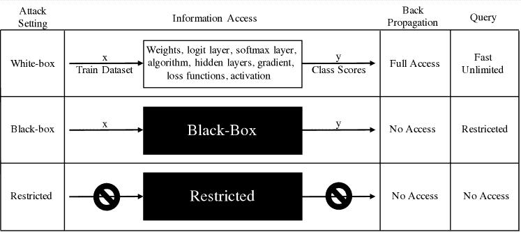
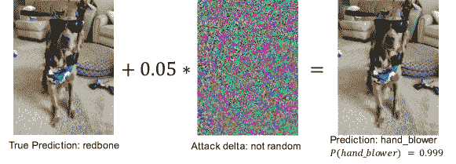
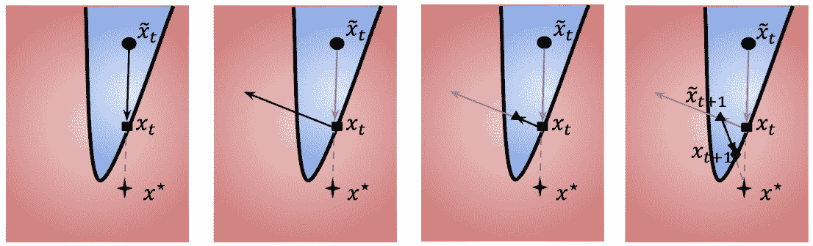
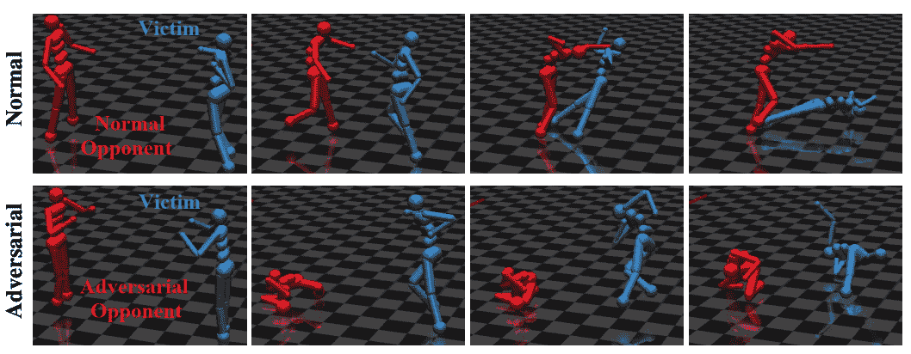
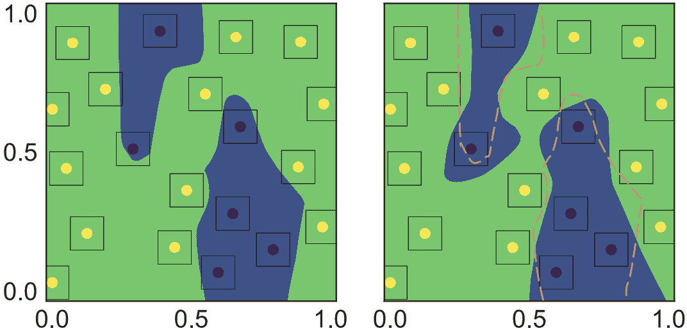
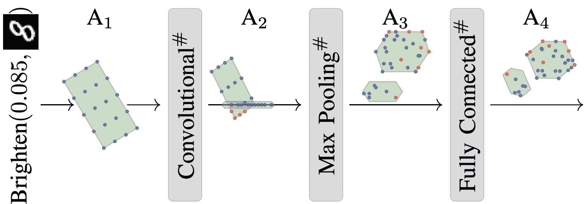
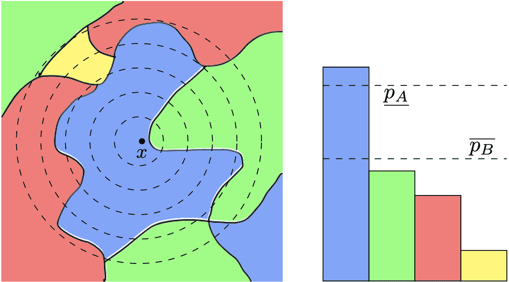

<!--yml

分类：未分类

日期：2024-09-06 20:00:27

-->

# [2007.00753] 深度学习对抗鲁棒性的机遇与挑战：综述

> 来源：[`ar5iv.labs.arxiv.org/html/2007.00753`](https://ar5iv.labs.arxiv.org/html/2007.00753)

# 深度学习对抗鲁棒性的机遇与挑战：综述

Samuel Henrique Silva 和 Peyman Najafirad。S.H. Silva 和 P. Najafirad 是德克萨斯大学圣安东尼奥分校电气与计算机工程系的安全 AI 与自主实验室的成员，地址：德克萨斯州圣安东尼奥市 78249。

P. Najafirad（通讯作者）还在德克萨斯大学圣安东尼奥分校信息系统与网络安全系工作，地址：德克萨斯州圣安东尼奥市 78249。

电子邮件：peyman.najafirad@utsa.edu 作者感谢使用由美国国家科学基金会资助的 Jetstream 云服务（奖号 1445604）。此工作已提交给 IEEE 以备可能发表。版权可能会在未通知的情况下转移，转移后此版本可能不再可用。

###### 摘要

当我们寻求将机器学习模型应用于虚拟和受控领域之外时，至关重要的是不仅要分析模型的准确性或它大多数时间都能正常工作，还要检验该模型是否真正鲁棒和可靠。本文研究了实施对抗鲁棒训练算法的策略，以保证机器学习算法的安全性。我们提供了一个分类法来分类对抗攻击和防御，提出了在最小-最大设置中形成鲁棒优化问题，并将其分为 3 个子类别，即：对抗（再）训练、正则化方法和认证防御。我们综述了对抗样本生成、防御机制以及以对抗（再）训练作为其主要防御手段的最新重要结果。我们还综述了添加正则化项以改变梯度行为的的方法，使攻击者更难实现目标的技术。或者，我们调查了通过精确解决优化问题或使用上下界近似方法正式推导鲁棒性证书的方法。此外，我们讨论了大多数近期算法面临的挑战，并提出了未来研究的展望。

###### 关键词：

人工智能、深度学习、鲁棒性、对抗样本、鲁棒优化、认证防御。

## 1 引言

深度学习（DL）（[1]）模型正在改变我们解决问题的方式，这些问题曾需要来自各种科学领域的多次尝试。DL 相对于人工智能（AI）神经网络（NN）是一种改进，叠加了更多层级以提供更高水平的抽象和更好的数据推理，与其他机器学习（ML）算法相比（[2]）。自 DL 兴起以来，在许多情况下得到云环境（[3, 4, 5]）的支持，其基础架构及其变体已应用于许多科学突破，涵盖最广泛的知识领域，例如预测 AMD 疾病进展（[6]）、预测基因表达程序中的 DNA 增强子（[7]）、基于卫星图像的选举和人口统计分析（[8]）、过滤引力波信号的数据（[9]）。DL 方法也已成为自然语言处理（[10]）和语音识别（[11]）最常用的方法之一。

深度学习（DL）架构中最受欢迎的变体之一，卷积神经网络（CNN），显著提升了计算机视觉（CV）应用中的 DL 算法性能（[12]），扩展到了 CV 的多个领域，如目标检测（[13, 14]）、动作识别（[15, 16]）、姿态估计（[17, 18]）、图像分割（[19, 20]）和运动跟踪（[21]）。自 2012 年提出的 ImageNet（[22]）以来，CNN 领域已取得重大进展，在特定任务中达到了超人类的表现，甚至为医疗问题提供了解决方案（[23]）。

图 1：对抗性攻击的防御分为三类：**梯度掩蔽/混淆**、**稳健优化**和**对抗样本检测**。本调查的重点是**稳健优化**，我们将其细分为：**对抗训练**、**认证防御**和**正则化方法**。

由于新的框架、库和硬件资源不断改进并向公众和科学社区开放[24、25、26]，深度神经网络（DNN）不断得到改进并取得了新的性能突破[27、28、29]。随着 DNN 算法的当前成熟度，它被应用于解决安全和保密性关键问题[30]，例如自动驾驶汽车[31、32]、具有人脸识别的多智能体空中载具系统[33]、机器人技术[34、35]、社会工程检测[36]、网络异常检测[37]、网络深度包检测[38]。DNN 应用已经成为我们日常生活的一部分（个人助手[39]、产品推荐[40]、生物识别[41]），并随着时间的推移占据越来越大的空间。

从许多出版物中可以看出，DNN 已经展示了即使在规则未知的复杂任务中（如玩游戏）也能达到人类水平的准确性，除当前帧之外没有任何先前规则[42]。与上述 DNN 模型的准确性相比，早期出版物[43、44、45]中已经显示出 DNN 模型对微小的输入扰动敏感，这些扰动在大多数情况下肉眼不可察觉。这些出版物的结果表明，向输入图像添加微小的目标噪声会使模型误分类原本可以以 99.99% 的信心识别的对象。更令人担忧的是，这些模型在预测时报告的信心很高。这种可以欺骗训练过的模型的扰动被称为对抗攻击。由于其令人震惊的后果，对抗攻击及其鲁棒性的研究近年来成为了一个重要的研究领域。

目前已有大量研究论文涉及识别对抗攻击的方法以及防御模型的侵袭[46, 47]。解决此问题的一种方法是通过可解释性[48]增强模型的直观性，但这种模型并不直接改善模型的性能。另一方面，已经发布了多种方法来生成对抗攻击鲁棒的模型[49]，研究人员的目标是将鲁棒性引入模型的层中，使得模型不会被分布外样本、已知或未知攻击、目标攻击或非目标攻击欺骗。在考虑安全性的同时保证这些模型的准确性，对系统架构师来说至关重要，主要是使它们在面对对抗攻击、噪声、模型误设和不确定性时保持鲁棒性。本调查旨在汇集最近在 DNN 鲁棒性方面的进展，指出最近为生成鲁棒 DNN 模型而跟随的主要研究方向。我们揭示了最新的应用和理论发展。

受到[50]的启发，我们从对抗样本如何生成的角度分析了深度神经网络（DNN）的鲁棒性，以及如何针对这些算法制定防御措施。一般而言，我们将对抗攻击的鲁棒性问题定义为一个双重优化问题，在这个问题中，攻击者试图最大化损失，而防御者试图最小化模型被攻击者欺骗的可能性。在这种表述中，当前基于非线性激活函数的现有模型在优化中引入了非线性不等式约束，这产生了精确解决方案与模型可扩展性之间的固有权衡。这种权衡表现为通过混合整数线性规划获得的精确但缓慢的解决方案，或者对目标函数的近似，这些近似要么依赖现有攻击方法提供局部启发式估计，要么近似约束或目标函数的界限以生成认证区域，其中不存在对抗样本。

更具体地说，本文提出了以下贡献：

1.  1.

    我们将对抗攻击的防御特征描述为一个最小-最大优化问题，研究包括启发式近似、精确解决方案以及上下界近似在内的解决方案，以生成对抗攻击具有鲁棒性的模型。

1.  2.

    我们调查、分析和分类了生成对抗样本的最新和/或重要方法，因为它们是通过对抗（再）训练生成强大防御的基础。

1.  3.

    我们调查、分析和分类了最近期和最重要的对抗攻击防御方法，提供了分类法、方法描述和这些方法的主要结果。

我们以以下方式组织这项调查。在第二部分中，我们描述了对抗样本生成和防御的分类法。我们根据攻击时间、攻击者可用的信息、目标和算法计算方法来分类对抗模型。此外，我们还对攻击者使用的扰动类型进行分类。我们将防御方法分为三类：梯度掩盖/混淆、鲁棒优化和对抗样本检测。我们将研究重点放在鲁棒优化上，并进一步细分为三个组：对抗训练、认证防御和正则化方法。在第三部分中，我们描述了几个相关的对抗攻击，并在表 II 中总结。 在第四部分中，我们描述了鲁棒优化中的最相关结果，并提供了一个树形图，将这些出版物映射到鲁棒优化的三个子组。在第五部分中，我们讨论了鲁棒防御中的当前挑战和机会。

## 2 对抗攻击与防御的分类

我们在调查中保持一致的符号集，为了便于阅读，我们在表 I 中总结了最常用的符号和表示法，我们将在本调查中使用它们。对于需要特定术语的论文，我们将在相关章节中定义这些术语。

表 I: 数学定义中使用的符号和表示法

| 符号 | 描述 |
| --- | --- |
| $x$ | 原始（干净、未修改）输入数据 |
| $\hat{y}$ | 模型预测 |
| $t$ | 类别标签 |
| $x^{\prime}$ | 对抗样本 |
| $y^{\prime}$ | 对抗样本的目标类别 |
| $f(.)$ | 深度学习模型 |
| $\theta$ | 模型参数 |
| $\delta$ | 对抗算法生成的扰动 |
| $\Delta$, $\epsilon$ | 扰动约束 |
| $\nabla$ | 梯度函数 |
| $\left\|.\right\|_{p}$ | $l_{p}$-范数 |
| $\mathcal{L}$ | 损失函数（例如，交叉熵） |
| $\mathcal{D}$ | 训练数据分布 |
| $KL$-散度 | Kullback-Leibler 散度函数 |

### 2.1 攻击威胁模型

已经尝试对机器学习中的攻击进行分类。我们在这里提炼了最重要的方面，这些方面特征化了生成对抗样本的模型及其架构。我们重点讨论了对抗鲁棒性讨论中最相关的方面。因此，我们根据[51]中提出的分类标准，按时间、信息、目标和攻击频率对攻击进行分类：

+   •

    时间：建模对抗攻击的第一个关键特征是攻击发生的时间。为此，我们有两种可能性，规避攻击和中毒攻击。规避攻击是在推断时发生的，并假设模型已经被训练。中毒攻击通常针对数据和模型的训练阶段。

+   •

    信息：攻击的另一个特征是攻击者可以访问的信息。在白盒环境中，对手可以完全访问有关模型的信息以及模型本身，而在黑盒环境中，几乎没有或没有信息可用。白盒攻击指的是对手可以不受限制地查询模型获取任何信息，如权重、梯度、模型超参数、预测得分。而在黑盒攻击中，对手对这些参数的了解有限或没有，尽管可以通过查询间接获得一些信息。有些还定义了灰盒攻击，其中攻击者可能只知道特征表示和使用的模型类型，但无法访问数据集或模型信息。第四种设置称为受限黑盒，或称为无盒攻击。在这种假设下，对攻击者没有信息可用，研究主要集中在攻击的可转移性上。在这种情况下，重点是评估在一个深度神经网络中进行的攻击转移到不可访问的目标模型的可能性[52]。在本工作中，我们在二元设置中评估模型，对手要么对深度神经网络有全面的访问权限，要么是通过查询拥有有限访问权限的黑盒，这也可以提供类别得分。

+   •

    目标：攻击者可能有不同的原因来针对特定算法。但通常，攻击者要么有一个特定的目标，需要算法输出特定的结果，这种情况下为定向攻击，要么只是想通过强制出现错误来降低算法的可靠性。在后者中，我们称之为非定向攻击。

+   •

    攻击频率：对受害者模型的攻击可以是迭代式的，也可以是一次性的。在一次性攻击中，攻击者的目标函数优化在单步内完成，而迭代方法则需要多个步骤来生成扰动。

### 2.2 攻击扰动类型

扰动的大小是对抗攻击的核心，一个小的扰动是这些模型的基本前提。在设计对抗样本时，攻击者希望扰动后的输入尽可能接近原始输入，对于图像来说，足够接近到以至于人类无法区分两幅图像。我们将从范围、限制和测量方面分析扰动。

+   •

    扰动范围：攻击者可以生成针对特定输入的扰动，我们称之为个体扰动，或者可以生成一个对训练数据集中的所有输入都有效的单一扰动，我们称之为通用扰动。

+   •

    扰动限制：有两种可能的选项，优化扰动和约束扰动。优化扰动是优化问题的目标，而约束扰动则是设置为优化问题的约束条件。

+   •

    扰动测量：用于衡量扰动幅度的度量标准。最常用的度量标准是 $l_{p}$-范数，许多算法应用 $l_{0},l_{2},l_{\infty}$ 范数。

### 2.3 防御方法

如 图 1 所示，根据 [53]，我们将对抗攻击的防御细分为三大类：梯度掩蔽/混淆、鲁棒优化和对抗样本检测，具体描述如下：

+   •

    梯度掩蔽/混淆：基于梯度掩蔽的防御机制的核心是构建梯度对攻击者无用的模型。一般来说，梯度掩蔽/混淆模型在输入数据的邻域内生成的损失函数非常光滑。这种训练数据点周围的光滑性使得利用算法难以找到生成对抗样本的有效方向。

+   •

    鲁棒优化：是一种防御策略，包含通过添加正则化项、认证界限、目标函数中的对抗样本，或修改模型以在模型层中添加不确定性等方法来改善优化函数的策略。

+   •

    对抗样本检测：近期的研究转向了检测对抗样本，而不是使深度神经网络（DNN）对生成对抗样本变得更加鲁棒。检测对抗样本通常是通过寻找统计异常值或训练能够区分扰动图像和正常图像的独立子网络来完成的。

关于防御机制，我们将本调查集中在与鲁棒优化相关的方法上。在本调查中的多个出版物中，每位作者对鲁棒优化都有其表示和观点。一般而言，即使存在不同的符号和表示方式，我们调查的大多数论文也符合鲁棒优化的一般表示。

在深度学习模型中的训练目标是最小化期望的损失。目标是根据标记数据调整模型参数，如在方程 1 中所示，

|  | $\min_{\theta}\mathcal{L}(\theta,x,y)$ |  | (1) |
| --- | --- | --- | --- |

其中 $\theta$ 是模型参数，$x$ 是模型的输入，$\mathcal{L}$ 是定义的损失函数，而 $y$ 是其真实标签。通过这种形式化，我们寻求相对于 $\theta$ 最小化损失函数。这种形式化将参数拟合到数据点，使得 $f(x)$ 产生的预测 $\hat{y}$ 等于真实标签 $y$。在对抗设置中，这种情况会改变，其中目标不同，

|  | $\max_{\delta\leq\Delta}\mathcal{L}(\theta,x+\delta,y)$ |  | (2) |
| --- | --- | --- | --- |

其中我们寻找一个扰动 $\delta$，小于最大扰动 $\Delta$，能够将分类器的决策从预测 $\hat{y}$ 改变为 $y^{\prime}$。对扰动的限制是一个设计参数，通常由 $l_{p}$-范数定义。

方程 1 和 2 并没有包含数据分布或来自训练数据集大多数没有包含模型推理数据的真实分布的限制。根据[54]的定义，如果 $\mathbb{D}$ 是数据的真实分布，训练集是从 $\mathbb{D}$ 中独立同分布（i.i.d.）抽取的，并定义为 $\mathcal{D}=\{(x_{i},y_{i})\sim\mathbb{D}\},\text{ for }i=1,...,m$。而分类器的经验风险，基于训练集，定义为：

|  | $R(F,\mathcal{D})=\frac{1}{&#124;\mathcal{D}&#124;}\sum_{(x,y)\in\mathcal{D}}\mathcal{L}(f(x),y)$ |  |
| --- | --- | --- |

其中 $|\mathcal{D}|$ 是训练集 $\mathcal{D}$ 的大小。根据这个定义，经验对抗风险定义为：

|  | $R_{adv}(F,\mathcal{D})=\frac{1}{&#124;\mathcal{D}&#124;}\sum_{(x,y)\in\mathcal{D}}\mathcal{L}(f(x+\delta),y)$ |  |
| --- | --- | --- |

在稳健优化的视角下处理对抗性防御时，第一个解决方案是求解组合的最坏情况损失，使用经验对抗风险 $R_{adv}$，这被称为对抗训练。

|  | $\min_{\theta}\frac{1}{&#124;\mathcal{D}&#124;}\sum_{(x,y)\in\mathcal{D}}\max_{\delta\in\Delta}\mathcal{L}(f(x+\delta),y)$ |  | (3) |
| --- | --- | --- | --- |

方程 3 的解决方案需要特殊处理或完全不同的公式，这定义了我们如何对对抗攻击进行防御机制的分类，即：对抗（重新）训练、贝叶斯方法、正则化方法和认证防御。

#### 2.3.1 对抗（重新）训练作为防御机制

方程 3 的解决方案需要解决内部的最大化问题（方程 2），这是一个高维非凸优化问题，标准优化技术无法准确解决。解决此类问题的最流行方法是通过启发式方法近似 方程 2，我们在寻找 方程 2 的下界。虽然这种方法很有前景，甚至显示出能提高大模型（ImageNet [55]）的稳健性，但这种模型有一个缺陷，即在实际应用中，当使用近似启发式时，无法提供稳健性保证或认证。这类防御机制尽管在实现上非常实用，但无法保证在 $x$ 的邻域内不存在能够欺骗 $f(.)$ 的对抗样本。

#### 2.3.2 认证防御

在方程 3 中提出的问题定义了对抗训练的总体目标。但如所见，即使使用最佳方法来找到最大化问题的局部近似，我们仍然受到攻击方法有效性的影响。文献中提出了一种解决这种不便的方法，即精确解决最大化问题或近似到可解约束集。为了正式定义认证防御，最初我们考虑一个威胁模型，其中对手被允许将输入 $x\in\mathbb{R}^{d}$ 转换为从集合 $\mathbb{S}_{0}(x)\subseteq\mathbb{R}^{d}$ 中的任何点。这样的集合表示点 $x$ 的邻域，由 $l_{p}$ 扰动、几何变换、语义扰动或其他类型的变换生成。如果是 $l_{p}$ 扰动，则集合定义为 $\mathbb{S}_{0}(x)=\{x^{\prime}\in\mathbb{R}^{d},\left\|x-x^{\prime}\right\|_{p}<\epsilon\}$。

我们进一步扩展模型 $f(.)$ 作为其 $k$ 个隐藏层和参数 $\theta$ 的函数，其中

|  | $f(x)=f^{k}_{\theta}\circ f^{k-1}_{\theta}\circ\dots\circ f^{1}_{\theta}$ |  | (4) |
| --- | --- | --- | --- |

其中 $f^{i}_{\theta}:\mathbb{R}^{d_{i-1}}\rightarrow\mathbb{R}^{d_{i}}$ 表示在隐藏层 $i$ 中应用的非线性变换。目标是证明神经网络输出上的一个属性，通过线性约束进行编码：

|  | $c^{T}f_{\theta}(x^{\prime})+d<0,\forall x^{\prime}\in\mathbb{S}_{0}(x)$ |  |
| --- | --- | --- |

其中 $c$ 和 $d$ 是特定属性的向量和标量值。

为了理解认证的复杂性，基于方程 4，我们定义了逐层对抗优化目标。对于 $z_{1}=x,z_{i+1}=f_{i}(W_{i}z_{i}+b_{i})$ :

|  |  | $\displaystyle\underset{\displaystyle z_{1,\dots,d+1}}{\mathrm{max}}\quad(e_{y}-e_{y_{targ}})^{T}z_{d+1}\hfil\hfil\hfil\hfil$ |  | (5) |
| --- | --- | --- | --- | --- |
|  |  | $\displaystyle\mathmakebox[width(&quot;$\underset{\displaystyle\phantom{z_{1,\ldots, d+1}}}{\mathrm{max}}><quot;)][c]{\mathmakebox[width(&quot;$\mathrm{max}><quot;)][l]{\mathrm{\kern 1.00006pts.t.}}}\quad$ |  | $\displaystyle z_{1}^{\prime}\in\mathbb{S}_{0},\hfil\hfil$ |  |
|  |  | $\displaystyle z_{i+1}=f_{i}(W_{i}z_{i}+b_{i}),~{}i=1,\dots,d-1,\hfil\hfil$ |  |
|  |  | $\displaystyle z_{d+1}=W_{d}z_{d}+b_{d}$ |  |

其中 $e_{i}$ 单位基向量，在第 $i^{th}$ 位置的值为 1，其他位置为 0。由于我们有由激活函数定义的非线性约束，这种形式需要特别处理。

为解决此类问题，已提出多种技术，这些技术在本调查的研究范围内。训练认证神经网络的方法基于内损失的上界计算，而不是对抗训练中计算的下界。这些方法通常被称为可证明的防御，因为它们在威胁模型内的任何攻击下提供了对结果网络的鲁棒性保证。计算认证的典型方法基于凸松弛、区间传播、SMT 求解器、抽象解释、混合整数线性规划、线性松弛或这些方法的组合。我们在小节 4.3 中探讨了各种技术。

#### 2.3.3 正则化方法

正则化技术侧重于对学习算法进行小幅修改，以便它能够更好地泛化。从某种程度上讲，它提高了模型在未见数据上的表现。通过惩罚节点的权重矩阵，它防止了模型对噪声数据的过拟合。在鲁棒优化的特定情况下，正则化技术的目标类似，但重点是避免输入的微小变化引起算法决策的改变。它通过扩展决策边界或限制模型梯度的变化来实现这一点。

已提出了许多正则化技术，其中最常用的是基于 $l_{p}$ 的方法。$l_{2}$ 正则化技术旨在减少参数值，这相当于方差减少。它向原始目标函数（损失）引入一个惩罚项，添加了模型参数平方的加权和。因此，我们有一个正则化损失 $\mathcal{L}_{R}$ 定义为：

|  | $\mathcal{L}_{R}(x+\delta,y)=\mathcal{L}(x+\delta,y)+\lambda\left\&#124;\theta\right\&#124;_{2}$ |  |
| --- | --- | --- |

在这种情况下，小的 $\lambda$ 使参数不受限制地增长，而大的 $\lambda$ 则鼓励减少模型参数。正则化方法不限于 $L_{p}$ 方法，还可以涉及 Lipschitz 正则化、雅可比矩阵和其他技术，我们在小节 4.2 中进行了调查。

## 3 生成对抗攻击的方法

研究图像分类领域的对抗攻击可以改善我们的洞察，因为我们可以直观地分析扰动输入和非扰动输入之间的差异。此外，尽管图像数据维度较高，但其表示方式比音频、图形和网络安全数据等其他领域更简单。在本节中，我们将回顾图像分类领域的攻击生成算法，这些算法可以应用于标准深度神经网络（DNN）和卷积神经网络（CNN）。我们将其分类为：白盒攻击、黑盒攻击和实际应用攻击。在 表 II 中，我们总结了本节描述的所有攻击，重点介绍了使用的距离度量、信息访问级别、算法类型以及在特定出版物中应用的领域。

图 2：白盒攻击和黑盒攻击主要在于攻击者可以访问的信息的不同。

在以下子节中，我们列出了并描述了最流行的对机器学习模型的对抗攻击方法。我们按时间顺序列出它们，并重点介绍这些方法的最重要细节。

### 3.1 白盒攻击

如所述，在白盒攻击中，攻击者可以访问的信息级别没有限制。因此，敌手了解模型参数、数据集或任何其他关于模型的信息。在这种假设下，给定一个模型 $f(.)$ 和一个输入 $(x,y)$，主要目标是生成 $x^{\prime}$，使其与原始 $x$ 在一定距离内，并最大化损失 $\mathcal{L}(f(x+\delta),y)$。

|  | $\max_{\delta\in\Delta}\mathcal{L}(f(x+\delta),y)$ |  |
| --- | --- | --- |

#### 3.1.1 盒约束 L-BFGS

在 [43] 中，首次展示了能够误导分类器的小扰动的存在。在论文中，Szegedy 等人提出计算一个可添加到原始输入 $x$ 的加性噪声 $\delta$，该噪声能够误导分类器，但对图像的失真最小或没有可感知的失真。我们通过以下方式找到最佳的 delta $\delta$：

|  |  | $\displaystyle\underset{\displaystyle\delta}{\mathrm{min}}\quad c\left\&#124;\delta\right\&#124;_{2}\hfil\hfil\hfil\hfil$ |  | (6) |
| --- | --- | --- | --- | --- |
|  |  | $\displaystyle\mathmakebox[width("&quot;$\underset{\displaystyle\phantom{\delta}}{\mathrm{min}}<quot;)[c]{\mathmakebox[width("&quot;$\mathrm{min}<quot;)[l]{\mathrm{\kern 1.00006pts.t.}}}\quad$ |  | $\displaystyle f(x+\delta)=y^{\prime},\hfil\hfil$ |  |
|  |  | $\displaystyle\text{ 所有像素在 }(x+\delta)\in[0,1]$ |  |

其中$f(.)$是参数化的 DNN 模型，$y$是实际标签，$y^{\prime}$是目标标签。这是一个困难的问题。作者使用了带盒约束的 L-BFGS，提出了问题的近似解，表示为：

|  |  | $\displaystyle\underset{\displaystyle\delta}{\mathrm{min}}\quad c\left\&#124;\delta\right\&#124;_{2}+\mathcal{L}(f(x+\delta),y^{\prime})\hfil\hfil\hfil\hfil$ |  | (7) |
| --- | --- | --- | --- | --- |
|  |  | $\displaystyle\mathmakebox[width(&quot;$\underset{\displaystyle\phantom{\delta}}{\mathrm{min}}><quot;)][c]{\mathmakebox[width(&quot;$\mathrm{min}><quot;)][l]{\mathrm{\kern 1.00006pts.t.}}}\quad$ |  | $\displaystyle\text{ all pixel in }(x+\delta)\in[0,1]$ |  |

在这个模型中，Szegedy 等人成功生成了在视觉上与原始图像无法区分的图像，但却能欺骗分类器将其分类为另一个类别。这是第一个利用深度学习模型弱点的结果和发布。

#### 3.1.2 Fast Sign Gradient Method

在[56]中，引入了一个单步对抗攻击框架。攻击图像$x^{\prime}$是通过简单的加性扰动获得的：

|  | $\displaystyle x^{\prime}=$ | $\displaystyle~{}x+\delta_{ut}$ |  |
| --- | --- | --- | --- |
|  | $\displaystyle x^{\prime}=$ | $\displaystyle~{}x-\delta_{tg}$ |  |

其中对于非目标设置，$\delta_{ut}$，我们从以下公式中获得扰动：

|  | $\max_{\left\&#124;\delta_{ut}\right\&#124;_{p}\leq\epsilon}\mathcal{L}(f(x+\delta),y)$ |  |
| --- | --- | --- |

在目标设置中，$\delta_{tg}$，来自：

|  | $\max_{\left\&#124;\delta_{tg}\right\&#124;_{p}\leq\epsilon}(\mathcal{L}(f(x+\delta),y)-\mathcal{L}(f(x+\delta),y^{\prime}))$ |  |
| --- | --- | --- |

其中$\epsilon$是由$l_{p}$-范数定义的球体。

图 3：通过添加一个不易察觉的扰动，之前被分类为红骨犬的狗被以高度置信度分类为吹风机。

快速符号梯度方法的核心是最大化原始标记类别和当前分配标签之间的向量范数，而在目标设置中，它则专注于最小化到目标类别的距离。由于这是一个单步算法，它对当前防御措施不够稳健，但实现速度非常快。图 3 展示了图像攻击和错误预测。

#### 3.1.3 DeepFool

[57] 提出的 Deepfool 攻击是一种白盒攻击，探索分类模型的边界。在多类算法中，Deepfool 以输入 $x$ 初始化，假设其在分类器模型 $f(x)$ 的边界内。通过迭代过程，图像会受到一个小向量的扰动，朝着决策边界的方向移动。这些边界被线性函数，即算法中定义的超平面 $\hat{l}$ 所近似。在每一步中，扰动会累积以形成最终的图像扰动。与 FGSM ([56]) 相比，作者显示出类似或更好的攻击成功率。

#### 3.1.4 基于雅可比的显著性图攻击

基于雅可比的显著性图攻击（JSMA）与大多数对抗攻击文献在扰动限制所使用的范数方面有所不同。虽然大多数攻击集中在 $l_{\infty}$ 或 $l_{2}$ 范数上，JSMA 在 [58] 中提出，专注于 $l_{0}$ 范数。在这种范数下，以二进制方式惩罚像素是否发生了变化，而不是像 $l_{2}$ 基于算法那样考虑像素变化的大小。

在这种攻击中，Papernot 等人计算了评分矩阵 $F$ 的雅可比矩阵。模型以贪婪的方式执行攻击。它修改对模型决策影响最大的像素。雅可比矩阵定义为：

|  | $J_{F}(x)=\frac{\partial F(x)}{\partial(x)}=\{\frac{\partial F_{j}(x)}{\partial x_{i}}\}_{x\times j}$ |  |
| --- | --- | --- |

它模拟输入 $x$ 对预测标签 $\hat{y}$ 的影响。算法逐次修改未扰动图像中的像素，以创建显著性图。显著性图的主要思想是输出梯度与输入之间的相关性。这是对输入最具影响力的变量的指导，或者是那些可能通过较少的操控欺骗分类器的变量。基于此，算法在最具影响力的像素中进行修改。

#### 3.1.5 投影梯度下降（PGD）

也称为基本迭代方法，最初在 [59] 中提出。它基于 FGSM，但不同于单步的投影梯度下降，它通过更多步骤进行迭代，如下所示：

|  | $\displaystyle\delta:=P(\delta+\alpha\nabla_{\delta}\mathcal{L}(f(x+\delta),y))$ |  |
| --- | --- | --- |

其中 $P$ 表示对感兴趣区域的投影。使用这种公式，PGD 需要更多的微调，以选择步长 $\alpha$。在 [54] 中，Madry 等人提出了一种随机初始化 $\delta$ 的迭代方法。

#### 3.1.6 Carlini 和 Wagner 攻击（CW）

在[60]中，提出了 3 种 $l_{p}$-范数攻击（$l_{0}$，$l_{2}$，$l_{\infty}$）作为对[61]提出的使用蒸馏作为防御策略的回应。在他们的论文中，Papernot 等人成功提出了一种防御机制，能够降低 FGSM 和 L-BFGS 的有效性。CW 提出了解决 FGSM 中陈述的相同问题，即给定输入 $x$，寻找最小扰动 $\delta$，使模型的分类预测发生变化。这个问题可以表述为：

|  |  | $\displaystyle\underset{\displaystyle\delta}{\mathrm{min}}\quad c\left\&#124;\delta\right\&#124;_{p}+\mathcal{L}(f(x+\delta),y^{\prime})\hfil\hfil\hfil\hfil$ |  | (8) |
| --- | --- | --- | --- | --- |
|  |  | $\displaystyle\mathmakebox[width(&quot;$\underset{\displaystyle\phantom{\delta}}{\mathrm{min}}><quot;)][c]{\mathmakebox[width(&quot;$\mathrm{min}><quot;)][l]{\mathrm{\kern 1.00006pts.t.}}}\quad$ |  | $\displaystyle(x+\delta)\in[0,1]^{n}$ |  |

其中 $\mathcal{L}(f(x+\delta),y^{\prime})=\max_{i\neq y^{\prime}}(Z(x^{\prime})_{i})-Z(x^{\prime})_{y})^{+}$，$Z(x)=z$ 是 logits。算法通过最小化度量 $\mathcal{L}(.)$，找到得分较大的 $x^{\prime}$，使其被分类为 $y^{\prime}$。当我们寻找常数 $c$ 时，我们寻找的是产生 $x$ 和 $x^{\prime}$ 之间较小距离的常数。

#### 3.1.7 真实对抗样本（GTAE）

到目前为止，大多数攻击，即使是受到生成新防御的激励，也与防御算法无关。在[62]中提出的算法中，作为优化和寻找对抗样本基础的认证防御是[63]中提出的。

算法利用 SMT 解算器抽象出 $\theta$ 和数据集 $(x,y)$，并求解系统以检查是否存在距离 $x$ 近的 $x^{\prime}$，在已建立的范数距离内，可能导致误分类。通过将 $\epsilon$ 的大小减小到系统无法找到合适的 $x^{\prime}$ 为止，从而找到真实的对抗样本。对抗样本被认为是找到的具有立即更大 $\epsilon$ 的 $x^{\prime}$。这是第一个计算可证明的最小扰动的精确方法，可以欺骗机器学习模型。与此相对的是，正如作者所述，由于模型依赖于 SMT 解算器，这限制了算法在节点数不超过几百的模型上的适用性。这种攻击已被[64]和[65]重新审视。

#### 3.1.8 通用对抗扰动

与之前的方法不同，通用对抗扰动（UAP），如[66]中提出的那样，寻找一个能够欺骗训练数据集中所有样本的单一扰动。这些扰动与输入无关，还受到限制，以免被人眼检测到。扰动的构造基于：

|  | $P_{x\sim\mathcal{D}}(f(x)\neq f(x+\delta))\geq\beta,\text{s. t. }\left\&#124;\delta\right\&#124;_{p}\leq\epsilon$ |  |
| --- | --- | --- |

在其中，$\epsilon$ 定义了基于 $l_{p}$-范数的扰动大小，$\beta$ 定义了从训练数据集中采样的图像被生成的扰动欺骗的概率。在这种情况下，算法优化了欺骗分类器的概率。

计算通用扰动的方法基于 DeepFool 算法，该算法逐渐推动输入靠近模型的决策边界。与 DeepFool 的不同之处在于，它不是推动单个输入，而是将 $\mathcal{D}$ 的所有成员都朝决策边界的方向进行修改。为每个图像计算出的扰动是逐渐积累的。然后将累积值投影回指定的 $B_{\epsilon}$ 球体，半径为 $\epsilon$。研究表明，通过 $4\%$ 的变化，已经实现了 $80\%$ 的欺骗准确率。

#### 3.1.9 阴影攻击

在 [67] 中，提出了一种针对认证防御的攻击。在他们的工作中，他们针对那些依据 $l_{p}$-范数定义的半径对模型进行认证的防御方法。一种直观的构建认证防御的想法是检查输入的某个半径 $B_{\epsilon}$ 内是否存在扰动 $\delta$，能够改变分类器的决策。阴影攻击旨在利用这一前提，构造一个位于认证区域之外的扰动。据称，在标记图像后，这些防御会检查是否存在一个不同标签的图像在 $\epsilon$ 距离（在 $l_{p}$ 度量下）内，其中 $\epsilon$ 是用户选择的安全参数。如果在 $B_{\epsilon}$ 球体内所有输入都被分类为相同的标签，则模型被认为是稳健认证的。他们的模型不仅针对分类器，还针对证书。这是通过将对图像的对抗扰动添加到 $l_{p}$-范数较大的图像中，从而产生被大量同标签图像包围的攻击图像。为了生成与原始图像在感知上相近，但能欺骗分类器的图像，他们使用以下目标函数：

|  |  | $\displaystyle\underset{\displaystyle y^{\prime}\neq y,~{}\delta}{\mathrm{max}}\quad$ | $\displaystyle-\mathcal{L}(\theta,x+\delta&#124;y^{\prime})-\lambda_{c}C(\delta)\hfil\hfil\hfil\hfil$ |  | (9) |
| --- | --- | --- | --- | --- | --- |
|  | $\displaystyle\mathmakebox[width(&quot;$\underset{\displaystyle\phantom{y' \neq y,~{}\delta}}{\mathrm{max}}><quot;)][c]{\mathmakebox[width(&quot;$\mathrm{max}><quot;)][l]{}}\quad-\lambda_{tv}TV(\delta)-\lambda_{s}Dissim(\delta)\hfil\hfil\hfil\hfil$ |  |

其中 $\mathcal{L}(\theta,x+\delta|\bar{y})$ 指的是对抗训练损失，$\lambda_{c}C(\delta)$ 是颜色正则化项，$\lambda_{tv}TV(\delta)$ 是平滑惩罚项，$\lambda_{s}Dissim(\delta)$ 确保所有颜色通道接收到相似的扰动。

#### 3.1.10 其他攻击

所展示的攻击方法只是许多已在不同场所发表的攻击中的一部分。这里列出了一些文献中相关的攻击方法。

+   •

    EAD: 弹性网攻击 - 类似于 L-BFGS，[68]中的算法提出寻找最小的附加扰动，这种扰动会误导分类器。不同之处在于它结合了 $l_{1}$ 和 $l_{2}$ 的范数。已经证明，针对 $l_{\infty}$ 和 $l_{2}$ 范数的强大防御仍然无法拒绝基于 $l_{1}$ 的攻击。

+   •

    目标度量和梯度下降算法（OMGDA） - [69]提出的算法非常类似于 DeepFool，通过优化步长。与 Jang 等人使用的固定和启发式确定的步长不同，步长利用了 softmax 层的见解。步长基于所需扰动的大小确定，并随着时间变化。

+   •

    空间变换攻击（STA） - 在[70]中，作者提出了一种基于小的平移和旋转扰动的方法，而不是生成像素强度的变化。这些扰动仍然不会被人眼察觉。类似地，在[71]中，输入的空间方面也被利用于对抗样本的生成。

+   •

    使用生成模型的无限制对抗样本（UAEGM） - 基于 AC-GAN（[72]， [73]），提出使用生成网络生成不受输入数据邻域限制的样本。生成的攻击不一定与数据集中样本类似，但足够类似以至于人眼无法察觉，并能欺骗分类器。

### 3.2 黑箱攻击

在黑箱限制下，模型与当前暴露的白箱不同，攻击者访问的信息也不同。在大多数情况下，攻击者对目标模型没有或仅有部分信息，如所用算法、数据集或参数，如图 2 所示。黑箱攻击中的一个重要建模挑战是准确建模攻击者对学习模型或算法的了解程度。在本小节中，我们列出了最相关的黑箱攻击生成方法。

#### 3.2.1 实用黑箱攻击（PBBA）

虽然假设访问模型信息可以实现一系列攻击，但 [74] 中的工作引入了攻击对攻击者了解较少的模型的可能性。在这项工作中，假设没有关于模型架构的知识，仅对感兴趣的领域有一些了解。还限制了发送给模型的输出请求，这要求攻击者明智地选择来自受害者模型的推理请求。为了实现目标，Papernot 等人引入了替代模型框架。攻击策略是在少量初始查询上训练一个替代网络，然后基于替代网络的梯度信息迭代扰动输入，以扩展训练集。

1: 输入: 替代数据集 $S_{0}$。2: 输入: 替代模型架构 $F$。3: 当 $\rho\leq$ epochs 时 4:     根据原始模型的查询标记 $S_{0}$5:     基于 (3) 训练替代模型 6:     基于雅可比矩阵扩展数据集，$S_{\rho}\leftarrow S_{\rho+1}$7: 返回

算法 1 替代模型

在将替代模型的边界调整到接近原始模型的情况下，可以使用上一节中介绍的任何方法来生成扰动图像。

#### 3.2.2 零阶优化基攻击

在 Chen 等人 [52] 的研究中，在被称为 ZOO 的攻击中，作者假设可以访问输入数据和模型的置信度分数，并以此为目标进行攻击。他们与 [74] 的不同之处在于，模型不专注于转移性（创建替代模型）来生成对抗样本。在他们的工作中，他们提出了一种零阶优化攻击，估计目标 DNN 的梯度。与传统的梯度下降方法不同，他们使用零阶坐标 SGD。此外，为了改进他们的模型并生成对抗样本，他们实施了降维、层次技术和重要性采样。随着像素的调整，算法观察到置信度分数的变化。

类似于 ZOO，在一像素攻击 [75] 中，提出了使用置信度分数来扰动输入并改变分类器的决策。本文重点在于修改输入的单个像素。利用差分进化算法，在黑箱设置下对单个像素进行修改。作者基于每个类别的概率分数变化来更新扰动。

#### 3.2.3 查询高效的黑箱攻击

黑盒攻击中最大的挑战之一是许多推理模型都有机制限制查询次数（在基于云的或系统嵌入的情况下），或者推理时间可能限制查询次数。 黑盒模型的一种研究方向是使这些模型更加高效，例如，基于自然进化策略的工作[76]能够将成功生成误分类扰动图像的信息请求量减少 2 到 3 个数量级。 该算法在输入$x$的邻域内设置查询。 然后对模型的输出进行采样，并使用这些样本来估计感兴趣点周围的梯度期望。

该算法基于围绕输入$x$的查询对模型的输出进行采样，并估计了期望的梯度$F$在$x$上的情况。 此外，[77]提出了一种基于模型的二元分类的新梯度方向估计的算法族。 在他们的工作中，包括基于$l_{\infty}$和$l_{2}$范数的攻击，以及有针对性和无针对性的攻击。 图 4 显示了梯度如何更新以及决策边界如何用于生成对抗攻击的直觉。 算法 2 显示了降维 $d^{r}$ 的定义。

图 4：HopSkipJump 攻击。 (a) 用二分法找到决策边界。 (b) 生成决策边界附近的梯度估计。 (c) 使用几何级数更新决策边界点。 (d) 进行二分搜索并更新对边界点的估计。 图像来源：[77]

此外，在搜索查询高效的黑盒攻击中，[78]引入了一种独立于梯度的基于贝叶斯优化和高斯过程替代模型的方法，以找到有效的对抗性样本。 该模型假设攻击者对目标模型的网络架构、权重、梯度或训练数据一无所知。 但假定攻击者能够用输入$x$查询模型，以获取所有类别$C$的预测分数。 他们将扰动限制在$l_{\infty}$范数内。 他们的目标是最大化扰动：

|  | $\displaystyle\delta^{*}={}$ | $\displaystyle\underset{\displaystyle\delta}{\mathrm{arg~{}max}}\quad[log(f(x_{origin}+g(\delta))_{t})\hfil\hfil\hfil\hfil$ |  | (10) |
| --- | --- | --- | --- | --- |
|  | $\displaystyle\mathmakebox[width(&quot;$\underset{\displaystyle\phantom{\delta}}{\mathrm{arg~{}max}}><quot;)][c]{\mathmakebox[width(&quot;$\mathrm{arg~{}max}><quot;)][l]{}}\quad-log(\sum_{j\neq t}^{C}f(x_{origin}+g(\delta))_{j})]\hfil\hfil\hfil\hfil$ |  |
|  |  | $\displaystyle\mathmakebox[width(&quot;$\underset{\displaystyle\phantom{\delta}}{\mathrm{arg~{}max}}><quot;)][c]{\mathmakebox[width(&quot;$\mathrm{arg~{}max}><quot;)][l]{\mathrm{\kern 1.00006pts.t.}}}\quad$ |  | $\displaystyle\delta\in[-\delta_{max},\delta_{max}]^{d_{r}}$ |  |

提出的贝叶斯优化方法旨在提高查询效率，需要使用代理模型来近似目标函数，他们的工作中使用了高斯过程。此外，定义下一个查询点是由一个获取函数决定的。他们工作的一个重要差异在于，他们不是在高维空间中寻找扰动 $\delta$，而是利用一个函数来降低扰动的维度，然后再恢复到真实图像尺寸。

1: 输入: 解码器 g(.), 观察 $\mathcal{D}^{d}_{t-1}={g(\delta_{i}),y_{i}}^{t-1}_{i=1}$ 其中 $g(\delta_{i})\in\mathcal{R}^{d}$ 和一个可能的 $d^{r}:{d^{r}_{j}}^{N}_{j=1}$集合 2: 输出: 最优的降维 $d^{r*}$ 和相应的高斯过程模型 3: 对于 $j=1,...,N$ 执行 4: $\mathcal{D}^{d^{r}_{j}}_{t-1}=\{g^{-1}(g(\delta_{i})),y_{i}\}^{t-1}_{i=1},$ $\triangleright$ $g^{-1}(g(\delta_{i}))\in R^{d^{r}_{j}}$ 5: 拟合一个高斯过程模型到 $\mathcal{D}^{d^{r}_{j}}_{t-1}$ 并计算其最大边际似然 $p(\mathcal{D}^{d}_{t-1}|\theta^{*},d^{r}_{j})$ 6: $d^{r*}=\operatorname*{arg\,max}_{d^{r}_{j}\in{d^{r}_{j}}^{N}_{j=1}}p(\mathcal{D}^{d}_{t-1}|\theta^{*},d^{r}_{j})$ 7: 返回

算法 2 贝叶斯选择 $d^{r}$

#### 3.2.4 对强化学习算法的攻击

在[79]中，提出了一种在强化学习（RL）算法中生成对抗性样本的方法。在 RL 中，对抗性样本可以是用于捕捉状态的修改图像，或者在本出版物中，是一种对抗性策略。重要的是要强调，对抗性策略并不像我们在双人游戏中看到的那样是强大的对手，而是具有某种行为的策略，会触发受害者策略的失败。本文提出了一种黑箱攻击方法，以在受害者策略中触发不良行为。受害者策略使用近端策略优化进行训练，并学习如何与公平对手“对抗”。对抗性策略被训练以触发受害者策略中的失败。图 5 展示了对手策略与对抗性操控策略之间的差异。

图 5：在第一序列中，一个强大的对手必须与代理碰撞，以阻止其赢得游戏。在第二行中，在对抗性样本中，对手只是简单地摔倒在地，这触发了受害者策略中的不良行为。图像来源：[79]

在论文中，还展示了输入空间的大小与对抗策略的有效性之间的依赖关系。对手控制下观察空间的维度越大，受害者就越容易受到攻击。

### 3.3 物理世界攻击

迄今为止的研究主要集中在虚拟应用和受控数据集中的攻击应用，但关于对抗性样本存在的主要担忧是它们对系统用户可能带来的严重后果。为此，我们专门探讨了真实世界应用及其明确陈述的后果的文献。

在[80]中，通过在标志的特定位置放置贴纸对道路标志进行了物理攻击。他们的攻击方法包括首先在标志图像中找到对分类器决策影响最大的地点。为此目标，使用了$l_{1}norm$，因为它在图像中产生稀疏的扰动，使得定位修改区域更加容易。基于定义的位置，使用$l_{2}norm$来识别贴纸的最合适颜色。

此外，由于面部识别作为生物识别安全措施变得非常流行，它也成为了多个对抗攻击的重点。我们强调了面部识别和身份识别中的 4 种攻击。

+   •

    DNN 模型在面部识别中的对抗攻击鲁棒性评估 - 在这项出版物中，Goswami 等人 [81] 评估了模型架构的深度如何影响其在识别面部时的鲁棒性。他们在考虑到通常在常见场景中观察到的失真情况下评估了鲁棒性。这些失真被浅层网络轻松处理，而深层网络则相对困难。在他们的方法中，他们使用了 Open-Face 和 VGG-Face 网络，并且取得了很高的欺骗率。值得注意的是，在他们的攻击中，扰动的可见性没有受到限制。

+   •

    基于神经网络约束优化的面部检测对抗攻击 - 在这项工作中，也专注于防止面部识别，[82] 基于 Carlini 和 Wagner 攻击生成了一种攻击，能够欺骗 R-CNN。他们的扰动在对抗样本中不可见。

+   •

    通过化妆攻击生成对抗样本用于面部识别 - 在这项研究中，[83] 实现了一个生成对抗网络（GAN）来生成化妆扰动。当扰动施加到面部时，分类器将其决策转移到目标类别。

+   •

    针对面部识别的基于决策的高效黑箱对抗攻击 - Dong 等人[84] 提出了一个进化攻击方法。所提出的对抗样本生成器被限制在黑箱环境中。该算法专注于通过建模搜索向量的局部几何来减少搜索空间的维度。这种算法已被证明适用于大多数识别任务。

#### 3.3.1 其他攻击

在网络安全领域，机器学习模型通常用于检测恶意软件、恶意连接、恶意域名分类器等。在 Suciu 等人[85]的研究中，对当前恶意软件检测模型的鲁棒性进行了评估。作者在生产规模的数据集上重新训练了模型以进行评估。利用新数据，之前易受攻击的模型显示出更强的能力，并报告了架构上的弱点。Suciu 等人[85]的工作探讨了攻击如何在网络安全领域转移，主要关注有效性和可转移性之间的固有权衡。关于恶意连接和域，Chernikova 等人[86]建立了一个模型，考虑了在特征空间中由正常操作生成的正式依赖关系。生成对抗性样本的模型同时考虑了这些应用的数学依赖关系和现实世界的限制。该算法专注于确定具有较高变异性的特征以及与这些特征相关性较高的特征。这个搜索在每次迭代中进行。所有识别出的特征都被修改，但受到限制以保持特征最大变异的上限。上限尊重现实世界应用的限制。

在网络物理领域，几篇文献展示了机器学习模型的脆弱性和对抗性样本的生成。[87] 为 iCub 类人机器人生成了对抗性样本。提出的攻击方法简单地扩展了[88]中的攻击。本文中需要考虑的主要方面是它突出了对抗性样本在安全关键应用决策过程中的严重后果。此外，在自动驾驶汽车中，已经衍生出多种攻击方法，如 DARTS ([89]) 和[90]的工作，该工作展示了对交通标志的攻击，并进行了实际实验。在不同的传感器类型中，[91] 的工作展示了对 LIDAR 传感器的攻击，其中他们攻击了点云图像。

此外，在[92]中，提出了一种新技术用于攻击目标跟踪算法。在他们的方法中，攻击是在单帧中对边界框进行的，这足以欺骗算法并在边界框的位置上产生偏移。这种攻击对自动驾驶汽车识别道路上的障碍物、其他车辆和行人至关重要。

表 II：攻击的二分法

| 白盒攻击 |
| --- |
| 算法 | 量度 | 步骤^a | 领域^b |
| L-BFGS ([43]) | $l_{2}$ | 迭代 | Im-C |
| FGSM ([56]) | $l_{\infty},l_{2}$ | S-Stp | Im-C |
| Deepfool ([57]) | $l_{2}$ | 迭代 | Im-C |
| JSMA ([58]) | $l_{2}$ | Iter. | Im-C |
| PGD ([54]) | $l_{\infty},l_{2}$ | Iter. | Im-C |
| C and W ([60]) | $l_{0}$,$l_{2}$,$l_{\infty}$ | Iter. | Im-C |
| GTAE ([62]) | $l_{0}$ | SMT | Im-C |
| UAP ([66]) | $l_{\infty},l_{2}$ | Iter. | Im-C |
| EAD ([68]) | $l_{1},l_{2}$ | Iter. | Im-C |
| OMGDA ([69]) | $l_{2}$ | Iter. | Im-C |
| STA ([70]) | Spt-Var | Iter. | Im-C |
| UAEGM ([69]) | $l_{2}$ | Iter. | Im-C |
| Shadow Attack ([67]) | $l_{p}$ | Iter. | Im-C |
| RoadSign ([80]) | $l_{1}$,$l_{2}$ | Iter. | S-R |
| FRA1 ([81]) | NR | S-Stp | F-Rec |
| FRA2 ([82]) | $l_{2}$ | Iter. | F-Rec |
| FRA3 ([83]) | $l_{1}$ | Iter. | F-Rec |
| CSA2 ([86]) | $l_{2}$ | Iter. | Cyb-Sec |
| CPA1 ([87]) | $l_{2}$ | Iter. | Cyb-Phy |
| CPA3 ([90]) | $l_{0}$ | Iter. | Cyb-Phy |
| CPA4 ([91]) | NR | Iter. | Cyb-Phy |
| CPA5 ([92]) | $l_{1},l_{2}$ | Iter. | Cyb-Phy |
| BLACK BOX ATTACKS |
| Method | Metric | Step^a | Domain^b |
| PBBA ([74]) | $l_{p}$ | Iter. | Im-C |
| ZOO ([52]) | $l_{p}$ | Iter. | Im-C |
| One-Pixel ([75]) | $l_{0}$ | Iter. | Im-C |
| DBA ([93]) | $l_{2}$ | Iter. | Im-C |
| HopSkipJumpAttack ([77]) | $l_{2}$,$l_{\infty}$ | Iter. | Im-C |
| UPSET & ANGRI ([94]) | $l_{\infty}$ | Iter. | Im-C |
| RLAttack ([79]) | NR | Iter. | RL |
| FRA4 ([84]) | $l_{2}$ | Iter. | F-Rec |
| CSA1 ([85]) | $l_{\infty}$ | Iter. | Cyb-Sec |
| CPA2 ([89]) | $l_{1}$ | Iter. | Cyb-Phy |
| a - Iter.: 迭代，S-Stp.: 单步； b - Im-C.: 图像分类， |
| S-R.: 信号识别，F-Rec.: 人脸识别，Cyb-Sec.: 网络安全 |
| 安全，Cyb-Phys.: 网络物理，RL.: 强化学习 |

图 6：防御机制的总结，分为三个类别：对抗训练、认证防御和正则化方法。

## 4 基于鲁棒优化的对抗攻击防御机制

从目前展示的例子来看，我们发现 DNN 和 CNN 在局部非常不稳定，并且容易错误分类那些人眼几乎无法察觉的微小扰动的样本。多个研究报告提出了结构化算法和公式，以通过稳健优化提高 ML 模型的鲁棒性。本节的目标是探讨实现鲁棒性的最常见技术（从优化的角度），即对抗训练、贝叶斯方法、认证防御和正则化方法，这些在图 6 中总结。

我们在表 IIITraining ‣ 4 Defense Mechanisms based on Robust Optimization Against Adversarial Attacks ‣ Opportunities and Challenges in Deep Learning Adversarial Robustness: A Survey")中总结了调研论文中展示的结果。我们已整理了每篇论文在测试条件下的错误率信息。每篇论文有不同的评估标准和条件。数据集在模型的准确性中具有重要影响。因此，我们尽力更好地表达了模型评估的条件。结果不明确或使用了非常特定度量的论文未列入这些表格，以保持结果的一致性。

### 4.1 通过对抗性（再）训练进行防御

在首次介绍对抗性样本（[43] 和 [88]）之后，训练鲁棒神经网络的防御机制基于将对抗性样本纳入训练集。使用投影梯度下降（PGD）的对抗训练模型显示出对已知最强攻击的鲁棒性。这与其他防御机制被新攻击技术攻破的情况形成对比。在本节中，我们探讨那些明确或隐式解决深度学习鲁棒性的机制，通过在数据集中添加对抗性样本或将其纳入优化的目标函数中。

#### 4.1.1 利用对抗性样本

在他的工作中，[56] Goodfellow 等人建议在训练过程中使用对抗样本以提高机器学习模型的鲁棒性。这是一个非常简单的想法，适用于所提议的配置。该算法在未目标设置下使用 FGSM，生成一组对抗样本 $x^{\prime}$，这些样本与真实标签 $(x^{\prime},y)$ 一起输入到学习算法中。值得注意的是这种框架的局限性，它对 FGSM 攻击具有鲁棒性，但对其他攻击（如迭代方法）则较为脆弱。这种弱点在 [107] 的后续工作中得到了指出，该工作还表明单步攻击可以欺骗这种防御。

在 [98] 中，研究了 FGSM 在对抗训练中的一种适配方法。最初提出的 FGSM 训练显示在模型中产生了大量的过拟合，使其对如 PGD 这样的迭代攻击方法不够鲁棒。在这篇新出版的文章中，Wong 等人提出对 FGSM 算法的初始化进行小的修改，以引入随机性作为防止训练过程中过拟合的一种方法。扰动不再是固定初始化的，而是按以下方式生成：

1.  1.

    $\delta=Uniform(-\epsilon,\epsilon)$

1.  2.

    $\delta=\delta+\alpha sign(\nabla_{\delta}\mathcal{L}(f_{\theta}(x_{i}+\delta),y_{i}))$

1.  3.

    $\delta=\max(\min(\delta,\epsilon),-\epsilon)$

通过在初始扰动中添加来自均匀分布的采样，算法能够更好地估计内部最大化，从而提高了使用 FGSM 训练的模型的鲁棒性，同时保持了对抗样本生成的速度。

#### 4.1.2 面向抗对抗样本的深度学习模型

在他们的出版物中，Madry 等人 [54] 在对机器学习模型的鲁棒性进行广泛讨论后，提出了将迭代方法纳入以近似内部最大化问题的方法。

|  | $\min_{\theta}(\frac{1}{\mathcal{D}}\sum_{(x,y)\in~{}\mathcal{D}}\max_{\delta\in\Delta(x)}\mathcal{L}(f(x+\delta),y))$ |  | (11) |
| --- | --- | --- | --- |

其中 $\delta$ 是扰动，$f(.)$ 是模型。

在这篇文章中，作者用 PGD 攻击方法近似了内部最大化问题，但需要强调的是，根据这种公式，模型的鲁棒性将取决于它所训练的攻击方法。如果在推理时向模型展示了新的、更有效的对抗样本，那么无法确定模型的鲁棒性。

#### 4.1.3 集成对抗训练

在他们的研究 [107] 中，作者表明，当模型直接在单一/迭代方法上训练时，模型会训练在旨在最大化损失的线性近似的样本上。此外，这种模型训练方法会收敛到退化的全局最小值。这些在输入 $x$ 附近的伪影模糊了损失的近似。根据他们的发现，该模型学习到的是弱扰动，而不是生成对强扰动的鲁棒性。

作为一种对策，论文实现了一个框架，其中模型使用来自类似分类器的对抗样本进行训练。在他们的方法中，对抗样本的生成与正在优化的网络分离。在这种情况下，他们提出的框架接近于使用辅助模型生成黑箱攻击的工作，从而使他们的方法对黑箱攻击更具弹性。在算法中，为了训练分类器 $F_{0}$，他们训练其他分类器集 $F_{1},F_{2},...,F_{n}$，为这些分类器生成对抗样本，并使用这些对抗生成的样本来训练 $F_{0}$。即使对于 ImageNet 数据集，他们的防御模型也表现出了对黑箱攻击的鲁棒性。

在另一项工作中，使用类似的概念，[106] 提出了通过使用随机噪声层来增强模型鲁棒性，以防止强梯度攻击。这是一种梯度掩蔽攻击，但作者将该算法定位为对集成对抗防御的改进，声称该防御相当于集成无限数量的噪声模型。作者声称，这种集成相当于用 Lipschitz 正则化项训练原始模型。他们在抵御 Carlini 和 Wagner 的强攻击方面取得了显著成果。算法 3Training ‣ 4 Defense Mechanisms based on Robust Optimization Against Adversarial Attacks ‣ Opportunities and Challenges in Deep Learning Adversarial Robustness: A Survey") 显示了实施所提算法的步骤。

1:训练 2:对于 iter = 1,2,… 执行 3: 随机从数据集中抽取 $(x_{i},y_{i})$4: 对每个噪声层随机生成 $\epsilon\sim\mathcal{N}(0,\sigma^{2})$5: 计算噪声梯度，$g=\nabla_{\theta}\mathcal{L}(f_{\epsilon}(\theta,x_{i}),y_{i})$6: 更新权重: $\theta^{\prime}\leftarrow\theta-g$7: 测试 给定测试图像 $x$，初始化 $p=(0,...,0)$8: 对于 $j={1,2,...,Ensembles}$ 执行 9: 生成 $\epsilon$10: 正向传播并生成概率输出，$p^{j}$11: 更新，$p\leftarrow p+p^{j}$12: 返回最大概率的类别

算法 3 随机自集成

最近在[105]中，提出了混合精度集成。混合精度深度网络集成（EMPIR）基于这样的观察：量化神经网络通常对对抗攻击表现出比全精度网络更高的鲁棒性。这些模型牺牲了准确性。EMPIR 通过将全模型的准确性与量化模型的鲁棒性组合在一起，形成了一个集成模型。

#### 4.1.4 原则性对抗训练

在[104]中，Sinha 等人提出了一种使用拉格朗日松弛方法解决外部最大化问题的方法。通过这样做，他们提出了一种基于最小-最大公式的对抗训练方法，并提出了一种证明模型鲁棒性的方法。除了对抗训练，还在损失项上添加了惩罚，以帮助正则化学习。它被用作拉格朗日公式来生成这种惩罚。它在 Wasserstein 球内扰动基础数据分布。模型的效率受到平滑损失的限制，但在这种约束下，它可以实现中等水平的鲁棒性。与经验风险最小化相比，其计算或统计成本较小。

#### 4.1.5 使用对抗批评者的网络鲁棒性

对抗训练公式是一个自然涉及最小化和最大化的优化问题。在[103]和[116]中，提出了生成噪声扰动的 GAN 框架，这将导致对抗样本。另一方面，网络的判别器充当批评者，判断所呈现的输入$x$是否具有对抗性。在这项工作中，强调了生成的对抗网络对黑箱攻击也具有鲁棒性，表现出与最先进的防御机制相似或更好的性能。

#### 4.1.6 对抗 Logit 配对

在[54]中，Madry 等人建议使用方程式 11Training ‣ 4 Defense Mechanisms based on Robust Optimization Against Adversarial Attacks ‣ Opportunities and Challenges in Deep Learning Adversarial Robustness: A Survey")对模型进行对抗训练，以实现模型的鲁棒性。Kannan 等人[102]实现了这种防御的混合版本。他们没有仅在对抗扰动图像上训练鲁棒模型，而是结合了干净的$(x,y)$和扰动的$(x^{\prime},y)$批次，他们称之为混合迷你批次 PGD（M-PGD）。

在他们的工作中，他们进一步分析了大多数对抗训练框架的问题，即这些框架训练模型时仅告知 $x^{\prime}$ 应属于类别 $t$，但模型没有任何指示 $x^{\prime}$ 比同类中的其他样本更类似于实际样本 $x$ 的信息。为此，他们提出了另一种算法，称为对抗 logit 配对。

对于一个在干净样本 $\{x_{1},x_{2},...,x_{m}\}$ 和对应的对抗样本 $\{x^{\prime}_{1},x^{\prime}_{2},...,x^{\prime}_{m}\}$ 的小批量 $\Gamma$ 上训练的模型 $f(.)$，$f(x)$ 将输入映射到预测。使用 $\mathcal{L}(\Gamma,\theta)$ 作为对抗训练的成本函数，对抗 logit 配对包括最小化损失：

|  | $\mathcal{L}(\Gamma,\theta)+\lambda\frac{1}{m}\sum_{i=1}^{m}\mathcal{L}(f(x_{i}),f(x^{\prime}_{i}))$ |  |
| --- | --- | --- |

#### 4.1.7 ME-Net

ME-Net [101] 引入了利用矩阵估计来扩展对抗样本数量并消除对抗样本中的扰动的概念。

ME-Net 的训练过程描述如下：算法创建一个掩码，其中每个像素以概率 $p$ 保留，以概率 $1-p$ 设为零。对于每个输入图像 $x$，应用 $n$ 个掩码，每个掩码具有不同的像素丢失概率。生成的掩码图像 $X$ 经过矩阵估计算法处理，得到重建图像 $\hat{X}$。DNN 模型在重建图像上进行训练，之后可以使用更多对抗训练技术进一步处理。对于推理，每个输入 $x$ 从训练时获得的掩码池中随机抽取一个掩码，应用于 $x$，然后重建生成 $\hat{x}$。作者声称，这种掩码和重建图像的过程可以减少对抗扰动的影响。

#### 4.1.8 强健的动态推理网络

在 [99] 中，提出了一种针对对抗防御的输入自适应动态推理模型。在这种方法中，每个输入，无论是干净样本还是对抗样本，自适应地选择哪个输出层用于预测。因此，当样本已能以高置信度进行推断时，大部分输入推理可以提前终止。使用此类模型的好处在于，相较于典型框架，多源损失提供了更大的灵活性以组合攻击（和防御）。在这项工作中，提出了一种在此类模型中攻击和防御的方法论。

#### 4.1.9 防御遮挡攻击

在[97]中，作者研究了针对物理上可实现攻击的防御，具体来说，他们研究了在物体的一部分被物理补丁遮挡的攻击防御。研究表明，无论是使用 PGD 还是随机平滑的对抗训练，都没有显著提高模型的鲁棒性。在他们的工作中，他们提出、实现并使用了一种矩形遮挡攻击（ROA）。ROA 使得在虚拟世界中模拟物理攻击成为可能，从而训练出对抗性强的模型。

#### 4.1.10 提高对抗训练泛化能力的鲁棒局部特征

在他们的研究中，Song 等人[96]研究了在没有对抗技术的情况下训练模型能够更好地收集局部特征信息，从而提高模型的泛化能力。相反，经过对抗训练的 DNN 模型往往偏向于对特征的全局理解。在他们的工作中，他们提出了一种训练对抗性鲁棒模型的方法，该模型偏向于局部特征。在他们的研究中，他们定义了随机块混洗（Random Block Shuffle）方法，用于随机化图像内的输入特征。这种方法防止对抗学习方法仅学习全局特征。模型通过混洗和未混洗的图像组合进行学习。

|  | <math alttext="\displaystyle\begin{split}\mathcal{L}_{RLFAT_{P}}(F;x,y)=&amp;\mathcal{L}_{PGDAT}^{RLFL}(F;x,y)+\\ &amp;\eta\mathcal{L}_{PGDAT}^{RLFT}(F;x,y)\\

\mathcal{L}_{RLFAT_{T}}(F;x,y)=&amp;\mathcal{L}_{TRADES}^{RLFL}(F;x,y)+\\

&amp;\eta\mathcal{L}_{TRADES}^{RLFT}(F;x,y)\end{split}

在方程 12 中定义的损失函数中，因子 $\eta$ 在局部特征导向损失和全局导向损失之间平衡贡献。

#### 4.1.11 误分类感知对抗训练

在[95] 中，作者提出了对误分类示例的分析，旨在提高模型对扰动输入的准确性。为了进行这样的研究，他们用 10 步 PGD 训练了一个分类器，获得了 87% 的训练准确率，提取了 13% 的误分类示例，并从训练数据集中抽取了 13% 的正确分类示例。模型原本误分类的示例，是对最终鲁棒性影响最大的。与标准对抗训练相比，如果误分类示例在对抗训练期间没有被扰动，最终鲁棒性会大幅下降。相比之下，对抽样的正确分类示例进行相同操作，仅对最终鲁棒性有轻微影响。

基于观察结果，提出了一种正则化项，以明确区分误分类示例。最初，他们提出了一种加权交叉熵损失，定义为：

|  | $\displaystyle\text{BCE}(p(\hat{x}_{i}^{\prime},\theta),y_{i})=$ | $\displaystyle-log(p_{y_{i}}(\hat{x}_{i}^{\prime},\theta))$ |  |
| --- | --- | --- | --- |
|  |  | $\displaystyle-log(1-\max_{k\neq y_{i}}p_{t}(\hat{x}_{i}^{\prime},\theta))$ |  |

在其中，$p_{t}(\hat{x}_{i}^{\prime},\theta)$ 是 $x_{i}$ 属于类别 $t$ 的 logits 上的 softmax。这样，目标函数被定义为：

|  | $\displaystyle\mathcal{L}^{\text{MART}}(\theta)$ | $\displaystyle=\frac{1}{n}\sum^{n}_{i=1}\mathcal{L}(x_{i},y_{i},\theta)$ |  |
| --- | --- | --- | --- |
|  | $\displaystyle\mathcal{L}(x_{i},y_{i},\theta)$ | $\displaystyle:=BCE(p(\hat{x}_{i}^{\prime},\theta),y_{i}))$ |  |
|  |  | $\displaystyle+\lambda\text{KL}(p(x_{i},\theta)&#124;&#124;p(\hat{x}_{i}^{\prime},\theta),y_{i}))(1-p_{y_{i}}(x_{i},\theta))$ |  |

#### 4.1.12 输入变换方法

输入变换方法提出在变换后的图像中训练网络，如位深度减少、JPEG 压缩、总方差最小化、图像拼接或这些方法的组合，以提高模型的鲁棒性。在 [128] 中，建议使用 JPEG 压缩作为对抗攻击产生的像素位移的对策。在 [129] 中，结合总变差最小化和图像拼接来抵御强攻击。尽管这些变换是非线性的，但使用神经网络来近似这些变换，使其可微，从而更容易获得梯度。在 [130] 中，提出了一种弱变换防御的组合，以提高模型的鲁棒性，包括的变换有：颜色精度减少、JPEG 噪声、旋涡、噪声注入、FFT 扰动、缩放组、颜色空间组、对比度组、灰度组和去噪组。

表 III：基于对抗（再）训练和正则化的防御结果

| 对抗（再）训练 |
| --- |
| 发表的文献 | 架构 | 数据集 | 范数 | 对抗性 | $\epsilon$ | 错误率 |
| Goodfellow 等人 2015 [56] | DNN | MNIST | $l_{2}$ | L-BFGS | 0.25 | 17.9% |
| Tramer 等人 2018 [107] | Inception ResNet v2 | ImageNet | $l_{\infty}$ | Step-LL | 16/256 | 7.9% |
| Madry 等人 2018 [54] | ResNet | CIFAR-10 | $l_{2}$ | PGD | 8 | 54.2% |
| Liu 等人 2018 [106] | VGG16 | CIFAR-10 | $l_{\infty}$ | C&W | 8/256 | 10% |
| Sen 等人 2020 [105] | AlexNet | ImageNet | $l_{\infty}$ | C&W | 0.3 | 70.64% |
| Kannan 等人 2018 [102] | ResNet-101 | ImageNet | $l_{2}$ | PGD | 12/255 | 55.60% |
| Hu 等人 2020 [99] | ResNet38 | CIFAR-10 | $l_{2}$ | PGD | 8/255 | 30.29% |
| Wong 等人 2020 [98] | PreAct ResNet18 | ImageNet | $l_{\infty}$ | R-FGSM | 2/255 | 56.7% |
| Song 等人 2019 [96] | ResNet w32-10 | CIFAR-100 | $l_{\infty}$ | PGD | 0.03 | 68.01% |
| Wang 等人 2020 [95] | ResNet-18 | CIFAR-10 | $l_{\infty}$ | PGD | 8/255 | 45.13% |
| 正则化方法 |
| 发表的文献 | 架构 | 数据集 | 范数 | 对抗性 | $\epsilon$ | 错误率 |
| Cisse 等人 2017 [125] | ResNet | CIFAR-100 | SNR($x$,$\delta$), $l_{\infty}$ | FGSM | 33 | 47.4% |
| Yan 等人 2018 [123] | ResNet | ImageNet | $l_{2}$ | FGSM | 2.43E-3 | 50% |
| Zhang 等人 2019 [121] | ResNet | CIFAR-10 | $l_{\infty}$ | C&W | 3.1E-2 | 18.76% |
| Xie 等人 2019 [55] | ResNet-152 | ImageNet | $l_{\infty}$ | PGD | 16 | 57.4% |
| Mao 等人 2019 [120] | 修改版 LeNet | Tiny ImageNet | $l_{\infty}$ | C&W | 8/255 | 82.52% |
| Shafahi et al. 2019 [131] | Wide-ResNet-32 | CIFAR-100+$\rightarrow$10+ | $l_{2}$ | PGD | 8 | 82.3% |

### 4.2 正则化技术

如在 subsection 3.1 中所示，多个算法依赖于模型的梯度来估计局部最优扰动，从而欺骗分类器。针对对抗鲁棒优化的研究方向，关注于应用正则化方法以减少输入中小扰动对输出决策的影响。在本节中，我们回顾了该领域一些相关的出版物，作者的目标是提高模型的鲁棒性。

#### 4.2.1 朝向对抗样本鲁棒的 DNN 架构

在他们的工作中，Gu 等人 [127] 提出了使用收缩自编码器。为了对梯度进行正则化，他们在反向传播中的损失函数中增加了一项对每一层的偏导数的惩罚。通过引入逐层收缩惩罚（在偏导数中），他们展示了这种网络生成的对抗样本具有显著更高的失真。在他们的方法中，网络仍可能被对抗样本欺骗，但欺骗这种网络所需的噪声水平明显高于没有收缩惩罚的标准网络。

#### 4.2.2 鲁棒的大间隔深度神经网络

在[126]中提出的工作分析了 DNN 的分类间隔的泛化误差。他们的工作最初推导了泛化误差（GE）的界限（作为对抗攻击的结果），并将这些界限表示为模型雅可比矩阵（JM）的依赖关系。在他们的研究中，显示了架构的深度不会影响 GE 界限的存在，前提是 JM 的谱范数也有界，在训练输入周围。根据这个定义，导出了一个加权和批量归一化正则化器。这个正则化器基于基于 JM 推导的界限。

#### 4.2.3 输入梯度正则化

Parseval 网络 [125] 是一种逐层正则化方法，用于减少网络对输入 $x$ 中小扰动的变异性。该工作以 DNN 是由层表示的函数的组合这一原则开始。为了控制输出的变异性，他们建议在每个隐藏层（对于全连接层、卷积层或残差层）保持小的 Lipschitz 常数。为此，他们分析了权重矩阵的谱范数。

在[124]中，Ros 等基于相同的梯度正则化原理，提出使用这些技术来提高深度神经网络的鲁棒性和可解释性。作者声称，原始输入梯度是许多攻击生成对抗样本所使用的。平滑背景像素中的梯度的解释技术可能会不适当地掩盖模型对这些像素非常敏感的事实。他们假设，通过训练一个模型，使输入梯度平滑且极端值较少，这不仅会使模型更具可解释性，还能使其更具抵抗对抗样本的能力。他们的梯度正则化定义为：

|  | $\displaystyle\theta^{*}$ | $\displaystyle=\operatorname*{arg\,min}_{\theta}\sum^{N}_{n=1}\sum^{K}_{k=1}-y_{nk}log(f_{\theta}(X_{n})_{k})$ |  |
| --- | --- | --- | --- |
|  |  | $\displaystyle+\lambda\sum^{D}_{d=1}\sum^{N}_{n=1}(\frac{\partial}{\partial x_{d}}\sum_{k=1}^{K}-y_{nk}log(f_{\theta}(X_{n})_{k}))^{2}$ |  |

其中$\lambda$指定惩罚强度。这个更新的目标是确保如果输入略有变化，预测之间的 KL 散度不会发生显著变化。

#### 4.2.4 DeepDefense

Yan 等人[123]提出了一种名为 DeepDefense 的算法，专注于提高 DNN 模型的鲁棒性，这是一种基于生成对抗扰动的正则化方法。与对抗（再）训练类似，该算法将对抗生成纳入了损失函数。然而，与方程 3 中所示的情况不同，它以如下方式呈现：

|  | $\displaystyle\min_{\theta}\sum_{k}\mathcal{L}(x_{k},y_{k},\theta)+\lambda\sum_{k}R(-\frac{\left\|\delta_{x_{k}}\right\|_{p}}{\left\|x_{k}\right\|_{p}})$ |  |
| --- | --- | --- |

我们可以看到，在最小化损失的同时，会添加一个基于扰动$\delta_{x_{k}}$的正则化项，以惩罚对抗扰动的范数。惩罚函数$R(.)$对样本的处理取决于它们是否被正确分类，当样本被正确分类时，它会单调增加。这样的行为使得函数更偏好那些能够抵抗小的$\frac{\left\|\delta_{x_{k}}\right\|_{p}}{\left\|x_{k}\right\|_{p}}$的参数设置。

#### 4.2.5 TRADES

在他们的研究中，张等人[121]阐述了鲁棒性与准确性之间的内在权衡。他们推导了 DNN 模型自然误差和边界误差的可微分上界。为了推导这样的界限，对抗性样本生成的误差（称为鲁棒误差）被分解为两部分：1 - 自然误分类，2 - 边界误差。界限被证明是最紧凑的总体概率分布。基于这些界限，提出了一种称为 TRADES 的防御机制。其核心是算法仍然最小化自然损失，从而提高模型的准确性，但同时引入了一个正则化项，这使得决策边界从训练数据点中偏移。决策边界的扩展可以在图 7 中看到。

图 7：左侧是使用标准 DNN 训练的模型边界。右侧则是决策边界被推离数据点，显示出与自然训练方法相比，过渡不那么明显。图片来源：[121]

#### 4.2.6 对抗鲁棒性的度量学习

[120] 关注于学习输入的潜在表示的距离度量。通过实证分析，作者观察到在 PGD 对抗攻击下，输入的潜在表示会转移到错误类别中。这种潜在表示的转移在错误类别中扩散，并与该类别中的原始图像难以区分。在他们的论文中，他们在模型中加入了一个新的度量学习约束。他们的模型实现了名为 TLA（triplet loss adversarial training）的朴素三重损失变体，克服了对抗数据在错误类别中的方差。TLA 的工作方式是近似来自同一类别的样本，无论是对抗样本还是未扰动样本，并扩大相对于其他类别的边界距离。

#### 4.2.7 对抗性鲁棒转移学习

在 [131] 中，进行了有关鲁棒模型的迁移学习研究。在他们的论文中，他们使用 [54] 提出的算法鲁棒地训练了一个 Wide-ResNet 32-10 [132]。在他们的第一个实验中，他们将模型细分为层块，并分析了在迁移学习过程中改变未冻结块数量的影响。结果发现，当仅重新训练全连接层和批量归一化块时，网络在新领域的鲁棒性相似或有所改善。相反，当更多块被重新训练时，准确性和鲁棒性急剧下降。作者声称，鲁棒模型的特征提取器充当了忽略图像中无关部分的过滤器。

为了通过提高自然图像的泛化能力来改善从鲁棒源模型迁移过来的分类器的整体性能，作者提出了一种具有不遗忘特性的端到端迁移学习模型。为此，他们仅微调特征提取参数 $\theta$。基本上，这包括在模型损失中添加正则化项。

|  | $\min_{\theta,w}\mathcal{L}(f(x,\theta),y,w)+\lambda l_{p}(f(x,\theta),f_{0}(x,\theta^{*}))$ |  |
| --- | --- | --- |

### 4.3 认证防御

认证防御试图在距离或概率上理论性地寻找证书以认证 DNN 模型的鲁棒性。本节将探讨这些方法。

#### 4.3.1 精确方法

[63] 的研究是正式化神经网络鲁棒性认证方法的重要一步。在他们的工作中，为了给 ReLU 激活函数提供 SMT 求解器的公式，他们在一个小型神经网络中证明了飞机碰撞预测的安全性。他们能够使用他们的求解器来证明/反驳他们的 DNN 示例在某些任意输入 $x$ 和扰动 $\delta$ 组合下的局部对抗鲁棒性。在他们的实验中，验证时间从几秒到几小时不等，具体取决于扰动的大小，较大的扰动需要更长时间来验证。

扩展了 Reluplex 思想，[119] 中的工作提供了一个更完整的框架，用于在 DNN 上证明公式。$AI^{2}$ 的关键概念是使用抽象解释，将具有无限行为集合的数学函数近似为有限且可计算的逻辑函数。为了评估 DNN，他们建议使用能够捕捉特定形状的逻辑公式，在抽象域中过度近似模型。图 8 展示了如何利用层的抽象来评估 DNN 的属性。

图 8：从左到右，最初算法生成一个包含所有扰动图像的抽象元素。它通过所有层的抽象进行传播。如果最终所有图像都在相同的分类组中，则验证成功。图像来源：[119]

基于 [119] 的工作，Singh 等人 [118] 发表了一项工作，其中不仅提供了 ReLU 激活函数，还包括 Sigmoid 和 TanH。他们在工作中实现了层转换的并行版本，显著提高了验证速度。

#### 4.3.2 估计下界

在他们的工作中，Hein 等人 [117] 从形式保障的角度探索模型鲁棒性。他们在工作中提出了一个经过验证的下界，建立了改变模型决策所需的最小扰动。“我们提供了一个保证，即分类器决策在考虑的实例周围的某个球体内不会改变”[117]。此外，基于提出的交叉 Lipschitz 正则化方法，他们展示了经过这种正则化训练的模型在对抗鲁棒性上的提高。生成的下界定义为：

|  | $\displaystyle\left\&#124;\delta\right\&#124;_{p}\leq\max_{\epsilon>0}\min\Psi$ |  |
| --- | --- | --- |
|  | $\displaystyle\Psi=\{\min_{j\neq c}\frac{f_{c}(x)-f_{j}(x)}{\max_{y\in B_{p}(x,\epsilon)}\left\&#124;\nabla f_{c}(y)-\nabla f_{j}(y)\right\&#124;_{q}}\}$ |  |

已知对于大规模网络，导致 DNN 认证的优化问题的精确解是不可行的。在 [116] 中，他们提出了 CLEVER（用于网络鲁棒性的交叉 Lipschitz 极值）。在他们的工作中，下界被定义为在对抗设置中改变模型决策所需添加的最小 $\epsilon$。

基于极值理论，CLEVER 度量标准对攻击具有不可知性，并能够估计任何模型中攻击有效的下限。但它局限于提供认证，它仅提供下限的估计。相较于 CLEVER，[115] 提供了一个针对限制在 ReLU 激活的多层感知机的认证下限。在[114]中，提出了 CROWN，将精确认证扩展到一般激活函数。在[113]中，同一研究小组提出了 CNN-Cert，一个框架来认证更一般的深度神经网络。

在张等人[133]的研究中，提出了一种内部界限传播和线性松弛的混合方法。神经网络的线性松弛是提供认证防御的最流行方法之一，使用线性规划来提供线性松弛，也称为（凸对抗多面体）。尽管这些方法生成了一个可处理且可解的实现，但仍然非常要求计算资源。相反，IBP 较少复杂，在优化可验证网络时带来更多的效率。IBP，也称为区间界限传播（IBP），在初始训练阶段通常较为松弛，这会导致训练不稳定，并使模型对超参数非常敏感。

张等人提出的模型[133] 统一了线性松弛和 IBP。他们生成了一个在低输出维度上非常高效的模型。该模型在界限的反向传递中使用了凸松弛，而在网络的正向界限传递中使用了 IBP。在 CROWN-IBP 中解决的优化问题可以定义为：

|  | $\displaystyle\min_{\theta}\mathbb{E}_{(x,y)\in\mathcal{D}}[\lambda\mathcal{L}(x,y,\theta)+(1-\lambda)\mathcal{L}(-(\Psi)+\Phi),y,\theta]$ |  |
| --- | --- | --- |
|  | $\displaystyle\Psi=(1-\beta)\underline{m}_{IBP}(x,\epsilon)$ |  |
|  | $\displaystyle\Phi=\beta\underline{m}_{CROWN-IBP}(x,\epsilon)$ |  |

的对抗损失，其中 $\Psi$ 是 IBP 界限，$\Phi$ 是 CROWN-IBP 界限，$\underline{m}(x,\epsilon)$ 是这两个界限的组合。

#### 4.3.3 对抗损失的上界

在[112]和[111]的工作中，通过定义对抗损失的上界来寻找稳健性的认证。对于定义为：

|  | $\displaystyle\mathcal{L}_{adv}=$ | $\displaystyle\max_{x^{\prime}}\{max_{i\neq y}Z_{i}(x^{\prime})-Z_{y}(x^{\prime})\}$ |  |
| --- | --- | --- | --- |
|  |  | $\displaystyle\text{subj. to }x^{\prime}\in B_{\epsilon}(x)$ |  |

两者都试图找到一个比扰动样本的损失更大的认证 $C(x,F)$。如果认证值小于 0，可以保证真实标签会有更高的得分，并且可以声明在这个距离内模型是安全的。这些工作在寻找认证的方法上有所不同。[112] 将问题转化为线性规划问题。[111] 使用半正定规划推导认证。Webb 等人 [134] 还提出了一种基于统计方法的上界估计。

#### 4.3.4 随机平滑

随机平滑是一组基于数学形式主义的算法，这些形式主义受到密码学、差分隐私（DP）的启发。这些算法探索了 DP 与对 ML 中范数界限对抗样本的鲁棒性之间的联系。

一个分类器 $f:R^{d}\rightarrow[0,1]^{k}$，它将输入 $x$ 映射到任何 $d$ 类中的概率 $[0,1]$，如果它在 $x$ 处是 $\epsilon$-鲁棒的，则满足：

|  | $F(x+\delta)=c(x),\forall\delta:\left\&#124;\delta\right\&#124;\leq\epsilon$ |  |
| --- | --- | --- |

此外，如果 $f$ 是 $L$-Lipschitz 的，则 $f$ 在 $x$ 处是 $\epsilon$-鲁棒的，其公式为：

|  | $\epsilon=\frac{1}{2L}(P_{A}-P_{B})$ |  |
| --- | --- | --- |

其中，$P_{A}=\max_{i\in[k]}f_{i}(x)$ 和 $P_{B}$ 是第二大值。神经网络通常被认为是非 Lipschitz 的。最近，Lecuyer 等人 [135] 提出了对分类器进行平滑处理，如下所示：

|  | $\hat{f}(x)=\mathbb{E}_{Z\sim\mathcal{N}(0,I_{d})}(f(x+\sigma Z))$ |  |
| --- | --- | --- |

这一点已被证明是 Lipschitz 的。

Cohen 等人 [136] 提出了使用平滑分类器来生成更紧的认证界限。提出的认证半径定义为：

|  | $\epsilon=\frac{\sigma}{2}(\Phi^{-1}(\underline{P_{A}})-\Phi^{-1}(\bar{P_{B}})),$ |  |
| --- | --- | --- |

其中，$\underline{P_{A}}$ 是顶级类别概率的下界，$\bar{P_{B}}$ 是所有其他类别的上界概率，$\Phi^{-1}(.)$ 是标准高斯累积分布函数的逆函数。 $\epsilon$ 当噪声水平 $\sigma$ 高、顶级类别 $A$ 的概率高以及其他每个类别的概率低时较大。 图 9 显示了 Cohen 等人 [136] 提出的决策边界和认证半径。

图 9: 输入 x 的平滑分类器。在左侧是分类器 $f$ 的决策边界，每个类别用不同的颜色表示。虚线表示分布 $\mathcal{N}(x,\sigma I)$ 的集合。在右侧是类别的概率，以及类别 $p_{A}$ 的下界和其他类别 $p_{B}$ 的上界。图片来源: [136]

在 [109] 中，作者提出了一种无攻击和可扩展的方法来训练鲁棒的深度神经网络。他们主要基于随机平滑。随机平滑分类器定义为 $g(x)=\mathbb{E}_{\eta}f(x+\eta)$，其中 $\eta\sim\mathcal{N}(0,\sigma^{2}\text{{I}})$。与原始技术中提出的对抗训练不同，作者提出鲁棒优化，包括认证半径作为定义目标的一部分。

#### 4.3.5 MMR-Universal

在 [110] 中，提出了一种对所有 $l_{p}$-范数的可证明防御方法，适用于所有 $p\geq 1$。研究的案例是非平凡的情况，即没有 $l_{p}$ 球包含在其他球中。对于具有 $d$ 维的输入，$l_{p}$ 扰动的鲁棒性要求 $d^{\frac{1}{p}-\frac{1}{q}}\epsilon_{q}>\epsilon_{p}>\epsilon_{q}$，其中 $p<q$。其中 $\epsilon_{p}$ 是由 $l_{p}$-范数定义的球的半径。在他们的论文中，导出了 $l_{p}$ 范数的最小值，它是 $l_{1}$、$l_{\infty}$ 范数及其凸包的并集的补集：

|  | $\min_{x\in\mathbb{R}^{d}\text{\textbackslash}C}\left\&#124;x\right\&#124;_{p}=\frac{\epsilon_{1}}{(\frac{\epsilon_{1}}{\epsilon_{\infty}}-\alpha+\alpha^{q})^{\frac{1}{q}}}$ |  |
| --- | --- | --- |

对于 $C$，这是由 $l_{1}$ 和 $l_{\infty}$ 范数球的并集形成的凸包，$\alpha=\frac{\epsilon_{1}}{\epsilon_{\infty}}-\left\lfloor\frac{\epsilon_{1}}{\epsilon_{\infty}}\right\rfloor$，$\frac{1}{p}+\frac{1}{q}=1$，$d\geq 2$，且 $\epsilon_{1}\in(\epsilon_{\infty},d\epsilon_{\infty})$。基于这个推导，定义了点 $x$ 的鲁棒性下界，并将正则项用距离和下界 MMR-Unirversal 表示。然后将正则项纳入损失函数中，以提高模型的鲁棒性：

|  | $\displaystyle\mathcal{L}(x_{i},y_{i})=$ | $\displaystyle\frac{1}{T}\sum_{i=1}^{T}\mathcal{L}_{c-e}(f(x_{i}),y_{i})$ |  |
| --- | --- | --- | --- |
|  |  | $\displaystyle+MMR\text{-}Universal(x_{i})$ |  |

在优化过程中，正则项旨在将多面体边界和决策超平面推得比 $l_{\infty}$ 和 $l_{1}$ 距离更远，以实现接近或优于 $l_{\infty}$ 和 $l_{1}$ 的鲁棒性。

## 5 挑战与未来机遇

我们已经讨论并展示了生成鲁棒机器学习算法的三种方法：对抗性（再）训练、正则化和认证防御。寻找一种最优的方法来增强深度学习算法对抗敌手的能力具有明确的结构，但仍需要付出大量努力才能实现主要目标。尽管每年都有大量新算法问世，无论是在攻击还是防御领域，基于对抗性（再）训练或攻击生成的算法都无法宣称是最终的最优方法。随着新防御方法的不断出现，攻击者利用这些防御算法的梯度或其他细节来生成其有效的低范数扰动。这场军备竞赛的原因在于防御并不是绝对的，或者在尝试解决方程式 3 中的最大化问题时，只使用了经验近似，而没有实现全局最优。此外，由于算法未能考虑所有可能的场景，始终会存在一个在$x$邻域中的例子，使得$\left\|x-x^{\prime}\right\|_{p}\leq\delta$。

除了优化方程 3 的经验解决方案外，认证防御机制提供了一种正式的替代方案，以实现鲁棒的深度学习模型，但这种认证解决方案的代价是效率和高计算成本。它源于方程 5。神经网络每一层的非线性等式约束用标准技术无法解决，已有若干方法被提出以实现**最优解**，即：线性松弛、凸松弛、区间传播、抽象解释、混合整数线性规划，或这些方法的组合。我们看到在进一步改进这些算法方面有巨大的研究机会和挑战。它们仍处于早期发展阶段，其中方程 5 中显示的非线性约束的抽象和正式近似尚未针对并行计算进行优化，而它们的数值对应物却已优化。这种限制使得在更大数据集上应用这些机制几乎不切实际。关于这个话题，通过下界或上界的优化约束的近似已显示出加速这些算法的训练过程，但代价是对允许的最大扰动的估计过高。这些算法尚未在被对手破坏的大数据集或高度破坏的小数据集上展示出高准确性。部分问题来自于施加的凸松弛。由于这些松弛不够紧凑，它需要验证算法探索比实际需要的更大区域，以验证输入邻域中对抗样本的存在。

此外，正如在[67]中所见，即使是认证防御也可能在对模型施加足够大的干扰时被突破。可以争辩的是，即使拥有严格的防御和认证数学公式，由$l_{p}$范数施加的约束也是薄弱的。大多数模型在$l_{2}$范数中不能获得超过$\epsilon=0.3$的认证，而添加到目标输入中的$\epsilon=4$扰动几乎无法被人眼察觉，而$\epsilon=100$的扰动，尽管应用于原始图像中，仍然很容易被人类分类为相同类别。正如许多作者所讨论的，人眼对多维空间的感知超出了$l_{p}$范数所能捕捉和合成的范围。尚需提出更全面的度量标准和算法，能够捕捉图像或输入数据中像素之间的相关性，这可以更好地转换为优化算法，使其理解人类如何区分输入图像的特征。这种度量标准将使优化算法对对手在输入数据中引入的微妙变化有更好的直观感受。

在我们寻求将机器学习算法应用于安全关键应用时，一个大多数时间都能工作的模型不足以保证此类实施的安全性。了解算法的操作限制及其可以安全处理的腐败水平是至关重要的。因此，正式认证算法是关键的，但扩大认证可以保证的输入周围的邻域对于当前可用技术的实际应用至关重要。

## 6 结论

训练安全且稳健的深度神经网络（DNN）算法对于在安全关键应用中的使用至关重要。本文研究了实现对抗性鲁棒训练算法的策略，以保证机器学习模型的安全性。我们首先提供了一个分类系统，以对抗性攻击和防御进行分类。此外，我们提供了鲁棒优化问题的数学公式，并将其分为一组子类别，包括：对抗性（再）训练、正则化方法和认证防御。为了阐明近似最大化问题的方法，我们展示了对抗性示例生成中的最新和重要结果。此外，我们描述了几种防御机制，这些机制将对抗性（再）训练作为主要防御措施，以抵御扰动，或者添加正则化项，这些项改变了梯度的行为，使攻击者更难实现他们的目标。此外，我们调查了通过精确解决优化问题或通过使用上界或下界的近似来正式推导鲁棒性证书的方法。

## 参考文献

+   [1] Y. LeCun, Y. Bengio, 和 G. Hinton, “深度学习,” *nature*, vol. 521, no. 7553, pp. 436–444, 2015.

+   [2] H. Greenspan, B. Van Ginneken, 和 R. M. Summers，“特邀编辑：医学成像中的深度学习：激动人心的新技术概述与未来前景，” *IEEE 医学成像汇刊*，第 35 卷，第 5 期，页码 1153–1159，2016。

+   [3] C. A. Stewart, T. M. Cockerill, I. Foster, D. Hancock, N. Merchant, E. Skidmore, D. Stanzione, J. Taylor, S. Tuecke, G. Turner *等*，"Jetstream: 一个自我配置、可扩展的科学与工程云环境"，在 *2015 年 XSEDE 会议论文集：通过增强的网络基础设施实现的科学进展*，2015，页码 1–8。

+   [4] J. Towns, T. Cockerill, M. Dahan, I. Foster, K. Gaither, A. Grimshaw, V. Hazlewood, S. Lathrop, D. Lifka, G. D. Peterson *等*，"Xsede: 加速科学发现"， *计算与科学工程*，第 16 卷，第 5 期，页码 62–74，2014。

+   [5] A. Das, W.-M. Lin, 和 P. Rad，“一种用于语义分析的分布式安全机器学习云架构，”在 *应用云深度语义识别*。Auerbach Publications，2018，页码 145–174。

+   [6] A. Das, P. Rad, K.-K. R. Choo, B. Nouhi, J. Lish, 和 J. Martel，“分布式机器学习云远程眼科物联网用于预测年龄相关性黄斑变性疾病进展，” *未来一代计算机系统*，第 93 卷，页码 486–498，2019。

+   [7] B. Yang, F. Liu, C. Ren, Z. Ouyang, Z. Xie, X. Bo, 和 W. Shu，“Biren: 使用仅基于 DNA 序列的深度学习模型预测增强子，” *生物信息学*，第 33 卷，第 13 期，页码 1930–1936，2017。

+   [8] T. Gebru, J. Krause, Y. Wang, D. Chen, J. Deng, E. L. Aiden, 和 L. Fei-Fei，“使用深度学习和 Google 街景视图来估计美国各地社区的人口组成，” *国家科学院院刊*，第 114 卷，第 50 期，页码 13108–13113，2017。

+   [9] H. Gabbard, M. Williams, F. Hayes, 和 C. Messenger，“将匹配滤波与深度网络相匹配，用于引力波天文学，” *物理评论快报*，第 120 卷，第 14 期，页码 141103，2018。

+   [10] N. Ebadi, B. Lwowski, M. Jaloli, 和 P. Rad，“从电话记录中隐式发现生活事件，使用时间输入转换网络，” *IEEE Access*，第 7 卷，页码 172178–172189，2019。

+   [11] D. Amodei, S. Ananthanarayanan, R. Anubhai, J. Bai, E. Battenberg, C. Case, J. Casper, B. Catanzaro, Q. Cheng, G. Chen *等*，"Deep speech 2: 英语和普通话的端到端语音识别"，在 *国际机器学习大会*，2016，页码 173–182。

+   [12] A. Voulodimos, N. Doulamis, A. Doulamis, 和 E. Protopapadakis，“计算机视觉中的深度学习：简要综述，” *计算智能与神经科学*，第 2018 卷，2018。

+   [13] J. Redmon, S. Divvala, R. Girshick, 和 A. Farhadi，“你只看一次: 统一的实时目标检测，”在 *IEEE 计算机视觉与模式识别会议论文集*，2016，页码 779–788。

+   [14] J. Dai, Y. Li, K. He, 和 J. Sun，“R-fcn: 基于区域的全卷积网络进行对象检测，” *在《神经信息处理系统进展》*，2016 年，第 379–387 页。

+   [15] G. Varol, I. Laptev, 和 C. Schmid，“用于动作识别的长期时间卷积，” *《IEEE 模式分析与机器智能汇刊》*，第 40 卷，第 6 期，第 1510–1517 页，2017 年。

+   [16] N. Bendre, N. Ebadi, J. J. Prevost, 和 P. Najafirad，“使用深度神经模糊递归注意力模型进行人类动作表现，” *《IEEE Access》*，第 8 卷，第 57 749–57 761 页，2020 年。

+   [17] Z. Cao, T. Simon, S.-E. Wei, 和 Y. Sheikh，“实时多人体 2D 姿态估计使用部件关联场，” *在《IEEE 计算机视觉与模式识别会议论文集》*，2017 年，第 7291–7299 页。

+   [18] A. Newell, K. Yang, 和 J. Deng，“用于人体姿态估计的堆叠小时玻璃网络，” *在《欧洲计算机视觉会议》*。 Springer，2016 年，第 483–499 页。

+   [19] V. Badrinarayanan, A. Kendall, 和 R. Cipolla，“Segnet: 一种用于图像分割的深度卷积编码器-解码器架构，” *《IEEE 模式分析与机器智能汇刊》*，第 39 卷，第 12 期，第 2481–2495 页，2017 年。

+   [20] L.-C. Chen, G. Papandreou, I. Kokkinos, K. Murphy, 和 A. L. Yuille，“Deeplab: 具有深度卷积网络、空洞卷积和全连接条件随机场的语义图像分割，” *《IEEE 模式分析与机器智能汇刊》*，第 40 卷，第 4 期，第 834–848 页，2017 年。

+   [21] D. Held, S. Thrun, 和 S. Savarese，“使用深度回归网络以 100 fps 跟踪学习，” *在《欧洲计算机视觉会议》*。 Springer，2016 年，第 749–765 页。

+   [22] A. Krizhevsky, I. Sutskever, 和 G. E. Hinton，“使用深度卷积神经网络进行 Imagenet 分类，” *在《神经信息处理系统进展》*，2012 年，第 1097–1105 页。

+   [23] G. Litjens, T. Kooi, B. E. Bejnordi, A. A. A. Setio, F. Ciompi, M. Ghafoorian, J. A. Van Der Laak, B. Van Ginneken, 和 C. I. Sánchez，“关于医学图像分析中的深度学习的调查，” *《医学图像分析》*，第 42 卷，第 60–88 页，2017 年。

+   [24] M. Abadi, P. Barham, J. Chen, Z. Chen, A. Davis, J. Dean, M. Devin, S. Ghemawat, G. Irving, M. Isard *等*，“Tensorflow: 一个用于大规模机器学习的系统，” *在《第 12 届$\{$USENIX$\}$操作系统设计与实现研讨会($\{$OSDI$\}$ 16)*，2016 年，第 265–283 页。

+   [25] A. Paszke, S. Gross, F. Massa, A. Lerer, J. Bradbury, G. Chanan, T. Killeen, Z. Lin, N. Gimelshein, L. Antiga *等*，“Pytorch: 一种命令式风格、高性能的深度学习库，” *在《神经信息处理系统进展》*，2019 年，第 8024–8035 页。

+   [26] K. Keahey, P. Riteau, D. Stanzione, T. Cockerill, J. Mambretti, P. Rad, 和 P. Ruth，“Chameleon: 一个可扩展的计算机科学研究生产测试平台，” *在《当代高性能计算》*。 CRC Press，2019 年，第 123–148 页。

+   [27] K. He, X. Zhang, S. Ren, 和 J. Sun, “用于图像识别的深度残差学习,” 见于 *IEEE 计算机视觉与模式识别会议论文集*, 2016 年, 第 770–778 页。

+   [28] C. Szegedy, V. Vanhoucke, S. Ioffe, J. Shlens, 和 Z. Wojna, “重新思考计算机视觉中的 Inception 架构,” 见于 *IEEE 计算机视觉与模式识别会议论文集*, 2016 年, 第 2818–2826 页。

+   [29] C. Szegedy, S. Ioffe, V. Vanhoucke, 和 A. A. Alemi, “Inception-v4、Inception-ResNet 以及残差连接对学习的影响,” 见于 *第 31 届 AAAI 人工智能大会*, 2017 年。

+   [30] N. Akhtar 和 A. Mian, “计算机视觉中深度学习面临的对抗攻击威胁：一项调查,” *IEEE Access*, 第 6 卷, 第 14,410–14,430 页, 2018 年。

+   [31] M. Bojarski, D. Del Testa, D. Dworakowski, B. Firner, B. Flepp, P. Goyal, L. D. Jackel, M. Monfort, U. Muller, J. Zhang *等*, “端到端自驾车学习,” *arXiv 预印本 arXiv:1604.07316*, 2016 年。

+   [32] S. Silva, R. Suresh, F. Tao, J. Votion, 和 Y. Cao, “一种多层 K-means 方法用于多传感器数据模式识别中的多目标定位,” *arXiv 预印本 arXiv:1705.10757*, 2017 年。

+   [33] S. H. Silva, P. Rad, N. Beebe, K.-K. R. Choo, 和 M. Umapathy, “具有隐私保护深度视觉的合作无人机用于实时对象识别和跟踪,” *并行与分布计算期刊*, 第 131 卷, 第 147–160 页, 2019 年。

+   [34] S. Gu, E. Holly, T. Lillicrap, 和 S. Levine, “用于机器人操作的深度强化学习与异步离策略更新,” 见于 *2017 IEEE 国际机器人与自动化会议 (ICRA)*。 IEEE, 2017 年, 第 3389–3396 页。

+   [35] S. H. Silva, A. Alaeddini, 和 P. Najafirad, “使用近端策略优化的强化学习进行时序图遍历,” *IEEE Access*, 第 8 卷, 第 63,910–63,922 页, 2020 年。

+   [36] M. Lansley, N. Polatidis, S. Kapetanakis, K. Amin, G. Samakovitis, 和 M. Petridis, “发现恶意行为者：使用案例推理和深度学习检测社会工程攻击,” 见于 *第二十七届国际案例推理会议研讨会：案例推理与深度学习研讨会*, 2019 年。

+   [37] D. Kwon, H. Kim, J. Kim, S. C. Suh, I. Kim, 和 K. J. Kim, “基于深度学习的网络异常检测调查,” *集群计算*, 第 1–13 页, 2017 年。

+   [38] G. De La Torre, P. Rad, 和 K.-K. R. Choo, “智能电网和工业物联网中深度包检测的实施：挑战与机遇,” *网络与计算机应用期刊*, 2019 年。

+   [39] V. Kepuska 和 G. Bohouta, “下一代虚拟个人助理（微软 Cortana、苹果 Siri、亚马逊 Alexa 和谷歌 Home）,” 见于 *2018 IEEE 第八届年度计算与通信研讨会暨会议 (CCWC)*。 IEEE, 2018, 第 99–103 页。

+   [40] H.-T. Cheng, L. Koc, J. Harmsen, T. Shaked, T. Chandra, H. Aradhye, G. Anderson, G. Corrado, W. Chai, M. Ispir *等*，“推荐系统的宽度与深度学习，” 收录于 *第 1 届推荐系统深度学习研讨会论文集*，2016 年，页码 7–10。

+   [41] G. De La Torre, P. Rad, 和 K.-K. R. Choo, “无人驾驶车辆安全：挑战与未来研究机会，” *未来一代计算机系统*，2018 年。

+   [42] V. Mnih, K. Kavukcuoglu, D. Silver, A. A. Rusu, J. Veness, M. G. Bellemare, A. Graves, M. Riedmiller, A. K. Fidjeland, G. Ostrovski *等*，“通过深度强化学习实现人类级控制，” *自然*，第 518 卷，第 7540 期，页码 529–533，2015 年。

+   [43] C. Szegedy, W. Zaremba, I. Sutskever, J. B. Estrach, D. Erhan, I. Goodfellow, 和 R. Fergus, “神经网络的有趣特性，” 收录于 *第二届国际学习表征会议，ICLR 2014*，2014 年。

+   [44] A. Nguyen, J. Yosinski, 和 J. Clune, “深度神经网络容易被欺骗：对不可识别图像的高置信度预测，” 收录于 *IEEE 计算机视觉与模式识别大会论文集*，2015 年，页码 427–436。

+   [45] B. Biggio, I. Corona, B. Nelson, B. I. Rubinstein, D. Maiorca, G. Fumera, G. Giacinto, 和 F. Roli, “对抗环境中支持向量机的安全评估，” 收录于 *支持向量机应用*。施普林格出版社，2014 年，页码 105–153。

+   [46] A. Chakraborty, M. Alam, V. Dey, A. Chattopadhyay, 和 D. Mukhopadhyay, “对抗性攻击与防御：综述，” *arXiv 预印本 arXiv:1810.00069*，2018 年。

+   [47] H. Chacon, S. Silva, 和 P. Rad, “深度学习毒害数据攻击检测，” 收录于 *2019 年 IEEE 第 31 届人工智能工具国际会议（ICTAI）*。IEEE，2019 年，页码 971–978。

+   [48] A. Das 和 P. Rad, “可解释人工智能（XAI）中的机会与挑战：一项调查，” *arXiv 预印本 arXiv:2006.11371*，2020 年。

+   [49] N. Carlini 和 D. Wagner, “评估神经网络鲁棒性的方法，” 收录于 *2017 年 IEEE 安全与隐私研讨会（SP）*。IEEE，2017 年，页码 39–57。

+   [50] X. Yuan, P. He, Q. Zhu, 和 X. Li, “对抗样本：深度学习的攻击与防御，” *IEEE 神经网络与学习系统汇刊*，第 30 卷，第 9 期，页码 2805–2824，2019 年。

+   [51] Y. Vorobeychik 和 M. Kantarcioglu, *对抗性机器学习*。摩根与克莱普出版社，2018 年。

+   [52] P.-Y. Chen, H. Zhang, Y. Sharma, J. Yi, 和 C.-J. Hsieh, “Zoo: 基于零阶优化的黑箱攻击深度神经网络，无需训练替代模型，” 收录于 *第 10 届 ACM 人工智能与安全研讨会论文集*，2017 年，页码 15–26。

+   [53] H. Xu, Y. Ma, H.-C. Liu, D. Deb, H. Liu, J.-L. Tang, 和 A. K. Jain, “图像、图形和文本中的对抗性攻击与防御：综述，” *国际自动化与计算期刊*，第 17 卷，第 2 期，页码 151–178，2020 年。

+   [54] A. Madry, A. Makelov, L. Schmidt, D. Tsipras 和 A. Vladu， “迈向对抗攻击鲁棒的深度学习模型”，在 *国际学习表征会议* 中，2018。

+   [55] C. Xie, Y. Wu, L. v. d. Maaten, A. L. Yuille 和 K. He， “特征去噪以提高对抗鲁棒性”，在 *IEEE 计算机视觉与模式识别会议论文集* 中，2019，页码 501–509。

+   [56] I. J. Goodfellow, J. Shlens 和 C. Szegedy， “解释和利用对抗样本”，在 *第三届国际学习表征会议，ICLR 2015 - 会议论文集* 中，2015。

+   [57] S.-M. Moosavi-Dezfooli, A. Fawzi 和 P. Frossard， “Deepfool：一种简单而准确的欺骗深度神经网络的方法”，在 *IEEE 计算机视觉与模式识别会议论文集* 中，2016，页码 2574–2582。

+   [58] N. Papernot, P. McDaniel, S. Jha, M. Fredrikson, Z. B. Celik 和 A. Swami， “深度学习在对抗环境中的局限性”，在 *2016 IEEE 欧洲安全与隐私研讨会 (EuroS&P)* 中。 IEEE，2016，页码 372–387。

+   [59] A. Kurakin, I. J. Goodfellow 和 S. Bengio， “大规模对抗机器学习”，在 *第五届国际学习表征会议，ICLR 2017 - 会议论文集* 中，2017。

+   [60] N. Carlini 和 D. Wagner， “迈向评估神经网络的鲁棒性”，在 *2017 IEEE 安全与隐私研讨会 (SP)* 中。 IEEE，2017，页码 39–57。

+   [61] N. Papernot, P. McDaniel, X. Wu, S. Jha 和 A. Swami， “蒸馏作为对抗扰动的防御手段”，在 *2016 IEEE 安全与隐私研讨会 (SP)* 中。 IEEE，2016，页码 582–597。

+   [62] N. Carlini, G. Katz, C. Barrett 和 D. L. Dill， “真实对抗样本”， *ICLR 2018*，2018。

+   [63] G. Katz, C. Barrett, D. L. Dill, K. Julian 和 M. J. Kochenderfer， “Reluplex：一种高效的 SMT 求解器用于验证深度神经网络”，在 *国际计算机辅助验证会议* 中。 Springer，2017，页码 97–117。

+   [64] V. Tjeng, K. Y. Xiao 和 R. Tedrake， “通过混合整数规划评估神经网络的鲁棒性”，在 *国际学习表征会议* 中，2018。

+   [65] K. Y. Xiao, V. Tjeng, N. M. M. Shafiullah 和 A. Madry， “通过诱导 Relu 稳定性来加速对抗鲁棒性验证的训练”，在 *国际学习表征会议* 中，2018。

+   [66] S.-M. Moosavi-Dezfooli, A. Fawzi, O. Fawzi 和 P. Frossard， “通用对抗扰动”，在 *IEEE 计算机视觉与模式识别会议论文集* 中，2017，页码 1765–1773。

+   [67] A. Ghiasi, A. Shafahi 和 T. Goldstein， “突破认证防御：具有伪造鲁棒性证书的语义对抗样本”，在 *国际学习表征会议* 中，2019。

+   [68] P.-Y. Chen, Y. Sharma, H. Zhang, J. Yi, 和 C.-J. Hsieh，“EAD：通过对抗样本对深度神经网络进行弹性网攻击，”发表于*第三十二届美国人工智能协会会议*，2018 年。

+   [69] U. Jang, X. Wu, 和 S. Jha，“机器学习中对抗样本的客观度量和梯度下降算法，”发表于*第 33 届年度计算机安全应用会议论文集*，2017 年，第 262–277 页。

+   [70] C. Xiao, J. Y. Zhu, B. Li, W. He, M. Liu, 和 D. Song，“空间变换对抗样本，”发表于*第六届国际学习表征会议，ICLR 2018*，2018 年。

+   [71] L. Engstrom, B. Tran, D. Tsipras, L. Schmidt, 和 A. Madry，“探索空间鲁棒性的景观，”发表于*国际机器学习会议（ICML）*，2019 年。

+   [72] A. Odena, C. Olah, 和 J. Shlens，“具有辅助分类器 GANs 的条件图像合成，”发表于*第 34 届国际机器学习会议论文集-第 70 卷*，JMLR. org，2017 年，第 2642–2651 页。

+   [73] Y. Song, R. Shu, N. Kushman, 和 S. Ermon，“构建无限制对抗样本的生成模型，”发表于*神经信息处理系统进展*，2018 年，第 8312–8323 页。

+   [74] N. Papernot, P. McDaniel, I. Goodfellow, S. Jha, Z. B. Celik, 和 A. Swami，“针对机器学习的实用黑箱攻击，”发表于*2017 年 ACM 亚洲计算机与通信安全会议论文集*，2017 年，第 506–519 页。

+   [75] J. Su, D. V. Vargas, 和 K. Sakurai，“一种像素攻击以欺骗深度神经网络，”*IEEE 进化计算学报*，第 23 卷，第 5 期，第 828–841 页，2019 年。

+   [76] A. Ilyas, L. Engstrom, A. Athalye, 和 J. Lin，“查询高效的黑箱对抗样本，”*arXiv 预印本 arXiv:1712.07113*，2017 年。

+   [77] J. Chen, M. Jordan, 和 M. Wainwright，“Hopskipjumpattack：一种查询高效的基于决策的攻击，”发表于*2020 年 IEEE 安全与隐私研讨会（SP）*，第 668–685 页。

+   [78] B. Ru, A. Cobb, A. Blaas, 和 Y. Gal，“Bayesopt 对抗攻击，”发表于*国际学习表征会议*，2020 年。

+   [79] A. Gleave, M. Dennis, C. Wild, N. Kant, S. Levine, 和 S. Russell，“对抗性策略：攻击深度强化学习，”发表于*国际学习表征会议*，2019 年。

+   [80] K. Eykholt, I. Evtimov, E. Fernandes, B. Li, A. Rahmati, C. Xiao, A. Prakash, T. Kohno, 和 D. Song，“深度学习视觉分类的鲁棒物理世界攻击，”发表于*2018 年 IEEE/CVF 计算机视觉与模式识别会议*，2018 年，第 1625–1634 页。

+   [81] G. Goswami, N. Ratha, A. Agarwal, R. Singh, 和 M. Vatsa，“揭示基于深度学习的人脸识别在对抗性攻击下的鲁棒性，”发表于*第三十二届美国人工智能协会会议*，2018 年。

+   [82] A. J. Bose 和 P. Aarabi，“使用基于神经网络的约束优化进行面部检测器的对抗性攻击，”发表于*2018 年 IEEE 第 20 届多媒体信号处理国际研讨会（MMSP）*，IEEE，2018 年，第 1–6 页。

+   [83] Z.-A. Zhu, Y.-Z. Lu 和 C.-K. Chiang，“通过化妆攻击生成对抗性样本以进行人脸识别”，收录于 *2019 IEEE 国际图像处理会议（ICIP）*。IEEE，2019 年，第 2516–2520 页。

+   [84] Y. Dong, H. Su, B. Wu, Z. Li, W. Liu, T. Zhang 和 J. Zhu，“高效的基于决策的黑盒对抗性攻击人脸识别”，收录于 *IEEE 计算机视觉与模式识别大会论文集*，2019 年，第 7714–7722 页。

+   [85] O. Suciu, S. E. Coull 和 J. Johns，“在恶意软件检测中探索对抗性样本”，收录于 *2019 IEEE 安全与隐私研讨会（SPW）*。IEEE，2019 年，第 8–14 页。

+   [86] A. Chernikova 和 A. Oprea，“深度学习网络安全分析中的对抗性样本”，*arXiv 预印本 arXiv:1909.10480*，2019 年。

+   [87] M. Melis, A. Demontis, B. Biggio, G. Brown, G. Fumera 和 F. Roli，“深度学习对机器人视觉是否安全？针对 icub 类人的对抗性样本”，收录于 *IEEE 国际计算机视觉研讨会论文集*，2017 年，第 751–759 页。

+   [88] B. Biggio, I. Corona, D. Maiorca, B. Nelson, N. Šrndić, P. Laskov, G. Giacinto 和 F. Roli，“测试时的机器学习规避攻击”，收录于 *联合欧洲机器学习与数据库知识发现会议*。Springer，2013 年，第 387–402 页。

+   [89] C. Sitawarin, A. N. Bhagoji, A. Mosenia, M. Chiang 和 P. Mittal，“Darts：用有毒标志欺骗自动驾驶汽车”，*arXiv 预印本 arXiv:1802.06430*，2018 年。

+   [90] N. Morgulis, A. Kreines, S. Mendelowitz 和 Y. Weisglass，“用对抗性交通标志欺骗真实汽车”，*arXiv 预印本 arXiv:1907.00374*，2019 年。

+   [91] Y. Cao, C. Xiao, B. Cyr, Y. Zhou, W. Park, S. Rampazzi, Q. A. Chen, K. Fu 和 Z. M. Mao，“对基于激光雷达的自动驾驶感知的对抗性传感器攻击”，收录于 *2019 ACM SIGSAC 计算机与通信安全会议论文集*，2019 年，第 2267–2281 页。

+   [92] Y. Jia, Y. Lu, J. Shen, Q. A. Chen, H. Chen, Z. Zhong 和 T. Wei，“仅仅欺骗检测是不够的：对多个目标跟踪的对抗性攻击”，收录于 *国际学习表征会议*，2019 年。

+   [93] W. Brendel, J. Rauber 和 M. Bethge，“基于决策的对抗性攻击：针对黑盒机器学习模型的可靠攻击”，收录于 *国际学习表征会议*，2018 年。

+   [94] S. Sarkar, A. Bansal, U. Mahbub 和 R. Chellappa，“Upset 和 angri：破解高性能图像分类器”，*arXiv 预印本 arXiv:1707.01159*，2017 年。

+   [95] Y. Wang, D. Zou, J. Yi, J. Bailey, X. Ma 和 Q. Gu，“提高对抗性鲁棒性需要重新审视被误分类的样本”，收录于 *国际学习表征会议*，2020 年。

+   [96] C. Song, K. He, J. Lin, L. Wang 和 J. E. Hopcroft，“改进对抗性训练的鲁棒局部特征”，收录于 *国际学习表征会议*，2019 年。

+   [97] T. 吴, L. Tong, 和 Y. Vorobeychik, “防御对图像分类的物理可实现攻击，” 发表在*国际学习表征会议*，2020 年。

+   [98] E. Wong, L. Rice, 和 J. Z. Kolter, “快速优于免费的：重审对抗训练，” 发表在*国际学习表征会议*，2019 年。

+   [99] T.-K. 胡, T. 陈, H. 王, 和 Z. 王, “三重胜利：通过启用输入自适应推理来提高准确性、鲁棒性和效率，” 发表在*国际学习表征会议*，2019 年。

+   [100] H. 陈, H. 张, D. 博宁, 和 C.-J. Hsieh, “针对对抗样本的鲁棒决策树，” 发表在*国际机器学习会议*，2019 年，pp. 1122–1131。

+   [101] Y. 杨, G. 张, D. Katabi, 和 Z. 徐, “Me-net：通过矩阵估计实现有效的对抗鲁棒性，” 发表在*国际机器学习会议*，2019 年，pp. 7025–7034。

+   [102] H. 坎南, A. 库拉金, 和 I. 古德费洛, “对抗性逻辑配对，” *arXiv 预印本 arXiv:1803.06373*，2018 年。

+   [103] A. Matyasko 和 L.-P. Chau, “通过对抗批评家改进网络鲁棒性，” 发表在*神经信息处理系统进展*，2018 年，pp. 10 578–10 587。

+   [104] A. Sinha, H. 南孔, 和 J. 杜奇, “通过原则性对抗训练认证某些分布鲁棒性，” 发表在*国际学习表征会议*，2018 年。

+   [105] S. Sen, B. Ravindran, 和 A. Raghunathan, “Empir：用于提高对抗攻击鲁棒性的混合精度深度网络集成，” 发表在*国际学习表征会议*，2019 年。

+   [106] X. 刘, M. 程, H. 张, 和 C.-J. Hsieh, “通过随机自集成实现鲁棒神经网络，” 发表在*欧洲计算机视觉会议 (ECCV)*，2018 年，pp. 369–385。

+   [107] F. Tramèr, A. 库拉金, N. Papernot, I. 古德费洛, D. Boneh, 和 P. McDaniel, “集成对抗训练：攻击与防御，” 发表在*国际学习表征会议*，2018 年。

+   [108] B. 王, S. Webb, 和 T. Rainforth, “统计上鲁棒的神经网络分类，” *arXiv 预印本 arXiv:1912.04884*，2019 年。

+   [109] R. Zhai, C. Dan, D. He, H. Zhang, B. Gong, P. Ravikumar, C.-J. Hsieh, 和 L. Wang, “Macer：通过最大化认证半径实现无攻击和可扩展的鲁棒训练，” 发表在*国际学习表征会议*，2019 年。

+   [110] F. Croce 和 M. Hein, “针对所有对抗性 $l\_p$-扰动的可证明鲁棒性，$p$ $geq1$，” 发表在*国际学习表征会议*，2019 年。

+   [111] A. Raghunathan, J. Steinhardt, 和 P. Liang, “对抗样本的认证防御，” 发表在*国际学习表征会议*，2018 年。

+   [112] E. Wong 和 Z. Kolter, “通过凸外对抗多面体证明对抗样本的防御，” 发表在*国际机器学习会议*，2018 年，pp. 5286–5295。

+   [113] A. Boopathy, 翁特瓦，陈平一，刘颂和丹尼尔,“Cnn-cert: 卷积神经网络鲁棒性认证的高效框架”，发表于《人工智能 AAAI 学术会议论文集》，第 33 卷，2019 年，3240-3247 页。

+   [114] 张华，翁特瓦，陈平一，谢朝君和丹尼尔，"通用激活函数下的高效神经网络鲁棒性认证"，收录于《神经信息处理系统进展》2018 年，4939-4948 页。

+   [115] T.-W. Weng, 张华, 陈平一, 宋哲, 谢朝君, 丹尼尔 和迪隆,“针对 Relu 网络快速计算鲁棒性的方法”，发表于《国际机器学习会议(ICML)》，2018 年。

+   [116] T.-W. Weng, 张华, 陈平一, 宜杰, 苏迪, 高阳, 谢朝君 和丹尼尔,“评估神经网络的鲁棒性：基于极值理论方法”， 《arXiv 预印本 arXiv:1801.10578》，2018 年。

+   [117] M. Hein 和 M. Andriushchenko, “对抗操纵下分类器鲁棒性的正式保证”，发表于《神经信息处理系统进展》，2017 年，2266-2276 页。

+   [118] G. Singh, T. Gehr, M. Mirman, M. Püschel 和 M. Vechev, “快速有效的鲁棒性认证”，发表于《神经信息处理系统进展》，2018 年，10 802–10 813 页。

+   [119] T. Gehr, M. Mirman, D. Drachsler-Cohen, P. Tsankov, S. Chaudhuri 和 M. Vechev，“Ai2：具有抽象解释的神经网络安全鲁棒性认证”，发表于《2018 年 IEEE 安全与隐私研讨会》.   IEEE, 2018 年，3-18 页。

+   [120] C. Mao, Z. Zhong, J. Yang, C. Vondrick 和 B. Ray, “对抗鲁棒性的度量学习”，发表于《神经信息处理系统进展》，2019 年，478-489 页。

+   [121] 张华, 于洋, 焦佳伦, 狄东, 艾尔, 潮伊 和约旦 M. I.,“理论上基于准确性和鲁棒性的权衡”，发表于《ICML》，2019 年。

+   [122] C. Tang, Y. Fan, 和 A. Yezzi, “一种适应性的测试时间平滑防御下的对抗鲁棒性的视图”，《arXiv 预印本 arXiv:1911.11881》，2019 年。

+   [123] 阎智，郭阳和张超，“深度防御：训练具有改进对抗鲁棒性的深度神经网络”，发表于《神经信息处理系统进展》，2018 年，419-428 页。

+   [124] A. S. Ross 和 F. Doshi-Velez, “通过正则化它们的输入梯度提高深度神经网络的对抗鲁棒性和可解释性”，发表于《第三十二届 AAAI 人工智能会议》，2018 年。

+   [125] M. Cisse, P. Bojanowski, E. Grave, Y. Dauphin, 和 N. Usunier, “Parseval 网络：提高对抗样本的鲁棒性”，发表于《第 34 届国际机器学习大会论文集 70 卷》，2017 年，854-863 页。

+   [126] J. Sokolić, R. Giryes, G. Sapiro 和 M. R. Rodrigues, “鲁棒大边界深度神经网络”，《IEEE 信号处理杂志》，第 65 卷，第 16 期，2017 年，4265-4280 页。

+   [127] S. Gu 和 L. Rigazio，“朝着对抗样本鲁棒的深度神经网络架构发展，”2015。

+   [128] N. Das, M. Shanbhogue, S.-T. Chen, F. Hohman, S. Li, L. Chen, M. E. Kounavis, 和 D. H. Chau，“Shield：使用 JPEG 压缩的深度学习快速实用防御与疫苗接种，”在*第 24 届 ACM SIGKDD 国际知识发现与数据挖掘大会论文集*，2018，第 196–204 页。

+   [129] C. Gu, M. Rana, M. Cisse, 和 L. van der Maaten，“使用输入变换对抗对抗性图像，”在*国际学习表征会议*，2018。

+   [130] E. Raff, J. Sylvester, S. Forsyth, 和 M. McLean，“对抗性鲁棒防御的随机变换策略，”在*IEEE 计算机视觉与模式识别会议论文集*，2019，第 6528–6537 页。

+   [131] A. Shafahi, P. Saadatpanah, C. Zhu, A. Ghiasi, C. Studer, D. Jacobs, 和 T. Goldstein，“对抗性鲁棒迁移学习，”在*国际学习表征会议*，2019。

+   [132] S. Zagoruyko 和 N. Komodakis，“更多关注注意力：通过注意力转移提高卷积神经网络的性能，”*arXiv 预印本 arXiv:1612.03928*，2016。

+   [133] H. Zhang, H. Chen, C. Xiao, S. Gowal, R. Stanforth, B. Li, D. Boning, 和 C.-J. Hsieh，“朝着稳定高效的可验证鲁棒神经网络训练方向发展，”在*国际学习表征会议*，2019。

+   [134] S. Webb, T. Rainforth, Y. W. Teh, 和 M. P. Kumar，“评估神经网络鲁棒性的统计方法，”在*国际学习表征会议*，2018。

+   [135] M. Lecuyer, V. Atlidakis, R. Geambasu, D. Hsu, 和 S. Jana，“通过差分隐私对抗样本的认证鲁棒性，”在*2019 IEEE 安全与隐私研讨会（SP）*。IEEE，2019，第 656–672 页。

+   [136] J. Cohen, E. Rosenfeld, 和 Z. Kolter，“通过随机平滑实现认证对抗鲁棒性，”在*国际机器学习会议*，2019，第 1310–1320 页。

| ![[无标题图像]](img/a40b46eca09dc0cf6d728c148ac6273d.png) | Samuel Henrique Silva 目前是德克萨斯大学圣安东尼奥分校（UTSA）开放云研究所的博士生和研究员。Samuel 于 2012 年在巴西坎皮纳斯州立大学获得控制与自动化工程学士学位，并于 2016 年在美国印第安纳大学诺特丹分校获得电气工程硕士学位。他是 IEEE 会员和 Eta Kappa Nu 荣誉学会成员。Samuel 的研究兴趣包括人工智能、深度学习模型的鲁棒性、自主决策、多智能体系统和对抗性环境。 |
| --- | --- |
| ![[未标注的图片]](img/25db4e7410eba7c4686e3373ceecbcfb.png) | 保罗·拉德是开放云研究所（OCI）的联合创始人和副主任，同时也是德克萨斯大学圣安东尼奥分校信息系统与网络安全系的副教授。他于 1994 年从沙里夫大学获得计算机工程学士学位，随后从德黑兰理工学院获得人工智能硕士学位，从德克萨斯大学圣安东尼奥分校获得计算机科学硕士学位（优等）和电气与计算机工程博士学位。他曾获得工程学院 2016 年度最杰出研究生奖，因建立 Rackspace 专利社区委员会结构并指导员工而获得 Rackspace 创新导师计划奖（2012 年），因在产品研发领域的卓越表现而获得戴尔公司卓越奖（ACE）（2007 年），以及戴尔发明者里程碑奖，被评为年度前三大戴尔发明者（2005 年）。他拥有 15 项美国专利，涉及网络基础设施、云计算和大数据分析，并且其产品被包括亚马逊、微软、IBM、思科、亚马逊技术、惠普和 VMware 等顶级财富 500 强技术公司引用超过 300 次。他曾为 200 多家公司提供云计算和数据分析咨询，并进行了超过 50 次主题演讲。担任云顾问委员会（CAC）高性能云组主席，OpenStack 基金会成员（全球排名第一的开源云软件），圣安东尼奥科技区创始成员，以及圣安东尼奥儿童医院基金会董事会成员。 |
