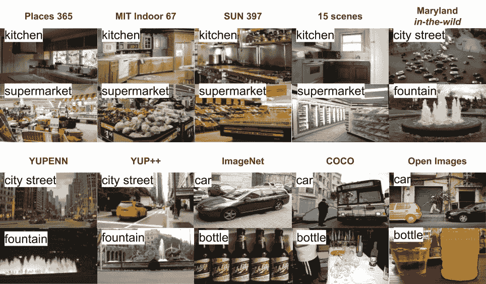

<!--yml

分类：未分类

日期：2024-09-06 20:00:23

-->

# [2007.01806] 从视觉数据进行场景识别的深度学习：综述

> 来源：[`ar5iv.labs.arxiv.org/html/2007.01806`](https://ar5iv.labs.arxiv.org/html/2007.01806)

¹¹机构：荷兰格罗宁根大学伯努利数学、计算机科学与人工智能研究所，Nijenborgh 9, 9747 AG, Groningen, The Netherlands

¹¹电子邮件：e.talavera.martinez@rug.nl

# 从视觉数据进行场景识别的深度学习：综述

阿丽娜·马泰**  安德莉亚·格拉万**    斯特法尼亚·塔拉维拉 [0000-0001-5918-8990](https://orcid.org/0000-0001-5918-8990 "ORCID identifier")

###### 摘要

深度学习技术在过去几年中得到了迅猛发展，直接促进了人工智能领域的进步。本研究旨在回顾使用深度学习模型进行场景识别的最新进展。场景识别仍然是计算机视觉中的一个新兴领域，主要从单张图像和动态图像的角度进行了探讨。我们首先概述了用于图像和视频场景识别的可用数据集。随后，我们描述了该领域研究论文中提出的集成技术。最后，我们对我们的发现做出一些评论，并讨论我们认为该领域的挑战及未来的研究方向。本文旨在为场景识别任务的模型选择提供未来的指南。

###### 关键词：

场景识别 集成技术 深度学习 计算机视觉

## 1 引言

识别场景是人类每天都会进行的任务。当在人行道上走动并从一个位置移动到另一个位置时，人类通常很容易识别自己所在的位置。在过去几年中，深度学习架构，如卷积神经网络（CNNs），在许多分类任务中超越了传统方法。这些模型在大型和多样化的数据集可用于训练时表现出高分类性能。如今，现有的视觉数据不仅以静态格式（如图像）呈现，还以动态格式（如视频录制）呈现。视频分析增加了额外的复杂性，因为必须考虑视频录制的固有时间方面：视频可以捕捉到经历时间变化的场景。深度学习中的场景识别已经通过集成技术得到处理，这些技术结合了从图像中提取的不同层次的语义，例如识别的对象、全局信息和不同尺度的上下文。

发展稳健且可靠的自动场景识别模型对于智能系统和人工智能领域至关重要，因为它直接支持现实生活中的应用。例如，场景和事件识别在文献中已有探讨[1, 29]。室内定位中的机器人本地化的场景识别是场景识别的一个新兴应用范围[2, 5, 21]。根据[21]的作者，在接下来的二十年里，每个家庭可能都会拥有用于家务、监控或陪伴任务的社交机器人。在 lifelogging 领域，照片序列的集合已被证明是理解人类行为的丰富工具。在[9, 19]中，开发了用于分析由可穿戴相机收集的自我中心图像的方法。上述方法要么采用基于图像的方法，要么采用基于视频或照片序列的方法来解决场景识别问题。

作为贡献，(i) 据我们所知，这是第一个收集处理视觉数据（包括图像和视频）场景识别任务的深度学习工作的调查。此外，(ii) 我们描述了那些助力于该领域快速发展的可用数据集。

本文结构如下：在第二部分中，我们讨论了支持场景和对象集中识别的可用数据集。第三部分讨论了论文中讨论的最先进技术和方法论。此外，在第四部分中，我们讨论了提出的方法。最后，在第五部分中，我们总结了一些结论。

## 2 个场景识别数据集

深度学习方法在场景识别中的最新进展得益于大型和详尽的数据集及支持深度网络训练的硬件。因此，深度学习 CNN 被应用于应对场景识别任务的复杂性和高差异性。

场景识别的固有困难与描绘场景上下文的图像的特性有关。[30]中描述了两个主要挑战：

+   •

    视觉不一致性指的是低的类间差异。一些场景类别可能具有相似的视觉外观，这会导致类别重叠的问题。由于属于两个不同类别的图像可能容易互相混淆，因此类别重叠不可忽视。

+   •

    标注模糊性描述了场景类别的高类内方差。类别的划分是一个主观过程，极度依赖标注员的经验，因此来自同一类别的图像可能在外观上存在显著差异。

大多数可用数据集集中于对象类别，提供标签 [6, 10, 13, 20]、边界框 [15] 或分割 [15, 18]。ImageNet [6]、COCO（上下文中的常见对象）[18] 和 Open Images [15] 在对象识别领域广为人知。尽管这些数据集是为对象识别构建的，但迁移学习已被证明是应用于场景识别的有效方法。

图 1：表 1 中描述的公开可用数据集的样本示例。样本来自相似数据集（即场景、视频和物体中心），以突出图像和视频数据的多样性。对于视频中心的数据集（即马里兰州“野外”、YUPENN、YUP++），展示了代表性的视频帧。

文献中我们可以找到 15-scenes [16]、MIT Indoor67 [23]、SUN397 [32] 和 Places365 [35] 作为以场景为中心的数据集。更具体地，Places 项目引入了 Places365 作为参考数据集，该数据集包含 434 个场景，占自然和人造世界中人们可能遇到的场景类型的 98%。共收集了 1000 万张图像，从中选择了 365 个场景类别作为数据集的一部分。多个标注员被要求标注每张图像，标注不一致的图像被丢弃。目前，数据集提供了 Places365 标准格式（即 365 个类别，约 100 万张图像训练集，每个类别 50 张图像的验证集和每个类别 900 张图像的测试集）和 Places365 挑战格式，后者将训练集扩展到总共 800 万张图像样本。凭借这样规模的数据集，仅用描述场景的数据进行 CNN 训练变得可行。

表 1：公开可用的数据集概览，用于场景识别任务。

| 数据集 | 数据 | 类别数量 | 分类为 | 标注为 |
| --- | --- | --- | --- | --- |
|  图像 |  流 |  物体 |  场景 |
| Places365 [35] | 100 万张图像 | 365 |  |  |  |  |
| MIT Indoor67 [23] | 15620 张图像 | 67 |  |  |  |  |
| SUN397 [32] | 108754 张图像 | 397 |  |  |  |  |
| 15 场景 [32] | 4000 张图像 | 15 |  |  |  |  |
| 马里兰州“野外” [24] | 10 视频 | 13 |  |  |  |  |
| YUPENN [7] | 410 视频 | 14 |  |  |  |  |
| YUP++ [8] | 1200 视频 | 20 |  |  |  |  |
| Imagenet [6] | 3.2M 图像 | 1000 |  |  |  |  |
| COCO [18] | 1.5M 图像 | 80 |  |  |  |  |
| Open Images [15] | 1.7M 图像 | 600 |  |  |  |  |

场景识别还包括动态场景数据；由于包含此类数据的可用数据集数量有限，因此该子领域的大多数研究工作还包括收集适当的实验数据。在这里，我们重点介绍了马里兰州“野外”[24]、YUPENN [7] 和 YUP++ [8] 数据集。数据集 [8] 通过引入更复杂的数据，即带有摄像机运动的视频，带来了新的挑战。三种数据集中记录的类别范围远没有上述物体和场景数据集那样详尽。这反映了这一特定场景识别领域研究的初期状态。

[24] 和 [7] 数据集的原始模型并未基于深度学习技术。马里兰州“野外”[24] 的作者引入了一种混沌系统框架来描述视频。作者提出的管道为每个视频帧提取一个 960 维的 Gist 描述符。每一维被视为时间序列，从中计算出混沌不变量。最终分类使用传统分类器，如 KNN 和 SVM。在 [7] 中，作者引入了 YUPENN 数据集，并为其分析提出了一种时空导向的能量特征表示，使用 KNN 进行分类。

在表 1 中提供了所描述数据集的概述。在图 1 中，我们通过呈现每个数据集的代表性图像样本来完成数据集的定量概述。

## 3 种场景识别框架

在本节中，我们描述了有关场景识别的最先进深度学习方法的相关方面。选择深度架构是因为任务的复杂性：由于图像未进行语义描述，所使用的模型旨在学习场景的一般上下文特征，这些特征由高层卷积层捕捉。

在深度学习之前，视觉识别技术在面对这类问题时广泛使用了对象识别[4、17]。场景将基于场景中识别出的对象的详尽列表进行识别。然而，还出现了其他挑战，如对象检测及其高变化性。对象检测和整体上下文识别的结合[28] 显示出了有希望的结果。

聚焦于深度学习研究论文，我们根据分析的数据集类型（图像或视频）对其进行分组。我们在评估的数据集的背景下展示它们的表现和局限性。

### 3.1 静态场景识别

一些研究已经解决了基于单张图像分析的场景识别问题。最著名的场景识别工作在 [35] 中介绍，它依赖于 Places365 数据集。

表 2：在 Places365 数据集的验证集和测试集上的训练网络的 Top-5 分类准确率。除了在 Places365 上进行微调的 ResNet 架构外，其他架构都是从头开始训练的。

| 架构 | Top-5 准确率 |
| --- | --- |
| 训练于 Places365 |  验证集 |  测试集 |
| --- | --- | --- |
| Places365 AlexNet [35] | 82.89% | 82.75% |
| Places365 GoogleNet[35] | 83.88% | 84.01% |
| Places365 VGG [35] | 84.91% | 85.01% |
| Places365 ResNet [35] | 85.08% | 85.07% |

深度学习架构已在 Places365 数据集上进行了训练。文献[35]的作者提出的方法是利用手头的庞大数据集，通过在 Places 数据集上训练三种流行的 CNN 架构（即 AlexNet [14。引入新的数据集时，测试在 Places365 上训练的权重的泛化能力成为了一种惯例。因此，作者在新数据集上微调这些专门训练在 Places365 上的网络。例如，预训练于 Places365 数据集的 VGG16[25。

表 3：针对 15 个场景、MIT 室内、SUN 397 数据集的单图像分类方法在准确度上的定量比较概述。

|  | 15 个场景 | MIT 室内 | SUN 397 |
| --- | --- | --- | --- |
| Places365 AlexNet [35] | 89.25% | 70.72% | 56.12% |
| Places365 GoogleNet[35] | 91.25% | 73.20% | 58.37% |
| Places365 VGG [35] | 91.97% | 76.53% | 63.24% |
| Hybrid1365 VGG [35] | 92.15% | 79.49% | 61.77% |
| 7-scale Hybrid VGG [12] | 94.08% | 80.22% | 63.19%* |
| 7-scale Hybrid AlexNet [12] | 93.90% | 80.97% | 65.38% |

此外，在 [11] 中，作者对 ResNet152 残差网络架构进行了实验，并在 Places365 数据集上进行了微调。这项工作在 Places365 数据集的验证集和测试集上分别达到了 85.08% 和 85.07% 的 top-5 准确率，如表 2 所示。

各种方法提出了图像的语义和上下文组合。例如，在 [29] 中，作者提出了 Hybrid1365 VGG 架构，这是一种为物体和场景识别训练的深度学习技术组合。该方法利用物体在场景中出现的不同尺度，通过针对图像中的不同兴趣区域来促进分类过程。物体通常出现在较低的尺度上，因此，物体分类器应针对图像的局部范围。相比之下，场景分类器应面向全局尺度，以捕捉上下文信息。他们总结道，可以扩展每种方法单独获得的性能。Hybrid1365 VGG 架构 [29] 在所有针对地点中心 CNN 方法的实验中得到了最高的平均准确率 81.48%（在表 3 中显示的 3 个比较数据集中的 2 个具有最高性能）。

数据集偏差在图像不同缩放条件下的问题在[12]中得到了解决，涉及一种多尺度模型，该模型结合了专注于物体或场景知识的多种 CNN。作者将 Places 和 ImageNet 数据集中可用的训练数据进行了结合。两种数据集中学到的知识以适应缩放的方式进行耦合。为了聚合在所使用架构上提取的特征，采用了简单的最大池化¹¹1 最大池化是一种池化操作，它计算特征图中每个区域的最大值；用于下采样输入表示。方法以对特征空间进行下采样。如果缩放操作显著，数据的特征可能会从描述场景数据变化为物体数据。架构被用于从补丁中并行提取特征，这些补丁表示输入图像在越来越大尺度的版本下。多尺度模型结合了几种 AlexNet 架构[14]。混合多尺度架构使用不同尺度范围的独特模型；根据尺度范围，从物体中心 CNN（在 ImageNet 上预训练）、场景中心 CNN（在 Places365 上预训练）或精细调整的 CNN（根据手头的数据集调整到相应尺度）中选择最合适的模型。总共考虑了七个尺度；这些尺度通过将原始图像缩放到$227\times 227$和$1827\times 1827$像素之间获得。对于多尺度混合方法给出的最终分类，考虑了来自七个网络的 fc7 特征（即由 CNN 的第七个全连接层提取的特征）的串联。主成分分析（PCA）用于减少特征空间。该模型在 15 个场景数据集上获得了最高的 95.18%准确率[16]。

在[29]和[12]中提出的混合方法实现了比人类专家更高的准确率，该准确率定量为 70.60%。这表明，物体中心和场景中心知识的结合可能为场景识别建立了新的性能标准。

### 3.2 动态场景识别

尽管早期的场景识别研究主要集中在单幅图像上，但最近自然地转向了视频中的场景识别。卷积神经网络（CNN）在单幅图像的场景识别任务中表现出了有希望的结果，并有潜力推广到视频数据[34, 33]。为了实现这种泛化，必须考虑动态场景的时空特性。虽然静态场景（表现为单幅图像）仅呈现空间特征，但视频还捕捉了时间上的变化，这会影响场景的空间方面。因此，与视频中的场景分类任务相关的一个挑战是创建一个足够强大的模型，以捕捉场景的空间和时间信息。然而，目前关于视频分析用于场景识别的研究较少。

在[3, 22]中介绍的工作中，作者依赖于长短期记忆网络（LSTM）进行视频描述。然而，他们并未专注于场景识别。

表 4：[8]中提出的时空残差网络（T-ResNet）在 YUP++数据集上取得的结果概述。

|  | YUP++ 静态 | YUP++ 移动 | YUP++ 完整 |
| --- | --- | --- | --- |
| ResNet | 86.50% | 73.50% | 85.90% |
| T-ResNet | 92.41% | 81.50% | 89.00% |

在[8]中，作者介绍了 T-ResNet 架构，并提供了 YUP++数据集，这在动态场景识别的子领域建立了新的基准。T-ResNet 基于一个在 ImageNet 数据集[6]上预训练的残差网络[27]。它采用迁移学习将以空间为中心的残差架构调整为以时空为中心的网络。该架构取得的结果仅与经典的 ResNet 架构进行比较，如表 4 所示。T-ResNet 的优越性显而易见：它在 YUP++静态相机分区上的准确率为 92.41%，在 YUP++移动相机分区上的准确率为 81.50%，在整个 YUP++数据集上的准确率为 89.00%。这表明了时空方法的优越性。T-ResNet 模型在具有线性运动模式的类别上表现出强大的性能，例如‘电梯’、‘海洋’、‘风车农场’。然而，对于呈现不规则或混合定义运动模式的场景类别，性能受到负面影响，例如‘下雪’和‘烟花’。[8]的作者观察到 T-ResNet 在区分内在场景动态与相机额外运动方面存在困难。需要进一步研究来考虑这一差异。

## 4 讨论

大型、详尽数据集的最新可用性，如 Places 数据库，为场景识别挑战的进一步研究提供了重要支持。场景中心和对象中心知识的结合已被证明优于仅考虑场景背景的做法。通过将空间网络适应任务、使网络同时考虑场景的时间方面，动态场景识别达到了新的最先进性能。这些新兴的时空网络适用于用静态相机捕获的视频数据。然而，在相机运动添加的情况下仍面临困难。

从单图像分析场景识别方法中得到的一个观察结果是，更深层的 CNN 架构，如 GoogLeNet [26] 或 VGG [25] 在所有情况下并不优越。对于结合场景中心和对象中心网络的混合多尺度模型 [12]，使用 VGG 架构进行超过两尺度的实验（两个 VGG 网络）得到了令人失望的结果，性能逊色于仅使用单一尺度（一个网络）所取得的基准性能。由于多尺度混合模型涉及七种不同尺度，可以推断出 VGG 在应用于小输入图像补丁时会变得嘈杂。

针对描述图像的全局特征进行场景识别任务时，CNNs 被期望学习与图像中存在的上下文线索相关的深层特征。文献 [35] 观察到低级卷积层检测低级视觉概念，如物体边缘和纹理，而高级层则激活于整个物体和场景部分。尽管模型之前已在专门针对场景的数据集上训练，但网络仍通过检测物体以及上下文线索来识别图像中的语义线索。因此，虽然 Places 数据库中不包含对象标签，但在该数据库上训练的 CNNs 仍可用于对象检测。

从在不同数量场景类别（即 Places365）数据集上训练相同架构得到的另一个方面证明，拥有更多类别会导致更好的结果以及更多预测类别。我们可以观察到，AlexNet 在 Places205（Places365 之前的版本）上训练获得 57.2% 的准确率，而相同架构在 Places365 上训练获得 57.7% 的准确率。对于 places CNN 方法，主要存在两种类型的错误分类：一方面，场景背景中发生的不典型活动（例如在建筑工地拍照）；另一方面，描绘多个场景部分的图像。[35] 提出的一个可能解决方案是分配多个真实标签，以更准确地捕捉图像内容。

T-ResNet 模型取得的结果展示了时空网络在视频分析中的潜力。根据[8]的证明，从纯粹的空间网络到时空网络的转化可以在非常小的训练集（即仅 10%的 YUP++数据集）基础上成功。经过良好初始化的空间网络可以高效地转化以提取时空特征，因此，理论上，大多数在单图像分析中表现良好的网络可以轻松适应视频分析。

## 5 结论

在这项工作中，我们描述了深度学习在场景识别中的最新进展。此外，我们展示了一些场景识别的应用，以强调这一主题的重要性。我们认为，主要需要考虑的因素是应用于识别和分类的数据类型。由于场景识别任务的主观性不完全由于场景图像的性质以及场景类别的重叠，因此没有一种特定的方法可以概括所有的场景识别任务。本文将帮助专业人员做出明智的决策，选择最适合他们场景识别挑战的方法。我们发现视频分析领域有进一步研究的空间，并预计未来几年会出现大量相关的研究工作。

## 参考文献

+   [1] Bacha, S., Allili, M.S., Benblidia, N.：使用概率图模型和特征相关性进行照片集中的事件识别。视觉通信与图像表示杂志 40，546–558（2016 年）

+   [2] Baumgartl, H., Buettner, R.：在变化的光照和视点条件下，为有效的人机交互开发一个高精度的地点识别模块。在：第 53 届夏威夷国际系统科学会议论文集（2020 年）

+   [3] Bin, Y., Yang, Y., Shen, F., Xie, N., Shen, H.T., Li, X.：使用基于注意力的双向 lstm 描述视频。IEEE 网络学报 49(7)，2631–2641（2018 年）

+   [4] Bosch, A., Muñoz, X., Martí, R.：按内容组织/分类图像的最佳方法是什么？图像与视觉计算 25(6)，778–791（2007 年）

+   [5] Chaves, D., Ruiz-Sarmiento, J., Petkov, N., Gonzalez-Jimenez, J.：将 cnn 集成到机器人架构中以构建室内环境的语义地图。在：国际人工神经网络工作会议。第 313–324 页。Springer（2019 年）

+   [6] Deng, J., Dong, W., Socher, R., Li, L.J., Li, K., Fei-Fei, L.：Imagenet：一个大规模层次化图像数据库。在：2009 年 IEEE 计算机视觉与模式识别会议。第 248–255 页。IEEE（2009 年）

+   [7] Derpanis, K.G., Lecce, M., Daniilidis, K., Wildes, R.P.：动态场景理解：在场景分类中，方向特征在空间和时间中的作用。在：IEEE 计算机视觉与模式识别会议。第 1306–1313 页（2012 年）

+   [8] Feichtenhofer, C., Pinz, A., Wildes, R.P.: 动态场景识别的时间残差网络。发表于：IEEE 计算机视觉与模式识别会议论文集。第 4728–4737 页（2017）

+   [9] Furnari, A., Farinella, G.M., Battiato, S.: 自中心视频的时间分割以突出个人兴趣地点。发表于：欧洲计算机视觉会议。第 474–489 页。Springer（2016）

+   [10] Griffin, G., Holub, A., Perona, P.: Caltech-256 物体类别数据集（2007）

+   [11] He, K., Zhang, X., Ren, S., Sun, J.: 用于图像识别的深度残差学习。发表于：IEEE 计算机视觉与模式识别会议论文集。第 770–778 页（2016）

+   [12] Herranz, L., Jiang, S., Li, X.: 使用 CNN 进行场景识别：物体、尺度和数据集偏差。发表于：IEEE 计算机视觉与模式识别会议论文集。第 571–579 页（2016）

+   [13] Krizhevsky, A., Hinton, G., 等：从微小图像中学习多个特征层（2009）

+   [14] Krizhevsky, A., Sutskever, I., Hinton, G.E.: 使用深度卷积神经网络的 ImageNet 分类。发表于：神经信息处理系统进展。第 1097–1105 页（2012）

+   [15] Kuznetsova, A., Rom, H., Alldrin, N., Uijlings, J., Krasin, I., Pont-Tuset, J., Kamali, S., Popov, S., Malloci, M., Kolesnikov, A., Duerig, T., Ferrari, V.: 开放图像数据集 v4：统一的图像分类、物体检测和视觉关系检测。IJCV（2020）

+   [16] Lazebnik, S., Schmid, C., Ponce, J.: 超越特征袋：用于识别自然场景类别的空间金字塔匹配。发表于：2006 年 IEEE 计算机视觉与模式识别会议（CVPR'06）。第 2 卷，第 2169–2178 页。IEEE（2006）

+   [17] Li, L.J., Su, H., Lim, Y., Fei-Fei, L.: 作为场景分类属性的物体。发表于：欧洲计算机视觉会议。第 57–69 页。Springer（2010）

+   [18] Lin, T.Y., Maire, M., Belongie, S., Hays, J., Perona, P., Ramanan, D., Dollár, P., Zitnick, C.L.: 微软 COCO：上下文中的常见物体。发表于：欧洲计算机视觉会议。第 740–755 页。Springer（2014）

+   [19] Martinez, E.T., Leyva-Vallina, M., Sarker, M.K., Puig, D., Petkov, N., Radeva, P.: 层次方法用于分类自中心照片流中的食物场景。IEEE 生物医学与健康信息学杂志（2019）

+   [20] Nene, S.A., Nayar, S.K., Murase, H., 等：哥伦比亚物体图像库（1996）

+   [21] Othman, K.M., Rad, A.B.: 通过整合 CNN 和 ECOC 的室内房间分类系统用于社交机器人。应用科学 9(3)，470（2019）

+   [22] Peris, Á., Bolaños, M., Radeva, P., Casacuberta, F.: 使用双向递归神经网络的视频描述。发表于：国际人工神经网络会议。第 3–11 页。Springer（2016）

+   [23] Quattoni, A., Torralba, A.: 识别室内场景。发表于：2009 年 IEEE 计算机视觉与模式识别会议。第 413–420 页。IEEE（2009）

+   [24] Shroff, N., Turaga, P., Chellappa, R.: 移动景观：利用运动描述场景。见：2010 年 IEEE 计算机视觉与模式识别会议。第 1911–1918 页。IEEE（2010 年）

+   [25] Simonyan, K., Zisserman, A.: 用于大规模图像识别的非常深的卷积网络。arXiv 预印本 arXiv:1409.1556（2014 年）

+   [26] Szegedy, C., Liu, W., Jia, Y., Sermanet, P., Reed, S., Anguelov, D., Erhan, D., Vanhoucke, V., Rabinovich, A.: 深入探讨卷积网络。见：IEEE 计算机视觉与模式识别会议论文集。第 1–9 页（2015 年）

+   [27] Thorpe, M., van Gennip, Y.: 残差神经网络的深层极限。arXiv 预印本 arXiv:1810.11741（2018 年）

+   [28] Viswanathan, P., Southey, T., Little, J., Mackworth, A.: 利用视觉物体分类和全局信息进行场所分类。见：2011 年加拿大计算机与机器人视觉会议。第 1–7 页。IEEE（2011 年）

+   [29] Wang, L., Wang, Z., Du, W., Qiao, Y.: 用于图像事件识别的对象-场景卷积神经网络。CVPR, ChaLearn 注视人（LAP）挑战赛（2015 年）

+   [30] Wang, L., Guo, S., Huang, W., Xiong, Y., Qiao, Y.: 知识引导的歧义消解用于多分辨率 cnn 的大规模场景分类。IEEE 图像处理汇刊 26(4)，第 2055–2068 页（2017 年）

+   [31] Xiao, J., Ehinger, K.A., Hays, J., Torralba, A., Oliva, A.: Sun 数据库：探索大量场景类别。国际计算机视觉杂志 119(1)，第 3–22 页（2016 年）

+   [32] Xiao, J., Hays, J., Ehinger, K.A., Oliva, A., Torralba, A.: Sun 数据库：从修道院到动物园的大规模场景识别。见：2010 年 IEEE 计算机视觉与模式识别会议。第 3485–3492 页。IEEE（2010 年）

+   [33] Xu, Z., Yang, Y., Hauptmann, A.G.: 用于事件检测的判别性 cnn 视频表示。见：IEEE 计算机视觉与模式识别会议论文集。第 1798–1807 页（2015 年）

+   [34] Yue-Hei Ng, J., Hausknecht, M., Vijayanarasimhan, S., Vinyals, O., Monga, R., Toderici, G.: 超越短片段：用于视频分类的深度网络。见：IEEE 计算机视觉与模式识别会议论文集。第 4694–4702 页（2015 年）

+   [35] Zhou, B., Lapedriza, A., Khosla, A., Oliva, A., Torralba, A.: Places: 一个用于场景识别的 1000 万图像数据库。IEEE 模式分析与机器智能汇刊（2017 年）
