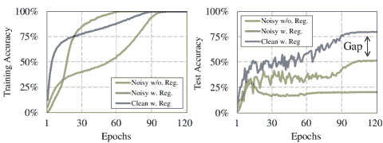
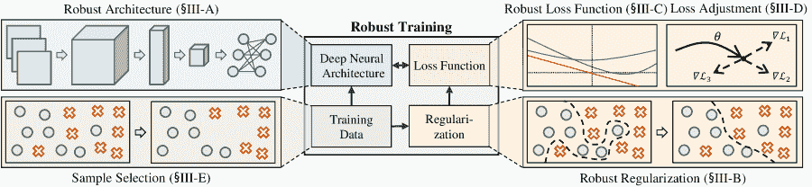
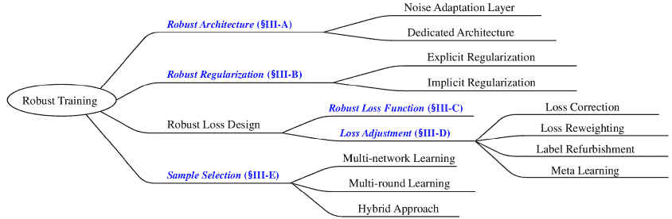
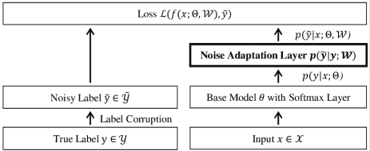
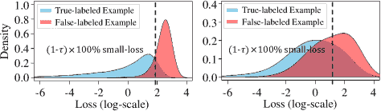
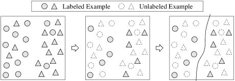
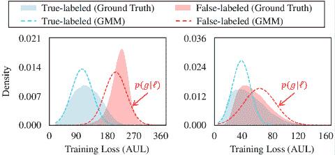

<!--yml

分类：未分类

日期：2024-09-06 20:00:21

-->

# [2007.08199] 从嘈杂标签中学习的深度神经网络：综述

> 来源：[`ar5iv.labs.arxiv.org/html/2007.08199`](https://ar5iv.labs.arxiv.org/html/2007.08199)

\DeclareNewFootnote

[para]A

# 从嘈杂标签中学习的深度神经网络：综述

Hwanjun Song、Minseok Kim、Dongmin Park、Yooju Shin、Jae-Gil Lee H. Song 现为 NAVER AI Lab 的研究员，地址为韩国城南市 13561（电子邮件：hwanjun.song@navercorp.com）；M. Kim、D. Park、Y. Shin 和 J.-G. Lee 均为韩国科学技术院知识服务工程研究生院的成员，地址为韩国大田市 34141（电子邮件：minseokkim@kaist.ac.kr；dongminpark@kaist.ac.kr；yooju24@kaist.ac.kr；jaegil@kaist.ac.kr）。该工作已提交至 IEEE 进行可能的出版。版权可能会在未通知的情况下转让，届时该版本可能不再可用。

###### 摘要

深度学习在许多领域取得了显著成功，得益于大量的大数据。然而，由于许多现实场景中缺乏高质量标签，数据标签的质量成为了一个关注点。由于嘈杂标签严重影响深度神经网络的泛化性能，从嘈杂标签中学习（鲁棒训练）正成为现代深度学习应用中的一个重要任务。在本综述中，我们首先从监督学习的角度描述标签噪声学习的问题。接着，我们全面回顾了 62 种最先进的鲁棒训练方法，这些方法根据其方法学差异被分类为五组，并系统比较了用于评估其优越性的六种特性。随后，我们对噪声率估计进行了深入分析，并总结了常用的评估方法，包括公共嘈杂数据集和评估指标。最后，我们提出了几条有前景的研究方向，作为未来研究的指导。所有内容将在 [`github.com/songhwanjun/Awesome-Noisy-Labels`](https://github.com/songhwanjun/Awesome-Noisy-Labels) 上提供。

###### 关键词：

深度学习，嘈杂标签，标签噪声，鲁棒优化，鲁棒深度学习，分类，综述

## I 引言

随着大规模数据集的出现，深度神经网络（DNNs）在众多机器学习任务中表现出令人印象深刻的性能，如计算机视觉 [1, 2]、信息检索 [3, 4, 5] 和语言处理 [6, 7, 8]。它们的成功依赖于海量但经过精心标注的数据，这些数据的获取既昂贵又耗时。一些非专家来源，如亚马逊的 Mechanical Turk 和收集数据的周边文本，被广泛用来缓解高标注成本的问题；然而，这些来源的使用通常会导致标签不可靠 [9, 10, 11, 12]。此外，即使对于经验丰富的领域专家，数据标签也可能非常复杂 [13, 14]；它们还可能受到标签翻转攻击 [15] 的对抗性操控。这些不可靠的标签被称为*噪声标签*，因为它们可能*与真实标签*相悖。报告指出，现实世界数据集中被污染标签的比例从$8.0\%$到$38.5\%$不等 [16, 17, 18, 19]。

在存在噪声标签的情况下，训练 DNNs 被认为容易受到噪声标签的影响，因为模型参数众多使得 DNNs 对即使是被污染的标签也容易过拟合，具备学习任何复杂函数的能力 [20, 21]。张等 [22] 证明了 DNNs 可以轻松拟合任何比例的被污染标签的整个训练数据集，这最终导致在测试数据集上的泛化能力差。不幸的是，虽然数据增强 [23]、权重衰减 [24]、dropout [25] 和批量归一化 [26] 等流行的正则化技术已被广泛应用，但它们*不能*单独完全克服过拟合问题。如图 1 所示，即使激活了所有上述正则化技术，模型在干净数据和噪声数据上训练的测试准确率差距依然显著。此外，标签噪声造成的准确率下降被认为比其他噪声，如输入噪声 [27]，更具危害。因此，在噪声标签存在的情况下实现良好的泛化能力是一个关键挑战。

图 1：使用标准训练方法在 CIFAR-100 数据集上训练 WideResNet-16-8 时的训练和测试精度收敛曲线，其中对称噪声为$40\%$：“Noisy w/o. Reg.”和“Noisy w. Reg.”分别是训练于有噪声数据的无正则化和有正则化模型，“Clean w. Reg.”是训练于干净数据的有正则化模型。

为了研究在噪声标签下的监督学习，已经进行了多项研究。除了传统的机器学习技术 [13, 28]，深度学习技术最近在机器学习社区中获得了显著关注。在这项调查中，我们呈现了克服噪声标签的最新深度学习技术进展。我们通过递归追踪在主要研究会议上发布的论文中的相关参考文献，如 CVPR、ICCV、NeurIPS、ICML 和 ICLR，来调查近期的研究。尽管我们试图全面纳入提交时所有近期研究，但由于深度学习论文的数量呈平方增长，可能有些未被包括。所包括的研究被分为*五*个类别，如图 2 所示（详情见第 III 节）。

图 2：克服噪声标签的最新深度学习方法的分类。

### I-A 相关调查

Frénay 和 Verleysen [13] 讨论了从噪声标签中学习的潜在负面影响，并提供了关于噪声鲁棒分类方法的综合综述，重点关注传统的监督方法，如朴素贝叶斯和支持向量机。此外，他们的综述包括了标签噪声的定义和来源以及标签噪声的分类。张等人 [28] 讨论了另一个方面的标签噪声，即由非专家注释的众包数据，并对期望最大化（EM）算法进行了详细回顾，这些算法旨在提高众包标签的质量。与此同时，Nigam 等人 [29] 对于处理噪声标签的深度学习算法进行了简要介绍；然而，这些算法的范围仅限于两类，即损失函数和样本选择（见图 2）。最近，Han 等人 [30] 总结了处理噪声标签的鲁棒学习的核心组件，但他们的分类在理念上与我们完全不同；我们主要关注系统方法的差异，而他们则关注更一般的观点，如输入数据、目标函数和优化策略。此外，本综述首次提供了现有鲁棒训练方法的全面方法学比较（见表 II 和 III）。

### I-B 综述范围

使用深度神经网络（DNNs）进行鲁棒训练变得至关重要，以保证机器学习算法的可靠性。除了标签噪声，两个类型的有缺陷训练数据已经被不同社区积极研究[31, 32]。*对抗学习*旨在处理输入的小范围、最坏情况扰动，即对抗样本，这些样本是恶意构造的，目的是欺骗已经训练好的模型，使其出现错误[33, 34, 35, 36]。与此同时，*数据填补*主要处理训练数据中的缺失输入，其中缺失值是从观察到的值中估算得出的[37, 32]。对抗学习和数据填补与鲁棒学习密切相关，但处理*特征*噪声超出了本综述的范围——即，学习来自噪声*标签*。

## II 初步准备

本节提供了带噪标签的监督学习问题陈述以及标签噪声的分类。管理噪声标签是一个长期存在的问题，因此我们回顾了基本的传统方法和支撑鲁棒深度学习的理论基础。表 I 总结了本研究中频繁使用的符号。

表 I：符号说明汇总。

| 符号 | 描述 |
| --- | --- |
| $\mathcal{X}$ | 数据特征空间 |
| $\mathcal{Y}$, $\tilde{\mathcal{Y}}$ | 真实和噪声标签空间 |
| $\mathcal{D}$, $\tilde{\mathcal{D}}$ | 清洁和噪声训练数据 |
| $P_{\mathcal{D}}$, $P_{\tilde{\mathcal{D}}}$ | 清洁数据和噪声数据的联合分布 |
| $\mathcal{B}_{t}$ | 时间 $t$ 的小批量样本集合 |
| $\Theta_{t}$ | 时间 $t$ 的深度神经网络参数 |
| $f(\,\cdot\,;\Theta_{t})$ | 由 $\Theta_{t}$ 参数化的深度神经网络 |
| $\ell$ | 特定的损失函数 |
| $\mathcal{R}$ | 经验风险 |
| $\mathbb{E}_{\mathcal{D}}$ | 对 $\mathcal{D}$ 的期望 |
| $x$, $x_{i}$ | $\mathcal{X}$ 的数据样本 |
| $y$, $y_{i}$ | $\mathcal{Y}$ 的真实标签 |
| $\tilde{y}$, $\tilde{y}_{i}$ | $\tilde{\mathcal{Y}}$ 的噪声标签 |
| $\eta$ | 特定的学习率 |
| $\tau$ | 真实噪声率 |
| $b$ | $\mathcal{B}_{t}$ 中的小批量样本数量 |
| $c$ | 类别数 |
| T, $\hat{\text{T}}$ | 真实和估计的噪声转换矩阵 |

图 3：针对噪声标签的鲁棒深度学习的高层次研究概览。由机器学习社区积极贡献的研究方向被分类为五组，使用蓝色斜体表示。

### II-A 带噪标签的监督学习

*分类* 是一种典型的监督学习任务，旨在学习一个将输入特征映射到标签的函数 [38]。本文考虑使用具有 softmax 输出层的 DNN 进行 $c$ 类分类问题。设 $\mathcal{X}\subset\mathbb{R}^{d}$ 为特征空间，$\mathcal{Y}=\{0,1\}^{c}$ 为以 *one-hot* 方式表示的真实标签空间。在典型的分类问题中，我们获得了从未知联合分布 $P_{\mathcal{D}}$ 上的 $\mathcal{X}\times\mathcal{Y}$ 得到的训练数据集 $\mathcal{D}=\{(x_{i},y_{i})\}_{i=1}^{N}$，其中每个 $(x_{i},y_{i})$ 是 *独立同分布* 的。任务的目标是学习 DNN 的映射函数 $f(\,\cdot\,;\Theta):\mathcal{X}\rightarrow[0,1]^{c}$，使得参数 $\Theta$ 最小化经验风险 $\mathcal{R}_{\mathcal{D}}(f)$，

|  | $\!\!\mathcal{R}_{\mathcal{D}}(f)=\mathbb{E}_{\mathcal{D}}[\ell\big{(}f(x;\Theta),y\big{)}]=\frac{1}{\vert\mathcal{D}\vert}\!\sum_{(x,y)\in\mathcal{D}}\!\!\!\!\ell\big{(}f(x;\Theta),y\big{)},$ |  | (1) |
| --- | --- | --- | --- |

其中 $\ell$ 是某个损失函数。

由于数据标签在各种现实世界场景中被破坏，我们的目标是从噪声标签中训练 DNN。具体来说，我们获得了从噪声联合分布 $P_{\tilde{\mathcal{D}}}$ 上得到的噪声训练数据集 $\tilde{\mathcal{D}}=\{(x_{i},\tilde{y}_{i})\}_{i=1}^{N}$，其中 $\tilde{y}$ 是可能不真实的*噪声*标签。因此，按照标准训练程序，时间 $t$ 时从噪声训练数据集 $\tilde{\mathcal{D}}$ 随机获得一个包含 $b$ 个示例的迷你批次 $\mathcal{B}_{t}=\{(x_{i},\tilde{y}_{i})\}_{i=1}^{b}$。随后，时间 $t$ 时的 DNN 参数 $\Theta_{t}$ 沿着迷你批次 $\mathcal{B}_{t}$ 上经验风险的下降方向进行更新，

|  | $\Theta_{t+1}=\Theta_{t}-\eta\nabla\Big{(}\frac{1}{\vert\mathcal{B}_{t}\vert}\!\sum_{(x,\tilde{y})\in\mathcal{B}_{t}}\!\!\!\!\ell\big{(}f(x;\Theta_{t}),\tilde{y}\big{)}\Big{)},$ |  | (2) |
| --- | --- | --- | --- |

其中 $\eta$ 是指定的学习率。

在这里，由于噪声标签计算的损失，风险最小化过程不再*耐噪声*。深度神经网络（DNNs）可以轻易地记住被破坏的标签，从而使其对未见数据的泛化能力退化 [13, 28, 29]。因此，减轻标签噪声的不利影响对于实现深度学习的噪声容忍训练至关重要。

### II-B 标签噪声分类

本节介绍了为设计稳健训练算法而采用的标签噪声类型。即使数据标签被从真实标签中*任意*地破坏，从本质上讲，破坏概率受*数据特征*或*类别标签*之间依赖关系的影响。Frénay 和 Verleysen 提供了标签噪声分类的详细分析 [13]。大多数现有算法处理的是实例无关噪声，但由于其复杂的建模，实例依赖噪声尚未得到广泛研究。

#### II-B1 实例无关标签噪声

一种典型的标签噪声建模方法假设，当给定真实标签时，腐蚀过程在条件上与数据特征*独立*[39, 22]。也就是说，真实标签通过*噪声转移矩阵* $\text{T}\in[0,1]^{c\times c}$ 被腐蚀，其中 $\text{T}_{ij}\coloneqq p(\tilde{y}=j|y=i)$ 是真实标签 $i$ 被翻转为腐蚀标签 $j$ 的概率。在这种方法中，如果 $\forall_{i=j}\text{T}_{ij}\!=\!1-\tau\wedge\forall_{i\neq j}\text{T}_{ij}=\frac{\tau}{c-1}$，噪声被称为*对称*（或*均匀*）噪声，噪声率为 $\tau\in[0,1]$，即真实标签以相等的概率被翻转为其他标签。与对称噪声相反，如果 $\forall_{i=j}\text{T}_{ij}\!=\!1-\tau\wedge\exists_{i\neq j,i\neq k,j\neq k}\text{T}_{ij}>\text{T}_{ik}$，则噪声称为*不对称*（或*标签相关*）噪声，其中真实标签更有可能被错误标记为特定标签。例如，“狗”更可能与“猫”混淆，而不是与“鱼”混淆。在更严格的情况下，当 $\forall_{i=j}\text{T}_{ij}\!=\!1-\tau\wedge\exists_{i\neq j}\text{T}_{ij}=\tau$ 时，噪声被称为*配对噪声*，其中真实标签仅被翻转为某个特定标签。

#### II-B2 实例依赖标签噪声

为了更现实的噪声建模，假设腐蚀概率*依赖*于数据特征和类别标签[16, 40]。因此，腐蚀概率定义为 $\rho_{ij}(x)\!=\!p(\tilde{y}\!=\!j|y\!=\!i,x)$。与上述噪声不同，示例 $x$ 的数据特征也会影响 $x$ 被错误标记的机会。

### II-C 非深度学习方法

多年来，许多方法被提出用来管理噪声标签，这些方法使用传统的机器学习技术。这些方法可以被分为*四*组[13, 41, 29]，如下：

+   •

    数据清洗：通过排除标签可能被腐蚀的示例来清洗训练数据。使用自助法和提升法来筛选错误标记的示例，以移除权重较高的示例，因为错误标记的示例往往具有比真实标记的示例更高的权重[42, 43]。此外，各种方法，如 $k$-近邻、异常值检测和异常检测，已广泛应用于从噪声训练数据中排除错误标记的示例[44, 45, 46]。尽管如此，这类方法存在过度清洗的问题，可能过度删除甚至真实标记的示例。

+   •

    替代损失：受到 0-1 损失函数的噪声容忍性的启发 [39]，许多研究者尝试解决其固有的局限性，如计算困难和非凸性，这使得梯度方法无法使用。因此，已经提出了几种凸替代损失函数，这些函数近似于 0-1 损失函数，用于在二分类设置下训练指定的分类器 [47, 48, 49, 50, 51]。然而，这些损失函数不能支持多分类任务。

+   •

    概率方法：在特征分布有助于解决带噪声标签的学习问题的假设下 [52]，通过聚类估计每个标签的置信度，然后用于加权训练方案 [53]。这种置信度也用于将硬标签转换为软标签，以反映标签的不确定性 [54]。除了这些聚类方法外，还提出了几种贝叶斯方法用于图模型，使其能够在学习过程中利用任何类型的先验信息 [55]。然而，这一类方法可能由于模型参数数量增加而加剧过拟合问题。

+   •

    基于模型的方法：由于传统模型，如 SVM 和决策树，对噪声标签不够鲁棒，已经投入了大量的精力来提高其鲁棒性。为了开发一个鲁棒的 SVM 模型，学习过程中的错误分类示例在目标函数中受到惩罚 [56, 57]。此外，多个决策树模型通过新的分裂标准得以扩展，以解决当训练数据不完全可靠时的过拟合问题 [58, 59]。然而，将这些设计原则应用于深度学习是不切实际的。

与此同时，由于深度学习的高表达能力，它比传统机器学习更容易受到标签噪声的影响，这一点已被许多研究者证明 [21, 60, 61]。已经投入了大量的精力来理解噪声标签为什么会对 DNN 的性能产生负面影响 [62, 22, 61, 63]。这种理论理解已经导致了算法设计，能够比非深度学习方法实现更高的鲁棒性。Han 等人提供了对鲁棒深度学习理论理解的详细分析 [30]。

### II-D 带噪声标签的回归

除了分类，回归是监督机器学习的另一个主要主题，旨在建模多个特征与连续目标变量之间的关系。与具有*离散*标签空间的分类任务不同，回归任务将连续变量视为其目标标签 [64]，因此它学习映射函数 $f(\leavevmode\nobreak\ \cdot\leavevmode\nobreak\ ;\Theta):\mathcal{X}\rightarrow\mathcal{Y}$，其中 $\mathcal{Y}\in\mathbb{R}$ 是一个*连续*标签空间。给定输入特征 $x$ 和其真实标签 $y$，回归任务中考虑了两种类型的标签噪声。一种是*加性噪声* [65]，通过 $\tilde{y}:=y+\epsilon$ 表示，其中 $\epsilon$ 从与输入特征无关的随机分布中抽取；另一种是*实例相关噪声* [66]，通过 $\tilde{y}:=\rho(x)$ 表示，其中 $\rho:\mathcal{X}\rightarrow\mathcal{Y}$ 是一个依赖于输入特征的噪声函数。

尽管回归预测连续值，但回归和分类共享从输入特征 $x$ 到输出标签 $y$ 的映射函数的学习概念。因此，许多针对分类的鲁棒方法可以通过简单修改轻松扩展到回归问题 [67]。因此，在本综述中，我们专注于定义了大多数鲁棒方法的分类设置。

## III 深度学习方法

根据我们的全面调查，深度学习的鲁棒性可以通过多种方法得到增强 [68, 16, 25, 69, 70, 71, 72, 73, 74]。图 3 展示了机器学习社区进行的最新研究方向概述。所有这些方法（即，§III-A – §III-E）都集中在使监督学习过程对标签噪声更具鲁棒性：

+   •

    (§III-A) 鲁棒架构：在基础 DNN 顶部添加一个噪声适应层，以学习标签过渡过程，或开发专用架构以可靠地支持更多类型的标签噪声；

+   •

    (§III-B) 鲁棒正则化：明确或隐含地强制 DNN 对错误标记的样本过拟合较少；

+   •

    (§III-C) 强健损失函数：改进损失函数；

+   •

    (§III-D) 损失调整：通过损失校正、损失重标定或标签修正，根据给定损失（或标签）的置信度调整损失值；

+   •

    (§III-E) 样本选择：通过多网络或多轮学习从噪声训练数据中识别真实标签的示例。

总的来说，我们将所有最新的深度学习方法归类为 *五* 组，对应于流行的研究方向，如图 3 所示。在 §III-D 中，也讨论了元学习，因为它找到了损失重标定的最佳超参数。在 §III-E 中，我们讨论了将样本选择与其他正交方向或半监督学习相结合的最新努力，以实现最先进的性能。

图 2 说明了使用这五组方法对强健训练方法的分类。

### III-A 强健架构

在许多研究中，已经对模型进行了架构上的更改，以建模噪声数据集的噪声转移矩阵 [75, 76, 77, 78, 79, 16, 80, 81, 82]。这些更改包括在 softmax 层顶部添加噪声适应层和设计新的专用架构。结果的架构通过根据估计的标签转移概率修改 DNN 输出，从而实现了更好的泛化。

#### III-A1 噪声适应层

从训练数据的角度来看，噪声过程是通过发现潜在的标签转移模式（即噪声转移矩阵 T）来建模的。给定示例 $x$，示例 $x$ 的噪声类别后验概率表示为

|  | $\begin{gathered}\!\!\!\!\!p(\tilde{y}=j&#124;x)\!=\!\sum_{i=1}^{c}p(\tilde{y}=j,y=i&#124;x)\!=\!\sum_{i=1}^{c}\text{T}_{ij}p(y=i&#124;x),\\ \text{where}\leavevmode\nobreak\ \leavevmode\nobreak\ \text{T}_{ij}=p(\tilde{y}=j&#124;y=i,x).\end{gathered}$ |  | (3) |
| --- | --- | --- | --- |

鉴于此，噪声适配层旨在模拟 DNN 学习中的标签转移行为。设$p(y|x;\Theta)$为基础 DNN 的输出，具有 softmax 输出层。然后，按照 Eq. (3)，示例$x$被预测为其噪声标签$\tilde{y}$的概率由以下公式参数化：

|  | $\begin{split}\!\!\!p(\tilde{y}=j&#124;x;\Theta,\mathcal{W})&amp;=\sum_{i=1}^{c}p(\tilde{y}=j,y\!=\!i&#124;x;\Theta,\mathcal{W})\\ &amp;=\sum_{i=1}^{c}\underbrace{p(\tilde{y}=j&#124;y\!=\!i;\mathcal{W})}_{\text{噪声适配层}}\underbrace{p(y\!=\!i&#124;x;\Theta)}_{\text{基础模型}}.\end{split}$ |  | (4) |
| --- | --- | --- | --- |

在这里，假设噪声标签$\tilde{y}$通常在条件上与输入$x$*条件独立*。因此，如图 4 所示，噪声适配层被添加在基础 DNN 的顶部，以建模由$\mathcal{W}$参数化的噪声转移矩阵。当要预测测试数据时，这一层应被移除。

图 4：使用噪声适配层的噪声建模过程。

技术细节：*Webly 学习* [75] 首先仅对由搜索引擎检索的简单示例训练基础 DNN；随后，将所有训练示例的混淆矩阵用作噪声适配层的初始权重$\mathcal{W}$。它以端到端的方式对整个模型进行微调，以处理困难的训练示例。相比之下，*噪声模型* [77] 将$\mathcal{W}$初始化为单位矩阵，并添加正则化项以强制$\mathcal{W}$在 DNN 训练过程中扩散。*Dropout 噪声模型* [25] 对适配层应用 dropout 正则化，其输出由 softmax 函数归一化，以隐式地扩散$\mathcal{W}$。*s 模型* [79] 类似于*dropout 噪声模型*，但不应用 dropout。*c 模型* [79] 是 s 模型的扩展，它建模实例依赖的噪声，比对称噪声和不对称噪声更现实。同时，*NLNN* [76] 采用 EM 算法迭代 E 步以估计噪声转移矩阵，并进行 M 步以反向传播 DNN。

备注：这一类方法的一个常见缺点是无法识别虚假标记的示例，将所有示例视为相同。因此，当仅使用噪声训练数据或噪声率较高时，转换矩阵的估计误差通常较大[83]。与此同时，对于基于 EM 的方法，陷入局部最优解是不可避免的，并且会产生高计算成本[79]。

#### III-A2 专用架构

除了依赖标签的标签噪声外，已经进行了一些研究以支持更复杂的噪声，这导致了专用架构的设计[16, 80, 81]。它们通常旨在提高估计标签转换概率的可靠性，以处理更复杂和更现实的标签噪声。

技术细节：*概率噪声建模*[16]管理两个独立的网络，每个网络专门用于预测噪声类型和标签转换概率。由于基于 EM 的方法在随机初始化下对整个网络的训练不切实际，因此在经过少量干净数据的预训练步骤后，两个网络使用大量噪声标记数据进行训练。同时，*遮罩*[80]是一种人工辅助的方法，用于传达无效标签转换的人类认知。考虑到噪声标签主要来自人类与任务之间的交互，人工调查的无效转换被利用来约束噪声建模过程。由于难以指定明确的约束，本研究采用了生成对抗网络（GANs）的变体[84]。最近，提出了*对比加性噪声网络*[81]，通过引入质量嵌入的新概念来调整错误估计的标签转换概率，该概念对噪声标签的可信度进行建模。*RoG*[85]在任何经过噪声数据预训练的判别性 DNN 基础上构建了一个简单而强健的生成分类器。

备注：与噪声适应层相比，这类方法显著提高了对更各种标签噪声类型的鲁棒性，但通常无法轻松扩展到其他架构。

### III-B 强健正则化

正则化方法在机器学习领域被广泛研究，以提高学习模型的泛化能力 [26, 24, 25, 23]。通过避免模型训练中的过拟合，使用广泛应用的正则化技术，如*数据增强* [23]、*权重衰减* [24]、*dropout* [25]和*批量归一化* [26]，对标签噪声的鲁棒性得以提高。这些经典的正则化方法在适度噪声的数据上表现良好，但它们单独*不能充分*提高测试准确性；当噪声较重时，可能会获得较差的泛化效果 [86]。因此，最近提出了更多先进的正则化技术，这些技术在与经典方法结合使用时进一步提高了对标签噪声的鲁棒性。这类方法的主要优势在于其与其他方向协作的*灵活性*，因为它只需要简单的修改。

#### III-B1 显式正则化

正则化可以是显式形式，修改期望的训练损失，例如权重衰减和 dropout。

技术细节：*双层学习* [87] 使用干净的验证数据集，通过引入双层优化方法来正则化模型的过拟合，这种方法与传统方法的不同之处在于其正则化约束也是一个优化问题。通过调整每个小批量上的权重并选择其值，使其最小化验证数据集上的误差，从而控制过拟合。与此同时，*标注者混淆* [86] 假设存在多个标注者，并引入基于正则化的 EM 方法来建模标签转移概率；其正则化器使得估计的转移概率收敛于标注者的真实混淆矩阵。相比之下，*预训练* [88] 实证证明，相比于从头训练的模型，微调预训练模型显著提高了鲁棒性；预训练的通用表示防止了模型参数因噪声标签而被错误更新。*PHuber* [89] 提出了基于复合损失的梯度裁剪，这是一种针对标签噪声鲁棒性的标准梯度裁剪的变体。*鲁棒的早期学习* [90] 将关键参数和非关键参数分别分类用于拟合干净和噪声标签，然后仅对非关键参数施加不同的更新规则。*ODLN* [91] 利用开放集辅助数据，通过将随机标签分配给从标签集中均匀采样的开放集示例，来防止对噪声标签的过拟合。

备注：显式正则化通常引入敏感的模型依赖超参数或需要更深的架构来弥补容量的减少，但如果这些超参数得到最佳调整，它可以带来显著的性能提升。

#### III-B2 隐式正则化

正则化还可以是一种隐式形式，这种形式能产生随机性的效果，例如数据增强和小批量随机梯度下降。

技术细节：*对抗训练* [92] 通过鼓励深度神经网络（DNN）正确分类原始输入和敌对扰动输入来提高噪声容忍度。*标签平滑* [93, 94] 估计训练过程中标签噪声的边际效应，从而通过防止 DNN 将全部概率分配给噪声训练样本来减少过拟合。噪声标签被混合在所有可能标签上，而不是使用独热标签，

|  | $\begin{gathered}\bar{y}=\big{\langle}\bar{y}(1),\bar{y}(2),\dots,\bar{y}(c)\big{\rangle},\\ \text{其中}\leavevmode\nobreak\ \bar{y}(i)=(1-\alpha)\cdot[\tilde{y}=i]+\alpha/c\leavevmode\nobreak\ \text{和}\leavevmode\nobreak\ \alpha\in[0,1].\end{gathered}$ |  | (5) |
| --- | --- | --- | --- |

这里，$[\cdot]$ 是 Iverson 括号，$\alpha$ 是平滑度。相反，*mixup* [95] 对 DNN 进行正则化，以在训练样本之间偏向简单的线性行为。首先，使用虚拟训练样本构建小批量，每个样本是通过对两个从噪声训练数据 $\tilde{\mathcal{D}}$ 随机获得的噪声训练样本 $(x_{i},\tilde{y}_{i})$ 和 $(x_{j},\tilde{y}_{j})$ 进行线性插值而形成的，

|  | ${x}_{mix}=\lambda x_{i}+(1-\lambda)x_{j}\leavevmode\nobreak\ \leavevmode\nobreak\ \text{和}\leavevmode\nobreak\ \leavevmode\nobreak\ {y}_{mix}=\lambda\tilde{y}_{i}+(1-\lambda)\tilde{y}_{j},$ |  | (6) |
| --- | --- | --- | --- |

其中 $\lambda\in[0,1]$ 是两个样本之间的平衡参数。因此，*mixup* 通过更新 DNN 来扩展训练分布，以适应构建的小批量。

备注：隐式正则化提高了 DNN 的泛化能力，而不会降低其表征能力。它也不会引入敏感的模型依赖超参数，因为它应用于训练数据。然而，扩展的特征或标签空间会减慢训练的收敛速度。

### III-C 稳健损失函数

已证明，具有*适当修改*的损失函数$\ell^{\prime}$的深度神经网络（DNN）可以接近贝叶斯最优分类器$f^{*}$，该分类器在干净数据$\mathcal{D}$上实现了最优贝叶斯风险$\mathcal{R}^{*}=\mathcal{R}_{\mathcal{D}}(f^{*})$。令$\hat{f}=\text{argmin}_{f\in\mathcal{F}}\hat{\mathcal{R}}_{\ell^{\prime},\tilde{\mathcal{D}}}(f)$为对噪声数据的修改损失$\ell^{\prime}$的学习分类器，其中$\hat{\mathcal{R}}_{\ell^{\prime},\tilde{\mathcal{D}}}(f)=\mathbb{E}_{\tilde{\mathcal{D}}}[\ell(f(x;\Theta),\tilde{y})]$。如果$\ell$是$L$-Lipschitz 且分类校准的[50]，则以至少$1\!-\!\delta$的概率，存在一个非递减函数$\zeta_{\ell}$，使得$\zeta_{\ell}(0)=0$[39]，使得

|  | $\begin{split}\mathcal{R}_{\mathcal{D}}(\hat{f})-\mathcal{R}^{*}\leq&\leavevmode\nobreak\ \overbrace{\zeta_{\ell}\Big{(}\text{min}_{f\in\mathcal{F}}\mathcal{R}_{\ell,\mathcal{D}}(f)-\text{min}_{f}\mathcal{R}_{\ell,\mathcal{D}}(f)}^{\text{近似和估计误差}}\\ &\leavevmode\nobreak\ \leavevmode\nobreak\ +4L_{p}\text{RC}(\mathcal{F})+2\sqrt{{\text{log}(1/\delta)}\big{/}{2\mid\mathcal{D}\mid}}\Big{)},\!\!\!\!\!\end{split}$ |  | (7) |
| --- | --- | --- | --- |

$L_{p}$是$\ell^{\prime}$的 Lipschitz 常数，RC 是假设类$\mathcal{F}$的 Rademacher 复杂度。然后，根据通用逼近定理[96]，贝叶斯最优分类器$f^{*}$在深度神经网络（DNNs）中保证存在于假设类$\mathcal{F}$中。

基于这一理论基础，研究人员尝试设计稳健的损失函数，以便即使在训练数据中存在噪声标签时，它们也能在未见过的干净数据上实现较小的风险[68, 97, 98, 99, 100, 101]。

技术细节：最初，Manwani 和 Sastry [48] 理论上证明了一个足够条件，以使得使用该损失函数的风险最小化对二分类变得噪声容忍。随后，这一足够条件被扩展到多类分类，使用深度学习[68]。具体而言，损失函数被定义为*噪声容忍*，对于$ c $-类分类在*对称*噪声下，如果函数满足噪声率$\tau<\frac{c-1}{c}$且

|  | $\sum_{j=1}^{c}\ell\big{(}f(x;\Theta),y=j\big{)}=C,\leavevmode\nobreak\ \forall x\in\mathcal{X},\leavevmode\nobreak\ \forall f,$ |  | (8) |
| --- | --- | --- | --- |

其中 $C$ 是一个常数。该条件保证了在指定假设下，在噪声数据上训练的分类器具有与在无噪声数据上训练的分类器相同的误分类概率。Kumar 等人 [102] 提供了*多标签* 分类的扩展。此外，如果 $\mathcal{R}_{\mathcal{D}}(f^{*})=0$，则该函数在*非对称* 噪声下也是噪声容忍的，其中 $f^{*}$ 是 $\mathcal{R}_{\mathcal{D}}$ 的全局风险最小化器。

对于分类任务，类别交叉熵（CCE）损失是最广泛使用的损失函数，因为它具有快速收敛和高泛化能力。然而，在存在噪声标签的情况下，*稳健的 MAE* [68] 研究表明，平均绝对误差（MAE）损失在泛化方面优于 CCE 损失，因为只有 MAE 损失满足上述条件。MAE 损失的一个限制是，当涉及复杂数据时，其泛化性能显著下降。因此，提出了*广义交叉熵*（GCE） [97] 来实现 MAE 和 CCE 损失的优势；GCE 损失是一种更通用的噪声鲁棒损失，包括了它们俩。Amid 等人 [103] 通过基于 Tsallis 散度引入两个温度来扩展 GCE 损失。*双温损失* [104] 基于 Bregman 散度引入了 CE 损失的适当无偏广义化。此外，受到 Kullback-Leibler 散度对称性的启发，*对称交叉熵*（SCE） [98] 通过将一个噪声容忍项，即反向交叉熵损失，与标准 CCE 损失结合提出。

与此同时，*课程损失*（CL） [99] 是 0-1 损失函数的一个替代损失；它提供了一个紧的上界，并且可以很容易地扩展到多类别分类。*主动被动损失*（APL） [105] 是两种鲁棒损失函数的组合，其中主动损失最大化属于给定类别的概率，被动损失则最小化属于其他类别的概率。

备注：这些方法的鲁棒性在理论上得到了很好的支持。然而，它们仅在简单情况下表现良好，例如学习容易或类别数量较少 [106]。此外，损失函数的修改增加了收敛的训练时间 [97]。

### III-D 损失调整

损失调整通过在更新深度神经网络（DNN）之前调整所有训练示例的损失，有效减少噪声标签的负面影响 [62, 107, 108, 109, 69, 110, 111, 19]。与之相关的方法可以根据其调整哲学分为三类：*1)* *损失修正* 通过估计噪声转移矩阵来修正前向或后向损失，*2)* *损失重标定* 通过为每个示例施加不同的重要性以进行加权训练，*3)* *标签修复* 使用从噪声标签和预测标签的凸组合中获得的修复标签调整损失，以及 *4)* *元学习* 自动推断损失调整的最佳规则。与新设计的稳健损失函数不同，这些方法旨在使传统优化过程对标签噪声具有稳健性。因此，在训练过程中，更新规则会被调整，以最小化标签噪声的负面影响。

一般来说，损失调整允许对训练数据进行*全面探索*，通过调整每个示例的损失。然而，由于*错误*修正带来的误差会累积，尤其是当类别数或标签错误示例数量较大时 [112]。

#### III-D1 损失修正

与第 III-A 节中介绍的噪声适应层类似，这种方法通过将估计的标签转移概率乘以指定 DNN 的输出来修改每个示例的损失。主要区别在于转移概率的学习与模型的学习是解耦的。

技术细节：*反向修正* [62] 最初使用未经过损失修正的 DNN 的 softmax 输出来近似噪声转移矩阵。随后，它在基于估计矩阵修正原始损失的同时重新训练 DNN。示例 $(x,\tilde{y})$ 的修正损失通过其可观测标签的损失值的线性组合来计算，其系数是对可观测标签 $y\in\{1,\dots,c\}$ 的逆转移矩阵 $\text{T}^{-1}$，给定其目标标签 $\tilde{y}$。因此，反向修正 $\textstyle\vec{}\mkern 4.0mu$ $\textstyle\ell$ 是通过将逆转移矩阵乘以所有可观测标签的预测来进行的，

|  |  $\small\begin{split}{\mathchoice{\vbox{\offinterlineskip\halign{#\cr\reflectbox{$\displaystyle\vec{}\mkern 4.0mu$}\cr\kern-3.87498pt\cr$\displaystyle\ell$\cr}}}{\vbox{\offinterlineskip\halign{#\cr\reflectbox{$\textstyle\vec{}\mkern 4.0mu$}\cr\kern-3.87498pt\cr$\textstyle\ell$\cr}}}{\vbox{\offinterlineskip\halign{#\cr\reflectbox{$\scriptstyle\vec{}\mkern 4.0mu$}\cr\kern-2.7125pt\cr$\scriptstyle\ell$\cr}}}{\vbox{\offinterlineskip\halign{#\cr\reflectbox{$\scriptscriptstyle\vec{}\mkern 4.0mu$}\cr\kern-1.93748pt\cr$\scriptscriptstyle\ell$\cr}}}}\big{(}f(x;&amp;\Theta),\tilde{y}\big{)}=\hat{\text{T}}^{-1}\Big{\langle}\ell\big{(}f(x;\Theta),1\big{)},\dots,\ell\big{(}f(x;\Theta),c\big{)}\Big{\rangle}^{\!\top}\!\!,\end{split}$ |  | (9) |
| --- | --- | --- | --- |

其中$\hat{\text{T}}$是估计的噪声转换矩阵。

相反，*前向修正* [62] 使用 DNN 的 softmax 输出的线性组合来应用损失函数。因此，前向修正$\vec{\ell}$通过在前向传播步骤中将估计的转换概率与 softmax 输出相乘来进行，

|  | $\small\begin{split}\vec{\ell}\big{(}f(x;\Theta),\tilde{y}\big{)}&amp;=\ell\Big{(}\Big{\langle}\hat{p}(\tilde{y}&#124;1),\dots,\hat{p}(\tilde{y}&#124;c)\Big{\rangle}f(x;\Theta)^{\top},\tilde{y}\Big{)}\\ &amp;=\ell\big{(}\hat{\text{T}}^{\top}f(x;\Theta)^{\top},\tilde{y}\big{)}.\end{split}$ |  | (10) |
| --- | --- | --- | --- |

此外，*金标准损失修正* [107] 假设有可用的干净验证数据或锚点用于损失修正。因此，通过将它们作为额外信息来获得更准确的转换矩阵，从而进一步提高了损失修正的鲁棒性。最近，*T-Revision* [113] 提供了一种在没有锚点的情况下推断转换矩阵的解决方案，而*Dual T* [114] 将矩阵分解为两个易于估计的矩阵的乘积，以避免直接估计噪声类别后验。超越实例独立噪声假设，Zhang 等人 [115] 引入了实例置信度嵌入来建模实例相关噪声，以估计转换矩阵。另一方面，Yang 等人 [116] 提出了使用从蒸馏样本中估计的贝叶斯最优转换矩阵来处理实例相关噪声转换矩阵。

注：这些方法的鲁棒性高度依赖于转换矩阵的准确估计。为了获得这样的转换矩阵，它们通常需要先验知识，例如锚点或干净的验证数据。

#### III-D2 损失重加权

受到重要性重加权 [117] 概念的启发，损失重加权旨在为带有错误标签的示例分配较小的权重，而为带有正确标签的示例分配较大的权重。因此，使用重加权的损失在小批量$\mathcal{B}_{t}$上更新 DNN，

|  | $\Theta_{t+1}=\Theta_{t}-\eta\nabla\Big{(}\frac{1}{&#124;\mathcal{B}_{t}&#124;}\!\sum_{(x,\tilde{y})\in\mathcal{B}_{t}}\!\!\!\!\overbrace{w(x,\tilde{y})\ell\big{(}f(x;\Theta_{t}),\tilde{y}\big{)}}^{\text{重新加权的损失}}\Big{)},$ |  | (11) |
| --- | --- | --- | --- |

其中$w(x,\tilde{y})$是样本$x$及其噪声标签$\tilde{y}$的权重。因此，权重较小的样本对 DNN 学习的影响不大。

技术细节：在*重要性重新加权* [108]中，两组数据分布的比率$w(x,\tilde{y})=P_{\mathcal{D}}(x,\tilde{y})/P_{\tilde{\mathcal{D}}}(x,\tilde{y})$决定了每个噪声样本的损失贡献。由于从噪声数据中很难确定这两个分布，因此开发了一种估计比率的近似解决方案。同时，*主动偏差* [109]通过将预测方差作为训练权重，强调了标签预测不一致的不确定样本。*DualGraph* [118]使用图神经网络，根据标签之间的结构关系对样本进行重新加权，从而消除了异常噪声样本。

备注：这些方法需要手动预先指定加权函数以及其他超参数，由于适当加权方案的显著变化取决于噪声类型和训练数据，这在实践中很难应用。

#### III-D3 标签修正

对噪声标签$\tilde{y}$进行修正可以有效防止过拟合到错误标签。设$\hat{y}$为当前 DNN$f(x;\Theta)$的预测值。因此，经过修正的标签$y^{refurb}$可以通过噪声标签$\tilde{y}$和 DNN 预测值$\hat{y}$的凸组合来获得，

|  | $y^{refurb}=\alpha\tilde{y}+(1-\alpha)\hat{y},$ |  | (12) |
| --- | --- | --- | --- |

其中$\alpha\in[0,1]$是$\tilde{y}$的标签置信度。为了减轻错误标注的影响，这种方法反向传播修正标签的损失，而不是噪声标签的损失，从而显著增强对噪声标签的鲁棒性。

技术细节：*自助法* [69]是第一个提出标签修正概念以更新训练样本目标标签的方法。它开发了一个更连贯的网络，提高了其评估噪声标签一致性的能力，标签置信度$\alpha$通过交叉验证获得。*动态自助法* [110]动态调整个体训练样本的置信度$\alpha$。置信度$\alpha$是通过将一个二维和一维的贝塔混合模型拟合到所有训练样本的损失分布上获得的。*自适应训练* [119]应用指数移动平均来减轻使用当前 DNN 瞬时预测的稳定性问题，

|  | $\!\!y_{t+1}^{refurb}=\alpha y_{t}^{refurb}+(1-\alpha)\hat{y},\leavevmode\nobreak\ \text{其中}\leavevmode\nobreak\ y_{0}^{refurb}=\tilde{y}\!\!$ |  | (13) |
| --- | --- | --- | --- |

*D2L* [111] 使用一种基于维度的学习策略训练 DNN，以避免对错误标签的过拟合。采用一种叫做 *局部内在维度* [120] 的简单度量来评估信心 $\alpha$，认为维度扩展加剧了过拟合。因此，生成了刷新标签，以防止表示子空间的维度在训练的后期阶段扩展。最近，*SELFIE* [19] 引入了一种新的概念——*可刷新样本*，这些样本可以高精度地进行修正。关键思想是将具有一致标签预测的样本视为可刷新样本，因为这些一致的预测对应于其真实标签的概率很高，得益于学习者的感知一致性。因此，只有可刷新样本的标签会被修正，以最小化错误修正的案例数量。类似地，*AdaCorr* [121] 选择性地刷新噪声样本的标签，但提供了理论误差界。或者，*SEAL* [122] 在整个训练过程中对每个样本的 DNN 的 softmax 输出进行平均，然后使用平均 soft 标签重新训练 DNN。

备注：与损失修正和重标定不同，所有噪声标签都被显式地替换为其他预期的干净标签（或它们的组合）。如果数据中混淆类不多，这些方法通过高精度地刷新噪声标签效果良好。相反的情况下，DNN 可能会对错误刷新标签过拟合。

#### III-D4 元学习

近年来，元学习成为机器学习社区的重要话题，并被应用于提高噪声鲁棒性 [123, 124, 125]。关键概念是 *学习如何学习*，这在比传统学习更高的层次上进行学习，从而实现数据无关和噪声类型无关的规则，以更好地应用于实际。它类似于损失重标定和标签刷新，但调整是以元学习的方式自动进行的。

技术细节：对于方程式中的损失重加权（11），目标是学习权重函数 $w(x,\tilde{y})$。具体来说，*L2LWS* [126] 和 *CWS* [127] 是由目标 DNN 和元 DNN 组成的统一神经网络架构。元 DNN 在一个小型干净验证数据集上训练，然后提供指导来评估目标 DNN 的权重分数。这里，两个 DNN 部分共享并共同训练以互相受益。*自动重加权* [106] 是一种元学习算法，它基于训练样本的梯度方向学习权重。它将一个小型干净验证数据集纳入训练数据集中，并重新加权小批量样本的反向损失，使得更新后的梯度最小化该验证数据集的损失。*Meta-weight-net* [124] 将加权函数参数化为一个只有一层隐藏层的多层感知器网络。定义了一个元目标来更新其参数，以最小化小型干净数据集的经验风险。在每次迭代中，目标网络的参数由通过元目标更新的权重函数指导。同样，*数据系数*（即示例权重和真实标签） [128] 通过元优化估计，使用仅为整个训练集 $0.2$% 的小型干净集，同时修正可能标记错误的示例。

对于方程式中的标签修正（12），*知识蒸馏* [129] 采用将知识从一个专家模型转移到目标模型的技术。使用在小型干净验证数据上训练的专家 DNN 的预测，而不是目标 DNN 的预测 $\hat{y}$。*MLC* [130] 使用由在干净验证数据上训练的元模型提供的修正标签更新目标模型。这两个模型通过双层优化并行训练。

备注：通过元学习学习更新规则，训练好的网络能够轻松适应各种类型的数据和标签噪声。然而，尽管在现实数据中可能无法获得，但无偏的干净验证数据对于最小化辅助目标至关重要。

### III-E 样本选择

为了避免任何错误修正，许多最近的研究 [70, 131, 112, 132, 133, 134, 135, 19, 136, 99, 137] 采用了样本选择方法，从噪声训练数据集中选择真实标记的样本。在这种情况下，方程 2 中的更新方程被修改，以使 DNN 对噪声标签更加稳健。设 $\mathcal{C}_{t}\subseteq\mathcal{B}_{t}$ 为时间 $t$ 识别出的*干净*样本。然后，DNN 仅对选定的干净样本 $\mathcal{C}_{t}$ 进行更新，

|  | $\Theta_{t+1}=\Theta_{t}-\eta\nabla\Big{(}\frac{1}{&#124;\mathcal{C}_{t}&#124;}\!\sum_{(x,\tilde{y})\in\mathcal{C}_{t}}\!\!\!\!\ell\big{(}f(x;\Theta_{t}),\tilde{y}\big{)}\Big{)},$ |  | (14) |
| --- | --- | --- | --- |

其中排除了可能被错误标记的其余小批量样本，以追求稳健学习。

DNN 的记忆特性已通过理论和实证研究来探索，以从噪声训练数据中识别干净的例子 [138, 139, 140]。具体来说，假设数据是可聚类的，并且聚类位于单位欧几里得球上，Li 等人 [61] 证明了从初始权重 ${W}_{0}$ 到 $t$ 次迭代后的权重 ${W}_{t}$ 的距离，

|  | $\left\lVert{W}_{t}-{W}_{0}\right\rVert_{F}\lesssim\big{(}\sqrt{K}+(K^{2}\epsilon_{0}/\left\lVert{C}\right\rVert^{2})t\big{)},$ |  | (15) |
| --- | --- | --- | --- |

其中 $\left\lVert\cdot\right\rVert_{F}$ 是 Frobenius 范数，$K$ 是聚类的数量，而 ${C}$ 是包含所有输入例子在其 $\epsilon_{0}$ 邻域内的聚类中心集合。方程 (15) 说明，当过拟合到损坏的标签时，DNN 的权重开始远离初始权重，而在训练的早期阶段，它们仍然接近初始权重 [61, 30]。在实证研究 [21, 141] 中，也观察到了*记忆效应*，因为 DNN 往往首先学习简单的、泛化的模式，然后逐渐过拟合所有的噪声模式。因此，倾向于将小损失训练样本作为干净样本被广泛采用来设计稳健的训练方法 [112, 131, 135, 134, 142]。

带有样本选择的学习有充分的动机，并且一般效果很好，但这种方法存在由于选择不准确而累积的错误，特别是在训练数据中有许多模糊类别时。因此，最近的方法通常利用多个 DNN 互相合作[112]或进行多次训练轮次[133]。此外，为了从虚假标记的样本中受益，最近将损失修正或半监督学习与样本选择策略相结合[19, 142]。

(a) 对称噪声 $40\%$。       (b) 非对称噪声 $40\%$。

图 5：在噪声 CIFAR-100 上训练准确率为$50\%$时，训练样本的损失分布。（此图改编自 Song 等人[141]。）

#### III-E1 多网络学习

协作学习和协同训练在多网络训练中广泛使用。因此，在协作学习的情况下，样本选择过程由导师网络指导；在协同训练的情况下，由同行网络指导。

技术细节：最初，*Decouple* [70] 提出了将更新的时机与更新的方法分开。因此，两个 DNN 同时维护，仅更新基于两个 DNN 之间不一致选择的样本。接下来，由于 DNN 的记忆效应，许多研究者采用了另一种选择标准，称为*small-loss*技巧，它将一定数量的小损失训练样本视为真实标记样本；许多真实标记样本的损失通常比虚假标记样本小，如图 5(a)所示。在*MentorNet* [131]中，一个预训练的导师网络以协作学习的方式指导学生网络的训练。基于*small-loss*技巧，导师网络为学生网络提供标签可能正确的样本。*Co-teaching* [112]和*Co-teaching+* [132]也维护两个 DNN，但每个 DNN 选择一定数量的小损失样本，并将其提供给其同行 DNN 进行进一步训练。与*Co-teaching*相比，*Co-teaching+*进一步采用了*Decouple*的分歧策略。相比之下，*JoCoR* [143]通过共同正则化减少两个网络的多样性，使两个网络的预测更接近。

备注：协同训练方法有助于减少确认偏差 [112]，这是一个偏向于训练开始时选择的样本的风险，而可学习参数的增加使得它们的学习管道效率低下。此外，当真实标记样本和虚假标记样本的损失分布大体重叠时，例如图 5 (b) 中的不对称噪声，使用小损失技巧效果不好。

#### III-E2 多轮学习

在不维护额外 DNN 的情况下，多轮学习通过重复训练轮次迭代地优化所选的干净样本集合。因此，随着轮次的增加，所选集合会不断改善。

技术细节：*ITLM* [134] 通过在当前时刻选择真实标记的样本并使用这些样本重新训练 DNN 的方式，迭代地最小化修剪损失。在每轮训练中，仅使用当前轮次获得的小损失样本的一部分来在下一轮中重新训练 DNN。*INCV* [135] 随机划分噪声训练数据，然后通过交叉验证对真实标记的样本进行分类，同时在每轮训练中移除大损失样本。在这里，*Co-teaching* 被采用在最终的训练轮次中对识别出的样本进行 DNN 的训练。类似地，*O2U-Net* [144] 使用周期性学习率重复整个训练过程，直到收集到每个样本足够的损失统计数据。接下来，DNN 从头开始仅对已根据统计数据检测并移除的虚假标记样本进行重新训练。

已提出多种变体，以便在单轮训练中仅通过迭代优化实现高性能。除了小损失技巧，*iterative detection* [133] 通过使用局部离群因子算法 [145] 检测虚假标记的样本。通过 Siamese 网络，它逐渐将虚假标记样本从真实标记样本中拉开，在深层特征空间中。*MORPH* [137] 引入了记忆样本的概念，用于通过自我转换学习将初始安全集合迭代扩展为最大安全集合。*TopoFilter* [146] 利用学习表示的空间拓扑模式来检测真实标记样本，而不依赖于噪声分类器的预测。*NGC* [147] 迭代地构建使用潜在表示的最近邻图，并通过汇聚邻域中的信息执行基于几何的样本选择。对未被选择的样本分配软伪标签。

备注：选择的干净集通过多轮学习不断扩展和净化。副作用是，训练的计算成本随着训练轮次的增加而线性增长。

#### III-E3 混合方法

样本选择的一个固有限制是丢弃所有的*未选择*训练示例，从而导致*部分*数据探索。为了利用所有嘈杂的示例，研究人员尝试将样本选择与其他正交思想结合起来。

(a) 嘈杂数据。 (b) 转换数据。 (c) SSL。

图 6：在标签噪声下的半监督学习过程。

技术细节：这个方向中最显著的方法是将特定的样本选择策略与特定的半监督学习模型结合起来。如图 6 所示，选择的示例被视为标记的干净数据，而其余的示例被视为未标记的数据。随后，使用转换后的数据进行半监督学习。*SELF* [136] 与半监督学习方法结合，逐步从嘈杂的数据中筛选出错误标记的示例。通过保持被称为 mean-teacher [148] 的运行平均模型作为骨干，它获得所有训练示例的自我集成预测，然后逐步移除那些集成预测与其注释标签不一致的示例。这种方法进一步利用未包含在选择的干净集中的示例的无监督损失。*DivideMix* [142] 使用两个组件和一维高斯混合模型将嘈杂数据转化为标记（干净）和未标记（嘈杂）集合。然后，应用半监督技术 *MixMatch* [149]。最近，*RoCL* [150] 采用两阶段学习策略：在选择的干净示例上进行监督训练，然后在重新标记的嘈杂示例上进行半监督学习，并进行自我监督。在选择和重新标记时，它计算训练迭代中的损失的指数移动平均。

表 II：提出的鲁棒深度学习方法在以下六个属性上的比较：(P1) 灵活性，(P2) 无需预训练，(P3) 完全探索，(P4) 无需监督，(P5) 重噪声，和 (P6) 复杂噪声。

| 类别 | 方法 | P1 | P2 | P3 | P4 | P5 | P6 | 实现​​ |
| --- | --- | --- | --- | --- | --- | --- | --- | --- |
|  ​​​​​​ 鲁棒架构         (§III-A) ​​​​​ | 噪声适应层         | *Webly 学习*[75] | $\bigtriangleup$ | ✕ | $\bigcirc$ | $\bigcirc$ | ✕ | ✕ | 官方 (Caffe)¹¹1[`github.com/endernewton/webly-supervised`](https://github.com/endernewton/webly-supervised) |
|  |  | *噪声模型*[77] | $\bigtriangleup$ | $\bigcirc$ | $\bigcirc$ | $\bigcirc$ | ✕ | ✕ | 非官方 (Keras)²²2[`github.com/delchiaro/training-cnn-noisy-labels-keras`](https://github.com/delchiaro/training-cnn-noisy-labels-keras) |
|  |  | *Dropout 噪声模型*[78] | $\bigtriangleup$ | $\bigcirc$ | $\bigcirc$ | $\bigcirc$ | ✕ | ✕ | 官方 (MATLAB)³³3[`github.com/ijindal/Noisy_Dropout_regularization`](https://github.com/ijindal/Noisy_Dropout_regularization) |
|  |  | *S-model*[79] | $\bigtriangleup$ | $\bigcirc$ | $\bigcirc$ | $\bigcirc$ | ✕ | ✕ | 官方 (Keras)⁴⁴4[`github.com/udibr/noisy_labels`](https://github.com/udibr/noisy_labels) |
|  |  | *C-model*[79] | $\bigtriangleup$ | $\bigcirc$ | $\bigcirc$ | $\bigcirc$ | ✕ | $\bigcirc$ | 官方 (Keras)⁴⁴4[`github.com/udibr/noisy_labels`](https://github.com/udibr/noisy_labels) |
|  |  | *NLNN*[76] | $\bigtriangleup$ | $\bigcirc$ | $\bigcirc$ | $\bigcirc$ | ✕ | ✕ | 非官方 (Chainer)⁵⁵5[`github.com/Ryo-Ito/Noisy-Labels-Neural-Network`](https://github.com/Ryo-Ito/Noisy-Labels-Neural-Network) |
|  | 专用架构 | *概率噪声模型*[16] | ✕ | ✕ | $\bigcirc$ | ✕ | $\pagecolor{gray!10}\bigtriangleup$ | $\bigcirc$ | 官方 (Caffe)⁶⁶6[`github.com/Cysu/noisy_label`](https://github.com/Cysu/noisy_label) |
|  |  | *遮罩*[80] | ✕ | $\bigcirc$ | $\bigcirc$ | ✕ | $\pagecolor{gray!10}\bigtriangleup$ | $\bigcirc$ | 官方 (TensorFlow)⁷⁷7[`github.com/bhanML/Masking`](https://github.com/bhanML/Masking) |
|  |  | *对比加性噪声网络*[81] | ✕ | $\bigcirc$ | $\bigcirc$ | $\bigcirc$ | $\pagecolor{gray!10}\bigtriangleup$ | $\bigcirc$ | 不适用 |
|  |  | *RoG*[85] | $\bigcirc$ | ✕ | $\bigcirc$ | $\bigcirc$ | $\bigcirc$ | $\pagecolor{gray!10}\bigtriangleup$ | 官方 (PyTorch)⁸⁸8[`github.com/pokaxpoka/RoGNoisyLabel`](https://github.com/pokaxpoka/RoGNoisyLabel) |
|  ​​​​​​ 鲁棒正则化          (§III-B) ​​​​​ |      显式正则化 | *双层学习*[87] | $\bigcirc$ | $\bigcirc$ | $\bigcirc$ | ✕ | $\bigtriangleup$ | $\bigtriangleup$ | 官方 (TensorFlow)⁹⁹9[`github.com/sjenni/DeepBilevel`](https://github.com/sjenni/DeepBilevel) |
|  |  | *标注者混淆*[86] | $\bigcirc$ | ✕ | $\bigcirc$ | $\bigcirc$ | $\bigtriangleup$ | $\bigtriangleup$ | 官方 (TensorFlow)¹⁰¹⁰10[`rt416.github.io/pdf/trace_codes.pdf`](https://rt416.github.io/pdf/trace_codes.pdf) |
|  |  | *预训练*[88] | $\bigcirc$ | ✕ | $\bigcirc$ | $\bigcirc$ | $\bigtriangleup$ | $\bigtriangleup$ | 官方 (PyTorch)¹¹¹¹11github.com/hendrycks/pre-training |
|  |  | *PHuber*[89] | $\bigcirc$ | $\bigcirc$ | $\bigcirc$ | $\bigcirc$ | $\bigtriangleup$ | $\bigtriangleup$ | 非官方 (PyTorch)¹²¹²12[`github.com/dmizr/phuber`](https://github.com/dmizr/phuber) |
|  |  | *稳健早期学习*[90] | $\bigcirc$ | $\bigcirc$ | $\bigcirc$ | $\bigcirc$ | $\bigtriangleup$ | $\bigtriangleup$ | 官方 (PyTorch)¹³¹³13[`github.com/xiaoboxia/CDR`](https://github.com/xiaoboxia/CDR) |
|  |  | *ODLN*[91] | $\bigcirc$ | $\bigcirc$ | $\bigcirc$ | $\bigcirc$ | $\bigtriangleup$ | $\bigtriangleup$ | 官方 (PyTorch)¹⁴¹⁴14[`github.com/hongxin001/ODNL?ref=pythonrepo.com`](https://github.com/hongxin001/ODNL?ref=pythonrepo.com) |
|  |      隐式正则化 | *对抗训练*[92] | $\bigcirc$ | $\bigcirc$ | $\bigcirc$ | $\bigcirc$ | ✕ | $\bigtriangleup$ | 非官方 (PyTorch)¹⁵¹⁵15[`https://github.com/sarathknv/adversarial-examples-pytorch`](https://https://github.com/sarathknv/adversarial-examples-pytorch) |
|  |  | *标签平滑*[93] | $\bigcirc$ | $\bigcirc$ | $\bigcirc$ | $\bigcirc$ | ✕ | $\bigtriangleup$ | 非官方 (PyTorch)¹⁶¹⁶16[`github.com/CoinCheung/pytorch-loss`](https://github.com/CoinCheung/pytorch-loss) |
|  |  | *Mixup*[95] | $\bigcirc$ | $\bigcirc$ | $\bigcirc$ | $\bigcirc$ | ✕ | $\bigtriangleup$ | 官方 (PyTorch)¹⁷¹⁷17[`github.com/facebookresearch/mixup-cifar10`](https://github.com/facebookresearch/mixup-cifar10) |
| 稳健损失函数          (§III-C) | *稳健 MAE*[68] | $\bigcirc$ | $\bigcirc$ | $\bigcirc$ | $\bigcirc$ | ✕ | ✕ | 不适用 |
| *广义交叉熵*[97] | $\bigcirc$ | $\bigcirc$ | $\bigcirc$ | $\bigcirc$ | ✕ | ✕ | 非官方 (PyTorch)¹⁸¹⁸18[`github.com/AlanChou/Truncated-Loss`](https://github.com/AlanChou/Truncated-Loss) |
| *对称交叉熵*[98] | $\bigcirc$ | $\bigcirc$ | $\bigcirc$ | $\bigcirc$ | ✕ | ✕ | 官方 (Keras)¹⁹¹⁹19[`github.com/YisenWang/symmetric_cross_entropy`](https://github.com/YisenWang/symmetric_cross_entropy_for_noisy_label) |
| *双温损失*[104] | $\bigcirc$ | $\bigcirc$ | $\bigcirc$ | $\bigcirc$ | $\bigtriangleup$ | $\bigtriangleup$ | 官方 (TensorFlow)²⁰²⁰20[`github.com/google/bi-tempered-loss`](https://github.com/google/bi-tempered-loss) |
| *课程学习*[99] | $\bigcirc$ | $\bigcirc$ | $\bigcirc$ | ✕ | $\bigcirc$ | $\bigtriangleup$ | 不适用 |
| *主动被动损失*[105] | $\bigcirc$ | $\bigcirc$ | $\bigcirc$ | $\bigcirc$ | $\bigcirc$ | $\bigtriangleup$ | 官方 (PyTorch)²¹²¹21[`github.com/HanxunH/Active-Passive-Losses`](https://github.com/HanxunH/Active-Passive-Losses) |
|  ​​​​​​ 损失调整        (§III-D) ​​​​​ | 损失修正 | *反向修正*[62] | $\bigcirc$ | $\bigcirc$ | $\bigcirc$ | ✕ | ✕ | ✕ | 官方 (Keras)²²²²22[`github.com/giorgiop/loss-correction`](https://github.com/giorgiop/loss-correction) |
|  |  | *前向修正*[62] | $\bigcirc$ | $\bigcirc$ | $\bigcirc$ | ✕ | ✕ | ✕ | 官方 (Keras)²²²²22[`github.com/giorgiop/loss-correction`](https://github.com/giorgiop/loss-correction) |
|  |  | *黄金损失修正*[107] | $\bigcirc$ | ✕ | $\bigcirc$ | ✕ | ✕ | ✕ | 官方 (PyTorch)²³²³23[`github.com/mmazeika/glc`](https://github.com/mmazeika/glc) |
|  |  | *T 修正*[113] | $\bigcirc$ | ✕ | $\bigcirc$ | $\bigcirc$ | ✕ | ✕ | 官方 (PyTorch)²⁴²⁴24[`github.com/xiaoboxia/T-Revision`](https://github.com/xiaoboxia/T-Revision) |
|  |  | *双 T*[114] | $\bigcirc$ | ✕ | $\bigcirc$ | $\bigcirc$ | $\bigtriangleup$ | ✕ | 不适用 |
|  | 损失重标定 | *重要性重标定*[108] | $\bigcirc$ | $\bigcirc$ | $\bigcirc$ | $\bigcirc$ | ✕ | $\bigtriangleup$ | 非官方 (PyTorch)²⁵²⁵25[`github.com/xiaoboxia/Classification-with-noisy-labels`](https://github.com/xiaoboxia/Classification-with-noisy-labels-by-importance-reweighting) |
|  |  | *主动偏差*[109] | $\bigcirc$ | $\bigcirc$ | $\bigcirc$ | $\bigcirc$ | ✕ | $\bigtriangleup$ | 非官方 (TensorFlow)²⁶²⁶26[`github.com/songhwanjun/ActiveBias`](https://github.com/songhwanjun/ActiveBias)​​ |
|  |  | *双图*[118] | ✕ | $\bigcirc$ | $\bigcirc$ | $\bigcirc$ | $\bigcirc$ | $\bigtriangleup$ | 不适用 |
|  | 标签修复 | *自举法*[69] | $\bigcirc$ | $\bigcirc$ | $\bigcirc$ | ✕ | ✕ | $\bigtriangleup$ | 非官方 (Keras)²⁷²⁷27[`github.com/dr-darryl-wright/Noisy-Labels-with-Bootstrapping`](https://github.com/dr-darryl-wright/Noisy-Labels-with-Bootstrapping) |
|  |  | *动态自举*[110] | $\bigcirc$ | $\bigcirc$ | $\bigcirc$ | $\bigcirc$ | ✕ | $\bigtriangleup$ | 官方 (PyTorch)²⁸²⁸28[`github.com/PaulAlbert31/LabelNoiseCorrection`](https://github.com/PaulAlbert31/LabelNoiseCorrection) |
|  |  | *自适应训练*[119] | $\bigcirc$ | ✕ | $\bigcirc$ | $\bigcirc$ | $\bigcirc$ | $\bigtriangleup$ | 官方 (PyTorch)²⁹²⁹29[`github.com/LayneH/self-adaptive-training`](https://github.com/LayneH/self-adaptive-training) |
|  |  | *D2L*[111] | $\bigcirc$ | $\bigcirc$ | $\bigcirc$ | $\bigcirc$ | ✕ | $\bigtriangleup$ | 官方 (Keras)³⁰³⁰30[`github.com/xingjunm/dimensionality-driven-learning`](https://github.com/xingjunm/dimensionality-driven-learning) |
|  |  | *AdaCorr*[121] | $\bigcirc$ | $\bigcirc$ | $\bigcirc$ | $\bigcirc$ | $\bigcirc$ | $\bigtriangleup$ | 官方 (PyTorch)³¹³¹31[`github.com/pingqingsheng/LRT`](https://github.com/pingqingsheng/LRT) |
|  |  | *SEAL*[122] | $\bigcirc$ | ✕ | $\bigcirc$ | $\bigcirc$ | $\bigcirc$ | $\bigcirc$ | 官方 (PyTorch)³²³²32[`github.com/chenpf1025/IDN`](https://github.com/chenpf1025/IDN) |
|  | 元学习 | *L2LWS*[126] | ✕ | $\bigcirc$ | $\bigcirc$ | ✕ | $\bigtriangleup$ | $\bigtriangleup$ | 非官方 (TensorFlow)³³³³33[`github.com/krayush07/learn-by-weak-supervision`](https://github.com/krayush07/learn-by-weak-supervision)​​ |
|  |  | *CWS*[127] | ✕ | $\bigcirc$ | $\bigcirc$ | ✕ | $\bigtriangleup$ | $\bigtriangleup$ | 不适用 |
|  |  | *自动重标定*[106] | $\bigcirc$ | $\bigcirc$ | $\bigcirc$ | ✕ | $\bigtriangleup$ | $\bigtriangleup$ | 官方 (TensorFlow)³⁴³⁴34[`github.com/uber-research/learning-to-reweight-examples`](https://github.com/uber-research/learning-to-reweight-examples) |
|  |  | *Meta-weight-net*[124] | $\bigtriangleup$ | $\bigcirc$ | $\bigcirc$ | ✕ | $\bigtriangleup$ | $\bigtriangleup$ | 官方 (PyTorch)³⁵³⁵35[`github.com/xjtushujun/meta-weight-net`](https://github.com/xjtushujun/meta-weight-net) |
|  |  | *数据系数*[128] | $\bigcirc$ | $\bigcirc$ | $\bigcirc$ | ✕ | $\bigtriangleup$ | $\bigtriangleup$ | 官方 (TensorFlow)³⁶³⁶36[`github.com/google-research/google-research/tree/master/ieg`](https://github.com/google-research/google-research/tree/master/ieg) |
|  |  | *知识蒸馏*[129] | $\bigcirc$ | ✕ | $\bigcirc$ | ✕ | $\bigtriangleup$ | $\bigtriangleup$ | 不适用 |
|  |  | *MLC*[130] | $\bigcirc$ | $\bigcirc$ | $\bigcirc$ | ✕ | $\bigtriangleup$ | $\bigcirc$ | 官方 (PyTorch)³⁷³⁷37[`aka.ms/MLC`](https://aka.ms/MLC) |
|  ​​​​​​ 样本选择        (§III-E) ​​​​​ | 多网络      学习 | *Decouple*[70] | $\bigcirc$ | $\bigcirc$ | ✕ | $\bigcirc$ | ✕ | $\bigtriangleup$ | 官方 (TensorFlow)³⁸³⁸38[`github.com/emalach/UpdateByDisagreement`](https://github.com/emalach/UpdateByDisagreement) |
|  |  | *MentorNet*[131] | ✕ | ✕ | ✕ | ✕ | $\bigcirc$ | $\bigtriangleup$ | 官方 (TensorFlow)³⁹³⁹39[`github.com/google/mentornet`](https://github.com/google/mentornet) |
|  |  | *Co-teaching*[112] | $\bigcirc$ | $\bigcirc$ | ✕ | ✕ | $\bigcirc$ | $\bigtriangleup$ | 官方 (PyTorch)⁴⁰⁴⁰40[`github.com/bhanML/Co-teaching`](https://github.com/bhanML/Co-teaching) |
|  |  | *Co-teaching+*[132] | $\bigcirc$ | $\bigcirc$ | ✕ | ✕ | $\bigcirc$ | $\bigtriangleup$ | 官方 (PyTorch)⁴¹⁴¹41[`github.com/bhanML/coteaching_plus`](https://github.com/bhanML/coteaching_plus) |
|  |  | *JoCoR*[143] | $\bigcirc$ | $\bigcirc$ | ✕ | ✕ | $\bigcirc$ | $\bigtriangleup$ | 官方 (PyTorch)⁴²⁴²42[`github.com/hongxin001/JoCoR`](https://github.com/hongxin001/JoCoR) |
|  | 多轮学习 | *ITLM*[134] | $\bigcirc$ | $\bigcirc$ | ✕ | ✕ | $\bigcirc$ | $\bigtriangleup$ | 官方 (GluonCV)⁴³⁴³43[`github.com/yanyao-shen/ITLM-simplecode`](https://github.com/yanyao-shen/ITLM-simplecode) |
|  |  | *INCV*[135] | $\bigcirc$ | $\bigcirc$ | ✕ | $\bigcirc$ | $\bigcirc$ | $\bigtriangleup$ | 官方 (Keras)⁴⁴⁴⁴44[`github.com/chenpf1025/noisy_label_understanding_utilizing`](https://github.com/chenpf1025/noisy_label_understanding_utilizing) |
|  |  | *O2U-Net*[144] | $\bigcirc$ | $\bigcirc$ | ✕ | ✕ | $\bigcirc$ | $\bigtriangleup$ | 非官方 (PyTorch)⁴⁵⁴⁵45[`github.com/hjimce/O2U-Net`](https://github.com/hjimce/O2U-Net) |
|  |  | *Iterative Detection*[133] | $\bigcirc$ | $\bigcirc$ | ✕ | $\bigcirc$ | $\bigcirc$ | $\bigtriangleup$ | 官方 (Keras)⁴⁶⁴⁶46[`github.com/YisenWang/Iterative_learning`](https://github.com/YisenWang/Iterative_learning) |
|  |  | *MORPH*[137] | $\bigcirc$ | $\bigcirc$ | ✕ | $\bigcirc$ | $\bigcirc$ | $\bigtriangleup$ | 无 |
|  |  | *TopoFilter*[146] | $\bigcirc$ | $\bigcirc$ | ✕ | $\bigcirc$ | $\bigcirc$ | $\bigtriangleup$ | 官方 (PyTorch)⁴⁷⁴⁷47[`github.com/pxiangwu/TopoFilter`](https://github.com/pxiangwu/TopoFilter) |
|  |  | *NGC*[147] | $\bigcirc$ | $\bigcirc$ | $\bigcirc$ | $\bigcirc$ | $\bigcirc$ | $\bigtriangleup$ | 无 |
|  | 混合方法 | *SELFIE*[19] | $\bigcirc$ | $\bigcirc$ | $\bigcirc$ | ✕ | $\bigcirc$ | $\bigtriangleup$ | 官方 (TensorFlow)⁴⁸⁴⁸48[`github.com/kaist-dmlab/SELFIE`](https://github.com/kaist-dmlab/SELFIE) |
|  |  | *SELF*[136] | $\bigcirc$ | $\bigcirc$ | $\bigcirc$ | $\bigcirc$ | $\bigcirc$ | $\bigtriangleup$ | 不适用 |
|  |  | *DivideMix*[142] | $\bigcirc$ | $\bigcirc$ | $\bigcirc$ | $\bigcirc$ | $\bigcirc$ | $\bigtriangleup$ | 官方 (PyTorch)⁴⁹⁴⁹49[`github.com/LiJunnan1992/DivideMix`](https://github.com/LiJunnan1992/DivideMix) |
|  |  | *RoCL*[150] | $\bigcirc$ | $\bigcirc$ | $\bigcirc$ | $\bigcirc$ | $\bigcirc$ | $\bigtriangleup$ | 不适用 |

表 III: 克服噪声标签的鲁棒深度学习类别比较。

| 类别 | P1 | P2 | P3 | P4 | P5 | P6 |
| --- | --- | --- | --- | --- | --- | --- |
| ​​​灵活性​​​ | ​​​无需预训练​​​ | ​​​全面探索​​​ | ​​​无需监督​​​ | ​​​重噪声​​​ | ​​​复杂噪声​​​ |
| 鲁棒架构​​​        (§III-A) | ​​噪声适应层 | $\bigtriangleup$ | $\bigcirc$ | $\bigcirc$ | $\bigcirc$ | ✕ | ✕ |
|  | ​​专用架构 | ✕ | $\bigtriangleup$ | $\bigcirc$ | $\bigtriangleup$ | $\bigtriangleup$ | $\bigcirc$ |
| 鲁棒正则化​​​​​​        (§III-B) | ​​隐式正则化 | $\bigcirc$ | $\bigcirc$ | $\bigcirc$ | $\bigcirc$ | $\bigtriangleup$ | $\bigtriangleup$ |
|  | ​​显式正则化 | $\bigcirc$ | $\bigcirc$ | $\bigcirc$ | $\bigcirc$ | ✕ | $\bigtriangleup$ |
| 鲁棒损失函数 (§III-C) | $\bigcirc$ | $\bigcirc$ | $\bigcirc$ | $\bigcirc$ | ✕ | ✕ |
| ​ 损失调整        (§III-D) | ​​损失修正 | $\bigcirc$ | ✕ | $\bigcirc$ | ✕ | ✕ | ✕ |
|  | ​​损失重标定 | $\bigcirc$ | $\bigcirc$ | $\bigcirc$ | $\bigcirc$ | ✕ | $\bigtriangleup$ |
|  | ​​标签修整 | $\bigcirc$ | $\bigcirc$ | $\bigcirc$ | $\bigcirc$ | $\bigtriangleup$ | $\bigtriangleup$ |
|  | ​​元学习 | $\bigcirc$ | $\bigcirc$ | $\bigcirc$ | ✕ | $\bigtriangleup$ | $\bigtriangleup$ |
| 样本选择        (§III-E) | ​​多网络学习 | $\bigcirc$ | $\bigcirc$ | ✕ | ✕ | $\bigcirc$ | $\bigtriangleup$ |
|  | ​​多轮学习 | $\bigcirc$ | $\bigcirc$ | ✕ | $\bigcirc$ | $\bigcirc$ | $\bigtriangleup$ |
|  | ​​混合方法 | $\bigcirc$ | $\bigcirc$ | $\bigcirc$ | $\bigcirc$ | $\bigcirc$ | $\bigtriangleup$ |

同时，*SELFIE* [19] 是一种样本选择和损失修正的混合方法。对可修复示例的损失进行修正（即，损失修正），然后与小损失示例的损失一起使用（即，样本选择）。因此，更多的训练示例被考虑用于更新深度神经网络。*课程损失（CL）* [99] 与鲁棒损失函数方法结合使用，用于从噪声数据中提取真实标签的示例。

注：通过与其他技术结合可以显著提高噪声鲁棒性。然而，这些技术引入的超参数使得深度神经网络对数据和噪声类型的变化更加敏感，计算成本的增加也是不可避免的。

## IV 方法比较

在本节中，我们将第 III 节中介绍的$62$种深度学习方法用于克服噪声标签的比较，涉及以下*六*个属性。在选择这些属性时，我们参考了通常用于比较鲁棒深度学习方法性能的属性[112, 19]。据我们所知，这项综述是首个提供系统比较鲁棒训练方法的研究。这一全面比较将提供有用的见解，为未来的研究方向提供启发。

+   •

    (P1) 灵活性：随着深度学习研究的迅速发展，各种新网络架构不断出现并变得可用。因此，支持任何类型架构的能力很重要。“灵活性”确保所提出的方法能够迅速适应最先进的架构。

+   •

    (P2) 无预训练：提高噪声鲁棒性的典型方法是使用预训练网络；然而，这会给学习过程带来额外的计算成本。“无预训练”确保所提出的方法可以从头开始进行训练，而不需要任何预训练。

+   •

    (P3) 全面探索：排除不可靠示例的更新是提高深度学习鲁棒性的一种有效方法；然而，它也会排除那些困难但有用的训练示例。“全面探索”确保所提出的方法可以使用*所有*训练示例，而不会因为调整训练损失或应用半监督学习而严重过拟合于错误标记的示例。

+   •

    (P4) 无需监督：有监督的学习，如干净的验证集或已知的噪声率，通常不切实际，因为这些数据难以获得。因此，最好避免这种监督，以提高实际应用中的实用性。“无需监督”确保所提出的方法可以在没有任何监督的情况下进行训练。

+   •

    (P5) 重噪声：在实际噪声数据中，噪声率可能从轻微到严重不等。因此，学习方法应在噪声率方面实现一致的噪声鲁棒性。“重噪声”确保所提出的方法可以应对甚至是严重的噪声。

+   •

    (P6) 复杂噪声：标签噪声的类型显著影响学习方法的性能。为了处理现实世界中的噪声数据，在设计鲁棒训练方法时应考虑多种类型的标签噪声。“复杂噪声”确保所提出的方法能够应对复杂的标签噪声。

表 II 显示了所有鲁棒深度学习方法的比较，这些方法根据最合适的类别进行了分组。在第一行中，前述的六个属性被标记为 P1–P6，并且最后一列添加了开源实现的可用性。对于每个属性，我们赋予“$\bigcirc$”如果它被完全支持，“✕”如果不被支持，以及“$\bigtriangleup$”如果被支持但不完全支持。更具体地说，如果方法可以灵活应对但需要额外努力，则 P1 标记为“$\bigtriangleup$”；如果方法只能应对中等标签噪声，则 P5 标记为“$\bigtriangleup$”；如果方法没有对噪声类型做严格假设但没有明确建模实例依赖噪声，则 P6 标记为“$\bigtriangleup$”。因此，对于 P6，标记为“✕” 的方法仅处理实例无关噪声，而标记为“$\bigcirc$” 的方法处理实例无关和依赖噪声。其余属性（即 P2、P3 和 P4）仅标记为“$\bigcirc$”或“✕”。关于实现，我们在没有公开源代码的情况下标记为“N/A”。

目前没有现有的方法支持所有属性。每种方法通过支持不同的属性组合来实现噪声鲁棒性。由于这些方法共享相同的方法论理念，因此在相同（子）类别的方法之间，支持的属性是相似的；然而，根据（子）类别的不同，它们之间的差异是显著的。因此，我们调查了每个（子）类别中普遍支持的属性，并在表 III 中总结了这些属性。在这里，（子）类别的属性标记为大多数所属方法。如果在这些方法中没有观察到明确的趋势，则该属性标记为“$\bigtriangleup$”。

## V 噪声率估计

噪声率的估计是利用稳健方法进行更好实际应用的关键部分，尤其是在属于损失调整和样本选择的方法中。估计的噪声率被广泛用于重新加权样本以用于稳健分类器 [97, 114, 117]，或确定应选择多少样本作为干净样本 [112, 19, 135]。然而，尽管许多稳健方法高度依赖于噪声率估计的准确性，但详细分析尚未得到妥善进行。噪声率可以通过利用推断的噪声转移矩阵 [113, 114, 151]、高斯混合模型 [110, 152, 137] 或交叉验证 [135, 19] 来估计。

### V-A 噪声转移矩阵

噪声转移矩阵已被用于构建统计一致的稳健分类器，因为它表示了噪声和干净数据的类后验概率，如方程 (3)。估计噪声率的第一种方法是利用这个噪声转移矩阵，它可以通过使用完全干净的样本，即*锚点* [117, 153]，准确推断或训练；如果一个样本 $x$ 的标签 $i$ 被定义为锚点，则 $p(y=i|x)=1$ 且 $p(y=k|x)=0$ 对于 $k\neq i$。因此，设 $\mathcal{A}_{i}$ 为标签为 $i$ 的锚点集合，则噪声转移矩阵 $T_{ij}$ 的元素的估计值为

|  | $\begin{split}\hat{T}_{ij}&amp;=\frac{1}{&#124;\mathcal{A}_{i}&#124;}\sum_{x\in\mathcal{A}_{i}}\sum_{k=1}^{c}p(\tilde{y}=j&#124;y=k)p(y=k&#124;x)\\ &amp;=\frac{1}{&#124;\mathcal{A}_{i}&#124;}\sum_{x\in\mathcal{A}_{i}}p(\tilde{y}=j&#124;x;\Theta),\end{split}$ |  | (16) |
| --- | --- | --- | --- |

其中 $p(\tilde{y}=j|x;\Theta)$ 是在噪声训练数据上训练的分类器对于锚点 $x$ 的噪声类后验概率（详细证明见 [113, 107, 114]）。接下来，基于推断的噪声转移矩阵，平衡训练数据的噪声率通过平均类间标签转移概率获得，

|  | $\hat{\tau}=\frac{1}{c}\sum_{i=1}^{c}\sum_{j\neq i}^{c}p(\tilde{y}=j&#124;{y}=i)=\frac{1}{c}\sum_{i=1}^{c}\sum_{j\neq i}^{c}\hat{T}_{ij}.$ |  | (17) |
| --- | --- | --- | --- |

然而，由于锚点在现实数据中通常未知，它们是通过理论推导 [117] 或启发式方法 [62] 从噪声训练数据中识别出的。此外，最近也有努力在没有锚点的情况下学习噪声转移矩阵。 *T-Revision* [113] 通过利用具有高噪声类别后验概率的示例初始化转移矩阵，然后通过添加松弛变量来精炼该矩阵。 *Dual-T* [114] 引入了一个中间类别，将转移矩阵分解为两个易于估计的矩阵，以提高准确性。 *VolMinNet* [151] 实现了一个端到端的框架，并在充分分散的假设下放松了对锚点的需求。

表 IV: 用于研究标签噪声的公开数据集汇总。

| 数据集 | 训练数量 | 验证数量 | 测试数量 | 类别数量 | 噪声率 (%) |
| --- | --- | --- | --- | --- | --- |
|   ​​​​​​ 清洗数据 ​​​​​ | MNIST [154]⁵⁰⁵⁰50 | 60K | N/A | 10K | $10$ | $\approx 0.0$ |
|  | Fashion-MNIST [155]⁵¹⁵¹51​​​​​ | 60K | N/A | 10K | $10$ | $\approx 0.0$ |
|  | CIFAR-10 [156]⁵²⁵²52 | 50K | N/A | 10K | $10$ | $\approx 0.0$ |
|  | CIFAR-100 [156]⁵²⁵²52 | 50K | N/A | 10K | $100$ | $\approx 0.0$ |
|  | SVHN [157]⁵³⁵³53 | 73K | N/A | 26K | $10$ | $\approx 0.0$ |
|  | Tiny-ImageNet [158]⁵⁵⁵⁵55 | 100K | 10K | 10K | $200$ | $\approx 0.0$ |
|  | ImageNet [1]⁵⁴⁵⁴54 | 1.3M | 50K | 50K | $1000$ | $\approx 0.0$ |
|   ​​​​​​ 真实世界噪声数据 ​​​​​ | ANIMAL-10N [19]⁵⁶⁵⁶56 | 50K | N/A | 5K | $10$ | $\approx 8.0$ |
|  | CIFAR-10N [159]⁵⁷⁵⁷57 | 50K | N/A | 10K | $10$ | $\approx 9.0/18.0/40.2$​​​​​​​ |
|  | CIFAR-100N [159]⁵⁷⁵⁷57 | 50K | N/A | 10K | $100$ | $\approx 25.6/40.2$ |
|  | Food-101N [18]⁵⁸⁵⁸58 | 310K | 5K | 25K | $101$ | $\approx 18.4$ |
|  | Clothing1M [16]⁵⁹⁵⁹59 | 1M | 14K | 10K | $14$ | $\approx 38.5$ |
|  | WebVision [17]⁶⁰⁶⁰60 | 2.4M | 50K | 50K | $1000$ | $\approx 20.0$ |

### V-B 高斯混合模型（GMM）

(a) 对称噪声。              (b) 非对称噪声。

图 7: 使用地面真实标签和 GMM 在 CIFAR-100 数据上进行的真实标记和错误标记示例的训练损失分布，包含 $40\%$ 的两种合成噪声。

第二种方法是利用一维和两个分量的高斯混合模型（GMM）来建模真实标签和虚假标签示例的损失分布 [110, 152]。如图 7 ‣ V Noise Rate Estimation ‣ Learning from Noisy Labels with Deep Neural Networks: A Survey") 所示，由于损失分布趋向于*双峰*，通过使用 EM 算法将两个高斯分量拟合到训练损失上；通过其后验概率获得示例为虚假标签的概率。因此，噪声率在每个轮次 $t$ 通过计算所有训练示例的后验概率的期望来估计，

|  | $\begin{gathered}\hat{\tau}=\mathbb{E}_{(x,\tilde{y})\in\tilde{\mathcal{D}}}\Big{[}\,p\big{(}g\,\mid\,\ell\big{(}f(x;\Theta_{t}),\tilde{y}\big{)}\big{)}\,\Big{]},\\ \end{gathered}$ |  | (18) |
| --- | --- | --- | --- |

其中 $g$ 是具有较大损失的高斯分量。然而，Pleiss 等人 [152] 最近指出，随着训练的进行，训练损失变得不那么可分，因此提出了*损失曲线下面积*（AUL），即从所有先前训练轮次中获得的示例训练损失之和。即使在后期轮次中损失信号减弱，分布仍然可分。因此，噪声率最终通过

|  | $\begin{gathered}\hat{\tau}=\mathbb{E}_{(x,\tilde{y})\in\tilde{\mathcal{D}}}\Big{[}\,p\big{(}g\,\mid\,{\rm AUL}_{t}(x,\tilde{y})\big{)}\,\Big{]},\\ \text{where}\leavevmode\nobreak\ \text{AUL}_{t}(x,\tilde{y})=\sum_{i=1}^{t}\ell\big{(}f(x;\Theta_{t}),\tilde{y}\big{)}.\end{gathered}$ |  | (19) |
| --- | --- | --- | --- |

### V-C 交叉验证

第三种方法是通过应用交叉验证来估计噪声率，这通常需要干净的验证数据 [19, 112, 132]。然而，在实际应用中，这种干净的验证数据难以获得。因此，陈等人 [135] 利用两个随机划分的噪声训练数据集进行交叉验证。在假设这两个数据集具有完全相同的噪声转移矩阵的前提下，噪声率量化了分别在这两个划分集上训练和测试的深度神经网络（DNN）的测试准确率，

|  | $\!\!\!{\rm Test\,Accuracy}\!=\!\!\!\ \begin{cases}(1-\hat{\tau})^{2}+\hat{\tau}^{2}/(c-1)\!\!&\!\!\text{如果对称}\!\!\!\!\\ (1-\hat{\tau})^{2}+\hat{\tau}^{2}\!\!&\!\!\text{如果不对称}.\!\!\!\!\end{cases}$ |  | (20) |
| --- | --- | --- | --- |

因此，噪声率是根据交叉验证获得的测试准确率来估计的。

## VI 实验设计

本节描述了在标签噪声存在的情况下，通常用于比较鲁棒训练方法的实验设计。我们介绍了公开可用的图像数据集，并描述了广泛使用的评估指标。

### VI-A 公开可用的数据集

为了验证所提出算法的鲁棒性，对多个图像基准数据集进行了广泛的图像分类任务。表 IV 总结了常用的公共基准数据集，这些数据集被分为两类：*1)* “干净数据集”，主要由人类专家标注的真实标签示例组成；*2)* “现实世界噪声数据集”，包含带有不同数量错误标签的真实世界噪声示例。

#### VI-A1 干净数据集

根据文献[133, 19, 142]，*七个*干净数据集被广泛使用：MNIST⁵⁰⁵⁰50[`yann.lecun.com/exdb/mnist`](http://yann.lecun.com/exdb/mnist)，手写数字分类[154]; Fashion-MNIST⁵¹⁵¹51[`github.com/zalandoresearch/fashion-mnist`](https://github.com/zalandoresearch/fashion-mnist)，各种服装分类[155]; CIFAR-10⁵²⁵²52[`www.cs.toronto.edu/~kriz/cifar.html`](https://www.cs.toronto.edu/~kriz/cifar.html) 和 CIFAR-100⁵²⁵²footnotemark: 52，$80$百万类别图像的子集分类[156]; SVHN⁵³⁵³53[`ufldl.stanford.edu/housenumbers`](http://ufldl.stanford.edu/housenumbers)，Google 街景图像中的房屋号码分类[157]; ImageNet⁵⁴⁵⁴54[`www.image-net.org`](http://www.image-net.org) 和 Tiny-ImageNet⁵⁵⁵⁵55[`www.kaggle.com/c/tiny-imagenet`](https://www.kaggle.com/c/tiny-imagenet)，按 WordNet 层级组织的图像数据库及其小子集[1, 158]。由于这些数据集中的标签几乎都是正确标注的，因此它们的训练数据标签应当人为地损坏，以便评估合成噪声，即*symmetric*噪声和*asymmetric*噪声。

#### VI-A2 现实世界噪声数据集

与干净的数据集不同，现实世界中的噪声数据集本质上包含许多由非专家标注的错误标记样本。根据文献[17, 19, 18, 16]，*六个* 现实世界的噪声数据集被广泛使用：ANIMAL-10N⁵⁶⁵⁶56[`dm.kaist.ac.kr/datasets/animal-10n`](https://dm.kaist.ac.kr/datasets/animal-10n)，用于 10 种混淆动物的人工标注在线图像的现实世界噪声数据[19]；CIFAR-10N⁵⁷⁵⁷57[`noisylabels.com/`](http://noisylabels.com/) 和 CIFAR-100N⁵⁷⁵⁷footnotemark: 57，是 CIFAR-10 和 CIFAR-100 的变体，包含从亚马逊 Mechanical Turk 收集的带有人工标注现实世界噪声标签的数据[159]。它们提供了具有不同噪声率的人类标签，如表 IV 所示；Food-101N⁵⁸⁵⁸58[`kuanghuei.github.io/Food-101N`](https://kuanghuei.github.io/Food-101N)，包含从 Food-101 分类中的搜索关键字标注的爬取食品图像的现实世界噪声数据[160, 18]；Clothing1M⁵⁹⁵⁹59[`www.floydhub.com/lukasmyth/datasets/clothing1m`](https://www.floydhub.com/lukasmyth/datasets/clothing1m)，包含来自多个在线购物网站的大规模爬取服装图像的现实世界噪声数据[16]；WebVision⁶⁰⁶⁰60[`data.vision.ee.ethz.ch/cvl/webvision/download.html`](https://data.vision.ee.ethz.ch/cvl/webvision/download.html)，包含从 Flickr 和 Google Images 搜索中爬取的大规模 web 图像的现实世界噪声数据[17]。为了支持复杂的评估，大多数现实世界噪声数据集包含自己的干净验证集，并提供其训练集的估计噪声率。

### VI-B 评估指标

评估某一方法鲁棒性的典型指标是对未参与训练的无偏干净样本的预测准确率。如果深度神经网络（DNN）对错误标记的样本过拟合，则预测准确率会显著下降[22]。因此，*测试准确率*通常被用于评估[13]。对于测试集 $\mathcal{T}=\{(x_{i},y_{i})\}_{i=1}^{|\mathcal{T}|}$，设 $\hat{y}_{i}$ 为第 $i$ 个样本在 $\mathcal{T}$ 中的预测标签。随后，测试准确率被公式化为

|  | $\text{Test Accuracy}=\frac{&#124;\{(x_{i},y_{i})\in\mathcal{T}:\hat{y}_{i}=y_{i}\}&#124;}{&#124;\mathcal{T}&#124;}.$ |  | (21) |
| --- | --- | --- | --- |

如果测试数据不可用，可以通过用验证数据 $\mathcal{V}=\{(x_{i},y_{i})\}_{i=1}^{|\mathcal{V}|}$ 替换 Eq. (21) 中的 $\mathcal{T}$ 来使用 *验证准确率* 作为替代，

|  | $\text{验证准确率}=\frac{&#124;\{(x_{i},y_{i})\in\mathcal{V}:\hat{y}_{i}=y_{i}\}&#124;}{&#124;\mathcal{V}&#124;}.$ |  | (22) |
| --- | --- | --- | --- |

此外，如果指定的方法属于“样本选择”类别，则可以使用*标签精度*和*标签召回率* [112, 135] 作为度量标准，

|  | $\begin{gathered}\text{标签精度}=\frac{&#124;\{(x_{i},\tilde{y}_{i})\in\mathcal{S}_{t}:\tilde{y}_{i}=y_{i}\}&#124;}{&#124;\mathcal{S}_{t}&#124;},\\ \text{标签召回率}=\frac{&#124;\{(x_{i},\tilde{y}_{i})\in\mathcal{S}_{t}:\tilde{y}_{i}=y_{i}\}&#124;}{&#124;\{(x_{i},\tilde{y}_{i})\in\mathcal{B}_{t}:\tilde{y}_{i}=y_{i}\}&#124;},\end{gathered}$ |  | (23) |
| --- | --- | --- | --- |

其中 $\mathcal{S}_{t}$ 是在小批量 $\mathcal{B}_{t}$ 中选择的干净样本的集合。这两个度量是从小批量中选出的真实标签样本的性能指标 [112]。

同时，如果指定的方法属于“标签修正”类别，则可以使用*修正误差* [19] 作为指示器，以衡量有多少例子被错误修正，

|  | $\!\text{修正误差}=\frac{&#124;\{x_{i}\!\in\!\mathcal{R}:\text{argmax}(y_{i}^{refurb})\neq y_{i}\}&#124;}{&#124;\mathcal{R}&#124;},$ |  | (24) |
| --- | --- | --- | --- |

其中 $\mathcal{R}$ 是由 Eq. (12) 修正标签的样本集合，$y_{i}^{refurb}$ 是 $\mathcal{R}$ 中第 $i$ 个样本的修正标签。

## VII 未来研究方向

随着机器学习领域的最新努力，深度神经网络的鲁棒性在多个方向上不断发展。因此，我们调研中涵盖的现有方法面临各种未来挑战。本节讨论了能够促进和展望深度学习在标签噪声领域发展的未来研究方向。

### VII-A 实例相关标签噪声

现有的理论和实证研究对于*鲁棒损失函数*和*损失修正* 大多建立在标签噪声与输入特征独立的假设基础上 [77, 76, 113, 114]。然而，这一假设可能并不适用于现实世界中的标签噪声。特别是，陈等 [122] 使用一个流行的现实世界数据集 Clothing1M 进行了理论假设检验，并证明其标签噪声在统计上不同于实例无关噪声。这一检验确认了标签噪声应当依赖于实例。

相反，大多数针对另一方向的方法（尤其是*样本选择*）即使在实例相关的标签噪声下通常也能很好地工作，因为它们不依赖于假设。然而，Song 等人[141]指出，由于真实标签和虚假标签样本之间的混淆，他们的性能可能在实例相关（或现实世界）噪声下显著恶化。图 5(b)显示了真实标签样本的损失分布在不对称噪声下（类似于现实世界噪声）与虚假标签样本的损失分布严重重叠。因此，在处理实例相关标签噪声时，识别干净的样本变得更加具有挑战性。

超越实例无关标签噪声，最近有一些关于实例相关标签噪声的研究。大多数研究仅关注于二分类任务[66, 161]或受限的小规模机器学习模型，如逻辑回归[63]。因此，带有实例相关标签噪声的学习是一个值得更多研究关注的重要课题。

### VII-B 带标签噪声的多标签数据

大多数现有方法仅适用于*单标签*多类分类问题，其中每个数据样本被假设只有一个真实标签。然而，在*多标签*学习的情况下，每个数据样本可以关联多个真实类别标签。在音乐分类中，每首音乐可以属于多个类别[162]。在语义场景分类中，每个场景可能属于多个场景类别[163]。因此，与单标签设置相反，多标签分类器旨在同时预测一组目标对象。在这种设置下，报告称一个包含数百万个样本的多标签数据集中，超过$26.6\%$的标签是虚假正例，并且遗漏标签的数量也很大[164]。

更糟糕的是，各类之间的出现差异使得这个问题更加具有挑战性；一些次要类标签在训练数据中的出现频率低于其他主要类标签。考虑到多标签分类中可能出现的这些方面，现有方法的简单扩展可能无法学习到多个标签之间的适当关联。因此，从带噪声的标签中学习多标签数据是未来研究的另一个重要课题。我们建议读者参考最近的研究[165]，该研究讨论了带噪声标签训练的多标签分类器的评估。

### VII-C 类别不平衡数据与标签噪声

训练数据中的*类别不平衡*是常见的现象，其中少数类别占据了大部分数据。特别是在处理许多真实世界应用中的大规模数据时，这个问题变得更加严重，并且通常与标签噪声问题相关[166]。然而，为了缓解标签噪声问题，通常假设训练示例在所有类别标签上均匀分布。这种假设在收集大规模数据时相当强，因此我们需要考虑一种更现实的情景，其中这两个问题共存。

大多数现有的稳健方法可能在处理类别不平衡时效果不佳，尤其是当它们依赖于深度神经网络（DNN）的学习动态时，例如小损失技巧或记忆效应。在类别不平衡的情况下，训练模型对主要类别的收敛速度比对次要类别的收敛速度快，从而使主要类别的大多数示例表现出小损失（即早期记忆）。也就是说，存在丢弃次要类别大多数示例的风险。此外，在示例重要性方面，高损失示例通常被偏爱用于类别不平衡问题[124]，而小损失示例则被偏爱用于标签噪声问题。这种概念上的矛盾阻碍了忽视类别不平衡的现有方法的适用性。因此，这两个问题应同时考虑，以应对更一般的情况。

### VII-D 稳健与公平训练

机器学习分类器可能会延续并放大社会中现有的系统性不公[167]。因此，公平性正成为另一个重要话题。传统上，稳健训练和公平训练是由不同的社区研究的；稳健训练通常专注于应对标签噪声，而不考虑数据偏差[13, 30]，而公平训练则关注处理数据偏差，而不一定涉及噪声[167, 168]。然而，噪声标签和数据偏差实际上在真实世界数据中是共存的。实现稳健性和公平性既现实又具有挑战性，因为数据中的偏差与标签噪声相关。

一般来说，许多公平性标准是基于群体的，其中目标指标在数据的子群体中被平等化或强制执行，这些子群体也称为*受保护群体*，如种族或性别 [167]。因此，公平训练的目标是建立一个满足这些公平性标准的模型，针对*真实*受保护群体。然而，如果涉及到*噪声*保护群体，这些公平性标准就不能直接应用。最近，尤其是 2020 年以后，出现了一些开创性的研究，考虑在二分类设置下同时实现鲁棒性和公平性目标 [169, 170]。因此，需要更多的研究关注鲁棒训练和公平训练的收敛性。

### VII-E 与输入扰动的联系

关于输入扰动下深度学习的鲁棒性，已经有大量研究，主要集中在对抗训练领域，其中输入特征被恶意扰动以扭曲 DNN 的输出 [34, 36]。虽然带有噪声标签的学习和带有噪声输入的学习被视为独立的研究领域，但它们的目标相似，都是从噪声数据中学习到鲁棒的表示。基于这一共同观点，最近的一些研究调查了对抗训练与噪声标签之间的相互作用 [171, 172, 173]。

有趣的是，研究发现对抗训练使深度神经网络（DNN）对标签噪声具有鲁棒性 [171]。基于这一发现，Damodaran 等人 [172] 提出了一个新的正则化项，称为 Wasserstein 对抗正则化，用于解决带有噪声标签的学习问题。Zhu 等人 [173] 提议使用投影梯度下降步骤的数量作为样本选择的新标准，以便从噪声数据中筛选出干净的样本。这些方法相较于传统的研究，被视为对标签噪声的新视角。因此，理解输入扰动与标签噪声之间的联系可能是未来更好地进行鲁棒性表示学习的另一个主题。

### VII-F 高效学习流程

学习流程的效率是设计深度学习方法的另一个重要方面。然而，对于鲁棒深度学习，大多数研究忽略了算法的效率，因为它们的主要目标是提高对标签噪声的鲁棒性。例如，维护多个 DNN 或在多轮中训练 DNN 是常用的方法，但这些方法显著降低了学习流程的效率。另一方面，由于可用数据量的快速增加，对更高效算法的需求也在上升 [174]。

根据我们的文献调查，大多数工作甚至没有报告其方法的效率（或时间复杂度）。然而，显而易见的是，在计算预算受限的情况下，节省训练时间是有帮助的。因此，提高效率将显著增加在大数据时代中强健深度学习的实用性。

## VIII 结论

由于深度神经网络具有完全记住所有噪声训练样本的高能力，它们很容易对错误标签进行过拟合。即使采用各种传统正则化技术，如 dropout 和批量归一化，这一过拟合问题仍然存在，从而显著降低了它们的泛化性能。更糟糕的是，在实际应用中，标注的困难使过拟合问题更加严重。因此，从噪声标签中学习最近已成为最活跃的研究主题之一。

在本次调查中，我们提供了对现代深度学习方法的全面理解，以解决从噪声标签中学习的负面影响。所有方法根据其基本策略分为五类，并描述了它们的方法论缺陷。此外，使用最近文献中的六个流行属性进行了系统比较。根据比较结果，没有一种理想的方法支持所有所需的属性；支持的属性因每种方法所属的类别而异。还讨论了几个实验指南，包括噪声率估计、公开数据集和评估指标。最后，我们提供了对该领域未来研究的见解和方向。

## 参考文献

+   [1] A. Krizhevsky, I. Sutskever, 和 G. E. Hinton，“使用深度卷积神经网络进行 ImageNet 分类，”发表于*Proc. NeurIPS*，2012 年，页码 1097–1105。

+   [2] J. Redmon, S. Divvala, R. Girshick, 和 A. Farhadi，“你只需看一次：统一的实时物体检测，”发表于*Proc. CVPR*，2016 年，页码 779–788。

+   [3] W. Zhang, T. Du, 和 J. Wang，“多字段分类数据上的深度学习，”发表于*Proc. ECIR*，2016 年，页码 45–57。

+   [4] L. Pang, Y. Lan, J. Guo, J. Xu, J. Xu, 和 X. Cheng，“Deeprank：信息检索中相关性排名的新深度架构，”发表于*Proc. CIKM*，2017 年，页码 257–266。

+   [5] K. D. Onal, Y. Zhang, I. S. Altingovde, M. M. Rahman, P. Karagoz, A. Braylan, B. Dang, H.-L. Chang, H. Kim, Q. McNamara *等*，“神经信息检索：早期阶段的终结，”*Information Retrieval Journal*，第 21 卷，第 2-3 期，页码 111–182，2018 年。

+   [6] J. Howard 和 S. Ruder，“用于文本分类的通用语言模型微调，”发表于*Proc. ACL*，2018 年，页码 328–339。

+   [7] J. Devlin, M.-W. Chang, K. Lee, 和 K. Toutanova，“BERT：用于语言理解的深度双向变换器的预训练，”发表于*Proc. ACL*，2019 年，页码 4171–4186。

+   [8] A. Severyn 和 A. Moschitti，"使用深度卷积神经网络进行推特情感分析"，在 *ACL 会议论文集*，2015 年，页码 959–962。

+   [9] G. Paolacci，J. Chandler 和 P. G. Ipeirotis，"在亚马逊 Mechanical Turk 上进行实验"，*判断与决策*，第 5 卷，第 5 期，页码 411–419，2010 年。

+   [10] V. Cothey，"网页爬虫的可靠性"，*美国信息科学与技术学会期刊*，第 55 卷，第 14 期，页码 1228–1238，2004 年。

+   [11] W. Mason 和 S. Suri，"在亚马逊 Mechanical Turk 上进行行为研究"，*行为研究方法*，第 44 卷，第 1 期，页码 1–23，2012 年。

+   [12] C. Scott，G. Blanchard 和 G. Handy，"在不对称标签噪声下的分类：一致性和最大去噪"，在 *COLT 会议论文集*，2013 年，页码 489–511。

+   [13] B. Frénay 和 M. Verleysen，"在标签噪声存在下的分类：综述"，*IEEE 神经网络与学习系统学报*，第 25 卷，第 5 期，页码 845–869，2013 年。

+   [14] R. V. Lloyd，L. A. Erickson，M. B. Casey，K. Y. Lam，C. M. Lohse，S. L. Asa，J. K. Chan，R. A. DeLellis，H. R. Harach 和 K. Kakudo *等*，"甲状腺乳头状癌滤泡变异型诊断中的观察者差异"，*美国外科病理学杂志*，第 28 卷，第 10 期，页码 1336–1340，2004 年。

+   [15] H. Xiao，H. Xiao 和 C. Eckert，"对支持向量机的对抗标签翻转攻击"，在 *ECAI 会议论文集*，2012 年，页码 870–875。

+   [16] T. Xiao，T. Xia，Y. Yang，C. Huang 和 X. Wang，"从大规模噪声标签数据中学习进行图像分类"，在 *CVPR 会议论文集*，2015 年，页码 2691–2699。

+   [17] W. Li，L. Wang，W. Li，E. Agustsson 和 L. Van Gool，"Webvision 数据库：从网络数据中进行视觉学习和理解"，*arXiv 预印本 arXiv:1708.02862*，2017 年。

+   [18] K.-H. Lee，X. He，L. Zhang 和 L. Yang，"CleanNet：用于标签噪声的可扩展图像分类器训练的迁移学习"，在 *CVPR 会议论文集*，2018 年，页码 5447–5456。

+   [19] H. Song，M. Kim 和 J.-G. Lee，"SELFIE：为鲁棒深度学习翻新不洁样本"，在 *ICML 会议论文集*，2019 年，页码 5907–5915。

+   [20] J. Krause，B. Sapp，A. Howard，H. Zhou，A. Toshev，T. Duerig，J. Philbin 和 L. Fei-Fei，"噪声数据在细粒度识别中的不合理有效性"，在 *ECCV 会议论文集*，2016 年，页码 301–320。

+   [21] D. Arpit，S. Jastrzebski，N. Ballas，D. Krueger，E. Bengio，M. S. Kanwal，T. Maharaj，A. Fischer，A. Courville，Y. Bengio *等*，"深入了解深度网络中的记忆"，在 *ICML 会议论文集*，2017 年，页码 233–242。

+   [22] C. Zhang，S. Bengio，M. Hardt，B. Recht 和 O. Vinyals，"理解深度学习需要重新思考泛化"，在 *ICLR 会议论文集*，2017 年。

+   [23] C. Shorten 和 T. M. Khoshgoftaar，"深度学习中的图像数据增强综述"，*大数据杂志*，第 6 卷，第 1 期，页码 60，2019 年。

+   [24] A. Krogh 和 J. A. Hertz，"简单的权重衰减可以改善泛化"，在 *NeurIPS 会议论文集*，1992 年，页码 950–957。

+   [25] N. Srivastava, G. Hinton, A. Krizhevsky, I. Sutskever, 和 R. Salakhutdinov, “Dropout：一种防止神经网络过拟合的简单方法”，*机器学习研究杂志*，第 15 卷，第 1 期，第 1929–1958 页，2014 年。

+   [26] S. Ioffe 和 C. Szegedy, “批量归一化：通过减少内部协变量偏移来加速深度网络训练”，见于*ICML 会议论文集*，2015 年，第 448–456 页。

+   [27] X. Zhu 和 X. Wu, “类别噪声与属性噪声：一项定量研究”，*人工智能评论*，第 22 卷，第 3 期，第 177–210 页，2004 年。

+   [28] J. Zhang, X. Wu, 和 V. S. Sheng, “从众包标注数据中学习：一项调查”，*人工智能评论*，第 46 卷，第 4 期，第 543–576 页，2016 年。

+   [29] N. Nigam, T. Dutta, 和 H. P. Gupta, “噪声标签对学习技术的影响：一项调查”，见于*ICDIS 会议论文集*，2020 年，第 403–411 页。

+   [30] B. Han, Q. Yao, T. Liu, G. Niu, I. W. Tsang, J. T. Kwok, 和 M. Sugiyama, “标签噪声表示学习的调查：过去、现在和未来”，*arXiv 预印本 arXiv:2011.04406*，2020 年。

+   [31] N. Akhtar 和 A. Mian, “对深度学习在计算机视觉中的对抗攻击的威胁：一项调查”，*Access*，第 6 卷，第 14 410–14 430 页，2018 年。

+   [32] J. Yoon, J. Jordon, 和 M. Schaar, “Gain：使用生成对抗网络进行缺失数据插补”，见于*ICML 会议论文集*，2018 年，第 5689–5698 页。

+   [33] A. Fawzi, S.-M. Moosavi-Dezfooli, 和 P. Frossard, “分类器的鲁棒性：从对抗噪声到随机噪声”，见于*NeurIPS 会议论文集*，2016 年，第 1632–1640 页。

+   [34] E. Dohmatob, “对抗鲁棒性的局限性：强无免费午餐定理”，见于*ICML 会议论文集*，2019 年。

+   [35] J. Gilmer, N. Ford, N. Carlini, 和 E. Cubuk, “对抗样本是噪声中测试误差的自然结果”，见于*ICML 会议论文集*，2019 年，第 2280–2289 页。

+   [36] S. Mahloujifar, D. I. Diochnos, 和 M. Mahmoody, “鲁棒学习中的集中诅咒：来自测量集中度的规避和中毒攻击”，见于*AAAI 会议论文集*，第 33 卷，第 01 期，2019 年，第 4536–4543 页。

+   [37] D. B. Rubin, “推断与缺失数据”，*生物统计学*，第 63 卷，第 3 期，第 581–592 页，1976 年。

+   [38] C. M. Bishop, *模式识别与机器学习*。Springer，2006 年。

+   [39] N. Natarajan, I. S. Dhillon, P. K. Ravikumar, 和 A. Tewari, “处理噪声标签的学习”，见于*NeurIPS 会议论文集*，2013 年，第 1196–1204 页。

+   [40] J. Goldberger 和 E. Ben-Reuven, “使用噪声适应层训练深度神经网络”，见于*ICLR 会议论文集*，2017 年。

+   [41] P. Sastry 和 N. Manwani, “在标签噪声存在下的分类器鲁棒学习”，见于*模式识别与大数据*，2017 年，第 167–197 页。

+   [42] V. Wheway, “利用提升检测噪声数据”，见于*PRICAI 会议论文集*，2000 年，第 123–130 页。

+   [43] B. Sluban, D. Gamberger, 和 N. Lavrač, “基于集成的噪声检测：噪声排序和视觉性能评估”，*数据挖掘与知识发现*，第 28 卷，第 2 期，第 265–303 页，2014 年。

+   [44] S. J. Delany, N. Segata 和 B. Mac Namee，“噪声减少中的实例剖析”，*Knowledge-Based Systems*，第 31 卷，第 28–40 页，2012 年。

+   [45] D. Gamberger, N. Lavrac 和 S. Dzeroski，“数据预处理中的噪声检测与消除：医疗领域的实验”，*Applied Artificial Intelligence*，第 14 卷，第 2 期，第 205–223 页，2000 年。

+   [46] J. Thongkam, G. Xu, Y. Zhang 和 F. Huang，“用于乳腺癌生存预测的异常值检测支持向量机”，发表于*Proc. APWeb*，2008 年，第 99–109 页。

+   [47] V. Mnih 和 G. E. Hinton，“从噪声数据中学习标注航空图像”，发表于*Proc. ICML*，2012 年，第 567–574 页。

+   [48] N. Manwani 和 P. Sastry，“在风险最小化下的噪声容忍度”，*IEEE Transactions on Cybernetics*，第 43 卷，第 3 期，第 1146–1151 页，2013 年。

+   [49] A. Ghosh, N. Manwani 和 P. Sastry，“使风险最小化容忍标签噪声”，*Neurocomputing*，第 160 卷，第 93–107 页，2015 年。

+   [50] B. Van Rooyen, A. Menon 和 R. C. Williamson，“具有对称标签噪声的学习：保持理智的重要性”，发表于*Proc. NeurIPS*，2015 年，第 10–18 页。

+   [51] G. Patrini, F. Nielsen, R. Nock 和 M. Carioni，“损失分解、弱监督学习和标签噪声的鲁棒性”，发表于*Proc. ICML*，2016 年，第 708–717 页。

+   [52] R. Xu 和 D. Wunsch，“聚类算法综述”，*IEEE Transactions on Neural Networks*，第 16 卷，第 3 期，第 645–678 页，2005 年。

+   [53] U. Rebbapragada 和 C. E. Brodley，“通过实例加权减轻类噪声”，发表于*Proc. ECML*，2007 年，第 708–715 页。

+   [54] T. Liu, K. Wang, B. Chang 和 Z. Sui，“一种用于噪声容忍的远程监督关系抽取的软标签方法”，发表于*Proc. EMNLP*，2017 年，第 1790–1795 页。

+   [55] F. O. Kaster, B. H. Menze, M.-A. Weber 和 F. A. Hamprecht，“图形模型在学习肿瘤分割中的比较验证：从噪声手动标注中学习”，发表于*Proc. MICCAI*，2010 年，第 74–85 页。

+   [56] A. Ganapathiraju 和 J. Picone，“用于自动数据清理的支持向量机”，发表于*Proc. ICSLP*，2000 年。

+   [57] B. Biggio, B. Nelson 和 P. Laskov，“在对抗性标签噪声下的支持向量机”，发表于*Proc. ACML*，2011 年，第 97–112 页。

+   [58] C. J. Mantas 和 J. Abellán，“Credal-C4.5：基于不精确概率的决策树以分类噪声数据”，*Expert Systems with Applications*，第 41 卷，第 10 期，第 4625–4637 页，2014 年。

+   [59] A. Ghosh, N. Manwani 和 P. Sastry，“决策树学习在标签噪声下的鲁棒性”，发表于*Proc. PAKDD*，2017 年，第 685–697 页。

+   [60] S. Liu, J. Niles-Weed, N. Razavian 和 C. Fernandez-Granda，“早期学习正则化防止噪声标签的记忆”，发表于*Proc. NeurIPS*，第 33 卷，2020 年。

+   [61] M. Li, M. Soltanolkotabi 和 S. Oymak，“梯度下降与早期停止在过参数化神经网络中对标签噪声的可证明鲁棒性”，发表于*Proc. AISTATS*，2020 年，第 4313–4324 页。

+   [62] G. Patrini, A. Rozza, A. Krishna Menon, R. Nock, 和 L. Qu, “使深度神经网络对标签噪声具有鲁棒性：一种损失修正方法，”发表于 *Proc. CVPR*, 2017, 页码 1944–1952。

+   [63] J. Cheng, T. Liu, K. Ramamohanarao, 和 D. Tao, “学习有界实例和标签依赖标签噪声，”发表于 *Proc. ICML*, 2020, 页码 1789–1799。

+   [64] B. Garg 和 N. Manwani, “在标签噪声下的鲁棒深度序数回归，”发表于 *Proc. ACML*, 2020, 页码 782–796。

+   [65] W. Hu, Z. Li, 和 D. Yu, “用于噪声标签数据的简单有效的正则化方法，具有泛化保证，”发表于 *Proc. ICLR*, 2020。

+   [66] A. K. Menon, B. Van Rooyen, 和 N. Natarajan, “从具有实例依赖噪声的二元标签中学习，” *Machine Learning*, vol. 107, no. 8, 页码 1561–1595, 2018。

+   [67] L. Torgo 和 J. Gama, “使用分类算法的回归，” *Intelligent Data Analysis*, vol. 1, no. 4, 页码 275–292, 1997。

+   [68] A. Ghosh, H. Kumar, 和 P. Sastry, “针对深度神经网络的标签噪声的鲁棒损失函数，”发表于 *Proc. AAAI*, 2017。

+   [69] S. Reed, H. Lee, D. Anguelov, C. Szegedy, D. Erhan, 和 A. Rabinovich, “在噪声标签上使用自助法训练深度神经网络，”发表于 *Proc. ICLR*, 2015。

+   [70] E. Malach 和 S. Shalev-Shwartz, “将‘何时更新’与‘如何更新’解耦，”发表于 *Proc. NeurIPS*, 2017, 页码 960–970。

+   [71] L. P. Garcia, A. C. de Carvalho, 和 A. C. Lorena, “元学习层中的噪声检测，” *Neurocomputing*, vol. 176, 页码 14–25, 2016。

+   [72] Y. Yan, Z. Xu, I. W. Tsang, G. Long, 和 Y. Yang, “通过标签聚合实现鲁棒的半监督学习，”发表于 *Proc. AAAI*, 2016。

+   [73] H. Harutyunyan, K. Reing, G. Ver Steeg, 和 A. Galstyan, “通过控制神经网络权重中的标签噪声信息来改善泛化，”发表于 *Proc. ICML*, 2020, 页码 4071–4081。

+   [74] P. Chen, G. Chen, J. Ye, jingwei zhao, 和 P.-A. Heng, “噪声对抗噪声：随机标签噪声有助于对抗固有标签噪声，”发表于 *Proc. ICLR*, 2021。

+   [75] X. Chen 和 A. Gupta, “卷积网络的 Webly 监督学习，”发表于 *Proc. ICCV*, 2015, 页码 1431–1439。

+   [76] A. J. Bekker 和 J. Goldberger, “基于不可靠标签训练深度神经网络，”发表于 *Proc. ICASSP*, 2016, 页码 2682–2686。

+   [77] S. Sukhbaatar, J. Bruna, M. Paluri, L. Bourdev, 和 R. Fergus, “用噪声标签训练卷积网络，”发表于 *Proc. ICLRW*, 2015。

+   [78] I. Jindal, M. Nokleby, 和 X. Chen, “通过 dropout 正则化从噪声标签中学习深度网络，”发表于 *Proc. ICDM*, 2016, 页码 967–972。

+   [79] J. Goldberger 和 E. Ben-Reuven, “使用噪声适应层训练深度神经网络，”发表于 *Proc. ICLR*, 2017。

+   [80] B. Han, J. Yao, G. Niu, M. Zhou, I. Tsang, Y. Zhang, 和 M. Sugiyama, “Masking：一种新的噪声监督视角，”发表于 *Proc. NeurIPS*, 2018, 页码 5836–5846。

+   [81] J. Yao, J. Wang, I. W. Tsang, Y. Zhang, J. Sun, C. Zhang, 和 R. Zhang, “利用质量嵌入从噪声图像标签中进行深度学习”，*IEEE 图像处理汇刊*，第 28 卷，第 4 期，第 1909–1922 页，2018 年。

+   [82] L. Cheng, X. Zhou, L. Zhao, D. Li, H. Shang, Y. Zheng, P. Pan, 和 Y. Xu, “利用附加信息进行弱监督学习以处理带噪标签的图像”，发表于 *Proc. ECCV*，2020 年，第 306–321 页。

+   [83] X. Xia, T. Liu, B. Han, N. Wang, J. Deng, J. Li, 和 Y. Mao, “扩展 T：在混合封闭集和开放集噪声标签下进行学习”，*arXiv 预印本 arXiv:2012.00932*，2020 年。

+   [84] I. Goodfellow, J. Pouget-Abadie, M. Mirza, B. Xu, D. Warde-Farley, S. Ozair, A. Courville, 和 Y. Bengio, “生成对抗网络”，发表于 *Proc. NeurIPS*，2014 年，第 2672–2680 页。

+   [85] K. Lee, S. Yun, K. Lee, H. Lee, B. Li, 和 J. Shin, “通过生成分类器进行鲁棒推断以处理噪声标签”，发表于 *Proc. ICML*，2019 年，第 3763–3772 页。

+   [86] R. Tanno, A. Saeedi, S. Sankaranarayanan, D. C. Alexander, 和 N. Silberman, “通过正则化估计标注者混淆来学习噪声标签”，发表于 *Proc. CVPR*，2019 年，第 11 244–11 253 页。

+   [87] S. Jenni 和 P. Favaro, “深度双层学习”，发表于 *Proc. ECCV*，2018 年，第 618–633 页。

+   [88] D. Hendrycks, K. Lee, 和 M. Mazeika, “使用预训练可以提高模型的鲁棒性和不确定性”，发表于 *Proc. ICML*，2019 年。

+   [89] A. K. Menon, A. S. Rawat, S. J. Reddi, 和 S. Kumar, “梯度裁剪能否缓解标签噪声？”，发表于 *Proc. ICLR*，2020 年。

+   [90] X. Xia, T. Liu, B. Han, C. Gong, N. Wang, Z. Ge, 和 Y. Chang, “鲁棒的早期学习：阻碍噪声标签的记忆化”，发表于 *Proc. ICLR*，2021 年。

+   [91] H. Wei, L. Tao, R. Xie, 和 B. An, “开放集标签噪声可以提高对固有标签噪声的鲁棒性”，发表于 *Proc. NeurIPS*，2021 年。

+   [92] I. J. Goodfellow, J. Shlens, 和 C. Szegedy, “解释和利用对抗样本”，发表于 *Proc. ICLR*，2014 年。

+   [93] G. Pereyra, G. Tucker, J. Chorowski, Ł. Kaiser, 和 G. Hinton, “通过惩罚自信的输出分布来正则化神经网络”，发表于 *Proc. ICLRW*，2017 年。

+   [94] M. Lukasik, S. Bhojanapalli, A. Menon, 和 S. Kumar, “标签平滑是否能缓解标签噪声？”，发表于 *Proc. ICLR*，2020 年，第 6448–6458 页。

+   [95] H. Zhang, M. Cisse, Y. N. Dauphin, 和 D. Lopez-Paz, “Mixup：超越经验风险最小化”，发表于 *Proc. ICLR*，2018 年。

+   [96] B. C. Csáji *等*，“使用人工神经网络的近似”，*匈牙利厄尔特大学科学学院*，第 24 卷，第 48 期，第 7 页，2001 年。

+   [97] Z. Zhang 和 M. Sabuncu, “用于训练深度神经网络的广义交叉熵损失”，发表于 *Proc. NeurIPS*，2018 年，第 8778–8788 页。

+   [98] Y. Wang, X. Ma, Z. Chen, Y. Luo, J. Yi, 和 J. Bailey, “用于鲁棒学习的对称交叉熵与噪声标签”，发表于 *Proc. ICCV*，2019 年，第 322–330 页。

+   [99] Y. Lyu 和 I. W. Tsang, “课程损失：对标签污染的鲁棒学习和泛化”，发表于 *Proc. ICLR*，2020 年。

+   [100] L. 冯，S. 舒，Z. 林，F. 吕，L. 李和 B. 安，“交叉熵损失能对抗标签噪声吗”，*IJCAI 会议论文集*，2020 年，pp. 2206-2212。

+   [101] Y. 刘和 H. 郭，“对等损失函数：在不了解噪声率的情况下从嘈杂标签中学习”，*ICML 会议论文集*，2020 年，pp. 6226-6236。

+   [102] H. 库马尔，N. 曼瓦尼和 P. 萨斯特里，“标签噪声下多标签分类器的鲁棒学习”，*CODS-COMAD 会议论文集*，2020 年，pp. 90-97。

+   [103] E. Amid，M. K. 沃默斯和 S. 斯里尼瓦桑，“基于 Tsallis 散度的双温度逻辑回归”，*AISTATS 会议论文集*，2019 年，pp. 2388-2396。

+   [104] E. Amid，M. K. 沃默斯，R. 阿尼尔和 T. 科伦，“基于 Bregman 散度的鲁棒双温度逻辑损失”，*NeurIPS 会议论文集*，2019 年，pp. 14 987-14 996。

+   [105] X. 马，H. 黄，Y. 王，S. 罗曼诺，S. 埃尔法尼和 J. 贝利，“深度学习带有嘈杂标签的归一化损失函数”，*ICML 会议论文集*，2020 年，pp. 6543-6553。

+   [106] M. 任，W. 曾，B. 杨和 R. 乌尔塔松，“学习重新加权示例以实现鲁棒的深度学习”，*ICML 会议论文集*，2018 年。

+   [107] D. 亨德里克斯，M. 马泽卡，D. 威尔逊和 K. 吉姆佩尔，“利用受信任的数据在标签严重污损的情况下训练深度网络”，*NeurIPS 会议论文集*，2018 年，pp. 10 456-10 465。

+   [108] 王瑞，T. 刘和 D. 陶，“带部分错误标签的多类学习”，《IEEE 神经网络与学习系统交易》，第 29 卷，第 6 期，2017 年，pp. 2568-2580。

+   [109] H.-S. 张，E. Learned-Miller 和 A. 麦卡勒姆，“主动偏差：通过强调高方差样本训练更准确的神经网络”，*NeurIPS 会议论文集*，2017 年，pp. 1002-1012。

+   [110] E. 阿拉佐，D. 奥尔特戈，P. 阿尔伯特，N. E. 奥康纳和 K. 麦吉尼斯，“无监督标签噪声建模和损失修正”，*ICML 会议论文集*，2019 年。

+   [111] X. 马，Y. 王，M. E. 侯勒，S. 周，S. M. 埃尔法尼，S.-T. 夏和 S. Wijewickrema，“受维度驱动的嘈杂标签学习”，*ICML 会议论文集*，2018 年。

+   [112] B. 韩，Q. 姚，X. 余，G. 牛，M. 徐，W. 胡，I. 曾和 M. 杉山，“共同教学：极端嘈杂标签下深度神经网络的稳健训练”，*NeurIPS 会议论文集*，2018 年，pp. 8527-8537。

+   [113] X. 夏，T. 刘，N. 王，B. 韩，C. 龚，G. 牛和 M. 杉山，“锚点在标签噪声学习中真的是不可或缺的吗？” *NeurIPS 会议论文集*，2019 年。

+   [114] Y. 姚，T. 刘，B. 韩，M. 龚，J. 邓，G. 牛和 M. 杉山，“双 T：减小标签噪声学习中转移矩阵估计误差”，*NeurIPS 会议论文集*，2020 年。

+   [115] Y. 张和 M. 杉山，“通过实例置信度嵌入近似实例相关噪声”，*arXiv 预印本 arXiv:2103.13569*，2021 年。

+   [116] S. 杨，E. 杨，B. 韩，Y. 刘，M. 徐，G. 牛和 T. 刘，“使用 DNNs 估计实例相关标签噪声转换矩阵”，*arXiv 预印本 arXiv:2105.13001*，2021 年。

+   [117] T. Liu 和 D. Tao，“通过重要性重加权处理噪声标签的分类，” *IEEE Transactions on Pattern Analysis and Machine Intelligence*，第 38 卷，第 3 期，第 447–461 页，2015 年。

+   [118] H. Zhang, X. Xing, 和 L. Liu，“DualGraph: 一种用于推理标签噪声的基于图的方法，”见于 *Proc. CVPR*，2021 年，第 9654–9663 页。

+   [119] L. Huang, C. Zhang, 和 H. Zhang，“自适应训练：超越经验风险最小化，”见于 *Proc. NeurIPS*，2020 年。

+   [120] M. E. Houle，“局部内在维度 I: 相似性应用的极值理论基础，”见于 *Proc. SISAP*，2017 年，第 64–79 页。

+   [121] S. Zheng, P. Wu, A. Goswami, M. Goswami, D. Metaxas, 和 C. Chen，“带误差界限的噪声标签修正，”见于 *Proc. ICML*，2020 年，第 11 447–11 457 页。

+   [122] P. Chen, J. Ye, G. Chen, J. Zhao, 和 P.-A. Heng，“超越类别条件假设：初步尝试对抗实例依赖的标签噪声，”见于 *Proc. AAAI*，2021 年。

+   [123] C. Finn, P. Abbeel, 和 S. Levine，“模型无关的元学习以快速适应深度网络，”见于 *Proc. ICML*，2017 年，第 1126–1135 页。

+   [124] J. Shu, Q. Xie, L. Yi, Q. Zhao, S. Zhou, Z. Xu, 和 D. Meng，“Meta-Weight-Net: 学习样本加权的显式映射，”见于 *Proc. NeurIPS*，2019 年，第 1917–1928 页。

+   [125] Z. Wang, G. Hu, 和 Q. Hu，“通过元学习训练抗噪声的深度神经网络，”见于 *Proc. CVPR*，2020 年，第 4524–4533 页。

+   [126] M. Dehghani, A. Severyn, S. Rothe, 和 J. Kamps，“通过完全监督学习如何从弱监督中学习，”见于 *Proc. NeurIPSW*，2017 年。

+   [127] ——，“避免你老师的错误：用受控的弱监督训练神经网络，” *arXiv 预印本 arXiv:1711.00313*，2017 年。

+   [128] Z. Zhang, H. Zhang, S. O. Arik, H. Lee, 和 T. Pfister，“从严重标签噪声中提炼有效监督，”见于 *Proc. CVPR*，2020 年，第 9294–9303 页。

+   [129] Y. Li, J. Yang, Y. Song, L. Cao, J. Luo, 和 L.-J. Li，“通过蒸馏从噪声标签中学习，”见于 *Proc. ICCV*，2017 年，第 1910–1918 页。

+   [130] G. Zheng, A. H. Awadallah, 和 S. Dumais，“用于噪声标签学习的元标签修正，”见于 *Proc. AAAI*，2021 年。

+   [131] L. Jiang, Z. Zhou, T. Leung, L.-J. Li, 和 L. Fei-Fei，“MentorNet: 针对损坏标签的非常深层神经网络学习数据驱动的课程，”见于 *Proc. ICML*，2018 年。

+   [132] X. Yu, B. Han, J. Yao, G. Niu, I. W. Tsang, 和 M. Sugiyama，“分歧如何帮助对抗标签腐败的泛化？”见于 *Proc. ICML*，2019 年。

+   [133] Y. Wang, W. Liu, X. Ma, J. Bailey, H. Zha, L. Song, 和 S.-T. Xia，“带开放集噪声标签的迭代学习，”见于 *Proc. CVPR*，2018 年，第 8688–8696 页。

+   [134] Y. Shen 和 S. Sanghavi，“通过迭代修剪损失最小化学习不良训练数据，”见于 *Proc. ICML*，2019 年。

+   [135] P. Chen, B. Liao, G. Chen, 和 S. Zhang，“理解和利用用噪声标签训练的深度神经网络，”见于 *Proc. ICML*，2019 年。

+   [136] D. T. Nguyen, C. K. Mummadi, T. P. N. Ngo, T. H. P. Nguyen, L. Beggel, 和 T. Brox，“SELF: 学习过滤噪声标签的自我集成，”发表于 *Proc. ICLR*，2020 年。

+   [137] H. Song, M. Kim, D. Park, Y. Shin, 和 J.-G. Lee，“通过自我转换处理噪声标签的鲁棒学习，”发表于 *KDD*，2021 年。

+   [138] D. Krueger, N. Ballas, S. Jastrzebski, D. Arpit, M. S. Kanwal, T. Maharaj, E. Bengio, A. Fischer, 和 A. Courville，“深度网络不会通过记忆来学习，”发表于 *Proc. ICLRW*，2017 年。

+   [139] C. Zhang, S. Bengio, M. Hardt, M. C. Mozer, 和 Y. Singer，“身份危机：极端过参数化下的记忆与泛化，”发表于 *Proc. ICLR*，2020 年。

+   [140] Q. Yao, H. Yang, B. Han, G. Niu, 和 J. T.-Y. Kwok，“搜索利用记忆效应在噪声标签学习中的应用，”发表于 *Proc. ICML*，2020 年，第 10 789–10 798 页。

+   [141] H. Song, M. Kim, D. Park, 和 J.-G. Lee，“早期停止如何帮助对抗标签噪声的泛化？” *arXiv 预印本 arXiv:1911.08059*，2019 年。

+   [142] J. Li, R. Socher, 和 S. C. Hoi，“DivideMix: 作为半监督学习的噪声标签学习，”发表于 *Proc. ICLR*，2020 年。

+   [143] H. Wei, L. Feng, X. Chen, 和 B. An，“通过一致性对抗噪声标签：一种具有协同正则化的联合训练方法，”发表于 *Proc. CVPR*，2020 年，第 13 726–13 735 页。

+   [144] J. Huang, L. Qu, R. Jia, 和 B. Zhao，“O2U-Net: 一种用于深度神经网络的简单噪声标签检测方法，”发表于 *Proc. ICCV*，2019 年，第 3326–3334 页。

+   [145] M. M. Breunig, H.-P. Kriegel, R. T. Ng, 和 J. Sander，“LOF: 识别基于密度的局部异常点，” *ACM SIGMOD Record*，第 29 卷，第 2 期，第 93–104 页，2000 年。

+   [146] P. Wu, S. Zheng, M. Goswami, D. Metaxas, 和 C. Chen，“用于学习标签噪声的拓扑过滤器，”发表于 *Proc. NeurIPS*，2020 年。

+   [147] Z.-F. Wu, T. Wei, J. Jiang, C. Mao, M. Tang, 和 Y.-F. Li，“NGC: 一个统一的开放世界噪声数据学习框架，”发表于 *Proc. ICCV*，2021 年，第 62–71 页。

+   [148] A. Tarvainen 和 H. Valpola，“均值教师更好的角色模型：加权平均一致性目标改善半监督深度学习结果，”发表于 *Proc. NeurIPS*，2017 年，第 1195–1204 页。

+   [149] D. Berthelot, N. Carlini, I. Goodfellow, N. Papernot, A. Oliver, 和 C. A. Raffel，“MixMatch: 一种全面的半监督学习方法，”发表于 *Proc. NeurIPS*，2019 年，第 5050–5060 页。

+   [150] T. Zhou, S. Wang, 和 J. Bilmes，“鲁棒的课程学习：从干净标签检测到噪声标签自我校正，”发表于 *Proc. ICLR*，2021 年。

+   [151] X. Li, T. Liu, B. Han, G. Niu, 和 M. Sugiyama，“可证明的端到端标签噪声学习无需锚点，”发表于 *Proc. ICML*，2021 年，第 6403–6413 页。

+   [152] G. Pleiss, T. Zhang, E. R. Elenberg, 和 K. Q. Weinberger，“通过损失曲线检测噪声训练数据，”2020 年。[在线]。可用：[`openreview.net/forum?id=HyenUkrtDB`](https://openreview.net/forum?id=HyenUkrtDB)

+   [153] C. Scott，“混合比例估计的收敛速度，及其在从噪声标签中学习的应用，”见于*AISTATS*，2015 年，第 838–846 页。

+   [154] Y. LeCun, C. Cortes, 和 C. J. Burges，“MNIST 手写数字数据库，1998 年，”*URL http://yann.lecun.com/exdb/mnist*，第 10 卷，第 34 页，1998 年。

+   [155] H. Xiao, K. Rasul, 和 R. Vollgraf，“Fashion-MNIST：一个用于基准测试机器学习算法的新型图像数据集，”*arXiv 预印本 arXiv:1708.07747*，2017 年。

+   [156] A. Krizhevsky, V. Nair, 和 G. Hinton，“CIFAR-10 和 CIFAR-100 数据集，”2014 年，[`www.cs.toronto.edu/~kriz/cifar.html`](https://www.cs.toronto.edu/~kriz/cifar.html)。

+   [157] Y. Netzer, T. Wang, A. Coates, A. Bissacco, B. Wu, 和 A. Y. Ng，“通过无监督特征学习在自然图像中读取数字，”见于*Proc. NeurIPSW*，2011。

+   [158] A. Karpathy *等*，“Cs231n 卷积神经网络用于视觉识别，”*神经网络*，第 1 卷，第 1 页，2016 年。

+   [159] J. Wei, Z. Zhu, H. Cheng, T. Liu, G. Niu, 和 Y. Liu，“带噪声标签的学习重新审视：使用真实世界人类注释的研究，”*arXiv 预印本 arXiv:2110.12088*，2021 年。

+   [160] L. Bossard, M. Guillaumin, 和 L. Van Gool，“Food-101–使用随机森林挖掘区分组件，”见于*Proc. ECCV*，2014 年，第 446–461 页。

+   [161] J. Bootkrajang 和 J. Chaijaruwanich，“面向实例依赖标签噪声容忍分类：一种概率方法，”*模式分析与应用*，第 23 卷，第 1 期，第 95–111 页，2020 年。

+   [162] G. Tsoumakas 和 I. Katakis，“多标签分类：概述，”*国际数据仓库与挖掘杂志*，第 3 卷，第 3 期，第 1–13 页，2007 年。

+   [163] M. R. Boutell, J. Luo, X. Shen, 和 C. M. Brown，“学习多标签场景分类，”*模式识别*，第 37 卷，第 9 期，第 1757–1771 页，2004 年。

+   [164] I. Krasin, T. Duerig, N. Alldrin, V. Ferrari, S. Abu-El-Haija, A. Kuznetsova, H. Rom, J. Uijlings, S. Popov, A. Veit *等*，“OpenImages：一个用于大规模多标签和多类别图像分类的公共数据集，”*数据集可从 https://github.com/openimages 获取*，第 2 卷，第 3 期，第 18 页，2017 年。

+   [165] W. Zhao 和 C. Gomes，“评估带噪声标签的多标签分类器，”*arXiv 预印本 arXiv:2102.08427*，2021 年。

+   [166] J. M. Johnson 和 T. M. Khoshgoftaar，“关于类不平衡的深度学习调查，”*大数据杂志*，第 6 卷，第 1 期，第 1–54 页，2019 年。

+   [167] M. Hardt, E. Price, 和 N. Srebro，“监督学习中的机会平等，”见于*Proc. NeurIPS*，2016 年。

+   [168] H. Jiang 和 O. Nachum，“识别和纠正机器学习中的标签偏差，”见于*Proc. AISTATS*，2020 年，第 702–712 页。

+   [169] S. Wang, W. Guo, H. Narasimhan, A. Cotter, M. Gupta, 和 M. I. Jordan，“针对噪声保护组的公平性鲁棒优化，”见于*Proc. NeurIPS*，2020 年。

+   [170] J. Wang, Y. Liu, 和 C. Levy，“带组依赖标签噪声的公平分类，”见于*Proc. FAccT*，2021 年，第 526–536 页。

+   [171] J. Uesato, J.-B. Alayrac, P.-S. Huang, R. Stanforth, A. Fawzi, 和 P. Kohli, “改善对抗性鲁棒性是否需要标签？”发表于*NeurIPS 会议录*，2019 年，第 12 192–12 202 页。

+   [172] B. B. Damodaran, K. Fatras, S. Lobry, R. Flamary, D. Tuia, 和 N. Courty, “标签噪声上的 Wasserstein 对抗正则化（WAR）”，发表于*ICLR 会议录*，2020 年。

+   [173] J. Zhu, J. Zhang, B. Han, T. Liu, G. Niu, H. Yang, M. Kankanhalli, 和 M. Sugiyama, “理解对抗训练与噪声标签的交互”，*arXiv 预印本 arXiv:2102.03482*，2021 年。

+   [174] G. Nguyen, S. Dlugolinsky, M. Bobák, V. Tran, Á. L. García, I. Heredia, P. Malík, 和 L. Hluchỳ, “大规模数据挖掘的机器学习和深度学习框架及库：综述”，*人工智能评论*，第 52 卷，第 1 期，第 77–124 页，2019 年。

## 致谢

本研究得到了由韩国政府（MSIT）资助的[信息与通信技术规划与评估院（IITP）](https://example.org)资助（编号：2020-0-00862，DB4DL：用于深度学习的高可用性和性能的内存分布式 DBMS）。
