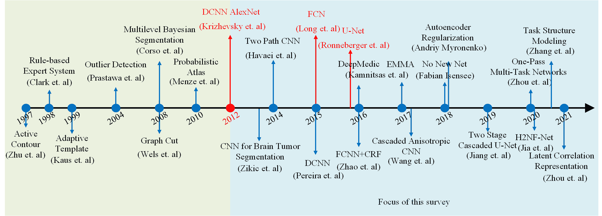

<!--yml

category: 未分类

date: 2024-09-06 20:00:17

-->

# [2007.09479] 基于深度学习的脑肿瘤分割：综述

> 来源：[`ar5iv.labs.arxiv.org/html/2007.09479`](https://ar5iv.labs.arxiv.org/html/2007.09479)

# 基于深度学习的脑肿瘤分割：综述

Zhihua Liu Lei Tong Zheheng Jiang Long Chen Feixiang Zhou Qianni Zhang Xiangrong Zhang Yaochu Jin Huiyu Zhou hz143@leicester.ac.uk 莱斯特大学计算与数学科学学院，英国 兰卡斯特大学计算与通信学院，英国 伦敦大学玛丽女王学院电子工程与计算机科学学院，英国 西安电子科技大学人工智能学院，中国 比勒费尔德大学技术学院，德国

###### 摘要

脑肿瘤分割是医学图像分析中最具挑战性的问题之一。脑肿瘤分割的目标是生成准确的脑肿瘤区域轮廓。近年来，深度学习方法在解决各种计算机视觉问题上表现出色，如图像分类、物体检测和语义分割。许多基于深度学习的方法已应用于脑肿瘤分割，并取得了令人满意的结果。考虑到最先进技术取得的显著突破，我们使用这份综述对最近开发的基于深度学习的脑肿瘤分割技术进行全面研究。我们选择并讨论了 100 多篇科学论文，广泛涵盖了网络架构设计、在不平衡条件下的分割和多模态处理等技术方面。我们还对未来发展方向提供了有益的讨论。

###### keywords:

脑肿瘤分割，深度学习，网络设计，数据不平衡，多模态^†^†journal: LaTeX 模板期刊

图 1：基于深度学习的脑肿瘤分割的科学关注度增长。 (a) 2018 年至 2020 年 MICCAI 中的关键词频率图。关键词的大小与词频成正比。我们观察到“脑”，“肿瘤”，“分割”和“深度学习”在研究社区中引起了广泛关注。 (b) 蓝线代表每年在多模态脑肿瘤分割挑战赛（BraTS）中基于深度学习的解决方案数量。红线代表每年测试集的 Top-1 整个肿瘤 Dice 得分。自 2012 年起（绿色虚线），研究人员由于深度学习技术的强大特征学习能力和系统性能，将兴趣转向了基于深度学习的分割方法。最好在彩色模式下查看。

## 1 引言

医学影像分析已经广泛应用于基础医学研究和临床治疗中，例如计算机辅助诊断[1]、医疗记录数据管理[2]、医疗机器人[3]和基于图像的应用[4]。医学影像分析为医疗专业人员提供了有用的指导，以理解疾病和研究临床挑战，从而提高医疗质量。在医学影像分析的各种任务中，脑肿瘤分割在研究界引起了广泛关注，这一领域也在不断研究（见图 1 (a)）。尽管研究人员做出了不懈的努力，准确的脑肿瘤分割仍然是一个关键挑战，因其面临位置不确定性、形态学不确定性、低对比度成像、注释偏差和数据不平衡等各种挑战。凭借强大的深度学习方法所取得的良好性能，许多基于深度学习的方法已经应用于脑肿瘤分割，以自动提取特征表示，并实现准确且稳定的性能，如图 1 (b) 所示。

胶质瘤是起源于神经胶质细胞的最常见原发性脑肿瘤之一。世界卫生组织（WHO）报告指出，胶质瘤可以根据显微镜图像和肿瘤行为分为四个不同等级[5]。I 级和 II 级是低级胶质瘤（LGGs），接近良性且生长缓慢。III 级和 IV 级是高级胶质瘤（HGGs），具有癌性和侵袭性。磁共振成像（MRI）是手术前后最常用的成像方法之一，旨在为治疗计划提供基础信息。

图 2：具有不同 MRI 模态和相应地面真值分割图的示例输入数据集。每一帧代表一种独特的 MRI 模态。右侧的最后一帧是带有相应手动分割注释的地面真值。不同的颜色代表不同的肿瘤子区域，即钆增强肿瘤（绿色）、肿瘤周围水肿（黄色）和坏死及非增强肿瘤核心（NCR/ECT）（红色）。建议以彩色查看。

图像分割在胶质瘤的诊断和治疗中发挥着积极作用。例如，准确的胶质瘤分割掩模可能有助于手术规划、术后观察并提高生存率[6], [7], [8]。为了量化图像分割的结果，我们定义脑肿瘤分割任务如下：给定一个来自一个或多个图像模态（例如多个 MRI 序列）的图像，系统旨在自动分割肿瘤区域与正常组织，并将输入数据的每个体素或像素分类到预设的子区域类别中。最后，系统返回相应输入的分割图。图 2 显示了一个示例 HGG 病例，输入为不同的 MRI 序列以及相应的真实分割图。

### 1.1 与以往综述的区别

近年来，已经发表了许多显著的脑肿瘤分割综述。我们在表 1 中展示了最近相关的综述及其细节和亮点。与我们的研究最接近的综述文章由 Ghaffari 等人提供[9]。在[9]中，作者涵盖了 BraTS2012 至 BraTS2018 挑战的大部分提交内容，但缺乏基于方法类别和亮点的分析。Kapoor 等人[10]和 Hameurlaine 等人[11]的两篇近期综述也集中于经典脑肿瘤分割方法的总结。然而，它们都缺乏对基于深度学习的分割方法的技术分析和讨论。[12]中介绍了一篇 2013 年前早期前沿脑肿瘤分割方法的综述，其中大多数 2013 年前的提案将传统机器学习模型与手工特征结合。Liu 等人[13]报告了一项关于 2014 年 MRI 基础的脑肿瘤分割的综述。这篇综述也没有包括基于深度学习的方法。Nalepa 等人[14]分析了不同类型的数据增强方法的技术细节和影响，并应用于脑肿瘤分割，而我们的综述则集中于基于深度学习的脑肿瘤分割方法的技术分析。

表 1：与“脑肿瘤分割”主题相关的现有综述总结。

| 综述标题 | 发表场所 | 年份 | 备注 |
| --- | --- | --- | --- |
| 基于提交至 BraTS 2012-2018 挑战模型的多模态脑扫描自动脑肿瘤分割综述[9] | IEEE 生物医学工程评论 | 2019 | 对 BraTS 2012-2018 年挑战提交内容的综述。 |
| 基于图像处理技术的大脑肿瘤检测综述 [10] | 2017 年第七届云计算、大数据与工程国际会议 | 2017 | 大脑肿瘤分割方法的一般综述。 |
| 磁共振成像中大脑肿瘤分割技术的综述 [11] | 纳米生物医学与工程 | 2019 | 关于经典大脑肿瘤分割方法的一般总结。 |
| MRI 大脑肿瘤分割的最新进展综述 [12] | 磁共振成像 | 2013 | 关于用于大脑 MRI 图像分析的卷积神经网络的综述。 |
| 基于 MRI 的大脑肿瘤分割方法综述 [13] | 清华科技 | 2014 | 关于基于 MRI 的大脑肿瘤分割方法的综述。 |
| 大脑肿瘤分割的数据增强：综述 [14] | 计算神经科学前沿 | 2019 | 分析了不同数据增强方法的技术细节及其对大脑肿瘤分割的影响。 |
| 医学图像分析中的深度学习综述 [4] | 医学图像分析 | 2017 | 关于基于深度学习的医学图像分析的全面综述。 |
| 磁共振成像中用于大脑图像分析的深度卷积神经网络：综述 [15] | 医学中的人工智能 | 2018 | 关于深度卷积神经网络用于大脑图像分析的综述。 |
| 大脑 MRI 分割的深度学习：现状与未来方向 [16] | 数字成像杂志 | 2017 | 关于大脑 MRI 分割的深度学习综述。 |
| 医疗保健中的深度学习指南 [17] | 自然医学 | 2019 | 关于健康护理领域深度学习的综述。 |
| 通用目标检测的深度学习：综述 [18] | 国际计算机视觉杂志 | 2020 | 关于基于深度学习的目标检测的全面综述。 |
| 深度学习 [19] | 自然 | 2015 | 对深度学习及其应用的介绍性综述。 |
| 卷积神经网络的最新进展 [20] | 模式识别 | 2018 | 关于卷积神经网络及其在计算机视觉、语言处理和语音中的应用的综述。 |
| 基于深度学习的大脑肿瘤分割：综述 | 我们的研究 | - | 对基于深度学习的大脑肿瘤分割的全面综述。 |

近年来，已出版了一些具有相似主题的代表性调查论文。Litjens 等人[4]总结了近期基于深度学习技术的医学图像分析应用。这项调查概述了包括几种 2017 年前最新深度学习脑肿瘤分割方法在内的医学图像分析的广泛研究。Bernal 等人[21]报道了一项重点关注深度卷积神经网络在脑部图像分析中的应用的综述。这项综述仅强调了深度卷积神经网络的应用。其他重要的学习策略，如不平衡条件下的分割和多模态学习，并未提及。Akkus 等人[16]提出了一项关于脑 MRI 分割的深度学习调查。最近，Esteva 等人[22]提出了一项关于深度学习在医疗保健应用中的调查。这项调查总结了深度学习在计算机视觉、自然语言处理、强化学习和广义方法中的应用如何推动医疗保健应用。为了更广泛地了解目标检测和语义分割，最近在[18]中发布了一项调查，提供了关于目标检测和语义分割的启示。

图 3：脑胶质瘤肿瘤分割中的挑战。(a) 显示了脑内不同大小和位置的胶质瘤肿瘤样本。(b) 和 (c) 显示了 2017 年多模态脑肿瘤分割挑战赛 (BraTS2017) 中训练集的统计信息。(b) 的左侧显示了 FLAIR 和 T2 强度投影，右侧显示了 T1ce 和 T1 强度投影。(c) 是带有标签的训练数据的饼图，其中上半部分显示了 HGG 标签，而下半部分显示了 LGG 标签。这里我们经历了区域和标签不平衡的问题。最佳效果请在彩色显示下查看。

狭义上，“深度学习”一词意味着使用具有堆叠功能层（通常层数$>$ 5）的神经网络模型[23]。神经网络能够学习高维层次特征并近似任何连续函数[24], [25]。考虑到深度神经网络的成就和近期进展，已有几项调查报告了已开发的深度学习技术，例如[20]和[19]。

### 1.2 本次调查的范围

在这项调查中，我们收集并总结了在一百多篇科学论文中报告的研究成果。我们检查了科学界的主要期刊，如《医学图像分析》和《IEEE 医学成像汇刊》。我们还评估了主要会议的会议录，如 ISBI、MICCAI、IPMI、MIDL、CVPR、ECCV 和 ICCV，以保留前沿医学成像研究成果。我们回顾了年度挑战及其相关竞赛条目，如多模态脑肿瘤分割挑战赛（BraTS）。此外，还包括了 arXiv 上的已建立方法的预印本版本作为信息来源。

本次调查的目标是根据架构类别和策略比较，呈现基于深度学习的脑肿瘤分割方法的全面技术综述。我们希望探讨不同的架构如何影响深度神经网络的分割性能，以及不同的学习策略如何进一步改进以应对脑肿瘤分割中的各种挑战。我们涵盖了多种高级视角，包括有效的架构设计、不平衡分割和多模态处理。本调查的分类（见图 5）使我们的分类有助于读者理解分割方法之间的技术相似性和差异。提出的分类法还可能帮助读者识别开放性挑战和未来的研究方向。

我们首先在第二部分介绍基于深度学习的脑肿瘤分割方法的背景信息，余下的调查内容组织如下：在第三部分，我们回顾了有效分割模块和网络架构的设计范式。在第四部分，我们对解决数据不平衡问题的方案进行分类、探索和比较，这在脑肿瘤分割中是一个长期存在的问题。由于多模态提供了准确脑肿瘤分割的有前景的解决方案，我们最后在第五部分回顾了利用多模态信息的方法。我们在第六部分总结了本文。我们还建立了一个定期维护的项目页面，以容纳与本调查相关的更新。¹¹1http://github.com/ZhihuaLiuEd/SoTA-Brain-Tumor-Segmentation

图 4：过去十年中脑肿瘤分割的发展及关键里程碑。最佳彩色显示。

## 2 背景

### 2.1 研究挑战

尽管脑肿瘤分割取得了显著进展，最先进的深度学习方法仍然面临一些待解决的挑战。脑肿瘤分割相关的挑战可以归纳如下：

1.  1.

    位置不确定性 胶质瘤是由包围神经细胞的胶质细胞突变形成的。由于胶质细胞的空间分布广泛，高级胶质瘤 (HGG) 或低级胶质瘤 (LGG) 可能出现在脑部的任何位置。

1.  2.

    形态不确定性 与刚性物体不同，不同脑肿瘤的形态，例如形状和大小，具有较大的不确定性。作为脑肿瘤的外层，浮肿组织显示出不同的液体结构，这几乎无法提供描述肿瘤形状的先验信息。肿瘤的子区域可能在形状和大小上也有所变化。

1.  3.

    低对比度 高分辨率和高对比度图像预计包含多样的图像信息 [26]。由于图像投影和断层扫描过程，MRI 图像可能质量较低且对比度不足。生物组织之间的边界趋向模糊，难以检测。靠近边界的细胞很难分类，这使得精确分割变得更加困难且难以实现。

1.  4.

    注释偏差 手动注释高度依赖个人经验，这可能会在数据标记过程中引入注释偏差。如图 3 (a) 所示，一些注释似乎倾向于将所有小区域连接在一起，而其他注释则可以精确地标记单个体素。注释偏差在学习过程中对分割算法有很大的影响 [27]。

1.  5.

    不平衡问题 如图 3 (b) 和 (c) 所示，不同肿瘤区域中体素的数量存在不平衡。例如，坏死/非增强肿瘤核心 (NCR/ECT) 区域远小于其他两个区域。不平衡问题影响数据驱动的学习算法，因为提取的特征可能受到大肿瘤区域的高度影响 [28]。

### 2.2 过去几十年的进展

脑肿瘤分割的代表性研究里程碑如图 4 所示。在 90 年代末，研究人员 Zhu 等人[29]开始使用具有活动轮廓的 Hopfield 神经网络来提取肿瘤边界并扩张肿瘤区域。然而，由于计算资源限制和技术支持问题，训练神经网络受到很大限制。从 90 年代末到 20 年代初，大多数脑肿瘤分割方法集中在具有手工特征的传统机器学习算法上，如具有多光谱直方图的专家系统[30]、使用模板的分割[31], [32]、具有强度直方图的图形模型[33], [34]、从潜在图谱中检测肿瘤边界[35]。这些早期工作开创了在解决脑肿瘤分割问题中使用机器学习的先河。然而，早期研究工作存在显著缺陷。首先，大多数早期工作仅关注于整个肿瘤区域的分割，即分割结果只有一个类别。与最近的脑肿瘤分割算法相比，早期工作在强条件下进行，依赖于不切实际的假设。其次，手工设计的特征工程受到先验知识的限制，无法完全推广。最后但同样重要的是，早期研究未能解决一些挑战，例如外观不确定性和数据不平衡。

图 5：我们提出的基于深度学习的脑肿瘤分割方法的分类法。最佳查看效果为彩色显示。

随着深度学习技术的革命性突破[36]，研究人员开始集中精力使用深度神经网络解决各种实际问题。Zikic 等人的开创性工作[37]、Havaei 等人的研究[38]、Pereira 等人的研究[39]旨在设计定制的深度卷积神经网络，以实现准确的脑肿瘤分割。通过全卷积网络（FCN）[40]和 U-Net[41]的突破，最近的创新[42], [43]在脑肿瘤分割中集中于构建编码器-解码器网络，而无需全连接层，以实现端到端的肿瘤分割。

大脑肿瘤分割中的一个长期挑战是数据不平衡。为有效解决不平衡问题，研究人员尝试了不同的解决方案，如网络级联和集成[44], [45], [46]，多任务学习[47], [48]，以及定制的损失函数[49]。另一种解决方案是充分利用多模态信息。最近的研究集中在模态融合[50]和处理模态缺失[51]。

基于演变，我们通常将现有的深度学习基础的大脑肿瘤分割方法分为三类，即具有有效架构的方法、处理不平衡条件的方法和利用多模态信息的方法。图 5 展示了深度学习基础的大脑肿瘤分割研究工作的分类。

### 2.3 相关问题

大脑肿瘤分割存在许多未解决的问题。大脑组织分割或解剖学大脑分割旨在为每个单位标记一个唯一的大脑组织类别。它们的任务假设大脑图像不包含任何肿瘤组织或其他异常[52], [53]。白质病变分割的目标是将白质病变从正常组织中分割出来。在它们的任务中，白质病变不包含如肿瘤核心等子区域，其中分割可以通过二分类方法实现。肿瘤检测旨在检测异常的肿瘤或病变，并报告每个组织的预测类别。通常，这个任务的检测结果是边界框，分类结果是标签[54], [55], [56]。值得一提的是，一些大脑肿瘤分割的研究方法仅返回单一标签分割掩膜或肿瘤核心的中心点，而不进行子区域分割。在我们的论文中，我们的重点是以子区域级别的语义分割作为肿瘤分割的主要主题。疾病分类是从脑扫描图像中提取预定义特征，然后将特征表示分类为不同等级的疾病，如高等级胶质瘤（HGGs）与低等级胶质瘤（LGGs），轻度认知障碍（MCI）[57]，阿尔茨海默病（AD）[58]和精神分裂症[59]。生存预测识别肿瘤的模式和活动[60]，以预测生存率作为临床诊断的补充[61]。疾病分类和生存预测都可以被视为下游任务，基于肿瘤分割结果。

### 2.4 本调查的贡献

大量基于深度学习的脑肿瘤分割方法已发表并取得了令人鼓舞的结果。我们的论文作为一个平台，提供了对最先进的脑肿瘤分割方法的全面和批判性调查。我们预期这项调查能为学术界和工业界提供有用的指南和一致的技术见解。此项调查的主要贡献可以总结如下：

1.  1.

    据我们所知，这是首次以结构化的分类法概述和分类基于深度学习的脑肿瘤分割方法，涵盖了各种重要的技术视角。

1.  2.

    我们向读者提供了基于深度学习的脑肿瘤分割技术进展的总结，包括详细的背景信息和系统比较（例如，表格 1, 5）。

1.  3.

    我们基于公共访问的挑战和数据集（例如，表格 2, 3, 4），对现有方法进行了详细且广泛的比较，附有关键总结和深刻讨论。

## 3 设计有效的分割网络

与复杂的特征工程管道相比，近期的深度学习主要依赖于设计有效的深度神经网络来自动提取高维判别特征。设计有效的模块和网络架构已成为实现准确分割性能的重要因素之一。在本节中，我们回顾了基于深度学习的脑肿瘤分割的两个重要设计指南：设计有效的模块和网络架构。

设计有效组件时主要遵循两个原则。其一是学习高级语义并定位珍贵目标，通过扩大感受野[62], [63], [64], 注意力机制[65], [66], [48]，特征融合更新[67], [68]等形式。另一种方法是减少网络参数量，加快训练和推理过程，从而节省计算时间和资源[69], [70], [71], [72], [73], [74], [75]。

网络架构的设计主要体现在从单通道网络过渡到多通道网络，从具有全连接层的网络过渡到完全卷积网络，从简单网络到深度级联网络。其目的是深化网络，增强网络的特征学习能力，并完成更精确的分割。接下来，我们将这些方法进行分类并全面回顾。不同网络架构和模块的系统比较见图。6

图 6：基于有效网络模块和架构设计的代表性方法结构比较。从左上到右下：(a1) [37]中的 CNN，(b1) 带有 (b2) 残差卷积模块[76]的 CNN，(c1) 带有 (c2) 全分辨率残差单元[77]的 CNN，(d1) 带有 (d2) 密集连接模块[78]的 CNN，(e1) 带有 (e2) 残差膨胀块[63]的 CNN，(f1) 带有 (f2) 空洞卷积特征金字塔模块[79]的 CNN，(g1) 带有 (g2) 多纤维单元[71]的 FCN，(h1) 带有 (h2) 可逆块[70]的 FCN，以及 (i1) 带有 (i2) 模态融合模块[80]的 FCN。最佳效果为彩色显示。

### 3.1 设计专业化模块

#### 3.1.1 提高准确性的模块

许多脑肿瘤分割方法集中于设计神经网络内部的有效模块，旨在稳定训练，学习信息丰富、具区分性且有助于准确分割的特征。早期设计工作遵循了像 AlexNet[36]这样的知名网络模式，并通过堆叠卷积块逐步加深网络深度。早期研究工作如[81]、[82]和[43]堆叠了多个由大卷积核（通常大于 5）、池化层和激活层组成的卷积层块。大尺寸卷积核的块使我们能够捕捉到有用的细节，并拥有大量需要训练的参数。其他研究工作如[37]和[39]遵循了 VGG[83]的模式，以小尺寸卷积核（通常为 3）构建基础卷积层块。进一步的研究工作如[38]堆叠了不同卷积核尺寸的混合块，其中大尺寸卷积核倾向于找到全局特征（如肿瘤的位置和大小）具有大的感受野，而小卷积核则倾向于包含局部特征（如边界和纹理）具有小的感受野。由于堆叠两个$3\times 3$卷积层可以保持相同大小的感受野，同时参数较少，相比于单个$5\times 5$层，大多数最近的肿瘤分割工作构建了基于堆叠$3\times 3$层的基本网络块，并开始扩展到 MRI 的体积重建中，使用$3\times 3\times 3$卷积核[84]、[85]。

随着堆叠层数的增加，网络变得越来越深，导致训练过程中出现梯度爆炸和消失的问题。为了稳定系统训练并达到更高的分割精度，早期脑肿瘤分割方法如[86]和[76]跟随了 ResNet[87]并在模块设计中引入了残差连接。残差连接通过将卷积模块的输入添加到其输出中，帮助解决梯度消失和爆炸的问题，这样可以避免退化，并更快地收敛且准确性更高。现在，残差连接已成为设计模块和复杂网络架构的标准操作之一。在以下工作[88]、[78]、[89]和[90]中，作者跟随 Densenet[91]将残差连接扩展到密集连接。尽管密集连接设计看起来更有利于梯度反向传播，但复杂的紧密连接结构在网络训练期间可能会导致计算内存的多次使用。

通过堆叠卷积模块并使用模块内外的残差连接，神经网络可以变得更深，特征可以以更高的维度和不确定性进行学习。然而，这一过程可能会牺牲空间分辨率，而高维特征图的分辨率远低于原始数据的分辨率。为了在扩展感受野的同时保持数据的空间分辨率，[62]、[63]、[64] 用扩张卷积层[92]替换了标准卷积层。扩张卷积带来了几个好处。首先，扩张卷积在不引入额外参数的情况下扩大了感受野。较大的感受野有助于分割大面积的目标，如水肿。其次，扩张卷积避免了空间分辨率的损失。因此，待分割物体的位置可以在原始输入空间中准确定位。然而，小结构的不正确定位和分割问题仍需解决。针对这一问题，[93]提出设计多尺度扩张卷积或空洞空间金字塔池化模块，以捕捉描述物体微妙细节的语义上下文。

#### 3.1.2 高效计算的模块

设计和堆叠复杂的模块可以有效地学习高维度的判别特征并实现精确的分割，但这需要高计算资源以及长时间的训练和推理时间。对此，许多研究在模块设计中采用了轻量级的思路。轻量级架构在相似的准确率下所需的计算资源更少，训练和推理时间更短，速度更快。[94]是旨在加速脑肿瘤分割的最早研究之一。[94]的作者重新排序了输入数据（旋转 6 度的数据样本），使具有高视觉相似性的样本在内存中更接近，从而尝试加速 I/O 通信。与管理输入数据不同，[72]选择构建一个减少下采样通道的 U-Net 变体以降低计算成本。

上述工作使用了较少的计算资源，但丢失了学习信息并降低了分割精度。受可逆残差网络[95]的启发，[70]将可逆块引入了 U-Net，其中每层的激活可以在反向传播过程中从前一层的输出中收集。因此，无需额外的内存来存储中间激活，从而减少了内存成本。[73]进一步扩展了可逆块，通过引入在 MobileNetV2 [96]和 EfficientNet [97]中使用的 Mobile Reversible Convolution Blocks (MBConvBlock)。除了可逆计算设计，MBConvBlock 将标准卷积替换为深度可分卷积。深度可分卷积首先使用深度卷积按特征图进行计算分离，然后使用$1\times 1\times 1$点卷积将特征图合并，这比标准卷积进一步减少了参数。后续研究工作，包括 3DESPNet[98]和 DMFNet [71]，进一步扩展了这一理念，引入了膨胀卷积，在保持大部分空间分辨率的同时，减少了计算资源的需求。

### 3.2 设计有效的架构

促进深度神经网络在各个领域繁荣和发展的主要因素之一是投入精力设计智能且有效的网络架构。我们根据网络结构的特征，将大多数基于深度学习的脑肿瘤分割网络分为单路径/多路径网络和编码器-解码器网络。单路径和多路径网络用于提取特征和分类输入补丁的中心像素。编码器-解码器网络以端到端的方式设计，即编码器使得能够从部分或整个图像中提取深层特征，然后解码器进行特征到分割的映射。在以下小节中，我们对各种架构设计进行系统分析和比较。

#### 3.2.1 多路径架构

图 7：单路径和双路径 CNN 的高级比较。最佳效果为彩色显示。

在这里，我们将网络路径称为数据处理的流（见图 7）。许多研究工作，例如 [39]、[99]、[37]，由于其计算效率，使用了单路径网络。与单路径网络相比，多路径网络可以从不同尺度的不同路径中提取不同特征。提取的特征被组合（加或串联）在一起进行进一步处理。一种常见的解释是，大尺度路径（路径具有较大尺寸的卷积核或输入等）允许我们学习全局特征。小尺度路径（路径具有较小尺寸的卷积核或输入等）则允许我们学习被称为局部特征的特征。类似于前一节提到的功能，全局特征倾向于提供如肿瘤位置、大小和形状等全局信息，而局部特征则提供如肿瘤纹理和边界等描述性细节。

Havaei 等人的研究 [38] 是早期基于多路径网络的解决方案之一。作者报告了一种新颖的两路径结构，该结构既能学习局部肿瘤信息，也能学习全局背景。局部路径使用 $7\times 7$ 卷积核，而全局路径使用 $13\times 13$ 卷积核。为了利用 CNN 架构，作者设计了几种变体架构，将 CNN 输出进行串联。Castillo 等人 [76] 使用了一个三路径 CNN 来分割脑肿瘤。与 [38] 使用不同尺度的卷积核不同，[76] 对每条路径输入不同尺寸的补丁，例如低分辨率 ($15\times 15$)、中等分辨率 ($17\times 17$) 和正常分辨率 ($27\times 27$) 的补丁。因此，每条路径可以在不同空间分辨率的条件下学习特定特征。受 [38] 的启发，Akil 等人 [100] 扩展了网络结构，引入了重叠补丁预测方法，其中目标补丁的中心与邻近的重叠补丁相关联。

其他研究工作尝试直接从输入中学习局部到全局的信息，而不是构建具有不同尺寸核的多路径网络。例如，Kamnitsas 等人[101]提出了一种双路径网络，该网络考虑了不同尺寸补丁的输入，即尺寸为$25\times 25\times 25$的正常分辨率输入和尺寸为$19\times 19\times 19$的低分辨率输入。与[76]不同，[101]中的作者在两个路径上应用了尺寸为$3\times 3\times 3$的小卷积核。随后，赵等人[74]的研究工作也设计了一种多尺度 CNN，其中包括一个输入尺寸为$48\times 48$的大尺度路径，一个输入尺寸为$18\times 18$的中尺度路径，以及一个输入尺寸为$12\times 12$的小尺度路径。

#### 3.2.2 编码器-解码器架构

图 8：不同全卷积网络（FCNs）之间的高级比较。最佳查看效果为彩色。

单路径和多路径网络在脑肿瘤分割中的输入是图像的一个补丁或某个区域，输出是该补丁的分类结果或输入中心像素的分类结果。从补丁级别到类别标签的准确映射非常具有挑战性。首先，单路径和多路径网络的分割性能容易受到输入补丁的大小和质量的影响。小尺寸的输入补丁包含不完整的空间信息，而大尺寸的补丁则需要更多的计算资源。其次，特征到标签的映射通常由最后一个全连接层完成。一个简单的全连接层无法完全表示特征空间，而复杂的全连接层可能会超载计算机内存。最后但同样重要的是，这种特征到标签的映射不是端到端模式，这显著增加了优化成本。为了应对这些问题，最近的研究开始使用基于全卷积网络（FCN）[40]和 U-Net [41]的编码器-解码器网络，建立从输入图像到输出分割图的端到端模式，并进一步提高网络的分割性能。

Jesson 等人 [85] 通过使用多尺度损失函数扩展了标准 FCN。FCN 的一个限制是它没有明确建模标签域中的上下文。在 [85] 中，FCN 变体通过结合高分辨率和低分辨率特征图来建模图像和标签域中的上下文，从而最小化多尺度损失。在 [102] 中，研究人员提出了一种边界感知全卷积神经网络，包括两个用于上采样的分支。边界检测分支旨在将整个肿瘤的边界信息作为二分类问题进行学习和建模。区域检测分支学习检测和分类肿瘤的子区域类别。两个分支的输出被连接并送入一个由两个卷积层和一个 softmax 分类层组成的块。

FCN 的一个重要变种是 U-Net [41]。U-Net 由一个收缩路径和一个对称的扩展路径组成，前者用于捕捉特征，后者实现精确的定位。与传统 FCN 相比，使用 U-Net 的一个优势是收缩路径和扩展路径之间的跳跃连接。跳跃连接将特征图从收缩路径传递到扩展路径，并直接连接来自两个路径的特征图。通过跳跃连接的原始图像数据可以帮助收缩路径中的层恢复细节。基于 U-Net 的脑肿瘤分割已经有多个研究成果。例如，Brosch 等人 [103] 使用具有跳跃连接的全卷积网络来分割多发性硬化病变。Isensee 等人 [104] 报告了一种改进的 U-Net 用于脑肿瘤分割，作者使用了 dice 损失函数和广泛的数据增强来成功避免过拟合。在 [105] 中，作者使用零填充保持所有卷积层在下采样和上采样路径中的相同输出维度。Chang 等人 [86] 报告了一种具有残差连接的全卷积神经网络。类似于跳跃连接，残差连接允许低级和高级特征图都对最终分割结果做出贡献。

为了从原始体积数据中提取信息，Milletari 等人 [106] 引入了一种修改版的 3D U-Net，称为 V-Net，具有自定义的 dice 系数损失函数。Beers 等人 [107] 引入了基于序列任务的 3D U-Nets，它使用整个肿瘤的真实标签作为辅助通道来检测增强的肿瘤和肿瘤核心。在后处理阶段，作者使用了两个额外的 U-Net 以增强预测，从而获得更好的分类结果。输入的补丁由七个通道组成：四个解剖 MR 图像和三个标签图，分别对应于整个肿瘤、增强的肿瘤和肿瘤核心。

表 2: 比较新方法，侧重于有效网络设计。我们根据主要贡献对方法进行分类。在“输入”栏中，‘P’表示补丁，‘I’表示图像。‘Dim’表示网络的维度。在“损失”栏中，‘CE’表示交叉熵损失，‘mIoU’表示均值交并比，‘KL’表示 KL 散度。在“Dice”和“Hausdorff”栏中，‘WT’表示整体肿瘤，‘TC’表示肿瘤核心，‘ET’表示增强肿瘤。“数据集”栏指示与分割性能相关的数据集。在“类型”栏中，‘CV’表示在 BraTS 训练集上的交叉验证，‘V’表示 BraTS 验证集，‘T’表示 BraTS 测试集。‘-’表示原始论文中未报告该条目。

| 方法 | 输入 | 维度 | 损失 | Dice | Hausdorff | 数据集 |
| --- | --- | --- | --- | --- | --- | --- |
| WT | TC | ET | WT | TC | ET | 年份 | 类型 |
| 设计有效模块 | [81] | P | 2D | - | 0.81 | 0.79 | - | - | - | - | 2014 | V |
|  | [43] | I | 2D | Softmax | 0.84 | 0.73 | 0.62 | - | - | - | 2015 | T |
|  | [82] | P | 2D | - | - | - | - | - | - | - | - | - |
|  | [84] | I | 3D | CE | 0.91 | 0.83 | - | - | - | - | 2015 | CV |
|  | [78] | I | 2D | CE+软 Dice | 0.87 | 0.68 | - | - | - | - | 2017 | V |
|  | [88] | I | 3D | Dice | 0.9 | 0.82 | 0.78 | 5.14 | 6.64 | 7.71 | 2020 | V |
|  | [79] | I | 2D | - | 0.86 | 0.77 | 0.74 | - | - | - | 2018 | V |
|  | [89] | I | 2D | CE+Dice+MP | 0.91 | 0.85 | 0.79 | 4.71 | 5.7 | 35.01 | 2020 | V |
|  | [94] | P | 3D | 多项式逻辑回归 | - | - | - | - | - | - | - | - |
|  | [72] | I | 2D | Dice+Edge+Mask | 0.9 | 0.82 | 0.78 | 5.41 | 7.26 | 5.282 | 2019 | V |
|  | [70] | I | 3D | Dice | 0.91 | 0.86 | 0.81 | 5.61 | 7.83 | 3.35 | 2018 | V |
|  | [73] | I | 3D | - | - | - | - | - | - | - | - | - |
|  | [98] | I | 2D | mIoU | 0.85 | 0.78 | 0.67 | 9.6 | 8.67 | 5.5 | 2018 | T |
|  | [71] | I | 3D | 一般化 Dice | 0.91 | 0.85 | 0.8 | 4.66 | 6.44 | 3.06 | 2018 | V |
| 设计有效架构 | [37] | P | 2D | 对数损失 | 0.84 | 0.73 | 0.69 | - | - | - | 2013 | V |
|  | [39] | P | 2D | 分类 CE | 0.78 | 0.65 | 0.75 | 15.83 | 26.54 | 6.99 | 2015 | T |
|  | [38] | P | 2D | 替代损失 | 0.84 | 0.71 | 0.57 | - | - | - | 2013 | T |
|  | [76] | P | 3D | - | - | - | - | - | - | - | 2015 | CV |
|  | [45] | P | 3D | CE/IoU | 0.9 | 0.8 | 0.74 | 4.23 | 6.56 | 4.5 | 2017 | V |
|  | [74] | P | 2D | - | - | - | - | - | - | - | - | - |
|  | [85] | I | 3D | 分类 CE | 0.9 | 0.75 | 0.71 | 4.16 | 8.65 | 6.98 | 2017 | V |
|  | [104] | I | 3D | Dice | 0.9 | 0.8 | 0.73 | 7 | 9.48 | 4.55 | 2017 | V |
|  | [105] | I | 2D | 软 Dice | 0.86 | 0.86 | 0.65 | - | - | - | 2015 | CV |
|  | [86] | I | 2D | - | 0.89 | 0.83 | 0.78 | 8 | 10 | 5.9 | 2016 | T |
|  | [108] | P | 2D | KL | 0.87 | 0.74 | 0.65 | - | - | - | 2017 | V |
|  | [109] | P | 3D | KL | 0.89 | 0.74 | 0.73 | - | - | - | 2017 | V |
|  | [110] | I | 2D | Softmax | 0.82 | 0.63 | 0.57 | - | - | - | 2017 | V |
|  | [111] | I | 3D | Dice | 0.84 | 0.78 | 0.68 | 9.2 | 7.71 | 4.52 | 2018 | T |
|  | [112] | I | 2D | - | 0.86 | 0.73 | 0.72 | 7.5 | 9.5 | 5.7 | 2018 | V |
|  | [113] | I | 3D | Focal | 0.9 | 0.84 | 0.77 | 5.18 | 6.28 | 3.51 | 2018 | V |
|  | [42] | P | 3D | Dice | 0.91 | 0.86 | 0.81 | 4.27 | 6.52 | 2.41 | 2018 | V |
|  | [114] | I | 3D | Dice | 0.88 | 0.79 | 0.72 | 29.21 | 11.06 | 7.93 | 2018 | V |
|  | [47] | I | 3D | Dice+L2+KL | 0.91 | 0.87 | 0.82 | 4.52 | 6.85 | 3.92 | 2018 | V |
|  | [115] | P | 3D | CE+Dice | 0.91 | 0.84 | 0.75 | 4.57 | 5.58 | 3.84 | 2019 | V |
|  | [116] | I | 3D | Jaccard+Focal | 0.91 | 0.85 | 0.79 | 4.09 | 5.88 | 18.19 | 2020 | V |
|  | [117] | I | 2D | Dice | 0.91 | 0.85 | 0.8 | 4.3 | 5.69 | 20.56 | 2020 | V |

### 3.3 总结

在这一部分，我们回顾并比较了集中于脑肿瘤分割中的模块和网络架构设计的研究工作。表格 2 展示了集中于脑肿瘤分割中的模块和网络架构设计方法生成的结果。我们提取了这些研究工作的关键信息，并列在下面。

1.  1.

    通过设计定制模块，可以提高网络的准确性和速度。

1.  2.

    通过设计定制化架构，可以帮助网络学习不同尺度的特征，这是一项实现准确脑肿瘤分割的重要步骤。

1.  3.

    模块和网络的设计在很大程度上依赖于人类经验。未来，我们预期会应用网络架构搜索来寻找有效的脑肿瘤分割架构 [118], [119], [120], [121]。

1.  4.

    现有的大多数网络架构设计没有结合关于脑肿瘤的领域知识，例如在肿瘤分割网络中建模度信息和受物理启发的形态学信息。

## 4 不平衡条件下的分割

脑肿瘤分割的一个长期挑战是数据不平衡问题。如图 3 (c) 所示，不平衡主要体现在脑肿瘤子区域的像素数量上。此外，患者样本中也存在不平衡问题，即 HGG 病例的数量远多于 LGG 病例。同时，由人工专家引入的标注偏差也可以视为一种特殊的数据不平衡形式（不同专家有不同的标准，导致标注结果不平衡）。数据不平衡对学习算法特别是深度网络有显著影响。主要表现为，用不平衡数据训练的学习模型往往更倾向于学习占主导的组，例如学习水肿区域的形态，学习 HGG 而非 LGG 患者）[122], [123], [49]。

通过设计特定模块或架构来处理数据不平衡问题的可能性较小。大量工作提出了许多改进策略来解决数据不平衡问题。根据这些策略的核心组成部分，我们将现有方法分为三类：多网络驱动、多任务驱动和定制损失函数驱动的方法。

### 4.1 多网络驱动方法

即使设计了复杂的模块和架构以确保高维区分特征的学习，单一网络仍常常面临数据不平衡的问题。受多专家系统等方法的启发，人们开始构建复杂的网络系统，以有效处理数据不平衡并取得了有希望的分割性能。根据多个网络之间共享的数据流，常见的多网络系统可以分为网络级联和网络集成。

图 9：用于脑肿瘤分割的级联卷积网络结构，已根据[46]中的原始结构进行修改。WNet、TNet 和 ENet 分别用于分割整个肿瘤、肿瘤核心和增强肿瘤核心。

#### 4.1.1 网络级联

网络级联的定义是，在串联连接的网络中，上游网络的输出被传递到下游网络作为输入。这种拓扑结构模拟了从粗到细的策略，即上游网络提取粗略的信息或特征，下游网络细分输入，实现细粒度的分割。

采用级联策略的最早工作由王等人进行 [46]（见图 9）。在他们的工作中，作者提出将三个网络串联起来。首先，WNet 对整个肿瘤进行分割，并将整个肿瘤的分割结果输出给 TNet，TNet 则跟踪肿瘤核心。最后，TNet 的分割结果交给 ENet 进行增强肿瘤的分割。这种设计逻辑受到肿瘤子区域属性的启发，假设整个肿瘤、肿瘤核心和增强肿瘤是逐个包含的。因此，上游网络的分割输出是下游网络的感兴趣区域（RoI）。这种做法的优点在于避免了数据不平衡带来的干扰。引入自适应卷积和手动裁剪输入有效减少了网络参数的数量。但也有两个缺点：首先，下游网络的分割效果严重依赖于上游网络的性能。其次，仅将上游分割结果作为输入，使得下游网络无法利用其他图像区域作为辅助信息，这不利于肿瘤位置检测等其他任务。同样，华等人 [113] 也提出了一种基于肿瘤物理包含特征的网络级联。与王等人 [46] 不同的是，[113] 将级联单元替换为适用于 3D 分割的 V-Net，以提高性能。方等人 [112] 训练了两个网络同时作为上游网络，根据不同的模态突出不同的组织特征，分别对 Flair 和 T1ce 进行训练，然后将两个上游网络的结果传递给下游网络进行最终的细化分割。贾等人 [124] 用 HRNet [125] 替换了上游和下游网络，以保持最大的空间分辨率。

将 3D 网络进行级联可以带来更好的分割性能，但多个 3D 网络的组合需要大量的参数和高计算资源。为此，Li [114] 提出了一个将 2D 和 3D 网络混合的级联模型。2D 网络从体积的多个视角学习，以获取整个肿瘤的分割掩模。然后，将整个肿瘤掩模和原始 3D 体积输入下游的 3D U-Net。下游网络将肿瘤核心和增强型肿瘤配对进行精细分割。Li 等人 [126] 也采用了类似的方法，通过串联多个 U-Net 进行粗到精的分割。每个阶段的分割结果与不同的损失函数相关联。Vu 等人 [127] 进一步引入了上游和下游网络之间的密集连接，以增强特征表达。Jiang 等人 [44] 设计的两阶段级联 U-Net 在输出端得到了进一步的增强。除了单一网络架构，他们还在输出端尝试了两种不同的分割模块（插值和反卷积）。

除了粗到精的分割，还有其他尝试引入其他辅助功能。Liu 在 [128] 中设计了一种新策略，将上游网络的分割结果传递给下游网络。下游网络根据上游网络的分割结果重建原始输入图像。恢复网络的损失也被反向传播到上游分割网络，以帮助上游网络描绘肿瘤区域。Cirillo 等人 [129] 将对抗训练引入肿瘤分割中。生成网络构成上游网络，判别网络作为下游网络，用于判断分割图是否来自真实数据。Chen 等人 [130] 将大脑的左右对称特性引入系统。在上游和下游网络连接处添加的左右相似掩模可以提高网络分割的鲁棒性。

#### 4.1.2 网络集成

使用单一深度神经网络的一个主要缺点是其性能受超参数选择的影响较大。这指的是深度神经网络的有限泛化能力。级联网络旨在以粗到细的策略聚合多个网络的输出，但下游网络的性能依赖于上游网络，这仍然限制了级联系统的能力。为了实现更强大且更具泛化性的肿瘤分割，可以通过高方差将多个网络的分割输出聚合在一起，这被称为网络集成。网络集成通过聚合多个网络扩大了待训练参数的假设空间，避免了由于数据不平衡而导致的局部最优。

早期在多路径网络（第 3.2.1 节）中提出的研究工作，如 Castillo 等人[76]、Kamnitsas 等人[131]和[101]，可以视为一种特殊形式的网络集成，其中每个路径都可以视为一个子网络。子网络提取的特征随后被集成并处理以获得最终分割。在本节中，我们更关注从多个子网络中明确地集成分割结果，而不是隐式地集成由子路径提取的特征。

多模型和架构集成（EMMA）[45]是早期使用集成深度神经网络进行脑肿瘤分割的结构良好的工作之一。EMMA 集成了 DeepMedic [131]、FCN [40] 和 U-Net [41]的分割结果，并将最终分割与最高置信度分数相关联。Kao 等人[132]集成了 26 个神经网络用于肿瘤分割和生存预测。[132] 引入了脑分区图谱，以为肿瘤分割提供位置先验信息。Lachinov 等人[133]集成了两个变种 U-Net [42]、[47]和一个级联 U-Net [134]。最终的集成结果比每个单一网络的表现提高了$1-2\%$。

图 10：用于脑肿瘤分割的多任务网络结构。图片由[47]提供。共享编码器学习通用特征表示，重建解码器执行作为正则化的多任务。

赵等人[135] 并没有给子网络提供相同的输入，而是平均了 3 个 2D-FCN 的集合，其中每个 FCN 接收不同的视图切片作为输入。类似地，Sundaresan 等人[136] 平均了 4 个 2D-FCN 的集合，其中每个 FCN 设计用于分割特定的肿瘤区域。陈等人[137] 使用了一个 DeconvNet[138]来生成初步的分割概率图，而另一个多尺度卷积标签评估网络用于评估先前生成的分割图。通过使用概率图和原始输入图像，可以减少假阳性。胡等人[139] 集成了一个 3D 级联 U-Net 与多模态融合结构。[139]中提出的两级 U-Net 旨在描绘肿瘤的边界，并且基于补丁的深度网络将肿瘤体素与预测标签相关联。

集成可以被视为一种提升策略，通过汇总多个同质网络的结果来改进最终的分割结果。BraTS2018 的获胜者[47] 集成了 10 个模型，相比于最佳单一网络分割，进一步提升了$1\%$的 dice 得分。类似的集成带来的好处也可以从 Silva 等人[140]的工作中观察到。BraTS2019 的获胜者[44]也采用了集成策略，其中最终结果由 12 个模型的集成生成，相比于最佳单一模型的性能，略微提高了结果（大约$0.6-1\%$）。

### 4.2 多任务驱动的方法

上述大部分工作仅执行单任务学习，即仅为精确分割脑肿瘤设计和优化网络。单任务学习的缺点在于单一任务的训练目标可能忽略了某些任务中的潜在信息。相关任务的信息可能会提高肿瘤分割的性能。因此，近年来，许多研究工作从多任务学习的角度出发，在精确分割脑肿瘤的基础上引入辅助任务。多任务学习的主要设置是可以在多个任务之间共享的低级特征表示。共享表示有两个优势。其一是通过浅层共享表示相互分享学习到的领域相关信息，从而促进学习，增强获取更新信息的能力。其二是相互约束。当多任务学习执行梯度反向传播时，会考虑多个任务的反馈。由于不同任务可能具有不同的噪声模式，同时学习多个任务的模型将学习到更通用的表示，从而减少过拟合的风险，增加系统的泛化能力。 

早期尝试如[141]和[142]适应了多任务学习的理念，将脑肿瘤分割任务拆分为三个不同的子区域分割任务，即分别分割整个肿瘤、肿瘤核心和增强肿瘤。在[141]中，作者将三个子区域分割任务纳入了一个端到端的整体网络，并利用了这三个子区域分割任务之间的内在相关性。在[142]中，作者设计了三种不同的损失函数，对应于整个肿瘤、肿瘤核心和增强肿瘤的分割损失。此外，最近的工作引入了与图像分割不同的辅助任务。其他任务中学习到的特征将支持准确的分割。在[102]中，作者额外引入了边界定位任务。共享编码器提取的特征不仅适用于肿瘤分割，还适用于肿瘤边界定位。精确的边界定位可以帮助减少搜索空间，并在肿瘤分割过程中定义精确的边界。[143] 引入了先检测再分割的思想，即检测肿瘤的位置，然后进行精确的肿瘤分割。

另一种常用的辅助任务是重建输入数据，即通过辅助解码器可以将学习到的特征表示恢复到原始输入。[47] 是第一个将重建引入脑肿瘤分割的辅助任务的方法。[144] 引入了重建和增强两个辅助任务，以进一步提升特征表示的能力。[145] 引入了三个辅助任务，包括重建、边缘分割和补丁比较。这些工作将辅助任务视为对主要脑肿瘤分割任务的正则化。大多数多任务设计使用共享编码器来提取特征，并使用独立解码器处理不同的任务。从参数更新的角度来看，辅助任务的作用是进一步正则化共享编码器的参数。与显式正则化参数数量和数值的 L1 或 L2 不同，辅助任务与主要任务共享低层次子空间。在训练过程中，辅助任务有助于网络在优化辅助任务和主要分割任务的方向上进行训练，这减少了参数的搜索空间，使提取的特征更加通用，从而实现更精确的分割[146], [147], [148], [149]。

### 4.3 定制损失函数驱动的方法

在网络训练过程中，如果使用了不平衡的数据集，梯度可能会被过大的样本主导。因此，许多研究提出了自定义损失函数，以在脑肿瘤分割模型训练期间调节梯度。设计自定义损失函数的目的是减少损失函数中易分类样本的权重，同时增加困难样本的权重，使模型更关注少数样本，从而减少不平衡数据集的影响。

表 3：处理不平衡问题的方法比较。我们根据每种方法的主要创新贡献对其进行分类。在“输入”列中，“P”表示补丁，“I”表示图像。“维度”表示网络的维度。“网络数量”表示网络候选数量。在“连接方式”列中，“C”表示级联连接，“E”表示网络集成。在“任务”列中，“S”表示分割任务，“G”表示模态生成任务，“C”表示分类任务，“B”表示边界分割任务，“R”表示输入重建任务。在“损失函数”列中，“CE”表示交叉熵损失，“TV”表示总变差损失，“KL”表示 KL 散度，“CPC”表示对比预测编码损失。在“Dice”和“Hausdorff”列中，“WT”表示整个肿瘤，“TC”表示肿瘤核心，“ET”表示增强肿瘤。“数据集”列指示报告的分割性能相关数据集。在“类型”列中，“CV”表示在 BraTS 训练集上的交叉验证，“V”表示 BraTS 验证集，“T”表示 BraTS 测试集。“-”表示原文中未报告的条目。

| 方法 | 输入 | 维度 | 网络数量 | 连接方式 | 任务 | 损失函数 | Dice | Hausdorff | 数据集 |
| --- | --- | --- | --- | --- | --- | --- | --- | --- | --- |
| WT | TC | ET | WT | TC | ET | Year | Type |
| 多网络驱动的方法 | [46] | P | 3D | 3 | C | S | Dice | 0.9 | 0.84 | 0.78 | 3.89 | 6.48 | 3.28 | 2017 | V |
|  | [113] | P | 3D | 5 | C+E | S | Focal | 0.9 | 0.84 | 0.77 | 5.18 | 6.28 | 3.51 | 2018 | V |
|  | [112] | I | 2D | 2 | E | S | - | 0.86 | 0.73 | 0.72 | 7.5 | 9.5 | 5.7 | 2018 | V |
|  | [124] | I | 3D | 2 | C | S | Dice + CE | 0.91 | 0.85 | 0.79 | 4.18 | 4.97 | 26.57 | 2020 | V |
|  | [114] | I | 3D | 5 | C+E | S | Dice | 0.88 | 0.79 | 0.72 | 29.21 | 11.06 | 7.93 | 2018 | V |
|  | [127] | I | 3D | 3 | C | S | Dice | 0.9 | 0.81 | 0.78 | 4.32 | 6.28 | 3.7 | 2019 | V |
|  | [44] | I | 3D | 2 | C | S | Dice | 0.91 | 0.86 | 0.8 | 4.26 | 5.43 | 3.14 | 2019 | V |
|  | [128] | I | 2D | 2 | C | G+S | L1+TV | - | - | - | - | - | - | - | - |
|  | [129] | I | 3D | 2 | C | G+S | L2+Dice | 0.89 | 0.79 | 0.75 | 6.39 | 14.07 | 36 | 2020 | V |
|  | [45] | I | 3D | 3 | E | S | CE+IoU | 0.9 | 0.8 | 0.74 | 4.23 | 6.56 | 4.5 | 2017 | V |
|  | [133] | I | 3D | 3 | E | S | Dice+CE | 0.9 | 0.84 | 0.76 | - | - | - | 2019 | V |
|  | [135] | P | 2D | 3 | E | S | - | 0.89 | 0.79 | 0.75 | - | - | - | 2017 | V |
|  | [136] | P | 2D | 4 | E | S | Dice+CE | 0.89 | 0.77 | 0.77 | 4.4 | 15.3 | 29.4 | 2020 | V |
|  | [139] | I | 2D | 3 | C | S+C | Dice | 0.85 | 0.7 | 0.65 | 25.24 | 21.45 | 17.98 | 2017 | V |
|  | [140] | P | 2D | 3 | C | S | CE | 0.91 | 0.81 | 0.76 | 4.34 | 9.39 | 27.16 | 2020 | V |
| 多任务驱动的方法 | [141] | P | 3D | 2 | C+E | S+C | - | 0.91 | 0.86 | 0.81 | 4.17 | 6.54 | 2.71 | 2018 | V |
|  | [130] | - | - | 1 | - | S+Sim | CE+Focal | 0.85 | 0.68 | 0.58 | - | - | - | 2015 | V |
|  | [142] | I | 2D | 1 | - | S | CE | 0.88 | 0.71 | 0.73 | - | - | - | 2015 | T |
|  | [102] | I | 2D | 1 | - | S+B | CE | 0.89 | 0.72 | 0.73 | - | - | - | 2015 | T |
|  | [47] | I | 3D | 10 | E | S+R | Dice+L2+KL | 0.91 | 0.87 | 0.82 | 4.52 | 6.85 | 3.92 | 2018 | V |
|  | [144] | P | 3D | 1 | - | S+R+C | Dice+L2+KL | 0.85 | 0.78 | 0.75 | 7.98 | 8.25 | 5.76 | 2019 | V |
|  | [145] | I | 3D | 1 | - | S+R+B | L2+KL+Dice+CE+CPC | 0.92 | 0.88 | 0.88 | 12.4 | 16.09 | 8.71 | 2017 | Sub |
| 定制损失函数驱动的方法 | [150] | P | 2D | 1 | - | S | L1+L2+CE | 0.87 | 0.75 | 0.71 | - | - | - | 2016 | T |
|  | [67] | I | 2D | 1 | - | S | Dice | 0.88 | 0.8 | 0.76 | 6.49 | 6.68 | 21.39 | 2020 | V |
|  | [143] | I | 3D | 10 | E | S | Dice+Focal+CE | 0.9 | 0.84 | 0.78 | 5.68 | 9.57 | 24.02 | 2020 | V |
|  | [104] | I | 3D | 1 | - | S | Dice | 0.9 | 0.8 | 0.73 | 7 | 9.48 | 4.55 | 2017 | V |
|  | [85] | I | 3D | 1 | - | S | CE | 0.9 | 0.75 | 0.71 | 4.16 | 8.65 | 6.98 | 2017 | V |
|  | [72] | I | 3D | 1 | - | S | Dice+Edge+Mask | 0.9 | 0.82 | 0.78 | 5.41 | 7.26 | 5.282 | 2019 | V |
|  | [151] | I | 2D | 5 | E | S | Dice | 0.92 | 0.88 | 0.87 | 4.23 | 5.77 | 8.18 | 2019 | V |

早期研究工作倾向于使用标准损失函数，例如分类交叉熵[39]、交叉熵[152]和骰子损失[153]。[150]是首次尝试定制损失函数。在[150]中，作者增强了损失函数，为边缘像素赋予更多权重，这显著提高了肿瘤边界分类的分割精度。实验结果表明，边缘像素的加权损失函数有助于提高分割骰子系数约$2-4\%$。随后，[102]提出了一种针对边界像素的定制交叉熵损失，同时使用了包括边界定位的辅助任务。在[128]中，重建任务被作为正则化方法，以提高像素级重建精度。在[67]中，空间损失函数被设计用于确保学习到的特征尽可能保留空间信息。[143]进一步使用了焦点损失来处理不平衡问题。[104]使用了多类别骰子损失，即类别比例越小，反向传播时的错误权重越高。在[85]中，添加了一种多尺度损失函数，对编码器每个阶段不同尺度的特征进行深入监督，帮助网络学习更有利于物体分割的多尺度分辨率特征。在[112]中，从模态的角度来看，为 T1ce 和 Flair 分别设计了两种损失类型。[72]提出了一种加权组合骰子损失、边缘损失和掩码损失的方案。结果表明，组合损失可以将骰子系数提升约$2\%$。[151]还提出了一组组合损失，包括分类交叉熵和软骰子损失。

图 11: 跨模态特征学习框架的插图。图片来自[154]。

#### 4.3.1 摘要

表 3 展示了专注于处理脑肿瘤分割中数据不平衡的方法生成的结果。从上述比较中，我们可以发现几个有趣的观察。

1.  1.

    从网络的角度来看，解决不平衡问题的策略主要是结合多个网络的输出。常用的组合方法包括网络级联和网络集成。但这些策略都依赖于每个网络的性能。计算资源的消耗也会随着网络候选数量的增加而成比例增加。

1.  2.

    从任务的角度来看，解决不平衡问题的策略是为调节网络设置辅助任务，以便网络可以充分利用现有数据，并学习对辅助任务以及分割任务有益的更一般化特征。

1.  3.

    从损失函数的角度来看，解决不平衡问题的策略是使用自定义损失函数或辅助损失函数。通过对困难样本加权，网络被调节以更多关注小数据。

## 5 利用多模态信息

多模态成像在医学图像分析和应用中发挥了关键作用。不同模态的 MRI 强调不同的组织。有效利用多模态信息是基于 MRI 的脑肿瘤分割的关键因素之一。根据可用模态的数量，我们将多模态脑肿瘤分割分为两种场景：利用多模态信息和处理缺失模态的有限信息。

图 12：模态感知特征嵌入模块的结构。图片来自[50]。

### 5.1 多模态学习

在本文中，我们遵循 BraTS 竞赛标准，即多模态指输入数据模态包括但不限于 T1、T1ce、T2 和 Flair。为了有效利用多模态信息，现有工作集中于有效学习多模态信息。根据其目的，设计的学习方法可以分为三类：学习排序、学习配对和学习融合。

学习排序模态 在多模态处理过程中，现有的数据模态根据学习任务的相关性进行排序，以便网络能够集中学习高相关性的模态。这个定义可以重新命名为模态-任务建模。早期的工作来自于[82]，可以视为基本的学习排序形成。在[82]中，作者将每个模态转换为一个单独的 CNN。在[82]中，每个 CNN 对应一个不同的模态，并且 CNN 提取的特征彼此独立。最终分类器返回的损失类似于输入数据的评分，分割则根据评分进行。[50]中使用了类似的处理方法。对于两个模态，使用了两个独立的网络进行关系匹配建模，每个网络的参数受到不同监督损失的影响。[154]提取了不同嵌入模态的特征（如图 11 所示），建模了模态之间的关系和不同肿瘤子区域的分割，使得不同模态的数据按照单独任务加权和排序。

图 13：模态相关模块的结构。图片来源于[80]。

学习配对模态 学习排序模态指的是针对某个分割任务对模态-任务关系进行排序。另一种常用的建模方法是模态-模态配对，它从多模态数据中选择最佳组合以实现精确分割。[155]是早期建模模态-模态关系的工作之一。作者对每两个模态进行了配对，并将所有配对组合发送到下游网络。[154]通过跨模态特征转换模块和模态配对模块进一步加强了模态-模态配对关系。在跨模态特征转换模块中，作者将输入和输出从一个模态的数据转换为模态对的拼接。在跨模态特征融合模块中，作者将单模态特征学习转换为单模态对特征学习，以预测每个单模态对的分割掩码。

学习融合模态 更近期的研究工作集中于学习融合多模态。与模态排序和配对不同，模态融合是将来自每个模态的特征融合以实现准确的分割。早期的融合方法相对简单，通常是连接或加法处理来自不同模态的特征。在 [82] 中，作者使用了 4 个网络来提取每个模态的特征，并连接提取到的模态感知特征。连接后的特征被送入随机森林以对输入补丁的中心像素进行分类。在 [112] 中，将 T1ce 和 Flair 的特征进行了加法处理，并将结果发送到下游网络进行整个肿瘤的分割。同样，在 [154] 中，进行了模态感知特征提取并将其送到下游网络进行进一步学习。这两种融合方法没有引入额外的参数，非常简单高效。在 [154] 中，尽管作者融合了来自更复杂的跨模态特征配对和单模态特征配对模块的特征。此外，还有其他工作如 [152] 和 [155] 使用了额外的卷积模块来结合和学习来自不同模态的特征，以实现模态融合。

尽管连接和加法被使用，这两种融合方法并不会改变学习到的特征的语义，也不能突出或抑制特征。为了解决这个问题，近年来许多研究工作采用了注意力机制来增强学习到的特征。[65]、[67]、[66] 和 [68] 使用了基于空间和通道的注意力融合模块。所提出的注意力机制能够突出有用的特征并抑制冗余特征，从而实现准确的分割。

表 4：多模态学习方法的比较。我们根据每种方法的主要新颖贡献进行分类。在输入列中，'P' 表示补丁，'I' 表示图像。'Dim' 表示网络的维度。列 'Learning To' 表示多模态的学习任务，其中 'R' 表示学习排序，'P' 表示学习配对，'F' 表示学习融合，'G' 表示学习生成缺失模态，'Fw/M' 表示与缺失模态融合。在融合列中，'Concate' 表示拼接，'Conv' 表示卷积模块，'Add' 表示加法，'S Att' 表示空间注意力，'C Att' 表示通道注意力。在任务列中，'S' 表示分割任务，'G' 表示模态生成任务。在损失列中，'CE' 表示交叉熵损失，'Adv' 表示对抗损失，'CC' 表示循环一致性损失，'MAE' 表示平均绝对误差损失。在 Dice 和 Hausdorff 列中，'WT' 表示整个肿瘤，'TC' 表示肿瘤核心，'ET' 表示增强肿瘤。数据集列表示与报告的分割性能相关的数据集。在类型列中，'CV' 表示在 BraTS 训练集上的交叉验证，'V' 表示 BraTS 验证集，'Sub' 表示从训练集中手动划分的子集。'-' 表示原始论文中未报告的条目。

| 方法 | 输入 | 维度 | 学习目标 | 融合 | 任务 | 损失 | Dice | Hausdorff | 数据集 |
| --- | --- | --- | --- | --- | --- | --- | --- | --- | --- |
| WT | TC | ET | WT | TC | ET | 年份 | 类型 |
| 使用完整模态学习 | [82] | P | 2D | R+F | Concate | S | - | - | - | - | - | - | - | - |
|  | [152] | I | 2D | F | Conv | S | CE | 0.85 | 0.68 | 0.69 | - | - | - | 2015 | V |
|  | [155] | I | 2D | P+F | Conv | S | Focal | 0.88 | 0.71 | 0.75 |  |  |  | 2017 | V |
|  | [112] | I | 2D | F | Add | S | - | 0.86 | 0.73 | 0.72 | 7.5 | 9.5 | 5.7 | 2018 | V |
|  | [66] | I | 2D | F | S Att + C Att | S | Dice | - | - | - | - | - | - | - | - |
|  | [65] | P | 3D | F | S Att + C Att | S | - | 0.9 | 0.79 | 0.7 | 6.29 | 8.76 | 7.05 | 2019 | V |
|  | [67] | I | 2D | F | S Att + C Att | S | Dice | 0.88 | 0.8 | 0.76 | 6.49 | 6.68 | 21.39 | 2020 | V |
|  | [50] | P | 3D | R+P+F | Concate + Add | S | Adv+CC | 0.9 | 0.84 | 0.79 | 5 | 6.37 | 3.99 | 2018 | V |
|  | [154] | P | 3D | R+F | Concate | G+S | Dice+T-Test | 0.9 | 0.82 | 0.78 | 5.73 | 9.27 | 3.57 | 2020 | V |
|  | [68] | I | 3D | F | S Att + C Att | S | Dice | 0.87 | 0.79 | 0.74 | 7.54 | 7.68 | 6.1 | 2017 | CV |
| 处理缺失模态 | [156] | I | 3D | G | - | G+S | L1 | 0.68 | 0.72 | - | - | - | - | 2015 | Sub |
|  | [80] | I | 3D | Fw/M | S Att + C Att | S | Dice+MAE | 0.87 | 0.72 | 0.73 | 6.7 | 9.3 | 6.3 | 2019 | V |
|  | [157] | I | 3D | Fw/M | S Att + C Att | S | Dice+MAE | 0.88 | 0.79 | 0.69 | - | - | - | 2018 | CV |
|  | [158] | I | 3D | Fw/M | - | S | - | 0.91 | 0.85 | 0.78 | 4.46 | 5.26 | 3.69 | 2019 | V |

表 5：基于深度学习的脑肿瘤分割开源项目。这里的“第三方”指的是代码由第三方基于相关论文重新实现。

| 论文标题 | 代码链接 |
| --- | --- |
| 使用深度神经网络的脑肿瘤分割 | (第三方) https://github.com/naldeborgh7575/brain_segmentation |
| DeepMedic 在脑肿瘤分割中的应用 | https://github.com/deepmedic/deepmedic |
| 用于脑肿瘤分割的多维门控递归单元 | https://github.com/zubata88/mdgru |
| 用于脑肿瘤分割的体积多模态神经网络 | https://github.com/BCV-Uniandes/BCVbrats |
| 脑肿瘤分割与放射组学生存预测：对 BRATS 2017 挑战的贡献 | (第三方) https://github.com/pykao/Modified-3D-UNet-Pytorch |
| 用于神经胶质瘤分割的残差编码器和卷积解码器神经网络 | https://github.com/kamleshpawar17/BratsNet-2017 |
| 使用级联各向异性卷积神经网络的自动脑肿瘤分割 | https://github.com/taigw/brats18_docker |
| No New-Net | https://github.com/MIC-DKFZ/nnUNet |
| 使用自编码器正则化的 3D MRI 脑肿瘤分割 | (第三方) https://github.com/IAmSuyogJadhav/3d-mri-brain-tumor-segmentation-using-autoencoder-regularization |
| 带有金字塔细化的 3D-ESPNet 用于体积脑肿瘤图像分割 | https://github.com/sacmehta/3D-ESPNet |
| 一次性多任务网络与跨任务引导注意力用于脑肿瘤分割 | https://github.com/chenhong-zhou/OM-Net |
| 用于脑肿瘤分割的多步级联网络 | https://github.com/JohnleeHIT/Brats2019 |
| 用于 3D 脑肿瘤分割的 2D 卷积神经网络集成 | https://github.com/kamleshpawar17/Brats19 |
| 脑肿瘤分割的知识蒸馏 | https://github.com/lachinov/brats2019 |
| 使用对比学习的标签高效多任务分割 | https://github.com/pfnet-research/label-efficient-brain-tumor-segmentation |
| Vox2Vox: 用于脑肿瘤分割的 3D-GAN | https://github.com/mdciri/Vox2Vox |
| 自我集成、深度监督 3D U-net 神经网络的脑肿瘤分割：BraTS 2020 挑战解决方案。 | https://github.com/lescientifik/open_brats2020 |
| 使用三平面 U-Nets 集成的脑肿瘤分割 | https://git.fmrib.ox.ac.uk/vaanathi/truenet_tumseg |
| 带有变分自编码器和注意力门的两阶段级联模型用于 MRI 脑肿瘤分割 | https://github.com/shu-hai/two-stage-VAE-Attention-gate-BraTS2020 |
| HDC-Net: 层次化解耦卷积网络用于脑肿瘤分割 | https://github.com/luozhengrong/HDC-Net |

### 5.2 处理缺失模态

上述模态学习方法适用于多模态场景。例如，在 BraTS 中，我们获取了四种模态的数据：T1、T1ce、T2 和 FLAIR。然而，在实际应用场景中，获取完整且高质量的多模态数据集非常困难，这被称为缺失模态场景。[156] 是最早针对缺失模态学习的研究之一。在 [156] 中，作者构建了唯一可用的模态 T1，并使用生成对抗网络生成缺失的模态。在 [156] 中，作者使用现有的 T1 模态作为输入来生成 Flair 模态。生成的 Flair 数据作为补充，与原始 T1 数据一起送入下游分割网络。[157]、[80] 研究了模态之间的隐含关系，并检查了所有可能的缺失场景。结果表明，多模态对准确分割具有重要影响。在 [158] 中，提出了针对单一模态输入不同场景的强度校正算法。在该框架中，多模态数据的强度查询和校正使得在合成数据中更容易区分肿瘤和非肿瘤区域。

#### 5.2.1 总结

表 4 显示了基于多模态学习的深度学习脑肿瘤分割方法生成的结果。我们可以从利用多模态信息中收集到几个常见的观察结果。

1.  1.

    对于任务-模态建模，学习排序模态可以帮助网络选择最相关和有利的模态以进行准确分割。大多数研究工作在学习模态感知特征的过程中对隐含排序进行了建模。

1.  2.

    对于模态-模态建模，学习配对模态可以帮助网络找到最适合分割的模态组合。然而，现有的配对工作通过穷举组合显示模态对，这需要大量计算资源。

1.  3.

    多模态信息的融合可以提高特征的表达能力和泛化能力。现有的融合方法各有优缺点。加法或连接不会引入额外的参数，但缺乏特征的物理表达。使用小型网络，注意力模块可以优化特征表达，但会引入额外的参数和计算成本。

1.  4.

    缺失模态是临床影像中常见的场景之一。现有的研究主要集中在生成的角度，利用现有模态数据生成缺失的模态。然而，生成器模态的性能和质量在很大程度上依赖于现有模态数据的质量。

## 6 结论

应用各种深度学习方法进行脑肿瘤分割是一项宝贵而具有挑战性的任务。由于深度学习技术强大的特征学习能力，自动图像分割在多个方面受益。本文探讨了相关的深度学习基础脑肿瘤分割方法，并进行了全面的调查。我们系统地分类和总结了深度学习基础脑肿瘤分割方法，广泛研究了这一任务，并讨论了方法的优缺点、设计动机和性能评估等关键方面。

## 致谢

本研究由中国奖学金委员会和莱斯特大学研究生教学助理资助。Yaochu Jin 由德国联邦教育和研究部资助的亚历山大·冯·洪堡教授职位支持。作者感谢郭泰王教授、张定文教授和周同学博士的详细建议和讨论。

## 参考文献

+   [1] K. Doi，《医学影像中的计算机辅助诊断：历史回顾、现状和未来潜力》，《计算机化医学影像与图形》31 (4-5) (2007) 198–211。

+   [2] M. Lavin, M. Nathan，《管理病人医疗记录的系统和方法》，美国专利 5,772,585（1998 年 6 月 30 日）。

+   [3] R. H. Taylor, A. Menciassi, G. Fichtinger, P. Fiorini, P. Dario，《医学机器人和计算机集成手术》，见：《施普林格机器人手册》，施普林格，2016 年，第 1657–1684 页。

+   [4] G. Litjens, T. Kooi, B. E. Bejnordi, A. A. A. Setio, F. Ciompi, M. Ghafoorian, J. A. van der Laak, B. Van Ginneken, C. I. Sánchez，《医学图像分析中的深度学习调查》，《医学图像分析》42 (2017) 60–88。

+   [5] D. N. Louis, A. Perry, G. Reifenberger, A. Von Deimling, D. Figarella-Branger, W. K. Cavenee, H. Ohgaki, O. D. Wiestler, P. Kleihues, D. W. Ellison，《2016 年世界卫生组织中枢神经系统肿瘤分类：总结》，《神经病理学报》 131 (6) (2016) 803–820。

+   [6] U. Baid, S. Ghodasara, S. Mohan, M. Bilello, E. Calabrese, E. Colak, K. Farahani, J. Kalpathy-Cramer, F. C. Kitamura, S. Pati 等，《rsna-asnr-miccai brats 2021 关于脑肿瘤分割和放射基因组分类的基准》，arXiv 预印本 arXiv:2107.02314。

+   [7] S. Bakas, H. Akbari, A. Sotiras, M. Bilello, M. Rozycki, J. S. Kirby, J. B. Freymann, K. Farahani, C. Davatzikos，《通过专家分割标签和放射组学特征推进癌症基因组图谱胶质瘤 MRI 数据集》，《科学数据》4 (1) (2017) 1–13。

+   [8] B. H. Menze, A. Jakab, S. Bauer, J. Kalpathy-Cramer, K. Farahani, J. Kirby, Y. Burren, N. Porz, J. Slotboom, R. Wiest 等，《多模态脑肿瘤图像分割基准（brats）》，《IEEE 医学影像学汇刊》34 (10) (2014) 1993–2024。

+   [9] M. Ghaffari, A. Sowmya, R. Oliver, 使用多模态脑扫描的自动化脑肿瘤分割：基于提交到 BRATS 2012–2018 挑战的模型综述，《IEEE 生物医学工程评论》13 (2019) 156–168。

+   [10] L. Kapoor, S. Thakur, 基于图像处理技术的脑肿瘤检测调查，见：2017 第七届国际云计算、数据科学与工程大会—汇流，IEEE，2017，第 582–585 页。

+   [11] M. Hameurlaine, A. Moussaoui, 基于磁共振成像的脑肿瘤分割技术调查，《纳米生物医学与工程》11 (2) (2019) 178–191。

+   [12] N. Gordillo, E. Montseny, P. Sobrevilla, MRI 脑肿瘤分割的现状调查，《磁共振成像》31 (8) (2013) 1426–1438。

+   [13] J. Liu, M. Li, J. Wang, F. Wu, T. Liu, Y. Pan, 基于 MRI 的脑肿瘤分割方法调查，《清华科技》19 (6) (2014) 578–595。

+   [14] J. Nalepa, M. Marcinkiewicz, M. Kawulok, 脑肿瘤分割的数据增强：综述，《计算神经科学前沿》13 (2019) 83。

+   [15] J. Bernal, K. Kushibar, D. S. Asfaw, S. Valverde, A. Oliver, R. Martí, X. Lladó, 深度卷积神经网络在磁共振成像脑部图像分析中的应用综述，《医学中的人工智能》95 (2019) 64–81。

+   [16] Z. Akkus, A. Galimzianova, A. Hoogi, D. L. Rubin, B. J. Erickson, 深度学习在脑 MRI 分割中的应用：现状与未来方向，《数字成像杂志》30 (4) (2017) 449–459。

+   [17] A. Esteva, A. Robicquet, B. Ramsundar, V. Kuleshov, M. DePristo, K. Chou, C. Cui, G. Corrado, S. Thrun, J. Dean, 医疗保健中深度学习指南，《自然医学》25 (1) (2019) 24–29。

+   [18] L. Liu, W. Ouyang, X. Wang, P. Fieguth, J. Chen, X. Liu, M. Pietikäinen, 通用目标检测的深度学习：一项综述，《国际计算机视觉杂志》128 (2) (2020) 261–318。

+   [19] Y. LeCun, Y. Bengio, G. Hinton, 《深度学习》，《自然》521 (7553) (2015) 436。

+   [20] J. Gu, Z. Wang, J. Kuen, L. Ma, A. Shahroudy, B. Shuai, T. Liu, X. Wang, G. Wang, J. Cai, 等，卷积神经网络的最新进展，《模式识别》77 (2018) 354–377。

+   [21] J. Bernal, K. Kushibar, D. S. Asfaw, S. Valverde, A. Oliver, R. Martí, X. Lladó, 深度卷积神经网络在磁共振成像脑部图像分析中的应用综述，《医学中的人工智能》。

+   [22] A. Esteva, A. Robicquet, B. Ramsundar, V. Kuleshov, M. DePristo, K. Chou, C. Cui, G. Corrado, S. Thrun, J. Dean, 医疗保健中深度学习指南，《自然医学》25 (1) (2019) 24–29。

+   [23] I. Goodfellow, Y. Bengio, A. Courville, 《深度学习》，2016。

+   [24] H. Lin, S. Jegelka, 具有单神经元隐藏层的 ResNet 是一种通用近似器，《神经信息处理系统进展》31 (2018) 6169–6178。

+   [25] D. Yarotsky, 深度 ReLU 网络近似的误差界限，《神经网络》94 (2017) 103–114。

+   [26] W. Liu, D. Anguelov, D. Erhan, C. Szegedy, S. Reed, C.-Y. Fu, A. C. Berg, SSD: 单次多框检测器，欧洲计算机视觉会议，Springer，2016，pp. 21–37。

+   [27] Y. Chen, J. Joo, 理解和减轻面部表情识别中的注释偏差，IEEE/CVF 国际计算机视觉会议，2021，pp. 14980–14991。

+   [28] S. R. Bulo, G. Neuhold, P. Kontschieder, 语义图像分割的损失最大池化，2017 IEEE 计算机视觉与模式识别会议（CVPR），IEEE，2017，pp. 7082–7091。

+   [29] Y. Zhu, Z. Yan, 使用 Hopfield 神经网络的计算机化肿瘤边界检测，《IEEE 医学影像学报》16 (1) (1997) 55–67。

+   [30] M. C. Clark, L. O. Hall, D. B. Goldgof, R. Velthuizen, F. R. Murtagh, M. S. Silbiger, 使用基于知识的技术的自动肿瘤分割，《IEEE 医学影像学报》17 (2) (1998) 187–201。

+   [31] M. Kaus, S. K. Warfield, A. Nabavi, E. Chatzidakis, P. M. Black, F. A. Jolesz, R. Kikinis, 磁共振成像中脑膜瘤和低级别胶质瘤的分割，国际医学图像计算与计算机辅助干预会议，Springer，1999，pp. 1–10。

+   [32] M. Prastawa, E. Bullitt, S. Ho, G. Gerig, 基于离群点检测的脑肿瘤分割框架，《医学图像分析》8 (3) (2004) 275–283。

+   [33] J. J. Corso, E. Sharon, S. Dube, S. El-Saden, U. Sinha, A. Yuille, 使用集成贝叶斯模型分类的高效多级脑肿瘤分割，《IEEE 医学影像学报》27 (5) (2008) 629–640。

+   [34] M. Wels, G. Carneiro, A. Aplas, M. Huber, J. Hornegger, D. Comaniciu, 一种针对 3D MRI 的完全自动化小儿脑肿瘤分割的判别模型约束图割方法，国际医学图像计算与计算机辅助干预会议，Springer，2008，pp. 67–75。

+   [35] B. H. Menze, K. Van Leemput, D. Lashkari, M.-A. Weber, N. Ayache, P. Golland, 用于多模态图像脑肿瘤分割的生成模型，国际医学图像计算与计算机辅助干预会议，Springer，2010，pp. 151–159。

+   [36] A. Krizhevsky, I. Sutskever, G. E. Hinton, 使用深度卷积神经网络进行 ImageNet 分类，《神经信息处理系统进展》25 (2012) 1097–1105。

+   [37] D. Zikic, Y. Ioannou, M. Brown, A. Criminisi, 使用卷积神经网络的脑肿瘤组织分割，MICCAI-BRATS 36 (2014) 36–39 会议录。

+   [38] M. Havaei, A. Davy, D. Warde-Farley, A. Biard, A. Courville, Y. Bengio, C. Pal, P.-M. Jodoin, H. Larochelle, 使用深度神经网络的脑肿瘤分割，《医学图像分析》35 (2017) 18–31。

+   [39] S. Pereira, A. Pinto, V. Alves, C. A. Silva, 使用卷积神经网络进行脑肿瘤分割的磁共振成像，《IEEE 医学影像学报》35 (5) (2016) 1240–1251。

+   [40] J. Long, E. Shelhamer, T. Darrell, 用于语义分割的全卷积网络，载于：IEEE 计算机视觉与模式识别会议论文集，2015，第 3431–3440 页。

+   [41] O. Ronneberger, P. Fischer, T. Brox, U-Net：用于生物医学图像分割的卷积网络，载于：国际医学图像计算与计算机辅助手术会议，Springer，2015，第 234–241 页。

+   [42] F. Isensee, P. Kickingereder, W. Wick, M. Bendszus, K. H. Maier-Hein, 无新网络，载于：国际 MICCAI 脑损伤研讨会，Springer，2018，第 234–244 页。

+   [43] X. Zhao, Y. Wu, G. Song, Z. Li, Y. Zhang, Y. Fan, 一个集成 FCNNs 和 CRFs 的深度学习模型用于脑肿瘤分割，医学图像分析 43 (2018) 98–111。

+   [44] Z. Jiang, C. Ding, M. Liu, D. Tao, 两阶段级联 U-Net：BRATS 挑战赛 2019 分割任务的第一名解决方案，载于：国际 MICCAI 脑损伤研讨会，Springer，2019，第 231–241 页。

+   [45] K. Kamnitsas, W. Bai, E. Ferrante, S. McDonagh, M. Sinclair, N. Pawlowski, M. Rajchl, M. Lee, B. Kainz, D. Rueckert, 等，多个模型和架构的集成用于稳健的脑肿瘤分割，载于：国际 MICCAI 脑损伤研讨会，Springer，2017，第 450–462 页。

+   [46] G. Wang, W. Li, S. Ourselin, T. Vercauteren, 使用级联各向异性卷积神经网络的自动脑肿瘤分割，载于：国际 MICCAI 脑损伤研讨会，Springer，2017，第 178–190 页。

+   [47] A. Myronenko, 使用自编码器正则化的 3D MRI 脑肿瘤分割，载于：国际 MICCAI 脑损伤研讨会，Springer，2018，第 311–320 页。

+   [48] C. Zhou, C. Ding, X. Wang, Z. Lu, D. Tao, 用于脑肿瘤分割的跨任务引导注意力的单次多任务网络，IEEE 图像处理汇刊 29 (2020) 4516–4529。

+   [49] C. H. Sudre, W. Li, T. Vercauteren, S. Ourselin, M. J. Cardoso, 作为深度学习损失函数的广义骰子重叠用于高度不平衡的分割，载于：医学图像分析中的深度学习与临床决策支持的多模态学习，Springer，2017，第 240–248 页。

+   [50] D. Zhang, G. Huang, Q. Zhang, J. Han, J. Han, Y. Yu, 跨模态深度特征学习用于脑肿瘤分割，模式识别 110 (2021) 107562。

+   [51] T. Zhou, S. Canu, P. Vera, S. Ruan, 用于缺失 MRI 模态的脑肿瘤分割的潜在相关表示学习，IEEE 图像处理汇刊 30 (2021) 4263–4274. [doi:10.1109/TIP.2021.3070752](http://dx.doi.org/10.1109/TIP.2021.3070752)。

+   [52] A. de Brebisson, G. Montana, 用于解剖脑分割的深度神经网络，载于：IEEE 计算机视觉与模式识别研讨会论文集，2015，第 20–28 页。

+   [53] B. Patenaude, S. M. Smith, D. N. Kennedy, M. Jenkinson, 用于皮层下脑分割的形状和外观贝叶斯模型，Neuroimage 56 (3) (2011) 907–922。

+   [54] Q. Dou, H. Chen, L. Yu, L. Shi, D. Wang, V. C. Mok, P. A. Heng, 基于独立子空间分析的分层特征从 MRI 图像自动检测脑微出血，载于：2015 年第 37 届 IEEE 医学工程与生物学学会年会（EMBC），IEEE，2015 年，页码：7933–7936。

+   [55] Q. Dou, H. Chen, L. Yu, L. Zhao, J. Qin, D. Wang, V. C. Mok, L. Shi, P.-A. Heng, 基于 3D 卷积神经网络的 MRI 图像自动检测脑微出血，IEEE 医学影像学报 35 (5) (2016) 1182–1195。

+   [56] M. Ghafoorian, N. Karssemeijer, T. Heskes, M. Bergkamp, J. Wissink, J. Obels, K. Keizer, F.-E. de Leeuw, B. van Ginneken, E. Marchiori 等，深度多尺度位置感知 3D 卷积神经网络用于自动检测推测为血管源的腔隙，NeuroImage: Clinical 14 (2017) 391–399。

+   [57] H.-I. Suk, C.-Y. Wee, S.-W. Lee, D. Shen，基于深度学习的状态空间模型用于静息态 fMRI 中的功能动态估计，NeuroImage 129 (2016) 292–307。

+   [58] H.-I. Suk, D. Shen，针对阿尔茨海默病诊断的深度集成稀疏回归网络，载于：医学影像机器学习国际研讨会，Springer，2016 年，页码：113–121。

+   [59] W. H. Pinaya, A. Gadelha, O. M. Doyle, C. Noto, A. Zugman, Q. Cordeiro, A. P. Jackowski, R. A. Bressan, J. R. Sato，使用深度置信网络建模来表征精神分裂症脑形态学的差异，Scientific reports 6 (2016) 38897。

+   [60] Y. Yoo, L. W. Tang, T. Brosch, D. K. Li, L. Metz, A. Traboulsee, R. Tam，深度学习脑损伤模式用于预测早期多发性硬化症患者的未来疾病活动，载于：医学应用中的深度学习与数据标注，Springer，2016 年，页码：86–94。

+   [61] H. K. van der Burgh, R. Schmidt, H.-J. Westeneng, M. A. de Reus, L. H. van den Berg, M. P. van den Heuvel，基于 MRI 的深度学习生存预测在肌萎缩侧索硬化症中的应用，NeuroImage: Clinical 13 (2017) 361–369。

+   [62] X. Li, X. Zhang, Z. Luo，通过 3D 全扩张卷积网络进行脑肿瘤分割，载于：多模态脑肿瘤分割基准，脑损伤研讨会，MICCAI，第 9 卷，2017 年，页码：2017。

+   [63] M. M. Lopez, J. Ventura，针对 MRI 扫描中脑肿瘤分割的扩张卷积，载于：国际 MICCAI 脑损伤研讨会，Springer，2017 年，页码：253–262。

+   [64] L. Zhao，使用 3D 去卷积网络与扩张起始块的自动脑肿瘤分割，MICCAI BraTS (2017) 316–320。

+   [65] M. Islam, V. Vibashan, V. J. M. Jose, N. Wijethilake, U. Utkarsh, H. Ren，使用 3D 注意力 UNet 进行脑肿瘤分割和生存预测，载于：国际 MICCAI 脑损伤研讨会，Springer，2019 年，页码：262–272。

+   [66] H. Wang, G. Wang, Z. Liu, S. Zhang, 全球和局部多尺度特征融合增强用于脑肿瘤分割和胰腺分割，见：国际 MICCAI 脑病变研讨会，Springer，2019 年，第 80–88 页。

+   [67] C. Liu, W. Ding, L. Li, Z. Zhang, C. Pei, L. Huang, X. Zhuang, 使用基于注意力的融合和空间关系约束的脑肿瘤分割网络，arXiv 预印本 arXiv:2010.15647。

+   [68] T. Zhou, S. Ruan, Y. Guo, S. Canu, 基于注意力机制的多模态融合网络用于脑肿瘤分割，见：2020 IEEE 第 17 届生物医学成像国际研讨会（ISBI），IEEE，2020 年，第 377–380 页。

+   [69] S. Andermatt, S. Pezold, P. Cattin, 多维门控递归单元用于脑肿瘤分割，见：国际 MICCAI BraTS 挑战赛，会议前期论文集，2017 年，第 15–19 页。

+   [70] R. Brügger, C. F. Baumgartner, E. Konukoglu, 一种部分可逆的 u-net 用于内存高效的体积图像分割，见：医学图像计算与计算机辅助手术国际会议，Springer，2019 年，第 429–437 页。

+   [71] C. Chen, X. Liu, M. Ding, J. Zheng, J. Li, 基于 3d 扩张多纤维网络的实时脑肿瘤分割，见：医学图像计算与计算机辅助手术国际会议，Springer，2019 年，第 184–192 页。

+   [72] X. Cheng, Z. Jiang, Q. Sun, J. Zhang, 内存高效的级联 3d u-net 用于脑肿瘤分割，见：国际 MICCAI 脑病变研讨会，Springer，2019 年，第 242–253 页。

+   [73] M. Pendse, V. Thangarasa, V. Chiley, R. Holmdahl, J. Hestness, D. DeCoste, 内存高效的 3d u-net 与可逆的移动倒瓶颈用于脑肿瘤分割，见：国际 MICCAI 脑病变研讨会，Springer，2020 年，第 388–397 页。

+   [74] L. Zhao, K. Jia, 多尺度卷积神经网络用于脑肿瘤分割和诊断，计算与数学方法医学 2016 年。

+   [75] H. Shen, J. Zhang, W. Zheng, 高效的对称驱动全卷积网络用于多模态脑肿瘤分割，见：2017 IEEE 国际图像处理会议（ICIP），IEEE，2017 年，第 3864–3868 页。

+   [76] L. S. Castillo, L. A. Daza, L. C. Rivera, P. Arbeláez, 体积多模态神经网络用于脑肿瘤分割，见：第 13 届国际医学信息处理与分析会议，第 10572 卷，国际光学和光子学学会，2017 年，第 105720E 页。

+   [77] A. Jungo, R. McKinley, R. Meier, U. Knecht, L. Vera, J. Pérez-Beteta, D. Molina-García, V. M. Pérez-García, R. Wiest, M. Reyes, 面向不确定性辅助的脑肿瘤分割和生存预测，见：国际 MICCAI 脑病变研讨会，Springer，2017 年，第 474–485 页。

+   [78] M. Shaikh, G. Anand, G. Acharya, A. Amrutkar, V. Alex, G. Krishnamurthi, 使用密集全卷积神经网络进行脑肿瘤分割，见：国际 MICCAI 脑病变研讨会，Springer，2017 年，第 309–319 页。

+   [79] Z. Zhou, Z. He, Y. Jia, Afpnet：一种 3D 全卷积神经网络，结合膨胀卷积特征金字塔用于通过 MRI 图像进行脑肿瘤分割，Neurocomputing 402（2020 年）第 235–244 页。

+   [80] T. Zhou, S. Canu, P. Vera, S. Ruan, 具有缺失 MRI 模态的脑肿瘤分割的潜在相关性表示学习，IEEE 图像处理学报 30（2021 年）第 4263–4274 页。

+   [81] P. Dvořák, B. Menze, 使用卷积神经网络进行局部结构预测以进行多模态脑肿瘤分割，载于：国际 MICCAI 医学计算机视觉研讨会，Springer，2015 年，第 59–71 页。

+   [82] V. Rao, M. S. Sarabi, A. Jaiswal, 基于深度学习的脑肿瘤分割，MICCAI 多模态脑肿瘤分割挑战赛（BraTS）第 59 页。

+   [83] K. Simonyan, A. Zisserman, 用于大规模图像识别的非常深卷积网络，arXiv 预印本 arXiv:1409.1556。

+   [84] A. Casamitjana, S. Puch, A. Aduriz, E. Sayrol, V. Vilaplana, 用于脑肿瘤分割的 3D 卷积网络，MICCAI 多模态脑肿瘤图像分割挑战赛（BRATS）论文集（2016 年）第 65–68 页。

+   [85] A. Jesson, T. Arbel, 使用具有多尺度损失的 3D FCN 进行脑肿瘤分割，载于：国际 MICCAI 脑病变研讨会，Springer，2017 年，第 392–402 页。

+   [86] P. D. Chang, 用于脑肿瘤分割的全卷积深度残差神经网络，载于：Brainlesion 国际研讨会：胶质瘤、多发性硬化症、中风和创伤性脑损伤，Springer，2016 年，第 108–118 页。

+   [87] K. He, X. Zhang, S. Ren, J. Sun, 用于图像识别的深度残差学习，载于：IEEE 计算机视觉与模式识别会议论文集，2016 年，第 770–778 页。

+   [88] M. Ghaffari, A. Sowmya, R. Oliver, 使用级联 3D 密集连接 U-Net 的脑肿瘤分割（2020 年）。 [arXiv:2009.07563](http://arxiv.org/abs/2009.07563)。

+   [89] Y. Wang, Y. Zhang, F. Hou, Y. Liu, J. Tian, C. Zhong, Y. Zhang, Z. He, 基于模态配对学习的脑肿瘤分割，arXiv 预印本 arXiv:2010.09277。

+   [90] Z. Zhou, Z. He, M. Shi, J. Du, D. Chen, [用于磁共振成像脑肿瘤分割的 3D 密集连接网络，结合膨胀卷积特征金字塔](https://doi.org/10.1016/j.compbiomed.2020.103766)，Comput. Biol. Medicine 121（2020 年）103766。 [doi:10.1016/j.compbiomed.2020.103766](http://dx.doi.org/10.1016/j.compbiomed.2020.103766)。

    URL [`doi.org/10.1016/j.compbiomed.2020.103766`](https://doi.org/10.1016/j.compbiomed.2020.103766)

+   [91] G. Huang, Z. Liu, L. Van Der Maaten, K. Q. Weinberger, 密集连接卷积网络，载于：IEEE 计算机视觉与模式识别会议论文集，2017 年，第 4700–4708 页。

+   [92] F. Yu, V. Koltun, T. Funkhouser, 膨胀残差网络，载于：IEEE 计算机视觉与模式识别会议论文集，2017 年，第 472–480 页。

+   [93] A. R. Choudhury, R. Vanguri, S. R. Jambawalikar, P. Kumar, 使用 deeplabv3+进行脑肿瘤分割，见：国际 MICCAI 脑病变研讨会，Springer，2018，第 154–167 页。

+   [94] S. Andermatt, S. Pezold, P. Cattin, 用于生物医学 3d 数据分割的多维门控递归单元，见：医学应用中的深度学习与数据标注，Springer，2016，第 142–151 页。

+   [95] A. N. Gomez, M. Ren, R. Urtasun, R. B. Grosse, 可逆残差网络：无需存储激活的反向传播，见：第 31 届国际神经信息处理系统会议论文集，2017，第 2211–2221 页。

+   [96] M. Sandler, A. Howard, M. Zhu, A. Zhmoginov, L.-C. Chen, Mobilenetv2：反转残差和线性瓶颈，见：IEEE 计算机视觉与模式识别会议论文集，2018，第 4510–4520 页。

+   [97] M. Tan, Q. Le, Efficientnet：重新思考卷积神经网络的模型缩放，见：国际机器学习会议，PMLR，2019，第 6105–6114 页。

+   [98] N. Nuechterlein, S. Mehta, 使用金字塔细化的 3d-espnet 进行体积脑肿瘤图像分割，见：国际 MICCAI 脑病变研讨会，Springer，2018，第 245–253 页。

+   [99] G. Urban, M. Bendszus, F. Hamprecht, J. Kleesiek, 使用深度卷积神经网络的多模态脑肿瘤分割，MICCAI BraTS（脑肿瘤分割）挑战。论文集，获胜贡献（2014）31–35。

+   [100] M. Akil, R. Saouli, R. Kachouri, 等，基于深度学习的选择性注意与重叠补丁和多类加权交叉熵的完全自动脑肿瘤分割，《医学图像分析》63（2020）101692。

+   [101] K. Kamnitsas, C. Ledig, V. F. Newcombe, J. P. Simpson, A. D. Kane, D. K. Menon, D. Rueckert, B. Glocker, 高效的多尺度 3d cnn 与完全连接的 crf 用于准确的脑病变分割，《医学图像分析》36（2017）61–78。

+   [102] H. Shen, R. Wang, J. Zhang, S. J. McKenna, 边界感知全卷积网络用于脑肿瘤分割，见：国际医学图像计算与计算机辅助干预会议，Springer，2017，第 433–441 页。

+   [103] T. Brosch, L. Y. Tang, Y. Yoo, D. K. Li, A. Traboulsee, R. Tam, 带有捷径的深度 3d 卷积编码器网络用于多尺度特征融合应用于多发性硬化病变分割，《IEEE 医学影像学汇刊》35（5）（2016）1229–1239。

+   [104] F. Isensee, P. Kickingereder, W. Wick, M. Bendszus, K. H. Maier-Hein, 脑肿瘤分割和放射组学生存预测：对 brats 2017 挑战的贡献，见：国际 MICCAI 脑病变研讨会，Springer，2017，第 287–297 页。

+   [105] H. Dong, G. Yang, F. Liu, Y. Mo, Y. Guo, 使用基于 u-net 的全卷积网络进行脑肿瘤自动检测和分割，见：医学图像理解与分析年会，Springer，2017，第 506–517 页。

+   [106] F. Milletari, N. Navab, S.-A. Ahmadi, V-net：用于体积医学图像分割的全卷积神经网络，见：2016 年第四届国际 3D 视觉会议（3DV），IEEE，2016 年，页码 565–571。

+   [107] A. Beers, K. Chang, J. Brown, E. Sartor, C. Mammen, E. Gerstner, B. Rosen, J. Kalpathy-Cramer, 顺序 3D u-nets 用于生物学信息的脑肿瘤分割，arXiv 预印本 arXiv:1709.02967。

+   [108] S. Chen, C. Ding, C. Zhou, 使用标签分布学习和多级特征表示的脑肿瘤分割，2017 国际 MICCAI BraTS 挑战赛。

+   [109] S. Chen, C. Ding, M. Liu, 双重力卷积神经网络用于精确的脑肿瘤分割，模式识别 88 (2019) 90–100。

+   [110] K. Pawar, Z. Chen, N. J. Shah, G. Egan, 用于胶质瘤分割的残差编码器和卷积解码器神经网络，见：国际 MICCAI 脑病变研讨会，Springer，2017 年，页码 263–273。

+   [111] W. Chen, B. Liu, S. Peng, J. Sun, X. Qiao, S3d-unet：用于脑肿瘤分割的可分离 3D u-net，见：国际 MICCAI 脑病变研讨会，Springer，2018 年，页码 358–368。

+   [112] L. Fang, H. He, 三路径 u-net 用于脑肿瘤分割，见：第 7 届医学图像计算与计算机辅助干预（MICCAI）BraTS 挑战赛预会议论文集，第 2018 卷，2018 年，页码 119–126。

+   [113] R. Hua, Q. Huo, Y. Gao, Y. Sun, F. Shi, 使用级联 v-net 的多模态脑肿瘤分割，见：国际 MICCAI 脑病变研讨会，Springer，2018 年，页码 49–60。

+   [114] X. Li, 基于多模态 MR 图像的融合 u-net 用于脑肿瘤分割，国际 MICCAI 脑肿瘤分割（BraTS）挑战赛（2018 年）290–297。

+   [115] Y.-X. Zhao, Y.-M. Zhang, C.-L. Liu, 用于 3D MRI 脑肿瘤分割的技巧包，见：国际 MICCAI 脑病变研讨会，Springer，2019 年，页码 210–220。

+   [116] Y. Yuan, 使用尺度注意力网络的自动脑肿瘤分割，见：BrainLes@MICCAI，2020 年。

+   [117] T. Henry, A. Carre, M. Lerousseau, T. Estienne, C. Robert, N. Paragios, E. Deutsch, 使用自集成、深度监督的 3D u-net 神经网络进行脑肿瘤分割：一个 BraTS 2020 挑战赛解决方案，arXiv 预印本 arXiv:2011.01045。

+   [118] W. Bae, S. Lee, Y. Lee, B. Park, M. Chung, K.-H. Jung, 针对 3D 医学图像分割的资源优化神经架构搜索，见：国际医学图像计算与计算机辅助干预会议，Springer，2019 年，页码 228–236。

+   [119] S. Kim, I. Kim, S. Lim, W. Baek, C. Kim, H. Cho, B. Yoon, T. Kim, 用于 3D 医学图像分割的可扩展神经架构搜索，见：国际医学图像计算与计算机辅助干预会议，Springer，2019 年，页码 220–228。

+   [120] Z. Zhou, M. M. R. Siddiquee, N. Tajbakhsh, J. Liang, Unet++: 重新设计跳跃连接以利用图像分割中的多尺度特征，IEEE 医学成像学报 39 (6) (2019) 1856–1867。

+   [121] Z. 朱, C. 刘, D. 杨, A. 尤, D. 徐，V-nas：用于体积医学影像分割的神经架构搜索，见：2019 国际 3D 视觉会议（3DV），IEEE，2019，第 240–248 页。

+   [122] Q. 董, S. 龚, X. 朱，不平衡深度学习通过少数类增量修正，《IEEE 模式分析与机器智能》41（6）（2018）1367–1381。

+   [123] J. M. 约翰逊, T. M. 科什戈夫塔尔，关于深度学习与类别不平衡的综述，《大数据杂志》6（1）（2019）1–54。

+   [124] H. 贾, W. 蔡, H. 黄, Y. 夏，H2NF-Net 用于脑肿瘤分割使用多模态 MR 成像：BRATS 挑战 2020 分割任务第二名解决方案，见：BrainLes@ MICCAI（2），2020。

+   [125] K. 孙, B. 萧, D. 刘, J. 王，深度高分辨率表示学习用于人体姿态估计，见：CVPR，2019。

+   [126] X. 李, G. 罗, K. 王，多步骤级联网络用于脑肿瘤分割，见：国际 MICCAI 脑病损研讨会，Springer，2019，第 163–173 页。

+   [127] M. H. 武, T. 奈霍尔姆, T. 洛夫斯特，Tunet：使用级联网络的端到端层级脑肿瘤分割，见：国际 MICCAI 脑病损研讨会，Springer，2019，第 174–186 页。

+   [128] Z. 刘, D. 顾, Y. 张, X. 曹, Z. 薛, 使用部分卷积网络的可变形配准对胶质瘤 MR 脑影像中非肿瘤组织进行自动分割，见：国际 MICCAI 脑病损研讨会，Springer，2020，第 41–50 页。

+   [129] M. D. 西里洛, D. 阿布拉米安, A. 埃克伦，Vox2vox：用于脑肿瘤分割的 3D-GAN，arXiv 预印本 arXiv:2003.13653。

+   [130] H. 陈, Z. 秦, Y. 丁, L. 田, Z. 秦，使用深度卷积对称神经网络进行脑肿瘤分割，《神经计算》392（2020）305–313。

+   [131] K. 卡姆尼察斯, E. 费兰特, S. 帕里索特, C. 莱迪格, A. V. 诺里, A. 克里米尼西, D. 鲁克特, B. 格洛克，Deepmedic 用于脑肿瘤分割，见：国际脑病损研讨会：胶质瘤、多发性硬化、脑卒中和创伤性脑损伤，Springer，2016，第 138–149 页。

+   [132] P.-Y. 高, T. 伍, A. 张, J. W. 陈, B. 曼朱纳特，基于结构 MR 影像进行脑肿瘤分割和束图特征提取以预测整体生存，见：国际 MICCAI 脑病损研讨会，Springer，2018，第 128–141 页。

+   [133] D. 拉钦诺夫, E. 希普诺娃, V. 图尔拉波夫，知识蒸馏用于脑肿瘤分割，见：国际 MICCAI 脑病损研讨会，Springer，2019，第 324–332 页。

+   [134] D. 拉钦诺夫, E. 瓦西里耶夫, V. 图尔拉波夫，使用级联 Unet 的胶质瘤分割，见：国际 MICCAI 脑病损研讨会，Springer，2018，第 189–198 页。

+   [135] X. 赵, Y. 吴, G. 宋, Z. 李, Y. 张, Y. 范，通过集成多个 2D FCNNs 进行 3D 脑肿瘤分割，见：国际 MICCAI 脑病损研讨会，Springer，2017，第 191–203 页。

+   [136] V. Sundaresan, L. Griffanti, M. Jenkinson, 使用三平面 U-Net 集成进行脑肿瘤分割，见：国际 MICCAI 脑病变研讨会，Springer，2020 年，第 340–353 页。

+   [137] L. Chen, P. Bentley, D. Rueckert, 使用卷积神经网络在 DWI 中完全自动化急性缺血性病灶分割，NeuroImage: Clinical 15 (2017) 633–643。

+   [138] H. Noh, S. Hong, B. Han, 学习反卷积网络进行语义分割，见：IEEE 国际计算机视觉会议论文集，2015 年，第 1520–1528 页。

+   [139] Y. Hu, Y. Xia, 基于 3D 深度神经网络的脑肿瘤分割使用多模态磁共振序列，见：国际 MICCAI 脑病变研讨会，Springer，2017 年，第 423–434 页。

+   [140] C. A. Silva, A. Pinto, S. Pereira, A. Lopes, 脑肿瘤分割的多阶段深层聚合，见：国际 MICCAI 脑病变研讨会，Springer，2020 年，第 179–188 页。

+   [141] C. Zhou, S. Chen, C. Ding, D. Tao, 学习脑肿瘤分割的上下文和注意力信息，见：国际 MICCAI 脑病变研讨会，Springer，2018 年，第 497–507 页。

+   [142] H. Shen, R. Wang, J. Zhang, S. McKenna, 用于脑肿瘤分割的多任务全卷积网络，见：年度医学图像理解与分析会议，Springer，2017 年，第 239–248 页。

+   [143] H. T. Nguyen, T. T. Le, T. V. Nguyen, N. T. Nguyen, 通过额外的分类网络增强 MRI 脑肿瘤分割，arXiv 预印本 arXiv:2009.12111。

+   [144] L. Weninger, Q. Liu, D. Merhof, 脑肿瘤分割的多任务学习，见：国际 MICCAI 脑病变研讨会，Springer，2019 年，第 327–337 页。

+   [145] J. Iwasawa, Y. Hirano, Y. Sugawara, 使用对比学习的标签高效多任务分割，arXiv 预印本 arXiv:2009.11160。

+   [146] R. Caruana, 多任务学习，机器学习 28 (1) (1997) 41–75。

+   [147] T. Evgeniou, M. Pontil, 正则化的多任务学习，见：第十届 ACM SIGKDD 国际知识发现与数据挖掘会议论文集，2004 年，第 109–117 页。

+   [148] O. Sener, V. Koltun, 多任务学习作为多目标优化，见：第 32 届国际神经信息处理系统会议论文集，2018 年，第 525–536 页。

+   [149] Y. Zhang, Q. Yang, 关于多任务学习的综述，IEEE 知识与数据工程学报。

+   [150] R. S. Randhawa, A. Modi, P. Jain, P. Warier, 改进脑肿瘤分割和纵向疾病进展的边界分类，见：脑病变国际研讨会：神经胶质瘤、多发性硬化、脑卒中和创伤性脑损伤，Springer，2016 年，第 65–74 页。

+   [151] K. Pawar, Z. Chen, N. J. Shah, G. F. Egan, 一种用于三维脑肿瘤分割的二维卷积神经网络集成，见：国际 MICCAI 脑病变研讨会，Springer，2019 年，第 359–367 页。

+   [152] K.-L. Tseng, Y.-L. Lin, W. Hsu, C.-Y. Huang，《3d 生物医学分割的联合序列学习和跨模态卷积》，发表于：2017 年 IEEE 计算机视觉与模式识别会议论文集，第 6393–6400 页。

+   [153] M. Catà, A. Casamitjana Díaz, I. Sanchez Muriana, M. Combalia, V. Vilaplana Besler，《Masked v-net：一种脑肿瘤分割方法》，发表于：2017 年国际 MICCAI BraTS 挑战。会议前期论文集，第 42–49 页。

+   [154] D. Zhang, G. Huang, Q. Zhang, J. Han, J. Han, Y. Wang, Y. Yu，《从多模态 MR 图像中探索任务结构以进行脑肿瘤分割》，IEEE 图像处理学报 29 (2020) 9032–9043。

+   [155] Y. Li, L. Shen，《基于深度学习的多模态脑肿瘤诊断》，发表于：国际 MICCAI Brainlesion 研讨会，Springer，2017，第 149–158 页。

+   [156] B. Yu, L. Zhou, L. Wang, J. Fripp, P. Bourgeat，《基于 3d cgan 的跨模态 MR 图像合成用于脑肿瘤分割》，发表于：2018 IEEE 第 15 届国际生物医学成像研讨会（ISBI 2018），IEEE，2018，第 626–630 页。

+   [157] T. Zhou, S. Canu, P. Vera, S. Ruan，《通过潜在多源相关表示进行缺失模态脑肿瘤分割》，发表于：医学图像计算与计算机辅助干预国际会议，Springer，2020，第 533–541 页。

+   [158] B. Yu, L. Zhou, L. Wang, W. Yang, M. Yang, P. Bourgeat, J. Fripp，《Sa-lut-nets：学习样本自适应强度查找表用于脑肿瘤分割》，IEEE 医学影像学报 40 (5) (2021) 1417–1427。
