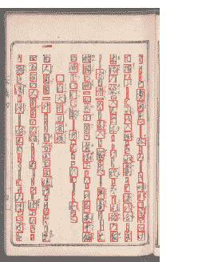
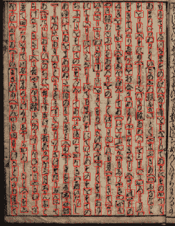
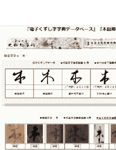

<!--yml

分类：未分类

日期：2024-09-06 20:00:12

-->

# [2007.09637] 深度学习基础的楷书识别调查

> 来源：[`ar5iv.labs.arxiv.org/html/2007.09637`](https://ar5iv.labs.arxiv.org/html/2007.09637)

# 深度学习基础的楷书识别调查

楷书识别

上木和也 信息科学学院

明星大学

邮箱：kazuya.ueki@meisei-u.ac.jp    小岛智佳 信息科学学院

明星大学

邮箱：18j5061@stu.meisei-u.ac.jp

###### 摘要

由于 2012 年图像分类竞赛中展示的深度学习方法的超高准确性，深度学习已经成功应用于多种其他任务。通过使用深度学习，已实现对楷书这一用于转录历史文档的日本草书脚本的高精度检测和识别。近年来，楷书识别竞赛已经举行，许多研究人员提出了各种识别方法。本研究考察了使用深度学习进行楷书识别的近期研究趋势、当前问题和未来前景。

## I 引言

楷书在日本已经使用了超过一千年。然而，自 1900 年代起，学校不再教授楷书，目前日本只有几千人能读懂和理解它。平假名¹¹平假名是日语书写中使用的三种字符集之一。每个平假名字符代表一个特定的音节，共有 46 个基本字符。具有根汉字²²汉字是日语使用的三种字符集之一。与音节字母一起，汉字由表意字符组成，每个字母象征特定的含义。大多数汉字来自中国，尽管有些是在日本发展出来的。虽然汉字约有 50,000 个，但实际上在日本日常生活中只使用约 2,500 个。称为字母³³字母是平假名的根汉字。例如，“あ”字符来源于不同的字母，包括“安”和“阿”。，导致一个字符有多种形状；阅读与现代平假名不同的字符需要训练。因此，许多研究人员一直在使用机器学习技术进行楷书识别。近年来，随着深度学习的出现，楷书识别的研究加速了，方法的准确性也显著提高。本文对基于深度学习的楷书识别的近期方法进行了调查和分析。

## II 楷书识别的代表性研究

在深度学习引入之前，已有许多关于草书识别的研究。1999 年启动的“历史字符识别项目”[1]报告了一个支持古文献转录的系统的开发。在这个项目中，为了开发一个历史文献研究支持系统，作者研究了字符数据库、语料库、字符分割、字符识别、智能转录支持系统和数字词典。具体来说，他们利用笔画信息[2]开发了一个计算机化的历史字符词典，并实现了 67,739 个类别的草书识别系统，结合了在线和离线识别方法[3]。其他方法，如使用自组织映射的识别方法[4][5]以及使用新认知网络的识别方法[6]，也已被提出。

自深度学习引入以来，对**草书识别**的进一步研究变得越来越活跃，并提出了各种方法。在深度学习的早期引入阶段，大多数识别方法[7][8] 基于大约 50 种不同的平假名图像，识别率为 75%到 90%。也有研究识别了包含平假名、片假名⁴⁴以及汉字的 1000 多个字符[9]，还有处理超过 3000 个字符的台湾省政府办公室文件中的字符识别结果[10]。在这些研究中，通过深度学习训练中常用的数据增强技术解决了类别数量多、类别间数据不平衡以及字符变异的问题。

此外，已经提出了一种输出三字符字符串的网络作为识别连续字符的方法 [11]。该方法使用单字符和二进制分类器来区分字符；然后使用双向长短期记忆网络（BLSTM）对字符字符串进行识别。作者报告称，单字符的识别率约为 92%；然而，三字符的识别率仅约为 76%。类似地，还提出了一种使用滑动窗口和 BLSTM 来识别连续三字符字符串的方法 [12]。作者利用神经网络的最大输出概率在字符图像对齐不准确时不会特别高，但在对齐准确时会很高的趋势，通过整合多个结果将识别率提高到 86%。此外，还提出了一种使用《源氏物语》图像来识别一系列古字文短语的深度学习方法 [13]。该方法应用了具有注意机制的端到端方法来识别短语中的连续古字文字符。该方法可以以 78.92%的准确率识别用平假名（47 个不同字符）书写的短语，以及以 59.80%的准确率识别同时包含汉字（63 个不同字符）和平假名的短语。

近年来，自从 Kuzushiji 数据集首次公开以来，对 Kuzushiji 识别的研究变得越来越活跃[14]。随着这一数据库的发展，描述于 IV-A 的 PRMU 算法竞赛和在 IV-B 中引入的 Kaggle 竞赛相继举行，许多研究人员开始从事 Kuzushiji 识别工作。关于 Kuzushiji 识别竞赛的准备、进展和结果，竞赛中获得的知识，以及利用机器学习竞赛的价值也已被报道[15][16]。在这些报告中，Kuzushiji 识别竞赛的结果显示，现有的目标检测算法如 Faster R-CNN[17]和 cascade R-CNN[18]对 Kuzushiji 检测也有效。在 Kuzushiji 识别的前沿，端到端的实际转录方法正在成为主流。作为代表性方法，提出了一种端到端方法 KuroNet，利用 U-Net 架构识别整页文本[19][20]。作者展示了 KuroNet 可以处理长距离上下文、大词汇量和非标准化字符布局，通过预测整页文本中所有字符的位置和身份，无需任何预处理。为了识别多行历史文献，提出了一种受人眼运动启发的文档阅读系统，并报告了在 IV-A[21]和 IV-B[22]中描述的 PRMU 算法竞赛数据库和 Kaggle 竞赛数据库的评估结果。此外，还提出了一种用于检测历史文献中 Kuzushiji 的二维上下文框提议网络[23]。作者使用 VGG16 从输入图像中提取特征，并采用 BLSTM[24]探索纵向和横向维度，然后从二维上下文的输出中预测边界框。

在关于抄写实际方面的研究中，提出了一种新的 OCR 技术来减少高负荷抄写的劳动[25]。该技术不是完全自动化的过程，而是通过将任务分配给专家和非专家并应用自动处理来节省劳动。作者指出，通过不追求 100%的解码准确率，仅使用自动处理的 OCR，而是将不确定度高的字符标记为“〓（geta）”并在后续过程中交给专家评估，可以快速准确地进行翻译。还提出了一种利用机器学习技术自动确定哪些字符应保留进行评估的方法[26][27]。该方法可以根据从神经网络获得的置信度自动识别难以识别的字符或训练期间未使用的字符。

一项关于 Kuzushiji 识别系统界面的研究还介绍了一个能够在 Raspberry Pi 上运行的系统，该系统在处理时间和准确性上几乎与之前的研究相同，并且不需要高性能计算机[28]。

作为另一个研究重点，还介绍了一个旨在帮助人类阅读日本历史手稿的框架，该框架被表述为约束满足问题，并且还介绍了一个用于抄写 Kuzushiji 及其图形用户界面的系统[29][30]。

还提出了一个互动系统来辅助数字化日本历史木刻书籍的抄写[31]。该系统包括布局分析、字符分割、抄写和字符图像数据库生成。应用该系统的过程包括两个主要阶段。在第一个阶段，系统自动生成临时字符分割数据，用户互动地编辑和抄写这些数据，将其存储在字符图像数据库中。在第二个阶段，系统使用在第一个阶段生成的数据库进行自动字符分割和抄写。通过在各种材料上重复第一阶段和第二阶段，可以增强字符图像数据库的内容，并提高系统在字符分割和抄写方面的性能。

## III 数据集

### III-A Kuzushiji 数据集

图 1：Kuzushiji 数据集的示例图像

古文数据集⁵⁵5http://codh.rois.ac.jp/char-shape/ 包含了由日本文学研究所保存并由 ROIS-DS 人文学科开放数据中心（CODH）发布的 44 本经典书籍的 6,151 页图像数据。古文数据集中包含的示例图像见图 1。该古文数据库包括了字符的边界框，涵盖 4,328 种字符类型和 1,086,326 个字符。数据量在不同类别之间存在很大偏差：数据量最大的类别是“の”（字符代码 U+306B），共有 41,293 张图像；许多类别的图像极少，其中 790 个类别仅有 1 张图像。

Kuzushiji-MNIST、Kuzushiji-49 和 Kuzushiji-Kanji 也作为上述数据集的子集提供⁶⁶6https://github.com/rois-codh/kmnist [32]。这些数据集不仅作为高级分类算法的基准，还可以用于生成建模、对抗样本、少样本学习、迁移学习和领域适应等更具创造性的领域。Kuzushiji-MNIST 包含 70,000 张 28$\times$28 的灰度图像，涵盖 10 个平假名字符类别。Kuzushiji-49 是一个不平衡的数据集，包含 49 个类别（28$\times$28 灰度图像，270,912 张图像），其中有 48 个平假名字符和一个平假名迭代标记。Kuzushiji-Kanji 是一个不平衡的数据集，总共有 3,832 个汉字字符（64$\times$64 灰度图像，140,426 张图像），每个类别的样本数量从 1,766 个到仅一个不等。

### III-B 电子古文辞典数据库

电子古文辞典数据库⁷⁷7https://wwwap.hi.u-tokyo.ac.jp/ships/shipscontroller 是一个收集自东京大学历史编纂研究所的古代文献和记录的字形和字体数据库；它包含大约 6,000 个不同字符、2,600 个不同词汇和 280,000 个字符图像文件。该数据库涵盖了从奈良时代（8 世纪）到江户时代（18 世纪）的不同历史时期的字符形式。

### III-C 木牌数据库

图 2: “电子古文辞典数据库”和“木牌数据库”协同搜索功能

奈良国家文化财研究所开发并发布了一个数据库，该数据库收集了符号和字体的图像，允许识别刻写在从地下遗址中挖掘出的木块上的铭文。该数据库包含大约 24,000 个字符、1,500 种字符类型和 35,000 个字符图像。它包含了飞鸟-奈良时期的信息，这些信息通常不包含在 III-B 描述的电子草体字典数据库中。因此，为了方便，提供了集成两个数据库的“电子草体字典数据库”和“木板数据库”联合搜索功能⁸⁸8http://clioapi.hi.u-tokyo.ac.jp/ships/ZClient/W34/z_srch.php，如图 2 所示。

## IV 基准

### IV-A PRMU 算法竞赛

2017 年和 2019 年 PRMU 算法竞赛⁹⁹9A 是由模式识别与媒体理解（PRMU）每年举办的竞赛，旨在振兴研究小组活动。竞赛任务要求识别经典日本书籍图像中指定区域的**草体字**，并输出每个字符的 Unicode。在此竞赛中，需要识别总共 46 种平假名字符，不包括片假名或汉字。2017 年的竞赛有三个任务，针对不同的难度级别，即级别 1、2 和 3，取决于矩形中包含的字符数量。参与者需要在级别 1 中识别单个分段字符，在级别 2 中识别垂直方向上的三个连续字符，在级别 3 中识别垂直和水平方向上的三个或更多字符。在 2019 年的竞赛中，任务是识别与 2017 年级别 2 相同的垂直方向上的三个连续字符。

在这里，我们介绍 2017 年竞赛的任务以及表现最好的团队使用的方法[33]。2017 年使用的数据集由 CODH 提供的 15 本历史书籍的 2,222 页扫描图像构成。由于其中一本书包含了许多碎片化和噪声图案以及各种背景，因此被用作测试数据。一级数据集包括 228,334 张单个平假名图像，从中选择了 47,950 张作为测试数据。为了提高准确性，训练了多个模型，并采用了基于投票的集成方法来整合多个不同模型的结果。二级数据集由 92,813 张包含三个连续字符的图像组成，从数据集中选择了 13,648 张作为测试集。采用了 CNN、BLSTM 和连接时序分类（CTC）的组合架构[34]，达到了 31.60%的序列错误率（SER）。在三级数据集中，有 12,583 张图像，从中选择了 1,340 张作为测试集。作者在应用深度卷积递归网络之前，采用了垂直线分割和多行连接的组合。SER 为 82.57%，仍需显著改进。

另一份报告评估了一个受到人眼运动启发的历史文档识别系统，该系统使用了 2017 年 PRMU 算法竞赛的数据集[21]。该系统包括两个模块：用于特征提取的 CNN 和带有注意力模型的 LSTM 解码器，用于生成目标字符。作者在数据集的二级和三级分别达到了 9.87%和 53.81%的 SER。

现在，我们介绍 2019 年竞赛中第一至第三名团队的方法。2019 年使用的数据集也由 48 张从 CODH 提供的 Kuzushiji 数据集中裁剪的平假名字符图像组成。提供了单字符图像和垂直方向上包含三个连续字符的图像作为训练数据。共使用了 388,146 张单字符图像，119,997 张包含三个连续字符的图像用于训练，16,387 张用于测试。

第一名团队采用了一种通过预处理将字符分割成三张图像的方法，将每张图像输入到 CNN 中以提取特征，并使用两个层的双向门控递归单元（GRU）识别三个连续字符[35]¹⁰¹⁰10https://github.com/katsura-jp/alcon23。他们通过三种骨干模型（SE-ResNeXt、DenseNet 和 Inception-v4）的组合达到了 90.63%的准确率。作为数据增强方法，除了随机裁剪和随机偏移外，在训练过程中，还会将分割位置上下随机微调，以增强对分割位置的鲁棒性。

第二名团队在第一步中使用了 CNN、BLSTM 和 CTC，并在第二步中通过多数投票输出了三个字符。在第一步中，使用了六层的 CNN 来提取特征，使用了两层的 BLSTM 将特征转换为序列数据，并使用 CTC 输出文本。为了提高准确性，使用了如随机旋转、随机缩放、平移、随机噪声和随机擦除 [36] 等数据增强技术。

第三名团队使用了一种应用多标签图像分类的算法。在第一步中，使用图像分类模型进行了多标签估计，并在没有特定顺序的情况下估计了三个字符。在第二步中，Grad-CAM [37] 识别并对齐了每个候选字符的感兴趣区域，并输出了三个连续的字符。

### IV-B Kaggle 竞赛

表 I: Kaggle 竞赛中获胜方法的解释和程序实现

| 排名 | F 值 | URL |
| --- | --- | --- |
| 1 | 0.950 | 解释: https://www.kaggle.com/c/kuzushiji-recognition/discussion/112788 |
| 实现: https://github.com/tascj/kaggle-kuzushiji-recognition |
| 2 | 0.950 | 解释: https://www.kaggle.com/c/kuzushiji-recognition/discussion/112712 |
| 实现: https://github.com/lopuhin/kaggle-kuzushiji-2019 |
| 3 | 0.944 | 解释: https://www.kaggle.com/c/kuzushiji-recognition/discussion/113049 |
| 实现: https://github.com/knjcode/kaggle-kuzushiji-recognition-2019 |
| 4 | 0.942 | 解释: https://www.kaggle.com/c/kuzushiji-recognition/discussion/114764 |
| 实现: https://github.com/linhuifj/kaggle-kuzushiji-recognition |
| 5 | 0.940 | 解释: https://www.kaggle.com/c/kuzushiji-recognition/discussion/112771 |
| 实现: https://github.com/see–/kuzushiji-recognition |
| 7 | 0.934 | 解释: https://www.kaggle.com/c/kuzushiji-recognition/discussion/112899 |
| 实现: https://www.kaggle.com/kmat2019/centernet-keypoint-detector |
| 8 | 0.920 | 解释: https://www.kaggle.com/c/kuzushiji-recognition/discussion/113419 |
| 实现: https://github.com/t-hanya/kuzushiji-recognition |
| 9 | 0.910 | 解释: https://www.kaggle.com/c/kuzushiji-recognition/discussion/112807 |
| 实现: https://github.com/mv-lab/kuzushiji-recognition |
| 13 | 0.901 | 解释: https://www.kaggle.com/c/kuzushiji-recognition/discussion/113518 |
| 实现: https://github.com/jday96314/Kuzushiji |
| 15 | 0.900 | 解释: https://www.kaggle.com/c/kuzushiji-recognition/discussion/114120 |
| 实现: https://github.com/statsu1990/kuzushiji-recognition |

一场名为“开启千年日本文化之门”的 Kaggle 竞赛于 2019 年 7 月 19 日至 10 月 14 日举行。与 PRMU 算法竞赛涉及单字符图像或包含少量字符的图像的识别不同，Kaggle 竞赛则处理了更具挑战性的任务，即自动检测经典书籍页面上字符的位置并正确识别字符类型。在 III-A 描述的 Kuzushiji 数据集中 44 本书中，28 本在竞赛之前发布的书籍被用作训练数据，15 本在竞赛之后发布的书籍被用作测试数据¹¹¹¹11 一本书被从竞赛中剔除。F 值，即精确率（系统输出字符中的正确响应比例）和召回率（测试数据中字符的正确响应比例）的调和平均数，被用于评估。大约 3 个月的时间里，许多国际研究人员参与了这场竞赛，并取得了实用水平的准确性（F 值大于 0.9）。有两种典型的方法，即单阶段方法同时应用检测和识别，以及两阶段方法分阶段进行字符检测和识别。大多数顶级团队采用了两阶段方法。两阶段方法应用了如 Faster R-CNN 和 CenterNet [38] 的检测器来检测字符区域，并应用了如 ResNet [39] 的模型来识别单个字符。如表 I 所示，顶级团队的方法描述和实施细节已被发布。我们现在描述获胜团队的方法。

中国团队使用简单的方法结合 Cascade R-CNN 获得了第一名。Cascade R-CNN 通过在多个阶段连接 Faster R-CNN 来提高物体检测的准确性。高分辨率网络（HRNet）[40] 被用作 Cascade R-CNN 的骨干网络。HRNet 利用多分辨率特征图，能够在没有损失的情况下保留高分辨率特征表示。由于应用了包括 Cascade R-CNN 和 HRNet 在内的最新技术，团队能够在保持比其他团队使用的方法更高简洁性的同时取得高准确率，这些技术展现了最高水平的准确性。

来自俄罗斯的第二名团队使用了两阶段检测和分类方法。使用了带有 ResNet152 骨干网的 Faster R-CNN 进行检测。ResNet 和 ResNeXt [41] 被用于估计字符类型。为了提高识别准确性，进行了各种努力。例如，由于测试数据的书籍与训练数据的书籍不同，因此还使用了伪标签以适应未知书籍（作者）的环境。此外，添加了一种新的字符类别，称为检测错误字符类别，以消除分类阶段的检测错误。最后，还使用了梯度提升方法 LightGBM [42] 和 XGBoost [43]进一步提高准确性。

来自日本的第三名团队采用了两阶段字符检测方法，使用 Faster R-CNN 和高效网络（EfficientNet）[44]进行字符类型分类。该团队采用了多种数据增强类型来增加训练数据量，如下所示。首先，由于训练数据中混合了彩色和灰度图像，他们使用了随机灰度转换，这在训练过程中随机将图像转换为单色。此外，训练数据还通过应用 mixup[45]和随机图像裁剪和修补（RICAP）[46]等技术进行增强，并通过随机擦除添加一些噪声。由于 Furigana¹²¹²12Furigana 由发音符号组成，偶尔写在难读或罕见的汉字旁边以显示其发音，并非识别目标，因此使用了后处理，如创建虚假正例预测器以进行移除。

来自中国的第四名团队采用了不同于其他团队的方法；他们使用了混合任务级联（HTC）[47]进行字符检测，随后使用连接主义文本提议网络（CTPN）[48]进行逐行字符识别。单行图像被调整为 32$\times$800 的尺寸，然后输入到识别单行文本的模型中。用于行识别的卷积递归神经网络（CRNN）模型具有 200 个输出。使用 KenLM 工具包[49]训练了一个六元语法模型，并应用了束搜索来解码模型的 CTC 输出。通过多任务学习[50]提高了 CTC 输出的定位精度，添加了一个注意力损失。数据增强方法中使用了对比度限制自适应直方图均衡、随机亮度、随机对比度、随机缩放和随机失真。作为正则化方法应用了 dropout 和 cutout。虽然许多其他团队报告了语言模型的无效性，但该团队报告了准确率的轻微提高。

第五名的团队，来自德国，报告说，使用 CenterNet 的单阶段方法在准确性上始终优于其他顶级团队的两阶段方法。虽然在对象检测任务中，处理大约 80 类对象是很常见的，比如 MS COCO 数据集，但该团队表明，即使类别数量较多，检测也可以顺利进行。他们对 CenterNet 进行了几项修改，如从头开始创建它，避免使用 HourglassNet，并使用具有特征金字塔网络的 ResNet50 和 ResNet101 结构。他们还报告说，使用 1536$\times$1536 等高分辨率图像并没有带来改进。

第七名的团队，来自日本，采用了一个两阶段的方法，首先使用 CenterNet 进行字符区域检测，然后进行基于 ResNet 的字符识别。在数据增强方面，使用了翻转、裁剪、亮度和对比度来创建检测器，并使用了裁剪、亮度、对比度以及伪标签来创建分类器。作者们尝试构建自己的模型，而不是使用预定义的方法。一般来说，虽然预定义模型设计用于提供高分辨率的局部特征和低分辨率的广视场，但对于 Kuzushiji 检测任务来说，提供显著低分辨率的广视场并不是必要的。团队报告称，这个模型的成功是因为他们建立了一个具有高度自由度的任务特定模型。

第八名的团队，也来自日本，采用了字符检测的两阶段方法，使用 CenterNet（ResNet18，UNet）进行字符检测，并使用 MobileNetV3 进行字符分类[51]。通过保持纵横比来防止字符分离，进行了字符检测，并使用边界框投票[52]来减少未检测到的字符数量。由于字符的外观因所用书籍而有显著变化，团队通过网格扭曲、弹性变换和随机擦除等数据增强方法来增加视觉变异性。

第九名的团队采用了一个简单的两阶段方法，使用 CenterNet 和 HourglassNet 作为检测的骨干网络，以及 ResNet18 进行分类。由于检测精度不足，因此结合了多个结果。在字符分类方面，该团队将数据少于 5 个的数据视为伪标签 $NaN$，因为 276 个字符不在训练数据中。

第 13 名的团队使用了 Faster R-CNN 来检测和分类字符区域，但没有共享用于检测和分类的网络。该网络的骨干使用了宽 ResNet-34，用于字符检测和字符识别。该团队尝试使用更深的网络，如 ResNet-50 和 ResNet-101，但报告称宽而浅的网络能实现更好的准确性。他们还报告说，使用彩色图像可以稍微提高检测的准确性，但会降低字符识别的准确性。虽然他们尝试使用语言模型来纠正错误标签，但效果不佳。

第 15 名的团队来自日本，使用了检测和分类的两阶段方法。首先，他们应用了灰度转换、高斯滤波、伽玛校正和 Ben 的图像预处理。使用了以 HourglassNet 为骨干的两阶段 CenterNet 来进行字符检测。在 CenterNet 的第一阶段，估计了边界框，并去除了最外层边界框之外的部分。在第二阶段，重新估计了边界框，并将第一和第二阶段的结果合并。在创建检测模型时，使用了随机擦除、水平移动和亮度调整来增强数据。对于字符分类，将三种基于 ResNet 的模型的结果也用伪标签训练并结合输出。在创建字符分类模型时，使用了水平移动、旋转、缩放和随机擦除来进行数据增强。

总结这里解释的顶级团队的方法，我们可以看到，利用最近提出的检测和分类模型非常重要。然而，尚无法确定单阶段或两阶段方法是否能取得更好的结果。在检测方法方面，像 YOLO [53] 这样在物体检测中常用的模型表现不佳，而 Faster R-CNN 和 CenterNet 则取得了成功。其原因在于图像中的字符几乎没有重叠，这与传统的物体检测不同。一些团队报告说使用最新的强大骨干的模型提高了准确性，而其他团队则报告说他们自己的方法更成功。

## 与楷书识别相关的活动

“日本文化与人工智能研讨会 2019”¹³¹³13http://codh.rois.ac.jp/symposium/japanese-culture-ai-2019/ 于 2019 年 11 月举行。此次研讨会介绍了全球范围内对楷书进行的前沿研究，参与者讨论了过去和现在的研究，并旨在未来利用人工智能对楷书进行阅读和理解的研究。

在“云本国（Cloud Transcription）”项目中，实现了一个允许纠正其他参与者转录文本的系统。通过与使用 KuLA 和 AI 技术的古文字学习应用程序合作，参与者开发的方法得到了简化和提高效率。转录结果也可以用作训练数据。

CODH 提供了几个在线服务，如 KuroNet 古文字字符识别服务、KogumaNet 古文字字符识别服务和国际图像互操作框架（IIIF）¹⁴¹⁴14 一套旨在使研究人员、学生和公众更容易在网络上查看、操作、比较和注释数字图像的技术标准。 https://iiif.io/兼容的古文字字符识别查看器。KuroNet 古文字识别服务¹⁵¹⁵15http://codh.rois.ac.jp/kuronet/提供了一个多字符古文字 OCR 功能，适用于 IIIF 兼容的图像。使用该服务，我们不需要将图像上传到服务器，而是可以测试自己的图像。IIIF 兼容的字符识别查看器为 IIIF 兼容的图像提供了单字符 OCR 功能。使用此查看器的一个优势是可以在查看图像时立即应用它，允许不仅查看最优候选项，还可以查看其他候选项。

未来，预计古文字转录将得到来自机器学习、人文学科以及实际应用该历史文献的各个领域个人的进一步推动。

## VI 未来古文字识别研究

在日本，历史材料已经保存了超过一千年；前现代的书籍和历史文献记录的数量分别估计约为三百万和十亿。然而，大多数历史材料尚未转录。目前，由于 CODH 提供的古文字数据库主要限于江户时代以后的文献，自动转录这一时期之前书籍变得困难。为了解决这一问题，需要结合多个机构拥有的不同历史时期的书籍，并重建一个大规模的古文字数据库。更远的历史中，古文字规则增加，因此预计会有许多数据库中找不到的字符类型和字符形式。因此，我们需要一个处理训练数据中不存在的未知字符类型和字符形式的框架。此外，作为字符分类中的一个问题，各字符类别的数据数量不平衡，极少数量的数据无法准确识别该类别的字符。

此外，图像的质量在不同书籍之间差异显著，作者的书写风格也完全不同，这也使得字符识别变得困难。为此，增加训练数据的数量和多样性，采用领域适应技术，并改进数据库本身是重要的。

对于个体字符逐一识别，以及基于周围字符和上下文的词汇/短语/句子级别识别，仍有进一步研究的空间。在 Kaggle 竞赛中，尽管许多团队添加了上下文信息，例如使用语言模型，但准确率没有显著提高，因为 Kuzushiji（草书）的具体问题与现代语言不同。因此，我们认为不仅需要改进如深度学习这样的机器学习技术，还需基于 Kuzushiji 的专业知识学习规则。

基于当前的转录状态，设计一个不仅允许完全自动识别字符，还能使用户轻松操作的界面至关重要。希望具有各种功能，如对不确定估计结果的字符进行可视化，并输出备用候选字符。

## VII 结论

本文介绍了使用深度学习进行 Kuzushiji 识别的最新技术和问题。深度学习的引入显著提高了 Kuzushiji 的检测和识别率。特别是，Kuzushiji 识别的纳入 PRMU 算法竞赛和 Kaggle 竞赛引起了众多研究者的关注，他们对提高准确性作出了重要贡献。然而，仍有许多古旧手稿需要转录，还有许多问题需要解决。为了解决这些问题，除了改进机器学习等算法外，还需进一步推动 Kuzushiji 数据库的发展和不同领域之间的合作。

## 参考文献

+   [1] S. Yamada, N. Kato, M. Namiki, H. Kawaguchi, S. Hara, Y. Ishitani, K. Kasaya, M.Kojima, M. Umeda, K. Yamamoto, M. Shibayama, “历史字符识别（HCR）项目报告（2）,”IPSJ SIG 计算机与人文学科（CH），第 50 卷，第 2 期，第 9–16 页，2001 年（用日语）。

+   [2] S. Yamada, Y. Waizumi, n. Kato, M. Shibayama, “开发具有相似字符搜索功能的历史字符数字字典，”IPSJ SIG 计算机与人文学科（CH），第 54 卷，第 7 期，第 43-50 页，2002 年（用日语）。

+   [3] M. Onuma, B. Zhu, S. Yamada, M. Shibayama, M. Nakagawa, “开发草书字符模式识别以访问数字字典，支持解码历史文献，”IEICE 技术报告，第 106 卷，第 606 期，PRMU2006-270，第 91–96 页，2007 年（用日语）。

+   [4] T. Horiuchi, S. Kato, “使用模块化神经网络进行日文历史字符识别的研究”，《国际创新计算、信息与控制期刊》，第 7 卷，第 8 期，第 5003–5014 页，2011 年。

+   [5] S. Kato, R. Asano, “使用 SOM 模板进行历史字符识别的研究”，发表于第 30 届模糊系统研讨会论文集中，第 242–245 页，2014 年。 （日文）

+   [6] T. Hayasaka, W. Ohno, Y. Kato, “Neocognitron 在前现代日文文本中的过时脚本识别”，《丰田工学院学报》，第 48 卷，第 5–12 页，2015 年。 （日文）

+   [7] T. Hayasaka, W. Ohno, Y. Kato, K. Yamamoto, “深度学习识别变体仮名及其在 WWW 应用中的试验生产”，发表于 IPSJ 人文与计算机研讨会论文集中，第 7–12 页，2016 年。 （日文）

+   [8] K. Ueda, M. Sonogashira, M. Iiyama, “基于卷积神经网络和字符纵横比的古日文字符识别”，《ELCAS 期刊》，第 3 卷，第 88–90 页，2018 年。 （日文）

+   [9] T. Kojima, K. Ueki, “深度学习在变体仮名翻译中的应用与分析”，《日本精密工程学会学报》，第 85 卷，第 12 期，第 1081–1086 页，2019 年。 （日文）

+   [10] Z. Yang, K. Doman, M. Yamada, Y. Mekada, “使用 CNN 对现代日文官方文件进行字符识别，解决不平衡学习数据问题”，发表于 2019 年国际先进图像技术研讨会（IWAIT）论文集中，第 74 号，2019 年。

+   [11] A. Nagai, “使用卷积神经网络识别古日文连笔字符的三字符字符串”，发表于日本信息处理学会（IPSJ）研讨会论文集中，第 213–218 页，2017 年。 （日文）

+   [12] K.Ueki, T. Kojima, R. Mutou, R. S. Nezhad, Y. Hagiwara, “使用多重 Softmax 输出识别日文连笔字符”，发表于国际多媒体信息处理与检索会议论文集中，2020 年。

+   [13] X. Hu, M. Inamoto, A. Konagaya, “使用深度学习方法识别变体仮名：以《源氏物语》桐壶篇为例”，日本人工智能学会第 33 届年会，2019 年。

+   [14] A. Kitamoto, T. Clanuwat, T. Miyazaki, K. Yayamoto, “字符数据分析：机器学习对变体仮名识别的潜力与影响”，《电子信息通信学会学报》，第 102 卷，第 6 期，第 563–568 页，2019 年。 （日文）

+   [15] A. Kitamoto, T. Clanuwat, A. Lamb, M. Bober-Irizar, “Kaggle 机器学习竞赛对变体仮名识别的进展与结果”，发表于计算机与人文学科研讨会论文集中，第 223–230 页，2019 年。 （日文）

+   [16] A. Kitamoto, T. Clanuwat, M. Bober-Irizar, “Kaggle Kuzushiji 识别竞赛——在数字人文学科中举办全球竞赛的挑战——”，《日本人工智能学会学报》，第 35 卷，第 3 期，第 366–376 页，2020 年。 （日文）

+   [17] S. Ren, K. He, R. Girshick, J. Sun, “Faster R-CNN: 通过区域提议网络实现实时物体检测，” arXiv:1506.01497，2015 年。

+   [18] Z. Cai, N. Vasconcelos, “Cascade R-CNN: 高质量物体检测与实例分割，” arXiv:1906.09756，2019 年。

+   [19] T. Clanuwat, A. Lamb, A. Kitamoto, “KuroNet: 基于深度学习的前现代日语草书字符识别，” 见于国际文档分析与识别会议（ICDAR2019）论文集，2019 年。

+   [20] A. Lamb, T. Clanuwat, A. Kitamoto, “KuroNet: 用于端到端草书字符识别的正则化残差 U-Net，” 见于 SN 计算机科学论文集（2020），2020 年。

+   [21] A. D. Le, T. Clanuwat, A. Kitamoto, “一种受人类启发的前现代日本历史文档识别系统，” arXiv:1905.05377，2019 年。

+   [22] A. D. Le, “通过随机线擦除和课程学习对前现代日语草书文档的自动转录，” arXiv:2005.02669，2020 年。

+   [23] A. D. Le, “通过二维上下文框提议网络从历史文档中检测草书字符，” 未来数据与安全工程，页码 731–738。

+   [24] A. Graves, J. Schmidhuber, ”使用双向 LSTM 及其他神经网络架构的逐帧音素分类，” 神经网络，第 18 卷，第 5–6 期，页码 602–610，2005 年。

+   [25] S. Yamamoto, O. Tomejiro, “节省日语稀有古籍重印的劳动力，” 信息处理与管理杂志，第 58 卷，第 11 期，页码 819–827，2016 年。（日文）

+   [26] K. Ueki, T. Kojima, “基于深度学习的日语草书字符识别的可行性研究，” IIEEJ 影像电子与视觉计算学报，第 8 卷，第 1 期，页码 10–16，2020 年。

+   [27] K. Ueki, T. Kojima, “高效转录的日语草书字符识别，” 见于国际模式识别应用与方法会议论文集，2020 年。

+   [28] M. Takeuchi, T. Hayasaka, W. Ohone, Y. Kato, K. Yamamoto, M. Ishima, T. Ishikawa, “开发用于通过深度学习识别草书的嵌入式系统，” 见于第 33 届日本人工智能学会年会论文集，2019 年。（日文）

+   [29] K. Sando, T. Suzuki, A. Aiba, “用于识别历史日语假名文本的约束求解网络服务，” 见于第 10 届国际代理与人工智能会议（ICAART）论文集，2018 年。

+   [30] Atsushi Yamazaki, Tetsuya Suzuki, Kazuki Sando, Akira Aiba, “手写日语历史假名重印支持系统，” 见于第 18 届 ACM 文档工程研讨会论文集，2018 年。

+   [31] C. Panichkriangkrai, L. Li, T. Kaneko, R. Akama, K. Hachimura, “具有自我扩展字符图像数据库的历史日语书籍字符分割与转录系统，” 国际文档分析与识别杂志（IJDAR），第 20 卷，页码 241–257，2017 年。

+   [32] Tarin Clanuwat, Mikel Bober-Irizar, Asanobu Kitamoto, Alex Lamb, Kazuaki Yamamoto, David Ha，“用于古典日本文学的深度学习，” arXiv:1812.01718，2018 年。

+   [33] H. T. Nguyen, N. T. Ly, K. C. Nguyen, C. T. Nguyen, M. Nakagawa，“尝试识别日本历史文献中的异常变形假名，” 发表在国际历史文献成像与处理研讨会（HIP 2017）论文集中，2017 年。

+   [34] A. Graves, S. Fernandez, F. Gomez, J. Schmidhuber，“连接主义时间分类：使用递归神经网络对未分割序列数据进行标注，” 发表在国际机器学习会议论文集中，第 369–376 页，2006 年。

+   [35] K. Cho, B. van Merrienboer, C. Gulcehre, D. Bahdanau, F. Bougares, H. Schwenk, Y. Bengio，“使用 RNN 编码器-解码器进行短语表示学习用于统计机器翻译，” 发表在自然语言处理会议（EMNLP）论文集中，第 1724–1734 页，2014 年。

+   [36] Z. Zhong, L. Zheng, G. Kang, S. Li, Y. Yang，“随机擦除数据增强，” arXiv:1708.04896，2017 年。

+   [37] R. R. Selvaraju, M. Cogswell, A. Das, R. Vedantam, D. Parikh, D. Batra，“Grad-CAM：通过基于梯度的定位从深度网络中获取视觉解释，” arXiv:1610.02391，2016 年。

+   [38] K. Duan, S. Bai, L. Xie, H. Qi, Q. Huang, Q. Tian，“CenterNet：用于目标检测的关键点三元组，” arXiv:1904.08189，2019 年。

+   [39] K. He, X. Zhang, S. Ren, 和 Jian Sun，“用于图像识别的深度残差学习，” arXiv:1512.03385，2015 年。

+   [40] J. Wang, K. Sun, T. Cheng, B. Jiang, C. Deng, Y. Zhao, D. Liu, Y. Mu, M. Tan, X. Wang, W. Liu, B. Xiao，“用于视觉识别的深度高分辨率表示学习，” IEEE 模式分析与机器智能汇刊，2020 年。

+   [41] S. Xie, R. Girshick, P. Dollár, Z. Tu, K. He，“用于深度神经网络的聚合残差变换，” 发表在 IEEE 计算机视觉与模式识别会议（CVPR）论文集中，2017 年。

+   [42] G. Ke, Q. Meng, T. Finley, T. Wang, W. Chen, W. Ma, Q. Ye, T.-Y. Liu，“LightGBM：一种高效的梯度提升决策树，” 神经信息处理系统（NIPS）30 卷，第 3148–3156 页，2017 年。

+   [43] T. Chen, C. Guestrin，“XGBoost：一个可扩展的树提升系统，” arXiv:1603.02754，2016 年。

+   [44] M. Tan, Q. V. Le，“EfficientNet：重新思考卷积神经网络的模型扩展，” arxiv:1905.11946，2019 年。

+   [45] H. Zhang, M. Cisse, Y. N. Dauphin, D. Lopez-Paz，“mixup：超越经验风险最小化，” arXiv:1710.09412，2017 年。

+   [46] R. Takahashi, T. Matsubara, K. Uehara，“通过随机图像裁剪和拼接进行数据增强以适用于深度 CNN，” arXiv:1811.09030，2018 年。

+   [47] K. Chen, J. Pang, J. Wang, Y. Xiong, X. Li, S. Sun, W. Feng, Z. Liu, J. Shi, W. Ouyang, C. C. Loy, D. Lin，“实例分割的混合任务级联，” 发表在 IEEE 计算机视觉与模式识别会议（CVPR）论文集中，第 4974–4983 页，2019 年。

+   [48] Z. Tian, W. Huang, T. He, P. He, Y. Qiao, “使用连接主义文本提议网络检测自然图像中的文本，” arXiv:1609.03605, 2016。

+   [49] K. Heafield, “KenLM: 更快更小的语言模型查询，” 见第六届统计机器翻译研讨会论文集，第 187–197 页, 2011。

+   [50] S. Kim, T. Hori, S. Watanabe, “基于 CTC-注意力的端到端语音识别联合多任务学习，” 见 IEEE 国际声学、语音与信号处理会议（ICASSP）论文集, 2017。

+   [51] A. Howard, M. Sandler, G. Chu, L.-C. Chen, B. Chen, M. Tan, Weijun Wang, Y. Zhu, R. Pang, V. Vasudevan, Q. V. Le, H. Adam, “寻找 MobileNetV3，” arXiv:1905.02244, 2019。

+   [52] S. Gidaris, N. Komodakis, 基于多区域和语义分割感知 CNN 模型的目标检测 arXiv:1505.01749, 2015。

+   [53] J. Redmon, S. Divvala, R. Girshick, A. Farhadi, “你只需看一次: 统一的实时目标检测，” arXiv:1506.02640, 2015。
