<!--yml

category: 未分类

date: 2024-09-06 20:00:10

-->

# [2007.12928] 基于深度学习的视频超分辨率：全面综述

> 来源：[`ar5iv.labs.arxiv.org/html/2007.12928`](https://ar5iv.labs.arxiv.org/html/2007.12928)

∎

¹¹institutetext: Fanhua Shang（通讯作者）： ¹¹email: fhshang@xidian.edu.cn

Hongying Liu 和 Fanhua Shang 现任职于中国西电大学人工智能学院教育部智能感知与图像理解重点实验室以及中国深圳鹏城实验室。

Zhubo Ruan、Peng Zhao、Yuanyuan Liu 和 Linlin Yang 现任职于中国西电大学人工智能学院教育部智能感知与图像理解重点实验室。

Chao Dong 现任职于中国科学院深圳先进技术研究院。

Radu Timofte 现任职于瑞士苏黎世联邦理工学院和德国维尔茨堡大学。

# 基于深度学习的视频超分辨率：全面综述

Hongying Liu    Zhubo Ruan    Peng Zhao    Chao Dong    Fanhua Shang    Yuanyuan Liu    Linlin Yang    Radu Timofte

###### 摘要

视频超分辨率（VSR）是从低分辨率视频重建高分辨率视频的技术。最近，基于深度神经网络的 VSR 方法取得了重大进展。然而，关于这些方法的系统性综述仍然很少。在这项调查中，我们全面研究了 37 种最先进的基于深度学习的 VSR 方法。众所周知，利用视频帧中包含的信息对视频超分辨率至关重要。因此，我们提出了一种分类法，并根据利用帧间信息的方式将这些方法划分为七个子类别。此外，还包括了架构设计和实施细节的描述。最后，我们总结并比较了代表性 VSR 方法在一些基准数据集上的性能。我们还讨论了应用以及一些挑战，这些挑战需要 VSR 领域的研究人员进一步解决。尽我们所知，这项工作是对 VSR 任务的首次系统综述，预计将对该领域的近期研究发展做出贡献，并可能加深我们对基于深度学习的 VSR 技术的理解。

###### 关键词:

视频超分辨率 深度学习 卷积神经网络 帧间信息

## 1 引言

超分辨率（SR）旨在从相应的低分辨率（LR）图像恢复高分辨率（HR）图像或多个图像。这是计算机视觉和图像处理中的一个经典且具有挑战性的问题，并且在医学影像重建（Peng et al., 2020）、遥感（Luo et al., 2017）、全景视频超分辨率（Fakour-Sevom et al., 2018; Liu et al., 2020b）、监控系统（Deshmukh and Rani, 2019）以及高清电视（Patti et al., 1997）等实际应用中都有广泛的应用。随着第五代移动通信技术的到来，大尺寸图像或视频可以在更短的时间内传输。同时，随着高清（HD）和超高清（UHD）显示设备的普及，视频超分辨率正受到越来越多的关注。

视频是我们日常生活中最常见的多媒体之一，因此低分辨率视频的超分辨率变得非常重要。一般来说，图像超分辨率方法一次处理一张图像，而视频超分辨率算法则一次处理多个连续的图像/帧，以利用帧间的关系来超分辨目标帧。从广义上讲，视频超分辨率（VSR）可以看作是图像超分辨率的扩展，并可以通过逐帧处理的图像超分辨率算法进行处理。然而，SR 的性能并不总是令人满意，因为可能会引入伪影和卡顿，导致帧内出现不必要的时间不一致。

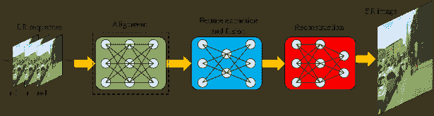

图 1：深度学习方法在 VSR 任务中的一般流程图。注意，帧间对齐模块可以是传统方法或深度 CNN，而特征提取与融合模块以及上采样模块通常使用深度 CNN。虚线框表示该模块是可选的。

近年来，已经提出了许多视频超分辨率算法。它们主要分为两类：传统方法和基于深度学习的方法。对于一些传统方法，运动通过仿射模型简单估计，如（Schultz and Stevenson, 1996）。在（Protter et al., 2009; Takeda et al., 2009）中，他们分别采用了非局部均值和 3D 引导核回归进行视频超分辨率。Liu and Sun (2014) 提出了一个贝叶斯方法来同时估计潜在的运动、模糊核和噪声水平，以重建高分辨率帧。在（Ma et al., 2015）中，采用期望最大化（EM）方法来估计模糊核，并指导高分辨率帧的重建。然而，这些高分辨率视频的显式模型仍不足以适应视频中的各种场景。

随着深度学习在各个领域取得的巨大成功（Zhang et al., 2021），基于深度学习的超分辨率算法得到了广泛研究。许多基于深度神经网络的视频超分辨率方法，如卷积神经网络（CNN）、生成对抗网络（GAN）和递归神经网络（RNN），已被提出。一般来说，它们使用大量的 LR 和 HR 视频序列输入神经网络进行帧间对齐、特征提取/融合，然后生成相应低分辨率视频序列的高分辨率序列。大多数视频超分辨率方法的流程主要包括一个对齐模块、一个特征提取和融合模块以及一个重建模块，如图 1 所示。由于深度神经网络的非线性学习能力，基于深度学习的方法通常在许多公共基准数据集上表现良好。

迄今为止，关于视频超分辨率任务的概述研究还较少，尽管已有许多关于单图像超分辨率的研究（Wang et al., 2021b; Singh and Singh, 2020; Yang et al., 2019）。Daithankar 和 Ruikar (2020) 对许多频率-空间域方法进行了简要回顾，但很少提及深度学习方法。与以往的工作不同，我们提供了对近年来视频超分辨率中深度学习技术的全面调查。众所周知，视频超分辨率与图像超分辨率的主要区别在于帧间信息的处理。如何有效利用邻近帧的信息对 VSR 任务至关重要。我们关注于各种基于深度学习的方法中如何利用帧间信息。

本工作的贡献主要总结如下。1) 我们回顾了基于深度学习的视频超分辨率技术的最新研究和进展。据我们所知，这是首个全面调查基于深度学习的 VSR 方法的综述。2) 我们通过对帧间信息利用方式的分类，提出了基于深度学习的视频超分辨率方法的分类法，并说明了如何使用该分类法对现有方法进行分类。3) 我们总结了在一些公共基准数据集上先进方法的性能，并列出了 VSR 算法在各个领域的应用。4) 我们进一步讨论了一些视频超分辨率任务的挑战和展望。

本文的组织结构如下。在第二节中，我们简要介绍了视频超分辨率的背景。第三节展示了我们对近期工作的分类。在第四节和第五节中，我们根据分类描述了有对齐和无对齐的视频超分辨率方法。第六节中，对现有最先进方法的性能进行了定量分析。在第七节中，我们讨论了视频超分辨率中的挑战和前景趋势。最后，在第八节中，我们总结了本文的工作。

## 2 背景

视频超分辨率源自图像超分辨率，其目标是从多个低分辨率帧中恢复高分辨率视频。然而，视频和图像超分辨率技术之间的区别也是显而易见的，即前者通常利用帧间信息。除了 RGB 颜色空间，YUV（包括 YCbCr 颜色空间）也广泛用于 VSR。$I_{i}\!\in\!\mathbb{R}^{H\times W\times 3}$ 表示低分辨率视频序列 $I$ 中的第 $i$ 帧，$\hat{I_{i}}\!\in\!\mathbb{R}^{sH\times sW\times 3}$ 是相应的高分辨率帧，其中 $s$ 是缩放因子，例如 $s\!=\!2$, 4 或 8。$\{\hat{I}_{j}\}_{j=i-N}^{i+N}$ 是以中心帧 $\hat{I_{i}}$ 为中心的一组 $2N\!+\!1$ 个高分辨率帧，其中 $N$ 是时间半径。然后，高分辨率视频序列的降级过程可以表述如下：

|  | ${I_{i}}=\phi(\hat{I}_{i},\{\hat{I}_{j}\}_{j=i-N}^{i+N};\theta_{\alpha})$ |  | (1) |
| --- | --- | --- | --- |

其中 $\phi(\cdot;\cdot)$ 是降级函数，参数 $\theta_{\alpha}$ 代表各种降级因素，如噪声、运动模糊和降采样因素。在大多数现有工作中（Liu 和 Sun, 2014；Ma 等, 2015；Farsiu 等, 2004；Pan 等, 2020），降级过程表示为：

|  | $I_{j}=DBE_{i\rightarrow j}\hat{I}_{i}+n_{j}$ |  | (2) |
| --- | --- | --- | --- |

其中 $D$ 和 $B$ 分别是降采样和模糊操作，$n_{j}$ 表示图像噪声，$E_{i\rightarrow j}$ 是基于从 $\hat{I}_{i}$ 到 $\hat{I}_{j}$ 的运动的变形操作。

在实践中，获得低分辨率图像 ${I_{j}}$ 是容易的，但降级因素可能非常复杂，或者可能是多种因素的组合，这些因素是未知的。与旨在解决单个降级图像的单幅图像超分辨率（SISR）不同，视频超分辨率（VSR）需要处理降级的视频序列，并恢复相应的高分辨率视频序列，这些序列应尽可能接近真实视频（GT）。具体来说，VSR 算法可能会使用类似于 SISR 的技术来处理单帧（空间信息），但必须考虑帧之间的关系（时间信息）以确保视频的运动一致性。超分辨率过程，即公式 (1) 的反向过程，可以表述如下：

|  | $\displaystyle\tilde{I_{i}}=\phi^{-1}({I_{i}},\{{I}_{j}\}_{j=i-N}^{i+N};\theta_{\beta})$ |  | (3) |
| --- | --- | --- | --- |

其中 $\tilde{I_{i}}$ 表示 GT 的估计（即 $\hat{I}_{i}$），而 $\theta_{\beta}$ 是模型参数。

与单图像超分辨率（SISR）类似，视频质量主要通过计算峰值信噪比（PSNR）和结构相似性指数（SSIM）来评估。这些指标分别衡量两幅图像之间的像素差异和结构相似性。一个超分辨率帧的 PSNR 定义为：

|  | $\textup{PSNR}=10\log_{10}\left(\frac{L^{2}}{\textup{MSE}}\right)$ |  | (4) |
| --- | --- | --- | --- |

其中 $L$ 代表颜色值的最大范围，通常为 255，均方误差 (MSE) 定义为：

|  | $\textup{MSE}=\frac{1}{N}\sum_{i=1}^{N}(\hat{I}_{i}-\tilde{I}_{i})^{2}$ |  | (5) |
| --- | --- | --- | --- |

其中 $N$ 表示图像或帧中的总像素数，$\hat{I}$ 和 $\tilde{I}$ 分别是真实高分辨率帧和恢复的超分辨率帧。较高的 PSNR 值通常意味着更好的质量。此外，SSIM 定义为：

|  | $\textup{SSIM}(\hat{I},\tilde{I})=\frac{2u_{\hat{I}}u_{\tilde{I}}+k_{1}}{u_{\hat{I}}^{2}+u_{\tilde{I}}^{2}+k_{1}}\cdot\frac{2\sigma_{\hat{I}\tilde{I}}+k_{2}}{\sigma^{2}_{\hat{I}}+\sigma_{\tilde{I}}^{2}+k_{2}}$ |  | (6) |
| --- | --- | --- | --- |

其中 $u_{\hat{I}}$ 和 $u_{\tilde{I}}$ 分别表示图像 $\hat{I}$ 和 $\tilde{I}$ 的均值。$k_{1}$ 和 $k_{2}$ 是常数，用于稳定计算，通常设为 0.01 和 0.03。$\sigma_{\hat{I}}$ 和 $\sigma_{\tilde{I}}$ 表示标准差，$\sigma_{\hat{I}\tilde{I}}$ 表示协方差。

## 3 视频超分辨率方法

由于视频是移动视觉图像和声音的录制，视频超分辨率的方法借鉴了现有的单图像超分辨率方法。许多基于深度学习的图像超分辨率方法如使用深度卷积神经网络的超分辨率（SRCNN）（Dong et al., 2014），快速超分辨率卷积神经网络（FSRCNN）（Dong et al., 2016），VDSR（Kim et al., 2016），高效子像素卷积神经网络（ESPCN）（Shi et al., 2016），残差密集网络（RDN）（Zhang et al., 2018），残差通道注意网络（RCAN）（Zhang et al., 2018b），“零样本”超分辨率（ZSSR）（Shocher et al., 2018）以及使用生成对抗网络的超分辨率（SRGAN）（Ledig et al., 2017）。2016 年，基于 SRCNN，Kappeler（Kappeler et al., 2016）提出了一种基于卷积神经网络的视频超分辨率方法（VSRnet）。至今，已经提出了许多视频超分辨率算法。接下来，我们总结了近年来基于深度学习的视频超分辨率方法的特点，如表 1 所示。

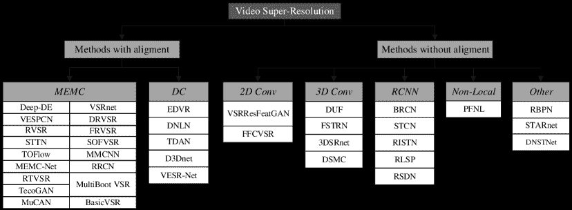

图 2：现有最先进的视频超分辨率方法的分类法。这里，$MEMC$ 代表运动估计和补偿方法，$DC$ 是可变形卷积方法，$3D\ Conv$ 是 3D 卷积方法，$RCNN$ 表示基于递归卷积神经网络的方法。这些方法的链接如下。 *MEMC*：Deep-DE (Liao et al., 2015)，VSRnet (Kappeler et al., 2016)，VESPCN (Caballero et al., 2017)，DRVSR (Tao et al., 2017)，RVSR (Liu et al., 2017)，FRVSR (Sajjadi et al., 2018)，STTN (Kim et al., 2018a)，SOFVSR (Wang et al., 2019)，TOFlow (Xue et al., 2019)，MMCNN (Wang et al., 2019b)，MEMC-Net (Bao et al., 2021)，RRCN (Li et al., 2019)，RTVSR (Bare et al., 2019)，MultiBoot VSR (Kalarot and Porikli, 2019)，TecoGAN (Chu et al., 2020)，MuCAN (Li et al., 2020)，BasicVSR (Chan et al., 2021b)。*DC*：EDVR (Wang et al., 2019a)，DNLN (Wang et al., 2019)，TDAN (Tian et al., 2020)，D3Dnet (Ying et al., 2020)，VESR-Net (Chen et al., 2020)。*2D Conv*：VSRResFeatGAN (Lucas et al., 2019)，FFCVSR (Yan et al., 2019)。*3D Conv*：DUF (Jo et al., 2018)，FSTRN (Li et al., 2019a)，3DSRnet (Kim et al., 2019)，DSMC (Liu et al., 2021a)。*RCNN*：BRCN (Huang et al., 2015，2018)，STCN (Guo and Chao, 2017)，RISTN (Zhu et al., 2019)，RLSP (Fuoli et al., 2019a)，RSDN (Isobe et al., 2020)。*Non-Local*：PFNL (Yi et al., 2019)。*Other*：RBPN (Haris et al., 2019)，STARnet (Haris et al., 2020)，DNSTNet (Sun et al., 2020)。

最近的一些研究，如 (Wang et al., 2019a; Jo et al., 2018; Tian et al., 2020)，在视频超分辨率任务中表明，利用帧中包含的信息对性能有很大影响。恰当和充分地使用这些信息可以提升视频超分辨率的结果。因此，我们根据现有视频超分辨率方法对帧间信息的利用方式构建了一个分类法，如图 2 所示。

表 1：现有的基于深度学习的视频超分辨率方法及其关键策略，如损失函数（有关损失函数的详细信息，请参见源论文）。这里，$MEMC$ 表示运动估计和运动补偿，$DC$ 是可变形卷积，$3D\ Conv$ 是 3D 卷积，$RCNN$ 表示递归卷积神经网络。

| 方法 | 年份 | 同义词 | 类型 | 损失函数 | 对齐 |
| --- | --- | --- | --- | --- | --- |
| Deep-DE (廖等, 2015) | ICCV 2015 | 深度草稿集成学习 | MEMC | $\ell_{1}$-范数损失与全变差正则化 | $\checkmark$ |
| VSRnet (卡佩勒等, 2016) | TCI 2016 | 卷积神经网络的视频超分辨率 | 均方误差 (MSE) 损失 | $\checkmark$ |
| VESPCN (卡巴列罗等, 2017) | CVPR 2017 | 视频高效亚像素卷积网络 | MSE 损失和运动补偿 (MC) 损失 | $\checkmark$ |
| DRVSR (陶等, 2017) | ICCV 2017 | 细节揭示深度视频超分辨率 | MSE 损失和 MC 损失 | $\checkmark$ |
| RVSR (刘等, 2017) | ICCV 2017 | 稳健的视频超分辨率 | 空间对齐损失和时空自适应损失 | $\checkmark$ |
| FRVSR (萨贾迪等, 2018) | CVPR 2018 | 帧递归视频超分辨率 | MSE 损失和 MC 损失 | $\checkmark$ |
| STTN (金等, 2018a) | ECCV 2018 | 时空变换网络 | MSE 损失和 MC 损失 | $\checkmark$ |
| SOFVSR (王等, 2019) | ACCV 2018 | 超分辨率光流用于视频超分辨率 | MSE 损失和 MC 损失 | $\checkmark$ |
| TOFlow (薛等, 2019) | IJCV 2019 | 任务导向流的视频增强 | $\ell_{1}$-范数损失 | $\checkmark$ |
| MMCNN (王等, 2019b) | TIP 2019 | 多记忆卷积神经网络 | MSE 损失和 MC 损失 | $\checkmark$ |
| MEMC-Net (包等, 2021) | TPAMI 2019 | 运动估计与运动补偿网络 | Charbonnier (Cb) 损失 | $\checkmark$ |
| RRCN (李等, 2019) | TIP 2019 | 残差递归卷积网络 | MSE 损失 | $\checkmark$ |
| RTVSR (贝尔等, 2019) | Neurocomp. 2019 | 实时视频超分辨率 | MSE 损失 | $\checkmark$ |
| ​​MultiBoot VSR (卡拉罗特和波利基, 2019)​​ | CVPRW 2019 | 多阶段多参考自举用于视频超分辨率 | Huber 损失 | $\checkmark$ |
| MuCAN (李等, 2020) | ECCV 2020 | 多对应聚合网络用于视频超分辨率 | 边缘感知损失 | $\checkmark$ |
| TecoGAN (朱等, 2020) | ACMTOG 2020 | 时序一致生成对抗网络 | MSE 损失和乒乓损失等 | $\checkmark$ |
| BasicVSR (陈等, 2021b) | CVPR 2021 | 在视频超分辨率及其应用中寻找关键组件 | Cb 损失 | $\checkmark$ |
| EDVR （Wang 等， 2019a） | CVPRW 2019 | 增强的可变形卷积网络用于视频修复 | DC | Cb 损失 | $\checkmark$ |
| DNLN （Wang 等， 2019） | ACCESS 2019 | 用于视频超分辨率的可变形非局部网络 | $\ell_{1}$-范数损失 | $\checkmark$ |
| TDAN （Tian 等， 2020） | CVPR 2020 | 用于视频超分辨率的时间可变形对齐网络 | $\ell_{1}$-范数损失 | $\checkmark$ |
| D3Dnet （Ying 等， 2020） | SPL 2020 | 用于视频超分辨率的可变形 3D 卷积 | MSE 损失 | $\checkmark$ |
| VESR-Net （Chen 等， 2020） | ArXiv 2020 | 视频增强和超分辨率网络 | $\ell_{1}$-范数损失 | $\checkmark$ |
| ​VSRResFeatGAN （Lucas 等， 2019）​ | TIP 2019 | 使用残差网络的视频超分辨率 | 2D 卷积 | 对抗损失；内容损失；和感知损失 | $\times$ |
| FFCVSR （Yan 等， 2019） | AAAI 2019 | 帧和特征上下文视频超分辨率 | MSE 损失 | $\times$ |
| DUF （Jo 等， 2018） | CVPR 2018 | 使用动态上采样滤波器的视频超分辨率网络 | 3D 卷积 | Huber 损失 | $\times$ |
| FSTRN （Li 等， 2019a） | CVPR 2019 | 用于视频超分辨率的快速时空残差网络 | Cb 损失 | $\times$ |
| 3DSRnet （Kim 等， 2019） | ICIP 2019 | 3D 超分辨率网络 | MSE 损失 | $\times$ |
| DSMC （Liu 等， 2021a） | AAAI 2021 | 双子网络和多阶段通信上采样 | Cb 损失；感知损失；双重损失 | $\times$ |
| ​​​BRCN （Huang 等， 2015， 2018）​​​ | ​NIPS 2015/2018​ | 通过双向递归卷积网络的视频超分辨率 | MSE 损失 | $\times$ |
| STCN （Guo 和 Chao， 2017） | AAAI 2017 | 用于视频超分辨率的时空卷积网络 | RCNN | MSE 损失 | $\times$ |
| RISTN （Zhu 等， 2019） | AAAI 2019 | 用于视频超分辨率的残差可逆时空网络 | MSE 损失 | $\times$ |
| RLSP （Fuoli 等， 2019a） | ​ICCVW 2019​ | 通过递归潜在空间传播的视频超分辨率 | MSE 损失 | $\times$ |
| RSDN （Isobe 等， 2020） | ​ECCV 2020​ | 使用递归结构-细节网络的视频超分辨率 | Cb 损失 | $\times$ |
| PFNL （Yi 等， 2019） | ICCV 2019 | 通过利用非局部时空相关性的渐进融合网络 | ​非局部​ | Cb 损失 | $\times$ |
| RBPN （Haris 等， 2019） | CVPR 2019 | 递归反投影网络 |  | $\ell_{1}$-范数损失 | $\times$ |
| STARnet （Haris 等， 2020） | CVPR 2020 | 时空感知的多分辨率网络 |  | 三种损失 | $\times$ |
| DNSTNet（Sun et al., 2020） | Neurocomp. 2020 | 通过稠密非局部时空卷积网络进行视频超分辨率 | 其他 | $\ell_{1}$-范数损失 | $\times$ |

如图 2 和表 1 所示，我们将现有方法分为两个主要类别：对齐方法和无对齐方法，根据视频帧是否明确对齐。我们将在以下章节中详细介绍这些方法。

由于所有方法是根据帧是否明确对齐以及主要用于对齐的技术进行分类的，其他用于特征提取、融合和重建的模块被忽略。这些模块可能被多个方法同时使用。因此，我们研究中的一些方法是耦合的。MEMC 方法中的 BasicVSR 属于对齐方法类别，采用典型的双向递归卷积神经网络（RCNN）作为骨干网络。而在没有对齐的方法中，如 RCNN 基础的方法（例如 BRCN、STCN 和 RISTN），主要使用 RCNN 进行特征学习。类似地，DC 类别中的 VESR-Net 也使用非局部块进行特征学习，就像非局部类别中的 PFNL 一样。此外，3D 卷积类别中的 DSMC 也利用非局部块进行全局相关性计算。‘其他’类别包括那些采用光流但没有帧对齐的方法，例如 RBPN 和 STARnet。最后，由可变形卷积学习到的偏移量与光流方法的模式相似，并且可变形和光流对齐之间有强关联。这在工作（Chan et al., 2021c）中有所指出。

此外，我们观察到这些新提出的方法中出现了一些趋势。

1) 方法的多样化。在早期（2015-2017 年），大多数方法使用帧对齐进行视频超分辨率。然后，从 2018 年起，出现了许多不同的方法，特别是无对齐的方法，例如 FFCVSR、DUF、RISTN 和 PLNL。一些研究还表明，无论是对齐方法还是无对齐方法，都能获得良好的性能。

2) 方法中感受野的扩展。早期的方法如 EDVR 和 RBPN 主要利用滑动窗口中的某些输入帧，而后续的方法则采用更长的序列。例如，BasicVSR 采用双向 RCNN，通过该方法，特征可以前向和后向独立传播。此外，像 PFNL 方法中的非局部子网络旨在计算所有可能像素之间的相关性。这些都表明这些方法倾向于捕捉视频序列中的长程依赖，并将网络中的感受野从局部扩展到全球。

3) 在 MEMC 方法中，如 FRVSR、STTN、SOFVSR、TecoGAN 和 MuCAN，大多数采用深度学习技术来估计光流，因为深度学习可能比传统方法更具适应性。4) 方法的实用性。随着对高质量视频超分辨率要求的提高，最近提出的方法也变得更加实用。测试视频从 Vid4 和 UVGD 发展到 REDS。所有讨论表明，我们将主要关注具有更复杂运动和场景变化的视频的方法。

## 4 对齐方法

对齐方法通过使用提取的运动信息使邻近帧明确地与目标帧对齐，然后进行后续重建。这些方法主要使用运动估计和运动补偿（MEMC）或可变形卷积，这两种是对齐帧的常见技术。接下来我们将详细介绍基于每种技术的最新方法。

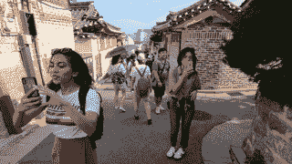

(a) 目标帧

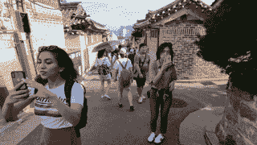

(b) 它的邻近帧

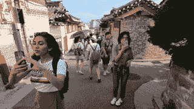

(c) 补偿后的图像

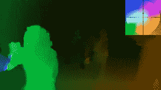

(d) 估计的光流图像

图 3：运动估计和补偿的示例。请注意，最右侧的小图像是(d)的图例。不同的颜色表示不同的运动方向，颜色的强度表示运动范围。

### 4.1 运动估计和补偿方法

在视频超分辨率的对齐方法中，大多数应用了运动估计和运动补偿技术。具体来说，运动估计的目的是提取帧间运动信息，而运动补偿则用于根据帧间运动信息在帧之间执行变形操作，并使一个帧与另一个帧对齐。大多数运动估计技术通过光流方法实现 (Dosovitskiy 等，2015)。该方法试图通过帧间的相关性和时间域的变化来计算两个相邻帧之间的运动。运动估计方法可以分为两类：传统方法（例如，（Lucas 和 Kanade，1981）和（Drulea 和 Nedevschi，2011））以及深度学习方法，如 FlowNet (Dosovitskiy 等，2015)、FlowNet 2.0 (Ilg 等，2017) 和 SpyNet (Ranjan 和 Black，2017)。

一般来说，光流方法以两帧（例如 $I_{i}$ 和 $I_{j}$）作为输入。一个是目标帧，另一个是相邻帧。然后该方法通过以下公式计算从帧 $I_{i}$ 到 $I_{j}$ 的光流矢量场 $F_{i\rightarrow{j}}$：

|  | $F_{i\rightarrow{j}}(h_{i\rightarrow{j}},v_{i\rightarrow{j}})=ME(I_{i},I_{j};\theta_{ME})$ |  | (7) |
| --- | --- | --- | --- |

其中 $h_{i\rightarrow{j}}$ 和 $v_{i\rightarrow{j}}$ 是 $F_{i\rightarrow{j}}$ 的水平和垂直分量，$ME(\cdot)$ 是计算光流的函数，而 $\theta_{ME}$ 是其参数。

运动补偿用于根据运动信息在图像之间执行图像变换，以使相邻帧与目标帧对齐。一般来说，补偿后的帧 $I_{j}^{\prime}$ 表达为：

|  | $I_{j}^{\prime}=MC(I_{i},F_{i\rightarrow{j}};\theta_{MC})$ |  | (8) |
| --- | --- | --- | --- |

其中 $MC(\cdot)$ 是运动补偿函数，$I_{i}$、$F_{i\rightarrow{j}}$ 和 $\theta_{MC}$ 分别表示相邻帧、光流和参数。MC 可以通过一些方法实现，如双线性插值和空间变换网络（STN） (Jaderberg 等，2015)。运动估计和运动补偿的示例如图 3 所示。

ME 和 MC 过程可以通过深度学习方法或传统方法（非深度学习）进行。根据应用于 ME 或 MC 的技术是传统的还是深度学习的，我们进一步将 MEMC 方法分为两类。如果 ME 或 MC 中的任何过程利用了深度神经网络，那么该方法属于深度学习类别，否则该方法属于传统类别。因此，MEMC 方法中的传统方法包括以下三种：Deep-DE（Liao et al., 2015）、VSRNet（Kappeler et al., 2016）和 RRCN（Li et al., 2019）。其他 MEMC 方法则被归入深度学习子类别。下面我们详细描述一些代表性方法。

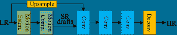

图 4: Deep-DE 的结构（Liao et al., 2015）。这里 Motion Est.为运动估计模块，Motion Comp.为运动补偿模块，Conv 为卷积层，Deconv 为反卷积层。

#### 4.1.1 Deep-DE

深度草稿集成学习方法（Deep-DE）¹¹1 代码: [`www.cse.cuhk.edu.hk/leojia/projects/DeepSR/`](http://www.cse.cuhk.edu.hk/leojia/projects/DeepSR/)（Liao et al., 2015）包含两个阶段，如图 4 所示。它首先通过调整 TV-$\ell_{1}$流（Brox et al., 2004; Guo and Chao, 2017）和运动细节保留（MDP）（Xu et al., 2012）生成一系列超分辨率草稿。然后，将超分辨率草稿和双三次插值的低分辨率目标帧输入到卷积神经网络（CNN）中进行特征提取、融合和超分辨率处理。

Deep-DE 中的 CNN 包含四个卷积层：前三个层为普通卷积层，最后一个层为反卷积层。它们的核大小分别为 11$\times$11、1$\times$1、3$\times$3 和 25$\times$25，通道数分别为 256、512、1 和 1。

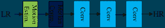

图 5: VSRnet 的网络结构（Kappeler et al., 2016）。

#### 4.1.2 VSRnet

VSRnet²²2Code: https://superresolution.tf.fau.de/ (Kappeler et al., 2016) 基于图像超分辨率方法 SRCNN (Dong et al., 2014)，其网络结构如图 5 所示。VSRnet 主要由运动估计和补偿模块以及三个卷积层组成，每个卷积层后面跟一个修正线性单元（ReLU），最后一个卷积层除外。VSRnet 和 SRCNN 的主要区别在于输入帧的数量，即 SRCNN 以单帧为输入，而 VSRnet 使用多个连续帧作为输入，这些帧是补偿帧。帧间的运动信息通过 Druleas 算法（Drulea 和 Nedevschi, 2011）计算。此外，VSRnet 提出了滤波对称性强制（FSE）机制和自适应运动补偿机制，这两者分别用于加速训练和减少不可靠补偿帧的影响，从而提高视频超分辨率性能。

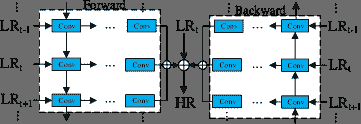

图 6：RRCN 的网络结构（Li et al., 2019）。

#### 4.1.3 RRCN

残差递归卷积网络（RRCN）（Li et al., 2019），如图 6 所示，是一种双向递归神经网络，用于学习残差图像。RRCN 提出了一个不同步的全递归卷积网络，其中不同步指的是输入多个连续的视频帧，而仅对中间帧进行超分辨率处理。

RRCN 使用局部-全局与总变量（GLG-TV）方法（Drulea 和 Nedevschi, 2011）对目标帧及其相邻帧进行运动估计和补偿。补偿后的帧作为输入传递到网络中。前向卷积和递归卷积分别在前向网络和后向网络中进行，其输出被加总。最后，通过将目标帧添加到输入中来获得结果。为了进一步提高性能，RRCN 还使用了自我集成策略，并将其与单图像超分辨率方法 EDSR+（Lim et al., 2017）的输出结合，得到两个模型，分别为 RRCN+ 和 RRCN++。

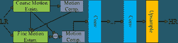

图 7：VESPCN 的网络结构（Caballero et al., 2017）。这里 $\oplus$ 表示元素级加法。

#### 4.1.4 VESPCN

视频高效子像素卷积网络（VESPCN）（Caballero 等，2017）提出了一种空间运动补偿变换器（MCT）模块用于运动估计和补偿。然后，将补偿后的帧输入一系列卷积层进行特征提取和融合，如图 7 所示。最后，通过子像素卷积层进行上采样以获得超分辨率结果。

MCT 模块采用 CNN 提取运动信息并进行运动补偿。MCT 使用从粗到细的方法计算图像序列的光流。首先，在粗估计阶段，网络以两个连续帧（即目标帧和相邻帧）作为输入。粗网络由 5 层卷积层和一层子像素卷积层组成。它首先进行 $\times$2 下采样操作两次，然后通过子像素卷积层进行 $\times$4 上采样操作，以获得粗光流估计结果。其次，根据光流对相邻帧进行扭曲。在细估计阶段，目标帧、相邻帧、在粗阶段计算的光流以及扭曲的相邻帧作为细网络的输入，其架构类似于粗网络。它首先进行 $\times$2 下采样，然后在网络末尾进行 $\times$2 上采样，以获得细光流。结合粗光流，细光流用于获得最终估计结果。最后，通过最终光流再次扭曲相邻帧，使扭曲的帧与目标帧对齐。

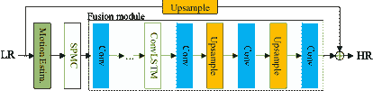

图 8: DRVSR 的网络架构（Tao 等，2017）。这里 SPMC 表示子像素运动补偿层，ConvLSTM 是卷积 LSTM（Shi 等，2015）。

#### 4.1.5 DRVSR

细节揭示深度视频超分辨率（DRVSR）³³3 代码: https://github.com/jiangsutx/SPMC_VideoSR (Tao 等，2017) 方法提出了一种子像素运动补偿层（SPMC），该层可以根据估计的光流信息同时对相邻输入帧进行上采样和运动补偿操作。DRVSR 的网络架构如图 8 所示。

DRVSR 由三个主要模块组成：运动估计模块、使用 SPMC 层的运动补偿模块和融合模块。运动估计模块由运动补偿变换器（MCT）网络（Caballero 等，2017）实现。SPMC 层由两个子模块组成，即网格生成器和采样器。网格生成器根据光流将 LR 空间中的坐标转换为 HR 空间中的坐标，然后采样器在 HR 空间中执行插值操作。在融合模块中，首先应用步幅为 2 的卷积进行下采样，然后进行反卷积以进行上采样，从而获得目标帧的 HR 残差图像。与上采样的 LR 目标帧一起，这个残差图像产生最终结果。DRVSR 还采用了 ConvLSTM 模块（Shi 等，2015）来处理时空信息。

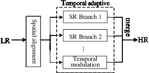

图 9：RVSR（Liu 等，2017）的网络架构，其中 SR 表示超分辨率。

#### 4.1.6 RVSR

强健的视频超分辨率（RVSR）（Liu 等，2017）提出了一个空间对齐模块，以实现出色的对齐性能，并提出了一个时间自适应模块，以自适应地确定时间依赖的最佳尺度。其架构如图 9 所示。

空间对齐模块负责多帧的对齐，使相邻的帧与目标帧对齐。它首先通过定位网络估计相邻帧与目标帧之间的变换参数，然后通过空间变换层（Jaderberg 等， 2015）根据获得的参数使相邻帧与目标帧对齐。定位网络由两层卷积层组成，每层卷积层后跟一个最大池化层，以及两层全连接层。时间自适应模块由多个 SR 子网络分支和一个时间调制组成。每个子网络负责处理一个时间尺度（即输入帧的数量），并输出相应的超分辨率结果。然后，通过时间调制为每个子网络的超分辨率结果分配权重。最终的超分辨率结果是每个分支的超分辨率结果及其权重的加权和。时间调制模块的输入帧数量与超分辨率网络中的最大输入帧数量相同，时间调制模块的网络结构与超分辨率网络的网络结构相同，两者都基于 ESPCN 的结构（Shi 等，2016）。

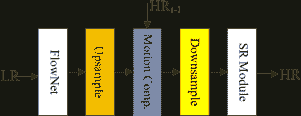

图 10：FRVSR 的网络架构（Sajjadi 等，2018）。这里 FlowNet 是一个光流估计模块，SR 模块是一个超分辨率模块。

#### 4.1.7 FRVSR

帧递归视频超分辨率（FRVSR）⁴⁴4 代码: https://github.com/msmsajjadi/FRVSR（Sajjadi 等，2018）主要提出使用先前推断的高分辨率估计来对后续帧进行超分辨率处理，以产生时间一致的结果并减少计算成本。FRVSR 的架构如图 10 所示。

详细的实现采用了光学估计网络来计算从前一帧到目标帧的光流。然后通过双线性插值将低分辨率（LR）光流上采样到与高分辨率（HR）视频相同的尺寸。前一帧的 HR 变体通过上采样的 LR 光流进行扭曲，然后通过空间到深度转换将扭曲后的 HR 帧下采样得到 LR 版本。最后，将扭曲后的 HR 帧的 LR 变体和目标帧输入到后续的超分辨率网络中，以获得目标帧的结果。在 FRVSR 中，光流网络包括 14 个卷积层、3 个池化层和 3 个双线性上采样层。每个卷积层后面跟随一个 LeakyReLU 激活函数，最后一个卷积层除外。超分辨率网络包括 2 个卷积层、2 个$\times$2 的反卷积层和 10 个残差块，每个残差块包含 2 个卷积层和一个 ReLU 激活函数。

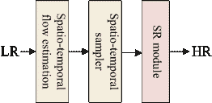

图 11：STTN 的网络架构（Kim et al., 2018a）。

#### 4.1.8 STTN

时空变换网络（STTN）（Kim et al., 2018a）提出了一个时空变换模块，用于解决以往光流方法仅处理一对视频帧的问题，这在视频中存在遮挡和亮度变化时可能导致估计不准确。所提模块可以同时处理多帧。STTN 的架构如图 11 所示。

STTN 包括三个主要模块：时空流估计模块、时空采样器模块和超分辨率模块。第一个模块是一个 U 型网络，类似于 U-Net（Ronneberger et al., 2015），包含 12 个卷积层和两个上采样层。它首先进行$\times 4$下采样，然后$\times 4$上采样以恢复输入帧的尺寸。该模块负责连续输入帧（包括目标帧和多个邻近帧）的光流估计，最终输出一个 3 通道的时空流，表示帧之间的空间和时间变化。时空采样器模块实际上是一种三线性插值方法，负责对当前多个邻近帧进行扭曲操作，并根据时空流模块获得的时空流获取对齐的视频帧。对于视频超分辨率，对齐的帧可以输入到超分辨率（SR）模块中进行特征融合和目标帧的超分辨率处理。

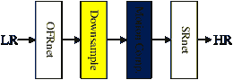

图 12：SOFVSR 的网络架构（Wang et al., 2019）。这里，OFRnet 是一个光流网络，SRnet 是一个超分辨率模块。

#### 4.1.9 SOFVSR

针对视频超分辨率任务的超分辨率光流（SOFVSR）⁵⁵5 代码： https://github.com/LongguangWang/SOF-VSR（Wang et al., 2019）旨在超分辨率 LR 估计的光流，以实现出色的 SR 性能，其架构如图 12 所示。

帧间的光流通过粗到细的方法进行估计，包括光流重建网络（OFRnet），最终生成高分辨率光流。然后通过空间到深度的转换将 HR 光流转换为 LR 光流。通过 LR 光流对邻近帧进行变形，以使邻近帧与目标帧对齐。然后，超分辨率网络（SRnet）将目标帧和变形帧作为输入，获得最终的超分辨率结果。SRnet 由两个卷积层、五个残差密集块和一个子像素卷积层组成。

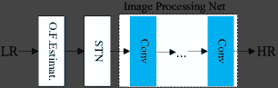

图 13：TOFlow 的网络架构（Xue et al., 2019）。这里 O.F.Estimat.是光流估计，STN 是空间变换网络。

#### 4.1.10 TOFlow

任务导向光流（TOFlow）⁶⁶6 代码： https://github.com/anchen1011/toflow（Xue et al., 2019）的架构如图 13 所示。TOFlow 将光流估计网络与重建网络相结合，并共同训练以获得针对特定任务（如视频 SR、视频插值和视频去模糊）量身定制的光流网络。

TOFlow 采用了 SpyNet（Ranjan and Black, 2017）作为光流估计网络，然后使用空间变换网络（STN）根据计算出的光流对邻近帧进行变形。最终结果通过图像处理网络得到。对于视频超分辨率任务，图像处理模块包含 4 个卷积层，其中核尺寸分别为 9$\times$9、9$\times$9、1$\times$1 和 1$\times$1，通道数分别为 64、64、64 和 3。

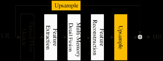

图 14：MMCNN 的网络架构（Wang et al., 2019b）。

#### 4.1.11 MMCNN

多记忆卷积神经网络（**MMCNN**）⁷⁷7Code: https://github.com/psychopa4/MMCNN（Wang 等，2019b）的架构如图 14 所示，包含 5 个主要模块：用于运动估计和运动补偿的光流模块、特征提取、多记忆细节融合、特征重建和上采样模块，其中最后一个模块使用了子像素卷积层。

连续输入帧首先由光流估计模块处理，使邻近帧与目标帧对齐，然后将变形后的帧输入到后续的网络模块中，以获得目标帧的残差图像。最后，将这个残差图像添加到通过双三次插值计算出的上采样 LR 目标帧中，以获得超分辨率结果。在多记忆细节融合模块中，**MMCNN**采用了 ConvLSTM 模块（Shi 等，2015）来融合时空信息。此外，特征提取、细节融合和特征重建模块都基于残差密集块（Zhang 等，2018；Huang 等，2017），它们之间的主要区别仅在于网络层的类型。

#### 4.1.12 **MEMC-Net**

运动估计和运动补偿网络（**MEMC-Net**）⁸⁸8Code: https://github.com/baowenbo/MEMC-Net（Bao 等，2021），如图 15 所示，主要提出了一种自适应变形层。

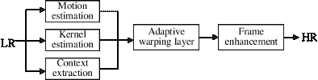

图 15：**MEMC-Net**的网络架构（Bao 等，2021）。

自适应扭曲层通过估计的光流和卷积核扭曲相邻帧，这些光流和卷积核分别来自运动估计网络和卷积核估计网络，并使相邻帧与目标帧对齐。运动估计网络采用 FlowNet（Dosovitskiy et al., 2015），而卷积核估计网络使用改进的 U-Net（Ronneberger et al., 2015），包括五个最大池化层、五个反池化层以及从编码器到解码器的跳跃连接。在 MEMC-Net 中，超分辨率模块，即帧增强模块，其架构类似于 EDSR（Lim et al., 2017）。为了解决遮挡问题，它采用了预训练的 ResNet18（He et al., 2016）来提取输入帧的特征。此外，它将 ResNet18 第一个卷积层的输出作为上下文信息输入自适应扭曲层，以执行相同的操作。

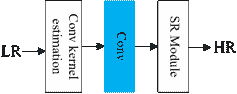

图 16：RTVSR 的网络结构（Bare et al., 2019）。这里的 SR 模块表示超分辨率模块。

#### 4.1.13 RTVSR

实时视频超分辨率（RTVSR）（Bare et al., 2019），如图 16 所示，采用了一种称为运动卷积核估计网络的卷积网络，这是一种全卷积编解码器结构，用于估计目标帧和相邻帧之间的运动，并生成一对 1D 卷积核，分别对应当前目标帧和相邻帧。然后，通过使用估计的卷积核对相邻帧进行扭曲，以使其与目标帧对齐。RTVSR 设计了一个名为门控增强单元（GEUs）的重要组件，用于学习有用的特征，这是基于（Li et al., 2018）的改进变体。

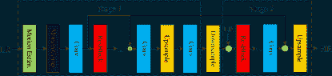

图 17：MultiBoot VSR 的网络结构（Kalarot 和 Porikli，2019）。

#### 4.1.14 MultiBoot VSR

视频超分辨率的多阶段多参考自助法（MultiBoot VSR）（Kalarot 和 Porikli，2019）由两个阶段组成。即，为了进一步提高性能，第一个阶段的输出被用作第二个阶段的输入。MultiBoot VSR 的网络结构如图 17 所示。

将低分辨率（LR）帧输入 FlowNet 2.0，以计算光流并执行运动补偿。然后，将处理后的帧输入到第一阶段网络，以获得目标帧的超分辨率结果。在 MultiBoot VSR 的第二阶段中，将上一阶段的输出下采样，与初始 LR 帧连接，然后输入到网络中，以获得目标帧的最终超分辨率结果。

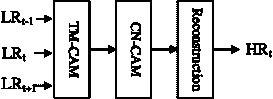

图 18: MuCAN 的网络架构（Li 等人，2020）。

#### 4.1.15 MuCAN

多对应聚合网络（MuCAN）（Li 等人，2020）的架构如图 18 所示。MuCAN 是一个端到端的网络，包括一个时间多对应聚合模块（TM-CAM）、一个跨尺度非局部对应聚合模块（CN-CAM）和一个重建模块。

在 TM-CAM 中，两个相邻的低分辨率（LR）帧首先被编码成低分辨率特征，以提高稳定性和对噪声的鲁棒性。然后，通过一个聚合单元（AU）在原始 LR 特征空间中开始聚合，以补偿大范围的运动，同时逐步向低级/高分辨率阶段过渡，以处理细微的子像素位移。在单个 AU 中，使用了基于补丁的匹配策略，因为它自然包含了结构信息。然后将多个候选结果进行聚合，以获得足够的上下文信息。聚合后的信息传递给 CN-CAM，CN-CAM 使用基于 AvgPool 的金字塔结构来执行时空非局部注意力和从粗到细的空间注意力。最后，结果被聚合并发送到重建模块，以产生最终的高分辨率（HR）结果。

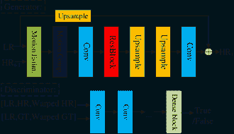

图 19: TecoGAN 的网络架构（Chu 等人，2020）。

#### 4.1.16 TecoGAN

时序一致性生成对抗网络（TecoGAN）⁹⁹9 代码: https://github.com/thunil/TecoGAN（Chu 等人，2020）主要提出了一种用于真实且一致的视频超分辨率的时空判别器，以及一种新颖的“乒乓”损失来处理重复出现的伪影。与 GAN 类似，TecoGAN 也由生成器和判别器组成，其架构如图 19 所示。

生成器将目标帧、前一帧和之前估算的高分辨率（HR）帧作为输入。首先，将输入帧送入光流模块，该模块是一个类似于 FRVSR 中光流估计模块的卷积神经网络（CNN）（Sajjadi 等，2018）。在这个模块中，目标帧与邻近帧之间的低分辨率（LR）光流被估算并通过双三次插值放大，以获得相应的高分辨率光流。然后，之前的高分辨率帧通过高分辨率光流进行扭曲。扭曲后的前一高分辨率帧和目标帧被送入后续的卷积模块，包括两个卷积层、一个残差块和两个上采样模块，其中有一个反卷积层，以生成恢复的目标帧。此外，判别器评估超分辨率结果的质量。判别器将生成的结果和真实值（GT）作为输入，每个输入包含三个组件，即三个连续的高分辨率帧、三个相应的上采样低分辨率帧和三个扭曲的高分辨率帧。通过这样的输入格式，可以缓解最终结果中的空间过度平滑和时间不一致问题。TecoGAN 还提出了“乒乓”损失函数，以减少长期时间细节漂移，使超分辨率结果更加自然。

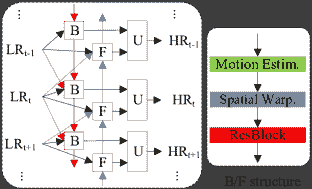

图 20：BasicVSR 的网络架构（Chan 等，2021b）。

#### 4.1.17 BasicVSR

作者提出了一种通用的视频超分辨率框架，称为 BasicVSR，如图 20 所示。它是一个典型的双向递归网络，主要由三个模块组成：反向（B）模块、正向（F）模块和上采样（U）模块。B 模块接收下一个 B 模块的输出、当前帧和后续帧，而 F 模块接收前一个 F 模块的输出、当前帧和前一帧。然后，两个模块的输出通过 U 模块融合，生成超分辨率的当前帧。这些过程会迭代进行，直到所有帧都得到超分辨率处理。B/F 模块由通用组件组成：运动估计、空间变形和残差块。作者进一步提出了两种处理机制，信息填充和耦合传播，它们构成了 IconVSR 算法。前者解决了由于对齐不准导致的性能下降问题，后者则处理了 BasicVSR 中正向处理和反向处理之间信息交互不足的问题。在信息填充机制中，如果当前处理的帧在选定的关键帧集内，它将被融合；否则，对齐结果将直接送入残差块而不进行融合。该机制缓解了由于对齐不准导致的误差累积，从而避免了性能下降。在耦合传播机制中，反向传播的输出直接作为正向传播的输入，以实现二者之间的信息交互。

总之，MEMC 技术用于将相邻帧与目标帧对齐，可能是解决视频超分辨率任务最常见的方法。然而，问题在于当光照剧烈变化或视频中存在大幅运动时，它们无法保证运动估计的准确性。在这些情况下，视频超分辨率的性能会大幅下降。这一点在 (Lucas 和 Kanade，1981) 的假设中得到了验证。当处理复杂的运动（不仅仅是大运动）和变化的光照时，基于光流方法的运动估计计算可能会违背亮度一致性、小运动和空间一致性的假设。然后，光流估计变得不准确，出现错误，容易导致伪影和模糊。为了解决这个问题，提出了有对齐的方法（例如，可变形卷积作为深度网络中的一个模块来对齐帧）和无对齐的方法。

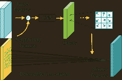

图 21：用于帧对齐的可变形卷积。

### 4.2 可变形卷积方法

可变形卷积网络是由 Dai 等人首次提出（2017），并且其改进变种（Zhu 等人，2019）是在 2019 年提出的。在普通 CNN 中，惯例是在一层中使用固定的几何结构，这限制了网络对几何变换的建模能力。相比之下，可变形卷积能够克服这一限制。图 21 显示了用于特征对齐的可变形卷积的示意图。目标特征图与相邻特征图连接并通过额外的卷积层投影以获得偏移量。这些偏移量被应用于传统卷积核以产生可变形卷积核，然后它与输入特征图进行卷积以产生输出特征图。采用可变形卷积的方法主要包括增强型可变形视频恢复（EDVR）（Wang 等人，2019a），可变形非局部网络（DNLN）（Wang 等人，2019），以及时间可变形对齐网络（TDAN）（Tian 等人，2020），这些将详细描述如下。

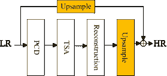

图 22：EDVR 的网络架构（Wang 等人，2019a），其中 PCD 是金字塔级联和可变形对齐模块，TSA 是时空注意力融合模块。

#### 4.2.1 EDVR

增强型可变形视频恢复（EDVR）¹⁰¹⁰10 代码：https://github.com/xinntao/EDVR (Wang 等人，2019a)，如图 22 所示，是 NTIRE19 挑战赛（Nah 等人，2019a, b）中的冠军模型。EDVR 提出了两个关键模块：金字塔级联和可变形（PCD）对齐模块（Ranjan 和 Black，2017; Sun 等人，2018; Hui 等人，2018, 2021）和时空注意力（TSA）融合模块，它们分别用于解决视频中的大运动和有效融合多个帧。

EDVR 主要由四个部分组成：一个 PCD 对齐模块，一个 TSA 融合模块，一个重构模块，以及使用子像素卷积层的上采样模块。首先，输入帧通过 PCD 对齐模块进行对齐，然后通过 TSA 融合模块融合对齐后的帧。然后，融合的结果输入重构模块以细化特征，通过上采样获得称为残差图像的 HR 图像。最终结果通过将残差图像添加到直接上采样目标帧来获得。为了进一步提高性能，EDVR 还采用了两阶段方法，第二阶段与第一阶段类似，但网络深度较浅。

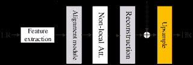

图 23: DNLN 的网络架构（Wang 等，2019）。其中非局部 Att. 是非局部注意力模块。

#### 4.2.2 DNLN

可变形非局部网络（DNLN）¹¹¹¹11 代码：https://github.com/wh1h/DNLN（Wang 等，2019），如图所示。23，基于可变形卷积（Dai 等，2017；Zhu 等，2019）和非局部网络（Wang 等，2018），设计了一个对齐模块和一个非局部注意力模块。对齐模块在原始可变形卷积内使用分层特征融合模块（HFFB）（Hui 等，2021）生成卷积参数。此外，DNLN 采用多个可变形卷积级联方式，使得帧间对齐更加准确。

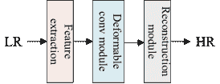

图 24: TDAN 的网络架构（Tian 等，2020）。

#### 4.2.3 TDAN

时间可变形对齐网络（TDAN）¹²¹²12 代码：https://github.com/YapengTian/TDAN-VSR-CVPR-2020（Tian 等，2020），如图所示。24，应用可变形卷积到目标帧和相邻帧，并获得相应的偏移量。然后，相邻帧根据偏移量进行扭曲以与目标帧对齐。TDAN 分为三部分，即特征提取模块，可变形卷积模块和重构模块。

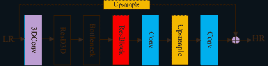

图 25: D3Dnet 的网络架构（Ying 等，2020）。

#### 4.2.4 D3Dnet

可变形 3D 卷积网络（D3Dnet）¹³¹³13 代码: https://github.com/XinyiYing/D3Dnet（Ying et al., 2020）的架构如图 25 所示。D3Dnet 提出了 3D 可变形卷积，以实现强大的时空特征建模能力。输入首先传递到一个 3D 卷积层生成特征，然后输入到 5 个残差可变形 3D 卷积（ResD3D）块中，以实现运动补偿并捕捉空间信息。

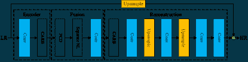

图 26：VESR-Net 的架构（Chen et al., 2020），其中 CARB 是通道注意残差块，Separate NL 表示分离的非局部架构。

#### 4.2.5 VESR-Net

视频增强与超分辨率网络（VESR-Net）的架构（Chen et al., 2020），如图 26 所示，是优酷视频增强与超分辨率挑战中的冠军模型。VESR-Net 主要包括一个特征编码器、一个融合模块和一个重建模块。

低分辨率帧首先由包括卷积层和几个堆叠的通道注意残差块（CARBs）（Zhang et al., 2018b）组成的特征编码器处理。然后在融合模块中，（Wang et al., 2019a）中的 PCD 卷积执行帧间特征对齐。分离非局部子模块（Separate NL）在空间、通道和时间维度上划分特征图并分别处理以获得相关信息。与传统的非局部（Wang et al., 2018）架构相比，Separate NL 可以用更少的参数和更浅的网络融合视频帧和每帧中的像素信息。最后，VESR-Net 在重建模块中利用 CARBs 和特征解码器进行上采样，其中上采样模块由一个子像素卷积层实现。通过与双三次插值的低分辨率目标帧相加，输出超分辨率帧。

方法的演变与对齐。在对齐方法中，运动估计和运动补偿技术作为计算机视觉中的经典研究课题，早期已被应用于视频超分辨率。MEMC 具有广泛的应用领域，如视频编码和增强交错扫描。随着基于深度学习的视频超分辨率（VSR）的出现，许多研究工作采用 MEMC 来捕捉视频帧中包含的运动信息。MEMC 的早期工作是 Deep-DE（Liao 等，2015），一些最近提出的方法如 VESPCN（Caballero 等，2017），SOFVSR（Wang 等，2019），TOFlow（Xue 等，2019）和 FRVSR（Sajjadi 等，2018）也采用了 MEMC 技术。具体来说，早期的视频超分辨率算法采用传统的 MEMC 方法，如 VSRnet 中的 Druleas（Kappeler 等，2016），而后续算法如 VESPCN（Caballero 等，2017），TOFlow（Xue 等，2019）和 FRVSR（Sajjadi 等，2018）则主要设计了针对 MEMC 的子模块或子网络。

然而，大多数 MEMC 方法的准确性通常无法保证。当亮度变化或视频帧之间存在大幅运动时，VSR 的性能会急剧下降。因此，对不敏感于变化光照和运动条件的可变形卷积（DConv）引起了研究人员的更多关注。与传统卷积相比，DConv 对每个采样点应用了可学习的偏移。因此，DConv 不仅可以扩展卷积核的感受野，还可以丰富感受野的形状。在处理变化的光照和运动条件时，具有固定卷积核和有限感受野的传统卷积可能无法捕捉到变化的条件。而 DConv 使用可学习的参数来分析光照和运动特征，从而能够更好地捕捉复杂的运动和光照变化。可变形卷积由 Dai 等（2017）提出，以增强 CNN 在对象几何变换建模中的能力。在 VSR 方法中，TDAN（Tian 等，2020）首次利用它进行帧间对齐。之后，DNLN（Wang 等，2019），EDVR（Wang 等，2019a）和 D3Dnet（Ying 等，2020）进一步推广了它在帧对齐中的应用。然而，可变形卷积仍然存在一些缺点，包括高计算复杂度和严格的收敛条件。因此，这项技术在未来仍有改进的空间。

此外，基于 MEMC 的方法在视频中存在剧烈光照变化和大运动时会大大降低性能。然而，网络架构是影响其性能的重要因素之一。其他因素包括训练数据集、训练策略、数据预处理、超参数设置、迭代次数等。尽管 MEMC 基的方法在处理包含光照变化和大运动的视频时存在局限性，但可以通过其他网络设计和训练设置来对抗。例如，BasicVSR/IconVSR 采用了双向递归网络作为骨干网，充分利用视频序列中的全局信息并扩展感受野。因此，与主要使用卷积的其他 MEMC 方法相比，它们可能获得更优越的性能。此外，使用余弦退火方案的训练过程（Loshchilov 和 Hutter，2017）可能更为精细。

## 5 无对齐方法

相较于有对齐的方法，无对齐的方法不对视频超分辨率进行邻近帧对齐。这类方法主要利用空间或时空信息进行特征提取。根据用于初步特征提取的主导技术，我们进一步将其分类为五种类型：2D 卷积方法（2D Conv）、3D 卷积方法（3D Conv）、递归卷积神经网络（RCNN）、基于非局部网络的方法和其他方法。其中，第一种属于空间方法，而接下来的三种是时空方法，其特点是利用输入视频中的空间和时间信息。其他方法则包括不属于上述任何一种的方法。我们将详细介绍这些方法。

### 5.1 2D 卷积方法

不使用帧间的运动估计和运动补偿等对齐操作，而是将输入帧直接输入到 2D 卷积网络中进行空间特征提取、融合和超分辨率操作。这可能是解决视频超分辨率问题的一种简单方法，因为它使网络自行学习帧内的相关信息。代表性的方法有 VSRResFeatGAN（Lucas 等，2019）和 FFCVSR（Yan 等，2019）。

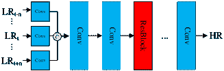

图 27: VSRResFeatGAN 中生成器的架构（Lucas 等，2019）。

#### 5.1.1 VSRResFeatGAN

**VSRResFeatGAN**（Lucas 等，2019）利用 GAN 解决 VSR 任务，通过对抗训练找到一个好的解决方案。如图 27 所示，生成器由卷积层和残差块组成。每个残差块由两个卷积层组成，并紧随其后的是 ReLU 激活函数。此外，判别器由三组卷积和一个全连接层组成，每组包括一个卷积层、批量归一化（BN）和**LeakyReLU**。判别器判断生成器的输出是生成的图像还是 GT 图像。然后，判别器的结果反应到生成器上，促使其产生更接近 GT 图像的结果。最终，通过迭代优化获得相对满意的解决方案。

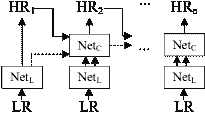

图 28：**FFCVSR**（Yan 等，2019）的架构。这里 Net[C]是上下文网络，Net[L]是局部网络。

#### 5.1.2 **FFCVSR**

**FFCVSR**（Yan 等，2019）的框架和特征上下文视频超分辨率（FFCVSR）¹⁴¹⁴14 代码： https://github.com/linchuming/FFCVSR 如图 28 所示。与常见的 MEMC 技术不同，FFCVSR 由多个局部网络和上下文网络组成，并以不同的方式利用帧间信息。将 LR 未对齐的视频帧和前一帧的 HR 输出直接作为网络的输入，以恢复高频细节并保持时间一致性。

总结来说，上述两种方法都利用了帧之间的空间相关性来处理 VSR 任务。**VSRResFeatGAN**利用对抗训练的 GAN 来寻找合适的解决方案。由于 GAN 中的判别器必须猜测生成的帧是否接近真实值，与其他方法（如**FFCVSR**）相比，VSR 结果在 PSNR 和 SSIM 方面的表现并不总是令人满意。

### 5.2 3D 卷积方法

3D 卷积模块（Tran 等，2015；Ji 等，2013）在时空域上操作，相较于仅利用空间信息的 2D 卷积，通过滑动内核对输入帧进行处理。这对于视频序列的处理是有益的，因为提取时间信息可以考虑帧之间的相关性。用于 VSR 的代表性 3D 卷积方法有**DUF**（Jo 等，2018）、**FSTRN**（Li 等，2019a）和**3DSRnet**（Kim 等，2019）。

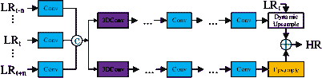

图 29：DUF 的网络架构（Jo 等，2018）。

#### 5.2.1 DUF

动态上采样滤波器（DUF）¹⁵¹⁵15 代码：https://github.com/yhjo09/VSR-DUF（Jo 等，2018）已被提出，如图 29 所示。它的灵感来源于动态滤波器网络（Jia 等，2016），该网络可以为特定输入生成相应的滤波器，然后应用这些滤波器生成对应的特征图。

动态上采样滤波器的结构，以及通过 3D 卷积学习到的时空信息，可以避免使用运动估计和运动补偿。DUF 不仅执行滤波，还执行上采样操作。为了增强超分辨率结果的高频细节，DUF 使用网络来估计目标帧的残差图。最终结果是残差图和通过动态上采样模块处理的 LR 目标帧的总和。

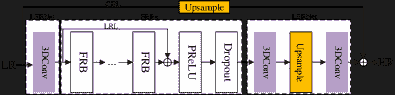

图 30：FSTRN 的网络架构（Li 等，2019a）。这里 FRB 表示快速时空残差块。

#### 5.2.2 FSTRN

快速时空残差网络（FSTRN）（Li 等，2019a）使用分解的 3D 卷积来提取连续帧中的信息，如图 30 所示。在 FSTRN 中，一个 $k\times k\times k$ 的 3D 卷积核被分解为两个级联卷积核，尺寸分别为 $1\times k\times k$ 和 $k\times 1\times 1$，以减少直接使用 3D 卷积所带来的计算量。

FSTRN 由以下四个部分组成：一个 LR 视频浅层特征提取网络（LFENet）、快速时空残差块（FRBs）、一个 LR 特征融合和上采样 SR 网络（LSRNet）以及一个全局残差学习（GRL）模块。GRL 主要由两部分组成：LR 空间残差学习（LRL）和跨空间残差学习（CRL）。LRL 与 FRBs 一起引入。CRL 直接将 LR 视频映射到 HR 空间。CRL 和 LRL 的设计可以实现 LR 和 HR 空间的通信。此外，FSTRN 在 LRL 后采用了 dropout 层，以增强网络的泛化能力。LFENet 使用 3D 卷积提取连续 LR 输入帧的特征。FRBs，包括分解的 3D 卷积层，负责提取输入帧中的时空信息。LSRNet 用于融合来自前面层的信息并进行上采样。

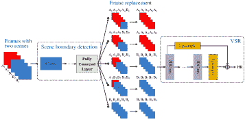

图 31: 3DSRNet 的网络架构(Kim 等人，2019)。

#### 5.2.3 3DSRNet

3D 超分辨率网络（3DSRNet）¹⁶¹⁶16 代码：https://github.com/sooyekim/3DSRnet (Kim 等人，2019) 使用 3D 卷积提取连续帧中包含的时空信息，用于 VSR 任务。其网络架构如图 31 所示。3DSRNet 的子网络可以像图中所示一样预处理场景变化。当涉及到五个不同场景的帧进行卷积时，子网络通过场景边界检测模块精确分类场景边界的位置，并用同一场景的临时最接近帧替换不同场景帧作为当前中间帧。最后，更新后的五帧被发送到后续视频超分辨率子网络。这种方法在一定程度上克服了场景变化造成的性能下降。

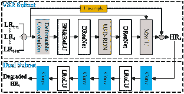

图 32: DSMC 的网络架构(Liu 等人，2021a)。

#### 5.2.4 DSMC

具有双子网络和多阶段通信上采样（DSMC）¹⁷¹⁷17 代码：https://github.com/iPrayerr/DSMC-VSR (Liu 等人，2021a)是为了超分辨率处理大运动视频而提出的深度神经网络。其架构如图 32 所示。它设计了一个具有 3D 卷积的 U 形残差密集网络（U3D-RDN）用于隐式 MEMC 的细微特性提取以及粗略的空间特征提取。此外，DSMC 提出了一种新的多阶段通信上采样（MSCU）模块，充分利用上采样的中间结果来引导 VSR。此外，还设计了一个双子网络来辅助 DSMC 的训练，其双重损失有助于减少解决方案空间并增强泛化能力。

DSMC 首先对输入的连续帧执行可变形卷积以进行粗糙特征提取。然后，输出特征图通过可变形残差网络（DResNet）(Lei 和 Todorovic，2018)提取细微空间信息。接下来，特征图输入到 U3D-RDN 进行维度减少和时空特征的相关性分析。再经过另一个 DResNet 模块，特征图送入 MSCU 模块。最后，在双子网络的训练辅助下，DSMC 产生了超分辨率的 HR 帧。值得注意的是，只有双子网络的输出和 VSR 子网的结果用于 DSMC 的损失计算。

简言之，这些 3D 卷积方法可以提取连续帧中的时空相关性，而不是执行运动估计以提取帧中的运动信息和运动补偿以对齐帧。然而，与 2D 卷积方法相比，大多数方法具有较高的计算复杂度，这限制了它们在实时视频超分辨率任务中的应用。

### 5.3 循环卷积神经网络（RCNNs）

众所周知，RCNN 在建模序列数据中的时间依赖性方面具有强大的能力，例如自然语言、视频和音频。一种直接的方法是使用 RCNN 处理视频序列。基于这一关键思想，已提出了几种 RCNN 方法，如 BRCN（Huang et al., 2015, 2018）、STCN（Guo and Chao, 2017）和 RISTN（Zhu et al., 2019），用于视频超分辨率。

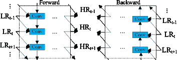

图 33：BRCN 的网络结构（Huang et al., 2015, 2018）。

#### 5.3.1 BRCN

如图 33 所示，双向递归卷积网络（BRCN）（Huang et al., 2015, 2018）由两个模块组成：一个前向子网络和一个结构类似的后向子网络，它们仅在处理序列的顺序上有所不同。前向子网负责建模来自前面帧的时间依赖性，而后向子网则建模来自后续帧的时间依赖性。

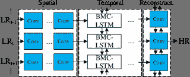

图 34：STCN 的网络结构（STCN2107AAAI）。这里的 BMC 表示双向多尺度卷积。

#### 5.3.2 STCN

时空卷积网络（STCN）（Guo and Chao, 2017）是一种端到端的 VSR 方法，无需 MEMC，如图 34 所示。帧内的时间信息是通过使用 LSTM（Hochreiter and Schmidhuber, 1997）提取的。类似于 RISTN（Zhu et al., 2019），该网络由三个部分组成：空间模块、时间模块和重建模块。空间模块负责从多个连续的 LR 帧中提取特征。时间模块是 LSTM 的双向多尺度卷积变体，旨在提取帧之间的时间相关性。

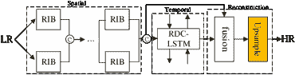

图 35：RISTN（Zhu et al., 2019）的网络架构，其中 RIB 表示残差可逆块，RDC 是残差密集卷积。

#### 5.3.3 RISTN

残差可逆时空网络（RISTN）¹⁸¹⁸18 代码: https://github.com/lizhuangzi/RISTN (Zhu et al., 2019) 灵感来源于可逆块（Jacobsen et al., 2018）。如图 35 ‣ 5 Methods without Alignment ‣ Video Super-Resolution Based on Deep Learning: A Comprehensive Survey") 所示，它设计了一个残差可逆块（RIB）、一个带有残差密集卷积的 LSTM（RDC-LSTM）和一个稀疏特征融合策略来自适应地选择有用的特征。这里，RIB 用于有效提取视频帧的空间信息，RDC-LSTM 用于提取时空特征。

该网络主要分为三个部分：空间模块、时间模块和重建模块。空间模块主要由多个并行的 RIB 组成，其输出作为时间模块的输入。在时间模块中，提取时空信息后，通过稀疏融合策略选择性地融合特征。最后，重建模块通过反卷积重建目标帧的高分辨率结果。

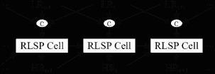

图 36：RLSP（Fuoli et al., 2019a）的网络架构。

#### 5.3.4 RLSP

递归潜在空间传播（RLSP）¹⁹¹⁹19 代码: https://github.com/dariofuoli/RLSP (Fuoli et al., 2019a) 如图 36 ‣ 5 Methods without Alignment ‣ Video Super-Resolution Based on Deep Learning: A Comprehensive Survey") 所示，提出了一种递归视频超分辨率算法，该算法避免了在非递归网络中单个视频帧被多次处理的问题。此外，该算法通过引入包含前一时刻产生的时间信息的隐藏状态作为当前时刻输入的一部分，隐式地传递时间信息，并且不包括显式的运动估计和运动补偿。

隐藏状态由 RLSP 单元生成，该单元由多个卷积组成。该单元接收前一时刻的隐藏状态、前一时刻的超分辨率结果，以及当前帧和相邻帧作为输入，生成当前时刻的超分辨率结果和隐藏状态。该过程重复进行，直到所有帧都处理完毕。

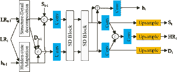

图 37：RSDN（Isobe et al., 2020）的网络架构。

#### 5.3.5 RSDN

循环结构-细节网络（RSDN）²⁰²⁰20 代码: https://github.com/junpan19/RSDN (Isobe 等，2020) 如图 37 所示，提出将帧分为两个组件，即结构和细节，然后分别通过后续模块处理这两个组件。

算法首先使用双三次插值算法对输入 LR 帧进行下采样和上采样，以提取结构和细节组件。然后，这两个组件通过卷积和多个 SD 块处理，以获得结构和细节组件、超分辨率结果和当前时刻的隐藏状态。SD 块促进结构和细节组件之间的信息交换。此外，RSDN 提出了一个隐藏状态适应模块，以选择有利于超分辨率的信息，避免冗余信息的干扰。

总之，基于 RCNN 的方法适合建模视频中包含的时空信息，因为它们可以映射邻近的帧，从而有效地建立长期依赖关系，且结构更轻量。然而，传统的基于 RCNN 的方法难以训练，有时会遇到梯度消失问题。当输入序列的长度过大时，它们可能无法捕捉长期依赖关系，因此可能无法取得良好性能。基于 LSTM 的方法可以在一定程度上克服这些限制，通过记忆来自浅层的特征。然而，LSTM 的复杂设计是限制其在硬件上深度的一个因素，使其难以建模非常长期的依赖关系。

### 5.4 非局部方法

基于非局部的方法是另一种利用视频帧中空间和时间信息进行超分辨率的方法。这种方法受益于非局部神经网络（Wang 等，2018）的核心思想，该网络旨在捕捉视频分类的长距离依赖关系。它克服了卷积和递归计算局限于局部区域的缺陷。直观地说，非局部操作是计算一个位置的响应值，该值等于输入特征图中所有可能位置的加权和。其公式如下：

|  | $y_{i}=\dfrac{1}{\mathcal{C}(x)}\sum\limits_{\forall{j}}f(x_{i},x_{j})g(x_{j})$ |  | (9) |
| --- | --- | --- | --- |

其中 $i$ 是需要计算响应值的输出位置的索引，$j$ 是所有可能位置的索引，$x$ 和 $y$ 是具有相同维度的输入和输出数据，$f$ 是计算 $i$ 和 $j$ 之间相关性的函数，$g$ 是计算输入数据特征表示的函数，而 $\mathcal{C}(x)$ 是归一化因子。这里，$g$ 通常定义为：$g(x_{j})=W_{g}x_{j}$，其中 $W_{g}$ 是需要学习的权重矩阵。需要注意的是，$f$ 有多种选择，如高斯函数、点积和拼接。因此，非局部块可以很容易地添加到现有的深度 CNN 中。

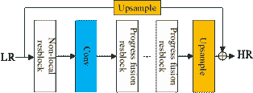

图 38：PFNL 的网络架构 (Yi et al., 2019)。

#### 5.4.1 PFNL

逐步融合非局部 (PFNL) (Yi et al., 2019) 方法如图 38 所示。它主要包括三个部分：非局部残差块、逐步融合残差块 (PFRB) 和一个上采样块。

PFNL 使用非局部残差块提取时空特征，PFRB 被提出用于融合这些特征。最后，通过子像素卷积层的输出与通过双三次插值上采样的输入帧相加，得到最终的超分辨率结果。PFRB 由三个卷积层组成。首先，输入帧分别与 $3\times3$ 核进行卷积，然后将输出特征图拼接，通过 $1\times1$ 卷积减少通道维度。结果与先前卷积的特征图分别拼接，并进行 $3\times3$ 卷积。最终结果与每个输入帧相加，以获得当前 PFRB 的输出。

### 5.5 其他

该子类别的方法不利用上述初始特征提取。它们可能结合多种技术进行超分辨率处理。

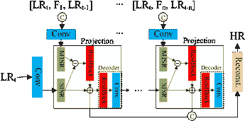

图 39：RBPN 的网络架构 (Haris et al., 2019)，其中 $\copyright$ 表示拼接，$\ominus$ 表示元素减法，MISR 表示多图像超分辨率。

#### 5.5.1 RBPN

循环反投影网络 (RBPN)²¹²¹21 代码: https://github.com/alterzero/RBPN-PyTorch  (Haris et al., 2019) 的灵感来源于反投影算法 (Irani 和 Peleg, 1991, 1993; Haris et al., 2018)。RBPN 主要由一个特征提取模块、一个投影模块和一个重建模块组成，其架构如图 39 所示。

特征提取模块包括两个操作：一个是提取目标帧的特征，另一个是从目标帧、相邻帧以及从相邻帧到目标帧的计算光流的拼接中提取特征，并隐式地执行对齐。光流是通过 pyflow²²²²22https://github.com/pathak22/pyflow 方法获得的。投影模块由编码器和解码器组成。编码器由多个图像超分辨率（MISR）、单幅图像超分辨率（SISR）和残差块（标记为 ResBlock）组成。解码器由 ResBlock 和步幅卷积组成，它将前一个编码器的输出作为输入，以生成用于下一个投影模块编码器的 LR 特征。目标帧、下一个相邻帧和预计算的光流的拼接作为输入传递给特征提取模块，其输出也作为下一个投影模块中编码器的输入。上述过程会持续进行，直到处理完所有相邻帧。即，投影被递归使用，这就是“递归回投影网络”这一术语的由来。最后，重建模块将每个投影模块中编码器的输出通过拼接的平均值作为输入，以生成最终的 SR 结果。

图 40：STARnet 的网络架构（Haris 等，2020）。

#### 5.5.2 STARnet

时空感知多分辨率网络（STARnet）的架构（Haris 等，2020）如图 41 所示。STARnet 是一个端到端的网络，可以同时处理视频超分辨率和视频插值。它由以下三个阶段组成：初始化、优化和重建。

在初始化阶段，STARnet 接收包括两个 LR RGB 帧及其双向流图像在内的四部分输入。在此阶段，两个空间超分辨率（S-SR）模块可以通过 DBPN（Haris 等，2018）或 RBPN（Haris 等，2019）对两个 LR 帧进行超分辨率处理，并通过类似的网络重新生成它们的 LR 对应帧，为在 LR 和 HR 空间的时空超分辨率（ST-SR）模块中进行帧插值做准备。同时，运动模块对齐双向流图像。

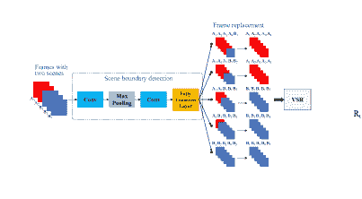

图 41：DNSTNet 的网络架构（Sun 等，2020）。

#### 5.5.3 DNSTNet

DNSTNet（Sun 等，2020）是通过密集非局部空间时间卷积网络实现的视频超分辨率。这里，密集特征提取子网络包括短期时间依赖提取块（S-TBlock）、长期 TBlock（L-TBlock）和密集连接，如图所示。它利用 3D 卷积在 S-TBlock 中捕获相邻帧之间的短期时间依赖关系，以及在 L-TBlock 中使用双向 ConvLSTM 捕获长期时间依赖关系。它还提出了一种区域级非局部块，跟随密集特征提取以利用全局信息，并扩大 3D 卷积和 ConvLSTM 的有限感受野。该非局部网络将特征图划分为多个补丁并分别处理，以降低计算成本。总之，DNSTNet 采用多个模块来提升 VSR 的性能。

尽管 DNSTNET 使用了 3D 卷积模块、LSTM 模块和非局部子网络，但这并不意味着其性能优于 EDVR 和 DSMC。众所周知，网络架构是影响性能的重要因素之一，其他因素如训练策略和迭代次数也会影响性能。与 EDVR 和 DSMC 方法相比，DNSTNET 的训练策略可能并未经过精心设计，而是一种常见的初始化方法。而 EDVR 是通过来自较浅层类似网络的参数进行初始化，这可以提升性能。DSMC 也具有更深的结构，这可能有助于提高性能。此外，在 DNSTNET 中，未经过选择的过多特征通过密集特征拼接输入到非局部块进行计算，这些特征可能带来冗余信息，从而导致性能下降。而在 DSMC 中，提取的特征在输入到非局部块之前通过 U3D-RDN 模块进行精炼，这种处理可以增强性能。

表 2：一些广泛使用的视频超分辨率数据集。请注意，'*' 表示未知信息。

| 数据集 | 年份 | 类型 | 下载链接 | 视频数量 | 分辨率 | 色彩空间 |
| --- | --- | --- | --- | --- | --- | --- |
| YUV25 | * | 训练 | [`media.xiph.org/video/derf/`](https://media.xiph.org/video/derf/) | 25 | $386\times 288$ | YUV |
| TDTFF | * | 测试 | www.wisdom.weizmann.ac.il/~vision/SingleVideoSR.html | 5 | $648\times 528$（涡轮），$960\times 530$（舞蹈），$700\times 600$（跑步机），$1000\times 580$（旗帜），$990\times 740$（风扇） | YUV |
| Vid4 | 2011 | 测试 | [`drive.google.com/drive/folders/10-gUO6zBeOpWEamrWKCtSkkUFukB9W5m`](https://drive.google.com/drive/folders/10-gUO6zBeOpWEamrWKCtSkkUFukB9W5m) | 4 | $720\times 480$（树叶和步行），$720\times 576$（日历），$704\times 576$（城市） | RGB |
| YUV21 | 2014 | Test | [`www.codersvoice.com/a/webbase/video/08/152014/130.html`](http://www.codersvoice.com/a/webbase/video/08/152014/130.html) | 21 | $352\times 288$ | YUV |
| 威尼斯 | 2014 | Train | [`www.harmonicinc.com/free-4k-demo-footage/`](https://www.harmonicinc.com/free-4k-demo-footage/) | 1 | $3,840\times 2,160$ | RGB |
| 缅甸 | 2014 | Train | [`www.harmonicinc.com/free-4k-demo-footage/`](https://www.harmonicinc.com/free-4k-demo-footage/) | 1 | $3,840\times 2,160$ | RGB |
| CDVL | 2016 | Train | [`www.cdvl.org/`](http://www.cdvl.org/) | 100 | $1,920\times 1,080$ | RGB |
| UVGD²¹²¹21UVGD 表示超视频组数据库 | 2017 | Test | [`ultravideo.cs.tut.fi/`](http://ultravideo.cs.tut.fi/) | 7 | $3,840\times 2,160$ | YUV |
| LMT²²²²22LMT 表示 LIVE 视频质量评估数据库、MCL-V 数据库和 TUM 1080p 数据集。 | 2017 | Train | [`mcl.usc.edu/mcl-v-database`](http://mcl.usc.edu/mcl-v-database), [`live.ece.utexas.edu/research/quality/live_video.html`](http://live.ece.utexas.edu/research/quality/live_video.html),[`vision.in.tum.de/data/datasets`](https://vision.in.tum.de/data/datasets) | * | $1,920\times 1,080$ | RGB |
| Vimeo-90K | 2019 | Train+Test | [`toflow.csail.mit.edu/`](http://toflow.csail.mit.edu/) | 91,701 | $448\times 256$ | RGB |
| REDS²³²³23REDS 表示真实且多样的场景 | 2019 | Train+Test | [`seungjunnah.github.io/Datasets/reds.html`](https://seungjunnah.github.io/Datasets/reds.html) | 270 | $1,280\times 720$ | RGB |

表 3：一些主要的视频超分辨率比赛。注意“EDVR+”表示基于 EDVR 的方法，而“*”表示未知信息。

| 名称 | 年份 | 主办方 | 地点 | 网站 | 数据集 | 缩放 | 冠军 | PSNR | SSIM |
| --- | --- | --- | --- | --- | --- | --- | --- | --- | --- |
| NTIRE 2019 视频恢复与增强挑战 | 2019 | CVPR | ​加利福尼亚州长滩​ | [`data.vision.ee.ethz.ch/cvl/ntire19/`](https://data.vision.ee.ethz.ch/cvl/ntire19/) | REDS | $\times$4 | EDVR (Wang et al., 2019a) | 31.79 | 0.8962 |
| YOUKU 视频超分辨率与增强挑战 | 2019 | Alibaba | 中国杭州 | [`tianchi.aliyun.com/competition/entrance/231711/introduction`](https://tianchi.aliyun.com/competition/entrance/231711/introduction) | ​Youku-VESR​ | $\times$4 | VESR-Net (Chen et al., 2020) | 37.85 | * |
| AIM 2019 视频极限超分辨率挑战 | 2019 | ECCV | 中国香港 | [`www.aim2019.org/`](https://www.aim2019.org/) | Vid3oC | $\times$16 | EDVR+ | 22.53 | 0.6400 |
| 移动视频恢复挑战 | 2019 | ​ICIP & Kwai​ | * | [`www.kuaishou.com/activity/icip2019`](https://www.kuaishou.com/activity/icip2019) | * | * | * | * | * |
| AIM 2020 视频极限超分辨率挑战赛 | 2020 | ECCV | ​ 马萨诸塞州波士顿 ​ | [`aim2020.org/`](http://aim2020.org/) | Vid3oC | $\times$16 | ​EVESRNet (Dario et al., 2020)​ | 22.83 | 0.6450 |
| Mobile AI 2021 实时视频超分辨率挑战赛 | 2021 | CVPR | ​ 虚拟 ​ | [`ai-benchmark.com/workshops/mai/2021/`](https://ai-benchmark.com/workshops/mai/2021/) | REDS | $\times$4 | Diggers (Ignatov et al., 2021) | 28.33 | 0.8112 |
| NTIRE 2021 视频超分辨率挑战赛 | 2021 | CVPR | ​ 虚拟 ​ | [`data.vision.ee.ethz.ch/cvl/ntire21/`](https://data.vision.ee.ethz.ch/cvl/ntire21/) | REDS | $\times$4 | BasicVSR++ (Chan et al., 2021d) | 33.36 | 0.9218 |

总结来说，基于非局部的方法将注意力机制引入了 VSR 任务中。它们通过扩展感受野到全局来建立时空信息的有效依赖。然而，它们使用的非局部模块需要通过关注所有其他位置并计算所有位置特征的加权平均值来计算每个位置的响应。因此，这会带来高计算成本，可能需要一些努力来减少方法的计算开销。

此外，不依赖对齐的方法依赖于神经网络的非线性能力来学习帧间的运动相关性以进行视频超分辨率。它们不使用额外的模块来对齐帧。学习能力在很大程度上依赖于深度神经网络的设计。精心设计的网络更可能在视频超分辨率上表现出更高的性能。

此外，我们还深入探讨了下面所有方法之间的联系。1) 如 EDVR、DNLN、TDAN、D3Dnet 和 VESR-Net 等方法，属于可变形卷积类别，都试图通过使用 DConv 结构克服基于光流的方法的缺陷。当处理复杂运动和变化的光照时，光流的估计是不准确的，而通过利用 DConv，可以扩展卷积核的感受野，从而使网络更好地捕捉复杂的运动和光照变化。2) 如 DUF、FSTRN、3DSRnet 和 DSMC 等方法都采用 3D 卷积层同时学习空间和时间特征，而不是来自视频数据的 2D 卷积。此外，它们还尝试通过设计新的网络结构来避免复杂运动中涉及的运动估计和补偿的不准确性。3) 如 BRCN、STCN、RISTN、RLSP、RSDN 和 BasicVSR 等方法利用双向递归卷积网络来挖掘视频帧中的长期上下文信息。双向 RCNN 通过结合前向递归网络和后向递归网络，能够利用来自前后帧的时间依赖性。4) 如 RVSR、STCN、BRCN、EDVR、DNLN、TDAN、D3DNet、VESR-Net、DUF、3DSRNet 和 DSMC 等方法都涉及视频中的复杂运动处理。5) 如 MuCAN（在 MEMC 类中）、EDVR（在 DC 类中）、VESR-Net（在 DC 类中）和 PFNL（在非局部类中）等方法试图捕捉帧之间不同位置的全局依赖性。具体来说，EDVR 方法中的 TSA 模块为每帧分配像素级权重进行融合。MuCAN、VESR-Net 和 PFNL 都设计了非局部模块来关联不同的图块，从而提高了捕捉运动信息的能力。6) 如 DRVSR、MultiBoot VSR 和 DSMC 等方法都处理具有多个缩放因子的超分辨率视频。它们不仅考虑了 x4 缩放，还考虑了$\times$2、$\times$3 或$\times$8 缩放。7) 如 MultiBoot VSR、PFNL 和 RBPN 等方法都关注于改进训练策略。例如，PFNL 采用残差学习来稳定训练过程。

## 6 性能比较

### 6.1 数据集和竞赛

表 2 总结了一些在 VSR 任务中使用的最受欢迎的数据集的详细信息。最广泛使用的训练数据集是 Vimeo-90K，因为它目前是最大的包含真实场景的 VSR 数据集。最受欢迎的测试数据集是 Vid4，其帧包含比其他数据集更多的高频细节。因此，Vid4 常用于评估 VSR 方法的性能。REDS 包括了具有极大运动的视频，这对 VSR 方法来说是一个挑战。

此外，我们还在表 3 中总结了几个国际视频超分辨率竞赛。NTIRE 2019 挑战赛（Nah et al., 2019a, b）旨在恢复具有大幅运动和多样真实场景的视频。其获胜方案是 EDVR（Wang et al., 2019a），可能是 VSR 最受欢迎的工作之一。AIM 挑战赛在 2019 年（Fuoli et al., 2019b）和 2020 年（Fuoli et al., 2020）都鼓励了具有大规模因子的 VSR 方案。一个从 EDVR 增强的方法赢得了 AIM 2019 挑战赛，而 EVESRNet（Dario et al., 2020）赢得了 AIM 2020 挑战赛。此外，2019 年的 YOUKU 视频超分辨率与增强挑战赛和移动视频恢复挑战赛都针对更具娱乐性的的视频。YOUKU 挑战赛的获胜方案是 VESR-Net（Chen et al., 2020）。移动 AI 2021 实时视频超分辨率挑战赛（Ignatov et al., 2021）在 OPPO Find X2 智能手机 GPU 上评估了方案。最新的 NTIRE 2021 视频超分辨率挑战赛评估了最先进的技术（Son et al., 2021），其获胜者为 BasicVSR++（Chan et al., 2021d）。这些竞赛为视频超分辨率的发展做出了巨大贡献，并帮助开发了各种视频超分辨率应用的新方法。

表 4：所有方法在缩放因子 $\times 4$ 的数据集上的比较。注意，“Internet”表示数据集来自互联网。 “*” 表示数据集的来源未知，而“ - ” 表示该方法未在数据集上进行测试。

| 方法 | 训练集 | 测试集 | 通道 | 参数（MB） | BI | BD |
| --- | --- | --- | --- | --- | --- | --- |
| PSNR | SSIM | PSNR | SSIM |
| Deep-DE | * | city+temple+penguin | * | $1.11^{[1]}$ | - | - | 29.00 | 0.8870 |
| VSRnet | Myanmar | Vid4 | Y | $0.27^{[2]}$ | 24.84 | 0.7049 | - | - |
| Myanmar–T | Y | 31.85 | 0.8834 | - | - |
| VESPCN | CDVL | Vid4 | Y | $0.88^{[2]}$ | 25.35 | 0.7557 | - | - |
| DRVSR | * | Vid4 | Y | $2.17^{[3]}$ | 25.52 | 0.7600 | - | - |
| SPMCS | Y | 29.69 | 0.8400 | - | - |
| RVSR | LMT | Vid4+temple+penguin | Y | - | 28.05 | - | - | - |
| UVGD | Y | 39.71 | - | - | - |
| FRVSR | Vimeo-90K | Vid4 | Y | $2.81^{[3]}$ | - | - | 26.69 | 0.8103 |
| Vimeo-90K-T | Y | - | - | 35.64 | 0.9319 |
| SOFVSR | CDVL | DAVIS-10 | Y | $1.71^{[3]}$ | 34.32 | 0.9250 | 34.27 | 0.9250 |
| Vid4 | Y | 26.01 | 0.7710 | 26.19 | 0.7850 |
| TecoGAN | * | ToS | Y | 3.00 | - | - | 32.75 | - |
| Vid4 | Y | - | - | 25.89 | - |
| TOFlow | Vimeo-90K | Vid4 | Y | $1.41$ | 23.54 | 0.8070 | - | - |
| Vimeo-90K-T | Y | 33.08 | 0.9417 | - | - |
| MMCNN | * | Vid4 | Y | 10.58 | 26.28 | 0.7844 | - | - |
| 缅甸-T | Y | 33.06 | 0.9040 | - | - |
| YUV21 | Y | 28.90 | 0.7983 | - | - |
| Vid4+temple+penguin | Y | 28.97 | - | - | - |
| MEMC-Net | Vimeo-90K | Vimeo-90K-T | Y | - | 33.47 | 0.9470 | - | - |
| Vid4 | Y | 24.37 | 0.8380 | - | - |
| RRCN | 缅甸 | 缅甸-T | Y | - | 32.35 | 0.9023 | - | - |
| Vid4 | Y | 25.86 | 0.7591 | - | - |
| YUV21 | Y | 29.08 | 0.7986 | - | - |
| RTVSR | harmonicinc.com | Vid4 | Y | 15.00 | 26.36 | 0.7900 | - | - |
| Vid4+temple+penguin | Y | 29.03 | - | - | - |
| MultiBoot VSR | REDS | REDS-T | RGB | 60.86 | 31.00 | 0.8822 | - | - |
| MuCAN | Vimeo-90K | Vimeo-90K-T | Y | 19.90 | 37.32 | 0.9465 | - | - |
| REDS | REDS4 | RGB | 25.70 | 30.88 | 0.8750 | - | - |
| IconVSR | Vimeo-90K | Vimeo-90K-T | Y | 8.70 | 37.47 | 0.9476 | 37.84 | 0.9524 |
| Vid4 | Y | 27.39 | 0.8279 | 28.04 | 0.8570 |
| UDM10 | Y | - | - | 40.03 | 0.9694 |
| REDS | REDS4 | RGB | 31.67 | 0.8948 | - | - |
| EDVR | Vimeo-90K | Vid4 | Y | $20.60$ | 27.35 | 0.8264 | 27.85 | 0.8503 |
| Vimeo-90K-T | Y | 37.61 | 0.9489 | 37.81 | 0.9523 |
| REDS | REDS4 | RGB | 31.09 | 0.8800 | 28.88 | 0.8361 |
| DNLN | Vimeo-90K | Vid4 | Y | 19.74 | 27.31 | 0.8257 | - | - |
| SPMCS | Y | 30.36 | 0.8794 | - | - |
| TDAN | Vimeo-90K | Vid4 | Y | $1.97^{[2]}$ | 26.24 | 0.7800 | 26.58 | 0.8010 |
| D3Dnet | Vimeo-90K | Vid4 | Y | 2.58 | 26.52 | 0.7990 | - | - |
| VESR-Net | Youku-VESR | Youku-VESR-T | RGB | 21.65 | - | - | 35.97 | - |
| VSRResFeatGAN | 缅甸 | Vid4 | Y | - | 25.51 | 0.7530 | - | - |
| FFCVSR | Venice+缅甸 | Vid4 | Y | - | 26.97 | 0.8300 | - | - |
| DUF | Vimeo-90K | Vid4 | Y | $5.82$ | - | - | 27.38 | 0.8329 |
| Vimeo-90K-T | Y | - | - | 36.87 | 0.9447 |
| REDS | REDS4 | Y | 28.63 | 0.8251 | - | - |
| FSTRN | YUV25 | TDTFF | Y | - | - | - | 29.95 | 0.8700 |
| 3DSRnet | largeSet | Vid4 | Y | $0.11^{[3]}$ | 25.71 | 0.7588 | - | - |
| DSMC | REDS | REDS4 | RGB | 11.58 | 30.29 | 0.8381 | - | - |
| Vid4 | Y | 27.29 | 0.8403 | - | - |
| BRCN | YUV25 | Vid4 | Y | - | - | - | 24.43 | 0.6334 |
| TDTFF | Y | - | - | 28.20 | 0.7739 |
| STCN | * | Hollywood2 | Y | - | - | - | 34.58 | 0.9259 |
| city+temple+penguin | * | - | - | 30.27 | 0.9103 |
| RISTN |

| Vimeo-90K |

| Vid4 | Y | 3.67 | 26.13 | 0.7920 | - | - |
| --- | --- | --- | --- | --- | --- | --- |
| RLSP | Vimeo-90K | Vid4 | Y | $4.21$ | - | - | 27.48 | 0.8388 |
| Vimeo-90K-T | Y | - | - | 36.49 | 0.9403 |
| RSDN | Vimeo-90K | Vid4 | Y | 6.19 | - | - | 27.92 | 0.8505 |
| Vimeo-90K-T | Y | - | - | 37.23 | 0.9471 |
| UDM10 | Y | - | - | 39.35 | 0.9653 |
| PFNL | Vimeo-90K | Vid4 | Y | $3.00$ | 26.73 | 0.8029 | 27.16 | 0.8355 |
| Vimeo-90K-T | Y | 36.14 | 0.9363 | - | - |
| REDS | REDS4 | RGB | 29.63 | 0.8502 | - | - |
| RBPN | Vimeo-90K | Vid4 | Y | $12.20$ | 27.12 | 0.8180 | - | - |
| Vimeo-90K-T | Y | 37.07 | 0.9453 | 37.20 | 0.9458 |
| REDS | REDS4 | RGB | 30.09 | 0.8590 | - | - |
| STARnet | Vimeo-90K | UCF101 | * | $111.61^{[4]}$ | 29.11 | 0.9240 | - | - |
| Vimeo-90K-T | * | 30.83 | 0.9290 | - | - |
| Middlebury | * | 27.16 | 0.8270 | - | - |
| DNSTNet | Vimeo-90K | Vid4 | Y | - | 27.21 | 0.8220 | - | - |
| Vimeo-90K-T | Y | 36.86 | 0.9387 | - | - |
| SPMCS | Y | 29.74 | 0.8710 | - | - |

### 6.2 方法性能

此外，我们在表格 4 中总结了代表性 VSR 方法在尺度因子$4$下的表现，包括 PSNR 和 SSIM。更多关于放大因子为 2 和 3 的 VSR 任务的实验结果请见附录材料。退化类型包括使用图像缩放函数的双三次下采样（BI）和高斯模糊及下采样（BD）。请注意，部分 PSNR 和 SSIM 数据来自其原始工作。简单的性能比较可能不公平，因为训练数据、预处理和视频中的裁剪区域在各方法中可能完全不同。性能的详细信息列出以供读者参考。

根据表格 4，在 Vimeo-90K-T 数据集上$\times 4$ VSR 任务中排名前 5 的方法如下。方法以（PSNR，BI/BD，Params.）表示。IconVSR（37.84，BD，8.70），EDVR（37.61，BI，20.60），IconVSR（37.47，BI，8.70），MuCAN（37.32，BI，19.90），和 RSDN（37.23，BD，6.19）。在 Vid4 数据集上的前 5 名方法是 IconVSR（28.04，BD，8.70），RSDN（27.92，BD，6.19），EDVR（27.85，BD，20.60），RLSP（27.48，BD，4.21），和 DUF（27.38，BD，5.82）。在 REDS4 数据集上的前 4 名方法是 IconVSR（31.67，BI，8.70），EDVR（31.09，BI，20.60），MuCAN（30.88，BI，25.70），和 DSMC（30.29，BI，11.58）。在方法评估中，我们比较了 Vimeo-90K-T 和 Vid4 数据集上 Y 通道的结果，以及 REDS4 上的 RGB 通道结果。PFNL 和 DNLN 没有利用所有测试帧。

IconVSR 和 EDVR 在三个数据集上表现优异。IconVSR 使用光流进行特征对齐，采用双向递归网络进行时间特征传播，并通过信息填充机制进行特征细化。凭借这些特性，它在某些情况下优于其他方法，并在 Vimeo-90K-T 和 Vid4 数据集中，BD 退化相较于 BI 退化能获得更大的性能提升。EDVR 采用级联多尺度可变形卷积进行对齐，并使用 TSA 融合多个帧。与也采用可变形卷积的 DNLN 不同，EDVR 可以捕捉多尺度特征信息。与 TDAN 和 D3Dnet 相比，EDVR 的结构更复杂，可能从输入中学习到更多信息，尽管它们都采用可变形卷积进行对齐。而且 EDVR 的参数量为 20.60 MB，远高于其他顶级网络，这可能解释了它的更好性能。

对于 Vid4 数据集，RLSP 和 RSDN 都采用递归卷积神经网络作为主干，以利用多帧中的时间信息。RSDN 进一步将帧分为结构和细节，分别处理，并且在它们之间交换信息。这种精细的提取有助于其性能。PFNL 提出了非局部残差块来捕捉帧间的长距离时空依赖关系，这可能优于一些传统的基于 MEMC 的方法。

对于 Vimeo-90K-T 数据集，MuCAN 的性能可能归因于两个主要模块：CN-CAM 和 TM-CAM。前者模块可以分层聚合信息以处理大范围和细微的运动，后者模块捕捉不同特征分辨率中的非局部通信。RSDN 依赖于结构和细节之间的信息交换，在 Vimeo-90K-T 上取得了更好的性能。注意到 MuCAN 的参数为 19.90 MB，这远远超过了 RSDN 和 IconVSR 在该数据集上的参数量。

此外，对于 REDS4 数据集，注意到 EDVR 和 MuCAN 的参数量均超过 20.0 MB，这远远超过了 IconVSR 和 DMSC，尽管它们在排行榜上位居第二和第三。DMSC 提出了 U3D-RDN 模块，学习粗到细的时空特征，还有 MSCU 模块，它将上采样分解为多个子任务，以充分利用中间结果，并且有一个双子网络来辅助训练。DMSC 在 3D 卷积方法中表现优越。

### 6.3 模型选择指南

在本小节中，我们提供了一些指导方针，帮助读者根据表 4 中的结果选择不同的模型。对于纹理真实且细节丰富但没有大幅运动的视频，以下方法可以作为首选：IconVSR、RSDN、EDVR、RLSP、DUF、DNLN、DMSC、PFNL、RBPN 和 FRVSR。这些方法按照 Vid4 数据集上的 PSNR 值排序，视频包含更多高频细节。其中，EDVR 和 DNLN 的参数均超过 20.0 MB，适合 GPU 内存没有严格限制的应用。而像 IconVSR、RSDN、RLSP、DUF、PFNL 和 FRVSR 等方法的模型参数少于 10.0 MB，更适合移动设备和嵌入系统的应用。

处理具有复杂和大幅运动的视频序列时，可以选择 IconVSR、EDVR、DMSC、RBPN 和 PFNL 等方法。这些方法的性能按其在 REDS 数据集上的 PSNR 结果降序排列。与上述应用类似，EDVR 的参数量超过 20.0 MB，而 IconVSR 和 PFNL 的参数量少于 10.0 MB。

对于除上述两个视频之外的一般视频，我们推荐使用 IconVSR、EDVR、MuCAN、RSDN、RBPN、RLSP、PFNL 和 FRVSR 这些方法。这些方法按照 Vimeo-90k-T 数据集上的 PSNR 值排序。EDVR 的参数数量超过 20.0 MB，而 IconVSR、MuCAN、RSDN、RLSP、PFNL 和 FRVSR 的参数数量少于 10.0 MB。

在选择对齐方法时，有一些额外的提示。当不准确的运动估计和对齐可能为大范围运动或光照变化的视频引入伪影时，基于可变形卷积的方法在 VSR 任务中更具鲁棒性。在考虑视频超分辨率的在线应用时，单向网络可能是最佳候选方案，其中信息从第一帧依次传递到最后一帧。而对于离线应用，双向网络，其中特征可以独立地向前和向后传播，是 VSR 的更好选择。在这种情况下，光流可以顺序和逆向估计。已知运动估计是对齐方法的一个关键步骤，它直接影响 VSR 方法的性能。当提出更先进的估计方法时，它们可以用来提高 VSR 的性能。

## 7 视频超分辨率的应用

通过使用 VSR 技术，可以提升视频帧的分辨率，从而实现更好的视觉质量和识别准确性。它有多种应用场景，如遥感、医学诊断、视频解码和 3D 重建。

### 7.1 视频解码

在(Glaister 等，2011)中，提出了一种基于块的超分辨率方法，用于解码视频播放帧，并已集成到视频压缩流程中。Dai 等 (2015) 提出了基于字典学习和亚像素运动补偿的 VSR 算法。该算法采用了多个双层字典进行单帧 SR。同时，他们提出了一种字典学习算法，其中字典是从连续视频帧中训练得到的。在(Liu 和 Cui，2018)中，应用了一种改进的超分辨率重建算法，该算法是提出的低比特率编码方案的一部分，用于对解码数据进行高清晰度视频重建。在(Umeda 等，2018)中，提出的视频编码系统中使用了一种锚定邻域回归 SR 方法 (Timofte 等，2014)。

Kim 等人 (2018b) 提出了一个硬件友好的 VSR 算法，该算法可以将全高清 (FHD) 视频流放大至其 4K 超高清对应物，并在现场可编程门阵列 (FPGA) 和应用特定集成电路 (ASIC) 硬件上实现了实时视频重建。他们进一步展示了一个基于 FPGA 的 SR 网络结构。通过使用级联卷积和深度可分离残差网络，参数数量得到了减少 (Kim et al., 2018c)。在 (Wei et al., 2019) 中，实施了一个基于 CNN 的 SR 算法，并通过网络剪枝和量化加速了该算法，该算法集成在其实时 FPGA 基系统中，支持从 H.264 FHD 到 H.265/HEVC UHD 的视频流转码。

### 7.2 遥感

图像 SR 方法如 VDSR 和 ESPCN 已被用于增强卫星视频中物体的分辨率 (Luo et al., 2017; Xiao et al., 2018)。在 (Jiang et al., 2018a) 中，提出了一种渐进增强的网络，带有过渡单元，以加强具有细节的残差图像。此外，Jiang et al. (2018b) 提出了一个深度蒸馏递归网络，具有多尺度净化单元，用于超分辨率处理吉林一号卫星视频中的图像。Liu et al. (2020a) 提出了一个框架，以最大后验的形式对图像先验进行建模，以正则化解空间并生成相应的高分辨率视频帧。该框架通过利用时空邻域和非局部空间相似性来恢复 HR 帧，从而隐式捕获局部运动信息。对吉林一号卫星和 OVS-1A 卫星的视频实验验证了该方法可以保持边缘和纹理细节。

### 7.3 医疗分析

Poot 等人 (2010) 和 Odille 等人 (2015) 从多个不同方向的低分辨率 MRI 切片中重建了高分辨率的各向同性 3D 磁共振成像 (MRI) 数据，并且他们没有利用准确的运动估计和对齐。在 (Zhang et al., 2012) 中，HR 4D 计算机断层扫描 (CT) 图像通过多个帧在不同呼吸相位下进行超分辨率处理。Yu 等人 (2017) 提出了一个多切片 CT SR 网络，该网络将连续的 CT 切片作为视频帧输入。它由若干卷积层和一个重新排列层组成，使用 5,800 张切片训练模型，其余 1,000 张切片用于测试。

Ren 等人 (2019) 提出了一个框架，该框架在 DBPN (Haris 等人, 2018) 中采用了一个迭代上采样层和一个下采样层，为医学视频的重建提供了错误反馈机制。Lin 等人 (2020) 提出了一个用于超分辨率心脏 MRI 切片的网络，该网络使用双向 ConvLSTM 作为网络骨干。它利用心脏领域的知识，迭代增强低分辨率 MRI 切片。

### 7.4 监控视频

Shamsolmoali 等人 (2019) 提出了一个深度 CNN 来上采样低分辨率监控视频。该 CNN 由不到 20 层组成，并在两个主要为室内视频的监控数据集上进行了训练和测试。Lee 等人 (2018) 利用 SRGAN (Ledig 等人, 2017) 来增强车牌上的字符细节，他们还收集了一个低分辨率的视频数据集，并评估了他们的方法以验证其有效性。Guo 等人 (2020) 采用了 DeblurGAN (Kupyn 等人, 2018) 来去除相邻帧的运动模糊，然后在相邻帧上执行了 MEMC。最终，通过多帧超分辨率算法可以重建高分辨率视频帧。

为了超分辨率处理多视角人脸视频，Deshmukh 和 Rani (2019) 提出了基于分数灰狼优化器的邻近像素估计核。Xin 等人 (2020) 提出了一个简单但有效的运动自适应反馈单元，可以捕捉运动信息并以自适应方式反馈到网络中，以实现视频人脸超分辨率。

### 7.5 3D 重建

Burns 等人 (2017) 提出了一个 SR 方法，该方法利用输入视频序列生成了一个具有增强纹理的观察场景的 3D 网格。对于多视角视频 SR 方法，Li 等人 (2016) 采用了核回归来升级信息提取层，并利用非局部均值来进行信息合并层。此外，Li 等人 (2019b) 提出了第一个可以超分辨率处理从多个视点捕获的 3D 对象外观的框架。该框架结合了基于 2D 深度学习技术的强大功能与多视角设置中的 3D 几何信息。

### 7.6 虚拟现实

刘等人 (2020b) 提出了一个单帧与多帧联合超分辨率网络，该网络包含一个加权均方误差的损失函数，用于 360 度全景视频的超分辨率。他们还提供了一个新的全景视频数据集：MiG Panorama Video，用于评估全景视频超分辨率算法。Dasari 等人 (2020) 提出了一个视频流系统，以减少 360 度视频的带宽需求。客户端运行基于深度学习的超分辨率模型来恢复视频，该视频在服务器端被严重压缩。作者们还与其他最先进的视频流系统在视频质量体验上进行了比较。

### 7.7 热成像视频

在 (Kwasniewska et al., 2019) 中，提出了一种基于 CNN 和残差连接的超分辨率模型，用于增强由热成像相机获取的热成像视频，并无接触地估计呼吸频率。与之前的方法相比，使用超分辨率序列提高了性能。Gautam 和 Singh (2020) 讨论了在基准热成像数据集上使用不同深度神经网络的超分辨率技术的性能，包括 SRCNN (Dong et al., 2014)、EDSR (Lim et al., 2017)、自编码器和 SRGAN (Ledig et al., 2017)。根据实验结果，他们总结出 SRGAN 在热成像帧上的性能优于其他方法。

## 8 趋势与挑战

尽管基于深度学习的最先进视频超分辨率方法在一些公共基准数据集上取得了显著进展，但仍存在以下挑战和趋势。

### 8.1 轻量级超分辨率模型

基于深度学习的视频超分辨率方法表现出高性能，但在许多实际问题中有效部署却面临困难。需要注意的是，这些模型通常具有大量参数，并且需要大量的计算和存储资源，同时训练也需要较长时间。随着移动设备在现代生活中的普及，人们期望将这些模型应用于这些设备上。为了解决这一问题，提出了几种轻量级超分辨率方法，例如 RISTN (Zhu et al., 2019)、TDAN (Tian et al., 2020) 和 (Xiao et al., 2021)。如何为实际应用设计和实现一个高性能的轻量级超分辨率算法是一个主要挑战。

### 8.2 模型的可解释性

深度神经网络通常被视为黑箱。也就是说，当模型性能好或不好时，我们不知道模型学习了什么实际信息。在现有的视频超分辨率模型中，尚无理论解释卷积神经网络如何恢复低分辨率视频序列。通过对其解释进行更深入的研究，可能会大大提升视频和图像的超分辨率算法性能。一些工作已经关注了这个问题，例如（Chan et al., 2021c）和（Liu et al., 2021b）。

### 8.3 更大的缩放因子的超分辨率

对于视频超分辨率任务，现有工作主要集中于放大倍数为$\times 2$、$\times 3$和$\times 4$的情况。像$\times$8 和$\times$16 这样更具挑战性的尺度鲜有探索。随着高分辨率（例如，8K 和 16K）显示设备的普及，更大的缩放因子将需要进一步研究。显然，随着尺度的增大，预测和恢复视频序列中的未知信息变得更加具有挑战性。这可能会导致算法性能的下降，并削弱模型的鲁棒性。因此，如何为具有更大缩放因子的 VSR 任务开发稳定的深度学习算法仍然是一项挑战。到目前为止，关于 VSR 的相关工作很少，而一些工作如（Chan et al., 2021a）和（Chen et al., 2021）则提出了针对放大倍数更大的单图像超分辨率任务的方法，例如$\times$8。

### 8.4 任意缩放因子的超分辨率

从表 4 中可以看出，大多数视频超分辨率方法是针对放大倍数为$\times 4$的情况设计的，这对于实际场景并不合适。一方面，$\times 2$、$\times 3$或$\times 1.5$等其他尺度在 VSR 任务中也非常常见。另一方面，具有固定尺度的视频超分辨率模型会严重限制其泛化能力和可移植性。因此，实际应用中非常需要一种适用于任意尺度因子的视频超分辨率方法。已经有一些关于任意缩放因子的图像超分辨率工作的提出，例如（Hu et al., 2019）和（Wang et al., 2021a），但关于视频的任意尺度因子上采样的工作仍然很少。

### 8.5 更合理且恰当的视频退化过程

在现有的研究中，退化的 LR 视频是通过两种方法获得的：一种是通过插值方法直接下采样 HR 视频，例如双三次插值。另一种是对 HR 视频进行高斯模糊处理，然后再对视频序列进行下采样。虽然这两种方法在理论上表现良好，但在实际应用中总是效果不佳。众所周知，真实世界的退化过程非常复杂，并且包含很多不确定性。模糊和插值方法不足以对这种问题进行建模。因此，在构建 LR 视频时，退化过程应在理论上与实际情况一致，以减少研究与实践之间的差距。涉及视频超分辨率退化过程的工作很少，例如(Zhang et al., 2018a)。

### 8.6 无监督超分辨率方法

大多数最先进的 VSR 方法采用监督学习范式。换句话说，深度神经网络需要大量配对的 LR 和 HR 视频帧进行训练。然而，实际中很难或昂贵地获取这样的配对数据集。虽然可以合成 LR/HR 视频帧，但由于退化模型过于简单，无法准确表征现实问题，超分辨率方法的性能仍不令人满意，导致 HR/LR 数据集不准确。因此，对无监督 VSR 方法的需求非常高。已有一些关于卫星视频的无监督 VSR 工作，例如(He et al., 2020)，但对于通用视频尚无相关研究。

### 8.7 更有效的场景切换算法

现有的视频超分辨率方法很少涉及场景切换的视频。在实际中，视频序列通常包含许多不同的场景。当我们考虑对这样的场景切换视频进行超分辨率时，它们必须被拆分成多个无场景切换的段落进行单独处理。这可能导致较大的计算时间。实际上，3DSRnet 中提出了一个简单的子网（Kim et al., 2019），用于处理场景切换，包括场景边界检测和帧替换。对于现实世界应用，需要更多专用的网络来处理具有复杂场景切换的视频。

### 8.8 更合理的视频质量评估标准

评估超分辨率结果质量的标准主要包括 PSNR 和 SSIM。然而，它们的值无法反映人眼对视频质量的感知。也就是说，即使恢复视频的 PSNR 值很高，该视频也可能让人感到不适。因此，需要开发与人眼感知一致的视频新评估标准。对图像质量评估的关注度已增加，例如(Gu et al., 2020)。但视频质量，包括帧间一致性，将在未来进行研究。

### 8.9 更有效的信息利用方法

视频超分辨率方法的一个重要特征是利用视频帧中的信息。信息利用的有效性直接影响性能。尽管已经提出了许多方法，如本文所述，仍然存在一些缺点。例如，3D 卷积和非局部模块需要大量计算，并且光学估计的准确性无法保证。因此，能够有效利用不同帧中信息的方法值得进一步研究。

## 9 结论

在本次调查中，我们回顾了近年来视频超分辨率领域的深度学习方法的发展。我们首先通过利用视频帧中的信息将现有的视频超分辨率算法分类为七个子类别，描述了代表性方法的关键思想，并总结了每种方法的优缺点。此外，我们还比较和分析了这些方法在基准数据集上的表现，并概述了视频超分辨率算法的广泛应用。尽管基于深度学习的视频超分辨率方法取得了重大进展，但我们列出了八个视频超分辨率算法的发展中的开放问题，希望为研究人员提供一些启示。

## 致谢

我们感谢所有审稿人提出的宝贵意见。特别感谢西安电子科技大学人工智能学院的**李泽坤**（硕士生）和**王耀伟**（深圳鹏程实验室副教授）在提升本稿质量方面的帮助。本工作得到了中国国家自然科学基金（项目编号：61976164、61876220、61876221 和 61906184）的资助。

## 作者简介

**刘红英**于 2006 年和 2009 年分别获得中国西安工业大学计算机科学与技术专业的学士和硕士学位，并于 2012 年获得日本早稻田大学工程学博士学位。目前，她是中国西安电子科技大学人工智能学院的教职员工，同时也在教育部智能感知与图像理解重点实验室工作。此外，她还是 IEEE 的高级会员。她的主要研究兴趣包括图像和视频处理、智能信号处理、机器学习等。

**阮珠博**于 2021 年获得中国西安电子科技大学人工智能学院的硕士学位。他的研究兴趣包括机器学习和视频超分辨率等。

**赵鹏**目前在中国西安电子科技大学人工智能学院攻读硕士学位。他的研究兴趣包括视频超分辨率、医学图像处理等。

董超于 2016 年获得香港中文大学的博士学位，由唐教授和罗教授指导。他目前是中国科学院深圳先进技术研究院的副教授。他目前的研究兴趣包括低级视觉问题，如图像/视频超分辨率、去噪和增强。他的团队在国际超分辨率挑战中获得了第一名，包括 NTIRE2018、PIRM2018 和 NTIRE2019。

商凡华于 2012 年获得中国西安电子科技大学电路与系统专业的博士学位。他目前是中国西安电子科技大学人工智能学院的教授。在加入西安电子科技大学之前，他曾在香港中文大学计算机科学与工程系担任研究助理。从 2013 年到 2015 年，他在香港中文大学计算机科学与工程系担任博士后研究员。从 2012 年到 2013 年，他在美国杜克大学电气与计算机工程系担任博士后研究助理。他目前的研究兴趣包括机器学习、数据挖掘和计算机视觉。

刘远远于 2012 年获得中国西安电子科技大学电路与系统专业的博士学位。他目前是中国西安电子科技大学人工智能学院的教授。在加入西安电子科技大学之前，他曾在香港中文大学计算机科学与工程系担任研究助理。从 2013 年到 2015 年，他在香港中文大学计算机科学与工程系担任博士后研究员。从 2012 年到 2013 年，他在美国杜克大学电气与计算机工程系担任博士后研究助理。他目前的研究兴趣包括机器学习、数据挖掘和模式识别。

杨琳琳于 2020 年获得中国太原科技大学电路与系统专业的硕士学位。她目前在中国西安电子科技大学人工智能学院攻读博士学位。她的研究兴趣包括图像处理等。

Radu Timofte 是德国维尔茨堡大学计算机视觉教授及主席，并获得 2022 年洪堡人工智能奖。他还在瑞士苏黎世联邦理工学院担任讲师和组长。他于 2013 年在比利时鲁汶大学获得电气工程博士学位，2007 年在芬兰东部大学获得硕士学位，2006 年在罗马尼亚雅西技术大学获得工程学文凭。他是 Merantix 的共同创始人，NTIRE、CLIC、AIM、MAI 和 PIRM 活动的共同组织者，IEEE、CVF 和 ELLIS 成员。他是 IEEE PAMI、Elsevier Neurocomputing、Elsevier CVIU 和 SIAM 图像科学期刊等期刊的副编辑/领域编辑，并定期担任 CVPR、ICCV、ECCV、IJCAI 等会议的领域主席/特别程序委员会成员。他当前的研究兴趣包括深度学习、视觉跟踪、移动 AI、图像/视频压缩、恢复、处理和增强。

## 参考文献

+   Bao 等人（2021）Bao W, Lai W, Zhang X, Gao Z, Yang M（2021）《MEMC-Net：用于视频插值和增强的运动估计与运动补偿驱动的神经网络》。IEEE 模式分析与机器智能汇刊 43(3)：933–948

+   Bare 等人（2019）Bare B, Yan B, Ma C, Li K（2019）《通过运动卷积核估计实现实时视频超分辨率》。神经计算 367：236–245

+   Brox 等人（2004）Brox T, Bruhn A, Papenberg N, Weickert J（2004）《基于变形理论的高精度光流估计》。见：Pajdla T, Matas J（编）《欧洲计算机视觉会议》，第 25–36 页

+   Burns 等人（2017）Burns C, Plyer A, Champagnat F（2017）《用于 3D 重建的纹理超分辨率》。见：IAPR 国际机器视觉应用会议论文集，第 350–353 页

+   Caballero 等人（2017）Caballero J, Ledig C, Aitken A, Acosta A, Totz J, Wang Z, Shi W（2017）《通过时空网络和运动补偿实现实时视频超分辨率》。见：IEEE 计算机视觉与模式识别会议论文集，第 2848–2857 页

+   Chan 等人（2021a）Chan KC, Wang X, Xu X, Gu J, Loy CC（2021a）《Glean：用于大倍数图像超分辨率的生成潜在库》。见：IEEE/CVF 计算机视觉与模式识别会议论文集，第 14245–14254 页

+   Chan 等人（2021b）Chan KC, Wang X, Yu K, Dong C, Loy CC（2021b）《BasicVSR：在视频超分辨率及其他领域中寻找关键组件》。见：IEEE 计算机视觉与模式识别会议论文集，第 4947–4956 页

+   Chan 等人（2021c）Chan KC, Wang X, Yu K, Dong C, Loy CC（2021c）《理解视频超分辨率中的可变形对齐》。见：AAAI 人工智能会议论文集，第 35 卷，第 973–981 页

+   Chan 等人（2021d）Chan KCK, Zhou S, Xu X, Loy CC（2021d）《BasicVSR++：通过增强传播和对齐提高视频超分辨率》。arXiv 预印本 arXiv:210413371

+   Chen 等人（2020）Chen J, Tan X, Shan C, Liu S, Chen Z（2020）《VESR-Net：优酷视频增强与超分辨率挑战的获胜解决方案》。arXiv 预印本 arXiv:200302115

+   Chen 等 (2021) Chen Y, Liu S, Wang X (2021) 通过局部隐式图像函数学习连续图像表示。在：Proc. IEEE/CVF Conf. Comput. Vis. Pattern Recognit.，第 8628–8638 页

+   Chu 等 (2020) Chu M, Xie Y, Mayer J, Leal-Taixé L, Thuerey N (2020) 通过自我监督学习时间一致性用于基于生成对抗网络的视频生成。ACM Trans Graph 39(4):75

+   Dai 等 (2017) Dai J, Qi H, Xiong Y, Li Y, Zhang G, Hu H, Wei Y (2017) 可变形卷积网络。在：Proc IEEE Int. Conf. Comput. Vis.，第 764–773 页

+   Dai 等 (2015) Dai Q, Yoo S, Kappeler A, Katsaggelos AK (2015) 基于字典的多帧视频超分辨率。在：Proc. IEEE Int. Conf. Image Process.，第 83–87 页

+   Daithankar 和 Ruikar (2020) Daithankar MV, Ruikar SD (2020) 视频超分辨率：综述。在：ICDSMLA 2019，第 488–495 页

+   Dario 等 (2020) Dario F, Huang Z, Gu S, Radu T, 等 (2020) Aim 2020 挑战视频极端超分辨率：方法和结果。arXiv 预印本 arXiv:200711803

+   Dasari 等 (2020) Dasari M, Bhattacharya A, Vargas S, Sahu P, Balasubramanian A, Das SR (2020) 使用超分辨率流式传输 360 度视频。在：Proc. IEEE Conf. Comput. Commun.，第 1977–1986 页

+   Deshmukh 和 Rani (2019) Deshmukh AB, Rani NU (2019) 基于分数灰狼优化器的核加权回归模型用于多视角面部视频超分辨率。Int J Mach Learn Cybern 10(5):859–877

+   Dong 等 (2014) Dong C, Loy CC, He K, Tang X (2014) 学习用于图像超分辨率的深度卷积网络。在：Eur. Conf. Comput. Vis.，第 184–199 页

+   Dong 等 (2016) Dong C, Loy CC, Tang X (2016) 加速超分辨率卷积神经网络。在：Eur. Conf. Comput. Vis.，第 391–407 页

+   Dosovitskiy 等 (2015) Dosovitskiy A, Fischer P, Ilg E, Husser P, Hazirbas C, Golkov V, v d Smagt P, Cremers D, Brox T (2015) FlowNet：使用卷积网络学习光流。在：Proc. IEEE Int. Conf. Comput. Vis.，第 2758–2766 页

+   Drulea 和 Nedevschi (2011) Drulea M, Nedevschi S (2011) 局部-全局光流的全变分正则化。在：2011 年第 14 届国际 IEEE 智能交通系统会议（ITSC），第 318–323 页

+   Fakour-Sevom 等 (2018) Fakour-Sevom V, Guldogan E, Kämäräinen JK (2018) 使用深度卷积网络进行 360 度全景超分辨率。在：Int. Conf. Comput. Vis. Theory Appl. (VISAPP)，第 159–165 页

+   Farsiu 等 (2004) Farsiu S, Robinson MD, Elad M, Milanfar P (2004) 快速而鲁棒的多帧超分辨率。IEEE Trans Image Process 13(10):1327–1344

+   Fuoli 等 (2019a) Fuoli D, Gu S, Timofte R (2019a) 通过递归潜在空间传播实现高效视频超分辨率。在：Proc. IEEE/CVF Int. Conf. Comput. Vis. Workshop，第 3476–3485 页

+   Fuoli 等 (2019b) Fuoli D, Gu S, Timofte R, Tao X, Li W, Guo T, Deng Z, Lu L, Dai T, Shen X, 等 (2019b) Aim 2019 挑战视频极端超分辨率：方法和结果。在：Proc. IEEE/CVF Int. Conf. Comput. Vis. Workshop，第 3467–3475 页

+   Fuoli 等（2020）Fuoli D, Huang Z, Gu S, Timofte R, Raventos A, Esfandiari A, Karout S, Xu X, Li X, Xiong X, 等（2020）2020 年视频极限超分辨率挑战：方法与结果。在：欧洲计算机视觉会议，pp 57–81

+   Gautam 和 Singh（2020）Gautam A, Singh S（2020）基于深度学习的热成像视频超分辨率技术的比较分析。在：国际智能系统与发明技术会议论文集，pp 919–925

+   Glaister 等（2011）Glaister J, Chan C, Frankovich M, Tang A, Wong A（2011）利用选择性关键帧识别和基于补丁的超分辨率的混合视频压缩。在：IEEE 国际多媒体研讨会论文集，pp 105–110

+   Gu 等（2020）Gu J, Cai H, Chen H, Ye X, Ren J, Dong C（2020）感知图像恢复的图像质量评估：一个新的数据集、基准和指标。arXiv 预印本 arXiv: 201115002

+   Guo 和 Chao（2017）Guo J, Chao H（2017）构建一个端到端的时空卷积网络用于视频超分辨率。在：AAAI 人工智能会议论文集，pp 4053–4060

+   Guo 等（2020）Guo K, Guo H, Ren S, Zhang J, Li X（2020）基于反投影网络的高效运动模糊公共安全视频超分辨率。J Netw Comput Appl 166:102691

+   Haris 等（2018）Haris M, Shakhnarovich G, Ukita N（2018）用于超分辨率的深度反投影网络。在：IEEE 计算机视觉与模式识别会议论文集，pp 1664–1673

+   Haris 等（2019）Haris M, Shakhnarovich G, Ukita N（2019）用于视频超分辨率的递归反投影网络。在：IEEE 计算机视觉与模式识别会议论文集，pp 3892–3901

+   Haris 等（2020）Haris M, Shakhnarovich G, Ukita N（2020）时空感知的多分辨率视频增强。在：IEEE/CVF 计算机视觉与模式识别会议论文集，pp 2859–2868

+   He 等（2016）He K, Zhang X, Ren S, Sun J（2016）用于图像识别的深度残差学习。在：IEEE 计算机视觉与模式识别会议论文集，pp 770–778

+   He 等（2020）He Z, He D, Li X, Xu J（2020）仅使用单一视频的无监督视频卫星超分辨率。IEEE Geosci Remote Sens Lett

+   Hochreiter 和 Schmidhuber（1997）Hochreiter S, Schmidhuber J（1997）长短期记忆。神经计算 9(8):1735–1780

+   Hu 等（2019）Hu X, Mu H, Zhang X, Wang Z, Tan T, Sun J（2019）Meta-sr：一个用于超分辨率的放大任意网络。在：IEEE/CVF 计算机视觉与模式识别会议论文集，pp 1575–1584

+   Huang 等（2017）Huang G, Liu Z, Van Der Maaten L, Weinberger KQ（2017）密集连接卷积网络。在：IEEE 计算机视觉与模式识别会议论文集，pp 2261–2269

+   Huang 等（2015）Huang Y, Wang W, Wang L（2015）用于多帧超分辨率的双向递归卷积网络。在：神经信息处理系统大会论文集，pp 235–243

+   Huang 等（2018）Huang Y, Wang W, Wang L（2018）通过双向递归卷积网络实现视频超分辨率。IEEE Trans Pattern Anal Mach Intell 40(4):1015–1028

+   Hui 等人 (2018) Hui T, Tang X, Loy CC (2018) LiteFlowNet: 一种轻量级卷积神经网络用于光流估计。见：Proc. IEEE Conf. Comput. Vis. Pattern Recognit., 页 8981–8989

+   Hui 等人 (2021) Hui T, Tang X, Loy CC (2021) 轻量级光流 CNN - 重新审视数据保真性和正则化。IEEE Trans Pattern Anal Mach Intell 43(8):2555–2569

+   Hui 等人 (2021) Hui Z, Li J, Gao X, Wang X (2021) 面向感知的逐步网络用于单图像超分辨率。Information Sciences 546:769–786

+   Ignatov 等人 (2021) Ignatov A, Romero A, Kim H, Timofte R, 等 (2021) 基于深度学习的智能手机实时视频超分辨率，mobile ai 2021 挑战：报告。见：Proc. IEEE/CVF Conf. Comput. Vis. Pattern Recognit. Workshops, 页 2535–2544

+   Ilg 等人 (2017) Ilg E, Mayer N, Saikia T, Keuper M, Dosovitskiy A, Brox T (2017) FlowNet 2.0: 基于深度网络的光流估计演进。见：Proc. IEEE Conf. Comput. Vis. Pattern Recognit., 页 1647–1655

+   Irani 和 Peleg (1991) Irani M, Peleg S (1991) 通过图像配准提高分辨率。CVGIP Graphical Models Image Process 53(3):231 – 239

+   Irani 和 Peleg (1993) Irani M, Peleg S (1993) 用于图像增强的运动分析：分辨率、遮挡和透明度。J Vis Commun Image Represent 4(4):324 – 335

+   Isobe 等人 (2020) Isobe T, Jia X, Gu S, Li S, Wang S, Tian Q (2020) 具有递归结构细节网络的视频超分辨率。见：Eur. Conf. Comput. Vis., 页 645–660

+   Jacobsen 等人 (2018) Jacobsen JH, Smeulders AW, Oyallon E (2018) i-RevNet: 深度可逆网络。见：Proc. Int. Conf. Learn. Represent.

+   Jaderberg 等人 (2015) Jaderberg M, Simonyan K, Zisserman A, kavukcuoglu k (2015) 空间变换网络。见：Adv. Neural Inf. Process. Syst. 28, 页 2017–2025

+   Ji 等人 (2013) Ji S, Xu W, Yang M, Yu K (2013) 用于人类动作识别的 3D 卷积神经网络。IEEE Trans Pattern Anal Mach Intell 35(1):221–231

+   Jia 等人 (2016) Jia X, De Brabandere B, Tuytelaars T, Gool LV (2016) 动态滤波器网络。见：Adv. Neural Inf. Process. Syst. 29, 页 667–675

+   Jiang 等人 (2018a) Jiang K, Wang Z, Yi P, Jiang J (2018a) 一种逐步增强的网络用于视频卫星影像超分辨率。IEEE Signal Process Lett 25(11):1630–1634

+   Jiang 等人 (2018b) Jiang K, Wang Z, Yi P, Jiang J, Xiao J, Yao Y (2018b) 用于遥感影像超分辨率的深度蒸馏递归网络。Remote Sens 10(11):1700

+   Jo 等人 (2018) Jo Y, Oh SW, Kang J, Kim SJ (2018) 使用动态上采样滤波器的深度视频超分辨率网络，无需显式运动补偿。见：Proc. IEEE Conf. Comput. Vis. Pattern Recognit., 页 3224–3232

+   Kalarot 和 Porikli (2019) Kalarot R, Porikli F (2019) MultiBoot VSR: 多阶段多参考自举视频超分辨率。见：Proc. IEEE Conf. Comput. Vis. Pattern Recognit. Workshops, 页 2060–2069

+   Kappeler 等人（2016）Kappeler A，Yoo S，Dai Q，Katsaggelos AK（2016）利用卷积神经网络进行视频超分辨率。IEEE 计算机图像交易 2(2)：109–122

+   Kim 等人（2016）Kim J，Lee JK，Lee KM（2016）非常深的卷积网络实现准确的图像超分辨率。在：IEEE 计算机视觉和模式识别会议论文集，页 1646-1654

+   Kim 等人（2019）Kim SY，Lim J，Na T，Kim M（2019）基于 3d 卷积神经网络考虑场景变化的视频超分辨率。在：IEEE 国际图像处理会议论文集，页 2831-2835

+   Kim 等人（2018a）Kim TH，Sajjadi MSM，Hirsch M，Schölkopf B（2018a）视频修复的时空变换网络。在：欧洲计算机视觉会议，页 111-127

+   Kim 等人（2018b）Kim Y，Choi JS，Kim M（2018b）基于边缘方向的线性映射，在实时 4k uhd 60 fps 视频应用中实现的 2x 超分辨率硬件。IEEE 电路与系统快报 65(9)：1274–1278

+   Kim 等人（2018c）Kim Y，Choi JS，Kim M（2018c）用于实时超分辨率视频服务的 fpga 上的卷积神经网络。IEEE 电路与系统视频技术交易 29(8)：2521–2534

+   Kupyn 等人（2018）Kupyn O，Budzan V，Mykhailych M，Mishkin D，Matas J（2018）Deblurgan：利用条件对抗网络的盲运动去模糊。在：IEEE 计算机视觉和模式识别会议论文集，页 8183-8192

+   Kwasniewska 等人（2019）Kwasniewska A，Ruminski J，Szankin M（2019）通过深度神经网络增强热序列的非接触呼吸率估计准确性。应用科学 9(20)

+   Ledig 等人（2017）Ledig C，Theis L，Huszr F，Caballero J，Cunningham A，Acosta A，Aitken A，Tejani A，Totz J，Wang Z，Shi W（2017）利用生成对抗网络进行逼真的单图像超分辨率。在：IEEE 计算机视觉和模式识别会议论文集，页 105-114

+   Lee 等人（2018）Lee Y，Yun J，Hong Y，Lee J，Jeon M（2018）交通监控视频上利用生成对抗网络进行准确的车牌识别和超分辨率。在：IEEE 消费类电子亚洲国际会议(ICCE-Asia)论文集，页 1-4

+   Lei 和 Todorovic（2018）Lei P，Todorovic S（2018）视频中的动作分割的时态可变残差网络。在：IEEE 计算机视觉和模式识别会议论文集，页 6742-6751

+   Li 等人（2019）Li D，Liu Y，Wang Z（2019）使用非同时完全递归卷积网络的视频超分辨率。IEEE 图像处理交易 28(3)：1342-1355

+   Li 等人（2018）Li K，Bare B，Yan B，Feng B，Yao C（2018）基于关键部分增强的脸部幻觉。在：IEEE 国际会议语音信号处理论文集，页 1378-1382

+   Li 等人（2019a）Li S，He F，Du B，Zhang L，Xu Y，Tao D（2019a）用于视频超分辨率的快速时空残差网络。在：IEEE 计算机视觉和模式识别会议论文集，页 10522-10531

+   Li 等（2020）Li W, Tao X, Guo T, Qi L, Lu J, Jia J（2020）MuCAN：用于视频超分辨率的多重对应聚合网络。见：欧洲计算机视觉会议论文集，第 335–351 页

+   Li 等（2016）Li Y, Li X, Fu Z, Zhong W（2016）通过信息提取和合并的多视角视频超分辨率。见：第 24 届 ACM 国际多媒体会议论文集，第 446–450 页

+   Li 等（2019b）Li Y, Tsiminaki V, Timofte R, Pollefeys M, Gool LV（2019b）基于深度学习的三维外观超分辨率。见：IEEE/CVF 计算机视觉与模式识别会议论文集，第 9671–9680 页

+   Liao 等（2015）Liao R, Tao X, Li R, Ma Z, Jia J（2015）通过深度草稿集成学习的视频超分辨率。见：IEEE 国际计算机视觉会议论文集，第 531–539 页

+   Lim 等（2017）Lim B, Son S, Kim H, Nah S, Lee KM（2017）增强的深度残差网络用于单幅图像超分辨率。见：IEEE 计算机视觉与模式识别研讨会论文集，第 1132–1140 页

+   Lin 等（2020）Lin JY, Chang YC, Hsu WH（2020）用于心脏 MRI 的高效相位感知视频超分辨率。见：医学图像计算与计算机辅助干预（MICCAI）会议论文集，第 66–76 页

+   Liu 和 Sun（2014）Liu C, Sun D（2014）关于贝叶斯自适应视频超分辨率。IEEE 模式分析与机器智能汇刊 36(2)：346–360

+   Liu 等（2017）Liu D, Wang Z, Fan Y, Liu X, Wang Z, Chang S, Huang T（2017）通过学习时间动态实现鲁棒的视频超分辨率。见：IEEE 国际计算机视觉会议论文集，第 2526–2534 页

+   Liu 等（2020a）Liu H, Gu Y, Wang T, Li S（2020a）基于自适应时空邻域和非局部相似性正则化的卫星视频超分辨率。IEEE 地球科学与遥感汇刊 58(12)：8372–8383

+   Liu 等（2020b）Liu H, Ruan Z, Fang C, Zhao P, Shang F, Liu Y, Wang L（2020b）用于 360 度全景视频超分辨率的单帧和多帧联合网络。arXiv 预印本 arXiv:200810320

+   Liu 等（2021a）Liu H, Zhao P, Ruan Z, Shang F, Liu Y（2021a）具有双子网络和多阶段通信上采样的大运动视频超分辨率。见：AAAI 人工智能会议论文集，第 2127–2135 页

+   Liu 等（2021b）Liu X, Shi K, Wang Z, Chen J（2021b）通过隐藏马尔可夫模型推断利用相机原始数据进行视频超分辨率。IEEE 图像处理汇刊 30：2127–2140

+   Liu 和 Cui（2018）Liu Z, Cui C（2018）一种新的超高定义视频低比特率编码方案，基于超分辨率重建。见：IEEE 国际计算机与通信工程技术会议论文集，第 325–329 页

+   Loshchilov 和 Hutter（2017）Loshchilov I, Hutter F（2017）SGDR：带有温暖重启的随机梯度下降。见：国际学习表征会议论文集（ICLR）

+   Lucas 等（2019）Lucas A, LApez-Tapia S, Molina R, Katsaggelos AK（2019）用于视频超分辨率的生成对抗网络和感知损失。IEEE 图像处理汇刊 28(7)：3312–3327

+   Lucas 和 Kanade（1981）Lucas BD, Kanade T（1981）一种迭代图像配准技术及其在立体视觉中的应用。见：国际人工智能联合会议论文集，第 674–679 页

+   Luo 等（2017）Luo Y, Zhou L, Wang S, Wang Z (2017) 通过卷积神经网络进行视频卫星图像超分辨率。IEEE 地球科学与遥感快报 14(12):2398–2402

+   Ma 等（2015）Ma Z, Liao R, Tao X, Xu L, Jia J, Wu E (2015) 处理多帧超分辨率中的运动模糊。发表于：IEEE 计算机视觉与模式识别会议论文集，第 5224–5232 页

+   Nah 等（2019a）Nah S, Baik S, Hong S, Moon G, Son S, Timofte R, Lee KM (2019a) NTIRE 2019 挑战赛：视频去模糊与超分辨率：数据集与研究。发表于：IEEE 计算机视觉与模式识别会议研讨会论文集，第 1996–2005 页

+   Nah 等（2019b）Nah S, Timofte R, Gu S, Baik S, Hong S, 等（2019b）NTIRE 2019 挑战赛：视频超分辨率：方法与结果。发表于：IEEE 计算机视觉与模式识别会议研讨会论文集，第 1985–1995 页

+   Odille 等（2015）Odille F, Bustin A, Chen B, Vuissoz PA, Felblinger J (2015) 运动校正的超分辨率重建用于高分辨率 3D 心脏动态 MRI。发表于：医学图像计算与计算机辅助干预（MICCAI），第 435–442 页

+   Pan 等（2020）Pan J, Cheng S, Zhang J, Tang J (2020) 深度盲视频超分辨率。arXiv 预印本 arXiv:200304716

+   Patti 等（1997）Patti AJ, Sezan MI, Tekalp AM (1997) 带有任意采样网格和非零光圈时间的超分辨率视频重建。IEEE 图像处理汇刊 6(8):1064–1076

+   Peng 等（2020）Peng C, Lin WA, Liao H, Chellappa R, Zhou SK (2020) Saint：用于医学切片合成的空间感知插值网络。发表于：IEEE 计算机视觉与模式识别会议论文集，第 7750–7759 页

+   Poot 等（2010）Poot DH, Van Meir V, Sijbers J (2010) 用于多切片 MRI 的通用高效超分辨率方法。发表于：医学图像计算与计算机辅助干预（MICCAI），第 615–622 页

+   Protter 等（2009）Protter M, Elad M, Takeda H, Milanfar P (2009) 将非局部均值推广到超分辨率重建。IEEE 图像处理汇刊 18(1):36–51

+   Ranjan 和 Black（2017）Ranjan A, Black MJ (2017) 使用空间金字塔网络进行光流估计。发表于：IEEE 计算机视觉与模式识别会议论文集，第 2720–2729 页

+   Ren 等（2019）Ren S, Guo H, Guo K (2019) 基于深度反投影网络的高效医学视频超分辨率。发表于：IEEE 国际会议 iThings/GreenCom/CPSCom/SmartData 论文集，第 682–686 页

+   Ronneberger 等（2015）Ronneberger O, Fischer P, Brox T (2015) U-net：用于生物医学图像分割的卷积网络。发表于：医学图像计算与计算机辅助干预（MICCAI），第 234–241 页

+   Sajjadi 等（2018）Sajjadi MSM, Vemulapalli R, Brown M (2018) 帧递归视频超分辨率。发表于：IEEE 计算机视觉与模式识别会议论文集，第 6626–6634 页

+   Schultz 和 Stevenson（1996）Schultz RR, Stevenson RL (1996) 从视频序列中提取高分辨率帧。IEEE 图像处理汇刊 5(6):996–1011

+   Shamsolmoali 等人 (2019) Shamsolmoali P, Zareapoor M, Jain DK, Jain VK, Yang J (2019) 用于监控记录超分辨率的深度卷积网络。Multimed Tools Appl 78(17):23815–23829

+   Shi 等人 (2016) Shi W, Caballero J, Huszr F, Totz J, Aitken AP, Bishop R, Rueckert D, Wang Z (2016) 使用高效的子像素卷积神经网络进行实时单幅图像和视频超分辨率。In: Proc. IEEE Conf. Comput. Vis. Pattern Recognit., pp 1874–1883

+   Shi 等人 (2015) Shi X, Chen Z, Wang H, Yeung DY, Wong Wk, Woo Wc (2015) 卷积 LSTM 网络：一种用于降水量短期预测的机器学习方法。In: Adv. Neural Inf. Process. Syst. 28, pp 802–810

+   Shocher 等人 (2018) Shocher A, Cohen N, Irani M (2018) 使用深度内部学习的零样本超分辨率。In: Proc. IEEE/CVF Conf. Comput. Vis. Pattern Recognit., pp 3118–3126

+   Singh 和 Singh (2020) Singh A, Singh J (2020) 基于单幅图像的超分辨率调查——实施挑战与解决方案。Multimed Tools Appl 79(3):1641–1672

+   Son 等人 (2021) Son S, Lee S, Nah S, Timofte R, Lee KM, 等 (2021) NTIRE 2021 视频超分辨率挑战。In: Proc. IEEE/CVF Conf. Comput. Vis. Pattern Recognit. Workshops, pp 166–181

+   Sun 等人 (2018) Sun D, Yang X, Liu M, Kautz J (2018) PWC-Net: 使用金字塔、扭曲和代价体积的光流卷积神经网络。In: Proc. IEEE Conf. Comput. Vis. Pattern Recognit., pp 8934–8943

+   Sun 等人 (2020) Sun W, Sun J, Zhu Y, Zhang Y (2020) 通过密集非局部时空卷积网络的视频超分辨率。Neurocomputing 403:1–12

+   Takeda 等人 (2009) Takeda H, Milanfar P, Protter M, Elad M (2009) 无需显式子像素运动估计的超分辨率。IEEE Trans Image Process 18(9):1958–1975

+   Tao 等人 (2017) Tao X, Gao H, Liao R, Wang J, Jia J (2017) 细节揭示深度视频超分辨率。In: Proc IEEE Int. Conf. Comput. Vis., pp 4482–4490

+   Tian 等人 (2020) Tian Y, Zhang Y, Fu Y, Xu C (2020) TDAN: 用于视频超分辨率的时间可变对齐网络。In: Proc. IEEE Conf. Comput. Vis. Pattern Recognit., pp 3360–3369

+   Timofte 等人 (2014) Timofte R, De Smet V, Van Gool L (2014) A+: 调整的锚定邻域回归用于快速超分辨率。In: Proc. Asian Conf. Comput. Vis., pp 111–126

+   Tran 等人 (2015) Tran D, Bourdev L, Fergus R, Torresani L, Paluri M (2015) 使用 3D 卷积网络学习时空特征。In: Proc IEEE Int. Conf. Comput. Vis., pp 4489–4497

+   Umeda 等人 (2018) Umeda S, Yano N, Watanabe H, Ikai T, Chujoh T, Ito N (2018) 用于未来视频编码的 HDR 视频超分辨率。In: Int. Workshop Adv. Image Technol., pp 1–4

+   Wang 等人 (2019) Wang H, Su D, Liu C, Jin L, Sun X, Peng X (2019) 用于视频超分辨率的可变形非局部网络。IEEE Access 7:177734–177744

+   Wang 等人 (2019) Wang L, Guo Y, Lin Z, Deng X, An W (2019) 通过 HR 光流估计学习视频超分辨率。In: Proc. Asian Conf. Comput. Vis., pp 514–529

+   Wang 等人（2021a） Wang L, Wang Y, Lin Z, Yang J, An W, Guo Y（2021a）《学习一个用于尺度任意超分辨率的单一网络》。在：Proc. IEEE/CVF Int. Conf. Comput. Vis., pp 4801–4810

+   Wang 等人（2018） Wang X, Girshick R, Gupta A, He K（2018）《非局部神经网络》。在：Proc. IEEE Conf. Comput. Vis. Pattern Recognit., pp 7794–7803

+   Wang 等人（2019a） Wang X, Chan KCK, Yu K, Dong C, Loy CC（2019a）《EDVR：使用增强的可变形卷积网络进行视频恢复》。在：Proc. IEEE Conf. Comput. Vis. Pattern Recognit. Workshops, pp 1954–1963

+   Wang 等人（2019b） Wang Z, Yi P, Jiang K, Jiang J, Han Z, Lu T, Ma J（2019b）《用于视频超分辨率的多记忆卷积神经网络》。IEEE Trans Image Process 28(5):2530–2544

+   Wang 等人（2021b） Wang Z, Chen J, Hoi SC（2021b）《图像超分辨率的深度学习：综述》。IEEE Trans Pattern Anal Mach Intell 43(10):3365–3387

+   Wei 等人（2019） Wei Y, Chen L, Xie R, Song L, Zhang X, Gao Z（2019）《基于 FPGA 的视频转码系统，支持 2k-4k 超分辨率转换》。在：Proc. IEEE Int. Conf. Vis. Commun. Image Process., pp 1–2

+   Xiao 等人（2018） Xiao A, Wang Z, Wang L, Ren Y（2018）《通过卷积网络实现“吉林-1”卫星视频图像的超分辨率》。Sensors 18(4):1194

+   Xiao 等人（2021） Xiao Z, Fu X, Huang J, Cheng Z, Xiong Z（2021）《用于视频超分辨率的时空蒸馏》。在：Proc. IEEE/CVF Conf. Comput. Vis. Pattern Recognit., pp 2113–2122

+   Xin 等人（2020） Xin J, Wang N, Li J, Gao X, Li Z（2020）《带有运动自适应反馈单元的视频面部超分辨率》。Proc AAAI Conf Artif Intell 34(7):12468–12475

+   Xu 等人（2012） Xu L, Jia J, Matsushita Y（2012）《运动细节保留光流估计》。IEEE Trans Pattern Anal Mach Intell 34(9):1744–1757

+   Xue 等人（2019） Xue T, Chen B, Wu J, Wei D, Freeman WT（2019）《具有任务导向流的视频增强》。Int J Comput Vis 127(8):1106–1125

+   Yan 等人（2019） Yan B, Lin C, Tan W（2019）《帧和特征上下文视频超分辨率》。在：Proc. AAAI Conf. Artif. Intell., pp 5597–5604

+   Yang 等人（2019） Yang W, Zhang X, Tian Y, Wang W, Xue JH, Liao Q（2019）《单幅图像超分辨率的深度学习：简要综述》。IEEE Trans Multimedia 21(12):3106–3121

+   Yi 等人（2019） Yi P, Wang Z, Jiang K, Jiang J, Ma J（2019）《通过利用非局部时空相关的渐进融合视频超分辨率网络》。在：Proc IEEE Int. Conf. Comput. Vis., pp 3106–3115

+   Ying 等人（2020） Ying X, Wang L, Wang Y, Sheng W, An W, Guo Y（2020）《用于视频超分辨率的可变形 3D 卷积》。arXiv preprint arXiv:200402803

+   Yu 等人（2017） Yu H, Liu D, Shi H, Yu H, Wang Z, Wang X, Cross B, Bramler M, Huang TS（2017）《使用卷积神经网络进行计算机断层扫描超分辨率》。在：Proc. IEEE Int. Conf. Image Process., pp 3944–3948

+   Zhang et al. (2018a) 张 T, 高 K, 倪 G, 樊 G, 陆 Y (2018a) 基于置信传播的多视频时空超分辨率。信号处理图像通信，第 68 卷，第 1–12 页

+   Zhang et al. (2021) 张 W, 李 H, 李 Y, 刘 H, 陈 Y, 丁 X (2021) 深度学习算法在岩土工程中的应用：一篇简短的批判性综述。人工智能评论，第 1–41 页

+   Zhang et al. (2012) 张 Y, 吴 G, Yap PT, 冯 Q, 连 J, 陈 W, 沈 D (2012) 使用基于补丁的稀疏表示进行超分辨率肺部 4D-CT 重建。发表于：IEEE 计算机视觉与模式识别会议论文集，第 925–931 页

+   Zhang et al. (2018b) 张 Y, 李 K, 李 K, 王 L, 钟 B, 付 Y (2018b) 使用非常深的残差通道注意力网络进行图像超分辨率。发表于：欧洲计算机视觉会议论文集，第 294–310 页

+   Zhang et al. (2018) 张 Y, 田 Y, 孔 Y, 钟 B, 付 Y (2018) 用于图像超分辨率的残差密集网络。发表于：IEEE/CVF 计算机视觉与模式识别会议论文集，第 2472–2481 页

+   Zhu et al. (2019) 朱 X, 胡 H, 林 S, 戴 J (2019) 可变形卷积网络 V2：更加可变形，效果更佳。发表于：IEEE 计算机视觉与模式识别会议论文集，第 9300–9308 页

+   Zhu et al. (2019) 朱 X, 李 Z, 张 X, 李 C, 刘 Y, 薛 Z (2019) 用于视频超分辨率的残差可逆时空网络。发表于：AAAI 人工智能会议论文集，第 5981–5988 页
