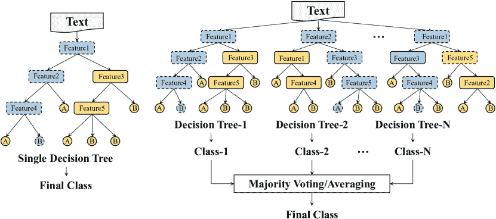
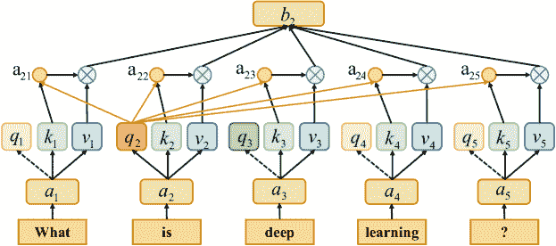

<!--yml

类别：未分类

日期：2024-09-06 20:00:02

-->

# [2008.00364] 文本分类调查：从传统方法到深度学习

> 来源：[`ar5iv.labs.arxiv.org/html/2008.00364`](https://ar5iv.labs.arxiv.org/html/2008.00364)

# 文本分类调查：从传统方法到深度学习

钱李 北京航空航天大学海淀 北京 中国 liqian@act.buaa.edu.cn ,  郝鹏 北京航空航天大学海淀 北京 中国 penghao@act.buaa.edu.cn ,  李建新 北京航空航天大学海淀 北京 中国 lijx@act.buaa.edu.cn ,  夏聪英 伊利诺伊大学芝加哥分校 芝加哥 IL 美国 cxia8@uic.edu ,  杨仁宇 利兹大学 利兹 英国 r.yang1@leeds.ac.uk ,  孙力超 莱海大学 伯利恒 PA 美国 james.lichao.sun@gmail.com ,  尤哲  伊利诺伊大学芝加哥分校 芝加哥 IL 美国 psyu@uic.edu  和  何丽芳 莱海大学 伯利恒 PA 美国 lih319@lehigh.edu (2021)

###### 摘要。

文本分类是自然语言处理中的最基本和最重要的任务。由于深度学习的前所未有的成功，过去十年在这一领域的研究激增。文献中提出了大量的方法、数据集和评估指标，因此需要进行全面和更新的调查。本文通过回顾从 1961 年到 2021 年的最先进方法来填补这一空白，重点关注从传统模型到深度学习的模型。我们根据所涉及的文本和用于特征提取和分类的模型创建了文本分类的分类法。然后，我们详细讨论了这些类别，涉及技术发展和支持预测测试的基准数据集。该调查还提供了不同技术之间的综合比较，以及各种评估指标的优缺点。最后，我们总结了关键的影响、未来的研究方向和研究领域面临的挑战。

深度学习，传统模型，文本分类，评估指标，挑战。^†^†版权：acmcopyright^†^†期刊年份：2021^†^†doi：10.1145/1122445.1122456^†^†期刊：TIST^†^†期刊卷号：37^†^†期刊期号：4^†^†文章：111^†^†出版月份：4

## 1. 引言

文本分类——将预定义标签分配给文本的过程——是许多自然语言处理（NLP）应用中的一个基本且重要的任务，例如情感分析 (DBLP:conf/acl/TaiSM15, ; DBLP:conf/icml/ZhuSG15, )、主题标注 (DBLP:journals/apin/ChenGL20, ; DBLP:journals/isci/ChenGL19, )、问题回答 (DBLP:conf/acl/KalchbrennerGB14, ; DBLP:conf/emnlp/LiuQCWH15, ) 和对话行为分类 (DBLP:conf/naacl/LeeD16, )。在信息爆炸的时代，手动处理和分类大量文本数据既耗时又具挑战性。此外，手动文本分类的准确性容易受到人为因素的影响，如疲劳和专业知识。使用机器学习方法自动化文本分类过程可以提供更可靠、更少主观的结果。此外，这也有助于提高信息检索效率，缓解信息过载的问题，通过定位所需的信息。

图 1 展示了文本分类过程中涉及的流程图，涵盖了传统分析和深度分析的视角。文本数据不同于数值、图像或信号数据。它需要使用 NLP 技术进行细致处理。第一步是为模型预处理文本数据。传统模型通常需要通过人工方法获得良好的样本特征，然后使用经典的机器学习算法进行分类。因此，该方法的有效性在很大程度上受到特征提取的限制。然而，与传统模型不同，深度学习通过学习一组非线性变换，将特征直接映射到输出，将特征工程集成到模型拟合过程中。

图 1\. 经典方法在每个模块中的文本分类流程图。对于传统方法来说，提取重要特征至关重要，但通过深度学习方法可以自动提取特征。

从 1960 年代到 2010 年代，传统的文本分类模型占据主导地位。传统方法指的是基于统计的模型，如朴素贝叶斯（NB）(DBLP:journals/jacm/Maron61,）、K-最近邻（KNN）(DBLP:journals/tit/CoverH67,）和支持向量机（SVM）(DBLP:conf/ecml/Joachims98,）。与早期的基于规则的方法相比，这些方法在准确性和稳定性上有明显的优势。然而，这些方法仍然需要进行特征工程，这既耗时又昂贵。此外，它们通常忽视了文本数据中的自然序列结构或上下文信息，使得学习词汇的语义信息变得具有挑战性。自 2010 年代以来，文本分类逐渐从传统模型转向深度学习模型。与传统方法相比，深度学习方法避免了人工设计规则和特征，并自动提供具有语义意义的文本挖掘表示。因此，大多数文本分类研究工作都基于深度神经网络（DNNs）(DBLP:conf/acl/AlyRB19,），这些是以数据驱动的高计算复杂度的方法。很少有工作关注传统模型以解决计算和数据的限制。

### 1.1\. 主要差异和贡献

最近已有若干研究回顾了文本分类及其子问题。其中两个是关于文本分类的综述。Kowsari 等(DBLP:journals/information/KowsariMHMBB19,）调查了不同的文本特征提取、降维方法、文本分类的基本模型结构以及评估方法。Minaee 等(DBLP:journals/corr/abs-2004-03705,）回顾了最近的基于深度学习的文本分类方法、基准数据集和评估指标。与现有的文本分类综述不同，我们总结了从传统模型到深度学习的现有模型，并结合了近年来的研究工作。传统模型强调特征提取和分类器设计。一旦文本具有良好设计的特征，就可以通过训练分类器迅速收敛。DNNs 可以自动进行特征提取，并在没有领域知识的情况下良好地学习。我们接着提供了单标签和多标签任务的数据集和评估指标，并总结了从数据、模型和性能角度出发的未来研究挑战。此外，我们在三个表格中总结了各种信息，包括经典深度学习模型的必要信息、主要数据集的信息以及在不同应用下的最新方法的通用基准。总之，本研究的主要贡献如下：

+   •

    我们介绍了文本分类的过程和发展，并根据模型结构对主要模型（从传统到深度学习模型）进行了全面分析和研究。我们在表 1 中总结了深度学习模型的必要信息，包括出版年份、方法、场所、应用、评估指标、数据集和代码链接。

+   •

    我们介绍了当前的数据集，并给出了主要评估指标的公式和指标比较，包括单标签和多标签文本分类任务。我们在表 2 中总结了主要数据集的必要信息，包括类别数量、平均句子长度、每个数据集的大小、相关论文和数据地址。

+   •

    我们总结了在其文章中给出的模型分类准确率分数，在基准数据集中见表 4，并通过讨论文本分类面临的主要挑战及本研究的关键影响，结束了调查。

### 1.2. 调查的组织

其余的调查组织如下。第二部分总结了与文本分类相关的现有模型，包括传统模型和深度学习模型，附有总结表格。第三部分介绍了主要数据集，并附有总结表格和单标签及多标签任务的评估指标。接着在第四部分中给出经典文本分类数据集中的领先模型的定量结果。最后，在第五部分总结了深度学习文本分类的主要挑战，并在第六部分结束文章。

## 2. 文本分类方法

文本分类是指从原始文本数据中提取特征，并基于这些特征预测文本数据的类别。在过去几十年中，提出了许多文本分类模型。对于传统模型，NB (DBLP:journals/jacm/Maron61,) 是第一个用于文本分类任务的模型。之后，提出了通用分类模型，如 KNN (DBLP:journals/tit/CoverH67,)、SVM (DBLP:conf/ecml/Joachims98,) 和随机森林 (RF) (DBLP:journals/ml/Breiman01,)，这些被称为分类器，广泛用于文本分类。最近，eXtreme Gradient Boosting (XGBoost) (DBLP:conf/kdd/ChenG16,) 和 Light Gradient Boosting Machine (LightGBM) (DBLP:conf/nips/KeMFWCMYL17,) 具有提供优异性能的潜力。对于深度学习模型，TextCNN (DBLP:conf/emnlp/Kim14,) 在这些模型中被引用最多，其中介绍了一个卷积神经网络 (CNN) (albawi2017understanding,) 模型，这是第一次用于解决文本分类问题。虽然 BERT (DBLP:conf/naacl/DevlinCLT19,) 并非专门为处理文本分类任务而设计，但在设计文本分类模型时，因其在众多文本分类数据集上的有效性，已被广泛采用。

### 2.1\. 传统模型

传统模型通过提高准确性来加速文本分类，并扩展了传统模型的应用范围。首先，需要对原始输入文本进行预处理，以训练传统模型，这通常包括分词、数据清理和统计。然后，文本表示旨在将预处理后的文本表达为计算机更容易处理的形式，并最小化信息丢失，如词袋模型（Bag-Of-Words, BOW）（zhang2010understanding）、N-gram（cavnar1994n）、词频-逆文档频率（TF-IDF）（DBLP:reference/db/X09xxgr）、word2vec（DBLP:journals/corr/abs-1301-3781）和全局词向量（GloVe）（DBLP:conf/emnlp/PenningtonSM14）。BOW 模型意味着语料库中的所有词汇都形成了一个映射数组。根据映射数组，一个句子可以被表示为一个向量。向量中的第$i$个元素表示句子中第$i$个词在映射数组中的频率。这个向量就是句子的 BOW 表示。BOW 的核心在于用字典大小的向量表示每个文本。向量的单个值表示对应于其在文本中的固有位置的词频。与 BOW 相比，N-gram 考虑了相邻词的信息，并通过考虑相邻词构建了一个字典。它用于计算句子的概率模型。句子的概率表示为句子中每个词的联合概率。句子的概率可以通过预测给定前$(N-1)$个词序列的第$N$个词的概率来计算。为了简化计算，N-gram 模型采用了马尔可夫假设（cavnar1994n）。一个词的出现仅与它之前的词有关。因此，N-gram 模型执行一个大小为 N 的滑动窗口。通过统计和记录所有片段的出现频率，可以使用记录中相关片段的频率来计算句子的概率。TF-IDF（DBLP:reference/db/X09xxgr）利用词频和逆文档频率来建模文本。TF 是一个词在特定文章中的词频，IDF 是包含该词的文章数与语料库中文章总数的比例的倒数。TF-IDF 是这两者的乘积。TF-IDF 评估一个词在一组文件或语料库中的重要性。一个词的重要性与它在文档中出现的次数成正比。然而，它在整个语料库中的频率越高，重要性则成反比。word2vec（DBLP:journals/corr/abs-1301-3781）利用局部上下文信息来获得词向量，如图 LABEL:word2vec_Glove 所示。词向量指的是指定为语料库中任何词的固定长度实值向量。word2vec 使用两个基本模型：CBOW 和 Skip-gram。前者是基于当前词的上下文来预测当前词，后者是已知当前词的情况下预测上下文。GloVe（DBLP:conf/emnlp/PenningtonSM14）结合了局部上下文和全局统计特征，对词-词共现矩阵中的非零元素进行训练，如图 LABEL:word2vec_Glove 所示。这使得词向量包含尽可能多的语义和语法信息。词向量的构建方法是：首先，基于语料库构建词共现矩阵，然后根据共现矩阵和 GloVe 模型学习词向量。最后，根据选定的特征将表示的文本输入分类器。在这里，我们详细讨论一些代表性的分类器：

(a) CBOW.

(b) Skip-gram.

图 2\. word2vec 的结构，包括 CBOW 和 Skip-gram。

图 3\. Naïve Bayes 的结构。

#### 2.1.1\. 基于 PGM 的方法

概率图模型（PGMs）通过图形表达特征之间的条件依赖关系，如贝叶斯网络（DBLP:conf/kdd/ZhangZ10,）。这是概率论和图论的结合。

Naïve Bayes（NB）（DBLP:journals/jacm/Maron61,）是基于应用贝叶斯定理的最简单和最广泛使用的模型。NB 算法有一个独立假设：在给定目标值时，文本$T=[T_{1},T_{2},\cdots,T_{n}]$中的条件是独立的（见图 3）。NB 算法主要使用先验概率来计算后验概率$\mathrm{P}\left(y\mid\mathrm{T}_{1},T_{2},\cdots,T_{n}\right)=\frac{p(y)\prod_{j=1}^{n}p\left(T_{j}\mid y\right)}{\prod_{j=1}^{\mathrm{n}}p\left(T_{j}\right)}$。由于其简单结构，NB 广泛用于文本分类任务。尽管特征独立的假设有时并不实际，但它大大简化了计算过程并表现更好。为了提高在小类别上的表现，Schneider（DBLP:conf/acl/Schneider04,）提出了一种特征选择评分方法，通过计算训练集与相应类别之间的 KL 散度（10.5555/1146355,）用于多项式 NB 文本分类。Dai 等人（DBLP:conf/aaai/DaiXYY07,）提出了一种称为 Naive Bayes Transfer Classification（NBTC）的迁移学习方法，以解决训练集与目标集之间的不同分布问题。它使用 EM 算法（A1977Maximum,）在目标集上获得局部最优的后验假设。NB 分类器也用于虚假新闻检测（8100379,）和情感分析（inproceedings2017,），可以看作是一种文本分类任务。Bernoulli NB、Gaussian NB 和 Multinomial NB 是 NB 文本分类的三种流行方法（DBLP:journals/jis/Xu18,）。在少量标注数据集上，多项式 NB 的表现略优于 Bernoulli NB（8776800,）。与多项式事件模型相比，具有 Gaussian 事件模型的贝叶斯 NB 分类器（DBLP:journals/jis/Xu18,）在 20 Newsgroups（20NG）（datasets-for-single-label-textcategorization,）和 WebKB（DBLP:conf/aaai/CravenFMMNS98,）数据集上表现更优。

图 4\. KNN 的结构，其中$k=4$（左侧）和 SVM 的结构（右侧）。每个节点代表一个文本，具有不同轮廓的节点代表不同类别。

#### 2.1.2\. 基于 KNN 的方法

K-Nearest Neighbors (KNN) 算法的核心在于通过寻找$k$个最近样本中的类别来对未标记的样本进行分类 (DBLP:journals/tit/CoverH67, )。这是一种简单的分类器，无需构建模型，通过获取$k$个最近邻样本的快速过程来降低复杂性。图 4 展示了 KNN 的结构。我们可以通过估算样本之间的距离来找到接近待分类文本的$k$个训练文本。因此，文本可以被划分到$k$个训练集文本中最常见的类别中。KNN 算法的改进主要包括特征相似度 (7866706, )、$K$值 (10.1145/1039621.1039623, ) 和索引优化 (Chen_2018, )。然而，由于模型时间/空间复杂度与数据量之间的正相关性，KNN 算法在大规模数据集上需要异常长的时间 (DBLP:journals/eswa/JiangPWK12, )。为了减少选择的特征数量，Soucy 等人 (DBLP:conf/icdm/SoucyM01, ) 提出了一个没有特征加权的 KNN 算法。该算法通过使用特征选择来找到相关特征，建立词语之间的依赖关系。当数据极其不均匀分布时，KNN 倾向于分类数据量更多的样本。Neighbor-Weighted K-Nearest Neighbor (NWKNN) (DBLP:journals/eswa/Tan05, ) 被提出以提高在不平衡语料库上的分类性能。它对小类别的邻居施加显著的权重，对大类别的邻居施加较小的权重。

#### 2.1.3\. 基于 SVM 的方法

Cortes 和 Vapnik（DBLP:journals/ml/CortesV95,）提出了支持向量机（SVM）来解决模式识别中的二分类问题。Joachims（DBLP:conf/ecml/Joachims98,）首次使用 SVM 方法进行文本分类，将每个文本表示为一个向量。如图 4 所示，基于 SVM 的方法将文本分类任务转化为多个二分类任务。在这种背景下，SVM 在一维输入空间或特征空间中构造一个最佳超平面，最大化超平面与两个类别训练集之间的距离，从而实现最佳的泛化能力。其目标是使得沿着与超平面垂直的方向，类别边界的距离最大化。等效地，这将导致分类错误率最低。构造最佳超平面可以转化为一个二次规划问题，以获得全局最优解。选择合适的核函数（leslie2001spectrum,）和特征选择（taira1999feature,）对于确保 SVM 能够处理非线性问题并成为一个强大的非线性分类器至关重要。此外，主动学习（li2013active,）和自适应学习（peng2008svm,）方法被用于文本分类，以减少基于监督学习算法 SVM 的标注工作量。为了分析 SVM 算法学习了什么以及适合哪些任务，Joachims（DBLP:conf/sigir/Joachims01,）提出了一种结合统计特征和 SVM 泛化性能的理论学习模型，采用定量方法分析特征和优点。转导支持向量机（TSVM）（JOACHIMS1999Transductive,）旨在减少特定测试集合的误分类，考虑特定测试集的通用决策函数。它利用先验知识建立更合适的结构，并进行更快的研究。

图 5\. DT 的示例（左）和 RF 的结构（右）。带有虚线轮廓的节点表示决策路径的节点。它有五个特征来预测每个文本是否属于类别 A 或 B。

#### 2.1.4\. 基于 DT 的方法

决策树（DT）（DBLP:books/daglib/0087929）是一种监督式的树结构学习方法——反映了分治思想——并且是递归构建的。它学习析取表达式，对噪声文本具有鲁棒性。如图 5 所示，决策树一般可以分为两个不同的阶段：树构建和树剪枝。它从根节点开始，测试数据样本（由具有多个属性的实例集组成），并根据不同的结果将数据集划分为不同的子集。数据集的子集构成一个子节点，决策树中的每个叶节点表示一个类别。构建决策树是为了确定类别与属性之间的关联，进一步用于预测未知类型记录的类别。决策树算法生成的分类规则非常直观，剪枝策略（DBLP:journals/datamine/RastogiS00）也可以帮助减少噪声的影响。然而，它的限制主要来自于应对爆炸性增加的数据量时的低效。更具体地说，迭代二分法 3（ID3）（Ross1986Induction）算法使用信息增益作为每个节点选择属性的标准——它用于选择每个分支节点的属性，然后选择具有最大信息增益值的属性作为当前节点的判别属性。在 ID3 的基础上，C4.5（10.5555/152181）学习获取从属性到类别的映射，有效地对未知类别的实体进行分类。基于 DT 的算法通常需要对每个数据集进行训练，这效率较低（kamber1997generalization）。因此，Johnson 等人（DBLP:journals/ibmsj/JohnsonOZG02）提出了一种基于 DT 的符号规则系统。该方法将每个文本表示为由文本中每个词的频率计算出的向量，并从训练数据中引出规则。这些学习规则用于分类与训练数据相似的其他数据。此外，为了减少 DT 算法的计算成本，快速决策树（FDT）（DBLP:conf/icdm/VateekulK09）使用了双管齐下的策略：预选择特征集和在不同的数据子集上训练多个 DT。通过数据融合技术将多个 DT 的结果结合起来，以解决类别不平衡的情况。

#### 2.1.5\. 基于集成的方法

集成算法旨在汇总多个算法的结果，以提高性能和解释能力。传统的集成算法包括自助聚合方法，例如 RF (DBLP:journals/ml/Breiman01, )、提升方法如自适应提升（AdaBoost） (DBLP:conf/eurocolt/FreundS95, ) 和 XGBoost (DBLP:conf/kdd/ChenG16, ) 以及堆叠方法。自助聚合方法训练多个分类器，没有强依赖关系，然后汇总它们的结果。例如，RF (DBLP:journals/ml/Breiman01, ) 由多个树分类器组成，其中所有树都依赖于独立采样的随机向量的值（如图 5 所示）。值得注意的是，RF 中的每棵树共享相同的分布。RF 的泛化误差依赖于每棵树的强度以及树之间的关系，随着森林中树木数量的增加，误差会收敛到一个极限。在基于提升的算法中，所有标记数据以相同的权重进行训练，以初步获得一个较弱的分类器 (DBLP:journals/ml/SchapireS99, )。然后，根据分类器的前一个结果调整数据的权重。训练过程将通过重复这些步骤继续进行，直到达到终止条件。与自助聚合和提升算法不同，基于堆叠的算法将数据分解为 $n$ 部分，并使用 $n$ 个分类器以级联方式计算输入数据——上游分类器的结果将作为输入提供给下游分类器。训练将在达到预定义的迭代次数后终止。集成方法可以从多个树中捕捉更多特征。然而，对于短文本，它的帮助有限。受到此启发，Bouaziz 等人 (DBLP:conf/dawak/BouazizDPPL14, ) 结合数据丰富性和 RF 的语义信息用于短文本分类，以克服稀疏性和上下文信息不足的问题。在集成算法中，并不是所有分类器都表现良好。需要为每个分类器赋予不同的权重。为了区分森林中树的贡献，Islam 等人 (DBLP:conf/cikm/IslamLL0019, ) 开发了语义感知随机森林（SARF）分类器，选择与同一类别特征相似的特征，以提取特征并生成预测值。

摘要。NB 的参数更为微小，对缺失数据的敏感度较低，且算法简单。然而，它假设特征彼此独立。当特征数量较大或特征之间的相关性显著时，NB 的性能会下降。SVM 可以解决高维和非线性问题。它具有较高的泛化能力，但对缺失数据较为敏感。KNN 主要依赖于周围有限的邻近样本，而不是区分类别领域来确定类别。因此，对于那些类别领域有更多交叉或重叠的数据集，它比其他方法更为合适。DT 易于理解和解释。给定一个观察模型，根据生成的决策树，很容易推导出相应的逻辑表达式。传统方法是一种机器学习类型。它从数据中学习，这些数据是预定义的对预测值性能重要的特征。然而，特征工程是一项艰巨的工作。在训练分类器之前，我们需要收集知识或经验从原始文本中提取特征。传统方法基于从原始文本中提取的各种文本特征来训练初始分类器。对于小型数据集，传统模型通常在计算复杂度的限制下表现优于深度学习模型。因此，一些研究人员研究了针对特定领域的传统模型设计，这些领域的数据较少。

### 2.2\. 深度学习模型

DNNs 由模拟人脑的人工神经网络组成，以自动从数据中学习高级特征，比传统模型在语音识别、图像处理和文本理解中获得更好的结果。输入数据集应进行分析，以对数据进行分类，如单标签、多标签、无监督、不平衡数据集。根据数据集的特性，将输入的词向量送入 DNN 进行训练，直到达到终止条件。通过下游任务验证训练模型的性能，如情感分类、问答和事件预测。我们在表 1 中展示了一些多年来的 DNN，包括与相应基本模型不同的设计、评估指标和实验数据集。

表 1\. 基于不同模型的基本信息。Trans: Transformer。Time: 训练时间。

| 模型 | 年份 | 方法 | 会议 | 应用 | 代码链接 | 评估指标 | 数据集 |
| --- | --- | --- | --- | --- | --- | --- | --- |
|  | 2011 | RAE (DBLP:conf/emnlp/SocherPHNM11, ) | EMNLP | SA, QA | (Semi-Supervised-Recursive-Autoencoders-for-Predicting-Sentiment-Distributions, ) | 准确率 | MPQA, MR, EP |
| ReNN | 2012 | MV-RNN (DBLP:conf/emnlp/SocherHMN12, ) | EMNLP | SA | (MV_RNN, ) | 准确率, F1 | MR |
|  | 2013 | RNTN (DBLP:conf/emnlp/SocherPWCMNP13, ) | EMNLP | SA | (DeepSentiment, ) | 准确率 | SST |
|  | 2014 | DeepRNN (DBLP:conf/nips/IrsoyC14, ) | NIPS | SA;QA | - | 准确率 | SST-1;SST-2 |
| MLP | 2014 | Paragraph-Vec (DBLP:conf/icml/LeM14, ) | ICML | SA, QA | (paragraph-vectors, ) | 错误率 | SST, IMDB |
|  | 2015 | DAN (DBLP:conf/acl/IyyerMBD15, ) | ACL | SA, QA | (dan, ) | 准确率, 时间 | RT, SST, IMDB |
|  | 2015 | Tree-LSTM (DBLP:conf/acl/TaiSM15, ) | ACL | SA | (TreeLSTMSentiment, ) | 准确率 | SST-1, SST-2 |
|  | 2015 | S-LSTM (DBLP:conf/icml/ZhuSG15, ) | ICML | SA | - | 准确率 | SST |
|  | 2015 | TextRCNN (DBLP:conf/aaai/LaiXLZ15, ) | AAAI | SA, TL | (rcnn-text-classification, ) | Macro-F1, 等 | 20NG, Fudan, ACL, SST-2 |
|  | 2015 | MT-LSTM (DBLP:conf/emnlp/LiuQCWH15, ) | EMNLP | SA,QA | (MT-LSTM, ) | 准确率 | SST-1, SST-2, QC, IMDB |
|  | 2016 | oh-2LSTMp (DBLP:conf/icml/JohnsonZ16, ) | ICML | SA, TL | (oh-2LSTMp, ) | 错误率 | IMDB, Elec, RCV1, 20NG |
| RNN | 2016 | BLSTM-2DCNN (DBLP:conf/coling/ZhouQZXBX16, ) | COLING | SA, QA, TL | (NNForTextClassification, ) | 准确率 | SST-1, Subj, TREC, 等 |
|  | 2016 | 多任务 (DBLP:conf/ijcai/LiuQH16, ) | IJCAI | SA | (text_classification, ) | 准确率 | SST-1, SST-2, Subj, IMDB |
|  | 2017 | DeepMoji (DBLP:conf/emnlp/FelboMSRL17, ) | EMNLP | SA | (DeepMoji, ) | 准确率 | SS-Twitter, SE1604, 等 |
|  | 2017 | TopicRNN (DBLP:conf/iclr/Dieng0GP17, ) | ICML | SA | (topic-rnn, ) | 错误率 | IMDB |
|  | 2017 | Miyato 等 (DBLP:conf/iclr/MiyatoDG17, ) | ICLR | SA | (adversarial_text, ) | 错误率 | IMDB, DBpedia, 等 |
|  | 2018 | RNN-Capsule (DBLP:conf/www/WangSH0Z18, ) | TheWebConf | SA | (Sentiment-Analysis-by-Capsules, ) | 准确率 | MR, SST-1, 等 |
|  | 2019 | HM-DenseRNNs (DBLP:conf/ijcai/ZhaoSY19, ) | IJCAI | SA, TL | (HM-DenseRNNs, ) | 准确率 | IMDB, SST-5, AG |
|  | 2014 | TextCNN (DBLP:conf/emnlp/Kim14, ) | EMNLP | SA, QA | (CNN-for-Sentence-Classification-in-Keras, ) | 准确率 | MR, SST-2, Subj, 等 |
|  | 2014 | DCNN (DBLP:conf/acl/KalchbrennerGB14, ) | ACL | SA, QA | (ATS_Project, ) | 准确率 | MR, TREC, Twitter |
|  | 2015 | CharCNN (DBLP:conf/nips/ZhangZL15, ) | NeurIPS | SA, QA, TL | (CharCNN, ) | 错误率 | AG, Yelp P, DBPedia 等 |
|  | 2016 | SeqTextRCNN (DBLP:conf/naacl/LeeD16, ) | NAACL | 对话行为 | (short-text-classification, ) | 准确率 | DSTC 4, MRDA, SwDA |
|  | 2017 | XML-CNN (DBLP:conf/sigir/LiuCWY17, ) | SIGIR | NC, TL, SA | (XML-CNN, ) | NDCG@K 等 | EUR-Lex, Wiki-30K 等 |
| CNN | 2017 | DPCNN (DBLP:conf/acl/JohnsonZ17, ) | ACL | SA, TL | (DPCNN, ) | 错误率 | AG, DBPedia, Yelp.P 等 |
|  | 2017 | KPCNN (DBLP:conf/ijcai/WangWZY17, ) | IJCAI | SA, QA, TL | - | 准确率 | Twitter, AG, Bing 等 |
|  | 2018 | TextCapsule (DBLP:conf/emnlp/YangZYLZZ18, ) | EMNLP | SA, QA, TL | (capsule_text_classification, ) | 准确率 | Subj, TREC, Reuters 等 |
|  | 2018 | HFT-CNN (DBLP:conf/emnlp/ShimuraLF18, ) | EMNLP | TL | (HFT-CNN, ) | Micro-F1 等 | RCV1, Amazon670K |
|  | 2019 | CCRCNN (DBLP:conf/aaai/XuC19, ) | AAAI | TL | - | 准确率 | TREC, MR, AG |
|  | 2020 | Bao et al. (DBLP:conf/iclr/BaoWCB20, ) | ICLR | TL | (Distributional-Signatures, ) | 准确率 | 20NG, Reuters-2157 等 |
|  | 2016 | HAN (DBLP:conf/naacl/YangYDHSH16, ) | NAACL | SA, TL | (textClassifier, ) | 准确率 | Yelp.F, YahooA 等 |
|  | 2016 | BI-Attention (DBLP:conf/emnlp/ZhouWX16, ) | NAACL | SA | - | 准确率 | NLP&CC 2013 (tcci.ccf.org.cn, ) |
|  | 2016 | LSTMN (DBLP:conf/emnlp/0001DL16, ) | EMNLP | SA | (Abstractive-Summarization, ) | 准确率 | SST-1 |
|  | 2017 | Lin et al. (DBLP:conf/iclr/LinFSYXZB17, ) | ICLR | SA | (Structured-Self-Attention, ) | 准确率 | Yelp, SNLI Age |
|  | 2018 | SGM (DBLP:conf/coling/YangSLMWW18, ) | COLING | TL | (SGM, ) | HL, Micro-F1 | RCV1-V2, AAPD |
|  | 2018 | ELMo (DBLP:conf/naacl/PetersNIGCLZ18, ) | NAACL | SA, QA, NLI | (flair, ) | 准确率 | SQuAD, SNLI, SST-5 |
| Attention | 2018 | BiBloSA (DBLP:conf/iclr/ShenZL0Z18, ) | ICLR | SA | (BiBloSA, ) | 准确率, 时间 | CR, MPQA, SUBJ 等 |
|  | 2019 | AttentionXML (DBLP:conf/nips/YouZWDMZ19, ) | NeurIPS | TL | (AttentionXML, ) | P@k, N@k 等 | EUR-Lex 等 |
|  | 2019 | HAPN (DBLP:conf/emnlp/SunSZL19, ) | EMNLP | RC | - | 准确率 | FewRel, CSID |
|  | 2019 | Proto-HATT (DBLP:conf/aaai/GaoH0S19, ) | AAAI | RC | (HATT-Proto, ) | 准确率 | FewRel |
|  | 2019 | STCKA (DBLP:conf/aaai/ChenHLXJ19, ) | AAAI | SA, TL | (STCKA, ) | 准确率 | Weibo, 产品评论 等 |
|  | 2020 | HyperGAT (DBLP:conf/emnlp/DingWLLL20, ) | EMNLP | TL, NC | (HyperGAT, ) | 准确率 | 20NG, Ohsumed, MR 等 |
|  | 2020 | MSMSA (DBLP:conf/aaai/GuoQLXZ20, ) | AAAI | ST, QA, NLI | - | 准确率, F1 | IMDB, MR, SST, SNLI 等 |
|  | 2020 | Choi (DBLP:conf/emnlp/ChoiPYH20, ) | EMNLP | SA, TL | - | 准确率 | SST2, IMDB, 20NG |
|  | 2019 | BERT (DBLP:conf/naacl/DevlinCLT19, ) | NAACL | SA, QA | (bert, ) | 准确率 | SST-2, QQP, QNLI, CoLA |
|  | 2019 | BERT-BASE (DBLP:conf/acl/ChalkidisFMA19, ) | ACL | TL | (lmtc-eurlex57k, ) | P@K, R@K 等 | EUR-LEX |
|  | 2019 | Sun et al. (DBLP:conf/cncl/SunQXH19, ) | CCL | SA, QA, TL | (How_Fin, ) | 错误率 | TREC, DBPedia 等 |
|  | 2019 | XLNet (DBLP:conf/nips/YangDYCSL19, ) | NeurIPS | SA, QA, NC | (xlnet, ) | EM, F1 等 | Yelp-2, AG, MNLI 等 |
|  | 2019 | RoBERTa (DBLP:journals/corr/abs-1907-11692, ) | arXiv | SA, QA | (RoBERTa, ) | F1, 准确率 | SQuAD, MNLI-m, SST-2 |
| Trans | 2020 | GAN-BERT (DBLP:conf/acl/CroceCB20, ) | ACL | SA, NLI | (GAN-BERT, ) | F1, 准确率 | SST-5, MNLI |
|  | 2020 | BAE (DBLP:conf/emnlp/GargR20, ) | EMNLP | SA, QA | (BAE, ) | 准确率 | Amazon, Yelp, MR, MPQA |
|  | 2020 | ALBERT (DBLP:conf/iclr/LanCGGSS20, ) | ICLR | SA, QA | (ALBERT, ) | F1, 准确率 | SST, MNLI, SQuAD |
|  | 2020 | TG-Transformer (DBLP:conf/emnlp/ZhangZ20, ) | EMNLP | SA, TL | - | 准确率, 时间 | R8, R52, Ohsumed 等 |
|  | 2020 | X-Transformer (DBLP:conf/kdd/ChangYZYD20, ) | KDD | SA, TL | (X-Transformer, ) | P@K, R@K | Eurlex-4K, Wiki10-31K 等 |
|  | 2021 | LightXML (DBLP:journals/corr/abs-2101-03305, ) | arXiv | TL, ML, NLI | (LightXML, ) | P@K, 时间 | AmazonCat-13K 等 |
|  | 2018 | DGCNN (DBLP:conf/www/PengLHLBWS018, ) | TheWebConf | TL | (DeepGraphCNNforTexts, ) | 宏观-F1 等 | RCV1, NYTimes |
|  | 2019 | TextGCN (DBLP:conf/aaai/YaoM019, ) | AAAI | SA, TL | (text_gcn, ) | 准确率 | 20NG, Ohsumed, R52 等 |
|  | 2019 | SGC(DBLP:conf/icml/WuSZFYW19, ) | ICML | NC, TL, SA | (SGC, ) | 准确率, 时间 | 20NG, R8, Ohsumed 等 |
| GNN | 2019 | Huang et al. (DBLP:conf/emnlp/HuangMLZW19, ) | EMNLP | NC, TL | (TextLevelGNN, ) | 准确率 | R8, R52, Ohsumed |
|  | 2019 | Peng et al. (peng2019hierarchical, ) | arXiv | NC, TL | - | 微观-F1 等 | RCV1, EUR-Lex 等 |
|  | 2020 | TextING (DBLP:conf/acl/ZhangYCWWW20, ) | ACL | SA, NC, TL | (TextING, ) | 准确率 | MR, R8, R52, Ohsumed |
|  | 2020 | TensorGCN (DBLP:conf/aaai/LiuYZWL20, ) | AAAI | SA, NC, TL | (TensorGCN, ) | 准确率 | 20NG, R8, R52, Ohsumed, MR |
|  | 2020 | MAGNET (DBLP:conf/icaart/PalSS20, ) | ICAART | TL | (MAGnet, ) | 微平均-F1, HL | Reuters, RCV1-V2, 等 |
|  | 2017 | Miyato et al. (DBLP:conf/iclr/MiyatoDG17, ) | ICLR | SA, NC | (Miyato, ) | 错误率 | IMDB, RCV1, 等 |
| 其他 | 2018 | TMN (DBLP:conf/emnlp/ZengLSGLK18, ) | EMNLP | TL | - | 准确率, F1 | Snippets, Twitter, 等 |
|  | 2019 | Zhang et al. (DBLP:conf/naacl/ZhangLG19, ) | NAACL | TL, NC | (KG4ZeroShotText, ) | 准确率 | DBpedia, 20NG. |

在过去几十年里，已提出了许多深度学习模型用于文本分类，如表 1 所示。我们列出了主要的信息——包括出版年份、会议、应用、代码链接、评估指标和实验数据集——主要深度学习模型用于文本分类。该表中的应用包括情感分析（SA）、主题标注（TL）、新闻分类（NC）、问题回答（QA）、对话行为分类（DAC）、自然语言推理（NLI）和关系分类（RC）。多层感知机 (4809024, ) 和递归神经网络 (DBLP:journals/csur/PouyanfarSYTTRS19, ) 是用于文本分类任务的前两种深度学习方法，相比传统模型提高了性能。随后，CNN、递归神经网络（RNN）和注意力机制被用于文本分类 (DBLP:conf/emnlp/YangZYLZZ18, ; DBLP:conf/aaai/QinCLN020, ; DBLP:conf/naacl/DengPHLY21, )。许多研究者通过改进 CNN、RNN 和注意力机制，或通过模型融合和多任务方法，推动了不同任务的文本分类性能。BERT (DBLP:conf/naacl/DevlinCLT19, ) 的出现，它能够生成上下文相关的词向量，是文本分类和其他 NLP 技术发展的一个重要转折点。许多研究者 (DBLP:conf/aaai/JinJZS20, ; DBLP:conf/acl/CroceCB20, ) 研究了基于 BERT 的文本分类模型，这些模型在多个 NLP 任务中，包括文本分类，表现优于上述模型。此外，一些研究者研究了基于图神经网络（GNN） (DBLP:conf/aaai/YaoM019, ; lichen2021ijcai, ) 的文本分类技术，以捕获文本中的结构信息，这是其他方法无法替代的。在这里，我们按结构分类深度神经网络（DNN），并详细讨论一些代表性模型：

图 6\. ReNN 的架构（左）和 MLP 的架构（右）。

#### 2.2.1\. 基于 ReNN 的方法

传统模型在每个任务上都花费大量时间来设计特征。此外，在深度学习的情况下，“词向量”的含义有所不同：每个输入词与一个固定长度的向量相关联，这些向量的值要么是随机生成的，要么是从先前的传统过程中得出的，从而形成一个矩阵$L$，称为词嵌入矩阵，该矩阵在一个通常为 50 到 300 维的小型潜在语义空间中表示词汇。递归神经网络（ReNN）（DBLP:journals/csur/PouyanfarSYTTRS19,）可以自动学习文本的语义和语法树结构，无需特征设计，如图 6 所示。我们举一个基于 ReNN 的模型的例子。首先，将输入文本的每个词作为模型结构的叶子节点。然后，所有节点通过权重矩阵组合成父节点。权重矩阵在整个模型中共享。每个父节点与所有叶子节点具有相同的维度。最后，所有节点递归地聚合成一个父节点，以表示输入文本以预测标签。

基于 ReNN 的模型相比传统模型提高了性能，并且通过排除用于不同文本分类任务的特征设计，节省了劳动成本。递归自编码器（RAE）（DBLP:conf/emnlp/SocherPHNM11,）用于预测每个输入句子的情感标签分布，并学习多词短语的表示。为了学习每个输入文本的组合向量表示，矩阵-向量递归神经网络（MV-RNN）（DBLP:conf/emnlp/SocherHMN12,）引入了一种 ReNN 模型来学习短语和句子的表示。它允许输入文本的长度和类型不一致。MV-RNN 为构造的解析树上的每个节点分配一个矩阵和一个向量。此外，递归神经张量网络（RNTN）（DBLP:conf/emnlp/SocherPWCMNP13,）提出了一个树形结构来捕捉句子的语义。它输入不同长度的短语，并通过解析树和词向量表示短语。解析树上较高节点的向量通过相等的张量基础组合函数来估计。对于 RNTN，构建文本树的时间复杂度较高，并且在树形结构中表达文档之间的关系比较复杂。通常，随着 DNN 深度的增加，性能会有所提高。因此，Irsoy 等人（DBLP:conf/nips/IrsoyC14,）提出了一种深度递归神经网络（DeepReNN），它堆叠了多个递归层。该网络由二叉解析树构建，学习语言中的组合性不同视角。

#### 2.2.2\. 基于 MLP 的方法

多层感知器（MLP）（4809024,），有时被通俗地称为“普通”神经网络，是一种简单的神经网络结构，用于自动捕捉特征。如图 6 所示，我们展示了一个三层的 MLP 模型。它包含一个输入层、一个具有激活函数的隐藏层以及一个输出层。每个节点通过一定的权重$w_{i}$连接。它将每个输入文本视为词袋，并在许多文本分类基准测试中与传统模型相比表现出色。

一些研究小组提出了基于 MLP 的方法用于文本分类任务。段落向量（Paragraph-Vec）（DBLP:conf/icml/LeM14,）是最受欢迎和广泛使用的方法，它类似于连续词袋模型（CBOW）（DBLP:journals/corr/abs-1301-3781,）。该方法通过采用无监督算法获取具有不同输入长度的固定长度特征表示。与 CBOW 相比，它通过矩阵将段落标记映射到段落向量。模型通过将该向量与词的三个上下文连接或平均来预测第四个词。段落向量可以作为段落主题的记忆，并用作段落函数并插入到预测分类器中。

图 7\. 基于 RNN 的模型（左）和基于 CNN 的模型（右）。

#### 2.2.3\. 基于 RNN 的方法

循环神经网络（RNN）（DBLP:journals/csur/PouyanfarSYTTRS19,）广泛用于通过递归计算捕捉长程依赖。RNN 语言模型学习历史信息，考虑所有词汇之间的位置关系，适合用于文本分类任务。我们展示了一个用于文本分类的 RNN 模型，配有一个简单示例，如图 7 所示。首先，每个输入词汇通过词嵌入技术表示为一个特定的向量。然后，将嵌入的词向量逐一输入 RNN 单元。RNN 单元的输出与输入向量具有相同的维度，并被输入到下一个隐藏层。RNN 在模型的不同部分之间共享参数，并且每个输入词具有相同的权重。最后，通过隐藏层的最后输出可以预测输入文本的标签。

为了减少模型的时间复杂度并捕捉上下文信息，Liu 等人（DBLP:conf/ijcai/LiuQH16, ）引入了一种用于捕捉长文本语义的模型。这是一个有偏模型，它逐个解析文本，使得后续输入在处理上优于前面的输入，从而降低了捕捉整篇文本语义的效率。为了建模具有长输入序列的主题标记任务，提出了 TopicRNN（DBLP:conf/iclr/Dieng0GP17, ）。它通过潜在主题捕捉文档中单词的依赖关系，并使用 RNN 捕捉局部依赖关系，同时利用潜在主题模型捕捉全局语义依赖关系。虚拟对抗训练（VAT）（DBLP:journals/corr/MiyatoMKI17, ）是一种适用于半监督学习任务的有用正则化方法。Miyato 等人（DBLP:conf/iclr/MiyatoDG17, ）将对抗性训练和虚拟对抗训练应用于文本，并将扰动引入词嵌入中，而不是原始输入文本。该模型提高了词嵌入的质量，并且在训练过程中不容易过拟合。胶囊网络（10.1007/978-3-642-21735-7_6, ）通过动态路由捕捉特征之间的关系，这些特征由层中的一组神经元组成。Wang 等人（DBLP:conf/www/WangSH0Z18, ）提出了一种具有简单胶囊结构的 RNN-Capsule 模型，用于情感分类任务。

在 RNN 的反向传播过程中，权重通过梯度调整，梯度是通过连续的导数相乘计算得到的。如果导数非常小，可能会导致梯度消失问题。长短期记忆（LSTM）（Hochreiter1997Long, ）作为 RNN 的改进，有效缓解了梯度消失问题。LSTM 由一个用于记住任意时间间隔的值的单元和三个门控结构组成，以控制信息流。这些门控结构包括输入门、遗忘门和输出门。LSTM 分类方法可以更好地捕捉上下文特征词之间的关系，并使用遗忘门结构来过滤无用信息，从而有助于提高分类器的整体捕捉能力。Tree-LSTM（DBLP:conf/acl/TaiSM15, ）将 LSTM 模型的序列扩展到树结构。通过 LSTM 遗忘门机制，可以忘记对结果影响较小的整个子树，这样可以提高 Tree-LSTM 模型的效果。

自然语言推断（NLI） (DBLP:conf/emnlp/BowmanAPM15, ) 通过测量每对句子之间的语义相似性来预测一个文本的意义是否可以从另一个文本中推导出来。为了考虑其他细粒度的匹配以及反向匹配，Wang 等人 (DBLP:conf/ijcai/WangHF17, ) 提出了一个名为双向多视角匹配（BiMPM）的 NLI 任务模型。它通过 BiLSTM 编码器对输入句子进行编码。然后，编码后的句子在两个方向上进行匹配。结果通过另一个 BiLSTM 层聚合成一个固定长度的匹配向量。最后，结果通过一个全连接层进行评估。

#### 2.2.4\. 基于 CNN 的方法

卷积神经网络（CNNs） (albawi2017understanding, ) 是用于图像分类的，它通过卷积滤波器提取图片特征。与 RNN 不同，CNN 可以同时对序列的多个片段应用由不同核定义的卷积。因此，CNN 被用于许多自然语言处理任务，包括文本分类。对于文本分类，文本需要表示为类似于图像表示的向量，并且文本特征可以从多个角度进行过滤，如图 7 所示。首先，将输入文本的词向量拼接成一个矩阵。然后将矩阵输入到包含多个不同维度的滤波器的卷积层。最后，卷积层的结果经过池化层，并将池化结果拼接，以获得文本的最终向量表示。最终类别由这个向量预测。

为了尝试使用 CNN 进行文本分类任务，Kim 引入了一种无偏见的卷积神经网络模型，称为 TextCNN (DBLP:conf/emnlp/Kim14, )。它可以在最大池化层中更好地确定判别性短语，通过保持词向量静态而学习超参数。仅仅在标记数据上训练对于数据驱动的深度模型来说是不够的。因此，一些研究人员考虑利用未标记的数据。Johnson 等人 (DBLP:conf/nips/JohnsonZ15, ) 提出了一个基于双视图半监督学习的 CNN 模型用于文本分类，该模型首先使用未标记的数据来训练文本区域的嵌入，然后再使用标记的数据。DNN 通常具有更好的性能，但它增加了计算复杂度。受到这一点的启发，提出了深度金字塔卷积神经网络（DPCNN） (DBLP:conf/acl/JohnsonZ17, )，通过增加网络深度来提高计算准确性。DPCNN 比 Residual Network（ResNet） (DBLP:conf/eccv/HeZRS16, ) 更具针对性，因为所有的快捷方式都是简单的恒等映射，没有任何维度匹配的复杂性。

根据文本的最小嵌入单元，嵌入方法被划分为字符级、词级和句子级嵌入。字符级嵌入可以解决词汇表外（OOV）(bazzi2002modelling, ) 单词的问题。词级嵌入学习单词的语法和语义。此外，句子级嵌入可以捕捉句子之间的关系。受到这些启发，Nguyen 等人 (DBLP:conf/pacling/NguyenN17, ) 提出了基于词典的深度学习方法，通过构建语义规则和用于字符级嵌入的深度 CNN 增加词级嵌入的信息。Adams 等人 (DBLP:journals/tgis/AdamsM18, ) 提出了一个字符级 CNN 模型，称为 MGTC，用于分类多语言文本。TransCap (DBLP:conf/acl/ChenQ19, ) 被提出用于将句子级语义表示封装到语义胶囊中，并转移文档级知识。

基于 RNN 的模型捕捉序列信息以学习输入单词之间的依赖关系，而基于 CNN 的模型从卷积核中提取相关特征。因此，一些研究工作研究了这两种方法的融合。BLSTM-2DCNN (DBLP:conf/coling/ZhouQZXBX16, ) 将双向 LSTM（BiLSTM）与二维最大池化结合起来。它使用 2D 卷积来采样矩阵中更有意义的信息，并通过 BiLSTM 更好地理解上下文。此外，Xue 等人 (DBLP:conf/ijcnlp/XueZLW17, ) 提出了 MTNA，这是 BiLSTM 和 CNN 层的组合，用于解决方面类别分类和方面术语提取任务。

图 8\. 层次注意力网络（HAN）的结构（DBLP:conf/naacl/YangYDHSH16,）。

#### 2.2.5\. 基于注意力的方法

CNN 和 RNN 在文本分类任务中表现出色。然而，这些模型的直观性不足，解释性较差，特别是在分类错误时，由于隐藏数据的不透明性，这些错误无法解释。基于注意力的方法在文本分类中得到了成功应用。Bahdanau 等人（DBLP:journals/corr/BahdanauCB14,）首次提出了一种可用于机器翻译的注意力机制。受到这一工作的启发，Yang 等人（DBLP:conf/naacl/YangYDHSH16,）引入了层次注意力网络（HAN），通过利用文本中的极其信息丰富的成分来获得更好的可视化，如图 8 所示。HAN 包括两个编码器和两个层次的注意力层。注意力机制使模型能够对特定输入给予不同的关注。它首先将重要的词汇聚合成句子向量，然后将重要的句子向量聚合成文本向量。它可以学习每个词和句子对分类判断的贡献程度，这对于通过这两个层次的注意力进行应用和分析是有益的。

注意力机制可以提升文本分类的性能并提供解释性，这使其变得非常流行。还有一些其他基于注意力的方法。LSTMN（DBLP:conf/emnlp/0001DL16,）被提出用于从左到右逐步处理文本，并通过记忆和注意力进行浅层推理。BI-Attention（DBLP:conf/emnlp/ZhouWX16,）被设计用于跨语言文本分类，以捕捉双语的长距离依赖关系。Hu 等人（DBLP:conf/coling/HuLT0S18,）提出了一种基于类别属性的注意力机制，用于解决包含少量样本的各种类别之间的不平衡问题。HAPN（DBLP:conf/emnlp/SunSZL19,）则被提出用于少样本文本分类。

自注意力（DBLP:conf/nips/VaswaniSPUJGKP17）通过在句子中构建 K、Q 和 V 矩阵来捕捉词的权重分布，这些矩阵可以捕捉文本分类中的长程依赖。我们举一个自注意力的例子，如图 9 所示。每个输入词向量$a_{i}$可以表示为三个 n 维向量，包括$q_{i}$、$k_{i}$和$v_{i}$。自注意力之后，输出向量$b_{i}$可以表示为$\sum_{j}softmax(a_{ij})v_{j}$和$a_{ij}=q_{i}\cdot k_{j}/\sqrt{n}$。所有输出向量可以并行计算。Lin 等人（DBLP:conf/iclr/LinFSYXZB17）使用源 token 自注意力来探索每个 token 在句子表示任务中的权重。为了捕捉长程依赖，双向块自注意力网络（Bi-BloSAN）（DBLP:conf/iclr/ShenZL0Z18）使用一个块内自注意力网络（SAN）对按序列分块的每个块进行处理，并对输出使用块间 SAN。

图 9\. 自注意力计算输出向量$b_{2}$的示例。

基于方面的情感分析（ABSA）（inproceedings2017；DBLP:conf/aaai/MaPC18）将文本拆解为多个方面，并为每个方面分配情感极性。情感极性可以分为三种类型：积极、中性和消极。一些基于注意力的模型被提出用于识别对特定方面的细粒度情感极性。ATAE-LSTM（DBLP:conf/emnlp/WangHZZ16）可以根据输入通过注意力机制集中于每个句子的不同部分。MGAN（DBLP:conf/emnlp/FanFZ18）提出了一种细粒度注意力机制与粗粒度注意力机制，以学习上下文和方面之间的词级交互。

为了捕捉每个问题与候选答案之间复杂的语义关系，Tan 等人（tan-etal-2016-improved）引入了 CNN 和 RNN，并通过一个简单的单向注意机制生成答案嵌入，受问题上下文的影响。注意机制捕捉了问题和答案嵌入之间的依赖关系。抽取式 QA 可以被视为文本分类任务。它输入一个问题和多个候选答案，并对每个候选答案进行分类，以识别正确答案。此外，AP-BILSTM（DBLP:journals/corr/SantosTXZ16）通过双向注意机制学习问题和每个候选答案之间的权重，从而获得每个候选答案对问题的重要性。

图 10\. 预训练模型架构的差异 (DBLP:conf/naacl/DevlinCLT19,)，包括 BERT、OpenAI GPT 和 ELMo。 $E_{i}$ 表示第 $i$ 个输入的嵌入。Trm 表示变换器块。 $T_{i}$ 表示第 $i$ 个输入的预测标签。

#### 2.2.6\. 预训练方法

预训练语言模型 (DBLP:journals/corr/abs-2003-08271,) 有效地学习全局语义表示，并显著提升自然语言处理任务，包括文本分类。它通常使用无监督方法自动挖掘语义知识，然后构建预训练目标，使机器能够学习理解语义。

如图 10 所示，我们展示了语言模型的嵌入（ELMo）（DBLP:conf/naacl/PetersNIGCLZ18,）、OpenAI GPT（Radford2018ImprovingLU,）和 BERT（DBLP:conf/naacl/DevlinCLT19,）之间模型架构的差异。ELMo（DBLP:conf/naacl/PetersNIGCLZ18,）是一个深度上下文化的词表示模型，可以轻松集成到模型中。它能够建模词汇的复杂特征，并为不同的语言环境学习不同的表示。它根据上下文词汇通过双向 LSTM 学习每个词的嵌入。GPT（Radford2018ImprovingLU,）采用监督微调和无监督预训练来学习通用表示，这些表示在有限适应下可以转移到许多 NLP 任务中。此外，目标数据集的领域不需要与未标记数据集的领域相似。GPT 算法的训练过程通常包括两个阶段。首先，通过未标记数据集上的建模目标来学习神经网络模型的初始参数。然后，我们可以使用相应的监督目标来调整这些参数以适应目标任务。BERT 模型（DBLP:conf/naacl/DevlinCLT19,），由 Google 提出，通过在每一层对左右上下文进行联合条件处理来预训练深度双向表示，显著提高了 NLP 任务的表现，包括文本分类。BERT 应用双向编码器，旨在通过共同调整所有层的上下文来预训练深度的双向表示。它可以在预测被掩盖的词汇时利用上下文信息。它通过仅添加一个额外的输出层来微调，构建多个 NLP 任务的模型，如情感分析（SA）、问答（QA）和机器翻译。与这三种模型相比，ELMo 是使用 LSTM 的特征基础方法，而 BERT 和 OpenAI GPT 是使用 Transformer 的微调方法。此外，ELMo 和 BERT 是双向训练模型，而 OpenAI GPT 是从左到右的训练。因此，BERT 获得了更好的结果，它结合了 ELMo 和 OpenAI GPT 的优点。

基于 Transformer 的模型可以并行计算而无需考虑顺序信息，这使其适用于大规模数据集，因而在 NLP 任务中广受欢迎。因此，一些其他工作被用于文本分类任务并取得了优秀的表现。RoBERTa (DBLP:journals/corr/abs-1907-11692,) 是 BERT 的改进版本，采用了动态掩码方法，每次生成掩码模式以供模型处理。它使用更多数据进行更长时间的预训练，并估计各种关键超参数和训练数据的影响。具体而言：1）训练时间更长（总共近 200,000 次训练，已见近 16 亿训练数据），批量大小（8K）更大，训练数据更多（30G 中文训练，包括 3 亿句子和 100 亿词）；2）去除了下一个句子预测（NSP）任务；3）采用了更长的训练序列；4）动态调整掩码机制并使用完整词掩码。

XLNet (DBLP:conf/nips/YangDYCSL19,) 是一种广义自回归预训练方法。与 BERT 不同，第一阶段没有使用带有掩码的去噪自编码器，而是使用自回归语言模型。它通过最大化整个因子分解顺序排列的期望似然性来学习双向上下文。此外，它通过自回归公式克服了 BERT 的弱点，并将 Transformer-XL (DBLP:conf/acl/DaiYYCLS19,) 的思想融入到预训练中。

BERT 模型具有许多参数。为了减少参数，ALBERT (DBLP:conf/iclr/LanCGGSS20,) 使用了两种参数简化方案。它减少了碎片向量的长度，并与所有编码器共享参数。它还将下一个句子匹配任务替换为下一个句子顺序任务，并持续阻止碎片化。当 ALBERT 模型在大规模中文语料库上进行预训练时，参数更少且性能更佳。通常，这些方法采用无监督目标函数进行预训练，包括下一个句子预测、掩码技术和排列。这些基于词预测的目标函数展现出强大的词依赖和语义结构学习能力 (DBLP:conf/acl/JawaharSS19,)。

图 11\. BART (DBLP:conf/acl/LewisLGGMLSZ20,) 和 SpanBERT (DBLP:journals/tacl/JoshiCLWZL20,) 的架构。

BART（DBLP:conf/acl/LewisLGGMLSZ20,）是基于 Seq2Seq 模型的去噪自动编码器，如图 11（a）所示。BART 的预训练包括两个步骤。首先，它使用噪声函数破坏文本。其次，使用 Seq2Seq 模型重构原始文本。在各种噪声方法中，通过随机打乱原始句子的顺序，然后使用新的文本填充方法来获得最佳性能。新的文本填充方法是用单个掩码标记替换文本片段。它仅使用特定的掩码标记来表示一个标记被掩盖。

SpanBERT（DBLP:journals/tacl/JoshiCLWZL20,）专门设计用于更好地表示和预测文本的跨度，如图 11（b）所示。它从三个方面优化了 BERT，并在多个任务（如 QA）中取得了良好的结果。具体优化体现在三个方面。首先，提出了跨度掩码方案，以随机掩盖一段连续的文本。其次，添加了跨度边界目标（SBO），通过跨度边界旁边的标记来预测跨度，以在微调阶段获得更好的性能。第三，移除了 NSP 预训练任务。

ERNIE（DBLP:journals/corr/abs-1904-09223,）基于知识增强的方法。它通过在大量数据集中建模先验语义知识（如实体概念）来学习现实世界中的语义关系。具体而言，ERNIE 使模型能够通过掩盖诸如词汇和实体等语义单元来学习完整概念的语义表示。它主要由一个 Transformer 编码器和任务嵌入组成。在 Transformer 编码器中，通过自注意力机制捕获每个标记的上下文信息，并生成用于嵌入的上下文表示。任务嵌入用于具有不同特征的任务。

#### 2.2.7\. 基于 GNN 的方法

类似 CNN 的 DNN 模型在规则结构上表现出色，但对于任意结构的图则不适用。一些研究人员研究如何在任意结构的图上扩展 (DBLP:conf/nips/DefferrardBV16, ; peng2021reinforced, )。随着图神经网络（GNNs）的关注度增加，基于 GNN 的模型 (peng2021lime, ; li2021higher, ) 通过对句子的句法结构进行编码，在语义角色标注任务 (DBLP:conf/emnlp/MarcheggianiT17, )、关系分类任务 (DBLP:journals/jamia/LiJL19, ) 和机器翻译任务 (DBLP:conf/emnlp/BastingsTAMS17, ) 中取得了优异的表现。它将文本分类转变为图节点分类任务。我们展示了一个用于文本分类的 GCN 模型，包含四个输入文本，如图 12 所示。首先，将四个输入文本 $T=[T_{1},T_{2},T_{3},T_{4}]$ 和文本中的词 $X=[x_{1},x_{2},x_{3},x_{4},x_{5},x_{6}]$ 定义为节点，并构建成图结构。图节点通过粗体黑色边连接，表示文档-词边和词-词边。每个词-词边的权重通常表示它们在语料库中的共现频率。然后，通过隐藏层表示词和文本。最后，图可以预测所有输入文本的标签。

图 12\. 基于 GNN 的模型。初始图根据图的设计方式有所不同。我们给出了一个示例，建立文档与文档、文档与句子以及词与词之间的边。

基于 GNN 的模型可以学习句子的句法结构，这使得一些研究人员研究使用 GNN 进行文本分类。DGCNN (DBLP:conf/www/PengLHLBWS018, ) 是一种将文本转换为词图的图-CNN，具有利用 CNN 模型学习不同层次语义的优点。Yao 等人 (DBLP:conf/aaai/YaoM019, ) 提出了文本图卷积网络（TextGCN），它为整个数据集构建了异构词文本图，并捕捉全局词共现信息。为了使基于 GNN 的模型支持在线测试，Huang 等人 (DBLP:conf/emnlp/HuangMLZW19, ) 为每个文本构建了图，通过全局参数共享而非语料库级别的图结构，以帮助保存全局信息并减少负担。TextING (DBLP:conf/acl/ZhangYCWWW20, ) 为每个文档构建了单独的图，并通过 GNN 学习文本级词交互，以有效地生成新文本中模糊词的嵌入。

图注意力网络（GAT） (DBLP:conf/iclr/VelickovicCCRLB18, ) 通过对邻居进行掩蔽自注意力层处理。于是，一些基于 GAT 的模型被提出以计算每个节点的隐藏表示。异构图注意力网络（HGAT） (DBLP:conf/emnlp/HuYSJL19, ) 具有双层注意力机制，学习当前节点中不同邻居节点和节点类型的重要性。该模型在图上传播信息并捕捉关系，以解决半监督短文本分类中的语义稀疏问题。MAGNET (DBLP:conf/icaart/PalSS20, ) 提出基于 GAT 捕捉标签之间的相关性，学习标签之间的关键依赖关系，并通过特征矩阵和相关矩阵生成分类器。

事件预测（EP）可以分为生成事件预测和选择性事件预测（也称为脚本事件预测）。在本综述中提到的事件预测是指脚本事件预测，它根据现有事件上下文推断后续事件。与其他文本分类任务不同，EP 中的文本由一系列顺序的子事件组成。提取这些子事件之间关系的特征至关重要。SGNN (DBLP:conf/ijcai/LiDL18, ) 提出通过构建事件图来建模事件交互并学习更好的事件表示，以更好地利用事件网络信息。该模型充分利用密集的事件连接来进行 EP 任务。

#### 2.2.8\. 其他

除了上述所有模型之外，还有一些其他独立模型。在这里我们介绍一些令人兴奋的模型。

##### 孪生神经网络。

孪生神经网络 (DBLP:conf/nips/BromleyGLSS93, ) 也被称为双胞神经网络（Twin NN）。它在使用两个不同输入向量时利用相等的权重来计算可比的输出向量。Mueller 等人 (DBLP:conf/aaai/MuellerT16, ) 提出了 LSTM 网络的孪生适应，包括由可变长度序列组成的对。该模型用于估计文本之间的语义相似性，超越了精心设计的特征和复杂度更高的神经网络模型。该模型进一步使用神经网络表示文本，其输入是从大规模数据集中单独学习的词向量。为了在医疗领域解决不平衡数据分类问题，Jayadeva 等人 (JAYADEVA201934, ) 使用 Twin NN 模型从大量不平衡语料中学习。目标函数实现了 Twin SVM 方法，通过不平行的决策边界区分相应的类别，并减少 Twin NN 的复杂性，优化特征图以更好地区分类别。

##### 虚拟对抗训练（VAT）

深度学习方法需要许多额外的超参数，这增加了计算复杂性。VAT (miyato2015distributional,)，基于局部分布平滑的正则化可以用于半监督任务，仅需要一些超参数，并且可以直接解释为鲁棒优化。Miyato 等人 (DBLP:conf/iclr/MiyatoDG17,) 使用 VAT 有效地提高了模型的鲁棒性、泛化能力和词嵌入性能。

##### 强化学习 (RL)

RL 通过最大化累积奖励来学习在给定环境中的最佳动作。Zhang 等人 (DBLP:conf/aaai/ZhangHZ18,) 提出了一种 RL 方法，通过学习与任务相关的结构来建立结构化句子表示。该模型包括信息提取 LSTM (ID-LSTM) 和层次结构化 LSTM (HS-LSTM) 表示模型。ID-LSTM 通过选择与任务相关的重要词汇来学习句子表示，HS-LSTM 是一种用于建模句子表示的两级 LSTM。

##### 记忆网络

记忆网络 (weston2015memory,) 学习将推理组件与长期记忆组件结合起来。Li 等人 (DBLP:conf/emnlp/LiL17,) 使用两个扩展记忆的 LSTM 和神经记忆操作，通过记忆交互共同处理方面和意见的提取任务。主题记忆网络 (TMN) (DBLP:conf/emnlp/ZengLSGLK18,) 是一个端到端模型，用于编码指示类别标签的潜在主题表示。

##### 情感分类任务的 QA 风格。

将情感分类任务视为 QA 任务是一种有趣的尝试。Shen 等人 (DBLP:conf/emnlp/ShenSWKLLSZZ18,) 创建了一个高质量的标注语料库。提出了一种三阶段的层次匹配网络，以考虑问题和答案之间的匹配信息。

##### 外部常识知识。

由于事件自身信息不足以区分 EP 任务中的事件，Ding 等人 (DBLP:conf/emnlp/DingLLLD19,) 认为从原始文本中提取的事件缺乏常识，例如事件参与者的意图和情感。该模型改善了股票预测、EP 等的效果。

##### 量子语言模型。

在量子语言模型中，词汇和词汇之间的依赖关系通过基本的量子事件表示。Zhang 等人 (Zhang2019A,) 设计了一种量子启发的情感表示方法，以学习主观文本的语义和情感信息。通过将密度矩阵输入嵌入层，模型性能得到了改善。

总结。RNN 按顺序计算，不能并行计算。RNN 的缺点使其在当前模型趋向于更深和更多参数的趋势下更具挑战性。CNN 通过卷积核从文本向量中提取特征。卷积核捕捉到的特征数量与其大小有关。CNN 足够深，从理论上讲，可以捕捉长距离的特征。由于深层网络参数优化方法不足以及池化层导致的位置信息丢失，深层并未带来显著的改进。与 RNN 相比，CNN 具有并行计算能力，并且对于改进版的 CNN 能有效保留位置信息。但它在长距离特征捕捉方面仍较弱。GNN 为文本构建图形。当设计出有效的图结构时，学习到的表示可以更好地捕捉结构信息。Transformer 将输入文本视为完全连接的图形，边缘上有注意力分数权重。它具备并行计算能力，并通过自注意力高效提取不同单词之间的特征，解决了短期记忆问题。然而，Transformer 中的注意力机制计算量大，特别是在处理长序列时。最近提出了一些改进的模型 (DBLP:conf/iclr/LanCGGSS20, ; DBLP:conf/nips/ZafrirBIW19, ) 以应对 Transformer 的计算复杂性。总体而言，Transformer 是文本分类的更好选择。深度学习由多个隐藏层组成，具有更高的复杂性，可以在非结构化数据上进行训练。深度学习可以学习语言特征，并掌握基于词汇和向量的更高层次和更抽象的语言特征。深度学习架构可以直接从输入中学习特征表示，而无需过多的人工干预和先验知识。然而，深度学习技术是一种数据驱动的方法，需要大量数据才能实现高性能。尽管基于自注意力的模型可以为 DNN 带来一些词汇间的可解释性，但与传统模型相比，仍不足以解释其良好工作的原因和方式。

## 3\. 数据集和评估指标

表 2\. 数据集的汇总统计。C: 目标类别数。L: 平均句子长度。N: 数据集大小。

| 数据集 | #C | #L | #N | 语言 | 相关论文 | 来源 | 应用 |
| --- | --- | --- | --- | --- | --- | --- | --- |
| MR | 2 | 20 | 10,662 | 英语 | (DBLP:conf/emnlp/Kim14, ; DBLP:conf/acl/KalchbrennerGB14, ; DBLP:conf/emnlp/YangZYLZZ18, ; DBLP:conf/aaai/YaoM019, ) | (movie-review-data, ) | SA |
| SST-1 | 5 | 18 | 11,855 | 英语 | (DBLP:conf/emnlp/SocherPWCMNP13, ; DBLP:conf/emnlp/Kim14, ) (DBLP:conf/acl/TaiSM15, ; DBLP:conf/icml/ZhuSG15, )(DBLP:conf/emnlp/0001DL16, ) | (sentiment, ) | SA |
| SST-2 | 2 | 19 | 9,613 | 英语 | (DBLP:conf/emnlp/SocherPWCMNP13, ; DBLP:conf/emnlp/Kim14, ; DBLP:conf/emnlp/LiuQCWH15, ) (DBLP:conf/ijcai/LiuQH16, ; DBLP:conf/naacl/DevlinCLT19, ) | (socher-etal-2013-recursive, ) | SA |
| MPQA | 2 | 3 | 10,606 | 英语 | (DBLP:conf/emnlp/SocherPHNM11, ; DBLP:conf/emnlp/Kim14, ; DBLP:conf/iclr/ShenZL0Z18, ) | (mpqa, ) | SA |
| IMDB | 2 | 294 | 50,000 | 英语 | (DBLP:conf/acl/IyyerMBD15, )(DBLP:conf/naacl/YangYDHSH16, ) (DBLP:conf/emnlp/LiuQCWH15, ) (DBLP:conf/ijcai/LiuQH16, ) (DBLP:conf/iclr/MiyatoDG17, ) | (DBLP:conf/kdd/DiaoQWSJW14, ) | SA |
| Yelp.P | 2 | 153 | 598,000 | 英语 | (DBLP:conf/nips/ZhangZL15, ; DBLP:conf/acl/JohnsonZ17, ) | (DBLP:conf/emnlp/TangQL15, ) | SA |
| Yelp.F | 5 | 155 | 700,000 | 英语 | (DBLP:conf/nips/ZhangZL15, ; DBLP:conf/naacl/YangYDHSH16, ; DBLP:conf/acl/JohnsonZ17, ) | (DBLP:conf/emnlp/TangQL15, ) | SA |
| Amz.P | 2 | 91 | 4,000,000 | 英语 | (DBLP:conf/nips/YouZWDMZ19, ; DBLP:conf/nips/ZhangZL15, ) | (amazon-review, ) | SA |
| Amz.F | 5 | 93 | 3,650,000 | 英语 | (DBLP:conf/nips/ZhangZL15, ; DBLP:conf/naacl/YangYDHSH16, ; DBLP:conf/nips/YouZWDMZ19, ) | (amazon-review, ) | SA |
| Twitter | 3 | 19 | 11,209 | 英语 | (DBLP:conf/acl/KalchbrennerGB14, )(DBLP:conf/ijcai/WangWZY17, ) | (task2, ) | SA |
| NLP&CC 2013 | 2 | - | 115,606 | 多语言 | (DBLP:conf/emnlp/ZhouWX16, ) | (tcci.ccf.org.cn, ) | SA |
| 20NG | 20 | 221 | 18,846 | 英语 | (DBLP:conf/aaai/LaiXLZ15, ; DBLP:conf/icml/JohnsonZ16, ; DBLP:conf/iclr/BaoWCB20, ; DBLP:conf/aaai/YaoM019, ; DBLP:conf/icml/WuSZFYW19, ) | (datasets-for-single-label-textcategorization, ) | NC |
| AG News | 4 | 45/7 | 127,600 | 英语 | (DBLP:conf/acl/JohnsonZ17, ; DBLP:conf/ijcai/WangWZY17, ) (DBLP:conf/emnlp/YangZYLZZ18, ; DBLP:conf/nips/YangDYCSL19, ) | (AG-News, ) | NC |
| R8 | 8 | 66 | 7,674 | 英语 | (DBLP:conf/aaai/YaoM019, ; DBLP:conf/icml/WuSZFYW19, ) (DBLP:conf/emnlp/HuangMLZW19, ) | (textmining, ) | NC |
| R52 | 52 | 70 | 9,100 | 英语 | (DBLP:conf/aaai/YaoM019, ; DBLP:conf/icml/WuSZFYW19, ) (DBLP:conf/emnlp/HuangMLZW19, ) | (textmining, ) | NC |
| Sogou | 6 | 578 | 510,000 | 中文 | (DBLP:conf/nips/ZhangZL15, ) | (DBLP:conf/www/WangZMR08, ) | NC |
| Newsgroup | 20 | - | 18,846 | 英语 | (DBLP:conf/cikm/LiLCOL18, ) | (DBLP:conf/cikm/LiLCOL18, ) | NC |
| DBPedia | 14 | 55 | 630,000 | 英语 | (DBLP:conf/nips/ZhangZL15, ; DBLP:conf/acl/JohnsonZ17, ; DBLP:conf/iclr/MiyatoDG17, ; DBLP:conf/cncl/SunQXH19, ) | (DBLP:journals/semweb/LehmannIJJKMHMK15, ) | TL |
| Ohsumed | 23 | 136 | 7,400 | 英语 | (DBLP:conf/aaai/YaoM019, ; DBLP:conf/icml/WuSZFYW19, ; DBLP:conf/emnlp/HuangMLZW19, ) | (ohsumed, ) | TL |
| YahooA | 10 | 112 | 1,460,000 | 英语 | (DBLP:conf/nips/ZhangZL15, ; DBLP:conf/naacl/YangYDHSH16, ) | (DBLP:conf/nips/ZhangZL15, ) | TL |
| EUR-Lex | 3,956 | 1,239 | 19,314 | 英语 | (DBLP:conf/sigir/LiuCWY17, ) (DBLP:conf/acl/ChalkidisFMA19, ; peng2019hierarchical, ) (DBLP:conf/acl/ChalkidisFMA19, ) | (eurlex, ) | TL |
| Amazon670K | 670 | 244 | 643,474 | 英语 | (DBLP:conf/emnlp/ShimuraLF18, ; DBLP:conf/nips/YouZWDMZ19, ) | (XMLRepository, ) | TL |
| Google news | 152 | 6 | 11,109 | 英语 | (DBLP:conf/kdd/YinW14, ; DBLP:journals/apin/ChenGL20, ; 9152157, ) | (DBLP:conf/kdd/YinW14, ) | TL |
| TweetSet 2011-2012 | 89 | - | 2,472 | 英语 | (DBLP:conf/kdd/YinW14, ; 9152157, ) | (DBLP:conf/kdd/YinW14, ) | TL |
| TweetSet 2011-2015 | 269 | 8 | 30,322 | 英语 | (DBLP:journals/isci/ChenGL19, ; DBLP:journals/apin/ChenGL20, ) | (DBLP:journals/isci/ChenGL19, ) | TL |
| Bing | 4 | 20 | 34,871 | 英语 | (DBLP:conf/ijcai/WangWZY17, ) | (DBLP:conf/cikm/WangWLW14, ) | TL |
| Fudan | 20 | 2981 | 18,655 | 中文 | (DBLP:conf/aaai/LaiXLZ15, ) | (datatang, ) | TL |
| SQuAD | - | 5,000 | 5,570 | 英语 | (DBLP:conf/naacl/PetersNIGCLZ18, ; DBLP:conf/naacl/PetersNIGCLZ18, ; DBLP:journals/corr/abs-1907-11692, ; DBLP:conf/iclr/LanCGGSS20, ) | (DBLP:conf/emnlp/RajpurkarZLL16, ) | QA |
| TREC-QA | - | 1,162 | 68 | 英语 | (DBLP:journals/corr/SantosTXZ16, ) | (DBLP:conf/naacl/YaoDCC13, ) | QA |
| TREC | 6 | 10 | 5,952 | 英语 | (DBLP:conf/emnlp/Kim14, ; DBLP:conf/acl/KalchbrennerGB14, ; DBLP:conf/emnlp/LiuQCWH15, ) (DBLP:conf/ijcai/WangWZY17, ) | (QC, ) | QA |
| WikiQA | - | 873 | 243 | 英语 | (DBLP:conf/emnlp/YangYM15, ; DBLP:journals/corr/SantosTXZ16, ) | (DBLP:conf/emnlp/YangYM15, ) | QA |
| Subj | 2 | 23 | 10,000 | 英语 | (DBLP:conf/emnlp/Kim14, ; DBLP:conf/ijcai/LiuQH16, ; DBLP:conf/emnlp/YangZYLZZ18, ) | (pang-lee-2004-sentimental, ) | QA |
| CR | 2 | 19 | 3,775 | 英语 | (DBLP:conf/emnlp/Kim14, ; DBLP:conf/emnlp/YangZYLZZ18, ) | (DBLP:conf/kdd/HuL04, ) | QA |
| Reuters | 90 | 168 | 10,788 | 英语 | (DBLP:conf/emnlp/YangZYLZZ18, ; DBLP:conf/icaart/PalSS20, ) | (nlp-reuters, ) | ML |
| Reuters10 | 10 | 168 | 9,979 | 英语 | (DBLP:journals/ijon/KimJPC20, ) | (nlp-reuters10, ) | ML |
| RCV1 | 103 | 240 | 807,595 | 英语 | (DBLP:conf/icml/JohnsonZ16, ; DBLP:conf/emnlp/ShimuraLF18, ; DBLP:conf/www/PengLHLBWS018, ; DBLP:conf/acl/ChalkidisFMA19, ) | (DBLP:journals/jmlr/LewisYRL04, ) | ML |
| RCV1-V2 | 103 | 124 | 804,414 | 英语 | (DBLP:conf/coling/YangSLMWW18, ; DBLP:conf/icaart/PalSS20, ) | (lyrl2004_rcv1v2_README.htm, ) | ML |
| AAPD | 54 | 163 | 55,840 | 英语 | (DBLP:conf/coling/YangSLMWW18, ; DBLP:conf/icaart/PalSS20, ) | (SGM, ) | ML |

### 3.1. 数据集

标注数据集的可用性已成为推动文本分类研究领域快速发展的主要动力。在本节中，我们总结了这些数据集在领域方面的特征，并在表格 2 中提供了概述，包括类别数量、平均句子长度、每个数据集的大小、相关文献、数据源访问和应用情况。

#### 3.1.1. 情感分析 (SA)

SA 是分析和推理带有情感色彩的主观文本的过程。与传统分析文本客观内容的文本分类不同，SA 的关键在于获取文本是否支持特定观点的信息。SA 可以是二元或多类的。二元 SA 将文本划分为两类，包括正面和负面。多类 SA 将文本分类为多层次或细粒度标签。SA 数据集包括电影评论 (MR) (DBLP:conf/acl/PangL05, ; movie-review-data, )，斯坦福情感树库 (SST) (sentiment, )，多视角问答 (MPQA) (DBLP:journals/lre/WiebeWC05, ; mpqa, )，IMDB (DBLP:conf/kdd/DiaoQWSJW14, )，Yelp (DBLP:conf/emnlp/TangQL15, )，亚马逊评论 (AM) (DBLP:conf/nips/ZhangZL15, )，NLP&CC 2013 (tcci.ccf.org.cn, )，Subj (pang-lee-2004-sentimental, )，CR (DBLP:conf/kdd/HuL04, )，SS-Twitter (DBLP:journals/jasis/ThelwallBP12, )，SS-Youtube (DBLP:journals/jasis/ThelwallBP12, )，SE1604 (Nakov2016SemEval, ) 等。这里我们详细介绍了几个数据集。

MR。MR 是一个电影评论数据集，每条数据对应一个句子。该语料库包含 5,331 条正面数据和 5,331 条负面数据。常用 10 倍交叉验证进行 MR 测试。

SST。SST 是 MR 的扩展，分为两个类别。SST-1 有五个细粒度标签，包含 8,544 条训练文本和 2,210 条测试文本。进一步地，SST-2 具有 9,613 条文本，二元标签被划分为 6,920 条训练文本、872 条开发文本和 1,821 条测试文本。

MPQA。MPQA 是一个意见数据集。它有两个类别标签，并且还有一个 MPQA 数据集用于意见极性检测子任务。MPQA 包含 10,606 条从各种新闻来源提取的新闻文章句子。需要注意的是，它包含 3,311 条正面文本和 7,293 条负面文本，但没有每条文本的标签。

IMDB 评论。IMDB 评论用于电影评论的二元情感分类，每个类别的数量相等。可以将其平均分为训练组和测试组，每组 25,000 条评论。

Yelp 评论。Yelp 评论数据集来源于 2013、2014 和 2015 年的 Yelp 数据集挑战。该数据集有两个类别。Yelp-2 用于负面和正面情感分类任务，包括 560,000 条训练文本和 38,000 条测试文本。Yelp-5 用于检测细粒度情感标签，包含 650,000 条训练文本和 50,000 条测试文本。

AM。AM 是通过收集亚马逊网站产品评论形成的一个常用语料库。该数据集有两个类别。包括 360 万训练集和 40 万测试集的 Amazon-2。Amazon-5 包括 300 万和 65 万条评论用于训练和测试。

#### 3.1.2 新闻分类（NC）

新闻内容是人们最关键的信息来源之一，对人们有着至关重要的影响。NC 系统帮助用户实时获取重要知识。新闻分类应用主要包括：识别新闻主题和根据用户兴趣推荐相关新闻。新闻分类数据集包括 20 个新闻组（20NG）、AG 新闻（AG）、R8、R52、搜狗新闻（Sogou）等。这里我们详细介绍几个数据集。

20NG。20NG 是一个新闻组文本数据集。它有 20 个同样数量的类别，包括 18,846 条文本。

AG。AG 新闻是一个学术新闻搜索引擎，选择了四个最大的类别。它使用每条新闻的标题和描述字段。AG 包含 120,000 条训练文本和 7,600 条测试文本。

R8 和 R52。R8 和 R52 是路透社的子集。R8 有 8 个类别，分为 2,189 个测试文件和 5,485 个训练课程。R52 有 52 个类别，分为 6,532 个训练文件和 2,568 个测试文件。

搜狗。搜狗包含两个数据集，包括 SogouCA 和 SogouCS 新闻集。每个文本的标签是 URL 中的域名。

#### 3.1.3 主题标记（TL）

主题分析尝试通过定义复杂的文本主题来理解文本的含义。主题标记是主题分析技术的重要组成部分之一，旨在为每个文档分配一个或多个主题以简化主题分析。主题标记数据集包括 DBPedia、Ohsumed、Yahoo 答案（YahooA）、EUR-Lex、Amazon670K、Bing、Fudan、PubMed 等。这里我们详细介绍几个数据集。

DBpedia。DBpedia 是使用 Wikipedia 最常用的信息框生成的大规模多语言知识库。它每个月发布一次 DBpedia，每个版本都添加或删除类别和属性。DBpedia 最普遍的版本有 14 个类别，分为 56 万训练数据和 7 万测试数据。

Ohsumed。Ohsumed 属于 MEDLINE 数据库。它包含 7,400 篇文献，并有 23 个心血管疾病类别。所有文献都是医学摘要，并被标注为一个或多个类别。

YahooA。YahooA 是一个具有 10 个类别的主题标注任务。它包括 140,000 条训练数据和 5,000 条测试数据。所有文本包含三个元素，分别是问题标题、问题背景和最佳答案。

#### 3.1.4\. 问答系统（QA）

QA 任务可以分为两种类型：抽取式 QA 和生成式 QA。抽取式 QA 为每个问题提供多个候选答案，以选择哪个是正确答案。因此，文本分类模型可以用于抽取式 QA 任务。本文讨论的 QA 全部是抽取式 QA。QA 系统可以应用文本分类模型来识别正确答案，并将其他答案设为候选答案。问答数据集包括斯坦福问答数据集（SQuAD） (DBLP:conf/emnlp/RajpurkarZLL16,）、TREC-QA (QC,）、WikiQA (DBLP:conf/emnlp/YangYM15,）、Subj (pang-lee-2004-sentimental,）、CR (DBLP:conf/kdd/HuL04,）、MS MARCO (DBLP:conf/nips/NguyenRSGTMD16,）和 Quora (QuestionPairs,）。这里我们详细介绍几个数据集。

SQuAD。SQuAD 是一组从维基百科文章中获得的问题和答案对。SQuAD 有两个类别。SQuAD1.1 包含 536 对 107,785 条问答项。SQuAD2.0 将 SQuAD1.1 中的 100,000 个问题与超过 50,000 个不可回答的问题结合，这些问题的形式类似于可回答问题 (DBLP:conf/acl/RajpurkarJL18,）。

TREC-QA。TREC-QA 包含 5,452 条训练文本和 500 条测试文本。它有两个版本。TREC-6 包含 6 个类别，而 TREC-50 有 50 个类别。

WikiQA。WikiQA 数据集包括没有正确答案的问题，这些问题需要评估答案。

MS MARCO。MS MARCO 包含问题和答案。问题和部分答案是由 Bing 搜索引擎从实际的网络文本中抽样得到的。其他则是生成的。它用于开发微软发布的生成式 QA 系统。

#### 3.1.5\. 自然语言推理（NLI）

NLI 用于预测一个文本的含义是否可以从另一个文本中推断出来。改写是一种广义的 NLI 形式。它使用句子对的语义相似性任务来决定一个句子是否是另一个句子的解释。NLI 数据集包括 Stanford Natural Language Inference (SNLI) (DBLP:conf/emnlp/BowmanAPM15,)、Multi-Genre Natural Language Inference (MNLI) (DBLP:conf/naacl/WilliamsNB18,)、Sentences Involving Compositional Knowledge (SICK) (DBLP:conf/semeval/MarelliBBBMZ14,)、Microsoft Research Paraphrase (MSRP) (DBLP:conf/coling/DolanQB04,)、Semantic Textual Similarity (STS) (DBLP:journals/corr/abs-1708-00055,)、Recognising Textual Entailment (RTE) (DBLP:conf/mlcw/DaganGM05,)、SciTail (DBLP:conf/aaai/KhotSC18,)等。这里我们详细介绍几个主要的数据集。

SNLI。SNLI 通常应用于 NLI 任务。它包含 570,152 个由人类标注的句子对，包括训练集、开发集和测试集，这些句子对被标注为三类：中性、蕴涵和矛盾。

MNLI。MNLI 是 SNLI 的扩展，涵盖了更广泛的书面和口语文本类型。它包括 433,000 个由文本蕴涵标签标注的句子对。

SICK。SICK 包含近 10,000 对英文句子。它包括中性、蕴涵和矛盾标签。

MSRP。MSRP 由句子对组成，通常用于文本相似性任务。每对句子由二进制标签标注，用于区分它们是否为同义句。它分别包含 1,725 个训练集和 4,076 个测试集。

#### 3.1.6\. 多标签 (ML) 数据集

在多标签分类中，一个实例有多个标签，每个标签只能属于多个类别之一。有许多基于多标签文本分类的数据集。包括 Reuters (nlp-reuters,)、Reuters Corpus Volume I (RCV1) (DBLP:journals/jmlr/LewisYRL04,)、RCV1-2K (DBLP:journals/jmlr/LewisYRL04,)、Arxiv Academic Paper Dataset (AAPD) (SGM,)、Patent、Web of Science (WOS-11967) (DBLP:conf/icmla/KowsariBHMGB17,)、AmazonCat-13K (b1FRNnCLFL,)、BlurbGenreCollection (BGC) (blurb-genre-collection,)等。这里我们详细介绍几个数据集。

Reuters。Reuters 是一个广泛使用的文本分类数据集，来源于路透金融新闻服务。它有 90 个训练类别，7,769 个训练文本和 3,019 个测试文本，包含多个标签和单一标签。此外，还有一些 Reuters 子集数据，如 R8、BR52、RCV1 和 RCV1-v2。

RCV1 和 RCV1-2K。RCV1 数据集收集自 1996-1997 年的路透新闻文章，人工标注了 103 个类别。它包含 23,149 篇训练文本和 784,446 篇测试文本。RCV1-2K 数据集与 RCV1 的特征相同，但 RCV1-2K 的标签集扩展了一些新标签，包含 2,456 个标签。

AAPD。AAPD 是计算机科学领域的大型多标签文本分类数据集，来自网站 ¹¹1https://arxiv.org/。它包含 55,840 篇论文，包括摘要和对应的 54 个标签的主题。其目的是根据摘要预测每篇论文的对应主题。

专利数据集。专利数据集来源于 USPTO ²²2https://www.uspto.gov/，这是一个授予包含文本详细信息（如标题和摘要）的美国专利的专利系统。它包含 100,000 个真实世界中授予的美国专利，具有多个层次的类别。

WOS-11967。WOS-11967 数据集从 Web of Science 中抓取，包含每个示例的论文摘要和两个标签。它较浅，但显著更广泛，总类别较少。

#### 3.1.7\. 其他

还有一些用于其他应用的数据集，例如 SemEval-2010 Task 8 (DBLP:conf/naacl/HendrickxKKNSPP09, )，ACE 2003-2004 (DBLP:conf/lrec/StrasselPPSM08, )，TACRED (DBLP:conf/emnlp/ZhangZCAM17, )，以及 NYT-10 (DBLP:conf/pkdd/RiedelYM10, )、FewRel (FewRel, )、对话状态追踪挑战赛 4（DSTC 4） (DBLP:conf/iwsds/KimDBWH16, )、ICSI 会议记录对话行为 (MRDA) (DBLP:conf/icassp/AngLS05, )、以及 Switchboard 对话行为 (SwDA) (manualarticle, ) 等。

### 3.2\. 评估指标

在评估文本分类模型时，准确率和 F1 分数是最常用来评估文本分类方法的指标。随着分类任务的难度增加或存在一些特定任务，评估指标得到了改进。例如，$P@K$ 和 $Micro\!-\!\!F1$ 等评估指标用于评估多标签文本分类性能，而 MRR 通常用于估计 QA 任务的性能。在表 3 中，我们给出了评估指标中使用的符号。

表 3\. 评估指标中使用的符号。

| 符号 | 描述 |
| --- | --- |
| $TP$ | 真正例 |
| $FP$ | 假正 |
| $TN$ | 真负 |
| $FN$ | 假负 |
| $TP_{t}$ | 文本中第 $t$ 个标签的真正例 |
| $FP_{t}$ | 文本中第 $t$ 个标签的假正 |
| $TN_{t}$ | 文本中第 $t$ 个标签的真负 |
| $FN_{t}$ | 文本中第 $t$ 个标签的假负 |
| $\mathcal{S}$ | 所有样本的标签集 |
| ${Q}$ | 每个文本的预测标签数量 |

#### 3.2.1\. 单标签指标

单标签文本分类将文本划分为最有可能的类别，这些类别应用于诸如 QA、SA 和对话系统的 NLP 任务中 (DBLP:conf/naacl/LeeD16,)。对于单标签文本分类，每个文本仅属于一个目录，因此可以不考虑标签之间的关系。在这里，我们介绍一些用于单标签文本分类任务的评估指标。

准确率和错误率。准确率和错误率是文本分类模型的基本指标。$Accuracy$ 和 $ErrorRate$ 分别定义为

| (1) |  | $Accuracy=\frac{(TP+TN)}{N},$ |  |
| --- | --- | --- | --- |
| (2) |  | $\quad ErrorRate=1-Accuracy=\frac{(FP+FN)}{N}.$ |  |

精确率、召回率和 $F1$。这些指标对于不平衡的测试集至关重要，无论标准类型和错误率如何。例如，大多数测试样本具有类别标签。$F1$ 是 $Precision$ 和 $Recall$ 的调和平均值。$Precision$、$Recall$ 和 $F1$ 的定义如下

| (3) |  | $Precision=\frac{TP}{TP+FP},\quad Recall=\frac{TP}{TP+FN},$ |  |
| --- | --- | --- | --- |
| (4) |  | $F1=\frac{2Precision\times Recall}{Precision+Recall}.$ |  |

当准确率、$F1$ 和 $Recall$ 值达到 1 时，结果是理想的。相反，当这些值变为 0 时，结果最差。对于多类别分类问题，可以单独计算每个类别的精确率和召回率，然后分析个体和整体的表现。

精确匹配（EM）。EM (A1977Maximum, ) 是一个用于 QA 任务的指标，衡量预测是否完全匹配所有真实答案。它是 SQuAD 数据集上使用的主要指标。

平均倒数排名（MRR）。MRR (DBLP:conf/sigir/SeverynM15, ) 通常用于评估 QA 和信息检索（IR）任务中排名算法的表现。$MRR$ 定义为

| (5) |  | $MRR=\frac{1}{Q}\sum_{i=1}^{Q}\frac{1}{{rank}(i)},$ |  |
| --- | --- | --- | --- |

其中 ${rank}(i)$ 是第 $i$ 个答案的真实答案排名。

汉明损失（HL）。HL (DBLP:journals/ml/SchapireS99, ) 评估错误分类实例-标签对的得分，其中遗漏了相关标签或预测了不相关标签。

在这些单标签评估指标中，准确率是最早的指标，它计算预测正确的样本比例，不考虑预测样本是正样本还是负样本。$Precision$ 计算正样本中实际正样本的数量，$Recall$ 计算样本中正确预测的正例数量。此外，$F1$ 是它们的调和平均值，是最常用的评估指标。

#### 3.2.2\. 多标签指标

与单标签文本分类相比，多标签文本分类将文本划分为多个类别标签，并且类别标签的数量是可变的。这些指标是为单标签文本分类设计的，不适用于多标签任务。因此，存在一些专为多标签文本分类设计的指标。

$Micro\!-\!\!F1$。$Micro\!-\!\!F1$ (DBLP:books/daglib/0021593, ) 是一个考虑所有标签的整体准确率和召回率的度量。$Micro\!-\!\!F1$ 定义为：

| (6) |  | $Micro\!-\!\!F1=\frac{2{P}_{t}\times R_{t}}{{P}+{R}},$ |  |
| --- | --- | --- | --- |

其中：

| (7) |  | $P=\frac{\sum_{t\in\mathcal{S}}TP_{t}}{\sum_{t\in S}TP_{t}+FP_{t}},\quad R=\frac{\sum_{t\in S}TP_{t}}{\sum_{t\in\mathcal{S}}TP_{t}+FN_{t}}.$ |  |
| --- | --- | --- | --- |

$Macro\!-\!\!F1$。$Macro\!-\!\!F1$ (DBLP:books/daglib/0021593, ) 计算所有标签的平均 $F1$ 值。与 $Micro\!-\!\!F1$ 不同，$Micro\!-\!\!F1$ 对每个例子的权重相同，而 $Macro\!-\!\!F1$ 在平均过程中对所有标签赋予相同的权重。形式上，$Macro\!-\!\!F1$ 定义为：

| (8) |  | ${Macro}\!-\!\!F1=\frac{1}{\mathcal{S}}\sum_{t\in\mathcal{S}}\frac{2{P}_{t}\times R_{t}}{{P_{t}}+{R_{t}}},$ |  |
| --- | --- | --- | --- |

其中：

| (9) |  | $P_{t}=\frac{TP_{t}}{TP_{t}+FP_{t}},\quad R_{t}=\frac{TP_{t}}{TP_{t}+FN_{t}}.$ |  |
| --- | --- | --- | --- |

除了上述评价指标外，还有一些基于排名的评价指标用于极端多标签分类任务，包括 $P@K$ 和 $NDCG@K$。

顶部 K 的精准率（P@K）。$P@K$ (DBLP:conf/sigir/LiuCWY17, ) 是前 k 的精准率。对于 $P@K$，每个文本有一组 $\mathcal{L}$ 个真实标签 $L_{t}=\left\{l_{0},l_{1},l_{2}\ldots,l_{\mathcal{L}-1}\right\}$，按概率 $P_{t}=$ $\left[p_{0},p_{1},p_{2}\ldots,p_{Q-1}\right]$ 降序排列。精准率在 ${k}$ 为：

| (10) |  | $P@K=\frac{1}{k}\sum_{j=0}^{\min(\mathcal{L},k)-1}{rel}_{L_{i}}\left(P_{t}(j)\right),$ |  |
| --- | --- | --- | --- |
| (11) |  | $\operatorname{rel}_{L}(p)=\begin{cases}1\&\text{ 如果 }p\in L\\ 0\&\text{ 否则 }\end{cases},$ |  |

其中 $\mathcal{L}$ 是每个文本的真实标签或可能答案的数量，$k$ 是极端多标签文本分类中选定的标签数量。

归一化折扣累计增益（NDCG@K）。${NDCG}@{K}$ (DBLP:conf/sigir/LiuCWY17, ) 为：

| (12) |  | ${NDCG}@K=\frac{1}{{IDCG}\left({L}_{i},k\right)}\sum_{j=0}^{n-1}\frac{rel_{L_{i}}\left(P_{t}(j)\right)}{\ln(j+1)},$ |  |
| --- | --- | --- | --- |

其中 $IDCG$ 是理想折扣累计增益，特定的排名位置 $n$ 为：

| (13) |  | $n=\min\left(\max\left(\left | P_{i}\right | ,\left | L_{i}\right | \right),k\right).$ |  |
| --- | --- | --- | --- | --- | --- | --- | --- |

在这些多标签评估指标中，$Micro\!-\!\!F1$ 考虑了类别的数量，这使得它适用于不平衡的数据分布。$Macro\!-\!\!F1$ 不考虑数据的数量，对每个类别一视同仁。因此，它容易受到高召回率和精确度类别的影响。当类别数量较大或极大时，通常使用 P@K 或 NDCG@K。

## 4\. 定量结果

情感分析、新闻分类、主题标记和自然语言推断任务之间存在许多差异，这些差异无法简化为文本分类任务。在本节中，我们汇总了文献中主要模型在经典数据集上的表现，并通过分类准确率进行了评估，如表 4 所示，包括 MR、SST-2、IMDB、Yelp.P、Yelp.F、Amazon.F、20NG、AG、DBpedia 和 SNLI。

我们给出了 RNTN (DBLP:conf/emnlp/SocherPWCMNP13, ) 的 NB 和 SVM 算法的表现，因为相较于传统文本分类模型，它们在表 4 中的数据集上的实验较少。NB 和 SVM 在 SST-2 上的准确率分别为 81.8% 和 79.4%。我们可以看到，在只有两个类别的 SST-2 数据集中，NB 的准确率优于 SVM。这可能是因为 NB 在新数据集上的分类效率相对稳定，其在小数据集上的表现也较为稳定。与深度学习模型相比，NB 的表现较低。虽然 NB 具有比深度模型更低的计算复杂度，但它需要手动分类特征，使得直接将模型迁移到其他数据集变得困难。

对于深度学习模型，预训练模型在大多数数据集上获得了更好的结果。这意味着，如果你需要实现文本分类任务，可以优先尝试预训练模型，如 BERT、RoBERTa 和 XLNET 等，除了 MR 和 20NG，这两个数据集尚未在基于 BERT 的模型上进行实验。预训练模型对于自然语言处理（NLP）至关重要。它使用深度模型来学习文本的更好特征。它还表明，通过从未标记的数据集中预训练的深度模型可以显著提高 NLP 任务的准确性。对于 MR 数据集，RNN-Capsule (DBLP:conf/www/WangSH0Z18, ) 的准确率为 83.8%，获得了最佳结果。这表明 RNN-Capsule 为情感分析在每个类别中建立了一个胶囊。它可以输出包括情感趋势在内的词汇，指示胶囊的属性而无需应用语言学知识。对于 20NG 数据集，BLSTM-2DCNN (DBLP:conf/coling/ZhouQZXBX16, ) 获得了 96.5% 的分数，取得了最佳准确率。这可能表明应用 2D 最大池化操作来获得固定长度的文本表示，并利用 2D 卷积来采样更有意义的矩阵信息的有效性。

表 4\. 文本分类模型在主要数据集上的准确性（按出版年份评估）。**粗体**表示最准确。

| 模型 | 情感 | 新闻 | 主题 | NLI |
| --- | --- | --- | --- | --- |
| MR | SST-2 | IMDB | Yelp.P | Yelp.F | Amz.F | 20NG | AG | DBpedia | SNLI |
| NB (DBLP:journals/jacm/Maron61, ) | - | 81.80 | - | - | - | - | - | - | - | - |
| SVM (DBLP:journals/ml/CortesV95, ) | - | 79.40 | - | - | - | - | - | - | - | - |
| Tree-CRF (DBLP:conf/naacl/NakagawaIK10, ) | 77.30 | - | - | - | - | - | - | - | - | - |
| RAE (DBLP:conf/emnlp/SocherPHNM11, ) | 77.70 | 82.40 | - | - | - | - | - | - | - | - |
| MV-RNN (DBLP:conf/emnlp/SocherHMN12, ) | 79.00 | 82.90 | - | - | - | - | - | - | - | - |
| RNTN (DBLP:conf/emnlp/SocherPWCMNP13, ) | 75.90 | 85.40 | - | - | - | - | - | - | - | - |
| DCNN (DBLP:conf/acl/KalchbrennerGB14, ) |  | 86.80 | 89.40 | - | - | - | - | - | - | - |
| Paragraph-Vec (DBLP:conf/icml/LeM14, ) |  | 87.80 | 92.58 | - | - | - | - | - | - | - |
| TextCNN(DBLP:conf/emnlp/Kim14, ) | 81.50 | 88.10 | - | - | - | - | - | - | - | - |
| TextRCNN (DBLP:conf/aaai/LaiXLZ15, ) | - | - | - | - | - | - | 96.49 | - | - | - |
| DAN (DBLP:conf/acl/IyyerMBD15, ) | - | 86.30 | 89.40 | - | - | - | - | - | - | - |
| Tree-LSTM (DBLP:conf/acl/TaiSM15, ) |  | 88.00 | - | - | - | - | - | - | - | - |
| CharCNN (DBLP:conf/nips/ZhangZL15, ) | - | - | - | 95.12 | 62.05 | - | - | 90.49 | 98.45 | - |
| HAN (DBLP:conf/naacl/YangYDHSH16, ) | - | - | 49.40 | - | - | 63.60 | - | - | - | - |
| SeqTextRCNN (DBLP:conf/naacl/LeeD16, ) | - | - | - | - | - | - | - | - | - | - |
| oh-2LSTMp (DBLP:conf/icml/JohnsonZ16, ) | - | - | 94.10 | 97.10 | 67.61 | - | 86.68 | 93.43 | 99.16 | - |
| LSTMN (DBLP:conf/emnlp/0001DL16, ) | - | 87.30 | - | - | - | - | - | - | - | - |
| Multi-Task (DBLP:conf/ijcai/LiuQH16, ) | - | 87.90 | 91.30 | - | - | - | - | - | - | - |
| BLSTM-2DCNN (DBLP:conf/coling/ZhouQZXBX16, ) | 82.30 | 89.50 | - | - | - | - | 96.50 | - | - | - |
| TopicRNN (DBLP:conf/iclr/Dieng0GP17, ) | - | - | 93.72 | - | - | - | - | - | - | - |
| DPCNN (DBLP:conf/acl/JohnsonZ17, ) | - | - | - | 97.36 | 69.42 | 65.19 | - | 93.13 | 99.12 | - |
| KPCNN (DBLP:conf/ijcai/WangWZY17, ) | 83.25 | - | - | - | - | - | - | 88.36 | - | - |
| RNN-Capsule (DBLP:conf/www/WangSH0Z18, ) | 83.80 |  | - | - | - | - | - | - | - | - |
| ULMFiT (DBLP:conf/acl/RuderH18, ) | - | - | 95.40 | 97.84 | 71.02 | - | - | 94.99 | 99.20 | - |
| LEAM(DBLP:conf/acl/HenaoLCSWWZZ18, ) | 76.95 | - | - | 95.31 | 64.09 | - | 81.91 | 92.45 | 99.02 | - |
| TextCapsule (DBLP:conf/emnlp/YangZYLZZ18, ) | 82.30 | 86.80 | - | - | - | - | - | 92.60 | - | - |
| TextGCN (DBLP:conf/aaai/YaoM019, ) | 76.74 | - | - | - | - | - | 86.34 | 67.61 | - | - |
| BERT-base (DBLP:conf/naacl/DevlinCLT19, ) | - | 93.50 | 95.63 | 98.08 | 70.58 | 61.60 | - | - | - | 91.00 |
| BERT-large (DBLP:conf/naacl/DevlinCLT19, ) | - | 94.90 | 95.79 | 98.19 | 71.38 | 62.20 | - | - | - | 91.70 |
| MT-DNN(DBLP:conf/acl/LiuHCG19, ) | - | 95.60 | 83.20 | - | - | - | - | - | - | 91.50 |
| XLNet-Large (DBLP:conf/nips/YangDYCSL19, ) | - | 96.80 | 96.21 | 98.45 | 72.20 | 67.74 | - | - | - | - |
| XLNet (DBLP:conf/nips/YangDYCSL19, ) | - | 97.00 | - | - | - | - | - | 95.51 | 99.38 | - |
| RoBERTa (DBLP:journals/corr/abs-1907-11692, ) | - | 96.40 | - | - | - | - | - | - | - | 92.60 |

## 5\. 未来研究挑战

文本分类—作为高效的信息检索和挖掘技术—在管理文本数据中扮演着至关重要的角色。它使用自然语言处理、数据挖掘、机器学习及其他技术来自动分类和发现不同的文本类型。文本分类以多种文本作为输入，文本通过预训练模型表示为向量。然后，将该向量输入到深度神经网络中进行训练，直到达到终止条件，最终通过下游任务验证训练模型的性能。现有模型已显示出在文本分类中的有效性，但仍有许多可能的改进值得探索。

尽管一些新的文本分类模型反复提高了大多数分类任务的准确性指标，但这不能表明模型是否像人类一样从语义层面“理解”文本。此外，噪声样本的出现可能导致小样本噪声显著改变决策信心，甚至导致决策反转。因此，模型的语义表示能力和鲁棒性需要在实践中证明。此外，以词向量为代表的预训练语义表示模型通常能提高下游 NLP 任务的性能。现有关于上下文无关词向量的迁移策略的研究仍然相对初步。因此，从数据、模型和性能的角度来看，文本分类主要面临以下挑战。

### 5.1. 数据视角的挑战

对于文本分类任务，无论是传统方法还是深度学习方法，数据对模型性能至关重要。主要研究的文本数据包括多章节、短文本、跨语言、多标签、少样本文本。针对这些数据的特点，现有的技术挑战如下：

零样本/少样本学习。零样本或少样本学习的目标是对没有或只有少量相同标签数据的文本进行分类。然而，当前的模型过于依赖大量标记数据。这些模型的性能受到零样本或少样本学习的显著影响。因此，一些工作集中在解决这些问题上。主要思路是通过学习各种语义知识推断特征，例如学习类之间的关系（DBLP:journals/corr/abs-1712-05972,）和结合类描述（DBLP:conf/naacl/ZhangLG19,）。此外，潜在特征生成（DBLP:conf/ijcai/SongZSXX20,）、元学习（DBLP:conf/emnlp/GengLLZJS19,；DBLP:conf/aaai/DengZSCC20,；DBLP:conf/iclr/BaoWCB20,）和动态记忆机制（DBLP:conf/acl/GengLLSZ20,）也是有效的方法。然而，由于有限的未见类别数据和已见类别与未见类别之间的数据分布差异，要达到与人类相当的学习能力仍然任重道远。

外部知识。众所周知，输入到深度神经网络（DNN）中的有益信息越多，其性能就越好。例如，结合常识知识库的问答系统可以回答关于现实世界的问题，并帮助解决信息不完整的问题。因此，添加外部知识（知识库或知识图谱） (DBLP:conf/acl/RojasBOC20, ; DBLP:journals/mlc/ShanavasWLH21, ) 是提升模型性能的有效方式。现有的知识包括概念信息 (DBLP:conf/ijcai/WangWZY17, ; DBLP:conf/aaai/ChenHLXJ19, ; DBLP:journals/corr/abs-1904-09223, ), 常识知识 (DBLP:conf/emnlp/DingLLLD19, ), 知识库信息 (DBLP:conf/acl/HaoZLHLWZ17, ; DBLP:conf/ekaw/TurkerZKS18, ), 通用知识图谱 (DBLP:conf/naacl/ZhangLG19, ) 等，提升了文本的语义表示。然而，由于输入规模的限制，如何为不同任务添加内容仍然是一个挑战。

专业领域中的术语众多。大多数现有模型是监督模型，过度依赖大量标注数据。当样本数量过少或出现零样本时，模型性能将受到显著影响。新的数据集标注需要大量时间。因此，无监督学习和半监督学习在文本分类中具有巨大潜力。此外，特定领域的文本 (DBLP:conf/ijcai/LiangCYLQZ20, ; DBLP:journals/ijmei/BMHK21, ), 如金融和医学文本，包含许多特定的词汇或领域专家能理解的俚语、缩写等，使得现有的预训练词向量在处理这些文本时面临挑战。

多标签文本分类任务。多标签文本分类需要充分考虑标签之间的语义关系，而模型的嵌入和编码过程是一个有损压缩的过程 (DBLP:journals/apin/WangLLZZF20, ; DBLP:journals/kbs/WangHLY21, )。因此，如何减少层次语义的损失，并在训练过程中保留丰富和复杂的文档语义信息仍然是需要解决的问题。

### 5.2\. 模型视角的挑战

大多数现有的传统和深度学习模型结构都已尝试用于文本分类，包括集成方法。BERT 学习了一种语言表示，可以用于微调多个 NLP 任务。主要方法是增加数据、提高计算能力，并设计训练程序以获得更好的结果 (DBLP:conf/coling/DuHM20, ; DBLP:journals/tcyb/DuVC21, ; DBLP:journals/corr/abs-2102-00426, )。数据与计算资源和预测性能之间的权衡值得研究。

文本表示。基于向量空间模型的文本表示方法在文本预处理阶段简单有效。然而，它会丢失文本的语义信息，因此基于这种方法的应用性能受到限制。提出的基于语义的文本表示方法过于耗时。因此，高效的基于语义的文本表示方法仍需进一步研究。在基于深度学习的文本分类中的文本表示中，词嵌入是主要概念，而不同语言中的表示单元描述有所不同。然后，通过学习映射规则，将词表示为向量的形式。因此，如何设计自适应的数据表示方法更有利于深度学习与特定分类任务的结合。

模型集成。传统和深度学习模型的大多数结构都尝试用于文本分类，包括集成方法。RNN 需要递归地逐步获取全局信息。CNN 可以获取局部信息，通过多层堆叠增加感知领域，以捕获更全面的上下文信息。注意机制学习句子中词语之间的全局依赖关系。变换器模型依赖于注意机制建立输入与输出之间的全局依赖关系的深度。因此，设计一个集成模型值得尝试，以利用这些模型的优势。

模型效率。虽然基于深度学习的文本分类模型，如 CNN、RNN 和 GNN，具有很高的效果，但也存在许多技术限制，如网络层的深度、正则化问题、网络学习率等。因此，优化算法和提高模型训练速度还有更广阔的发展空间。

### 5.3. 性能视角下的挑战

传统模型和深度模型在大多数文本分类任务中可以取得良好性能，但其结果的抗干扰能力需要改进（DBLP:conf/emnlp/ZhouJCW19, ; DBLP:conf/aaai/JinJZS20, ; DBLP:journals/corr/abs-2103-04264,）。如何实现深度模型的解释也是一个技术挑战。

模型的语义鲁棒性。近年来，研究人员设计了许多模型以提高文本分类模型的准确性。然而，当数据集中存在一些对抗样本时，模型的性能会显著下降。对抗训练是提高预训练模型鲁棒性的一种关键方法。例如，一种流行的方法是将攻击转化为防御，使用对抗样本训练模型。因此，如何提高模型的鲁棒性是当前的研究热点和挑战。

模型的可解释性。深度神经网络在特征提取和语义挖掘方面具有独特优势，并在文本分类任务中取得了优异的成绩。只有更好地理解这些模型背后的理论，才能准确设计适用于各种应用的更好模型。然而，深度学习是一个黑箱模型，训练过程难以重现，隐含语义和输出可解释性较差。这使得模型的改进和优化缺乏明确的指导方针。为什么一个模型在一个数据集上表现优于另一个模型，而在其他数据集上却表现较差？深度学习模型学到了什么？此外，我们也无法准确解释模型为何能提高性能。

## 6\. 结论

本文主要介绍了从传统模型到深度学习的文本分类任务现有模型。首先，我们介绍了一些主要的传统模型和深度学习模型，并提供了总结表格。传统模型主要通过改进特征提取方案和分类器设计来提高文本分类性能。相比之下，深度学习模型通过改进表示学习方法、模型结构以及额外的数据和知识来提升性能。接着，我们介绍了数据集，并提供了单标签和多标签任务的评估指标总结表。进一步地，我们给出了不同应用下经典文本分类数据集领先模型的定量结果总结表。最后，我们总结了文本分类可能面临的未来研究挑战。

###### 致谢。

本文作者得到中国国家重点研发计划资助，资助号 2021YFB1714800，国家自然科学基金（No.U20B2053 和 61872022），软件开发环境国家重点实验室（SKLSDE-2020ZX-12）。Philip S. Yu 得到 NSF 资助，资助号 III-1763325、III-1909323、III-2106758 和 SaTC-1930941。Lifang He 得到 NSF ONR N00014-18-1-2009 和 Lehigh’s accelerator grant S00010293 资助。本工作还由 CAAI-Huawei MindSpore Open Fund 赞助。感谢华为 MindSpore 平台提供的计算基础设施。

## 参考文献

+   (1) K. S. Tai, R. Socher, 和 C. D. Manning，“来自树结构长短期记忆网络的改进语义表示，” 见 Proc. ACL, 2015, 页码 1556–1566, 2015。

+   (2) X. Zhu, P. Sobhani, 和 H. Guo，“递归结构上的长短期记忆，” 见 Proc. ICML, 2015, 页码 1604–1612, 2015。

+   (3) J. Chen, Z. Gong, 和 W. Liu，“基于 Dirichlet 过程的双词混合模型用于短文本流聚类，” Appl. Intell., 卷 50, 期 5, 页码 1609–1619, 2020。

+   (4) J. Chen, Z. Gong, 和 W. Liu，“一种用于在线主题发现的非参数模型与词嵌入结合，” Inf. Sci., 卷 504, 页码 32–47, 2019。

+   (5) N. Kalchbrenner, E. Grefenstette, 和 P. Blunsom， “用于建模句子的卷积神经网络，” 见 Proc. ACL, 2014, 页码 655–665, 2014。

+   (6) P. Liu, X. Qiu, X. Chen, S. Wu, 和 X. Huang，“多时间尺度长短期记忆神经网络用于建模句子和文档，”在 EMNLP 会议论文集中，2015 年，页 2326–2335，2015 年。

+   (7) J. Y. Lee 和 F. Dernoncourt，“基于递归和卷积神经网络的短文本分类，”在 NAACL 会议论文集中，2016 年，页 515–520，2016 年。

+   (8) M. E. Maron，“自动索引：实验研究，”《计算机学会期刊》，卷 8，第 3 期，页 404–417，1961 年。

+   (9) T. M. Cover 和 P. E. Hart，“最近邻模式分类，”《IEEE 信息理论汇刊》，卷 13，第 1 期，页 21–27，1967 年。

+   (10) T. Joachims，“使用支持向量机的文本分类：带有许多相关特征的学习，”在 ECML 会议论文集中，1998 年，页 137–142，1998 年。

+   (11) R. Aly, S. Remus, 和 C. Biemann，“基于胶囊网络的文本层次多标签分类，”在第 57 届计算语言学协会会议论文集中，ACL 2019，意大利佛罗伦萨，2019 年 7 月 28 日至 8 月 2 日，第 2 卷：学生研究研讨会，页 323–330，2019 年。

+   (12) K. Kowsari, K. J. Meimandi, M. Heidarysafa, S. Mendu, L. E. Barnes, 和 D. E. Brown，“文本分类算法：调查，”《信息》，卷 10，第 4 期，页 150，2019 年。

+   (13) S. Minaee, N. Kalchbrenner, E. Cambria, N. Nikzad, M. Chenaghlu, 和 J. Gao，“基于深度学习的文本分类：综合评述，”CoRR，卷 abs/2004.03705，2020 年。

+   (14) L. Breiman，“随机森林，”《机器学习》，卷 45，第 1 期，页 5–32，2001 年。

+   (15) T. Chen 和 C. Guestrin，“Xgboost：一个可扩展的树提升系统，”在 ACM SIGKDD 会议论文集中，2016 年，页 785–794，2016 年。

+   (16) G. Ke, Q. Meng, T. Finley, T. Wang, W. Chen, W. Ma, Q. Ye, 和 T. Liu，“Lightgbm：一种高效的梯度提升决策树，”在 NeurIPS 会议论文集中，2017 年，页 3146–3154，2017 年。

+   (17) Y. Kim，“用于句子分类的卷积神经网络，”在 EMNLP 会议论文集中，2014 年，页 1746–1751，2014 年。

+   (18) S. Albawi, T. A. Mohammed, 和 S. Al-Zawi，“卷积神经网络的理解，”在 2017 年国际工程与技术会议（ICET）上，页 1–6，Ieee，2017 年。

+   (19) J. Devlin, M. Chang, K. Lee, 和 K. Toutanova，“BERT：深度双向变换器的预训练用于语言理解，”在 NAACL 会议论文集中，2019 年，页 4171–4186，2019 年。

+   (20) Y. Zhang, R. Jin, 和 Z.-H. Zhou，“理解词袋模型：一种统计框架，”《国际机器学习与网络安全杂志》，卷 1，第 1-4 期，页 43–52，2010 年。

+   (21) W. B. Cavnar, J. M. Trenkle 等，“基于 N-gram 的文本分类，”在 SDAIR-94 的会议记录中，第 3 届文档分析与信息检索年会，卷 161175，Citeseer，1994 年。

+   (22) “通过逆文档频率的词频，”在《数据库系统百科全书》中，页 3035，2009 年。

+   (23) T. Mikolov, K. Chen, G. Corrado, 和 J. Dean，“在向量空间中高效估计词表示，”在 ICLR 会议论文集中，2013 年，2013 年。

+   (24) J. Pennington, R. Socher, 和 C. D. Manning，“Glove: 全局词向量表示”，在 EMNLP 会议论文集中，2014 年，第 1532–1543 页，2014 年。

+   (25) M. Zhang 和 K. Zhang，“通过利用标签依赖进行多标签学习”，在 ACM SIGKDD 会议论文集中，2010 年，第 999–1008 页，2010 年。

+   (26) K. Schneider，“基于 KL 散度的多项式朴素贝叶斯文本分类的新特征选择评分”，在 ACL 会议论文集中，2004 年，2004 年。

+   (27) T. M. Cover 和 J. A. Thomas，信息论要素（Wiley 电信与信号处理系列）。美国：Wiley-Interscience，2006 年。

+   (28) W. Dai, G. Xue, Q. Yang, 和 Y. Yu，“将朴素贝叶斯分类器迁移到文本分类中”，在 AAAI 会议论文集中，2007 年，第 540–545 页，2007 年。

+   (29) A., P., Dempster, N., M., Laird, D., B., 和 Rubin，“通过 EM 算法从不完全数据中获得最大似然估计”，《皇家统计学会期刊》，1977 年。

+   (30) M. Granik 和 V. Mesyura，“使用朴素贝叶斯分类器检测虚假新闻”，在 2017 年 IEEE 第一次乌克兰电气与计算机工程会议（UKRCON）上，第 900–903 页，2017 年。

+   (31) M. S. Mubarok, K. Adiwijaya, 和 M. Aldhi，“基于方面的情感分析以审查产品，使用朴素贝叶斯”，第 1867 卷，第 020060 页，2017 年 8 月。

+   (32) S. Xu，“贝叶斯朴素贝叶斯分类器用于文本分类”，信息科学杂志，第 44 卷，第 1 期，第 48–59 页，2018 年。

+   (33) G. Singh, B. Kumar, L. Gaur, 和 A. Tyagi，“多项式与伯努利朴素贝叶斯在文本分类中的比较”，在 2019 年国际自动化、计算和技术管理会议（ICACTM）上，第 593–596 页，2019 年。

+   (34) “20NG 语料库。” [`ana.cachopo.org/datasets-for-single-label-text-categorization`](http://ana.cachopo.org/datasets-for-single-label-text-categorization)，2007 年。

+   (35) M. Craven, D. DiPasquo, D. Freitag, A. McCallum, T. M. Mitchell, K. Nigam, 和 S. Slattery，“从万维网中提取符号知识的学习”，在第十五届国家人工智能会议和第十届人工智能创新应用会议论文集中，AAAI 98, IAAI 98，1998 年 7 月 26-30 日，美国威斯康星州麦迪逊，第 509–516 页，1998 年。

+   (36) T. Jo，“使用 K 最近邻进行特征相似性的文本分割”，在 2017 年国际通信、控制、计算与电子工程会议（ICCCCEE）上，第 1–5 页，2017 年。

+   (37) L. Baoli, L. Qin, 和 Y. Shiwen，“一种自适应¡i¿k¡/i¿-最近邻文本分类策略”，《ACM 亚洲语言信息处理学报》，第 3 卷，第 215–226 页，2004 年 12 月。

+   (38) S. Chen，“文本分类中的 K 最近邻算法优化”，IOP 会议系列：地球与环境科学，第 108 卷，第 052074 页，2018 年 1 月。

+   (39) S. Jiang, G. Pang, M. Wu, 和 L. Kuang，“一种改进的 K 最近邻算法用于文本分类”，《专家系统应用》，第 39 卷，第 1 期，第 1503–1509 页，2012 年。

+   (40) P. Soucy 和 G. W. Mineau，《用于文本分类的简单 KNN 算法》，发表于《ICDM 会议录》，2001 年，页码 647–648，2001 年。

+   (41) S. Tan，《用于不平衡文本语料库的邻居加权 k 最近邻算法》，《专家系统应用》，第 28 卷，第 4 期，页码 667–671，2005 年。

+   (42) C. Cortes 和 V. Vapnik，《支持向量网络》，《机器学习》，第 20 卷，第 3 期，页码 273–297，1995 年。

+   (43) C. Leslie, E. Eskin 和 W. S. Noble，《谱内核：用于 SVM 蛋白质分类的字符串内核》，发表于《生物计算 2002》，页码 564–575，世界科学出版社，2001 年。

+   (44) H. Taira 和 M. Haruno，《SVM 文本分类中的特征选择》，发表于《AAAI/IAAI 会议录》，页码 480–486，1999 年。

+   (45) X. Li 和 Y. Guo，《多标签 SVM 分类的主动学习》，发表于《IjCAI 会议录》，页码 1479–1485，Citeseer，2013 年。

+   (46) T. Peng, W. Zuo 和 F. He，《基于 SVM 的适应性学习方法用于正样本和未标记文档的文本分类》，《知识与信息系统》，第 16 卷，第 3 期，页码 281–301，2008 年。

+   (47) T. Joachims，《支持向量机的文本分类统计学习模型》，发表于《SIGIR 会议录》，2001 年，页码 128–136，2001 年。

+   (48) T. JOACHIMS，《使用支持向量机的传导推断进行文本分类》，发表于《国际机器学习会议》，1999 年。

+   (49) T. M. Mitchell，《机器学习》。麦格劳-希尔计算机科学系列，麦格劳-希尔，1997 年。

+   (50) R. Rastogi 和 K. Shim，《PUBLIC：一个集成构建和剪枝的决策树分类器》，《数据挖掘与知识发现》，第 4 卷，第 4 期，页码 315–344，2000 年。

+   (51) R. J. Quinlan，《决策树的归纳》，《机器学习》，第 1 卷，第 1 期，页码 81–106，1986 年。

+   (52) J. R. Quinlan，《C4.5：机器学习程序》。旧金山，加利福尼亚州，美国：摩根·考夫曼出版社，1993 年。

+   (53) M. Kamber, L. Winstone, W. Gong, S. Cheng 和 J. Han，《泛化和决策树归纳：数据挖掘中的高效分类》，发表于《第七届国际数据工程研究问题研讨会：大规模应用的高性能数据库管理》，页码 111–120，IEEE，1997 年。

+   (54) D. E. Johnson, F. J. Oles, T. Zhang 和 T. Götz，《基于决策树的符号规则归纳系统用于文本分类》，《IBM 系统杂志》，第 41 卷，第 3 期，页码 428–437，2002 年。

+   (55) P. Vateekul 和 M. Kubat，《在大规模、不平衡和多标签数据中的文本分类中快速归纳多个决策树》，发表于《ICDM 工作坊会议录》，2009 年，页码 320–325，2009 年。

+   (56) Y. Freund 和 R. E. Schapire，《在线学习的决策理论泛化及其在提升中的应用》，发表于《EuroCOLT 会议录》，1995 年，页码 23–37，1995 年。

+   (57) R. E. Schapire 和 Y. Singer，《使用置信度评分预测的改进提升算法》，《机器学习》，第 37 卷，第 3 期，页码 297–336，1999 年。

+   (58) A. Bouaziz, C. Dartigues-Pallez, C. da Costa Pereira, F. Precioso 和 P. Lloret，《使用语义随机森林的短文本分类》，发表于《DAWAK 会议录》，2014 年，页码 288–299，2014 年。

+   (59) M. Z. Islam, J. Liu, J. Li, L. Liu, 和 W. Kang，“一种语义感知的随机森林用于文本分类，”发表于 Proc. CIKM，2019 年，页码 1061–1070，2019 年。

+   (60) R. Socher, J. Pennington, E. H. Huang, A. Y. Ng, 和 C. D. Manning，“用于预测情感分布的半监督递归自编码器，”发表于 Proc. EMNLP，2011 年，页码 151–161，2011 年。

+   (61) “RAE 的 MATLAB 实现。” [`github.com/vin00/Semi-Supervised-Recursive-Autoencoders-for-Predicting-Sentiment-Distributions`](https://github.com/vin00/Semi-Supervised-Recursive-Autoencoders-for-Predicting-Sentiment-Distributions)，2011 年。

+   (62) R. Socher, B. Huval, C. D. Manning, 和 A. Y. Ng，“通过递归矩阵-向量空间的语义组合性，”发表于 Proc. EMNLP，2012 年，页码 1201–1211，2012 年。

+   (63) “MV_RNN 的 Tensorflow 实现。” [`github.com/github-pengge/MV_RNN`](https://github.com/github-pengge/MV_RNN)，2012 年。

+   (64) R. Socher, A. Perelygin, J. Wu, J. Chuang, C. D. Manning, A. Y. Ng, 和 C. Potts，“用于情感树库的语义组合性递归深度模型，”发表于 Proc. EMNLP，2013 年，页码 1631–1642，2013 年。

+   (65) “RNTN 的 MATLAB 实现。” [`github.com/pondruska/DeepSentiment`](https://github.com/pondruska/DeepSentiment)，2013 年。

+   (66) O. Irsoy 和 C. Cardie，“用于语言组合性的深度递归神经网络，”发表于 Proc. NIPS，2014 年，页码 2096–2104，2014 年。

+   (67) Q. V. Le 和 T. Mikolov，“句子和文档的分布式表示，”发表于 Proc. ICML，2014 年，页码 1188–1196，2014 年。

+   (68) “Paragraph Vectors (doc2vec) 的 PyTorch 实现。” [`github.com/inejc/paragraph-vectors`](https://github.com/inejc/paragraph-vectors)，2014 年。

+   (69) M. Iyyer, V. Manjunatha, J. L. Boyd-Graber, 和 H. D. III，“深度无序组合方法与句法方法在文本分类中的竞争，”发表于 Proc. ACL，2015 年，页码 1681–1691，2015 年。

+   (70) “DAN 的实现。” [`github.com/miyyer/dan`](https://github.com/miyyer/dan)，2015 年。

+   (71) “Tree-LSTM 的 PyTorch 实现。” [`github.com/stanfordnlp/treelstm`](https://github.com/stanfordnlp/treelstm)，2015 年。

+   (72) S. Lai, L. Xu, K. Liu, 和 J. Zhao，“用于文本分类的递归卷积神经网络，”AAAI’15，页码 2267–2273，AAAI Press，2015 年。

+   (73) “TextRCNN 的 Tensorflow 实现。” [`github.com/roomylee/rcnn-text-classification`](https://github.com/roomylee/rcnn-text-classification)，2015 年。

+   (74) “MT-LSTM 的实现。” [`github.com/AlexAntn/MTLSTM`](https://github.com/AlexAntn/MTLSTM)，2015 年。

+   (75) R. Johnson 和 T. Zhang，“使用 LSTM 进行区域嵌入的监督和半监督文本分类，”发表于 Proc. ICML，2016 年，页码 526–534，2016 年。

+   (76) “oh-2LSTMp 的实现。” [`riejohnson.com/cnn_20download.html`](http://riejohnson.com/cnn_20download.html)，2015 年。

+   (77) P. Zhou, Z. Qi, S. Zheng, J. Xu, H. Bao, 和 B. Xu, “通过将双向 LSTM 与二维最大池化结合改进文本分类，” 见 Proc. COLING, 2016，第 3485–3495 页，2016 年。

+   (78) “BLSTM-2DCNN 的实现。” [`github.com/ManuelVs/NNForTextClassification`](https://github.com/ManuelVs/NNForTextClassification)，2016。

+   (79) P. Liu, X. Qiu, 和 X. Huang, “具有多任务学习的文本分类递归神经网络，” 见 Proc. IJCAI, 2016，第 2873–2879 页，2016 年。

+   (80) “PyTorch 实现的 Multi-Task。” [`github.com/baixl/text_classification`](https://github.com/baixl/text_classification)，2016。

+   (81) B. Felbo, A. Mislove, A. Søgaard, I. Rahwan, 和 S. Lehmann, “利用数百万次表情符号出现来学习任何领域的表示，以检测情感、情绪和讽刺，” 见 Proc. EMNLP, 2017，第 1615–1625 页，2017 年。

+   (82) “Keras 实现的 DeepMoji。” [`github.com/bfelbo/DeepMoji`](https://github.com/bfelbo/DeepMoji)，2018。

+   (83) A. B. Dieng, C. Wang, J. Gao, 和 J. W. Paisley, “Topicrnn: 一种具有长程语义依赖的递归神经网络，” 见 Proc. ICLR, 2017，2017 年。

+   (84) “PyTorch 实现的 TopicRNN。” [`github.com/dangitstam/topic-rnn`](https://github.com/dangitstam/topic-rnn)，2017。

+   (85) T. Miyato, A. M. Dai, 和 I. J. Goodfellow, “用于半监督文本分类的对抗训练方法，” 见 Proc. ICLR, 2017，2017 年。

+   (86) “Tensorflow 实现的虚拟对抗训练。” [`github.com/tensorflow/models/tree/master/adversarial_text`](https://github.com/tensorflow/models/tree/master/adversarial_text)，2017。

+   (87) Y. Wang, A. Sun, J. Han, Y. Liu, 和 X. Zhu, “通过胶囊进行情感分析，” 见 Proc. WWW, 2018, 第 1165–1174 页，2018 年。

+   (88) “PyTorch 实现的 RNN-Capsule。” [`github.com/wangjiosw/Sentiment-Analysis-by-Capsules`](https://github.com/wangjiosw/Sentiment-Analysis-by-Capsules)，2018。

+   (89) Y. Zhao, Y. Shen, 和 J. Yao, “具有层次多尺度密集连接的文本分类递归神经网络，” 见第二十八届国际人工智能联合会议，IJCAI 2019，澳门，中国，2019 年 8 月 10-16 日，第 5450–5456 页，2019 年。

+   (90) “HM-DenseRNNs 的实现。” [`github.com/zhaoyizhaoyi/hm-densernns`](https://github.com/zhaoyizhaoyi/hm-densernns)，2019。

+   (91) “Keras 实现的 TextCNN。” [`github.com/alexander-rakhlin/CNN-for-Sentence-Classification-in-Keras`](https://github.com/alexander-rakhlin/CNN-for-Sentence-Classification-in-Keras)，2014。

+   (92) “Tensorflow 实现的 DCNN。” [`github.com/kinimod23/ATS_Project`](https://github.com/kinimod23/ATS_Project)，2014。

+   (93) X. Zhang, J. J. Zhao, 和 Y. LeCun, “字符级卷积网络用于文本分类，” 见 Proc. NeurIPS, 2015，第 649–657 页，2015 年。

+   (94) “CharCNN 的 Tensorflow 实现。” [`github.com/mhjabreel/CharCNN`](https://github.com/mhjabreel/CharCNN), 2015。

+   (95) “SeqTextRCNN 的 Keras 实现。” [`github.com/ilimugur/short-text-classification`](https://github.com/ilimugur/short-text-classification), 2016。

+   (96) J. Liu, W. Chang, Y. Wu, 和 Y. Yang, “用于极端多标签文本分类的深度学习，” 收录于 Proc. ACM SIGIR, 2017, 页码 115–124, 2017。

+   (97) “XML-CNN 的 Pytorch 实现。” [`github.com/siddsax/XML-CNN`](https://github.com/siddsax/XML-CNN), 2017。

+   (98) R. Johnson 和 T. Zhang, “用于文本分类的深度金字塔卷积神经网络，” 收录于 Proc. ACL, 2017, 页码 562–570, 2017。

+   (99) “DPCNN 的 PyTorch 实现。” [`github.com/Cheneng/DPCNN`](https://github.com/Cheneng/DPCNN), 2017。

+   (100) J. Wang, Z. Wang, D. Zhang, 和 J. Yan, “将知识与深度卷积神经网络结合进行短文本分类，” 收录于 Proc. IJCAI, 2017, 页码 2915–2921, 2017。

+   (101) M. Yang, W. Zhao, J. Ye, Z. Lei, Z. Zhao, 和 S. Zhang, “探索具有动态路由的胶囊网络用于文本分类，” 收录于 2018 年自然语言处理经验方法会议，布鲁塞尔，比利时，2018 年 10 月 31 日 - 11 月 4 日，页码 3110–3119, 2018。

+   (102) “TextCapsule 的 Tensorflow 实现。” [`github.com/andyweizhao/capsule_text_classification`](https://github.com/andyweizhao/capsule_text_classification), 2018。

+   (103) K. Shimura, J. Li, 和 F. Fukumoto, “HFT-CNN: 学习多标签短文本分类的层次类别结构，” 收录于 Proc. EMNLP, 2018, 页码 811–816, 2018。

+   (104) “HFT-CNN 的实现。” [`github.com/ShimShim46/HFT-CNN`](https://github.com/ShimShim46/HFT-CNN), 2018。

+   (105) J. Xu 和 Y. Cai, “将上下文相关知识融入卷积神经网络以进行短文本分类，” 收录于第三十三届 AAAI 人工智能会议，AAAI 2019，第三十一届创新应用人工智能会议，IAAI 2019，第九届 AAAI 教育进展人工智能研讨会，EAAI 2019, 夏威夷檀香山，美国，2019 年 1 月 27 日 - 2 月 1 日，页码 10067–10068, 2019。

+   (106) Y. Bao, M. Wu, S. Chang, 和 R. Barzilay, “基于分布签名的少样本文本分类，” 收录于 Proc. ICLR, 2020, 2020。

+   (107) “基于分布签名的少样本文本分类的 PyTorch 实现。” [`github.com/YujiaBao/Distributional-Signatures`](https://github.com/YujiaBao/Distributional-Signatures), 2020。

+   (108) Z. Yang, D. Yang, C. Dyer, X. He, A. J. Smola, 和 E. H. Hovy, “用于文档分类的层次注意力网络，” 收录于 Proc. NAACL, 2016, 页码 1480–1489, 2016。

+   (109) “TextCNN 的 Keras 实现。” [`github.com/richliao/textClassifier`](https://github.com/richliao/textClassifier), 2014。

+   (110) X. Zhou, X. Wan, 和 J. Xiao，“基于注意力的 LSTM 网络用于跨语言情感分类”，发表于 EMNLP 会议，2016 年，pp. 247–256，2016 年。

+   (111) “NLP&CC 语料库。” [`tcci.ccf.org.cn/conference/2013/index.html`](http://tcci.ccf.org.cn/conference/2013/index.html)，2013 年。

+   (112) J. Cheng, L. Dong, 和 M. Lapata，“用于机器阅读的长短期记忆网络”，发表于 EMNLP 会议，2016 年，pp. 551–561，2016 年。

+   (113) “LSTMN 的 Tensorflow 实现。” [`github.com/JRC1995/Abstractive-Summarization`](https://github.com/JRC1995/Abstractive-Summarization)，2016 年。

+   (114) Z. Lin, M. Feng, C. N. dos Santos, M. Yu, B. Xiang, B. Zhou, 和 Y. Bengio，“一种结构化自注意句子嵌入”，发表于 ICLR 会议，2017 年，2017 年。

+   (115) “Structured-Self-Attention 的 PyTorch 实现。” [`github.com/kaushalshetty/Structured-Self-Attention`](https://github.com/kaushalshetty/Structured-Self-Attention)，2017 年。

+   (116) P. Yang, X. Sun, W. Li, S. Ma, W. Wu, 和 H. Wang，“SGM：用于多标签分类的序列生成模型”，发表于 COLING 会议，2018 年，pp. 3915–3926，2018 年。

+   (117) “SGM 的 PyTorch 实现。” [`github.com/lancopku/SGM`](https://github.com/lancopku/SGM)，2018 年。

+   (118) M. E. Peters, M. Neumann, M. Iyyer, M. Gardner, C. Clark, K. Lee, 和 L. Zettlemoyer，“深度上下文化词表示”，发表于 NAACL 会议，2018 年，pp. 2227–2237，2018 年。

+   (119) “ELMo 的 PyTorch 实现。” [`github.com/flairNLP/flair`](https://github.com/flairNLP/flair)，2018 年。

+   (120) T. Shen, T. Zhou, G. Long, J. Jiang, 和 C. Zhang，“双向块自注意力用于快速和内存高效的序列建模”，发表于 ICLR 会议，2018 年，2018 年。

+   (121) “BiBloSA 的 PyTorch 实现。” [`github.com/galsang/BiBloSA-pytorch`](https://github.com/galsang/BiBloSA-pytorch)，2018 年。

+   (122) R. You, Z. Zhang, Z. Wang, S. Dai, H. Mamitsuka, 和 S. Zhu，“Attentionxml：基于标签树的注意力感知深度模型用于高性能极端多标签文本分类”，发表于 NeurIPS 会议，2019 年，pp. 5812–5822，2019 年。

+   (123) “AttentionXML 的 PyTorch 实现。” [`github.com/yourh/AttentionXML`](https://github.com/yourh/AttentionXML)，2019 年。

+   (124) S. Sun, Q. Sun, K. Zhou, 和 T. Lv，“用于少样本文本分类的层次化注意力原型网络”，发表于 EMNLP 会议，2019 年，pp. 476–485，2019 年。

+   (125) T. Gao, X. Han, Z. Liu, 和 M. Sun，“基于混合注意力的原型网络用于嘈杂的少样本关系分类”，发表于 AAAI 会议，2019 年，pp. 6407–6414，2019 年。

+   (126) “HATT-Proto 的 PyTorch 实现。” [`github.com/thunlp/HATT-Proto`](https://github.com/thunlp/HATT-Proto)，2019 年。

+   (127) J. Chen, Y. Hu, J. Liu, Y. Xiao, 和 H. Jiang，“基于知识驱动注意力的深度短文本分类”，发表于 AAAI 会议，2019 年，pp. 6252–6259，2019 年。

+   (128) “STCKA 的 PyTorch 实现。” [`github.com/AIRobotZhang/STCKA`](https://github.com/AIRobotZhang/STCKA)，2019 年。

+   (129) K. Ding, J. Wang, J. Li, D. Li, 和 H. Liu, “以少胜多：用于归纳文本分类的超图注意力网络”，发表于 2020 年自然语言处理实证方法会议，EMNLP 2020, 在线, 2020 年 11 月 16-20 日, 第 4927–4936 页, 2020 年。

+   (130) “HyperGAT 的 PyTorch 实现。” [`github.com/kaize0409/HyperGAT`](https://github.com/kaize0409/HyperGAT), 2020 年。

+   (131) Q. Guo, X. Qiu, P. Liu, X. Xue, 和 Z. Zhang, “用于文本分类的多尺度自注意力”，发表于 第三十四届 AAAI 人工智能会议, AAAI 2020, 第三十二届人工智能创新应用会议, IAAI 2020, 第十届 AAAI 教育进展研讨会, EAAI 2020, 美国纽约, 2020 年 2 月 7-12 日, 第 7847–7854 页, 2020 年。

+   (132) S. Choi, H. Park, J. Yeo, 和 S. Hwang, “少即是多：用于文本分类的对抗性注意监督”，发表于 2020 年自然语言处理实证方法会议，EMNLP 2020, 在线, 2020 年 11 月 16-20 日, 第 6695–6704 页, 2020 年。

+   (133) “BERT 的 TensorFlow 实现。” [`github.com/google-research/bert`](https://github.com/google-research/bert), 2019 年。

+   (134) I. Chalkidis, M. Fergadiotis, P. Malakasiotis, 和 I. Androutsopoulos, “EU 法规的大规模多标签文本分类”，发表于 Proc. ACL, 2019, 第 6314–6322 页, 2019 年。

+   (135) “BERT-BASE 的 TensorFlow 实现。” [`github.com/iliaschalkidis/lmtc-eurlex57k`](https://github.com/iliaschalkidis/lmtc-eurlex57k), 2019 年。

+   (136) C. Sun, X. Qiu, Y. Xu, 和 X. Huang, “如何对 BERT 进行微调以进行文本分类？”，发表于 Proc. CCL, 2019, 第 194–206 页, 2019 年。

+   (137) “BERT4doc-Classification 的 TensorFlow 实现。” [`github.com/xuyige/BERT4doc-Classification`](https://github.com/xuyige/BERT4doc-Classification), 2019 年。

+   (138) Z. Yang, Z. Dai, Y. Yang, J. G. Carbonell, R. Salakhutdinov, 和 Q. V. Le, “XLNet：用于语言理解的广义自回归预训练”，发表于 Proc. NeurIPS, 2019, 第 5754–5764 页, 2019 年。

+   (139) “XLNet 的 TensorFlow 实现。” [`github.com/zihangdai/xlnet`](https://github.com/zihangdai/xlnet), 2019 年。

+   (140) Y. Liu, M. Ott, N. Goyal, J. Du, M. Joshi, D. Chen, O. Levy, M. Lewis, L. Zettlemoyer, 和 V. Stoyanov, “Roberta：一种强健优化的 BERT 预训练方法”，CoRR, 卷 abs/1907.11692, 2019 年。

+   (141) “RoBERTa 的 PyTorch 实现。” [`github.com/pytorch/fairseq`](https://github.com/pytorch/fairseq), 2019 年。

+   (142) D. Croce, G. Castellucci, 和 R. Basili, “GAN-BERT：用于鲁棒文本分类的生成对抗学习”，发表于 第 58 届计算语言学协会年会，ACL 2020, 在线, 2020 年 7 月 5-10 日, 第 2114–2119 页, 2020 年。

+   (143) “GAN-BERT 的 PyTorch 实现。” [`github.com/crux82/ganbert`](https://github.com/crux82/ganbert), 2020 年。

+   (144) S. Garg 和 G. Ramakrishnan，“BAE: 基于 BERT 的文本分类对抗样本，”收录于《2020 年自然语言处理实证方法会议论文集》，EMNLP 2020，在线，2020 年 11 月 16-20 日，第 6174–6181 页，2020。

+   (145) “BAE 的实现。” [`github.com/QData/TextAttack/blob/master/textattack/attack_recipes/bae_garg_2019.py`](https://github.com/QData/TextAttack/blob/master/textattack/attack_recipes/bae_garg_2019.py)，2020。

+   (146) Z. Lan, M. Chen, S. Goodman, K. Gimpel, P. Sharma 和 R. Soricut，“ALBERT: 一种轻量 BERT 用于自监督语言表示学习，”收录于《ICLR 会议论文集》，2020，2020。

+   (147) “ALBERT 的 Tensorflow 实现。” [`github.com/google-research/ALBERT`](https://github.com/google-research/ALBERT)，2020。

+   (148) H. Zhang 和 J. Zhang，“用于文档分类的文本图转换器，”收录于《2020 年自然语言处理实证方法会议论文集》，EMNLP 2020，在线，2020 年 11 月 16-20 日，第 8322–8327 页，2020。

+   (149) W. Chang, H. Yu, K. Zhong, Y. Yang 和 I. S. Dhillon，“驯化预训练 Transformer 以进行极端多标签文本分类，”收录于 KDD ’20: 第 26 届 ACM SIGKDD 知识发现与数据挖掘大会，虚拟活动，加利福尼亚，美国，2020 年 8 月 23-27 日，第 3163–3171 页，2020。

+   (150) “X-Transformer 的实现。” [`github.com/OctoberChang/X-Transformer`](https://github.com/OctoberChang/X-Transformer)，2020。

+   (151) T. Jiang, D. Wang, L. Sun, H. Yang, Z. Zhao 和 F. Zhuang，“Lightxml: 用于高性能极端多标签文本分类的动态负采样 Transformer，” CoRR，第 abs/2101.03305 卷，2021。

+   (152) “LightXML 的实现。” [`github.com/kongds/LightXML`](https://github.com/kongds/LightXML)，2021。

+   (153) H. Peng, J. Li, Y. He, Y. Liu, M. Bao, L. Wang, Y. Song 和 Q. Yang，“使用递归正则化深度图卷积神经网络的大规模层次文本分类，”收录于《WWW 会议论文集》，2018，第 1063–1072 页，2018。

+   (154) “DeepGraphCNNforTexts 的 Tensorflow 实现。” [`github.com/HKUST-KnowComp/DeepGraphCNNforTexts`](https://github.com/HKUST-KnowComp/DeepGraphCNNforTexts)，2018。

+   (155) L. Yao, C. Mao 和 Y. Luo，“用于文本分类的图卷积网络，”收录于《AAAI 会议论文集》，2019，第 7370–7377 页，2019。

+   (156) “TextGCN 的 Tensorflow 实现。” [`github.com/yao8839836/text_gcn`](https://github.com/yao8839836/text_gcn)，2019。

+   (157) F. Wu, A. H. S. Jr., T. Zhang, C. Fifty, T. Yu 和 K. Q. Weinberger，“简化图卷积网络，”收录于《ICML 会议论文集》，2019，第 6861–6871 页，2019。

+   (158) “SGC 的实现。” [`github.com/Tiiiger/SGC`](https://github.com/Tiiiger/SGC)，2019。

+   (159) L. Huang, D. Ma, S. Li, X. Zhang 和 H. Wang，“用于文本分类的文本级图神经网络，”收录于《EMNLP 会议论文集》，2019，第 3442–3448 页，2019。

+   (160) “TextLevelGNN 的实现。” [`github.com/LindgeW/TextLevelGNN`](https://github.com/LindgeW/TextLevelGNN)，2019 年。

+   (161) H. Peng, J. Li, S. Wang, L. Wang, Q. Gong, R. Yang, B. Li, P. Yu, 和 L. He，“用于大规模多标签文本分类的层次化分类感知和注意力图胶囊 rcnns，”《IEEE 知识与数据工程汇刊》，2019 年。

+   (162) Y. Zhang, X. Yu, Z. Cui, S. Wu, Z. Wen, 和 L. Wang，“每个文档都有其结构：通过图神经网络进行归纳文本分类，”《ACL 会议录》，2020 年，第 334–339 页，2020 年。

+   (163) “TextING 的 Tensorflow 实现。” [`github.com/CRIPAC-DIG/TextING`](https://github.com/CRIPAC-DIG/TextING)，2019 年。

+   (164) X. Liu, X. You, X. Zhang, J. Wu, 和 P. Lv，“用于文本分类的张量图卷积网络，”《第三十四届 AAAI 人工智能会议，AAAI 2020》，《第三十二届人工智能创新应用会议，IAAI 2020》，《第十届 AAAI 教育进展研讨会，EAAI 2020》，美国纽约，2020 年 2 月 7-12 日，第 8409–8416 页，2020 年。

+   (165) “TensorGCN 的 Tensorflow 实现。” [`github.com/THUMLP/TensorGCN`](https://github.com/THUMLP/TensorGCN)，2019 年。

+   (166) A. Pal, M. Selvakumar, 和 M. Sankarasubbu，“MAGNET: 基于注意力的图神经网络的多标签文本分类，”《ICAART 会议录》，2020 年，第 494–505 页，2020 年。

+   (167) “MAGNET 的代码库。” [`github.com/monk1337/MAGnet`](https://github.com/monk1337/MAGnet)，2020 年。

+   (168) “Miyato 等人的 Tensorflow 实现。” [`github.com/TobiasLee/Text-Classification`](https://github.com/TobiasLee/Text-Classification)，2017 年。

+   (169) J. Zeng, J. Li, Y. Song, C. Gao, M. R. Lyu, 和 I. King，“用于短文本分类的主题记忆网络，”《EMNLP 会议录》，2018 年，第 3120–3131 页，2018 年。

+   (170) J. Zhang, P. Lertvittayakumjorn, 和 Y. Guo，“整合语义知识以应对零样本文本分类，”《NAACL 会议录》，2019 年，第 1031–1040 页，2019 年。

+   (171) “KG4ZeroShotText 的 Tensorflow 实现。” [`github.com/JingqingZ/KG4ZeroShotText`](https://github.com/JingqingZ/KG4ZeroShotText)，2019 年。

+   (172) M. k. Alsmadi, K. B. Omar, S. A. Noah, 和 I. Almarashdah，“多层感知器（反向传播、德尔塔规则和感知器）算法在神经网络中的性能比较，”《2009 IEEE 国际先进计算会议》，第 296–299 页，2009 年。

+   (173) S. Pouyanfar, S. Sadiq, Y. Yan, H. Tian, Y. Tao, M. E. P. Reyes, M. Shyu, S. Chen, 和 S. S. Iyengar，“深度学习综述：算法、技术和应用，”《ACM 计算机调查》，第 51 卷，第 5 期，第 92:1–92:36 页，2019 年。

+   (174) L. Qin, W. Che, Y. Li, M. Ni, 和 T. Liu, “Dcr-net: 一种深度共交互关系网络用于联合对话行为识别和情感分类”，在第三十四届 AAAI 人工智能大会，AAAI 2020，第二十三届人工智能创新应用大会，IAAI 2020，第十届人工智能教育进展研讨会，EAAI 2020，美国纽约，2020 年 2 月 7-12 日，第 8665–8672 页，2020 年。

+   (175) Z. Deng, H. Peng, D. He, J. Li, 和 P. S. Yu, “Htcinfomax: 通过信息最大化进行层次文本分类的全球模型”，在《2021 年北美计算语言学协会会议：人类语言技术论文集》，NAACL-HLT 2021，线上，2021 年 6 月 6-11 日（K. Toutanova, A. Rumshisky, L. Zettlemoyer, D. Hakkani-Tür, I. Beltagy, S. Bethard, R. Cotterell, T. Chakraborty, 和 Y. Zhou 编辑），第 3259–3265 页，计算语言学协会，2021 年。

+   (176) D. Jin, Z. Jin, J. T. Zhou, 和 P. Szolovits, “BERT 真的鲁棒吗？对文本分类和推理的自然语言攻击的强基准”，在第三十四届 AAAI 人工智能大会，AAAI 2020，第二十三届人工智能创新应用大会，IAAI 2020，第十届人工智能教育进展研讨会，EAAI 2020，美国纽约，2020 年 2 月 7-12 日，第 8018–8025 页，2020 年。

+   (177) C. Li, X. Peng, H. Peng, J. Li, 和 L. Wang, “Textgtl: 基于图的传导学习用于半监督文本分类，通过结构敏感插值”，在 IJCAI 2021，ijcai.org，2021 年。

+   (178) T. Miyato, S. Maeda, M. Koyama, 和 S. Ishii, “虚拟对抗训练：监督和半监督学习的正则化方法”，CoRR，第 abs/1704.03976 卷，2017 年。

+   (179) G. E. Hinton, A. Krizhevsky, 和 S. D. Wang, “变换自编码器”，在 Proc. ICANN, 2011（T. Honkela, W. Duch, M. Girolami, 和 S. Kaski 编辑），（柏林，海德堡），第 44–51 页，施普林格·柏林·海德堡，2011 年。

+   (180) S. Hochreiter 和 J. Schmidhuber, “长短期记忆”，《神经计算》，第 9 卷，第 8 期，第 1735–1780 页，1997 年。

+   (181) S. R. Bowman, G. Angeli, C. Potts, 和 C. D. Manning, “用于学习自然语言推断的大型注释语料库”，在 Proc. EMNLP, 2015，第 632–642 页，2015 年。

+   (182) Z. Wang, W. Hamza, 和 R. Florian, “自然语言句子的双向多视角匹配”，在 Proc. IJCAI, 2017，第 4144–4150 页，2017 年。

+   (183) R. Johnson 和 T. Zhang, “通过区域嵌入的半监督卷积神经网络进行文本分类”，在 Proc. NeurIPS, 2015，第 919–927 页，2015 年。

+   (184) K. He, X. Zhang, S. Ren, 和 J. Sun, “深度残差网络中的身份映射”，在 Proc. ECCV, 2016，第 630–645 页，2016 年。

+   (185) I. Bazzi, “为鲁棒语音识别建模词汇外单词”，博士论文，麻省理工学院，2002 年。

+   (186) H. Nguyen 和 M. Nguyen，“用于 Twitter 社交网络中句子级情感分类的深度神经网络架构，” 见 Proc. PACLING，2017，pp. 15–27，2017。

+   (187) B. Adams 和 G. McKenzie，“众包地方特征：用于多语言地理文本分类的字符级卷积网络，” Trans. GIS，vol. 22，第 2 期，pp. 394–408，2018。

+   (188) Z. Chen 和 T. Qian，“用于方面级情感分类的迁移胶囊网络，” 见 Proc. ACL，2019，pp. 547–556，2019。

+   (189) W. Xue, W. Zhou, T. Li 和 Q. Wang，“MTNA：用于餐厅评论的方面类别分类和方面术语提取的神经多任务模型，” 见 Proc. IJCNLP，2017，pp. 151–156，2017。

+   (190) D. Bahdanau, K. Cho 和 Y. Bengio， “通过联合学习对齐和翻译的神经机器翻译，” 见 Proc. ICLR，2015，2015。

+   (191) Z. Hu, X. Li, C. Tu, Z. Liu 和 M. Sun，“通过区分法律属性进行少样本费用预测，” 见 Proc. COLING，2018，pp. 487–498，2018。

+   (192) A. Vaswani, N. Shazeer, N. Parmar, J. Uszkoreit, L. Jones, A. N. Gomez, L. Kaiser 和 I. Polosukhin，“注意力机制即是你所需要的，” 见 Proc. NeurIPS，2017，pp. 5998–6008，2017。

+   (193) Y. Ma, H. Peng 和 E. Cambria，“通过将常识知识嵌入注意力 LSTM 进行目标方面情感分析，” 见 Proc. AAAI，2018，pp. 5876–5883，2018。

+   (194) Y. Wang, M. Huang, X. Zhu 和 L. Zhao，“基于注意力的 LSTM 进行方面级情感分类，” 见 Proc. EMNLP，2016，pp. 606–615，2016。

+   (195) F. Fan, Y. Feng 和 D. Zhao，“用于方面级情感分类的多粒度注意力网络，” 见 Proc. EMNLP，2018，pp. 3433–3442，2018。

+   (196) M. Tan, C. dos Santos, B. Xiang 和 B. Zhou，“改进的表示学习用于问题答案匹配，” 见 Proc. ACL，2016，（德国柏林），pp. 464–473，计算语言学协会，2016 年 8 月。

+   (197) C. N. dos Santos, M. Tan, B. Xiang 和 B. Zhou，“注意力池化网络，” CoRR，vol. abs/1602.03609，2016。

+   (198) X. Qiu, T. Sun, Y. Xu, Y. Shao, N. Dai 和 X. Huang，“自然语言处理的预训练模型：一项综述，” CoRR，vol. abs/2003.08271，2020。

+   (199) A. Radford，“通过生成预训练提升语言理解，” 2018。

+   (200) Z. Dai, Z. Yang, Y. Yang, J. G. Carbonell, Q. V. Le 和 R. Salakhutdinov，“Transformer-xl：超越固定长度上下文的注意力语言模型，” 见 Proc. ACL，2019，pp. 2978–2988，2019。

+   (201) G. Jawahar, B. Sagot 和 D. Seddah，“BERT 对语言结构的学习是什么？，” 见 Proc. ACL，2019，pp. 3651–3657，2019。

+   (202) M. Lewis, Y. Liu, N. Goyal, M. Ghazvininejad, A. Mohamed, O. Levy, V. Stoyanov 和 L. Zettlemoyer，“BART：用于自然语言生成、翻译和理解的去噪序列到序列预训练，” 见第 58 届计算语言学协会年会论文集，ACL 2020，在线，2020 年 7 月 5-10 日，pp. 7871–7880，2020。

+   (203) M. Joshi, D. Chen, Y. Liu, D. S. Weld, L. Zettlemoyer, 和 O. Levy, “Spanbert: 通过表示和预测跨度来改进预训练，” *Trans. Assoc. Comput. Linguistics*, 卷 8, 页 64–77, 2020。

+   (204) Y. Sun, S. Wang, Y. Li, S. Feng, X. Chen, H. Zhang, X. Tian, D. Zhu, H. Tian, 和 H. Wu, “ERNIE: 通过知识整合增强表示，” *CoRR*, 卷 abs/1904.09223, 2019。

+   (205) M. Defferrard, X. Bresson, 和 P. Vandergheynst, “在图上进行卷积神经网络的快速局部谱滤波，” 在 Proc. *NeurIPS*, 2016, 页 3837–3845, 2016。

+   (206) H. Peng, R. Zhang, Y. Dou, R. Yang, J. Zhang, 和 P. S. Yu, “强化邻域选择引导的多关系图神经网络，” *arXiv preprint arXiv:2104.07886*, 2021。

+   (207) H. Peng, R. Yang, Z. Wang, J. Li, L. He, P. Yu, A. Zomaya, 和 R. Ranjan, “Lime: 低成本增量学习用于动态异构信息网络，” *IEEE Transactions on Computers*, 2021。

+   (208) J. Li, H. Peng, Y. Cao, Y. Dou, H. Zhang, P. Yu, 和 L. He, “高阶属性增强异构图神经网络，” *IEEE Transactions on Knowledge and Data Engineering*, 2021。

+   (209) D. Marcheggiani 和 I. Titov, “使用图卷积网络对句子进行编码以进行语义角色标注，” 在 Proc. *EMNLP*, 2017, 页 1506–1515, 2017。

+   (210) Y. Li, R. Jin, 和 Y. Luo, “使用分段图卷积和递归神经网络（seg-gcrns）对临床叙述中的关系进行分类，” *JAMIA*, 卷 26, 第 3 期, 页 262–268, 2019。

+   (211) J. Bastings, I. Titov, W. Aziz, D. Marcheggiani, 和 K. Sima’an, “用于语法感知神经机器翻译的图卷积编码器，” 在 Proc. *EMNLP*, 2017, 页 1957–1967, 2017。

+   (212) P. Velickovic, G. Cucurull, A. Casanova, A. Romero, P. Liò, 和 Y. Bengio, “图注意力网络，” 在 Proc. *ICLR*, 2018, 2018。

+   (213) L. Hu, T. Yang, C. Shi, H. Ji, 和 X. Li, “用于半监督短文本分类的异构图注意力网络，” 在 Proc. *EMNLP*, 2019, 页 4820–4829, 2019。

+   (214) Z. Li, X. Ding, 和 T. Liu, “构建叙事事件演变图用于脚本事件预测，” 在 Proc. *IJCAI*, 2018, 页 4201–4207, 2018。

+   (215) J. Bromley, I. Guyon, Y. LeCun, E. Säckinger, 和 R. Shah, “使用孪生时间延迟神经网络进行签名验证，” 在 Proc. *NeurIPS*, 1993, 页 737–744, 1993。

+   (216) J. Mueller 和 A. Thyagarajan, “用于学习句子相似性的孪生递归架构，” 在 Proc. *AAAI*, 2016, 页 2786–2792, 2016。

+   (217) Jayadeva, H. Pant, M. Sharma, 和 S. Soman, “双重神经网络用于大规模不平衡数据集的分类，” *Neurocomputing*, 卷 343, 页 34 – 49, 2019。处理类别不平衡和概念漂移中的学习。

+   (218) T. Miyato, S. ichi Maeda, M. Koyama, K. Nakae, 和 S. Ishii, “通过虚拟对抗训练进行分布平滑，” 2015。

+   (219) T. 张、M. 黄 和 L. 赵，“通过强化学习进行文本分类的结构化表示学习，”发表于《AAAI 会议论文集》，2018 年，第 6053–6060 页，2018 年。

+   (220) J. 韦斯顿、S. 乔普拉 和 A. 博尔德斯，“记忆网络，”2015 年。

+   (221) X. 李 和 W. 蓝，“具有记忆交互的深度多任务学习用于方面术语提取，”发表于《EMNLP 会议论文集》，2017 年，第 2886–2892 页，2017 年。

+   (222) C. 沈、C. 孙、J. 王、Y. 康、S. 李、X. 刘、L. 司、M. 张 和 G. 周，“面向问答的情感分类与层次匹配网络，”发表于《EMNLP 会议论文集》，2018 年，第 3654–3663 页，2018 年。

+   (223) X. 丁、K. 廖、T. 刘、Z. 李 和 J. 段，“增强外部常识知识的事件表示学习，”发表于《EMNLP 会议论文集》，2019 年，第 4893–4902 页，2019 年。

+   (224) Y. 张、D. 宋、P. 张、X. 李 和 P. 王，“一种量子启发的情感表示模型用于 Twitter 情感分析，”《应用智能》，2019 年。

+   (225) O. 扎夫里尔、G. 布杜赫、P. 伊萨克 和 M. 瓦瑟布拉特，“Q8BERT: 量化的 8 位 BERT，”发表于第五届节能机器学习与认知计算研讨会 - NeurIPS 版，EMC2@NeurIPS 2019，加拿大温哥华，2019 年 12 月 13 日，第 36–39 页，2019 年。

+   (226) “MR 语料库。” [`www.cs.cornell.edu/people/pabo/movie-review-data/`](http://www.cs.cornell.edu/people/pabo/movie-review-data/)，2002 年。

+   (227) “SST 语料库。” [`nlp.stanford.edu/sentiment`](http://nlp.stanford.edu/sentiment)，2013 年。

+   (228) R. 索彻、A. 佩雷利金、J. 吴、J. 庄、C. D. 曼宁、A. 吴 和 C. 波茨，“用于情感树库的递归深度模型的语义组合性，”发表于《EMNLP 会议论文集》，2013 年，（美国华盛顿州西雅图），第 1631–1642 页，计算语言学协会，2013 年 10 月。

+   (229) “MPQA 语料库。” [`www.cs.pitt.edu/mpqa/`](http://www.cs.pitt.edu/mpqa/)，2005 年。

+   (230) Q. 刁、M. 邱、C. 吴、A. J. 斯莫拉、J. 姜 和 C. 王，“联合建模电影推荐的方面、评分和情感（JMARS），”发表于《ACM SIGKDD 会议论文集》，2014 年，第 193–202 页，2014 年。

+   (231) D. 唐、B. 秦 和 T. 刘，“基于门控递归神经网络的文档建模用于情感分类，”发表于《EMNLP 会议论文集》，2015 年，第 1422–1432 页，2015 年。

+   (232) “Amazon 评论语料库。” [`www.kaggle.com/datafiniti/consumer-reviews-of-amazon-products`](https://www.kaggle.com/datafiniti/consumer-reviews-of-amazon-products)，2015 年。

+   (233) “Twitter 语料库。” [`www.cs.york.ac.uk/semeval-2013/task2/`](https://www.cs.york.ac.uk/semeval-2013/task2/)，2013 年。

+   (234) “AG 语料库。” [`www.di.unipi.it/~gulli/AG_corpus_of_news_articles.html`](http://www.di.unipi.it/~gulli/AG_corpus_of_news_articles.html)，2004 年。

+   (235) “Reuters 语料库。” [`www.cs.umb.edu/~smimarog/textmining/datasets/`](https://www.cs.umb.edu/~smimarog/textmining/datasets/)，2007 年。

+   (236) C. 王、M. 张、S. 马 和 L. 如，“在网页环境中自动构建在线新闻议题，”发表于《WWW 会议论文集》，2008 年，第 457–466 页，2008 年。

+   (237) X. Li, C. Li, J. Chi, J. Ouyang, 和 C. Li, “无数据文本分类：一种基于文档流形的主题建模方法,” 见于第 27 届 ACM 国际信息与知识管理会议（CIKM 2018）论文集，意大利都灵，2018 年 10 月 22-26 日, 页码 973–982, 2018 年。

+   (238) J. Lehmann, R. Isele, M. Jakob, A. Jentzsch, D. Kontokostas, P. N. Mendes, S. Hellmann, M. Morsey, P. van Kleef, S. Auer, 和 C. Bizer, “DBpedia - 从维基百科提取的大规模多语言知识库,” Semantic Web, 第 6 卷，第 2 期, 页码 167–195, 2015 年。

+   (239) “Ohsumed 语料库。” [`davis.wpi.edu/xmdv/datasets/ohsumed.html`](http://davis.wpi.edu/xmdv/datasets/ohsumed.html), 2015 年。

+   (240) “EUR-Lex 语料库。” [`www.ke.tu-darmstadt.de/resources/eurlex/eurlex.html`](http://www.ke.tu-darmstadt.de/resources/eurlex/eurlex.html), 2019 年。

+   (241) “Amazon670K 语料库。” [`manikvarma.org/downloads/XC/XMLRepository.html`](http://manikvarma.org/downloads/XC/XMLRepository.html), 2016 年。

+   (242) J. Yin 和 J. Wang, “基于 Dirichlet 多项混合模型的短文本聚类方法,” 见于第 20 届 ACM SIGKDD 国际知识发现与数据挖掘会议（KDD ’14），美国纽约，2014 年 8 月 24-27 日, 页码 233–242, 2014 年。

+   (243) J. Chen, Z. Gong, W. Wang, W. Liu, M. Yang, 和 C. Wang, “Tam: 基于强化学习的短文本目标分析模型,” IEEE Transactions on Neural Networks and Learning Systems, 页码 1–10, 2020 年。

+   (244) F. Wang, Z. Wang, Z. Li, 和 J. Wen, “基于概念的短文本分类与排序,” 见于 CIKM 会议论文集, 2014 年, 页码 1069–1078, 2014 年。

+   (245) “复旦语料库。” www.datatang.com/data/44139and43543, 2015 年。

+   (246) P. Rajpurkar, J. Zhang, K. Lopyrev, 和 P. Liang, “Squad: 100,000+ 用于机器理解文本的问题,” 见于 EMNLP 会议论文集, 2016 年, 页码 2383–2392, 2016 年。

+   (247) X. Yao, B. V. Durme, C. Callison-Burch, 和 P. Clark, “作为序列标记的答案提取与树编辑距离,” 见于 NAACL 会议论文集, 2013 年, 页码 858–867, 2013 年。

+   (248) “TREC 语料库。” [`cogcomp.seas.upenn.edu/Data/QA/QC/`](https://cogcomp.seas.upenn.edu/Data/QA/QC/), 2002 年。

+   (249) Y. Yang, W. Yih, 和 C. Meek, “Wikiqa: 用于开放领域问答的挑战数据集,” 见于 EMNLP 会议论文集, 2015 年, 页码 2013–2018, 2015 年。

+   (250) B. Pang 和 L. Lee, “情感教育：基于最小割的主观性总结情感分析,” 见于 ACL 会议论文集, 2004 年（西班牙巴塞罗那）, 页码 271–278, 2004 年 7 月。

+   (251) M. Hu 和 B. Liu, “挖掘和总结客户评论,” 见于 ACM SIGKDD 会议论文集, 2004 年, 页码 168–177, 2004 年。

+   (252) “路透社语料库。” [`martin-thoma.com/nlp-reuters`](https://martin-thoma.com/nlp-reuters), 2017 年。

+   (253) J. Kim, S. Jang, E. L. Park, 和 S. Choi, “使用胶囊进行文本分类,” Neurocomputing, 第 376 卷, 页码 214–221, 2020 年。

+   (254) “Reuters10 语料库。” [`www.nltk.org/book/ch02.html`](http://www.nltk.org/book/ch02.html), 2020 年。

+   (255) D. D. Lewis, Y. Yang, T. G. Rose, 和 F. Li，“RCV1: 一个用于文本分类研究的新基准集合，”机器学习研究杂志，卷 5，页 361–397，2004 年。

+   (256) “RCV1-V2 语料库。” [`www.ai.mit.edu/projects/jmlr/papers/volume5/lewis04a/lyrl2004_rcv1v2_README.htm`](http://www.ai.mit.edu/projects/jmlr/papers/volume5/lewis04a/lyrl2004_rcv1v2_README.htm)，2004 年。

+   (257) B. Pang 和 L. Lee，“看到星星：利用类别关系进行情感分类与评级尺度相关的研究，”发表于 ACL 会议，2005 年，页 115–124，2005 年。

+   (258) J. Wiebe, T. Wilson, 和 C. Cardie，“在语言中标注意见和情感的表达，”语言资源与评估，卷 39，第 2-3 期，页 165–210，2005 年。

+   (259) M. Thelwall, K. Buckley, 和 G. Paltoglou，“社交网络的情感强度检测，”信息科学与技术协会杂志，卷 63，第 1 期，页 163–173，2012 年。

+   (260) P. Nakov, A. Ritter, S. Rosenthal, F. Sebastiani, 和 V. Stoyanov，“Semeval-2016 任务 4：Twitter 中的情感分析，”发表于 SemEval 会议，2016 年，2016 年。

+   (261) Z. Lu，“Pubmed 及其他：搜索生物医学文献的网络工具概述，”数据库，卷 2011，2011 年。

+   (262) T. Nguyen, M. Rosenberg, X. Song, J. Gao, S. Tiwary, R. Majumder, 和 L. Deng，“MS MARCO: 一个由人类生成的机器阅读理解数据集，”发表于 NeurIPS 会议，2016 年，2016 年。

+   (263) [`data.quora.com/First-Quora-Dataset-Release-QuestionPairs`](https://data.quora.com/First-Quora-Dataset-Release-QuestionPairs)。

+   (264) P. Rajpurkar, R. Jia, 和 P. Liang，“了解你不知道的：SQuAD 的无法回答问题，”发表于 ACL 会议，2018 年，页 784–789，2018 年。

+   (265) A. Williams, N. Nangia, 和 S. R. Bowman，“一个广覆盖的挑战语料库，用于通过推理理解句子，”发表于 NAACL 会议，2018 年，页 1112–1122，2018 年。

+   (266) M. Marelli, L. Bentivogli, M. Baroni, R. Bernardi, S. Menini, 和 R. Zamparelli，“Semeval-2014 任务 1：通过语义相关性和文本蕴含评估组合分布语义模型，”发表于 SemEval 会议，2014 年，页 1–8，2014 年。

+   (267) B. Dolan, C. Quirk, 和 C. Brockett，“无监督构建大规模同义句语料库：利用大规模并行新闻来源，”发表于 COLING 会议，2004 年，2004 年。

+   (268) D. M. Cer, M. T. Diab, E. Agirre, I. Lopez-Gazpio, 和 L. Specia，“Semeval-2017 任务 1：语义文本相似度 - 多语言和跨语言的重点评估，”CoRR，卷 abs/1708.00055，2017 年。

+   (269) I. Dagan, O. Glickman, 和 B. Magnini，“PASCAL 识别文本蕴含挑战，”发表于机器学习挑战：评估预测不确定性、视觉对象分类和识别文本蕴含，首届 PASCAL 机器学习挑战研讨会，MLCW 2005，英国南安普顿，2005 年 4 月 11-13 日，修订精选论文，页 177–190，2005 年。

+   (270) T. Khot、A. Sabharwal 和 P. Clark，“Scitail: 来自科学问答的文本蕴涵数据集，”发表于第三十二届 AAAI 人工智能会议（AAAI-18）、第 30 届人工智能创新应用会议（IAAI-18）和第八届 AAAI 教育进展会议（EAAI-18），美国路易斯安那州新奥尔良，2018 年 2 月 2-7 日，pp. 5189–5197, 2018。

+   (271) K. Kowsari、D. E. Brown、M. Heidarysafa、K. J. Meimandi、M. S. Gerber 和 L. E. Barnes，“Hdltex: 层次深度学习用于文本分类，”发表于 Proc. ICMLA, 2017, pp. 364–371, 2017。

+   (272) “AmazonCat-13K 数据集。” [`drive.google.com/open?id=1VwHAbri6y6oh8lkpZ6sSY_b1FRNnCLFL`](https://drive.google.com/open?id=1VwHAbri6y6oh8lkpZ6sSY_b1FRNnCLFL), 2018。

+   (273) “BlurbGenreCollection-EN 数据集。” [`www.inf.uni-hamburg.de/en/inst/ab/lt/resources/data/blurb-genre-collection.html`](https://www.inf.uni-hamburg.de/en/inst/ab/lt/resources/data/blurb-genre-collection.html), 2017。

+   (274) I. Hendrickx、S. N. Kim、Z. Kozareva、P. Nakov、D. Ó. Séaghdha、S. Padó、M. Pennacchiotti、L. Romano 和 S. Szpakowicz，“Semeval-2010 任务 8：名词对之间的语义关系的多类别分类，”发表于 Proc. NAACL, 2009, pp. 94–99, 2009。

+   (275) S. M. Strassel、M. A. Przybocki、K. Peterson、Z. Song 和 K. Maeda，“跨文档自动内容提取的语言资源和评估技术，”发表于 Proc. LREC, 2008, 2008。

+   (276) Y. Zhang、V. Zhong、D. Chen、G. Angeli 和 C. D. Manning，“位置感知注意力和监督数据改进槽填充，”发表于 Proc. EMNLP, 2017, pp. 35–45, 2017。

+   (277) S. Riedel、L. Yao 和 A. McCallum，“在没有标记文本的情况下建模关系及其提及，”发表于 Proc. ECML PKDD, 2010, pp. 148–163, 2010。

+   (278) “FewRel 数据集。” [`github.com/thunlp/FewRel`](https://github.com/thunlp/FewRel), 2019。

+   (279) S. Kim、L. F. D’Haro、R. E. Banchs、J. D. Williams 和 M. Henderson，“第四届对话状态追踪挑战赛，”发表于 Proc. IWSDS, 2016, pp. 435–449, 2016。

+   (280) J. Ang、Y. Liu 和 E. Shriberg，“在多人会议中自动对话行为分段和分类，”发表于 Proc. ICASSP, 2005, pp. 1061–1064, 2005。

+   (281) D. Jurafsky 和 E. Shriberg，“Switchboard swbd-damsl 浅层话语功能注释编码器手册，”1997 年 01 月。

+   (282) A. Severyn 和 A. Moschitti，“使用卷积深度神经网络学习对短文本对的排序，”发表于第 38 届国际 ACM SIGIR 信息检索研究与开发会议，智利圣地亚哥，2015 年 8 月 9-13 日（R. Baeza-Yates、M. Lalmas、A. Moffat 和 B. A. Ribeiro-Neto 编），pp. 373–382, ACM, 2015。

+   (283) C. D. Manning、P. Raghavan 和 H. Schütze，《信息检索导论》。剑桥大学出版社，2008。

+   (284) T. Nakagawa, K. Inui, 和 S. Kurohashi，“基于依赖树的情感分类使用带有隐藏变量的条件随机场”，发表于《人类语言技术：计算语言学协会北美分会会议论文集》，2010 年 6 月 2-4 日，加州洛杉矶, 页码 786–794, 2010 年。

+   (285) J. Howard 和 S. Ruder，“用于文本分类的通用语言模型微调”，发表于《ACL 会议论文集》，2018 年, 页码 328–339, 2018 年。

+   (286) G. Wang, C. Li, W. Wang, Y. Zhang, D. Shen, X. Zhang, R. Henao, 和 L. Carin，“用于文本分类的词汇和标签联合嵌入”，发表于《ACL 会议论文集》，2018 年, 页码 2321–2331, 2018 年。

+   (287) X. Liu, P. He, W. Chen, 和 J. Gao，“用于自然语言理解的多任务深度神经网络”，发表于《ACL 会议论文集》，2019 年, 页码 4487–4496, 2019 年。

+   (288) P. K. Pushp 和 M. M. Srivastava，“训练一次，随处测试：文本分类的零样本学习”，《CoRR》，卷号 abs/1712.05972, 2017 年。

+   (289) C. Song, S. Zhang, N. Sadoughi, P. Xie, 和 E. P. Xing，“用于 ICD 编码的广义零样本文本分类”，发表于《IJCAI 会议论文集》，2020 年, 页码 4018–4024, 2020 年。

+   (290) R. Geng, B. Li, Y. Li, X. Zhu, P. Jian, 和 J. Sun，“用于少样本文本分类的引导网络”，发表于《EMNLP 会议论文集》，2019 年, 页码 3902–3911, 2019 年。

+   (291) S. Deng, N. Zhang, Z. Sun, J. Chen, 和 H. Chen，“当低资源自然语言处理遇上无监督语言模型：元预训练然后元学习用于少样本文本分类（学生摘要）”，发表于《AAAI 会议论文集》，2020 年, 页码 13773–13774, 2020 年。

+   (292) R. Geng, B. Li, Y. Li, J. Sun, 和 X. Zhu，“用于少样本文本分类的动态记忆引导网络”，发表于《ACL 会议论文集》，2020 年, 页码 1087–1094, 2020 年。

+   (293) K. R. Rojas, G. Bustamante, A. Oncevay, 和 M. A. S. Cabezudo，“层次文本分类的高效策略：外部知识和辅助任务”，发表于《第 58 届计算语言学协会年会》，ACL 2020, 在线, 2020 年 7 月 5-10 日, 页码 2252–2257, 2020 年。

+   (294) N. Shanavas, H. Wang, Z. Lin, 和 G. I. Hawe，“用于文本分类的知识驱动图相似度”，《国际机器学习与网络杂志》，第 12 卷，第 4 期，页码 1067–1081, 2021 年。

+   (295) Y. Hao, Y. Zhang, K. Liu, S. He, Z. Liu, H. Wu, 和 J. Zhao，“结合全球知识的跨注意力知识库问答的端到端模型”，发表于《ACL 会议论文集》，2017 年, 页码 221–231, 2017 年。

+   (296) R. Türker, L. Zhang, M. Koutraki, 和 H. Sack，“TECNE: 使用网络嵌入的基于知识的文本分类”，发表于《EKAW 会议论文集》，2018 年, 页码 53–56, 2018 年。

+   (297) X. Liang, D. Cheng, F. Yang, Y. Luo, W. Qian, 和 A. Zhou，“F-HMTC: 基于神经层次多标签文本分类的投资决策财务事件检测”，发表于《第二十九届国际人工智能联合会议》, IJCAI 2020, 页码 4490–4496, 2020 年。

+   (298) S. P. B., S. Modi, K. S. Hareesha, 和 S. Kumar, “基于细胞核和纹理特征在宫颈显微图像中恶性检测的分类与比较，”《国际医学工程与信息学杂志》，第 13 卷，第 1 期，第 1–13 页，2021 年。

+   (299) T. Wang, L. Liu, N. Liu, H. Zhang, L. Zhang, 和 S. Feng, “一种通过动态语义表示模型和深度神经网络的多标签文本分类方法，”《应用智能》，第 50 卷，第 8 期，第 2339–2351 页，2020 年。

+   (300) B. Wang, X. Hu, P. Li, 和 P. S. Yu, “用于分层多标签文本分类的认知结构学习模型，”《知识基系统》，第 218 卷，第 106876 页，2021 年。

+   (301) J. Du, Y. Huang, 和 K. Moilanen, “指向选择：一种快速的 pointer-lstm 用于长文本分类，” 载于第 28 届国际计算语言学大会论文集，COLING 2020，西班牙巴塞罗那（在线），2020 年 12 月 8-13 日，第 6184–6193 页，2020 年。

+   (302) J. Du, C. Vong, 和 C. L. P. Chen, “新型高效的 RNN 和类似 LSTM 的架构：递归和门控的广泛学习系统及其在文本分类中的应用，”《IEEE 网络信息学汇刊》，第 51 卷，第 3 期，第 1586–1597 页，2021 年。

+   (303) T. Kanchinadam, Q. You, K. Westpfahl, J. Kim, S. Gunda, S. Seith, 和 G. Fung, “一个简单而迅速且高效的文本分类主动学习平台，” CoRR，第 abs/2102.00426 卷，2021 年。

+   (304) Y. Zhou, J. Jiang, K. Chang, 和 W. Wang, “学习辨别扰动以阻挡文本分类中的对抗攻击，” 载于 2019 年自然语言处理实证方法大会和第 9 届国际联合自然语言处理会议论文集，EMNLP-IJCNLP 2019，香港，中国，2019 年 11 月 3-7 日，第 4903–4912 页，2019 年。

+   (305) A. Azizi, I. A. Tahmid, A. Waheed, N. Mangaokar, J. Pu, M. Javed, C. K. Reddy, 和 B. Viswanath, “T-miner：一种生成性方法以防御针对基于 DNN 的文本分类的木马攻击，” CoRR，第 abs/2103.04264 卷，2021 年。
