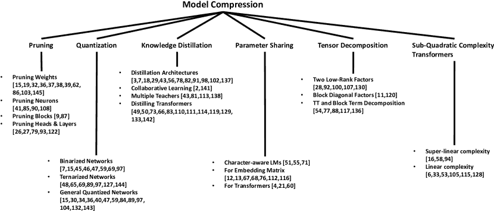
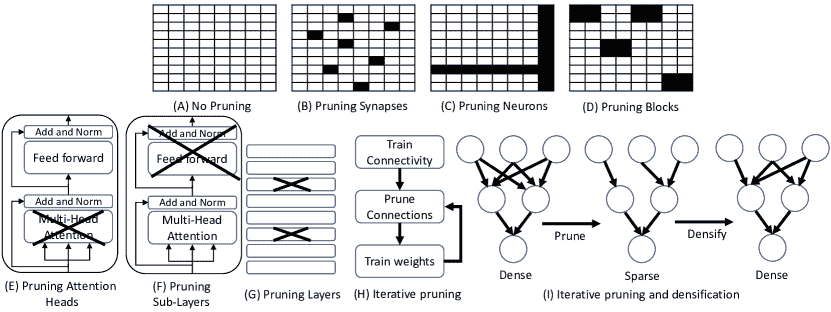
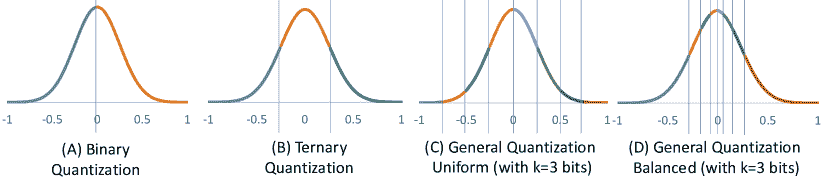
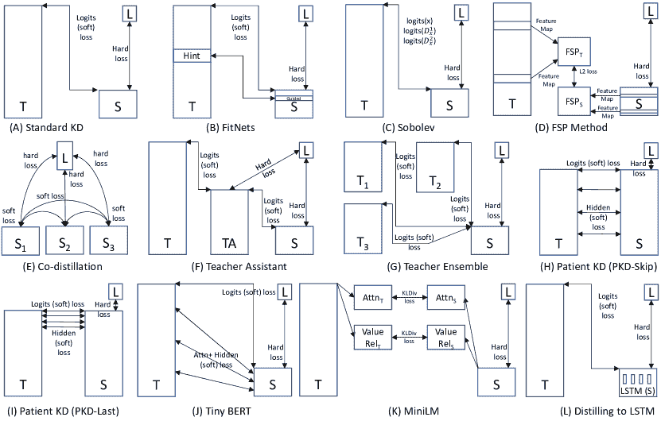
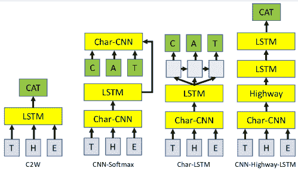

<!--yml

分类：未分类

日期：2024-09-06 19:59:57

-->

# [2008.05221] 深度学习模型的文本压缩：一项调查

> 来源：[`ar5iv.labs.arxiv.org/html/2008.05221`](https://ar5iv.labs.arxiv.org/html/2008.05221)

# 深度学习模型的文本压缩：一项调查

Manish Gupta gmanish@microsoft.com [0002-2843-3110](https://orcid.org/0002-2843-3110 "ORCID identifier") 和 Puneet Agrawal punagr@microsoft.com 微软，印度（2020）

###### 摘要。

最近几年，自然语言处理（NLP）和信息检索（IR）领域由于深度学习模型如递归神经网络（RNNs）、门控递归单元（GRUs）和长短期记忆（LSTMs）网络，以及基于 Transformer（Vaswani 等，2017）的模型如双向编码器表示（BERT）（Devlin 等，2018）、生成预训练变换器（GPT-2）（Radford 等，2019）、多任务深度神经网络（MT-DNN）（Liu 等，2019b）、超长网络（XLNet）（Yang 等，2019）、文本到文本转移变换器（T5）（Raffel 等，2019）、T-NLG（Rosset，2019）和 GShard（Lepikhin 等，2020）取得了巨大的进展。但这些模型的体积巨大。另一方面，现实世界应用需要小模型尺寸、低响应时间和低计算功耗。在本次调查中，我们探讨了六种不同类型的方法（剪枝、量化、知识蒸馏、参数共享、张量分解和亚二次 Transformer 方法）来压缩这些模型，以便在实际工业 NLP 项目中部署。鉴于构建高效和小型模型的迫切需求，以及近期在这一领域发布的大量工作，我们相信这次调查整理了‘深度学习用于 NLP’社区在过去几年中的大量工作，并将其呈现为一个连贯的故事。

模型压缩，深度学习，剪枝，量化，知识蒸馏，参数共享，张量分解，亚二次变换器^†^†版权：acmcopyright^†^†期刊年份：2020^†^†doi：10.1145/1122445.1122456^†^†会议：TKDD；2020 年 8 月；TKDD^†^†书名：TKDD^†^†价格：15.00^†^†isbn：978-1-4503-XXXX-X/18/06^†^†ccs：计算方法 神经网络^†^†ccs：计算方法 机器学习^†^†ccs：一般和参考 调查与概述

深度学习模型已经彻底改变了包括自然语言处理（NLP）、计算机视觉和语音分析在内的信息系统多个领域。虽然它们使得多个任务能够达到非常高的准确度，但模型的体积和预测延迟也显著增加。具体到文本，递归神经网络（RNNs）、门控递归单元（GRUs）和长短期记忆（LSTM）网络已经被使用了相当长时间，用于各种自然语言处理（NLP）任务。这些模型特别庞大，主要由于输入和输出嵌入参数的原因。

在过去三年中，自然语言处理（NLP）领域取得了显著进展，这从 GLUE（Wang et al., 2019b）和 SuperGLUE（Wang et al., 2019a）排行榜中可以明显看出¹¹1[`gluebenchmark.com/leaderboard`](https://gluebenchmark.com/leaderboard)^,²²2[`super.gluebenchmark.com/leaderboard`](https://super.gluebenchmark.com/leaderboard)。基于 Transformer（Vaswani et al., 2017）的模型，如双向编码器表示（BERT）（Devlin et al., 2018）、生成预训练 Transformer（GPT-2）（Radford et al., 2019）、多任务深度神经网络（MT-DNN）（Liu et al., 2019b）、超长网络（XLNet）（Yang et al., 2019）、MegatronLM（Shoeybi et al., 2019）、文本到文本转移 Transformer（T5）（Raffel et al., 2019）、T-NLG（Rosset, 2019）和 GShard（Lepikhin et al., 2020）在这一成功中发挥了重要作用。但这些模型的体积庞大：BERT（340M 参数）、GPT-2（1.5B 参数）、MegatronLM（8.3B 参数）、T5（11B 参数）、T-NLG（17B 参数）和 GShard（600B 参数）。Bianco et al.（Bianco et al., 2018）和 Sanh et al.（Sanh et al., 2019）提供了对近期计算机视觉和自然语言处理领域深度学习模型规模的全面概述。

训练这些大型模型需要大量的 GPU 基础设施，并且会导致高额的电力消耗。在 GPU 上训练一个 BERT-base 模型的电力和碳足迹大致相当于一次横跨美洲的飞行（Strubell 等， 2019）。即便在高端服务器上，部署如此庞大的模型也很困难。实际上，许多实际应用运行在资源受限的环境中，例如边缘设备、传感器和手机。边缘设备可能包括离线医疗设备，以及无人机、机器人、眼镜等上的模块。通常，除了希望模型体积较小之外，低响应时间也至关重要。例如，像无人驾驶汽车或辅助盲人应用这样的应用程序需要处理速度约为每秒 30 帧。类似地，搜索引擎需要能够处理每天数十亿次查询。总体而言，以下因素促使我们研究深度学习模型的压缩。

+   •

    内存（RAM）使用

+   •

    预测延迟

+   •

    电力消耗

+   •

    在资源受限的设备上的推断

+   •

    训练/微调的便利性

+   •

    部署和更新的便利性

+   •

    分布式训练的便利性

图 1\. 文本模型压缩方法概述

大型网络无法适应片上存储，因此需要更昂贵的外部 DRAM 访问。例如，运行一个拥有 10 亿连接的神经网络以每秒 30 帧的速度将需要 (30Hz)(1G)(640pJ) = 19.2W 的 DRAM 访问功耗，这远远超出了典型移动设备的功率范围。这意味着运行此类应用程序的手机可能会面临快速耗电的问题，从而导致手机过热。Han 等（Han 等，2016a）讨论了深度学习模型的电力消耗的详细信息。另一种避免大型 RAM、高预测时间和高电力消耗的选项是将如此庞大的深度学习模型运行在云服务器上。但对于许多实际应用，最好将它们运行在本地客户端设备上，以避免网络延迟、保护用户隐私，并避免输入/输出数据通信中的电力消耗。

小型模型确实也可以降低预测延迟。例如，Diamos 等（Diamos 等，2016）展示了对于小型模型，可以将 RNN 权重缓存到片上内存中，例如缓存、块 RAM 或寄存器文件，这可以在整个 RNN 层可以存储在寄存器中而不是 NVIDIA TitanX GPU 的 GPU DRAM 时实现高达 146 倍的加速。

最后，较小的模型使得软件开发、部署和更新变得更为简单。大型模型难以处理。例如，不可能在拥有 12-16 GB RAM 的 GPU 上对预训练的 BERT-large 模型进行微调。这对没有资源购买多个大型图形处理单元（GPU）的社区构成了巨大的门槛。对于大型模型，调整各种配置参数需要大量资源。较小的模型可以提高学习速度，并允许评估更多的超参数配置。以移动优先的公司不喜欢大型应用程序。应用商店对二进制文件的大小非常敏感。例如，iPhone App Store 有“超过 150 MB 的应用程序将不会下载，直到你连接到 Wi-Fi”的限制。较小的模型在实际系统中更容易使用和部署。大型模型需要多个服务器节点。另一方面，多个较小模型的实例可以在同一台机器上同时运行，从而提高 QPS（每秒查询次数）。最后，较小的模型还可以减少分布式训练的通信开销。

幸运的是，这些大型神经网络的权重中存在大量的冗余。一个小的权重子集足以重建整个网络。Denil 等（Denil et al., 2013）显示，仅使用约 5%的权重，就能预测剩余的权重而不会降低准确性。这一观察引发了多个社区在压缩大型深度学习模型方面的大量研究工作。在这项调查中，我们旨在通过将其组织成各种类别，系统地探索 NLP 社区中大量的文献。图 1 显示了文本模型压缩方法的广泛组织。在这项调查中，我们不专注于其他社区（如视觉和语音）中提出的具体方法，这些方法利用了图像/音频特定的架构，因此不能应用于文本。此外，我们不讨论减少延迟的硬件优化方法。虽然在模型压缩的广泛领域（Cheng et al., 2017; Deng et al., 2020）以及专门针对知识蒸馏的方法（Wang and Yoon, 2020）中有其他调查，它们要么过时，要么集中在计算机视觉相关的问题上。

## 1. 模型压缩方法概述

在这项调查中，我们讨论了使用修剪、量化、知识蒸馏、参数共享、张量分解和子二次 Transformer 的压缩方法。

减少模型大小最明显的方法是对权重矩阵进行稀疏化。修剪方法基于被修剪的内容和实际用于修剪的逻辑有所不同。给定一个矩阵，可以进行修剪。

+   •

    一些权重条目

+   •

    行或列（即，神经元）

+   •

    权重块

+   •

    注意力头（在基于 Transformer 的方法中）

+   •

    层或结构的组合。

剪枝方法的其他有趣方面包括以下几点。

+   •

    如何决定剪枝哪些权重/神经元/块/头？

+   •

    你应该剪枝大型网络还是构建小型网络？

+   •

    你应该选择一次性剪枝还是迭代/渐进式剪枝？

+   •

    剪枝时正则化如何帮助？

我们在第二部分讨论了这些剪枝方法的方面。

除了去除权重本身，减少权重矩阵大小的另一种方法是减少表示每个权重所需的位数。通常权重以 32 位双精度值存储。在极端情况下，权重可以量化为两个值（二进制 1 位）。但其他流行的方法包括量化为三个值（三进制）或多个位。量化可以是均匀的或非均匀的。量化方法可以是确定性的或随机的。量化可以在有损或无损的方式下进行。量化箱范围可以是训练的或调整的。最后，为了获得有利的模型大小与准确性的权衡，RNN、LSTM 或 Transformer 的不同层的量化级别需要不同。我们在第三部分讨论了这些量化方法的方面。

模型压缩的第三种方法是使用知识蒸馏（也被广泛称为学生教师网络）。在这种方法中，首先使用标记数据训练一个深度教师模型，然后将“隐性知识”从教师转移到训练一个浅层学生网络。因此，学生模型被训练成模仿一个预训练的、更大的教师模型。学生模型训练完成后，可以进行部署，而教师网络则可以丢弃。蒸馏方法的差异取决于以下设计选择。

+   •

    教师模型的不同类型

+   •

    不同类型的损失函数，如模型的对数值之间的平方误差、预测分布之间的 KL 散度或模型预测之间的其他一致性度量。

+   •

    学生模型训练的不同数据集选择（大型未标记数据集、保留数据集或原始训练集）

+   •

    从教师那里模仿什么的不同选择——教师的类别概率、教师的特征表示。

+   •

    从谁那里学习——教师、教师助理还是其他同学。

我们在第 4 ‣ Compression of Deep Learning Models for Text: A Survey")节讨论了这些知识蒸馏方法的方面。

另一种减少总体权重的方法是让参数在多个权重结构之间共享。一般来说，这种方法称为参数共享。方法的差异取决于以下方面。

+   •

    哪些参数是共享的

+   •

    共享参数使用的技术

+   •

    执行共享的层级

我们在第五部分中讨论了基于参数共享的方法的这些方面。

另一个避免大型矩阵的方法是使用多个较小矩阵的组合进行近似。这种用于模型压缩的张量分解方法将大型张量分解为多个较小的组件。方法根据以下方面有所不同。

+   •

    分解技术的类型

+   •

    被分解的矩阵

+   •

    权重矩阵的利用特性

我们在第六部分中讨论了张量分解方法的这些方面。

在基于 Transformer 的模型中，除了模型大小，延迟也是一个关注点，因为输入序列大小的平方复杂度。除此之外，Transformer 模型所需的内存也是平方级的。因此，最近有几项努力在设计具有亚平方复杂度的 Transformer。这些方法中有些是超线性的，而许多是线性的。线性复杂度方法使用各种技术来强制执行线性——其广泛的想法是使用对固定少量其他标记的注意力来计算每个标记的变换表示。方法在定义用于计算当前标记变换表示的其他标记集合方面有所不同。我们在第七部分中讨论了这些方法。

## 2\. 剪枝

最早提出的模型压缩方法基于剪枝。剪枝可以通过两种方式进行：结构化剪枝和非结构化剪枝。在非结构化剪枝中，通过将网络中的单个权重连接设置为 0 来移除这些连接。可以根据各种标准（例如，剪除低幅度权重）从权重矩阵中剪除权重。这种非结构化剪枝方法会导致稀疏矩阵，并且在推理时需要特殊的稀疏矩阵操作库。因此，还提出了各种结构化剪枝方法，这些方法旨在剪除神经元、权重矩阵块、注意力头或层等结构。图 2 提供了各种剪枝风格的广泛概述。图 2(B) 描述了非结构化剪枝。图 2(C)-(G) 展示了各种结构化剪枝方法。在本节中，我们在第 2.1 节讨论了非结构化权重剪枝方法，在第 2.2 至 2.4 节讨论了结构化剪枝方法。

图 2\. 剪枝的不同类型：（A）表示没有剪枝。填充的单元格表示已剪枝的条目。（B）、（H）和（I）是第 2.1 节讨论的非结构化剪枝方法。其余的是结构化剪枝方法：（C）在第 2.2 节讨论，（D）在第 2.3 节讨论，（E）、（F）和（G）在第 2.4 节讨论。

在剪枝中，主要思想是先训练一个大型模型，然后剪除权重，得到一个更小但有效的模型。这一过程受到以下生物学观察的启发。人类大脑在出生后的头几个月生成了数万亿个突触。在一岁时，突触数量达到 1000 万亿的峰值。然后，自然剪枝开始发生。一个十岁的孩子大约有 500 万亿个突触。这种‘剪枝’机制移除大脑中的冗余连接（Walsh, 2013）。

一个自然的问题是，应该剪枝大规模网络还是构建小规模密集网络？剪枝涉及额外的处理，并且稀疏矩阵需要特殊处理。我们是否可以通过训练较小的模型来避免这一点？Zhu 等人（Zhu 和 Gupta，2017）在语言建模的堆叠 LSTM 模型和神经机器翻译（NMT）的 seq2seq 模型上实验了不同规模的模型，有无剪枝。他们发现，大规模稀疏模型始终优于小规模密集模型，并且在非零参数数量上可减少多达 10 倍，准确性损失极小。

### 2.1\. 剪枝权重

要剪枝的权重可以通过两种启发式方法选择：（1）使用 Hessian 矩阵计算，或（2）使用权重的幅度。此外，基于幅度的剪枝方法可以一次性剪枝（通常在训练完成后静态进行），也可以迭代进行（也称为动态或渐进剪枝），或迭代剪枝和稠密化。因此，进行无结构权重剪枝的主要方法有四种：（1）基于 Hessian 的方法，（2）幅度剪枝，（3）迭代幅度剪枝，以及（4）迭代幅度剪枝和稠密化。在本小节中，我们详细讨论这些方法。

#### 2.1.1\. 基于 Hessian 的方法

在他们的开创性工作（最优脑损伤或 OBD）中，LeCun 等人（LeCun 等，1990）提出了将权重剪枝作为模型压缩的一种方法，并将权重的显著性定义为删除该参数引起的目标函数 $E$ 的变化。利用泰勒级数并做出多个假设，他们建议使用以下作为权重 $u_{i}$ 的显著性度量。

| (1) |  | $\displaystyle s(u_{i})=\frac{1}{2}\sum_{i}h_{ii}\delta u_{i}^{2}$ |  |
| --- | --- | --- | --- |

其中 $h_{ii}=\frac{\partial^{2}E}{\partial u_{i}\partial u_{j}}$ 是 Hessian 矩阵的第 $i^{th}$ 个对角元素。显著性较低的权重可以被剪枝，剪枝后的网络可以重新训练以调整剩余的权重。计算 Hessian 对角线的过程与用于计算一阶导数的反向传播算法非常相似。因此，计算 Hessian 对角线的复杂度与计算梯度的复杂度相同。

OBD 忽略了 Hessian 矩阵中的交叉项。但在大多数真实数据集中，Hessian 矩阵的非对角性很强。因此，为了避免剪枝重要的权重，Hassibi 等人（Hassibi 和 Stork，1993）提出了一种称为最优脑外科医生（OBS）的方法，该方法也考虑了交叉项。使用类似于权重 $w_{i}$ 的 $E$ 导数的方式，计算权重的显著性如下。

| (2) |  | $\displaystyle L_{i}=\frac{1}{2}\frac{w_{i}^{2}}{[H^{-1}]_{ii}}$ |  |
| --- | --- | --- | --- |

计算 $H^{-1}$ 很困难。因此，他们提供了一种更快的递归关系来从训练数据和网络的结构信息中计算 $H^{-1}$。此外，与其他方法（如 OBD 或大小修剪）不同，OBS 不要求（通常较慢的）在修剪权重后重新训练。在每一步中，我们删除最小 $L_{i}$ 的 $w_{i}$ 并更新所有权重。

| (3) |  | $\displaystyle\delta w=-\frac{w_{i}}{[H^{-1}]_{ii}}H^{-1}e_{i}$ |  |
| --- | --- | --- | --- |

其中 $e_{i}$ 是与（标量）权重 $w_{i}$ 相对应的权重空间中的单位向量。不幸的是，这些方法（OBD 和 OBS）的计算开销很大，因为二阶导数（即 Hessian）的计算非常昂贵。

#### 2.1.2\. 大小修剪方法

一种计算上更可行的修剪连接和仅基于原始权重大小重新学习权重的方法是简单地修剪掉小幅度的权重。这个想法最早由 Han 等人提出（Han et al., 2015a）。修剪掉低幅度的权重使得矩阵变得稀疏。稀疏矩阵可以以压缩稀疏行/列（CSR/CSC）格式存储。通过存储索引差值而不是绝对位置，并使用小固定数目的位来编码这个差值，可以进一步节省空间。See 等人（See et al., 2016）在编码器-解码器 LSTM 神经机器翻译（NMT）模型上实验了这些修剪方法。他们对 4 层 LSTM 的所有权重矩阵进行了大小修剪。他们发现，高层、注意力和 softmax 权重是最重要的，而低层和嵌入权重包含了很多冗余。在低层，输入参数最为关键，而在高层，门控参数也变得重要。这些方法通常将目标修剪百分比作为超参数，修剪要么在静态（在训练完整模型后）进行，要么在动态（在训练过程中）进行。重新训练稀疏修剪后的网络有助于提高准确性。

在典型的编码器-解码器 LSTM 模型中，有以下几种权重类别：源嵌入权重、目标嵌入权重、源层权重、目标层权重、注意力权重和 softmax 权重。与幅度剪枝相关的重要考虑是如何在模型的这些不同权重类别中分配剪枝，以实现目标 $x$% 剪枝？See 等人（See et al., 2016）提出了三种方法：类盲剪枝、类均匀剪枝和类分布剪枝。在类盲剪枝中，我们将所有参数按幅度排序，并剪枝幅度最小的 $x$% 参数，而不考虑权重类别。因此，一些类别的剪枝比例会比其他

#### 2.1.3\. 迭代幅度剪枝方法

通常发现，与其一次性剪枝，不如在多个周期内逐步剪枝。这样的剪枝方式被称为迭代或逐步剪枝（见图 2(H)）。对于起始比例$x$%和结束比例$y$%，迭代幅度剪枝过程剪去$x$%的权重，进行重新训练，然后每$K$次迭代剪去$(y-x)/T$%的权重。$T$是剪枝的次数。有时，剪枝在执行了几次热身迭代后开始。幅度剪枝在训练时结合正则化（$L_{1}/L_{2}$）非常有效。Dropouts 也有助于有效剪枝。在一些剪枝方法中，一旦剪枝的权重不能在未来迭代中成为网络的一部分。另一方面，其他方法在反向传播步骤中不会修改剪枝权重的梯度。在这种情况下，剪枝权重的更新可能大于该层的阈值，权重将再次参与前向传递。此外，在每次剪枝迭代中，我们可以使用固定的阈值（Han 等，2015b）或单调增加它（Narang 等，2017a）。

在逐步剪枝的情况下（Narang 等，2017a），其中剪枝阈值$\epsilon$单调增加，$\epsilon$在每次迭代$i$中确定。设$f$为$\epsilon$更新后的迭代次数。此外，在经过几次热身迭代后，使用绝对值对权重进行排序，并选择对应于第$90^{th}$百分位的权重作为$q$。剪枝阈值$\epsilon$分为两个阶段增加。在第一个阶段（从开始迭代$s$开始，到斜坡迭代$r$结束），我们使用$\theta$作为初始斜率来剪枝权重。在第二个阶段（从斜坡迭代$r$开始，到结束迭代$e$），我们使用$\phi$作为斜坡斜率来改变剪枝速度。通常，$\phi$设置为 1.5$\theta$，其中$\theta$的计算方法如下。

| (4) |  | $\displaystyle\theta=\frac{2qf}{2(r-s)+3(e-r)}$ |  |
| --- | --- | --- | --- |

因此，从迭代$s$到$r$，我们设置剪枝阈值如下。

| (5) |  | $\displaystyle\epsilon=\frac{\theta(i-s+1)}{f}$ |  |
| --- | --- | --- | --- |

从迭代$r+1$到$e$，我们设置剪枝阈值如下。

| (6) |  | $\displaystyle\epsilon=\frac{\theta(r-s+1)+\phi(i-r+1)}{f}$ |  |
| --- | --- | --- | --- |

通常，在剪枝时，不剪枝偏置，因为它们的数量相对较少。总体而言，使用逐步剪枝可以将 RNN/LSTM 模型的大小减少 90%，速度提升约 2 倍至 7 倍，且精度没有降低。此外，与最终层相比，更靠近输入的层剪枝更为激进。

另一种执行迭代修剪的方法是为每次迭代设定修剪目标（Zhu 和 Gupta，2017）。在这种方案中，我们从初始稀疏值 $s_{0}$ 开始。为了在 $n$ 次修剪步骤后达到最终稀疏值 $s_{f}$，修剪目标在第 $i$ 次迭代中可以如下计算。

| (7) |  | $\displaystyle s_{i}=s_{f}+(s_{0}-s_{f})\left(1-\frac{i}{nf}\right)^{3}$ |  |
| --- | --- | --- | --- |

因此，网络的稀疏度会逐渐增加，同时允许网络训练步骤从任何修剪引起的准确度损失中恢复。在初始阶段，当冗余连接较多时，我们迅速修剪网络，并随着网络中剩余权重的逐渐减少，每次修剪的权重数量逐渐减少。

Cheong 等人（Cheong 和 Daniel，2019）发现，当修剪像 BERT 这样的 Transformer 模型时，迭代修剪会导致较差的结果。Guo 等人（Guo 等人，2019a）发现修剪，特别是带有正则化时，会有两个问题。

+   •

    在 $L_{1}$ 正则化中，大的权重 $w_{j}$ 被比小的权重 $w_{i}$ 更加严厉地惩罚，这违背了权重修剪的原始意图，即“去除不重要的连接”。

+   •

    直接优化正则化惩罚项会导致偏离原始损失函数，并对基于梯度的更新效果产生负面影响。

他们建议执行重新加权的 $L_{1}$ 最小化，其中 $\alpha_{i}>0$ 与相应权重 $|w_{i}|$ 的大小成反比。因此，他们解决了以下优化问题

| (8) |  | $\displaystyle\min_{w}f(w)+\gamma\sum_{i}\alpha_{i} | w_{i} | $ |  |
| --- | --- | --- | --- | --- | --- |

其中 $f(w)$ 是网络的原始损失函数。这个优化问题通过重新加权的近端修剪（RPP）方法（依赖于近端算子）来解决。RPP 将高稀疏度的目标与最小化损失解耦，因此即使在对 BERT 进行高水平修剪时，也能提高准确性。

#### 2.1.4\. 迭代幅度修剪与稠密化

此外，通过在多个迭代中交替进行剪枝和稠密化（Han et al., 2016b; Dai et al., 2018），可以提高剪枝的效果（见图 2(I)）。有两种方法可以做到这一点。第一种方法（Han et al., 2016b）是在每次迭代中，要么进行剪枝，要么进行稠密化。稀疏训练对模型进行正则化，而稠密训练恢复了剪枝的权重，增加了模型的容量而不会过拟合。稀疏化帮助优化器摆脱鞍点，并导致正则化训练收敛到更好的极小值。第二种方法（Dai et al., 2018）是在每次迭代中，一些沉睡的权重可以重新出现在网络中，而其他活跃的权重则可以被剪枝。一个沉睡的 $w\in W$ 当且仅当 $|w.grad|$ 大于所有 $|W.grad|$ 元素的 $(100\alpha)^{th}$ 百分位时被激活。一个 $w\in W$ 当且仅当 $|w|$ 小于所有 $|W|$ 元素的 $(100\beta)^{th}$ 百分位时被移除。$\alpha$ 和 $\beta$ 分别指增长率和剪枝率。

### 2.2\. 剪枝神经元

实际上实施无结构剪枝很困难，因为在推理时，需要对稀疏空间中的矩阵乘法提供特殊支持。剪除神经元会导致从权重矩阵中删除一行或一列，从而避免了稀疏矩阵处理（见图 2(C)）。然而，与剪枝权重相比，剪枝神经元的灵活性较低，因为我们需要找到整个行/列进行删除。本节讨论了确定可以剪枝的神经元的方法。

#### 2.2.1\. 去除低重要性神经元

He 等人（He et al., 2014）提出了三种节点重要性函数来确定神经元的重要性评分。

+   •

    熵：对于神经元 $i$，设 $a_{i}$ ($d_{i}$) 为节点输出 $>(或\leq)$ 0.5 的实例数，适用于具有 sigmoid 激活的二分类。则节点 $i$ 的熵可以写作如下。

    | (9) |  | $\displaystyle\text{熵}(i)=\frac{d_{i}}{a_{i}+d_{i}}\log_{2}\frac{d_{i}}{a_{i}+d_{i}}+\frac{a_{i}}{a_{i}+d_{i}}\log_{2}\frac{a_{i}}{a_{i}+d_{i}}$ |  |
    | --- | --- | --- | --- |

    直观上，如果一个节点的输出在所有训练数据上几乎相同，这些输出不会对后续层产生变化，因此该节点可能没有用处。

+   •

    输出权重范数（onorm）：其输出链接权重的平均 $L_{1}$-范数。

+   •

    输入权重范数（inorm）：其输入链接权重的平均 $L_{1}$-范数。

所有神经元按其评分排序，重要性值较低的节点被删除。在大多数情况下，onorm 被发现是这些重要性函数中最好的。

也有专门的正则化器被提出，以强制神经元将所有输入或输出连接权重推向零（Murray 和 Chiang，2015；Pan 等人，2016）。具体而言，处理输入连接的以下两个正则化器是流行的。

+   •

    权重矩阵$W$上的$L_{2}$范数定义如下。

    | (10) |  | $\displaystyle\sum_{i}&#124;&#124;W_{i:}&#124;&#124;_{2}=\sum_{i}\left(\sum_{j}W^{2}_{ij}\right)^{1/2}$ |  |
    | --- | --- | --- | --- |

    这对每一行施加相等的压力，但在每一行中，较大的值贡献更多，因此对较大值的压力更大。

+   •

    权重矩阵$W$上的$L_{\infty}$范数定义如下。

    | (11) |  | $\displaystyle\sum_{i}&#124;&#124;W_{i:}&#124;&#124;_{\infty}=\sum_{i}\max_{j}&#124;W_{ij}&#124;$ |  |
    | --- | --- | --- | --- |

    这对每一行施加相等的压力，但在每一行中，只有最大值（或值）才重要，因此压力完全作用于最大值（或值）。

类似的正则化器也可以很容易地定义为出站连接。

#### 2.2.2. 删除冗余神经元

考虑一个具有$n$个神经元的简单网络。因此，输出可以按如下方式计算。

| (12) |  | $\displaystyle z=a_{1}h(W_{1}^{T}X)+a_{2}h(W_{2}^{T}X)+...+a_{n}h(W_{n}^{T}X)$ |  |
| --- | --- | --- | --- |

其中$a_{i}$和$W_{i}$表示权重。如果$W_{1}==W_{2}$，则$h(w_{1}^{T}X)=h(w_{2}^{T}X)$。因此，我们可以按如下方式计算输出。

| (13) |  | $\displaystyle z=(a_{1}+a_{2})h(W_{1}^{T}X)+0.h(W_{2}^{T}X)+...+a_{n}h(W_{n}^{T}X)$ |  |
| --- | --- | --- | --- |

一般来说，只要两个权重集（$W_{1}$, $W_{2}$）相等，就可以有效地删除其中一个。这应该通过手术步骤完成，即需要将系数$a_{1}$更改为$a_{1}+a_{2}$。当然，对于许多权重集对（即神经元），$W_{1}$和$W_{2}$并不完全相同。因此，Srinivas 等人（Srinivas 和 Babu，2015）提出了这种 3 步法用于冗余神经元的识别和移除。

+   •

    计算所有可能神经元对（i, j）的显著性$s_{ij}$，方法如下。

    | (14) |  | $\displaystyle s_{ij}=\langle a_{j}^{2}\rangle&#124;&#124;\epsilon_{ij}&#124;&#124;_{2}^{2}$ |  |
    | --- | --- | --- | --- |

    其中$\langle a_{j}^{2}\rangle$表示所有输出神经元上量的平均值。设$S$为包含所有$s_{ij}$值的矩阵。

+   •

    选择对应于最小$s_{ij}$的索引$(i^{\prime},j^{\prime})$。删除$j^{\prime}$神经元，并按如下方式更新$a_{i}^{\prime}$。

    | (15) |  | $\displaystyle a_{i}^{\prime}\leftarrow a_{i}^{\prime}+a_{j}^{\prime}$ |  |
    | --- | --- | --- | --- |

+   •

    通过删除$j^{\prime}$列和行并更新$i^{\prime}$列（以考虑更新后的$a_{i}^{\prime}$）来更新$S$。

### 2.3. 剪枝块

在权重剪枝中，稀疏矩阵的不规则性限制了在硬件加速器上可以实现的最大性能和能效。剪枝神经元可以避免稀疏矩阵问题，但整体剪枝的范围受到限制。因此，引入了基于块的剪枝方法（见图 2(D)）。

块稀疏格式将块连续地存储在内存中，从而减少了不规则的内存访问。如果一个块的最大权重幅度低于当前阈值，我们将该块中的所有权重设置为零。类似于迭代权重剪枝，块剪枝（Narang et al., 2017b）也可以使用单调增长的阈值进行迭代。任何已经被置零的块在剪枝结束后仍保持为零，从而在训练结束时形成一个稀疏模型。就像权重剪枝（如在第 2.1 节讨论的那样），起始斜率$\theta$和斜坡斜率$\phi$决定了阈值增长的速率。对于块剪枝，我们需要调整起始斜率以考虑块中的元素数量($N_{b}$)。因此，块剪枝的起始斜率通常设定如下。

| (16) |  | $\displaystyle\theta_{b}=\theta\times\sqrt[4]{N_{b}}$ |  |
| --- | --- | --- | --- |

此外，为了有效去除块，Narang et al.（Narang et al., 2017b）提出了组 Lasso 正则化方法。组 Lasso 是一种作用于权重组的权重正则化方法，可以将组中的所有权重置零。对于每个块，我们添加一个与块的$L_{2}$范数成比例的损失项。因此，我们优化如下。

| (17) |  | $\displaystyle\min_{w}f(w)+\lambda_{g}\sum_{g=1}^{G}&#124;&#124;w^{(g)}&#124;&#124;_{2}$ |  |
| --- | --- | --- | --- |

当我们将组 Lasso 与块剪枝结合时，组 Lasso 引导选择需要剪枝的块。组 Lasso 正则化与剪枝计划同步应用，即当剪枝计划结束时，我们关闭正则化。通常，在普通 RNNs 和 GRUs 中使用 4x4 的块诱导块稀疏性效果较好，相比于更大的块大小。更大的块需要较低的稀疏性以维持相似的准确性。

不幸的是，当应用块稀疏性时，保持相同的模型准确性变得具有挑战性。此外，块的大小（即剪枝粒度）对应用敏感，使其成为另一个需要调整的超参数。为了避免这些问题，曹等人（Cao et al.，2019）提出了一种新的方法，称为银行平衡稀疏性（BBS）。BBS 将每个权重矩阵的行分成多个相等大小的银行，并对每个银行进行细粒度剪枝，以在银行之间获得相同的稀疏性。每个银行具有相同数量的非零值。例如，在每个大小为 4 的银行中保留前两个权重意味着 50% 的稀疏性。我们将 BBS 剪枝方法迭代地应用于预训练网络，并在每次剪枝迭代后微调网络以恢复模型准确性。BBS 实现了与非结构化稀疏性几乎相同的模型准确性，并且在相同稀疏性水平下显著优于块稀疏性。BBS 还适用于 FPGA（现场可编程门阵列）加速，因为它本质上提供了平衡的矩阵分区以进行并行计算。

### 2.4\. 剪枝头部和层

除了神经元和块，对于基于 Transformer 的模型，结构化剪枝还可以应用于注意力头和整个层。在这一部分，我们讨论了这些方法。

#### 2.4.1\. 剪枝注意力头

BERT-base 模型包含 12 层，每层有 12 个注意力头。类似地，一个典型的 NMT 编码器-解码器 Transformer 具有 6 层编码器和 6 层解码器，每层包含 16 个注意力头。Michel 等人（Michel et al.，2019）发现，大多数注意力头可以在不偏离原始评分太多的情况下被移除。令人惊讶的是，在某些情况下，移除一个注意力头（见图 2(E)）会导致准确性提高。当这些头部被单独移除时，只有 6 层 WMT NMT Transformer（每层 16 个头，共 96 个头）中的 8 个头部在从模型中移除时会引起统计上显著的性能变化，其中一半实际上会导致 BLEU 分数提高。对于大多数层，尽管网络是用 12 个（BERT）或 16 个（WMT Transformer）注意力头训练的，但测试时实际上一个头部是足够的。也可以在多个层中进行迭代剪枝（而不仅仅是一次剪枝一个头）。对于迭代剪枝，头部重要性评分使用模型对掩码变量 $\xi_{h}$ 的期望敏感性定义，如下所示。

| (18) |  | $I_{h}=E_{x\sim X}\left\lvert\frac{\partial L(x)}{\partial\xi_{h}}\right\rvert=E_{x\sim X}\left\lvert\text{Att}_{h}(x)^{T}\frac{\partial L(x)}{\partial\text{Att}_{h}(x)}\right\rvert$ |  |
| --- | --- | --- | --- |

其中$X$是数据分布，$L(x)$是样本$x$上的损失，$Att_{h}(x)$是实例$x$的注意力头$h$的输出。直观上，如果$I_{h}$的值很高，那么改变$\xi_{h}$可能会对模型产生较大的影响。因此，在每次迭代中，低$I_{h}$值的头部被剪枝。Michel 等人（Michel 等人，2019）观察到，从 NMT 和 BERT 模型中剪去最多 20%和 40%的头部分别没有对准确率产生明显的负面影响。

Voita 等人（Voita 等人，2019）使用了另外两种头部重要性评分来剪枝 NMT 模型中的注意力头。两种评分方法是：（1）逐层相关传播（LRP）（Ding 等人，2017）。LRP 是一种计算网络中一个点的神经元对另一个点的神经元的相对贡献的方法。（2）计算为“头部的信心”，该信心为其最大注意力权重的平均值，排除句子结束符，其中平均值是对用于评估的一组句子中的令牌进行的。对于剪枝头部，他们提出了一种基于随机门和$L_{0}$惩罚的可微放松方法。$L_{0}$范数等于非零分量的数量，并推动模型关闭不重要的头部。他们发现只有一小部分头部对翻译很重要。在英语-俄语 WMT 数据集中，剪去 48 个编码器头中的 38 个，仅导致 0.15 BLEU 的下降。

#### 2.4.2\. 剪枝层

请注意，丢弃注意力头并不会减少运行时间，因为它们通常是并行计算的。虽然可以剪枝权重、神经元或注意力头，但我们如何设计一个方案来剪枝层（见图 2(G)）？LayerDrop 思想（Fan 等人，2019）的灵感来自 DropConnect。DropConnect 在批次训练时随机丢弃权重。LayerDrop 进行结构化丢弃：它丢弃权重组、头部、前馈网络（FFN）矩阵或层。要剪枝的层可以使用以下这些方法之一来决定：

+   •

    每隔一个：剪枝每隔一个层（丢弃率$p$），例如，在一个 12 层的 BERT 模型中每隔$3^{rd}$层。

+   •

    在验证集上搜索：通过检查层对验证集的影响来搜索要剪枝的层集合。这涉及尝试各种组合。

+   •

    数据驱动剪枝：以数据驱动的方式学习每层的丢弃率$p_{d}$。

给定一个目标丢弃率$p$，我们为深度$d$处的层学习一个单独的丢弃率$p_{d}$，使得各层的平均丢弃率等于$p$。在推理时，我们仅根据 softmax 输出前向传递固定的 top-$k$最高评分层。在这三种方法中，“每隔一个”策略在许多任务和配置中表现得非常好。“在验证集上搜索”和“数据驱动剪枝”仅提供了边际增益。

#### 2.4.3\. 剪枝通用结构

最后，Prasanna 等（Prasanna 等，2020）实验了在 BERT 网络中同时剪枝 FFN 层（见图 2(F)）以及注意力头（见图 2(E)）。与（Michel 等，2019）类似，他们为这些结构分配了一个掩码变量。为了决定剪枝哪些结构，我们查看模型对掩码变量的预期敏感度。高敏感度意味着对模型输出的影响较大，因此应保留对应结构。他们发现可以找到一个子网络，其性能与完整模型相当，而从其余模型中抽取的相似大小子网络表现较差。

| 任务 | 数据集 | 模型 | 方法 | 大小（剪枝; 原始） | 评估（剪枝; 原始） | 指标 |
| --- | --- | --- | --- | --- | --- | --- |
| 语言建模 | Europarl v7 英文 | 2 层 MLP | 剪枝神经元 （Murray 和 Chiang，2015） | 5.06M; 5.1M | 57; 100 | 困惑度 (L) |
| 语言建模 | PTB | 2 层 LSTM | Iter. Mag. （Zhu 和 Gupta，2017） | 6.6M; 66M | 80.24; 78.45 | 困惑度 (L) |
| 语言建模 | PTB | LSTM | Iter. Mag. （Cao 等，2019） | 20M; 66M | 78.5; 78.8 | 困惑度 (L) |
| 语言建模 | PTB | LSTM | Block Sparsity （Cao 等，2019） | 20M; 66M | 83; 78.8 | 困惑度 (L) |
| 语言建模 | PTB | LSTM | BBS （Cao 等，2019） | 20M; 66M | 78.5; 78.8 | 困惑度 (L) |
| 语言建模 | Wikitext-103 | Transformer | LayerDrop （Fan 等，2019） | 22M; 44M | 19.5; 18.2 | 困惑度 (L) |
| 语言建模 | 英语 Gigaword 的 AFP | 2 层 MLP | 剪枝神经元 （Murray 和 Chiang，2015） | 5.07M; 5.1M | 107; 100 | 困惑度 (L) |
| 语言接受度 | CoLA | BERT-large | RPP/Iter. Mag. （Guo 等，2019a） | 138M/170M; 340M | 82.8/76.3; 81.5 | Matthews (H) |
| 机器阅读理解 | MRPC | BERT-large | RPP/Iter. Mag. （Guo 等，2019a） | 138M/170M; 340M | 88.1/83.5; 89.3 | 准确率 (H) |
| 机器阅读理解 | MRPC | BERT-base | LayerDrop （Fan 等，2019） | 66M; 110M | 85.3; 88.9 | 准确率 (H) |
| NMT (en$\rightarrow$de) | WMT14 | 多层 LSTM | Mag. （See 等，2016） | 43M; 216M | 20.91; 20.5 | BLEU (H) |
| NMT (en$\rightarrow$de) | WMT16 | 4 层 LSTM | Iter. Mag. （Zhu 和 Gupta，2017） | 23M; 211M | 26.19; 26.77 | BLEU (H) |
| NMT (en$\rightarrow$de) | WMT16 | Transformer | LayerDrop （Fan 等，2019） | 22M; 44M | 29; 29 | BLEU (H) |
| NMT (en$\rightarrow$de) | WMT17 | Transformer | Iter. Mag. （Cheong 和 Daniel，2019） | 22M; 44M | 26.4; 28.09 | BLEU (H) |
| 释义 | QQP | BERT-large | RPP/Iter. Mag. (郭等，2019a) | 138M/170M; 340M | 91.2/85.1; 91.2 | Acc (H) |
| 问答系统 | SQuAD 1.1 | BERT-large | RPP/Iter. Mag. (郭等，2019a) | 138M/170M; 340M | 90.23/85.3; 90.9 | Acc (H) |
| 问答系统 | SQuAD 2.0 | BERT-large | RPP/Iter. Mag. (郭等，2019a) | 138M/170M; 340M | 81.3/75.3; 81.9 | Acc (H) |
| 情感分析 | SST-2 | BERT-large | RPP/Iter. Mag. (郭等，2019a) | 138M/170M; 340M | 92.4/91.3; 93.2 | Acc (H) |
| 情感分析 | SST-2 | BERT-base | LayerDrop (范等，2019) | 66M; 110M | 92.5; 93.5 | Acc (H) |
| 语音识别 | 2100 小时英语语音 | 2 CONV+7 BiRNNs+CTC | Iter. Mag. (纳朗等，2017a) | 11.1M; 67M | 10.59; 10.67 | CER (L) on dev |
| 语音识别 | 2100 小时英语语音 | 2 CONV+7 BiGRUs+CTC | Iter. Mag. (纳朗等，2017a) | 17.8M; 115M | 9.76; 9.55 | CER (L) on dev |
| 语音识别 | 2100 小时英语语音 | 2 CONV+7 BiRNNs+CTC | Block Sparsity (纳朗等，2017b) | 25.8M; 67M | 15.66; 15.36 | CER (L) on test |
| 语音识别 | 2100 小时英语语音 | 2 CONV+7 BiRNNs+CTC | Block Sparsity+Group Lasso (纳朗等，2017b) | 12.9M; 67M | 15.89; 15.36 | CER (L) on test |
| 语音识别 | 2100 小时英语语音 | 2 CONV+3 BiGRUs+CTC | Block Sparsity (纳朗等，2017b) | 25.6M; 115M | 16.23; 15.42 | CER (L) on test |
| 语音识别 | 2100 小时英语语音 | 2 CONV+3 BiGRUs+CTC | Block Sparsity+Group Lasso (纳朗等，2017b) | 10.8M; 115M | 16.78; 15.42 | CER (L) on test |
| 语音识别 | AN4 | 2 CONV+3 HLSTMs+CTC | Grow and Prune (戴等，2018) | 2.6M; 44.72M | 10.37; 8.92 | WER (L) |
| 语音识别 | Switchboard (swb/fsh) | 7 层 MLP | Prune Neurons (何等，2014) | 12.2M; 32.19M | 25.5/28.8; 25.7/28.8 | WER (L) |
| 语音识别 | TIMIT | 5 层 MLP | Prune Neurons (何等，2014) | 3.5M; 5.76M | 20.7; 20.79 | PER (L) |
| 语音识别 | TIMIT | LSTM | Iter. Mag. (曹等，2019) | 0.32M; 3.2M | 23.5; 23.5 | PER (L) |
| 语音识别 | TIMIT | LSTM | Block Sparsity (曹等，2019) | 0.32M; 3.2M | 26.5; 23.5 | PER (L) |
| 语音识别 | TIMIT | LSTM | BBS (曹等，2019) | 0.32M; 3.2M | 23.5; 23.5 | PER (L) |
| 语音识别 | WSJ 92 | 1 CONV+3 FC+1 BiRNN | DSD (韩等，2016b) | 4.07M; 8.14M | 27.9; 27.45 | WER (L) |
| 语音识别 | WSJ 92 | 2 CONV+7 BiRNNs+CTC | DSD (韩等，2016b) | 33.5M; 67M | 10.65; 9.02 | WER (L) |
| 语音识别 | WSJ 93 | 1 CONV+3 FC+1 BiRNN | DSD (韩等，2016b) | 4.07M; 8.14M | 32.99; 31.6 | WER (L) |
| 语音识别 | WSJ 93 | 2 CONV+7 BiRNNs+CTC | DSD (Han et al., 2016b) | 33.5M; 67M | 14.84; 13.44 | WER (L) |
| 摘要生成 | CNN-Dailymail | Transformer | LayerDrop (Fan et al., 2019) | 22M; 44M | 39; 40 | ROUGE (H) |
| 文本蕴含 | MNLI | BERT-large | RPP/Iter. Mag. (Guo et al., 2019a) | 138M/170M; 340M | 86.1/77; 86.1 | 准确率 (H) |
| 文本蕴含 | MNLI-m | BERT-large | RPP/Iter. Mag. (Guo et al., 2019a) | 138M/170M; 340M | 85.7/82.5; 85.9 | 准确率 (H) |
| 文本蕴含 | MNLI-m | BERT-base | LayerDrop (Fan et al., 2019) | 66M; 110M | 82.9; 84.6 | 准确率 (H) |
| 文本蕴含 | QNLI | BERT-large | RPP/Iter. Mag. (Guo et al., 2019a) | 138M/170M; 340M | 92.3/90.2; 91.3 | 准确率 (H) |
| 文本蕴含 | QNLI | BERT-base | LayerDrop (Fan et al., 2019) | 66M; 110M | 89.4; 90.5 | 准确率 (H) |
| 文本蕴含 | RTE | BERT-large | RPP/Iter. Mag. (Guo et al., 2019a) | 138M/170M; 340M | 70.1/68.6; 70.1 | 准确率 (H) |

表 1\. 各种剪枝方法的比较（按任务和数据集排序）。CONV=卷积。CTC=连接时序分类。FC=全连接。HLSTM=隐藏层 LSTM (Dai et al., 2018)。在指标列中，H 表示值越高越好，而 L 表示值越低越好。PER/CER/WER=电话/字符/词误差率。对于 (Murray and Chiang, 2015)，在计算表中模型大小时未考虑嵌入权重。块稀疏方法使用 4x4 的块大小。BBS 使用 64 个库。

### 2.5\. 总结

表格 1 比较了在不同任务和数据集上各种修剪方法。展示了原始模型和修剪模型的大小和准确性。论文报告了多个（模型大小，模型准确性）对，但我们仔细选择了一个对，使得准确性通常在原始模型或报告的最佳修剪模型准确性的 10% 以内。对于语言建模，大多数流行的数据集包括 PTB、Europarl v7 英文、Wikitext-103 和来自 English Gigaword 的 AFP。在使用 LSTM 的 PTB 上，我们观察到 Bank-Balanced Sparsity 方法（Cao 等，2019）导致最低的困惑度。对于语言接受性 CoLA 任务，RPP（Guo 等，2019a）相比于迭代幅度修剪，得到了一个更小且更准确的模型。正如预期的那样，修剪模型提供了比未修剪模型更好的准确性，因为修剪引起了正则化。对于机器阅读理解、问答和释义任务，RPP 似乎也比迭代幅度修剪效果更好。对于机器翻译（NMT）任务，在英德 WMT 数据集上，修剪后的 Transformer 模型比修剪后的 LSTM 在参数数量相当的情况下提供了更好的准确性。对于情感分析任务，在 SST-2 上，虽然 RPP 相比于迭代修剪得到了更好的修剪模型，但 LayerDrop（Fan 等，2019）进一步改进了它，模型大小不到 RPP 修剪模型的一半。对于语音识别任务，已经在 2100 小时的英文语音数据、TIMIT、WSJ、Switchboard 和 AN4 数据集上进行了实验。在 2100 小时的英文语音数据上，Block Sparsity+Group Lasso 比没有正则化的 Block sparsity 更好。此外，它也比普通的迭代幅度修剪更好。在 TIMIT 上，block sparsity（Narang 等，2017b）相比于未修剪模型，导致了一个更准确的 90% 修剪 LSTM 模型。对于总结任务，LayerDrop（Fan 等，2019）可以将模型压缩到原来的一半，而没有明显的准确性变化。最后，对于文本蕴涵任务，已经在 GLUE（Wang 等，2019b）数据集：MNLI、MNLI-m、QNLI 和 RTE 上进行了实验。从 BERT-large 修剪的模型比从 BERT-base 修剪的模型表现更好；RPP 比迭代幅度修剪表现更好。

虽然较早的方法（LeCun et al., 1990; Hassibi and Stork, 1993）声称基于 Hessian 的方法比基于大小的修剪更有效，但几乎所有最近的方法都基于大小修剪。See 等人（See et al., 2016）提出了三种修剪方案。他们做出了以下观察：（1）类盲修剪优于其他两种方案。此外，整体性能损失主要由少数几个类别造成：softmax 权重、源嵌入和目标嵌入权重。（2）似乎高层比低层更重要，注意力和 softmax 权重在 LSTMs 中至关重要。（3）在对修剪后的 NMT 模型重新训练后，基准性能（20.48 BLEU）得到了恢复和改进，达到 80% 修剪（20.91 BLEU），在 90% 修剪（20.13 BLEU）时仅有小幅性能损失。（4）在 LSTMs 中，对不常见单词的参数更为可有可无。与输入连接的权重最为关键，其次是输入门，然后是输出门，再然后是遗忘门。这在主要关注输入的低层特别如此。然而对于高层，特别是在目标端，与门连接的权重与与输入连接的权重同样重要。

Narang 等人（Narang et al., 2017a）观察到，在参数数量大致相同的情况下，渐进/迭代修剪比硬修剪效果好 7% 到 9%。他们还得出结论，初始层的修剪比最终层更为激进。Zhu 等人（Zhu and Gupta, 2017）建议，为了获得最佳性能的稀疏模型，我们应训练一个大 5 倍到 10 倍的密集模型，然后修剪到所需的参数数量，而不是直接修剪最大且性能最佳的密集模型，以达到所需的参数数量。Guo 等人（Guo et al., 2019a）发现 RPP 比典型的迭代修剪效果好得多。他们在 BERT 上的实验表明，无论是原始 BERT 还是用 RPP 修剪后的 BERT，语言表示的低维流形是相似的，显示出类似的投影。这意味着应用 RPP 的 BERT 保留了大部分与原始 BERT 相似的语言表示信息。

对于块剪枝，Narang 等人（Narang 等人，2017b）做出了以下观察：（1）我们可以创建块稀疏的 RNN，其稀疏度范围从 80% 到 90%，并且准确度损失较小。这使得我们可以将模型大小减少大约 10×。块稀疏适用于多种块大小，最大可达 32×32。 （2）对于块大小 4×4，稀疏度大于 90% 的模型会导致 30% 或更高的相对准确度损失。类似地，对于 16×16 的块，稀疏度大于 86% 的模型也会有 30% 或更多的准确度损失。对于块大小 32×32 也观察到类似的趋势。这表明稀疏度、块大小和模型准确度之间存在权衡。（3）无论是块剪枝还是权重剪枝，我们发现相对于最终层，初始层的剪枝更加激进。在接近输出的层中增加稀疏度会导致准确度下降。此外，随着块大小的增加，各层间稀疏度的方差也会增加。此外，Cao 等人（Cao 等人，2019）在将块稀疏与 BBS 进行比较时做出了以下观察：（1）无论银行大小的变化如何，BBS 几乎可以实现相同的模型准确度。然而，对于块稀疏，增加块大小会对模型准确度产生不利影响。

对于注意力头的剪枝，Michel 等人（Michel 等人，2019）观察到，从 6 层 NMT Transformer 和 BERT 中剪除 20% 和 40% 的头部不会带来明显的负面影响。当尝试一次移除一个头部时，在 6 层 NMT Transformer（每层 16 个头部）中，只有 8 个（总共 96 个）头部的移除会对模型性能产生统计学上显著的变化，其中一半实际上会导致更高的 BLEU 分数。此外，Voita 等人（Voita 等人，2019）发现，在英语-俄语 WMT 数据集上，剪除 48 个编码器头部中的 38 个只会导致 0.15 的 BLEU 分数下降。

总体来说，总结起来，剪枝一直是模型压缩最流行的方法。剪枝方法可以是无结构的（剪枝权重）或结构化的（剪枝神经元、块、注意力头、层）。虽然权重剪枝理论上可以大范围剪枝，但稀疏数据结构的实际实现是困难的。剪枝和正则化需要一起谨慎进行。此外，准确地定义各种结构的重要性函数至关重要。在权重剪枝方法中，虽然带有正则化的迭代幅度剪枝对 RNN 和 LSTM 有效，但 RPP 对基于 Transformer 的模型表现更好。使用 BBS 剪枝块优于剪枝神经元。对于 Transformer 模型，仅剪枝头部不会提供太多的模型压缩，但丢弃注意力头和层的组合效果更好。

## 3\. 量化

虽然剪枝通过移除权重来节省模型大小，但量化的目标是减少存储权重所需的位数。大多数计算机架构使用 32 位来表示权重。然而，大脑（海马脊突）的估计精度约为 4.6 位（Bartol et al., 2015）。实证证据表明，神经系统中的大多数量（例如，神经元的放电）由于生物噪声具有几个百分点的变异性，或者最好有 1/100 的精度（Linden, 2018）。因此，每个决策可能依赖于 $\log_{2}(100)$=6.64 位。因此，我们应该能够在我们的人工神经网络中平均以 4–7 位的空间存储权重。基于这一动机，提出了各种方法来执行 1 位（或二值化）、三值化以及在 3 位和 32 位之间探索的通用量化方法。我们在本节中讨论这些方法。图 3 提供了各种量化风格的广泛概述。

图 3\. 不同类型的量化：二值化（A）、三值化（B）和一般量化（C 和 D）。注意，X 轴表示权重值，而 Y 轴表示频率。

### 3.1\. 二值化网络

二值化网络使用二值量化（见图 3(A)），它使用 1 位来量化权重。将权重量化为 1 位可以实现 32 倍的压缩，但在许多任务中会导致准确率显著下降。然而，在混合量化方案中，这种二值化可以对网络中的某些层非常有用。二值化可以使用确定性方法完成，也可以是随机的。此外，虽然简单的二值化有一种非常简单的方法来修正二值边界阈值，但也可以执行复杂的损失感知二值化。我们在本节中讨论这些二值化的变体。

#### 3.1.1\. 确定性二值化

最简单的二值化方法是将非负权重设置为 1，将负权重设置为 -1。这会导致 32 倍的压缩。此外，二值矩阵的矩阵乘法比一般矩阵快 $\sim$7 倍（Hubara et al., 2017），从而加快了模型推理速度。在前向传播中，二值网络显著减少了内存大小和访问次数，并将大多数算术操作替换为按位操作，从而显著提高了功耗效率。此外，在最简单的版本中，二值化可以以静态方式进行，即在训练完成后。然而，这种方法会导致准确率的大幅下降。

这种简单方法的一种变体是将非负权重的权重设置为常量 $c_{1}$，将负权重的权重设置为另一个常量 $c_{2}$。二进制方案（BS）-固定方法（Lam，2018）存储原始权重，并在前向传递期间用掩码值 $c_{1}$ 或 $c_{2}$ 替换这些值，其中 $c_{1}$ 和 $c_{2}$ 是固定的，并通过超参数调整选择。在训练期间使用全精度权重。在训练结束时，权重被替换为其掩码值的索引。在 BS-Fixed 方法中，选择 $c_{1}$ 和 $c_{2}$ 的值可能困难且耗时。因此，在 BS-Flexible 方法（Cheong 和 Daniel，2019）中，我们使用 KMeans 初始化 $c_{1}$ 和 $c_{2}$，通过对权重进行两个质心的聚类，然后使用反向传播更新 $c_{1}$ 和 $c_{2}$。此外，在 BS-Flexible 方法中，权重按如下方式量化。

| (19) |  | $w_{b}=\begin{cases}c_{1}&\text{如果 }w\geq(c_{1}+c_{2})/2\\ c_{2}&\text{如果 }w<(c_{1}+c_{2})/2\end{cases}$ |  |
| --- | --- | --- | --- |

注意，$w$ 是原始权重值，而 $w_{b}$ 是二值化的权重值。这些更改消除了对超参数调整的需求。

#### 3.1.2\. 随机二值化

随机（Courbariaux 等，2015）二值化如下进行。

| (20) |  | $w_{b}=\begin{cases}+1&\text{当概率为 }p=\sigma(w)\\ -1&\text{当概率为 }1-p\end{cases}$ |  |
| --- | --- | --- | --- |

在这里

| (21) |  | $\displaystyle\sigma(w)=\text{clip}\left(\frac{w+1}{2},0,1\right)=\max\left(0,\min\left(1,\frac{w+1}{2}\right)\right)$ |  |
| --- | --- | --- | --- |

我们只在前向和反向传播期间对权重进行二值化，而在参数更新期间不进行二值化。保持更新期间的良好精度权重对于随机梯度下降（SGD）是必要的。这可以通过一种称为“直通估计器（STE）技巧”（Bengio 等，2013）来实现。根据 STE，由于量化值是原始值的近似值，我们可以用量化值的梯度替代原始值的梯度。这一技巧允许将量化纳入反向传播的计算图中，并允许 QNN 使用低位宽数值表示参数、激活和梯度。在测试时推理中，使用这种量化方法有三种选择：

+   •

    使用得到的二进制权重 $w_{b}$（这在确定性二值化中最有意义）。

+   •

    在随机情况下，可以通过为每个权重采样 $w_{b}$ 来采样许多不同的网络。然后可以通过对单个网络的输出进行平均来获得这些网络的集成输出。

+   •

    使用原始权重。但这不会减少模型的大小。

除此之外，还有进一步的努力旨在加快训练/测试速度，但不减少模型大小。例如，Lin 等人 (Lin et al., 2015) 通过将激活限制为二的整数幂，将反向传播中的乘法操作转换为位移操作。Hubara 等人 (Hubara et al., 2016) 在深度网络的推理阶段和整个训练阶段对权重和激活进行二值化。

#### 3.1.3\. 损失感知二值化（LAB）

幼稚的二值量化方法将实数线分为两部分，每部分被映射到一个量化的权重值。我们能否为每个权重值决定它应该被量化为哪一个权重？因此，Binary Weight Networks（BWN） (Rastegari et al., 2016) 的思想是使用二进制向量 $B\in\{+1,-1\}^{n}$ 和缩放因子 $\alpha\in R^{+}$ 来近似权重向量 $W\in R^{n}$，使得 $W\approx\alpha B$。这可以表达为如下优化问题。

| (22) |  | $\displaystyle\alpha^{*},B^{*}=\operatorname*{argmin}_{\alpha,B}\left\|W-\alpha B\right\|^{2}$ |  |
| --- | --- | --- | --- |

我们可以展开并将其写为如下形式。

| (23) |  | $\displaystyle\text{ } \left\|W-\alpha B\right\|^{2}=\alpha^{2}B^{T}B-2\alpha W^{T}B+W^{T}W$ |  |
| --- | --- | --- | --- |

由于 $B\in\{+1,-1\}^{n}$，$B^{T}B=n$。此外，$W^{T}W$ 是一个常数。因此，$B^{*}=\operatorname*{argmax}_{B}W^{B}$ 使得 $B\in\{+1,-1\}^{n}$。这个优化可以通过简单地将 $B_{i}=+1$ 当 $W_{i}\geq 0$，否则 $B_{i}=-1$ 来解决。为了计算 $\alpha^{*}$，我们将 $||W-\alpha B||^{2}$ 关于 $\alpha$ 的导数设置为 0，并得到如下解。

| (24) |  | $\displaystyle\alpha^{*}=\frac{\sum\left | W_{i}\right | }{n}$ |  |
| --- | --- | --- | --- | --- | --- |

因此，除了二值化的权重矩阵外，BWN 还学习一个缩放参数。

为了进一步探讨这个想法，我们能否学习 $\alpha$ 和 $B$ 以最小化整个网络的损失函数？因此，现在，权重二值化可以被公式化为以下优化问题。

| (25) |  | $\displaystyle\min_{\hat{w}}\text{loss}(\hat{w})$ |  |
| --- | --- | --- | --- |
| (26) |  | $\displaystyle\text{使得 }\hat{w}_{l}=\alpha_{l}b_{l};\alpha_{l}>0;b_{l}\in\{+1,-1\}^{n_{l}};l=1,...,L$ |  |

其中 $L$ 是层数，$n_{l}$ 是层 $l$ 中的权重数量。这个损失感知二值化 (Hou et al., 2016) 问题可以使用近端牛顿算法 (Lee et al., 2014) 来找到最佳的 $\alpha_{l}$ 和 $B_{l}$。

### 3.2\. 三值化网络

不幸的是，RNNs/LSTMs 中递归权重的二值量化从未奏效（Ott 等， 2016）。当权重的真实值接近零时，其量化值要么设置为-1，要么设置为 1。这导致了权重幅度的人工增加，并且梯度消失/爆炸的问题变得更加严重。因此，另一种流行的量化形式是三值量化（见图 3(B)）。三值量化可以帮助实现最小 16 倍的压缩（如果硬件允许避免存储零，则可以达到 32 倍压缩）。在本节中，我们将讨论从最简单的三值连接网络到像 HitNets 这样的混合三值网络的不同三值量化变体。

#### 3.2.1\. 三值权重网络

三值量化的最简单方法是三值连接（Lin 等，2015），其确定性形式如下。

| (27) |  | <math   alttext="w_{t}=\begin{cases}+1&amp;\text{如果 }w>0.5\\ 0&amp;\text{如果 }-0.5<w\leq 0.5\\

-1 &amp; \text{如果 } w \leq -0.5\\

\end{cases}" display="block"><semantics ><mrow ><msub  ><mi >w</mi><mi >t</mi></msub><mo  >=</mo><mrow ><mo  >{</mo><mtable columnspacing="5pt" displaystyle="true" rowspacing="0pt" ><mtr  ><mtd columnalign="left"  ><mrow ><mo >+</mo><mn  >1</mn></mrow></mtd><mtd columnalign="left"  ><mrow ><mrow ><mtext  >如果 </mtext><mo lspace="0em" rspace="0em"  >​</mo><mi >w</mi></mrow><mo >></mo><mn >0.5</mn></mrow></mtd></mtr><mtr ><mtd  columnalign="left" ><mn  >0</mn></mtd><mtd columnalign="left"  ><mrow ><mrow ><mtext  >如果 </mtext><mo >−</mo><mn >0.5</mn></mrow><mo ><</mo><mi >w</mi><mo  >≤</mo><mn >0.5</mn></mrow></mtd></mtr><mtr ><mtd columnalign="left"  ><mrow ><mo  >−</mo><mn >1</mn></mrow></mtd><mtd columnalign="left"  ><mrow ><mrow ><mtext  >如果 </mtext><mo lspace="0em" rspace="0em"  >​</mo><mi >w</mi></mrow><mo >≤</mo><mrow ><mo  >−</mo><mn >0.5</mn></mrow></mrow></mtd></mtr></mtable></mrow></mrow><annotation-xml encoding="MathML-Content" ><apply  ><apply ><csymbol cd="ambiguous" >subscript</csymbol><ci  >𝑤</ci><ci >𝑡</ci></apply><apply ><csymbol cd="latexml"  >cases</csymbol><apply ><cn type="integer" >1</cn></apply><apply ><apply ><ci  ><mtext >如果 </mtext></ci><ci >𝑤</ci></apply><cn type="float"  >0.5</cn></apply><cn type="integer"  >0</cn><apply ><apply ><apply  ><ci ><mtext >如果 </mtext></ci><cn type="float" >0.5</cn></apply><ci >𝑤</ci></apply><apply ><cn type="float" >0.5</cn></apply></apply><apply ><cn type="integer" >1</cn></apply><apply ><apply  ><ci ><mtext >如果 </mtext></ci><ci >𝑤</ci></apply><apply ><cn type="float" >0.5</cn></apply></apply></apply></apply></annotation-xml><annotation encoding="application/x-tex" >w_{t}=\begin{cases}+1&\text{如果 }w>0.5\\ 0&\text{如果 }-0.5<w\leq 0.5\\ -1&\text{如果 }w\leq-0.5\\ \end{cases}</annotation></semantics></math> |  |

注意，$w$ 是原始权重值，而 $w_{t}$ 是三值化的权重值。与二值连接类似，三值连接也消除了前向传播中的所有乘法。在随机形式下，假设原始权重已经归一化到范围[-1,1]，三值量化的处理方法如下。

| (28) |  | <math alttext="w_{t}=\begin{cases}+1&amp;\text{以概率 }w\text{ 当 }w\in(0,1]\\ 0&amp;\text{以概率 }1-w\text{ 当 }w\in(0,1]\\

0&amp;\text{以概率 }1+w\text{ 当 }w\in[-1,0]\\

-1&amp;\text{以概率 }-w\text{ 当 }w\in[-1,0]\\

\end{cases}" display="block"><semantics ><mrow ><msub ><mi >w</mi><mi >t</mi></msub><mo >=</mo><mrow ><mo >{</mo><mtable columnspacing="5pt" displaystyle="true" rowspacing="0pt" ><mtr ><mtd columnalign="left"  ><mrow ><mo >+</mo><mn >1</mn></mrow></mtd><mtd columnalign="left"  ><mrow ><mrow ><mtext >概率为</mtext><mo lspace="0em" rspace="0em" >​</mo><mi >w</mi><mo lspace="0em" rspace="0em" >​</mo><mtext >如果</mtext><mo lspace="0em" rspace="0em" >​</mo><mi >w</mi></mrow><mo >∈</mo><mrow ><mo stretchy="false" >(</mo><mn >0</mn><mo >,</mo><mn >1</mn><mo stretchy="false" >]</mo></mrow></mrow></mtd></mtr><mtr ><mtd columnalign="left"  ><mn >0</mn></mtd><mtd  columnalign="left" ><mrow ><mrow  ><mrow ><mtext >概率为</mtext><mo lspace="0em" rspace="0em" >​</mo><mn >1</mn></mrow><mo >−</mo><mrow ><mi >w</mi><mo lspace="0em" rspace="0em" >​</mo><mtext >如果</mtext><mo lspace="0em" rspace="0em" >​</mo><mi >w</mi></mrow></mrow><mo >∈</mo><mrow ><mo stretchy="false" >(</mo><mn >0</mn><mo >,</mo><mn >1</mn><mo stretchy="false" >]</mo></mrow></mrow></mtd></mtr><mtr ><mtd columnalign="left"  ><mn >0</mn></mtd><mtd  columnalign="left" ><mrow ><mrow  ><mrow ><mtext >概率为</mtext><mo lspace="0em" rspace="0em" >​</mo><mn >1</mn></mrow><mo >+</mo><mrow ><mi >w</mi><mo lspace="0em" rspace="0em" >​</mo><mtext >如果</mtext><mo lspace="0em" rspace="0em" >​</mo><mi >w</mi></mrow></mrow><mo >∈</mo><mrow ><mo stretchy="false" >[</mo><mrow ><mo >−</mo><mn >1</mn></mrow><mo >,</mo><mn >0</mn><mo stretchy="false"  >]</mo></mrow></mrow></mtd></mtr><mtr ><mtd columnalign="left"  ><mrow ><mo >−</mo><mn >1</mn></mrow></mtd><mtd columnalign="left"  ><mrow ><mrow ><mtext  >概率为</mtext><mo  >−</mo><mrow ><mi >w</mi><mo lspace="0em" rspace="0em" >​</mo><mtext >如果</mtext><mo lspace="0em" rspace="0em" >​</mo><mi >w</mi></mrow></mrow><mo >∈</mo><mrow ><mo stretchy="false" >[</mo><mrow ><mo >−</mo><mn >1</mn></mrow><mo >,</mo><mn >0</mn><mo stretchy="false"  >]</mo></mrow></mrow></mtd></mtr></mtable></mrow></mrow><annotation-xml encoding="MathML-Content" ><apply  ><apply ><csymbol cd="ambiguous" >subscript</csymbol><ci  >𝑤</ci><ci >𝑡</ci></apply><apply ><csymbol cd="latexml"  >cases</csymbol><apply ><cn type="integer" >1</cn></apply><apply ><apply ><ci  ><mtext >概率为</mtext></ci><ci >𝑤</ci><ci ><mtext >如果</mtext></ci><ci >𝑤</ci></apply><interval closure="open-closed" ><cn type="integer" >0</cn><cn type="integer" >1</cn></interval></apply><cn type="integer"  >0</cn><apply ><apply ><apply  ><ci ><mtext >概率为</mtext></ci><cn type="integer"  >1</cn></apply><apply ><ci >𝑤</ci><ci ><mtext >如果</mtext></ci><ci >𝑤</ci></apply></apply><interval closure="open-closed" ><cn type="integer" >0</cn><cn type="integer" >1</cn></interval></apply><cn type="integer"  >0</cn><apply ><apply ><apply  ><ci ><mtext >概率为</mtext></ci><cn type="integer"  >1</cn></apply><apply ><ci >𝑤</ci><ci ><mtext >如果</mtext></ci><ci >𝑤</ci></apply></apply><interval closure="closed" ><apply ><cn type="integer" >1</cn></apply><cn type="integer" >0</cn></interval></apply><apply ><cn type="integer" >1</cn></apply><apply ><apply  ><ci ><mtext >概率为</mtext></ci><apply ><ci  >𝑤</ci><ci ><mtext >如果</mtext></ci><ci >𝑤</ci></apply></apply><interval closure="closed"  ><apply ><cn type="integer" >1</cn></apply><cn type="integer"  >0</cn></interval></apply></apply></apply></annotation-xml><annotation encoding="application/x-tex" >w_{t}=\begin{cases}+1&\text{with prob }w\text{ if }w\in(0,1]\\ 0&\text{with prob }1-w\text{ if }w\in(0,1]\\ 0&\text{with prob }1+w\text{ if }w\in[-1,0]\\ -1&\text{with prob }-w\text{ if }w\in[-1,0]\\ \end{cases}</annotation></semantics></math> |  |

一种略相关的方法称为伯努利三值量化，其中 $w_{t}$ 以概率 $p$ 设为 +1（或 -1），如果 $w>0$（或）$<0$，以概率 1-p 设为 0，其中 $p\sim$伯努利($|x|$)。另一种设定三种范围边界的方法是使用基于高斯的三值权重（Alom 等，2018），如下所示。

| (29) |  | <math alttext="w_{t}=\begin{cases}+1&amp;\text{如果 }w>-(\mu+\sigma/2)\\ 0&amp;\text{如果 }-(\mu+\sigma/2)<w\leq(\mu+\sigma/2)\\

-1&amp;\text{如果 }w\leq-(\mu+\sigma/2)\\

\end{cases}" display="block"><semantics ><mrow ><msub  ><mi >w</mi><mi >t</mi></msub><mo  >=</mo><mrow ><mo  >{</mo><mtable columnspacing="5pt" displaystyle="true" rowspacing="0pt" ><mtr  ><mtd columnalign="left"  ><mrow ><mo >+</mo><mn  >1</mn></mrow></mtd><mtd columnalign="left"  ><mrow ><mrow ><mtext  >如果 </mtext><mo lspace="0em" rspace="0em"  >​</mo><mi >w</mi></mrow><mo >></mo><mrow ><mo  >−</mo><mrow ><mo stretchy="false"  >(</mo><mrow ><mi >μ</mi><mo >+</mo><mrow ><mi >σ</mi><mo >/</mo><mn >2</mn></mrow></mrow><mo stretchy="false"  >)</mo></mrow></mrow></mrow></mtd></mtr><mtr ><mtd columnalign="left"  ><mn >0</mn></mtd><mtd  columnalign="left" ><mrow ><mrow  ><mtext >如果 </mtext><mo >−</mo><mrow ><mo stretchy="false"  >(</mo><mrow ><mi >μ</mi><mo >+</mo><mrow ><mi >σ</mi><mo >/</mo><mn >2</mn></mrow></mrow><mo stretchy="false"  >)</mo></mrow></mrow><mo ><</mo><mi >w</mi><mo  >≤</mo><mrow ><mo stretchy="false" >(</mo><mrow ><mi >μ</mi><mo >+</mo><mrow ><mi >σ</mi><mo >/</mo><mn >2</mn></mrow></mrow><mo stretchy="false" >)</mo></mrow></mrow></mtd></mtr><mtr ><mtd columnalign="left"  ><mrow ><mo  >−</mo><mn >1</mn></mrow></mtd><mtd columnalign="left"  ><mrow ><mrow ><mtext  >如果 </mtext><mo lspace="0em" rspace="0em"  >​</mo><mi >w</mi></mrow><mo >≤</mo><mrow ><mo  >−</mo><mrow ><mo stretchy="false"  >(</mo><mrow ><mi >μ</mi><mo >+</mo><mrow ><mi >σ</mi><mo >/</mo><mn >2</mn></mrow></mrow><mo stretchy="false"  >)</mo></mrow></mrow></mrow></mtd></mtr></mtable></mrow></mrow><annotation-xml encoding="MathML-Content" ><apply  ><apply ><csymbol cd="ambiguous" >subscript</csymbol><ci  >𝑤</ci><ci >𝑡</ci></apply><apply ><csymbol cd="latexml"  >cases</csymbol><apply ><cn type="integer" >1</cn></apply><apply ><apply ><ci  ><mtext >如果 </mtext></ci><ci >𝑤</ci></apply><apply ><apply ><ci >𝜇</ci><apply ><ci >𝜎</ci><cn type="integer" >2</cn></apply></apply></apply></apply><cn type="integer"  >0</cn><apply ><apply ><apply  ><ci ><mtext >如果 </mtext></ci><apply ><ci >𝜇</ci><apply ><ci >𝜎</ci><cn type="integer" >2</cn></apply></apply></apply><ci >𝑤</ci></apply><apply ><apply  ><ci >𝜇</ci><apply ><ci >𝜎</ci><cn type="integer"  >2</cn></apply></apply></apply></apply></apply></apply></annotation-xml><annotation encoding="application/x-tex" >w_{t}=\begin{cases}+1&\text{如果 }w>-(\mu+\sigma/2)\\ 0&\text{如果 }-(\mu+\sigma/2)<w\leq(\mu+\sigma/2)\\ -1&\text{如果 }w\leq-(\mu+\sigma/2)\\ \end{cases}</annotation></semantics></math> |  |

其中 $\mu$ 和 $\sigma$ 是被量化的权重矩阵的均值和标准差。

#### 3.2.2\. 训练的三元量化

与上述提到的三元量化规则相比，可以学习个别权重的边界范围或量化值。学习每个权重值的正确三元表示的一种方法是最小化全精度权重 $W$ 和三元权重 $T$ 之间的欧氏距离，并加上一个缩放因子（Li et al., 2016b）。这可以表示为以下优化问题。

| (30) |  | $\displaystyle\alpha^{*},T^{*}=\operatorname*{argmin}_{\alpha,T}&#124;&#124;W-\alpha T&#124;&#124;_{2}^{2}$ |  |
| --- | --- | --- | --- |
| (31) |  | $\displaystyle\text{使得 }\alpha\geq 0;T_{i}\in\{-1,0,1\};i=1,2,...,n$ |  |

注意，这等同于 BWN 方法（Rastegari et al., 2016）。这并不会导致封闭形式的解。因此，我们用基于阈值的三元函数来近似解。

| (32) |  | <math   alttext="w_{t}=\begin{cases}+1&amp;\text{如果 }w>\Delta\\ 0&amp;\text{如果 }-\Delta<w\leq\Delta\\

-1&amp;\text{如果 }w\leq-\Delta\\

\end{cases}" display="block"><semantics ><mrow ><msub  ><mi >w</mi><mi >t</mi></msub><mo  >=</mo><mrow ><mo  >{</mo><mtable columnspacing="5pt" displaystyle="true" rowspacing="0pt" ><mtr  ><mtd columnalign="left"  ><mrow ><mo >+</mo><mn  >1</mn></mrow></mtd><mtd columnalign="left"  ><mrow ><mrow ><mtext  >如果 </mtext><mo lspace="0em" rspace="0em"  >​</mo><mi >w</mi></mrow><mo >></mo><mi mathvariant="normal" >Δ</mi></mrow></mtd></mtr><mtr ><mtd columnalign="left"  ><mn >0</mn></mtd><mtd  columnalign="left" ><mrow ><mrow  ><mtext >如果 </mtext><mo >−</mo><mi mathvariant="normal"  >Δ</mi></mrow><mo ><</mo><mi >w</mi><mo  >≤</mo><mi mathvariant="normal"  >Δ</mi></mrow></mtd></mtr><mtr ><mtd columnalign="left"  ><mrow ><mo  >−</mo><mn >1</mn></mrow></mtd><mtd columnalign="left"  ><mrow ><mrow ><mtext  >如果 </mtext><mo lspace="0em" rspace="0em"  >​</mo><mi >w</mi></mrow><mo >≤</mo><mrow ><mo  >−</mo><mi mathvariant="normal"  >Δ</mi></mrow></mrow></mtd></mtr></mtable></mrow></mrow><annotation-xml encoding="MathML-Content" ><apply  ><apply ><csymbol cd="ambiguous" >subscript</csymbol><ci  >𝑤</ci><ci >𝑡</ci></apply><apply ><csymbol cd="latexml"  >cases</csymbol><apply ><cn type="integer" >1</cn></apply><apply ><apply ><ci  ><mtext >如果 </mtext></ci><ci >𝑤</ci></apply><ci >Δ</ci></apply><cn type="integer"  >0</cn><apply ><apply ><apply  ><ci ><mtext >如果 </mtext></ci><ci >Δ</ci></apply><ci >𝑤</ci></apply><apply ><ci  >Δ</ci></apply></apply><apply ><cn type="integer" >1</cn></apply><apply ><apply ><ci  ><mtext >如果 </mtext></ci><ci >𝑤</ci></apply><apply ><ci >Δ</ci></apply></apply></apply></apply></annotation-xml><annotation encoding="application/x-tex" >w_{t}=\begin{cases}+1&\text{如果 }w>\Delta\\ 0&\text{如果 }-\Delta<w\leq\Delta\\ -1&\text{如果 }w\leq-\Delta\\ \end{cases}</annotation></semantics></math> |  |

该近似在我们将 $\Delta$ 设定如下时有效。

| (33) |  | $\displaystyle\Delta^{*}=\operatorname*{argmax}_{\Delta>0}\frac{1}{ | I_{\Delta} | }\left(\sum_{i\in I_{\Delta}} | W_{i} | \right)^{2}$ |  |
| --- | --- | --- | --- | --- | --- | --- | --- |

其中$I_{\Delta}$是具有大于$\Delta$的权重数量。再次强调，除非我们假设原始权重$W_{i}$是从均匀分布或正态分布生成的，否则没有直接的解决方案。当$W_{i}$在$[-a,a]$中均匀分布且$\Delta$在$(0,a]$中时，近似的$\Delta^{*}$是$a/3$，这等于$\frac{2}{3}E(W)$。当$W_{i}$从正态分布$N(0,\sigma^{2})$中生成时，近似的$\Delta^{*}$是 0.6$\sigma$，这等于 0.75$E(|W|)$。因此，我们可以使用以下经验法则进行快速和简便的计算。

| (34) |  | $\displaystyle\Delta^{*}\approx 0.7E(W)=\frac{0.7}{n}\sum_{i=1}^{n} | W_{i} | $ |  |
| --- | --- | --- | --- | --- | --- |

另一种学习公式中量化步长$\Delta$的方法是以损失感知的方式进行学习（Hwang 和 Sung，2014），即调整它以最小化整体网络损失。给定一个多层网络，我们需要逐层执行这种量化，采取贪婪的方式。我们首先使用全精度权重训练网络。然后，我们量化所有输入数据和隐藏层的信号。接下来，我们从输入层和第一个隐藏层之间的权重量化器开始，尝试几个接近初始步长的步长，并测量训练集上的网络输出误差。初始步长是使用 Lloyd-Max 算法（Lloyd，1982）确定的。选择使输出误差最小的步长并量化权重。进一步地，我们对接下来的几层执行这些步骤，直到输出层。最后，对量化后的神经网络进行再训练。

另一种训练三值量化的方法（Zhu 等，2016）是将权重量化为每层$l$的$-W_{l}^{n}$、0、$W_{l}^{p}$之一，其中$W_{l}^{n}$和$W_{l}^{p}$是可训练的参数，通过反向传播学习得到。首先，我们通过将每个权重除以最大权重，将全精度权重规范化到范围[-1, +1]。在 SGD 过程中，我们将梯度反向传播到$W_{l}^{n}$和$W_{l}^{p}$以及潜在的全精度权重。这使得调整三值分配（即权重被分配的三种值中的哪一个）成为可能。为了确定层$l$的量化步长$\Delta_{l}$，可以使用两种启发式方法：（1）设置$\Delta_{l}=t\times\max(|w_{l}|)$，其中$t$是一个常数，$w_{l}$是层$l$中的全精度权重。（2）在训练过程中保持所有层的恒定稀疏性$r$。通过调整超参数$r$，我们可以获得具有不同稀疏性的三值权重网络。

#### 3.2.3\. 混合三值量化

鉴于目前提出的各种三值量化方法，可以将它们结合起来，并对不同的层使用不同的方法。Wang 等（Wang 等，2018）发现阈值三值量化（TTQ）（Eq.32）对于 RNN 中的权重更为合适，而伯努利三值量化（BTQ）则更适合激活。这是基于观察到在 RNN 中，权重的分布遵循正态分布（不同权重矩阵的范围不同），而激活的范围是[0,1]，大多数值靠近两个极端而不是范围的中间。在训练阶段（我们需要存储全精度权重），三值量化权重仅节省 1.4 倍的内存消耗，但量化权重和激活可以实现高达 16 倍的内存节省。

HitNet 架构（Wang 等，2018）使用这种混合三值量化可以通过以下方程定义，其中$i_{t},f_{t},o_{t}$是输入门、遗忘门和输出门；$x_{t}$是在时间$t$的输入；$c_{t}$是单元输出；$h_{t}$是隐藏层输出；$W_{x}$，$W_{h}$，$b_{x}$，$b_{h}$是权重。

|  | $\displaystyle i_{t},f_{t},g_{t},o_{t}$ | $\displaystyle=$ | $\displaystyle\sigma(\text{TTQ}(W_{x})x_{t}+\text{TTQ}(b_{x})$ |  |
| --- | --- | --- | --- | --- |
|  |  | $\displaystyle+$ | $\displaystyle\text{TTQ}(W_{h})h_{t-1}+\text{TTQ}(b_{h}))$ |  |
|  | $\displaystyle c_{t}$ | $\displaystyle=$ | $\displaystyle f_{t}\times c_{t-1}+i_{t}\times g_{t}$ |  |
| (35) |  | $\displaystyle h_{t}$ | $\displaystyle=$ | $\displaystyle\text{BTQ}(o_{t}\times\sigma(c_{t}))$ |  |

### 3.3\. 一般量化网络

到目前为止，我们讨论了专门针对二值和三值量化设计的方法。现在，我们讨论一般的$k$-位量化方法。我们将讨论（1）执行等宽分箱的均匀量化方法，（2）接近等频分箱的非均匀方法，（3）损失感知量化方法，以及（4）专门为 Transformer 模型设计的方法。

#### 3.3.1\. 均匀量化

均匀$k$-位量化将原始权重的范围分成$2^{k}-1$个等大小的区间（Rastegari 等，2016；Hubara 等，2017；He 等，2016）。参见图 3(C)。如果原始权重在范围[-1,1]内，它们可以按照以下方式进行量化。

| (36) |  | $q_{k}(x)=2\left(\frac{\text{round}[(2^{k}-1)\left(\frac{x+1}{2}\right)]}{2^{k}-1}-\frac{1}{2}\right)$ |  |
| --- | --- | --- | --- |

类似地，如果条目在范围[0,1]内，我们可以使用以下公式。

| (37) |  | $\displaystyle q_{k}(x)=\frac{1}{2^{k}-1}\lfloor(2^{k}-1)x+\frac{1}{2}\rfloor$ |  |
| --- | --- | --- | --- |

当矩阵 $X$ 中的权重不在 [0,1] 范围内时，我们可以首先按如下方式对权重进行缩放。

| (38) |  | $\displaystyle\tilde{X}=\frac{X-\beta}{\alpha}$ |  |
| --- | --- | --- | --- |

其中 $\alpha=\max(X)-\min(X)$ 和 $\beta=\min(X)$。量化后，我们可以应用反变换来逼近原始值。总体而言，量化结果可以写作如下。

| (39) |  | $\displaystyle Q(X)=\alpha q_{k}(\tilde{X})+\beta$ |  |
| --- | --- | --- | --- |

给定任何量化函数 $q_{k}(x)$，可以用它来量化各种递归模型的权重矩阵，如 RNN、GRU 和 LSTM（Ott 等，2016）。GRU 的典型推断方程可以写作如下。

| (40) |  | $\displaystyle z_{t}=\sigma(W_{z}.[h_{t-1},x_{t}]);r_{t}=\sigma(W_{r}.[h_{t-1},x_{t}])$ |  |
| --- | --- | --- | --- |
| (41) |  | $\displaystyle\tilde{h_{t}}=\text{tanh}(W.[r_{t}\times h_{t-1},x_{t}]);h_{t}=(1-z_{t})h_{t-1}+z_{t}\tilde{h_{t}}$ |  |

除了计算 $z_{t}$、$r_{t}$ 和 $\tilde{h_{t}}$ 所需的矩阵乘法外，$\tilde{h_{t}}$ 和 $h_{t}$ 的门结构还引入了逐元素乘法的需要。由于 $\tilde{h_{t}}$ 和 $h_{t}$ 也是下一个时间戳计算的输入，并且注意到量化值与量化值相乘将具有更大的位宽，我们需要在逐元素乘法之后插入额外的量化步骤。GRU 结构量化的另一个问题在于门的不同值范围。tanh 的范围是 [-1, 1]，这与 $z_{t}$ 和 $r_{t}$ 的值范围 [0, 1] 不同。考虑到这些观察，量化 GRU 的方程可以写作如下，在权重 $W_{z}$、$W_{r}$ 和 $W$ 以及输入 $x_{t}$ 已经量化到 [-1,1] 之后。

| (42) |  | $\displaystyle z_{t}$ | $\displaystyle=$ | $\displaystyle\sigma(W_{z}.[h_{t-1},x_{t}])$ |  |
| --- | --- | --- | --- | --- | --- |
| (43) |  | $\displaystyle r_{t}$ | $\displaystyle=$ | $\displaystyle\sigma(W_{r}.[h_{t-1},x_{t}])$ |  |
| (44) |  | $\displaystyle\tilde{h_{t}}$ | $\displaystyle=$ | $\displaystyle tanh\left(W.\left[2q_{k}\left(\frac{1}{2}(r_{t}h_{t-1})+\frac{1}{2}\right)-1,x_{t}\right]\right)$ |  |
| (45) |  | $\displaystyle h_{t}$ | $\displaystyle=$ | $\displaystyle 2q_{k}\left(\frac{1}{2}((1-z_{t})h_{t-1}+z_{t}\tilde{h_{t}})+\frac{1}{2}\right)-1$ |  |

采用类似的方法，我们也可以对 LSTM 网络进行量化。

#### 3.3.2. 平衡量化

均匀量化容易实现，但在量化非均匀数据时远未达到最佳，这些数据被认为是深度神经网络的训练权重和激活值。执行非均匀量化的一种方法是指数量化（Ott 等，2016）。它将权重值量化为 2 的整数次方。如果我们设定

| (46) |  | $\displaystyle p=\frac{&#124;W&#124;}{2^{\lfloor\log_{2}&#124;W&#124;\rfloor}}-1$ |  |
| --- | --- | --- | --- |

确定性指数量化可以写作如下。

| (47) |  | $\log_{2}W_{q}=\begin{cases}\lceil\log_{2}&#124;W&#124;\rceil&amp;\text{如果 }p>0.5\\ \lfloor\log_{2}&#124;W&#124;\rfloor&amp;\text{否则 }\end{cases}$ |  |
| --- | --- | --- | --- |

类似地，随机指数量化可以写作如下。

| (48) |  | $\log_{2}W_{q}=\begin{cases}\lceil\log_{2}&#124;W&#124;\rceil&amp;\text{概率为 }p\\ \lfloor\log_{2}&#124;W&#124;\rfloor&amp;\text{概率为 }1-p\end{cases}$ |  |
| --- | --- | --- | --- |

指数量化使得以低精度存储权重并消除乘法成为可能。然而，它仍然没有以对权重分布敏感的方式进行量化。神经网络中参数的分布通常是不平衡的，因此从极值确定的均匀量化可能会未充分利用可用的位宽。当我们量化值时，可能希望使量化后的值具有平衡的分布，以充分利用可用的参数空间。平衡量化方法（Zhou et al., 2017）首先将数字划分为包含大致相同数量条目的$2^{k}$个箱体（百分位数）。参考图 3(D)。然后，将每个分区映射到闭区间[0, 1]中的均匀划分区间。最后，量化步骤使用公式 36 将区间映射到离散值，并将值范围转换为大致与输入相同。

使用百分位数作为阈值的原始实现将需要在每次反向传播中的前向操作期间对权重值进行排序，这可能会减慢训练过程。在直方图均衡化中需要的$2^{k}$个均匀间隔的百分位数可以通过递归应用中位数划分数字来计算。此外，均值$\mu$可以用来近似中位数$m$。因此，我们可以在不进行排序的情况下执行近似直方图均衡化。

#### 3.3.3\. 基于 KMeans 的量化方案

另一种执行非均匀量化的方法是通过静态方式使用聚类来决定箱体边界。在这种静态-KMeans 方法中（Muller 和 Indiveri，2015），我们首先用全精度参数训练神经网络。然后对权重应用 KMeans。聚类后，每个像素的值被设置为它所属聚类的中心值。我们还需要存储整数到聚类中心的映射。给定$k$个聚类，我们只需$\log(k)$位来编码这些聚类。

更好的方法是在训练过程中执行 KMeans 聚类。在这种方法中（Han et al., 2015a），多个连接（属于同一簇）共享相同的权重，我们对这些共享权重进行微调。在前向传播中，每个连接存储的簇索引被映射到一个质心，然后作为权重使用。在反向传播中，在更新过程中，所有梯度按簇索引分组并求和，乘以学习率，然后从上一轮的共享质心中减去。我们使用 KMeans 聚类来识别训练网络中每一层的共享权重，以便所有属于同一簇的权重将共享相同的权重。权重在层之间不共享。要计算压缩率，给定$k$个簇，我们只需$\log_{2}k$位来编码索引。一般而言，对于一个具有$n$个连接的网络，每个连接用$b$位表示，将连接限制为仅有$k$个共享权重将导致以下压缩率：

| (49) |  | $\displaystyle r=\frac{nb}{n\log_{2}k+kb}$ |  |
| --- | --- | --- | --- |

使用 KMeans 进行非均匀量化的另外两种方法是：产品量化（PQ）和残差量化（RQ）（Gong et al., 2014）。在产品量化（PQ）中，我们将向量空间划分为多个不相交的子空间，并在每个子空间内执行量化（KMeans）。权重矩阵$W$按列划分：$W=[W^{1},W^{2},...,W^{s}]$，其中$W^{i}\in R^{m\times n/s}$，假设$n$可以被$s$整除。然后我们对每个子矩阵$W^{i}$执行 KMeans，以获得簇$c^{i}_{1},...,c^{i}_{k}$。因此，我们得到$s$个码本。重构矩阵为$\hat{W}=[\hat{W}^{1},\hat{W}^{2},...,\hat{W}^{s}]$，其中$\hat{W}^{i}_{j}$是最近的质心$c^{i}_{j}$。PQ 可以应用于矩阵的 x 轴或 y 轴。我们需要存储每个子向量的簇索引和码本。该方法的压缩率可以表示为：

| (50) |  | $\displaystyle r=\frac{32mn}{32kn+log_{2}(k)ms}$ |  |
| --- | --- | --- | --- |

残差量化（RQ）也类似。在 RQ 中，我们首先将向量量化为 k 个中心。接下来，我们计算每个数据点的残差（$w-c$），并对残差执行 KMeans。递归进行$t$次。然后，结果权重向量计算为$\hat{W}_{z}=c^{1}_{j}+c^{2}_{j}+...+c^{t}_{j}$，前提是我们已经递归执行了$t$次迭代。我们需要存储每次迭代的所有码本，这可能需要大量内存。该方法的压缩率可以表示为：

| (51) |  | $\displaystyle r=\frac{m}{tk+log_{2}(k)tn}$ |  |
| --- | --- | --- | --- |

#### 3.3.4\. 失真感知量化（LAQ）

推广损失感知二值化方法（Sec. 3.1.3 ‣ 3.1\. Binarized Networks ‣ 3\. Quantization ‣ Compression of Deep Learning Models for Text: A Survey")）（Rastegari et al., 2016），我们可以通过尝试解决以下问题来执行 $k$-位量化（Guo et al., 2017）。

| (52) |  | $\displaystyle\min_{\{\alpha_{i},b_{i}\}_{i=1}^{k}}\left&#124;\left&#124;w-\sum_{i=1}^{k}\alpha_{i}b_{i}\right&#124;\right&#124;^{2}$ |  |
| --- | --- | --- | --- |

其中 $w\in R^{n}$ 是原始权重向量，$\alpha_{i}\in R$ 和 $b_{i}\in\{-1,+1\}^{n}$ 是待学习的变量。这个 NP-困难问题可以通过迭代贪婪近似方法来解决，该方法逐步最小化残差。在每次迭代中，首先计算残差为

| (53) |  | $\displaystyle r_{i-1}=w-\sum_{j=1}^{i-1}\alpha_{j}b_{j},$ |  |
| --- | --- | --- | --- |

然后计算 $\alpha_{i}$ 和 $b_{i}$ 为 $\alpha_{i}=\frac{1}{n}||r_{i-1}||_{1}$ 和 $b_{i}=\text{sign}(r_{i-1})$。进一步的精细化贪婪近似（Guo et al., 2017）扩展了这一方法，以进一步减少量化误差。在第 $j^{th}$ 次迭代中，在 $\alpha_{j}$ 和 $b_{j}$ 更新后，该方法增加了一个额外步骤，通过以下最小二乘解来精细化所有计算的 $\{\alpha_{i}\}_{i=1}^{j}$。

| (54) |  | $\displaystyle[\alpha_{1},...,\alpha_{j}]=((B_{j}^{T}B_{j})^{-1}B_{j}^{T}w)^{T}$ |  |
| --- | --- | --- | --- |

其中 $B_{j}=[b_{1},...,b_{j}]$。通常情况下，精细化贪婪方法比贪婪方法更准确。在精细化贪婪近似中，在对计算出的 $\alpha$ 进行修改后，$b$ 不再是最优的，而该方法保持所有 $b$ 不变。为了改进精细化贪婪近似，交替最小化 $\alpha$ 和 $b$ 成为一种自然选择。Xu et al.（Xu et al., 2018）发现，仅两个交替周期足以找到高精度量化。此外，与（Rastegari et al., 2016）类似，对于 LSTM，我们可以通过这种双层优化结合整体网络损失最小化与多位量化损失最小化。

| (55) |  | $\displaystyle\min_{w,\{\alpha_{i},b_{i}\}_{i=1}^{k}}\text{LSTM}\left(\sum_{i=1}^{k}\alpha_{i}b_{i}\right)$ |  |
| --- | --- | --- | --- |
| (56) |  | $\displaystyle\text{such that }\{\alpha_{i},b_{i}\}_{i=1}^{k}=\operatorname*{argmin}_{\{\alpha_{i}^{\prime},b_{i}^{\prime}\}_{i=1}^{k}}\left&#124;\left&#124;w-\sum_{i=1}^{k}\alpha_{i}^{\prime}b_{i}^{\prime}\right&#124;\right&#124;^{2}$ |  |

#### 3.3.5\. 单词嵌入和变换器的量化

每个词向量通常表示为一个 300–500 维的向量，每个参数为 32 位。由于词汇量庞大，词向量可能占用高达 3–6 GB 的内存/存储。我们能否对词向量进行量化？我们可以在训练后明确地进行量化。但我们也可以在学习词嵌入时进行量化。例如，Lam et al. (Lam, 2018) 在使用连续词袋模型 (CBOW) 方法进行 word2vec (Mikolov et al., 2013) 训练时执行了 1 位和 2 位量化。他们观察到，在训练过程中进行量化比在训练后进行量化会得到更好的结果。

Cheong et al. (Cheong and Daniel, 2019) 将 BS-Fixed 和 BS-Flexible 二进制量化应用于 Transformer 模型。他们观察到 Transformer 架构对量化具有很高的抵抗力，并且能够匹配原始模型高达 4 位表示。与量化相比，简单的迭代修剪效果要差得多。最后，Shen et al. (Shen et al., 2019) 提出了基于不同编码器层应使用不同位数进行量化的观察的 BERT 混合精度量化方法。表现出损失梯度面较平坦的层可以量化为较低的位数。因此，他们在不同的粒度级别：层、注意力头和神经元组上使用不同的位数。他们观察到，用 8 位量化嵌入层和用 2–4 位量化其他权重矩阵的结果与全精度 BERT 相当。

### 3.4. 总结

| 任务 | 数据集 | 模型 | 方法 | 评估 | 权重（位数） | 激活（位数） | 指标 |
| --- | --- | --- | --- | --- | --- | --- | --- |
| 语言建模 | IMDB | GRU | 均匀量化 (He et al., 2016) | 0.882; 0.905 | 4 | 4 | Acc (H) |
| 语言建模 | Linux 内核 | LSTM | BinaryConnect (Courbariaux et al., 2015) | 3.532; 1.329 | 1 | FP | CE (L) |
| 语言建模 | Linux 内核 | LSTM | 损失感知 B. (Hou et al., 2016) | 1.305/1.409; 1.329 | 1 | FP/1 | CE (L) |
| 语言建模 | Linux 内核 | LSTM | BNN (Hubara et al., 2017) | 3.624; 1.329 | 1 | 1 | CE (L) |
| 语言建模 | Linux 内核 | LSTM | BWN (Rastegari et al., 2016) | 1.307; 1.329 | 1 | FP | CE (L) |
| 语言建模 | PTB | GRU | 均匀量化 (He et al., 2016) | 102; 100 | 4 | 4 | PPW (L) |
| 语言建模 | PTB | GRU | 平衡量化 (Zhou et al., 2017) | 116; 100 | 4 | 4 | PPW (L) |
| 语言建模 | PTB | LSTM | 贪心算法 (Guo et al., 2017) | 118.9; 89.8 | 2 | FP | PPW (L) |
| 语言建模 | PTB | LSTM | 精炼的损失感知 (Guo et al., 2017) | 95.6; 89.8 | 2 | 3 | PPW (L) |
| 语言建模 | PTB | LSTM | 均匀量化 (He et al., 2016) | 152/114; 109 | 2/4 | 2/4 | PPW (L) |
| 语言建模 | PTB | LSTM | BNN （Hubara 等，2017） | 100; 97 | 4 | 4 | PPW (L) |
| 语言建模 | PTB | LSTM | HitNet （Wang 等，2018） | 110.3; 97.2 | 2 | 2 | PPW (L) |
| 语言建模 | PTB | LSTM | Alternating LAQ （Xu 等，2018） | 103.1/91.4; 89.8 | 2/4 | FP | PPW (L) |
| 语言建模 | PTB | LSTM | Alternating LAQ （Xu 等，2018） | 91.9; 89.8 | 2 | 3 | PPW (L) |
| 语言建模 | PTB | LSTM | Balanced Q. （Zhou 等，2017） | 126/123; 106 | 2 | 2/3 | PPW (L) |
| 语言建模 | Text-8 | LSTM | Refined Loss Aware （Guo 等，2017） | 122.3; 101.1 | 2 | 3 | PPW (L) |
| 语言建模 | Text-8 | LSTM | HitNet （Wang 等，2018） | 169.1; 151.4 | 2 | 2 | PPW (L) |
| 语言建模 | Text-8 | LSTM | Alternating LAQ （Xu 等，2018） | 105.1; 101.1 | 2 | 3 | PPW (L) |
| 语言建模 | Text-8 | RNN | Exponential Q. （Ott 等，2016） | 1.639; 1.588 | 2 | FP | BPC (L) |
| 语言建模 | 战争与和平 | LSTM | BinaryConnect （Courbariaux 等，2015） | 2.942; 1.268 | 1 | FP | CE (L) |
| 语言建模 | 战争与和平 | LSTM | Loss Aware B. （Hou 等，2016） | 1.291/1.376; 1.268 | 1 | FP/1 | CE (L) |
| 语言建模 | 战争与和平 | LSTM | BNN （Hubara 等，2017） | 3.05; 1.268 | 1 | 1 | CE (L) |
| 语言建模 | 战争与和平 | LSTM | BWN （Rastegari 等，2016） | 1.313; 1.268 | 1 | FP | CE (L) |
| 语言建模 | Wikidata-2 | LSTM | HitNet （Wang 等，2018） | 126.72; 114.37 | 2 | 2 | PPW (L) |
| 语言建模 | WikiText-2 | LSTM | Refined Loss Aware （Guo 等，2017） | 105.8; 114.37 | 2 | 3 | PPW (L) |
| 语言建模 | WikiText-2 | LSTM | Alternating LAQ （Xu 等，2018） | 102.7; 100.1 | 2 | 3 | PPW (L) |
| 命名实体识别 | CoNLL-03 | BERT-base | QBERT （Shen 等，2019） | 91.06; 95 | 2w8e | 8 | F1 (H) |
| 命名实体识别 | CoNLL-03 | BERT-base | Mixed-precision Q. （Shen 等，2019） | 94.37; 95 | 2-3w8e | 8 | F1 (H) |
| NMT (en$\rightarrow$de) | WMT17 | Transformer | BS-Fixed/BS-Flexible （Cheong 和 Daniel，2019） | 11.61/12.11; 28.09 | 1 | FP | BLEU (H) |
| NMT (en$\rightarrow$de) | WMT17 | Transformer | K-Means 1/4-bit Q. （Cheong 和 Daniel，2019） | 12.07/27.65; 28.09 | 1 | FP | BLEU (H) |
| NMT (en$\rightarrow$de) | WMT17 | Transformer | K-Means 1-bit att-Q. （Cheong 和 Daniel，2019） | 24.96; 28.09 | 1 | FP | BLEU (H) |
| NMT (en$\rightarrow$de) | WMT17 | Transformer | BS-Flexible 1-bit att-Q. （Cheong 和 Daniel，2019） | 25.54; 28.09 | 1 | FP | BLEU (H) |
| 问答系统 | SQuAD | BERT-base | QBERT （Shen 等，2019） | 79.6; 88.69 | 2w8e | 8 | F1 (H) |
| 问答系统 | SQuAD | BERT-base | Mixed-precision Q. (Shen et al., 2019) | 86.95; 88.69 | 2-3w8e | 8 | F1 (H) |
| 问答系统 | SQuAD | Facebook’s DrQA | BS-Fixed (Lam, 2018) | 77.04; 75.28 | 2 | FP | F1 (H) |
| 情感分析 | IMDB | LSTM | Gaussian Q. (Alom et al., 2018) | 79.64; 82.87 | 1 | FP | Acc (H) |
| 情感分析 | IMDB | LSTM | Gaussian T./B. (Alom et al., 2018) | 76.86/76.25; 82.87 | 2 | FP | Acc (H) |
| 情感分析 | SST-2 | BERT-base | QBERT (Shen et al., 2019) | 84.63; 93 | 2w8e | 8 | Acc (H) |
| 情感分析 | SST-2 | BERT-base | Mixed-precision Q. (Shen et al., 2019) | 92.08; 93 | 2-3w8e | 8 | Acc (H) |
| 语音识别 | TIDIGITS | GRU | Pow2 T. (Ott et al., 2016) | 99.18; 99.1 | 2 | FP | Acc (H) |
| 语音识别 | TIMIT | 4 层 MLP | Loss Aware T. (Hwang and Sung, 2014) | 29.97/28.35; 26.24 | 1/2 | 1 | FER (L) |
| 语音识别 | WSJ | 4 层 BiLSTM | Pow2 T. (Ott et al., 2016) | 10.49; 11.16 | 2 | FP | WER (L) |
| 文本蕴含 | MNLI | BERT-base | QBERT (Shen et al., 2019) | 77.02; 84.4 | 2w8e | 8 | Acc (H) |
| 文本蕴含 | MNLI | BERT-base | Mixed-precision Q. (Shen et al., 2019) | 82.29; 84.4 | 2-3w8e | 8 | Acc (H) |
| 文本蕴含 | MNLI-m | BERT-base | QBERT (Shen et al., 2019) | 76.56; 84 | 2w8e | 8 | Acc (H) |
| 文本蕴含 | MNLI-m | BERT-base | Mixed-precision Q. (Shen et al., 2019) | 81.75; 84 | 2-3w8e | 8 | Acc (H) |
| 词汇相似度 | M. Turk | 词嵌入 | BS-Fixed (Lam, 2018) | 0.602; 0.617 | 2 | FP | CHR (H) |
| 词汇相似度 | MEN | 词嵌入 | BS-Fixed (Lam, 2018) | 0.764; 0.745 | 2 | FP | CHR (H) |
| 词汇相似度 | 稀有词汇 | 词嵌入 | BS-Fixed (Lam, 2018) | 0.362; 0.4 | 2 | FP | CHR (H) |
| 词汇相似度 | SimLex | 词嵌入 | BS-Fixed (Lam, 2018) | 0.387; 0.358 | 2 | FP | CHR (H) |
| 词汇相似度 | WordSim 相关性 | 词嵌入 | BS-Fixed (Lam, 2018) | 0.594; 0.529 | 2 | FP | CHR (H) |
| 词汇相似度 | WordSim 相似度 | 词嵌入 | BS-Fixed (Lam, 2018) | 0.752; 0.741 | 2 | FP | CHR (H) |

表 2\. 各种量化方法的比较（按任务和数据集排序）。Q.=量化，B.=二值化，T.=三值化，PPW=每词困惑度，BPC=每字符比特，CE=交叉熵，FER=帧错误率，CHR=与人工排名的相关性。FP=全精度（32 位）。对于（Lam, 2018），我们报告了词嵌入维度设置为 1000 的结果。在指标列中，H 表示高更好，而 L 表示低更好。对于 BERT-base 模型（Shen et al., 2019）的量化，我们报告了编码器和嵌入所用的比特数。‘2-3w8e’表示编码器权重使用了 2 或 3 位，而嵌入使用了 8 位。对于 Cheong 等人（Cheong and Daniel, 2019）的 NMT 结果，“att-Q”表示仅对注意力层进行了量化。

Ott 等人（Ott et al., 2016）观察到权重二值化方法在 RNN 中不起作用。Hubara 等人（Hubara et al., 2017）首次尝试通过评估在 Penn Treebank 数据集上训练的量化递归模型的准确性来量化权重和激活。与（Ott et al., 2016）类似，Hubara 等人（Hubara et al., 2017）发现权重矩阵的二值化会导致准确性的大幅下降。后来如 Xu 等人（Xu et al., 2018）的技术使用 2 位权重和 3 位激活显示了更好的结果。

表 2 比较了不同任务和数据集中的各种量化方法。显示了原始模型和量化模型的准确性。此外，我们还报告了权重（这表明模型大小）和激活的比特数。对于相同的任务、数据集和模型组合，不同的论文由于训练超参数的微小变化报告了不同的全精度模型准确性，因此我们报告了每一行的全精度模型准确性。

对于语言建模，PTB、Text-8、WikiText-2、Linux Kernel、IMDB 和《战争与和平》是流行的数据集。在所有数据集中，损失感知二值化优于其他权重二值化方案。在 Linux Kernel 数据集中，它甚至比全精度网络更好。BinaryConnect 在这里效果不佳，因为梯度爆炸的问题。在 PTB 数据集上，Xu 等人的交替 LAQ（Xu 等， 2018）使用 2 位权重和 3 位激活，从而得到的 LSTM 在每个单词的困惑度上仅差 2.1 分。通过 3 位量化，交替 LAQ 可以实现 $\sim$10.5 倍的内存节省和 $\sim$3× 的实际推理加速。均匀量化和均衡量化是基于规则的，并不旨在最小化误差。由 Zhou 等人提出的均衡量化（Zhou 等， 2017）表现优于 HitNet（Wang 等， 2018）和均匀量化（He 等， 2016）。与不均衡的量化方案相比，均衡量化在量化到 2 位权重时表现更好。然而，对于 4 位权重，按均值缩放和按最大值缩放（即均衡和不均衡量化）之间没有明显差距。

在多个任务中，如使用 CoNLL-03 进行命名实体识别、使用 SQuAD 进行问答、使用 SST-2 进行情感分析、使用 MNLI 进行文本蕴含，Shen 等人（Shen et al., 2019）展示了 BERT 的混合精度量化（在每层中对不同组的神经元使用不同的位数—每层 128 组）优于 QBERT。其原因在于 QBERT 中的差异，即并非所有层对量化的敏感度相同。对于更敏感的层，需要设置更高的位精度，而对于不太敏感的层，2 位设置已经足够。仅需额外 5MB 的内存存储，2/3 位混合精度 Q-BERT 能将 MNLI、SQuAD 的性能下降保持在 2.3% 以内，以及 SST-2、CoNLL-03 的 1.1% 以内，同时权重压缩比高达 13 倍。对于机器翻译，Cheong 等人（Cheong and Daniel, 2019）观察到 Transformer 架构对量化具有较高的抗性（不同于剪枝），本质上能够匹配原始模型的 4 位表示。Binary Scheme Flexible 在纯 1 位压缩和仅量化注意力层中均优于 1 位 k-means，表明不将权重绑定到特定的质心上可以提高性能，且优于 Binary Scheme Fixed，说明学习这些值是一种更优的方法。在仅对注意力层进行二值化后，我们仍能恢复模型 90% 的性能。Lam 等人（Lam, 2018）对词嵌入的量化进行了实验，显示 2 位量化的词向量在词相似性任务中优于全精度向量，但在词类比任务中表现较差。他们直观地推测，全精度 Word2Vec 随训练轮次的增加容易过拟合，而量化训练似乎不容易出现这种情况。对于 IMDB 上的情感分析，Alom 等人（Alom et al., 2018）显示，量化到 4 位比量化到 3 位或 2 位效果更好，这符合预期。他们还表明，相比于均匀分布，量化权重的正态分布表现更佳。对于语音识别，Ott 等人（Ott et al., 2016）显示，pow-2 三值化是最好的。

Cheong 等人（Cheong 和 Daniel，2019）是首次对 Transformers 进行量化的。他们观察到，在解码器的最后一个注意力层中，关于编码器隐藏状态的注意力分布在原始模型和 4 位模型之间高度相似，表明 4 位权重，即取 16 个值之一的权重，足以获得注意力的全部效果。Transformer 的编码器层中的注意力分布在原始模型和 4 位模型之间几乎无法区分。这再次强调了自注意力对量化具有高度抗性，并且可以被大量压缩。后来 Shen 等人（Shen 等人，2019）显示，与全精度 BERT 相当的性能可以在许多任务中实现，最多仅有 2.3% 的性能下降，即使是超低精度量化到 2 位，也相当于模型参数压缩高达 13 倍，以及嵌入表和激活的压缩高达 4 倍。

总体而言，量化通过减少每个权重值的位数来执行模型压缩。二值量化对于基于文本的神经模型本身效果不好。但三值量化和更高位数的量化可以显著减少模型大小，而不会在任务中丧失准确性。量化的一个考虑因素是，3 位量化执行通常在硬件中不被支持。然而，可以加载 3 位量化值并将其转换为更高的位精度，如 4 位或 8 位。这仍然具有减少 DRAM 内存量的好处。像平衡量化或基于 KMeans 的量化方法这样的非均匀量化方法优于均匀量化方法。在训练时进行的损失感知量化优于静态无损失感知量化。混合精度量化结合剪枝对基于 Transformer 的模型非常有效。

## 4\. 知识蒸馏 (KD)

KD 方法是 Transformer 网络中最流行的模型压缩方法。也称为学生-教师网络，其主要思想是首先训练一个深层的教师网络，然后学习一个模仿教师的浅层学生网络。训练完成后，学生模型被部署。那么，从教师那里可以用来训练学生的是什么信息（“黑暗知识”）？可以使用哪些损失函数来确保从教师到学生的信息流动正确？我们可以拥有一组教师、教师助手，还是其他能够训练学生的同学？我们在本节中讨论了这些方面。

### 4.1\. 各种蒸馏架构

Ba 和 Caruna（Ba 和 Caruana，2014）提出了学生教师网络（或模拟模型），其中学生使用来自教师网络的 logits 进行训练（见图 4 ‣ Compression of Deep Learning Models for Text: A Survey")(A)）。学生模型不是基于原始标签进行训练的，而是训练去学习教师模型所学的函数。因此，学生模型被优化以最小化教师 logits 和学生 logits 在所有训练实例上的 L2 损失。这种蒸馏后的学生模型比直接在原始标记训练数据上训练的同样浅层学生更准确，主要原因有：（1）教师去除了噪声标签（如果有的话）。 （2）来自教师的 uncertainty 对学生的帮助大于原始的 0/1 标签。 （3）原始目标可能部分依赖于不可用的特征，但学生看到的目标仅依赖于输入特征。通过教师过滤，依赖于不可用特征的问题被消除了。

另一种利用 logits 的方式是让学生从噪声教师 logits 中学习（Sau 和 Balasubramanian，2016）。在从教师处获取 logits 后，向教师的 logits 中添加均值为 0 和标准差为 $\sigma$ 的高斯噪声。这种扰动可以应用于以概率 $\alpha$ 选择的样本。扰动后的输出产生了正则化的效果。

图 4\. 不同类型的知识蒸馏方法。

尽管 Ba 和 Caruna（Ba 和 Caruana，2014）建议只使用 logits，Hinton 等人（Hinton et al., 2015）建议通过最小化教师 softmax 输出与学生 softmax 输出之间的交叉熵损失来训练学生，同时还要最小化学生预测与实际标签之间的交叉熵。第一部分称为 soft loss，第二部分称为 hard loss。通常，hard loss 的权重远低于 soft loss。为了使 softmax 输出不那么尖锐，从而将更多有用的信息从教师转移到学生，应使用温度 $>$1 的 softmax。训练教师和学生时应使用相同的温度，但在学生训练完成后，测试时温度可以设置为 1。除了 logits 和 softmax 输出，Sobolev 神经网络训练是一种在训练学生网络时除目标值外还结合目标导数的方法（见图 4 ‣ Compression of Deep Learning Models for Text: A Survey")(C)）。Czarnecki 等人（Czarnecki et al., 2017）在目标的前两阶导数上进行了实验。

KD 也与量化一起使用以实现更好的模型压缩（Bengio et al., 2013; Mishra and Marr, 2017; Polino et al., 2018）。我们从一个经过训练的全精度大型教师网络和一个已初始化为全精度权重的学徒（学生）网络开始。将学徒网络的精度降低，并使用 KD 进行微调。

为什么仅使用教师的最后一层输出进行学生的训练？在 FitNets（Romero et al., 2014）中，学生进行基于提示的训练，即学生不仅使用输出，还使用教师学习的中间表示作为提示，以改善训练过程和最终性能（见图 4 ‣ Compression of Deep Learning Models for Text: A Survey")(B)）。我们选择 FitNet 的隐藏层，即引导层，从教师的提示层中学习。由于学生的中间隐藏层通常比教师的中间隐藏层要小，因此引入额外的参数来将学生的隐藏层映射到教师隐藏层的预测。

尽管迄今讨论的方法使用 logits、softmax 输出或其导数来传递知识，但 Yim 等（Yim et al., 2017）提出了一种“解决方案过程流（FSP）”方法，其中蒸馏的知识以层间流动的形式进行转移，这通过计算来自两个层的特征之间的内积来实现（见图 4 ‣ 深度学习模型压缩：综述")(D)）。这个“流”直观上捕获了什么？如果我们将深度网络的输入视为问题，将输出视为答案，我们可以认为生成的特征在网络中间是解决过程中的中间结果。有很多方法可以从输入生成输出。因此，模仿教师生成的特征对学生来说可以是一个硬约束。向学生学习解决过程是重要的。更具体地说，学生被训练以最小化教师和学生 FSP 矩阵之间在各种层对和多个训练实例中计算的 L2 差异。类似的方法叫做表示距离学习（RDL），也在（McClure and Kriegeskorte, 2016）中提出。

最后，已经提出了多种 KD 变体用于序列级预测（Kim and Rush, 2016; Freitag et al., 2017），例如用于神经机器翻译（NMT）。在词级 KD 中，最小化学生/教师分布之间的交叉熵，对于实际目标序列中的每个词，以及学生分布和退化数据分布之间的交叉熵，后者将所有的概率质量集中在一个词上。在序列级 KD（Seq-KD）中，学生网络在教师网络的 beam search 输出上进行训练，该输出具有最高的得分。在序列级插值（Seq-Inter）中，学生在教师网络的 beam search 输出上进行训练，该输出与目标序列具有最高的相似度（例如使用 BLEU 评分）。

### 4.2\. 协作学习

多个学生可以相互学习吗？是否真的需要一个强大的教师？在深度互学（DML）方法中（Zhang et al., 2018），与模型蒸馏中静态预定义教师和学生之间的一对一传递不同，DML 中，学生们在整个训练过程中通过合作学习和相互教学。令人惊讶的是，不需要先验的强大教师网络——一个简单学生网络的互学效果良好，而且超过了从一个更强大但静态的教师处进行的蒸馏。具体来说，每个学生都通过两个损失进行训练：一个传统的监督学习损失和一个模仿损失，该损失使每个学生的类别后验与其他学生的类别概率对齐。

Anil 等人（Anil et al., 2018）提出了一种类似的方法，但建议让学生独立学习，至少在几个烧入迭代中仅使用传统的监督学习（硬）损失（见图 4 ‣ Compression of Deep Learning Models for Text: A Survey")(E)）。之后可以像 DML 中一样进行相互学习。他们还提出了一种 Co-Distillation 方法的变体，以在分布式场景中执行这种训练，其中通信效率也很重要。为了使用共提炼更新一个网络的参数，只需其他网络的预测，这些预测可以通过其他网络权重的副本在本地计算得到。通过实证观察，使用过时的预测而不是最新的预测对共提炼产生的最终训练模型的质量几乎没有不利影响。

### 4.3\. 多教师

到目前为止，我们讨论了学生模仿单一教师的情况。然而，探讨学生在多个教师或教师助理存在时是否能更好地学习是很有趣的。

直观上以及通过实证观察发现，当学生网络与教师之间的差距较大时，学生网络的性能会下降。给定一个固定的学生网络，不能使用任意大的教师，换句话说，教师只能有效地将知识传递给一定规模的学生，不能更小。为了缓解这一缺陷，Mirzadeh 等人（Mirzadeh et al., 2019）引入了多步 KD 方法，它使用一个中等规模的网络（教师助理）来弥合学生与教师之间的差距（见图 4 ‣ Compression of Deep Learning Models for Text: A Survey")(F)）。教师助理（TA）模型是从教师中提炼出来的，然后学生仅从 TA 中提炼。也可以执行多步 TA 提炼，例如，提炼路径可以是 $10\rightarrow 6\rightarrow 4\rightarrow 2$。

使用多个教师进行知识蒸馏的一种简单方法是通过学生预测与多个教师的平均预测之间的交叉熵损失进行训练（见图 4 ‣ Compression of Deep Learning Models for Text: A Survey")(G)）。一种更有效的方法是将其与相对不相似度（RD）损失相结合（You 等，2017），该损失在学生和教师集的实例三元组生成的中间层输出上定义。对于学生，选择中间层。对于每个教师，我们选择一层，使得在投票策略下，大多数教师对结果的顺序关系保持一致。我们讨论给定学生和教师的 RD 损失。考虑一个实例三元组（$x_{i}$，$x_{i}^{+}$，$x_{i}^{-}$），在教师网络的中间层上，$x_{i}^{+}$和$x_{i}$的激活之间的距离小于$x_{i}^{-}$和$x_{i}$的激活之间的距离。设$p_{i}$为学生对实例$x_{i}$的中间输出。那么该三元组（$x_{i}$，$x_{i}^{+}$，$x_{i}^{-}$）的 RD 损失可以写作如下。

| (57) |  | $\displaystyle\text{Loss}=\max(0,d(p_{i},p_{i}^{+})-d(p_{i},p_{i}^{-})+\delta)$ |  |
| --- | --- | --- | --- |

其中$d$是距离函数，$\delta$是一个小常数，用以防止平凡解。为了将这种损失函数定义扩展到多个教师的情况，给定$x_{i}$时，$x_{i}^{+}$和$x_{i}^{-}$之间的顺序是通过教师之间的多数投票决定的。

在蒸馏多个教师模型时，也有一些特定的设置，例如，当类别数量很大时（Hinton et al., 2015）或在多语言设置中（Tan et al., 2019）。当类别数量非常大时，教师模型可以是一个包含所有数据的通用模型和许多“专家”模型的集群，每个专家模型都在高度丰富的非常容易混淆的类别子集数据上进行训练（如不同类型的蘑菇）。这类专家的 Softmax 分布向量可以通过将它不关心的所有类别合并为一个单一的“尘埃桶”类别来大大缩小。每个专家模型都以通用模型的权重初始化，然后通过用一半来自其特殊子集的样本和一半随机抽取的样本来微调这些权重。为了为专家推导对象类别分组，我们关注通用网络经常混淆的类别。在训练学生模型时，对于每个实例，我们首先根据通用模型找到最可能的 $k$ 类。然后，我们取所有那些其混淆类别的特殊子集与 $k$ 有非空交集的专家模型 $m$，并称其为专家的活动集 $A_{k}$。给定学生模型对所有类别的完整概率分布 $q$，我们最小化以下内容。

| (58) |  | $\displaystyle\text{Loss}=KL(p^{g},q)+\sum_{m\in A_{k}}KL(p^{m},q)$ |  |
| --- | --- | --- | --- |

其中 $p^{g}$ 是来自通用模型的输出分布，而 $p^{m}$ 是来自第 $m^{th}$ 个专家模型的输出分布。

在多语言 NMT 设置中，教师集群也非常有用（Tan et al., 2019）。首先训练每个语言对的单独模型，将其视为教师，然后训练多语言模型以适应训练数据，并通过 KD 同时匹配各个模型的输出。当多语言模型的准确性超过某一语言对的准确性阈值 $\tau$ 的单独模型时，我们会移除蒸馏损失，仅用原始的负对数似然损失训练该语言对的模型。最后，当从教师集群中学习时，将所有教师模型加载到 GPU 内存中进行蒸馏是繁重的。替代方案是，我们首先离线生成每个教师模型对于每个实例的输出概率分布，然后仅将前 $K$ 个概率加载到内存中，并对其进行归一化，使它们的和为 1 以进行蒸馏。这将内存成本从 $|V|$（词汇表大小）的规模降低到 $K$。

### 4.4\. 蒸馏变换器

最近，围绕将 Transformers 蒸馏成更小的 Transformers 或双向 LSTM 的研究有很多。这些方法中的一些旨在改善准确性与模型大小之间的权衡，而另一些则关注于复杂设置，例如学生-教师词汇表不匹配（Zhao et al., 2019）或注意力头数量不匹配。

Zhao 等人（Zhao et al., 2019）采用双重训练方法训练一个词汇量小于教师的学生模型。在蒸馏过程中，对于输入教师模型的给定训练序列，他们通过从序列中随机选择令牌以使用学生词汇表进行分割，同时使用教师词汇表分割其他令牌，从而混合教师和学生词汇表。作为掩蔽语言模型（MLM）任务的一部分，模型现在需要学习从学生词汇表中预测单词，同时使用教师词汇表分割的上下文单词，反之亦然。期望通过这种方式，学生嵌入可以有效地从教师嵌入以及教师模型参数中学习。我们仅对教师模型输入执行双重训练。学生模型接收完全使用学生词汇表分割的单词。此外，在 MLM 过程中，模型根据用于分割问题单词的词汇表不同，使用不同的 softmax 层。除了仅在教师模型的最终层输出上进行蒸馏外，还可以利用逐层的教师模型参数来直接优化学生模型中对应层的参数。

在 Patient KD (PKD)（Sun et al., 2019）中，学生在每 $k$ 层之后从教师的输出中学习（见图 4 ‣ Compression of Deep Learning Models for Text: A Survey")(H)），或从教师最后几层的输出中学习（见图 4 ‣ Compression of Deep Learning Models for Text: A Survey")(I)）。学生 BERT 是使用预训练教师 BERT 的一些层进行初始化的。TinyBERT（Jiao et al., 2019）进一步扩展了这一思想，通过使用来自多个教师层的嵌入层、注意力和隐藏子层的广泛知识，以及整体教师输出（见图 4 ‣ Compression of Deep Learning Models for Text: A Survey")(J)）。每个学生层在学生训练之前首先映射到一个教师层。Liu 等人（Liu et al., 2019a）从多任务教师中蒸馏出一个多任务学生，给定跨多个任务的训练数据的软目标。如果任务 $t$ 有一个教师，则任务特定的损失是两个目标函数的平均值，一个是正确目标，另一个是教师分配的软目标。在 MiniLM（Wang et al., 2020b）中，学生通过深度模仿教师最后一个 Transformer 层的自注意力行为进行训练（见图 4 ‣ Compression of Deep Learning Models for Text: A Survey")(K)）。除了自注意力分布，MiniLM 引入了自注意力值关系转移，以帮助学生实现更深层次的模仿。值关系计算为最终层的各个注意力头的值矩阵不同组件之间的成对相关性。预训练蒸馏（Turc et al., 2019）首先在大语料库上使用自监督的掩码语言模型目标对学生模型进行预训练，然后在有监督任务上执行标准的 KD。

这些模型大多采用一对一层映射的学习方式，每个学生层仅由一个特定的教师层指导。Li 等人（Li et al., 2020）提出了一种方法，其中每个学生中间层从每个教师中间层学习，采用可学习的注意力权重。嵌入层蒸馏和预测层蒸馏都采用与 TinyBERT 和 BERT-PKD 相同的一对一层映射。

Tang 等人（Tang et al., 2019）提出将 BERT 模型蒸馏为单层 BiLSTM，使用学生和教师 logits 之间的 KL 散度（见图 4 ‣ Compression of Deep Learning Models for Text: A Survey")(L)）。Mukherjee 等人（Mukherjee and Awadallah, 2020）也将多语言 BERT（mBERT）模型蒸馏为 BiLSTM。表示转移是从基于 Transformer 的教师模型到基于 BiLSTM 的学生模型，具有不同的嵌入维度和不同的输出空间。蒸馏特征包括教师 logits 和一个教师层的内部表示。为了使所有输出空间兼容，对学生表示中的参数进行非线性投影，以便每个标记的形状与教师表示相同。投影参数通过最小化学生表示与教师选择层之间的 KL 散度（KLD）来学习。总的来说，学生训练有多个损失函数：监督硬损失、与输出 logits 相关的软损失和与内部教师层相关的软损失。与其联合优化所有损失函数，不如进行分阶段训练，其中每个损失函数按顺序用于优化。

最后，最近有一些努力（Sun et al., 2020; Iandola et al., 2020）致力于将 Transformer 模型提炼为略微修改的 Transformer 架构。MobileBERT（Sun et al., 2020）是 BERT-large 的一个简化版本，同时配备了瓶颈结构和精心设计的自注意力与前馈网络（FFN）之间的平衡。为了训练 MobileBERT，我们首先训练一个特别设计的教师模型，即集成了倒瓶颈的 BERT-large 模型（IB-BERT）。IB-BERT 使用倒瓶颈结构将其特征图大小调整为 512\。因此，在瓶颈结构中，多头注意力（MHA）模块的输入来自更宽的特征图（跨块大小），而 FFN 的输入来自更窄的瓶颈（块内大小）。为了解决这个问题，MobileBERT 使用堆叠的前馈网络来重新平衡 MHA 和 FFN 之间的相对大小。每个 MobileBERT 层包含一个 MHA，但在每个 MHA 后有 4 个堆叠的 FFN。然后，我们通过特征图转移和跨层注意力转移，将知识从这个教师模型传递到 MobileBERT。同时，在提炼过程中，他们执行渐进式知识转移，即他们在 $L$ 个阶段逐步训练每一层，其中 $L$ 是层数。当第 $l$ 层被训练时，所有下层的可训练参数都被冻结。MobileBERT 学生架构的另一个不同之处是使用了高信息流残差连接，连接了高通道层。MobileBERT 比 BERT-base 小 4.3 倍，速度快 5.5 倍，同时在知名基准测试上取得了具有竞争力的结果。Iandola et al.（Iandola et al., 2020）提出了一种新的 Transformer 模型架构，称为 SqueezeBERT，这与 BERT-base 非常相似，但位置-wise 全连接层被实现为卷积，并且许多层使用了分组卷积。SqueezeBERT 的提炼相对简单。提炼仅应用于最终层，并且仅在使用针对教师模型的 logits 的加权和和真实标签的一热编码的软交叉熵损失进行微调时进行。教师模型是独立在每个 GLUE 任务上微调的 BERT-base 模型，这些任务特定的教师权重用于提炼。Xu et al.（Xu et al., 2020）提出了一种渐进模块替换的方法来压缩 BERT。他们的方法首先将原始 BERT 分为几个模块，并构建它们的紧凑替代品。然后，原始模块被随机替换为其替代品，以训练紧凑模块模仿原始模块的行为。我们通过训练逐步增加替换的概率。通过这种方式，他们的方法在原始模型和紧凑模型之间带来了更深层次的交互。

### 4.5\. 总结

| 任务 | 数据集 | 教师/学生模型 | 方法 | 指标 | 大小 (蒸馏; 原始) | 评估 (蒸馏; 原始) |
| --- | --- | --- | --- | --- | --- | --- |
| 摘要总结 | CNN/DailyMail | UniLM-large/12-layer BERT | MiniLM (Wang et al., 2020b) | ROUGE-L (H) | 33M; 340M | 39.73; 40.34 |
| 广告点击率预测 | Criteo | 无教师/DNN | CoDistillation (Anil et al., 2018) | MAE (L) | - | 0.019; 0.022 |
| 跨语言自然语言推理 | XNLI (15 种语言) | XLM-R-base/12-layer BERT | MiniLM (Wang et al., 2020b) | 准确率 (H) | 21M; 85M | 71.1; 74.5 |
| 跨语言问答 | MLQA (7 种语言) | XLM-R-base/12-layer BERT | MiniLM (Wang et al., 2020b) | F1 (H) | 21M; 85M | 63.2; 64.9 |
| 意图检测 | SNIPS (7-class) | BERT-base/6-layer BERT | 混合词汇训练 (Zhao et al., 2019) | 准确率 (H) | 6.2M; 109M | 98.7; 98.6 |
| 语言建模 | Common Crawl | 无教师/2-layer LSTM | CoDistillation (Anil et al., 2018) | 交叉熵 (L) | - | 3.91; 3.92 |
| 机器阅读理解 | RACE | BERT-base/6-layer BERT | Patient KD (Sun et al., 2019) | 准确率 (H) | 67M; 109M | 60.34; 65.30 |
| 机器阅读理解 | RACE | BERT-base/6-layer BERT | 原始 KD (Sun et al., 2019) | 准确率 (H) | 67M; 109M | 58.74; 65.30 |
| 命名实体识别 (41 种语言) | Wikiann-41 | 多个 mBERT/BiLSTM | XtremeDistill (Mukherjee and Awadallah, 2020) | F1 (H) | 31.8M; 179M*41 | 88.64; 90.76 |
| 神经机器翻译 (de$\rightarrow$en) | OpenNMT | 4-layer LSTM/2-layer LSTM | 原始 KD (Polino et al., 2018) | BLEU (H) | 64.8M; 84.8M | 15.48; 15.88 |
| 神经机器翻译 (de$\rightarrow$en) | OpenNMT | 4-layer LSTM/2-layer LSTM | 量化蒸馏 (4 位) (Polino et al., 2018) | BLEU (H) | 64.8M; 84.8M | 15.26; 15.88 |
| 神经机器翻译 (de$\rightarrow$en) | WMT13 | 4-layer LSTM/2-layer LSTM | 量化蒸馏 (4 位) (Polino et al., 2018) | BLEU (H) | 81.6M; 84.8M | 35.32; 34.7 |
| 神经机器翻译 (de$\rightarrow$en) | WMT13 | 4-layer LSTM/2-layer LSTM | 原始 KD (Polino et al., 2018) | BLEU (H) | 81.6M; 84.8M | 30.21; 34.7 |
| 神经机器翻译 (en$\rightarrow$其他) | IWSLT (13 种语言) | 多个 Transformers/Transformer | 多教师 (Tan et al., 2019) | BLEU (H) | 44M; 44M*12 | 22.96; 22.72 |
| 神经机器翻译 (en$\rightarrow$其他) | IWSLT (13 种语言) | 多个 Transformers/Transformer | 多教师 Seq-KD (Kim and Rush, 2016) | BLEU (H) | 44M; 44M*12 | 21.98; 22.72 |
| 神经机器翻译 (en$\rightarrow$其他) | WMT (7 种语言) | 多个 Transformers/Transformer | 多教师 (Tan et al., 2019) | BLEU (H) | 44M; 44M*6 | 24.47; 24.50 |
| 神经机器翻译 (en$\rightarrow$de) | WMT14 | 4-layer LSTM/2-layer LSTM | Word-KD (Kim and Rush, 2016) | BLEU (H) | 49M; 221M | 14.9; 17.7 |
| 神经机器翻译 (en$\rightarrow$de) | WMT14 | 4-layer LSTM/2-layer LSTM | Seq-KD (Kim and Rush, 2016) | BLEU (H) | 49M; 221M | 18.1; 17.7 |
| NMT (en$\rightarrow$de) | WMT14 | 4 层 LSTM/2 层 LSTM | Seq-KD + Seq-Inter + Word-KD (Kim 和 Rush, 2016) | BLEU (H) | 49M; 221M | 18.5; 17.7 |
| NMT (en$\rightarrow$de) | WMT14 | 4 层 LSTM/2 层 LSTM | 剪枝 Seq-KD + Seq-Inter (Kim 和 Rush, 2016) | BLEU@5 (H) | 8M/17M; 221M | 18.5/19.1; 19.5 |
| NMT (其他$\rightarrow$en) | IWSLT (13 种语言) | 多个 Transformer/Transformer | 多位教师 (Tan 等人, 2019) | BLEU (H) | 44M; 44M*12 | 30.34; 29.7 |
| NMT (其他$\rightarrow$en) | Ted Talk (45 种语言) | 多个 Transformer/Transformer | 多位教师 (Tan 等人, 2019) | BLEU (H) | 44M; 44M*43 | 28.95; 25.17 |
| NMT (其他$\rightarrow$en) | WMT (7 种语言) | 多个 Transformer/Transformer | 多位教师 (Tan 等人, 2019) | BLEU (H) | 44M; 44M*6 | 28.61; 27.07 |
| NMT (th$\rightarrow$en) | IWSLT15 | 4 层 LSTM/2 层 LSTM | Word-KD (Kim 和 Rush, 2016) | BLEU (H) | 8M; 47M | 11.8; 14.3 |
| NMT (th$\rightarrow$en) | IWSLT15 | 4 层 LSTM/2 层 LSTM | Seq-KD (Kim 和 Rush, 2016) | BLEU (H) | 8M; 47M | 12.8; 14.3 |
| NMT (th$\rightarrow$en) | IWSLT15 | 4 层 LSTM/2 层 LSTM | Seq-KD + Seq-Inter + Word-KD (Kim 和 Rush, 2016) | BLEU (H) | 8M; 47M | 14.2; 14.3 |
| 问题生成 | SQuAD 1.1 | UniLM-large/12 层 BERT | MiniLM (Wang 等人, 2020b) | BLEU@4 (H) | 33M; 340M | 23.27; 24.32 |
| 插槽填充 | SNIPS (39 个插槽) | BERT-base/6 层 BERT | 混合词汇训练 (Zhao 等人, 2019) | F1 (H) | 6.2M; 109M | 95.0; 97.0 |

表 3\. 各种知识蒸馏方法的比较（按任务和数据集排序）。CE=交叉熵，MAE=均方绝对误差。en=英语，th=泰语。MRC=机器阅读理解。NLI=自然语言推理。QA=问答。NER=命名实体识别。在度量列中，H 代表高值更好，而 L 代表低值更好。

表 3 ‣ 文本深度学习模型压缩：综述") 比较了不同任务和数据集上的各种知识蒸馏方法。Eval 列显示了原始模型和蒸馏模型的准确率。我们还报告了学生模型和教师模型的大小。注意，有时较小的学生模型表现优于教师模型。这可能是因为（1）对于某些 (任务, 数据集) 配对，较小的模型相比于可能过拟合的教师模型，能够更好地进行正则化拟合，（2）学生模型可以通过额外的半监督训练进行严格训练，而教师模型依赖于有限的标注训练数据。

尽管知识蒸馏已经在许多应用中用于蒸馏自然语言处理（NLP）模型，但神经机器翻译（NMT）是最受欢迎的应用之一。对于抽象总结，MiniLM (Wang et al., 2020b) 生成的学生模型不到教师模型的十分之一，且 ROUGE-L 损失不大。同样，MiniLM 在跨语言自然语言推理（NLI）和多语言问答（QA）中也表现良好。在广告点击率（CTR）预测和语言建模中，Anil et al. (Anil et al., 2018) 表明，联合蒸馏相比于单独训练的模型在平均绝对误差（MAE）和交叉熵上分别有较低的表现。Zhao et al. (Zhao et al., 2019) 的混合词汇训练生成了一个 6 层的模型，该模型保留了 BERT-base 模型超过 95%的槽填充 F1 分数，同时体积缩小了 30 倍（$<$10 MB 且未量化）并且在移动设备上速度提高了 57 倍，但任务无关。对于命名实体识别（NER），Mukherjee et al. (Mukherjee and Awadallah, 2020) 显示，XtremeDistil 能将像 mBERT 这样的教师模型压缩至原始模型的 35 倍，并在批量推断中延迟减少 51 倍，同时保持在 41 种语言中 NER 的 F1 分数的 95%。

对于 NMT，已在 OpenNMT、WMT、IWSLT 和 TedTalk 数据集上进行了实验。Kim et al. (Kim and Rush, 2016) 做出了以下观察：（1）序列级知识蒸馏（Seq-KD）比词级知识蒸馏（Word-KD）在英语 $\rightarrow$ 德语上效果更好，并且在泰语 $\rightarrow$ 英语上表现相似。（2）将它们结合起来（Seq-KD + Word-KD）会进一步提升性能，表明这些方法提供了从教师到学生传递知识的不同方式：Word-KD 在局部（即词）级别传递知识，而 Seq-KD 在全局（即序列）级别传递知识。（3）在知识蒸馏的基础上应用权重剪枝会生成一个参数比原始教师模型少 13 倍的学生模型，并且 BLEU 得分降低了 0.4。Tan et al. (Tan et al., 2019) 显示，一个模型足以处理多种语言（最多 44 种语言），其准确性与单独模型相当甚至更高。他们的方法在一些语言上，如 Da、Et、Fi、Hi 和 Hy，取得了更大的改善。这与语言的数据量有关。当语言的数据量较小时，可能因多语言训练的好处而获得更多提升。

| 方法 | 方法 | 教师/学生 | 规模 | MRPC | MNLI | MNLI-m | SST-2 | QQP | QNLI | RTE | CoLA | STS-B | SQuAD | SQuAD |
| --- | --- | --- | --- | --- | --- | --- | --- | --- | --- | --- | --- | --- | --- | --- |
| 类别 |  | 模型 |  | F1 | 准确率 | 准确率 | 准确率 | F1 | 准确率 | 准确率 | MCC | Spearman | 1.1 F1 | 2.0 F1 |
| 原始模型 | BERT-B (Devlin et al., 2018) | - | 109M | 88.9 | 83.4 | 84.6 | 93.5 | 71.2 | 90.5 | 66.4 | 52.1 | 85.8 | 88.4 | 77.7 |
| BERT-L （Devlin 等，2018） | - | 340M | 89.3 | 85.9 | 86.7 | 94.9 | 72.1 | 92.7 | 70.1 | 60.5 | 86.5 | 90.9 | 81.9 |
| MTDNN (集成) （刘等，2019b） | - | 340*4M | 90.0 | 87.2 | 86.7 | 95.6 | 72.4 | 93.9 | 80.9 | 61.5 | 88.3 | - | - |
| 知识蒸馏方法 | 蒸馏-BiLSTM （Tang 等，2019） | BERT-L/BiLSTM | 0.96M | - | 72.6 | 73.0 | 90.7 | 68.2 | - | - | - | - | - | - |
| 混合词汇训练 （赵等，2019） | BERT-L/BERT-12 | 10.9M | 87.2 | 80.5 | 80.7 | 90.6 | - | - | - | - | - | - | - |
| TinyBERT （焦等，2019） | BERT-B/BERT-4 | 14.5M | 86.4 | 81.8 | 82.5 | 92.6 | 71.3 | 87.7 | 66.6 | 44.1 | 80.4 | 82.1 | 71.8 |
| BERT-EMD （李等，2020） | BERT-B/BERT-4 | 14.5M | 87.6 | 80.6 | 82.1 | 91.0 | 69.3 | 87.2 | 66.2 | 25.6 | 82.3 | - | - |
| MobileBERT （孙等，2020） | BERT-L/BERT-6 | 25.3M | 88.8 | 82.6 | 83.3 | 92.8 | 70.2 | 90.6 | 66.2 | 50.5 | 84.4 | 90.0 | 79.2 |
| MobileBERT+量化 （孙等，2020） | BERT-L/BERT-6 | 25.3M | 87.0 | - | 83.9 | 91.9 | - | 90.8 | - | - | - | 90.0 | - |
| MiniLM （王等，2020b） | BERT-B/BERT-12 | 33M | 89.5 | - | 85.7 | 93.0 | 91.3 | 91.5 | 73.3 | 58.5 | - | - | 81.7 |
| SqueezeBERT （Iandola 等，2020） | BERT-B/SqueezeBERT | 51.1M | 87.8 | 81.1 | 82.0 | 91.4 | 80.3 | 90.1 | 73.2 | 46.5 | 86.7 | - | - |
| DistilBERT （Sanh 等，2019） | BERT-B/BERT-4 | 52.2M | 82.4 | 78.0 | 78.9 | 91.4 | 68.5 | 85.2 | 54.1 | 32.8 | 76.1 | 81.2 | 64.1 |
| Patient KD （孙等，2019） | BERT-B/BERT-4 | 52.2M | 82.6 | 79.3 | 79.9 | 89.4 | 70.2 | 85.1 | 62.3 | 24.8 | 79.8 | 79.5 | 64.6 |
| BERT-of-Theseus （徐等，2020） | BERT-B/BERT-6 | 66M | 87.6 | 82.1 | 82.4 | 92.2 | 71.6 | 89.6 | 66.2 | 47.8 | 84.1 | - | - |
| MiniLM （王等，2020b） | BERT-B/BERT-6 | 66M | 88.4 | - | 84.0 | 92.0 | 91.0 | 91.0 | 71.5 | 49.2 | - | - | 76.4 |
| BERT-EMD （李等，2020） | BERT-B/BERT-6 | 66M | 89.8 | 83.5 | 84.7 | 93.3 | 72.0 | 90.7 | 71.7 | 47.5 | 86.8 | - | - |
| Patient KD （孙等，2019） | BERT-B/BERT-6 | 67M | 85.0 | 81.0 | 81.5 | 92.0 | 70.7 | 89.0 | 65.5 | 43.5 | 81.6 | 85.3 | 69.8 |
| Vanilla KD （辛顿等，2015） | BERT-B/BERT-6 | 67M | 86.2 | 79.8 | 80.2 | 91.5 | 70.1 | 88.3 | 64.7 | - | - | - | - |
| DistilBERT （Sanh 等，2019） | BERT-B/BERT-6 | 67M | 86.9 | 81.3 | 82.6 | 92.5 | 70.1 | 88.9 | 58.4 | 49.0 | 81.3 | 86.2 | 69.5 |
| TinyBERT （焦等，2019） | BERT-B/BERT-6 | 67M | 87.3 | 83.2 | 84.6 | 93.1 | 71.6 | 90.4 | 70.0 | 51.1 | 83.7 | 87.5 | 77.7 |
| 预训练蒸馏 （Turc 等，2019） | BERT-B/BERT-6 | 67M | 86.8 | 82.2 | 82.8 | 91.8 | 70.4 | 88.9 | 65.3 | - | - | - | - |
| MTDNN-KD (Liu et al., 2019a) | MTDNN/MTDNN-KD | 340M | 91.1 | 86.7 | 87.5 | 95.6 | 72.7 | 96.0 | 85.1 | 65.4 | 89.6 | - | - |
| 参数 | ALBERT-B (Lan et al., 2019) (dev) | - | 12M | - | - | 81.6 | 90.3 | - | - | - | - | - | 89.3 | 80 |
| 共享 | ALBERT-L (Lan et al., 2019) (dev) | - | 18M | - | - | 83.5 | 91.7 | - | - | - | - | - | 90.6 | 82.3 |
| 张量分解 | FLOP (Wang et al., 2019c) | - | 80M | 88.61 | - | - | 92.09 | - | 89.05 | - | - | 88.18 | - | - |
| 剪枝 | RPP 迭代幅度剪枝 (Guo et al., 2019a) | - | 138M | 88.1 | 86.1 | 85.7 | 92.4 | 91.2 | 92.3 | 70.1 | 82.8 | - | 90.23 | 75.3 |
| 迭代幅度剪枝 (Guo et al., 2019a) | - | 170M | 83.5 | 77 | 82.5 | 91.3 | 85.1 | 90.2 | 68.6 | 76.3 | - | 85.3 | - |
| LayerDrop (Fan et al., 2019) | - | 66M | 85.3 | - | 82.9 | 92.5 | - | 89.4 | - | - | - | - | - |
| 量化 | 混合精度量化 (QBERTMP) (Shen et al., 2019) | - | - | - | 82.29 | 81.75 | 92.08 | - | - | - | - | - | 86.95 | - |
| SubQuad Trans. | Linformer (Wang et al., 2020a) | - | - | - | - | - | 93.1 | 90.8 | 91.2 | - | - | - | - | - |

表 4\. 比较了各种方法在不同 GLUE (Wang et al., 2019b) 和 SQuAD 任务上的表现。有关任务的详细描述，请参见 (Wang et al., 2019b)。顶部部分（前三行）显示了基本 Transformer 方法（教师模型）的结果。中间部分显示了知识蒸馏方法的结果。底部部分显示了各种类别的其他方法的结果。BERT-L=BERT-large，BERT-B=BERT-base，BERT-$i$=$i$-层 BERT。MCC 指的是 Matthews 相关系数。SQuAD 的结果来自开发集。空白项表示论文未报告这些结果，或标记为 NA。

表 4 ‣ Compression of Deep Learning Models for Text: A Survey") 比较了各种知识蒸馏方法（以及其他模型压缩方法）在不同 GLUE (Wang et al., 2019b) 和 SQuAD 任务上的表现。此外，我们还报告了学生模型和教师模型的大小。不同的蒸馏方法使用 BERT-large、BERT-base 或 MTDNN 作为教师模型。PKD (Sun et al., 2019) 在几乎所有数据集上的表现都优于 Vanilla KD (Hinton et al., 2015)，唯独在 MRPC 数据集上除外。TinyBERT-4 显著优于 4 层 BERT-PKD 和 DistilBERT，性能提升至少为 4.4%，参数减少 28%，推理速度提升 3.1 倍。与教师 BERT-base 相比，4 层 TinyBERT 在模型效率上小 7.5 倍，快 9.4 倍，同时保持竞争力的表现。6 层 TinyBERT 达到了与教师相当的结果。总体而言，TinyBERT 一直优于 PKD、DistilBERT 和 MiniLM 这类的 4 层和 6 层基线模型。

Turc 等人（Turc et al., 2019）展示了适当的预训练如何提高蒸馏的质量。MiniLM 在大多数任务中优于 DistilBERT 和 TinyBERT。6 层 MiniLM 比原始 BERTBASE 快 2.0 倍，同时在各种任务中保持了 99% 以上的性能，如 SQuAD 2.0 和 MNLI。蒸馏的 MT-DNN 在 9 个 GLUE 任务中的 7 个上显著优于原始的 MT-DNN。4 层 BERT-EMD 在参数和推理时间仅为 30% 的情况下，比 4 层 DistilBERT 和 BERT-PKD 高出不少。此外，它在 RTE 上的准确率比 TinyBERT 高 2.3%，在 MRPC 上的 F1 比 TinyBERT 高 2.2%，在 STS-B 上的 Spearman 相关性比 TinyBERT 高 1.9%。6 层 BERT-EMD 在 9 个任务中的 7 个上表现优于 12 层 BERT-base 模型，同时其参数和推理时间仅为原始 BERT-base 模型的约 50%。Tang 等人（Tang et al., 2019）将 BERT 蒸馏到 BiLSTMs。他们观察到，蒸馏后的 BiLSTM 模型使用的参数比 BERT-large 少 349 倍，速度快 434 倍。此外，Zhao 等人（Zhao et al., 2019）通过混合词汇训练生产了一个小型的 12 层模型，其性能与 6 层 PKD 和 4 层 DistilBERT 相竞争，同时其体积约为 5-6 倍小。

MobileBERT 比 BERT-base 小 4.3 倍，速度快 5.5 倍。在 SQuAD v1.1/v2.0 问答任务中，MobileBERT 实现了 90.0/79.2 的开发 F1 分数（比 BERT-base 高 1.5/2.1）。在 GLUE 的自然语言推理任务中，MobileBERT 可以实现 77.7 的 GLUE 分数，比 BERT-base 仅低 0.6，且在 Pixel 4 手机上的延迟为 62 毫秒。虽然量化可以进一步压缩 MobileBERT 达到 4 倍，但几乎没有性能下降。SqueezeBERT 的体积大约是 BERT-base 的一半。MobileBERT 的体积是 SqueezeBERT 的一半。SqueezeBERT 比 BERT-base 快 4.3 倍，而 MobileBERT 比 BERT-base 快 3.0 倍。在 GLUE 的 4 个任务中，SqueezeBERT 的准确率超过了 MobileBERT，而在其他 4 个 GLUE 任务中，MobileBERT 超过了 SqueezeBERT。MobileBERT 和 SqueezeBERT 在所有任务中都显著优于 BERT-base。

总结来说，KD 是一种流行的基于文本的模型压缩方法。各种方法提出了使用 logits、softmax 输出、注意力子层输出、值关系、来自教师的最后一层以及中间层的相对不相似信息来复制信息。许多方法已被提出以处理词汇、注意力头数量和隐藏层大小方面的复杂教师-学生配置不匹配问题。此外，KD 在多语言任务和类别数目较多的任务等复杂问题设置中被发现非常有效。从嘈杂的教师、教师助理、教师集成中学习也被发现有效。KD 是最佳的模型压缩方法，特别是在存在大量未标记数据的情况下；由教师伪标记的数据进行蒸馏会产生非常有效的学生模型。

## 5\. 参数共享

与其移除权重或减少存储它们的#bits，参数共享方法通过找到可以共享相同权重的权重块来减少模型大小。基于字符的语言模型学习字符的嵌入并使用这些嵌入来组合词嵌入。在某些方面，我们可以认为各种词共享这些字符嵌入参数。此外，已经提出了各种参数共享方法来减少大型词嵌入矩阵的大小。最后，有多种 Transformer 架构受益于参数共享的理念。本节将讨论这些方法。

### 5.1\. 基于字符的语言模型

图 5 展示了各种基于字符的语言模型架构。Ling 等人（Ling et al., 2015）提出了他们的字符到词（C2W）模型，该模型通过使用 BiLSTMs 组合字符来构建词的向量表示。与传统的词表示模型每个词类型都有独立的向量不同，C2W 每个字符类型只需要一个向量和一个固定的组合模型参数集。我们将字符 $C$ 定义为输入字母表。对于英语，这个词汇表将包含每个大写字母、小写字母、数字和标点符号的条目。因此，与词嵌入矩阵相比，该模型要小得多。尽管模型紧凑，这种“组合”的词表示在多个文本分类任务中仍能产生可比的结果。

Jozefowicz 等人（Jozefowicz et al., 2016）提出了两种使用字符嵌入来构建词嵌入的变体。在第一个 CNN-Softmax 变体中，他们使用字符 CNN（卷积神经网络）从字符嵌入构建词嵌入，既在输入端也在输出 softmax 层。输入端或输出端的字符-CNN 子网络不共享权重。构建的词嵌入被馈送到 LSTM 中生成输出。在第二个 Char-LSTM 变体中，字符 CNN 用于在输入端构建词嵌入。构建的词嵌入被馈送到 LSTM 中生成输出，然后进一步馈送到一个小型 LSTM，该 LSTM 逐字符预测目标词。因此，词级和字符级模型被结合，预测是逐字符进行的，从而允许在更小的词汇表上计算概率。Kim 等人（Kim et al., 2016）提出了另一种变体，其中在输出端他们继续使用词嵌入，但在输入端他们使用字符 CNN 上面的高速公路网络构建词嵌入。高速公路网络的输出作为多层 LSTM 的输入，最后隐藏状态输出被馈送到输出 softmax 层。

图 5\. 具有字符感知的语言模型

### 5.2\. 嵌入矩阵中的参数共享

给定一个权重矩阵$W$和一个预算$K$，我们希望在$W$中共享权重，使得唯一值的最大数量为$K$。通过维护一个包含每个连接的组分配的辅助矩阵，朴素的随机权重共享实现是非常简单的。但这本身需要内存空间。因此，Chen 等人（Chen et al., 2015b）提出使用哈希。HashedNets 使用低成本的哈希函数（如 xxhash³³3[`code.google.com/p/xxhash/`](https://code.google.com/p/xxhash/)）将连接权重随机分组到哈希桶中，所有在同一个哈希桶中的连接共享一个参数值。

与 HashedNets 中权重随机分组不同，Toeplitz-like 结构矩阵中的参数共享机制 (Lu et al., 2016) 是高度特定且确定性的。Toeplitz 矩阵的参数沿对角线绑定。所有 Toeplitz 矩阵的位移秩高达 2。Toeplitz-like 矩阵允许位移秩 $r$ 更高。它们包括 Toeplitz 矩阵的乘积和逆矩阵及其线性组合。位移秩 $r$ 作为建模能力的调整旋钮。高位移秩矩阵越来越不规则。具有位移秩 $r$ 的 Toeplitz-like 结构矩阵中有 $2nr$ 个自由参数。Toeplitz 变换不仅可以应用于嵌入矩阵，还可以应用于 RNN 模型中的所有权重矩阵。Tay et al. (Tay et al., 2019) 使用类似的 Toeplitz-like 结构矩阵方法与四元数代数中的 Hamilton 产品结合，提出了四元数 Transformer，从而在 Transformer 架构中实现了 75% 的参数减少。

另一种参数共享的方法是在递归模型中跨层共享低秩因子。在这种方法中，我们首先将权重矩阵 $W$ 通过矩阵分解表示为 $W=W_{a}W_{b}$。因此，时间 $t$ 时层 $l$ 的隐藏层输出可以写成如下形式。

| (59) |  | $\displaystyle h_{t}^{l}=\sigma\left[W_{a}^{l}W_{b}^{l}h_{t}^{l-1}+U_{a}^{l}U_{b}^{l}h_{t-1}^{l}+b^{l}\right]$ |  |
| --- | --- | --- | --- |

但我们可以通过设置 $W_{b}^{l}=U_{b}^{l-1}$ 来共享一些低秩因子。矩阵分解与参数共享的组合导致了模型压缩的**巨大**效果。

压缩嵌入矩阵的另一种方法是将词汇 $V$ 分成频繁词和不频繁词集合 $B$ 和 $C$。不频繁词的嵌入通过频繁词的稀疏线性组合进行表示 (Chen et al., 2016)。这源于以下观察：在字典中，一个不熟悉的词通常由常见词定义。每个常见词分配一个稠密的嵌入；另一方面，不频繁词通过常见词嵌入的稀疏组合计算其向量表示。这种压缩对于词嵌入矩阵以及 RNNs/LSTMs 的输出层都很有用。设 $U\in R^{E\times|B|}$ 为常见词的学习嵌入矩阵，其中 $E$ 是嵌入维度。对于一个词 $w\in C$，我们将学习一个稀疏向量 $x\in R^{|B|}$ 作为该词的稀疏编码。一旦我们知道了 $x$，则可以将词 $w\in C$ 的嵌入写成如下形式。

| (60) |  | $\displaystyle\text{embedding}(w)=\sum_{j=1}^{B}x_{j}U_{j}$ |  |
| --- | --- | --- | --- |

其中 $U_{j}$ 是 $U$ 的第 $j^{th}$ 列。为了学习单词 $w\in C$ 的稀疏表示，需要解决以下问题。

| (61) |  | $\displaystyle\min_{x}&#124;&#124;Ux-A&#124;&#124;_{2}^{2}+\alpha&#124;&#124;x&#124;&#124;_{1}+\beta&#124;1^{T}x-1&#124;+\gamma 1^{T}\max(0,-x)$ |  |
| --- | --- | --- | --- |

其中 $A$ 是稀有词 $w$ 的嵌入。最后两个正则化项分别倾向于求和为 1 和非负（出于心理解释考虑）。

LightRNN（Li 等，2016a）将词嵌入矩阵从 $O(|V|)$ 压缩到 $O(\sqrt{|V|})$。它使用了一个 2 组件共享嵌入来表示词汇。我们将词汇中的每个词分配到一个词分配表中，该表的每一行与一个学习的向量相关联，每一列与另一个学习的向量相关联。表 5 展示了一个词分配表的示例。根据词在表中的位置，一个词由两个组件联合表示：一行向量和一列向量。因此，我们只需要 $2\sqrt{|V|}$ 个向量来表示 $|V|$ 个唯一词汇，这比 $|V|$ 个向量要少得多。输入和输出使用不同的嵌入行/列向量，但它们共享相同的词分配表。词分配表的创建使用了引导程序，以基于学习到的词嵌入迭代地优化词分配。嵌入（即行向量和列向量）使用语言建模损失通过在嵌入层之上的 RNN 进行学习。

| 嵌入 | $x_{1}^{c}$ | $x_{2}^{c}$ | $x_{3}^{c}$ | $x_{4}^{c}$ |
| --- | --- | --- | --- | --- |
| $x_{1}^{r}$ | january | february | … | … |
| $x_{2}^{r}$ | one | two | … | … |
| $x_{3}^{r}$ | … | … | … | … |
| $x_{4}^{r}$ | … | … | … | … |

表 5\. 词分配表示例

最终，铃木等人（Suzuki 和 Nagata，2016）提出了一种带有参数共享的 Skipgram（Mikolov 等人，2013）训练方法如下。将每个大小为 $D$ 的嵌入向量分割为 $B$ 个大小为 $C$ 的相等子向量。因此，$D=B\times C$。我们为每个分块向量块分配有限数量的参考向量。例如，如果我们为每个块分配 $K$ 个参考向量，则参考向量的数量变为 $K\times B$。每个参考向量的大小为 $C$。Skipgram 训练优化保持不变，只是这些额外的参数共享约束（适用于输入和输出嵌入向量）。刘等人（Li 等人，2018）提出了一种非常相似的方法，Slim Embeddings，其中嵌入是通过 RNN 语言模型学习的，而不是 Skipgram 方法。Slim Embeddings 与 HashedNets（Chen 等人，2015b）、LightRNN（Li 等人，2016a）和 Character Aware 语言模型（Kim 等人，2016）关系密切。在 HashedNets 中，参数矩阵中的所有元素通过哈希函数映射到一个向量。然而，在 Slim Embeddings 方法中，我们随机共享子向量，而不是单个元素。Slim Embeddings 与 LightRNN 的不同之处在于它能够将压缩比控制到任意值，而 LightRNN 只能以词汇大小的平方根或立方根的速率进行压缩，这在实际应用中可能过于严苛。在字符感知语言模型中，如果我们将子向量 ID（虚拟字符）的序列视为每个单词的表示，则单词嵌入可以视为连接的 unigram 字符特征向量。这种方法的缺点是模型更复杂，为了加速推理，需要预先计算单词嵌入，因此在推理过程中不能保持紧凑形式。Slim Embeddings 模型要简单得多，更容易调整。在推理过程中，它使用的空间要少得多，甚至可以降低推理的复杂性。

### 5.3\. Transformers 中的参数共享

标准 Transformer 不在层间共享参数，并且有固定数量的编码器层。ALBERT（Lan 等人，2019）结合了两种参数减少技术：

+   •

    因子化嵌入参数化。即，将大型词汇嵌入矩阵分解为两个小矩阵。这样，它将嵌入参数从 $O(V\times H)$ 减少到 $O(V\times E+E\times H)$，其中 $H>>E$。

+   •

    跨层参数共享：有多种共享参数的方式，例如，仅在层间共享前馈网络（FFN）参数，或仅共享注意力参数。ALBERT 的默认决策是跨层共享所有参数。

类似于 BERT-large 的 ALBERT 配置具有 18 倍更少的参数，并且训练速度约为 1.7 倍更快。Dehghani 等人（Dehghani et al., 2018）提出了 Universal Transformers，其中编码器层的数量不是预先决定的，所有编码器层共享参数。某些符号（例如一些词或音素）通常比其他符号更模糊。因此，合理地将更多的处理资源分配给这些更模糊的符号。因此，模糊符号经历了更多的自注意力变换，与非模糊符号相比。因此，它们为动态调节处理每个输入符号所需计算步骤的数量（称为“思考时间”）提供了一种动态每位置停顿机制，然后再将表示作为输入传递给解码器。在 Transformers 中跨层共享权重的想法也在 (Bai et al., 2019) 中进行了探索。

### 5.4\. 总结

| 任务 | 数据集 | 方法 | 基础模型 | 指标 | 大小 (压缩; 原始) | 评估 (压缩; 原始) |
| --- | --- | --- | --- | --- | --- | --- |
| 语言建模 | 1B 词汇基准 | Char-CNN (输入嵌入) (Jozefowicz et al., 2016) | 2 层 word-BiLSTM | 困惑度 (L) | 1.04B; 1.8B | 30.0; 30.6 |
| 语言建模 | 1B 词汇基准 | Char-CNN (输入/输出嵌入) (Jozefowicz et al., 2016) | 2 层 word-BiLSTM | 困惑度 (L) | 0.39B; 1.8B | 35.8; 30.6 |
| 语言建模 | 1B 词汇基准 | LightRNN (Li et al., 2016a) | word-LSTM | 困惑度 (L) | 41M; 1.6G | 66; 85 |
| 语言建模 | 1B 词汇基准 | Slim Embeddings (Li et al., 2018) | 2 层 word-BiLSTM | 困惑度 (L) | 0.25B; 1.8B | 38.3; 30.6 |
| 语言建模 | ACLW-捷克语 | CNN+Highway 网络 (Kim et al., 2016) | word-LSTM | 困惑度 (L) | 64M; 83M | 578; 701 |
| 语言建模 | ACLW-捷克语 | LightRNN (Li et al., 2016a) | word-LSTM | 困惑度 (L) | 18M; 83M | 558; 701 |
| 语言建模 | ACLW-捷克语 | Slim Embeddings (Li et al., 2018) | word-LSTM | 困惑度 (L) | 17M; 83M | 528; 701 |
| 语言建模 | ACLW-英语 | CNN+Highway 网络 (Kim et al., 2016) | word-LSTM | 困惑度 (L) | 20M; 25M | 216; 236 |
| 语言建模 | ACLW-英语 | LightRNN (Li et al., 2016a) | word-LSTM | 困惑度 (L) | 17M; 25M | 191; 236 |
| 语言建模 | ACLW-英语 | Slim Embeddings (Li et al., 2018) | word-LSTM | 困惑度 (L) | 7M; 25M | 187; 236 |
| 语言建模 | ACLW-法语 | CNN+Highway 网络 (Kim et al., 2016) | word-LSTM | 困惑度 (L) | 44M; 56M | 190; 202 |
| 语言建模 | ACLW-法语 | LightRNN (Li et al., 2016a) | word-LSTM | 困惑度 (L) | 17M; 56M | 176; 202 |
| 语言建模 | ACLW-法语 | Slim Embeddings (Li et al., 2018) | word-LSTM | 困惑度 (L) | 12M; 56M | 162; 202 |
| 语言建模 | ACLW-德语 | CNN+高速网络 （Kim 等，2016） | 词-LSTM | 困惑度 (L) | 104M; 137M | 305; 347 |
| 语言建模 | ACLW-德语 | LightRNN （Li 等，2016a） | 词-LSTM | 困惑度 (L) | 18M; 137M | 281; 347 |
| 语言建模 | ACLW-德语 | 精简嵌入 （Li 等，2018） | 词-LSTM | 困惑度 (L) | 17M; 137M | 261; 347 |
| 语言建模 | ACLW-俄语 | CNN+高速网络 （Kim 等，2016） | 词-LSTM | 困惑度 (L) | 152M; 200M | 313; 353 |
| 语言建模 | ACLW-俄语 | LightRNN （Li 等，2016a） | 词-LSTM | 困惑度 (L) | 19M; 200M | 288; 353 |
| 语言建模 | ACLW-俄语 | 精简嵌入 （Li 等，2018） | 词-LSTM | 困惑度 (L) | 19M; 200M | 274; 353 |
| 语言建模 | ACLW-西班牙语 | CNN+高速网络 （Kim 等，2016） | 词-LSTM | 困惑度 (L) | 48M; 61M | 169; 186 |
| 语言建模 | ACLW-西班牙语 | LightRNN （Li 等，2016a） | 词-LSTM | 困惑度 (L) | 18M; 61M | 157; 186 |
| 语言建模 | ACLW-西班牙语 | 精简嵌入 （Li 等，2018） | 词-LSTM | 困惑度 (L) | 8M; 61M | 149; 186 |
| 语言建模 | PTB | CNN+高速网络 （Kim 等，2016） | 词-LSTM | 困惑度 (L) | 5M; 20M | 92.3; 85.4 |
| 语言建模 | Wikipedia 文章（加） | C2W （Ling 等，2015） | 词嵌入 | 困惑度 (L) | 182K; 4.3M | 34.92; 35.34 |
| 语言建模 | Wikipedia 文章（德） | C2W （Ling 等，2015） | 词嵌入 | 困惑度 (L) | 183K; 6.3M | 41.94; 43.02 |
| 语言建模 | Wikipedia 文章（英语） | C2W （Ling 等，2015） | 词嵌入 | 困惑度 (L) | 180K; 4.3M | 57.39; 59.38 |
| 语言建模 | Wikipedia 文章（葡萄牙） | C2W （Ling 等，2015） | 词嵌入 | 困惑度 (L) | 178K; 4.2M | 40.92; 46.17 |
| 语言建模 | Wikipedia 文章（土耳其） | C2W （Ling 等，2015） | 词嵌入 | 困惑度 (L) | 174K; 5.7M | 32.88; 44.01 |
| 机器阅读理解 | 考试中的阅读理解 | ALBERT （Lan 等，2019） | BERT-B | 准确率 (H) | 18M; 108M | 68.5; 68.2 |
| 自然语言推断 | MNLI | 四元数注意力 （Tay 等，2019） | 2 层注意力-GloVe | 准确率 (H) | 200K; 700K | 72.3; 73.6 |
| 自然语言推断 | SciTail | 四元数注意力 （Tay 等，2019） | 2 层注意力-GloVe | 准确率 (H) | 200K; 700K | 79.6; 79.0 |
| 自然语言推断 | SNLI | 四元数注意力 （Tay 等，2019） | 2 层注意力-GloVe | 准确率 (H) | 200K; 700K | 85.4; 86.2 |
| 神经机器翻译 (en$\rightarrow$et) | IWSLT15 | 四元数变换器 （Tay 等，2019） | 变换器 | BLEU (H) | 11M; 44M | 13.1; 14.1 |
| 神经机器翻译 (en$\rightarrow$ro) | IWSLT15 | 四元数变换器 （Tay 等，2019） | 变换器 | BLEU (H) | 11M; 44M | 18.5; 22.8 |
| NMT (en$\rightarrow$vi) | IWSLT15 | 四元数变换器 (Tay 等, 2019) | Transformer | BLEU (H) | 11M; 44M | 28.0; 28.4 |
| 词性标注 | PTB (ca) | C2W (Ling 等, 2015) | word-BiLSTM | 准确率 (H) | 150K; 2M | 98.92; 98.09 |
| 词性标注 | PTB (de) | C2W (Ling 等, 2015) | word-BiLSTM | 准确率 (H) | 150K; 2M | 98.08; 97.51 |
| 词性标注 | PTB (en) | C2W (Ling 等, 2015) | word-BiLSTM | 准确率 (H) | 150K; 2M | 97.36; 96.97 |
| 词性标注 | PTB (pt) | C2W (Ling 等, 2015) | word-BiLSTM | 准确率 (H) | 150K; 2M | 97.47; 95.67 |
| 词性标注 | PTB (tr) | C2W (Ling 等, 2015) | word-BiLSTM | 准确率 (H) | 150K; 2M | 91.59; 83.43 |
| 问答系统 | BABI | 通用变换器 (Dehghani 等, 2018) | Transformer | 平均误差 (L) | 7.3M; 44M | 0.21; 15.2 |
| 问答系统 | WikiQA | 四元数注意力 (Tay 等, 2019) | 2 层 att-GloVe | MAP (H) | 200K; 700K | 66.2; 67.2 |
| 情感分析 | IMDB | 四元数变换器 (Tay 等, 2019) | 2 层 Transformer | 准确率 (H) | 100K; 400K | 83.9; 82.6 |
| 情感分析 | SST | 四元数变换器 (Tay 等, 2019) | 2 层 Transformer | 准确率 (H) | 100K; 400K | 80.5; 78.9 |
| 语音识别 | 2000 小时英语语音 | Toeplitz-like (Lu 等, 2016) | 3 层 RNN | WER (L) | 790K; 1.85M | 48.4; 43.5 |
| 语音识别 | 2000 小时英语语音 | Toeplitz-like (Lu 等, 2016) | 5 层 LSTM | WER (L) | 2.00M; 9.12M | 33.5; 33.1 |
| 主谓一致 | SVA 数据集 | 四元数变换器 (Tay 等, 2019) | 2 层 Transformer | 准确率 (H) | 100K; 400K | 94.7; 94.8 |
| 主谓一致 | SVA 数据集 | 通用变换器 (Dehghani 等, 2018) | Transformer | 准确率 (H) | 7.3M; 44M | 0.992; 0.962 |
| 单词类比 | GSEm, GSYN, MSYN | 共享参考向量 ($K$=16/256, $B$=256) (Suzuki 和 Nagata, 2016) | SGNS | 准确率 (H) | 98/196MB; 1565MB | 64.6/64.5; 64.7 |
| 单词类比 | GSEm, GSYN, MSYN | k-means 量化 ($K$=16/256, $B$=256) (Suzuki 和 Nagata, 2016) | SGNS | 准确率 (H) | 98/196MB; 1565MB | 64.0/64.5; 64.7 |
| 单词相似度 | 7 个数据集 | 共享参考向量 ($K$=16/256, $B$=256) (Suzuki 和 Nagata, 2016) | SGNS | 准确率 (H) | 98/196MB; 1565MB | 65.5/67.1; 67.2 |
| 单词相似度 | 7 个数据集 | k-means 量化 ($K$=16/256, $B$=256) (Suzuki 和 Nagata, 2016) | SGNS | 准确率 (H) | 98/196MB; 1565MB | 64.4/67.0; 67.2 |

表 6\. 各种参数共享方法的比较（按任务和数据集排序）。7 个单词相似度数据集为 MEN, MTurk, RARE, SLex, SCWS, WSR, WSS。SGNS=带有负采样的 SkipGram。在度量列中，H 表示越高越好，而 L 表示越低越好。

表 6 比较了不同任务和数据集上的各种参数共享方法。展示了原始模型和压缩模型（comp.）的准确度。此外，我们报告了原始模型和压缩模型的模型大小（以参数数量或内存大小为单位）。对于相同的任务、数据集和模型组合，不同的论文报告了原始模型的不同准确度，因为训练超参数的细微变化；因此我们报告了每一行的原始模型准确度。由于许多参数共享方法已被用于压缩词汇嵌入，最常见的应用是语言建模。

在语言建模中，已经在多个语言的 One Billion Word Benchmark、ACLW、PTB 和 Wikipedia 文章数据集上进行了实验，使用了如 Char-CNN （Jozefowicz 等，2016）、LightRNN （Li 等，2016a）、Slim embeddings （Li 等，2018）、CNN+Highway 网络 （Kim 等，2016）和 C2W （Ling 等，2015）等参数共享方法。C2W （Ling 等，2015）总是优于词汇查找表，并且在土耳其语中效果尤为明显，土耳其语是一种高度形态变化的语言，词义会因所用的后缀不同而有很大变化。Jozefowicz 等（Jozefowicz 等，2016）观察到，Char-CNN 尤其是在输入和输出都使用字符嵌入时，可以使模型大小减少 4.6 倍，同时困惑度略有增加。在 One-Billion-Word 基准测试中，LightRNN （Li 等，2016a）相比于 word-LSTM 实现了更低的困惑度，同时将模型大小减少了 40-100 倍，并将训练过程加速了 2 倍。LightRNN （Li 等，2016a）显著减小了模型大小，同时优于 CNN+Highway 网络 （Kim 等，2016）方法。虽然 CNN+Highway 网络方法的模型大小随着词汇量的增加而线性增长，但 LightRNN 的模型大小在 ACLW 数据集上几乎保持不变。Slim embeddings （Li 等，2018）比 LightRNN 要好得多（低困惑度且模型更小）。在 PTB 和 44M giga word 语料库数据集上，应用于输入层的 Slim embeddings 可以使用仅 1%（和 0.2%）的可训练参数来保持与 word-LSTM 相同的困惑度。

k-means 量化和共享参考向量也是使用参数共享来压缩词嵌入的方法。Suzuki et al. (Suzuki and Nagata, 2016) 显示，相较于典型的 skipgram (SGNS) 嵌入，他们的方法在模型大小缩减方面有显著提升，同时保持了相似的词类比和相似度任务准确性。他们的方法中，带有 'K = 16, B = 64' 的共享参考向量的模型大小仅为 24MB，约为原 SGNS 方法的 65 分之一。他们还显示，使用共享参考向量的 SGNS 比使用块状 k-means 后处理方法的 SGNS 更优。遗憾的是，目前还没有关于精简嵌入与共享参考向量方法的良好比较。

对于 MRC 任务，ALBERT (Lan et al., 2019) 将准确率从 68.5 提升到 68.2，使用的参数比 BERT-base 少 6 倍。在 NLI 任务上，一个微型 Quaternion-Att 模型（50 维）与典型的 GloVe（200 维）注意力模型相比，性能相当（或偶尔略好或略差），在三个数据集上节省了 68% 的参数。对于情感分析，Quaternion Transformers (Tay et al., 2019) 在 IMDb 和 SST 数据集上分别领先 +1.3%/1.6%，同时保持了 75% 的参数成本减少。Quaternion Transformers (Tay et al., 2019) 已被证明在数学语言理解任务中也优于普通 Transformer，参数减少了 25%。在相同的压缩率下，Quaternion Transformers 在 IWSLT 2015 NMT 数据集上仅丧失了非常少量的 BLEU 分数。

对于 POS 标注，我们可以观察到，使用词汇查找表的模型表现始终不如 C2W 模型 (Ling et al., 2015)。Universal Transformers (Dehghani et al., 2018)（虽然体积仅为标准模型的 1/6）在广泛的算法和语言理解任务中表现优于标准 Transformers，包括具有挑战性的 LAMBADA 语言建模任务。在语音识别方面，Lu et al. (Lu et al., 2016) 研究了通过低秩分解和参数共享机制学习紧凑 RNN 和 LSTM 的方法。使用结构化矩阵在底层以及在顶层共享低秩因子的混合策略被发现特别有效，将标准 LSTM 的参数减少了 75%，在 2000 小时的英语语音搜索任务中，仅以 0.3% 的 WER 增加为代价。对于 LSTM 参数减少，将上层设计为投影节点以调节秩，并将底层设计为类似 Toeplitz 的变换被发现是一个特别有效的策略。

总体而言，除了模型压缩，参数共享方法还作为一种良好的正则化器。Transformers 中的参数共享取得了很大成功。ALBERT 在提出时位居 GLUE 排行榜首。参数共享方法也被广泛用于压缩嵌入矩阵。Slim embeddings 是压缩嵌入矩阵的最佳方法。

## 6\. 张量分解

稀疏矩阵分解传统上用于特征选择、协同过滤、文本主题挖掘等应用。在这一部分，我们讨论了如何使用各种流行的张量分解方法，如奇异值分解（SVD）、张量列车（Oseledets，2011）、CP（CANDECOMP/PARAFAC）（Carroll 和 Chang，1970）和 Tucker（Tucker，1966），进行模型压缩。

### 6.1\. 两个低秩因子

在这一部分，我们将讨论将矩阵分解为两个低秩因子的各种方法。具体来说，我们用 $W_{1}\times W_{2}$ 替换权重矩阵 $W$，从而显著减少总的参数数量。

多层 RNN 可以表示如下。

| (62) |  | $\displaystyle h_{t}^{l}=\sigma(W_{x}^{l-1}h_{t}^{l-1}+W_{h}^{l}h_{t-1}^{l}+b^{l})$ |  |
| --- | --- | --- | --- |
| (63) |  | $\displaystyle h_{t}^{l+1}=\sigma(W_{x}^{l}h_{t}^{l}+W_{h}^{l+1}h_{t-1}^{l+1}+b^{l+1})$ |  |

因此，有两个重要的权重矩阵：递归的 $W_{h}^{l}$ 和层间矩阵 $W_{l}^{x}$。Prabhavalkar 等人（Prabhavalkar 等人，2016）提出了一种通过确定合适的递归投影矩阵 $P^{l}\in R^{r_{l}\times N_{l}}$ 来联合压缩对应于特定层 $l$ 的递归和层间矩阵的方法，其中 $r^{l}<N^{l}$，使得 $W_{h}^{l}=Z_{h}^{l}P^{l}$ 和 $W_{l}^{x}=Z_{x}^{l}P^{l}$。首先，通过计算递归权重矩阵的截断 SVD 来确定 $P^{l}$，然后进行截断，仅保留前 $r^{l}$ 个奇异值。因此，$W_{h}^{l}$ 可以写作如下。

| (64) |  | $\displaystyle W_{h}^{l}=(U_{h}^{l}\Sigma_{h}^{l})(V_{h}^{l})^{T}=Z_{h}^{l}P^{l}$ |  |
| --- | --- | --- | --- |

因此，$P^{l}$ 被设定为 $(V_{h}^{l})^{T}$。进一步地，我们将 $Z_{x}^{l}$ 确定为以下最小二乘问题的解。

| (65) |  | $\displaystyle Z_{x}^{l}=\operatorname*{argmin}_{Y}&#124;&#124;YP^{l}-W_{x}^{l}&#124;&#124;_{2}^{2}$ |  |
| --- | --- | --- | --- |

这个解决方案也可以很容易地扩展到 LSTM。Sak 等人（Sak 等人，2014）也提出了一种基于参数共享和矩阵分解的类似解决方案，但没有使用 SVD 初始化。然而，通常发现 SVD 初始化的表现更好。

除了 SVD，矩阵分解的另一种方法是稀疏编码。Faruqui 等人 (Faruqui et al., 2015) 提出了使用稀疏编码来分解词嵌入矩阵。因此，给定大小为 $V$ 的词汇表，词嵌入矩阵 $X\in R^{L\times V}$，稀疏编码的目标是通过解决以下问题，将每个输入向量 $x_{i}$ 表示为基向量 $a_{i}$ 的稀疏线性组合。

| (66) |  | $\displaystyle\operatorname*{argmin}_{D,A}\sum_{i=1}^{V}&#124;&#124;x_{i}-Da_{i}&#124;&#124;_{2}^{2}+\lambda&#124;&#124;a_{i}&#124;&#124;_{1}+\tau&#124;&#124;D&#124;&#124;_{2}^{2}$ |  |
| --- | --- | --- | --- |

其中 $D\in R^{L\times K}$ 和 $A\in R^{K\times V}$。此外，为了可解释性，可以强制 $A$ 和 $D$ 的所有元素均为非负。为了进一步压缩，还可以强制 $A$ 为二值，或确保 $A$ 的每一列都是一个大小为 $K$ 的独热向量（Shu 和 Nakayama，2017）。

最后，Wang 等人 (Wang et al., 2019c) 将修剪与矩阵分解结合用于模型压缩，并提出了 FLOP（因式分解低秩修剪）方法。设 $W$ 为权重矩阵。结构化修剪（删除一个神经元，即从权重矩阵中删除一列）可以通过将计算 $Wx$ 替换为 $WGx$ 来实现，其中对角稀疏诱导矩阵 $G$ 是通过 $L_{0}$ 正则化与监督损失一起学习的。这有效地去除了 $W$ 中列索引 $k$ 对应的子集，其中 $z_{k}=0$。一个限制是，这种结构化修剪方法往往会导致比其非结构化对手更低的性能。因此，在 FL0P（因式分解 L0 修剪）模型中，我们首先对 $W$ 进行因式分解 $W=PQ$。设 $r$ 为 $P$ 的列数（或等效地，$Q$ 的行数），$p_{k}$ 和 $q_{k}$ 分别为 $P$ 的第 $k$ 列和 $Q$ 的第 $k$ 行。我们通过为每个组件引入修剪变量 $z_{k}$ 来实现结构化修剪。因此，现在我们可以将 $W$ 写成如下形式。

| (67) |  | $\displaystyle W=PGQ=\sum_{k=1}^{r}z_{k}\times(p_{k}q_{k})$ |  |
| --- | --- | --- | --- |

其中 $G$ 再次是修剪变量的对角矩阵。训练后，只需存储对应于非零对角值的列和行，从而得到更小（但仍然稠密）的矩阵 $P$ 和 $Q$。$G$ 的非零值可以被吸收到 $P$ 或 $Q$ 中。这种与分解结合的结构化修剪比传统的结构化修剪更为有效。

### 6.2\. 分解为块对角矩阵

语言模型的最后一层非常大，大小为 $HV$，其中 $H$ 是隐藏层的大小，$V$ 是词汇表的大小。每个词由大小为 $H$ 的输出嵌入表示。Chen 等（Chen 等，2015a）提出了一种差异化 softmax 方法，该方法根据给定词的模型容量适用程度，调整输出嵌入的维度。特别是，为频繁词分配更多参数比为稀有词分配的参数更多是有意义的。根据定义，频繁词在训练数据中出现的频率高于稀有词，因此允许拟合更多参数。他们根据词频定义了输出词汇表的分区，每个分区中的词共享相同的嵌入大小。分区会导致稀疏的最终权重矩阵，该矩阵将输出词的嵌入按块排列，每块对应一个单独的分区。最终隐藏层的大小 $H$ 是分区嵌入大小的总和。虽然这种方法不涉及创建多个因子，但它将原始矩阵分解为多个块，同时将矩阵的其余部分设置为 0。

Variani 等（Variani 等，2019）提出了一种称为词编码序列变换器（WEST）的方法，该方法将矩阵 $E=C\times D$ 分解，其中 $D$ 被限制为块对角矩阵。第二个因子的块对角特性导致了较大的压缩率。

### 6.3\. 张量列车与块项分解

张量列车分解（TTD）（Oseledets，2011）是一种标准的张量分解技术，它将高维张量分解为多个二维和三维张量，这些张量可以相乘以重构原始张量。这些因素称为 TT-核心，其他维度被称为 TT-秩。TTD 可以用来压缩 RNN 和 LSTM 中的各种权重矩阵（Tjandra 等，2017；Khrulkov 等，2019）。第一步是通过简单的重塑变换将矩阵表示为多维张量，然后在其上使用 TTD。TT-秩的值直接定义了压缩比，因此选择它们过小或过大会导致性能显著下降或参数数量减少不多。通常，对于小矩阵，TT-秩在 16 左右，对于大矩阵则在 64-192 之间，可以在压缩比和感兴趣的准确性指标之间取得良好的权衡。此外，当我们使用 TTD 处理权重矩阵时，还需要适当地更改输入，以便在维度上兼容。

与 TT-RNN 相比，Block-Term RNN (BTRNN) (Ye et al., 2018) 不仅更加简洁（在使用相同秩的情况下），而且能够用更少的参数达到对原始 RNN 更好的近似。BTD 将高阶张量分解为多个 Tucker 分解模型的和。首先，将输入和隐藏状态之间的冗余密集连接张量化为一个 $d$-维张量，然后使用低秩 BTD 将其分解为 $N$ 个不同的 Tucker 分解，其中 $N$ 是 CP-秩。每个 Tucker 分解又由一个核心 $d$-维张量和 $d$ 个 3-维因子张量组成。虽然 Ye et al. (Ye et al., 2018) 使用 BTD 压缩 RNN，Ma et al. (Ma et al., 2019) 使用 BTD 压缩 Transformers 中的自注意力矩阵。他们首先基于 Tucker 分解构建一个单块注意力，其中查询、键和值被映射到三个因子矩阵中，核心张量是可训练的并随机初始化。然后，使用 BTD 表示多头注意力是很直接的。

### 6.4\. 摘要

| 任务 | 数据集 | 方法 | 基础模型 | 指标 | 大小 (压缩; 原始) | 评估 (压缩; 原始) |
| --- | --- | --- | --- | --- | --- | --- |
| CTR 预测 | Criteo CTR Challenge | TT-embedding (Khrulkov et al., 2019) | MLP | LogLoss (L) | 4.7M; 41.2M | 0.4433; 0.4440 |
| 语言建模 | 1B Word Benchmark | BTD (Ma et al., 2019) | Transformer-XL Large | 困惑度 (L) | 0.16B; 0.8B | 19.5; 21.8 |
| 语言建模 | Enwiki-8 | FLOP (Wang et al., 2019c) | Transformer | BPC (L) | 8M; 41M | 1.13; 1.08 |
| 语言建模 | PTB | WEST (Variani et al., 2019) | LSTM | 困惑度 (L) | 3.5M; 4.51M | 116.84; 115.91 |
| 语言建模 | PTB | BTD (Ma et al., 2019) | Transformer-XL-Base | 困惑度 (L) | 12M; 24M | 49.8; 54.52 |
| 语言建模 | PTB | TT-embedding (Khrulkov et al., 2019) | Transformer-XL-Base | 困惑度 (L) | 18M; 24M | 55.4; 54.52 |
| 语言建模 | WikiText-103 | FLOP (Wang et al., 2019c) | Transformer | 困惑度 (L) | 50M; 151M | 25.3; 24.1 |
| 语言建模 | WikiText-103 | TT-embedding (Khrulkov et al., 2019) | Transformer-XL | 困惑度 (L) | 91M; 192M | 25.67; 24.37 |
| 语言建模 | WikiText-103 | BTD (Ma et al., 2019) | Transformer-XL-Base | 困惑度 (L) | 85.3M; 151M | 20.9; 24.0 |
| 语言建模 | WikiText-103 | TT-embedding (Khrulkov et al., 2019) | Transformer-XL-Base | 困惑度 (L) | 130M; 151M | 25.7; 24.0 |
| NMT (en$\rightarrow$ja) | ASPEC | 组合编码 (Shu and Nakayama, 2017) | LSTM | BLEU (H) | 2.97MB; 274MB | 38.89; 37.93 |
| NMT (de$\rightarrow$en) | IWSLT14 | 组合编码 (Shu and Nakayama, 2017) | LSTM | BLEU (H) | 2.11MB; 35MB | 29.56; 29.45 |
| 神经机器翻译 (en$\rightarrow$de) | WMT14 | TT-嵌入（Khrulkov 等，2019） | Transformer-Big | BLEU (H) | 179M; 210M | 28.53; 28.84 |
| 神经机器翻译 (en$\rightarrow$de) | WMT16 | BTD（Ma 等，2019） | Transformer | BLEU (H) | 21.2M; 52M | 34.91; 34.5 |
| NP 括号标注 | PTB 子集 | 稀疏编码（Faruqui 等，2015） | 逻辑回归 | 准确率 (H) | 120M; 120M | 82.3; 77.9 |
| 问题分类 | TREC 问题 | 稀疏编码（Faruqui 等，2015） | 逻辑回归 | 准确率 (H) | 120M; 120M | 81.5; 76.2 |
| 情感分析 | IMDB | 组合编码（Shu 和 Nakayama，2017） | LSTM | 准确率 (H) | 1.23MB; 78MB | 87.37; 87.18 |
| 情感分析 | IMDB | TT-嵌入（Khrulkov 等，2019） | LSTM | 准确率 (H) | 0.81M; 7.19M | 89.7; 88.6 |
| 情感分析 | SST | 稀疏编码（Faruqui 等，2015） | 逻辑回归 | 准确率 (H) | 120M; 120M | 81.4; 77.7 |
| 语音识别 | 3M Google 语音语料 | 联合 SVD（Prabhavalkar 等，2016） | 5 层 RNN | WER (L) | 3.1M; 9.7M | 12.9; 12.4 |
| 语音识别 | 3M Google 语音语料 | 投影（Sak 等，2014） | LSTM | WER (L) | 2M; 2.2M | 14.8; 17.5 |
| 语音识别 | 实时交通语料 | WEST（Variani 等，2019） | 3 层 LSTM | WER (L) | 4.75MB; 15MB | 13.6; 13.7 |
| 语音识别 | 实时交通语料 | WEST+量化（Variani 等，2019） | 3 层 LSTM | WER (L) | 1.35MB; 15MB | 13.7; 13.7 |
| 文本分类 | 20 Newsgroup（计算机） | 稀疏编码（Faruqui 等，2015） | 逻辑回归 | 准确率 (H) | 120M; 120M | 87.0; 79.7 |
| 文本分类 | 20 Newsgroup（宗教） | 稀疏编码（Faruqui 等，2015） | 逻辑回归 | 准确率 (H) | 120M; 120M | 88.8; 86.7 |
| 文本分类 | 20 Newsgroup（体育） | 稀疏编码（Faruqui 等，2015） | 逻辑回归 | 准确率 (H) | 120M; 120M | 96.3; 95.9 |
| 词语相似度 | Simlex-999 | 稀疏编码（Faruqui 等，2015） | 逻辑回归 | 相关性 (H) | 120M; 120M | 38.9; 36.9 |

表 7\. 各种张量分解方法的比较（按任务和数据集排序）。在指标列中，H 表示越高越好，L 表示越低越好。对于组合编码，使用了 16x32 编码。对于 BTD，使用了两个块项张量。在（Faruqui 等，2015）中，逻辑回归使用了 GloVe 嵌入。

表 7 比较了各种张量分解方法在不同任务和数据集上的表现。显示了原始模型和压缩（comp.）模型的准确度。同时，我们报告了学生模型和教师模型的模型大小（以参数数量或内存大小为单位）。对于相同的任务、数据集和模型组合，不同的论文报告了原始模型的不同准确度，因为训练超参数的微小变化；因此，我们为每一行报告了原始模型的准确度。

对于 CTR 预测，表 7 中的 TT-embedding 方法（Khrulkov 等，2019）使用了 3 个因子和 TT-rank 为 16。它实际上导致了 16 的嵌入压缩。使用 4 个因子和 TT-rank=2 时，测试损失增加到 0.4530，嵌入压缩为 4193，总体模型大小为 0.53M。因此，用 TT 嵌入替代大嵌入层会显著提高压缩比（高达 2011 倍），测试损失略有改善，并且压缩比高达 4200，测试损失小幅下降。

对于语言建模，BTD（Ma 等，2019）使得模型得到了 20%的 Transformer-XL 大模型。对于使用 FLOP（Wang 等，2019b）的字符级语言建模，8M 大小的 FLOP 模型在 Enwiki8 上达到了 1.13，而逐步剪枝达到了 1.14。因此，将剪枝与矩阵分解结合的 FLOP 剪枝优于结构化神经元剪枝和逐步无结构剪枝。在 PTB 上，BTD 显然比 TT-embedding 更好。与 Transformer-XL-Base 相比，BTD 使模型的困惑度降低了约 10%。在 WikiText-103 上，虽然 FLOP 剪枝模型在 50M 模型大小下达到了 25.3 的困惑度，但逐步无结构剪枝和神经元剪枝在相同模型大小下分别达到了 25.7 和 26.7。因此，FLOP 优于其他剪枝方法。在 Wiki-103 上，BTD 再次优于 TT-embedding。

对于 NMT，通过剪枝 90%的连接，ASPEC 数据集上的无损压缩率达到了 92%。然而，在相同的剪枝比下，IWSLT14 数据集中观察到了适度的性能损失。对于使用组合编码（Shu 和 Nakayama，2017）的模型，IWSLT14 数据集上的无损压缩率为 94%，而 ASPEC 数据集为 99%。因此，与剪枝相比，组合编码效果更好。TT-embedding 与 TT-rank=64 在 WMT14 数据集上的嵌入压缩为 15.3，BLEU 分数损失极小。最后，BTD 已经被用于将 Transformer 的大小减少一半以上，并在 WMT16（en$\rightarrow$de）数据上提升了 BLEU 分数。

GloVe 向量的稀疏编码（Faruqui 等，2015）在名词短语（NP）括弧、问题分类、文本分类和词汇相似性等多个任务中提高了准确性，同时保持了相同的模型大小。在 IMDB 数据集上的情感分析中，组合编码方法实现了 98%的压缩率而没有性能损失。此外，TT-embedding 方法相比于组合编码，模型更小且准确性更高。在 TT-embedding 的情况下，嵌入压缩率为 441，TT-rank=16。

对于语音识别，Prabhavalkar 等（Prabhavalkar 等，2016）对 3M Google 语音发音数据集进行了实验，发现联合 SVD 在 SVD 后解释的方差保持为 0.6 可以使 RNN 模型缩小 3 倍而几乎没有性能损失。他们在 Sak 等的方法上进行了改进，该方法在相同数据集上导致了更高的 WER。在实时流量发音数据集上，WEST（Variani 等，2019）在使用 3 层 LSTM 时将模型缩小了 3 倍，同时略微减少了词错误率。Variani 等（Variani 等，2019）进一步使用量化压缩了该模型，获得了 11 倍压缩的 3 层 LSTM 模型而没有性能损失。因此，使用量化和矩阵分解似乎效果很好。

总体而言，矩阵分解技术通常与参数共享结合使用，有时还与量化一起使用。这些技术在处理 RNN 和 LSTM 中的大规模输入/输出嵌入矩阵时非常有效。SVD、Tensor Train、CP、Tucker、BTD 是被发现对模型压缩最有用的最流行的分解技术。

## 7\. 具有亚二次复杂度的变压器

神经网络训练过程中内存使用可以分为三种主要类型：(1) 模型内存用于存储模型参数；(2) 优化器内存是特定学习算法在过程中使用的额外内存；(3) 激活内存包含每层的输出，这些输出在反向传播中缓存以用于计算梯度。对于 BERT-base 模型，模型内存约为 0.2 GB，优化器内存约为 1GB，而激活内存约为 8.5GB（Qiu 等，2020）。在变压器中，时间和激活内存随序列长度呈二次增长。这是因为在每一层中，每个注意力头尝试通过“关注”每个其他位置的标记，为每个位置生成一个变换表示。二次复杂度意味着实际最大输入大小相当有限。因此，我们不能通过将长文档作为输入传递给变压器来提取语义表示。

### 7.1\. 具有超线性复杂度的变压器

一些努力如 BlockBERT（Qiu 等，2020）尝试通过将稀疏块结构引入注意力矩阵来将二次复杂度降低一个常数因子。如果我们将长度为 $N$ 的输入序列拆分为 $n$ 个块，则 $N\times N$ 的注意力矩阵被划分为 $n\times n$ 个块，其中每个块矩阵的大小为 $\frac{N}{n}\times\frac{N}{n}$。因此，BlockBERT 将 $O(N^{2})$ 的内存消耗减少了一个因子 $n$。

Child 等（Child 等，2019）提出了稀疏 Transformer，其中注意力矩阵的稀疏分解将二次复杂度减少到 $O(n\sqrt{n})$。关键思想是通过仅计算稀疏数量的（查询，键）对，将稠密注意力矩阵减少为稀疏版本。他们提出了两种稀疏分解方法：跨步（strided）和固定（fixed）。跨步注意力意味着一个头关注于前 $l$ 个位置，另一个头关注于每 $l^{th}$ 个位置，其中 $l$ 是步长并选择接近 $\sqrt{n}$。可以使用更多的头与不同的步长值。固定注意力假设特定位置总结了之前的位置，并将该信息传播到所有未来的位置。

Reformer 架构（Kitaev 等，2020）用局部敏感哈希（LSH）替换了典型 Transformer 中的点积注意力，将其复杂度从 $O(n^{2})$ 改变为 $O(n\log n)$，其中 $n$ 是序列的长度。在标准 Transformer 中，我们计算缩放点积注意力如下。

| (68) |  | $\displaystyle\text{Attention}(Q,K,V)=\text{softmax}\left(\frac{QK^{T}}{\sqrt{d}}\right)V$ |  |
| --- | --- | --- | --- |

其中 $Q$、$K$ 和 $V$ 是标准的查询、键和值组件，$d$ 是一个缩放因子。Reformer 使用共享 QK Transformer，即 $Q=K$ 通过共享将单词/隐藏层投影到 $Q$ 或 $K$ 的矩阵来实现。此外，请注意我们实际上只对 $\text{softmax}(QK^{T})$ 感兴趣。由于 softmax 受最大元素的支配，对于每个查询 $q_{i}$，我们只需关注 $K$ 中与 $q_{i}$ 最近的键。我们如何找到最近的键邻居？Reformer 使用 LSH。LSH 用于将位置聚类（哈希桶）到不同的组中，然后每个位置只需关注同一桶中的其他位置。

### 7.2\. 线性复杂度的 Transformer

更好的是，最近有几项努力将这种二次复杂度降低到线性复杂度。这些努力大多选择一个常数数量的其他位置来“关注”，以便为任何给定位置计算变换表示。它们可以使用数百层来建模长达数万时间步的序列。这些方法在选择这个常数数量的其他位置的方式上有所不同。本节讨论了一些最近提出的方法。

在 Star-Transformers（Guo 等，2019b）中，为了将模型复杂度从 $O(n^{2})$ 降低到线性，我们用星形拓扑结构替代了全连接注意力矩阵结构，其中每两个非相邻的节点通过共享中继节点连接。虽然环形连接将一个卫星节点与两个其他卫星节点连接，辐射连接则将一个卫星节点与中继节点连接。这个想法是基于卫星节点更新星中心中继节点，然后使用来自星节点和相邻卫星节点的信息更新卫星节点。

Linformer 架构（Wang 等，2020a）利用自注意力矩阵的低秩分解，将整体自注意力复杂度从 $O(n^{2})$ 降低到 $O(n)$，无论是在时间还是空间上。主要思想是在计算键和值时添加两个线性投影矩阵 $E_{i},F_{i}\in R^{n\times k}$。我们首先将原始的 $(n\times d)$ 维键和值层投影到 $(k\times d)$ 维投影键和值层。然后，我们使用缩放点积注意力计算一个 $(n\times k)$ 维的上下文映射矩阵。如果我们可以选择一个非常小的投影维度 $k$，使得 $k<<n$，那么我们可以显著减少内存和空间消耗。总体复杂度为 $O(nk)$。此外，我们可以进行三种其他形式的参数共享：（1）头部共享：在层中的所有头部 $i$ 上 $E_{i}=E$ 和 $F_{i}=F$。（2）键值共享：在层中的所有头部 $i$ 上 $E_{i}=F_{i}=E$。（3）层级共享：在所有层、所有头部中对键和值使用单一的投影矩阵 $E$。

基于稀疏 Sinkhorn 注意力的 Transformer（Tay 等，2020）是基于内部表示的可微分排序。首先，他们将输入序列划分为 $B$ 个大小相等的块，每个块的大小为 $n/B$。一个元排序网络学习在这些块序列上生成潜在的排列。给定已排序的序列后，我们能够仅使用局部窗口计算准全局注意力，从而提高注意力模块的内存效率。他们还提出了 Causal Sinkhorn Balancing 和 SortCut 算法，用于因果场景，以便将 Sinkhorn 注意力用于编码和/或解码目的。他们的方法将内存复杂度从 $O(n^{2})$ 降低到 $O(B^{2}+(n/B)^{2})$。SortCut 变体进一步将复杂度减少到线性时间，即 $O(nk)$，其中 $k$ 是一个用户定义的预算超参数，远小于 $n$。

Shen 等（Shen 等，2018）提出了一个非常简单的数学技巧，将二次复杂度减少到线性。典型的点积注意力可以写作 $\text{softmax}(QK^{T})V$，忽略了缩放因子。这是二次的，因为 $QK^{T}$ 的大小为 $n^{2}$。这可以重写如下。

| (69) |  | $\displaystyle\text{Attention}(Q,K,V)=\text{softmax}_{r}(Q)(\text{softmax}_{c}(K^{T}V))$ |  |
| --- | --- | --- | --- |

其中 $\text{softmax}_{r}$ 和 $\text{softmax}_{c}$ 分别对行和列应用 softmax。这个修订后的公式包含的项仅在 $n$ 上是线性的。最后，Katharopoulos et al. (Katharopoulos et al., 2020) 将自注意力表示为核特征图的线性点积，并利用矩阵乘法的结合律将复杂度从 $O(n^{2})$ 降低到 $O(n)$，其中 $n$ 是序列长度。

最后，Longformer (Beltagy et al., 2020) 提出通过使用多种注意力模式稀疏化全自注意力矩阵来将变换器复杂度减少到线性。最简单的注意力模式是滑动窗口模式，它使用固定大小的窗口注意力来围绕每个令牌。给定固定的窗口大小 $w$，每个令牌关注窗口两侧的 $0.5w$ 个令牌。该模式的计算复杂度为 $O(nw)$，随着输入序列长度 $n$ 线性增长。为了进一步增加感受野而不增加计算量，可以“扩张”滑动窗口。这类似于扩张 CNN，其中窗口有大小为扩张 $d$ 的间隙。窗口和扩张的注意力不够灵活，无法学习特定任务的表示。因此，Longformer 还在少数预选输入位置上具有“全局注意力”。此外，这种注意力操作是对称的：即具有全局注意力的令牌关注序列中的所有令牌，序列中的所有令牌都关注它。此外，使用两组不同的投影：$Q_{s}$、$K_{s}$、$V_{s}$ 用于计算滑动窗口注意力的注意力分数，$Q_{g}$、$K_{g}$、$V_{g}$ 用于计算全局注意力的注意力分数。预训练的 Longformer 在多个下游长文档任务上始终优于 RoBERTa。

### 7.3\. 总结

| 任务 | 数据集 | 模型 | 基础模型 | 指标 | 评估 (最佳；原始) |
| --- | --- | --- | --- | --- | --- |
| 字符级语言建模 | 1B 单词基准 | Sinkhorn Mixture Big (Tay et al., 2020) | 大型变换器 | BPC (L) | 1.134; 1.825 |
| 字符级语言建模 | 1B 单词基准 | 稀疏变换器 (Child et al., 2019) | 大型变换器 | BPC (L) | 1.119; 1.825 |
| 字符级语言建模 | Enwik8 | Longformer (Beltagy et al., 2020) | 变换器 | BPC (L) | 1.00; 1.11 |
| 字符级语言建模 | Enwik8 | Reformer (Kitaev et al., 2020) | 变换器 | BPC (L) | 1.05; 1.11 |
| 字符级语言建模 | text8 | Longformer (Beltagy et al., 2020) | 变换器 | BPC (L) | 1.10; 1.18 |
| 共指消解 | OntoNotes | Longformer-base (Beltagy et al., 2020) | RoBERTa-base | F1 (H) | 78.6; 78.4 |
| 语言建模 | 1B 单词基准 | Sinkhorn Mixture Big (Tay et al., 2020) | 大型变换器 | 困惑度 (L) | 27.34; 27.59 |
| 语言建模 | 1B Word Benchmark | Sparse Transformer (Child et al., 2019) | Transformer Big | 困惑度 (L) | 28.77; 27.59 |
| 命名实体识别 | CoNLL2003 | Star Transformer (Guo et al., 2019b) | Transformer | 准确率 (H) | 90.93; 86.48 |
| 命名实体识别 | CoNLL2012 | Star Transformer (Guo et al., 2019b) | Transformer | 准确率 (H) | 86.30; 83.57 |
| 自然语言推断 | MNLI | SortCut Sinkhorn (Tay et al., 2020) | Transformer | 准确率 (H) | 55.80; 53.69 |
| 自然语言推断 | QNLI | Linformer (Wang et al., 2020a) | BERT-base | 准确率 (H) | 91.2; 91.8 |
| 自然语言推断 | SNLI | Star Transformer (Guo et al., 2019b) | Transformer | 准确率 (H) | 86.0; 82.2 |
| 自然语言推断 | SNLI | SortCut Sinkhorn (Tay et al., 2020) | Transformer | 准确率 (H) | 80.30; 78.87 |
| 神经机器翻译 (en$\rightarrow$de) | WMT14 | Reformer big (Kitaev et al., 2020) | Transformer Big | BLEU (H) | 29.1; 27.3 |
| 词性标注 | PTB | Star Transformer (Guo et al., 2019b) | Transformer | 准确率 (H) | 97.14; 96.31 |
| 问答系统 | HotpotQA | BlockBERT (n=2, N=1024) (Qiu et al., 2020) | BERT | F1 (H) | 78.94; 77.08 |
| 问答系统 | HotpotQA | SparseBERT (Child et al., 2019) | BERT | F1 (H) | 76.02; 77.08 |
| 问答系统 | NaturalQA | BlockBERT (n=2, N=1024) (Qiu et al., 2020) | BERT | F1 (H) | 79.39; 78.29 |
| 问答系统 | NaturalQA | SparseBERT (Child et al., 2019) | BERT | F1 (H) | 77.31; 78.29 |
| 问答系统 | NewsQA | BlockBERT (n=2, N=1024) (Qiu et al., 2020) | BERT | F1 (H) | 70.08; 66.25 |
| 问答系统 | NewsQA | SparseBERT (Child et al., 2019) | BERT | F1 (H) | 67.16; 66.25 |
| 问答系统 | SearchQA | BlockBERT (n=2, N=1024) (Qiu et al., 2020) | BERT | F1 (H) | 83.51; 80.37 |
| 问答系统 | SearchQA | SparseBERT (Child et al., 2019) | BERT | F1 (H) | 80.54; 80.37 |
| 问答系统 | SQuAD 1.1 | BlockBERT (n=2, N=1024) (Qiu et al., 2020) | BERT | F1 (H) | 90.74; 88.45 |
| 问答系统 | SQuAD 1.1 | SparseBERT (Child et al., 2019) | BERT | F1 (H) | 88.37; 88.45 |
| 问答系统 | SQuAD 2.0 | BlockBERT (n=2, N=1024) (Qiu et al., 2020) | BERT | F1 (H) | 81.45; 77.16 |
| 问答系统 | SQuAD 2.0 | SparseBERT (Child et al., 2019) | BERT | F1 (H) | 77.57; 77.16 |
| 问答系统 | TriviaQA | BlockBERT (n=2, N=1024) (Qiu et al., 2020) | BERT | F1 (H) | 79.41; 75.35 |
| 问答系统 | TriviaQA | SparseBERT (Child et al., 2019) | BERT | F1 (H) | 75.34; 75.35 |
| 问答系统 | TriviaQA | Longformer-base (Beltagy et al., 2020) | RoBERTa-base | F1 (H) | 75.2; 74.3 |
| 问答系统 | WikiHop | Longformer-base (Beltagy et al., 2020) | RoBERTa-base | 准确率 (H) | 75.0; 72.4 |
| 情感分析 | IMDB | Linformer (Wang et al., 2020a) | BERT-base | 准确率 (H) | 94.1; 93.5 |
| 情感分析 | IMDB | Longformer-base (Beltagy et al., 2020) | RoBERTa-base | 准确率 (H) | 95.7; 95.3 |
| 情感分析 | SST | Star Transformer (Guo et al., 2019b) | Transformer | 准确率 (H) | 52.9; 50.4 |
| 情感分析 | SST | Sinkhorn (Tay et al., 2020) | Transformer | 准确率 (H) | 77.52; 76.83 |
| 情感分析 | SST-2 | Linformer (Wang et al., 2020a) | BERT-base | 准确率 (H) | 93.1; 92.7 |
| 语音识别 | WSJ | Linear Transformer (Katharopoulos et al., 2020) | Reformer | 音素错误率 (L) | 8.08; 9.33 |
| 文本分类 | Hyperpartisan | Longformer-base (Beltagy et al., 2020) | RoBERTa-base | F1 (H) | 94.8; 87.4 |
| 文本分类 | MTL-16 | Star Transformer (Guo et al., 2019b) | Transformer | 准确率 (H) | 86.98; 82.78 |
| 文本相似度 | QQP | Linformer (Wang et al., 2020a) | BERT-base | 准确率 (H) | 90.8; 89.6 |

表 8\. 各种次线性复杂度 Transformer 方法的比较（按任务和数据集排序）。在度量列中，H 表示越高越好，而 L 表示越低越好。请注意，在这种情况下，模型尺寸变化不大；激活内存减少，如第七部分所述（准确性相当或更好）与标准 Transformer 相比。

表 8 比较了各种次线性复杂度的 Transformer 方法在不同任务和数据集上的表现。展示了原始 Transformer 模型和优化（opt.）模型的准确性。这些模型已应用于语言建模（包括词级和字符级）、共指消解、命名实体识别、自然语言推断、机器翻译、词性标注、问答、情感分析、语音识别、文本分类和文本相似度分析等多种应用。由于训练超参数的微小变化，不同论文报告了相同任务、数据集和模型组合的原始模型的不同准确性；因此，我们报告了每一行的原始模型准确性。

Star Transformers 被证明在各种任务如情感分析、文本分类、自然语言推断、词性标注和命名实体识别上优于原始 Transformer 模型。在 SST 上，Star Transformer 相比标准 Transformer 提高了 2.5 分。在 MTL-16 上，Star Transformer 在所有 16 个数据集中均优于标准 Transformer，平均准确性提高了 4.2。Star Transformer 和标准 Transformer 的平均测试时间分别为 10.94 和 49.31 毫秒（批量大小=128）。

Longformer 在 text8 和 enwik8 上使用小模型分别达到 1.10 和 1.00 的 BPC，创下了新的最先进水平。与 Sparse Transformer 大小相同的 Longformer-large 模型在 Enwik8 上取得了 0.99 的 BPC，与使用 Sparse Transformer 的结果相同。此外，在字符级和词级语言建模上，在 1B 词基准测试中，我们观察到 Sinkhorn 混合（将 Sinkhorn 注意力与标准点积注意力混合）优于 Sparse Transformer。

在问答任务上，结果已在多个数据集上报告，如 HotpotQA、NaturalQA、NewsQA、SearchQA、TriviaQA、WikiHop、SQuAD 1.1 和 SQuAD 2.0。我们观察到 BlockBERT 优于 SparseBERT。此外，BlockBERT 在 2 个块（n = 2）时优于 3 个块（n = 3），因为它保留了更多的注意力矩阵条目。表中未显示的是，Longformer-large 在 WikiHop 和 HotpotQA 上分别取得了 81.9 和 73.2 的分数，分别比最先进结果高出 3.6 和 4 分。

Longformer 在核心指代解析、问答、情感分析和文本分类等多个任务中始终优于 RoBERTa 基线。对于需要长上下文的任务，如 WikiHop（问答）和 Hyperpartisan（文本分类），其性能提升尤为明显。对于 TriviaQA（问答），改进则比较温和，因为局部上下文通常足以回答问题。对于 HotpotQA（问答），支持性事实辅助监督使得模型能够轻松找到相关上下文，然后专注于局部上下文，导致性能提升较小。在 IMDB（情感分析）和 OntoNotes（核心指代解析）数据集上，性能提升较小。对于 IMDB，数据集大部分由短文档组成，因此期望看到较小的改进。对于 OntoNotes，任何两个提及之间的距离通常较小，因此一个处理较小片段的基线能够在不考虑跨片段交互的情况下，将提及拼接成指代链。

在语音识别任务中，线性变换器在自回归预测非常长的序列时的表现与普通变换器相似，但速度快达 4000 倍。线性变换器模型在训练和评估时比 LSTM 和 Reformer 更快。Reformer 每个周期需 2250 秒，而线性变换器仅需 824 秒/周期。

总结来说，多种方法已被提出以降低标准 Transformer 模型的二次复杂度。虽然稀疏 Transformer 将其降低到$O(n\sqrt{n})$，Reformers 将其降低到$O(n\log n)$。其他方法如 Star Transformer、Linformer、Sparse Sinkhorn Transformer、Efficient Attention、Linear Transformers 和 Longformer 承诺线性复杂度。特别是 Sparse Sinkhorn Transformer 和 Longformer 在许多任务中显示了很好的准确性、延迟和 RAM 权衡。

## 8\. 总结与未来方向

我们讨论了文本深度学习模型的多种压缩方法。总体上，我们讨论了剪枝、量化、知识蒸馏、参数共享、张量分解和亚二次 Transformer 方法。这些方法不仅有助于减少模型大小，还由于减少计算而降低预测延迟和功耗。剪枝是最古老的方法，但在 Transformer 中不常用。量化有效，但重要的是使用支持高效低位计算的 GPU 架构的混合精度平衡量化。知识蒸馏是压缩 Transformer 模型的最流行方法。参数共享是一种非常有用的方法，但通常需要与其他技术结合使用。矩阵分解不常见，但有很大潜力，特别是 BTD 方法。亚二次 Transformer 在处理长文档的应用中非常重要，如查询-文档相似性、长文档摘要等。

### 8.1\. 各种模型压缩方法类型的比较。

在前六节中，我们比较了六种广泛模型压缩类型中的多种方法。在这一小节中，我们尝试比较不同的模型压缩方法类型。

表 4 ‣ Compression of Deep Learning Models for Text: A Survey")提供了不同方法在各 GLUE (Wang et al., 2019b)和 SQuAD 任务上的模型大小与准确性的比较。我们观察到，大多数在 GLUE 数据集上尝试的方法都基于知识蒸馏。然而，也尝试了一些剪枝方法（迭代幅度剪枝、RPP 和 LayerDrop）、量化（混合精度 QBERT）、参数共享（ALBERT）、张量分解（FLOP）和线性 Transformer（Linformer）。量化方法不会减少参数的数量，而是减少每个参数的位数。特别地，混合精度 QBERT 使用 8 位表示嵌入，2/3/4 位表示编码器层权重。类似地，Linformer 并不减少权重的数量，而是减少了激活内存以及整个 Transformer 模型的延迟。对于其余的模型，对于每个模型，我们首先计算了基于报告得分的 9 个任务中的平均 GLUE 得分。接着，我们计算了 GLUE 得分/模型大小（以百万为单位）的比率。我们发现以下三种是排名前三的：

+   •

    Distilled-BiLSTM (Tang et al., 2019) (比例=79.3)

+   •

    混合词汇训练 (Zhao et al., 2019) (比例=7.8)

+   •

    ALBERT-B (Lan et al., 2019) (比例=7.2)

这清楚地告诉我们，Distilled BiLSTM 在 GLUE 上提供了最佳的准确性与模型大小的折中。然而，这三种模型实际上仅在 9 个 GLUE 任务中的 4 个上报告了结果。因此，我们仅考虑了在至少 5 个任务上报告了结果的方法，并计算了 GLUE 得分/模型大小比。我们发现以下三种是排名前三的：

+   •

    TinyBERT (Jiao et al., 2019) (比例=5.31)

+   •

    BERT-EMD (Li et al., 2020) (比例=5.15)

+   •

    MobileBERT+量化 (Sun et al., 2020) (比例=3.49)

因此，在 GLUE 任务上，显然基于蒸馏的方法（结合量化）优于其他类型的方法。

表格 1, 2, 3 ‣ 文本深度学习模型的压缩：一项综述"), 6, 7 和 8 比较了在不同任务和数据集上的各种剪枝、量化、知识蒸馏、参数共享、张量分解和子二次变换器方法。总体来看，这六个表格中共有 123 种 (任务, 数据集) 组合，这意味着与 GLUE 不同，并不是很多方法都应用于相同的 (任务, 数据集) 组合⁴⁴4 我们将所有统计数据以 Excel 文件形式提供，网址为 [`bit.ly/3vmaxZ9`](https://bit.ly/3vmaxZ9).. 最受欢迎的任务是语言建模（在 PTB 和 1B 单词基准上）、情感分析（在 SST 上）和 NMT（WMT14 en$\rightarrow$de）。

对于 PTB 上的语言建模，在 LSTM 模型上，基于银行平衡稀疏性 (Cao et al., 2019) 的剪枝方法效果最好。在变换器模型中，Block Term Decomposition (BTD) (Ma et al., 2019) 方法似乎效果最佳。在尝试了多种方法如参数共享、张量分解和子二次复杂度变换器用于 1B 单词基准上的语言建模后，BTD (Ma et al., 2019) 方法似乎再次表现最佳，得到一个具有 0.16B 参数和 19.5 的困惑度的模型。多种数据集被用于神经机器翻译 (NMT)。WMT 和 IWSLT 的数据集最为流行。其中，WMT14 的 en$\rightarrow$de 数据集是用于测试各种 NMT 模型的最受欢迎的数据集。对于 WMT14 的 en$\rightarrow$de NMT，使用 2 层 LSTM 时，最佳的准确性与大小折衷是使用 Pruned Seq-KD + Seq-Inter (Kim 和 Rush, 2016)，这会得到一个 8M 大小的模型，BLEU 分数为 18.5。在基于变换器的模型中，BTD (Ma et al., 2019) 生成了一个变换器模型，提供了 34.91 的 BLEU 和 21.2M 的模型大小。

| 任务 | 流行数据集 | 参考文献 |
| --- | --- | --- |
| 语言建模 | Penn TreeBank 语料库, 十亿词基准, Europarl, WikiText-103, text8, Linux 内核源代码, 2013 ACL 研讨会形态学语言数据集 (ACLW), 阿拉伯语新闻评论语料库, 2013 ACL 机器翻译研讨会, enwik8 (来自 Wikipedia), Lambada | 神经元剪枝 (Murray 和 Chiang, 2015), 迭代大小剪枝 (Zhu 和 Gupta, 2017), 块稀疏性 (Cao 等, 2019), 损失感知量化 (Xu 等, 2018; Hou 和 Kwok, 2018), 均匀量化 (He 等, 2016; Kapur 等, 2017), 二值量化 (Hubara 等, 2017), HitNet (Wang 等, 2018), 稀疏词表示 (Chen 等, 2016), LightRNN (Li 等, 2016a), 精简嵌入 (Li 等, 2018), C2W (Ling 等, 2015), LayerDrop (Fan 等, 2019), Reformer (Kitaev 等, 2020), Linformer (Wang 等, 2020a), Char-CNN (Jozefowicz 等, 2016), CNN+高速公路网络 (Kim 等, 2016), SparseBERT (Child 等, 2019), FLOP (Wang 等, 2019c), 深度平衡模型 (Bai 等, 2019), WEST (Variani 等, 2019), 稀疏 Sinkhorn 注意力 (Tay 等, 2020), BTD (Ma 等, 2019), 通用变换器 (Dehghani 等, 2018), TT-嵌入 (Khrulkov 等, 2019), 多种方法 (Grachev 等, 2019) |
| 神经机器翻译 (NMT) | IWSLT 德语-英语, IWSLT 泰语-英语, ASPEC 英语-日语, WMT 英语-德语, WMT 德语-英语, WMT 英语-俄语, IWSLT 英语-越南语, WMT 英语-罗马尼亚语, WMT 英语-爱沙尼亚语, Ted Talk | 组合编码 (Shu 和 Nakayama, 2017), LayerDrop (Fan 等, 2019), 剪枝注意力头 (Voita 等, 2019; Michel 等, 2019), 神经元剪枝 (Murray 和 Chiang, 2015), 大小剪枝 (See 等, 2016), 迭代大小剪枝 (Zhu 和 Gupta, 2017; Cheong 和 Daniel, 2019), 剪枝 Seq-KD + Seq-Inter (Kim 和 Rush, 2016), 量化蒸馏 (Polino 等, 2018), 教师集成 KD (Freitag 等, 2017), 多教师 KD (Tan 等, 2019), BTD (Ma 等, 2019), 四元数注意力 (Tay 等, 2019), 通用变换器 (Dehghani 等, 2018), TT-嵌入 (Khrulkov 等, 2019) |
| 情感分析 | IMDB 电影评论，SST，SST-2，电子产品评论 | 组合代码（Shu and Nakayama, 2017），Star Transformer（Guo et al., 2019b），TinyBERT（Jiao et al., 2019），MiniLM（Wang et al., 2020b），Linformer（Wang et al., 2020a），XtremeDistil（Mukherjee and Awadallah, 2020），高斯量化（Alom et al., 2018），均匀量化（He et al., 2016），稀疏编码（Faruqui et al., 2015），四元数注意力（Tay et al., 2019），稀疏 Sinkhorn 注意力（Tay et al., 2020），RPP（Guo et al., 2019a），ALBERT（Lan et al., 2019），Patient KD（Sun et al., 2019），混合词汇 KD 训练（Zhao et al., 2019），Distilled-BiLSTM（Tang et al., 2019），MTDNN（Liu et al., 2019b），TT-embedding（Khrulkov et al., 2019) |
| 问答 | SQuAD1.1，SQuAD2.0，ELI5，SemEval，BABI | LayerDrop（Fan et al., 2019），MiniLM（Wang et al., 2020b），RPP（Guo et al., 2019a），BS-Fixed 量化（Lam, 2018），ALBERT（Lan et al., 2019），KD（Damani et al., 2020），通用变换器（Dehghani et al., 2018) |
| 自然语言推断 | SNLI，MNLI-m，MNLI-mm，QNLI，RTE，WNLI，XNLI | Star Transformer（Guo et al., 2019b），LayerDrop（Fan et al., 2019），TinyBERT（Jiao et al., 2019），MiniLM（Wang et al., 2020b），Linformer（Wang et al., 2020a），稀疏 Sinkhorn 注意力（Tay et al., 2020），RPP（Guo et al., 2019a），ALBERT（Lan et al., 2019），Patient KD（Sun et al., 2019），混合词汇 KD 训练（Zhao et al., 2019），Distilled-BiLSTM（Tang et al., 2019），MTDNN（Liu et al., 2019b) |
| 释义 | QQP, STS-B | TinyBERT（Jiao et al., 2019），MiniLM（Wang et al., 2020b），Linformer（Wang et al., 2020a），RPP（Guo et al., 2019a），ALBERT（Lan et al., 2019），Patient KD（Sun et al., 2019），Distilled-BiLSTM（Tang et al., 2019），MTDNN（Liu et al., 2019b) |
| 图像标题生成 | MSCOCO | 增长和修剪（Dai et al., 2018），幅度修剪（Han et al., 2015a），迭代幅度修剪和稠密化（Han et al., 2016b) |
| 手写字符识别 | ICDAR | SVD 和修剪（Yang et al., 2018) |
| 词性标注（POS） | 彭树银行语料库的《华尔街日报》，WikiAnn NER 语料库 | C2W（Ling et al., 2015），XtremeDistil（Mukherjee and Awadallah, 2020) |
| 摘要生成 | CNN-DailyMail, XSum | LayerDrop (Fan 等, 2019), MiniLM (Wang 等, 2020b) |
| 机器阅读理解 | Microsoft Research Paraphrase Corpus (MRPC), 试卷阅读理解 (RACE) | LayerDrop (Fan 等, 2019), TinyBERT (Jiao 等, 2019), MiniLM (Wang 等, 2020b), RPP (Guo 等, 2019a), ALBERT (Lan 等, 2019), Patient KD (Sun 等, 2019), 混合词汇 KD 训练 (Zhao 等, 2019), MTDNN (Liu 等, 2019b) |
| 语言可接受性 | CoLA | TinyBERT (Jiao 等, 2019), MiniLM (Wang 等, 2020b), RPP (Guo 等, 2019a), ALBERT (Lan 等, 2019), MTDNN (Liu 等, 2019b) |
| 主题分类 | DbPedia, Ag News,20 Newsgroup | XtremeDistil (Mukherjee 和 Awadallah, 2020), 稀疏编码 (Faruqui 等, 2015) |
| 问题类型分类 | TREC | 稀疏编码 (Faruqui 等, 2015) |
| 名词短语括注 | Lazaridou (Lazaridou 等, 2013) | 稀疏编码 (Faruqui 等, 2015) |
| 词汇相似性 | SimLex-999, MEN, MTurk, RARE, SCWS, WSR, WSS | 稀疏编码 (Faruqui 等, 2015), 共享参考向量 (Suzuki 和 Nagata, 2016) |
| 数学语言理解 | Wangperawong’s MLU (Wangperawong, 2018) | 四元数注意力 (Tay 等, 2019) |
| 主谓一致 | Linzen (Linzen 等, 2016) | 四元数注意力 (Tay 等, 2019), 通用变换器 (Dehghani 等, 2018) |
| 词汇类比 | GSEM, GSYN, MSYN | 共享参考向量 (Suzuki 和 Nagata, 2016) |
| 句子完成 | MSC | 共享参考向量 (Suzuki 和 Nagata, 2016) |
| 学习执行 | Zaremba 和 Sutskever (Zaremba 和 Sutskever, 2014) | 通用变换器 (Dehghani 等, 2018) |
| 广告点击率预测 | Criteo Kaggle | TT-嵌入 (Khrulkov 等, 2019) |
| 语音识别 | 2100 小时英文语音，AN4，Switchboard，TIMIT，WSJ 92，WSJ 93，TIDIGITS，3M Google 语音语句，实时交通语句 | 迭代幅度剪枝（Narang 等，2017a），生长和修剪（Dai 等，2018） |
| 意图检测 | SNIPS | 混合词汇知识蒸馏训练（赵等，2019） |
| 问题生成 | SQuAD 1.1 | MiniLM (王等，2020b) |
| 槽填充 | SNIPS | 混合词汇知识蒸馏训练（赵等，2019） |
| 文本分类 | 20 新闻组，偏见性报道，MTL-16 | 稀疏编码（Faruqui 等，2015，Longformer（Beltagy 等，2020，星级 Transformer（Guo 等，2019b） |
| 共指消解 | OntoNotes | Longformer（Beltagy 等，2020） |

表 9. 文本模型压缩方法的应用

多种模型压缩方法的组合也已经进行了实验，并被证明是有效的。一些此类组合的例子包括以下内容：

+   •

    剪枝 + 张量分解（He 等，2014; 王等，2019c）

+   •

    剪枝 + 量化（Cao 等，2019）

+   •

    知识蒸馏 + 量化（Bengio 等，2013; Mishra 和 Marr，2017; Polino 等，2018; Sun 等，2020）

+   •

    知识蒸馏 + 剪枝（Kim 和 Rush，2016）

+   •

    张量分解 + 参数共享（陆等，2016; 兰等，2019）

+   •

    张量分解 + 量化（书和中山, 2017）

最近，Kim 等人（Kim 和 Awadalla，2020）将知识蒸馏、结构化剪枝和量化结合起来，从而显著提高了推理效率。首先，他们研究了各种知识蒸馏技术的有效性，以显著减小模型的大小，同时保持准确性。其次，他们探讨了结构化剪枝，该方法通过减少自注意力头的数量和前馈层中间隐藏状态的数量来进一步减小模型的大小，以提高效率，同时尽量保持准确性。最后，他们研究了模型量化，通过优化利用硬件加速能力来实现更快的模型执行。这种结合方法大幅度减少了模型大小，实现了 12.4 倍的 GPU 加速和 6.9 倍到 125.8 倍的能耗减少。

### 8.2\. 应用总结

本次调查中提到的模型压缩方法已被广泛应用于各种文本处理任务。在表 9 中，我们列出了任务、流行数据集和参考文献，读者可以在这些地方找到关于模型大小与准确性权衡的更多讨论。

### 8.3\. 未来趋势

尽管在这一领域已有大量研究，但仍有许多工作需要完成。

+   •

    使用线性 Transformer 模型，可以处理具有数万个 token 的输入。因此，许多任务需要重新设计，以便将大上下文作为输入以提高准确性。

+   •

    组合几种方法的效果尚未得到很好的测试。最近，Fastformers 方法（Kim 和 Awadalla，2020）表明，结合知识蒸馏、16 位量化、结构化剪枝和数值优化等多种方法可以带来显著的改进。然而，还需要大量实验来进一步检验模型如何响应模型压缩方法的组合。

+   •

    延迟结果因 GPU 架构而异。随着新 GPU 架构（Nvidia RTX 3080、Nvidia T4）的出现，某些方法如量化可能变得更具影响力。

+   •

    现实世界的环境通常很复杂：多模态、多任务、多标签、小数据、噪声标签、多教师、教师-学生架构不匹配。需要高效的方法来推荐最有前景的方法。

+   •

    模型的不同组件/结构可能对不同类型的压缩方法和特定超参数作出不同的响应。需要一种通用的方法来为各种结构选择合适的方法。

+   •

    模型的压缩如何影响其可解释性？我们能否设计出旨在权衡模型准确性、大小、延迟和可解释性的模型压缩机制？

+   •

    目前没有模型压缩方法针对具体应用进行压缩。我们能否通过利用一些任务特定的模式来获得进一步的压缩？

+   •

    最近，基于深度强化学习的方法在计算机视觉领域被提出 (He 等，2018; Yuan 等，2019)。检查这些方法在 NLP 任务中的有效性将是非常好的。

我们希望这项调查能成为学术界和工业界的良好指南。同时，我们希望在模型压缩领域进行大量研究，以实现许多 NLP 任务的良好准确性，同时保持模型规模和延迟在合理范围内。

## 参考文献

+   (1)

+   Alom 等 (2018) Md Zahangir Alom, Adam T Moody, Naoya Maruyama, Brian C Van Essen 和 Tarek M Taha. 2018. 递归神经网络的有效量化方法。发表于 *IJCNN*。IEEE, 1–8。

+   Anil 等 (2018) Rohan Anil, Gabriel Pereyra, Alexandre Passos, Robert Ormandi, George E Dahl 和 Geoffrey E Hinton. 2018. 通过在线蒸馏进行大规模分布式神经网络训练。*arXiv:1804.03235* (2018)。

+   Ba 和 Caruana (2014) Jimmy Ba 和 Rich Caruana. 2014. 深度网络真的需要那么深吗？发表于 *NIPS*。2654–2662。

+   Bai 等 (2019) Shaojie Bai, J Zico Kolter 和 Vladlen Koltun. 2019. 深度平衡模型。*arXiv:1909.01377* (2019)。

+   Bartol 等 (2015) Thomas M Bartol, Cailey Bromer, Justin Kinney, Michael A Chirillo, Jennifer N Bourne, Kristen M Harris 和 Terrence J Sejnowski. 2015. 海马体棘突头部的尺寸非常精确。*bioRxiv* (2015), 016329。

+   Beltagy 等 (2020) Iz Beltagy, Matthew E Peters 和 Arman Cohan. 2020. Longformer: 长文档变换器。*arXiv 预印本 arXiv:2004.05150* (2020)。

+   Bengio 等 (2013) Yoshua Bengio, Nicholas Léonard 和 Aaron Courville. 2013. 通过随机神经元估计或传播梯度以进行条件计算。*arXiv:1308.3432* (2013)。

+   Bianco 等 (2018) Simone Bianco, Remi Cadene, Luigi Celona 和 Paolo Napoletano. 2018. 代表性深度神经网络架构的基准分析。*IEEE Access* 6 (2018), 64270–64277。

+   Cao 等 (2019) Shijie Cao, Chen Zhang, Zhuliang Yao, Wencong Xiao, Lanshun Nie, Dechen Zhan, Yunxin Liu, Ming Wu 和 Lintao Zhang. 2019. 基于 FPGA 的高效且有效的稀疏 LSTM 设计。发表于 *SIGDA Intl. Symp. on FPGA*。ACM, 63–72。

+   Carroll 和 Chang (1970) J Douglas Carroll 和 Jih-Jie Chang. 1970. 通过“N-way”广义的“Eckart-Young”分解分析多维标度中的个体差异。*Psychometrika* 35, 3 (1970), 283–319。

+   Chen 等 (2015a) Welin Chen, David Grangier 和 Michael Auli. 2015a. 训练大词汇量神经语言模型的策略。*arXiv:1512.04906* (2015)。

+   Chen 等 (2015b) Wenlin Chen, James Wilson, Stephen Tyree, Kilian Weinberger 和 Yixin Chen. 2015b. 利用哈希技巧压缩神经网络。发表于 *ICML*。2285–2294。

+   Chen 等人（2016）Yunchuan Chen，Lili Mou，Yan Xu，Ge Li 和 Zhi Jin。2016。Compressing neural language models by sparse word representations。*arXiv:1610.03950*（2016）。

+   Cheng 等人（2017）Yu Cheng，Duo Wang，Pan Zhou 和 Tao Zhang。2017。A survey of model compression and acceleration for deep neural networks。*arXiv:1710.09282*（2017）。

+   Cheong 和 Daniel（2019）Robin Cheong 和 Robel Daniel。2019。*transformers.zip：Compressing Transformers with Pruning and Quantization*。技术报告。斯坦福大学，加州，斯坦福，2019 年。

+   Child 等人（2019）Rewon Child，Scott Gray，Alec Radford 和 Ilya Sutskever。2019。Generating long sequences with sparse transformers。*arXiv:1904.10509*（2019）。

+   Courbariaux 等人（2015）Matthieu Courbariaux，Yoshua Bengio 和 Jean-Pierre David。2015。Binaryconnect: Training deep neural networks with binary weights during propagations。在 *NIPS* 中。3123–3131。

+   Czarnecki 等人（2017）Wojciech M Czarnecki，Simon Osindero，Max Jaderberg，Grzegorz Swirszcz，和 Razvan Pascanu。2017。Sobolev training for neural networks。在 *NIPS* 中。4278–4287。

+   Dai 等人（2018）Xiaoliang Dai，Hongxu Yin 和 Niraj K Jha。2018。Grow and prune compact, fast, and accurate LSTMs。*arXiv:1805.11797*（2018）。

+   Damani 等人（2020）Sonam Damani，Kedhar Nath Narahari，Ankush Chatterjee，Manish Gupta 和 Puneet Agrawal。2020。Optimized Transformer Models for FAQ Answering。在 *PAKDD* 中。即将出现。

+   Dehghani 等人（2018）Mostafa Dehghani，Stephan Gouws，Oriol Vinyals，Jakob Uszkoreit 和 Łukasz Kaiser。2018。Universal transformers。*arXiv:1807.03819*（2018）。

+   Deng 等人（2020）Lei Deng，Guoqi Li，Song Han，Luping Shi 和 Yuan Xie。2020。Model Compression and Hardware Acceleration for Neural Networks: A Comprehensive Survey。*IEEE* 108，4（2020），485–532。

+   Denil 等人（2013）Misha Denil，Babak Shakibi，Laurent Dinh，Marc' Aurelio Ranzato 和 Nando De Freitas。2013。Predicting parameters in deep learning。在 *NIPS* 中。2148–2156。

+   Devlin 等人（2018）Jacob Devlin，Ming-Wei Chang，Kenton Lee 和 Kristina Toutanova。2018。Bert: Pre-training of deep bidirectional transformers for language understanding。*arXiv:1810.04805*（2018）。

+   Diamos 等人（2016）Greg Diamos，Shubho Sengupta，Bryan Catanzaro，Mike Chrzanowski，Adam Coates，Erich Elsen，Jesse Engel，Awni Hannun 和 Sanjeev Satheesh。2016。Persistent rnns: Stashing recurrent weights on-chip。在 *ICML* 中。2024–2033。

+   Ding 等人（2017）Yanzhuo Ding，Yang Liu，Huanbo Luan 和 Maosong Sun。2017。Visualizing and understanding neural machine translation。在 *ACL* 中。1150–1159。

+   Fan 等人（2019）Angela Fan，Edouard Grave 和 Armand Joulin。2019。Reducing transformer depth on demand with structured dropout。*arXiv:1909.11556*（2019）。

+   Faruqui 等人（2015）Manaal Faruqui，Yulia Tsvetkov，Dani Yogatama，Chris Dyer 和 Noah Smith。2015。Sparse overcomplete word vector representations。*arXiv:1506.02004*（2015）。

+   Freitag et al. (2017) Markus Freitag, Yaser Al-Onaizan, 和 Baskaran Sankaran. 2017. 神经机器翻译的集成蒸馏。*arXiv:1702.01802* (2017)。

+   Gong et al. (2014) Yunchao Gong, Liu Liu, Ming Yang, 和 Lubomir Bourdev. 2014. 使用向量量化压缩深度卷积网络。*arXiv:1412.6115* (2014)。

+   Grachev et al. (2019) Artem M Grachev, Dmitry I Ignatov, 和 Andrey V Savchenko. 2019. 递归神经网络的压缩用于高效语言建模。*Applied Soft Computing* 79 (2019), 354–362。

+   Guo et al. (2019a) Fu-Ming Guo, Sijia Liu, Finlay S Mungall, Xue Lin, 和 Yanzhi Wang. 2019a. 大规模语言表示的重加权近端修剪。*arXiv:1909.12486* (2019)。

+   Guo et al. (2019b) Qipeng Guo, Xipeng Qiu, Pengfei Liu, Yunfan Shao, Xiangyang Xue, 和 Zheng Zhang. 2019b. 星形变换器。发表于 *NAACL-HLT*。1315–1325。

+   Guo et al. (2017) Yiwen Guo, Anbang Yao, Hao Zhao, 和 Yurong Chen. 2017. 网络素描：利用深度卷积神经网络中的二进制结构。发表于 *CVPR*。5955–5963。

+   Han et al. (2016a) Song Han, Xingyu Liu, Huizi Mao, Jing Pu, Ardavan Pedram, Mark A Horowitz, 和 William J Dally. 2016a. EIE：在压缩深度神经网络上进行高效推理引擎。*ACM SIGARCH Computer Architecture News* 44, 3 (2016), 243–254。

+   Han et al. (2015a) Song Han, Huizi Mao, 和 William J Dally. 2015a. 深度压缩：通过修剪、训练量化和霍夫曼编码压缩深度神经网络。*arXiv:1510.00149* (2015)。

+   Han et al. (2016b) Song Han, Jeff Pool, Sharan Narang, Huizi Mao, Enhao Gong, Shijian Tang, Erich Elsen, Peter Vajda, Manohar Paluri, John Tran, 等. 2016b. DSD：深度神经网络的稠密-稀疏-稠密训练。*arXiv:1607.04381* (2016)。

+   Han et al. (2015b) Song Han, Jeff Pool, John Tran, 和 William Dally. 2015b. 学习权重和连接以实现高效神经网络。发表于 *NIPS*。1135–1143。

+   Hassibi 和 Stork (1993) Babak Hassibi 和 David G Stork. 1993. 网络修剪的二阶导数：最佳脑外科医生。发表于 *NIPS*。164–171。

+   He et al. (2016) Qinyao He, He Wen, Shuchang Zhou, Yuxin Wu, Cong Yao, Xinyu Zhou, 和 Yuheng Zou. 2016. 循环神经网络的有效量化方法。*arXiv:1611.10176* (2016)。

+   He et al. (2014) Tianxing He, Yuchen Fan, Yanmin Qian, Tian Tan, 和 Kai Yu. 2014. 通过节点修剪重塑深度神经网络以实现快速解码。发表于 *ICASSP*。IEEE, 245–249。

+   He et al. (2018) Yihui He, Ji Lin, Zhijian Liu, Hanrui Wang, Li-Jia Li, 和 Song Han. 2018. AMC：用于移动设备的自动模型压缩和加速。发表于 *Proceedings of the European Conference on Computer Vision (ECCV)*。784–800。

+   Hinton et al. (2015) Geoffrey Hinton, Oriol Vinyals, 和 Jeff Dean. 2015. 提取神经网络中的知识。*arXiv:1503.02531* (2015)。

+   Hou 和 Kwok (2018) Lu Hou 和 James T Kwok. 2018. 深度网络的损失感知权重量化。*arXiv:1802.08635* (2018)。

+   Hou et al. (2016) Lu Hou, Quanming Yao, 和 James T Kwok. 2016. Loss-aware binarization of deep networks. *arXiv:1611.01600* (2016)。

+   Hubara et al. (2016) Itay Hubara, Matthieu Courbariaux, Daniel Soudry, Ran El-Yaniv, 和 Yoshua Bengio. 2016. Binarized neural networks. 在 *NIPS*。4107–4115。

+   Hubara et al. (2017) Itay Hubara, Matthieu Courbariaux, Daniel Soudry, Ran El-Yaniv, 和 Yoshua Bengio. 2017. Quantized neural networks: Training neural networks with low precision weights and activations. *JMLR* 18, 1 (2017), 6869–6898。

+   Hwang and Sung (2014) Kyuyeon Hwang 和 Wonyong Sung. 2014. Fixed-point feedforward deep neural network design using weights +1, 0, and -1。 在 *SiPS*。IEEE, 1–6。

+   Iandola et al. (2020) Forrest N Iandola, Albert E Shaw, Ravi Krishna, 和 Kurt W Keutzer. 2020. SqueezeBERT: What can computer vision teach NLP about efficient neural networks? *arXiv preprint arXiv:2006.11316* (2020)。

+   Jiao et al. (2019) Xiaoqi Jiao, Yichun Yin, Lifeng Shang, Xin Jiang, Xiao Chen, Linlin Li, Fang Wang, 和 Qun Liu. 2019. Tinybert: Distilling bert for natural language understanding. *arXiv:1909.10351* (2019)。

+   Jozefowicz et al. (2016) Rafal Jozefowicz, Oriol Vinyals, Mike Schuster, Noam Shazeer, 和 Yonghui Wu. 2016. Exploring the limits of language modeling. *arXiv:1602.02410* (2016)。

+   Kapur et al. (2017) Supriya Kapur, Asit Mishra, 和 Debbie Marr. 2017. Low precision RNNs: Quantizing RNNs without losing accuracy. *arXiv:1710.07706* (2017)。

+   Katharopoulos et al. (2020) Angelos Katharopoulos, Apoorv Vyas, Nikolaos Pappas, 和 François Fleuret. 2020. Transformers are RNNs: Fast Autoregressive Transformers with Linear Attention. *arXiv:2006.16236* (2020)。

+   Khrulkov et al. (2019) Valentin Khrulkov, Oleksii Hrinchuk, Leyla Mirvakhabova, 和 Ivan Oseledets. 2019. Tensorized Embedding Layers for Efficient Model Compression. *arXiv:1901.10787* (2019)。

+   Kim et al. (2016) Yoon Kim, Yacine Jernite, David Sontag, 和 Alexander M Rush. 2016. Character-aware neural language models. 在 *AAAI*。

+   Kim and Rush (2016) Yoon Kim 和 Alexander M Rush. 2016. Sequence-level knowledge distillation. *arXiv:1606.07947* (2016)。

+   Kim and Awadalla (2020) Young Jin Kim 和 Hany Hassan Awadalla. 2020. Fastformers: Highly efficient transformer models for natural language understanding. *arXiv preprint arXiv:2010.13382* (2020)。

+   Kitaev et al. (2020) Nikita Kitaev, Łukasz Kaiser, 和 Anselm Levskaya. 2020. Reformer: The efficient transformer. *arXiv:2001.04451* (2020)。

+   Lam (2018) Maximilian Lam. 2018. Word2bits-quantized word vectors. *arXiv:1803.05651* (2018)。

+   Lan et al. (2019) Zhenzhong Lan, Mingda Chen, Sebastian Goodman, Kevin Gimpel, Piyush Sharma, 和 Radu Soricut. 2019. ALBERT: A lite BERT for self-supervised learning of language representations. *arXiv:1909.11942* (2019)。

+   Lazaridou et al. (2013) Angeliki Lazaridou, Eva Maria Vecchi, 和 Marco Baroni. 2013. Fish transporters and miracle homes: How compositional distributional semantics can help NP parsing. 在 *EMNLP*。1908–1913。

+   LeCun 等（1990）扬·勒昆、约翰·S·登克、萨拉·A·索拉。1990 年。《最佳脑损伤》。在 *NIPS* 会议中。598–605。

+   Lee 等（2014）杰森·D·李、孙跃凯、迈克尔·A·桑德斯。2014 年。《用于最小化复合函数的近端牛顿型方法》。*优化杂志* 24, 3（2014），1420–1443。

+   Lepikhin 等（2020）德米特里·列皮金、李赫俊、许元中、陈德豪、奥尔罕·菲拉特、黄燕平、马克西姆·克里昆、诺姆·沙泽尔、陈志峰。2020 年。《Gshard：通过条件计算和自动分片扩展巨型模型》。*arXiv:2006.16668*（2020）。

+   Li 等（2016b）李丰富、张博、刘斌。2016b。《三元权重网络》。*arXiv:1605.04711*（2016）。

+   Li 等（2020）李建全、刘晓康、赵洪洪、徐瑞峰、杨敏、金耀宏。2020 年。《BERT-EMD：基于地球移动者距离的 BERT 压缩的多对多层映射》。*arXiv 预印本 arXiv:2010.06133*（2020）。

+   Li 等（2016a）李翔、秦涛、杨健、刘铁岩。2016a。《LightRNN：内存和计算高效的递归神经网络》。在 *NIPS* 会议中。4385–4393。

+   Li 等（2018）李忠良、雷蒙德·库尔哈内克、王少军、赵云欣、吴爽。2018 年。《用于递归神经语言模型的精简嵌入层》。在 *AAAI* 会议中。

+   Lin 等（2015）林周汉、马修·库尔巴伊、罗兰·梅梅塞维奇、约书亚·本吉奥。2015 年。《少量乘法的神经网络》。*arXiv:1510.03009*（2015）。

+   Linden（2018）大卫·J·林登。2018 年。《*Think Tank: Forty Neuroscientists Explore the Biological Roots of Human Experience*》。耶鲁大学出版社。

+   Ling 等（2015）王玲、蒂亚戈·路易斯、路易斯·马鲁乔、拉蒙·费尔南德斯·阿斯图迪洛、西尔维奥·阿米尔、克里斯·戴尔、艾伦·W·布莱克、伊莎贝尔·特朗科索。2015 年。《在形式中寻找功能：用于开放词汇表词表示的组合字符模型》。*arXiv:1508.02096*（2015）。

+   Linzen 等（2016）塔尔·林曾、埃马纽埃尔·杜普克斯、约阿夫·戈德伯格。2016 年。《评估 LSTM 学习语法敏感依赖的能力》。*TACL* 4（2016），521–535。

+   Liu 等（2019a）刘晓东、何鹏程、陈伟柱、高剑锋。2019a。《通过知识蒸馏改进多任务深度神经网络以进行自然语言理解》。*arXiv:1904.09482*（2019）。

+   Liu 等（2019b）刘晓东、何鹏程、陈伟柱、高剑锋。2019b。《用于自然语言理解的多任务深度神经网络》。*arXiv:1901.11504*（2019）。

+   Lloyd（1982）斯图尔特·劳埃德。1982 年。《PCM 中的最小二乘量化》。*信息理论杂志* 28, 2（1982），129–137。

+   Lu 等（2016）陆智云、维卡斯·辛德瓦尼、塔拉·N·赛纳斯。2016 年。《学习紧凑的递归神经网络》。在 *ICASSP* 会议中。IEEE，5960–5964。

+   Ma 等（2019）马心电、张鹏、张帅、段楠、侯悦贤、宋大伟、周明。2019 年。《一种用于语言建模的张量化 Transformer》。*arXiv:1906.09777*（2019）。

+   McClure 和 Kriegeskorte (2016) Patrick McClure 和 Nikolaus Kriegeskorte。2016。《深度神经网络的表征距离学习》。*Frontiers in computational neuroscience* 10 (2016), 131。

+   Michel 等 (2019) Paul Michel、Omer Levy 和 Graham Neubig。2019。《十六个头真的比一个头更好吗？》*arXiv:1905.10650* (2019)。

+   Mikolov 等 (2013) Tomas Mikolov、Kai Chen、Greg Corrado、Jeffrey Dean、L Sutskever 和 G Zweig。2013。《word2vec》。*URL https://code.google.com/p/word2vec* 22 (2013)。

+   Mirzadeh 等 (2019) Seyed-Iman Mirzadeh、Mehrdad Farajtabar、Ang Li、Nir Levine、Akihiro Matsukawa 和 Hassan Ghasemzadeh。2019。《通过教师助手改进知识蒸馏》。*arXiv:1902.03393* (2019)。

+   Mishra 和 Marr (2017) Asit Mishra 和 Debbie Marr。2017。《学徒：使用知识蒸馏技术提高低精度网络的准确性》。*arXiv:1711.05852* (2017)。

+   Mukherjee 和 Awadallah (2020) Subhabrata Mukherjee 和 Ahmed Hassan Awadallah。2020。《XtremeDistil：大规模多语言模型的多阶段蒸馏》。在 *ACL* 中。2221–2234。

+   Muller 和 Indiveri (2015) Lorenz K Muller 和 Giacomo Indiveri。2015。《低分辨率突触权重的神经网络的舍入方法》。*arXiv:1504.05767* (2015)。

+   Murray 和 Chiang (2015) Kenton Murray 和 David Chiang。2015。《自动调整神经网络大小：在 n-gram 语言模型中的应用》。*arXiv:1508.05051* (2015)。

+   Narang 等 (2017a) Sharan Narang、Erich Elsen、Gregory Diamos 和 Shubho Sengupta。2017a。《探索递归神经网络中的稀疏性》。*arXiv:1704.05119* (2017)。

+   Narang 等 (2017b) Sharan Narang、Eric Undersander 和 Gregory Diamos。2017b。《块稀疏递归神经网络》。*arXiv:1711.02782* (2017)。

+   Oseledets (2011) Ivan V Oseledets。2011。《张量训练分解》。*SIAM J. on Scientific Computing* 33, 5 (2011), 2295–2317。

+   Ott 等 (2016) Joachim Ott、Zhouhan Lin、Ying Zhang、Shih-Chii Liu 和 Yoshua Bengio。2016。《具有有限数值精度的递归神经网络》。*arXiv:1608.06902* (2016)。

+   Pan 等 (2016) Wei Pan、Hao Dong 和 Yike Guo。2016。《Dropneuron：简化深度神经网络的结构》。*arXiv:1606.07326* (2016)。

+   Polino 等 (2018) Antonio Polino、Razvan Pascanu 和 Dan Alistarh。2018。《通过蒸馏和量化进行模型压缩》。*arXiv:1802.05668* (2018)。

+   Prabhavalkar 等 (2016) Rohit Prabhavalkar、Ouais Alsharif、Antoine Bruguier 和 Lan McGraw。2016。《关于递归神经网络的压缩及其在嵌入式语音识别中的应用》。在 *ICASSP* 中。IEEE, 5970–5974。

+   Prasanna 等 (2020) Sai Prasanna、Anna Rogers 和 Anna Rumshisky。2020。《当 BERT 玩彩票时，所有票都中奖》。*arXiv:2005.00561* (2020)。

+   Qiu et al. (2020) Jiezhong Qiu, Hao Ma, Omer Levy, Wen-tau Yih, Sinong Wang, 和 Jie Tang. 2020. 块状自注意力用于长文档理解。发表于 *2020 年自然语言处理会议：发现*。2555–2565。

+   Radford et al. (2019) Alec Radford, Jeffrey Wu, Rewon Child, David Luan, Dario Amodei, 和 Ilya Sutskever. 2019. 语言模型是无监督的多任务学习者。*OpenAI Blog* 1, 8 (2019)。

+   Raffel et al. (2019) Colin Raffel, Noam Shazeer, Adam Roberts, Katherine Lee, Sharan Narang, Michael Matena, Yanqi Zhou, Wei Li, 和 Peter J Liu. 2019. 探索统一文本到文本转换器的迁移学习极限。*arXiv:1910.10683* (2019)。

+   Rastegari et al. (2016) Mohammad Rastegari, Vicente Ordonez, Joseph Redmon, 和 Ali Farhadi. 2016. Xnor-net: 使用二进制卷积神经网络进行 Imagenet 分类。发表于 *ECCV*。Springer, 525–542。

+   Romero et al. (2014) Adriana Romero, Nicolas Ballas, Samira Ebrahimi Kahou, Antoine Chassang, Carlo Gatta, 和 Yoshua Bengio. 2014. Fitnets: 细化深度网络的提示。*arXiv:1412.6550* (2014)。

+   Rosset (2019) C Rosset. 2019. Turing-nlg: 微软的 170 亿参数语言模型。*Microsoft Blog* (2019)。

+   Sak et al. (2014) Haşim Sak, Andrew Senior, 和 Françoise Beaufays. 2014. 基于长短期记忆的递归神经网络架构用于大词汇量语音识别。*arXiv:1402.1128* (2014)。

+   Sanh et al. (2019) Victor Sanh, Lysandre Debut, Julien Chaumond, 和 Thomas Wolf. 2019. DistilBERT, BERT 的精简版：更小、更快、更便宜、更轻。*arXiv:1910.01108* (2019)。

+   Sau and Balasubramanian (2016) Bharat Bhusan Sau 和 Vineeth N Balasubramanian. 2016. 深度模型压缩：从噪声教师中提取知识。*arXiv:1610.09650* (2016)。

+   See et al. (2016) Abigail See, Minh-Thang Luong, 和 Christopher D Manning. 2016. 通过剪枝压缩神经机器翻译模型。*arXiv:1606.09274* (2016)。

+   Shen et al. (2019) Sheng Shen, Zhen Dong, Jiayu Ye, Linjian Ma, Zhewei Yao, Amir Gholami, Michael W Mahoney, 和 Kurt Keutzer. 2019. Q-bert: 基于 Hessian 的超低精度量化 BERT。*arXiv:1909.05840* (2019)。

+   Shen et al. (2018) Zhuoran Shen, Mingyuan Zhang, Haiyu Zhao, Shuai Yi, 和 Hongsheng Li. 2018. 高效注意力：具有线性复杂度的注意力。*arXiv:1812.01243* (2018)。

+   Shoeybi et al. (2019) Mohammad Shoeybi, Mostofa Patwary, Raul Puri, Patrick LeGresley, Jared Casper, 和 Bryan Catanzaro. 2019. Megatron-lm: 使用 GPU 模型并行训练多十亿参数语言模型。*arXiv:1909.08053* (2019)。

+   Shu and Nakayama (2017) Raphael Shu 和 Hideki Nakayama. 2017. 通过深度组合编码学习压缩词嵌入。*arXiv:1711.01068* (2017)。

+   Srinivas and Babu (2015) Suraj Srinivas 和 R Venkatesh Babu. 2015. 无数据参数剪枝用于深度神经网络。*arXiv:1507.06149* (2015)。

+   Strubell et al. (2019) Emma Strubell, Ananya Ganesh, 和 Andrew McCallum. 2019. 深度学习在 NLP 中的能源和政策考虑。*arXiv 预印本 arXiv:1906.02243* (2019)。

+   Sun et al. (2019) Siqi Sun, Yu Cheng, Zhe Gan, 和 Jingjing Liu. 2019. 用于 BERT 模型压缩的患者知识蒸馏。*arXiv:1908.09355* (2019)。

+   Sun et al. (2020) Zhiqing Sun, Hongkun Yu, Xiaodan Song, Renjie Liu, Yiming Yang, 和 Denny Zhou. 2020. Mobilebert: 针对资源受限设备的紧凑型任务无关 BERT。*arXiv 预印本 arXiv:2004.02984* (2020)。

+   Suzuki and Nagata (2016) Jun Suzuki 和 Masaaki Nagata. 2016. 通过参数空间共享学习紧凑的神经词嵌入。 在 *IJCAI*。2046–2052。

+   Tan et al. (2019) Xu Tan, Yi Ren, Di He, Tao Qin, Zhou Zhao, 和 Tie-Yan Liu. 2019. 使用知识蒸馏的多语言神经机器翻译。*arXiv:1902.10461* (2019)。

+   Tang et al. (2019) Raphael Tang, Yao Lu, Linqing Liu, Lili Mou, Olga Vechtomova, 和 Jimmy Lin. 2019. 从 BERT 中提炼任务特定知识到简单的神经网络。*arXiv:1903.12136* (2019)。

+   Tay et al. (2020) Yi Tay, Dara Bahri, Liu Yang, Donald Metzler, 和 Da-Cheng Juan. 2020. 稀疏 Sinkhorn 注意力。*arXiv:2002.11296* (2020)。

+   Tay et al. (2019) Yi Tay, Aston Zhang, Luu Anh Tuan, Jinfeng Rao, Shuai Zhang, Shuohang Wang, Jie Fu, 和 Siu Cheung Hui. 2019. 使用四元数网络的轻量高效神经自然语言处理。*arXiv:1906.04393* (2019)。

+   Tjandra et al. (2017) Andros Tjandra, Sakriani Sakti, 和 Satoshi Nakamura. 2017. 使用张量列压缩递归神经网络。在 *IJCNN*。IEEE, 4451–4458。

+   Tucker (1966) Ledyard R Tucker. 1966. 三模因子分析的数学笔记。*Psychometrika* 31, 3 (1966), 279–311。

+   Turc et al. (2019) Iulia Turc, Ming-Wei Chang, Kenton Lee, 和 Kristina Toutanova. 2019. 学得更好的学生：学生初始化对知识蒸馏的影响。*arXiv 预印本 arXiv:1908.08962* 13 (2019)。

+   Variani et al. (2019) Ehsan Variani, Ananda Theertha Suresh, 和 Mitchel Weintraub. 2019. WEST: 词编码序列转换器。在 *ICASSP*。IEEE, 7340–7344。

+   Vaswani et al. (2017) Ashish Vaswani, Noam Shazeer, Niki Parmar, Jakob Uszkoreit, Llion Jones, Aidan N Gomez, Łukasz Kaiser, 和 Illia Polosukhin. 2017. 注意力机制就是一切。 在 *NIPS*。5998–6008。

+   Voita et al. (2019) Elena Voita, David Talbot, Fedor Moiseev, Rico Sennrich, 和 Ivan Titov. 2019. 分析多头自注意力：专门的头部承担了重任，其余部分可以被剪枝。*arXiv:1905.09418* (2019)。

+   Walsh (2013) Christopher A Walsh. 2013. Peter Huttenlocher (1931–2013)。*Nature* 502, 7470 (2013), 172–172。

+   Wang et al. (2019a) Alex Wang, Yada Pruksachatkun, Nikita Nangia, Amanpreet Singh, Julian Michael, Felix Hill, Omer Levy, 和 Samuel R. Bowman. 2019a. SuperGLUE: 更具挑战性的通用语言理解系统基准。*1905.00537* (2019)。

+   Wang et al. (2019b) Alex Wang, Amanpreet Singh, Julian Michael, Felix Hill, Omer Levy, 和 Samuel R. Bowman. 2019b. GLUE: 自然语言理解的多任务基准与分析平台。 在 *ICLR*。

+   Wang and Yoon (2020) Lin Wang 和 Kuk-Jin Yoon. 2020. 知识蒸馏和学生-教师学习在视觉智能中的应用：综述与新展望。 在 *IEEE 计算机视觉与模式识别会议, CVPR 2020*。 IEEE CVPR。

+   Wang et al. (2018) Peiqi Wang, Xinfeng Xie, Lei Deng, Guoqi Li, Dongsheng Wang, 和 Yuan Xie. 2018. HitNet: 混合三元递归神经网络。 在 *NIPS*。 604–614。

+   Wang et al. (2020a) Sinong Wang, Belinda Li, Madian Khabsa, Han Fang, 和 Hao Ma. 2020a. Linformer: 具有线性复杂度的自注意力。 *arXiv:2006.04768* (2020)。

+   Wang et al. (2020b) Wenhui Wang, Furu Wei, Li Dong, Hangbo Bao, Nan Yang, 和 Ming Zhou. 2020b. Minilm: 针对任务无关的预训练变换器的深度自注意力蒸馏。 *arXiv:2002.10957* (2020)。

+   Wang et al. (2019c) Ziheng Wang, Jeremy Wohlwend, 和 Tao Lei. 2019c. 大型语言模型的结构化剪枝。 *arXiv:1910.04732* (2019)。

+   Wangperawong (2018) Artit Wangperawong. 2018. 用变换器关注数学语言。 *arXiv:1812.02825* (2018)。

+   Xu et al. (2018) Chen Xu, Jianqiang Yao, Zhouchen Lin, Wenwu Ou, Yuanbin Cao, Zhirong Wang, 和 Hongbin Zha. 2018. 递归神经网络的交替多位量化。 *arXiv:1802.00150* (2018)。

+   Xu et al. (2020) Canwen Xu, Wangchunshu Zhou, Tao Ge, Furu Wei, 和 Ming Zhou. 2020. Bert-of-theseus: 通过逐步模块替换压缩 BERT。 *arXiv preprint arXiv:2002.02925* (2020)。

+   Yang et al. (2018) Yafeng Yang, Kaihuan Liang, Xuefeng Xiao, Zecheng Xie, Lianwen Jin, Jun Sun, 和 Weiying Zhou. 2018. 加速和压缩基于 LSTM 的在线手写汉字识别模型。 在 *ICFHR*。 IEEE, 110–115。

+   Yang et al. (2019) Zhilin Yang, Zihang Dai, Yiming Yang, Jaime Carbonell, Ruslan Salakhutdinov, 和 Quoc V Le. 2019. XLNet: 一种用于语言理解的广义自回归预训练。 *arXiv:1906.08237* (2019)。

+   Ye et al. (2018) Jinmian Ye, Linnan Wang, Guangxi Li, Di Chen, Shandian Zhe, Xinqi Chu, 和 Zenglin Xu. 2018. 通过块-项张量分解学习紧凑的递归神经网络。 在 *CVPR*。 9378–9387。

+   Yim et al. (2017) Junho Yim, Donggyu Joo, Jihoon Bae, 和 Junmo Kim. 2017. 知识蒸馏的赠礼：快速优化、网络最小化和迁移学习。 在 *CVPR*。 4133–4141。

+   You et al. (2017) Shan You, Chang Xu, Chao Xu, 和 Dacheng Tao. 2017. 从多个教师网络中学习。 在 *KDD*。 1285–1294。

+   Yuan et al. (2019) Xin Yuan, Liangliang Ren, Jiwen Lu, 和 Jie Zhou. 2019. 通过深度强化学习增强的贝叶斯压缩。 在 *IEEE/CVF 计算机视觉与模式识别会议论文集*。 6946–6955。

+   Zaremba 和 Sutskever（2014）沃伊切赫·扎伦巴和伊利亚·苏茨凯弗。2014 年。学习执行。*arXiv:1410.4615*（2014 年）。

+   Zhang 等人（2018）英张、陶湘、蒂莫西·M·霍斯佩达勒斯和胡川陆。2018 年。深度互学习。在*CVPR*。4320–4328。

+   Zhao 等人（2019）三强赵、拉赫夫·古普塔、杨宋和丹尼·周。2019 年。通过最优子词和共享投影进行极端语言模型压缩。*arXiv:1909.11687*（2019 年）。

+   Zhou 等人（2017）舒昌周、余志王、何文、秦瑶和余恒邹。2017 年。平衡量化：一种有效且高效的量化神经网络方法。*计算机科学与技术学报* 32, 4（2017 年），667–682。

+   Zhu 等人（2016）陈卓朱、宋涵、胡子茂和威廉·J·达利。2016 年。训练的三值量化。*arXiv:1612.01064*（2016 年）。

+   Zhu 和 Gupta（2017）迈克尔·朱和苏约格·古普塔。2017 年。剪枝还是不剪枝：探索剪枝在模型压缩中的有效性。*arXiv:1710.01878*（2017 年）。
