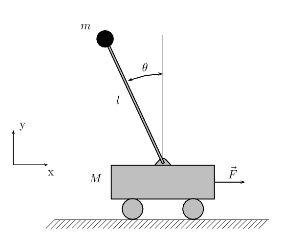
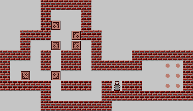
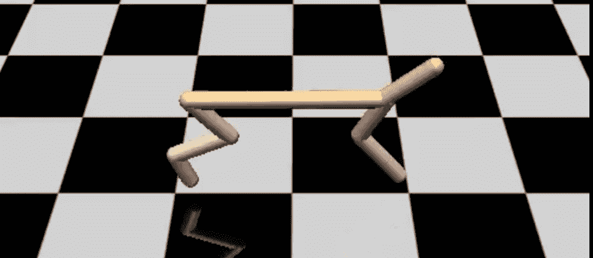

<!--yml

类别：未分类

日期：2024-09-06 19:59:53

-->

# [2008.05598] 基于模型的深度强化学习在高维问题中的应用，综述

> 来源：[`ar5iv.labs.arxiv.org/html/2008.05598`](https://ar5iv.labs.arxiv.org/html/2008.05598)

# 基于模型的深度强化学习在高维问题中的应用，综述

Aske Plaat, Walter Kosters, Mike Preuss

莱顿高级计算机科学研究所

###### 摘要

深度强化学习在过去几年中取得了显著成功。复杂的序列决策问题已在游戏和机器人等任务中得到解决。不幸的是，大多数深度强化学习方法的样本复杂度较高，这限制了它们在一些重要应用中的使用。基于模型的强化学习通过创建环境动态的显式模型来减少对环境样本的需求。

当前的深度学习方法使用高容量网络来解决高维问题。不幸的是，高容量模型通常需要大量样本，这抵消了基于模型的方法在样本复杂度较低时的潜在优势。因此，对于深度基于模型的方法，挑战在于实现高预测能力同时保持低样本复杂度。

最近几年，许多基于模型的方法被提出以应对这一挑战。在本文中，我们综述了当代基于模型的领域。首先，我们讨论定义及其与其他领域的关系。我们提出了一种基于三种方法的分类法：对给定转移进行显式规划、对学习到的转移进行显式规划，以及对规划和转移进行端到端学习。我们利用这些方法组织了对重要近期进展（如潜在模型）的全面概述。我们描述了方法和基准，并为每种方法建议了未来的研究方向。值得关注的研究方向包括课程学习、不确定性建模和利用潜在模型进行迁移学习。

###### 索引词：

基于模型的强化学习、潜在模型、深度学习、机器学习、规划。

## 1 介绍

深度强化学习在过去几年中取得了显著的成功。在游戏和机器人应用中，这一范式展现了它的强大，例如从零开始学习围棋或操控一架特技模型直升机（Mnih et al., 2015; Silver et al., 2016; Abbeel et al., 2007）。强化学习使用一个环境从中采样训练数据；与监督学习不同，它不需要一个大型的预标记训练数据数据库。这为机器学习开启了许多应用领域，而这些领域没有这样的数据库。然而，不幸的是，对于大多数有趣的应用，需要从环境中获得许多样本，而且学习的计算成本是巨大的，这在深度学习中是一个常见的问题（LeCun et al., 2015）。实现更快的学习是当前许多研究的主要目标。许多有前景的方法正在尝试，其中包括元学习（Hospedales et al., 2020; Huisman et al., 2020）、迁移学习（Pan et al., 2010）、课程学习（Narvekar et al., 2020）和零样本学习（Xian et al., 2017）。当前论文重点关注深度强化学习中的基于模型的方法。

基于模型的方法可以减少样本复杂度。与随意从环境中采样的无模型方法不同，基于模型的方法在采样的同时建立环境的动态模型。通过使用这个动态模型进行策略更新，可以大幅减少必要的样本数量（Sutton, 1991）。尤其在机器人技术中，样本效率很重要（在游戏环境中，样本通常可以更便宜地生成）。

基于模型的方法的成功关键在于动态模型预测的质量，而深度学习的普及在这方面提出了挑战（Talvitie, 2015）。建模高维问题的动态通常需要高容量的网络，不幸的是，这些网络需要大量样本进行训练，以实现高泛化能力，同时防止过拟合，这可能会破坏基于模型方法的样本效率。因此，本调查中方法的问题陈述是如何训练一个具有高预测能力和低样本复杂度的高容量动态模型。

除了比模型自由方法更有前景的样本效率外，对深度学习的模型驱动方法感兴趣还有另一个原因。强化学习中的许多问题是序列决策问题，学习转移函数是捕捉长且复杂决策序列核心的自然方式。这在游戏 AI 中被称为前向模型（Risi and Preuss，2020; Torrado et al., 2018）。当存在一个好的领域转移函数时，可以高效地解决新的、未见过的问题。因此，模型驱动的强化学习可能有助于高效的迁移学习。

本调查的贡献在于深入概述了模型驱动深度强化学习的最新方法。我们描述了使用（1）在给定转移上进行显式规划，（2）在学习到的转移模型上进行显式规划，以及（3）对规划和转移进行端到端学习的方法。每种方法的未来方向都列出了（具体为：潜在模型、不确定性建模、课程学习和多智能体基准）。

最近发表了许多研究论文，模型驱动的深度强化学习领域正在迅速发展。本调查中的论文基于其时效性和对该领域的影响进行筛选，涵盖了不同的应用，突出了论文之间的关系。由于我们的重点是近期的工作，一些参考文献是来自 arXiv 的预印本（由有声望的团队提供）。强化学习的优秀工作（Sutton and Barto，2018），深度学习（Goodfellow et al., 2016），机器学习（Bishop，2006），以及人工智能（Russell and Norvig，2016）提供了必要的背景信息。正如我们所提到的，本次调查的主要目的是聚焦于深度学习方法和高容量模型。之前的调查提供了经典（非深度）模型驱动方法的概述（Deisenroth et al., 2013b; Kober et al., 2013; Kaelbling et al., 1996）。其他相关的模型驱动强化学习调查有（Justesen et al., 2019; Polydoros and Nalpantidis，2017; Hui，2018; Wang et al., 2019b; Çalışır and Pehlivanoğlu，2019; Moerland et al., 2020b）。

本调查的其余部分结构如下。第二部分提供了必要的背景知识和强化学习的基本形式。第三部分回顾了基于模型的深度强化学习领域的最新论文。第四部分介绍了该领域的主要基准。第五部分讨论了不同的方法，并提出了开放问题和未来的研究方向。第六部分总结了本次调查。

<svg   height="128.7" overflow="visible" version="1.1" width="241.65"><g transform="translate(0,128.7) matrix(1 0 0 -1 0 0) translate(122.32,0) translate(0,15.14)" fill="#000000" stroke="#000000" stroke-width="0.4pt"><g transform="matrix(1.0 0.0 0.0 1.0 -39.13 14.96)" fill="#000000" stroke="#000000"><foreignobject width="78.26" height="9.46" transform="matrix(1 0 0 -1 0 16.6)" overflow="visible">环境</foreignobject></g><g transform="matrix(1.0 0.0 0.0 1.0 -18.06 75.36)" fill="#000000" stroke="#000000"><foreignobject width="36.13" height="12.15" transform="matrix(1 0 0 -1 0 16.6)" overflow="visible">代理</foreignobject></g><g transform="matrix(1.0 0.0 0.0 1.0 -76.88 45.16)" fill="#000000" stroke="#000000"><foreignobject width="8.76" height="8.11" transform="matrix(1 0 0 -1 0 16.6)" overflow="visible">$r^{\prime}$</foreignobject></g><g transform="matrix(1.0 0.0 0.0 1.0 -117.71 45.16)" fill="#000000" stroke="#000000"><foreignobject width="8.62" height="8.11" transform="matrix(1 0 0 -1 0 16.6)" overflow="visible">$s^{\prime}$</foreignobject></g><g transform="matrix(1.0 0.0 0.0 1.0 107.4 46.23)" fill="#000000" stroke="#000000"><foreignobject width="7.31" height="5.96" transform="matrix(1 0 0 -1 0 16.6)" overflow="visible">$a$</foreignobject></g></g></svg>

图 1：强化学习：代理在环境中行动，环境为代理提供新的状态和奖励

## 2 背景

强化学习不像监督学习那样假设存在一个数据库。相反，它从内部模型或可以被学习代理查询的外部环境中推导出真实情况，见图 1。环境为代理在某个状态$s$尝试的每个动作$a$提供一个新的状态$s^{\prime}$及其奖励$r^{\prime}$（标签）（Sutton and Barto, 2018）。通过这种方式，可以根据需要生成任意多的动作-奖励对，而无需大型手工标注的数据库。此外，我们还可以学习到超出监督者为我们准备的知识的行为。

正如人工智能的许多领域一样，强化学习从人类和动物学习的原则中汲取灵感（Hamrick, 2019; Kahneman, 2011）。在心理学中，学习被研究为行为适应，作为奖励和惩罚的结果。人工智能领域的出版物有时明确引用了这两个领域中学习描述的类比（Anthony et al., 2017; Duan et al., 2016; Weng, 2018）。

监督学习通常研究回归和分类问题。在强化学习中，大多数问题是决策和控制问题。通常问题是序列决策问题，在这种问题中，经过一系列决策后实现目标（行为）。在序列决策中，世界的动态被考虑在内。序列决策是一种逐步的方法，其中早期的决策会影响后续的决策。在继续之前，让我们对强化学习中的关键概念进行形式化。

### 2.1 强化学习的形式化

强化学习问题通常被正式建模为马尔可夫决策过程（MDP）。首先，我们介绍基本概念：状态、动作、转移和奖励。然后我们介绍策略和值。最后，我们定义基于模型和无模型的解决方法。

<svg height="109.3" overflow="visible" version="1.1" width="149.1"><g transform="translate(0,109.3) matrix(1 0 0 -1 0 0) translate(65.49,0) translate(0,87.41)"><g stroke-width="0.8pt" fill="#000000" stroke="#000000" transform="matrix(1.0 0.0 0.0 1.0 -5.91 0)" color="#000000"><foreignobject width="11.81" height="0" transform="matrix(1 0 0 -1 0 16.6)" overflow="visible"><g stroke="#000000" fill="#000000" stroke-width="0.4pt"><g transform="matrix(1.0 0.0 0.0 1.0 -3.24 11.32)" fill="#000000" stroke="#000000"><foreignobject width="6.49" height="5.96" transform="matrix(1 0 0 -1 0 16.6)" overflow="visible">$s$</foreignobject></g><g stroke="#000000" fill="#000000" color="#FFFFFF"><path d="M -43.32 -39.37 C -43.32 -37.2 -45.08 -35.45 -47.24 -35.45 C -49.41 -35.45 -51.17 -37.2 -51.17 -39.37 C -51.17 -41.54 -49.41 -43.29 -47.24 -43.29 C -45.08 -43.29 -43.32 -41.54 -43.32 -39.37 Z M -47.24 -39.37"></path></g><path d="M -4.94 -4.12 L -42.96 -35.8" style="fill:none"><g transform="matrix(-0.76822 -0.64018 0.64018 -0.76822 -42.96 -35.8)" stroke-dasharray="none" stroke-dashoffset="0.0pt" stroke-linejoin="round"><path d="M 1.11 0 C -0.28 0.28 -1.66 0.83 -3.32 1.8 C -1.66 0.55 -1.66 -0.55 -3.32 -1.8 C -1.66 -0.83 -0.28 -0.28 1.11 0 Z"></path></g><g fill="#000000" stroke="#000000" stroke-width="0.8pt" color="#000000"><path d="M -53.17 -78.74 C -53.17 -75.49 -55.81 -72.86 -59.06 -72.86 C -62.3 -72.86 -64.94 -75.49 -64.94 -78.74 C -64.94 -81.99 -62.3 -84.62 -59.06 -84.62 C -55.81 -84.62 -53.17 -81.99 -53.17 -78.74 Z M -59.06 -78.74" style="fill:none"></path></g><path d="M -48.45 -43.39 L -56.81 -71.25" style="fill:none"><g transform="matrix(-0.28735 -0.95782 0.95782 -0.28735 -56.81 -71.25)" stroke-dasharray="none" stroke-dashoffset="0.0pt" stroke-linejoin="round"><path d="M 1.11 0 C -0.28 0.28 -1.66 0.83 -3.32 1.8 C -1.66 0.55 -1.66 -0.55 -3.32 -1.8 C -1.66 -0.83 -0.28 -0.28 1.11 0 Z"></path></g><g fill="#000000" stroke="#000000" stroke-width="0.8pt" color="#000000"><path d="M -29.55 -78.74 C -29.55 -75.49 -32.18 -72.86 -35.43 -72.86 C -38.68 -72.86 -41.32 -75.49 -41.32 -78.74 C -41.32 -81.99 -38.68 -84.62 -35.43 -84.62 C -32.18 -84.62 -29.55 -81.99 -29.55 -78.74 Z M -35.43 -78.74" style="fill:none"></path></g><path d="M -46.04 -43.39 L -37.68 -71.25" style="fill:none"><g transform="matrix(0.28735 -0.95782 0.95782 0.28735 -37.68 -71.25)" stroke-dasharray="none" stroke-dashoffset="0.0pt" stroke-linejoin="round"><path d="M 1.11 0 C -0.28 0.28 -1.66 0.83 -3.32 1.8 C -1.66 0.55 -1.66 -0.55 -3.32 -1.8 C -1.66 -0.83 -0.28 -0.28 1.11 0 Z"></path></g><g stroke="#000000" fill="#000000" color="#FFFFFF"><path d="M 3.92 -39.37 C 3.92 -37.2 2.17 -35.45 0 -35.45 C -2.17 -35.45 -3.92 -37.2 -3.92 -39.37 C -3.92 -41.54 -2.17 -43.29 0 -43.29 C 2.17 -43.29 3.92 -41.54 3.92 -39.37 Z M 0 -39.37"></path></g><path d="M 0 -6.44 L 0 -33.79" style="fill:none"><g transform="matrix(0.0 -1.0 1.0 0.0 0 -33.79)" stroke-dasharray="none" stroke-dashoffset="0.0pt" stroke-linejoin="round"><path d="M 1.11 0 C -0.28 0.28 -1.66 0.83 -3.32 1.8 C -1.66 0.55 -1.66 -0.55 -3.32 -1.8 C -1.66 -0.83 -0.28 -0.28 1.11 0 Z"></path></g><g fill="#000000" stroke="#000000" stroke-width="0.8pt" color="#000000"><path d="M -5.93 -78.74 C -5.93 -75.49 -8.56 -72.86 -11.81 -72.86 C -15.06 -72.86 -17.69 -75.49 -17.69 -78.74 C -17.69 -81.99 -15.06 -84.62 -11.81 -84.62 C -8.56 -84.62 -5.93 -81.99 -5.93 -78.74 Z M -11.81 -78.74" style="fill:none"></path></g><path d="M -1.21 -43.39 L -9.56 -71.25" style="fill:none"><g transform="matrix(-0.28735 -0.95782 0.95782 -0.28735 -9.56 -71.25)" stroke-dasharray="none" stroke-dashoffset="0.0pt" stroke-linejoin="round"><path d="M 1.11 0 C -0.28 0.28 -1.66 0.83 -3.32 1.8 C -1.66 0.55 -1.66 -0.55 -3.32 -1.8 C -1.66 -0.83 -0.28 -0.28 1.11 0 Z"></path></g><g fill="#000000" stroke="#000000" stroke-width="0.8pt" color="#000000"><path d="M 17.69 -78.74 C 17.69 -75.49 15.06 -72.86 11.81 -72.86 C 8.56 -72.86 5.93 -75.49 5.93 -78.74 C 5.93 -81.99 8.56 -84.62 11.81 -84.62 C 15.06 -84.62 17.69 -81.99 17.69 -78.74 Z M 11.81 -78.74" style="fill:none"></path></g><path d="M 1.21 -43.39 L 9.56 -71.25" style="fill:none"><g transform="matrix(0.28735 -0.95782

图 2：备份图（Sutton 和 Barto，2018）。通过遵循转移函数以找到下一个状态$s^{\prime}$来最大化状态$s$的奖励。请注意，策略$\pi(s,a)$讲述了这个故事的一半，从$s\rightarrow a$；转移函数$T_{a}(s,s^{\prime})$完成了这个故事，从$s\rightarrow s^{\prime}$（通过$a$）。

马尔可夫决策过程是一个 4 元组$(S,A,T_{a},R_{a})$，其中$S$是一个有限的状态集合，$A$是一个有限的动作集合；$A_{s}\subseteq A$是从状态$s$出发的可用动作集合。此外，$T_{a}$是转移函数：$T_{a}(s,s^{\prime})$是动作$a$在时间$t$状态$s$下导致在时间$t+1$转移到状态$s^{\prime}$的概率。最后，$R_{a}(s,s^{\prime})$是由于动作$a$从状态$s$转移到状态$s^{\prime}$后获得的即时奖励。MDP 的目标是找到在所有状态$s\in S$中的最佳决策或动作。

强化学习的目标是找到最优策略$a=\pi^{\star}(s)$，这是一个在所有状态$s\in S$中给出最佳动作$a$的函数。策略包含了对顺序决策问题的答案：逐步说明在每个状态下应采取哪个动作，以最大化任何给定状态的奖励。这个策略可以直接找到——无模型——或者借助转移模型——基于模型。图 2 展示了转移的示意图。更正式地说，MDP 的目标是找到策略$\pi(s)$，该策略在状态$s$下选择一个动作以最大化奖励。这个值$V$是未来奖励的期望总和$V^{\pi}(s)=E(\sum_{t=0}^{\infty}\gamma^{t}R_{\pi(s_{t})}(s_{t},s_{t+1}))$，其中参数$\gamma$用于折扣，时间周期为$t$，且$s=s_{0}$。函数$V^{\pi}(s)$称为状态的价值函数。在深度学习中，策略$\pi$由神经网络的参数$\theta$（或权重）决定，参数化的策略表示为$\pi_{\theta}$。

有些算法可以直接计算策略 $\pi$，而有些算法则先计算该函数 $V^{\pi}(s)$。对于随机问题，通常直接策略方法效果最佳，而对于确定性问题，则最常使用价值方法 (Kaelbling 等，1996)。 (第三种相当流行的方法结合了价值和策略方法的优点：actor-critic (Sutton 和 Barto，2018；Konda 和 Tsitsiklis，2000；Mnih 等，2016)。) 在经典的基于表格的强化学习中，策略和价值之间存在紧密关系，因为一个状态的最佳动作同时导致最佳策略和最佳价值，找到另一者通常可以通过简单的查找来完成。当使用神经网络等方法来近似价值和策略函数时，这种关系会变弱，因此为深度强化学习设计了许多先进的策略和价值算法。

价值函数算法计算状态-动作值 $Q^{\pi}(s,a)$。这个 $Q$-函数给出了在状态 $s$ 下采取动作 $a$，然后按照策略 $\pi$ 的折扣奖励期望和。值 $V(s)$ 是该状态下 $Q(s,a)$-值的最大值。最优价值函数记作 $V^{\star}(s)$。可以通过递归选择每个状态下的 argmax 动作 $Q(s,a)=V^{\star}(s)$ 来找到最优策略。

为了通过规划找到策略，必须知道 $T$ 和 $R$ 的模型。当它们未知时，假设环境存在，供代理查询以获取必要的强化信息，见图 1，参考 Sutton 和 Barto (2018)。这些样本可以用于建立 $T$ 和 $R$ 的模型（基于模型的强化学习），或者可以在不先建立模型的情况下找到策略（直接或无模型强化学习）。在采样时，环境处于已知状态 $s$，代理选择一个动作 $a$ 传递给环境，环境则响应一个新状态 $s^{\prime}$ 和相应的奖励值 $r^{\prime}=R_{a}(s,s^{\prime})$。

文献提供了许多解决算法。我们现在非常简要地讨论经典规划和无模型方法，然后在下一节中深入探讨基于模型的算法。

### 2.2 规划

规划算法使用过渡模型来寻找**最优策略**，通过在状态中选择动作、展望未来以及备份奖励值，见图 2 和图 3。

<svg height="83.23" overflow="visible" version="1.1" width="297.79"><g transform="translate(0,83.23) matrix(1 0 0 -1 0 0) translate(156.58,0) translate(0,-7.6)" fill="#000000" stroke="#000000" stroke-width="0.4pt"><g transform="matrix(1.0 0.0 0.0 1.0 -52.14 14.88)" fill="#000000" stroke="#000000"><foreignobject width="104.28" height="9.61" transform="matrix(1 0 0 -1 0 16.6)" overflow="visible">过渡模型</foreignobject></g><g transform="matrix(1.0 0.0 0.0 1.0 -38.92 75.28)" fill="#000000" stroke="#000000"><foreignobject width="78.99" height="13.84" transform="matrix(1 0 0 -1 0 16.6)" overflow="visible">策略/价值</foreignobject></g><g transform="matrix(1.0 0.0 0.0 1.0 -151.97 45.75)" fill="#000000" stroke="#000000"><foreignobject width="52.27" height="12.3" transform="matrix(1 0 0 -1 0 16.6)" overflow="visible">规划</foreignobject></g><g transform="matrix(1.0 0.0 0.0 1.0 99.69 45.94)" fill="#000000" stroke="#000000"><foreignobject width="36.9" height="11.93" transform="matrix(1 0 0 -1 0 16.6)" overflow="visible">行动</foreignobject></g></g></svg>

图 3：规划

算法 1 价值迭代

初始化 $V(s)$ 为任意值重复     对所有 $s$ 执行         对所有 $a$ 执行              $Q[s,a]=\sum_{s^{\prime}}T_{a}(s,s^{\prime})(R_{a}(s,s^{\prime})+\gamma V(s^{\prime}))$         结束 对         $V[s]=\max_{a}(Q[s,a])$     结束 直到 $V$ 收敛返回 $V$

在规划算法中，代理有权访问明确的过渡和奖励模型。在确定性情况下，过渡模型提供每个可能动作在状态中的下一个状态，它是一个函数 $s^{\prime}=T_{a}(s)$。在随机情况下，它提供概率分布 $T_{a}(s,s^{\prime})$。奖励模型提供从状态 $s$ 转移到状态 $s^{\prime}$ 后采取动作 $a$ 的即时奖励。图 2 提供了过渡和奖励函数的备份图。过渡函数在图中从状态 $s$ 向 $s^{\prime}$ 移动，奖励值在图中向上移动，从子状态向父状态备份。过渡函数遵循策略 $\pi$ 和动作 $a$，然后状态 $s^{\prime}$ 以概率 $p$ 被选择，产生奖励 $r^{\prime}$。策略函数 $\pi(s,a)$ 关注图的顶层，从 $s$ 到 $a$。过渡函数 $T_{a}(s,s^{\prime})$ 涵盖了两个层次，从 $s$ 到 $s^{\prime}$。在一些领域，例如国际象棋，每个动作 $a$ 都有一个确定性的状态 $s^{\prime}$。在这里，每一步都导致一个唯一的棋盘位置，从而简化了备份图。

过渡和奖励函数隐式定义了一个状态空间，可以在其中搜索最优策略 $\pi^{\star}$ 和价值 $V^{\star}$。

规划的最基本形式是贝尔曼的动态规划（Bellman, 1957, 2013），这是一种状态和动作空间的递归遍历。值迭代是一个著名且非常基本的动态规划方法。值迭代的伪代码见于算法 1（Alpaydin, 2020）。它遍历所有状态中的所有动作，计算整个状态空间的值。

许多规划算法被设计用于高效生成和遍历状态空间，例如（深度限制）A*、alpha-beta 和蒙特卡罗树搜索（MCTS）（Hart et al., 1968; Pearl, 1984; Korf, 1985; Plaat et al., 1996; Browne et al., 2012; Moerland et al., 2018, 2020c）。

规划算法起源于精确的基于表格的算法（Sutton and Barto, 2018），这些算法符合符号 AI 传统。在规划中，了解需要遍历多少状态空间才能找到最优策略是很重要的。当状态空间过大而无法完全搜索时，可以使用深度函数逼近算法来近似最优策略和值（Sutton and Barto, 2018; Plaat, 2020）。

规划在样本效率方面是有效的，即当智能体拥有模型时，可以在无需与环境交互的情况下找到策略。采样可能成本高昂，样本效率是强化学习中的一个重要概念。

在环境中采取的采样动作是不可逆的，因为环境的状态变化不能被智能体撤销。相比之下，在过渡模型中采取的规划动作是可逆的（Moerland et al., 2020a）。规划智能体可以回溯，而采样智能体则不能。采样容易找到局部最优。为了找到全局最优，能够从局部最优中回溯的能力是有用的，这也是基于模型的规划方法的一个优势。

然而，请注意，有两种方法可以找到动态模型。在一些问题中，过渡和奖励模型由问题提供，例如在棋类游戏中，移动规则是已知的，如围棋和国际象棋。在这里，动态模型完全符合问题，许多步骤可以准确规划到未来，表现优于无模型采样。在其他问题中，动态模型必须通过对环境进行采样来学习。在这种情况下，模型将不是完美的，可能包含错误和偏差。只有当智能体具有足够质量的 $T$ 和 $R$ 模型时，远期规划才会有效。使用学习到的模型，基于模型的规划可能更难达到无模型采样的性能。

<svg height="83.23" overflow="visible" version="1.1" width="278.55"><g transform="translate(0,83.23) matrix(1 0 0 -1 0 0) translate(145.06,0) translate(0,-7.6)" fill="#000000" stroke="#000000" stroke-width="0.4pt"><g transform="matrix(1.0 0.0 0.0 1.0 -39.13 14.96)" fill="#000000" stroke="#000000"><foreignobject width="78.26" height="9.46" transform="matrix(1 0 0 -1 0 16.6)" overflow="visible">环境</foreignobject></g><g transform="matrix(1.0 0.0 0.0 1.0 -38.92 75.28)" fill="#000000" stroke="#000000"><foreignobject width="78.99" height="13.84" transform="matrix(1 0 0 -1 0 16.6)" overflow="visible">策略/价值</foreignobject></g><g transform="matrix(1.0 0.0 0.0 1.0 -140.45 45.75)" fill="#000000" stroke="#000000"><foreignobject width="48.47" height="12.3" transform="matrix(1 0 0 -1 0 16.6)" overflow="visible">学习</foreignobject></g><g transform="matrix(1.0 0.0 0.0 1.0 91.98 45.94)" fill="#000000" stroke="#000000"><foreignobject width="36.9" height="11.93" transform="matrix(1 0 0 -1 0 16.6)" overflow="visible">行动</foreignobject></g></g></svg>

图 4: 无模型学习

### 2.3 无模型

当过渡或奖励模型对代理不可用时，策略和价值函数必须通过查询环境来学习。通过采样环境来学习策略或价值函数，被称为无模型学习，参见图 4。

回想一下，策略是状态到最佳动作的映射。每当环境返回新的奖励时，策略可以得到改进：状态的最佳动作会更新以反映新信息。算法 2 展示了无模型强化学习的简单高层步骤（后面的算法会变得更加复杂）。

算法 2 无模型学习

重复采样环境 $E$ 以生成数据 $D=(s,a,r^{\prime},s^{\prime})$ 使用 $D$ 更新策略 $\pi(s,a)$ 直到 $\pi$ 收敛

无模型强化学习是最基本的强化学习形式。它已成功应用于一系列具有挑战性的问题 (Deisenroth et al., 2013b; Kober et al., 2013)。在无模型强化学习中，策略通过与环境的互动（样本）从零开始学习。

无模型学习的主要目标是实现良好的泛化：在训练过程中未见过的测试问题上取得高准确度。次要目标是以良好的样本效率完成此任务：尽可能少地需要环境样本以获得良好的泛化。

无模型学习基本上是盲目的，并且学习策略和价值需要许多样本。一个著名的无模型强化学习算法是 Q 学习（Watkins，1989）。像 Q-learning 这样的算法可以在传统的基于表的设置中使用。深度神经网络在无模型学习中也取得了成功，在可以便宜快速生成样本的领域中，比如在 Atari 视频游戏中（Mnih 等，2015）。深度无模型算法如深度 Q 网络（DQN）（Mnih 等，2013）和 Proximal Policy Optimization（PPO）（Schulman 等，2017）已经变得非常流行。PPO 是一种直接计算策略的算法，DQN 先找到值函数（第 2.1 节）。

尽管有风险，盲目飞行的优势在于没有偏见。无模型的强化学习可以在没有被有偏模型影响的情况下找到全局最优解（它没有模型）。而基于模型的强化学习中学习的模型可能会引入偏见，基于模型的方法可能无法像无模型的方法那样总是找到那么好的结果（尽管它可以在更少的样本中找到有偏的结果）。

让我们来看看我们方法的成本。与环境的交互可能是昂贵的。特别是当环境涉及真实世界，比如真实的机器人交互时，样本采集应该被最小化，出于成本和防止机械手磨损的原因。另一方面，在虚拟环境中，无模型的方法已经取得了相当大的成功，正如我们在 Atari 和其他游戏中注意到的那样（Mnih 等，2015）。

关于无模型强化学习的一个很好的概览可以在（Çalışır 和 Pehlivanoğlu，2019; Sutton 和 Barto，2018; Kaelbling 等，1996）中找到。

### 2.4 基于模型

现在是时候看看基于模型的强化学习了，这是一种以不同方式学习策略和价值的方法，而不是直接通过对环境进行采样。回想一下，当代理在状态 s 中选择动作 a 时，环境对返回的$(s^{\prime},r^{\prime})$对进行抽样。因此，所有信息都存在于学习转移模型$T_{a}(s,s^{\prime})$和奖励模型$R_{a}(s,s^{\prime})$的过程中，例如通过监督学习。当问题没有给出转移模型时，那么模型可以通过对环境进行采样来学习，并且可以用于计划，根据需要随时更新策略和价值。这种找到策略和价值的替代方法称为基于模型的学习。

如果模型已知，则不需要环境样本，基于模型的方法更为样本高效。但如果模型未知，为什么要走这条复杂的模型与规划路线，如果样本可以直接教我们最优策略和值？原因是复杂的路线可能更为样本高效。

当学习转移/奖励模型的复杂性小于直接学习策略模型的复杂性，并且规划速度较快时，基于模型的方法可能更高效。在无模型学习中，一个样本只被用来优化策略，然后被丢弃；而在基于模型的学习中，样本用于学习转移模型，之后可以在规划中多次使用以优化策略。样本的利用更加高效。

深度学习的最近成功引起了对深度无模型学习的极大兴趣和进展。许多在监督学习中取得成功的深度函数逼近方法 （Goodfellow et al., 2016; LeCun et al., 2015）也可以用于无模型强化学习中，以逼近策略和值函数。

然而，对基于模型的方法也有兴趣的理由。许多现实世界的问题都是长时间且复杂的序列决策问题，我们现在看到许多努力在基于模型的方法上取得进展。此外，对终身学习的兴趣激发了对基于模型学习的兴趣 （Silver et al., 2013）。基于模型的强化学习接近于人类和动物的学习，因为所有的新知识都在现有知识的背景下进行解释。动态模型用于处理和解释新样本，而与无模型学习形成对比的是，无论旧样本还是新样本，都被同等对待，并且没有使用到迄今为止在模型中积累的知识。

在这些介绍性的话语之后，我们现在准备深入探讨近期具体的深度基于模型的强化学习方法。

## 3 基于模型的深度强化学习调查

基于模型的强化学习的成功依赖于动态模型的质量。该模型通常被规划算法用于多个序列预测，而预测中的错误会迅速累积。我们将这些方法分为三种主要的途径。首先是给定转移并通过显式规划使用，其次是学习转移并通过显式规划使用，第三是转移和规划都通过端到端学习。

1.  1.

    **明确的规划在给定的转移** 首先，我们讨论那些提供清晰转移规则的问题的方法。在这种情况下，转移模型是完美的，经典的、明确的规划方法被用来优化大状态空间的价值函数和策略函数。最近，使用自学习方法解决了两代理游戏中的大规模复杂问题，这些方法催生了课程学习。课程学习也被应用于单代理问题中。

1.  2.

    **基于学习的明确规划** 其次，我们讨论那些没有清晰规则的问题的方法，并且转移模型必须通过对环境进行采样来学习。（转移再次与传统规划方法一起使用。）环境样本允许通过高容量模型的反向传播进行学习。重要的是模型尽可能少的错误。不确定性建模和有限的前瞻可以减少预测错误的影响。

1.  3.

    **端到端学习规划和转移** 第三，我们讨论转移模型和规划算法都通过样本端到端地学习的情况。可以使用神经网络来执行某些规划者的实际步骤，除了从样本中学习转移外。基于模型的算法完全端到端学习。这种方法的一个缺点是网络架构与问题类型之间的紧密关联，限制了它的适用性。这个缺点可以通过使用潜在模型来解决，见下文。

除了这三种主要方法之外，我们现在讨论两种正交的方法。这些方法可以用来提高三种主要方法的性能。它们是来自 Sutton 的 Dyna （Sutton, 1991）的混合想象思路，以及抽象的或潜在的模型。

+   •

    **混合模型自由/基于模型的想象** 我们首先提到一个子方法，其中环境样本不仅用于训练转移模型，还直接用于训练策略函数，就像在模型自由学习中一样。因此，这种混合方法结合了基于模型和模型自由的学习。它也被称为*想象*，因为通过动态模型进行的前瞻性分析类似于在真实环境之外模拟或想象环境样本。在这种方法中，想象的或计划的“样本”增强了真实（环境）样本。这种增强降低了模型自由方法的样本复杂性。

+   •

    **潜在模型** 接下来，我们讨论一个子方法，其中学习到的动态模型被拆分成几个较低容量的、专门的潜在模型。这些潜在模型随后与规划或想象结合使用以找到策略。潜在模型可以与端到端模型训练一起使用，也可以独立使用，与想象结合使用，也可以不结合使用。因此，潜在模型在前述方法的基础上进行改进。

| 方法 | 名称 | 学习 | 规划 | 混合 | 潜在 | 应用 |
| --- | --- | --- | --- | --- | --- | --- |
|  |  |  |  | 想象 | 模型 |  |
| 显式规划 | TD-Gammon (Tesauro，1995a) | 完全连接的网络 | Alpha-beta | - | - | 黑白棋 |
| 给定过渡 | 专家迭代 (Anthony 等人，2017) | 策略/价值 CNN | MCTS | - | - | 六角游戏 |
| (第 3.1) | Alpha(Go) Zero (Silver 等人，2017a) | 策略/价值 ResNet | MCTS | - | - | 围棋/国际象棋/将棋 |
|  | 单智能体 (Feng 等人，2020) | Resnet | MCTS | - | - | 货仓守卫 |
| 显式规划 | PILCO (Deisenroth 和 Rasmusen，2011) | 高斯过程 | 基于梯度 | - | - | 摆锤 |
| 学习过渡 | iLQG (Tassa 等人，2012) | 二次非线性 | MPC | - | - | 人形 |
| (第 3.2) | GPS (Levine 和 Abbeel，2014) | iLQG | 轨迹 | - | - | 游泳者 |
|  | SVG (Heess 等人，2015) | 价值梯度 | 轨迹 | - | - | 游泳者 |
|  | PETS (Chua 等人，2018) | 不确定性集成 | MPC | - | - | 猎豹 |
|  | 视觉预测 (Finn 和 Levine，2017) | 视频预测 | MPC | - | - | 操纵 |
|  | 本地模型 (Gu 等人，2016) | 二次非线性 | 短 rollouts | + | - | 猎豹 |
|  | MVE (Feinberg 等人，2018) | 样本 | 短 rollouts | + | - | 猎豹 |
|  | 元策略 (Clavera 等人，2018) | 元集成 | 短 rollouts | + | - | 猎豹 |
|  | GATS (Azizzadenesheli 等人，2018) | Pix2pix | MCTS | + | - | 猎豹 |
|  | 策略优化 (Janner 等人，2019) | 集成 | 短 rollouts | + | - | 猎豹 |
|  | 视频预测 (Oh 等人，2015) | CNN/LSTM | 行动 | + | + | Atari |
|  | VPN (Oh 等人，2017) | CNN 编码器 | $d$-step | + | + | Atari |
|  | SimPLe (Kaiser 等人，2019) | VAE, LSTM | MPC | + | + | Atari |
|  | PlaNet (Hafner 等人，2018) | RSSM (VAE/RNN) | CEM | - | + | 猎豹 |
|  | Dreamer (Hafner 等人，2019) | RSSM+CNN | 想象 | - | + | 跳跃者 |
|  | Plan2Explore (Sekar 等人，2020) | RSSM | 计划 | - | + | 跳跃者 |
| 端到端学习 | VIN (Tamar 等人，2016) | CNN | 网络内 rollout | + | - | 迷宫 |
| 计划和转换 | VProp (Nardelli 等人，2018) | CNN | 分层 Rollouts | + | - | 迷宫，导航 |
| (Sect. 3.3) | TreeQN（Farquhar 等，2018） | 树形网络 | 计划函数 | + | + | 推箱子 |
|  | 计划（Guez 等，2019） | CNN+LSTM | 网络中的回放 | + | - | 推箱子 |
|  | I2A（Weber 等，2017） | CNN/LSTM 编码器 | 元控制器 | + | + | 推箱子 |
|  | Predictron（Silver 等，2017b） | $k,\gamma,\lambda$-CNN-predictr | $k$-回放 | + | + | 迷宫 |
|  | 世界模型（Ha 和 Schmidhuber，2018b） | VAE | CMA-ES | + | + | 赛车 |
|  | MuZero（Schrittwieser 等，2019） | 潜在 | MCTS | - | + | Atari/围棋 |

表 I: 深度模型基础强化学习方法概述

不同的方法可以单独使用，也可以结合使用，正如我们将很快看到的那样。表 I 提供了我们在本调查中将讨论的所有方法的概述。这些方法被分为上述引入的三个主要类别。方法使用的两个正交方法（想象和潜在模型）在表 I 的两个独立列中有所指示。最后一列提供了该方法应用的指示（例如游泳者、国际象棋和猎豹）。在下一节 Sect. 4 中，这些应用将被更深入地解释。

表中的所有方法将在本节剩余部分详细解释（为方便起见，我们将在各小节中重复每种方法）。各节将再次提到一些测试应用。请参阅基准测试部分。

基于模型的方法在低维任务中表现良好，其中转换和奖励动态相对简单（Sutton 和 Barto，2018）。尽管高效的方法如高斯过程可以快速学习这些模型——只需少量样本——但它们难以表示复杂和不连续的系统（Wang 等，2019b）。大多数当前的无模型方法使用深度神经网络来处理具有复杂、高维和不连续特征的问题，导致样本复杂度高。

本调查中的模型基础强化学习算法所面临的主要挑战如下。对于高维任务，维度的诅咒导致数据稀疏且方差高。深度方法倾向于在小数据集上过拟合，而模型无关方法使用大数据集且样本效率低。使用差模型的模型基础方法在长期规划预测方面表现较差(Talvitie, 2015)。挑战在于从有限数据中学习深层、高维的过渡函数，能够考虑模型的不确定性，并在这些模型上进行规划，以实现表现与模型无关方法相当或更好的策略和值函数。

现在我们将讨论这些算法。我们将讨论（1）在给定过渡上进行显式规划的方法，（2）在学习的过渡模型上进行显式规划的方法，以及（3）规划和过渡的端到端学习方法。我们将在第二部分的显式规划/学习的过渡中遇到混合想象和潜在模型方法的首次出现。

### 3.1 在给定过渡上进行显式规划

模型基础学习的第一种方法是当过渡和奖励模型在问题规则中明确提供时。例如，在围棋和国际象棋等游戏中就是这种情况。表 II 总结了本小节的方法。注意额外列中的强化学习方法。

使用这种方法最近在大型和复杂领域取得了高性能结果。这些结果通过结合经典的显式启发式搜索规划算法，如 Alpha-beta 和 MCTS (Knuth and Moore, 1975; Browne et al., 2012; Plaat, 2020)，以及自我对弈的深度学习，实现了从零开始的课程学习。课程学习基于这样一种观察：通过首先学习一系列简单但相关的问题——就像我们先教小学生简单的概念（如加法），再教他们难一些的概念（如乘法或对数）——可以更快地学习复杂的问题。

在自我对弈中，智能体与环境进行对抗，而这个环境实际上也是相同的智能体，使用的是相同的网络，见图 5。游戏中的状态和动作随后被深度学习系统用来改进策略和价值函数。这些函数作为 MCTS 中的选择和评估函数使用，因此改善它们可以提升 MCTS 的游戏质量。其效果是随着智能体变得越来越聪明，环境也会变得越来越聪明。结果是形成了一个互相提升的良性循环，这是一种自然的课程学习形式（Bengio et al., 2009）。进行了一系列不断改进的锦标赛，其中一个游戏可以从零知识到世界冠军级别进行学习（Silver et al., 2017a）。

<svg   height="114.3" overflow="visible" version="1.1" width="364.4"><g transform="translate(0,114.3) matrix(1 0 0 -1 0 0) translate(98.01,0) translate(0,3.78)" fill="#000000" stroke="#000000" stroke-width="0.4pt"><g transform="matrix(1.0 0.0 0.0 1.0 107.51 34.57)" fill="#000000" stroke="#000000"><foreignobject width="99.93" height="9.61" transform="matrix(1 0 0 -1 0 16.6)" overflow="visible">过渡规则</foreignobject></g><g transform="matrix(1.0 0.0 0.0 1.0 -29.98 35.99)" fill="#000000" stroke="#000000"><foreignobject width="59.96" height="12.15" transform="matrix(1 0 0 -1 0 16.6)" overflow="visible">对手</foreignobject></g><g stroke-width="0.8pt"><g transform="matrix(1.0 0.0 0.0 1.0 56.06 24.6)" fill="#000000" stroke="#000000"><foreignobject width="25.37" height="12.3" transform="matrix(1 0 0 -1 0 16.6)" overflow="visible">对弈</foreignobject></g></g><g transform="matrix(1.0 0.0 0.0 1.0 59.51 94.97)" fill="#000000" stroke="#000000"><foreignobject width="78.99" height="13.84" transform="matrix(1 0 0 -1 0 16.6)" overflow="visible">策略/价值</foreignobject></g><g transform="matrix(1.0 0.0 0.0 1.0 -90.63 76.48)" fill="#000000" stroke="#000000"><foreignobject width="48.47" height="12.3" transform="matrix(1 0 0 -1 0 16.6)" overflow="visible">学习</foreignobject></g><g stroke-width="0.8pt"><g transform="matrix(1.0 0.0 0.0 1.0 63.24 58.46)" fill="#000000" stroke="#000000"><foreignobject width="70.38" height="8.51" transform="matrix(1 0 0 -1 0 16.6)" overflow="visible">锦标赛</foreignobject></g></g><g transform="matrix(1.0 0.0 0.0 1.0 222.5 76.48)" fill="#000000" stroke="#000000"><foreignobject width="36.9" height="11.93" transform="matrix(1 0 0 -1 0 16.6)" overflow="visible">行动</foreignobject></g></g></svg>

图 5: 显式规划/给定过渡

自我博弈的概念在多个地方被发明，并且在双代理游戏 AI 中有着悠久的历史。三个著名的例子是 Samuel 的跳棋玩家 (Samuel, 1959)、Tesauro 的西洋双陆棋玩家 (Tesauro, 1995a, 2002) 和 DeepMind 的 Alpha(Go) Zero (Silver et al., 2017a, 2018)。

| 方法 | 学习 | 规划 | 强化学习 | 应用 |
| --- | --- | --- | --- | --- |
| TD-Gammon (Tesauro, 1995a) | 全连接网络 | Alpha-beta | 时间差分 | 西洋双陆棋 |
| 专家迭代 (Anthony et al., 2017) | Pol/Val CNN | MCTS | 课程 | Hex |
| Alpha(Go) Zero (Silver et al., 2017a) | Pol/Val ResNet | MCTS | 课程 | 围棋/象棋/将棋 |
| 单代理 (Feng et al., 2020) | ResNet | MCTS | 课程 | Sokoban |

表 II: 显式规划/给定转移方法概述

让我们讨论一些自我博弈的方法。

TD-Gammon (Tesauro, 1995a) 是一个西洋双陆棋程序，它使用了一个具有单个全连接隐藏层和仅 80 个隐藏单元的小型神经网络，以及一个小的（两级深度）Alpha-beta 搜索 (Knuth and Moore, 1975)。它通过时间差分学习从头开始学习如何玩西洋双陆棋。一个小型神经网络学习价值函数。TD-Gammon 是第一个达到世界冠军级别的西洋双陆棋程序，也是自 Samuel 的跳棋程序 (Samuel, 1959) 以来第一个成功使用自我学习课程方法的游戏程序。

类似于 AlphaGo 和 AlphaZero 程序的方法被称为专家迭代 (Anthony et al., 2017)。问题依旧是如何从头开始学习玩一个复杂的游戏。专家迭代 (ExIt) 结合了基于搜索的规划（专家）和深度学习（通过迭代）。专家对当前策略进行改进。ExIt 使用一个单一的多任务神经网络，用于策略和价值函数。规划者使用神经网络策略和价值估计来提高其计划的质量，从而形成一个相互改进的循环。ExIt 中的规划者是 MCTS。ExIt 使用了带回滚的版本。ExIt 在棋盘游戏 Hex (Hayward and Toft, 2019) 中应用，并与强大的 MCTS 仅程序 MoHex (Arneson et al., 2010) 进行了有利的比较。ExIt 的进一步发展是策略梯度搜索，它使用没有显式搜索树的规划 (Anthony et al., 2019)。

AlphaZero 及其前身 AlphaGo Zero 是由研究团队（Silver 等，2018，2017a）开发的自我对弈课程学习程序。这些程序旨在有效地玩复杂的棋类游戏，特别是围棋、国际象棋和将棋，这是一种类似于国际象棋但更复杂的日本游戏（Iida 等，2002）。AlphaZero 和 AlphaGo Zero 是自我对弈的基于模型的强化学习程序。它们对弈的环境与学习对弈的代理程序是相同的。转移函数和奖励函数由游戏规则定义。目标是学习最佳策略和价值函数。AlphaZero 使用一个单一的神经网络，一个 19 块残差网络，具有一个价值头和一个策略头。对于每种不同的游戏——围棋、国际象棋、将棋，它使用不同的输入和输出层，但隐藏层是相同的，其余的架构和控制学习过程的超参数也是相同的。损失函数是策略损失和价值损失的总和（Wang 等，2019a）。规划算法基于蒙特卡洛树搜索（Browne 等，2012；Coulom，2006），尽管它不执行随机回合。相反，它使用 ResNet 的价值头进行评估，使用 ResNet 的策略头来增强 UCT 选择函数（Kocsis 和 Szepesvári，2006），如 P-UCT（Rosin，2011）。

<svg   height="108.74" overflow="visible" version="1.1" width="213.66"><g transform="translate(0,108.74) matrix(1 0 0 -1 0 0) translate(47.98,0) translate(0,3.51)" fill="#000000" stroke="#000000" stroke-width="0.4pt"><g transform="matrix(0.9 0.0 0.0 0.9 -16.83 74.42)" fill="#000000" stroke="#000000"><foreignobject width="37.4" height="9.61" transform="matrix(1 0 0 -1 0 16.6)" overflow="visible">搜索</foreignobject></g><g transform="matrix(0.9 0.0 0.0 0.9 107.56 74.42)" fill="#000000" stroke="#000000"><foreignobject width="24.21" height="9.61" transform="matrix(1 0 0 -1 0 16.6)" overflow="visible">评估</foreignobject></g><g transform="matrix(0.9 0.0 0.0 0.9 45.89 15.53)" fill="#000000" stroke="#000000"><foreignobject width="29.25" height="9.24" transform="matrix(1 0 0 -1 0 16.6)" overflow="visible">训练</foreignobject></g><g stroke-width="0.6pt"><g transform="matrix(1.0 0.0 0.0 1.0 -43.37 32.18)" fill="#000000" stroke="#000000"><foreignobject width="49.54" height="11.07" transform="matrix(1 0 0 -1 0 16.6)" overflow="visible">示例</foreignobject></g></g><g stroke-width="0.6pt"><g transform="matrix(1.0 0.0 0.0 1.0 111.94 31.47)" fill="#000000" stroke="#000000"><foreignobject width="42.89" height="7.66" transform="matrix(1 0 0 -1 0 16.6)" overflow="visible">新网络</foreignobject></g></g><g stroke="#000000"><g stroke-width="0.6pt"><g transform="matrix(1.0 0.0 0.0 1.0 43.67 91.96)" fill="#000000" stroke="#000000"><foreignobject width="37.08" height="8.65" transform="matrix(1 0 0 -1 0 16.6)" overflow="visible">奖励</foreignobject></g></g></g></g></svg>

图 6: 自我对弈/课程学习循环

残差网络用于 MCTS 的评估和选择。自我对弈机制从一个随机初始化的残差网络（resnet）开始。MCTS 用于进行游戏锦标赛，以生成用于训练的训练位置，这些训练位置用于对残差网络进行训练，使用 DQN 风格的回放缓冲区（Mnih 等人，2015）。训练后的残差网络随后在下一个训练锦标赛中再次由 MCTS 使用，以生成训练位置，等等，见图 6。自我对弈以多种方式自我维持，达到稳定学习是一个具有挑战性的任务，需要审慎的调优、探索和大量的训练。AlphaZero 目前是围棋、国际象棋和将棋领域全球最强的选手（Silver 等人，2018）。

双人自我对弈中课程学习的成功激发了对单智能体课程学习的研究。这些单智能体方法并不进行自我对弈，但使用了课程学习。Laterre et al. 提出了用于解决箱子打包问题的 Ranked Reward 方法（Laterre et al., 2018），Wang et al. 提出了 Morpion Solitaire 的解决方法（Wang et al., 2020）。Feng et al. 使用基于 AlphaZero 的方法来解决难度较大的 Sokoban 实例（Feng et al., 2020）。他们的模型是一个 8 块标准残差网络，以 MCTS 作为规划器。解决 Sokoban 实例是单智能体组合搜索中的一个难题。课程方法中，智能体首先学习解决简单实例，然后再尝试解决更难实例，这是一个自然的适配。在双人游戏中，课程是在自我对弈中生成的。Feng et al. 以不同的方式创建课程，通过从难实例中构造更简单的子问题，利用 Sokoban 问题的自然层次结构。与 AlphaZero 一样，该方法从头开始学习，没有提供 Sokoban 启发式信息。这个方法能够解决比以前更多的难度较大的 Sokoban 实例。

#### 结论

在自我对弈课程学习中，对手与智能体具有相同的模型。对手是智能体的环境。随着智能体的学习，它的对手也在学习，提供更强的对抗玩法，教会智能体更多。智能体经历了课程学习，即一系列逐渐困难的学习任务。通过这种方式，在双陆棋、围棋、国际象棋和将棋中实现了强大的玩法（Tesauro, 1995b; Silver et al., 2018）。

在双智能体搜索中，一个自然的想法是将智能体复制为环境，创建一个自我对弈系统。自我对弈已经被用于规划（如最小最大算法）、策略学习以及与潜在模型的结合。自生成课程学习是一个强大的范式。目前正在研究它是否也可以应用于单智能体问题（Narvekar et al., 2020; Feng et al., 2020; Doan et al., 2019; Laterre et al., 2018），以及在多智能体（实时策略）游戏中，解决双智能体游戏（第 4.4 节(Vinyals et al., 2019）中的专业化问题。

### 3.2 学习过渡的明确规划

在上一节中，过渡规则可以直接从问题中得出（通过检查）。在许多问题中情况并非如此，我们必须依靠从环境中采样以学习过渡模型。本次调查的第二类算法是通过从环境样本反向传播学习过渡模型。然后，这个学习的模型仍然被经典的显式规划算法使用。我们将讨论各种方法，其中过渡模型通过监督学习方法（如时间反向传播 (Werbos, 1988)）进行学习，见图 7。

<svg   height="93.22" overflow="visible" version="1.1" width="381.45"><g transform="translate(0,93.22) matrix(1 0 0 -1 0 0) translate(102.09,0) translate(0,2.39)" fill="#000000" stroke="#000000" stroke-width="0.4pt"><g transform="matrix(1.0 0.0 0.0 1.0 138.04 14.96)" fill="#000000" stroke="#000000"><foreignobject width="78.26" height="9.46" transform="matrix(1 0 0 -1 0 16.6)" overflow="visible">环境</foreignobject></g><g stroke-width="0.8pt" fill="#000000" stroke="#000000" transform="matrix(1.0 0.0 0.0 1.0 -32.45 14.88)"><foreignobject width="104.28" height="9.61" transform="matrix(1 0 0 -1 0 16.6)" overflow="visible">过渡模型</foreignobject></g><g transform="matrix(1.0 0.0 0.0 1.0 59.51 75.28)" fill="#000000" stroke="#000000"><foreignobject width="78.99" height="13.84" transform="matrix(1 0 0 -1 0 16.6)" overflow="visible">策略/价值</foreignobject></g><g stroke-width="0.8pt"><g transform="matrix(1.0 0.0 0.0 1.0 80.83 4.91)" fill="#000000" stroke="#000000"><foreignobject width="48.47" height="12.3" transform="matrix(1 0 0 -1 0 16.6)" overflow="visible">学习</foreignobject></g></g><g transform="matrix(1.0 0.0 0.0 1.0 183.34 45.94)" fill="#000000" stroke="#000000"><foreignobject width="36.9" height="11.93" transform="matrix(1 0 0 -1 0 16.6)" overflow="visible">执行</foreignobject></g><g transform="matrix(1.0 0.0 0.0 1.0 -34.76 45.75)" fill="#000000" stroke="#000000"><foreignobject width="52.27" height="12.3" transform="matrix(1 0 0 -1 0 16.6)" overflow="visible">规划</foreignobject></g></g></svg>

图 7：显式规划/学习的过渡

重复     从环境中采样 $E$ 以生成数据 $D=(s,a,r^{\prime},s^{\prime})$     使用 $D$ 学习 $T_{a}(s,s^{\prime})$     使用 $T$ 通过规划更新策略 $\pi(s,a)$，直到 $\pi$ 收敛

算法 3 显式规划/学习的过渡

| 方法 | 学习 | 规划 | 应用 |
| --- | --- | --- | --- |
| PILCO (Deisenroth 和 Rasmussen, 2011) | 高斯过程 | 基于梯度 | 摆 |
| iLQG (Tassa 等, 2012) | 二次非线性 | MPC | 人形机器人 |
| GPS（Levine 和 Abbeel，2014） | iLQG | 轨迹 | 游泳者 |
| SVG（Heess 等，2015） | 值梯度 | 轨迹 | 游泳者 |
| PETS（Chua 等，2018） | 不确定性集成 | MPC | 猎豹 |
| 视觉预见（Finn 和 Levine，2017） | 视频预测 | MPC | 操作 |

表 III：显式规划/学习转移方法概述

算法 3 展示了通过反向传播使用显式规划和转移学习的步骤。 表 III 总结了本小节的方法，展示了*学习*和*规划*方法。 本小节还讨论了该方法的两种变体：混合想象和潜在模型，请参见表 IV 和表 V。

我们将首先看到简单的高斯过程和二次方法如何创建预测性转移模型。接下来，使用轨迹方法提高精度，我们将进一步探索视频预测方法。最后，将介绍关注不确定性和集成方法的方法。我们知道深度神经网络需要大量数据，并且学习缓慢，或者会发生过拟合。 不确定性建模基于这样的见解：在训练早期，模型看到的数据较少，倾向于过拟合；而在后期，随着数据的增多，模型可能会欠拟合。通过将不确定性纳入动态模型，这个问题可以得到缓解，如后续方法中所述（Chua 等，2018）。

对于较小的模型，可以使用环境样本来近似转移模型，作为随机变量的高斯过程。PILCO（即概率推断学习控制）采用了这种方法，详见（Deisenroth 和 Rasmussen，2011；Deisenroth 等，2013a；Kamthe 和 Deisenroth，2017）。高斯过程可以准确地学习简单过程，并具有良好的样本效率（Bishop，2006），尽管对于高维问题，它们需要更多的样本。PILCO 将转移模型 $T_{a}(s,s^{\prime})$ 视为环境样本的概率函数。规划器基于相对于策略参数 $\theta$ 的分析梯度来改进策略。PILCO 已被用于优化小问题，如山地车和摆车摆动，对于这些问题效果很好。尽管他们使用高阶模型信息来实现模型学习，但高斯过程无法扩展到高维环境，因此这种方法仅限于较小的应用。

一种相关的方法使用带有非线性最小二乘优化的轨迹优化方法。在控制理论中，线性-二次-高斯（LQG）控制问题是最基本的最优控制问题之一。迭代 LQG（Tassa 等，2012）是高斯-牛顿法在非线性最小二乘优化中的控制类比。与 PILCO 相比，模型学习者在奖励函数上使用二次近似，在转移函数上使用线性近似。这种方法的规划部分使用一种在线轨迹优化形式，即模型预测控制（MPC），其中使用逐步实时局部优化，而不是全面问题优化（Richards，2005）。通过在 MPC 流程中包括轨迹优化算法、物理引擎和成本函数设计等多项进一步改进，Tassa 等能够在类人机器人模拟操控任务中（如抓取）实现近实时性能。

另一种轨迹优化方法受到无模型学习的启发。Levine 和 Koltun（Levine 和 Koltun，2013）介绍了引导策略搜索（GPS），其中搜索使用轨迹优化来避免糟糕的局部最优解。在 GPS 中，参数化的策略通过从轨迹分布中获取样本以监督的方式进行训练。GPS 模型优化轨迹分布以降低成本并优化当前策略，从而创建一个良好的策略训练集。引导样本通过微分动态规划生成，并通过正则化重要性采样整合到策略中。与之前的方法相比，GPS 算法可以训练具有数千个参数的复杂策略。从某种意义上说，引导策略搜索将 iLQG 控制器转变为具有信任区域的神经网络策略 $\pi_{\theta}$，其中新的控制器不会与样本偏离太多（Levine 和 Abbeel，2014；Finn 等，2016；Montgomery 和 Levine，2016）。GPS 已在平面游泳、跳跃和行走，以及模拟的 3D 人形跑步上进行了评估。

提高连续控制问题中学习的参数化转移模型准确性的另一种尝试是随机值梯度（SVG）（Heess 等，2015）。它通过沿实际环境轨迹计算值梯度来缓解学习模型的不准确性，而不是使用规划轨迹。通过重新参数化和通过随机样本的反向传播来解决预测和实际转移之间的不匹配。相比之下，PILCO 使用高斯过程模型来计算对模型不确定性感敏感的解析策略梯度，而 GPS 通过随机轨迹优化器和局部线性模型来优化策略。SVG 则专注于全局神经网络值函数近似器。SVG 的结果报告在模拟的机器人应用中，如游泳者、到达者、抓取器、单足行走、半猎豹和行走者。

其他方法也关注高维建模中的不确定性，但使用集成方法。Chua 等人提出了带有轨迹采样的概率集成（PETS）（Chua 等人，2018）。PETS 的学习转移模型具有不确定性感知深度网络，并结合了基于采样的不确定性传播。PETS 使用了概率集成的组合（Lakshminarayanan 等人，2017）。在模型预测控制环境中，动力学由一组概率神经网络模型建模（智能体仅应用最优序列中的第一个动作，并在每个时间步骤重新规划）（Nagabandi 等人，2018）。Chua 等人报告了在模拟机器人任务（如 Half-Cheetah、Pusher、Reacher）上的实验。这些任务的性能报告接近渐近模型自由基准，强调了模型基础强化学习中不确定性估计的重要性。

机器人领域的一个重要问题是通过观察哪些动作有效、哪些失败，直接从视频摄像头输入中学习手臂操作。视频输入提供了高维且困难的输入，显著增加了问题的规模和复杂性。Finn 等人和 Ebert 等人报告了从高维原始传感器像素输入中学习复杂机器人操作技能的方法，称为 Visual Foresight（Finn 和 Levine，2017；Ebert 等人，2018）。Visual Foresight 的目标是将深度学习方法推广到前所未见的任务和对象。它使用一种训练程序，其中数据根据概率分布进行采样。同时，视频预测模型与样本一起训练。该模型基于图像和动作序列生成相应的未来帧序列，如 GPS。在测试时，选择最小成本的动作序列作为模型预测控制规划框架的一部分。Visual Foresight 能够执行多物体操作、推挤、抓取和放置以及折叠布料任务。

#### 结论

使用单一网络的模型学习在低维问题上效果良好。我们已看到，高斯过程建模在样本效率和政策推广方面表现良好。对于高维问题，推广和样本效率会恶化，需要更多样本，政策效果也不如预期。我们讨论了通过真实样本（GPS）指导政策、通过模型预测控制限制预测范围以及使用集成方法和不确定性感知神经网络建模不确定性（PETS）的方法以改善这些问题。

#### 3.2.1 混合模型自由/基于模型的想象

在前面的子章节中，我们研究了如何使用环境样本来建立过渡模型。介绍了许多方法以尽可能少的样本来学习过渡模型。这些方法与监督学习方法相关。然后，过渡模型被规划方法用来优化策略或价值函数。

我们现在将回顾使用互补方法的技术，这是一种混合模型基/无模型方法，通过环境样本用于两个目的。在这里，重点不再是学习模型，而是有效地利用它。这种方法由 Sutton（Sutton, 1990, 1991）在 Dyna 系统中引入，早于深度学习的广泛应用。Dyna 直接使用样本来更新策略函数（无模型学习），同时使用样本来学习一个过渡模型，然后通过规划将模型基的“样本”与无模型环境样本进行增强。通过这种方式，无模型学习的样本效率得到了直接改善。图 8 展示了 Dyna 方法的工作原理。（注意现在有两个箭头从环境样本中学习。无模型学习用粗体标出。）

<svg   height="92.94" overflow="visible" version="1.1" width="380.98"><g transform="translate(0,92.94) matrix(1 0 0 -1 0 0) translate(121.31,0) translate(0,2.12)" fill="#000000" stroke="#000000" stroke-width="0.4pt"><g transform="matrix(1.0 0.0 0.0 1.0 118.35 14.96)" fill="#000000" stroke="#000000"><foreignobject width="78.26" height="9.46" transform="matrix(1 0 0 -1 0 16.6)" overflow="visible">环境</foreignobject></g><g transform="matrix(1.0 0.0 0.0 1.0 -52.14 14.88)" fill="#000000" stroke="#000000"><foreignobject width="104.28" height="9.61" transform="matrix(1 0 0 -1 0 16.6)" overflow="visible">过渡模型</foreignobject></g><g transform="matrix(1.0 0.0 0.0 1.0 39.82 75.28)" fill="#000000" stroke="#000000"><foreignobject width="78.99" height="13.84" transform="matrix(1 0 0 -1 0 16.6)" overflow="visible">策略/价值</foreignobject></g><g transform="matrix(1.0 0.0 0.0 1.0 61.01 5.19)" fill="#000000" stroke="#000000"><foreignobject width="48.47" height="12.3" transform="matrix(1 0 0 -1 0 16.6)" overflow="visible">学习</foreignobject></g><g stroke-width="0.8pt"><g transform="matrix(1.0 0.0 0.0 1.0 59.45 41.5)" fill="#000000" stroke="#000000"><foreignobject width="48.47" height="12.3" transform="matrix(1 0 0 -1 0 16.6)" overflow="visible">学习</foreignobject></g></g><g transform="matrix(1.0 0.0 0.0 1.0 210.33 45.94)" fill="#000000" stroke="#000000"><foreignobject width="36.9" height="11.93" transform="matrix(1 0 0 -1 0 16.6)" overflow="visible">行动</foreignobject></g><g transform="matrix(1.0 0.0 0.0 1.0 -116.21 45.75)" fill="#000000" stroke="#000000"><foreignobject width="52.27" height="12.3" transform="matrix(1 0 0 -1 0 16.6)" overflow="visible">规划</foreignobject></g></g></svg>

图 8：混合模型无关/模型基础想象

Dyna 在深度学习流行之前引入了一种基于表格的方法。最初，在 Dyna 中，过渡模型直接通过样本更新，而不是通过反向传播学习，然而这里我们只讨论深度想象方法。算法 4 展示了算法的步骤（与算法 3 相比，斜体部分为新增内容，来自算法 2）。注意每次迭代中策略是如何通过环境采样和过渡规划更新两次的。

| 方法 | 学习 | 规划 | 强化学习 | 应用 |
| --- | --- | --- | --- | --- |
| 局部模型 (Gu et al., 2016) | 二次非线性 | 短期模拟 | Q 学习 | Cheetah |
| MVE (Feinberg et al., 2018) | 样本 | 短期模拟 | Actor-critic | Cheetah |
| 元策略 (Clavera et al., 2018) | 元集成 | 短期模拟 | 策略优化 | Cheetah |
| GATS (Azizzadenesheli et al., 2018) | Pix2pix | MCTS | 深度 Q 网络 | Cheetah |
| 策略优化 (Janner et al., 2019) | 集成 | 短期模拟 | Soft-Actor-Critic | Cheetah |
| 视频预测 (Oh et al., 2015) | CNN/LSTM | 行动 | 课程 | Atari |
| VPN (Oh et al., 2017) | CNN 编码器 | $d$-步 | $k$-步 | 迷宫，Atari |
| SimPLe (Kaiser et al., 2019) | VAE, LSTM | MPC | PPO | Atari |

表 IV：混合模型自由/基于模型的想象方法概述

重复     采样环境 $E$ 以生成数据 $D=(s,a,r^{\prime},s^{\prime})$     使用 $D$ 更新策略 $\pi(s,a)$     使用 $D$ 学习 $T_{a}(s,s^{\prime})$     使用 $T$ 通过规划更新策略 $\pi(s,a)$直到 $\pi$ 收敛

算法 4 混合模型自由/基于模型的想象

我们将描述五种利用想象力增强无样本数据的深度学习方法。表格 IV 总结了这些方法。请注意，在下一节中还描述了更多方法，这些方法也使用混合模型自由/基于模型的策略函数更新。这些方法也列在表格 IV 中。我们将首先看到二次方法如何与想象力模拟一起使用。接下来，将介绍短期模拟和集成方法，以提高预测模型的精度。想象力是一种混合模型自由/基于模型的方法，我们将看到一些建立在成功的无模型深度学习方法之上的方法，如元学习和生成对抗网络。

让我们深入了解 Dyna 风格的想象如何在深度基于模型的算法中发挥作用。早些时候，我们看到线性-二次-高斯方法被用来改进模型学习。Gu 等人将反向传播 iLQG 方法与 Dyna 风格的合成策略回滚合并（Gu 等人，2016）。为了加速无模型连续 Q 学习，他们将局部线性模型与局部策略回滚结合起来。本文介绍了一种称为标准化优势函数的连续 Q 学习版本，通过想象回滚加速学习。通过使用无策略 iLQG 回滚的模型指导探索，提高了数据效率。作为应用，该方法已在模拟机器人任务中进行了测试，如抓取器、半猎豹和到达者。

Feinberg 等人提出了基于模型的价值扩展（MVE），该方法像以前的算法（Gu 等人，2016）一样，通过仅允许固定深度的想象来控制深度模型中的不确定性（Feinberg 等人，2018）。价值估计被分为近未来的基于模型的组件和遥远未来的无模型组件。与随机价值梯度（SVG）不同，MVE 在没有可微分动态的情况下运行，这一点很重要，因为转换可能包括不可微分的接触互动（Heess 等人，2015）。MVE 的规划部分使用了短期回滚。所使用的整体强化学习算法是结合了值策略演员-评论员设置（Sutton 和 Barto，2018）和深度确定性策略梯度（DDPG）（Lillicrap 等人，2015）。作为应用，重实现了模拟机器人任务，例如猎豹、游泳者和步态机器人。

Clavera 等人结合了基于梯度的元学习，使用了一种集成方法，提出了通过元策略优化的基于模型的强化学习（MP-MPO）（Clavera 等人，2018）。这种方法学习了一组动态模型，然后学习一个可以通过一步梯度更新（类似于 MAML 的元学习步骤（Finn 等人，2017））快速适应任何拟合动态模型的策略。MB-MPO 将基于模型的强化学习框架设定为在动态模型的分布上进行元学习，形成实际环境动态的集成。该方法基于基于梯度的元学习框架 MAML（Finn 等人，2017）。算法的规划部分采样了想象轨迹。MB-MPO 在机器人模拟器中的连续控制基准任务（如蚂蚁、半猎豹、跳跃者、游泳者、步态机器人）上进行了评估。报告的结果表明，在学习的模型集成上进行元学习的策略接近于无模型方法的性能水平，同时具有显著更好的样本复杂度。

另一种提高动态模型准确性和效率的尝试是通过生成对抗网络（Goodfellow et al., 2014）。Azizzadenesheli 等人旨在将生成对抗网络的成功与基于模型的强化学习中的机器人运动规划相结合（Azizzadenesheli et al., 2018）。基于视频输入操作机器人臂是 AI 中一个重要的应用（见第 3.2 节），以及第九部分中的 SimPLe 方法。引入了生成动态模型以基于 pix2pix 架构建模转换动态（Isola et al., 2017）。用于规划的蒙特卡洛树搜索（Coulom, 2006; Browne et al., 2012）。GATS 在如 Pong 等 Atari 游戏上进行了评估，并且表现不如无模型 DQN（Mnih et al., 2015）。

实现高维预测模型的良好性能仍然是一个挑战。Janner 等人提出了基于模型的策略优化（MBPO）中一种新的短滚动方法（Janner et al., 2019）。在这种方法中，模型的视野比任务视野短得多。这些模型滚动与真实样本结合，并与合理的环境观测匹配（Kalweit 和 Boedecker, 2017）。MBPO 使用了概率网络的集成，类似于 PETS（Chua et al., 2018）。软演员评论家（Haarnoja et al., 2018）作为强化学习方法。实验表明，策略优化算法通过短滚动学习速度显著快于其他算法，同时保持相对于无模型算法的渐近性能。使用的应用是模拟机器人任务：Hopper、Walker、Half-Cheetah、Ant。该方法超越了先前基于模型算法的样本效率，并与无模型算法的性能相匹配。

#### 结论

混合想象方法旨在结合无模型方法与有模型方法的优点，通过将“真实”样本与“想象”样本相结合，以提高深度无模型学习的样本效率。一个问题是模型中的不准确性可能在计划的滚动中被放大。大多数方法将前瞻性限制在局部前瞻性上。我们已经讨论了结合元学习和生成对抗网络的有趣方法，以及直接从图像中学习机器人运动的集成方法。

#### 3.2.2 潜在模型

我们描述的下一组方法是潜在或抽象模型算法。潜在模型诞生于对更准确预测深度模型的需求。潜在模型用独立的、更小的、专门的表示模型来替代单一的转移模型，用于强化学习算法中的不同功能。MDP-元组的所有元素现在可以拥有自己的模型。规划发生在潜在空间中。

| Approach | Learning | Planning | Reinforcement Learning | Application |
| --- | --- | --- | --- | --- |
| Video predict (Oh et al., 2015) | CNN/LSTM | Action | Curriculum | Atari |
| VPN (Oh et al., 2017) | CNN encoder | $d$-step | $k$-step | Mazes, Atari |
| SimPLe (Kaiser et al., 2019) | VAE, LSTM | MPC | PPO | Atari |
| PlaNet (Hafner et al., 2018) | RSSM (VAE/RNN) | CEM | MPC | Cheetah |
| Dreamer (Hafner et al., 2019) | RSSM+CNN | Imagine | Actor-Critic | Control |
| Plan2Explore (Sekar et al., 2020) | RSSM | Planning | Few-shot | Control |

表 V: 潜在建模方法概述

传统的深度学习模型直接在单一模型中表示输入状态：神经元和滤波器的层次在某种程度上与域的输入和输出有关，无论是图像、声音、文本还是操纵杆动作或手臂运动。所有的 MDP 功能、状态、价值、动作、奖励、策略和折扣，都作用于这个单一模型。另一方面，潜在模型并不直接与输入和输出连接，而是与其他模型和信号连接。它们不在直接表示上工作，而是在潜在的、更紧凑的表示上工作。交互被捕捉在三到四个不同的模型中，如观察、表示、转移和奖励模型。这些模型可能较小、容量较低。它们可能通过无监督或自监督深度学习进行训练，例如变分自编码器 (Kingma and Welling, 2013, 2019) 或生成对抗网络 (Goodfellow et al., 2014)，或递归网络。潜在模型使用多个专门的网络，每个函数有一个。潜在模型使用的直觉是降维：它们可以更好地专注，从而具有更精确的预测，或能更好地捕捉输入领域中更高层次推理的本质，并且由于容量较低，需要的样本更少（不会过拟合）。

图 9 说明了抽象（潜在）学习过程（以 Dreamer (Hafner et al., 2019) 模块为例）。

<svg height="171.68" overflow="visible" version="1.1" width="332.17"><g transform="translate(0,171.68) matrix(1 0 0 -1 0 0) translate(71.62,0) translate(0,2.12)" fill="#000000" stroke="#000000" stroke-width="0.4pt"><g transform="matrix(1.0 0.0 0.0 1.0 177.41 14.96)" fill="#000000" stroke="#000000"><foreignobject width="78.26" height="9.46" transform="matrix(1 0 0 -1 0 16.6)" overflow="visible">环境</foreignobject></g><g stroke-width="0.8pt" fill="#000000" stroke="#000000" transform="matrix(1.0 0.0 0.0 1.0 -52.14 85.75)"><foreignobject width="104.28" height="9.61" transform="matrix(1 0 0 -1 0 16.6)" overflow="visible">过渡模型</foreignobject></g><g stroke-width="0.8pt" fill="#000000" stroke="#000000" transform="matrix(1.0 0.0 0.0 1.0 -66.46 16.23)"><foreignobject width="133.3" height="12.3" transform="matrix(1 0 0 -1 0 16.6)" overflow="visible">表征模型</foreignobject></g><g stroke-width="0.8pt" fill="#000000" stroke="#000000" transform="matrix(1.0 0.0 0.0 1.0 -57.52 38.5)"><foreignobject width="115.04" height="9.61" transform="matrix(1 0 0 -1 0 16.6)" overflow="visible">观察模型</foreignobject></g><g stroke-width="0.8pt" fill="#000000" stroke="#000000" transform="matrix(1.0 0.0 0.0 1.0 -44.12 62.12)"><foreignobject width="88.25" height="9.61" transform="matrix(1 0 0 -1 0 16.6)" overflow="visible">奖励模型</foreignobject></g><g transform="matrix(1.0 0.0 0.0 1.0 72.66 154.02)" fill="#000000" stroke="#000000"><foreignobject width="92.05" height="12.3" transform="matrix(1 0 0 -1 0 16.6)" overflow="visible">策略与价值</foreignobject></g><g transform="matrix(1.0 0.0 0.0 1.0 97.84 5.19)" fill="#000000" stroke="#000000"><foreignobject width="48.47" height="12.3" transform="matrix(1 0 0 -1 0 16.6)" overflow="visible">学习</foreignobject></g><g transform="matrix(1.0 0.0 0.0 1.0 217.07 111.04)" fill="#000000" stroke="#000000"><foreignobject width="36.9" height="11.93" transform="matrix(1 0 0 -1 0 16.6)" overflow="visible">行动</foreignobject></g><g transform="matrix(1.0 0.0 0.0 1.0 -36.01 139.47)" fill="#000000" stroke="#000000"><foreignobject width="52.27" height="12.3" transform="matrix(1 0 0 -1 0 16.6)" overflow="visible">计划</foreignobject></g></g></svg>

图 9: 潜在模型

表格 V 总结了这一小节的方法（表格 IV 中也提到了三种）。已经发布了许多不同的潜在（抽象）模型方法。潜在模型在游戏和机器人领域都表现良好。提出了不同的展开方法，如局部展开、可微分想象，以及端到端的模型学习和规划。最后，潜在模型被应用于少样本学习中的迁移学习。在下一小节中，将描述更多使用潜在模型的方法（参见表格 VI 和概述表格 I）。

现在我们来看一下潜在模型的方法。

在游戏和机器人领域，一个重要的应用是视频图像的长期预测。构建视频数据的生成模型是一个具有挑战性的问题，涉及高维自然场景数据和时间动态（由 (Schmidhuber 和 Huber, 1991) 提出）。在许多应用中，下一帧的预测还依赖于控制或动作变量，尤其是在游戏中。Oh 等人 (2015) 的第一篇论文构建了一个模型来预测 Atari 游戏，使用高维视频编码模型和动作条件转换。作者描述了使用卷积和递归（LSTM）编码器的三步实验。下一步执行动作条件编码，然后进行卷积解码。为了减少小预测误差在时间上的累积影响，使用了多步预测目标。预测短期未来帧，并在前一阶段收敛后微调以预测长期未来帧，使用稳定训练的课程（Bengio 等人, 2009）。Oh 等人对抽象的编码表示进行规划；展示了在潜在空间中行动的好处。对 Atari 游戏的实验结果显示，生成了在某些游戏中对控制有用的视觉真实帧，支持高达 100 步的动作条件预测。这一架构进一步发展成 VPN 方法，我们将接下来描述。

值预测网络（VPN）方法（Oh 等，2017）将无模型和基于模型的强化学习集成到一个由四个模块组成的抽象神经网络中。训练时，VPN 结合了时间差分搜索（Silver 等，2012）和 $n$-步 Q 学习（Mnih 等，2016）。VPN 执行前瞻性规划以选择动作。经典的基于模型的强化学习预测未来观察 $T_{a}(s,s^{\prime})$。VPN 计划未来值而无需预测未来观察，使用抽象表示代替。VPN 网络架构由以下模块组成：编码、过渡、结果和价值。编码模块应用于环境观察以生成潜在状态 $s$。价值、结果和过渡模块在潜在空间中工作，并递归应用以扩展树。VPN 使用卷积神经网络作为编码模块。过渡模块包括一个选项条件卷积层（见（Oh 等，2015））。从前一个抽象状态到下一个抽象状态的残差连接被使用（He 等，2016）。结果模块类似于过渡模块。价值模块由两个全连接层组成。层数和隐藏单元的数量根据应用领域而异。它不使用 MCTS，而是一个更简单的回滚算法，执行到规划视野的规划。VPN 使用想象来更新策略。它在 Mazes 和 Atari 游戏如 Seaquest、QBert、Krull 和 Crazy Climber 上优于无模型 DQN。值预测网络与值迭代网络和 Predictron 相关，我们接下来将描述 Predictron。

对于机器人技术和游戏，视频预测方法非常重要。模拟策略学习（SimPLe）使用随机视频预测技术（Kaiser 等，2019）。SimPLe 将视频帧预测作为基于模型的强化学习的基础。与视觉前瞻（Visual Foresight）不同，SimPLe 建立在使用变分自编码器、递归世界模型和生成模型的视频预测模型无关工作（Oh 等，2015；Chiappa 等，2017；Leibfried 等，2016）和基于模型的工作（Oh 等，2017；Ha 和 Schmidhuber，2018b；Azizzadenesheli 等，2018）之上。潜在模型由一个变分自编码器构成，用于处理过去观测帧的有限视野（Babaeizadeh 等，2017；Bengio 等，2015）。用于策略优化的无模型 PPO 算法（Schulman 等，2017）在实验评估中，SimPLe 在 26 个 ALE 游戏中比 Rainbow 算法（Hessel 等，2017）具有更高的样本效率，用于学习 Atari 游戏，样本步数为 100,000 步（400k 帧）。

学习足够准确的动态模型以用于规划一直是一个长期挑战，尤其是在基于图像的领域。PlaNet 训练一个基于模型的代理从图像中学习环境动态，并通过在潜在空间中进行规划来选择动作，包括确定性和随机转移元素。PlaNet 在《Planning from Pixels》（Hafner 等人，2018）中介绍。PlaNet 使用了一个递归状态空间模型（RSSM），该模型包括一个转移模型、一个观察模型、一个变分编码器和一个奖励模型。基于这些模型，使用模型预测控制代理来调整其计划，每一步进行重新规划。对于规划，RSSM 由交叉熵法（CEM）使用来搜索最佳动作序列（Karl 等人，2016；Buesing 等人，2018；Doerr 等人，2018）。与许多无模型强化学习方法不同，不使用显式的策略或价值网络。PlaNet 在 MuJoCo 和 DeepMind 控制套件中的任务上进行了测试：Swing-up、Reacher、Cheetah、Cup Catch。其性能接近于强大的无模型算法。

一年后，PlaNet 论文（Hafner 等人，2019）发表了《Dream to Control: Learning Behaviors by Latent Imagination》。世界模型使得能够在过去的经验之间进行插值，而潜在模型则预测动作和价值。Dreamer 的潜在模型包括一个表示模型、一个观察模型、一个转移模型和一个奖励模型。它允许代理在不在环境中执行潜在动作序列的情况下进行计划（想象）。它使用演员-评论家方法来学习考虑超越视野的奖励的行为。Dreamer 通过价值模型进行反向传播，类似于 DDPG（Lillicrap 等人，2015）和 Soft-actor-critic（Haarnoja 等人，2018）。Dreamer 在 DeepMind 控制套件的应用中进行了测试：20 个视觉控制任务，如 Cup、Acrobot、Hopper、Walker、Quadruped，并取得了良好的表现。

最后，Plan2Explore (Sekar et al., 2020) 研究了如何使用潜在模型进行强化学习来进行迁移学习，特别是少样本和零样本学习 (Xian et al., 2017)。Plan2Explore 是一种自监督强化学习方法，通过无监督探索学习环境的世界模型，然后用这个模型解决零样本和少样本任务。Plan2Explore 基于 PlaNet (Hafner et al., 2018) 和 Dreamer (Hafner et al., 2019)，使用相同的潜在模型（图像编码器（卷积神经网络）、动态（递归状态空间模型）、奖励预测器、图像解码器）从图像中学习动态模型。通过这个世界模型，必须为学习任务推导出行为。智能体首先使用规划进行探索，以自监督的方式学习世界模型。探索之后，它接受奖励函数以适应诸如站立、行走、跑步和翻滚等多种任务。Plan2Explore 在 DeepMind 控制套件（Swingup、Hopper、Pendulum、Reacher、Cup Catch、Walker）上实现了良好的零样本性能，即智能体的自监督零样本性能与 Dreamer 的监督强化学习性能具有竞争力。

#### 结论

在前述方法中，我们已经看到如何将单一网络模型专门化为三个或四个独立的模型。提出了不同的展开方法，如局部展开和可微分的想象。潜在模型或抽象模型是模型学习网络的直接后裔，为强化学习算法的不同方面提供不同的模型。潜在表示具有较低的容量，从而提高了准确性、改善了泛化能力并降低了样本复杂度。较小的潜在表示模型通常采用无监督或自监督学习方式，使用变分自编码器或递归 LSTM。潜在模型被应用于少样本学习中的迁移学习。

### 3.3 规划和过渡的端到端学习

在前一小节中，方法是（1）通过反向传播学习一个过渡模型，然后（2）使用如价值迭代、深度限制搜索或蒙特卡罗树搜索等规划算法进行常规的前瞻性展开。机器学习中的一个大趋势是用可微分或梯度风格的方法取代传统算法，这些方法是自学习和自适应的。是否可以使传统的展开方法也变得可微分？如果更新可以变得可微分，为什么规划不可以呢？

本调查的最终方法确实是学习过渡模型和规划步骤的端到端。这意味着神经网络同时表示过渡模型并执行规划步骤。这是一个涉及单一神经网络的挑战，但我们将看到，具有潜在表示的抽象模型可以更容易地用于实现规划步骤。

当我们把神经网络的动作视作一种变换和过滤活动（选择或分类）时，我们很容易发现，规划，包括状态展开和选择，实际上与神经网络的常规用途相距不远。值得注意的是，特别是递归神经网络和 LSTM 包含隐含状态，使得它们作为规划者的使用变得更为容易。

| 方法 | 学习 | 规划 | 强化学习 | 应用 |
| --- | --- | --- | --- | --- |
| VIN (Tamar et al., 2016) | CNN | 网络中的回滚 | 值迭代 | 迷宫 |
| VProp (Nardelli et al., 2018) | CNN | 层次回滚 | 值迭代 | 导航 |
| TreeQN (Farquhar et al., 2018) | 树形网络 | 计划函数 | DQN/演员-评论家 | 推箱子 |
| ConvLSTM (Guez et al., 2019) | CNN+LSTM | 网络中的回滚 | A3C | 推箱子 |
| I2A (Weber et al., 2017) | CNN/LSTM 编码器 | 元控制器 | A3C | 推箱子 |
| Predictron (Silver et al., 2017b) | $k,\gamma,\lambda$-CNN 预测器 | $k$-回滚 | $\lambda$-累计 | 迷宫 |
| 世界模型 (Ha 和 Schmidhuber, 2018b) | VAE | CMA-ES | MDN-RNN | 赛车 |
| MuZero (Schrittwieser et al., 2019) | 潜在 | MCTS | 课程 | 围棋/国际象棋/将棋+Atari |

表 VI：端到端规划/过渡方法概述

在这个想法上已有一些进展。一种方法是将规划迭代映射到深度神经网络的层上，每一层代表一个前瞻步骤。过渡*模型*嵌入在一个过渡*网络*中，见图 10。

<svg   height="93.22" overflow="visible" version="1.1" width="412.17"><g transform="translate(0,93.22) matrix(1 0 0 -1 0 0) translate(152.22,0) translate(0,2.39)" fill="#000000" stroke="#000000"><g stroke-width="0.4pt"><g transform="matrix(1.0 0.0 0.0 1.0 118.35 14.96)" fill="#000000" stroke="#000000"><foreignobject width="78.26" height="9.46" transform="matrix(1 0 0 -1 0 16.6)" overflow="visible">环境</foreignobject></g><g transform="matrix(1.0 0.0 0.0 1.0 -72.43 16.23)" fill="#000000" stroke="#000000"><foreignobject width="106.01" height="13.84" transform="matrix(1 0 0 -1 0 16.6)" overflow="visible">(潜在) 传输网络</foreignobject></g><g transform="matrix(1.0 0.0 0.0 1.0 39.82 75.28)" fill="#000000" stroke="#000000"><foreignobject width="78.99" height="13.84" transform="matrix(1 0 0 -1 0 16.6)" overflow="visible">策略/价值</foreignobject></g><g stroke-width="0.8pt"><g transform="matrix(1.0 0.0 0.0 1.0 71.16 4.91)" fill="#000000" stroke="#000000"><foreignobject width="48.47" height="12.3" transform="matrix(1 0 0 -1 0 16.6)" overflow="visible">学习</foreignobject></g></g><g stroke-width="0.8pt"><g transform="matrix(1.0 0.0 0.0 1.0 163.38 45.94)" fill="#000000" stroke="#000000"><foreignobject width="36.9" height="11.93" transform="matrix(1 0 0 -1 0 16.6)" overflow="visible">行动</foreignobject></g></g></g><g stroke-width="0.8pt"><g transform="matrix(1.0 0.0 0.0 1.0 -144.81 45.75)" fill="#000000" stroke="#000000"><foreignobject width="83.44" height="9.61" transform="matrix(1 0 0 -1 0 16.6)" overflow="visible">可微分规划</foreignobject></g></g></g></svg>

图 10: 端到端规划/转移

通过这种方式，规划器成为一个大型训练好的端到端代理的一部分。（在图中，整个圆圈被加粗以表示端到端学习。）表格 VI 总结了本小节的方法。我们将看到如何在卷积神经网络（CNN）的层中实现价值迭代的迭代。接下来，介绍了该方法的两种变体，以及一种使用卷积 LSTM 模块实现规划的方法。所有这些方法都实现了可微分、可训练的规划算法，能够对不同的输入进行泛化。后来的方法使用了复杂的潜在模型方案，以便将学习应用于不同的应用领域。

价值迭代网络（VIN）由 Tamar 等人（Tamar et al., 2016）引入，另见（Niu et al., 2018）。VIN 是一个可微分的多层网络，用于执行简单规划算法的步骤。核心思想是，通过多层卷积网络可以实现价值迭代（VI，见算法 1")或逐步规划：每一层执行一步前瞻。VI 迭代在网络层$Q$中展开，$Q$有$A$个通道。通过反向传播，模型学习价值迭代参数。目标是学习一个通用模型，能够在未见过的环境中导航。VIN 学习了一个完全可微分的规划算法。梯度下降规划的思想存在已久，一些作者探讨了神经网络中动力学的近似学习（Kelley, 1960; Schmidhuber, 1990a; Ilin et al., 2007）。VIN 可用于离散和连续路径规划，并已在网格世界问题和自然语言任务中进行尝试。VIN 在未见过的迷宫中找到了最短路径的泛化。

然而，VIN 的一个限制是 CNN 的层数限制了规划步骤的数量，使得 VIN 仅适用于小型和低维度领域。Schleich 等人（Schleich et al., 2019）通过添加抽象扩展了 VIN，而 Srinivas 等人（Srinivas et al., 2018）引入了通用规划网络 UPN，这些网络可以推广到修改后的机器人形态。VProp，即价值传播（Nardelli et al., 2018），是另一种受 VIN 启发的尝试，旨在创建可泛化的规划器。通过使用层次结构，VProp 具有推广到更大地图尺寸和动态环境的能力。VProp 不仅学会了在动态环境中规划和导航，而且其层次结构提供了一种泛化到需要的规划范围和地图大小远大于训练时所见的导航任务的方法。VProp 在网格世界、动态环境以及《星际争霸》的导航场景中进行了评估。

在 TreeQN/ATreeC 中采取了不同的方法。再次，目标是为深度强化学习创建可微分的树形规划（Farquhar 等人，2018）。与 VIN 一样，TreeQN 也专注于将规划与深度强化学习结合起来。然而，与 VIN 不同，TreeQN 通过在网络中融入递归树结构来实现这一点。它通过整合显式的编码器函数、转移函数、奖励函数、价值函数和备份函数来建模一个 MDP（见下节中的潜在模型）。通过这种方式，它旨在实现与 VIN 相同的目标，即创建一个适合规划的可微分神经网络架构。TreeQN 基于 DQN 值函数，并提出了一种作为 ATreeC 的 actor-critic 变体。TreeQN 是下节潜在模型方法的序曲。除了与 VIN 相关之外，这种方法还与 VPN（Oh 等人，2017）和 Predictron（Silver 等人，2017b）有关。TreeQN 在类似 Sokoban 的箱子推动应用和九款 Atari 游戏中进行了尝试。

另一种可微分规划的方法是教一系列卷积神经网络表现出规划行为。Guez 等人（2019）的论文采用了这种方法。论文展示了由卷积网络和 LSTM 模块组成的神经网络架构能够学习展现规划者的行为。在这种方法中，规划是隐式发生的，通过网络实现，这种方法被作者称为无模型规划，与之前的那些网络结构更明确地类似于规划者的方法不同（Farquhar 等人，2018；Guez 等人，2018；Tamar 等人，2016）。在这种方法中，模型基于的行为是通过一个包含 LSTM 和卷积网络的通用递归架构来学习的（Schmidhuber，1990b），其形式是一个 ConvLSTM 模块的堆叠（Xingjian 等人，2015）。对于 ConvLSTM 模块的学习，使用了 A3C actor-critic 方法（Mnih 等人，2016）。该方法在 Sokoban 和 Boxworld 上进行了尝试（Zambaldi 等人，2018）。一个深度为 $D$ 的堆栈，重复 $N$ 次（时间刻度），使网络能够进行规划。在更复杂的 Sokoban 实例中，容量更大的网络和更大的深度表现得更好。实验使用了大量的环境步骤，未来的工作应该研究如何在这种架构下实现样本效率。

#### 结论

规划网络将规划和过渡学习结合起来。它们将规划融入网络，使得规划过程本身可微分。网络然后学习做出哪些规划决策。价值迭代网络展示了学习如何迁移到以前未见过的迷宫。一个缺点是，由于问题规模与网络拓扑的结合，这种方法被限制在较小的规模上，后续方法尝试减少这一限制。其中一种方法是 TreeQN，它使用多个较小的模型和一个树状结构的网络。相关的 Predictron 架构 (Silver et al., 2017b) 也学习端到端的规划，适用于不同种类和规模的问题。

Predictron 使用抽象模型，这将在下一小节中讨论。

#### 3.3.1 端到端规划/过渡与潜在模型

我们将讨论在端到端学习规划和过渡中的潜在模型方法。

我们讨论的第一个基于抽象想象的方法是 Imagination-Augmented Agent，或称 I2A，由 (Pascanu et al., 2017; Weber et al., 2017; Buesing et al., 2018) 提出。模型基础算法的问题在于规划对模型缺陷的敏感性。I2A 通过引入潜在模型来处理这些缺陷，潜在模型学习解释内部模拟并根据当前状态调整策略。I2A 使用基于 (Chiappa et al., 2017; Buesing et al., 2018) 的环境潜在模型。I2A 的核心架构特征是环境模型，这是一个从代理轨迹中无监督训练的递归架构。I2A 具有四个元素，这些元素共同构成了抽象模型：(1) 它具有一个构建计划的管理器，可以通过 CNN 实现。(2) 它具有一个创建行动策略的控制器。(3) 它具有进行想象的环境模型。(4) 最后，它具有一个可以用 LSTM (Pascanu et al., 2017) 实现的记忆。I2A 使用一个管理器或元控制器来选择在环境中实施行动还是通过想象 (见 (Hamrick et al., 2017))。这允许使用仅粗略捕捉环境动态的模型，即使这些动态并不完美。I2A 网络使用递归架构，其中 CNN 从代理轨迹中通过 A3C (Mnih et al., 2016) 进行训练。I2A 在数据少和模型不完美的情况下取得成功，优化离散动作空间中行动的期望 Q 值的点估计。I2A 被应用于 Sokoban 和 Mini-Pacman (Weber et al., 2017; Buesing et al., 2018)。与模型自由和规划算法 (MCTS) 相比，性能有利可比。Pascanu et al. 在迷宫和飞船任务中应用了该方法 (Pascanu et al., 2017)。

规划网络（VIN）将规划和学习结合起来。VIN 的一个限制是问题领域、迭代算法和网络架构之间的紧密联系使其只能应用于小型网格世界问题。Predictron 引入了一个抽象模型来消除这一限制。Predictron 由 Silver 等人提出，结合了端到端的规划和模型学习（Silver 等，2017b）。与（Oh 等，2017）类似，该模型是一个包含四个组件的抽象模型：表示模型、下一状态模型、奖励模型和折扣模型。所有模型都是可微分的。Predictron 中抽象模型的目标是促进价值预测（而非状态预测）或伪奖励函数的预测，这些函数可以编码特殊事件，如“保持生命”或“到达下一个房间”。规划部分将其内部模型前滚$k$步。与 Dyna 架构类似，想象中的前滚步骤可以与实际环境中的样本结合，结合了无模型和基于模型的更新。Predictron 已应用于程序生成的迷宫和模拟的台球领域。在这两种情况下，它都优于无模型算法。

环境动态的潜在模型也可以视为世界模型，这是（Ha 和 Schmidhuber，2018a，b）使用的术语。世界模型的灵感来自于人们被认为构建的世界的心理模型。世界模型是生成的递归神经网络，采用无监督训练以使用变分自编码器和递归网络生成模拟状态。它们学习环境的压缩空间和时间表示。通过使用从世界模型中提取的特征作为代理的输入，可以训练出一个紧凑且简单的策略来解决任务，规划则在压缩或简化的世界中进行。对于视觉环境，世界模型由视觉模型、记忆模型和控制器组成。视觉模型通常使用变分自编码器进行无监督训练。记忆模型用高斯分布的混合密度网络（MDN-RNN）（Bishop，1994; Graves，2013）进行近似。控制器模型是一个线性模型，直接映射到动作。它使用 CMA-ES 进化策略来优化控制器模型。世界模型中的回滚也称为梦，与实际环境中的样本相对。通过世界模型，原则上可以完全在梦中训练策略，仅使用想象中的世界模型，之后在实际环境中进行测试。世界模型已在 VizDoom 任务中进行实验应用，如赛车（Kempka 等，2016）。

将 AlphaZero 的发展进一步推进就是 MuZero 的工作（Schrittwieser 等，2019）。棋盘游戏非常适合基于模型的方法，因为过渡函数由游戏规则给出。然而，如果游戏规则没有给出，这样的做法是否仍然可行？MuZero 使用了一种新的架构来学习一系列不同游戏的过渡函数，从 Atari 到棋盘游戏。MuZero 通过与环境的互动学习所有游戏的过渡模型，使用一种能够学习不同过渡模型的架构。与 Predictron（Silver 等，2017b）和价值预测网络（Oh 等，2017）类似，MuZero 具有一个包含不同模块的抽象模型：表示、动态和预测函数。动态函数是一个递归过程，用于计算过渡潜在状态和奖励。预测函数计算策略和值函数。在规划方面，MuZero 使用了一个版本的 MCTS，省略了回放，并采用 P-UCT 作为选择规则，使用来自抽象模型的信息作为节点选择的输入。MuZero 可以看作是将 Predictron 与自我对弈结合在一起。它在 Atari 游戏和棋盘游戏上表现良好，从零开始学习游戏，通过从环境中学习游戏规则从零开始学习玩游戏。

#### 结论

潜在模型通过一系列较小的潜在模型表示状态，从而允许在较小的潜在空间中进行规划。它们对于显式规划以及像 Predictron（Silver 等，2017b）那样的端到端可学习规划非常有用。潜在模型使得端到端规划可以应用于更广泛的应用场景，而不仅仅是小型迷宫。Predictron 创建了一个抽象的规划网络，其精神类似于价值迭代网络（Tamar 等，2016），但没有价值迭代网络的限制。世界模型解释将潜在模型与人类如何创建我们生活的世界的心理模型联系起来。

在对基于模型的方法——代理——进行详细调查之后，现在是讨论我们的发现并得出结论的时候了。在此之前，我们将首先查看可重复强化学习研究的一个重要元素：基准测试。

图 11：Cartpole Pendulum（Sutton 和 Barto，2018）

## 4 基准测试

基准测试——这些环境——在人工智能中发挥着关键作用。如果没有它们，进展无法衡量，结果也无法以有意义的方式进行比较。基准测试定义了我们的人工方法应接近的智能类型。对于强化学习而言，Mountain car 和 Cartpole 是广为人知的小问题，它们体现了要解决的问题类型（见图 11）。象棋被称为人工智能的果蝇（Landis 和 Yaglom，2001）。除了 Mountain car 和象棋之外，还有一系列基准应用被用来衡量人工智能方法的进展。一些基准广为人知，并推动了进步。在图像识别中，ImageNet 比赛系列刺激了巨大的进展（Fei-Fei 等，2009；Krizhevsky 等，2012；Guo 等，2016）。当前对强化学习中的可重复性关注强调了基准的重要性（Henderson 等，2017；Islam 等，2017；Khetarpal 等，2018）。

大多数介绍新模型驱动强化学习算法的论文都会对算法进行某种形式的实验评估。然而，由于论文使用不同的版本和超参数设置，比较算法性能在实践中仍然很困难。一项最新的基准研究比较了 14 种算法的性能，以及一些基准算法在多个 MuJoCo（Todorov 等，2012）机器人基准上的表现（Wang 等，2019b）。没有明确的胜者。方法的性能在不同应用中差异很大。许多模型驱动的强化学习算法在应用中的改进空间很大，并且使方法更具鲁棒性。基准的使用应变得更加标准化，以便于进行有意义的性能比较。

我们将现在描述在深度模型驱动的强化学习中常用的基准测试。我们将讨论五组基准：（1）谜题和迷宫，（2）如 Pac-Man 的 Atari 街机游戏，（3）如围棋和象棋的棋盘游戏，（4）如 StarCraft 的实时战略游戏，以及（5）如 Half-Cheetah 的模拟机器人任务。顺便提一下，其中一些基准类似于儿童和成人用来玩耍和学习新技能的挑战。

我们将更详细地查看这些基准集，其中一些具有离散的，有些具有连续的动作空间。

图 12：Sokoban 谜题（Chao，2013）

### 4.1 迷宫

轨迹规划算法在机器人技术中至关重要（Latombe, 2012；Gasparetto 等, 2015）。在强化学习和人工智能中，使用 2D 和 3D 路径寻找问题有着悠久的传统。出租车领域由 (Dietterich, 2000) 引入，作为层次性问题解决的背景，而像 Sokoban 这样的推箱子问题被频繁使用（Junghanns 和 Schaeffer, 2001；Dor 和 Zwick, 1999；Murase 等, 1996；Zhou 和 Dovier, 2013），见图 12。这些谜题和迷宫的动作空间是离散的。相关问题通常是 NP-hard 或 PSPACE-hard（Culberson, 1997；Hearn 和 Demaine, 2009），解决这些问题需要基本的路径和运动规划技能。

小型迷宫可以通过规划精确解决，而较大的实例仅适合于近似规划或学习方法。

迷宫可以用于测试“平面”强化学习路径寻找问题的算法（Tamar 等, 2016；Nardelli 等, 2018；Silver 等, 2017b）。网格和推箱子游戏如 Sokoban 也可以包含房间或子目标，这些可以用于测试层次结构问题的算法（Farquhar 等, 2018；Guez 等, 2019；Weber 等, 2017；Feng 等, 2020）。

可以通过扩大网格和增加更多障碍来使问题变得更困难。迷宫和 Sokoban 网格有时是程序生成的（Shaker 等, 2016；Hendrikx 等, 2013；Togelius 等, 2013）。算法的目标通常是为某个难度等级的网格找到解决方案，找到最短解决方案，或者通过在不同类别的网格上训练来学习解决某一类网格，以测试迁移学习。

### 4.2 棋盘游戏

另一个经典的规划和学习算法基准是棋盘游戏。

两人零和完全信息棋盘游戏，如井字棋、国际象棋、跳棋、围棋和将棋，自 1950 年代以来一直作为人工智能的基准。 这些游戏的动作空间是离散的。值得注意的成就包括在跳棋、国际象棋和围棋中，人类世界冠军分别在 1994、1997 和 2016 年被击败（Schaeffer 等, 1996；Campbell 等, 2002；Silver 等, 2016）。其他游戏也被用作基准，例如扑克（Brown 和 Sandholm, 2018）和外交（Anthony 等, 2020）。

棋盘游戏通常“按原样”使用，并不会为不同的实验进行更改（与迷宫不同）。这些是固定的基准测试，具有挑战性和启发性，目标通常是击败人类世界冠军。在基于模型的深度强化学习中，它们用于自我对弈方法（Tesauro, 1995a; Anthony et al., 2017; Schrittwieser et al., 2019）。

棋盘游戏一直是人工智能的传统主力，大多与符号推理方法关联。相比之下，下一个基准与联结主义人工智能相关。

### 4.3 Atari

2010 年后不久，引入了 Atari 学习环境（ALE）（Bellemare et al., 2013），其唯一目的是评估高维输入下的强化学习算法，以查看是否可以实现从端到端的像素到操纵杆的学习。ALE 在强化学习领域被广泛使用，取得了一些令人印象深刻的成果，例如（Mnih et al., 2015）。ALE 运行在经典 1980 年代 Atari 游戏机的模拟器之上，具有超过 50 款街机游戏，如 Pong、Breakout、Space Invaders、Pac-Man 和 Montezuma’s Revenge。ALE 非常适合用于基准测试感知和眼手协调类型的技能，但不太适合用于规划。ALE 主要用于深度强化学习算法中的感知和识别任务。

ALE 是一个流行的基准，已被许多基于模型的论文使用（Kaiser et al., 2019; Oh et al., 2015, 2017; Ha and Schmidhuber, 2018b; Schrittwieser et al., 2019），以及许多无模型强化学习方法。与迷宫一样，动作空间是离散和低维的——9 个操纵杆方向和一个按钮——尽管输入空间是高维的。

ALE 游戏的性质非常多样。有“简单”的眼手协调任务，如 Pong 和 Breakout，也有更多战略级别的游戏，其中长时间的移动没有得分变化，如 Pitfall 和 Montezuma’s Revenge。ALE 实验的目标通常是在尽可能多的 57 款游戏中达到与人类相当的分数水平（最近已实现（Badia et al., 2020））。在这一成就之后，一些研究人员认为该领域已经准备好迎接更具挑战性的基准（Machado et al., 2018）。

### 4.4 实时战略与视频游戏

Atari 基准测试基于 35-40 年前的简单街机游戏，这些游戏大多数对眼手协调技能具有挑战性。实时策略（RTS）游戏以及《星际争霸》、《DOTA》和《夺旗》等游戏提供了更具挑战性的任务。策略空间非常大；《星际争霸》的状态空间被估计为 $10^{1685}$，远大于国际象棋（$10^{47}$）或围棋（$10^{147}$）。大多数 RTS 游戏都是多人、多方博弈、不完全信息游戏，还具有高维度的像素输入、推理、团队协作以及眼手协调。行动空间是随机的，是离散和连续行动的混合。为了防止专业化，需要非常高程度的多样性。

尽管具有挑战性，但最近在所有提到的三款游戏中都有显著的成就报告，其中人的表现已被匹配甚至超越（Vinyals et al., 2019; Berner et al., 2019; Jaderberg et al., 2019）。这些努力结合了深度基于模型的强化学习与多智能体和基于群体的方法。这些混合方法在 RTS 游戏中取得了显著的成果；增加的多样性减少了双智能体方法的专业化陷阱（Vinyals et al., 2019），他们的方法可能结合了自我博弈和潜在模型的方面，尽管通常是多个方法的良好调配被认为是这些游戏中取得高成就的原因。混合方法在下一节的分类中没有单独列出。

图 13：半人马

### 4.5 机器人技术

强化学习是一种非常适合于建模机器人规划和控制问题的范式。与其逐步编程高维度的机器人运动，不如使用强化学习更灵活地训练行为，可能实现从相机输入到手臂操作的端到端训练。

使用真实世界的机器人进行训练既昂贵又复杂。在机器人学中，样本效率非常重要，因为与真实环境的交互成本以及物理机器人手臂的磨损。因此，虚拟环境应运而生。Todorov et al. (Todorov et al., 2012) 引入了 MuJoCo，这是一个用于模拟机器人行为的软件套件。它在强化学习研究中被广泛使用。著名的基准任务包括 Reacher、Swimmer、Half-Cheetah 和 Ant，在这些任务中，代理的任务是教会自己适当的运动动作，参见图 13 以获取示例。许多模型基础的深度强化学习方法在 MuJoCo 上进行测试 (Heess et al., 2015; Chua et al., 2018; Janner et al., 2019; Gu et al., 2016; Feinberg et al., 2018; Clavera et al., 2018; Azizzadenesheli et al., 2018; Hafner et al., 2018) 和其他机器人任务 (Tassa et al., 2012; Levine and Abbeel, 2014; Finn and Levine, 2017; Hafner et al., 2019; Sekar et al., 2020)。这些任务的动作空间是连续的，实验的重点是样本效率。

#### 结论

任何关于经验深度强化学习的讨论都离不开对 OpenAI Gym (Brockman et al., 2016) 的提及。Gym 是一个用于开发和比较强化学习算法的工具包，并为强化学习代理提供了一个训练环境。Gym 包括对基准集如 ALE 和 MuJoCo 的接口。其他软件套件有 (Tassa et al., 2018; Vinyals et al., 2017; Yu et al., 2020; Bellemare et al., 2013; Todorov et al., 2012)。

许多深度强化学习代理算法的基线实现也可以在 Gym 网站 https://gym.openai.com 上找到。

对于合适的基准的研究仍在进行中。其他有趣的方法包括程序化内容生成 (Togelius et al., 2013)、MuJoCo 足球 (Liu et al., 2019) 和障碍塔挑战 (Juliani et al., 2019)。

现在我们已经看到模型基础方法所测试的基准，是时候进行深入讨论并展望未来的工作了。

## 5 讨论与展望

基于模型的强化学习承诺降低样本复杂性。萨顿关于想象的工作中，创建了一个使用环境样本构建的模型，然后用来生成额外的免费想象样本，这明显暗示了基于模型的强化学习的这一方面。过渡模型作为从每个环境样本中使用的信息量的乘数。

另一个也许更重要的方面是泛化性能。基于模型的强化学习构建了一个领域的动态模型。这个模型可以多次使用，用于新的问题实例，也用于新的问题类别。通过学习过渡和奖励模型，基于模型的强化学习可能比无模型方法更能捕捉领域的本质。因此，基于模型的强化学习可能更适合解决迁移学习问题，以及解决长序列决策问题，这类问题在现实世界决策中非常重要。

经典的基于表格的方法和高斯过程方法在解决中等复杂度的问题时已经取得了相当大的成功（Sutton 和 Barto，2018；Deisenroth 等，2013b；Kober 等，2013）。然而，本次调查的主题是*深度*模型，针对具有复杂、非线性和不连续函数的高维问题。这些应用领域对经典的基于模型的方法提出了挑战。由于高容量深度神经网络需要大量样本来实现高泛化（而不发生过拟合），因此在深度基于模型的强化学习中的一个挑战是保持低样本复杂性。

我们已经看到许多尝试实现这一目标的方法。现在让我们讨论和总结基准测试、深度模型的方法以及可能的未来工作。

### 5.1 基准测试

基准测试是 AI 的命脉。我们必须测试我们的算法，以了解它们是否展现出智能行为。许多基准测试允许建模困难的决策情境。双人游戏允许建模竞争。在现实世界决策中，协作和谈判也很重要。实时战略游戏允许建模协作、竞争和谈判，并且正在为这些决策情境开发多智能体和层次化算法（Jaderberg 等，2019；Kulkarni 等，2016；Makar 等，2001）。

不幸的是，基准选择的丰富性使得比较文献中报告的结果变得困难。并非所有作者都会发布他们的代码。我们通常需要使用相同的基准重新运行实验，以便明确地比较算法。结果通常与原始工作不同，也因为并非所有超参数设置总是明确，实施细节可能有所不同（Henderson et al., 2017; Islam et al., 2017; Wang et al., 2019b）。如果我们的领域想要取得进展，作者应该发布他们的代码。最近对深度强化学习中可重复性的关注正在帮助该领域朝着正确的方向发展。许多论文现在发布了他们的代码以及在报告的实验中使用的超参数设置。

### 5.2 课程学习和潜在模型

基于模型的强化学习在过渡和奖励模型由问题规则给出时效果很好。我们已经看到，在象棋和围棋等游戏中，完美的模型允许深度和准确的规划。系统被构建（Tesauro, 1995a; Silver et al., 2018; Anthony et al., 2017），在这些系统中，课程学习促进了复杂策略游戏的从零开始的自我学习；另见（Bengio et al., 2009; Plaat, 2020; Narvekar et al., 2020）。自我博弈的成功引发了对单一代理问题中课程学习的兴趣（Feng et al., 2020; Doan et al., 2019; Duan et al., 2016; Laterre et al., 2018）。

当规则未被给出时，它们可能会被学习，以创建一个过渡模型。不幸的是，学习模型的规划准确性不如完美。我们已经看到，使用高斯过程和集成方法来提高模型质量的努力，以及使用局部规划和模型预测控制来限制过渡模型中缺陷的损害。我们还详细讨论了潜在的抽象模型，其中针对马尔可夫决策过程的每个功能学习一个单独的子模块。潜在模型通过显式规划实现更好的准确性，因为规划发生在潜在空间中（Oh et al., 2017; Hafner et al., 2019; Kaiser et al., 2019）。

值迭代网络（Tamar 等， 2016）的研究启发了端到端学习，其中过渡模型和规划算法都是端到端学习的。结合潜在模型（或世界模型（Ha 和 Schmidhuber，2018b）），取得了令人印象深刻的结果（Silver 等，2017b），并且模型/规划的准确性提高到了一种程度，以至于在 Muzero（Schrittwieser 等，2019）中实现了从零开始的课程自学，涵盖了国际象棋、围棋和 Atari 游戏。端到端学习和潜在模型的结合使得循环得以完成，实现了课程学习自我游戏，即使在规则不明确的问题上也是如此。请参见图 14 了解本调查中不同方法之间的关系。主要类别用颜色编码，潜在方法用虚线表示。

`<svg   height="354.84" overflow="visible" version="1.1" width="344.22"><g transform="translate(0,354.84) matrix(1 0 0 -1 0 0) translate(177.44,0) translate(0,185.78)" fill="#000000" stroke="#000000"><g stroke-width="1.2pt" fill="#000000" stroke="#000000" transform="matrix(1.0 0.0 0.0 1.0 -60.13 -3.78)"><foreignobject width="41.51" height="7.56" transform="matrix(1 0 0 -1 0 16.6)" overflow="visible">MBDRL</foreignobject></g><g stroke-width="1.2pt" fill="#000000" stroke="#000000" transform="matrix(1.0 0.0 0.0 1.0 -77.43 31.11)"><foreignobject width="58.42" height="9.84" transform="matrix(1 0 0 -1 0 16.6)" overflow="visible">given model</foreignobject></g><g stroke-width="1.2pt" fill="#000000" stroke="#000000" transform="matrix(1.0 0.0 0.0 1.0 -101.97 63.15)"><foreignobject width="57.65" height="9.72" transform="matrix(1 0 0 -1 0 16.6)" overflow="visible">TDgammon</foreignobject></g><g stroke-width="1.2pt" fill="#000000" stroke="#000000" transform="matrix(1.0 0.0 0.0 1.0 -127.87 101.59)"><foreignobject width="21.68" height="7.56" transform="matrix(1 0 0 -1 0 16.6)" overflow="visible">ExIt</foreignobject></g><g stroke-width="1.2pt" fill="#000000" stroke="#000000" transform="matrix(1.0 0.0 0.0 1.0 -133.93 152.03)"><foreignobject width="51.07" height="9.84" transform="matrix(1 0 0 -1 0 16.6)" overflow="visible">Single Cur</foreignobject></g><g stroke-width="1.2pt" fill="#000000" stroke="#000000" transform="matrix(1.0 0.0 0.0 1.0 -74.96 111.41)"><foreignobject width="43.43" height="9.84" transform="matrix(1 0 0 -1 0 16.6)" overflow="visible">AlphaGo</foreignobject></g><g stroke-width="1.2pt" fill="#000000" stroke="#000000" transform="matrix(1.0 0.0 0.0 1.0 -25.38 154.71)"><foreignobject width="50.77" height="9.84" transform="matrix(1 0 0 -1 0 16.6)" overflow="visible">AlphaZero</foreignobject></g><g stroke-width="1.2pt" fill="#000000" stroke="#000000" transform="matrix(1.0 0.0 0.0 1.0 18.99 35.13)"><foreignobject width="39.97" height="7.69" transform="matrix(1 0 0 -1 0 16.6)" overflow="visible">end2end</foreignobject></g><g stroke-width="1.2pt" fill="#000000" stroke="#000000" stroke-dasharray="3.0pt,3.0pt" stroke-dashoffset="0.0pt" transform="matrix(1.0 0.0 0.0 1.0 110.09 110.04)"><foreignobject width="51.26" height="7.69" transform="matrix(1 0 0 -1 0 16.6)" overflow="visible">Predictron</foreignobject></g><g stroke-width="1.2pt" fill="#000000" stroke="#000000" transform="matrix(1.0 0.0 0.0 1.0 -6.32 107.11)"><foreignobject width="31.86" height="9.72" transform="matrix(1 0 0 -1 0 16.6)" overflow="visible">VProp</foreignobject></g><g stroke-width="1.2pt" fill="#000000" stroke="#000000" stroke-dasharray="3.0pt,3.0pt" stroke-dashoffset="0.0pt" transform="matrix(1.0 0.0 0.0 1.0 46 109.81)"><foreignobject width="38.16" height="9.72" transform="matrix(1 0 0 -1 0 16.6)" overflow="visible">TreeQN</foreignobject></g><g stroke-width="1.2pt" fill="#000000" stroke="#000000" stroke-dasharray="3.0pt,3.0pt" stroke-dashoffset="0.0pt" transform="matrix(1.0 0.0 0.0 1.0 107.4 16.73)"><foreignobject width="17.83" height="7.56" transform="matrix(1 0 0 -1 0 16.6)" overflow="visible">I2A</foreignobject></g><g stroke-width="1.2pt" fill="#000000" stroke="#000000" stroke-dasharray="3.0pt,3.0pt" stroke-dashoffset="0.0pt" transform="matrix(1.0 0.0 0.0 1.0 115.2 156.06)"><foreignobject width="37.85" height="7.56" transform="matrix(1 0 0 -1 0 16.6)" overflow="visible">MuZero</foreignobject></g><g stroke-width="1.2pt" fill="#000000" stroke="#000000" stroke-dasharray="3.0pt,3.0pt" stroke-dashoffset="0.0pt" transform="matrix(1.0 0.0 0.0 1.0 34.76 -15.47)"><foreignobject width="62.45" height="7.69" transform="matrix(1 0 0 -1 0 16.6)" overflow="visible">World model</foreignobject></g><g stroke-width="1.2pt" fill="#000000" stroke="#000000" transform="matrix(1.0 0.0 0.0 1.0 -14.5 73.76)"><foreignobject width="56.42" height="7.56" transform="matrix(1 0 0 -1 0 16.6)" overflow="visible">ConvLSTM</foreignobject></g><g stroke-width="1.2pt" fill="#000000" stroke="#000000" transform="matrix(1.0 0.0 0.0 1.0 91.99 55.27)"><foreignobject width="20.6" height="7.56" transform="matrix(1 0 0 -1 0 16.6)" overflow="visible">VIN</foreignobject></g><g stroke-width="1.2pt" fill="#000000" stroke="#000000" transform="matrix(1.0 0.0 0.0 1.0 -53.72 -37.94)"><foreignobject width="67.99" height="7.69" transform="matrix(1 0 0 -1 0 16.6)" overflow="visible">learned model</foreignobject></g><g stroke-width="1.2pt" fill="#000000" stroke="#000000" transform="matrix(1.0 0.0 0.0 1.0 -126.73 -70.51)"><foreignobject width="59.96" height="9.84" transform="matrix(1 0 0 -1 0 16.6)" overflow="visible">explicit plan</foreignobject></g><g stroke-width="1.2pt" fill="#000000" stroke="#000000" transform="matrix(1.0 0.0 0.0 1.0 -114.46 -20.87)"><foreignobject width="35.05" height="7.56" transform="matrix(1 0 0 -1 0 16.6)" overflow="visible">PILCO</foreignobject></g><g stroke-width="1.2pt" fill="#000000" stroke="#000000" transform="matrix(1.0 0.0 0.0 1.0 -159.98 -33.81)"><foreignobject width="27.29" height="9.72" transform="matrix(1 0 0 -1 0 16.6)" overflow="visible">iLQG</foreignobject

图 14：基于模型的深度强化学习方法的影响。绿色：给定过渡/显式规划；红色：学习过渡/显式规划；黄色：端到端过渡和规划。虚线：潜在模型。

在潜在空间中直接优化已经在生成对抗网络中取得成功 （Volz 等, 2018）。World Models 通过 （Risi 和 Stanley, 2019）与神经进化相关联。对于未来的工作，课程学习、集成和潜在模型的结合似乎非常有前景。自我对弈已被用于在其他挑战性游戏中取得进一步成功，如《星际争霸》 （Vinyals 等, 2019）、《DOTA》 （Berner 等, 2019）、《夺旗战》 （Jaderberg 等, 2019）和《扑克》 （Brown 和 Sandholm, 2019）。在多智能体实时策略游戏中，协作和团队的方面很重要，自我对弈的基于模型的强化学习与多智能体、层次化和基于群体的方法相结合。

在未来的工作中，需要更多研究以更全面地探索（端到端）规划与潜在表示模型在更大问题、迁移学习和协作问题上的潜力。对于不确定性意识的神经网络也需要更多的研究。对于实时策略和其他视频游戏等挑战性问题，可以预期更多的深度基于模型的强化学习与多智能体和基于群体的方法的组合 （Vinyals 等, 2019；Risi 和 Preuss, 2020；Bäck, 1996）。

在端到端规划和学习中，潜在模型引入了越来越多经典算法的可微版本。例如，World Models （Ha 和 Schmidhuber, 2018b）拥有一个由视觉、记忆、控制模型组成的三重奏，让我们想起了模型-视图-控制器设计模式 （Gamma 等, 2009），甚至是经典计算机架构元素，如 ALU、RAM 和控制单元 （Hennessy 和 Patterson, 2017）。未来的工作将显示是否会为更多经典算法找到可微算法。

## 6 结论

深度学习已经彻底改变了强化学习。这些新方法使我们能够处理比以往更复杂的问题。涉及高维视觉输入的控制和决策任务逐渐在掌握之中。

原则上，基于模型的方法因其过渡模型而具有比无模型方法更低的样本复杂度的优势。然而，传统方法如高斯过程，在处理样本较少的中等复杂问题时效果良好，但在高维问题上表现不佳。高容量模型具有高样本复杂度，找到能以低样本复杂度良好泛化的方法一直很困难。

在过去五年中，许多新方法被提出，并在无模型和有模型的深度强化学习中取得了巨大成功。本调查总结了近期论文的三种主要方法的核心思想。越来越多的模型基强化学习算法的方面出现了可微分方法。潜在模型将复杂问题浓缩为更易于学习的紧凑潜在表示。已实现潜在规划和学习模型的端到端课程学习。

在讨论中，我们提到了每种方法的开放问题，预计未来会有有价值的工作，如课程学习、不确定性建模和通过潜在模型的迁移学习。基准测试对于测试进展非常重要，未来可以期待更多的潜在模型基准测试。课程学习展示了如何从零开始相对快速地学习复杂问题，而潜在模型允许在高效的潜在空间中进行规划。已报告了令人印象深刻的结果；未来的工作可以预期在潜在模型的迁移学习方面，以及课程学习与（生成）潜在模型的相互作用，结合端到端学习更大问题的能力。

该领域的基准测试也不得不跟上进度。基准测试已经从单一代理的网格世界发展到多代理的实时战略游戏和复杂的相机-臂机器人操控任务。可重复性和基准测试研究对真正的进展至关重要。在实时战略游戏中，模型基的方法与多代理、分层和进化方法相结合，允许研究合作、竞争和谈判。

基于模型的深度强化学习是一个充满活力的人工智能领域，在深度学习之前已有悠久历史。该领域具有高度的活跃性、开放的文化、清晰的基准、共享的代码库（Brockman et al., 2016; Vinyals et al., 2017; Tassa et al., 2018）以及迅速的思想转化。我们希望这项调查能够进一步降低入门门槛。

## 致谢

我们感谢莱顿强化学习小组的成员，特别是 Thomas Moerland 和 Mike Huisman，感谢他们的诸多讨论和见解。

## 参考文献

+   Abbeel et al. [2007] Pieter Abbeel, Adam Coates, Morgan Quigley, 和 Andrew Y Ng. 强化学习在特技直升机飞行中的应用。在 *神经信息处理系统进展*，第 1–8 页，2007 年。

+   Alpaydin [2020] Ethem Alpaydin. *机器学习导论，第三版*。麻省理工学院出版社，2020 年。

+   Anthony et al. [2017] Thomas Anthony, Zheng Tian, 和 David Barber. 使用深度学习和树搜索的快速与缓慢思考。在 *神经信息处理系统进展*，第 5360–5370 页，2017 年。

+   Anthony 等人 [2019] Thomas Anthony、Robert Nishihara、Philipp Moritz、Tim Salimans 和 John Schulman。《策略梯度搜索：无需搜索树的在线规划和专家迭代》。*arXiv 预印本 arXiv:1904.03646*，2019 年。

+   Anthony 等人 [2020] Thomas Anthony、Tom Eccles、Andrea Tacchetti、János Kramár、Ian Gemp、Thomas C Hudson、Nicolas Porcel、Marc Lanctot、Julien Pérolat、Richard Everett 等人。《学习通过最佳响应策略迭代进行无压外交》。*arXiv 预印本 arXiv:2006.04635*，2020 年。

+   Arneson 等人 [2010] Broderick Arneson、Ryan B Hayward 和 Philip Henderson。《Hex 中的蒙特卡罗树搜索》。*IEEE 计算智能与游戏 AI 期刊*，2(4):251–258，2010 年。

+   Azizzadenesheli 等人 [2018] Kamyar Azizzadenesheli、Brandon Yang、Weitang Liu、Emma Brunskill、Zachary C Lipton 和 Animashree Anandkumar。《生成对抗树搜索的令人惊讶的负面结果》。*arXiv 预印本 arXiv:1806.05780*，2018 年。

+   Babaeizadeh 等人 [2017] Mohammad Babaeizadeh、Chelsea Finn、Dumitru Erhan、Roy H Campbell 和 Sergey Levine。《随机变分视频预测》。*arXiv 预印本 arXiv:1710.11252*，2017 年。

+   Bäck [1996] Thomas Bäck。*理论与实践中的进化算法：进化策略、进化编程、遗传算法*。牛津大学出版社，1996 年。

+   Badia 等人 [2020] Adrià Puigdomènech Badia、Bilal Piot、Steven Kapturowski、Pablo Sprechmann、Alex Vitvitskyi、Daniel Guo 和 Charles Blundell。《Agent57：超越 Atari 人类基准》。*arXiv 预印本 arXiv:2003.13350*，2020 年。

+   Bellemare 等人 [2013] Marc G Bellemare、Yavar Naddaf、Joel Veness 和 Michael Bowling。《街机学习环境：通用智能体的评估平台》。*人工智能研究杂志*，47:253–279，2013 年。

+   Bellman [1957, 2013] Richard Bellman。*动态规划*。Courier Corporation，1957 年，2013 年。

+   Bengio 等人 [2015] Samy Bengio、Oriol Vinyals、Navdeep Jaitly 和 Noam Shazeer。《递归神经网络的计划采样》。在 *神经信息处理系统进展* 中，页码 1171–1179，2015 年。

+   Bengio 等人 [2009] Yoshua Bengio、Jérôme Louradour、Ronan Collobert 和 Jason Weston。《课程学习》。在 *第 26 届年度国际机器学习会议论文集* 中，页码 41–48，2009 年。

+   Berner 等人 [2019] Christopher Berner、Greg Brockman、Brooke Chan、Vicki Cheung、Przemysław Debiak、Christy Dennison、David Farhi、Quirin Fischer、Shariq Hashme、Chris Hesse 等人。《使用大规模深度强化学习的 Dota 2》。*arXiv 预印本 arXiv:1912.06680*，2019 年。

+   Bishop [1994] Christopher M Bishop。《混合密度网络》。技术报告 NCRG/94/004，阿斯顿大学，1994 年。

+   Bishop [2006] Christopher M Bishop。*模式识别与机器学习*。信息科学与统计学。施普林格出版社，海德堡，2006 年。

+   Brockman 等人[2016] Greg Brockman、Vicki Cheung、Ludwig Pettersson、Jonas Schneider、John Schulman、Jie Tang 和 Wojciech Zaremba. OpenAI Gym。*arXiv 预印本 arXiv:1606.01540*，2016 年。

+   Brown 和 Sandholm [2018] Noam Brown 和 Tuomas Sandholm. 超人类 AI 在 Heads-up 无上限扑克中的应用：Libratus 击败顶级专业玩家。*科学*，359(6374):418–424，2018 年。

+   Brown 和 Sandholm [2019] Noam Brown 和 Tuomas Sandholm. 超人类 AI 在多人扑克中的应用。*科学*，365(6456):885–890，2019 年。

+   Browne 等人[2012] Cameron B Browne、Edward Powley、Daniel Whitehouse、Simon M Lucas、Peter I Cowling、Philipp Rohlfshagen、Stephen Tavener、Diego Perez、Spyridon Samothrakis 和 Simon Colton. Monte Carlo 树搜索方法综述。*IEEE 计算智能与游戏中的人工智能汇刊*，4(1):1–43，2012 年。

+   Buesing 等人[2018] Lars Buesing、Theophane Weber、Sébastien Racaniere、SM Eslami、Danilo Rezende、David P Reichert、Fabio Viola、Frederic Besse、Karol Gregor、Demis Hassabis 等. 学习和查询快速生成模型以用于强化学习。*arXiv 预印本 arXiv:1802.03006*，2018 年。

+   Çalışır 和 Pehlivanoğlu [2019] Sinan Çalışır 和 Meltem Kurt Pehlivanoğlu. 无模型强化学习算法：综述。在*2019 年第 27 届信号处理与通信应用会议（SIU）*，第 1–4 页，2019 年。

+   Campbell 等人[2002] Murray Campbell、A Joseph Hoane Jr 和 Feng-hsiung Hsu. 深蓝。*人工智能*，134(1-2):57–83，2002 年。

+   Chao [2013] Yang Chao. Sokoban.org，2013 年。

+   Chiappa 等人[2017] Silvia Chiappa、Sébastien Racaniere、Daan Wierstra 和 Shakir Mohamed. 循环环境模拟器。*arXiv 预印本 arXiv:1704.02254*，2017 年。

+   Chua 等人[2018] Kurtland Chua、Roberto Calandra、Rowan McAllister 和 Sergey Levine. 使用概率动态模型在少量试验中进行深度强化学习。在*神经信息处理系统进展*，第 4754–4765 页，2018 年。

+   Clavera 等人[2018] Ignasi Clavera、Jonas Rothfuss、John Schulman、Yasuhiro Fujita、Tamim Asfour 和 Pieter Abbeel. 通过元策略优化的基于模型的强化学习。*arXiv 预印本 arXiv:1809.05214*，2018 年。

+   Coulom [2006] Rémi Coulom. Monte-Carlo 树搜索中的高效选择性和备份操作符。在*国际计算机与游戏会议*，第 72–83 页。Springer，2006 年。

+   Culberson [1997] Joseph Culberson. Sokoban 是 PSPACE 完全的。技术报告，阿尔伯塔大学，1997 年。

+   Deisenroth 和 Rasmussen [2011] Marc Deisenroth 和 Carl E Rasmussen. Pilco: 一种基于模型的数据高效策略搜索方法。在*第 28 届国际机器学习会议（ICML-11）论文集*，第 465–472 页，2011 年。

+   Deisenroth 等人[2013a] Marc Peter Deisenroth、Dieter Fox 和 Carl Edward Rasmussen. 高斯过程在机器人学和控制中的数据高效学习。*IEEE 模式分析与机器智能汇刊*，37(2):408–423，2013a 年。

+   Deisenroth et al. [2013b] Marc Peter Deisenroth、Gerhard Neumann 和 Jan Peters。机器人政策搜索的调查。发表于 *rFoundations and Trends in Robotics 2*，第 1–142 页。Now publishers，2013b 年。

+   Dietterich [2000] Thomas G Dietterich。带有 MAXQ 值函数分解的层次强化学习。*人工智能研究杂志*，13:227–303，2000 年。

+   Doan et al. [2019] Thang Doan、Joao Monteiro、Isabela Albuquerque、Bogdan Mazoure、Audrey Durand、Joelle Pineau 和 R Devon Hjelm。用于生成对抗网络的在线自适应课程学习。发表于 *AAAI 人工智能会议论文集*，第 33 卷，第 3470–3477 页，2019 年。

+   Doerr et al. [2018] Andreas Doerr、Christian Daniel、Martin Schiegg、Duy Nguyen-Tuong、Stefan Schaal、Marc Toussaint 和 Sebastian Trimpe。概率递归状态空间模型。*arXiv 预印本 arXiv:1801.10395*，2018 年。

+   Dor 和 Zwick [1999] Dorit Dor 和 Uri Zwick。Sokoban 和其他运动规划问题。*计算几何*，13(4):215–228，1999 年。

+   Duan et al. [2016] Yan Duan、John Schulman、Xi Chen、Peter L Bartlett、Ilya Sutskever 和 Pieter Abbeel。RL²：通过慢速强化学习实现快速强化学习。*arXiv 预印本 arXiv:1611.02779*，2016 年。

+   Ebert et al. [2018] Frederik Ebert、Chelsea Finn、Sudeep Dasari、Annie Xie、Alex Lee 和 Sergey Levine。视觉预测：基于模型的深度强化学习用于视觉控制的机器人。*arXiv 预印本 arXiv:1812.00568*，2018 年。

+   Farquhar et al. [2018] Gregory Farquhar、Tim Rocktäschel、Maximilian Igl 和 SA Whiteson。TreeQN 和 ATreeC：用于深度强化学习的可微树规划。国际学习表征会议，2018 年。

+   Fei-Fei et al. [2009] Li Fei-Fei、Jia Deng 和 Kai Li。Imagenet：构建大规模图像数据库。*视觉杂志*，9(8):1037–1037，2009 年。

+   Feinberg et al. [2018] Vladimir Feinberg、Alvin Wan、Ion Stoica、Michael I Jordan、Joseph E Gonzalez 和 Sergey Levine。基于模型的价值估计用于高效的无模型强化学习。*arXiv 预印本 arXiv:1803.00101*，2018 年。

+   Feng et al. [2020] Dieqiao Feng、Carla P Gomes 和 Bart Selman。利用课程驱动的深度强化学习解决困难的人工智能规划实例。*arXiv 预印本 arXiv:2006.02689*，2020 年。

+   Finn 和 Levine [2017] Chelsea Finn 和 Sergey Levine。用于规划机器人运动的深度视觉预测。发表于 *2017 IEEE 国际机器人与自动化会议 (ICRA)*，第 2786–2793 页，2017 年。

+   Finn et al. [2016] Chelsea Finn、Sergey Levine 和 Pieter Abbeel。指导成本学习：通过策略优化实现深度逆优化控制。发表于 *国际机器学习会议*，第 49–58 页，2016 年。

+   Finn et al. [2017] Chelsea Finn、Pieter Abbeel 和 Sergey Levine。模型无关元学习用于深度网络的快速适应。*arXiv 预印本 arXiv:1703.03400*，2017 年。

+   Gamma et al. [2009] Erich Gamma, Richard Helm, Ralph Johnson, 和 John Vlissides. *设计模式 可复用面向对象软件的元素*. Addison Wesley, 2009。

+   Gasparetto et al. [2015] Alessandro Gasparetto, Paolo Boscariol, Albano Lanzutti, 和 Renato Vidoni. 路径规划和轨迹规划算法：概述。收录于*机器人系统的运动和操作规划*, 页码 3–27。Springer, 2015。

+   Goodfellow et al. [2014] Ian Goodfellow, Jean Pouget-Abadie, Mehdi Mirza, Bing Xu, David Warde-Farley, Sherjil Ozair, Aaron Courville, 和 Yoshua Bengio. 生成对抗网络。收录于*神经信息处理系统进展*, 页码 2672–2680, 2014。

+   Goodfellow et al. [2016] Ian Goodfellow, Yoshua Bengio, 和 Aaron Courville. *深度学习*. MIT Press, Cambridge, 2016。

+   Graves [2013] Alex Graves. 使用循环神经网络生成序列。*arXiv 预印本 arXiv:1308.0850*, 2013。

+   Gu et al. [2016] Shixiang Gu, Timothy Lillicrap, Ilya Sutskever, 和 Sergey Levine. 基于模型的加速的连续深度 Q 学习。收录于*国际机器学习大会*, 页码 2829–2838, 2016。

+   Guez et al. [2018] Arthur Guez, Théophane Weber, Ioannis Antonoglou, Karen Simonyan, Oriol Vinyals, Daan Wierstra, Rémi Munos, 和 David Silver. 使用 MCTSnets 进行学习搜索。*arXiv 预印本 arXiv:1802.04697*, 2018。

+   Guez et al. [2019] Arthur Guez, Mehdi Mirza, Karol Gregor, Rishabh Kabra, Sébastien Racanière, Théophane Weber, David Raposo, Adam Santoro, Laurent Orseau, Tom Eccles, 等. 无模型规划的调查。*arXiv 预印本 arXiv:1901.03559*, 2019。

+   Guo et al. [2016] 闫铭果, 刘宇, Ard Oerlemans, 宋阳劳, 宋吴, 和 Michael S Lew. 深度学习在视觉理解中的应用综述。*神经计算*, 187:27–48, 2016。

+   Ha and Schmidhuber [2018a] David Ha 和 Jürgen Schmidhuber. 循环世界模型促进策略演化。收录于*神经信息处理系统进展*, 页码 2450–2462, 2018a。

+   Ha and Schmidhuber [2018b] David Ha 和 Jürgen Schmidhuber. 世界模型。*arXiv 预印本 arXiv:1803.10122*, 2018b。

+   Haarnoja et al. [2018] Tuomas Haarnoja, Aurick Zhou, Pieter Abbeel, 和 Sergey Levine. Soft actor-critic: 基于策略的最大熵深度强化学习与随机行为者。*arXiv 预印本 arXiv:1801.01290*, 2018。

+   Hafner et al. [2018] Danijar Hafner, Timothy Lillicrap, Ian Fischer, Ruben Villegas, David Ha, Honglak Lee, 和 James Davidson. 从像素中学习潜在动态进行规划。*arXiv 预印本 arXiv:1811.04551*, 2018。

+   Hafner et al. [2019] Danijar Hafner, Timothy Lillicrap, Jimmy Ba, 和 Mohammad Norouzi. 梦想控制：通过潜在想象学习行为。*arXiv 预印本 arXiv:1912.01603*, 2019。

+   Hamrick [2019] Jessica B Hamrick. 深度学习中心理模拟和想象的类比。*当前行为科学观点*, 29:8–16, 2019。

+   Hamrick 等人 [2017] Jessica B Hamrick, Andrew J Ballard, Razvan Pascanu, Oriol Vinyals, Nicolas Heess 和 Peter W Battaglia. 元控制用于自适应基于想象的优化。*arXiv 预印本 arXiv:1705.02670*, 2017。

+   Hart 等人 [1968] Peter E Hart, Nils J Nilsson 和 Bertram Raphael. 启发式最小成本路径的正式基础。*IEEE 系统科学与控制论学报*，4(2)：100–107，1968 年。

+   Hayward 和 Toft [2019] Ryan B Hayward 和 Bjarne Toft. *Hex: 完整故事*。CRC Press, 2019。

+   He 等人 [2016] Kaiming He, Xiangyu Zhang, Shaoqing Ren 和 Jian Sun. 深度残差学习用于图像识别。见于 *IEEE 计算机视觉与模式识别会议论文集*，第 770–778 页，2016 年。

+   Hearn 和 Demaine [2009] Robert A Hearn 和 Erik D Demaine. *游戏、谜题与计算*。CRC Press, 2009 年。

+   Heess 等人 [2015] Nicolas Heess, Gregory Wayne, David Silver, Timothy Lillicrap, Tom Erez 和 Yuval Tassa. 通过随机值梯度学习连续控制策略。见于 *神经信息处理系统进展*，第 2944–2952 页，2015 年。

+   Henderson 等人 [2017] Peter Henderson, Riashat Islam, Philip Bachman, Joelle Pineau, Doina Precup 和 David Meger. 重要的深度强化学习。*arXiv 预印本 arXiv:1709.06560*, 2017。

+   Hendrikx 等人 [2013] Mark Hendrikx, Sebastiaan Meijer, Joeri Van Der Velden 和 Alexandru Iosup. 游戏的程序生成内容：综述。*ACM 多媒体计算、通信与应用学报 (TOMM)*，9(1)：1–22，2013 年。

+   Hennessy 和 Patterson [2017] John L Hennessy 和 David A Patterson. *计算机体系结构：定量方法*。Elsevier, 2017。

+   Hessel 等人 [2017] Matteo Hessel, Joseph Modayil, Hado Van Hasselt, Tom Schaul, Georg Ostrovski, Will Dabney, Dan Horgan, Bilal Piot, Mohammad Azar 和 David Silver. 彩虹：结合深度强化学习的改进。*arXiv 预印本 arXiv:1710.02298*, 2017。

+   Hospedales 等人 [2020] Timothy Hospedales, Antreas Antoniou, Paul Micaelli 和 Amos Storkey. 神经网络中的元学习：综述。*arXiv 预印本 arXiv:2004.05439*, 2020。

+   Hui [2018] Jonathan Hui. 基于模型的强化学习 https://medium.com/@jonathan_hui/rl-model-based-reinforcement-learning-3c2b6f0aa323。Medium 博客，2018 年。

+   Huisman 等人 [2020] Mike Huisman, Jan van Rijn 和 Aske Plaat. 深度神经网络的元学习。见于 Pavel Brazdil 编著，*元学习：数据挖掘的应用*。Springer, 2020 年。

+   Iida 等人 [2002] Hiroyuki Iida, Makoto Sakuta 和 Jeff Rollason. 计算机将棋。*人工智能*，134(1-2)：121–144，2002 年。

+   Ilin 等人 [2007] Roman Ilin, Robert Kozma 和 Paul J Werbos. 在细胞同步递归神经网络中的高效学习——以迷宫导航问题为例。见于 *2007 年 IEEE 国际近似动态编程与强化学习研讨会*，第 324–329 页，2007 年。

+   Islam 等 [2017] Riashat Islam, Peter Henderson, Maziar Gomrokchi 和 Doina Precup. 连续控制的基准深度强化学习任务的可重复性。*arXiv 预印本 arXiv:1708.04133*，2017 年。

+   Isola 等 [2017] Phillip Isola, Jun-Yan Zhu, Tinghui Zhou 和 Alexei A Efros. 使用条件对抗网络的图像到图像翻译。发表于 *IEEE 计算机视觉与模式识别会议论文集*，第 1125–1134 页，2017 年。

+   Jaderberg 等 [2019] Max Jaderberg, Wojciech M Czarnecki, Iain Dunning, Luke Marris, Guy Lever, Antonio Garcia Castaneda, Charles Beattie, Neil C Rabinowitz, Ari S Morcos, Avraham Ruderman 等。基于人群的强化学习在 3D 多人游戏中的人类水平表现。*科学*，364(6443)：859–865，2019 年。

+   Janner 等 [2019] Michael Janner, Justin Fu, Marvin Zhang 和 Sergey Levine. 何时信任你的模型：基于模型的策略优化。发表于 *神经信息处理系统进展*，第 12498–12509 页，2019 年。

+   Juliani 等 [2019] Arthur Juliani, Ahmed Khalifa, Vincent-Pierre Berges, Jonathan Harper, Ervin Teng, Hunter Henry, Adam Crespi, Julian Togelius 和 Danny Lange. 障碍塔：视觉、控制和规划中的泛化挑战。*arXiv 预印本 arXiv:1902.01378*，2019 年。

+   Junghanns 和 Schaeffer [2001] Andreas Junghanns 和 Jonathan Schaeffer. Sokoban：利用领域知识提升通用单代理搜索方法。*人工智能*，129(1-2)：219–251，2001 年。

+   Justesen 等 [2019] Niels Justesen, Philip Bontrager, Julian Togelius 和 Sebastian Risi. 用于视频游戏的深度学习。*IEEE 游戏学报*，12(1)：1–20，2019 年。

+   Kaelbling 等 [1996] Leslie Pack Kaelbling, Michael L Littman 和 Andrew W Moore. 强化学习：综述。*人工智能研究杂志*，4：237–285，1996 年。

+   Kahneman [2011] Daniel Kahneman. *思考，快与慢*。Farrar, Straus 和 Giroux，2011 年。

+   Kaiser 等 [2019] Lukasz Kaiser, Mohammad Babaeizadeh, Piotr Milos, Blazej Osinski, Roy H Campbell, Konrad Czechowski, Dumitru Erhan, Chelsea Finn, Piotr Kozakowski, Sergey Levine 等。用于 Atari 的模型基强化学习。*arXiv 预印本 arXiv:1903.00374*，2019 年。

+   Kalweit 和 Boedecker [2017] Gabriel Kalweit 和 Joschka Boedecker. 不确定性驱动的想象力用于连续深度强化学习。发表于 *机器人学习会议*，第 195–206 页，2017 年。

+   Kamthe 和 Deisenroth [2017] Sanket Kamthe 和 Marc Peter Deisenroth. 具有概率模型预测控制的数据高效强化学习。*arXiv 预印本 arXiv:1706.06491*，2017 年。

+   Karl 等 [2016] Maximilian Karl, Maximilian Soelch, Justin Bayer 和 Patrick Van der Smagt. 深度变分贝叶斯滤波器：从原始数据中无监督学习状态空间模型。*arXiv 预印本 arXiv:1605.06432*，2016 年。

+   Kelley [1960] Henry J Kelley. 最优飞行路径的梯度理论。*美国火箭学会杂志*，30(10)：947–954，1960 年。

+   Kempka 等人 [2016] Michał Kempka, Marek Wydmuch, Grzegorz Runc, Jakub Toczek, 和 Wojciech Jaśkowski。VizDoom：一个基于 Doom 的视觉强化学习 AI 研究平台。在 *2016 IEEE 计算智能与游戏会议*，第 1–8 页，2016 年。

+   Khetarpal 等人 [2018] Khimya Khetarpal, Zafarali Ahmed, Andre Cianflone, Riashat Islam, 和 Joelle Pineau。重新评估：在评估强化学习算法中的可重复性。在 *机器学习可重复性工作坊，ICML*，2018 年。

+   Kingma 和 Welling [2013] Diederik P Kingma 和 Max Welling。自编码变分贝叶斯。*arXiv 预印本 arXiv:1312.6114*，2013 年。

+   Kingma 和 Welling [2019] Diederik P Kingma 和 Max Welling。变分自编码器简介。*arXiv 预印本 arXiv:1906.02691*，2019 年。

+   Knuth 和 Moore [1975] Donald E Knuth 和 Ronald W Moore。对 alpha-beta 剪枝的分析。*人工智能*，6(4)：293–326，1975 年。

+   Kober 等人 [2013] Jens Kober, J Andrew Bagnell, 和 Jan Peters。机器人中的强化学习：综述。*国际机器人研究期刊*，32(11)：1238–1274，2013 年。

+   Kocsis 和 Szepesvári [2006] Levente Kocsis 和 Csaba Szepesvári。基于乐队的蒙特卡罗规划。在 *欧洲机器学习会议*，第 282–293 页。Springer，2006 年。

+   Konda 和 Tsitsiklis [2000] Vijay R Konda 和 John N Tsitsiklis。演员-评论家算法。在 *神经信息处理系统进展*，第 1008–1014 页，2000 年。

+   Korf [1985] Richard E Korf。深度优先迭代加深：一种最优可接受的树搜索。*人工智能*，27(1)：97–109，1985 年。

+   Krizhevsky 等人 [2012] Alex Krizhevsky, Ilya Sutskever, 和 Geoffrey E Hinton。使用深度卷积神经网络的 Imagenet 分类。在 *神经信息处理系统进展*，第 1097–1105 页，2012 年。

+   Kulkarni 等人 [2016] Tejas D Kulkarni, Karthik Narasimhan, Ardavan Saeedi, 和 Josh Tenenbaum。层次化深度强化学习：整合时间抽象和内在动机。在 *神经信息处理系统进展*，第 3675–3683 页，2016 年。

+   Lakshminarayanan 等人 [2017] Balaji Lakshminarayanan, Alexander Pritzel, 和 Charles Blundell。使用深度集成的简单且可扩展的预测不确定性估计。在 *神经信息处理系统进展*，第 6402–6413 页，2017 年。

+   Landis 和 Yaglom [2001] Evgenii Mikhailovich Landis 和 Isaak Moiseevich Yaglom。关于 Aleksandr Semenovich Kronrod。*俄罗斯数学调查*，56(5)：993–1007，2001 年。

+   Laterre 等人 [2018] Alexandre Laterre, Yunguan Fu, Mohamed Khalil Jabri, Alain-Sam Cohen, David Kas, Karl Hajjar, Torbjorn S Dahl, Amine Kerkeni, 和 Karim Beguir。排名奖励：支持自我对弈强化学习以优化组合问题。*arXiv 预印本 arXiv:1807.01672*，2018 年。

+   Latombe [2012] Jean-Claude Latombe。*机器人运动规划*，第 124 卷。Springer Science & Business Media，2012 年。

+   LeCun 等人 [2015] Yann LeCun, Yoshua Bengio, 和 Geoffrey Hinton. 深度学习。*自然*，521(7553):436，2015。

+   Leibfried 等人 [2016] Felix Leibfried, Nate Kushman, 和 Katja Hofmann. 一种用于 Atari 游戏中视频帧和奖励预测的深度学习方法。*arXiv 预印本 arXiv:1611.07078*，2016。

+   Levine 和 Abbeel [2014] Sergey Levine 和 Pieter Abbeel. 在未知动态下使用引导策略搜索学习神经网络策略。见于*神经信息处理系统进展*，第 1071–1079 页，2014。

+   Levine 和 Koltun [2013] Sergey Levine 和 Vladlen Koltun. 引导策略搜索。见于*国际机器学习会议*，第 1–9 页，2013。

+   Lillicrap 等人 [2015] Timothy P Lillicrap, Jonathan J Hunt, Alexander Pritzel, Nicolas Heess, Tom Erez, Yuval Tassa, David Silver, 和 Daan Wierstra. 使用深度强化学习进行连续控制。*arXiv 预印本 arXiv:1509.02971*，2015。

+   Liu 等人 [2019] Siqi Liu, Guy Lever, Josh Merel, Saran Tunyasuvunakool, Nicolas Heess, 和 Thore Graepel. 通过竞争实现新兴协调。*arXiv 预印本 arXiv:1902.07151*，2019。

+   Machado 等人 [2018] Marlos C Machado, Marc G Bellemare, Erik Talvitie, Joel Veness, Matthew Hausknecht, 和 Michael Bowling. 重新审视街机学习环境：通用代理的评估协议和开放问题。*人工智能研究杂志*，61:523–562，2018。

+   Makar 等人 [2001] Rajbala Makar, Sridhar Mahadevan, 和 Mohammad Ghavamzadeh. 层次化多智能体强化学习。见于*第五届国际自主代理会议论文集*，第 246–253 页。ACM，2001。

+   Mnih 等人 [2013] Volodymyr Mnih, Koray Kavukcuoglu, David Silver, Alex Graves, Ioannis Antonoglou, Daan Wierstra, 和 Martin Riedmiller. 使用深度强化学习玩 Atari 游戏。*arXiv 预印本 arXiv:1312.5602*，2013。

+   Mnih 等人 [2015] Volodymyr Mnih, Koray Kavukcuoglu, David Silver, Andrei A Rusu, Joel Veness, Marc G Bellemare, Alex Graves, Martin Riedmiller, Andreas K Fidjeland, Georg Ostrovski 等人. 通过深度强化学习实现人类级控制。*自然*，518(7540):529，2015。

+   Mnih 等人 [2016] Volodymyr Mnih, Adria Puigdomenech Badia, Mehdi Mirza, Alex Graves, Timothy Lillicrap, Tim Harley, David Silver, 和 Koray Kavukcuoglu. 用于深度强化学习的异步方法。见于*国际机器学习会议*，第 1928–1937 页，2016。

+   Moerland 等人 [2018] Thomas M Moerland, Joost Broekens, Aske Plaat, 和 Catholijn M Jonker. A0c：连续动作空间中的 Alpha zero。*arXiv 预印本 arXiv:1805.09613*，2018。

+   Moerland 等人 [2020a] Thomas M Moerland, Joost Broekens, 和 Catholijn M Jonker. 强化学习与规划框架。*arXiv 预印本 arXiv:2006.15009*，2020a。

+   Moerland 等人 [2020b] Thomas M Moerland, Joost Broekens, 和 Catholijn M Jonker. 基于模型的强化学习：综述。*arXiv 预印本 arXiv:2006.16712*，2020b。

+   Moerland 等 [2020c] Thomas M Moerland, Joost Broekens, Aske Plaat, 和 Catholijn M Jonker. Monte Carlo 树搜索中的第二类不确定性。*arXiv 预印本 arXiv:2005.09645*，2020 年。

+   Montgomery 和 Levine [2016] William H Montgomery 和 Sergey Levine. 通过近似镜面下降的引导策略搜索。见于 *神经信息处理系统进展*，第 4008–4016 页，2016 年。

+   Murase 等 [1996] Yoshio Murase, Hitoshi Matsubara, 和 Yuzuru Hiraga. 自动生成 Sokoban 问题。见于 *太平洋国际人工智能会议*，第 592–600 页。Springer，1996 年。

+   Nagabandi 等 [2018] Anusha Nagabandi, Gregory Kahn, Ronald S Fearing, 和 Sergey Levine. 用于基于模型的深度强化学习的神经网络动态与无模型微调。见于 *2018 IEEE 国际机器人与自动化会议 (ICRA)*，第 7559–7566 页，2018 年。

+   Nardelli 等 [2018] Nantas Nardelli, Gabriel Synnaeve, Zeming Lin, Pushmeet Kohli, Philip HS Torr, 和 Nicolas Usunier. 值传播网络。*arXiv 预印本 arXiv:1805.11199*，2018 年。

+   Narvekar 等 [2020] Sanmit Narvekar, Bei Peng, Matteo Leonetti, Jivko Sinapov, Matthew E Taylor, 和 Peter Stone. 强化学习领域的课程学习：一个框架和综述。*arXiv 预印本 arXiv:2003.04960*，2020 年。

+   Niu 等 [2018] Sufeng Niu, Siheng Chen, Hanyu Guo, Colin Targonski, Melissa C Smith, 和 Jelena Kovačević. 泛化值迭代网络：超越格点。见于 *第三十二届 AAAI 人工智能会议*，2018 年。

+   Oh 等 [2015] Junhyuk Oh, Xiaoxiao Guo, Honglak Lee, Richard L Lewis, 和 Satinder Singh. 在 Atari 游戏中使用深度网络进行动作条件视频预测。见于 *神经信息处理系统进展*，第 2863–2871 页，2015 年。

+   Oh 等 [2017] Junhyuk Oh, Satinder Singh, 和 Honglak Lee. 值预测网络。见于 *神经信息处理系统进展*，第 6118–6128 页，2017 年。

+   Pan 等 [2010] Sinno Jialin Pan, Qiang Yang 等。迁移学习综述。*IEEE 知识与数据工程汇刊*，22(10):1345–1359，2010 年。

+   Pascanu 等 [2017] Razvan Pascanu, Yujia Li, Oriol Vinyals, Nicolas Heess, Lars Buesing, Sebastien Racanière, David Reichert, Théophane Weber, Daan Wierstra, 和 Peter Battaglia. 从头学习基于模型的规划。*arXiv 预印本 arXiv:1707.06170*，2017 年。

+   Pearl [1984] Judea Pearl. *启发式：计算机问题解决的智能搜索策略*。Addison-Wesley，Reading，MA，1984 年。

+   Plaat [2020] Aske Plaat. *学习游戏：强化学习与游戏*。Springer Verlag，Heidelberg，2020 年。

+   Plaat 等 [1996] Aske Plaat, Jonathan Schaeffer, Wim Pijls, 和 Arie De Bruin. 最佳优先固定深度 minimax 算法。*人工智能*，87(1-2):255–293，1996 年。

+   Polydoros 和 Nalpantidis [2017] Athanasios S Polydoros 和 Lazaros Nalpantidis. 基于模型的强化学习调查：在机器人技术中的应用。*智能与机器人系统期刊*，86(2)：153–173，2017 年。

+   Richards [2005] Arthur George Richards. *鲁棒约束模型预测控制*。博士论文，麻省理工学院，2005 年。

+   Risi 和 Preuss [2020] Sebastian Risi 和 Mike Preuss. 从国际象棋和 Atari 到星际争霸及其更远的未来：游戏 AI 如何推动 AI 领域。*KI-Künstliche Intelligenz*，第 1–11 页，2020 年。

+   Risi 和 Stanley [2019] Sebastian Risi 和 Kenneth O Stanley. 深度神经进化的递归和离散世界模型。在 *遗传与进化计算会议论文集*，第 456–462 页，2019 年。

+   Rosin [2011] Christopher D Rosin. 具有情节上下文的多臂赌博机。*数学与人工智能年刊*，61(3)：203–230，2011 年。

+   Russell 和 Norvig [2016] Stuart J Russell 和 Peter Norvig. *人工智能：一种现代方法*。Pearson Education Limited，马来西亚，2016 年。

+   Samuel [1959] Arthur L Samuel. 使用跳棋游戏进行的一些机器学习研究。*IBM 研究与开发期刊*，3(3)：210–229，1959 年。

+   Schaeffer 等人 [1996] Jonathan Schaeffer, Robert Lake, Paul Lu 和 Martin Bryant. Chinook，世界人机跳棋冠军。*AI 杂志*，17(1)：21，1996 年。

+   Schleich 等人 [2019] Daniel Schleich, Tobias Klamt 和 Sven Behnke. 多层次抽象上的价值迭代网络。*arXiv 预印本 arXiv:1905.11068*，2019 年。

+   Schmidhuber 和 Huber [1991] Juergen Schmidhuber 和 Rudolf Huber. 学习生成用于目标检测的人工中心凹轨迹。*国际神经系统期刊*，2(01–02)：125–134，1991 年。

+   Schmidhuber [1990a] Jürgen Schmidhuber. 一种用于动态强化学习和反应环境中规划的在线算法。在 *1990 年国际神经网络联合会议*，第 253–258 页。IEEE，1990 年。

+   Schmidhuber [1990b] Jürgen Schmidhuber. 使世界可微分：关于使用自监督全递归神经网络进行动态强化学习和在非平稳环境中的规划。1990 年。

+   Schrittwieser 等人 [2019] Julian Schrittwieser, Ioannis Antonoglou, Thomas Hubert, Karen Simonyan, Laurent Sifre, Simon Schmitt, Arthur Guez, Edward Lockhart, Demis Hassabis, Thore Graepel 等人. 通过学习模型进行规划，掌握 Atari、围棋、国际象棋和将棋。*arXiv 预印本 arXiv:1911.08265*，2019 年。

+   Schulman 等人 [2017] John Schulman, Filip Wolski, Prafulla Dhariwal, Alec Radford 和 Oleg Klimov. 近端策略优化算法。*arXiv 预印本 arXiv:1707.06347*，2017 年。

+   Sekar 等人 [2020] Ramanan Sekar, Oleh Rybkin, Kostas Daniilidis, Pieter Abbeel, Danijar Hafner 和 Deepak Pathak. 通过自监督世界模型进行规划探索。*arXiv 预印本 arXiv:2005.05960*，2020 年。

+   Shaker 等 [2016] Noor Shaker、Julian Togelius 和 Mark J Nelson。*《游戏中的程序性内容生成》*。Springer，2016 年。

+   Silver 等 [2013] Daniel L Silver、Qiang Yang 和 Lianghao Li。终身机器学习系统：超越学习算法。在 *《2013 年 AAAI 春季研讨会系列》*，2013 年。

+   Silver 等 [2012] David Silver、Richard S Sutton 和 Martin Müller。计算机围棋中的时序差分搜索。*《机器学习》*，87(2)：183–219，2012 年。

+   Silver 等 [2016] David Silver、Aja Huang、Chris J. Maddison、Arthur Guez、Laurent Sifre、George van den Driessche、Julian Schrittwieser、Ioannis Antonoglou、Veda Panneershelvam、Marc Lanctot、Sander Dieleman、Dominik Grewe、John Nham、Nal Kalchbrenner、Ilya Sutskever、Timothy Lillicrap、Madeleine Leach、Koray Kavukcuoglu、Thore Graepel 和 Demis Hassabis。使用深度神经网络和树搜索掌握围棋游戏。*《自然》*，529(7587)：484，2016 年。

+   Silver 等 [2017a] David Silver、Julian Schrittwieser、Karen Simonyan、Ioannis Antonoglou、Aja Huang、Arthur Guez、Thomas Hubert、Lucas Baker、Matthew Lai、Adrian Bolton、Yutian Chen、Timothy Lillicrap、Fan Hui、Laurent Sifre、George van den Driessche、Thore Graepel 和 Demis Hassabis。无人工知识掌握围棋游戏。*《自然》*，550(7676)：354，2017 年。

+   Silver 等 [2017b] David Silver、Hado van Hasselt、Matteo Hessel、Tom Schaul、Arthur Guez、Tim Harley、Gabriel Dulac-Arnold、David Reichert、Neil Rabinowitz、Andre Barreto 等。Predictron：端到端学习与规划。在 *《第 34 届国际机器学习大会论文集》*，页码 3191–3199，2017 年。

+   Silver 等 [2018] David Silver、Thomas Hubert、Julian Schrittwieser、Ioannis Antonoglou、Matthew Lai、Arthur Guez、Marc Lanctot、Laurent Sifre、Dharshan Kumaran、Thore Graepel、Timothy Lillicrap、Karen Simonyan 和 Demis Hassabis。一个通用强化学习算法，通过自我对弈掌握国际象棋、将棋和围棋。*《科学》*，362(6419)：1140–1144，2018 年。

+   Srinivas 等 [2018] Aravind Srinivas、Allan Jabri、Pieter Abbeel、Sergey Levine 和 Chelsea Finn。通用规划网络。*arXiv 预印本 arXiv:1804.00645*，2018 年。

+   Sutton [1990] Richard S Sutton。基于近似动态规划的学习、规划和反应的集成架构。在 *《1990 年机器学习会议论文集》*，页码 216–224，1990 年。

+   Sutton [1991] Richard S Sutton。Dyna，一个集成的学习、规划和反应架构。*《ACM Sigart Bulletin》*，2(4)：160–163，1991 年。

+   Sutton 和 Barto [2018] Richard S Sutton 和 Andrew G Barto。*《强化学习：导论（第二版）》*。MIT Press，2018 年。

+   Talvitie [2015] Erik Talvitie。蒙特卡洛规划的无知系统识别。在 *《第 29 届 AAAI 人工智能大会》*，2015 年。

+   Tamar 等 [2016] Aviv Tamar、Yi Wu、Garrett Thomas、Sergey Levine 和 Pieter Abbeel。价值迭代网络。在 *《神经信息处理系统进展》*，页码 2154–2162，2016 年。

+   Tassa 等人 [2012] Yuval Tassa, Tom Erez 和 Emanuel Todorov。通过在线轨迹优化合成和稳定复杂行为。见于 *2012 IEEE/RSJ International Conference on Intelligent Robots and Systems*，第 4906–4913 页，2012。

+   Tassa 等人 [2018] Yuval Tassa, Yotam Doron, Alistair Muldal, Tom Erez, Yazhe Li, Diego de Las Casas, David Budden, Abbas Abdolmaleki, Josh Merel, Andrew Lefrancq 等人。Deepmind 控制套件。*arXiv 预印本 arXiv:1801.00690*，2018。

+   Tesauro [1995a] Gerald Tesauro。TD-gammon：一个自我教学的西洋双陆棋程序。见于 *Applications of Neural Networks*，第 267–285 页。Springer，1995a。

+   Tesauro [1995b] Gerald Tesauro。时序差分学习与 TD-Gammon。*Communications of the ACM*，38(3)：58–68，1995b。

+   Tesauro [2002] Gerald Tesauro。使用自我教学的神经网络编程西洋双陆棋。*Artificial Intelligence*，134(1-2)：181–199，2002。

+   Todorov 等人 [2012] Emanuel Todorov, Tom Erez 和 Yuval Tassa。MuJoCo：一个用于基于模型的控制的物理引擎。见于 *IEEE/RSJ International Conference on Intelligent Robots and Systems (IROS)*，第 5026–5033 页，2012。

+   Togelius 等人 [2013] Julian Togelius, Alex J Champandard, Pier Luca Lanzi, Michael Mateas, Ana Paiva, Mike Preuss 和 Kenneth O Stanley。过程内容生成：目标、挑战和可操作的步骤。Schloss Dagstuhl-Leibniz-Zentrum fuer Informatik，2013。

+   Torrado 等人 [2018] Ruben Rodriguez Torrado, Philip Bontrager, Julian Togelius, Jialin Liu 和 Diego Perez-Liebana。用于通用视频游戏 AI 的深度强化学习。见于 *2018 IEEE Conference on Computational Intelligence and Games (CIG)*，第 1–8 页。IEEE，2018。

+   Vinyals 等人 [2017] Oriol Vinyals, Timo Ewalds, Sergey Bartunov, Petko Georgiev, Alexander Sasha Vezhnevets, Michelle Yeo, Alireza Makhzani, Heinrich Küttler, John Agapiou, Julian Schrittwieser 等人。《Starcraft II》：强化学习的新挑战。*arXiv 预印本 arXiv:1708.04782*，2017。

+   Vinyals 等人 [2019] Oriol Vinyals, Igor Babuschkin, Wojciech M Czarnecki, Michaël Mathieu, Andrew Dudzik, Junyoung Chung, David H Choi, Richard Powell, Timo Ewalds, Petko Georgiev 等人。利用多智能体强化学习在《StarCraft II》中达到大师级水平。*Nature*，575(7782)：350–354，2019。

+   Volz 等人 [2018] Vanessa Volz, Jacob Schrum, Jialin Liu, Simon M Lucas, Adam Smith 和 Sebastian Risi。在深度卷积生成对抗网络的潜在空间中演化马里奥关卡。见于 *Proceedings of the Genetic and Evolutionary Computation Conference*，第 221–228 页，2018。

+   Wang 等人 [2019a] Hui Wang, Michael Emmerich, Mike Preuss 和 Aske Plaat。在类似 AlphaZero 的自我对弈中使用的替代损失函数。见于 *2019 IEEE Symposium Series on Computational Intelligence (SSCI)*，第 155–162 页，2019a。

+   Wang 等人 [2020] Hui Wang, Mike Preuss, Michael Emmerich 和 Aske Plaat。通过类似 AlphaZero 的排名奖励强化学习来解决 Morpion Solitaire 问题。*arXiv 预印本 arXiv:2006.07970*，2020。

+   Wang 等 [2019b] Tingwu Wang, Xuchan Bao, Ignasi Clavera, Jerrick Hoang, Yeming Wen, Eric Langlois, Shunshi Zhang, Guodong Zhang, Pieter Abbeel 和 Jimmy Ba. 基于模型的强化学习基准测试。*预印本 arXiv:1907.02057*，2019b 年。

+   Watkins [1989] Christopher JCH Watkins. *从延迟奖励中学习*。博士学位论文，剑桥大学国王学院，1989 年。

+   Weber 等 [2017] Théophane Weber, Sébastien Racanière, David Reichert, Lars Buesing, Arthur Guez, Danilo Jimenez Rezende, Adria Puigdomenech Badia, Oriol Vinyals, Nicolas Heess, Yujia Li 等。用于深度强化学习的想象增强代理。见 *神经信息处理系统进展*，第 5690–5701 页，2017 年。

+   Weng [2018] Lilian Weng. 元学习：快速学习的学习。Lil’Log https://lilianweng.github.io/lil-log/2018/11/30/meta-learning.html，2018 年 11 月。

+   Werbos [1988] Paul J Werbos. 反向传播的泛化及其在递归气体市场模型中的应用。*神经网络*，1(4):339–356，1988 年。

+   Xian 等 [2017] Yongqin Xian, Bernt Schiele 和 Zeynep Akata. 零样本学习——好、坏和丑。见 *IEEE 计算机视觉与模式识别会议论文集*，第 4582–4591 页，2017 年。

+   Xingjian 等 [2015] SHI Xingjian, Zhourong Chen, Hao Wang, Dit-Yan Yeung, Wai-Kin Wong 和 Wang-chun Woo. 卷积 LSTM 网络：用于降水即时预测的机器学习方法。见 *神经信息处理系统进展*，第 802–810 页，2015 年。

+   Yu 等 [2020] Tianhe Yu, Deirdre Quillen, Zhanpeng He, Ryan Julian, Karol Hausman, Chelsea Finn 和 Sergey Levine. Meta-world：多任务和元强化学习的基准和评估。见 *机器人学习会议*，第 1094–1100 页，2020 年。

+   Zambaldi 等 [2018] Vinicius Zambaldi, David Raposo, Adam Santoro, Victor Bapst, Yujia Li, Igor Babuschkin, Karl Tuyls, David Reichert, Timothy Lillicrap, Edward Lockhart 等。关系深度强化学习。*arXiv 预印本 arXiv:1806.01830*，2018 年。

+   Zhou 和 Dovier [2013] Neng-Fa Zhou 和 Agostino Dovier. 一个用于解决 Sokoban 的表驱动 Prolog 程序。*基础信息学*，124(4):561–575，2013 年。
