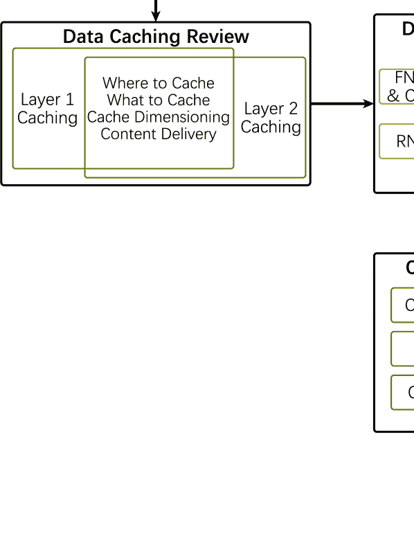
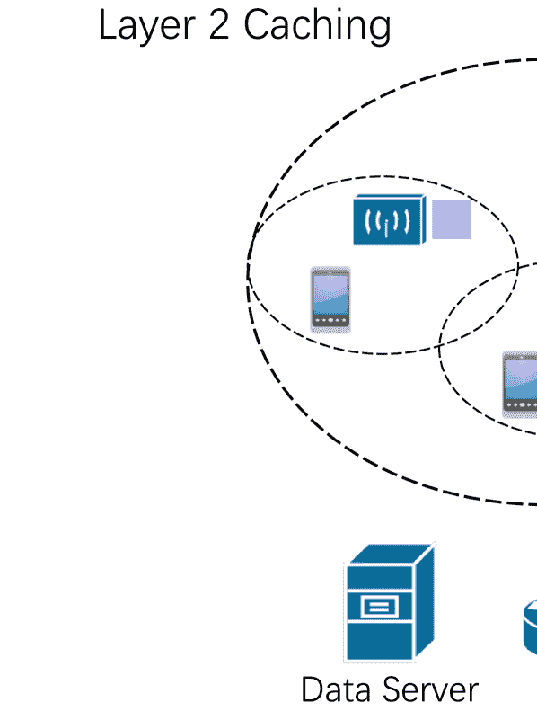
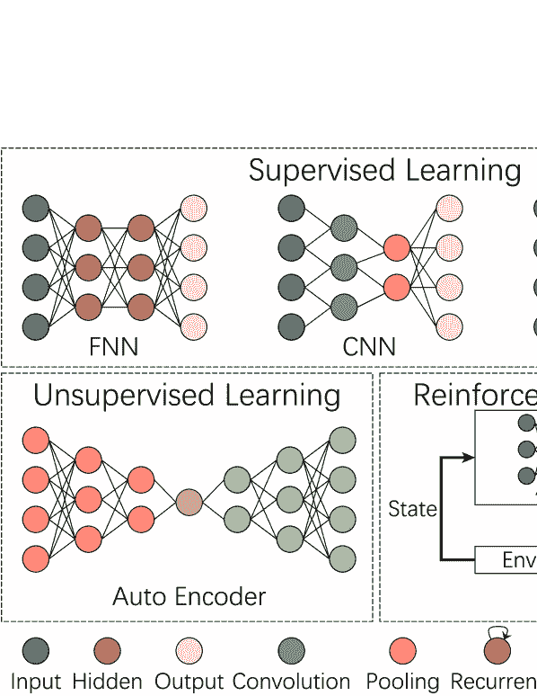
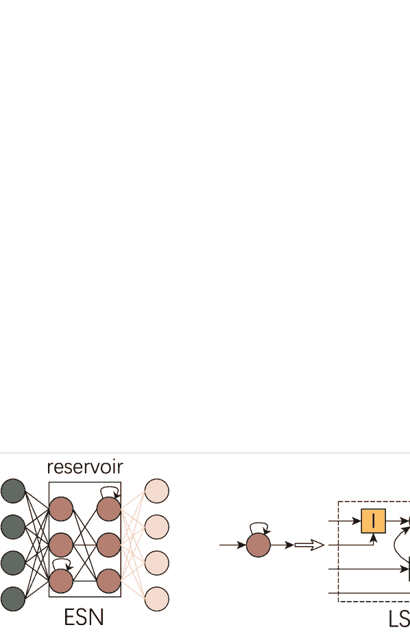

<!--yml

分类：未分类

日期：2024 年 09 月 06 日 19:59:50

-->

# [2008.07235] 关于边缘网络数据缓存的深度学习综述

> 来源：[`ar5iv.labs.arxiv.org/html/2008.07235`](https://ar5iv.labs.arxiv.org/html/2008.07235)

# 关于边缘网络数据缓存的深度学习综述

Yantong Wang ¹ 和 Vasilis Friderikos ²

电信研究中心

伦敦国王学院工程系

伦敦，邮编 WC2R 2LS，英国

¹ yantong.wang@kcl.ac.uk

² vasilis.friderikos@kcl.ac.uk

###### 摘要

边缘缓存在新兴的 5G 及其后续移动网络中的应用是解决核心网络拥塞问题和降低访问热门内容时延的一种有前景的方法。在这方面，通过在网络边缘，即接近用户的地方，主动缓存热门内容来满足终端用户对热门内容的需求。除了基于模型的缓存方案之外，基于学习的边缘缓存优化方案近年来引起了广泛关注。本文总结了利用深度学习进行边缘网络数据缓存的应用。我们首先概述内容缓存的典型研究主题，并基于网络层次结构制定了一个分类系统。然后，我们介绍了一些关键类型的深度学习算法，从监督学习到无监督学习以及强化学习。此外，我们还提供了从缓存主题和深度学习方法两个方面的现有文献的比较。最后，我们讨论了应用深度学习进行缓存的研究挑战和未来方向。

*关键词* 深度学习  $\cdot$ 内容缓存  $\cdot$ 网络优化  $\cdot$ 边缘网络

## 1 引言

毫无疑问，未来的 5G 及更高级的移动通信网络必须满足严格的要求，以超高速和低延迟传输热门内容，这是由于先进移动设备和数据丰富的应用程序的普及。在这种生态系统中，边缘缓存作为一种有效的技术，得到了过去十年的显著研究关注，它可以通过将热门数据更接近终端用户，从而减少交付延迟和网络拥堵，特别是在高峰流量时段或意外网络拥堵时。启用边缘缓存的主要原因之一是减少穿越接入和核心移动网络的请求数量，同时减少原始服务器的负载，否则这些服务器必须直接响应所有请求，如果没有边缘缓存的话。在这种情况下，热门内容和对象可以存储并从接近终端用户的边缘位置提供。这种操作对于终端用户来说也是有益的，因为边缘缓存可以显著减少访问内容的整体延迟，并提高整体用户体验感。还需要注意的是，热门内容的概念意味着，互联网上前 10%的视频内容请求占据了几乎 80%的所有流量；这涉及到来自不同终端用户对相同内容的多个请求[1]。

最近，深度学习（DL）引起了学术界和工业界的广泛关注，并已应用于自动驾驶、医学诊断、围棋等复杂游戏 [2]。深度学习还进入了通信领域 [3]。在本文中，我们关注深度学习在缓存策略中的应用。尽管有一些早期的关于机器学习应用的调查，但它们要么关注于用于缓存的一般机器学习技术 [4, 5, 6]，要么集中于整体无线应用 [7, 8, 9]。工作 [3] 提供了机器学习在无线通信中应用的整体视图。在 [4] 中，作者考虑了机器学习在缓存和路由策略中的应用。 [5] 提供了关于机器学习在边缘网络中缓存内容的应用的全面调查。研究人员 [6] 提供了关于移动边缘缓存和通信资源的机器学习调查。另一方面， [7] 概述了人工神经网络如何用于各种无线网络问题。 [8] 详细介绍了深度强化学习（DRL）在通信和网络问题中的应用。 [9] 提出了深度学习应用和边缘计算范式的全面概述。我们的工作与上述论文不同，因为我们专注于深度学习技术在内容缓存中的应用，并考虑了有线和无线缓存。我们的主要贡献如下：

+   •

    我们将内容缓存问题分为第 1 层缓存和第 2 层缓存。每一层缓存包含四个紧密相关的子问题：缓存位置、缓存内容、缓存维度和内容传递。相关的研究也随之提供。

+   •

    我们介绍了在内容缓存中广泛使用的深度学习（DL）技术的基础知识，如卷积神经网络、递归神经网络、基于演员-评论家模型的深度强化学习等。

+   •

    我们分析了广泛的前沿文献，这些文献使用深度学习进行内容缓存。这些论文基于深度学习结构、层缓存相关子问题和每种场景中深度学习的目标进行比较。然后我们讨论了深度学习在缓存中应用的研究挑战和潜在方向。

图 1：调查架构

本调查的其余部分组织如下（如图 1 所示）。第二部分介绍了内容缓存问题的类别。第三部分回顾了典型的深度神经网络结构。在第四部分中，我们列出了最先进的基于深度学习的缓存策略及其比较。第五部分讨论了挑战以及潜在的研究方向。最后，第六部分总结了本文。为了更好的可读性，本文中的缩写列表见表 1。

表 1: 缩写列表。

| 缩写 | 描述 | 缩写 | 描述 |
| --- | --- | --- | --- |
| 3C | 计算、缓存与通信 | A3C | 异步优势演员-评论家 |
| BBU | 基带单元 | CCN | 内容中心网络 |
| CNN | 卷积神经网络 | CoMP-JT | 协调多点联合传输 |
| CR | 内容路由器 | C-RAN | 云无线接入网络 |
| CSI | 信道状态信息 | D2D | 设备到设备 |
| DDPG | 深度确定性策略梯度 | DL | 深度学习 |
| DNN | 深度神经网络 | DQN | 深度 Q 网络 |
| DRL | 深度强化学习 | DT | 数字双胞胎 |
| ED | 终端设备 | ES | 边缘服务器 |
| ETSI | 欧洲电信标准化协会 |
| ESN | 回声状态网络 | FIFO | 先进先出 |
| FNN | 前馈神经网络 | FBS | 雌基站 |
| ICN | 信息中心网络 | LFU | 最少频繁使用 |
| LP | 线性规划 | LRU | 最少使用 |
| LSTM | 长短期记忆 | MAR | 移动增强现实 |
| MD | 移动设备 | MILP | 混合整数线性规划 |
| MBS | 宏基站 | NFV | 网络功能虚拟化 |
| PNF | 物理网络功能 | PPO | 近端策略优化 |
| QoE | 体验质量 | RL | 强化学习 |
| RNN | 循环神经网络 | RRH | 遥控无线头 |
| SAE | 稀疏自编码器 | SDN | 软件定义网络 |
| seq2seq | 序列到序列 | SNM | 射线噪声模型 |
| TRPO | 信任区域策略优化 | TTL | 生存时间 |
| VNF | 虚拟网络功能 | WSN | 无线传感器网络 |

## 2 数据缓存综述

边缘网络中的数据缓存模式在图 2 中有所说明。与[10]类似，本文中边缘的范围包括在最终用户和数据服务器之间的路径，其中包含内容路由器（CR）、宏基站（MSB）、微基站（FSB）和终端设备（ED）。在云无线接入网络（C-RAN）[11]的背景下，基带单元（BBU）和远程无线头（RRH）都被视为潜在的缓存候选者来托管内容，其中 BBU 集中成一个 BBU 池，而 RRH 则分布在基站的天线附近。根据边缘网络的层级结构，数据缓存分为两类：层级 1 缓存和层级 2 缓存。本节我们将说明这两个领域中的典型研究课题。

图 2: 边缘网络中的数据缓存

### 2.1 层级 1 缓存

在层级 1 缓存中，热门内容被认为应托管在 CR 中。在信息中心网络（ICN）的背景下，CR 既作为典型路由器（即数据流转发），又作为内容存储（即本地数据缓存设施）。通常，CR 通过有线网络连接。层级 1 缓存包括四个紧密相关的问题：缓存位置、缓存内容、缓存规模和内容传递[12]。

缓存的位置集中于选择合适的内容路由器（CR）来托管内容。例如，在图 2 中，内容副本可以放置在较低层次的 CR 中，如路由器 B 和 C，以减少传输成本，但需要额外的托管成本；相反，集中缓存于 CR A 可以节省缓存成本，但会增加传输成本，并有超出最终用户延迟要求的风险。在这里，缓存/托管成本是部署内容的成本，可以通过空间利用率、能源消耗或其他指标来衡量。传输成本表示将内容从缓存 CR（或数据服务器）传递到最终用户的费用，通常通过跳数来估算。缓存位置问题通常被建模为混合整数线性规划（MILP）：

|  |
| --- |
|  | $\displaystyle\mathop{\min}_{\begin{subarray}{c}x\end{subarray}}\;$ | $\displaystyle c^{T}x$ |  | (1a) |
|  | 满足 | $\displaystyle Ax\leq b$ |  | (1b) |
|  |  | $\displaystyle x\in\{0,1\}$ |  | (1c) |
|  | 或 | $\displaystyle x\geq 0$ |  | (1d) |

其中 $x$ 是决策变量。通常它是一个二进制变量，用于指示 CR 分配。在特殊情况下，为了建模或线性化，引入了一些非二进制的辅助变量作为约束，如 1d 所示。如果考虑缓存文件的部分而非完整文件，决策变量 $x$ 就是一个连续变量，表示 CR 中的段，那么约束条件 1c 变为 $x\in[0,1]$，MILP 模型转化为线性规划 (LP)。许多工作通过 MILP 分配内容，具有不同的目标和限制。[13] 的作者提出了一种模型，以在满足缓存空间的条件下，最小化用户延迟和 CR 的负载均衡水平。[14] 的工作考虑了缓存与传输成本之间的权衡，同时满足缓存空间、链路带宽和用户延迟的约束条件。在[15]中，构建了一个能源效率优化模型，包括缓存能源和传输能源。[16] 提供了有关有线网络缓存部署的数学模型和相关启发式算法的更多细节。

关于缓存内容的选择集中在选择适当的 CR 内容，以最大化缓存命中率。通过利用用户请求的统计模式，可以预测请求信息的流行程度和用户偏好，这在确定缓存内容中发挥着非常重要的作用。一方面，从汇总请求内容的角度来看，研究人员提出了许多不同的流行度估计模型和算法。在 Web 缓存中，广泛使用的一种模型是基于内容流行度静态且每个用户请求独立的假设的 Zipf 模型[17]。然而，这种方法未能反映内容的时间和空间相关性，其中时间相关性反映了流行度随时间变化，而空间相关性表示地理区域和社会文化媒体上的内容偏好不同。[18] 中建立了一种称为短噪声模型（SNM）的时间模型，它使用户能够动态估计内容流行度。受到 SNM 启发，[19] 的工作在缓存决策过程中考虑了空间和时间特征。另一方面，从特定终端用户在某一时间段的角度来看，缓存其/她的偏好内容（可能在网络上不流行）也有助于减少流量。在这种情况下，许多推荐系统中的方法可以应用[20]。缓存内容面对存储空间溢出风险时，另一个方面是设计缓存驱逐策略。根据缓存内容的生命周期，这些策略大致可以分为两类：一种类似于先进先出（FIFO）、最少使用（LFU）、最近最少使用（LRU）和随机替换，内容不会被移除，直到没有更多内存可用；另一种称为生存时间（TTL）策略，其中一旦相关定时器到期即发生驱逐。[21] 提出了 TTL 基于缓存的命中率的分析模型，这些缓存由独立同分布的流请求。值得注意的是，在 [21] 中，TTL 基于缓存策略用于动态内容的一致性，而不是内容替换。在 [22] 中，作者介绍了一个用于缓存驱逐的 TTL 模型，并且一旦相关内容缓存命中，定时器会被重置。

缓存维度化突出需要分配多少存储空间。得益于软件化和虚拟化技术，每个 CR 或边缘云中的缓存大小可以以更灵活和动态的方式进行管理，这使得缓存维度化决策成为数据缓存中的一个重要特征。在技术上，缓存命中率随着缓存内存的增加而上升，从而缓解了核心网络中的流量拥堵。然而，过度分配空间会浪费资源，如能源，以支持缓存功能。因此，缓存大小成本和网络拥堵之间存在权衡。从经济角度来看，考虑到这样的情景：一个小型内容提供商希望从 CDN 提供商（如 Akamai 或华为云）租赁服务，在投资节省和网络性能之间也存在平衡。在[23]中，通过利用网络拓扑调查了内容中心网络（CCN）中每个 CR 的合适缓存大小。在[24]中，作者在设计缓存大小时考虑了网络流量分布和用户行为的影响。

内容交付考虑如何将缓存内容转换为用户所请求的内容。交付流量包括单一缓存文件下载和视频内容流媒体，这两种情况的指标有所不同。对于文件下载，内容在交付完成之前无法被使用。因此，整个文件的下载时间被视为反映体验质量（QoE）的指标。对于视频流媒体，特别是那些被分成多个块的大型视频，延迟限制仅对第一个块有效。在这种情况下，按时交付第一个块并保持其余块的顺畅传输是关键目标[25]。除了这些测量指标，内容交付中的另一个问题是路由策略。在 CCN [26]中，ICN 架构的一种实现，采用基于泛洪的名称路由协议来在缓存的 CR 之间发布请求。一方面，泛洪策略简化了设计复杂性，并减少了特别是在不稳定情况下的维护成本；另一方面，它会浪费带宽资源。在[27]中，作者讨论了范围泛洪中的最佳半径。传递路径通常与缓存问题共同考虑，其中目标函数 (1a) 包括部署和路由成本。

### 2.2 第二层缓存

与有线连接中的第 1 层缓存相比，第 2 层缓存考虑在无线网络中实施缓存技术。尽管两者都需要解决缓存的位置、缓存的内容、缓存的维度以及内容传输等问题，但无线缓存面临的挑战更大，一些成熟的有线缓存策略不能直接迁移到无线场景中。原因包括以下几个方面：无线环境中的资源，如缓存存储和频谱，相较于第 1 层缓存中的 CR（缓存资源）是有限的；用户的移动性和动态的网络拓扑也需要在缓存策略设计中加以考虑；此外，无线信道是不确定的，因为它们可能受到衰落和干扰的影响。

在无线缓存中，缓存的位置主要集中在选择合适的 MBS、FBS、ED，甚至是 C-RAN 中的 BBU 池和 RRU 来托管内容。缓存于 MBS 和 FBS 可以缓解回程链路的拥塞，因为终端用户直接从 BS 获取请求的内容，而不是通过回程链路从 CR 获取。与 FBS 相比，MBS 的覆盖范围更广，且通常不同的 MBS 之间没有重叠[28]。如上所述，BS 中的缓存空间有限，缓存所有热门内容是不切实际的。为了提高缓存命中率，在[29]中提出了一种 MILP 建模的 MBS 之间的协作缓存策略。如果访问的 MBS 没有托管该内容，请求将由缓存了该文件的邻近 MBS 提供，而不是由数据服务器提供。对于 FBS 缓存，在[30]中提出了一种分布式缓存方法，主要思想是 FBS 覆盖重叠中的 ED 能够从多个主机获取内容。ED 的缓存不仅可以缓解回程链路的拥塞，还能提高区域频谱效率[28]。当终端用户请求内容时，如果内容已经预缓存于他的 ED 中，则由本地存储提供；如果内容相应地托管在邻近 ED 中，则通过 D2D 通信由邻近 ED 提供。在[31]中，作者将缓存启用的 D2D 网络建模为泊松簇过程，其中终端用户被分组为几个簇，集体性能得到提升。个体上，为其他用户缓存感兴趣的内容会影响个人利益。在[32]中，应用了 Stackelberg 博弈模型来制定终端用户之间的冲突，并设计了相关激励机制来鼓励内容共享。对于缓存启用的 C-RAN，BBU 的缓存可以缓解回程链路的流量拥堵，而 RRH 的缓存可以减少前程通信成本。另一方面，全部缓存于 BBU 会增加 BBU 池的信令开销，而在 RRH 处缓存则会削弱处理能力。因此，在 C-RAN 中缓存内容的位置对平衡 BBU 池的信号处理能力和回程/前程成本具有重要作用[28]。[33]中的研究探讨了在 RRH 缓存时，联合考虑小区故障概率和前程利用率。由于终端用户的移动性，用户移动行为的预测/意识也会影响合适的托管选择。一些研究利用用户移动性设计缓存策略，如[34]和[35]。

与第 1 层类似，第 2 层的缓存决策以及驱逐策略依赖于对内容受欢迎程度或用户偏好的准确预测，这些都在前向缓存方法中体现。内容受欢迎程度包含了时间和空间相关性的特征，这在第 1 层缓存中已经描述过。在第 2 层缓存中，估算热门内容时需要特别注意适当的空间粒度[36]。例如，MBS 和 FBS 的覆盖范围不同，这使得 MBS 和 FBS 的受欢迎程度也有所不同。前者基于大量用户行为，而个体可能偏好特定内容类别。对于小型蜂窝网络，偏好估算需要更准确的信息，如历史数据[28]。为了捕捉用户偏好的时间和空间动态，提出了许多不同的基于深度学习的算法，这将在第四部分中说明。

第 2 层缓存的缓存维度设计涉及更多复杂因素，需要考虑的不仅包括网络拓扑和内容受欢迎程度，还包括回传传输状态和无线信道特性。研究了在回传有限的蜂窝网络场景下的适当缓存大小分配[37]。它还提供了单个小区情况下最小缓存大小的封闭形式边界。在密集无线网络的情况下，[38]中的工作量化了实现网络吞吐量线性容量扩展所需的最小缓存量。[39]的作者也考虑了密集网络的场景。他们推导出了最佳内存大小的封闭形式，这可以减少回传容量的消耗，同时保证无线服务质量。

根据发射器和接收器的数量，我们将第 2 层缓存中的内容传输分为三类：一个候选者服务于一个终端用户，例如单播和 D2D 传输；一个候选者服务于多个用户，如多播；以及协调传输，包括多个发射器服务于一个或多个接收器，如协调多点联合传输（CoMP-JT）。一旦请求的内容被本地缓存，基站（BS）可以通过单播服务终端用户，或通过实现 D2D 传输，邻近设备共享内容。并发传输在密集部署网络中存在同频干扰的风险。在 D2D 网络中，引入链路调度以选择同时传输的链路子集 [28]。为了提高频谱效率，当同时处理多个请求时，多播被应用于内容传输。因此，频谱效率和服务延迟之间存在权衡。为了在一次传输中服务更多用户以及提高频谱效率，基站将等待收集足够的相同内容的需求，这使得首次请求的等待时间较长。[40] 提出了一个优化的动态多播调度方案，以平衡这两个因素。多播还可以服务于不同内容的多个请求。在 [41] 中，作者提供了一种编码缓存方案，该方案要求通信链路无误差，每个用户缓存自己的一部分内容以及其他用户的部分内容。然后基站将编码数据广播给所有用户。每个用户可以通过对接收的数据和预缓存的其他用户文件进行 XOR 操作来解码自己请求的内容。然而，随着终端用户数量的增长，编码复杂性呈指数级增加。CoMP-JT 通过在基站之间共享频道状态信息（CSI）和内容，也可以提高频谱效率，但它也需要高容量的回传链路来交换数据。在 C-RAN 中，BBU 被集中在 BBU 池中，这使得基站之间的通信非常高效。[42] 在 C-RAN 中设计了 CoMP-JT，旨在最小化功耗，并考虑传输能量、链路容量和请求的 QoS 限制。

## 3 深度学习概述

如图 3 所示，列出了几种典型的深度神经网络（DNN）方法。这些模型根据训练方法的不同被分为三类：监督学习、无监督学习和强化学习。

图 3：典型的 DNN 结构

### 3.1 前馈神经网络（FNN）

FNN 是一种信息传播方向为前向且神经元之间没有循环的 DNN。在本文中，FNN 一词用于表示全连接神经网络，这表明两个相邻层之间的连接是完全的。根据通用逼近定理，FNN 具有用隐藏层中的足够神经元逼近任何封闭且有界函数的能力[43]。隐藏层用于提取输入向量的特征，然后将其送入输出层，输出层作为分类器工作。尽管 FNN 非常强大，但在处理如图像识别等现实世界任务时，由于庞大的权重参数（因为全连接）和数据增强的缺乏，常常遇到困难。

### 3.2 卷积神经网络 (CNN)

为了克服上述 FNN 的缺点，CNN 采用了卷积和池化操作，其中前者将滑动卷积滤波器应用于输入向量，后者进行下采样，通常通过最大池化或均值池化来实现。通常，CNN 倾向于包含更深的层次和更小的卷积滤波器，并且结构变成完全卷积网络[44]，减少了池化层和全连接层的比例。从分类学上讲，CNN 属于 FNN，并广泛应用于图像识别、视频分析、自然语言处理等领域。包括 CNN 在内，FNN 的一个限制是输出仅依赖于当前输入向量。因此，很难处理顺序任务。

### 3.3 递归神经网络 (RNN)

为了处理顺序任务并利用历史信息，RNN 在隐藏层中使用带有自反馈的神经元。与 FNN 中的隐藏神经元不同，递归神经元的输出依赖于前一层的当前输出和上一个隐藏状态。与 FNN 可以逼近任何连续函数相比，具有 Sigmoid 激活函数的 RNN 可以模拟通用图灵机，并具有解决所有计算问题的能力[45]。值得注意的是，RNN 面临长期依赖问题的风险[43]，包括梯度爆炸和消失。此外，由于添加了递归权重，RNN 有更多的参数需要训练。接下来，我们介绍一些 RNN 变体，如图 4 ‣ 3 深度学习概述 ‣ 边缘网络数据缓存的深度学习调查")所示。

图 4：RNN 变体

#### 3.3.1 回声状态网络 (ESN)

如前所述，简单的循环神经网络在训练步骤中包含更多参数，其中递归权重和输入权重都很难学习[43]。 ESN 的基本思想是固定这两种权重，只学习输出权重（如图 4 ‣ 3 深度学习概要 ‣ 边缘网络数据缓存的深度学习调查中的图 4")中突出显示的链接）。 ESN 中的隐藏层被重命名为沉积层，其中神经元是稀疏连接的，权重是随机分配的。 递归权重保持不变，因此上一时刻的信息以恒定的权重存储在类似回声的沉积层中。

#### 3.3.2 长短期记忆（LSTM）

最近，在实际中应对长期依赖的有效方法是使用门控 RNN，包括 LSTM[43]。 然后，我们将简单 RNN 中的递归神经元与之进行比较：内部 LSTM 引入了三个门来控制信号传播，其中输入门$I$决定要存储的输入信号的分区，遗忘门$F$控制了上一个时刻记忆保留到下一个周期的比例（"遗忘门"的名称可能有点误导，因为实际上它代表了要记住的比例），输出门$O$影响了当前状态要传递的比例；外部 LSTM 有四个输入，其中包括一个输入信号和三个用于三个门的控制信号。 所有这四个信号都是通过当前网络输入和上一时刻传递的状态的计算得出的。

#### 3.3.3 指针网络

RNN 的一个典型应用是将一个序列转换为另一个序列（seq2seq），例如机器翻译。 传统上，seq2seq 架构的输出是输出词典的概率分布。 但是，由于固定输出词典，它无法处理输出大小依赖于输入长度的问题。 在[46]中，作者修改输出为输入序列的分布，这类似于 C/C++中的指针。 指针网络已经广泛用于文本压缩。

### 3.4 自动编码器

自动编码器是两个称为编码器和解码器的 NN 堆栈，前者试图学习输入的代表性特征并生成相关的代码，而后者读取代码并重新构造原始输入。 为了避免自动编码器简单地复制输入，考虑了一些限制，例如代码的维度比输入向量小[43]。 自动编码器的质量可以通过重建错误来衡量，它估计了输入和输出之间的相似性。 在大多数情况下，自动编码器用于适当表示输入向量，因此在无监督训练后解码器部分被移除。 代码可以作为进一步深度学习模型的输入。

### 3.5 深度强化学习（DRL）

强化学习（RL）是一个由五元组 $\{\mathcal{S,A,P,R},\gamma\}$ 表示的马尔可夫决策过程，其中 $\mathcal{S}$ 是由环境控制的状态空间；$\mathcal{A}$ 是由代理确定的动作空间；$\mathcal{P}$ 是状态转移函数，测量给定先前状态 $s_{t}$ 和动作 $a_{t}$ 的情况下，转移到新状态 $s_{t+1}$ 的概率；$R$ 是由环境根据状态和动作计算的奖励函数；$\gamma$ 是用于估计总奖励的折扣因子。在代理和环境的交互过程中，代理从环境中观察当前状态 $s_{t}$，然后按照其策略 $\pi$ 采取动作 $a_{t}$。环境基于 $\mathcal{P}(s_{t},a_{t})$ 随机转移到新状态 $s_{t+1}$ 并返回奖励 $r_{t}$ 给代理。RL 的目标是找到使累计奖励 $\sum_{t}\gamma^{t}r_{t}$ 最大化的策略 $\pi$。在早期阶段，RL 关注于 $\mathcal{S}$ 和 $\mathcal{A}$ 是离散且有限的场景。因此，代理可以使用表格记录这些信息。最近，一些任务具有大量离散状态和动作，例如围棋，甚至有连续值任务如自动驾驶，这使得表格记录变得不切实际。为了解决这个问题，DRL 结合了 RL 和 DL，其中 RL 定义问题和优化目标；DL 则对策略和奖励期望进行建模。根据 DNN 在 DRL 中的角色，我们将 DRL 分为 3 类，如图所示。

#### 3.5.1 DNN 作为批评者（基于价值）

在基于价值的方法中，DNN 不涉及策略决策，而是评估策略的性能。为了进行测量，引入了两个函数：$V^{\pi}(s)$ 代表从状态 $s$ 开始的策略 $\pi$ 的奖励期望；$Q^{\pi}(s,a)$ 说明从状态 $s$ 开始并采取动作 $a$ 的策略 $\pi$ 的奖励期望。此外，$V^{\pi}(s)$ 是 $Q^{\pi}(s,a)$ 的期望值。如果我们能够估计 $Q^{\pi}(s,a)$，则可以通过选择动作 $a^{*}$ 使得 $Q^{\pi}(s,a^{*})\geq V^{\pi}(s)$ 来改进策略 $\pi$。因此，代理中使用的 DNN 近似函数 $Q^{\pi}(s,a)$，其中输入是状态 $s$ 和动作 $a$，输出是估计值 $Q^{\pi}(s,a)$。一些具有代表性的批评方法包括 Deep Q Networks (DQN) [47] 及其变体 Double DQN [48]、Dueling DQN [49] 等。

#### 3.5.2 DNN 作为行动者（基于策略）

在基于策略的方法中，DNN 直接参与动作选择，而不是通过$Q^{\pi}(s,a)$。策略可以视为一个优化问题，其中目标函数是最大化奖励期望，搜索空间是策略空间。DNN 的输入是当前状态，输出是潜在动作的概率分布。通过使用梯度上升，我们可以更新 DNN 以提供更好的动作，从而最大化总奖励。一些流行的算法包括信任区域策略优化（TRPO）[50]，近端策略优化（PPO）[51]。

#### 3.5.3 Actor-Critic 模型

一般来说，与基于策略的方法相比，基于价值的方法不够稳定且收敛性差，因为策略是基于$Q^{\pi}(s,a)$近似得出的。但基于价值的方法样本效率更高，而基于策略的方法则更容易陷入局部最优解，因为搜索空间很大。Actor-Critic 模型结合了这两种方法，即代理包含两个 DNN，分别称为 actor 和 critic。在每次训练迭代中，actor 考虑当前状态$s$和策略$\pi$以决定动作$a$。然后环境变化到状态$s^{\prime}$并返回奖励$r$。critic 基于来自环境的反馈更新自身参数，并为 actor 的动作输出评分。actor 根据 critic 的评分更新策略$\pi$。近年来提出了一些典型算法，如深度确定性策略梯度（DDPG）[52]和异步优势 actor-critic（A3C）[53]。

## 4 深度学习用于数据缓存

我们将边缘网络中关于数据缓存的深度学习研究分为四类，依据所使用的 DL 工具：FNN 和 CNN；RNN；自动编码器；DRL。最近许多研究结合了多种 DL 技术来共同解决缓存问题。例如，开始时我们使用 RNN 预测内容流行度，然后使用 DRL 寻找内容放置的次优解，以减少时间复杂度。在这种情况下，我们将相关工作归入 DRL，因为它代表了缓存分配策略。除非提及缓存位置（如 CRs、MBSs、FBSs、EDs 和 BBUs），否则本节的方法可用于层 1 和层 2 缓存。表 2 总结了部分 DL 缓存研究。

表 2：深度学习用于数据缓存的总结

| 方法 | 研究 | 缓存问题 | DL 目标 |
| --- | --- | --- | --- |
| FNN 和 CNN | [54] | 内容交付 | 减少时间槽分配的可行区域 |
| [55] | 缓存位置，内容交付 | 确定缓存和交付持续时间的 MBSs |
| [56] | 缓存位置、内容传输 | 指定适当的缓存替代物 |
| [57] | 缓存位置、内容传输 | 减少缓存的可行区域 |
| [58] | 缓存内容 | 提取视频特征 |
| [59] | 缓存内容 | 预测请求内容与频率 |
| [60] | 缓存内容 | 预测请求内容 |
| [61] | 缓存内容 | 预测内容流行度 |
| RNN | [62, 63] | 缓存内容 | 预测请求内容与用户移动性 |
| [64, 65, 66, 67, 68] | 缓存内容 | 预测内容流行度 |
| [69] | 内容传输 | 减少流量负载，选择最佳基站子集 |
| 自编码器 | [70, 71, 72, 73, 74] | 缓存内容 | 预测内容流行度 |
| [75] | 缓存内容 | 预测最受欢迎的内容 |
| DRL | [76, 77, 78, 79, 80, 81, 82, 83, 84, 85] | 缓存内容 | 决定缓存位置 |
| [86] | 缓存内容 | 决定缓存替换与功率分配 |
| [87] | 缓存内容 | 预测流行度与寻找最佳 NN 模型 |
| [88] | 缓存位置 | 决定缓存位置 |
| [89] | 内容传输 | 用户分组 |
| [90] | 缓存位置、内容传输 | 决定基站连接、计算卸载与缓存位置 |
| [91] | 缓存内容、内容传输 | 决定缓存与带宽分配 |
| [92] | 缓存内容、内容传输 | 决定缓存、计算卸载与无线资源分配 |
| [93] | 缓存内容、内容传输 | 决定多播调度与缓存替换 |
| [94] | 缓存位置与内容 | 预测流行度，决定缓存与任务卸载 |
| [95] | 缓存位置与内容、内容传输 | 预测用户移动性与内容流行度，确定 D2D 链接 |

### 4.1 FNN 和 CNN

在 [54] 中，无线网络中的内容传输问题被公式化为两个 MILP 优化模型，目标分别是最小化传输时间槽和能量消耗。两个模型都考虑了内容传输的数据速率。考虑到求解 MILP 的计算复杂性，引入 CNN 来减少决策变量的可行区域，其中输入为信道系数矩阵。文献 [55] 中的 FNN 在简化内容传输优化模型的搜索空间方面发挥了类似的作用。 

对于资源分配问题，[96]的作者将其建模为线性和分配问题，然后利用 CNN 和 FNN 解决模型。这个思路在[56]和[57]中得到了扩展，作者考虑了在潜在 CR 和内容传递中的缓存问题，并将其建模为 MILP，目的是通过考虑用户移动性、空间利用和带宽限制来平衡缓存和传输成本。缓存分配被视为多标签分类问题，并被分解为若干独立的子问题，每个子问题都与 CNN 相关联以预测分配。CNN 的输入是一个灰度图像，结合了用户移动性、空间和链路利用水平的信息。在[56]中，提供了一种爬山局部搜索算法来提高 CNN 的性能，而在[57]中，CNN 的预测结果用于输入一个更小的 MILP 模型。

对于上述工作[54, 55, 56, 57, 96]，FNN 或 CNN 的输入是从优化模型中提取的。工作[97]通过原始图而不是参数矩阵/图像训练 CNN，这使得过程更符合人类的识别和解释。尽管作者以旅行商问题而非数据缓存作为示例，但该方法可以视为一个潜在的研究方向。

在[58]中，提出了一个 ILP 模型，通过确定缓存内容在 BS 中的比例来最小化回程视频数据类型负荷。考虑到被 BS 覆盖的移动用户频繁变化，因此预测用户偏好是不必要的。相反，作者集中于一般的热门内容。首先，引入了一个 3D CNN 来提取视频的时空特征。通过比较相似的视频特征来确定没有历史信息的新内容的流行度。[59]的作者还考虑了移动巴士 WiFi 环境中访问内容的时空特征。通过利用之前 9 天收集的数据，可以预测用户在最后一天可能访问的内容及其访问频率。在[60]中考虑了社交属性。通过观察用户在 2016 年美国选举期间对推文的兴趣，基于 CNN 的预测模型可以预见最有可能被请求的内容类别。这种内容将被缓存到 MBS 和 FBS 中。

文献[61]的工作从另一个方面审视了 DNN 在缓存中的作用。作者提出了一个 FNN 来将内容流行度预测作为回归问题。结果显示，虽然 RNN 被认为在解决序列预测方面有效，但 FNN 表现更优。此外，用线性估计器替代 FNN 并不会显著降低性能。作者解释说，FNN 在信息不完整的情况下会比线性预测器表现更好，而 RNN 在将流行度预测建模为分类问题时比回归问题更具优势。

### 4.2 RNN

考虑到 RNN 在处理序列任务方面的优势，文献[64]应用了双向 RNN 用于移动边缘网络中的在线内容流行度预测。简单 RNN 的输出依赖于之前和当前的存储，但双向 RNN 也能考虑未来的信息。预测模型由三个模块级联组成：CNN 读取用户请求并提取特征；双向 LSTM 学习请求随时间步的关联；最后加入 FNN 以提高预测性能。然后根据流行度预测进行内容驱逐。

文献[62]中的作者利用 ESN 预测内容请求分布和终端用户移动模式。用户的偏好被视为上下文，这些上下文与个人信息（如性别、年龄、职业、位置等）结合。对于请求预测，ESN 的输入是用户的信息向量，输出表示内容的概率分布。对于移动预测，输入包括历史和当前用户的位置，输出是下一个时间段的预期位置。最终，预测会影响 BBUs 和 RRHs 中的缓存内容决策，以期减少 CRAN 中的流量负载和延迟。作者在文献[63]中扩展了他们的工作，引入了基于概念器的 ESN，该方法可以将用户上下文分成不同的模式并独立学习。因此，实现了更准确的预测。

在[65]中，提出了一种名为 PA-Cache 的缓存决策策略，用于在空间满时预测视频流行度以进行缓存驱逐。通过将 RNN 的每个隐藏层表示附加到输出回归中，利用了时间内容的流行度。为了提高准确性，在训练过程中引入了 Hedge Backpropagation 来动态决定何时以及如何调整 DNN 的深度。类似地，[66]中的工作也考虑了视频内容的缓存替换。使用深度 LSTM 网络进行流行度预测，包括堆叠多个 LSTM 层和一个 softmax 层，网络的输入是请求序列数据（设备、时间戳、位置、视频标题），没有任何预处理，输出是估计的内容流行度。另一项工作集中于用户移动性和内容流行度之间的预测和交互，可以在[67]中找到。

文献[68]将流行度预测视为 seq2seq 建模问题，并提出了 LSTM 编码器-解码器模型。输入向量由过去时间窗口内计算的每个向量的概率组成。在[69]中，作者关注的是通过编码缓存实现缓存内容交付，目的是通过编码缓存来最小化基站（BS）以覆盖所有请求的用户，即集合覆盖问题。与[68]不同的是，在编码缓存阶段引入了自动编码器进行文件转换以减轻传输负载。此外，还采用了一个 RNN 模型来选择用于广播的 BS。

文献[98]展示了 RNN 在解决缓存位置选择问题方面的潜力。在[98]中，将任务分配模型表述为一个背包问题，决策变量表示任务是在移动设备（MD）中本地处理还是在边缘服务器（ES）中远程处理。作者设计了一个由 3 个 RNN 组成的多指针网络结构，其中 2 个编码器分别对 MD 和 ES 进行编码，1 个解码器展示 ES 和 MD 的配对。考虑到缓存位置优化模型与背包问题的相似性，可以在相应的参数修改后将多指针网络用于缓存位置决策。

### 4.3 自动编码器

通常，自动编码器用于以无监督的方式学习有效的表示或提取原始数据的特征。文献[70]考虑了基于内容流行度的无线传感器网络（WSN）缓存替换。鉴于稀疏自动编码器（SAE）能够提取输入数据的代表性表达，作者使用了一个 SAE，随后是一个分类器，其中输入包含用户内容请求的收集，输出表示内容的流行度等级。作者还考虑了通过 SDN/NFV 技术以分布式方式实施，即输入层部署在汇聚节点上，而其余层则实现于主控制器上。有关自动编码器在 5G 网络主动缓存中应用的相关工作可以参见[71]。在[72]中，两个自动编码器分别用于提取用户和内容的特征。然后，提取的信息被用来估计核心网络中的流行度。类似地，[73]中的自动编码器用于时空流行度特征的提取，而[75]中的自动编码器协同工作以预测前 K 个热门视频。

### 4.4 DRL

[78]的研究集中在超密集网络中的 FBSs 的协作缓存策略与最大距离可分编码上。使用基于价值的模型来确定 FBSs 在非高峰期的缓存类别和内容数量。[79]的作者研究了在 FBSs 中缓存 360°视频和虚拟视口的问题，内容受欢迎程度未知。虚拟视口代表了用户群体中最受欢迎的 360°视频的瓦片。引入了 DQN 来决定视频中要托管的瓦片及其质量。此外，[80]利用 DQN 做出内容驱逐决策，提供令人满意的体验质量，而[81]则旨在最小化能耗。在[82]中，作者还应用 DQN 来决定单一 BS 中的缓存驱逐。此外，通过堆叠 LSTM 和 FNN 生成评价者来评估 Q 值，并添加了外部内存来记录学习到的知识。为了提高预测准确性，Q 值更新由评价者的估计值与外部内存中记录的信息的相似性决定，而不是由评价者主导。论文[84]提出了 DQN 两级网络缓存，其中一个父节点与多个叶节点连接以缓存内容，而不是单个 BS。在[76]中，提出了一种带有 Wolpertinger 架构的 DRL 框架[99]用于 BSs 的内容缓存。Wolpertinger 架构基于演员-评论家模型，并在大离散动作空间中表现高效。[76]使用两个 FNN 分别作为演员和评论家，其中前者决定请求的内容是否被缓存，后者则估计奖励。整个框架分为两个阶段：离线阶段，这两个 FNN 在监督学习中进行训练；在线阶段，通过与环境的交互更新评论家和演员。作者将他们的工作扩展到一个多智能体演员-评论家模型，用于多个 BSs 的去中心化协作缓存[77]。在[83]中，使用演员-评论家模型来解决缓存替换问题，平衡数据的新鲜度和通信成本。上述论文关注网络性能，但忽视了缓存对信息处理和资源消耗的影响。因此，[85]的作者设计了一种缓存策略，考虑到内容传输期间的网络性能和数据消耗期间的处理效率。使用 DQN 来确定请求文件的更新块数量。论文[86]研究了一个联合缓存替换和功率分配优化问题，以最小化下行 F-RAN 的延迟。提出了一种 DQN 用于寻找次优解。虽然[87]被认为是解决类似于[76, 77, 78, 79, 80, 81, 82, 83, 84, 85, 86]的缓存问题，但强化学习方法发挥了不同的作用。在[87]中，利用 DNN 进行内容受欢迎度预测，然后使用 RL 进行 DNN 超参数调优，而不是确定缓存内容。因此，动作空间包括选择模型架构（即 CNN，LSTM 等）、层数和层配置。

在[88]中，作者提出了一种优化模型，旨在在移动边缘计算框架下最大化网络运营商在移动社交网络中的效用，涉及网络缓存和 D2D 通信（3C）。考虑了通过用户之间的社交关系估计的信任值。然后，使用 DQN 模型来解决优化问题，包括确定视频提供者和订阅者的关联、视频转码卸载和视频缓存分配。DQN 使用两个 CNN 进行训练，一个生成目标 Q 值，另一个用于估计 Q 值。与传统的 DQN 不同，[88]中的作者引入了一种对战结构，即 Q 值不在最终的全连接层中计算，而是分解成两个部分，并使用摘要作为估计的 Q 值，这有助于实现更稳健的结果。作者还考虑在不同的场景中利用对战 DQN 模型，如缓存启用的机会干扰对齐[89]和车载网络中的 3C 协调[90]。工作[91]提供了一个 DDPG 模型来处理车载边缘网络中 3C 的连续值控制决策，该模型结合了 DQN 和演员-评论员模型的思想。DDPG 结构可以分为两个部分，类似于 DQN，一个用于估计 Q 值，另一个用于目标 Q 值。每个部分由两个 DNN 组成，分别扮演演员和评论员的角色。评论员像 DQN 一样更新其参数，而演员通过确定性策略梯度方法学习策略。所提出的 DRL 用于决定内容缓存/替换、车辆组织和不同持续时间的带宽资源分配。

论文[92]提供了一个优化模型，该模型在雾计算支持的物联网网络中考虑了缓存内容和内容交付，以最小化服务延迟。由于无线信号和用户请求是随机的，因此采用了演员-评论员模型，其中演员负责请求内容的决策，而评论员估计奖励。特别地，动作空间$S$由决策变量组成，奖励函数是目标函数的变体。在[93]中研究了缓存替换策略和动态多播调度策略。为了获得次优结果，使用了自动编码器来逼近状态。此外，采用加权双重 DQN 方案以避免 Q 值的高估。[94]通过收集历史请求应用 RNN 预测内容的流行度，输出表示近未来的流行度。然后，这些预测被用于 MEC 服务器之间的协作缓存和计算卸载，该问题被建模为 ILP 问题。为了高效解决它，应用了多智能体 DQN，每个用户被视为一个智能体。动作空间包括任务本地计算和卸载决策，以及本地缓存和协作缓存决策。奖励由累积延迟来衡量。智能体根据当前状态选择自己的动作，不进行合作。D2D 网络中的缓存位置、缓存内容和内容交付决策在[95]中进行了联合建模。考虑了两个 RNN，ESN 和 LSTM，用于预测移动用户的位置和请求内容的流行度。然后，预测结果用于确定内容类别和缓存位置。内容交付被表述为基于演员-评论员的 DRL 框架。状态空间包括 CSI、传输距离以及请求用户与其他可用候选者之间的通信功率。DRL 的功能是确定用户之间的通信链路，以最小化功耗和内容延迟。

我们注意到，大多数论文更倾向于在 DRL 框架中使用基于价值的模型（评论员）和基于价值-策略的模型（演员-评论员），但很少有论文仅考虑基于策略的模型来解决数据缓存问题。一个合适的原因是缓存问题的搜索空间巨大，因此基于策略的模型更容易陷入局部最优解，导致性能较差。虽然基于价值的模型稳定性较差，但一些变体结构如[93]中的 Double DQN 被用来避免价值过高估计，[88, 89, 90]中的 dueling DQN 被用来提高鲁棒性。

## 5 研究挑战与未来方向

本节讨论了内容缓存和潜在研究方向的一系列开放问题。我们首先将内容缓存的概念扩展到虚拟网络功能链，因为缓存可以被视为一个特定的网络功能。接着，我们考虑增强现实应用的缓存。此外，我们注意到缓存维度尚未被深度学习（DL）方法覆盖。最后，我们讨论了深度学习引入的额外成本。

### 5.1 作为虚拟网络功能链的缓存

网络功能虚拟化（NFV）的概念最早在欧洲电信标准化协会（ETSI）的领域内进行讨论和提出¹¹1 网络功能虚拟化，简介、好处、促进因素、挑战和行动呼吁，ETSI，2012 https://portal.etsi.org/NFV/NFV_White_Paper.pdf。其理据是通过虚拟化技术促进网络服务的动态供应，以将服务创建过程与底层硬件解耦。该框架允许通过特定的功能链和顺序实现网络服务，这些功能可以实现于更传统的专用硬件上（在这种情况下称为物理网络功能（PNFs）），或者作为虚拟网络功能（VNFs）运行在虚拟化的通用硬件上。硬件与软件之间的解耦是一个重要的考虑因素，另一个同样重要的是虚拟化服务自然适合动态可编程的服务创建，其中 VNF 资源可以根据需要进行部署。因此，边缘云和网络资源的使用可以根据即时用户需求进行调整，同时避免了更静态的过度配置。

在该框架下，传入的网络服务请求包括需要创建的服务功能链的规格，这种链以有序的 VNF 序列形式呈现。例如，不同类型的 VNF，如防火墙或 NAT 机制，需要以特定顺序访问。在这种构建的服务链中，每个独立的 VNF 需要特定的底层资源，例如 CPU 周期和/或内存。

在此框架下，流行内容的缓存可以视为一个专门的 VNF 链功能，因为将缓存的流行内容传递给用户必然需要支持一组其他相关功能，如安全性、内容优化等。然而，数据缓存和 VNF 链的问题在文献中已经相对独立地发展，而将数据缓存视为 VNF 链的一部分时如何优化数据缓存仍然是一个有趣的开放性问题。

### 5.2 针对移动增强现实（MAR）应用和数字双胞胎（DTs）的缓存

移动增强现实（MAR）应用可以被视为一种通过人工计算机生成的信息来增强物理现实世界环境的方式，并且这是一个最近受到大量研究关注的领域。为了成功地将不同的数字对象叠加到物理世界中，MAR 应用包括多个计算和存储复杂的概念，如图像识别、移动相机校准以及高级 2D 和 3D 图形渲染。这些功能计算量极大，因此需要边缘云的支持。此外，嵌入物理世界中的虚拟对象需要主动缓存到离终端用户更近的位置，以便将延迟最小化。在这类应用中，超低延迟至关重要，以便在终端用户的视频视图中提供真实感的虚拟对象嵌入。然而，由于计算和增强现实对象需要随时可用，因此这些对象的缓存应与边缘云的计算能力结合考虑。此外，当在 NFV 环境下考虑 MAR 时，应用可能会固有地需要访问一些 VNFs，因此上述关于 MAR 应用的 VNF 链接的讨论在这种情况下也是有效的。

最近，数字双胞胎（DT）[100], [101] 的概念因其在工业制造、健康以及智能城市等领域的广泛应用而受到显著的研究关注。简而言之，DT 可以定义为在多个粒度级别上真实世界对象的精确数字副本；而这个真实世界的对象可以是机器、机器人或工业过程或（子）系统。通过在虚拟空间中反映待考虑系统的物理状态，可以开启一系列优化、预测、容错和自动化过程，而这些过程仅凭物理对象无法完成。在 DT 应用的核心是要求数字副本与物理对象之间进行严格的双向实时通信。这一要求不可避免地需要边缘云的支持，以最小化延迟，并提供高效的存储和计算资源，包括缓存。在这种环境下，前述的深度学习技术将发挥关键作用，以提供高质量的实时决策，避免数字副本与考虑中的物理对象之间的错位。高效的机器到 DT 的连接需要类似于上述增强现实应用的能力，但由于 DT 的连续实时控制循环操作，它们将需要全新的网络优化能力，在这一前沿，效率高的缓存和数据驱动技术将发挥核心作用。因此，鉴于低延迟通信与 DT 之间的相互作用的研究仍处于初期阶段，探讨适用于分布式缓存和计算资源分配的数据驱动深度学习技术具有重要意义。

### 5.3 深度学习在缓存维度中的应用

如第二部分所介绍，缓存维度探讨了为内容主机如 CRs 和 BSs 分配合适缓存大小的问题。令人失望的是，目前几乎没有论文将 DL 应用于缓存维度决策。一个适当的原因是缺乏训练数据集，与内容热门预测相对，我们有历史用户请求日志来训练 DNN。此外，缓存大小分配会影响网络性能和经济投资。最近，网络切片被认为是使 5G 能够提供具有多样特征的多服务的重要工具。切片是基于包括网络存储在内的物理基础设施建立的。因此，考虑分配内存空间以支持内容缓存和其他存储服务是一个非常有趣的话题，这可以保证 QoE 并满足任务要求。此外，对于缺乏训练数据集的情况，DRL 可以被视为一种有前景的技术，用于配置切片设置以及缓存维度。对于动作空间设计，它可以是通过设置存储级别的离散型，或是通过直接分配内存空间的连续型。然而，需要设计支持动态分配的缓存启用网络切片模型及其相关的 DRL 框架，包括状态空间、详细的动作空间、奖励函数和代理结构。

### 5.4 深度学习的成本

尽管 DL 的应用为缓存策略带来了性能效率，但 DL 引入的额外成本不可忽视，因为训练和部署 DL 模型不仅需要网络资源，还需要时间。因此，DL 辅助缓存策略节省的成本与支持 DL 自身运行的消耗之间存在权衡，这表明 DL 的应用可能带来利润、亏损或持平。因此，DL 的应用时机和地点应该经过仔细研究。此外，为了减少资源消耗和加快训练过程，可以利用一些知识转移方法，如迁移学习[102]，这些方法可以将从源领域已经学习到的知识转移到相关目标领域。

## 6 结论

本文对深度学习方法在内容缓存领域的应用进行了全面研究。特别是，数据缓存根据边缘网络的缓存位置分为两类。每个类别包含缓存的位置、缓存的内容、缓存维度和内容传递。然后我们介绍了典型的 DNN 方法，这些方法通过训练过程分为监督学习、无监督学习和强化学习（RL）。进一步地，本文对最先进的文献在参数方面进行了批判性比较和分析，例如使用的深度学习方法、解决的缓存问题以及应用深度学习的目标。本文还检查了深度学习在缓存领域的挑战和研究方向，包括将缓存扩展到 VNF 链、缓存在 MAR 以及 DTs 中的应用、缓存大小分配的深度学习以及使用深度学习的额外成本。毫无疑问，深度学习在 5G 及未来技术中发挥了重要作用。我们希望本文能增加对深度学习在缓存策略设计和相关应用中的讨论和兴趣，从而推动未来网络通信的发展。

## 参考文献

+   [1] X. Wang, M. Chen, Z. Han, D. O. Wu, 和 T. T. Kwon. Toss: 基于社交网络服务的机会性共享在移动社交网络中的流量卸载。在 IEEE INFOCOM 2014 - IEEE 计算机通信会议，页码 2346–2354, 2014。

+   [2] Vivienne Sze, Yu-Hsin Chen, Tien-Ju Yang, 和 Joel S Emer. 深度神经网络的高效处理：教程和调查。IEEE 会议录, 105(12):2295–2329, 2017。

+   [3] Yaohua Sun, Mugen Peng, Yangcheng Zhou, Yuzhe Huang, 和 Shiwen Mao. 机器学习在无线网络中的应用：关键技术和开放问题。IEEE Communications Surveys & Tutorials, 21(4):3072–3108, 2019。

+   [4] Adita Kulkarni 和 Anand Seetharam. 基于模型和机器学习的缓存和路由算法用于缓存启用的网络。arXiv preprint arXiv:2004.06787, 2020。

+   [5] Junaid Shuja, Kashif Bilal, Eisa Alanazi, Waleed Alasmary, 和 Abdulaziz Alashaikh. 在边缘网络中应用机器学习技术进行缓存：全面调查。arXiv preprint arXiv:2006.16864, 2020。

+   [6] Stephen ANOKYE, SEID Mohammed, 和 SUN Guolin. 基于机器学习的主动缓存调查。ZTE Communications, 17(4):46–55, 2020。

+   [7] Mingzhe Chen, Ursula Challita, Walid Saad, Changchuan Yin, 和 Mérouane Debbah. 基于人工神经网络的无线网络机器学习：教程。IEEE Communications Surveys & Tutorials, 21(4):3039–3071, 2019。

+   [8] Nguyen Cong Luong, Dinh Thai Hoang, Shimin Gong, Dusit Niyato, Ping Wang, Ying-Chang Liang, 和 Dong In Kim. 深度强化学习在通信和网络中的应用：调查。IEEE Communications Surveys & Tutorials, 21(4):3133–3174, 2019。

+   [9] Xiaofei Wang, Yiwen Han, Victor CM Leung, Dusit Niyato, Xueqiang Yan, and Xu Chen. 边缘计算与深度学习的融合：全面调查。IEEE 通信调查与教程，22(2):869–904, 2020。

+   [10] Weisong Shi, Jie Cao, Quan Zhang, Youhuizi Li, and Lanyu Xu. 边缘计算：愿景与挑战。IEEE 物联网期刊，3(5):637–646, 2016。

+   [11] Mugen Peng, Yaohua Sun, Xuelong Li, Zhendong Mao, and Chonggang Wang. 云无线接入网络的最新进展：系统架构、关键技术及开放问题。IEEE 通信调查与教程，18(3):2282–2308, 2016。

+   [12] Georgios S Paschos, George Iosifidis, Meixia Tao, Don Towsley, and Giuseppe Caire. 缓存在未来通信系统和网络中的作用。IEEE 选择通信领域期刊，36(6):1111–1125, 2018。

+   [13] Siyang Shan, Chunyan Feng, Tiankui Zhang, and Jonathan Loo. 在 ICN 中针对任意拓扑的前瞻缓存放置与多跳转发。IEEE Access，7:149117–149131, 2019。

+   [14] Yantong Wang, Gao Zheng, and Vasilis Friderikos. 带延迟保证的移动网络前瞻缓存。在 ICC 2019-2019 IEEE 国际通信会议 (ICC)，第 1–6 页\. IEEE，2019。

+   [15] Chao Fang, F Richard Yu, Tao Huang, Jiang Liu, and Yunjie Liu. 一种用于绿色内容中心网络的节能分布式网络内缓存方案。计算机网络，78:119–129, 2015。

+   [16] Jagruti Sahoo, Mohammad A Salahuddin, Roch Glitho, Halima Elbiaze, and Wessam Ajib. 内容交付网络中副本服务器放置算法的调查。IEEE 通信调查与教程，19(2):1002–1026, 2016。

+   [17] Asif Kabir, Gohar Rehman, Syed Mushhad Gilani, Edvin J Kitindi, Zain Ul Abidin Jaffri, and Khurrum Mustafa Abbasi. 缓存在下一代蜂窝网络中的作用：调查与研究展望。新兴通信技术交易，31(2):e3702, 2020。

+   [18] Stefano Traverso, Mohamed Ahmed, Michele Garetto, Paolo Giaccone, Emilio Leonardi, and Saverio Niccolini. 当今内容缓存中的时间局部性：为何重要及如何建模。ACM SIGCOMM 计算机通信评论，43(5):5–12, 2013。

+   [19] Ali Dabirmoghaddam, Maziar Mirzazad Barijough, and JJ Garcia-Luna-Aceves. 理解信息中心网络“边缘”的最佳缓存和机会缓存。在第 1 届 ACM 信息中心网络会议论文集中，第 47–56 页，2014。

+   [20] Yue Shi, Martha Larson, and Alan Hanjalic. 超越用户-项目矩阵的协同过滤：前沿状态与未来挑战的调查。ACM 计算机调查 (CSUR)，47(1):1–45, 2014。

+   [21] Jaeyeon Jung, Arthur W Berger, and Hari Balakrishnan. 基于 TTL 的互联网缓存建模。在 IEEE INFOCOM 2003\. 第二十二届 IEEE 计算机与通信学会年会（IEEE Cat. No. 03CH37428），第 1 卷，第 417–426 页\. IEEE，2003。

+   [22] Nicaise Choungmo Fofack, Philippe Nain, Giovanni Neglia, 和 Don Towsley. 分层 TTL 缓存网络的性能评估. 计算机网络, 65:212–231, 2014 年。

+   [23] Dario Rossi 和 Giuseppe Rossini. 利用拓扑信息确定 CCN 内容存储的规模. 载于 2012 年 IEEE INFOCOM 研讨会论文集, 页码 280–285. IEEE, 2012 年。

+   [24] Yuemei Xu, Yang Li, Tao Lin, Zihou Wang, Wenjia Niu, Hui Tang, 和 Song Ci. 基于流形学习的内容中心网络中的新型缓存大小优化方案. 网络与计算机应用杂志, 37:273–281, 2014 年。

+   [25] Georgios Paschos, George Iosifidis, 和 Giuseppe Caire. 缓存优化模型和算法. arXiv 预印本 arXiv:1912.12339, 2019 年。

+   [26] Van Jacobson, Diana K Smetters, James D Thornton, Michael F Plass, Nicholas H Briggs, 和 Rebecca L Braynard. 命名内容的网络化. 载于第五届国际新兴网络实验与技术会议论文集，页码 1–12, 2009 年。

+   [27] Liang Wang, Suzan Bayhan, Jörg Ott, Jussi Kangasharju, 和 Jon Crowcroft. 理解内容网络中的范围洪泛以进行内容发现和缓存. IEEE 选择领域通信学报, 36(8):1887–1900, 2018 年。

+   [28] Liying Li, Guodong Zhao, 和 Rick S Blum. 移动网络中缓存技术的综述：内容放置和传递策略的研究问题与挑战. IEEE 通信调查与教程, 20(3):1710–1732, 2018 年。

+   [29] Ammar Gharaibeh, Abdallah Khreishah, Bo Ji, 和 Moussa Ayyash. 具有证明效率的在线协作缓存算法用于多小区协调系统. IEEE 移动计算学报, 15(8):1863–1876, 2015 年。

+   [30] Negin Golrezaei, Andreas F Molisch, Alexandros G Dimakis, 和 Giuseppe Caire. 小型基站缓存和设备对设备协作：无线视频分发的新架构. IEEE 通信杂志, 51(4):142–149, 2013 年。

+   [31] Mehrnaz Afshang, Harpreet S Dhillon, 和 Peter Han Joo Chong. 缓存启用的设备对设备网络中的集群中心内容放置基础. IEEE 通信学报, 64(6):2511–2526, 2016 年。

+   [32] Zhuoqun Chen, Yangyang Liu, Bo Zhou, 和 Meixia Tao. 无线 D2D 网络中的缓存激励设计：一个 Stackelberg 博弈方法. 载于 2016 年 IEEE 国际通信会议 (ICC)论文集, 页码 1–6. IEEE, 2016 年。

+   [33] Zhun Ye, Cunhua Pan, Huiling Zhu, 和 Jiangzhou Wang. 云计算中停机概率和前传使用的权衡缓存策略. IEEE 车辆技术学报, 67(7):6383–6397, 2018 年。

+   [34] Dewang Ren, Xiaolin Gui, Kaiyuan Zhang, 和 Jie Wu. 通过协作编码边缘缓存进行面向移动性的流量卸载. IEEE Access, 8:43427–43442, 2020 年。

+   [35] Jaeyoung Song 和 Wan Choi. 面向移动性的内容放置用于设备对设备缓存系统. IEEE 无线通信学报, 18(7):3658–3668, 2019 年。

+   [36] Dong Liu、Binqiang Chen、Chenyang Yang 和 Andreas F Molisch。在无线边缘的缓存：设计方面、挑战和未来方向。IEEE 通讯杂志，54(9):22–28，2016 年。

+   [37] Xi Peng、Jun Zhang、SH Song 和 Khaled B Letaief。回程限制无线网络中的缓存大小分配。在 2016 IEEE 国际通讯会议（ICC），页面 1–6。IEEE，2016 年。

+   [38] An Liu 和 Vincent KN Lau。实现回程限制的密集无线网络中线性容量扩展所需的缓存大小？IEEE/ACM 网络通讯汇刊，25(1):179–188，2016 年。

+   [39] Jaeyoung Song 和 Wan Choi。缓存启用的小型蜂窝网络的最小缓存大小和回程容量。IEEE 无线通讯快报，7(4):490–493，2017 年。

+   [40] Bo Zhou、Ying Cui 和 Meixia Tao。针对缓存启用的内容中心无线网络的最佳动态多播调度。IEEE 通讯汇刊，65(7):2956–2970，2017 年。

+   [41] Mohammad Ali Maddah-Ali 和 Urs Niesen。缓存的基本限制。IEEE 信息理论汇刊，60(5):2856–2867，2014 年。

+   [42] Vu Nguyen Ha、Long Bao Le 等。具有有限前传容量约束的云无线接入网络的协调多点传输设计。IEEE 车辆技术汇刊，65(9):7432–7447，2015 年。

+   [43] Ian Goodfellow、Yoshua Bengio 和 Aaron Courville。深度学习。麻省理工学院出版社，2016。[`www.deeplearningbook.org`](http://www.deeplearningbook.org)。

+   [44] Jonathan Long、Evan Shelhamer 和 Trevor Darrell。用于语义分割的全卷积网络。在 IEEE 计算机视觉与模式识别会议论文集，页面 3431–3440，2015 年。

+   [45] Hava T Siegelmann 和 Eduardo D Sontag。神经网络中的图灵可计算性。应用数学通讯，4(6):77–80，1991 年。

+   [46] Oriol Vinyals、Meire Fortunato 和 Navdeep Jaitly。指针网络。在神经信息处理系统进展，页面 2692–2700，2015 年。

+   [47] Volodymyr Mnih、Koray Kavukcuoglu、David Silver、Andrei A Rusu、Joel Veness、Marc G Bellemare、Alex Graves、Martin Riedmiller、Andreas K Fidjeland、Georg Ostrovski 等。通过深度强化学习实现人类级控制。自然，518(7540):529–533，2015 年。

+   [48] Hado Van Hasselt、Arthur Guez 和 David Silver。使用双重 Q 学习的深度强化学习。在第三十届 AAAI 人工智能会议，2016 年。

+   [49] Ziyu Wang、Tom Schaul、Matteo Hessel、Hado Hasselt、Marc Lanctot 和 Nando Freitas。用于深度强化学习的对偶网络架构。在国际机器学习会议，页面 1995–2003，2016 年。

+   [50] John Schulman、Sergey Levine、Pieter Abbeel、Michael Jordan 和 Philipp Moritz。信任域策略优化。在国际机器学习会议，页面 1889–1897，2015 年。

+   [51] John Schulman、Filip Wolski、Prafulla Dhariwal、Alec Radford 和 Oleg Klimov。邻近策略优化算法。arXiv 预印本 arXiv:1707.06347，2017 年。

+   [52] 蒂莫西·P·利利克拉普，乔纳森·J·亨特，亚历山大·普里策尔，尼古拉斯·赫斯，汤姆·埃雷兹，尤瓦尔·塔萨，大卫·银和丹·维尔斯特拉。深度强化学习的连续控制。arXiv 预印本 arXiv:1509.02971，2015 年。

+   [53] 沃洛德米尔·姆尼赫，阿德里亚·普伊格多门赫·巴迪亚，梅赫迪·米尔扎，亚历克斯·格雷夫斯，蒂莫西·利利克拉普，蒂姆·哈雷，大卫·银和科雷·卡武克丘奥格鲁。深度强化学习的异步方法。发表于国际机器学习会议，第 1928–1937 页，2016 年。

+   [54] 雷雷，雅雄·袁，汤辉山，西门·查齐诺塔斯和比约恩·奥特斯滕。基于学习的资源分配：通过卷积神经网络实现高效内容传递。发表于 2019 年 IEEE 第 20 届无线通信信号处理进展国际研讨会（SPAWC），第 1–5 页。IEEE，2019 年。

+   [55] 雷雷，雷有，高阳戴，汤辉山，谭元和西门·查齐诺塔斯。用于缓存启用的异构网络中内容传递优化的深度学习方法。发表于 2017 年国际无线通信系统研讨会（ISWCS），第 449–453 页。IEEE，2017 年。

+   [56] 王彦同和瓦西里斯·弗里德里科斯。将缓存视为图像特征化问题，使用深度卷积神经网络。arXiv 预印本 arXiv:1907.07263，2019 年。

+   [57] 王彦同和瓦西里斯·弗里德里科斯。通过模型驱动和基于 AI 的技术的协同在移动网络中的网络编排。arXiv 预印本 arXiv:2004.00660，2020 年。

+   [58] 凯·阮段，汤辉山，托尼·QS·阮和贤东·申。用于蜂窝网络回程卸载的内容感知主动缓存。IEEE 无线通信学报，17(5)：3128–3140，2018 年。

+   [59] 周钦，易坤·谢和德胜·张。基于神经网络的移动边缘网络缓存方案。发表于第 17 届嵌入式网络传感系统会议论文集，第 408–409 页，2019 年。

+   [60] 蔡国春，李旺和朱汉。移动社交媒体网络的卷积神经网络缓存。发表于 2018 年 IEEE 无线通信和网络会议研讨会（WCNCW），第 83–88 页。IEEE，2018 年。

+   [61] 弗拉基斯拉夫·费琴科，乔瓦尼·内格利亚和布鲁诺·里贝罗。用于缓存的前馈神经网络：足够还是过多？ACM SIGMETRICS 性能评估评论，46(3)：139–142，2019 年。

+   [62] 陈铭哲，瓦利德·萨阿德，常川·尹和梅鲁安·德巴赫。面向云基无线接入网络中移动用户的主动缓存的回声状态网络。IEEE 无线通信学报，16(6)：3520–3535，2017 年。

+   [63] 陈铭哲，穆罕默德·莫扎法里，瓦利德·萨阿德，常川·尹，梅鲁安·德巴赫和洪钟善。天上的缓存：缓存启用的无人机的主动部署以优化用户体验质量。IEEE 选定领域通讯学报，35(5)：1046–1061，2017 年。

+   [64] Laha Ale, Ning Zhang, Huici Wu, Dajiang Chen 和 Tao Han. 使用双向深度递归神经网络的移动边缘计算中的在线主动缓存。IEEE 物联网学报，6(3)：5520–5530，2019 年。

+   [65] Qilin Fan, Jian Li, Xiuhua Li, Qiang He, Shu Fu 和 Sen Wang. Pa-cache：基于学习的流行度感知内容缓存，在边缘网络中应用。arXiv 预印本 arXiv:2002.08805，2020 年。

+   [66] Cong Zhang, Haitian Pang, Jiangchuan Liu, Shizhi Tang, Ruixiao Zhang, Dan Wang 和 Lifeng Sun. 朝向边缘辅助视频内容智能缓存，采用长短期记忆学习。IEEE 访问，7：152832–152846，2019 年。

+   [67] Hanlin Mou, Yuhong Liu 和 Li Wang. LSTM 用于无线缓存网络中的移动性基础内容流行度预测。在 2019 年 IEEE Globecom 研讨会（GC Wkshps），页面 1–6。IEEE，2019 年。

+   [68] Arvind Narayanan, Saurabh Verma, Eman Ramadan, Pariya Babaie 和 Zhi-Li Zhang. Deepcache：一个基于深度学习的内容缓存框架。在 2018 年网络遇见人工智能与机器学习研讨会论文集，页面 48–53，2018 年。

+   [69] Zhengming Zhang, Yaru Zheng, Chunguo Li, Yongming Huang 和 Luxi Yang. 基于深度神经网络的无线网络编码缓存中的封面问题。在 2019 年 IEEE 全球通信会议（GLOBECOM），页面 1–6。IEEE，2019 年。

+   [70] Fangyuan Lei, Jun Cai, Qingyun Dai 和 Huimin Zhao. 基于深度学习的主动缓存，用于有效的 WSN 启用视觉应用。复杂性，2019 年，2019 年。

+   [71] FangYuan Lei, QinYun Dai, Jun Cai, HuiMin Zhao, Xun Liu 和 Yan Liu. 基于深度学习的 5G EPC 主动缓存策略。在脑启发认知系统国际会议论文集，页面 738–747。Springer，2018 年。

+   [72] Shailendra Rathore, Jung Hyun Ryu, Pradip Kumar Sharma 和 Jong Hyuk Park. Deepcachnet：一个基于深度学习的蜂窝网络主动缓存框架。IEEE 网络，33(3)：130–138，2019 年。

+   [73] Wai-Xi Liu, Jie Zhang, Zhong-Wei Liang, Ling-Xi Peng 和 Jun Cai. ICN 中的内容流行度预测与缓存：一种基于 SDN 的深度学习方法。IEEE 访问，6：5075–5089，2017 年。

+   [74] Wei Li, Jun Wang, Guoyong Zhang, Li Li, Ze Dang 和 Shaoqian Li. 基于强化学习的智能缓存策略，用于缓存辅助的超密集网络。IEEE 访问，7：39390–39401，2019 年。

+   [75] Yu-Tai Lin, Chia-Cheng Yen 和 Jia-Shung Wang. 视频流行度预测：一种带有聚类的自编码器方法。IEEE 访问，8：129285–129299，2020 年。

+   [76] Chen Zhong, M Cenk Gursoy 和 Senem Velipasalar. 一个基于深度强化学习的内容缓存框架。在 2018 年第 52 届信息科学与系统年会（CISS），页面 1–6。IEEE，2018 年。

+   [77] Chen Zhong, M Cenk Gursoy 和 Senem Velipasalar. 基于深度强化学习的无线网络边缘缓存。IEEE 认知通信与网络学报，6(1)：48–61，2020 年。

+   [78] Shen Gao, Peihao Dong, Zhiwen Pan, 和 Geoffrey Ye Li. 基于强化学习的合作编码缓存于超密集网络中的动态流行度。IEEE 车辆技术学报，69(5):5442–5456, 2020 年。

+   [79] Pantelis Maniotis 和 Nikolaos Thomos. 面向 360°视频缓存的视口感知深度强化学习方法。arXiv 预印本 arXiv:2003.08473, 2020 年。

+   [80] Xiaoming He, Kun Wang, 和 Wenyao Xu. 基于深度强化学习的 QoE 驱动内容中心缓存于边缘启用物联网。IEEE 计算智能杂志，14(4):12–20, 2019 年。

+   [81] Jie Tang, Hengbin Tang, Xiuyin Zhang, Kanapathippillai Cumanan, Gaojie Chen, Kai-Kit Wong, 和 Jonathon A Chambers. 在 D2D 辅助的缓存启用物联网中能量最小化：一种深度强化学习方法。IEEE 工业信息学学报，16(8):5412–5423, 2019 年。

+   [82] Pingyang Wu, Jun Li, Long Shi, Ming Ding, Kui Cai, 和 Fuli Yang. 通过深度强化学习进行无线边缘缓存的动态内容更新。IEEE 通信快报，23(10):1773–1777, 2019 年。

+   [83] Hao Zhu, Yang Cao, Xiao Wei, Wei Wang, Tao Jiang, 和 Shi Jin. 面向物联网的瞬态数据缓存：一种深度强化学习方法。IEEE 物联网学报，6(2):2074–2083, 2018 年。

+   [84] Alireza Sadeghi, Gang Wang, 和 Georgios B Giannakis. 用于层次内容分发网络的自适应缓存的深度强化学习。IEEE 认知通信与网络学报，5(4):1024–1033, 2019 年。

+   [85] Yimeng Wang, Yongbo Li, Tian Lan, 和 Vaneet Aggarwal. Deepchunk：用于无线数据处理网络中基于块的缓存的深度 Q 学习。IEEE 认知通信与网络学报，5(4):1034–1045, 2019 年。

+   [86] GM Shafiqur Rahman, Mugen Peng, Shi Yan, 和 Tian Dang. 基于学习的雾无线接入网络中的联合缓存和功率分配。IEEE 车辆技术学报，69(4):4401–4411, 2020 年。

+   [87] Kyi Thar, Thant Zin Oo, Yan Kyaw Tun, Ki Tae Kim, Choong Seon Hong, 等. 用于虚拟化多接入边缘缓存管理的深度学习模型生成框架。IEEE Access，7:62734–62749, 2019 年。

+   [88] Ying He, Chengchao Liang, Richard Yu, 和 Zhu Han. 基于信任的社交网络计算、缓存和通信：一种深度强化学习方法。IEEE 网络科学与工程学报，2018 年。

+   [89] Ying He, Zheng Zhang, F Richard Yu, Nan Zhao, Hongxi Yin, Victor CM Leung, 和 Yanhua Zhang. 基于深度强化学习的缓存启用机会干扰对齐无线网络优化。IEEE 车辆技术学报，66(11):10433–10445, 2017 年。

+   [90] Ying He, Nan Zhao, 和 Hongxi Yin. 面向连接车辆的集成网络、缓存和计算：一种深度强化学习方法。IEEE 车辆技术学报，67(1):44–55, 2017 年。

+   [91] Guanhua Qiao, Supeng Leng, Sabita Maharjan, Yan Zhang, 和 Nirwan Ansari. 车载边缘计算和网络中用于协作内容缓存的深度强化学习。IEEE 物联网期刊, 7(1):247–257, 2019。

+   [92] Yifei Wei, F Richard Yu, Mei Song, 和 Zhu Han. 使用自然演员–评论家深度强化学习进行雾计算物联网的缓存、计算和无线资源的联合优化。IEEE 物联网期刊, 6(2):2061–2073, 2018。

+   [93] Zhengming Zhang, Hongyang Chen, Meng Hua, Chunguo Li, Yongming Huang, 和 Luxi Yang. 超密集网络中的双重编码缓存：通过深度强化学习进行缓存和组播调度。IEEE 通讯学报, 68(2):1071–1086, 2019。

+   [94] Shilu Li, Baogang Li, 和 Wei Zhao. 通过强化学习在多服务器 noma-mec 系统中缓存和计算的联合优化。IEEE Access, 2020。

+   [95] Lixin Li, Yang Xu, Jiaying Yin, Wei Liang, Xu Li, Wei Chen, 和 Zhu Han. 内容缓存的深度强化学习方法在缓存支持的 d2d 网络中。IEEE 物联网期刊, 7(1):544–557, 2019。

+   [96] Mengyuan Lee, Yuanhao Xiong, Guanding Yu, 和 Geoffrey Ye Li. 线性和分配问题的深度神经网络。IEEE 无线通讯快报, 7(6):962–965, 2018。

+   [97] Zhengxuan Ling, Xinyu Tao, Yu Zhang, 和 Xi Chen. 通过全卷积网络解决优化问题：以旅行商问题为应用。IEEE 系统、人机与控制论学报: 系统, 2020。

+   [98] Qingmiao Jiang, Yuan Zhang, 和 Jinyao Yan. 移动边缘计算中能效卸载的神经组合优化。IEEE Access, 8:35077–35089, 2020。

+   [99] Gabriel Dulac-Arnold, Richard Evans, Hado van Hasselt, Peter Sunehag, Timothy Lillicrap, Jonathan Hunt, Timothy Mann, Theophane Weber, Thomas Degris, 和 Ben Coppin. 大规模离散动作空间中的深度强化学习。arXiv 预印本 arXiv:1512.07679, 2015。

+   [100] A. El Saddik. 数字双胞胎：多媒体技术的融合。IEEE 多媒体, 25(2):87–92, 2018。

+   [101] K. M. Alam 和 A. El Saddik. C2ps: 云计算网络物理系统的数字双胞胎架构参考模型。IEEE Access, 5:2050–2062, 2017。

+   [102] Karl Weiss, Taghi M Khoshgoftaar, 和 DingDing Wang. 转移学习综述。大数据学报, 3(1):9, 2016。
