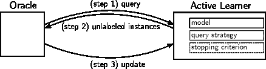

<!--yml

类别：未分类

日期：2024-09-06 19:59:47

-->

# [2008.07267] 使用深度神经网络的文本分类主动学习调查

> 来源：[`ar5iv.labs.arxiv.org/html/2008.07267`](https://ar5iv.labs.arxiv.org/html/2008.07267)

\ProvidesForestLibrary

edges \forestset declare dimen=fork sep0.5em, forked edge/.style= edge=rotate/.pgfmath=grow(), edge path’=(!u.parent anchor) – ++(\forestoptionfork sep,0) |- (.child anchor), , forked edges/.style= for tree=parent anchor=children, for descendants=child anchor=parent,forked edge

# 使用深度神经网络的文本分类主动学习调查

Christopher Schröder 自然语言处理组，莱比锡大学 Andreas Niekler 自然语言处理组，莱比锡大学

###### 摘要

自然语言处理（NLP）和神经网络（NNs）近年来都发生了重大变化。然而，尽管神经网络目前非常流行，它们在主动学习（AL）中的应用却不那么常见。通过利用神经网络在文本分类中的优越表现，我们可以在使用相同数据量的情况下提高模型的性能，或者减少数据量，从而减少所需的标注工作量，同时保持相同的性能。我们回顾了深度神经网络（DNNs）在文本分类中的主动学习，并详细讨论了两个主要的阻碍因素：（a）神经网络无法提供可靠的不确定性估计，而大多数常用的查询策略依赖于此；（b）在小数据集上训练深度神经网络的挑战。为了解决前者，我们构建了一个查询策略的分类法，区分了基于数据、基于模型和基于预测的实例选择，并调查了这些类别在最近研究中的普及情况。此外，我们还回顾了在（D）NNs 背景下，神经网络在 NLP 中的最新进展，如词嵌入或语言模型，并调查了主动学习、文本分类和深度神经网络的当前前沿状态，并将 NLP 中的最新进展与主动学习关联起来。最后，我们分析了最近在文本分类中的主动学习研究，将相关的查询策略与分类法联系起来，概述了共同点和不足之处。因此，我们强调了当前研究中的空白，并提出了开放的研究问题。

## 1 引言

数据是机器学习应用的燃料，因此其价值不断增加。在许多设置中，会产生大量的未标记数据，但为了在监督学习中使用这些数据，必须提供标签。这通常需要手动标记过程，这通常并非简单，并且可能需要领域专家，例如在专利分类[52, 23]或临床文本分类[75, 24, 28]中。此外，这一过程耗时且迅速增加财务成本，从而迅速使这种方法变得不可行。即使有专家，也常常无法标记每个数据点，因为现代数据集的规模庞大。这尤其阻碍了自然语言处理（NLP）领域，在该领域中，数据集和每个文档中的文本量都可能非常庞大，导致对人工专家而言的注释工作量无法承受。

主动学习（AL）的目标是减少由人工专家注释的数据量。这是一个在 oracle（通常是人工注释者）和主动学习者之间的迭代循环过程。与被动学习相比，被动学习只是将数据提供给算法，主动学习者则选择下一步要标记的样本。然而，标记本身是由人工专家完成的，即所谓的“人机环节”。在获得新标签后，主动学习者训练一个新模型，过程从头开始。使用“主动学习者”一词，我们指的是模型、查询策略和停止标准的组合。在这项工作中，模型是文本分类模型，查询策略决定了哪些实例应该被标记，停止标准定义了何时停止 AL 循环。根据[85]，AL 有三种主要场景：（1）基于池的，学习者可以访问一组封闭的未标记实例，称为池；（2）基于流的，学习者一次接收一个实例，并有选择保留或丢弃；（3）成员查询合成，学习者创建新的人工实例进行标记。如果基于池的场景不是对单个实例操作，而是对一批实例操作，这被称为批处理模式 AL [85]。在这项工作中，我们假设一个基于池的批处理模式场景，因为在文本分类设置中，数据集通常是封闭的，并且批量操作减少了重训练操作的数量，从而减少了用户等待时间。

AL 的基本思想是，少量具有代表性的实例可以用作完整数据集的替代品。较小的数据子集不仅降低了计算成本，而且研究表明，AL 甚至可以提高模型的质量，相较于在完整数据集上学习[83, 24]。因此，AL 已被广泛应用于许多 NLP 任务，如文本分类[95, 39]、命名实体识别[88, 94, 89]或机器翻译[35]，并且仍然是一个活跃的研究领域。

近年来，深度学习（DL）方法在大多数 NLP 任务中主导了最先进的结果。这可以归因于神经网络（NNs）的进展，特别是卷积神经网络（CNN；[48]）和（双向）长短期记忆（LSTM；[38, 31]），它们最终被引入到 NLP 领域，以及词嵌入[66, 65, 74]和上下文化词嵌入[76, 20]的进展。NN 架构和文本表示显著提高了文本分类领域的最先进结果（例如，[103, 41, 102]）。如果这些改进可以转移到 AL 中，将会极大地提高效率。对于 AL 从业者来说，这意味着使用更少的样本实现相同的性能，或者在使用相同的数据量时提高性能。另一个有利的发展是迁移学习，特别是微调预训练语言模型（LMs）的范式，已在 NLP 中变得流行。在 AL 的背景下，这在小数据场景中尤为重要，在这种情况下，可以利用预训练模型，通过微调仅使用少量数据来训练模型，否则这将是不可行的。最后，通过在子词单元上操作，LMs 还能够处理词汇表外的标记，这相对于许多传统方法是一个优势。

这些进展导致现有的 AL 调查在某些部分变得不完整，在其他部分则过时：它们缺乏与当前最先进模型的比较，没有为更近期的大规模数据集提供结果，并且最重要的是，缺乏前述的 NNs 和文本表示的进展。令人惊讶的是，尽管 NNs 目前非常流行，但关于基于 NN 的主动学习在 NLP 背景下的研究仍然很少，在文本分类的背景下更少（详见第 3.2 节和第 4.2 节）。我们怀疑这主要是由于以下原因：（1）许多 DL 模型已知需要大量数据[103]，这与 AL 旨在尽可能少使用数据的目标形成鲜明对比；（2）存在基于人工数据生成的 AL 场景，这对文本来说比例如图像中的数据增强要困难得多[100]；（3）NNs 缺乏关于其预测的不确定性信息（如第 3.2 节所述），这使得使用一整类显著的查询策略变得复杂。

本次调查旨在总结现有的基于（D）NN 的文本分类 AL 方法。我们的主要贡献如下：

1.  1.

    我们提供了查询策略的分类，并将与文本分类相关的 AL 策略进行分类。

1.  2.

    我们调查了 AL、文本分类和（D）NNs 的交集中的现有工作。

1.  3.

    对文本分类的最新进展进行总结，并与 AL 过程相关联。然后调查这些进展是否以及在何种程度上被应用于 AL。

1.  4.

    之前研究的实验设置从数据集、模型和查询策略方面进行综合分析，以识别实验中的近期趋势、共同点和不足之处。

1.  5.

    我们识别研究中的空白并概述未来的研究方向。

因此，我们提供了关于基于 NN 的主动文本分类的最新进展的综合调查。在回顾这些最新进展后，我们阐明了需要重新评估的领域或在更近期背景下尚未评估的领域。最终结果是，我们提出了研究问题，勾勒出未来研究的范围。

## 2 相关工作

[85]提供了一般性的主动学习调查，总结了流行的 AL 场景类型和查询策略。他们展示了基本 AL 设置的变体，如可变标记成本或替代查询类型，最值得注意的是，他们讨论了研究 AL 效果的实证和理论研究：他们提到研究表明，AL 在实践中是有效的，并且在实际应用中越来越受到采用。然而，也指出实证研究还报告了 AL 表现不如被动学习的情况，并且 AL 的理论分析是不完整的。最后，相关研究领域的关系被阐明，从而将 AL 与其他领域如强化学习和半监督学习联系起来。

[25]的调查集中在对基于不确定性的查询策略的深入分析，这些策略被分类到一个分类法中。该分类法在最顶层区分了 i.i.d.实例的不确定性和实例相关性。后者是前者的超集，旨在通过在查询时考虑特征、标签和结构的相关性来减少实例之间的冗余。此外，他们对每种查询策略进行了算法分析，并根据各自的时间复杂度对策略进行排序，突出了基于相关性的策略的复杂性增加。

另一项涵盖广泛主题的综合调查由[1]进行。他们提供了查询策略的平面分类，这与[25]的分类法有所不同，并将其分为以下三类：（1）“基于异质性”的，按照预测的不确定性或与现有标记实例的不相似性来采样实例，（2）“基于性能”的，依据模型损失的预测变化来选择实例，以及（3）“基于代表性”的，选择数据点以反映在其属性上的更大集合，通常通过分布密度来实现[1]。与[85]类似，他们展示并讨论了许多非标准的主动学习场景变体。

一项针对 NLP 的主动学习调查由[71]进行。该工作的主要贡献是对基于分歧的查询策略的综述，这些策略利用多个分类器之间的分歧来选择实例。此外，Olsson 还回顾了实际考虑因素，例如选择初始种子集、决定流式和池式场景之间的选择，以及决定何时终止学习过程。

尽管提到了一些基于神经网络的应用，但上述调查中没有一个深入涵盖基于神经网络的主动学习。此外，没有一个调查足够新颖，以涵盖神经网络架构，这些架构最近才成功地应用于文本分类问题，例如，KimCNN [48]。最近在自然语言处理中的进展，如词嵌入、上下文化语言模型（在第 4.1 节中解释）或由此产生的文本分类进展（在第 4.1 节和第 4.2 节中讨论）也同样适用。我们打算在本调查的其余部分填补这些空白。

## 3 主动学习

主动学习的目标是使用尽可能少的标记实例来创建模型，即最小化 oracle 和主动学习者之间的交互。主动学习过程（如图 1 所示）如下：oracle 从主动学习者那里请求未标记的实例（查询，见图 1：步骤 1），这些实例由主动学习者（基于所选查询策略）选择，并传递给 oracle（见图 1：步骤 2）。随后，这些实例由 oracle 进行标记并返回给主动学习者（更新，见图 1：步骤 3）。每次更新步骤后，主动学习者的模型都会被重新训练，这使得此操作至少与底层模型的训练一样昂贵。这个过程会一直重复，直到满足停止标准（例如，最大迭代次数或分类准确率的最小变化阈值）。

图 1：主动学习过程概述：模型、查询策略和（可选的）停止标准是主动学习者的关键组成部分。主要循环如下：首先，oracle 询问主动学习者，主动学习者返回固定数量的未标记实例。然后，oracle 为所有选定的未标记实例分配标签。此过程重复进行，直到 oracle 停止或满足预定义的停止标准。

对于主动学习，最重要的组件是查询策略。在介绍中我们声明了大量查询策略是基于不确定性的。为了分析这一点，我们在接下来的部分提供了查询策略的分类法，并突出了涉及不确定性的部分。有关主动学习的全面和详细介绍，请参阅[85]和[1]的综述。

### 3.1 查询策略

在图 2 中，我们根据策略的输入信息对最常见的主动学习查询策略进行分类，该信息表示策略操作的数值。在我们的分类法中，输入信息可以是随机的，也可以是数据、模型和预测之一。这些类别按复杂性递增排序，并且不是相互排斥的。显然，模型是数据的函数，预测是模型和数据的函数，并且在许多情况下，一个策略使用这些标准的多个组合。在这种情况下，我们将查询策略分配到最具体的类别（即预测基础优先于模型基础，而模型基础又优先于数据基础）。

{森林}

对树= grow’=0, 绘制, 分叉边缘, [查询策略, 无边缘, 根节点 [随机, onode_dashed [,phantom] ] 基于数据, onode [数据不确定性, onode [区分性

[[34], 层级=叶子, tnode] ] 代表性, onode [聚类, onode [平面

[[101, 68], 层级=叶子, tnode] 层次

[[18, 77], 层级=叶子, tnode] ] 集合构造, onode [核心集

[[84, 78], 层级=叶子, tnode] ] ] ] 基于模型, onode [模型不确定性, onode [UNC-IE

[[87], 层级=叶子, tnode] ] 期望参数

变化, onode [期望梯度长度

[[86, 104], 层级=叶子, tnode] 期望权重变化

[[96], 层级=叶子, tnode] ] 对抗性, tnode [DFAL

[[22], 层级=叶子, tnode] ] ] 基于预测, name=prediction_based, onode [预测

不确定性, name=prediction_uncertainty, tnode [概率, onode [不确定性采样 [[55], 层级=叶子,tnode] ] 基于边际, onode [版本空间

[[95], 层级=叶子,tnode] 最接近超平面

[[83], 层级=叶子,tnode] ] 熵, name=entropy, onode [BALD

[[40], 层级=叶子,tnode] ] ] 区分性, onode [DAL

[[29], tier=leaf , tnode] ] 预期预测变化

, onode [预期错误减少

[[81], name=lastnode, tier=leaf, tnode] ] [disagreement, name=disagreement, onode_dashed [,phantom, tier=leaf] ] ] ] \draw[zlevel,-] (disagreement.east) -| (entropy.south); \draw[zlevel,-] (entropy.north) |- (prediction_uncertainty.east); currentboundingbox.south)coordinates1); \draw[decorate,decoration=brace,amplitude=1em,mirror] ([yshift=-3pt]prediction_based.south west|-s1) – node[below=1em] class ([yshift=-3pt,xshift=-1pt]prediction_based.south east|-s1); \draw[decorate,decoration=brace,amplitude=1em,mirror] ([yshift=-3pt,xshift=1pt]prediction_based.south east|-s1) – node[below=1em] subclass(es) ([yshift=-3pt,xshift=-1pt]lastnode.south west|-s1); \draw[decorate,decoration=brace,amplitude=1em,mirror] ([yshift=-3pt,xshift=1pt]lastnode.south west|-s1) – node[below=1em] example ([yshift=-3pt,xshift=-1pt]lastnode.south east|-s1);

图 2：AL 查询策略的分类。关键区别在于第一层，在这一层，查询策略根据其访问不同类型输入信息的能力进行分类。从第二层到倒数第二层，我们形成一致的子类，最后一层展示了各自类别的示例。由于现有查询策略的丰富性，这个分类并不详尽，并且偏向于 NLP 中的查询策略。

#### 随机

随机性传统上被用作许多任务的基准。在这种情况下，随机抽样是以随机方式选择实例的，并且是 AL 实例选择的强基准[55, 83, 81]。它的表现通常与更复杂的策略相竞争，特别是当标记池变得更大时[84, 22]。

#### 基于数据

基于数据的策略具有最低的知识水平，即它们只处理原始输入数据和（可选的）标记池的标签。我们进一步将它们分类为（1）依赖于数据不确定性的策略，这些策略可能使用有关数据分布、标签分布和标签相关性的信息，以及（2）代表性策略，这些策略尝试通过使用较少的代表性实例来表示整个数据集的属性。

#### 基于模型

模型基于的策略了解数据和模型。这些策略基于模型为给定实例提供的度量来查询实例。例如，这可以是模型对给定实例的解释的置信度度量[26]，例如，模型如何评估遇到的特征的可靠性。这也可以是一个期望的量，例如梯度的大小[86]。虽然仍可以获得模型的预测，但我们规定目标度量必须是模型的（观察到的或期望的）量，不包括最终预测。模型基于的不确定性是一个值得注意的子类，它使用模型权重的不确定性进行操作[26]。[87] 描述了一个类似的类别，其中不确定性源于在训练数据中找不到足够的证据，即在训练时无法分离类。他们将这种不确定性称为证据不足不确定性。

#### 基于预测

基于预测的策略通过评分其预测输出来选择实例。这一类中最突出的成员是基于预测不确定性和基于分歧的方法。[87] 将预测不确定性标记为冲突证据不确定性，而他们与本研究相反地，将其视为另一种形式的基于模型的不确定性。在模型基于和预测基于不确定性之间，有时只有一线之隔。大致而言，在分类设置中，预测基于的不确定性对应于类间不确定性，而模型基于的不确定性对应于类内不确定性。在文献中，不确定性采样[55] 通常指的是预测基于的不确定性，除非另有说明。

#### 集成

当查询策略结合多个其他策略的输出时，这称为集成。由于多种原因，我们仅在分类法中对集成策略进行分类（见图 2），而不详细讨论： (1) 集成策略再次由原始查询策略组成，这些策略可以使用我们的分类法进行分类。 (2) 集成策略可以是混合型的，即它们可以是不同类别查询策略的混合。此外，集成的输出通常是单个分类器之间分歧的函数，这在之前的调查中已经涵盖[71] 和 [25]。

我们并不是第一个提供查询策略分类的人：[1] 提供了一种替代分类，将查询策略分为基于异质性的模型、基于性能的模型和基于代表性的模型。基于异质性的模型试图对当前标记池中的数据点进行多样化采样。此类模型包括不确定性采样和集成方法，即没有区分集成方法和单模型策略。基于性能的模型旨在采样以提高模型的性能，例如减少模型的误差。这与我们的模型驱动类交叉，但它缺乏关注参数变化（例如，预期梯度长度[86]）的策略，与度量变化不同。最后，基于代表性的策略采样实例，使子样本的分布尽可能类似于训练集。虽然与我们的数据驱动类相似，但它们总是假设存在一个模型，而数据驱动策略则没有这种假设。

[25] 将查询策略分为基于不确定性和基于多样性的类。基于不确定性的策略假设实例是独立同分布的；它们为每个实例计算一个单独的分数，这成为实例选择的基础。基于多样性的策略是其超集，并且额外考虑实例之间的相关性。因此，它们将不确定性和相关性作为查询策略的关键组成部分。这种分类通过仅考虑不确定性和相关性成功地区分了查询策略。然而，它在输入信息方面不如我们的分类体系透明。尽管如此，相关性是与我们的分类体系正交的因素，可以作为附加标准添加。

在创建我们的分类体系后，我们发现了深度学习中对不确定性的最近分类[26]，它区分了数据不确定性、模型不确定性和预测不确定性，这与分类体系的第一级（数据驱动、模型驱动、基于预测的查询策略）相似。尽管这种分类自然地源于数据处理的程度，我们强调我们并不是首个提出这种抽象概念的。

通过使用输入信息作为决定性标准，这一分类法提供了一种信息导向的查询策略视角。它突出显示了不确定性在现有查询策略中的哪些部分以及如何涉及。然而，正如第 3.2 节所述，神经网络中的不确定性被认为是具有挑战性的。此外，我们使用这一分类法来对第 4.3 节中的文本分类主动学习的最新工作进行分类。

### 3.2 基于神经网络的主动学习

在这一部分，我们探讨了神经网络在主动学习（AL）应用中为何不更为普及的问题。这可以归因于两个核心主题：神经网络中的不确定性估计，以及神经网络对大数据的需求与主动学习处理小数据之间的对比。我们从神经网络的角度来审视这些问题，减轻了自然语言处理（NLP）的关注。

#### 先前的工作

早期的基于神经网络的主动学习研究可以分为基于不确定性的[16]和基于集成的[50, 63]策略。前者通常使用预测熵[62, 81]作为不确定性的度量，而后者利用单个分类器之间的不一致[86]提出了期望梯度长度（EGL）查询策略，该策略通过模型权重的预期变化来选择实例。[104]首次将卷积神经网络（CNN）用于主动学习。他们提出了一种期望梯度长度策略的变体[86]，其中选择预计会在嵌入空间中导致最大变化的实例，从而训练高度可区分的表示。[84]观察到基于不确定性的查询策略对于基于 CNN 的批量模式主动学习并不有效，并提出了核心集合选择，该方法从小的子集中抽样以代表整个数据集。[5]提出了 BADGE，一种针对深度神经网络（DNNs）的查询策略，使用 k-means++初始化[4]在最终层的梯度上，以便通过不确定性和多样性进行查询。

最终，生成对抗网络（GANs; [30]）也已成功应用于主动学习（AL）任务：[106] 使用 GANs 对图像进行查询合成，利用 SVM 模型的主动学习器。实例经过合成，使其被分类时具有较高的不确定性。作者报告称，这种方法优于随机抽样、基于池的不确定性抽样（使用 SVM [95]），在某些情况下优于被动学习，但缺点是生成的实例过于相似。该方法本身既不是纯粹的神经网络（NN）方法，也不属于基于池的场景，然而，这是首次报告将 GANs 用于主动学习。[22] 使用对抗攻击找到跨越决策边界的实例，以提高模型的鲁棒性。他们训练了两个 CNN 架构，并报告其在图像分类任务上优于核心集 [84] 策略。显然，GANs 本质上属于成员查询合成场景。因此，它们的性能与人工数据合成的质量相关，即通常在自然语言处理（NLP）任务中效果不佳。这一点已经被认识到，并且已经对更好的文本生成进行了初步改进 [105]。

#### 神经网络中的不确定性

最早采用的策略之一是**不确定性抽样** [83, 95]。不幸的是，这一广泛使用的概念在应用于神经网络（NNs）时并不简单，因为它们不提供固有的不确定性指示。过去，这一问题通过集成 [50, 36, 12] 或学习误差估计 [70] 等方法得到解决。最近的方法还使用贝叶斯扩展 [11]，通过丢弃法 [91, 27] 获得不确定性估计，或使用概率神经网络（NNs）来估计预测不确定性 [51]。然而，集成和贝叶斯方法在较大数据集上很快变得不可行，NN 架构通常被认为对其预测过于自信 [33, 51]。因此，NN 中的不确定性仍然未得到充分解决，因此仍然是一个高度相关的研究领域。

#### 对比范式

DNNs（深度神经网络）在特别大规模的数据集上表现优异，但通常需要大量的数据才能表现良好（例如，[103]）。另一方面，主动学习（AL）试图减少标记数据。小型标记数据集对于 DNNs 可能是个问题，因为它们在小型数据集上容易过拟合（例如，[93，100]），导致测试集上的泛化性能差。此外，当使用小型数据集训练时，DNNs 通常对浅层模型没有明显优势[89]，因此其较高的计算成本缺乏合理性。另一方面，我们显然不能要求 AL 标记更多的数据，因为这会违背其目的。因此，已有研究探讨了如何使用小型数据集处理（D）NNs，然而这类研究仍然稀少，尤其是在大量神经网络文献的背景下。处理小型数据集大多通过使用预训练[37，97]或其他迁移学习方法[13，8，97]来规避。最后，优化超参数的搜索往往被忽视，取而代之的是使用相关工作的超参数，这些超参数如果有的话，通常是针对大数据集优化的。

## 4 主动学习用于文本分类

在 4.1 和 4.2 节中，我们首先总结了文本分类和神经网络的最新方法。我们详细阐述了每种方法在 AL 背景下的重要性，并分析了其在最近研究中的采用情况。对于采用不足的方法，我们展示了它们如何推动文本分类的 AL。最重要的是，我们提供了最近在 AL 用于文本分类的实验概述，并分析了其中的共性和不足。

### 4.1 文本分类的最新进展

#### 表示

传统方法使用词袋（BoW）表示，这种表示方式是稀疏且高维的。然而，随着像 word2vec [66, 65]、GloVe [74] 或 fastText [46] 等词嵌入的引入，词嵌入在许多情况下已经取代了 BoW 表示。这是由于几个原因：(1) 词嵌入在向量空间中表示语义关系，避免了由于同义词等原因导致的特征不匹配问题；(2) 融入词嵌入后，许多下游任务的性能得到了提升 [66, 74, 46]；(3) 与词袋模型不同，词向量是密集的、低维的表示，这使得它们适用于更广泛的算法，特别是在神经网络（NNs）等固定大小输入的背景下。为获得类似的固定大小表示（例如句子、段落或文档）已经提出了各种方法 [53]。

词嵌入是表示方法，为每个单词提供一个向量，因此也只有一个含义。这使得它们无法感知当前单词的上下文，因此无法检测和处理歧义。与词嵌入不同，语言模型（LMs）通过使用单词和周围的上下文来计算词向量[76]。这产生了一个上下文化的表示，它继承了词嵌入的优点，同时允许特定于上下文的表示（与静态嵌入相对）[76]。ELMo 是第一个广泛采用的语言模型，在多个 NLP 任务上超越了最先进的模型[76]。不久之后，BERT [20] 被引入，并提供了基于双向预训练的语言建模。创建基于 BERT 的模型的过程包括预训练和微调步骤，与 ELMo 的直接特征基础方法不同，在该方法中，上下文化的向量从预训练模型中获得并直接用作特征[20]。通过掩蔽，即在训练过程中随机移除一部分标记，训练被调整为预测被掩蔽的词。这使得双向训练成为可能，否则由于一个单词在计算其给定上下文的发生概率时可能会“看到自己”而受到阻碍[20]。随后，XLNet [102] 介绍了一种类似的预训练和微调方法，使用自回归语言模型，然而，它克服了 BERT 的限制，因为它在预训练期间不依赖于掩蔽数据[102]，此外，还成功整合了最近的 TransformerXL 架构[17]。此后，发布了各种语言模型，它们进一步优化了之前语言模型架构的预训练（例如，RoBERTa [59] 和 ELECTRA [15]），或将知识提炼到一个更小的模型中（例如，DistilBERT [82]）。与词嵌入类似，也有使用语言模型来获得句子表示的方法[80]。

所有提到的表示方法比传统的 BoW 表示提供了更丰富的表达能力，因此非常适合主动学习目的。

#### 神经网络基础的文本分类

一个著名的 CNN 架构由 [48]（KimCNN）提出，基于预训练的词向量，并且当时仅使用简单而优雅的架构就达到了最先进的结果。研究的 CNN 设置不需要太多的超参数调整，并且确认了 dropout [91] 作为 CNN 基础文本分类的正则化器的有效性。

fastText [46] 的词嵌入与其他词嵌入的不同之处在于，该方法是 (1) 监督的，并且 (2) 专门为文本分类设计的。作为一个浅层神经网络，它仍然非常高效，同时在当时能够获得与深度学习方法相当的性能。

[41] 开发了通用语言模型微调（ULMFiT），这是一种使用 AWD-LSTM 架构的语言模型迁移学习方法 [64]，在仅用 $100$ 个标注示例进行训练时，表现超越了多个文本分类数据集上的最先进技术，从而取得了显著优于先前更复杂架构的结果。像 BERT [20] 和 XLNet [102] 这样的上下文特定语言模型为每个标记生成一个上下文相关的向量，从而显著提高了基于神经网络的文本分类 [20, 102, 92]。基于神经网络的文本分类领域的最先进技术是基于语言模型的 XLNet 微调，其在测试错误率上相较于 BERT 稍有优势 [102, 92]。ULMFiT 紧随其后，而 KimCNN 仍然是一个强有力的竞争者。值得注意的是，ULMFiT、BERT 和 XLNet 都执行迁移学习，旨在将知识从一个模型转移到另一个模型 [79, 13]，从而大大减少了所需的数据量。

### 4.2 主动学习中的文本分类

传统的主动学习（AL）文本分类方法严重依赖于基于预测不确定性的查询策略 [55] 和集成 [58]。常见的模型选择包括支持向量机（SVMs; [95]）、朴素贝叶斯 [69]、逻辑回归 [39] 和神经网络 [50]。据我们所知，之前的调查没有涵盖传统的主动学习文本分类，然而，基于集成的主动学习在自然语言处理领域已由 [71] 深入探讨。

关于现代基于神经网络的主动学习（AL）在文本分类中的应用，相关模型主要是基于 CNN 和 LSTM 的深度架构：[104] 号称是首个考虑使用 DNN 进行文本分类的主动学习研究。他们使用 CNN，并提出了一种查询策略，该策略基于单词嵌入的预期变化和给定实例的模型不确定性来选择实例，从而学习出用于文本分类的判别性嵌入。[2] 评估了 SVM、LSTM 和门控递归单元（GRU；[14]）模型，并报告称后两者在中文新闻数据集 ThucNews 上的表现显著优于 SVM 基线。[61] 研究了不同文本表示在池化型主动学习场景中的表现。他们比较了频率基于的文本表示、单词嵌入和基于变换器的表示，这些表示被用作 SVM 基于主动学习的输入特征，其中基于变换器的表示 consistently yielded higher scores。[78] 调查了采样偏差，并在[103]的大规模文本语料库上应用了主动文本分类。他们展示了使用（基于熵的）不确定性采样的 FastText.zip [47] 是一个强有力的基线，与近期的主动文本分类方法相竞争。此外，他们利用这一策略获得了一个替代数据集（占总数据的 5%到 40%），在此数据集上使用 ULMFiT [41] 训练了一个基于 LSTM 的语言模型，达到了接近于在完整数据集上训练的准确度水平。与过去的出版物不同，他们报告了这种基于不确定性的策略是有效的、稳健的，同时计算成本低。这是文本分类、神经网络和深度学习交集中的最相关工作。

| 出版物 | 数据集 | 模型 | 查询策略类别 |
| --- | --- | --- | --- |

| [44] | 20N, R21, RV2, SPM | NB, SVM, kNN | 1\. 预测不确定性（LC） 2\. 预测不确定性（CTH）

3\. 预测不确定性（分歧） |

| [104] | CR, MR, SJ, MRL, MUR, DR | CNN | 1\. 模型不确定性（EGL） 2\. 预测不确定性（熵） |
| --- | --- | --- | --- |
| [10] | RMA | SVM | 1\. 预测不确定性（CTH） 2\. 预测不确定性（分歧） |
| [90] | TQA, MR | SVM, CNN, BiLSTM | 预测不确定性（分歧） |
| [60] | MR, SJ, TQA, CR | SVM, CNN, BiLSTM | 1\. 预测不确定性（熵） 2\. 预测不确定性（分歧） |
| [78] | SGN, DBP, YHA, YRP, YRF, AGN, ARP, ARF | FTZ, ULMFiT | 预测不确定性（熵） |

| [61] | MRL, MDS, BAG, G13, ACR, SJ, AGN, DBP | SVM | 1\. 预测不确定性（CTH） 2\. 预测不确定性（分歧）

3\. 基于数据（EGAL）

4\. 基于数据（密度） |

表 1：最近文本分类主动学习工作的概述。我们使用简短的键引用数据集，这些键可以在附录中的表 LABEL:tab:datasets 中查找。模型：朴素贝叶斯（NB）、支持向量机（SVM）、k-最近邻（kNN）、卷积神经网络（CNN）、[双向] 长短期记忆网络（[Bi]LSTM）、FastText.zip（FTZ）、通用语言模型微调（ULMFiT）。查询策略：最少置信度（LC）、最近超平面（CTH）、期望梯度长度（EGL）。随机选择的基线被省略。

### 4.3 先前实验的共同点和局限性

表 1 展示了最近的文本分类主动学习实验，这些实验都比[85]和[71]的综述更新。对于每个出版物，我们列出了所使用的数据集、模型和查询策略的类别（根据 3.1 节中的分类法）。我们呈现这张表是为了获得对最近偏好的分类模型和查询策略类别的见解。

从表格 1 中我们可以得出多个结论：显而易见，这些查询策略中的绝大多数属于基于预测的查询策略类别，更具体地说，属于预测不确定性和分歧基准的子类。此外，我们还可以识别出几个不足之处：首先，在许多实验中评估了两个或更多的标准数据集，但实验之间的数据集几乎没有交集。因此，我们失去了与先前研究的可比性。在最近的研究中，这可以从表格 1 中看到，唯一的大交集是[104]和[60]之间。[90]通过各自的数据集至少提供了与[104]和[60]的一些可比性。此外，RMA[3]是 R21[54]的一个子集，这些数据集被[10]和[44]使用，因此它们可能在某种程度上是可以比较的。[78]是唯一在更新的大规模文本分类数据集[103]上进行评估的研究，尽管这些数据集在规模上更为真实，但作者遗漏了经典数据集，因此很难将其贡献与以前的工作相关联。此外，由于此原因，我们不知道过去的实验是否以及在多大程度上能够推广到 DNNs[78]。

最后，目前尚不清楚最近的（D）NNs 是否受益于相同的查询策略，即过去的发现可能不适用于现代 NN 架构：[78]在最近的文献中发现了关于结合使用预测不确定性的 NNs 的有效性的矛盾说法。他们使用 FastText.zip（FTZ）模型和预测不确定性查询策略取得了竞争力的结果，尽管存在所有报告的关于 NNs 和不确定性估计的缺陷，这种方法仍然被证明非常有效，并且只需要少量的数据。

## 5 个开放的研究问题

#### 神经网络中的不确定性估计

在第三部分中已经说明，基于不确定性的策略已经成功地与非 NN 模型结合使用，并且在第 4.3 节中已经表明，它们也占据了最近基于 NN 的 AL 中查询策略的最大一部分。不幸的是，由于不准确的不确定性估计或有限的可扩展性（如在第 3.2 中描述的那样），NN 中的不确定性仍然具有挑战性。

#### 表示

正如在第 4.1 节中概述的，NLP 中文本表示的使用已经从词袋转移到静态和上下文化的词嵌入。这些表示显然提供了许多优势，如消除歧义能力、非稀疏向量，并增加了许多任务的性能。尽管已经有一些应用[104, 78, 61]，但目前还没有 AL 特定的系统评估来比较词嵌入和使用 NNs 的语言模型。此外，它们目前只被少数使用，这暗示着要么采用速度较慢，要么存在一些未经调查的实际问题。

#### 小数据集 DNNs

DL 方法通常应用于大型数据集的背景之下。然而，AL 必须意图尽可能保持（标记的）数据集尽可能小。在第三部分中，我们概述了为什么小数据集对于 DNNs 可能具有挑战性，以及对于基于 DNN 的 AL 也是直接的后果。使用预训练的语言模型，在一定程度上缓解了这个问题，因为微调允许使用相当小的数据集训练模型。尽管如此，还有待研究有多少数据仍然是成功微调模型所必需的。

#### 可比较的评估

在第 4.3 节中，我们提供了文本分类中最常见的活跃学习（AL）策略的概述。不幸的是，实验中使用的数据集组合通常完全不同，例如[90]、[60]和[78]。因此，尤其是在较新和较旧的工作之间，可比性降低甚至丧失。然而，可比性对于验证过去关于浅层神经网络（NN）基于 AL 的见解在深度神经网络（DNN）基于 AL 的背景下是否仍然适用至关重要[78]。

#### 学习如何学习

可选择的查询策略种类繁多，我们在第 3.1 节中进行了（非详尽的）分类。这引出了选择最佳策略的问题。正确的选择依赖于数据、模型或任务等多个因素，甚至在活跃学习过程的不同迭代之间也可能有所不同。因此，学习如何学习（或元学习）变得越来越流行，可以用来学习最佳选择[42]，甚至学习查询策略作为整体[6, 49]。

## 6 结论

在这项综述中，我们探讨了基于（D）NN 的主动学习（AL）在文本分类中的应用，并检查了阻碍其采纳的因素。我们创建了一个分类体系，通过数据驱动、模型驱动和预测驱动的信息区分查询策略。我们分析了在文本分类中使用的主动学习查询策略，并将其归入相应的分类体系中。我们展示了 AL、文本分类和 DNN 之间的交集，据我们所知，这是该主题的首个综述。此外，我们回顾了基于（D）NN 的 AL，确定了当前的挑战和最新进展，并指出该领域研究不足且往往缺乏可比性。此外，我们介绍了 NLP 领域的相关最新进展，将其与 AL 关联，并展示了应用中的差距和局限性。我们的主要发现之一是，不确定性驱动的查询策略仍然是最广泛使用的类别，无论分析是否限于神经网络。基于语言模型（LM）的表示提供了更细粒度的上下文特定表示，同时处理了词汇外单词。此外，我们发现基于微调的迁移学习在一定程度上缓解了小数据问题，但采用率较低。最重要的是，DNN 在许多任务上表现强劲，AL 中的首次应用已显示出有希望的结果 [104, 90]。所有这些进展对于 AL 来说都非常渴望。因此，提高 DNN 在 AL 中的应用至关重要，特别是因为预期的性能提升可以用于在相同数据量下改善分类结果，或通过减少数据从而减少标注工作来提高标注过程的效率。基于这些发现，我们确定了未来工作的研究方向，以进一步推进（D）NN 基于的 AL。

## 致谢

我们感谢 Gerhard Heyer 对手稿的宝贵反馈，感谢 Lydia Müller 就分类体系进行的富有成效的讨论和建议，感谢 Janos Borst 分享他对语言模型最新进展的看法。此项研究部分由萨克森州发展银行（SAB）资助，项目编号 100335729。

## 参考文献

+   [1] Charu C. Aggarwal 等. “主动学习：综述” 见 *数据分类：算法与应用* CRC 出版社, 2014 年, 第 571–606 页

+   [2] Bang An, Wenjun Wu 和 Huimin Han “文本分类的深度主动学习” 见 *第 2 届国际视觉、图像与信号处理会议论文集 - ICVISP 2018* 拉斯维加斯, NV, USA: ACM 出版社, 2018 年，第 1–6 页

+   [3] Chidanand Apté, Fred Damerau 和 Sholom M. Weiss “面向语言无关的文本分类模型自动学习” 见 *第 17 届国际 ACM SIGIR 信息检索研究与开发会议论文集*，SIGIR ’94，1994 年，第 23–30 页

+   [4] David Arthur 和 Sergei Vassilvitskii 《K-Means++：精心初始化的优势》 载于 *Proceedings of the Eighteenth Annual ACM-SIAM Symposium on Discrete Algorithms*，SODA ’07 新奥尔良，路易斯安那州：工业与应用数学学会，2007，第 1027–1035 页

+   [5] Jordan T. Ash 等 《通过多样化、不确定梯度下界的深度批量主动学习》 arXiv: 1906.03671 载于 *arXiv:1906.03671 [cs, stat]*，2019 网址：[`arxiv.org/abs/1906.03671`](http://arxiv.org/abs/1906.03671)

+   [6] Philip Bachman、Alessandro Sordoni 和 Adam Trischler 《主动学习的学习算法》 载于 *Proceedings of the 34th International Conference on Machine Learning* 70, ICML’17 JMLR.org，2017，第 301–310 页

+   [7] Mark Belford、Brian Mac Namee 和 Derek Greene 《通过矩阵分解的主题建模稳定性》 载于 *Expert Systems with Applications* 91.C 美国：Pergamon Press, Inc.，2018，第 159–169 页

+   [8] Yoshua Bengio 《表示学习的深度学习：无监督学习和迁移学习》 载于 *Proceedings of the 2011 International Conference on Unsupervised and Transfer Learning Workshop* 27, UTLW’11，2011，第 17–36 页

+   [9] John Blitzer、Mark Dredze 和 Fernando Pereira 《传记、宝莱坞、音响和搅拌机：情感分类的领域适应》 载于 *Proceedings of the 45th Annual Meeting of the Association of Computational Linguistics*，2007，第 440–447 页

+   [10] Michael Bloodgood 《支持向量机主动学习算法：查询-委员会与最接近超平面选择》 载于 *2018 IEEE 第 12 届国际语义计算会议 (ICSC)*，2018，第 148–155 页

+   [11] Charles Blundell、Julien Cornebise、Koray Kavukcuoglu 和 Daan Wierstra 《神经网络中的权重不确定性》 载于 *Proceedings of the 32nd International Conference on International Conference on Machine Learning - Volume 37*，ICML’15 JMLR.org，2015，第 1613–1622 页

+   [12] John Carney、Padraig Cunningham 和 Umesh Bhagwan 《神经网络集成的置信度和预测区间》 载于 *Proceedings of the International Joint Conference Neural Networks, IJCNN* IEEE，1999，第 1215–1218 页

+   [13] Rich Caruana 《通过反向传播同时学习多个相关任务》 载于 *Advances in Neural Information Processing Systems 7* 麻省理工学院出版社，1995，第 657–664 页

+   [14] Kyunghyun Cho、Bart Van Merriënboer、Dzmitry Bahdanau 和 Yoshua Bengio 《神经机器翻译的特性：编码器-解码器方法》 载于 *Proceedings of SSST-8, Eighth Workshop on Syntax, Semantics and Structure in Statistical Translation* 计算语言学协会，2014，第 103–111 页

+   [15] Kevin Clark、Minh-Thang Luong 和 Quoc V. Le 《ELECTRA：将文本编码器预训练为判别器而非生成器》 载于 *arXiv preprint arXiv:2003.10555*，2020

+   [16] David Cohn、Les Atlas 和 Richard Ladner 《通过主动学习提高泛化能力》 载于 *Machine Learning* 15.2，1994，第 201–221 页

+   [17] Zihang Dai 等 “Transformer-XL：超越固定长度上下文的注意力语言模型” 载于 *第 57 届计算语言学协会年会论文集* 计算语言学协会, 2019, pp. 2978–2988

+   [18] Sanjoy Dasgupta 和 Daniel Hsu “主动学习的层次采样” 载于 *第 25 届国际机器学习会议论文集*，ICML ’08 赫尔辛基, 芬兰: 计算机协会, 2008, pp. 208–215

+   [19] Sarah Jane Delany, Pádraig Cunningham, Alexey Tsymbal 和 Lorcan Coyle “一种基于案例的技术用于跟踪垃圾邮件过滤中的概念漂移” 载于 *基于知识的系统* 18.4, 2005, pp. 187–195

+   [20] Jacob Devlin, Ming-Wei Chang, Kenton Lee 和 Kristina Toutanova “BERT：深度双向变换器的预训练用于语言理解” 载于 *2019 年北美计算语言学协会会议：人类语言技术卷（长篇和短篇论文）* 计算语言学协会, 2019, pp. 4171–4186

+   [21] Xiaowen Ding, Bing Liu 和 Philip S. Yu “一种整体词典基础的方法用于情感分析” 载于 *2008 年国际网络搜索与数据挖掘会议论文集*，WSDM ’08 帕洛阿尔托，加州, USA: 计算机协会, 2008, pp. 231–240

+   [22] Melanie Ducoffe 和 Frederic Precioso “针对深度网络的对抗性主动学习：一种基于边际的方法” 载于 *arXiv 预印本 arXiv:1802.09841*，2018 网址: [`arxiv.org/abs/1802.09841`](http://arxiv.org/abs/1802.09841)

+   [23] C.. Fall, A. Törcsvári, K. Benzineb 和 G. Karetka “国际专利分类中的自动化分类” 载于 *ACM SIGIR 论坛* 37.1 纽约, NY, USA: 计算机协会, 2003, pp. 10–25

+   [24] Rosa L. Figueroa 等 “临床文本分类的主动学习：它是否优于随机抽样？” 载于 *美国医学信息学协会期刊* 19.5, 2012, pp. 809–816

+   [25] Yifan Fu, Xingquan Zhu 和 Bin Li “主动学习的实例选择调查” 载于 *知识与信息系统* 35.2, 2013, pp. 249–283

+   [26] Yarin Gal “深度学习中的不确定性”，2016

+   [27] Yarin Gal 和 Zoubin Ghahramani “Dropout 作为贝叶斯近似：在深度学习中表示模型不确定性” 载于 *第 33 届国际机器学习大会论文集* 48, ICML’16 纽约, NY, USA: JMLR.org, 2016, pp. 1050–1059

+   [28] Vijay Garla, Caroline Taylor 和 Cynthia Brandt “使用拉普拉斯支持向量机的半监督临床文本分类：癌症案例管理的应用” 载于 *生物医学信息学期刊* 46.5, 2013, pp. 869–875

+   [29] Daniel Gissin 和 Shai Shalev-Shwartz “区分性主动学习” arXiv: 1907.06347 载于 *arXiv 预印本 arXiv:1907.06347*，2019 网址: [`arxiv.org/abs/1907.06347`](http://arxiv.org/abs/1907.06347)

+   [30] Ian J. Goodfellow 等 “生成对抗网络” 见于 *第 27 届国际神经信息处理系统大会 - 第 2 卷*，NIPS’14 剑桥，MA，美国：MIT 出版社，2014 年，第 2672–2680 页

+   [31] Alex Graves 和 Jürgen Schmidhuber “使用双向 LSTM 和其他神经网络架构进行逐帧音素分类” 见于 *神经网络* 18.5，2005 年，第 602–610 页

+   [32] Antonio Gulli “AG 的新闻文章语料库” 在线访问；访问于 2020 年 2 月 11 日，[`groups.di.unipi.it/~gulli/AG_corpus_of_news_articles.html`](http://groups.di.unipi.it/~gulli/AG_corpus_of_news_articles.html)，2005

+   [33] Chuan Guo, Geoff Pleiss, Yu Sun 和 Kilian Q. Weinberger “现代神经网络的校准” 见于 *第 34 届国际机器学习大会* 70，ICML’17 JMLR.org，2017 年，第 1321–1330 页

+   [34] Yuhong Guo 和 Dale Schuurmans “区分批量模式主动学习” 见于 *第 20 届国际神经信息处理系统大会*，NIPS’07 温哥华，卑诗省，加拿大：Curran Associates Inc.，2007 年，第 593–600 页

+   [35] Gholamreza Haffari 和 Anoop Sarkar “多语言统计机器翻译的主动学习” 见于 *第 47 届 ACL 年会和第 4 届 AFNLP 国际自然语言处理联合会议* 1，ACL ’09 新加坡：计算语言学协会，2009 年，第 181–189 页

+   [36] Tom Heskes “实际置信度和预测区间” 见于 *第 9 届国际神经信息处理系统大会*，NIPS’96 MIT 出版社，1996 年，第 176–182 页

+   [37] Geoffrey Hinton 和 Ruslan Salakhutdinov “使用神经网络减少数据的维度” 见于 *科学* 313.5786 美国科学促进会，2006 年，第 504–507 页

+   [38] Sepp Hochreiter 和 Jürgen Schmidhuber “长短期记忆” 见于 *神经计算* 9.8 MIT 出版社，1997 年，第 1735–1780 页 URL: [`doi.org/10.1162/neco.1997.9.8.1735`](https://doi.org/10.1162/neco.1997.9.8.1735)

+   [39] Steven C.. Hoi, Rong Jin 和 Michael R. Lyu “通过批量模式主动学习的大规模文本分类” 见于 *第 15 届国际万维网大会*，WWW ’06 爱丁堡，苏格兰：计算机协会，2006 年，第 633–642 页

+   [40] Neil Houlsby, Ferenc Huszár, Zoubin Ghahramani 和 Máté Lengyel “用于分类和偏好学习的贝叶斯主动学习” arXiv: 1112.5745 见于 *arXiv:1112.5745 [cs, stat]*，2011 年 URL: [`arxiv.org/abs/1112.5745`](http://arxiv.org/abs/1112.5745)

+   [41] Jeremy Howard 和 Sebastian Ruder “用于文本分类的通用语言模型微调” 见于 *第 56 届计算语言学协会年会（第 1 卷：长篇论文）* 计算语言学协会，2018 年，第 328–339 页

+   [42] Wei-Ning Hsu 和 Hsuan-Tien Lin “通过学习实现主动学习” 载于 *第 29 届人工智能协会会议论文集*，AAAI’15 AAAI Press，2015 年，页码 2659–2665

+   [43] Minqing Hu 和 Bing Liu “挖掘和总结客户评论” 载于 *第十届 ACM SIGKDD 国际知识发现与数据挖掘会议论文集*，KDD ’04 西雅图，WA，美国：计算机协会，2004 年，页码 168–177

+   [44] Rong Hu, Brian Mac Namee 和 Sarah Jane Delany “具有可重用性的文本分类主动学习” 载于 *应用专家系统* 45.C 美国：Pergamon Press, Inc.，2016 年，页码 438–449

+   [45] Thorsten Joachims “TFIDF 和 Rocchio 算法在文本分类中的概率分析” 载于 *第十四届国际机器学习会议论文集*，ICML ’97，1997 年，页码 143–151

+   [46] Armand Joulin, Edouard Grave, Piotr Bojanowski 和 Tomas Mikolov “高效文本分类的技巧集” 载于 *第 15 届欧洲计算语言学协会会议：第二卷，简短论文* 计算语言学协会，2017 年，页码 427–431

+   [47] Armand Joulin 等 “FastText.zip: 压缩文本分类模型” arXiv: 1612.03651 载于 *arXiv:1612.03651 [cs]*，2016 年

+   [48] Yoon Kim “用于句子分类的卷积神经网络” 载于 *2014 年自然语言处理实证方法会议（EMNLP）论文集* 计算语言学协会，2014 年，页码 1746–1751 URL: [`www.aclweb.org/anthology/D14-1181`](https://www.aclweb.org/anthology/D14-1181)

+   [49] Ksenia Konyushkova, Sznitman Raphael 和 Pascal Fua “从数据中学习主动学习” 载于 *第 31 届国际神经信息处理系统会议论文集*，NIPS’17 Curran Associates Inc.，2017 年，页码 4228–4238

+   [50] Anders Krogh 和 Jesper Vedelsby “神经网络集成、交叉验证和主动学习” 载于 *第 7 届国际神经信息处理系统会议论文集*，NIPS’94 MIT Press，1994 年，页码 231–238

+   [51] Balaji Lakshminarayanan, Alexander Pritzel 和 Charles Blundell “使用深度集成进行简单且可扩展的预测不确定性估计” 载于 *第 31 届国际神经信息处理系统会议论文集*，NIPS’17 长滩，加利福尼亚，美国：Curran Associates Inc.，2017 年，页码 6405–6416

+   [52] Leah S. Larkey “一种专利搜索和分类系统” 载于 *第四届 ACM 数字图书馆会议论文集 - DL ’99* ACM Press，1999 年，页码 179–187

+   [53] Quoc Le 和 Tomas Mikolov “句子和文档的分布式表示” 载于 *第 31 届国际机器学习会议论文集* 32，ICML’14 JMLR.org，2014 年，页码 1188–1196

+   [54] David D. Lewis “Reuters-21578 语料库” 在线。访问日期：2020 年 2 月 14 日，[`www.daviddlewis.com/resources/testcollections/reuters21578/`](http://www.daviddlewis.com/resources/testcollections/reuters21578/)，1997 年

+   [55] David D. Lewis 和 William A. Gale “训练文本分类器的序列算法” 见于 *第 17 届国际 ACM SIGIR 信息检索研究与发展会议论文集*，SIGIR ’94 Springer，1994 年，第 3–12 页

+   [56] David D. Lewis、Yiming Yang、Tony G. Rose 和 Fan Li “RCV1：文本分类研究的新基准集合” 见于 *J. Mach. Learn. Res.* 5 JMLR.org，2004 年，第 361–397 页

+   [57] Xin Li 和 Dan Roth “学习问题分类器” 见于 *第 19 届国际计算语言学会议论文集* 1，COLING ’02 台北，台湾：计算语言学协会，2002 年，第 1–7 页 DOI: [10.3115/1072228.1072378](https://dx.doi.org/10.3115/1072228.1072378)

+   [58] Ray Liere 和 Prasad Tadepalli “用于文本分类的委员会主动学习” 见于 *第十四届人工智能国家会议暨第九届人工智能创新应用会议论文集*，AAAI’97/IAAI’97 AAAI Press，1997 年，第 591–596 页

+   [59] Yinhan Liu 等 “RoBERTa：一种强健优化的 BERT 预训练方法” arXiv: 1907.11692 见于 *arXiv:1907.11692 [cs]*，2019 年 URL: [`arxiv.org/abs/1907.11692`](http://arxiv.org/abs/1907.11692)

+   [60] David Lowell、Zachary C. Lipton 和 Byron C. Wallace “部署主动学习的实际障碍” 见于 *2019 年自然语言处理实证方法会议暨第 9 届国际联合自然语言处理会议（EMNLP-IJCNLP）论文集* 计算语言学协会，2019 年，第 21–30 页

+   [61] Jinghui Lu 和 Brian MacNamee “基于预训练变换器语言模型的表示在主动学习中的有效性调查” 见于 *arXiv 预印本 arXiv:2004.13138*，2020 年

+   [62] David JC MacKay “证据框架在分类网络中的应用” 见于 *神经计算* 4.5 MIT Press，1992 年，第 720–736 页

+   [63] Prem Melville 和 Raymond J. Mooney “用于主动学习的多样化集成” 见于 *第 21 届国际机器学习会议论文集*，ICML ’04 Banff，阿尔伯塔，加拿大：计算机协会，2004 年，第 584–591 页

+   [64] Stephen Merity、Nitish Shirish Keskar 和 Richard Socher “正则化和优化 LSTM 语言模型” 见于 *arXiv 预印本 arXiv:1708.02182*，2017 年

+   [65] Tomas Mikolov 等 “词语和短语的分布式表示及其组合性” 见于 *第 26 届国际神经信息处理系统会议论文集* 2，NIPS’13 Red Hook，NY，美国：Curran Associates Inc.，2013 年，第 3111–3119 页

+   [66] Tomas Mikolov, Kai Chen, Greg Corrado 和 Jeffrey Dean “向量空间中词表示的高效估计” 载于 *第 1 届国际学习表示会议，ICLR 2013，亚利桑那州斯科茨代尔，美国，2013 年 5 月 2-4 日，研讨会论文集*，2013 年

+   [67] Arjun Mukherjee 和 Bing Liu “改善博客作者的性别分类” 载于 *2010 年自然语言处理实证方法会议论文集*，EMNLP ’10 剑桥，马萨诸塞州：计算语言学协会，2010 年，第 207–217 页

+   [68] Hieu T. Nguyen 和 Arnold Smeulders “使用预聚类的主动学习” 载于 *第 21 届国际机器学习会议论文集*，ICML ’04 纽约，美国：计算机协会，2004 年，第 623–630 页 DOI: [10.1145/1015330.1015349](https://dx.doi.org/10.1145/1015330.1015349)

+   [69] Kamal Nigam, Andrew McCallum, Sebastian Thrun 和 Tom M. Mitchell “使用 EM 对标记和未标记文档进行文本分类” 载于 *机器学习* 39，2000 年，第 103–134 页

+   [70] David A. Nix 和 Andreas S. Weigend “用于非线性回归的局部误差条学习” 载于 *神经信息处理系统进展 7*，NIPS’94 麻省理工学院出版社，1995 年，第 489–496 页

+   [71] Fredrik Olsson “关于自然语言处理背景下主动机器学习的文献综述” 瑞典计算机科学研究所技术报告，2009 年，第 59 页

+   [72] Bo Pang 和 Lillian Lee “情感教育：基于最小割的主观性总结进行情感分析” 载于 *第 42 届计算语言学协会年会论文集*，ACL ’04 美国：计算语言学协会，2004 年，第 271–278 页

+   [73] Bo Pang 和 Lillian Lee “看星星：利用类关系进行情感分类以适应评分尺度” 载于 *第 43 届计算语言学协会年会论文集*，ACL ’05 安娜堡，密歇根州：计算语言学协会，2005 年，第 115–124 页

+   [74] Jeffrey Pennington, Richard Socher 和 Christopher Manning “GloVe：全球词向量表示” 载于 *2014 年自然语言处理实证方法会议论文集 (EMNLP)* 计算语言学协会，2014 年，第 1532–1543 页

+   [75] John P. Pestian 等 “涉及临床自由文本的多标签分类的共享任务” 载于 *BioNLP 2007 研讨会论文集：生物学、转化医学和临床语言处理*，BioNLP ’07 布拉格，捷克共和国：计算语言学协会，2007 年，第 97–104 页 DOI: [10.3115/1572392.1572411](https://dx.doi.org/10.3115/1572392.1572411)

+   [76] Matthew E. Peters 等 “深度上下文化词表示” arXiv: 1802.05365 载于 *arXiv:1802.05365 [cs]*，2018 年 URL: [`arxiv.org/abs/1802.05365`](http://arxiv.org/abs/1802.05365)

+   [77] Forough Poursabzi-Sangdeh, Jordan Boyd-Graber, Leah Findlater 和 Kevin Seppi “ALTO：带有主题概述的主动学习，以加速标签诱导和文档标记” 见于 *第 54 届计算语言学协会年会（第 1 卷：长篇论文集）* 计算语言学协会，2016 年，第 1158–1169 页

+   [78] Ameya Prabhu, Charles Dognin 和 Maneesh Singh “深度主动分类中的采样偏差：实证研究” 见于 *2019 年自然语言处理实证方法会议暨第 9 届国际自然语言处理联合会议论文集（EMNLP-IJCNLP）* 计算语言学协会，2019 年，第 4058–4068 页

+   [79] Lorien Y. Pratt, Jack Mostow, Candace A. Kamm 和 Ace A. Kamm “神经网络之间的直接知识转移。” 见于 *AAAI* 91，1991 年，第 584–589 页

+   [80] Nils Reimers 和 Iryna Gurevych “Sentence-BERT: 使用 Siamese BERT 网络的句子嵌入” 见于 *2019 年自然语言处理实证方法会议暨第 9 届国际自然语言处理联合会议论文集（EMNLP-IJCNLP）* 计算语言学协会，2019 年，第 3982–3992 页

+   [81] Nicholas Roy 和 Andrew McCallum “通过采样估计误差减少来实现最佳主动学习” 见于 *第十八届国际机器学习会议论文集*，ICML ’01 Morgan Kaufmann Publishers Inc.，2001 年，第 441–448 页

+   [82] Victor Sanh, Lysandre Debut, Julien Chaumond 和 Thomas Wolf “DistilBERT，BERT 的蒸馏版本：更小、更快、更便宜、更轻量” 见于 *arXiv 预印本 arXiv:1910.01108*，2020 年

+   [83] Greg Schohn 和 David Cohn “少即是多：使用支持向量机的主动学习” 见于 *第十七届国际机器学习会议论文集（ICML 2000）* Morgan Kaufmann，2000 年，第 839–846 页

+   [84] Ozan Sener 和 Silvio Savarese “卷积神经网络的主动学习：核心集方法” 见于 *第 6 届国际学习表示会议，ICLR 2018，会议论文集*，2018 年

+   [85] Burr Settles “主动学习文献综述”，2010 年

+   [86] Burr Settles, Mark Craven 和 Soumya Ray “多实例主动学习” 见于 *第 20 届国际神经信息处理系统会议论文集*，NIPS’07 加拿大不列颠哥伦比亚省温哥华：Curran Associates Inc.，2007 年，第 1289–1296 页

+   [87] Manali Sharma 和 Mustafa Bilgic “基于证据的不确定性采样主动学习” 见于 *数据挖掘与知识发现* 31.1 Kluwer Academic Publishers，2017 年，第 164–202 页

+   [88] Dan Shen 等人. “基于多标准的命名实体识别主动学习” 见于 *第 42 届计算语言学协会年会论文集*，ACL ’04 美国：计算语言学协会，2004 年，第 589–596 页

+   [89] Yanyao Shen 等 “深度主动学习用于命名实体识别” 见于 *arXiv 预印本 arXiv:1707.05928*，2018 年 URL: [`arxiv.org/abs/1707.05928`](http://arxiv.org/abs/1707.05928)

+   [90] Aditya Siddhant 和 Zachary C. Lipton “深度贝叶斯主动学习在自然语言处理中的应用：大规模实证研究结果” 见于 *2018 年自然语言处理实证方法会议论文集* 计算语言学协会，2018 年，第 2904–2909 页

+   [91] Nitish Srivastava 等 “Dropout：防止神经网络过拟合的简单方法” 见于 *机器学习研究期刊* 15.1 JMLR.org，2014 年，第 1929–1958 页

+   [92] Chi Sun, Xipeng Qiu, Yige Xu 和 Xuanjing Huang “如何为文本分类微调 BERT？” 见于 *arXiv 预印本 arXiv:1905.05583*，2020 年

+   [93] Luke Taylor 和 Geoff Nitschke “通过通用数据增强改进深度学习” 见于 *2018 年 IEEE 计算智能研讨会系列（SSCI）*，2018 年，第 1542–1547 页

+   [94] Katrin Tomanek 和 Udo Hahn “在命名实体标注的主动学习过程中减少类别不平衡” 见于 *第五届国际知识捕获会议论文集*，K-CAP ’09 计算机协会，2009 年，第 105–112 页

+   [95] Simon Tong 和 Daphne Koller “支持向量机主动学习及其在文本分类中的应用” 见于 *机器学习研究期刊* 2, 2001 年，第 45–66 页

+   [96] Alexander Vezhnevets, Joachim M. Buhmann 和 Vittorio Ferrari “具有预期变化的语义分割主动学习” 见于 *2012 年 IEEE 计算机视觉与模式识别会议*，2012 年，第 3162–3169 页

+   [97] Raimar Wagner 等 “从少量样本中学习卷积神经网络” 见于 *2013 年国际联合神经网络会议（IJCNN）* IEEE，2013 年，第 1–7 页 URL: [`ieeexplore.ieee.org/document/6706969/`](http://ieeexplore.ieee.org/document/6706969/)

+   [98] Byron C. Wallace 等 “对在线医生评价中的潜在因素和情感进行大规模定量分析” 见于 *美国医学信息学会期刊* 21.6, 2014 年，第 1098–1103 页

+   [99] Canhui Wang, Min Zhang, Shaoping Ma 和 Liyun Ru “在 Web 环境中自动生成在线新闻话题” 见于 *第 17 届国际万维网会议论文集*，WWW ’08 北京，中国：计算机协会，2008 年，第 457–466 页

+   [100] Jason Wang 和 Luis Perez “深度学习在图像分类中的数据增强效果” 见于 *arXiv 预印本 arXiv:1712.04621*，2017 年，第 11 页

+   [101] Zhao Xu 等 “使用支持向量机进行文本分类的代表性采样” 见于 *第 25 届欧洲信息检索研究会议论文集*，ECIR’03 比萨，意大利：施普林格-Verlag，2003 年，第 393–407 页

+   [102] Zhilin Yang 等 “XLNet：用于语言理解的广义自回归预训练” 见于 *神经信息处理系统进展 32* Curran Associates, Inc.，2019 年，第 5753–5763 页

+   [103] 张翔, 赵俊博 和 杨·勒昆 “字符级卷积网络用于文本分类” 见 *第 28 届神经信息处理系统国际会议论文集* 1, NIPS’15 蒙特利尔, 加拿大: MIT Press, 2015, 页码 649–657

+   [104] 叶张, 马修·李斯 和 拜伦·C·华莱士 “主动判别文本表示学习” 见 *第三十一届 AAAI 人工智能会议论文集*, AAAI’17 AAAI Press, 2017, 页码 3386–3392

+   [105] 张益哲等. “对抗特征匹配用于文本生成” 见 *第 34 届国际机器学习会议论文集* 70, ICML’17 JMLR.org, 2017, 页码 4006–4015

+   [106] 朱家杰 和 何塞·本托 “生成对抗主动学习” 见 *arXiv 预印本 arXiv:1702.07956*, 2017

## 附录 A 附录

### A.1 数据集

以下表格提供了第 4.2 节中提到的数据集的额外信息。

表 2: 一组广泛使用的文本分类数据集。列“类型”表示分类设置（B = 二分类，MC = 多分类，ML = 多分类多标签）。列“#Train”和“#Test”显示了训练集和测试集的大小。如果没有预定义的划分，“#Train”表示整个数据集的大小。每个数据集被分配了一个简短的 id（第一列），我们在本文中用来作为参考。

(*): 文档, (**) 标签减少为正面/负面, (***) 20news-bydate 删除重复项

| Id | 名称 | 类型 | 出版 | #Train | #Test |
| --- | --- | --- | --- | --- | --- |
| TQA | TREC QA | MC | [57] | 5,500 | 500 |
| CR | 客户评论 | MC | [43] | ^*315 | - |
| ACR | 额外的客户评论 | MC | [21] | ^*325 | - |
| MDS | 多领域情感 | B | [9] | ^(**)8,000 | - |
| BAG | 博客作者性别 | B | [67] | 3,100 | - |
| G13 | Guardian 2013 | MC | [7] | 6,520 | - |
| MR | 电影评论 | B | [73] | 10,662 | - |
| MRL | 电影评论长版 | B | [72] | 2,000 | - |
| MUR | 音乐评论 | B | [9] | 2,000 | - |
| DR | 医生评论 | MC | [98] | 58,110 | - |
| SJ | 主观性 | B | [72] | 10,000 | - |
| 20N | 20 新闻组 | MC | [45] | ^(***)18,846 | - |
| R21 | Reuters-21578 | ML | [54] | 21578 | - |
| RMA | Reuters ModApté | ML | [3] | 9,603 | 3,299 |
| RV2 | RCV1-V2 | ML | [56] | 23,149 | 781,265 |
| SPM | 垃圾邮件 | B | [19] | 1,000 | - |
| AGN | AG 新闻 | MC | [32] [103] | 120,000 | 7,600 |
| SGN | 搜狗新闻 | MC | [99] | 450,000 | 60,000 |
| DBP | DBPedia | MC | [103] | 560,000 | 70,000 |
| YRP | Yelp 评论极性 | B | [103] | 560,000 | 38,000 |
| YRF | Yelp 评论完整 | MC | [103] | 650,000 | 50,000 |
| YAH | 雅虎回答 | MC | [103] | 1,400,000 | 60,000 |
| ARP | 亚马逊评论极性 | B | [103] | 3,600,000 | 40,000 |
| ARF | 亚马逊评论完整 | MC | [103] | 3,000,000 | 650,000 |
