<!--yml

category: 未分类

date: 2024-09-06 19:59:45

-->

# [2009.00236] 深度主动学习的调查

> 来源：[`ar5iv.labs.arxiv.org/html/2009.00236`](https://ar5iv.labs.arxiv.org/html/2009.00236)

# 深度主动学习的调查

彭振仁 pzhren@foxmail.com [1234-5678-9012](https://orcid.org/1234-5678-9012 "ORCID identifier") ，晓云 yxiao@nwu.edu.cn 西北大学 ，常晓军 cxj273@gmail.com RMIT 大学 ，黄泊尧 卡内基梅隆大学 ，李智辉 齐鲁工业大学（山东科学院） ，布里吉·B·古普塔 印度国家技术学院库鲁克谢特尔分校 ，陈晓江 和 王欣 西北大学

###### 摘要。

主动学习（AL）试图在标注尽可能少的样本的同时，最大化模型的性能提升。深度学习（DL）对数据有极大的需求，需要大量的数据来优化大量的参数，以便模型能够学习如何提取高质量的特征。近年来，由于互联网技术的快速发展，我们进入了一个信息丰富的时代，海量数据触手可及。因此，DL 受到了研究人员的广泛关注，并得到了迅速发展。然而，与 DL 相比，研究人员对 AL 的兴趣相对较低。这主要是因为在 DL 兴起之前，传统机器学习需要相对较少的标注样本，早期的 AL 并未得到应有的重视。尽管 DL 在各个领域取得了突破，但这些成功大多归功于大量公开的标注数据集。然而，获得大量高质量标注数据集需要耗费大量人力，这在需要高度专业知识的领域（如语音识别、信息提取、医学图像等）中是不可行的。因此，AL 逐渐开始得到应有的关注。

因此，探讨 AL 是否可以在保留 DL 强大学习能力的同时减少样本标注成本是很自然的。经过这样的研究，深度主动学习（DeepAL）应运而生。尽管这一主题的研究相当丰富，但尚未对 DeepAL 相关工作进行全面调查；因此，本文旨在填补这一空白。我们为现有工作提供了一种正式的分类方法，并进行了全面系统的概述。此外，我们还从应用角度分析和总结了 DeepAL 的发展。最后，我们讨论了与 DeepAL 相关的困惑和问题，并提供了一些可能的发展方向。

深度学习、主动学习、深度主动学习。^†^†ccs: 计算方法 学习算法

## 1\. 引言

深度学习（DL）和主动学习（AL）都是机器学习的一个子领域。DL 也被称为表示学习（Deng, 2014）。它起源于对人工神经网络的研究，实现了数据特征的自动提取。由于其复杂的结构，DL 具有强大的学习能力，但这也意味着 DL 需要大量标记样本来完成相应的训练。随着大量标注的大规模数据集的发布和计算机计算能力的持续提高，DL 相关的研究迎来了巨大的发展机会。与传统机器学习算法相比，DL 在大多数应用领域的性能上具有绝对优势。AL 关注数据集的研究，也称为查询学习（Settles, 2009）。AL 假设同一数据集中不同的样本对当前模型的更新具有不同的价值，并尝试选择具有最高价值的样本来构建训练集。然后，以最小的标注成本完成相应的学习任务。DL 和 AL 在机器学习领域都具有重要应用。由于它们优越的特性，近年来引起了广泛的研究兴趣。更具体地说，DL 在各种具有挑战性的任务中取得了前所未有的突破；然而，这在很大程度上是由于大规模标记数据集的发布（Bengio et al., 2006; Krizhevsky et al., 2012）。因此，DL 在一些需要丰富知识的专业领域受到标记样本高成本的限制。相比之下，有效的 AL 算法在标记效率上理论上可以实现指数级加速（Balcan et al., 2009）。这种标记成本的巨大潜在节省是一个令人着迷的发展。然而，经典的 AL 算法也发现很难处理高维数据（Tong, 2001）。因此，被称为 DeepAL 的 DL 和 AL 的结合，预计能实现优异的结果。DeepAL 已广泛应用于各种领域，包括图像识别（Du et al., 2019; Gal et al., 2017; Gudovskiy et al., 2020; Huang et al., 2020）、文本分类（Zhang et al., 2017b; Schröder 和 Niekler, 2020）、视觉问答（Lin 和 Parikh, 2017）以及目标检测（Qu et al., 2020; Aghdam et al., 2019; Feng et al., 2019）等。虽然已有大量相关工作发表，但 DeepAL 仍缺乏统一的分类框架。为填补这一空白，本文将对现有的 DeepAL 相关工作进行全面概述¹¹1 我们在 [DBLP](https://dblp.uni-trier.de/) 上使用“deep active learning”作为关键词搜索了大约 270 篇相关论文。我们逐一审查这些论文与 DeepAL 的相关性，剔除不相关（仅包含少量关键词）或信息缺失的论文，并手动添加一些未包含这些关键词但使用 DeepAL 相关方法或与我们当前讨论相关的论文。最后，构建了调查参考文献。最新的论文更新到 2020 年 11 月。参考文献包括 103 篇会议论文、153 篇期刊论文、3 本书（Sanderson, 2008; Tong, 2001; Farahani 和 Hekmatfar, 2009）、1 篇研究报告（Settles, 2009）和 1 篇学位论文（Zhu et al., 2005）。还有 28 篇未发表的论文，以及一个正式的分类方法。本调查的贡献总结如下：

+   •

    据我们所知，这是深度主动学习领域的首个全面综述工作。

+   •

    我们分析了结合主动学习和深度学习的挑战，并对这些挑战的 DeepAL 相关工作进行了系统总结和分类。

+   •

    我们对 DeepAL 相关应用在各个领域的情况以及未来方向进行了全面而详细的分析。

接下来，我们首先简要回顾深度学习（DL）和主动学习（AL）在各自领域的发展现状。随后，在第二部分中，我们阐述了结合 DL 和 AL 的必要性和挑战。在第三部分中，我们对深度主动学习（DeepAL）中使用的各种策略进行了全面和系统的总结和讨论。在第四部分中，我们详细回顾了 DeepAL 的各种应用。在第五部分中，我们对 DeepAL 的未来方向进行了全面讨论。最后，在第六部分中，我们对本次调查进行了总结和结论。

### 1.1\. 深度学习

深度学习（DL）试图通过模拟人脑的结构来构建适当的模型。1943 年，由(Fitch, 1944)提出的 McCulloch-Pitts (MCP) 模型被视为现代深度学习的起点。随后，在 1986 年，(Rumelhart et al., 1986b)将反向传播引入神经网络优化，为深度学习的快速发展奠定了基础。同年，递归神经网络（RNNs）（Jordan, 1986）首次被提出。1998 年，LeNet (LeCun et al., 1998) 网络首次出现，代表了深度神经网络（DNN）的早期应用之一。然而，这些开创性的早期工作受到当时计算资源的限制，未能获得应有的关注和研究（Lecun et al., 2015）。2006 年，深度置信网络（DBNs）（Hinton et al., 2006）被提出，用于探索更深层次的网络，这促使了神经网络被称为深度学习。AlexNet (Krizhevsky et al., 2012) 被认为是第一个 CNN 深度学习模型，它在大规模数据集（如 ImageNet）上的图像分类结果得到了极大的提升。在 ImageNet 大规模视觉识别挑战赛（ILSVRC）-2012 年比赛（Deng et al., 2012）中，AlexNet (Krizhevsky et al., 2012) 凭借近 10%的优势赢得了前五名测试误差率的冠军。AlexNet 利用 ReLUs（Rectified Linear Units）（Nair and Hinton, 2010）激活函数有效抑制了梯度消失问题，而使用多 GPU 则大大提高了模型的训练速度。随后，深度学习开始在各种竞赛中获胜，并在视觉数据处理、自然语言处理、语音处理等许多领域展示了非常有竞争力的结果（Yan et al., 2017, 2015）。从自动化的角度来看，深度学习的出现将机器学习中的特征手动设计（Dalal and Triggs, 2005; Lowe, 1999）转变为自动提取（Simonyan and Zisserman, 2015; He et al., 2016）。正是因为这种强大的自动特征提取能力，深度学习在许多领域展示了前所未有的优势。经过几十年的发展，关于深度学习的研究工作非常丰富。在图 1a 中，我们展示了一个标准的深度学习模型示例：卷积神经网络（CNN）（Rumelhart et al., 1986a; LeCun et al., 1989）。基于这种方法，类似的 CNN 被应用于各种图像处理任务。此外，RNNs 和 GANs（生成对抗网络）（Salvaris et al., 2018）也被广泛利用。从 2017 年开始，深度学习逐渐从最初的特征提取自动化转向模型架构设计的自动化（Zoph and Le, 2017; Ren et al., 2020; Baker et al., 2017）；然而，这仍然还有很长的路要走。

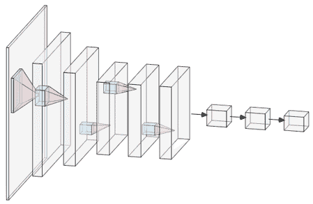

(a) 卷积神经网络的结构图。

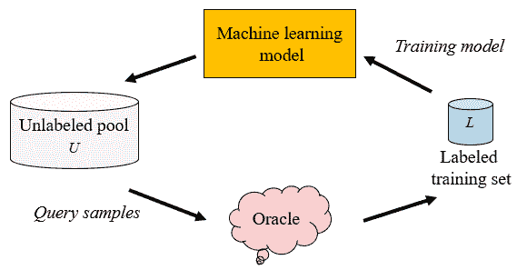

(b) 基于池的主动学习循环。

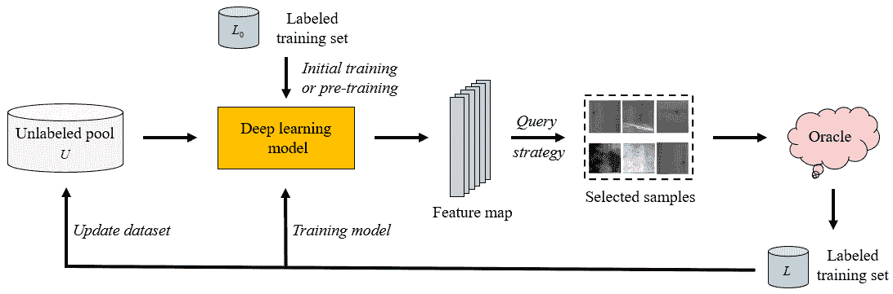

(c) 深度主动学习的一个典型示例。

图 1\. 对比典型的 DL、AL 和 DeepAL 架构。 (a) 一个常见的 DL 模型：卷积神经网络。 (b) 基于池的 AL 循环：使用查询策略从未标记池 $U$ 中查询样本，并将其交给 Oracle 进行标记，然后将查询的样本添加到标记训练数据集 $L$ 中进行训练，再用新学到的知识进行下一轮查询。重复这个过程直到标记预算耗尽或达到预定义的终止条件。 (c) DeepAL 的一个典型示例：DL 模型的参数 $\theta$ 在标记训练集 $L_{0}$ 上初始化或预训练，利用未标记池 $U$ 的样本通过 DL 模型提取特征。根据相应的查询策略选择样本，在查询中查询标签以形成新的标记训练集 $L$，然后在 $L$ 上训练 DL 模型，同时更新 $U$。重复这个过程直到标记预算耗尽或达到预定义的终止条件（有关停止策略的详细信息，请参见第 3.4 节）。

由于大量现有注释数据集的发布（Bengio 等，2006；Krizhevsky 等，2012），近年来，深度学习（DL）在包括机器翻译（Aharoni 等，2019；Tan 等，2019a；Wang 等，2019b；Bau 等，2019），语音识别（Park 等，2019；Nassif 等，2019；Qin 等，2019；Schneider 等，2019）和图像分类（He 等，2019b；Mateen 等，2019；Paoletti 等，2019；Yalniz 等，2019）等领域取得了突破。然而，这需要大量手动标注的数据集，而深度学习对数据有很强的贪婪属性。尽管在现实世界中，获取大量未标记的数据集相对简单，但手动标注数据集的成本很高；尤其是在那些标注需要高度专业知识的领域（Hoi 等，2006；Smith 等，2018）中尤为如此。例如，COVID-19 患者肺部病变图像的标注和描述需要经验丰富的临床医生完成，要求这些专业人员完成大量医学图像标注显然不切实际。类似的领域还包括语音识别（Zhu 等，2005；Abdel-Wahab 和 Busso，2019），医学成像（Hoi 等，2006；Nam 等，2019；Lee 和 Paeng，2018；Yang 等，2017），推荐系统（Adomavicius 和 Tuzhilin，2005；Cheng 等，2019），信息提取（Bhattacharjee 等，2017），卫星遥感（Liu 等，2017）和机器人技术（Calinon 等，2007；Andersson 等，2017；Takahashi 等，2017；Zhou 和 Schoellig，2019；Burka 和 Kuchenbecker，2017），机器翻译（Bloodgood 和 Callison-Burch，2014；Platanios 等，2019）以及文本分类（Zhang 等，2017b；Schröder 和 Niekler，2020）等。因此，急需一种方法来最大化模型在标注少量样本时的性能提升。

### 1.2\. 主动学习

AL 就是这样一种方法，专注于通过标记尽可能少的样本来获得尽可能多的性能提升。更具体地说，它旨在从未标记的数据集中选择最有用的样本，并交给 oracle（例如，人类标注员）进行标记，以尽可能降低标记成本，同时保持性能。AL 方法可以分为成员查询合成（Angluin，1988；King 等，2004），基于流的选择性采样（Dagan 和 Engelson，1995；Krishnamurthy，2002）和基于池的（Lewis 和 Gale，1994）AL 根据应用场景（Settles，2009）。成员查询合成意味着学习者可以请求查询输入空间中任何未标记样本的标签，包括学习者生成的样本。此外，基于流的选择性采样与基于池的采样之间的关键区别在于，前者对数据流中每个样本是否需要查询未标记样本的标签进行独立判断，而后者则根据对整个数据集的评估和排名选择最佳查询样本。与基于流的选择性采样相关的研究主要针对需要及时性的较小移动设备，因为这些小型设备通常具有有限的存储和计算能力。论文中与 AL 研究相关的更常见的基于池的采样策略更适用于具有足够计算和存储资源的大型设备。在图 1b 中，我们展示了基于池的主动学习循环的框架图。在初始状态下，我们可以从未标记的池 $U$ 中随机选择一个或多个样本，将这些样本交给 oracle 查询标签，以获得标记数据集 $L$，然后在 $L$ 上使用监督学习训练模型。接下来，我们利用这些新知识选择下一个待查询的样本，将新查询的样本添加到 $L$ 中，然后进行训练。这个过程会重复进行，直到标签预算用尽或达到预定义的终止条件（有关停止策略的详细信息，请参见第 3.4 节）。

与 DL 不同，AL 通过手动或自动方法设计具有高性能特征提取能力的模型。AL 从数据集开始，主要通过设计精细的查询规则来从未标记的数据集中选择最佳样本并查询其标签，以尽可能减少标记成本。因此，查询规则的设计对 AL 方法的性能至关重要。相关研究也相当丰富。例如，在给定的未标记数据集上，主要的查询策略包括不确定性基础方法（Lewis 和 Gale，1994；Joshi 等，2009；Ranganathan 等，2017；Tong 和 Koller，2002；Seung 等，1992；Beluch 等，2018），多样性基础方法（Bilgic 和 Getoor，2009；Guo，2010；Nguyen 和 Smeulders，2004；Gal 等，2017）和期望模型变化（Freytag 等，2014；Roy 和 McCallum，2001；Settles 等，2007）。此外，许多工作也研究了混合查询策略（Shui 等，2020；Yin 等，2017；Ash 等，2020；Zhdanov，2019），考虑了查询样本的不确定性和多样性，并试图在这两种策略之间找到平衡。由于基于不确定性的独立采样通常会导致采样偏差（Dasgupta，2011；Bloodgood 和 Vijay-Shanker，2009），当前选择的样本可能不具有代表性。另一方面，仅考虑促进采样多样性的策略可能会导致标记成本增加，因为可能会选择到大量信息内容较低的样本。更多经典查询策略在（Settles，2012）中进行了审查。尽管现有的 AL 相关研究已经相当丰富，但 AL 仍面临扩展到高维数据（如图像、文本和视频等）的难题（Tong，2001）；因此，大多数 AL 工作倾向于集中在低维问题上（Tong，2001；Hernández-Lobato 和 Adams，2015）。此外，AL 通常基于提前提取的特征查询高价值样本，但不具备提取特征的能力。

## 2\. 结合 DL 和 AL 的必要性与挑战

深度学习在高维数据处理和自动特征提取方面具有强大的学习能力，而主动学习在有效降低标注成本方面具有显著潜力。因此，显而易见的方法是将深度学习和主动学习结合起来，这将大大扩展它们的应用潜力。这种结合方法，称为 DeepAL，是在考虑两种方法的互补优势的基础上提出的，研究人员对这一领域的研究结果寄予厚望。然而，尽管主动学习相关的查询策略研究相当丰富，但将这一策略直接应用于深度学习仍然相当困难。这主要是因为：

+   •

    在深度学习中建模不确定性。基于不确定性的查询策略是主动学习（AL）研究的一个重要方向。在分类任务中，尽管深度学习（DL）可以通过 softmax 层获得标签的概率分布，但事实证明它们过于自信。最终输出的 SR（Softmax Response）（Wang et al., 2017）作为信心度量是不可靠的，因此这种方法的性能甚至会比随机采样（Wang and Shang, 2014）更差。

+   •

    标记样本的数据不足。主动学习（AL）通常依赖少量标记样本数据来学习和更新模型，而深度学习（DL）则往往对数据非常贪婪（Hinton et al., 2012）。经典主动学习方法提供的标记训练样本因此不足以支持传统深度学习的训练。此外，主动学习中常用的逐个样本查询方法在深度学习背景下也不适用（Zhdanov, 2019）。

+   •

    处理流程不一致。主动学习和深度学习的处理流程不一致。大多数主动学习算法主要集中于分类器的训练，使用的各种查询策略大多基于固定的特征表示。而在深度学习中，特征学习和分类器训练是联合优化的。因此，仅仅在主动学习框架中微调深度学习模型，或将它们视为两个独立的问题，可能会导致问题的分歧（Wang et al., 2017）。

为了解决第一个问题，一些研究人员将贝叶斯深度学习（Gal 和 Ghahramani，2015）应用于处理主动学习背景下的高维小批量样本，并且查询次数较少的情况（Gal 等，2017；Pop 和 Fulop，2018；Kirsch 等，2019；Tran 等，2019），从而有效缓解了深度学习模型对输出结果过于自信的问题。为了解决标签样本数据不足的问题，研究人员考虑使用生成对抗网络进行数据增强（Tran 等，2019）或为高置信度样本分配伪标签以扩展标记训练集（Wang 等，2017）。一些研究人员还利用标记和未标记的数据集在主动学习周期中结合监督学习和半监督学习（Simeoni 等，2019；Hossain 和 Roy，2019）。此外，(Sener 和 Savarese，2018) 的实证研究表明，以前基于启发式的主动学习（Settles，2009）查询策略在批量设置中应用于深度学习时无效；因此，对于经典主动学习中的逐一查询策略，许多研究人员将重点放在批量样本查询策略的改进上（Kirsch 等，2019；Zhdanov，2019；Gissin 和 Shalev-Shwartz，2019；Ash 等，2020），考虑了信息量和批量样本的多样性。此外，为了解决管道不一致问题，研究人员考虑修改主动学习和深度学习的联合框架，使提出的 DeepAL 模型尽可能通用，这一方法可以扩展到各种应用领域。这对推动 DeepAL 的应用具有重要意义。例如，(Yoo 和 Kweon，2019) 将主动学习的理念嵌入到深度学习中，从而提出了一种任务无关的架构设计。

## 3\. 深度主动学习

在本节中，我们将提供关于 DeepAL 相关工作的全面系统的概述。图 1c 展示了 DeepAL 模型架构的一个典型示例。深度学习模型的参数$\theta$在标记训练集$L_{0}$上初始化或预训练，同时未标记池$U$的样本用于通过深度学习模型提取特征。接下来的步骤是基于相应的查询策略选择样本，并在 oracle 中查询标签以形成新的标签训练集$L$，然后在$L$上训练深度学习模型，并同时更新$U$。这个过程会重复进行，直到标签预算耗尽或达到预定义的终止条件（有关终止策略的详细信息，请参见第 3.4 节）。从图 1c 中的 DeepAL 框架示例，我们可以大致将 DeepAL 框架分为两个部分：即未标记数据集上的 AL 查询策略和 DL 模型训练方法。这些将在接下来的第 3.1 节和第 3.2 节中讨论和总结。接下来，我们将在第 3.3 节中讨论 DeepAL 在模型泛化方面的努力。最后，我们将在第 3.4 节中简要讨论 DeepAL 中的终止策略。

### 3.1\. DeepAL 中的查询策略优化

在基于池的方法中，我们将$U^{n}=\{\mathcal{X},\mathcal{Y}\}$定义为一个具有$n$个样本的未标记数据集；其中，$\mathcal{X}$是样本空间，$\mathcal{Y}$是标签空间，$P(x,y)$是潜在分布，其中$x\in\mathcal{X},y\in\mathcal{Y}$。$L^{m}=\{X,Y\}$是当前带标签的训练集，具有$m$个样本，其中$\mathrm{x}\in X,\mathrm{y}\in Y$。在 DeepAL 的标准监督环境下，我们的主要目标是设计一个查询策略$Q$，使得$U^{n}\stackrel{{\scriptstyle Q}}{{\longrightarrow}}L^{m}$，利用深度模型$f\in\mathcal{F},f:\mathcal{X}\rightarrow\mathcal{Y}$。DeepAL 在监督环境中的优化问题可以表示为：

| (1) |  | $\mathop{\arg\min}_{L^{m}\subseteq U^{n},(\mathrm{x,y})\in L^{m},(x,y)\in U^{n}}\mathbb{E}_{(x,y)}[\ell(f(\mathrm{x}),\mathrm{y})],$ |  |
| --- | --- | --- | --- |

其中，$\ell(\cdot)\in\mathcal{R}^{+}$ 是给定的损失函数，我们期望 $m\ll n$。我们的目标是在确保预定的准确度水平的同时，将 $m$ 尽可能地缩小。因此，DeepAL 中的查询策略 $Q$ 对于减少标注成本至关重要。接下来，我们将从以下五个方面对 DeepAL 的查询策略进行全面和系统的回顾。

+   •

    批量模式深度主动学习（BMDAL）。基于批量的查询策略是深度主动学习（DeepAL）的基础。在传统的主动学习（AL）中，逐个样本查询策略效率低下，不适用于深度主动学习，因此被批量查询策略所取代。

+   •

    基于不确定性和混合查询策略。基于不确定性的查询策略是指基于样本不确定性排名来选择需要查询的样本。样本的不确定性越大，越容易被选择。然而，这可能忽略样本之间的关系。因此，考虑多种样本属性的方法被称为混合查询策略。

+   •

    深度贝叶斯主动学习（DBAL）。基于贝叶斯卷积神经网络的主动学习（Gal 和 Ghahramani，2015）被称为深度贝叶斯主动学习。

+   •

    基于密度的方法。基于密度的方法是一种查询策略，旨在从数据集的角度寻找一个核心子集（Phillips，2016），以表示整个数据集的分布，从而减少标注成本。

+   •

    深度主动学习的自动化设计。深度主动学习的自动化设计指的是使用自动化方法来设计对 DeepAL 性能有重要影响的 AL 查询策略或 DL 模型。

#### 3.1.1. 批量模式深度主动学习（BMDAL）

DeepAL 与经典 AL 的主要区别在于 DeepAL 使用基于批量的样本查询。在传统的 AL 中，大多数算法使用逐个查询的方法，这导致学习模型的频繁训练，但训练数据变化很小。这种查询方法获得的训练集不仅在 DL 模型训练中效率低下，而且容易导致过拟合。因此，有必要深入研究 BMDAL。在 BMDAL 的背景下，在每个获取步骤中，我们根据所使用的获取函数 $a$ 和在 $L$ 上训练的深度模型 $f_{\theta}(L)$ 对一批候选未标记数据样本 $\mathcal{B}=\{x_{1},x_{2},...,x_{b}\}\subseteq U$ 进行评分，以选择一批新的数据样本 $\mathcal{B}^{*}=\{x_{1}^{*},x_{2}^{*},...,x_{b}^{*}\}$。这个问题可以表述为：

| (2) |  | $\mathcal{B}^{*}=\mathop{\arg\max}_{\mathcal{B}\subseteq U}a_{batch}(\mathcal{B},f_{\theta}(L)),$ |  |
| --- | --- | --- | --- |

其中 $L$ 是标注的训练集。为了便于理解，我们也使用 $D_{train}$ 来表示标注的训练集。

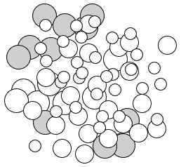

（a）仅考虑信息量的批量查询策略。

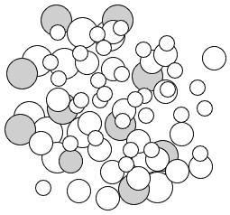

(b) 同时考虑信息量和多样性的批量查询策略。

图 2\. 两种批量查询策略的对比图，一种只考虑信息量，另一种同时考虑信息量和信息的多样性。点的大小表示样本中的信息量，而点之间的距离表示样本之间的相似性。灰色阴影的点表示批量查询中的样本点。

一种简单的方法是基于逐一策略不断查询一批样本。例如，(Gal 和 Ghahramani, 2016; Janz 等, 2017) 采用批量获取的方法，并选择 BALD（贝叶斯主动学习的不一致性）（Houlsby 等, 2011）查询得分最高的前 $K$ 个样本。该想法的获取函数 $a_{BALD}$ 表达如下：

| (3) |  |  | $\displaystyle a_{\mathrm{BALD}}\left(\left\{x_{1},\ldots,x_{b}\right\},\mathcal{P}\left(\omega\mid D_{train}\right)\right)=\sum_{i=1}^{b}\mathbb{I}\left(y_{i};\omega\mid x_{i},D_{train}\right),$ |  |
| --- | --- | --- | --- | --- |
|  |  | $\displaystyle\mathbb{I}\left(y;\boldsymbol{\omega}\mid x,D_{train}\right)=\mathbb{H}\left(y\mid x,D_{train}\right)-\mathbb{E}_{\mathcal{P}\left(\boldsymbol{\omega}\mid D_{train}\right)}\left[\mathbb{H}\left(y\mid x,\boldsymbol{\omega},D_{train}\right)\right],$ |  |

其中，$\mathbb{I}\left(y;\boldsymbol{\omega}\mid x,D_{train}\right)$ 在 BALD 中用于估计模型参数与模型预测之间的互信息。互信息值 $\mathbb{I}(*)$ 越大，样本的不确定性越高。$\boldsymbol{\omega}$ 在 $D_{train}$ 上的条件表示模型已经用 $D_{train}$ 进行过训练。而 $\omega\sim\mathcal{P}\left(\omega\mid D_{train}\right)$ 代表当前贝叶斯模型的模型参数。$\mathbb{H(*)}$ 代表模型预测的熵。$\mathbb{E}[H(*)]$ 是对模型参数后验分布下模型预测熵的期望。方程 (3 ‣ 3.1\. Query Strategy Optimization in DeepAL ‣ 3\. Deep Active Learning ‣ A Survey of Deep Active Learning")) 独立考虑每个样本，并以逐一方式选择样本以构建批量查询数据集。

然而，显然这种方法不可行，因为它很可能选择一组信息丰富但相似的样本。此类相似样本提供给模型的信息本质上是相同的，这不仅浪费了标注资源，还使得模型难以学习真正有用的信息。此外，这种独立考虑每个样本的查询方法也忽略了样本之间的相关性。这很可能导致局部决策，使得批次样本集的查询未得到充分优化。因此，如何同时考虑不同查询样本之间的相关性是 BMDAL 的主要问题。为了解决上述问题，BatchBALD（Kirsch 等， 2019）扩展了 BALD，通过估计多个数据点和模型参数之间的联合互信息来考虑数据点之间的相关性。BatchBALD 的获取函数可以表示如下：

| (4) |  |  | $\displaystyle a_{\text{BatchBALD }}\left(\left\{x_{1},\ldots,x_{b}\right\},\mathcal{P}\left(\omega\mid D_{train}\right)\right)=\mathbb{I}\left(y_{1},\ldots,y_{b};\omega\mid x_{1},\ldots,x_{b},D_{train}\right),$ |  |
| --- | --- | --- | --- | --- |
|  |  | $\displaystyle\mathbb{I}\left(y_{1:b};\boldsymbol{\omega}\mid x_{1:b},D_{train}\right)=\mathbb{H}\left(y_{1:b}\mid x_{1:b},D_{train}\right)-\mathbb{E}_{\mathcal{P}\left(\boldsymbol{\omega}\mid D_{train}\right)}\mathbb{H}\left(y_{1:b}\mid x_{1:b},\boldsymbol{\omega},D_{train}\right),$ |  |

其中 $x_{1},\ldots,x_{b}$ 和 $y_{1},\ldots,y_{b}$ 在乘积概率空间中由联合随机变量 $x_{1:b}$ 和 $y_{1:b}$ 表示，$\mathbb{I}\left(y_{1:b};\boldsymbol{\omega}\mid x_{1:b},D_{train}\right)$ 表示这两个随机变量之间的互信息。BatchBALD 通过设计一个明确的联合互信息机制来考虑不同查询样本之间的相关性，从而获得更好的查询批次样本集。

基于批次的查询策略构成了主动学习（AL）和深度学习（DL）结合的基础，相关的研究也非常丰富。我们将在以下章节中提供 BMDAL 查询策略的详细概述和讨论。

#### 3.1.2\. 基于不确定性和混合查询策略

由于基于不确定性的方法形式简单且计算复杂度低，它在主动学习中是一种非常受欢迎的查询策略。这种查询策略主要用于某些浅层模型（例如，SVM（Tong and Koller，2002）或 KNN（Jain and Kapoor，2009））。这主要是因为这些模型的不确定性可以通过传统的不确定性采样方法准确获得。在基于不确定性的采样中，学习者尝试选择最不确定的样本以形成批量查询集。例如，在边界采样（Scheffer et al.，2001）中，边界$M$定义为样本的预测最高概率与预测第二高概率之间的差值，如下所示：$M=P\left(y_{1}\mid x\right)-P\left(y_{2}\mid x\right),$ 其中$y_{1}$和$y_{2}$是当前模型下对样本$x$预测的第一和第二高概率标签。边界$M$越小，样本$x$的不确定性越大。AL 算法通过计算所有未标记样本的边界$M$，选择边界$M$最小的前$K$个样本作为批量查询集。信息熵（Settles，2009）也是一种常用的不确定性测量标准。对于一个$k$-类任务，样本$x$的信息熵$\mathbb{E}(x)$可以定义如下：

| (5) |  | $\mathbb{E}(x)=-\sum_{i=1}^{k}P(y_{i}\mid x)\cdot\log\left(P(y_{i}\mid x)\right),$ |  |
| --- | --- | --- | --- |

其中$P(y_{i}\mid x)$是当前样本$x$被预测为类别$y_{i}$的概率。样本的熵越大，其不确定性也越大。因此，应该选择信息熵最大的前$K$个样本。基于不确定性的更多查询策略可以在（Aggarwal et al.，2014）中找到。

许多 DeepAL（Ranganathan 等，2017；Asghar 等，2017；He 等，2019a；Ostapuk 等，2019）方法直接利用基于不确定性的采样策略。然而，DFAL（DeepFool Active Learning）（Ducoffe 和 Precioso，2018）认为这些方法容易被对抗样本欺骗；因此，它集中于研究接近决策边界的样本，并主动利用这些对抗样本提供的信息，以近似它们到决策边界的距离。这种对抗查询策略可以有效提高 CNN 训练的收敛速度。然而，如第 3.1.1 ‣ 3.1\. Query Strategy Optimization in DeepAL ‣ 3\. Deep Active Learning ‣ A Survey of Deep Active Learning") 节分析，这可能容易导致批次查询样本的多样性不足（从而相关的数据分布知识未被充分利用），这反过来导致 DL 模型训练性能低下或甚至无效。因此，一种可行的策略是在批次查询中使用混合查询策略，以显式或隐式方式考虑样本的信息量和多样性。

早期的 Batch Mode Active Learning (BMAL) (Wang et al., 2016; Joshi et al., 2010; Brinker, 2003; Xia et al., 2016; Nguyen and Smeulders, 2004; Tan et al., 2019b) 算法的性能往往过度依赖于样本之间的相似性度量。此外，这些算法通常只擅长**利用**（学习者往往只关注当前决策边界附近的样本，对应于高信息量的查询策略），这意味着查询批次样本集中的样本不能代表特征空间的真实数据分布（由于批次样本集的多样性不足）。为了解决这个问题，Exploration-P (Yin et al., 2017) 使用深度神经网络来学习样本的特征表示，然后明确计算样本之间的相似性。同时，**利用**和**探索**的过程（在模型训练的早期，学习者使用随机采样策略进行探索）得到了平衡，从而实现了更准确的样本相似性度量。更具体地，Exploration-P 使用方程 (5) 中的信息熵来估计当前模型下样本 $x$ 的不确定性。所选择的样本集 $S$ 的不确定性可以表示为 $E(S)=\sum_{x_{i}\in S}\mathbb{E}(x_{i})$。此外，为了度量所选样本集 $S$ 中样本之间的冗余，Exploration-P 使用 $R(S)$ 来表示选定样本集 $S$ 的冗余：

| (6) |  | $R(S)=\sum_{x_{i}\in S}\sum_{x_{j}\in S}Sim(x_{i},x_{j}),\quad Sim(x_{i},x_{j})=f(x_{i})\mathcal{M}f(x_{j}),$ |  |
| --- | --- | --- | --- |

其中，$f(x)$ 表示由深度学习模型 $f$ 提取的样本 $x$ 的特征，$Sim(x_{i},x_{j})$ 测量两个样本之间的相似性，$\mathcal{M}$ 是相似性矩阵（当 $\mathcal{M}$ 是单位矩阵时，两个样本的相似性是其特征向量的乘积。此外，$\mathcal{M}$ 也可以作为 $f$ 的一个参数来学习）。因此，所选择的样本集 $S$ 期望具有最大的**不确定性**和最小的**冗余**。为此，Exploration-P 考虑了这两种策略，最终目标方程定义为：

| (7) |  | $\mathrm{I}(S)=E(S)-\frac{\alpha}{&#124;S&#124;}R(S),$ |  |
| --- | --- | --- | --- |

其中，$\alpha$ 用于平衡混合查询策略中的不确定性和冗余的权重。

此外，DMBAL（多样化小批量主动学习）（Zhdanov，2019）通过权重将信息量加入 K-means 的优化目标，并进一步深入研究了一种混合查询策略，该策略在小批量样本查询设置下考虑样本信息量和多样性。DMBAL（Zhdanov，2019）可以轻松实现从广义线性模型到深度学习的扩展；这不仅增加了 DMBAL（Zhdanov，2019）的可扩展性，还增加了小批量中主动查询样本的多样性。图 2 展示了这一思想的示意图。这种混合查询策略相当流行。例如，WI-DL（加权增量字典学习）（Liu 等，2017）主要考虑了 DBN 的两个阶段。在无监督特征学习阶段，关键考虑因素是数据的代表性，而在有监督微调阶段，则考虑数据的不确定性；这两个指标随后被整合，并最终使用提出的加权增量字典学习算法进行优化。

尽管上述改进已取得了良好的效果，但仍存在一个必须解决的潜在风险：即，基于多样性的策略并不适用于所有数据集。更具体地说，数据集的类别内容越丰富，批量大小越大，基于多样性的方法效果越好；相比之下，基于不确定性的查询策略在批量较小和内容较少时表现更佳。这些特征依赖于数据集的统计特性。BMAL 环境下，无论数据是否陌生且潜在结构化，都无法确定哪个 AL 查询策略更为合适。鉴于此，BADGE（Batch Active learning by Diverse Gradient Embeddings）（Ash 等， 2020）在幻觉梯度空间中对不相似且高幅度的点组进行采样，这意味着模型的预测不确定性和批次样本的多样性同时被考虑。最重要的是，BADGE 可以在不需要手动调整超参数的情况下自动实现预测不确定性和样本多样性之间的平衡。此外，虽然 BADGE（Ash 等， 2020）以隐式方式考虑这种混合查询策略，WAAL（Wasserstein Adversarial Active Learning）（Shui 等， 2020）提出了一种显式平衡不确定性和多样性的混合查询策略。此外，WAAL（Shui 等， 2020）使用 Wasserstein 距离将 AL 中的交互过程建模为分布匹配问题，从中推导损失，然后将 WAAL（Shui 等， 2020）分解为两个阶段：DNN 参数优化和查询批次选择。TA-VAAL（Task-Aware Variational Adversarial Active Learning）（Kim 等， 2020）也探索了这种混合查询策略的平衡。TA-VAAL 的假设是，基于不确定性的方法未能充分利用整体数据分布，而基于数据分布的方法常常忽视任务的结构。因此，TA-VAAL 提出了将损失预测模块（Yoo 和 Kweon， 2019）和 RankCGAN（Saquil 等， 2018）的概念集成到 VAAL（Variational Adversarial Active Learning）（Sinha 等， 2019）中，从而同时考虑数据分布和模型不确定性。TA-VAAL 在各种平衡和不平衡的基准数据集上取得了良好的表现。TA-VAAL 和 VAAL 的结构图见图。3

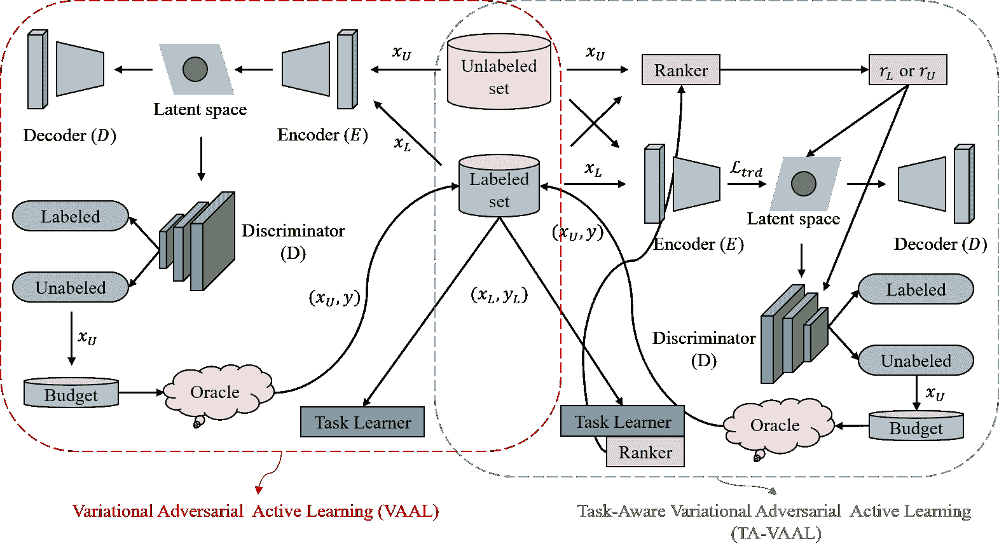

图 3\. VAAL（Sinha 等， 2019）和 TA-VAAL（Kim 等，2020）的结构比较图。1）VAAL 以半监督的方式使用标记数据和未标记数据来学习数据的潜在表示空间，然后根据潜在空间选择信息量最大的未标记数据进行标记。2）TA-VAAL 扩展了 VAAL，并将损失预测模块（Yoo 和 Kweon，2019）和 RankCGAN（Saquil 等，2018）整合到 VAAL 中，以同时考虑数据分布和模型不确定性。

值得注意的是，尽管混合查询策略表现优越，但基于不确定性的主动学习查询策略更方便与深度学习的 softmax 层输出结合。因此，基于不确定性的查询策略仍然被广泛使用。

#### 3.1.3\. 深度贝叶斯主动学习（DBAL）

如第二部分所述，分析了结合深度学习和主动学习的挑战，基于不确定性的获取函数是许多经典主动学习算法的重要研究方向。此外，传统的深度学习方法很少表示这种模型不确定性。

为了解决上述问题，出现了深度贝叶斯主动学习。在给定的输入集 $X$ 和属于类 $c$ 的输出 $Y$ 中，概率神经网络模型可以定义为 $f(\mathrm{x};\theta)$，$p(\theta)$ 是参数空间 $\theta$ 上的先验（通常是高斯分布），而似然函数 $p(\mathrm{y}=c|\mathrm{x},\theta)$ 通常由 $softma\mathrm{x}(f(\mathrm{x};\theta))$ 给出。我们的目标是获取 $\theta$ 的后验分布，如下所示：

| (8) |  | $p(\theta \mid X,Y)=\frac{p(Y \mid X,\theta)p(\theta)}{p(Y \mid X)}.$ |  |
| --- | --- | --- | --- |

对于给定的新数据点 $\mathrm{x}^{*}$，$\hat{\mathrm{y}}$ 的预测方式如下：

| (9) |  | $p\left(\hat{\mathrm{y}} \mid \mathrm{x}^{*},X,Y\right)=\int p\left(\hat{\mathrm{y}} \mid \mathrm{x},\theta\right)p(\theta \mid X,Y)d\theta=\mathbb{E}_{\theta \sim p(\theta \mid X,Y)}[f(\mathrm{x};\theta)].$ |  |
| --- | --- | --- | --- |

DBAL (Gal et al., 2017) 结合了 BCNNs（贝叶斯卷积神经网络）(Gal and Ghahramani, 2015) 和 AL 方法，将 BALD (Houlsby et al., 2011) 适配到深度学习环境中，从而开发了一个用于高维数据的新 AL 框架。该方法采用上述方法首先对 CNN 的权重进行高斯先验建模，然后使用变分推断获得网络预测的后验分布。此外，在实践中，研究人员还经常使用一种强大且低成本的 MC-dropout（蒙特卡洛丢弃）(Srivastava et al., 2014) 随机正则化技术来获得后验样本，从而在实际数据集上取得了良好的表现 (Leibig et al., 2017; Kendall et al., 2017)。此外，这种正则化技术已被证明等同于变分推断 (Gal and Ghahramani, 2016)。然而，核心集方法 (Sener and Savarese, 2018) 指出，DBAL (Gal et al., 2017) 由于需要批量采样，不适用于大型数据集。这里需要注意的是，虽然 DBAL (Gal et al., 2017) 允许在测试中使用丢弃以获得更好的置信度估计，但 (Gissin and Shalev-Shwartz, 2019) 中的分析认为，这种方法的表现与使用神经网络 SR (Wang et al., 2017) 作为不确定性采样的方法相似，这需要谨慎。此外，DEBAL（深度集成贝叶斯主动学习）(Pop and Fulop, 2018) 认为，变分推断方法中的模式崩溃现象 (Srivastava et al., 2017) 导致了 DBAL 方法的过度自信预测特征。因此，DEBAL 将集成方法的表现力与 MC-dropout 结合，以在不牺牲代表性的情况下获得更好的不确定性。至于 BatchBALD (Kirsch et al., 2019)，它选择将 BALD (Houlsby et al., 2011) 扩展到批量查询上下文；这种方法不再计算单个样本与模型参数之间的互信息，而是重新计算批量样本与模型参数之间的互信息，以联合评分样本批次。这使得 BatchBALD 能够更准确地评估联合互信息。受到最新贝叶斯核心集研究 (Huggins et al., 2016; Campbell and Broderick, 2019) 的启发，ACS-FW（具有弗兰克-沃尔夫优化的主动贝叶斯核心集）(Pinsler et al., 2019) 重建了批量结构，以优化由整个数据集引起的对数后验的稀疏子集近似。利用这种相似性，ACS-FW 然后使用弗兰克-沃尔夫 (Frank et al., 1956) 算法实现了大规模有效的贝叶斯 AL，同时其随机投影的使用使其更加流行。与其他查询策略（例如，最大化预测熵 (MAXENT) (Sener and Savarese, 2018; Gal et al., 2017) 和 BALD (Houlsby et al., 2011)) 相比，ACS-FW 实现了对整个数据流形的更好覆盖。DPEs（深度概率集成）(Chitta et al., 2018) 引入了一种可扩展的 DPEs 技术，该技术使用正则化集成来近似深度 BNN，然后在一系列大规模视觉 AL 实验中评估这些 DPEs 的分类效果。

ActiveLink（知识图谱中链接预测的深度主动学习）（Ostapuk 等人，2019）灵感源于贝叶斯深度学习的最新进展（Gal 和 Ghahramani，2016；Welling 和 Teh，2011）。 通过采用现有神经链接预测器的贝叶斯视图，扩展了不确定性采样方法，并利用知识图谱的基本结构，从而创建了全新的 DeepAL 方法。 ActiveLink 进一步指出，尽管 AL 可以有效地进行采样，但在 AL 过程中模型需要从头开始重新训练，这在 DL 模型训练环境中是不可接受的。一个简单的解决方案是使用新选定的数据来增量训练模型，或者将其与现有训练数据结合使用（Shen 等人，2017）；然而，这将导致模型偏向于新选定的少量数据或者过早选定的数据。为了解决这个偏向问题，ActiveLink 采用了一种基于元学习的原则性和无偏的增量训练方法。 更具体地说，在每个 AL 迭代中，ActiveLink 使用新选定的样本来更新模型参数，然后通过在前一次迭代中选择的样本概括模型来估计模型未来预测的元目标。 这使得 ActiveLink 能够在新选定的数据和先前选定数据之间取得平衡，从而实现对模型参数的无偏估计。

除了上述的 DBAL 工作之外，由于 BNN 的参数较少，且不确定性采样策略类似于传统的 AL，对 DBAL 的研究非常广泛，有许多与该主题相关的工作（Siddhant 和 Lipton，2018；Rottmann 等人，2018；Yang 等人，2018；Zeng 等人，2018；Gudur 等人，2019；Martínez-Arellano 和 Ratchev，2019）。

#### 3.1.4\. 基于密度的方法

密度方法一词主要指从集合的角度选择样本（核心集（Phillips，2016））。核心集的构建是一种代表性的查询策略。 这个想法主要受到核心集数据集的压缩想法的启发，并尝试使用核心集代表整个原始数据集的特征空间的分布，从而降低 AL 的标记成本。

FF-Active（最远优先主动学习）（Geifman 和 El-Yaniv，2017）基于这一思想，利用最远优先遍历神经激活空间中的表示层，从池中查询连续的点。在这里需要注意的是，FF-Active（Geifman 和 El-Yaniv，2017）和 Exploration-P（Yin 等，2017）类似于在主动学习（AL）早期阶段使用随机查询的方式，以增强 AL 的探索能力，从而防止 AL 陷入样本多样性不足的陷阱。同样，为了解决批量查询中的采样偏差问题，增加了批量查询样本的多样性。Core-set 方法（Sener 和 Savarese，2018）尝试通过构建核心子集来解决这一问题。进一步的尝试是通过构建核心子集来解决 k-Center 问题（Farahani 和 Hekmatfar，2009），使得在选定核心集上学习的模型比其他数据更具竞争力。然而，Core-set 方法需要在未标记数据集上构建一个大型距离矩阵，这意味着这一搜索过程在计算上非常昂贵；这一缺点在大规模未标记数据集上会变得更加明显（Ash 等，2020）。

主动掌纹识别（Du 等， 2019）将 DeepAL 应用于高维复杂的掌纹识别数据。类似于核心集合概念，（Du 等，2019）将 AL 视为一个二分类任务。预计标记和未标记样本集将具有相同的数据分布，使得这两者难以区分；即目标是找到一个标记的核心子集，其分布与原始数据集相同。更具体地，由于启发式生成模型模拟数据分布难以训练且不适合像掌纹这样的高维复杂数据，作者考虑样本是否能以高度信心从未标记或已标记数据集中明确区分。那些能够明显区分的样本显然与核心标注子集的数据分布不同。这些样本将被添加到标注数据集中，进行下一轮训练。以往基于核心集合的方法（Geifman 和 El-Yaniv，2017；Sener 和 Savarese，2018）通常只是尽可能查询数据点以覆盖数据流形的所有点，而不考虑密度，这导致查询的数据点过度代表来自流形稀疏区域的样本点。类似于（Du 等，2019），DAL（区分性主动学习）（Gissin 和 Shalev-Shwartz，2019）也将 AL 视为一个二分类任务，并进一步旨在使查询的标记数据集与未标记数据集无法区分。DAL（Gissin 和 Shalev-Shwartz，2019）的关键优势在于，它可以按数据密度从未标记数据集中抽样，而不会偏向稀疏热门领域的样本点。此外，DAL（Gissin 和 Shalev-Shwartz，2019）提出的方法不限于分类任务，这在概念上容易转移到其他新任务。

除了相应的查询策略，一些研究人员还考虑了批量查询大小对查询性能的影响。例如，（Kirsch 等， 2019；Zhdanov， 2019；Ash 等， 2020；Pinsler 等， 2019）主要关注较小批量的查询策略优化，而（Chitta 等， 2019）建议扩大 AL 的查询规模以进行大规模采样（每次 10k 或 500k 样本）。此外，通过整合数百个模型并重用中间检查点，可以在大规模标记数据集上高效地进行分布式训练数据搜索，计算成本较低。（Chitta 等， 2019）还证明，使用整个数据集进行训练的性能并不是性能的上限，基于子集的 AL 可能会带来更好的性能。

此外，数据集本身的属性对 DeepAL 的性能也有重要影响。考虑到这一点，GA（梯度分析）（Vodrahalli 等， 2018）评估了常见数据集中图像数据的相对重要性，并提出了一种通用数据分析工具设计，以促进对数据集中训练示例多样性的更好理解。GA（Vodrahalli 等， 2018）发现，并非所有数据集都可以在小子样本集上进行训练，因为某些数据集中样本重要性的相对差异几乎可以忽略；因此，在 AL 背景下盲目使用较小的子数据集是不明智的。此外，（Beluch 等， 2018）发现，与贝叶斯深度学习方法（Monte-Carlo dropout（Gal 等， 2017））和基于密度的方法（Sener 和 Savarese，2017）相比，基于集成的 AL 能够有效抵消数据集中类别的不平衡，从而产生更多的校准预测不确定性，并因此表现更好。

一般而言，基于密度的方法主要从数据分布的角度考虑核心子集的选择。相关的研究方法相对较少，这为样本查询提供了一个新的可能方向。

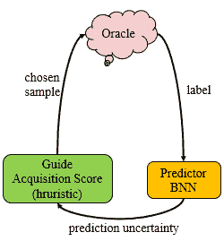

(a) 主动学习管道。

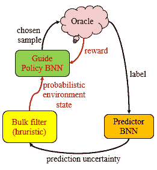

(b) 强化主动学习（RAL）（Haußmann 等， 2019）。

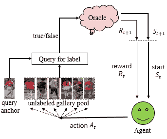

(c) 深度强化主动学习（DRAL）（Liu 等， 2019）。

图 4\. 标准 AL、RAL（Haußmann 等， 2019）和 DRAL（Liu 等， 2019）管道的比较。

#### 3.1.5\. DeepAL 的自动化设计

DeepAL 由两个部分组成：深度学习和主动学习。手动设计这两个部分需要大量的精力，并且它们的性能受限于研究人员的经验。因此，考虑如何自动化设计深度学习模型和主动学习查询策略在 DeepAL 中具有重要意义。

为此，（Fang 等，2017）将启发式 AL 算法重新定义为强化学习问题，并通过清晰的选择策略引入了新的描述。此外，一些研究人员还指出，在传统的 AL 工作流中，获取函数通常被视为固定的已知先验，并且直到标签预算用尽之前无法确定此获取函数是否合适。这使得灵活和快速地调整获取函数变得不可能。因此，使用强化学习动态调整获取函数可能是一个不错的选择。RAL（Reinforced Active Learning）（Haußmann 等，2019）提出使用 BNN 作为获取函数的学习预测器。因此，BNN 预测器提供的所有概率信息将被组合以获得综合概率分布；随后，该概率分布被发送到 BNN 概率策略网络，基于 oracle 反馈在每次标注轮次中进行强化学习。这个反馈将微调获取函数，从而不断提高其质量。DRAL（Deep Reinforcement Active Learning）（Liu 等，2019）采用了类似的思想，并为人员 Re-ID 任务设计了一个深度强化主动学习框架。这种方法利用强化学习的思想动态调整获取函数，以获取高质量的查询样本。图 4 展示了传统 AL、RAL 和 DRAL 管道的比较。AL 的管道见图 4a。标准 AL 管道通常由三部分组成。oracle 提供一组标记数据；预测器（在这里是 BNN）用于学习这些数据，并为引导提供可预测的不确定性。引导通常是一个固定的硬编码获取函数，用于选择下一个样本供 oracle 重新开始循环。RAL（Reinforced Active Learning）（Haußmann 等，2019）的管道见图 4b。RAL 用策略 BNN 替代了固定获取函数。策略 BNN 以概率方式学习，从 oracle 获取反馈，并以基于强化学习的方式学习如何选择下一个最佳样本点（新部分以红色标出）。因此，RAL 可以更灵活地调整获取函数以适应现有数据集。DRAL（Deep Reinforcement Active Learning）（Liu 等，2019）的管道见图 4c。DRAL 利用深度强化主动学习框架进行人员 Re-ID 任务。对于每个查询锚点（probe），代理（强化主动学习者）将在主动学习过程中从画廊池中选择顺序实例，并将其交给 oracle 以获得带有二元反馈（正/负）的手动注释。状态评估所有实例之间的相似性关系，并根据 oracle 反馈计算奖励以调整代理查询。

另一方面，Active-iNAS（增量神经架构搜索的主动学习）（Geifman 和 El-Yaniv，2019）注意到，大多数先前的 DeepAL 方法（Aghdam et al., 2019; Alahmari et al., 2019; Kwolek et al., 2019）假设已经为当前任务设计了一个合适的 DL 模型，这意味着它们主要关注如何设计有效的查询机制；然而，现有的 DL 模型不一定对当前的 DeepAL 任务最优。Active-iNAS（Geifman 和 El-Yaniv，2019）因此挑战了这一假设，并使用 NAS（神经架构搜索）（Ren et al., 2020）技术在进行主动学习的同时动态搜索最有效的模型架构。还有一些工作致力于为 DeepAL 提供一个方便的性能比较平台；例如，（Munjal et al., 2020）详细讨论和研究了 DeepAL 方法的鲁棒性和可重复性，并提出了许多有用的建议。

一般来说，这些查询策略并不是彼此独立的，而是相互关联的。基于批处理的 BMDAL 为 AL 查询样本在 DL 模型上的更新训练提供了基础。尽管 DeepAL 中的查询策略丰富而复杂，但它们主要设计用于考虑 BMDAL 中查询批次的多样性和不确定性。以前基于不确定性的方法通常忽略了批次中的多样性，因此可以大致分为两类：一类是设计一个明确鼓励批次多样性的机制，无论是在输入还是学习表示空间中；另一类是直接测量整个批次的互信息（MI）。

### 3.2\. DeepAL 中的标记样本数据扩展

主动学习（AL）通常只需要少量标记样本数据即可实现学习和模型更新，而深度学习（DL）则需要大量的标记数据来进行有效的训练。因此，AL 和 DL 的结合需要尽可能利用数据策略，而不消耗过多的人力资源来实现 DeepAL 模型训练。大多数先前的 DeepAL 方法（Zhao et al., 2017）通常只在通过查询策略采样得到的标记样本集上进行训练。然而，这忽略了现有未标记数据集的存在，意味着相应的数据扩展和训练策略没有得到充分利用。这些策略有助于改善 DeepAL 训练中标记数据不足的问题，而无需增加人工标记成本。因此，这些策略的研究也具有相当大的意义。

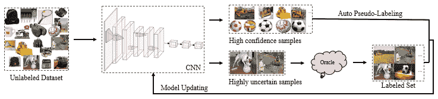

图 5\. 在 CEAL（Wang 等，2017）中，利用了 DeepAL 的整体框架。CEAL（Wang 等，2017）逐渐将未标记数据集中的样本送入初始化的 CNN，然后 CNN 分类器输出两种类型的样本：少量不确定样本和大量高预测置信度样本。少量的不确定样本通过 oracle 进行标记，CNN 分类器用于自动为大量高预测置信度样本分配伪标签。然后，这两种类型的样本被用来微调 CNN，更新过程不断重复。

例如，CEAL（成本有效主动学习）（Wang 等，2017）通过为模型预测高置信度的样本分配伪标签来丰富训练集，除了由查询策略采样的标记数据集之外。然后，这个扩展的训练集也被用于 DL 模型的训练。该策略如图 5 所示。另一个非常流行的策略涉及对标记和未标记数据集进行无监督训练，并结合其他策略来训练整个网络结构。例如，WI-DL（Liu 等，2017）指出，完整的 DBN 训练需要大量训练样本，而在 AL 背景下将 DBN 应用于有限的训练集是不切实际的。因此，为了提高 DBN 的训练效率，WI-DL 采用了在所有数据集上进行无监督特征学习和在标记数据集上进行监督微调的组合。

同时，一些研究人员考虑使用 GAN（生成对抗网络）进行数据增强。例如，GAAL（生成对抗主动学习）（Zhu 和 Bento, 2017）首次将 GAN 引入主动学习查询方法。GAAL 旨在利用生成学习生成比原始数据集包含更多信息的样本。然而，随机数据增强不能保证生成的样本会比原始数据中包含的样本有更多信息，因此可能会浪费计算资源。因此，BGADL（贝叶斯生成主动深度学习）（Tran 等人, 2019）扩展了 GAAL（Zhu 和 Bento, 2017）的思想，并提出了一种贝叶斯生成主动深度学习方法。更具体地说，BGADL 结合了生成对抗主动学习（Zhu 和 Bento, 2017）、贝叶斯数据增强（Tran 等人, 2017）、ACGAN（辅助分类生成对抗网络）（Odena 等人, 2017）和 VAE（变分自编码器）（Kingma 和 Welling, 2014）方法，旨在生成属于不同类别的异议区域样本（Settles, 2012）。GAAL 和 BGADL 的结构比较见图 6。

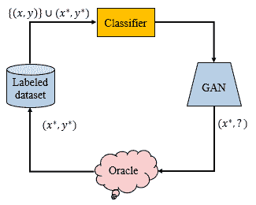

(a) 生成对抗主动学习（GAAL）。

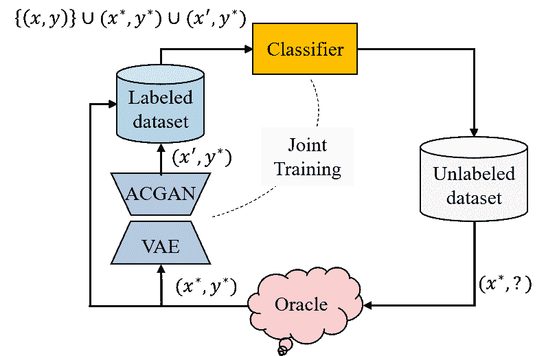

(b) 贝叶斯生成主动深度学习（BGADL）。

图 6\. GAAL（Zhu 和 Bento, 2017）和 BGADL（Tran 等人, 2019）的结构比较图。更多细节，请参见（Tran 等人, 2019）。

随后，VAAL（Sinha 等，2019）和 ARAL（对抗表示主动学习）（Mottaghi 和 Yeung，2019）借鉴了几种先前的方法（Liu 等，2017；Zhu 和 Bento，2017；Tran 等，2019），不仅用于训练网络，使用标记和未标记的数据集，还将生成对抗学习引入网络结构中以进行数据增强，从而进一步提高了网络的学习能力。更详细地说，VAAL（Sinha 等，2019）注意到，基于不确定性的批处理查询策略不仅容易导致样本多样性不足，还极易受到离群点的干扰。此外，基于密度的方法（Sener 和 Savarese，2018）在应用于高维数据时容易受到$p$-范数限制，导致计算的距离过于集中（Donoho 等，2000）。为此，VAAL（Sinha 等，2019）提出使用对抗学习表示方法来区分标记和未标记数据的潜在空间编码特征，从而减少离群点的干扰。VAAL（Sinha 等，2019）还使用标记和未标记的数据以半监督的方式共同训练一个 VAE（Kingma 和 Welling，2014；Sohn 等，2015）；这里的目标是欺骗对抗网络（Goodfellow 等，2014），使其预测所有数据点来自标记池，从而解决距离集中问题。VAAL（Sinha 等，2019）可以在大规模数据集上学习到有效的低维潜在表示，并通过共同学习表示形式和不确定性，进一步提供了一种有效的采样方法。

随后，ARAL（Mottaghi 和 Yeung，2019）扩展了 VAAL（Sinha 等，2019），旨在尽可能少地使用人工标注样本，同时充分利用现有或生成的数据，以提高模型的学习能力。除了使用标记和未标记的数据集外，ARAL（Mottaghi 和 Yeung，2019）还利用深度生成网络生成的样本来联合训练整个模型。ARAL（Mottaghi 和 Yeung，2019）包含了 VAAL（Sinha 等，2019）和对抗性表示学习（Donahue 和 Simonyan，2019）。通过使用 VAAL（Sinha 等，2019）学习标记和未标记数据的潜在特征表示空间，可以相应地选择信息量最大的未标记样本。同时，使用真实数据和生成的数据，通过对抗性表示学习（Donahue 和 Simonyan，2019）来增强模型的学习能力。类似地，TA-VAAL（Kim 等，2020）通过使用 VAAL 的全局数据结构和学习损失中的局部任务相关信息来扩展 VAAL，以用于样本查询。我们在图 7 中展示了 ARAL（Mottaghi 和 Yeung，2019）的框架。

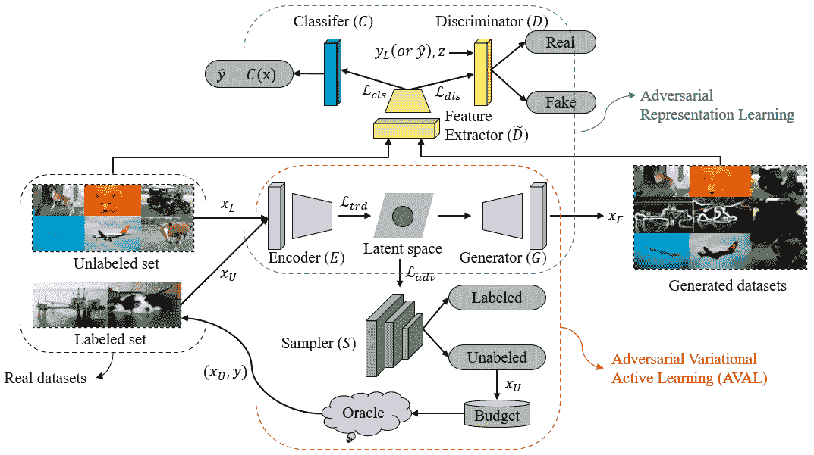

图 7\. ARAL 的整体结构（Mottaghi 和 Yeung，2019）。ARAL 不仅使用真实数据集（包括标记和未标记数据），还使用生成的数据集来联合训练网络。整个网络包括一个编码器（`$E$`）、生成器（`$G$`）、鉴别器（`$D$`）、分类器（`$C$`）和采样器（`$S$`），模型的所有部分一起训练。

与使用标注和未标注数据集进行对抗性表示学习的 ARAL（Mottaghi 和 Yeung，2019）和 VAAL（Sinha 等，2019）不同，SSAL（半监督主动学习）（Simeoni 等，2019）实现了一种新的训练方法。更具体地说，SSAL（Simeoni 等，2019）在 AL 循环中使用无监督、监督和半监督学习方法，并充分利用现有信息进行训练，同时尽可能不增加标注成本。更详细地说，过程如下：在 AL 开始之前，首先使用标注和未标注数据进行无监督预训练。在每个 AL 学习周期中，首先对标注数据集进行监督训练，然后对所有数据集进行半监督训练。这代表了一种尝试制定全新训练方法的努力。作者发现，与采样策略之间的差异相比，这种模型训练方法带来了令人惊讶的性能提升。

如上所述，这种训练方法和数据利用技巧的探索同样至关重要；实际上，由此产生的性能提升甚至可能超过改变查询策略所带来的效果。应用这些技术可以充分利用现有数据，而无需增加标注成本，这有助于解决 AL 查询样本数量不足以支持 DL 模型更新的问题。

### 3.3\. DeepAL 通用框架

如第二部分中提到，AL 和 DL 之间存在处理管道的不一致性；因此，仅在 AL 框架中对 DL 模型进行微调，或将 AL 和 DL 简单地结合并将其视为两个独立的问题，可能会导致分歧。例如，（Asghar 等，2017）首先在两种不同类型的会话数据集上对 DL 模型进行离线监督训练，以赋予基础网络基本的对话能力，然后启用在线 AL 阶段与人类用户交互，从而使模型能够根据用户反馈以开放的方式进行改进。AL-DL（Wang 和 Shang，2014）提出了一种用于 DL 模型的 DBNs 的 AL 方法，而 ADN（Zhou 等，2010）进一步提出了一种用于情感分类的主动深度网络架构。（Stark 等，2015）提出了一种使用 CNN 进行验证码识别的 AL 算法。然而，总体而言，上述方法首先对深度模型在标记数据集上进行常规监督训练，然后根据深度模型的输出进行主动采样。有许多类似的相关工作（Shelmanov 等，2019；Feng 等，2019）采用这种将 AL 和深度模型的训练视为两个独立问题的拆分方法，从而增加了这两个问题可能会分歧的可能性。尽管这种方法当时取得了一些成功，但一个将 DL 和 AL 两个任务紧密结合的通用框架将在 DeepAL 的性能提升和推广中发挥至关重要的作用。

CEAL（Wang 等，2017）是首批将 AL 和 DL 结合以解决深度图像分类问题的工作之一。CEAL（Wang 等，2017）将深度卷积神经网络融入 AL，并因此提出了一个新颖的 DeepAL 框架。它将来自未标记数据集的样本逐步发送到 CNN 中，之后 CNN 分类器输出两种类型的样本：少量不确定样本和大量高预测置信度样本。少量不确定样本由 oracle 标记，CNN 分类器用于自动为大量高预测置信度样本分配伪标签。然后，这两种类型的样本用于微调 CNN，并重复更新过程。在图 5 中，我们展示了 CEAL 的总体框架。此外，HDAL（启发式深度主动学习）（Li 等，2017）使用类似的框架进行人脸识别任务：它将 AL 与深度 CNN 模型结合，以集成特征学习和 AL 查询模型训练。

此外，图 1c 展示了一个广泛应用于 DeepAL 任务的通用框架。相关工作包括（杨等，2017；何等，2019a；杜等，2019；赵等，2020；吕等，2020），等等。更具体地说，（杨等，2017）提出了一个框架，利用 FCN（全卷积网络）（龙等，2015）和 AL 来解决使用少量注释的医学图像分割问题。它首先在少量标注数据集上训练 FCN，然后通过 FCN 提取未标注数据集的特征，利用这些特征估计未标注样本的不同程度和相似性。这种策略类似于在第 3.1.2 节中描述的策略，有助于选择不确定性高且多样化的样本，添加到标注数据集中以开始下一阶段的训练。主动掌纹识别（杜等，2019）提出了一个类似的 DeepAL 框架，用于掌纹识别任务。不同之处在于，受领域自适应（本达维德等，2010）的启发，主动掌纹识别（杜等，2019）将 AL 视为一个二分类任务：期望标注和未标注样本集具有相同的数据分布，使得这两者难以区分。监督训练可以直接在少量标注数据集上进行，从而减少标注负担。（吕等，2020）提出了一个用于缺陷检测的 DeepAL 框架。这种方法基于检测模型的输出特征进行不确定性采样，以生成候选样本列表进行注释。为了进一步考虑样本中缺陷类别的多样性，（吕等，2020）设计了一种平均边距方法来控制每个缺陷类别的采样比例。

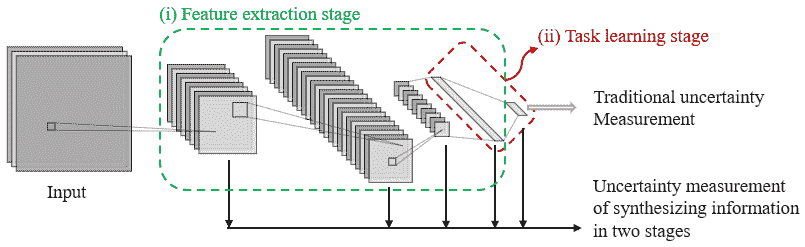

图 8\. 以常见的 CNN 为例，图中展示了传统不确定性测量方法（杨等，2017；杜等，2019；吕等，2020）与两阶段信息合成的不确定性测量方法（何等，2019a； Yoo 和 Kweon，2019；赵等，2020）的比较（即特征提取阶段和任务学习阶段）。

与上述方法不同，深度学习（DL）模型的最终输出通常被用作确定样本不确定性或多样性的基础（例如，主动掌纹识别（Du et al., 2019）使用了第一层全连接层的输出）。(He et al., 2019a；Yoo 和 Kweon，2019；Zhao et al., 2020) 也使用了 DL 模型中间隐藏层的输出。如在第 3.1.2 节和第二部分分析的，由于深度模型和浅层模型之间的学习范式差异，传统的基于不确定性的查询策略无法直接应用于 DL 模型。此外，与浅层模型不同，深度模型可以看作是由两个阶段组成，即特征提取阶段和任务学习阶段。仅使用 DL 模型最后一层的输出作为评估样本预测不确定性的依据是不准确的，因为 DL 模型的不确定性实际上是由这两个阶段的不确定性组成的。该概念的示意图见图 8。为此，AL-MV（具有多个视图的主动学习）（He et al., 2019a）将 CNN 中不同隐藏层的特征视为多视图数据，考虑了两个阶段的不确定性，AL-MV 算法被设计为对每一层的不确定性进行自适应加权，以实现更准确的采样不确定性测量。LLAL（主动学习的学习损失）（Yoo 和 Kweon，2019）也采用了类似的思想。更具体地，LLAL 设计了一个小型参数模块，该模块附加到目标网络上，使用目标网络多个隐藏层的输出作为损失预测模块的输入。损失预测模块学习预测未标记数据集的目标损失，同时使用 top-$K$策略选择查询样本。LLAL 以较小的参数成本实现了任务无关的主动学习框架设计，并在多种主流视觉任务（即图像分类、目标检测和人体姿态估计）上取得了竞争性的性能。同样，（Zhao et al., 2020）使用类似策略实现了用于手指骨分割任务的 DeepAL 框架。（Zhao et al., 2020）使用深度监督 U-Net（Ronneberger et al., 2015）作为分割网络，然后将多层分割隐藏层的输出和最后一层的输出作为 AL 的输入；这些输入信息随后被整合，以形成样本信息量评估的基础。我们以 LLAL（Yoo 和 Kweon，2019）为例，阐明该思想的整体网络结构，见图 9。

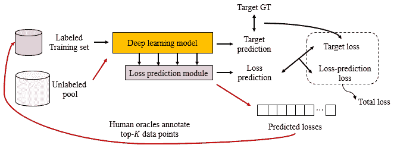

图 9\. LLAL 的整体框架（Yoo and Kweon, 2019）。黑线表示训练模型参数的阶段，优化由目标损失和损失预测损失组成的整体损失。红线表示 AL 的样本查询阶段。DL 模型的多个隐藏层的输出用作损失预测模块的输入，而根据预测的损失选择前$K$个未标记数据点，并由 oracle 分配标签。

对通用框架的研究对 DeepAL 的发展和推广具有很大的好处，因为这种与任务无关的框架可以方便地移植到其他领域。在当前 DL 和 AL 的融合中，DL 主要负责特征提取，而 AL 主要负责样本查询；因此，更深层次和更紧密的融合将有助于 DeepAL 实现更好的性能。当然，这将需要研究人员额外的探索和努力。最后，DL 和 AL 的结合挑战及其对应解决方案的相关工作在表 1 中进行了总结。

### 3.4\. DeepAL 停止策略

除了查询策略和训练方法之外，适当的停止策略对 DeepAL 的性能有重要影响。目前，大多数 DeepAL（Liu et al., 2017; Maldonado and Harabagiu, 2019; Folmsbee et al., 2018; Budd et al., 2019; Schröder and Niekler, 2020）通常使用预定义的停止标准，当满足该标准时，他们会停止从 oracle 处查询标签。这些预定义的停止标准包括最大迭代次数、分类准确性变化的最小阈值、标记样本的最小数量以及期望的准确度值等。

尽管这些停止标准很简单，但这些预定义的停止标准可能会导致深度主动学习无法实现最佳性能。这是因为主动学习（AL）注释查询的过早终止会导致模型的性能损失，而过度的注释行为则浪费了大量的注释预算。因此，稳定预测 (SP) (Bloodgood 和 Vijay-Shanker，2014) 对 AL 停止策略进行了全面回顾，并提出了一种基于稳定性预测的 AL 停止策略。具体而言，SP 会从未标记的数据集中预先划分出一部分样本以形成停止集（停止集不需要标记），并且 SP 在每次迭代中检查停止集上的预测稳定性。当模型在停止集上的预测性能稳定时，迭代过程将被停止。一个训练良好的模型通常具有稳定的预测能力，而 SP 利用这一特性。预先划分的停止集不需要特定的标记信息，这避免了与 AL 目的相悖的额外标记成本。虽然 SP 主要是为 AL 提出的停止策略，但它也与深度主动学习相关。

表 1\. 结合深度学习 (DL) 和主动学习 (AL) 的挑战，以及对相应解决方案的相关工作的总结。

| 挑战 | 解决方案 | 基础 | 类别 | 发表文献 |
| --- | --- | --- | --- | --- |
| 深度学习中的模型不确定性 | 查询策略优化 | 批量模式深度主动学习 (BMDAL) | 基于不确定性和混合查询策略 | (Ranganathan 等，2017；Asghar 等，2017；He 等，2019a；Ostapuk 等，2019；Yin 等，2017；Zhdanov，2019；Liu 等，2017；Ash 等，2020；Shui 等，2020；Kim 等，2020；Ducoffe 和 Precioso，2018) |
| 深度贝叶斯主动学习 (DBAL) | (Gal 等，2017；Sener 和 Savarese，2018；Pop 和 Fulop，2018；Kirsch 等，2019；Pinsler 等，2019；Chitta 等，2018；Ostapuk 等，2019；Siddhant 和 Lipton，2018；Rottmann 等，2018；Yang 等，2018) (Zeng 等，2018；Gudur 等，2019；Martínez-Arellano 和 Ratchev，2019) |
| 基于密度的方法 | (Geifman 和 El-Yaniv，2017；Yin 等，2017；Sener 和 Savarese，2018；Du 等，2019；Gissin 和 Shalev-Shwartz，2019；Chitta 等，2019) |
| 深度主动学习的自动化设计 | (Fang 等，2017；Haußmann 等，2019；Liu 等，2019；Geifman 和 El-Yaniv，2019) |
| 标签样本数据不足 | 标签样本数据扩展 | - | (Wang et al., 2017; Liu et al., 2017; Zhu and Bento, 2017; Tran et al., 2019; Sinha et al., 2019; Mottaghi and Yeung, 2019; Kim et al., 2020; Simeoni et al., 2019) |
| 处理流程不一致 | 常见框架 DeepAL | - | (Asghar et al., 2017; Wang and Shang, 2014; Zhou et al., 2010; Stark et al., 2015; Shelmanov et al., 2019; Feng et al., 2019; Wang et al., 2017; Li et al., 2017; Yang et al., 2017; He et al., 2019a) (Du et al., 2019; Zhao et al., 2020; Lv et al., 2020; Yoo and Kweon, 2019; Vodrahalli et al., 2018) |

## 4\. DeepAL 在视觉和 NLP 等领域的应用

目前，DeepAL 已应用于包括但不限于视觉数据处理（如目标检测、语义分割等）、自然语言处理（如机器翻译、文本分类、语义分析等）、语音和音频处理、社交网络分析、医学图像处理、野生动物保护、工业机器人和灾难分析等领域。在这一部分，我们从应用的角度对现有的 DeepAL 相关工作进行了系统而详细的概述。

### 4.1\. 视觉数据处理

就像深度学习（DL）广泛应用于计算机视觉领域一样，DeepAL 最有可能发挥其潜力的第一个领域是计算机视觉。在这一部分，我们主要讨论 DeepAL 在视觉数据处理领域的相关研究。

#### 4.1.1\. 图像分类和识别

与深度学习（DL）一样，DeepAL 中的图像分类和识别为其他视觉任务的研究奠定了基础。DeepAL 在图像视觉任务领域面临的一个重要问题是如何高效地查询高维数据样本（这是传统的主动学习（AL）表现不佳的领域），并在尽可能少的标注成本下获得令人满意的性能。

为了解决这个问题，CEAL (Wang et al., 2017) 为高置信度的样本分配伪标签，并将其添加到通过基于不确定性的 AL 方法查询的高不确定性样本集中，然后使用扩展的训练集训练 DeepAL 模型图像分类器。(Ranganathan et al., 2017) 首先将 AL 的标准整合到深度信念网络中，随后对各种真实的单模态和多模态数据集上的分类任务进行了广泛研究。WI-DL (Liu et al., 2017) 使用 DeepAL 方法同时考虑高光谱图像（HSI）数据集的最大代表性和不确定性这两个选择标准，用于遥感分类任务。同样，(Lin et al., 2018; Deng et al., 2019) 也研究了 HSI 的分类。(Lin et al., 2018) 引入 AL 以初始化 HSI，然后进行迁移学习。这项工作还建议构建和连接更高层次的特征到源和目标 HSI 数据中，以进一步克服跨领域差异。(Deng et al., 2019) 提出了一个统一的深度网络，结合了主动迁移学习，从而在使用较少标记训练数据的情况下，良好地训练了 HSI 分类器。

医学图像分析也是一个重要的应用。例如，(Folmsbee et al., 2018) 探讨了使用主动学习（AL）而非随机学习来训练卷积神经网络进行组织（如基质、淋巴细胞、肿瘤、黏膜、角化珠、血液和背景/脂肪）分类任务。(Budd et al., 2019) 对医学图像分析领域中的 DeepAL 相关方法进行了全面的综述。如前所述，由于医学图像的标注需要强大的专业知识，通常很难且非常昂贵地找到愿意进行标注的高素质专家。此外，深度学习（DL）在各种图像特征任务上取得了令人瞩目的成绩。因此，大量研究继续集中于将 DL 和 AL 相结合，以便将 DeepAL 应用于医学图像分析领域（Du et al., 2018; Sayantan et al., 2018; Chen et al., 2018; Smailagic et al., 2018; Kwolek et al., 2019; Scandalea et al., 2019; Smailagic et al., 2020; Sadafi et al., 2019)。DeepAL 方法还用于分类原位浮游生物（Bochinski et al., 2018）以及进行细胞的自动计数（Alahmari et al., 2019）。

此外，DeepAL 在我们日常生活中也有广泛的应用。例如，(Stark et al., 2015) 提出了一个使用 CNN 进行验证码识别的 AL 算法。它可以利用获取标注数据的能力来避免人工干预，并在使用较少标注数据时大幅提高识别准确性。HDAL (Li et al., 2017) 结合了深度 CNN 的优异特征提取能力和节省 AL 标注成本的能力，设计了一个用于人脸识别任务的启发式深度主动学习框架。

#### 4.1.2\. 目标检测与语义分割

目标检测与语义分割在各种领域中具有重要应用，包括自动驾驶、医学图像处理和野生动物保护。然而，这些领域也受到较高样本标注成本的限制。因此，DeepAL 的较低标注成本预计将加速相应深度学习模型在某些标注更为困难的实际领域中的应用。

(Roy et al., 2018) 设计了一种用于目标检测的 DeepAL 框架，该框架采用分层架构，其中标注更为困难的层作为“委员会查询”的示例来选择要查询的图像集，同时引入了类似于 (Yin et al., 2017) 的探索/利用权衡策略。DeepAL 也广泛应用于自然生物领域和工业应用。例如，(Norouzzadeh et al., 2019) 使用深度神经网络快速迁移和自动提取信息，进一步结合迁移学习和 AL 设计了一个用于相机陷阱图像中物种识别和计数的 DeepAL 框架。 (Kellenberger et al., 2019) 使用无人机 (UAV) 获取用于野生动物检测的图像；此外，为了使该野生动物检测器能够重复使用，(Kellenberger et al., 2019) 使用 AL 并引入了迁移采样 (TS) 以在源数据集和目标数据集之间找到相应的区域，从而促进数据向目标领域的转移。 (Feng et al., 2019) 提出了一个用于自动驾驶中深度物体检测的 DeepAL 框架，以训练 LiDAR 3D 物体检测器。 (Lv et al., 2020) 提出了将广泛应用的 DeepAL 框架适应于实际工业中的缺陷检测，并提出了一种用于生成候选标签类别的置信度采样方法。这项工作使用了平均边际方法来设定每个缺陷类别的采样规模，因此能够以较少的标注数据获得所需的性能。

此外，DeepAL 在医学图像分割领域也有重要应用。例如，（Gaur et al., 2016）提出了一种基于 AL 的迁移学习机制，用于医学图像分割，能够在有限标记数据集上有效提升图像分割性能。（Yang et al., 2017）结合了 FCN 和 AL，创建了一个用于生物图像分割的 DeepAL 框架。该工作利用 FCN 提供的不确定性和相似性信息来扩展最大集合覆盖问题，通过指出最有效的标注区域，显著减少了所需的标注工作量。DASL（深度主动自适应学习）（Wang et al., 2018b）提出了一种基于深度区域的网络 Nodules R-CNN，用于肺结节分割任务。该工作生成用于示例的分割掩码，并同时结合 AL 和 SPL（自适应学习）（Kumar et al., 2010）提出了一种新的深度主动自适应学习策略，从而减少了标注工作量。（Wang et al., 2019a）提出了一种 Nodule-plus 区域基 CNN，用于 3D 胸部 CT 的肺结节检测和分割。该工作结合了 AL 和 SPL 策略，创建了一种新的深度自适应主动学习（DSAL）策略，减少了注释工作量，并有效利用了未标注的数据。（Zhao et al., 2020）进一步提出了一种新的深度监督主动学习方法，用于指骨分割任务。该模型可以通过迭代和增量学习方式进行微调，并利用中间隐藏层的输出作为样本选择的依据。与完整标注相比，（Zhao et al., 2020）使用更少的样本实现了可比的分割结果。

#### 4.1.3. 视频处理

与仅需处理空间维度信息的图像任务相比，视频任务还需要处理时间维度的信息。这使得视频标注任务更加昂贵，也意味着引入 AL 的需求变得更加紧迫。DeepAL 在这一领域也有更广泛的应用场景。

例如，（Hussein 等，2016）建议使用模仿学习来执行导航任务。教师从第一人称视角看到的视觉环境和所采取的行动被用作训练集。通过训练，希望学生能够在自己的环境中预测和执行相应的动作。在执行任务时，学生使用深度卷积神经网络进行特征提取，学习模仿策略，并进一步使用 AL 方法选择置信度不足的样本，将其添加到训练集中以更新动作策略。（Hussein 等，2016）使用更少的样本显著改善了初始策略。DeActive（Hossain 等，2018）提出了一个 DeepAL 活动识别模型。与传统的 DL 活动识别模型相比，DeActive 需要更少的标注样本，消耗更少的资源，并且实现了高识别准确率。（Wang 等，2018a）通过将 AL 集成到 DL 框架中，最小化了基于视频的人 Re-ID 数据集的标注成本。同样，（Liu 等，2019）提出了一种用于人 Re-ID 的深度强化主动学习方法，使用 oracle 反馈来指导代理（即强化学习过程中的模型）选择下一个不确定样本。通过交替优化强化学习策略，代理选择机制不断得到优化。（Aghdam 等，2019）进一步提出了一种基于卷积神经网络的主动学习目标检测方法，用于视频和静态图像中的行人目标检测。

### 4.2\. 自然语言处理（NLP）

NLP 一直以来都是一个非常具有挑战性的任务。NLP 的目标是使计算机理解复杂的人类语言，并帮助人类处理各种自然语言相关的任务。数据标注不足也是 NLP 领域的一个关键挑战。下面，我们介绍一些在 NLP 领域最著名的 DeepAL 方法。

#### 4.2.1\. 机器翻译

机器翻译具有非常重要的应用价值，但通常需要大量的平行语料作为训练集。对于许多低资源语言对，构建这样的语料库需要非常高的成本。

出于这个原因，（Zhang 等人，2018）提出使用 AL 框架来选择信息源句子以构建平行语料库。它提出了两种有效的 AL 句子选择方法：基于语义相似度的选择和解码器概率。与传统方法相比，这两种提出的句子选择方法显示了相当大的优势。（Platanios 等人，2019）提出了一个与 AL 相关的课程学习框架，用于机器翻译任务。它可以根据样本的估计难度和模型的当前能力来决定在训练的不同阶段向模型展示哪些训练样本。这种方法不仅有效提高了训练效率，还获得了良好的准确性提升。这种思路对 DeepAL 的样本选择策略也非常有价值。

#### 4.2.2\. 文本分类

文本分类任务也面临着标签成本过高的挑战，例如专利分类（Larkey，1999；Fall 等人，2003）和临床文本分类（Pestian 等人，2007；Figueroa 等人，2012；Garla 等人，2013）。这些标注任务通常需要专家完成，而且每个文档中的数据集和文本数量往往非常庞大，这使得人工专家难以完成相应的标注任务。

（Zhang 等人，2017b）声称是第一个用于文本分类的 CNNs AL 方法。（Zhang 等人，2017b）专注于选择那些对嵌入空间影响最大的样本。它提出了一种句子分类方法，选择包含嵌入可能被最大幅度更新的词的实例，从而快速学习区分性的、任务特定的嵌入。他们还将这种方法扩展到文本分类任务中，这在句子和文本分类任务中超越了基线 AL 方法。（An 等人，2018）还提出了一种新的 DeepAL 框架，用于文本分类任务。它使用 RNN 作为 AL 中的获取函数。（An 等人，2018）提出的方法可以有效减少深度学习所需的标签实例数量，同时节省训练时间而不降低模型准确性。（Prabhu 等人，2019）关注于深度主动分类中的采样偏差问题，并在（Zhang 等人，2015）的大规模文本语料库上应用了主动文本分类。这些方法通常比传统的基于 AL 的基线方法表现更好，更多相关的基于 DeepAL 的文本分类应用可以在（Schröder 和 Niekler，2020）中找到。

#### 4.2.3\. 语义分析

在这个典型的 NLP 任务中，目标是让计算机理解自然语言描述。相关的应用场景众多且多样，包括但不限于情感分类、新闻识别等。

更具体来说，例如，（Zhou et al., 2010）使用限制玻尔兹曼机（RBM）构建了一个主动深度网络（ADN），然后对标注和未标注的数据集进行无监督训练。ADN 利用大量未标注的数据集来提高模型的泛化能力，并进一步在半监督学习框架中应用 AL，将标注数据和分类器的选择统一在半监督分类框架中；这种方法在情感分类任务上取得了竞争性的结果。（Bhattacharjee et al., 2017）提出了一种用于新闻准确性检测任务的人机协作学习系统（即识别新闻中的误导和虚假信息），该系统仅利用有限数量的标注样本。该系统是一个基于深度 AL 的模型，使用的标注样本数量比完全监督学习少 1-2 个数量级。这种样本数量的减少大大加快了模型的收敛速度，并在检测性能上取得了令人惊讶的 25%平均性能提升。

#### 4.2.4\. 信息提取

信息提取旨在从大量文本中提取和简化最重要的信息，这是不同概念之间关联分析的重要基础。

(Priya et al., 2019) 使用来自灾区的相关推文提取信息，以帮助识别地震中的基础设施损坏。因此，(Priya et al., 2019) 将基于 RNN 和 GRU 的模型与 AL 结合，使用基于 AL 的方法对模型进行预训练，以便检索到不同地区出现基础设施损坏的推文，从而显著减少手动标注的工作量。此外，实体解析 (ER) 是识别不同数据库中具有不同表示的相同真实实体的任务，是知识库创建和文本挖掘的关键步骤。(Shen et al., 2017; Shardlow et al., 2019; Chang et al., 2020) 结合了 DL 和 AL 来确定在小规模训练集的情况下，如何提高 NER (命名实体识别) 的技术水平。(Kasai et al., 2019) 开发了一种结合迁移学习和 AL 的 DL 基础 ER 方法，设计了一种架构，使得模型能够从高资源环境迁移到低资源环境。(Maldonado and Harabagiu, 2019) 提出了一个新颖的 ALPNN (主动学习策略神经网络) 设计，用于识别大型 EEG (脑电图) 报告中的概念和关系；这种方法可以帮助人们从大量此类报告中提取有用的临床知识。

#### 4.2.5. 问答系统

智能问答也是 NLP 领域中的常见处理任务，DL 在这些领域取得了令人印象深刻的成果。然而，这些应用的性能仍然依赖于大量标注数据集的可用性；AL 有望为这一挑战带来新的希望。

自动问答系统在工业领域应用范围非常广泛，DeepAL 在这个领域也具有很高的价值。例如，(Asghar et al., 2017) 结合了在线 AL 策略和 DL 模型，通过与真实用户互动并从每轮对话中的用户反馈中逐步学习，实现了开放领域对话。(Jedoui et al., 2019) 发现，专门为特定任务（例如分类）设计的 AL 策略通常只有一个正确答案，而这些基于不确定性的测量通常是基于模型的输出来计算的。许多实际视觉任务常常有多个正确答案，这会导致对不确定性测量的过度估计，有时甚至表现比随机抽样基线还要差。因此，(Jedoui et al., 2019) 提出了在模型的隐藏空间中估计不确定性，而不是在模型的输出空间中，从而克服语言的同义性。

### 4.3. 其他应用

DeepAL 的出现令人兴奋，因为它预计将大幅降低标注成本，同时保持性能水平。因此，DeepAL 在其他领域也得到了广泛应用。

这些应用包括但不限于基因表达、机器人技术、可穿戴设备数据分析、社交网络、心电图信号分析等。举一些更具体的例子，MLFS（多级特征选择）（Ibrahim 等，2014）结合了 DL 和 AL，根据表达谱选择基因/miRNA，并提出了一种新颖的多级特征选择方法。MLFS 还考虑了 miRNAs 和基因之间的生物学关系，并将此方法应用于 miRNA 扩展任务。此外，现实世界机器人失败的风险成本高昂。（Andersson 等，2017）提出了一种风险感知的重采样技术；该方法结合 AL 与现有求解器和 DL 来优化机器人的轨迹，使其能够有效处理移动障碍物场景中的碰撞问题，并验证了 DeepAL 方法在真实纳米四旋翼上的有效性。（Zhou 和 Schoellig，2019）进一步提出了一种用于机器人控制算法逆动力学模型的主动轨迹生成框架，使得可以系统地设计用于训练 DNN 逆动力学模块的信息轨迹。

此外，（Hossain 和 Roy，2019；Gudur 等，2019）使用安装在可穿戴设备或移动终端上的传感器来收集用户运动信息，以用于人体活动识别。（Hossain 和 Roy，2019）提出了一种具有上下文感知标注选择的 DeepAL 框架用于活动识别。ActiveHARNet（用于人体活动识别的主动学习网络）（Gudur 等，2019）提出了一种资源高效的深度集成模型，支持设备上的增量学习和推断，利用 BNN 中的近似来表示模型的不确定性，并进一步证明了 ActiveHARNet 在两个公开数据集上的部署和增量学习的可行性。另一方面，DALAUP（用于锚定用户预测的深度主动学习）（Cheng 等，2019）设计了一种用于社交网络中锚定用户预测的 DeepAL 框架，减少了标注锚定用户的成本并提高了预测准确性。DeepAL 还被用于心电图（ECG）信号的分类。例如，（Rahhal 等，2016）提出了一种基于主动深度学习的 ECG 信号分类方法。（Hanbay，2019）提出了一种基于主动学习的 ECG 分类方法，结合了特征值和深度学习。使用 AL 方法有效降低了医学专家标记 ECG 信号的成本。此外，语音和音频领域的标签注释成本也相对较高。（Abdel-Wahab 和 Busso，2019）发现，基于少数发言者收集的数千条录音组成的语料库训练的模型无法泛化到新领域；因此，（Abdel-Wahab 和 Busso，2019）开发了一种实用方案，涉及使用 AL 训练深度神经网络用于语音情感识别任务，当标签资源有限时。

一般来说，目前深度主动学习（DeepAL）的应用主要集中在视觉图像处理任务上，尽管在自然语言处理（NLP）和其他领域也有应用。与深度学习（DL）和主动学习（AL）相比，DeepAL 仍处于研究的初级阶段，这意味着相关的经典工作相对较少；然而，它仍然具有与 DL 相同的广泛应用场景和实际价值。此外，为了方便读者了解 DeepAL 在相关领域的具体应用，我们在第四部分中详细分类和总结了调查相关工作使用的所有应用场景和数据集。具体信息见表 2。

表 2\. DeepAL 在视觉、NLP 和其他领域的研究示例。

| 领域 | 任务 | 发表文献 | 数据集 | 场景 |
| --- | --- | --- | --- | --- |
| 视觉 | 图像分类和识别 | (Wang et al., 2017; Ranganathan et al., 2017; Stark et al., 2015) | CACD (Chen et al., 2014), Caltech-256 (Griffin et al., 2007), VidTIMIT (Sanderson, 2008), CK (Kanade et al., 2000), MNIST (LeCun et al., 1998), CIFAR 10 (Krizhevsky et al., 2009), emoFBVP (Ranganathan et al., 2016), MindReading (El Kaliouby and Robinson, 2004) Cool PHP CAPTCHA (Stark et al., 2015) | 手写数字、面部、验证码识别等 |
| (Liu et al., 2017; Deng et al., 2019; Lin et al., 2018) | PaviaC, PaviaU, Botswana (Liu et al., 2017), Salinas Valley, Indian Pines (Deng et al., 2019), Washington DC Mall, Urban (Lin et al., 2018) | 高光谱图像 |
| (Folmsbee et al., 2018; Budd et al., 2019; Du et al., 2018; Sayantan et al., 2018) (Smailagic et al., 2018; Kwolek et al., 2019; Scandalea et al., 2019) (Smailagic et al., 2020; Sadafi et al., 2019; Chen et al., 2018) | 伊利县 (Folmsbee et al., 2018), EEG (Andrzejak et al., 2001), BreaKHis (Spanhol et al., 2016), SVEB, SVDB (Sayantan et al., 2018) | 生物医学 |
| 目标检测 | (Roy et al., 2018) | VOC (Everingham et al., 2010), Kitti (Geiger et al., [[n.d.]](#bib.bib78)) | – |
| (Norouzzadeh et al., 2019; Kellenberger et al., 2019) | SS (Swanson et al., 2015), eMML (Forrester et al., 2013), NACTI¹, CCT², UAV³ | 生物多样性调查 |
| (Feng et al., 2019) | KITTI (Geiger et al., 2012) | 自主驾驶 |
| (Lv et al., 2020) | NEU-DET (Song and Yan, 2013) | 缺陷检测 |
| 语义分割 | (Gaur et al., 2016; Yang et al., 2017; Wang et al., 2018b; Wang et al., 2019a) | SPIM (Delibaltov et al., 2016), Confocal (Delibaltov et al., 2013), LIDC-IDRI (Armato III et al., 2011), MICCAI, 淋巴结 (Zhang et al., 2016) | 生物医学图像 |
| 视频处理 | (Hussein et al., 2016) | Mash-simulator⁴ | 自主导航 |
| (Hossain et al., 2018) | OPPORTUNITY (Hossain et al., 2018), WISDM (Kwapisz et al., 2010), SenseBox (Taylor et al., 2017), Skoda Daphnet (Bachlin et al., 2009), CASAS (Cook and Schmitter-Edgecombe, 2009) | 智能家居 |
| (Wang et al., 2018a; Aghdam et al., 2019) | PRID (Hirzer et al., 2011), MARS (Zheng et al., 2016), BDD100K (Yu et al., 2018), DukeMTMC-VideoReID (Wu et al., 2018), CityPersons (Zhang et al., 2017a), Caltech Pedestrian (Dollár et al., 2012) | 人物再识别 |
| 自然语言处理 | 机器翻译 | (Zhang et al., 2018; Platanios et al., 2019) | OPUS (Tiedemann, 2012), UNPC (Ziemski et al., 2016), IWSLT, WMT (Platanios et al., 2018) | 印地语-英语，中文-英语，英语-越南语，法语-英语，英语-德语等 |
| 文本分类 | (Zhang et al., 2017b; An et al., 2018; Schröder and Niekler, 2020; Prabhu et al., 2019) | CR⁵, Subj, MR⁶, MuR⁷, DR (Wallace et al., 2014) AGN, DBP, AMZP, AMZF, YRF (Zhang et al., 2015) | – |
| 语义分析 | (Zhou et al., 2010) | MOV (Pang et al., 2002), BOO, DVDs, ELE, KIT (Blitzer et al., 2007; Dasgupta and Ng, 2009) | 情感分类 |
| (Bhattacharjee et al., 2017) | KDnugget 的假新闻⁸, 哈佛数据集 (Kwon et al., 2017), Liar (Wang, 2017) | 新闻真实性检测 |
| 信息提取 | (Priya et al., 2019) | 意大利，伊朗-伊拉克，墨西哥地震数据集 | 灾害评估 |
| (Maldonado and Harabagiu, 2019) | 特朗普大学医院¹⁰ | 脑电图（EEG）报告 |
| (Shen et al., 2017; Shardlow et al., 2019; Chang et al., 2020; Kasai et al., 2019) | CoNLL (Sang and Meulder, 2003), NCBI (Dogan et al., 2014), MedMentions (Murty et al., 2018), OntoNotes (Pradhan et al., 2013), DBLP, FZ, AG (Mudgal et al., 2018), Cora (Wang et al., 2011) | 命名实体识别（NER） |
| 问答系统 | (Asghar et al., 2017) | CMDC (Danescu-Niculescu-Mizil and Lee, 2011), JabberWacky 的聊天记录⁹ | 对话生成 |
| (Jedoui et al., 2019) | Visual Genome (Krishna et al., 2017), VQA (Antol et al., 2015) | 视觉问答（VQA） |
| 其他 | – | (Ibrahim et al., 2014) | BC, HCC, Lung | 基因表达 |
| (Andersson et al., 2017; Zhou and Schoellig, 2019) | EATG (Zhou and Schoellig, 2019), Crazyflie 2.0¹¹ | 机器人技术 |
| (Hossain and Roy, 2019; Gudur et al., 2019) | HHAR (Stisen et al., 2015), NWFD (Mauldin et al., 2018) | 智能设备 |
| (Cheng et al., 2019) | Foursquare, Twitter (Kong et al., 2013) | 社交网络 |
| (Rahhal et al., 2016; Hanbay, 2019) | MIT-BIH (Mark et al., 1982), INCART, SVDB (Rahhal et al., 2016) | 心电图（ECG）信号分类 |
| (Abdel-Wahab and Busso, 2019) | MSP-Podcast (Lotfian and Busso, 2017) | 语音情感识别 |

+   1

    http://lila.science/datasets/nacti

+   2

    http://lila.science/datasets/caltech-camera-traps

+   3

    http://kuzikus-namibia.de/xe_index.html

+   4

    https://github.com/idiap/mash-simulator

+   5

    www.cs.uic.edu/liub/FBS/sentiment-analysis.html

+   6

    Subj 和 MR 数据集可在： http://www.cs.cornell.edu/people/pabo/movie-review-data/

+   7

    http://www.cs.jhu.edu/˜mdredze/datasets/sentiment/

+   8

    https://github.com/GeorgeMcIntire/fake_real_news_dataset

+   9

    http://www.jabberwacky.com/j2conversations。JabberWacky 是一个浏览器内的开放域检索型机器人。

+   10

    https://www.isip.piconepress.com/projects/tuh_eeg/

+   11

    https://www.bitcraze.io/

+   –

    非特定应用场景

## 5. 讨论与未来方向

DeepAL 结合了 DL 和 AL 的共同优势：它不仅继承了 DL 处理高维图像数据和进行自动特征提取的能力，还具备 AL 有效降低注释成本的潜力。因此，DeepAL 在需要高水平专业知识且难以获得标签的领域具有令人兴奋的潜力。

最近的研究表明，DeepAL 在许多常见任务中取得了成功。DeepAL 通过降低标注成本以及实现深度学习（DL）的强大特征提取能力，吸引了大量研究人员的关注；因此，相关的研究工作也极为丰富。然而，这个领域仍然存在许多未解答的问题。正如 (Munjal et al., 2020) 发现的那样，不同研究中报告的随机采样基线（RSB）结果存在显著差异。例如，在相同设置下，使用 CIFAR 10 的 20% 标注数据，(Yoo and Kweon, 2019) 报告的 RSB 性能比 (Tran et al., 2019) 高出 13%。其次，同一 DeepAL 方法在不同研究中可能会得到不同的结果。例如，使用 CIFAR 100 (Krizhevsky et al., 2009) 和 VGG16 (Simonyan and Zisserman, 2015) 作为提取网络时，(Sener and Savarese, 2018) 和 (Sinha et al., 2019) 报告的结果相差 8%。此外，最新的 DeepAL 研究也显示出一些不一致。例如，(Sener and Savarese, 2018) 和 (Ducoffe and Precioso, 2018) 指出，基于多样性的方法始终优于基于不确定性的方法，并且基于不确定性的方法表现不如 RSB；然而，(Yoo and Kweon, 2019) 的最新研究显示情况并非如此。

与 AL 策略性选择高价值样本相比，RSB 被视为一个强有力的基线 (Yoo and Kweon, 2019; Sener and Savarese, 2018)。然而，上述问题揭示了设计一个通用的 DeepAL 性能评估平台的迫切需求，以及确定一个统一的高性能 RSB 的必要性。其次，不同 DeepAL 方法的可重复性也是一个重要问题。高度可重复的 DeepAL 方法有助于评估不同 DAL 的性能。应该在一致的设置下使用通用评估平台进行实验，并共享实验设置的快照。此外，在相同实验条件下进行多次不同初始化的重复实验也应实施，因为这可以有效避免因实验设置问题导致的误导性结论。研究人员应充分关注这些不一致的研究，以便澄清涉及的原则。另一方面，适当的消融实验和迁移实验也是必要的。前者将使我们更容易确定哪些改进带来了性能提升，而后者可以帮助确保 AL 选择策略确实能使数据集中的高价值样本得到无差别的选择。

当前关于 DeepAL 方法的研究方向主要集中在 AL 选择策略的改进、训练方法的优化以及任务独立模型的改进。如 3.1 节所述，AL 选择策略的改进目前围绕显式或隐式地考虑基于不确定性和多样性的查询策略。此外，混合选择策略越来越受到研究人员的青睐。此外，训练方法的优化主要集中在标注数据集、未标注数据集，或使用 GAN 等方法扩展数据，以及 AL 循环中无监督、半监督和监督学习的混合训练方法。这种训练方法承诺提供比通过改变选择策略更大的性能提升。事实上，这弥补了 DL 模型需要大量标注训练样本和 AL 选择有限数量标注样本的问题。此外，使用未标注或生成的数据集也有助于充分利用现有信息，而不增加标注成本。此外，增量训练方法也是一个重要的研究方向。从计算资源的角度来看，在每个循环中从头开始训练深度模型是不可接受的。虽然简单的增量训练会导致模型参数的偏差，但巨大的资源节省非常吸引人。尽管相关研究仍然相当稀缺，但这仍然是一个非常有前景的研究方向。

任务独立性也是一个重要的研究方向，因为它有助于使 DeepAL 模型在其他任务中更直接和广泛地扩展。然而，相关研究仍然不足，现有的 DeepAL 方法往往只关注基于不确定性的选择方法。由于 DL 本身更容易与基于不确定性的 AL 选择策略集成，我们认为基于不确定性的方法将继续主导未来与这些任务无关的研究方向。另一方面，也可以考虑明确地采用基于多样性的选择策略；当然，这也会带来很大的挑战。此外，应指出的是，盲目追求在较小子集上训练模型的想法是不明智的，因为在一些具有大量内容和样本的数据集中，样本重要性的相对差异几乎可以忽略不计。

上述改进方向之间没有冲突，因此混合改进策略是未来的重要发展方向。总体而言，DeepAL 研究在标注成本和应用场景方面具有显著的实际应用价值；然而，目前 DeepAL 研究仍处于起步阶段，未来还有很长的路要走。

## 6\. 总结与结论

首次全面分析和总结了结合传统主动学习和深度学习的必要性和挑战。针对这些挑战，我们从查询策略优化、标注样本数据扩展和模型泛化三个角度分析和比较了现有工作。此外，我们还总结了 DeepAL 的停止策略。然后，我们从应用的角度回顾了 DeepAL 的相关工作。最后，我们对 DeepAL 的未来方向进行了全面讨论。据我们所知，这是深度主动学习领域首次全面系统的综述。

###### 致谢。

本研究部分由国家自然科学基金（资助号 61972315 和 62072372）以及陕西省科技创新团队支持项目（资助协议号 2018TD-026）和澳大利亚研究委员会发现早期职业研究者奖（资助号 DE190100626）资助。

## 参考文献

+   （1）

+   Abdel-Wahab 和 Busso（2019）Mohammed Abdel-Wahab 和 Carlos Busso。2019 年。基于深度神经网络的语音情感识别的主动学习。见于*第八届情感计算与智能交互国际会议，ACII 2019，英国剑桥，2019 年 9 月 3-6 日*。IEEE，1–7 页。

+   Adomavicius 和 Tuzhilin（2005）Gediminas Adomavicius 和 Alexander Tuzhilin。2005 年。迈向下一代推荐系统：现状调查和可能的扩展。*IEEE 知识与数据工程学报* 17，第 6 期（2005），734–749 页。

+   Aggarwal 等（2014）Charu C. Aggarwal、Xiangnan Kong、Quanquan Gu、Jiawei Han 和 Philip S. Yu。2014 年。主动学习：调查。见于*数据分类：算法与应用*。CRC 出版社，571–606 页。

+   Aghdam 等（2019）Hamed Habibi Aghdam、Abel Gonzalez-Garcia、Antonio M. López 和 Joost van de Weijer。2019 年。深度检测神经网络的主动学习。见于*2019 IEEE/CVF 国际计算机视觉大会，ICCV 2019，韩国首尔，2019 年 10 月 27 日至 11 月 2 日*。IEEE，3671–3679 页。

+   Aharoni 等（2019）Roee Aharoni、Melvin Johnson 和 Orhan Firat。2019 年。大规模多语言神经机器翻译。见于*2019 年北美计算语言学协会：人类语言技术会议，NAACL-HLT 2019，美国明尼阿波利斯，2019 年 6 月 2-7 日，第 1 卷（长篇和短篇论文）*。计算语言学协会，3874–3884 页。

+   Alahmari 等人 (2019) Saeed S. Alahmari, Dmitry B. Goldgof, Lawrence O. Hall 和 Peter R. Mouton. 2019. 使用主动深度学习和无偏立体测量的自动细胞计数。发表于 *2019 IEEE 国际系统、人类和控制论大会，SMC 2019，意大利巴里，2019 年 10 月 6-9 日*。IEEE，1708–1713。

+   An 等人 (2018) Bang An, Wenjun Wu 和 Huimin Han. 2018. 用于文本分类的深度主动学习。发表于 *第二届国际视觉、图像和信号处理会议论文集，ICVISP 2018，美国内华达州拉斯维加斯，2018 年 8 月 27-29 日*。ACM，22:1–22:6。

+   Andersson 等人 (2017) Olov Andersson, Mariusz Wzorek 和 Patrick Doherty. 2017. 通过风险意识主动学习的深度学习四旋翼控制。发表于 *第三十一届 AAAI 人工智能会议论文集，2017 年 2 月 4-9 日，美国加利福尼亚州旧金山*。AAAI 出版社，3812–3818。

+   Andrzejak 等人 (2001) Ralph G. Andrzejak, Klaus Lehnertz, Florian Mormann, Christoph Rieke, Peter David 和 Christian E. Elger. 2001. 大脑电活动时间序列中非线性确定性和有限维结构的迹象：依赖于记录区域和大脑状态。*物理评论 E* 64, 6 (2001), 061907。

+   Angluin (1988) Dana Angluin. 1988. 查询和概念学习。*机器学习* 2, 4 (1988), 319–342。

+   Antol 等人 (2015) Stanislaw Antol, Aishwarya Agrawal, Jiasen Lu, Margaret Mitchell, Dhruv Batra, C. Lawrence Zitnick 和 Devi Parikh. 2015. VQA: 视觉问答。发表于 *2015 IEEE 国际计算机视觉大会，ICCV 2015，智利圣地亚哥，2015 年 12 月 7-13 日*。IEEE 计算机学会，2425–2433。

+   Armato III 等人 (2011) Samuel G. Armato III, Geoffrey McLennan, Luc Bidaut, Michael F. McNitt-Gray, Charles R. Meyer, Anthony P. Reeves, Binsheng Zhao, Denise R. Aberle, Claudia I. Henschke, Eric A. Hoffman 等人. 2011. 肺部图像数据库联盟 (LIDC) 和图像数据库资源计划 (IDRI): 一个关于 CT 扫描肺结节的完整参考数据库。*医学物理学* 38, 2 (2011), 915–931。

+   Asghar 等人 (2017) Nabiha Asghar, Pascal Poupart, Xin Jiang 和 Hang Li. 2017. 对话生成的深度主动学习。发表于 *第六届联合词汇和计算语义学会议论文集，*SEM @ACM 2017，加拿大温哥华，2017 年 8 月 3-4 日*。计算语言学协会，78–83。

+   Ash 等人 (2020) Jordan T. Ash, Chicheng Zhang, Akshay Krishnamurthy, John Langford 和 Alekh Agarwal. 2020. 通过多样化、不确定的梯度下界进行深度批量主动学习。发表于 *第八届国际学习表示会议，ICLR 2020，埃塞俄比亚亚的斯亚贝巴，2020 年 4 月 26-30 日*。OpenReview.net。

+   Bachlin 等人 (2009) Marc Bachlin, Meir Plotnik, Daniel Roggen, Inbal Maidan, Jeffrey M. Hausdorff, Nir Giladi 和 Gerhard Troster. 2009. 为患有步态冻结症状的帕金森病患者设计的可穿戴助理。*IEEE 生物医学信息技术学报* 14, 2 (2009), 436–446。

+   Baker 等（2017）Bowen Baker、Otkrist Gupta、Nikhil Naik 和 Ramesh Raskar。2017。利用强化学习设计神经网络架构。在*第 5 届国际学习表征会议，ICLR 2017，法国图卢兹，2017 年 4 月 24-26 日，会议论文集*中。OpenReview.net。

+   Balcan 等（2009）Mariaflorina Balcan、Alina Beygelzimer 和 John Langford。2009。不可知的主动学习。*J. Comput. System Sci.* 75, 1（2009），78–89。

+   Bau 等（2019）Anthony Bau、Yonatan Belinkov、Hassan Sajjad、Nadir Durrani、Fahim Dalvi 和 James R. Glass。2019。在神经机器翻译中识别和控制重要神经元。在*第 7 届国际学习表征会议，ICLR 2019，美国路易斯安那州新奥尔良，2019 年 5 月 6-9 日*中。OpenReview.net。

+   Beluch 等（2018）William H. Beluch、Tim Genewein、Andreas Nürnberger 和 Jan M. Köhler。2018。集成方法在图像分类中的主动学习力量。在*2018 IEEE 计算机视觉与模式识别会议，CVPR 2018，美国犹他州盐湖城，2018 年 6 月 18-22 日*中。IEEE 计算机学会，9368–9377。

+   Bendavid 等（2010）Shai Bendavid、John Blitzer、Koby Crammer、Alex Kulesza、Fernando Pereira 和 Jennifer Wortman Vaughan。2010。来自不同领域的学习理论。*机器学习* 79, 1（2010），151–175。

+   Bengio 等（2006）Yoshua Bengio、Pascal Lamblin、Dan Popovici 和 Hugo Larochelle。2006。深度网络的贪婪分层训练。（2006），153–160。

+   Bhattacharjee 等（2017）Sreyasee Das Bhattacharjee、Ashit Talukder 和 Bala Venkatram Balantrapu。2017。基于主动学习的新闻真实性检测，结合特征加权和深度-浅层融合。（2017），556–565。

+   Bilgic 和 Getoor（2009）Mustafa Bilgic 和 Lise Getoor。2009。基于链接的主动学习。在*NIPS 网络分析与图学习研讨会*中。

+   Blitzer 等（2007）John Blitzer、Mark Dredze 和 Fernando Pereira。2007。传记、宝莱坞、录音机和搅拌机：情感分类的领域适应。在*ACL 2007，第 45 届计算语言学协会年会会议论文集，2007 年 6 月 23-30 日，捷克共和国布拉格*中。计算语言学协会。

+   Bloodgood 和 Callison-Burch（2014）Michael Bloodgood 和 Chris Callison-Burch。2014。突破趋势：大规模成本聚焦的主动学习用于统计机器翻译。*CoRR* abs/1410.5877（2014）。

+   Bloodgood 和 Vijay-Shanker（2009）Michael Bloodgood 和 K. Vijay-Shanker。2009。考虑主动和被动获取数据之间的差异：支持向量机在不平衡数据集上的主动学习案例。在*人类语言技术：北美计算语言学协会会议论文集，2009 年 5 月 31 日 - 6 月 5 日，科罗拉多州博尔德，美国，短论文*中。计算语言学协会，137–140。

+   Bloodgood 和 Vijay-Shanker (2014) Michael Bloodgood 和 K. Vijay-Shanker. 2014. 基于稳定预测和用户可调停止需求的主动学习停止方法。*CoRR* abs/1409.5165 (2014)。

+   Bochinski 等 (2018) Erik Bochinski, Ghassen Bacha, Volker Eiselein, Tim J. W. Walles, Jens C. Nejstgaard 和 Thomas Sikora. 2018. 用于原位浮游植物分类的深度主动学习。 在 *Pattern Recognition and Information Forensics - ICPR 2018 International Workshops, CVAUI, IWCF, and MIPPSNA, Beijing, China, August 20-24, 2018, Revised Selected Papers* *(Lecture Notes in Computer Science, Vol. 11188)* 中。Springer, 5–15。

+   Brinker (2003) Klaus Brinker. 2003. 在主动学习中融入多样性与支持向量机。 在 *Machine Learning, Proceedings of the Twentieth International Conference (ICML 2003), August 21-24, 2003, Washington, DC, USA* 中。AAAI Press, 59–66。

+   Budd 等 (2019) Samuel Budd, Emma C. Robinson 和 Bernhard Kainz. 2019. 关于医学图像分析中的主动学习和人机交互深度学习的调查。*CoRR* abs/1910.02923 (2019)。

+   Burka 和 Kuchenbecker (2017) Alex Burka 和 Katherine J. Kuchenbecker. 2017. 多少触觉表面数据才够？在 *2017 AAAI Spring Symposia, Stanford University, Palo Alto, California, USA, March 27-29, 2017* 中。AAAI Press。

+   Calinon 等 (2007) Sylvain Calinon, Florent Guenter 和 Aude Billard. 2007. 在类人机器人中学习、表示和推广任务。*IEEE Trans. Syst. Man Cybern. Part B* 37, 2 (2007), 286–298。

+   Campbell 和 Broderick (2019) Trevor Campbell 和 Tamara Broderick. 2019. 通过 Hilbert 核心集实现自动化可扩展贝叶斯推断。*Journal of Machine Learning Research* 20, 15 (2019), 1–38。

+   Chang 等 (2020) Haw-Shiuan Chang, Shankar Vembu, Sunil Mohan, Rheeya Uppaal 和 Andrew McCallum. 2020. 使用误差衰减预测克服深度主动学习在命名实体识别中的实际问题。*Mach. Learn.* 109, 9-10 (2020), 1749–1778。

+   Chen 等 (2014) Bor-Chun Chen, Chu-Song Chen 和 Winston H. Hsu. 2014. 用于年龄不变面部识别和检索的跨年龄参考编码。 在 *Computer Vision - ECCV 2014 - 13th European Conference, Zurich, Switzerland, September 6-12, 2014, Proceedings, Part VI* *(Lecture Notes in Computer Science, Vol. 8694)* 中。Springer, 768–783。

+   Chen 等 (2018) Xuhui Chen, Jinlong Ji, Tianxi Ji 和 Pan Li. 2018. 用于癫痫发作检测的成本敏感深度主动学习。 在 *Proceedings of the 2018 ACM International Conference on Bioinformatics, Computational Biology, and Health Informatics, BCB 2018, Washington, DC, USA, August 29 - September 01, 2018* 中。ACM, 226–235。

+   Cheng 等 (2019) Anfeng Cheng, Chuan Zhou, Hong Yang, Jia Wu, Lei Li, Jianlong Tan 和 Li Guo。2019 年。用于锚点用户预测的深度主动学习。在*第二十八届国际人工智能联合会议论文集, IJCAI 2019, 中国澳门, 2019 年 8 月 10-16 日*。ijcai.org，2151–2157。

+   Chitta 等 (2019) Kashyap Chitta, Jose M Alvarez, Elmar Haussmann 和 Clement Farabet。2019 年。通过集成主动学习进行训练数据分布搜索。*arXiv 预印本 arXiv:1905.12737* (2019)。

+   Chitta 等 (2018) Kashyap Chitta, Jose M. Alvarez 和 Adam Lesnikowski。2018 年。基于深度概率集成的大规模视觉主动学习。*CoRR* abs/1811.03575 (2018)。

+   Cook 和 Schmitter-Edgecombe (2009) Diane J Cook 和 Maureen Schmitter-Edgecombe。2009 年。评估智能环境中的活动质量。*信息医学方法* 48, 5 (2009), 480。

+   Dagan 和 Engelson (1995) Ido Dagan 和 Sean P. Engelson。1995 年。基于委员会的概率分类器训练采样。在*第十二届国际机器学习会议论文集, 美国加州太浩市, 1995 年 7 月 9-12 日*。Morgan Kaufmann，150–157。

+   Dalal 和 Triggs (2005) Navneet Dalal 和 Bill Triggs。2005 年。用于人体检测的方向梯度直方图。在*2005 IEEE 计算机学会计算机视觉与模式识别会议 (CVPR 2005), 2005 年 6 月 20-26 日, 美国加州圣地亚哥*。IEEE 计算机学会，886–893。

+   Danescu-Niculescu-Mizil 和 Lee (2011) Cristian Danescu-Niculescu-Mizil 和 Lillian Lee。2011 年。在想象对话中的变色龙: 理解对话中语言风格协调的新方法。在*第二届认知建模与计算语言学研讨会论文集, CMCL@ACL 2011, 美国俄勒冈州波特兰, 2011 年 6 月 23 日*。计算语言学协会，76–87。

+   Dasgupta (2011) Sanjoy Dasgupta。2011 年。主动学习的两个面孔。*理论计算机科学* 412, 19 (2011), 1767–1781。

+   Dasgupta 和 Ng (2009) Sajib Dasgupta 和 Vincent Ng。2009 年。挖掘简单，分类困难: 一种半监督的自动情感分类方法。在*ACL 2009, 第 47 届计算语言学协会年会及 AFNLP 第四届国际自然语言处理联合会议论文集, 新加坡, 2009 年 8 月 2-7 日*，Keh-Yih Su, Jian Su 和 Janyce Wiebe (编)。计算语言学协会，701–709。 [`www.aclweb.org/anthology/P09-1079/`](https://www.aclweb.org/anthology/P09-1079/)

+   Delibaltov 等 (2016) Diana L. Delibaltov, Utkarsh Gaur, Jennifer Kim, Matthew Kourakis, Erin Newman-Smith, William Smith, Samuel A. Belteton, Daniel Szymanski 和 B. S. Manjunath。2016 年。CellECT: 细胞演变捕捉工具。*BMC Bioinform.* 17 (2016), 88。

+   Delibaltov et al. (2013) Diana L. Delibaltov, Pratim Ghosh, Volkan Rodoplu, Michael Veeman, William Smith, 和 B. S. Manjunath. 2013. 用于 Ciona 膜体积分割的线性规划公式。见 *Medical Image Computing and Computer-Assisted Intervention - MICCAI 2013 - 16th International Conference, Nagoya, Japan, September 22-26, 2013, Proceedings, Part I* *(Lecture Notes in Computer Science, Vol. 8149)*。Springer, 444–451。

+   Deng et al. (2019) Cheng Deng, Yumeng Xue, Xianglong Liu, Chao Li, 和 Dacheng Tao. 2019. 主动转移学习网络：用于高光谱图像分类的统一深度联合谱-空间特征学习模型。*IEEE Transactions on Geoscience and Remote Sensing* 57, 3 (2019), 1741–1754。

+   Deng et al. (2012) Jia Deng, Alex Berg, Sanjeev Satheesh, Hao Su, Aditya Khosla, 和 Fei-Fei Li. 2012. 大规模视觉识别挑战。*www. image-net. org/challenges/LSVRC/2012* 1 (2012)。

+   Deng (2014) Li Deng. 2014. 深度学习的架构、算法和应用教程调查。*APSIPA Transactions on Signal and Information Processing* 3 (2014)。

+   Dogan et al. (2014) Rezarta Islamaj Dogan, Robert Leaman, 和 Zhiyong Lu. 2014. NCBI 疾病语料库：用于疾病名称识别和概念规范化的资源。*J. Biomed. Informatics* 47 (2014), 1–10。

+   Dollár et al. (2012) Piotr Dollár, Christian Wojek, Bernt Schiele, 和 Pietro Perona. 2012. 行人检测：对现有技术的评估。*IEEE Trans. Pattern Anal. Mach. Intell.* 34, 4 (2012), 743–761。

+   Donahue 和 Simonyan (2019) Jeff Donahue 和 Karen Simonyan. 2019. 大规模对抗性表示学习。见 *Advances in Neural Information Processing Systems 32: Annual Conference on Neural Information Processing Systems 2019, NeurIPS 2019, December 8-14, 2019, Vancouver, BC, Canada*。10541–10551。

+   Donoho et al. (2000) David L Donoho et al. 2000. 高维数据分析：维度的诅咒与祝福。*AMS math challenges lecture* 1, 2000 (2000), 32。

+   Du et al. (2018) Baolin Du, Qi Qi, Han Zheng, Yue Huang, 和 Xinghao Ding. 2018. 通过深度主动学习和信心增强进行乳腺癌组织病理图像分类。见 *Artificial Neural Networks and Machine Learning - ICANN 2018 - 27th International Conference on Artificial Neural Networks, Rhodes, Greece, October 4-7, 2018, Proceedings, Part II* *(Lecture Notes in Computer Science, Vol. 11140)*。Springer, 109–116。

+   Du et al. (2019) Xuefeng Du, Dexing Zhong, 和 Huikai Shao. 2019. 构建一个主动掌纹识别系统。见 *2019 IEEE International Conference on Image Processing, ICIP 2019, Taipei, Taiwan, September 22-25, 2019*。IEEE, 1685–1689。

+   Ducoffe 和 Precioso (2018) Melanie Ducoffe 和 Frédéric Precioso. 2018. 对抗性主动学习用于深度网络：基于边际的方法。*CoRR* abs/1802.09841 (2018)。

+   El Kaliouby 和 Robinson (2004) Rana El Kaliouby 和 Peter Robinson. 2004. 思维阅读机器：从视频中自动推断认知心理状态。在*2004 IEEE 国际系统、人类与控制论会议 (IEEE Cat. No. 04CH37583)*, 第 1 卷。IEEE，682–688。

+   Everingham 等 (2010) Mark Everingham, Luc Van Gool, Christopher KI Williams, John Winn, 和 Andrew Zisserman. 2010. Pascal 视觉目标类别 (voc) 挑战。*国际计算机视觉杂志* 88, 2 (2010), 303–338。

+   Fall 等 (2003) Caspar J. Fall, A. Törcsvári, K. Benzineb, 和 G. Karetka. 2003. 国际专利分类中的自动化分类。*SIGIR Forum* 37, 1 (2003), 10–25。

+   Fang 等 (2017) Meng Fang, Yuan Li, 和 Trevor Cohn. 2017. 学习如何主动学习：一种深度强化学习方法。在*2017 年自然语言处理会议论文集，EMNLP 2017，丹麦哥本哈根，2017 年 9 月 9-11 日*。计算语言学协会，595–605。

+   Farahani 和 Hekmatfar (2009) Reza Zanjirani Farahani 和 Masoud Hekmatfar. 2009. *设施选址：概念、模型、算法和案例研究*。Springer。

+   Feng 等 (2019) Di Feng, Xiao Wei, Lars Rosenbaum, Atsuto Maki, 和 Klaus Dietmayer. 2019. 用于高效训练 LiDAR 3D 物体检测器的深度主动学习。在*2019 IEEE 智能车辆研讨会，IV 2019，法国巴黎，2019 年 6 月 9-12 日*。IEEE，667–674。

+   Figueroa 等 (2012) Rosa L. Figueroa, Qing Zeng-Treitler, Long H. Ngo, Sergey Goryachev, 和 Eduardo P. Wiechmann. 2012. 临床文本分类的主动学习：是否优于随机抽样？*J. Am. Medical Informatics Assoc.* 19, 5 (2012), 809–816。

+   Fitch (1944) Frederic Brenton Fitch. 1944. McCulloch Warren S. 和 Pitts Walter. 神经活动中固有思想的逻辑演算。数学生物物理学公报，卷 5 (1943), 页 115–133。*Journal of Symbolic Logic* 9 (1944), 49–50。

+   Folmsbee 等 (2018) Jonathan Folmsbee, Xulei Liu, Margaret Brandwein-Weber, 和 Scott Doyle. 2018. 主动深度学习：改进口腔癌组织分类的卷积神经网络训练效率。在*2018 IEEE 第十五届生物医学成像国际研讨会 (ISBI 2018)*。IEEE，770–773。

+   Forrester 等 (2013) Tavis Forrester, William J McShea, RW Keys, Robert Costello, Megan Baker, 和 Arielle Parsons. 2013. eMammal–公民科学相机捕捉作为广泛长期监测野生动物种群的解决方案。*可持续路径：从过去学习并塑造未来* (2013)。

+   Frank 等 (1956) Marguerite Frank, Philip Wolfe, 等. 1956. 二次规划算法。*海军研究物流季刊* 3, 1-2 (1956), 95–110。

+   Freytag 等人 (2014) Alexander Freytag, Erik Rodner, 和 Joachim Denzler. 2014. 选择有影响力的示例：具有期望模型输出变化的主动学习。在 *Computer Vision - ECCV 2014 - 第 13 届欧洲会议，瑞士苏黎世，2014 年 9 月 6-12 日，会议论文集，第四部分* *(Lecture Notes in Computer Science, Vol. 8692)*。Springer，562–577。

+   Gal 和 Ghahramani (2015) Yarin Gal 和 Zoubin Ghahramani. 2015. 贝叶斯卷积神经网络与伯努利近似变分推断。*CoRR* abs/1506.02158 (2015)。

+   Gal 和 Ghahramani (2016) Yarin Gal 和 Zoubin Ghahramani. 2016. Dropout 作为贝叶斯近似：在深度学习中表示模型不确定性。在 *第 33 届国际机器学习大会，ICML 2016，纽约市，美国纽约州，2016 年 6 月 19-24 日* *(JMLR Workshop and Conference Proceedings, Vol. 48)*。JMLR.org，1050–1059。

+   Gal 等人 (2017) Yarin Gal, Riashat Islam, 和 Zoubin Ghahramani. 2017. 使用图像数据的深度贝叶斯主动学习。在 *第 34 届国际机器学习大会，ICML 2017，澳大利亚新南威尔士州悉尼，2017 年 8 月 6-11 日* *(Proceedings of Machine Learning Research, Vol. 70)*。PMLR，1183–1192。

+   Garla 等人 (2013) Vijay Garla, Caroline Taylor, 和 Cynthia Brandt. 2013. 使用拉普拉斯支持向量机的半监督临床文本分类：应用于癌症案例管理。*J. Biomed. Informatics* 46, 5 (2013)，869–875。

+   Gaur 等人 (2016) Utkarsh Gaur, Matthew Kourakis, Erin Newman-Smith, William Smith, 和 B. S. Manjunath. 2016. 通过深度网络的主动学习进行膜分割。在 *2016 IEEE 国际图像处理会议，ICIP 2016，美国亚利桑那州凤凰城，2016 年 9 月 25-28 日*。IEEE，1943–1947。

+   Geifman 和 El-Yaniv (2017) Yonatan Geifman 和 Ran El-Yaniv. 2017. 长尾上的深度主动学习。*CoRR* abs/1711.00941 (2017)。

+   Geifman 和 El-Yaniv (2019) Yonatan Geifman 和 Ran El-Yaniv. 2019. 使用神经架构搜索的深度主动学习。在 *神经信息处理系统进展 32：2019 年神经信息处理系统年会，NeurIPS 2019，2019 年 12 月 8-14 日，加拿大不列颠哥伦比亚省温哥华*。5974–5984。

+   Geiger 等人 ([n.d.]) Andreas Geiger, Philip Lenz, 和 Raquel Urtasun. [n.d.]. 我们准备好进行自动驾驶了吗。在 *Proc. CVPR* 中。3354–3361。

+   Geiger 等人 (2012) Andreas Geiger, Philip Lenz, 和 Raquel Urtasun. 2012. 我们准备好进行自动驾驶了吗？KITTI 视觉基准套件。在 *2012 IEEE 计算机视觉与模式识别会议，普罗维登斯，美国罗德岛州，2012 年 6 月 16-21 日*。IEEE 计算机协会，3354–3361。

+   Gissin 和 Shalev-Shwartz (2019) Daniel Gissin 和 Shai Shalev-Shwartz. 2019. 判别性主动学习。*CoRR* abs/1907.06347 (2019)。

+   Goodfellow et al. (2014) Ian J. Goodfellow, Jean Pouget-Abadie, Mehdi Mirza, Bing Xu, David Warde-Farley, Sherjil Ozair, Aaron C. Courville, 和 Yoshua Bengio. 2014. 生成对抗网络。载于 *神经信息处理系统进展 27: 神经信息处理系统 2014 年年度会议论文集，2014 年 12 月 8-13 日，蒙特利尔，魁北克，加拿大*。2672–2680。

+   Griffin et al. (2007) Gregory Griffin, Alex Holub, 和 Pietro Perona. 2007. Caltech-256 对象类别数据集。 (2007)。

+   Gudovskiy et al. (2020) Denis A. Gudovskiy, Alec Hodgkinson, Takuya Yamaguchi, 和 Sotaro Tsukizawa. 2020. 通过 Fisher 核自我监督的深度主动学习用于偏差数据集。载于 *2020 IEEE/CVF 计算机视觉与模式识别会议，CVPR 2020，西雅图，华盛顿，美国，2020 年 6 月 13-19 日*。IEEE，9038–9046。

+   Gudur et al. (2019) Gautham Krishna Gudur, Prahalathan Sundaramoorthy, 和 Venkatesh Umaashankar. 2019. ActiveHARNet：面向设备的深度贝叶斯主动学习用于人类活动识别。*CoRR* abs/1906.00108。

+   Guo (2010) Yuhong Guo. 2010. 通过矩阵划分的主动实例采样。载于 *神经信息处理系统进展 23: 第 24 届年度神经信息处理系统会议论文集，2010 年 12 月 6-9 日，温哥华，卑诗省，加拿大*。Curran Associates, Inc.，802–810。

+   Hanbay (2019) Kazim Hanbay. 2019. 基于深度神经网络的 ECG 分类方法，结合混合差异特征和主动学习。*Iet Signal Processing* 13, 2 (2019)，165–175。

+   Haußmann et al. (2019) Manuel Haußmann, Fred A. Hamprecht, 和 Melih Kandemir. 2019. 自适应采集的深度主动学习。载于 *第二十八届国际人工智能联合会议论文集，IJCAI 2019，澳门，中国，2019 年 8 月 10-16 日*。ijcai.org，2470–2476。

+   He et al. (2016) Kaiming He, Xiangyu Zhang, Shaoqing Ren, 和 Jian Sun. 2016. 图像识别的深度残差学习。载于 *2016 IEEE 计算机视觉与模式识别会议，CVPR 2016，拉斯维加斯，内华达，美国，2016 年 6 月 27-30 日*。IEEE 计算机学会，770–778。

+   He et al. (2019a) Tao He, Xiaoming Jin, Guiguang Ding, Lan Yi, 和 Chenggang Yan. 2019a. 更好的不确定性采样：基于多视图的深度卷积神经网络主动学习。载于 *IEEE 国际多媒体与博览会，ICME 2019，上海，中国，2019 年 7 月 8-12 日*。IEEE，1360–1365。

+   He et al. (2019b) Tong He, Zhi Zhang, Hang Zhang, Zhongyue Zhang, Junyuan Xie, 和 Mu Li. 2019b. 使用卷积神经网络的图像分类技巧。载于 *IEEE 计算机视觉与模式识别会议，CVPR 2019，长滩，加州，美国，2019 年 6 月 16-20 日*。计算机视觉基金会 / IEEE，558–567。

+   Hernández-Lobato 和 Adams (2015) José Miguel Hernández-Lobato 和 Ryan P. Adams. 2015. 用于可扩展贝叶斯神经网络学习的概率反向传播. 在 *第 32 届国际机器学习会议论文集，ICML 2015，法国里尔，2015 年 7 月 6-11 日* *(JMLR 工作坊和会议论文集，第 37 卷)*. JMLR.org, 1861–1869.

+   Hinton 等人 (2006) Geoffrey E. Hinton、Simon Osindero 和 Yee Whye Teh. 2006. 深度信念网络的快速学习算法. *Neural Comput.* 18, 7 (2006), 1527–1554.

+   Hinton 等人 (2012) Geoffrey E. Hinton、Nitish Srivastava、Alex Krizhevsky、Ilya Sutskever 和 Ruslan Salakhutdinov. 2012. 通过防止特征探测器的共同适应来改进神经网络. *CoRR* abs/1207.0580 (2012).

+   Hirzer 等人 (2011) Martin Hirzer、Csaba Beleznai、Peter M Roth 和 Horst Bischof. 2011. 通过描述性和判别性分类进行行人再识别. 在 *斯堪的纳维亚图像分析会议*. Springer, 91–102.

+   Hoi 等人 (2006) Steven C. H. Hoi、Rong Jin、Jianke Zhu 和 Michael R. Lyu. 2006. 批量模式主动学习及其在医学图像分类中的应用. 在 *机器学习，第二十三届国际会议论文集（ICML 2006），美国宾夕法尼亚州匹兹堡，2006 年 6 月 25-29 日* *(ACM 国际会议论文集，第 148 卷)*. ACM, 417–424.

+   Hossain 等人 (2018) H. M. Sajjad Hossain、M. D. Abdullah Al Haiz Khan 和 Nirmalya Roy. 2018. DeActive：通过主动深度学习扩展活动识别. *Proc. ACM Interact. Mob. Wearable Ubiquitous Technol.* 2, 2 (2018), 66:1–66:23.

+   Hossain 和 Roy (2019) H. M. Sajjad Hossain 和 Nirmalya Roy. 2019. 带上下文感知标注器选择的主动深度学习活动识别. 在 *第 25 届 ACM SIGKDD 国际知识发现与数据挖掘大会会议录，KDD 2019，美国阿拉斯加州安克雷奇，2019 年 8 月 4-8 日*. ACM, 1862–1870.

+   Houlsby 等人 (2011) Neil Houlsby、Ferenc Huszar、Zoubin Ghahramani 和 Máté Lengyel. 2011. 分类和偏好学习的贝叶斯主动学习. *CoRR* abs/1112.5745 (2011).

+   Huang 等人 (2020) Yue Huang、Zhenwei Liu、Minghui Jiang、Xian Yu 和 Xinghao Ding. 2020. 利用深度主动学习和网络数据在监控图像中进行成本效益的车辆类型识别. *IEEE 智能交通系统汇刊* 21, 1 (2020), 79–86.

+   Huggins 等人 (2016) Jonathan H Huggins、Trevor Campbell 和 Tamara Broderick. 2016. 可扩展贝叶斯逻辑回归的核心集合. (2016), 4080–4088.

+   Hussein 等人 (2016) Ahmed Hussein、Mohamed Medhat Gaber 和 Eyad Elyan. 2016. 用于自主导航的深度主动学习. 在 *工程应用神经网络 - 第 17 届国际会议，EANN 2016，英国阿伯丁，2016 年 9 月 2-5 日，会议论文集* *(计算机与信息科学通讯，第 629 卷)*. Springer, 3–17.

+   Ibrahim et al. (2014) Rania Ibrahim, Noha A Yousri, Mohamed A Ismail, 和 Nagwa M El-Makky。2014。使用深度信念网络和主动学习的多层基因/MiRNA 特征选择。在*2014 年第 36 届 IEEE 医学与生物工程年会*。IEEE，3957–3960。

+   Jain and Kapoor (2009) Prateek Jain 和 Ashish Kapoor。2009。大规模多类别问题的主动学习。 (2009)，762–769。

+   Janz et al. (2017) David Janz, Jos van der Westhuizen, 和 José Miguel Hernández-Lobato。2017。主动学习什么使离散序列有效。*CoRR* abs/1708.04465 (2017)。

+   Jedoui et al. (2019) Khaled Jedoui, Ranjay Krishna, Michael Bernstein, 和 Fei-Fei Li。2019。深度贝叶斯主动学习用于多个正确输出。*CoRR* abs/1912.01119 (2019)。

+   Jordan (1986) Michael I. Jordan。1986。序列顺序：一种并行分布处理方法。*Advances in psychology* 121 (1986)，471–495。

+   Joshi et al. (2009) Ajay Joshi, Fatih Porikli, 和 Nikolaos Papanikolopoulos。2009。用于图像分类的多类别主动学习。 (2009)，2372–2379。

+   Joshi et al. (2010) J. Ajay Joshi, Fatih Porikli, 和 Nikolaos Papanikolopoulos。2010。用于图像分类的多类别批量模式主动学习。*Robotics and Automation* (2010)，1873–1878。

+   Kanade et al. (2000) Takeo Kanade, Jeffrey F Cohn, 和 Yingli Tian。2000。面部表情分析的综合数据库。在*第四届 IEEE 国际自动面部和手势识别会议论文集（Cat. No. PR00580）*。IEEE，46–53。

+   Kasai et al. (2019) Jungo Kasai, Kun Qian, Sairam Gurajada, Yunyao Li, 和 Lucian Popa。2019。低资源深度实体解析与转移和主动学习。 (2019)，5851–5861。

+   Kellenberger et al. (2019) Benjamin Kellenberger, Diego Marcos, Sylvain Lobry, 和 Devis Tuia。2019。标签的半个百分比就足够了：使用深度卷积神经网络和主动学习在无人机影像中高效检测动物。*IEEE Transactions on Geoscience and Remote Sensing* 57, 12 (2019)，9524–9533。

+   Kendall et al. (2017) Alex Kendall, Vijay Badrinarayanan, 和 Roberto Cipolla。2017。贝叶斯 SegNet：场景理解中深度卷积编码器-解码器架构的模型不确定性。在*2017 年英国机器视觉大会，BMVC 2017，伦敦，英国，2017 年 9 月 4-7 日*。BMVA 出版社。

+   Kim et al. (2020) Kwanyoung Kim, Dongwon Park, Kwang In Kim, 和 Se Young Chun。2020。任务感知变分对抗主动学习。*arXiv: Learning* (2020)。

+   King et al. (2004) Ross D King, Kenneth E Whelan, Ffion M Jones, Philip G K Reiser, Christopher H Bryant, Stephen Muggleton, Douglas B Kell, 和 Stephen G Oliver。2004。由机器人科学家生成和实验功能基因组假设。*Nature* 427, 6971 (2004)，247–252。

+   Kingma 和 Welling (2014) Diederik P. Kingma 和 Max Welling. 2014. 自编码变分贝叶斯. 在 *第 2 届国际学习表示大会，ICLR 2014，加拿大班夫，2014 年 4 月 14-16 日，会议论文集*.

+   Kirsch 等人 (2019) Andreas Kirsch, Joost van Amersfoort 和 Yarin Gal. 2019. BatchBALD：高效且多样的批量获取用于深度贝叶斯主动学习. 在 *神经信息处理系统进展 32：2019 年神经信息处理系统年会，NeurIPS 2019，加拿大温哥华，2019 年 12 月 8-14 日*. 7024–7035.

+   Kong 等人 (2013) Xiangnan Kong, Jiawei Zhang 和 Philip S. Yu. 2013. 跨多个异质社交网络推断锚点链接. 在 *第 22 届 ACM 国际信息与知识管理大会，CIKM’13，美国旧金山，2013 年 10 月 27 日 - 11 月 1 日*. ACM, 179–188.

+   Krishna 等人 (2017) Ranjay Krishna, Yuke Zhu, Oliver Groth, Justin Johnson, Kenji Hata, Joshua Kravitz, Stephanie Chen, Yannis Kalantidis, Li-Jia Li, David A. Shamma, Michael S. Bernstein 和 Li Fei-Fei. 2017. Visual Genome：通过众包密集图像注释连接语言和视觉. *Int. J. Comput. Vis.* 123, 1 (2017), 32–73.

+   Krishnamurthy (2002) Vikram Krishnamurthy. 2002. 隐马尔可夫模型传感器的最优调度和管理算法. *IEEE 信号处理学报* 50, 6 (2002), 1382–1397.

+   Krizhevsky 等人 (2009) Alex Krizhevsky, Geoffrey Hinton 等. 2009. 从小图像中学习多个特征层. Citeseer.

+   Krizhevsky 等人 (2012) Alex Krizhevsky, Ilya Sutskever 和 Geoffrey E Hinton. 2012. 使用深度卷积神经网络进行 ImageNet 分类. (2012), 1097–1105.

+   Kumar 等人 (2010) M P Kumar, Benjamin Packer 和 Daphne Koller. 2010. 自我调节学习用于潜变量模型. (2010), 1189–1197.

+   Kwapisz 等人 (2010) Jennifer R. Kwapisz, Gary M. Weiss 和 Samuel Moore. 2010. 使用手机加速度计进行活动识别. *SIGKDD Explor.* 12, 2 (2010), 74–82.

+   Kwolek 等人 (2019) Bogdan Kwolek, Michal Koziarski, Andrzej Bukala, Zbigniew Antosz, Boguslaw Olborski, Pawel Wąsowicz, Jakub Swadźba 和 Boguslaw Cyganek. 2019. 受数据不平衡影响的乳腺癌分类，使用主动学习和深度卷积神经网络. (2019), 299–312.

+   Kwon 等人 (2017) Sejeong Kwon, Meeyoung Cha 和 Kyomin Jung. 2017. 在不同时间窗口内的谣言检测. *PloS one* 12, 1 (2017), e0168344.

+   Larkey (1999) Leah S. Larkey. 1999. 专利搜索和分类系统. 在 *第四届 ACM 数字图书馆大会论文集，1999 年 8 月 11-14 日，美国加州伯克利*. ACM, 179–187.

+   Lecun 等人 (2015) Yann Lecun, Yoshua Bengio 和 Geoffrey E Hinton. 2015. 深度学习. *Nature* 521, 7553 (2015), 436–444.

+   LeCun 等 (1989) Y. LeCun, B. Boser, S. J. Denker, D. Henderson, E. R. Howard, W. Hubbard 和 D. L. Jackel. 1989. 反向传播应用于手写邮政编码识别. *神经计算* (1989), 541–551.

+   LeCun 等 (1998) Yann LeCun, Léon Bottou, Yoshua Bengio 和 Patrick Haffner. 1998. 应用于文档识别的基于梯度的学习. *Proc. IEEE* 86, 11 (1998), 2278–2324.

+   Lee 和 Paeng (2018) Byungjae Lee 和 Kyunghyun Paeng. 2018. 针对乳腺癌的准确转移检测和 pN 分期分类的鲁棒有效方法. (2018), 841–850.

+   Leibig 等 (2017) Christian Leibig, Vaneeda Allken, Murat Seckin Ayhan, Philipp Berens 和 Siegfried Wahl. 2017. 利用深度神经网络中的不确定性信息进行疾病检测. *Scientific Reports* 7, 1 (2017), 17816–17816.

+   Lewis 和 Gale (1994) David D Lewis 和 William A Gale. 1994. 用于训练文本分类器的序列算法. (1994), 3–12.

+   Li 等 (2017) Ya Li, Keze Wang, Lin Nie 和 Qing Wang. 2017. 通过启发式深度主动学习进行面部识别. (2017), 97–107.

+   Lin 等 (2018) Jianzhe Lin, Liang Zhao, Shuying Li, Rabab K Ward 和 Z Jane Wang. 2018. 结合主动学习的深度迁移学习用于高光谱图像分类. *IEEE 应用地球观测与遥感精选主题杂志* 11, 11 (2018), 4048–4062.

+   Lin 和 Parikh (2017) Xiao Lin 和 Devi Parikh. 2017. 用于视觉问答的主动学习：实证研究. *CoRR* abs/1711.01732 (2017).

+   Liu 等 (2017) Peng Liu, Hui Zhang 和 Kie B Eom. 2017. 用于高光谱图像分类的主动深度学习. *IEEE 应用地球观测与遥感精选主题杂志* 10, 2 (2017), 712–724.

+   Liu 等 (2019) Zimo Liu, Jingya Wang, Shaogang Gong, Huchuan Lu 和 Dacheng Tao. 2019. 深度强化主动学习用于人机互动的行人再识别. (2019), 6122–6131.

+   Long 等 (2015) Jonathan Long, Evan Shelhamer 和 Trevor Darrell. 2015. 用于语义分割的全卷积网络. (2015), 3431–3440.

+   Lotfian 和 Busso (2017) Reza Lotfian 和 Carlos Busso. 2017. 通过从现有播客录音中检索情感语音来构建自然情感平衡语音语料库. *IEEE 情感计算汇刊* (2017).

+   Lowe (1999) David G. Lowe. 1999. 从局部尺度不变特征中进行物体识别. 在 *计算机视觉国际会议论文集, 科基拉, 科孚, 希腊, 1999 年 9 月 20-25 日*. 1150–1157.

+   Lv 等 (2020) Xiaoming Lv, Fajie Duan, Jiajia Jiang, Xiao Fu 和 Lin Gan. 2020. 用于表面缺陷检测的深度主动学习. *传感器* 20, 6 (2020), 1650.

+   Maldonado 和 Harabagiu (2019) Ramon Maldonado 和 Sanda M Harabagiu. 2019. 主动深度学习用于识别脑电图报告中的概念和关系. *生物医学信息学杂志* 98 (2019), 103265.

+   Mark 等（1982）RG 马克，PS 施卢特，G 穆迪，P 德夫林和 D 切尔诺夫。1982。用于评估心律失常检测器的注释 ECG 数据库。见 *IEEE 生物医学工程学报*，第 29 卷。IEEE-电气电子工程师学会，345 E 47TH ST，纽约，NY …，600–600。

+   Martínez-Arellano 和 Ratchev（2019）乔万娜·马丁内斯-阿雷利亚诺和斯维坦·M·拉切夫。2019。基于贝叶斯深度学习的工具状态监测主动学习方法。见 *第 33 届国际 ECMS 会议论文集，ECMS 2019 卡塞塔，意大利，2019 年 6 月 11-14 日*。欧洲建模与仿真理事会，223–229。

+   Mateen 等（2019）穆罕默德·马廷，温俊豪，纳斯鲁拉，孙松和黄周平。2019。使用 VGG-19 架构结合 PCA 和 SVD 的眼底图像分类。*对称性* 11（2019），1。

+   Mauldin 等（2018）泰勒·R·毛尔丁，马克·E·坎比，范杰利斯·梅特西斯，安妮·H·H·恩古和科拉丽斯·库贝罗·里维拉。2018。SmartFall：基于智能手表的深度学习跌倒检测系统。*传感器* 18，10（2018），3363。

+   Mottaghi 和 Yeung（2019）阿里·莫塔吉和塞雷娜·杨。2019。对抗性表示主动学习。*CoRR* abs/1912.09720（2019）。

+   Mudgal 等（2018）西达尔特·穆德加尔，韩立，西奥多罗斯·雷卡特西纳斯，安海·多安，朴永春，甘奈什·克里希南，罗希特·迪普，埃斯特班·阿尔考特和维贾伊·拉格万德拉。2018。实体匹配的深度学习：设计空间探索。见 *2018 年国际数据管理会议论文集，SIGMOD 会议 2018，休斯顿，TX，美国，2018 年 6 月 10-15 日*。ACM，19–34。

+   Munjal 等（2020）普拉提克·穆贾尔，纳西尔·哈亚特，穆纳瓦尔·哈亚特，贾姆希德·索拉提和沙达布·汗。2020。利用神经网络实现鲁棒且可重复的主动学习。*arXiv*（2020），arXiv–2002。

+   Murty 等（2018）希卡尔·穆尔提，帕特里克·维尔加，卢克·维尔尼斯，伊雷娜·拉多瓦诺维奇和安德鲁·麦考勒姆。2018。层次损失和用于细粒度实体类型化和链接的新资源。见 *第 56 届计算语言学协会年会论文集，ACL 2018，澳大利亚墨尔本，2018 年 7 月 15-20 日，第 1 卷：长篇论文*。计算语言学协会，97–109。

+   Nair 和 Hinton（2010）维诺德·奈尔和杰弗里·E·辛顿。2010。整流线性单元改善限制玻尔兹曼机。见 *ICML*。

+   Nam 等（2019）朱刚·南，宋均·朴，许惠珍，李钟赫，金光南，林坤勇，阮天凯，孙宰浩，黄相歆，具珍模，等。2019。基于深度学习的恶性肺结节自动检测算法的开发与验证。*放射学* 290，1（2019），218–228。

+   Nassif 等（2019）阿里·布·纳西夫，伊斯梅尔·沙欣，伊姆提南·B·阿提利，穆罕默德·阿泽赫和哈立德·沙兰。2019。基于深度神经网络的语音识别：系统性回顾。*IEEE Access* 7（2019），19143–19165。

+   Nguyen 和 Smeulders (2004) T. Hieu Nguyen 和 Arnold Smeulders. 2004. 使用预聚类的主动学习. *ICML* (2004), 79–79.

+   Norouzzadeh 等 (2019) Mohammad Sadegh Norouzzadeh, Dan Morris, Sara Beery, Neel Joshi, Nebojsa Jojic, 和 Jeff Clune. 2019. 一种用于相机陷阱图像中物种识别和计数的深度主动学习系统. *CoRR* abs/1910.09716 (2019).

+   Odena 等 (2017) Augustus Odena, Christopher Olah, 和 Jonathon Shlens. 2017. 有条件的图像合成与辅助分类器 GANs. (2017), 2642–2651.

+   Ostapuk 等 (2019) Natalia Ostapuk, Jie Yang, 和 Philippe Cudre-Mauroux. 2019. ActiveLink: 深度主动学习用于知识图谱中的链接预测. *WWW ’19: The Web Conference on The World Wide Web Conference WWW 2019* (2019), 1398–1408.

+   Pang 等 (2002) Bo Pang, Lillian Lee, 和 Shivakumar Vaithyanathan. 2002. 竖起大拇指？使用机器学习技术进行情感分类. 在 *Proceedings of the 2002 Conference on Empirical Methods in Natural Language Processing, EMNLP 2002, Philadelphia, PA, USA, July 6-7, 2002* 中. 79–86.

+   Paoletti 等 (2019) Mercedes Eugenia Paoletti, Juan Mario Haut, Rubén Fernández-Beltran, Javier Plaza, Antonio J. Plaza, Jun Yu Li, 和 Filiberto Pla. 2019. 用于高光谱图像分类的胶囊网络. *IEEE Transactions on Geoscience and Remote Sensing* 57 (2019), 2145–2160.

+   Park 等 (2019) Daniel S. Park, William Chan, Yu Zhang, Chung-Cheng Chiu, Barret Zoph, Ekin D. Cubuk, 和 Quoc V. Le. 2019. SpecAugment: 一种用于自动语音识别的简单数据增强方法. 在 *Interspeech 2019, 20th Annual Conference of the International Speech Communication Association, Graz, Austria, 15-19 September 2019* 中. ISCA, 2613–2617.

+   Pestian 等 (2007) John P. Pestian, Chris Brew, Pawel Matykiewicz, D. J. Hovermale, Neil Johnson, K. Bretonnel Cohen, 和 Wlodzislaw Duch. 2007. 一个涉及临床自由文本的多标签分类的共享任务. 在 *Biological, translational, and clinical language processing, BioNLP@ACL 2007, Prague, Czech Republic, June 29, 2007* 中. Association for Computational Linguistics, 97–104.

+   Phillips (2016) Jeff M Phillips. 2016. 核心集与草图. *arXiv preprint arXiv:1601.00617* (2016).

+   Pinsler 等 (2019) Robert Pinsler, Jonathan Gordon, Eric Nalisnick, 和 Jose Miguel Hernandezlobato. 2019. 贝叶斯批量主动学习作为稀疏子集近似. (2019), 6356–6367.

+   Platanios 等 (2018) Emmanouil Antonios Platanios, Mrinmaya Sachan, Graham Neubig, 和 Tom M. Mitchell. 2018. 用于通用神经机器翻译的上下文参数生成. 在 *Proceedings of the 2018 Conference on Empirical Methods in Natural Language Processing, Brussels, Belgium, October 31 - November 4, 2018* 中. Association for Computational Linguistics, 425–435.

+   Platanios et al. (2019) Emmanouil Antonios Platanios, Otilia Stretcu, Graham Neubig, Barnabas Poczos, 和 Tom M Mitchell. 2019. 基于能力的神经机器翻译课程学习. *arXiv 预印本 arXiv:1903.09848* (2019).

+   Pop and Fulop (2018) Remus Pop 和 Patric Fulop. 2018. 深度集成贝叶斯主动学习: 通过集成解决 Monte Carlo dropout 中的模式崩溃问题. *CoRR* abs/1811.03897 (2018).

+   Prabhu et al. (2019) Ameya Prabhu, Charles Dognin, 和 Maneesh Singh. 2019. 深度主动分类中的采样偏差: 一项实证研究. 在 *2019 年自然语言处理经验方法会议和第九届国际自然语言处理联合会议论文集, EMNLP-IJCNLP 2019, 中国香港, 2019 年 11 月 3-7 日*. 计算语言学协会, 4056–4066.

+   Pradhan et al. (2013) Sameer Pradhan, Alessandro Moschitti, Nianwen Xue, Hwee Tou Ng, Anders Björkelund, Olga Uryupina, Yuchen Zhang, 和 Zhi Zhong. 2013. 使用 OntoNotes 进行鲁棒的语言分析. 在 *第十七届计算自然语言学习会议论文集, CoNLL 2013, 保加利亚索非亚, 2013 年 8 月 8-9 日*. ACL, 143–152.

+   Priya et al. (2019) Shalini Priya, Saharsh Singh, Sourav Kumar Dandapat, Kripabandhu Ghosh, 和 Joydeep Chandra. 2019. 使用深度主动学习识别地震中的基础设施损坏. (2019), 551–552.

+   Qin et al. (2019) Yao Qin, Nicholas Carlini, Ian J. Goodfellow, Garrison W. Cottrell, 和 Colin Raffel. 2019. 对自动语音识别的不可察觉、鲁棒和目标对抗样本. *ArXiv* abs/1903.10346 (2019).

+   Qu et al. (2020) Zhenshen Qu, Jingda Du, Yong Cao, Qiuyu Guan, 和 Pengbo Zhao. 2020. 用于遥感目标检测的深度主动学习. *CoRR* abs/2003.08793 (2020).

+   Rahhal et al. (2016) M M Al Rahhal, Yakoub Bazi, Haikel Alhichri, Naif Alajlan, Farid Melgani, 和 Ronald R Yager. 2016. 用于主动分类心电图信号的深度学习方法. *信息科学* 345, 345 (2016), 340–354.

+   Ranganathan et al. (2016) Hiranmayi Ranganathan, Shayok Chakraborty, 和 Sethuraman Panchanathan. 2016. 使用深度学习架构的多模态情感识别. 在 *2016 IEEE 冬季计算机视觉应用会议 (WACV)*. IEEE, 1–9.

+   Ranganathan et al. (2017) Hiranmayi Ranganathan, Hemanth Venkateswara, Shayok Chakraborty, 和 Sethuraman Panchanathan. 2017. 用于图像分类的深度主动学习. (2017), 3934–3938.

+   Ren et al. (2020) Pengzhen Ren, Yun Xiao, Xiaojun Chang, Po-Yao Huang, Zhihui Li, Xiaojiang Chen, 和 Xin Wang. 2020. 神经架构搜索的综合调查: 挑战与解决方案. *CoRR* abs/2006.02903 (2020).

+   Ronneberger et al. (2015) Olaf Ronneberger, Philipp Fischer, 和 Thomas Brox. 2015. U-Net: 用于生物医学图像分割的卷积网络. (2015), 234–241.

+   Rottmann 等 (2018) Matthias Rottmann, Karsten Kahl 和 Hanno Gottschalk. 2018. 深度贝叶斯主动半监督学习。 在 *第 17 届 IEEE 机器学习与应用国际会议，ICMLA 2018，佛罗里达州奥兰多，美国，2018 年 12 月 17-20 日*。IEEE, 158–164.

+   Roy 和 McCallum (2001) Nicholas Roy 和 Andrew McCallum. 2001. 通过蒙特卡罗误差减少估计优化主动学习。 *ICML, Williamstown* (2001), 441–448.

+   Roy 等 (2018) Soumya Roy, Asim Unmesh 和 Vinay P. Namboodiri. 2018. 面向目标检测的深度主动学习。 在 *2018 年英国机器视觉大会，BMVC 2018，英国纽卡斯尔，2018 年 9 月 3-6 日*。BMVA 出版社, 91.

+   Rumelhart 等 (1986a) David E Rumelhart, Geoffrey E Hinton 和 Ronald J Williams. 1986a. 通过误差传播学习内部表示。*并行分布处理：认知微观结构探索，第 1 卷* (1986), 318–362.

+   Rumelhart 等 (1986b) David E. Rumelhart, Geoffrey E. Hinton 和 Ronald J. Williams. 1986b. 通过反向传播误差学习表示。*自然* 323 (1986), 533–536.

+   Sadafi 等 (2019) Ario Sadafi, Niklas Koehler, Asya Makhro, Anna Bogdanova, Nassir Navab, Carsten Marr 和 Tingying Peng. 2019. 多类深度主动学习用于亮场显微镜中红细胞亚型的检测。 (2019), 685–693.

+   Salvaris 等 (2018) Mathew Salvaris, Danielle Dean 和 Wee Hyong Tok. 2018. 生成对抗网络。 *arXiv: 机器学习* (2018), 187–208.

+   Sanderson (2008) Conrad Sanderson. 2008. *生物特征识别：面部、语音和融合*。第 4 卷。VDM 出版社.

+   Sang 和 Meulder (2003) Erik F. Tjong Kim Sang 和 Fien De Meulder. 2003. CoNLL-2003 共享任务介绍：语言独立的命名实体识别。 在 *第七届自然语言学习会议论文集，CoNLL 2003，与 HLT-NAACL 2003 合作举办，加拿大埃德蒙顿，2003 年 5 月 31 日 - 6 月 1 日*。ACL, 142–147.

+   Saquil 等 (2018) Yassir Saquil, Kwang In Kim 和 Peter Hall. 2018. 排名 CGANs：对语义图像属性的主观控制。 (2018), 131.

+   Sayantan 等 (2018) G Sayantan, P T Kien 和 K V Kadambari. 2018. 使用深度信念网络和主动学习的 ECG 波形分类。*医学与生物工程与计算* 56, 10 (2018), 1887–1898.

+   Scandalea 等 (2019) Melanie Lubrano Di Scandalea, Christian S Perone, Mathieu Boudreau 和 Julien Cohenadad. 2019. 用于轴突-髓鞘分割的深度主动学习。 *arXiv: 计算机视觉与模式识别* (2019).

+   Scheffer 等 (2001) Tobias Scheffer, Christian Decomain 和 Stefan Wrobel. 2001. 用于信息提取的主动隐马尔可夫模型。 在 *智能数据分析进展，第 4 届国际会议，IDA 2001，葡萄牙卡斯凯什，2001 年 9 月 13-15 日，会议录* *(计算机科学讲义第 2189 卷)*。Springer, 309–318.

+   Schneider 等 (2019) Steffen Schneider, Alexei Baevski, Ronan Collobert, 和 Michael Auli. 2019. wav2vec：用于语音识别的无监督预训练。*ArXiv* abs/1904.05862 (2019).

+   Schröder 和 Niekler (2020) Christopher Schröder 和 Andreas Niekler. 2020. 使用深度神经网络的文本分类主动学习调查。*arXiv 预印本 arXiv:2008.07267* (2020).

+   Sener 和 Savarese (2017) Ozan Sener 和 Silvio Savarese. 2017. 一种用于卷积神经网络的几何主动学习方法。*arXiv 预印本 arXiv:1708.00489* 7 (2017).

+   Sener 和 Savarese (2018) Ozan Sener 和 Silvio Savarese. 2018. 卷积神经网络的主动学习：核心集合方法。*国际学习表示大会* (2018).

+   Settles (2009) Burr Settles. 2009. *主动学习文献综述*。技术报告。威斯康星大学麦迪逊分校计算机科学系.

+   Settles (2012) Burr Settles. 2012. 主动学习，人工智能与机器学习综合讲座第 6 卷。*Morgan & Claypool* (2012).

+   Settles 等 (2007) Burr Settles, Mark Craven, 和 Soumya Ray. 2007. 多实例主动学习。 (2007), 1289–1296.

+   Seung 等 (1992) H S Seung, M Opper, 和 H Sompolinsky. 1992. Query by committee. (1992), 287–294.

+   Shardlow 等 (2019) Matthew Shardlow, Meizhi Ju, Maolin Li, Christian O’Reilly, Elisabetta Iavarone, John McNaught, 和 Sophia Ananiadou. 2019. 使用主动和深度学习的文本挖掘管道，旨在整理计算神经科学中的信息。*Neuroinformatics* 17, 3 (2019), 391–406.

+   Shelmanov 等 (2019) Artem Shelmanov, Vadim Liventsev, Danil Kireev, Nikita Khromov, Alexander Panchenko, Irina Fedulova, 和 Dmitry V. Dylov. 2019. 利用深度预训练模型进行临床和生物医学文本的序列标记主动学习。在 *2019 IEEE 国际生物信息学与生物医学会议，BIBM 2019，美国加利福尼亚州圣地亚哥，2019 年 11 月 18-21 日*。IEEE, 482–489.

+   Shen 等 (2017) Yanyao Shen, Hyokun Yun, Zachary C Lipton, Yakov Kronrod, 和 Animashree Anandkumar. 2017. 用于命名实体识别的深度主动学习。*arXiv 预印本 arXiv:1707.05928* (2017).

+   Shui 等 (2020) Changjian Shui, Fan Zhou, Christian Gagné, 和 Boyu Wang. 2020. 深度主动学习：统一且有原则的查询和训练方法。在 *人工智能与统计国际会议*。PMLR, 1308–1318.

+   Siddhant 和 Lipton (2018) Aditya Siddhant 和 Zachary C. Lipton. 2018. 自然语言处理的深度贝叶斯主动学习：大规模实证研究结果。在 *2018 年自然语言处理实证方法会议论文集，比利时布鲁塞尔，2018 年 10 月 31 日 - 11 月 4 日*。计算语言学协会，2904–2909.

+   Simeoni et al. (2019) Oriane Simeoni, Mateusz Budnik, Yannis Avrithis, 和 Guillaume Gravier. 2019. 重新思考深度主动学习: 在模型训练中使用未标记数据. *CoRR* abs/1911.08177 (2019).

+   Simonyan and Zisserman (2015) Karen Simonyan 和 Andrew Zisserman. 2015. 大规模图像识别的非常深卷积网络. 在 *第三届国际学习表征会议，ICLR 2015，圣地亚哥，加州，美国，2015 年 5 月 7-9 日，会议记录*.

+   Sinha et al. (2019) Samarth Sinha, Sayna Ebrahimi, 和 Trevor Darrell. 2019. 变分对抗主动学习. 在 *2019 IEEE/CVF 国际计算机视觉会议，ICCV 2019，首尔，韩国（南），2019 年 10 月 27 日 - 11 月 2 日*. IEEE, 5971–5980.

+   Smailagic et al. (2020) Asim Smailagic, Pedro Costa, Alex Gaudio, Kartik Khandelwal, Mostafa Mirshekari, Jonathon Fagert, Devesh Walawalkar, Susu Xu, Adrian Galdran, Pei Zhang, 等. 2020. O-MedAL: 在线深度主动学习用于医学图像分析. *Wiley 跨学科评论: 数据挖掘与知识发现* 10, 4 (2020), e1353.

+   Smailagic et al. (2018) Asim Smailagic, Pedro Costa, Hae Young Noh, Devesh Walawalkar, Kartik Khandelwal, Adrian Galdran, Mostafa Mirshekari, Jonathon Fagert, Susu Xu, Pei Zhang, 等. 2018. MedAL: 准确且稳健的深度主动学习用于医学图像分析. (2018), 481–488.

+   Smith et al. (2018) Justin S Smith, Benjamin Nebgen, Nicholas Lubbers, Olexandr Isayev, 和 Adrian E Roitberg. 2018. Less is more: Sampling chemical space with active learning. *化学物理学杂志* 148, 24 (2018), 241733.

+   Sohn et al. (2015) Kihyuk Sohn, Xinchen Yan, 和 Honglak Lee. 2015. 使用深度条件生成模型学习结构化输出表示. (2015), 3483–3491.

+   Song and Yan (2013) Kechen Song 和 Yunhui Yan. 2013. 基于完成局部二值模式的噪声鲁棒方法用于热轧钢带表面缺陷. *应用表面科学* 285 (2013), 858–864.

+   Spanhol et al. (2016) Fabio A. Spanhol, Luiz S. Oliveira, Caroline Petitjean, 和 Laurent Heutte. 2016. 用于乳腺癌组织病理图像分类的数据集. *IEEE 生物医学工程汇刊* 63, 7 (2016), 1455–1462.

+   Srivastava et al. (2017) Akash Srivastava, Lazar Valkoz, Chris Russell, U. Michael Gutmann, 和 A. Charles Sutton. 2017. VEEGAN: 使用隐式变分学习减少 GAN 中的模式崩溃. *神经信息处理系统* (2017), 3310–3320.

+   Srivastava et al. (2014) Nitish Srivastava, Geoffrey E Hinton, Alex Krizhevsky, Ilya Sutskever, 和 Ruslan Salakhutdinov. 2014. Dropout: 防止神经网络过拟合的简单方法. *机器学习研究杂志* 15, 1 (2014), 1929–1958.

+   Stark et al. (2015) Fabian Stark, Caner Hazırbas, Rudolph Triebel, 和 Daniel Cremers. 2015. 使用主动深度学习的验证码识别. 在 *新挑战的神经计算研讨会*，第 2015 卷。Citeseer, 94.

+   Stisen et al. (2015) Allan Stisen, Henrik Blunck, Sourav Bhattacharya, Thor Siiger Prentow, Mikkel Baun Kjærgaard, Anind Dey, Tobias Sonne, and Mads Møller Jensen. 2015. 智能设备的差异：评估和缓解活动识别中的移动传感异质性。见 *第 13 届 ACM 嵌入式网络传感器系统会议论文集*。127–140。

+   Swanson et al. (2015) Alexandra Swanson, Margaret Kosmala, Chris Lintott, Robert Simpson, Arfon Smith, and Craig Packer. 2015. Snapshot Serengeti，非洲稀树草原 40 种哺乳动物的高频注释相机捕捉图像。*科学数据* 2, 1 (2015)，1–14。

+   Takahashi et al. (2017) Kuniyuki Takahashi, Tetsuya Ogata, Jun Nakanishi, Gordon Cheng, and Shigeki Sugano. 2017. 使用深度学习通过主动–被动电机自我训练进行多自由度柔性关节机器人动态运动学习。*高级机器人学* 31, 18 (2017)，1002–1015。

+   Tan et al. (2019a) Xu Tan, Yi Ren, Di He, Tao Qin, Zhou Zhao, and Tie-Yan Liu. 2019a. 知识蒸馏的多语言神经机器翻译。*ArXiv* abs/1902.10461 (2019)。

+   Tan et al. (2019b) Yao Tan, Liu Yang, Qinghua Hu, and Zhibin Du. 2019b. 基于多线索样本选择的批量模式主动学习用于语义分割。见 *第 28 届 ACM 国际信息与知识管理会议论文集，CIKM 2019，北京，中国，2019 年 11 月 3-7 日*。ACM，831–840。

+   Taylor et al. (2017) Joseph Taylor, H. M. Sajjad Hossain, Mohammad Arif Ul Alam, Md Abdullah Al Hafiz Khan, Nirmalya Roy, Elizabeth Galik, and Aryya Gangopadhyay. 2017. SenseBox：一种低成本智能家居系统。见 *2017 IEEE 国际普适计算与通信研讨会，PerCom 研讨会 2017，夏威夷大岛，HI，美国，2017 年 3 月 13-17 日*。IEEE，60–62。

+   Tiedemann (2012) Jörg Tiedemann. 2012. OPUS 中的平行数据、工具和接口。见 *第八届国际语言资源与评估会议论文集，LREC 2012，伊斯坦布尔，土耳其，2012 年 5 月 23-25 日*。欧洲语言资源协会（ELRA），2214–2218。

+   Tong (2001) Simon Tong. 2001. *主动学习：理论与应用*。第 1 卷。美国斯坦福大学。

+   Tong and Koller (2002) Simon Tong and Daphne Koller. 2002. 支持向量机主动学习及其在文本分类中的应用。*机器学习研究期刊* 2, 1 (2002)，45–66。

+   Tran et al. (2019) Toan Tran, Thanh-Toan Do, Ian D. Reid, and Gustavo Carneiro. 2019. 贝叶斯生成主动深度学习。见 *第 36 届国际机器学习会议，ICML 2019，2019 年 6 月 9-15 日，加州长滩，美国* *(机器学习研究论文集，第 97 卷)*。PMLR，6295–6304。

+   Tran et al. (2017) Toan Tran, Trung Pham, Gustavo Carneiro, Lyle Palmer, and Ian Reid. 2017. 一种贝叶斯数据增强方法用于学习深度模型。见 *神经信息处理系统进展*。2797–2806。

+   Vodrahalli et al. (2018) Kailas Vodrahalli，李珂 和 Jitendra Malik. 2018. 所有训练样本都是一样的吗？一个实证研究。*CoRR* abs/1811.12569 (2018).

+   Wallace et al. (2014) Byron C. Wallace，Michael J. Paul，Urmimala Sarkar，Thomas A. Trikalinos 和 Mark Dredze. 2014. 在线医生评论中潜在因素和情感的大规模定量分析。*J. Am. Medical Informatics Assoc.* 21, 6 (2014)，1098–1103。

+   Wang 和 Shang（2014）王丹 和 尚义. 2014. 一种深度学习的新型主动标记方法。 (2014)，112–119。

+   Wang et al. (2011) 王建南, 李国梁, 于晓瑜 和 冯建华. 2011. 实体匹配：相似之中有多少相似。*Proc. VLDB Enodw.* 4, 10 (2011)，622–633。

+   Wang et al. (2017) 王凯, 张栋，李毅，张润 和 林伟华. 2017. 成本效益高的深度图像分类主动学习。*IEEE Transactions on Circuits and Systems for Video Technology* 27, 12 (2017)，2591–2600。

+   Wang et al. (2018a) 王孟林, 来柏生, 金忠明, 龚小进，黄俭强 和 华贤胜. 2018a. 用于基于视频的人员再识别的深度主动学习。*arXiv preprint arXiv:1812.05785* (2018).

+   Wang et al. (2019b) 王强, 李蓓, 肖彤, 朱静博, 李昌亮, Derek F. Wong 和 Lidia S. Chao. 2019b. 用于机器翻译的学习深度 Transformer 模型。在*第 57 届计算语言学协会会议论文集, ACL 2019, 佛罗伦萨, 意大利, 7 月 28 日 - 8 月 2 日, 2019, 卷 1: 长论文*中。计算语言学协会，1810–1822。

+   Wang et al. (2019a) Yang Wang，冯瑞威，陈金泰，路艺飞，陈婷婷，于宏运，陈占斌 和 吴建. 2019a. 用于肺结节 3D 实例分割的 Nodule-Plus R-CNN 和深度自适应学习。*IEEE Access* 7 (2019)，128796–128805。

+   Wang et al. (2018b) 王文喆, 陆逸飞, 吴辩, 陈婷婷, 陈占斌 和 吴建. 2018b. 用于精确肺结节分割的深度主动自适应学习。 (2018)，723–731。

+   Wang（2017）William Yang Wang。2017. "Liar, Liar Pants on Fire": 用于假新闻检测的新标杆数据集。在*第 55 届计算语言学协会年会论文集, ACL 2017, 温哥华, 加拿大, 7 月 30 日 - 8 月 4 日, 卷 2: 短论文*中, Regina Barzilay 和 Min-Yen Kan (Eds.)。计算语言学协会，422–426。

+   Wang et al. (2016) 王曾茂，杜波，张乐飞 和 张良培. 2016. 通过查询具有区分性和代表性样本来进行高光谱图像分类的批量模式主动学习框架。*Neurocomputing* 179 (2016)，88–100。

+   Welling 和 Teh（2011）Max Welling 和 Whye Yee Teh。2011. 基于随机梯度 Langevin 动力学的贝叶斯学习。*ICML*（2011），681–688。

+   Wu 等人 (2018) **Yu Wu**、**Yutian Lin**、**Xuanyi Dong**、**Yan Yan**、**Wanli Ouyang** 和 **Yi Yang**。2018。逐步开发未知：通过逐步学习进行一次性视频基础的人物再识别。在 *2018 IEEE 计算机视觉与模式识别大会 (CVPR 2018), 盐湖城, UT, USA, 2018 年 6 月 18-22 日*。IEEE 计算机学会，5177–5186。

+   Xia 等人 (2016) **Xide Xia**、**Pavlos Protopapas** 和 **Finale Doshivelez**。2016。成本敏感的批量模式主动学习：通过优化望远镜时间和选择设计天文观测。(2016)，477–485。

+   Yalniz 等人 (2019) **Ismet Zeki Yalniz**、**Hervé Jégou**、**Kan Chen**、**Manohar Paluri** 和 **Dhruv Kumar Mahajan**。2019。亿级规模的半监督学习用于图像分类。*ArXiv* abs/1905.00546 (2019)。

+   Yan 等人 (2017) **Yilin Yan**、**Min Chen**、**Saad Sadiq** 和 **Mei-Ling Shyu**。2017。通过在 Spark 集群上进行深度学习来高效检索不平衡的多媒体概念。*国际多媒体数据工程与管理期刊 (IJMDEM)* 8, 1 (2017), 1–20。

+   Yan 等人 (2015) **Yilin Yan**、**Min Chen**、**Mei-Ling Shyu** 和 **Shu-Ching Chen**。2015。用于不平衡多媒体数据分类的深度学习。在 *2015 IEEE 多媒体国际研讨会 (ISM)*。IEEE，483–488。

+   Yang 等人 (2018) **Jie Yang**、**Thomas Drake**、**Andreas Damianou** 和 **Yoelle Maarek**。2018。利用众包数据进行深度主动学习——一个应用：学习 Alexa 中的意图。(2018)，23–32。

+   Yang 等人 (2017) **Lin Yang**、**Yizhe Zhang**、**Jianxu Chen**、**Siyuan Zhang** 和 **Danny Z Chen**。2017。建议性注释：一种用于生物医学图像分割的深度主动学习框架。(2017)，399–407。

+   Yin 等人 (2017) **C. Yin**、**B. Qian**、**S. Cao**、**X. Li**、**J. Wei**、**Q. Zheng** 和 **I. Davidson**。2017。基于深度相似性的批量模式主动学习与探索-开发。在 *2017 IEEE 数据挖掘国际会议 (ICDM)*。575–584。

+   Yoo 和 Kweon (2019) **Donggeun Yoo** 和 **In So Kweon**。2019。主动学习的学习损失。在 *IEEE 计算机视觉与模式识别大会 (CVPR 2019), 长滩, CA, USA, 2019 年 6 月 16-20 日*。计算机视觉基金会 / IEEE，93–102。

+   Yu 等人 (2018) **Fisher Yu**、**Wenqi Xian**、**Yingying Chen**、**Fangchen Liu**、**Mike Liao**、**Vashisht Madhavan** 和 **Trevor Darrell**。2018。BDD100K: 一个多样化的驾驶视频数据库及其可扩展的注释工具。*CoRR* abs/1805.04687 (2018)。

+   Zeng 等人 (2018) **Jiaming Zeng**、**Adam Lesnikowski** 和 **Jose M. Alvarez**。2018。贝叶斯层位置对深度贝叶斯主动学习中的模型不确定性的相关性。*CoRR* abs/1811.12535 (2018)。

+   Zhang 等人 (2018) **Pei Zhang**、**Xueying Xu** 和 **Deyi Xiong**。2018。神经机器翻译中的主动学习。在 *2018 亚洲语言处理国际会议 (IALP 2018), 万隆, 印度尼西亚, 2018 年 11 月 15-17 日*。IEEE，153–158。

+   Zhang et al. (2017a) Shanshan Zhang, Rodrigo Benenson, 和 Bernt Schiele. 2017a. CityPersons: 一个用于行人检测的多样化数据集. 载于 *2017 IEEE 计算机视觉与模式识别会议, CVPR 2017, 夏威夷, HI, USA, 2017 年 7 月 21-26 日*. IEEE 计算机协会, 4457–4465.

+   Zhang et al. (2015) Xiang Zhang, Junbo Jake Zhao, 和 Yann LeCun. 2015. 字符级卷积网络用于文本分类. 载于 *神经信息处理系统进展 28: 2015 年神经信息处理系统年会, 2015 年 12 月 7-12 日, 蒙特利尔, 魁北克, 加拿大*. 649–657.

+   Zhang et al. (2017b) Ye Zhang, Matthew Lease, 和 Byron C. Wallace. 2017b. 主动判别文本表示学习. (2017), 3386–3392.

+   Zhang et al. (2016) Yizhe Zhang, Michael T. C. Ying, Lin Yang, Anil T. Ahuja, 和 Danny Z. Chen. 2016. 从粗到细的堆叠全卷积网络用于超声图像中的淋巴结分割. 载于 *IEEE 国际生物信息学与生物医学会议, BIBM 2016, 深圳, 中国, 2016 年 12 月 15-18 日*. IEEE 计算机协会, 443–448. [`doi.org/10.1109/BIBM.2016.7822557`](https://doi.org/10.1109/BIBM.2016.7822557)

+   Zhao et al. (2017) Wencang Zhao, Yu Kong, Zhengming Ding, 和 Yun Fu. 2017. 通过认知信息包的深度主动学习. (2017), 952–960.

+   Zhao et al. (2020) Ziyuan Zhao, Xiaoyan Yang, Bharadwaj Veeravalli, 和 Zeng Zeng. 2020. 深度监督主动学习用于手指骨分割. *arXiv 预印本 arXiv:2005.03225* (2020).

+   Zhdanov (2019) Fedor Zhdanov. 2019. 多样化小批量主动学习. *CoRR* abs/1901.05954 (2019).

+   Zheng et al. (2016) Liang Zheng, Zhi Bie, Yifan Sun, Jingdong Wang, Chi Su, Shengjin Wang, 和 Qi Tian. 2016. MARS: 一个大规模人物再识别的视频基准. 载于 *计算机视觉 - ECCV 2016 - 第 14 届欧洲会议, 阿姆斯特丹, 荷兰, 2016 年 10 月 11-14 日, 会议论文集, 第六部分* *(Lecture Notes in Computer Science, Vol. 9910)*. Springer, 868–884.

+   Zhou et al. (2010) Shusen Zhou, Qingcai Chen, 和 Xiaolong Wang. 2010. 主动深度网络用于半监督情感分类. (2010), 1515–1523.

+   Zhou and Schoellig (2019) Siqi Zhou 和 Angela P Schoellig. 2019. 用于逆动力学模型学习的主动训练轨迹生成. 载于 *2019 IEEE 第 58 届决策与控制会议 (CDC)*. IEEE, 1784–1790.

+   Zhu and Bento (2017) Jia-Jie Zhu 和 José Bento. 2017. 生成对抗主动学习. *arXiv 预印本 arXiv:1702.07956* (2017).

+   Zhu et al. (2005) Xiaojin Zhu, John Lafferty, 和 Ronald Rosenfeld. 2005. *带图的半监督学习*. 博士论文. 卡内基梅隆大学, 语言技术研究所, ….

+   Ziemski 等（2016）Michal Ziemski、Marcin Junczys-Dowmunt 和 Bruno Pouliquen。2016 年。联合国平行语料库 v1.0。发表于 *第十届国际语言资源与评估会议 LREC 2016，斯洛文尼亚波尔托罗日，2016 年 5 月 23-28 日*。欧洲语言资源协会（ELRA）。

+   Zoph 和 Le（2017）Barret Zoph 和 Quoc V. Le。2017 年。通过强化学习进行神经架构搜索。发表于 *第五届国际学习表征会议，ICLR 2017，法国图盎，2017 年 4 月 24-26 日，会议记录*。
