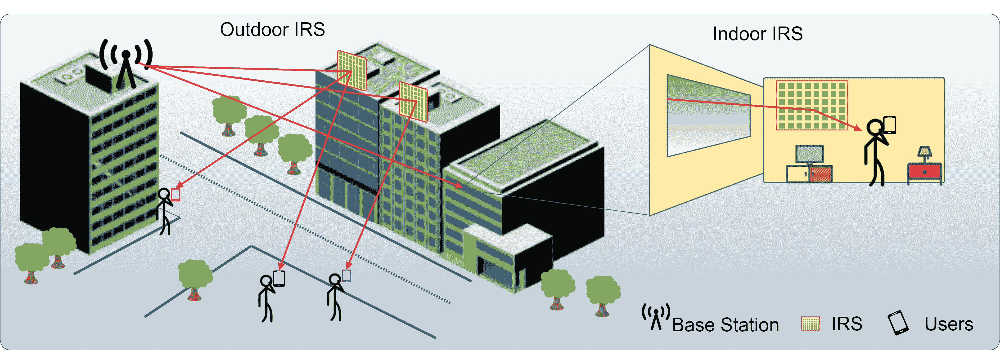

<!--yml

类别：未分类

日期：2024-09-06 19:59:41

-->

# [2009.02540] 深度学习架构在智能反射表面的调查

> 来源：[`ar5iv.labs.arxiv.org/html/2009.02540`](https://ar5iv.labs.arxiv.org/html/2009.02540)

# 深度学习架构在智能反射表面的调查

Ahmet M. Elbir，IEEE 高级会员，Kumar Vijay Mishra，IEEE 高级会员 本工作已提交至 IEEE 以供可能出版。版权可能会在不通知的情况下转移，之后此版本可能不再可用。A. M. Elbir 在卢森堡大学工作（电子邮件：ahmet.elbir@ext.uni.lu）。K. V. Mishra 在美国 DEVCOM 陆军研究实验室工作，地址：马里兰州阿德尔菲，20783 美国（电子邮件：kvm@ieee.org）。

###### 摘要

智能反射表面（IRS）因其能减少传统大阵列的硬件复杂性、物理尺寸、重量和成本，近年来在无线通信中受到广泛关注。然而，IRS 的部署需要处理基站（BS）与用户之间的多个通道链接。此外，BS 和 IRS 的波束形成器需要联合设计，其中 IRS 元素必须快速重新配置。数据驱动技术，如深度学习（DL），在解决这些挑战中至关重要。DL 的低计算时间和模型自由特性使其对数据不完善和环境变化具有鲁棒性。在物理层面上，DL 已被证明对 IRS 信号检测、通道估计和主动/被动波束形成有效，采用了监督学习、无监督学习和强化学习等架构。本文提供了这些技术在设计基于 DL 的 IRS 辅助无线系统中的概述。

## I 引言

下一代毫米波（mm-Wave）大规模多输入多输出（MIMO）系统需要为每个天线配备一个专用的射频（RF）链。这导致系统架构昂贵且庞大，消耗高功率和处理资源。为了减少 RF 链的数量，同时保持足够的波束形成增益，引入了混合模拟和数字波束形成架构。然而，这些系统的成本和能耗开销仍然是一个问题。最近，智能反射表面（IRS）作为一种可行的解决方案[1]，在室内和室外应用中通常使用不同的操作频率或频谱带，提供了一种低成本和轻量化的替代方案，以应对大阵列的复杂性。（图 1）。

IRS 是一种电磁二维表面，由大量被动可重构超材料单元组成，这些单元通过引入预定的相位移来反射入射信号。这个相位移通过基站（BS）通过回传控制链路的外部信号进行控制。因此，来自基站的入射信号可以实时操控，从而将接收到的信号反射到用户方向。因此，IRS 的使用增强了远程用户接收到的信号能量，并扩展了基站的覆盖范围。因此，需要联合设计 IRS 和基站的波束成形器参数。这可以实现所需的信道条件，其中基站通过 IRS 向多个用户传递信息 [2]。与放大转发（AF）中继系统不同，IRS 可以同时具有主动和被动组件，这提供了灵活的配置，因此，它具有较少的主动发射模块或完全作为被动表面反射接收到的信号。因此，IRS 在能源和频谱效率上更具优势 [3]。

波束成形器设计的准确性强烈依赖于信道信息的了解。事实上，IRS 辅助系统包括多个通信链路，即，基站到用户的直接信道和基站通过 IRS 到用户的级联信道。这使得 IRS 场景比传统的大规模 MIMO 系统更具挑战性。此外，无线信道由于 IRS 配置的变化是动态和不确定的。因此，存在来自 IRS 配置和信道动态的固有不确定性。IRS 的这些特性使得系统设计非常具有挑战性 [4, 2]。

图 1: 适用于户外和室内部署的 IRS 辅助无线通信。基础设施顶部的基站（左）通过安装在其他建筑物上的中间 IRS 与地面上的用户通信。基站还通过放置在房间墙壁上的 IRS 服务（右）公寓楼内的用户。

表 I: 基于 DL 的 IRS 辅助无线系统技术

| 方案 | NN 架构 | 优点 | 缺点 |
| --- | --- | --- | --- |
| 信号检测 |
| SL [5] | 具有 $3$ 层的 MLP | 无需信道估计算法 | 仍需设计波束成形器，并需要大量数据集和更深层的 NN 架构 |
| 信道估计 |
| SL [6] | 具有 $3$ 层卷积层和 $3$ 层全连接层的双 CNN | 每个用户使用训练好的模型估计自己的信道 | 数据收集需要通过打开/关闭每个 IRS 元素进行信道训练 |
| FL [7] | 一个具有$3$个卷积层和$3$个全连接层的 CNN | 训练期间传输开销较小，一个 CNN 估计级联和直接信道 | 性能取决于用户数量和本地数据集的多样性 |
| SL[8] | 具有$15$个卷积层的 DDNN | 利用压缩感知（CS）和深度学习（DL）方法 | 需要主动 IRS 元件。由于 CS 算法的预测复杂性较高 |
| 波束形成 |
| SL [9] | 具有$4$层的 MLP | 减少导频训练开销 | 需要主动 IRS 元件进行信道训练 |
| UL [10] | 具有$5$层的 MLP | 模型训练阶段复杂性降低 | 隐式需要作为标签的反射波束形成器 |
| RL [11] | 具有$4$层的 DQN | 提供独立操作，因为 RL 不需要像 SL 那样的标签 | 训练时间较长。需要主动 IRS 元件进行信道获取 |
| RL [2] | 具有$4$层的 DDPG 演员和评论员网络 | 比 DQN 性能更佳 | 涉及大量 NN 参数 |
| RL [12] | 具有演员和评论员网络的 DDPG | 在优化的帮助下加快学习性能，缩小搜索空间 | 需要额外的优化工具 |
| FL [13] | 具有$6$层的 MLP | 模型训练期间传输开销较小 | IRS 必须连接到 PS |
| 安全波束形成 |
| RL [14] | 具有$3$层的 DQN | 对窃听具有鲁棒性 | 高模型训练复杂性 |
| 能效波束形成 |
| RL [4] | DQN | 能效高且对不确定性具有鲁棒性 | 仅限 IRS 波束形成 |
| 室内波束形成 |
| SL [3] | 具有$5$层的 MLP | 减少多个基站的硬件复杂性并改善室内环境中的 RSS | 学习模型的性能依赖于房间条件 |

为了解决信道均衡、硬件损伤和高维问题的亚优化带来的上述不确定性和非线性问题，无模型技术在无线通信中变得越来越常见[15]。在这种背景下，深度学习（DL）在从原始数据中提取特征并通过构建具有大量可学习参数的无模型数据映射来提供“意义”方面特别强大。此外，得益于其数据驱动结构，DL 在建模信道特性时尤其有用。如下面所列，DL 比那些主要依赖于数学模型的基于模型的技术更为高效：

+   •

    学习模型构建了原始输入数据和期望输出之间的非线性映射，从无模型的角度逼近问题[15]。因此，其预测性能对于无线信道数据中的破坏/不完美具有强大的鲁棒性。

+   •

    深度学习能够学习特征模式，这些模式可以轻松地更新以适应新数据并适应环境变化。从长远来看，这比基于模型的优化具有更低的计算复杂度[2]。

+   •

    基于深度学习（DL）的方法由于其并行处理能力显著减少了运行时间。另一方面，实现传统优化和信号处理算法的并行化并不简单[7]。

前述优势导致深度学习在无线通信物理层系统设计中超越了基于优化的方法[15]。

图 2：基于模型的框架与基于学习的框架在信号检测和信道估计中的比较。基于模型的方法（上图）包括多个子系统来处理接收到的信号。基于学习的信号检测（下图左侧）提供了从接收端的受损符号到传输符号的端到端数据映射。基于学习的信道估计（下图右侧）将输入的接收信号映射到作为输出标签的信道估计。

最近，IRS 辅助无线系统已经利用 DL 处理非常具有挑战性的问题。例如，IRS 中的信号检测需要在通道和波束成形器的影响下开发端到端学习系统[5]。需要估计多个通信链路的通道，即基站-用户和基站-IRS-用户[6]。最后，为基站和 IRS 的被动元件设计波束成形器（通过解决复杂的优化问题）[9]。基于 DL 的技术能够处理所有这些问题中的多维大数据集，并且可能还用于通道建模[1]，而传统的基于模型的方法并不是很有效。最近有关于将 DL[15]和 IRS[1]单独应用于无线通信的综述。本文提供了同时采用这两种方法的系统概述。特别是，我们描述了 DL 技术（表 I）在 IRS 的三个主要问题中的应用：信号检测、通道估计和波束成形。这些问题需要不同的 DL 架构，这些架构迄今包括监督学习（SL）、无监督学习（UL）、强化学习（RL）和联邦学习（FL）。UL 和 RL 不需要标记；SL 需要标记数据集；FL 具有分布式模型训练结构。我们在后续章节中详细介绍了这些算法在这三种应用中的优缺点。我们还讨论了从 DL 角度看设计挑战，以及 THz 通信、无基站网络和集成感知与通信（ISAC）的新兴 IRS 辅助系统，并突出相关的未来研究方向。

## II 基于 DL 的 IRS 中的信号检测

信号检测包括在通道和波束成形器的影响下，将接收到的符号映射到传输符号（图 2）。为了利用深度学习（DL）进行信号检测，[5] 设计了一个多层感知器（MLP），用于将通道和反射波束成形器影响的数据符号映射到传输符号。MLP 是一个前馈神经网络（NN），由多个隐藏层组成。[5]中的框架使用了三个全连接层。一旦 MLP 在一个由 Rayleigh 衰落通道的接收-传输数据符号组成的数据集上训练完成，每个用户将接收符号块输入学习模型。这些块考虑了通道和波束成形器的影响。然后，MLP 输出估计的传输符号。

这种方法的一个主要优势是其简单性，学习模型直接估计数据符号，无需进行信道估计阶段。因此，这种方法有助于减少信道获取成本。然而，要实现可靠的性能仍然面临一些挑战。训练数据应在多种信道条件和不同波束形成器配置下收集，以便训练模型很好地了解环境，并在不同场景中反映准确的性能。这是一项特别具有挑战性的任务，因为它需要在不同用户位置收集训练数据。

实践经验：基于 DL 的信号检测对于跳过信道估计阶段是有帮助的。然而，这可能需要在不同信道条件下收集大量的训练数据集。另一种选择是考虑通过 DL 估计无线信道，如下一节所讨论的那样。

## 第三部分 基于 DL 的 IRS 通道估计

IRS 由大量反射元素组成，因此，在 IRS 辅助的无线系统中，通道状态获取是一个主要任务。常见的方法是逐个打开和关闭每个个体 IRS 元素，同时使用正交导频信号来估计 BS 和用户之间的通道通过 IRS。特别是，通过 DL 进行 IRS 通道估计涉及构建接收用户处的输入信号和直接级联链路的通道信息之间的映射（图 2）。通过 DL 的技术可减少通道估计阶段的导频百分比和复杂度[7]。

6 中提出的 SL 方法通过双卷积神经网络（CNN）估计直接和级联通道。首先，用户接收的导频信号是通过逐个打开各个 IRS 元素进行收集的。然后，收集的数据用于找到级联通道和直接通道的最小二乘（LS）估计。两个 CNN 都被训练成将 LS 通道估计映射到真实的通道数据。其结果是每个用户只需估算自己的通道一次，然后将接收的导频数据（LS 估计）输入训练好的 CNN 模型。与 MLP 相比，CNN 对通道数据的不确定性、IRS 元素的缺陷（如切换不匹配）具有更高的容忍度。

当用户端使用大量数据集进行模型训练，如[6]中的各种信道/用户/配置时，系统可能缺乏足够的计算能力。这一问题通过基于 FL 的训练得到解决[7]，其中学习模型更新在设备（节点）上计算，并在基站（中央服务器）上汇总（图 3），从而消除了原始数据的传输。由于数据集的大小通常大于学习模型的大小，因此 FL 显著减少了传输开销，并且随着用户数量的增加，性能会得到改善[7, 13]。此外，与[6]中要求两个数据集的两个 CNN 不同，[7]中的单个 CNN 可以联合估计级联信道和直接信道。

尽管 FL 在模型训练期间减少了传输开销，但其训练性能仍受到集中式模型训练的上限限制，即一次性用整个数据集训练模型。因此，FL 的预测性能通常不如集中式学习（CL）。如图 3 所示，CL 和 FL 框架通过最小均方误差（MMSE）和最小二乘估计（LS）进行比较。我们注意到，FL 在高信噪比（SNR）条件下的表现略逊于 CL。尽管如此，FL 显著减少了传输开销，例如，传输符号的数量减少了大约十倍[7]。

无论是基于 SL 还是 FL 的信道估计技术都存在较高的信道训练开销。在这种情况下，采用深度去噪神经网络（DDNN）的压缩信道估计非常有效[8]。该方法使用混合的被动/主动 IRS 架构，其中主动 IRS 元素用于上行导频训练，被动 IRS 元素用于将信号从基站反射到用户。一旦基站收集了压缩的接收导频测量，通过稀疏重建算法（如正交匹配追踪（OMP））恢复完整的信道矩阵。然后，DDNN 被用来通过利用毫米波信道在角度-时延域中的实部和虚部之间的相关性来提高信道估计的准确性。在训练过程中，输入是 OMP 重建的信道矩阵，输出是噪声，即 OMP 估计与实际信道数据之间的差异。该方法利用了压缩感知（CS）和深度学习（DL），其性能优于单独使用这些技术。主要缺点是引入了由主动 IRS 元素造成的额外硬件复杂性。

经验教训：DDNN 中的额外 OMP 阶段有助于实现比仅有 DDNN 架构更低的 MSE。基于 CL 的通道估计挑战来自大数据集传输，可以通过 FL 缓解。如下一节所述，在估计 IRS 通道后，下一任务是配置 IRS 波束成形器。

## IV DL 辅助的 IRS 应用波束成形

### IV-A IRS 上的波束成形

IRS 波束成形需要被动元件持续可靠地将 BS 信号反射给用户。在这里，MLP 架构 [9] 有助于利用主动 IRS 元件 [8] 设计反射波束成形权重。这些元件在 IRS 中随机分布。它们用于导频训练，然后通过 OMP 进行压缩通道估计。为了收集数据集，通过使用估计的通道数据优化反射波束成形权重。最终，构建了一个训练数据集，其中通道数据和反射波束成形器作为 SL 框架的输入输出对。需要注意的是，主动 IRS 元件存在类似于 [8] 的不足。然而，[9] 通过利用 DL 来设计波束成形器，表现更为出色。

[9] 中的标记过程要求在训练数据生成阶段为每个通道实例解决优化问题。一个可能的缓解方法是使用无标签技术，如 UL。[10] 中的 UL 方法用于反射波束成形设计，采用五层全连接的 MLP。该网络将矢量化的级联和直接通道数据输入映射到包含反射波束成形器相位值的输出。损失函数选择为通道矢量的范数的负值，这看起来像是一种无监督方法，因为它没有最小化标签和学习模型预测之间的误差。然而，这种技术唯一地为每个训练样本提供了相位信息。因此，波束成形器在训练过程中隐式地表现为标签。在 [10] 中，NN 的输出是设计参数，即反射波束成形器相位，其复杂性在于每个输入的波束成形器优化。

图 3：使用 CNN 在集中式和联邦学习框架、MMSE 和 LS 中获得的通道估计均方误差（相对于真实通道）的归一化结果。BS 由 $64$ 个天线组成，IRS 使用了 $64$ 个被动反射元件 [6, 7]。

为了消除 SL 基础技术中昂贵的标注过程，[11] 采用了 RL 来设计单天线用户和 BS 的反射波束形成器。RL 是一种有前景的方法，通过优化学习模型的目标函数直接产生输出。首先，通过使用两个正交的导频信号估计信道状态。通过利用（使用学习模型的先前经验）或探索（使用预定义的代码本）来选择一个动作向量。在基于从环境中选择的动作向量计算可达速率后，通过与阈值比较的可达速率来施加奖励或惩罚。在计算奖励后，深度质量网络（DQN）（图 5）更新从输入状态（信道数据）到输出动作（由反射波束形成器权重组成的动作向量）的映射。训练数据是在电磁（EM）仿真工具中生成的，这个过程会针对多个输入状态重复，直到学习模型收敛。虽然 RL 不是专门针对 IRS 的技术，但相比于需要标注数据集的 RNN 或 CNN 模型部署的 SL 架构，它在降低标注过程的开销方面特别有用。RL 算法基于可达速率的优化来学习反射波束形成器权重。因此，RL 为在线学习方案提供了解决方案，模型能有效适应传播环境的变化。然而，RL 技术的训练时间比 SL 方法更长，因为奖励机制和离散动作空间使得达到全局最优变得困难。无标签过程意味着 RL 通常比 SL 性能稍逊。

图 4：在 FL 框架中，每个用户（中心）处理其本地数据集（右侧），计算模型更新（梯度），并将其发送到 PS（左侧）。服务器汇总收集到的模型更新，并将更新后的模型参数发送回用户。

为了通过使用连续动作空间加速训练阶段，引入了一种深度确定性策略梯度（DDPG）（见图 5），参考文献 [2]。在这里，使用演员-评论家网络架构分别计算动作和目标值。首先，通过使用由级联和直接通道激发的输入状态来初始化学习阶段。给定状态信息，深度策略网络（DPN）（演员）构建动作（反射波束成形相位）。DPN 提供了一个连续的动作空间，比 [11] 中的 DQN 架构收敛更快。评论家网络架构使用动作向量来估计接收的信噪比（SNR）作为目标。然后，这个 SNR 生成在学习策略下的目标波束成形向量。通过 DPN 的梯度，更新网络参数，并将下一个状态构建为接收的 SNR 和反射波束成形器的组合。

尽管 RL 是一种无标签的方法，可以减少训练数据生成过程中的开销，但 [2, 11, 12] 中的训练方法需要昂贵的传输开销来在大型数据集上进行训练。FL 技术缓解了这一点。 [13] 中的 FL 方法通过在每个用户的本地数据集上计算模型更新来训练 MLP，从而学习 IRS 反射波束成形器。模型更新在连接到 IRS 的参数服务器（PS）中聚合。MLP 的输入是级联通道信息，输出标签是 IRS 波束成形权重。联邦架构降低了训练过程中的传输开销。然而，假设 PS 连接到 IRS。IRS 的简单架构可能使这一点不可行。通过 BS 访问 PS 进行模型训练会更为实际。

### IV-B 安全波束成形

无线系统中的物理层安全性主要通过信号处理技术实现，如合作中继和合作干扰。这些方法中的硬件复杂性是一个主要问题。低成本、复杂度较低的基于 IRS 的系统有可能缓解这些问题。基于 RL 的安全波束形成[14]通过在 IRS 和基站共同设计波束形成器来最小化保密率，以在存在窃听者的情况下服务多个合法用户。RL 算法接受作为所有用户的信道信息、保密率和传输率的状态。类似于[2]，动作向量包括基站和 IRS 的波束形成器。奖励函数基于用户的保密率设计。一个 DQN 被训练通过最小化保密率同时保证服务质量要求来学习波束形成器。模型训练在基站进行，基站负责收集环境信息（信道数据）并作出安全波束形成的决策。该方案比[11, 2]更现实和可靠，后者忽略了窃听者的影响。学习模型包括高维状态和动作信息，如所有用户的信道和基站及 IRS 的波束形成器。这可能需要比非安全 IRS[11, 2]和传统 SL 技术[6, 9]更多的计算资源进行训练。

### IV-C 节能波束形成

IRS 配置会根据网络状态动态变化。每次 IRS 元素的开关状态更新时，基站（BS）优化传输功率的要求非常高。这可以通过在波束形成器设计问题中考虑能源效率来解决。在[4]中，一个自供电的 IRS 场景通过优化传输功率和 IRS 波束形成器相位来最大化能源效率。在这种基于 DQN 的强化学习（RL）方法中，基站在更新模型参数的同时学习系统性能的结果。因此，基站依赖于仅估计的信道信息来决定分配无线资源。RL 框架的数据集包含从用户处估计的信道和 IRS 的能量水平作为状态。同时，动作向量包括传输功率、IRS 波束形成器相位和 IRS 元素的开关状态。学习策略基于作为整体系统能源效率选择的奖励。然而，这项工作仅考虑了 IRS 波束形成，而忽略了基站的波束形成。

### IV-D 室内 IRS 的波束形成

与上述场景不同，[3] 解决了室内通信场景中的 IRS 波束成形器设计问题，以增加接收信号强度（RSS）（参见图 1）。从低硬件复杂度的角度来看，这一点尤其有用，因为它消除了部署多个基站以提高 RSS 的需求。[3]中的 MLP 架构接受二维用户位置向量，并在输出端给出 IRS 波束成形器相位。由于通道数据未被用作输入，网络无需处理严重的环境波动。然而，学习模型在特定房间环境中进行训练，对于不同房间条件或相同房间中的不同障碍物分布可能表现不佳。这在基于 RL 的解决方案中得到了缓解，这些方案对不同环境具有很高的适应性 [11, 2]。

经验教训：在各种基于 DL 的波束成形方法中，RL 不涉及标注，从这个意义上说，它比 SL 更有优势。此外，DQN 是一种 RL 技术，其架构更简单，但收敛时间比例如 DDPG 要长，后者由演员-评论员空间组成，提供更好的准确性和更快的收敛。由于 FL 减少了传输开销，未来可以考虑集成 FL-RL 框架。

图 5：在 RL 中，DQN 和 DDPG 架构接受相同的状态（信道数据和接收 SNR）和环境数据（待评估的波束成形器）。DQN 涉及基于环境确定的奖励训练单个神经网络。另一方面，DDPG 有多个神经网络，其中演员-评论员架构用于分别计算动作和目标值。

## V 挑战与未来研究方向

要实现 IRS 辅助无线系统显著的性能提升和效率，DL 架构仍面临许多挑战。

### V-A DL 相关挑战

大规模数据收集及其后续训练是实现 DL 技术成功应用于所有无线通信任务（信号检测、信道估计和波束成形器设计）的瓶颈。

#### V-A1 数据收集

信号检测需要收集和存储不同信道条件下的发射和接收数据符号，例如用户位置/角度和调制类型 [5]。由于额外的标记过程，信道估计和波束形成的前提条件更加繁琐。这在特别是在线场景中很难克服。除了 SL 外，RL 中的无标签结构特别有用，但代价是训练时间。可以通过在数值电磁仿真工具中实现传播环境 [11, 9]，然后使用更真实模拟的数据来放宽数据收集要求。这有助于离线构建训练数据集，但在实际场景中仍有失败的可能性。最近，2021 年 IEEE 信号处理杯比赛中提供了 IRS 辅助通信中信道估计问题的公共数据集。

#### V-A2 模型训练

模型通常在在线部署到连接到 BS 的 PS 之前离线训练。此外，模型训练的复杂度随着 IRS 元素和在用户与 BS 之间部署的 IRS 数量的增加而增加。一些实验研究包括在$10.5$ GHz 频率下操作的具有$10000$个元素的 IRS [1]。因此，模型训练引入了巨大的传输开销。FL 有潜力减少这种成本，并实现通信高效的模型训练（参见，例如，图 3）。在这里，将 RL 的无标签结构与 FL 的通信效率结合，即联邦强化学习，可能是下一步。

#### V-A3 环境适应性和鲁棒性

信道的行为影响所有基于 DL 的任务，包括信道估计、波束成形、用户调度、功率分配和天线选择/切换。解决模型输出的偏差与方差之间的权衡对实现稳健性能至关重要。这通常通过数据验证来实现，以确保学习模型不会过拟合或欠拟合训练数据。然而，这并不能将学习性能推广到不同的环境中。此外，当前无线系统的 DL 架构仍然是特定于环境的，因为其学习模型的输入数据空间有限。因此，当学习模型接收到来自未学习/未覆盖的数据空间的输入时，性能会显著下降。为了覆盖更大的数据空间并提供对环境变化的稳健性能，需要更宽广和更深的学习模型。但是，目前的无线通信 DL 架构包含的神经元少于一百万，并且只有少数几层（见表 1）[7]。因此，更宽广和更深的设计对未来基于 DL 的 IRS 辅助系统具有重要意义。

### V-B IRS 相关挑战

也已识别出新兴技术中的一些具体实现挑战，其中一些我们在此进行详细说明。

#### V-B1 无小区（CF）网络

这些架构能减少平均路径损耗，提升一定程度的信道硬化，并改善传统大规模 MIMO 系统中的小区间干扰。在这种情况下，基于深度学习（DL）辅助的 IRS 波束成形有可能提高网络容量和能效。通过设计可扩展的网络和长期被动波束成形器，可以提升这种系统的鲁棒性。

#### V-B2 THz 实现

与毫米波相比，THz 波段的传播损耗更显著，从而导致传输范围更短。毫米波信道模型基于单一视距（LoS）路径及几个非视距（non-LoS）路径，而 THz 信道主要是多个视距路径的叠加。在这里，DL 辅助的 IRS 有助于扩展基站覆盖范围。然而，从设备角度来看，实现 THz 波段的 IRS 仍然是一个挑战。最近引入的热冲压技术在制造 IRS 时可以改善 THz 特有的波束偏移和宽波束失配现象。

#### V-B3 集成感知与通信

最近的 ISAC 研究设想了硬件和能效兼备的频谱共享雷达与通信。在这里，IRS 再次被证明能够实现范围扩展、非视距（NLoS）感知/通信、改善干扰抑制以及增强安全性。已确定了用于联合处理、多跳信道获取以及减少各种 ISAC 任务后训练复杂度的 DL 辅助技术。

## VI 总结与未来展望

我们调查了 IRS 辅助无线系统的 DL 架构，涵盖了关键应用，包括信号检测、信道估计和波束形成。我们广泛讨论了各种学习架构，如 SL、UL、FL 和 RL 及其 IRS 特定的考虑因素。DL 基础的 IRS 系统的优势在于降低复杂性和更好的鲁棒性，如下所述。

${\bullet}$ 虽然像 UL 和 RL 这样的无标签方法在训练数据生成过程中复杂度较低，但与有标签的 SL 相比，它们的性能有所欠缺。需要注意的是，UL 仍需对每个数据实例进行优化阶段。RL 因其独立操作以及随之而来的适应环境变化的能力而显得有前景，尽管代价是较长的训练时间。

${\bullet}$ 在 FL 中，传输开销显著降低，可以与其他学习方法结合。例如，FL 和 RL 基础的学习策略的组合不仅展示了通信效率高的模型训练，还提供了环境适应性。

$\bullet$ DL 相关挑战包括大规模数据收集、模型训练和环境适应。这些问题应同时解决，以提供可靠的 DL 架构用于下一代 IRS 辅助无线系统。具体而言，FL 和 RL 的结合应与庞大的数据集和大规模神经网络相结合，以产生稳健的 DL 架构。

${\bullet}$ 在 IRS 辅助的 CF 大规模 MIMO 中，多跳信道获取和低复杂度波束形成技术在未来受到极大关注。近期在实现 IRS 辅助的 THz 通信系统方面取得了进展。当前另一个感兴趣的应用是 ISAC，其中由 IRS 启用的智能无线环境提供了额外的自由度。

## 参考文献

+   [1] S. Gong *等*，“通过智能反射面实现智能无线通信：现代调查，” *IEEE 通讯调查与教程*，第 22 卷，第 4 期，第 2283–2314 页，2020 年。

+   [2] K. Feng *等*，“基于深度强化学习的智能反射面优化用于 MISO 通信系统，” *IEEE 无线通讯快报*，第 9 卷，第 5 期，第 745–749 页，2020 年。

+   [3] C. Huang *等*，“通过深度学习设计的可重构智能表面进行室内信号聚焦，” 载于 *IEEE 国际无线通信信号处理进展研讨会*，2019，第 1–5 页。

+   [4] G. Lee *等*，“用于能源高效网络的深度强化学习与可重构智能表面，” 载于 *IEEE 国际通信会议*，2020，第 1–6 页。

+   [5] S. Khan *等*， “基于迁移学习的智能反射面辅助通信检测，” 载于 *IEEE 年度国际个人、室内和移动无线通信研讨会*，2021，第 13–16 页。

+   [6] A. M. Elbir *等人*，“用于大型智能表面辅助毫米波大规模 MIMO 系统的深度信道学习，” *IEEE Wireless Commun. Lett.*，第 9 卷，第 9 期，页码 1447–1451，2020 年。

+   [7] A. M. Elbir 和 S. Coleri，“用于传统和 RIS 辅助大规模 MIMO 的联邦学习信道估计，” *IEEE Trans. Wireless Commun.*，第 21 卷，第 6 期，页码 4255–4268，2021 年。

+   [8] S. Liu *等人*，“基于深度去噪神经网络的毫米波智能反射面压缩信道估计，” *IEEE Trans. Veh. Technol.*，第 69 卷，第 8 期，页码 9223–9228，2020 年。

+   [9] A. Taha *等人*，“通过压缩感知和深度学习实现大型智能表面，” *IEEE Access*，第 9 卷，页码 44 304–44 321，2021 年。

+   [10] J. Gao *等人*，“用于被动波束形成的无监督学习，” *IEEE Commun. Lett.*，第 24 卷，第 5 期，页码 1052–1056，2020 年。

+   [11] A. Taha *等人*，“智能反射面深度强化学习：朝向独立操作，”在 *IEEE International Workshop on Signal Processing Advances in Wireless Communications*，2020 年，页码 1–5。

+   [12] S. Gong *等人*，“当优化遇上机器学习：以 IRS 辅助无线网络为例，” *IEEE Network*，页码 1–9，2022 年。

+   [13] D. Ma *等人*，“基于联邦学习的智能反射面分布式速率优化，”在 *IEEE International Conference on Communications Workshops*，2020 年，页码 1–6。

+   [14] H. Yang *等人*，“基于深度强化学习的智能反射面用于安全无线通信，” *IEEE Trans. Wireless Commun.*，第 20 卷，第 1 期，页码 375–388，2021 年。

+   [15] L. Dai *等人*，“无线通信中的深度学习：一个新兴的跨学科范式，” *IEEE Wireless Commun.*，第 27 卷，第 4 期，页码 133–139，2020 年。

| Ahmet M. Elbir（高级会员，IEEE）于 2016 年在中东技术大学（METU）获得电气工程博士学位。他目前是卢森堡大学的研究员。 |
| --- |
| Kumar Vijay Mishra（高级会员，IEEE）于 2015 年在爱荷华大学获得电气和计算机工程博士学位。目前，他是美国陆军研究实验室的国家科学院哈里·戴蒙德杰出研究员。 |
