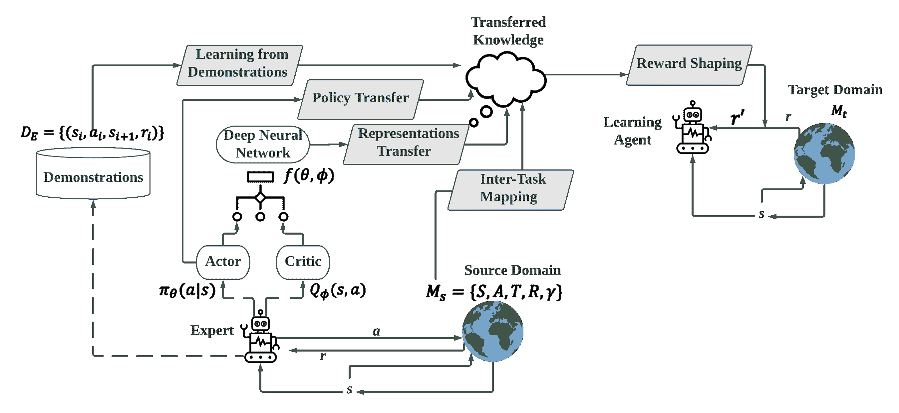

<!--yml

类别：未分类

日期：2024-09-06 19:59:31

-->

# [2009.07888] 深度强化学习中的迁移学习：综述

> 来源：[`ar5iv.labs.arxiv.org/html/2009.07888`](https://ar5iv.labs.arxiv.org/html/2009.07888)

# 深度强化学习中的迁移学习：综述

朱庄地、林凯翔、安尼尔·K·贾因和周佳宇。朱庄地、安尼尔·K·贾因和周佳宇均来自密歇根州立大学计算机科学与工程系，东兰辛，密歇根州，48824。电子邮件：{zhuzhuan, jain, jiayuz}@msu.edu 林凯翔在亚马逊 Alexa AI 工作。电子邮件：lkxcarson@gmail.com

###### 摘要

强化学习是一种解决顺序决策问题的学习范式。近年来，随着深度神经网络的快速发展，强化学习取得了显著进展。随着强化学习在机器人技术和游戏等众多领域的前景广阔，迁移学习应运而生，旨在通过将外部知识转移以提高学习过程的效率和效果，从而应对强化学习面临的各种挑战。在这项综述中，我们系统地研究了在深度强化学习背景下的迁移学习方法的最新进展。具体而言，我们提供了一个框架来分类最先进的迁移学习方法，并在该框架下分析它们的目标、方法、兼容的强化学习骨干和实际应用。我们还从强化学习的角度探讨了迁移学习与其他相关主题之间的联系，并探讨了未来研究进展中可能面临的挑战。

###### 索引词：

迁移学习，强化学习，深度学习，综述。

## 1 引言

强化学习（RL）是解决序列决策任务的有效框架，其中学习代理通过试错与环境交互以提高其性能[1]。起源于控制论并在计算机科学中蓬勃发展，RL 已被广泛应用于解决以前难以处理的挑战任务。传统的 RL 算法大多为表格型问题设计，虽然它们提供了对简单任务的有原则的解决方案，但在处理高度复杂的领域时，如 3D 环境任务，面临困难。随着深度学习研究的最新进展，RL 与深度神经网络的结合被开发出来以应对挑战性任务。因此，深度学习与 RL 的结合被称为深度强化学习（DRL）[2]，它使用深度神经网络学习强大的函数逼近器来解决复杂领域。DRL 在机器人控制[3, 4]和游戏玩法[5]等应用中取得了显著成功。它还在健康信息学[6]、电力网络[7]、智能交通系统[8, 9]等领域表现突出。

除了显著的进展，RL（强化学习）仍面临由探索与利用困境引发的有趣困难[1]。具体而言，对于实际的 RL 问题，环境动态通常是未知的，代理在通过探索收集足够的互动经验之前，无法利用关于环境的知识。由于部分可观察性、稀疏反馈以及状态和动作空间的高复杂性，获取足够的互动样本可能会变得困难甚至引发安全隐患，例如在自动驾驶和健康信息学领域。这些挑战促使了各种改进当前 RL 过程的努力。因此，*迁移学习*（TL），或等同于*知识迁移*，即利用外部专业知识来促进目标领域的学习过程，成为 RL 中的一个关键话题。

虽然 TL 技术在监督学习中得到了广泛研究[10]，但它在 RL 中仍是一个新兴话题。对于 RL 而言，迁移学习可能更加复杂，因为知识需要在马尔可夫决策过程中转移。此外，由于马尔可夫决策过程的细致组成部分，专家知识可能以不同的形式存在，需要以不同的方式进行迁移。注意到以前对 RL 领域 TL 总结的努力并未涵盖过去十年的研究[11, 12]，而在此期间，借助深度学习技术，取得了显著的 TL 突破。因此，在本次调查中，我们对 RL 中的最新 TL 方法进行了全面的研究。

我们的调查有多方面的贡献：1）我们调查了最近十年涉及新型深度强化学习（DRL）骨干网和迁移学习（TL）算法的最新研究。据我们所知，这项调查是首个尝试在*深度*强化学习背景下调研迁移学习方法的工作。我们回顾了能够解决更复杂强化学习任务的迁移学习方法，并研究了之前文献中未深入讨论的新迁移学习方案，例如表示解缠结（见 5.5）和策略蒸馏（见 5.3）。2）我们提供了系统的分类，涵盖了 DRL 中迁移学习发展的更广泛和深入的视角。我们的主要分析基于一个基本问题，即*强化学习中的迁移知识是什么*，在此基础上我们进行了更精细的分析。大多数迁移学习策略，包括之前调查中讨论的那些，均适用于我们的分类框架。3）在反思 DRL 中迁移学习方法的发展时，我们对其未来方向提出了新思路，包括如何对各种知识形式进行*推理*，以及如何*利用*知识以更高效和更有原则的方式。我们还指出了迁移学习在 DRL 中的突出应用及其在未来 AGI 时代蓬勃发展的机会。

本调查的其余部分组织如下：在第二部分中，我们介绍了强化学习的基础知识，包括基于深度神经网络的最新关键发展。接下来，我们讨论了在强化学习背景下迁移学习的定义及其相关主题（第 2.4 节）。在第三部分中，我们提供了一个框架，从多个角度对迁移学习方法进行分类，分析其基本差异，并总结其评估指标（第 3.3 节）。在第五部分中，我们详细阐述了不同的迁移学习方法，按照转移知识的形式进行组织，例如奖励塑造（第 5.1 节）、从示例中学习（第 5.2 节）或从教师策略中学习（第 5.3 节）。我们还根据知识转移发生的方式研究迁移学习方法，例如任务间映射（第 5.4 节）或学习可迁移表示（第 5.5 节）等。在第六部分中，我们讨论了迁移学习在深度强化学习背景下的当代应用，并在第七部分中提供了一些未来的展望和开放性问题。

## 2 深度强化学习与迁移学习

### 2.1 强化学习基础

*马尔可夫决策过程（MDP）:* 一个典型的强化学习问题可以被视为训练一个代理与遵循马尔可夫决策过程（MDP）的环境互动[13]。代理从初始状态开始，根据情况执行一个*动作*，该动作产生一个*奖励*来引导代理的行为。一旦动作执行完毕，MDP 会按照其内在的*转移动态*转移到下一个状态。代理在互动过程中累计时间*折扣*奖励。互动的一个子序列被称为一个*回合*。上述提到的 MDP 组件可以使用一个元组表示，即 ${\mathcal{M}}=(\mu_{0},{\mathcal{S}},{\mathcal{A}},{\mathcal{T}},\gamma,{\mathcal{R}}$)，其中：

+   •

    $\mu_{0}$ 是初始状态的集合。

+   •

    ${\mathcal{S}}$ 是状态空间。

+   •

    ${\mathcal{A}}$ 是动作空间。

+   •

    ${\mathcal{T}}$: $S\times A\times S\to\mathbb{R}$ 是转移概率分布，其中 ${\mathcal{T}}(s^{\prime}|s,a)$ 指定了从状态 $s$ 采取动作 $a$ 后，状态转移到 $s^{\prime}$ 的概率。

+   •

    ${\mathcal{R}}:S\times A\times S\to\mathbb{R}$ 是奖励分布，其中 ${\mathcal{R}}(s,a,s^{\prime})$ 是代理从状态 $s$ 采取动作 $a$ 并使下一状态为 $s^{\prime}$ 时可以获得的奖励。

+   •

    $\gamma$ 是折扣因子，$\gamma\in(0,1]$。

一个 RL 智能体在${\mathcal{M}}$中通过遵循其策略$\pi$来行为，这是一种从状态到动作的映射：$\pi:{\mathcal{S}}\to{\mathcal{A}}$。对于随机策略$\pi$，$\pi(a|s)$表示从状态$s$采取动作$a$的概率。给定一个 MDP ${\mathcal{M}}$和策略$\pi$，可以推导出一个值函数$V_{\mathcal{M}}^{\pi}(s)$，它定义在状态空间上：$V_{\mathcal{M}}^{\pi}(s)={\mathds{E}}\left[r_{0}+\gamma r_{1}+\gamma^{2}r_{2}+\dots;\pi,s\right]$，其中$r_{i}={\mathcal{R}}(s_{i},a_{i},s_{i+1})$是智能体在第$i$个状态$s_{i}$采取动作$a_{i}$所获得的奖励，且下一个状态转移到$s_{i+1}$。期望${\mathds{E}}$是对${s_{0}\sim\mu_{0},a_{i}\sim\pi(\cdot|s_{i}),s_{i+1}\sim{\mathcal{T}}(\cdot|s_{i},a_{i})}$进行的。值函数通过评估智能体在状态$s$时根据策略$\pi$可以获得的预期奖励，来估计处于状态$s$的质量。与值函数类似，策略也具有一个$Q$-函数，它估计从状态$s$采取动作$a$的质量：$Q_{\mathcal{M}}^{\pi}(s,a)={\mathds{E}}_{s^{\prime}\sim{\mathcal{T}}(\cdot|s,a)}\left[{\mathcal{R}}(s,a,s^{\prime})+\gamma V_{\mathcal{M}}^{\pi}(s^{\prime})\right]$。*强化学习目标：* 标准 RL 旨在学习一个具有最优值和$Q$-函数的最优策略$\pi_{{\mathcal{M}}}^{*}$，使得$\forall s\in{\mathcal{S}},\pi_{\mathcal{M}}^{*}(s)=\underset{a\in A}{\arg\max}~{}~{}{Q_{\mathcal{M}}^{*}(s,a)}$，其中$Q_{\mathcal{M}}^{*}(s,a)=\underset{\pi}{\sup}~{}~{}Q_{\mathcal{M}}^{\pi}(s,a)$。学习目标可以简化为最大化预期回报：

|  | $\displaystyle J(\pi):={\mathds{E}}_{(s,a)\sim\mu^{\pi}(s,a)}[\sum_{t}\gamma^{t}r_{t}],\vspace{-0.1in}$ |  |
| --- | --- | --- |

其中$\mu^{\pi}(s,a)$是由$\pi$引起的*平稳状态-动作分布* [14]。

在 DRL 的最新进展基础上，一些文献扩展了 RL 目标，以在不同条件下实现各种目标，这被称为*目标条件强化学习*（GCRL）。在 GCRL 中，智能体策略$\pi(\cdot|s,g)$不仅依赖于状态观察$s$，还依赖于被优化的目标$g$。每个个体目标$g\sim{\mathcal{G}}$可以通过其奖励函数$r(s_{t},a_{t},g)$进行区分，因此 GCRL 的目标变为最大化目标分布下的预期回报：$J(\pi):={\mathds{E}}_{(s_{t},a_{t})\sim\mu^{\pi},g\sim{\mathcal{G}}}\left[\sum_{t}\gamma^{t}r(s,a,g)\right]$ [15]。GCRL 的一个原型例子可以是迷宫运动任务，其中学习目标表现为迷宫中的期望位置[16]。

*情景性强化学习与非情景性强化学习：* 在情景性 RL 中，智能体在有限长度为 $H$ 的回合中执行任务，并在回合结束时被*重置*到初始状态 $\in\mu_{0}$[1]。而在非情景性 RL 中，学习智能体与 MDP 持续交互而不进行任何状态重置[17]。为了在无限 MDP 中涵盖情景性概念，情景性 RL 任务通常假设存在一组吸收状态 ${\mathcal{S}}_{0}$，这些状态表示情景性任务的终止[18, 19]，并且在吸收状态下进行的任何动作只会转移到自身，并且奖励为零。

### 2.2 强化学习算法

有两种主要的方法来进行 RL：*基于模型* 和 *无模型*。在 *基于模型* 的 RL 中，使用学习或提供的 MDP 模型来进行策略学习。在 *无模型* 的 RL 中，优化策略是在不建模转移动态或奖励函数的情况下学习的。在本节中，我们从 *无模型* 视角开始介绍 RL 技术，由于其相对简单，这也为许多基于模型的方法提供了基础。

*预测与控制*：一个 RL 问题可以分解为两个子任务：*预测* 和 *控制* [1]。在 *预测* 阶段，当前策略的质量被评估。在 *控制* 阶段或 *策略改进* 阶段，学习策略根据 *预测* 步骤中的评估结果进行调整。策略可以通过迭代这两个步骤来改进，这被称为 *策略迭代*。

对于 *无模型* 策略迭代，目标策略的优化不需要了解 MDP 转移动态。传统的无模型 RL 包括 *蒙特卡洛* 方法，该方法通过使用 *回合样本* 来估计每个状态的值，这些样本是从该状态开始的。如果样本是通过跟随目标策略收集的，则蒙特卡洛方法可以是 *在策略* 的，或者如果样本是通过跟随不同于目标策略的 *行为* 策略收集的，则可以是 *离策略* 的。

*时间差分（TD）学习*是解决*预测*问题的另一种方法。TD 学习的核心思想是通过*自举*来学习状态质量函数。它也可以扩展到解决*控制*问题，从而同时改善价值函数和策略。*在线* TD 学习算法的例子包括*SARSA* [20]、*期望 SARSA* [21]、*演员-评论家* [22]及其深度神经网络扩展版本* A3C* [23]。*离线* TD 学习方法包括 SAC [24]用于连续状态-动作空间，以及$Q$-学习 [25]用于离散状态-动作空间，还有基于深度神经网络的变体，如 DQN [26]、双重 DQN [26]、Rainbow [27]等。TD 学习方法更注重于估计状态-动作值函数。

*策略梯度*，另一方面，是一种强调对可参数化策略进行直接优化的机制。传统的策略梯度方法包括*REINFORCE* [28]。近年来，TD 学习和策略梯度方法的联合出现成为常态。代表性的算法包括*信任区域策略优化（TRPO）* [29]、*近端策略优化（PPO）* [30]、*确定性策略梯度（DPG）* [31]及其扩展，如*DDPG* [32]和*双延迟 DDPG* [33]。

与纯粹通过试错学习的无模型方法不同，*基于模型的强化学习*（MBRL）明确地学习环境的过渡动态或成本函数。动态模型有时可以被视为*黑箱*以便于*基于采样的规划*。代表性的例子包括被称为*随机射击*的*蒙特卡洛*方法 [34]及其交叉熵方法（CEM）变体 [35, 36]。建模的动态还可以促进数据生成 [37]和价值估计 [38]。对于具有*白箱*建模的 MBRL，过渡模型变得可微分，并可以通过直接梯度传播来促进规划。这类方法包括用于策略梯度的*微分规划* [39]和动作序列搜索 [40]，以及价值梯度方法 [41, 42]。MBRL 的一个优势是比无模型 RL 具有更高的样本效率，尽管对于复杂领域来说，这可能是一个挑战，因为在这些领域中，学习动态通常比学习策略更为困难。

### 2.3 强化学习中的迁移学习

###### 备注 1。

在不失去清晰度的情况下，在本调查的其余部分，我们将 MDPs、领域和任务等同地 refer to。

###### 备注 2。

*[迁移学习在 RL 中的应用]* 给定一组源领域 $\bm{{\mathcal{M}}}_{s}=\{{\mathcal{M}}_{s}|{\mathcal{M}}_{s}\in\bm{{\mathcal{M}}}_{s}\}$ 和一个目标领域 ${\mathcal{M}}_{t}$，*迁移学习* 旨在通过利用来自 $\bm{{\mathcal{M}}}_{s}$ 的外部信息 ${\mathcal{I}}_{s}$ 以及来自 ${\mathcal{M}}_{t}$ 的内部信息 ${\mathcal{I}}_{t}$，来为目标领域学习一个最优策略 $\pi^{*}$。

|  | $\displaystyle~{}\pi^{*}=\operatorname*{arg\,max}_{\pi}{\mathds{E}}_{s\sim\mu_{0}^{t},a\sim\pi}[Q^{\pi}_{{\mathcal{M}}}(s,a)],$ |  |
| --- | --- | --- |

其中 ${\pi}=\phi({\mathcal{I}}_{s}\sim\bm{{\mathcal{M}}}_{s},{\mathcal{I}}_{t}\sim{\mathcal{M}}_{t}):{\mathcal{S}}^{t}\to{\mathcal{A}}^{t}$ 是一个为目标领域 ${\mathcal{M}}_{t}$ 学习的策略，基于来自 ${\mathcal{I}}_{t}$ 和 ${\mathcal{I}}_{s}$ 的信息。

在上述定义中，我们用 $\phi({\mathcal{I}})$ 表示基于信息 ${\mathcal{I}}$ 学到的策略，通常在深度强化学习（DRL）中用深度神经网络来逼近。对于简化情况，知识可以在同一领域内的两个代理之间迁移，结果是 $|\bm{{\mathcal{M}}}_{s}|=1$，并且 ${\mathcal{M}}_{s}={\mathcal{M}}_{t}$。可以将没有 TL 的常规 RL 视为上述定义的特例，通过将 ${\mathcal{I}}_{s}=\emptyset$，使得策略 $\pi$ 仅基于目标领域提供的反馈进行学习，即 ${\pi}=\phi({\mathcal{I}}_{t})$。

### 2.4 相关主题

除了迁移学习（TL），还通过利用不同形式的监督进行了其他努力，以造福强化学习（RL）。在本节中，我们通过分析迁移学习与这些相关技术之间的差异和联系，简要讨论了与 TL 相关的其他技术，希望能够进一步明确本调查的范围。

*持续学习* 是指连续学习多个在时间上或空间上相关的任务的能力，而不会遗忘之前获得的知识。持续学习是 TL 的一种特殊且更具挑战性的情况，因为所学知识需要在一系列动态变化的任务中进行迁移，这些任务是无法预见的，而不是学习一组固定的任务。因此，与本调查中讨论的大多数 TL 方法不同，*自动任务检测* 和 *避免灾难性遗忘* 的能力在持续学习中通常是不可或缺的 [43]。

*层次化强化学习* 被提出用以解决复杂的现实世界任务。与传统强化学习不同，对于层次化强化学习，动作空间被分组到不同的粒度以形成更高层次的宏动作。因此，学习任务也被分解为层次化依赖的子目标。知名的层次化强化学习框架包括 *封建学习* [44]，*选项框架* [45]，*层次化抽象机器* [46]，以及 *MAXQ* [47]。鉴于任务、动作和状态空间的更高层次抽象，层次化强化学习可以促进在类似领域之间的知识转移。

*多任务强化学习* 通过跨各种任务学习具有泛化技能的智能体，从而能够解决从固定但未知分布中随机采样的 MDP[48]。多任务学习的更大概念还包括多任务监督学习和无监督学习[49]。多任务学习自然与迁移学习相关，因为所学习的技能，通常表现为表示，需要在各领域之间有效共享。此调查中后续讨论的许多迁移学习技术可以很容易地应用于解决多任务强化学习场景，例如策略蒸馏[50] 和表示共享[51]。多任务学习中的一个显著挑战是负迁移，这由所学习任务的无关或冲突特性引起。因此，最近一些多任务强化学习工作专注于在共享和个性化功能模块之间的权衡[52, 53, 54]。

*强化学习中的泛化* 指的是学习智能体适应 *未见过* 领域的能力。泛化是强化学习必须实现的关键特性，尤其是当传统的强化学习假设训练和推理的马尔可夫决策过程（MDP）相同，而现实世界却在不断变化。由于 MDP 的非平稳性，强化学习中的泛化被认为比监督学习中的泛化更具挑战性，后者为前者提供了灵感[55]。*元学习* 是一种有效的泛化方向，它与迁移学习有着密切的联系。此调查中讨论的一些迁移学习技术实际上是为元强化学习设计的。然而，元学习特别关注于能够 *快速适应* 未见领域的学习方法，而迁移学习是一个更广泛的概念，涵盖了目标环境可以是（部分）可观测的场景。为了解决强化学习中的未见任务，一些元强化学习方法专注于 MDP 生成[56] 和变化估计[57]。有关元强化学习的更详细调查，请参见[58]。

## 3 分析迁移学习

在本节中，我们从不同角度讨论 RL 中的 TL 方法。我们还使用一个原型来说明领域间知识转移的潜在变体，然后总结 TL 评估的重要指标。

### 3.1 转移学习方法的分类

TL 方法可以通过回答以下关键问题来组织：

1.  1.

    *转移了什么知识*：来源领域中的知识可以采取不同形式，例如专家经验 [59]、专家策略的动作概率分布 [60]，甚至是估计目标 MDP 中演示质量的潜在函数 [61]。知识表示和粒度的差异从根本上影响 TL 的执行方式。转移知识的质量，例如是否来自神谕 [62] 或次优教师 [63]，也影响 TL 方法的设计方式。

1.  2.

    *哪些 RL 框架适用于 TL 方法*：我们可以将这个问题重新表述为其他形式，例如 TL 方法是否对策略无关，还是仅适用于某些 RL 框架，例如时序差分（TD）方法？对此问题的回答与知识的表示密切相关。例如，从专家演示中转移知识通常是对策略无关的（见第 5.2 节），而政策蒸馏（将在第 5.3 节讨论）可能不适用于不显式学习策略函数的 DQN 框架。

1.  3.

    *源领域和目标领域之间的区别是什么*：一些 TL 方法适用于源领域 ${\mathcal{M}}_{s}$ 和目标领域 ${\mathcal{M}}_{t}$ 等效的情况，而其他方法则设计用于在不同领域之间转移知识。例如，在视频游戏任务中，当观察是 RGB 像素时，${\mathcal{M}}_{s}$ 和 ${\mathcal{M}}_{t}$ 可能共享相同的动作空间 (${\mathcal{A}}$) 但在观察空间 (${\mathcal{S}}$) 上有所不同。对于目标条件 RL [64]，两个领域之间的区别可能仅在于奖励分布：${\mathcal{R}}_{s}\neq{\mathcal{R}}_{t}$。

1.  4.

    *目标领域中可用的信息是什么*：虽然来源领域中的知识通常是可以访问的，但从目标领域采样可能会受到限制，或者奖励信号可能是稀疏或延迟的。例如，将在模拟平台上预训练的自动驾驶代理适应到真实环境[65]。目标领域中信息的可用性可以影响 TL 方法的设计方式。

1.  5.

    *迁移学习方法的样本效率如何：* 迁移学习使得强化学习具有更好的初始性能，因此通常需要比从头开始学习更少的交互。根据采样成本，我们可以将迁移学习方法分为以下几类：（i）*零样本*迁移，它学习一个可以直接应用于目标领域的智能体，而不需要任何训练交互；（ii）*少样本*迁移，它只需要从目标领域获得少量样本（交互）；（iii）*样本高效*迁移，其中智能体可以通过迁移学习比普通强化学习更高效地使用样本。

### 3.2 强化学习背景下的迁移学习案例分析

我们现在以 HalfCheetah¹¹1https://gym.openai.com/envs/HalfCheetah-v2/作为工作示例，说明迁移学习如何在源领域和目标领域之间发生。HalfCheetah 是一个标准的深度强化学习基准测试，旨在解决物理运动任务，其目标是训练一个双腿智能体以快速奔跑而不失去控制。

#### 3.2.1 潜在的领域差异：

在迁移学习过程中，源领域和目标领域之间的差异可能存在于 MDP 的任何组件中：

+   •

    ${\mathcal{S}}$（状态空间）：领域可以通过扩展或限制 HalfCheetah 智能体可以移动的可用位置来使其不同。

+   •

    ${\mathcal{A}}$（动作空间）可以通过改变智能体大腿、胫骨或脚的可用扭矩范围进行调整。

+   •

    ${\mathcal{R}}$（奖励函数）：一个领域可以通过仅使用前进距离作为奖励来简化，或者通过使用每个方向的加速速度的规模作为额外的惩罚成本来使其复杂化。

+   •

    ${\mathcal{T}}$（转移动态）：两个领域可以通过遵循不同的物理规则而有所不同，从而在相同的状态-动作对下导致不同的转移概率。

+   •

    $\mu_{0}$（初始状态）：源领域和目标领域可能有不同的初始状态，指定智能体可以从何处以及以何种姿势开始移动。

+   •

    $\tau$（轨迹）：源领域和目标领域可能允许智能体在完成任务之前移动的步数不同。

#### 3.2.2 可迁移知识：

不失一般性，我们列出一些可迁移的知识，假设源领域和目标领域是 HalfCheetah 的变体：

+   •

    演示轨迹：目标智能体可以从预训练专家的行为中学习，例如一系列的跑步演示。

+   •

    模型动态：强化学习智能体可以访问一个源领域的物理动态模型，该模型也部分适用于目标领域。它可以基于物理规则进行动态规划，由于加速的速度，可以快速奔跑而不失去控制。

+   •

    教师策略：学习智能体可以参考专家策略，该策略输出在给定状态下采取不同动作的概率。

+   •

    教师价值函数：除了教师策略，学习代理还可能参考由教师策略推导出的价值函数，这表示从教师角度看状态-动作对的质量。

### 3.3 评估指标

在本节中，我们提出了一些用于评估转移学习方法的代表性指标，这些指标在之前的工作中也有所总结 [11, 66]：

+   •

    *起步性能 (jp)*：代理的初始性能（回报）。

+   •

    *渐近性能 (ap)*：代理的最终性能（回报）。

+   •

    *累计奖励 (ar)*：代理学习曲线下的面积。

+   •

    *转移比例 (tr)*：具有转移学习（TL）和没有转移学习的代理渐近性能之间的比例。

+   •

    *达到阈值的时间 (tt)*：目标代理达到某个性能阈值所需的学习时间（迭代次数）。

+   •

    *固定训练周期的性能 (pe)*：目标代理在特定训练迭代次数后所达到的性能。

+   •

    *性能敏感度 (ps)*：使用不同超参数设置下的回报方差。

上述标准主要关注目标代理的*学习过程*。此外，我们还从*转移知识*的角度引入了以下指标，尽管这些指标在评估中同样重要，但在现有文献中并未被明确讨论：

+   •

    *必要知识量 (nka)*：为了在转移学习中实现特定性能阈值所需的*知识量*。这一方面的例子包括设计的源任务数量 [67]，专家策略的数量，或实现知识转移所需的示范交互次数 [68]。

+   •

    *必要知识质量 (nkq)*：保证能够实现有效转移学习的知识的*质量*。这一指标有助于回答诸如 (i) 转移学习方法是否依赖于近乎完美的知识，例如专家演示/策略 [69]，或者 (ii) 即使在次优知识的情况下，转移学习技术是否仍然可行 [63] 等问题。

转移学习方法在多个方面存在差异，包括转移知识的形式、用于实现这种转移的强化学习框架以及源领域与目标领域之间的差距。从单一视角评估转移学习可能存在偏差。我们认为，阐明这些转移学习相关指标有助于设计更具普遍性和高效性的转移学习方法。

一般而言，上述大多数指标可以看作是评估转移学习方法的两个能力：*掌握* 和 *泛化*。*掌握* 指的是学习代理在目标领域中的最终表现如何，而 *泛化* 指的是学习代理快速适应目标领域的能力。

## 4 相关工作

在总结 RL 中的迁移学习研究方面已有先前的努力。其中最早的文献之一是[11]。他们的主要分类是从*问题设置*的角度出发，其中迁移学习场景可能在涉及的领域数量和领域之间的状态-动作空间差异上有所不同。类似的分类由[12] 采用，并增加了包括迁移学习目标在内的更精细的分析维度。作为 RL 中迁移学习的开创性综述，[11] 和[12] 都未涵盖过去十年的最新研究。例如，[11] 强调了不同的*任务映射*方法，这些方法更适用于具有表格或轻度状态-动作空间维度的领域。

其他综述文章专注于 RL 和迁移学习之间相互作用的特定子主题。例如，[70] 汇总了从模拟到真实的迁移学习方法。他们探索了更适合*机器人*领域的工作，包括领域泛化和零样本迁移，这也是我们在第六部分中讨论的 DRL 的一个热门应用领域。[71] 进行了广泛的数据库搜索，并总结了评估 RL 中迁移学习算法的基准。[72] 调查了多任务 RL 的最新进展。他们通过研究某些面向多任务 RL 的迁移学习解决方案（如学习共享表示、路径网络等），与我们部分共享了研究重点。我们对 RL 的迁移学习进行了更广泛的方法、应用和评估的调查，自然与上述文献相关联。

图 1：不同迁移学习方法的概览，按转移知识的格式组织。

## 5 种迁移学习方法的深入探讨

在这一部分，我们详细探讨了各种迁移学习方法，并将其组织成不同的子主题，主要通过回答“转移了什么知识”的问题。对于每种迁移学习方法，我们按照第三部分中提到的其他标准进行分析，并总结了适用于讨论工作的关键评估指标。图 1 展示了本次调查中讨论的不同迁移学习方法的概览。

### 5.1 奖励塑造

我们首先介绍奖励塑造方法，因为它适用于大多数 RL 主干，并且与后面讨论的其他 TL 方法有很大重叠。奖励塑造 (RS) 是一种利用外部知识重建目标领域奖励分布以指导智能体策略学习的技术。更具体地说，除了环境奖励信号外，RS 还学习一个奖励塑造函数 ${\mathcal{F}}:{\mathcal{S}}\times{\mathcal{S}}\times{\mathcal{A}}\to\mathbb{R}$，以提供辅助奖励，前提是额外奖励包含外部知识以指导智能体进行更好的动作选择。直观地说，RS 策略将对更有益的状态-动作分配更高的奖励，以引导智能体达到期望的轨迹。因此，智能体将使用新塑造的奖励 ${\mathcal{R}}^{\prime}$ 学习其策略：${\mathcal{R}}^{\prime}={\mathcal{R}}+{\mathcal{F}}$，这意味着 RS 已使用不同的奖励函数改变了目标领域：

|  | $\displaystyle{\mathcal{M}}=({\mathcal{S}},{\mathcal{A}},{\mathcal{T}},\gamma,{\mathcal{R}}))\to{\mathcal{M}}^{\prime}=({\mathcal{S}},{\mathcal{A}},{\mathcal{T}},\gamma,{\mathcal{R}}^{\prime}).\vspace{-0.1in}$ |  | (1) |
| --- | --- | --- | --- |

在 RS 的领域中，*基于潜在的奖励塑造 (PBRS)* 是最经典的方法之一。 [61] 提出了 PBRS，形成了一个塑造函数 $F$，作为两个潜在函数 ($\Phi(\cdot)$) 之间的差异：

|  | $\displaystyle F(s,a,s^{\prime})=\gamma\Phi(s^{\prime})-\Phi(s),\vspace{-.05in}$ |  | (2) |
| --- | --- | --- | --- |

潜在函数 $\Phi(\cdot)$ 来自专业知识，并评估给定状态的质量。已经证明，在不对基础 MDP 或塑造函数 $F$ 施加进一步限制的情况下，PBRS 既是保持策略不变性的充分条件，也是必要条件。此外，原始和转换后的 MDP 中的最优 $Q$-函数通过潜在函数相关联：$Q_{{\mathcal{M}}^{\prime}}^{*}(s,a)=Q_{{\mathcal{M}}}^{*}(s,a)-\Phi(s)$，这建立了基于潜在的奖励塑造和基于优势的学习方法之间的联系 [73]。

*PBRS* 的理念扩展到 [74]，其中将潜在定义为对状态和动作空间的函数。这种方法被称为 *基于潜在的状态-动作建议 (PBA)*。因此，潜在函数 $\Phi(s,a)$ 评估从状态 $s$ 采取行动 $a$ 的益处：

|  | $\displaystyle F(s,a,s^{\prime},a^{\prime})=\gamma\Phi(s^{\prime},a^{\prime})-\Phi(s,a).$ |  | (3) |
| --- | --- | --- | --- |

PBA 需要在策略学习上，并且可能样本成本较高，如方程 (3) 所示，$a^{\prime}$ 是在状态 $s$ 转移到 $s^{\prime}$ 时，根据学习策略采取的行动。

传统的 RS 方法假设了一个静态的潜在函数，直到[75]提出了一种*基于动态潜在函数（DPB）*的方法，使得潜在函数既依赖于状态也依赖于时间：$F(s,t,s^{\prime},t^{\prime})=\gamma\Phi(s^{\prime},t^{\prime})-\Phi(s,t).$他们证明了这种动态方法仍然可以保持策略的不变性：$Q^{*}_{{\mathcal{M}}^{\prime}}(s,a)=Q^{*}_{\mathcal{M}}(s,a)-\Phi(s,t),$其中$t$是当前时间步。[76]后来介绍了一种将任何先验知识纳入动态潜在函数结构的方法，这被称为*动态价值函数建议（DPBA）*。DPBA 的原理是，给定来自先验知识的任何额外奖励函数$R^{+}$，为了将这个额外奖励添加到原始奖励函数中，潜在函数应满足：$\gamma\Phi(s^{\prime},a^{\prime})-\Phi(s,a)=F(s,a)=R^{+}(s,a).$

如果$\Phi$不是静态的，而是作为额外的状态-动作价值函数随着时间学习的，那么$\Phi$的贝尔曼方程是：$\Phi^{\pi}(s,a)=r^{\Phi}(s,a)+\gamma\Phi(s^{\prime},a^{\prime}).$ 因此，塑造奖励$F(s,a)$是$r^{\Phi}(s,a)$的负值：

|  | $\displaystyle F(s,a)=\gamma\Phi(s^{\prime},a^{\prime})-{\Phi}(s,a)=-r^{\Phi}(s,a).$ |  | (4) |
| --- | --- | --- | --- |

这导致了使用$R^{+}$的负值作为即时奖励来同时训练额外的状态-动作价值函数$\Phi$和策略的方法。因此，动态潜在函数$F$变为：

|  | $\displaystyle F_{t}(s,a)=\gamma\Phi_{t+1}(s^{\prime},a^{\prime})-{\Phi_{t}}(s,a).\vspace{-.05in}$ |  | (5) |
| --- | --- | --- | --- |

DPBA 的优势在于它提供了一个框架，使得任意知识可以被塑造为辅助奖励。

这方面的研究主要集中在设计不同的塑造函数$F(s,a)$，而没有太多工作解决可以用什么知识来推导这个潜在函数的问题。[77]的一项工作提议使用 RS 将专家策略从源领域${\mathcal{M}}_{s}$转移到目标领域${\mathcal{M}}_{t}$。这种方法假设存在两个映射函数$M_{S}$和$M_{A}$，可以将源领域的状态和动作转换到目标领域。另一项工作使用了来自专家策略的示例状态-动作样本来塑造奖励[78]。学习增强奖励涉及学习一个鉴别器，以区分由专家策略生成的样本和由目标策略生成的样本。鉴别器的损失用于塑造奖励，以激励学习代理模仿专家行为。这项工作结合了两种 TL 方法：RS 和从示例中学习，后者将在第 5.2 节中详细阐述。

上述 RS 方法总结在表 I 中。它们遵循潜在基于 RS 原则，该原则已经系统性地发展：从基于 *静态* 潜在塑造函数的经典 *PBRS*，到生成潜在作为 *状态* 和 *动作* 的函数的 *PBA*，再到学习 *状态* 和 *时间* 的动态潜在函数的 *DPB*，以及最新的 *DPBA*，它涉及到作为额外的状态-动作值函数与环境值函数并行学习的动态潜在函数。作为一种有效的 TL 范式，RS 已广泛应用于包括机器人训练 [79]、语音对话系统 [80] 和问答 [81] 等领域。它提供了一个将知识转移为增强奖励的可行框架，并且通常适用于各种 RL 算法。RS 也被应用于多智能体 RL [82] 和基于模型的 RL [83]。RS 与其他 TL 方法的原则性整合，如 *从示范中学习*（第 5.2 节）和 *策略转移*（第 5.3 节），将是持续研究中的一个有趣问题。

请注意，到目前为止讨论的 RS 方法建立在一个共识上，即塑造奖励的源信息来自 *外部*，这与知识转移的概念一致。一些 RS 工作也处理了塑造奖励来自 *内部* 的情况。例如，*信念奖励塑造* 是 [84] 提出的，它利用贝叶斯奖励塑造框架生成随经验衰减的潜在值，其中潜在值来自于评论者自身。

| 方法 | MDP 差异 | 奖励塑造的格式 | 知识来源 | 评估指标 |
| --- | --- | --- | --- | --- |
| PBRS | ${\mathcal{M}}_{s}={\mathcal{M}}_{t}$ | $F=\gamma\Phi(s^{\prime})-\Phi(s)$ | ✗ | *ap, ar* |
| PBA | ${\mathcal{M}}_{s}={\mathcal{M}}_{t}$ | $F=\gamma\Phi(s^{\prime},a^{\prime})-\Phi(s,a)$ | ✗ | *ap, ar* |
| DPB | ${\mathcal{M}}_{s}={\mathcal{M}}_{t}$ | $F=\gamma\Phi(s^{\prime},t^{\prime})-\Phi(s,t)$ | ✗ | *ap, ar* |
| DPBA | ${\mathcal{M}}_{s}={\mathcal{M}}_{t}$ | $F_{t}=\gamma\Phi_{t+1}(s^{\prime},a^{\prime})-{\Phi_{t}}(s,a)$，$\Phi$ 作为额外的 Q 函数进行学习 | ✗ | *ap, ar* |
| [77] | ${\mathcal{S}}_{s}\neq{\mathcal{S}}_{t}$，${\mathcal{A}}_{s}\neq{\mathcal{A}}_{t}$ | $F_{t}=\gamma\Phi_{t+1}(s^{\prime},a^{\prime})-{\Phi_{t}}(s,a)$ | $\pi_{s}$ | *ap, ar* |
| [78] | ${\mathcal{M}}_{s}={\mathcal{M}}_{t}$ | $F_{t}=\gamma\Phi_{t+1}(s^{\prime},a^{\prime})-{\Phi_{t}}(s,a)$ | $D_{E}$ | *ap, ar* |

表 I：奖励塑形方法的比较。✗ 表示信息在论文中未公开。

### 5.2 从演示中学习

*从演示中学习（LfD）* 是一种通过利用外部演示来辅助 RL 的技术，以实现更高效的探索。这些演示可能来自不同来源且质量各异。沿此方向的研究通常处理源 MDP 和目标 MDP 相同的场景：${\mathcal{M}}_{s}={\mathcal{M}}_{t}$，尽管也有工作从在不同领域生成的演示中学习 [85, 86]。

根据*何时*使用演示来进行知识传递，可以将方法组织为*离线*和*在线*方法。对于*离线*方法，演示要么用于预训练 RL 组件，要么用于离线 RL [87, 88]。在利用演示进行预训练时，RL 组件如价值函数 $V(s)$ [89]、策略 $\pi$ [90] 或转移动态模型 [91] 可以通过从演示中学习来初始化。对于*在线*方法，演示被直接用于指导代理的动作，以便进行有效的探索 [92]。本节讨论的大多数工作遵循在线转移范式或将离线预训练与在线 RL 相结合 [93]。

沿此方向的工作还可以根据*什么* RL 框架兼容进行分类：一些采用策略迭代框架 [94, 59, 95]，一些遵循 $Q$-学习框架 [92, 96]，而最近的工作通常遵循策略梯度框架 [78, 93, 97, 63]。演示已被应用于*策略迭代*框架 [98]。随后，[94] 引入了*带演示的直接策略迭代（DPID）*算法。该方法从专家策略 $\pi_{E}$ 中采样完整的演示回合 $D_{E}$，并结合从学习代理中获得的自生成回合 $D_{\pi}$。$D_{\pi}\cup D_{E}$ 被用于学习 Q 值的蒙特卡罗估计：$\hat{Q}$，从中可以贪婪地推导出学习策略：$\pi(s)=\underset{a\in{\mathcal{A}}}{\arg\max}\hat{Q}(s,a)$。该策略 $\pi$ 通过损失函数 ${\mathcal{L}}(s,\pi_{E})$ 进一步正则化，以最小化与专家策略决策的差异。

另一个例子是 *近似策略迭代与演示 (APID)* 算法，该算法由 [59] 提出，并由 [95] 扩展。与 *DPID* 不同的是，*APID* 算法仅应用 $D_{\pi}$ 来对 Q 函数进行近似。专家演示 $D_{E}$ 用于学习价值函数，这样对于任何状态 $s_{i}$，专家动作 $\pi_{E}(s_{i})$ 相比于 $D_{E}$ 中未显示的其他动作具有更高的 $Q$-值边际：

|  | $\displaystyle Q(s_{i},\pi_{E}(s_{i}))-\underset{a\in{\mathcal{A}}\backslash\pi_{E}(s_{i})}{\max}Q(s_{i},a)\geq 1-\xi_{i}.\vspace{-0.05in}$ |  | (6) |
| --- | --- | --- | --- |

术语 $\xi_{i}$ 用于处理不完美演示的情况。[95] 进一步扩展了 *APID* 的工作，采用了不同的评估损失：

|  | $\displaystyle{\mathcal{L}}^{\pi}={\mathds{E}}_{(s,a)\sim{D_{\pi}}}\&#124;{\mathcal{T}}^{*}Q(s,a)-Q(s,a)\&#124;,$ |  | (7) |
| --- | --- | --- | --- |

其中 ${\mathcal{T}}^{*}Q(s,a)=R(s,a)+\gamma{\mathds{E}}_{s^{\prime}\sim p(.|s,a)}[\underset{a^{\prime}}{\max}Q(s^{\prime},a^{\prime})]$。他们的工作在理论上相较于 *APID* 收敛到最优 $Q$-函数，因为 ${\mathcal{L}}_{\pi}$ 是最小化最优贝尔曼残差，而不是经验范数。

除了策略迭代之外，以下两种方法将演示数据集成到 TD 学习框架中，例如 $Q$-学习。具体来说，[92] 提出了 *DQfD* 算法，该算法维护两个独立的回放缓冲区，分别存储演示数据和自生成数据，以便专家演示可以始终以一定的概率被采样。他们的方法利用了精炼的优先级回放机制 [99]，其中采样转移 $i$ 的概率基于其优先级 $p_{i}$ 和温度参数 $\alpha$：$P(i)=\frac{p_{i}^{\alpha}}{\sum_{k}{p_{k}^{\alpha}}}$。另一个名为 LfDS 的算法由 [96] 提出，它与奖励塑形有很大的关联（见 5.1）。LfDS 将状态-动作对的潜在价值构建为给定对与专家演示之间的最高相似度。这种增强奖励对与专家演示更相似的状态-动作分配更多的信用，鼓励智能体表现出专家级行为。

除了$Q$-学习，最近的研究将学习从示范（LfD）整合到*策略梯度*中[78, 93, 69, 97, 63]。其中一个代表性工作是生成对抗模仿学习（GAIL）[69]。GAIL 引入了*占据测量* $d_{\pi}$的概念，该概念是从策略$\pi$中推导出的平稳状态-动作分布。基于这一概念，设计了一个新的奖励函数，使得最大化累计的新奖励能鼓励最小化当前策略$\pi$与专家策略$\pi_{E}$之间的*占据测量*的分布差异。具体地，新奖励通过对抗训练来学习[62]：学习一个判别器$D$，以区分来自当前策略$\pi$和专家策略$\pi_{E}$的交互：

|  | $\displaystyle J_{D}=\max_{D:{\mathcal{S}}\times{\mathcal{A}}\to(0,1)}{\mathds{E}}_{d_{\pi}}\log[1-D(s,a)]+{\mathds{E}}_{d_{E}}\log[D(s,a)]$ |  | (8) |
| --- | --- | --- | --- |

由于$\pi_{E}$未知，其状态-动作分布$d_{E}$是基于给定的专家示范$D_{E}$来估计的。判别器的输出被用作新的奖励，以鼓励分布匹配，新的奖励函数为$r^{\prime}(s,a)=-\log(1-D(s,a))$。通过最小-最大优化，自然地改变了强化学习（RL）过程，以执行分布匹配：

|  | $\displaystyle\max_{\pi}\min_{D}J(\pi,D):$ | $\displaystyle={\mathds{E}}_{d_{\pi}}\log[1-D(s,a)]+{\mathds{E}}_{d_{E}}\log[D(s,a)].$ |  |
| --- | --- | --- | --- |

*GAIL*中使用专家示范进行分布匹配的理念启发了其他 LfD 算法。例如，[97] 扩展了 GAIL，提出了一种叫做*从示范中优化策略（POfD）*的算法，它将判别器奖励与环境奖励结合起来：

|  | $\displaystyle\max_{\theta}={\mathds{E}}_{d_{\pi}}[r(s,a)]-\lambda D_{JS}[d_{\pi}&#124;&#124;d_{E}].$ |  | (9) |
| --- | --- | --- | --- |

GAIL 和 POfD 都是在*在线* RL 框架下的。为了进一步提高迁移学习（TL）的样本效率，提出了一些*离线*算法，例如*DDPGfD*[78]，它建立在 DDPG 框架之上。DDPGfD 与*DQfD*有类似的思想，它们都使用第二个重放缓冲区来存储示范数据，每个示范样本都有一个采样优先级$p_{i}$。对于一个示范样本，其优先级$p_{i}$被增加了一个常数偏差$\epsilon_{D}>0$，以鼓励更频繁地采样专家示范：

|  | $\displaystyle p_{i}=\delta_{i}^{2}+\lambda\&#124;\nabla_{a}Q(s_{i},a_{i}&#124;\theta^{Q})\&#124;^{2}+\epsilon+\epsilon_{D},$ |  |
| --- | --- | --- |

其中 $\delta_{i}$ 是过渡的 TD 残差，$\|\nabla_{a}Q(s_{i},a_{i}|\theta^{Q})\|^{2}$ 是对演员施加的损失，$\epsilon$ 是一个小的正常数，以确保所有过渡以某种概率进行采样。另一项工作还采用了 DDPG 框架从演示中学习 [93]。他们的方法与 DDPGfD 的不同之处在于其目标函数通过 *行为克隆损失* 进行了增强，以鼓励模仿提供的演示：${\mathcal{L}}_{BC}=\sum_{i=1}^{|D_{E}|}||\pi(s_{i}|\theta_{\pi})-a_{i}||^{2}$。

为了进一步解决次优演示的问题，在 [93] 中，*行为克隆损失* 的形式基于评论家输出进行了调整，以便只有 $Q$ 值更高的演示动作会导致损失惩罚：

|  | $\displaystyle{\mathcal{L}}_{BC}=\sum_{i=1}^{ | D_{E} | }\left\|\pi(s_{i} | \theta_{\pi})-a_{i}\right\|^{2}{\mathbbm{1}}[Q(s_{i},a_{i})>Q(s_{i},\pi(s_{i}))].$ |  | (10) |
| --- | --- | --- | --- | --- | --- | --- |

LfD 面临几个挑战，其中之一是 *不完美的演示*。之前的方法通常假设接近理想的演示。为了应对次优演示，[59] 利用铰链损失函数允许偶尔违反 $Q(s_{i},\pi_{E}(s_{i}))-\underset{a\in{\mathcal{A}}\backslash\pi_{E}(s_{i})}{\max}Q(s_{i},a)\geq 1$ 的属性。一些其他工作使用正则化目标来缓解对偏置数据的过拟合 [92, 99]。另一种策略是仅利用这些次优演示来提升初始学习阶段。例如，[63] 提出了 *自适应模仿学习 (SAIL)*，该方法通过生成对抗训练从次优演示中学习，同时逐渐选择高质量的自生成轨迹以替代较差的演示。

LfD 面临的另一个挑战是 *协变量漂移* ([100])：演示可能提供数量有限，这导致学习代理在演示数据集中未见的状态上缺乏指导。这个挑战在奖励反馈稀疏的 MDP 中加剧，因为学习代理也无法从环境中获得大量的监督信息。目前应对这一挑战的努力包括通过使用熵正则化目标来鼓励探索 [101]，通过随时间软化对策略学习的正则化来衰减演示指导的效果 [102]，以及通过基于给定演示训练一组策略引入 *分歧正则化*，其中策略之间的方差作为负奖励函数 [103]。

我们在表 II 中总结了上述讨论的方法。一般来说，示范数据可以帮助在*离线*预训练中获得更好的初始化，并在*在线* RL 中进行高效探索。在 RL 阶段，示范数据可以与自生成的数据一起使用，以鼓励类似专家的行为（*DDPGfD, DQFD*），塑造价值函数（*APID*），或以辅助目标函数的形式指导策略更新（*PID, GAIL, POfD*）。为了验证在不同知识资源下算法的鲁棒性，大多数*LfD*方法使用的指标要么表明在*有限*示范下的性能（*nka*），要么表明在*次优*示范下的性能（*nka*）。将*LfD*与*离策略* RL 主干整合，使得采用*pe*指标来评估通过知识转移进一步提高学习效率成为自然选择。开发更通用的 LfD 方法，这些方法对 RL 框架不敏感，并能够从次优或有限的示范中学习，将是该研究领域的持续重点。

| 方法 |
| --- |

&#124; 最优性 &#124;

&#124; 保证 &#124;

| 转移示范的格式 | RL 框架 | 评估指标 |
| --- | --- | --- | --- | --- |
| DPID | ✓ | 指标二进制损失 : ${\mathcal{L}}(s_{i})={\mathbbm{1}}\{\pi_{E}(s_{i})\neq\pi(s_{i})\}$ | API | *ap, ar, nka* |
| APID | ✗ | 边际损失上的铰链损失: $\big{[}{\mathcal{L}}(Q,\pi,\pi_{E})\big{]}_{+}$ | API | *ap, ar, nta, nkq* |
| APID 扩展 | ✓ | 边际损失: ${\mathcal{L}}(Q,\pi,\pi_{E})$ | API | *ap, ar, nta, nkq* |
| [93] | ✓ | 增加采样优先级和行为克隆损失 | DDPG | *ap, ar, tr, pe, nkq* |
| DQfD | ✗ | 重放缓冲区中的缓存过渡 | DQN | *ap, ar, tr* |
| LfDS | ✗ | 奖励塑形函数 | DQN | *ap, ar, tr* |
| GAIL | ✓ | 奖励塑形函数: $-\lambda\log(1-D(s,a))$ | TRPO | *ap, ar, tr, pe, nka* |
| POfD | ✓ | 奖励塑形函数: $r(s,a)-\lambda\log(1-D(s,a))$ | TRPO,PPO | *ap, ar, tr, pe, nka* |
| DDPGfD (pe) | ✓ | 增加采样优先级 | DDPG | *ap, ar, tr, pe* |
| SAIL | ✗ | 奖励塑形函数: $r(s,a)-\lambda\log(1-D(s,a))$ | DDPG | *ap, ar, tr, pe, nkq, nka* |

表 II: 从示范学习方法的比较。

### 5.3 策略转移

策略转移是一种 TL 方法，其中外部知识以一个或多个源领域的预训练策略的形式存在。本节讨论的工作建立在*多对一*问题设置的基础上，如下所述：

###### 策略转移。

一组教师策略$\pi_{E_{1}},\pi_{E_{2}},\dots,\pi_{E_{K}}$分别在一组源领域${\mathcal{M}}_{1},{\mathcal{M}}_{2},\dots,{\mathcal{M}}_{K}$上进行训练。学生策略$\pi$通过利用来自$\{\pi_{E_{i}}\}_{i=1}^{K}$的知识来为目标领域学习。

对于只有一个教师策略的*一对一*场景，可以将其视为上述情况的特例，其中$K=1$。接下来，我们将最近的策略转移工作分为两种技术：*策略蒸馏*和*策略重用*。

#### 5.3.1 通过策略蒸馏的迁移学习

*知识蒸馏*的概念已经应用于强化学习领域，以实现策略蒸馏。知识蒸馏最早由[104]提出，作为一种将多个教师模型的知识集合到单一学生模型中的方法。传统的策略蒸馏方法遵循监督学习范式来转移教师策略[105, 106]。具体而言，学生策略通过最小化教师策略$\pi_{E}$和学生策略$\pi_{\theta}$之间的动作分布的差异来学习，这个差异表示为${\mathcal{H}}^{\times}(\pi_{E}(\tau_{t})|\pi_{\theta}(\tau_{t}))$：

|  | $\displaystyle\min_{\theta}{\mathds{E}}_{\tau\sim\pi_{E}}[\sum_{t=1}^{&#124;\tau&#124;}\nabla_{\theta}{\mathcal{H}}^{\times}(\pi_{E}(\tau_{t})&#124;\pi_{\theta}(\tau_{t}))].$ |  | (11) |
| --- | --- | --- | --- |

上述期望值是对从教师策略$\pi_{E}$中采样的轨迹取的，因此这种方法称为*教师蒸馏*。沿着这条路线的一个例子是[105]，其中$N$个教师策略分别为$N$个源任务学习，每个教师生成一个数据集$D^{E}=\{s_{i},{\bm{q}}_{i}\}_{i=0}^{N}$，包括观察值$s$和对应的$Q$-值向量${\bm{q}}$，使得${\bm{q}}_{i}=[Q(s_{i},a_{1}),Q(s_{i},a_{2}),...|a_{j}\in{\mathcal{A}}]$。教师策略进一步被蒸馏到单一学生策略$\pi_{\theta}$，通过最小化每个教师$\pi_{E_{i}}(a|s)$与学生$\pi_{\theta}$之间的 KL 散度，使用数据集$D^{E}$进行近似：$\min_{\theta}{\mathcal{D}}_{KL}(\pi^{E}|\pi_{\theta})\approx\sum_{i=1}^{|D^{E}|}\text{softmax}\left(\frac{{\bm{q}}^{E}_{i}}{\tau}\right)\ln\left(\frac{\text{softmax}({\bm{q}}_{i}^{E})}{\text{softmax}({\bm{q}}_{i}^{\theta})}\right)$。

另一种政策蒸馏方法是 *student distillation* [60, 51]，这与教师蒸馏相似，只是在优化步骤中，目标期望是基于从学生政策采样的轨迹，而不是教师政策，即：$\min_{\theta}{\mathds{E}}_{\tau\sim\pi_{\theta}}\left[\sum_{t=1}^{|\tau|}\nabla_{\theta}{\mathcal{H}}^{\times}(\pi_{E}(\tau_{t})|\pi_{\theta}(\tau_{t}))\right]$。[60] 总结了关于这两种蒸馏方法的相关工作。虽然结合这两种蒸馏方法是可行的 [100]，但我们观察到更近期的工作集中于学生蒸馏，实证表明与教师蒸馏相比，尤其是在教师政策是 *deterministic* 时，它显示出更好的探索能力。

从另一个角度来看，政策蒸馏有两种方法：(1) 最小化教师和学生政策分布在动作上的交叉熵 [51, 107]; 和 (2) 最大化教师政策访问由学生生成的轨迹的概率，即 $\max_{\theta}P(\tau\sim\pi_{E}|\tau\sim\pi_{\theta})$ [50, 108]。方法 (1) 的一个例子是 *Actor-mimic* 算法 [51]。该算法通过最小化学生政策 $\pi_{\theta}$ 和每个教师政策 $\pi_{E_{i}}$ 在动作上的交叉熵来蒸馏专家代理的知识：${\mathcal{L}}^{i}(\theta)=\sum_{a\in{\mathcal{A}}_{E_{i}}}\pi_{E_{i}}(a|s)\log_{\pi_{\theta}}(a|s)$，其中每个教师代理是使用 DQN 框架学习的。因此，教师政策来源于 $Q$-函数输出的 Boltzmann 分布：$\pi_{E_{i}}(a|s)=\frac{e^{\tau^{-1}Q_{E_{i}}(s,a)}}{\sum_{a^{\prime}\in{\mathcal{A}}_{E_{i}}}e^{\tau^{-1}Q_{E_{i}}(s,a^{\prime})}}$。方法 (2) 的一个实例是 *Distral* 算法 [50]。该算法学习一个 *centroid* 政策 $\pi_{\theta}$，它来源于 $K$ 个教师政策。每个教师 $\pi_{E_{i}}$ 的知识被蒸馏到质心并转移到学生，而源域 ${\mathcal{M}}_{i}$ 的过渡动态 ${\mathcal{T}}_{i}$ 和奖励分布 ${\mathcal{R}}_{i}$ 是异质的。通过最大化多任务学习目标 $\max_{\theta}\sum_{i=1}^{K}J(\pi_{\theta},\pi_{E_{i}})$ 来学习学生政策，其中

|  | $\displaystyle J(\pi_{\theta},\pi_{E_{i}})=\sum_{t}$ | $\displaystyle{\mathds{E}}_{(s_{t},a_{t})\sim\pi_{\theta}}\Big{[}\sum_{t\geq 0}\gamma^{t}(r_{i}(a_{t},s_{t})+$ |  |
| --- | --- | --- | --- |
|  |  | $\displaystyle\frac{\alpha}{\beta}\log\pi_{\theta}(a_{t}&#124;s_{t})-\frac{1}{\beta}\log(\pi_{E_{i}}(a_{t}&#124;s_{t})))\Big{]},$ |  |

在该方法中，$\log\pi_{\theta}(a_{t}|s_{t})$ 和 $\pi_{\theta}$ 被用作增强奖励。因此，上述方法也与奖励塑造（见第 5.1 节）密切相关。实际上，$\log\pi_{\theta}(a_{t}|s_{t})$ 项引导学习策略 $\pi_{\theta}$ 产生更可能由教师策略生成的动作，而熵项 $-\log(\pi_{E_{i}}(a_{t}|s_{t})$ 则鼓励探索。[107] 提出的类似方法仅使用教师和学生策略之间的交叉熵 $\lambda{\mathcal{H}}(\pi_{E}(a_{t}|s_{t})||\pi_{\theta}(a_{t}|s_{t}))$ 来塑造奖励。此外，他们采用了动态衰退系数以减轻增强奖励的影响，从而使学生策略在经过一定优化迭代后独立于教师策略。

#### 5.3.2 通过策略重用进行迁移学习

*策略重用* 直接从源任务中重用策略来构建目标策略。*策略重用* 的概念由 [109] 提出，该方法直接将目标策略学习为不同源领域策略的加权组合，每个源领域策略被使用的概率与其在目标领域中的预期性能增益相关：$P(\pi_{E_{i}})=\frac{\exp{(tW_{i})}}{\sum_{j=0}^{K}\exp{(tW_{j})}},$ 其中 $t$ 是一个随着时间增加的动态温度参数。在 $Q$-学习框架下，目标策略的 $Q$-函数通过迭代方案进行学习：在每次学习期间，对每个专家策略 $\pi_{E_{i}}$ 评估 $W_{i}$，并获得学习策略的 $W_{0}$，从中推导出重用概率 $P$。接着，从这个概率 $P$ 中采样一个行为策略。在每次训练后，更新 $W_{i}$ 和计算重用概率的温度 $t$。这种方法的一个局限性是需要频繁评估 $W_{i}$，即每个专家策略在目标任务上的预期回报。该方法在表格情况下进行了实现，但未解决可扩展性问题。最近，[110] 的工作扩展了 *策略改进* 定理 [111] 从一个策略到多个策略，这被称为 *广义策略改进*。我们将其主要定理如下：

###### 定理。

*[广义策略改进（GPI）]* 设 $\{\pi_{i}\}_{i=1}^{n}$ 为 $n$ 个策略，$\{\hat{Q}^{\pi_{i}}\}_{i=1}^{n}$ 为它们的近似动作值函数，满足：$\Big{|}Q^{\pi_{i}}(s,a)-\hat{Q}^{\pi_{i}}(s,a)\Big{|}\leq\epsilon~{}\forall s\in{\mathcal{S}},a\in{\mathcal{A}}\text{, 和 }i\in[n]$。定义 $\pi(s)=\underset{a}{\arg\max}~{}\underset{i}{\max}\hat{Q}^{\pi_{i}}(s,a)$，则：$Q^{\pi}(s,a)\geq\underset{i}{\max}Q^{\pi_{i}}(s,a)-\frac{2}{1-\gamma}\epsilon$，$\forall~{}s\in{\mathcal{S}},a\in{\mathcal{A}}$。

基于这一定理，可以自然地通过贪婪地选择在给定状态下所有策略中具有最高 $Q$ 值的动作来推导出一种策略改进方法。另一个相关的工作是[110]，其中一个专家策略 $\pi_{E_{i}}$ 也在不同的源领域 ${\mathcal{M}}_{i}$ 上训练，具有奖励函数 ${\mathcal{R}}_{i}$，以使得 $Q^{\pi}_{{\mathcal{M}}_{0}}(s,a)\neq Q^{\pi}_{{\mathcal{M}}_{i}}(s,a)$。为了在目标 MDP 中高效评估不同源策略的 $Q$-函数，利用神经网络学习了一个在状态和动作上的解耦表示 ${\bm{\psi}}(s,a)$ 并在多个任务中进行泛化。接下来，学习了一个任务（奖励）映射器 ${\mathbf{w}}_{i}$，基于此可以推导出 $Q$-函数：$Q^{\pi}_{i}(s,a)={\bm{\psi}}(s,a)^{T}{\mathbf{w}}_{i}$。[110] 证明了 GPI 的损失由源任务和目标任务之间的差异所界定。除了策略重用，他们的方法还涉及学习一个共享表示 ${\bm{\psi}}(s,a)$，这也是一种转移知识的形式，将在第 5.5.2 节中详细阐述。

我们在表 III 中总结了上述的政策转移方法。一般来说，政策转移可以通过知识蒸馏实现，这可以从学生的角度（学生蒸馏）或教师的角度（教师蒸馏）进行优化。或者，教师策略也可以直接复用来更新目标策略。关于评估，上述大多数工作都研究了多教师转移场景，因此 *泛化* 能力或 *鲁棒性* 主要通过 *性能敏感性（ps）*（例如，给定不同数量的教师策略或源任务的性能）等指标进行评估。*固定周期内的性能（pe）* 是另一个常见的指标，用于评估学习的策略如何快速适应目标领域。迄今为止讨论的所有方法都假设有一个或多个专家策略，这些策略始终可供学习代理使用。沿着这条线的开放问题包括如何利用不完美的策略进行知识转移，或如何在预算范围内参考教师策略。

| 论文 | 转移方法 | MDP 差异 | RL 框架 | 评估指标 |
| --- | --- | --- | --- | --- |
| [105] | 蒸馏 | ${\mathcal{S}},{\mathcal{A}}$ | DQN | $ap,ar$ |
| [106] | 蒸馏 | ${\mathcal{S}},{\mathcal{A}}$ | DQN | $ap,ar,pe,ps$ |
| [51] | 蒸馏 | ${\mathcal{S}},{\mathcal{A}}$ | Soft Q 学习 | $ap,ar,tr$, $pe,ps$ |
| [50] | 蒸馏 | ${\mathcal{S}},{\mathcal{A}}$ | A3C | $ap,ar,pe$, $tt$ |
| [109] | 复用 | ${\mathcal{R}}$ | 表格 Q 学习 | $ap,ar,ps,tr$ |
| [110] | 复用 | ${\mathcal{R}}$ | DQN | $ap,ar,pe,ps$ |

表 III: 政策转移方法的比较。

### 5.4 任务间映射

在这一部分，我们回顾了利用源域与目标域之间映射函数来协助知识转移的迁移学习方法。这个领域的研究可以从两个角度来分析：（1）*映射函数适用于哪个领域*，以及（2）*映射后的表示是如何被利用的*。本节讨论的大多数工作有一个共同的假设如下：

###### 假设。

源域 ${\mathcal{M}}_{s}$ 和目标域 ${\mathcal{M}}_{t}$ 之间存在一对一的映射关系。

早期的相关工作需要*给定的映射函数* [66, 112]。其中一个例子是 [66]，它假设每个目标状态（动作）在源领域中都有唯一的对应关系，并且在状态空间和动作空间上分别提供了两个映射函数 $X_{S}$ 和 $X_{A}$，使得 $X_{S}({\mathcal{S}}^{t})\to{\mathcal{S}}^{s}$，$X_{A}({\mathcal{A}}^{t})\to{\mathcal{A}}^{s}$。基于 $X_{S}$ 和 $X_{A}$，可以相应地推导出一个 $Q$-值的映射函数 $M(Q_{s})\to Q_{t}$。另一项工作是由 [112] 完成的，该工作将*建议*作为知识在两个领域之间转移。在他们的设置中，*建议*来自于一个人类专家，该专家提供了源领域中 $Q$-值的映射函数，并将其转移到目标领域的学习策略中。这种建议鼓励学习代理偏好某些优良动作而非其他动作，相当于在新任务中提供了动作的相对排名。

更晚的研究通过*学习*映射函数来解决任务间映射问题 [113, 114, 115]。大多数工作都在状态空间或状态空间的子集上学习映射函数。在这些研究中，状态表示通常被划分为*代理特定*和*任务特定*表示，分别记作 $s_{agent}$ 和 $s_{env}$。在 [113] 和 [114] 中，映射函数在*代理特定*子状态上学习，映射的表示被应用于重塑即时奖励。对于 [113]，从 $s_{agent}$ 映射得到的不变特征空间可以应用于具有不同动作空间但具有一定形态相似性的代理。具体来说，他们假设两个代理都已经在相同的*代理*任务上进行过训练，并基于此学习映射函数。映射函数使用编码器-解码器结构 [116] 学习，以尽可能保留源领域的信息。为了将知识从源代理转移到新任务，环境奖励会通过一个加权奖励项进行增强，以鼓励目标代理在嵌入特征空间上模仿源代理：

|  | $\displaystyle r^{\prime}(s,\cdot)=\alpha\left\&#124;f(s^{s}_{agent};\theta_{f})-g(s^{t}_{agent};\theta_{g})\right\&#124;,$ |  | (12) |
| --- | --- | --- | --- |

其中 $f(s^{s}_{agent})$ 是源领域中的代理特定状态，而 $g(s^{t}_{agent})$ 是目标领域中的代理特定状态。

另一项工作是[115]，它应用了无监督流形对齐（UMA）方法[117]来自动学习状态映射。他们的方法需要从源域和目标域收集轨迹，以学习这种映射。在应用策略梯度学习时，目标域${\mathcal{M}}_{t}$的轨迹首先映射回源域：$\tau_{t}\to\tau_{s}$，然后在源域中应用一个专家策略于这些轨迹的每个初始状态，以生成接近最优的轨迹$\overset{\sim}{\tau_{s}}$，这些轨迹进一步映射到目标域：$\overset{\sim}{\tau_{s}}\to\overset{\sim}{\tau_{t}}$。$\overset{\sim}{\tau_{t}}$与$\tau_{t}$之间的偏差被用作损失，需最小化以改进目标策略。在[118]和[119]中也可以找到类似的使用 UMA 进行任务间映射的想法。

除了利用状态或动作映射的方法外，[120]提出了在*转移动态*空间：${\mathcal{S}}\times{\mathcal{A}}\times{\mathcal{S}}$上学习任务间映射。他们的工作假设源域和目标域在转移空间维度上存在差异。源域$\langle s^{s},a^{s},s^{\prime s}\rangle$和目标域$\langle s^{t},a^{t},s^{\prime t}\rangle$的转移被映射到潜在空间$Z$。给定潜在特征表示后，可以应用相似度度量来寻找源任务和目标任务三元组之间的对应关系。在这个特征空间$Z$中相似度最高的三元组对用于学习映射函数${\mathcal{X}}$：$\langle s^{t},a^{t},s^{\prime t}\rangle={\mathcal{X}}(\langle s^{s},a^{s},s^{\prime s}\rangle)$。经过转移映射后，可以利用源域中的专家策略采样的状态来在目标域中渲染有益状态，这有助于目标代理以更好的初始化性能进行学习。在[121]中可以找到类似的转移动态映射的想法，但该方法要求源域和目标域之间转移概率和状态表示的相似性有更强的假设。

如表 IV 所总结，对于利用任务间映射的迁移学习方法，映射的知识可以是（一个子集）状态空间 [113, 114]，$Q$-函数 [66]，或者（状态-动作-状态转移的）表示 [120]。除了可以直接应用于目标领域 [120]，映射的表示还可以用作增强的奖励塑形 [114, 113] 或者损失目标 [115]，以指导在目标领域中的代理学习。大多数任务间映射方法处理的是具有适中状态-动作空间维度的领域，如迷宫任务或表格 MDP，其中目标可能是以最小的转移次数到达目标状态。因此，*tt* 被用来衡量迁移学习性能。对于状态-动作空间有限且离散的任务，也会使用不同数量的初始状态进行评估（*nka*）。

| 方法 |
| --- |

&#124; 强化学习 &#124;

&#124; 框架 &#124;

|

&#124; MDP &#124;

&#124; 差异 &#124;

|

&#124; 映射 &#124;

&#124; 功能 &#124;

| 映射的使用 |
| --- |

&#124; 评估 &#124;

&#124; 指标 &#124;

|

| --- | --- | --- | --- | --- | --- |
| --- | --- | --- | --- | --- | --- |
| [66] | *SARSA* | ${\mathcal{S}}_{t}\neq{\mathcal{S}}_{t},{\mathcal{A}}_{s}\neq{\mathcal{A}}_{t}$ | $M(Q_{s})$ $\to$ $Q_{t}$ | $Q$ 值重用 | *ap, ar, tt, tr* |
| --- | --- | --- | --- | --- | --- |
| [112] | *Q-learning* | ${\mathcal{A}}_{s}\neq{\mathcal{A}}_{t}$, ${\mathcal{R}}_{s}\neq{\mathcal{R}}_{t}$ | $M(Q_{s})$ $\to$ *advice* | 相对 $Q$ 排名 | *ap, ar, tr* |
| [113] | $-$ | ${\mathcal{S}}_{s}\neq{\mathcal{S}}_{t}$ | $M(s_{t})$ $\to$ $r^{\prime}$ | 奖励塑形 | *ap, ar, pe, tr* |
| [114] | *SARSA*$(\lambda)$ | ${\mathcal{S}}_{s}\neq{\mathcal{S}}_{t}$ ${\mathcal{R}}_{s}\neq{\mathcal{R}}_{t}$ | $M(s_{t})$ $\to$ $r^{\prime}$ | 奖励塑形 | *ap, ar, pe, tt* |
| [115] | 拟合值迭代 | ${\mathcal{S}}_{s}\neq{\mathcal{S}}_{t}$ | $M(s_{s})$ $\to$ $s_{t}$ | 针对状态偏离专家策略的惩罚损失 | *ap, ar, pe, tr* |
| [121] | 拟合 $Q$ 迭代 | ${\mathcal{S}}_{s}\times{\mathcal{A}}_{s}\neq{\mathcal{S}}_{t}\times{\mathcal{A}}_{t}$ | $M\big{(}(s_{s},a_{s},s^{\prime}_{s})$ $\to$ $(s_{t},a_{t},s^{\prime}_{t})\big{)}$ | 减少随机探索 | *ap, ar, pe, tr, nta* |
| [120] | $-$ | ${\mathcal{S}}_{s}\times{\mathcal{A}}_{s}\neq{\mathcal{S}}_{t}\times{\mathcal{A}}_{t}$ | $M\big{(}(s_{s},a_{s},s^{\prime}_{s})$ $\to$ $(s_{t},a_{t},s^{\prime}_{t})\big{)}$ | 减少随机探索 | *ap, ar, pe, tr, nta* |

表 IV：任务间映射方法的比较。“$-$” 表示没有 RL 框架限制。

### 5.5 表示迁移

本节回顾了以深度神经网络学习的表示形式转移知识的方法。它们建立在以下共识假设之上：

###### 假设。

*[任务不变性子空间的存在]*

状态空间 (${\mathcal{S}}$)、动作空间 (${\mathcal{A}}$) 或奖励空间 (${\mathcal{R}}$) 可以被解耦成正交子空间，这些子空间是任务不变的，因此知识可以在通用子空间中在领域之间转移。

我们将这方面的近期工作组织成两个子主题：1）直接 *重用* 源域中的表示的方法（第 5.5.1 节），以及 2）将源域表示学习成独立子特征表示的方法，其中一些表示在源域和目标域共享的通用特征空间上（第 5.5.2 节）。

#### 5.5.1 重用表示

一个重用表示的代表性工作是 [122]，该工作提出了 *渐进神经网络* 结构，以便以渐进的方式在多个 RL 任务之间实现知识转移。一个渐进网络由多个 *列* 组成，每一列是一个针对特定任务的策略网络。它从一个单一列开始训练第一个任务，然后列的数量随着新任务的增加而增加。在训练新任务时，之前列上的神经元权重保持冻结，来自那些冻结任务的表示通过旁路连接应用到新列，以帮助学习新任务。

*渐进网络* 伴随着大规模网络结构的成本，因为网络会随着输入任务数量的增加而成比例增长。稍后的框架叫做 *PathNet*，通过学习一个固定大小的网络来缓解这个问题 [123]。*PathNet* 包含 *路径*，这些路径是神经元的子集，其权重包含了先前任务的知识，并且在训练新任务时保持冻结。*路径* 的种群通过一种锦标赛选择遗传算法来进化 [124]。

另一种重用表示的方法是模块化网络 [52, 53, 125]。例如，[52] 提出了将策略网络分解为任务特定模块和代理特定模块。具体地，设 $\pi$ 是任何代理（机器人） $r$ 在任务 ${\mathcal{M}}_{k}$ 上执行的策略，作为状态 $s$ 上的函数 $\bm{\phi}$，它可以分解为两个子模块 $g_{k}$ 和 $f_{r}$，即：

|  | $\displaystyle\pi(s):=\bm{\phi}(s_{env},s_{agent})=f_{r}(g_{k}(s_{env}),s_{agent}),$ |  |
| --- | --- | --- |

其中 $f_{r}$ 是代理特定模块，而 $g_{k}$ 是任务特定模块。他们的核心思想是任务特定模块可以应用于执行相同任务的不同代理，这就作为转移知识。因此，代理特定模块可以应用于同一代理的不同任务。

沿着这个方向的模型基方法是 [125]，它学习一个模型来将状态观察 $s$ 映射到潜在表示 $z$。转移概率在潜在空间中建模，而不是在原始状态空间中，即 $\hat{z}_{t+1}=f_{\theta}(z_{t},a_{t})$，其中 $\theta$ 是转移模型的参数，$z_{t}$ 是状态观察的潜在表示，$a_{t}$ 是与该状态相关的动作。接下来，一个 *奖励* 模块在潜在空间 $z$ 中使用演员-评论家框架学习价值函数和策略。这种潜在表示的一个潜在好处是知识可以在具有不同奖励但共享相同转移动态的任务之间转移。

#### 5.5.2 解开表示

本节讨论的方法主要集中在学习 *解缠* 表示。具体而言，我们详细介绍了源自两种技术的 TL 方法：*继任表示（SR）* 和 *通用价值函数逼近（UVFA）*。

继任表示（SR）是一种将领域的状态特征与奖励分布解耦的方法。它使得知识可以在多个领域之间转移：$\bm{{\mathcal{M}}}=\{{\mathcal{M}}_{1},{\mathcal{M}}_{2},\dots,{\mathcal{M}}_{K}\}$，只要它们之间的唯一区别是奖励分布：${\mathcal{R}}_{i}\neq{\mathcal{R}}_{j}$。SR 最初源于神经科学，直到 [126] 提出了将其作为 RL 领域中状态表示的泛化机制。

不同于描述状态依赖于奖励函数的 $v$-值或 $Q$-值，SR 通过其*后继*状态的*占用测度*来定义状态。具体来说，SR 将任何策略的价值函数分解为两个独立的组件，${\bm{\psi}}$ 和 $R$：$V^{\pi}(s)=\sum_{s^{\prime}}{\bm{\psi}}(s,s^{\prime}){\mathbf{w}}(s^{\prime})$，其中 ${\mathbf{w}}(s^{\prime})$ 是一个奖励映射函数，将状态映射到标量奖励，而 ${\bm{\psi}}$ 是 SR，它将任何状态 $s$ 描述为在遵循 $\pi$ 时未来发生状态的占用测度，其中 ${\mathbbm{1}}[S=s^{\prime}]=1$ 作为指示函数：

|  | $\displaystyle{\bm{\psi}}(s,s^{\prime})={\mathds{E}}_{\pi}[\sum_{i=t}^{\infty}\gamma^{i-t}{\mathbbm{1}}[S_{i}=s^{\prime}]&#124;S_{t}=s].$ |  |
| --- | --- | --- |

SR 的*后继*特性使其可以使用任何 TD 学习算法进行学习。特别是，[126] 证明了在表格情况下学习这种表示的可行性，其中状态转移可以用矩阵描述。SR 后来由 [110] 从三个方面进行了扩展：(i) SR 的特征领域从状态扩展到状态-动作对；(ii) 使用深度神经网络作为函数近似器来表示 SR ${\bm{\psi}}^{\pi}(s,a)$ 和*奖励映射器* ${\mathbf{w}}$；(iii) 引入了广义策略改进 (GPI) 算法来加速多任务的策略转移（第 5.3.2 节）。然而，这些扩展是建立在对 MDP 更强假设的基础上的。

###### 假设。

*[奖励分布的线性]* 所有任务的奖励函数可以作为固定特征集合的线性组合来计算：$r(s,a,s^{\prime})=\phi(s,a,s^{\prime})^{\top}{\mathbf{w}}$，其中 $\phi(s,a,s^{\prime})\in\mathbb{R}^{d}$ 表示状态转移的潜在表示，${\mathbf{w}}\in\mathbb{R}^{d}$ 是任务特定的奖励映射器。

基于这个假设，SR 可以在评估任务中任何策略$\pi$的 Q 函数时与奖励解耦。SR 的优势在于，当源领域${\mathcal{M}}_{s}$中观察到${\bm{\psi}}^{\pi}(s,a)$的知识时，可以通过将${\mathbf{w}}_{s}$替换为${\mathbf{w}}_{t}$，迅速获得同一策略在目标领域${\mathcal{M}}_{t}$中的性能评估：$Q^{\pi}_{{\mathcal{M}}_{t}}={\bm{\psi}}^{\pi}(s,a){\mathbf{w}}_{t}$。类似的将 SR 作为潜在表示$\phi(s,a,s^{\prime})$上的 TD 算法学习的思想也可以在[127、128]中找到。具体来说，[127]的工作基于关于奖励函数的较弱假设进行开发：它没有要求奖励线性解耦，而是学习一个编码器-解码器结构中的潜在空间$\phi(s,a,s^{\prime})$，以确保在将状态映射到潜在空间时最小化信息损失。因此，这个结构带来了额外的学习解码器$f_{d}$以重建状态的成本：$f_{d}(\phi(s_{t}))\approx s_{t}$。

SR 方法面临的一个有趣问题是：*是否存在一种方法，能够避免关于奖励函数的线性假设，同时仍能在不增加额外模块成本的情况下学习 SR？* SR 的扩展工作[67]肯定地回答了这个问题，证明了奖励函数不一定需要遵循线性结构，但在应用 GPI 方法进行策略改进时代价是性能下界较松。特别是，[67]并不是为多个任务学习一个与奖励无关的潜在特征$\phi(s,a,s^{\prime})\in\mathbb{R}^{d}$，而是旨在学习一个矩阵${\bm{\phi}}(s,a,s^{\prime})\in\mathbb{R}^{D\times d}$，以解释潜在空间的基函数，其中$D$是已见任务的数量。假设$D$个任务中的$k$个是线性独立的，这个矩阵形成了潜在空间的$k$个基函数。因此，对于任何未见任务${\mathcal{M}}_{i}$，其潜在特征可以作为这些基函数的线性组合来构建，其奖励函数$r_{i}(s,a,s^{\prime})$也是如此。基于任务潜在空间的基函数的思想，他们提出${\bm{\phi}}(s,a,s^{\prime})$可以近似为直接学习$\mathbb{R}(s,a,s^{\prime})$，其中$\mathbb{R}(s,a,s^{\prime})\in\mathbb{R}^{D}$是每个已见任务的奖励函数向量：

|  | $\mathbb{R}(s,a,s^{\prime})=\big{[}r_{1}(s,a,s^{\prime});r_{2}(s,a,s^{\prime}),\dots,r_{D}(s,a,s^{\prime})\big{]}.$ |  |
| --- | --- | --- |

因此，在${\mathcal{M}}_{i}$中学习任何策略$\pi_{i}$的${\bm{\psi}}(s,a)$就等同于学习一组 Q 函数：

|  | ${\psi}^{\pi_{i}}(s,a)=\big{[}Q^{\pi_{i}}_{1}(s,a),Q^{\pi_{i}}_{2}(s,a),\dots,Q^{\pi_{i}}_{D}(s,a)\big{]}.$ |  |
| --- | --- | --- |

使用奖励函数作为特征来表示未见任务的类似想法也被提出了[129]，它假设 ${\bm{\psi}}$ 和 ${\mathbf{w}}$ 是从环境中可观测的量。

通用函数逼近（UVFA）是学习解耦状态表示的另一种方法[64]。与 SR 相同，UVFA 允许对仅通过奖励函数（目标）不同的多个任务进行迁移学习。不同于 SR 关注学习无奖励状态表示，UVFA 旨在找到一个对状态和目标都能泛化的函数逼近器。UVFA 框架建立在*目标条件 RL*的特定问题设置上：*任务目标以状态为定义，例如，给定状态空间 ${\mathcal{S}}$ 和目标空间 ${\mathcal{G}}$，满足 ${\mathcal{G}}\subseteq{\mathcal{S}}$*。这种问题设置的一个实例可以是一个代理在迷宫中探索不同的位置，其中目标被描述为迷宫内部的特定位置。在这种问题设置下，UVFA 模块可以通过将矩阵分解技术应用于描述目标条件任务的奖励矩阵，将其解耦为状态嵌入 $\phi(s)$ 和目标嵌入 ${\bm{\psi}}(g)$。

UVFA 的一个优点在于其在仅通过目标不同的任务之间的可迁移嵌入 $\phi(s)$。另一个好处是它在目标集随时间不断扩展时的持续学习能力。另一方面，UVFA 的一个关键挑战是应用矩阵分解耗时，这使得它在具有大状态空间 $|{\mathcal{S}}|$ 的复杂环境中成为实际问题。即使有了学习到的嵌入网络，通过端到端训练来微调这些网络的第三阶段仍然是必要的。

UVFA 已通过 [67] 与 SR 相关联，其中一组独立的奖励（任务）本身可以用作状态表示的特征。另一项将 UVFA 与 SR 结合的扩展工作称为通用后继特征逼近器（USFA），由 [130] 提出。按照相同的线性假设，USFA 被提议为一个作用于状态、动作和策略嵌入 $z$ 的三元组的函数：$\phi(s,a,z):{\mathcal{S}}\times{\mathcal{A}}\times\mathbb{R}^{k}\rightarrow\mathbb{R}^{d}$，其中 $z$ 是 *策略编码映射* $z=e(\pi):{\mathcal{S}}\times{\mathcal{A}}\rightarrow\mathbb{R}^{k}$ 的输出。基于 USFA，任何策略 $\pi$ 在由 ${\mathbf{w}}$ 指定的任务上的 $Q$-函数可以被公式化为与奖励无关的通用后继特征（USF） ${\bm{\psi}}$ 和奖励映射器 ${\mathbf{w}}$ 的乘积：$Q(s,a,{\mathbf{w}},z)={\bm{\psi}}(s,a,z)^{\top}{\mathbf{w}}.$ 在解耦的奖励和策略泛化的促进下，[130] 进一步引入了作为任务 ${\mathbf{w}}$ 和策略 $z$ 函数的广义 TD-误差，使得他们可以使用 TD 算法来逼近任何任务上任何策略的 $Q$-函数。

#### 5.5.3 总结与讨论

我们在本节的表 V 中提供了所讨论工作的总结。基于某些任务不变属性的假设，表示转移可以以多种方式促进 TL。一些假设任务仅在其奖励分布上有所不同。其他更强的假设包括（i）将动态、奖励 [110] 或策略 [130] 从 $Q$-函数表示中解耦，以及（ii）将任务定义为状态 [130] 的可行性。基于这些假设，TD 算法 [67] 或矩阵分解 [64] 等方法可以应用于学习这些解耦的表示。为了进一步利用解耦结构的有效性，我们认为 *泛化* 方法，即允许动态或状态分布变化的技术，是未来值得更多关注的重要工作。

本节讨论的大多数工作涉及多任务 RL 或元 RL 场景，因此代理的*泛化*能力得到了广泛研究。例如，模块网络的方法从元 RL 的角度大大评估了*零样本*性能[52, 130]。在给定固定数量的训练周期（*pe*）的情况下，*迁移比率 (tr)* 在这些方法中表现不同。它可以是模块化网络架构与基线相比的相对性能，或在修改的目标领域中的累计回报，其中奖励得分被否定用于评估动态迁移。*性能敏感性 (ps)* 也被广泛研究，以估计 TL 的*鲁棒性*。[110]分析了在不同源任务下的性能敏感性，而[130]研究了在不同未见目标领域的性能。

这个引人入胜的研究主题中还有一些未解决的问题。一个问题是*如何处理领域之间奖励函数的剧烈变化*。正如[131]中讨论的那样，在一个 MDP 中表现良好的策略在另一个 MDP 中可能表现不佳，因为${\mathcal{M}}_{s}$中的有利状态或行动在具有完全不同奖励函数的${\mathcal{M}}_{t}$中可能变得有害。学习一组基函数[67]来表示未见的任务（奖励函数），或将策略从$Q$-函数表示中解耦[130]可能是解决这一问题的良好开端，因为它们提出了一个广义的潜在空间，从中可以解释不同的任务（奖励函数）。然而，这项工作的局限性在于，尚不清楚需要学习多少个以及什么类型的子任务才能使潜在空间具有足够的泛化能力。

另一个问题是*如何将表示学习在不同动态或状态-行动空间的领域中进行泛化*。一个学到的 SR 可能无法转移到具有不同转移动态的 MDP，因为 SR 的占用度量的分布可能不再适用。潜在的解决方案可能包括基于模型的方法，这些方法直接逼近动态，或使用具有不同动态的多个任务训练一个用于状态的潜在表示空间，以获得更好的泛化[132]。另外，来自监督学习领域的 TL 机制，例如能够快速适应新任务的元学习[133]，或可以补偿先验分布变化的重要性采样[134]，也可能为这个问题提供启示。

| 方法 | 表示格式 | 假设 | MDP 差异 | 学习者 |
| --- | --- | --- | --- | --- |

&#124; 评估 &#124;

&#124; 指标 &#124;

|

| Progressive Net [122] | 与先前学习的网络模块的侧向连接 | 不适用 | ${\mathcal{S}},{\mathcal{A}}$ | A3C | $ap,ar,pe,ps,tr$ |
| --- | --- | --- | --- | --- | --- |
| PathNet [123] | 选择的神经路径 | 不适用 | ${\mathcal{S}},{\mathcal{A}}$ | A3C | $ap,ar,pe,tr$ |
| 模块化网络 [52] | 任务（代理）特定网络模块 | 解耦状态表示 | ${\mathcal{S}},{\mathcal{A}}$ | 策略梯度 | $ap,ar,pe,tt$ |
| 模块化网络 [125] | 在状态潜在表示上学习的动态过渡模块。 | 不适用 | ${\mathcal{S}},{\mathcal{A}}$ | A3C | $ap,ar,pe,tr,ps$ |
| SR [110] | SF | 奖励函数可以线性解耦 | ${\mathcal{R}}$ | DQN | $ap,ar,nka,ps$ |
| SR [127] | 编码器-解码器学习的 SF | 不适用 | ${\mathcal{R}}$ | DQN | $ap,ar,pe,ps$ |
| SR [67] | 编码器-解码器学习的 SF | 奖励可以由一组基函数表示 | ${\mathcal{R}}$ | $Q(\lambda)$ | $ap,pe$ |
| UVFA [64] | 矩阵分解 UF | 目标条件 RL | ${\mathcal{R}}$ | 表格 Q 学习 | $ap,ar,pe,ps$ |
| UVFA 与 SR [130] | 策略编码 UF | 奖励函数可以线性解耦 | ${\mathcal{R}}$ | $\epsilon$-贪婪 Q 学习 | $ap,ar,pe$ |

表 V：TL 方法在表示转移中的比较。

## 6 个应用

在本节中，我们总结了最近的应用，这些应用与使用 TL 技术解决 RL 领域密切相关。

*机器人学习* 是 RL 的一个显著应用领域。该领域的 TL 方法包括 *从演示中学习机器人*，其中利用来自人类或其他机器人的专家演示 [135]。另一个是 *协作机器人训练* [136, 137]，其中通过共享政策和情节演示转移不同机器人的知识。最近的研究重点是快速且稳健地适应未见过的任务。一个朝着这一目标的例子是 [138]，其中使用合成演示训练稳健的机器人策略以处理动态环境。另一种解决方案是学习领域不变的潜在表示。例如 [139] 使用 3D CAD 模型学习潜在表示，和 [140, 141] 基于生成对抗网络。另一个例子是 *DARLA* [142]，这是一种零样本迁移方法，学习对领域变化具有鲁棒性的解耦表示。有关该方向的详细综述，请参阅 [70, 143]。

*游戏玩耍* 是 TL 和 RL 算法的常见测试平台。它已从经典的基准测试，如网格世界游戏，发展到更复杂的设置，如在线策略游戏或具有多模态输入的视频游戏。一个例子是*AlphaGo*，它是一种使用 TL 和 RL 技术学习在线棋盘游戏的算法 [90]。*AlphaGo*首先使用专家演示进行离线预训练，然后通过蒙特卡洛树搜索优化其策略。其继任者*AlphaGo Master* [144]甚至击败了世界排名第一的人类玩家。TL-DRL 方法在视频游戏玩耍中也蓬勃发展。特别是，OpenAI 训练了能够超越人类专家的*Dota2*代理 [145]。最先进的平台包括*MineCraft*、*Atari*和*Starcraft*。[146] 在*MineCraft*平台下设计了新的 RL 基准测试。[147] 提供了关于视频游戏玩耍中 DL 应用的全面调查，也涵盖了从某些角度来看 TL 和 RL 策略。这次调查中回顾的许多 TL 方法已被应用于*Atari*平台 [148]。

*自然语言处理（NLP）* 随着深度学习（DL）和强化学习（RL）的进步迅速发展。RL 在 NLP 中的应用范围广泛，从*问答（QA）* [149]、*对话系统* [150]、*机器翻译* [151]，到 NLP 与计算机视觉任务的结合，如*视觉问答（VQA）* [152]、*图像描述* [153]等。许多 NLP 应用已隐含地应用了 TL 方法。示例包括从专家演示中学习用于*口语对话系统* [154]、*VQA* [152]；或用于*序列生成* [155]、*口语对话系统* [80]、*QA* [81, 156]和*图像描述* [153]的奖励塑造，或用于*结构化预测* [157]和*VQA* [158]的策略转移。

*大规模模型训练*：从人类和模型辅助反馈中获得的强化学习在训练大规模模型（LMM）中变得不可或缺，如 GPT4 [159]、Sparrow [160]、PaLM [161]、LaMDA [162]，这些模型在对话应用、搜索引擎答案改进、艺术作品生成等方面显示了巨大的突破。它们的核心方法是将人类偏好作为模型微调的奖励信号，其中偏好排名本身被视为塑造的奖励。我们相信，经过精心设计的人类知识的 TL 方法将有助于更好地将大规模模型与人类意图对齐，从而实现可信赖且去偏见的 AI。

*健康信息学*: 强化学习（RL）已被应用于各种医疗任务[163]，包括*自动医学诊断*[164, 165]，*健康资源调度*[166]，以及*药物发现与开发*[167, 168]等。在这些应用中，我们观察到利用先验知识来改进 RL 过程的新兴趋势，尤其是在访问大量临床数据的困难情况下。具体而言，[169] 使用$Q$-学习进行药物配送个性化。他们将剂量-反应特征的先验知识整合到$Q$-学习框架中，以避免随机探索。[170] 应用了 DQN 框架来开处有效的 HIV 治疗方案，其中他们学习了潜在表示，以在将已知策略转移到未见领域时估计不确定性。[171] 研究了将人类参与的互动 RL 训练应用于健康信息学。

*其他*: RL 还被应用于许多其他实际应用中。在*交通系统*中的应用已采用 RL 来解决交通拥堵问题，包括更好的*交通信号调度*和*交通资源分配*[9, 172, 8, 173]。我们建议读者参考[174]了解相关综述。深度 RL 也是解决*金融*问题的有效方法，包括*投资组合管理*[175, 176]，*资产配置*[177]，和*交易优化*[178]。另一个应用领域是*电力系统*，特别是*智能电力网络*，这些系统可以通过 RL 技术改善电力配送决策[179, 180]和主动资源管理[181]。[7] 提供了针对电力系统应用的 RL 技术的详细综述。

## 7 未来展望

在本节中，我们基于对本调查中讨论的方法的回顾以及对人工智能新兴趋势的展望，提出一些在 TL 中与 DRL 领域密切相关的开放挑战和未来方向。

*黑箱中的迁移学习:* 从外部教师展示到预训练函数逼近器，黑箱资源比精确阐述的知识更易获得和占主导地位。因此，利用这些黑箱资源对于实际的迁移学习（TL）在深度强化学习（DRL）中是不可或缺的。其主要挑战之一在于*估计黑箱资源的最优性*，这些资源可能会存在噪声或偏差。我们认为可以从以下几个方面进行努力：

1.  1.

    推断黑箱中的*推理*机制。类似的思想已在*逆向强化学习*和*基于模型的强化学习*中探索，其中目标是近似奖励函数或学习在该条件下示范知识变得合理的动态模型。

1.  2.

    设计有效的*反馈*方案，包括利用领域提供的奖励、内在奖励反馈或使用人类偏好作为反馈。

1.  3.

    提高转移知识的*可解释性*[182, 183]，这有助于评估和解释从黑箱中转移学习的过程。它还可以缓解高风险任务（如自动驾驶）的灾难性决策。

*知识解缠和融合*旨在实现更好的跨领域知识共享。解缠知识通常是高效知识融合的*前提*，这可能涉及来自多个源*领域*的外部知识，这些领域具有不同的*质量*，以不同的*模态*呈现等。在强化学习中解缠知识可以从不同角度解读：i) 解缠行动、状态或奖励表示，如在第 5.5 节中讨论的；2) 将复杂任务分解为多个*技能片段*。前者是在解决元强化学习和多任务强化学习中的一个有效方向，尽管一些解决方案依赖于问题设定的严格假设，如领域动态或学习目标之间的线性依赖。后者与层次化强化学习和*原型学习*相关[184]。除了少数开创性研究[132]，这一方向相对较少讨论。我们认为这一方向值得更多研究努力，它不仅有助于可解释的知识学习，还与人类感知一致。

*框架无关的知识转移*：大多数现代的知识转移方法是为特定的强化学习框架设计的。一些方法适用于为离散动作空间设计的强化学习算法，而其他方法可能仅在连续动作空间下可行。其根本原因在于强化学习算法的发展多样化。我们期望统一的强化学习框架能促进该领域知识转移方法的标准化。

*评估与基准测试*：已经提出了多种变体评估指标来从不同但互补的角度衡量迁移学习（TL），尽管没有单一指标能够总结 TL 方法的效果。设计一组通用的、新颖的指标对 DRL 中 TL 的发展是有益的。此外，随着大规模模型的蓬勃发展，从*伦理*和*实际性*的角度标准化评估变得尤为重要。转移知识的*适当性*，例如人类偏好中的潜在*刻板印象*，以及模型本身的*偏见*也应作为指标进行量化。

*从预训练的大型模型中进行知识转移*：在本调查最终定稿时，在基于大规模计算资源和数据的学习中已经取得了前所未有的深度学习突破。一个代表性的例子是生成预训练变换器（GPT）[159]。考虑到它们作为完整的*知识图谱*，其训练过程可能不可访问，除了从*黑箱*中学习外，这一方向面临着更多挑战，包括 RL 领域在内的更大 AI 社区也面临这些挑战。我们简要指出两个值得持续关注的方向：

1.  1.

    *通过知识蒸馏进行高效的模型微调*。一种重要的微调大模型的方法是*利用人类反馈的强化学习（RL）*，其中人类评分的数量和质量对实现良好的奖励模型至关重要。我们预计将会探索 RL 中其他形式的迁移学习（TL）方法，以进一步提高微调的效率，例如通过对抗训练的模仿学习来实现人类水平的性能。

1.  2.

    *以原则为基础的提示工程用于知识提取*。大模型本身通常无法访问，只能允许输入和输出模型。这种基于推断的知识提取需要精心设计的提示。一些有效的努力包括设计带有小任务示例的一次性学习提示，*分解*复杂任务为*架构*和上下文提示。提示工程被证明是有效知识提取的重要方向，通过适当的设计，可以极大地有利于依赖大模型资源的下游任务。

## 8 致谢

本研究得到了国家科学基金（IIS-2212174, IIS-1749940）、国家老龄化研究所（IRF1AG072449）和海军研究办公室（N00014-20-1-2382）的支持。

## 参考文献

+   [1] R. S. Sutton 和 A. G. Barto, *强化学习：导论*。 MIT 出版社, 2018。

+   [2] K. Arulkumaran, M. P. Deisenroth, M. Brundage, 和 A. A. Bharath, “深度强化学习的简要调查，” *arXiv 预印本 arXiv:1708.05866*，2017。

+   [3] S. Levine, C. Finn, T. Darrell, 和 P. Abbeel, “深度视觉运动策略的端到端训练，” *机器学习研究期刊*，2016。

+   [4] S. Levine, P. Pastor, A. Krizhevsky, J. Ibarz, 和 D. Quillen, “通过深度学习和大规模数据收集学习机器人抓取的手眼协调,” *国际机器人研究期刊*, 2018。

+   [5] M. G. Bellemare, Y. Naddaf, J. Veness, 和 M. Bowling, “街机学习环境：通用智能体的评估平台,” *人工智能研究期刊*, 2013。

+   [6] M. R. Kosorok 和 E. E. Moodie, *实践中的适应性治疗策略：个性化医学的试验规划与数据分析*。SIAM, 2015。

+   [7] M. Glavic, R. Fonteneau, 和 D. Ernst, “电力系统决策与控制的强化学习：过去的考虑与展望,” *IFAC-PapersOnLine*, 2017。

+   [8] S. El-Tantawy, B. Abdulhai, 和 H. Abdelgawad, “用于适应性交通信号控制器网络的多智能体强化学习（MARLIN-ATSC）：方法论及其在多伦多市中心的大规模应用,” *IEEE 智能交通系统汇刊*, 2013。

+   [9] H. Wei, G. Zheng, H. Yao, 和 Z. Li, “Intellilight：一种用于智能交通信号控制的强化学习方法,” *ACM SIGKDD 知识发现与数据挖掘国际会议*, 2018。

+   [10] S. J. Pan 和 Q. Yang, “迁移学习综述,” *IEEE 知识与数据工程汇刊*, 2009。

+   [11] M. E. Taylor 和 P. Stone, “强化学习领域的迁移学习：综述,” *机器学习研究期刊*, 2009。

+   [12] A. Lazaric, “强化学习中的迁移：一个框架和综述。” Springer, 2012。

+   [13] R. Bellman, “马尔可夫决策过程,” *数学与力学期刊*, 1957。

+   [14] M. G. Bellemare, W. Dabney, 和 R. Munos, “强化学习的分布视角,” 见于 *国际机器学习会议*。PMLR, 2017, 页 449–458。

+   [15] M. Liu, M. Zhu, 和 W. Zhang, “目标条件强化学习：问题与解决方案,” *arXiv 预印本 arXiv:2201.08299*, 2022。

+   [16] C. Florensa, D. Held, X. Geng, 和 P. Abbeel, “强化学习智能体的自动目标生成,” 见于 *国际机器学习会议*。PMLR, 2018, 页 1515–1528。

+   [17] Z. Xu 和 A. Tewari, “在因子化马尔可夫决策过程中的强化学习：针对非情节设置的高效算法和更紧的遗憾界限,” *NeurIPS*, 卷 33, 页 18 226–18 236, 2020。

+   [18] C. Yu, A. Velu, E. Vinitsky, J. Gao, Y. Wang, A. Bayen, 和 Y. Wu, “PPO 在合作多智能体游戏中的惊人有效性,” *NeurIPS*, 卷 35, 页 24 611–24 624, 2022。

+   [19] I. Kostrikov, K. K. Agrawal, D. Dwibedi, S. Levine, 和 J. Tompson, “判别器-演员-评论员：解决对抗模仿学习中的样本效率和奖励偏差问题,” *arXiv 预印本 arXiv:1809.02925*, 2018。

+   [20] G. A. Rummery 和 M. Niranjan，*基于连接主义系统的在线 Q 学习*。剑桥大学工程系，英国剑桥，1994 年。

+   [21] H. Van Seijen, H. Van Hasselt, S. Whiteson 和 M. Wiering，“期望 sarsa 的理论和实证分析，” *IEEE 自适应动态规划与强化学习研讨会*，2009 年。

+   [22] V. Konda 和 J. Tsitsiklis，“演员-评论员算法，” *NeurIPS*，2000 年。

+   [23] V. Mnih, A. P. Badia, M. Mirza, A. Graves, T. Lillicrap, T. Harley, D. Silver 和 K. Kavukcuoglu，“深度强化学习的异步方法，” *ICML*，2016 年。

+   [24] T. Haarnoja, A. Zhou, P. Abbeel 和 S. Levine，“软演员-评论员：带有随机演员的非策略最大熵深度强化学习，” *国际机器学习会议*，2018 年。

+   [25] C. J. Watkins 和 P. Dayan，“Q 学习，” *机器学习*，1992 年。

+   [26] V. Mnih, K. Kavukcuoglu, D. Silver, A. A. Rusu, J. Veness, M. G. Bellemare, A. Graves, M. Riedmiller, A. K. Fidjeland, G. Ostrovski *等*，“通过深度强化学习实现人类水平的控制，” *Nature*，2015 年。

+   [27] M. Hessel, J. Modayil, H. Van Hasselt, T. Schaul, G. Ostrovski, W. Dabney, D. Horgan, B. Piot, M. Azar 和 D. Silver，“彩虹：结合深度强化学习的改进，” *AAAI*，2018 年。

+   [28] R. J. Williams，“用于连接主义强化学习的简单统计梯度跟随算法，” *机器学习*，1992 年。

+   [29] J. Schulman, S. Levine, P. Abbeel, M. Jordan 和 P. Moritz，“信任区域策略优化，” *ICML*，2015 年。

+   [30] J. Schulman, F. Wolski, P. Dhariwal, A. Radford 和 O. Klimov，“近端策略优化算法，” *arXiv 预印本 arXiv:1707.06347*，2017 年。

+   [31] D. Silver, G. Lever, N. Heess, T. Degris, D. Wierstra 和 M. Riedmiller，“确定性策略梯度算法，” 2014 年。

+   [32] T. P. Lillicrap, J. J. Hunt, A. Pritzel, N. Heess, T. Erez, Y. Tassa, D. Silver 和 D. Wierstra，“通过深度强化学习进行连续控制，” *arXiv 预印本 arXiv:1509.02971*，2015 年。

+   [33] S. Fujimoto, H. Van Hoof 和 D. Meger，“解决演员-评论员方法中的函数近似误差，” *arXiv 预印本 arXiv:1802.09477*，2018 年。

+   [34] A. Nagabandi, G. Kahn, R. S. Fearing 和 S. Levine，“用于模型基深度强化学习的神经网络动态与无模型微调，” 收录于 *2018 IEEE 国际机器人与自动化会议 (ICRA)*。IEEE，2018 年，第 7559–7566 页。

+   [35] Z. I. Botev, D. P. Kroese, R. Y. Rubinstein 和 P. L’Ecuyer，“优化的交叉熵方法，” 收录于 *统计学手册*。Elsevier，2013 年，第 31 卷，第 35–59 页。

+   [36] K. Chua, R. Calandra, R. McAllister 和 S. Levine，“利用概率动态模型在少量试验中进行深度强化学习，” *NeurIPS*，第 31 卷，2018 年。

+   [37] R. S. Sutton，“基于动态规划近似的学习、规划和反应的综合架构，” 见 *1990 年机器学习会议录*。 Elsevier，1990 年，第 216–224 页。

+   [38] V. Feinberg、A. Wan、I. Stoica、M. I. Jordan、J. E. Gonzalez 和 S. Levine，“用于高效无模型强化学习的基于模型的价值估计，” *arXiv 预印本 arXiv:1803.00101*，2018 年。

+   [39] S. Levine 和 V. Koltun，“引导策略搜索，” 见 *国际机器学习大会*。 PMLR，2013 年，第 1–9 页。

+   [40] H. Bharadhwaj、K. Xie 和 F. Shkurti，“通过交叉熵和基于梯度的优化进行模型预测控制，” 见 *动态与控制学习*。 PMLR，2020 年，第 277–286 页。

+   [41] M. Deisenroth 和 C. E. Rasmussen，“Pilco：一种基于模型的数据高效策略搜索方法，” 见 *第 28 届国际机器学习大会（ICML-11）*，2011 年，第 465–472 页。

+   [42] Y. Gal、R. McAllister 和 C. E. Rasmussen，“通过贝叶斯神经网络动态模型改进 pilco，” 见 *数据高效机器学习研讨会，ICML*，第 4 卷，第 34 期，2016 年，第 25 页。

+   [43] C. H. Lampert、H. Nickisch 和 S. Harmeling，“通过类间属性转移学习检测未见过的对象类别，” *IEEE 计算机视觉与模式识别会议*，2009 年。

+   [44] P. Dayan 和 G. E. Hinton，“封建强化学习，” *NeurIPS*，1993 年。

+   [45] R. S. Sutton、D. Precup 和 S. Singh，“在 mdps 和 semi-mdps 之间：强化学习中的时间抽象框架，” *人工智能*，1999 年。

+   [46] R. Parr 和 S. J. Russell，“具有机器层级的强化学习，” *NeurIPS*，1998 年。

+   [47] T. G. Dietterich，“具有 maxq 值函数分解的层次强化学习，” *人工智能研究期刊*，2000 年。

+   [48] A. Lazaric 和 M. Ghavamzadeh，“贝叶斯多任务强化学习，” 见 *ICML-第 27 届国际机器学习大会*。 Omnipress，2010 年，第 599–606 页。

+   [49] Y. Zhang 和 Q. Yang，“多任务学习综述，” *IEEE 知识与数据工程汇刊*，第 34 卷，第 12 期，第 5586–5609 页，2021 年。

+   [50] Y. Teh、V. Bapst、W. M. Czarnecki、J. Quan、J. Kirkpatrick、R. Hadsell、N. Heess 和 R. Pascanu，“Distral：鲁棒的多任务强化学习，” *NeurIPS*，2017 年。

+   [51] E. Parisotto、J. L. Ba 和 R. Salakhutdinov，“Actor-mimic：深度多任务和迁移强化学习，” *ICLR*，2016 年。

+   [52] C. Devin、A. Gupta、T. Darrell、P. Abbeel 和 S. Levine，“为多任务和多机器人迁移学习模块化神经网络策略，” *2017 年 IEEE 国际机器人与自动化会议（ICRA）*，2017 年。

+   [53] J. Andreas、D. Klein 和 S. Levine，“带有策略草图的模块化多任务强化学习，” *ICML*，2017 年。

+   [54] R. Yang、H. Xu、Y. Wu 和 X. Wang，“具有软模块化的多任务强化学习，” *NeurIPS*，第 33 卷，第 4767–4777 页，2020 年。

+   [55] T. Hospedales, A. Antoniou, P. Micaelli 和 A. Storkey，"神经网络中的元学习：综述"，*IEEE 模式分析与机器智能学报*，第 44 卷，第 9 期，第 5149–5169 页，2021 年。

+   [56] Z. Jia, X. Li, Z. Ling, S. Liu, Y. Wu 和 H. Su，"通过通才-专才学习改进策略优化"，见于*国际机器学习会议*。 PMLR，2022 年，第 10 104–10 119 页。

+   [57] W. Ding, H. Lin, B. Li 和 D. Zhao，"通过变分因果推理推广目标条件强化学习"，*arXiv 预印本 arXiv:2207.09081*，2022 年。

+   [58] R. Kirk, A. Zhang, E. Grefenstette 和 T. Rocktäschel，"深度强化学习中的零样本泛化综述"，*人工智能研究期刊*，第 76 卷，第 201–264 页，2023 年。

+   [59] B. Kim, A.-m. Farahmand, J. Pineau 和 D. Precup，"从有限示范中学习"，*NeurIPS*，2013 年。

+   [60] W. Czarnecki, R. Pascanu, S. Osindero, S. Jayakumar, G. Swirszcz 和 M. Jaderberg，"策略蒸馏"，*第 22 届国际人工智能与统计学会议*，2019 年。

+   [61] A. Y. Ng, D. Harada 和 S. Russell，"奖励转换下的策略不变性：理论及其在奖励塑造中的应用"，*ICML*，1999 年。

+   [62] I. Goodfellow, J. Pouget-Abadie, M. Mirza, B. Xu, D. Warde-Farley, S. Ozair, A. Courville 和 Y. Bengio，"生成对抗网络"，*NeurIPS*，第 2672–2680 页，2014 年。

+   [63] Z. Zhu, K. Lin, B. Dai 和 J. Zhou，"从次优示范中学习稀疏奖励任务"，*arXiv 预印本 arXiv:2004.00530*，2020 年。

+   [64] T. Schaul, D. Horgan, K. Gregor 和 D. Silver，"通用价值函数近似器"，*ICML*，2015 年。

+   [65] C. Finn 和 S. Levine，"元学习：从少量样本学习到快速强化学习"，*ICML*，2019 年。

+   [66] M. E. Taylor, P. Stone 和 Y. Liu，"通过任务间映射进行迁移学习以实现时间差分学习"，*机器学习研究期刊*，2007 年。

+   [67] A. Barreto, D. Borsa, J. Quan, T. Schaul, D. Silver, M. Hessel, D. Mankowitz, A. Žídek 和 R. Munos，"使用继任特征和广义策略改进进行深度强化学习的迁移"，*ICML*，2018 年。

+   [68] Z. Zhu, K. Lin, B. Dai 和 J. Zhou，"从观察中进行离策略模仿学习"，*NeurIPS*，2020 年。

+   [69] J. Ho 和 S. Ermon，"生成对抗模仿学习"，*NeurIPS*，2016 年。

+   [70] W. Zhao, J. P. Queralta 和 T. Westerlund，"机器人深度强化学习中的模拟到现实迁移：综述"，见于*2020 IEEE 计算智能会议系列（SSCI）*。 IEEE，2020 年，第 737–744 页。

+   [71] M. Muller-Brockhausen, M. Preuss 和 A. Plaat，"程序化内容生成：改进迁移强化学习的基准测试"，见于*2021 IEEE 游戏大会（CoG）*。 IEEE，2021 年，第 01–08 页。

+   [72] N. Vithayathil Varghese 和 Q. H. Mahmoud，"多任务深度强化学习综述"，*电子学*，第 9 卷，第 9 期，第 1363 页，2020 年。

+   [73] R. J. Williams 和 L. C. Baird，“基于不完美价值函数的贪婪策略的紧性能界限，” 技术报告，1993。

+   [74] E. Wiewiora, G. W. Cottrell 和 C. Elkan，“为强化学习代理提供建议的原则性方法，” *ICML*，2003。

+   [75] S. M. Devlin 和 D. Kudenko，“基于动态潜力的奖励塑造，” *ICAAMAS*，2012。

+   [76] A. Harutyunyan, S. Devlin, P. Vrancx 和 A. Nowé，“将任意奖励函数表达为基于潜力的建议，” *AAAI*，2015。

+   [77] T. Brys, A. Harutyunyan, M. E. Taylor 和 A. Nowé，“使用奖励塑造的策略转移，” *ICAAMS*，2015。

+   [78] M. Večerík, T. Hester, J. Scholz, F. Wang, O. Pietquin, B. Piot, N. Heess, T. Rothörl, T. Lampe 和 M. Riedmiller，“利用演示加速稀疏奖励的机器人深度强化学习，” *arXiv 预印本 arXiv:1707.08817*，2017。

+   [79] A. C. Tenorio-Gonzalez, E. F. Morales 和 L. Villaseñor-Pineda，“动态奖励塑造：通过语音训练机器人，” *人工智能进展 – IBERAMIA*，2010。

+   [80] P.-H. Su, D. Vandyke, M. Gasic, N. Mrksic, T.-H. Wen 和 S. Young，“使用递归神经网络的奖励塑造以加速语音对话系统中的在线策略学习，” *arXiv 预印本 arXiv:1508.03391*，2015。

+   [81] X. V. Lin, R. Socher 和 C. Xiong，“使用奖励塑造的多跳知识图推理，” *arXiv 预印本 arXiv:1808.10568*，2018。

+   [82] S. Devlin, L. Yliniemi, D. Kudenko 和 K. Tumer，“用于多智能体强化学习的基于潜力的差异奖励，” *ICAAMS*，2014。

+   [83] M. Grzes 和 D. Kudenko，“在基于模型的强化学习中学习塑造奖励，” *AAMAS 适应学习代理研讨会*，2009。

+   [84] O. Marom 和 B. Rosman，“强化学习中的信念奖励塑造，” *AAAI*，2018。

+   [85] F. Liu, Z. Ling, T. Mu 和 H. Su，“基于状态对齐的模仿学习，” *arXiv 预印本 arXiv:1911.10947*，2019。

+   [86] K. Kim, Y. Gu, J. Song, S. Zhao 和 S. Ermon，“领域自适应模仿学习，” *ICML*，2020。

+   [87] Y. Ma, Y.-X. Wang 和 B. Narayanaswamy，“模仿正则化离线学习，” *国际人工智能与统计会议*，2019。

+   [88] M. Yang 和 O. Nachum，“表征重要：离线预训练用于序列决策，” *arXiv 预印本 arXiv:2102.05815*，2021。

+   [89] X. Zhang 和 H. Ma，“用专家演示预训练深度演员-评论家强化学习算法，” *arXiv 预印本 arXiv:1801.10459*，2018。

+   [90] D. Silver, A. Huang, C. J. Maddison, A. Guez, L. Sifre, G. Van Den Driessche, J. Schrittwieser, I. Antonoglou, V. Panneershelvam, M. Lanctot *等*，“利用深度神经网络和树搜索掌握围棋游戏，” *自然*，2016。

+   [91] S. Schaal，“从示范中学习，” *NeurIPS*，1997。

+   [92] T. Hester, M. Vecerik, O. Pietquin, M. Lanctot, T. Schaul, B. Piot, D. Horgan, J. Quan, A. Sendonaris, I. Osband *等*，“来自演示的深度 Q 学习，” *AAAI*，2018 年。

+   [93] A. Nair, B. McGrew, M. Andrychowicz, W. Zaremba 和 P. Abbeel，“通过演示克服强化学习中的探索问题，” *IEEE 国际机器人与自动化会议 (ICRA)*，2018 年。

+   [94] J. Chemali 和 A. Lazaric，“带有演示的直接策略迭代，” *国际人工智能联合会议*，2015 年。

+   [95] B. Piot, M. Geist 和 O. Pietquin，“增强 Bellman 残差最小化处理专家演示，” *第六届欧洲机器学习与知识发现数据库联合会议*，2014 年。

+   [96] T. Brys, A. Harutyunyan, H. B. Suay, S. Chernova, M. E. Taylor 和 A. Nowé，“通过塑形从演示中进行强化学习，” *国际人工智能联合会议*，2015 年。

+   [97] B. Kang, Z. Jie 和 J. Feng，“带有演示的策略优化，” *ICML*，2018 年。

+   [98] D. P. Bertsekas，“近似策略迭代：综述和一些新方法，” *控制理论与应用杂志*，2011 年。

+   [99] T. Schaul, J. Quan, I. Antonoglou 和 D. Silver，“优先经验回放，” *ICLR*，2016 年。

+   [100] S. Ross, G. Gordon 和 D. Bagnell，“模仿学习和结构化预测的无悔在线学习的简化，” *AISTATS*，2011 年。

+   [101] Y. Gao, J. Lin, F. Yu, S. Levine, T. Darrell *等*，“从不完美的演示中进行强化学习，” *arXiv 预印本 arXiv:1802.05313*，2018 年。

+   [102] M. Jing, X. Ma, W. Huang, F. Sun, C. Yang, B. Fang 和 H. Liu，“在软专家指导下从不完美的演示中进行强化学习。” *AAAI*，2020 年。

+   [103] K. Brantley, W. Sun 和 M. Henaff，“不一致正则化的模仿学习，” *ICLR*，2019 年。

+   [104] G. Hinton, O. Vinyals 和 J. Dean，“提炼神经网络中的知识，” *深度学习与表示学习研讨会，NeurIPS*，2014 年。

+   [105] A. A. Rusu, S. G. Colmenarejo, C. Gulcehre, G. Desjardins, J. Kirkpatrick, R. Pascanu, V. Mnih, K. Kavukcuoglu 和 R. Hadsell，“策略蒸馏，” *arXiv 预印本 arXiv:1511.06295*，2015 年。

+   [106] H. Yin 和 S. J. Pan，“带有层次经验回放的深度强化学习中的知识迁移，” *AAAI*，2017 年。

+   [107] S. Schmitt, J. J. Hudson, A. Zidek, S. Osindero, C. Doersch, W. M. Czarnecki, J. Z. Leibo, H. Kuttler, A. Zisserman, K. Simonyan *等*，“启动深度强化学习，” *arXiv 预印本 arXiv:1803.03835*，2018 年。

+   [108] J. Schulman, X. Chen 和 P. Abbeel，“策略梯度与软 Q 学习之间的等价性，” *arXiv 预印本 arXiv:1704.06440*，2017 年。

+   [109] F. Fernández 和 M. Veloso，“强化学习代理中的概率性策略重用，” *第五届国际联合会议上的自主代理和多代理系统会议论文集*，2006 年。

+   [110] A. Barreto, W. Dabney, R. Munos, J. J. Hunt, T. Schaul, H. P. van Hasselt, 和 D. Silver，“强化学习中的继任特征，” *NeurIPS*，2017。

+   [111] R. Bellman，“动态规划，” *科学*，1966。

+   [112] L. Torrey, T. Walker, J. Shavlik, 和 R. Maclin，“利用建议将一种强化学习任务中获得的知识转移到另一任务中，” *欧洲机器学习会议*，2005。

+   [113] A. Gupta, C. Devin, Y. Liu, P. Abbeel, 和 S. Levine，“学习不变特征空间以通过强化学习转移技能，” *ICLR*，2017。

+   [114] G. Konidaris 和 A. Barto，“自主塑造：强化学习中的知识转移，” *ICML*，2006。

+   [115] H. B. Ammar 和 M. E. Taylor，“通过共同子空间进行强化学习转移，” *第 11 届自适应和学习代理国际会议论文集*，2012。

+   [116] V. Badrinarayanan, A. Kendall, 和 R. Cipolla，“Segnet：一种用于图像分割的深度卷积编码器-解码器架构，” *IEEE 模式分析与机器智能学报*，2017。

+   [117] C. Wang 和 S. Mahadevan，“无对应关系的流形对齐，” *国际人工智能联合会议*，2009。

+   [118] B. Bocsi, L. Csató, 和 J. Peters，“基于对齐的机器人模型转移学习，” *2013 年国际神经网络联合会议（IJCNN）*，2013。

+   [119] H. B. Ammar, E. Eaton, P. Ruvolo, 和 M. E. Taylor，“通过流形对齐在策略梯度强化学习中进行无监督跨领域转移，” *AAAI*，2015。

+   [120] H. B. Ammar, K. Tuyls, M. E. Taylor, K. Driessens, 和 G. Weiss，“通过稀疏编码进行强化学习转移，” *ICAAMS*，2012。

+   [121] A. Lazaric, M. Restelli, 和 A. Bonarini，“批量强化学习中的样本转移，” *ICML*，2008。

+   [122] A. A. Rusu, N. C. Rabinowitz, G. Desjardins, H. Soyer, J. Kirkpatrick, K. Kavukcuoglu, R. Pascanu, 和 R. Hadsell，“渐进神经网络，” *arXiv 预印本 arXiv:1606.04671*，2016。

+   [123] C. Fernando, D. Banarse, C. Blundell, Y. Zwols, D. Ha, A. A. Rusu, A. Pritzel, 和 D. Wierstra，“Pathnet：在超神经网络中演化通道梯度下降，” *arXiv 预印本 arXiv:1701.08734*，2017。

+   [124] I. Harvey，“微生物遗传算法，” *欧洲人工生命会议*，2009。

+   [125] A. Zhang, H. Satija, 和 J. Pineau，“分解动态和奖励以进行迁移学习，” *arXiv 预印本 arXiv:1804.10689*，2018。

+   [126] P. Dayan，“提高时间差分学习的一般化能力：继任表示，” *神经计算*，1993。

+   [127] T. D. Kulkarni, A. Saeedi, S. Gautam, 和 S. J. Gershman，“深度继任强化学习，” *arXiv 预印本 arXiv:1606.02396*，2016。

+   [128] J. Zhang, J. T. Springenberg, J. Boedecker, 和 W. Burgard，“利用继任特征的深度强化学习在相似环境中的导航，” *IEEE/RSJ 国际智能机器人与系统大会 (IROS)*，2017。

+   [129] N. Mehta, S. Natarajan, P. Tadepalli, 和 A. Fern，“在可变奖励层次强化学习中的迁移，” *机器学习*，2008。

+   [130] D. Borsa, A. Barreto, J. Quan, D. Mankowitz, R. Munos, H. van Hasselt, D. Silver, 和 T. Schaul，“通用继任特征逼近器，” *ICLR*，2019。

+   [131] L. Lehnert, S. Tellex, 和 M. L. Littman，“使用继任特征进行强化学习转移的优缺点，” *arXiv 预印本 arXiv:1708.00102*，2017。

+   [132] J. C. Petangoda, S. Pascual-Diaz, V. Adam, P. Vrancx, 和 J. Grau-Moya，“用于强化学习的解耦技能嵌入，” *arXiv 预印本 arXiv:1906.09223*，2019。

+   [133] C. Finn, P. Abbeel, 和 S. Levine，“模型无关的元学习用于深度网络的快速适应，” *ICML*，2017。

+   [134] B. Zadrozny，“在样本选择偏差下学习和评估分类器，” *ICML*，2004。

+   [135] B. D. Argall, S. Chernova, M. Veloso, 和 B. Browning，“基于演示的机器人学习综述，” *机器人与自主系统*，2009。

+   [136] B. Kehoe, S. Patil, P. Abbeel, 和 K. Goldberg，“关于云机器人和自动化的研究综述，” *IEEE 自动化科学与工程学报*，2015。

+   [137] S. Gu, E. Holly, T. Lillicrap, 和 S. Levine，“用于机器人操作的深度强化学习与异步脱离策略更新，” *IEEE 国际机器人与自动化大会 (ICRA)*，2017。

+   [138] W. Yu, J. Tan, C. K. Liu, 和 G. Turk，“为未知做好准备：通过在线系统识别学习通用策略，” *arXiv 预印本 arXiv:1702.02453*，2017。

+   [139] F. Sadeghi 和 S. Levine，“Cad2rl：无需真实图像的真实单图像飞行，” *arXiv 预印本 arXiv:1611.04201*，2016。

+   [140] K. Bousmalis, A. Irpan, P. Wohlhart, Y. Bai, M. Kelcey, M. Kalakrishnan, L. Downs, J. Ibarz, P. Pastor, K. Konolige *等*，“利用仿真和领域适应提高深度机器人抓取的效率，” *IEEE 国际机器人与自动化大会 (ICRA)*，2018。

+   [141] H. Bharadhwaj, Z. Wang, Y. Bengio, 和 L. Paull，“用于训练和仿真到现实转移的导航策略的数据高效框架，” *国际机器人与自动化大会 (ICRA)*，2019。

+   [142] I. Higgins, A. Pal, A. Rusu, L. Matthey, C. Burgess, A. Pritzel, M. Botvinick, C. Blundell, 和 A. Lerchner，“Darla：改进强化学习中的零样本迁移，” *ICML*，2017。

+   [143] J. Kober, J. A. Bagnell, 和 J. Peters，“机器人中的强化学习：综述，” *国际机器人研究期刊*，2013。

+   [144] D. Silver, J. Schrittwieser, K. Simonyan, I. Antonoglou, A. Huang, A. Guez, T. Hubert, L. Baker, M. Lai, A. Bolton *等*，“在没有人类知识的情况下掌握围棋游戏，” *自然*，2017 年。

+   [145] OpenAI. (2019) Dotal2 博客。 [在线]. 网址: [`openai.com/blog/openai-five/`](https://openai.com/blog/openai-five/)

+   [146] J. Oh, V. Chockalingam, S. Singh 和 H. Lee, “在 Minecraft 中控制记忆、主动感知和行动，” *arXiv 预印本 arXiv:1605.09128*，2016 年。

+   [147] N. Justesen, P. Bontrager, J. Togelius 和 S. Risi, “用于视频游戏的深度学习，” *IEEE 游戏学报*，2019 年。

+   [148] V. Mnih, K. Kavukcuoglu, D. Silver, A. Graves, I. Antonoglou, D. Wierstra 和 M. Riedmiller, “使用深度强化学习玩 Atari 游戏，” *arXiv 预印本 arXiv:1312.5602*，2013 年。

+   [149] H. Chen, X. Liu, D. Yin 和 J. Tang, “对话系统调查：近期进展与新前沿，” *ACM Sigkdd 探索通讯*，2017 年。

+   [150] S. P. Singh, M. J. Kearns, D. J. Litman 和 M. A. Walker, “用于口语对话系统的强化学习，” *NeurIPS*，2000 年。

+   [151] B. Zoph 和 Q. V. Le, “使用强化学习进行神经网络架构搜索，” *arXiv 预印本 arXiv:1611.01578*，2016 年。

+   [152] R. Hu, J. Andreas, M. Rohrbach, T. Darrell 和 K. Saenko, “学习推理：用于视觉问题回答的端到端模块网络，” *IEEE 国际计算机视觉会议*，2017 年。

+   [153] Z. Ren, X. Wang, N. Zhang, X. Lv 和 L.-J. Li, “基于深度强化学习的图像描述生成与嵌入奖励，” *IEEE 计算机视觉与模式识别会议*，2017 年。

+   [154] J. Andreas, M. Rohrbach, T. Darrell 和 D. Klein, “学习为问题回答组合神经网络，” *arXiv 预印本 arXiv:1601.01705*，2016 年。

+   [155] D. Bahdanau, P. Brakel, K. Xu, A. Goyal, R. Lowe, J. Pineau, A. Courville 和 Y. Bengio, “用于序列预测的演员-评论家算法，” *arXiv 预印本 arXiv:1607.07086*，2016 年。

+   [156] F. Godin, A. Kumar 和 A. Mittal, “学习何时不回答：用于强化学习的三元奖励结构的问题回答，” *2019 年北美计算语言学协会会议：人类语言技术*，2019 年。

+   [157] K.-W. Chang, A. Krishnamurthy, A. Agarwal, J. Langford 和 H. Daumé III, “学习比你的老师更好地搜索，” 2015 年。

+   [158] J. Lu, A. Kannan, J. Yang, D. Parikh 和 D. Batra, “两全其美：将辨别学习中的知识转移到生成视觉对话模型中，” *NeurIPS*，2017 年。

+   [159] OpenAI, “GPT-4 技术报告，” *arXiv*，2023 年。

+   [160] A. Glaese, N. McAleese, M. Trebacz, J. Aslanides, V. Firoiu, T. Ewalds, M. Rauh, L. Weidinger, M. Chadwick, P. Thacker *等*，“通过针对性人类判断提高对话体的对齐，” *arXiv 预印本 arXiv:2209.14375*，2022 年。

+   [161] A. Chowdhery, S. Narang, J. Devlin, M. Bosma, G. Mishra, A. Roberts, P. Barham, H. W. Chung, C. Sutton, S. Gehrmann *等人*, “Palm：通过路径扩展语言建模，” *arXiv 预印本 arXiv:2204.02311*, 2022 年。

+   [162] R. Thoppilan, D. De Freitas, J. Hall, N. Shazeer, A. Kulshreshtha, H.-T. Cheng, A. Jin, T. Bos, L. Baker, Y. Du *等人*, “Lamda：对话应用的语言模型，” *arXiv 预印本 arXiv:2201.08239*, 2022 年。

+   [163] C. Yu, J. Liu, 和 S. Nemati, “医疗保健中的强化学习：综述，” *arXiv 预印本 arXiv:1908.08796*, 2019 年。

+   [164] A. Alansary, O. Oktay, Y. Li, L. Le Folgoc, B. Hou, G. Vaillant, K. Kamnitsas, A. Vlontzos, B. Glocker, B. Kainz *等人*, “评估用于解剖标志检测的强化学习智能体，” 2019 年。

+   [165] K. Ma, J. Wang, V. Singh, B. Tamersoy, Y.-J. Chang, A. Wimmer, 和 T. Chen, “通过深度上下文强化学习进行多模态图像配准，” *国际医学图像计算与计算机辅助手术会议*, 2017 年。

+   [166] T. S. M. T. Gomes, “用于初级保健预约调度的强化学习，” 2017 年。

+   [167] A. Serrano, B. Imbernón, H. Pérez-Sánchez, J. M. Cecilia, A. Bueno-Crespo, 和 J. L. Abellán, “通过深度强化学习加速药物发现：一种早期方法，” *国际并行处理会议附录*, 2018 年。

+   [168] M. Popova, O. Isayev, 和 A. Tropsha, “用于新药设计的深度强化学习，” *Science advances*, 2018 年。

+   [169] A. E. Gaweda, M. K. Muezzinoglu, G. R. Aronoff, A. A. Jacobs, J. M. Zurada, 和 M. E. Brier, “将先验知识融入 q 学习以个性化药物递送，” *第四届国际机器学习与应用会议*, 2005 年。

+   [170] T. W. Killian, S. Daulton, G. Konidaris, 和 F. Doshi-Velez, “具有隐藏参数马尔可夫决策过程的鲁棒高效迁移学习，” *NeurIPS*, 2017 年。

+   [171] A. Holzinger, “健康信息学中的互动机器学习：我们何时需要人机协作？” *Brain Informatics*, 2016 年。

+   [172] L. Li, Y. Lv, 和 F.-Y. Wang, “通过深度强化学习进行交通信号时序控制，” *IEEE/CAA 自动化学报*, 2016 年。

+   [173] K. Lin, R. Zhao, Z. Xu, 和 J. Zhou, “通过多智能体深度强化学习实现大规模车队管理，” *ACM SIGKDD 国际知识发现与数据挖掘会议*, 2018 年。

+   [174] K.-L. A. Yau, J. Qadir, H. L. Khoo, M. H. Ling, 和 P. Komisarczuk, “关于交通信号控制的强化学习模型和算法的综述，” *ACM Computing Surveys (CSUR)*, 2017 年。

+   [175] J. Moody, L. Wu, Y. Liao, 和 M. Saffell, “用于交易系统和投资组合的绩效函数和强化学习，” *预测期刊*, 1998 年。

+   [176] Z. Jiang 和 J. Liang, “利用深度强化学习进行加密货币投资组合管理，” *IEEE 智能系统会议 (IntelliSys)*, 2017 年。

+   [177] R. Neuneier, “增强 q 学习以实现最佳资产配置，” *NeurIPS*，1998 年。

+   [178] Y. Deng, F. Bao, Y. Kong, Z. Ren 和 Q. Dai, “用于金融信号表示和交易的深度直接强化学习，” *IEEE 神经网络与学习系统交易*，2016 年。

+   [179] G. Dalal, E. Gilboa 和 S. Mannor, “电力网管理中的层次决策，” *国际机器学习会议*，2016 年。

+   [180] F. Ruelens, B. J. Claessens, S. Vandael, B. De Schutter, R. Babuška 和 R. Belmans, “使用批量强化学习的热控负荷住宅需求响应，” *IEEE 智能电网交易*，2016 年。

+   [181] Z. Wen, D. O’Neill 和 H. Maei, “基于设备的强化学习实现最佳需求响应，” *IEEE 智能电网交易*，2015 年。

+   [182] Y. Li, J. Song 和 S. Ermon, “Infogail: 从视觉演示中学习的可解释模仿学习，” *NeurIPS*，2017 年。

+   [183] R. Ramakrishnan 和 J. Shah, “迈向可解释的迁移学习解释用于顺序任务，” *AAAI 春季研讨会系列*，2016 年。

+   [184] E. Choi, M. T. Bahadori, J. Sun, J. Kulas, A. Schuetz 和 W. Stewart, “Retain: 一种使用逆向时间注意机制的可解释预测模型用于医疗保健，” *NeurIPS*，第 29 卷，2016 年。

| ![[无标题图片]](img/b34d65ded02e12d33b5657669c3a5105.png) | Zhuangdi Zhu 目前是微软的一名高级数据与应用科学家。她在密歇根州立大学计算机科学系获得了博士学位。Zhuangdi 经常在包括 NeurIPs、ICML、KDD、AAAI 等在内的顶级机器学习会议上发表论文。她的研究兴趣涉及基础和应用机器学习。她目前的研究包括强化学习和分布式机器学习。 |
| --- | --- |
| ![[无标题图片]](img/b22c54ee22751df2b5812a557e7b3f29.png) | Kaixiang Lin 是亚马逊网络服务的一名应用科学家。他在密歇根州立大学获得了博士学位。他的研究兴趣广泛，涵盖多个领域，包括强化学习、人机交互和自然语言处理。他的研究成果已在多个顶级机器学习和数据挖掘会议上发表，如 ICLR、KDD、NeurIPS 等。他定期担任顶级机器学习会议的审稿人。 |
| ![[无标题图片]](img/75592eae391f3c317ea8a710b4bba4ae.png) | **Anil K. Jain** 是密歇根州立大学计算机科学与工程系的大学杰出教授。他的研究兴趣包括模式识别和生物特征认证。他曾担任《IEEE 模式分析与机器智能汇刊》的主编，并且是美国国防科学委员会的成员。他曾获得富布赖特奖、古根海姆奖、亚历山大·冯·洪堡奖和 IAPR King Sun Fu 奖。他是国家工程院院士，同时也是印度国家工程院和中国科学院的外籍院士。 |
| ![[无标题图片]](img/960f94200352c9ade1bd175843ea8284.png) | **Jiayu Zhou** 是密歇根州立大学计算机科学与工程系的副教授。他于 2014 年在亚利桑那州立大学获得计算机科学博士学位。他的研究兴趣广泛，涵盖大规模机器学习和数据挖掘以及生物医学信息学等领域。他曾作为技术程序委员会成员参与 NIPS、ICML 和 SIGKDD 等顶级会议。他的论文曾获得 2014 年 IEEE 国际数据挖掘大会（ICDM）最佳学生论文奖、2016 年国际生物医学成像研讨会（ISBI）最佳学生论文奖以及 IEEE Big Data 2016 最佳论文奖。 |
