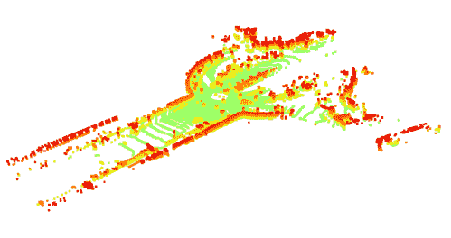
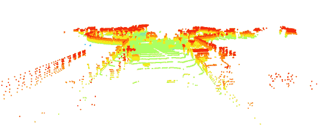
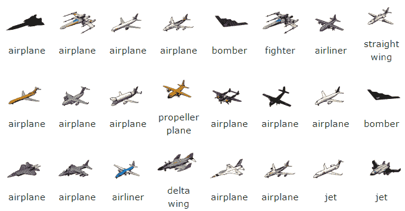
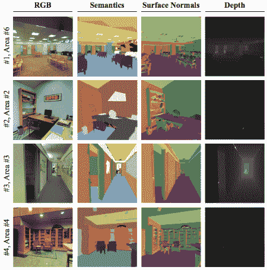
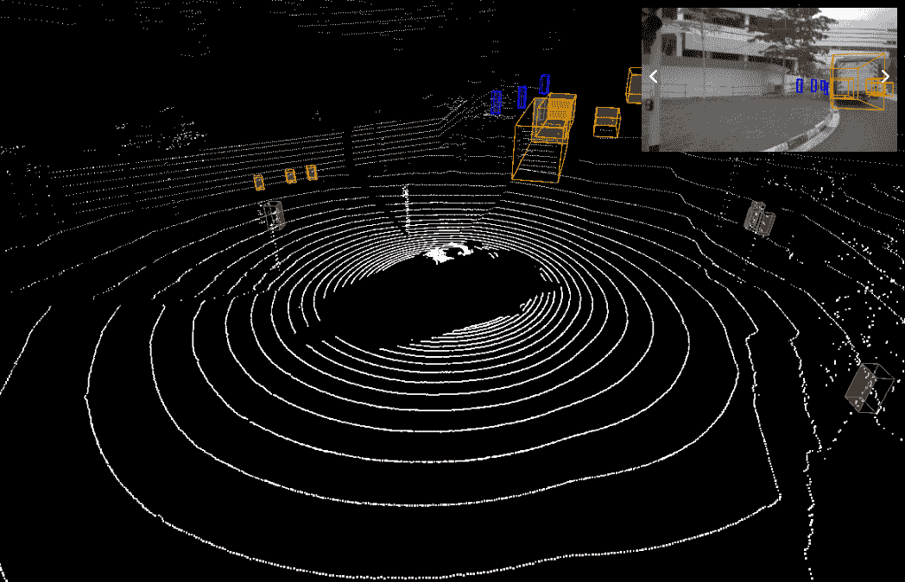

<!--yml

类别：未分类

日期：2024-09-06 19:59:27

-->

# [2009.08920] 深度学习在 3D 点云理解中的应用：综述

> 来源：[`ar5iv.labs.arxiv.org/html/2009.08920`](https://ar5iv.labs.arxiv.org/html/2009.08920)

# 深度学习在 3D 点云理解中的应用：综述

Haoming Lu¹, Humphrey Shi^(2,1)

¹伊利诺伊大学厄尔巴纳-香槟分校，²俄勒冈大学

###### 摘要

实际应用的发展，例如自动驾驶和机器人技术，越来越多地引起了对 3D 点云理解的关注。虽然深度学习在基于图像的任务中取得了显著成功，但深度神经网络在处理大量、无结构和噪声 3D 点时面临许多独特的挑战。为了展示深度学习在 3D 点云理解方面的最新进展，本文总结了该领域最近的显著研究贡献，包括多个不同方向（分类、分割、检测、跟踪、流估计、配准、增强和补全），以及常用的数据集、指标和最新性能。有关此调查的更多信息，请访问：[`github.com/SHI-Labs/3D-Point-Cloud-Learning`](https://github.com/SHI-Labs/3D-Point-Cloud-Learning)。

## 1 引言

在过去几年中，深度学习在广泛的计算机视觉任务中表现出色，特别是在图像任务方面。与此同时，在许多实际应用中，例如自动驾驶车辆（图 1 展示了由自动驾驶车辆收集的点云），我们需要比仅仅图像更多的信息来获得对环境的更好理解。来自激光雷达或 RGB-D 相机的 3D 数据被认为是一个很好的补充。这些设备生成以点云形式呈现的 3D 几何数据。随着工业需求的增加，使用深度学习模型处理点云最近成为了研究热点。

图 1：从户外场景中收集的点云数据，从两个不同的角度展示。

与图像数据相比，点云不直接包含空间结构，因此点云上的深度模型必须解决三个主要问题：（1）如何从稀疏的点云中找到高信息密度的表示，（2）如何建立满足必要限制条件（如大小不变性和排列不变性）的网络，（3）如何以较低的时间和计算资源消耗处理大量数据。PointNet [79] 是早期尝试设计新型深度网络来处理无序 3D 点集的代表性作品之一，它利用了 MLP 和 T-Net。PointNet 及其改进版 PointNet++ [80] 启发了许多后续研究工作。

图像中的基本任务，如分类、分割和物体检测，在点云中也存在。大多数解决这些问题的方案都受益于图像领域的研究成果，同时适应 3D 数据特性的调整是不可避免的。本文将最近的点云研究分为以下几类：分类、分割、检测、匹配和配准、增强、补全和重建。每一类的详细描述将在接下来的章节中提供。

现有的数据集数量不断增加，满足不同的点云任务需求。ShapeNet [5] 和 ModelNet [113] 是两个早期的数据集，包含干净的 3D 模型。这些早期数据集存在泛化不足的问题。然而，开发稳健的模型时必须考虑噪声和缺失点等干扰因素。考虑到这一点，ScanNet [10] 和 KITTI [22] 等数据集随后从实际环境的扫描中创建。设计用于自动驾驶任务的数据集，如 nuScenes [4] 和 Lyft [44]，通过涉及不同时间的各种环境进一步进行泛化。目前，为满足不同领域日益增长的需求，越来越多的数据集被提出。

本文的结构如下。第二部分介绍了现有的 3D 数据集和针对不同任务的相应指标。第三部分包括了 3D 形状分类方法的综述。第四部分回顾了 3D 语义分割和实例分割的方法。第五部分介绍了 3D 物体检测及其衍生任务的方法综述。第六部分介绍了 3D 点云匹配和配准的最新进展。第七部分提供了提高数据质量的方法综述。最后，第八部分对本文进行了总结。

## 2 数据集和指标

数据集在 3D 点云数据的深度学习方法中具有重要意义。首先，设计良好的数据集提供了不同算法之间的有说服力的评估和比较。其次，具有丰富内容和元数据的数据集有助于定义更复杂的任务并提出新的研究课题。在本节中，我们将简要介绍一些常用的数据集和评估指标。

表 1：近期工作中常用的 3D 点云数据集

| 数据集 | 任务 | 类别 | 规模 | 特征 | 年份 |
| --- | --- | --- | --- | --- | --- |
| ShapeNet [5] | 分类 | 55 | 51300 模型 | 类别根据 WordNet [70] 词汇集选择。 | 2015 |
| ModelNet40 [113] | 分类 | 40 | 12311 模型 | 模型通过在线搜索引擎按照每个既定物体类别查询收集。 | 2015 |
| S3DIS [1] | 分割 | 12 | 2.15 亿点 | 点数据收集于来自 3 栋不同建筑的 5 个大规模室内场景中。 | 2016 |
| Semantic3D [30] | 分割 | 8 | 40 亿点 | 从各种城市场景中手动标记。 | 2017 |
| ScanNet [10] | 分割 | 20 | 250 万帧 | 使用具有自动表面重建和众包语义注释的可扩展 RGB-D 捕捉系统收集。 | 2017 |
| KITTI [22, 23, 21, 69] | 检测跟踪 | 3 | 80256 个对象 | 通过配备两台摄像头、一台 Velodyne 激光扫描仪和一套 GPS 定位系统的标准旅行车在不同户外场景中捕获。 | 2012 |
| nuScenes [4] | 检测跟踪 | 23 | 1.4M 个对象 | 使用全套传感器（1x LIDAR，5x RADAR，6x 摄像头，IMU，GPS）捕获；1000 个场景，每个场景 20 秒。 | 2019 |
| Waymo Open Dataset [95] | 检测跟踪 | 4 | 12.6M 带跟踪 ID 的对象 | 通过 1 个中等范围激光雷达、4 个短距离激光雷达和 5 个摄像头（前置和侧面）捕获；共 1950 段，每段 20 秒，以 10Hz 频率收集。 | 2019 |

### 2.1 数据集

表 1 展示了用于三种成熟任务（分类、分割和检测）中最常用的 3D 点云数据集，这些数据集将在以下章节中经常提到。我们还将详细介绍每个数据集。

ShapeNet ShapeNet [5] 是一个注释丰富的数据集，包含 55 类中的 51300 个 3D 模型。它由几个子集组成。ShapeNetSem 是其中一个子集，包含 12000 个模型，分布在更广泛的 270 个类别中。这个数据集与 ModelNet40 [113] 一起，由于其相对干净和小型，通常用于在应用于更复杂任务之前评估骨干网的能力。

ModelNet 项目提供了三个基准：ModelNet10、ModelNet40 和 Aligned40，其中“40”表示类别数量，ModelNet40 基准是使用最广泛的。为了找到最常见的对象类别，利用了从 SUN 数据库获得的统计数据。建立词汇表后，通过在线搜索引擎收集 3D CAD 模型，并由人工验证。

S3DIS 斯坦福大规模 3D 室内空间（S3DIS）数据集由来自三座建筑的 5 个大规模室内场景组成，这些场景在建筑风格和外观上各不相同。点云是自动生成的，无需人工干预。检测到了包括结构元素（地板、墙壁等）和常见家具在内的 12 种语义元素。

Semantic3D Semantic3D [30] 是目前最大的户外场景分割 3D 点云数据集。它包含了从约 110000$m^{2}$ 区域收集的超过 40 亿个点，这些点是用静态激光雷达收集的。户外场景的自然属性，如点的分布不均和大量遮挡，使得数据集具有挑战性。

ScanNet ScanNet [10] 是一个视频数据集，包含来自 1000 多个扫描的 250 万帧，注释了相机姿态、表面重建和实例级语义分割。该数据集提供了多种 3D 场景理解任务的基准，如分类、语义体素标记和 CAD 模型检索。

KITTI KITTI [22, 23, 21, 69] 视觉基准套件是最著名的 3D 数据基准之一。它涵盖了 3D 目标检测、跟踪和场景流估计的基准。多视角数据是通过配备两个高分辨率彩色和灰度摄像头、一个 Velodyne 激光扫描仪和一个 GPS 定位系统的自动驾驶平台捕获的。仅对三种对自动驾驶重要的对象进行标注：汽车、行人和骑自行车者。

其他数据集 还有一些高质量但不广泛使用的数据集，如 Oakland [71]、iQmulus [97] 和 Paris-Lille-3D [85]。3DMatch [131] 推动了 3D 匹配和注册的研究，这在过去是一项不太流行的方向。最近，来自自动驾驶行业的需求上升催生了几个大规模的道路数据集，如 nuScenes [4]、Lyft Level 5 [44] 和 Waymo Open Dataset [95]。它们提出了复杂的挑战，需要利用多视角数据和相关元数据。数据集的发展有助于缩小研究与实际应用之间的差距。

### 2.2 指标

不同算法之间的比较需要某些指标。设计和选择适当的指标非常重要。设计良好的指标可以提供对不同模型的有效评估，而不合理的指标可能导致错误的结论。

表格 2 列出了不同任务中广泛使用的指标。对于分类方法，整体准确率和平均准确率是最常用的。分割模型可以通过准确率或 (m)IoU 进行分析。在检测任务中，结果通常是按区域评估的，因此 (m)IoU、准确率、精确度和召回率都可以应用。MOTA 和 MOTP 专门为目标跟踪模型设计，而 EPE 用于场景估计。ROC 曲线是精确度和召回率的导数，有助于评估 3D 匹配和注册模型的性能。此外，数据可视化始终是数字的有效补充。

表 2：不同任务的常用度量标准。在此表中，$N$ 表示样本数量，$C$ 表示类别数量，$IDS$ 表示身份切换的数量，$I_{i,j}$ 表示来自真实类别/实例 $i$ 并标记为 $j$ 的点数，$TP/TN/FP/FN$ 分别表示真阳性、真阴性、假阳性和假阴性的数量。较高的度量值表示结果更好，除非另有说明。

| 度量 | 公式 | 解释 |
| --- | --- | --- |
| 准确率 | $Accuracy=\frac{TP+TN}{TP+TN+FP+FN}$ | 准确率表示所有预测中有多少预测是正确的。“整体准确率（OA）”表示整个数据集上的准确率。 |
| 平均准确率 | $mACC=\frac{1}{C}\sum_{c=1}^{C}Accuracy_{c}$ | 不同类别准确率的均值，在类别不平衡时特别有用。 |
| 精度 | $Precision=\frac{TP}{TP+FP}$ | 正确预测占所有预测的比例。 |
| 召回率 | $Recall=\frac{TP}{TP+FN}$ | 正确预测占真实正样本的比例。 |
| F1 分数 | $F_{1}=2\times\frac{Precision\cdot Recall}{Precision+Recall}$ | 精度和召回率的调和平均值。 |
| IoU | $IoU_{i}=\frac{I_{i,i}}{\sum_{c=1}^{C}(I_{i,c}+I_{c,i})-I_{i,i}}$ | 类别/实例 $i$ 的交并比。交集和并集是在预测和真实值之间计算的。 |
| 平均 IoU | $mIoU=\frac{1}{C}\sum_{c=1}^{C}IoU_{i}$ | 所有类别/实例的 IoU 的均值。 |
| 多目标跟踪准确率 | $MOTA=1-\frac{FN+FP+IDS}{TP+FN}$ | 多目标跟踪准确率（MOTA）综合了 3 种误差来源：假阳性、漏检目标和身份切换，且使用真实值数量（$TP+FN$）进行归一化。 |
| 多目标跟踪精度 | $MOTP=\frac{\sum_{i,t}e_{i,t}}{\sum_{t}d_{t}}$ | 多目标跟踪精度（MOTP）表示定位精度。$d_{t}$ 表示时间 $t$ 上的匹配数量，而 $e_{i,t}$ 表示时间 $t$ 上第 $i$ 对的误差。 |
| 端点误差 | $EPE=&#124;&#124;\hat{sf}-sf&#124;&#124;_{2}$ | 端点误差（EPE）用于场景流估计，也称为 EPE2D/EPE3D，分别用于 2D/3D 数据。$\hat{sf}$ 表示预测的场景流向量，而 $sf$ 表示真实值。 |

## 3 分类

### 3.1 概述

点云分类通常称为 3D 形状分类。类似于图像分类模型，3D 形状分类模型通常首先通过聚合编码器生成全局嵌入，然后将嵌入传递通过多个全连接层以获得最终结果。大多数 3D 形状分类方法在干净的 3D 模型上进行测试（如图 2）。根据点云聚合方法，分类模型通常可以分为两类：基于投影的方法和基于点的方法。

图 2：来自 ShapeNet 的 3D 模型 [5]。ShapeNet 包含了大规模的 3D 模型和人工验证的注释。

### 3.2 基于投影的方法

基于投影的方法将无结构的 3D 点云投射到特定的预设模态（例如体素、柱状体），并从目标格式中提取特征，这使得它们能够受益于在相应方向上的前期研究成果。

#### 3.2.1 多视角表示

MvCNN [94] 是一种基于点云多视角表示的方法。3D 点云通过从不同角度渲染快照的 2D 图像组进行表示。组中的每个图像将通过 CNN 提取视角特征，视角特征在视角间汇聚，然后通过另一个 CNN 构建紧凑描述符。虽然 MVCNN 不区分不同的视角，但考虑视角之间的关系是有帮助的。GVCNN [20] 是一种利用这种关系的方法。通过量化视角的区分度，我们能够根据视角的区分分数将视角集合划分为多个组。视角描述符将通过组内汇聚和组间融合进行预测。除了上述模型，[128] 和 [124] 也通过多视角表示提高了识别准确性。

#### 3.2.2 体积表示

VoxNet [67] 是一种早期使用体积表示的方法。在这种方法中，每个点 $(x,y,z)$ 被投射到一个对应的离散体素点 $(i,j,k)$。每个点云将被映射到一个 $32\times 32\times 32$ 体素的占用网格中，然后该网格将通过两个 3D 卷积层获得最终表示。

VoxNet 仅仅对 CNN 层进行了适应以用于预测头，这可能导致详细空间信息的潜在丧失。3D ShapeNet [113] 提出了一个基于信念的深度卷积网络，以学习点云在不同 3D 形状中的分布。在这种方法中，3D 形状由网格上二元变量的概率分布表示。

虽然体积方法已经取得了令人满意的性能，但大多数方法都受到计算复杂度和内存占用立方增长的影响，因此网格的分辨率受到严格限制。OctNet [84] 通过引入混合网格-八叉树结构来分层分割点云，从而提高了效率。一个点云由几个八叉树和一个规则网格表示，每个八叉树被编码为一个位字符串，通过简单的算术生成特征。受到 OctNet 的启发，OCNN [99] 随后提出了一种方法，采用 3D-CNN 从八叉树中提取特征。

上述基于体积表示的方法由于只有一小部分体素是非空的，且每个体素内部的详细上下文很难收集，因此自然较为粗糙。在实际操作中，很难在分辨率和计算之间实现平衡。

#### 3.2.3 基础点集

BPS [75] 提出了一个新的方法，打破了点云（即使具有不同大小）通常被投影到相同大小网格上的常规。在 BPS 中，输入点首先被标准化为单位球体，然后随机采样一组点来构成基础点集（BPS）。所采样的 BPS 对数据集中所有点云是恒定的。对于给定的点云 $X$，每个点 $x_{i}$ 由其自身与 BPS 中最近邻点之间的欧几里得距离表示。通过将这种表示传递通过 PointNet 的最后两层全连接层，模型达到了类似于原始 PointNet 设计的性能。

### 3.3 基于点的方法

与基于投影的方法（通过空间邻域汇总点）相比，基于点的方法试图从单个点中学习特征。最近的大部分工作都集中在这个方向上。

#### 3.3.1 MLP 网络

PointNet [79] 是一个著名的架构，利用了多层感知机（MLPs）。输入（一个 $n\times 3$ 的 2D 张量）首先乘以由一个小型网络（T-Net）预测的仿射变换矩阵，以保持在几何变换下的不变性。然后，点集经过一组 MLPs，接着是另一个联合对齐网络，最后经过一个最大池化层以获得最终的全局特征。该骨干网络可用于分类和分割预测。对于分类，全局特征通过 MLP 得到输出分数。对于分割，全球特征和来自每个点的不同层级的中间特征的连接通过 MLP 进行处理，以获得每个点的分类结果。传统的 CNN 通过一系列卷积层来处理不同尺度的特征；受此启发，提出了 PointNet++ [80]。在这项工作中，点 $x$ 的局部区域被定义为以 $x$ 为中心的球体内的点。一个集合抽象层包含一个采样层、一个分组层用于识别局部区域和一个 PointNet 层。堆叠这样的集合抽象层允许我们像 CNNs 处理图像任务一样分层提取特征。

PointNet [79] 和 PointNet++ [80] 的简单实现和良好性能激发了大量后续工作。PointWeb [136] 是从 PointNet++ 改编而来，通过引入自适应特征调整（AFA）来利用局部邻域的上下文信息，从而提高了特征质量。此外，SRN [16] 提出了结构关系网络（SRN）来增强 PointNet++，并取得了更好的性能。

#### 3.3.2 卷积网络

在 2D 数据上的卷积核可以扩展到 3D 点云数据上。如前所述，VoxNet [67] 是一个早期的工作，直接利用 3D 卷积。

A-CNN [46] 提出了另一种在点云上应用卷积的方法。为了防止重叠局部区域中冗余信息（同一组邻域点可能在不同尺度的区域中重复出现），A-CNN 提出了基于环的方案，而不是球体。为了在环内进行卷积，将点投影到查询点 $q_{i}$ 的切平面上，然后通过交叉积和点积按顺时针或逆时针方向排序，最终对排序序列应用 1-D 卷积核。输出特征可用于分类和分割，类似于 PointNet。

RS-CNN [62] 是另一个基于关系-形状卷积的卷积网络。RS-Conv 卷积核以某个点周围的邻域为输入，学习从原始关系（例如欧几里得距离、相对位置）到点之间高层次关系的映射，并使用学习到的映射对邻域内的空间结构进行编码。

在 PointConv [112] 中，卷积操作被定义为对重要性采样下的隐藏连续 3D 卷积进行蒙特卡洛估计。该过程由加权函数和密度函数组成，通过 MLP 层和核密度估计实现。此外，为了提高内存和计算效率以及便于部署，3D 卷积被简化为矩阵乘法和 2D 卷积。MCCNN [34] 中使用了类似的思路，其中卷积被基于样本密度函数的蒙特卡洛估计所替代。

Geo-CNN [49] 提出了另一种建模邻域点几何关系的方法。通过选择六个正交基，将空间分成八个象限，特定象限中的所有向量可以由三个基组成。特征沿每个方向独立提取，使用相应的方向相关权重矩阵，并基于几何向量与基之间的角度进行聚合。当前层某些特定点的特征是该点和其邻边特征在上一层的特征之和。

在 SFCNN [83] 中，输入的点云被投影到具有离散球面坐标的规则二十面体格点上，因此可以通过在球面格点的顶点及其邻居的特征拼接上实施最大池化和卷积。SFCNN 具有旋转不变性，并且对扰动具有鲁棒性。

#### 3.3.3 图网络

图网络将点云视为图形，将图形的顶点视为点，并根据每个点的邻居生成边。特征将在空间或谱域中学习。

ECC [93] 首次提出将每个点视为图形的一个顶点，并在“邻居”点对之间连接边的想法。然后，应用边条件卷积（ECC）与如 MLP 的滤波器生成网络。通过最大池化聚合邻域信息，粗化图将使用 VoxelGrid [86] 算法生成。之后，DGCNN [105] 使用 MLP 实现 EdgeConv，并对每个点邻域中的边特征进行通道级对称聚合，这使得图在网络的每一层之后可以动态更新。

受 DGCNN 启发，Hassani 和 Haley [31] 提出了一个无监督的多任务方法来学习形状特征。该方法由编码器和解码器组成，其中编码器由多尺度图构建，解码器则用于三种无监督任务（聚类、自监督分类和重建），通过联合损失进行训练。

ClusterNet [6] 使用严格的旋转不变（RRI）模块从每个点生成旋转不变特征，并使用无监督的聚合层次聚类方法构建点云的层次结构。每一级子簇的特征首先通过 EdgeConv 模块学习，然后通过最大池化进行聚合。

#### 3.3.4 其他网络

除了使用八叉树在体素网格上分层提取点云特征的 OctNet [84] 外，Kd-Net [45] 利用 K-d 树构建自下而上的编码器。叶节点表示被规范化为 3D 坐标（通过将质心设为原点并重新缩放到 $[-1,1]^{3}$），非叶节点表示则通过 MLP 从其子节点计算。MLP 的参数在树的每一层中共享。此外，3DContextNet [131] 提出了另一种基于 K-d 树的方法。虽然非叶节点表示仍然通过 MLP 从其子节点计算，但每一层的聚合更复杂，以考虑局部线索和全局线索。局部线索关注对应局部区域中的点，全局线索关注当前位置信息与输入特征图中所有位置之间的关系。根节点的表示将用于预测。

RCNet [111] 引入了 RNN 到点云嵌入。首先将环境空间划分为平行光束，然后将每个光束输入共享的 RNN，输出的子区域特征被视为 2D 特征图并由 2D CNN 处理。

SO-Net [56] 是一种基于自组织映射（SOM）的方法。SOM 是对输入点云的低维（论文中为二维）表示，通过适当的猜测（在单位球内均匀分布节点）初始化，并通过无监督竞争学习进行训练。为每个点在 SOM 上搜索一个 k 最近邻集，然后将标准化的 KNN 集通过一系列全连接层生成单个点特征。这些点特征用于通过根据 KNN 搜索中的关联进行最大池化来生成节点特征，节点特征再通过另一系列全连接层处理，并聚合成输入点云的全局表示。

### 3.4 实验

不同的方法选择在各种数据集上测试他们的模型。为了获得方法间的更好比较，我们选择了大多数方法进行测试的数据集，并在表 3 中列出了它们的实验结果。

表 3：ModelNet40 分类基准测试的实验结果。“OA”代表整体准确率，“mACC”代表平均准确率。

| 方法 | ModelNet40(OA) | ModelNet40(mAcc) |
| --- | --- | --- |
| PointNet [79] | 89.2% | 86.2% |
| PointNet++ [80] | 90.7% | 90.7% |
| PointWeb [136] | 92.3% | 89.4% |
| SRN [16] | 91.5% | - |
| Pointwise-CNN [37] | 86.1% | 81.4% |
| PointConv [112] | 92.5% | - |
| RS-CNN [62] | 92.6% | - |
| GeoCNN [49] | 93.4% | 91.1% |
| A-CNN [46] | 92.6% | 90.3% |
| Hassani and Haley [31] | 89.1% | - |
| ECC [93] | 87.4% | 83.2% |
| SFCNN [83] | 91.4% | - |
| DGCNN [105] | 92.2% | 90.2% |
| ClusterNet [6] | 87.1% | - |
| BPS [75] | 91.6% | - |
| KD-Net [45] | 91.8% | 88.5% |
| 3DContextNet [131] | 91.1% | - |
| RCNet [111] | 91.6% | - |
| SO-Net [56] | 90.9% | 87.3% |

## 4 分割

### 4.1 概述

3D 分割旨在标记每个单独的点，这要求模型在每个点处收集全局上下文和详细的局部信息。图 3 展示了一些来自 S3DIS [1] 数据集的示例。3D 分割主要有两个任务：语义分割和实例分割。

由于大量分类模型能够在流行基准上实现非常高的性能，它们往往会在分割数据集上测试其骨干网络，以证明其新颖的贡献和泛化能力。如果这些模型在上述内容中已被提及，我们将不再重新介绍。此外，还有一些模型受益于多任务的联合训练，我们将在 3.4 节中讨论这些方法。

图 3：斯坦福大规模 3D 室内空间数据集 [1] (S3DIS)。

### 4.2 语义分割

类似于 3D 形状分类模型，根据原始点云的组织方式，语义分割方法一般可以分为基于投影的方法和基于点的方法。

#### 4.2.1 基于投影的方法

Huang 和 You [38] 将输入点云投影到占据体素中，然后将其输入到 3D 卷积网络中以生成体素级标签。体素内的所有点都被分配与体素相同的语义标签。ScanComplete [12] 利用全卷积网络适应不同的输入数据大小，并部署粗到精策略来逐层提高预测分辨率。VV-Net [68] 也将无序点转换为规则体素网格作为第一步。之后，每个体素的局部几何信息将通过基于核的插值变分自编码器 (VAE) 进行编码。在每个体素中，计算一个径向基函数 (RBF) 以生成一个局部连续表示，以处理点的稀疏分布。

F. Jaremo-Lawin 等人 [55] 提出了一个多视角方法，该方法首先将 3D 点云从多个相机视角投影到 2D 平面上，然后使用多流 FCN 预测合成图像上的像素级分数，最终通过融合不同视角的分数来获得标签。然而，PolarNet [135] 提出了一个极坐标 BEV 表示。通过隐式对齐注意力与长尾分布，该表示减少了沿径向轴网格单元中点的不平衡。

其他一些方法利用了多种模态的扫描。3DMV [11] 提出了一个联合 3D-多视角网络，该网络结合了 RGB 图像和点云的特征。特征分别通过 3D CNN 流和一组 2D 流提取。MVPNet [42] 提出了另一种聚合方式，将图像和点云的特征在 3D 标准空间中与基于点的网络融合。

#### 4.2.2 基于点的方法

首先，PointNet [79] 和 PointNet++ [80] 可以通过附加的预测分支来预测语义标签。Engelmann 等人 [18] 提出了通过 k-means 聚类和 KNN 在世界空间和特征空间中定义邻域的方法。引入了成对距离损失和中心点损失，以特征学习为基础，假设具有相同语义标签的点应当更接近。PointWeb [136]，如分类中提到的，也可以适用于预测分割标签。PVCNN [63] 提出了一种综合方法，利用点和体素表示同时获得内存和计算效率。

一些卷积算子的扩展被引入用于点云的特征提取。PCCN [100] 引入了参数化的连续卷积层。这些层由 MLPs 参数化，并跨越整个连续向量空间。该泛化允许模型在任何可计算支持关系的数据结构上进行学习。Pointwise-CNN [37] 引入了一种逐点卷积，其中邻点被投影到核单元中，并与相应的核权重进行卷积。Engelmann 等人 [17] 提出了膨胀点卷积（DPC），以聚合膨胀的邻域特征，而不是传统的 k-最近邻。

图网络也在一些分割模型中使用，以获得输入点云的基础几何结构。SPG [52] 引入了一种称为超点图（SPG）的结构来捕捉点云的组织。这个思想在 [51] 中得到了进一步扩展，引入了对输入点云的过分割（成纯超点）。此外，图注意力卷积 [98]（GAC）被提出以选择性地从局部邻域中学习相关特征。通过根据邻点的空间位置和特征差异动态分配注意力权重，模型能够从邻点集合中最相关的部分学习辨别特征。

相较于基于投影的方法，基于点的方法通常需要更多的计算，因此在处理大规模数据时更具挑战性。Tatarchenko 等人 [96] 引入了切线卷积来解决这个问题。设计了一个基于切线卷积的全卷积网络，成功提高了在大规模点云上的性能。RandLA-Net [36] 试图通过用随机采样替代传统复杂的点采样方法来减少计算量。为了避免随机采样丢失关键的信息，引入了一种新颖的特征聚合模块，以扩大每个点的感受野。

基于点级标签生成劳动密集且耗时的事实，一些方法探索了弱监督分割。Xu 和 Lee [118] 提出了一个弱监督方法，该方法只需要在训练阶段对小部分点进行标记。通过学习几何和颜色中的梯度近似和光滑性约束，可以使用仅标记 10% 的点获得具有竞争力的结果。另一方面，Wei 等人 [108] 介绍了一个多路径区域挖掘模块，该模块可以通过一个分类网络对弱标签提供伪点级标签。然后，分割网络通过这些伪标签以完全监督的方式进行训练。

### 4.3 实例分割

相较于语义分割，实例分割需要区分具有相同语义的点，这使得任务更加具有挑战性。在这一部分，实例分割方法进一步分为两类：基于提议的方法和无提议的方法。

#### 4.3.1 基于提议的方法

基于提议的实例分割方法可以被视为目标检测和掩模预测的结合。3D-SIS [35] 是一个用于 3D 语义实例分割的全卷积网络，其中几何和颜色信号被融合。对于每张图像，通过一系列 2D 卷积层提取每个像素的 2D 特征，然后将这些特征反向投影到相关的 3D 体素网格上。几何特征和颜色特征分别通过一系列 3D 卷积层，然后拼接成一个全局语义特征图。接着，应用 3D-RPN 和 3D-RoI 层生成边界框、实例掩模和目标标签。生成形状提议网络 (GSPN) [126] 通过从场景中重建形状而不是直接回归边界框来生成提议。生成的提议通过基于区域的 PointNet (R-PointNet) 进行细化，标签则通过对所有类别标签进行逐点二值掩模预测来确定。3D-BoNet [124] 是一个单阶段方法，它将 PointNet++ [80] 作为骨干网络来处理每个点的全局特征和局部特征。随后，两个预测分支分别生成实例级边界框和点级掩模。张等人 [134] 提出了一个针对大规模户外点云的方法。点云首先被编码成高分辨率的 BEV 表示，并通过 KNN 进行增强，然后通过体素特征编码 (VFE) 层和自注意力块提取特征。对于每个网格，预测一个水平的目标中心及其高度限制，相互足够接近的物体将被合并，最终利用这些约束生成实例预测。

#### 4.3.2 无提议的方法

无提议的方法倾向于通过类似聚类的算法基于语义分割生成实例级标签。Similarity Group Proposal Network (SGPN) [101] 是一种代表性工作，它为每个点学习特征和语义图，并通过相似性矩阵来估计特征对之间的相似性。然后采用启发式的非极大值抑制方法将点合并成实例。Lahoud 等人 [48] 采用了多任务度量学习来（1）学习特征嵌入，使得具有相同实例标签的体素在特征空间中彼此接近，而具有不同标签的体素被分开，以及（2）预测每个体素上的实例形状。实例边界通过均值漂移聚类和 NMS 进行估计。

Zhang 等人 [133] 引入了概率嵌入来编码点云。该嵌入通过多变量高斯分布实现，采用 Bhattacharyya 核来估计点之间的相似性。无提议的方法不会遭受区域提议层的计算复杂性；然而，它们通常很难从聚类中产生具有辨别力的物体边界。

基于投影的实例分割方法也有几种。SqueezeSeg [109] 是这个方向的开创性工作之一。在这种方法中，点首先被投影到一个球面上以进行网格化表示。变换后的表示的大小为 $H\times W\times C$，其中实际中 $H$=64 是激光雷达的垂直通道数量，$W$ 手动选定为 512，而 $C$ 等于 5（3 维坐标 + 强度测量 + 距离）。然后，该表示通过常规的 2D CNN 和条件随机场（CRF）进行细化分割结果。之后，该方法通过 SqueezeSegv2 [110] 得到改进，添加了上下文聚合模块和领域适应管道。

Lyu 等人 [66] 进一步探讨了基于投影的方法。受图形绘制算法的启发，他们提出了一种分层近似算法，将点云投影到图像表示中，同时保留了丰富的局部几何信息。然后，通过从图像表示中生成的多尺度 U-Net 来进行分割。借助这种创新的投影算法，该方法获得了显著的改进。

PointGroup [43] 提出了一个自下而上的框架，其中包含两个预测分支。对于每个点，预测其语义标签及相对于其实例质心的相对偏移。偏移分支有助于将点更好地分组到对象中，并且能够分离具有相同语义标签的对象。在聚类阶段，考虑了原始位置和偏移位置，这两种结果的关联表现出更好的性能。结合基于新设计的 ScoreNet 的 NMS，这种方法比当时的其他工作有很大优势。

### 4.4 联合训练

如上所述，一些最新的工作联合解决多个问题，以更好地实现模型的强大功能。Hassani 和 Haley [31] 提出的无监督多任务方法是一个例子，其中聚类、自监督分类和重建被联合训练。语义分割和实例分割这两个分割任务也被证明可能从同时训练中受益。

同时解决语义分割和实例分割有两种简单的方法：（1）首先解决语义分割，然后在语义分割结果的基础上对某些标签的点进行实例分割，（2）首先解决实例分割，然后直接用实例标签分配语义标签。这两种逐步范式高度依赖于第一步的输出质量，无法充分利用两个任务之间的共享信息。

JSIS3D [74] 开发了一种点对点网络，该网络同时预测每个点的语义标签和高维嵌入。经过这些步骤后，同一类别的实例将具有相似的嵌入，然后应用多值条件随机场模型来合成语义和实例标签，将问题表述为在场模型中共同优化标签。ASIS [103] 是另一种让这两个任务相互受益的方法。具体而言，实例分割通过在点级别学习语义感知实例嵌入来受益于语义分割，同时来自同一实例的点集的语义特征将被融合在一起，以生成每个点的准确语义预测。

### 4.5 实验

我们选择了大多数方法测试的基准，S3DIS[1]，以比较不同方法的性能。这些性能总结在表格 4 中。

表格 4：S3DIS 基准上语义分割的实验结果。仅列出了原始论文中报告的结果，那些被其他论文作为参考报告的结果被排除，因为它们有时会产生冲突。

| 方法 | Area5(mACC) | Area5(mIoU) | 6-fold(mACC) | 6-fold(mIoU) |
| --- | --- | --- | --- | --- |
| PointCNN [58] | 63.9 | 57.3 | 75.6 | 65.4 |
| PointWeb [136] | 66.6 | 60.3 | 76.2 | 66.7 |
| A-CNN [112] | - | - | - | 62.9 |
| DGCNN [105] | - | - | - | 56.1 |
| VV-Net [68] | - | - | 82.2 | 78.2 |
| PCCN [100] | - | 58.3 | - | - |
| GAC [98] | - | 62.9 | - | - |
| DPC [17] | 68.4 | 61.3 | - | - |
| SSP+SPG [51] | - | - | 78.3 | 68.4 |
| JSIS3D [74] | - | - | 78.6 | - |
| ASIS [103] | 60.9 | 53.4 | 70.1 | 59.3 |
| Xu 和 Lee [118] | - | 48.0 | - | - |
| RandLA-Net [36] | - | - | 82.0 | 70.0 |
| Tatarchenko 等人 [96] | 62.2 | 52.8 | - | - |

## 5 检测、跟踪和流动估计

### 5.1 概述

物体检测作为许多实际应用的基础，已成为近期研究的热点。其目标是定位给定场景中的所有物体。3D 物体检测方法通常可以分为三类：多视角方法、基于投影的方法和基于点的方法。图 4.1 显示了一个在多个（激光雷达和摄像头）视角下进行的 3D 物体检测的示例。除了图像物体检测模型外，点云数据的独特特征提供了更多的优化潜力。此外，由于 3D 物体跟踪和场景流估计是两个高度依赖于物体检测的衍生任务，因此在本节中将一起讨论这两个任务。

图 4：来自 nuScenes [4] 的户外场景，提供了多视角（激光雷达/摄像头）注释。

### 5.2 物体检测

#### 5.2.1 基于投影的方法

卷积神经网络在图像物体检测中的成功激发了在投影点云数据上应用 3D CNN 的尝试。VoxelNet [138] 提出了一个方法，该方法对每个体素中的点集进行随机采样，并通过基于 PointNet [79] 和 PointNet++ [80] 的新型体素特征编码（VFE）层提取逐点特征。区域提议网络用于生成检测结果。类似于具有体积表示的分类模型，由于体素的稀疏性和 3D 卷积，VoxelNet 的运行速度相对较慢。SECOND [119] 随后通过利用稀疏卷积网络提出了提高推理效率的方法。

PointPillars [53] 以另一种方式利用点云数据。点被组织成垂直列（称为 Pillars），然后使用 PointNet 提取 Pillars 的特征以生成伪图像。伪图像随后被作为 2D 目标检测流程的输入，以预测 3D 边界框。PointPillars 比之前的融合方法更准确，并且以 62 FPS 的运行速度能够进行实时应用。Wang 等人 [104] 进一步提出了另一种基于圆柱投影到多视角特征的无锚框边界框预测方法。

基于投影的方法不可避免地存在空间信息丢失的问题。除了使用基于点的网络之外，He 等人 [32] 提出了一个结构感知方法来缓解这个问题。卷积层通过辅助网络显式地监督以包含结构信息。辅助网络将来自骨干网络的卷积特征转换为点级表示，并进行联合优化。训练过程完成后，辅助网络可以被拆除以加速推理过程。

#### 5.2.2 基于点的方法

大多数基于点的方法尝试在特征提取过程中最小化信息损失，它们是迄今为止表现最佳的一组方法。STD [123] 引入了使用球形锚点进行提案生成的概念，该方法在计算量显著减少的情况下实现了高召回率。每个提案通过一个 PointsPool 层，该层将提案特征从稀疏表达转换为紧凑表示，并且在变换下具有鲁棒性。除了常规的回归分支外，STD 还具有另一个 IoU 分支，以替代 NMS 中的分类分数角色。

一些方法使用前景-背景分类来提高提案的质量。PointRCNN [90] 就是这样一个框架，其中点被直接分割以筛选出前景点，然后融合语义特征和空间特征以生成高质量的 3D 框。与上述多视角方法相比，基于分割的方法在复杂场景和遮挡物体上的表现更好。

此外，Qi 等人提出了 VoteNet [77]。一组点被采样作为种子，每个种子利用 PointNet++ [80] 独立生成对点云中物体潜在中心点的投票。通过利用投票机制，VoteNet 在两个大型室内基准测试上超越了以前的方法。然而，由于虚拟中心点的中心点预测不够稳定，该方法在野外场景中的表现不尽如人意。作为后续工作，ImVoteNet [76] 继承了 VoteNet 的思想，通过将 3D 投票与来自图像的 2D 投票融合，取得了显著的改进。

也有尝试将领域知识作为辅助以增强特征。Associate-3Ddet [15] 引入了感知到概念的关联思想。为了丰富由于遮挡或稀疏性可能不完整的感知特征，提出了一种感知到概念的模块，从数据集中生成类别概念模型。感知特征和概念特征将被关联以增强特征。

Yang 等人 [122] 提出了基于点的无锚点方法 3DSSD。该方法尝试通过放弃以前点基方法中广泛使用的上采样层（例如 [123] 中的特征传播层）和细化阶段来减少计算。以前的集抽象层用于下采样，仅利用基于欧几里得距离的最远点采样（D-FPS），在这种策略下，具有较少内部点的实例容易丢失。在这种情况下，去除上采样层可能会导致性能大幅下降。3DSSD 提出了 F-FPS，一种基于特征距离的新采样策略，以保留更多前景点。F-FPS 和 D-FPS 的融合，加上候选生成层和预测头中的 3D 中心度分配，使该方法在性能上明显超过以前的单阶段方法。

图神经网络也被引入到 3D 目标检测中，以适应点云的内在特征，如稀疏性。PointRGCN [130] 是一项早期工作，引入了基于图的表示用于 3D 车辆检测的细化。之后，HGNet [7] 引入了一种基于形状注意图卷积（SA-GConv）的层次图网络。通过捕捉具有相对几何信息的物体形状并对提议进行推理，该方法在以前的结果上获得了显著改进。此外，Point-GNN [91] 提出了基于图神经网络的单次方法。它首先在输入点云上构建一个固定半径的邻居图。然后，利用点图预测类别和隶属的边界框。最后，使用框合并和评分操作来获得多个顶点的检测结果的准确组合。

#### 5.2.3 多视角方法

MV3D [8] 是点云上多视角目标检测方法中的开创性方法。在这种方法中，从 BEV 图生成候选框，并投影到多个视角的特征图（RGB 图像、激光雷达数据等）中，然后将从不同视角提取的区域特征结合起来生成最终的定向 3D 边界框。尽管这种方法实现了令人满意的性能，但与许多其他早期多视角方法类似，其运行速度对于实际应用来说仍然过于缓慢。

改进多视角方法的尝试通常有两个方向。首先，我们可以找到一种更有效的方式来融合来自不同视角的信息。Liang 等人 [59] 使用连续卷积来有效融合来自图像和激光雷达的不同分辨率的特征图。利用 BEV 空间中每个点的图像特征，通过与 BEV 平面中图像特征的投影进行双线性插值，生成密集的 BEV 特征图。实验表明，密集 BEV 特征图比离散图像特征图和稀疏点云特征图表现更好。其次，许多方法提出了创新的特征提取方法，以获得更高鲁棒性的输入数据表示。SCANet [64] 引入了一个空间通道注意力 (SCA) 模块，以利用多尺度上下文信息。SCA 模块从给定场景的全局和多尺度上下文中捕获有用特征，同时，扩展空间下采样 (ESU) 模块有助于结合多尺度低级特征，生成具有丰富空间信息的高级特征，从而带来准确的 3D 物体提案。在 RT3D [132] 中，RoI 池化模块之前的大多数卷积操作被移除。通过这种优化，RoI 卷积仅需对所有提案执行一次，从而将方法的运行速度加快至 11.1 FPS，比 MV3D [8] 快五倍。

检测 3D 物体的另一种方法是通过 2D 物体检测器在 2D 平面上生成候选区域，然后为每个 2D 候选区域提取一个 3D 截锥体提案。在 F-PointNets [78]中，每个 2D 区域生成一个截锥体提案，每个 3D 截锥体的特征通过 PointNet [79] 或 PointNet++ [80] 学习，并用于 3D 边界框估计。PointFusion [117] 使用 2D 图像区域和相应的截锥体点以实现更准确的 3D 框回归。提出了一种融合网络，通过融合图像特征和来自点云的全局特征来直接预测框的角点位置。

### 5.3 目标跟踪

目标跟踪的目标是在给定第一帧中的状态的情况下，估计随后的帧中某个物体的位置。Siamese 网络 [2] 在 2D 图像目标跟踪中的成功激发了 3D 目标跟踪，Giancola 等人 [24] 将 Siamese 网络扩展到 3D。在这种方法中，候选物体首先由卡尔曼滤波器生成，然后通过编码模型生成具有形状正则化的紧凑表示，并通过余弦相似度匹配检测到的物体。Zarzar 等人 [130] 提出了一种方法，通过利用 2D Siamese 网络在 BEV 表示上检测粗略的物体候选区域，更有效地捕获目标物体。粗略候选区域随后通过 3D Siamese 网络中的余弦相似度进行精细化。

Chiu 等人 [9] 引入了卡尔曼滤波器来编码对象的隐藏状态。对象的状态由 11 个变量的元组表示，包括位置、方向、大小和速度。卡尔曼滤波器用于基于先前的信息预测下一帧中的对象，并使用贪婪算法进行与马氏距离的数据关联。

此外，Qi 等人 [81] 提出了 P2B，一种用于 3D 目标跟踪的点到框方法。它将任务分为两个部分。第一部分是目标特定的特征增强，使用 PointNet++ 骨干网络生成来自模板和搜索区域的种子，并用来自模板的目标线索丰富搜索区域的种子。第二部分是目标提议和验证，对候选目标中心进行回归，并评估种子级目标性以进行联合目标提议和验证。

### 5.4 场景流估计

类似于图像上的光流估计，3D 场景流估计处理的是一系列点云。FlowNet3D [60] 是一个代表性工作，它直接从连续点云对中估计场景流。流嵌入层用于学习点级特征和运动特征。FlowNet3D 的实验结果表明，在非静态场景中表现不尽如人意，预测的运动向量角度有时与实际值有显著差异。FlowNet3D++ [107] 通过引入角度的余弦距离损失和点到平面距离损失来解决这些问题，以提高动态场景中的准确性。另一方面，HPLFlowNet [28] 提出了一系列双边卷积层，用于融合来自两个连续帧的信息，并从未构建的点云中恢复结构信息。

此外，MeteorNet [61] 引入了直接分组和链式流分组以分组时间邻居，并采用邻居点上的信息聚合来生成动态场景的表示。Fan 和 Yang [19] 受到图像中递归模型的启发，提出了 PointRNN、PointGRU 和 PointLSTM，通过捕捉空间和时间信息来编码动态点云。

### 5.5 实验

KITTI [22, 23, 21, 69] 是许多计算机视觉任务中最受欢迎的基准之一，包括图像、点云和多视图任务。借助自动驾驶平台，KITTI 提供了真实场景的原始数据，并允许在多个任务上进行评估。表 5 显示了不同方法在 KITTI 上的实验结果。一些方法，例如 VoteNet [14]，由于未提供详细的测试结果，因此未列出。

表 5：KITTI 3D 检测基准上的实验结果，E/M/H 代表简单/中等/困难样本。

| 方法 | 类别 | 速度 | 车辆 | 行人 | 骑行者 |
| --- | --- | --- | --- | --- | --- |
| E | M | H | E | M | H | E | M | H |
| MV3D [8] | multi-view | 2.8 | 74.8 | 63.6 | 54.0 | - | - | - | - | - | - |
| AVOD [47] | multi-view | 12.5 | 89.8 | 85.0 | 78.3 | 42.6 | 33.6 | 30.1 | 64.1 | 48.1 | 42.4 |
| SCANet [64] | multi-view | 12.5 | 76.4 | 66.5 | 60.2 | - | - | - | - | - | - |
| PIXOR [120] | projection | 28.6 | 84.0 | 80.0 | 74.3 | - | - | - | - | - | - |
| VoxelNet [138] | projection | 2.0 | 77.5 | 65.1 | 57.7 | 39.5 | 33.7 | 31.5 | 61.2 | 48.4 | 44.4 |
| SECOND [119] | projection | 26.3 | 83.3 | 72.6 | 65.8 | 49.0 | 38.8 | 34.9 | 71.3 | 52.1 | 45.8 |
| PointPillars [53] | projection | 62.0 | 82.6 | 74.3 | 69.0 | 54.5 | 41.2 | 38.9 | 77.1 | 85.7 | 52.0 |
| PointRCNN [90] | point | 10.0 | 87.0 | 75.6 | 70.7 | 48.0 | 39.4 | 36.0 | 75.0 | 58.8 | 52.5 |
| PointRGCN [130] | point | 3.8 | 86.0 | 95.6 | 70.7 | - | - | - | - | - | - |
| STD [123] | point | 12.5 | 88.0 | 79.7 | 75.1 | 53.3 | 42.5 | 38.3 | 78.7 | 61.6 | 55.3 |
| Point-GNN [91] | point | - | 88.3 | 79.5 | 72.3 | 52.0 | 43.8 | 40.1 | 78.6 | 63.5 | 57.0 |
| PV-RCNN [89] | point | - | 90.2 | 81.4 | 76.8 | 52.1 | 43.3 | 40.3 | 78.6 | 63.7 | 57.7 |
| 3DSSD [122] | point | 26.3 | 88.4 | 79.6 | 74.6 | 54.6 | 44.3 | 40.2 | 82.5 | 64.1 | 56.9 |

## 6 配准

### 6.1 概述

在某些场景中，如自动驾驶，发现同一场景在不同方式下收集的点云数据之间的关系具有重要价值。这些数据可能从不同角度或在不同时间收集。3D 点云配准（有时也称为匹配）试图通过估计它们之间的变换来对齐两个或多个不同的点云。这是一个受许多因素影响的挑战性问题，包括噪声、离群点和非刚性空间变换。

### 6.2 传统方法

**迭代最近点（ICP）**算法 [3] 是解决 3D 点集配准的开创性工作。ICP 及其变体的基本流程如下：(1) 从源点云中采样一个点集$P$。(2) 从目标点云中计算最近的点集$Q$。(3) 使用$P$和$Q$计算配准（变换）。(4) 应用配准，如果误差超过某个阈值，则返回步骤(2)，否则终止。通常需要全局精化步骤以获得更好的性能。ICP 的性能高度依赖于初始化质量和输入点云的清洁程度。**广义-ICP** [88] 和 **Go-ICP** [121] 是两种代表性的后续工作，它们以不同方式缓解了 ICP 的问题。

Coherent Point Drift (CPD) 算法 [72] 将对齐视为概率密度估计问题。具体来说，该算法将第一个点集视为高斯混合模型的中心点，并通过最大化将其拟合到第二个点集的可能性来估计变换。这些中心点的移动被强制保持一致，以保持拓扑结构。

Robust Point Matching (RPM) [27] 是另一种影响力大的点匹配算法。该算法从点对应关系的软分配开始，这些软分配通过确定性退火过程变硬。RPM 通常比 ICP 更加鲁棒，但仍然对初始化和噪声敏感。

Iglesias 等人 [41] 关注于将多个点云配准到一个全局坐标系统。换句话说，给定原始的 $n$ 个点集，我们希望找到原始点集的（子集）与 $m$ 个局部坐标系统之间的对应关系。Iglesias 等人将问题视为半正定规划（SDP），并尝试通过拉格朗日对偶分析该问题。

### 6.3 基于学习的方法

DeepVCP [65] 是第一个基于端到端学习的点云配准框架。给定源点云和目标点云，使用 PointNet++ [80] 提取局部特征。然后，通过一个点权重层帮助选择一组 $N$ 个关键点，之后从目标点云中选择 $N\times C$ 个候选点，并将其与源点的关键点一起通过深度特征嵌入操作。最后，一个对应点生成层将这些嵌入生成最终结果。损失包括：（1）估计的对应点在真实变换下与真实点之间的欧几里得距离，以及（2）在估计变换下目标点与真实点之间的距离。这些损失结合考虑了全局几何信息和局部相似性。

3DSmoothNet [26] 提出了一个使用紧凑学习局部特征描述符进行 3D 点云匹配的方法。给定两个原始点云作为输入，模型首先计算随机采样兴趣点周围的局部参考框架（LRF）。然后，邻域被转换成标准化表示，并通过高斯平滑进行体素化，接着由 3DSmoothNet 生成每个点的局部特征。然后，特征将通过 RANSAC 方法用于生成配准结果。提出的平滑密度值（SDV）体素化通过减少边界效应和噪声的影响，且提供了更高的紧凑性，优于传统的二进制占用网格。在 3DSmoothNet 之后，Gojcic 等人 [25] 提出了另一种方法，该方法将传统的两阶段方法公式化为端到端结构。早期方法通过联合学习配对对齐和全局一致性细化两步来解决问题。Gojcic 等人的方法在准确性更高、计算复杂性更低方面优于之前的方法。

RPM-Net [125] 继承了 RPM [27] 算法的思想，并利用深度学习增强对噪声、异常值和糟糕初始化的鲁棒性。在这种方法中，初始化分配是基于网络的混合特征生成的，而不是点之间的空间距离。退火的参数由一个次级网络预测，并引入了修改的 Chamfer 距离来评估配准的质量。无论输入是干净的、嘈杂的，还是部分可见的，这种方法都优于之前的方法。

## 7 增强与完成

### 7.1 概述

激光雷达收集的点云，特别是来自户外场景的点云，存在不同类型的质量问题，如噪声、异常值和缺失点。已经有很多尝试来通过完成缺失点、去除异常值等方法来提高原始点云的质量。这些方法的动机和实现方式差异很大；在本文中，我们将其分为两类：判别模型和生成模型。

### 7.2 判别方法

从户外场景中收集的点云中噪声是自然不可避免的。为了防止噪声影响点云的编码，预处理时需应用一些去噪方法。传统方法包括局部表面拟合、邻域平均和猜测潜在噪声模型。PointCleanNet [82] 提出了一个数据驱动的方法来去除异常值和减少噪声。该模型使用了从 PCPNet [29] 适配的深度神经网络，首先对异常值进行分类并将其丢弃，然后估算一个修正投影，将噪声投射到原始表面上。

Hermosilla 等人 [33] 提出了 Total Denoising，这是一种在没有额外数据的情况下实现 3D 点云无监督去噪的方法。无监督图像去噪器通常基于假设噪声像素的值遵循围绕干净像素值的分布。在这一假设下，可以通过学习随机分布的参数来恢复原始的干净值。然而，这一思路不能直接扩展到点云，因为点云中存在多种噪声格式，例如不存在可靠参考点的全局位置偏差。Total Denoising 引入了一个空间先验项，该项在流形上找到所有可能模式中最接近的模式。该模型在与监督模型的比较中表现出竞争力。

虽然许多模型受益于密集点云中的丰富信息，但也有一些模型在处理大量点时效率较低。传统的降采样方法通常需要冒着丢失关键点的风险。Nezhadarya 等人 [73] 提出了关键点层（CPL），该层学习在保留重要点的同时减少点的数量。该层是确定性的、与顺序无关的，并且通过避免邻域搜索而高效。除此之外，SampleNet [54] 提出了点采样的可微松弛，通过将采样后的点近似为原始点的混合来实现。这种方法已经在各种任务中作为网络前端进行了测试，并且仅用少量的原始输入点云就获得了不错的性能。

### 7.3 生成方法

生成对抗网络在 2D 图像和 CNNs 中被广泛研究，因为它们通过生成虚假样本帮助定位网络的潜在缺陷。虽然点云模型的典型应用，如自动驾驶，将安全性视为关键问题，但研究当前深度神经网络如何受虚假样本影响仍然是有益的。

Xiang 等人 [114] 提出了几种算法来生成对抗性点云以对抗 PointNet。这些对抗算法有两种方式：点扰动和点生成。扰动通过轻微移动现有点来实现，生成则通过添加一些独立的散点或少量具有预定义形状的点簇来实现。Shu 等人 [92] 提出了树状生成对抗网络（tree-GAN），这是一种树结构图卷积网络。通过在树内执行图卷积，模型利用祖先信息来丰富特征的能力。随着对抗网络的发展，DUP-Net [137] 被提出以防御 3D 对抗模型。该模型包含一个统计离群点移除（SOR）模块作为去噪器和一个数据驱动的上采样网络作为上采样器。

除了对抗生成，生成模型也被用于点云上采样。上采样点云的动机一般有两个。第一个是减少数据的稀疏性和不规则性，第二个是恢复由于遮挡而缺失的点。

对于第一个目标，PU-Net [127] 提出了在特征空间进行上采样。对于每个点，提取多级特征并通过多分支卷积单元扩展；之后，将扩展的特征拆分为多个特征，并重建以上采样输入集。受图像超分辨率模型的启发，Wang 等人 [106] 提出了一个基于补丁的上采样网络级联，在不同步骤学习不同级别的细节，其中每一步网络只关注来自前一步输出的局部补丁。该架构能够将稀疏输入点集上采样为具有丰富细节的密集点集。Hui 等人 [40] 还提出了一种基于学习的反卷积网络，它基于低分辨率输入生成多分辨率点云，并在空间和特征空间中进行双边插值。

与此同时，早期的点云补全方法，如[13]，倾向于在一开始就对输入点云进行体素化处理。PCN [129] 是第一个在原始点云上工作的框架，并采用粗到细的方式。Wang 等人 [102] 通过两步重建设计改进了结果。此外，Huang 等人 [39] 提出了 PF-Net，它保留了原始不完整点云的空间结构，并通过多尺度生成网络分层预测缺失点。另一方面，GRNet[116] 提出了基于网格的结构，通过对每个网格进行立方体特征采样来检索结构上下文，并通过“网格反向”层和 MLP 完成输出。

Lan 等人 [50] 提出了一个概率方法，通过应用带有 Cauchy-Uniform 混合模型的 EM 算法来优化离群点，以抑制潜在的离群点。更一般来说，PU-GAN [57] 提出了一个数据驱动的生成对抗网络，从数据中学习点分布，并在物体表面的补丁上进行点云上采样。此外，RL-GAN-Net [87] 使用强化学习 (RL) 代理来提供生成对抗网络的快速和可靠的控制。通过首先在维度减少的潜在空间表示上训练 GAN，然后使用 RL 代理找到生成适合当前输入的表示的正确输入，该框架能够实时将噪声、部分点云转换为完整的形状。

## 8 结论

在本文中，我们回顾了 3D 点云中各种问题的里程碑和近期进展。由于对自动驾驶等实际应用的期望，点云理解最近受到越来越多的关注。在 3D 形状分类中，基于点的模型在公认的基准测试中取得了令人满意的表现。源于图像任务的方法，如两阶段检测器和孪生网络结构，被广泛应用于 3D 分割、物体检测和其他衍生任务中。提出了特定的深度学习框架来匹配来自多个扫描的相同场景的点云，生成网络也被改编以提高带噪声和缺失点的点云数据的质量。经过适当调整的深度学习方法已被证明能有效帮助克服点云数据中的独特挑战。

## 参考文献

+   [1] Iro Armeni, Ozan Sener, Amir R Zamir, Helen Jiang, Ioannis Brilakis, Martin Fischer 和 Silvio Savarese。大规模室内空间的 3D 语义解析。发表于 IEEE 计算机视觉与模式识别会议论文集，页码 1534–1543，2016 年。

+   [2] Luca Bertinetto, Jack Valmadre, Joao F Henriques, Andrea Vedaldi 和 Philip HS Torr。用于物体跟踪的全卷积孪生网络。发表于欧洲计算机视觉会议，页码 850–865。Springer，2016 年。

+   [3] Paul J Besl 和 Neil D McKay。3D 形状配准的方法。发表于传感器融合 IV：控制范式和数据结构，第 1611 卷，页码 586–606。国际光学和光子学学会，1992 年。

+   [4] Holger Caesar, Varun Bankiti, Alex H Lang, Sourabh Vora, Venice Erin Liong, Qiang Xu, Anush Krishnan, Yu Pan, Giancarlo Baldan 和 Oscar Beijbom。nuScenes：用于自动驾驶的多模态数据集。arXiv 预印本 arXiv:1903.11027，2019 年。

+   [5] Angel X. Chang, Thomas Funkhouser, Leonidas Guibas, Pat Hanrahan, Qixing Huang, Zimo Li, Silvio Savarese, Manolis Savva, Shuran Song, Hao Su, Jianxiong Xiao, Li Yi 和 Fisher Yu。ShapeNet：一个信息丰富的 3D 模型库。技术报告 arXiv:1512.03012 [cs.GR]，2015 年。

+   [6] Chao Chen, Guanbin Li, Ruijia Xu, Tianshui Chen, Meng Wang 和 Liang Lin。ClusterNet：用于点云分析的深度分层聚类网络，具有严格的旋转不变表示。发表于 IEEE 计算机视觉与模式识别会议论文集，页码 4994–5002，2019 年。

+   [7] Jintai Chen, Biwen Lei, Qingyu Song, Haochao Ying, Danny Z. Chen 和 Jian Wu。用于点云上 3D 物体检测的分层图网络。发表于 IEEE/CVF 计算机视觉与模式识别会议（CVPR），2020 年。

+   [8] Xiaozhi Chen, Huimin Ma, Ji Wan, Bo Li 和 Tian Xia。用于自动驾驶的多视角 3D 物体检测网络。发表于 IEEE 计算机视觉与模式识别会议论文集，页码 1907–1915，2017 年。

+   [9] 许广秋、安东尼奥·普里奥莱蒂、李杰和珍妮特·博赫。用于自动驾驶的概率性 3D 多目标跟踪。arXiv 预印本 arXiv:2001.05673，2020 年。

+   [10] 安吉拉·戴、安吉尔·X·张、马诺利斯·萨瓦、马切伊·哈尔伯、托马斯·芬克豪瑟和马蒂亚斯·尼斯纳。ScanNet：丰富标注的室内场景 3D 重建。发表于《计算机视觉与模式识别会议（CVPR）》，IEEE，2017 年。

+   [11] 安吉拉·戴和马蒂亚斯·尼斯纳。3DMV：用于 3D 语义场景分割的联合 3D-多视图预测。发表于《欧洲计算机视觉会议论文集（ECCV）》，第 452–468 页，2018 年。

+   [12] 安吉拉·戴、丹尼尔·里奇、马丁·博克洛、斯科特·里德、于尔根·施图尔姆和马蒂亚斯·尼斯纳。ScanComplete：大规模场景完成和 3D 扫描的语义分割。发表于《IEEE 计算机视觉与模式识别会议论文集》，第 4578–4587 页，2018 年。

+   [13] 安吉拉·戴、查尔斯·瑞宗泰·齐和马蒂亚斯·尼斯纳。形状完成使用 3D 编码器预测 CNN 和形状合成。发表于《IEEE 计算机视觉与模式识别会议论文集》，第 5868–5877 页，2017 年。

+   [14] 丁志鹏、韩旭和马克·尼特哈默。VoteNet：一种用于多图谱分割的深度学习标签融合方法。发表于《医学图像计算与计算机辅助干预国际会议》，第 202–210 页，施普林格，2019 年。

+   [15] 梁都、叶晓青、谭晓、冯建峰、徐振博、丁尔瑞和温世磊。Associate-3ddet：3D 点云物体检测的感知到概念的关联。发表于《IEEE/CVF 计算机视觉与模式识别会议（CVPR）》，2020 年。

+   [16] 岳琪·段、郑宇、吕际文、周杰和田启。点云的结构关系推理。发表于《IEEE 计算机视觉与模式识别会议论文集》，第 949–958 页，2019 年。

+   [17] 弗朗西斯·恩格尔曼、西奥多拉·孔托吉安尼和巴斯蒂安·莱贝。扩张点卷积：关于点卷积的感受野。arXiv 预印本 arXiv:1907.12046，2019 年。

+   [18] 弗朗西斯·恩格尔曼、西奥多拉·孔托吉安尼、约纳斯·舒尔特和巴斯蒂安·莱贝。了解你的邻居在做什么：点云的 3D 语义分割。发表于《欧洲计算机视觉会议论文集（ECCV）》，第 0–0 页，2018 年。

+   [19] 樊和禾和杨毅。PointRNN：用于移动点云处理的点递归神经网络。arXiv 预印本 arXiv:1910.08287，2019 年。

+   [20] 冯一凡、张自召、赵喜宾、季戎戎和高跃。GVCNN：用于 3D 形状识别的组视图卷积神经网络。发表于《IEEE 计算机视觉与模式识别会议论文集》，第 264–272 页，2018 年。

+   [21] 贾尼克·弗里奇、托比亚斯·库恩尔和安德 reas·盖格。用于道路检测算法的新性能度量和评估基准。发表于《智能交通系统国际会议（ITSC）》，2013 年。

+   [22] Andreas Geiger、Philip Lenz、Christoph Stiller 和 Raquel Urtasun。视觉与机器人技术的融合：KITTI 数据集。《国际机器人研究杂志》（IJRR），2013 年。

+   [23] Andreas Geiger、Philip Lenz 和 Raquel Urtasun。我们准备好自动驾驶了吗？KITTI 视觉基准套件。在计算机视觉与模式识别会议（CVPR），2012 年。

+   [24] Silvio Giancola、Jesus Zarzar 和 Bernard Ghanem。利用形状补全进行 3D Siamese 跟踪。在《IEEE 计算机视觉与模式识别会议论文集》中，第 1359–1368 页，2019 年。

+   [25] Zan Gojcic、Caifa Zhou、Jan D. Wegner、Leonidas J. Guibas 和 Tolga Birdal。学习多视角 3D 点云配准。在 IEEE/CVF 计算机视觉与模式识别会议（CVPR），2020 年。

+   [26] Zan Gojcic、Caifa Zhou、Jan D Wegner 和 Andreas Wieser。完美匹配：具有平滑密度的 3D 点云匹配。在《IEEE 计算机视觉与模式识别会议论文集》中，第 5545–5554 页，2019 年。

+   [27] Steven Gold、Anand Rangarajan、Chien-Ping Lu、Suguna Pappu 和 Eric Mjolsness。二维和三维点匹配的新算法：姿态估计和对应关系。《模式识别》，31(8):1019–1031，1998 年。

+   [28] Xiuye Gu、Yijie Wang、Chongruo Wu、Yong Jae Lee 和 Panqu Wang。HPLFlowNet：用于大规模点云场景流估计的分层置换格子流网络。在《IEEE 计算机视觉与模式识别会议论文集》中，第 3254–3263 页，2019 年。

+   [29] Paul Guerrero、Yanir Kleiman、Maks Ovsjanikov 和 Niloy J Mitra。PCPNet：从原始点云中学习局部形状属性。在《计算机图形学论坛》中，第 37 卷，第 75–85 页。Wiley 在线图书馆，2018 年。

+   [30] Timo Hackel、N. Savinov、L. Ladicky、Jan D. Wegner、K. Schindler 和 M. Pollefeys。SEMANTIC3D.NET：一种新的大规模点云分类基准。在 ISPRS 摄影测量、遥感与空间信息科学年刊，第 IV-1-W1 卷，第 91–98 页，2017 年。

+   [31] Kaveh Hassani 和 Mike Haley。点云上的无监督多任务特征学习。在《IEEE 国际计算机视觉会议论文集》中，第 8160–8171 页，2019 年。

+   [32] Chenhang He、Hui Zeng、Jianqiang Huang、Xian-Sheng Hua 和 Lei Zhang。结构感知单阶段 3D 目标检测从点云中。在 IEEE/CVF 计算机视觉与模式识别会议（CVPR），2020 年。

+   [33] Pedro Hermosilla、Tobias Ritschel 和 Timo Ropinski。全面去噪：无监督学习 3D 点云清理。在《IEEE 国际计算机视觉会议论文集》中，第 52–60 页，2019 年。

+   [34] Pedro Hermosilla、Tobias Ritschel、Pere-Pau Vázquez、Àlvar Vinacua 和 Timo Ropinski。蒙特卡罗卷积用于学习非均匀采样的点云。《ACM 图形学汇刊》（TOG），37(6):1–12，2018 年。

+   [35] Ji Hou、Angela Dai 和 Matthias Nießner. 3D-SIS：RGB-D 扫描的 3D 语义实例分割。在 IEEE 计算机视觉与模式识别大会论文集，页码 4421–4430，2019 年。

+   [36] Qingyong Hu、Bo Yang、Linhai Xie、Stefano Rosa、Yulan Guo、Zhihua Wang、Niki Trigoni 和 Andrew Markham. RandLA-Net：大规模点云的高效语义分割。在 IEEE/CVF 计算机视觉与模式识别大会（CVPR），2020 年。

+   [37] Binh-Son Hua、Minh-Khoi Tran 和 Sai-Kit Yeung. 点卷积神经网络。在 IEEE 计算机视觉与模式识别大会论文集，页码 984–993，2018 年。

+   [38] Jing Huang 和 Suya You. 使用 3D 卷积神经网络进行点云标注。在 2016 年第 23 届国际模式识别大会（ICPR），页码 2670–2675。IEEE，2016 年。

+   [39] Zitian Huang、Yikuan Yu、Jiawen Xu、Feng Ni 和 Xinyi Le. Pf-net：用于 3D 点云完成的点分形网络。在 IEEE/CVF 计算机视觉与模式识别大会（CVPR），2020 年。

+   [40] Le Hui、Rui Xu、Jin Xie、Jianjun Qian 和 Jian Yang. 渐进式点云反卷积生成网络。在欧洲计算机视觉会议（ECCV），2020 年。

+   [41] Jose Pedro Iglesias、Carl Olsson 和 Fredrik Kahl. 使用半正定编程进行点集配准的全局最优性。在 IEEE/CVF 计算机视觉与模式识别大会（CVPR），2020 年 6 月。

+   [42] Maximilian Jaritz、Jiayuan Gu 和 Hao Su. 多视角 PointNet 用于 3D 场景理解。在 IEEE 国际计算机视觉研讨会论文集，2019 年。

+   [43] Li Jiang、Hengshuang Zhao、Shaoshuai Shi、Shu Liu、Chi-Wing Fu 和 Jiaya Jia. PointGroup：用于 3D 实例分割的双集点分组。在 IEEE/CVF 计算机视觉与模式识别大会（CVPR），2020 年。

+   [44] R. Kesten、M. Usman、J. Houston、T. Pandya、K. Nadhamuni、A. Ferreira、M. Yuan、B. Low、A. Jain、P. Ondruska、S. Omari、S. Shah、A. Kulkarni、A. Kazakova、C. Tao、L. Platinsky、W. Jiang 和 V. Shet. Lyft Level 5 AV 数据集 2019。[`level5.lyft.com/dataset/`](https://level5.lyft.com/dataset/)，2019 年。

+   [45] Roman Klokov 和 Victor Lempitsky. 逃离单元：用于 3D 点云模型识别的深度 kd 网络。在 IEEE 国际计算机视觉会议论文集，页码 863–872，2017 年。

+   [46] Artem Komarichev、Zichun Zhong 和 Jing Hua. A-CNN：点云上的环形卷积神经网络。在 IEEE 计算机视觉与模式识别大会论文集，页码 7421–7430，2019 年。

+   [47] Jason Ku、Melissa Mozifian、Jungwook Lee、Ali Harakeh 和 Steven L Waslander. 从视图聚合中联合生成 3D 提议和物体检测。在 2018 年 IEEE/RSJ 智能机器人与系统国际会议（IROS），页码 1–8。IEEE，2018 年。

+   [48] Jean Lahoud, Bernard Ghanem, Marc Pollefeys 和 Martin R Oswald. 通过多任务度量学习进行 3D 实例分割。发表于 IEEE 国际计算机视觉大会论文集，页码 9256–9266，2019 年。

+   [49] Shiyi Lan, Ruichi Yu, Gang Yu 和 Larry S Davis. 使用 Geo-CNN 建模 3D 点云的局部几何结构。发表于 IEEE 计算机视觉与模式识别大会论文集，页码 998–1008，2019 年。

+   [50] Ziquan Lan, Zi Jian Yew 和 Gim Hee Lee. 基于点云的大规模户外场景鲁棒重建。发表于 IEEE 计算机视觉与模式识别大会论文集，页码 9690–9698，2019 年。

+   [51] Loic Landrieu 和 Mohamed Boussaha. 基于图结构深度度量学习的点云过分割。发表于 IEEE 计算机视觉与模式识别大会论文集，页码 7440–7449，2019 年。

+   [52] Loic Landrieu 和 Martin Simonovsky. 大规模点云语义分割与超点图。发表于 IEEE 计算机视觉与模式识别大会论文集，页码 4558–4567，2018 年。

+   [53] Alex H Lang, Sourabh Vora, Holger Caesar, Lubing Zhou, Jiong Yang 和 Oscar Beijbom. PointPillars: 用于从点云中进行物体检测的快速编码器。发表于 IEEE 计算机视觉与模式识别大会论文集，页码 12697–12705，2019 年。

+   [54] Itai Lang, Asaf Manor 和 Shai Avidan. Samplenet: 可微分点云采样。发表于 IEEE/CVF 计算机视觉与模式识别大会（CVPR），2020 年。

+   [55] Felix Järemo Lawin, Martin Danelljan, Patrik Tosteberg, Goutam Bhat, Fahad Shahbaz Khan 和 Michael Felsberg. 深度投影 3D 语义分割。发表于国际图像与模式分析会议，页码 95–107。Springer，2017 年。

+   [56] Jiaxin Li, Ben M Chen 和 Gim Hee Lee. SO-Net: 用于点云分析的自组织网络。发表于 IEEE 计算机视觉与模式识别大会论文集，页码 9397–9406，2018 年。

+   [57] Ruihui Li, Xianzhi Li, Chi-Wing Fu, Daniel Cohen-Or 和 Pheng-Ann Heng. PU-GAN: 点云上采样对抗网络。发表于 IEEE 国际计算机视觉大会论文集，页码 7203–7212，2019 年。

+   [58] Yangyan Li, Rui Bu, Mingchao Sun, Wei Wu, Xinhan Di 和 Baoquan Chen. PointCNN: 在 x 变换点上进行卷积。发表于神经信息处理系统进展，页码 820–830，2018 年。

+   [59] Ming Liang, Bin Yang, Shenlong Wang 和 Raquel Urtasun. 深度连续融合用于多传感器 3D 物体检测。发表于欧洲计算机视觉大会（ECCV）论文集，页码 641–656，2018 年。

+   [60] Xingyu Liu, Charles R Qi 和 Leonidas J Guibas. FlowNet3D: 学习 3D 点云中的场景流。发表于 IEEE 计算机视觉与模式识别大会论文集，页码 529–537，2019 年。

+   [61] 兴宇刘，梦源严和 Jeannette Bohg。MeteorNet：动态 3D 点云序列上的深度学习。在 IEEE 国际计算机视觉会议论文集中，页面 9246–9255，2019 年。

+   [62] 勇成柳，彬帆，世明向和春红潘。关系形状卷积神经网络用于点云分析。在 IEEE 计算机视觉和模式识别会议论文集中，页面 8895–8904，2019 年。

+   [63] Zhijian Liu，Haotian Tang，Yujun Lin 和 Song Han。用于高效 3D 深度学习的点-体素 CNN。在神经信息处理系统的进展中，页面 965–975，2019 年。

+   [64] 华华·陆，学松·陈，贵英·张，球昊·周，彦波·马和勇·赵。SCANet：用于 3D 物体检测的空间-通道注意力网络。在 ICASSP 2019-2019 年 IEEE 国际声学、语音和信号处理会议（ICASSP）上，页面 1992–1996\. IEEE，2019 年。

+   [65] 卫欣陆，国伟万，耀州姜，翔宇傅，鹏飞袁和诗宇宋。DeepVCP：用于点云配准的端到端深度神经网络。在 IEEE 国际计算机视觉会议论文集中，页面 12–21，2019 年。

+   [66] 乐成吕，新明黄和子明张。学会在 2D 图像空间中分割 3D 点云。在计算机视觉和模式识别（CVPR）IEEE/CVF 会议上，2020 年。

+   [67] Daniel Maturana 和 Sebastian Scherer。VoxNet：用于实时物体识别的 3D 卷积神经网络。在 2015 年 IEEE/RSJ 国际智能机器人和系统（IROS）会议上，页面 922–928\. IEEE，2015 年。

+   [68] 孝运孟，林高，玉坤赖和 Dinesh Manocha。VV-Net：用于点云分割的体素 VAE 网络与组卷积。在 IEEE 国际计算机视觉会议论文集中，页面 8500–8508，2019 年。

+   [69] Moritz Menze 和 Andreas Geiger。自动驾驶车辆的目标场景流。在计算机视觉和模式识别（CVPR）会议上，2015 年。

+   [70] George A Miller。Wordnet：英语词汇数据库。ACM 通信杂志，38(11)：39–41，1995 年。

+   [71] Daniel Munoz，J Andrew Bagnell，Nicolas Vandapel 和 Martial Hebert。具有函数最大边际马尔可夫网络的上下文分类。在 2009 年 IEEE 计算机视觉和模式识别会议上，页面 975–982\. IEEE，2009 年。

+   [72] Andriy Myronenko 和 Xubo Song。点集配准：一致点漂移。IEEE 模式分析与机器智能交易，32(12)：2262–2275，2010 年。

+   [73] Ehsan Nezhadarya，Ehsan Taghavi，Ryan Razani，Bingbing Liu 和 Jun Luo。用于点云分类的自适应分层下采样。在 IEEE/CVF 计算机视觉和模式识别（CVPR）会议上，2020 年。

+   [74] Quang-Hieu Pham、Thanh Nguyen、Binh-Son Hua、Gemma Roig 和 Sai-Kit Yeung。JSIS3D：通过多任务点位网络和多值条件随机场对 3D 点云进行联合语义-实例分割。在《IEEE 计算机视觉与模式识别会议论文集》中，第 8827–8836 页，2019 年。

+   [75] Sergey Prokudin、Christoph Lassner 和 Javier Romero。利用基点集在点云上进行高效学习。在《IEEE/CVF 国际计算机视觉会议论文集》中，第 4332–4341 页，2019 年。

+   [76] Charles R. Qi、Xinlei Chen、Or Litany 和 Leonidas J. Guibas。Imvotenet：通过图像投票提升点云中的 3D 物体检测。在《IEEE/CVF 计算机视觉与模式识别会议（CVPR）》中，2020 年。

+   [77] Charles R Qi、Or Litany、Kaiming He 和 Leonidas J Guibas。深度霍夫投票用于点云中的 3D 物体检测。在《IEEE 国际计算机视觉会议论文集》中，2019 年。

+   [78] Charles R Qi、Wei Liu、Chenxia Wu、Hao Su 和 Leonidas J Guibas。Frustum PointNets：从 RGB-D 数据中进行 3D 物体检测。在《IEEE 计算机视觉与模式识别会议论文集》中，第 918–927 页，2018 年。

+   [79] Charles R Qi、Hao Su、Kaichun Mo 和 Leonidas J Guibas。PointNet：用于 3D 分类和分割的点集深度学习。在《IEEE 计算机视觉与模式识别会议论文集》中，第 652–660 页，2017 年。

+   [80] Charles Ruizhongtai Qi、Li Yi、Hao Su 和 Leonidas J Guibas。PointNet++：在度量空间中对点集进行深度层次特征学习。在《神经信息处理系统进展》中，第 5099–5108 页，2017 年。

+   [81] Haozhe Qi、Chen Feng、Zhiguo Cao、Feng Zhao 和 Yang Xiao。P2b：用于点云中的 3D 物体跟踪的点到框网络。在《IEEE/CVF 计算机视觉与模式识别会议（CVPR）》中，2020 年。

+   [82] Marie-Julie Rakotosaona、Vittorio La Barbera、Paul Guerrero、Niloy J Mitra 和 Maks Ovsjanikov。PointCleanNet：学习从密集点云中去噪声和移除离群点。在《计算机图形论坛》中，第 39 卷，第 185–203 页，2020 年。

+   [83] Yongming Rao、Jiwen Lu 和 Jie Zhou。用于点云识别的球形分形卷积神经网络。在《IEEE 计算机视觉与模式识别会议论文集》中，第 452–460 页，2019 年。

+   [84] Gernot Riegler、Ali Osman Ulusoy 和 Andreas Geiger。OctNet：在高分辨率下学习深度 3D 表示。在《IEEE 计算机视觉与模式识别会议论文集》中，第 3577–3586 页，2017 年。

+   [85] Xavier Roynard、Jean-Emmanuel Deschaud 和 François Goulette。Paris-lille-3d：用于自动分割和分类的大型高质量城市点云数据集。《国际机器人研究杂志》，37(6)：545–557，2018 年。

+   [86] Radu Bogdan Rusu 和 Steve Cousins. 3D 已到来：点云库 (PCL)。在 2011 年 IEEE 国际机器人与自动化会议中，第 1–4 页。IEEE, 2011 年。

+   [87] Muhammad Sarmad, Hyunjoo Jenny Lee, 和 Young Min Kim. RL-GAN-Net: 一种强化学习代理控制的 GAN 网络，用于实时点云形状完成。在《IEEE 计算机视觉与模式识别会议论文集》中，第 5898–5907 页，2019 年。

+   [88] Aleksandr Segal, Dirk Haehnel, 和 Sebastian Thrun. 泛化-icp。在《机器人学：科学与系统》中，第 2 卷，第 435 页。西雅图, WA, 2009 年。

+   [89] Shaoshuai Shi, Chaoxu Guo, Li Jiang, Zhe Wang, Jianping Shi, Xiaogang Wang, 和 Hongsheng Li. Pv-rcnn: 用于 3D 物体检测的点-体素特征集抽象。在《IEEE/CVF 计算机视觉与模式识别会议》(CVPR)，2020 年。

+   [90] Shaoshuai Shi, Xiaogang Wang, 和 Hongsheng Li. PointRCNN: 从点云中生成和检测 3D 物体提议。在《IEEE 计算机视觉与模式识别会议论文集》中，第 770–779 页，2019 年。

+   [91] Weijing Shi 和 Raj Rajkumar. Point-gnn: 用于点云中 3D 物体检测的图神经网络。在 IEEE/CVF 计算机视觉与模式识别会议 (CVPR)，2020 年。

+   [92] Dong Wook Shu, Sung Woo Park, 和 Junseok Kwon. 基于树结构图卷积的 3D 点云生成对抗网络。在《IEEE 国际计算机视觉会议论文集》中，第 3859–3868 页，2019 年。

+   [93] Martin Simonovsky 和 Nikos Komodakis. 图卷积神经网络中的动态边条件滤波器。在《IEEE 计算机视觉与模式识别会议论文集》中，第 3693–3702 页，2017 年。

+   [94] Hang Su, Subhransu Maji, Evangelos Kalogerakis, 和 Erik Learned-Miller. 多视角卷积神经网络用于 3D 形状识别。在《IEEE 国际计算机视觉会议论文集》中，第 945–953 页，2015 年。

+   [95] Pei Sun, Henrik Kretzschmar, Xerxes Dotiwalla, Aurelien Chouard, Vijaysai Patnaik, Paul Tsui, James Guo, Yin Zhou, Yuning Chai, Benjamin Caine 等. 自动驾驶中的感知可扩展性：Waymo 开放数据集。在《IEEE/CVF 计算机视觉与模式识别会议论文集》中，第 2446–2454 页，2020 年。

+   [96] Maxim Tatarchenko, Jaesik Park, Vladlen Koltun, 和 Qian-Yi Zhou. 用于密集预测的切线卷积。在《IEEE 计算机视觉与模式识别会议论文集》中，第 3887–3896 页，2018 年。

+   [97] Bruno Vallet, Mathieu Brédif, Andrés Serna, Beatriz Marcotegui, 和 Nicolas Paparoditis. Terramobilita/iqmulus 城市点云分析基准。计算机与图形学, 49:126–133, 2015 年。

+   [98] Lei Wang, Yuchun Huang, Yaolin Hou, Shenman Zhang, 和 Jie Shan. 用于点云语义分割的图注意卷积。在《IEEE 计算机视觉与模式识别会议论文集》中，第 10296–10305 页，2019 年。

+   [99] 汪鹏帅，刘洋，郭宇晓，孙春雨和童鑫. O-CNN：基于八叉树的卷积神经网络用于 3D 形状分析。ACM 计算机图形学汇刊（TOG），36(4):1–11，2017 年。

+   [100] 王深龙，苏思远，马伟琇，Andrei Pokrovsky 和 Raquel Urtasun. 深度参数化连续卷积神经网络。发表于 IEEE 计算机视觉与模式识别会议，页码 2589–2597，2018 年。

+   [101] 王伟跃，Ronald Yu，黄强贵 和 Ulrich Neumann. SGPN：用于 3D 点云实例分割的相似性组提议网络。发表于 IEEE 计算机视觉与模式识别会议，页码 2569–2578，2018 年。

+   [102] 王小刚，Marcelo H. Ang Jr. 和 Gim Hee Lee. 用于点云补全的级联精化网络。发表于 IEEE/CVF 计算机视觉与模式识别会议（CVPR），2020 年。

+   [103] 王新龙，刘舒，沈晓勇，沈春华 和 贾佳雅. 在点云中关联分割实例和语义。发表于 IEEE 计算机视觉与模式识别会议，页码 4096–4105，2019 年。

+   [104] 王跃，Alireza Fathi，Abhijit Kundu，David A. Ross，Caroline Pantofaru，Thomas A. Funkhouser 和 Justin M. Solomon. 基于柱的物体检测用于自动驾驶。发表于欧洲计算机视觉会议（ECCV），2020 年。

+   [105] 王跃，孙永彬，刘紫薇，Sanjay E Sarma，Michael M Bronstein 和 Justin M Solomon. 动态图 CNN 用于点云学习。ACM 计算机图形学汇刊（TOG），38(5):1–12，2019 年。

+   [106] 王义凡，吴世豪，黄慧，Daniel Cohen-Or 和 Olga Sorkine-Hornung. 基于补丁的渐进式 3D 点集上采样。发表于 IEEE 计算机视觉与模式识别会议，页码 5958–5967，2019 年。

+   [107] 王子瑞，李树达，Henry Howard-Jenkins，Victor Prisacariu 和 陈敏. FlowNet3D++：用于深度场景流估计的几何损失。发表于 IEEE 冬季计算机视觉应用会议，页码 91–98，2020 年。

+   [108] 魏家成，林国盛，Kim-Hui Yap，洪子毅 和 谢立华. 基于多路径区域挖掘的弱监督 3D 语义分割。发表于 IEEE/CVF 计算机视觉与模式识别会议（CVPR），2020 年。

+   [109] 吴必臣，Alvin Wan，岳向宇和 Kurt Keutzer. Squeezeseg：具有递归 CRF 的卷积神经网络，用于实时道路物体分割，基于 3D 激光雷达点云。发表于 2018 年 IEEE 国际机器人与自动化会议（ICRA），页码 1887–1893。IEEE，2018 年。

+   [110] 吴必臣，周轩宇，赵思成，岳向宇 和 Kurt Keutzer. Squeezesegv2：改进的模型结构和无监督领域适应，用于激光雷达点云的道路物体分割。发表于 2019 年国际机器人与自动化会议（ICRA），页码 4376–4382。IEEE，2019 年。

+   [111] 吴鹏翔、陈超、易靖如和迪米特里斯·梅塔克萨斯。通过递归集合编码处理点云。发表于 AAAI 人工智能会议论文集，第 33 卷，页码 5441–5449，2019 年。

+   [112] 吴文轩、齐忠昂和李福欣。PointConv: 深度卷积网络在 3D 点云上的应用。发表于 IEEE 计算机视觉与模式识别会议论文集，页码 9621–9630，2019 年。

+   [113] 吴志荣、宋书然、阿迪提亚·科斯拉、余飞、张凌光、唐晓鸥和肖建雄。3D ShapeNets: 体积形状的深度表示。发表于 IEEE 计算机视觉与模式识别会议论文集，页码 1912–1920，2015 年。

+   [114] 项聪、查尔斯·R·齐和李博。生成 3D 对抗点云。发表于 IEEE 计算机视觉与模式识别会议论文集，页码 9136–9144，2019 年。

+   [115] 肖建雄、詹姆斯·海斯、克里斯塔·A·埃辛格、奥德·奥利瓦和安东尼奥·托拉尔巴。Sun 数据库: 从修道院到动物园的大规模场景识别。发表于 2010 IEEE 计算机学会计算机视觉与模式识别会议，页码 3485–3492。IEEE，2010 年。

+   [116] 谢浩哲、姚洪勋、周尚晨、毛家耿、张盛平和孙文秀。Grnet: 用于密集点云补全的网格残差网络。发表于 ECCV，2020 年。

+   [117] 许丹飞、德拉戈米尔·安格洛夫和阿什什·贾因。PointFusion: 深度传感器融合用于 3D 边界框估计。发表于 IEEE 计算机视觉与模式识别会议论文集，页码 244–253，2018 年。

+   [118] 许勋和李金赫。弱监督语义点云分割: 朝着 10 倍更少的标签。发表于 IEEE/CVF 计算机视觉与模式识别会议（CVPR），2020 年。

+   [119] 燕燕、毛宇星和李博。Second: 稀疏嵌入卷积检测。传感器，18(10):3337，2018 年。

+   [120] 杨斌、罗文杰和拉奎尔·乌尔塔孙。PIXOR: 实时 3D 物体检测从点云中。发表于 IEEE 计算机视觉与模式识别会议论文集，页码 7652–7660，2018 年。

+   [121] 杨家龙、李宏东、迪伦·坎贝尔和贾云德。Go-icp: 3D ICP 点集配准的全局最优解。IEEE 模式分析与机器智能学报，38(11):2241–2254，2015 年。

+   [122] 杨泽瞳、孙亚楠、刘舒和贾佳雅。3dssd: 基于点的 3D 单阶段物体检测器。发表于 IEEE/CVF 计算机视觉与模式识别会议（CVPR），2020 年。

+   [123] 杨泽瞳、孙亚楠、刘舒、沈晓勇和贾佳雅。STD: 稀疏到密集的 3D 物体检测器用于点云。发表于 IEEE 国际计算机视觉会议论文集，页码 1951–1960，2019 年。

+   [124] 杨泽和王立伟。用于多视角 3D 物体识别的关系学习。发表于 IEEE 国际计算机视觉会议论文集，页码 7505–7514，2019 年。

+   [125] Zi Jian Yew 和 Gim Hee Lee。rpm-net：使用学习特征的鲁棒点匹配。在 IEEE/CVF 计算机视觉与模式识别会议论文集中，页码 11824–11833，2020 年。

+   [126] Li Yi、Wang Zhao、He Wang、Minhyuk Sung 和 Leonidas J Guibas。GSPN：用于点云中 3D 实例分割的生成形状提议网络。在 IEEE 计算机视觉与模式识别会议论文集中，页码 3947–3956，2019 年。

+   [127] Lequan Yu、Xianzhi Li、Chi-Wing Fu、Daniel Cohen-Or 和 Pheng-Ann Heng。PU-Net：点云上采样网络。在 IEEE 计算机视觉与模式识别会议论文集中，页码 2790–2799，2018 年。

+   [128] Tan Yu、Jingjing Meng 和 Junsong Yuan。用于 3D 对象识别的多视角和谐双线性网络。在 IEEE 计算机视觉与模式识别会议论文集中，页码 186–194，2018 年。

+   [129] Wentao Yuan、Tejas Khot、David Held、Christoph Mertz 和 Martial Hebert。Pcn：点完成网络。在 2018 年国际 3D 视觉会议（3DV）论文集中，页码 728–737，IEEE，2018 年。

+   [130] Jesus Zarzar、Silvio Giancola 和 Bernard Ghanem。PointRGCN：用于 3D 车辆检测精细化的图卷积网络。arXiv 预印本 arXiv:1911.12236，2019 年。

+   [131] Wei Zeng 和 Theo Gevers。3DContextNet：使用局部和全局上下文线索的 Kd 树引导的点云分层学习。在欧洲计算机视觉会议（ECCV）论文集中，2018 年。

+   [132] Yiming Zeng、Yu Hu、Shice Liu、Jing Ye、Yinhe Han、Xiaowei Li 和 Ninghui Sun。RT3D：实时 3D 车辆检测用于自动驾驶的激光雷达点云。IEEE 机器人与自动化快报，3(4)：3434–3440，2018 年。

+   [133] Biao Zhang 和 Peter Wonka。使用概率嵌入的点云实例分割。arXiv 预印本 arXiv:1912.00145，2019 年。

+   [134] Feihu Zhang、Chenye Guan、Jin Fang、Song Bai、Ruigang Yang、Philip Torr 和 Victor Prisacariu。激光雷达点云的实例分割。ICRA，引用，4(1)，2020 年。

+   [135] Yang Zhang、Zixiang Zhou、Philip David、Xiangyu Yue、Zerong Xi、Boqing Gong 和 Hassan Foroosh。Polarnet：一种改进的网格表示用于在线激光雷达点云的语义分割。在 IEEE/CVF 计算机视觉与模式识别会议（CVPR）上，2020 年。

+   [136] Hengshuang Zhao、Li Jiang、Chi-Wing Fu 和 Jiaya Jia。PointWeb：增强点云处理的局部邻域特征。在 IEEE 计算机视觉与模式识别会议论文集中，页码 5565–5573，2019 年。

+   [137] Hang Zhou、Kejiang Chen、Weiming Zhang、Han Fang、Wenbo Zhou 和 Nenghai Yu。DUP-Net：用于 3D 对抗点云防御的去噪和上采样网络。在 2019 年 IEEE/CVF 国际计算机视觉会议（ICCV）上，页码 1961–1970，IEEE，2019 年。

+   [138] 尹周和翁策尔·图泽尔。VoxelNet：基于点云的 3D 对象检测的端到端学习。载于《IEEE 计算机视觉与模式识别会议论文集》，第 4490–4499 页，2018 年。
