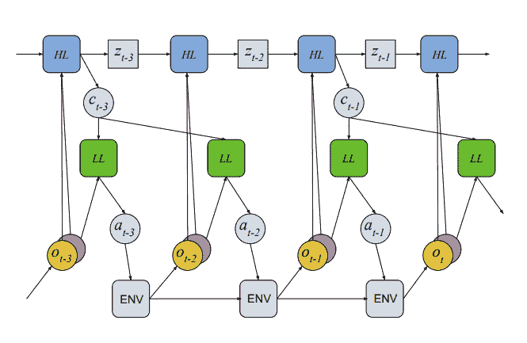

<!--yml

分类：未分类

日期：2024-09-06 19:59:25

-->

# [2009.09796] 《深度神经网络的多任务学习：综述》

> 来源：[`ar5iv.labs.arxiv.org/html/2009.09796`](https://ar5iv.labs.arxiv.org/html/2009.09796)

# 《深度神经网络的多任务学习：综述》

迈克尔·克劳肖

计算机科学系

乔治·梅森大学

mcrawsha@gmu.edu

###### 摘要

多任务学习（MTL）是机器学习的一个子领域，其中多个任务由一个共享模型同时学习。这种方法提供了诸如改进数据效率、通过共享表示减少过拟合以及利用辅助信息进行快速学习等优势。然而，同时学习多个任务带来了新的设计和优化挑战，而选择哪些任务应共同学习本身就是一个非平凡的问题。在本综述中，我们概述了深度神经网络的多任务学习方法，旨在总结该领域内的既有成就和最新方向。我们的讨论根据现有深度 MTL 技术的三个组别进行结构化：架构、优化方法和任务关系学习。我们还提供了常见多任务基准的总结。

## 1 引言

多任务学习是一种训练范式，在这种范式中，机器学习模型同时使用来自多个任务的数据进行训练，利用共享表示来学习一组相关任务之间的共同思想。这些共享表示提高了数据效率，并可能为相关或下游任务带来更快的学习速度，帮助缓解深度学习的已知弱点：大规模数据需求和计算需求。然而，获得这种效果并不容易，今天仍然是一个活跃的研究领域。

我们认为，多任务学习比单一任务学习更准确地反映了人类学习过程，因为跨领域整合知识是人类智能的核心。当一个新生儿学习走路或使用双手时，它积累了依赖于抽象平衡和直觉物理学的一般性运动技能。一旦学会了这些运动技能和抽象概念，它们可以在以后的生活中被重复利用和增强，比如骑自行车或走钢丝。每当一个人尝试学习新东西时，他们都会带来大量的先前知识。难怪神经网络需要如此多的训练样本和计算时间：每个任务都是从头开始学习的。想象一下在没有先学会走路的情况下尝试学会走钢丝！人类在很少的示例下快速学习的能力依赖于学习可推广到多种环境的概念，并利用这些概念进行快速学习；我们认为开发执行这个过程的系统应该是多任务学习以及元学习 Hospedales et al., [2020], 迁移学习 Zhuang et al., [2019] 和连续/终身学习 Parisi et al., [2019]等相关领域的目标。

在多任务学习中，学习概念确实带来了单一任务学习中不存在的困难。特别是，不同的任务可能具有冲突的需求。在这种情况下，提高模型在一个任务上的性能将会影响到在另一个具有不同需求的任务上的性能，这种现象被称为负迁移或破坏性干扰。减少负迁移是多任务学习方法的一个关键目标。许多架构都是设计有特定功能以减少负迁移，例如任务特定的特征空间和注意机制，但任务之间的信息划分是一个微妙的平衡：我们希望允许任务之间的信息流产生积极的迁移，并且鼓励分享不会产生负迁移的情况。如何设计这样一个系统的问题正在多任务学习研究中积极探讨中。

现有的 MTL 方法通常被分为两组，有着熟悉的二分法：硬参数共享与软参数共享。硬参数共享是指在多个任务之间共享模型权重，使得每个权重被训练来共同最小化多个损失函数。在软参数共享下，不同任务有各自的任务特定模型，权重分开，但不同任务的模型参数之间的距离被加入到联合目标函数中。虽然没有显式的参数共享，但任务特定模型有相似参数的激励。这是一种有用的二分法，但近年来多任务方法的性质变得极为多样化，我们认为这两类方法单独并不足以准确描述整个领域。因此，我们扩展了这些二分法的范围，以涵盖更多内容。我们将硬参数共享方法的类别概括为多任务架构，同时将软参数共享扩展为多任务优化。结合起来，架构设计和优化技术提供了现代 MTL 的几乎完整的图景。然而，领域内仍有一个重要方向甚至在这个概括的二分法中也缺失：任务关系学习。任务关系学习（或 TRL）方法专注于学习任务之间关系的显式表示，例如任务嵌入或迁移学习亲和力，这些类型的方法不完全符合架构设计或优化。广义而言，这三个方向——架构设计、优化和任务关系学习——构成了现代深度多任务学习的现有方法。

许多不同的研究者使用“多任务学习”这一术语来指代不同的设置，我们认为澄清此评审的范围是重要的。作为惯例，我们将 MTL 解释为仅包含同时学习固定任务集的学习设置，并且每个任务被平等对待。这意味着我们不考虑只有一个“主任务”及一个或多个辅助任务的训练设置，也不考虑任务集随时间变化的设置。然而，如果模型的想法能轻松适用于 MTL，我们可能会讨论为这些设置设计的模型。

剩余的调查内容概述如下。第二部分包含了关于多任务学习的神经网络架构的讨论。在第三部分中，我们讨论了 MTL 优化策略，而在第四部分中，我们探讨了显式任务关系学习的方法。第五部分包含了各种领域常见的多任务基准的概述。最后，我们在第六部分中作总结。在每个子节或子子节中，方法通常按照出版时间的顺序呈现，从最早到最近。需要注意的是，我们不讨论任何经典的（非神经网络）多任务学习方法，尽管张和杨 [2017]、鲁德 [2017] 提供了详尽的回顾。

## 2 多任务架构

大部分 MTL 文献致力于设计多任务神经网络架构。在创建共享架构时，需要考虑许多不同的因素，例如模型参数的共享比例，以及如何对任务特定模块和共享模块进行参数化和组合。考虑特定问题领域的架构时会出现更多变体，比如如何将卷积滤波器分成共享和任务特定组以用于一组视觉任务。许多提议的 MTL 架构在任务间的信息共享程度上进行平衡：共享过多会导致负迁移，使联合多任务模型的表现比每个任务的单独模型更差，而共享过少则无法有效利用任务间的信息。表现最好的 MTL 架构是那些能够很好地平衡共享的架构。

我们将多任务学习架构分为四类：特定任务领域的架构、多模态架构、学习到的架构和条件架构。对于单领域架构，我们考虑计算机视觉、自然语言处理和强化学习领域。多模态架构处理输入形式不止一种的任务，例如视觉问答，它包括视觉和语言两个部分。需要注意的是，我们仅考虑处理多任务的多模态架构。有关多模态方法的更全面讨论，请参见 Baltrusaitis 等人 [2019]。最后，我们对学习到的架构和条件架构做如下区分：学习到的架构在架构学习的步骤间是固定的，因此对来自相同任务的每个输入执行相同的计算。而在条件架构中，用于给定数据片段的架构依赖于数据本身。

### 2.1 计算机视觉的架构

在单任务设置中，许多计算机视觉架构的重要进展集中在新颖的网络组件和连接上，以提高优化和提取更有意义的特征，例如批归一化 Ioffe 和 Szegedy [2015]、残差网络 He 等人 [2016] 和压缩与激励块 Hu 等人 [2018]。相比之下，许多计算机视觉的多任务架构则集中在将网络划分为任务特定组件和共享组件，以便通过共享和任务间的信息流实现泛化，同时最小化负迁移。

#### 2.1.1 共享主干

传统上，计算机视觉中的许多多任务架构遵循一个简单的轮廓：一个由卷积层组成的全局特征提取器被所有任务共享，随后是每个任务的单独输出分支，如图 1。我们将这一模板称为共享主干。

图 1：TCDCN Zhang 等人 [2014] 的架构。基础特征提取器由一系列卷积层构成，这些卷积层在所有任务间共享，提取出的特征被用作任务特定输出头的输入。

Zhang 等人 [2014]，Dai 等人 [2016]，Zhao 等人 [2018]，Liu 等人 [2019]，Ma 等人 [2018] 提出了基于共享主干思想的架构变体。Zhang 等人 [2014]，这些工作的最早者，介绍了任务约束深度卷积网络（TCDCN），其架构如图 1 所示。作者提出通过共同学习头部姿态估计和面部属性推断来提高面部标志检测任务的性能。Dai 等人 [2016] 介绍了多任务网络级联（MNCs）。MNCs 的架构类似于 TCDCN，但有一个重要的区别：每个任务特定分支的输出附加到下一个任务特定分支的输入上，形成了该方法名称来源的“级联”信息流。这种类型的架构类似于在第 2.2.3 节讨论的 NLP 级联信息网络。

图 2：多任务网络级联的示意图 Dai 等人 [2016]。第一个任务的输出作为第二个任务的输入，第二个任务的输出作为第三个任务的输入，以此类推。

Zhao 等人 [2018]、Liu 等人 [2019] 都基于这一原始模板，加入了任务特定的模块，这些模块可以放置在现有的共享架构中。通过这样做，特征的计算依赖于特征提取器的共享参数和通过网络放置的任务特定模块的参数，使得不同任务的特征在任务特定输出分支之前可能有所不同。Zhao 等人 [2018] 引入了一种调制模块，该模块以任务特定的通道级线性投影形式存在，作者设计了一种卷积架构，将这些模块放置在网络后半部分的卷积层之后。有趣的是，实验证明，加入这些任务特定的投影模块可以减少不同任务的梯度更新方向相反的可能性，这意味着该架构减少了负迁移的发生。Liu 等人 [2019] 提出了任务特定的注意力模块。每个注意力模块以来自共享网络某个中间层的特征以及前一个注意力模块的输出（如果存在）作为输入。每个模块通过 Conv-BN-ReLU 层和 Conv-BN-Sigmoid 层计算一个注意力图。然后，将注意力图与来自后续共享层的特征逐元素相乘，这一乘积即为注意力模块的输出。该注意力模块使网络能够强调对对应任务更重要的特征，并降低不重要特征的影响。

多门混合专家模型 Ma 等人 [2018] 是一种最近提出的共享主干模型，具有独特的特点：网络包含多个共享主干，每个任务特定的输出头接收来自每个共享主干输出的线性组合。线性组合的权重由一个单独的门控函数计算，该函数对网络输入执行线性变换以计算线性组合权重。门控函数可以在所有任务之间共享，使得每个任务特定的输出头接收相同的输入，或者是任务特定的，使得每个输出头接收不同的共享主干输出的混合。这种模型类似于 Cross-Stitch 网络 Misra 等人 [2016]（见 2.1.2），但执行单一的共享组件线性组合，而不是从任务特定层中的多个特征组合。这种方法在计算机视觉任务中没有经过实证评估，但由于其与其他 CV 架构 Zhang 等人 [2014]，Misra 等人 [2016] 的密切关系，因此在此讨论。

#### 2.1.2 Cross-Talk

并非所有计算机视觉的 MTL 架构都由一个共享的、全局的特征提取器和任务特定的输出分支或模块组成。Misra 等人 [2016]，Ruder 等人 [2019]，Gao 等人 [2019] 采取了不同的方法。这些架构没有单一的共享提取器，而是为每个任务设置了单独的网络，任务网络中的并行层之间的信息流被称为 cross-talk。图 3 展示了这种思想，使用了 Misra 等人 [2016] 的 Cross-Stitch 网络架构。

图 3：Cross-Stitch 网络架构 Misra 等人 [2016]。每个任务有一个单独的网络，但 cross-stitch 单元通过线性组合将来自不同任务网络的并行层的信息结合起来。

Cross-Stitch 网络由每个任务的独立网络组成，但每层的输入是每个任务网络中前一层输出的线性组合。每个线性组合的权重是学习得到的，并且是任务特定的，因此每层可以选择利用哪些任务的信息。Ruder 等人 [2019] 通过引入 Sluice 网络来推广这个想法。在 Sluice 网络中，每层被划分为任务特定子空间和共享子空间，每层的输入是每个任务网络中前一层任务特定输出和共享输出的线性组合。这样，每层可以选择是否关注来自前一层的任务特定或共享特征。每层的任务特定和共享子空间也被鼓励正交，通过在损失函数中添加辅助项来最小化每个任务特定子空间与其对应的共享子空间的乘积的平方 Frobenius 范数。需要注意的是，Sluice 网络以领域无关的方式呈现，但由于与 Cross-Stitch 网络的关系，我们在这里讨论它们。最后，Gao 等人 [2019] 通过神经判别降维（NDDR-CNN）推广了平行层的特征融合操作。NDDR-CNN 不是使用线性组合来融合任务网络的平行层特征，而是将每层的输出拼接并通过 1x1 卷积处理。这个卷积的参数是任务特定的，就像 Cross-Stitch 网络中的线性组合权重一样。图 4 中展示了一个示意图。请注意，这种特征融合方法是 Cross-Stitch 网络的推广。1x1 卷积参数可以以模仿 Cross-Stitch 网络的方式进行学习，但大多数参数组合导致的特征融合操作是 Cross-Stitch 网络无法实现的。

图 4：NDDR-CNN 网络架构 Gao 等人 [2019]。与 Cross-Stitch 网络 Misra 等人 [2016] 中使用平行特征的线性组合来结合来自不同任务网络的信息不同，NDDR-CNN 使用拼接和 1x1 卷积来融合来自独立任务网络的特征。

杨和 Hospedales [2016a] 提出了一个与交叉对话模板相关的架构，尽管可能只是间接相关。在 Sluice 网络中，来自每一层的任务特定和共享参数张量被简单地连接起来形成层的参数。杨和 Hospedales [2016a] 的架构也明确区分了任务特定参数和共享参数，但采用了张量分解，这是一种在经典 MTL 文献中广泛使用的方法，Evgeniou 和 Pontil [2004]，Argyriou 等 [2008]，Kumar 和 Daume III [2012]。张量分解在 MTL 中用于将多任务模型的参数张量表示为两个较小张量的乘积，一个在任务之间共享，一个任务特定，这强制执行一种与 Sluice 网络不同的共享/任务特定特征空间的划分。杨和 Hospedales [2016a] 将这种方法扩展到深度学习设置中，以便在深度网络中的每一层学习共享结构。不幸的是，尚未对这种张量分解方法与其他交叉对话架构进行实证比较，也没有多少工作扩展杨和 Hospedales [2016a] 对深度 MTL 的张量分解方法。

#### 2.1.3 预测蒸馏

MTL 的一个主要信条和流行理由是，从一个任务中学到的特征可能对执行另一个相关任务有用。预测蒸馏技术基于这一原则的自然扩展：一个任务的答案可能有助于学习另一个任务。Vandenhende 等 [2020] 提供了这一现象的一个很好的激励示例：在联合学习深度预测和语义分割的 MTL 设置中，深度图中的不连续性意味着语义分割标签中的可能不连续性，反之亦然。PAD-Net Xu 等 [2018a]、Pattern-Affinitive Propagation Zhang 等 [2019] 和 MTI-Net Vandenhende 等 [2020] 都利用了这一现象，通过对每个任务进行初步预测，然后将这些预测结合起来，生成最终的精炼输出，以进行计算机视觉任务的多任务学习。

图 5：预测蒸馏的 PAD-Net 架构，Xu 等 [2018a]。对四个任务进行初步预测，然后将这些预测重新组合，用于计算两个输出任务的最终精炼预测。

PAD-Net Xu et al. [2018a] 是这些工作的最早者，介绍了一种架构，将深度预测、场景解析、表面法线估计和轮廓预测的初步预测进行结合，以产生更精细的深度预测和场景解析预测，如图 5 所示。初步预测通过三种新型的多模态蒸馏模块的变体之一进行重新组合，分别是使用简单特征拼接、消息传递或注意力引导的消息传递。Pattern-Affinitive Propagation (PAP) Zhang et al. [2019] 通过引入一个亲和学习层来扩展这一架构，该层学习表示任务的成对关系，并根据这些关系组合来自不同任务的特征。PAP 还取消了 PAD-Net 的额外辅助任务，而是为深度预测、表面法线估计和语义分割生成初步和最终预测。这两种方法在发表时，在 NYU-v2 数据集 Silberman et al. [2012] 上至少在一个任务上达到了最先进的性能。

最近提出的 MTI-Net Vandenhende et al. [2020] 进一步扩展了这种架构，它在感受野的多个尺度上建模任务交互。具体来说，该架构包含一个提取多尺度特征的主干，每个尺度的特征用于进行初步任务预测。来自 1/32 尺度的初始预测与 1/16 尺度的特征结合，形成 1/16 尺度预测的输入，然后 1/16 尺度的预测作为输入进行 1/8 尺度的预测，依此类推。在从每个尺度生成预测后，预测在任务之间进行蒸馏，并在尺度间聚合，以生成最终的精细任务预测。这种多尺度交互网络的动机来自于这样一个事实：一个任务的特征或真实输出可能仅在某些（但不是所有）尺度上对学习另一个任务有用。作者考虑了相邻汽车的例子：在局部层面上，当仅考虑小的图像块时，汽车之间的深度不连续性表明应该在此不连续性处改变语义标签。然而，在全局层面上，可以看到深度不连续性周围的物体具有相同的语义标签，这与局部层面的任务交互假设相矛盾。这种情况表明，在任务之间蒸馏预测时应该考虑多尺度信息，确实，这种模型相对于单任务对比基线显示了更大的改进。

#### 2.1.4 任务路由

尽管它们取得了成功，共享主干和交叉通信架构在参数共享方案上仍显得有些僵化。Strezoski 等人 [2019a] 提出了一个更灵活的架构，允许在特征层级而非层级层面上进行细粒度的参数共享。这个架构的创新组成部分是任务路由层，它对卷积层的输出应用任务特定的二进制掩码，将计算出的特征的一个子集置零，从而有效地为每个任务分配一个与其他任务重叠的子网络。二进制掩码不是通过学习获得的，而是在训练开始时随机初始化，并从那时起保持不变。虽然这种随机初始化不允许任务之间进行有原则的参数共享，但用户仍然可以通过使用超参数 $\sigma$（称为共享比率）来控制任务之间的共享程度。$\sigma$ 的取值在 0 和 1 之间，指定每层中任务特定单元的比例，并且每层中二进制掩码的随机初始化是以适应这一约束的方式执行的。所提议的架构只需在任务数量增加时略微增加参数数量，实验表明其性能优于如 Cross-Stitch 网络等 MTL 基线。令人印象深刻的是，任务路由层允许网络扩展到同时处理最多 312 个任务，同时保持良好的性能。任务路由层与学习到的架构 Piggyback Mallya 等人 [2018] 和稀疏共享架构 Sun 等人 [2019a]（在 2.5.4 部分讨论）密切相关，尽管在这些工作中，分配给每个任务的一组单元的二进制掩码是通过学习获得的。

#### 2.1.5 单任务处理

几乎每种计算机视觉的多任务架构都从相同的输入中产生多个任务的输出，我们迄今讨论的每一种都满足这一条件。Maninis 等人[2019] 是我们所知的唯一一种一次处理单个任务的方法，但可以通过多个前向传递用于多个任务。作者认为，由于网络一次仅对单个任务进行推断，网络能够更好地利用任务特定的信息并忽略对其他任务有用的信息。这种聚焦是通过使用两种不同的注意力机制实现的：任务特定的数据依赖调制 Perez 等人[2018]和任务特定的 Residual Adapter 块 Rebuffi 等人[2018]。该网络还通过对抗性损失 Liu 等人[2017]进行训练，以鼓励来自每个任务的梯度不可区分。使用对抗性设置来鼓励任务之间相似梯度方向的想法也在计算机视觉领域之外得到探索，并在 3.4.1 节中进一步讨论。

### 2.2 自然语言处理的架构

自然语言处理自然适合于多任务学习（MTL），因为可以对给定文本提出大量相关问题，而且现代 NLP 技术中常用的任务无关表示也是如此。近年来，NLP 领域的神经网络架构经历了不同的阶段，从传统的前馈架构发展到递归模型，然后递归模型被基于注意力的架构所取代。这些阶段在这些 NLP 架构应用于 MTL 时有所体现。

还应注意的是，许多 NLP 技术可以被认为是多任务的，因为它们构建了任务无关的一般表示（如词嵌入），在这种解释下，多任务 NLP 的讨论将包括许多更广为人知的一般 NLP 技术。这里，为了实用性，我们的讨论主要限制于那些明确同时学习多个任务以实现这些任务的技术。

#### 2.2.1 传统前馈

Collobert 和 Weston [2008]、Collobert 等人 [2011]、Liu 等人 [2015a] 都使用了传统的前馈（非注意力机制）架构来进行多任务自然语言处理。这些架构中的许多具有与早期计算机视觉的共享架构相似的结构特征：一个共享的、全局的特征提取器，后跟任务特定的输出分支。然而，在这种情况下，特征是词表示。Collobert 和 Weston [2008] 使用了一个共享的查找表层来学习词表示，其中每个词向量的参数通过梯度下降直接学习。其余部分是任务特定的，包括卷积、时间上的最大值、全连接层和一个 softmax 输出。开创性工作 Collobert 等人 [2011] 的动机来自于 MTL 的一般原则：跨任务共享的表示更具泛化能力，且共享可以提升所有任务的性能。他们的架构类似于 Collobert 和 Weston [2008]，使用查找表，然后是卷积和线性变换序列。主要的架构差异在于，查找表之后的第一个隐藏层（无论是线性还是卷积）在任务间是共享的。沿着这一趋势，Liu 等人 [2015a] 的架构具有类似的共享程度，如图 6 所示。在这种情况下，词向量不是直接学习的。而是将输入句子或文档转换为词袋表示，并哈希成字母 3-grams。这些特征随后被输入到一个共享的线性投影层，经过 tanh 激活函数，再输入到任务特定的输出分支中。

图 6: Liu 等人 [2015a] 的网络架构。输入被转换为词袋表示并哈希成字母 3-grams，随后经过共享的线性变换和非线性激活函数。这一共享表示被传递给任务特定的输出头，以计算每个任务的最终输出。

#### 2.2.2 循环

现代递归神经网络在自然语言处理中的引入产生了一系列新的多任务 NLP 模型，Luong 等人[2015]、Liu 等人[2016a、b]和 Dong 等人[2015]提出了新颖的递归架构。Sutskever 等人[2014]提出的序列到序列学习被应用于 Luong 等人[2015]的多任务学习中。在这项工作中，作者探讨了三种多任务 seq2seq 模型的参数共享方案变体，分别命名为一对多、多对一和多对多。在一对多中，编码器在所有任务中共享，而解码器是任务特定的。这对于处理需要不同格式输出的任务集非常有用，例如将一段文本翻译成多种目标语言。在多对一中，编码器是任务特定的，而解码器是共享的。这是通常的参数共享方案的逆转，其中早期层共享并输入到任务特定的分支。多对一变体适用于任务集需要相同格式的输出的情况，例如图像描述和翻译到相同目标语言。最后，作者探讨了多对多变体，其中有多个共享或任务特定的编码器和解码器。例如，他们使用此变体来联合训练一个英德翻译系统和一个德英翻译系统，具有英语和德语编码器和解码器。英语编码器还输入到英语解码器以执行自编码器重建任务，德语编码器也是如此。Dong 等人[2015]提出了一种类似的序列到序列架构，用于训练一个多任务网络，将一种源语言翻译成多种目标语言。

刘等人[2016a]还探讨了几种递归多任务架构的变体，尽管是在文本分类任务中，而不是序列到序列学习。这些参数共享方案通常比 Luong 等人[2015]所描述的更为细粒度，重点是允许任务之间的信息流动。作者探讨了三种参数共享方案：Uniform-Layer、Coupled-Layer 和 Shared-Layer 架构，如图 7 所示。在 Uniform-Layer 架构中，每个任务有其自己的嵌入层，所有任务共享一个嵌入层和一个 LSTM 层。设$i$为任务索引，$t$为递归时间步，$x_{t}$为输入句子的第$t$个单词。那么任务$i$在时间步$t$的共享 LSTM 层的输入是第$i$个任务特定的$x_{t}$的嵌入与$x_{t}$的共享嵌入的连接。对于 Coupled-Layer 模型，每个任务有其自己的独立 LSTM 层，但每个任务可以读取其他任务的 LSTM 层。更具体地说，给定任务在时间步$t$的 LSTM 的记忆内容被修改为包括每个任务在时间步$t-1$的 LSTM 层的隐藏状态的加权和，同时保持 LSTM 的所有其他组件。最后，Shared-Layer 架构为每个任务分配一个独立的 LSTM 层，以及一个共享的双向 LSTM 层，该层馈送到任务特定的 LSTM 中。

图 7：自上而下：刘等人[2016a]的 Uniform-Layer、Coupled-Layer 和 Shared-Layer 架构。每种架构都呈现了一种新颖的递归架构组件的共享和任务特定模块的划分。

除了这些递归架构之外，刘等人[2016b]将 LSTM 架构与记忆机制进行了增强。为了形成共享架构，每个任务都有自己的 LSTM 参数，但记忆在所有任务之间共享。记忆机制受到 Sukhbaatar 等人[2015]提出的增强记忆 LSTM（ME-LSTM）的启发。刘等人[2016b]的创新贡献在于一个融合机制，允许所有任务共同读取和写入记忆。通过这个附加机制，每个任务的 LSTM 的隐藏状态是由 LSTM 内部记忆和共享外部记忆中的信息的门控和计算得出的。作者还引入了一种变体，其中每个任务都有自己的私有外部记忆，而共享的全局外部记忆由每个任务特定的记忆模块读取/写入。

#### 2.2.3 级联信息

在我们迄今讨论的所有 NLP 架构中，与每个任务对应的子架构都是对称的。特别是，每个任务的输出分支出现在每个任务的最大网络深度上，这意味着每个任务的任务特定特征的监督发生在相同的深度。几个研究工作 Søgaard 和 Goldberg [2016]、Hashimoto 等人 [2016]、Sanh 等人 [2019] 提出了在较早的层次上监督“较低级别”任务，以便这些任务学到的特征可以被更高级别的任务使用。通过这种方式，我们形成了一个明确的任务层次结构，并为一个任务的信息直接帮助解决另一个任务提供了一种途径。我们将这种迭代推理和特征组合的模板称为级联信息，图 8 中有一个示例。

Søgaard 和 Goldberg [2016] 通过选择词性标注作为低级任务来指导句法块分析和 CCG 超标签化，从而形成了这个层次结构。他们的网络架构由一系列双向 RNN 层组成，对于每个任务 $i$，都有一个相关的层 $\ell_{i}$，任务 $i$ 的任务特定分类器即来源于该层。在这种情况下，词性标注的相关层出现在网络中比句法块分析和 CCG 超标签化的相关层要早，从而使得学习到的词性特征可以为句法块分析和 CCG 超标签化任务提供信息。在 Søgaard 和 Goldberg [2016] 发表之后不久，Hashimoto 等人 [2016] 通过构建一个类似的监督架构，完成了在多个语言任务上的 SOTA 及 SOTA 竞争性结果，该架构包含 5 个任务：词性标注、块分析、依存句法分析、语义相关性和文本蕴涵。作者们还将 Søgaard 和 Goldberg [2016] 的双向 RNN 单元替换为双向 LSTM 单元。图 8 显示了他们的架构。

图 8：Hashimoto 等人 [2016] 的不同任务在不同层次上的监督。较低级别的任务在较早的层次上受到监督。

除了任务数量的增加，该方法还引入了正则化项，以避免任务之间的训练干扰。每次从任务数据集中抽样进行训练时，都会将更新前参数与当前模型参数之间的平方欧氏距离添加到损失函数中。这鼓励网络参数不要偏离前一轮训练中在不同任务上学习的参数配置。

在这两项工作之后，Sanh 等人 [2019] 引入了一个类似灵感的模型用于一组不同的任务，在命名实体识别、实体提及检测和关系抽取中取得了 SOTA 结果。在这项工作中，任务层次结构从低到高依次为 NER、EMD 和共指解析/关系抽取（同样被认为是最高级别）。

#### 2.2.4 对抗特征分离

在对抗方法的一个新颖应用中，Liu 等人 [2017] 引入了一个用于多任务学习的对抗学习框架，以将学习到的特征提炼为任务特定的和任务无关的子空间。他们的架构由一个共享的 LSTM 层和每个任务一个任务特定的 LSTM 层组成。当一个任务的输入句子通过共享 LSTM 层和任务特定的 LSTM 层后，两个输出会被连接起来，并作为最终特征进行推理。然而，来自共享 LSTM 层的特征也会被输入到任务判别器中。任务判别器是一个线性变换后接一个 softmax 层，训练用于预测原始输入句子来自哪个任务。然后，共享 LSTM 层被训练以联合最小化任务损失和判别器损失，从而使共享 LSTM 产生的特征不包含任何任务特定信息。此外，利用正交惩罚（类似于 Ruder 等人 [2019]) 鼓励共享特征和任务特定特征编码不同的信息。更具体地说，正交损失定义为任务特定特征和共享特征的乘积的平方 Frobenius 范数。此损失被添加到总体训练目标中，以鼓励任务特定特征和共享特征之间的正交性。这两个辅助损失强制执行任务特定信息和任务无关信息在共享网络中的分离。

#### 2.2.5 BERT 用于多任务学习

尽管双向编码器表示（BERT） Devlin et al. [2018] 受到了广泛关注，但文本编码方法在 MTL 中的应用却出奇地少。Liu et al. [2019b] 通过在架构中添加共享 BERT 嵌入层扩展了 Liu et al. [2015a] 的工作。总体上，网络架构与 Liu et al. [2019b] 的工作非常相似，唯一的区别是添加了 BERT 上下文嵌入层，位于输入嵌入向量之后，如图 6 所示。这种新的 MTL 架构，称为 MT-DNN，在其发布时在九个 GLUE 任务中的八个上达到了 SOTA 表现 Wang et al. [2018]。

### 2.3 强化学习的架构

最近几年，强化学习的许多进展集中在优化和训练方法上 Schulman et al. [2017]，Haarnoja et al. [2018]，Akkaya et al. [2019]。由于许多 RL 问题并不涉及复杂的感知，如处理单词或像素，许多 RL 问题对架构的要求并不高。因此，许多用于 RL 的深度网络是简单的全连接、卷积或递归架构。然而，在多任务情况下，有几个有趣的研究利用任务之间的信息创建了改进的 RL 架构。

#### 2.3.1 联合任务训练

在强化学习中，几项研究发现通过联合训练多个任务（无论是否共享参数）可以提高任务性能。Pinto 和 Gupta [2017] 使用了一种共享的主干架构（如图 9 所示），从像素中联合学习机器人抓取、推送和戳击。共享的特征提取器由三层卷积层组成，这些共享特征被送入三个任务特定的输出分支。抓取和戳击的输出分支由三层全连接层组成，而推送分支有一层卷积层，后接两层全连接层。这个共享网络通过一种监督损失进行训练，该损失是交叉熵和平方欧几里得损失的平均值，每个任务一个。网络动作的参数化方式允许进行监督训练。作者发现，使用 2500 个推送和抓取样本训练的共享网络比使用 5000 个样本训练的任务特定抓取网络表现更佳。Zeng 等人 [2018] 也发现通过机器人推送和抓取的联合训练具有优势，尽管他们的架构没有使用任何参数共享。该网络由两个独立的全卷积 Q 网络组成，一个用于推送，一个用于抓取。然而，这两个网络都接受了联合训练信号。时间步$t$的奖励定义如下：如果在时间步$t$选择了抓取动作并且抓取成功，奖励为 1。如果在时间步$t$选择了推送动作并且该动作导致环境发生足够大的变化，则奖励为 0.5。根据该奖励，没有明确的鼓励一个任务帮助另一个任务。但是，当两个网络被联合训练以最大化相同的奖励时，推送网络会学习以影响环境的方式进行推送，以最大化抓取奖励。这个联合训练设置被证明比基准方法更具样本效率，使得在物理机器人上进行训练只需几个小时的训练即可实现。

图 9：Pinto 和 Gupta [2017] 的机器人抓取、推送和戳击的共享架构。

#### 2.3.2 模块化策略

我们讨论的各种参数共享方案之间有很多相似之处，但模块化网络提出了一种全新的参数共享方法，与 2.1.1 和 2.1.2 中的共享主干或交叉谈话架构完全不同。在模块化学习设置中，每个任务的网络架构由多个较小的子网络组合而成，这些较小的子网络以不同的方式组合以适应不同的任务。正如 MTL 通过共享表示来推动通用性，模块化学习通过共享神经构建块提供计算的通用性。这些设置的目标是学习足够通用的构建块，以便作为多个任务网络架构的一部分。我们在 2.5 和 2.6 中讨论了其他几种学习的模块化架构，但这里仅讨论那些构建块的参数被学习且每个任务的构建块配置保持不变的模块化方法。有关具有学习的构建块组合的模块化方法的讨论可以在上述章节中找到。

在几周内，Heess 等人 [2016] 和 Devin 等人 [2017] 都介绍了用于多任务学习的模块化神经网络策略。这些工作的架构分别在图 10 和 11 中展示。

图 10：多个机器人共享的模块化运动架构 Heess 等人 [2016]。请注意，高层模块以不同于其接收环境输入的频率来更新调制后的低层模块输入。

图 11：Devin 等人提出的多任务和多机器人转移的共享模块化架构[2017]。每个网络由两个模块组成，一个是机器人模块，一个是任务模块。每个机器人模块可以与任务模块组合，形成一个网络来执行每一个（任务，机器人）对。

Heess 等人[2016]的任务架构由两个模块组成，一个是低层的“脊髓”网络，一个是高层的“皮层”网络。脊髓网络可以访问本体感觉信息，如肌肉张力，并选择运动动作，而皮层网络可以访问所有观察数据并调节对脊髓网络的输入。需要注意的是，提供给脊髓网络的本体感觉信息总是与任务无关的，因此脊髓网络必须学习与任务无关的表征。在他们的实验中，低层/脊髓网络是前馈的，而高层/皮层网络是递归的。两个模块之间的劳动分工和脊髓网络的信息隐藏的组合使得预训练的脊髓网络能够与新的皮层网络配合，快速解决具有相同机器人身体的新任务。使用预训练的脊髓网络可以有效地在机器人身体中进行探索，尽管任务是新的。

Devin 等人[2017]的架构也受到类似的启发，但在不同机器人和任务之间的网络控制器中采用了参数共享。每个任务和机器人都有自己专属的网络模块。每个任务/机器人对的网络由相应的任务特定模块和相应的机器人特定模块组成，如图 11 所示。由于每个模块在任务和机器人之间共享，因此它被限制为学习其领域中的通用信息。作者还展示了学习到的模块可以在训练过程中未见过的组合中配对，从而实现零样本泛化能力的策略。这种方法还向任务模块提供了部分信息；每个观察值被分解为任务特定部分和机器人特定部分。任务特定模块仅接收任务特定观察值作为输入，而机器人特定模块接收机器人特定观察值以及任务特定模块的输出。

这两种架构都展现了一种有趣的策略，用于学习跨任务的通用表示：信息隐藏。我们到目前为止讨论了参数共享、对抗方法和正交性约束作为多任务方法的正则化策略。但这两种架构的模块化带来的劳动分工使得信息被限制在网络的某些模块中，迫使缺少该信息的模块学习对遗漏信息不变的表示。在这种情况下，我们获得了对当前任务不变的模块。

RL 与政策草图 Andreas 等人 [2017] 是另一种政策模块化的模板，该模板在 Heess 等人 [2016] 和 Devin 等人 [2017] 提出之后不久被提出，其中任务的政策由若干子政策组成，每个子政策是一个神经网络，其参数在任务之间共享。每个任务的子政策组合由人为提供的“政策草图”定义，该草图大致概述了完成任务的步骤。例如，在论文中用于评估的以 Minecraft 为灵感的环境中，任务“制作木板”和“制作木棍”可能具有政策草图（获取木材，使用工作台）和（获取木材，使用工具棚），分别。在这种情况下，这些任务的政策将使用子政策 $\pi_{\text{wood}}$、$\pi_{\text{bench}}$ 和 $\pi_{\text{shed}}$，其组合为 $\pi_{\text{planks}}=(\pi_{\text{wood}},\pi_{\text{bench}})$ 和 $\pi_{\text{sticks}}=(\pi_{\text{wood}},\pi_{\text{shed}})$。政策草图提供的弱监督定义了任务之间子政策的共享结构，这被证明比无监督选项发现对学习更有益。这个过程类似于 Neural Module Networks Andreas 等人 [2016] 中的问题的语法结构定义了子政策的组合（在 2.6 节讨论过），尽管在那个例子中，组合架构依赖于每个单独的问题，而在政策草图中子政策的组合对于每个任务保持不变。需要注意的是，模块组合在政策草图和 Heess 等人 [2016] 以及 Devin 等人 [2017] 的架构中采取了两种不同的形式：政策草图中的子政策表现得像在层次化强化学习 Kulkarni 等人 [2016] 中一样，其中子政策被选择作为政策，直到满足某个终止条件，而不是像 Heess 等人 [2016] 和 Devin 等人 [2017] 中那样的函数组合形式。

#### 2.3.3 多重辅助任务

Jaderberg 等人 [2016] 引入了几种无监督的辅助任务，与主任务一起学习，作为一种额外的监督形式。这些辅助任务在通常意义上鼓励 MTL 中的通用表示，但它们也有助于减少原任务中的奖励稀疏性。该架构是一个 CNN-LSTM 演员-评论家结构，具有共享的主干，并且为每个需要自己输出的辅助任务设置输出分支。辅助任务本身称为像素控制、特征控制和奖励预测。像素控制共享来自代理 CNN 和 LSTM 的参数，并分支到一个任务特定的分支，该分支选择自己的动作。这些动作会因为导致所选动作导致的像素强度最大变化而获得奖励。特征控制不需要输出，相反，代理会因为激活代理网络中给定隐藏层的隐藏单元而获得奖励。最后，奖励预测利用代理的 CNN 将三个最近的帧映射到下一步奖励的预测。这些辅助任务不需要环境动态以外的监督，并且足够通用以适用于许多不同的问题设置。使用这些简单的辅助任务训练代理导致了 Arcade Learning Environment Bellemare 等人 [2013] 上的 SOTA 性能。

### 2.4 多模态架构

在章节 2.1、2.2 和 2.3 中，我们讨论了专门设计来处理一个固定领域中数据的多任务架构。在这里，我们描述了处理来自多个领域的数据以应对多个任务的架构，这通常是视觉和语言数据的某种组合。多模态学习是多任务学习背后许多激励原则的有趣扩展：跨领域共享表示减少了过拟合并提高了数据效率。在多任务单模态情况下，表示在任务间共享，但仅在单一模态内。然而，在多任务多模态情况下，表示在任务和模式之间共享，通过这种方式，学习到的表示必须进行泛化。这表明多任务多模态学习可能会提高多任务学习已经表现出的好处。

阮和冈谷 [2019] 通过使用密集共注意力层来引入用于共享视觉和语言任务的架构，阮和冈谷 [2018] 中的任务被组织成一个层次结构，并且低级任务在网络的早期层中受到监督。密集共注意力层是为视觉问答开发的，特别是用于集成视觉和语言信息。这种任务监督设置类似于第 2.2.3 节中讨论的级联信息架构。然而，与其手动设计任务层次结构不同，该方法在每个任务上进行层级搜索，以学习任务层次结构。阿赫塔尔等人 [2019] 的架构处理视觉、音频和文本输入，以分类视频中的情感和情绪，使用双向 GRU 层以及每对模态的成对注意力机制来学习包含所有输入模态的共享表示。

阮和冈谷 [2019]、阿赫塔尔等人 [2019] 都关注于一组具有相同固定模态的任务。而凯瑟尔等人 [2017] 和普拉马尼克等人 [2019] 则专注于构建一个“通用多模态多任务模型”，在该模型中，单一模型可以处理多个具有不同输入领域的任务。凯瑟尔等人 [2017] 引入的架构包含一个输入编码器、一个 I/O 混合器和一个自回归解码器。这三个模块都是由卷积、注意力层和稀疏门控专家混合层的组合构成的。作者还展示了任务之间的大量共享能显著提升具有有限训练数据的任务的性能。普拉马尼克等人 [2019] 介绍了一个名为 OmniNet 的架构，它具有一个时空缓存机制，用于学习数据空间维度及时间维度的依赖关系。图 12 中展示了一个示意图。每个输入模态都有一个对应的“外围”网络，这些网络的输出被汇总并输入到中央神经处理器，中央神经处理器的输出再输入到任务特定的输出头。CNP 具有一个带有空间缓存和时间缓存的编码器-解码器架构。OmniNet 在词性标注、图像描述、视觉问答和视频活动识别中达到了 SOTA 竞争性能。

图 12：Pramanik 等人提出的 OmniNet 架构[2019]。每种模态都有一个独立的网络来处理输入，汇总的输出由一个名为中央神经处理器的编码器-解码器处理。中央神经处理器的输出然后传递到几个特定任务的输出头。

最近，Lu 等人[2020]提出了一个处理 12 个不同数据集的多任务模型，恰如其名为 12-in-1。该模型在这 12 个任务中的 11 个任务上表现优于相应的单任务模型，并且将多任务训练作为预训练步骤在 7 个任务上实现了 SOTA 性能。该架构基于 Lu 等人[2020]的 ViLBERT 模型，训练使用了动态任务调度、课程学习和超参数启发式等多种方法。

### 2.5 学习到的架构

正如我们在前面的章节中已经看到的，已经有很多共享架构设计的发展，以突出多任务学习的优点，同时缓解其缺点。另一种多任务学习的架构设计方法是学习架构以及生成模型的权重。许多以下学习共享架构的方法允许模型学习参数在任务之间应如何共享。通过不同的参数共享方案，模型可以调整任务之间的重叠，以便类似的任务之间的共享程度高于无关的任务。这是一种缓解任务之间负迁移的潜在方法：如果两个任务表现出负迁移，模型可能会学习将这些任务的参数分开。进一步来说，可能存在两个任务在网络的某些部分表现出正迁移，在其他部分则表现出负迁移。在这种情况下，手动设计一个参数共享方案以适应网络不同部分的任务相似性变得不可行，特别是随着任务数量和网络规模的增长。学习到的参数共享提供了一种促进任务之间自适应共享的方式，这种精确度是手动设计的共享架构所无法实现的。

我们大致将学习到的架构方法分为四组：架构搜索、分支共享、模块共享和细粒度共享。这些组之间的界限并不明确，通常是模糊的，但我们认为这种分类方法对于广泛描述最近开发的方法中的模式是有用的。分支共享方法是一种粗粒度的任务间参数共享方式。一旦两个任务的计算图不同，它们就不会重新合并（参见图 13）。模块共享代表了一种更细粒度的方法，其中一组神经网络模块在任务间共享，每个任务的架构是通过对一些或所有模块的任务特定组合来构建的，如图 16 所示。最后，最细粒度的参数共享方法是我们简单称之为细粒度共享，其中共享决策发生在参数级别，而不是层级别，如图 17 所示。

#### 2.5.1 架构搜索

Wong 和 Gesmundo [2017]、Liang 等 [2018]、Gao 等 [2020] 各自介绍了一种多任务架构搜索的方法，但采用了完全不同的策略。Wong 和 Gesmundo [2017] 介绍了多任务神经模型搜索（MNMS）控制器。该方法不涉及一个在所有任务之间共享的单一网络。相反，MNMS 控制器在所有任务上同时训练，为每个任务生成一个独立的架构。该方法是 Zoph 和 Le [2016] 的扩展，其中 RNN 控制器迭代地进行架构设计选择，并通过强化学习进行训练，以最大化最终网络的预期性能。在多任务变体中，RNN 还使用任务嵌入，这些嵌入与 MNMS 控制器共同学习，以便根据任务的性质对架构设计选择进行条件设置。

另一方面，Liang 等人 [2018] 引入了几种多任务神经架构搜索算法的变体，这些算法使用进化策略来学习可以为不同任务重新排序的神经网络模块。这种方法是 Meyerson 和 Miikkulainen [2017] 中引入的软层排序的扩展（讨论见 2.3.2）。就像在 Meyerson 和 Miikkulainen [2017] 中一样，Liang 等人 [2018] 的方法涉及到针对不同任务的神经网络模块及其排序的联合学习。在架构搜索扩展中，模块的架构以及其针对各个任务的路由被一同学习。该算法最复杂的变体被称为模块与任务路由的共同进化（CMTR），在其中，CoDeepNEAT 算法 Miikkulainen 等人 [2019] 被用来在外循环中进化共享组模块的架构，而这些模块的任务特定路由在内循环中进化。

最近，Gao 等人 [2020] 提出了 MTL-NAS 作为一种在 MTL 中进行基于梯度的架构搜索的方法。该搜索空间中的所有架构都由一组固定架构的单任务骨干网络组成，每个任务一个，这个搜索过程在这些单任务网络的不同层之间的特征融合操作上进行。特征融合操作由 NDDR 参数化（来自 NDDR-CNN Gao 等人 [2019]，见 2.1.2），本质上是作用于来自不同任务的特征图连接的 $1\times 1$ 卷积。这种方法还在融合操作的权重上引入了最小熵目标，从而使得搜索过程在架构搜索阶段收敛到离散架构，减少了与其他 NAS 工作中软组合架构离散化的需求 Liu 等人 [2018]，并缩小了学习到的软架构与最终离散版本之间的性能差距。最终学习到的架构在 NYU-v2 Silberman 等人 [2012] 和 Taskonomy Zamir 等人 [2018] 数据集上表现优于常见的多任务基准。

#### 2.5.2 分支共享

Lu 等人 [2017] 是多任务深度学习中最早的学习参数共享方法之一。其思路是从一个共享网络开始，该网络在所有任务中共享，直到任务特定的输出头，然后逐层迭代地解耦任务间的参数，从最接近输出头的层开始，逐步向早期层移动。这个过程的示意图如图 13 所示。当一个共享层分裂成多个任务特定层时，任务根据任务对的相似度进行聚类。这些任务相似度是根据以下原则计算的：如果相同的输入数据对每个任务的模型同样容易/困难，那么这两个任务很可能相关。

图 13：Lu 等人 [2017] 提出的学习分支架构。在训练开始时，每个任务共享网络的所有层。随着训练的进行，相关性较低的任务会分支成集群，以便只有高度相关的任务共享尽可能多的参数。

最近，Vandenhende 等人 [2019] 提出了一个类似的方法，但任务分组的标准不同。该算法使用表示相似性分析（RSA）Kriegeskorte [2008] 作为任务亲和性的衡量标准，而不是并发样本难度。RSA 的基础原则是相似的任务会依赖于输入的相似特征，因此会学习到相似的特征表示。这些方法的另一个重要区别是，Vandenhende 等人 [2019] 计算分支结构时是全局的，而不是逐层贪婪的。然而，对所有分支结构的搜索计算成本很高，因此作者采用了束搜索策略，根据网络中不同部分任务之间的表示相似性来计算分支结构。本文还直接比较了这两种方法，结果表明基于 RSA 的变体更优。RSA 还用于一些方法中以学习显式任务关系，这些方法在章节 4 中讨论。

#### 2.5.3 模块化共享

我们所知的最早的多任务学习中的模块化参数共享工作是 PathNet Fernando 等人 [2017]。PathNet 模型是一个大型神经网络，用于多个任务，尽管不同任务在大型模型中有不同的计算路径。图中显示了 14。每个任务的路径通过锦标赛选择遗传算法学习，在此过程中，许多不同的候选路径竞争并进化为大型网络的最佳子网络。虽然这个概念大多是通用的，可以应用于各种环境，如多任务学习和元学习，但作者将此模型用于包含两个强化学习任务的持续学习。在第二个任务的训练过程中，第一次任务训练期间学到的权重保持不变，并在此期间进化出新的网络路径以完成当前任务。

图 14：示例 PathNet 架构，Fernando 等人 [2017]。一个大型网络被多个任务共享，但每个任务仅使用一个子网络，该子网络通过锦标赛选择遗传算法进化。

Soft Layer Ordering Meyerson 和 Miikkulainen [2017] 和 Modular Meta-Learning Alet 等人 [2018] 是两项并行的模块化 MTL 工作，虽然相似但有一个重要的区别。这些方法中的每一种都学习一组共享的神经网络模块，这些模块以不同的方式组合用于不同的任务，期望“构建块”网络能够在不同任务网络的各种上下文中学习到普遍适用的知识。Soft Layer Ordering 通过计算每个模块在网络每一层输出的凸组合来参数化任务网络，如图 15 所示。通过这种参数化，每个学习到的模块可以对网络的每一层深度做出贡献。相比之下，Modular Meta-Learning 在模块上学习一个计算图，这意味着每一步计算是少量模块的离散组合，而不是所有模块的软组合。这些方法在计算图的参数化上的差异导致了不同的优化策略，即 Soft Layer Ordering 架构中的计算图可以与网络权重一起通过梯度下降进行优化，因为模块的组合是一个可微分操作。相比之下，Modular Meta-Learning 中的计算图是一个离散结构，因此不能使用基于梯度的优化方法来学习每个任务的模块图。相反，作者使用模拟退火，一种黑箱优化方法，来学习计算图。虽然这种两级优化会增加计算成本，但计算图的离散性质使得结果模型能够产生归纳偏置，而层的软共享则没有表现出这种特性。这些方法代表了许多其他方法采用的广泛可推广模板的两种实现：学习单独的网络片段，并学习如何将它们组合起来。

图 15：Soft Layer Ordering 使用三层学习层 Meyerson 和 Miikkulainen [2017]。网络的每一层是几个网络模块的线性组合，这些组合的权重是特定于任务的。

陈等人[2018]的方法是这一理念的另一种策略，与 NAS Zoph 和 Le [2016]非常相似。本文提出了一种适应上述模板的方法，但模块的组成并不像软层排序和模块化元学习那样直接参数化和学习。相反，这种方法训练一个 RNN 控制器，从一个固定的层集合中选择一个层，逐步构建一个由模块组成的架构，然后通过强化学习再次训练模块，以最大化构建架构的预期性能。这种方法与之前讨论的多任务神经模型搜索控制器 Wong 和 Gesmundo [2017]有很强的相似性，主要区别在于陈等人[2018]使用的 RNN 控制器仅在一组网络模块之间进行选择，而 MNMS 控制器则做出架构设计决策。

最近，AdaShare Sun 等人[2019b]是一种模块化多任务学习的算法，其中每个任务架构由一系列网络层组成。共享集合中的每一层要么被包含在网络中，要么在每个任务中被省略。图 16 展示了一个示例。除了每层的权重，AdaShare 学习一个$N\times L$的二进制值数组，其中$N$是任务数量，$L$是共享层的总数，数组的$(i,\ell)$-th 元素表示第$i$个任务的模型中是否包含层$\ell$。由于任务网络的输出对这些二进制值不可微分，该方法采用 Gumbel-Softmax 采样 Jang 等人[2016]与网络权重一起使用梯度下降优化这些参数。这种策略在软层排序 Meyerson 和 Miikkulainen [2017]和模块化元学习 Alet 等人[2018]之间形成了一种有趣的中间状态，其中每个共享模块是离散共享的，而不是柔性共享，但计算图仍然可以通过梯度下降进行学习。AdaShare 还采用了几个正则化项，以鼓励在较低级模块中的共享和在结果任务特定网络中的稀疏性，这些在 3.2 节中讨论。

图 16：AdaShare Sun 等人[2019b]的学习参数共享方案。网络中的每一层要么被每个任务包含，要么被忽略，从而使每个任务使用的子网络（可能）与其他任务重叠。

#### 2.5.4 细粒度共享

细粒度参数共享方案是最近引入的 MTL 架构类型，它们允许比层级或多层级共享更灵活的信息流。Piggyback Mallya 等人 [2018] 是一种通过学习掩蔽原始网络的单个权重来调整预训练网络以适应相关任务的方法。这允许以仅增加原始模型每个参数一个附加位的存储成本来存储新训练的模型，同时保持原始网络的功能。尽管网络输出对这些网络掩膜不是可微的，但这些网络掩膜通过梯度下降与网络权重一起优化，使用掩膜值的连续松弛作为二值掩膜值的噪声估计。优化这种掩膜值的方法在之前的二值神经网络研究中得到了证明 Courbariaux 等人 [2015]。

Newell 等人 [2019] 和 Bragman 等人 [2019] 是同时提出了一种多任务 CNN 的参数共享方案，其中共享发生在滤波器层面。对于多任务网络的每个卷积层，Newell 等人 [2019] 的方法学习一个二值的 $N\times C$ 数组 $M$，其中 $N$ 再次表示任务的数量，$C$ 是网络中给定层的特征通道数量。$M$ 的 $(i,c)$-th 元素表示第 $i$ 个任务的模型是否应该包含第 $c$ 个特征图。作者并未直接通过 Gumbel-Softmax Jang 等人 [2016] 分布优化这个二值数组，而是学习一个大小为 $N\times N$ 的实值矩阵 $P$，其值范围在 $[0,1]$ 之间，其中 $P$ 的 $(i,j)$-th 元素表示任务 $i$ 和任务 $j$ 的模型共享的特征通道的比例。通过这种方式，任务之间的关系被直接学习，并且在计算每个新值的 $P$ 之后，样本中得到一个满足 $P=\frac{1}{C}M^{T}M$ 的数组 $M$。通过这种 $M$ 的参数化，网络结构不是直接学习的，而是通过采样使得学习到的任务亲和矩阵决定任务参数之间的重叠量。这个任务亲和矩阵 $P$ 是通过进化策略学习的。Bragman 等人 [2019] 提出了随机滤波器组（SFGs），其中卷积滤波器分配到任务特定或共享的方式是通过变分推断学习的。更具体地说，SFGs 通过学习卷积滤波器到任务特定或共享角色的可能分配的后验分布进行训练。据我们所知，SFGs 是唯一的概率性多任务架构学习方法。

Sun 等人 [2019a] 介绍了一种通过提取单一完全共享模型的稀疏子网络来学习细粒度参数共享方案的算法。从一个随机初始化的过参数网络开始，作者使用 Iterative Magnitude Pruning (IMP) Frankle 和 Carbin [2018] 从更大的网络中提取每个个别任务的稀疏子网络。IMP 通过训练少量的训练周期来修剪网络，然后移除那些具有最小幅度的权重，直到达到所需的稀疏级别。考虑到合理的稀疏级别，每个任务的提取子网络将重叠并表现出任务之间的细粒度参数共享。图 17 显示了这种情况。重要的是要注意，两个任务的提取子网络之间的重叠程度并不一定与这两个任务的相关性相关，这表明需要一个细粒度的参数共享方案，该方案结合了任务亲和力的信息以构建适当的任务共享机制。

图 17：从 Sun 等人[2019a]的研究中学习到的细粒度共享架构。每个任务都有一个稀疏子网络，这些子网络可能会或可能不会与其他任务的子网络重叠。每个子网络都是使用 Iterative Magnitude Pruning Frankle 和 Carbin [2018] 在整个随机初始化网络上提取的，然后再进行训练。

### 2.6 条件架构

条件或自适应计算 Bengio 等人 [2013] 是一种根据网络输入选择神经网络架构部分进行执行的方法。条件计算被应用于许多多任务学习以外的领域，如减少模型计算成本和在分层强化学习 Kulkarni 等人 [2016] 中。在多任务情况下，条件架构在输入之间以及任务之间都是动态的，尽管这些动态实例化架构的组件是共享的，这鼓励这些组件在不同输入和任务之间具有可泛化性。

神经模块网络 Andreas 等人 [2016] 是条件计算的早期工作，专为视觉问答设计。该方法利用自然语言中问题的组合结构来训练和部署专门针对问题各个部分的模块。给定问题的结构由非神经语义解析器确定，特别是斯坦福解析器 Klein 和 Manning [2003]。解析器的输出用于确定问题的组合部分及其之间的关系，并使用相应的神经模块动态实例化给定问题的模型。这个过程如图 18 所示。虽然这项工作为未来的条件计算方法铺平了道路，但它的不足之处在于模块的组合没有被学习。因此，每个模块及模块组合的角色是固定的，无法改进。

图 18：神经模块网络执行示例 Andreas 等人 [2016]。给定问题的语义结构用于动态实例化一个由对应于问题元素的模块组成的网络。

路由网络 Rosenbaum 等人 [2017] 和组合递归学习器（CRL）Chang 等人 [2018] 是更近期的条件计算相关工作，其中除了学习模块本身的权重外，还学习模块的组合。路由网络由一个路由器和一组神经网络模块组成。给定一段输入数据，路由器迭代地从网络模块集合中选择一个模块来应用于输入，直到固定次数的迭代；这一过程如图 19 所示。路由器还可以选择一个“传递”操作，而不是模块，这样便继续到下一个路由迭代。模块权重可以通过反向传播直接学习，而路由器权重则通过强化学习进行学习，以最大化动态实例化网络在其输入上的表现。Chang 等人 [2018] 的组合递归学习器也类似，但有一些关键差异。给定一段输入数据，CRL 也会从固定的模块集合中迭代地选择一个网络模块来路由输入。在 CRL 的情况下，任何任务特定的信息（例如任务 ID）都故意隐藏在网络模块之外，以确保模块学习任务无关的且因此具有泛化性的知识。CRL 也通过强化学习在课程上进行训练，以鼓励重用在更简单问题上学到的模块。

图 19：示例路由网络执行 Rosenbaum 等人 [2017]。路由器迭代地选择一个层级来应用于输入，以动态地实例化每个输入的网络。

Ahn 等人 [2019] 引入了一个非常相似的架构，其中从一个更大的骨干网络中选择具有不同配置和规模的层来路由输入。路由器（在此变体中称为选择网络）再次通过强化学习进行训练。

Kirsch 等人 [2018] 的架构同样受到路由网络和 CRL 的启发，但它采取了局部视角而非全局视角。在路由网络和 CRL 中，任何网络模块可以放入任意深度的实例化网络中。相比之下，Kirsch 等人 [2018] 提出了一个条件架构，其中路由决策仅在网络层内进行。该架构由一系列模块化层组成，每层有 $m$ 个网络模块。当层应用于输入时，输入会通过一个控制器，控制器从属于该层的 $m$ 个模块中选择 $k$ 个模块。然后，这一层的输入会分别通过 $k$ 个选定的模块，结果会被加和或连接，形成层的输出。这些模块化层中的控制器不是通过强化学习训练的，而是通过变分方法训练的，其中模块选择被视为潜在变量。作者认为，他们模型中的架构差异相比于过去的条件计算工作减少了模块崩溃的发生，这是条件模型的一个著名弱点。当模块崩溃发生时，路由器仅从可用的模块集中选择少量模块，而其余模块大部分未被使用， resulting models do not exhibit modularity.

最近，Soft Modularization Yang et al. [2020] 是另一种条件方法，可以视为对路由网络的软放松。Soft Modularization 使用一个由 $L$ 层组成的路由网络和一个策略网络，每层包含 $m$ 个模块。与路由网络在每一步计算中做出离散决策并选择一个模块不同，Soft Modularization 将每个模块的输入设为上一层模块输出的线性组合。具体而言，路由网络接收一个观察值和相应的任务索引作为输入，并输出一个 $m\times m$ 的线性组合权重矩阵，该矩阵用于每一层的计算，除了第一层之外。权重矩阵中第 $\ell$ 层的第 $i$ 行第 $j$ 列的元素表示来自第 $\ell-1$ 层的模块 $i$ 对第 $\ell$ 层模块 $j$ 输入的权重。与路由网络的软放松消除了将路由器与策略分开训练的需要，整个网络可以端到端训练。该架构也与 Soft Layer Ordering Meyerson 和 Miikkulainen [2017] （见 2.3.2）相关，尽管在 Soft Modularization 中，线性组合权重并不是直接学习的，而是由一个独立的网络（路由网络）在每一步计算中动态计算的。当与 Soft Actor-Critic Haarnoja et al. [2018] 结合使用时，Soft Modularization 代理在 Meta-World 基准测试 Yu et al. [2019] 上达到了 60% 的成功率。

关于基于路由的方法的优缺点的详细讨论可以参见 Rosenbaum et al. [2019] 和 Ramachandran 和 Le [2019]。

## 3 多任务学习的优化

MTL 架构设计是硬参数共享的现代泛化的一方面，而 MTL 优化则是软参数共享的更广泛版本。软参数共享是一种通过惩罚模型参数与其他相关任务模型参数之间的距离来正则化模型参数的方法。虽然 MTL 优化方法确实包括惩罚参数距离的正则化策略，但许多其他正则化策略也在积极开发中。当从优化的角度看待负迁移问题时，除了各种参数共享方案外，处理负迁移的新方法开始出现。

我们将现有的多任务学习（MTL）优化方法划分为六个不同的组：损失加权、正则化、梯度调节、任务调度、多目标优化和知识蒸馏。正如本综述的前几部分所述，这些组之间的界限并不总是明确的。某些方法可能被解读为属于多个组，但我们认为这种划分对于概念化 MTL 优化的各种研究方向是有用的。

### 3.1 损失加权

缓解多任务优化的一种非常常见的方法是平衡不同任务的个体损失函数。当一个模型需要在多个任务上进行训练时，必须将各种任务特定的损失函数合并为一个单一的聚合损失函数，并使模型在训练过程中最小化该损失函数。一个自然的问题是如何将多个损失函数准确地组合成一个适用于 MTL 的函数。我们在这里描述的大多数方法将聚合损失函数参数化为任务特定损失函数的加权和，每种方法的贡献在于计算这些权重。Gong 等人 [2019] 包含了现有损失加权方法的实证比较。

应该注意到，还有一些相关工作如 Xu 等人 [2018b]，Du 等人 [2018] 引入了相对于主任务损失的辅助任务损失加权方法。尽管这些方法有趣且可能对 MTL 有用，但它们是为一种不同于 MTL 的设置设计的，即一个主任务伴随一个或多个辅助任务的设置。

#### 3.1.1 通过不确定性加权

学习损失权重的最早方法之一是 Kendall 等人 [2017]。在这项工作中，作者将多任务网络视为一个概率模型，并通过最大化真实输出的似然性来推导加权多任务损失函数。在对 $N$ 个同时进行的回归任务进行训练的情况下，网络输出为任务 $i$ 计算的分布是高斯分布 $\mathcal{N}(f_{i}(x),\sigma_{i}^{2})$，其中 $f_{i}(x)$ 是任务 $i$ 的网络输出，而 $\sigma_{i}$ 是一个学习得到的参数，表示任务 $i$ 的任务相关（或同方差）不确定性。结果损失函数是为了联合最大化每个这样的分布的似然性。

|  | $\sum_{i}\frac{1}{2\sigma^{2}}\&#124;y_{i}-f_{i}(x)\&#124;^{2}+\text{log}~{}\sigma_{i}$ |  |
| --- | --- | --- |

这里 $y_{i}$ 是任务 $i$ 的真实标签。从这个派生的损失函数中，我们可以看到，每个任务的损失由其任务相关不确定性的倒数加权，因此不确定性较小的任务将获得更多的权重。此外，每个任务的损失由 $\text{log}~{}\sigma_{i}$ 进行正则化，以防优化过程被激励去无限制地增加 $\sigma_{i}$。一个非常类似的公式出现在分类任务的训练中，这种任务损失加权的方法是本文的主要贡献。有趣的是，用这种加权方法训练的模型被证明优于那些用表现最佳的常数损失权重训练的相同模型。

#### 3.1.2 按学习速度加权

根据 Kendall 等人 [2017] 的方法，提出了几种加权多任务损失函数的方法，这些方法通过该任务的学习速度来加权任务的损失 Chen 等人 [2017]，刘等人 [2019]，郑等人 [2018]，刘等人 [2019a]，方法略有不同。这些方法中的大多数在任务的学习速度较低时会增加任务的损失权重，以便在任务之间平衡学习，尽管并非所有讨论的方法都这样做。

刘等人 [2019] 和刘等人 [2019a] 明确地通过当前损失与先前损失的比率来设置任务的损失权重。设 $\mathcal{L}_{i}(t)$ 为任务 $i$ 在时间步 $t$ 的损失，$N$ 为任务的数量。动态权重平均（DWA）刘等人 [2019] 通过以下方式设置任务权重：

|  | $\lambda_{i}(t)=\frac{N~{}\text{exp}(r_{i}(t-1)/T)}{\sum_{j}\text{exp}(r_{j}(t-1)/T)}$ |  |
| --- | --- | --- |

其中 $r_{i}(t-1)=\mathcal{L}_{i}(t-1)/\mathcal{L}_{i}(t-2)$ 和 $T$ 是温度超参数。换句话说，损失权重向量是对每个任务在最后两个训练步骤中的连续损失值比率的 softmax 计算，乘以任务数量。同样，LBTW 刘等人 [2019a] 设置了

|  | $\lambda_{i}(t)=\left(\frac{\mathcal{L}_{i}(t)}{\mathcal{L}_{i}(0)}\right)^{\alpha}$ |  |
| --- | --- | --- |

其中 $\alpha$ 是一个超参数。请注意，LBTW 通过当前损失与初始损失的比率来衡量学习速度，而 DWA 则通过最后两次训练步骤的损失比率来衡量。LBTW 也不会将权重值归一化为固定值。

GradNorm Chen 等人[2017] 同样受到这两种方法的启发，但没有明确计算损失权重。相反，权重被优化以最小化一个辅助损失，该损失衡量每个任务的梯度与基于平均任务损失梯度和每个任务学习速度的期望任务梯度之间的差异。为了定义这个辅助损失，我们首先必须定义 $G_{i}(t)=\|\nabla_{\theta}\lambda_{i}(t)\mathcal{L}_{i}(t)\|_{2}$（任务 $i$ 的加权梯度），$\bar{G}(t)$ 作为所有 $G_{i}(t)$ 的平均值，$\tilde{\mathcal{L}}_{i}(t)=\mathcal{L}_{i}(t)/\mathcal{L}_{i}(0)$（任务 $k$ 的学习速度），和 $r_{i}(t)=\tilde{\mathcal{L}}_{i}(t)/\mathbb{E}_{j}[\tilde{\mathcal{L}}_{j}(t)]$（任务 $i$ 的相对学习速度）。然后，辅助损失定义为

|  | $\mathcal{L}_{\text{grad}}(\lambda(t))=\sum_{j}\&#124;G_{j}(t)-\bar{G}(t)\times[r_{i}(t)]^{\alpha}\&#124;_{1}$ |  |
| --- | --- | --- |

其中 $\alpha$ 再次是一个超参数。通过优化任务权重 $\lambda_{i}(t)$ 以最小化 $\mathcal{L}_{\text{grad}}$，权重被调整，使得学习速度较高的任务生成的梯度幅度较小，而学习速度较低的任务生成的梯度幅度较大。需要注意的是，这种单独优化增加了一些计算成本，尽管作者仅将 GradNorm 应用于网络中共享权重的最后一层，以最小化增加的成本。即便如此，GradNorm 仍然优于基线方法。

注意到到目前为止介绍的所有方法在 3.1.2 中，当某个任务的学习速度慢于其他任务时，会增加该任务损失的权重。相比之下，郑等人[2018]为一个任务分配的损失权重会随着学习速度的提高而减少，如果上一个训练步骤中的损失增加，则分配零权重。更具体地，任务 $i$ 在时间步 $t$ 的权重定义如下：设 $\mathcal{L}_{i}(t)$ 为任务 $i$ 在时间步 $t$ 的损失，设 $\tilde{\mathcal{L}}_{i}(t)=\alpha\mathcal{L}_{i}(t)+(1-\alpha)\tilde{\mathcal{L}}_{i}(t-1)$，且 $p_{i}(t)=\text{min}(\tilde{\mathcal{L}}_{i}(t),\tilde{\mathcal{L}}_{i}(t-1))/\tilde{\mathcal{L}}_{i}(t-1)$，其中 $\alpha$ 是一个超参数。然后任务 $i$ 在时间步 $t$ 的权重被设置为

|  | $\lambda_{i}(t)=-(1-p_{i}(t))^{\gamma}\text{log}(p_{i}(t))$ |  |
| --- | --- | --- |

类似于 Focal Loss Lin 等人[2017]，这种策略的原理是，如果任务$i$的损失增加（即$p_{i}(t)=1$），则该任务的损失函数可能存在局部最小值。通过将该任务的权重设置为零，训练步骤将仅依赖于损失仍在减少的任务的梯度，从而使梯度下降（希望）能摆脱损失刚刚增加的任务的局部最小值。

#### 3.1.3 通过性能加权

通过性能加权任务损失类似于通过学习速度加权。这两类方法的区别在于，学习速度可以被认为是性能变化的速率。尽管有很多工作提出了基于学习速度的加权方法，但基于性能的加权方法却出奇地少。根据我们的了解，唯一的此类工作是动态任务优先级 Guo 等人[2018]和 Jean 等人[2019]中的隐式调度。

动态任务优先级 Guo 等人[2018] 的灵感来源于非神经 MTL 工作自适应多任务学习 Li 等人[2016]。动态任务优先级（或 DTP）通过在任务级别和示例级别分配权重来优先考虑困难任务和示例。DTP 使用 Focal Loss Lin 等人[2017]来加权任务内的示例，以及使用分类准确率等性能指标来加权任务本身，其中示例和任务级别的权重都强调困难数据相较于简单数据。这些是这项工作的区分因素：使用除损失函数之外的性能指标来加权任务，以及在示例和任务级别上加权损失。

Jean 等人[2019]提出的损失加权方法被认为是一种隐式任务调度，参考了损失加权与任务调度之间的关系（见 3.3 章节）。在这项工作中，第$i$个任务被分配的权重为

|  | $\lambda_{i}=1+(\text{sign}(\bar{S}-S_{i}))~{}\text{min}(\gamma,(\text{max}_{j}~{}S_{j})^{\alpha}&#124;\bar{S}-S_{i}&#124;^{\beta})$ |  |
| --- | --- | --- |

其中 $S_{i}$ 是当前验证性能与目标验证性能的比率，$\bar{S}$ 是所有 $S_{i}$ 的平均值，$\gamma$ 是限制任务权重差异的超参数，$\alpha$ 是调整权重偏离均匀性的超参数，$\beta$ 是调整任务得分偏离均值得分强调的超参数。虽然在这种隐式调度中计算损失权重的公式看起来与焦点损失有所不同，但它们有相同的意图：关注表现较差的任务。有趣的是，这项工作还讨论了缩放学习率和缩放梯度之间的差异（对于普通的 SGD 来说没有差异），这是选择损失系数时一个常被忽视但重要的细节。

#### 3.1.4 根据回报幅度加权

在多任务学习中，一个众所周知的问题是任务之间损失函数的尺度差异会导致在联合训练时学习动态不平衡。例如，考虑一个有两个任务的多任务学习设置，$T_{1}$ 和 $T_{2}$，这两个任务都是分类任务。假设任务 $T_{1}$ 的损失 $\mathcal{L}_{1}$ 是标准的交叉熵损失，而任务 $T_{2}$ 的损失 $\mathcal{L}_{2}$ 等于标准的交叉熵损失乘以一个常数因子 1000。很明显，在这种情况下，联合任务损失 $\mathcal{L}=\mathcal{L}_{1}+\mathcal{L}_{2}$ 的梯度将主要依赖于网络在 $T_{2}$ 上的表现，而很少依赖于 $T_{1}$ 的表现，从而使得多任务学习实际上主要集中在 $T_{2}$ 上。虽然这是一个有些人为的例子，但同样的原则适用于实际中的多任务学习设置，其中损失函数的尺度可能大相径庭。解决这一问题的一种方法是根据每个任务的损失函数的大小计算任务损失权重。

Hessel 等人 [2018] 使用 PopArt 标准化 van Hasselt 等人 [2016] 来为多任务深度强化学习执行损失加权。作者推导出了一种尺度不变的更新规则用于演员-评论家方法，然后将其扩展到多任务设置中。主要思路是保持每个时间步的回报均值和标准差的动态估计，然后用归一化后的回报替代原始回报。REINFORCE Williams [1992] 算法使用了一种更新规则，其中相对于策略参数的目标梯度为

|  | $(R(t)-v(s_{t}))\nabla_{\theta}\text{log}~{}\pi(a_{t}&#124;s_{t})$ |  |
| --- | --- | --- |

其中 $R(t)$ 是第 $t$ 步的回报，$v$ 是价值函数，$\theta$ 是策略 $\pi$ 的参数，$s_{t}$ 和 $a_{t}$ 是第 $t$ 步的状态和动作。此工作将更新规则替换为

|  | $\left(\frac{R_{i}(t)-\mu_{i}}{\sigma_{i}}-\tilde{v}_{i}(s_{t})\right)\nabla_{\theta}\text{log}~{}\pi(a_{t}&#124;s_{t})$ |  |
| --- | --- | --- |

其中 $R_{i}(t)$ 是任务 $i$ 在步骤 $t$ 的回报，$\mu_{i}$ 和 $\sigma_{i}$ 是 $R_{i}(t)$ 的均值和标准差的运行估计，$\tilde{v}_{i}$ 是任务 $i$ 的归一化值函数。值函数的更新规则也进行了类似的替换，详细信息可以在 Hessel 等人 [2018] 中找到。这种归一化将每个任务的奖励函数约束为对更新有类似的贡献，从而使每个任务的相对重要性不受奖励函数规模的影响。将 PopArt 应用于多任务深度强化学习显著提高了使用 IMPALA Espeholt 等人 [2018] 训练的代理在 DeepMind Lab Beattie 等人 [2016] 任务集合上的表现。

#### 3.1.5 损失的几何平均

虽然大多数 MTL 方法将网络损失建模为各个任务损失的加权平均，但 Chennupati 等人 [2019] 提出了将任务损失的几何平均作为替代方案。作者声称，使用几何平均有助于所有任务的平衡训练，并且该损失函数比传统的加权平均损失函数更好地处理了各种任务的学习速度差异。然而，目前没有严格的证据来支持这些说法。他们工作的结果显示，使用几何平均的模型优于基线模型，但对这些损失函数在 MTL 设置中的优化特性分析的研究较少，这可能是未来研究的一个有趣方向。

### 3.2 正则化

正则化在多任务学习中长期发挥着重要作用，主要以软参数共享的形式存在。软参数共享是 MTL 的两种流行技术之一（另一种是硬参数共享），在这种技术中，任务模型之间的参数不会共享，而是将任务模型参数之间的 $L_{2}$ 距离添加到训练目标中，以鼓励不同任务之间的模型参数相似。软参数共享实现简单，并在 MTL 方法中得到了广泛应用。

Duong 等人 [2015] 是一个著名的方法，它使用软参数共享而不是硬参数共享。作者采用 Chen 和 Manning [2014] 的架构进行多语言依赖解析，但为每种语言训练相同网络的单独副本。在网络中，只有一小部分参数在任务之间以软方式共享，即转换嵌入的 POS 标签和嵌入的弧标签的层。跨模型的软参数共享在小数据设置下显著提高了性能。

Yang 和 Hospedales [2016b] 引入了一种有趣的软参数共享变体，其中将参数向量之间的 $L_{2}$ 距离替换为由不同任务的相应参数向量堆叠形成的张量的迹范数。矩阵的迹范数是该矩阵奇异值的和，可以被认为是秩的凸放松，即非零奇异值的数量。因此，最小化矩阵的迹范数是最小化该矩阵秩的良好替代方案。通过将迹范数从矩阵扩展到张量，并最小化堆叠参数向量的张量迹范数，这种方法鼓励在任务之间学习相似的参数向量，就像传统的软参数共享一样。然而，在这种情况下，相似性是通过参数向量之间线性依赖的存在（即低张量秩）来衡量的，而不是 $L_{2}$ 距离。作者将训练后的迹范数解释为不同任务模型中对应层之间共享强度的度量（低迹范数意味着更强的共享），有趣的是，发现共享强度随着层的深度增加而减少。这与 MTL 中的常见直觉相符，即较早层的表示应该比深层的表示对任务的依赖性较小。

除了软参数共享，MTL 模型还可以通过对网络参数施加先验分布来进行正则化。Long 等人（Multilinear Relationship Networks (MRNs)）[2017] 正是通过在多任务模型的任务特定层的参数上施加张量正态分布作为先验来实现这一点。张量正态分布本质上是一个多元正态分布，额外假设协方差矩阵可以分解为 $K$ 个协方差矩阵的 Kronecker 乘积，其中 $K$ 是遵循该分布的张量的阶数。这些协方差矩阵中的每一个代表了遵循该分布的张量的不同矩阵化形式之间的协方差。为了将这一分布施加到多任务网络的参数张量上，协方差被构造为三个协方差矩阵的 Kronecker 乘积：一个表示特征之间关系的协方差矩阵，一个表示分类类别之间关系的协方差矩阵，以及一个表示任务之间关系的协方差矩阵。正是这种构造使得模型能够学习任务之间的关系，正如其名称所示。在其发布时，MRNs 在三个不同的 MTL 基准测试上达到了最先进的性能。

Deep Asymmetric Multitask Feature Learning (Deep-AMTFL) Lee 等 [2018] 是一种通过在目标函数中引入自编码器项来正则化深度多任务神经网络的方法。这一辅助任务涉及从网络输出中重建倒数第二层的特征，使每个任务预测用于构建所有其他任务的特征，这是 Asymmetric Multi-Task Learning Lee 等 [2016] 提出的任务。这些方法的动机是允许信息从模型表现良好的任务流向模型表现不佳的任务，而不是反向流动，因此名称中带有“asymmetric”（不对称）。

AdaShare Sun 等 [2019b] (架构在 2.5.3 节中讨论) 引入了一种新颖的 MTL 方法正则化方案，通过正则化共享参数而不是模块参数。AdaShare 使用了一组在多个任务之间共享的神经网络块，但并非所有块都被每个任务使用。这种架构的共享参数编码了不同任务对块的使用，如图 16 所示。AdaShare 正则化这些共享参数$\alpha_{i}$而不是网络权重。具体来说，训练目标包括两个辅助项

|  | $\mathcal{L}_{sparsity}=\sum_{\ell\leq L,i\leq N}\text{log}~{}\alpha_{i,\ell}\qquad\mathcal{L}_{sharing}=\sum_{i,j\leq N}\sum_{\ell\leq L}\frac{L-\ell}{L}\&#124;\alpha_{i,\ell}-\alpha_{j,\ell}\&#124;_{1}$ |  |
| --- | --- | --- |

其中$N$是任务的数量，$L$是块的数量。$\mathcal{L}_{sparsity}$鼓励每个任务的网络保持稀疏，而$\mathcal{L}_{sharing}$则鼓励不同任务共享参数的相似性。注意，$\mathcal{L}_{sharing}$定义中的系数$\frac{L-\ell}{L}$线性减少了在更深层中的共享重要性，这符合 Yang 和 Hospedales [2016b] 的观察，即更多的共享应发生在较早的层中，尽管在这种情况下这是显式鼓励的。这两个正则化项非常通用，可能会应用于 Soft Layer Ordering Meyerson 和 Miikkulainen [2017]，Modular Meta Learning Alet 等 [2018]，Stochastic Filter Groups Bragman 等 [2019]，以及其他许多学习任务间共享内容的架构中。

在 Cases 等人[2019]中，为条件计算模型，特别是路由网络（在 2.6 节中讨论），引入了一种相关的正则化方法。在这种情况下，正则化器通过鼓励路由器的选择多样性来塑造任务间模块选择的决策，但由于路由网络和 AdaShare 架构的差异，其形式与 AdaShare 正则化略有不同。具体而言，路由网络逐层迭代构建网络，在每一步选择所有层的集合，这样任何层的排列（带有重复）都可以通过路由器组合成一个网络。特别是，这意味着路由器可以忽略许多或大多数层，每个任务只使用少量层，这是训练路由网络中一个已知的现象，称为模块崩溃（Rosenbaum 等人[2019]）。模块崩溃导致网络组件的浪费以及模块化的减少。Cases 等人[2019]中使用的正则化技术解决了模块崩溃的问题，奖励路由器做出的选择多样性，从而避免忽略任何层。

最后，Maximum Roaming Pascal 等人[2020]是一种多任务正则化方法，可以被看作是专门为 MTL 网络设计的 Dropout Srivastava 等人[2014]的变体。虽然大多数 MTL 方法以固定或主要学习的方式在任务之间划分参数，但 Maximum Roaming 在训练过程中随机变化参数的划分，前提是每个参数必须分配给最大数量的任务。尽管这个想法不寻常，但在 CelebA Liu 等人[2015b]、CityScapes Cordts 等人[2016]和 NYU-v2 Silberman 等人[2012]数据集上的实验表明它对性能有益。漫游的直观解释是，它允许每个单元在训练过程中从所有任务中学习，而不是每个参数始终在所有任务之间共享，这可能是负迁移的一个原因。直观感受虽然重要，但这种现象尚未被严格理解，进一步的研究无疑是充分利用潜在收益的必要条件。

### 3.3 任务调度

任务调度是选择在每个训练步骤中训练哪个任务或哪些任务的过程。大多数 MTL 模型以非常简单的方式做出这个决定，要么在每一步训练所有任务，要么随机抽取一个任务子集进行训练，尽管这些简单的任务调度器之间存在一些变异。例如，在监督学习设置中，每次更新步骤只训练一个任务时，通常会使用均匀任务采样 Dong 等人[2015]，即每个任务被选择的概率相同，或按比例任务采样 Sanh 等人[2019]，其中选择一个任务的概率与其数据集的大小成比例。尽管大多数方法使用这些基线任务调度器，但优化的任务调度可以显著提高模型性能，这是一项众所周知的事实 Bengio 等人[2009]。

需要注意的是，任务调度问题与任务损失加权问题紧密相关。为了解释这一点，考虑一个有两个任务$T_{1}$和$T_{2}$的 MTL 设置，它们的损失函数分别为$\mathcal{L}_{1}$和$\mathcal{L}_{2}$，并考虑该设置的两种独立训练方式。在第一种设置中，模型通过最小化联合损失$\mathcal{L}_{1}+2\mathcal{L}_{2}$来训练，每个训练批次包含来自两个任务的相等数据量。在第二种设置中，每个训练批次只包含来自$T_{1}$或$T_{2}$的数据，其中包含$T_{1}$数据和$T_{2}$数据的批次的几率分别为$1/3$和$2/3$。如果一个批次来自$T_{1}$，训练步骤将最小化$\mathcal{L}_{1}$，如果批次来自$T_{2}$，步骤将最小化$\mathcal{L}_{2}$。可以直观地理解，这些设置平均会导致类似的结果。训练过程不会在数值上等效，但每种设置共同优化任务的方式是将$T_{2}$的优先级提高到$T_{1}$的两倍。损失加权可以看作是任务调度的连续放松，因此许多任务调度器可以很容易地适应损失加权方法，反之亦然。然而，大多数工作遵循其子领域的惯例，仅使用这两种框架之一：多任务计算机视觉方法经常使用损失加权 Dai 等人[2016]，Misra 等人[2016]，Ruder 等人[2019]，而多任务 NLP 方法通常采用任务调度 Liu 等人[2015a]，Luong 等人[2015]，Liu 等人[2019b]。

图 20：Sharma 等人提出的任务调度可视化[2017]。一个元任务决策者经过训练，以一种训练信号来鼓励选择表现相对较差的任务。

Sharma 等人 [2017] 提出了一个多任务强化学习中的任务调度方法，该方法基于主动学习，具有三种不同的变体。这三种变体的共同思想是根据相对于目标水平的相对性能分配任务调度概率：模型在给定任务上的表现离目标表现越远，任务被调度的可能性就越大。这类似于增加学习缓慢任务的损失权重的方法。图 20 显示了任务调度过程的可视化。这三种变体之间的区别在于“元任务决策器”的实现，该组件计算任务抽样概率。无论是哪种变体，都使用值 $m_{i}=1-a_{i}/b_{i}$ 来计算这些概率，其中 $i$ 是任务索引，$b_{i}$ 是任务 $i$ 的目标性能，$a_{i}$ 是任务 $i$ 的当前模型性能。注意，$m_{i}$ 是当前模型性能与任务 $i$ 的基线性能之间差异的度量。第一个变体 A5C 不学习抽样分布，而是对所有 $m_{i}$ 进行 softmax 运算，以构建任务上的抽样分布。第二个变体 UA4C 将任务抽样问题视为非平稳的多臂老虎机问题，其中选择任务 $i$ 时元任务决策器的奖励为 $m_{i}$。这样，代理在选择离各自目标性能最远的任务时会获得奖励。最后，第三个变体 EA4C 将任务抽样决策序列视为强化学习问题，从而使元任务决策器可以学习选择有助于代理随着时间推移学习的任务序列。在这种情况下，选择任务 $i$ 时元任务决策器的奖励为

|  | $\lambda m_{i}+(1-\lambda)\left(\frac{1}{3}\sum_{j\in\mathbb{L}}(1-m_{j})\right)$ |  |
| --- | --- | --- |

其中 $\mathbb{L}$ 是当前表现最差的三个任务的任务索引，$\lambda$ 是一个超参数。这个奖励函数激励元任务决策器选择离目标性能最远的任务，同时选择确保最差任务的表现仍在改善的任务。在各种 Atari 游戏集合中，使用这三种变体训练的代理在表现上远远超过了具有均匀抽样概率的相同代理，这些游戏的数量从 6 个到 21 个不等。

Sharma 等人 [2017] 的 A5C 变体与 Jean 等人 [2019] 最近提出的任务调度方法非常相似。在这项工作中，每个任务被分配一个未归一化的评分

|  | $\lambda_{i}=\frac{1}{\text{min}(1,\frac{a_{i}}{b_{i}})^{\alpha}+\epsilon}$ |  |
| --- | --- | --- |

其中 $a_{i}$ 和 $b_{i}$ 的定义与上述相似，$\alpha$ 和 $\epsilon$ 是超参数。未经归一化的分数通过其总和进行除法，以获得任务采样概率。该方法的新颖之处在于引入了 $\epsilon$ 以提高数值稳定性，并使用 $\alpha$ 来控制任务的过度采样和欠采样程度。Jean 等人 [2019] 还讨论了任务调度与损失加权的比较，其中损失加权被称为“隐式任务调度”，并介绍了一种损失加权方法，该方法在 3.1.3 节中进行了讨论。

### 3.4 梯度调制

多任务学习（MTL）中的主要挑战之一是负迁移，即任务的联合训练对学习产生负面影响，而不是帮助它。从优化的角度来看，负迁移表现为存在冲突的任务梯度。当两个任务的梯度方向相反时，跟随一个任务的梯度会降低另一个任务的性能，而跟随两个梯度的平均值则意味着两个任务都无法获得在单任务训练环境下的同样改进。在许多缓解不同任务之间学习动态冲突的方法中，显式梯度调制已经成为一种潜在的解决方案。这里介绍的方法通过修改训练梯度来工作，要么通过使用对抗方法，要么在冲突发生时简单地替换梯度向量。

#### 3.4.1 对抗梯度调制

如果多任务模型正在训练一组相关任务，那么理想情况下，这些任务的梯度应该指向相似的方向。梯度对抗训练（GREAT）Sinha 等人 [2018] 通过包含一个对抗损失项明确强制这一条件，鼓励来自不同来源的梯度具有统计上不可区分的分布。GREAT 是一个通用框架，除了多任务学习，还可以应用于对抗防御和知识蒸馏（以及其他设置）。在 MTL 设置中，模型配备了一个辅助判别网络，试图对任务解码器的梯度进行分类，如图 21 所示。在反向传递过程中，梯度通过梯度对齐层（GALs）进行逐元素缩放，以最小化辅助网络在区分任务梯度时的性能。Maninis 等人 [2019] 也使用类似的对抗设置来强制任务之间的梯度相似性。

图 21：多任务 GREAT 模型 Sinha 等人 [2018]。一个辅助网络接收单个任务损失的梯度向量，并尝试分类该梯度向量来自哪个任务。然后，网络梯度被调制，以最小化辅助网络的性能，强制不同任务函数的梯度具有统计上不可区分的分布。

尽管模型的动机直观上是合理的，但对抗训练的前提并没有得到严格的证明。仅仅因为两个任务相关，我们怎么能确保它们的梯度分布应该是相同的？此外，任务梯度的分布在训练过程中可能会变化，那么每个任务的梯度分布一起变化的可能性有多大？首先存在负迁移就告诉我们，类似的任务不一定具有一致的梯度。即使损失函数的原始梯度冲突，我们是否可以通过强制梯度相似来实际缓解负迁移？没有理论依据，我们无法确定这些问题的答案。然而，这项工作中展示的实验表明，GREAT 确实提高了多任务模型的性能，并且优于其他多任务优化基准，如 GradNorm。这种模型的前提和结果的本质仍然是未解之谜。

#### 3.4.2 梯度替换

在 Lopez-Paz 和 Ranzato [2017]、Chaudhry 等人 [2018]、Yu 等人 [2020] 的研究中探讨了梯度调制的完全不同的方法。这三项工作的主要思想是用一个没有冲突的修改版替换与另一个任务冲突的任务梯度向量。这个想法很广泛，但这些工作的实现本质上是相似的，我们将对每个进行严格的定义。

Lopez-Paz 和 Ranzato [2017] 介绍了用于持续学习的梯度情景记忆（GEM），这是一个模型按顺序学习多个任务的定义问题，而不是像多任务学习（MTL）那样同时进行。GEM 保留了来自过去学习任务的训练样本的情景记忆，并在每次更新步骤 $t$ 训练任务 $i$ 时，强制执行以下约束：

|  | $\forall j<i:G_{i}(t)^{T}G_{j}(t)\geq 0$ |  |
| --- | --- | --- |

其中 $G_{i}(t)$ 是任务 $i$（当前任务）的梯度向量，而 $G_{j}(t)$ 是任务 $j$ 的数据在 episodic memory 中的损失梯度，在训练步骤 $t$。两个梯度向量之间的点积为非负的条件等同于两个梯度向量之间的夹角小于 90 度，从而它们不指向相反的方向。如果这个条件对于某些 $j$ 不满足，则 $G_{i}(t)$ 被替换为 $\tilde{G}_{i}(t)$，即以下优化问题的解：

|  | 最小化： | $\displaystyle\frac{1}{2}\|G_{i}(t)-\tilde{G}_{i}(t)\|^{2}$ |  |
| --- | --- | --- | --- |
|  | 约束条件： | $\displaystyle\forall j<i:\tilde{G}_{i}(t)^{T}G_{j}(t)\geq 0$ |  |

这个二次优化问题可以通过解决对偶问题并恢复相应的 $\tilde{G}_{i}(t)$ 值来有效地解决。即便如此，与传统训练相比，GEM 引入了显著的计算时间增加。Averaged GEM (A-GEM) Chaudhry 等人 [2018] 被提出以减轻计算负担。作者指出，放宽 GEM 约束为

|  | $G_{i}(t)^{T}G_{\text{avg}}(t)\geq 0$ |  |
| --- | --- | --- |

其中 $G_{\text{avg}}(t)=\frac{1}{i-1}\sum_{j<i}G_{j}(t)$。换句话说，A-GEM 只要求新梯度与之前任务梯度的平均值不冲突，而不是要求新梯度与每个先前任务的梯度不冲突。通过这样做，修改后的优化问题有以下封闭形式的解：

|  | $\tilde{G}_{i}(t)=G_{i}(t)-\frac{G_{i}(t)^{T}G_{\text{avg}}(t)}{G_{\text{avg}}(t)^{T}G_{\text{avg}}(t)}G_{\text{avg}}(t)$ |  |
| --- | --- | --- |

这种约束的轻微放宽在保持 GEM 性能的同时，大大提高了计算时间。

这个具体的更新规则在 Yu 等人 [2020] 的 MTL 设置中被适配，方法名为 PCGrad。除了论文中的理论分析外，PCGrad 算法本身与 A-GEM 基本相同。主要区别在于问题公式的不同：PCGrad 旨在用于同时学习多个任务，因此在每次更新步骤中必须检查多个梯度向量是否与其他梯度向量冲突。当与 Soft Actor-Critic Haarnoja 等人 [2018] 结合使用时，PCGrad 能够成功完成 Meta-World 环境 MT50 基准中的 70% 任务，这是一种具有挑战性的、最近提出的多任务和元学习环境，涉及机器人操作任务。

梯度调制方法的成功表明，最小化任务间冲突梯度的存在是一种减少负转移的有效方法。继续开发此类方法可能是未来 MTL 优化研究中的重要部分。

### 3.5 知识蒸馏

最初为了将大量非神经网络机器学习模型压缩成一个模型而提出的知识蒸馏方法（Bucila et al. [2006]），如今已经在其最初意图之外的许多应用中找到了用武之地。在多任务学习（MTL）中，知识蒸馏最常见的应用是将一个多任务“学生”网络灌输多个单任务“教师”网络的知识。有趣的是，研究表明，学生网络在某些领域的表现已经超越了教师网络，使得知识蒸馏不仅仅是为了节省内存的理想方法，也是提升性能的有力手段。

多任务学习中政策蒸馏的首次应用来自于两篇同时发布的独立论文（在同一天上传到 arXiv！），即政策蒸馏（Policy Distillation Rusu et al. [2015]）和 Actor-Mimic（Parisotto et al. [2015]）。这两种方法都是为强化学习设计的，并且大致遵循相同的模板：对于任务集合中的每个任务，使用强化学习训练一个任务特定的策略直至收敛，然后在训练后，使用监督学习训练一个单一的学生策略来模拟任务特定的教师策略的输出，例如使用均方误差或交叉熵损失。此外，Actor-Mimic 包含一个特征回归目标，其中每个教师网络都有一个相应的特征预测网络，试图从学生网络的隐藏激活中预测教师网络的隐藏激活。这个目标的梯度通过学生网络传播，使学生网络被训练成计算包含与每个教师网络相同信息的特征。Actor-Mimic 还展示了令人印象深刻的迁移性能。通过移除蒸馏学生策略的最后一层，并使用权重作为单任务策略的初始化来进行新任务的迁移。这些迁移策略能够比从头训练的策略更快地学习一些新任务，尽管有时这种迁移会减缓新任务的学习。此外，这两篇论文在 Atari 领域对学生网络的结果显示类似：蒸馏学生网络的表现与单任务教师网络相当或更优。这一点有些令人惊讶，因为学生网络并没有被训练去最大化游戏内奖励，它只是被训练去模拟教师网络的行为。

一个常见的直观解释是，学生网络的表现优于教师网络，因为学生网络获得了比教师网络更丰富的训练信号。例如，在分类任务中，每个单任务网络为每个输入提供一个以一热向量形式呈现的真实标签。同时，学生的训练信号是这种标签的“软化”版本，即教师的输出，这是一个密集的向量，可能包含关于类别相似性和其他在真实标签一热向量中找不到的信息。

图 22：Distral 框架中的两种架构，来自 RL Teh 等人 [2017]。左侧是采用了 Distral 的两个主要思想的架构：对单任务策略进行 KL 正则化与多任务策略以及每个任务的双列策略，其中一列在所有任务之间共享。右侧是只采用单任务策略 KL 正则化的架构。

值得注意的是，大多数知识蒸馏算法（包括这两种）在学生和教师之间存在不对称的信息流，即信息从教师流向学生，但反之则不然。这一观察引发了一个问题：单任务教师网络是否应该从蒸馏的多任务学生网络中接收信息？由于教师网络在学生网络开始训练之前已经完成训练，因此目前讨论的方法无法实现这一点。另一方面，Distral 框架为多任务强化学习提供了一个设定，正好实现了学生和教师之间对称的信息流。Distral 是一个非常通用的框架，导致了几个不同的损失函数和架构，尽管每个变体都受到两个主要思想之一或两者的驱动：单任务策略通过最小化单任务策略与共享多任务策略之间的 KL 散度来进行正则化，并且每个任务的策略通过将相应单任务策略的输出与共享多任务策略的输出相加来形成。图 22 展示了两种结果架构变体。每种变体的详细信息和设计选择背后的动机可以在原始工作中找到。然而，值得注意的是，在考虑 Distral 时，不同的多任务强化学习方法之间的界限变得模糊。这个框架并不像政策蒸馏和 Actor-Mimic 那样使用知识蒸馏，因为共享的多任务网络并不是明确地训练来模仿单任务网络的输出。

最近，知识蒸馏被应用于多任务自然语言处理（NLP），例如 MT-DNN 集成（Liu et al. [2019c]）和再生多任务网络（BAM）（Clark et al. [2019]）。这两项工作主要使用原始模板进行多任务知识蒸馏，但 BAM 的作者还引入了一种训练技巧，帮助学生网络超越其教师，称之为教师退火（teacher annealing）。对于模型输入 $x$、真实标签 $y$ 和教师输出 $f_{T}(x)$，通常学生在给定示例 $x$ 上的目标输出是 $f_{T}(x)$。使用教师退火时，学生的目标输出被替换为 $\lambda y+(1-\lambda)f_{T}(x)$，其中 $\lambda$ 在学生训练过程中线性退火，从 0 变到 1。这样，到学生训练过程结束时，学生会尝试输出每个输入的真实标签，而不再试图模仿教师，从而避免了学生固有的教师弱点限制。这项工作中的消融研究表明，教师退火确实改善了学生在 GLUE 基准测试中的表现。

### 3.6 多目标优化

优化多个 - 可能相互冲突的 - 损失函数是多任务学习（MTL）的一个根本困难。机器学习的标准公式涉及优化单个损失函数，因此为解决此类问题而创建的方法仅考虑单个损失函数。正如我们迄今所见，大多数 MTL 方法通过使用加权平均将多个损失函数组合成一个来规避这一挑战，尽管这种修复并不完美。从损失值元组 $(\mathcal{L}_{1}(t),\mathcal{L}_{2}(t),...,\mathcal{L}_{N}(t))$ 到其加权平均 $\sum_{i}\lambda_{i}\mathcal{L}_{i}(t)$ 的映射并不是单射映射，这意味着在将一组损失函数转换为单个加权损失函数时会丢失一些信息¹¹1 在数学分析中，一个众所周知的事实是，从 $\mathbb{R}^{d}$ 到 $\mathbb{R}$ 的连续单射映射对于 $d\geq 2$ 是不存在的，因此不幸的是，没有立即的多任务损失函数候选者在单射性方面优于加权平均。 构建这种加权平均还需要选择权重，这容易出错。使用多目标优化进行 MTL 是一种不受这些缺点影响的替代优化方法。

多目标优化正是同时优化几个目标函数的过程。请注意，在多目标问题中，并不一定存在一个解，它是所有目标函数的全局最小值，这意味着通常情况下，多目标优化问题并没有全局最优解。相反，我们考虑的是帕累托最优解。对于多目标问题，帕累托最优解是这样的解，对于其中任何一个目标的性能都只能通过恶化另一个目标的性能来改进。换句话说，帕累托最优解代表了解决多目标优化问题的最佳可行选择，需要在目标之间进行权衡。多目标优化问题的帕累托最优解集被称为帕累托前沿，并在图 23 中可视化。

图 23: Dréo 提出的双目标优化问题帕累托最优解的可视化[2006]。帕累托前沿由红色曲线上的所有点组成。

尽管 TRL 是 MTL 的自然适配和一个研究充分的问题 Miettinen [1998]，但它直到最近才被应用于多任务问题。Sener 和 Koltun [2018] 将基于梯度的多目标优化算法引入深度多任务学习领域，通过将著名的多梯度下降算法（MGDA）Désidéri [2012] 扩展到适合深度学习问题的高维度形式。这是通过最小化 MGDA 损失的上界来完成的，相比于传统的 MTL，这样做仅会产生少量的计算开销。Pareto 多任务学习 Lin 等 [2019] 将这一扩展更进一步，通过对 Sener 和 Koltun [2018] 提出的算法进行泛化，以计算多个 Pareto 最优解。由于没有哪个 Pareto 最优解是事先优于其他解的，代表 Pareto 边界的一组 Pareto 最优解比单个解更具灵活性和实用性。Pareto MTL 通过将多目标优化问题分解为多个子问题来工作，每个子问题在目标之间有不同的偏好。有趣的是，作者展示了 Pareto MTL 和 Sener 和 Koltun [2018] 提出的算法实际上可以被表述为计算自适应损失权重的方法，这与第 3.1 节讨论的方法类似。这有些反直觉，因为多目标优化方法本质上与优化损失函数加权平均的方法具有不同的性质。通过进一步探索，这两个方向之间的惊人联系可能会带来对现有多任务优化方法的更好理解。

## 4 任务关系学习

我们现在已经讨论了 MTL（多任务学习）架构和优化方法，完成了对由硬参数共享和软参数共享指定的流行二分法的更广泛的类比。然而，这对方法中还有一个鲜为人知的第三方：任务关系学习。任务关系学习（或 TRL）是一种独立的方法，它并不完全适合于架构设计或优化，更特定于 MTL。TRL 的目标是学习任务或任务之间关系的明确表示，例如通过相似性将任务聚类到组中，并利用学到的任务关系来提高对当前任务的学习效果。

在这一部分，我们讨论了 TR 的三个研究方向。第一个是任务分组，其目标是将任务集合划分为若干组，使得组内任务的同时训练具有优势。第二个是学习转移关系，包括试图分析和理解将知识从一个任务转移到另一个任务何时对学习有益的方法。最后，我们讨论了任务嵌入方法，这些方法为任务本身学习嵌入空间。

### 4.1 任务分组

作为解决负迁移的方案，许多 MTL 方法设计了自适应地在相关任务之间共享信息，并将可能影响彼此学习的任务信息分开。这里讨论的论文使用任务分组作为替代方案：如果两个任务表现出负迁移，则从一开始就将它们的学习分开。然而，这样做需要大量的计算时间来进行试错，以在各种任务组合上共同训练网络，目前很少有方法可以准确确定任务组的联合学习动态，而不需要这种蛮力试错的方法。

关于任务分组的早期并行研究有 Alonso 和 Plank [2016] 和 Bingel 和 Søgaard [2017]。这两篇论文都是实证研究，分析了在自然语言处理的多任务学习（MTL）中，不同任务分组的有效性，重点是选择一个或两个辅助任务（如词性标注、句法块划分和词频统计）来帮助主任务（如命名实体识别和语义框架检测）的学习，通过在多个任务组合上训练多任务网络。在这些研究中，为每个单独的主任务训练了一个单任务网络，并将其性能与一个多任务网络的性能进行比较，该多任务网络在主任务与一个或两个辅助任务共同训练。

Alonso 和 Plank [2016] 训练了 1440 个任务组合，每个组合包含一个主要任务和一个或两个辅助任务，并发现，具有高熵和低峰度的辅助任务标签分布对主要任务的性能提升最大。这与 Bingel 和 Søgaard [2017] 的发现一致，他们训练了 90 对任务（一个主要，一个辅助）。利用这些训练结果作为数据，这项工作训练了一个逻辑回归模型，以预测辅助任务是否会帮助或损害主要任务的性能，基于两个任务的数据集和学习曲线的特征。他们还发现，辅助标签分布的熵与主要任务的改进高度相关，尽管与主要任务改进最相关的特征是主要任务在单独训练时的学习曲线的梯度。具体来说，如果一个任务的学习曲线（在单任务设置中训练时）在训练的前 20%到 30%期间开始趋于平稳，则在训练中包含一个辅助任务可能会改善主要任务的性能。作者推测，这可能是因为学习曲线早期平稳的主要任务可能被困在一个次优的局部最小值中，而包含辅助任务有助于优化过程逃离这一最小值。令人稍感意外的是，他们发现主要和辅助任务数据集的大小差异并未被发现与包含辅助任务时主要任务性能的提升有关。尽管这些研究没有像通常的 MTL 那样将所有任务视为相同，但他们发现的这些条件在任务之间暗示正向迁移的条件足够通用，可能在多任务设置中会有所帮助。

在 Doersch 和 Zisserman [2017] 的一项关于计算机视觉任务联合训练的实证研究中，重点关注自监督任务，即相对位置回归、着色、运动分割和示例匹配。由于这些任务不是论文的唯一焦点，这项研究的深入程度较低，但作者得出了一个有趣的结论，即多任务训练相比于单任务基准总是能提高性能。这一点令人非常惊讶，因为多任务学习（MTL）通常对比单任务训练的改进效果不一致。性能的一致提升可能与任务之间的关系或它们自监督标签的性质有关，但这些答案都不确定。

图 24：将一组任务分割成具有正向迁移的簇的示例，Standley 等 [2019]。

除了这些用于分析多任务关系的实证研究之外，还有一种原则性方法可以在训练过程中在线学习这些关系，而无需试错式的任务分组，这种方法称为选择性共享（Selective Sharing）Strezoski 等人 [2019b]。选择性共享使用共享主干架构来处理多个任务，并在训练过程中根据梯度向量的相似性将任务聚类成组。这种聚类的动机是任务特定的分支都以相同的参数初始化，因此任务梯度之间的相似性反映了任务之间的相似性。随着训练过程中的任务簇更新，网络的任务分支被合并，以便聚类在一起的任务共享参数，这一过程会持续进行，直到聚类不再发生变化。除了与大规模实证研究相比显著降低计算成本的明显好处之外，这种方法还利用学习到的任务特征来理解任务之间的关系，这是一种强大且廉价的任务关系学习（TRL）方法，也被 Kriegeskorte [2008]、Song 等人 [2019] 采用（详细讨论见 4.2）。然而，需要注意的是，他们的模型基于一个假设，该假设在训练过程中逐渐失效。虽然在训练开始时梯度向量可能确实能反映任务相似性，因为此时任务间的参数还相对相似。但随着训练的继续，模型参数逐渐分离，任务梯度之间的相似性越来越不能代表任务之间的相似性，这种信号在足够非凸的损失景观下会退化为噪声。不过，这种方法在适当配置下在计算任务关系方面被实证证明是有效的。

最近，Standley 等人 [2019] 包含了对 Taskonomy 数据集的任务分组进行深入实证研究，Zamir 等人 [2018] 提出了将一组任务划分为每个任务之间表现出正向迁移的簇的方法。任务的这种划分如图 24 所示。通过四种不同的训练设置，使用不同数量的训练数据和网络规模对每对任务进行训练，作者发现了一些有趣的趋势，比之前的研究分析得更为透彻。首先，关于多任务训练是否优于单任务基线的结果混杂，多任务网络中的许多表现不如单任务对应网络。接下来，从单任务到多任务训练的性能提升在不同训练设置下差异很大，这表明 MTL 的有效性并不像我们曾经认为的那样依赖于任务之间的关系。令人惊讶的是，该研究还发现多任务亲和力与任务之间的迁移亲和力之间没有相关性，这再次表明，在联合任务学习动态（包括多任务和迁移学习）中，除了考虑任务的本质之外，还存在许多其他因素。为了找到具有理想学习动态的任务簇划分，该研究使用了多任务网络在收敛时性能的近似值，并采用了一个分支限界算法，利用这些近似值选择一组多任务网络以共同执行所有任务。使用这种任务分组方法，得到的多任务网络在性能上始终优于单任务基线，这比在实证研究中每对任务都一起训练的多任务设置有了很大改进。据我们所知，这是唯一允许超过两个任务联合训练的多任务学习计算框架。

### 4.2 转移关系

在多任务学习（MTL）中，任务之间的迁移关系与联合学习的任务分组问题有关，尽管正如上面所提到的那样，它们并不总是相关的。然而，与同时学习任务不同的是，迁移学习在更广泛的深度学习研究中已经扮演了重要角色；大多数自然语言处理和计算机视觉模型并非从零开始，而是将预训练模型迁移到新任务中。尽管如此，能够明确学习任务之间迁移关系的方法研究仅仅是最近的事。鉴于迁移学习今天的大规模应用，这些方法有潜力对更广泛的研究社区产生重大影响。

尝试学习任务间的迁移亲和力的第一个（且无疑是最知名的）工作是 Taskonomy Zamir 等人 [2018]。除了有 400 万张标注了 26 个任务的图像的 Taskonomy 数据集外，这篇论文还引入了一种计算方法，自动构建基于任务间迁移关系的视觉任务分类法。为此，首先在每个单独任务上训练一个单任务网络，然后通过回答以下问题来计算迁移关系：我们通过在任务 $j$ 上训练的特征提取器上训练解码器，能在多大程度上完成任务 $i$？这是一种简化，因为实际的训练设置涉及从多个源任务转移到一个目标任务，但主要思想是一样的。一旦计算出迁移亲和力，构建任务分类法的问题就被表述为为每个目标任务选择理想的源任务或任务集合，以满足源任务数量的预算。这里的动机是限制访问完整监督数据量的任务数量（这些是源任务），并通过从源任务迁移来学习其余任务，仅使用少量训练数据在转移的特征提取器上训练解码器。选择理想源任务集合及为每个目标任务使用哪些源任务（给定任务迁移亲和力）的问题被编码为布尔整数规划问题。解决方案可以表示为一个有向图，其中节点是任务，任务 $i$ 到任务 $j$ 的边表示任务 $i$ 被包括在任务 $j$ 的源任务集合中。图 25 显示了不同监督预算和迁移顺序（每个目标任务的最大源任务数量）下的部分结果分类法。Taskonomy 是第一个大规模的实证研究，分析任务迁移关系并根据这些迁移关系计算任务的显式层级，通过这样做，他们能够计算出在有限监督条件下学习一组相关任务的最优迁移策略。然而，他们的方法非常昂贵，因为涉及到大量的源任务/目标任务组合的训练。构建任务分类法的整个过程花费了 47,886 GPU 小时。

图 25：Taskonomy Zamir 等人 [2018] 计算的计算机视觉任务集合的任务分类法。任务 $i$ 到任务 $j$ 的边表示任务 $i$ 是执行任务 $j$ 迁移学习的理想源任务。

Dwivedi 和 Roig [2019] 介绍了一种类似灵感但更高效的任务转移关系学习方法，该方法使用表示相似性分析（RSA）Kriegeskorte [2008] 来计算任务之间的相似度。RSA 是计算神经科学中常用的工具，用于定量比较神经活动的度量，近年来也被深度学习社区采用于分析神经网络激活 Vandenhende 等人 [2019]。Dwivedi 和 Roig [2019] 中的 RSA 转移模型的基本假设是，如果两个任务会表现出正转移，那么在每个任务上训练的单任务网络将倾向于学习相似的表示，因此 RSA 将是任务转移亲和力的准确度量。由于 RSA 只涉及比较不同网络的表示，因此不需要实际执行任务对之间的转移学习，使得 RSA 转移模型比 Taskonomy 快了数量级。此外，作者发现，从 RSA 计算出的任务亲和力几乎独立于用于训练任务的模型大小，因此可以使用非常小的模型来计算任务关系，从而进一步降低计算成本。

最近，Song 等人 [2019] 采用了一种类似于 RSA 转移模型的方法：比较单任务网络的相似性来计算任务转移亲和力，而不是实际执行转移学习。与比较网络学习的表示不同，Song 等人 [2019] 提出的该方法比较了在相同输入数据上的归因图。归因图是对网络输入的各个单元进行评分，表示每个单元对网络输出的相关性。例如，在计算机视觉中，归因图为输入中的每个像素分配一个相关性评分。正如 RSA 转移模型假设具有正转移的任务会学习到相似的表示一样，归因图转移模型假设这些任务会关注输入的相同部分。这种方法与 RSA 转移模型表现出类似的结果：与 Taskonomy 相比，速度提高了数量级而结果没有退化。不幸的是，这项工作没有包括与 RSA 转移模型的直接比较，因此没有证据表明哪种模型优越。

现有的任务迁移关系学习方法都是非常新的，仍然有很多工作需要在这一领域完成。值得注意的一点是 RSA 和归因映射转移模型 Kriegeskorte [2008]、Song 等人[2019]在计算非平凡信息时如何实现高效。简而言之，这些模型利用网络来训练网络。这两种方法都利用了单任务网络（无论是中间表示还是相关性评分）学到的信息来指导下游训练。另一方面，Taskonomy 通过训练额外的网络来完成这两种方法所做的事情，而不需要额外的训练。这表明深度网络学习到的丰富信息不仅对网络的前向传递有用。一般来说，即使在 MTL 之外，这些信息也可以并且应该用于进一步指导模型训练：使用网络来训练网络。

### 4.3 任务嵌入

尽管任务嵌入大多用于元学习，但它们是一种非常通用的学习任务关系的形式，与我们在本节中讨论的方法有着密切的联系。即便模型之间有如此强的联系，MTL（多任务学习）中仍然缺乏利用任务嵌入的方法。不过，这也不应感到意外。任务嵌入在已有多个相同分布的任务后，当给出一个新任务时最为有用，此时必须将新任务相对于已学任务进行本地化。如果模型要学习的任务集合是固定的——如 MTL 的情况——那么为什么要给每个任务分配一个向量表示呢？尽管如此，我们认为与 TRL（任务关系学习）的联系很重要，因此我们提供了元学习文献中几种任务嵌入方法的简要总结。

James 等人[2018]使用度量学习来构建用于各种机器人操控任务的模仿学习的任务嵌入。这个名为 TecNet 的模型由一个嵌入网络和一个控制网络组成。嵌入网络根据来自该任务的许多示例生成任务的向量表示，而控制网络则将观测值和任务表示作为输入，以生成动作。Achille 等人[2019]则从预训练网络的 Fisher 信息矩阵中构建任务嵌入，而不是从专家演示中计算任务嵌入。最后，Lan 等人[2019]训练了一种共享策略用于元强化学习，该策略以任务嵌入为条件。这些任务嵌入是任务编码器的输出，任务编码器被训练为根据每个任务的经验输出嵌入。

## 5 多任务基准

在本节中，我们简要概述了多任务学习领域中常用的基准，包括计算机视觉、自然语言处理、强化学习和多模态问题的基准。需要注意的是，尽管有少数基准是专门为多任务学习设计的（如 Taskonomy Zamir et al. [2018]和 Meta-World Yu et al. [2019]），但这些基准相对较少。大多数 MTL 方法是在多任务设置中评估的，这些设置使用包括多个任务监督的通用基准，例如 NYU-v2 Silberman et al. [2012]。最后，这里讨论的基准并不是详尽无遗的列表，只是一些最常用的 MTL 基准的亮点。每个领域中的基准按发布日期排序，从最早的开始。

### 5.1 计算机视觉基准

+   •

    NYU-v2 Silberman et al. [2012] 是一个包含 464 个室内场景的 RGB-深度图像数据集，拥有 1449 张密集标注的图像和 40 万多张未标注的图像。标注图像的标签包括实例分割、语义分割和场景分类，所有图像都包含每个像素的深度值。所有图像均为从视频序列中提取的帧。

+   •

    MS-COCO Lin et al. [2014] 包含 328,000 张自然场景图像，总计 2.5 百万个对象实例，涵盖 91 种对象类型。这些图像包含图像分类、语义分割和实例分割的标签。

+   •

    CelebA Liu et al. [2015b] 拥有 200,000 张名人面孔图像，每个图像包含 10,000 个不同人的 20 张图像。每张图像都标注了 40 个面部属性和五个关键点，总共 8 百万个面部属性标签。

+   •

    OmniGlot Lake et al. [2015] 包含字符图像，与许多其他流行的自然图像基准不同。该数据集包含来自 50 种不同字母表的 1623 个字符图像，运行于低数据环境下。Omniglot 设计时专注于图像分类和生成建模中的少样本学习和元学习。

+   •

    CityScapes Cordts et al. [2016] 包含拍摄于 50 个城市街道的视频帧。数据集中密集标注的子集包含 5000 张带有像素级注释的图像，而其他 20000 张图像则是粗略标注的。这些图像标注了图像分类、语义分割和实例分割。

+   •

    Taskonomy Zamir et al. [2018] 可能是唯一一个专门用于多任务学习研究的大规模计算机视觉数据集。该数据集包含来自 600 栋不同建筑的 400 万张室内场景图像，每张图像都被标注了 26 个不同的视觉任务，包括 2D、2.5D 和 3D 任务。

### 5.2 自然语言处理基准

除非另有说明，否则可以假定语料库中的文本是英文的。

+   •

    Penn Treebank Marcus 等人[1993]是一个包含 450 万单词的文本语料库。文本汇集自多个来源，包括科学摘要、新闻报道、书籍章节、计算机手册等，包含词性标注和句法结构注释。

+   •

    OntoNotes 5.0 Weischedel 等人[2013]是一个多语言语料库，包括阿拉伯语、英语和中文，共 2.9 百万个单词，标注了语法和谓词论元结构、共指消解和词义消歧。文本来源包括书面新闻、广播新闻、网络数据等。

+   •

    WMT 14 Bojar 等人[2014]是 2014 年统计机器翻译研讨会的数据集，包含许多语言对的平行语料库，包括法语-英语、德语-英语、印地语-英语、俄语-英语和捷克语-英语。这些语料库的大小从总计 9000 万英语句子到 100 万印地语句子不等。

+   •

    Stanford 自然语言推理 Bowman 等人[2015]包含 570,000 对句子，每对句子都有一个标签，描述它们之间的关系为中立、蕴涵或矛盾。该数据集通过 Amazon Turk 获得，指示显示了一张带有说明的图片，并要求提供一个替代说明，一个可能正确的说明，以及一个明确错误的说明。

+   •

    SciTail Khot 等人[2018]是一个由科学陈述组成的文本蕴涵数据集。该语料库通过将科学考试中的多项选择题（以及网络数据）转换为蕴涵和非蕴涵对，共计 27,000 个示例。

+   •

    GLUE Wang 等人[2018]包含九个 NLP 任务，并附有来自先前存在的 NLP 语料库的数据。该基准旨在评估可以同时处理所有或多个任务的通用语言理解模型。某些任务故意提供少量训练数据，以鼓励任务之间的信息共享。

+   •

    decaNLP McCann 等人[2018]是一个包含十个自然语言处理任务的集合，所有任务都被表述为问答形式。这是一种新的 NLP 基准测试方法：与其通过对输入/输出的明确约束来指定任务，不如通过自然语言描述将每个任务提供给模型。每个示例是一个由问题、上下文和答案组成的三元组。

### 5.3 强化学习基准

+   •

    Arcade Learning Environment Bellemare 等人[2013]（或 ALE）是一个多样化的 Atari 2600 游戏集合，观察结果以原始像素形式提供给代理。这些游戏最初设计是为了挑战人类玩家，因此在探索和稀疏奖励学习等方面对现代强化学习代理提出了挑战。

+   •

    DeepMind Lab Beattie et al. [2016] 是一个 3D 第一人称游戏平台，需要代理从原始像素中进行操作。DeepMind Lab 提供了通过观察、终止条件、奖励函数等自定义环境的能力。环境的 3D 性质不仅对战略决策提出挑战，还对感知能力提出挑战。

+   •

    Meta-World Yu et al. [2019] 是一个机器人操作任务的集合，旨在鼓励多任务学习和元学习的研究。该集合包含 50 个针对模拟 Sawyer 机器人手臂的任务，每个任务都有其参数变化，如目标位置。Meta-World 中的多任务基准是 MT10 和 MT50，分别包括同时学习 10 个和 50 个任务，而元学习基准是 ML10 和 ML45，分别包括在学习 10 个和 45 个任务后，快速适应新未见过的任务。

### 5.4 多模态基准

+   •

    Flickr30K Captions Young et al. [2014] 是一个包含 30,000 张来自图像托管网站 Flickr 的照片的集合，附有超过 150,000 个对应的描述。

+   •

    MS-COCO Captions Chen et al. [2015] 包含超过 150 万条来自 MS-COCO Lin et al. [2014] 数据集的 300,000 多张照片的描述。这些描述是通过 Amazon Mechanical Turk 收集的。

+   •

    Visual Genome Krishna et al. [2017] 由超过 100,000 张密集标注的图像组成，重点关注视觉和语言概念之间的基础连接。每张图像包含超过 40 个区域，每个区域都有其描述，每张图像平均有 17 对问答对，每张图像平均有 21 个对象标注、每个对象的属性标签以及对象之间的关系标注。

+   •

    Flickr30K Entities Plummer et al. [2015] 增强了 Flickr30K 数据集，提供了 276,000 个标注的边界框和 244,000 个共指链。共指链识别在相同图像的不同描述中对相同对象的引用。

+   •

    GuessWhat?! De Vries et al. [2017] 不仅仅是一个数据集，而是一个基于对话的猜谜游戏，其中提问者向一个神谕者询问关于给定图像中未知对象的问题。论文包括 150,000 个由人类参与的游戏，涵盖 66,000 张图像上的 800,000 对视觉问答对。GuessWhat?! 的目的是引入一个将视觉问答与对话桥接起来的任务。

+   •

    VQA 2.0 Goyal et al. [2017] 是一个视觉问答数据集，通过平衡 VQA Antol et al. [2015] 数据集，专注于视觉问答的视觉方面。论文指出，一个模型可以仅基于场景规律和手头的问题在许多 VQA 基准测试中取得不错的表现，而忽略视觉输入。VQA 2.0 的平衡在于每个问题都伴随两个导致不同答案的图像，因此一个成功的模型必须关注给定图像的视觉内容。

+   •

    GQA Hudson 和 Manning [2019] 是另一个视觉问答数据集，通过利用场景图为其对应的图像创建了 2200 万个问题。数据集的程序化构建使得每个问题都伴随一个功能程序，该程序描述了问题语义，并且答案的分布可以进行调整以最小化偏差。

## 6 结论

我们介绍了多任务学习领域的综述，涵盖了架构设计、优化技术和任务关系学习这三个广泛方向。目前，多任务神经网络构建的关键技术包括具有任务特定解码器的共享特征提取器、现有网络架构中的不同参数共享方案、神经网络模块的共享和重组、学习共享内容以及细粒度参数共享。优化方面最突出的方向包括每任务损失加权，如通过不确定性或学习速度、$L_{2}$ 和迹范数的正则化、梯度调制和替换以避免任务间的冲突梯度以及多目标优化。最后，提出了几种学习任务关系的方法，如大规模实证研究以确定哪些任务在同时学习时表现出积极的学习动态、比较网络的表示以确定任务相似性以及学习任务嵌入。

尽管社区在深度网络的多任务学习方面取得了进展，但有一个研究方向的发展较少，至今我们尚未讨论过：理论。这一点并不意外，因为深度学习整体上也存在这种情况。尽管如此，许多非神经多任务学习方法是由强有力的理论 Baxter [2000], Ben-David 和 Borbely [2008], Zhang [2015], Lounici 等人 [2009] 激励和证明的，但除了少数几篇最近的工作 Shui 等人 [2019], Ndirango 和 Lee [2019], D’Eramo 等人 [2020], Wu 等人 [2020], Zhang 等人 [2020], Bettgenhäuser 等人 [2020]，对于深度神经网络的多任务学习理论理解仍然不足。这是一个重要领域，有助于更深入地理解整个领域，我们希望在未来几年看到更多的进展。

我们认为多任务学习（以及相关的元学习、迁移学习和持续/终身学习领域）的发展是向具有更类似人类特质的人工智能迈出的重要一步。为了构建能够像人类一样快速而稳健地学习的机器，我们必须创建能够在任务之间应用的通用基础概念，并将这些概念应用于新的和不熟悉的情况。真正展现这些特质的系统的构建将需要来自许多不同方向的方法，包括许多研究人员尚未发现的方法。该领域已取得长足进展，但研究社区需要持续努力，以充分发挥多任务方法的潜力。

## 参考文献

+   Achille 等人 [2019] Alessandro Achille, Michael Lam, Rahul Tewari, Avinash Ravichandran, Subhransu Maji, Charless C Fowlkes, Stefano Soatto 和 Pietro Perona. Task2vec：用于元学习的任务嵌入。发表于*IEEE 国际计算机视觉会议论文集*，页码 6430–6439，2019 年。

+   Ahn 等人 [2019] Chanho Ahn, Eunwoo Kim 和 Songhwai Oh. 带有模型选择的深度弹性网络用于多任务学习。发表于*IEEE 国际计算机视觉会议论文集*，页码 6529–6538，2019 年。

+   Akhtar 等人 [2019] Md Shad Akhtar, Dushyant Singh Chauhan, Deepanway Ghosal, Soujanya Poria, Asif Ekbal 和 Pushpak Bhattacharyya. 多任务学习用于多模态情感识别和情感分析。*arXiv 预印本 arXiv:1905.05812*，2019 年。

+   Akkaya 等人 [2019] Ilge Akkaya, Marcin Andrychowicz, Maciek Chociej, Mateusz Litwin, Bob McGrew, Arthur Petron, Alex Paino, Matthias Plappert, Glenn Powell, Raphael Ribas 等人。用机器人手解决魔方。*arXiv 预印本 arXiv:1910.07113*，2019 年。

+   Alet 等人[2018] Ferran Alet，Tomás Lozano-Pérez 和 Leslie P Kaelbling.模块化元学习。*arXiv 预印本 arXiv：1806.10166*，2018 年。

+   Alonso 和 Plank[2016] Héctor Martínez Alonso 和 Barbara Plank.多任务学习何时有效？在不同数据条件下的语义序列预测。*arXiv 预印本 arXiv：1612.02251*，2016 年。

+   Andreas 等人[2016] Jacob Andreas，Marcus Rohrbach，Trevor Darrell 和 Dan Klein.神经模块化网络。在*IEEE 计算机视觉与模式识别会议文集*中，第 39-48 页，2016 年。

+   Andreas 等人[2017] Jacob Andreas，Dan Klein 和 Sergey Levine。带有策略草图的模块化多任务强化学习。在*机器学习国际会议*中，第 166-175 页，2017 年。

+   Antol 等人[2015] Stanislaw Antol，Aishwarya Agrawal，Jiasen Lu，Margaret Mitchell，Dhruv Batra，C Lawrence Zitnick 和 Devi Parikh. Vqa：视觉问题回答。在*IEEE 国际计算机视觉会议文集*中，第 2425-2433 页，2015 年。

+   Argyriou 等人[2008] Andreas Argyriou，Theodoros Evgeniou 和 Massimiliano Pontil.凸多任务特征学习。*机器学习*，73(3) ：243–272，2008 年 1 月。doi：10.1007/s10994-007-5040-8。URL [https://doi.org/10.1007/s10994-007-5040-8] (https://doi.org/10.1007/s10994-007-5040-8)。

+   Baltrusaitis 等人[2019] Tadas Baltrusaitis，Chaitanya Ahuja 和 Louis-Philippe Morency。多模式机器学习：综述与分类。*IEEE Trans。Pattern Anal。Mach。Intell。*，41(2) ：423–443，2019 年 2 月。ISSN 0162-8828。doi：10.1109/TPAMI.2018.2798607。URL [https://doi.org/10.1109/TPAMI.2018.2798607] (https://doi.org/10.1109/TPAMI.2018.2798607)。

+   Baxter[2000] Jonathan Baxter.归纳偏见学习模型。*人工智能研究杂志*，12 ：149–198，2000 年。

+   Beattie 等人[2016] Charles Beattie，Joel Z Leibo，Denis Teplyashin，Tom Ward，Marcus Wainwright，Heinrich Küttler，Andrew Lefrancq，Simon Green，Víctor Valdés，Amir Sadik 等。 DeepMind 实验室。*arXiv 预印本 arXiv：1612.03801*，2016 年。

+   Bellemare 等人[2013] Marc G Bellemare，Yavar Naddaf，Joel Veness 和 Michael Bowling.街机学习环境：通用代理的评估平台。*人工智能研究杂志*，第 47 页：253–279，2013 年。

+   Ben-David 和 Borbely[2008] Shai Ben-David 和 Reba Schuller Borbely.关于任务相关性的概念，提供可证明的多任务学习保证。*机器学习*，73(3):273–287，2008 年 12 月。ISSN 0885-6125。doi：10.1007/s10994-007-5043-5。URL [`doi.org/10.1007/s10994-007-5043-5`](https://doi.org/10.1007/s10994-007-5043-5)。

+   Bengio 等 [2009] Yoshua Bengio, Jérôme Louradour, Ronan Collobert 和 Jason Weston. 课程学习。收录于*第 26 届国际机器学习大会论文集*，ICML ’09，第 41–48 页，美国纽约，2009 年。计算机协会。ISBN 9781605585161。doi: 10.1145/1553374.1553380。网址 [`doi.org/10.1145/1553374.1553380`](https://doi.org/10.1145/1553374.1553380)。

+   Bengio 等 [2013] Yoshua Bengio, Nicholas Léonard 和 Aaron Courville. 通过随机神经元估计或传播梯度以进行条件计算。*arXiv 预印本 arXiv:1308.3432*，2013 年。

+   Bettgenhäuser 等 [2020] Gabriele Bettgenhäuser, Michael A Hedderich 和 Dietrich Klakow. 学习函数以研究多任务学习的好处。*arXiv 预印本 arXiv:2006.05561*，2020 年。

+   Bingel 和 Søgaard [2017] Joachim Bingel 和 Anders Søgaard. 识别深度神经网络中多任务学习的有益任务关系。*arXiv 预印本 arXiv:1702.08303*，2017 年。

+   Bojar 等 [2014] Ondřej Bojar, Christian Buck, Christian Federmann, Barry Haddow, Philipp Koehn, Johannes Leveling, Christof Monz, Pavel Pecina, Matt Post, Herve Saint-Amand, Radu Soricut, Lucia Specia 和 Aleš Tamchyna. 2014 年统计机器翻译研讨会的发现。收录于*第九届统计机器翻译研讨会论文集*，第 12–58 页，美国马里兰州巴尔的摩，2014 年 6 月。计算语言学协会。doi: 10.3115/v1/W14-3302。网址 [`www.aclweb.org/anthology/W14-3302`](https://www.aclweb.org/anthology/W14-3302)。

+   Bowman 等 [2015] Samuel R. Bowman, Gabor Angeli, Christopher Potts 和 Christopher D. Manning. 用于学习自然语言推理的大型注释语料库。收录于*2015 年自然语言处理实证方法会议论文集*，第 632–642 页，葡萄牙里斯本，2015 年 9 月。计算语言学协会。doi: 10.18653/v1/D15-1075。网址 [`www.aclweb.org/anthology/D15-1075`](https://www.aclweb.org/anthology/D15-1075)。

+   Bragman 等 [2019] Felix JS Bragman, Ryutaro Tanno, Sebastien Ourselin, Daniel C Alexander 和 Jorge Cardoso. 多任务卷积神经网络的随机滤波器组：学习专用和通用卷积核。收录于*IEEE 国际计算机视觉会议论文集*，第 1385–1394 页，2019 年。

+   Bucila 等 [2006] Cristian Bucila, Rich Caruana 和 Alexandru Niculescu-Mizil. 模型压缩。收录于*第 12 届 ACM SIGKDD 国际知识发现与数据挖掘大会论文集*，KDD ’06，第 535–541 页，美国纽约，2006 年。计算机协会。ISBN 1595933395。doi: 10.1145/1150402.1150464。网址 [`doi.org/10.1145/1150402.1150464`](https://doi.org/10.1145/1150402.1150464)。

+   Cases et al. [2019] Ignacio Cases, Clemens Rosenbaum, Matthew Riemer, Atticus Geiger, Tim Klinger, Alex Tamkin, Olivia Li, Sandhini Agarwal, Joshua D. Greene, Dan Jurafsky, Christopher Potts, 和 Lauri Karttunen. 递归路由网络: 学习为语言理解组合模块。在 *2019 年北美计算语言学学会会议：人类语言技术（长篇和短篇论文）*，第 3631–3648 页，明尼阿波利斯，明尼苏达州，2019 年 6 月。计算语言学学会。doi: 10.18653/v1/N19-1365。URL [`www.aclweb.org/anthology/N19-1365`](https://www.aclweb.org/anthology/N19-1365)。

+   Chang et al. [2018] Michael B Chang, Abhishek Gupta, Sergey Levine, 和 Thomas L Griffiths. 自动组合表示变换以实现泛化。*arXiv 预印本 arXiv:1807.04640*，2018。

+   Chaudhry et al. [2018] Arslan Chaudhry, Marc’Aurelio Ranzato, Marcus Rohrbach, 和 Mohamed Elhoseiny. 高效的终身学习与 a-gem。*arXiv 预印本 arXiv:1812.00420*，2018。

+   Chen and Manning [2014] Danqi Chen 和 Christopher Manning. 使用神经网络的快速准确的依赖解析器。在 *2014 年自然语言处理实证方法会议（EMNLP）*，第 740–750 页，多哈，卡塔尔，2014 年 10 月。计算语言学学会。doi: 10.3115/v1/D14-1082。URL [`www.aclweb.org/anthology/D14-1082`](https://www.aclweb.org/anthology/D14-1082)。

+   Chen et al. [2018] Junkun Chen, Kaiyu Chen, Xinchi Chen, Xipeng Qiu, 和 Xuanjing Huang. 探索多种自然语言处理任务中的共享结构和层级。*arXiv 预印本 arXiv:1808.07658*，2018。

+   Chen et al. [2015] Xinlei Chen, Hao Fang, Tsung-Yi Lin, Ramakrishna Vedantam, Saurabh Gupta, Piotr Dollár, 和 C Lawrence Zitnick. Microsoft coco captions: 数据收集和评估服务器。*arXiv 预印本 arXiv:1504.00325*，2015。

+   Chen et al. [2017] Zhao Chen, Vijay Badrinarayanan, Chen-Yu Lee, 和 Andrew Rabinovich. Gradnorm: 深度多任务网络中用于自适应损失平衡的梯度归一化, 2017。

+   Chennupati et al. [2019] Sumanth Chennupati, Ganesh Sistu, Senthil Yogamani, 和 Samir A Rawashdeh. Multinet++: 多流特征聚合和几何损失策略用于多任务学习, 2019。

+   Clark et al. [2019] Kevin Clark, Minh-Thang Luong, Urvashi Khandelwal, Christopher D Manning, 和 Quoc V Le. Bam! 重生的多任务网络用于自然语言理解。*arXiv 预印本 arXiv:1907.04829*，2019。

+   Collobert and Weston [2008] Ronan Collobert 和 Jason Weston. 自然语言处理的统一架构: 带有多任务学习的深度神经网络. 在*第 25 届国际机器学习大会论文集*，ICML ’08，第 160–167 页，纽约，NY，USA，2008 年。计算机协会。ISBN 9781605582054。doi: 10.1145/1390156.1390177。网址 [`doi.org/10.1145/1390156.1390177`](https://doi.org/10.1145/1390156.1390177)。

+   Collobert et al. [2011] Ronan Collobert, Jason Weston, Léon Bottou, Michael Karlen, Koray Kavukcuoglu, 和 Pavel Kuksa. 从零开始的自然语言处理. *机器学习研究期刊*，12(Aug):2493–2537，2011 年。

+   Cordts et al. [2016] Marius Cordts, Mohamed Omran, Sebastian Ramos, Timo Rehfeld, Markus Enzweiler, Rodrigo Benenson, Uwe Franke, Stefan Roth, 和 Bernt Schiele. 用于语义城市场景理解的 Cityscapes 数据集. 在*IEEE 计算机视觉与模式识别会议论文集*，第 3213–3223 页，2016 年。

+   Courbariaux et al. [2015] Matthieu Courbariaux, Yoshua Bengio, 和 Jean-Pierre David. Binaryconnect: 在传播过程中用二进制权重训练深度神经网络. 在*神经信息处理系统进展*，第 3123–3131 页，2015 年。

+   Dai et al. [2016] Jifeng Dai, Kaiming He, 和 Jian Sun. 通过多任务网络级联进行实例感知的语义分割. 在*IEEE 计算机视觉与模式识别会议论文集*，第 3150–3158 页，2016 年。

+   De Vries et al. [2017] Harm De Vries, Florian Strub, Sarath Chandar, Olivier Pietquin, Hugo Larochelle, 和 Aaron Courville. Guesswhat？！通过多模态对话进行视觉对象发现. 在*IEEE 计算机视觉与模式识别会议论文集*，第 5503–5512 页，2017 年。

+   D’Eramo et al. [2020] Carlo D’Eramo, Davide Tateo, Andrea Bonarini, Marcello Restelli, 和 Jan Peters. 在多任务深度强化学习中共享知识. 在*国际学习表征会议*，2020 年。网址 [`openreview.net/forum?id=rkgpv2VFvr`](https://openreview.net/forum?id=rkgpv2VFvr)。

+   Devin et al. [2017] Coline Devin, Abhishek Gupta, Trevor Darrell, Pieter Abbeel, 和 Sergey Levine. 学习用于多任务和多机器人迁移的模块化神经网络策略. 在*2017 IEEE 国际机器人与自动化会议 (ICRA)*，第 2169–2176 页。IEEE，2017 年。

+   Devlin et al. [2018] Jacob Devlin, Ming-Wei Chang, Kenton Lee, 和 Kristina Toutanova. Bert: 用于语言理解的深度双向变换器预训练. *arXiv 预印本 arXiv:1810.04805*，2018 年。

+   Doersch and Zisserman [2017] Carl Doersch 和 Andrew Zisserman. 多任务自监督视觉学习. 在*IEEE 国际计算机视觉会议论文集*，第 2051–2060 页，2017 年。

+   Dong 等人 [2015] Daxiang Dong、Hua Wu、Wei He、Dianhai Yu 和 Haifeng Wang。多任务学习用于多语言翻译。在 *第 53 届计算语言学协会年会及第 7 届国际联合自然语言处理会议（第 1 卷：长文）*，第 1723–1732 页，北京，中国，2015 年 7 月。计算语言学协会。doi: 10.3115/v1/P15-1166。网址 [`www.aclweb.org/anthology/P15-1166`](https://www.aclweb.org/anthology/P15-1166)。

+   Dréo [2006] Johann Dréo。帕累托前沿。*维基百科共享资源*，2006。网址 [`commons.wikimedia.org/wiki/File:Front_pareto.svg`](https://commons.wikimedia.org/wiki/File:Front_pareto.svg)。

+   Du 等人 [2018] Yunshu Du、Wojciech M. Czarnecki、Siddhant M. Jayakumar、Razvan Pascanu 和 Balaji Lakshminarayanan。使用梯度相似性调整辅助损失，2018。

+   Duong 等人 [2015] Long Duong、Trevor Cohn、Steven Bird 和 Paul Cook。低资源依赖解析：神经网络解析器中的跨语言参数共享。在 *第 53 届计算语言学协会年会及第 7 届国际联合自然语言处理会议（第 2 卷：短文）*，第 845–850 页，北京，中国，2015 年 7 月。计算语言学协会。doi: 10.3115/v1/P15-2139。网址 [`www.aclweb.org/anthology/P15-2139`](https://www.aclweb.org/anthology/P15-2139)。

+   Dwivedi 和 Roig [2019] Kshitij Dwivedi 和 Gemma Roig。高效任务分类与迁移学习的表示相似性分析。在 *IEEE 计算机视觉与模式识别会议*，第 12387–12396 页，2019 年。

+   Désidéri [2012] Jean-Antoine Désidéri。多目标优化的多梯度下降算法 (mgda)。*数学汇刊*，350(5)：313 – 318，2012 年。ISSN 1631-073X。doi: https://doi.org/10.1016/j.crma.2012.03.014。网址 [`www.sciencedirect.com/science/article/pii/S1631073X12000738`](http://www.sciencedirect.com/science/article/pii/S1631073X12000738)。

+   Espeholt 等人 [2018] Lasse Espeholt、Hubert Soyer、Remi Munos、Karen Simonyan、Volodymir Mnih、Tom Ward、Yotam Doron、Vlad Firoiu、Tim Harley、Iain Dunning 等人。Impala：具有重要性加权的演员-学习者架构的可扩展分布式深度强化学习。*arXiv 预印本 arXiv:1802.01561*，2018。

+   Evgeniou 和 Pontil [2004] Theodoros Evgeniou 和 Massimiliano Pontil。正则化多任务学习。在 *第十届 ACM SIGKDD 国际知识发现与数据挖掘会议*，KDD ’04，第 109–117 页，纽约，NY，美国，2004 年。计算机协会。ISBN 1581138881。doi: 10.1145/1014052.1014067。网址 [`doi.org/10.1145/1014052.1014067`](https://doi.org/10.1145/1014052.1014067)。

+   Fernando 等人[2017] Chrisantha Fernando, Dylan Banarse, Charles Blundell, Yori Zwols, David Ha, Andrei A Rusu, Alexander Pritzel, 和 Daan Wierstra. Pathnet: 在超神经网络中进化引导梯度下降。*arXiv 预印本 arXiv:1701.08734*，2017 年。

+   Frankle 和 Carbin[2018] Jonathan Frankle 和 Michael Carbin. 彩票票据假设：发现稀疏的、可训练的神经网络。*arXiv 预印本 arXiv:1803.03635*，2018 年。

+   Gao 等人[2019] Yuan Gao, Jiayi Ma, Mingbo Zhao, Wei Liu, 和 Alan L Yuille. NDDR-CNN: 通过神经判别降维在多任务 CNN 中进行逐层特征融合。在*IEEE 计算机视觉与模式识别会议论文集*，第 3205–3214 页，2019 年。

+   Gao 等人[2020] Yuan Gao, Haoping Bai, Zequn Jie, Jiayi Ma, Kui Jia, 和 Wei Liu. MTL-NAS: 面向通用多任务学习的任务无关神经架构搜索。在*IEEE/CVF 计算机视觉与模式识别会议论文集*，第 11543–11552 页，2020 年。

+   Gong 等人[2019] Ting Gong, Tyler Lee, Cory Stephenson, Venkata Renduchintala, Suchismita Padhy, Anthony Ndirango, Gokce Keskin, 和 Oguz H. Elibol. 深度神经网络中多任务学习的损失加权策略比较，2019 年。

+   Goyal 等人[2017] Yash Goyal, Tejas Khot, Douglas Summers-Stay, Dhruv Batra, 和 Devi Parikh. 让 VQA 中的 V 变得重要：提升图像理解在视觉问答中的作用。在*IEEE 计算机视觉与模式识别会议论文集*，第 6904–6913 页，2017 年。

+   Guo 等人[2018] Michelle Guo, Albert Haque, De-An Huang, Serena Yeung, 和 Li Fei-Fei. 多任务学习的动态任务优先级。在 Vittorio Ferrari, Martial Hebert, Cristian Sminchisescu, 和 Yair Weiss 编辑的*计算机视觉 – ECCV 2018*，第 282–299 页，Cham，2018 年。Springer International Publishing。ISBN 978-3-030-01270-0。

+   Haarnoja 等人[2018] Tuomas Haarnoja, Aurick Zhou, Pieter Abbeel, 和 Sergey Levine. Soft Actor-Critic：带有随机 Actor 的离策略最大熵深度强化学习。*arXiv 预印本 arXiv:1801.01290*，2018 年。

+   Hashimoto 等人[2016] Kazuma Hashimoto, Caiming Xiong, Yoshimasa Tsuruoka, 和 Richard Socher. 联合多任务模型：为多个 NLP 任务构建神经网络。*arXiv 预印本 arXiv:1611.01587*，2016 年。

+   He 等人[2016] Kaiming He, Xiangyu Zhang, Shaoqing Ren, 和 Jian Sun. 深度残差学习用于图像识别。在*IEEE 计算机视觉与模式识别会议 (CVPR)*，2016 年 6 月。

+   Heess 等人[2016] Nicolas Heess, Greg Wayne, Yuval Tassa, Timothy Lillicrap, Martin Riedmiller, 和 David Silver. 调制运动控制器的学习与迁移。*arXiv 预印本 arXiv:1610.05182*，2016 年。

+   Hessel 等人[2018] Matteo Hessel, Hubert Soyer, Lasse Espeholt, Wojciech Czarnecki, Simon Schmitt, 和 Hado van Hasselt. 使用 PopArt 的多任务深度强化学习，2018 年。

+   Hospedales 等人 [2020] Timothy Hospedales、Antreas Antoniou、Paul Micaelli 和 Amos Storkey. 神经网络中的元学习：综述。*arXiv 预印本 arXiv:2004.05439*，2020 年。

+   Hu 等人 [2018] Jie Hu、Li Shen 和 Gang Sun. 压缩与激励网络。发表于 *IEEE 计算机视觉与模式识别会议论文集 (CVPR)*，2018 年 6 月。

+   Hudson 和 Manning [2019] Drew A Hudson 和 Christopher D Manning. Gqa: 一个用于现实世界视觉推理和组合问答的新数据集。发表于 *IEEE 计算机视觉与模式识别会议论文集*，页码 6700–6709，2019 年。

+   Ioffe 和 Szegedy [2015] Sergey Ioffe 和 Christian Szegedy. 批量归一化：通过减少内部协方差偏移加速深度网络训练。*arXiv 预印本 arXiv:1502.03167*，2015 年。

+   Jaderberg 等人 [2016] Max Jaderberg、Volodymyr Mnih、Wojciech Marian Czarnecki、Tom Schaul、Joel Z Leibo、David Silver 和 Koray Kavukcuoglu. 具有无监督辅助任务的强化学习。*arXiv 预印本 arXiv:1611.05397*，2016 年。

+   James 等人 [2018] Stephen James、Michael Bloesch 和 Andrew J Davison. 用于少样本模仿学习的任务嵌入控制网络。*arXiv 预印本 arXiv:1810.03237*，2018 年。

+   Jang 等人 [2016] Eric Jang、Shixiang Gu 和 Ben Poole. 使用 Gumbel-Softmax 的类别重参数化。*arXiv 预印本 arXiv:1611.01144*，2016 年。

+   Jean 等人 [2019] Sébastien Jean、Orhan Firat 和 Melvin Johnson. 用于多任务学习的自适应调度。*arXiv 预印本 arXiv:1909.06434*，2019 年。

+   Kaiser 等人 [2017] Lukasz Kaiser、Aidan N Gomez、Noam Shazeer、Ashish Vaswani、Niki Parmar、Llion Jones 和 Jakob Uszkoreit. 学习所有模型的单一模型。*arXiv 预印本 arXiv:1706.05137*，2017 年。

+   Kendall 等人 [2017] Alex Kendall、Yarin Gal 和 Roberto Cipolla. 使用不确定性来加权场景几何和语义的多任务学习，2017 年。

+   Khot 等人 [2018] Tushar Khot、A. Sabharwal 和 Peter Clark. Scitail: 一个来自科学问答的文本蕴涵数据集。发表于 *AAAI*，2018 年。

+   Kirsch 等人 [2018] Louis Kirsch、Julius Kunze 和 David Barber. 模块化网络：学习分解神经计算。发表于 *神经信息处理系统进展*，第 2408–2418 页，2018 年。

+   Klein 和 Manning [2003] Dan Klein 和 Christopher D. Manning. 准确的非词汇化解析。发表于 *第 41 届年度计算语言学协会会议 - 第 1 卷*，ACL ’03，第 423–430 页，美国，2003 年。计算语言学协会。doi: 10.3115/1075096.1075150. 网址 [`doi.org/10.3115/1075096.1075150`](https://doi.org/10.3115/1075096.1075150)。

+   Kriegeskorte [2008] Nikolaus Kriegeskorte. 表征相似性分析 – 连接系统神经科学的分支。*系统神经科学前沿*，2008 年。doi: 10.3389/neuro.06.004.2008. 网址 [`doi.org/10.3389/neuro.06.004.2008`](https://doi.org/10.3389/neuro.06.004.2008)。

+   Krishna 等人 [2017] Ranjay Krishna, Yuke Zhu, Oliver Groth, Justin Johnson, Kenji Hata, Joshua Kravitz, Stephanie Chen, Yannis Kalantidis, Li-Jia Li, David A Shamma 等人。Visual genome: 利用众包的密集图像注释连接语言和视觉。*国际计算机视觉期刊*，123(1):32–73，2017 年。

+   Kulkarni 等人 [2016] Tejas D Kulkarni, Karthik Narasimhan, Ardavan Saeedi 和 Josh Tenenbaum。分层深度强化学习：整合时间抽象和内在动机。见于 *神经信息处理系统进展*，页码 3675–3683，2016 年。

+   Kumar 和 Daume III [2012] Abhishek Kumar 和 Hal Daume III。多任务学习中的任务分组和重叠学习。*arXiv 预印本 arXiv:1206.6417*，2012 年。

+   Lake 等人 [2015] Brenden M. Lake, Ruslan Salakhutdinov 和 Joshua B. Tenenbaum。通过概率程序归纳进行人类水平的概念学习。*科学*，350(6266):1332–1338，2015 年。ISSN 0036-8075。doi: 10.1126/science.aab3050。网址 [`science.sciencemag.org/content/350/6266/1332`](https://science.sciencemag.org/content/350/6266/1332)。

+   Lan 等人 [2019] Lin Lan, Zhenguo Li, Xiaohong Guan 和 Pinghui Wang。带有任务嵌入和共享策略的元强化学习。*arXiv 预印本 arXiv:1905.06527*，2019 年。

+   Lee 等人 [2016] Giwoong Lee, Eunho Yang 和 Sung Hwang。基于任务相关性和损失的非对称多任务学习。见于 Maria Florina Balcan 和 Kilian Q. Weinberger 编辑的 *第 33 届国际机器学习大会论文集*，*机器学习研究论文集*第 48 卷，页码 230–238，美国纽约，2016 年 6 月 20–22 日。PMLR。网址 [`proceedings.mlr.press/v48/leeb16.html`](http://proceedings.mlr.press/v48/leeb16.html)。

+   Lee 等人 [2018] Hae Beom Lee, Eunho Yang 和 Sung Ju Hwang。深度非对称多任务特征学习。见于 *国际机器学习会议*，页码 2956–2964，2018 年。

+   Li 等人 [2016] Changsheng Li, Junchi Yan, Fan Wei, Weishan Dong, Qingshan Liu 和 Hongyuan Zha。自适应多任务学习。*arXiv 预印本 arXiv:1604.01474*，2016 年。

+   Liang 等人 [2018] Jason Liang, Elliot Meyerson 和 Risto Miikkulainen。深度多任务网络的进化架构搜索。见于 *遗传与进化计算会议论文集*，页码 466–473，2018 年。

+   Lin 等人 [2014] Tsung-Yi Lin, Michael Maire, Serge Belongie, James Hays, Pietro Perona, Deva Ramanan, Piotr Dollár, 和 C Lawrence Zitnick。Microsoft coco: 背景中的常见物体。见于 *欧洲计算机视觉会议*，页码 740–755。Springer，2014 年。

+   Lin 等人 [2017] Tsung-Yi Lin, Priya Goyal, Ross Girshick, Kaiming He 和 Piotr Dollár。用于密集物体检测的焦点损失。见于 *IEEE 国际计算机视觉会议论文集*，页码 2980–2988，2017 年。

+   Lin et al. [2019] Xi Lin, Hui-Ling Zhen, Zhenhua Li, Qing-Fu Zhang, 和 Sam Kwong. 帕累托多任务学习。见 *神经信息处理系统进展*，第 12060–12070 页，2019 年。

+   Liu et al. [2018] Hanxiao Liu, Karen Simonyan, 和 Yiming Yang. Darts：可微分架构搜索。*arXiv 预印本 arXiv:1806.09055*，2018 年。

+   Liu et al. [2016a] Pengfei Liu, Xipeng Qiu, 和 Xuanjing Huang. 使用多任务学习的循环神经网络进行文本分类。*arXiv 预印本 arXiv:1605.05101*，2016a 年。

+   Liu et al. [2016b] Pengfei Liu, Xipeng Qiu, 和 Xuanjing Huang. 使用共享内存的深度多任务学习。*arXiv 预印本 arXiv:1609.07222*，2016b 年。

+   Liu et al. [2017] Pengfei Liu, Xipeng Qiu, 和 Xuanjing Huang. 对抗性多任务学习用于文本分类。*arXiv 预印本 arXiv:1704.05742*，2017 年。

+   Liu et al. [2019] S. Liu, E. Johns, 和 A. J. Davison. 端到端的多任务学习与注意力机制。见 *2019 IEEE/CVF 计算机视觉与模式识别大会（CVPR）*，第 1871–1880 页，2019 年。

+   Liu et al. [2019a] Shengchao Liu, Yingyu Liang, 和 Anthony Gitter. 平衡损失的任务加权以减少多任务学习中的负迁移。见 *AAAI 人工智能会议论文集*，第 33 卷，第 9977–9978 页，2019a 年。

+   Liu et al. [2015a] Xiaodong Liu, Jianfeng Gao, Xiaodong He, Li Deng, Kevin Duh, 和 Ye-yi Wang. 使用多任务深度神经网络进行表示学习以实现语义分类和信息检索。见 *2015 年北美计算语言学协会年会：人类语言技术会议论文集*，第 912–921 页，美国科罗拉多州丹佛市，2015 年 5–6 月。计算语言学协会。doi: 10.3115/v1/N15-1092。网址 [`www.aclweb.org/anthology/N15-1092`](https://www.aclweb.org/anthology/N15-1092)。

+   Liu et al. [2019b] Xiaodong Liu, Pengcheng He, Weizhu Chen, 和 Jianfeng Gao. 用于自然语言理解的多任务深度神经网络。*arXiv 预印本 arXiv:1901.11504*，2019b 年。

+   Liu et al. [2019c] Xiaodong Liu, Pengcheng He, Weizhu Chen, 和 Jianfeng Gao. 通过知识蒸馏提高多任务深度神经网络用于自然语言理解。*arXiv 预印本 arXiv:1904.09482*，2019c 年。

+   Liu et al. [2015b] Ziwei Liu, Ping Luo, Xiaogang Wang, 和 Xiaoou Tang. 在实际环境中深度学习面部属性。见 *IEEE 国际计算机视觉会议论文集*，第 3730–3738 页，2015b 年。

+   Long et al. [2017] Mingsheng Long, Zhangjie Cao, Jianmin Wang, 和 S Yu Philip. 学习具有多线性关系网络的多个任务。见 *神经信息处理系统进展*，第 1594–1603 页，2017 年。

+   Lopez-Paz 和 Ranzato [2017] David Lopez-Paz 和 Marc’Aurelio Ranzato. 连续学习的梯度情景记忆。见 *神经信息处理系统进展*，第 6467–6476 页，2017 年。

+   Lounici et al. [2009] Karim Lounici, Massimiliano Pontil, Alexandre B Tsybakov, 和 Sara Van De Geer. 在多任务学习中利用稀疏性。*arXiv 预印本 arXiv:0903.1468*，2009 年。

+   Lu et al. [2020] Jiasen Lu, Vedanuj Goswami, Marcus Rohrbach, Devi Parikh, 和 Stefan Lee. 12 合 1：多任务视觉与语言表示学习。发表于*IEEE/CVF 计算机视觉与模式识别会议论文集*，第 10437–10446 页，2020 年。

+   Lu et al. [2017] Yongxi Lu, Abhishek Kumar, Shuangfei Zhai, Yu Cheng, Tara Javidi, 和 Rogerio Feris. 在多任务网络中进行完全自适应特征共享，应用于人物属性分类。发表于*IEEE 计算机视觉与模式识别会议论文集*，第 5334–5343 页，2017 年。

+   Luong et al. [2015] Minh-Thang Luong, Quoc V Le, Ilya Sutskever, Oriol Vinyals, 和 Lukasz Kaiser. 多任务序列到序列学习。*arXiv 预印本 arXiv:1511.06114*，2015 年。

+   Ma et al. [2018] Jiaqi Ma, Zhe Zhao, Xinyang Yi, Jilin Chen, Lichan Hong, 和 Ed H. Chi. 使用多门控混合专家建模多任务学习中的任务关系。发表于*第 24 届 ACM SIGKDD 国际知识发现与数据挖掘大会论文集*，KDD ’18，第 1930–1939 页，美国纽约，2018 年。计算机协会。ISBN 9781450355520。doi: 10.1145/3219819.3220007。网址 [`doi.org/10.1145/3219819.3220007`](https://doi.org/10.1145/3219819.3220007)。

+   Mallya et al. [2018] Arun Mallya, Dillon Davis, 和 Svetlana Lazebnik. Piggyback：通过学习遮罩权重将单一网络适应于多任务。发表于*欧洲计算机视觉会议（ECCV）论文集*，第 67–82 页，2018 年。

+   Maninis et al. [2019] Kevis-Kokitsi Maninis, Ilija Radosavovic, 和 Iasonas Kokkinos. 多任务的注意机制单任务处理。发表于*IEEE 计算机视觉与模式识别会议论文集*，第 1851–1860 页，2019 年。

+   Marcus et al. [1993] Mitchell P. Marcus, Beatrice Santorini, 和 Mary Ann Marcinkiewicz. 建立一个大规模的英语注释语料库：Penn Treebank。*计算语言学*，19(2)：313–330，1993 年。网址 [`www.aclweb.org/anthology/J93-2004`](https://www.aclweb.org/anthology/J93-2004)。

+   McCann et al. [2018] Bryan McCann, Nitish Shirish Keskar, Caiming Xiong, 和 Richard Socher. 自然语言十项全能：将多任务学习应用于问答。*arXiv 预印本 arXiv:1806.08730*，2018 年。

+   Meyerson and Miikkulainen [2017] Elliot Meyerson 和 Risto Miikkulainen. 超越共享层次结构：通过软层排序进行深度多任务学习。*arXiv 预印本 arXiv:1711.00108*，2017 年。

+   Miettinen [1998] Kaisa Miettinen. *非线性多目标优化*，国际系列运筹学与管理科学第 12 卷。Kluwer，1998 年。ISBN 978-0-7923-8278-2。

+   Miikkulainen 等人[2019] Risto Miikkulainen, Jason Liang, Elliot Meyerson, Aditya Rawal, Daniel Fink, Olivier Francon, Bala Raju, Hormoz Shahrzad, Arshak Navruzyan, Nigel Duffy 等人. 进化深度神经网络。在*神经网络与脑计算时代的人工智能*，页 293–312。Elsevier，2019 年。

+   Misra 等人[2016] Ishan Misra, Abhinav Shrivastava, Abhinav Gupta 和 Martial Hebert. 用于多任务学习的交叉缝合网络。在*IEEE 计算机视觉与模式识别会议论文集*，页 3994–4003，2016 年。

+   Ndirango 和 Lee[2019] Anthony Ndirango 和 Tyler Lee. 多任务深度神经分类器中的泛化：一种统计物理方法。在*神经信息处理系统进展*，页 15862–15871，2019 年。

+   Newell 等人[2019] Alejandro Newell, Lu Jiang, Chong Wang, Li-Jia Li 和 Jia Deng. 高效多任务架构的特征划分。*arXiv 预印本 arXiv:1908.04339*，2019 年。

+   Nguyen 和 Okatani[2018] Duy-Kien Nguyen 和 Takayuki Okatani. 通过密集对称共同注意力改进视觉和语言表示的融合，用于视觉问答。在*IEEE 计算机视觉与模式识别会议论文集*，页 6087–6096，2018 年。

+   Nguyen 和 Okatani[2019] Duy-Kien Nguyen 和 Takayuki Okatani. 分层视觉-语言表示的多任务学习。在*IEEE 计算机视觉与模式识别会议论文集*，页 10492–10501，2019 年。

+   Parisi 等人[2019] 德国 I Parisi, Ronald Kemker, Jose L Part, Christopher Kanan 和 Stefan Wermter. 使用神经网络的持续终身学习：综述。*神经网络*，2019 年。

+   Parisotto 等人[2015] Emilio Parisotto, Jimmy Lei Ba 和 Ruslan Salakhutdinov. Actor-mimic：深度多任务和迁移强化学习。*arXiv 预印本 arXiv:1511.06342*，2015 年。

+   Pascal 等人[2020] Lucas Pascal, Pietro Michiardi, Xavier Bost, Benoit Huet 和 Maria A Zuluaga. 最大漫游多任务学习。*arXiv 预印本 arXiv:2006.09762*，2020 年。

+   Perez 等人[2018] Ethan Perez, Florian Strub, Harm De Vries, Vincent Dumoulin 和 Aaron Courville. Film：具有通用条件层的视觉推理。在*第 32 届 AAAI 人工智能会议*，2018 年。

+   Pinto 和 Gupta[2017] Lerrel Pinto 和 Abhinav Gupta. 通过抓取学习推动：使用多个任务进行有效学习。在*2017 年 IEEE 国际机器人与自动化会议（ICRA）*，页 2161–2168。IEEE，2017 年。

+   Plummer 等人[2015] Bryan A Plummer, Liwei Wang, Chris M Cervantes, Juan C Caicedo, Julia Hockenmaier 和 Svetlana Lazebnik. Flickr30k 实体：收集区域到短语的对应关系，以丰富图像到句子的模型。在*IEEE 国际计算机视觉会议论文集*，页 2641–2649，2015 年。

+   Pramanik 等人 [2019] Subhojeet Pramanik, Priyanka Agrawal, 和 Aman Hussain. Omninet: 一种统一的多模态多任务学习架构。*arXiv 预印本 arXiv:1907.07804*，2019 年。

+   Ramachandran 和 Le [2019] Prajit Ramachandran 和 Quoc V. Le. 每例路由模型中的多样性和深度。在 *International Conference on Learning Representations*，2019 年。网址 [`openreview.net/forum?id=BkxWJnC9tX`](https://openreview.net/forum?id=BkxWJnC9tX)。

+   Rebuffi 等人 [2018] Sylvestre-Alvise Rebuffi, Hakan Bilen, 和 Andrea Vedaldi. 多领域深度神经网络的高效参数化。在 *Proceedings of the IEEE Conference on Computer Vision and Pattern Recognition*，第 8119–8127 页，2018 年。

+   Rosenbaum 等人 [2017] Clemens Rosenbaum, Tim Klinger, 和 Matthew Riemer. 路由网络：为多任务学习自适应选择非线性函数。*arXiv 预印本 arXiv:1711.01239*，2017 年。

+   Rosenbaum 等人 [2019] Clemens Rosenbaum, Ignacio Cases, Matthew Riemer, 和 Tim Klinger. 路由网络和模块化及组合计算的挑战。*arXiv 预印本 arXiv:1904.12774*，2019 年。

+   Ruder [2017] Sebastian Ruder. 深度神经网络中的多任务学习概述。*arXiv 预印本 arXiv:1706.05098*，2017 年。

+   Ruder 等人 [2019] Sebastian Ruder, Joachim Bingel, Isabelle Augenstein, 和 Anders Søgaard. 潜在的多任务架构学习。在 *Proceedings of the AAAI Conference on Artificial Intelligence*，第 33 卷，第 4822–4829 页，2019 年。

+   Rusu 等人 [2015] Andrei A Rusu, Sergio Gomez Colmenarejo, Caglar Gulcehre, Guillaume Desjardins, James Kirkpatrick, Razvan Pascanu, Volodymyr Mnih, Koray Kavukcuoglu, 和 Raia Hadsell. 策略蒸馏。*arXiv 预印本 arXiv:1511.06295*，2015 年。

+   Sanh 等人 [2019] Victor Sanh, Thomas Wolf, 和 Sebastian Ruder. 一种层次化的多任务方法，用于从语义任务中学习嵌入。在 *Proceedings of the AAAI Conference on Artificial Intelligence*，第 33 卷，第 6949–6956 页，2019 年。

+   Schulman 等人 [2017] John Schulman, Filip Wolski, Prafulla Dhariwal, Alec Radford, 和 Oleg Klimov. 近端策略优化算法。*arXiv 预印本 arXiv:1707.06347*，2017 年。

+   Sener 和 Koltun [2018] Ozan Sener 和 Vladlen Koltun. 多任务学习作为多目标优化。在 *Advances in Neural Information Processing Systems*，第 527–538 页，2018 年。

+   Sharma 等人 [2017] Sahil Sharma, Ashutosh Jha, Parikshit Hegde, 和 Balaraman Ravindran. 通过主动采样学习多任务。*arXiv 预印本 arXiv:1702.06053*，2017 年。

+   Shui 等人 [2019] Changjian Shui, Mahdieh Abbasi, Louis-Émile Robitaille, Boyu Wang, 和 Christian Gagné. 一种学习多任务学习中任务相似性的原则性方法。*arXiv 预印本 arXiv:1903.09109*，2019 年。

+   Silberman 等人 [2012] Nathan Silberman, Derek Hoiem, Pushmeet Kohli 和 Rob Fergus。从 rgbd 图像中进行室内分割和支持推断。载于*计算机视觉 – ECCV 2012*，第 746–760 页，柏林，海德堡，2012 年。Springer Berlin Heidelberg。ISBN 978-3-642-33715-4。

+   Sinha 等人 [2018] Ayan Sinha, Zhao Chen, Vijay Badrinarayanan 和 Andrew Rabinovich。神经网络的梯度对抗训练。*arXiv 预印本 arXiv:1806.08028*，2018 年。

+   Søgaard 和 Goldberg [2016] Anders Søgaard 和 Yoav Goldberg。通过在较低层进行低级任务的监督进行深度多任务学习。载于*第 54 届计算语言学协会年会论文集（第 2 卷：短论文）*，第 231–235 页，德国柏林，2016 年 8 月。计算语言学协会。doi: 10.18653/v1/P16-2038。网址 [`www.aclweb.org/anthology/P16-2038`](https://www.aclweb.org/anthology/P16-2038)。

+   Song 等人 [2019] Jie Song, Yixin Chen, Xinchao Wang, Chengchao Shen 和 Mingli Song。从归因图中深度模型的可迁移性。载于*神经信息处理系统进展*，第 6182–6192 页，2019 年。

+   Srivastava 等人 [2014] Nitish Srivastava, Geoffrey Hinton, Alex Krizhevsky, Ilya Sutskever 和 Ruslan Salakhutdinov。Dropout: 防止神经网络过拟合的简单方法。*机器学习研究期刊*，15(56):1929–1958，2014 年。网址 [`jmlr.org/papers/v15/srivastava14a.html`](http://jmlr.org/papers/v15/srivastava14a.html)。

+   Standley 等人 [2019] Trevor Standley, Amir R Zamir, Dawn Chen, Leonidas Guibas, Jitendra Malik 和 Silvio Savarese。多任务学习中哪些任务应一起学习？*arXiv 预印本 arXiv:1905.07553*，2019 年。

+   Strezoski 等人 [2019a] Gjorgji Strezoski, Nanne van Noord 和 Marcel Worring。具有任务路由的多任务学习。载于*IEEE 国际计算机视觉大会论文集*，第 1375–1384 页，2019 年。

+   Strezoski 等人 [2019b] Gjorgji Strezoski, Nanne van Noord 和 Marcel Worring。在上下文中学习图像的任务相关性。载于*2019 年国际多媒体检索会议论文集*，第 78–86 页，2019 年。

+   Sukhbaatar 等人 [2015] Sainbayar Sukhbaatar, Jason Weston, Rob Fergus 等。端到端记忆网络。载于*神经信息处理系统进展*，第 2440–2448 页，2015 年。

+   Sun 等人 [2019a] Tianxiang Sun, Yunfan Shao, Xiaonan Li, Pengfei Liu, Hang Yan, Xipeng Qiu 和 Xuanjing Huang。学习稀疏共享架构以应对多个任务。*arXiv 预印本 arXiv:1911.05034*，2019 年。

+   Sun 等人 [2019b] Ximeng Sun, Rameswar Panda 和 Rogerio Feris。Adashare: 学习共享内容以提高深度多任务学习的效率。*arXiv 预印本 arXiv:1911.12423*，2019 年。

+   Sutskever 等人 [2014] Ilya Sutskever, Oriol Vinyals 和 Quoc V Le。使用神经网络的序列到序列学习。载于*神经信息处理系统进展*，第 3104–3112 页，2014 年。

+   Teh et al. [2017] 叶·特、维克多·巴普斯特、沃伊切赫·M·查尔内茨基、约翰·全、詹姆斯·柯克帕特里克、雷亚·哈德塞尔、尼古拉斯·赫斯和拉兹万·帕斯卡努。Distral：稳健的多任务强化学习。在 *神经信息处理系统进展* 中，第 4496–4506 页，2017 年。

+   van Hasselt et al. [2016] 哈多·P·范·哈斯尔特、亚瑟·格兹、马泰奥·赫瑟尔、弗拉基米尔·穆尼赫和大卫·银。学习跨越多个数量级的值。在 *神经信息处理系统进展* 中，第 4287–4295 页，2016 年。

+   Vandenhende et al. [2019] 西蒙·范登亨德、斯塔马蒂奥斯·乔治奥利斯、伯特·德·布拉班德雷和卢克·范·戈尔。分支多任务网络：决定共享哪些层。*arXiv 预印本 arXiv:1904.02920*，2019 年。

+   Vandenhende et al. [2020] 西蒙·范登亨德、斯塔马蒂奥斯·乔治奥利斯和卢克·范·戈尔。Mti-net：用于多任务学习的多尺度任务交互网络。*arXiv 预印本 arXiv:2001.06902*，2020 年。

+   Wang et al. [2018] 亚历克斯·王、阿曼普里特·辛格、朱利安·迈克尔、费利克斯·希尔、奥默·利维和塞缪尔·R·鲍曼。Glue：自然语言理解的多任务基准和分析平台。*arXiv 预印本 arXiv:1804.07461*，2018 年。

+   Weischedel et al. [2013] 拉尔夫·韦斯切德尔、玛莎·帕尔默、米切尔·马库斯、爱德华·霍维、萨米尔·普拉丹、兰斯·拉姆肖、阮文祖、安·泰勒、杰夫·考夫曼、米歇尔·弗兰基尼、穆罕默德·埃尔-巴赫提和罗伯特·贝尔文。Ontonotes 5.0 版本。*语言数据联盟*，2013 年。

+   Williams [1992] 罗纳德·J·威廉姆斯。连接主义强化学习的简单统计梯度跟踪算法。*机器学习*，8(3-4)：229–256，1992 年 5 月。doi: 10.1007/bf00992696。网址 [`doi.org/10.1007/bf00992696`](https://doi.org/10.1007/bf00992696)。

+   Wong 和 Gesmundo [2017] 凯瑟琳·黄和安德里亚·盖斯蒙多。通过多任务神经模型搜索进行迁移学习。*arXiv 预印本 arXiv:1710.10776*，2017 年。

+   Wu et al. [2020] 森·吴、洪阳·R·张和克里斯托弗·瑞。理解和改善多任务学习中的信息传递。*arXiv 预印本 arXiv:2005.00944*，2020 年。

+   Xu et al. [2018a] 邓·徐、万里·欧阳、肖岗·王和尼库·塞贝。Pad-net：用于深度估计和场景解析的多任务引导预测和蒸馏网络。在 *IEEE 计算机视觉与模式识别会议论文集* 中，第 675–684 页，2018 年。

+   Xu et al. [2018b] 逸聪·徐、肖冬·刘、叶龙·沈、静静·刘和剑锋·高。用于机器阅读理解的多任务学习与样本重加权，2018 年。

+   Yang et al. [2020] 瑞汉·杨、华哲·徐、易武和肖龙·王。带有软模块化的多任务强化学习。*arXiv 预印本 arXiv:2003.13661*，2020 年。

+   Yang 和 Hospedales [2016a] 永新·杨和蒂莫西·霍斯佩戴斯。深度多任务表示学习：一种张量分解方法。*arXiv 预印本 arXiv:1605.06391*，2016 年。

+   Yang 和 Hospedales [2016b] Yongxin Yang 和 Timothy M Hospedales. 跟踪范数正则化的深度多任务学习。*arXiv 预印本 arXiv:1606.04038*，2016b 年。

+   Young et al. [2014] Peter Young, Alice Lai, Micah Hodosh, 和 Julia Hockenmaier. 从图像描述到视觉指称：事件描述的语义推断新相似性度量。*计算语言学协会会刊*，2:67–78，2014 年。doi: 10.1162/tacl_a_00166。网址 [`www.aclweb.org/anthology/Q14-1006`](https://www.aclweb.org/anthology/Q14-1006)。

+   Yu et al. [2019] Tianhe Yu, Deirdre Quillen, Zhanpeng He, Ryan Julian, Karol Hausman, Chelsea Finn, 和 Sergey Levine. Meta-world：多任务和元强化学习的基准和评估。*arXiv 预印本 arXiv:1910.10897*，2019 年。

+   Yu et al. [2020] Tianhe Yu, Saurabh Kumar, Abhishek Gupta, Sergey Levine, Karol Hausman, 和 Chelsea Finn. 多任务学习的梯度手术。*arXiv 预印本 arXiv:2001.06782*，2020 年。

+   Zamir et al. [2018] Amir R Zamir, Alexander Sax, William Shen, Leonidas J Guibas, Jitendra Malik, 和 Silvio Savarese. Taskonomy：任务迁移学习的解缠。见于*IEEE 计算机视觉与模式识别会议论文集*，第 3712–3722 页，2018 年。

+   Zeng et al. [2018] Andy Zeng, Shuran Song, Stefan Welker, Johnny Lee, Alberto Rodriguez, 和 Thomas Funkhouser. 使用自监督深度强化学习学习推拉动作之间的协同效应。见于*2018 IEEE/RSJ 国际智能机器人与系统会议（IROS）*，第 4238–4245 页。IEEE，2018 年。

+   Zhang et al. [2020] Amy Zhang, Shagun Sodhani, Khimya Khetarpal, 和 Joelle Pineau. 将多任务强化学习视为隐藏参数块 MDP。*arXiv 预印本 arXiv:2007.07206*，2020 年。

+   Zhang [2015] Yu Zhang. 多任务学习与算法稳定性。见于*第二十九届 AAAI 人工智能会议论文集*，第 3181–3187 页，2015 年。

+   Zhang 和 Yang [2017] Yu Zhang 和 Qiang Yang. 关于多任务学习的调查。*arXiv 预印本 arXiv:1707.08114*，2017 年。

+   Zhang et al. [2014] Zhanpeng Zhang, Ping Luo, Chen Change Loy, 和 Xiaoou Tang. 通过深度多任务学习进行面部标志点检测。见于 David Fleet, Tomas Pajdla, Bernt Schiele, 和 Tinne Tuytelaars（编辑），*计算机视觉 – ECCV 2014*，第 94–108 页，Cham，2014 年。Springer 国际出版社。ISBN 978-3-319-10599-4。

+   Zhang et al. [2019] Zhenyu Zhang, Zhen Cui, Chunyan Xu, Yan Yan, Nicu Sebe, 和 Jian Yang. 跨深度、表面法线和语义分割的模式亲和传播。见于*IEEE 计算机视觉与模式识别会议论文集*，第 4106–4115 页，2019 年。

+   Zhao 等[2018] 赵向云、李浩翔、沈小辉、梁晓丹和吴颖。在 Vittorio Ferrari、Martial Hebert、Cristian Sminchisescu 和 Yair Weiss 主编的*计算机视觉 – ECCV 2018*中，第 415–432 页，Cham，2018 年。Springer 国际出版公司。ISBN 978-3-030-01246-5。

+   Zheng 等[2018] 郑丰、邓城、孙兴、姜新阳、郭晓伟、余宗桥、黄飞跃和季荣荣。通过多损失动态训练的金字塔式行人重识别，2018 年。

+   Zhuang 等[2019] 庄福贞、齐智远、段科宇、席东博、朱永春、朱恒述、熊晖和何青。关于迁移学习的全面综述。*arXiv 预印本 arXiv:1911.02685*，2019 年。

+   Zoph 和 Le [2016] Barret Zoph 和 Quoc V Le。使用强化学习进行神经网络架构搜索。*arXiv 预印本 arXiv:1611.01578*，2016 年。
