<!--yml

分类：未分类

日期：2024-09-06 19:59:19

-->

# [2009.12942] 实时语义图像分割中的深度学习方法综述

> 来源：[`ar5iv.labs.arxiv.org/html/2009.12942`](https://ar5iv.labs.arxiv.org/html/2009.12942)

# 实时语义图像分割中的深度学习方法综述

Georgios Takos

山景城，加州

georgios.takos@gmail.com

###### 摘要

语义图像分割是计算机视觉中增长最快的领域之一，具有广泛的应用。在许多领域，例如机器人技术和自动驾驶车辆，语义图像分割至关重要，因为它提供了基于像素级场景理解采取行动所需的背景。此外，医疗诊断和治疗的成功依赖于对所考虑数据的极其准确的理解，而语义图像分割在许多情况下是重要的工具。深度学习的最新进展提供了一系列工具，以高效且更准确地解决这一问题。这项工作提供了对图像分割中最新深度学习架构的全面分析，更重要的是，提供了一份详细的技术列表，以实现快速推断和计算效率。这些技术的起源以及它们的优缺点进行了深入分析，并讨论了它们在该领域的影响。最佳表现架构的总结及实现这些最先进结果的方法列表。

*关键词* 语义图像分割  $\cdot$ 实时分割  $\cdot$ 深度学习  $\cdot$ 卷积网络

## 1 引言

语义分割是计算机视觉和机器学习中增长最快的领域之一。相机和设备的普及大大提高了人们对更好地理解捕捉场景背景的兴趣，而图像分割是这一过程中的重要组成部分。当分析图像时，寻求以下几个层次的理解：

1.  1.

    分类，即标记图像中最显著的物体 [1]。

1.  2.

    带有定位的分类，即在前述解决方案的基础上扩展，增加目标物体的边界框。

1.  3.

    物体检测，即对多种类型的物体进行分类和定位 [2]。

1.  4.

    语义分割，即对图像中的每个像素进行分类和定位。

1.  5.

    实例分割，是语义分割的扩展，其中将相同类型的不同物体视为独立的物体。

1.  6.

    全景分割，将语义分割和实例分割相结合，使所有像素都被分配一个类别标签，并且所有物体实例都被唯一地分割。

本研究的重点是语义图像分割，目标是像素级分类，将属于同一对象类别的图像像素聚集在一起。图像 1(a)和图像 1(b)中可以看到这种像素级分类的一个示例（见[3]）。左侧的原始图像（图像 1(a)）可以与右侧的语义分割目标（图像 1(b)）进行比较，其中所有感兴趣的对象已被分类。

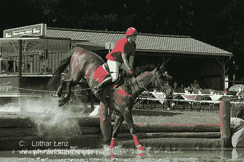

(a) 原始图像

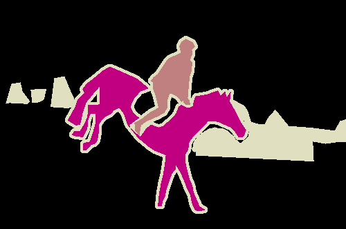

(b) 语义分割的实际结果

图 1：PASCAL VOC 训练图像

语义分割在各种应用中扮演着重要角色，例如：

+   •

    医学图像诊断 [4], [5]。

+   •

    自动驾驶 [6], [7]。

+   •

    卫星图像处理 [8]。

+   •

    环境分析 [9]。

+   •

    农业发展 [10]。

+   •

    图像搜索引擎 [11]。

本文提供了有关语义分割领域最新发展的全面总结，重点关注实时系统。根据作者的知识，关于语义分割的高效技术，特别是在内存需求和推理时间方面的考虑，之前并未得到充分总结，并且这些技术对于语义分割在各个领域的日益普及起到了重要作用。

本文的组织结构如下：第二部分总结了传统图像分割方法的发展，然后在第三部分中，对深度学习方法进行了全面总结。第四部分总结了实时系统中最具开创性的工作，同时分析了在计算成本和内存负载方面最有效的技术。接下来的节列举了用于基准测试不同架构的不同数据集，接着是关于评估中使用的指标的部分。文章最后总结了不同实时架构的性能。

## 2 语义分割的历史

早期的语义分割方法之一是阈值分割[12], [13]。它试图将图像分成两个区域：目标区域和背景区域。在可以通过单一阈值直接分类的灰度图像中，这种方法效果相当好。这项技术已经通过采用局部和全局阈值的方式演变，以更好地捕捉图像特征。

第二种技术涉及对具有相似特征的像素或区域进行聚类，其中图像被分成$K$个组或簇。所有像素根据相似性度量被分配到一个簇中，这些度量可以涉及像素特征（如颜色、梯度）以及相对距离[14]。许多流行的分割技术已成功应用，如 K 均值[15], GMMs[16], 均值漂移[17]和模糊 K 均值[18]。

边缘检测方法[19]利用了边缘通常表示可以帮助分割图像的边界这一事实。使用了不同类型的边缘（例如，阶跃边缘、坡度边缘、线边缘和屋顶边缘）。最流行的线边缘检测方法包括 Roberts 边缘检测[20]，Sobel 边缘检测[21]和 Prewitt 边缘检测[22]，这些方法利用不同的二维掩模，与图像卷积时可以突出边缘。

第四种方法将图像视为图形，其中每个像素都是一个顶点，与所有其他像素连接，每条边的权重测量像素之间的相似性。相似性度量可以使用距离、强度、颜色和纹理等特征来计算边权重。图像分割被视为图分割问题，图的分段基于组的相似性[23] – [25]。计算亲和矩阵，图割问题的解由矩阵的广义特征值给出。

条件随机场（CRF），一种可以用于标记和分割数据的概率框架，已广泛应用于图像分割。在这个框架中，每个像素（可能属于任何目标类别）被分配一个单一代价，即将像素分配给某个类别的代价。此外，还增加了一个对偶代价，可以建模像素之间的交互。例如，当两个相邻像素属于同一类别时，可以分配零代价，而当像素属于不同类别时则分配非零代价。单一代价捕捉了忽略类别注释的代价，而后者则惩罚不光滑的区域。CRF 的目标是找到一个总体代价最小化的配置。对 CRF 的优秀解释见[26]，而在语义分割中的应用可以参考[27], [28]。

## 3 深度学习方法在语义图像分割中的应用

### 3.1 全卷积网络

卷积网络最初用于分类任务（AlexNet [1]，VGG [29]，GoogLeNet [30]）。这些网络首先通过几个卷积层处理输入图像，滤波器数量逐渐增加，分辨率逐渐降低，最后一个卷积层被向量化。向量化特征后接完全连接层，这些层通过 softmax 输出层学习类别的概率分布。在 FCN [31] 中，完全连接层导致空间信息的丧失，从流行架构（[1]，[29]，[30]）中移除，并用一个允许按像素分类图像的层替代（见图 2）。用卷积层替代完全连接层有两个明显的优点：（a）允许将相同的网络架构应用于任何分辨率的图像，（b）卷积层具有更少的参数，允许更快的训练和推理。这种新颖的方法在几个图像分割里程碑中取得了最先进的结果，被认为是该领域最有影响力的方法之一。

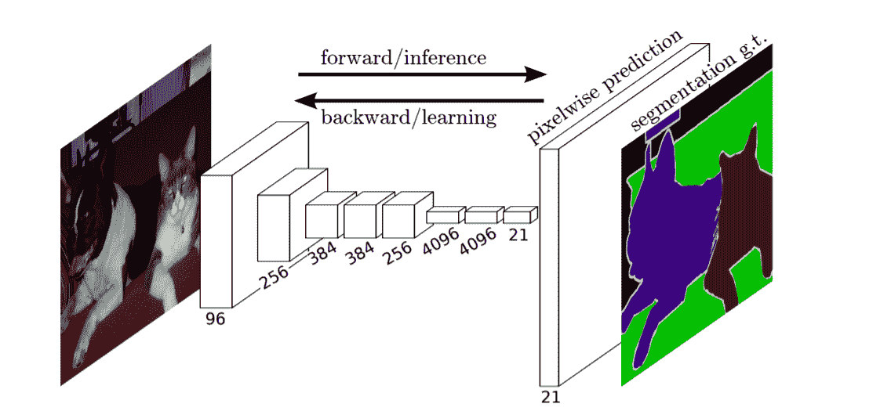

图 2：全卷积网络架构（来自 [31]）。

### 3.2 编码器-解码器架构

在 DeconvNet [32] 中，作者指出[31]的方法由于缺乏实际的反卷积和特征图的尺寸较小，导致信息的丢失。然后他们提出了图 3 中的架构，其中学习了一个多层反卷积网络。训练后的网络应用于单个对象提议，使用完全连接的 CRF 来获得实例级分割，最终合并得到最终的语义分割。编码器架构基于 [29]。

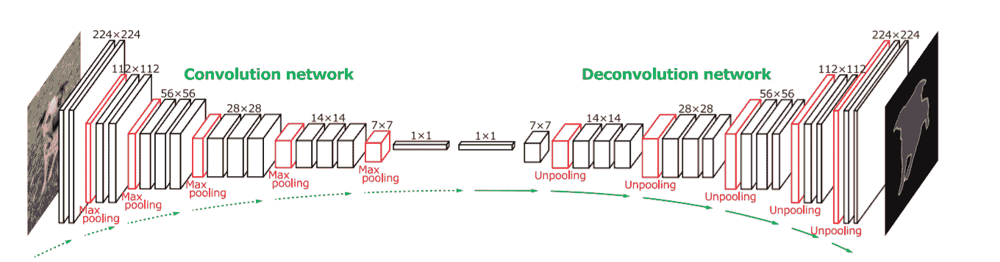

图 3：DeconvNet 架构（来自 [32]）。

与[32]类似，解码器/编码器架构也被用于医疗应用[33]。作者提出了一种在训练数据稀少（30 张图像）的情况下表现良好的架构，通过适当的数据增强可以实现最先进的性能。在图 4 中，左侧的解码器部分（根据作者的说法是收缩路径）在增加特征数量的同时下采样图像。在上采样路径中，采取相反的过程（即增加图像分辨率同时减少特征数量），并连接相应的编码器层。他们还提出了在不同区域应用加权损失，以实现更准确的类别分离。

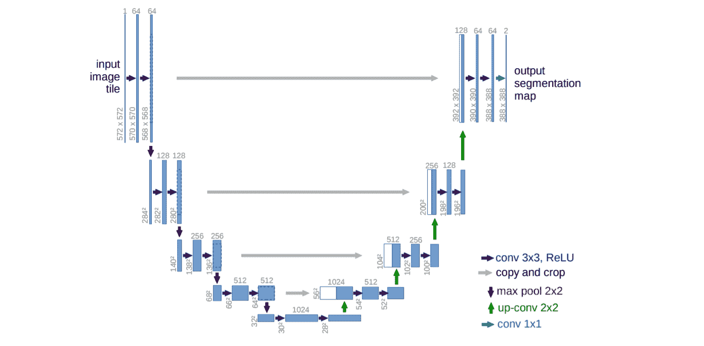

图 4：UNet 架构（来源于[33]）。

与[33]类似的架构在 SegNet [34]中被提出，其中作者使用 VGG [29]作为主干编码器，去除了全连接层，并添加了对称解码器结构。主要区别在于，每个解码器层使用来自相应编码器层的最大池化索引，而不是将其连接起来。在解码过程中重用最大池化索引具有几个实际优点：(i) 提高边界划分，(ii) 减少参数数量，实现端到端训练，以及 (iii) 这种上采样方式可以被纳入任何编码器-解码器架构。虽然最初在 2015 年发表，但直到 2017 年才开始受到关注，并且现在已成为语义分割领域最受引用的工作之一。

### 3.3 条件随机场与神经网络

条件随机场（CRFs）曾是深度学习出现前语义分割领域最受欢迎的方法之一。然而，由于其训练和推理速度慢，以及内部参数难以学习，CRFs 的吸引力有所下降。另一方面，CNNs 本身并不擅长处理边界区域，即两个或更多类别交汇的地方，或可能在多个处理阶段丢失高级信息。

[35]的作者将两种方法结合起来，通过在最终神经网络层与完全连接的条件随机场之间组合响应。这样，通过结合邻近像素和边缘之间的局部交互，模型的细节捕捉能力得到了增强。这项工作演变成了 DeepLab [36]，其中增加了若干改进（例如，空洞空间金字塔池化），并提出了几个变体。基本思路可以通过图 5 最好地解释：使用全卷积网络获取不同类别的粗略得分图。然后将图像上采样到其完整分辨率，并部署 CRF 以更好地捕捉对象边界。DeepLab 在多个分割数据集上达到了最先进的性能，推断时间为 125 毫秒或每秒 8 帧（FPS）。

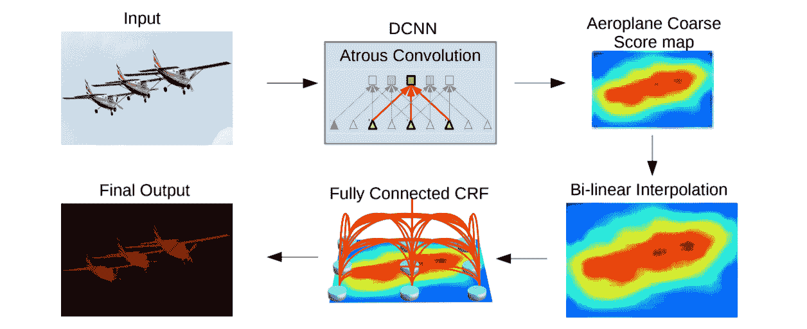

图 5：DeepLab 架构（来自[36]）。

在之前的工作中，CRF 没有与全卷积网络联合训练。这可能导致亚优的端到端性能。在[37]中，作者提出将 CRF 形式化为 RNN，以获得具有 CNN 和 CRF 两者理想特性的深度网络。这两个网络随后被完全整合并联合训练，以在 PASCAL VOC 2012 分割基准[3]上取得最佳结果。

### 3.4 特征融合

语义分割涉及到在像素级别对图像进行分类的任务。该领域的许多技术都集中在正确获取图像细节上，而不同阶段的上下文信息则可能丢失。[38]的作者建议通过添加全局上下文来提升全卷积网络的性能，以帮助澄清局部混淆。特别地，他们提议使用每一层的平均特征来增强每个位置的特征，从而使用组合特征图进行分割。全局上下文的效果可能是显著的；使用传统全卷积网络时，许多被错误分类的像素在全局上下文澄清局部混淆后可以被恢复，因此，产生更平滑的分割结果。

在[39]中，作者提出了增强型语义分割网络（ESSN），该网络上采样并连接来自每个卷积层的残差特征图，以保持网络所有阶段的特征（如图 6 所示）。在[40]中，有一个下采样阶段提取特征信息，接着是一个上采样部分恢复空间分辨率。对应的池化和反池化层的特征被上采样并连接，然后是生成分割输出的最终预测阶段。这种多级特征图融合在三个主要的语义分割数据集上进行了评估，并取得了令人鼓舞的结果。

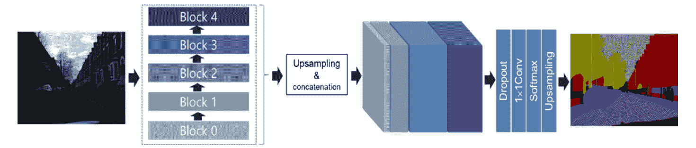

图 6：增强型语义分割网络架构（来源于[39]）。

### 3.5 生成对抗网络

生成对抗网络（GANs）最初在[41]中作为一种无监督学习的生成模型被提出，该模型学习生成与训练集具有相同统计特征的新数据。它的第一次展示是在图像上，其中人工生成的图像与训练集中的图像非常相似。从那时起，GANs 在天文图像[42]、3D 物体重建[43]和图像超分辨率[44]等不同领域产生了相当大的影响。

将 GANs 应用于语义分割的想法最早在[45]中提出，作者使用了两种不同的网络。首先，是一个分割网络，该网络将图像作为输入，并生成每个像素的预测，类似于本文之前描述的传统 CNN 方法；其次，是一个对抗网络，该网络区分来自真实标签还是分割网络的分割图。对抗网络将图像、分割真实标签和分割网络输出作为输入，并输出一个类别标签（1 表示真实标签，0 表示合成标签）。对抗项被添加到交叉熵损失函数中。对抗项鼓励分割模型生成无法与真实标签区分的标签图，从而提高了斯坦福背景和 PASCAL VOC 2012 数据集上的标注准确性。

在 [46] 中，作者提出了一个基于生成对抗网络（GANs）的半监督框架，该框架由一个生成器网络组成，用于为多类分类器提供额外的训练样本，分类器作为 GAN 框架中的判别器，给每个样本分配一个 K 个可能类别中的标签，或者标记为假样本（额外类别），如图 7 所示。基本思想是，添加大量的虚假视觉数据迫使真实样本在特征空间中接近，从而提高多类像素分类的效果。

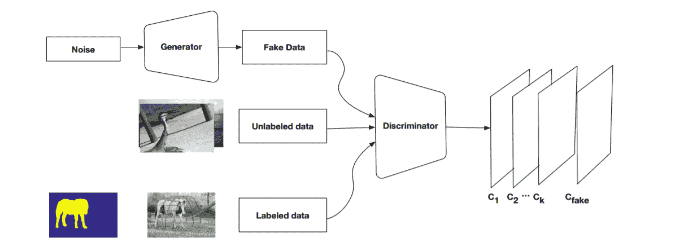

图 7：半监督卷积 GAN 架构（来自 [46]）。

[47] 的作者在医学图像中应用了基于 GAN 的语义分割。类似于 [45]，对抗网络以原始图像、分割网络输出和真实值作为输入，优化一个多尺度损失函数，该函数以最小-最大方式使用平均绝对误差距离。分割网络由四层卷积阶段组成，如 [33] 所示，特别针对有限的训练数据集进行调整，网络在性能上显著优于 [33]。

### 3.6 循环神经网络 (RNNs)

RNNs [48] 已被广泛用于序列任务。在 [49] 中，作者提出了 ReSeg，该方法基于最近引入的 ReNet 图像分类模型 [50]。后者通过转变每个 ReNet 层以适应语义分割任务。在具体实现上，每个 ReNet 层由四个 RNN（GRUs，见 [48]）组成，这些 RNN 在图像的水平和垂直方向上进行扫描，编码图像块或激活，并提供相关的全局信息。此外，ReNet 层叠加在预训练的卷积层之上，利用通用的局部特征。上采样层紧跟在 ReNet 层之后，以恢复最终预测的原始图像分辨率。通过查看图 8 ‣ 3 深度学习方法用于语义图像分割 ‣ 实时语义图像分割的深度学习方法综述") 可以更好地理解网络架构。前两个 RNN（蓝色和绿色）应用于图像的小块，其特征图被连接并作为输入提供给接下来的两个 RNN（红色和黄色），这些 RNN 产生第一个 ReNet 层的输出。两个类似的 ReNet 层被堆叠，然后是一个上采样层和一个 softmax 非线性激活。

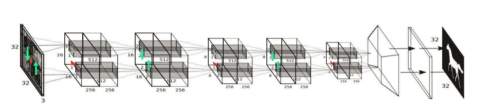

图 8：ReSeg 网络架构（来自 [49]）。

另一个有趣的图像分割应用出现在 [51] 中。在那里，作者研究了视频分割的问题，即对连续的视频帧进行分割。一个方法是独立分割每一帧，但由于视频帧高度相关，这种方法显得不够高效。作者建议通过在网络的不同阶段加入 LSTM [48]（一种可以有效处理长期依赖关系的 RNN），以融合时间信息，并报告了相对于其 CNN 对应模型显著的性能提升。

### 3.7 全景分割

全景分割 [59]，旨在结合语义分割和实例分割，使所有像素都被分配一个类别标签，并且所有对象实例都被唯一分割，已显示出非常有前景的结果 [60], [61]。提供一个既包括语义分割又包括实例分割的连贯场景分割任务似乎在多个基准数据集上取得了最先进的结果，正如本报告后续部分将展示的那样。

### 3.8 基于注意力的模型

注意力机制在深度学习中首次引入是用于机器翻译 [52]。注意力机制通过允许模型自动搜索与预测目标词相关的源句子部分，以有效捕捉长距离依赖关系。

一个有趣的注意力引入方式是在语义分割中结合多尺度特征于全卷积网络中。与传统的将多个尺寸调整后的图像输入共享深度网络的方法不同，[53] 的作者提出了一种注意力机制，该机制学习在每个像素位置上软性加权多尺度特征。如图 9 所示，卷积神经网络与注意力模型共同训练。因此，模型学会了以适当的方式缩放不同尺寸的图像，从而实现更准确的分割。

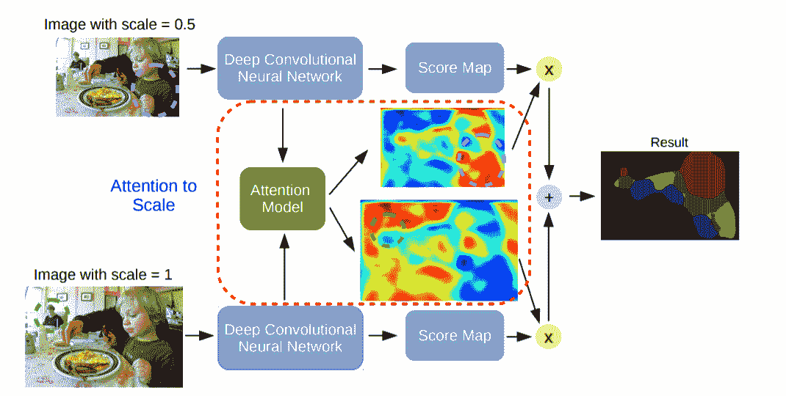

图 9：尺度感知语义图像分割架构（来自 [53]）。

类似地，[54] 通过引入特征金字塔注意力模块来解决全卷积网络的空间分辨率丧失问题。后者结合了来自不同尺度的上下文特征，以提高对小物体的分类性能。基于注意力的语义分割网络已广泛应用于各种场景 [55]–[58]。

## 4 实时深度学习架构用于语义图像分割

基于深度学习的语义分割准确性从早期方法中显著提高。例如，[31] 在 Cityscapes 数据集 [62] 中达到了 65% 的平均交集比（mIoU），在 PASCAL VOC 2012 数据集 [63] 中达到了 67% 的 mIoU。更近期的架构在这些初步结果上取得了显著超越。HRNet [64] 的作者构建了一个分层方案，使用不同尺度的图像以及适当的注意机制，就像我们在上一节末尾看到的那样。该方法在 Cityscapes 数据集中的 mIoU 超过了 85%。另一方面，[65] 中的作者结合了数据增强和自我训练 [66] —— 使用从在更小标记数据集上训练的模型生成的噪声标签 —— 在 PASCAL VOC 2012 数据集中获得了超过 90% 的 mIoU。

然而，在一些领域，如自动驾驶汽车和移动设备上的分割，计算效率也是至关重要的，因为推理需求非常有限。在设计实时系统时，必须考虑计算/内存成本和推理时间。在本节中，我们将详细介绍构建此类系统的技术清单，并解释这些改进在文献中是如何实现的。

### 4.1 快速傅里叶变换（FFT）

著名的卷积定理 [67] 说明在适当条件下，两个信号卷积的傅里叶变换是它们傅里叶变换的逐点乘积。[68] 中的作者利用这一事实来改进卷积网络的训练和推理时间。对大小为 $n\times n$ 的图像与大小为 $k\times k$ 的内核进行卷积，将使用直接卷积花费 $\mathcal{O}(n^{2}*k^{2})$ 操作，但使用基于 FFT 的方法可以将复杂度降低到 $\mathcal{O}(n^{2}\log n)$。需要额外的内存来存储傅里叶域中的特征图，与深度神经网络的总体内存需求相比，这些额外内存是微不足道的。

在[69]中，基于 FFT 开发了训练和推理算法，实现了计算和存储的渐近复杂度减少。作者声称所需的 ASIC 核心数量减少了 1000 倍，以及推理速度提高了 10 倍，准确度略有降低。

### 4.2 修剪

通过修剪冗余权重，神经网络的存储和内存需求也可以减少。在[70]中，提出了一种三步法：首先训练网络以了解哪些连接是重要的，然后修剪不重要的连接，最后重新训练网络以微调剩余连接的权重。因此，连接的数量减少了 9 倍到 13 倍，性能损失很小。

[71]中的工作集中于语义分割网络的通道剪枝。他们通过以下策略将操作数量减少了 50%，而在 mIoU 上仅损失 1%：基于分类和分割任务剪枝卷积滤波器。这在网络骨干从最初为分类任务构建的架构转移过来时特别有用，如我们在本报告中早先所见。每个卷积滤波器的缩放因子是基于两个任务计算的，并且剪枝后的网络用于推理。

网络剪枝是提高卷积神经网络和语义分割性能的一个非常活跃的领域，参见[72]和[73]，其中通道剪枝方法可以显著压缩和加速各种架构，这些架构可以用于多个任务（分类、检测和分割），通过减少每一层的通道数来解决 LASSO 回归优化问题，或在将骨干网络转移到分割网络之前对其进行剪枝。

### 4.3 量化

另一种提高网络效率的方法是减少表示每个权重所需的比特数。通常，权重的表示保留 32 位。32 位操作较慢且需要较大的内存。在[74]中，作者建议将权重表示减少到 5 位，同时通过让多个连接共享相同的权重来限制有效权重的数量，然后对这些共享权重进行微调，从而减少存储需求。

在 Bi-Real Net [75]中，作者研究了 1 位卷积神经网络的增强，其中权重和激活都是二进制的。通过在二进制激活之前获取批量归一化层的实值输出，并将其连接到下一块的实值激活，从而改进这些 1 位 CNN 的性能。因此，提出的模型的表示能力远高于原始 1 位 CNN，且计算成本仅为微不足道。

### 4.4 深度可分卷积

前两种方法旨在通过修剪不必要的组件或压缩权重信息来减少网络规模。Sifre 在他的博士论文[76]中介绍了一种使二维卷积更具计算效率的新方法，称为深度可分离卷积。这个想法被 Xception [77] 和 MobileNets [78] 采纳，他们使用稍微修改过的原始想法大大提高了其相对架构的效率。在常规卷积层中，计算复杂度取决于 (a) 输入/输出特征图的大小 $D\times D$（为简化假设为方形特征图），(b) 输入通道数量 $M$，(c) 输出通道数量 $N$，以及 (d) 核的空间维度 $K$。总体计算需要 $D^{2}\times K^{2}\times M\times N$ 次乘法。

在深度可分离卷积中，大小为 $K\times K\times M\times N$ 的卷积被分解为两部分。首先，进行每个通道一个滤波器的深度卷积，即对所有 $M$ 个输入通道的大小为 $K\times K$ 的卷积；其次，进行点卷积，使用 $1\times 1$ 卷积滤波器来生成适当的输出通道维度。第一次操作需要 $D^{2}\times K^{2}\times M$，而第二次需要 $D^{2}\times M\times N$。计算改进的顺序为 $\max{\big{(}\mathcal{O}(N),\mathcal{O}(D^{2})\big{)}}$，尤其是在滤波器大小或深度增加时，这种改进可能非常显著。

### 4.5 膨胀卷积

在他们的开创性工作[79]中，作者引入了扩张卷积，通过在卷积核的每个像素之间插入零来扩展卷积核的有效感受野。如图 10 左侧所示，一个 $3\times 3$ 的卷积核会覆盖九个像素。然而，如果引入扩张率为 $2$，则八个外部像素会扩展到覆盖二十五个像素，通过跳过一个像素（见图 10 中间）。如果扩张率进一步加倍，则覆盖范围将达到八十一像素，如图 10 右侧所示。总之，扩张率为 $N$ 的 $K\times K$ 大小的卷积核将覆盖 $(N-1)*K\times(N-1)*K$ 像素，扩展为 $(N-1)\times(N-1)$。在语义分割任务中，背景信息对网络准确性至关重要，扩张卷积可以在不增加计算成本的情况下指数级扩展感受野。通过堆叠具有不同扩张率的多个卷积层，[79]成功捕捉了具有增大感受野的图像背景，并显著提高了以前最先进工作的分割性能。

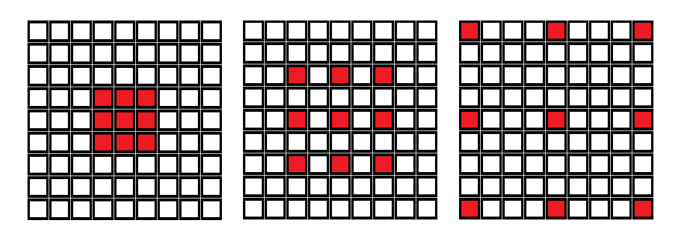

图 10: $3\times 3$ 扩张卷积核的示意图。左：扩张率 = 1，中：扩张率 = 2，右：扩张率 = 4。

在[80]中，引入了一种新的卷积模块——高效空间金字塔（ESP）。ESPNet 将扩张卷积与上一小节中的深度可分卷积结合起来。换句话说，作者形成了一组分解标准卷积的卷积操作，将其分解为点卷积和扩张卷积的空间金字塔。ESPNet 在类似工作中拥有最少的参数数量，同时保持了最大的有效感受野。这项工作尤其有趣，因为它引入了几个新的系统级指标，有助于分析 CNN 的性能。

### 4.6 宽度和分辨率倍增器

在[78]中，作者探索了几种进一步减少网络复杂性的方式。他们引入了两个超参数：（a）宽度乘数，用于生成更薄的模型；（b）分辨率乘数，用于减少输入分辨率。在前一种情况下，作者通过将输入和输出通道的数量按因子$\alpha$进行缩放，均匀地缩小了每一层的计算需求。从深度可分离卷积的分析中可以看出，原始的计算复杂度$D^{2}\times K^{2}\times M+D^{2}\times M\times N$变为$D^{2}\times K^{2}\times M\times\alpha+D^{2}\times M\times N\times\alpha^{2}$，总的缩减范围在$\alpha$和$\alpha^{2}$之间。基本思想是找到一个适当的缩放因子，以定义一个新的更小模型，并在准确性、延迟和大小之间取得合理的平衡。

另一方面，分辨率乘数$\rho$可以将输入图像的尺寸按$\rho^{2}$的因子进行缩放，从而导致总体计算成本为$D^{2}\times K^{2}\times M\times\rho^{2}+D^{2}\times M\times N\times\rho^{2}$。这个缩减过程仍然需要在准确性、延迟和大小之间进行优化。两种方法可以结合使用以获得进一步的改进。

### 4.7 早期下采样

类似的观点在[81]中提出，其中讨论了基于作者的实验结果和直觉的一些设计选择。特别地，非常大的输入帧在计算上非常昂贵，因此在网络的早期阶段对这些帧进行下采样是个好主意，同时保持特征数量相对较低。这种下采样对整体性能影响不大，因为视觉信息通常具有高度冗余，可以压缩成更高效的表示。此外，值得注意的是，前几层实际上并不对分类任务做出贡献，而是为后续层提供有用的表示。另一方面，操作在下采样图像上的滤波器具有更大的感受野，并能为分割任务提供更多上下文信息。

由于下采样可能导致空间信息丢失，如精确的边缘形状，ENet 遵循 SegNet[34]中设定的范式，其中在最大池化层中选择的元素的索引被存储并用于在解码器中生成稀疏的上采样图，因此部分恢复空间信息，同时占用较小的内存。

### 4.8 较小的解码器尺寸

在[81]中讨论的另一个设计选择是，在典型的编码器/解码器结构的语义分割网络中，两个子组件不必对称。编码器需要足够深以便捕捉特征，类似于分类网络中的编码器。解码器则有一个主要任务：对压缩的特征空间进行上采样，以提供像素级分类。后者可以通过一个更浅的架构实现，从而显著节省计算资源。

### 4.9 高效的网格尺寸减少

[82]的作者注意到，由于池化操作可能导致表示瓶颈，通常会通过在池化操作之前增加使用的通道数来弥补这一点。不幸的是，这意味着滤波器的倍增实际上主导了计算成本。反转卷积/池化操作的顺序肯定会提高计算速度，但不会解决表示瓶颈。作者建议将池化操作与步幅为 2 的卷积并行进行，并将结果滤波器组进行连接。这一技术使得[81]的作者将初始块的推理时间提高了 10 倍。

### 4.10 去除偏置项

偏置项对语义分割网络的整体性能没有显著影响，因此通常会被省略。

### 4.11 使用小卷积核堆叠多个层

总体计算成本随着卷积核大小的平方增加。在[29]中，认为使用多个小卷积核的卷积层优于使用一个大卷积核的单层，原因有两个：（a）通过堆叠三个$3\times 3$卷积层，可以实现与一个$7\times 7$层相同的有效感受野，同时将参数数量减少近一半；（b）通过引入三个非线性激活层而不是一个，决策函数变得更具判别性。

### 4.12 通道洗牌操作

分组卷积首次在[1]中被引入，用于将模型分布到多个 GPU 上。它在并行中使用多个卷积，以便每层生成多个通道输出。[83]显示，使用分组卷积可以提高分类任务的准确性。然而，当应用于较小的网络时，这种架构变得效率较低，性能瓶颈在于大量的密集$1\times 1$卷积。[84]的作者提出了一种新颖的通道洗牌操作来克服这一困难。特别是，在图 11 的左侧可以看到一个典型的分组卷积，它有两层叠加的卷积和相等数量的组。如果允许分组卷积从不同的组中获取数据，那么输入和输出通道是完全相关的（见图 11 的中间部分）。然而，上述操作可以通过遵循图 11 右侧的过程高效地实现。通过添加通道洗牌操作，输出通道维度被重塑、转置并展平，然后再输入到后续层。通道洗牌通过一个因子$g$（即组的数量）减少操作次数。

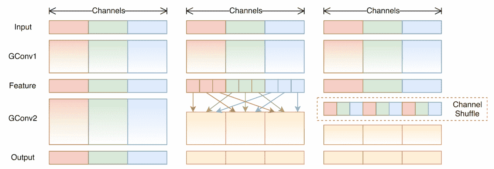

图 11：通道洗牌架构（来自[84]）。

### 4.13 两分支网络

对原始图像进行下采样可以显著提高语义分割架构的推理速度，但也可能导致空间细节的显著丧失。两个分支网络试图通过引入两个独立的分支来调和这一点：（a）一个相对浅的分支，使用捕获空间细节的全分辨率图像，以及（b）一个具有下采样图像的更深分支，能够有效地学习特征以实现有效的分类结果。这两个分支可以共享层以进一步改善计算复杂性（见[85]），也可以在汇总之前拥有不同的主干架构[86]。后者的工作由一个使用宽通道和浅层的细节分支组成，用于捕获低级细节，一个具有窄通道和深层的语义分支，用于保持高级上下文，以及一个聚合层，用于融合这两种特征。因此，BiSeNet-V2 可以说在语义分割任务中实现了最高的推理速度（每秒 156 帧），同时保持了最佳的 mIoU 性能之一。

### 4.14 其他设计选择

除了本节迄今介绍的计算高效方法外，还有一些其他良好的设计选择可以帮助在使用轻量级架构的情况下保持良好的性能。例如，许多论文中的一个共同主题是批量归一化[87]，这可以加快和提高训练过程的准确性。此外，激活函数的选择也可能很重要。ReLU 是大多数工作中使用的非线性函数，但一些研究人员报告称，参数化 ReLU（PReLU）能获得更好的结果。最后，正则化[88]可以帮助避免过拟合，因为在许多应用中，输入图像的维度相对于分割深度神经网络中的参数数量较小。

## 5 语义分割数据集

为了促进语义分割关键领域的快速发展并建立性能基准，已生成了多个数据集。表 1 总结了几个在像素级别上注释的图像集。它包含了最初为分类任务开发的多样化数据集，以及适用于特定应用（例如自动驾驶和基于运动的分割）的更专业的图像集，涵盖了各种场景和对象类别，并具有像素级的注释。本节的其余部分将提供每个数据集的附加信息。

| 数据集 | 图像 | 类别 | 年份 |
| --- | --- | --- | --- |
| COCO | 164K | 172 | 2017 |
| ADE20K | 25.2K | 2693 | 2017 |
| Cityscapes | 25K | 30 | 2016 |
| SYNTHIA | 13K | 13 | 2016 |
| PASCAL Context | 10.1K | 540 | 2014 |
| SIFT Flow | 2.7K | 33 | 2009 |
| CamVid | 701 | 32 | 2008 |
| KITTI | 203 | 13 | 2012 |

表 1: 语义分割数据集总结

### 5.1 Common Objects in Context (COCO)

Common Objects in Context (COCO) [89] 是一个大规模的物体检测、分割和描述数据集。它是可用的最广泛的数据集之一，共有 330K 张图像，其中一半已标注。语义类别可以是事物（形状明确的物体，例如汽车、人物）或背景物（无定形的背景区域，例如草地、天空）。共有 80 个物体类别、91 个背景类别、150 万个物体实例，因其数据集的规模，它被认为是图像分割任务中最具挑战性的之一。因此，COCO 的语义分割排行榜 [90] 仅包含五个条目，其中一些最具开创性的工作占据了前几名。

COCO-Stuff [91] 对 COCO 2017 数据集中的所有图像进行了像素级标注，涵盖了 91 个物品类别。原始的 COCO 数据集已经提供了 80 个事物类别的轮廓级标注，但 COCO-stuff 完成了更复杂任务如语义分割的标注。

### 5.2 PASCAL Visual Object Classes (VOC)

最受欢迎的图像数据集之一是 PASCAL Visual Object Classes (VOC) [3]，它可以用于分类、检测、分割、动作分类和人员布局。这些数据可以在 [63] 中找到，已经被标注，并且定期更新。对于图像分割挑战，这些数据包括 $20$ 个类别，涵盖日常物品（飞机、自行车、鸟、船等）。训练集包含 1464 张图像，验证集包含 1449 张图像。测试集保留用于 PASCAL VOC Challenge 的评估，这是一项始于 2005 年的竞赛，其最新的数据集在 2012 年发布。这是一个通用数据集，涵盖了各种场景/对象，因此，常用于评估新颖的图像分割方法。图像及其语义分割的示例可以在图 1(a) 和图 1(b) 中看到。

对前述图像数据集做出了几项扩展，最著名的有 PASCAL Context [92] 和 PASCAL Part [93]。前者在相同的图像上标注了超过 500 个类别，而后者将原始对象分解为多个部分并对其进行标注。另有两个 PASCAL 扩展： (a) 语义边界数据集 (SBD) [94]，和 (b) PASCAL 语义部件 (PASParts) [95]。

### 5.3 ADE20K

ADE20K [96] 是由麻省理工学院计算机视觉实验室开发的。作者发现当时可用的数据集在对象数量和类型以及场景种类上都非常有限。因此，他们收集了一个包含 25K 张图像的数据集，这些图像具有密集注释（每个像素都有语义标签），并且拥有一个几乎 2700 类的大型开放词汇。该数据集中的图像经过人工详细分割，覆盖了各种场景、对象及对象部分类别。由单个专家标注员提供了极其详细和全面的图像注释，避免了使用多个标注员时常见的注释不一致问题。注释的详细程度可见于图 12(a)和 12(b)。平均每张图像包含 19.5 个实例和 10.5 个对象类别。

(a) ADE20K 的原始图像[97]

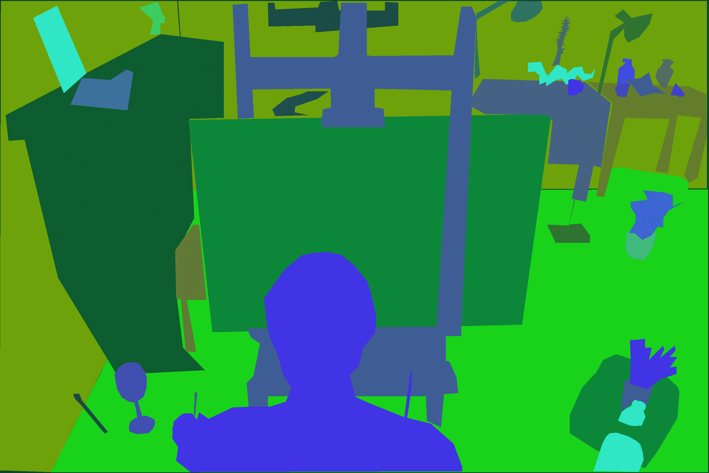

(b) ADE20K 的注释图像[97]

图 12：ADE20K 训练图像

在他们的场景解析基准测试[97]中，他们选择了按总像素比排名前 150 的类别，并使用了以下指标：（a）像素准确率，（b）均值准确率，（c）均值 IoU，以及（d）加权 IoU。用于训练集的图像略多于 20K 张，2K 张用于验证，其余用于测试。记录了 50 个不同城市的街道立体视频序列，注释涉及 30 个不同类别。

### 5.4 Cityscapes

Cityscapes 数据集[98] 专注于复杂城市街景的视觉理解。该数据集包含 25K 张图像，其中 5K 张具有高质量的像素级注释，而另外 20K 张图像具有粗略注释（即弱标记数据），如图 13(a)和 13(b)所示。

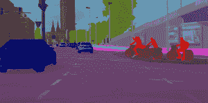

(a) Cityscapes 的精细注释示例[99]

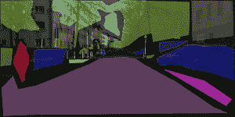

(b) Cityscapes 的粗略注释示例[99]

图 13：Cityscapes 训练图像

他们的基准套件（见 [99]）涉及，包括其他任务，在内的像素级语义标注任务有超过 200 项。它被认为是最具多样性和挑战性的城市场景数据集，因此，它是非常流行的性能评估工具。

### 5.5 SYNTHIA

SYNTHIA 数据集 [100] 是另一个专注于自动驾驶应用的城市场景图像集合。作者生成了带有像素级注释的逼真合成图像，并尝试解决这样的数据对于语义分割任务的有效性。创建了 13K 张城市图像，包含来自 13 个类别（如天空、建筑、道路）的自动生成的像素级注释。研究得出结论，当 SYNTHIA 与公开可用的真实城市图像一起用于训练阶段时，语义分割任务的性能显著提升。合成图像的示例可以在图 14 中看到，以及用于图像生成的城市总体视图。

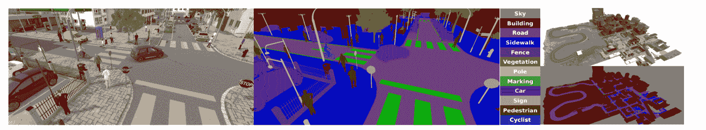

图 14：来自 SYNTHIA 的合成图像样本及其语义标签以及城市的总体视图（来自 [100]）。

### 5.6 SIFT Flow

SIFT Flow [102] 是一个处理了 LabelMe 图像 [103] 子集的数据集，提供了 2688 帧的准确像素级注释。选择了前 33 个对象类别（标注像素最多的），主要来自户外场景。图像的大小相对较小（$256\times 256$ 像素），生成这些图像的目的是评估作者的场景解析算法。

### 5.7 CamVid

CamVid [104] 是另一个城市场景数据集，包括四个高定义视频序列，每秒 30 帧，分辨率为 $960\times 720$ 像素。视频的总时长略超过 22 分钟，大约 40K 帧。其中，701 帧被手动标注，分为 32 个对象类别。有趣的是，注释工作花费了大约 230 人小时，平均注释时间刚不到 20 分钟。每张注释图像都由第二人检查以确认准确性。

### 5.8 KITTI

我们将要查看的最后一个数据集是 KITTI [105]，它在自动驾驶研究中相当受欢迎，因为它不仅包含相机图像，还有激光扫描、高精度 GPS 测量和来自 GPS/IMU 系统的 IMU 加速度，这些传感器数据是大多数自动驾驶车辆研究通常收集的。数据是在德国卡尔斯鲁厄及其周边地区驾驶时收集的，包含了来自 13 个不同类别的 200 多张完全标注的图像 [106]。它们的语义分割基准包含 14 个条目，其中性能指标包括运行时间和环境信息，适用于时间敏感的目标应用。

## 6 指标

本节我们将总结用于评估不同语义分割方法的基本指标。它们要么关注分割输出的准确性（即，它与真实值的接近程度），要么关注方法的效率（即，推断时间和内存使用）。

### 6.1 混淆矩阵

在一个分割任务中，如果总共有 $C$ 个类别，那么混淆矩阵是一个 $C\times C$ 的表格，其中位置 $(i,j)$ 处的元素表示应属于类别 $i$ 的像素数，但被分类为类别 $j$。一个好的模型会产生一个对角线元素（即正确分类的像素）的计数较高的混淆矩阵。

### 6.2 归一化混淆矩阵

它源自混淆矩阵，但每个条目都通过除以预测类别 $j$ 的总数来进行归一化。这样所有条目都在 $[0,1]$ 范围内。

### 6.3 准确率

准确率，或称为全局准确率，是正确分类的像素与总像素的比率。可以通过将对角线元素的总和除以图像中的总像素数来从混淆矩阵中得出。准确率可能会误导，特别是当考虑的类别不平衡时。例如，如果 $95\%$ 的像素属于一个类别（通常是背景），一个总是预测该类别的简单模型将导致 $95\%$ 的准确率，但这并不能准确捕捉分割任务的依赖关系。

### 6.4 平均准确率

它定义为每个类别中正确分类的像素与所有类别中的总像素的比率。

### 6.5 平均交并比

平均交并比（mIoU）是一种解决准确率指标类别不平衡弱点的指标。特别是，它比较模型的逐像素分类输出与真实值，并找到它们的交集和并集（即，所有类别 $i$ 的像素中有多少像素被正确分类为类别 $i$，以及有多少像素被分类或标注为类别 $i$）。交集与并集的比率（对所有类别求和）即为 mIoU 或 Jaccard 指数。它对类别不平衡具有鲁棒性，且在评估语义分割任务时可谓是最受欢迎的指标。

### 6.6 加权交并比

这是对先前指标的小幅调整，用于考虑每个类别的像素数量。它计算了每个类别的 IoU 的加权平均值，加权由类别中的像素数量决定。

### 6.7 精确度

类别 $i$ 的精确度定义为被分类为 $i$ 的像素中正确分类的比例。可以相应地为多个类别定义一个平均精确度指标。

### 6.8 召回率

类别 $i$ 的召回率定义为被正确分类的类别 $i$ 的实际像素的比例。类似地，可以为多个类别定义一个平均召回率指标。

### 6.9 F1-score

F1-score 是通过计算精确度/召回率指标的调和均值来汇总这两者的特征。它结合了这两者的特征，并提供了关于两种错误的信息。

### 6.10 每秒帧数

所有先前的指标都衡量模型输出的准确性，但未能捕捉方法的效率。一个重要的指标是网络的推理速度，即以每秒帧数（fps）为单位的执行时间。它是对在完全训练的网络上推理新图像所需时间的倒数。在大多数实时应用中，需要达到 30 帧或更多的 fps，通常以超越典型的视频帧率。

### 6.11 内存使用量

内存使用量是衡量网络规模的指标。它可以通过参数数量（对于深度神经网络方法）、表示网络的内存大小，或运行模型所需的浮点运算次数（FLOPs）来衡量。

## 7 性能总结

在本节中，我们将提供语义分割中表现最佳模型的总结表。大多数论文都在本报告早期提供的数据集的子集上进行评估，对于大多数工作，计算效率并不是设计的关键方面。因此，决定总结在 Cityscapes 数据集[98]上的表现最佳模型，该数据集在大多数实时架构中作为评估基准。表 2 总结了关于 mIoU 的前十名模型及其实现这些结果的方法的简要总结。匿名提交虽然占据了基准评估中的一些前列位置，但未包括在本节中。如表 2 所示，大多数条目是在过去几个月内发布的，这表明竞争激烈且进展显著迅速。

| 模型 | mIoU | 方法 | 年份 |
| --- | --- | --- | --- |
| 层次多尺度注意力用于语义分割 [64] | 85.4 | 层次注意力 | 2020 |
| Naive-Student（使用 Panoptic-DeepLab 的迭代半监督学习） [107] | 85.2 | 伪标签预测，数据增强 | 2020 |
| 语义分割的对象上下文表示 [108] | 84.5 | 粗略软分割，加权聚合 | 2020 |
| Panoptic-DeepLab [60] | 84.5 | 全景分割 | 2020 |
| EfficientPS: 高效全景分割 [61] | 84.2 | 全景分割 | 2020 |
| Axial-DeepLab [109] | 84.1 | 全景分割，自注意力 | 2020 |
| 通过解耦体部和边缘监督改进语义分割 [110] | 83.7 | 解耦多尺度特征训练 | 2020 |
| 通过视频传播和标签松弛改进语义分割 [111] | 83.5 | 联合未来帧/标签传播，数据增强 | 2019 |
| 深度特权语义分割的硬像素挖掘 [112] | 83.4 | 深度信息，深度感知损失 | 2019 |
| 在全卷积网络中先全局聚合再局部分布 [113] | 83.3 | 全局聚合，局部分布 | 2019 |

表格 2: Cityscapes 像素级语义标注任务的最佳表现模型

表格 3 排列了实时语义分割工作，其中性能指标是推理速度（即每秒帧数（FPS））。前十名中的三个位次由单篇论文 [85] 占据，这清楚地展示了性能/效率的权衡。然而，正如这张表所示，实时语义分割已经成为现实，多个架构达到了接近最先进的语义分割模型的准确性。

| 模型 | FPS | mIoU | 方法 | 年份 |
| --- | --- | --- | --- | --- |
| FastSCNN（四分之一分辨率） [85] | 485 | 51.9 | 双分支网络，深度可分离卷积 | 2019 |
| FastSCNN（半分辨率） [85] | 286 | 63.8 | 双分支网络，深度可分离卷积 | 2019 |
| FasterSeg [114] | 163 | 71.5 | 神经架构搜索 | 2020 |
| LiteSeg [115] | 161 | 67.8 | 深度可分离卷积，膨胀卷积 | 2019 |
| 部分顺序剪枝 [116] | 143 | 71.4 | 神经架构搜索，剪枝 | 2019 |
| RPNet [117] | 125 | 68.3 | 早期下采样，残差块 | 2019 |
| FastSCNN [85] | 123 | 68 | 双分支网络，深度可分离卷积 | 2019 |
| 快速场景理解的空间采样网络 [118] | 113 | 68.9 | 较小的解码器尺寸 | 2019 |
| ESPNet [80] | 112 | 60.3 | 膨胀卷积，深度可分离卷积 | 2018 |
| 高效的非对称卷积密集模块 [119] | 108 | 67.3 | 膨胀卷积、非对称卷积 | 2018 |

表 3: Cityscapes 像素级语义标注任务顶级实时模型

## 8 摘要

本文提供了关于语义图像分割的最新进展的广泛总结，重点关注实时应用。首先解释了分割任务及其与类似任务的区别，接着回顾了早期分割方法的历史，并详细描述了过去十年中不同的深度学习方法。随后提供了通过优化网络不同方面来提高深度学习网络效率的技术列表，并解释了这些设计选择中的权衡。接下来描述了最常用的基准数据集，随后列出了用于评估提出模型准确性和效率的指标。最后，提供了性能表格，以总结在语义分割领域的最先进方法，从准确性和效率两个方面进行总结。

深度学习方法的最新进展，加上图像捕捉能力的快速提高，使得图像分割成为从医学成像到诸如自动驾驶等时间敏感应用中至关重要的工具。此调查总结了变革图像分割领域的最新突破，并提供了对导致这些变革的设计选择的全面见解。

## 参考文献

+   [1] Krizhevsky, Alex, Sutskever, Ilya, Hinton, Geoffrey. (2012). "使用深度卷积神经网络进行 ImageNet 分类", 神经信息处理系统。

+   [2] Z. Zhao, P. Zheng, S. Xu, X. Wu, "深度学习的目标检测：综述," arXiv:1807.05511v2。

+   [3] M. Everingham, L. Van Gool, C. K. Williams, J. Winn, 和 A. Zisserman, “PASCAL 视觉目标类别（VOC）挑战赛,” *国际计算机视觉杂志*, 卷 88, 页 303–338, 2010。

+   [4] A. Novikov, D. Lenis, D. Major, J. Hladůvka, M. Wimmer, K. Bühler "用于胸部 X 光图像的多类分割的全卷积架构," *arXiv:1701.08816*。

+   [5] Wang G., Li W., Ourselin S., Vercauteren T. (2019) 使用卷积神经网络和测试时增强的自动脑肿瘤分割。见：Crimi A., Bakas S., Kuijf H., Keyvan F., Reyes M., van Walsum T. (eds) Brainles: 胶质瘤、多发性硬化症、中风和创伤性脑损伤。BrainLes 2018\. 计算机科学讲义，卷 11384\. Springer, Cham。

+   [6] V. Mukha, I. Sharony, "用于 ADAS 的视差图像分割," arXiv:1806.10350。

+   [7] A. Sagar, R. Soundrapandiyan, "用于自驾车的多尺度空间注意力语义分割," arXiv:2007.12685。

+   [8] Yoshihara, A., Hascoet, T., Takiguchi, T., Ariki, Y.，“使用全卷积网络的卫星图像语义分割”（2018）。

+   [9] A. King, S. M. Bhandarkar 和 B. M. Hopkinson，“深度学习方法在珊瑚礁调查图像语义分割中的比较”，2018 IEEE/CVF 计算机视觉与模式识别研讨会（CVPRW），盐湖城，UT，2018 年，第 1475-14758 页。

+   [10] Andres Milioto, Philipp Lottes, Cyrill Stachniss，“利用 CNN 中的背景知识进行精准农业机器人作物和杂草的实时语义分割”，arXiv:1709.06764。

+   [11] J. Martinsson 和 O. Mogren，“使用特征金字塔网络的时尚图像语义分割”，2019 IEEE/CVF 国际计算机视觉会议研讨会（ICCVW），首尔，韩国，2019 年，第 3133-3136 页。

+   [12] L. S. Davis, A. Rosenfeld 和 J. S. Weszka，“通过平均和阈值提取区域”，发表于《IEEE 系统、人工智能与控制论学报》，第 SMC-5 卷，第 3 期，第 383-388 页，1975 年 5 月，doi: 10.1109/TSMC.1975.5408419。

+   [13] Salem Saleh Al-amri, N.V. Kalyankar 和 Khamitkar S.D.，“使用阈值技术的图像分割”，arXiv:1005.4020。

+   [14] M. Özden 和 E. Polat，“使用颜色和纹理特征的图像分割”，2005 年第 13 届欧洲信号处理会议，安塔利亚，2005 年，第 1-4 页。

+   [15] H. P. Ng, S. H. Ong, K. W. C. Foong, P. S. Goh 和 W. L. Nowinski，“使用 K 均值聚类和改进的分水岭算法的医学图像分割”，2006 年 IEEE 西南图像分析与解释研讨会，丹佛，CO，2006 年，第 61-65 页。

+   [16] Z. Huang 和 D. Liu，“使用 HSV 颜色空间中的 EM 算法的彩色图像分割”，2007 年国际信息获取会议，西归浦市，2007 年，第 316-319 页。

+   [17] W. Tao, H. Jin 和 Y. Zhang，“基于均值漂移和归一化割的彩色图像分割”，发表于《IEEE 系统、人工智能与控制论学报》，第 37 卷，第 5 期，第 1382-1389 页，2007 年 10 月。

+   [18] S. N. Sulaiman 和 N. A. Mat Isa，“用于图像分割的自适应模糊-K 均值聚类算法”，发表于《IEEE 消费电子学报》，第 56 卷，第 4 期，第 2661-2668 页，2010 年 11 月。

+   [19] N. Senthilkumaran 和 R. Rajesh，“图像分割的边缘检测技术 – 软计算方法的调查”，《国际工程近期趋势杂志》，第 1 卷，第 2 期，2009 年 5 月。

+   [20] Roberts, Lawrence. (1963). 三维固体的机器感知。

+   [21] Sobel, Irwin. (2014). 一种各向同性的 3x3 图像梯度算子。斯坦福人工智能项目 1968 年的演讲。

+   [22] Prewitt, J.M.S. (1970). “物体增强与提取”。《图像处理与心理图像学》。学术出版社。

+   [23] Jianbo Shi 和 J. Malik，“归一化割和图像分割”，发表于《IEEE 模式分析与机器智能学报》，第 22 卷，第 8 期，第 888-905 页，2000 年 8 月。

+   [24] Peng B., Zhang L., Yang J. (2010) "图像分割的迭代图切割"。在：Zha H., Taniguchi R., Maybank S. (编辑) 《计算机视觉 – ACCV 2009》。ACCV 2009。计算机科学讲义系列，第 5995 卷。施普林格，柏林，海德堡。

+   [25] C. L. Zhao，"基于快速归一化切割的图像分割"，《开放网络系统与控制学报》，2015 年，第 9 卷，第 1 期，第 28-31 页。

+   [26] Nowozin, Sebastian 和 Christoph H. Lampert，"计算机视觉中的结构化学习与预测"，《计算机图形学与视觉基础与趋势》。

+   [27] John Lafferty, Andrew McCallum 和 Fernando C.N. Pereira，"条件随机场：用于分割和标记序列数据的概率模型"，2001 年 6 月。

+   [28] Philipp Krähenbühl, Vladlen Koltun，"具有高斯边缘势的全连接 CRFs 的高效推理"，arXiv:1210.5644。

+   [29] K Simonyan, A. Zisserman，"用于大规模图像识别的非常深的卷积网络"，arXiv:1409.1556v6。

+   [30] C. Szegedy, W. Liu, Y. Jia, P. Sermanet, S. Reed, D. Anguelov, D. Erhan, V. Vanhoucke, A. Rabinovich，"更深的卷积网络"，arXiv:1409.4842v1。

+   [31] J. Long, E. Shelhamer 和 T. Darrell，"用于语义分割的全卷积网络"，2015 年 IEEE 计算机视觉与模式识别会议（CVPR），波士顿，MA，2015 年，第 3431-3440 页，doi: 10.1109/CVPR.2015.7298965。

+   [32] H. Noh, S. Hong 和 B. Han，"学习去卷积网络用于语义分割"，2015 年 IEEE 国际计算机视觉会议（ICCV），圣地亚哥，2015 年，第 1520-1528 页，doi: 10.1109/ICCV.2015.178。

+   [33] O. Ronneberger, P. Fischer 和 T. Brox，"U-net：用于生物医学图像分割的卷积网络"，在医学图像计算与计算机辅助干预国际会议上。施普林格，2015 年，第 234–241 页。

+   [34] V. Badrinarayanan, A. Kendall 和 R. Cipolla，"Segnet：用于图像分割的深度卷积编码器-解码器架构"，IEEE 模式分析与机器智能学报，第 39 卷，第 12 期，第 2481–2495 页，2017 年。

+   [35] Liang-Chieh Chen, George Papandreou, Iasonas Kokkinos, Kevin Murphy, Alan L. Yuille，"使用深度卷积网络和全连接 CRFs 的语义图像分割"，arXiv:1412.7062v4。

+   [36] L. Chen, G. Papandreou, I. Kokkinos, K. Murphy 和 A. L. Yuille，"DeepLab：使用深度卷积网络、空洞卷积和全连接 CRFs 的语义图像分割"，发表于 IEEE 模式分析与机器智能杂志，第 40 卷，第 4 期，第 834-848 页，2018 年 4 月 1 日，doi: 10.1109/TPAMI.2017.2699184。

+   [37] Shuai Zheng, Sadeep Jayasumana, Bernardino Romera-Paredes, Vibhav Vineet, Zhizhong Su, Dalong Du, Chang Huang, Philip H. S. Torr，"条件随机场作为递归神经网络"，arXiv:1502.03240v3。

+   [38] Wei Liu, Andrew Rabinovich, Alexander C. Berg，"ParseNet：更广泛的视角以获得更好的效果"，arXiv:1506.04579v2。

+   [39] Kim, Dong, Arsalan, Muhammad, Owais, Muhammad, Park, Kang. (2020). “ESSN: 通过特征图残差级联增强的语义分割网络。” IEEE Access. 页码：10.1109/ACCESS.2020.2969442。

+   [40] Tao Yang, Yan Wu, Junqiao Zhao, Linting Guan, “通过具有多个软代价函数的高度融合卷积网络进行语义分割，” arXiv:1801.01317v1。

+   [41] Goodfellow, Ian; Pouget-Abadie, Jean; Mirza, Mehdi; Xu, Bing; Warde-Farley, David; Ozair, Sherjil; Courville, Aaron; Bengio, Yoshua (2014). “生成对抗网络。” 国际神经信息处理系统会议（NIPS 2014）论文集。页码：2672–2680。

+   [42] Kevin Schawinski, Ce Zhang, Hantian Zhang, Lucas Fowler, Gokula Krishnan Santhanam, “生成对抗网络在超出反卷积极限的星系天体物理图像中恢复特征，” arXiv:1702.00403v1。

+   [43] Jiajun Wu, Chengkai Zhang, Tianfan Xue, William T. Freeman, Joshua B. Tenenbaum, “通过 3D 生成对抗建模学习物体形状的概率潜在空间，” arXiv:1610.07584v2。

+   [44] Christian Ledig, Lucas Theis, Ferenc Huszar, Jose Caballero, Andrew Cunningham, Alejandro Acosta, Andrew Aitken, Alykhan Tejani, Johannes Totz, Zehan Wang, Wenzhe Shi, “使用生成对抗网络进行照片级真实单图像超分辨率，” arXiv:1609.04802v5。

+   [45] Pauline Luc, Camille Couprie, Soumith Chintala, Jakob Verbeek, “使用对抗网络进行语义分割，” NIPS 对抗训练研讨会，2016 年 12 月，西班牙巴塞罗那。

+   [46] N. Souly, C. Spampinato 和 M. Shah，“使用生成对抗网络的半监督语义分割，” 2017 年 IEEE 计算机视觉国际会议（ICCV），威尼斯，2017 年，页码：5689-5697，doi: 10.1109/ICCV.2017.606。

+   [47] X. Zhang, X. Zhu, X. Zhang, N. Zhang, P. Li 和 L. Wang，“SegGAN：使用生成对抗网络的语义分割，” 2018 年 IEEE 第四届国际多媒体大数据会议（BigMM），西安，2018 年，页码：1-5，doi: 10.1109/BigMM.2018.8499105。

+   [48] 深度学习（Ian J. Goodfellow, Yoshua Bengio 和 Aaron Courville），麻省理工学院出版社，2016 年。

+   [49] Francesco Visin, Marco Ciccone, Adriana Romero, Kyle Kastner, Kyunghyun Cho, Yoshua Bengio, Matteo Matteucci, Aaron Courville，“ReSeg：基于递归神经网络的语义分割模型，” 2016 年 IEEE 计算机视觉与模式识别会议研讨会（CVPRW），拉斯维加斯，NV，2016 年，页码：426-433，doi: 10.1109/CVPRW.2016.60。

+   [50] Francesco Visin, Kyle Kastner, Kyunghyun Cho, Matteo Matteucci, Aaron Courville, Yoshua Bengio, “ReNet：基于递归神经网络的卷积网络替代方案，” arXiv:1505.00393v3。

+   [51] Andreas Pfeuffer, Karina Schulz, Klaus Dietmayer, “使用卷积 LSTM 对视频序列进行语义分割，” arXiv:1905.01058v1。

+   [52] Dzmitry Bahdanau, Kyunghyun Cho, Yoshua Bengio，"通过共同学习对齐和翻译进行神经机器翻译"，arXiv:1409.0473v7。

+   [53] L. Chen, Y. Yang, J. Wang, W. Xu 和 A. L. Yuille，"关注尺度：尺度感知的语义图像分割"，2016 IEEE 计算机视觉与模式识别会议（CVPR），美国内华达州拉斯维加斯，2016 年，第 3640-3649 页，doi: 10.1109/CVPR.2016.396。

+   [54] Hanchao Li, Pengfei Xiong, Jie An, Lingxue Wang，"用于语义分割的金字塔注意力网络"，arXiv:1805.10180v3。

+   [55] J. Fu, J. Liu, H. Tian, Y. Li, Y. Bao, Z. Fang 和 H. Lu，"用于场景分割的双重注意力网络"，2019 IEEE/CVF 计算机视觉与模式识别会议（CVPR），美国加利福尼亚州长滩，2019 年，第 3141-3149 页，doi: 10.1109/CVPR.2019.00326。

+   [56] Z. Huang, X. Wang, L. Huang, C. Huang, Y. Wei 和 W. Liu，"CCNet: 跨越交叉注意力用于语义分割"，2019 IEEE/CVF 计算机视觉国际会议（ICCV），韩国首尔，2019 年，第 603-612 页，doi: 10.1109/ICCV.2019.00069。

+   [57] H. Zhao, Y. Zhang, S. Liu, J. Shi, C. C. Loy, D. Lin 和 J. Jia，"PSANet: 点状空间注意力网络用于场景解析"。见：Ferrari V., Hebert M., Sminchisescu C., Weiss Y.（编）计算机视觉 – ECCV 2018，ECCV 2018，计算机科学讲义，第 11213 卷。

+   [58] C. Kaul, S. Manandhar 和 N. Pears，"Focusnet: 一种基于注意力的全卷积网络用于医学图像分割"，2019 IEEE 第 16 届生物医学成像国际研讨会（ISBI 2019），意大利威尼斯，2019 年，第 455-458 页，doi: 10.1109/ISBI.2019.8759477。

+   [59] Alexander Kirillov, Kaiming He, Ross Girshick, Carsten Rother, Piotr Dollár，"全景分割"，arXiv:1801.00868v3。

+   [60] Bowen Cheng, Maxwell D. Collins, Yukun Zhu, Ting Liu, Thomas S. Huang, Hartwig Adam, Liang-Chieh Chen，"Panoptic-DeepLab: 一种简单、强大且快速的自下而上的全景分割基线"，arXiv:1911.10194v3。

+   [61] Rohit Mohan, Abhinav Valada，"EfficientPS: 高效的全景分割"，arXiv:2004.02307v2。

+   [62] *https://www.Cityscapes-dataset.com/benchmarks/*

+   [63] *http://host.robots.ox.ac.uk/pascal/VOC/*

+   [64] Andrew Tao, Karan Sapra, Bryan Catanzaro，"用于语义分割的层次多尺度注意力"，arXiv:2005.10821v1。

+   [65] Barret Zoph, Golnaz Ghiasi, Tsung-Yi Lin, Yin Cui, Hanxiao Liu, Ekin D. Cubuk, Quoc V. Le，"重新思考预训练和自我训练"，arXiv:2006.06882v1。

+   [66] H. Scudder，"一些自适应模式识别机器的错误概率"，见 IEEE 信息理论汇刊，第 11 卷，第 3 期，第 363-371 页，1965 年 7 月。

+   [67] Oppenheim, Alan V.; Schafer, Ronald W.; Buck, John R.（1999）。离散时间信号处理（第 2 版）。新泽西州上萨德尔河：普伦蒂斯霍尔。ISBN 0-13-754920-2。

+   [68] Michael Mathieu, Mikael Henaff, Yann LeCun，"通过 FFTs 进行卷积网络的快速训练"，arXiv:1312.5851v5。

+   [69] Sheng Lin, Ning Liu, Mahdi Nazemi, Hongjia Li, Caiwen Ding, Yanzhi Wang, Massoud Pedram, "基于 FFT 的深度学习在嵌入式系统中的部署," 2018 年设计、自动化与测试欧洲会议及展览 (DATE), 德累斯顿, 2018, 页码 1045-1050。

+   [70] Song Han, Jeff Pool, John Tran, William J. Dally, "学习权重和连接以实现高效神经网络," arXiv:1506.02626v3。

+   [71] Xinghao Chen, Yunhe Wang, Yiman Zhang, Peng Du, Chunjing Xu, Chang Xu, "用于语义分割网络的多任务剪枝," arXiv:2007.08386v1。

+   [72] Yihui He, Xiangyu Zhang, Jian Sun, "通道剪枝以加速非常深的神经网络," arXiv:1707.06168v2。

+   [73] J. Luo, H. Zhang, H. Zhou, C. Xie, J. Wu 和 W. Lin, "ThiNet: 剪枝 CNN 滤波器以获得更细的网络," IEEE 模式分析与机器智能汇刊, 卷 41, 号 10, 页码 2525-2538, 2019 年 10 月 1 日。

+   [74] Song Han, Huizi Mao, William J. Dally "深度压缩: 通过剪枝、训练量化和霍夫曼编码压缩深度神经网络," arXiv:1510.00149v5。

+   [75] Zechun Liu, Baoyuan Wu, Wenhan Luo, Xin Yang, Wei Liu, Kwang-Ting Cheng, "Bi-Real Net: 通过改进的表示能力和先进的训练算法增强 1-bit CNN 的性能," arXiv:1808.00278v5。

+   [76] L. Sifre. 图像分类的刚性运动散射. 博士学位论文, 2014。

+   [77] F. Chollet, "Xception: 深度学习中的深度可分离卷积," 2017 IEEE 计算机视觉与模式识别会议 (CVPR), 夏威夷檀香山, 2017。

+   [78] Andrew G. Howard, Menglong Zhu, Bo Chen, Dmitry Kalenichenko, Weijun Wang, Tobias Weyand, Marco Andreetto, Hartwig Adam, "MobileNets: 移动视觉应用中的高效卷积神经网络," arXiv:1704.04861v1。

+   [79] Fisher Yu, Vladlen Koltun, "通过膨胀卷积进行多尺度上下文聚合," arXiv:1511.07122v3。

+   [80] Sachin Mehta, Mohammad Rastegari, Anat Caspi, Linda Shapiro, Hannaneh Hajishirzi, "ESPNet: 用于语义分割的高效空间金字塔膨胀卷积," arXiv:1803.06815v3。

+   [81] Adam Paszke, Abhishek Chaurasia, Sangpil Kim, Eugenio Culurciello, "ENet: 用于实时语义分割的深度神经网络架构," arXiv:1606.02147v1。

+   [82] C. Szegedy, V. Vanhoucke, S. Ioffe, J. Shlens 和 Z. Wojna, "重新思考计算机视觉的 Inception 架构," 2016 IEEE 计算机视觉与模式识别会议 (CVPR), 拉斯维加斯, NV, 2016, 页码 2818-2826。

+   [83] Saining Xie, Ross Girshick, Piotr Dollár, Zhuowen Tu, Kaiming He, "用于深度神经网络的聚合残差变换," arXiv:1611.05431v2。

+   [84] X. Zhang, X. Zhou, M. Lin 和 J. Sun, "ShuffleNet: 一种极其高效的移动设备卷积神经网络," 2018 IEEE/CVF 计算机视觉与模式识别会议, 盐湖城, UT, 2018, 页码 6848-6856。

+   [85] Rudra P K Poudel, Stephan Liwicki, Roberto Cipolla，“Fast-SCNN：快速语义分割网络”，arXiv:1902.04502v1。

+   [86] Changqian Yu, Changxin Gao, Jingbo Wang, Gang Yu, Chunhua Shen, Nong Sang，“BiSeNet V2：具有引导聚合的双边网络，用于实时语义分割”，arXiv:2004.02147v1。

+   [87] Sergey Ioffe, Christian Szegedy，“批量归一化：通过减少内部协变量偏移来加速深度网络训练”，arXiv:1502.03167v3。

+   [88] J. Tompson, R. Goroshin, A. Jain, Y. LeCun, 和 C. Bregler，“使用卷积网络进行高效的物体定位”，在 IEEE 计算机视觉与模式识别会议论文集，2015 年，页码 648–656。

+   [89] Tsung-Yi Lin, Michael Maire, Serge Belongie, James Hays, Pietro Perona, Deva Ramanan, Piotr Dollár, 和 C Lawrence Zitnick。“Microsoft coco：上下文中的常见物体”。在欧洲计算机视觉大会，页码 740–755。Springer，2014 年。

+   [90] *https://cocodataset.org/#home*

+   [91] H. Caesar, J. Uijlings 和 V. Ferrari，“COCO-Stuff：上下文中的事物和物品类别”，2018 IEEE/CVF 计算机视觉与模式识别会议，盐湖城，UT，2018 年，页码 1209-1218。

+   [92] R. Mottaghi, X. Chen, X. Liu, N.-G. Cho, S.-W. Lee, S. Fidler, R. Urtasun, 和 A. Yuille，“上下文在野外物体检测和语义分割中的作用”，*IEEE 计算机视觉与模式识别会议（CVPR）*，2014 年。

+   [93] X. Chen, R. Mottaghi, X. Liu, S. Fidler, R. Urtasun, 和 A. Yuille，“检测你能检测的：使用整体模型和身体部位检测和表示物体”，*IEEE 计算机视觉与模式识别会议（CVPR）*，2014 年。

+   [94] P. Wang, X. Shen, Z. Lin, S. Cohen, B. Price, 和 A. Yuille。“使用深度学习潜力进行联合物体和部分分割”。在 2015 IEEE 国际计算机视觉会议（ICCV），页码 1573–1581，2015 年。

+   [95] B. Hariharan, P. Arbeláez, L. Bourdev, S. Maji, 和 J. Malik。“从逆检测器中提取语义轮廓”。在 2011 年国际计算机视觉大会，页码 991–998，2011 年。

+   [96] Bolei Zhou, Hang Zhao, Xavier Puig, Tete Xiao, Sanja Fidler, Adela Barriuso, Antonio Torralba，“通过 ADE20K 数据集对场景的语义理解”，arXiv:1608.05442v2。

+   [97] *https://groups.csail.mit.edu/vision/datasets/ADE20K/*

+   [98] Marius Cordts, Mohamed Omran, Sebastian Ramos, Timo Rehfeld, Markus Enzweiler, Rodrigo Benenson, Uwe Franke, Stefan Roth, Bernt Schiele，“用于语义城市场景理解的 Cityscapes 数据集”，arXiv:1604.01685v2。

+   [99] *https://www.cityscapes-dataset.com/*

+   [100] G. Ros, L. Sellart, J. Materzynska, D. Vazquez 和 A. M. Lopez，“SYNTHIA 数据集：用于城市场景语义分割的大量合成图像”，2016 IEEE 计算机视觉与模式识别会议（CVPR），拉斯维加斯，NV，2016 年，页码 3234-3243。

+   [101] *https://synthia-dataset.net/*

+   [102] C. Liu, J. Yuen 和 A. Torralba，"非参数场景解析：通过密集场景对齐进行标签转移"，2009 IEEE 计算机视觉与模式识别会议，迈阿密，FL，2009，第 1972-1979 页。

+   [103] B. C. Russell, A. Torralba, K. P. Murphy 和 W. T. Freeman。"LabelMe：一个用于图像注释的数据库和基于网络的工具。" IJCV, 77(1-3):157–173, 2008 年。

+   [104] Gabriel J. Brostow, Julien Fauqueur 和 Roberto Cipolla。"视频中的语义对象类别：一个高清晰度真实数据集。" 《模式识别快报》，30:88–97, 2009 年。

+   [105] A. Geiger, P. Lenz, C. Stiller 和 R. Urtasun，"视觉遇见机器人：KITTI 数据集"，《国际机器人研究期刊》，第 32 卷，第 11 期，第 1231-1237 页，2013 年。

+   *http://www.cvlibs.net/datasets/kitti/*

+   [107] Liang-Chieh Chen, Raphael Gontijo Lopes, Bowen Cheng, Maxwell D. Collins, Ekin D. Cubuk, Barret Zoph, Hartwig Adam, Jonathon Shlens，"Naive-Student：利用半监督学习进行城市场景分割"，arXiv:2005.10266v4。

+   [108] Yuhui Yuan, Xilin Chen, Jingdong Wang，"用于语义分割的对象上下文表示"，arXiv:1909.11065v5。

+   [109] Huiyu Wang, Yukun Zhu, Bradley Green, Hartwig Adam, Alan Yuille, Liang-Chieh Chen，"Axial-DeepLab：用于全景分割的独立轴注意力"，arXiv:2003.07853v2。

+   [110] Xiangtai Li, Xia Li, Li Zhang, Guangliang Cheng, Jianping Shi, Zhouchen Lin, Shaohua Tan, Yunhai Tong，"通过解耦体部和边缘监督改进语义分割"，arXiv:2007.10035v2。

+   [111] Yi Zhu, Karan Sapra, Fitsum A. Reda, Kevin J. Shih, Shawn Newsam, Andrew Tao, Bryan Catanzaro，"通过视频传播和标签放松改进语义分割"，arXiv:1812.01593v3。

+   [112] Zhangxuan Gu, Li Niu, Haohua Zhao, Liqing Zhang，"深度特权语义分割的困难像素挖掘"，arXiv:1906.11437v5。

+   [113] Xiangtai Li, Li Zhang, Ansheng You, Maoke Yang, Kuiyuan Yang, Yunhai Tong，"全卷积网络中的全局聚合与局部分布"，arXiv:1909.07229v1。

+   [114] Wuyang Chen, Xinyu Gong, Xianming Liu, Qian Zhang, Yuan Li, Zhangyang Wang，"FasterSeg：寻找更快的实时语义分割"，arXiv:1912.10917v2。

+   [115] Taha Emara, Hossam E. Abd El Munim, Hazem M. Abbas，"LiteSeg：一种新型轻量级卷积网络用于语义分割"，arXiv:1912.06683v1。

+   [116] Xin Li, Yiming Zhou, Zheng Pan, Jiashi Feng，"部分有序修剪：神经网络架构搜索中的最佳速度/准确性权衡"，arXiv:1903.03777v2。

+   [117] Xiaoyu Chen, Xiaotian Lou, Lianfa Bai, Jing Han，"残差金字塔学习用于单次语义分割"，arXiv:1903.09746v1。

+   [118] Davide Mazzini, Raimondo Schettini，"快速场景理解的空间采样网络"，IEEE/CVF 计算机视觉与模式识别会议（CVPR）研讨会论文集，2019 年。

+   [119] Shao-Yuan Lo, Hsueh-Ming Hang, Sheng-Wei Chan, Jing-Jhih Lin, “高效的非对称卷积密集模块用于实时语义分割，” arXiv:1809.06323v3。
