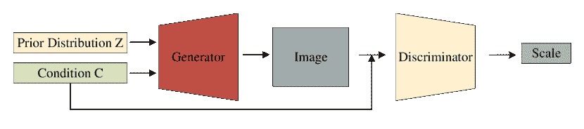

<!--yml

类别：未分类

日期：2024-09-06 19:59:11

-->

# [2009.13120] 医学图像分割使用深度学习：综述

> 来源：[`ar5iv.labs.arxiv.org/html/2009.13120`](https://ar5iv.labs.arxiv.org/html/2009.13120)

# 医学图像分割使用深度学习：综述

王瑞生、雷涛、崔瑞霞、张冰涛、孟红英和阿索克·K·南迪，王瑞生和雷涛均来自陕西科技大学电子信息与人工智能学院以及陕西省人工智能联合实验室，中国西安 710021。崔瑞霞在‘第一附属医院肝胆外科实验室’和‘大数据算法与分析技术研究国家工程实验室’（西安交通大学），中国西安 710049。张冰涛在兰州交通大学电子与信息工程学院，中国兰州 730070。孟红英在布鲁内尔大学电子与电气工程系，英国 Uxbridge UB8 3PH。阿索克·K·南迪在布鲁内尔大学电子与电气工程系，英国 Uxbridge UB8 3PH（通讯作者：雷涛）（电子邮件：leitao@sust.edu.cn）

###### 摘要

深度学习已广泛应用于医学图像分割领域，许多论文记录了深度学习在该领域的成功。在本文中，我们对使用深度学习技术进行医学图像分割进行了全面的主题调查。本文有两个原创性贡献。首先，与传统的调查研究直接将医学图像分割中深度学习的文献分为多个组并详细介绍每组文献不同，我们根据从粗到细的多层次结构对当前流行的文献进行分类。其次，本文重点关注监督学习和弱监督学习方法，不包括无监督学习方法，因为它们在许多旧调查中已被介绍，并且目前不再流行。对于监督学习方法，我们从三个方面分析文献：骨干网络的选择、网络块的设计和损失函数的改进。对于弱监督学习方法，我们根据数据增强、迁移学习和交互式分割分别调查文献。与现有的调查相比，本调查对文献的分类方式有很大不同，更方便读者理解相关原理，并将指导他们在基于深度学习的方法进行医学图像分割时思考适当的改进。

###### 索引词：

医学图像分割，深度学习，监督学习，弱监督学习。

## 引言

医学图像分割旨在使解剖或病理结构在图像中更加清晰；由于在诊断效率和准确性上的巨大提升，它通常在计算机辅助诊断和智能医疗中发挥关键作用。常见的医学图像分割任务包括肝脏和肝肿瘤分割[1] [2]，大脑和脑肿瘤分割[3] [4]，视盘分割[5] [6]，细胞分割[7] [8]，肺部分割，肺结节[9] [10]，心脏图像分割[11] [12]等。随着医学影像设备的发展和普及，X 射线、计算机断层扫描（CT）、磁共振成像（MRI）和超声已经成为帮助临床医生诊断疾病、评估预后和计划手术的四种重要图像辅助手段。在实际应用中，尽管这些成像方法各有优缺点，但它们对不同部位的医学检查依然具有重要作用。

为了帮助临床医生做出准确诊断，有必要对医学图像中的一些关键对象进行分割，并从分割区域提取特征。早期的医学图像分割方法常常依赖于边缘检测、模板匹配技术、统计形状模型、活动轮廓和机器学习等。赵等人[13]提出了一种用于肺部 CT 图像的新数学形态学边缘检测算法。Lalonde 等人[14]将基于 Hausdorff 的模板匹配应用于椎间盘检查，陈等人[15]也使用模板匹配进行脑部 CT 图像的脑室分割。Tsai 等人[16]提出了一种基于形状的方法，利用水平集进行心脏 MRI 图像的 2D 分割和前列腺 MRI 图像的 3D 分割。李等人[17]使用活动轮廓模型对腹部 CT 图像中的肝脏肿瘤进行分割，而李等人[18]提出了一种结合水平集和支持向量机（SVM）的医学体数据分割框架。Held 等人[19]将马尔可夫随机场（MRF）应用于脑部 MRI 图像分割。尽管已经有大量方法被报道，并且在某些情况下取得了成功，但由于特征表示的困难，图像分割仍然是计算机视觉领域最具挑战性的课题之一。特别是，从医学图像中提取区分特征比从普通 RGB 图像中提取要困难，因为前者常常面临模糊、噪声、低对比度等问题。由于深度学习技术的快速发展[20]，医学图像分割将不再需要手工设计的特征，卷积神经网络（CNN）成功实现了图像的层次特征表示，因此成为图像处理和计算机视觉领域最热门的研究课题。由于用于特征学习的 CNN 对图像噪声、模糊、对比度等不敏感，因此为医学图像提供了优秀的分割结果。

值得一提的是，目前图像分割任务主要分为两类：语义分割和实例分割。图像语义分割是一种像素级分类方法，将每个像素分配到图像中的相应类别。与语义分割相比，实例分割不仅需要实现像素级分类，还需要在特定类别的基础上区分实例。实际上，由于每个器官或组织的差异性较大，关于医学图像实例分割的报道较少。本文回顾了深度学习技术在医学图像分割方面的进展。

图 1：深度学习方法在医学图像分割中的概述

根据标注数据的数量，机器学习通常被分类为监督学习、弱监督学习和无监督学习。监督学习的优势在于我们可以基于精心标注的数据来训练模型，但获取大量标注数据对于医学图像来说是困难的。相反，无监督学习不需要标注数据，但学习难度增加。弱监督学习介于监督学习和无监督学习之间，因为它只需要一小部分标注数据，而大多数数据未标注。

在深度学习广泛应用之前，研究人员已经提出了许多基于模型驱动的医学图像分割方法。Masood 等人[21]对许多医学图像分析中的模型驱动技术进行了全面总结，包括图像聚类、区域生长和随机森林。在[21]中，作者根据不同的数学模型总结了医学图像上的不同分割方法。最近，虽然基于模型驱动技术的研究报告较少，但基于数据驱动的研究却越来越多。在本文中，我们主要关注深度学习模型在医学图像分割中的演变和发展。

在[22]中，Shen 等人提出了一项关于深度学习在医学图像分析中的应用的特别综述。这项综述总结了机器学习和深度学习在医学图像配准、解剖学和细胞结构检测、组织分割、计算机辅助疾病诊断及预后中的进展。Litjens 等人[23]报道了一项关于深度学习方法的调查，该调查涵盖了深度学习在图像分类、目标检测、分割、配准等任务中的应用。

最近，Taghanaki 等人 [24] 讨论了语义和医学图像分割的发展；他们将基于深度学习的图像分割解决方案分为六类，即深度架构、数据合成、损失函数、序列模型、弱监督和多任务方法。为了开发更全面的医学图像分割调查，Seo 等人 [25] 回顾了经典的机器学习算法，如马尔可夫随机场、$k$-均值聚类、随机森林，并回顾了最新的深度学习架构，如人工神经网络（ANNs）、卷积神经网络（CNNs）、递归神经网络（RNNs）等。Tajbakhsh 等人 [26] 回顾了具有不完美数据集的医学图像分割解决方案，包括两个主要的数据集限制：稀缺的标注和弱标注。所有这些调查在医学图像分割技术的发展中都发挥了重要作用。Hesamian 等人 [27] 从三个方面回顾了方法（网络结构）、训练技术和挑战。网络结构部分描述了用于图像分割的主要流行网络结构。训练技术部分讨论了用于训练深度神经网络模型的 J Digit 成像技术。挑战部分描述了使用深度学习技术进行医学图像分割的各种挑战。Meyer 等人 [28] 回顾了深度学习在放射治疗中的应用或潜在应用的进展。Akkus 等人 [29] 提供了基于深度学习的定量脑部 MRI 图像分割方法的概述。Zhou 等人 [30] 重点关注三种典型的弱监督类型：不完全监督、不准确监督和不精确监督。Eelbode 等人 [31] 重点评估和总结了主要基于 Dice 分数或 Jaccard 指数的医学图像分割任务中使用的优化方法。

通过研究上述调查，研究人员可以了解医学图像分割的最新技术，从而为计算机辅助诊断和智能医疗做出更重要的贡献。然而，这些调查存在两个问题。一是大多数调查按时间顺序总结了医学图像分割的发展，因此忽略了深度学习在医学图像分割中的技术分支。另一个问题是这些调查仅介绍了相关技术的发展，而没有关注医学图像分割的任务特征，如少样本学习、类别不平衡等，这限制了基于任务驱动的医学图像分割的改进。为了解决这两个问题，我们提出了一种基于深度学习的医学图像分割新型调查。在这项工作中，我们做出了以下贡献：

1\. 我们从粗到细总结了深度学习在医学图像分割领域的技术分支，如图 1 所示。总结包括有监督学习和弱监督学习两个方面。还讨论了神经架构搜索（NAS）、图卷积网络（GCN）、多模态数据融合和医学变压器在医学图像分析中的最新应用。与之前的调查相比，我们的调查遵循了概念发展的脉络，且被认为更为清晰。

2\. 对于有监督学习方法，我们从三个方面分析了文献：骨干网络的选择、网络模块的设计以及损失函数的改进。这种分类方法可以帮助后续研究人员更深入地理解医学图像分割网络的动机和改进策略。对于弱监督学习，我们还从处理少样本数据或类别不平衡数据的三个方面回顾了文献：数据增强、迁移学习和交互分割。这种组织方式有望更有利于研究人员发现提升医学图像分割准确性的创新方法。

3\. 除了全面回顾深度学习在医学图像分割中的发展和应用外，我们还收集了当前常见的公共医学图像分割数据集。最后，我们讨论了该领域未来的研究趋势和方向。

本文的其余部分组织如下：在第二部分，我们回顾了应用于医学图像的监督学习的发展和演变，包括骨干网络的选择、网络模块的设计和损失函数的改进。在第三部分，我们介绍了无监督或弱监督方法在医学图像分割领域的应用，并分析了处理少量样本数据或类别不平衡数据的常见无监督或弱监督策略。在第四部分，我们简要介绍了一些最先进的医学图像分割方法，包括 NAS、GCN 的应用、多模态数据融合等。在第五部分，我们收集了当前可用的公共医学图像分割数据集，并总结了当前深度学习方法的局限性和未来研究方向。

## II 监督学习

对于医学图像分割任务，监督学习是最受欢迎的方法，因为这些任务通常需要高精度。在本节中，我们将**深入探讨**神经网络架构的改进。这些改进主要包括网络骨干、网络模块和损失函数的设计。图 2 展示了基于监督学习的网络架构改进概述。

图 2：基于监督学习的网络架构概述。

### II-A 网络骨干

图像语义分割旨在实现图像的像素分类。为了这个目标，研究人员提出了编码器-解码器结构，这是一种最受欢迎的端到端架构之一，如全卷积网络（FCN）[32]、U-Net [7]、Deeplab [33]等。在这些结构中，编码器通常用于提取图像特征，而解码器通常用于将提取的特征恢复到原始图像大小并输出最终的分割结果。尽管端到端结构在医学图像分割中具有实用性，但它降低了模型的可解释性。第一个高影响力的编码器-解码器结构，即 Ronneberger 等人提出的 U-Net [7]，已广泛用于医学图像分割。图 3 展示了 U-Net 架构。

*U-Net:* U-Net 解决了用于医学图像分割的一般 CNN 网络的问题，因为它采用了完美的对称结构和跳跃连接。与普通的图像分割不同，医学图像通常包含噪声并显示模糊的边界。因此，仅依靠图像的低级特征来检测或识别医学图像中的物体是非常困难的。同时，由于缺乏图像细节信息，仅依靠图像语义特征也无法获得准确的边界。而 U-Net 通过跳跃连接将低分辨率和高分辨率特征图结合起来，有效地融合了低级和高级图像特征，这对于医学图像分割任务是一个完美的解决方案。目前，U-Net 已成为大多数医学图像分割任务的基准，并激发了许多有意义的改进。

图 3：U-Net 架构 [7]。

*3D Net:* 实际上，由于大多数医学数据如 CT 和 MRI 图像以 3D 体积数据的形式存在，使用 3D 卷积核可以更好地挖掘数据的高维空间相关性。受此启发，Çiçek 等人 [34]扩展了 U-Net 架构以应用于 3D 数据，提出了直接处理 3D 医学数据的 3D U-Net。由于计算资源的限制，3D U-Net 仅包含三个下采样层，这无法有效提取深层图像特征，导致医学图像的分割准确性有限。此外，Milletari 等人 [35]提出了类似的架构 V-Net，如图 4 所示。众所周知，残差连接可以避免梯度消失并加速网络收敛，因此很容易设计出更深的网络结构，从而提供更好的特征表示。与 3D U-Net 相比，V-Net 采用残差连接设计了一个更深的网络（4 个下采样），因此性能更高。同样，通过将残差连接应用于 3D 网络，Yu 等人 [36]提出了 Voxresnet，Lee 等人 [37]提出了 3DRUNet，Xiao 等人 [38]提出了 Res-UNet。然而，这些 3D 网络由于参数数量非常庞大，遇到了相同的高计算成本和 GPU 内存使用问题。

图 4：V-Net 架构 [35]。

*循环神经网络 (RNN)：* RNN 最初设计用于处理序列问题。长短期记忆网络 (LSTM) [39] 是最受欢迎的 RNN 之一。通过引入自环，它可以长时间保持梯度流。对于医学图像分割，RNN 已被用于建模图像序列的时间依赖性。Alom 等人 [40] 提出了将 ResUNet 与 RNN 结合的医学图像分割方法。该方法实现了递归残差卷积层的特征积累，从而改善了图像分割任务的特征表示。图 5 显示了循环残差卷积单元。Gao 等人 [41] 将 LSTM 和 CNN 结合，建模不同脑 MRI 切片之间的时间关系，以提高分割精度。Bai 等人 [42] 将 FCN 与 RNN 结合，以挖掘主动脉序列分割的时空信息。显然，RNN 可以通过考虑上下文信息关系来捕捉图像的局部和全局空间特征。然而，在医学图像分割中，捕捉完整有效的时间信息需要良好的医学图像质量（例如更小的切片厚度和像素间距）。因此，RNN 的设计在提高医学图像分割性能方面并不常见。

图 5: 循环残差卷积单元 2018recurrent。

*跳跃连接：* 尽管跳跃连接可以融合低分辨率和高分辨率的信息，从而改善特征表示，但它面临低分辨率和高分辨率特征之间的大语义差距问题，导致特征图模糊。为了改进跳跃连接，Ibtehaz 等人 [43] 提出了包括 Residual Path (ResPath) 的 MultiResUNet，这使得编码器特征在与解码器中的相应特征融合之前，进行一些额外的卷积操作。Seo 等人 [44] 提出了 mUNet，Chen 等人 [45] 提出了 FED-Net。mU-Net 和 FED-Net 都在跳跃连接中添加了卷积操作，以提高医学图像分割的性能。

*二维和三维级联:* 对于图像分割任务，级联模型通常训练两个或更多模型以提高分割准确性。这种方法在医学图像分割中尤其受欢迎。级联模型可以大致分为三种框架：粗细分割，检测分割和混合分割。第一类是粗细分割框架，它使用两个 2D 网络进行分割的级联，第一个网络进行粗分割，然后使用另一个网络模型根据前面的粗分割结果进行细分割。Christ 等人[46]提出了一种用于肝脏和肝肿瘤分割的级联网络。该网络首先使用 FCN 对肝脏进行分割，然后使用前一次肝脏分割结果作为第二个 FCN 对肝肿瘤进行分割的输入。Yuan 等人[47]首先训练了一个简单的卷积-反卷积神经网络（CDNN）模型（19 层 FCN），以在整个 CT 体积的图像上提供快速但粗糙的肝脏分割，然后在肝脏区域应用另一个 CDNN（29 层 FCN）进行细粒度的肝脏分割。最后，由直方图均衡增强的肝脏分割区被视为第三个 CDNN（29 层 CNN）进行肝肿瘤分割的额外输入。此外，还可以在[48] [49] [50]找到使用粗细分割框架的其他网络。同时，检测分割框架也很受欢迎。首先使用网络模型（如 R-CNN[51]或 You-Only-Look-Once（YOLO）[52]）进行目标定位识别，然后根据先前的粗分割结果使用另一个网络进行进一步的详细分割。Al-Antari 等人[53]提出了一种类似的方法，用于从乳房 X 线照片中检测、分割和分类乳房肿块。在这项工作中，第一步是使用区域深度学习方法 YOLO 进行目标检测，第二步是将检测到的目标输入到新设计的全分辨率卷积网络（FrCN）进行分割，最后，使用深度卷积神经网络识别肿块并将其分类为良性或恶性。类似地，唐等人[47]使用更快的 R-CNN[54]和 Deeplab[55]级联进行肝脏的定位分割。此外，Salehi 等人[56]和 Yan 等人[57]提出了一种级联网络用于整个脑 MRI 和高分辨率乳房 X 线照片的分割。这种级联网络可以通过利用第一个网络生成的后验概率有效地提取更丰富的多尺度上下文信息。

然而，大多数医学图像是三维体积数据，但二维卷积神经网络无法学习第三维度的时间信息，而三维卷积神经网络通常需要高计算成本和巨大的 GPU 内存消耗。因此，提出了一些伪三维分割方法。Oda 等人[58]提出了一种三平面方法，通过级联三个网络来有效地从医学 CT 体积图像中分割腹部动脉区域。Vu 等人[59]将相邻切片的叠加作为中心切片预测的输入，然后将获得的二维特征图输入到标准二维网络进行模型训练。虽然这些伪三维方法可以从三维体积数据中分割物体，但由于只利用了局部时间信息，因此只能获得有限的精度提升。与伪三维网络相比，混合级联二维和三维网络更受欢迎。Li 等人[60]提出了一种用于肝脏和肝脏肿瘤分割的混合密集连接 U-Net（H-DenseUNet）。该方法首先使用简单的 Resnet 获得粗略的肝脏分割结果，然后利用二维 DenseUNet 有效提取二维图像特征，再用三维 DenseUNet 提取三维图像特征，最后设计了一个混合特征融合层来共同优化二维和三维特征。虽然 H-DenseUNet 相比整个三维网络减少了模型的复杂性，但该模型仍然复杂，并且由于三维卷积的参数量庞大而受到限制。对此问题，Zhang 等人[61]提出了一种轻量级混合卷积网络（LW-HCN），其结构类似于 H-DenseUNet，但由于设计了深度分离空间时间（DSTS）块和使用了三维深度可分离卷积，前者所需的参数和计算成本更少。类似地，Dey 等人[62]也设计了一种用于肝脏和肝脏肿瘤分割的二维和三维网络级联结构。

显然，在上述三种级联网络中，混合的二维和三维级联网络可以有效提高分割精度并减轻学习负担。

相比于上述级联网络，Valanarasu 等人[63]提出了一种完整的级联网络，即 KiU-Net，用于进行脑部解剖分割。原始 U-Net 在检测较小的解剖结构时，其性能显著下降，特别是在模糊噪声边界的情况下。为了克服这个问题，作者设计了一种新颖的过完美架构 Ki-Net，其中中间层的空间大小大于输入数据的大小，这通过在编码器中的每个转换层后使用上采样层来实现。因此，所提出的 Ki-Net 相对于 U-Net 具有更强的边缘捕捉能力，并最终与原始 U-Net 级联，以提高整体分割精度。由于 KiU-Net 可以利用 Ki-Net 中的低级细边特征图和 U-Net 中的高级形状特征图，它不仅提高了分割精度，还实现了对小型解剖标志和模糊噪声边界的快速收敛。

*其他：*生成对抗网络（GAN）[64]已广泛应用于计算机视觉的许多领域。在其早期阶段，GAN 通常用于通过生成新样本来进行数据增强，这将在第三节中进行讨论，但后来研究人员发现，生成对抗的思想几乎可以应用于任何领域，因此也被用于图像分割。由于医学图像通常显示低对比度、不同组织或组织与病变之间的边界模糊，并且标注的医学图像数据稀少，基于 U-Net 的分割方法使用像素损失来学习像素之间的局部和全局关系，对于医学图像分割并不充分，因此使用生成对抗网络成为了改善图像分割的热门方法。Luc 等人[65]首次将生成对抗网络应用于图像分割，其中生成网络用于分割模型，而对抗网络则被训练为分类器。Singh 等人[66]提出了一种条件生成对抗网络（cGAN），用于在乳腺 X 光片中对目标区域（ROI）进行乳腺肿瘤分割。生成网络学习识别肿瘤区域并生成分割结果，对抗网络则学习区分生成网络的地面真实情况和分割结果，从而强制生成网络获得尽可能真实的标签。cGAN 在训练样本有限的情况下效果良好。Conze 等人[67]利用级联预训练卷积编码器-解码器作为 cGAN 的生成器，用于腹部多器官分割，并将对抗网络视为判别器，以强制模型创建真实的器官轮廓。

此外，结合有关器官形状和位置的先验知识可能对改善医学图像分割效果至关重要，因为图像可能受到成像技术限制而出现伪影。然而，关于如何将先验知识融入 CNN 模型的研究较少。作为该领域最早的研究之一，Oktay 等人[68]提出了一种新颖且通用的方法，将形状和标签结构的先验知识结合到解剖约束神经网络（ACNN）中用于医学图像分析任务。通过这种方式，神经网络训练过程可以被约束和指导，以做出更具解剖学和意义的预测，特别是在输入图像数据不够信息丰富或一致（例如，缺失对象边界）的情况下。类似地，Boutillon 等人[69]将解剖学先验知识融入到条件对抗框架中，用于肩胛骨分割，将形状先验与条件神经网络结合，鼓励模型在形状和位置方面遵循全局解剖学特性，并使分割结果尽可能准确。上述研究表明，改进的模型可以提供更高的分割准确性，并且由于在神经网络训练过程中采用了先验知识约束，它们更具鲁棒性。

在提出 U-Net 之后[7]，编码器-解码器结构成为医学图像分割中最流行的结构。网络主干的设计着重于在编码器中更高效地提取特征，并在解码器中进行特征恢复和融合，以提高分割准确性。

### II-B 网络功能块

#### II-B1 密集连接

密集连接常用于构建一种特殊的卷积神经网络。对于密集连接网络，每一层的输入来自于前面所有层的输出。在密集连接的启发下，Guan 等人[70]提出了一种改进的 U-Net，通过用密集连接形式替换 U-Net 的每个子块，如图 6 所示。尽管密集连接有助于获取更丰富的图像特征，但它往往在一定程度上降低了特征表示的鲁棒性，并增加了参数数量。

Zhou 等人 [71] 将所有 U-Net 层（从一层到四层）连接在一起，如图 7 所示。这种结构的优点在于它允许网络自动学习不同层次特征的重要性。此外，跳跃连接被重新设计，使得具有不同语义尺度的特征可以在解码器中聚合，从而形成高度灵活的特征融合方案。缺点是由于密集连接的使用，参数数量增加。因此，将剪枝方法整合到模型优化中，以减少参数数量。同时，采用深度监督 [72] 来平衡剪枝引起的分割精度下降。尽管密集连接有助于获得更丰富的图像特征，但它往往在一定程度上降低了特征表示的鲁棒性，并增加了参数数量。

图 6: 密集连接结构 [70]。

图 7: U-Net++ 结构 [71]。

#### II-B2 Inception

对于 CNN，深层网络通常比浅层网络表现更好，但它们面临一些新问题，如梯度消失、网络收敛困难、大量内存需求等。Inception 结构克服了这些问题。通过在不增加网络深度的情况下并行合并卷积核，它提供了更好的性能。该结构能够利用多尺度卷积核提取更丰富的图像特征，并进行特征融合以获得更好的特征表示。受 GoogleNet [73] [74] 启发，Gu 等人 [75] 提出了 CE-Net，通过将 inception 结构引入医学图像分割。CE-Net 在每个并行结构中添加了空洞卷积，以在宽广的感受野上提取特征，并添加了 $1\times 1$ 卷积特征图，图 8 显示了 Inception 的结构。然而，Inception 结构复杂，导致模型修改困难。

图 8: Inception 结构 [75]。它包含四个级联分支，每个分支的空洞卷积数量逐渐增加，从 1 到 1、3 和 5，因此每个分支的感受野将分别为 3、7、9 和 19。这样，网络可以从不同尺度提取特征。

#### II-B3 深度可分离性

为了提高网络模型的泛化能力并减少内存使用的需求，许多研究者关注于针对复杂医疗三维体积数据的轻量级网络的研究。Howard 等人[76] 提出了 MobileNet，将传统卷积分解为深度可分离卷积和点卷积。传统卷积的计算量通常为 ${D_{K}\times D_{K}\times M\times N}$，其中 ${M}$ 是输入特征图的维度，${N}$ 是输出特征图的维度，${D_{K}}$ 是卷积核的大小。然而，通道卷积的计算量为 ${D_{K}\times D_{K}\times 1\times M}$，点卷积的计算量为 ${1\times 1\times M\times N}$。与传统卷积相比，深度可分离卷积的计算成本是传统卷积的 (1/$N$ + 1/${D_{K}^{2}}$) 倍。基于此，Sandler 等人[77] 提出了包含新型层模块的 MobileNet-V2，该模块为反向残差和线性瓶颈。在此模块中，输入是低维压缩表示，首先扩展到高维度，然后通过轻量级深度卷积进行滤波。特征随后通过线性卷积被投影回低维表示。这显著减少了推理过程中所需的内存占用。通过将深度可分离卷积扩展到三维网络的设计，Lei 等人[78] 提出了比 V-Net 更少操作的轻量级 V-Net (LV-Net) 用于肝脏分割。此外，Zhang 等人[61] 和 Huang 等人[79] 也提出了将深度可分离卷积应用于三维医疗体积数据分割的方案。有关轻量级深度网络的其他相关工作可以在[80] [81] 中找到。深度可分离卷积是减少模型参数数量的有效方法，但可能会导致医疗图像分割的精度损失，因此需要采用其他方法（例如深度监督）[78] 来提高分割精度。

#### II-B4 注意力机制

对于神经网络，注意力模块可以根据不同的重要性选择性地改变输入或为输入变量分配不同的权重。近年来，大多数将深度学习与视觉注意力机制相结合的研究都集中在使用掩码来形成注意力机制。掩码的原理是设计一个可以从图像中识别关键特征的新层，通过训练和学习，然后让网络只关注图像中感兴趣的区域。

*局部空间注意力：* 空间注意力模块旨在计算每个像素在空间域中的特征重要性，并提取图像的关键信息。Jaderberg 等人 [82] 早期提出了一种空间变换网络 (ST-Net)，用于图像分类，通过使用空间注意力将原始图像的空间信息转换到另一个空间，并保留关键信息。普通池化相当于信息合并，容易导致关键信息丢失。为了解决这个问题，设计了一个称为空间变换器的模块，通过执行空间变换来提取图像的关键信息。受到此启发，Oktay 等人 [83] 提出了注意力 U-Net。改进的 U-Net 使用注意力模块来改变编码器的输出，然后将编码器和相应解码器的特征进行融合。注意力模块输出一个门控信号，以控制不同空间位置像素的特征重要性。图 9 显示了这种架构。该模块通过 $1\times 1$ 卷积结合 Relu 和 sigmoid 函数生成一个权重图，通过将特征从编码器中乘以这个权重图来进行修正。

图 9：注意力 U-Net 中的注意力模块 [83]。

*通道注意力：* 通道注意力模块可以实现特征的重新校准，利用学到的全局信息来选择性地强调有用的特征，并抑制无用的特征。Hu 等人 [84] 提出了 SE-Net，将通道注意力引入图像分析领域，并在 2017 年赢得了 ImageNet 挑战赛。该方法通过三个步骤实现通道的注意力加权；图 10 显示了这种架构。第一个步骤是压缩操作，对输入特征进行全局平均池化，以获得 $1\times 1\times Channel$ 特征图。第二个步骤是激励操作，其中通道特征被交互以减少通道数，然后将减少后的通道特征重建回原来的通道数。最后，使用 sigmoid 函数生成一个 $[0,1]$ 的特征权重图，将缩放因子乘回原始输入特征。Chen 等人 [45] 提出了 FED-Net，利用 SE 模块实现了特征通道注意力。

图 10：SE-Net 中的通道注意力 [84]。

*混合注意力：* 空间和通道注意力机制是提高特征表示的两种流行策略。然而，空间注意力忽略了不同通道信息的差异，对每个通道一视同仁。相反，通道注意力直接汇聚全局信息，同时忽略了每个通道中的局部信息，这是一种相对粗略的操作。因此，为了结合这两种注意力机制的优点，研究人员设计了许多基于混合域注意力块的模型。Kaul 等人 [85] 提出了使用空间注意力和通道注意力混合的 focusNet 用于医学图像分割，其中 SE-Block 用于通道注意力，并设计了一个空间注意力分支。此外，其他相关工作可以在 [80] [81] 中找到。

为了提高网络的特征判别表示，Wang 等人 [86] 将一个注意力块嵌入到 U-Net 的收缩路径和扩展路径之间的中央瓶颈中，并提出了 ScleraSegNet。此外，他们比较了通道注意力、空间注意力和两种注意力的不同组合在医学图像分割中的性能。他们得出结论，通道中心注意力在提高图像分割性能方面最为有效。基于这一结论，他们最终赢得了巩膜分割基准竞赛（SSBC2019）的冠军。

尽管上述注意力机制提高了最终的分割性能，但它们仅执行局部卷积操作。该操作关注于相邻卷积核的区域，但遗漏了全局信息。此外，下采样操作导致空间信息的丧失，这对生物医学图像分割尤其不利。一个基本的解决方案是通过堆叠多层来提取长距离信息，但由于参数众多和计算成本高，效率较低。在解码器中，上采样、反卷积和插值也以局部卷积的方式执行。

*非局部注意力：* 最近，Wang 等人 [87] 提出了一个非局部 U-Net，以克服局部卷积在医学图像分割中的缺点。非局部 U-Net 采用自注意力机制和全局聚合块，在上采样和下采样的过程中提取整个图像的信息，这可以提高最终的分割准确性。图 11 展示了全局聚合块。非局部块是一个通用块，可以轻松嵌入到不同的卷积神经网络中以提高其性能。

可以看出，注意力机制对于提高图像分割精度是有效的。实际上，空间注意力机制寻找感兴趣的目标区域，而通道注意力机制寻找感兴趣的特征。混合注意力机制可以同时利用空间和通道的优势。然而，与非局部注意力机制相比，传统注意力机制缺乏利用不同目标和特征之间关联的能力，因此基于非局部注意力的卷积神经网络（CNNs）通常在图像分割任务中表现优于普通 CNNs。

图 11：非局部 U-Net 中的全局聚合块 [87]。

#### II-B5 多尺度信息融合

医学图像分割的一个挑战是对象之间的尺度差异范围很大。例如，晚期的肿瘤可能比早期的肿瘤大得多。感受野的大小大致决定了我们可以使用多少上下文信息。一般的卷积或池化只使用单一的核，例如，卷积的 $3\times 3$ 核和池化的 $2\times 2$ 核。

*金字塔池化：* 多尺度池化的并行操作可以有效提升网络的上下文信息，从而提取更丰富的语义信息。He 等人 [88] 首次提出了空间金字塔池化（SPP）来实现多尺度特征提取。SPP 将图像从细致空间划分到粗略空间，然后收集局部特征并提取多尺度特征。受 SPP 启发，设计了一个多尺度信息提取块，命名为残差多核池化（RMP） [75]，该块使用四个不同尺寸的池化核来编码全局上下文信息。然而，RMP 中的上采样操作无法恢复由于池化而丢失的细节信息，这通常会放大感受野但降低图像分辨率。

*空洞空间金字塔池化：* 为了减少池化操作造成的细节信息丢失，研究人员提出了使用空洞卷积替代池化操作。与普通卷积相比，空洞卷积可以有效扩大感受野而不增加参数数量。结合空洞卷积和 SPP 块的优点，Chen 等人 [55] 提出了空洞空间金字塔池化模块（ASPP），以改善图像分割结果。ASPP 对于不同尺度的同一对象表现出强大的识别能力。同样，Lopez 等人 [89] 和 Lei 等人 [90] 将多尺度空洞卷积的叠加应用于脑肿瘤分割和肝肿瘤分割，分别取得了明显的精度提升。

然而，ASPP 在图像分割中存在两个严重问题。第一个问题是局部信息的丢失，如图 12 所示，我们假设卷积核为 $3\times 3$，膨胀率为 2，进行三次迭代。第二个问题是信息可能在较大距离上不相关。如何同时处理不同尺度的物体之间的关系，对于设计精细的空洞卷积网络至关重要。针对上述问题，Wang 等人 [91] 设计了混合扩展卷积（HDC）网络。该结构使用锯齿波状启发式方法来分配膨胀率，从而可以访问更广泛的像素范围，抑制了网格效应。在 [91] 中，作者给出了几种使用可变膨胀率的空洞卷积序列，例如，[1,2,3]、[3,4,5]、[1,2,5]、[5,9,17] 和 [1,2,5,9]。

图 12: 网格效应（将图像视为棋盘的处理方式导致信息连续性的丧失）。

*非局部和 ASPP:* 空洞卷积可以有效地扩大感受野，以收集更丰富的语义信息，但由于网格效应，它会导致细节信息的丢失。因此，有必要添加约束或建立像素关联，以改善空洞卷积的性能。最近，Yang 等人 [92] 提出了 ASRR 和非局部的组合模块用于人体部位的分割，如图 13 所示。ASPP 使用多个不同尺度的并行空洞卷积来捕获更丰富的信息，而非局部操作则捕获了广泛的依赖关系。这种组合具有 ASPP 和非局部的优点，并且在医学图像分割中具有良好的应用前景。

图 13: ASPP 和非局部架构的组合 [92]。

网络功能模块旨在实现更高效的特征融合。当特征通常由编码器提取时，网络功能模块通常会对特征进行融合以增强特征表示。特征融合通常通过融合不同尺度的信息或执行更高效的特征传递方式来实现。然后，特征通过解码器传递，以获得更好的分割结果。

### II-C 损失函数

除了通过设计网络骨干和功能模块来提高分割速度和准确性外，设计新的损失函数也提高了后续推理时的分割准确性。因此，关于医学图像分割任务适用损失函数的设计已有大量研究报道。

#### II-C1 交叉熵损失

对于图像分割任务，交叉熵是最常用的损失函数之一。该函数逐像素比较预测类别向量与真实分割结果向量。对于二分类分割情况，设 $P(Y=1)=p$ 和 $P(Y=0)=1-p$，则预测由 sigmoid 函数给出，其中 $P(\hat{Y}=1)=1/(1+e^{-x})=\hat{p}$ 和 $P(\hat{Y}=0)=1-1/(1+e^{-x})=1-\hat{p}$，$x$ 是神经网络的输出。交叉熵损失定义为

|  | $\displaystyle CE(p,\hat{p})=-(plog(\hat{p})+(1-p)log(1-\hat{p})).$ |  | (1) |
| --- | --- | --- | --- |

#### II-C2 加权交叉熵损失

交叉熵损失对图像的每个像素给予相同的处理，因此输出一个平均值，这忽略了类别不平衡的问题，并导致损失函数依赖于包含最大像素数的类别。因此，交叉熵损失在小目标分割中往往表现较差。

为了解决类别不平衡的问题，Long 等人[32] 提出了加权交叉熵损失（WCE）来对抗类别不平衡。对于二分类分割情况，加权交叉熵损失定义为

|  | $\displaystyle WCE(p,\hat{p})=-(\beta plog(\hat{p})+(1-p)log(1-\hat{p})),$ |  | (2) |
| --- | --- | --- | --- |

其中 $\beta$ 用于调节正负样本的比例，它是一个经验值。如果 $\beta>1$，则假阴性数量会减少；相反，当 $\beta<1$ 时，假阳性数量会减少。实际上，交叉熵是在 $\beta=1$ 时加权交叉熵的特殊情况。为了同时调整正负样本的权重，我们可以使用定义为

|  | $\displaystyle BCE(p,\hat{p})=-(\beta plog(\hat{p})+(1-\beta)(1-p)log(1-\hat{p})).$ |  | (3) |
| --- | --- | --- | --- |

在[7]中，Ronneberger 等人提出了 U-Net，在该模型中，通过添加距离函数改进了交叉熵损失函数。改进后的损失函数能够提高模型对类别间距离的学习能力。距离函数定义为

|  | $\displaystyle D(x)=\omega_{0}\texttimes e^{\frac{-(d_{1}(x)+d_{2}(x)^{2}}{2\sigma^{2}}},$ |  | (4) |
| --- | --- | --- | --- |

其中 $d_{1}(x)$ 和 $d_{2}(x)$ 分别表示像素 $x$ 到前两个最近细胞边界的距离。因此，最终的损失函数定义为

|  | $\displaystyle L=\ BCE\left(p,\hat{p}\right)+\ D(x).$ |  | (5) |
| --- | --- | --- | --- |

#### II-C3 Dice 损失

Dice 系数是评估医学图像分割的一个常用性能指标。这个指标本质上是分割结果与相应真实值之间重叠程度的度量。Dice 的值范围从 0 到 1。"1" 表示分割结果完全与真实分割结果重合。计算公式定义为

|  | $\displaystyle Dice\left(A,B\right)=\frac{2\times\left | A\cap B\right | }{A+B}\times 100\%,$ |  | (6) |
| --- | --- | --- | --- | --- | --- |

其中$A$是预测的分割结果，$B$是实际的分割结果。

对于 3D 医学体积数据分割，Milletari 等人[35]提出了 V-Net，该网络使用 Dice 损失

|  | $\displaystyle DL(p,\hat{p})=1-\frac{2<p,\hat{p}>}{\left\|p\right\|_{1}+\left\|p\right\|_{2}},$ |  | (7) |
| --- | --- | --- | --- |

其中$<p,\hat{p}>$表示每个通道的真实值和预测结果矩阵的点积。

值得注意的是，Dice 损失适用于不均匀样本。然而，使用 Dice 损失容易影响反向传播，导致训练困难。此外，由于梯度值不可靠，Dice 损失对不同模型（如平均表面距离或 Hausdorff 表面距离）的鲁棒性较差。例如，softmax 函数的梯度可以简化为($p-t$)，其中$t$是目标值，$p$是预测值，但 Dice 损失的值为$2t^{2}$/${(p+t)}^{2}$。如果$p$和$t$的值太小，梯度值会发生剧烈变化，从而导致训练困难。

#### II-C4 Tversky 损失

Salehi 等人[93]提出了 Tversky 损失（TL），这是一种 Dice 损失的正则化版本，用于控制假阳性和假阴性对损失函数的贡献。TL 定义为

|  | $\displaystyle TL(p,\hat{p})=\frac{p,\hat{p}}{p,\hat{p}+\beta(1-p,\hat{p})+(1-\beta)(p,1-\hat{p})},$ |  | (8) |
| --- | --- | --- | --- |

其中$p\in{0,1}$且$0\leq\hat{p}\leq 1$。$p$和$\hat{p}$分别是真实值和预测分割。如果$\beta=0.5$，则 TL 等于（7）。

#### II-C5 广义 Dice 损失

尽管 Dice 损失在一定程度上可以解决类别不平衡的问题，但对于严重的类别不平衡情况效果不佳。例如，小目标的某些像素的预测误差可能导致 Dice 值发生大幅变化。Sudre 等人[94]提出了一种广义 Dice 损失（GDL），GDL 定义为

|  | $\displaystyle GDL\left(p,\hat{p}\right)=1-\frac{1}{m}\frac{2\sum_{j=1}^{m}{\omega_{j}\sum_{i=1}^{n}{p_{ij}{\hat{p}}_{ij}}}}{\sum_{j=1}^{m}{\omega_{j}\sum_{i=1}^{n}{(p_{ij}{+\hat{p}}_{ij})}}},$ |  | (9) |
| --- | --- | --- | --- |

在这里，权重$\omega=\left[\omega_{1},\omega_{2},...,\omega_{m}\right]$被分配给每个类别，且$\omega_{j}=1/{(\sum_{i=1}^{n}p_{ij})}^{2}$。GDL 优于 Dice 损失，因为不同区域对损失的贡献相似，并且 GDL 在训练过程中更加稳定和健壮。

#### II-C6 边界损失

为了解决类别不平衡的问题，Kervadec 等人 [95] 提出了用于脑部病变分割的新边界损失。该损失函数旨在最小化分割边界与标注边界之间的距离。作者在两个标注的类别不平衡数据集上进行了实验。结果表明，Dice 损失与边界损失的结合优于单独使用的损失。复合损失定义为

|  | $\displaystyle L=\alpha L_{GD}(\theta)+(1-\alpha)L_{B}(\theta),$ |  | (10) |
| --- | --- | --- | --- |

其中第一部分是正则化的 Dice 损失，定义为

|  | $\displaystyle L_{GD}\left(\theta\right)=1-2(\omega_{G}\sum_{p\epsilon\Omega}{g(p)s_{\theta}(p)}$ |  | (11) |
| --- | --- | --- | --- |
|  | $\displaystyle+\omega_{B}\sum_{p\epsilon\Omega}{(1-g(p))(1-s_{\theta}(p))})/$ |  |
|  | $\displaystyle((\omega_{G}\sum_{p\epsilon\Omega}\left[g(p){+s}_{\theta}(p)\right]$ |  |
|  | $\displaystyle+\omega_{B}\sum_{p\epsilon\Omega}{(2-g(p)-s_{\theta}(p))})),$ |  |

第二部分是边界损失，定义为

|  | $\displaystyle L_{B}\left(\theta\right)=\emptyset G(p)s_{\theta}(p),$ |  | (12) |
| --- | --- | --- | --- |

如果 $p\epsilon G$，则 $\emptyset G\left(p\right)=-||p-z_{\vartheta G}(p)||$，否则 $\emptyset G\left(p\right)=||p-z_{\vartheta G}(p)||$。此外，$\sum_{\mathrm{\Omega}}{g(p)f(s_{\theta}(p))}$ 用于前景，$\sum_{\mathrm{\Omega}}{(1-g(p))(1-f(s_{\theta}(p)))}$ 用于背景。$L_{GD}\left(\theta\right)$ 的权重为 $\omega_{G}=1/{(\sum_{p\epsilon\Omega}{g(p)})}^{2}$，$\omega_{B}=1/{(\sum_{p\epsilon\Omega}{(1-g(p))})}^{2}$。$\mathrm{\Omega}$ 代表整个空间域中的像素集。

#### II-C7 指数对数损失

在 (9) 中，加权 Dice 损失实际上是将得到的 Dice 值除以每个标签的总和，从而实现对不同规模对象的平衡。因此，通过结合焦点损失 [96] 和 Dice 损失，Wong 等人 [97] 提出了用于脑部分割的指数对数损失（EXP 损失），以解决严重的类别不平衡问题。引入指数形式后，损失函数的非线性可以进一步控制，从而提高分割精度。EXP 损失函数定义为

|  | $\displaystyle L_{EXP}=\omega_{dice}\times L_{dice}+\omega_{cross}\times L_{cross},$ |  | (13) |
| --- | --- | --- | --- |

其中两个新参数权重分别表示为 $\omega_{dice}$ 和 $\omega_{cross$。$L_{dice}$ 是指数对数 Dice 损失，而 $L_{cross}$ 是交叉熵损失

|  | $\displaystyle L_{dice}=E[{(-ln({Dice}_{i}))}^{\gamma_{Dice}}],$ |  | (14) |
| --- | --- | --- | --- |
|  | $\displaystyle L_{cross}=E[{\omega_{l}(-ln(p_{l}(x)))}^{\gamma_{cross}}],$ |  | (15) |

和，

|  | $\displaystyle{Dice}_{i}=\frac{2(\sum_{x}{\sigma_{il}(x)p_{i}(x)})+\varepsilon}{\sum_{x}{{(\sigma}_{il}(x)+p_{i}(x)})+\varepsilon},$ |  | (16) |
| --- | --- | --- | --- |
|  | $\displaystyle\omega_{l}={(\frac{\sum_{k}f_{k}}{f_{l}})}^{0.5},$ |  | (17) |

其中 $x$ 是像素位置，$i$ 是标签，$l$ 是位置 $x$ 处的真实值。$p_{i}(x)$ 是从 softmax 输出的概率值。

在（17）中，$f_{k}$ 是标签 $k$ 的出现频率，这个参数可以减少出现频率较高标签的影响。$\gamma_{Dice}$ 和 $\gamma_{cross}$ 都用于增强损失函数的非线性。

#### II-C8 损失改进

对于医学图像分割，损失的改进主要集中在大背景下小物体的分割问题（类别不平衡问题）。Chen 等人 [98] 提出了通过将传统的活动轮廓能量最小化应用于卷积神经网络的新损失函数，Li 等人 [99] 提出了一个新的正则化项来改进交叉熵损失函数，Karimi 等人 [100] 提出了基于 Hausdorff 距离 (HD) 的损失函数。此外，还有许多工作 [101] [102] 试图通过向损失函数添加惩罚或根据具体任务改变优化策略来解决这个问题。

在许多医学图像分割任务中，图像中通常只有一两个目标，而且目标的像素比例有时较小，这使得网络训练变得困难。因此，为了提高网络训练和分割准确性，通过改变损失函数来关注较小的目标比改变网络结构更容易。然而，损失函数的设计高度依赖于任务，因此我们需要仔细分析任务需求，然后设计合理且可用的损失函数。

#### II-C9 深度监督

一般而言，增加网络深度可以在一定程度上改善网络的特征表示，但同时会导致梯度消失和梯度爆炸等新问题。为了有效训练深度网络，Lee 等人 [72] 通过在神经网络的某些层中添加一些辅助分支分类器，提出了深度监督网络 (DSNs)。Dou 等人 [103] 提出了用于心脏和肝脏分割的 3D DSN，将 3D 深度监控机制集成到 3D 全卷积网络中，用于体积到体积的学习和推断，消除了冗余计算，并在训练数据有限的情况下降低了过拟合的风险。同样，Dou 等人 [104] 提出了使用具有深度监督和残差连接的全卷积神经网络架构进行胎儿大脑 MRI 皮层板分割的方法，并获得了高精度的脑部 MRI 皮层板分割。实际上，深度监督不仅可以约束学习特征在各个阶段的判别力和鲁棒性，还提高了网络训练效率。

## III 弱监督学习

尽管卷积神经网络在医学图像分割中表现出强大的适应性，但分割结果严重依赖高质量的标签。实际上，很少能建立许多具有高质量标签的数据集，特别是在医学图像分析领域，因为数据获取和标注通常会产生高成本。因此，许多关于不完整或不完美数据集的研究被报告出来。我们将这些研究总结为弱监督学习，如图 14 所示。

图 14：医学图像分割的弱监督学习方法。

### III-A 数据增强

在大规模标注数据集缺乏的情况下，数据增强是解决此问题的有效方法。然而，一般的数据扩展方法会生成与原始图像高度相关的图像。与常见的数据增强方法相比，由 Goodfellow 提出的 GAN [64] 目前是一种流行的数据增强策略，因为 GAN 克服了对原始数据依赖的问题。

*传统方法：* 一般的数据增强方法包括图像质量的改善，如噪声抑制，图像强度的变化，如亮度、饱和度和对比度，以及图像布局的变化，如旋转、畸变和缩放等。Sirinukunwattana 等人 [105] 利用高斯模糊来实现数据增强，这对在结肠组织图像中执行腺体分割任务非常有帮助。Dong 等人 [106] 随机使用了 3D MR 图像中的亮度增强功能，以丰富脑肿瘤分割的训练数据。对比度增强通常对图像强度不均匀时有帮助。此外，Ronneberger 等人 [7] 使用随机弹性变形对原始数据集进行数据扩展。实际上，传统数据增强最常用的方法是参数变换（旋转、平移、剪切、位移、翻转等）。由于这种变换是虚拟的且没有计算成本，而医学图像的标注困难，因此通常在每次训练前进行。

*条件生成对抗网络（cGAN）：* 与第二节中介绍的用于监督学习的 cGAN 使用不同，本节关注 cGAN 在数据增强中的应用。一个原始的 GAN 生成器记作 $G$ 可以学习数据分布，但生成的图像是随机的，这意味着 $G$ 的生成过程是无指导的状态。相比之下，cGAN 向原始 GAN 添加了一个条件，以指导 $G$ 的生成过程。图 15 展示了 cGAN 的架构。Guibas 等人 [107] 提出了一个由 GAN [64] 和 cGAN [108] 组成的网络架构。随机变量输入到 GAN 中，从而生成一个合成的眼底血管标签图像，然后将生成的标签图输入到条件 GAN 中以生成真实的视网膜眼底图像。最后，作者通过检查分类器是否能区分合成图像和真实图像来验证合成图像的真实性。Mahapatra 等人 [109] 使用 cGAN 合成具有所需异常的 X 光图像，该模型将异常 X 光图像和肺部分割标签作为输入，然后生成具有与输入 X 光图像相同疾病的合成 X 光图像。同时，还获得了分割标签。此外，还有一些其他工作 [110] [111] 使用 GAN 或 cGAN 生成图像以实现数据增强。尽管 cGAN 生成的图像存在许多缺陷，如边界模糊和分辨率低，但 cGAN 为后来的 CycleGAN [112] 和 StarGAN [113] 提供了基本思路，用于图像风格转换。

图 15：cGAN 架构 [108]。

### III-B 迁移学习

通过利用已训练模型的参数来初始化新模型，迁移学习可以实现对标记有限数据的快速模型训练。一种方法是对在 ImageNet 上预训练的模型进行微调以适应目标医学图像分析任务，另一种方法是迁移来自不同领域的数据的训练。

*预训练模型：* 迁移学习通常用于解决医学图像分析中标记数据有限的问题，一些研究人员发现，使用在自然图像（如 ImageNet）上预训练的网络作为 U-Net-like 网络中的编码器，然后在医学数据上进行微调，可以进一步改善医学图像的分割效果。Kalinin [114] 等人将在 ImageNet 上预训练的 VGG-11、VGG-16 和 ResNet-34 网络作为 U 形网络的编码器，用于对血管增生病变和手术操作的无线胶囊内窥镜视频中的机器人仪器进行语义分割。同样，Conze 等人 [115] 使用在 ImageNet 上预训练的 VGG-11 作为分割网络的编码器，用于肩部肌肉 MRI 分割。实验表明，预训练网络对提高分割准确率是有用的。可以得出结论，在 ImageNet 上预训练的模型可以学习一些医学图像和自然图像都需要的常见基础特征，因此在进行微调时无需重新训练模型。然而，将自然场景图像的预训练模型应用于医学图像分析任务时，领域适应可能会成为一个问题。此外，流行的迁移学习方法在 3D 医学图像分析中很难应用，因为预训练模型通常依赖于 2D 图像数据集。如果标注的医学数据集数量足够多，预训练的效果可能对提高模型性能的作用较弱。事实上，预训练模型的效果是不稳定的，取决于分割数据集和任务。根据经验，如果预训练模型可以提高分割准确率，我们可以尝试使用它，否则需要考虑设计新模型。

*领域适应：* 如果训练目标领域的标签不可用，而我们只能访问其他领域的标签，那么常用的方法是将训练好的源领域分类器转移到没有标签数据的目标领域。CycleGAN 是一个循环结构，主要由两个生成器和两个判别器组成。图 16 显示了 CycleGAN 的架构。首先，通过生成器 G 将 X 域中的图像转换到 Y 域，然后 G 的输出通过生成器 F 重建回 X 域中的原始图像。相反，通过生成器 F 将 Y 域中的图像转换到 X 域，然后 F 的输出通过生成器 G 重建回 Y 域中的原始图像。生成器 G 和 F 都发挥了判别作用，确保图像的风格转换。霍等人 [116] 提出了一个联合优化的图像合成和分割框架，用于使用 CycleGAN 进行 CT 图像中的脾脏分割任务 [112]。该框架实现了从标记的源领域到合成目标领域的图像转换。在训练过程中，使用合成的目标图像来训练分割网络。在测试过程中，将目标领域的真实图像直接输入到训练好的分割网络中，以获得所需的分割结果。陈等人 [117] 也采用了类似的方法，使用 MR 图像的分割标签来实现心脏 CT 图像的分割任务。

图 16：Cycle GAN 架构 [112]。

Chartsias 等人 [118] 使用 CycleGAN 从 CT 切片和心肌分割标签生成相应的 MR 图像及标签，然后使用合成 MR 图像和真实 MR 图像来训练心肌分割模型。该模型在与真实 MR 图像训练的心肌分割模型相比，获得了 15% 的改进。同样，还有一些其他工作通过 CycleGAN 实现了不同领域之间的图像转换，并改善了医学图像分割的性能 [119] [120]。

### III-C 互动分割

手动绘制医学图像分割标签通常是繁琐且耗时的，尤其是对 3D 体积数据的绘制。互动分割允许临床医生交互地修正模型生成的初始分割图像，以获得更准确的分割。有效的互动分割的关键在于临床医生可以使用鼠标点击和轮廓框等互动方法来改进模型的初始分割结果。然后，模型可以更新参数并生成新的分割图像，以获得来自临床医生的新反馈。

Wang 等人 [121] 提出了 DeepIGeoS，使用两个 CNN 的级联来进行 2D 和 3D 医学图像的交互式分割。第一个 CNN 称为 P-Net，输出粗略的分割结果。在此基础上，用户提供交互点或短线来标记错误的分割区域，然后将这些作为第二个 CNN（称为 R-Net）的输入，以获得修正的结果。实验在二维胎儿 MRI 图像和三维脑肿瘤图像上进行，实验结果表明，与传统的交互式分割方法如 GraphCuts、RandomWalks 和 ITK-Snap 相比，DeepIGeoS 大大减少了用户交互的需求并缩短了用户时间。

Wang 等人 [122] 提出了 BIFSeg，其原理类似于 GrabCut [123] [124]。用户首先绘制一个边界框，边界框内的区域被视为 CNN 的输入，然后得到初步结果。之后，用户进行图像特定的微调，以使 CNN 提供更好的分割结果。GrabCut 通过从图像中学习高斯混合模型（GMM）来实现图像分割，而 BIFSeg 则从图像中学习 CNN。通常基于 CNN 的分割方法只能处理训练集中出现的对象，这限制了这些方法的灵活性，但 BIFSeg 尝试使用 CNN 来分割训练过程中未见过的对象。这个过程相当于使 BIFSeg 学会从边界框中提取对象的前景部分。在测试过程中，CNN 可以通过自适应微调更好地利用特定图像中的信息。

Rupprecht 等人 [125] 提出了一个新的交互式分割方法，称为 GM interacting，该方法根据用户输入的文本更新图像分割结果。该方法通过交互性地修改编码器和解码器之间的特征图来改变网络的输出。首先根据用户的反馈设置区域的类别，然后通过反向传播更新一些指导参数，包括乘法和偏移系数，最终改变特征图，从而得到更新的分割结果。

基于深度学习的交互式图像分割可以减少用户交互次数和用户时间，这显示了更广泛的应用前景。

### III-D 其他工作

半监督学习可以利用少量的标记数据和任意数量的未标记数据来训练模型，其损失函数通常由两个损失函数的总和组成。第一个是仅与标记数据相关的监督损失函数。第二个是与标记数据和未标记数据都相关的无监督损失函数或正则化项。

基于 GAN 的思想，张等人 [126] 提出了一个基于分割网络和评估网络对抗方式的半监督学习框架。图像被输入到 U-Net 中生成分割图，然后与原始图像叠加，并呈现给评估网络以获得分割评分。在训练过程中，分割网络从两个方面进行优化，一是最小化标记图像的分割损失，另一个是让评估网络对未标记图像获得高分。此外，评估网络会被更新，以便给未标记图像分配低分，而给标记图像分配高分。由于这种对抗学习，分割网络从标记和未标记图像中获得监督信号。因此，半监督学习框架在组织切片图像的分割任务中取得了更好的分割效果。类似地，一些其他半监督框架 [127] [128] [99] [129] 也被提出用于优化医学图像分割。

从医学图像中准确且鲁棒地分割器官或病变在许多临床应用中发挥着至关重要的作用，如诊断和治疗规划。然而，医学图像很难获取标注数据，因为生成准确的标注需要专业知识和时间。弱监督分割方法从边界或图像级标签或少量标注图像数据中学习图像分割，而不是使用大量的像素级标注，以获得高质量的分割结果。实际上，少量标注数据和大量未标注数据更符合真实临床情况。然而，在实践中，弱监督学习的性能仅提供了在医学图像分割任务中很少可接受的结果，尤其是对于 3D 医学图像。因此，这是一个未来值得探索的方向。

## IV 当前热门方向

### IV-A 网络架构搜索

最近，卷积神经网络模型的性能不断提升。研究人员为图像分类、分割、重建等特定任务设计了大量流行的网络架构。这些架构通常由行业专家或学术界人士设计，可能需要几个月甚至几年的时间，因为设计具有优秀性能的网络架构通常需要大量领域知识。因此，对于没有领域知识的研究人员而言，设计过程既耗时又费力。迄今为止，NAS [130] 在提高图像分类准确性方面取得了显著进展。NAS 可以被视为自动机器学习 [131] (AutoML) 的一个子领域，并与超参数优化 [132] 和元学习 [133] 有很大的重叠。目前关于 NAS 的研究集中在三个方面：搜索空间、搜索策略和性能评估。搜索空间是待搜索的网络结构候选集合。搜索空间分为代表整个网络结构搜索的全局搜索空间，以及仅搜索少数小结构的基于单元的搜索空间，这些小结构通过堆叠和拼接的方式组成一个完整的大网络。搜索策略旨在尽可能快速地在搜索空间中找到最佳网络结构。常见的搜索策略通常分为三类：基于强化学习、进化算法和梯度方法。性能评估策略是评估网络结构在目标数据集上表现如何的过程。对于 NAS 技术，研究人员更多地关注搜索策略的改进，因为搜索空间和性能评估方法通常变化较少。基于 NAS [134] [135] 改进的 CNN 模型已被提出并应用于图像分割。

当前关于医学图像分割的深度学习研究大多依赖于 U-Net 网络，并根据不同任务对网络结构进行一些修改，但实际上，非网络结构因素也可能对提高分割效果非常重要。Isensee 等人[136]认为，过多的网络结构手动调整可能导致对特定数据集的过拟合，因此提出了一种能够自适应任何新数据集的医学图像分割框架 no-new-UNet (nnU-Net)。nnU-Net 根据给定数据集的特性自动调整所有超参数，无需手动干预。因此，nnU-Net 仅依赖于基础的 2D UNet、3D UNet、UNet 级联以及一个稳健的训练方案。它专注于预处理阶段（重采样和标准化）、训练阶段（损失、优化器设置、数据增强）、推断阶段（基于补丁的策略、测试时增强集成、模型集成等）以及后处理阶段（例如，增强的单次域）。在实际应用中，网络结构设计的改进通常依赖于经验，而缺乏充分的可解释性理论支持。此外，更复杂的网络模型表示更高的过拟合风险。

Weng 等人[137]首次提出了一种用于医学图像分割的 NAS-UNet。NAS-UNet 包含相同的两个单元结构 DownSC 和 UpSC。它们之间的区别在于，前者在 U 形骨干网络上执行搜索，以获得 DownSC 和 UpSC 块。NAS-UNet 优于 U-Net 及其变体，其训练时间接近 U-Net，但参数数量仅为 U-Net 的 6%。

为高分辨率 2D 图像（例如 CT、MRI 和组织病理图像）进行实时图像分割的研究中，压缩神经网络模型已经成为医学图像分割的热门方向。NAS 的应用可以有效减少模型参数数量并实现高分割性能。尽管 NAS 的性能令人惊叹，但为什么某些特定架构表现良好的事实无法解释。因此，未来的研究也应着重于更好地理解对性能有重大影响的机制，并探索这些特性是否可以推广到不同的任务。

### IV-B 图卷积神经网络

GCN  [138]是研究非欧几里得领域的强大工具之一。图是一种由节点和边组成的数据结构。早期的图神经网络（GNNs）[139]主要解决如分子结构分类等严格的图形问题。在实际应用中，欧几里得空间（例如，图像）或序列（例如，文本），以及许多常见场景可以被转换成图，通过使用 GCN 技术进行建模。

高等学者们[140]设计了一种基于 GCN 的新图池化（gPool）和图反池化（gUnpool）操作，并提出了一种名为图 U-Net 的编码器-解码器模型。图 U-Net 通过增加少量参数，达到了比流行的 U-Net 更好的性能。与传统卷积神经网络中深度越深效果越好不同，当网络深度超过 4 时，图 U-Net 的性能不能通过增加网络深度来提高。然而，当深度值小于或等于 4 时，图 U-Net 显示出比流行 U-Net 更强的特征编码能力。杨等人[141]提出了用于冠状动脉自动解剖标记的端到端条件部分残差图卷积网络 CPR-GCN。作者们展示了基于 GCN 的方法提供了比传统和近期深度学习方法更好的性能和更强的鲁棒性。这些 GCN 在医学图像分割中的结果是有希望的，因为图结构具有高数据表示效率和强特征编码能力。

### IV-C 可解释的形状注意神经网络

目前，许多深度学习算法倾向于使用“记忆化”的模型来进行判断，这些模型大致适应输入数据。因此，这些算法不能充分解释，并为每个特定预测提供令人信服的证据。因此，深度神经网络的可解释性研究目前是一个热点话题。

孙等人[142]提出了 SAU-Net，专注于模型的可解释性和鲁棒性。提出的架构试图通过使用辅助形状流解决医学图像中边缘分割精度差的问题。特别地，形状流和常规纹理流可以并行捕捉丰富的形状依赖信息。此外，解码器使用了空间和通道注意机制，以解释 U-Net 每个分辨率下模型的学习能力。最后，通过提取学习到的形状和空间注意图，我们可以解释每个解码器块的高激活区域。学习到的形状图可以用来推断模型学习到的有趣类别的正确形状。SAU-Net 能够通过门控形状流学习物体的鲁棒形状特征，并且通过使用注意力的内置显著性图比以往的工作更具可解释性。

Wickstrøm 等人[143]探讨了卷积神经网络中结直肠息肉的语义分割的不确定性和可解释性，作者开发了引导反向传播的核心思想[144]来解释网络梯度。通过反向传播，可以获得输入中每个像素对应的梯度，从而可视化网络关注的特征。在反向传播过程中，图像中梯度值大且为正的像素应受到更多关注，因为这些像素很重要，而梯度值大且为负的像素应被抑制。如果将这些负梯度包含在重要像素的可视化中，可能会导致描述性特征的噪声可视化。为避免产生噪声可视化，引导反向传播过程通过在每一层将负梯度设为零，改变神经网络的反向传播方式，从而只允许正梯度在网络中反向传播，并突出这些像素。

医学图像分析是临床诊断的辅助工具，临床医生不仅关心病变的具体位置，还关心网络给出的结果的可解释性。目前，医学图像分析的解释主要依赖于可视化方法，如注意力机制和类别激活图（CAM）。因此，未来深度学习在医学图像分割中的可解释性研究[145] [146] [147] [148]将成为一个热门方向。

### IV-D 多模态数据融合

多模态数据融合在医学图像分析中被广泛应用，因为它可以提供更丰富的对象特征，有助于改善对象检测和分割结果。Dou 等人[149]提出了一种新颖的多模态学习方案，用于从未配对的 CT 和 MRI 图像中准确分割解剖结构，并设计了一种新的损失函数，利用知识蒸馏来提高模型训练效率[150]。更具体地说，针对不同模态（即 CT 和 MRI）的归一化层在独立的变量中实现，而卷积层则在共享变量中构建。在每次训练迭代中，为每种模态加载的样本分别传递到共享卷积层和独立归一化层，最后获得可以用于计算知识蒸馏损失的对数。Moeskops 等人[151]探讨了是否可以训练一个单一的卷积神经网络（CNN）在不同模态数据上执行相同的分割任务。众所周知，CNN 在图像特征编码方面表现优异，基于此[151]的实验进一步证明，当 CNN 用于相同任务时，它们在多模态数据的特征编码方面也表现出色。因此，在临床实践中可以使用单一系统自动执行各种模态数据上的分割任务，而无需额外的任务特定训练。

更多相关文献可以在关于使用深度学习进行医学图像分割的多模态融合综述中找到[152]。在这篇综述中，作者将融合策略分为三类：输入级融合、层级融合和决策级融合。虽然已知多模态融合网络在分割任务中通常比单模态网络表现更好，但多模态融合也带来了一些新问题，例如如何设计多模态网络以高效结合不同模态、如何利用不同模态之间的潜在关系、如何将多种信息整合到分割网络中以提高分割性能等。此外，将多模态数据融合整合到一个有效的单参数网络中可以帮助简化部署，并提高模型在临床实践中的可用性。

## V 讨论与展望

### V-A 医学图像分割数据集

为了帮助临床医生做出准确的诊断，有必要借助计算机对医学图像中的重要器官、组织或病变进行分割，并从分割后的对象中提取特征。因此，各种医学图像数据集和相关竞赛应运而生，以推动计算机辅助诊断技术的发展。近年来，随着深度学习技术的发展，对开发更全面的计算解剖模型的兴趣不断增长，这促进了多脏器分析模型的发展。与传统的器官特定策略不同，多脏器分割方法将不同器官之间的关系纳入模型中，以更准确地表示复杂的人体解剖结构。在多脏器分析的背景下，大脑和腹部是医学图像分析中最受欢迎的领域。因此，存在许多关于大脑和腹部的数据集，如 BRATS [3] [153] [154]、ISLES [155]、KITS [156]、LITS [157]、CHAOS [158] 等。大型数据集的出现有两个原因：一方面，成像技术的快速发展使得分辨率越来越高，展示了更详细的解剖组织，这为临床医生提供了更好的参考；另一方面，随着深度学习技术的发展，大量的训练样本是必需的，因此许多研究团队收集了大量样本并进行了标注，以形成数据集，便于训练网络模型。此外，腹部中的稳定器官结构（如肝脏、脾脏和肾脏）可以为创建腹部计算解剖模型提供约束和背景信息。关于海马体和盆腔器官（如结肠 [159] 和前列腺 [160]）也有少量公共数据集。实际上，由于缺乏大规模的数据集来描述人体解剖的复杂性，构建更全面和全球性的解剖模型仍然是未来面临的重大挑战和机遇。关于多脏器分析和计算解剖方法的更多讨论可以参考 [161]。Cerrolaza 等人提出的综述 [161] 根据不同技术的分类方法，对多脏器和多解剖结构分析中可用的技术进行了分类，从使用点分布模型的技术到最新的基于深度学习的方法。

图 17: 一些基准数据集的图像。

表 I: 医学分割的公共数据集。

| 对象 | 数据集 | URL |
| --- | --- | --- |
| 肝脏 | LiTS [157] | https://competitions.codalab.org/competitions/17094 |
| Sliver07 [162] | http://www.sliver07.org/ |
| 3Dircadb [163] | https://www.ircad.fr/research/3dircadb/ |
| 医学分割十项全能 (MSD) [164] | http://medicaldecathlon.com/index.html |
|  | CHAOS [165] | https://chaos.grand-challenge.org |
| 胰腺 | 医学分割十项全能 (MSD) [164] | http://medicaldecathlon.com/index.html |
| NIH 胰腺 [166] | http://academictorrents.com/details/80ecfefcabede760cdbdf63e38986501f7becd49 |
| 结肠 | 结肠造影 [159] | https://wiki.cancerimagingarchive.net/display/Public/CT+COLONOGRAPHY#dc149b9170f54aa29e88f1119e25ba3e |
| 医学分割十项全能 (MSD) [164] | http://medicaldecathlon.com/index.html |
| 心脏 | AMRG 心脏图谱 [167] | http://www.cardiacatlas.org/studies/amrg-cardiac-atlas/ |
| 医学分割十项全能 (MSD) [164] | http://medicaldecathlon.com/index.html |
| 肺部 | LIDC-IDRI [168] | https://wiki.cancerimagingarchive.net/display/Public/LIDC-IDRI# |
| VESSEL12 [169] | https://vessel12.grand-challenge.org/ |
| 医学分割十项全能 (MSD) [164] | http://medicaldecathlon.com/index.html |
| 前列腺 | PROMISE12 [160] | https://promise12.grand‐challenge.org/ |
| 医学分割十项全能 (MSD) [164] | http://medicaldecathlon.com/index.html |
| 大脑 | OASIS [170] | http://www.oasis-brains.org/ |
| BRATS [3] [153] [154] | https://www.med.upenn.edu/sbia/brats2018/registration.html |
| ISLES [155] | http://www.isles‐challenge.org/ |
| mTOP [171] | https://www.smir.ch/MTOP/Start2016 |
|  | 医学分割十项全能 (MSD) [164] | http://medicaldecathlon.com/index.html |
| 肾脏 | KITS [156] | https://kits19.grand-challenge.org |
| CHAOS [165] | https://chaos.grand-challenge.org |
| 脾脏 | 医学分割十项全能 (MSD) [164] | http://medicaldecathlon.com/index.html |
| CHAOS [165] | https://chaos.grand-challenge.org |
| 海马体 | 医学分割十项全能 (MSD) [164] | http://medicaldecathlon.com/index.html |
| 肝脏血管 | 医学分割十项全能 (MSD) [164] | http://medicaldecathlon.com/index.html |
| 皮肤病变 | ISIC [172] | https://challenge.isic-archive.com/data |
| STARE | STARE [173] | https://cecas.clemson.edu/ ahoover/stare/ |
| 甲状腺 | TNSCUI [174] | https://tn-scui2020.grand-challenge.org/ |

有许多公开可用的医学图像分割数据集，表 I 提供了每个数据集的简要描述和列表。如图 17 所示，我们还提供了一些基准数据集的图像。实际上，公开的医学图像分割数据集比表 I 中的列表更多。

### V-B 流行的评估指标

为了有效地衡量医学图像分割模型的性能，提出了大量的度量标准来评估分割效果。图像分割性能的评估依赖于像素质量、区域质量和表面距离质量。本节提供了一些用于评估医学图像分割性能的常见指标。像素质量指标包括像素准确率（PA）。区域质量指标包括 Dice 评分、体积重叠误差（VOE）和相对体积差异（RVD）。表面距离质量指标包括平均对称表面距离（ASD）和最大对称表面距离（MSD）。

*PA:* 像素准确率简单地找到正确分类的像素与总像素数量的比例。对于 $K+1$ 个类别（$K$ 个前景类别和背景），像素准确率定义为：

|  | $\displaystyle PA=\frac{\sum_{i=0}^{K}p_{ii}}{\sum_{i=0}^{K}\sum_{j=0}^{K}p_{ij}},$ |  | (18) |
| --- | --- | --- | --- |

其中 $p_{ij}$ 是类别 $i$ 预测为类别 $j$ 的像素数量。

*Dice 评分:* 是图像分割的流行指标（在医学图像分析中更常用），可以定义为预测图和真实图重叠区域的两倍，除以两个图像中像素的总数。Dice 评分定义为：

|  | $\displaystyle Dice=\frac{2\left\|A\cap B\right\|}{\left\|A\right\|+\left\|B\right\|},$ |  | (19) |
| --- | --- | --- | --- |

其中 $A$ 和 $B$ 分别表示真实值和预测分割图。

*VOE:* 是 Jaccard 指数的补集，定义为：

|  | $\displaystyle VOE\left(A,B\right)=1-\frac{\left\|A\cap B\right\|}{\left\|A\cup B\right\|}.$ |  | (20) |
| --- | --- | --- | --- |

*RVD:* 是一种非对称度量，定义为：

|  | $\displaystyle RVD\left(A,B\right)=\frac{\left\|B\right\|-\left\|A\right\|}{\left\|A\right\|}.$ |  | (21) |
| --- | --- | --- | --- |

表面距离指标是一组相关的度量，用于测量参考和预测病变表面之间的距离。

让 $S(A)$ 表示 $A$ 的表面体素集合。任意体素 $v$ 到 $S(A)$ 的最短距离定义为：

|  | $\displaystyle d(v,S(A))=\mathop{min}\limits_{s_{A}\in S(A}(\left\|\bullet-s_{A}\right\|),$ |  | (22) |
| --- | --- | --- | --- |

其中 $\left\|\bullet\right\|$ 表示欧几里得距离。

*ASD:* 定义为：

|  | $\displaystyle ASD(A,B)=\frac{1}{\left\|S(A)\right\|+\left\|S(B)\right\|}(\sum_{s_{A}\in S(A)}{d(s_{A},S(B))}$ |  | (23) |
| --- | --- | --- | --- |
|  | $\displaystyle+\sum_{s_{B}\in S(B)}{d(s_{B},S(A))}).$ |  |

*MSD:* 它也被称为对称 Hausdorff 距离，类似于$ASD$，不同之处在于取最大距离而非平均距离：

|  | $\displaystyle MSD(A,B)=max\{\mathop{max}\limits_{s_{A}\in S(A)}{d(s_{A},S(B))},$ |  | (24) |
| --- | --- | --- | --- |
|  | $\displaystyle\mathop{max}\limits_{s_{B}\in S(B)}{d(s_{B},S(A))}\}.$ |  |

### V-C 挑战与未来展望

已经证明，基于深度神经网络的医学图像全自动分割非常有价值。通过回顾深度学习在医学图像分割中的进展，我们识别出了一些潜在的困难。研究人员成功地采用了多种手段来提高医学图像分割的准确性。然而，仅仅提高准确性无法完全体现算法的性能，特别是在医学图像分析领域，还必须考虑类别不平衡、噪声干扰问题以及漏检的严重后果。在接下来的子节中，我们将分析医学图像分割的潜在未来研究方向。

#### V-C1 网络架构设计

在医学图像分割研究中，网络结构设计的创新最为流行，因为网络结构设计的改进效果显著且容易转移到其他任务。通过回顾近年来的经典模型，我们发现带有长短跳跃连接的编码器-解码器 U 型网络的基本框架在医学图像分割中得到了广泛应用。残差网络（ResNet）和密集连接网络（DenseNet）分别展示了网络深度加深和残差结构对梯度传播的有效性。深度网络中的跳跃连接可以促进梯度传播，从而减少梯度消散的风险，提高分割性能。此外，跳跃连接的优化将使模型提取更丰富的特征。

此外，网络模块的设计也是值得探索的。最近，空间金字塔模块在语义分割领域得到了广泛应用。具有更少参数的空洞卷积允许更宽的感受野，而特征金字塔允许获取不同尺度的特征。空间通道注意力模块的发展使神经网络特征提取过程更加有针对性，因此，任务特定特征提取网络模块的设计也值得进一步研究。

手动设计模型结构需要丰富的经验，因此 NAS 逐渐取代手动设计是不可避免的。然而，由于内存和 GPU 限制，直接搜索大型网络是困难的。因此，未来的趋势应是手动设计与 NAS 技术的结合。首先，手动设计一个骨干网络，然后在训练前通过 NAS 搜索小型网络模块。

不同卷积操作的设计也是一个有意义的研究方向，例如膨胀卷积、可变形卷积、深度可分离卷积等。虽然这些卷积在提升模型性能方面都很出色，但它们仍属于传统卷积类别。作为处理非欧几里得数据的卷积方法，图卷积超越了传统卷积，并且对医学数据具有重要价值，因为图结构更有效且具有强大的语义特征编码能力。

#### V-C2 损失函数的设计

在许多医学图像分割任务中，图像中通常只有一两个目标，而且目标的像素比例有时较小，这使得网络训练变得困难。对于这个问题，通过更改损失函数来关注较小的目标比更改网络结构更容易。然而，损失函数的设计高度依赖于任务，因此我们需要仔细分析任务需求，然后设计合理且可用的损失函数。

在医学图像分割的具体任务中，结合特定正则化项或特定损失函数的经典交叉熵损失函数的使用已成为一种流行趋势。此外，利用领域知识或先验知识作为正则项或设计特定损失函数可以为医学图像提供更好的任务特定分割结果。另一个方向是基于 NAS 技术的自动损失函数（或正则项）搜索。

#### V-C3 迁移学习

医学成像通常伴随着严重的噪声干扰。此外，医学图像的数据标注通常比自然图像更昂贵。因此，基于在自然图像上预训练的深度学习模型的医学图像分割是未来研究的一个值得方向。

此外，迁移学习是实现弱监督医学图像分割的重要途径。实际上，迁移学习是利用现有知识学习新知识，并且侧重于寻找现有知识与新知识之间的相似性。由于大多数数据或任务是相关的，迁移学习允许我们以一种提高模型学习效率的方式与新模型共享模型参数（或模型学到的知识）。因此，迁移学习可以解决标注数据不足的问题。

#### V-C4 交互式分割

尽管深度学习在许多图像分割任务中取得了良好效果，但绝大多数相关工作仍然使用自动分割方法。许多情况下仍然需要交互式分割方法，例如放射治疗靶点的标注，或当自动分割结果不够好时需要用户校正。此外，训练深度学习模型通常需要大量标注图像作为训练数据集，这可以通过交互式分割工具更高效地完成。

由于深度学习的优越性能，基于深度学习的交互式图像分割[126]可以减少用户交互的次数和用户时间，显示出更广泛的应用前景。

#### V-C5 图卷积神经网络

通常，具有平移不变性、旋转不变性、尺度不变性、共享卷积核和快速自动特征提取的卷积神经网络在医学图像领域取得了显著成果。然而，卷积神经网络也存在许多局限性：它们高度依赖几何先验，并且难以通过提取的局部特征捕捉不同对象之间的内在关系等。GNN 提供了一种强大且直观的建模方法[175]，用于建模非欧几里得空间。GNN 将研究对象视为节点，将对象之间的关联或相似性视为边，通过利用对象之间的内在关系，GNN 能够整合非欧几里得数据并提取对象之间的隐性关系，已经广泛应用于脑部分割[176]、血管分割[177]、前列腺分割[178]、冠状动脉分割[141]等。

#### V-C6 医学变换器

近年来，基于 U 形结构和跳跃连接的深度神经网络在各种医学影像任务中得到了广泛应用。然而，尽管 CNN 已经取得了出色的性能，但由于卷积操作的限制，它无法很好地学习全局和长距离的语义信息交互。最近，基于变换器的架构变得非常流行，这种架构替代了卷积操作符，并使用自注意力模块构建了完整的编码器-解码器结构，可以编码长距离依赖关系。这在自然语言处理领域取得了巨大的成功。

Dosovitskiy 等人[179] 提出了 Vision Transformer (ViT)，它能够直接使用 Transformer 对图像进行分类。近年来，大量研究[180] [181] [182] [183] 将 Transformer 应用于医学图像分割。CNN 在提取底层特征方面具有比较优势。这些低级特征在补丁级别形成关键点、线条和一些基本的图像结构。然而，当我们检测这些基本视觉元素时，更高级的视觉语义信息通常更关注这些元素如何相互关联以形成一个对象，以及对象的空间位置如何相互关联以形成场景。目前，Transformer 在处理这些元素之间的关系时更加自然和有效。然而，如果将 CV 任务中的所有卷积操作符都替换为 Transformer，可能会遇到许多问题，如高计算成本和内存使用。从现有研究来看，Transformer 和 CNN 的结合可能会带来更好的结果。

## 致谢

本工作部分得到了陕西省自然科学基础研究计划（项目编号 2021JC-47）的支持，部分得到了中国国家自然科学基金资助（资助号 61871259，61861024），中国国家自然科学基金-皇家学会：资助号 61811530325（IECnNSFCn170396，皇家学会，英国）的支持，部分得到了陕西省重点研发计划（项目编号 2021ZDLGY08-07）的支持，部分得到了陕西省人工智能联合实验室（项目编号 2020SS-03）的支持。

## 参考文献

+   [1] W. Li，“使用深度卷积神经网络进行 CT 图像中的肝肿瘤自动分割，” *J. Comput. Commun.*，第 3 卷，第 11 期，页码 146–151，2015 年。

+   [2] R. Vivanti, A. Ephrat, L. Joskowicz, O. Karaaslan, N. Lev-Cohain, 和 J. Sosna，“使用卷积神经网络在后续 CT 研究中进行肝肿瘤自动分割，” 第 2 卷，2015 年。

+   [3] B. H. Menze, A. Jakab, S. Bauer, J. Kalpathy-Cramer, K. Farahani, J. Kirby, Y. Burren, N. Porz, J. Slotboom, R. Wiest *等*，“多模态脑肿瘤图像分割基准（brats），” *IEEE Trans. Med. Image.*，第 34 卷，第 10 期，页码 1993–2024，2014 年。

+   [4] V. Cherukuri, P. Ssenyonga, B. C. Warf, A. V. Kulkarni, V. Monga, 和 S. J. Schiff，“基于学习的 CT 脑图像分割：应用于术后脑积水扫描，” *IEEE Trans. Bio-Med. Eng.*，第 65 卷，第 8 期，页码 1871–1884，2017 年。

+   [5] J. Cheng, J. Liu, Y. Xu, F. Yin, D. W. K. Wong, N.-M. Tan, D. Tao, C.-Y. Cheng, T. Aung, 和 T. Y. Wong，“基于超像素分类的视盘和视杯分割用于青光眼筛查，” *IEEE Trans. Med. Image.*，第 32 卷，第 6 期，页码 1019–1032，2013 年。

+   [6] H. Fu, J. Cheng, Y. Xu, D. W. K. Wong, J. Liu, 和 X. Cao, “基于多标签深度网络和极坐标变换的视盘及视杯分割，” *IEEE Trans. Med. Image.*, 卷 37, 号 7, 页 1597–1605, 2018。

+   [7] O. Ronneberger, P. Fischer, 和 T. Brox, “U-net：用于生物医学图像分割的卷积网络，” *Proc. Int. Conf. Med. Image Comput. Comput. Assist. Intervent. (MICCAI)*, 页 234–241, 2015。

+   [8] T.-H. Song, V. Sanchez, H. EIDaly, 和 N. M. Rajpoot, “用于骨髓穿刺组织学图像中巨核细胞分割的双通道主动轮廓模型，” *IEEE Trans. Bio-Med. Eng.*, 卷 64, 号 12, 页 2913–2923, 2017。

+   [9] S. Wang, M. Zhou, Z. Liu, Z. Liu, D. Gu, Y. Zang, D. Dong, O. Gevaert, 和 J. Tian, “中央聚焦卷积神经网络：开发用于肺结节分割的数据驱动模型，” *Med. Image Anal.*, 卷 40, 页 172–183, 2017。

+   [10] Y. Onishi, A. Teramoto, M. Tsujimoto, T. Tsukamoto, K. Saito, H. Toyama, K. Imaizumi, 和 H. Fujita, “使用深度卷积神经网络和生成对抗网络进行 CT 图像中肺结节分类的多平面分析，” *Int. J. Comput. Assist. Radiol Surg.*, 卷 15, 号 1, 页 173–178, 2020。

+   [11] F. Wu 和 X. Zhuang, “Cf 距离：一种新的领域差异度量及其在交叉模态心脏图像分割显式领域适配中的应用，” *IEEE Transactions on Medical Imaging*, 卷 39, 号 12, 页 4274–4285, 2020。

+   [12] C. Chen, C. Qin, H. Qiu, G. Tarroni, J. Duan, W. Bai, 和 D. Rueckert, “心脏影像分割的深度学习：综述，” *Frontiers in Cardiovascular Medicine*, 卷 7, 页 25, 2020。

+   [13] Z. Yu-Qian, G. Wei-Hua, C. Zhen-Cheng, T. Jing-Tian, 和 L. Ling-Yun, “基于数学形态学的医学图像边缘检测，” *Proc. IEEE Eng. Med. Biol. Soc.*, 页 6492–6495, 2006。

+   [14] M. Lalonde, M. Beaulieu, 和 L. Gagnon, “利用金字塔分解和基于 Hausdorff 的模板匹配进行快速而稳健的视盘检测，” *IEEE Trans. Med. Image.*, 卷 20, 号 11, 页 1193–1200, 2001。

+   [15] W. Chen, R. Smith, S.-Y. Ji, K. R. Ward, 和 K. Najarian, “通过结合低级分割和高级模板匹配在脑 CT 图像中自动分割脑室系统，” *BMC Medical Inform. Decis. Mak.*, 卷 9, 号 S1, 页 S4, 2009。

+   [16] A. Tsai, A. Yezzi, W. Wells, C. Tempany, D. Tucker, A. Fan, W. E. Grimson, 和 A. Willsky, “基于形状的方法用于利用水平集进行医学影像分割，” *IEEE Trans. Med. Imaging*, 卷 22, 号 2, 页 137–154, 2003。

+   [17] C. Li, X. Wang, S. Eberl, M. Fulham, Y. Yin, J. Chen, 和 D. D. Feng, “用于从 CT 体积中分割肝肿瘤的似然和局部约束水平集模型，” *IEEE Trans. Biomed. Eng.*, 卷 60, 号 10, 页 2967–2977, 2013。

+   [18] S. Li, T. Fevens, 和 A. Krzyżak，“基于 SVM 的自主体积医学图像分割框架，使用分层和耦合的水平集，” *国际大会系列*，第 1268 卷，第 207–212 页，2004 年。

+   [19] K. Held, E. R. Kops, B. J. Krause, W. M. Wells, R. Kikinis, 和 H.-W. Muller-Gartner，“脑部 MRI 图像的马尔可夫随机场分割，” *IEEE 医学成像汇刊*，第 16 卷，第 6 期，第 878–886 页，1997 年。

+   [20] A. Krizhevsky, I. Sutskever, 和 G. E. Hinton，“使用深度卷积神经网络的 ImageNet 分类，” *ACM 通信*，第 60 卷，第 6 期，第 84–90 页，2017 年。

+   [21] S. Masood, M. Sharif, A. Masood, M. Yasmin, 和 M. Raza，“医学图像分割的调查，” *当前医学成像评论*，第 11 卷，第 1 期，第 3–14 页，2015 年。

+   [22] D. Shen, G. Wu, 和 H.-I. Suk，“医学图像分析中的深度学习，” *生物医学工程年评*，第 19 卷，第 221–248 页，2017 年。

+   [23] G. Litjens, T. Kooi, B. E. Bejnordi, A. A. A. Setio, F. Ciompi, M. Ghafoorian, J. A. Van Der Laak, B. Van Ginneken, 和 C. I. Sánchez，“深度学习在医学图像分析中的调查，” *医学图像分析*，第 42 卷，第 60–88 页，2017 年。

+   [24] S. A. Taghanaki, K. Abhishek, J. P. Cohen, J. Cohen-Adad, 和 G. Hamarneh，“自然与医学图像的深度语义分割：回顾，” *人工智能评论*，第 1–42 页，2020 年。

+   [25] H. Seo, M. Badiei Khuzani, V. Vasudevan, C. Huang, H. Ren, R. Xiao, X. Jia, 和 L. Xing，“生物医学图像分割的机器学习技术：技术方面概述及最新应用介绍，” *医学物理*，第 47 卷，第 5 期，第 e148–e167 页，2020 年。

+   [26] N. Tajbakhsh, L. Jeyaseelan, Q. Li, J. N. Chiang, Z. Wu, 和 X. Ding，“接受不完美的数据集：深度学习在医学图像分割中的解决方案回顾，” *医学图像分析*，第 101693 页，2020 年。

+   [27] M. H. Hesamian, W. Jia, X. He, 和 P. Kennedy，“医学图像分割的深度学习技术：成就与挑战，” *数字成像期刊*，第 32 卷，第 4 期，第 582–596 页，2019 年。

+   [28] P. Meyer, V. Noblet, C. Mazzara, 和 A. Lallement，“关于放射治疗的深度学习调查，” *计算生物医学*，第 98 卷，第 126–146 页，2018 年。

+   [29] Z. Akkus, A. Galimzianova, A. Hoogi, D. L. Rubin, 和 B. J. Erickson，“脑 MRI 分割的深度学习：现状与未来方向，” *数字成像期刊*，第 30 卷，第 4 期，第 449–459 页，2017 年。

+   [30] Z.-H. Zhou，“弱监督学习简要介绍，” *国家科学评论*，第 5 卷，第 1 期，第 44–53 页，2018 年。

+   [31] T. Eelbode, J. Bertels, M. Berman, D. Vandermeulen, F. Maes, R. Bisschops, 和 M. B. Blaschko，“医学图像分割的优化：使用 dice 评分或 jaccard 指数进行评估的理论与实践，” *IEEE 医学成像汇刊*，第 39 卷，第 11 期，第 3679–3690 页，2020 年。

+   [32] J. Long, E. Shelhamer, 和 T. Darrell，“用于语义分割的全卷积网络，” *IEEE 计算机视觉与模式识别会议论文集（CVPR）*，第 3431–3440 页，2015 年。

+   [33] L.-C. Chen, G. Papandreou, F. Schroff 和 H. Adam, “重新思考 atrous 卷积在语义图像分割中的应用，” *arXiv preprint arXiv:1706.05587*, 2017.

+   [34] Ö. Çiçek, A. Abdulkadir, S. S. Lienkamp, T. Brox 和 O. Ronneberger, “3D U-Net: 从稀疏标注中学习密集体积分割，” *Proc. Int. Conf. Med. Image Comput. Comput. Assist. Intervent. (MICCAI)*, pp. 424–432, 2016.

+   [35] F. Milletari, N. Navab 和 S.-A. Ahmadi, “V-net: 完全卷积神经网络用于体积医学图像分割，” *Conf. 3D Vis. (3DV)*, pp. 565–571, 2016.

+   [36] H. Chen, Q. Dou, L. Yu 和 P.-A. Heng, “Voxresnet: 深度体素残差网络用于体积脑部分割，” *arXiv preprint arXiv:1608.05895*, 2016.

+   [37] K. Lee, J. Zung, P. Li, V. Jain 和 H. S. Seung, “在 SNEMI3D 连接组学挑战中的超人准确度，” *arXiv preprint arXiv:1706.00120*, 2017.

+   [38] X. Xiao, S. Lian, Z. Luo 和 S. Li, “高质量视网膜血管分割的加权 res-unet,” *Conf. Informa. Technol. Med. Educ. (ITME)*, pp. 327–331, 2018.

+   [39] S. Hochreiter 和 J. Schmidhuber, “长短期记忆网络，” *Neural Comput.*, vol. 9, no. 8, pp. 1735–1780, 1997.

+   [40] M. Z. Alom, M. Hasan, C. Yakopcic, T. M. Taha 和 V. K. Asari, “基于 U-Net 的递归残差卷积神经网络（R2U-Net）用于医学图像分割，” *arXiv preprint arXiv:1802.06955*, 2018.

+   [41] Y. Gao, J. M. Phillips, Y. Zheng, R. Min, P. T. Fletcher 和 G. Gerig, “用于联合 4D 医学图像分割的完全卷积结构化 LSTM 网络，” *Proc. IEEE Int. Symp. Biomed. Imag. (ISBI)*, pp. 1104–1108, 2018.

+   [42] W. Bai, H. Suzuki, C. Qin, G. Tarroni, O. Oktay, P. M. Matthews 和 D. Rueckert, “用于稀疏标注的主动脉图像序列分割的递归神经网络，” *Proc. Int. Conf. Med. Image Comput. Comput. Assist. Intervent. (MICCAI)*, pp. 586–594, 2018.

+   [43] N. Ibtehaz 和 M. S. Rahman, “Multiresunet: 重新思考 u-net 架构用于多模态生物医学图像分割，” *Neural Netw.*, vol. 121, pp. 74–87, 2020.

+   [44] H. Seo, C. Huang, M. Bassenne, R. Xiao 和 L. Xing, “修改的 U-Net (MU-Net) 结合了对象依赖的高级特征，用于改进 CT 图像中的肝脏和肝脏肿瘤分割，” *IEEE Trans. Med. Imag.*, vol. 39, no. 5, pp. 1316–1325, 2019.

+   [45] X. Chen, R. Zhang 和 P. Yan, “用于自动肝脏病变分割的特征融合编码解码网络，” *Proc. IEEE 16th Int. Symp. Biomed. Imag. (ISBI)*, pp. 430–433, 2019.

+   [46] P. F. Christ, M. E. A. Elshaer, F. Ettlinger, S. Tatavarty, M. Bickel, P. Bilic, M. Rempfler, M. Armbruster, F. Hofmann, M. D’Anastasi *等*, “使用级联完全卷积神经网络和 3D 条件随机场进行 CT 中的自动肝脏和病变分割，” *Proc. Int. Conf. Med. Image Comput. Comput.-Assist. Intervent.*, pp. 415–423, 2016.

+   [47] W. Tang, D. Zou, S. Yang 和 J. Shi，“DSL: 使用更快的 R-CNN 和 DeepLab 的自动肝脏分割”，*Proc. Int. Conf. Artif. Neural Netw.*，第 137–147 页，2018 年。

+   [48] K. C. Kaluva, M. Khened, A. Kori 和 G. Krishnamurthi，“用于自动肝脏和肿瘤分割的 2D 密集连接卷积神经网络”，*arXiv preprint arXiv:1802.02182*，2018 年。

+   [49] X. Feng, C. Wang, S. Cheng 和 L. Guo，“基于级联 U-Net 的 CT 自动肝脏和肿瘤分割”，*Proc. Chin. Int. Syst. Conf.*，第 155–164 页，2019 年。

+   [50] A. A. Albishri, S. J. H. Shah 和 Y. Lee，“Cu-Net: 级联 U-Net 模型用于自动肝脏和病变分割及总结”，*Proc. IEEE Int. Conf. Bioinform. Biomed. (BIBM)*，第 1416–1423 页，2019 年。

+   [51] K. He, G. Gkioxari, P. Dollár 和 R. Girshick，“Mask R-CNN”，*Proc. the IEEE Conf. on Comput. Vis. (ICCV)*，第 2961–2969 页，2017 年。

+   [52] A. Bochkovskiy, C.-Y. Wang 和 H.-Y. M. Liao，“Yolov4: 目标检测的最佳速度和精度”，*arXiv preprint arXiv:2004.10934*，2020 年。

+   [53] M. A. Al-Antari, M. A. Al-Masni, M.-T. Choi, S.-M. Han 和 T.-S. Kim，“通过深度学习检测、分割和分类的数字 X 光乳腺图像的全功能计算机辅助诊断系统”，*Int. J. Med. Inform.*，第 117 卷，第 44–54 页，2018 年。

+   [54] S. Ren, K. He, R. Girshick 和 J. Sun，“Faster R-CNN: 实时目标检测的区域提议网络”，*IEEE Trans. Pattern Anal. Mach. Intell.*，第 39 卷，第 6 期，第 1137–1149 页，2016 年。

+   [55] L.-C. Chen, G. Papandreou, I. Kokkinos, K. Murphy 和 A. L. Yuille，“DeepLab: 结合深度卷积网络、膨胀卷积和全连接 CRFs 的语义图像分割”，*IEEE Trans. Pattern Anal. Mach. Intell.*，第 40 卷，第 4 期，第 834–848 页，2017 年。

+   [56] S. S. M. Salehi, D. Erdogmus 和 A. Gholipour，“用于磁共振成像中大脑提取的自适应卷积神经网络（auto-net）”，*IEEE Trans. Med. Imaging*，第 36 卷，第 11 期，第 2319–2330 页，2017 年。

+   [57] Y. Yan, P.-H. Conze, E. Decencière, M. Lamard, G. Quellec, B. Cochener 和 G. Coatrieux，“用于高分辨率乳腺 X 光片中乳腺肿块分割的级联多尺度卷积编码器-解码器”，*Annu. Int. Conf. IEEE. Eng. Med. Biol. Soc. (EMBC)*，第 6738–6741 页，2019 年。

+   [58] M. Oda, H. R. Roth, T. Kitasaka, K. Misawa, M. Fujiwara 和 K. Mori，“基于完全卷积神经网络的腹部动脉分割方法”，*Int. J. Comput. Assist Radiol. Surg.*，第 14 卷，第 12 期，第 2069–2081 页，2019 年。

+   [59] M. H. Vu, G. Grimbergen, T. Nyholm 和 T. Löfstedt，“对医学图像分割的卷积神经网络多切片输入的评估”，*arXiv preprint arXiv:1912.09287*，2019 年。

+   [60] X. Li, H. Chen, X. Qi, Q. Dou, C.-W. Fu 和 P.-A. Heng，“H-denseunet: 混合密集连接的 Unet 用于从 CT 图像中分割肝脏和肿瘤”，*IEEE Trans. Med. Imag*，第 37 卷，第 12 期，第 2663–2674 页，2018 年。

+   [61] J. Zhang, Y. Xie, P. Zhang, H. Chen, Y. Xia 和 C. Shen, “轻量级混合卷积网络用于肝脏肿瘤分割，” *国际联合人工智能会议 (IJCAI)*, 第 4271–4277 页, 2019 年。

+   [62] R. Dey 和 Y. Hong, “用于肝脏病变分割的混合级联神经网络，” *IEEE 国际生物医学影像研讨会 (ISBI)*, 第 1173–1177 页, 2020 年。

+   [63] J. M. J. Valanarasu, V. A. Sindagi, I. Hacihaliloglu 和 V. M. Patel, “Kiu-net: 通过超完整表示实现生物医学图像的准确分割，” *国际医学图像计算与计算机辅助干预会议 (MICCAI)*, 第 363–373 页, 2020 年。

+   [64] I. Goodfellow, J. Pouget-Abadie, M. Mirza, B. Xu, D. Warde-Farley, S. Ozair, A. Courville 和 Y. Bengio, “生成对抗网络，” *先进神经信息处理系统*, 第 2672–2680 页, 2014 年。

+   [65] P. Luc, C. Couprie, S. Chintala 和 J. Verbeek, “使用对抗网络的语义分割，” *arXiv 预印本 arXiv:1611.08408*, 2016 年。

+   [66] V. K. Singh, H. A. Rashwan, S. Romani, F. Akram, N. Pandey, M. M. K. Sarker, A. Saleh, M. Arenas, M. Arquez, D. Puig *等*, “使用生成对抗和卷积神经网络的乳腺肿瘤分割与形状分类，” *专家系统应用*, 卷 139, 第 112855 页, 2020 年。

+   [67] P.-H. Conze, A. E. Kavur, E. C.-L. Gall, N. S. Gezer, Y. L. Meur, M. A. Selver 和 F. Rousseau, “腹部多脏器分割与级联卷积和对抗深度网络，” *arXiv 预印本 arXiv:2001.09521*, 2020 年。

+   [68] O. Oktay, E. Ferrante, K. Kamnitsas, M. Heinrich, W. Bai, J. Caballero, S. A. Cook, A. De Marvao, T. Dawes, D. P. O‘Regan *等*, “解剖约束神经网络（ACNNs）：应用于心脏图像增强和分割，” *IEEE 医学影像学报*, 卷 37, 第 2 期, 第 384–395 页, 2017 年。

+   [69] A. Boutillon, B. Borotikar, V. Burdin 和 P.-H. Conze, “结合形状先验和条件对抗网络以改进 MR 图像中的肩胛骨分割，” *IEEE 国际生物医学影像研讨会 (ISBI)*, 第 1164–1167 页, 2020 年。

+   [70] S. Guan, A. A. Khan, S. Sikdar 和 P. V. Chitnis, “用于 2D 稀疏光声断层扫描伪影去除的全密度 Unet，” *IEEE 生物医学与健康信息学杂志*, 卷 24, 第 2 期, 第 568–576 页, 2019 年。

+   [71] Z. Zhou, M. M. R. Siddiquee, N. Tajbakhsh 和 J. Liang, “Unet++：重新设计跳跃连接以利用图像分割中的多尺度特征，” *IEEE 医学影像学报*, 卷 39, 第 6 期, 第 1856–1867 页, 2019 年。

+   [72] C.-Y. Lee, S. Xie, P. Gallagher, Z. Zhang 和 Z. Tu, “深度监督网络，” *人工智能统计*, 第 562–570 页, 2015 年。

+   [73] C. Szegedy, W. Liu, Y. Jia, P. Sermanet, S. Reed, D. Anguelov, D. Erhan, V. Vanhoucke 和 A. Rabinovich, “深入卷积网络的探索，” *IEEE 计算机视觉与模式识别会议 (CVPR)*, 第 1–9 页, 2015 年。

+   [74] C. Szegedy, V. Vanhoucke, S. Ioffe, J. Shlens, 和 Z. Wojna，“重新思考计算机视觉的 Inception 架构，” *IEEE 计算机视觉与模式识别会议论文集 (CVPR)*，第 2818–2826 页，2016 年。

+   [75] Z. Gu, J. Cheng, H. Fu, K. Zhou, H. Hao, Y. Zhao, T. Zhang, S. Gao, 和 J. Liu，“Ce-net: 用于 2D 医学图像分割的上下文编码网络，” *IEEE 医学影像学期刊*，第 38 卷，第 10 期，第 2281–2292 页，2019 年。

+   [76] A. G. Howard, M. Zhu, B. Chen, D. Kalenichenko, W. Wang, T. Weyand, M. Andreetto, 和 H. Adam，“Mobilenets: 高效的卷积神经网络用于移动视觉应用，” *arXiv 预印本 arXiv:1704.04861*，2017 年。

+   [77] M. Sandler, A. Howard, M. Zhu, A. Zhmoginov, 和 L.-C. Chen，“Mobilenetv2: 反向残差和线性瓶颈，” *IEEE 计算机视觉与模式识别会议论文集*，2018 年，第 4510–4520 页。

+   [78] T. Lei, W. Zhou, Y. Zhang, R. Wang, H. Meng, 和 A. K. Nandi，“轻量级 V-Net 用于肝脏分割，” *IEEE 声学、语音与信号处理国际会议 (ICASSP)*，第 1379–1383 页，2020 年。

+   [79] C. Huang, H. Han, Q. Yao, S. Zhu, 和 S. K. Zhou，“3d u net: 一个用于多领域医学图像分割的 3D 通用 U-Net，” *医学图像计算与计算机辅助干预国际会议论文集 (MICCAI)*，第 291–299 页，2019 年。

+   [80] M. Paschali, S. Gasperini, A. G. Roy, M. Y.-S. Fang, 和 N. Navab，“3dq: 紧凑量化神经网络用于体积全脑分割，” *arXiv 预印本 arXiv:1904.03110*，第 438–446 页，2019 年。

+   [81] X. Xu, Q. Lu, L. Yang, S. Hu, D. Chen, Y. Hu, 和 Y. Shi，“全卷积网络的量化用于准确的生物医学图像分割，” *IEEE 计算机视觉与模式识别会议论文集 (CVPR)*，第 8300–8308 页，2018 年。

+   [82] M. Jaderberg, K. Simonyan, A. Zisserman *等*，“空间变换网络，” *在先进神经信息处理系统会议论文集中*，第 2017–2025 页，2015 年。

+   [83] O. Oktay, J. Schlemper, L. L. Folgoc, M. Lee, M. Heinrich, K. Misawa, K. Mori, S. McDonagh, N. Y. Hammerla, B. Kainz *等*，“Attention u-net: 学习在哪里寻找胰腺，” *arXiv 预印本 arXiv:1804.03999*，2018 年。

+   [84] J. Hu, L. Shen, 和 G. Sun，“挤压与激励网络，” *在 IEEE 计算机视觉与模式识别会议论文集中*，第 7132–7141 页，2018 年。

+   [85] C. Kaul, S. Manandhar, 和 N. Pears，“Focusnet: 基于注意力的全卷积网络用于医学图像分割，” *IEEE 第 16 届生物医学影像学国际研讨会 (ISBI)*，第 455–458 页，2019 年。

+   [86] C. Wang, Y. He, Y. Liu, Z. He, R. He, 和 Z. Sun，“Sclerasegnet: 一种改进的 U-Net 模型，具有注意力机制用于准确的巩膜分割，” *IAPR 生物识别国际会议论文集*，第 1–8 页，2019 年。

+   [87] Z. Wang, N. Zou, D. Shen, 和 S. Ji，“用于生物医学图像分割的非局部 U-Nets，” *AAAI 人工智能会议论文集*，第 6315–6322 页，2020 年。

+   [88] K. He, X. Zhang, S. Ren, 和 J. Sun, “深度卷积网络中的空间金字塔池化用于视觉识别,” *IEEE Trans. Pattern Anal. Mach. Intell.*, vol. 37, no. 9, pp. 1904–1916, 2015。

+   [89] M. M. Lopez 和 J. Ventura, “用于脑肿瘤分割的膨胀卷积在 mri 扫描中,” *Int. Conf. Med. Image Comput. Comput. Assist. Intervent. (MICCAI) workshop*, pp. 253–262, 2017。

+   [90] T. Lei, R. Wang, Y. Zhang, Y. Wan, C. Liu, 和 A. K. Nandi, “Defed-net: 用于肝脏和肝脏肿瘤分割的可变形编码解码网络,” *IEEE Transactions on Radiation and Plasma Medical Sciences*, p. 10.1109/TRPMS.2021.3059780, 2021。

+   [91] P. Wang, P. Chen, Y. Yuan, D. Liu, Z. Huang, X. Hou, 和 G. Cottrell, “理解卷积用于语义分割,” *Proc. IEEE Winter Conf. Appl. Comput. Vis. (WACV)*, pp. 1451–1460, 2018。

+   [92] L. Yang, Q. Song, Z. Wang, 和 M. Jiang, “用于实例级人体分析的解析 r-cnn,” *Proc. IEEE Conf. Comput. Vis.Pattern Recognit. (CVPR)*, pp. 364–373, 2019。

+   [93] S. S. M. Salehi, D. Erdogmus, 和 A. Gholipour, “用于图像分割的 Tversky 损失函数使用 3d 完全卷积深度网络,” *Int. Workshop Mach. Learn. Med. Imag.*, pp. 379–387, 2017。

+   [94] C. H. Sudre, W. Li, T. Vercauteren, S. Ourselin, 和 M. J. Cardoso, “广义 dice 重叠作为深度学习损失函数用于高度不平衡分割。” Springer, 2017, pp. 240–248。

+   [95] H. Kervadec, J. Bouchtiba, C. Desrosiers, E. Granger, J. Dolz, 和 I. B. Ayed, “边界损失用于高度不平衡的分割,” *arXiv preprint arXiv:1812.07032*, pp. 285–296, 2019。

+   [96] T.-Y. Lin, P. Goyal, R. Girshick, K. He, 和 P. Dollár, “用于密集目标检测的焦点损失,” *Proc. IEEE Int. Conf. Comput. Vis.*, pp. 2980–2988, 2017。

+   [97] K. C. Wong, M. Moradi, H. Tang, 和 T. Syeda-Mahmood, “使用指数对数损失进行 3d 分割以应对高度不平衡的对象尺寸,” *Proc. Int. Conf. Med. Image Comput. Comput.-Assist. Intervent.*, pp. 612–619, 2018。

+   [98] X. Chen, B. M. Williams, S. R. Vallabhaneni, G. Czanner, R. Williams, 和 Y. Zheng, “学习主动轮廓模型用于医学图像分割,” *Proc. the IEEE Conf. Comput. Vis. Pattern Recognit.*, pp. 11 632–11 640, 2019。

+   [99] X. Li, L. Yu, H. Chen, C.-W. Fu, L. Xing, 和 P.-A. Heng, “变换一致的自我集成模型用于半监督医学图像分割,” *arXiv preprint arXiv:1903.00348*, 2020。

+   [100] D. Karimi 和 S. E. Salcudean, “使用卷积神经网络减少医学图像分割中的 Hausdorff 距离,” *IEEE Trans. Med. Imag.*, vol. 39, no. 2, pp. 499–513, 2019。

+   [101] S. A. Taghanaki, Y. Zheng, S. K. Zhou, B. Georgescu, P. Sharma, D. Xu, D. Comaniciu, 和 G. Hamarneh, “组合损失: 处理多脏器分割中的输入和输出不平衡,” *Comput. Med. Imag. Graph.*, vol. 75, pp. 24–33, 2019。

+   [102] F. Caliva, C. Iriondo, A. M. Martinez, S. Majumdar, 和 V. Pedoia，“用于语义分割的距离图损失惩罚项，” *arXiv 预印本 arXiv:1908.03679*，2019。

+   [103] Q. Dou, L. Yu, H. Chen, Y. Jin, X. Yang, J. Qin, 和 P.-A. Heng，“用于自动分割体积医学图像的 3D 深度监督网络，” *医学图像分析*，第 41 卷，页码 40–54, 2017。

+   [104] H. Dou, D. Karimi, C. K. Rollins, C. M. Ortinau, L. Vasung, C. Velasco-Annis, A. Ouaalam, X. Yang, D. Ni, 和 A. Gholipour，“用于胎儿 MRI 的自动皮层板分割的深度注意卷积神经网络，” *arXiv 预印本 arXiv:2004.12847*，2020。

+   [105] K. Sirinukunwattana, J. P. Pluim, H. Chen, X. Qi, P.-A. Heng, Y. B. Guo, L. Y. Wang, B. J. Matuszewski, E. Bruni, U. Sanchez *等*，“结肠组织学图像中的腺体分割：GLAS 挑战赛，” *医学图像分析*，第 35 卷，页码 489–502, 2017。

+   [106] H. Dong, G. Yang, F. Liu, Y. Mo, 和 Y. Guo，“使用基于 U-Net 的全卷积网络进行自动脑肿瘤检测和分割，” *医学图像理解与分析年会（MIUA）会议录*，页码 506–517, 2017。

+   [107] J. T. Guibas, T. S. Virdi, 和 P. S. Li，“来自双生成对抗网络的合成医学图像，” *arXiv 预印本 arXiv:1709.01872*，2017。

+   [108] M. Mirza 和 S. Osindero，“条件生成对抗网络，” *arXiv 预印本 arXiv:1411.1784*，2014。

+   [109] D. Mahapatra, B. Bozorgtabar, J.-P. Thiran, 和 M. Reyes，“利用样本选择和条件生成对抗网络进行图像分类和分割的高效主动学习，” *医学图像计算与计算机辅助手术国际会议（MICCAI）会议录*，页码 580–588, 2018。

+   [110] H.-C. Shin, N. A. Tenenholtz, J. K. Rogers, C. G. Schwarz, M. L. Senjem, J. L. Gunter, K. P. Andriole, 和 M. Michalski，“使用生成对抗网络进行医学图像合成以用于数据增强和匿名化，” *医学图像计算与计算机辅助手术国际会议（MICCAI）会议录*，页码 1–11, 2018。

+   [111] D. Jin, Z. Xu, Y. Tang, A. P. Harrison, 和 D. J. Mollura，“基于 3D 条件生成对抗网络的 CT 真实感肺结节模拟用于稳健的肺部分 segmentation，” *医学图像计算与计算机辅助手术国际会议（MICCAI）会议录*，页码 732–740, 2018。

+   [112] J.-Y. Zhu, T. Park, P. Isola, 和 A. A. Efros，“使用循环一致对抗网络的无配对图像到图像翻译，” *IEEE 计算机视觉大会（ICCV）会议录*，页码 2223–2232, 2017。

+   [113] Y. Choi, M. Choi, M. Kim, J.-W. Ha, S. Kim, 和 J. Choo，“Stargan：用于多领域图像到图像翻译的统一生成对抗网络，” *IEEE 计算机视觉与模式识别大会（CVPR）会议录*，页码 8789–8797, 2018。

+   [114] A. A. Kalinin, V. I. Iglovikov, A. Rakhlin, 和 A. A. Shvets，“使用预训练编码器的深度神经网络进行医学图像分割。”  Springer, 2020, 页码 39–52。

+   [115] P.-H. Conze, S. Brochard, V. Burdin, F. T. Sheehan 和 C. Pons，“健康与病理学习转移在肩部肌肉 MRI 分割中的应用”，*计算机医学成像与图形*，第 101733 页，2020 年。

+   [116] Y. Huo, Z. Xu, S. Bao, A. Assad, R. G. Abramson 和 B. A. Landman，“对抗合成学习实现无目标模态地面实况分割”，*IEEE 第 15 届生物医学成像国际研讨会 (ISBI)*，第 1217–1220 页，2018 年。

+   [117] C. Chen, Q. Dou, H. Chen, J. Qin 和 P.-A. Heng，“协同图像和特征适应：面向医学图像分割的跨模态领域适应”，*AAAI 人工智能会议论文集*，第 33 卷，第 865–872 页，2019 年。

+   [118] A. Chartsias, T. Joyce, R. Dharmakumar 和 S. A. Tsaftaris，“针对未配对多模态心脏数据的对抗图像合成”，*国际医学图像模拟与合成研讨会*，第 3–13 页，2017 年。

+   [119] C. Zhao, A. Carass, J. Lee, Y. He 和 J. L. Prince，“使用合成 MR 图像进行整体脑分割和标记”，*国际机器学习医学图像研讨会*，第 291–298 页，2017 年。

+   [120] V. V. Valindria, N. Pawlowski, M. Rajchl, I. Lavdas, E. O. Aboagye, A. G. Rockall, D. Rueckert 和 B. Glocker，“从未配对图像中学习多模态：应用于 CT 和 MRI 的多脏器分割”，*IEEE 冬季计算机视觉应用会议 (WACV)*，第 547–556 页，2018 年。

+   [121] G. Wang, M. A. Zuluaga, W. Li, R. Pratt, P. A. Patel, M. Aertsen, T. Doel, A. L. David, J. Deprest, S. Ourselin *等*，“Deepigeos：一种用于医学图像分割的深度交互式测地框架”，*IEEE 计算机视觉与模式识别汇刊*，第 41 卷，第 7 期，第 1559–1572 页，2018 年。

+   [122] G. Wang, W. Li, M. A. Zuluaga, R. Pratt, P. A. Patel, M. Aertsen, T. Doel, A. L. David, J. Deprest, S. Ourselin *等*，“使用深度学习和图像特定微调的交互式医学图像分割”，*IEEE 医学成像汇刊*，第 37 卷，第 7 期，第 1562–1573 页，2018 年。

+   [123] Y. Y. Boykov 和 M.-P. Jolly，“用于 ND 图像中对象的最优边界和区域分割的交互式图割”，*IEEE 计算机视觉会议论文集 (ICCV)*，第 1 卷，第 105–112 页，2001 年。

+   [124] C. Rother, V. Kolmogorov 和 A. Blake，“‘grabcut’ 迭代图割的交互式前景提取”，*ACM 图形学汇刊*，第 23 卷，第 3 期，第 309–314 页，2004 年。

+   [125] C. Rupprecht, I. Laina, N. Navab, G. D. Hager 和 F. Tombari，“引导我：与深度网络交互”，*国际医学图像计算与计算机辅助干预会议*，第 8551–8561 页，2018 年。

+   [126] Z. Zhang, L. Yang 和 Y. Zheng，“使用循环和形状一致性生成对抗网络翻译和分割多模态医学体积”，*IEEE 计算机视觉与模式识别会议论文集 (CVPR)*，第 9242–9251 页，2018 年。

+   [127] C. Baur, S. Albarqouni 和 N. Navab，“用于全卷积网络的半监督深度学习”，*国际医学图像计算与计算机辅助干预会议论文集*，页码 311–319，2017 年。

+   [128] A. Chartsias, T. Joyce, G. Papanastasiou, S. Semple, M. Williams, D. Newby, R. Dharmakumar 和 S. A. Tsaftaris，“分解空间表示学习：在半监督心肌分割中的应用”，*国际医学图像计算与计算机辅助干预会议论文集 (MICCAI)*，页码 490–498，2018 年。

+   [129] A. Zhao, G. Balakrishnan, F. Durand, J. V. Guttag 和 A. V. Dalca，“使用学习的变换进行数据增强以实现一次性医学图像分割”，*IEEE 计算机视觉与模式识别会议论文集*，页码 8543–8553，2019 年。

+   [130] T. Elsken, J. H. Metzen 和 F. Hutter，“神经网络结构搜索：综述”，*arXiv 预印本 arXiv:1808.05377*，2018 年。

+   [131] X. He, K. Zhao 和 X. Chu，“Automl：最先进技术的综述”，*知识基础系统*，第 106622 页，2020 年。

+   [132] H. Ha, S. Rana, S. Gupta, T. Nguyen, S. Venkatesh *等*，“具有未知搜索空间的贝叶斯优化”，*神经信息处理系统*，页码 11,795–11,804，2019 年。

+   [133] J. Vanschoren，“元学习：综述”，*arXiv 预印本 arXiv:1810.03548*，2018 年。

+   [134] L.-C. Chen, M. Collins, Y. Zhu, G. Papandreou, B. Zoph, F. Schroff, H. Adam 和 J. Shlens，“寻找用于密集图像预测的高效多尺度架构”，*神经信息处理系统*，第 31 卷，页码 8699–8710，2018 年。

+   [135] C. Liu, L.-C. Chen, F. Schroff, H. Adam, W. Hua, A. L. Yuille 和 L. Fei-Fei，“Auto-deeplab：用于语义图像分割的分层神经网络结构搜索”，*IEEE 计算机视觉与模式识别会议论文集*，页码 82–92，2019 年。

+   [136] F. Isensee, J. Petersen, A. Klein, D. Zimmerer, P. F. Jaeger, S. Kohl, J. Wasserthal, G. Koehler, T. Norajitra, S. Wirkert *等*，“nnu-net：用于 u-net 基医学图像分割的自适应框架”，*arXiv 预印本 arXiv:1809.10486*，2018 年。

+   [137] Y. Weng, T. Zhou, Y. Li 和 X. Qiu，“Nas-unet：医学图像分割的神经网络结构搜索”，*IEEE Access*，第 7 卷，页码 44,247–44,257，2019 年。

+   [138] Z. Wu, S. Pan, F. Chen, G. Long, C. Zhang 和 S. Y. Philip，“关于图神经网络的综合调查”，*IEEE 交易：神经网络与学习系统*，2020 年。

+   [139] F. Scarselli, M. Gori, A. C. Tsoi, M. Hagenbuchner 和 G. Monfardini，“图神经网络模型”，*IEEE 交易：神经网络*，第 20 卷，第 1 期，页码 61–80，2008 年。

+   [140] H. Gao 和 S. Ji，“图 u-net”，*自然*，2019 年。

+   [141] H. Yang, X. Zhen, Y. Chi, L. Zhang 和 X.-S. Hua，“cpr-gcn：用于自动化冠状动脉标注的条件部分残差图卷积网络”，*IEEE/CVF 计算机视觉与模式识别会议论文集*，页码 3803–3811，2020 年。

+   [142] J. Sun, F. Darbeha, M. Zaidi 和 B. Wang，“Saunet：形状注意力 U-Net 用于可解释的医学图像分割”，*arXiv preprint arXiv:2001.07645*，2020 年。

+   [143] K. Wickstrøm, M. Kampffmeyer 和 R. Jenssen，“卷积神经网络在结直肠息肉的语义分割中的不确定性和可解释性”，*Med. Image Anal.*，第 60 卷，第 101619 页，2020 年。

+   [144] J. T. Springenberg, A. Dosovitskiy, T. Brox 和 M. Riedmiller，“追求简单性：全卷积网络”，*arXiv preprint arXiv:1412.6806*，2014 年。

+   [145] Q. Guan, Y. Huang, Z. Zhong, Z. Zheng, L. Zheng 和 Y. Yang，“像放射科医生一样诊断：基于注意力的卷积神经网络用于胸部疾病分类”，*arXiv preprint arXiv:1801.09927*，2018 年。

+   [146] Z. Tang, K. V. Chuang, C. DeCarli, L.-W. Jin, L. Beckett, M. J. Keiser 和 B. N. Dugger，“使用卷积神经网络管道对阿尔茨海默病病理进行可解释分类”，*Nat. Commun*，第 10 卷，第 1 期，第 1–14 页，2019 年。

+   [147] R. R. Selvaraju, M. Cogswell, A. Das, R. Vedantam, D. Parikh 和 D. Batra，“Grad-CAM：通过基于梯度的定位从深度网络获得的可视化解释”，*Proc. the IEEE Conf. on Comput. Vis. (ICCV)*，第 618–626 页，2017 年。

+   [148] Z. Zhang, P. Chen, M. McGough, F. Xing, C. Wang, M. Bui, Y. Xie, M. Sapkota, L. Cui, J. Dhillon *等*，“利用深度学习进行病理学家级可解释的全切片癌症诊断”，*Nat. Mach. Intell*，第 1 卷，第 5 期，第 236–245 页，2019 年。

+   [149] Q. Dou, Q. Liu, P. A. Heng 和 B. Glocker，“通过知识蒸馏进行未配对的多模态分割”，*IEEE Trans. Med. Imaging*，2020 年。

+   [150] G. Hinton, O. Vinyals 和 J. Dean，“蒸馏神经网络中的知识”，*arXiv preprint arXiv:1503.02531*，2015 年。

+   [151] P. Moeskops, J. M. Wolterink, B. H. van der Velden, K. G. Gilhuijs, T. Leiner, M. A. Viergever 和 I. Išgum，“多任务医学图像分割的深度学习：多模态”，*Proc. Int. Conf. Med. Image Comput. Comput. Assist. Intervent. (MICCAI)*，第 478–486 页，2016 年。

+   [152] T. Zhou, S. Ruan 和 S. Canu，“综述：使用多模态融合进行医学图像分割的深度学习”，*Array*，第 3 卷，第 100004 页，2019 年。

+   [153] S. Bakas, H. Akbari, A. Sotiras, M. Bilello, M. Rozycki, J. S. Kirby, J. B. Freymann, K. Farahani 和 C. Davatzikos，“通过专家分割标签和放射组学特征推进癌症基因组图谱胶质瘤 MRI 数据集”，*Nat. Scient. Data*，第 4 卷，第 170117 页，2017 年。

+   [154] S. Bakas, M. Reyes, A. Jakab, S. Bauer, M. Rempfler, A. Crimi, R. T. Shinohara, C. Berger, S. M. Ha, M. Rozycki *等*，“在 BRATS 挑战中识别最佳的机器学习算法用于脑肿瘤分割、进展评估和总体生存预测”，*arXiv preprint arXiv:1811.02629*，2018 年。

+   [155] O. Maier, B. H. Menze, J. von der Gablentz, L. Häni, M. P. Heinrich, M. Liebrand, S. Winzeck, A. Basit, P. Bentley, L. Chen *等*，“Isles 2015——多光谱 MRI 中缺血性中风病灶分割的公共评估基准”，*医学图像分析*，第 35 卷，第 250-269 页，2017 年。

+   [156] N. Heller, N. Sathianathen, A. Kalapara, E. Walczak, K. Moore, H. Kaluzniak, J. Rosenberg, P. Blake, Z. Rengel, M. Oestreich *等*，“kits19 挑战数据：300 例肾脏肿瘤病例，附临床背景、ct 语义分割和手术结果”，*arXiv 预印本 arXiv:1904.00445*，2019 年。

+   [157] P. Bilic, P. F. Christ, E. Vorontsov, G. Chlebus, H. Chen, Q. Dou, C.-W. Fu, X. Han, P.-A. Heng, J. Hesser *等*，“肝脏肿瘤分割基准（LITS）”，*arXiv 预印本 arXiv:1901.04056*，2019 年。

+   [158] A. E. Kavur, M. A. Selver, O. Dicle, M. Barıs, 和 N. S. Gezer，“Chaos-combined（ct-mr）健康腹部器官分割挑战数据”，2019 年。

+   [159] W. B. T. N. J. K. M. W. K. Smith, K. Clark，“来自 ct_colonography 的数据”，*https://doi.org/10.7937/K9/TCIA.2015.NWTESAY1*，2015 年。

+   [160] G. Litjens, R. Toth, W. van de Ven, C. Hoeks, S. Kerkstra, B. van Ginneken, G. Vincent, G. Guillard, N. Birbeck, J. Zhang *等*，“前列腺分割算法的评估：Promise12 挑战”，*医学图像分析*，第 18 卷，第 2 期，第 359-373 页，2014 年。

+   [161] J. J. Cerrolaza, M. L. Picazo, L. Humbert, Y. Sato, D. Rueckert, M. Á. G. Ballester, 和 M. G. Linguraru，“医学成像中的多器官分析计算解剖学：综述”，*医学图像分析*，第 56 卷，第 44-67 页，2019 年。

+   [162] M. A. S. T. Heimann, B. V. Ginneken，“肝脏分割 2007（sliver07）”，*http://www.sliver07.org/*，2007 年。

+   [163] I. France，“3dircadb，算法数据库的 3D 图像重建”，2016 年。

+   [164] A. L. Simpson, M. Antonelli, S. Bakas, M. Bilello, K. Farahani, B. Van Ginneken, A. Kopp-Schneider, B. A. Landman, G. Litjens, B. Menze *等*，“用于分割算法开发和评估的大型标注医学图像数据集”，*arXiv 预印本 arXiv:1902.09063*，2019 年。

+   [165] A. E. Kavur, N. S. Gezer, M. Barış, P.-H. Conze, V. Groza, D. D. Pham, S. Chatterjee, P. Ernst, S. Özkan, B. Baydar *等*，“Chaos 挑战——组合（ct-mr）健康腹部器官分割”，*arXiv 预印本 arXiv:2001.06535*，2020 年。

+   [166] E. B. T. L. L. J. L. R. M. S. H. R. Roth, A. Farag，“Nih pancreas-ct 数据集”，*http://doi.org/10.7937/K9/TCIA.2016.tNB1kqBU*，2015 年。

+   [167] A. Suinesiaputra, P. Medrano-Gracia, B. R. Cowan, 和 A. A. Young，“大数据：通过数据共享推进心血管成像中的健康信息学”，*IEEE 生物医学健康信息学期刊*，第 19 卷，第 4 期，第 1283-1290 页，2014 年。

+   [168] S. G. Armato III, G. McLennan, L. Bidaut, M. F. McNitt-Gray, C. R. Meyer, A. P. Reeves, B. Zhao, D. R. Aberle, C. I. Henschke, E. A. Hoffman *等*，“肺部影像数据库联盟（lidc）和影像数据库资源倡议（idri）：一个完整的 CT 扫描肺结节参考数据库”，*医学物理*，第 38 卷，第 2 期，第 915–931 页，2011 年。

+   [169] I. S. Topkaya, H. Erdogan, 和 F. Porikli, “通过聚类人员检测器输出进行人员计数”，*2014 年第 11 届 IEEE 国际高级视频与信号监控会议 (AVSS)*，pp. 313–318, 2014 年。

+   [170] P. J. LaMontagne, T. L. Benzinger, J. C. Morris, S. Keefe, R. Hornbeck, C. Xiong, E. Grant, J. Hassenstab, K. Moulder, A. Vlassenko *等*，“Oasis-3：用于正常衰老和阿尔茨海默病的纵向神经影像、临床和认知数据集”，*medRxiv*，2019 年。

+   [171] M. Kistler, S. Bonaretti, M. Pfahrer, R. Niklaus, 和 P. Büchler, “虚拟骨骼数据库：一个开放访问的生物医学研究和合作库”，*J. Med. Internet Res.*，第 15 卷，第 11 期，第 e245 页，2013 年。

+   [172] N. C. Codella, D. Gutman, M. E. Celebi, B. Helba, M. A. Marchetti, S. W. Dusza, A. Kalloo, K. Liopyris, N. Mishra, H. Kittler *等*，“皮肤病变分析以检测黑色素瘤：2017 年国际生物医学影像学研讨会 (ISBI)的挑战，由国际皮肤影像合作组织 (ISIC) 主办”，*2018 IEEE 第 15 届国际生物医学影像学研讨会 (ISBI 2018)*，pp. 168–172, 2018 年。

+   [173] A. Hoover, V. Kouznetsova, 和 M. Goldbaum, “通过分段阈值探测匹配滤波响应定位视网膜图像中的血管”，*IEEE 医学影像学交易*，第 19 卷，第 3 期，第 203–210 页，2000 年。

+   [174] Y. Zhang, H. Lai, 和 W. Yang, “用于甲状腺结节分割和良恶性分类的 Cascade unet 和 ch-unet”，发表于*国际医学图像计算与计算机辅助干预会议*。 Springer, 2020, pp. 129–134。

+   [175] B. Zhang, J. Xiao, J. Jiao, Y. Wei, 和 Y. Zhao, “用于弱监督语义分割的亲和注意力图神经网络”，*IEEE 模式分析与机器智能交易*，2021 年。

+   [176] B. Yang, H. Pan, J. Yu, K. Han, 和 Y. Wang, “通过协同图卷积网络对医学图像进行分类”，*2019 IEEE 第 35 届数据工程国际会议研讨会 (ICDEW)*，pp. 253–258, 2019 年。

+   [177] S. Y. Shin, S. Lee, I. D. Yun, 和 K. M. Lee, “通过学习图形连接进行深度血管分割”，*医学图像分析*，第 58 卷，第 101556 页，2019 年。

+   [178] Z. Tian, X. Li, Y. Zheng, Z. Chen, Z. Shi, L. Liu, 和 B. Fei, “基于图卷积网络的 MR 图像中前列腺交互分割”，*医学物理*，第 47 卷，第 9 期，第 4164–4176 页，2020 年。

+   [179] A. Dosovitskiy, L. Beyer, A. Kolesnikov, D. Weissenborn, X. Zhai, T. Unterthiner, M. Dehghani, M. Minderer, G. Heigold, S. Gelly *等*，“一张图像值 16x16 个词：用于大规模图像识别的变换器”，*arXiv 预印本 arXiv:2010.11929*，2020 年。

+   [180] J. Chen, Y. Lu, Q. Yu, X. Luo, E. Adeli, Y. Wang, L. Lu, A. L. Yuille, 和 Y. Zhou，“Transunet：变换器使医疗图像分割变得更强”，*arXiv 预印本 arXiv:2102.04306*，2021 年。

+   [181] Y. Gao, M. Zhou, 和 D. Metaxas，“Utnet：一种用于医疗图像分割的混合变换器架构”，*arXiv 预印本 arXiv:2107.00781*，2021 年。

+   [182] J. M. J. Valanarasu, P. Oza, I. Hacihaliloglu, 和 V. M. Patel，“医疗变换器：用于医疗图像分割的门控轴向注意力”，*arXiv 预印本 arXiv:2102.10662*，2021 年。

+   [183] H. Cao, Y. Wang, J. Chen, D. Jiang, X. Zhang, Q. Tian, 和 M. Wang，“Swin-unet：类似 Unet 的纯变换器用于医疗图像分割”，*arXiv 预印本 arXiv:2105.05537*，2021 年。
