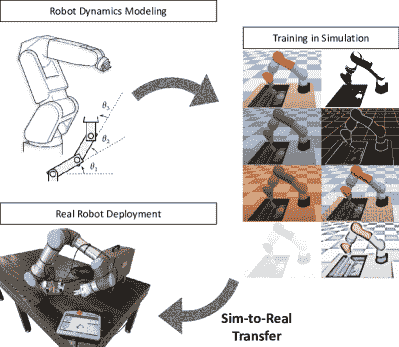

<!--yml

分类：未分类

日期：2024-09-06 19:59:07

-->

# [2009.13303] 深度强化学习在机器人领域中的仿真到现实转移：综述

> 来源：[`ar5iv.labs.arxiv.org/html/2009.13303`](https://ar5iv.labs.arxiv.org/html/2009.13303)

# 深度强化学习在机器人领域中的仿真到现实转移：综述

赵文帅¹，豪尔赫·佩尼亚·奎拉尔塔¹，托米·韦斯特伦德¹ ¹土耳其大学智能嵌入式与机器人系统实验室，芬兰

邮件：¹{wezhao, jopequ, tovewe}@utu.fi

###### 摘要

深度强化学习最近在机器人领域的多个领域取得了巨大成功。由于获取真实数据的局限性，即样本效率低和收集成本高，仿真环境被用来训练不同的智能体。这不仅提供了一个潜在的无限数据源，还缓解了真实机器人带来的安全隐患。然而，模拟世界与真实世界之间的差距在将模型转移到真实机器人时会降低策略的性能。因此，当前的多个研究工作正在致力于缩小这一仿真到现实的差距，实现更高效的政策转移。近年来出现了适用于不同领域的多种方法，但据我们所知，尚缺乏一篇全面综述并将不同方法置于背景中的文献。在这篇综述论文中，我们涵盖了深度强化学习中仿真到现实转移的基本背景，并概述了当前主要使用的方法：领域随机化、领域适应、模仿学习、元学习和知识蒸馏。我们对一些最相关的近期工作进行了分类，并概述了主要的应用场景。最后，我们讨论了不同方法的主要机会和挑战，并指出了最有前景的方向。

###### 关键词：

深度强化学习；机器人技术；仿真到现实；迁移学习；元学习；领域随机化；知识蒸馏；模仿学习；

## I 引言

强化学习（RL）算法在过去几年中被机器人社区越来越多地采用，用于控制复杂的机器人或多机器人系统[1, 2]，或提供从感知到控制的端到端策略[3]。受我们通过试错过程学习的方式启发，RL 算法基于智能体在不同体验下以特定方式行动时获得的奖励来进行知识获取。这自然需要大量的试验，因此在现实世界场景中，时间和经验变异性的学习限制是显而易见的。此外，使用真实机器人进行学习需要考虑安全关键应用中可能出现的危险或意外行为[4]。深度强化学习（DRL）算法已成功部署在各种类型的模拟环境中，但在模拟世界之外的成功有限。然而，一个例外是涉及物体操作的机器人任务[5, 6]。在这项调查中，我们回顾了试图回答这一方向关键研究问题的最相关工作：如何通过知识转移和策略调整在现实世界设置中利用基于模拟的训练（见图 1）。

图 1：模拟到现实转移过程的概念视图。最常见的方法之一是领域随机化，通过该方法可以将模拟器的不同参数（例如，颜色、纹理、动态）随机化，以生成更稳健的策略。

基于模拟的训练提供了低成本的数据，但涉及到与真实世界设置固有的不匹配。弥合模拟与现实之间的差距首先需要能够考虑传感和执行方面不匹配的方法。前者在近年来深度学习领域得到了广泛研究，例如针对计算机视觉算法的对抗攻击[7]。后者的风险可以通过更现实的模拟来最小化。在这两种情况下，当前的一些方法包括引入环境扰动[8]或专注于领域随机化[9]。另一个关键方面是，部署在现实世界中的智能体可能会遇到模拟中不存在的新体验[10]，以及需要调整其策略以涵盖更广泛的任务集。弥合这一差距的一些方法依赖于元学习[11]或持续学习[12]等。

上述方法专注于从模拟训练的代理中提取知识，以便将其部署到现实生活场景中。然而，还有其他方法可以达到相同的目的。近年来，模拟器在更现实的场景和物理引擎方面取得了进展：Airsim [13]、CARLA [14]、RotorS [15, 16]等。对于这些模拟器中的一些，部分目标是通过提供训练数据和经验，减少现实和模拟设置之间的差异，从而能够将机器人代理直接部署到现实世界中。其他研究则专注于提高在实际设置中训练的安全性。安全性是实现复杂代理在现实世界中在线训练的主要挑战之一，从机器人手臂到自动驾驶汽车 [4]。在这一方向上，最近的工作在安全 DRL 方面显示了有希望的结果，即使在减少探索空间的同时，也能确保收敛 [3]。在这项调查中，我们不涉及具体的模拟器或技术在现实世界设置中的直接学习，而是专注于描述从模拟中学到的知识向真实机器人平台部署的主要方法。

据我们所知，这是第一项描述用于缩小机器人领域 DRL 中模拟与现实之间差距的不同方法的调查。我们还集中描述当前研究工作的主要应用领域。我们从更广泛的角度讨论了最近的工作，包括转移学习和领域适应、知识蒸馏和元强化学习等相关研究方向。尽管其他调查侧重于转移学习技术 [18]或安全强化学习 [4]，我们提供了不同的视角，重点是机器人领域的 DRL 策略转移。最后，也有大量的出版物在真实机器人上部署 DRL 策略。然而，在这项调查中，我们专注于那些特别解决模拟到现实转移问题的工作。重点主要是在端到端方法上，但我们也描述了相关的研究，其中模拟到现实转移技术应用于机器人操作的感知方面，主要是将 DL 视觉算法转移到真实机器人。

本文的其余部分组织如下。在第 II 节中，我们简要介绍了深度强化学习的主要方法，以及知识蒸馏、迁移、适应和元学习等相关研究方向。第 III 节则深入探讨了缩小模拟与现实之间差距的不同方法，第 IV 节则重点关注最相关的应用领域。接下来，我们在第 V 节讨论了开放挑战和有前途的研究方向。最后，第 VI 节总结了本次调查。

## II 背景

模拟到现实是一个非常综合的概念，应用于许多领域，包括机器人技术和经典的机器视觉任务。因此，许多方法和概念与这一目标交叉，包括迁移学习、鲁棒强化学习和元学习。在这一节中，我们简要介绍了深度强化学习、知识蒸馏、迁移学习和领域适应的概念，然后详细探讨了深度强化学习中的模拟到现实转移方法。这些概念之间的关系在图 2 中进行了说明。

图 2：不同的深度强化学习模拟到现实转移方法及其关系的示意图。

### II-A 深度强化学习

标准的强化学习（RL）任务可以被视为一个顺序决策设置，其中一个代理在离散的步骤中与环境交互。代理在每个时间步 t 采取一个动作$a_{t}$，使得环境的状态从$s_{t}$变为$s_{t+1}$，转移概率为$p(s_{t+1}|s_{t},a_{t})$。这种设置可以被视为一个马尔可夫决策过程（MDP），其状态集合为$s\in\mathcal{S}$，动作集合为$a\in\mathcal{A}$，转移概率集合为$p\in\mathcal{P}$，奖励集合为$r\in\mathcal{R}$。因此，我们可以将这个 MDP 定义为一个元组（1）。

|  | $D\equiv(\mathcal{S},\mathcal{A},\mathcal{P},\mathcal{R})$ |  | (1) |
| --- | --- | --- | --- |

强化学习的目标是通过选择一个最优策略来最大化预期奖励，该策略将在深度强化学习（DRL）中通过深度神经网络表示。得益于现代计算能力的加速，DRL 在各种应用中取得了显著成功 [1, 19]，尤其是在模拟环境中 [20]。因此，如何将这种成功从模拟转移到现实中引起了越来越多的关注，这也是本文的动机。

### II-B 模拟到现实转移

将 DRL 策略从模拟环境转移到现实是实现更复杂机器人系统（具有深度学习定义控制器）的必要步骤。然而，这不仅是 DRL 算法特有的问题，而是一般机器学习的问题。尽管大多数 DRL 算法提供端到端的策略，即将原始传感器数据作为输入并产生直接执行命令作为输出的控制机制，但这两个维度的机器人系统可以分开考虑。在执行方面缩小模拟与现实之间的差距需要模拟器更准确，并考虑代理动态的变异性。然而，在感知方面，问题可以被认为更广泛，因为它还涉及到面对现实世界中未在模拟中出现的情况的更一般的机器学习问题 [10]。本文主要集中在端到端模型上，概述了针对系统建模和动态随机化的研究，以及从感知角度引入随机化的研究。

### II-C 迁移学习与领域适应

迁移学习的目标是通过将不同但相关源领域中的知识转移到目标领域，来提高目标学习者在目标领域的表现 [18]。通过这种方式，迁移学习可以减少在构建目标学习者时对目标领域数据的依赖。

领域适应是迁移学习方法的一个子集。它指定了当我们有足够的源领域标记数据和与目标任务相同的单一任务，但没有或仅有很少的目标领域数据时的情况。在模拟到现实的机器人中，研究人员倾向于使用模拟器来训练强化学习模型，然后在现实环境中部署它，在这里我们应利用领域适应技术，以便将基于模拟的模型有效转移。

### II-D 知识蒸馏

在具有高维输入数据（例如复杂视觉任务）的 DRL 中，大型网络是典型的。策略蒸馏是提取知识以训练一个新网络的过程，该网络能够保持类似的专家水平，同时显著更小且更高效[21]。在这些设置中，这两个网络通常被称为教师网络和学生网络。学生网络以教师网络生成的数据进行监督训练。在[12]中，作者提出了 DisCoRL，一个模块化、有效且可扩展的持续 DRL 管道。DisCoRL 已经成功应用于多个任务，通过不同教师的知识被蒸馏到单个学生网络中。

### II-E 元强化学习

元学习，即学习如何学习，旨在从多个训练任务中学习对未见测试任务的适应能力。一个好的元学习模型应该在各种学习任务上进行训练，并在任务分布上优化以获得最佳性能，包括在测试时可能未见过的任务。这一精神可以应用于监督学习和强化学习，在后者的情况下被称为元强化学习（MetaRL）[22]。

MetaRL 的整体配置类似于普通 RL 算法，不同之处在于 MetaRL 通常实现一个 LSTM 策略，并将上一个奖励 $r_{t-1}$ 和上一个动作 $a_{t-1}$ 纳入当前策略观察中。在这种情况下，LSTM 的隐藏状态作为跟踪轨迹特征的记忆。因此，MetaRL 从过去的训练中汲取知识。

### II-F 稳健的 RL 和模仿学习

稳健的 RL[23]早期就被提出作为一种新的 RL 范式，该范式明确考虑输入扰动以及建模误差。它考虑了一个不良或甚至对抗性的模型，并尝试将奖励最大化作为一个优化问题[24, 25]。

模仿学习提议使用专家演示或轨迹，而不是手动构建固定的奖励函数来训练 RL 智能体。模仿学习的方法大致可以分为两个关键领域：行为克隆，其中智能体学习从观察到动作的映射，给定演示[26, 27]；以及逆向强化学习，其中智能体尝试估计描述给定演示的奖励函数[28]。由于其旨在为 RL 智能体提供稳健的奖励，因此有时模仿学习可以用于获得稳健的 RL 或模拟到现实的转移[29]。

表 I: Sim2Real 转移中最相关出版物的分类。

|  | 描述 | 模拟到现实转移 | 多智能体 | 模拟器 | 知识 | 学习 | 现实 | 应用 |
| --- | --- | --- | --- | --- | --- | --- | --- | --- |
|  | 和学习细节 | 学习 | / 引擎 | 转移 | 算法 | 机器人/平台 |
| Balaji et al. [30] | DeepRacer：一个教育性的自主赛车平台。 | 随机颜色和并行领域随机化 | ✓(仅模拟) 分布式回滚 | Gazebo RoboMaker | ✗ | PPO | DeepRacer 4WD 1:18 车 | 自主赛车 |
| Traore et al. [12] | 带有策略蒸馏和 Sim-to-real 转移的持续 RL。 | 通过策略蒸馏实现持续学习。 | ✗ | PyBullet | ✓多任务蒸馏 | PPO2 | 小型移动平台 | 机器人导航 |
| Kaspar et al. [31] | 无动态随机化的 Sim-to-real 转移用于 RL。 | 系统识别和高质量机器人模型。 | ✗ | PyBullet | ✗ | SAC | KUKA LBR iiwa + WSG50 夹具 | 钉孔操控 |
| Matas et al. [6] | 针对可变形物体操控的 Sim-to-real RL。 | 随机抓取和领域随机化。 | ✓(模拟) | PyBullet | ✗ | DDPGfD | 7DOF Kinova Mico 手臂 | 灵巧操控 |
| Witman et al. [32] | 针对大气压力等离子体喷射的热效应的 Sim-to-real RL。 | 自定义物理模型和动态随机化 | ✗ | 自定义 | ✗ | A3C | 高频激励的氦气 APPJ | 等离子体喷射控制 |
| Jeong et al. [33] | 使用 RL 建模广义力以实现 Sim2Real 转移 | 建模和学习状态依赖的广义力。 | ✗ | MuJoCo | ✗ | MPO | Rethink Robotics Sawyer | 非抓取操控 |
| Arndt et al. [11] | 用于 Sim2Real 领域适配的元强化学习 | 领域随机化和模型无关的元学习。 | ✗ | MuJoCo | ✓元训练 | PPO | Kuka LBR 4+手臂 | 操控（曲棍球） |
| Breyer et al. [34] | 使用 Sim2Real RL 的灵活机器人抓取 | 直接转移。椭圆掩膜到 RGB-D 图像。 | ✗ | PyBullet | ✗ | TRPO | ABB YuMi 与平行夹具 | 机器人抓取 |
| Van Baar et al. [35] | 用于机器人任务的 Sim-to-real 转移与稳健化策略。 | 外观和/或物理参数的变化。 | ✓(模拟) | MuJoCo + Ogre 3D | ✓ | A3C（模拟） + 离策略 | 三菱 Melfa RV-6SL | 大理石迷宫操控 |
| Bassani et al. [36] | 用于机器人足球比赛的 Sim2Real RL。 | 领域适配和自定义模拟器用于转移。 | ✗ | VSSS-RL | ✓ | DDPG /DQN | VSSS 机器人 | 机器人导航 |
| Qin et al. [37] | 使用 DRL 和课程学习实现六足机器人 Sim2Real。 | 课程学习与逆向运动学。 | ✗ | V-Rep | ✓ | PPO | 六足机器人 | 导航与避障 |
| Vacaro et al. [38] | 针对每个人的强化学习的 Sim-to-real | 领域随机化（光 + 颜色 + 纹理）。 | ✓(模拟) | Unity3D | ✗ | IMPALA | Sainsmart 机器人手臂 | 低成本机器人手臂 |
| Chaffre et al. [39] | 使用递增环境复杂度的 Sim-to-Real 转移 | 使用递增环境复杂度进行 SAC 训练。 | ✗ | Gazebo | ✗ | DDPG /SAC | Wifibot Lab V4 | 无地图导航 |
| Kaspar et al. [40] | 用于孔中插销任务的笛卡尔命令的强化学习。 | 动态（CMA-ES）和环境随机化。 | ✗ | PyBullet | ✗ | SAC | Kuka LBR iiwa | 插销任务 |
| Hundt et al. [41] | 通过奖励塑形进行高效的多步视觉任务强化学习。 | 使用自定义仿真框架的直接转移。 | ✗ | SPOT 框架 | ✗ | SPOT-Q + PER | Universal Robot UR5 | 长期多步任务 |
| Pedersen et al. [42] | 基于 GAN 的抓取姿态估计的仿真到现实转移 | 用于领域适应和转移的 CycleGAN。 | ✗ | Unity | ✗ | PPO | Panda 机器人 | 机器人抓手 |
| Ding et al. [43] | 光学触觉传感的仿真到现实转移 | 不同随机化量的分析。 | ✗ | PyBullet | ✗ | CNN | Sawyer 机器人 + TacTip 传感器 | 触觉传感 |
| Muratore et al. [9] | 数据高效的贝叶斯领域随机化用于仿真到现实 | 提出的贝叶斯随机化（BAYR）。 | ✗ | 自定义/ BoTorch | ✗ | PPO / RF 分类器 | Quanser Qube | 摆动/平衡 |
| Zhao et al. [8] | 通过扰动缩小协作 DRL 中的仿真到现实差距 | 领域随机化（自定义扰动） | ✓（仿真） | Pybullet | ✗ | PPO | Kuka（仅仿真） | 机器人臂 |
| Nachum et al. [44] | 通过运动学实现的多智能体操作 | 分层仿真到现实、无模型、零样本转移。 | ✓ | MuJoCo | ✗ | Custom | D’Kitty 机器人（2x） | 多智能体操作 |
| Rajeswaran et al. [5] | 使用 DRL 和示范者进行灵巧操作。 | 通过示范者与 VR 进行模仿学习。 | ✗ | MuJoCo | ✗ | DAPG | ADROIT 24-DoF 手 | 多指机器人手 |

## III 仿真到现实转移的方法论

在仿真到现实转移（sim-to-real transfer）的研究中，过去几年里出版物的数量增加了几个数量级。研究方向多样，本节总结了仿真到现实转移中最具代表性的方法。

表 I 列出了该领域一些最相关和最新的研究。学习转移中最广泛使用的方法是领域随机化，其他相关示例包括策略蒸馏、系统识别或元强化学习（meta-RL）。学习算法的变异性较高，DRL 使用的算法包括邻近策略优化（PPO） [45]、信任区域策略优化（TRPO） [46]、最大后验策略优化（MPO） [47]、异步演员评论家（A3C）方法 [48]、软演员评论家（SAC） [49]，或深度确定性策略梯度（DDPG） [50]，等等。

### III-A 零样本转移

将知识从模拟转移到现实的最直接方法是构建一个逼真的模拟器，或拥有足够的模拟经验，以便模型可以直接应用于现实环境。这种策略通常被称为零样本或直接转移。系统识别用于构建精确的现实世界模型，而领域随机化则是可以视为一次性转移的技术。我们在第 III-B 节和第 III-C 节中分别讨论了这两者。

### III-B 系统识别

值得注意的是，模拟器并不是现实世界的真实表示。系统识别[51]正是为了构建一个精确的物理系统数学模型，并使模拟器更现实，需要仔细的校准。然而，获得一个足够逼真的模拟器仍然面临挑战。例如，很难构建高质量的渲染图像来模拟真实视觉。此外，由于温度、湿度、定位或磨损等因素，相同机器人许多物理参数可能会显著变化，这给系统识别带来了更多困难。

### III-C 领域随机化方法

领域随机化的理念是[52]，与其仔细建模现实世界的所有参数，不如高度随机化模拟，以覆盖现实世界数据的实际分布，尽管模型和现实世界之间存在偏差。图 3(a)展示了领域随机化的范式。

(a) 领域随机化范式的直观理解。

(b) 领域适应范式的直观理解。

图 3：展示了深度强化学习中最广泛使用的两种从模拟到现实转移的方法。领域随机化和领域适应通常作为独立技术应用，但它们也可以结合使用。

根据模拟器组件的随机化，我们将领域随机化的方法分为两种：视觉随机化和动态随机化。在机器人视觉任务中，包括物体定位[53]、物体检测[54]、姿态估计[55]和语义分割[56]，模拟器生成的训练数据通常在纹理、光照和摄像机位置上与现实环境有所不同。因此，视觉领域随机化旨在提供足够的视觉参数模拟变异性，以便模型在测试时能够对真实世界数据进行泛化。除了在视觉输入中添加随机化外，动态随机化还可以帮助获取稳健的策略，特别是在需要控制策略的情况下。为了学习物理五指手的灵巧的手内操控策略，[57] 在模拟器中随机化了各种物理参数，如物体尺寸、物体和机器人连杆质量、表面摩擦系数、机器人关节阻尼系数和驱动器力增益。他们成功的模拟到真实转移实验展示了领域随机化的强大效果。

除了通常使模拟数据随机化以覆盖真实世界的数据分布，[58] 提供了另一个有趣的角度来应用领域随机化。他们提出将随机化的模拟图像和真实世界图像转化为规范的模拟图像，并通过在模拟中训练基于视觉的闭环抓取强化学习代理来展示这种模拟到真实的方法的有效性。

### III-D 领域适应方法

领域适应方法使用源领域的数据来提高学习模型在目标领域的性能，而目标领域的数据通常较少。由于源领域和目标领域之间通常存在不同的特征空间，为了更好地转移源数据中的知识，我们应尝试使这两个特征空间统一。这是领域适应的主要精神，可以通过图 3(b)中的图示来描述。

近年来，领域适应的研究在基于视觉的任务中广泛进行，例如图像分类和语义分割 [59, 60]。然而，在本文中，我们专注于与强化学习相关的任务及应用于机器人领域的任务。在这些场景中，采用领域适应的纯视觉任务作为后续构建强化学习代理或其他控制任务的先验知识 [58, 61, 29]。此外，还有一些使用领域适应进行图像到策略工作的研究，以将合成数据学习的策略进行推广，或加速在实际机器人上的学习 [61]。有时，领域适应被直接用于在代理之间转移策略 [62]。

具体来说，我们现在在强化学习设置中形式化领域适应场景 [63]。根据方程 (1)中的 MDP 定义，我们将源领域表示为 $D_{S}\equiv(\mathcal{S}_{S},\mathcal{A}_{S},\mathcal{P}_{S},\mathcal{R}_{S})$，目标领域表示为 $D_{T}\equiv(\mathcal{S}_{T},\mathcal{A}_{T},\mathcal{P}_{T},\mathcal{R}_{T})$。在强化学习场景中，由于感知现实差距 [64]，源领域和目标领域的状态 $\mathcal{S}$ 可能会有很大不同 $(\mathcal{S}_{S}\neq\mathcal{S}_{T})$，而两个领域共享动作空间和转移 $\mathcal{P}$ $(\mathcal{A}_{S}\approx{\mathcal{A}_{T}},\mathcal{P}_{S}\approx{\mathcal{P}_{T}})$，并且它们的奖励函数 $\mathcal{R}$ 具有结构相似性 $(\mathcal{R}_{S}\approx{\mathcal{R}_{T}})$。

从文献中，我们总结了三种常见的域适应方法，无论其任务如何。这些方法是基于**差异**、基于**对抗**和基于**重建**的方法，这些方法也可以交叉使用。基于差异的方法通过计算预定义的统计度量来衡量源域和目标域之间的特征距离，以对齐它们的特征空间[65, 66, 67]。基于对抗的方法建立一个域分类器来区分特征来自源域还是目标域。经过训练后，提取器可以从源域和目标域中产生不变的特征[68, 69, 70]。基于重建的方法也旨在找到域之间的不变或共享特征。然而，它们通过构建一个辅助重建任务，并使用共享特征来恢复原始输入[71]。这样，共享特征应在域之间保持不变且独立。这三种方法提供了不同的角度，使不同域的特征统一，并可用于视觉任务和基于 RL 的控制任务。

### III-E 带扰动的学习

域随机化和动态随机化方法专注于在模拟环境中引入扰动，旨在使智能体对模拟与现实之间的不匹配**不那么敏感**[30, 38, 40]。这种相同的概念在其他工作中得到了扩展，其中引入了扰动以获得更**强健**的智能体。例如，在[72]中，作者考虑了**噪声奖励**。虽然与模拟到现实的转移没有直接关系，噪声奖励可以更好地模拟智能体的现实世界训练。此外，在我们最近的一些工作中[8, 73]，我们考虑了环境扰动，这些扰动对并行学习的不同智能体有不同的影响。这是当多个真实智能体要部署或使用共同策略进行训练时需要考虑的一个方面。

### III-F 模拟环境

模拟到实际转移的一个关键方面是模拟选择。无论用于有效转移知识到真实机器人的技术如何，模拟的现实性越高，预期的结果就越好。文献中最广泛使用的模拟器包括 Gazebo [74]、Unity3D 和 PyBullet [75] 或 MuJoCo [17]。Gazebo 的优点是与机器人操作系统（ROS）中间件广泛集成，因此可以与真实机器人中的部分机器人堆栈一起使用。另一方面，PyBullet 和 MuJoCo 与深度学习和强化学习库以及健身环境的集成更广泛。一般来说，Gazebo 更适合复杂场景，而 PyBullet 和 MuJoCo 提供更快的训练。

在那些以一次性转移为目标的系统识别案例中，研究人员通常会构建或定制满足问题特定需求和约束的模拟环境 [32, 36, 41]。

## IV 应用场景

深度强化学习（DRL）在机器人领域的一些最常见应用是导航和灵巧操作 [1, 76]。由于大多数机器人臂的操作空间有限，灵巧操作的模拟环境相对容易生成，优于更复杂的机器人系统。例如，Open AI Gym [77]，这是最广泛使用的强化学习框架之一，提供了多个灵巧操作环境。

### IV-A 灵巧机器人操作

机器人操作任务已经能够通过深度强化学习（DRL）实现，从学习钉子插入孔任务 [40]到可变形物体的操作 [6]，以及更灵巧的多指操作 [5]，或者学习力控策略 [78]。后者对模拟到实际转移尤为相关：对真实物体施加过大的力量可能导致损坏，而力量不足则可能导致抓取失败。

在 [6]中，Matas 等人利用领域随机化来学习对可变形物体的操作。作者认为模拟环境的一个主要缺点是无法正确模拟物体的变形程度，导致真实机器人无法抓取更坚硬的物体。此外，研究的一个相关结论是过度的领域随机化可能有害。具体来说，当用于每种纹理的颜色数量过多时，真实机器人的表现显著变差。

### IV-B 机器人导航

尽管使用强化学习进行导航的研究兴趣在近年来持续增加[79, 80]，但专注于仿真到现实转移方法的文献仍然稀少。与学习操作中更成熟的研究相比，第一个不同之处可能在于缺乏标准的仿真环境。由于不同导航任务所需的环境和传感器设备更为具体，通常使用了定制的仿真器[36, 37]，或者使用 Unity、Unreal Engine 或 Gazebo[39, 42] 创建了仿真世界。

DRL 策略的仿真到现实转移可以应用于复杂的导航任务：从六足机器人[37] 到基于深度的无地图导航[39]，包括足球比赛的机器人[36]。为了实现成功的现实世界转移，文献中应用了不同的方法。由于其潜力和新颖性，特别感兴趣的方法包括：课程学习[37]、逐步环境复杂性[39]、以及针对多任务的持续学习和策略蒸馏[12]。

### IV-C 其他应用

近年来出现的一些其他 DRL 和仿真到现实转移在机器人技术中的应用包括等离子体喷射[32]、触觉传感[43] 或多智能体操作[44]。

## V 主要挑战和未来方向

尽管我们审阅的论文中展示了进展，但基于现有方法，仿真到现实仍然具有挑战性。对于领域随机化，研究人员往往通过经验研究哪些随机化是必要的，但很难正式解释它如何以及为什么有效，这也带来了设计高效仿真和随机化分布的难度。对于领域适应，大多数现有算法集中于同质深度领域适应，假设源领域和目标领域之间的特征空间是相同的。然而，这一假设在许多应用中可能并不成立。因此，我们期望在没有这种限制的情况下进行更多的探索以迁移知识。

两个最有前景的研究方向是：(i) 将不同的现有方法整合以实现更高效的转移（例如，领域随机化和领域适应）；以及(ii) 逐步复杂性学习、持续学习和复杂或多步骤任务的奖励塑造。

## VI 结论

强化学习算法通常依赖于模拟数据来满足其对大量标记经验的需求。然而，模拟环境与现实世界场景之间的不匹配需要进一步关注用于将知识从模拟转移到现实的方法。据我们所知，这是首个聚焦于 DRL 在机器人领域中进行模拟到现实转移的不同方法的调查。

域随机化已被确定为提高仿真现实性和更好地为现实世界做准备的最广泛采用的方法。然而，我们讨论了显示出良好结果的替代研究方向。例如，策略蒸馏正在实现多任务学习以及更高效、更小的网络，而元学习方法则允许更广泛的任务变异。

该领域仍面临多个挑战。尽管实际应用展示了不同方法的效率，但需要更广泛的理论和实证研究以更好地理解这些技术在学习过程中的效果。此外，文献中也缺乏对现有结果的全面分析和泛化。

## 致谢

这项工作得到了芬兰学术院 AutoSOS 项目的资助，资助编号 328755。

## 参考文献

+   [1] Kai Arulkumaran, Marc Peter Deisenroth, Miles Brundage 和 Anil Anthony Bharath. 深度强化学习的简要调查。arXiv:1708.05866，2017 年。

+   [2] Thanh Thi Nguyen, Ngoc Duy Nguyen 和 Saeid Nahavandi. 多智能体系统的深度强化学习：挑战、解决方案和应用的回顾。《IEEE 网络系统学报》，2020 年。

+   [3] Richard Cheng, Gábor Orosz, Richard M Murray 和 Joel W Burdick. 通过障碍函数实现端到端安全强化学习，用于安全关键的连续控制任务。在 AAAI 人工智能，第 33 卷，2019 年。

+   [4] Javier Garcıa 和 Fernando Fernández. 关于安全强化学习的全面调查。《机器学习研究期刊》，16(1)，2015 年。

+   [5] Aravind Rajeswaran, Vikash Kumar, Abhishek Gupta, Giulia Vezzani, John Schulman, Emanuel Todorov 和 Sergey Levine. 通过深度强化学习和演示学习复杂的灵巧操作。arXiv:1709.10087，2017 年。

+   [6] Jan Matas, Stephen James 和 Andrew J Davison. 用于可变形物体操作的模拟到现实强化学习。arXiv:1806.07851，2018 年。

+   [7] Naveed Akhtar 和 Ajmal Mian. 深度学习在计算机视觉中的对抗攻击威胁：一项调查。《IEEE Access》，6，2018 年。

+   [8] Wenshuai Zhao, Jorge Peña Queralta, Li Qingqing 和 Tomi Westerlund. 迈向缩小协作多机器人深度强化学习中的仿真与现实之间的差距。在第五届 ICRAE，2020 年。

+   [9] Fabio Muratore, Christian Eilers, Michael Gienger 和 Jan Peters. 贝叶斯域随机化用于模拟到现实转移。arXiv:2003.02471，2020 年。

+   [10] Ramya Ramakrishnan, Ece Kamar, Debadeepta Dey, Eric Horvitz, 和 Julie Shah. 用于安全 sim-to-real 转移的盲点检测。《人工智能研究期刊》，67，2020 年。

+   [11] Karol Arndt, Murtaza Hazara, Ali Ghadirzadeh, 和 Ville Kyrki. 用于 sim-to-real 域适应的元强化学习。arXiv:1909.12906，2019 年。

+   [12] René Traoré, Hugo Caselles-Dupré, Timothée Lesort, Te Sun, Natalia Díaz-Rodríguez, 和 David Filliat. 在实际应用中部署的持续强化学习，通过策略蒸馏和 sim2real 转移。arXiv:1906.04452，2019 年。

+   [13] Shital Shah, Debadeepta Dey, Chris Lovett, 和 Ashish Kapoor. Airsim：用于自主车辆的高保真视觉和物理仿真。发表于《现场与服务机器人》，2018 年。

+   [14] Alexey Dosovitskiy, German Ros, Felipe Codevilla, Antonio Lopez, 和 Vladlen Koltun. Carla：一个开放的城市驾驶仿真器。arXiv:1711.03938，2017 年。

+   [15] Fadri Furrer, Michael Burri, Markus Achtelik, 和 Roland Siegwart. Rotors——一个模块化的 Gazebo MAV 仿真框架。发表于《机器人操作系统（ROS）》。2016 年。

+   [16] Cassandra McCord, Jorge Peña Queralta, Tuan Nguyen Gia, 和 Tomi Westerlund. 多智能体系统的分布式渐进控制：在 ROS/Gazebo 中对 UAV 的 2D 和 3D 部署。发表于 ECMR，2019 年。

+   [17] Emanuel Todorov, Tom Erez, 和 Yuval Tassa. Mujoco：一个用于基于模型控制的物理引擎。发表于 IROS，2012 年。

+   [18] Fuzhen Zhuang, Zhiyuan Qi, Keyu Duan, Dongbo Xi, Yongchun Zhu, Hengshu Zhu, Hui Xiong, 和 Qing He. 关于迁移学习的全面调查。《IEEE 会议录》，2020 年。

+   [19] Jorge Peña Queralta, Jussi Taipalmaa, Bilge Can Pullinen, Victor Kathan Sarker, Tuan Nguyen Gia, Hannu Tenhunen, Moncef Gabbouj, Jenni Raitoharju, 和 Tomi Westerlund. 用于搜索和救援的协作多机器人系统：协调与感知。arXiv 预印本 arXiv:2008.12610，2020 年。

+   [20] Christopher Berner, Greg Brockman, Brooke Chan, Vicki Cheung, Przemysław D ebiak, Christy Dennison, David Farhi, Quirin Fischer, Shariq Hashme, Chris Hesse, 等等. Dota 2 与大规模深度强化学习。arXiv:1912.06680，2019 年。

+   [21] Andrei A Rusu, Sergio Gomez Colmenarejo, Caglar Gulcehre, Guillaume Desjardins, James Kirkpatrick, Razvan Pascanu, Volodymyr Mnih, Koray Kavukcuoglu, 和 Raia Hadsell. 策略蒸馏。arXiv:1511.06295，2015 年。

+   [22] Jane X Wang, Zeb Kurth-Nelson, Dhruva Tirumala, Hubert Soyer, Joel Z Leibo, Remi Munos, Charles Blundell, Dharshan Kumaran, 和 Matt Botvinick. 学习强化学习。arXiv:1611.05763，2016 年。

+   [23] Jun Morimoto 和 Kenji Doya. 鲁棒强化学习。《神经计算》，17(2)，2005 年。

+   [24] Chen Tessler, Yonathan Efroni, 和 Shie Mannor. 动作鲁棒强化学习及其在连续控制中的应用。arXiv:1901.09184，2019 年。

+   [25] Daniel J Mankowitz, Nir Levine, Rae Jeong, Yuanyuan Shi, Jackie Kay, Abbas Abdolmaleki, Jost Tobias Springenberg, Timothy Mann, Todd Hester 和 Martin Riedmiller。具有模型误差的连续控制的稳健强化学习。arXiv:1906.07516，2019。

+   [26] Dean A Pomerleau. Alvinn：一个在神经网络中的自主陆地车辆。见《神经信息处理系统进展》，1989。

+   [27] Stéphane Ross, Geoffrey Gordon 和 Drew Bagnell。将模仿学习和结构化预测简化为无悔在线学习。见 AISTATS，2011。

+   [28] Andrew Y Ng, Stuart J Russell 等。逆向强化学习算法。见 Icml，第 1 卷，2000。

+   [29] Mengyuan Yan, Iuri Frosio, Stephen Tyree 和 Jan Kautz。使用眼内观察和连续控制的准确抓取的模拟到现实转移。arXiv:1712.03303，2017。

+   [30] Bharathan Balaji, Sunil Mallya, Sahika Genc, Saurabh Gupta, Leo Dirac, Vineet Khare, Gourav Roy, Tao Sun, Yunzhe Tao, Brian Townsend 等。Deepracer：用于模拟到现实强化学习实验的教育性自主赛车平台。arXiv:1911.01562，2019。

+   [31] Manuel Kaspar, Juan David Munoz Osorio 和 Jürgen Bock。无需动态随机化的强化学习模拟到现实转移。arXiv:2002.11635，2020。

+   [32] Matthew Witman, Dogan Gidon, David B Graves, Berend Smit 和 Ali Mesbah。用于控制大气压力等离子体喷射的热效应的模拟到现实转移强化学习。Plasma Sources Science and Technology, 28(9)，2019。

+   [33] Rae Jeong, Jackie Kay, Francesco Romano, Thomas Lampe, Tom Rothorl, Abbas Abdolmaleki, Tom Erez, Yuval Tassa 和 Francesco Nori。使用强化学习对模拟到现实转移进行建模的通用力。arXiv:1910.09471，2019。

+   [34] Michel Breyer, Fadri Furrer, Tonci Novkovic, Roland Siegwart 和 Juan Nieto。基于模拟到现实转移的灵活机器人抓取。ArXiv e-prints，2018。

+   [35] J van Baar, R Corcodel, A Sullivan, D Jha, D Romeres 和 D Nikovski。带有稳健策略的模拟到现实转移学习用于机器人任务。2018。

+   [36] Hansenclever F Bassani, Renie A Delgado, Jose Nilton de O Lima Junior, Heitor R Medeiros, Pedro HM Braga 和 Alain Tapp。通过强化学习学习踢足球，并将模拟到现实应用于真实世界中的竞争。arXiv:2003.11102，2020。

+   [37] Bangyu Qin, Yue Gao 和 Yi Bai。模拟到现实：使用深度强化学习和课程学习的六足机器人控制。见 ICRAE，2019。

+   [38] Juliano Vacaro, Guilherme Marques, Bruna Oliveira, Gabriel Paz, Thomas Paula, Wagston Staehler 和 David Murphy。针对所有人的模拟到现实强化学习。见 LARS-SBR-WRE，2019。

+   [39] Thomas Chaffre, Julien Moras, Adrien Chan-Hon-Tong 和 Julien Marzat。用于基于深度的机器人导航的增量环境复杂度的模拟到现实转移。arXiv:2004.14684，2020。

+   [40] Manuel Kaspar 和 Jürgen Bock. 使用笛卡尔命令的强化学习和用于插销任务的仿真到现实转移。

+   [41] Andrew Hundt, Benjamin Killeen, Heeyeon Kwon, Chris Paxton 和 Gregory D Hager. “好机器人！”：通过奖励塑形进行多步骤视觉任务的高效强化学习。arXiv:1909.11730，2019。

+   [42] Ole-Magnus Pedersen. 机器人抓手位姿估计的仿真到现实转移——使用深度强化学习、生成对抗网络和视觉伺服。硕士论文，NTNU，2019。

+   [43] Zihan Ding, Nathan F Lepora 和 Edward Johns. 光学触觉传感的仿真到现实转移。arXiv:2004.00136，2020。

+   [44] Ofir Nachum, Michael Ahn, Hugo Ponte, Shixiang Gu 和 Vikash Kumar. 通过层次化仿真到现实的运动学进行多智能体操控。arXiv:1908.05224，2019。

+   [45] John Schulman, Filip Wolski, Prafulla Dhariwal, Alec Radford 和 Oleg Klimov. 近端策略优化算法。arXiv:1707.06347，2017。

+   [46] John Schulman, Sergey Levine, Pieter Abbeel, Michael Jordan 和 Philipp Moritz. 信任域策略优化。在 ICML，2015。

+   [47] Abbas Abdolmaleki, Jost Tobias Springenberg, Yuval Tassa, Remi Munos, Nicolas Heess 和 Martin Riedmiller. 最大后验策略优化。arXiv:1806.06920，2018。

+   [48] Volodymyr Mnih, Adria Puigdomenech Badia, Mehdi Mirza, Alex Graves, Timothy Lillicrap, Tim Harley, David Silver 和 Koray Kavukcuoglu. 深度强化学习的异步方法。在 ICML，2016。

+   [49] Tuomas Haarnoja, Aurick Zhou, Pieter Abbeel 和 Sergey Levine. Soft actor-critic：具有随机演员的离线最大熵深度强化学习。arXiv:1801.01290，2018。

+   [50] Timothy P Lillicrap, Jonathan J Hunt, Alexander Pritzel, Nicolas Heess, Tom Erez, Yuval Tassa, David Silver 和 Daan Wierstra. 使用深度强化学习的连续控制。arXiv:1509.02971，2015。

+   [51] Kristinn Kristinsson 和 Guy Albert Dumont. 使用遗传算法的系统辨识与控制。IEEE Transactions on Systems, Man, and Cybernetics, 22(5)，1992。

+   [52] Joshua P Tobin. 使用合成数据的现实世界机器人感知与控制。博士论文，UC Berkeley，2019。

+   [53] Josh Tobin, Rachel Fong, Alex Ray, Jonas Schneider, Wojciech Zaremba 和 Pieter Abbeel. 通过领域随机化将深度神经网络从仿真转移到现实世界。在 IROS，2017。

+   [54] Jonathan Tremblay, Aayush Prakash, David Acuna, Mark Brophy, Varun Jampani, Cem Anil, Thang To, Eric Cameracci, Shaad Boochoon 和 Stan Birchfield. 使用合成数据训练深度网络：通过领域随机化弥合现实差距。在 CVPR Workshops，2018。

+   [55] Martin Sundermeyer, Zoltan-Csaba Marton, Maximilian Durner, Manuel Brucker 和 Rudolph Triebel. 从 RGB 图像中进行 6D 物体检测的隐式 3D 方向学习。在 ECCV，2018。

+   [56] Xiangyu Yue, Yang Zhang, Sicheng Zhao, Alberto Sangiovanni-Vincentelli, Kurt Keutzer 和 Boqing Gong。领域随机化和金字塔一致性：无须访问目标领域数据的模拟到现实泛化。在 ICCV，2019 年。

+   [57] OpenAI: Marcin Andrychowicz, Bowen Baker, Maciek Chociej, Rafal Jozefowicz, Bob McGrew, Jakub Pachocki, Arthur Petron, Matthias Plappert, Glenn Powell, Alex Ray 等人。学习灵巧的手部操控。《国际机器人研究杂志》，39(1)，2020 年。

+   [58] Stephen James, Paul Wohlhart, Mrinal Kalakrishnan, Dmitry Kalashnikov, Alex Irpan, Julian Ibarz, Sergey Levine, Raia Hadsell 和 Konstantinos Bousmalis。通过模拟到模拟的方式实现从模拟到现实的数据高效机器人抓取：通过随机到规范的适应网络。在 CVPR，2019 年。

+   [59] Mei Wang 和 Weihong Deng。深度视觉领域适应：综述。《神经计算》，312，2018 年。

+   [60] Judy Hoffman, Eric Tzeng, Taesung Park, Jun-Yan Zhu, Phillip Isola, Kate Saenko, Alexei Efros 和 Trevor Darrell。Cycada：循环一致对抗领域适应。在 ICML，2018 年。

+   [61] Konstantinos Bousmalis, Alex Irpan, Paul Wohlhart, Yunfei Bai, Matthew Kelcey, Mrinal Kalakrishnan, Laura Downs, Julian Ibarz, Peter Pastor, Kurt Konolige 等人。利用模拟和领域适应提高深度机器人抓取的效率。在 ICRA，2018 年。

+   [62] Abhishek Gupta, Coline Devin, YuXuan Liu, Pieter Abbeel 和 Sergey Levine。学习不变特征空间以通过强化学习转移技能。arXiv:1703.02949，2017 年。

+   [63] Irina Higgins, Arka Pal, Andrei A Rusu, Loic Matthey, Christopher P Burgess, Alexander Pritzel, Matthew Botvinick, Charles Blundell 和 Alexander Lerchner。Darla：改善强化学习中的零样本迁移。arXiv:1707.08475，2017 年。

+   [64] Andrei A Rusu, Matej Večerík, Thomas Rothörl, Nicolas Heess, Razvan Pascanu 和 Raia Hadsell。通过渐进网络从像素到现实的机器人学习。在机器人学习大会，2017 年。

+   [65] Eric Tzeng, Judy Hoffman, Ning Zhang, Kate Saenko 和 Trevor Darrell。深度领域混淆：最大化领域不变性。arXiv:1412.3474，2014 年。

+   [66] Mingsheng Long, Yue Cao, Jianmin Wang 和 Michael Jordan。使用深度适应网络学习可转移特征。在 ICML，2015 年。

+   [67] Baochen Sun, Jiashi Feng 和 Kate Saenko。令人沮丧的简单领域适应的回归。arXiv:1511.05547，2015 年。

+   [68] Yaroslav Ganin, Evgeniya Ustinova, Hana Ajakan, Pascal Germain, Hugo Larochelle, François Laviolette, Mario Marchand 和 Victor Lempitsky。神经网络的领域对抗训练。《机器学习研究杂志》，17(1)，2016 年。

+   [69] Eric Tzeng, Judy Hoffman, Trevor Darrell 和 Kate Saenko。跨领域和任务的深度转移。在 ICCV，2015 年。

+   [70] Konstantinos Bousmalis, Nathan Silberman, David Dohan, Dumitru Erhan 和 Dilip Krishnan。使用生成对抗网络进行无监督像素级领域适应。在 CVPR，2017 年。

+   [71] 康斯坦丁诺斯·布斯马利斯、乔治·特里戈吉斯、内森·席尔伯曼、迪利普·克里什南和杜米特鲁·厄尔汉。领域分离网络。发表于神经信息处理系统进展, 2016。

+   [72] 王晶康、刘洋和李博。带有扰动奖励的强化学习。发表于 AAAI, 2020。

+   [73] 赵文帅、豪尔赫·佩尼亚·奎拉尔塔、李青青和托米·韦斯特伦。在边缘的普遍分布式深度强化学习：分析离散动作空间中的拜占庭代理。发表于第 11 届国际新兴普及系统与网络会议 (EUSPN 2020), 2020。

+   [74] 内森·科宁和安德鲁·霍华德。Gazebo 的设计和使用范式，一个开源多机器人模拟器。发表于 IROS, 第 3 卷, 2004。

+   [75] 埃尔温·考曼斯和尹飞·白。Pybullet，一个用于游戏、机器人和机器学习的物理仿真 Python 模块。2016。

+   [76] J. 科伯等。机器人中的强化学习：一项调查。国际机器人研究杂志, 32(11), 2013。

+   [77] 格雷格·布洛克曼、维基·张、路德维希·佩特松、乔纳斯·施奈德、约翰·舒尔曼、杰·唐和沃伊切赫·扎伦巴。OpenAI Gym。arXiv:1606.01540, 2016。

+   [78] M. 卡拉克里什南等。学习柔性操作的力控制策略。发表于 IROS, 2011。

+   [79] 朱玉克、鲁兹贝赫·莫塔吉、埃里克·科尔夫、约瑟夫·J·林、阿比纳夫·古普塔、李飞飞和阿里·法赫迪。使用深度强化学习在室内场景中进行目标驱动的视觉导航。发表于 ICRA, 2017。

+   [80] 曾凡宇、王晨和舒志·萨姆·戈。关于深度强化学习的人工智能视觉导航调查。IEEE Access, 8, 2020。
