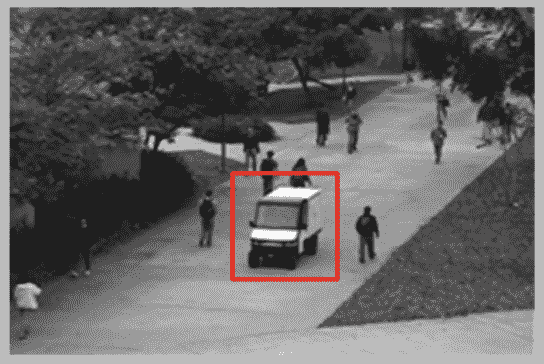
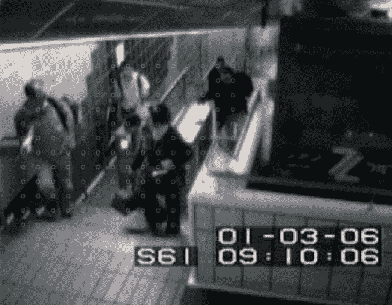

<!--yml

分类：未分类

日期：2024-09-06 19:59:05

-->

# [2009.14146] 深度学习技术在视频异常检测中的综述

> 来源：[`ar5iv.labs.arxiv.org/html/2009.14146`](https://ar5iv.labs.arxiv.org/html/2009.14146)

∎

¹¹机构文本：Jessie James P. Suarez ²²机构文本：计算机视觉与机器智能组

菲律宾大学，迪利曼

²²电子邮件：jpsuarez@up.edu.ph ³³机构文本：Prospero C. Naval, Jr ⁴⁴机构文本：计算机视觉与机器智能组

菲律宾大学，迪利曼

⁴⁴电子邮件：pcnaval@dcs.upd.edu.ph

# 深度学习技术在视频异常检测中的综述

Jessie James P. Suarez    Prospero C. Naval    Jr（接收日期：日期 / 接受日期：日期）

###### 摘要

视频异常检测是一个研究了十多年的问题。由于其广泛的适用性，这个领域引起了研究人员的兴趣。因此，近年来提出了多种方法，这些方法包括基于统计的方法和基于机器学习的方法。尽管已有许多综述对这一领域进行了探讨，但本文着重于提供有关深度学习在视频异常检测领域的最新进展的概述。深度学习在计算机视觉、自然语言处理等多个人工智能领域中取得了成功应用。然而，本文重点讨论了深度学习如何改进并提供了视频异常检测领域的更多见解。本文提供了不同深度学习方法的分类，依据其目标进行分类。此外，本文还讨论了常用的数据集及常见的评估指标。随后，综合讨论了所有最新方法，以提供未来研究的方向和可能领域。

###### 关键词：

视频理解 视频处理 异常检测 深度学习 计算机视觉

## 1 引言

监控视频在各种机构中越来越普遍，以便监控人类活动并防止犯罪发生。不言而喻，必须有专人观看这些视频，并在出现异常情况时发出警报。然而，这些事件并不常见，大多数时候，监控视频的人不会看到任何异常情况（Sultani et al., 2018）。这些异常事件可以被视为异常模式，即与正常情况不符的模式。寻找这些不符合模式的任务称为异常检测（Chandola et al., 2009）。因此，研究人员一直在尝试创建强大的异常检测算法，以自动化监控和检测监控视频中异常事件的过程。一个简单的异常情况可以参见图 1，其中正常区域用 $N$ 表示，异常区域用 $O$ 表示。如图所示，异常往往明显地位于正常区域之外。然而，这些异常实际上可能接近正常，如 $O_{2}$ 所示。

图 1：由 Chandola 等人 2009 提出的简单异常情况

异常检测是一个具有挑战性的任务，原因有很多：首先，异常的定义可能因上下文而异（Medel and Savakis, 2016; Sabokrou et al., 2017）。其次，异常的可能性是无限的（Luo et al., 2019）。第三，异常数据点，尤其是实际数据，往往与可能被定义为正常的情况接近（Vu et al., 2017）。最后，从数据中提取鲁棒特征，即使异常很少出现，也很困难（Ribeiro et al., 2018）。上述列表并未完全涵盖所有使问题复杂的原因，但这些主要问题是研究人员在过去几年中提出新解决方案时所考虑的重点。

大约十年前，大多数研究人员关注的是基于轨迹的异常检测（Jiang et al., 2011; Calderara et al., 2011; Tung et al., 2010; Li et al., 2013）。主要思想是如果感兴趣的物体没有遵循学习到的正常轨迹，则视频会被标记为异常。然而，这种方法的一个主要缺陷是遮挡，因为该方法严重依赖于对感兴趣物体的持续监控（Sabokrou et al., 2017; Narasimhan and S., 2018）。由于这些缺陷，重点转向了使用低级特征进行特征提取（Sabokrou et al., 2017）。这些基于低级特征的方法依赖于外观、运动和纹理特征（Mehran et al., 2009; Li et al., 2014; Zhang et al., 2016; Wang et al., 2018; Kim and Grauman, 2009; Benezeth et al., 2009）。为了表示视频的这些方面，使用了各种表示方法，例如 Mehran et al. (2009)的方法中，他们使用社会力图来建模人群的运动。同样，Benezeth et al. (2009)利用像素运动属性来建模行为。同时，Kim and Grauman (2009)使用了光流，然后将其作为概率主成分分析（MPPCA）模型的输入，从而创建了更紧凑的特征表示。然而，基于运动的特征不够，因此提出了同时利用两者的方法。例如，Li et al. (2014)的方法使用了动态纹理混合（MDTs），利用时间正常性和判别显著性检测器来建模空间正常性。同样，Zhang et al. (2016)使用了支持向量数据描述来处理空间特征，而光流用于运动特征。相比之下，Wang et al. (2018)使用了空间局部光流直方图和均匀局部梯度模式基础的光流。这些技术和方法，特别是这些“传统”方法，在 Kaur et al. (2018); Li and min Cai (2016); Popoola and Wang (2012)的工作中进行了详细讨论。

尽管这些传统方法在基准数据集上已证明成功，但在不同领域中仍然效果不佳。此外，它们无法适应之前未见过的异常（Hu et al., 2016; Medel and Savakis, 2016）。因此，近期的研究大多探讨了使用深度神经网络进行异常检测。这些神经网络能够自动学习有用且具有区分性的特征，从而省去了手动创建特征的麻烦（Krizhevsky et al., 2017）。这也使得它在不同领域的适应性更强。深度学习已被证明在各种计算机视觉任务中有效，如图像中的特征提取（Yan et al., 2016），图像分类（Krizhevsky et al., 2017），目标检测（Zoph et al., 2018），视频分析（Mei and Zhang, 2017），人脸检测（Lopes et al., 2017），视觉问答（Malinowski et al., 2017）以及其他许多任务。

如前所述，已有研究讨论了视频异常检测的各种方法（Kaur et al., 2018; Li and min Cai, 2016; Popoola and Wang, 2012）。然而，由于深度学习技术在这一领域的近期关注，本文的目标是更详细地审视这些深度学习技术。这包括组织这些方法之间的关系，解释为何提出这些方法，并清晰地总结它们所提出的结论。此外，还需要讨论这些方法主要使用的数据集和评估指标。了解这些数据集和指标在处理实际异常检测时的扩展性也是必要的。不同研究者创建了不同的环境设置，使一些方法无法比较。因此，为避免混淆和误解，将不包括讨论中涉及的方法的性能。

本文的组织结构如下：第一部分为调查的介绍。第二部分将详细讨论深度学习异常检测技术。第三部分将讨论最常用的数据集。第四部分将介绍常用的评估指标。第五部分将分配一个讨论部分，以综合所有提到的方法和数据集。最后，将给出结论性意见，并提出关于该研究领域可能发展的方向的建议。

## 2 深度学习在视频异常检测中的应用

深度学习技术主要集中在创建新的架构或设计适合特定问题的组件上。由于深度学习方法在许多不同的应用案例中取得了成功（Yan et al., 2016; Krizhevsky et al., 2017; Zoph et al., 2018; Mei and Zhang, 2017; Lopes et al., 2017; Malinowski et al., 2017），这些网络或架构可能彼此相似。例如，Krizhevsky et al. (2017)使用卷积神经网络进行图像分类。然而，几乎相同的网络也用于人脸识别（Lopes et al., 2017）。因此，下面介绍的类别将根据最终目标而非网络架构或学习策略来具体分组这些方法。其中包括使用重建误差或提供异常分数。与此一致，识别出了四（4）个类别，即：使用重建误差或基于重建的方法，将问题框定为分类问题，预测未来帧，以及计算异常分数。所有这些技术的快速总结见表 1。

### 2.1 使用重建误差

重建误差已经在各种传统异常检测技术中使用（Popoola and Wang, 2012）。使用重建误差的基本假设是正常样本的重建误差较低，因为它们更接近训练数据。另一方面，对于不正常的样本，重建误差被假设或期望较高（Gong et al., 2019; Sabokrou et al., 2016）。

更正式地说，设$x$为视频片段或视频帧，$g$为重建$x$的神经网络。重建误差可以定义为函数$f$，用于计算$x$（原始输入）和$g(x)$（重建）的误差。如公式 1 所示。这个概念最近通过使用深度学习技术来重建各种场景得到了扩展。

|  | $e=f(x,g(x))$ |  | (1) |
| --- | --- | --- | --- |

与普通的前馈网络不同，一种能够重建输入数据的神经网络称为自编码器。自编码器是一种能够将输入编码成更紧凑表示的神经网络，同时保留重要且具有区分性的特征。它还具有将这种特定编码解码回原始形式的能力（Baldi，2011）。图 2 展示了自编码器的视觉示意图，其中图示了编码器的简单架构，左侧是自编码器的输入$X$，中间部分是$X$的编码表示（有时称为潜在向量或代码），右侧是称为$X^{\prime}$的解码编码。

图 2：Michaela Massi (2019) 通过 Wikimedia Commons 的自编码器图

大多数以重建误差作为识别异常手段的方法都基于自编码器。其中一种方法由 Hasan 等人（2016）提出，他们认为与稀疏编码相比，自编码器的目标函数更高效。他们还表示，自编码器能够在编码动态时保留时空信息。他们的方法结合了 2D 卷积与自编码器，其中 2D 卷积以特定的原始视频片段作为输入。传统上，卷积神经网络的输入是一个二维图像，其第三通道是颜色通道（Krizhevsky 等，2017）。然而，在他们的方法中，第三维度由堆叠的灰度帧组成，从而使模型能够编码空间和部分时间信息以进行重建。

类似地，Medel 和 Savakis 的工作（2016）也将问题框定为重建问题。该方法利用卷积长短期记忆，其中长短期记忆（LSTM）网络是一种能够学习数据长期依赖关系的神经网络（Hochreiter 和 Schmidhuber，1997）。尽管不是显式的自编码器，他们的方法也采用了编码器-解码器结构。给定一个视频帧输入序列，卷积长短期记忆在空间和时间维度上提取相关特征，使得最后一个时间步被用作编码。解码器解开编码并重建帧，然后可以用来计算重建误差以进行异常检测。

Ribeiro 等人（2018）提出的方法与 Hasan 等人（2016）的方法非常相似。主要区别在于，低级特征如光流和边缘被用作与原始帧一起的输入。此外，他们还展示了这些特征如何影响卷积自编码器在检测异常方面的表现。

Sabokrou 等人（2016）提出了另一种方法，他们为任务使用了两种不同的自编码器：一种是常规自编码器，另一种是稀疏自编码器。稀疏自编码器是一种自编码器，但具有额外的稀疏性惩罚。这个惩罚鼓励更少的神经元激活。这种约束使网络能够学习相关信息，而不减少隐藏层中的节点数量。他们的方法包括两个步骤，第一个步骤是从视频的立方体补丁中计算稀疏性值，如果低于特定的稀疏性阈值，则在该补丁周围提取另一组补丁进行重建。

根据 Zhao 等人（2017）的研究，Hasan 等人（2016）利用时间立方体通过在第三维度上堆叠帧的方法，并不一定能保留时间信息。根据他们的研究，原因是 2D 卷积在空间上对帧进行操作。将这一点放在 Hasan 等人（2016）的方法的视角下，第三通道沿着第一个特征图的每个通道表示，这很少保留时间信息。为了解决这个问题，Zhao 等人（2017）提出使用 3D 卷积来保留卷积过程中的时间信息。由于数据密集，他们还应用了数据增强以增加样本。

Zhou 等人（2019）在他们的工作中声称，Medel 和 Savakis（2016）的方法的一个弱点是空间和时间方面的输入被卷积和长短期记忆分别编码。这意味着在编码过程中两者之间的关系被破坏。此外，Zhou 等人（2019）还指出，Medel 和 Savakis（2016）提出的方法无法利用现有的预训练网络。这些网络在应用于其他领域时显示出显著的性能提升。因此，他们提出的方法利用了一个特征学习子网络，将运动和外观特征结合到图像中。随后，这些图像被用作预训练网络的输入进行特征提取。此外，他们还提出了一种新的子网络，称为稀疏编码到网络（SC2Net），用于计算从提取特征中获得的稀疏性损失和重建损失。

在所有方法中，Gong et al. (2019) 提出了大多数重建工作通常假设异常实例将具有高重建误差。基于这些工作，这种假设并不一定成立，主要是因为可能存在自编码器能够很好地进行泛化的情况。这就导致了一个问题，因为它也可能准确地重建异常实例。为了缓解这个问题，他们引入了一种新型自编码器，该自编码器具有将编码存储到内存中的能力。与以往方法的主要区别在于，不是直接将编码送入解码器，而是将编码视为查询。此查询预期返回内存中最接近的正常模式，这些模式将用于解码。如果要重建异常，它将具有高重建误差，因为内存中仅包含正常内存项。

### 2.2 使用未来帧预测

Liu et al. (2018) 提出了对问题的不同看法。他们支持 Gong et al. (2019) 的观点，即自编码器也可能准确地重建异常帧。由于异常可以视为不符合某些期望的事件，Liu et al. (2018) 建议帧预测方法可能是更自然的视角。数学上，给定 $x_{t}$，即时间 $t$ 的视频片段或帧 $x$，未来帧预测可以表示为函数 $h$ 预测下一个片段，如公式 2 所示。

|  | $x_{t+1}=h(x_{t})$ |  | (2) |
| --- | --- | --- | --- |

在深度学习中，有一种特定类型的神经网络用于生成具有与训练数据相同统计特性的全新数据。这种网络被称为生成对抗网络（GAN）（Goodfellow et al., 2014）。这种架构主要有两个部分。第一个部分是生成器，其任务是模仿原始数据分布。与此同时，第二个网络被称为判别器，用于判断输入是否来自生成器。

Liu et al. (2018) 的方法利用了类似于生成对抗网络的生成器-判别器结构。他们使用了 U-Net 架构（Ronneberger et al., 2015）作为生成器进行未来帧预测，因为它在图像到图像翻译中表现出色。而网络末端的判别器用于确定预测的帧是否异常。

一些重建工作的研究还具有预测未来帧的能力，例如 Hasan 等人的工作（2016）。他们的方法能够通过允许自编码器从一系列视频片段中学习来编码视频的空间和时间方面（在 2.1 节中有更详细的讨论）。正因为如此，它也能在给定中心帧的情况下预测未来和过去的帧。基于他们的方法，通过用零值填充中心帧，他们的模型可以推断出中心帧的近期未来和近期过去。

此外，一些先前的工作实际上在重建当前帧的过程中利用了未来帧预测。例如，Zhao 等人（2017）的工作中，他们的网络在网络的不同分支中学习未来帧以及重建任务。类似地，Medel 和 Savakis（2016）也有一个并行的分支学习如何预测未来。尽管它们有相似之处，但在未来帧预测的使用方式上存在很大差异。Medel 和 Savakis（2016）利用未来帧预测来识别视频中的兴趣点。相反，在 Zhao 等人（2017）的方法中，未来帧实际上被包含在损失计算中，以指导网络提取时间特征。此外，它还被包含在结合预测损失和重建损失的重建评分中。

### 2.3 使用分类器

尽管有许多主要依赖重建损失和未来帧预测的复杂方法，但仍然有一些方法将问题视为分类问题。分类问题可以被看作是一个函数 $j$，其输入为帧或视频片段 $x$，输出 $y$ 是一个类或类别，如方程 3 所示。

|  | $y=j(x),y\in\mathbb{R}$ |  | (3) |
| --- | --- | --- | --- |

由于数据集不平衡，这些方法主要关注如何创建紧凑、高效和鲁棒的特征。Sabokrou 等人（2017）通过提出一种竞争级联的深度神经网络来解决这个问题。级联由两个阶段组成，第一个阶段是一个小型自编码器堆栈，逐级建模视频片段的正常性。另一个阶段是卷积神经网络，它处理自编码器无法处理并需要进一步探测的视频片段。该方法使用的分类器是高斯分类器。

表 1: 方法及贡献总结

| 年份 | 作者 | 类型 | 主要贡献 |
| --- | --- | --- | --- |
| 2016 | Medel 等 |

&#124; 重建 &#124;

&#124; & 未来帧 &#124;

|

&#124; 卷积长 &#124;

&#124; 短期记忆 &#124;

|

| 2016 | Hasan 等 | 重建 |
| --- | --- | --- |

&#124; 完全 2D 卷积 &#124;

&#124; 自编码器 &#124;

|

| 2016 | Sabokrou 等 | 重建 |
| --- | --- | --- |

&#124; 稀疏自编码器 + &#124;

&#124; 自编码器 &#124;

|

| 2016 | Hu 等 | 评分 |
| --- | --- | --- |

&#124; 深度神经网络 + &#124;

&#124; 慢特征分析 &#124;

|

| 2017 | Narasimhan 等 | 分类 |
| --- | --- | --- |

&#124; 稀疏去噪 &#124;

&#124; 自编码器 &#124;

|

| 2017 | Sabokrou 等 | 分类 |
| --- | --- | --- |

&#124; 深度级联 &#124;

&#124; 卷积神经 &#124;

&#124; 网络 + &#124;

&#124; 自编码器 &#124;

|

| 2017 | Zhao 等 |
| --- | --- |

&#124; 重建 &#124;

&#124; & 未来帧 &#124;

|

&#124; 时空 &#124;

&#124; 自编码器 &#124;

|

| 2018 | Sabokrou 等 | 分类 | 深度异常 |
| --- | --- | --- | --- |
| 2018 | Sultani 等 | 评分 |

&#124; 多实例 &#124;

&#124; 学习 &#124;

|

| 2018 | Ribeiro 等 | 重建 |
| --- | --- | --- |

&#124; 低级特征 + &#124;

&#124; 2D 卷积 &#124;

&#124; 自编码器 &#124;

|

| 2018 | Liu 等 | 未来帧 |
| --- | --- | --- |

&#124; 未来帧使用 &#124;

&#124; U-Net &#124;

|

| 2019 | Landi 等 | 评分 |
| --- | --- | --- |

&#124; 定位之前 &#124;

&#124; 特征提取 &#124;

|

| 2019 | Sabzailan 等 | 评分 |
| --- | --- | --- |

&#124; 传统 + 深度 &#124;

&#124; 学习特征 &#124;

|

| 2019 | Zhu 等 | 评分 |
| --- | --- | --- |

&#124; 光流作为输入 &#124;

&#124; 到多实例 &#124;

&#124; 学习 &#124;

|

| 2019 | Zhou 等 | 重建 |
| --- | --- | --- |

&#124; AnomalyNet: 统一的 &#124;

&#124; 方法 &#124;

|

| 2019 | Gong 等 | 重建 |
| --- | --- | --- |

&#124; 自编码器 + 记忆 &#124;

&#124; 模块 + 基于注意力的 &#124;

&#124; 解决 &#124;

|

| 2019 | Lin 等 | 评分 |
| --- | --- | --- |

&#124; 多实例 &#124;

&#124; 学习 + 社会力 &#124;

&#124; 映射 &#124;

|

| 2019 | Santos 等 | 分类 |
| --- | --- | --- |

&#124; 迁移学习 + &#124;

&#124; 迁移组件 &#124;

&#124; 分析 &#124;

|

| 2019 | Luo 等 | 评分 |
| --- | --- | --- |

&#124; 稀疏编码启发的 &#124;

&#124; 深度神经网络 &#124;

|

| 2019 | Ionescu 等 | 分类 |
| --- | --- | --- |

&#124; 以对象为中心的 &#124;

&#124; 卷积 &#124;

&#124; 自编码器 &#124;

|

| 2019 | Xu 等 | 分类 |
| --- | --- | --- |

&#124; 自适应帧内 &#124;

&#124; 分类网络 &#124;

|

| 2020 | Fan 等 | 评分 |
| --- | --- | --- |

&#124; 高斯混合 &#124;

&#124; 完全卷积 &#124;

&#124; 变分自编码器 &#124;

|

另一方面，Narasimhan 和 S.（2018）提出了一种利用局部和全局描述符的方法，旨在利用空间和时间域。对于局部特征，他们使用了视频立方体补丁上的图像相似性度量来表示时间和空间特征。同时，全局特征由训练后的自编码器的潜在向量表示。在创建了局部和全局特征后，这些特征被输入到自编码器中，自编码器选择了足够具有判别力的重要特征用于异常检测。最后，这些特征分别输入到高斯分类器中用于局部和全局描述符，然后将结果结合起来以检测异常。

上述大多数方法，甚至包括前面的部分，都利用了卷积神经网络。然而，Sabokrou 等人（2018）提到了使用这些网络的问题，其中之一是这些网络对于基于补丁的方法效率过低。使用补丁的方法的示例如下：Narasimhan 和 S.（2018）；Sabokrou 等人（2016）；Sabzalian 等人（2019）；Sabokrou 等人（2018）；Medel 和 Savakis（2016）。因此，他们提出了一种可能的解决方案，该方案利用了预训练模型的判别能力，而无需调整模型（Sabokrou 等人，2018）。更具体来说，他们使用中间层生成特征，并将其输入到高斯分类器中。如果分类器生成了低置信度的结果，这些结果将被送往最佳中间层之上的另一个卷积层进行进一步探测。

类似于 Sabokrou 等人（2018），[dos Santos] 等人（2019）提出的方法利用了现有的预训练模型。他们研究了卷积神经网络特征空间的泛化，而无需额外的标签。在他们的实验中，他们使用了迁移成分分析（Pan 等人，2011），该方法试图学习一个不同领域共享的子空间。他们得出结论，通过不同领域的泛化。

之前提到的大多数方法都利用了提取全局或局部特征，但没有考虑感兴趣的对象。Ionescu 等人（2019）的方法在视频的每一帧上使用了单次检测器（SSD）（Liu 等人，2016）。在隔离对象后，使用卷积自编码器学习深度无监督特征，从而使算法能够专注于场景中的对象。此外，他们将异常检测问题重新定义为多类分类问题，而不是不平衡的二分类问题或单类问题。为了生成人工类别，他们对卷积自编码器生成的特征集进行了聚类，每个聚类表示不同类型的正常性。训练了一个一对多分类器来区分这些聚类。如果最高分类分数为负，意味着样本不属于任何聚类，则标记为异常。

与 Ionescu 等人（2019）类似，Xu 等人（2020）也将问题框定为多类分类问题，而非单类或二分类问题。与此一致的是，他们还注意到，大多数先前的方法能够有效识别异常的子区域表示。然而，对于大多数方法，输入和输出的种类繁多，如光流、图像块或梯度。这启发了 Xu 等人（2020）的方法，他们尝试通过创建一个名为自适应帧内分类网络的网络来统一所有这些方法，该网络接受原始输入，计算运动和外观特征，并确定样本是否异常。

### 2.4 使用评分方法

一些研究者则将问题框定为回归问题，其目标是提供异常分数，然后用作确定视频片段或帧是否异常的依据（Landi 等人，2019；Sultani 等人，2018）。评分方法可以视为一个函数 $k$，它以视频片段或帧 $x$ 作为输入。它输出一个实数 $z$ 代表异常分数，如公式 4 所示。

|  | $z=k(x),z\in\mathbb{R}$ |  | (4) |
| --- | --- | --- | --- |

Hu 等人 (2016) 提出的方案利用其新颖的平方导数和来对其方法生成的特征进行评分。这基本上确定了帧序列是否异常。在他们的评分方法之前，他们结合了深度学习和慢特征分析（Wiskott 和 Sejnowski，2002），以便在给定原始视频帧的情况下学习语义级别的表示。值得注意的是，他们的方法还有一个在线变体，从而使他们的方法具有适应性。

Sultani 等人 (2018) 的方法利用了多实例学习来识别基于弱标签视频（标签在视频级别而非帧级别）的异常情况。他们的方法使用了 C3D，这是一种三维卷积神经网络，通过将模型暴露于大规模视频数据集（Tran 等人，2015）来学习时空特征。这些时空特征随后被送入全连接层以生成异常分数。误差的反向传播受到多实例学习原理的指导，使得模型能够在标签较弱的情况下学习异常片段。这个思想被 Zhu 和 Newsam (2019) 继承，他们不使用 C3D，而是计算光流，并将其送入一个时间增强网络。他们提出的方法还利用了一种注意机制（Vaswani 等人，2017），使网络能够识别哪些特征重要。类似地，Lin 等人 (2019) 也在这个思想基础上进行扩展，他们提出了一个双分支网络，将运动信息引入到 Sultani 等人 (2018) 提出的初始网络中。Lin 等人 (2019) 的方法将 Sultani 等人 (2018) 的网络作为第一个分支，并在特征提取层之后添加了一个注意模块（Vaswani 等人，2017）。第二个分支的结构与第一个分支类似，只是它以从原始图像计算得到的社会力图（Mehran 等人，2009）作为输入来表示运动。

与此同时，Sabzalian 等人（2019）的方法充分利用了传统和深度学习特征在异常检测中的有效性。他们提出的方法首先通过使用光流来识别视频的前景。一旦确定了感兴趣的区域，使用预训练的卷积神经网络提取特征，同时计算传统特征，如梯度直方图和光流直方图。这三种特征通过迭代加权的非负矩阵分解方法（Sabzalian 等人，2019）进行结合。之后，这些特征被聚类，样本是否为异常的判别将通过投票系统完成。

除了将问题框架化为回归问题，Landi 等人（2019）建议在计算异常分数时利用局部性。这种方法类似于 Sultani 等人（2018）的方法，只不过他们的方法从视频中提取一个管道，从而在提取特征时在某种程度上局部化并调整粒度水平。通过实验，他们展示了局部性，或者更具体地说，集中在发生异常事件的一个区域，实际上有助于该方法准确计算异常分数。

稀疏编码用于异常检测是一种学习字典的方式，它试图对所有正常事件进行编码（Lu 等人，2013）。通过重新审视稀疏编码，Luo 等人（2019）提出了时间一致性稀疏编码，以建模正常帧之间相邻事件的连贯性。这些时间特征随后与从不同尺度的预训练网络中学习到的空间特征结合，用于生成正常性分数。请注意，提取的特征通过堆叠递归神经网络自编码器传递，以生成用于评分的最终特征。

过去的研究展示了自编码器的有效性，并且正常样本可以与至少一个高斯混合模型相关联。基于此，Fan 等人（2020）提出了一种称为高斯混合全卷积变分自编码器的端到端神经网络，用于建模和预测异常。他们的模型在图像和动态流补丁上进行训练，其中这两者分别输入到不同的网络中。这基本上捕获了单独的运动和外观特征。随后，联合概率用于通过样本基于能量的方法检测外观和运动异常。

## 3 现有基准数据集

本节详细讨论了用于异常检测任务的公开数据集。虽然有一些论文创建了自己的数据集，但大多数工作至少使用了一个基准数据集，以便与之前发布的工作相比评估其提出的方法的性能。所有不同数据集的高层次概述可以在表 2 中查看。请注意，数据集链接作为脚注添加以供参考。

表 2：基准数据集概览

| 数据集 | 帧数 | 场景 | 标签 | 分辨率 | 异常 |
| --- | --- | --- | --- | --- | --- |

|

&#124; UCSD &#124;

&#124; Ped1 &#124;

| 14,000 | 单一 |
| --- | --- |

&#124; 空间 & &#124;

&#124; 时间上的 &#124;

| 238$\times$158 | 自行车手，手推车等 |
| --- | --- |

|

&#124; UCSD &#124;

&#124; Ped2 &#124;

| 4,560 | 单一 |
| --- | --- |

&#124; 空间 & &#124;

&#124; 时间上的 &#124;

| 360$\times$240 | 自行车手，手推车等 |
| --- | --- |

|

&#124; UMN &#124;

&#124; 草坪 &#124;

| 1,450 | 单一 | 时间上的 | 320$\times$240 | 逃生恐慌 |
| --- | --- | --- | --- | --- |

|

&#124; UMN &#124;

&#124; 室内 &#124;

| 4,415 | 单一 | 时间上的 | 320$\times$240 | 逃生恐慌 |
| --- | --- | --- | --- | --- |

|

&#124; UMN &#124;

&#124; 广场 &#124;

| 2,145 | 单一 | 时间上的 | 320$\times$240 | 逃生恐慌 |
| --- | --- | --- | --- | --- |

|

&#124; CUHK &#124;

&#124; 大道 &#124;

| 30,652 | 单一 |
| --- | --- |

&#124; 空间 & &#124;

&#124; 时间上的 &#124;

| 640$\times$360 |
| --- |

&#124; 徘徊，奔跑， &#124;

&#124; 投掷物品 &#124;

|

|

&#124; 地铁 &#124;

&#124; 入口 &#124;

| 72,401 | 单一 | 时间上的 | 512$\times$384 |
| --- | --- | --- | --- |

&#124; 避免付款， &#124;

&#124; 错误方向 &#124;

|

|

&#124; 地铁 &#124;

&#124; 退出 &#124;

| 136,524 | 单一 | 时间上的 | 512$\times$384 |
| --- | --- | --- | --- |

&#124; 避免付款， &#124;

&#124; 错误方向 &#124;

|

|

&#124; 上海 &#124;

&#124; 技术 &#124;

| 317,398 | 多 |
| --- | --- |

&#124; 空间 & &#124;

&#124; 时间上的 &#124;

| 856$\times$480 |
| --- |

&#124; 追逐，打架 &#124;

&#124; 突发运动等 &#124;

|

| UCF-Crime | $\sim$13.8M | 多 |
| --- | --- | --- |

&#124; 视频级别 &#124;

&#124; & 时间上的 &#124;

| 320$\times$240 |
| --- |

&#124; 袭击，盗窃， &#124;

&#124; 抢劫等 &#124;

|

|

&#124; 街道 &#124;

&#124; 场景 &#124;

| 203,257 | 单一 |
| --- | --- |

&#124; 空间 & &#124;

&#124; 时间上的 &#124;

| 1280$\times$720 |
| --- |

&#124; 乱穿马路， &#124;

&#124; 人员离开车辆等 &#124;

|

### 3.1 UCSD 行人数据集

UCSD 行人数据集¹¹1http://www.svcl.ucsd.edu/projects/anomaly/dataset.html 是 Mahadevan 等人（2010）创建的，用于评估他们在异常检测上的方法。该数据集包含由固定摄像机拍摄的俯视行人走道的视频，摄像机以每秒 10 帧的速度拍摄，并安装在一定的高度上。在这个数据集中，异常事件要么是由于走道中的非行人实体，要么是由于异常的行人运动。一些异常示例包括骑自行车的人、滑板者、猫等。数据集有两个（2）子集，每个子集对应一个特定的场景。第一个场景包括从摄像机角度看走来走去的人，而第二个场景则有与摄像机平面平行行走的人。异常示例见图 3

(a)

(b)

图 3：USCD 行人示例异常

第一个子集称为 Peds1，包含 34 个训练片段和 36 个测试片段，分辨率为 234 $\times$ 159。与此同时，第二个子集称为 Peds2，包含 16 个训练片段和 14 个测试片段，分辨率为 360 $\times$ 240。总体来说，大约有 3,400 帧存在异常，而正常帧大约为 5,500 帧。两个子集都有帧级和像素级的真实标签。

### 3.2 UMN 数据集

UMN 数据集²²2http://mha.cs.umn.edu 总共有 11 个视频片段，包含三个（3）不同的场景，具体为草坪场景、室内场景和广场场景（Hu et al., 2016）。这些视频片段以每秒 30 帧的速度使用固定摄像机拍摄，且没有显著的光照变化。捕获的视频片段的分辨率为 320 $\times$ 240。至于帧的数量，总共有 7,740 帧，其中 1,450 帧、4,415 帧和 2,145 帧分别属于草坪、室内和广场场景。

(a)

(b)

(c)

图 4：UMN 数据集示例

在这个数据集中，特定的异常情况发生在人员跑步逃离或感到惊慌时。序列通常从正常行为开始，然后出现逃离惊慌的行为。数据集中的样本帧如图 4 所示。

### 3.3 CUHK Avenue 数据集

除了他们提出的方法，Lu et al. (2013) 还创建了一个名为 CUHK Avenue 数据集³³3http://www.cse.cuhk.edu.hk/leojia/projects/detectabnormal/dataset.html 的数据集，其中包含 16 个训练视频和 21 个测试视频，包括 15,328 个训练帧和 15,324 个测试帧，分辨率为 640 $\times$ 360。此外，数据集包含 47 种不同的异常，包括徘徊、跑步和抛掷物体。

(a)

(b)

图 5：CUHK Avenue 数据集

然而，与其他拥有固定摄像机的数据集相比，Avenue 数据集可能在摄像机角度和位置上有所不同。此外，每个视频的时长约为 1 到 2 分钟。图 5 中展示了一些例外情况，其中一个图像的左侧有一个跑步的人，而另一个图像包含了纸张散落在区域内的异常动作。

### 3.4 地铁数据集

地铁数据集⁴⁴4http://vision.eecs.yorku.ca/research/anomalous-behaviour-data/。此链接仅包含地铁出口 (Adam et al., 2008)，包括两种类型的视频，即“出口门”和“入口门”视频。总的来说，视频时长约为两个小时，分辨率为 512 $\times$ 384。

(a)

(b)

图 6：地铁数据集

出口门视频包含 136,524 帧，而入口门视频包含 72,401 帧 (Liu et al., 2018)。在这两种情况下，异常可能包括避开付款或在人群中走错方向。与其他数据集相比，该数据集中的异常相对较少 (Sabokrou et al., 2018)。

### 3.5 上海科技大学校园数据集

上海科技大学校园数据集⁵⁵5https://svip-lab.github.io/dataset/campus_dataset.html (Liu et al., 2018) 的提出是由于现有基准数据集中场景多样性的缺乏。与之前的数据集相比，上海科技大学数据集包含 330 个训练视频和 107 个测试视频，涵盖了 13 种不同场景和大量不同类型的异常。该数据集中的视频分辨率为 856 $\times$ 480。

(a)

(b)

图 7：上海科技大学校园

如图 7 所示，左侧图像为正常图像，显示学生在走动，而右侧图像包含异常情况，有一名骑自行车的人。此外，还有由突然运动引起的异常，如追逐和打斗。这些类型的异常未包含在 UCSD 行人、CUHK 大道、UMN 数据集和地铁数据集中。

### 3.6 UCF-Crime 数据集

由于之前的数据集相对较小，UCF-Crime 数据集⁶⁶6https://webpages.uncc.edu/cchen62/dataset.html 是由 Sultani 等人 (2018) 创建的。该数据集包含 13 种现实世界的异常情况，即事故、盗窃、爆炸、打斗、抢劫、枪击、偷窃、商店盗窃和破坏行为。与之前的手动收集的数据集相比，这个数据集是从 Youtube⁷⁷7www.youtube.com 和 LiveLeak⁸⁸8www.liveleak.com 使用相关的文本查询获取的。这些文本查询不限于英语，也使用了其他语言（通过 Google 翻译）进行搜索。总的来说，该数据集包含 950 个未经裁剪的现实世界监控视频和 950 个正常视频，总计 1,900 个视频。请注意，整个数据集的时长约为 128 小时，分辨率为 240 $\times$ 320。

(a)

(b)

图 8: UCF-Crime 数据集

该数据集已经被划分为训练集和测试集，以保持一致性。训练集包含 810 个异常视频和 800 个正常视频，而测试集包含 150 个正常视频和 140 个异常视频。尽管被划分为不同的数据集，但所有 13 种异常在两个数据集中都有出现，且位于视频的不同位置。

### 3.7 Street Scene 数据集

最近发布的一个数据集，Street Scene 数据集⁹⁹9http://www.merl.com/demos/video-anomaly-detection (Ramachandra 和 Jones, 2020) 被创建来解决旧数据集中存在的问题，即拥有更真实的异常和更大种类的异常类型。在 Street Scene 中，有 46 个训练视频序列和 35 个测试序列。这些视频来自一个固定的 USB 摄像头，摄像头视角覆盖了一个具有行人天桥和自行车道的双车道街道。

(a)

(b)

图 9: 街景

图 9 展示了街景数据集中正常和异常的例子。图的左侧展示了一名过马路的行人，这在数据集中被视为异常，而右侧的图展示了一个正常场景。数据集中总共有 17 种不同的异常类型，如：过马路、骑车人越过车道、徘徊、在人行道上的狗、车越过车道、骑车人在 人行道上、行人反向行走等。

## 4 评估指标

本节简要讨论了本文中提出的论文所使用的常见评估指标。大多数研究遵循了 Li 等人（2014）提出的指标，其中有两个不同的标准。第一个是帧级标准，如果帧中至少一个像素被标记为异常，则该帧被视为异常。使用帧级标准进行评估时，使用时间标签来确定真正例和假正例的指标。第二个是像素级标准，如果至少 40%的异常像素被检测到，则该帧被视为异常。对于这两种标准，都计算接收者操作特征曲线（ROC）的曲线下面积（AUC）来衡量模型的最终性能。给定具有不同阈值的分类模型，接收者操作特征曲线（ROC）展示了模型的性能。公式 5 和 6 中定义的真正例率和假正例率是该曲线的参数（Bradley，1997）。

|  | $\mbox{真正例率}=\frac{\mbox{真正例}}{\mbox{真正例}+\mbox{假负例}}$ |  | (5) |
| --- | --- | --- | --- |
|  | $\mbox{假正例率}=\frac{\mbox{假正例}}{\mbox{假正例}+\mbox{真负例}}$ |  | (6) |

基本上，ROC 是一个图，其中真正阳性率位于 y 轴上，假阳性率位于 x 轴上。图中每个点的值来自不同的分类阈值。ROC 曲线下的面积（AUC）用作衡量模型性能的指标。AUC 的值越高，表示模型表现越好。该指标的优点包括阈值不变性和尺度不变性。它是尺度不变的，因为它不考虑预测的绝对值，而是关注预测的排名情况。同时，它也是阈值不变的，因为它测量模型的性能而不考虑选择的分类阈值。然而，它的优点也是它的缺点，例如尺度不变性在需要良好校准概率时可能不适用。此外，由于它将假阳性值作为聚合值来表示，因此不适合在特定使用情况下对假阳性等指标进行优化。此外，还计算了与接收操作特征曲线一起的等错误率（EER）。等错误率计算在假阳性率等于错过率时的误分类帧的百分比。更具体地说，当帧级标准下的 $\mbox{False Positive Rate}=1-\mbox{True Positive Rate}$ 时，而在像素级标准下为 $1-\mbox{EER}$（Li et al., 2014）。

Ramachandra 和 Jones (2020) 的研究中提到，这些指标存在问题。他们指出，在帧级标准下，即使异常像素并不一定与事件发生的空间区域重叠，算法仍然可能被认为是正确的。此外，像素级标准没有考虑那些与实际情况不重叠的预测。这促使 Ramachandra 和 Jones (2020) 提出了新的评估指标，并发布了他们最近的 dataset。他们提议使用基于轨迹的检测标准和基于区域的检测标准，这些标准类似于目标跟踪和目标检测指标。基于轨迹的检测标准测量每帧的假阳性区域与基于轨迹的检测率（TBDR），TBDR 的定义见于公式 7 和 8。

|  | $\mbox{TBDR}=\frac{\mbox{检测到的异常轨迹数量}}{\mbox{异常轨迹的总数量}}$ |  | (7) |
| --- | --- | --- | --- |
|  | $\mbox{FPR}=\frac{\mbox{总假阳性区域}}{\mbox{总帧数}}$ |  | (8) |

同时，基于区域的检测标准衡量每帧中的假阳性区域与所有测试帧中的基于区域的检测率（RBDR）。在帧中正确检测到的异常区域与基于轨迹的检测标准类似地进行识别。RBDR 的定义如公式 9 所示。

|  | $\mbox{RBDR}=\frac{\mbox{检测到的异常区域数量}}{\mbox{异常区域的总数量}}$ |  | (9) |
| --- | --- | --- | --- |

注意，如果地面真相与检测结果的交并比（IoU）高于阈值 $\alpha$，则异常轨迹被正确识别。同样，如果地面真相与相应检测区域的 IoU 高于阈值 $\beta$，则帧中的异常区域被认为是正确识别的。

## 5 讨论

基于本文讨论的不同方法论，显而易见，异常检测确实是一项艰巨的任务。不同研究者提出了从简单架构到复杂统一方法的多种深度学习方法。通过将不同的方法分类为重建误差、未来帧预测、使用分类器和评分等组别，提出了一种查看异常检测方法的范式。此外，存在的多种方法类型也表明，研究人员在探索不同的方法并跳出框框，以确定异常事件，这主要是因为异常检测的困难。

所有论文中的一个共同主题是，大多数论文仍然小心考虑人类动作的多个方面，如外观和运动。表现形式可能有所不同，如 Lin 等人 (2019) 使用社会力图，而 Xu 等人 (2020) 使用光流，但主要思想保持不变。这指引研究界一个方向，即外观和运动在检测异常中起着重要作用。更进一步，即使在深度学习方法中（这些方法应该自动学习区分特征），研究人员仍然利用这些特征或概念来指导网络，确保它适当地关注这些特定变量。

最近的论文开始考虑创建端到端的深度学习解决方案和统一架构，而不是使用传统管道中的单独组件。这一点也很重要，因为端到端的深度学习解决方案在现实生活中更易于部署，使研究变得比现在更加可及和可用。然而，端到端的深度学习解决方案需要大量的数据，这可能对像 UCSD 行人数据集或 UMN 数据集这样的旧数据集构成问题，但 Sultani 等人（2018）、Ramachandra 和 Jones（2020）、Liu 等人（2018）提出了大规模数据集来帮助解决这个问题。然而，另一个重要问题是，视频数据的标注和收集非常费力，这是为什么尽管视频共享网站上有大量公开数据，但尚未发布更多大规模数据集的主要原因之一。这强调了在解决这个问题时使用无监督或弱监督方法的重要性。

关于评估，正如 Ramachandra 和 Jones（2020）所述，目前使用帧级标准和像素级标准的评估指标可能无法代表模型的性能，因此可能需要更稳健的评估指标，这些指标将更有效，无论未来发布什么类型的新数据集。未来的评估指标必须考虑提供更好的方法来评估未来方法的空间方面，因为了解帧的哪一部分导致异常是很重要的。这反过来允许在实际部署方法时更快和更好地推断正在发生的情况。

从不同的角度来看，随着时间的推移，结果变得更好是因为各种研究人员的方法成功地将空间和时间信息整合到他们的模型中，从而取得了优异的结果。然而，对于现实生活中的异常事件，仅仅依靠空间和时间信息是不够的，还需要添加上下文以使模型更为稳健。从不同作者的定义可以看出，对于什么是异常的定义也因背景而异。实现这一目标的一种可能方法是逐步将研究领域转向更大的数据集，以及从现实生活视频和实际场景中捕获的数据集。此外，从不同领域借用注意力机制或变换器等概念也可能有助于实现这一目标。

## 6 结论

本文概述了视频异常检测中使用深度学习技术的最新进展。介绍了当前方法的四种类别，涉及识别异常的最终步骤，如使用重建误差、预测未来帧、使用分类或使用评分。这些类别展示了方法的多样性，也证明了问题的难度，因为它迫使研究人员和从业者跳出框框，寻找更好的解决方案。

此外，本文还介绍了不同的常用数据集以及重要细节，如视频分辨率和在各自数据集中发现的示例异常。随着时间的推移，可以看到数据集的规模逐渐增大，并且越来越接近现实场景。然而，手动标注这些视频仍然是一个问题。应更多探索利用弱监督或无监督学习的方法，希望这些方法能够在从小样本中学习后自动标注视频。

未来的研究领域可能包括添加上下文，因为大多数工作在建模运动和外观方面已经取得了成功，研究最近发布的大规模数据集，创建端到端深度学习框架，并更多关注那些几乎不需要监督的方法。

## 参考文献

+   Adam 等（2008）Adam A, Rivlin E, Shimshoni I, Reinitz D (2008) 使用多个固定位置监视器进行鲁棒实时异常事件检测。IEEE 模式分析与机器智能学报 30(3):555–560

+   Baldi (2011) Baldi P (2011) 自编码器、无监督学习和深度架构。发表于：2011 国际无监督学习与迁移学习研讨会论文集 - 第 27 卷，JMLR.org，UTLW’11，第 37–50 页

+   Benezeth 等（2009）Benezeth Y, Jodoin PM, Saligrama V, Rosenberger C (2009) 基于时空共现的异常事件检测。发表于：2009 IEEE 计算机视觉与模式识别会议，IEEE，DOI 10.1109/cvpr.2009.5206686，网址 [`doi.org/10.1109/cvpr.2009.5206686`](https://doi.org/10.1109/cvpr.2009.5206686)

+   Bradley (1997) Bradley AP (1997) 使用 ROC 曲线下的面积来评估机器学习算法。模式识别 30(7):1145–1159，DOI 10.1016/s0031-3203(96)00142-2

+   Calderara 等（2011）Calderara S, Heinemann U, Prati A, Cucchiara R, Tishby N (2011) 使用谱图分析检测人员轨迹中的异常。网址 [`www.sciencedirect.com/science/article/pii/S1077314211000919`](https://www.sciencedirect.com/science/article/pii/S1077314211000919)

+   Chandola 等（2009）Chandola V, Banerjee A, Kumar V (2009) 异常检测：综述。ACM 计算机调查 41(3)，DOI 10.1145/1541880.1541882，网址 [`doi.org/10.1145/1541880.1541882`](https://doi.org/10.1145/1541880.1541882)

+   Fan 等人 (2020) Fan Y, Wen G, Li D, Qiu S, Levine MD, Xiao F (2020) 通过高斯混合全卷积变分自编码器进行视频异常检测和定位。计算机视觉与图像理解 195:102920, DOI https://doi.org/10.1016/j.cviu.2020.102920, URL http://www.sciencedirect.com/science/article/pii/S1077314218302674

+   Gong 等人 (2019) Gong D, Liu L, Le V, Saha B, Mansour M, Venkatesh S, Hengel A (2019) 通过记忆正常性检测异常：用于无监督异常检测的记忆增强深度自编码器。2019 IEEE/CVF 计算机视觉与模式识别会议 pp 1705–1714, DOI 10.1109/ICCV.2019.00179

+   Goodfellow 等人 (2014) Goodfellow IJ, Pouget-Abadie J, Mirza M, Xu B, Warde-Farley D, Ozair S, Courville A, Bengio Y (2014) 生成对抗网络。在：第 27 届国际神经信息处理系统会议 - 第二卷论文集，MIT Press，Cambridge, MA, USA, NIPS’14, p 2672–2680

+   Hasan 等人 (2016) Hasan M, Choi J, Neumann J, Roy-Chowdhury AK, Davis LS (2016) 学习视频序列中的时间规律。2016 IEEE 计算机视觉与模式识别会议 (CVPR) pp 733–742

+   Hochreiter 和 Schmidhuber (1997) Hochreiter S, Schmidhuber J (1997) 长短期记忆。神经计算 9(8):1735–1780, DOI 10.1162/neco.1997.9.8.1735, URL https://doi.org/10.1162/neco.1997.9.8.1735

+   Hu 等人 (2016) Hu X, Hu S, Huang Y, Zhang H, Wu H (2016) 使用深度增量慢特征分析网络的视频异常检测。IET 计算机视觉 10(4):258–265

+   Ionescu 等人 (2019) Ionescu RT, Khan F, Georgescu M, Shao L (2019) 面向对象的自编码器和虚拟异常用于视频中的异常事件检测。2019 IEEE/CVF 计算机视觉与模式识别会议 (CVPR) pp 7834–7843, DOI 10.1109/CVPR.2019.00803

+   Jiang 等人 (2011) Jiang F, Yuan J, Tsaftaris SA, Katsaggelos AK (2011) 使用时空上下文检测异常视频事件。URL https://dl.acm.org/doi/10.1016/j.cviu.2010.10.008

+   Kaur 等人 (2018) Kaur P, Gangadharappa M, Gautam S (2018) 视频监控中的异常检测概述。在：2018 年计算、通信控制与网络国际会议 (ICACCCN)，IEEE, DOI 10.1109/icacccn.2018.8748454, URL https://doi.org/10.1109/icacccn.2018.8748454

+   Kim 和 Grauman (2009) Kim J, Grauman K (2009) 局部观察，全球推断：用于检测异常活动的时空马尔可夫随机场及其增量更新。在：2009 IEEE 计算机视觉与模式识别会议，IEEE, DOI 10.1109/cvpr.2009.5206569, URL https://doi.org/10.1109/cvpr.2009.5206569

+   Krizhevsky 等人 (2017) Krizhevsky A, Sutskever I, Hinton GE (2017) 使用深度卷积神经网络进行 Imagenet 分类。通讯 ACM 60(6):84–90, DOI 10.1145/3065386, URL https://doi.org/10.1145/3065386

+   Landi 等人 (2019) Landi F, Snoek CGM, Cucchiara R (2019) 视频监控中的异常局部性。ArXiv abs/1901.10364

+   Li et al. (2013) Li C, Han Z, Ye Q, Jiao J (2013) 基于轨迹稀疏重建分析的视觉异常行为检测。网址 https://www.sciencedirect.com/science/article/abs/pii/S0925231213000179

+   Li et al. (2014) Li W, Mahadevan V, Vasconcelos N (2014) 拥挤场景中的异常检测与定位。IEEE 计算机视觉与模式识别学报 36(1):18–32，DOI 10.1109/tpami.2013.111，网址 https://doi.org/10.1109/tpami.2013.111

+   Li and min Cai (2016) Li X, min Cai Z (2016) 监控视频中的异常检测技术。在：2016 年第 9 届国际图像与信号处理、生物医学工程与信息学会议（CISP-BMEI），IEEE，DOI 10.1109/cisp-bmei.2016.7852681，网址 https://doi.org/10.1109/cisp-bmei.2016.7852681

+   Lin et al. (2019) Lin S, Yang H, Tang X, Shi T, Chen L (2019) 社会 MIL：面向人群异常检测的互动感知。2019 年第 16 届 IEEE 国际高级视频与信号监控会议（AVSS），第 1–8 页

+   Liu et al. (2016) Liu W, Anguelov D, Erhan D, Szegedy C, Reed S, Fu CY, Berg AC (2016) SSD：单次多框检测器。在：计算机视觉–ECCV 2016，Springer 国际出版，第 21–37 页，DOI 10.1007/978-3-319-46448-0_2，网址 https://doi.org/10.1007/978-3-319-46448-0_2

+   Liu et al. (2018) Liu W, Luo W, Lian D, Gao S (2018) 异常检测的未来帧预测——一个新的基准。2018 IEEE/CVF 计算机视觉与模式识别会议，第 6536–6545 页

+   Lopes et al. (2017) Lopes AT, de Aguiar E, De Souza AF, Oliveira-Santos T (2017) 使用卷积神经网络进行面部表情识别。模式识别 61(C):610–628，DOI 10.1016/j.patcog.2016.07.026，网址 https://doi.org/10.1016/j.patcog.2016.07.026

+   Lu et al. (2013) Lu C, Shi J, Jia J (2013) 在 150 fps 下的异常事件检测。2013 IEEE 国际计算机视觉会议，第 2720–2727 页

+   Luo et al. (2019) Luo W, Liu W, Lian D, Tang J, Duan L, Peng X, Gao S (2019) 使用稀疏编码启发的深度神经网络进行视频异常检测。IEEE 计算机视觉与模式识别学报，第 1–1 页

+   Mahadevan et al. (2010) Mahadevan V, LI WX, Bhalodia V, Vasconcelos N (2010) 拥挤场景中的异常检测。在：IEEE 计算机视觉与模式识别会议论文集，第 1975–1981 页

+   Malinowski et al. (2017) Malinowski M, Rohrbach M, Fritz M (2017) 询问你的神经元：一种深度学习视觉问答的方法。国际计算机视觉杂志 125(1–3):110–135，DOI 10.1007/s11263-017-1038-2，网址 https://doi.org/10.1007/s11263-017-1038-2

+   Massi (2019) Massi M (2019) 维基媒体公用资源。网址 https://commons.wikimedia.org/wiki/File:Autoencoder_schema.png

+   Medel and Savakis (2016) Medel JR, Savakis AE (2016) 使用预测卷积长短期记忆网络的视频异常检测。CoRR abs/1612.00390，网址 http://arxiv.org/abs/1612.00390，1612.00390

+   Mehran 等人 (2009) Mehran R, Oyama A, Shah M (2009) 使用社会力模型的异常人群行为检测。载于：2009 年 IEEE 计算机视觉与模式识别会议，IEEE, DOI 10.1109/cvpr.2009.5206641, URL https://doi.org/10.1109/cvpr.2009.5206641

+   Mei 和 Zhang (2017) Mei T, Zhang C (2017) 用于智能视频分析的深度学习。载于：第 25 届 ACM 国际多媒体会议论文集，计算机协会，纽约，NY，USA, MM ’17, 页 1955–1956, DOI 10.1145/3123266.3130141, URL https://doi.org/10.1145/3123266.3130141

+   Narasimhan 和 S. (2018) Narasimhan MG, S SK (2018) 使用稀疏去噪自编码器的动态视频异常检测与定位。多媒体工具与应用 77(11):13173–13195, DOI 10.1007/s11042-017-4940-2, URL https://doi.org/10.1007/s11042-017-4940-2

+   Pan 等人 (2011) Pan SJ, Tsang IW, Kwok JT, Yang Q (2011) 通过转移分量分析的领域适应。IEEE 神经网络汇刊 22(2):199–210

+   Popoola 和 Wang (2012) Popoola OP, Wang K (2012) 基于视频的异常人类行为识别——综述。IEEE 系统、人类与控制论汇刊 C 部分（应用与综述）42(6):865–878

+   Ramachandra 和 Jones (2020) Ramachandra B, Jones MJ (2020) 街景：用于视频异常检测的新数据集和评估协议。载于：2020 年 IEEE 冬季计算机视觉应用会议（WACV），IEEE, DOI 10.1109/wacv45572.2020.9093457, URL https://doi.org/10.1109/wacv45572.2020.9093457

+   Ribeiro 等人 (2018) Ribeiro M, Lazzaretti AE, Lopes HS (2018) 对视频中异常检测的深度卷积自编码器的研究。模式识别通讯 105:13 – 22, DOI https://doi.org/10.1016/j.patrec.2017.07.016, URL http://www.sciencedirect.com/science/article/pii/S0167865517302489, 机器学习与人工智能应用

+   Ronneberger 等人 (2015) Ronneberger O, Fischer P, Brox T (2015) U-net: 用于生物医学图像分割的卷积网络。载于：计算机科学讲义，Springer 国际出版公司, 页 234–241, DOI 10.1007/978-3-319-24574-4_28, URL https://doi.org/10.1007/978-3-319-24574-4_28

+   Sabokrou 等人 (2016) Sabokrou M, Fathy M, Hoseini M (2016) 基于自编码器的稀疏性和重建误差的视频异常检测与定位。电子快报 52:1122–1124

+   Sabokrou 等人 (2017) Sabokrou M, Fayyaz M, Fathy M, Klette R (2017) Deep-cascade: 用于快速异常检测和定位的 3D 深度神经网络级联。IEEE 图像处理汇刊 26(4):1992–2004

+   Sabokrou 等人 (2018) Sabokrou M, Fayyaz M, Fathy M, Moayed Z, Klette R (2018) Deep-anomaly: 用于快速异常检测的全卷积神经网络。计算机视觉与图像理解 172:88 – 97, DOI https://doi.org/10.1016/j.cviu.2018.02.006, URL http://www.sciencedirect.com/science/article/pii/S1077314218300249

+   Sabzalian 等（2019）Sabzalian B, Marvi H, Ahmadyfard A（2019）在视频中进行异常检测和定位的深度和稀疏特征。载于：2019 年第 4 届国际模式识别与图像分析会议（IPRIA），第 173–178 页。

+   [dos Santos]等（2019）[dos Santos] FP, Ribeiro LS, Ponti MA（2019）从不同视频异常检测领域转移的特征嵌入的泛化。视觉通信与图像表示杂志 60:407–416，DOI https://doi.org/10.1016/j.jvcir.2019.02.035，URL http://www.sciencedirect.com/science/article/pii/S1047320319300926

+   Sultani 等（2018）Sultani W, Chen C, Shah M（2018）监控视频中的现实世界异常检测。载于：2018 年 IEEE/CVF 计算机视觉与模式识别会议，第 6479–6488 页。

+   Tran 等（2015）Tran D, Bourdev L, Fergus R, Torresani L, Paluri M（2015）使用 3D 卷积网络学习时空特征。载于：2015 年 IEEE 国际计算机视觉会议（ICCV），第 4489–4497 页。

+   Tung 等（2010）Tung F, Zelek JS, Clausi DA（2010）基于目标的轨迹分析用于智能监控中的异常行为检测。URL https://www.sciencedirect.com/science/article/abs/pii/S026288561000154X

+   Vaswani 等（2017）Vaswani A, Shazeer N, Parmar N, Uszkoreit J, Jones L, Gomez AN, Kaiser u, Polosukhin I（2017）注意力机制即是你所需要的一切。载于：第 31 届国际神经信息处理系统会议论文集，Curran Associates Inc.，Red Hook, NY, USA，NIPS’17，第 6000–6010 页。

+   Vu 等（2017）Vu H, Phung D, Nguyen TD, Trevors A, Venkatesh S（2017）基于能量的模型用于视频异常检测。1708.05211

+   Wang 等（2018）Wang S, Zhu E, Yin J, Porikli F（2018）通过基于局部运动的联合视频表示和 OCELM 进行视频异常检测和定位。神经计算 277:161–175，DOI 10.1016/j.neucom.2016.08.156，URL https://doi.org/10.1016/j.neucom.2016.08.156

+   Wiskott 和 Sejnowski（2002）Wiskott L, Sejnowski TJ（2002）慢特征分析：无监督学习的不变性。神经计算 14(4):715–770，DOI 10.1162/089976602317318938，URL https://doi.org/10.1162/089976602317318938

+   Xu 等（2020）Xu K, Sun T, Jiang X（2020）基于自适应帧内分类网络的视频异常检测与定位。IEEE 多媒体学报 22(2):394–406

+   Yan 等（2016）Yan H, Liu X, Hong R（2016）通过融合潜在深度 CNN 特征进行图像分类。载于：国际互联网多媒体计算与服务会议论文集，计算机协会，纽约，NY，美国，ICIMCS’16，第 110–113 页，DOI 10.1145/3007669.3007706，URL https://doi.org/10.1145/3007669.3007706

+   Zhang 等（2016）Zhang Y, Lu H, Zhang L, Ruan X（2016）结合运动和外观线索进行异常检测。模式识别 51:443–452，DOI 10.1016/j.patcog.2015.09.005，URL https://doi.org/10.1016/j.patcog.2015.09.005

+   Zhao 等（2017）Zhao Y, Deng B, Shen C, Liu Y, Lu H, Hua XS（2017）用于视频异常检测的时空自编码器。发表于：第 25 届 ACM 国际多媒体会议论文集，计算机协会，纽约，NY，美国，MM ’17，第 1933–1941 页，DOI 10.1145/3123266.3123451，网址 [`doi.org/10.1145/3123266.3123451`](https://doi.org/10.1145/3123266.3123451)

+   Zhou 等（2019）Zhou JT, Du J, Zhu H, Peng X, Liu Y, Goh RSM（2019）Anomalynet：一种用于视频监控的异常检测网络。IEEE 信息取证与安全学报 14(10):2537–2550

+   Zhu 和 Newsam（2019）Zhu Y, Newsam S（2019）运动感知特征用于改进视频异常检测。英国机器视觉会议

+   Zoph 等（2018）Zoph B, Vasudevan V, Shlens J, Le QV（2018）为可扩展图像识别学习可迁移架构。发表于：2018 IEEE/CVF 计算机视觉与模式识别会议，IEEE，DOI 10.1109/cvpr.2018.00907，网址 [`doi.org/10.1109/cvpr.2018.00907`](https://doi.org/10.1109/cvpr.2018.00907)
