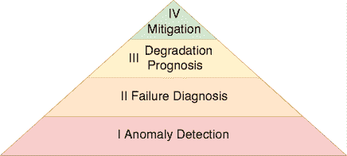
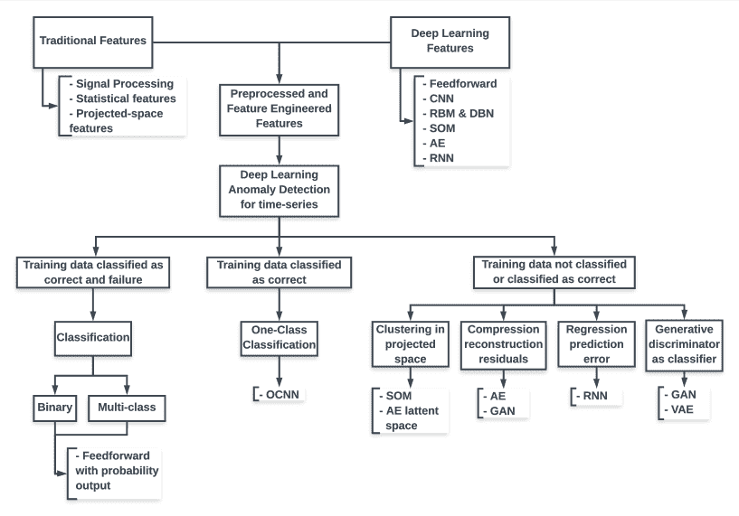

<!--yml

category: 未分类

date: 2024-09-06 19:58:59

-->

# [2010.03207] 预测性维护的深度学习模型：调查、比较、挑战和前景

> 来源：[`ar5iv.labs.arxiv.org/html/2010.03207`](https://ar5iv.labs.arxiv.org/html/2010.03207)

# 预测性维护的深度学习模型：调查、比较、挑战和前景

Oscar Serradilla [0000-0003-2557-9859](https://orcid.org/0000-0003-2557-9859 "ORCID identifier") Mondragon UnibertsitateaElectronics and Computer ScienceLoramendi 4MondragonSpain20500 oserradilla@mondragon.edu , Ekhi Zugasti [0000-0001-8506-5695](https://orcid.org/0000-0001-8506-5695 "ORCID identifier") Mondragon UnibertsitateaElectronics and Computer ScienceLoramendi 4MondragonSpain20500 ezugasti@mondragon.edu 和 Urko Zurutuza [0000-0003-3720-6048](https://orcid.org/0000-0003-3720-6048 "ORCID identifier") Mondragon UnibertsitateaElectronics and Computer ScienceLoramendi 4MondragonSpain20500 uzurutuza@mondragon.edu

###### 摘要。

鉴于全球工业数据空间的不断增长，深度学习解决方案已成为预测性维护的热门选择，这些方案监控资产以优化维护任务。由于文献中存在的示例数量，选择最合适的架构对于每个用例而言都很复杂。本工作旨在通过审查最先进的深度学习架构，以及它们如何与预测性维护阶段整合，以满足工业公司要求（即异常检测、根本原因分析、剩余使用寿命估计），来简化这一任务。这些架构在工业应用中被分类和比较，并解释了如何填补它们的空白。最后，提出了开放挑战和未来的研究路径。

深度学习，预测性维护，数据驱动，调查，综述，工业 4.0^†^†ccs: 应用计算 工程^†^†ccs: 计算方法 神经网络^†^†ccs: 计算方法 机器学习算法

## 1\. 引言

近年来，行业对人工智能和机器学习技术的关注不断上升，这得益于它们能够创建处理当前大量数据的自动化模型，而这些数据正以指数级增长。机器学习的研究趋势已转向更复杂的模型，如集成方法和深度学习，因为这些方法在处理更大数据集时具有更高的准确性。这些方法的演变主要是由于计算能力的提升，而计算能力的提升主要归因于 GPU 的进化，目前深度学习是最受关注的研究主题之一。这些模型在许多领域，如入侵检测系统、计算机视觉或语言处理，取得了最先进的成果。

维护根据标准 EN 13306（UNE-EN 13306，2018）定义为在项目生命周期内所有技术、行政和管理措施的组合，旨在保持或恢复项目到能够执行所需功能的状态。此外，它定义了三种类型的维护：改进维护提高机器的可靠性、可维护性和安全性，同时保持原有功能；预防性维护是在故障发生前以定期或预测的方式进行的；纠正性维护在机器停止工作时更换损坏/故障的部件。目前，大多数工业公司依赖于定期和纠正性维护策略。

目前，我们正过渡到被称为工业 4.0（I4.0）的第四次革命，该革命基于网络物理系统和工业物联网。它结合了软件、传感器和智能控制单元，以改善工业过程并满足其要求（Lukac，2016）。这些技术通过条件监测（CM）分析大量过程和相关数据，实现自动化预测维护功能。预测性维护（PdM）是最具成本效益的维护类型，鉴于其有可能实现整体设备效率（OEE）（Vorne，2019）超过 90%，通过预测维护需求（Colemen et al., 2017; Don Sanger，2017），并承诺投资回报率高达 1000%（Lavi，2018）。维护优化是工业公司的优先事项，因为有效的维护可以通过纠正机器、系统和人员的故障，将其成本降低高达 60%（Dhillon，2002）。具体而言，PdM 通过利用组件未开发的使用寿命潜力来最大化其工作寿命，同时减少停机时间和更换成本，防止故障发生前的更换，从而防止由于意外停机造成的昂贵故障和生产时间损失。

关于预测性维护（PdM）的众多研究工作可以分为三种方法（Liao and Köttig, 2016）：物理模型方法、数据驱动方法和混合方法。物理模型方法利用系统知识构建其退化的数学描述（Li et al., 2000; Oppenheimer and Loparo, 2002; Venkatasubramanian et al., 2003; Blancke et al., 2018; Li et al., 2017）。这些方法易于理解其物理意义，但在复杂系统中实施困难。数据驱动方法通过监测系统状态，并利用从历史数据中学习的解决方案来预测系统状态（Baptista et al., 2018; Zhang et al., 2005; Yuan et al., 2016）。这些方法包括统计方法、可靠性函数和人工智能方法。它们适用于复杂系统，因为无需了解系统的具体工作原理。然而，将其输出与物理意义关联更为困难。最后，混合方法结合了前述两种方法（Liao and Köttig, 2016; Zhao et al., 2013）。近年来，由于机器数据收集的增加，数据驱动和深度学习方法在工业中获得了广泛应用，这使得在复杂系统中开发准确的预测性维护模型成为可能。

本段解释了关于深度学习模型在预测性维护中的应用的调查方法论。首先，分析了预测性维护（PdM）的背景和应用。之后，研究了不同类型的模型。接着，分析了数据驱动的模型。最后，深入回顾了深度学习模型。这一方法论使我们能够获得总体的视角，然后专注于具体的研究主题。此外，最前沿（SotA）分析使得可以在方法之间进行比较，并讨论深度学习模型在预测性维护中的挑战和前景。所进行的分析是通过查询搜索引擎来完成的，初期使用了 Scopus 和 Engineering Village 搜索引擎，因为这些包含了更多特定和相关领域的文章。然而，当研究深入到更具体的主题时，加入了另一个搜索引擎：Google Scholar。这扩展了研究范围，包括未被索引的期刊和预印本，提供了一个更广阔的空间，包括更新和未被索引的出版作品。许多作品归属于但不限于以下出版编辑：ACM Digital Library、ScienceDirect、IEEE-Xplore 和 SpringerLink。

尽管已有若干关于机器学习和深度学习模型用于预测维护的公开评论，这项工作对前沿技术（SotA）做出了以下补充贡献：（1）我们回顾并解释了最相关的数据驱动技术，重点关注前沿深度学习架构在 PdM 中的应用，以简化和结构化的方式提供广泛的视角。（2）我们讨论了深度学习模型在 PdM 中的适用性，并将其优缺点与统计和经典机器学习模型进行比较。（3）我们分析了当前 PdM 发表的趋势，定义其差距，提出研究挑战，识别机会和前景。

本段描述了本工作的其余内容。第二部分回顾了预测维护的背景阶段，并概述了该领域使用的传统数据驱动模型以及深度学习技术。第三部分回顾并分类了最相关的前沿深度学习研究，按技术进行分析，以便比较。此外，还分析了相关评论。第四部分回顾了 PdM 模型应用和基准测试的公开参考数据集。第五部分讨论了深度学习模型在预测维护中的适用性，评估其相对于其他数据驱动技术的优缺点。最后，第六部分通过强调在参考文献审查过程中发现的最相关的方面和差距，结束了本工作。

## 2\. 预测维护和深度学习概述

### 2.1\. 预测维护背景

预测维护解决方案必须处理许多因素、特性和工业数据的挑战。下文讨论了最相关的内容。

Venkatasubramanian 等人（Venkatasubramanian et al., 2003）提出了 PdM 系统的 10 个理想属性：快速检测和诊断、可隔离性（区分不同故障类型）、鲁棒性、新颖性识别、分类错误估计、适应性、解释能力、最小建模要求、实时计算和存储处理、多故障识别。

工业使用案例的两个主要挑战是其行为和数据变异性。即使在具有相同特征的资产中，由于机械公差、安装调整、EOC 变化和其他因素，这些问题也会出现。这些因素使 PdM 模型在机器和资产之间的重用变得困难。其他相关挑战包括收集高质量数据、执行正确的预处理和特征工程，以获得具有代表性的数据集。此外，每个观察值与之前的观察值相关，因此应该一起分析，这增加了数据的维度和建模复杂性；而且由于机器被设计和控制为正常工作并防止故障，因此故障数据的收集是困难的，这使得故障数据不常出现。

在 PdM（预测性维护）中，常监测的关键组件包括但不限于轴承、叶片、发动机、阀门、齿轮和切削工具（Zhang et al., 2019c）。此外，CM（条件监测）检测到的最常见故障类型包括不平衡裂纹、疲劳、磨损和腐蚀、摩擦、缺陷和泄漏检测等。Li et al.（Li 和 Gao, 2010）的出版物将系统中可能存在的故障类型分类为：组件故障、环境影响、人为错误和程序处理。

常用的 CM 技术包括以下几种（UESystems, 2019）：机械超声波（Bakar et al., 2013），振动分析（Amruthnath 和 Gupta, 2018；Durbhaka 和 Selvaraj, 2016；Wen 和 Gao, 2018；Feng et al., 2012；以及 Saxena, 2013），磨损颗粒测试（Woldman et al., 2015；Elnasharty et al., 2011），热成像，电机信号电流分析（Dos Santos et al., 2017）以及无损检测（Drinkwater et al., 2009），但还有其他技术如扭矩、电压和包络（Mehrjou et al., 2011），声发射（以及 Saxena, 2013），压力（Zhao et al., 2017a）或温度监测（Bakar et al., 2013；Zhao et al., 2017a）。这些文章（Selcuk, 2017；García Márquez et al., 2012）还深入探讨了这些技术，并涵盖了它们能够检测的故障类型及其应用。它们强调 EOC 信息可以补充这些 CM 技术，从不同来源（物理、机器和操作）收集数据，以执行更强大的 PdM 分析。

环境和操作条件（EOC）是指工业资产（如机器或组件）工作的条件（Tavner 等人, 2008）。环境条件指的是影响这些资产的外部条件，如环境温度或周围的振动扰动。相比之下，操作条件是工作过程分配的技术规格，如期望的速度、力或位置。此外，传感器数据来自于机器传感器的测量。这些数据随着时间的推移形成一个时间序列数据集。使用状态监测技术分析这些数据，可以通过将模式和趋势与历史数据进行比较，从而确定组件和机器的状态。许多研究展示了组件退化模式，图示为 P-F 曲线（UESystems, 2019），其中健康状况从健康工作状态下降直到故障，随着时间或机器周期的推移。

### 2.2\. 数据驱动的预测性维护阶段

大多数用于 PdM 的深度学习模型基于与其他机器学习和统计技术相同的原理。具体来说，大多数数据驱动的方法遵循图 1 的路线图中提出的增量步骤，这些步骤基于文献（Welz, 2017; Prajapati 等人, 2012）和 OSA-CBM 标准（Lebold 等人, 2002）：第 1 步为异常检测，第 2 步为诊断，第 3 步为预后，最后为减轻。

图 1\. 预测性维护路线图，以金字塔图的阶段形式表示。

在进行上述步骤之前，通常需要执行两个额外步骤，以准备数据进行预测性维护（PdM），这正如一般数据分析生命周期中，Khan 等人（Khan 和 Yairi, 2018）和其他 PdM 作者所展示的。这两个步骤是预处理和特征工程（FE），如上所述，它们是通过创建一个具有代表性的数据集来提升 PdM 阶段模型准确性的关键。所有 PdM 阶段必须设计、调整并实施，以适应用例的要求及其数据特征。此外，PdM 系统的开发是增量式的，因此，每个阶段所采用的技术、算法和决策将影响后续阶段。以下小节概述了应对每个 PdM 阶段的最常见数据驱动方法。

#### 2.2.1\. 预处理

这一步骤包括为后续阶段准备收集的数据。每个 PdM 模型有不同的要求，选择适当的预处理技术以提升模型性能时，必须考虑这些要求。下面简要说明并引用了最常见的技术：传感器数据验证（Zugasti et al., 2012）确保收集的数据是正确的；特征同步（Kroll et al., 2014）用于收集在不同时间戳采样的信号，以创建更易处理的时间序列/周期数据；数据清洗去除或插补不可用和缺失值（Cerqueira et al., 2016; Costa and Nascimento, 2016）；过采样（Cerqueira et al., 2016; Perini, 2019）用于处理不平衡数据，以提高对常见稀缺故障数据类别的准确性或处理小数据集；编码（Martinez et al., [[n.d.]](#bib.bib115)）和离散化（Martinez et al., [[n.d.]](#bib.bib115)）通过投影到新空间改变特征的类型，使其更易于模型处理；分割将数据拆分为块，以分析大型数据集并实现并行处理（Lo et al., 2018）；特征缩放，如归一化（Sanayha and Vateekul, 2017）或标准化（Pratama et al., 2018），将所有特征缩放到相同或类似的空间，便于比较；噪声处理（Kroll et al., 2014）有助于建模噪声数据。

#### 2.2.2\. 特征工程

这一步骤包括提取相关的特征子集，用作后续阶段模型的输入。尽管深度学习模型可以自动提取适合问题的新代表性特征，因此这一步骤对深度学习模型不是强制性的，但它仍然可以提升统计和机器学习模型的性能。最常见的技术可以分为以下几类：作为时间（Zhang et al., 2019c）和频率（Zhang et al., 2019c; Zhou et al., 2014; Garg et al., 2015）领域中的统计特征的特征提取技术，这些技术提取特征的时间/频率关系；基于投影到新空间的技术，如主成分分析（Dos Santos et al., 2017; Canizo et al., 2017），该方法在保持相关信息的同时降低维度；通过组合现有特征创建新特征的连接和融合方法（Lee et al., 2006）；特征选择（Serradilla et al., 2020）通过丢弃低方差、冗余和与目标无关的特征来减少维度，因为这些特征增加了复杂性，但没有提供额外的信息。

#### 2.2.3\. 异常检测

其目的是检测资产是否在正常条件下工作。有三种方法可以使用数据驱动模型解决此步骤，按其底层机器学习任务分类：分类、一类分类和聚类。分别，当训练阶段有不同类别的标记数据时，可以使用分类；当仅存在单一类别数据（通常是非故障数据）时，可以使用一类分类；当数据未标记时，可以使用聚类。故障模式和效应分析 (FMEA) (Passarella, 2018) 及其通过添加关键性分析演变而来的 FMECA (Bromley and Bottomley, 1994) 对于基于专家知识获取可能的故障类型非常有用，这有助于设计数据分析生命周期，优先考虑需要检测的故障类型或异常。

异常检测方法需要预处理，有些还依赖特征工程的数据才能工作。一旦处理了特征，下一步是选择、训练和优化适合用例的模型。后续的 PdM 阶段将受到选定的 AD 方法和用例数据的影响和限制。表 1 根据参考的最先进文章和以下综述工作 (Wang et al., 2019a; Zhang et al., 2019c; Pimentel et al., 2014; Carvalho et al., 2019) 对主要的数据驱动异常检测技术进行了分类和总结。此外，可以结合两种或更多技术来创建一个异常检测系统，以弥补单一模型的缺点。

表 1\. 按主流技术分类的异常检测模型汇总。在第一列中，Unsup 指无监督，All 指监督、半监督和无监督，Combination 指模型的组合。

| 基于和类型 | 什么分析 | 正常数据 | 异常 | 最常见的算法和分类 |
| --- | --- | --- | --- | --- |
| 密度无监督 | 特征空间维度中的密度 | 高密度 | 低密度 | K 最近邻 (k-NN) (Susto et al., 2015; Mathew et al., 2018; Costa and Nascimento, 2016; Perini, 2019)，局部离群因子 (LOF) (Cerqueira et al., 2016; Diez-Olivan et al., 2017)，局部相关积分 (LOCI) ¹¹1 一般适用于 AD 的方法，但未特别针对 PdM 进行引用，相对密度因子，基于密度的离群分数，可靠性函数 (Zhai et al., 2019; Okoh et al., 2017) |
| 距离无监督 | 数据点之间的距离 | 接近邻居 | 远离邻居 | 传统阈值距离：马氏距离（Sanayha 和 Vateekul，2017）或欧几里得距离（Durbhaka 和 Selvaraj，2016），基于排名的检测算法（RBDA），随机化和修剪，基于数据流 |
| 统计学全貌 | 与训练数据拟合的分布模型关系 | 接近分布模型 | 远离分布模型 | 参数化：高斯混合模型（GMM）与期望最大化（EM）（Amruthnath 和 Gupta，2018），作为指数加权移动平均（EWMA）的控制图（Castagliola 等，2011；Susto 等，2012）。非参数化：核密度估计（KDE）：高斯或 KL 散度（Zhao 等，2010；Susto 等，2012；Wen 和 Gao，2018），基于直方图的异常检测（HBOS）（Munir 等，2017），箱线图分析（Cerqueira 等，2016），3$\sigma$（Able 等，2016）。基于熵的置换熵（Feng 等，2012；Radhakrishnan 和 Kamarthi，2016），模糊熵（Carlsson 等，2016）和 K-S 检验（Bolbolamiri 等，2012）。 |
| 聚类无监督 | 与无监督 ML 模型创建的聚类关系 | 属于大聚类或接近一个 | 属于小聚类且远离大聚类 | 划分聚类：基于中位数的划分（PAM），K-均值（Diez-Olivan 等，2017；Eke 等，2017；Amruthnath 和 Gupta，2018）。层次聚类：DB-Scan，聚合（Cerqueira 等，2016），属性导向归纳（AOI）（Fernandez-Anakabe 等，2019）。基于网格：Dcluster。对于高维度：D-Stream，基于模糊规则（Diez-Olivan 等，2017） |
| 集成组合 | 组合不同的模型。稳健 | 模型的组合 | 模型的组合 | 基于 Bagging 或 Boosting 的随机森林（RF）（Mathew 等，2018；Costa 和 Nascimento，2016；Canizo 等，2017；Dos Santos 等，2017），额外梯度提升（XGBoost）（Cerqueira 等，2016），Adaboost（Mathew 等，2018）和孤立森林（IF）（Perini，2019），贪婪集成，评分标准化 |
| 学习全部 | 与训练数据学习模型的关系 | 接近模型的已知类别 | 远离模型的已知类别 | 主动学习。迁移学习。强化学习。基于投影：子空间和压缩重构误差测量，如 PCA（Amruthnath 和 Gupta，2018）和 AE（Chen 等，2017b），相关性（Zhao 等，2017a；Zugasti 等，2018）和基于张量。基于状态空间（观测数据的隐状态和时间演变）：卡尔曼滤波器（Vianna 和 Yoneyama，2018），隐马尔可夫模型（HMM）（Perini，2019），贝叶斯网络（BN）（Kolokas 等，2018）（动态 BN，信念网络），基于注意力的 NN 和 RNN（GRU，LSTM）。基于图的：捕捉相互依赖性。OCC：OCSVM（Zhou 等，2014），BN。基于预测误差的回归：测量偏差（自回归积分滑动平均（ARIMA）（Sanayha 和 Vateekul，2017），RNN 作为 LSTM（Yuan 等，2019））。分类：使用可解释模型训练中的正常和异常数据：线性回归（Mathew 等，2018），逻辑回归（Mathew 等，2018；Costa 和 Nascimento，2016），决策树（DT）（Costa 和 Nascimento，2016；Jegadeeshwaran 和 Sugumaran，2015）。ML 分类技术如 SVM（Costa 和 Nascimento，2016；Jegadeeshwaran 和 Sugumaran，2015；Susto 等，2015）和前馈 NN（Rad 等，2011）。生成方法：GAN（Lee 等，2017），VAE（Xu 等，2018a）。 |

#### 2.2.4. 诊断

一旦检测到异常，下一阶段是诊断该异常是否属于故障工作状态，并可能发展成未来的故障，或者相反，没有故障风险。后一种情况表明异常检测模型可能未能正常工作，因此可能需要重新评估或重新训练。诊断通常基于根本原因分析（RCA）技术，旨在识别问题的真正原因。

诊断算法必须适合所处理的问题。处理这一步骤有几种方法，这些方法依赖于实施的 AD 方法和训练数据特征：多类分类、二类分类、单类分类和聚类。具体来说，如果数据集包含多种故障类型、故障和非故障观察值、仅包含一种类的观察值或无监督数据，则会选择这些方法。另一种常用于补充根本原因分析（RCA）的技术是健康指数（HI）异常偏差量化。其目的是通过将当前工作数据与历史数据进行比较来测量资产的损坏情况，支持有监督或无监督的方法。它可以指示相对于正常工作数据的偏差百分比，或者在数值尺度上显示退化水平，其中值越高，组件损坏程度越严重，最小值表示无损坏，最大值表示完全损坏或故障，中间值表示不同程度的退化（Mike Sondalini，2019）。

当有更多关于数据集及其标签的信息时，诊断步骤会更容易。主要的统计和机器学习诊断技术在下面的列表中描述，按难度递增排序。它们根据先前阶段使用的异常检测技术进行分类，这取决于数据特征。

+   •

    在进行多类分类异常检测后：诊断是基于对估计类别的先前故障数据知识进行的，因此数据与故障类型的关联直接从模型中获得（Bakar 等人，2013；Boutros 和 Liang，2011）。一旦检测到可能的故障类型，可以通过利用专家知识使用半定量和定性方法来评估其潜在后果，使用如 FMEA（Cortes 等人，2016）或 Ishikawa 图（Pradhan 等人，2007）等工具。此外，直接解释模型（Ansari 等人，2020；Ademujimi 等人，2017）或对较难解释的模型如 SVM（Demetgul，2013）使用解释性方法也有助于完成此任务。

+   •

    在进行二分类异常检测后：可以通过提取的特征进行聚类，以根据相似性对数据进行分组，并尝试区分未标记的故障类型（Yuwono 等人，2016）。这些诊断技术还可以基于统计性能分析（Murugan 和 Ramasamy，2015），并通过趋势分析和阈值定义来支持，根据相似性或距离区分故障类型。

+   •

    在进行一类分类或聚类以进行异常检测后：这些技术分别使用距离阈值或聚类密度来分类异常。对这些模型的诊断通常包括从数据中预计算指标，如健康指数，并监控其演变，而不是监控输入数据的演变。可以使用这些指标中的聚类算法来分析簇内和簇间关系。领域知识对于将无监督发现的关系与被监控资产的物理意义联系起来至关重要。这种新知识有助于解释无监督模型的输出，以发现新的故障类型，使用 K 均值模型 (Adhikari et al., 2018) 或带 IF-ELSE 规则的 HMM (Wu et al., 2018)。日志数据也可以用于此聚类目的，并标记维护数据 (Sharp et al., 2017) 以进行根本原因分析。

#### 2.2.5. 预后

一旦检测到异常并进行诊断，可以基于当时的工作条件和机器状态监控退化演变，重点关注对 AD 和诊断阶段最具影响力的特征，这些特征可以跟踪故障。这一步通常通过剩余使用寿命模型来执行，这些模型在有足够历史数据的情况下估计发生故障的剩余时间或周期。相反，如果没有足够的退化数据，唯一的退化估计方法是跟踪 HI 的演变或新工作状态与已知良好工作状态之间的距离。这两种前述模型也可以提供置信区间。基于数据的预后模型可以根据其基础方法分为 4 组。以下列表总结了按组分类的最常见技术以预测退化：

+   •

    基于相似性的：通过将当前行为与过去的故障行为进行比较来进行预后 (Adhikari et al., 2018; Ramasso, 2014)。

+   •

    统计：依赖于历史统计数据来估计退化，例如结合平均故障时间监控寿命使用情况 (Baptista et al., 2018) 或生存模型 (Zhang 和 Zhang, 2015) 来估计预期的持续时间。

+   •

    时间序列分析：基于以前的值的 ARIMA (Kanawaday 和 Sane, 2018; Adhikari et al., 2018; Baptista et al., 2018)，使用卡尔曼滤波器建模与时间相关的噪声数据的隐藏状态 (Vianna 和 Yoneyama, 2018)，以及通过优化适应度函数来生成多项式函数的傅里叶和遗传编程 (Garg et al., 2015)。

+   •

    学习：

    +   –

        分类：将数据诊断为已知故障类型或类似的工作数据，然后根据该类别的历史数据预测退化情况。尽管可以使用任何分类器实现这一目的，但文献中广泛使用的有以下几种：前馈神经网络（Rad et al., 2011），支持向量机（Rad et al., 2011），贝叶斯网络（Lee, 2019; Lee and Pan, 2017; Ansari et al., 2020），隐马尔可夫模型（Zhang et al., 2005），基于模糊逻辑的模型（Zio and Di Maio, 2010）以及随机森林（Gutschi et al., 2019; Baptista et al., 2018）。

    +   –

        回归：直接从输入数据估计健康指数（HI）、异常偏差或剩余使用寿命（RUL）。常见的前沿算法如下：线性函数是最简单的方法（Sharp et al., 2017）；非线性函数（Liao et al., 2006; Zhang and Zhang, 2015）可以建模非线性关系；支持向量回归（SVR）（Benkedjouh et al., 2013; Baptista et al., 2018）像适应回归的支持向量机；相关向量回归（RVR）基于贝叶斯回归（Adhikari et al., 2018）；卷积神经网络（CNN）模型特征的时间关系（Babu et al., 2016）；维纳过程通过实值连续时间随机过程建模退化（Si et al., 2013）；递归神经网络如 LSTM 和 GRU（Yuan et al., 2016）在每次观测时保留相关的过去信息用于预测。

#### 2.2.6\. 缓解

一旦检测到异常、诊断其原因并预测剩余寿命，就有足够的信息来执行维护操作，以在早期阶段缓解故障，从而防止资产发生故障。此阶段包括设计和执行必要的步骤，以在故障发生前将资产恢复到正常工作状态，这也减少了实施和停机成本。

缓解措施由维护技术员执行，他们负责创建和实施缓解计划，作为维护管理和制造操作管理流程的一部分。数据驱动的预测性维护（PdM）模型应生成辅助信息，为领域技术员提供统计数据（Murugan and Ramasamy, 2015）和建议（Ansari et al., 2020）。因此，更高级的缓解措施是通过领域知识与关于资产健康和预期退化的数据驱动信息的结合来完成的（Liu et al., 2012）。

### 2.3\. 深度学习技术

本节介绍了深度学习背景，并介绍了应用于 PdM 领域的最常见架构。如今，当有足够的历史数据时，深度学习模型在许多领域，包括 PdM，超越了统计和传统机器学习模型。深度学习（DL）一词指的是人工神经网络（ANN），这是一种受大脑功能启发的机器学习技术，超越了浅层的 1 层和 2 层隐藏层网络（Neapolitan and Neapolitan, 2018）。

人工神经网络（ANNs）由计算输入的线性回归并应用权重的神经元组成，然后计算非线性激活函数，如 sigmoid、修正线性单元（reLU）或 tan-h，以产生输出。网络的参数通常是随机初始化的，然后根据训练数据集进行调整，以将输入数据映射到输出数据。这个学习过程通过运行梯度下降算法与反向传播算法相结合来进行。这些算法使得能够计算每个神经元的调整量，以减少由网络产生的误差，其中误差是根据用户定义的成本函数计算的。Hornik 在文章中（Liu, 2001）证明了至少有两个隐藏层且有足够训练数据的 ANN 能够建模任何函数或行为，创造出通用逼近器。

Goodfellow 等人（Goodfellow et al., 2016）的书籍提供了有关深度学习的详尽背景，被许多领域的研究人员视为参考书。具体来说，这本书介绍了机器学习和深度学习的数学背景。随后，它重点讨论了深度学习的优化、正则化、不同类型的架构、它们的数学定义和常见应用。Litjens 等人在医学应用的深度学习调查中提供了一个更简单但强大的领域概述（Litjens et al., 2017），并通过视觉方案收集了主要架构。另一个专门关注深度学习架构、应用、框架、最先进技术以及历史性工作、趋势和挑战的调查是 Pouyanfar 等人（Pouyanfar et al., 2018）的工作。此外，Geron（Géron, 2017）介绍了一个实践性深度学习应用的参考书，基于以下工具：Scikit-Learn ²²2https://scikit-learn.org、Keras ³³3https://keras.io 和 TensorFlow ⁴⁴4https://www.tensorflow.org。

与 PdM 领域相关的最常见深度学习技术在以下段落中进行了总结。大多数技术基于前馈结构，但每种技术都有其独特的特点：

+   •

    前馈神经网络/多层感知器（MLP）（Werbos，2005）是最早、最常见且最简单的架构。它由堆叠的神经元形成层，其中每一层的所有神经元都通过将输出馈送到下一层的输入来连接到下一层的所有神经元。然而，没有连接到前面层的神经元或同一层的神经元。层的命名如下：输入层、隐藏层和输出层。神经网络通过观察配对输入特征和目标特征来进行训练，这些特征用于通过最小化网络产生的误差来学习它们的关系，从而将输入数据映射到输出。

+   •

    卷积神经网络（CNN）（LeCun 等，1989）是一种前馈网络，通过应用卷积滤波器来保持神经元的邻域。它受动物视觉皮层的启发，广泛应用于图像和信号识别、推荐系统以及自然语言处理等领域。卷积层通常是线性的，之后应用激活函数以产生非线性输出。之后，可以使用最大池化或平均池化层来降低维度。最后，大多数架构有一个展平步骤，以获取输入数据的代表性特征，这些特征可以与其他机器学习或深度学习网络结合，执行典型的机器学习任务。卷积的权重是共享的，使其更易于训练。

+   •

    循环神经网络（RNN）（Robinson 和 Fallside，1987）通过保存从网络前面输入派生的状态来建模时间数据。时间反向传播算法（Werbos，1988）是传统反向传播在时间数据上的一种调整，用于将网络的误差传播到之前的时间点。然而，这种传播可能会导致梯度消失或爆炸问题（Hochreiter，1991），使得这些网络忘记长期关系。为了解决这个问题，基于遗忘门创建了特定的 RNN 架构，如长短期记忆（LSTM）（Hochreiter 和 Schmidhuber，1997）和门控循环单元（GRU）（Cho 等，2014）。

+   •

    深度置信网络（DBN）（Hinton 和 Salakhutdinov，2006）和限制玻尔兹曼机（RBM）（Scholar 和 Smolensky，1986）。RBM 是一个二分图，完全连接且无向，由一个可见层和一个隐藏层组成。它是一种可以学习数据概率分布的随机神经网络。它可以以监督或非监督的方式进行训练，主要应用于降维和分类。因此，DBN 是一个神经网络，其中每两个连续的层被视为 RBM。它以非监督的方式进行训练以减少维度。然后，可以用分类数据重新训练，以执行分类。

+   •

    自编码器（AE）（Ballard，1987）基于奇异值分解概念（Golub 和 Reinsch，1970），用于在较小的空间中提取最能代表输入数据的非线性特征。它由两个部分组成：一个编码器将输入数据映射到编码的潜在空间，另一个解码器将潜在空间数据投影到与输入数据维度相同的重建空间。网络的训练目的是最小化重建误差，即输入与输出之间的损失。自编码器可以根据其潜在空间的维度分为欠完备和过完备，这分别对应于比输入维度小的潜在空间和等于或大于输入维度的潜在空间。这些简单的架构被扩展和调整以适应不同的任务和问题。香草自编码器是最简单的自编码器，属于欠完备类型。以下变体是通过应用正则化和修改 AE 类型获得的。其中一种改编是去噪自编码器（DAE）（Le Cun 和 Fogelman-Soulié，1987），用于腐败数据的重建。这是一种过完备的 AE，通过控制学习来避免“恒等函数”。它以带噪输入及其去噪输出的数据对为输入进行训练，以减少它们之间的损失。另一种修改是稀疏自编码器（SAE）（Makhzani 和 Frey，2013），是一种在学习阶段受限于稀疏惩罚约束的 AE，基于 KL 散度概念。该算法旨在使每个神经元稀疏，从数据中发现结构信息比香草 AE 更容易，并且在实际应用中更有用（Sun 等，2018）。

+   •

    生成模型：变分自编码器（VAE）（Kingma 和 Welling, 2014）和生成对抗网络（GAN）（Goodfellow 等, 2014）。这两种模型都设计为无监督学习。VAE 是一种生成的、因此是非确定性的修改版的普通自编码器（AE），其潜在空间是连续的。通常，其潜在空间分布是高斯分布，解码器基于随机采样和插值来重建原始信号。它在估计数据分布、学习数据样本表示和生成合成样本等方面有应用。GAN 是另一种生成神经网络，由生成器和判别器两部分组成。生成器接受表示向量作为输入，训练生成属于特定数据分布的输出。判别器则训练用于分类其输入数据是否属于特定数据分布。生成器的输出连接到判别器的输入，两者一起进行对抗训练。生成器的目标是通过从随机输入生成输出，试图使判别器将其分类为属于特定训练分布。判别器的角色是区分合成生成的数据和来自训练分布的真实数据。它们一起训练，以便每部分从另一部分学习，类似于博弈论。GAN 可以扩展到其他机器学习任务，如监督学习或强化学习。

+   •

    自组织映射（SOM）（Kohonen, 1990）是一种基于人工神经网络（ANN）的无监督数据内部表示组织方法。它使用竞争学习，这与典型的使用反向传播和梯度下降的人工神经网络不同，以创建一个称为映射的新空间，通常是二维的。它基于邻域函数，将输入空间的拓扑特性保留到新空间中，以单元格表示。它在聚类等应用中有广泛应用。

## 3\. 深度学习在预测性维护中的应用

本节收集、总结、分类和比较了用于预测性维护（PdM）的参考深度学习（DL）技术，分析了最相关的工作和应用。它包含了在回顾的文章、调查和领域综述中实现了最先进（SotA）结果的准确深度学习模型。尽管大多数文章结合了多种技术，并在相同架构中执行了多个 PdM 阶段，但本节在前五个小节中按照每个阶段的主要深度学习技术对工作进行了分类，包括前期特征工程，并排除了预处理，因为后者的解释在前一节中对深度学习同样适用。这种分类方法使得按阶段分析和比较深度学习技术成为可能。第六个小节展示了成功结合上述技术以创建更完整架构的工作，这些架构满足一个或多个 PdM 阶段，提供了将技术组合的无限可能的示例。最后，最后一个小节汇集了与本调查类似工作的最相关信息，讨论了相关的评论和调查。

最先进的工作可以根据其底层机器学习任务和用于解决这些任务的算法进行分类，这些算法与用例及其数据要求直接相关。当训练数据包含标记的故障和非故障观测值时，使用二分类。多分类用于与二分类相同的情况，但有多于一种类型的故障被分类，因此至少有三类：一种代表非故障，每种故障类型各有一类。单类分类（OCC）用于当训练数据集仅包含非故障数据时，这通常包括在早期工作状态下收集的机器数据或当技术人员确认资产正常工作时。最后，当训练数据集的观测值没有标签时，使用无监督技术，因此不知道哪些观测值属于故障类和非故障类。无监督技术也可以用作单类分类器。此外，还有一些关于其他机器学习和深度学习主题的工作，如主动学习、强化学习和迁移学习。

### 3.1\. 特征工程

在 PdM 中使用的深度学习算法能够自动执行特征工程，获得适用于特定任务的派生特征子集。因此，这些技术消除了对手动特征工程过程的依赖。表 2 显示了用于特征工程的常见深度学习技术。这些技术与机器学习和深度学习模型集成，以创建执行 PdM 阶段的架构。

表 2\. 用于自动特征工程和投影的深度学习技术。它们基于输入信号的关系和时间上下文。

| 算法 | 工作原理 | 优势 | 限制 | 应用 | 参考 |
| --- | --- | --- | --- | --- | --- |
| 前馈神经网络 | 添加较少维度的深层 | 降低维度至较低特征空间。最简单的神经网络架构 | 不通过邻域或时间关系建模特征。 | 引擎健康监测，振动监测 | (Yildirim and Kurt, 2016; Rad et al., 2011; Al-Raheem and Abdul-Karem, 2011) |
| RBM | 自动特征提取。通过最小化对比散度来建模数据概率。单向训练，从输出重建输入。 | 保持新空间中的空间表示。训练时间不多。 | 未保持新空间中的数据方差。由于只有一层，建模复杂数据困难。 | 轴承退化，工厂 PLC 传感器 | (Liao et al., 2016; Hwang et al., 2018) |
| DBN | 使用堆叠的 RBM 和贪婪训练进行自动特征提取。可用于 HI 构建。 | 具有竞争力的最新技术结果。可以通过滑动窗口建模时间依赖性。 | 训练非常慢且效率低。未建模长期依赖性。 | 轴承振动，航空发动机，风力涡轮机 | (Wang et al., 2017b; Deutsch and He, 2017; Peng et al., 2019; Yang et al., 2018; Shao et al., 2017b) |
| SOM | 数据映射到指定维度 | 将复杂数据非线性映射到较低维度。保持新空间中的特征分布。可与其他技术结合用于 RCA（即 5-whys (Chemweno et al., 2016)) | 难以将潜在变量与物理意义联系起来。比其他技术更复杂。簇的数量固定 | 涡扇发动机，气动执行器，热电厂，轴承退化 | (Lacaille et al., 2015; Prabakaran et al., 2014; Chemweno et al., 2016; Liao et al., 2016) |
| AEs | 在潜在空间中进行维度降低，保持最大输入数据方差。非线性 FE 和 HI 计算。 | 原始传感器数据的自动 FE 实现了类似于传统特征的结果。也可以输入传统特征。不需要分类或故障数据。支持在线 CM。 | 提取的特征不针对任务。需要更多资源：计算和训练数据。如果输入数据为原始传感器数据，则会丧失时间关系。可能导致过拟合 | 轴承振动，卫星数据，PHM2012 预测挑战 | (Sakurada 和 Yairi，2014；Chen 等，2017b；Ahmed 等，2018；Hong 和 Yin，2018；Perini，2019) |
| CNN | 自动特征提取。输入的单变量或多变量卷积。模型顺序数据。与滑动窗口一起使用。结合池化方法减少维度 | 简单而有效。在生产中比传统机器学习模型更快。利用邻域。通过权重共享减少训练时间和数据。可以超越 LSTM。Dropout 可以防止过拟合 | 由于权重数量多，训练较慢。数据分析为块，不建模长期依赖关系。 | 轴承，电动机，涡扇发动机 | (Cabezas Rodríguez，2019；Li 等，2018a；Guo 等，2016a；Liu 等，2017；Wang 等，2017a；Babu 等，2016；Munir 等，2019；Li 等，2020) |
| RNNs | 回归。通过在时间中传播状态信息来建模时间序列和顺序数据。 | 建模 EOC 数据的时间关系。特殊架构如 LSTM 和 GRU 可以建模中期依赖关系 | RNNs 存在梯度消失问题，即使是特殊架构也无法建模非常长期的依赖关系。需要更多资源。 | 航空发动机，水电站 | (Yuan 等，2016；Bruneo 和 De Vita，2019；Aydin 和 Guldamlasioglu，2017；Yuan 等，2019) |

### 3.2\. 异常检测

基于深度学习的 AD 算法可以根据训练数据的特点分为三组，如本节介绍中所述。主要架构已在图 5 中总结。

图 2\. 应用于预测维护和时间序列的主要深度学习技术的图示，根据机器学习任务分类⁵⁵5 在这项工作中，传统特征一词指的是手工制作和自动特征提取技术，如统计或基于机器学习的特征，不包括基于深度学习的特征。

这些算法在下表中进行了总结、比较，并引用了其主要应用。一方面，基于二类和多类分类方法的异常检测算法（Rad 等，2011; Al-Raheem 和 Abdul-Karem，2011）依赖于被分类为正确和故障的训练数据。这些常用的特征提取技术，包括传统的和深度学习的，通常会经过一个展平过程，然后有若干个全连接层，每层的维度递减，直到输出层。输出层通常使用 softmax 激活函数来输出故障和非故障的概率。在二类分类中，通常有一个或两个神经元表示故障和正常工作状态的概率。类似地，在多类分类中，有 N+1 个神经元，其中一个神经元表示非故障的概率，剩余的 N 个神经元分别表示每种故障的概率。另一方面，表 LABEL:tab:AD_oneclass_unsup 包含基于单类分类或无监督方法解决异常检测问题的算法，仅使用被分类为正确或未分类的训练数据。

表 3\. 使用被分类为正确或未分类的训练数据的异常检测方法：单类分类和无监督。

| 算法（Algorithm） | 工作原理（How it works） | 优势（Strengths） | 局限性（Limitations） | 应用（Applications） | 参考（Ref） |
| --- | --- | --- | --- | --- | --- |
|   |  |  |  |  |  |
|   |  |  |  |  |  |
| 自编码器（Autoencoders） |
| 普通自编码器（Vanilla AE） | 重建误差的阈值。数据在超过阈值时被考虑。 | 原始传感器数据或传统特征的自动特征工程。最小化潜在空间中的方差损失。不需要分类或故障数据。允许在线健康管理（CM）。 | 提取的特征不针对特定任务。需要更多的资源：计算和训练数据。如果输入数据是原始传感器数据，可能会丧失时间关系。可能导致过拟合。 | 轴承振动，卫星数据，PHM2012 预测挑战 | （Sakurada 和 Yairi，2014; Chen 等，2017b; Hong 和 Yin，2018; Perini，2019; Reddy 等，2016) |
| 堆叠自编码器（Stack-ed AE） | 在一个自编码器后面堆叠多个自编码器 | 表现略优于普通自编码器 | 需要比普通自编码器更多的资源 | 轴承振动 | （Tao 等，2015; Roy 等，2019; Galloway 等，2016) |
| 稀疏自编码器（SAE） | 在训练中对自编码器施加稀疏性约束以保持神经元激活低 | 与自编码器相同，但通过强制所有神经元学习来防止过拟合 | 网络更复杂，需要比普通自编码器更多的资源 | 轴承振动，涡轮振动 | （Lu 等，2017; Chen 等，2017a; Galloway 等，2016; Ahmed 等，2018) |
| DAE | 设计用于处理噪声数据的 AE | 在噪声数据下超越普通 AE。堆叠多个 DAE 时效果稍好 | 比普通 AE 更复杂，需要更多资源；堆叠的 DAE 需要更多 | 轴承振动 | (Lu et al., 2017; Xia et al., 2017) |
| 生成式 |
| VAE | AE 将输入数据映射到后验分布 | 从噪声分布中学习后验分布，以非确定性方式生成数据 | 实现上存在困难。如果输入数据是原始传感器数据，则会丢失时间关系。 | 滚珠丝杠，静电凝聚器，网络流量 | (Wen and Gao, 2018; Lygren et al., 2019; Xu et al., 2018a) |
| GAN | 用于数据增强和 AD 两种方式：使用判别器和使用残差 | 小不平衡比下的数据增强效果良好。AD 超过无监督 SotA 方法 | 对大不平衡比效果不好，复杂且需要更多资源。被 CNN 等简单方法超越 (Cabezas Rodríguez, 2019) | 感应电动机，轴承多传感器 | (Cabezas Rodríguez, 2019; Lee et al., 2017) |
| 一类分类器 |
| OC-NN | 训练 AE 并冻结 OCC 的编码器，类似于 OC-SVM 损失函数 | 自动特征提取 | 比传统 OCC 较慢。提取的特征未针对问题进行优化 | 通用 AD | (Chalapathy et al., 2018) |
| 循环神经网络 |
| 普通 RNN | 回归，AD 跟踪预测与实际行为之间的误差或 HI 差异。 | 建模时间序列数据的时间关系。自学习。 | 遇到梯度消失问题，因此无法建模中长期依赖关系。训练时需要比前馈 AE 或 CNN 更多资源。 | 活动识别 | (Arifoglu and Bouchachia, 2017) |
| LSTM | 与普通 RNN 相同，但将神经元架构更改为 LSTMs | 与普通 RNN 相同，但可以建模比普通 RNN 更长的时间依赖关系 | 尽管比普通 RNN 更好地处理梯度消失问题，但在建模长期依赖关系上仍存在困难。长时间训练和计算要求 | 飞行器数据，活动识别 | (Nanduri and Sherry, 2016; Guo et al., 2016b; Arifoglu and Bouchachia, 2017) |
| GRU | 与普通 RNN 相同，但将神经元架构更改为 GRUs | 与 LSTM 相同，但更易于训练 | 与 LSTM 相同，但效果略差 | 飞行器数据，活动识别 | (Nanduri and Sherry, 2016; Arifoglu and Bouchachia, 2017) |

### 3.3\. 诊断

诊断步骤取决于前一阶段使用的 AD 模型的信息和类型，鉴于 PdM 是一个逐步过程，每个阶段都由前面的阶段补充。在多类分类器的情况下，与检测到的异常相关的故障类型已知，这使得诊断变得直接，并可以与历史数据进行比较（Rad et al., 2011; Al-Raheem and Abdul-Karem, 2011）。然而，大多数 PdM 架构实现了二分类器、一类分类器或无监督模型，这些模型缺乏故障类型信息。因此，这些模型只能通过相似性对检测到的异常进行分组诊断，这通常使用聚类模型（Xu et al., 2018b; Aytekin et al., 2018; Zong et al., 2018; Amarbayasgalan et al., 2018）和 SOM（Li et al., 2018b; Rustum and Forrest, 2018; Schwartz et al., 2020; Hao et al., 2017）来完成。用于此阶段的特征类似于 AD 的特征，这些特征可以基于传统技术或深度学习技术。

### 3.4\. 预后

基于深度学习的 PdM 预后模型侧重于拟合回归模型以预测诊断故障的剩余使用寿命（RUL）或在没有该类型历史数据时的健康退化。RUL 通常以时间或周期数来衡量，健康退化通过健康指数的异常偏差量化进行跟踪。最常见的算法已在表 4 中总结和比较。它们的输入可以是前一阶段生成的信息和传统或深度学习特征。还有许多其他算法使用 DL 特征或结合传统特征的完全连接网络作为最后一层来进行预后，但这些在 3.6 节中的组合部分中展示，而本节关注的是仅使用 DL 进行预后的最常见和简单的 SotA 技术。

表 4\. 基于深度学习的 PdM 预后工作的总结。算法列中的无监督和监督分别指无监督和监督。

| 算法 | 工作原理 | 优势 | 局限性 | 应用 | 参考 |
| --- | --- | --- | --- | --- | --- |
| Vanilla RNN 无监督和监督 | 回归，预测特征和 HI 的演变或预测剩余周期或时间。 | 建模时间序列数据的时间关系。具有自学习的可能性 | 遭受梯度消失问题，因此不能建模中长期依赖关系。高训练和计算要求 | 航空发动机 | (Yuan et al., 2016) |
| LSTM 无监督和有监督 | 与普通 RNN 相同，但将神经元架构更改为 LSTMs | 与普通 RNN 相同，但能比普通 RNN 更好地建模长时间依赖性。优于普通 RNN | 尽管比普通 RNN 更好地处理梯度消失问题，但在建模长期依赖性方面仍有困难。需要高训练和计算要求 | 航空发动机、滚动轴承、锂电池 | （牛，2017；袁等，2016；张等，2019d，2018） |
| GRU 无监督和有监督 | 与普通 RNN 相同，但将神经元架构更改为 GRUs | 与 LSTM 相同，但更易于训练 | 与 LSTM 相同，但结果略逊一筹 | 航空发动机、锂电池 | （袁等，2016） |

### 3.5\. 缓解措施

用于创建当前出版物的研究方法论显示没有基于深度学习的缓解出版物。以下描述了这一事实的一些可能原因。大多数深度学习工作集中在优化单一性能指标上，例如最大化分类的准确性或 F1 分数，以及最小化回归中的 MAE 或 RMSE 等错误。这些工作的解决方案通常在模拟的参考数据集中进行比较，寻找在上述指标上优于其他架构的架构。然而，深度学习模型是最难以理解的机器学习类型，因为它们的复杂性更高，这使得它们在建模高维复杂数据方面更为准确，因此它们无法满足工业解释设施的要求。

为了解决这个问题，应该提供缓解建议或至少解释做出预测的原因，这可以依赖于新兴领域解释性人工智能（XAI）。此外，在此 PdM 阶段的最终和最具雄心的步骤应该是自动化推荐，以便领域技术员将 PdM 集成到维护计划中，通过维护操作管理优化工业维护过程。最后，以下是存在少数实际应用出版物的原因。工业公司避免发布他们的数据或实施细节，以保护其知识产权和技术诀窍免受竞争对手的侵犯。此外，许多数据驱动的研究出版物缺乏领域技术员的反馈，因此他们仅依赖数据驱动的技术来解决问题，而没有融入领域知识。

### 3.6\. 模型组合及重要工作

本节已介绍的深度学习技术是预测性维护（PdM）中使用的基本元素和架构。值得强调的是，通过将这些技术相互结合，或与其他数据驱动或专家知识基础技术结合，可以形成无限种可能的架构。模型的组合和适应针对所解决的问题会产生更准确的模型，满足其需求。表 5 总结了这些模型在最先进架构中的常见组合，展示了它们的优势和局限性。

表 5\. 适用于预测性维护（PdM）架构的深度学习技术的可能组合。

| 算法 | 工作原理 | 优势 | 局限性 |
| --- | --- | --- | --- |
| 结合传统和深度学习特征的深度学习模型 |
| 传统和基于深度学习的特征工程与自动编码器 | 将传统和深度学习的特征工程方法与已呈现的自动编码器架构结合在同一模型中 | 超越传统机器学习和简单深度学习架构。不需要手工特征。自动特征工程。可以通过上下文提取使用 CNN、LSTM 和 GRU 建模时间序列依赖关系 | 理解深层特征并不简单。比简单的人工神经网络模型更慢、更复杂 |
| 传统和基于深度学习的特征工程与深度置信网络（DBN） | 深度学习和传统特征工程方法与 DBN 堆叠到其他模型中 | 与上述相同 | 与上述相同 |
| 混合：特征和模型的组合 |
| 深度学习特征工程技术组合 | 结合 CNN、LSTM、其他深度学习特征工程技术和传统特征以提取更复杂的特征 | 自动降维。超越其他特征工程技术。建模时间关系和邻域。使用双向 RNN 时，未来上下文可用 | 比传统机器学习和简单深度学习模型更复杂且需要更多资源。双向 RNN 不能在线进行 |

此外，表 LABEL:tab:combination_DL_alg_for_PdM_relevant_works_summary 包含了上述类型的相关工作，这些工作将传统特征工程或深度学习特征工程与传统数据驱动或深度学习模型结合。这些工作表明，技术的组合可以使用监督或无监督的方法解决所有预测性维护阶段。

表 6\. 深度学习技术组合用于预测性维护：相关工作总结。

| 架构 | 工作原理 | 优势 | 局限性 | 应用及参考文献 |
| --- | --- | --- | --- | --- |
| 自动编码器 |
| 极限学习机（ELM）与自动编码器。 | 对 ELM 的无监督异常检测（AD）跟踪误差，用正常数据训练。 | 两步训练。易于训练。 | 无法在 ELM 中建模非线性或复杂关系。 | 发电厂（Michau et al., 2020），机器寿命估计（Bose et al., 2019）。 |
| 堆叠的 SAE | 无监督特征提取添加噪声 | 无需预处理。对噪声具有鲁棒性。严重性识别。 | 深度架构的优化困难 | 滚动轴承（Chen 等，2017a） |
| 堆叠的基于 CNN 的自编码器 | 无监督特征提取建模滑动窗口中的时间关系 | 使用邻域建模时间性。 | 仅短期时间关系 | 齿轮箱振动（Cabrera 等，2017） |
| 自编码器与 LSTM | 无监督特征提取建模时间关系 | 建模时间性 | 更高的计算要求 | 航空（Huang 等，2019），涡扇和铣床（Malhotra 等，2016），太阳能，心电图（Pereira，2018）和制造（Lindemann 等，2019） |
| VAE 与 RNN、GRU 或 LSTM | 无监督生成特征提取建模时间关系并减少到潜在高斯分布 | 建模时间性。正则化的潜在空间 | 高计算要求 | 电机振动（Huang 等，2019），涡扇（Yoon 等，2017），传感器（Zhang 和 Chen，2019） |
|   |  |  |  |  |
|   |  |  |  |  |
| 限制玻尔兹曼机和深度置信网络 |
| DBN | 通过层次表示的无监督特征提取 | 从频率分布中进行故障分类 | 需要预处理。倾向于过拟合。未建模时间关系 | 感应电动机故障模拟器（Shao 等，2017b） |
| 正则化 RBM + SOM + RUL | 使用距离进行概率建模、健康评估和 RUL 预测 | RBM 正则化改善 RUL 的特征提取 | 单一 RBM，多个这些层可以改进。 | 旋转系统（Liao 等，2016） |
| 图像生成 + DBN + MLP/FDA/SOM | 从振动图像数据中建模的监督或无监督特征提取 | 在图像中建模时间性。与图像处理方法结合 | 提取簇的含义困难，依赖于领域知识。 | 轴承（Oh 等，2018） |
|   |  |  |  |  |
|   |  |  |  |  |
| 混合：特征和模型的组合 |
| 双向 LSTM | 无监督特征提取建模时间关系 | 健康评估然后 RUL 映射。更鲁棒。未来上下文可用。 | 需要处理所有信号：无法流式处理。比简单的 LSTM 更复杂。 | 涡扇（Elsheikh 等，2019） |
| 自编码器 + 卷积 DBN + 指数加权移动平均 (EMA) | 通过自动特征提取进行无监督概率建模，建模时间关系。分步训练 | 建模时间性。比传统机器学习和简单深度学习更稳定。每个模型互补其他模型的弱点 | 每部分独立训练，不适用于问题。EMA 仅建模短期时间关系。 | 电力机车轴承故障（Shao 等，2018） |
| 基于 CNN 和双向 LSTM 的 AE + 全连接 + 线性回归 | 无监督特征建模时间关系 | 原始传感器数据建模。模型长期时间依赖性 | 滑动窗口需要完整窗口。结合深度学习技术的复杂度较高 | 铣床（Zhao et al., 2017b） |
| 传统特征工程 + 双向 GRU 结合机器学习模型 | 无监督特征建模时间关系 | 同上 | 同上 | 航空轴承故障检测、齿轮故障诊断和工具磨损预测（Wang et al., 2017c） |

本小节其余部分总结了相关分析工作的贡献和优势。一篇有趣的文章由邵等（Shao et al., 2017a）发表，介绍了一种用于旋转机械故障诊断的 AE 优化方法。首先，他们创建了一个基于最大相关熵的新损失函数来增强特征学习。其次，他们优化了模型的关键参数，使其适应信号特征。该模型应用于齿轮箱和滚柱轴承的故障诊断。另一个相关的出版物是 Lu 等（Lu et al., 2018）的工作，他们使用了 Growing SOM，这是一种不需要指定地图维度的 SOM 算法扩展。它已应用于模拟测试案例，并用于预测性维护。

郭等（Guo et al., 2016b）提出了一种基于 LSTM 和 EWMA 控制图的变化点检测模型，适用于在线训练。另一个有趣的工作由 Lejon 等（Lejon et al., 2018）提供，他们使用机器学习技术来检测热冲压机中的异常，而非机器学习专家。他们的目标是检测机器运行不正常的异常冲程。他们提出了大部分收集的数据对应于无缺陷产品的冲程，并且所有数据都是未标记的。数据来自测量压力、位置和温度的传感器。他们基准测试的算法包括 AE、OCSVM 和 IF，其中 AE 表现最好，实现了最少的假阳性实例。正如作者所总结的，所获得的结果展示了机器学习在故障特征未知的瞬态和非平稳信号中的潜力，并补充道 AE 满足了低实施成本和接近实时操作的要求，这将带来更为明智和有效的决策。

如前所述，模型组合的可能性是无限的。例如，李等（Luo et al., 2018）在工作中将 GAN 结构与 LSTM 神经元结合，这两种广泛使用的深度学习技术取得了最先进的结果。此外，深度学习技术还可以与其他计算技术结合，如 Unal 等（Unal et al., 2014）在工作中将前馈网络与遗传算法结合。

最后一篇结合深度学习模型的突出文章是 Zhang 等人（Zhang et al., 2019b）的研究之一，属于最完整的无监督 PdM 研究之一。他们建立了一个模型，该模型使用传感器信号的相关性，以签名矩阵的形式作为输入，并将其输入到使用卷积神经网络（CNN）和长短期记忆网络（LSTM）结合注意力机制进行异常检测（AD）、部分根本原因分析（RCA）和剩余使用寿命（RUL）的自编码器（AE）中。这项工作的优点包括：他们展示了相关性是时间序列信号的良好描述符，使用 LSTM 的注意力机制提供了时间背景，异常分数作为健康指标（HI）对根本原因分析（RCA）有用，将检测到的故障映射到产生这些故障的输入传感器。然而，他们的根本原因分析并不完整，因为他们只将故障与输入传感器相关联，但未能将其链接到物理意义上。此外，缺乏池化层以及深度学习技术的组合导致模型复杂且计算开销大，需要更多的时间和数据进行训练，且其决策难以解释。

以下出版物使用其他机器学习任务结合深度学习模型用于预测性维护（PdM）和其他深度学习技术。Wen 等人（Wen et al., 2019）使用带有自编码器（SAE）的迁移学习进行电机振动异常检测，超越了深度置信网络（DBNs）。Wen 等人（Wen and Keyes, 2019）的文章提出了一种基于迁移学习的框架，灵感来源于 U-Net，并使用单变量时间序列合成数据进行预训练。该网络的目标是通过微调适应其他单变量或多变量异常检测问题。

Martinez 等人（Martínez-Arellano and Ratchev, 2019）提出了一种基于贝叶斯和 CNN 的 DL 分类器用于 AD。他们首先使用一个小的标记数据集来训练模型。然后，模型用于对其余数据进行分类，并利用不确定性建模分析由于高熵而无法正确分类的观察结果。最后，它选择熵最高的前 100 个实例，向领域知识技术人员询问，让他们对这些实例进行标记，以便用这些新数据重新训练模型。这一过程一直进行，直到模型获得良好的准确性。这项工作展示了如何利用 PdM 领域中的两种有趣技术来解决标记数据不足的问题，通过询问领域技术人员，向他们展示模型能从中学习最多的实例。具体而言，上述技术属于使用主动学习的半监督分类类型。类似地，Khan 等人（Khan and Yairi, 2018）的审查提到，专家知识可以帮助排除模型故障，如果领域技术人员可用，模型可以通过一种称为主动学习的 ML 训练技术从他们那里学习，其中模型在学习阶段向他们提问。此外，Kateris 等人（Kateris et al., 2014）的工作中使用 SOM 作为 AD 的 OCC 模型，并结合主动学习，以逐步学习不同阶段的故障。

另一种具有 PdM 应用的有趣技术是深度强化学习。张等人（Zhang et al., 2019a）的发表文章中使用此技术进行 HI 学习，优于前馈网络，但在 AD 和 RUL 上表现不如 CNN 和 LSTM。这项技术包括将从一个数据集中获得的知识转移到另一个数据集中。该过程包括重复使用部分或整个预训练模型，并将其调整以满足新要求，这有时需要重新训练模型，但所需的数据和时间较少。

### 3.7. 相关审查工作总结

本小节总结了与本调查相关的审查工作的最相关信息，突出其主要贡献、发现的挑战和现有工作的不足之处以及他们的结论。

Chalapathy 和 Chawla (Chalapathy and Chawla, 2019) 的调查分析了针对异常检测的最先进深度学习方法。Rieger 等人 (Rieger et al., 2019) 对应用于工业物联网 (IIoT) 环境中的 PdM 的最先进快速深度学习模型进行了定性评审。他们认为实时处理对物联网应用至关重要，这意味着高延迟系统可能导致由于规划维护时间不足而进行无意的反应式维护。此外，他们还强调了如何优化深度学习模型。他们指出，RNNs 上的权重共享可以实现并行学习，这有助于学习这些在大多数 PdM 应用中实现最先进结果的网络。因此，他们还解释了在处理 CNNs 时使用最大池化层以消除冗余处理并优化模型的理由。有两个应用于可推广到 PdM 领域的深度学习评审：Fawaz 等人 (Ismail Fawaz et al., 2019) 的时间序列分类深度学习模型和 Wang 等人 (Wang et al., 2019b) 的传感器数据建模深度学习模型。

Zhao 等人 (Zhao et al., 2019) 的评审解释了有些算法使用传统和手工制作的特征，而其他算法则使用深度学习特征来解决问题，并介绍了基于深度学习的 PdM 系统中最常见的特征工程方法。他们表示，上述两类特征在深度学习模型中都能有效工作，这得到了他们的最先进修订的支持。许多这些研究采用了提升模型性能的技术，如数据增强、模型设计和优化，采用已经在最先进领域有效的架构。他们还调整了学习函数，应用正则化，调整神经元数量、连接，应用迁移学习或堆叠模型，以增强模型的泛化能力并防止过拟合。传统和手工制作特征的优点在于它们不是特定问题的，适用于其他问题。此外，由于基于数学方程，它们易于被专家技术人员理解。然而，由于它们不是特定问题的，在某些情况下，基于深度学习的特征工程技术表现更好，因为这些技术是专门为问题学习的并直接从数据中学习。然而，它们不像上述特征那样直观，这意味着技术人员可能会遇到理解其工作原理的困难。

赵等人（Zhao et al., 2019）的文章总结了本调查中已陈述的信息：DL 模型可以实现**SotA**结果，AE 中的预训练可以提升其性能，去噪模型对 PdM 有利，因为传感器数据的特性，CNN 和 LSTM 变体可以通过模型优化在 PdM 领域实现**SotA**结果，具体取决于数据集的规模。此外，领域知识在特征提取和模型优化中可以提供帮助。相反，即使有一些可视化技术，也很难理解 DL 模型，因为它们是黑箱模型。转移学习可以在训练数据稀少时使用，PdM 属于一个不平衡类别问题，因为故障数据稀少或缺失。

张等人（Zhang et al., 2019c）的调查比较了 ANN、Deep ANN 和 AE 在不同数据集上的准确性，这允许进行比较，然而这些比较是基于应用于不同数据集的模型，因此并不公平。不过，它们显示了高准确性结果，大多数在 95%到 100%之间，强调了 DL 模型可以获得有前景的结果。他们指出，较深的模型和更高维度的特征向量会导致更高的准确性，但需要足够的数据。随着计算能力的提升和 PdM 领域数据的增长，这个领域的研究趋向于关注数据驱动技术，特别是 DL 模型。然而，DL 模型缺乏决策的可解释性和可理解性。

哈恩等人（Khan and Yairi, 2018）的评审指出，开发的 DL 架构是应用或设备特定的，因此没有明确的方法来选择、设计或实施这些架构；研究通常不倾向于解释选择一种架构而非另一种的理由，例如选择 CNN 还是 LSTM 来预测 RUL。作者还认为，本节中介绍的**SotA**算法都已证明正确工作，并且彼此没有区别。

即使本节专注于 PdM 的 DL 模型，我们也看到它们通常与传统模型和/或传统的特征提取特征集成，如时间和频率域、基于专家知识或数学方程的特征提取。

正如作者 Khan 等人（Khan and Yairi，2018）所述，在构建深度学习模型时，存在对问题的理解不足。他们还认为变分自编码器（VAE）对于建模复杂系统是理想的，能够在没有健康状态信息的情况下实现高预测准确率。分析数据的算法通过同时分析变量来保持其时间序列关系，这些算法最为成功：无论是使用滑动窗口、CNN 还是 LSTM 技术。大多数最先进的算法关注于 AD，但它们也可以通过回归或 RNN 进行适应，绝大多数使用 LSTM。回归模型通常使用为所用 AD 模型学习的特征，或者使用传统的手工制作特征。像 GAN 这样的生成模型效果不如预期。然而，CNN 表现良好，同时需要更少的数据和计算努力。这意味着即使深度学习模型也可以使用传统特征或从数据中无监督提取的深度特征实现类似的准确率。

## 4\. 最先进结果比较

### 4.1\. 基准数据集

Khan 等人（Khan and Yairi，2018）的综述指出，PdM 提案的一个问题是缺乏它们之间的基准测试。在预测性维护的范围内，NASA（NASA，2020）发布的一些公共 PdM 数据库属于预测性维护的范畴，这些数据库将在以下段落中介绍。

3\. 铣削数据集（NASA，2020）收集了在不同操作条件下的声发射、振动和电流传感器数据，目的是分析铣削刀具的磨损。关于 PdM 阶段，它允许应用 AD、RCA 和 RUL。

4\. 轴承数据集（NASA，2020）收集了来自 4 个加速度计的振动数据，这些加速度计监测在恒定压力下的轴承直至故障，获得了一个运行到故障的数据集，其中所有故障都发生在超过其设计寿命的 1 亿次旋转之后。其可能的 PdM 应用包括 AD 和 RUL 估计。

6\. 涡扇发动机退化仿真数据集（NASA，2020）包含来自发动机传感器的运行到故障数据。每个实例从发动机生命周期的随机点开始，在该点工作正常，并监控其演变直到发生异常，然后达到故障状态。发动机在不同的操作条件下运行，并发展出不同的故障模式。其可能的预测性维护（PdM）应用包括 AD、RCA 和 RUL。

10\. Femto 轴承数据集（NASA，2020）是 Pronostia 竞赛中的一个轴承监测数据集，包含运行到故障和突然故障的数据。使用的传感器包括收集温度数据的热电偶和监测水平及垂直轴振动的加速度计。其可能的 PdM 应用包括 AD、RCA 和 RUL。

工业公司不愿意公布自己的数据集，因为它们倾向于将数据和知识作为商业秘密，以保护自己免受竞争对手的影响。最接近公司数据的数据集是由 Semeion 研究中心发布的钢板故障数据集（Lichman, 2013），其中钢板故障被分为 7 类。

### 4.2\. 数据驱动技术的结果比较

本小节比较了针对前述小节中介绍的 PdM 应用涡扇发动机数据集的不同相关数据驱动工作，该数据集是使用商业模块化航空推进系统模拟（C-MAPPS）生成的。选择该数据集的原因是它是 PdM 的参考数据集之一，能够应用所有 PdM 步骤，并且是模型排名中使用最广泛的数据集之一。

数据集中缺乏 RUL 标签，即目标列。因此，许多研究假设在系统正常条件下的初始阶段 RUL 是常数，并且在超过变化点或初始异常点后线性降解。初始阶段的常数值是一个参数，称为$R_{max}$，在许多最先进的研究中设置为接近 130 的值，从而使其结果能够公平比较。

评估模型性能的最常见指标如下（Babu et al., 2016）：根均方误差（RMSE），如公式 1 中所示，以及在公式 2 中使用的惩罚晚预测的评分函数，该评分函数在 PHM 2008 数据挑战（Saxena et al., 2008）中使用。在之前的公式中，$N$是测试集中的发动机数量，S 是计算出的$score$，$h=(EstimatedRUL-TrueRUL)$。表 7 汇集了近年来在数据集四个子集上的最先进结果。

| (1) |  | $\displaystyle RMSE=\sqrt{\frac{1}{N}\sum_{i=1}^{N}h_{i}^{2}}$ |  |
| --- | --- | --- | --- |
| (2) |  | $\displaystyle S=\left\{\begin{array}[]{cc}\sum\nolimits_{i=1}^{N}\left(e^{-\frac{h_{i}}{13}}-1\right)&amp;{}for~{}~{}h_{i}<0\\ \sum\nolimits_{i=1}^{N}\left(e^{\frac{h_{i}}{10}}-1\right)&amp;{}for~{}~{}h_{i}\geq 0\end{array}\right.$ |  |

表 7\. 自 2014 年以来四个涡扇数据集子集的最先进结果。指标越低，模型的平均性能越好。最佳结果以**粗体**显示。

| 参考文献 | 年份 | $R_{max}$ | 结构 | FD001 RMSE | FD002 RMSE | FD003 RMSE | FD004 RMSE | FD001 分数 | FD002 分数 | FD003 分数 | FD004 分数 |
| --- | --- | --- | --- | --- | --- | --- | --- | --- | --- | --- | --- |
| Ramasso 等 (Ramasso and Saxena, 2014) | 2014 | 135 | RULCLIPPER | 13.3 | 22.9 | 16.0 | 24.3 | 216 | 2796 | 317 | 3132 |
| Babu 等 (Babu et al., 2016) | 2016 | 130 | MLP | 37.6 | 80.0 | 37.4 | 77.4 | 17972 | 7802800 | 17409 | 5616600 |
| SVR | 21.0 | 42.0 | 21.0 | 45.3 | 1381 | 589900 | 1598 | 371140 |
| RVR | 23.8 | 31.3 | 22.4 | 34.3 | 1504 | 17423 | 1431 | 26509 |
| DCNN | 18.4 | 30.3 | 19.8 | 29.2 | 1287 | 13570 | 1596 | 7886 |
| Zhang 等 (Zhang et al., 2017) | 2017 | 130 | MODBNE | 15.0 | 25.1 | 12.5 | 28.7 | 334 | 5585 | 422 | 6558 |
| Zheng 等 (Zheng et al., 2017) | 2017 | 130 | LSTM + FFNN | 16.1 | 24.5 | 16.2 | 28.2 | 338 | 4450 | 852 | 5550 |
| Li 等 (Li et al., 2018a) | 2018 | 125 | CNN + FFNN | 12.6 | 22.4 | 12.6 | 23.3 | 273 | 10412 | 284 | 12466 |
| Ellefsen 等 (Listou Ellefsen et al., 2019) | 2019 | 115-135 | RBM + LSTM | 12.6 | 22.7 | 12.1 | 22.7 | 231 | 3366 | 251 | 2840 |
| Da Costa 等 (Kakati et al., 2019) | 2019 | 125 | LSTM+attention | 14.0 | 17.7 | 12.7 | 20.2 | 320 | 2102 | 223 | 3100 |

表 7 的结果比较不仅展示了模型的性能，还展示了预处理和特征工程技术的组合。因此，结果显示了应用于数据集直到预测的整个数据处理的性能。然而，表格显示近年来基于深度学习的架构是实现最先进结果的架构。具体来说，这些架构由不同的深度学习技术组合而成。

## 5\. 讨论

本节分析了深度学习架构在预测性维护领域的适用性。这是将审阅文章的趋势、结果和结论与预测性维护数据特征和工业要求进行比较的结果。

### 5.1\. 预测性维护中深度学习的比较与适用性

15 年前，物理模型和基于知识的模型在 PdM 中被广泛使用，但由于建模复杂系统的困难或不可能，这些模型在如今变得不那么常见。事实上，自数据驱动的统计和机器学习出版物开始在该领域获得流行以来，它们直接从数据中学习系统行为，因此需要较少的领域知识。相反，近年来由于 I4.0 的出现、计算能力的增加以及机器和资产数据收集的自动化，数据驱动的出版趋势已转向基于深度学习的方案。

深度学习之所以成为预测性维护领域的热门研究主题，有几个原因。它们通常比传统的数据驱动技术实现更高的准确性。由于其自动提取特征的能力，它们可以省去专家知识特征工程。此外，它们还可以使用注意力机制或时间上下文来建模时间序列数据。深度学习模型的应用也在图像处理和 seq2seq 等其他领域得到广泛研究。然而，它们的两个主要缺点是对训练数据的高需求和模型可解释性的困难。相反，这些模型必须根据工业和 PdM 数据的特征及要求进行修改和适应。

因此，PdM（预测性维护）应用中的模型类型选择应该在分析每个用例的需求后谨慎进行。也许，某些要求在当下的机器学习研究趋势（即深度学习）中无法满足，其他类型的模型可能更为合适。例如，统计模型、机器学习模型和深度学习模型各有其独特之处。它们都能够通过创建特定的架构来实现以下 PdM 期望的特征（Venkatasubramanian et al., 2003）：快速检测和诊断、可隔离性、新颖性识别、分类错误估计、适应性、实时计算和多故障识别。然而，这些模型之间的主要差异总结在表 8 中。因此，选择一个模型组而不是其他组，甚至确定最终架构，都需要进行彻底的分析和比较，以确定最适合用例和其数据需求的模型。

表 8\. 统计、机器学习和深度学习架构在预测性维护中的差异。

| 特征 | 统计 | 机器学习 | 深度学习 |
| --- | --- | --- | --- |
| 训练数据量 | 小 | 中等 | 高 |
| 训练时间 | 小 | 中等 | 高 |
| 复杂性 | 小 | 中等 | 高 |
| 解释能力 | 高 | 中等（灰色模型） | 低 |
| 低（黑箱模型） |
| 准确性 | 低 | 中等 | 高 |

最终，大多数深度学习架构要么基于传统的数据驱动概念，要么与之结合以弥补其不足。因此，深度学习（DL）模型可以是预测性维护架构中的一个部分，该架构结合了表 8 中展示的其他模型。这可以通过融合更好地满足预测性维护需求，弥补某些模型的不足。

### 5.2\. 预测性维护的深度学习模型的自动开发

尽管深度学习模型可以在预测性维护（PdM）数据集上实现最先进的结果，但它们的设计、开发和优化依赖于文献、数据科学家的先验知识以及反复试验。这些是它们面临的一些最大挑战：架构类型和结构选择、隐藏层和神经元的数量、激活函数、用于防止过拟合的正则化项以及学习参数优化。

基于上述原因，深度学习模型创建的整个过程并不像人们想象的那样自动。此外，为了获得具有竞争力的结果，许多作者会对原始 EOC 信号进行预处理和特征工程。这可以提高模型性能，但同时也可能去除可以通过更复杂的架构自动学习的相关信息。此外，这些步骤通常由数据科学家执行。通常，领域知识没有被嵌入，因此模型预计需要从数据中学习所有非线性关系。相反，这些信息可以帮助减少架构的维度，从而生成更简单、更准确和更具解释性的模型。其他附带好处包括对训练数据的需求减少、训练时间缩短以及更高的泛化能力以避免过拟合。

### 5.3\. 深度学习研究在工业过程中的应用

文献中有许多将深度学习应用于预测性维护的研究。由于在工业公司中获取故障数据的难度，最先进的深度学习技术大多以无监督方式处理预测性维护。这就是自编码器（AEs）、限制玻尔兹曼机（RBMs）和生成模型在这一领域产生如此广泛影响的原因。以下段落总结了常见技术及其如何满足工业需求。

关于 SotA，针对 AD 和 RUL 有许多 DL 方案。它们大多倾向于结合不同的算法，以创建一个更复杂的模型，这个模型包含了各个技术的优势。最常见的无监督 PdM 传感器建模组合是 CNNs 与 LSTMs 在 AE 或衍生架构中。类似地，监督方法通常使用 CNNs 和 LSTMs 在 ANN 中输出失败类型的概率或回归。然而，技术融合增加了模型的复杂性。

关于诊断步骤，考虑到当训练数据包含标签（失败或非失败，甚至是失败类型）时，使用监督模型进行 RCA 很容易，因为模型可以直接将新数据自动映射到相应的失败类型。然而，在缺乏这种数据的公司中，他们只能通过 OCC 模型建模正常情况，甚至使用无监督方法对未标记的数据进行建模。这些后者模型存在一个差距，因为它们无法进行完整的 RCA，因为无法分类未指定的失败类型。一个潜在原因可能是数据科学家和专家知识技术人员之间缺乏合作。因此，可以通过应用可解释人工智能（XAI）技术来填补这个差距，以促进 DL 模型的沟通、理解和指导。XAI 是一个前景广阔的新兴领域，关于 PdM 的相关出版物较少。

深度学习模型也未能提出缓解措施，因为正如之前提到的，它们应该与领域技术人员的知识一起工作，而许多工作并没有这样做，纯粹以数据科学的方式解决问题，忽视了底层过程的工作知识。因此，即使许多模型很准确，它们也无法满足工业和实际的 PdM 需求。它们展示了许多隐藏层的复杂方案，即使 Venkatasubramanian 等人（Venkatasubramanian et al., 2003）指出，可理解性是 PdM 模型所期望的特征之一。如果没有这种特性，工业公司可能不会将深度学习模型投入生产，因为领域技术人员将无法理解其预测，从而无法信任它们。再次，通过应用 XAI 技术和专家知识，可以克服这个问题，使得能够：理解预测，将检测到的失败映射到真实的物理根本原因，甚至提出缓解措施，提供数据驱动的建议以帮助维护管理（MM）和制造操作管理（MOM）的决策制定。

大多数被审查的工作是在研究环境中创建和测试的，但未转移或在工业公司中测试。即使有一些模型是用真实的工业过程数据训练的，大多数使用的是预处理和专门为任务准备的参考数据集，如第四部分中所述，这些数据集是在模拟或测试环境中生成的。然而，这些模型无法适应 Venkatasubramanian 等人在文章中提出的工业公司需求（Venkatasubramanian et al., 2003），这些需求至今仍然存在。Lejon 等人在工作中（Lejon et al., 2018）通过指出工业数据未标记且主要对应于非异常过程条件来巩固上述需求。关于 PdM 架构，Khan 等人的工作（Khan and Yairi, 2018）似乎总结了并可能更好地符合公司的需求，尽管它缺乏如何在实际公司中处理 PdM 的具体说明。

总的来说，我们发现工业公司需要准确、易于理解、能够处理流数据且适应过程数据特征的 PdM 模型。它们的数据大多是以无监督的方式收集的，或仅有非故障数据可用。此外，这些数据是在不同的 EOC 下收集的。相反，发布的数据驱动模型存在差距，因为现有的无监督和 OCC 方案无法将新检测到的故障与其物理意义联系起来。主要原因是这些模型忽视了专家知识。此外，关于 XAI 技术在 PdM 中的应用的研究出版物很少，这可能为主要提出的缺口提供解决方案。

## 6\. 结论

大多数依赖于纠正性和周期性维护策略的工业公司可以通过整合自动化的数据驱动预测维护模型来优化成本。这些模型监测机器和组件的状态，其研究已经从统计方法发展到更复杂的机器学习技术。如今，其主要研究集中在深度学习模型上。

本次调查的主要目标是分析在预测性维护领域中最先进的深度学习技术的实施。为此，本文回顾了几项分析和研究，并在这一段中进行了总结。首先，介绍了工业和预测性维护（PdM）数据集的最相关因素和特征。其次，以方法论的方式介绍了进行 PdM 所需的步骤。随后，回顾了用于 PdM 的统计和传统机器学习技术，以获取一些深度学习实现所基于的基线模型知识。接着，进行了对深度学习最先进工作的深入回顾，按其基础技术、数据类型进行分类，并进行比较；这使得方法的比较得以结构化。还分析了关于 DL 在 PdM 中的相关综述，突出了其主要结论。之后，介绍了主要的公开 PdM 数据集，并在涡扇发动机退化仿真数据集上比较了最先进的结果。此外，还展示了深度学习在预测性维护领域的适用性和影响，并与其他数据驱动方法进行了比较。此外，讨论了深度学习模型在预测性维护中的系统化开发。最后，论述了这些模型在实际工业应用中的使用情况，分析了其在公共基准数据集和研究环境之外的适用性。

正如前面所述，工业公司要优化其维护操作，应过渡到预测性维护。然而，这种自动化应从简单模型逐步过渡到复杂模型，始终选择最适合其具体需求的模型。领域专家和数据科学家应在 PdM 结构的开发和验证中合作。这种混合模型可以利用领域知识基础和数据驱动方法的优势，从而产生一个准确且可解释的模型。应用于深度学习的可解释机器学习可能是白盒和灰盒模型的替代方案，这些模型更可解释但准确性较低。这些新模型可能在准确性和可解释性之间实现权衡，与领域知识技术人员集成，他们可以利用这些模型进行 PdM，并从数据中获取知识，同时与理论背景和领域专业知识进行对比。

目前的工业公司通过监控资产在正常工作条件下的数据，已经收集了大量数据，而故障数据几乎没有。因此，无监督和单类分类算法的研究对于预测性维护领域具有重要意义。具体来说，像自编码器或深度信念网络结合 LSTM 或 CNN 的架构，是使无监督时间序列数据建模成为可能的最受关注的架构之一。然而，深度学习架构的设计和优化主要依赖于以往的经验和试错。

总而言之，深度学习模型在预测性维护中因其高准确度而受到广泛关注，当有足够的数据进行训练时能够实现最先进的结果。然而，许多研究并未考虑预测性维护模型的其他相关方面，如可解释性、实时执行、新颖性检测或不确定性建模，因为主要使用的是实验室数据集。这些方面对于将任何机器学习模型转移到实际的工业应用中并在生产中运行至关重要。

## 参考文献

+   (1)

+   Able 等人（2016）**Charles M. Able**、**Alan H. Baydush**、**Callistus Nguyen**、**Jacob Gersh**、**Alois Ndlovu**、**Igor Rebo**、**Jeremy Booth**、**Mario Perez**、**Benjamin Sintay** 和 **Michael T. Munley**。2016 年。《医疗直线加速器的预防性维护模型——预测性维护》。*放射肿瘤学* 11, 1（2016），36。 [`doi.org/10.1186/s13014-016-0602-1`](https://doi.org/10.1186/s13014-016-0602-1)

+   Ademujimi 等人（2017）**Toyosi Toriola Ademujimi**、**Michael P. Brundage** 和 **Vittaldas V. Prabhu**。2017 年。《当前制造诊断中使用的机器学习技术综述》。收录于 *IFIP 信息与通信技术进展*，**Hermann Lödding**、**Ralph Riedel**、**Klaus-Dieter Thoben**、**Gregor von Cieminski** 和 **Dimitris Kiritsis**（编），第 513 卷。施普林格国际出版公司，沙姆，407–415。 [`doi.org/10.1007/978-3-319-66923-6_48`](https://doi.org/10.1007/978-3-319-66923-6_48)

+   Adhikari 等人（2018）**Partha Adhikari**、**Harsha Gururaja Rao** 和 **Dipl.-Ing Matthias Buderath**。2018 年。《基于机器学习的数据驱动诊断与预测框架用于航空器预测性维护》。*第 10 届航空航天无损检测国际研讨会，2018 年 10 月 24-26 日，德国德累斯顿* Ml（2018），1–15。 [`www.ndt.net/article/aero2018/papers/We.5.B.3.pdf`](https://www.ndt.net/article/aero2018/papers/We.5.B.3.pdf)

+   Ahmed 等人（2018）**H. O.A. Ahmed**、**M. L.D. Wong** 和 **A. K. Nandi**。2018 年。《基于稀疏过度完整特征的高压缩测量轴承故障智能状态监测方法》。*机械系统与信号处理* 99（2018），459–477。 [`doi.org/10.1016/j.ymssp.2017.06.027`](https://doi.org/10.1016/j.ymssp.2017.06.027)

+   Al-Raheem 和 Abdul-Karem（2011）Khalid F Al-Raheem 和 Waleed Abdul-Karem。2011。基于拉普拉斯小波分析的人工神经网络滚动轴承故障诊断。*工程、科学与技术国际期刊* 2，6（2011）。 [`doi.org/10.4314/ijest.v2i6.63730`](https://doi.org/10.4314/ijest.v2i6.63730)

+   Amarbayasgalan 等（2018）Tsatsral Amarbayasgalan，Bilguun Jargalsaikhan 和 Keun Ho Ryu。2018。使用基于密度的聚类的深度自编码器进行无监督新颖性检测。*应用科学（瑞士）* 8，9（2018），1468。 [`doi.org/10.3390/app8091468`](https://doi.org/10.3390/app8091468)

+   Amruthnath 和 Gupta（2018）Nagdev Amruthnath 和 Tarun Gupta。2018。关于无监督机器学习算法在预测性维护中早期故障检测的研究。在 *2018 年第五届工业工程与应用国际会议，ICIEA 2018* 中。IEEE，355–361。 [`doi.org/10.1109/IEA.2018.8387124`](https://doi.org/10.1109/IEA.2018.8387124)

+   和 Saxena（2013）Vimal 和 Saxena。2013。使用振动信号分析和声发射技术评估齿轮箱故障检测。*IOSR 机械与土木工程期刊* 7，4（2013），52–60。 [`doi.org/10.9790/1684-0745260`](https://doi.org/10.9790/1684-0745260)

+   Ansari 等（2020）Fazel Ansari，Robert Glawar 和 Wilfried Sihn。2020。通过将多模态数据与动态贝叶斯网络集成来进行 CPPS 的处方维护。在 *机器学习与网络物理系统* 中，Jürgen Beyerer，Alexander Maier 和 Oliver Niggemann（编）。Springer Berlin Heidelberg，柏林，海德堡，1–8。 [`doi.org/10.1007/978-3-662-59084-3_1`](https://doi.org/10.1007/978-3-662-59084-3_1)

+   Arifoglu 和 Bouchachia（2017）Damla Arifoglu 和 Abdelhamid Bouchachia。2017。使用递归神经网络进行活动识别和异常行为检测。*计算机科学程序* 110（2017），86–93。 [`doi.org/10.1016/j.procs.2017.06.121`](https://doi.org/10.1016/j.procs.2017.06.121)

+   Aydin 和 Guldamlasioglu（2017）Olgun Aydin 和 Seren Guldamlasioglu。2017。利用 LSTM 网络在大规模数据处理框架中预测发动机状态。在 *2017 年第四届电气与电子工程国际会议，ICEEE 2017* 中。IEEE，281–285。 [`doi.org/10.1109/ICEEE2.2017.7935834`](https://doi.org/10.1109/ICEEE2.2017.7935834)

+   Aytekin 等（2018）Caglar Aytekin，Xingyang Ni，Francesco Cricri 和 Emre Aksu。2018。利用 l2 归一化的深度自编码器表示进行聚类和无监督异常检测。在 *国际神经网络联合会议论文集* 中，卷 2018-July。IEEE，1–6。 [`doi.org/10.1109/IJCNN.2018.8489068`](https://doi.org/10.1109/IJCNN.2018.8489068) arXiv:1802.00187

+   Babu 等人（2016）Giduthuri Sateesh Babu, Peilin Zhao, 和 Xiao Li Li. 2016. 基于深度卷积神经网络的剩余使用寿命估计回归方法。见于*计算机科学讲义（包括人工智能讲义和生物信息学讲义）*，Shamkant B Navathe, Weili Wu, Shashi Shekhar, Xiaoyong Du, X Sean Wang, 和 Hui Xiong（编），第 9642 卷。Springer International Publishing, Cham, 214–228. [`doi.org/10.1007/978-3-319-32025-0_14`](https://doi.org/10.1007/978-3-319-32025-0_14)

+   Bakar 等人（2013）A. H.A. Bakar, H. A. Illias, M. K. Othman, 和 H. Mokhlis. 2013. 基于条件监测数据的故障根源识别：以 33 kV 开关设备为例。*国际电力与能源系统杂志* 47, 1 (2013), 305–312. [`doi.org/10.1016/j.ijepes.2012.11.007`](https://doi.org/10.1016/j.ijepes.2012.11.007)

+   Ballard（1987）Dana H Ballard. 1987. 神经网络中的模块化学习。见于*Aaai*。279–284.

+   Baptista 等人（2018）Marcia Baptista, Shankar Sankararaman, Ivo P. de Medeiros, Cairo Nascimento, Helmut Prendinger, 和 Elsa M.P. Henriques. 2018. 使用数据驱动技术和 ARMA 建模预测故障事件以进行预测性维护。*计算机与工业工程* 115 (2018), 41–53. [`doi.org/10.1016/j.cie.2017.10.033`](https://doi.org/10.1016/j.cie.2017.10.033)

+   Benkedjouh 等人（2013）T. Benkedjouh, K. Medjaher, N. Zerhouni, 和 S. Rechak. 2013. 基于非线性特征降维和支持向量回归的剩余使用寿命估计。*工程应用人工智能* 26, 7 (2013), 1751–1760. [`doi.org/10.1016/j.engappai.2013.02.006`](https://doi.org/10.1016/j.engappai.2013.02.006)

+   Blancke 等人（2018）Olivier Blancke, Dragan Komljenovic, Antoine Tahan, Amélie Combette, Normand Amyot, Mélanie Lévesque, Claude Hudon, 和 Noureddine Zerhouni. 2018. 基于 Petri 网故障机制传播模型的复杂设备预测维护方法。见于*欧洲 PHM 学会会议论文集*，第 4 卷。 [`phmpapers.org/index.php/phme/article/view/434`](https://phmpapers.org/index.php/phme/article/view/434)

+   Bolbolamiri 等人（2012）Najmeh Bolbolamiri, Maryam Setayesh Sanai, 和 Ahmad Mirabadi. 2012. 时域定子电流状态监测：通过 Kolmogorov-Smirnov (K-S) 测试分析点故障检测。*国际电气、计算机、能源、电子与通信工程杂志* 6, 6 (2012), 587–592.

+   Bose 等人（2019）Sumon Kumar Bose, Bapi Kar, Mohendra Roy, Pradeep Kumar Gopalakrishnan, 和 Arindam Basu. 2019. AdepoS：基于异常检测的边缘计算节能预测维护。见于*亚洲及南太平洋设计自动化会议，ASP-DAC* 论文集。ACM, 597–602. [`doi.org/10.1145/3287624.3287716`](https://doi.org/10.1145/3287624.3287716) arXiv:1811.00873

+   Boutros 和 Liang (2011) Tony Boutros 和 Ming Liang. 2011. 使用隐马尔可夫模型检测和诊断轴承和切削工具故障。 *Mechanical Systems and Signal Processing* 25, 6 (2011)，2102–2124。 [`doi.org/10.1016/j.ymssp.2011.01.013`](https://doi.org/10.1016/j.ymssp.2011.01.013)

+   Bromley 和 Bottomley (1994) R. C. Bromley 和 E. Bottomley. 1994. 故障模式、效应和关键性分析 (FMECA)。 *IEE Colloquium (Digest)* 52 (1994)。 [`doi.org/10.1002/9781118312575.ch12`](https://doi.org/10.1002/9781118312575.ch12)

+   Bruneo 和 De Vita (2019) Dario Bruneo 和 Fabrizio De Vita. 2019. 关于在智能工业中使用 LSTM 网络进行预测性维护。见 *Proceedings - 2019 IEEE International Conference on Smart Computing, SMARTCOMP 2019*。IEEE，241–248。 [`doi.org/10.1109/SMARTCOMP.2019.00059`](https://doi.org/10.1109/SMARTCOMP.2019.00059)

+   Cabezas Rodríguez (2019) Juan Pablo Cabezas Rodríguez. 2019. 基于生成对抗网络的多领域模型。 *Universidad de Chile* (2019)。

+   Cabrera 等 (2017) Diego Cabrera, Fernando Sancho, Chuan Li, Mariela Cerrada, René Vinicio Sánchez, Fannia Pacheco, 和 José Valente de Oliveira. 2017. 自动特征提取应用于静态和非静态速度下的螺旋齿轮箱故障严重性评估。 *Applied Soft Computing Journal* 58 (2017)，53–64。 [`doi.org/10.1016/j.asoc.2017.04.016`](https://doi.org/10.1016/j.asoc.2017.04.016)

+   Canizo 等 (2017) Mikel Canizo, Enrique Onieva, Angel Conde, Santiago Charramendieta, 和 Salvador Trujillo. 2017. 使用大数据框架进行风力发电机的实时预测性维护。见 *2017 IEEE International Conference on Prognostics and Health Management, ICPHM 2017*。70–77。 [`doi.org/10.1109/ICPHM.2017.7998308`](https://doi.org/10.1109/ICPHM.2017.7998308)

+   Carlsson 等 (2016) Christer Carlsson, Markku Heikkilä, 和 József Mezei. 2016. *模糊熵用于预测分析*。第 341 卷。Springer International Publishing，Cham，187–209。 [`doi.org/10.1007/978-3-319-31093-0_9`](https://doi.org/10.1007/978-3-319-31093-0_9)

+   Carvalho 等 (2019) Thyago P. Carvalho, Fabrízzio A.A.M.N. Soares, Roberto Vita, Roberto da P. Francisco, João P. Basto, 和 Symone G.S. Alcalá. 2019. 机器学习方法应用于预测性维护的系统文献综述。 *Computers and Industrial Engineering* 137 (2019)，106024。 [`doi.org/10.1016/j.cie.2019.106024`](https://doi.org/10.1016/j.cie.2019.106024)

+   Castagliola 等 (2011) Philippe Castagliola, Giovanni Celano, 和 Stelios Psarakis. 2011. 使用 EWMA 图监控变异系数。 *Journal of Quality Technology* 43, 3 (2011)，249–265。 [`doi.org/10.1080/00224065.2011.11917861`](https://doi.org/10.1080/00224065.2011.11917861)

+   Cerqueira et al. (2016) Vítor Cerqueira, Fábio Pinto, Claudio Sá, 和 Carlos Soares. 2016. 将提升树与元特征工程结合用于预测性维护。*计算机科学讲义笔记（包括人工智能讲义笔记和生物信息学讲义笔记子系列）* 9897 LNCS (2016), 393–397. [`doi.org/10.1007/978-3-319-46349-0_35`](https://doi.org/10.1007/978-3-319-46349-0_35)

+   Chalapathy and Chawla (2019) Raghavendra Chalapathy 和 Sanjay Chawla. 2019. 异常检测的深度学习：一项综述。*arXiv 预印本* (2019). arXiv:1901.03407

+   Chalapathy et al. (2018) Raghavendra Chalapathy, Aditya Krishna Menon, 和 Sanjay Chawla. 2018. 使用一类神经网络进行异常检测。*arXiv 预印本* (2018). arXiv:1802.06360

+   Chemweno et al. (2016) Peter Chemweno, Ido Morag, Mohammad Sheikhalishahi, Liliane Pintelon, Peter Muchiri, 和 James Wakiru. 2016. 一种新方法的开发用于根本原因分析和热电厂维护策略选择：一种数据探索方法。*工程故障分析* 66 (2016), 19–34. [`doi.org/10.1016/j.engfailanal.2016.04.001`](https://doi.org/10.1016/j.engfailanal.2016.04.001)

+   Chen et al. (2017a) Renxiang Chen, Siyang Chen, Miao He, David He, 和 Baoping Tang. 2017a. 使用深度稀疏自编码网络和噪声添加样本扩展进行滚动轴承故障严重性识别。*机械工程师学会会刊，第 O 部分：风险与可靠性杂志* 231, 6 (2017), 666–679. [`doi.org/10.1177/1748006X17726452`](https://doi.org/10.1177/1748006X17726452)

+   Chen et al. (2017b) Zhiqiang Chen, Shengcai Deng, Xudong Chen, Chuan Li, René Vinicio Sanchez, 和 Huafeng Qin. 2017b. 基于深度神经网络的滚动轴承故障诊断。*微电子可靠性* 75 (2017), 327–333. [`doi.org/10.1016/j.microrel.2017.03.006`](https://doi.org/10.1016/j.microrel.2017.03.006)

+   Cho et al. (2014) Kyunghyun Cho, Bart van Merriënboer, Dzmitry Bahdanau, 和 Yoshua Bengio. 2014. 神经机器翻译的特性：编码器–解码器方法。见 *SSST-8，第八届统计翻译中的句法、语义和结构研讨会论文集*。计算语言学协会，卡塔尔多哈，103–111. [`doi.org/10.3115/v1/W14-4012`](https://doi.org/10.3115/v1/W14-4012)

+   Colemen et al. (2017) Chris Colemen, Satish Damodaran, Mahesh Chandramoulin, 和 Ed Deuel. 2017. 使维护更智能。*德勤大学出版社* (2017), 1–21.

+   Cortes et al. (2016) Hector Cortes, Joanna Daaboul, Julien Le Duigou, 和 Benoît Eynard. 2016. 战略精益管理：整合运营绩效指标以实现战略精益管理。*IFAC-PapersOnLine* 49, 12 (2016), 65–70. [`doi.org/10.1016/j.ifacol.2016.07.551`](https://doi.org/10.1016/j.ifacol.2016.07.551)

+   Costa and Nascimento (2016) Camila Ferreira Costa 和 Mario A. Nascimento. 2016. IDA 2016 工业挑战：使用机器学习预测故障。发表于 *计算机科学讲义笔记（包括子系列人工智能讲义笔记和生物信息学讲义笔记）*，Henrik Boström, Arno Knobbe, Carlos Soares 和 Panagiotis Papapetrou (编辑)，Vol. 9897 LNCS。施普林格国际出版，Cham，381–386。 [`doi.org/10.1007/978-3-319-46349-0_33`](https://doi.org/10.1007/978-3-319-46349-0_33)

+   Demetgul (2013) M. Demetgul. 2013. 使用支持向量机和决策树算法对生产系统进行故障诊断。*国际先进制造技术杂志* 67, 9-12 (2013)，2183–2194。 [`doi.org/10.1007/s00170-012-4639-5`](https://doi.org/10.1007/s00170-012-4639-5)

+   Deutsch and He (2017) Jason Deutsch 和 David He. 2017. 基于深度学习的方法预测旋转组件的剩余使用寿命。*IEEE 系统、人和控制论学报：系统* 48, 1 (2017)，11–20。 [`doi.org/10.1109/TSMC.2017.2697842`](https://doi.org/10.1109/TSMC.2017.2697842)

+   Dhillon (2002) Balbir S Dhillon. 2002. *工程维护：现代方法*。cRc press。1–224 页。

+   Diez-Olivan et al. (2017) Alberto Diez-Olivan, Jose A. Pagan, Ricardo Sanz 和 Basilio Sierra. 2017. 使用受限 K 均值聚类、模糊建模和基于 LOF 的评分的基于数据的预测。*神经计算* 241 (2017)，97–107。 [`doi.org/10.1016/j.neucom.2017.02.024`](https://doi.org/10.1016/j.neucom.2017.02.024)

+   Don Sanger (2017) Don Sanger. 2017. 反应性、预防性与预测性维护 — IVC Technologies。 [`ivctechnologies.com/2017/08/29/reactive-preventive-predictive-maintenance/`](https://ivctechnologies.com/2017/08/29/reactive-preventive-predictive-maintenance/)

+   Dos Santos et al. (2017) Tiago Dos Santos, Fernando J.T.E. Ferreira, Joao Moura Pires 和 Carlos Damasio. 2017. 使用随机森林对感应电机定子绕组短路故障进行诊断。发表于 *2017 IEEE 国际电机与驱动会议，IEMDC 2017*。1–8。 [`doi.org/10.1109/IEMDC.2017.8002350`](https://doi.org/10.1109/IEMDC.2017.8002350)

+   Drinkwater et al. (2009) Bruce W. Drinkwater, Jie Zhang, Katherine J. Kirk, Jocelyn Elgoyhen 和 Rob S. Dwyer-Joyce. 2009. 使用压电薄膜进行滚动轴承润滑的超声波测量。*摩擦学杂志* 131, 1 (2009)，1–8。 [`doi.org/10.1115/1.3002324`](https://doi.org/10.1115/1.3002324)

+   Durbhaka 和 Selvaraj（2016）Gopi Krishna Durbhaka 和 Barani Selvaraj. 2016. 基于协同推荐方法的风力涡轮机诊断的预测性维护。载于 *2016 国际计算、通信与信息学进展大会论文集，ICACCI 2016*。1839–1842。 [`doi.org/10.1109/ICACCI.2016.7732316`](https://doi.org/10.1109/ICACCI.2016.7732316)

+   Eke 等（2017）Samuel Eke, Thomas Aka-Ngnui, Guy Clerc 和 Issouf Fofana. 2017. 通过对溶解气体数据进行聚类对电力变压器的运行周期进行特征化。载于 *2017 IEEE 第 11 届电气机器、电力电子和驱动器诊断国际研讨会论文集，SDEMPED 2017*，第 2017 年 1 月卷。298–303。 [`doi.org/10.1109/DEMPED.2017.8062371`](https://doi.org/10.1109/DEMPED.2017.8062371)

+   Elnasharty 等（2011）I. Y. Elnasharty, A. K. Kassem, M. Sabsabi 和 M. A. Harith. 2011. 通过评估氰化物和碳分子发射线在激光诱导击穿光谱中的应用来诊断润滑油。*光谱化学学报 - B 部分 原子光谱* 66, 8（2011），588–593。 [`doi.org/10.1016/j.sab.2011.06.001`](https://doi.org/10.1016/j.sab.2011.06.001)

+   Elsheikh 等（2019）Ahmed Elsheikh, Soumaya Yacout 和 Mohamed Salah Ouali. 2019. 双向握手 LSTM 用于剩余使用寿命预测。*神经计算* 323（2019），148–156。 [`doi.org/10.1016/j.neucom.2018.09.076`](https://doi.org/10.1016/j.neucom.2018.09.076)

+   Feng 等（2012）Fuzhou Feng, Guoqiang Rao, Pengcheng Jiang 和 Aiwei Si. 2012. 基于排列熵算法的滚动轴承早期故障诊断研究。载于 *IEEE 2012 预测与系统健康管理会议论文集，PHM-2012*。1–5。 [`doi.org/10.1109/PHM.2012.6228833`](https://doi.org/10.1109/PHM.2012.6228833)

+   Fernandez-Anakabe 等（2019）Javier Fernandez-Anakabe, Ekhi Zugasti Uriguen 和 Urko Zurutuza Ortega. 2019. 基于属性导向归纳的方法论用于数据驱动预测性维护。*arXiv 预印本*（2019）。arXiv:1912.00662

+   Galloway 等（2016）Grant S Galloway, Victoria M Catterson, Thomas Fay, Andrew Robb 和 Craig Love. 2016. 通过深度神经网络诊断潮汐涡轮振动数据。*第三届欧洲预防性健康管理学会会议论文集 2016*（2016），172–180。 [`strathprints.strath.ac.uk/57127/`](https://strathprints.strath.ac.uk/57127/)

+   García Márquez 等（2012）Fausto Pedro García Márquez, Andrew Mark Tobias, Jesús María Pinar Pérez 和 Mayorkinos Papaelias. 2012. 风力涡轮机的状态监测：技术与方法。*可再生能源* 46（2012），169–178。 [`doi.org/10.1016/j.renene.2012.03.003`](https://doi.org/10.1016/j.renene.2012.03.003)

+   Garg et al. (2015) A. Garg, V. Vijayaraghavan, K. Tai, Pravin M. Singru, Vishal Jain, and Nikilesh Krishnakumar. 2015. 基于进化框架的车床条件监测模型开发。*Measurement: Journal of the International Measurement Confederation* 73 (2015), 95–110. [`doi.org/10.1016/j.measurement.2015.04.025`](https://doi.org/10.1016/j.measurement.2015.04.025)

+   Géron (2017) Aurélien Géron. 2017. *动手实践机器学习：使用 Scikit-Learn 和 TensorFlow 构建智能系统的概念、工具和技术*。O’Reilly Media. 572 页。

+   Golub and Reinsch (1970) G. H. Golub 和 C. Reinsch. 1970. 奇异值分解与最小二乘解。在 *Numerische Mathematik*。第 14 卷。Springer, 403–420. [`doi.org/10.1007/BF02163027`](https://doi.org/10.1007/BF02163027)

+   Goodfellow et al. (2016) Ian Goodfellow, Yoshua Bengio, and Aaron Courville. 2016. *深度学习*。MIT Press. [`www.deeplearningbook.org`](http://www.deeplearningbook.org).

+   Goodfellow et al. (2014) Ian J. Goodfellow, Jean Pouget-Abadie, Mehdi Mirza, Bing Xu, David Warde-Farley, Sherjil Ozair, Aaron Courville, and Yoshua Bengio. 2014. 生成对抗网络。在 *Advances in Neural Information Processing Systems*, 第 3 卷。2672–2680. [`doi.org/10.3156/jsoft.29.5_177_2`](https://doi.org/10.3156/jsoft.29.5_177_2)

+   Guo et al. (2016b) Tian Guo, Zhao Xu, Xin Yao, Haifeng Chen, Karl Aberer, and Koichi Funaya. 2016b. 使用递归神经网络的鲁棒在线时间序列预测。在 *Proceedings - 3rd IEEE International Conference on Data Science and Advanced Analytics, DSAA 2016*. IEEE, 816–825. [`doi.org/10.1109/DSAA.2016.92`](https://doi.org/10.1109/DSAA.2016.92)

+   Guo et al. (2016a) Xiaojie Guo, Liang Chen, and Changqing Shen. 2016a. 分层自适应深度卷积神经网络及其在轴承故障诊断中的应用。*Measurement: Journal of the International Measurement Confederation* 93 (2016), 490–502. [`doi.org/10.1016/j.measurement.2016.07.054`](https://doi.org/10.1016/j.measurement.2016.07.054)

+   Gutschi et al. (2019) Clemens Gutschi, Nikolaus Furian, Josef Suschnigg, Dietmar Neubacher, and Siegfried Voessner. 2019. 基于日志的离散零件制造中的预测性维护。*Procedia CIRP* 79 (2019), 528–533. [`doi.org/10.1016/j.procir.2019.02.098`](https://doi.org/10.1016/j.procir.2019.02.098)

+   Hao et al. (2017) Liu Hao, Xiong Xin, Wang Xiaojing, Guo Jiayu, and Shen Jiexi. 2017. 基于自组织映射和限制玻尔兹曼机的滚动轴承健康评估。*Journal of Mechanical Transmission* 6 (2017), 5.

+   Hinton and Salakhutdinov (2006) G. E. Hinton 和 R. R. Salakhutdinov. 2006. 使用神经网络减少数据的维度。*Science* 313, 5786 (2006), 504–507. [`doi.org/10.1126/science.1127647`](https://doi.org/10.1126/science.1127647)

+   Hochreiter (1991) Sepp Hochreiter。1991。动态神经网络的研究。*硕士论文，慕尼黑工业大学计算机科学研究所* 91, 1 (1991)，1–71。 [`people.idsia.ch/~juergen/SeppHochreiter1991ThesisAdvisorSchmidhuber.pdf`](http://people.idsia.ch/~juergen/SeppHochreiter1991ThesisAdvisorSchmidhuber.pdf)

+   Hochreiter and Schmidhuber (1997) Sepp Hochreiter 和 Jürgen Schmidhuber。1997。长短期记忆。*神经计算* 9, 8 (1997)，1735–1780。

+   Hong and Yin (2018) 洪生和尹佳伟。2018。基于深度感知神经网络的轴承剩余使用寿命预测。*ACM 国际会议论文集* 48 (2018)，175–179。 [`doi.org/10.1145/3289430.3289438`](https://doi.org/10.1145/3289430.3289438)

+   Huang et al. (2019) 杨黄、陈俊勋和黄志睿。2019。基于 RNN 的变分自编码器的电机故障检测与特征提取。*IEEE Access* 7 (2019)，139086–139096。 [`doi.org/10.1109/ACCESS.2019.2940769`](https://doi.org/10.1109/ACCESS.2019.2940769)

+   Hwang et al. (2018) 宋胜焕、郑钟弼和姜永斌。2018。基于 SVM-RBM 的 IoT 使能智能工厂的预测维护方案。见 *2018 年第十三届数字信息管理国际会议，ICDIM 2018*。IEEE，162–167。 [`doi.org/10.1109/ICDIM.2018.8847132`](https://doi.org/10.1109/ICDIM.2018.8847132)

+   Ismail Fawaz et al. (2019) 哈桑·伊斯梅尔·法瓦兹、杰尔曼·福雷斯捷、乔纳森·韦伯、拉哈桑·伊杜姆加尔和皮埃尔·阿兰·穆勒。2019。时间序列分类的深度学习：综述。*数据挖掘与知识发现* 33, 4 (2019)，917–963。 [`doi.org/10.1007/s10618-019-00619-1`](https://doi.org/10.1007/s10618-019-00619-1)

+   Jegadeeshwaran and Sugumaran (2015) R. Jegadeeshwaran 和 V. Sugumaran。2015。使用统计特征和支持向量机的汽车液压制动系统故障诊断。*机械系统与信号处理* 52-53, 1 (2015)，436–446。 [`doi.org/10.1016/j.ymssp.2014.08.007`](https://doi.org/10.1016/j.ymssp.2014.08.007)

+   Kakati et al. (2019) Pallabi Kakati、Devendra Dandotiya 和 Bhaskar Pal。2019。基于在线长短期记忆网络的涡扇发动机退化剩余使用寿命预测。*ASME 2019 印度燃气轮机会议，GTINDIA 2019* 2 (2019)，34。 [`doi.org/10.1115/GTINDIA2019-2368`](https://doi.org/10.1115/GTINDIA2019-2368)

+   Kanawaday and Sane (2018) 阿密斯·卡纳瓦代和阿迪提亚·萨内。2018。基于 IoT 传感器数据的工业机器预测维护的机器学习。见 *IEEE 国际软件工程与服务科学会议论文集，ICSESS*，2017 年 11 月，第 87–90 页。 [`doi.org/10.1109/ICSESS.2017.8342870`](https://doi.org/10.1109/ICSESS.2017.8342870)

+   Kateris 等人 (2014) Dimitrios Kateris, Dimitrios Moshou, Xanthoula Eirini Pantazi, Ioannis Gravalos, Nader Sawalhi, 和 Spiros Loutridis. 2014. 一种用于旋转机械条件监测的机器学习方法。*机械科学与技术期刊* 28, 1 (2014), 61–71。 [`doi.org/10.1007/s12206-013-1102-y`](https://doi.org/10.1007/s12206-013-1102-y)

+   Khan 和 Yairi (2018) Samir Khan 和 Takehisa Yairi. 2018. 深度学习在系统健康管理中的应用综述。*机械系统与信号处理* 107 (2018), 241–265。 [`doi.org/10.1016/j.ymssp.2017.11.024`](https://doi.org/10.1016/j.ymssp.2017.11.024)

+   Kingma 和 Welling (2014) Diederik P. Kingma 和 Max Welling. 2014. 自编码变分贝叶斯。发表于 *第 2 届国际学习表示会议，ICLR 2014 - 会议论文集*，第 1 卷。arXiv:1312.6114

+   Kohonen (1990) T Kohonen. 1990. 自组织映射。*Proc. IEEE* 78, 9 (1990), 1464–1480。

+   Kolokas 等人 (2018) N. Kolokas, T. Vafeiadis, D. Ioannidis, 和 D. Tzovaras. 2018. 使用机器学习分类器预测工业设备故障。发表于 *2018 IEEE (SMC) 国际智能系统与应用创新会议，INISTA 2018*。1–6。 [`doi.org/10.1109/INISTA.2018.8466309`](https://doi.org/10.1109/INISTA.2018.8466309)

+   Kroll 等人 (2014) Björn Kroll, David Schaffranek, Sebastian Schriegel, 和 Oliver Niggemann. 2014. 基于机器学习的系统建模用于工业厂房中的异常检测和预测性维护。*第 19 届 IEEE 新兴技术与工厂自动化国际会议，ETFA 2014* (2014)。 [`doi.org/10.1109/ETFA.2014.7005202`](https://doi.org/10.1109/ETFA.2014.7005202)

+   Lacaille 等人 (2015) J Lacaille, A Gouby, W Bense, T Rabenoro, 和 M Abdel-Sayed. 2015. 涡扇发动机监测与健康状态识别及剩余使用寿命预测。*国际状态监测期刊* 5, 2 (2015), 8–16。 [`doi.org/10.1784/204764215815848375`](https://doi.org/10.1784/204764215815848375)

+   Lavi (2018) Yuval Lavi. 2018. 预测性维护的奖励与挑战。*InfoQ* (2018 年 7 月)。 [`www.infoq.com/articles/predictive-maintenance-industrial-iot/`](https://www.infoq.com/articles/predictive-maintenance-industrial-iot/)

+   Le Cun 和 Fogelman-Soulié (1987) Y. Le Cun 和 Françoise Fogelman-Soulié. 1987. 连接主义学习模型。*Intellectica. 认知研究协会期刊* 2, 1 (1987), 114–143。 [`doi.org/10.3406/intel.1987.1804`](https://doi.org/10.3406/intel.1987.1804)

+   Lebold 等 (2002) Mitchell Lebold, Karl Reichard, Carl S Byington 和 Rolf Orsagh. 2002. 强调 XML 实现的 OSA-CBM 架构开发。在 *维护与可靠性会议 (MARCON)*. pp. 6–8. [`citeseerx.ist.psu.edu/viewdoc/download?doi=10.1.1.110.4066&rep=rep1&type=pdf`](http://citeseerx.ist.psu.edu/viewdoc/download?doi=10.1.1.110.4066&rep=rep1&type=pdf)

+   LeCun 等 (1989) Y. LeCun, B. Boser, J. S. Denker, D. Henderson, R. E. Howard, W. Hubbard 和 L. D. Jackel. 1989. 反向传播应用于手写邮政编码识别。*神经计算* 1, 4 (1989), 541–551. [`doi.org/10.1162/neco.1989.1.4.541`](https://doi.org/10.1162/neco.1989.1.4.541)

+   Lee (2019) Dongjin Lee. 2019. 评估复杂系统的可靠性以进行预测维护。*arXiv 预印本* (2019). arXiv:1902.03495

+   Lee 和 Pan (2017) Dongjin Lee 和 Rong Pan. 2017. 具有多级可靠性结构的复杂系统预测维护。*生产研究国际期刊* 55, 16 (2017), 4785–4801. [`doi.org/10.1080/00207543.2017.1299947`](https://doi.org/10.1080/00207543.2017.1299947)

+   Lee 等 (2006) Jay Lee, Jun Ni, Dragan Djurdjanovic, Hai Qiu 和 Haitao Liao. 2006. 智能预测工具和电子维护。*工业计算机* 57, 6 (2006), 476–489. [`doi.org/10.1016/j.compind.2006.02.014`](https://doi.org/10.1016/j.compind.2006.02.014)

+   Lee 等 (2017) Yong Oh Lee, Jun Jo 和 Jongwoon Hwang. 2017. 深度神经网络和生成对抗网络在工业维护中的应用：以感应电机故障检测为例。在 *2017 IEEE 国际大数据会议论文集，大数据 2017*，第 2018 年 1 月卷。IEEE, 3248–3253. [`doi.org/10.1109/BigData.2017.8258307`](https://doi.org/10.1109/BigData.2017.8258307)

+   Lejon 等 (2018) Erik Lejon, Petter Kyösti 和 John Lindström. 2018. 用于检测压硬化异常的机器学习：高效方法的选择。*Procedia CIRP* 72 (2018), 1079–1083. [`doi.org/10.1016/j.procir.2018.03.221`](https://doi.org/10.1016/j.procir.2018.03.221)

+   Li 和 Gao (2010) Dacheng Li 和 Jinji Gao. 2010. 考虑激进维护的可靠性中心维护研究与应用。*过程工业损失预防期刊* 23, 5 (2010), 622–629. [`doi.org/10.1016/j.jlp.2010.06.008`](https://doi.org/10.1016/j.jlp.2010.06.008)

+   Li 等 (2017) Ling Li, Min Liu, Weiming Shen 和 Guoqing Cheng. 2017. 基于专家知识的动态维护任务分配模型，使用离散应力-强度干扰理论。*知识基础系统* 131 (2017), 135–148. [`doi.org/10.1016/j.knosys.2017.06.008`](https://doi.org/10.1016/j.knosys.2017.06.008)

+   Li 等（2020）Pin Li, Xiaodong Jia, Jianshe Feng, Feng Zhu, Marcella Miller, Liang Yu Chen 和 Jay Lee。2020。一种新颖的可扩展方法用于使用深度卷积神经网络进行机器退化评估。*测量：国际测量联合会杂志* 151 (2020), 107106。 [`doi.org/10.1016/j.measurement.2019.107106`](https://doi.org/10.1016/j.measurement.2019.107106)

+   Li 等（2018a）Xiang Li, Qian Ding 和 Jian Qiao Sun。2018a。利用深度卷积神经网络进行预测中的剩余使用寿命估计。*可靠性工程与系统安全* 172 (2018), 1–11。 [`doi.org/10.1016/j.ress.2017.11.021`](https://doi.org/10.1016/j.ress.2017.11.021)

+   Li 等（2000）Y. Li, T. R. Kurfess 和 S. Y. Liang。2000。用于滚动元件轴承的随机预测。*机械系统与信号处理* 14, 5 (2000), 747–762。 [`doi.org/10.1006/mssp.2000.1301`](https://doi.org/10.1006/mssp.2000.1301)

+   Li 等（2018b）Zefang Li, Huajing Fang, Ming Huang, Ying Wei 和 Linlan Zhang。2018b。基于数据的轴承故障识别，采用改进的隐马尔可夫模型和自组织映射。*计算机与工业工程* 116 (2018), 37–46。 [`doi.org/10.1016/j.cie.2017.12.002`](https://doi.org/10.1016/j.cie.2017.12.002)

+   Liao 等（2006）Haitao Liao, Wenbiao Zhao 和 Huairui Guo。2006。使用比例风险模型和逻辑回归模型预测个体单位的剩余使用寿命。载于*年会 - 可靠性与可维护性研讨会论文集*。IEEE, 127–132。 [`doi.org/10.1109/RAMS.2006.1677362`](https://doi.org/10.1109/RAMS.2006.1677362)

+   Liao 等（2016）Linxia Liao, Wenjing Jin 和 Radu Pavel。2016。增强的受限玻尔兹曼机与预测性正则化用于预测和健康评估。*IEEE 工业电子学报* 63, 11 (2016), 7076–7083。 [`doi.org/10.1109/TIE.2016.2586442`](https://doi.org/10.1109/TIE.2016.2586442)

+   Liao 和 Köttig（2016）Linxia Liao 和 Felix Köttig。2016。结合数据驱动和基于模型的方法的混合框架用于系统剩余使用寿命预测。*应用软计算杂志* 44 (2016), 191–199。 [`doi.org/10.1016/j.asoc.2016.03.013`](https://doi.org/10.1016/j.asoc.2016.03.013)

+   Lichman（2013）M. Lichman。2013。UCI 机器学习库。 [`archive.ics.uci.edu/ml`](http://archive.ics.uci.edu/ml)

+   Lindemann 等（2019）Benjamin Lindemann, Fabian Fesenmayr, Nasser Jazdi 和 Michael Weyrich。2019。在离散制造中使用自学习方法进行异常检测。*Procedia CIRP* 79 (2019), 313–318。 [`doi.org/10.1016/j.procir.2019.02.073`](https://doi.org/10.1016/j.procir.2019.02.073)

+   Listou Ellefsen 等（2019）André Listou Ellefsen, Emil Bjørlykhaug, Vilmar Æsøy, Sergey Ushakov, 和 Houxiang Zhang。2019 年。使用半监督深度架构的涡扇发动机退化剩余寿命预测。*可靠性工程与系统安全* 183 (2019), 240–251。 [`doi.org/10.1016/j.ress.2018.11.027`](https://doi.org/10.1016/j.ress.2018.11.027)

+   Litjens 等（2017）Geert Litjens, Thijs Kooi, Babak Ehteshami Bejnordi, Arnaud Arindra Adiyoso Setio, Francesco Ciompi, Mohsen Ghafoorian, Jeroen A.W.M. van der Laak, Bram van Ginneken, 和 Clara I. Sánchez。2017 年。医学图像分析中的深度学习调查。*医学图像分析* 42 (2017), 60–88。 [`doi.org/10.1016/j.media.2017.07.005`](https://doi.org/10.1016/j.media.2017.07.005) arXiv:1702.05747

+   刘（2001）Puyin Liu。2001 年。多层前馈常规模糊神经网络的近似能力。*应用数学* 16, 1 (2001), 45–57。 [`doi.org/10.1007/s11766-001-0036-9`](https://doi.org/10.1007/s11766-001-0036-9)

+   刘等（2017）Ruonan Liu, Guotao Meng, Boyuan Yang, Chuang Sun, 和 Xuefeng Chen。2017 年。位移时间序列卷积神经结构：一种电机智能故障诊断方法。*IEEE 工业信息学汇刊* 13, 3 (2017), 1310–1320。 [`doi.org/10.1109/TII.2016.2645238`](https://doi.org/10.1109/TII.2016.2645238)

+   刘等（2012）X. T. Liu, F. Z. Feng, 和 A. W. Si。2012 年。基于条件的监测、诊断和维护液压发电机组的运行设备。在*IOP 会议系列：地球与环境科学*，第 15 卷。IOP 出版，42014。 [`doi.org/10.1088/1755-1315/15/4/042014`](https://doi.org/10.1088/1755-1315/15/4/042014)

+   Lo 等（2018）Moustapha Lo, Nicolas Valot, Florence Maraninchi, 和 Pascal Raymond。2018 年。实时板载多核实现健康监测系统：经验教训。

+   鲁等（2018）Bo Lu, John Stuber, 和 Thomas F. Edgar。2018 年。数据驱动的自适应多模型系统，利用生长的自组织映射。*过程控制杂志* 67 (2018), 56–68。 [`doi.org/10.1016/j.jprocont.2017.06.006`](https://doi.org/10.1016/j.jprocont.2017.06.006)

+   鲁等（2017）Chen Lu, Zhen Ya Wang, Wei Li Qin, 和 Jian Ma。2017 年。利用堆叠去噪自编码器进行旋转机械组件故障诊断的健康状态识别。*信号处理* 130 (2017), 377–388。 [`doi.org/10.1016/j.sigpro.2016.07.028`](https://doi.org/10.1016/j.sigpro.2016.07.028)

+   Lukac（2016）Dusko Lukac。2016 年。基于 ICT 的第四次工业革命“工业 4.0” - HMI 和 CAE/CAD 创新的 EPLAN P8 案例。在*2015 年第 23 届电信论坛，TELFOR 2015*。IEEE，835–838。 [`doi.org/10.1109/TELFOR.2015.7377595`](https://doi.org/10.1109/TELFOR.2015.7377595)

+   Luo 等（2018） Yonghong Luo、Xiangrui Cai、Ying ZHANG、Jun Xu 和 Yuan xiaojie。2018 年。在 *Advances in Neural Information Processing Systems 31* 中，使用生成对抗网络进行多变量时间序列插补。S. Bengio、H. Wallach、H. Larochelle、K. Grauman、N. Cesa-Bianchi 和 R. Garnett（编）。Curran Associates, Inc.，1596–1607。[`papers.nips.cc/paper/7432-multivariate-time-series-imputation-with-generative-adversarial-networks.pdf`](http://papers.nips.cc/paper/7432-multivariate-time-series-imputation-with-generative-adversarial-networks.pdf)

+   Lygren 等（2019） Sture Lygren、Marco Piantanida 和 Alfonso Amendola。2019 年。在 *Society of Petroleum Engineers - Abu Dhabi International Petroleum Exhibition and Conference 2019, ADIP 2019* 上讨论无监督的深度学习基础的工业设备故障检测：预测性维护的未来。石油工程师学会。[`doi.org/10.2118/197629-ms`](https://doi.org/10.2118/197629-ms)

+   Makhzani 和 Frey（2013） Alireza Makhzani 和 Brendan Frey。2013 年。K-稀疏自编码器。*arXiv preprint*（2013）。arXiv:1312.5663

+   Malhotra 等（2016） Pankaj Malhotra、Vishnu TV、Anusha Ramakrishnan、Gaurangi Anand、Lovekesh Vig、Puneet Agarwal 和 Gautam Shroff。2016 年。基于 LSTM 编码器-解码器的无监督健康指数的多传感器预测。*arXiv preprint*（2016）。arXiv:1608.06154

+   Martinez 等（[n.d.]） Julio Martinez、Christianne Dennison 和 Zhengyi Lian。[n.d.]。基于序列的预测性维护分类。[n.d.]。

+   Martínez-Arellano 和 Ratchev（2019） Giovanna Martínez-Arellano 和 Svetan Ratchev。2019 年。朝着基于贝叶斯深度学习的工具状态监测主动学习方法迈进。*Proceedings - European Council for Modelling and Simulation, ECMS* 33, 1（2019），223–229。[`doi.org/10.7148/2019-0223`](https://doi.org/10.7148/2019-0223)

+   Mathew 等（2018） Vimala Mathew、Tom Toby、Vikram Singh、B. Maheswara Rao 和 M. Goutham Kumar。2018 年。在 *IEEE International Conference on Circuits and Systems, ICCS 2017* 上使用机器学习预测涡扇发动机的剩余使用寿命（RUL）。IEEE，306–311。[`doi.org/10.1109/ICCS1.2017.8326010`](https://doi.org/10.1109/ICCS1.2017.8326010)

+   Mehrjou 等（2011） Mohammad Rezazadeh Mehrjou、Norman Mariun、Mohammad Hamiruce Marhaban 和 Norhisam Misron。2011 年。鼠笼式感应电机的转子故障状态监测技术——综述。*Mechanical Systems and Signal Processing* 25, 8（2011），2827–2848。[`doi.org/10.1016/j.ymssp.2011.05.007`](https://doi.org/10.1016/j.ymssp.2011.05.007)

+   Michau 等人 (2020) Gabriel Michau, Yang Hu, Thomas Palmé, 和 Olga Fink. 2020. 高维条件监测信号中的特征学习用于故障检测。*机械工程师学会会刊，O 部分：风险与可靠性杂志* 234, 1 (2020), 104–115. [`doi.org/10.1177/1748006X19868335`](https://doi.org/10.1177/1748006X19868335)

+   Mike Sondalini (2019) Mike Sondalini. 2019. 工厂和设备健康测量、评估与管理。 [`www.lifetime-reliability.com/cms/machinery-health-measurement/`](https://www.lifetime-reliability.com/cms/machinery-health-measurement/)

+   Munir 等人 (2017) Mohsin Munir, Steffen Erkel, Andreas Dengel, 和 Sheraz Ahmed. 2017. 基于模式的 HVAC 系统上下文异常检测。在 *IEEE 数据挖掘国际会议研讨会, ICDMW*，2017 年 11 月卷。1066–1073. [`doi.org/10.1109/ICDMW.2017.150`](https://doi.org/10.1109/ICDMW.2017.150)

+   Munir 等人 (2019) Mohsin Munir, Shoaib Ahmed Siddiqui, Andreas Dengel, 和 Sheraz Ahmed. 2019. DeepAnT: 一种用于时间序列无监督异常检测的深度学习方法。*IEEE Access* 7 (2019), 1991–2005. [`doi.org/10.1109/ACCESS.2018.2886457`](https://doi.org/10.1109/ACCESS.2018.2886457)

+   Murugan 和 Ramasamy (2015) Raji Murugan 和 Raju Ramasamy. 2015. 电力变压器的故障分析以进行有效的维护计划。*工程失败分析* 55 (2015), 182–192. [`doi.org/10.1016/j.engfailanal.2015.06.002`](https://doi.org/10.1016/j.engfailanal.2015.06.002)

+   Nanduri 和 Sherry (2016) Anvardh Nanduri 和 Lance Sherry. 2016. 使用递归神经网络 (RNN) 的飞机数据异常检测。在 *ICNS 2016: 保障集成 CNS 系统以应对未来挑战*。IEE，5C2—-1. [`doi.org/10.1109/ICNSURV.2016.7486356`](https://doi.org/10.1109/ICNSURV.2016.7486356)

+   NASA (2020) NASA. 2020. 预测中心 - 数据库。 [`ti.arc.nasa.gov/tech/dash/groups/pcoe/prognostic-data-repository/{#}femto`](https://ti.arc.nasa.gov/tech/dash/groups/pcoe/prognostic-data-repository/%7B#%7Dfemto)

+   Neapolitan 和 Neapolitan (2018) Richard E. Neapolitan 和 Richard E. Neapolitan. 2018. *神经网络与深度学习*。Determination Press. 389–411 页. [`doi.org/10.1201/b22400-15`](https://doi.org/10.1201/b22400-15)

+   Niu (2017) Qiming Niu. 2017. 基于健康指数递归神经网络的轴承剩余寿命预测。*技术公报/技术通报* 55, 16 (2017), 585–590.

+   Oh 等人 (2018) Hyunseok Oh, Joon Ha Jung, Byung Chul Jeon, 和 Byeng Dong Youn. 2018. 使用振动成像和深度学习进行转子系统诊断的可扩展无监督特征工程。*IEEE 工业电子学报* 65, 4 (2018), 3539–3549. [`doi.org/10.1109/TIE.2017.2752151`](https://doi.org/10.1109/TIE.2017.2752151)

+   Okoh 等（2017）C. Okoh, R. Roy, 和 J. Mehnen。2017。《全生命周期工程服务的预测维护建模》。*Procedia CIRP* 59 (2017), 196–201。 [`doi.org/10.1016/j.procir.2016.09.033`](https://doi.org/10.1016/j.procir.2016.09.033)

+   Oppenheimer 和 Loparo（2002）Charles H. Oppenheimer 和 Kenneth A. Loparo。2002。《基于物理的裂纹转子轴诊断与预测》。在*组件和系统诊断、预测与健康管理 II*中，第 4733 卷。国际光学与光子学学会，122–132。 [`doi.org/10.1117/12.475502`](https://doi.org/10.1117/12.475502)

+   Passarella（2018）Claudio Passarella。2018。《失效模式与效应分析》。*控制* 31, 10 (2018), 72–73。 [`doi.org/10.1201/9781420039603.ch9`](https://doi.org/10.1201/9781420039603.ch9)

+   Peng 等（2019）Kaixiang Peng, Ruihua Jiao, Jie Dong, 和 Yanting Pi。2019。《基于深度信念网络的健康指标构建与剩余使用寿命预测，使用改进的粒子滤波器》。*神经计算* 361 (2019), 19–28。 [`doi.org/10.1016/j.neucom.2019.07.075`](https://doi.org/10.1016/j.neucom.2019.07.075)

+   Pereira（2018）João Pereira。2018。*基于深度学习的时间序列数据无监督异常检测*。博士论文。里斯本大学高等技术学院（IST）。

+   Perini（2019）Lorenzo Perini。2019。*基于隐马尔可夫模型和自编码器的越野车预测维护及趋势异常检测*。博士论文。都灵理工大学。

+   Pimentel 等（2014）Marco A.F. Pimentel, David A. Clifton, Lei Clifton, 和 Lionel Tarassenko。2014。《新颖性检测综述》。*信号处理* 99 (2014), 215–249。 [`doi.org/10.1016/j.sigpro.2013.12.026`](https://doi.org/10.1016/j.sigpro.2013.12.026)

+   Pouyanfar 等（2018）Samira Pouyanfar, Saad Sadiq, Yilin Yan, Haiman Tian, Yudong Tao, Maria Presa Reyes, Mei Ling Shyu, Shu Ching Chen, 和 S. S. Iyengar。2018。《深度学习综述：算法、技术与应用》。*计算机综述* 51, 5 (2018), 92。 [`doi.org/10.1145/3234150`](https://doi.org/10.1145/3234150)

+   Prabakaran 等（2014）K Prabakaran, S Kaushik, 和 R Mouleeshuwarapprabu。2014。《基于径向基神经网络的气动执行器故障检测与隔离方案》。*工程计算机与应用科学期刊* 3, 9 (2014), 50–55。

+   Pradhan 等（2007）Satyabrata Pradhan, Rajveer Singh, Komal Kachru, 和 Srinivas Narasimhamurthy。2007。《基于贝叶斯网络的制造过程根本原因分析方法》。在*2007 年国际计算智能与安全会议论文集，CIS 2007*中。IEEE, 10–14。 [`doi.org/10.1109/CIS.2007.7`](https://doi.org/10.1109/CIS.2007.7)

+   Prajapati 等（2012）阿肖克·普拉贾帕提、詹姆斯·贝赫特尔和苏布拉马尼亚姆·加内桑。2012。基于状态的维护：一项调查。*质量维护工程期刊* 18，4（2012），384–400。 [`doi.org/10.1108/13552511211281552`](https://doi.org/10.1108/13552511211281552)

+   Pratama 等（2018）马哈德希卡·普拉塔玛、埃里克·迪姆拉、特戈赫·特贾霍维多多、维托尔德·佩德里奇和埃德温·卢霍费尔。2018。基于简约集成+的在线工具状态监测。*IEEE 网络学报*（2018）。 [`doi.org/10.1109/TCYB.2018.2871120`](https://doi.org/10.1109/TCYB.2018.2871120)

+   Rad 等（2011）莫娜·赫塔米·拉德、穆罕默德赫桑·托拉比扎德和阿敏·诺沙迪。2011。基于人工神经网络的电动机故障诊断，通过振动监测。见于 *2011 年交通、机械与电气工程国际会议论文集，TMEE 2011*。IEEE，1512–1516 页。 [`doi.org/10.1109/TMEE.2011.6199495`](https://doi.org/10.1109/TMEE.2011.6199495)

+   Radhakrishnan 和 Kamarthi（2016）斯里尼瓦桑·拉达克里希南和萨加尔·卡马尔提。2016。用于齿轮故障检测的复杂性-熵特征平面。见于 *2016 年 IEEE 国际大数据会议论文集，大数据 2016*，2057–2061 页。 [`doi.org/10.1109/BigData.2016.7840830`](https://doi.org/10.1109/BigData.2016.7840830)

+   Ramasso（2014）埃曼纽尔·拉马索。2014。在存在不精确健康指标的情况下研究计算几何用于故障预测：在 C-MAPPS 数据集上的结果和比较。见于 *第 2 届欧洲预测与健康管理学会会议*，第 5 卷，1–13 页。 [`archivesic.ccsd.cnrs.fr/UNIV-BM/hal-01144999`](https://archivesic.ccsd.cnrs.fr/UNIV-BM/hal-01144999)

+   Ramasso 和 Saxena（2014）埃曼纽尔·拉马索和阿比纳夫·萨克塞纳。2014。CMAPSS 数据集预测方法的性能基准和分析。*国际预测与健康管理期刊* 5，2（2014），1–15 页。 [`hal.archives-ouvertes.fr/hal-01324587`](https://hal.archives-ouvertes.fr/hal-01324587)

+   Reddy 等（2016）基肖尔·K·雷迪、苏马利亚·萨卡尔、维维克·维努戈帕兰和迈克尔·吉尔林。2016。在大型飞行数据中的异常检测和故障消歧：一种多模态深度自编码器方法。见于 *预测与健康管理学会年会论文集，PHM*，第 2016 年 10 月卷，192–199 页。

+   Rieger 等（2019）托马斯·里格尔、斯特凡妮·雷吉尔、英戈·斯滕格尔和内森·克拉克。2019。基于深度学习（DL）的工业物联网（IIoT）快速预测性维护：综述。见于 *CEUR Workshop Proceedings*，第 2348 卷，69–79 页。

+   Robinson 和 Fallside（1987）A.J. Robinson 和 F. Fallside。1987。*实用驱动的动态误差传播网络*。剑桥大学工程系，剑桥。

+   Roy 等 (2019) Mohendra Roy、Sumon Kumar Bose、Bapi Kar、Pradeep Kumar Gopalakrishnan 和 Arindam Basu. 2019. 基于堆叠自编码神经网络的自动特征提取方法，用于在线状态监测中的异常检测。在 *2018 IEEE 计算智能学会年会论文集，SSCI 2018*。IEEE，1501–1507。 [`doi.org/10.1109/SSCI.2018.8628810`](https://doi.org/10.1109/SSCI.2018.8628810)

+   Rustum 和 Forrest (2018) Rabee Rustum 和 Shaun Forrest. 2018. 使用 Kohonen 自组织映射的活性污泥过程故障检测。在 *第八届国际城市规划、建筑、土木和环境工程会议，迪拜，阿联酋*。 [`doi.org/10.15242/heaig.h1217807`](https://doi.org/10.15242/heaig.h1217807)

+   Sakurada 和 Yairi (2014) Mayu Sakurada 和 Takehisa Yairi. 2014. 使用具有非线性降维的自编码器进行异常检测。在 *ACM 国际会议论文集*，第 02-December-2014 卷。ACM，4–11。 [`doi.org/10.1145/2689746.2689747`](https://doi.org/10.1145/2689746.2689747)

+   Sanayha 和 Vateekul (2017) Manassakan Sanayha 和 Peerapon Vateekul. 2017. 使用时间序列预测和异常值检测的循环水泵故障检测。在 *2017 年第九届知识与智能技术国际会议：一切信息的处理，KST 2017*。193–198。 [`doi.org/10.1109/KST.2017.7886095`](https://doi.org/10.1109/KST.2017.7886095)

+   Saxena 等 (2008) Abhinav Saxena、Kai Goebel、Don Simon 和 Neil Eklund. 2008. 飞机发动机损伤传播建模用于故障模拟。*2008 国际预测与健康管理会议，PHM 2008* (2008)。 [`doi.org/10.1109/PHM.2008.4711414`](https://doi.org/10.1109/PHM.2008.4711414)

+   Scholar 和 Smolensky (1986) Cu Scholar 和 Paul Smolensky. 1986. 并行分布处理：认知微观结构的探索。动态系统中的信息处理：和谐理论的基础。*MIT Press, Cambridge, MA, USA* 1, 667 (1986), 194–281。 [`pdfs.semanticscholar.org/3ceb/e856001031cfd22438b9f0c2cd6a29136b27.pdf?{_}ga=1.15022902.1038306691.1479690262`](https://pdfs.semanticscholar.org/3ceb/e856001031cfd22438b9f0c2cd6a29136b27.pdf?%7B_%7Dga=1.15022902.1038306691.1479690262)

+   Schwartz 等 (2020) Sébastien Schwartz、Juan José Montero Jimenez、Michel Salaün 和 Rob Vingerhoeds. 2020. 基于自组织映射的故障模式识别方法。*神经计算与应用* (2020)，1–19。 [`doi.org/10.1007/s00521-019-04692-x`](https://doi.org/10.1007/s00521-019-04692-x)

+   Selcuk (2017) Sule Selcuk. 2017. 预测性维护及其实施和最新趋势。*机械工程师学会学报，B 部分：工程制造期刊* 231, 9 (2017), 1670–1679。 [`doi.org/10.1177/0954405415601640`](https://doi.org/10.1177/0954405415601640)

+   Serradilla et al. (2020) Oscar Serradilla, Ekhi Zugasti, Carlos Cernuda, Aandoitz Aranburu, Julian Ramirez de Okariz, 和 Urko Zurutuza。2020 年。结合可解释人工智能和领域知识来解释工业机械的剩余使用寿命估计。在*2020 IEEE 模糊系统国际会议，FUZZ-IEEE 2020*。

+   Shao et al. (2018) Haidong Shao, Hongkai Jiang, Haizhou Zhang, 和 Tianchen Liang。2018 年。使用新型卷积深度信念网络进行电力机车轴承故障诊断。*IEEE 工业电子学报* 65, 3 (2018), 2727–2736。 [`doi.org/10.1109/TIE.2017.2745473`](https://doi.org/10.1109/TIE.2017.2745473)

+   Shao et al. (2017a) Haidong Shao, Hongkai Jiang, Huiwei Zhao, 和 Fuan Wang。2017a 年。用于旋转机械故障诊断的新型深度自编码器特征学习方法。*机械系统与信号处理* 95 (2017), 187–204。 [`doi.org/10.1016/j.ymssp.2017.03.034`](https://doi.org/10.1016/j.ymssp.2017.03.034)

+   Shao et al. (2017b) Si Yu Shao, Wen Jun Sun, Ru Qiang Yan, Peng Wang, 和 Robert X. Gao。2017b 年。一种用于制造中感应电动机故障诊断的深度学习方法。*中国机械工程学报（英文版）* 30, 6 (2017), 1347–1356。 [`doi.org/10.1007/s10033-017-0189-y`](https://doi.org/10.1007/s10033-017-0189-y)

+   Sharp et al. (2017) Michael Sharp, Thurston Sexton, 和 Michael P Brundage。2017 年。朝向半自主信息。在*IFIP 国际生产管理系统进展会议*。Springer, 425–432。

+   Si et al. (2013) Xiao Sheng Si, Wenbin Wang, Chang Hua Hu, Mao Yin Chen, 和 Dong Hua Zhou。2013 年。一种基于 Wiener 过程的退化模型及其递归滤波算法用于剩余使用寿命估计。*机械系统与信号处理* 35, 1-2 (2013), 219–237。 [`doi.org/10.1016/j.ymssp.2012.08.016`](https://doi.org/10.1016/j.ymssp.2012.08.016)

+   Sun et al. (2018) Jiedi Sun, Changhong Yan, 和 Jiangtao Wen。2018 年。结合压缩数据采集和深度学习的智能轴承故障诊断方法。*IEEE 仪器与测量学报* 67, 1 (2018), 185–195。 [`doi.org/10.1109/TIM.2017.2759418`](https://doi.org/10.1109/TIM.2017.2759418)

+   Susto et al. (2012) Gian Antonio Susto, Alessandro Beghi, 和 Cristina De Luca。2012 年。基于滤波和预测技术的外延工艺预测维护系统。*IEEE 半导体制造学报* 25, 4 (2012 年 11 月), 638–649。 [`doi.org/10.1109/TSM.2012.2209131`](https://doi.org/10.1109/TSM.2012.2209131)

+   Susto et al. (2015) Gian Antonio Susto, Andrea Schirru, Simone Pampuri, Seán McLoone, 和 Alessandro Beghi。2015 年。用于预测维护的机器学习：一种多分类器方法。*IEEE 工业信息学学报* 11, 3 (2015), 812–820。 [`doi.org/10.1109/TII.2014.2349359`](https://doi.org/10.1109/TII.2014.2349359)

+   Tao et al. (2015) Siqin Tao, Tao Zhang, Jun Yang, Xueqian Wang, 和 Weining Lu. 2015. 基于堆叠自编码器和 Softmax 回归的轴承故障诊断方法。*Chinese Control Conference, CCC*，Vol. 2015-September. IEEE, 6331–6335. [`doi.org/10.1109/ChiCC.2015.7260634`](https://doi.org/10.1109/ChiCC.2015.7260634)

+   Tavner et al. (2008) Peter Tavner, Li Ran, Jim Penman, 和 Howard Sedding. 2008. 旋转电机的状态监测。*Condition Monitoring of Rotating Electrical Machines* (2008), 1–250. [`doi.org/10.1049/PBPO056E`](https://doi.org/10.1049/PBPO056E)

+   UESystems (2019) UESystems. 2019. 理解 P-F 曲线及其对以可靠性为中心的维护的影响。 [`www.uesystems.com/news/understanding-the-p-f-curve-and-its-impact-on-reliability-centered-maintenance`](http://www.uesystems.com/news/understanding-the-p-f-curve-and-its-impact-on-reliability-centered-maintenance)

+   Unal et al. (2014) Muhammet Unal, Mustafa Onat, Mustafa Demetgul, 和 Haluk Kucuk. 2014. 使用遗传算法优化神经网络的滚动轴承故障诊断。*Measurement: Journal of the International Measurement Confederation* 58 (2014), 187–196. [`doi.org/10.1016/j.measurement.2014.08.041`](https://doi.org/10.1016/j.measurement.2014.08.041)

+   UNE-EN 13306 (2018) UNE-EN 13306. 2018. *维护。维护术语*。标准。西班牙标准化协会，热那亚，马德里。

+   Venkatasubramanian et al. (2003) Venkat Venkatasubramanian, Raghunathan Rengaswamy, Kewen Yin, 和 Surya N. Kavuri. 2003. 过程故障检测与诊断综述第一部分：定量模型基础方法。*Computers and Chemical Engineering* 27, 3 (2003), 293–311. [`doi.org/10.1016/S0098-1354(02)00160-6`](https://doi.org/10.1016/S0098-1354(02)00160-6)

+   Vianna and Yoneyama (2018) Wlamir Olivares Loesch Vianna 和 Takashi Yoneyama. 2018. 针对多种磨损情况的飞机冗余系统的预测性维护优化。*IEEE Systems Journal* 12, 2 (2018), 1170–1181. [`doi.org/10.1109/JSYST.2017.2667232`](https://doi.org/10.1109/JSYST.2017.2667232)

+   Vorne (2019) Vorne. 2019. 什么是 OEE（总体设备效率）。 [`www.oee.com/`](https://www.oee.com/)

+   Wang et al. (2019a) Hongzhi Wang, Mohamed Jaward Bah, 和 Mohamed Hammad. 2019a. 异常检测技术进展：一项综述。*IEEE Access* 7 (2019), 107964–108000. [`doi.org/10.1109/ACCESS.2019.2932769`](https://doi.org/10.1109/ACCESS.2019.2932769)

+   Wang et al. (2019b) Jindong Wang, Yiqiang Chen, Shuji Hao, Xiaohui Peng, 和 Lisha Hu. 2019b. 基于传感器的活动识别的深度学习：一项综述。*Pattern Recognition Letters* 119 (2019), 3–11.

+   Wang 等人 (2017c) Jinjiang Wang, Rui Zhao, Dongzhe Wang, Ruqiang Yan, Kezhi Mao 和 Fei Shen. 2017c. 使用基于局部特征的门控递归单元网络进行机器健康监测。*IEEE 工业电子学报* 65, 2 (2017), 1539–1548. [`doi.org/10.1109/TIE.2017.2733438`](https://doi.org/10.1109/TIE.2017.2733438)

+   Wang 等人 (2017a) Peng Wang, Ananya, Ruqiang Yan 和 Robert X. Gao. 2017a. 系统故障分类的虚拟化和深度识别。*制造系统杂志* 44 (2017), 310–316. [`doi.org/10.1016/j.jmsy.2017.04.012`](https://doi.org/10.1016/j.jmsy.2017.04.012)

+   Wang 等人 (2017b) Xinqing Wang, Jie Huang, Guoting Ren 和 Dong Wang. 2017b. 一种基于滑动窗口谱特征和深度信念网络的液压故障诊断方法。*振动工程学杂志* 19, 6 (2017), 4272–4284. [`doi.org/10.21595/jve.2017.18549`](https://doi.org/10.21595/jve.2017.18549)

+   Welz (2017) Zachary Allen Welz. 2017. *集成不同核数据源以改善预测性维护建模：基于维护的长期设备运行预测*。博士学位论文。田纳西大学。[`trace.tennessee.edu/utk_graddiss/4667`](https://trace.tennessee.edu/utk_graddiss/4667)

+   Wen 和 Gao (2018) Juan Wen 和 Hongli Gao. 2018. 基于变分自编码器和核密度估计的滚珠丝杠退化评估。*机械工程进展* 10, 9 (2018). [`doi.org/10.1177/1687814018797261`](https://doi.org/10.1177/1687814018797261)

+   Wen 等人 (2019) Long Wen, Liang Gao 和 Xinyu Li. 2019. 一种基于稀疏自编码器的深度迁移学习方法用于故障诊断。*IEEE 系统、人和控制学报：系统* 49, 1 (2019), 136–144. [`doi.org/10.1109/TSMC.2017.2754287`](https://doi.org/10.1109/TSMC.2017.2754287)

+   Wen 和 Keyes (2019) Tailai Wen 和 Roy Keyes. 2019. 使用卷积神经网络和迁移学习进行时间序列异常检测。*arXiv 预印本* (2019). arXiv:1905.13628

+   Werbos (1988) Paul J. Werbos. 1988. 反向传播的推广及其在递归气体市场模型中的应用。*神经网络* 1, 4 (1988), 339–356. [`doi.org/10.1016/0893-6080(88)90007-X`](https://doi.org/10.1016/0893-6080(88)90007-X)

+   Werbos (2005) Paul J. Werbos. 2005. 非线性灵敏度分析进展的应用。在 *系统建模与优化*。Springer, 762–770. [`doi.org/10.1007/bfb0006203`](https://doi.org/10.1007/bfb0006203)

+   Woldman 等人 (2015) M. Woldman, T. Tinga, E. Van Der Heide 和 M. A. Masen. 2015. 基于磨损的预测性维护用于在沙质条件下运行的系统。*磨损* 338-339 (2015), 316–324. [`doi.org/10.1016/j.wear.2015.07.004`](https://doi.org/10.1016/j.wear.2015.07.004)

+   吴等（2018）吴振宇、罗浩、杨云农、朱欣宁和邱晓峰。2018。用于网络物理系统诊断和预测的无监督退化估计框架。收录于*IEEE 物联网世界论坛，WF-IoT 2018 - 论文集*，第 2018 年 1 月卷。784–789. [`doi.org/10.1109/WF-IoT.2018.8355191`](https://doi.org/10.1109/WF-IoT.2018.8355191)

+   夏等（2017）夏敏、李腾、刘立志、徐林和克拉伦斯·W·德·席尔瓦。2017。采用堆叠去噪自编码器的无监督特征学习的智能故障诊断方法。*IET 科学、测量与技术* 11, 6 (2017), 687–695. [`doi.org/10.1049/iet-smt.2016.0423`](https://doi.org/10.1049/iet-smt.2016.0423)

+   许等（2018b）许凡、魏泰·彼得·谢和谢耀伦。2018b。使用深度学习中的堆叠去噪自编码器和 Gath-Geva 聚类算法进行的滚动轴承故障诊断，无需主成分分析和数据标签。*应用软计算杂志* 73 (2018), 898–913. [`doi.org/10.1016/j.asoc.2018.09.037`](https://doi.org/10.1016/j.asoc.2018.09.037)

+   许等（2018a）许浩文、冯杨、陈杰、王兆刚、乔红林、陈文孝、赵能文、李泽岩、卜嘉豪、李智瀚、刘颖、赵有剑和裴丹。2018a。通过变分自编码器进行的无监督异常检测，用于 Web 应用中的季节性 KPI。收录于*2018 年全球互联网会议论文集*。187–196. [`doi.org/10.1145/3178876.3185996`](https://doi.org/10.1145/3178876.3185996)

+   杨等（2018）杨文光、刘超和姜东祥。2018。用于风力涡轮机状态监测的无监督时空图建模方法。*可再生能源* 127 (2018), 230–241. [`doi.org/10.1016/j.renene.2018.04.059`](https://doi.org/10.1016/j.renene.2018.04.059)

+   尤尔迪里姆和库尔特（2016）穆斯塔吉梅·图林·尤尔迪里姆和布伦特·库尔特。2016。通过使用 Levenberg-Marquardt 前馈神经网络和径向基函数网络对飞机发动机健康进行监测。收录于*2016 国际智能系统与应用创新研讨会（INISTA 2016）论文集*。IEEE，1–5. [`doi.org/10.1109/INISTA.2016.7571847`](https://doi.org/10.1109/INISTA.2016.7571847)

+   尹等（2017）安德烈·S·尹、李泰勋、林永燮、郑德宇、姜哲均、金东元、朴健泰和崔勇镇。2017。基于深度生成模型的半监督学习用于资产故障预测。*arXiv 预印本*（2017）。arXiv:1709.00845

+   袁等（2019）袁晋、王毅和王克生。2019。基于 LSTM 的预测与时间-温度变化率融合用于水电厂异常检测：案例研究。收录于*电气工程讲义*，第 484 卷。Springer，86–94. [`doi.org/10.1007/978-981-13-2375-1_13`](https://doi.org/10.1007/978-981-13-2375-1_13)

+   Yuan et al. (2016) 袁梅、吴玉婷和林力。2016。使用 LSTM 神经网络进行航空发动机故障诊断和剩余使用寿命估计。在*AUS 2016 - 2016 IEEE/CSAA 国际飞机系统实用性会议*。IEEE, 135–140. [`doi.org/10.1109/AUS.2016.7748035`](https://doi.org/10.1109/AUS.2016.7748035)

+   Yuwono et al. (2016) 迈克尔·余沃诺、秦勇、周静、郭颖、布兰科·G·切勒和史蒂文·W·苏。2016。使用粒子群聚类和隐马尔可夫模型的自动轴承故障诊断。*人工智能工程应用* 47 (2016), 88–100. [`doi.org/10.1016/j.engappai.2015.03.007`](https://doi.org/10.1016/j.engappai.2015.03.007)

+   Zhai et al. (2019) 赛门·翟、亚历山大·里斯和冈瑟·赖因哈特。2019。预测性维护集成作业车间调度问题的公式化和解决方案。在*2019 年 IEEE 预测与健康管理国际会议，ICPHM 2019*。1–8. [`doi.org/10.1109/ICPHM.2019.8819397`](https://doi.org/10.1109/ICPHM.2019.8819397)

+   Zhang et al. (2019d) 张斌、张少辉和李伟华。2019d。使用长短期记忆递归网络的轴承性能退化评估。*工业计算机* 106 (2019), 14–29. [`doi.org/10.1016/j.compind.2018.12.016`](https://doi.org/10.1016/j.compind.2018.12.016)

+   Zhang and Chen (2019) 张春开和陈颖阳。2019。使用变分自编码器的时间序列异常检测。*arXiv 预印本* (2019). arXiv:1907.01702

+   Zhang et al. (2019a) 张驰、吉坦·古普塔、艾哈迈德·法拉哈特、科斯塔·里斯托夫斯基和迪潘詹·戈什。2019a。使用深度强化学习的设备健康指标学习。在*计算机科学讲义（包括人工智能和生物信息学讲义子系列）*，第 11053 卷 LNAI。Springer, 488–504. [`doi.org/10.1007/978-3-030-10997-4_30`](https://doi.org/10.1007/978-3-030-10997-4_30)

+   Zhang et al. (2017) 张冲、林品、秦安康和陈凯。2017。用于剩余使用寿命估计的多目标深度信念网络集成。*IEEE 神经网络与学习系统汇刊* 28, 10 (2017), 2306–2318. [`doi.org/10.1109/TNNLS.2016.2582798`](https://doi.org/10.1109/TNNLS.2016.2582798)

+   Zhang et al. (2019b) 张初旭、宋东晋、陈云聪、冯欣阳、克里斯蒂安·卢梅扎努、程伟、倪景超、宗博、陈海峰和尼特什·V·查乌拉。2019b。用于多变量时间序列数据的无监督异常检测与诊断的深度神经网络。在*AAAI 人工智能会议论文集*，第 33 卷。1409–1416. [`doi.org/10.1609/aaai.v33i01.33011409`](https://doi.org/10.1609/aaai.v33i01.33011409)

+   Zhang et al. (2019c) Weiting Zhang, Dong Yang, 和 Hongchao Wang. 2019c. 工业设备预测维护的数据驱动方法：综述。*IEEE 系统期刊* 13, 3 (2019), 2213–2227。 [`doi.org/10.1109/JSYST.2019.2905565`](https://doi.org/10.1109/JSYST.2019.2905565)

+   Zhang et al. (2005) Xiaodong Zhang, Roger Xu, Chiman Kwan, Steven Y. Liang, Qiulin Xie, 和 Leonard Haynes. 2005. 一种综合的方法用于轴承故障诊断和预测。在*美国控制会议论文集*，第 4 卷。IEEE，2750–2755。 [`doi.org/10.1109/acc.2005.1470385`](https://doi.org/10.1109/acc.2005.1470385)

+   Zhang et al. (2018) Yongzhi Zhang, Rui Xiong, Hongwen He, 和 Michael G. Pecht. 2018. 用于锂离子电池剩余使用寿命预测的长短期记忆递归神经网络。*IEEE 车辆技术交易* 67, 7 (2018), 5695–5705。 [`doi.org/10.1109/TVT.2018.2805189`](https://doi.org/10.1109/TVT.2018.2805189)

+   Zhang and Zhang (2015) Zhongju Zhang 和 Pengzhu Zhang. 2015. 透视角度：利用传感器数据进行预测维护的分析方法。*管理分析学期刊* 2, 4 (2015), 333–350。 [`doi.org/10.1080/23270012.2015.1086704`](https://doi.org/10.1080/23270012.2015.1086704)

+   Zhao et al. (2013) Fuqiong Zhao, Zhigang Tian, 和 Yong Zeng. 2013. 通过综合预测方法在齿轮剩余使用寿命预测中的不确定性量化。*IEEE 可靠性交易* 62, 1 (2013), 146–159。 [`doi.org/10.1109/TR.2013.2241216`](https://doi.org/10.1109/TR.2013.2241216)

+   Zhao et al. (2017a) Pushe Zhao, Masaru Kurihara, Junichi Tanaka, Tojiro Noda, Shigeyoshi Chikuma, 和 Tadashi Suzuki. 2017a. 基于相关性的先进异常检测方法用于预测维护。在*2017 IEEE 国际预测与健康管理会议，ICPHM 2017*。IEEE，78–83。 [`doi.org/10.1109/ICPHM.2017.7998309`](https://doi.org/10.1109/ICPHM.2017.7998309)

+   Zhao et al. (2019) Rui Zhao, Ruqiang Yan, Zhenghua Chen, Kezhi Mao, Peng Wang, 和 Robert X. Gao. 2019. 深度学习及其在机器健康监测中的应用。*机械系统与信号处理* 115 (2019), 213–237。 [`doi.org/10.1016/j.ymssp.2018.05.050`](https://doi.org/10.1016/j.ymssp.2018.05.050)

+   Zhao et al. (2017b) Rui Zhao, Ruqiang Yan, Jinjiang Wang, 和 Kezhi Mao. 2017b. 使用卷积双向 LSTM 网络学习监控机器健康。*传感器（瑞士）* 17, 2 (2017), 273。 [`doi.org/10.3390/s17020273`](https://doi.org/10.3390/s17020273)

+   Zhao et al. (2010) Zhen Zhao, Fu Li Wang, Ming Xing Jia, 和 Shu Wang. 2010. 基于过程数据的预测维护策略。*化学计量学与智能实验室系统* 103, 2 (2010), 137–143。 [`doi.org/10.1016/j.chemolab.2010.06.009`](https://doi.org/10.1016/j.chemolab.2010.06.009)

+   Zheng et al. (2017) 郑帅、科斯塔·里斯托夫斯基、艾哈迈德·法拉赫、切坦·古普塔。2017。用于剩余使用寿命估计的长短期记忆网络。载于*2017 IEEE 国际预测与健康管理会议，ICPHM 2017*。IEEE，88–95。 [`doi.org/10.1109/ICPHM.2017.7998311`](https://doi.org/10.1109/ICPHM.2017.7998311)

+   Zhou et al. (2014) 郑华周、赵建伟、曹飞龙。2014。基于不变特征向量的感应电动机故障诊断新方法。*信息科学* 281 (2014)，496–506。 [`doi.org/10.1016/j.ins.2014.05.046`](https://doi.org/10.1016/j.ins.2014.05.046)

+   Zio and Di Maio (2010) 恩里科·齐奥和弗朗切斯科·迪·马约。2010。基于数据驱动的模糊方法用于预测核系统动态故障情境中的剩余使用寿命。*可靠性工程与系统安全* 95, 1 (2010)，49–57。 [`doi.org/10.1016/j.ress.2009.08.001`](https://doi.org/10.1016/j.ress.2009.08.001)

+   Zong et al. (2018) 宗博、宋琪、马丁·任强·敏、魏程、克里斯蒂安·卢梅扎努、戴基·赵、陈海峰。2018。用于无监督异常检测的深度自编码高斯混合模型。*第六届国际学习表征会议，ICLR 2018 - 会议轨道论文集* (2018)。

+   Zugasti et al. (2012) E. 祖加斯蒂、P. 阿里亚加、J. 安杜阿加、M. A. 阿雷吉、F. 马丁内斯。2012。实验室塔上的传感器故障识别。*第六届欧洲结构健康监测研讨会 2012，EWSHM 2012* 2 (2012)，1093–1100。

+   Zugasti et al. (2018) 埃基·祖加斯蒂、米克尔·伊图尔贝、伊纳基·加里塔诺、乌尔科·祖鲁图扎。2018。空值并非总是空的：在工业物联网环境中监控空值以检测现场异常。*2018 全球物联网峰会，GIoTS 2018* (2018)。 [`doi.org/10.1109/GIOTS.2018.8534574`](https://doi.org/10.1109/GIOTS.2018.8534574)
