<!--yml

类别：未分类

日期：2024-09-06 19:58:56

-->

# [2010.03522] 深度元学习综述

> 来源：[`ar5iv.labs.arxiv.org/html/2010.03522`](https://ar5iv.labs.arxiv.org/html/2010.03522)

∎

¹¹机构文本：M. Huisman ²²机构文本：J.N. van Rijn ³³机构文本：A. Plaat ⁴⁴机构文本：莱顿高级计算机科学研究所

荷兰莱顿市 Niels Bohrweg 1, 2333CA

⁴⁴电子邮件：m.huisman@liacs.leidenuniv.nl

# 深度元学习综述

Mike Huisman    Jan N. van Rijn    Aske Plaat

###### 摘要

深度神经网络在处理大数据集和充足计算资源时能取得巨大成功。然而，它们快速学习新概念的能力有限。元学习是一种解决这一问题的方法，通过使网络学习如何学习。深度元学习领域发展迅速，但缺乏统一的、深入的当前技术概述。我们旨在弥补这一空白。在为读者提供理论基础后，我们研究并总结了关键方法，这些方法分为 i) 度量、ii) 模型 和 iii) 优化 基础技术。此外，我们还识别了主要的开放挑战，例如在异构基准上的性能评估和减少元学习的计算成本。

###### 关键词：

元学习 学习如何学习 少样本学习 迁移学习 深度学习

## 1 引言

近年来，深度学习技术在各种任务上取得了显著成功，包括游戏（Mnih 等，2013；Silver 等，2016）、图像识别（Krizhevsky 等，2012；He 等，2015）、机器翻译（Wu 等，2016）以及生物医学领域的自动分类（Goceri，2019a；Goceri 和 Karakas，2020；Iqbal 等，2020，2019b，2019a）。尽管取得了这些进展和近期解决方案（Goceri，2019b，2020），但仍然存在许多挑战需要解决，例如达到良好性能所需的大量数据和训练。这些要求严重限制了深度神经网络快速学习新概念的能力，这是人类智能的一个定义特征（Jankowski 等，2011；Lake 等，2017）。

元学习被提出作为克服这一挑战的策略之一（Naik 和 Mammone, 1992; Schmidhuber, 1987; Thrun, 1998）。核心思想是，元学习代理在时间上提升其学习能力，或者说，学会学习。学习过程主要涉及任务（观察集），并在两个不同的层次上进行：内部层次和外部层次。在内部层次上，会呈现一个新任务，代理试图迅速从训练观察中学习相关概念。这种快速适应是通过在外部层次上积累的先前任务知识来促进的。因此，虽然内部层次涉及单个任务，但外部层次涉及多个任务。

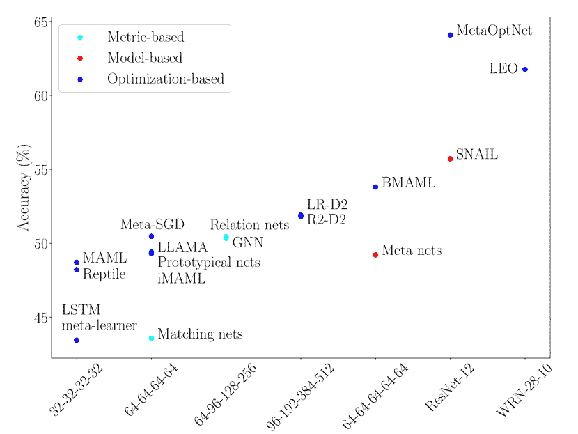

图 1：涵盖技术在 1-shot miniImageNet 分类中的准确度分数。使用的特征提取骨干在 x 轴上显示。可以看到，网络复杂性与分类性能之间存在强关系。

历史上，“元学习”一词在不同的范围内使用过。在最广泛的意义上，它包含了所有利用先前学习经验来更快地学习新任务的系统（Vanschoren, 2018）。这个广泛的概念包括了传统的算法选择和机器学习（Brazdil et al., 2008）的超参数优化技术。然而，在这项工作中，我们关注的是元学习领域的一个子集，该子集开发了元学习程序以为（深度）神经网络学习一个好的归纳偏差¹¹1 这里，归纳偏差指的是模型对未见数据的预测所依据的假设（Mitchell, 1980）。从此，我们使用“深度元学习”一词来指代元学习的这个子领域。

深度元学习领域正在快速发展，但缺乏一致的、统一的概述，提供了对关键技术的详细见解。Vanschoren (2018) 调查了元学习技术，其中元学习被广泛使用，限制了对深度元学习技术的描述。此外，许多令人兴奋的深度元学习发展发生在调查发布之后。Hospedales 等人 (2020) 的更近期调查采用了与我们相同的深度元学习概念，但旨在提供广泛的概述，省略了各种技术的细节。

我们试图通过提供对当代深度元学习技术的详细解释来填补这一空白，使用统一的符号表示法。更具体地说，我们涵盖了在监督学习和强化学习领域取得了最先进性能、获得了领域内关注并提出了新颖思想的现代技术。特别关注 MAML（Finn 等，2017）及相关技术，因为它们对该领域的影响。我们展示了这些技术之间的关系，详细说明了它们的优缺点，识别了当前的挑战，并提供了有前景的未来研究方向的概述。我们的一项观察是，网络复杂度与少样本分类性能高度相关（见图 1）。可以预期，在少样本设置中，由于仅有少量示例可供学习，网络参数的数量应该保持较小以防止过拟合。显然，图中显示这并不成立，因为使用较大骨干网的技术往往能取得更好的性能。一个重要因素可能是由于网络已经看到的大量任务，我们处于一个类似地评估了大量观察的设置中。这一结果表明，在比较算法时应考虑网络的大小。

本工作可以作为深度元学习领域的教育性介绍，并作为该领域经验丰富的研究者的参考材料。在整个过程中，我们将采用 Vinyals（2017）使用的分类法，该分类法将深度元学习方法分为三类：i) 基于度量的方法，ii) 基于模型的方法，和 iii) 基于优化的方法。

本文的剩余部分结构如下。第二部分构建了一个共同的基础，我们将在此基础上概述深度元学习技术。第 3、4 和 5 节分别涵盖主要的度量、模型和优化基础的元学习技术。第六部分提供了该领域的总体视角，总结了关键挑战和开放问题。表 1 概述了我们将在本文中使用的符号表示法。

| 表达式 | 含义 |
| --- | --- |
| 元学习 | 学会学习 |
| $\mathcal{T}_{j}=(D^{tr}_{\mathcal{T}_{j}},D^{test}_{\mathcal{T}_{j}})$ | 由标记的支持集和查询集组成的任务 |
| 支持集 | 任务$\mathcal{T}_{j}$相关的训练集$D^{tr}_{\mathcal{T}_{j}}$ |
| 查询集 | 任务$\mathcal{T}_{j}$相关的测试集$D^{test}_{\mathcal{T}_{j}}$ |
| $\boldsymbol{x}_{i}$ | 支持集中第$i$个示例输入向量 |
| $y_{i}$ | 支持集中示例输入$\boldsymbol{x}_{i}$的（独热编码）标签 |
| $k$ | 支持集每类的样本数量 |
| $N$ | 任务的支持集和查询集中的类别数 |
| $\boldsymbol{x}$ | 查询集中的输入 |
| $y$ | 输入 $\boldsymbol{x}$ 的（独热编码）标签 |
| $(f/g/h)_{\circ}$ | 带有参数 $\circ$ 的神经网络函数 |
| 内层级别 | 在单个任务的层级 |
| 外层级别 | 在元级别：跨任务 |
| 快速权重 | 文献中用于表示任务特定参数的术语 |
| 基础学习者 | 在内层级别工作的学习者 |
| 元学习者 | 在外层级别操作的学习者 |
| $\boldsymbol{\theta}$ | 基础学习网络的参数 |
| $\mathcal{L}_{D}$ | 关于任务/数据集 $D$ 的损失函数 |
| 输入嵌入 | 输入的倒数第二层表示 |
| 任务嵌入 | 网络/系统中任务的内部表示 |
| SL | 监督学习 |
| RL | 强化学习 |

表 1：我们在本文中使用的一些符号和含义。

## 2 基础

在本节中，我们为以一致的方式研究深度元学习技术建立了必要的基础。首先，我们对比了常规学习和元学习。随后，我们简要讨论了深度元学习如何与不同领域相关，通常的训练和评估过程是怎样的，以及通常使用哪些基准。我们通过描述元学习领域的背景和一些应用来结束本节。

### 2.1 元抽象

在这一小节中，我们对比了两种不同范式的基础级（常规）学习和元学习，即监督学习和强化学习。

#### 2.1.1 常规监督学习

在监督学习中，我们希望学习一个函数 $f_{\boldsymbol{\theta}}:X\rightarrow Y$，该函数学习将输入 $\boldsymbol{x}_{i}\in X$ 映射到其对应的输出 $y_{i}\in Y$。这里，$\boldsymbol{\theta}$ 是决定函数行为的模型参数（例如，神经网络中的权重）。为了学习这些参数，我们提供了一个包含 $m$ 个观测值的数据集：$D=\{(\boldsymbol{x}_{i},y_{i})\}_{i=1}^{m}$。因此，给定数据集 $\mathcal{D}$，学习的关键在于找到使经验损失函数 $\mathcal{L}_{D}$ 最小化的正确设置，这必须捕捉模型的表现，以便对其参数进行适当的调整。简而言之，我们希望找到

|  | $\displaystyle\boldsymbol{\theta}_{SL}:=\operatorname*{arg\,min}_{\boldsymbol{\theta}}\,\mathcal{L}_{D}(\boldsymbol{\theta}),$ |  | (1) |
| --- | --- | --- | --- |

其中$SL$代表“监督学习”。请注意，这个目标是特定于数据集$\mathcal{D}$的，这意味着我们的模型$f_{\boldsymbol{\theta}}$可能无法推广到$\mathcal{D}$之外的示例。为了衡量泛化能力，可以在一个包含未见示例的独立测试数据集上评估性能。一种常用的方法是通过交叉验证，在交叉验证中，一次又一次地创建训练和测试划分$D^{tr},D^{test}\subset D$，并分别使用这些划分来训练和评估模型（Hastie 等，2009）。

寻找全局最优参数$\boldsymbol{\theta}_{SL}$通常在计算上是不可行的。然而，我们可以在预定义的元知识$\omega$（Hospedales 等，2020）的指导下进行近似，其中包括例如初始模型参数$\boldsymbol{\theta}$、优化器选择和学习率计划。因此，我们进行近似。

|  | $\displaystyle\boldsymbol{\theta}_{SL}\approx g_{\omega}(D,\mathcal{L}_{D}),$ |  | (2) |
| --- | --- | --- | --- |

其中$g_{\omega}$是一个优化过程，使用预定义的元知识$\omega$、数据集$\mathcal{D}$和损失函数$\mathcal{L}_{D}$，来产生更新的权重$g_{\omega}(D,\mathcal{L}_{D})$，这些权重（大概）在$\mathcal{D}$上表现良好。

#### 2.1.2 监督式元学习

相比之下，监督式元学习并不假设任何元知识$\omega$是给定的或预定义的。相反，元学习的目标是找到最佳的$\omega$，使得我们的（常规）基础学习器可以尽可能快速地学习新任务（数据集）。因此，虽然监督式常规学习涉及一个数据集，监督式元学习则涉及一组数据集。目标是学习元知识$\omega$，使我们的模型能够很好地学习许多不同的任务。因此，我们的模型是在学习如何学习。

更正式地，我们有一个任务的概率分布$p(\mathcal{T})$，并希望找到最佳的元知识

|  | $\displaystyle\omega^{*}:=\operatorname*{arg\,min}_{\omega}\,\underbrace{\mathbb{E}_{\mathcal{T}_{j}\backsim p(\mathcal{T})}}_{\textrm{外部层级}}[\underbrace{\mathcal{L}_{\mathcal{T}_{j}}(g_{\omega}(\mathcal{T}_{j},\mathcal{L}_{\mathcal{T}_{j}}))}_{\textrm{内部层级}}].$ |  | (3) |
| --- | --- | --- | --- |

在这里，内部层级关注特定任务的学习，而外部层级关注多个任务。现在可以很容易看出这就是元学习的原因：我们学习$\omega$，它使得在内部层级上能够快速学习任务$\mathcal{T}_{j}$。因此，我们正在学习如何学习。

#### 2.1.3 正则化强化学习

在强化学习中，我们有一个从经验中学习的智能体。即，它与环境互动，该环境由马尔可夫决策过程（MDP）$M=(S,A,P,r,p_{0},\gamma,T)$建模。在这里，$S$是状态集合，$A$是动作集合，$P$是定义$P(s_{t+1}|s_{t},a_{t})$的转移概率分布，$r:S\times A\rightarrow\mathbb{R}$是奖励函数，$p_{0}$是初始状态的概率分布，$\gamma\in[0,1]$是折扣因子，$T$是时间范围（最大时间步数）（Sutton 和 Barto，2018；Duan 等，2016）。

在每个时间步$t$，智能体发现自己处于状态$s_{t}$，此时智能体执行动作$a_{t}$，由策略函数$\pi_{\boldsymbol{\theta}}$计算（即$a_{t}=\pi_{\boldsymbol{\theta}}(s_{t})$），该函数由权重$\boldsymbol{\theta}$参数化。接着，它获得奖励$r_{t}=r(s_{t},\pi_{\boldsymbol{\theta}}(s_{t}))\in\mathbb{R}$和新状态$s_{t+1}$。这种交互过程继续，直到满足终止标准（例如，达到固定的时间范围$T$）。智能体的目标是学习如何行动，以最大化其期望奖励。强化学习（RL）的目标是找到

|  | $\displaystyle\boldsymbol{\theta}_{RL}:=\operatorname*{arg\,min}_{\boldsymbol{\theta}}\,\mathbb{E}_{\mbox{traj}}\sum_{t=0}^{T}\gamma^{t}r(s_{t},\pi_{\boldsymbol{\theta}}(s_{t})),$ |  | (4) |
| --- | --- | --- | --- |

在此我们对可能的轨迹$\mbox{traj}=(s_{0},\pi_{\boldsymbol{\theta}}(s_{0}),\allowbreak\ldots s_{T},\pi_{\boldsymbol{\theta}}(s_{T}))$进行期望计算，原因是 MDP 的随机性质（Duan 等， 2016）。注意，$\gamma$是一个超参数，通过降低或增加它，可以优先考虑短期或长期奖励。

在强化学习的情况下，通常很难找到全局最优解$\boldsymbol{\theta}_{RL}$，因此我们只能满足于近似解。简而言之，给定学习方法$\omega$，我们近似

|  | $\displaystyle\boldsymbol{\theta}_{RL}\approx g_{\omega}(\mathcal{T}_{j},\mathcal{L}_{\mathcal{T}_{j}}),$ |  | (5) |
| --- | --- | --- | --- |

在这里，$\mathcal{T}_{j}$是给定的 MDP，而$g_{\omega}$是优化算法，由预定义的元知识$\omega$指导。

请注意，在马尔可夫决策过程（MDP）中，智能体知道在任何给定时间步$t$的状态。当情况不是这样时，它就变成了部分可观测马尔可夫决策过程（POMDP），其中智能体仅接收观察$O$，并利用这些观察来更新其关于所处状态的信念（Sutton 和 Barto，2018）。

#### 2.1.4 元强化学习

元抽象的对象是一组任务，或者在强化学习的情况下，是马尔可夫决策过程（MDPs）。因此，元强化学习的目标是通过学习元知识**$\omega$**，在多个 MDP 上最大化期望奖励，而不是在单一 MDP 上最大化期望奖励。在这里，MDPs 是从某个分布$p(\mathcal{T})$中采样的。因此，我们希望找到一组参数

|  | $\displaystyle\boldsymbol{\omega}^{*}:=\operatorname*{arg\,min}_{\boldsymbol{\omega}}\,\underbrace{\mathbb{E}_{\mathcal{T}_{j}\backsim p(\mathcal{T})}}_{\textrm{外层}}\left[\underbrace{\mathbb{E}_{traj}\sum_{t=0}^{T}\gamma^{t}r(s_{t},\pi_{g_{\omega}(\mathcal{T}_{j},\mathcal{L}_{\mathcal{T}_{j}})}(s_{t}))}_{\textrm{内层}}\right].$ |  | (6) |
| --- | --- | --- | --- |

#### 2.1.5 与其他领域的对比

现在我们已经为监督学习和强化学习的元学习提供了正式的基础，是时候简要地将元学习与两个相关的机器学习领域进行对比，这些领域也旨在提高学习速度。我们将从迁移学习开始。

迁移学习 在迁移学习中，人们尝试将以前任务的知识转移到新的、未见过的任务中（Pan and Yang, 2009; Taylor and Stone, 2009），当新任务来自不同于训练所用分布时，这可能会很具挑战性（Iqbal et al., 2018）。然而，迁移学习与元学习之间的区别随着时间的推移变得更加模糊。元学习技术的一个关键特性是它们的元目标，明确旨在优化在任务分布上的表现（如在前面章节中通过在任务分布上的期望损失来实现）。这一目标不一定总是存在于迁移学习技术中，例如，当一个模型在大数据集上预训练，然后在较小的数据集上微调学到的权重时。

多任务学习 另一个密切相关的领域是多任务学习。在多任务学习中，一个模型被联合训练，以在多个固定任务上表现良好（Hospedales et al., 2020）。相比之下，元学习旨在找到一个能够快速学习新（先前未见）任务的模型。这一差异在 脚注 2 中有所说明。

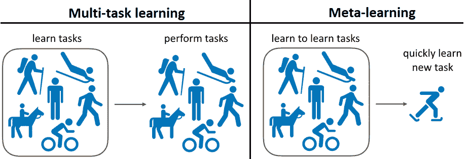

图 2：多任务学习与元学习的区别²²2 改编自 [`meta-world.github.io/`](https://meta-world.github.io/)。

### 2.2 元设置

在前一节中，我们描述了（元）监督学习和强化学习的学习目标。现在我们将描述可以用来实现这些目标的一般设置。一般而言，人们通过使用各种任务来优化一个元目标，这些任务在监督学习的背景下是数据集，而在强化学习的情况下则是（部分可观察的）马尔可夫决策过程。这分为三个阶段进行：i) 元训练阶段，ii) 元验证阶段，iii) 元测试阶段，每个阶段都与一组任务相关联。

首先，在元训练阶段，元学习算法应用于元训练任务。其次，元验证任务可以用来评估在未见任务上的表现，这些任务未用于训练。有效地，这衡量了训练网络的元泛化能力，并作为反馈来调整，例如，元学习算法的超参数。第三，元测试任务用于给出元学习技术的最终性能估计。

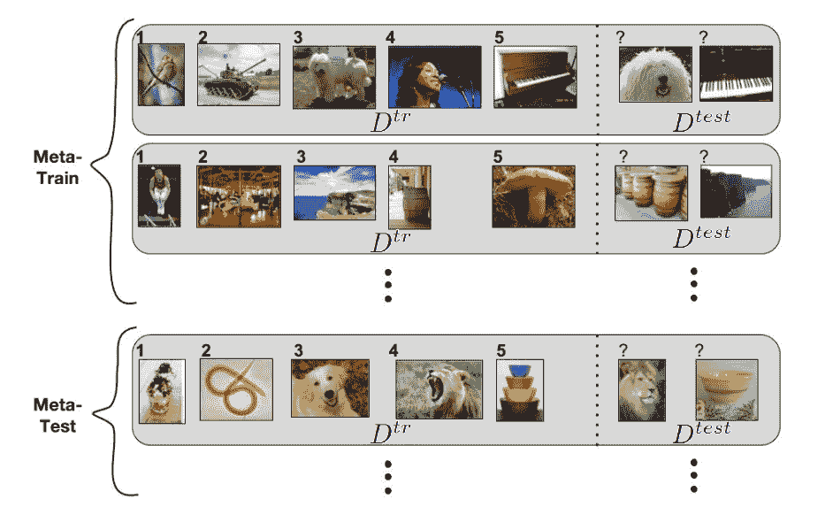

图 3：$N$-way、$k$-shot 分类的示意图，其中 $N=5$，$k=1$。未显示元验证任务。改编自 Ravi 和 Larochelle (2017)。

#### 2.2.1 $N$-way、$k$-shot 学习

一种常用的这种通用元设置的实例被称为 $N$-way, $k$-shot 分类（见 图 3）。该设置也分为三个阶段——元训练、元验证和元测试，分别用于元学习、元学习器超参数优化和评估。每个阶段都有一组对应的互不重叠的标签，即 $L^{tr},L^{val},L^{test}\subset Y$，使得 $L^{tr}\cap L^{val}=\emptyset,L^{tr}\cap L^{test}=\emptyset$ 和 $L^{val}\cap L^{test}=\emptyset$。在给定的阶段 $s$ 中，通过从完整数据集 $\mathcal{D}$ 中抽样例 $(\boldsymbol{x}_{i},y_{i})$ 得到任务/剧集 $\mathcal{T}_{j}=(D^{tr}_{\mathcal{T}_{j}},D^{test}_{\mathcal{T}_{j}})$，使得每个 $y_{i}\in L^{s}$。请注意，这需要访问数据集 $\mathcal{D}$。抽样过程由 $N$-way, $k$-shot 原则指导，该原则规定每个训练数据集 $D^{tr}_{\mathcal{T}_{j}}$ 应包含恰好 $N$ 类和每类 $k$ 个示例，这意味着 $|D^{tr}_{\mathcal{T}_{j}}|=N\cdot k$。此外，测试集 $D_{\mathcal{T}_{j}}^{test}$ 中示例的真实标签必须存在于给定任务 $\mathcal{T}_{j}$ 的训练集 $D^{tr}_{\mathcal{T}_{j}}$ 中。$D^{tr}_{\mathcal{T}_{j}}$ 充当支持集，实际上支持对查询集 $D^{test}_{\mathcal{T}_{j}}$ 的分类决策。重要的是，要注意根据这一术语，任务的查询集（或测试集）实际上在元训练阶段被使用。此外，各阶段标签的互不重叠确保了我们测试模型学习新概念的能力。

训练阶段的元学习目标是最小化模型在查询集上的预测损失函数，条件是支持集的存在。因此，对于给定任务 $\mathcal{T}_{j}$，模型“看到”支持集，并从支持集中提取信息以指导其对查询集的预测。通过将这一过程应用于不同的剧集/任务 $\mathcal{T}_{j}$，模型将慢慢积累元知识 $\omega$，这可以*最终*加速对新任务的学习。

实现这一点的最简单方法是使用常规神经网络，但正如各种作者所指出的（见例如 Finn 等人 (2017)），更复杂的架构将远远优于这种网络。在本文的其余部分，我们将回顾这些架构。

在元验证和元测试阶段，或评估阶段，学习到的元信息 $\omega$ 是固定的。然而，模型仍然允许对其参数 $\boldsymbol{\theta}$ 进行特定任务的更新（这意味着它在学习）。在任务特定更新之后，我们可以评估在测试集上的性能。通过这种方式，我们测试技术在元学习中的表现如何。

$N$-way, $k$-shot 分类通常在 $k$ 的小值下进行（因为我们希望模型能够快速学习新概念，即从少量示例中学习）。在这种情况下，可以称之为小样本学习。

#### 2.2.2 常见基准

在这里，我们简要描述了一些可以用于评估元学习算法的基准。

+   •

    Omniglot (Lake et al., 2011)：该数据集提供了一个图像识别任务。每张图像对应于 50 种不同字母表中的 1 623 个字符中的一个。每个字符由 20 个人绘制。注意，在这种情况下，字符即为类别/标签。

+   •

    ImageNet (Deng et al., 2009)：这是最大的图像分类数据集，包含超过 20K 个类别和超过 1,400 万张彩色图像。miniImageNet 是大规模 ImageNet 数据集 (Deng et al., 2009) 的一个迷你变体，由 Vinyals et al. (2016) 提出，用于减少实验的工程工作量。这个迷你数据集包含 60 000 张大小为 $84\times 84$ 的彩色图像。总共有 100 个类别，每个类别有 600 个样本。tieredImageNet (Ren et al., 2018) 是大规模 ImageNet 数据集的另一个变体。它类似于 miniImageNet，但包含层次结构。也就是说，共有 34 个类别，每个类别都有自己的子类别。

+   •

    CIFAR-10 和 CIFAR-100 (Krizhevsky, 2009)：另外两个图像识别数据集。每个数据集包含 60K 张大小为 $32\times 32$ 的 RGB 图像。CIFAR-10 和 CIFAR-100 分别包含 10 类和 100 类，每类的样本数量均匀（分别为 6 000 和 600）。CIFAR-100 中的每个类别也有一个超级类别，整个数据集中共有 20 个超级类别。CIFAR 数据集的许多变体可以被采样，例如 CIFAR-FS (Bertinetto et al., 2019) 和 FC-100 (Oreshkin et al., 2018)。

+   •

    CUB-200-2011 (Wah et al., 2011)：CUB-200-2011 数据集包含大约 12K 张来自 200 个物种的鸟类 RGB 图像。每张图像都有一些标注的属性（例如：头冠颜色、尾巴形状）。

+   •

    MNIST (LeCun et al., 2010)：MNIST 提供了一个手写数字识别任务，包含十个类别（0 到 9 的数字）。总的来说，数据集被分为 60K 张训练图像和 10K 张测试图像，这些图像都是手写数字的灰度图像。

+   •

    Meta-Dataset (Triantafillou et al., 2020)：该数据集包含了多个其他数据集，例如 Omniglot (Lake et al., 2011)、CUB-200 (Wah et al., 2011)、ImageNet (Deng et al., 2009) 等 (Triantafillou et al., 2020)。然后通过采样一个数据集（例如 Omniglot）并选择一个标签子集来构建一个实验，创建训练和测试分割。通过这种方式，强制执行更广泛的泛化，因为任务彼此之间距离较远。

+   •

    Meta-world（Yu et al., 2019）：一个元强化学习数据集，包含 50 个机器人操作任务（控制机器人手臂完成某些预定义目标，例如开门或踢足球）。它被特别设计来涵盖广泛的任务，以便能够测量有意义的泛化（Yu et al., 2019）。

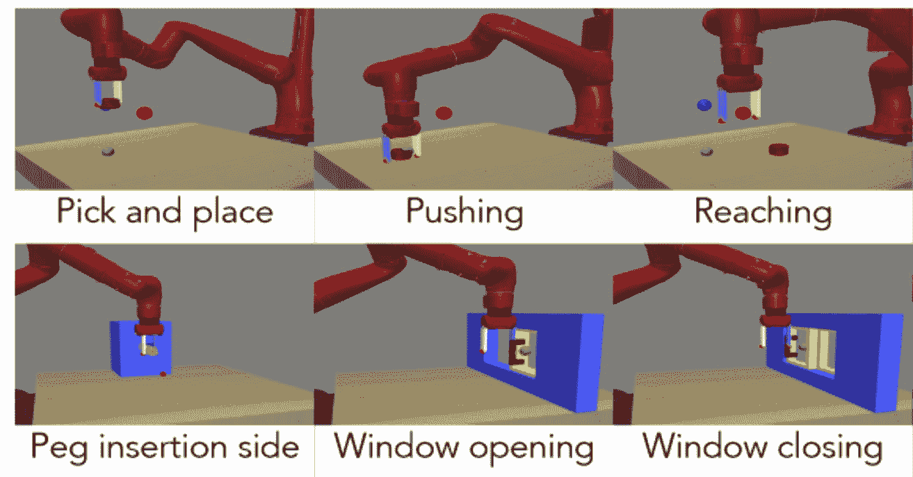

图 4：学习连续的机器人控制任务是深度元学习技术的重要应用。图片取自（Yu et al., 2019）。

#### 2.2.3 元学习的一些应用

深度神经网络在图像识别、文本处理、游戏玩法和机器人技术等各种任务上取得了显著成果（Silver et al., 2016; Mnih et al., 2013; Wu et al., 2016），但它们的成功依赖于可用数据量（Sun et al., 2017）和计算资源。深度元学习通过使深度神经网络能够快速学习新概念，从而减少了这种依赖。因此，元学习扩大了深度学习技术在许多应用领域的适用性。这些领域包括少样本图像分类（Finn et al., 2017; Snell et al., 2017; Ravi and Larochelle, 2017）、机器人控制策略学习（Gupta et al., 2018; Nagabandi et al., 2019）（见图 4）、超参数优化（Antoniou et al., 2019; Schmidhuber et al., 1997）、元学习学习规则（Bengio et al., 1991, 1997; Miconi et al., 2018, 2019）、抽象推理（Barrett et al., 2018）等。有关更多应用的概述，我们建议感兴趣的读者参考 Hospedales et al.（2020）。

### 2.3 元学习领域

如引言中所提到的，元学习是一个广泛的研究领域，因为它包含了所有利用先前学习经验来更快地学习新任务的技术（Vanschoren, 2018）。我们可以在这一领域中分类两个不同的群体，其关注点不同：i) 机器学习技术的算法选择和超参数优化，ii) 深度神经网络中的归纳偏置搜索。我们将这两个群体分别称为群体 i) 和群体 ii)。现在，我们将简要描述第一个领域，并对第二个领域进行历史概述。

组 i) 使用了更传统的方法来为新的数据集 $\mathcal{D}$ 选择合适的机器学习算法和超参数 (Peng et al., 2002)。例如，这种选择可以通过利用在不同数据集 $D^{\prime}$ 上的先前模型评估来完成，并使用在最相似的数据集上表现最佳的模型 (Vanschoren, 2018)。这种传统方法需要（大规模）先前模型评估数据库，涵盖许多不同的算法。这导致了如 OpenML (Vanschoren et al., 2014) 等举措，研究人员可以共享这些信息。这些系统的使用将限制选择神经网络架构的自由，因为它们将被约束于使用已被预先评估的架构。

相比之下，组 ii) 采用了自我改进（神经）代理的观点，这种代理通过寻找合适的归纳偏置（指导预测的假设集合）来随着时间的推移提高其学习能力。我们现在基于 Hospedales 等人的工作 (2020)，简要介绍深度元学习领域的发展历史。

开创性的工作由 Schmidhuber (1987) 和 Hinton 与 Plaut (1987) 完成。Schmidhuber 发展了自我参考学习理论，其中神经网络的权重可以作为模型自身的输入，然后预测更新 (Schmidhuber, 1987, 1993)。同年，Hinton 和 Plaut (1987) 提出了对每个神经网络连接使用两个权重，即慢权重和快权重，分别用于长期和短期记忆。随后提出了元学习规则的概念 (Bengio et al., 1991, 1997)。Hochreiter et al. (2001) 和 Younger et al. (2001) 提出了使用梯度下降和反向传播的元学习技术。这两个工作对当前深度元学习领域至关重要，因为大多数技术依赖于反向传播，正如我们在现代深度元学习技术的探索中将看到的那样。

### 2.4 本工作其余部分的概述

在本工作的其余部分，我们将更详细地研究个别的元学习方法。如前所述，这些技术可以分为三大类 (Vinyals, 2017)，即 i)  基于度量的方法，ii) 基于模型的方法，以及 iii) 基于优化的方法。我们将按此顺序讨论这些方法。

为了帮助概述这些方法，我们引起你对以下表格的注意。表 2 总结了三类方法并提供了关键思想和优势。这些术语和技术细节在本文的其余部分进行了更详细的解释。表 3 包含了所有进一步讨论的技术的概述。

|  | 度量 | 模型 | 优化 |
| --- | --- | --- | --- |
| 关键思想 | 输入相似性 | 内部任务表示 | 针对快速适应的优化 |
| 优势 | 简单且有效 | 灵活 | 更强的鲁棒性 |
| $p_{\boldsymbol{\theta}}(Y\mid\boldsymbol{x},D^{tr}_{\mathcal{T}_{j}})$ | $\sum\limits_{(\boldsymbol{x}_{i},y_{i})\in D^{tr}_{\mathcal{T}_{j}}}k_{\boldsymbol{\theta}}(\boldsymbol{x},\boldsymbol{x}_{i})y_{i}$ | $f_{\boldsymbol{\theta}}(\boldsymbol{x},D^{tr}_{\mathcal{T}_{j}})$ | $f_{g_{\boldsymbol{\varphi}(\boldsymbol{\theta},D_{\mathcal{T}_{j}}^{tr},\mathcal{L}_{D^{tr}_{\mathcal{T}_{j}}})}}(\boldsymbol{x})$ |

表 2：深度元学习的三大类技术的高级概述，即 i) 基于度量，ii) 基于模型，以及 iii) 基于优化的技术及其主要优势和劣势。回忆一下，$\mathcal{T}_{j}$ 是任务，$D^{tr}_{\mathcal{T}_{j}}$ 是相应的支持集，$k_{\boldsymbol{\theta}}(\boldsymbol{x},\boldsymbol{x}_{i})$ 是一个内核函数，返回两个输入 $\boldsymbol{x}$ 和 $\boldsymbol{x}_{i}$ 之间的相似度，$y_{i}$ 是已知输入 $\boldsymbol{x}_{i}$ 的真实标签，$\theta$ 是基础学习器参数，$g_{\boldsymbol{\varphi}}$ 是具有参数 $\boldsymbol{\varphi}$ 的（学习）优化器。

| 名称 | RL | 关键思想 | 基准 |
| --- | --- | --- | --- |
| 基于度量的 |  | 输入相似性 | - |
|   孪生网络 | ✗ | 两输入，共享权重，类别身份网络 | 1, 8 |
|   匹配网络 | ✗ | 学习用于余弦相似度加权预测的输入嵌入 | 1, 2 |
|   原型网络 | ✗ | 用于类别原型聚类的输入嵌入 | 1, 2, 7 |
|   关系网络 | ✗ | 学习输入嵌入和相似度度量 | 1, 2, 7 |
|   ARC | ✗ | 基于 LSTM 的输入融合，通过交错的瞥视 | 1, 2 |
|   图神经网络 | ✗ | 在图中传播标签信息到未标记的输入 | 1, 2 |
| 基于模型的 |  | 内部和状态性潜在任务表示 | - |
|   循环机器学习 | ✓ | 在强化学习问题上部署循环网络 | - |
|   MANNs | ✗ | 外部短期记忆模块用于快速学习 | 1 |
|   元网络 | ✓ | 通过不同的元学习器快速重新参数化基础学习器 | 1, 2 |
|   SNAIL | ✓ | 结合时间卷积的注意力机制 | 1, 2 |
|   条件神经过程 | ✗ | 基于嵌入上下文任务数据的条件预测模型 | 1, 8 |
|   神经统计 | ✗ | 潜在任务嵌入之间的相似性 | 1, 8 |
| 基于优化 |  | 针对快速任务特定适应进行优化 | - |
|   LSTM 优化器 | ✗ | RNN 提议基础学习者的权重更新 | 6, 8 |
|   LSTM ml. | ✓ | 将基础学习者参数嵌入 LSTM 的单元状态中 | 2 |
|   RL 优化器 | ✗ | 将优化视为 RL 问题 | 4, 6 |
|   MAML | ✓ | 学习初始化权重 $\boldsymbol{\theta}$ 以实现快速适应 | 1, 2 |
|   iMAML | ✓ | 近似高阶梯度，与优化路径无关 | 1, 2 |
|   Meta-SGD | ✓ | 学习初始化和更新 | 1, 2 |
|   Reptile | ✓ | 将初始化移动到任务特定的更新权重 | 1, 2 |
|   LEO | ✗ | 在低维潜在参数空间中进行优化 | 2, 3 |
|   在线 MAML | ✗ | 收集任务数据以进行类似 MAML 的训练 | 4, 8 |
|   LLAMA | ✗ | 维持更新后参数 $\boldsymbol{\theta}^{\prime}_{j}$ 的概率分布 | 2 |
|   PLATIPUS | ✗ | 学习权重初始化的概率分布 $\boldsymbol{\theta}$ | - |
|   BMAML | ✓ | 学习多个初始化 $\boldsymbol{\Theta}$，由 SVGD 联合优化 | 2 |
|   差分解算器 | ✗ | 学习简单基础学习者的输入嵌入 | 1, 2, 3, 4, 5 |

表 3：讨论的深度元学习技术概述。该表分为三个部分，即基于度量、基于模型和基于优化的技术。每个部分中的所有方法都遵循其对应类别的核心思想，该思想以粗体字体表示。列 RL 和 Bench 显示这些技术是否适用于强化学习设置，以及用于测试技术性能的基准。请注意，所有技术都适用于监督学习，RMLs 除外。基准列显示了提出该技术的论文中使用的基准，这些基准来自 第 2.2.2 节。该列使用的编码方案如下。1: Omniglot, 2: miniImageNet, 3: tieredImageNet, 4: CIFAR-100, 5: CIFAR-FS, 6: CIFAR-10, 7: CUB, 8: MNIST, “-": 使用了其他在深度元学习中非标准的评估方法，因此未包含在 第 2.2.2 节 中。使用的缩写：“opt.": 优化，“diff.": 可微分，“bench.": 基准。

## 3 基于度量的元学习

从高层次看，基于度量的技术的目标是获得—除了其他之外—以良好的特征空间形式呈现的元知识 $\omega$，该特征空间可用于各种新任务。在神经网络的背景下，这个特征空间与网络的权重 $\boldsymbol{\theta}$ 一致。然后，可以通过在元学习的特征空间中将新输入与示例输入（我们知道标签的）进行比较来学习新任务。新输入与示例的相似性越高，新输入具有与示例输入相同标签的可能性就越大。

基于度量的技术是一种元学习形式，因为它们利用其先前的学习经验（元学习的特征空间）来“更快地学习”新任务。在这里，“学习”以一种非标准的方式使用，因为基于度量的技术在面对新任务时不会对网络进行任何更改，因为它们仅依赖于在已经元学习的特征空间中的输入比较。这些输入比较是一种非参数学习，即，新任务信息不会被吸收到网络参数中。

更正式地说，基于度量的学习技术旨在学习一个相似性核，或等效地，注意机制 $k_{\boldsymbol{\theta}}$（由 $\boldsymbol{\theta}$ 参数化），它接受两个输入 $\boldsymbol{x}_{1}$ 和 $\boldsymbol{x}_{2}$，并输出它们的相似性评分。较大的评分表示更大的相似性。对于新的输入 $\boldsymbol{x}$，可以通过将 $\boldsymbol{x}$ 与已知真实标签 $y_{i}$ 的示例输入 $\boldsymbol{x}_{i}$ 进行比较来做出类别预测。基本思想是，$\boldsymbol{x}$ 和 $\boldsymbol{x}_{i}$ 之间的相似性越大，$\boldsymbol{x}$ 也具有标签 $y_{i}$ 的可能性就越大。

给定一个任务 $\mathcal{T}_{j}=(D^{tr}_{\mathcal{T}_{j}},D^{test}_{\mathcal{T}_{j}})$ 和一个未见过的输入向量 $\boldsymbol{x}\in D^{test}_{\mathcal{T}_{j}}$，通过使用相似性核 $k_{\boldsymbol{\theta}}$ 计算/预测类别 $Y$ 的概率分布，作为来自支持集 $D^{tr}_{\mathcal{T}_{j}}$ 的标签的加权组合，即，

|  | $\displaystyle p_{\boldsymbol{\theta}}(Y\mid\boldsymbol{x},D^{tr}_{\mathcal{T}_{j}})=\sum_{(\boldsymbol{x}_{i},y_{i})\in D^{tr}_{\mathcal{T}_{j}}}k_{\boldsymbol{\theta}}(\boldsymbol{x},\boldsymbol{x}_{i})y_{i}.$ |  | (7) |
| --- | --- | --- | --- |

重要的是，标签 $y_{i}$ 被假定为一热编码，这意味着它们由零向量表示，在真实类别的位置上标有‘1’。例如，假设总共有五个类别，并且我们的示例 $\boldsymbol{x}_{1}$ 的真实类别为 4。然后，一热编码标签是 $y_{1}=[0,0,0,1,0]$。注意，类别的概率分布 $p_{\boldsymbol{\theta}}(Y|\boldsymbol{x},D^{tr}_{\mathcal{T}_{j}})$ 是一个大小为 $|Y|$ 的向量，其中第 $i$ 项对应于输入 $\boldsymbol{x}$ 属于类别 $Y_{i}$ 的概率（给定支持集）。因此，预测的类别是 $\hat{y}=\operatorname*{arg\,max}_{i=1,2,\ldots,|Y|}p_{\boldsymbol{\theta}}(Y|\boldsymbol{x},S)_{i}$，其中 $p_{\boldsymbol{\theta}}(Y|\boldsymbol{x},S)_{i}$ 是计算出的输入 $\boldsymbol{x}$ 属于类别 $Y_{i}$ 的概率。

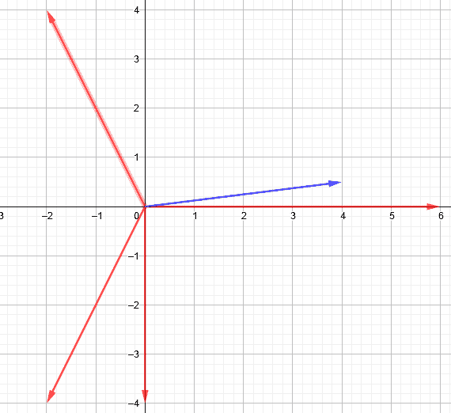

图 5：我们基于度量的示例说明。蓝色向量表示来自查询集的新输入，而红色向量是来自支持集的输入，可用于指导我们对新输入的预测。

### 3.1 示例

假设我们给定了一个任务 $\mathcal{T}_{j}=(D^{tr}_{\mathcal{T}_{j}},D^{test}_{\mathcal{T}_{j}})$。进一步假设 $D^{tr}_{\mathcal{T}_{j}}=\{([0,-4],1),([-2,-4],2),([-2,4],3),([6,0],4)\}$，其中一个元组表示一对 $(\boldsymbol{x}_{i},y_{i})$。为简便起见，本例不使用嵌入函数，该函数将示例输入映射到一个（更具信息量的）嵌入空间。我们的查询集仅包含一个示例 $D^{test}_{\mathcal{T}_{j}}=\{([4,0.5],y)\}$。然后，目标是仅使用 $D^{tr}_{\mathcal{T}_{j}}$ 中的示例来预测新输入 $[4,0.5]$ 的正确标签。这个问题在图 5 中进行了可视化，其中红色向量对应于我们的支持集中的示例输入。蓝色向量是需要分类的新输入。直观上，这个新输入最类似于向量 $[6,0]$，这意味着我们期望新输入的标签与 $[6,0]$ 的标签相同，即 $4$。

假设我们使用固定的相似性核，即余弦相似度，即 $k(\boldsymbol{x},\boldsymbol{x}_{i})=\frac{\boldsymbol{x}\cdot\boldsymbol{x}_{i}^{T}}{||\boldsymbol{x}||\cdot||\boldsymbol{x}_{i}||}$，其中 $||\boldsymbol{v}||$ 表示向量 $\boldsymbol{v}$ 的长度，即 $||\boldsymbol{v}||=\sqrt{(\sum_{n}v_{n}^{2})}$。这里，$v_{n}$ 表示占位符向量 $\boldsymbol{v}$ 的第 $n$ 个元素（用 $\boldsymbol{x}$ 或 $\boldsymbol{x}_{i}$ 替代 $\boldsymbol{v}$）。我们现在可以计算新输入 $[4,0.5]$ 和每个示例输入 $\boldsymbol{x}_{i}$ 之间的余弦相似度，如在 表 4 中所做的，我们使用了 $||\boldsymbol{x}||=||\,[4,0.5]\,||=\sqrt{4^{2}+0.5^{2}}\approx 4.03$，以及 $\frac{\boldsymbol{x}}{||\boldsymbol{x}||}\approx\frac{[4,0.5]}{4.03}=[0.99,0.12]$。

从此表和 公式 7 中可以得出，预测的概率分布 $p_{\boldsymbol{\theta}}(Y|\boldsymbol{x},D^{tr}_{\mathcal{T}_{j}})=-0.12y_{1}-0.58y_{2}-0.37y_{3}+0.99y_{4}=-0.12[1,0,0,0]-0.58[0,1,0,0]-0.37[0,0,1,0]+0.99[0,0,0,1]=\allowbreak[-0.12,\allowbreak-0.58,\allowbreak-0.37,\allowbreak 0.99]$。注意，这实际上不是一个概率分布。真正的概率分布需要归一化，使得每个元素至少为 $0$，并且所有元素的和为 $1$。为了这个例子，我们不进行这种归一化，因为显然类 4（最相似的示例输入 $[6,0]$ 的类别）将被预测出来。

| $\boldsymbol{x}_{i}$ | $y_{i}$ | $&#124;&#124;\boldsymbol{x}_{i}&#124;&#124;$ | $\frac{\boldsymbol{x}_{i}}{&#124;&#124;\boldsymbol{x}_{i}&#124;&#124;}$ | $\frac{\boldsymbol{x}_{i}}{&#124;&#124;\boldsymbol{x}_{i}&#124;&#124;}\cdot\frac{\boldsymbol{x}}{&#124;&#124;\boldsymbol{x}&#124;&#124;}$ |
| --- | --- | --- | --- | --- |
| $[0,-4]$ | $[1,0,0,0]$ | $4$ | $[0,-1]$ | $-0.12$ |
| $[-2,-4]$ | $[0,1,0,0]$ | $4.47$ | $[-0.48,-0.89]$ | $-0.58$ |
| $[-2,4]$ | $[0,0,1,0]$ | $4.47$ | $[-0.48,0.89]$ | $-0.37$ |
| $[6,0]$ | $[0,0,0,1]$ | $6$ | $[1,0]$ | $0.99$ |

表 4：示例展示了成对输入比较。数字已四舍五入到小数点后两位。

人们可能会疑惑为何这些技术是元学习者，因为我们可以采用任何单一数据集 $\mathcal{D}$ 并使用成对比较来计算预测。在外层，基于度量的元学习者在不同任务的分布上进行训练，以学习（其中之一）一个良好的输入嵌入函数。这个嵌入函数促进了内层学习，这通过成对比较来实现。因此，人们在任务之间学习一个嵌入函数，以促进特定任务的学习，这等同于“学习如何学习”，或称为元学习。

在介绍了基于度量的方法之后，我们现在将覆盖一些关键的基于度量的技术。

### 3.2 孪生神经网络

孪生神经网络（Koch et al., 2015）由两个共享相同权重$\boldsymbol{\theta}$的神经网络$f_{\boldsymbol{\theta}}$组成。孪生神经网络接受两个输入$\boldsymbol{x}_{1},\boldsymbol{x}_{2}$，并计算两个隐藏状态$f_{\boldsymbol{\theta}}(\boldsymbol{x}_{1})$和$f_{\boldsymbol{\theta}}(\boldsymbol{x}_{2})$，这两个隐藏状态对应于最终隐藏层中的激活模式。这些隐藏状态被输入到一个距离层，该层计算一个距离向量$\boldsymbol{d}=|f_{\boldsymbol{\theta}}(\boldsymbol{x}_{1})-f_{\boldsymbol{\theta}}(\boldsymbol{x}_{2})|$，其中$d_{i}$是$f_{\boldsymbol{\theta}}(\boldsymbol{x}_{1})$和$f_{\boldsymbol{\theta}}(\boldsymbol{x}_{2})$第$i$个元素之间的绝对距离。从这个距离向量中，$\boldsymbol{x}_{1},\boldsymbol{x}_{2}$之间的相似性被计算为$\sigma(\boldsymbol{\alpha}^{T}\boldsymbol{d})$，其中$\sigma$是 sigmoid 函数（输出范围为[0,1]），而$\boldsymbol{\alpha}$是一个自由加权参数向量，决定每个$d_{i}$的重要性。这种网络结构可以在图 6 中看到。

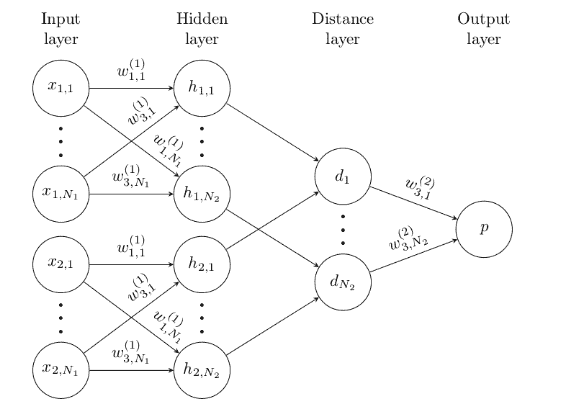

图 6：孪生神经网络示例。来源：Koch et al. (2015)。

Koch et al. (2015)将这种技术应用于少样本图像识别，分为两个阶段。在第一个阶段，他们在图像验证任务上训练双胞胎网络，目标是输出两个输入图像$\boldsymbol{x}_{1}$和$\boldsymbol{x}_{2}$是否属于同一类别。因此，网络被刺激去学习辨别特征。在第二个阶段，当模型面对新任务时，网络利用其之前的学习经验。也就是说，给定任务$\mathcal{T}_{j}=(D^{tr}_{\mathcal{T}_{j}},D^{test}_{\mathcal{T}_{j}})$和之前未见过的输入$\boldsymbol{x}\in D^{test}_{\mathcal{T}_{j}}$，预测类别$\hat{y}$等于与$\boldsymbol{x}$相似度得分最高的示例$(\boldsymbol{x}_{i},y_{i})\in D^{tr}_{\mathcal{T}_{j}}$的标签$y_{i}$。与本节后面提到的其他技术相比，孪生神经网络并不直接优化跨任务（包括支持集和查询集）的性能。然而，它们确实利用从验证任务中学到的知识来快速学习新任务。

总结来说，孪生神经网络是一种简单而优雅的少样本学习方法。然而，它们在监督学习之外的应用并不容易。

### 3.3 匹配网络

匹配网络（Vinyals et al., 2016）建立在底层的孪生神经网络（Koch et al., 2015）的思想之上。也就是说，它们利用给定支持集 $D^{tr}_{\mathcal{T}_{j}}=\{(\boldsymbol{x}_{i},y_{i})\}_{i=1}^{m}$（针对任务 $\mathcal{T}_{j}$）和我们希望分类的新输入 $\boldsymbol{x}\in D^{test}_{\mathcal{T}_{j}}$ 之间的成对比较。然而，匹配网络不是分配最相似示例输入 $\boldsymbol{x}_{i}$ 的类别 $y_{i}$，而是根据输入 $\boldsymbol{x}_{i}$ 与新输入 $\boldsymbol{x}$ 的相似性，使用支持集中所有示例标签 $y_{i}$ 的加权组合。更具体地说，预测计算如下：$\hat{y}=\sum_{i=1}^{m}a(\boldsymbol{x},\boldsymbol{x}_{i})y_{i}$，其中 $a$ 是非参数（不可训练的）注意力机制或相似性核。这个分类过程如 Figure 7 中所示。在这个图中，$f_{\boldsymbol{\theta}}$ 的输入需要进行分类，使用支持集 $D^{tr}_{\mathcal{T}_{j}}$（即 $g_{\boldsymbol{\theta}}$ 的输入）。

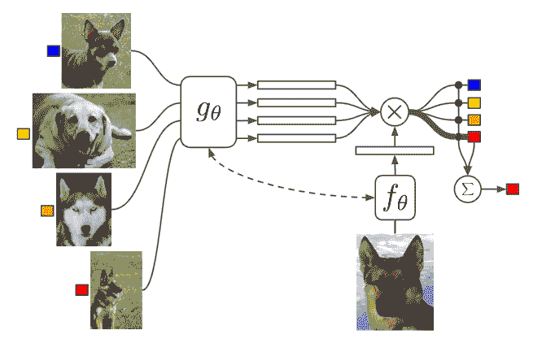

图 7: 匹配网络的架构。来源: Vinyals et al. (2016)。

使用的注意力机制包括对输入表示之间的余弦相似度 $c$ 进行的 softmax 操作，即，

|  | $\displaystyle a(\boldsymbol{x},\boldsymbol{x}_{i})=\frac{e^{c(f_{\boldsymbol{\phi}}(\boldsymbol{x}),g_{\boldsymbol{\varphi}}(\boldsymbol{x}_{i}))}}{\sum_{j=1}^{m}e^{c(f_{\boldsymbol{\phi}}(\boldsymbol{x}),g_{\boldsymbol{\varphi}}(\boldsymbol{x}_{j}))}},$ |  | (8) |
| --- | --- | --- | --- |

其中 $f_{\boldsymbol{\phi}}$ 和 $g_{\boldsymbol{\varphi}}$ 是由 $\boldsymbol{\phi}$ 和 $\boldsymbol{\varphi}$ 参数化的神经网络，这些网络将原始输入映射到（低维）潜在向量，该向量对应于神经网络最终隐藏层的输出。因此，神经网络充当了嵌入函数。$\boldsymbol{x}$ 和 $\boldsymbol{x}_{i}$ 的嵌入之间的余弦相似度越大，$a(\boldsymbol{x},\boldsymbol{x}_{i})$ 就越大，从而标签 $y_{i}$ 对输入 $\boldsymbol{x}$ 的预测标签 $\hat{y}$ 的影响也越大。

Vinyals 等（2016）提出了两种主要的嵌入函数选择。第一种是使用单个神经网络，从而得到 $\boldsymbol{\theta}=\boldsymbol{\phi}=\boldsymbol{\varphi}$，因此 $f_{\boldsymbol{\phi}}=g_{\boldsymbol{\varphi}}$。这种设置是匹配网络的默认形式，如 图 7 所示。第二种选择是使 $f_{\boldsymbol{\phi}}$ 和 $g_{\boldsymbol{\varphi}}$ 依赖于支持集 $D^{tr}_{\mathcal{T}_{j}}$，使用长短期记忆网络（LSTMs）。在这种情况下，$f_{\boldsymbol{\phi}}$ 由注意力 LSTM 表示，而 $g_{\boldsymbol{\varphi}}$ 由双向 LSTM 表示。这种嵌入函数的选择称为全上下文嵌入（FCE），在 miniImageNet 上相较于常规匹配网络提高了大约 2% 的准确性，表明任务特定的嵌入可以帮助分类来自相同分布的新数据点。

匹配网络通过在任务间学习良好的特征空间，以进行输入间的配对比较。与 Siamese 神经网络（Koch 等， 2015）不同，这个特征空间（由权重 $\boldsymbol{\theta}$ 给出）是在任务间学习的，而不是在一个独立的验证任务上。

总之，匹配网络是一种优雅且简单的度量基础元学习方法。然而，这些网络在监督学习以外的场景中不易应用，并且当标签分布存在偏差时，其性能会下降（Vinyals 等， 2016）。

### 3.4 原型网络

就像匹配网络（Vinyals 等， 2016）一样，原型网络（Snell 等， 2017）将其类别预测基于整个支持集 $D^{tr}_{\mathcal{T}_{j}}$。然而，原型网络并不计算新输入与支持集中的示例之间的相似性，而是仅将新输入与类原型（质心）进行比较，这些原型是在某个嵌入空间中表示类别的单一向量表示。由于类别原型的数量少于或等于支持集中的示例数量，因此所需的配对比较数量减少，从而节省了计算成本。

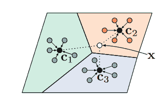

图 8：在少样本学习的情况下，原型网络。$\boldsymbol{c}_{k}$ 是类别 $k$ 的类原型，通过对支持集中的输入表示（彩色圆圈）进行平均计算得到。请注意，表示空间被划分为三个不重叠的区域，每个区域对应一个类别。然后，与查询集中新的输入 $\boldsymbol{x}$ 最近的原型类别将作为预测结果。来源：Snell 等（2017）。

类别原型的基本思想是，对于任务 $\mathcal{T}_{j}$，存在一个嵌入函数将支持集映射到一个空间，其中类别实例围绕相应的类别原型良好地聚集（Snell 等人，2017）。然后，对于新的输入 $\boldsymbol{x}$，将预测与该输入最近的原型的类别。因此，原型网络在元学习的嵌入空间中执行最近中心/原型分类。这在 图 8 中进行了可视化。

更正式地说，给定一个距离函数 $d:X\times X\rightarrow[0,+\infty)$（例如欧几里得距离）和由参数 $\boldsymbol{\theta}$ 参数化的嵌入函数 $f_{\boldsymbol{\theta}}$，原型网络计算类概率 $p_{\boldsymbol{\theta}}(Y|\boldsymbol{x},D^{tr}_{\mathcal{T}_{j}})$ 如下所示。

|  | $\displaystyle p_{\boldsymbol{\theta}}(y=k&#124;\boldsymbol{x},D^{tr}_{\mathcal{T}_{j}})=\frac{exp[-d(f_{\theta}(\boldsymbol{x}),\boldsymbol{c}_{k})]}{\sum_{y_{i}}exp[-d(f_{\theta}(\boldsymbol{x}),\boldsymbol{c}_{y_{i}})]},$ |  | (9) |
| --- | --- | --- | --- |

其中 $\boldsymbol{c}_{k}$ 是类别 $k$ 的原型/中心点，而 $y_{i}$ 是支持集 $D^{tr}_{\mathcal{T}_{j}}$ 中的类别。在这里，类别 $k$ 的类别原型定义为支持集中所有向量 $\boldsymbol{x}_{i}$ 的平均值，使得 $y_{i}=k$。因此，与新输入 $\boldsymbol{x}$ 更接近的类别原型获得更大的概率分数。

Snell 等人（2017）发现，平方欧几里得距离函数作为 $d$ 使得性能最佳。使用这种距离函数，原型网络可以被视为线性模型。要看这一点，请注意 $-d(f_{\theta}(\boldsymbol{x}),\boldsymbol{c}_{k})=-||f_{\theta}(\boldsymbol{x})-\boldsymbol{c}_{k}||^{2}=-f_{\theta}(\boldsymbol{x})^{T}f_{\theta}(\boldsymbol{x})+2\boldsymbol{c}_{k}^{T}f_{\theta}(\boldsymbol{x})-\boldsymbol{c}_{k}^{T}\boldsymbol{c}_{k}$。第一项不依赖于类别 $k$，因此不会影响分类决策。其余部分可以写成 $\boldsymbol{w}_{k}^{T}f_{\theta}(\boldsymbol{x})+\boldsymbol{b}_{k}$，其中 $\boldsymbol{w}_{k}=2\boldsymbol{c}_{k}$ 和 $\boldsymbol{b}_{k}=-\boldsymbol{c}_{k}^{T}\boldsymbol{c}_{k}$。请注意，这在网络 $f_{\theta}$ 的输出中是线性的，而不是在网络输入 $\boldsymbol{x}$ 中线性的。此外，Snell 等人（2017）表明，原型网络（与欧几里得距离结合）在单次学习设置中等同于匹配网络，因为支持集中的每个示例将成为其原型。

简而言之，原型网络通过采用类别原型的概念，减少了新输入与支持集之间所需的成对比较，从而节省了计算成本。此外，原型网络在 Omniglot（Lake et al., 2011）和 miniImageNet（Vinyals et al., 2016）上的 5-way, $k$-shot 学习中，在 $k=1,5$ 的情况下表现优于匹配网络（Vinyals et al., 2016），即使它们没有使用复杂的任务特定嵌入函数。尽管有这些优点，原型网络在监督学习环境之外并不容易应用。

### 3.5 关系网络

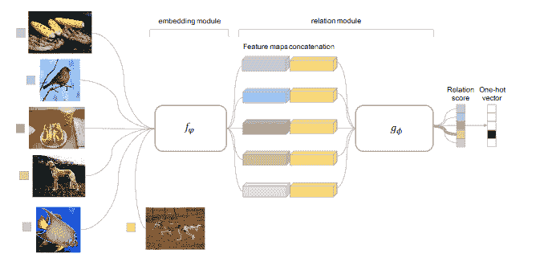

图 9：关系网络架构。首先，嵌入网络 $f_{\boldsymbol{\varphi}}$ 将来自支持集 $D^{tr}_{\mathcal{T}_{j}}$ 的所有输入（左侧的五个示例输入）以及查询输入（在 $f_{\boldsymbol{\varphi}}$ 块下方）进行嵌入。然后，将所有支持集嵌入 $f_{\boldsymbol{\varphi}}(\boldsymbol{x}_{i})$ 连接到查询嵌入 $f_{\boldsymbol{\varphi}}(\boldsymbol{x})$。这些连接的嵌入被输入到关系网络 $g_{\boldsymbol{\phi}}$ 中，该网络计算每对 $(\boldsymbol{x}_{i},\boldsymbol{x})$ 的关系分数。然后，预测产生最大关系分数 $g_{\boldsymbol{\phi}}([f_{\boldsymbol{\varphi}}(\boldsymbol{x}),f_{\boldsymbol{\varphi}}(\boldsymbol{x}_{i})])$ 的输入 $\boldsymbol{x}_{i}$ 的类别。来源：Sung et al. (2018)。

与之前讨论的基于度量的技术不同，关系网络（Sung et al., 2018）使用一个可训练的相似性度量，而不是预定义的度量（例如，匹配网络（Vinyals et al., 2016）中使用的余弦相似性）。更具体地说，匹配网络由两个串联的神经网络模块组成：嵌入网络/模块 $f_{\boldsymbol{\varphi}}$，负责对输入进行嵌入，以及关系网络 $g_{\boldsymbol{\phi}}$，计算新输入 $\boldsymbol{x}$ 和我们已知标签的示例输入 $\boldsymbol{x}_{i}$ 之间的相似性分数。然后，通过选择示例输入中产生最大关系分数（或相似性）的类别来做出分类决策。请注意，关系网络因此不使用类别原型的概念，而是简单地将新输入 $\boldsymbol{x}$ 与支持集中的所有示例输入 $\boldsymbol{x}_{i}$ 进行比较，如匹配网络（Vinyals et al., 2016）所做的那样。

更正式地说，我们给定一个支持集 $D^{tr}_{\mathcal{T}_{j}}$，其中包含一些示例 $(\boldsymbol{x}_{i},y_{i})$，以及一个新的（之前未见过的）输入 $\boldsymbol{x}$。然后，对于每一个组合 $(\boldsymbol{x},\boldsymbol{x}_{i})$，关系网络产生一个拼接的嵌入 $[f_{\boldsymbol{\varphi}}(\boldsymbol{x}),f_{\boldsymbol{\varphi}}(\boldsymbol{x}_{i})]$，这是通过拼接 $\boldsymbol{x}$ 和 $\boldsymbol{x}_{i}$ 的相应嵌入获得的向量。这个拼接的嵌入然后被送入关系模块 $g_{\boldsymbol{\phi}}$。最后，$g_{\boldsymbol{\phi}}$ 计算 $\boldsymbol{x}$ 和 $\boldsymbol{x}_{i}$ 之间的关系得分。

|  | $\displaystyle r_{i}=g_{\boldsymbol{\phi}}([f_{\boldsymbol{\varphi}}(\boldsymbol{x}),f_{\boldsymbol{\varphi}}(\boldsymbol{x}_{i})]).$ |  | (10) |
| --- | --- | --- | --- |

预测的类别是 $\hat{y}=y_{\operatorname*{arg\,max}_{i}r_{i}}$。整个过程如图 9 所示。值得注意的是，关系网络使用的是关系得分的均方误差（MSE），而不是更标准的交叉熵损失。然后，MSE 通过整个架构向后传播（图 9）。

关系网络的关键优势在于其表达能力，这是由可训练相似性函数的使用所引起的。这种表达能力使得这一技术非常强大。因此，它比使用固定相似性度量的之前讨论的技术具有更好的性能。

### 3.6 图神经网络

图神经网络（Garcia 和 Bruna，2017）使用比之前讨论的技术更通用和灵活的方法进行 $N$-way，$k$-shot 分类。因此，图神经网络包含了 Siamese（Koch 等，2015）和原型网络（Snell 等，2017）。图神经网络方法将每个任务 $\mathcal{T}_{j}$ 表示为一个完全连接的图 $G=(V,E)$，其中 $V$ 是节点/顶点的集合，$E$ 是连接节点的边的集合。在这个图中，节点 $\boldsymbol{v}_{i}$ 对应于输入嵌入 $f_{\boldsymbol{\theta}}(\boldsymbol{x}_{i})$，并与其一热编码标签 $y_{i}$ 连接，即 $\boldsymbol{v}_{i}=[f_{\boldsymbol{\theta}}(\boldsymbol{x}_{i}),y_{i}]$。对于来自查询集的输入 $\boldsymbol{x}$（我们没有标签），使用所有 $N$ 个可能标签的均匀先验：$y=[\frac{1}{N},\ldots,\frac{1}{N}]$。因此，每个节点包含输入和标签部分。边是连接这些节点的加权链接。

图神经网络使用一系列局部操作符在图中传播信息。其基本思想是标签信息可以从我们已知标签的节点传递到我们需要预测标签的节点。具体使用哪些局部操作符超出了本文的范围，读者可以参考 Garcia 和 Bruna (2017) 以获取详细信息。

通过将图神经网络暴露于各种任务 $\mathcal{T}_{j}$，可以改变传播机制，从而改善标签信息的流动，使得预测变得更加准确。因此，除了学习一个好的输入表示函数 $f_{\boldsymbol{\theta}}$，图神经网络还学习如何将标签信息从有标签的示例传播到无标签的输入。

图神经网络在少样本设置中表现良好 (Garcia 和 Bruna, 2017)，并且在半监督和主动学习设置中也适用。

### 3.7 注意力递归比较器（ARCs）

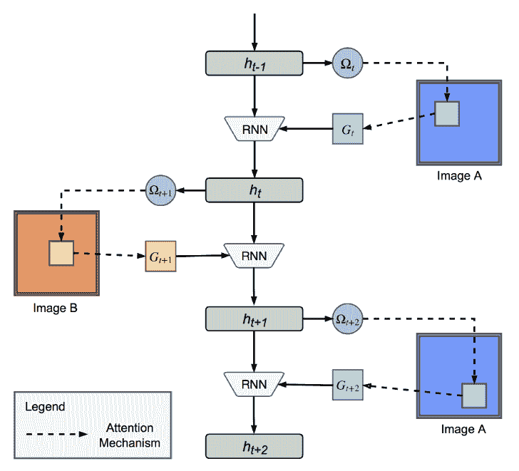

图 10：在注意力递归比较器中的处理。每个时间步骤，模型会扫描图像的一部分，并将这些信息融入隐藏状态 $h_{t}$。在对一对图像进行各种扫描后，最终的隐藏状态用于计算类别相似性分数。来源：Shyam 等人 (2017)。

注意力递归比较器（ARCs）(Shyam 等人, 2017) 与之前讨论的技术不同，它们不是整体比较输入，而是按部分进行比较。这种方法受到人类如何判断物体相似性的启发。也就是说，我们将注意力从一个物体转移到另一个物体，并来回移动以扫描两个物体的不同部分。这样，两物体的信息从一开始就被融合，而其他技术（例如，匹配网络（Vinyals 等人, 2016）和图神经网络（Garcia 和 Bruna, 2017））只在最后（在嵌入两个图像后）合并信息 (Shyam 等人, 2017)。

给定两个输入 $\boldsymbol{x}_{i}$ 和 $\boldsymbol{x}$，我们将它们交替输入到递归神经网络（控制器）中：$\boldsymbol{x}_{i},\boldsymbol{x},\ldots,\boldsymbol{x}_{i},\boldsymbol{x}$。因此，当时间步 $t$ 为偶数时，图像 $I_{t}$ 由 $\boldsymbol{x}_{i}$ 给出，否则由 $\boldsymbol{x}$ 给出。然后，在每个时间步 $t$，注意力机制集中于当前图像的一个方形区域：$G_{t}=attend(I_{t},\Omega_{t})$，其中 $\Omega_{t}=W_{g}h_{t-1}$ 是注意力参数，从之前的隐藏状态 $h_{t-1}$ 计算得出。下一个隐藏状态 $h_{t+1}=\mbox{RNN}(G_{t},h_{t-1})$ 是由时间步 $t$ 的一瞥 $G_{t}$ 和之前的隐藏状态 $h_{t-1}$ 组成的。整个序列由每张图像 $g$ 次一瞥组成。将这个序列输入到递归神经网络中（由 RNN($\circ$) 指示），最终的隐藏状态 $h_{2g}$ 被用作相对于 $\boldsymbol{x}$ 的 $\boldsymbol{x}_{i}$ 的组合表示。这个过程总结在 图 10 ‣ 3 Metric-based Meta-Learning ‣ A Survey of Deep Meta-Learning") 中。然后，可以通过将组合表示输入到分类器中来做出分类决策。可选地，可以先通过双向 LSTM 处理组合表示，然后再将其传递给分类器。

注意力方法具有生物学上的灵感，且生物学上是合理的。注意力递归比较器的一个缺点是计算成本较高，而性能通常不如一些生物学上不太合理的方法，例如图神经网络（Garcia and Bruna, 2017）。

### 3.8 基于度量的方法，总结

在这一部分，我们已经看到各种基于度量的方法。这些基于度量的方法通过元学习一个信息特征空间，该空间可以用来基于输入相似性评分计算类别预测。图 11 显示了我们所涵盖的各种基于度量的方法之间的关系。

正如我们所见，Siamese 网络（Koch et al., 2015）标志着在少样本学习设置中，基于度量的深度元学习技术的开始。它们是首个通过比较支持集和查询集的输入来预测类别的。这一思想在图神经网络（GNNs）（Hamilton et al., 2017; Garcia 和 Bruna, 2017）中得到了推广，其中支持输入和查询输入之间的信息流是参数化的，因此更加灵活。匹配网络（Vinyals et al., 2016）直接受到 Siamese 网络的启发，因为它们使用相同的核心思想（比较输入以进行预测），但直接在少样本设置中进行训练，并使用余弦相似度作为相似性函数。因此，Siamese 网络使用的辅助二分类任务被省略，匹配网络直接在任务上进行训练。原型网络（Snell et al., 2017）通过将每个查询集输入与类原型进行比较而不是单独的支持集示例，增加了输入比较的鲁棒性。这将单个查询输入所需的输入比较数量减少为$N$而不是$k\cdot N$。关系网络（Sung et al., 2018）用神经网络替代了匹配网络和原型网络中使用的固定预定义相似性度量，这允许学习特定领域的相似性函数。最后，关注型递归比较器（Shyam et al., 2017）采用了一种更符合生物学的方式，通过对输入的不同部分进行多次交错的快速观察，而不是比较整个输入。

这些基于度量的技术的主要优点是：i）相似性预测的基本思想概念上很简单，ii）当任务较小时，它们在测试时可以很快，因为网络不需要进行任务特定的调整。然而，当元测试时的任务与元训练时使用的任务差距较大时，度量学习技术无法将新的任务信息吸收到网络权重中。因此，性能可能会下降。

此外，当任务变得更大时，成对比较可能变得过于昂贵。最后，大多数基于度量的技术依赖于标记示例，这使得它们在监督学习环境之外不可用。

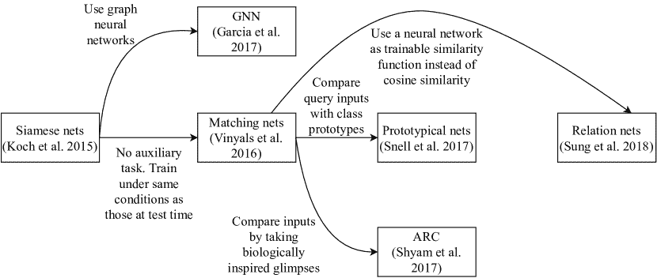

图 11：覆盖的基于度量的元学习技术之间的关系。

## 4 基于模型的元学习

一种不同的深度元学习方法是基于模型的方法。从高层次来看，基于模型的技术依赖于自适应的内部状态，而与基于度量的技术不同，后者通常在测试时使用固定的神经网络。

更具体地说，基于模型的技术维持任务的有状态内部表示。当面对一个任务时，基于模型的神经网络以顺序方式处理支持集。在每个时间步，输入进入并改变模型的内部状态。因此，内部状态可以捕捉相关的任务特定信息，这些信息可用于对新输入进行预测。

因为预测基于对外部隐藏的内部动态，基于模型的技术也被称为黑箱。必须记住来自先前输入的信息，这就是为什么基于模型的技术有一个记忆组件，无论是内部还是外部。

记住，基于度量的方法的机制仅限于成对输入比较。对于基于模型的技术情况则不同，人为设计师可以自由选择算法的内部动态。因此，基于模型的技术不局限于元学习良好的特征空间，因为它们还可以学习内部动态，用于处理和预测任务的输入数据。

更正式地说，给定对应于任务 $\mathcal{T}_{j}$ 的支持集 $D^{tr}_{\mathcal{T}_{j}}$，基于模型的技术计算新输入 $\boldsymbol{x}$ 的类别概率分布为

|  | $\displaystyle p_{\boldsymbol{\theta}}(Y&#124;\boldsymbol{x},D^{tr}_{\mathcal{T}_{j}})=f_{\boldsymbol{\theta}}(\boldsymbol{x},D^{tr}_{\mathcal{T}_{j}}),$ |  | (11) |
| --- | --- | --- | --- |

其中 $f$ 代表黑箱神经网络模型，$\boldsymbol{\theta}$ 为其参数。

### 4.1 示例

使用与第三部分相同的例子，假设我们给定了任务支持集 $D^{tr}_{\mathcal{T}_{j}}=\{([0,-4],1),([-2,-4],2),([-2,4],3),([6,0],4)\}$，其中一个元组表示一对 $(\boldsymbol{x}_{i},y_{i})$。进一步假设我们的查询集仅包含一个例子 $D^{test}_{\mathcal{T}_{j}}=\{([4,0.5],4)\}$。这个问题在图 5（第三部分）中得到了可视化。为了举例说明，我们不使用输入嵌入函数：我们的模型将对 $D^{tr}_{\mathcal{T}_{j}}$ 和 $D^{test}_{\mathcal{T}_{j}}$ 的原始输入进行操作。作为内部状态，我们的模型使用外部记忆矩阵 $M\in\mathbb{R}^{4\times(2+1)}$，具有四行（每个示例一行），和三列（输入向量的维度，加上一维正确标签）。我们的模型按顺序处理支持集，从 $D^{tr}_{\mathcal{T}_{j}}$ 中逐一读取示例，并将第 $i$ 个示例存储在记忆模块的第 $i$ 行。处理完支持集后，记忆矩阵包含所有示例，并且作为内部任务表示。

给定新的输入 $[4,0.5]$，我们的模型可以使用许多不同的技术基于此表示进行预测。为简化起见，假设它计算 $\boldsymbol{x}$ 与每个记忆 $M(i)$（$M$ 的第 $i$ 行中的二维向量，忽略正确标签）之间的点积，并预测点积最大的输入类别。这将为 $D^{tr}_{\mathcal{T}_{j}}$ 中的示例分别产生 $-2,-10,-6,$ 和 $24$ 的分数。由于最后一个示例 $[6,0]$ 产生了最大的点积，我们预测这个类别，即 $4$。

注意，这个例子可以被视为一种基于度量的技术，其中点积被用作相似度函数。然而，这种技术之所以是基于模型的原因在于它将整个任务存储在一个记忆模块中。这个例子被故意设计得简单以便于说明。已经提出了更先进和成功的技术，我们将现在介绍这些技术。

### 4.2 递归元学习器

递归元学习器（Duan et al., 2016; Wang et al., 2016）顾名思义，是基于递归神经网络的元学习器。递归网络作为动态任务嵌入存储。这些递归元学习器专门针对强化学习问题提出，因此我们将在该背景下进行解释。

递归是通过例如 LSTM（Wang et al., 2016）或 GRU（Duan et al., 2016）来实现的。所选递归神经网络（RNN）的内部动态允许快速适应新任务，而用于训练递归网络的算法逐渐积累对任务结构的知识，其中每个任务被建模为一个情节（或一组情节）。

递归元学习器的理念非常简单。即给定一个任务 $\mathcal{T}_{j}$，我们只需将（可能处理过的）环境变量 $[s_{t+1},a_{t},r_{t},d_{t}]$（见 第 2.1.3 节）输入到每个时间步 $t$ 的 RNN 中。回忆一下，$s,a,r,d$ 分别表示状态、动作、奖励和终止标志。在每个时间步 $t$，RNN 输出一个动作和一个隐藏状态。在其隐藏状态 $h_{t}$ 的条件下，网络输出一个动作 $a_{t}$。目标是在每次试验中最大化预期奖励。参见 图 12 的可视化描述。从这个图中也可以清楚地看到为什么这些技术是基于模型的。也就是说，它们将之前见过的输入的信息嵌入到隐藏状态中。

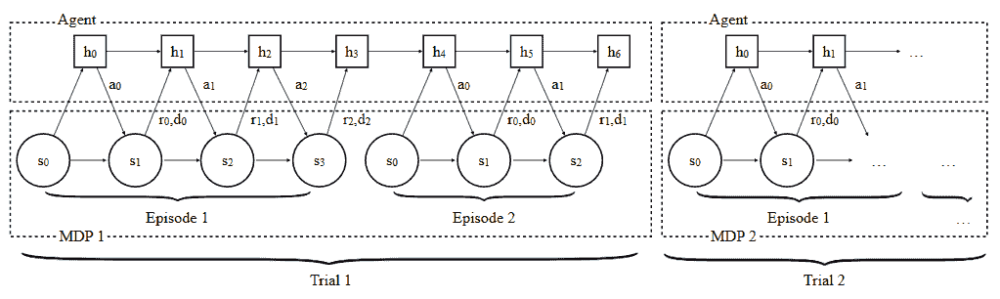

图 12：在强化学习背景下的递归元学习者的工作流程。如第 2.1.3 节中提到，$s_{t},r_{t},$ 和 $d_{t}$ 分别表示时间步 $t$ 的状态、奖励和终止标志。$h_{t}$ 指的是时间 $t$ 的隐藏状态。来源：Duan 等 (2016)。

递归元学习者在简单的强化学习任务中表现几乎与渐近最优算法相当（Wang 等，2016；Duan 等，2016）。然而，在更复杂的环境中，其性能会下降，因为时间依赖关系可能跨越较长的时间范围。使递归元学习者在这些复杂任务中表现更好是未来研究的方向。

### 4.3 记忆增强神经网络 (MANNs)

记忆增强神经网络 (MANNs) 的关键思想是通过外部记忆帮助神经网络快速学习。主要控制器（与记忆交互的递归神经网络）逐渐在任务间积累知识，而外部记忆则允许快速的任务特定适应。为此，Santoro 等 (2016) 使用了神经图灵机 (Graves 等，2014)。这里，控制器由 $\boldsymbol{\theta}$ 参数化，并作为记忆增强神经网络的长期记忆，而外部记忆模块则是短期记忆。

记忆增强神经网络的工作流程显示在图 13 ‣ 4 基于模型的元学习 ‣ 深度元学习综述")中。请注意，任务的数据被处理为序列，即数据一个接一个地输入到网络中。支持集首先被输入到记忆增强神经网络中。然后处理查询集。在元训练阶段，训练任务可以以任意顺序输入到网络中。在时间步 $t$，模型接收带有前一个输入标签的输入 $\boldsymbol{x}_{t}$，即 $y_{t-1}$。这样做是为了防止网络将类别标签直接映射到输出（Santoro 等，2016）。

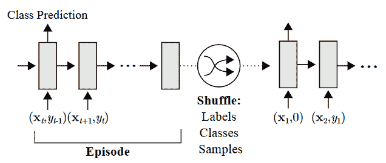

-

图 13：记忆增强神经网络的工作流程。在这里，一个回合对应于一个给定的任务 $\mathcal{T}_{j}$。每个回合后，标签、类别和样本的顺序应被打乱，以最小化对任意分配顺序的依赖。来源：Santoro 等 (2016)。

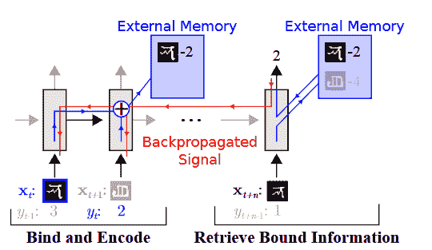

图 14：记忆增强神经网络中的控制器-记忆交互。来源：Santoro 等 (2016)。

控制器与记忆之间的交互在图 14 ‣ 4 Model-based Meta-Learning ‣ A Survey of Deep Meta-Learning")中进行了可视化。其思想是，包含之前见过的输入表示的外部记忆模块可以用于对新输入进行预测。简而言之，利用之前获得的知识来帮助对新输入进行分类。请注意，神经网络也尝试做到这一点，但它们的先验知识是慢慢积累到网络权重中的，而外部记忆模块可以直接存储这些信息。

给定在时间$t$的输入$\boldsymbol{x}_{t}$，控制器生成一个键$\boldsymbol{k}_{t}$，该键可以存储在记忆矩阵$M$中，并可用于从记忆矩阵$M$中检索之前的表示。在从记忆中读取时，目标是产生存储在记忆矩阵$M$中的键的线性组合，给那些与当前键$\boldsymbol{k}_{t}$具有更大余弦相似度的键赋予更大的权重。更具体地说，创建一个读取向量$\boldsymbol{w}^{r}_{t}$，其中每个条目$i$表示键$\boldsymbol{k}_{t}$与存储在第$i$行的记忆（来自之前的输入）之间的余弦相似度，即$M_{t}(i)$。然后，检索表示$\boldsymbol{r}_{t}=\sum_{i}w_{t}^{r}(i)M(i)$，这只是记忆矩阵$M$中所有键（即行）的线性组合。

预测如下进行。给定输入$\boldsymbol{x}_{t}$，记忆增强神经网络使用外部记忆计算相应的表示$\boldsymbol{r}_{t}$，该表示可以输入到 softmax 层中，得到类别概率。在各种任务中，记忆增强神经网络学习到一个好的输入嵌入函数$f_{\boldsymbol{\theta}}$和分类器权重，这些可以在面对新任务时加以利用。

为了将输入表示写入记忆，Santoro 等人 (2016) 提出了一个新的机制，称为“最近最少使用访问”（LRUA）。LRUA 要么写入最近最少使用的位置，要么写入最近使用的位置。在前一种情况下，它保留了最近的记忆；在后一种情况下，它更新了最近获得的信息。该写入机制通过在使用向量 $\boldsymbol{w}_{t}^{u}$ 中跟踪每个记忆位置的访问频率来工作，该向量根据以下更新规则在每个时间步骤中更新：$\boldsymbol{w}_{t}^{u}:=\gamma\boldsymbol{w}^{u}_{t-1}+\boldsymbol{w}_{t}^{r}+\boldsymbol{w}_{t}^{w}$，其中上标 $u,w$ 和 $r$ 分别指使用、写入和读取向量。用语言来说，之前的使用向量会衰减（使用参数 $\gamma$），同时当前的读取（$\boldsymbol{w}_{t}^{r}$）和写入（$\boldsymbol{w}_{t}^{w}$）被添加到使用向量中。设 $n$ 为对记忆的读取总数，$\ell u(n)$（$\ell u$ 代表“最少使用”）为使用向量 $\boldsymbol{w}^{u}_{t}$ 中第 $n$ 小的值。那么，最少使用的权重定义如下：

|  | $\boldsymbol{w}^{\ell u}_{t}(i)=\begin{cases}0&\text{如果 $w^{u}_{t}(i)>\ell u(n)$}\\ 1&\text{否则}\end{cases}.$ |  |
| --- | --- | --- |

然后，写入向量 $\boldsymbol{w}_{t}^{w}$ 计算为 $\boldsymbol{w}^{w}_{t}=\sigma(\alpha)\boldsymbol{w}^{r}_{t-1}+(1-\sigma(\alpha))\boldsymbol{w}^{\ell u}_{t-1}$，其中 $\alpha$ 是一个在两个权重向量之间插值的参数。因此，如果 $\sigma(\alpha)=1$，我们写入最近使用的记忆；而当 $\sigma(\alpha)=0$ 时，我们写入最少使用的记忆位置。最后，写入的操作如下：$M_{t}(i):=M_{t-1}(i)+w_{t}^{w}(i)\boldsymbol{k}_{t}$，对所有 $i$。

总结而言，记忆增强神经网络（Santoro 等人，2016）结合了外部记忆和神经网络以实现元学习。一个具有长期记忆参数 $\boldsymbol{\theta}$ 的控制器与记忆 $M$ 之间的互动，也可能对研究人类元学习有趣（Santoro 等人，2016）。与许多基于度量的技术相比，这种基于模型的技术适用于分类和回归问题。这种方法的一个缺点是架构复杂性。

### 4.4 Meta 网络

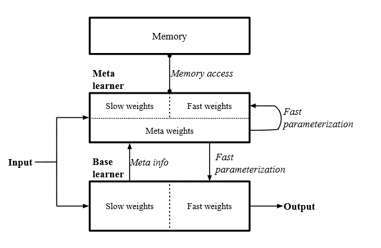

图 15：Meta 网络的架构。来源：Munkhdalai 和 Yu (2017)。

元网络被划分为两个不同的子系统（由神经网络组成），即基本学习器和元学习器（而在记忆增强型神经网络中，基本组件和元组件是交织在一起的）。基本学习器负责执行任务，并向元学习器提供元信息，如损失梯度。然后，元学习器可以为自己和基本学习器计算任务特定的快速权重，以便在给定任务 $\mathcal{T}_{j}=(D^{tr}_{\mathcal{T}_{j}},D^{test}_{\mathcal{T}_{j}})$ 上表现更好。这个工作流程如图 15 所示。

元学习器由神经网络 $u_{\boldsymbol{\phi}},m_{\boldsymbol{\varphi}}$ 和 $d_{\boldsymbol{\psi}}$ 组成。网络 $u_{\boldsymbol{\phi}}$ 用作输入表示函数。网络 $d_{\boldsymbol{\psi}}$ 和 $m_{\boldsymbol{\varphi}}$ 用于计算任务特定的权重 $\boldsymbol{\phi}^{*}$ 和示例级快速权重 $\boldsymbol{\theta}^{*}$。最后，$b_{\boldsymbol{\theta}}$ 是基本学习器，负责执行输入预测。请注意，我们在整个过程中使用了“快速权重”一词，指的是任务或输入特定的慢（初始）权重版本。

与记忆增强型神经网络（Santoro 等，2016）类似，元网络（Munkhdalai 和 Yu，2017）也利用了外部记忆模块的思想。然而，元网络将内存用于不同的目的。内存为支持集中的每个观察 $\boldsymbol{x}_{i}$ 存储两个组件，即其表示 $\boldsymbol{r}_{i}$ 和快速权重 $\boldsymbol{\theta}_{i}^{*}$。这些组件随后用于计算基于注意力的表示和新输入的快速权重。

算法 1 元网络，作者：Munkhdalai 和 Yu (2017)

从支持集采样$S=\{(\boldsymbol{x}_{i},y_{i})\backsim D^{tr}_{\mathcal{T}_{j}}\}_{i=1}^{T}$：2：对 $(\boldsymbol{x}_{i},y_{i})\in S$ 执行 3：     $\mathcal{L}_{i}=\mbox{error}(u_{\boldsymbol{\phi}}(\boldsymbol{x}_{i}),y_{i})$4：结束 for5：$\boldsymbol{\phi}^{*}=d_{\boldsymbol{\psi}}(\{\nabla_{\boldsymbol{\phi}}\mathcal{L}_{i}\}_{i=1}^{T})$6：对 $(\boldsymbol{x}_{i},y_{i})\in D^{tr}_{\mathcal{T}_{j}}$ 执行 7：     $\mathcal{L}_{i}=\mbox{error}(b_{\boldsymbol{\theta}}(\boldsymbol{x}_{i}),y_{i})$8：     $\boldsymbol{\theta}_{i}^{*}=m_{\boldsymbol{\varphi}}(\nabla_{\boldsymbol{\theta}}\mathcal{L}_{i})$9：     将 $\boldsymbol{\theta}_{i}^{*}$ 存储在第 $i$ 个位置的示例级权重记忆 $M$ 中 10：     $\boldsymbol{r}_{i}=u_{\boldsymbol{\phi},\boldsymbol{\phi}^{*}}(\boldsymbol{x}_{i})$11：     将 $\boldsymbol{r}_{i}$ 存储在第 $i$ 个位置的表示记忆 $R$ 中 12：结束 for13：$\mathcal{L}_{task}=0$14：对 $(\boldsymbol{x},y)\in D^{test}_{\mathcal{T}_{j}}$ 执行 15：     $\boldsymbol{r}=u_{\boldsymbol{\phi},\boldsymbol{\phi}^{*}}(\boldsymbol{x})$16：     $\boldsymbol{a}=\mbox{attention}(R,\boldsymbol{r})$ $\triangleright$ $a_{k}$ 是 $\boldsymbol{r}$ 和 $R(k)$ 之间的余弦相似度 17：     $\boldsymbol{\theta}^{*}=\mbox{softmax}(\boldsymbol{a})^{T}M$18：     $\mathcal{L}_{task}=\mathcal{L}_{task}+\mbox{error}(b_{\boldsymbol{\theta},\boldsymbol{\theta}^{*}}(\boldsymbol{x}),y)$19：结束 for20：使用 $\nabla_{\Theta}\mathcal{L}_{task}$ 更新 $\Theta=\{\boldsymbol{\theta},\boldsymbol{\phi},\boldsymbol{\psi},\boldsymbol{\varphi}\}$

元网络的伪代码展示在算法 1 中。首先，创建一个支持集的样本（第 1 行），用于计算表示网络 $u_{\boldsymbol{\phi}}$ 的任务特定权重 $\boldsymbol{\phi}^{*}$（第 2-5 行）。注意，$u_{\boldsymbol{\phi}}$ 有两个任务：i）它应为输入 $(\boldsymbol{x}_{i}$ 计算表示（第 10 行和 15 行），ii）它需要对输入 $(\boldsymbol{x}_{i}$ 进行预测，以计算损失（第 3 行）。为了实现这两个目标，可以使用传统的神经网络来进行分类预测。最终隐藏层的状态随后被用作表示。通常，计算表示网络 $u_{\boldsymbol{\phi}}$ 的预测的交叉熵。当支持集中每个类别有多个示例时，可以选择使用对比损失函数（Munkhdalai 和 Yu，2017）。

然后，元网络遍历支持集 $D^{tr}_{\mathcal{T}_{j}}$ 中的每个示例 $(\boldsymbol{x}_{i},y_{i})$。基本学习器 $b_{\boldsymbol{\theta}}$ 尝试对这些示例进行类别预测，结果生成损失值 $\mathcal{L}_{i}$（第 7-8 行）。这些损失的梯度用于计算示例 $i$ 的快权重 $\boldsymbol{\theta}^{*}$（第 8 行），然后存储在内存矩阵 $M$ 的第 $i$ 行（第 9 行）。此外，输入表示 $\boldsymbol{r}_{i}$ 被计算并存储在内存矩阵 $R$ 中（第 10-11 行）。

现在，元网络已准备好处理查询集 $D^{test}_{\mathcal{T}_{j}}$。它们遍历每个示例 $(\boldsymbol{x},y)$，并计算其表示 $\boldsymbol{r}$（第 15 行）。该表示与存储在内存矩阵 $R$ 中的支持集的表示进行匹配。这种匹配生成了一个相似度向量 $\boldsymbol{a}$，其中每个条目 $k$ 表示输入表示 $\boldsymbol{r}$ 与内存矩阵 $R$ 中第 $k$ 行的相似度，即 $R(k)$（第 16 行）。对该相似度向量进行 softmax 以归一化条目。结果向量用于计算对支持集输入生成的权重的线性组合（第 17 行）。这些权重 $\boldsymbol{\theta}^{*}$ 对查询集中输入 $\boldsymbol{x}$ 是特定的，可以被基本学习器 $b$ 用于对该输入进行预测（第 18 行）。观察到的错误被添加到任务损失中。处理完所有查询集后，可以使用反向传播更新所有相关参数（第 20 行）。

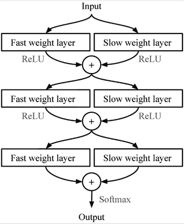

图 16：用于结合慢权重和快权重的层级增强设置。来源：Munkhdalai 和 Yu (2017)。

请注意，一些神经网络同时使用慢权重和快权重。Munkhdalai 和 Yu (2017) 使用了一种所谓的增强设置，如图 16 所示。

简而言之，元网络依赖于每个任务的元学习器和基本学习器的重新参数化。尽管该方法对监督学习和强化学习环境具有灵活性和适用性，但其复杂性相当高。它由许多组件组成，每个组件都有自己的一套参数，这可能会对内存使用和计算时间造成负担。此外，找到所有相关组件的正确架构可能会耗费时间。

### 4.5 简单神经注意力元学习器 (SNAIL)

SNAIL（Mishra 等，2018）不是依赖外部记忆矩阵，而是依靠一种特殊的模型架构来充当记忆。Mishra 等人（2018）认为，使用递归神经网络是不可能的，因为它们的记忆容量有限，无法精确定位特定的先前经验（Mishra 等人，2018）。因此，SNAIL 使用了不同的架构，包括 1D 时间卷积（Oord 等人，2016）和软注意机制（Vaswani 等人，2017）。时间卷积允许“高带宽”记忆访问，注意机制则允许精准定位特定经验。图 17 ‣ 4 Model-based Meta-Learning ‣ A Survey of Deep Meta-Learning") 可视化了 SNAIL 在监督学习问题中的架构和工作流程。从此图中，可以清楚地看出为什么这种技术是基于模型的。也就是说，模型输出基于内部状态，该状态是从早期输入中计算得出的。

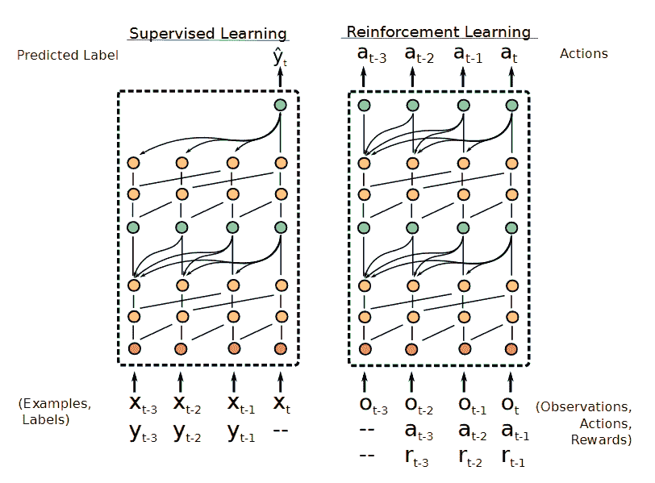

图 17：SNAIL 在监督和强化学习设置中的架构和工作流程。输入层为红色。时间卷积块为橙色；注意块为绿色。来源：Mishra 等人（2018）。

SNAIL 由三个构建块组成。第一个是 DenseBlock，它对输入应用单一的 1D 卷积，并在特征/水平方向上连接结果。第二个是 TCBlock，它实际上是一系列具有指数增加的时间卷积膨胀率的 DenseBlocks（Mishra 等，2018）。请注意，膨胀率仅仅是网络中两个节点之间的时间距离。例如，如果使用膨胀率 2，则在层 $L$ 中位置为 $p$ 的节点将接收来自层 $L-1$ 中位置为 $p-2$ 的节点的激活。第三个块是 AttentionBlock，它学习专注于先前经验中的重要部分。

类似于记忆增强神经网络（Santoro 等人，2016）（第 4.3 节 ‣ 4 Model-based Meta-Learning ‣ A Survey of Deep Meta-Learning")），SNAIL 也按顺序处理任务数据，如 图 17 ‣ 4 Model-based Meta-Learning ‣ A Survey of Deep Meta-Learning") 所示。然而，时间 $t$ 的输入伴随着时间 $t$ 的标签，而不是 $t-1$（如记忆增强神经网络中的情况）。SNAIL 从看到各种任务中学习内部动态，以便在支持集的条件下对查询集进行良好的预测。

SNAIL 的一个关键优势是它可以应用于监督学习和强化学习任务。此外，与之前讨论的技术相比，它的性能表现良好。SNAIL 的一个缺点是找到 TCBlocks 和 DenseBlocks 的正确架构可能会耗时。

### 4.6 条件神经过程（CNPs）

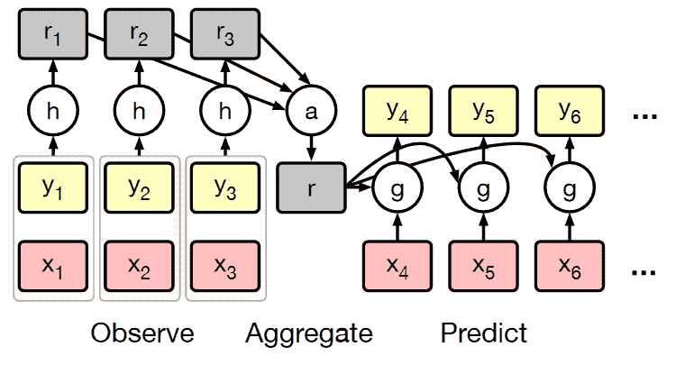

图 18：条件神经过程如何工作的示意图。在这里，$h$ 表示输出观察表示的网络，$a$ 表示这些表示的聚合函数，$g$ 表示根据聚合表示对未标记观察进行预测的神经网络。来源：Garnelo 等人（2018）。

与以前的技术相比，条件神经过程（CNP）（Garnelo 等， 2018）不依赖于外部记忆模块。相反，它将支持集汇聚成一个单一的聚合潜在表示。一般架构见 图 18 ‣ 4 Model-based Meta-Learning ‣ A Survey of Deep Meta-Learning")。如我们所见，条件神经过程在任务 $\mathcal{T}_{j}$ 上分为三个阶段。首先，它观察支持集 $D^{tr}_{\mathcal{T}_{j}}$，包括真实输出 $y_{i}$。样本 $(\boldsymbol{x}_{i},y_{i})\in D^{tr}_{\mathcal{T}_{j}}$ 使用神经网络 $h_{\boldsymbol{\theta}}$ 嵌入为表示 $\boldsymbol{r}_{i}$。第二，这些表示通过运算符 $a$ 聚合成 $D^{tr}_{\mathcal{T}_{j}}$ 的单一表示 $\boldsymbol{r}$（因此它是基于模型的）。第三，神经网络 $g_{\boldsymbol{\phi}}$ 处理这个单一表示 $\boldsymbol{r}$、新的输入 $\boldsymbol{x}$，并产生预测 $\hat{y}$。

让整个条件神经过程模型记作 $Q_{\boldsymbol{\Theta}}$，其中 $\Theta$ 是所有相关参数的集合 $\{\boldsymbol{\theta},\boldsymbol{\phi}\}$。训练过程与其他技术有所不同。令 $\boldsymbol{x}_{\mathcal{T}_{j}}$ 和 $\boldsymbol{y}_{\mathcal{T}_{j}}$ 表示 $D_{\mathcal{T}_{j}}^{tr}$ 中的所有输入和相应的输出。那么，$D^{tr}_{\mathcal{T}_{j}}$ 中前 $\ell\backsim U(0,\ldots,k\cdot N-1)$ 个样本被用作条件集 $D^{c}_{\mathcal{T}_{j}}$（有效地将支持集拆分为真实训练集和验证集）。给定 $\ell$ 的值，目标是最大化标签 $\boldsymbol{y}_{\mathcal{T}_{j}}$ 在整个支持集 $D^{tr}_{\mathcal{T}_{j}}$ 上的对数似然（或最小化负对数似然）。

|  | $\displaystyle\mathcal{L}(\boldsymbol{\Theta})=-\mathbb{E}_{\mathcal{T}_{j}\backsim p(\mathcal{T})}\left[\mathbb{E}_{\ell\backsim U(0,\ldots,k\cdot N-1)}\left(Q_{\boldsymbol{\Theta}}(\boldsymbol{y}_{\mathcal{T}_{j}}&#124;D^{c}_{\mathcal{T}_{j}},\boldsymbol{x}_{\mathcal{T}_{j}})\right)\right].$ |  | (12) |
| --- | --- | --- | --- |

条件神经过程通过反复采样各种任务和 $\ell$ 的值，并将观察到的损失反向传播来进行训练。

总结而言，条件神经过程使用以前见过的输入的紧凑表示来帮助分类新的观察值。尽管其简单性和优雅性，这种技术的一个缺点是它在少样本设置中常常被其他技术如匹配网络（Vinyals 等，2016）所超越（见第 3.3 节）。

### 4.7 神经统计学家

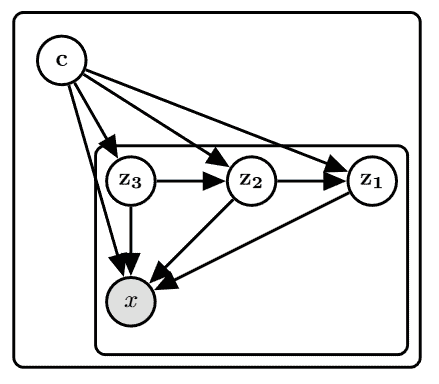

图 19：神经统计学家架构。边缘是神经网络。所有输入节点的输入都被连接在一起。

神经统计学家（Edwards 和 Storkey，2017）不同于早期的方法，它通过无监督的方式学习计算数据集的汇总统计量或元特征。这些潜在的嵌入（使得方法是基于模型的）随后可以用于进行预测。尽管该模型具有广泛的适用性，我们在深度元学习的背景下讨论它。

神经统计学家同时执行学习和推断。在学习阶段，该模型尝试为每个数据集 $D_{i}$ 生成生成模型 $\hat{P}_{i}$。Edwards 和 Storkey（2017）所做的关键假设是存在一个生成过程 $P_{i}$，在潜在上下文向量 $\boldsymbol{c}_{i}$ 的条件下，可以生成数据集 $D_{i}$。在推断时，目标是推断上下文 $q(\boldsymbol{c}|D)$ 的（后验）概率分布。

该模型使用了变分自编码器，它由编码器和解码器组成。编码器负责生成潜在向量 $\boldsymbol{z}$ 的分布：$q(\boldsymbol{z}|\boldsymbol{x};\boldsymbol{\phi})$，其中 $\boldsymbol{x}$ 是输入向量，$\boldsymbol{\phi}$ 是编码器参数。编码后的输入 $\boldsymbol{z}$ 通常比原始输入 $\boldsymbol{x}$ 维度更低，然后可以通过解码器 $p(\boldsymbol{x}|\boldsymbol{z};\boldsymbol{\theta})$ 解码。在这里，$\boldsymbol{\theta}$ 是解码器的参数。为了捕捉数据集中的复杂模式，模型使用了多个潜在层 $\boldsymbol{z}_{1},\ldots,\boldsymbol{z}_{L}$，如 图 19 所示。根据这一架构，$c$ 和 $\boldsymbol{z}_{1},\ldots,\boldsymbol{z}_{L}$（简写为 $\boldsymbol{z}_{1:L}$）的后验分布为

|  | $\displaystyle q(\boldsymbol{c},\boldsymbol{z}_{1:L}\mid D;\boldsymbol{\phi})=q(\boldsymbol{c}\mid D;\boldsymbol{\phi})\prod_{\boldsymbol{x}\in D}q(z_{L}\mid \boldsymbol{x},\boldsymbol{c};\boldsymbol{\phi})\prod_{i=1}^{L-1}q(\boldsymbol{z}_{i}\mid \boldsymbol{z}_{i+1},\boldsymbol{x},\boldsymbol{c};\boldsymbol{\phi}).$ |  | (13) |
| --- | --- | --- | --- |

神经统计学家被训练以最小化一个由三个组件组成的损失函数，包括重建损失（模型对数据的拟合程度）、上下文损失（推断的上下文 $q(\boldsymbol{c}|D;\boldsymbol{\phi})$ 与先验 $P(\boldsymbol{c})$ 的对应程度）和潜在损失（推断的潜在变量 $\boldsymbol{z}_{i}$ 的建模程度）。

该模型可以应用于 $N$-way、少样本学习。为每个 $N$ 类构造 $N$ 个数据集，使得每个数据集仅包含同一类别的示例。然后，将新的输入 $\boldsymbol{x}$ 提供给神经统计学家，并预测其类别。它计算一个上下文后验 $N_{\boldsymbol{x}}=q(\boldsymbol{c}|\boldsymbol{x};\boldsymbol{\phi})$，依赖于新的输入 $\boldsymbol{x}$。类似地，为所有数据集计算上下文后验 $N_{i}=q(\boldsymbol{c}|D_{i};\boldsymbol{\phi})$。最后，它分配标签 $i$，使得 $N_{i}$ 与 $N_{\boldsymbol{x}}$ 之间的差异最小。

总之，神经统计学家（Edwards 和 Storkey，2017）通过数据集建模实现了对新任务的快速学习。此外，它适用于监督和无监督设置。一个缺点是这种方法需要大量数据集才能取得良好的性能（Edwards 和 Storkey，2017）。

### 4.8 基于模型的技术，总结

在本节中，我们讨论了各种模型基础技术。尽管存在明显的差异，它们都基于任务内化的概念。即，任务在模型基础系统的状态中被处理和表示。然后，可以利用这个状态进行预测。图 20 显示了所涵盖的模型基础技术之间的关系。

记忆增强型神经网络（MANNs）（Santoro 等，2016）标志着深度模型基础元学习技术的开始。它们采用将整个支持集按顺序输入模型的理念，然后利用模型的内部状态对查询集输入进行预测。这样的模型基础方法，也被递归元学习者（Duan 等，2016; Wang 等，2016）在强化学习环境中采用。元网络（Munkhdalai 和 Yu，2017）也使用了一个大型黑箱解决方案，但为每个遇到的任务生成特定的任务权重。SNAIL（Mishra 等，2018）试图通过使用注意力机制结合特殊的时间层来提高记忆容量和记忆定位能力，这在递归神经网络中有限。最后，神经统计学家和条件神经过程（CPN）是两种尝试以端到端方式学习数据集元特征的技术。神经统计学家利用元特征之间的距离来进行分类预测，而条件神经过程则在这些特征上对分类器进行条件化。

模型基础方法的优点包括系统内部动态的灵活性以及相较于大多数基于度量的方法的更广泛适用性。然而，模型基础技术在监督设置中通常不如基于度量的技术表现出色（例如图神经网络（Garcia 和 Bruna，2017）；第 3.6 节），在面对更大的数据集时可能表现不佳（Hospedales 等，2020），并且相比基于优化的技术对更远任务的泛化能力较差（Finn 和 Levine，2018）。我们接下来讨论基于优化的方法。

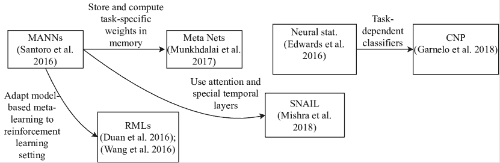

图 20：涵盖的模型基础元学习技术之间的关系。神经统计学家和条件神经过程（CNP）在模型基础方法中形成了一个独立的领域。

## 5 基于优化的元学习

基于优化的技术在元学习中采用了与前两种方法不同的视角。它们明确地优化以实现快速学习。大多数基于优化的技术通过将元学习视为双层优化问题来实现这一点。在内层，基础学习者使用某种优化策略（如梯度下降）进行任务特定的更新。在外层，优化跨任务的性能。

更正式地说，给定一个任务 $\mathcal{T}_{j}=(D^{tr}_{\mathcal{T}_{j}},D^{test}_{\mathcal{T}_{j}})$，对于新的输入 $\boldsymbol{x}\in D^{test}_{\mathcal{T}_{j}}$ 和基础学习者参数 $\boldsymbol{\theta}$，基于优化的元学习者返回

|  | $\displaystyle p(Y\vert\boldsymbol{x},D^{tr}_{\mathcal{T}_{j}})=f_{g_{\boldsymbol{\varphi}(\boldsymbol{\theta},D_{\mathcal{T}_{j}}^{tr},\mathcal{L}_{\mathcal{T}_{j}})}}(\boldsymbol{x}),$ |  | (14) |
| --- | --- | --- | --- |

其中 $f$ 是基础学习者，$g_{\boldsymbol{\varphi}}$ 是一个（学习到的）优化器，它利用支持数据 $D_{\mathcal{T}_{i}}^{tr}$ 对基础学习者参数 $\boldsymbol{\theta}$ 进行任务特定的更新，以及损失函数 $\mathcal{L}_{\mathcal{T}_{j}}$。

### 5.1 示例

假设我们面临一个线性回归问题，其中每个任务与一个不同的函数 $f(x)$ 相关。以这个示例为例，假设我们的模型只有两个参数：$a$ 和 $b$，它们一起形成函数 $\hat{f}(x)=ax+b$。进一步假设我们的元训练集包含四个不同的任务，即 A、B、C 和 D。那么，根据基于优化的观点，我们希望找到一组参数 $\{a,b\}$，从中我们可以快速学习每个四个任务的最优参数，如 图 21 所示。实际上，这就是流行的基于优化的技术 MAML（Finn 等人，2017）背后的直觉。通过让我们的模型暴露于各种元训练任务中，我们可以更新参数 $a$ 和 $b$，以便快速适应。

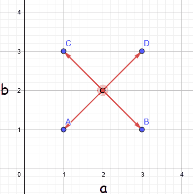

图 21：基于优化的技术示例，灵感来自 Finn 等人 (2017)。

我们将更详细地讨论核心的基于优化的技术。

### 5.2 LSTM 优化器

标准梯度更新规则的形式是

|  | $\displaystyle\boldsymbol{\theta}_{t+1}:=\boldsymbol{\theta}_{t}-\alpha\nabla_{\boldsymbol{\theta}_{t}}\mathcal{L}_{\mathcal{T}_{j}}(\boldsymbol{\theta}_{t}),$ |  | (15) |
| --- | --- | --- | --- |

其中 $\alpha$ 是学习率，$\mathcal{L}_{\mathcal{T}_{j}}(\boldsymbol{\theta}_{t})$ 是相对于任务 $\mathcal{T}_{j}$ 和时间 $t$ 的网络参数，即 $\boldsymbol{\theta}_{t}$ 的损失函数。LSTM 优化器的核心思想（Andrychowicz 等人，2016）是用 LSTM $g$（具有参数 $\boldsymbol{\varphi}$）提出的更新替代更新项（$-\alpha\nabla\mathcal{L}_{\mathcal{T}_{j}}(\boldsymbol{\theta}_{t})$）。然后，新的更新变为

|  | $\displaystyle\boldsymbol{\theta}_{t+1}:=\boldsymbol{\theta}_{t}+g_{\boldsymbol{\varphi}}(\nabla_{\boldsymbol{\theta}_{t}}\mathcal{L}_{\mathcal{T}_{j}}(\boldsymbol{\theta}_{t})).$ |  | (16) |
| --- | --- | --- | --- |

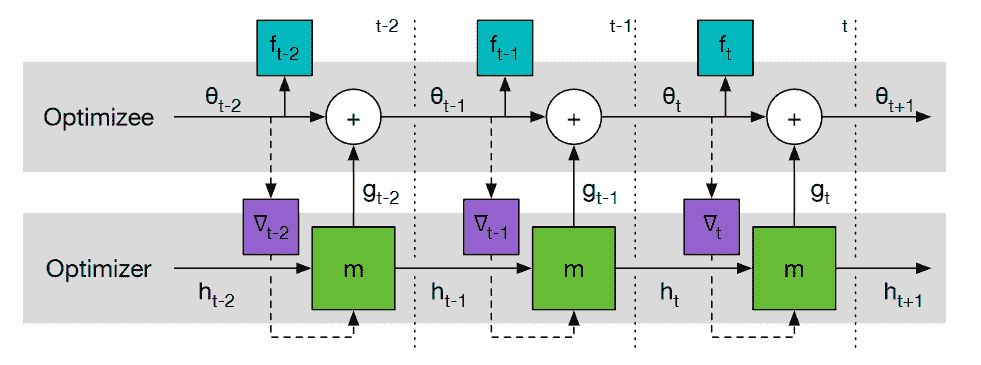

图 22：LSTM 优化器的工作流程。梯度只能通过实线边缘向后传播。$f_{t}$ 表示时间步 $t$ 的观察损失。来源：Andrychowicz 等人（2016）。

这一新的更新方法允许优化策略针对特定任务系列进行调整。请注意，这属于元学习，即 LSTM 学会了学习。因此，这种技术基本上学习了一种更新策略。

用于训练 LSTM 优化器的损失函数为：

|  | $\displaystyle\mathcal{L}(\boldsymbol{\varphi})=\mathbb{E}_{\mathcal{L}_{\mathcal{T}_{j}}}\left[\sum_{t=1}^{T}w_{t}\mathcal{L}_{\mathcal{T}_{j}}(\boldsymbol{\theta}_{t})\right],$ |  | (17) |
| --- | --- | --- | --- |

其中 $T$ 是进行的参数更新次数，$w_{t}$ 是表示在 $t$ 步后性能重要性的权重。请注意，通常我们只对 $T$ 步后的最终性能感兴趣。然而，作者发现，通过对每次梯度下降步骤后的性能进行等权重，优化过程得到了更好的指导。由于计算代价，通常忽略了二阶导数（由于更新权重和 LSTM 优化器之间的依赖关系）。该损失函数是完全可微的，因此允许训练 LSTM 优化器（见 图 22）。为了防止参数爆炸，基学习器网络中的每个坐标/权重使用相同的网络，导致每个参数的更新规则相同。当然，更新依赖于它们的先前值和梯度。

LSTM 优化器的主要优势在于，它们能够比手工制作的优化器实现更快的学习，即使在与训练优化器不同的数据集上也是如此。然而，Andrychowicz 等 (2016) 并没有将这种技术应用于少样本学习。实际上，他们完全没有在任务之间应用它。因此，目前尚不清楚这种技术在少样本设置中是否表现良好，在这些设置中，每个类别的可用训练数据很少。此外，是否能够扩展到更大的基础学习器架构仍然是一个悬而未决的问题。

### 5.3 LSTM 元学习器

Ravi 和 Larochelle (2017) 并没有让 LSTM 预测梯度更新，而是将基础学习器参数的权重嵌入到 LSTM 的细胞状态（长期记忆组件）中，从而产生了 LSTM 元学习器。因此，基础学习器参数 $\boldsymbol{\theta}$ 实际上存在于 LSTM 内存组件（细胞状态）中。这样，细胞状态的更新对应于基础学习器参数的更新。这个想法源于梯度和细胞状态更新规则之间的相似性。梯度更新通常具有如 方程 15 所示的形式。相比之下，LSTM 细胞状态的更新规则如下：

|  | $\displaystyle\boldsymbol{c}_{t}:=f_{t}\odot\boldsymbol{c}_{t-1}+\alpha_{t}\odot\bar{\boldsymbol{c}}_{t},$ |  | (18) |
| --- | --- | --- | --- |

其中 $f_{t}$ 是遗忘门（决定哪些信息应该被遗忘），$\odot$ 代表逐元素乘积，$\boldsymbol{c}_{t}$ 是时间 $t$ 的细胞状态，$\bar{\boldsymbol{c}}_{t}$ 是时间步 $t$ 的候选细胞状态，$\alpha_{t}$ 是时间步 $t$ 的学习率。注意，如果 $f_{t}=\boldsymbol{1}$（全为 1 的向量），$\alpha_{t}=\alpha$，$\boldsymbol{c}_{t-1}=\boldsymbol{\theta}_{t-1}$，并且 $\bar{\boldsymbol{c}}_{t}=-\nabla_{\boldsymbol{\theta}_{t-1}}\mathcal{L}_{\mathcal{T}_{t}}(\boldsymbol{\theta}_{t-1})$，则该更新等同于梯度下降中使用的更新。这种相似性启发了 Ravi 和 Larochelle (2017) 使用 LSTM 作为元学习器，用于学习对基础学习器进行更新，如 图 23 所示。

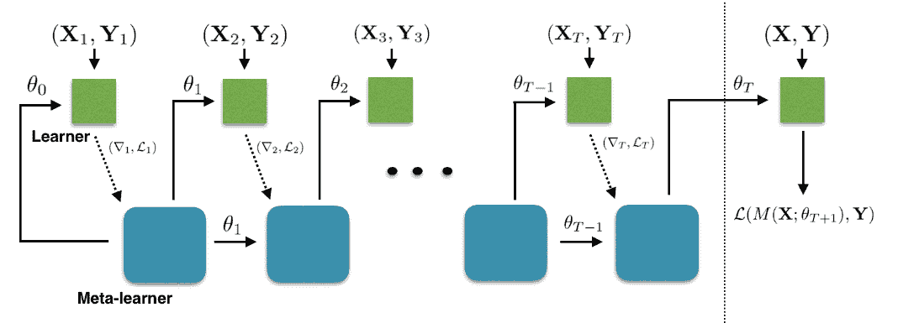

图 23: LSTM 元学习器计算图。梯度只能通过实线边向后传播。基础学习器表示为 $M$。$(X_{t},Y_{t})$ 是训练集，而 $(X,Y)$ 是测试集。来源: Ravi 和 Larochelle (2017)。

更具体地说，LSTM 的单元状态以 $c_{0}=\boldsymbol{\theta}_{0}$ 初始化，LSTM 将其调整为不同任务中的良好共同初始化点。然后，为了更新基础学习器在下一个时间步 $t+1$ 的权重，LSTM 计算 $\boldsymbol{c}_{t+1}$ 并将基础学习器的权重设置为该值。因此，$\boldsymbol{c}_{t}$ 和 $\boldsymbol{\theta}_{t}$ 之间存在一一对应关系。元学习器的学习率 $\alpha_{t}$（见 Equation 18），设置为 $\sigma(\boldsymbol{w}_{\alpha}\cdot[\nabla_{\theta_{t-1}}\mathcal{L}_{\mathcal{T}_{t}}(\boldsymbol{\theta}_{t-1}),\mathcal{L}_{\mathcal{T}_{t}}(\boldsymbol{\theta}_{t}),\theta_{t-1},\alpha_{t-1}]+\boldsymbol{b}_{\alpha})$，其中 $\sigma$ 是 sigmoid 函数。注意，输出是一个向量，值介于 0 和 1 之间，表示相应参数的学习率。此外，$\boldsymbol{w}_{\alpha}$ 和 $\boldsymbol{b}_{\alpha}$ 是 LSTM 元学习器的一部分可训练参数。换句话说，任何时间的学习率依赖于损失梯度、损失值、之前的参数和之前的学习率。遗忘门 $f_{t}$ 确定应该忘记单元状态的哪些部分，并以类似的方式计算，但权重不同。

为了防止元学习器参数的爆炸，采用了类似于 Andrychowicz 等人（2016）提出的 LSTM 优化器的权重共享（Section 5.2）。这意味着相同的更新规则应用于每个时间步的每个权重。然而，具体更新依赖于该特定参数的历史，如前面的学习率、损失等。为简化起见，忽略了二阶导数，假设基础学习器的损失不依赖于 LSTM 优化器的单元状态。应用了批量归一化以稳定和加速学习过程。

简而言之，LSTM 优化器通过在时间上保持基础学习器的权重与 LSTM 单元状态之间的一一对应关系，来学习优化基础学习器。这使得 LSTM 能够利用任务中的共性，从而实现更快的优化。然而，还有一些更简单的方法（例如 MAML (Finn et al., 2017））能够超越这一技术。

### 5.4 强化学习优化器

Li 和 Malik (2018) 提出了一个将优化问题视为强化学习问题的框架。优化可以通过现有的强化学习技术来执行。在高层次上，优化算法 $g$ 以初始权重集 $\boldsymbol{\theta}_{0}$ 和任务 $\mathcal{T}_{j}$ 及其相应的损失函数 $\mathcal{L}_{\mathcal{T}_{j}}$ 作为输入，产生一系列新的权重 $\boldsymbol{\theta}_{1},\ldots,\boldsymbol{\theta}_{T}$，其中 $\boldsymbol{\theta}_{T}$ 是找到的最终解决方案。在这系列建议的新权重上，我们可以定义一个损失函数 $\mathcal{L}$，捕捉不希望出现的属性（例如，收敛缓慢、振荡等）。然后，学习优化器的目标可以更精确地表述如下。我们希望学习一个最优的优化器。

|  | $\displaystyle g^{*}=argmin_{g}\,\mathbb{E}_{\mathcal{T}_{j}\backsim p(\mathcal{T}),\boldsymbol{\theta}_{0}\backsim p(\boldsymbol{\theta}_{0})}[\mathcal{L}(g(\mathcal{L}_{\mathcal{T}_{j}},\boldsymbol{\theta}_{0}))]$ |  | (19) |
| --- | --- | --- | --- |

关键见解是，优化可以被表述为一个部分可观测的马尔可夫决策过程（POMDP）。在这种表述下，状态对应于当前的权重集 $\boldsymbol{\theta}_{t}$，动作对应于时间步 $t$ 的建议更新，即 $\Delta\boldsymbol{\theta}_{t}$，而策略对应于计算更新的函数。通过这种表述，优化器 $g$ 可以通过现有的强化学习技术来学习。在他们的论文中，他们使用了一个递归神经网络作为优化器。在每个时间步，他们将观察特征输入给网络，这些特征依赖于之前的权重集、损失梯度和目标函数，并使用引导策略搜索进行训练。

总之，Li 和 Malik (2018)迈出了通过强化学习优化器进行通用优化的第一步，证明了该方法能够在网络架构和数据集之间进行泛化。然而，使用的基础学习器架构相当小。问题仍然存在，即这种方法是否可以扩展到更大的架构。

### 5.5 MAML

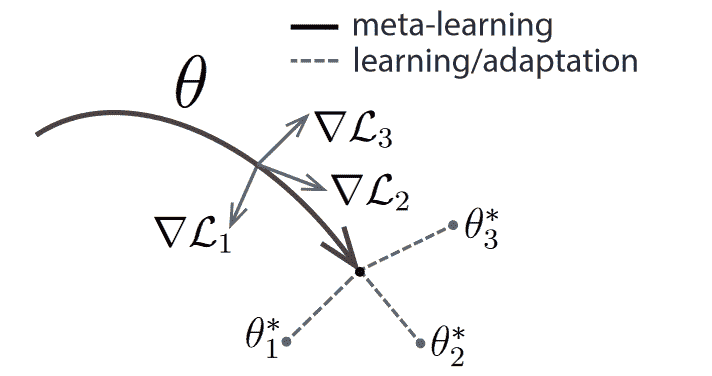

图 24: MAML 学习一个初始化点，从该点出发能够在各种任务上表现良好。来源: Finn 等 (2017)。

无关模型的元学习（MAML）（Finn 等，2017）使用一种简单的基于梯度的内部优化过程（例如随机梯度下降），而不是更复杂的 LSTM 过程或基于强化学习的过程。MAML 的关键思想是通过学习一个良好的初始化参数集 $\boldsymbol{\theta}$ 来明确优化以快速适应新任务。这在 图 24 中展示：从学习到的初始化 $\boldsymbol{\theta}$，我们可以迅速移动到任务 $\mathcal{T}_{j}$ 的最佳参数集，即 $j=1,2,3$ 的 $\boldsymbol{\theta}^{*}_{j}$。学习到的初始化可以视为模型的归纳偏置，或者简单地说是模型对整体任务结构的假设集（封装在 $\boldsymbol{\theta}$ 中）。

更正式地说，设 $\boldsymbol{\theta}$ 表示模型的初始参数。目标是快速学习新概念，这等同于在少量梯度更新步骤中实现最小损失。梯度步骤的数量 $s$ 必须事先指定，以便 MAML 可以明确优化以在该步骤数内实现良好性能。假设我们只选择一个梯度更新步骤，即 $s=1$。那么，给定一个任务 $\mathcal{T}_{j}=(D^{tr}_{\mathcal{T}_{j}},D^{test}_{\mathcal{T}_{j}})$，梯度下降将生成更新后的参数（快速权重）。

|  | $\displaystyle\boldsymbol{\theta}^{\prime}_{j}=\boldsymbol{\theta}-\alpha\nabla_{\boldsymbol{\theta}}\mathcal{L}_{D^{tr}_{\mathcal{T}_{j}}}(\boldsymbol{\theta}),$ |  | (20) |
| --- | --- | --- | --- |

特定于任务 $j$。然后，快速适应的元损失（使用 $s=1$ 梯度步骤）可以被表述为

|  | $\displaystyle\mathit{ML}:=\sum_{\mathcal{T}_{j}\backsim p(\mathcal{T})}\mathcal{L}_{D^{test}_{\mathcal{T}_{j}}}(\boldsymbol{\theta}^{\prime}_{j})=\sum_{\mathcal{T}_{j}\backsim p(\mathcal{T})}\mathcal{L}_{D^{test}_{\mathcal{T}_{j}}}(\boldsymbol{\theta}-\alpha\nabla_{\boldsymbol{\theta}}\mathcal{L}_{D^{tr}_{\mathcal{T}_{j}}}(\boldsymbol{\theta})),$ |  | (21) |
| --- | --- | --- | --- |

其中 $p(\mathcal{T})$ 是任务的概率分布。这个表达式包含了一个内部梯度（$\nabla_{\boldsymbol{\theta}}\mathcal{L}_{\mathcal{T}_{j}}(\boldsymbol{\theta}_{j})$）。因此，通过使用基于梯度的技术优化这个元损失，我们必须计算二阶梯度。下面的计算可以很容易地看出这一点。

|  | $\displaystyle\nabla_{\boldsymbol{\theta}}\mathit{ML}$ | $\displaystyle=\nabla_{\boldsymbol{\theta}}\sum_{\mathcal{T}_{j}\backsim p(\mathcal{T})}\mathcal{L}_{D^{test}_{\mathcal{T}_{j}}}(\boldsymbol{\theta}^{\prime}_{j})$ |  |
| --- | --- | --- | --- |
|  |  | $\displaystyle=\sum_{\mathcal{T}_{j}\backsim p(\mathcal{T})}\nabla_{\boldsymbol{\theta}}\mathcal{L}_{D^{test}_{\mathcal{T}_{j}}}(\boldsymbol{\theta}^{\prime}_{j})$ |  |
|  |  | $\displaystyle=\sum_{\mathcal{T}_{j}\backsim p(\mathcal{T})}\mathcal{L}^{\prime}_{D^{test}_{\mathcal{T}_{j}}}(\boldsymbol{\theta}^{\prime}_{j})\nabla_{\boldsymbol{\theta}}(\boldsymbol{\theta}^{\prime}_{j})$ |  |
|  |  | $\displaystyle=\sum_{\mathcal{T}_{j}\backsim p(\mathcal{T})}\mathcal{L}^{\prime}_{D^{test}_{\mathcal{T}_{j}}}(\boldsymbol{\theta}_{j}^{\prime})\nabla_{\boldsymbol{\theta}}(\boldsymbol{\theta}-\alpha\nabla_{\boldsymbol{\theta}}\mathcal{L}_{D^{tr}_{\mathcal{T}_{j}}(\boldsymbol{\theta})})$ |  |
|  |  | $\displaystyle=\underbrace{\sum_{\mathcal{T}_{j}\backsim p(\mathcal{T})}\mathcal{L}^{\prime}_{D^{test}_{\mathcal{T}_{j}}}(\boldsymbol{\theta}_{j}^{\prime})}_{\textrm{FOMAML}}(\nabla_{\boldsymbol{\theta}}\boldsymbol{\theta}-\alpha\nabla_{\boldsymbol{\theta}}^{2}\mathcal{L}_{D^{tr}_{\mathcal{T}_{j}}}(\boldsymbol{\theta})),$ |  | (22) |

我们用$\mathcal{L}^{\prime}_{D^{test}_{\mathcal{T}_{j}}}(\boldsymbol{\theta}_{j}^{\prime})$来表示关于查询集的损失函数的导数，该导数在更新后的参数$\boldsymbol{\theta}_{j}^{\prime}$处进行评估。项$\alpha\nabla_{\boldsymbol{\theta}}^{2}\mathcal{L}_{D^{tr}_{\mathcal{T}_{j}}}(\boldsymbol{\theta})$包含了二阶梯度。计算这些梯度在时间和内存成本上都很昂贵，尤其是当优化轨迹很大时（使用每个任务的更多梯度更新$s$）。Finn 等人（2017）通过假设$\nabla_{\boldsymbol{\theta}}\boldsymbol{\theta}^{\prime}_{j}=I$，实验性地忽略了二阶梯度，得到了**一阶 MAML（FOMAML，参见方程式 22）**。他们发现 FOMAML 的表现与 MAML 相似。这意味着仅使用一阶梯度$\sum_{\mathcal{T}_{j}\backsim p(\mathcal{T})}\mathcal{L}^{\prime}_{D^{test}_{\mathcal{T}_{j}}}(\boldsymbol{\theta}_{j}^{\prime})$来更新初始化与使用方程式 22 中的完整梯度表达式大致相等。可以通过将$\boldsymbol{\theta}_{j}^{\prime}$替换为多步变体来扩展元损失。

MAML 的训练如下进行。初始化权重$\boldsymbol{\theta}$通过不断采样一个包含$m$个任务的批次$B=\{\mathcal{T}_{j}\backsim p(\mathcal{T})\}_{i=1}^{m}$进行更新。然后，对于每个任务$\mathcal{T}_{j}\in B$，执行一次内部更新以获得$\boldsymbol{\theta}_{j}^{\prime}$，从而得到观察到的损失$\mathcal{L}_{D^{test}_{\mathcal{T}_{j}}}(\boldsymbol{\theta}_{j}^{\prime})$。这些批次任务中的损失被用在外部更新中。

|  | $\displaystyle\boldsymbol{\theta}:=\boldsymbol{\theta}-\beta\nabla_{\boldsymbol{\theta}}\sum_{\mathcal{T}_{j}\in B}\mathcal{L}_{D^{test}_{\mathcal{T}_{j}}}(\boldsymbol{\theta}_{j}^{\prime}).$ |  | (23) |
| --- | --- | --- | --- |

MAML 的完整训练过程展示在算法 2 中。在测试时，当遇到新任务$\mathcal{T}_{j}$时，模型会用$\boldsymbol{\theta}$进行初始化，并对任务数据执行若干次梯度更新。需要注意的是，FOMAML 的算法等同于算法 2，只不过第 8 行的更新方式有所不同。也就是说，FOMAML 使用规则$\boldsymbol{\theta}=\boldsymbol{\theta}-\beta\sum_{\mathcal{T}_{j}\backsim p(\mathcal{T})}\mathcal{L}^{\prime}_{D^{test}_{\mathcal{T}_{j}}}(\boldsymbol{\theta}_{j}^{\prime})$来更新初始化。

算法 2 由 Finn 等人提出的用于监督学习的一步 MAML（2017）

1: 随机初始化$\boldsymbol{\theta}$2: 当未完成时循环 3: 采样$J$个任务批次$B=\mathcal{T}_{1},\ldots,\mathcal{T}_{J}\backsim p(\mathcal{T})$4: 对于$\mathcal{T}_{j}=(D^{tr}_{\mathcal{T}_{j}},D^{test}_{\mathcal{T}_{j}})\in B$5: 计算$\nabla_{\boldsymbol{\theta}}\mathcal{L}_{D^{tr}_{\mathcal{T}_{j}}}(\boldsymbol{\theta})$6: 计算$\boldsymbol{\theta}_{j}^{\prime}=\boldsymbol{\theta}-\alpha\nabla_{\boldsymbol{\theta}}\mathcal{L}_{D^{tr}_{\mathcal{T}_{j}}}(\boldsymbol{\theta})$7: 结束循环 8: 更新$\boldsymbol{\theta}=\boldsymbol{\theta}-\beta\nabla_{\boldsymbol{\theta}}\sum_{\mathcal{T}_{j}\in B}\mathcal{L}_{D^{test}_{\mathcal{T}_{j}}}(\boldsymbol{\theta}_{j}^{\prime})$9: 循环结束

Antoniou 等人（2019）针对 MAML 提出了许多技术改进，以提高训练稳定性、性能和泛化能力。这些改进包括：i) 在每次内部更新步骤后更新初始化$\boldsymbol{\theta}$（而不是在所有步骤完成后），以增加梯度传播；ii) 仅在 50 个 epochs 之后使用二阶梯度，以提高训练速度；iii) 学习逐层学习率以提高灵活性；iv) 随时间衰减元学习率$\beta$；v) 一些批量归一化的调整（保持运行统计而不是批量特定的统计，使用每步偏置）。

MAML 在深度元学习领域受到了极大的关注，这可能是由于其 i) 简单性（仅需两个超参数），ii) 广泛适用性，以及 iii) 强大的性能。MAML 的一个缺点，如前所述，是它在优化每个任务的基础学习器以及计算优化轨迹中的高阶导数时，可能在运行时间和内存方面比较昂贵。

### 5.6 iMAML

iMAML (Rajeswaran 等人, 2019) 通过一种内存消耗较少的方式来近似这些导数，而不是像 FOMAML 那样忽略高阶导数，这可能会降低与常规 MAML 的性能比较。

设 $\mathcal{A}$ 表示一个内层优化算法（例如，随机梯度下降），它接受一个与任务 $\mathcal{T}_{j}$ 对应的支持集 $D^{tr}_{\mathcal{T}_{j}}$ 和初始模型权重 $\boldsymbol{\theta}$，并生成新的权重 $\boldsymbol{\theta}^{\prime}_{j}=\mathcal{A}(\boldsymbol{\theta},D^{tr}_{\mathcal{T}_{j}})$。MAML 需要计算导数

|  | $\displaystyle\nabla_{\boldsymbol{\theta}}\mathcal{L}_{D^{test}_{\mathcal{T}_{j}}}(\boldsymbol{\theta}^{\prime}_{j})=\mathcal{L}_{D^{test}_{\mathcal{T}_{j}}}^{\prime}(\boldsymbol{\theta}^{\prime}_{j})\nabla_{\boldsymbol{\theta}}(\boldsymbol{\theta}^{\prime}_{j}),$ |  | (24) |
| --- | --- | --- | --- |

其中 $D^{test}_{\mathcal{T}_{j}}$ 是与任务 $\mathcal{T}_{j}$ 对应的查询集。这个方程是应用链式法则的简单结果。重要的是，要注意 $\nabla_{\boldsymbol{\theta}}(\boldsymbol{\theta}_{j}^{\prime})$ 在 $\mathcal{A}(\boldsymbol{\theta},D^{tr}_{\mathcal{T}_{j}})$ 处进行微分，而 $\mathcal{L}_{D^{test}_{\mathcal{T}_{j}}}^{\prime}(\boldsymbol{\theta}^{\prime}_{j})$ 不进行，因为它表示在 $\boldsymbol{\theta}^{\prime}_{j}$ 处评估的损失函数的梯度。Rajeswaran 等人 (2019) 使用了以下引理。

如果 $(\boldsymbol{I}+\frac{1}{\lambda}\nabla^{2}_{\boldsymbol{\theta}}\mathcal{L}_{D^{tr}_{\mathcal{T}_{j}}}(\boldsymbol{\theta}^{\prime}_{j}))$ 是可逆的（即 $(\boldsymbol{I}+\frac{1}{\lambda}\nabla^{2}_{\boldsymbol{\theta}}\mathcal{L}_{D^{tr}_{\mathcal{T}_{j}}}(\boldsymbol{\theta}^{\prime}_{j}))^{-1}$ 存在），那么

|  | $\displaystyle\nabla_{\boldsymbol{\theta}}(\boldsymbol{\theta}_{j}^{\prime})=\left(\boldsymbol{I}+\frac{1}{\lambda}\nabla^{2}_{\boldsymbol{\theta}}\mathcal{L}_{D^{tr}_{\mathcal{T}_{j}}}(\boldsymbol{\theta}^{\prime}_{j})\right)^{-1}.$ |  | (25) |
| --- | --- | --- | --- |

这里，$\lambda$ 是一个正则化参数。原因将在下文中讨论。

结合方程 24 和方程 25，我们得到

|  | $\displaystyle\nabla_{\boldsymbol{\theta}}\mathcal{L}_{D^{test}_{\mathcal{T}_{j}}}(\boldsymbol{\theta}^{\prime}_{j})=\mathcal{L}^{\prime}_{D^{test}_{\mathcal{T}_{j}}}(\boldsymbol{\theta}^{\prime}_{j})\left(\boldsymbol{I}+\frac{1}{\lambda}\nabla^{2}_{\boldsymbol{\theta}}\mathcal{L}_{D^{tr}_{\mathcal{T}_{j}}}(\boldsymbol{\theta}^{\prime}_{j})\right)^{-1}.$ |  | (26) |
| --- | --- | --- | --- |

这个想法是获得一个接近该表达式的近似梯度向量 $\boldsymbol{g}_{j}$，即我们希望差异尽可能小

|  | $\displaystyle\boldsymbol{g}_{j}-\mathcal{L}^{\prime}_{D^{test}_{\mathcal{T}_{j}}}(\boldsymbol{\theta}^{\prime}_{j})\left(\boldsymbol{I}+\frac{1}{\lambda}\nabla^{2}_{\boldsymbol{\theta}}\mathcal{L}_{D^{tr}_{\mathcal{T}_{j}}}(\boldsymbol{\theta}^{\prime}_{j})\right)^{-1}=\boldsymbol{\epsilon},$ |  | (27) |
| --- | --- | --- | --- |

对于一些小的容差向量 $\boldsymbol{\epsilon}$，如果我们将两边都乘以逆因子的逆，即 $\left(\boldsymbol{I}+\frac{1}{\lambda}\nabla^{2}_{\boldsymbol{\theta}}\mathcal{L}_{D^{tr}_{\mathcal{T}_{j}}}(\boldsymbol{\theta}^{\prime}_{j})\right)$，我们得到

|  | $\displaystyle\boldsymbol{g}_{j}^{T}\left(\boldsymbol{I}+\frac{1}{\lambda}\nabla^{2}_{\boldsymbol{\theta}}\mathcal{L}_{D^{tr}_{\mathcal{T}_{j}}}(\boldsymbol{\theta}^{\prime}_{j})\right)\boldsymbol{g}_{j}-\boldsymbol{g}_{j}^{T}\mathcal{L}^{\prime}_{D^{test}_{\mathcal{T}_{j}}}(\boldsymbol{\theta}^{\prime}_{j})=\boldsymbol{\epsilon}^{\prime},$ |  | (28) |
| --- | --- | --- | --- |

其中 $\boldsymbol{\epsilon}^{\prime}$ 吸收了乘法因子。我们希望最小化这个关于 $\boldsymbol{g}_{j}$ 的表达式，这可以通过使用诸如共轭梯度算法（Rajeswaran et al., 2019）等优化技术来实现。该算法无需存储 Hessian 矩阵，从而显著降低了内存成本。反过来，这使得 iMAML 可以处理更多的内部梯度更新步骤。然而，需要注意的是，在这种情况下需要进行显式正则化以避免过拟合。传统的 MAML 不需要这样做，因为它仅使用少量的梯度步骤（等同于早停机制）。

在每一步内部循环中，iMAML 计算元梯度 $\boldsymbol{g}_{j}$。处理一批任务后，这些梯度会被平均并用于更新初始化参数 $\boldsymbol{\theta}$。由于它不对优化过程进行微分，我们可以自由使用任何其他（非微分）内部优化器。

总之，iMAML 显著降低了内存成本，因为它无需对优化轨迹进行微分，还允许在选择内部优化器时有更大的灵活性。此外，它还可以处理更大的优化路径。与 MAML 相比，计算成本基本保持不变（Finn et al., 2017）。未来的工作可以研究更多的内部优化过程（Rajeswaran et al., 2019）。

### 5.7 Meta-SGD

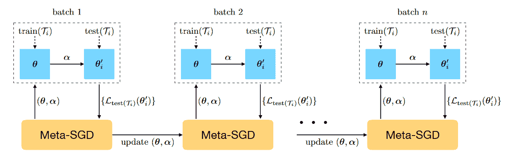

图 25：Meta-SGD 学习过程。来源：Li et al. (2017).

Meta-SGD（Li et al., 2017），即元随机梯度下降，与 MAML（Finn et al., 2017）类似（第 5.5 节）。然而，除了学习初始化之外，Meta-SGD 还学习$\boldsymbol{\theta}$中每个模型参数的学习率，基于这样的见解：优化器可以被视为一个可训练的实体。

标准 SGD 更新规则在方程 15 中给出。meta-SGD 优化器使用了更一般的更新，即

|  | $\displaystyle\boldsymbol{\theta}_{j}^{\prime}\leftarrow\boldsymbol{\theta}-\boldsymbol{\alpha}\odot\nabla_{\boldsymbol{\theta}}\mathcal{L}_{D^{tr}_{\mathcal{T}_{j}}}(\boldsymbol{\theta}),$ |  | (29) |
| --- | --- | --- | --- |

其中$\odot$表示逐元素乘积。请注意，这意味着 alpha（学习率）现在是一个向量——因此使用了粗体字——而不是标量，这允许更大的灵活性，因为每个参数都有其自己的学习率。目标是学习初始化$\boldsymbol{\theta}$和学习率向量$\boldsymbol{\alpha}$，使得泛化能力尽可能大。更精确地说，学习目标是

|  | $\displaystyle min_{\boldsymbol{\alpha},\boldsymbol{\theta}}\mathbb{E}_{\mathcal{T}_{j}\backsim p(\mathcal{T})}[\mathcal{L}_{D^{test}_{\mathcal{T}_{j}}}(\boldsymbol{\theta}_{j}^{\prime})]=\mathbb{E}_{\mathcal{T}_{j}\backsim p(\mathcal{T})}[\mathcal{L}_{D^{test}_{\mathcal{T}_{j}}}(\boldsymbol{\theta}-\boldsymbol{\alpha}\odot\nabla_{\boldsymbol{\theta}}\mathcal{L}_{D_{\mathcal{T}_{j}}^{tr}}(\boldsymbol{\theta}))],$ |  | (30) |
| --- | --- | --- | --- |

我们在这里对$\boldsymbol{\theta}_{j}^{\prime}$进行了简单的替换。$\mathcal{L}_{D_{\mathcal{T}_{j}}^{tr}}$和$\mathcal{L}_{D_{\mathcal{T}_{j}}^{test}}$分别是在支持集和查询集上计算的损失。请注意，这种公式刺激了泛化能力（因为它包括查询集损失$\mathcal{L}_{D^{test}_{\mathcal{T}_{j}}}$，该损失可以在元训练阶段观察到）。学习过程在图 25 中进行了可视化。请注意，meta-SGD 优化器被训练以在仅有一步更新后最大化泛化能力。由于这个学习目标具有完全可微的损失函数，meta-SGD 优化器本身可以使用标准的 SGD 进行训练。

总结来说，Meta-SGD 比 MAML 更具表现力，因为它不仅学习初始化，还学习每个参数的学习率。然而，这也带来了更多超参数的增加。

### 5.8 Reptile

Reptile (Nichol 等人，2018) 是另一种基于优化的技术，类似于 MAML (Finn 等人，2017)，它仅尝试找到一组好的初始化参数 $\boldsymbol{\theta}$。 Reptile 尝试找到这个初始化的方法与 MAML 有很大不同。它重复采样任务，对任务进行训练，并将模型权重移动到训练后的权重上 (Nichol 等人，2018)。 算法 3 显示了描述这一简单过程的伪代码。

算法 3 Reptile，由 Nichol 等人（2018）

1: 初始化 $\boldsymbol{\theta}$ 2: 对于 $i=1,2,\ldots$ 执行 3: 采样任务 $\mathcal{T}_{j}=(D^{tr}_{\mathcal{T}_{j}},D^{test}_{\mathcal{T}_{j}})$ 和对应的损失函数 $\mathcal{L}_{\mathcal{T}_{j}}$ 4: $\boldsymbol{\theta}^{\prime}_{j}=SGD(\mathcal{L}_{D^{tr}_{\mathcal{T}_{j}}},\boldsymbol{\theta},k)$ $\triangleright$ 执行 $k$ 次梯度更新步骤以获得 $\boldsymbol{\theta}_{j}^{\prime}$ 5: $\boldsymbol{\theta}:=\boldsymbol{\theta}+\epsilon(\boldsymbol{\theta}^{\prime}_{j}-\boldsymbol{\theta})$ $\triangleright$ 将初始化点 $\boldsymbol{\theta}$ 移动到 $\boldsymbol{\theta}_{j}^{\prime}$ 6: 结束 对于

Nichol 等人（2018）指出，可以将 $(\boldsymbol{\theta}-\boldsymbol{\theta}_{j}^{\prime})/\alpha$ 视为梯度，其中 $\alpha$ 是内层随机梯度下降优化器的学习率（伪代码中的第 4 行），并将其输入到元优化器（例如 Adam）中。此外，不必一次采样一个任务，而可以采样一批 $n$ 个任务，并将初始化 $\boldsymbol{\theta}$ 移动到平均更新方向 $\bar{\boldsymbol{\theta}}=\frac{1}{n}\sum_{j=1}^{n}(\boldsymbol{\theta}^{\prime}_{j}-\boldsymbol{\theta})$，从而得到更新规则 $\boldsymbol{\theta}:=\boldsymbol{\theta}+\epsilon\bar{\boldsymbol{\theta}}$。

Reptile 的直觉是，通过将初始化权重更新到更新后的参数，将为来自同一类别的任务提供良好的归纳偏差。通过对 Reptile 和 MAML（包括一阶和二阶）的梯度进行泰勒展开，Nichol 等人（2018）表明预期梯度在方向上有所不同。然而，他们认为在实践中，Reptile 的梯度也会将模型带到一个使任务上的预期损失最小化的点。

解释 Reptile 工作原理的数学论证如下。设 $\boldsymbol{\theta}$ 为初始参数，$\boldsymbol{\theta}^{*}_{j}$ 为任务 $\mathcal{T}_{j}$ 的最佳权重集。最后，设 $d$ 为欧几里得距离函数。目标是最小化初始化点 $\boldsymbol{\theta}$ 和最佳点 $\boldsymbol{\theta}^{*}_{j}$ 之间的距离，即，

|  | $\displaystyle min_{\boldsymbol{\theta}}\,\mathbb{E}_{\mathcal{T}_{j}\backsim p(\mathcal{T})}[\frac{1}{2}d(\boldsymbol{\theta},\boldsymbol{\theta}^{*}_{j})^{2}].$ |  | (31) |
| --- | --- | --- | --- |

该期望距离关于初始化参数$\boldsymbol{\theta}$的梯度由以下公式给出

|  | $\displaystyle\nabla_{\boldsymbol{\theta}}\mathbb{E}_{\mathcal{T}_{j}\backsim p(\mathcal{T})}[\frac{1}{2}d(\boldsymbol{\theta},\boldsymbol{\theta}^{*}_{j})^{2}]$ | $\displaystyle=\mathbb{E}_{\mathcal{T}_{j}\backsim p(\mathcal{T})}[\frac{1}{2}\nabla_{\boldsymbol{\theta}}d(\boldsymbol{\theta},\boldsymbol{\theta}^{*}_{j})^{2}]$ |  |
| --- | --- | --- | --- |
|  |  | $\displaystyle=\mathbb{E}_{\mathcal{T}_{j}\backsim p(\mathcal{T})}[\boldsymbol{\theta}-\boldsymbol{\theta}^{*}_{j}],$ |  | (32) |

在这里，我们利用了两个点$\boldsymbol{x}_{1}$和$\boldsymbol{x}_{2}$之间的平方欧几里得距离的梯度是向量$2(\boldsymbol{x}_{1}-\boldsymbol{x}_{2})$的事实。Nichol 等人 (2018) 进一步论证了对该目标进行梯度下降会导致以下更新规则

|  | $\displaystyle\boldsymbol{\theta}$ | $\displaystyle=\boldsymbol{\theta}-\epsilon\nabla_{\boldsymbol{\theta}}\frac{1}{2}d(\boldsymbol{\theta},\boldsymbol{\theta}^{*}_{j})^{2}$ |  |
| --- | --- | --- | --- |
|  |  | $\displaystyle=\boldsymbol{\theta}-\epsilon(\boldsymbol{\theta}^{*}_{j}-\boldsymbol{\theta}).$ |  | (33) |

由于我们不知道$\boldsymbol{\theta}^{*}_{\mathcal{T}_{j}}$，可以通过进行$k$步梯度下降$SGD(\mathcal{L}_{\mathcal{T}_{j}},\boldsymbol{\theta},k)$来近似这一项。简而言之，Reptile 可以视为对公式 31 中给出的距离最小化目标进行的梯度下降。图示见图 26。初始化参数$\boldsymbol{\theta}$在任务 1 和 2 的最优权重之间交替移动（因此出现振荡现象）。

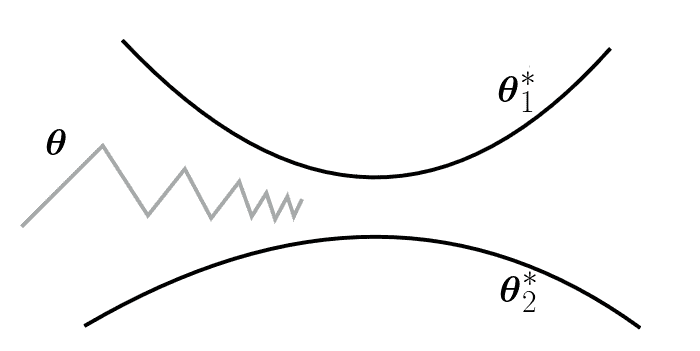

图 26: Reptile 学习轨迹的示意图。在这里，$\boldsymbol{\theta}_{1}^{*}$和$\boldsymbol{\theta}_{2}^{*}$分别是任务$\mathcal{T}_{1}$和$\mathcal{T}_{2}$的最优权重。初始化参数$\boldsymbol{\theta}$在这些之间振荡。改编自 Nichol 等人 (2018)。

总之，Reptile 是一种极其简单的元学习技术，不需要像 MAML（Finn 等人，2017）那样通过优化轨迹进行微分，从而节省了时间和内存成本。然而，由于它不像 MAML 那样直接优化快速学习，其理论基础略显薄弱，在某些设置中性能可能稍逊于 MAML。

### 5.9 潜在嵌入优化（LEO）

潜在嵌入优化（Latent Embedding Optimization，简称 LEO）由 Rusu 等人提出（2018），旨在解决基于梯度的元学习器（如 MAML，见 第 5.5 节）在少样本设置中的问题（$N$-way，$k$-shot）。这些技术在高维参数空间中运作，仅使用少量样本的梯度信息，可能导致泛化性能较差。

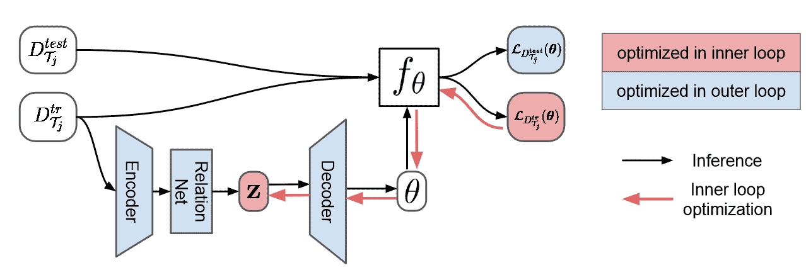

图 27：LEO 的工作流程，改编自 Rusu 等人（2018）。

LEO 通过学习低维的潜在嵌入空间来缓解这一问题，这间接使我们能够学习到一组良好的初始参数 $\boldsymbol{\theta}$。此外，嵌入空间根据任务进行调整，允许更高的表达能力。理论上，LEO 可以为整个基础学习网络找到初始参数，但作者仅对最终层的参数进行了实验。

LEO 的完整工作流程见 图 27 ‣ 5 Optimization-based Meta-Learning ‣ A Survey of Deep Meta-Learning")。如图所示，给定任务 $\mathcal{T}_{j}$，相应的支持集 $D^{tr}_{\mathcal{T}_{j}}$ 被输入到编码器中，编码器为该集合中的每个样本生成隐藏代码。这些隐藏代码以各种可能的方式配对和拼接，产生 $(Nk)^{2}$ 对，其中 $N$ 是训练集中类别的数量，$k$ 是每类的样本数量。这些配对的代码然后输入到关系网络（Sung 等人，2018）（见 第 3.5 节）。生成的嵌入按类别分组，并在低维空间 $\mathcal{Z}$ 中对潜在代码 $\boldsymbol{z}_{n}$（类别 $n$）进行概率分布参数化。更正式地，设 $\boldsymbol{x}^{\ell}_{n}$ 表示 $D^{tr}_{\mathcal{T}_{j}}$ 中类别 $n$ 的第 $\ell$ 个样本。然后，类别 $n$ 的潜在代码的均值 $\boldsymbol{\mu}^{e}_{n}$ 和方差 $\boldsymbol{\sigma}^{e}_{n}$ 计算为

|  | $\displaystyle\boldsymbol{\mu}_{n}^{e},\boldsymbol{\sigma}^{e}_{n}=\frac{1}{Nk^{2}}\sum_{\ell_{p}=1}^{k}\sum^{N}_{m=1}\sum_{\ell_{q}=1}^{k}g_{\boldsymbol{\phi}_{r}}\left(g_{\boldsymbol{\phi}_{e}}(\boldsymbol{x}^{\ell_{p}}_{n}),g_{\boldsymbol{\phi}_{e}}(\boldsymbol{x}^{\ell_{q}}_{m})\right),$ |  | (34) |
| --- | --- | --- | --- |

其中 $\boldsymbol{\phi}_{r},\boldsymbol{\phi}_{e}$ 分别是关系网络和编码器的参数。直观上，三个求和确保 $D^{tr}_{\mathcal{T}_{j}}$ 中的每个类别 $n$ 的示例都与所有类别 $n$ 的示例配对。给定 $\boldsymbol{\mu}_{n}^{e}$ 和 $\boldsymbol{\sigma}_{n}^{e}$，可以为类别 $n$ 采样潜在代码 $\boldsymbol{z}_{n}\backsim N(\boldsymbol{\mu}_{n}^{e},diag(\boldsymbol{\sigma}_{n}^{e2}))$，这作为任务训练数据的潜在嵌入。

解码器可以生成类别 $n$ 的任务特定初始化 $\boldsymbol{\theta}_{n}$。首先，使用潜在代码计算高斯分布的均值和方差。

|  | $\displaystyle\boldsymbol{\mu}_{n}^{d},\boldsymbol{\sigma}_{n}^{d}=g_{\boldsymbol{\phi}_{d}}(\boldsymbol{z}_{n}).$ |  | (35) |
| --- | --- | --- | --- |

这些用于采样初始化权重 $\boldsymbol{\theta}_{n}\backsim N(\boldsymbol{\mu}^{d}_{n},diag(\boldsymbol{\sigma}^{d2}_{n}))$。然后从生成的权重中得到的损失可以向后传播以调整嵌入空间。在实践中，从低维嵌入生成如此高维的参数集可能会很有问题。因此，LEO 使用预训练模型，只生成最终层的权重，这限制了模型的表达能力。

LEO 的一个关键优势是它在低维潜在嵌入空间中优化，这有助于提高泛化性能。然而，这种方法比例如 MAML (Finn 等，2017) 更复杂，其适用性仅限于少样本学习环境。

### 5.10 在线 MAML (FTML)

在线 MAML (Finn 等，2019) 是 MAML (Finn 等，2017) 的扩展，使其适用于在线学习环境 (Anderson，2008)。在在线环境中，我们会面临一个任务序列 $\mathcal{T}_{t}$ 及其对应的损失函数 $\{\mathcal{L}_{\mathcal{T}_{t}}\}_{t=1}^{T}$，时间范围可能是无限的 $T$。目标是选择一系列参数 $\{\boldsymbol{\theta}_{t}\}_{t=1}^{T}$，使其在所呈现的损失函数上表现良好。这个目标通过 Finn 等人 (2019) 定义的整个序列上的 $Regret_{T}$ 来描述

|  | $\displaystyle Regret_{T}=\sum_{t=1}^{T}\mathcal{L}_{\mathcal{T}_{t}}(\boldsymbol{\theta}_{t}^{\prime})-min_{\boldsymbol{\theta}}\sum_{t=1}^{T}\mathcal{L}_{\mathcal{T}_{t}}(\boldsymbol{\theta}^{\prime}_{t}),$ |  | (36) |
| --- | --- | --- | --- |

其中，$\boldsymbol{\theta}$ 是初始模型参数（与 MAML 一样），而 $\boldsymbol{\theta}_{t}^{\prime}$ 是任务 $t$ 上通过一步梯度更新（从 $\boldsymbol{\theta}$ 开始）得到的参数。在这里，左侧的项反映了由代理选择的更新参数 $(\boldsymbol{\theta}_{t})$，而右侧的项则表示从一组固定的参数 $\boldsymbol{\theta}$ 中获得的最小可获取损失（事后）。请注意，这种设置假设代理可以对其选择的参数进行更新（将时间 $t$ 时的初始选择从 $\boldsymbol{\theta}_{t}$ 转变为 $\boldsymbol{\theta}_{t}^{\prime}$）。

Finn 等人 (2019) 提出了 FTML（Follow The Meta Leader），灵感来源于 FTL（Follow The Leader）（Hannan, 1957; Kalai 和 Vempala, 2005），以最小化遗憾。基本思想是将下一时间步（$t+1$）的参数设置为事后最佳参数，即，

|  | $\displaystyle\boldsymbol{\theta}_{t+1}:=argmin_{\boldsymbol{\theta}}\sum_{k=1}^{t}\mathcal{L}_{\mathcal{T}_{k}}(\boldsymbol{\theta}_{k}^{\prime}).$ |  | (37) |
| --- | --- | --- | --- |

执行元更新的梯度由下式给出

|  | $\displaystyle g_{t}(\boldsymbol{\theta}):=\nabla_{\boldsymbol{\theta}}\mathbb{E}_{\mathcal{T}_{k}\backsim p_{t}(\mathcal{T})}\mathcal{L}_{\mathcal{T}_{k}}(\boldsymbol{\theta}_{k}^{\prime}),$ |  | (38) |
| --- | --- | --- | --- |

其中 $p_{t}(\mathcal{T})$ 是任务 $1,\ldots,t$（在时间 $t$ 时）的均匀分布。

算法 4 ‣ 5 基于优化的元学习 ‣ 深度元学习概述") 包含了 FTML 的完整伪代码。在此算法中，$\mathit{MetaUpdate}$ 执行了几个（$N_{meta}$）元步骤。在每个元步骤中，从 $B$ 中抽取一个任务，并提供训练和测试小批量数据以计算梯度 $g_{t}$，见 方程 37 ‣ 5 基于优化的元学习 ‣ 深度元学习概述")。初始化的 $\boldsymbol{\theta}$ 随后会被更新（$\boldsymbol{\theta}:=\boldsymbol{\theta}-\beta g_{t}(\boldsymbol{\theta})$），其中 $\beta$ 是元学习率。请注意，随着时间的推移，内存使用量不断增加，因为在每个时间步 $t$，我们将任务添加到缓冲区 $B$ 中，并将任务数据集保留在内存中。

算法 4 FTML 由 Finn 等人 (2019)

1:性能阈值 $\gamma$ 2:初始化空任务缓冲区 $B$ 3:对于 $t=1,\ldots$ 执行 4:     初始化数据集 $D_{t}=\emptyset$ 5:     将 $\mathcal{T}_{t}$ 添加到 B 中 6:     当 $|D_{t}|<N$ 时 7:         将数据批次 $\{(\boldsymbol{x}_{i},y_{i})\}_{i=1}^{n}$ 添加到 $D_{t}$ 中 8:         $\boldsymbol{\theta}_{t}=\mathit{MetaUpdate}(\boldsymbol{\theta}_{t},B,t)$ 9:         计算 $\boldsymbol{\theta}^{\prime}_{t}$ 10:         如果 $\mathcal{L}_{D^{test}_{\mathcal{T}_{t}}}(\boldsymbol{\theta}^{\prime}_{t})<\gamma$ 11:              将 $|D_{t}|$ 保存为任务 $\mathcal{T}_{t}$ 的效率 12:         结束 if 13:     结束 while 14:     保存最终性能 $\mathcal{L}_{D^{test}_{\mathcal{T}_{t}}}$($\boldsymbol{\theta}^{\prime}_{t}$) 15:     $\boldsymbol{\theta}_{t+1}=\boldsymbol{\theta}_{t}$ 16:结束 for

总结来说，在线 MAML 是一种强大的在线学习技术（Finn 等，2019）。这种方法的一个缺点是计算成本随着时间的推移不断增长，因为所有遇到的数据都会被存储。减少这些成本是未来研究的方向。此外，还可以尝试在每个任务使用多个内梯度更新步骤时，这种方法的效果如何，正如 Finn 等（2019）所提到的。

### 5.11 LLAMA

Grant 等（2018）将 MAML 模塑为一个概率框架，从而学习任务特定参数 $\boldsymbol{\theta}_{j}^{\prime}$ 的概率分布，而不是单一的值。这样可以为一个任务获得多个潜在解决方案。结果的技术称为 LLAMA（用于元适应的拉普拉斯近似）。重要的是，LLAMA 仅用于监督学习环境。

一个关键观察是，神经网络 $f_{\boldsymbol{\theta}^{\prime}_{j}}$ 由更新后的参数 $\boldsymbol{\theta}^{\prime}_{j}$ 参数化（通过使用 $D^{tr}_{\mathcal{T}_{j}}$ 的少量梯度更新获得），其输出类别概率 $p(y_{i}|\boldsymbol{x}_{i},\boldsymbol{\theta}^{\prime}_{j})$。为了最小化查询集 $D^{test}_{\mathcal{T}_{j}}$ 上的错误，模型必须为真实类别输出较大的概率分数。这个目标被最大对数似然损失函数捕捉。

|  | $\displaystyle\mathcal{L}_{D^{test}_{\mathcal{T}_{j}}}(\boldsymbol{\theta}^{\prime}_{j})=-\sum_{\boldsymbol{x}_{i},y_{i}\in D^{test}_{\mathcal{T}_{j}}}log\,p(y_{i}\mid \boldsymbol{x}_{i},\boldsymbol{\theta}^{\prime}_{j}).$ |  | (39) |
| --- | --- | --- | --- |

简单来说，如果我们将任务 $j$ 看作是对示例的概率分布 $p_{\mathcal{T}_{j}}$，我们希望最大化模型预测正确类别 $y_{i}$ 的概率，给定输入 $\boldsymbol{x}_{i}$。这可以通过简单的梯度下降来实现，如 算法 5 中所示，其中 $\beta$ 是元学习率。第 4 行提到的 ML-LAPLACE 是一个子程序，用于计算任务特定的更新参数 $\boldsymbol{\theta}^{\prime}_{j}$，并估计用于更新初始化 $\boldsymbol{\theta}$ 的负对数似然（损失函数），如 算法 6 中所示。Grant 等人 (2018) 使用 K-FAC (Martens and Grosse, 2015) 近似了二次曲率矩阵 $\hat{H}$。

诀窍在于初始化 $\boldsymbol{\theta}$ 定义了一个任务特定参数 $\boldsymbol{\theta}^{\prime}_{j}$ 上的分布 $p(\boldsymbol{\theta}^{\prime}_{j}|\boldsymbol{\theta})$。这个分布被认为是对角高斯分布 (Grant et al., 2018)。然后，为了为新任务 $\mathcal{T}_{j}$ 采样解决方案，可以简单地从学习到的高斯分布中生成可能的解决方案 $\boldsymbol{\theta}^{\prime}_{j}$。

算法 5 LLAMA 由 Grant 等人 (2018) 提出

1:随机初始化 $\boldsymbol{\theta}$ 2:当未收敛时 3:     采样一个 $J$ 任务的批次: $B=\mathcal{T}_{1},\ldots,\mathcal{T}_{J}\backsim p(\mathcal{T})$ 4:     使用 ML-LAPLACE 估计 $\mathbb{E}_{(\boldsymbol{x}_{i},y_{i})\backsim p_{\mathcal{T}_{j}}}[-log\,p(y_{i}|\boldsymbol{x}_{i},\boldsymbol{\theta})]\,\forall\mathcal{T}_{j}\in B$ 5:     $\boldsymbol{\theta}=\boldsymbol{\theta}-\beta\nabla_{\boldsymbol{\theta}}\sum_{j}\mathbb{E}_{(\boldsymbol{x}_{i},y_{i})\backsim p_{\mathcal{T}_{j}}}-log\,p(y_{i}|\boldsymbol{x}_{i},\boldsymbol{\theta})$ 6:结束 当

算法 6 ML-LAPLACE (Grant et al., [2018)

1:$\boldsymbol{\theta}^{\prime}_{j}=\boldsymbol{\theta}$2:对 $k=1,\ldots,K$ 执行 3:     $\boldsymbol{\theta}^{\prime}_{j}=\boldsymbol{\theta}^{\prime}_{j}+\alpha\nabla_{\boldsymbol{\theta}^{\prime}_{j}}log\,p(y_{i}\in D^{tr}_{\mathcal{T}_{j}}|\boldsymbol{\theta}^{\prime}_{j},\boldsymbol{x}_{i}\in D^{tr}_{\mathcal{T}_{j}})$4:结束 5:计算曲率矩阵 $\hat{H}=\nabla_{\boldsymbol{\theta}^{\prime}_{j}}^{2}[-log\,p(y_{i}\in D^{test}_{\mathcal{T}_{j}}|\boldsymbol{\theta}^{\prime}_{j},\boldsymbol{x}_{i}\in D^{test}_{\mathcal{T}_{j}})]+\nabla_{\boldsymbol{\theta}^{\prime}_{j}}^{2}[-log\,p(\boldsymbol{\theta}^{\prime}_{j}|\boldsymbol{\theta})]$6:返回 $-log\,p(y_{i}\in D^{test}_{\mathcal{T}_{j}}|\boldsymbol{\theta}^{\prime}_{j},\boldsymbol{x}_{i}\in D^{test}_{\mathcal{T}_{j}})+\eta\,log[det(\hat{H})]$

简而言之，LLAMA 以概率方式扩展了 MAML，使得可以为单一任务获得多个解决方案，而不是一个。然而，这确实增加了计算成本。此外，使用的拉普拉斯近似（在 ML-LAPLACE 中）可能非常不准确（Grant 等人，2018）。

### 5.12 PLATIPUS

PLATIPUS（Finn 等人，2018）建立在 LLAMA（Grant 等人，2018）的概率解释基础上，但学习的是初始化 $\boldsymbol{\theta}$ 的概率分布，而不是任务特定参数 $\boldsymbol{\theta}_{j}^{\prime}$。因此，PLATIPUS 允许从初始化 $\boldsymbol{\theta}\backsim p(\boldsymbol{\theta})$ 进行采样，并通过梯度下降更新以获得任务特定权重（快速权重） $\boldsymbol{\theta}_{j}^{\prime}$。

算法 7 PLATIPUS 训练算法，作者 Finn 等人 (2018)

1: 初始化 $\boldsymbol{\Theta}=\{\boldsymbol{\mu}_{\boldsymbol{\theta}},\boldsymbol{\sigma}^{2}_{\boldsymbol{\theta}},\boldsymbol{v}_{q},\boldsymbol{\gamma}_{p},\boldsymbol{\gamma}_{q}\}$ 2: 当 未完成 时 3:     采样任务批次 $B=\{\mathcal{T}_{j}\backsim p(\mathcal{T})\}_{i=1}^{m}$ 4:     对于 $\mathcal{T}_{j}\in B$  5:        $D^{tr}_{\mathcal{T}_{j}},D^{test}_{\mathcal{T}_{j}}=\mathcal{T}_{j}$ 6:        计算 $\nabla_{\boldsymbol{\mu}_{\boldsymbol{\theta}}}\mathcal{L}_{D^{test}_{\mathcal{T}_{j}}}(\boldsymbol{\mu}_{\boldsymbol{\theta}})$ 7:        采样 $\boldsymbol{\theta}\backsim q=N(\boldsymbol{\mu}_{\boldsymbol{\theta}}-\boldsymbol{\gamma}_{q}\nabla_{\boldsymbol{\mu}_{\boldsymbol{\theta}}}\mathcal{L}_{D^{test}_{\mathcal{T}_{j}}}(\boldsymbol{\mu}_{\boldsymbol{\theta}}),\boldsymbol{v}_{q})$ 8:        计算 $\nabla_{\boldsymbol{\theta}}\mathcal{L}_{D^{tr}_{\mathcal{T}_{j}}}(\boldsymbol{\theta})$ 9:        计算快速权重 $\boldsymbol{\theta}^{\prime}_{i}=\boldsymbol{\theta}-\alpha\nabla_{\boldsymbol{\theta}}\mathcal{L}_{D^{tr}_{\mathcal{T}_{j}}}(\boldsymbol{\theta})$ 10:     结束 for 11:     $p(\boldsymbol{\theta}|D^{tr}_{\mathcal{T}_{j}})=N(\boldsymbol{\mu}_{\boldsymbol{\theta}}-\boldsymbol{\gamma}_{p}\nabla_{\boldsymbol{\mu}_{\boldsymbol{\theta}}}\mathcal{L}_{D^{tr}_{\mathcal{T}_{j}}}(\boldsymbol{\mu}_{\boldsymbol{\theta}}),\boldsymbol{\sigma}^{2}_{\boldsymbol{\theta}})$ 12:     计算 $\nabla_{\boldsymbol{\Theta}}\left[\sum_{\mathcal{T}_{j}}\mathcal{L}_{D^{test}_{\mathcal{T}_{j}}}(\boldsymbol{\phi}_{i})+D_{\mathit{KL}}(q(\boldsymbol{\theta}|D^{test}_{\mathcal{T}_{j}}),p(\boldsymbol{\theta}|D^{tr}_{\mathcal{T}_{j}}))\right]$ 13:     使用 Adam 优化器更新 $\boldsymbol{\Theta}$ 14: 结束 while

这种方法通过其伪代码解释得最为清楚，如算法 7 所示。与原始的 MAML 相比，PLATIPUS 引入了五个额外的参数向量（第 1 行）。所有这些参数都用于促进在先验初始化（或简单地说，先验）$\boldsymbol{\theta}$上创建高斯分布。也就是说，$\boldsymbol{\mu}_{\boldsymbol{\theta}}$表示分布的向量均值。$\boldsymbol{\sigma}^{2}_{\boldsymbol{q}}$和$\boldsymbol{v}_{q}$分别表示训练和测试分布的协方差。$\boldsymbol{\gamma}_{x}$（对于$x=q,p$）是对分布$q$（第 6 行和第 7 行）和$P$（第 11 行）进行梯度更新的学习率向量。

与常规 MAML 的关键区别在于，我们不再有单一的初始化点$\boldsymbol{\theta}$，而是学习基于任务$\mathcal{T}_{j}$的查询和支持数据集的先验分布：$q$和$P$。由于这些数据集来自同一任务，我们希望分布$q(\boldsymbol{\theta}|D^{test}_{\mathcal{T}_{j}})$和$p(\boldsymbol{\theta}|D^{tr}_{\mathcal{T}_{j}})$彼此接近。这通过第 12 行的 Kullback–Leibler 散度（$D_{\mathit{KL}}$）损失项来强制执行，该损失项测量两个分布之间的距离。重要的是，注意到$q$（第 7 行）和$P$（第 11 行）使用的是通过一个梯度更新步骤计算的向量均值，分别使用查询和支持数据集。这个想法是，高斯分布的均值应该接近更新后的均值$\boldsymbol{\mu}_{\boldsymbol{\theta}}$，因为我们希望实现快速学习。如可以看到，训练过程与 MAML（Finn 等，2017）(第 5.5 节)非常相似，只是做了一些小的调整，以使我们能够处理关于$\boldsymbol{\theta}$的概率分布。

在测试时，可以从先验分布$p(\boldsymbol{\theta}|D^{tr}_{\mathcal{T}_{j}})$中简单地采样一个新的初始化$\boldsymbol{\theta}$（注意$q$在测试时不能使用，因为我们无法访问$D^{test}_{\mathcal{T}_{j}}$），然后在提供的支持集$D^{tr}_{\mathcal{T}_{j}}$上应用梯度更新。请注意，这允许我们为给定任务采样多个潜在初始化$\boldsymbol{\theta}$。

PLATIPUS 的关键优势在于它能够意识到自身的不确定性，这大大增加了深度元学习在医疗诊断等关键领域的适用性（Finn et al., 2018）。基于这种不确定性，它可以要求对一些不确定的输入进行标注（主动学习）。然而，这种方法的一个缺点是计算成本增加，并且不适用于强化学习。

### 5.13 贝叶斯 MAML（BMAML）

贝叶斯 MAML（Yoon et al., 2018）是 MAML 的另一种概率变体，可以生成多个解。然而，BMAML 不是学习潜在解的分布，而是简单地保持 $M$ 个可能的解，并以联合方式对其进行优化。回顾一下，概率 MAML（例如，PLATIPUS）试图最大化任务 $\mathcal{T}_{j}$ 的数据似然，即 $p(\boldsymbol{y}^{test}_{j}|\boldsymbol{\theta}^{\prime}_{j})$，其中 $\boldsymbol{\theta}^{\prime}_{j}$ 是通过一次或多次梯度更新获得的任务特定快速权重。Yoon et al. (2018) 使用 Stein 变分梯度下降（SVGD）（Liu 和 Wang, 2016）来建模这种似然。

为了获得 $M$ 个解，或等效地，参数设置 $\boldsymbol{\theta}^{m}$，SVGD 保持一组 $M$ 个粒子 $\boldsymbol{\Theta}=\{\boldsymbol{\theta}^{m}\}_{i=1}^{M}$。在迭代 $t$ 时，每个 $\boldsymbol{\theta}_{t}\in\boldsymbol{\Theta}$ 的更新方式如下

|  | $\displaystyle\boldsymbol{\theta}_{t+1}=\boldsymbol{\theta}_{t}+\epsilon(\phi(\boldsymbol{\theta}_{t}))$ |  | (40) |
| --- | --- | --- | --- |
|  | $\displaystyle\text{ 其中 }\phi(\boldsymbol{\theta}_{t})=\frac{1}{M}\sum_{m=1}^{M}\left[k(\boldsymbol{\theta}^{m}_{t},\boldsymbol{\theta}_{t})\nabla_{\boldsymbol{\theta}^{m}_{t}}log\,p(\boldsymbol{\theta}_{t}^{m})+\nabla_{\boldsymbol{\theta}_{t}^{m}}k(\boldsymbol{\theta}^{m}_{t},\boldsymbol{\theta}_{t})\right].$ |  | (41) |

在这里，$k(\boldsymbol{x},\boldsymbol{x}^{\prime})$ 是 $\boldsymbol{x}$ 和 $\boldsymbol{x}^{\prime}$ 之间的相似性核。作者使用了径向基函数（RBF）核，但理论上可以使用任何其他核。请注意，一个粒子的更新依赖于其他粒子的梯度。求和中的第一项（$k(\boldsymbol{\theta}^{m}_{t},\boldsymbol{\theta}_{t})\nabla_{\boldsymbol{\theta}^{m}_{t}}log\,p(\boldsymbol{\theta}_{t}^{m})$）使粒子沿着其他粒子的梯度方向移动，基于粒子的相似性。第二项（$\nabla_{\boldsymbol{\theta}_{t}^{m}}k(\boldsymbol{\theta}^{m}_{t},\boldsymbol{\theta}_{t})$）确保粒子不会坍缩（排斥力）（Yoon et al., 2018）。

这些粒子可以用来近似测试标签的概率分布。

|  | $\displaystyle p(\boldsymbol{y}^{test}_{j}&#124;\boldsymbol{\theta}^{\prime}_{j})\approx\frac{1}{M}\sum_{m=1}^{M}p(\boldsymbol{y}_{j}^{test}&#124;\boldsymbol{\theta}^{m}_{\mathcal{T}_{j}}),$ |  | (42) |
| --- | --- | --- | --- |

其中，$\boldsymbol{\theta}_{\mathcal{T}_{j}}^{m}$ 是通过在任务 $\mathcal{T}_{j}$ 的支持集 $D^{tr}_{\mathcal{T}_{j}}$ 上进行训练获得的第 $m$ 个粒子。

Yoon 等人（2018）提出了一种新的元损失来训练 BMAML，称为追赶损失（Chaser Loss）。这个损失依赖于这样一个洞察：我们希望近似的参数分布（从支持集 $p^{n}_{\mathcal{T}_{j}}(\boldsymbol{\theta}_{\mathcal{T}_{j}}|D^{tr},\boldsymbol{\Theta}_{0})$ 获得）与真实分布 $p^{\infty}_{\mathcal{T}_{j}}(\boldsymbol{\theta}_{\mathcal{T}_{j}}|D^{tr}\cup D^{test})$ 彼此接近（因为任务是相同的）。这里，$n$ 表示 SVGD 步数，$\boldsymbol{\Theta}_{0}$ 是初始粒子集合，与 MAML 看到的初始参数 $\boldsymbol{\theta}$ 类似。由于真实分布未知，Yoon 等人（2018）通过运行 SVGD 进行额外的 $s$ 步来逼近它，从而得到领导者 $\boldsymbol{\Theta}^{n+s}_{\mathcal{T}_{j}}$，其中这 $s$ 步是在组合支持集和查询集上进行的。直觉是，随着更新次数的增加，获得的分布会越来越接近真实分布。在这种情况下，$\boldsymbol{\Theta}^{n}_{\mathcal{T}_{j}}$ 被称为追赶者，因为它想要更接近领导者。提出的元损失为

|  | $\displaystyle\mathcal{L}_{BMAML}(\boldsymbol{\Theta}_{0})=\sum_{\mathcal{T}_{j}\in B}\sum_{m=1}^{M}&#124;&#124;\boldsymbol{\theta}_{\mathcal{T}_{j}}^{n,m}-\boldsymbol{\theta}_{\mathcal{T}_{j}}^{n+s,m}&#124;&#124;^{2}_{2}.$ |  | (43) |
| --- | --- | --- | --- |

BMAML 的完整伪代码见 算法 8 ‣ 5 Optimization-based Meta-Learning ‣ A Survey of Deep Meta-Learning")。这里，$\boldsymbol{\Theta}^{n}_{\mathcal{T}_{j}}(\boldsymbol{\Theta}_{0})$ 表示在任务 $\mathcal{T}_{j}$ 上经过 $n$ 次更新后的粒子集合，而 $SG$ 表示“停止梯度”（我们不希望领导者依赖于初始化，因为领导者必须引领）。

算法 8 BMAML，Yoon 等人（2018）

1:初始化 $\boldsymbol{\Theta}_{0}$ 2:对于 $t=1,\ldots$ 直到收敛为止 3:     从 $p(\mathcal{T})$ 中采样一个任务批次 B 4:     对于任务 $\mathcal{T}_{j}\in B$ 5:         计算追踪者 $\boldsymbol{\Theta}^{n}_{\mathcal{T}_{j}}(\boldsymbol{\Theta}_{0})=SVGD_{n}(\boldsymbol{\Theta}_{0};D^{tr}_{\mathcal{T}_{j}},\alpha)$ 6:         计算领头者 $\boldsymbol{\Theta}^{n+s}_{\mathcal{T}_{j}}(\boldsymbol{\Theta}_{0})=SVGD_{s}(\boldsymbol{\Theta}^{n}_{\mathcal{T}_{j}}(\boldsymbol{\Theta}_{0});D^{tr}_{\mathcal{T}_{j}}\cup D^{test}_{\mathcal{T}_{j}},\alpha)$ 7:     结束 循环 8:     $\boldsymbol{\Theta}_{0}=\boldsymbol{\Theta}_{0}-\beta\nabla_{\boldsymbol{\Theta}_{0}}\sum_{\mathcal{T}_{j}\in B}d(\boldsymbol{\Theta}^{n}_{\mathcal{T}_{j}}(\boldsymbol{\Theta}_{0}),SG(\boldsymbol{\Theta}^{n+s}_{\mathcal{T}_{j}}(\boldsymbol{\Theta}_{0})))$ 9:结束 循环

总结而言，BMAML 是一种基于优化的稳健元学习技术，可以为一个任务提出 $M$ 个潜在解决方案。此外，通过使用 Stein 变分策略梯度代替 SVGD，它还适用于强化学习。这种方法的一个缺点是必须在内存中保持 $M$ 个参数集，这样的规模扩展性较差。减少内存开销是未来工作的一个方向（Yoon 等人，2018）。此外，SVGD 对选定的核函数敏感，而 BMAML 中的核函数是预定义的。然而，Yoon 等人 (2018) 指出，学习核函数可能更有利。这是未来研究的另一个可能性。

### 5.14 简单可微分求解器

Bertinetto 等人 (2019) 采取了相当不同的方法。也就是说，他们选择具有解析闭式解的简单基本学习器。直观上，闭式解的存在可以实现良好的学习效率。他们提出了两种使用这一原则的技术，即 R2-D2（岭回归可微分鉴别器）和 LR-D2（逻辑回归可微分鉴别器）。我们将逐一介绍这两种技术。

设 $g_{\boldsymbol{\phi}}:X\rightarrow\mathbb{R}^{e}$ 是一个预训练的输入嵌入模型（例如 CNN），它输出维度为 $e$ 的嵌入。此外，假设我们使用一个线性预测函数 $f(g_{\boldsymbol{\phi}}(\boldsymbol{x}_{i}))=g_{\boldsymbol{\phi}}(\boldsymbol{x}_{i})W$，其中 $W$ 是一个 $e\times o$ 权重矩阵，$o$ 是输出维度（标签的维度）。当使用（正则化的）岭回归（由 R2-D2 完成）时，使用的是最佳的 $W$，即：

|  | $\displaystyle W^{*}$ | $\displaystyle=\operatorname*{arg\,min}_{W}\,&#124;&#124;XW-Y&#124;&#124;^{2}_{2}+\gamma&#124;&#124;W&#124;&#124;^{2}$ |  |
| --- | --- | --- | --- |
|  |  | $\displaystyle=(X^{T}X+\gamma I)^{-1}X^{T}Y,$ |  | (44) |

其中$X\in\mathbb{R}^{n\times e}$是输入矩阵，包含$n$行（每行对应一个嵌入输入$g_{\boldsymbol{\phi}}(\boldsymbol{x}_{i})$），$Y\in\mathbb{R}^{n\times o}$是输出矩阵，对应于输入的正确输出，$\gamma$是一个正则化项，用于防止过拟合。请注意，解析解中包含了项$(X^{T}X)\in\mathbb{R}^{e\times e}$，该项在嵌入的大小上是二次的。由于在使用深度神经网络时$e$可能会变得非常大，Bertinetto 等人（2019）使用 Woodburry 恒等式

|  | $\displaystyle W^{*}=X^{T}(XX^{T}+\gamma I)^{-1}Y,$ |  | (45) |
| --- | --- | --- | --- |

其中$XX^{T}\in\mathbb{R}^{n\times n}$在嵌入大小上是线性的，在样本数量上是二次的，这在少量样本设置中更容易处理，因为$n$非常小。为了使用这种基于 Ridge 回归的模型进行预测，可以计算

|  | $\displaystyle\hat{Y}=\alpha X_{test}W^{*}+\beta,$ |  | (46) |
| --- | --- | --- | --- |

其中$\alpha$和$\beta$是基础学习器的超参数，可以由元学习器学习，$X_{test}\in\mathbb{R}^{m\times e}$对应于给定任务的$m$个测试输入。因此，元学习器需要学习$\alpha,\beta,\gamma$和$\boldsymbol{\phi}$（CNN 的嵌入权重）。

这种技术也可以应用于当优化步骤是可微分时的迭代求解器（Bertinetto 等人，2019）。LR-D2 使用 Logistic 回归目标和 Newton 方法作为求解器。输出$\boldsymbol{y}\in\{-1,+1\}^{n}$现在是二元的。令$\boldsymbol{w}$表示我们线性模型的参数行（由$W$参数化）。然后，Newton 方法的第$i$次迭代更新$\boldsymbol{w}_{i}$如下

|  | $\displaystyle\boldsymbol{w}_{i}=(X^{T}\mbox{diag}(\boldsymbol{s}_{i})X+\gamma I)^{-1}X^{T}\mbox{diag}(\boldsymbol{s}_{i})\boldsymbol{z}_{i},$ |  | (47) |
| --- | --- | --- | --- |

其中$\boldsymbol{\mu}_{i}=\sigma(\boldsymbol{w}^{T}_{i-1}X)$，$\boldsymbol{s}_{i}=\boldsymbol{\mu}_{i}(1-\boldsymbol{\mu}_{i})$，$\boldsymbol{z}_{i}=\boldsymbol{w}^{T}_{i-1}X+(\boldsymbol{y}-\boldsymbol{\mu}_{i})/\boldsymbol{s}_{i}$，而$\sigma$是 sigmoid 函数。由于项$X^{T}\mbox{diag}(\boldsymbol{s}_{i})X$是一个大小为$e\times e$的矩阵，因此在嵌入大小上又是二次的，Woodburry 恒等式在这里也被应用以得到

|  | $\displaystyle\boldsymbol{w}_{i}=X^{T}(XX^{T}+\lambda\mbox{diag}(\boldsymbol{s}_{i})^{-1})^{-1}\boldsymbol{z}_{i},$ |  | (48) |
| --- | --- | --- | --- |

使得它在输入大小上是二次的，这在少量样本设置中并不是一个大问题，因为$n$较小。与 R2-D2 相比，主要的区别是基础求解器必须运行多次迭代才能获得$W$。

在少样本设置中，基础优化器计算给定任务$\mathcal{T}_{i}$的权重矩阵$W$。然后，任务的查询集上的损失$\mathcal{L}_{D_{test}}$被用来更新输入嵌入函数（例如 CNN）的参数$\boldsymbol{\phi}$和基础学习器的超参数。

Lee 等人（2019）做了与 Bertinetto 等人（2019）类似的工作，但使用了线性支持向量机（SVMs）作为基本学习器。他们的方法被称为 MetaOptNet，并在少样本图像分类上取得了最先进的性能。

简而言之，简单的可微分求解器简单、计算时间上相对较快，但仅限于少样本学习设置。调查使用其他简单基础学习器是未来的研究方向。

### 5.15 基于优化的技术，总结

基于优化的技术旨在通过（学习的）优化程序快速学习新任务。请注意，这与基础学习非常相似，基础学习也是通过优化（例如梯度下降）进行的。然而，与基础技术相比，基于优化的元学习器可以学习优化器和/或接触多个任务，从而使它们能够快速学习新任务。图 28 显示了所覆盖的基于优化的技术之间的关系。

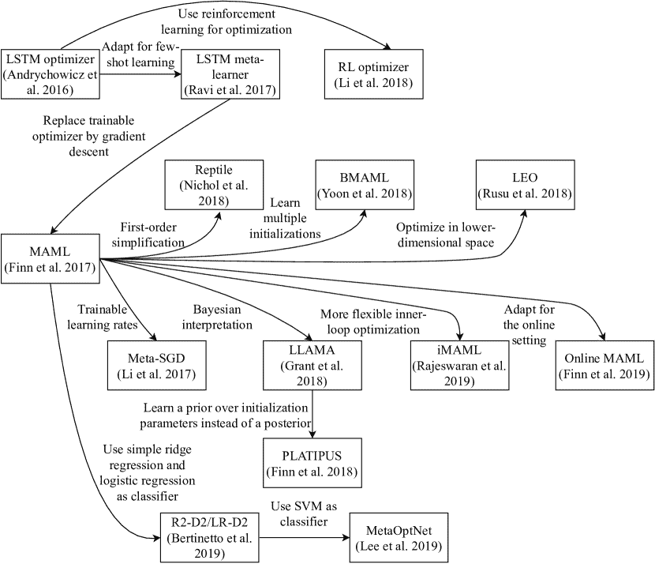

图 28：所覆盖的基于优化的元学习技术之间的关系。可以看出，MAML 在这些技术图中占据了核心位置，因为它激发了许多其他工作。

我们可以看到，LSTM 优化器（Andrychowicz 等人，2016），它通过可训练的 LSTM 替代了诸如梯度下降之类的手工优化程序，可以被视为这些基于优化的元学习技术的起点。Li 和 Malik（2018）也旨在通过强化学习而不是基于梯度的方法来学习优化过程。LSTM 元学习器（Ravi 和 Larochelle，2017）将 LSTM 优化器扩展到少样本设置，不仅学习优化过程，还学习一组良好的初始权重。这样，它可以跨任务使用。MAML（Finn 等人，2017）是 LSTM 元学习器的简化版，因为它用手工梯度下降替代了可训练的 LSTM 优化器。MAML 在深度元学习领域受到广泛关注，并激发了许多其他工作。

Meta-SGD 是 MAML 的一种增强版本，不仅学习初始参数，还学习学习率（Li et al., 2017）。LLAMA（Grant et al., 2018）、PLATIPUS（Finn et al., 2018）和在线 MAML（Finn et al., 2019）将 MAML 扩展到主动学习和在线学习环境中。LLAMA 和 PLATIPUS 是 MAML 的概率解释，允许它们为给定任务采样多个解决方案并量化不确定性。BMAML（Yoon et al., 2018）采取了更离散的方法，它共同优化一组离散的 $M$ 个初始化。iMAML（Rajeswaran et al., 2019）旨在克服 MAML 所需的二阶导数计算的计算开销。通过隐式微分，它们还允许使用不可微分的内循环优化程序。Reptile（Nichol et al., 2018）是一种优雅的一阶元学习算法，用于找到一组初始参数，并消除了计算高阶导数的需要。LEO（Rusu et al., 2018）通过使用编码器-解码器架构，在较低维参数空间中优化，试图提高 MAML 的鲁棒性。最后，R2-D2、LR-D2（Bertinetto et al., 2019）和 Lee et al.（2019）在学习特征提取器上方使用简单的经典机器学习方法（岭回归、逻辑回归、SVM）作为分类器。

基于优化的方法的一个关键优势是，它们可以在更广泛的任务分布上实现比例如模型基方法（Finn 和 Levine, 2018）更好的性能。然而，基于优化的技术会为每个呈现的任务优化一个基础学习者和/或学习优化过程，这在计算上是昂贵的（Hospedales et al., 2020）。

基于优化的元学习是一个非常活跃的研究领域。我们期望未来的工作将减少这些方法的计算需求，并提高解决方案的质量和泛化水平。我们认为基准测试和可重复性研究将在这些改进中发挥重要作用。

## 6 结论

在本节中，我们将对我们讨论的内容以及深度元学习领域做一个宏观的概述。我们还将讨论挑战和未来的研究方向。

### 6.1 概述

近年来，广泛的元学习社区发生了关注点的转变。传统的算法选择和经典机器学习技术（如支持向量机、逻辑回归、随机森林等）的超参数优化已被深度元学习所增强，或者等同于寻求自我提升的神经网络，这些网络能够利用先前的学习经验更快地学习新任务。我们可以在不同任务中使用相同的（元学习）模型，而不是从头开始训练一个新模型。因此，元学习可以扩大强大的深度学习技术在数据较少且计算资源有限的领域的适用性。

深度元学习技术的特点是其元目标，这使得它们能够在多个任务上最大化性能，而不仅仅是单个任务，这与基础级学习目标的情况不同。这个元目标体现在元学习方法的训练过程中，因为它们在一组不同的元训练任务上进行学习。少样本设置非常适合这个目标，因为任务由少量数据点组成。这使得在许多不同任务上训练变得计算上可行，并且可以评估神经网络是否能够从少量示例中学习新概念。任务构建用于训练和评估确实需要特别关注。也就是说，已经证明匹配训练和测试条件是有益的（Vinyals 等，2016），并且可能在比评估时更困难的设置中进行训练（Snell 等，2017）。

从高层次来看，深度元学习技术分为三类，即 i) 度量基础、ii) 模型基础和 iii) 优化基础的方法，分别依赖于 i) 计算输入相似度、ii) 任务嵌入与状态、和 iii) 任务特定更新。每种方法都有其优缺点。度量学习技术简单有效（Garcia 和 Bruna，2017），但不容易应用于监督学习环境之外（Hospedales 等，2020）。另一方面，基于模型的技术具有非常灵活的内部动态，但在面对与元训练时间不同的任务时缺乏泛化能力（Finn 和 Levine，2018）。基于优化的方法显示出更好的泛化能力，但通常计算开销较大，因为它们需要为每个任务优化一个基础学习者（Finn 和 Levine，2018；Hospedales 等，2020）。

表 2 提供了这些方法的简明表格概述。每个类别都提出了许多技术，而这些技术的基本思想可能在同一类别内差异很大。因此，表 3 提供了我们在这项工作中讨论的所有方法和关键思想的概述，包括它们在监督学习（SL）和强化学习（RL）设置中的适用性、关键思想以及用于测试它们的基准。表 5 显示了这些技术在常用的 miniImageNet 基准上的 1-shot 和 5-shot 分类性能（原作者报告的）。此外，它显示了使用的主干网络（特征提取模块）以及最终分类机制。从这个表格中可以明显看出，5-shot 性能通常优于 1-shot 性能，表明数据稀缺性是实现良好性能的一个重要瓶颈。此外，主干网络的表现力与性能之间存在强烈关系。也就是说，更深的主干网络往往会带来更好的分类性能。最佳性能由 MetaOptNet 实现，其 1-shot 准确率为 $64.09$% 和 5-shot 准确率为 $80.00$%。但需注意，MetaOptNet 使用的主干网络比大多数其他技术更深。

| 名称 | 主干网络 | 分类器 | 1-shot | 5-shot |
| --- | --- | --- | --- | --- |
| Metric-based |  |  |  |  |
| Siamese nets | - | - | - |  |
| Matching nets | 64-64-64-64 | Cosine sim. | $43.56\pm 0.84$ | $55.31\pm 0.73$ |
| Prototypical nets | 64-64-64-64 | Euclidean dist. | $49.42\pm 0.78$ | $68.20\pm 0.66$ |
| Relation nets | 64-96-128-256 | Sim. network | $50.44\pm 0.82$ | $65.32\pm 0.70$ |
| ARC | - | 64-1 dense | $49.14\pm-$ | - |
| GNN | 64-96-128-256 | Softmax | $50.33\pm 0.36$ | $66.41\pm 0.63$ |
| Model-based |  |  |  |  |
| RMLs | - | - | - |  |
| MANNs | - | - | - |  |
| Meta nets | 64-64-64-64-64 | 64-Softmax | $49.21\pm 0.96$ | - |
| SNAIL | Adj. ResNet-12 | Softmax | $55.71\pm 0.99$ | $68.88\pm 0.92$ |
| CNP | - | - | - |  |
| Neural stat. | - | - | - |  |
| Opt.-based |  |  |  |  |
| LSTM optimizer | - | - | - |  |
| LSTM ml. | 32-32-32-32 | Softmax | $43.44\pm 0.77$ | $60.60\pm 0.71$ |
| RL optimizer | - | - | - |  |
| MAML | 32-32-32-32 | Softmax | $48.70\pm 1.84$ | $63.11\pm 0.92$ |
| iMAML | 64-64-64-64 | Softmax | $49.30\pm 1.88$ | - |
| Meta-SGD | 64-64-64-64 | Softmax | $50.47\pm 1.87$ | $64.03\pm 0.94$ |
| Reptile | 32-32-32-32 | Softmax | $48.21\pm 0.69$ | $66.00\pm 0.62$ |
| LEO | WRN-28-10 | Softmax | $61.76\pm 0.08$ | $77.59\pm 0.12$ |
| Online MAML | - | - | - |  |
| LLAMA | 64-64-64-64 | Softmax | $49.40\pm 1.83$ | - |
| PLATIPUS | - | - | - |  |
| BMAML | 64-64-64-64-64 | Softmax | $53.80\pm 1.46$ | - |
| Diff. solvers |  |  |  |  |
|           R2-D2 | 96-192-384-512 | Ridge regr. | $51.8\pm 0.2$ | $68.4\pm 0.2$ |
|           LR-D2 | 96-192-384-512 | Log. regr. | $51.90\pm 0.20$ | $68.70\pm 0.20$ |
|           MetaOptNet | ResNet-12 | SVM | $\boldsymbol{64.09\pm 0.62}$ | $\boldsymbol{80.00\pm 0.45}$ |

表 5：所涵盖的元学习技术在 1-shot 和 5-shot miniImageNet 分类中的准确率评分比较。分数取自原始论文。$\pm$表示 95%的置信区间。骨干网是所使用的特征提取模块。分类器列显示了用于将特征转化为类别预测的最终层。使用的缩写包括：“sim.”: 相似性，“Adj.”: 调整，“dist.”: 距离，“log.”: 逻辑回归，“regr.”: 回归，“ml.”: 元学习器，“opt.”: 优化。

### 6.2 开放挑战与未来工作

尽管深度元学习技术具有巨大潜力，但仍存在开放的挑战，我们将在此讨论。

图 1 在第一部分展示了所涵盖的元学习技术在 1-shot miniImageNet 分类中的准确率评分。未在这种设置中由原作者测试的技术被省略。正如我们所见，这些技术的性能与所使用的骨干网的表现力相关（在 x 轴上按递增顺序排列）。例如，表现最好的技术 LEO 和 MetaOptNet 使用了最大的网络架构。此外，不同技术使用不同骨干网的问题使得公平比较其分类性能变得困难。一个明显的问题是，性能差异在多大程度上是由于方法论改进，还是由于选择了更好的骨干架构。为此，我们认为进行一个大规模的基准测试会很有用，在该测试中对比使用相同骨干网的技术。这也将使我们更清楚地了解特征提取模块的表现力如何影响性能。

深度元学习技术的另一个挑战是它们可能容易受到记忆问题（元过拟合）的影响，其中神经网络已经记住了在元训练时看到的任务，并且无法对新任务进行泛化。需要更多研究来更好地理解这个问题。巧妙的任务设计和元正则化可能有助于避免这些问题（Yin 等，2020）。

这项工作讨论的大多数元学习技术存在另一个问题，即它们在狭窄的基准集上进行评估。这意味着元学习器用于训练的数据与用于评估其性能的数据没有太大差异。因此，人们可能会想知道这些技术能否很好地适应更为不同的任务。陈等人（2019）表明，随着新任务与训练时看到的任务距离越来越远，适应新任务的能力会下降。此外，一个简单的非元学习基线（基于预训练和微调）在元测试任务来源于与元训练使用的数据集不同的情况下，可以胜过最先进的元学习技术。

针对这些发现，Triantafillou 等人（2020）最近提出了 Meta-Dataset 基准，其中包括各种先前使用的元学习基准，如 Omniglot（Lake 等人，2011）和 ImageNet（Deng 等人，2009）。通过这种方式，可以在任务多样的更具挑战性的环境中评估元学习技术。根据 Hospedales 等人（2020）的观点，我们认为这一新基准可以成为调查和发展面对这种具有挑战性场景中的元学习算法的良好手段。

正如在本节前面提到的，深度元学习具有将深度学习技术应用于更多真实世界领域的吸引人前景。为此，增强这些技术的泛化能力非常重要。此外，部署元学习技术所涉及的计算成本应该很小。虽然这些技术可以快速学习新任务，但元训练可能是非常计算密集的。因此，减少深度元学习技术所需的计算时间和内存成本仍然是一个未解之谜。

一些真实世界的问题需要系统能够在在线或主动学习环境中表现良好。在这些环境中研究深度元学习（Finn 等人，2018; Yoon 等人，2018; Finn 等人，2019; Munkhdalai 和 Yu，2017; Vuorio 等人，2018）仍然是未来工作的一个重要方向。

未来研究的另一个方向是创建组合深度元学习系统，而不是学习扁平和联想的函数$\boldsymbol{x}\rightarrow y$，以组合方式组织知识。这将使它们能够将输入$\boldsymbol{x}$分解成几个（已经学到的）组件$c_{1}(\boldsymbol{x}),\ldots,c_{n}(\boldsymbol{x})$，这反过来可以帮助在低数据情况下的性能（Tokmakov et al., 2019）。

已提出的问题是，现代深度元学习技术是否真的学会了如何进行快速学习，还是仅仅学会了一组稳健的高层特征，这些特征可以用于许多（新的）任务。Raghu 等人 (2020) 针对最流行的深度元学习技术 MAML 调查了这个问题，发现它主要依赖于特征重用。看看我们是否能够开发更多依赖于快速学习的技术，以及这对性能的影响，将是很有趣的。

最后，增加更多的元抽象层次可能会有所帮助，从而产生例如元-元学习、元-元-…-学习（Hospedales 等人，2020；Schmidhuber，1987）。

###### 致谢。

感谢 Herke van Hoof 对 LLAMA 进行的深入讨论。感谢 Pavel Brazdil 对本工作的初步版本提供的鼓励和反馈。

## 参考文献

+   Anderson (2008) Anderson T (2008) 在线学习的理论与实践。AU Press，Athabasca 大学。

+   Andrychowicz 等人 (2016) Andrychowicz M, Denil M, Colmenarejo SG, Hoffman MW, Pfau D, Schaul T, Shillingford B, de Freitas N (2016) 通过梯度下降学习学习。见于：神经信息处理系统进展 29，Curran Associates Inc.，NIPS’16，第 3988–3996 页。

+   Antoniou 等人 (2019) Antoniou A, Edwards H, Storkey A (2019) 如何训练你的 MAML。见于：国际学习表示大会，ICLR’19。

+   Barrett 等人 (2018) Barrett DG, Hill F, Santoro A, Morcos AS, Lillicrap T (2018) 在神经网络中测量抽象推理能力。见于：第 35 届国际机器学习大会论文集，JLMR.org，ICML’18，第 4477–4486 页。

+   Bengio 等人 (1997) Bengio S, Bengio Y, Cloutier J, Gecsei J (1997) 关于突触学习规则优化的研究。见于：人工和生物神经网络中的最优性，Lawrance Erlbaum Associates, Inc.

+   Bengio 等人 (1991) Bengio Y, Bengio S, Cloutier J (1991) 学习突触学习规则。见于：国际联合神经网络会议，IEEE，IJCNN’91，第 2 卷。

+   Bertinetto 等人 (2019) Bertinetto L, Henriques JF, Torr PHS, Vedaldi A (2019) 使用可微分封闭形式求解器的元学习。见于：国际学习表示大会，ICLR’19。

+   Brazdil 等人 (2008) Brazdil P, Carrier CG, Soares C, Vilalta R (2008) 元学习：数据挖掘应用。Springer-Verlag Berlin Heidelberg。

+   Chen 等人 (2019) Chen WY, Liu YC, Kira Z, Wang YC, Huang JB (2019) 细看少样本分类。见于：国际学习表示大会，ICLR’19。

+   Deng 等人 (2009) Deng J, Dong W, Socher R, Li LJ, Li K, Fei-Fei L (2009) ImageNet：一个大规模层次化图像数据库。见于：IEEE 计算机视觉与模式识别大会论文集，IEEE，第 248–255 页。

+   Duan 等 (2016) Duan Y, Schulman J, Chen X, Bartlett PL, Sutskever I, Abbeel P (2016) RL²：通过慢强化学习实现快速强化学习。arXiv 预印本 arXiv:161102779

+   Edwards 和 Storkey (2017) Edwards H, Storkey A (2017) 朝向神经统计学家。载于：国际学习表征大会，ICLR’17

+   Finn 和 Levine (2018) Finn C, Levine S (2018) 元学习与普适性：深度表征和梯度下降可以近似任何学习算法。载于：国际学习表征大会，ICLR’18

+   Finn 等 (2017) Finn C, Abbeel P, Levine S (2017) 模型无关的元学习用于深度网络的快速适应。载于：第 34 届国际机器学习大会论文集，JMLR.org，ICML’17，第 1126–1135 页

+   Finn 等 (2018) Finn C, Xu K, Levine S (2018) 概率模型无关的元学习。载于：神经信息处理系统进展 31，Curran Associates Inc.，NIPS’18，第 9516–9527 页

+   Finn 等 (2019) Finn C, Rajeswaran A, Kakade S, Levine S (2019) 在线元学习。载于：Chaudhuri K, Salakhutdinov R (编) 第 36 届国际机器学习大会论文集，JLMR.org，ICML’19，第 1920–1930 页

+   Garcia 和 Bruna (2017) Garcia V, Bruna J (2017) 基于图神经网络的少样本学习。载于：国际学习表征大会，ICLR’17

+   Garnelo 等 (2018) Garnelo M, Rosenbaum D, Maddison C, Ramalho T, Saxton D, Shanahan M, Teh YW, Rezende D, Eslami SMA (2018) 条件神经过程。载于：Dy J, Krause A (编) 第 35 届国际机器学习大会论文集，JMLR.org，ICML’18，第 80 卷，第 1704–1713 页

+   Goceri (2019a) Goceri E (2019a) 用于从脑部图像中分类肿瘤的 Capsnet 拓扑及其比较评估。IET 图像处理 14(5)：882–889

+   Goceri (2019b) Goceri E (2019b) 深度学习时代图像分割的挑战与最新解决方案。载于：2019 年第九届国际图像处理理论、工具与应用会议 (IPTA)，IEEE，第 1–6 页

+   Goceri (2020) Goceri E (2020) 基于卷积神经网络的桌面应用程序用于分类皮肤病。载于：2020 IEEE 第 4 届国际图像处理、应用与系统会议 (IPAS)，IEEE，第 138–143 页

+   Goceri 和 Karakas (2020) Goceri E, Karakas AA (2020) 基于 CNN 网络的皮肤病变分类的比较评估。载于：第 14 届国际计算机图形学、可视化、计算机视觉与图像处理会议 (CGVCVIP)，克罗地亚萨格勒布，第 1–6 页

+   Grant 等 (2018) Grant E, Finn C, Levine S, Darrell T, Griffiths T (2018) 将基于梯度的元学习重构为层次贝叶斯。载于：国际学习表征大会，ICLR’18

+   Graves 等 (2014) Graves A, Wayne G, Danihelka I (2014) 神经图灵机。arXiv 预印本 arXiv:14105401

+   Gupta et al. (2018) Gupta A, Mendonca R, Liu Y, Abbeel P, Levine S (2018) 结构化探索策略的元强化学习。发表于：神经信息处理系统进展 31，Curran Associates Inc.，NIPS’18，第 5302–5311 页

+   Hamilton et al. (2017) Hamilton WL, Ying R, Leskovec J (2017) 在大图上的归纳表示学习。发表于：神经信息处理系统进展，Curran Associates Inc.，NIPS’17，第 30 卷，第 1025–1035 页

+   Hannan (1957) Hannan J (1957) 在重复游戏中的贝叶斯风险近似。博弈论贡献 3:97–139

+   Hastie et al. (2009) Hastie T, Tibshirani R, Friedman J (2009) 统计学习的要素：数据挖掘、推断和预测，第 2 版。Springer，纽约

+   He et al. (2015) He K, Zhang X, Ren S, Sun J (2015) 深入探讨整流器：超越人类水平的 ImageNet 分类性能。发表于：IEEE 国际计算机视觉会议论文集，第 1026–1034 页

+   Hinton and Plaut (1987) Hinton GE, Plaut DC (1987) 使用快速权重来去模糊旧记忆。发表于：第九届认知科学学会年会论文集，第 177–186 页

+   Hochreiter et al. (2001) Hochreiter S, Younger AS, Conwell PR (2001) 使用梯度下降学习学习。发表于：国际人工神经网络会议，Springer，第 87–94 页

+   Hospedales et al. (2020) Hospedales T, Antoniou A, Micaelli P, Storkey A (2020) 神经网络中的元学习：综述。arXiv 预印本 arXiv:200405439

+   Iqbal et al. (2018) Iqbal MS, Luo B, Khan T, Mehmood R, Sadiq M (2018) 机器学习的异质迁移学习技术。伊朗计算机科学杂志 1(1):31–46

+   Iqbal et al. (2019a) Iqbal MS, El-Ashram S, Hussain S, Khan T, Huang S, Mehmood R, Luo B (2019a) 利用深度学习进行线粒体图像的高效细胞分类。光学杂志 48(1):113–122

+   Iqbal et al. (2019b) Iqbal MS, Luo B, Mehmood R, Alrige MA, Alharbey R (2019b) 通过卷积神经网络方法进行线粒体细胞器运动分类（分裂与融合）。IEEE Access 7:86570–86577

+   Iqbal et al. (2020) Iqbal MS, Ahmad I, Bin L, Khan S, Rodrigues JJ (2020) 疾病与正常细胞表征的深度学习识别。新兴电信技术交易，第 e4017 页

+   Jankowski et al. (2011) Jankowski N, Duch W, Grąbczewski K (2011) 计算智能中的元学习，第 358 卷。Springer-Verlag Berlin Heidelberg

+   Kalai and Vempala (2005) Kalai A, Vempala S (2005) 在线决策问题的高效算法。计算机与系统科学杂志 71(3):291–307

+   Koch et al. (2015) Koch G, Zemel R, Salakhutdinov R (2015) 用于一次性图像识别的孪生神经网络。发表于：第 32 届国际机器学习会议论文集，JMLR.org，ICML’15，第 37 卷

+   Krizhevsky (2009) Krizhevsky A (2009) 从微小图像中学习多层特征。技术报告，多伦多大学

+   Krizhevsky 等人（2012）Krizhevsky A, Sutskever I, Hinton GE（2012）《用深度卷积神经网络进行 ImageNet 分类》。收录于：神经信息处理系统进展，第 1097–1105 页

+   Lake 等人（2011）Lake B, Salakhutdinov R, Gross J, Tenenbaum J（2011）《单次学习简单视觉概念》。收录于：认知科学学会年会论文集，卷 33，第 2568–2573 页

+   Lake 等人（2017）Lake BM, Ullman TD, Tenenbaum JB, Gershman SJ（2017）《构建像人类一样学习和思考的机器》。《行为与脑科学》40

+   LeCun 等人（2010）LeCun Y, Cortes C, Burges C（2010）《MNIST 手写数字数据库》。 [`yann.lecun.com/exdb/mnist`](http://yann.lecun.com/exdb/mnist)，访问日期：2020 年 7 月 10 日

+   Lee 等人（2019）Lee K, Maji S, Ravichandran A, Soatto S（2019）《带有可微分凸优化的元学习》。收录于：IEEE 计算机视觉与模式识别会议论文集，IEEE，第 10657–10665 页

+   Li 和 Malik（2018）Li K, Malik J（2018）《学习优化神经网络》。arXiv 预印本 arXiv:170300441

+   Li 等人（2017）Li Z, Zhou F, Chen F, Li H（2017）《Meta-SGD：为少样本学习快速学习》。arXiv 预印本 arXiv:170709835

+   Liu 和 Wang（2016）Liu Q, Wang D（2016）《Stein 变分梯度下降：一种通用的贝叶斯推断算法》。收录于：神经信息处理系统进展 29，Curran Associates Inc.，NIPS’16，第 2378–2386 页

+   Martens 和 Grosse（2015）Martens J, Grosse R（2015）《用 Kronecker 分解的近似曲率优化神经网络》。收录于：第 32 届国际机器学习会议论文集，JMLR.org，ICML’15，第 2408–2417 页

+   Miconi 等人（2018）Miconi T, Stanley K, Clune J（2018）《可微分塑性：用反向传播训练可塑性神经网络》。收录于：Dy J, Krause A（编辑）第 35 届国际机器学习会议论文集，JLMR.org，ICML’18，第 3559–3568 页

+   Miconi 等人（2019）Miconi T, Rawal A, Clune J, Stanley KO（2019）《Backpropamine：用可微分的神经调节塑性训练自我修改的神经网络》。收录于：国际学习表征会议，ICLR’19

+   Mishra 等人（2018）Mishra N, Rohaninejad M, Chen X, Abbeel P（2018）《一种简单的神经注意力元学习器》。收录于：国际学习表征会议，ICLR’18

+   Mitchell（1980）Mitchell TM（1980）《学习归纳中的偏差需求》。技术报告 CBM-TR-117，拉格斯大学

+   Mnih 等人（2013）Mnih V, Kavukcuoglu K, Silver D, Graves A, Antonoglou I, Wierstra D, Riedmiller M（2013）《用深度强化学习玩 Atari 游戏》。arXiv 预印本 arXiv:13125602

+   Munkhdalai 和 Yu（2017）Munkhdalai T, Yu H（2017）《元网络》。收录于：第 34 届国际机器学习会议论文集，JLMR.org，ICML’17，第 2554–2563 页

+   Nagabandi 等（2019）Nagabandi A, Clavera I, Liu S, Fearing RS, Abbeel P, Levine S, Finn C（2019）《通过元强化学习在动态现实环境中学习适应》。在：国际学习表示会议，ICLR’19

+   Naik 和 Mammone（1992）Naik DK, Mammone RJ（1992）《通过学习进行学习的元神经网络》。在：国际联合神经网络会议，IEEE，IJCNN’92，第 1 卷，第 437–442 页

+   Nichol 等（2018）Nichol A, Achiam J, Schulman J（2018）《关于一阶元学习算法》。arXiv 预印本 arXiv:180302999

+   Oord 等（2016）Oord Avd, Dieleman S, Zen H, Simonyan K, Vinyals O, Graves A, Kalchbrenner N, Senior A, Kavukcuoglu K（2016）《WaveNet: 一种用于原始音频的生成模型》。arXiv 预印本 arXiv:160903499

+   Oreshkin 等（2018）Oreshkin B, López PR, Lacoste A（2018）《Tadam: 任务依赖的自适应度量以改善少样本学习》。在：神经信息处理系统进展 31，Curran Associates Inc.，NIPS’18，第 721–731 页

+   Pan 和 Yang（2009）Pan SJ, Yang Q（2009）《迁移学习综述》。IEEE 知识与数据工程学报 22(10):1345–1359

+   Peng 等（2002）Peng Y, Flach PA, Soares C, Brazdil P（2002）《改进的元学习数据集特征化》。在：发现科学国际会议，Springer，计算机科学讲义，第 2534 卷，第 141–152 页

+   Raghu 等（2020）Raghu A, Raghu M, Bengio S, Vinyals O（2020）《快速学习还是特征重用？理解 MAML 的有效性》。在：国际学习表示会议，ICLR’20

+   Rajeswaran 等（2019）Rajeswaran A, Finn C, Kakade SM, Levine S（2019）《隐式梯度的元学习》。在：神经信息处理系统进展 32，Curran Associates Inc.，NIPS’19，第 113–124 页

+   Ravi 和 Larochelle（2017）Ravi S, Larochelle H（2017）《将优化视为少样本学习的模型》。在：国际学习表示会议，ICLR’17

+   Ren 等（2018）Ren M, Triantafillou E, Ravi S, Snell J, Swersky K, Tenenbaum JB, Larochelle H, Zemel RS（2018）《用于半监督少样本分类的元学习》。在：国际学习表示会议，ICLR’18

+   Rusu 等（2018）Rusu AA, Rao D, Sygnowski J, Vinyals O, Pascanu R, Osindero S, Hadsell R（2018）《带有潜在嵌入优化的元学习》。在：国际学习表示会议，ICLR’18

+   Santoro 等（2016）Santoro A, Bartunov S, Botvinick M, Wierstra D, Lillicrap T（2016）《带有记忆增强神经网络的元学习》。在：第 33 届国际机器学习会议论文集，JMLR.org，ICML’16，第 1842–1850 页

+   Schmidhuber（1987）Schmidhuber J（1987）《自我参考学习中的进化原则》。毕业论文，慕尼黑工业大学

+   Schmidhuber (1993) Schmidhuber J (1993) A neural network that embeds its own meta-levels. 收录于: IEEE International Conference on Neural Networks, IEEE, 页 407–412

+   Schmidhuber 等人 (1997) Schmidhuber J, Zhao J, Wiering M (1997) Shifting Inductive Bias with Success-Story Algorithm, Adaptive Levin Search, and Incremental Self-Improvement. Machine Learning 28(1):105–130

+   Shyam 等人 (2017) Shyam P, Gupta S, Dukkipati A (2017) Attentive Recurrent Comparators. 收录于: Proceedings of the 34th International Conference on Machine Learning, JLMR.org, ICML’17, 页 3173–3181

+   Silver 等人 (2016) Silver D, Huang A, Maddison CJ, Guez A, Sifre L, van den Driessche G, Schrittwieser J, Antonoglou I, Panneershelvam V, Lanctot M, Dieleman S, Grewe D, Nham J, Kalchbrenner N, Sutskever I, Lillicrap T, Leach M, Kavukcuoglu K, Graepel T, Hassabis D (2016) Mastering the game of Go with deep neural networks and tree search. Nature 529(7587):484

+   Snell 等人 (2017) Snell J, Swersky K, Zemel R (2017) Prototypical Networks for Few-shot Learning. 收录于: Advances in Neural Information Processing Systems 30, Curran Associates Inc., NIPS’17, 页 4077–4087

+   Sun 等人 (2017) Sun C, Shrivastava A, Singh S, Gupta A (2017) Revisiting Unreasonable Effectiveness of Data in Deep Learning Era. 收录于: Proceedings of the IEEE International Conference on Computer Vision, 页 843–852

+   Sung 等人 (2018) Sung F, Yang Y, Zhang L, Xiang T, Torr PH, Hospedales TM (2018) Learning to Compare: Relation Network for Few-Shot Learning. 收录于: Proceedings of the IEEE Conference on Computer Vision and Pattern Recognition, IEEE, 页 1199–1208

+   Sutton 和 Barto (2018) Sutton RS, Barto AG (2018) Reinforcement Learning: An Introduction, 2nd edn. MIT press

+   Taylor 和 Stone (2009) Taylor ME, Stone P (2009) Transfer Learning for Reinforcement Learning Domains: A Survey. Journal of Machine Learning Research 10(7)

+   Thrun (1998) Thrun S (1998) Lifelong Learning Algorithms. 收录于: Learning to learn, Springer, 页 181–209

+   Tokmakov 等人 (2019) Tokmakov P, Wang YX, Hebert M (2019) Learning Compositional Representations for Few-Shot Recognition. 收录于: Proceedings of the IEEE International Conference on Computer Vision, 页 6372–6381

+   Triantafillou 等人 (2020) Triantafillou E, Zhu T, Dumoulin V, Lamblin P, Evci U, Xu K, Goroshin R, Gelada C, Swersky K, Manzagol PA, Larochelle H (2020) Meta-Dataset: A Dataset of Datasets for Learning to Learn from Few Examples. 收录于: International Conference on Learning Representations, ICLR’20

+   Vanschoren (2018) Vanschoren J (2018) Meta-Learning: A Survey. arXiv 预印本 arXiv:181003548

+   Vanschoren 等人 (2014) Vanschoren J, van Rijn JN, Bischl B, Torgo L (2014) OpenML: Networked Science in Machine Learning. SIGKDD Explorations 15(2):49–60

+   Vaswani 等人 (2017) Vaswani A, Shazeer N, Parmar N, Uszkoreit J, Jones L, Gomez AN, Kaiser Ł, Polosukhin I (2017) Attention Is All You Need. 收录于: Advances in Neural Information Processing Systems 30, Curran Associates Inc., NIPS’17, 页 5998–6008

+   Vinyals（2017）Vinyals O（2017）讲座：模型与优化元学习。[`metalearning-symposium.ml/files/vinyals.pdf`](http://metalearning-symposium.ml/files/vinyals.pdf)，神经信息处理系统（NIPS’17）；访问日期：06-06-2020

+   Vinyals 等（2016）Vinyals O, Blundell C, Lillicrap T, Kavukcuoglu K, Wierstra D（2016）《用于一次性学习的匹配网络》。在：神经信息处理系统进展 29，Curran Associates Inc.，NIPS’16，第 3637–3645 页

+   Vuorio 等（2018）Vuorio R, Cho DY, Kim D, Kim J（2018）《元持续学习》。arXiv 预印本 arXiv:180606928

+   Wah 等（2011）Wah C, Branson S, Welinder P, Perona P, Belongie S（2011）《加州理工学院-加州大学圣地亚哥分校鸟类-200-2011 数据集》。技术报告 CNS-TR-2011-001，加州理工学院

+   Wang 等（2016）Wang JX, Kurth-Nelson Z, Tirumala D, Soyer H, Leibo JZ, Munos R, Blundell C, Kumaran D, Botvinick M（2016）《学习强化学习》。arXiv 预印本 arXiv:161105763

+   Wu 等（2016）Wu Y, Schuster M, Chen Z, Le QV, Norouzi M, Macherey W, Krikun M, Cao Y, Gao Q, Macherey K, Klingner J, Shah A, Johnson M, Liu X, Łukasz Kaiser, Gouws S, Kato Y, Kudo T, Kazawa H, Stevens K, Kurian G, Patil N, Wang W, Young C, Smith J, Riesa J, Rudnick A, Vinyals O, Corrado G, Hughes M, Dean J（2016）《谷歌神经机器翻译系统：弥合人类与机器翻译之间的差距》。arXiv 预印本 arXiv:160908144

+   Yin 等（2020）Yin M, Tucker G, Zhou M, Levine S, Finn C（2020）《无记忆的元学习》。在：国际学习表示会议，ICLR’20

+   Yoon 等（2018）Yoon J, Kim T, Dia O, Kim S, Bengio Y, Ahn S（2018）《贝叶斯模型无关元学习》。在：神经信息处理系统进展 31，Curran Associates Inc.，NIPS’18，第 7332–7342 页

+   Younger 等（2001）Younger AS, Hochreiter S, Conwell PR（2001）《通过反向传播进行元学习》。在：国际神经网络联合会议，IEEE，IJCNN’01，第 3 卷

+   Yu 等（2019）Yu T, Quillen D, He Z, Julian R, Hausman K, Finn C, Levine S（2019）《Meta-World：多任务和元强化学习的基准和评估》。arXiv 预印本 arXiv:191010897
