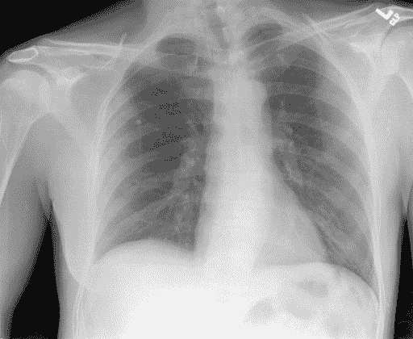
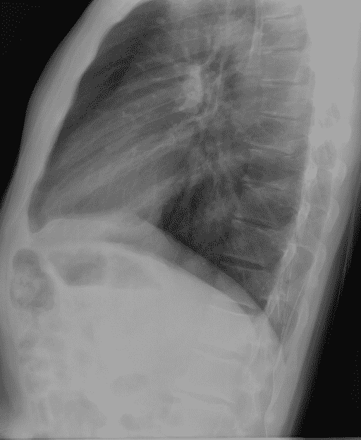
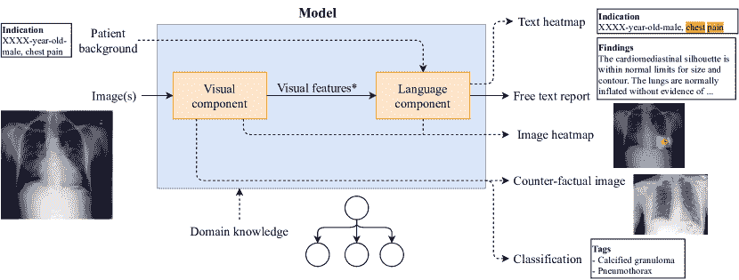
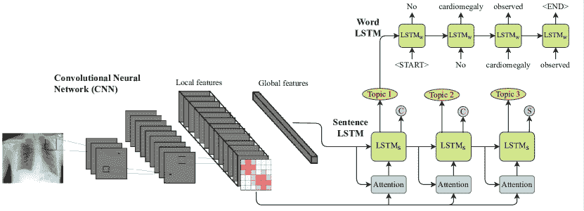
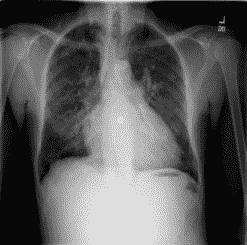
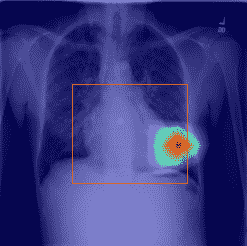
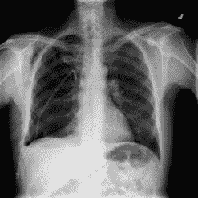
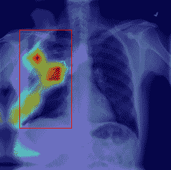

<!--yml

类别：未分类

日期：2024-09-06 19:58:47

-->

# [2010.10563] 关于深度学习和可解释性的调查：医学图像自动报告生成

> 来源：[`ar5iv.labs.arxiv.org/html/2010.10563`](https://ar5iv.labs.arxiv.org/html/2010.10563)

# 关于深度学习和可解释性的调查：医学图像自动报告生成

Pablo Messina pamessina@uc.cl ,  Pablo Pino pdpino@uc.cl ,  Denis Parra dparra@ing.puc.cl ,  Alvaro Soto asoto@uc.cl 计算机科学系，智利天主教大学 Vicuña Mackenna 48607820436SantiagoChile ,  Cecilia Besa besacecilia@gmail.com ,  Sergio Uribe suribe@uc.cl ,  Marcelo Andía meandia@uc.cl 放射学系，医学学院，智利天主教大学 Avda. Libertador Bernando O’Higgins 3408320000SantiagoChile ,  Cristian Tejos ctejos@puc.cl 电气工程系，智利天主教大学 Vicuña Mackenna 48607820436SantiagoChile ,  Claudia Prieto cdprieto@gmail.com 生物医学工程与成像科学学院，伦敦国王学院，圣托马斯医院 Lambeth Palace RdSE1 7EHLondonUK 以及 Daniel Capurro dcapurro@unimelb.edu.au 计算与信息系统学院，墨尔本大学 Level 8, Doug McDonell Building3010MelbourneAustralia（2020）

###### 摘要。

每年，医生面临来自患者的图像诊断需求不断增加的问题，这一问题可以通过近期的人工智能方法解决。在这种背景下，我们调查了医学图像自动报告生成领域的工作，重点关注使用深度神经网络的方法，包括：（1）数据集，（2）架构设计，（3）可解释性和（4）评估指标。我们的调查识别了有趣的发展，但也存在挑战。其中，目前生成报告的评估尤其薄弱，因为它主要依赖于传统的自然语言处理（NLP）指标，这些指标不能准确捕捉医学正确性。

医学报告生成、医学图像说明、自然语言报告、医学图像、深度学习、可解释人工智能^†^†版权：acmcopyright^†^†期刊年份：2020^†^†doi：10.1145/1122445.1122456^†^†ccs：计算方法 计算机视觉^†^†ccs：计算方法 自然语言生成^†^†ccs：应用计算 健康护理信息系统^†^†ccs：计算方法 神经网络

## 1\. 引言

深度学习在计算机视觉（Khan et al., 2020）和自然语言处理（NLP）（Otter et al., 2020）等研究领域的快速成功发展，在医疗保健中找到了重要的应用领域，维持了未来更高效、更经济医疗护理的承诺。过去五年的研究表明，计算机辅助检测（CAD）在医学图像（Wang et al., 2016; Rajpurkar et al., 2017; Gale et al., 2017; Tsai and Tao, 2019; Hwang et al., 2019）以及电子健康记录（EHR）（Shickel et al., 2017）中的疾病预测方面有了明显改善，这得益于深度神经网络（DNN）和将问题视作监督分类或分割任务的处理方式。最近，Topol（Topol, 2019）指出，从基于图像的检查中对诊断和报告的需求远远超出了美国医生的当前医疗能力。这种情况促进了自动化图像诊断和自动报告的发展。此外，资源有限的国家中缺乏专科医生的情况更加严重（Rosman et al., 2019），因此这种技术的预期影响将变得更加重要。

然而，从医学图像（如胸部 X 光、计算机断层扫描（CT）或磁共振成像（MRI））中详细编写高质量的医学报告是需要具有多年经验的放射科医师的任务。在这种背景下，深度学习（DL）结合其他人工智能（AI）技术，作为一种可行且有前景的解决方案，通过自动化报告生成过程和通过辅助报告生成提高放射科医师的表现，从而缓解医生稀缺的问题。人工智能有望对医学影像市场产生重大影响，从而影响放射科医师的工作，*最终目标是改善患者的结果*。该领域的研究进展迅速，据我们所知，之前的调查（Pavlopoulos et al., 2019; Allaouzi et al., 2018; Monshi et al., 2020）未涵盖解释性（Gunning, 2017）、医学准确性和以医生为中心的评估等方面。本文通过分析超过二十项额外的研究和数据集，增强了这些之前的调查。此外，与之前的调查不同，本文特别关注解释性人工智能（XAI）。XAI 是一组方法和技术，将使医生更好地理解黑箱算法自动报告背后的原理（Guidotti et al., 2018），从而可能提高其实际临床使用的信任。

贡献。我们总结了从医学图像自动生成报告的研究现状。我们进行了详尽的文献回顾，包括在期刊、会议和会议研讨会论文集中发表的 40 篇文章。我们首先介绍任务概述（见 2），接着介绍文献搜索和选择的方法（见 3），以及驱动本研究的研究问题（见 4）。然后，我们从四个维度分析文献：使用的数据集（图像模态和临床条件，见 5.1），模型设计（标准实践、输入和输出、视觉和语言组件、领域知识、辅助任务和优化策略，见 5.2），可解释性（见 5.3）以及评估指标（见 5.4）。我们还比较了几篇文章的模型性能（见 5.5），识别所有回顾论文中的未解决挑战，并提出未来研究的潜在方向（见 6）。最后，我们讨论了本工作的局限性（见 7）并给出了主要结论（见 8）。我们的调查为指导未来医学图像自动报告生成的研究提供了宝贵的见解。

## 2\. 任务概述

从纯计算的角度来看，以下是本调查中大多数分析文章所解决的主要任务：给定一个或多个患者的医学图像作为输入，输出与放射科医师生成的报告尽可能相似的文本报告。从机器学习的角度来看，创建一个执行此任务的系统将需要从放射科医师撰写的报告实例中学习生成模型。图 1 展示了一个这样的报告示例，取自 IU X 射线数据集（Demner-Fushman 等，2015）。我们看到两个输入的 X 射线图像（正面和侧面），以及下面的一些注释（标签）——一些由放射科医师手动标注，其他则自动标注——右侧是包含四个不同部分（比较、指征、发现和印象）的报告。如果我们考虑生成医学影像报告的临床工作流程，应该在深入具体实现之前考虑几个方面。

|  手动标签：钙化性肉芽肿/肺/上叶/右侧 自动标签：钙化性肉芽肿  | 比较：胸部放射照片 XXXX。指征：XXXX 岁男性，胸痛。发现：心纵隔轮廓在大小和轮廓上均在正常范围内。肺部正常充气，没有局部气腔病变、胸腔积液或气胸的证据。右上肺稳定的钙化性肉芽肿。无急性骨骼异常。印象：无急性心肺过程。 |
| --- | --- |

图 1\. 来自 IU X 射线数据集的示例，患者的正面和侧面胸部 X 射线图像，旁边是自然语言报告和注释标签。XXXX 用于报告的匿名化。

\描述

正面和侧面胸部 X 射线，手动和自动标注的标签，以及包含四个部分的书面报告。

第一个方面是考虑报告生成过程中的额外患者信息。大多数情况下，要求医学影像的医生是初级保健医生或医疗专家。这意味着，当放射科医师撰写报告时，他们通常会拥有患者相关的临床信息，通常在图 1 中显示的指征部分提供。此外，比较部分可以提供连续跟踪程序的信息，以评估患者随时间的变化（例如，动脉瘤、先天性心脏病）。然后，一个决定是是否使用这些指征和比较数据来生成发现、印象，或两者。

其次，用于报告生成的模型应考虑医学图像以及身体部位和状况的多样性。医学图像有多种类型，如 X 射线、CT、MRI、PET 和 SPECT。这意味着处理单一类型医学图像的文本报告生成模型可能无法适用于其他类型。此外，理想情况下，模型应能够从人体不同部位和各种医学状况生成报告。为了充分完成这一任务，必须有一个平衡且规模适当的训练集。本文调查的许多研究集中在身体的一个特定部位和特定疾病上，这限制了这些方法在所有可能的诊断任务中的泛化能力。

最后，即使 AI 系统在报告生成方面的准确性完美，我们仍然可能会怀疑是否可以在这样一个关键领域信任机器。选择放射科医生而不是自动化的高精度 AI 系统的原因之一是可以理解发现和印象背后的理由。从这个角度来看，可解释的 AI (Gunning, 2017) 在确保其在临床环境中的应用方面具有重要意义。

## 3\. 调查方法论：论文的搜索和选择

为了收集所审阅的论文，我们执行了三个主要步骤：检索、选择和排除。我们将在接下来的段落中进一步描述每个步骤。

研究检索。我们使用了七个搜索引擎进行文章检索，即 Google Scholar、PubMed、Scopus、ACM Digital Library、Web of Knowledge、IEEE Xplore 和 Springer；以及两个具体查询和其他一些较宽松的查询，详见表 1。这些宽松的查询返回了已通过两个主要查询找到的文章。在此步骤中，我们仅考虑了期刊、会议和会议研讨会论文集。

选择研究。根据查询结果，通过阅读每篇论文的标题、摘要和关键词，应用了纳入标准进行选择。如果在阅读这些部分后存在不确定性，我们将其纳入修订，并在之后决定是否按排除标准排除。纳入标准如下：研究的至少一部分集中在医学图像的报告生成上。这些图像可以是任何类型的（例如，X 射线、MRI 扫描、CT 扫描），必须来自人类，并且可能包括一种或多种类型的病理学¹¹1 实际上，大多数审查过的数据集呈现了一种或多种病理学，因为医学状况的检测是这些研究的主要动机之一.. 报告必须是自然语言形式，包含至少一个或多个句子，且必须由使用 DL 技术的计算系统自动或半自动生成。注意，方法可能包含不涉及 DL 的步骤，如基于规则的决策。系统必须接收一个或多个医学图像作为输入，还可能接收额外输入，如患者的临床历史。半自动化系统可能包括人为因素，特别是通过使用人为提供的额外输入。我们共纳入了 45 篇工作。

排除研究。在彻底阅读每篇选择的论文后，我们使用了两个排除标准来剔除与本调查无关的工作。首先，如果论文没有提出解决报告生成问题的特定计算方法，例如，如果呈现了一个使用现有方法的网页应用程序，或提出了可行性评估。其次，如果处理的任务与医学图像的自然语言报告生成不同，例如，报告总结、图像中的疾病分类、医学图像分割或其他任何任务。我们根据这些排除标准排除了 5 篇工作，剩下 40 篇论文。每一步找到的论文数量详见表 1。

| 查询 | Google Scholar | PubMed | Scopus | ACM | WoK | IEEE Xplore | Springer | 总计 |
| --- | --- | --- | --- | --- | --- | --- | --- | --- |
| 1 | 32 | 1 | 19 | 2 | 9 | 7 | 13 | 34 |
| 2 | 21 | 2 | 20 | 2 | 11 | 3 | 18 | 37 |
| 按纳入标准选择的论文（所有查询） | 45 |
| 按排除标准剔除的论文（Hicks 等，2018；Wang 等，2019；Akazawa 等，2019；Wu 等，2018；Loveymi 等，2020） | 5 |
| 总文章数 (Jing 等，2018; Liu 等，2019; Huang 等，2019; Yuan 等，2019; Li 等，2018, 2019b; Wang 等，2018; Xue 等，2018; Zhang 等，2017a; Li 等，2019a; Xiong 等，2019; Singh 等，2019; Maksoud 等，2019; Gale 等，2019; Tian 等，2018; Gu 等，2019; Yin 等，2019; Tian 等，2019; Ma 等，2018; Alsharid 等，2019; Gasimova，2019; Gajbhiye 等，2020; Harzig 等，2019a; Biswal 等，2020; Xie 等，2019; Zeng 等，2018; Harzig 等，2019b; Xue 和 Huang，2019; Sun 等，2019; Zhang 等，2020b; Han 等，2018; Li 和 Hong，2019; Jing 等，2019; Shin 等，2016; Hasan 等，2018b; Shin 等，2016; Zhang 等，2017a; Zeng 等，2018; Kisilev 等，2016; Moradi 等，2016; Wu 等，2017; Spinks 和 Moens，2019; Zeng 等，2020) | 40 |

表 1. 每个查询和数据库找到的论文，以及根据不同标准包括或排除的论文。WoK 代表知识网。在这两个查询中，仅包括了期刊、会议或会议研讨会论文集中的论文。

查询 1: (医学 OR 医疗 OR 健康) AND “报告生成” AND (图像 OR 图片)。

查询 2: (医学 OR 医疗 OR 健康) AND (图像 OR 图片) AND (报告 OR 诊断 OR 描述 OR 标注) AND (生成 OR 自动) 在摘要中。

放宽的查询： (医学报告生成)，(医学报告图像)，(诊断标注)。

## 4. 研究问题

本调查旨在回答关于从医学图像生成自然语言报告的任务的以下研究问题：

1.  (1)

    这个领域使用了哪些数据集？考虑了哪些疾病和成像技术？

1.  (2)

    最常用的深度学习方法是什么？

1.  (3)

    使用了哪些可解释性或解释技术？

1.  (4)

    提出的模型如何进行评估？使用了哪些指标？

1.  (5)

    自动方法的性能如何？哪些方法可以被认为是最先进的或表现最佳的？

1.  (6)

    主要未解决的挑战是什么？未来工作的潜在方向是什么？

## 5. 分析所审查的论文

### 5.1. 数据集

我们识别出 18 个包含由专家编写的图像和报告的报告数据集，以及 9 个分类数据集，这些数据集提供图像及一系列异常的存在或缺失情况。大多数集合是公开可用的（分别有 10 个报告和 8 个分类数据集），其余的是专有的。在大多数情况下，这些数据集专注于一种或多种病理，并包含这些病理的有无样本。表格 2 展示了公开集合的主要特征，包括使用它们的文献列表。接下来我们讨论报告和分类数据集的主要备注。

| 数据集 | 年份 | 图像类型 | 图片数量 | 报告数量 | 患者数量 | 被文献使用情况 |
| --- | --- | --- | --- | --- | --- | --- |
| 报告数据集 |
| IU X-ray (Demner-Fushman 等, 2015) | 2015 | 胸部 X 光 | 7,470 | 3,955 | 3,955 | (Jing 等, 2018; Liu 等, 2019; Huang 等, 2019; Yuan 等, 2019; Li 等, 2018, 2019b; Wang 等, 2018; Xue 等, 2018; Li 等, 2019a; Xiong 等, 2019; Singh 等, 2019; Yin 等, 2019; Tian 等, 2019; Gasimova, 2019; Gajbhiye 等, 2020; Harzig 等, 2019a; Biswal 等, 2020; Xie 等, 2019; Xue 和 Huang, 2019; Zhang 等, 2020b; Jing 等, 2019; Shin 等, 2016) |
| MIMIC-CXR (Johnson 等, 2019a, b) | 2019 | 胸部 X 光 | 377,110 | 227,827 | 65,379 | (Liu 等, 2019) |
| PadChest${}^{\textrm{(sp)}}$(Bustos 等, 2019) | 2019 | 胸部 X 光 | 160,868 | 109,931 | 67,625 | 无${}^{\textrm{(5)}}$ |
| ImageCLEF Caption 2017 (Eickhoff 等, 2017) | 2017 | 生物医学${}^{\textrm{(2)}}$ | 184,614 | 184,614 | - | (Hasan 等, 2018b) |
| ImageCLEF Caption 2018 (García Seco de Herrera 等, 2018) | 2018 | 生物医学${}^{\textrm{(2)}}$ | 232,305 | 232,305 | - | 无${}^{\textrm{(5)}}$ |
| ROCO (Pelka 等, 2018) | 2018 | 多种放射学${}^{\textrm{(3)}}$ | 81,825 | 81,825 | - | 无${}^{\textrm{(5)}}$ |
| PEIR Gross (Jing 等, 2018) | 2017 | 粗大病变 | 7,442 | 7,442 | - | (Jing 等, 2018) |
| INBreast${}^{\textrm{(pt)}}$(Moreira 等, 2012) | 2012 | 乳腺 X 光 | 410 | 115 | 115 | (Sun 等, 2019; Li 和 Hong, 2019) |
| STARE (Hoover, 1975) | 1975 | 视网膜底部 | 400 | 400 | - | 无${}^{\textrm{(5)}}$ |
| RDIF${}^{\textrm{(1)}}$(Maksoud et al., 2019) | 2019 | 肾活检 | 1,152 | 144 | 144 | (Maksoud et al., 2019) |
| 分类数据集 |
| CheXpert (Irvin et al., 2019) | 2019 | 胸部 X 光 | 224,316 | 0 | 65,240 | (Yuan et al., 2019; Zhang et al., 2020b) |
| ChestX-ray14 (Wang et al., 2017) | 2017 | 胸部 X 光 | 112,120 | 0 | 30,805 | (Li et al., 2019b; Wang et al., 2018; Li et al., 2019a; Xiong et al., 2019; Biswal et al., 2020; Xue and Huang, 2019; Jing et al., 2019) |
| LiTS (Christ et al., 2017) | 2017 | 肝脏 CT 扫描 | 200 | 0 | - | (Tian et al., 2018) |
| ACM Biomedia 2019 (Hicks et al., 2019) | 2019 | 胃肠道 ${}^{\textrm{(4)}}$ | 14,033 | 0 | - | (Harzig et al., 2019b) |
| DIARETDB0 (Kauppi et al., 2006) | 2006 | 视网膜眼底 | 130 | 0 | - | (Wu et al., 2017) |
| DIARETDB1 (Kälviäinen and Uusitalo, 2007) | 2007 | 视网膜眼底 | 89 | 0 | - | (Wu et al., 2017) |
| Messidor (Decencière et al., 2014; Abràmoff et al., 2013) | 2013 | 视网膜眼底 | 1,748 | 0 | 874 | (Wu et al., 2017) |
| DDSM (Heath et al., 2001) | 2001 | 乳腺 X 光 | 10,480 | 0 | - | (Kisilev et al., 2016) |

表 2\. 文献中使用的公开数据集。所有报告均为英文，标记为${}^{\textrm{(sp)}}$的为西班牙语，标记为${}^{\textrm{(pt)}}$的为葡萄牙语。其他注释，${}^{\textrm{(1)}}$: RDIF 数据集待发布。${}^{\textrm{(2)}}$: 对于 ImageCLEF 数据集，图像从 PubMed Central 论文中提取，并通过自动过滤只保留临床图像，但也包含了一些来自其他领域的无意样本。${}^{\textrm{(3)}}$: 包含多种模态，即 CT、超声、X 光、荧光镜、PET、乳腺 X 光、MRI、血管造影和 PET-CT。${}^{\textrm{(4)}}$: 图像为从视频中提取的帧。${}^{\textrm{(5)}}$: 所有审查过的论文中没有使用此数据集。

表格 2 中的第三列列出了每个数据集的图像模态，显示出胸部 X 光片在报告数据集中占据了大部分努力（Demner-Fushman 等，2015；Johnson 等，2019b；Bustos 等，2019；Li 等，2018；Gu 等，2019），尽管也有来自不同类型的生物医学图像的数据集（Eickhoff 等，2017；García Seco de Herrera 等，2018；Pelka 等，2018；Jing 等，2018），乳腺 X 光（Moreira 等，2012）和髋关节 X 光（Gale 等，2017），超声图像（Alsharid 等，2019；Zeng 等，2018），视网膜图像（Hoover，1975），多普勒超声心动图（Moradi 等，2016），宫颈图像（Ma 等，2018），以及肾脏（Maksoud 等，2019）和膀胱活检（Zhang 等，2017a）。这增加了额外的挑战，因为不同种类的检查可能需要不同的解决方案，因为临床条件会多种多样。例如，眼底视网膜图像可能与胸部 X 光片有显著差异；或者分析 X 光片的放射科医生可能会遵循不同的程序，而不是解读活检的病理学家。

从公开的报告数据集中，IU X 光（Demner-Fushman 等，2015）是使用最广泛的，由 7,470 张正面和侧面胸部 X 光片以及 3,955 份报告组成。此外，每份报告都用医学主题词表（MeSH）²²2[`www.nlm.nih.gov/mesh/meshhome.html`](https://www.nlm.nih.gov/mesh/meshhome.html)（Rogers，1963）和 RadLex（Langlotz，2006）术语手动标注，并使用 MTI（Mork 等，2013）系统加上 MetaMap（Aronson 和 Lang，2010）的否定工具自动标注。图 1 显示了来自该数据集的一个样本图像和报告。请注意，对于深度学习方法来说，与拥有数百万样本的通用领域数据集（如 ImageNet（Deng 等，2009））相比，数据量可能显得不足。这个问题可以通过预训练或数据增强技术来解决。此外，这也可以通过较新的数据集 MIMIC-CXR（Johnson 等，2019b）或 PadChest（Bustos 等，2019）部分解决，这些数据集分别包含 377,110 和 160,868 张图像，但尚未被广泛使用。

所有报告数据集包括图像和报告，大多数还包括每份报告的标签。此外，INbreast（Moreira et al., 2012）包括定位图像中标签的轮廓，超声波收集（Zeng et al., 2018, 2020）包括定位器官的边界框，IU X-ray（Demner-Fushman et al., 2015）和 RDIF（Maksoud et al., 2019）包含由请求检查的医生撰写的额外文本。额外信息的完整细节见附录 9.1 中的表 9。这些信息可以作为补充背景，进一步提升系统性能。一方面，标签和图像定位可以用于设计辅助任务（见 5.2.5 节），以及进一步评估文本生成过程（见 5.4 节）。另一方面，指示可能包含图像中没有的额外信息，如患者的既往病史，在某些情况下这可能对任务至关重要（Maksoud et al., 2019）。

最后，许多研究使用分类数据集，这些数据集不为每张图像提供报告，而是提供一组临床状况或图像中存在或缺失的异常。在大多数情况下，这种信息用于执行图像分类作为预训练、中间任务或生成报告的辅助任务。一个显著的案例是 CheXpert 数据集（Irvin et al., 2019），该数据集包含 224,316 张图像，并且配有 CheXpert 标注工具，这是一个基于规则的自动工具，用于从自然语言报告中标注 14 个标签（异常），标记为存在、缺失或不确定。该工具用于标记数据集中的图像，也用于 MIMIC-CXR（Johnson et al., 2019b）中的报告标记，以及一些研究中用于评估生成的报告，如指标部分（5.4）。请注意，分类数据集列表并不全面，因为它仅包括在至少一项审查的工作中使用的数据集。

#### 合成

数据集涵盖了多种图像模态和身体部位，尽管大多数努力集中在胸部 X 光片上。这为探索其他图像类型和疾病提供了潜在的研究方向，可以使用现有解决方案或提出新的方法。此外，大多数数据集提供了有价值的补充信息，如异常标记和/或定位，这些信息可用于设计辅助任务并评估性能。

### 5.2\. 模型设计

在这一部分，我们对现有深度学习模型设计进行了分析，从常见设计实践的总体概述开始。文献中的大多数模型遵循标准设计模式。其核心是一个卷积神经网络（CNN）(Krizhevsky et al., 2012)，用于处理一个或多个输入图像以提取视觉特征。然后，紧接着是一个语言组件，通常基于知名的自然语言处理神经架构（例如，LSTM (Hochreiter and Schmidhuber, 1997)，BiLSTM (Graves and Schmidhuber, 2005)，GRU (Chung et al., 2014)，Transformer (Vaswani et al., 2017))，负责文本处理和报告生成。此外，语言组件的普遍做法是通过注意力机制以自适应方式检索视觉信息，报告在写作过程中会生成。许多论文遵循受图像描述领域影响的这一模式的变体（Vinyals et al., 2015；Xu et al., 2015），这些工作经常被引用并作为基准。可选地，一些模型接收或生成额外的输入或输出，还有少数模型在生成过程中明确地纳入了一些领域知识。图 2 展示了文献中常见的模型架构的概述插图。接下来，我们将根据 6 个维度分析模型设计：（1）输入和输出，（2）视觉组件，（3）语言组件，（4）领域知识，（5）辅助任务和（6）优化策略。

图 2\. 综述中架构组件的通用方案，包括左侧的输入和右侧的输出。蓝色框表示整个模型，而橙色框显示内部组件。实线箭头表示几乎所有审阅的工作共享的流程，而虚线箭头表示仅在某些论文中出现的可选输入和输出。注意 *：在某些工作中，视觉组件可能会传输分类或分割输出，而不仅仅是视觉特征。

\说明

文献综述中发现的一般模型架构。模型包括一个视觉组件和一个语言组件。有两个可能的输入，图像和患者背景；以及五个可能的输出，自由文本报告、输入文本的热图、输入图像的热图、对比图像和分类输出。此外，可以在模型中加入明确的领域知识。

#### 5.2.1\. 输入与输出

| 类别 | 值或类型 | 参考论文 |
| --- | --- | --- |
| 输入 |
| 图像类型 | 胸部 X 光 | (Jing 等, 2018; Liu 等, 2019; Huang 等, 2019; Yuan 等, 2019; Li 等, 2018, 2019b; Wang 等, 2018; Xue 等, 2018; Li 等, 2019a; Xiong 等, 2019; Singh 等, 2019; Gu 等, 2019; Yin 等, 2019; Tian 等, 2019; Gasimova, 2019; Gajbhiye 等, 2020; Harzig 等, 2019a; Biswal 等, 2020; Xie 等, 2019; Xue 和 Huang, 2019; Zhang 等, 2020b; Jing 等, 2019; Shin 等, 2016; Spinks 和 Moens, 2019) |
| 乳腺 X 光 | (Sun 等, 2019; Li 和 Hong, 2019; Kisilev 等, 2016) |
| 髋关节 X 光 | (Gale 等, 2019) |
| 超声视频帧 | (Alsharid 等, 2019; Zeng 等, 2018; Kisilev 等, 2016; Zeng 等, 2020) |
| CW 多普勒超声心动图 | (Moradi 等, 2016) |
| 胃肠道检查帧 | (Harzig 等, 2019b) |
| 大体病变 | (Jing 等, 2018) |
| 膀胱活检 | (Zhang 等, 2017a) |
| 肾脏活检 | (Maksoud 等, 2019) |
| 肝肿瘤 CT 扫描 | (Tian 等, 2018) |
| 宫颈肿瘤 WSI | (Ma 等, 2018) |
| 脊柱 MRI | (Han 等, 2018) |
| 眼底视网膜图像 | (Wu 等, 2017) |
| 生物医学图像 | (Hasan 等, 2018b) |
| 图像数量 | 1 | （Jing 等，2018；Liu 等，2019；Huang 等，2019；Wang 等，2018；Zhang 等，2017a；Li 等，2019a；Xiong 等，2019；Singh 等，2019；Gale 等，2019；Gu 等，2019；Yin 等，2019；Tian 等，2019；Ma 等，2018；Alsharid 等，2019；Gasimova，2019；Gajbhiye 等，2020；Harzig 等，2019a；Biswal 等，2020；Zeng 等，2018；Harzig 等，2019b；Xue 和 Huang，2019；Sun 等，2019；Han 等，2018；Li 和 Hong，2019；Jing 等，2019；Shin 等，2016；Hasan 等，2018b；Kisilev 等，2016；Moradi 等，2016；Wu 等，2017；Spinks 和 Moens，2019；Zeng 等，2020） |
| 2 | （Yuan 等，2019；Li 等，2018，2019b；Xue 等，2018；Xie 等，2019；Zhang 等，2020b） |
| 任何 | （Maksoud 等，2019；Tian 等，2018） |
| 文本 | 指示 | （Huang 等，2019；Maksoud 等，2019） |
| 指示和发现 | （Tian 等，2019） |
| 前缀句子和关键词 | （Biswal 等，2020） |
| 部分报告或说明 | （Alsharid 等，2019；Gajbhiye 等，2020） |
| 输出 |
| 报告 | 生成的多句（无结构） | （Jing 等，2018；Liu 等，2019；Huang 等，2019；Yuan 等，2019；Wang 等，2018；Xue 等，2018；Li 等，2019a；Xiong 等，2019；Singh 等，2019；Maksoud 等，2019；Gu 等，2019；Yin 等，2019；Tian 等，2019；Gajbhiye 等，2020；Harzig 等，2019a；Xie 等，2019；Xue 和 Huang，2019；Sun 等，2019；Zhang 等，2020b；Jing 等，2019） |
| 生成的多句结构化 | （Zhang 等，2017a；Tian 等，2018） |
| 生成的单句 | （Gale 等，2019；Alsharid 等，2019；Gasimova，2019；Zeng 等，2018；Li 和 Hong，2019；Shin 等，2016；Hasan 等，2018b；Wu 等，2017；Spinks 和 Moens，2019；Zeng 等，2020） |
| 基于模板 | (Ma et al., 2018; Harzig et al., 2019b; Han et al., 2018; Kisilev et al., 2016; Moradi et al., 2016) |
| 混合模板 - 生成/编辑 | (Li et al., 2018, 2019b; Biswal et al., 2020) |
| 分类 | MeSH 概念或类似的 | (Jing et al., 2018; Yuan et al., 2019; Gu et al., 2019; Yin et al., 2019; Tian et al., 2019; Harzig et al., 2019a, b; Sun et al., 2019; Shin et al., 2016) |
| 异常/疾病的存在或缺失 | (Li et al., 2019b; Wang et al., 2018; Li et al., 2019a; Xiong et al., 2019; Biswal et al., 2020; Zeng et al., 2018; Zhang et al., 2020b; Jing et al., 2019; Spinks and Moens, 2019; Zeng et al., 2020) |
| 异常/疾病的特征化或严重程度 | (Zhang et al., 2017a; Gale et al., 2019; Ma et al., 2018; Kisilev et al., 2016) |
| 身体部位或器官 | (Alsharid et al., 2019; Zeng et al., 2018; Moradi et al., 2016; Zeng et al., 2020) |
| 图像模态 | (Hasan et al., 2018b) |
| 正常或异常句子 | (Harzig et al., 2019a; Xie et al., 2019; Jing et al., 2019) |
| 图像热图 | 基于注意力的逐词分析 | (Liu et al., 2019; Wang et al., 2018; Zhang et al., 2017a) |
| 基于注意力的逐句分析 | (Jing et al., 2018; Huang et al., 2019; Xue et al., 2018; Xue and Huang, 2019) |
| 基于注意力的逐报告分析 | (Li et al., 2019b) |
| CAM (Zhou et al., 2016) | (Ma et al., 2018; Harzig et al., 2019b) |
| Grad-CAM (Selvaraju et al., 2017) | (Yuan et al., 2019; Li et al., 2019a) |
| SmoothGrad (Smilkov et al., 2017) | (Gale et al., 2019) |
| 基于激活的注意力 (Komodakis and Zagoruyko, 2017) | (Spinks and Moens, 2019) |
| 边界框 (Faster R-CNN (Ren et al., 2015)) | (Zeng et al., 2020; Kisilev et al., 2016) |
| 疾病和身体部位像素级分类 | (Tian et al., 2018; Han et al., 2018) |
| 文本热图 | 基于注意力的逐词分析 | (Huang et al., 2019) |
| 其他 | 反事实例生成 | (Spinks and Moens, 2019) |

表 3\. 综述文献的输入和输出分析汇总。

表格 3 展示了这项分析的总结。

输入。关于图像类型，大多数论文（24 篇）使用了胸部 X 光片，而其他论文则在其他图像类型上分布较为均匀。总共有 32 个模型接收单张图像（例如，单个胸部 X 光视图），6 个模型接收 2 张图像（前视和侧视胸部 X 光视图），2 个模型接收任意数量的图像（例如，多切片腹部 CT 扫描）。文献中的大多数模型仅处理视觉输入。然而，6 项研究（黄等，2019；Maksoud 等，2019；田等，2019；Biswal 等，2020；Alsharid 等，2019；Gajbhiye 等，2020）探讨了使用补充输入文本的可能性，在大多数情况下报告了性能提升。例如，两项工作（黄等，2019；Maksoud 等，2019）用 BiLSTM 编码了指示段落。同样，MTMA（田等，2019）先用 BiLSTM 逐句编码报告的指示和发现部分，然后用 LSTM 生成最终的向量表示。类似地，两项工作（Alsharid 等，2019；Gajbhiye 等，2020）使用 LSTM/BiLSTM 编码部分报告或说明作为输入，以预测下一个词。与其他工作不同，CLARA（Biswal 等，2020）使用软件包 Lucene（Branko 等，2010）进行基于文本的报告模板检索。输入文本由 Lucene 处理作为搜索查询，检索到的模板通过编码器-解码器网络进行释义，以生成最终报告。

输出。所有模型都生成自然语言报告。根据报告的扩展和生成报告时使用的一般策略，我们将论文分为五类：(1) 生成式多句子（非结构化）：这些模型逐字生成多句子报告，自由决定句子数量和每个句子中的词汇。(2) 生成式多句子结构化：类似于前一类别，但总是输出固定数量的句子，并且每个句子都有预定义的主题。这些模型设计用于报告遵循严格结构的数据集。(3) 生成式单句：逐字生成报告，但只输出单个句子。这些模型设计用于简单的一句报告的数据集。(4) 基于模板：使用人工设计的模板生成报告，例如执行分类任务后应用 if-then 规则、模板选择和模板填充。这简化了模型的报告生成任务，但使其灵活性降低，并需要人工设计模板和规则。最后，(5) 混合模板 - 生成/编辑：使用模板，同时也可以逐字生成句子。这可以通过选择模板或从头生成句子（Li et al., 2018），或者编辑/改述之前选择的模板（Li et al., 2019b; Biswal et al., 2020）来实现。

除了报告本身，许多模型还输出补充的分类预测，例如异常或疾病的存在与否、MeSH 概念、身体部位或器官等。这些通常被称为标签或标记，并且在语言组件中经常使用，如在 5.2.3 部分将讨论的那样。许多模型还可以生成覆盖图像的热图，使用不同技术高亮相关区域，例如在报告生成过程中计算的显式视觉注意力权重、显著性图方法（如 CAM、Grad-CAM、SmoothGrad 或基于激活的注意力）、边界框回归和像素级分类（图像分割）。此外，有一个模型（Huang et al., 2019）可以在其输入文本上生成热图，另一个模型（Spinks and Moens, 2019）可以生成反事实示例以解释其决策。我们将在解释性部分（5.3）中更详细地讨论所有这些输出及其使用。

#### 5.2.2\. 视觉组件

最重要的观察结果是，所有调查的工作都使用 CNN 来处理输入图像。这并不令人惊讶，因为 CNN 已经主导了计算机视觉领域的最新技术多年（Khan et al., 2020）。典型的视觉处理管道包括一个 CNN，该 CNN 接收输入图像并输出尺寸为$W\times H\times C$的特征图体积，其中$W$和$H$表示空间维度（宽度和高度），$C$表示通道维度（深度或特征图数量）。这些视觉特征随后被语言组件利用，以进行报告生成决策（例如，写什么句子，检索哪个模板，输出下一个词等），通常通过注意机制实现。

然而，一些工作并未严格遵循这一模式。例如，在两项工作（Gu et al., 2019；Sun et al., 2019）中，CNN 被用于多标签分类，然后通过嵌入矩阵查找将标签映射到嵌入向量。因此，报告生成模块只能访问这些标签向量，而无法访问视觉特征本身。类似地，两项工作（Jing et al., 2018；Yin et al., 2019）对标签嵌入向量进行分类和查找，但与前述工作不同，语言组件使用协同注意力同时访问标签向量和视觉特征。他们的消融分析显示，这些标签提供的语义信息补充了视觉信息，并提升了报告生成模型的性能。其他工作（Li et al., 2019b；Zhang et al., 2020b）在 CNN 之后立即使用图神经网络，以医疗概念及其关系来编码视觉信息。因此，语言组件接收到的是中间图表示，而不是原始视觉特征。Zhang et al.（Zhang et al., 2020b）的消融分析显示，得益于图神经网络，性能有所提升。Vispi（Li et al., 2019a）实现了一个两阶段过程，其中使用了两个不同的 CNN。在第一阶段，DenseNet 121（Huang et al., 2017）对图像中的异常进行分类，然后使用 Grad-CAM（Selvaraju et al., 2017）来定位和裁剪每个检测到的类别的图像区域。接着，在第二阶段，将多个图像裁剪视为独立图像，并由典型的 CNN+LSTM 架构处理，ResNet 101（He et al., 2016）作为 CNN。在 RTMIC（Xiong et al., 2019）中采用了类似的思路，其中 DenseNet 121 在 ChestX-ray14（Wang et al., 2017）中进行了预训练用于分类，并使用 CAM 获得每个类别的图像裁剪。

| 架构 | 被文献使用 |
| --- | --- |
| DenseNet (Huang et al., 2017) | (Liu et al., 2019; Li et al., 2019a; Xiong et al., 2019; Zhang et al., 2020b; Li et al., 2018, 2019b; Gale et al., 2019; Yin et al., 2019; Biswal et al., 2020) |
| ResNet (He et al., 2016) | (Huang et al., 2019; Yuan et al., 2019; Xue et al., 2018; Harzig et al., 2019a; Xue 和 Huang, 2019; Li et al., 2019a; Gu et al., 2019; Wang et al., 2018; Gasimova, 2019; Jing et al., 2019; Ma et al., 2018) |
| VGG (Simonyan 和 Zisserman, 2014) | (Jing et al., 2018; Hasan et al., 2018b; Maksoud et al., 2019; Alsharid et al., 2019; Gasimova, 2019; Gajbhiye et al., 2020; Zeng et al., 2018; Li 和 Hong, 2019; Kisilev et al., 2016; Zeng et al., 2020; Moradi et al., 2016) |
| Faster R-CNN (Ren et al., 2015) | (Kisilev et al., 2016; Zeng et al., 2020) |
| Inception V3 (Szegedy et al., 2016) | (Singh et al., 2019) |
| GoogLeNet (Szegedy et al., 2015) | (Shin et al., 2016) |
| MobileNet V2 (Howard et al., 2017) | (Harzig et al., 2019b) |
| SRN (Zhu et al., 2017a) | (Gu et al., 2019) |
| U-Net (Ronneberger et al., 2015) | (Sun et al., 2019) |
| EcNet ${}^{\textrm{(*)}}$ | (Zhang et al., 2017a) |
| FCN + 浅层 CNN ${}^{\textrm{(*)}}$ | (Tian et al., 2018) |
| RGAN ${}^{\textrm{(*)}}$ | (Han et al., 2018) |
| StackGAN (Zhang et al., 2017b)（稍作修改版）${}^{\textrm{(*)}}$ | (Spinks 和 Moens, 2019) |
| CNN ${}^{\textrm{(*)}}$ | (Tian et al., 2019; Spinks 和 Moens, 2019) |
| CNN（未指定架构） | (Xie et al., 2019; Wu et al., 2017) |

表 4\. 文献中使用的卷积神经网络架构总结。RGAN 代表递归生成对抗网络，FCN 代表全卷积网络，EcNet 是 MDNet (Zhang et al., 2017a) 中给定的自定义 CNN 名称。${}^{\textrm{(*)}}$: 表示临时架构。

我们观察到文献中使用了各种 CNN 架构，尽管大多数工作采用了标准设计。表 4 展示了总结。最常见的是 ResNet（11 项工作）、VGG（11 项工作）和 DenseNet（9 项工作）。其他使用的标准架构包括 Faster R-CNN、Inception V3、GoogLeNet、MobileNet V2、空间正则化网络（SRN）和 U-Net。五项工作使用了以前未发布的特定架构（在表 4 中标记为（*））。例如，EcNet 是在 MDNet（Zhang 等，2017a）中使用的特定架构，被提出作为对 ResNet 的改进。然而，作者承认其设计类似于 DenseNet，后者在同一年（2017）发布。RGAN 由 Han 等（Han 等，2018）提出，是一种新型架构，采用生成对抗网络（GAN）（Goodfellow 等，2014）的方法，生成模块包括一个包含空间 LSTM 的 atrous 卷积自编码器（ACAE）的编码器和解码器部分。类似地，Spinks 和 Moens（Spinks 和 Moens，2019）使用了略微修改版的 StackGAN（Zhang 等，2017b）来学习从报告编码到胸部 X 光图像的映射，并使用自定义 CNN 来学习逆向映射。两者一起训练，但只有后者在推理过程中是报告生成管道的一部分。

#### 5.2.3\. 语言组件

| 架构 | 被文献使用 |
| --- | --- |
| GRU | （Shin 等，2016） |
| LSTM | （Singh 等，2019；Gu 等，2019；Gasimova，2019；Zeng 等，2018；Sun 等，2019；Li 和 Hong，2019；Shin 等，2016；Hasan 等，2018b；Wu 等，2017；Zeng 等，2020） |
| 带注意力的 LSTM | （Wang 等，2018；Zhang 等，2017a；Li 等，2019a；Gale 等，2019；Tian 等，2018） |
| 带注意力的层次结构 LSTM | （Jing 等，2018；Liu 等，2019；Huang 等，2019；Yuan 等，2019；Zhang 等，2020b；Yin 等，2019；Tian 等，2019） |
| 层次结构：句子 LSTM + 双重词汇 LSTM（正常/异常） | （Harzig 等，2019a；Xie 等，2019；Jing 等，2019） |
| 递归 BiLSTM-注意力-LSTM | (Xue et al., 2018; Maksoud et al., 2019; Xue and Huang, 2019) |
| 部分报告编码 + FC 层（下一个词） | (Alsharid et al., 2019; Gajbhiye et al., 2020) |
| Transformer | (Xiong et al., 2019) |
| ARAE | (Spinks and Moens, 2019) |
| 基于模板 | (Ma et al., 2018; Harzig et al., 2019b; Han et al., 2018; Kisilev et al., 2016; Moradi et al., 2016) |
| 混合模板检索 + 生成/编辑 | (Li et al., 2019b; Biswal et al., 2020; Li et al., 2018) |

表 5\. 文献中使用的语言组件架构总结。ARAE 代表对抗正则化自编码器。

语言组件的工作是生成报告。与视觉组件不同的是，文献中对这个组件采用了更多种类的方法和创意。表 5 提供了这一分析的高级总结。

最简单的方法是使用递归神经网络，如 LSTM 或 GRU，逐字生成完整报告。九篇工作（Singh et al., 2019; Gu et al., 2019; Gasimova, 2019; Zeng et al., 2018; Sun et al., 2019; Li and Hong, 2019; Hasan et al., 2018b; Wu et al., 2017; Zeng et al., 2020) 使用了 LSTM，一篇工作（Shin et al., 2016）尝试了 GRU 和 LSTM。所有这些工作都有一个共同点，即 GRU/LSTM 在开始时接收来自视觉组件的编码向量，并从中解码完整报告。这个编码向量通常是 CNN 输出的全局特征向量。然而，其中的两个工作（Gu et al., 2019; Sun et al., 2019）计算标签嵌入向量的加权和，并将其作为 LSTM 的输入。五篇工作（Wang et al., 2018; Zhang et al., 2017a; Li et al., 2019a; Gale et al., 2019; Tian et al., 2018）使用了增强了注意力机制的 LSTM。除了初始输入，配备了注意力机制的 LSTM 可以在每个递归步骤中选择性地关注来自视觉组件的视觉特征。这通常会导致所有论文中性能的提升。

一个已知的问题是，像 LSTM 这样的递归网络在生成非常长的文本时效果不佳（Pascanu 等，2013）。当报告较短时这并不是一个令人担忧的问题，但对于长的多句报告来说，这可能会成为一个问题。两篇论文（Zhang 等，2017a；Tian 等，2018）通过独立生成每个句子并将这些句子连接在一起来解决了这个问题。他们通过向 LSTM 提供一个指示句子类型的向量作为初始输入来实现这一点。这在他们的案例中效果很好，因为这些模型是为结构化报告设计的，即每份报告固定数量的句子和每个句子固定的主题。Vispi (Li 等，2019a) 采用了类似的策略：为每种疾病生成相应的句子，最终报告就是这些句子的连接。

图 3\. 说明了一个遵循分层 LSTM 注意力方法的模型，其中的注意力机制作用于句子级别。视觉组件由 CNN 组成。全局特征向量可以通过多种方式从局部特征中计算得出，例如全局平均池化。在每一步，句子 LSTM 生成一个表示当前句子的主题向量，并决定是否停止 (S) 生成或继续 (C)。

为了解决无结构多句报告的生成问题，一些论文采用了我们称之为层次 LSTM 结合注意力的方法：一个句子 LSTM 生成一系列主题向量，而一个词 LSTM 接收主题向量并逐词生成句子。在这种设置下，注意力机制可以存在于句子级别、词级别或两者都存在。图 3 展示了一个示例。七项研究（Jing 等，2018；Liu 等，2019；Huang 等，2019；Yuan 等，2019；Zhang 等，2020b；Yin 等，2019；Tian 等，2019）采用了这种方法。这些论文中的一个共同结果是，层次 LSTM 在多句报告生成方面的表现优于单一的平面 LSTM。一些论文（Harzig 等，2019a；Xie 等，2019；Jing 等，2019）更进一步，用双重词 LSTM 替代了普通的词 LSTM：该模型在句子级别具有一个门控机制，用于决定句子是否描述异常（例如，检测到的心脏肥大）或正常情况。因此，有两个词 LSTM，一个用于正常句子，一个用于异常句子。目标是通过让专门生成异常句子的词 LSTM 来提高异常句子的生成。相比之下，单一的词 LSTM 可能会导致对正常句子的过度学习，而对异常句子的学习不足，因为异常句子通常由于数据集中的类别不平衡而较少出现。这些工作的消融分析显示，由于这种方法，性能得到了提升。

另一种多句报告生成方法是递归的 BiLSTM-注意力-LSTM 方法。基本思路是让 LSTM 一次生成一句话，每次都基于 BiLSTM 对前一句话的编码和注意力机制的输出。这个过程会递归地进行，每次生成一句话，直到完整的报告生成。三篇论文使用了这种方法（Maksoud 等，2019；Xue 等，2018；Xue 和 Huang，2019）。

两项工作（Alsharid 等，2019；Gajbhiye 等，2020）将报告生成视为简单地学习在给定部分报告和图像的情况下预测下一个词。这些模型具有专门的组件，如 LSTM 和 BiLSTM，用于编码部分报告和图像，接下来的词通过 FC 层进行预测。这种方法简化了任务（即，预测所有前面的内容给定的下一个词），但实际上要求模型每次递归应用一个词来生成完整报告，这具有二次复杂度而非线性复杂度。

只有一项工作，即 RTMIC（Xiong 等，2019），探索了使用 Transformer（Vaswani 等，2017）架构来生成报告。在 RTMIC 中，通过 Grad-CAM 获得多个图像裁剪区域，然后从每个裁剪区域获取一个特征向量，最后 Transformer 将这些向量转换为报告。论文结果显示，与一些不使用 Transformer 的基线相比，在 CIDEr 和 BLEU 上取得了一些性能提升。同样，Spinks 和 Moens（Spinks 和 Moens，2019）是唯一使用对抗正则化自编码器（ARAE）（Zhao 等，2017）生成报告的人。他们的模型将 ARAE 与 StackGAN 和普通 CNN 结合，在多个 NLP 指标中取得了比卷积标题生成基线更好的性能。

我们还识别了一组论文（Ma 等，2018；Harzig 等，2019b；Han 等，2018；Kisilev 等，2016；Moradi 等，2016）采用基于模板的方法。这些工作中的语言组件通过遵循 if-then 规则或其他启发式方法程序化地操作，以从数据库中检索、填充和/或组合模板以生成报告。视觉组件通常输出离散分类标签，语言组件程序化地处理这些标签。在 Harzig 等人 2019b（Harzig 等，2019b）的情况下，还使用 CAM（Zhou 等，2016）恢复每个类别的图像定位；在 Han 等人（Han 等，2018）的情况下，视觉组件输出图像分割。在这两种情况下，语言组件包括特殊的基于定位的规则或模板，从而将位置信息纳入生成的报告中。Kisilev 等人（Kisilev 等，2016）采用了不同的方法：多层感知机学习将图像编码映射到 doc2vec（Le 和 Mikolov，2014）表示的相应报告。在推理过程中，检索到与 doc2vec 表示最接近的真实报告。

最后，我们识别出三篇论文（Li et al., 2019b; Biswal et al., 2020; Li et al., 2018）采用了混合模板检索+生成/编辑的方法。这些研究旨在结合模板的优点和生成模块的灵活性，根据具体情况生成句子或对模板进行释义。KERP（Li et al., 2019b）使用图形变换器（GTR）将视觉输入映射到来自策划数据库的模板序列。然后，释义 GTR 将每个模板映射到其释义版本。HRGR（Li et al., 2018）采用了层次 LSTM 方法的变体——它用一个门控模块取代了词汇 LSTM，选择两个选项中的一个：检索一个模板或从头生成一个句子（通过词汇 LSTM）。最后，CLARA（Biswal et al., 2020）有所不同，它被设计为一种互动工具，帮助人类编写报告。人类引入锚词和句子的前缀，Lucene（Branko et al., 2010）将其处理为查询，从数据库中检索句子模板。然后，序列到序列网络读取并释义每个句子模板以生成最终报告。CLARA 还可以通过接收一个空前缀并自行预测锚词来完全自动化操作。根据报告结果，该模型的表现始终优于许多基准模型。

#### 5.2.4. 领域知识

尽管所有研究都使用了来自医学领域的数据集来训练他们的模型，这可以视为一种领域知识转移，但有些研究采取了特别的步骤，将专家的额外知识明确地融入到他们的设计中。具体而言，我们识别出领域知识应用中的两个初期趋势：1）在 CNN 之后使用图神经网络，为模型提供架构上的偏置，以引导其从图像中识别医学概念及其关系；2）通过访问专家策划的外部模板数据库，增强模型的报告生成能力。

KERP (Li et al., 2019b) 使用图神经网络在架构层面上整合知识。作者手动设计了一个异常图和一个疾病图，其中每个节点代表一个异常或疾病，边是根据它们在训练集中的共现关系构建的。一些示例异常包括“肺容积过低”和“心脏尺寸增大”，而疾病则代表了一个更高层次的抽象，例如“肺气肿”或“实变”。信息从图像特征（由 CNN 编码）流向异常图，然后通过节点间消息传递流向疾病图。这使得网络倾向于以异常、疾病及其关系的形式编码视觉信息。类似地，Zhang et al. (Zhang et al., 2020b) 创建了一个观察图，包含 20 个胸部异常或身体部位的节点，其中与相同器官或组织相关的条件通过边连接。它们的消融分析显示出一些性能提升，这得益于图神经网络。

在七篇工作中（Li et al., 2018, 2019b; Biswal et al., 2020; Harzig et al., 2019b; Han et al., 2018; Kisilev et al., 2016; Moradi et al., 2016），作者为他们的模型提供了一组经过精心编排的模板句子，这些句子在语言组件中进一步处理以生成完整报告。三篇工作（Han et al., 2018; Harzig et al., 2019b; Kisilev et al., 2016）使用了手动编排的模板和基于 if-then 的程序来选择和填写这些模板。CLARA (Biswal et al., 2020) 使用一个数据库索引所有来自训练集报告的句子以进行基于文本的检索，然后由生成模块进行意译。类似地，KERP (Li et al., 2019b) 访问了一个从训练集中挖掘的模板数据库，这些模板随后也会被意译。在 HRGR (Li et al., 2018) 中，数据集中的最常见句子被挖掘出来，然后按意义手动分组，以进一步减少重复。在这项工作中，作者展示了 HRGR 学习到大约 80%的时间倾向于使用模板，只有剩下的 20%时间从头生成句子，这表明模板在生成报告中的大多数句子时非常有用。

#### 5.2.5\. 辅助任务

尽管大多数论文的主要目标是从医学图像中学习生成报告的模型，但许多研究还包括并优化辅助任务以提升模型性能。这些任务的总结见附录 9.2 中的表 10。最常见的辅助任务是多标签（16 篇论文）和单标签（11 篇论文）分类。这些任务通常旨在为模型的视觉组件提供额外的监督，以提升 CNN 提取优质视觉特征的能力。一些常见的任务包括识别不同异常、疾病、器官、身体部位、医学概念的存在与否，检测图像模态等。为此目的常用的数据集包括 ChestX-ray14（Wang et al., 2017）和 CheXpert（Irvin et al., 2019），其中常见的做法是在转向报告生成之前，在这些数据集上预训练 CNN。许多论文报告了由于这些辅助分类任务，报告生成性能得到了改善。三项工作（Harzig et al., 2019a；Xie et al., 2019；Jing et al., 2019）采用了双向词 LSTM 的层次化方法，使用分类任务来监督选择生成正常句子、异常句子或停止的门控机制。两项模型（Tian et al., 2018；Han et al., 2018）执行了分割任务。Tian et al.（Tian et al., 2018）使用肝脏和肿瘤的分割掩膜训练了一个全卷积网络（FCN），而 Han et al.（Han et al., 2018）训练了一个用于像素级分类的 RGAN。类似地，两项模型（Kisilev et al., 2016；Zeng et al., 2020）使用了一个经过训练的 Faster-RCNN（Ren et al., 2015），用于检测和分类图像中包含病变或其他感兴趣区域的边界框。

两项工作（Maksoud et al., 2019；Yin et al., 2019）对注意力权重进行了正则化监督。CORAL8（Maksoud et al., 2019）对其视觉注意力权重进行了正则化监督，以防止其退化为均匀分布，这样的分布对平均池化没有优势。类似地，Yin et al.（Yin et al., 2019）对模型的注意力权重添加了两种正则化：一种用于空间视觉特征的权重，另一种用于标签嵌入向量的权重。在这两项工作中，注意力监督对性能提供了显著贡献。

两项工作 (Yin et al., 2019; Moradi et al., 2016) 包含了一个任务，用于强制执行来自两个不同来源的嵌入匹配。Yin et al. (Yin et al., 2019) 将来自 Sentence LSTM 的主题向量和来自相应真实句子的词嵌入投影到一个共同的语义空间，并通过对比损失 (Chopra et al., 2005) 强制匹配。这项任务显著提高了 Sentence LSTM 的训练和模型的整体表现。Moradi et al. (Moradi et al., 2016) 训练了一个 MLP 来将图像视觉编码 (通过 VGG 网络获得) 映射到其对应真实报告的向量表示 (通过 doc2vec (Le 和 Mikolov, 2014) 获得，该过程本身是另一个辅助任务)，通过最小化欧几里得距离。训练后的 MLP 然后用于预测未见图像的 doc2vec 表示，并检索最接近的报告。两项工作 (Tian et al., 2019; Spinks 和 Moens, 2019) 使用文本自编码器，这允许以自我监督的方式学习未标记数据的紧凑表示：编码器网络将输入映射到潜在表示，而解码器网络则需要恢复原始输入。MTMA (Tian et al., 2019) 使用 BiLSTM 对报告的指示和发现部分的句子 (输入文本) 进行编码，以生成印象部分 (输出)。为了提高 BiLSTM 的编码质量，作者训练了层次自编码器 (Li et al., 2015) 的解码器分支，以从 BiLSTM 编码中恢复原始句子。实验结果显示，自编码器监督对模型性能提供了显著提升。Spinks 和 Moens (Spinks 和 Moens, 2019) 训练了一个 ARAE (Zhao et al., 2017)， (1) 学习报告的紧凑表示 (作为生成胸部 X 光图像的 GAN 的输入) 和 (2) 给定任意紧凑表示恢复报告 (用于报告生成的推理模式)。

最后，Spinks 和 Moens (Spinks 和 Moens, 2019) 是唯一将循环一致性任务 (Zhu et al., 2017b) 实现于训练 GAN 和逆向映射 CNN 的研究，以使胸部 X 光图像生成和编码更为稳健。这些任务将在下一节中进一步详细说明。

#### 5.2.6\. 优化策略

除了模型的架构和模型可以执行的任务外，一个非常重要的方面是用于学习模型参数的优化策略。在这一部分，我们对文献中使用的优化策略进行了分析。该部分的总结见附录 9.3 中的表 11。

视觉组件。我们首先分析视觉组件优化，确定了三种一般的优化决策。第一种是是否使用文献中的 CNN，其权重在 ImageNet 上进行了预训练（Deng et al., 2009）。这是计算机视觉文献中一种非常常见的迁移学习实践（Kornblith et al., 2019），因此在医学领域中看到它的应用也很自然。然而，研究表明，ImageNet 的预训练可能无法像对其他领域那样有效地迁移到医学图像任务，因为图像分布非常不同（Raghu et al., 2019）。因此，第二个常见的决策是是否使用辅助医学图像任务对视觉组件进行训练/微调，例如上一部分讨论的大多数分类和分割任务（5.2.5）。第三个决策是是否在报告生成训练过程中冻结视觉组件的权重，还是以端到端的方式继续更新它们。

报告生成。我们在文献中确定了两种一般的优化策略：教师强制（TF）和强化学习（RL）。教师强制（Williams and Zipser, 1989）迄今为止是最常见的，因为有 32 篇论文采用了这种方法（Jing et al., 2018; Huang et al., 2019; Yuan et al., 2019; Li et al., 2019b; Wang et al., 2018; Xue et al., 2018; Zhang et al., 2017a; Li et al., 2019a; Singh et al., 2019; Maksoud et al., 2019; Gale et al., 2019; Tian et al., 2018; Gu et al., 2019; Yin et al., 2019; Tian et al., 2019; Alsharid et al., 2019; Gasimova, 2019; Gajbhiye et al., 2020; Harzig et al., 2019a; Biswal et al., 2020; Xie et al., 2019; Zeng et al., 2018; Xue and Huang, 2019; Sun et al., 2019; Zhang et al., 2020b; Li and Hong, 2019; Jing et al., 2019; Shin et al., 2016; Hasan et al., 2018b; Wu et al., 2017; Spinks and Moens, 2019; Zeng et al., 2020）。教师强制的基本思想是训练一个模型，根据前面的文字条件预测报告的每个词，因此逐字学习模仿地面实况。模型通常有一个 softmax 层来预测下一个词，交叉熵是选择的损失函数，用于衡量错误并计算反向传播的梯度。我们认为教师强制在文献中如此普遍，是因为它的简单性和一般适用性，因为它对应用领域（无论是医学报告生成还是日常图像说明）都是无视的。

相比之下，5 项工作（Liu 等人，2019；Li 等人，2018；Xiong 等人，2019；Jing 等人，2019；Li 和 Hong，2019）探讨了强化学习（RL）的使用（Kaelbling 等人，1996）。使用 RL 的主要原因是它提供了优化不可微分奖励函数的灵活性，允许研究人员更具创意地探索新的奖励，从而引导模型的学习朝向特定领域的目标。例如，Liu 等人（Liu 等人，2019）使用 RL 训练他们的模型，以优化两个奖励的加权和：（1）自然语言奖励（CIDEr（Vedantam 等人，2015））和（2）临床一致性奖励（CCR），后者用于通过 CheXpert 标注工具（Irvin 等人，2019）测量生成报告的临床准确性与真实参考的对比。他们的目标是使模型具备两个技能：自然语言流畅性（由 CIDEr 鼓励）和临床准确性（由 CCR 鼓励）。使用 RL 的其他例子包括：直接优化 CIDEr（Li 等人，2018；Xiong 等人，2019），特别是在训练复杂的混合模板检索和文本生成模型时（Li 等人，2018）；在之前的教师强制预热阶段之后直接优化 BLEU-4（Jing 等人，2019）；以及训练用于报告生成的 GAN 生成器网络，其中奖励由鉴别器网络提供（Li 和 Hong，2019）。

附带说明，我们想要特别提及张等人（张等人，2020a）在医疗报告摘要（相关任务是报告作为输入，没有图像）方面的工作，展示了如何在这种设置中使用强化学习（RL）来优化流畅性和事实正确性。他们使用了 ROUGE（Lin，2004）和基于 CheXpert 标注工具（Irvin 等人，2019）的事实正确性奖励（与 Liu 等人（Liu 等人，2019）提出的 CCR 非常相似）。这项工作是强化学习在医疗领域文本生成中优于教师强制法的一个很好的例子。论文展示了与两名经过认证的放射科医生进行的人工评估结果，使用强化学习训练的模型取得了比同一模型使用教师强制法训练的更好的结果，甚至比人工基准结果稍好。

其他损失或训练策略。这一类别包括文献中发现的其他优化策略。其中最重要的是多任务学习（Caruana, 1997），被 14 篇论文采纳（Jing 等，2018；Li 等，2019b；Wang 等，2018；Zhang 等，2017a；Maksoud 等，2019；Tian 等，2018；Yin 等，2019；Tian 等，2019；Ma 等，2018；Harzig 等，2019a；Jing 等，2019；Kisilev 等，2016；Spinks 和 Moens，2019；Zeng 等，2020）。其主要思想是联合训练多个互补任务的模型，使模型能够学习到在所有任务中表现良好的鲁棒参数。一些研究（Jing 等，2018；Wang 等，2018；Zhang 等，2017a；Tian 等，2018；Yin 等，2019；Tian 等，2019；Harzig 等，2019a）采用端到端的方式同时训练视觉和语言组件在多个任务中的表现，即报告生成加其他辅助任务。其他例子包括对象检测和属性分类的同时训练（Kisilev 等，2016），诊断分类和周期一致性任务（Spinks 和 Moens，2019）等。这些论文大多数报告了这种训练方式的好处。

如在 5.2.5 节中讨论的那样，两项工作（Maksoud et al., 2019; Yin et al., 2019）在其模型的注意力权重上使用了辅助监督。这些辅助损失与模型其余部分在报告生成中共同优化，实际上起到了正则化的作用。Yin et al.（Yin et al., 2019）也是唯一包括了辅助对比损失（Chopra et al., 2005）来为句子 LSTM 提供直接监督的研究，从而提高了他们模型的性能。请注意，这些工作也都是多任务学习的例子。三篇论文（Kisilev et al., 2016; Moradi et al., 2016; Zeng et al., 2020）使用了回归损失。其中两篇（Kisilev et al., 2016; Zeng et al., 2020）将边界框回归损失作为 Faster R-CNN（Ren et al., 2015）训练的一部分，而 Moradi et al.（Moradi et al., 2016）则包含了一个回归损失，以最小化 VGG 和 doc2vec 嵌入之间的欧氏距离。如在 5.2.5 节中讨论的另一种优化策略是使用自编码器进行文本表示的自监督学习。在 MTMA（Tian et al., 2019）中，使用了自编码器来对 BiLSTM 提供辅助监督，并与模型的其余部分以多任务学习的方式共同训练。Spinks 和 Moens（Spinks and Moens, 2019）则在第一阶段训练了一个 ARAE，然后冻结了其权重，并利用学习到的文本嵌入支持后续的 GAN 训练。

最后，三项研究使用了 GAN（Han et al., 2018; Li and Hong, 2019; Spinks and Moens, 2019）。正如讨论 RL 时提到的，Li 等（Han et al., 2018）使用了 GAN 策略来训练他们的报告生成模型，其中生成模块生成报告，而鉴别器判断其真假。类似地，Han 等（Li and Hong, 2019）提出了 RGAN，其中生成器从脊柱 X 光片中输出分割图，而鉴别器判断给定的分割图是真实还是虚假的。Spinks 和 Moens（Spinks and Moens, 2019）实现了 StackGAN 的修改版（Zhang et al., 2017b），以从输入文本表示生成胸部 X 光图像。在他们的案例中，他们使用了两个循环一致性（Zhu et al., 2017b）损失来训练 GAN：(1) 图像 $\xrightarrow{}$ 嵌入 $\xrightarrow{}$ 图像和 (2) 嵌入 $\xrightarrow{}$ 图像 $\xrightarrow{}$ 嵌入。在这两种情况下，使用了辅助逆映射 CNN 来完成循环。

#### 综合分析

总的来说，我们可以观察到，设计用于医学图像报告生成的模型是一项复杂的任务，涉及多个层次的工程决策：输入和输出、视觉组件、语言组件、领域知识、辅助任务和优化策略。在这些维度中，审阅文献中采用了不同的方法，目前的研究状态无法推荐一个“最佳模型设计”，主要原因将在 5.4 和 5.5 部分讨论。然而，文献中有价值的见解可能会带来更好的结果，因此值得关注。例如，使用 CNN（如 DenseNet 或 ResNet）作为视觉组件，并在辅助医学图像任务中进行训练；在图像旁边使用输入文本；为语言组件提供标签信息，除了视觉特征（例如图像中识别出的医学概念）；利用结合领域知识的模板数据库；或使用多任务学习结合多种监督来源。最后，为了从医学角度提高报告质量，使用具有适当奖励函数的强化学习似乎是最有前途的方法。

### 5.3\. 可解释性

在可解释人工智能（XAI）领域，已经有多次尝试为可解释性提供定义（Reyes 等，2020；Doshi-Velez 和 Kim，2017；Lipton，2018）。对于从医学图像生成报告的任务，我们采用 Doshi-Velez 和 Kim 提出的类似定义（Doshi-Velez 和 Kim，2017）：在可理解的术语中为人类提供结果的理由，我们将其与“可解释性”一词交替使用。在这一医学背景下，自动化系统需要较高的可解释性水平，因为有两个主要事实：系统做出的决策可能会直接影响患者，而且诊断任务并非简单且容易受到人工判断的影响（Reyes 等，2020；Doshi-Velez 和 Kim，2017）。此外，这一医学任务中使用的解释方法应尝试解决几个相关方面：符合临床医生的期望并获得他们的信任，提高系统透明度，评估结果质量，以及解决问责、公平和伦理问题（Ahmad 等，2018；Reyes 等，2020；Tonekaboni 等，2019）。

在医学领域，解决 AI 系统可解释性问题的方法有很多种，如 Reyes 等人最近对放射学可解释 AI 的调查所列（Reyes et al., 2020）。可以识别出多个类别，从全局与局部开始，全局指的是关于整个系统操作的解释，局部则是针对单个样本的解释。对于局部解释，有不同种类的方法，例如特征重要性、基于概念、基于示例和不确定性等。特征重要性方法试图计算每个输入值的重要性，以了解哪些特征对决策最相关；例如，CNN 的梯度方法如 Grad-CAM（Selvaraju et al., 2017）、Guided Backpropagation（Springenberg et al., 2015）或 DeepLIFT（Shrikumar et al., 2017）；以及其他技术如 LIME（Ribeiro et al., 2016）。在基于概念的方法中，如 TCAV（Kim et al., 2018）或 RCV（Graziani et al., 2018），预测中来自多个概念的贡献被量化，以便用户检查模型使用的概念是否正确。基于示例的方法提供附加的示例与输出，无论是具有相似结果的示例，以便用户寻找共同模式，还是具有相反结果的示例（对立示例）。不确定性方法提供模型对给定预测的信心水平。对于全局解释，有基于样本的方法，如 SP-LIME（Ribeiro et al., 2016），或直接增加系统透明度的方法。

尽管这一领域解释性的重视程度很高，但只有两项研究专门关注这个话题。Gale 等人（Gale et al., 2019）提出了将自然语言报告作为分类任务的解释自动生成的方法；然而，他们的方法未包含对报告的解释。Spinks 和 Moens（Spinks and Moens, 2019）提出了一种反事实局部解释，详见 5.3.1 小节。此外，在 29 项工作中，模型架构生成了一个附加输出，这些输出也可以作为局部解释呈现。我们区分三种类型的输出：分类（5.3.2 节）、输入图像上的热图（5.3.3 节）以及输入文本上的热图（5.3.4 节）。这些已经在 3 表中总结，在输入和输出部分（5.2.1）。接下来，将讨论这些输出的解释性方面。

#### 5.3.1\. 反事实

Spinks 和 Moens（Spinks and Moens, 2019）提出了一种架构，用于基于 GANs 和自编码器对胸部 X 光片进行疾病分类并生成说明，详见模型设计部分（5.2）。因此，为了提供局部解释，在推理时，输入图像被编码为一个潜在向量，该向量用于生成新的胸部 X 光片和新报告，两者都受到最近替代分类的影响，即最近的诊断。通过这些信息，用户可以比较原始 X 光片和生成的图像，并尝试理解模型为何做出该决定。

#### 5.3.2\. 分类

如辅助任务部分(5.2.5)所解释，许多深度学习架构包括多标签分类以提高性能，提供一组分类概念作为次级输出。尽管在大多数论文中这种输出没有作为报告的解释呈现，我们认为其性质可以提高模型的透明度，这是提高医学环境下可解释性的重要方式（Tonekaboni et al., 2019）。通过提供来自模型处理的中间步骤的检测信息，专家可以进一步理解内部过程，用他们的领域知识验证决策，并校准对系统的信任。

如表格 3 所示，来自 5.2.1 节的术语分类非常多样。一些工作对非常广泛的概念进行分类，如身体部位或器官（Zeng et al., 2018; Alsharid et al., 2019; Moradi et al., 2016; Zeng et al., 2020），或图像模态（Hasan et al., 2018b）。其他工作进行更具体的分类，如疾病或异常（Zeng et al., 2018; Wang et al., 2018; Biswal et al., 2020; Li et al., 2019b; Zhang et al., 2020b; Zeng et al., 2020; Spinks and Moens, 2019; Kisilev et al., 2016），或句子级别的正常或异常状态（Xie et al., 2019）。最后，一些工作（Harzig et al., 2019a; Jing et al., 2018; Tian et al., 2019; Gu et al., 2019; Yin et al., 2019; Sun et al., 2019; Yuan et al., 2019; Shin et al., 2016）对 MeSH 术语或类似术语的子集进行分类，这些术语可能包含一般广泛的医学概念和具体的异常或病状。我们认为这种额外的输出对专家会有用，尽管具体的概念会提供更丰富的信息。如果分类更为具体，用户将能够在更狭窄的范围内验证系统的性能。

#### 5.3.3\. 图像热力图

在审阅的论文中，有三种不同的方法生成输入图像上的热图，每种方法有不同的解释。首先，许多架构在生成报告期间对图像空间特征应用注意力机制，如在语言组件部分（5.2.3）中讨论的那样。这些机制可以用于生成指示图像区域的热图，这些区域在生成报告时最为重要。特别是，一些模型为每个词（Zhang et al., 2017a；Wang et al., 2018；Liu et al., 2019）、每个句子（Jing et al., 2018；Huang et al., 2019；Xue et al., 2018；Xue and Huang, 2019）或整个报告（Li et al., 2019b）提供热图。通过展示这些特征重要性图，专家应能够确定模型是否关注图像的正确区域，这可能会增强他们对系统的信任。

其次，一些研究使用特定的深度学习架构进行图像分割，即同时进行分类和定位。Ma 等人（Ma et al., 2018）的模型使用 CNN 来分类宫颈癌四个不同关键特征的严重程度，然后通过对视觉空间特征的注意力机制生成热图，以指示每个相关属性的位置。Tian 等人（Tian et al., 2018）使用 FCN 来分类图像中是否存在肝脏或肿瘤的每个像素，并通过与注意力图的平均结果进一步改善定位。Han 等人（Han et al., 2018）提出了 ACAE 模块（见章节 5.2.3 以获取详细信息），该模块用于在像素级别分类脊柱的不同部分（椎骨、椎间盘或神经孔），以及它们是否显示异常。Kisilev 等人（Kisilev et al., 2016）和 Spinks 及 Moens（Spinks and Moens, 2019）使用 Faster R-CNN（Ren et al., 2015）架构来检测图像中具有病变和感兴趣的身体部位区域。

最后，一些工作使用基于梯度或激活的方法来生成显著性图，指示分类中最重要的区域，如 CAM (Zhou et al., 2016)、Grad-CAM (Selvaraju et al., 2017)、SmoothGrad (Smilkov et al., 2017)，或 Zagoruyko 和 Komodakis 提出的方法 (Komodakis and Zagoruyko, 2017)。请参见 3 表中的列表，了解使用每种技术的论文。为了确定这些方法在一般环境中的表现，Adebayo 等人 (Adebayo et al., 2018) 对 Grad-CAM、SmoothGrad 及其他类似方法进行了多次评估（“合理性检查”），并表明 Grad-CAM 在与输入图像及分类结果的相关性方面应更为可靠。作为这些技术的一个示例，4 图展示了来自 ChestX-ray14 数据集 (Wang et al., 2017)的两张胸部 X 光片，其中使用 CAM 生成的热力图，以及一个由专家标注的边界框标记异常位置（数据集提供）。

|   |   |
| --- | --- |
| 心脏肥大 | 气胸 |

图 4\. 来自 ChestX-ray14 数据集 (Wang et al., 2017) 的示例，使用基于 ResNet-50 (He et al., 2016) 的 CNN 进行分类，并使用 CAM (Zhou et al., 2016) 提供热力图，指示局部解释中最重要的空间区域。左侧示例显示心脏肥大，右侧示例显示气胸，两个样本都被 CNN 正确分类。红框代表由专家标注的病症位置。

\描述

两张胸部 X 光片显示了异常情况，并附有一个热力图，指示神经网络中最重要的区域，以及一个边界框标出异常位置。

在分割和显著性图方法中，热图信息提供的信息比单纯的分类要丰富得多，因为它还包括特定概念的位置，比如异常或身体部位。提供这种类型的解释应允许专家评估模型的定位能力和系统准确性，从而提高模型在整个过程中的透明度。

#### 5.3.4\. 文本热图

Huang 等人提出的模型（Huang et al., 2019）也接受文本作为输入，这表明进行成像研究的原因。类似于输入图像的情况，该架构包括对输入文本的注意力机制，它提供一个热图，指示生成输出中每个单词所依据的最相关输入短语或句子。通过这种特征重要性图，专家应该能够确定模型是否关注了输入文本中的正确单词。

#### 综合

所有的可解释性方法都是由次级输出给出的局部解释，要么指示特征重要性（图像和文本热图），要么提高模型的透明度（分类），或者提供一个反事实例。然而，在大多数研究中，作者并未明确将其作为解释能力的改进提及，几乎所有情况下也没有正式的评估，如 5.4.3 小节将讨论的。因此，我们认为这是医学报告生成任务中一个被忽视的方面，因为在大多数被审查的作品中对此的分析都很肤浅或根本不存在。此外，反事实技术可以进一步研究，其他文献中未找到的方法也值得探索，例如预测不确定性或全局解释，这对临床医生可能非常相关（Tonekaboni et al., 2019）。

### 5.4\. 评估指标

评估自动化系统生成的医学报告有不同的方法。我们将文献中使用的评估指标分为三个类别，具体取决于被评估的方面：文本质量、医学正确性和可解释性。此外，每种评估方法可以是自动的，也可以由人工进行。接下来将介绍每个类别和指标，表格 6 显示了每篇论文使用的指标总结。

| 类别 | 指标或评估 | 论文中使用 |
| --- | --- | --- |
| 文本质量（自动） | 基于 BLEU | （Jing 等，2018；Liu 等，2019；Huang 等，2019；Yuan 等，2019；Li 等，2018，2019b；Wang 等，2018；Xue 等，2018；Zhang 等，2017a；Li 等，2019a；Xiong 等，2019；Singh 等，2019；Maksoud 等，2019；Gale 等，2019；Tian 等，2018；Gu 等，2019；Yin 等，2019；Tian 等，2019；Alsharid 等，2019；Gasimova，2019；Gajbhiye 等，2020；Harzig 等，2019a；Biswal 等，2020；Xie 等，2019；Zeng 等，2018；Xue 和 Huang，2019；Sun 等，2019；Zhang 等，2020b；Li 和 Hong，2019；Jing 等，2019；Shin 等，2016；Hasan 等，2018b；Spinks 和 Moens，2019；Zeng 等，2020） |
| ROUGE-L | （Jing 等，2018；Liu 等，2019；Huang 等，2019；Yuan 等，2019；Li 等，2018，2019b；Wang 等，2018；Xue 等，2018；Zhang 等，2017a；Li 等，2019a；Singh 等，2019；Maksoud 等，2019；Tian 等，2018；Gu 等，2019；Yin 等，2019；Tian 等，2019；Alsharid 等，2019；Gajbhiye 等，2020；Harzig 等，2019a；Xie 等，2019；Zeng 等，2018；Xue 和 Huang，2019；Zhang 等，2020b；Jing 等，2019；Spinks 和 Moens，2019；Zeng 等，2020） |
| 基于 METEOR | （Jing 等，2018；Yuan 等，2019；Wang 等，2018；Xue 等，2018；Zhang 等，2017a；Singh 等，2019；Maksoud 等，2019；Gu 等，2019；Yin 等，2019；Gajbhiye 等，2020；Harzig 等，2019a；Zeng 等，2018；Xue 和 Huang，2019；Li 和 Hong，2019；Spinks 和 Moens，2019；Zeng 等，2020） |
| 基于 CIDEr | (Jing 等，2018; Liu 等，2019; Huang 等，2019; Li 等，2018，2019b; Zhang 等，2017a; Li 等，2019a; Xiong 等，2019; Singh 等，2019; Yin 等，2019; Gajbhiye 等，2020; Harzig 等，2019a; Biswal 等，2020; Xie 等，2019; Zeng 等，2018; Xue 和 Huang，2019; Sun 等，2019; Zhang 等，2020b; Jing 等，2019; Spinks 和 Moens，2019; Zeng 等，2020) |
| SPICE | (Li 和 Hong，2019) |
| 语法机器人 | (Alsharid 等，2019) |
| 句子变化程度 | (Harzig 等，2019a) |
| 文本质量（与人类） | AMT 研究 | (Li 等，2018，2019b) |
| 医学正确性（自动，报告为基础） | MIRQI（精确度，召回率，F1） | (Zhang 等，2020b) |
| MeSH 准确度 | (Huang 等，2019) |
| 关键词比率（准确度，敏感性，特异性） | (Wu 等，2017) |
| 关键词准确度 | (Xue 等，2018; Xie 等，2019) |
| 医学异常术语检测（精确度，FPR） | (Li 等，2018) |
| 异常检测（精确度，FPR） | (Jing 等，2019) |
| 医学异常检测（准确度，精确度，召回率） | (Liu 等，2019) |
| 异常 CNN 分类器（准确度，PR-AUC） | (Biswal 等，2020) |
|  | 语义描述符 | (Moradi 等，2016) |
|  | ARS | (Alsharid 等，2019) |
| 医学正确性（自动，辅助任务） | ROC-AUC | (Li 等，2019b; Wang 等，2018; Li 等，2019a; Zhang 等，2020b) |
| 准确度 | (Zhang 等，2017a; Zeng 等，2018; Shin 等，2016; Ma 等，2018; Kisilev 等，2016; Zeng 等，2020) |
| 召回率/敏感性 | (Yin 等，2019; Harzig 等，2019b) |
| 精确度 | (Yin 等，2019; Harzig 等，2019b; Kisilev 等，2016) |
| 特异性 | (Harzig 等，2019b) |
| 像素级准确度 | (Han 等，2018) |
| 像素级特异性 | (Han 等，2018) |
| 像素级敏感性 | (Han 等，2018) |
| 像素级 DICE 分数 | (Han 等，2018; Tian 等，2018) |
| 医学正确性（与专家） | 评估髋部骨折的性质的正确性 | (Gale 等，2019) |
| 接受/拒绝评分 | (Tian 等，2018) |
|  | 评估医学和语法正确性，以及相关性 | (Alsharid 等, 2019) |
|  | 同意诊断 | (Spinks 和 Moens, 2019) |
| 可解释性（与专家） | 反事实 X 光与显著性图 | (Spinks 和 Moens, 2019) |
| 报告与 SmoothGrad（分类解释） | (Gale 等, 2019) |

表 6\. 文献中使用的评估指标汇总。基于报告的医学正确性类型包括从生成的报告中测量的指标；辅助任务医学正确性指标评估过程中的辅助或中间任务，如分类或分割。

#### 5.4.1\. 文本质量指标

这一类别的方法测量生成文本的一般质量方面，源自翻译、摘要或字幕任务。在审查的论文中，最广泛使用的指标有 BLEU (Papineni 等, 2002)、ROUGE-L (Lin, 2004)、METEOR (Banerjee 和 Lavie, 2005; Lavie 和 Agarwal, 2007) 和 CIDEr (Vedantam 等, 2015)，这些指标测量目标文本（也称为候选文本）与一个或多个参考文本（真实值）之间的相似性。这些指标主要基于计算候选文本与真实值之间的 n-gram 匹配。BLEU 以精确度为导向，ROUGE-L 和 METEOR 是 F1 分数，可以根据给定参数对精确度或召回率有所偏向，而 CIDEr 通过 TF-IDF 分数尝试捕捉精确度和召回率。这些指标中的大多数有其变体和计算参数：ROUGE 是一组多重指标，其中 ROUGE-L 是唯一在此任务中使用的；METEOR 有同一作者（Denkowski 和 Lavie, 2010, 2011, 2014) 提出的变体；CIDEr 则提出了 CIDEr-D 变体以防止游戏化效果。

SPICE（Anderson et al., 2016）是为图像字幕任务设计的指标，它评估描述图像场景的句子的潜在含义，部分忽略了流畅性或语法方面的内容。具体而言，文本被解析为图形，捕捉到对象、它们的描述特征和关系，然后使用 F1 分数与真实情况进行比较。尽管 SPICE 试图评估字幕中的语义信息，但我们认为它不适用于医学报告，因为图形解析是针对一般领域的对象设计的。然而，Zhang 等人（Zhang et al., 2020b）提出了医学准确度指标 MIRQI，在特定医学领域应用了类似的思想，我们将在下一个小节中讨论（5.4.2）。

除了标准的字幕评估指标，我们还确定了另外两种文本质量测量方法。首先，Alsharid 等人（Alsharid et al., 2019）使用了 Grammar Bot³³3[`www.grammarbot.io/`](https://www.grammarbot.io/)，这是一种基于规则和统计的自动化系统，用于统计句子中的语法错误。其次，Harzig 等人 2019a（Harzig et al., 2019a）通过统计报告集中的不同句子来测量句子的变异性。他们认为，表示异常的句子在数据集中出现的频率非常低，而表示正常的句子则最为频繁。因此，所需的变异性水平是一定的，生成变异性较低报告的系统可能意味着未能捕捉到所有的医疗状况。

最后，Li 等人（Li et al., 2018, 2019b）的两项工作通过 Amazon Mechanical Turk (AMT) 对非专家用户进行了人工评估，采用了相同的程序。作者向 AMT 参与者展示了两份报告，一份是使用提议的模型生成的，另一份是使用 CoAtt 模型（Jing et al., 2018）作为基线生成的，并要求他们选择在流畅性、异常准确性和内容覆盖方面与真实情况最相似的报告。结果表明，他们的报告在大约 50-60% 的情况下被偏好，而基线模型则在 20-30% 的情况下被偏好（其余情况则没有或都被偏好）。我们将这项评估归类为文本质量指标，因为参与者不是专家，他们的回答也不够细致（即未具体说明失败的方面：流畅性、准确性或覆盖；或失败的程度）。

#### 5.4.2\. 医学准确度指标

虽然文本质量度量的最常见目的是衡量生成报告与真实情况之间的相似性，但它们不一定能够捕捉报告中的医学事实（Boag et al., 2020; Zhang et al., 2020a; Liu et al., 2019; Babar et al., 2021; Pino et al., 2021, 2020）。例如，“观察到积液”和“未观察到积液”这两句话非常相似，因此可能会为任何基于 n-gram 匹配的度量提供非常高的分数，尽管医学事实却恰恰相反。因此，需要一种直接衡量报告正确性的评估方法，不一定考虑流畅性、语法规则或文本质量。从所评审的文献来看，在十项研究中（Huang et al., 2019; Xue et al., 2018; Li et al., 2018; Jing et al., 2019; Liu et al., 2019; Biswal et al., 2020; Alsharid et al., 2019; Zhang et al., 2020b; Moradi et al., 2016; Wu et al., 2017)，作者提出了一种自动度量来解决这个问题；四项研究（Gale et al., 2019; Tian et al., 2018; Alsharid et al., 2019; Spinks and Moens, 2019）进行了正式的专家评估，而多个研究（Yuan et al., 2019; Li et al., 2019b; Wang et al., 2018; Zhang et al., 2017a; Li et al., 2019a; Yin et al., 2019; Ma et al., 2018; Zeng et al., 2018; Harzig et al., 2019b; Zhang et al., 2020b; Shin et al., 2016; Tian et al., 2018; Zeng et al., 2020; Spinks and Moens, 2019; Kisilev et al., 2016）通过辅助任务间接评估了医学正确性。这些方法列于表 6，并在接下来进行了进一步讨论。

在一些研究中，作者们提出了一种方法，用于检测生成报告和实际报告中的概念，并使用常见的分类指标，如准确率、F1 分数等来比较结果。这些方法之间的主要区别在于概念如何在报告中自动检测。最简单的方法是基于关键词的，这种方法通过报告生成报告和实际报告之间找到的关键词集合的比例来进行评估，例如使用 MeSH 术语的 MeSH 准确率（Huang et al., 2019），以及使用 438 个 MTI 术语的关键词准确率（由 Xue et al.（Xue et al., 2018）提出并用于 A3FN（Xie et al., 2019））。类似地，医学异常术语检测（Li et al., 2018）计算数据集中 10 个最常见异常相关术语的精确度和假阳性率；而 Wu et al.（Wu et al., 2017）计算了一组关键词的准确度、灵敏度和特异性。

其他方法则是基于异常的，这些方法尝试通过不同手段直接对报告中的异常进行分类：异常检测（Jing et al., 2019）使用手动设计的模式；医学异常检测（Liu et al., 2019）使用 CheXpert 标注工具（Irvin et al., 2019）；Biswal et al.（Biswal et al., 2020）使用了字符级 CNN（Zhang et al., 2015）来分类多个 CheXpert 标签（Irvin et al., 2019）；Moradi et al.（Moradi et al., 2016）使用专有软件提取语义描述符。最后，解剖相关评分（ARS）（Alsharid et al., 2019）是一种基于身体部位的方法，它考虑到报告中使用的词汇来检测提到的解剖元素。虽然这些方法在一定程度上对医学准确性测量可能有用，但目前尚无共识或标准，也没有正式评估与专家判断的相关性。在讨论的技术中，Alsharid et al.（Alsharid et al., 2019）是唯一一个对生成报告进行了专家评估的作者，尽管他们没有进行相关性或类似的分析来验证 ARS 方法。

张等人（张等人，2020b）进一步发展了概念提取方法，并提出了医学图像报告质量指数（MIRQI），其工作原理类似于文献质量子部分中介绍的 SPICE（Anderson 等人，2016）度量标准（5.4.1）。MIRQI 应用了 NegBio（Peng 等人，2018）和 CheXpert 标签器（Irvin 等人，2019）中的思想，以识别报告中的疾病或医疗状况，考虑同义词和否定，并使用斯坦福解析器（Chen 和 Manning，2014）从每个句子中获取语义依赖关系和更细粒度的属性，如严重程度、大小、形状、身体部位等。利用这些信息，为每个报告构建一个异常图，其中每个节点是一个带有其属性的疾病，节点之间如果属于同一器官或组织则连接在一起。最后，匹配地面真实数据和生成报告的图，并计算 MIRQI-p（准确率）、MIRQI-r（召回率）和 MIRQI-F1（F1-score）。与先前讨论的正确性指标相比，我们认为这种方法似乎更稳健，可以评估报告中的医学事实，因为它尝试捕捉属性和关系，而不仅仅是概念。然而，作者没有进行专家判断的评估，因此我们无法确定该度量是否充分。

考虑到人工评估，只有少数几项工作（Gale et al., 2019; Tian et al., 2018; Alsharid et al., 2019; Spinks and Moens, 2019）进行了正式的专家医学正确性评估。在 Alsharid et al.（Alsharid et al., 2019）的工作中，一名医疗专业人员在四个不同方面对报告进行了 Likert 量表从 0 到 2 的评估：准确描述图像、没有不正确信息、语法正确且与图像相关；结果进一步按不同身体部位的样本进行区分，显示平均值在 0.5 和 1 之间。Gale et al.（Gale et al., 2019）让一名放射科医师评估髋部骨折描述的正确性，发现骨折的特征在 98% 的情况下得到了正确描述，而骨折位置的正确描述率为 90%。在 Tian et al.（Tian et al., 2018）的工作中，一名医学专家对 30 份随机选择的报告进行了从 1（完全接受）到 5（完全拒绝）的评分，平均得分为 2.33。最后，Spinks 和 Moens（Spinks and Moens, 2019）向三名专家提出了关于生成报告的四个问题，其中第三和第四个问题测量了正确性：“您是否同意提议的诊断？”回答为 0（不同意）或 1（同意）以及“您对最终诊断的确定性如何？”，从 1（不确定）到 4（非常确定）。平均得分较高（0.88 和 3.75），显示出对模型诊断的一致性以及对专家诊断的确定性。其他问题涉及解释性方面，并在下一小节中详细说明（5.4.3）。目前，还没有标准的方法来进行专家评估，尽管我们认为前两种方法提供的信息比后两种方法更为细致，因此在确定模型失败的情况和设计改进方面应更为有用。确定性问题也应非常有用，因为诊断可能会受到人工判断的影响。

最后，多篇论文（Yuan 等，2019；Li 等，2019b；Wang 等，2018；Zhang 等，2017a；Li 等，2019a；Yin 等，2019；Ma 等，2018；Zeng 等，2018；Harzig 等，2019b；Zhang 等，2020b；Shin 等，2016；Tian 等，2018）评估了辅助任务的性能，使用了 ROC-AUC、准确性和其他典型的分类或分割指标，如表 6 所示。请注意，在这些情况下，任务是过程的前置或中间步骤，并不是从报告中派生的。因此，即使分类表现优异，语言组件可能表现不佳，生成的报告仍可能不准确。因此，我们认为这种测量方法不应作为主要的报告正确性评估，除非能够证明报告完全复现了所做的分类（例如，通过模板填充过程）。

#### 5.4.3\. 可解释性指标

在医学领域，为模型结果提供可解释的理由至关重要，而且，我们还应该能够评估这些理由，以回答诸如“该方法是否解释了模型的决策？”、“哪种方法提供了更好的解释？”等问题。然而，对于 AI 可解释性的评估方法尚无共识，许多情况下，对更好解释的定义仍然是主观的（Doshi-Velez 和 Kim，2017；Reyes 等，2020；Carvalho 等，2019）。

因此，审查的论文中没有使用自动指标来评估可解释性，只有两篇作品（Gale 等，2019；Spinks 和 Moens，2019）进行了正式的人工专家评估。Gale 等（Gale 等，2019）将报告生成作为医学图像分类任务的解释，并通过比较三种方法进行评估：（a）SmoothGrad（Smilkov 等，2017）以突出最重要的像素，（b）用自然语言生成的报告，以及（c）两者并排放置。五位专家评估了 30 张图像，按照从 1（不满意）到 10（完美）的尺度对每个解释进行了评分；每种方法的平均分分别为（a）4.4，（b）7 和（c）8.8。虽然作者强调了自然语言解释的重要性，但他们的方法并未包括对报告本身的解释，因此无法直接用于报告生成任务。

Spinks 和 Moens（Spinks and Moens, 2019）提出的模型生成了一个胸部 X 光图像作为反事实示例，他们将这种解释方法与使用 Zagoruyko 和 Komodakis 显著性图技术（Komodakis and Zagoruyko, 2017）生成的特征重要性热图进行了比较。三位专家评估了 150 个样本，并回答了四个问题，其中前两个涉及可解释性方面：“解释是否能证明诊断结果？” “模型是否能够理解 X 光图像的重要部分？”答案的评分范围从 1（否）到 4（是），他们的方法在评分上优于显著性图（第一个问题为 2.39 对 1.31，第二个问题为 2.45 对 1.81），显示出他们的反事实方法在这种设置下更具优势。其他两个问题更多地涉及医学正确性，已在前一节中讨论过（5.4.2）。

我们认为解释评估在这一领域应该非常重要，由于目前尚未达成共识，我们概述了一些可能的指南。根据 Tonekaboni 等人（Tonekaboni et al., 2019）的观点，我们认为应该评估解释的三个方面：（1）一致性，（2）与领域知识的一致性，以及（3）对用户的影响。首先，应评估数据的一致性，回答以下问题：解释是否随着输入数据的变化而改变？；或随着预测的变化？；或随着模型设计的变化？；或随着同一患者的不同图像而变化？正如 Tonekaboni 等人（Tonekaboni et al., 2019）指出的那样，不一致的解释可能会对临床医生的信任产生负面影响，因此应对展示这些解释的可解释性方法进行审查。在 Adebayo 等人（Adebayo et al., 2018）的工作中可以找到一致性或稳健性评估的例子，这些例子涉及图像显著性图；在 Jain 和 Wallace（Jain and Wallace, 2019）的工作中则涉及递归神经网络中的注意力机制。

第二，领域知识的一致性应评估解释是否与专家的知识一致：他们是否会对该决策提供相同的解释？例如，给定特征重要性方法，模型是否专注于正确的特征？作为示例，考虑 Spinks 和 Moens（Spinks and Moens, 2019）之前详细讨论的第二和第三个问题。再举其他例子，Wang 等人（Wang et al., 2017）评估了 CAM（Zhou et al., 2016）生成的热图用于疾病分类，并与专家提供的定位疾病的边界框进行了比较，使用了类似于交并比的度量；Kim 等人（Kim et al., 2018）提出了一个模型来从视网膜眼底图像中分类糖尿病视网膜病变，他们将 TCAV（Kim et al., 2018）提取的概念与专家知识进行了比较。注意，本调查中回顾的许多工作使用了分类或分割作为辅助任务，这可以作为局部解释，并用常见指标（如准确性、精确度等）进行评估，正如前面章节（5.3 和 5.4.2 所讨论的那样。由于作者没有将次要输出视为局部解释，我们将上述评估归类为医学正确性指标，但它们也在测量解释方法与领域知识的一致性，因此可能非常有用。

最后，用户影响应尝试回答以下问题，例如，解释是否足够好？它是否提供了有用或新颖的信息？它是否为模型的决策提供了合理的依据？是否为专家提供了适当的表示？例如，Gale 等人（Gale et al., 2019）提出的评估和 Spinks 和 Moens（Spinks and Moens, 2019）使用的第一个问题衡量用户影响。请注意，这些概念大多是非常主观的，定义、问题和评估在不同的子领域和目标专家中会有所不同。我们相信，随着这一主题研究的增长，未来应出现更具体的定义和更精细的方面。作为参考，本类别包括 Tonekaboni 等人（Tonekaboni et al., 2019）提出的领域适用表示和潜在可操作性概念。

#### 综合

几乎所有的研究都包含文本质量指标，但这些指标无法捕捉报告中的医学事实（Boag et al., 2020; Zhang et al., 2020a; Liu et al., 2019; Babar et al., 2021; Pino et al., 2021, 2020）。一些研究提出了对报告的医学正确性评估，但遗憾的是，没有一个提案经过专家判断评估。辅助任务可以通过过程间接评估正确性，但往往不足以确保报告的正确性。只有两个研究直接与专家评估解释性，而辅助任务的评估可能有助于衡量解释与领域知识之间的对齐。总体而言，我们认为医学正确性应该是生成报告中主要的评估方面，使用一种或多种自动化指标。即便如此，尽管没有任何提议的指标经过专家判断评估，MIRQI (Zhang et al., 2020b) 似乎是实现这一目标的最有前途的方法，因为它应能从报告中捕捉到更丰富的信息。此外，文本质量指标可以作为辅助评估，因为它们可能对衡量流畅性、语法或变异性有用，并与以前的基线进行比较。最后，应出现解释性评估方法，以评估多个关键方面，如其一致性、与领域知识的对齐以及对用户的影响。

### 5.5\. 论文性能比较

要确定哪篇论文处于最前沿，我们需要找到一个公平比较的共同基础。一个自然的选择是 IU X-ray 数据集（Demner-Fushman 等，2015），因为大多数调查论文都在这个数据集上报告结果。表 7 展示了这些结果，按照每篇论文生成的报告部分、发现、印象或两者的不同来分隔。发现部分由多个句子组成，主要描述观察到的医学情况，而印象部分是一个句子的结论或诊断。注意 Spinks 和 Moens（Spinks 和 Moens，2019）过滤了发现部分，只保留了涉及一种疾病（心脏扩大）的句子。在 NLP 指标方面表现最好的论文似乎是 KERP（Li 等，2019b）、CLARA（Biswal 等，2020）和 Xue 等 2019（Xue 和 Huang，2019）的发现部分，MTMA（Tian 等，2019）的印象部分，以及 Yuan 等（Yuan 等，2019）、MLMA（Gajbhiye 等，2020）和 Xue 等 2019（Xue 和 Huang，2019）的两个部分。在这些中，只有 MTMA 在其竞争者中差异较大，其他部分没有明显的胜者。然而，在解释这些结果时应注意以下几点：

(1) 文献中报告的结果仅允许在标准自然语言指标（BLEU、ROUGE-L 等）方面进行比较，但从这些结果中我们无法得出医学正确性的结论，因为 NLP 指标与临床准确性不一定相关。

(2) MTMA 使用了额外的输入，如 5.2.1 节中所讨论的。具体来说，模型接收报告的指示和发现部分以生成印象部分，在测试和训练阶段都是如此。从某种意义上说，这可以被视为一种增强的总结方法，因为印象部分包含了来自发现部分的结论。

(3) 一些 NLP 评估指标，如 CIDEr、ROUGE-L 和 METEOR，具有变体和参数，如 5.4 节中所述。不幸的是，大多数论文未提及所使用的具体版本或实现。

(4) IU X-ray 数据集没有标准的训练-验证-测试划分。这导致研究人员定义了自己的划分，如表 7 的“划分”列所示。这些划分在论文中不一致，使结果的可比性降低。例如，如果一个模型在较简单的测试划分中进行评估，这将使其相对于在较困难的测试划分中评估的其他模型具有不公平的优势。此外，其他决策如每份报告的图像数量（正面、侧面或两者）、使用的分词算法、去除噪声句子、去除频率低于某一阈值的词语、去除重复图像等预处理决策，在论文中也不总是明确说明，这些可能也会影响结果。

(5) 这些仅是总体结果，因此缺乏对特定异常或疾病的更细致性能评估。这进一步显示了对一个或多个评估指标进行标准化的需求，以衡量生成报告的医学正确性，考虑到不同的兴趣方面。

| 论文 | BLEU-1 | BLEU-2 | BLEU-3 | BLEU-4 | ROUGE-L | METEOR | CIDEr-D | 划分 |
| --- | --- | --- | --- | --- | --- | --- | --- | --- |
| 发现部分 |
| Liu et al. (Liu et al., 2019) | 0.369 | 0.246 | 0.171 | 0.115 | 0.359 | - | 1.490 | 7:1:2 ¹ |
| HRGR (Li et al., 2018) | 0.438 | 0.298 | 0.208 | 0.151 | 0.369 | - | 0.343 | 7:1:2 ² |
| KERP (Li et al., 2019b) | 0.482 | 0.325 | 0.226 | 0.162 | 0.339 | - | 0.280 | 7:1:2 ² |
| TieNet (Wang et al., 2018) ${}^{\textrm{(1)}}$ | 0.330 | 0.194 | 0.124 | 0.081 | 0.311 | - | 1.334 | 7:1:2 ¹ |
| Xue et al. 2018 (Xue et al., 2018) ${}^{\textrm{(2)}}$ | 0.441 | 0.320 | 0.231 | 0.181 | 0.366 | 0.220 | 0.343 | 2,525/250 |
| RTMIC (Xiong et al., 2019) | 0.350 | 0.234 | 0.143 | 0.096 | - | - | 0.323 | 7:2:1 |
| CLARA (Biswal et al., 2020) ${}^{\textrm{(3)}}$ | 0.471 | 0.324 | 0.214 | 0.199 | - | - | 0.359 | 7:1:2 |
| Xue et al. 2019 (Xue and Huang, 2019) | 0.477 | 0.332 | 0.243 | 0.189 | 0.380 | 0.223 | 0.320 | 3,031/300 |
| CMAS (Jing et al., 2019) | 0.464 | 0.301 | 0.210 | 0.154 | 0.362 | - | 0.275 | 不明 |
| 发现部分 - 仅心脏肥大句子 |
| Spinks and Moens (Spinks and Moens, 2019) | 0.490 | 0.350 | 0.250 | 0.180 | 0.400 | 0.270 | 0.600 | 8:1:1 |
| 印象部分 |
| MTMA (Tian et al., 2019) | 0.882 | 0.874 | 0.867 | 0.860 | 0.929 | - | - | 5,461/500/500 |
| CMAS (Jing et al., 2019) | 0.401 | 0.290 | 0.220 | 0.166 | 0.521 | - | 1.457 | 不明 |
| 发现 + 印象部分 |
| CoAtt (Jing et al., 2018) | 0.517 | 0.386 | 0.306 | 0.247 | 0.447 | 0.217 | 0.327 | 6,470/500/500 |
| Huang et al. (Huang et al., 2019) | 0.476 | 0.340 | 0.238 | 0.169 | 0.347 | - | 0.297 | 8:1:1 |
| Yuan et al. (Yuan et al., 2019) | 0.529 | 0.372 | 0.315 | 0.255 | 0.453 | 0.343 | - | 8:2 |
| Xue et al. 2018 (Xue et al., 2018) | 0.464 | 0.358 | 0.270 | 0.195 | 0.366 | 0.274 | - | 2,775/250 |
| Vispi (Li et al., 2019a) | 0.419 | 0.280 | 0.201 | 0.150 | 0.371 | - | 0.553 | 7:1:2 |
| Singh et al. (Singh et al., 2019) | 0.374 | 0.224 | 0.153 | 0.110 | 0.308 | 0.164 | 0.360 | 6,718/350/350 |
| Yin et al. (Yin et al., 2019) | 0.445 | 0.292 | 0.201 | 0.154 | 0.344 | 0.175 | 0.342 | 6,470/500/500 |
| MLMA (Gajbhiye et al., 2020) | 0.500 | 0.380 | 0.317 | 0.278 | 0.440 | 0.281 | 1.067 | 6,429/500/500 |
| Harzig et al. 2019a (Harzig et al., 2019a) | 0.373 | 0.246 | 0.175 | 0.126 | 0.315 | 0.163 | 0.359 | 90:5:5 |
| A3FN (Xie et al., 2019) | 0.443 | 0.337 | 0.236 | 0.181 | 0.347 | - | 0.374 | 9:1 |
| Xue et al. 2019 (Xue and Huang, 2019) | 0.489 | 0.340 | 0.252 | 0.195 | 0.478 | 0.230 | 0.565 | 3,031/300 |
| Zhang et al. (Zhang et al., 2020b) | 0.441 | 0.291 | 0.203 | 0.147 | 0.367 | - | 0.304 | 5-fold CV |

表 7\. 使用 IU X 射线数据集的论文评估结果。所有值均摘自其论文，除非在某些情况下结果未在论文中提供：${}^{\textrm{(1)}}$ TieNet (Wang et al., 2018) 的结果在 Liu et al. (Liu et al., 2019) 中作为基准呈现；${}^{\textrm{(2)}}$ Xue et al. 2018 (Xue et al., 2018) 的结果在发现部分中在 Xue et al. 2019 (Xue and Huang, 2019) 中作为基准呈现。${}^{\textrm{(3)}}$ CLARA (Biswal et al., 2020) 的结果来自完全自动化版本。

## 6\. 挑战与未来工作

在这一部分，我们识别了文献中的未解决挑战以及未来在医学图像报告生成任务中的潜在研究方向。

##### 专家评估协议

如果最终目标是开发一个符合高质量标准的报告生成系统，那么让医疗专家在不同临床环境下全面测试该系统是合理的。大多数审查的论文在这方面都较为薄弱，因为只有四篇（Gale et al., 2019；Tian et al., 2018；Alsharid et al., 2019；Spinks and Moens, 2019）对医学专家进行正确性评估，这意味着 90%的研究没有进行专家评估，这种反馈对于理解模型的优缺点至关重要。因此，一个明确的改进方向是标准化影像专家对这些系统的人类评估协议，例如从胸部 X 光片开始，这是医学图像类型中数据集和研究最多的。标准化协议应有助于在研究之间进行公平比较，并评估一个模型是否接近满足临床环境中部署的标准要求。

人类评估者的专业性也是一个重要的因素。显而易见，拥有多年经验的认证放射科医生的判断应该比经验有限的医生的判断更可靠。同样，放射科医生团队的共识应该优于单个放射科医生的判断。同样，测量多个放射科医生之间的一致性可以帮助更好地评估任务本身的难度（Jain et al., 2021）。如果放射科医生的意见分歧较多，这可能表明任务中存在固有的模糊性，这可能是某个模型表现不佳的原因。

##### 医学正确性的自动化指标

进行适当的专家评估是理想的。然而，每次模型进行小调整时，要求放射科医生手动评估数百份机器生成的报告是不切实际的。相反，希望能够有一个或多个与专家人工评估正相关的自动度量标准，以加快模型设计和测试周期。我们发现，超过 70%的被审查工作（40 项中的 29 项）将自动报告评估限制在传统的 NLP 度量标准，如 BLEU、ROUGE-L 或 CIDEr，这些标准并未设计用于从医学正确性的角度评估报告（Boag et al., 2020; Zhang et al., 2020a; Liu et al., 2019; Babar et al., 2021; Pino et al., 2021, 2020）。此外，这些评估方法最近在其他 NLP 任务中受到了质疑（van Miltenburg et al., 2020; van Miltenburg et al., 2021; Reiter, 2018; Mathur et al., 2020）。一些工作尝试通过制定自己的辅助度量标准来在一定程度上评估医学正确性（Liu et al., 2019; Huang et al., 2019; Li et al., 2018; Xue et al., 2018; Alsharid et al., 2019; Biswal et al., 2020; Xie et al., 2019; Zhang et al., 2020b; Jing et al., 2019; Moradi et al., 2016; Wu et al., 2017），这些都是有趣的方法。我们特别提到 Zhang et al. 最近提出的度量标准 MIRQI（Zhang et al., 2020b），它与 SPICE（Anderson et al., 2016）非常相似，如第 5.4.2 节所述，因为它尝试建立一个捕捉异常、它们的关系和属性的图。我们认为这是文献中发现的最复杂的医学正确性度量标准，可以从中借鉴一些优秀的想法。

不幸的是，所有提出的指标都缺乏医学专家的验证，因为没有一篇论文展示评估所提指标与专家医学判断之间相关性的研究结果。因此，寻找一个或多个黄金自动化指标以确保医学正确性仍然是一个未解的问题。为了解决这个问题，报告的精确性和准确性在医学领域至关重要，需要加以捕捉（Zhang 等，2020a；Babar 等，2021；Pino 等，2021），而其他方面如自然语言流畅性可能应该权重较低。我们相信，设计和验证这些指标是未来研究的明确方向，有潜力对该领域产生重大影响。

##### 改善可解释性

为了建立对人工智能系统的信任，一个理想的特性是能够提供清晰且连贯的决策解释（Adadi 和 Berrada，2018；Došilović 等，2018）。这在医疗保健领域尤其重要，因为决策必须极其谨慎，因为患者的健康处于风险中。因此，需要高度的透明性、可解释性和问责性来证明所提供的输出，符合专家的期望，并获得他们的信任（Tonekaboni 等，2019；Tjoa 和 Guan，2019；Reyes 等，2020）。

只有两篇论文（Gale 等，2019；Spinks 和 Moens，2019）将可解释性作为主要关注点，如 5.3 部分所讨论，尽管其中一篇（Gale 等，2019）未提供报告的解释。此外，一些研究提到了模型中的某种形式的局部可解释性，但始终作为次要输出，并且处理得较为肤浅，没有严格评估。在所有论文中缺乏实证结果的情况下，我们无法得出关于哪些解释技术更好或更差的结论。因此，未来研究的一个潜在方向是更具严格性和实证性的可解释性研究，并可能包括其他方法，如全局解释、不确定性等，这些对于临床医生可能是必要的（Tonekaboni 等，2019）。我们相信，这一研究方向将受益于医学影像专家的反馈和评估，他们是这些系统的最终用户。对放射科医生来说，什么样的解释才是合适的？在一个多句报告中，解释应该如何结构化？专家的意见对于回答这些问题以及其他问题是宝贵的，最终也有助于评估解释。

##### 新的学习策略和架构。

如果最终目标是拥有一个能够生成准确且有用的医疗报告的模型，那么所采用的优化策略应设计为引导模型朝这个方向发展。正如我们在第 5.2.6 节中所见，大多数论文使用了 teacher-forcing，这是一种领域无关的训练策略，因此对医疗领域并不适用（Zhang et al., 2020a）。类似地，一些论文使用了强化学习（Liu et al., 2019; Li et al., 2018; Xiong et al., 2019; Li and Hong, 2019; Jing et al., 2019）并用传统 NLP 指标作为奖励，这些指标也并非为医学设计。仅有刘等人（Liu et al., 2019）包含了一个明确促进医学正确性的领域特定奖励。不幸的是，作者对若干生成报告的人工检查发现，模型缺少积极发现（召回率低）以及未能准确描述检测到的积极发现。

鉴于这些原因，图像基础的医疗报告生成仍然有改进优化策略的空间。在这方面，强化学习似乎是最有前景的训练范式，如张等人（Zhang et al., 2020a）在相关医疗任务中对事实正确性的优化工作所示。如果开发出一个稳健的医疗正确性指标（如本节之前讨论的），则该指标可以在强化学习设置中用作奖励，来教导模型生成医学上正确的报告。

##### 其他图像模式和身体区域的探索较少。

大多数研究集中在胸部 X 光片上，因为 40 篇论文中有 24 篇专注于这种图像类型。这种模式具有非常特定的性质和不同于其他成像研究的特征。例如，当放射科医生阅读胸部 X 光片时，重点是基础解剖结构和根据图像的不同密度识别可能的扭曲区域。另一方面，当分析 PET 图像时，重点是检测放射性示踪剂活性增加的区域；对于 MRI 扫描，放射科医生可能会同时查看几张具有不同配置的图像；对于每种其他模式，可能还有更具体的条件。因此，这里展示的结果高度偏向于胸部 X 光片，可能不会直接推广到其他场景。

注意到有一些数据集包含多种图像类型或身体部位，即 ImageCLEF caption（Eickhoff 等，2017；García Seco de Herrera 等，2018），ROCO（Pelka 等，2018）和 PEIR Gross（Jing 等，2018），正如在第 5.1 节中提到的。然而，我们认为它们的广泛性质，即同时包含多种类型和区域，可能在应用先进深度学习方法时存在缺陷，主要有三个原因。首先，模型中包含特定领域知识更困难，因为知识需要涵盖所有模态和身体部位。其次，评估医学准确性更复杂，因为设计这些度量需要领域知识，如第 5.4 节中所述。第三，为模型提供可解释性将更具挑战性，因为解释需要涵盖所有模态。*最终*，我们认为通过为特定问题和设置设计解决方案可以取得更好的结果。总之，通过提出包含其他图像类型的新集合，在不同模态中评估相同的方法，或进一步覆盖现有数据集，明显有机会将研究扩展到其他图像类型和身体区域。

##### 探索更多包含领域知识的替代方案

正如我们在第 5.2.4 节中看到的，文献中探讨的将领域知识融入模型的方法包括（1）在视觉组件层面使用图神经网络，以及（2）使用专家知识策划的模板数据库——除了广泛使用的辅助任务，这也可以被视为领域知识转移的一种方式。然而，其他方法尚未被探索。Xie 等人（Xie et al., 2020）的最新调查综合了 270 多篇关于深度学习基础医学图像分析的领域知识论文，提出了一些有趣的观点，这些观点可能适用于报告生成场景。例如，课程学习（Bengio et al., 2009）和自定节奏学习（Kumar et al., 2010）可以用来模仿放射科医生在学习解释和诊断图像时从简单到困难的学习曲线。此外，使用手工设计的算法提取更好地捕捉放射科医生在图像中关注的视觉特征的算法也可以使用，这在许多研究中已被验证与 CNN 学习到的特征结合具有协同效应（Xie et al., 2020）。这将提高视觉组件的质量，并有可能转化为更好的报告。研究成像专家如何分析图像、如何根据需要将注意力集中到图像的不同区域，可能有助于激发模型架构的创新，以模拟这一过程。

##### 医学人机交互

大多数被审阅的工作忽视了模型在真实临床环境中的整合以及作为 AI 助手与临床医生的互动等重要方面。除了高准确性，系统还应满足医疗人机协作工作流中的其他需求。例如，Cai 等（Cai et al., 2019）认为，临床医生应对模型的总体优势和劣势、其主观观点、整体设计目标以及它如何使用信息来得出最终诊断有透明的信息。此外，Amershi 等（Amershi et al., 2019）提出并验证了几个通用的人机交互设计指南，这些指南在自动报告生成的背景下可能具有相关性，例如通过解释清楚系统为何如此操作，并通过简化编辑、修正或恢复的方式来支持高效纠错。在所有被审阅的论文中，只有 CLARA（Biswal et al., 2020）针对一个明确的与人互动的工作流，其中由人类输入一些初步文本并由系统自动完成其余部分。

此外，报告生成的 AI 助手在日常实践中可能面临的潜在用例在回顾文献中没有被提及。例如，（1）开放式视觉问答（VQA）：临床医生可能对模型对图像某个特定方面的看法感兴趣，而不是详细的完整报告。这个查询可以用自然语言提问，模型需要回答，这需要具备开放式 VQA 能力的模型。虽然这与报告生成是不同的任务，但我们相信，后者可以通过回答来自医生的一系列问题来进行，从而实现专家与系统之间的更丰富互动。涉及医学 VQA 任务的多个 ImageCLEF 挑战（Hasan 等，2018a；Ben Abacha 等，2019，2020）以及最近发布的 PathVQA 数据集（He 等，2020）可能对探索这一方向有所帮助。（2）报告时间信息：有时临床医生对健康状况的演变感兴趣，通过分析一系列随时间变化的成像快照，而不是描述单张图像。调查的论文没有考虑这一用例。（3）定量放射学：在某些情况下，临床医生可能对特定的数值测量感兴趣，以进一步评估患者的状况，例如，组织中某一特性程度（Jackson，2018）。这增加了问题的复杂性，因为模型不仅需要能够进行准确的数值测量，还需要通过生成的报告中的文字来解释这些测量。总之，可能有不同的方法来完成报告生成任务，我们相信研究人员应致力于寻找在每个特定环境中对临床医生最有用的方法。

## 7\. 局限性

这项调查的主要局限性有两个。首先，关于医学图像报告生成的新论文相对频繁地发表，我们尽力做到尽可能全面地涵盖所有相关论文，但我们不能排除有些论文可能被遗漏。其次，我们在分析中排除了相关任务的工作，如疾病分类、报告总结或医学图像分割。这些主题可能对如何改进生成的视觉特征、如何优化文本生成、评估技术等方面提供有趣的方法或见解。

## 8\. 结论

在这项工作中，我们审查了基于深度学习的自动报告生成方法在医学图像领域的研究现状，从不同的关键方面进行了探讨。首先，我们描述了文献中可用且常用的报告和分类数据集，共计 27 个数据集，这些数据集涵盖了不同的图像模态和身体部位，并包含有用的标签和定位信息。其次，我们分析了模型设计的标准实践、输入和输出、视觉组件、语言组件、领域知识、辅助任务和优化策略。由于缺乏适当的评估，我们不能推荐最优的模型设计，但可以推断出一些指导方针。例如，一个强大的视觉组件应该利用卷积神经网络（CNN），并且通过在辅助医学图像任务中的训练将会受益匪浅。此外，通过标签或输入文本（例如报告的指示部分）或访问模板数据库来补充视觉输入通常会提高语言组件的性能。多任务学习用于整合多个任务的监督，而强化学习直接优化生成报告的事实正确性或其他感兴趣的指标，似乎是最有前景的优化方法。第三，我们分析了文献中采用的可解释性方法，发现许多模型提供了可以作为局部解释的二次输出，方式包括提供特征重要性图、对比示例，或提高系统透明度。然而，只有两篇工作明确专注于研究这一问题，通过广泛讨论和提供正式评估。除此之外，许多其他方法还可以进行探索，因此这是一个仍然严重缺乏研究的方面。第四，我们讨论了关于评估指标的常见实践，发现大多数模型仅使用传统的基于 n-gram 的自然语言处理（NLP）指标进行评估，这些指标并非为医学设计，无法捕捉书面报告中的核心医学事实。接下来，我们对 IU X-Ray（最常用的数据集）上的论文性能结果进行了比较，但仅限于论文报告的 NLP 指标，这使得我们无法从医学角度判断模型。

最后，我们识别了该领域中未被回顾文献成功解决的挑战，并提出了我们认为可能找到解决方案的未来研究方向。主要挑战在于改进评估方法，通过制定专家评估的标准协议和医学正确性的自动度量标准来实现。其他重要方面包括改进模型的可解释性，并考虑医学领域的人机交互。我们希望这项调查能够作为研究人员了解该领域当前进展的入口点，并提高对未来研究应关注的关键问题的认识，最终目标是开发成熟和可靠的技术，能够在实际临床环境中为医疗专业人员和患者带来价值。

## 参考文献

+   (1)

+   Abràmoff 等（2013）Michael D Abràmoff、James C Folk、Dennis P Han、Jonathan D Walker、David F Williams、Stephen R Russell、Pascale Massin、Beatrice Cochener、Philippe Gain、Li Tang 等。2013。用于检测可参考糖尿病视网膜病变的视网膜图像自动分析。*JAMA 眼科学* 131, 3（2013），351–357。

+   Adadi 和 Berrada（2018）A. Adadi 和 M. Berrada。2018。窥视黑箱：关于可解释人工智能（XAI）的调查。*IEEE Access* 6（2018），52138–52160。

+   Adebayo 等（2018）Julius Adebayo、Justin Gilmer、Michael Muelly、Ian Goodfellow、Moritz Hardt 和 Been Kim。2018。显著性图的合理性检查。在 *神经信息处理系统进展 31*。Curran Associates, Inc.，9505–9515。

+   Ahmad 等（2018）Muhammad Aurangzeb Ahmad、Carly Eckert 和 Ankur Teredesai。2018。医疗保健中的可解释机器学习。在 *2018 年 ACM 国际生物信息学、计算生物学与健康信息学大会*（美国华盛顿特区） *(BCB ’18)*。ACM，纽约，美国，559–560。

+   Akazawa 等（2019）Kentaro Akazawa、Ryo Sakamoto、Satoshi Nakajima、Dan Wu、Yue Li、Kenichi Oishi、Andreia V. Faria、Kei Yamada、Kaori Togashi、Constantine G. Lyketsos、Michael I. Miller 和 Susumu Mori。2019。基于 T1 加权 MR 图像的脑体积变化放射描述自动生成：初步可行性评估。*神经学前沿* 10（2019），7。

+   Allaouzi 等（2018）Imane Allaouzi、M. Ben Ahmed、B. Benamrou 和 M. Ouardouz。2018。医学图像的自动标注生成。在 *第 3 届国际智慧城市应用大会*（摩洛哥特图安） *(SCA ’18)*。ACM，纽约，美国，第 86 篇文章，6 页。

+   Alsharid 等（2019）Mohammad Alsharid、Harshita Sharma、Lior Drukker、Pierre Chatelain、Aris T. Papageorghiou 和 J. Alison Noble。2019。自动标注超声图像。在 *医学图像计算与计算机辅助干预 – MICCAI 2019*。Springer 国际出版公司，Cham，338–346。

+   Amershi 等人 (2019) Saleema Amershi、Dan Weld、Mihaela Vorvoreanu、Adam Fourney、Besmira Nushi、Penny Collisson、Jina Suh、Shamsi Iqbal、Paul N. Bennett、Kori Inkpen、Jaime Teevan、Ruth Kikin-Gil 和 Eric Horvitz. 2019. 人工智能交互指南. 见于 *2019 年 CHI 计算机系统人因会议论文集* (格拉斯哥, 苏格兰, 英国) *(CHI ’19)*. ACM, 1–13.

+   Anderson 等人 (2016) Peter Anderson、Basura Fernando、Mark Johnson 和 Stephen Gould. 2016. SPICE: 语义命题图像描述评估. 见于 *计算机视觉 – ECCV 2016*. Springer Intl. Publishing, Cham, 382–398.

+   Aronson 和 Lang (2010) Alan R Aronson 和 François-Michel Lang. 2010. MetaMap 概述: 历史视角与近期进展. *美国医学信息学协会杂志* 17, 3 (2010), 229–236.

+   Babar 等人 (2021) Zaheer Babar、Twan van Laarhoven、Fabio Massimo Zanzotto 和 Elena Marchiori. 2021. 评估 AI 生成的胸部 X 光报告的诊断内容. *医学中的人工智能* 116 (2021), 102075. [`doi.org/10.1016/j.artmed.2021.102075`](https://doi.org/10.1016/j.artmed.2021.102075)

+   Banerjee 和 Lavie (2005) Satanjeev Banerjee 和 Alon Lavie. 2005. METEOR: 一种与人工评判相关性更高的机器翻译评价自动指标. 见于 *ACL 机器翻译和/或摘要评价措施工作坊论文集*. ACL, 安娜堡, 密歇根, 65–72.

+   Ben Abacha 等人 (2020) Asma Ben Abacha、Vivek V. Datla、Sadid A. Hasan、Dina Demner-Fushman 和 Henning Müller. 2020. ImageCLEF 2020 VQA-Med 任务概述: 医疗领域的视觉问答和生成. 见于 *CLEF 2020 工作笔记* *(CEUR 工作论文集)*. 塞萨洛尼基, 希腊.

+   Ben Abacha 等人 (2019) Asma Ben Abacha、Sadid A. Hasan、Vivek V. Datla、Joey Liu、Dina Demner-Fushman 和 Henning Müller. 2019. VQA-Med: ImageCLEF 2019 医疗视觉问答任务概述. 见于 *CLEF2019 工作笔记* *(CEUR 工作论文集)*. 卢加诺, 瑞士.

+   Bengio 等人 (2009) Yoshua Bengio、Jérôme Louradour、Ronan Collobert 和 Jason Weston. 2009. 课程学习. 见于 *第 26 届国际机器学习大会论文集* (蒙特利尔, 魁北克, 加拿大) *(ICML ’09)*. ACM, 41–48.

+   Biswal 等人 (2020) Siddharth Biswal、Cao Xiao、Lucas M. Glass、Brandon Westover 和 Jimeng Sun. 2020. CLARA: 临床报告自动完成. 见于 *2020 年网络会议论文集* (台北, 台湾) *(WWW ’20)*. ACM, 纽约, NY, 美国, 541–550.

+   Boag 等人 (2020) William Boag、Tzu-Ming Harry Hsu、Matthew Mcdermott、Gabriela Berner、Emily Alesentzer 和 Peter Szolovits. 2020. 胸部 X 光报告生成的基线. 见于 *健康神经信息处理系统工作坊论文集* *(机器学习研究论文集)*, 第 116 卷. PMLR, 126–140.

+   Branko 等 (2010) Milosavljević Branko, Boberić Danijela, 和 Surla Dušan. 2010. 使用 Apache Lucene 检索书目记录。*电子图书馆* 28, 4 (2010 年 1 月 1 日), 525–539.

+   Bustos 等 (2019) Aurelia Bustos, Antonio Pertusa, Jose-Maria Salinas, 和 Maria de la Iglesia-Vayá. 2019. Padchest：一个大型胸部 X 射线图像数据集，具有多标签标注报告。*arXiv:1901.07441* (2019).

+   Cai 等 (2019) Carrie J Cai, Samantha Winter, David Steiner, Lauren Wilcox, 和 Michael Terry. 2019. “Hello AI”：揭示医疗从业者在人工智能协作决策中的入门需求。*ACM 人机交互学报* 3, CSCW (2019), 1–24.

+   Caruana (1997) Rich Caruana. 1997. 多任务学习。*机器学习* 28, 1 (1997), 41–75.

+   Carvalho 等 (2019) Diogo V Carvalho, Eduardo M Pereira, 和 Jaime S Cardoso. 2019. 机器学习解释性：方法和指标的综述。*电子学* 8, 8 (2019), 832.

+   Chen 和 Manning (2014) Danqi Chen 和 Christopher Manning. 2014. 使用神经网络的快速准确的依赖解析器。见于 *2014 年自然语言处理实证方法会议 (EMNLP)*. ACL, 多哈, 卡塔尔, 740–750.

+   Chopra 等 (2005) Sumit Chopra, Raia Hadsell, 和 Yann LeCun. 2005. 通过辨别性学习相似度度量，应用于面部验证。见于 *2005 IEEE 计算机视觉与模式识别会议 (CVPR’05)*, 第 1 卷. IEEE, 539–546.

+   Christ 等 (2017) P Christ, F Ettlinger, F Grün, J Lipkova, 和 G Kaissis. 2017. Lits-肝脏肿瘤分割挑战。*ISBI 和 MICCAI* (2017).

+   Chung 等 (2014) Junyoung Chung, Caglar Gulcehre, Kyunghyun Cho, 和 Yoshua Bengio. 2014. 门控递归神经网络在序列建模上的实证评估。见于 *NIPS 2014 深度学习研讨会, 2014 年 12 月*。

+   Decencière 等 (2014) Etienne Decencière, Xiwei Zhang, Guy Cazuguel, Bruno Lay, Béatrice Cochener, Caroline Trone, Philippe Gain, Richard Ordonez, Pascale Massin, Ali Erginay 等. 2014. 关于公开分发的图像数据库的反馈：Messidor 数据库。*图像分析与立体视觉* 33, 3 (2014), 231–234.

+   Demner-Fushman 等 (2015) Dina Demner-Fushman, Marc D. Kohli, Marc B. Rosenman, Sonya E. Shooshan, Laritza Rodriguez, Sameer Antani, George R. Thoma, 和 Clement J. McDonald. 2015. 为分发和检索准备放射学检查集合。*美国医学信息学协会期刊* 23, 2 (2015 年 7 月), 304–310.

+   Deng 等 (2009) J. Deng, W. Dong, R. Socher, L. Li, Kai Li, 和 Li Fei-Fei. 2009. ImageNet：大规模层次图像数据库。见于 *2009 IEEE 计算机视觉与模式识别会议*. 248–255.

+   Denkowski 和 Lavie (2010) Michael Denkowski 和 Alon Lavie。2010。《将 Meteor 机器翻译评价指标扩展到短语级别》。收录于 *人类语言技术：2010 年北美 ACL 年会* (加利福尼亚州洛杉矶) *(HLT ’10)*。ACL，美国，250–253。

+   Denkowski 和 Lavie (2011) Michael Denkowski 和 Alon Lavie。2011。《Meteor 1.3：用于可靠优化和评估机器翻译系统的自动化指标》。收录于 *第六届统计机器翻译研讨会论文集* (苏格兰爱丁堡) *(WMT ’11)*。ACL，美国，85–91。

+   Denkowski 和 Lavie (2014) Michael Denkowski 和 Alon Lavie。2014。《Meteor Universal：任何目标语言的语言特定翻译评估》。收录于 *第九届统计机器翻译研讨会论文集*。ACL，美国马里兰州巴尔的摩，376–380。

+   Doshi-Velez 和 Kim (2017) Finale Doshi-Velez 和 Been Kim。2017。《迈向可解释机器学习的严谨科学》。*stat* 1050 (2017)，2。

+   Došilović 等 (2018) F. K. Došilović, M. Brčić 和 N. Hlupić。2018。《可解释人工智能：综述》。收录于 *2018 第 41 届信息与通信技术、电子与微电子国际会议 (MIPRO)*。0210–0215。

+   Eickhoff 等 (2017) Carsten Eickhoff, Immanuel Schwall, Alba García Seco de Herrera 和 Henning Müller。2017。《ImageCLEFcaption 2017 概述 - 图像标题预测与概念提取任务以理解生物医学图像》。收录于 *CLEF2017 工作笔记* *(CEUR 工作论文集)*。爱尔兰都柏林。

+   Gajbhiye 等 (2020) Gaurav O. Gajbhiye, Abhijeet V. Nandedkar 和 Ibrahima Faye。2020。《胸部 X 射线图像的自动报告生成：多层次多注意力方法》。收录于 *计算机视觉与图像处理*。Springer Singapore，新加坡，174–182。

+   Gale 等 (2017) William Gale, Luke Oakden-Rayner, Gustavo Carneiro, Andrew P Bradley 和 Lyle J Palmer。2017。《利用深度神经网络检测与放射科医师水平相当的髋部骨折》。*arXiv:1711.06504* (2017)。arXiv:1711.06504

+   Gale 等 (2019) W. Gale, L. Oakden-Rayner, G. Carneiro, L. J. Palmer 和 A. P. Bradley。2019。《为可解释深度学习生成放射科医师级报告》。收录于 *2019 IEEE 第 16 届国际生物医学影像研讨会 (ISBI 2019)*。1275–1279。

+   García Seco de Herrera 等 (2018) Alba García Seco de Herrera, Carsten Eickhoff, Vincent Andrearczyk 和 Henning Müller。2018。《ImageCLEF 2018 标题预测任务概述》。收录于 *CLEF2018 工作笔记* *(CEUR 工作论文集)*。法国阿维尼翁。

+   Gasimova (2019) Aydan Gasimova。2019。《胸部 X 射线图像的自动化丰富医学概念生成》。收录于 *医学图像计算与临床决策支持的机器智能可解释性*。Springer Intl. Publishing，Cham，83–92。

+   Goodfellow et al. (2014) Ian Goodfellow, Jean Pouget-Abadie, Mehdi Mirza, Bing Xu, David Warde-Farley, Sherjil Ozair, Aaron Courville, 和 Yoshua Bengio. 2014. 生成对抗网络。收录于 *Advances in Neural Information Processing Systems 27*。Curran Associates, Inc., 2672–2680。

+   Graves and Schmidhuber (2005) Alex Graves 和 Jürgen Schmidhuber. 2005. 使用双向 LSTM 和其他神经网络架构的逐帧音素分类。*Neural networks* 18, 5-6 (2005), 602–610。

+   Graziani et al. (2018) Mara Graziani, Vincent Andrearczyk, 和 Henning Müller. 2018. 用于组织病理学中双向解释的回归概念向量。收录于 *Understanding and Interpreting Machine Learning in Medical Image Computing Applications*。Springer Intl. Publishing, Cham, 124–132。

+   Gu et al. (2019) M. Gu, X. Huang, 和 Y. Fang. 2019. 带有语义标签的肺部放射学报告自动生成。收录于 *2019 IEEE 11th Intl. Conf. on Advanced Infocomm Technology (ICAIT)*。162–167。

+   Guidotti et al. (2018) Riccardo Guidotti, Anna Monreale, Salvatore Ruggieri, Franco Turini, Fosca Giannotti, 和 Dino Pedreschi. 2018. 解释黑箱模型的方法综述。*ACM computing surveys (CSUR)* 51, 5 (2018), 1–42。

+   Gunning (2017) David Gunning. 2017. 可解释人工智能（xai）。(2017)。

+   Han et al. (2018) Zhongyi Han, Benzheng Wei, Stephanie Leung, Jonathan Chung, 和 Shuo Li. 2018. 基于弱监督框架的脊柱放射学自动报告生成。收录于 *Medical Image Computing and Computer Assisted Intervention – MICCAI 2018*。Springer Intl. Publishing, Cham, 185–193。

+   Harzig et al. (2019a) Philipp Harzig, Yan-Ying Chen, Francine Chen, 和 Rainer Lienhart. 2019a. 解决胸部 X 光图像报告生成中的数据偏差问题。*ArXiv* abs/1908.02123 (2019)。

+   Harzig et al. (2019b) Philipp Harzig, Moritz Einfalt, 和 Rainer Lienhart. 2019b. 胶囊肠道检查的自动疾病检测与报告生成。收录于 *Proc of the 27th ACM Intl. Conf. on Multimedia*（法国尼斯）*(MM ’19)*。ACM, 纽约，NY, USA, 2573–2577。

+   Hasan et al. (2018a) Sadid A. Hasan, Yuan Ling, Oladimeji Farri, Joey Liu, Matthew Lungren, 和 Henning Müller. 2018a. ImageCLEF 2018 医学领域视觉问答任务概述。收录于 *CLEF2018 Working Notes* *(CEUR Workshop Proceedings)*。法国阿维尼翁。

+   Hasan et al. (2018b) Sadid A. Hasan, Yuan Ling, Joey Liu, Rithesh Sreenivasan, Shreya Anand, Tilak Raj Arora, Vivek Datla, Kathy Lee, Ashequl Qadir, Christine Swisher, 和 Oladimeji Farri. 2018b. 基于注意力机制的医学描述生成与图像模态分类及临床概念映射。收录于 *Experimental IR Meets Multilinguality, Multimodality, and Interaction*。Springer Intl. Publishing, Cham, 224–230。

+   He et al. (2016) Kaiming He, Xiangyu Zhang, Shaoqing Ren, 和 Jian Sun. 2016. 图像识别的深度残差学习。发表于 *Proc of the IEEE Conf. on Computer Vision and Pattern Recognition (CVPR)*. 770–778.

+   He et al. (2020) Xuehai He, Yichen Zhang, Luntian Mou, Eric Xing, 和 Pengtao Xie. 2020. PathVQA: 30000+ 问题用于医学视觉问答。*arXiv:2003.10286* (2020).

+   Heath et al. (2001) Michael Heath, Kevin Bowyer, Daniel Kopans, Richard Moore, 和 P Kegelmeyer. 2001. 筛查乳腺 X 光数字数据库。发表于 *Proc of the Fifth Intl. Workshop on Digital Mammography, M.J. Yaffe, ed., Medical Physics Publishing*, 第 58 卷。212–218.

+   Hicks et al. (2019) Steven Hicks, Michael Riegler, Pia Smedsrud, Trine B. Haugen, Kristin Ranheim Randel, Konstantin Pogorelov, Håkon Kvale Stensland, Duc-Tien Dang-Nguyen, Mathias Lux, Andreas Petlund, Thomas de Lange, Peter Thelin Schmidt, 和 Pål Halvorsen. 2019. ACM Multimedia BioMedia 2019 Grand Challenge 概述。发表于 *Proc of the 27th ACM Intl. Conf. on Multimedia* (尼斯，法国) *(MM ’19)*. ACM, 2563–2567.

+   Hicks et al. (2018) Steven Alexander Hicks, Konstantin Pogorelov, Thomas de Lange, Mathias Lux, Mattis Jeppsson, Kristin Ranheim Randel, Sigrun Eskeland, Pål Halvorsen, 和 Michael Riegler. 2018. 基于深度学习分析的医学检查可解释推理与自动报告。发表于 *Proc of the 9th ACM Multimedia Systems Conference* (阿姆斯特丹，荷兰) *(MMSys ’18)*. ACM, 490–493.

+   Hochreiter and Schmidhuber (1997) Sepp Hochreiter 和 Jürgen Schmidhuber. 1997. 长短期记忆。*Neural computation* 9, 8 (1997), 1735–1780.

+   Hoover (1975) A Hoover. 1975. STARE 数据库。*可用: http://www.ces.clemson.edu/ ahoover/stare* (1975).

+   Howard et al. (2017) Andrew G Howard, Menglong Zhu, Bo Chen, Dmitry Kalenichenko, Weijun Wang, Tobias Weyand, Marco Andreetto, 和 Hartwig Adam. 2017. Mobilenets: 高效的移动视觉应用卷积神经网络。*arXiv:1704.04861* (2017).

+   Huang et al. (2017) Gao Huang, Zhuang Liu, Laurens Van Der Maaten, 和 Kilian Q Weinberger. 2017. 密集连接卷积网络。发表于 *Proc of the IEEE Conf. on Computer Vision and Pattern Recognition (CVPR)*. 4700–4708.

+   Huang et al. (2019) Xin Huang, Fengqi Yan, Wei Xu, 和 Maozhen Li. 2019. 多注意力与背景信息整合模型用于胸部 X 光图像报告生成。*IEEE Access* 7 (2019), 154808–154817.

+   Hwang et al. (2019) Eui Jin Hwang, Sunggyun Park, Kwang-Nam Jin, Jung Im Kim, So Young Choi, Jong Hyuk Lee, Jin Mo Goo, Jaehong Aum, Jae-Joon Yim, Julien G. Cohen, Gilbert R. Ferretti, Chang Min Park, 和 DLAD Development, and Evaluation Group. 2019. 基于深度学习的胸部 X 光主要疾病自动检测算法的开发与验证。*JAMA Network Open* 2, 3 (2019 年 3 月), e191095–e191095.

+   Irvin 等（2019）Jeremy Irvin、Pranav Rajpurkar、Michael Ko、Yifan Yu、Silviana Ciurea-Ilcus、Chris Chute、Henrik Marklund、Behzad Haghgoo、Robyn Ball、Katie Shpanskaya 等。2019。《Chexpert：一个具有不确定性标签和专家比较的大型胸部 X 射线数据集》。在*AAAI 人工智能会议论文集*中，第 33 卷。人工智能促进协会（AAAI），590–597。

+   Jackson（2018）EF Jackson。2018。《定量成像：从研究工具到临床实践的转变》。*放射学* 286，2（2018），499。

+   Jain 等（2021）Saahil Jain、Ashwin Agrawal、Adriel Saporta、Steven Truong、Du Nguyen Duong、Tan Bui、Pierre Chambon、Yuhao Zhang、Matthew P. Lungren、Andrew Y. Ng、Curtis Langlotz 和 Pranav Rajpurkar。2021。《RadGraph：从放射学报告中提取临床实体和关系》。在*第 35 届神经信息处理系统数据集与基准跟踪会议（第 1 轮）*中。[`openreview.net/forum?id=pMWtc5NKd7V`](https://openreview.net/forum?id=pMWtc5NKd7V)

+   Jain 和 Wallace（2019）Sarthak Jain 和 Byron C. Wallace。2019。《注意力不是解释》。在*2019 年北美 ACL 分会：人类语言技术会议论文集第 1 卷（长篇和短篇论文）*中。ACL，明尼苏达州明尼阿波利斯。

+   Jing 等（2019）Baoyu Jing、Zeya Wang 和 Eric Xing。2019。《展示、描述和总结：利用胸部 X 射线报告的结构信息》。在*第 57 届 ACL 年会论文集*中。ACL，意大利佛罗伦萨，6570–6580。

+   Jing 等（2018）Baoyu Jing、Pengtao Xie 和 Eric Xing。2018。《关于医学影像报告的自动生成》。在*第 56 届 ACL 年会论文集（第 1 卷：长篇论文）*中。ACL，澳大利亚墨尔本，2577–2586。

+   Johnson 等（2019b）Alistair EW Johnson、Tom J Pollard、Nathaniel R Greenbaum、Matthew P Lungren、Chih-ying Deng、Yifan Peng、Zhiyong Lu、Roger G Mark、Seth J Berkowitz 和 Steven Horng。2019b。《MIMIC-CXR-JPG，一个大型公开的标记胸部 X 射线数据库》。*arXiv:1901.07042*（2019）。arXiv:1901.07042

+   Johnson 等（2019a）Alistair E. W. Johnson、Tom J. Pollard、Seth J. Berkowitz、Nathaniel R. Greenbaum、Matthew P. Lungren、Chih-ying Deng、Roger G. Mark 和 Steven Horng。2019a。《MIMIC-CXR，一个去标识化的公开胸部 X 射线数据库，带有自由文本报告》。*科学数据* 6，1（2019 年 12 月 12 日），317。

+   Kaelbling 等（1996）Leslie Pack Kaelbling、Michael L Littman 和 Andrew W Moore。1996。《强化学习：调查》。*人工智能研究期刊* 4（1996），237–285。

+   Kälviäinen 和 Uusitalo（2007）RVJPH Kälviäinen 和 H Uusitalo。2007。《DIARETDB1 糖尿病视网膜病数据库和评估协议》。在*医学图像理解与分析*中，第 2007 卷。Citeseer，61。

+   Kauppi 等 (2006) Tomi Kauppi、Valentina Kalesnykiene、Joni-Kristian Kamarainen、Lasse Lensu、Iiris Sorri、Hannu Uusitalo、Heikki Kälviäinen 和 Juhani Pietilä. 2006. DIARETDB0：糖尿病视网膜病算法的评估数据库和方法。*芬兰拉彭兰塔技术大学机器视觉与模式识别研究组* 73 (2006)，1–17。

+   Khan 等 (2020) Asifullah Khan、Anabia Sohail、Umme Zahoora 和 Aqsa Saeed Qureshi. 2020. 近期深度卷积神经网络架构的综述。*人工智能评论*（2020 年 4 月 21 日），1–62。

+   Kim 等 (2018) Been Kim、Martin Wattenberg、Justin Gilmer、Carrie Cai、James Wexler、Fernanda Viegas 和 Rory Sayres. 2018. 超越特征归因的可解释性：使用概念激活向量 (TCAV) 的定量测试 *(机器学习研究会议论文集)*，第 80 卷。PMLR，Stockholmsmässan，瑞典斯德哥尔摩，2668–2677。

+   Kisilev 等 (2016) Pavel Kisilev、Eli Sason、Ella Barkan 和 Sharbell Hashoul. 2016. 使用多任务损失 CNN 的医学图像描述。在 *医学应用的深度学习与数据标注*。Springer Intl. Publishing，Cham，121–129。

+   Komodakis 和 Zagoruyko (2017) Nikos Komodakis 和 Sergey Zagoruyko. 2017. 关注更多的注意力：通过注意力转移提高卷积神经网络的性能。在 *ICLR*。法国巴黎。

+   Kornblith 等 (2019) Simon Kornblith、Jonathon Shlens 和 Quoc V Le. 2019. 更好的 ImageNet 模型是否能更好地迁移？在 *2019 IEEE/CVF 计算机视觉与模式识别大会 (CVPR)*。IEEE 计算机协会，加州洛杉矶，美国，2656–2666。

+   Krizhevsky 等 (2012) Alex Krizhevsky、Ilya Sutskever 和 Geoffrey E Hinton. 2012. 使用深度卷积神经网络进行 ImageNet 分类。在 *神经信息处理系统进展 25*。Curran Associates, Inc.，1097–1105。

+   Kumar 等 (2010) M. P. Kumar、Benjamin Packer 和 Daphne Koller. 2010. 自适应学习的潜变量模型。在 *神经信息处理系统进展 23*。Curran Associates, Inc.，1189–1197。

+   Langlotz (2006) Curtis P Langlotz. 2006. RadLex：一种新的在线教育材料索引方法。*Radiographics：北美放射学学会的综述刊物* 26, 6 (2006)，1595。

+   Lavie 和 Agarwal (2007) Alon Lavie 和 Abhaya Agarwal. 2007. Meteor：一种与人工判断高度相关的自动化 MT 评估指标。在 *第二届统计机器翻译研讨会论文集*（捷克布拉格）*(StatMT ’07)*。ACL，美国，228–231。

+   Le 和 Mikolov (2014) Quoc Le 和 Tomas Mikolov. 2014. 句子和文档的分布式表示。在 *国际机器学习会议*。1188–1196。

+   Leaman 等 (2015) Robert Leaman、Ritu Khare 和 Zhiyong Lu. 2015. 临床自然语言处理中的自动化疾病标准化挑战。*生物医学信息学杂志* 57 (2015)，28–37。

+   Li 等 (2018) Christy Y. Li, Xiaodan Liang, Zhiting Hu 和 Eric P. Xing。2018 年。用于医学图像报告生成的混合检索-生成强化代理。发表于*第 32 届国际神经信息处理系统会议*（蒙特利尔，加拿大）*(NIPS’18)*。Curran Associates Inc.，纽约州红钩，美国，1537–1547。

+   Li 等 (2019b) Christy Y Li, Xiaodan Liang, Zhiting Hu 和 Eric P Xing。2019b 年。知识驱动的编码、检索、释义用于医学图像报告生成。发表于*AAAI 人工智能会议录*，第 33 卷。6666–6673。

+   Li 和 Hong (2019) Jiyun Li 和 Yongliang Hong。2019 年。基于生成对抗网络的医学图像标签生成系统。发表于*第二届国际人工智能与模式识别会议*（北京，中国）*(AIPR ’19)*。ACM，78–82。

+   Li 等 (2015) Jiwei Li, Thang Luong 和 Dan Jurafsky。2015 年。用于段落和文档的层次神经自编码器。发表于*ACL 年会第 53 届及第 7 届国际联合自然语言处理会议（第 1 卷：长篇论文）*。ACL，北京，中国，1106–1115。

+   Li 等 (2019a) Xin Li, Rui Cao 和 Dongxiao Zhu。2019a 年。Vispi：胸部 X 光的自动视觉感知和解释。*arXiv:1906.05190*（2019 年）。

+   Lin (2004) Chin-Yew Lin。2004 年。ROUGE：自动评估摘要的工具包。发表于*文本摘要拓展*。ACL，巴塞罗那，西班牙，74–81。

+   Lipton (2018) Zachary C Lipton。2018 年。模型可解释性的神话。*ACM 通讯* 61，第 10 期（2018 年），36–43。

+   Liu 等 (2019) Guanxiong Liu, Tzu-Ming Harry Hsu, Matthew McDermott, Willie Boag, Wei-Hung Weng, Peter Szolovits, 和 Marzyeh Ghassemi。2019 年。临床准确的胸部 X 光报告生成。发表于*医疗保健会议上的机器学习* *(机器学习研究会议录)*，第 106 卷。PMLR，安娜堡，密歇根州，249–269。

+   Loveymi 等 (2020) Samira Loveymi, Mir Hossein Dezfoulian 和 Muharram Mansoorizadeh。2020 年。从 CT 图像生成结构化放射学报告使用图像注释技术：肝脏 CT 的初步结果。*数字成像杂志* 33，第 2 期（2020 年 4 月 1 日），375–390。

+   Ma 等 (2018) Kai Ma, Kaijie Wu, Hao Cheng, Chaochen Gu, Rui Xu 和 Xinping Guan。2018 年。具有视觉可解释性和结构化诊断报告的病理图像诊断网络。发表于*神经信息处理*。Springer Intl. Publishing，查姆，282–293。

+   Maksoud 等 (2019) Sam Maksoud, Arnold Wiliem, Kun Zhao, Teng Zhang, Lin Wu 和 Brian Lovell。2019 年。CORAL8：医学图像面板中区域定位的并发对象回归。发表于*医学图像计算与计算机辅助干预 – MICCAI 2019*。Springer Intl. Publishing，查姆，432–441。

+   Mathur 等（2020） Nitika Mathur、Timothy Baldwin 和 Trevor Cohn. 2020. 深陷于 BLEU: 重新评估自动机器翻译评估指标的评估. 见 *第 58 届计算语言学协会年会论文集*. 计算语言学协会, 在线, 4984–4997. [`doi.org/10.18653/v1/2020.acl-main.448`](https://doi.org/10.18653/v1/2020.acl-main.448)

+   Monshi 等（2020） Maram Mahmoud A. Monshi、Josiah Poon 和 Vera Chung. 2020. 生成放射科报告的深度学习：一项调查. *医学中的人工智能* 106 (2020), 101878.

+   Moradi 等（2016） Mehdi Moradi、Yufan Guo、Yaniv Gur、Mohammadreza Negahdar 和 Tanveer Syeda-Mahmood. 2016. 跨模态神经网络变换用于半自动医学图像标注. 见 *医学图像计算与计算机辅助干预 – MICCAI 2016*. Springer Intl. Publishing, Cham, 300–307.

+   Moreira 等（2012） Inês C Moreira、Igor Amaral、Inês Domingues、António Cardoso、Maria Joao Cardoso 和 Jaime S Cardoso. 2012. Inbreast: 朝向全视场数字乳腺摄影数据库. *学术放射学* 19, 2 (2012), 236–248.

+   Mork 等（2013） J. G. Mork、A. J. J. Yepes 和 A. R. Aronson. 2013. NLM 医学文本索引系统用于索引生物医学文献. 见 *CEUR 工作坊论文集*, 第 1094 卷.

+   Otter 等（2020） Daniel W Otter、Julian R Medina 和 Jugal K Kalita. 2020. 深度学习在自然语言处理中的应用调查. *IEEE 神经网络与学习系统汇刊* (2020), 1–21.

+   Papineni 等（2002） Kishore Papineni、Salim Roukos、Todd Ward 和 Wei-Jing Zhu. 2002. Bleu: 一种自动评估机器翻译的方法. 见 *第 40 届 ACL 年会论文集*. ACL, ACL, Philadelphia, Pennsylvania, USA, 311–318.

+   Pascanu 等（2013） Razvan Pascanu、Tomas Mikolov 和 Yoshua Bengio. 2013. 训练递归神经网络的难点. 见 *第 30 届国际机器学习大会论文集 - 第 28 卷* *(ICML’13)*. JMLR.org, Atlanta, GA, USA, III–1310–III–1318.

+   Pavlopoulos 等（2019） John Pavlopoulos、Vasiliki Kougia 和 Ion Androutsopoulos. 2019. 生物医学图像标题生成的调查. 见 *第二届视觉与语言不足研讨会论文集*. ACL, Minneapolis, Minnesota, 26–36.

+   Pelka 等（2018） Obioma Pelka、Sven Koitka、Johannes Rückert、Felix Nensa 和 Christoph M. Friedrich. 2018. 放射学对象背景（ROCO）：多模态图像数据集. 见 *血管内成像和计算机辅助支架以及生物医学数据的大规模标注和专家标签合成*. Springer Intl. Publishing, Cham, 180–189.

+   Peng 等（2018） Yifan Peng、Xiaosong Wang、Le Lu、Mohammadhadi Bagheri、Ronald Summers 和 Zhiyong Lu. 2018. Negbio: 一种高性能的放射科报告否定和不确定性检测工具. *AMIA 翻译科学峰会论文集* 2018 (2018), 188.

+   Pino 等（2021）Pablo Pino、Denis Parra、Cecilia Besa 和 Claudio Lagos。2021 年。《基于模板的胸部 X 光片临床报告生成》。见于 *《医学影像中的机器学习》*，Chunfeng Lian、Xiaohuan Cao、Islem Rekik、Xuanang Xu 和 Pingkun Yan（编辑）。施普林格国际出版社，查姆，654–663。 [`doi.org/10.1007/978-3-030-87589-3_67`](https://doi.org/10.1007/978-3-030-87589-3_67)

+   Pino 等（2020）Pablo Pino、Denis Parra、Pablo Messina、Cecilia Besa 和 Sergio Uribe。2020 年。《检查基于图像的医学报告生成中的前沿表现和自然语言处理指标》。*arXiv 预印本 arXiv:2011.09257*（2020 年）。见于 LXAI 在 NeurIPS 2020。

+   Raghu 等（2019）Maithra Raghu、Chiyuan Zhang、Jon Kleinberg 和 Samy Bengio。2019 年。《Transfusion：理解医学影像中的迁移学习》。见于 *《神经信息处理系统进展 32》*。Curran Associates, Inc.，3347–3357。

+   Rajpurkar 等（2017）Pranav Rajpurkar、Jeremy Irvin、Kaylie Zhu、Brandon Yang、Hershel Mehta、Tony Duan、Daisy Ding、Aarti Bagul、Curtis Langlotz、Katie Shpanskaya 等。2017 年。《Chexnet：使用深度学习进行胸部 X 光片的放射科医师级肺炎检测》。*arXiv:1711.05225*（2017 年）。

+   Reiter（2018）Ehud Reiter。2018 年。《BLEU 的有效性结构化回顾》。*《计算语言学》* 44，3（2018 年），393–401。 [`doi.org/10.1162/coli_a_00322`](https://doi.org/10.1162/coli_a_00322)

+   Ren 等（2015）Shaoqing Ren、Kaiming He、Ross Girshick 和 Jian Sun。2015 年。《Faster R-CNN：基于区域提议网络的实时目标检测》。见于 *《神经信息处理系统进展 28》*。Curran Associates, Inc.，91–99。

+   Reyes 等（2020）Mauricio Reyes、Raphael Meier、Sérgio Pereira、Carlos A Silva、Fried-Michael Dahlweid、Hendrik von Tengg-Kobligk、Ronald M Summers 和 Roland Wiest。2020 年。《人工智能在放射学中的可解释性：挑战与机遇》。*《放射学：人工智能》* 2，3（2020 年），e190043。

+   Ribeiro 等（2016）Marco Tulio Ribeiro、Sameer Singh 和 Carlos Guestrin。2016 年。《“我为什么要相信你？”：解释任何分类器的预测》。见于 *《第 22 届 ACM SIGKDD 国际知识发现与数据挖掘会议论文集》*（美国加利福尼亚州旧金山）*(KDD ’16)*。ACM，1135–1144。

+   Rogers（1963）Frank B Rogers。1963 年。《医学主题词》。*《医学图书馆协会通报》* 51，1（1963 年），114–116。

+   Ronneberger 等（2015）Olaf Ronneberger、Philipp Fischer 和 Thomas Brox。2015 年。《U-Net：用于生物医学图像分割的卷积网络》。见于 *《医学图像计算与计算机辅助干预 – MICCAI 2015》*。施普林格国际出版社，查姆，234–241。

+   Rosman 等（2019）David A Rosman、Judith Bamporiki、Rebecca Stein-Wexler 和 Robert D Harris。2019 年。《在资源有限的国家开发诊断放射学培训》。*《当前放射学报告》* 7，9（2019 年），27。

+   Selvaraju 等（2017）**拉姆普拉萨斯·R·塞尔瓦拉贾**、**迈克尔·科斯韦尔**、**阿比舍克·达斯**、**拉马克里希纳·维丹塔姆**、**德维·帕里克** 和 **德鲁夫·巴特拉**。2017。《Grad-cam: 通过基于梯度的定位从深度网络中获得视觉解释》。见 *Proc of the IEEE Intl. Conf. on Computer Vision (ICCV)*。第 618–626 页。

+   Shickel 等（2017）**本杰明·希克尔**、**帕特里克·詹姆斯·泰赫**、**阿兹拉·比霍拉克** 和 **帕里萨·拉希迪**。2017。《Deep EHR: 深度学习技术在电子健康记录（EHR）分析中的最新进展综述》。*IEEE journal of biomedical and health informatics* 22，第 5 期（2017），第 1589–1604 页。

+   Shin 等（2016）**霍-昌·申**、**柯克·罗伯茨**、**李璐**、**迪娜·德门-富什曼**、**简华·姚** 和 **罗纳德·M·萨默斯**。2016。《学习读取胸部 X 光：用于自动图像注释的递归神经级联模型》。见 *Proc of the IEEE Conf. on Computer Vision and Pattern Recognition (CVPR)*。第 2497–2506 页。

+   Shrikumar 等（2017）**阿万提·施里库马尔**、**佩顿·格林塞德** 和 **安舒尔·昆达杰**。2017。《通过传播激活差异学习重要特征》。见 *Proc of the 34th Intl. Conf. on Machine Learning - Volume 70* *(ICML’17)*。JMLR.org，悉尼，新南威尔士，澳大利亚，第 3145–3153 页。

+   Simonyan 和 Zisserman（2014）**卡伦·西蒙尼安** 和 **安德鲁·齐瑟曼**。2014。《用于大规模图像识别的非常深的卷积网络》。*arXiv:1409.1556*（2014）。

+   Singh 等（2019）**索尼特·辛格**、**萨尔夫纳兹·卡里米**、**凯文·霍-肖恩** 和 **伦·哈梅**。2019。《从胸部 X 光到放射学报告：一种多模态机器学习方法》。见 *2019 Digital Image Computing: Techniques and Applications (DICTA)*。IEEE，第 1–8 页。

+   Smilkov 等（2017）**丹尼尔·斯米尔科夫**、**尼基尔·索拉特**、**比恩·金**、**费尔南达·维埃加斯** 和 **马丁·瓦滕贝格**。2017。《Smoothgrad: 通过添加噪声来去除噪声》。*arXiv:1706.03825*（2017）。

+   Soldaini 和 Goharian（2016）**卢卡·索尔代尼** 和 **纳兹利·戈哈里安**。2016。《Quickumls: 一种快速的无监督医学概念提取方法》。见 *MedIR workshop, sigir*。第 1–4 页。

+   Spinks 和 Moens（2019）**格雷厄姆·斯宾克斯** 和 **玛丽-弗朗辛·莫恩斯**。2019。《通过深度神经网络为诊断决策提供理由》。*Journal of biomedical informatics* 96（2019），103248。

+   Springenberg 等（2015）**J·斯普林根贝格**、**阿列克谢·多索维茨基**、**托马斯·布罗克斯** 和 **M·里德米勒**。2015。《追求简洁：全卷积网络》。见 *ICLR (workshop track)*。

+   Sun 等（2019）**李·孙**、**魏鹏·王**、**纪云·李** 和 **景生·林**。2019。《基于改进编码-解码方法的医学图像报告生成研究》。见 *Intelligent Computing Theories and Application*。Springer Intl. Publishing，香农，第 686–696 页。

+   Szegedy 等（2015）**克里斯蒂安·谢格迪**、**魏·刘**、**杨青·贾**、**皮埃尔·塞尔曼特**、**斯科特·里德**、**德拉戈米尔·安格洛夫**、**杜米特鲁·厄尔汉**、**文森特·范霍克** 和 **安德鲁·拉宾诺维奇**。2015。《通过卷积深入挖掘》。见 *Proc of the IEEE Conf. on Computer Vision and Pattern Recognition (CVPR)*。第 1–9 页。

+   Szegedy 等 (2016) Christian Szegedy, Vincent Vanhoucke, Sergey Ioffe, Jon Shlens, 和 Zbigniew Wojna. 2016. 重新思考计算机视觉的 inception 架构。见于 *IEEE 计算机视觉与模式识别会议（CVPR）论文集*。2818–2826。

+   Tian 等 (2018) Jiang Tian, Cong Li, Zhongchao Shi, 和 Feiyu Xu. 2018. 基于半监督注意机制的肝脏肿瘤 CT 体积诊断报告生成器。见于 *医学图像计算与计算机辅助手术 – MICCAI 2018*。Springer Intl. Publishing，Cham，702–710。

+   Tian 等 (2019) Jiang Tian, Cheng Zhong, Zhongchao Shi, 和 Feiyu Xu. 2019. 迈向从多模态医疗数据中自动诊断。见于 *医学图像计算和临床决策支持中的机器智能可解释性与多模态学习*。Springer Intl. Publishing，Cham，67–74。

+   Tjoa 和 Guan (2019) Erico Tjoa 和 Cuntai Guan. 2019. 关于可解释人工智能（XAI）的调查：迈向医学 XAI。*arXiv:1907.07374*（2019）。

+   Tonekaboni 等 (2019) Sana Tonekaboni, Shalmali Joshi, Melissa D. McCradden, 和 Anna Goldenberg. 2019. 临床医生的需求：将可解释的机器学习应用于临床终端使用。见于 *第 4 届医疗保健机器学习会议论文集* *(机器学习研究论文集)*，第 106 卷。PMLR，美国安娜堡，359–380。

+   Topol (2019) Eric Topol. 2019. *深度医学：人工智能如何使医疗再度人性化*（第 1 版）。Basic Books, Inc., 美国。

+   Tsai 和 Tao (2019) Min-Jen Tsai 和 Yu-Han Tao. 2019. 基于机器学习的普通放射科医师级肺炎检测在胸部 X 光片上的应用。见于 *2019 年第 13 届信号处理与通信系统国际会议（ICSPCS）*。IEEE，1–7。

+   van Miltenburg 等 (2021) Emiel van Miltenburg, Miruna Clinciu, Ondřej Dušek, Dimitra Gkatzia, Stephanie Inglis, Leo Leppänen, Saad Mahamood, Emma Manning, Stephanie Schoch, Craig Thomson, 和 Luou Wen. 2021. 自然语言生成（NLG）输出中的错误报告不足及其解决办法。见于 *第 14 届国际自然语言生成会议论文集*。计算语言学协会，苏格兰阿伯丁，英国，140–153。 [`aclanthology.org/2021.inlg-1.14`](https://aclanthology.org/2021.inlg-1.14)

+   van Miltenburg 等 (2020) Emiel van Miltenburg, Wei-Ting Lu, Emiel Krahmer, Albert Gatt, Guanyi Chen, Lin Li, 和 Kees van Deemter. 2020. 自动图像描述中的错误严重程度分级。见于 *第 13 届国际自然语言生成会议论文集*。计算语言学协会，爱尔兰都柏林，398–411。 [`aclanthology.org/2020.inlg-1.45`](https://aclanthology.org/2020.inlg-1.45)

+   Vaswani 等 (2017) Ashish Vaswani, Noam Shazeer, Niki Parmar, Jakob Uszkoreit, Llion Jones, Aidan N Gomez, Łukasz Kaiser, 和 Illia Polosukhin. 2017. 注意力机制才是关键。见于 *神经信息处理系统 30 的进展*。Curran Associates, Inc., 5998–6008。

+   Vedantam et al. (2015) Ramakrishna Vedantam, C Lawrence Zitnick, 和 Devi Parikh. 2015. Cider：基于共识的图像描述评价。在 *IEEE 计算机视觉与模式识别会议（CVPR）* 上，4566–4575。

+   Vinyals et al. (2015) Oriol Vinyals, Alexander Toshev, Samy Bengio, 和 Dumitru Erhan. 2015. 展示与讲述：一种神经图像描述生成器。在 *IEEE 计算机视觉与模式识别会议（CVPR）* 上，3156–3164。

+   Wang et al. (2016) Jinhua Wang, Xi Yang, Hongmin Cai, Wanchang Tan, Cangzheng Jin, 和 Li Li. 2016. 利用深度学习在乳腺 X 光片上鉴别微钙化乳腺癌。*科学报告（自然出版集团）* 6 (2016)，27327。

+   Wang et al. (2017) Xiaosong Wang, Yifan Peng, Le Lu, Zhiyong Lu, Mohammadhadi Bagheri, 和 Ronald M. Summers. 2017. ChestX-ray8：医院级胸部 X 光数据库及其在弱监督分类和常见胸部疾病定位上的基准。在 *IEEE 计算机视觉与模式识别会议（CVPR）* 上，3462–3471。

+   Wang et al. (2018) Xiaosong Wang, Yifan Peng, Le Lu, Zhiyong Lu, 和 Ronald M Summers. 2018. Tienet：用于胸部 X 光片常见胸部疾病分类和报告的文本-图像嵌入网络。在 *IEEE 计算机视觉与模式识别会议（CVPR）* 上，9049–9058。

+   Wang et al. (2019) Xuwen Wang, Yu Zhang, Zhen Guo, 和 Jiao Li. 2019. 面向医学图像解释的计算框架。在 *医学人工智能：知识表示与透明且可解释的系统*。Springer 国际出版公司，Cham，120–131。

+   Williams and Zipser (1989) Ronald J Williams 和 David Zipser. 1989. 一种用于持续运行的完全递归神经网络的学习算法。*神经计算* 1, 2 (1989)，270–280。

+   Wu et al. (2018) C. Wu, H. Chang, J. Liu, 和 J. R. Jang. 2018. 使用命名实体识别的深度学习自适应生成结构化医学报告。在 *2018 年人工智能技术与应用会议（TAAI）* 上，10–13。

+   Wu et al. (2017) Luhui Wu, Cheng Wan, Yiquan Wu, 和 Jiang Liu. 2017. 糖尿病视网膜病变图像的生成描述。在 *2017 国际安全、模式分析与网络安全会议（SPAC）* 上，515–519。

+   Xie et al. (2020) Xiaozheng Xie, Jianwei Niu, Xuefeng Liu, Zhengsu Chen, 和 Shaojie Tang. 2020. 关于领域知识驱动的深度学习在医学图像分析中的应用综述。*arXiv:2004.12150* (2020)。

+   Xie et al. (2019) Xiancheng Xie, Yun Xiong, Philip S. Yu, Kangan Li, Suhua Zhang, 和 Yangyong Zhu. 2019. 基于注意力的异常感知融合网络用于放射学报告生成。在 *高级应用的数据库系统*。Springer 国际出版公司，Cham，448–452。

+   Xiong et al. (2019) Yuxuan Xiong, Bo Du, 和 Pingkun Yan. 2019. 强化型变压器用于医学图像描述。在 *医学影像中的机器学习*。Springer 国际出版公司，Cham，673–680。

+   Xu 等 (2015) Kelvin Xu, Jimmy Lei Ba, Ryan Kiros, Kyunghyun Cho, Aaron Courville, Ruslan Salakhutdinov, Richard S. Zemel, 和 Yoshua Bengio. 2015. Show, Attend and Tell: 基于视觉注意力的神经图像描述生成。在 *第 32 届国际机器学习会议论文集 - 卷 37* *(ICML’15)* 中。JMLR.org, Lille, France, 2048–2057。

+   Xue 和 Huang (2019) Yuan Xue 和 Xiaolei Huang. 2019. 基于报告生成转移特征的胸部 X 光片改进疾病分类。在 *医学影像信息处理* 中。Springer Intl. Publishing, Cham, 125–138。

+   Xue 等 (2018) Yuan Xue, Tao Xu, L Rodney Long, Zhiyun Xue, Sameer Antani, George R Thoma, 和 Xiaolei Huang. 2018. 带注意力的多模态递归模型用于自动化放射科报告生成。在 *医学图像计算与计算机辅助干预国际会议* 中。Springer, 457–466。

+   Yin 等 (2019) C. Yin, B. Qian, J. Wei, X. Li, X. Zhang, Y. Li, 和 Q. Zheng. 2019. 基于层次递归神经网络的医学影像诊断报告自动生成。在 *2019 IEEE 国际数据挖掘会议 (ICDM)* 中。728–737。

+   Yuan 等 (2019) Jianbo Yuan, Haofu Liao, Rui Luo, 和 Jiebo Luo. 2019. 基于多视角图像融合和医学概念丰富的自动放射科报告生成。在 *医学图像计算与计算机辅助干预 – MICCAI 2019* 中。Springer Intl. Publishing, Cham, 721–729。

+   Zeng 等 (2020) Xianhua Zeng, Li Wen, Banggui Liu, 和 Xiaojun Qi. 2020. 基于目标检测的超声图像描述生成深度学习。*神经计算* 392 (2020), 132–141。

+   Zeng 等 (2018) Xian-Hua Zeng, Bang-Gui Liu, 和 Meng Zhou. 2018. 理解和生成超声图像描述。*计算机科学与技术期刊* 33, 5 (2018), 1086–1100。

+   Zhang 等 (2017b) Han Zhang, Tao Xu, Hongsheng Li, Shaoting Zhang, Xiaogang Wang, Xiaolei Huang, 和 Dimitris N Metaxas. 2017b. Stackgan: 使用堆叠生成对抗网络的文本到照片真实图像合成。在 *IEEE 国际计算机视觉会议 (ICCV)* 中。5907–5915。

+   Zhang 等 (2015) Xiang Zhang, Junbo Zhao, 和 Yann LeCun. 2015. 用于文本分类的字符级卷积网络。在 *第 28 届神经信息处理系统国际会议论文集 - 卷 1* (蒙特利尔, 加拿大) *(NIPS’15)* 中。MIT Press, Cambridge, MA, USA, 649–657。

+   Zhang 等 (2020a) Yuhao Zhang, Derek Merck, Emily Tsai, Christopher D. Manning, 和 Curtis Langlotz. 2020a. 优化摘要的事实正确性：放射科报告总结的研究。在 *第 58 届计算语言学协会年会论文集* 中。计算语言学协会, 在线, 5108–5120。 [`doi.org/10.18653/v1/2020.acl-main.458`](https://doi.org/10.18653/v1/2020.acl-main.458)

+   Zhang et al. (2020b) Yixiao Zhang, Xiaosong Wang, Ziyue Xu, Qihang Yu, Alan Yuille, 和 Daguang Xu. 2020b. 当放射科报告生成遇上知识图谱。*AAAI 人工智能会议论文集* 34, 07 (2020 年 4 月), 12910–12917. [`doi.org/10.1609/aaai.v34i07.6989`](https://doi.org/10.1609/aaai.v34i07.6989)

+   Zhang et al. (2017a) Zizhao Zhang, Yuanpu Xie, Fuyong Xing, Mason McGough, 和 Lin Yang. 2017a. Mdnet: 一个语义和视觉上可解释的医学图像诊断网络。见于 *IEEE 计算机视觉与模式识别会议论文集 (CVPR)*。3549–3557。

+   Zhao et al. (2017) Jake Zhao, Yoon Kim, Kelly Zhang, Alexander M. Rush, 和 Yann LeCun. 2017. 对抗正则化自编码器。arXiv:cs.LG/1706.04223

+   Zhou et al. (2016) Bolei Zhou, Aditya Khosla, Agata Lapedriza, Aude Oliva, 和 Antonio Torralba. 2016. 学习用于辨别定位的深度特征。见于 *IEEE 计算机视觉与模式识别会议论文集 (CVPR)*。2921–2929。

+   Zhu et al. (2017a) Feng Zhu, Hongsheng Li, Wanli Ouyang, Nenghai Yu, 和 Xiaogang Wang. 2017a. 使用图像级监督进行空间正则化学习，以进行多标签图像分类。见于 *IEEE 计算机视觉与模式识别会议论文集 (CVPR)*。2027–2036。

+   Zhu et al. (2017b) Jun-Yan Zhu, Taesung Park, Phillip Isola, 和 Alexei A Efros. 2017b. 使用循环一致对抗网络的非配对图像到图像转换。见于 *IEEE 国际计算机视觉会议论文集*。2223–2232。

## 9\. 附录材料

### 9.1\. 数据集

接下来，我们包含表格 8 其中列出了所有数据集的主要亮点，包括公共和专有数据集，以及表格 9，其中提供了每个集合所提供的附加信息的详细信息。

| 数据集 | 年份 | 图像类型 | 图像数量 | 报告数量 | 患者数量 | 被论文使用 |
| --- | --- | --- | --- | --- | --- | --- |
| 公共报告数据集 |
| IU X-ray (Demner-Fushman et al., 2015) | 2015 | 胸部 X 射线 | 7,470 | 3,955 | 3,955 | (Jing et al., 2018; Liu et al., 2019; Huang et al., 2019; Yuan et al., 2019; Li et al., 2018, 2019b; Wang et al., 2018; Xue et al., 2018; Li et al., 2019a; Xiong et al., 2019; Singh et al., 2019; Yin et al., 2019; Tian et al., 2019; Gasimova, 2019; Gajbhiye et al., 2020; Harzig et al., 2019a; Biswal et al., 2020; Xie et al., 2019; Xue and Huang, 2019; Zhang et al., 2020b; Jing et al., 2019; Shin et al., 2016) |
| MIMIC-CXR (Johnson et al., 2019a, b) | 2019 | 胸部 X 射线 | 377,110 | 227,827 | 65,379 | (Liu et al., 2019) |
| PadChest${}^{\textrm{(sp)}}$(Bustos et al., 2019) | 2019 | 胸部 X 射线 | 160,868 | 109,931 | 67,625 | None${}^{\textrm{(5)}}$ |
| ImageCLEF Caption 2017 (Eickhoff et al., 2017) | 2017 | 生物医学${}^{\textrm{(2)}}$ | 184,614 | 184,614 | - | (Hasan et al., 2018b) |
| ImageCLEF Caption 2018 (García Seco de Herrera et al., 2018) | 2018 | 生物医学${}^{\textrm{(2)}}$ | 232,305 | 232,305 | - | None${}^{\textrm{(5)}}$ |
| ROCO (Pelka et al., 2018) | 2018 | 多种放射学${}^{\textrm{(3)}}$ | 81,825 | 81,825 | - | None${}^{\textrm{(5)}}$ |
| PEIR Gross (Jing et al., 2018) | 2017 | 大体病变 | 7,442 | 7,442 | - | (Jing et al., 2018) |
| INBreast${}^{\textrm{(pt)}}$(Moreira et al., 2012) | 2012 | 乳腺 X 射线 | 410 | 115 | 115 | (Sun et al., 2019; Li and Hong, 2019) |
| STARE (Hoover, 1975) | 1975 | 视网膜底图 | 400 | 400 | - | None${}^{\textrm{(5)}}$ |
| RDIF${}^{\textrm{(1)}}$(Maksoud et al., 2019) | 2019 | 肾脏活检 | 1,152 | 144 | 144 | (Maksoud et al., 2019) |
| 私有报告数据集 |
| CX-CHR${}^{\textrm{(ch)}}$(Li et al., 2018, 2019b; Jing et al., 2019) | 2018 | 胸部 X 射线 | 45,598 | 35,609 | 35,609 | (Li et al., 2018, 2019b; Jing et al., 2019) |
| TJU${}^{\textrm{(ch)}}$(Gu et al., 2019) | 2019 | 胸部 X 射线 | 19,985 | 19,985 | - | (Gu et al., 2019) |
| 髋部骨折 (Gale et al., 2017, 2019) | 2017 | 髋关节 X 射线 | 53,279 | 4,010 | 26,639 | (Gale et al., 2019) |
| 超声波 (Zeng et al., 2018, 2020) | 2018 | 胆囊、肾脏和肝脏超声${}^{\textrm{(4)}}$ | 4,302 | 4,302 | - | (Zeng et al., 2018, 2020) |
| 胎儿超声（Alsharid et al., 2019) | 2019 | 胎儿超声${}^{\textrm{(4)}}$ | 2,800 | 2,800 | - | (Alsharid et al., 2019) |
| CINDRAL（Ma et al., 2018) | 2018 | 子宫颈肿瘤 WSI | 1,000 | 1,000 | 50 | (Ma et al., 2018) |
| BCIDR（Zhang et al., 2017a) | 2017 | 膀胱活检 | 1,000 | 1,000 | 32 | (Zhang et al., 2017a) |
| 连续波（Moradi et al., 2016) | 2016 | 连续波多普勒心脏超声 | 722 | 10,479 | - | (Moradi et al., 2016) |
| 公共分类数据集 |
| CheXpert（Irvin et al., 2019) | 2019 | 胸部 X 光 | 224,316 | 0 | 65,240 | (Yuan et al., 2019; Zhang et al., 2020b) |
| ChestX-ray14（Wang et al., 2017) | 2017 | 胸部 X 光 | 112,120 | 0 | 30,805 | (Li et al., 2019b; Wang et al., 2018; Li et al., 2019a; Xiong et al., 2019; Biswal et al., 2020; Xue and Huang, 2019; Jing et al., 2019) |
| LiTS（Christ et al., 2017) | 2017 | 肝脏 CT 扫描 | 200 | 0 | - | (Tian et al., 2018) |
| ACM Biomedia 2019（Hicks et al., 2019) | 2019 | 胃肠道${}^{\textrm{(4)}}$ | 14,033 | 0 | - | (Harzig et al., 2019b) |
| DIARETDB0（Kauppi et al., 2006) | 2006 | 视网膜基金 | 130 | 0 | - | (Wu et al., 2017) |
| DIARETDB1（Kälviäinen and Uusitalo, 2007) | 2007 | 视网膜基金 | 89 | 0 | - | (Wu et al., 2017) |
| Messidor（Decencière et al., 2014; Abràmoff et al., 2013) | 2013 | 视网膜基金 | 1,748 | 0 | 874 | (Wu et al., 2017) |
| DDSM（Heath et al., 2001) | 2001 | 乳腺 X 光 | 10,480 | 0 | - | (Kisilev et al., 2016) |
| 私有分类数据集 |
| MRI Spine（Han et al., 2018) | 2018 | 脊柱 MRI 扫描 | $\geq$253 | 0 | 253 | (Han et al., 2018) |

表 8\. 文献中使用的数据集。WSI 代表全切片图像。所有报告均为英文，除了标记为${}^{\textrm{(sp)}}$的西班牙语，${}^{\textrm{(ch)}}$的中文，和${}^{\textrm{(pt)}}$的葡萄牙语。其他备注，${}^{\textrm{(1)}}$: RDIF 数据集待发布。${}^{\textrm{(2)}}$: 对于 ImageCLEF 数据集，图像从 PubMed Central 论文中提取，并通过自动过滤保留临床图像，之后包含来自其他领域的样本。${}^{\textrm{(3)}}$: 包含多种模态，即 CT、超声、X 光、透视、PET、乳腺摄影、MRI、血管造影和 PET-CT。${}^{\textrm{(4)}}$: 图像是从视频中提取的帧。${}^{\textrm{(5)}}$: 复审的论文中没有使用该数据集。

| 数据集 | 文本 | 标签 | 标签注释方法 | 定位 |
| --- | --- | --- | --- | --- |
| Public report datasets |
| IU X-ray (Demner-Fushman et al., 2015) | 指示 | (1) MeSH 和 RadLex 概念 (2) MeSH 概念 | (1) 手动 (2) MTI 和 MetaMap | - |
| MIMIC-CXR (Johnson et al., 2019a, b) | 比较, 指示 | 14 个 CheXpert 标签 | CheXpert 标注器和 NegBio | - |
| PadChest (Bustos et al., 2019) | - | 297 个标签（发现、诊断和解剖） | 27% 手动，其余由 RNN 处理 | - |
| ImageCLEF Caption 2017 (Eickhoff et al., 2017) | - | UMLS 标签 | Quick-UMLS | - |
| ImageCLEF Caption 2018 (García Seco de Herrera et al., 2018) | - | UMLS 标签 | Quick-UMLS | - |
| ROCO (Pelka et al., 2018) | - | UMLS 标签 | Quick-UMLS | - |
| PEIR Gross (Jing et al., 2018) | - | 主要词汇 | 主要 TF-IDF 分数 | - |
| INBreast (Moreira et al., 2012) | - | 异常 | 手动 | 异常轮廓 |
| STARE (Hoover, 1975) | - | 39 种病症的等级和 13 种诊断的存在 | 手动 | - |
| RDIF (Maksoud et al., 2019) | 指示 | - | - | - |
| Private report datasets |
| CX-CHR (Li et al., 2018, 2019b; Jing et al., 2019) | - | - | - | - |
| TJU (Gu et al., 2019) | - | 主要异常词汇 | 40 个最频繁的词汇 | - |
| Hip fracture (Gale et al., 2017, 2019) | - | (1) 骨折存在, (2) 骨折位置和特征 | (1) CNN (Gale et al., 2017), (2) 手动 (Gale et al., 2019) | - |
| Ultrasound (Zeng et al., 2018, 2020) | - | 器官和疾病 | 手动 | 器官边界框 |
| Fetal Ultrasound (Alsharid et al., 2019) | - | 身体部位 | 手动 | - |
| CINDRAL (Ma et al., 2018) | - | 4 个属性的严重程度等级和诊断标签 | 手动 | - |
| BCIDR (Zhang et al., 2017a) | - | 疾病状态（4 种可能） | 手动 | - |
| Continuous wave (Moradi et al., 2016) | - | 阀门类型 | 手动 | - |
| Public classification datasets |
| CheXpert (Irvin et al., 2019) | - | 14 个 CheXpert 标签 | CheXpert 标注器 | - |
| ChestX-ray14 (Wang et al., 2017) | - | 14 个疾病标签 | DNorm 和 MetaMap | 880 张图像的疾病边界框 |
| LiTS (Christ et al., 2017) | - | - | - | 肝脏和肿瘤分割掩码 |
| Gastrointestinal challenge (Hicks et al., 2019) | - | 16 个标签（例如解剖、病理或手术发现） | 手动 | - |
| DIARETDB0 (Kauppi et al., 2006) | - | DR 严重程度等级 | 手动 | 异常轮廓 |
| DIARETDB1 (Kälviäinen and Uusitalo, 2007) | - | DR 严重程度等级 | 手动 | 异常轮廓 |
| Messidor (Decencière et al., 2014; Abràmoff et al., 2013) | - | DR 严重程度等级 | 手动 | - |
| DDSM (Heath et al., 2001) | - | 密度级别 | 手动 | 像素级别的异常 |
| 私有分类数据集 |
| MRI 脊柱 (Han et al., 2018) | - | - | - | 像素级别的疾病和身体部位 |

表 9\. 每个数据集中包含的附加数据。MeSH (Rogers, 1963) 和 RadLex (Langlotz, 2006) 是医学概念集合。MTI (Mork et al., 2013)，MetaMap (Aronson and Lang, 2010)，CheXpert 标签器 (Irvin et al., 2019)，NegBio (Peng et al., 2018)，Quick-UMLS (Soldaini and Goharian, 2016) 和 DNorm (Leaman et al., 2015) 是自动标签工具。手动表示由专家手工标注。在所有情况下，定位信息由专家手工标注。

### 9.2\. 辅助任务

表 10 展示了文献中识别出的辅助任务类别及实现这些任务的论文。

| 辅助任务 | 使用的论文 |
| --- | --- |
| 多标签分类 | (Jing et al., 2018; Yuan et al., 2019; Li et al., 2019b; Wang et al., 2018; Li et al., 2019a; Xiong et al., 2019; Gu et al., 2019; Yin et al., 2019; Tian et al., 2019; Harzig et al., 2019a; Biswal et al., 2020; Harzig et al., 2019b; Sun et al., 2019; Zhang et al., 2020b; Jing et al., 2019; Shin et al., 2016) |
| 单标签分类 | (Zhang et al., 2017a; Gale et al., 2019; Ma et al., 2018; Alsharid et al., 2019; Gasimova, 2019; Zeng et al., 2018; Hasan et al., 2018b; Kisilev et al., 2016; Moradi et al., 2016; Spinks and Moens, 2019; Zeng et al., 2020) |
| 句子分类（正常/异常/停止） | (Harzig et al., 2019a; Xie et al., 2019; Jing et al., 2019) |
| 分割 | (Tian et al., 2018; Han et al., 2018) |
| 对象检测 | (Kisilev et al., 2016; Zeng et al., 2020) |
| 注意力权重正则化 | (Maksoud et al., 2019; Yin et al., 2019) |
| 嵌入到嵌入匹配 | (Yin et al., 2019; Moradi et al., 2016) |
| Doc2vec | (Moradi et al., 2016) |
| 文本自编码器 | (Tian et al., 2019; Spinks and Moens, 2019) |
| GAN 循环一致性 | (Spinks and Moens, 2019) |

表 10\. 文献中使用的辅助任务总结。

### 9.3\. 优化策略

表 11 展示了文献中识别出的优化策略类别以及实施这些策略的论文。

| 类别 | 优化策略 | 论文使用情况 |
| --- | --- | --- |
| 视觉组件 | 在 ImageNet 上预训练 | (Huang et al., 2019; Li et al., 2018; Wang et al., 2018; Xue et al., 2018; Li et al., 2019a; Singh et al., 2019; Maksoud et al., 2019; Yin et al., 2019; Ma et al., 2018; Alsharid et al., 2019; Gasimova, 2019; Zeng et al., 2018; Xue and Huang, 2019; Jing et al., 2019; Hasan et al., 2018b; Moradi et al., 2016; Zeng et al., 2020) |
| 在辅助医学图像任务中训练 | (Yuan et al., 2019; Li et al., 2019b; Zhang et al., 2017a; Li et al., 2019a; Xiong et al., 2019; Gale et al., 2019; Tian et al., 2018; Gu et al., 2019; Yin et al., 2019; Tian et al., 2019; Ma et al., 2018; Alsharid et al., 2019; Harzig et al., 2019a; Biswal et al., 2020; Zeng et al., 2018; Harzig et al., 2019b; Sun et al., 2019; Zhang et al., 2020b; Han et al., 2018; Jing et al., 2019; Shin et al., 2016; Hasan et al., 2018b; Kisilev et al., 2016; Zeng et al., 2020) |
| 在报告生成（端到端）中训练 | (Jing et al., 2018; Liu et al., 2019; Wang et al., 2018; Zhang et al., 2017a; Tian et al., 2018; Yin et al., 2019; Gasimova, 2019; Harzig et al., 2019a; Xue and Huang, 2019; Li and Hong, 2019; Hasan et al., 2018b; Tian et al., 2019) |
| 报告生成 | 教师强制 | (Jing et al., 2018; Huang et al., 2019; Yuan et al., 2019; Li et al., 2019b; Wang et al., 2018; Xue et al., 2018; Zhang et al., 2017a; Li et al., 2019a; Singh et al., 2019; Maksoud et al., 2019; Gale et al., 2019; Tian et al., 2018; Gu et al., 2019; Yin et al., 2019; Tian et al., 2019; Alsharid et al., 2019; Gasimova, 2019; Gajbhiye et al., 2020; Harzig et al., 2019a; Biswal et al., 2020; Xie et al., 2019; Zeng et al., 2018; Xue and Huang, 2019; Sun et al., 2019; Zhang et al., 2020b; Li and Hong, 2019; Jing et al., 2019; Shin et al., 2016; Hasan et al., 2018b; Wu et al., 2017; Spinks and Moens, 2019; Zeng et al., 2020) |
| 强化学习 | (Liu et al., 2019; Li et al., 2018; Xiong et al., 2019; Li and Hong, 2019; Jing et al., 2019) |
| 其他损失或训练策略 | 多任务学习 | (Jing et al., 2018; Li et al., 2019b; Wang et al., 2018; Zhang et al., 2017a; Maksoud et al., 2019; Tian et al., 2018; Yin et al., 2019; Tian et al., 2019; Ma et al., 2018; Harzig et al., 2019a; Jing et al., 2019; Kisilev et al., 2016; Spinks and Moens, 2019; Zeng et al., 2020) |
| 注意力权重正则化 | (Maksoud et al., 2019; Yin et al., 2019) |
| 对比损失 | (Yin et al., 2019) |
| 回归损失 | (Kisilev et al., 2016; Moradi et al., 2016; Zeng et al., 2020) |
| 自编码器 | (Tian et al., 2019; Spinks and Moens, 2019) |
|  | GAN | (Han et al., 2018; Li and Hong, 2019; Spinks and Moens, 2019) |

表 11\. 文献中使用的优化策略总结。
