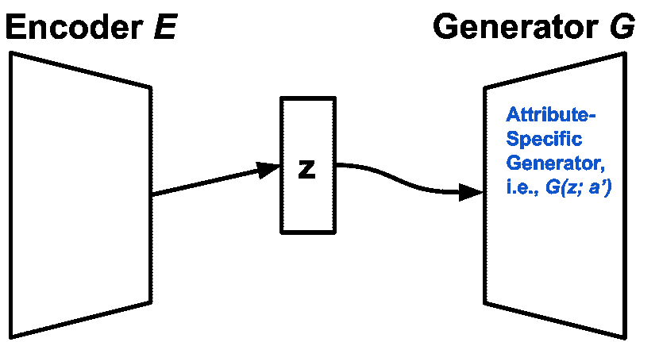

<!--yml

类别：未分类

日期：2024-09-06 19:58:44

-->

# [2011.00416] 深度学习与文本风格转移：调查

> 来源：[`ar5iv.labs.arxiv.org/html/2011.00416`](https://ar5iv.labs.arxiv.org/html/2011.00416)

\historydates

提交收到：2021 年 4 月 25 日，修订版收到：2021 年 8 月 30 日，接受出版：2021 年 12 月 4 日。yy2021 \dochead

# 深度学习与文本风格转移：

调查

Di Jin 同等贡献。MIT CSAIL

jindi15@mit.edu    Zhijing Jin^* 马克斯·普朗克研究所 & ETH Zürich

zjin@tue.mpg.de    Zhiting Hu UC San Diego

zhh019@ucsd.edu    Olga Vechtomova 滑铁卢大学

ovechtom@uwaterloo.ca    Rada Mihalcea 密歇根大学

mihalcea@umich.edu

###### 摘要

文本风格转移是自然语言生成中的一项重要任务，旨在控制生成文本中的某些属性，如礼貌、情感、幽默等。这在自然语言处理领域有着悠久的历史，最近由于深度神经模型带来的良好表现，再次获得了显著关注。在本文中，我们系统地综述了神经文本风格转移的研究，涵盖了自 2017 年首个神经文本风格转移工作以来的 100 多篇具有代表性的文章。我们讨论了任务的表述、现有数据集和子任务、评估以及在有并行和非并行数据情况下的丰富方法论。我们还提供了关于此任务未来发展的各种重要话题的讨论。¹¹1 我们整理的论文列表在[`github.com/zhijing-jin/Text_Style_Transfer_Survey`](https://github.com/zhijing-jin/Text_Style_Transfer_Survey)。

^†^†问题：xx

## 1 引言

语言是情境性的。每一句话都适用于特定的时间、地点和情境，传达说话者的特定特征，并通常具有明确的意图。例如，与陈述句（如“这是肯定的。”）相比，表达不确定的人更可能使用附加疑问句（如“这是真的，不是吗？”）。类似地，专业场合更可能包括正式的陈述（如“请考虑坐下。”），而非正式场合则更多使用非正式的表达（如“来坐下吧！”）。为了使人工智能系统能够准确理解和生成语言，有必要对语言进行风格/属性建模²²2 注意，我们在本调查中交替使用风格和属性这两个术语。属性是一个更广泛的术语，可以包括内容偏好，例如情感、话题等。本调查以相同的广泛方式使用风格，遵循近期论文中的常见做法（见第 2.1 节），这超越了仅仅以非风格化的方式表达语义。属性的值可以根据语用学从各种选择中提取，例如正式程度、礼貌、简洁、个性、情感、合作伙伴效应（如读者意识）、写作体裁（如虚构或非虚构）等。

文本风格迁移（TST）的目标是自动控制文本的风格属性，同时保持内容。TST 有广泛的应用，如 McDonald 和 Pustejovsky (1985) 以及 Hovy (1987) 所述。语言风格至关重要，因为它使自然语言处理更加以用户为中心。TST 有许多直接应用。例如，一个应用是智能聊天机器人，其中用户更喜欢具有独特和一致性的人格（如富有同情心的），而不是没有情感或不一致的人格。另一个应用是开发智能写作助手；例如，非专业的作者通常需要润色他们的写作，以更好地符合他们的目的，例如更专业、礼貌、客观、幽默或其他高级写作要求，这可能需要多年的经验来掌握。其他应用包括自动文本简化（目标风格为“简单”）、去偏见在线文本（目标风格为“客观”）、对抗冒犯性语言（目标风格为“非冒犯性”）等。

为了正式定义文本风格迁移，我们用$\bm{x}^{\prime}$表示目标话语，以及$a^{\prime}$表示目标话语风格属性。TST 旨在建模$p(\bm{x}^{\prime}|a,\bm{x})$，其中$\bm{x}$是携带源属性值$a$的给定文本。考虑之前的例子，即以两种不同正式程度表达的文本：

| 源句子 $\bm{x}$: | “Come and sit!” | 源属性 $a$: | 非正式 |
| --- | --- | --- | --- |
| 目标句子 $\bm{x}^{\prime}$: | “Please consider taking a seat.” | 目标属性 $a^{\prime}$: | 正式 |

在这种情况下，一个 TST 模型应该能够修改正式度，并根据非正式输入 $\bm{x}=$“Come and sit!” 生成正式句子 $\bm{x}^{\prime}=$“Please consider taking a seat.”。请注意，TST 与另一种 NLP 任务风格条件语言建模的关键区别在于，后者仅以风格标记为条件，而 TST 的输入包括目标风格属性 $a^{\prime}$ 和约束内容的源句子 $\bm{x}$。

风格转移定义的关键在于“风格”和“内容”的区分，这里有两种常见做法。第一种是通过语言学定义，将非功能性语言特征分类为风格（例如，正式度），将语义分类为内容。相反，第二种做法是数据驱动的——给定两个语料库（例如，积极评价集和负面评价集），两个语料库之间的不变性是内容，而变异性是风格（例如，情感、主题） Mou 和 Vechtomova (2020)。

由于对 TST 的需求不断增长，活跃的研究已经从传统的语言学方法转向近年来的神经网络方法。传统方法依赖于术语替换和模板。例如，早期的 NLG 工作在天气预报中构建了领域特定的模板，以不同的方式表达不同类型的天气，并针对不同用户的不确定性程度 Sripada 等 (2004); Reiter 等 (2005); Belz (2008); Gkatzia, Lemon, 和 Rieser (2017)。更明确地关注 TST 的研究从基于框架语言的系统 McDonald 和 Pustejovsky (1985) 开始，以及基于模式的 NLG 系统 Hovy (1987, 1990)，这些系统在小规模明确的模式下生成具有语用约束（如正式度）的文本。这些早期工作大多需要领域特定的模板、表达某种属性的手工特征短语集（例如，友好），有时还需要一个包含相同意义但具有不同属性的表达的查找表 Bateman 和 Paris (1989); Stamatatos 等 (1997); Power, Scott 和 Bouayad-Agha (2003); Reiter, Robertson 和 Osman (2003); Sheikha 和 Inkpen (2011); Mairesse 和 Walker (2011)。

随着深度学习在过去十年的成功，最近提出了多种神经方法用于 TST。如果提供了平行数据，标准的序列到序列模型通常会被直接应用 Rao 和 Tetreault (2018)（见第四部分）。然而，大多数使用场景没有平行数据，因此非平行语料上的 TST 已成为一个丰硕的研究领域（见第五部分）。第一类方法将文本在潜在空间中解构为内容和属性，并应用生成建模 Hu 等 (2017)；Shen 等 (2017)。随后，另一类独特的方法应运而生，即原型编辑 Li 等 (2018)，它提取句子模板及其属性标记来生成文本。另一种范式紧随其后，即伪平行语料库构建，通过伪平行数据训练模型，仿佛是在监督的方式下 Zhang 等 (2018d)；Jin 等 (2019)。这三种方向，（1）解构，（2）原型编辑，和（3）伪平行语料库构建，随着 Transformer 模型的出现进一步发展 Sudhakar、Upadhyay 和 Maheswaran (2019)；Malmi、Severyn 和 Rothe (2020a)。

鉴于 TST 方法学的进展，它现在开始扩展其对下游应用的影响，例如基于人物的对话生成 Niu 和 Bansal (2018)；Huang 等 (2018)，风格化摘要 Jin 等 (2020a)，模仿特定作者的风格化语言建模 Syed 等 (2020)，在线文本去偏见 Pryzant 等 (2020)；Ma 等 (2020)，比喻生成 Chakrabarty、Muresan 和 Peng (2020)，以及其他许多应用。

表 1：调查概览。

| 动机 | 数据 | 方法 | 扩展应用 |
| --- | --- | --- | --- |
| • 艺术写作 • 交流 • 缓解社会问题 | 任务 • 正式性 • 礼貌 • 性别 • 幽默 • 浪漫 • 偏见 主要特性 • 平行与非平行 • 单向与双向 • 数据集规模 • 大词汇重叠与小词汇重叠 | • 毒性 • 作者身份 • 简单性 • 情感 • 话题 • 政治倾向 | 平行数据上的 • 多任务 • 推理技术 • 数据增强 非平行数据上的 • 解构 • 原型编辑 • 伪数据构建 | 帮助其他 NLP 任务 • 释义 • 数据增强 • 对抗鲁棒性 • 人物一致对话 • 匿名化 • 摘要 • 特定风格的机器翻译 |

##### 1.0.0.0.1 TST 调查的动机。

对文本风格建模日益增长的兴趣可以视为一种趋势，反映了 NLP 研究人员开始更加关注用户中心和个性化。然而，尽管对 TST 的兴趣不断增加，现有文献在基准数据集、方法框架和评价指标的选择上表现出很大的多样性。因此，本调查的目的是对 TST 的一些重要方面（如术语、问题定义、基准数据集和评价指标）提供总结和潜在的标准化。我们还旨在提供关于 TST 方法论的不同视角，并提出一些潜在的跨领域研究问题，以供我们提出的研究议程使用。如表 1 所示，本调查的关键贡献如下：

1.  1.

    我们进行了一项首次全面的回顾，涵盖了大多数现有的基于深度学习的 TST 工作（超过 100 篇论文）。

1.  2.

    我们提供了任务设置、术语定义、基准数据集（第二部分）和评价指标的概述，我们提出了可以对未来工作有帮助的标准化实践（第三部分）。

1.  3.

    我们对现有的平行数据（第四部分）和非平行数据（第五部分）的方法进行了分类，并提炼出一些统一的方法框架。

1.  4.

    我们讨论了 TST 的潜在研究议程（第六部分），包括扩大风格范围、改进方法论、放宽数据集假设以及改进评价指标。

1.  5.

    我们提供了如何扩大 TST 影响的愿景（第七部分），包括与更多 NLP 任务和更专业的下游应用连接，以及考虑一些重要的伦理影响。

##### 1.0.0.0.2 论文选择。

本调查中回顾的神经 TST 论文主要来自 NLP 和人工智能（AI）领域的顶级会议，包括 ACL、EMNLP、NAACL、COLING、CoNLL、NeurIPS、ICML、ICLR、AAAI 和 IJCAI。除了会议论文外，我们还包括了一些未经过同行评审的预印本论文，这些论文可以提供一些对该领域有见解的信息。选择未经过同行评审的预印本论文的主要因素包括新颖性和完整性等。

## 2 什么是文本风格迁移？

本节概述了风格转换任务。第 2.1 节讨论了风格的定义和本次调查的范围。第 2.2 节给出了任务表述，并介绍了本次调查中将使用的符号。最后，第 2.3 节列出了所有常见的神经文本风格转换子任务，这可以节省未来研究者的文献综述工作。

### 2.1 如何定义风格？

##### 2.1.0.0.1 风格的语言学定义。

风格的直观概念指的是语义表达的方式（McDonald 和 Pustejovsky 1985）。就像每个人都有自己的签名一样，风格起源于每个人话语中固有的特征，这些特征可以通过使用某些修辞手法（如隐喻）、词汇选择、句法结构等来表达。风格还可以超越句子层面，达到话语层面，比如整个作品的风格结构，例如意识流或闪回。

除了固有的个人风格外，在实用场景中，风格进一步成为规范沟通方式的协议。例如，对于学术写作，规范要求正式性和专业性。Hovy (1987) 从实用的角度定义风格，包括个人（如，个性、性别）和人际（如，幽默、浪漫）方面。现有文献大多也采用这些明确的风格类别。

图 1：风格的语言学定义与数据驱动的风格定义的维恩图。

##### 2.1.0.0.2 数据驱动的风格定义作为本次调查的范围。

本调查旨在提供现有神经文本风格转换方法的概述。为了简明，我们将范围限制在现有文献中最常见的设置上。具体而言，大多数关于 TST 的深度学习工作采用了数据驱动的风格定义，本调查的范围涵盖了当前可用 TST 数据集中的风格。数据驱动的风格定义不同于语言学或规则基础的风格定义，后者理论上限制了什么构成风格，什么不构成风格，例如风格指南（例如，美国心理学会，1983）要求正式文本中不包含任何缩写词，如“isn’t”。这两种风格定义的区别见图 1。

随着 TST 深度学习方法的兴起，数据驱动的风格定义将语言风格扩展到更广泛的概念——文本中的一般属性。它将“风格”视为在数据集之间变化的属性，而不是保持不变的特征 Mou 和 Vechtomova (2020)。原因在于，深度学习模型（本调查的重点）需要大量语料库来学习风格，但并非所有风格都有匹配的语料库。因此，除了极少数手动标注的具有语言风格定义的数据集，如正式性 Rao 和 Tetreault (2018)和幽默与浪漫 Gan 等人 (2017)，许多最近的数据集收集工作自动寻找元信息以将语料库与某一属性关联。一个典型的例子是广泛使用的 Yelp 评论数据集 Shen 等人 (2017)，其中低评分的评论被放入负面语料库，而高评分的评论被放入正面语料库，尽管负面与正面意见并不是属于语言学定义中的风格，而更像是与内容相关的属性。

本调查中提到的大多数方法可以应用于遵循这种数据驱动风格定义的场景。作为一把双刃剑，大多数方法的前提条件是每种感兴趣的风格都有特定风格的语料库，无论是平行还是非平行。请注意，未来可能会有不做这种假设的研究工作，这将在第 6.3 节中讨论。

##### 2.1.0.0.3 两种定义的比较。

数据驱动的风格定义与语言学风格相比，有两个现象。一是数据驱动的风格定义可以包括更广泛的属性，包括文本的内容和主题偏好。另一点是，如果数据驱动的风格是通过自动分类，如评分、用户信息和文本来源等元信息收集的，则可能比语言学定义的风格更模糊。正如 Jin 等人（2019，第 4.1.1 节）所示，当要求标注者将数据集与人类定义的风格（如政治倾向和性别特定的语气）关联时，一些自动收集的数据集具有令人担忧的高不可决率和标注者间分歧率。

数据驱动风格的优势在于它可以很好地与深度学习方法结合，因为大多数神经模型通过学习区分多个风格语料库来学习风格的概念。对于（非数据驱动的）语言学风格，尽管在现有的 TST 深度学习工作中尚未深入探讨，我们在第 6.3 节中讨论了潜在未来工作如何在没有匹配数据的情况下学习语言学风格的 TST。

### 2.2 任务定义

我们在表 2 中定义了本调查中使用的主要符号。

表 2：每个变量的符号及其对应的意义。

| 类别 | 符号 | 意义 |
| --- | --- | --- |
| 属性 | $a$ | 属性值，例如，正式风格 |
| ${a}^{\prime}$ | 与$a$不同的属性值 |
| $\mathbb{A}$ | 预定义的属性值集合 |
| $a_{i}$ | $\mathbb{A}$中的第$i$个属性值 |
| 句子 | $\bm{x}$ | 带有属性值$a$的句子 |
| $\bm{x}^{\prime}$ | 带有属性值${a}^{\prime}$的句子 |
| $\bm{X}_{i}$ | 具有属性值$a_{i}$的句子语料库 |
| $\bm{x}_{i}$ | 语料库$\bm{X}_{i}$中的一个句子 |
| $\widehat{\bm{x}^{\prime}}$ | 模型学习的$\bm{x}$的属性转移句子 |
| 模型 | $E$ | TST 模型的编码器 |
| $G$ | TST 模型的生成器 |
| $f_{c}$ | 属性分类器 |
| $\bm{\theta}_{\mathrm{E}}$ | 编码器的参数 |
| $\bm{\theta}_{\mathrm{G}}$ | 生成器的参数 |
| $\bm{\theta}_{f_{c}}$ | 属性分类器的参数 |
| 嵌入 | $\bm{z}$ | 文本的潜在表示，即$\bm{z}\overset{\Delta}{=}E(\bm{x})$ |
| $\bm{a}$ | 文本中属性值的潜在表示 |

如前所述于第 2.1.0.0.2 节，大多数神经方法假设一组给定的属性值 $\mathbb{A}$，每个属性值都有自己的语料库。例如，如果任务涉及正式性转移，则对于文本正式性的属性，有两个属性值，$a$ = “正式”和 $a^{\prime}$ = “非正式”，对应于一个正式句子的语料库 $\bm{X}_{1}$ 和另一个非正式句子的语料库 $\bm{X}_{2}$。风格语料库可以是平行的或非平行的。平行数据意味着每个具有属性 $a$ 的句子都与另一个属性 ${a}^{\prime}$ 的对应句子配对。相反，非平行数据仅假设单一风格的语料库。

### 2.3 现有的子任务与数据集

表 3: TST 的常见子任务及其对应的属性值和数据集列表。对于具有多个属性特定语料库的数据集，我们报告其大小以最小语料库的句子数量为准。我们还报告数据集是否为平行的 (Pa?)。

| 任务 | 属性值 | 数据集 | 大小 | Pa? |
| --- | --- | --- | --- | --- |
| 风格特征 |  |  |
| 正式性 | 非正式$\leftrightarrow$正式 | GYAFC³³3GYAFC 数据: [`github.com/raosudha89/GYAFC-corpus`](https://github.com/raosudha89/GYAFC-corpus)  (Rao 和 Tetreault, 2018) | 50K | ✓ |
| XFORMAL⁴⁴4GYAFC 数据: [`github.com/Elbria/xformal-FoST`](https://github.com/Elbria/xformal-FoST)  (Briakou 等人, 2021b) | 1K | ✓ |
| 礼貌性 | 不礼貌$\rightarrow$礼貌 | 礼貌性⁵⁵5 礼貌性数据: [`github.com/tag-and-generate/politeness-dataset`](https://github.com/tag-and-generate/politeness-dataset)  (Madaan 等人, 2020) | 1M | ✗ |
| 性别 | 男性$\leftrightarrow$女性 | Yelp 性别⁶⁶6Yelp 性别数据来自 Yelp Challenge [`www.yelp.com/dataset`](https://www.yelp.com/dataset)，其预处理需遵循 Prabhumoye 等人 (2018) 的要求。 (Prabhumoye 等人, 2018) | 2.5M | ✗ |
| 幽默与浪漫 | 事实性$\leftrightarrow$幽默性$\leftrightarrow$ 浪漫 | FlickrStyle⁷⁷7FlickrStyle 数据: [`github.com/lijuncen/Sentiment-and-Style-Transfer/tree/master/data/imagecaption`](https://github.com/lijuncen/Sentiment-and-Style-Transfer/tree/master/data/imagecaption)  (Gan 等人, 2017) | 5K | ✓ |
| 偏见 | 偏见$\rightarrow$中立 | Wiki 中立⁸⁸8Wiki 中立数据: [`bit.ly/bias-corpus`](http://bit.ly/bias-corpus)  (Pryzant 等人, 2020) | 181K | ✓ |
| 毒性 | 攻击性$\rightarrow$非攻击性 | Twitter dos Santos, Melnyk 和 Padhi (2018) | 58K | ✗ |
| Reddit dos Santos, Melnyk 和 Padhi (2018) | 224K |
| Reddit Politics Tran, Zhang, 和 Soleymani (2020) | 350K |
| 作者身份 | 莎士比亚风格$\leftrightarrow$现代风格 | Shakespeare Xu 等人 (2012) | 18K | ✓ |
| 不同的圣经翻译者 | 圣经⁹⁹9 圣经数据: [`github.com/keithecarlson/StyleTransferBibleData`](https://github.com/keithecarlson/StyleTransferBibleData)  (Carlson, Riddell, 和 Rockmore, 2018) | 28M |  |
| 简单性 | 复杂$\rightarrow$简单 | PWKP Zhu, Bernhard, 和 Gurevych (2010) | 108K | ✓ |
| 专家 (den Bercken, Sips, 和 Lofi, 2019) | 2.2K | ✓ |
| MIMIC-III¹⁰¹⁰10MIMIC-III 数据: 请求访问 [`mimic.physionet.org/gettingstarted/access/`](https://mimic.physionet.org/gettingstarted/access/) 并按照 Weng, Chung, 和 Szolovits (2019) 的预处理操作  Weng, Chung, 和 Szolovits (2019) | 59K | ✗ |
| MSD¹¹¹¹11MSD 数据: [`srhthu.github.io/expertise-style-transfer/`](https://srhthu.github.io/expertise-style-transfer/)  (Cao 等人, 2020) | 114K | ✓ |
| 吸引力 | 平淡$\rightarrow$吸引人 | Math¹²¹²12Math 数据: [`gitlab.cs.washington.edu/kedzior/Rewriter/`](https://gitlab.cs.washington.edu/kedzior/Rewriter/)  Koncel-Kedziorski 等人 (2016) | $<$1K | ✓ |
| TitleStylist¹³¹³13TitleStylist 数据: [`github.com/jind11/TitleStylist`](https://github.com/jind11/TitleStylist)  (Jin 等人, 2020a) | 146K | ✗ |
| 内容偏好 |  |
| 情感 | 积极$\leftrightarrow$消极 | Yelp¹⁴¹⁴14Yelp 数据: [`github.com/shentianxiao/language-style-transfer`](https://github.com/shentianxiao/language-style-transfer)  (Shen 等人, 2017) | 250K | ✗ |
| Amazon¹⁵¹⁵15Amazon 数据: [`github.com/lijuncen/Sentiment-and-Style-Transfer/tree/master/data/amazon`](https://github.com/lijuncen/Sentiment-and-Style-Transfer/tree/master/data/amazon)  (He 和 McAuley, 2016) | 277K |  |
| 话题 | 娱乐$\leftrightarrow$政治 | Yahoo! Answers¹⁶¹⁶16Yahoo! Answers 数据: [`webscope.sandbox.yahoo.com/catalog.php?datatype=l&did=11`](https://webscope.sandbox.yahoo.com/catalog.php?datatype=l&did=11)  Huang 等人 (2020) | 153K | ✗ |
| 政治 | 民主党$\leftrightarrow$共和党 | Political¹⁷¹⁷17Political 数据: [`nlp.stanford.edu/robvoigt/rtgender/`](https://nlp.stanford.edu/robvoigt/rtgender/)  (Voigt 等人, 2018) | 540K | ✗ |

我们在表格 3 中列出了神经 TST 的常见子任务及其对应的数据集。感兴趣的属性从风格特征（例如，正式性和礼貌）到内容偏好（例如，情感和话题）各不相同。每个任务将在下面详细阐述。

##### 2.3.0.0.1 正式性。

调整文本中的正式程度最早由 Hovy (1987) 提出。这是通过许多语言现象可以观察到的最显著的文体特征之一，例如使用完整的名称（例如，“television”）而不是缩写（例如，“TV”），以及更多名词（例如，“solicitation”）而不是动词（例如，“request”）。正式度数据集，Grammarly 的 Yahoo Answers Formality Corpus (GYAFC) Rao 和 Tetreault (2018)，包含 50K 对正式与非正式的对比，这些对比通过首先从 Yahoo Answers 语料库获取 50K 个非正式句子，然后招募众包工作者将其重写为正式的方式获得。Briakou 等人 (2021b) 将正式度数据集扩展到一个多语言版本，加入了巴西葡萄牙语、法语和意大利语。

##### 2.3.0.0.2 礼貌。

礼貌转换 Madaan 等人 (2020) 旨在控制文本中的礼貌程度。例如，“Could you please send me the data?” 比“send me the data!” 更为礼貌。Madaan 等人 (2020) 编制了一个包含 1.39 百万个自动标记实例的数据集，来源于原始的 Enron 语料库 Shetty 和 Adibi (2004)。由于礼貌受文化影响，该数据集主要关注北美英语中的礼貌。

##### 2.3.0.0.3 性别。

与性别相关的语言现象是一个热门的研究领域 Trudgill (1972); Lakoff (1973); Tannen (1990); Argamon 等人 (2003); Boulis 和 Ostendorf (2005)。性别相关的 TST 数据集由 Prabhumoye 等人 (2018) 提出，他们从 Yelp 数据集挑战中编制了 250 万条评论，并标注了用户的性别。

##### 2.3.0.0.4 幽默与浪漫。

幽默和浪漫是一些艺术特质，可以为读者带来欢乐。Li 等人 (2018) 首次提议从计算机视觉领域借用 FlickrStyle 风格化字幕数据集 Gan 等人 (2017)。在 FlickrStyle 图像字幕数据集中，每个图像有三种字幕，分别是事实的、幽默的和浪漫的。通过只保留这三种风格的字幕，Li 等人 (2018) 创建了一个包含 5K 个平行（事实、幽默、浪漫）三重奏的 FlickrStyle 数据集子集。

##### 2.3.0.0.5 偏见度。

Wiki 中立语料库 Pryzant 等人 (2020) 是第一个包含偏见和中立句子对的语料库。它从 Wikipedia 修订中收集，这些修订将现有句子的语调调整为更中立的声音。偏见语料库中的偏见类型包括框架偏见、认识论偏见和人口统计学偏见。

##### 2.3.0.0.6 毒性。

TST 的另一个重要用途是对抗冒犯性语言。Tran, Zhang 和 Soleymani (2020) 通过使用限制词列表从 Reddit 上爬取句子，收集了 350K 个冒犯性句子和 7M 个非冒犯性句子。

##### 2.3.0.0.7 作者身份。

改变作者语气是文本风格迁移的艺术性用途。Xu 等人（2012）创建了一个包含 18K 对莎士比亚英文及其现代英文翻译的对齐语料库。Carlson、Riddell 和 Rockmore（2018）收集了来自不同翻译者的英文版圣经的 28M 平行数据。

##### 2.3.0.0.8 简单性。

TST 的另一个重要用途是降低读者的语言障碍，例如将法律术语、医学行话或其他专业文本翻译成简单英语，以避免专家用词与普通人理解之间的差异（Tan 和 Goonawardene，2017）。常见的任务包括将标准英文维基百科转换为简单维基百科，其数据集包含 108K 样本（Zhu、Bernhard 和 Gurevych，2010）。另一个任务是将医学描述简化为患者友好的文本，包括一个包含 2.2K 样本的数据集（den Bercken、Sips 和 Lofi，2019），另一个非平行数据集包含 59K 自由文本出院总结，编译自 MIMIC-III（Weng、Chung 和 Szolovits，2019），以及一个较新的平行数据集，包含 114K 样本，编译自健康参考 Merck Manuals（MSD），其中每个医学主题都有一个专业版和一个消费者版（Cao 等人，2020）。

##### 2.3.0.0.9 情感。

情感修改是 TST（文本风格迁移）中最受欢迎的任务。其目的是改变评论中的情感倾向，例如将负面评论转变为正面评论，或反之亦然。还有一些研究关注在细粒度的评价评分上转移情感，例如 1-5 分。常用的数据集包括 Yelp 评论（Shen 等人，2017）和亚马逊产品评论（He 和 McAuley，2016）。

##### 2.3.0.0.10 主题。

有一些研究涉及主题迁移。例如，黄等人（2020）通过编译 Yahoo! Answers 中关于娱乐和政治两个主题的问答，形成了一个两个主题的语料库。最近还有一个包含 21 种文本风格的数据集，如科学、体育、政治等，由 Zeng、Shoeybi 和 Liu（2020）提供。

##### 2.3.0.0.11 政治倾向。

Prabhumoye 等人（2018）提出的政治倾向迁移旨在转移文本中的政治观点。例如，一名共和党人的评论可能是“取消所有非法移民的资金”，而民主党人则更倾向于支持对移民采取人道行动。政治倾向数据集 Voigt 等人（2018）收集自美国参议院和众议院成员 Facebook 帖子上的评论。该数据集使用直接回应民主党或共和党国会议员帖子中的顶级评论。数据集中包含 540K 训练、4K 开发和 56K 测试实例。

##### 2.3.0.0.12 综合属性。

Lample 等人 (2019) 提出了更具挑战性的文本属性转移设置——多属性转移。例如，源句子可以是男性评论者对一家亚洲餐馆的正面评价，而目标句子则是女性评论者对一家美国餐馆的负面评价。他们的每个数据集包含 1-3 个独立的属性类别。他们的第一个数据集是 FYelp，这个数据集从 Yelp 数据集挑战中编制而成，标注了情感（正面或负面）、性别（男性或女性）和餐馆类别（美国、亚洲、酒吧、甜点或墨西哥）。他们的第二个数据集是 Amazon，该数据集基于 Li 等人 (2018) 的亚马逊产品评论数据集，包含以下属性：情感（正面或负面）和产品类别（书籍、服装、电子产品、电影或音乐）。他们的第三个数据集是社交媒体内容数据集，该数据集收集自私人 Facebook 数据，包含性别（男性或女性）、年龄组（18-24 或 65+）和作者标注的情感（放松或烦恼）。

## 3 如何评估风格转移？

成功的风格转移输出不仅需要展示正确的目标风格，而且由于神经网络的不可控性，我们还需要验证其是否保留了原始语义，并保持自然语言流畅。因此，常用的评估实践考虑以下三个标准：（1）转移风格强度，（2）语义保留，和（3）流畅度。

我们将首先介绍在这三种标准下自动评估的实践，讨论自动评估的优点和注意事项，然后介绍人类评估作为解决自动评估一些固有弱点的补救措施。最后，我们将为未来的工作建议一些 TST 评估的标准实践。有关每个标准的评估方法概述列在表 4 中。

表 4：各标准评估方法概述。

| 标准 | 自动评估 | 人工评估 |
| --- | --- | --- |
| 总体 | 带有黄金参考的 BLEU | 评分或排名 |
|   - 转移风格强度 | 由单独训练的风格分类器的准确度 | 评分或排名 |
|   - 语义保留 | 带有（修改）输入的 BLEU/ROUGE 等 | 评分或排名 |
|   - 流畅度 | 由单独训练的语言模型困惑度 | 评分或排名 |

### 3.1 自动评估

自动评估提供了一种经济、可重复且可扩展的方式来评估生成结果的质量。然而，由于自然语言的复杂性，下面介绍的每个指标可以解决某些方面的问题，但也有固有的盲点。

##### 3.1.0.0.1 带有黄金参考的 BLEU。

类似于许多文本生成任务，文本风格迁移也在人类编写的多个数据集中（如 Yelp、Captions 等）有参考，因此通常使用**BLEU**分数 Papineni 等 (2002) 来评估黄金参考与模型输出之间的匹配。在深度学习之前的研究中，评估 TST 模型时使用 BLEU 已被看到 Xu 等 (2012); Jhamtani 等 (2017)，以及深度学习方法 Rao 和 Tetreault (2018); Li 等 (2018); Jin 等 (2019)。

使用 **BLEU** 评估黄金参考和模型输出之间存在三个问题：

1.  问题 1)

    它主要评估内容，简单地复制输入可能会导致高 **BLEU** 分数。

1.  问题 2)

    研究显示 **BLEU** 与人类评估的相关性较低。

1.  问题 3)

    一些数据集没有人类编写的参考。

问题 1：与机器翻译不同，使用 **BLEU** 仅是足够的，TST 必须考虑到这样一个警告，即简单地复制输入句子可以在许多数据集上（例如，Yelp 上约 40，Humor&Romance 上约 20，非正式到正式风格转变约 50，以及正式到非正式风格转变约 30）实现高 **BLEU** 分数。这是因为大多数文本重写与源句子有大量的 n-gram 重叠。相比之下，机器翻译没有这个问题，因为其输入和输出的词汇不同，复制输入序列不会得到高 **BLEU** 分数。一个可能的解决办法是考虑将 **BLEU** 与 PINC Chen 和 Dolan (2011) 结合使用，如在意图改述中 Xu 等 (2012); Jhamtani 等 (2017) 所述。通过使用 **PINC** 和 **BLEU** 作为二维指标，我们可以最小化与源句子的 n-gram 重叠，同时最大化与参考句子的 n-gram 重叠。

问题 2&3：其他问题包括 BLEU 与人工评估的相关性不足（例如，相对于 Li et al. (2018)显示的人类评分语法正确性$\leq$0.30，和相对于 Mir et al. (2019)显示的人工评估$\leq$0.45），以及某些数据集（例如，性别和政治数据集 Prabhumoye et al. (2018)，以及礼貌数据集 Madaan et al. (2020)）缺乏人工编写的参考文献。一个常用的解决方法是使用三个不同的独立方面来使评估更加细致，这些方面分别是转移风格强度、语义保留和流畅度，以下将详细介绍。

##### 3.1.0.0.2 转移风格强度。

为了自动评估转移风格强度，大多数研究分别训练一个风格分类器来区分属性 Hu et al. (2017)；Shen et al. (2017)；Fu et al. (2018)；Li et al. (2018)；Prabhumoye et al. (2018).¹⁸¹⁸18 注意，这种风格分类器通常报告 80%以上或 90%以上的准确率，我们将在自动评估的最后一段讨论假阳性和假阴性的问题。该分类器用于判断模型生成的每个样本是否符合目标属性。转移风格强度计算为$\frac{\text{\# test samples correctly classified}}{\text{\# all test samples}}$。Li et al. (2018)表明，该属性分类器与某些数据集（例如，Yelp 和 Captions）的人工评估相关性较好，但与其他数据集（例如，Amazon）几乎没有相关性。原因是某些产品类别有大量的正面或负面评论。

##### 3.1.0.0.3 语义保留。

可以应用许多指标来测量输入和输出句子对之间的相似性，包括 BLEU（Papineni 等，2002）、ROUGE（Lin 和 Och，2004）、METEOR（Banerjee 和 Lavie，2005）、chrF（Popović，2015）、词移动距离（WMD）（Kusner 等，2015）。最近，提出了一些额外的基于深度学习的指标，例如基于句子嵌入的余弦相似度（Fu 等，2018）和 BERTScore（Zhang 等，2020）。还有一些特定于 TST 的评估指标，如词性距离（Tian, Hu 和 Yu，2018）。另一种新提出的指标是首先删除文本中所有与属性相关的表达，然后应用上述相似性评估（Mir 等，2019）。在所有指标中，Mir 等 (2019) 和 Yamshchikov 等 (2021) 表明 METEOR 和 WMD 与人类评估的相关性优于 BLEU，尽管在实践中，BLEU 是评估源句子与风格转移输出之间语义相似性的最广泛使用的指标（Yang 等，2018；Madaan 等，2020）。

##### 3.1.0.0.4 流畅性。

流畅性是自然语言输出的基本要求。为了自动化评估，困惑度通过在所有属性的训练数据上预训练的语言模型（LM）进行计算（Yang 等，2018）。然而，困惑度的有效性仍然存在争议，因为 Pang 和 Gimpel (2019) 表示其与流畅性的人类评分有很高的相关性，而 Mir 等 (2019) 则认为困惑度与人类评分之间没有显著相关性。我们注意到，LM 产生的困惑度可能会受到以下不希望出现的属性的影响：

1.  1.

    偏向于较短的句子，而不是较长的句子。

1.  2.

    对于相同的意思，使用不那么频繁的词汇（例如 agreeable）其困惑度会比常用词汇（例如 good）更差。

1.  3.

    如果前面的句子发生变化，句子的困惑度也会改变。

1.  4.

    LMs 目前还不够好。

1.  5.

    语言模型（LM）可能无法很好地处理训练语料库与风格转移文本之间的领域转换。

1.  6.

    LMs 产生的困惑度分数对训练语料库、LM 架构和配置以及优化配置非常敏感。因此，不同模型的输出必须由完全相同的 LM 进行评估，以确保公平比较，这增加了基准测试的难度。

这些属性会对某些模型产生偏见，这对于评估指标来说是不希望出现的。作为潜在的解决办法，未来的研究人员可以尝试使用语法检查器来评分生成的文本。

##### 3.1.0.0.5 任务特定标准。

由于 TST 可以作为其他下游应用的一个组件，因此还提出了一些任务特定的标准来评估生成文本的质量。例如，Reiter、Robertson 和 Osman (2003) 通过临床试验评估了其定制文本在减少吸烟者吸烟意图方面的效果。Jin 等 (2020a) 应用 TST 生成引人注目的标题，使其具有较高的吸引力分数，未来在这一方向的研究也可以测试点击率。Hu 等 (2017) 评估了生成的文本作为扩充数据如何提高下游属性分类的准确性。

##### 3.1.0.0.6 自动评估指标提示。

对于依赖于预训练模型的评估指标，即风格分类器和语言模型，我们需要注意以下几点：

1.  1.

    自动评估的预训练模型应与提出的 TST 模型分开。

1.  2.

    机器学习模型可能不完美，因此我们应当意识到潜在的假阳性和假阴性。

1.  3.

    预训练模型并不完美，因为它们倾向于某种特定类型的方法。

对于第一点，重要的是不要在提出的 TST 方法中使用相同的风格分类器或语言模型，否则可能会导致过拟合或操控指标。

对于第二点，我们需要了解生成输出的假阳性和假阴性是什么。一个说明性的例子是，如果风格分类器仅报告 80%以上的性能（例如，在性别数据集 Prabhumoye 等 (2018) 和亚马逊数据集 Li 等 (2018) 上），即使是完美的风格重写也只能得到 80%以上的分数，但一个不完美的模型可能会得到 90%的分数，因为它可能更类似于不完美的风格分类模型，从而利用假阳性。其他导致假阳性的原因可能是对抗性攻击。Jin 等 (2020b) 显示，仅通过同义词进行释义可能会使高准确率的分类模型从 TextCNN Kim (2014) 降低到 BERT Devlin 等 (2019) 90%以上。因此，风格分类器的高分数并不一定表示更成功的转移。此外，如果训练数据与风格转换后的输出之间存在分布变化，风格分类器可能会产生假阴性。例如，在训练语料中，某产品可能经常与正面属性一起出现，而在风格转换后的输出中，该产品则与相反的负面属性共同出现。这种假阴性在亚马逊产品评论数据集 Li 等 (2018) 中有所观察。另一方面，语言模型的偏差与句子长度、同义词替换和先前上下文相关。

第三点是第二点所暗示的直接结果，因此在实际操作中，我们需要牢记并检查所提出的模型是否利用了评估指标或在通用性方面做出了改进。

### 3.2 人工评估

与上述自动评估指标的优缺点相比，人工评估以其灵活性和全面性而脱颖而出。例如，在要求人类评估流畅性时，我们无需担心对短句子的偏见，如同在语言模型中那样。我们还可以设计一些计算上不容易实现的标准，如比较和排名多个模型的输出。进行人工评估有几种方法。在评估类型方面，有逐点评分，即要求人类提供模型输出的绝对分数，以及对比评分，即要求人类判断两个输出中哪个更好，或者为多个输出提供排名。在标准方面，人类可以提供总体评估，或对转移风格的强度、语义保留和流畅性进行单独评分。

然而，人工评估的著名限制是成本和不可重复性。进行人工评估可能非常耗时，从而导致显著的时间和财务成本。此外，两项研究中的人工评估结果通常不可直接比较，因为人工评估结果往往是主观的且不容易重复（Belz 等，2020）。此外，一些风格在没有专业知识和广泛阅读经验的情况下非常难以评估。

作为补救措施，我们鼓励未来的研究人员报告如 Cohen’s kappa Cohen（1960）和 Krippendorff’s alpha Krippendorff（2018）等的评估者间一致性得分。Briakou 等（2021a）也建议标准化和描述评估协议（例如，标注员的语言背景、报酬、每个评估方面的详细标注说明），并发布标注结果。

##### 3.2.0.0.1 人工评估的提示

作为一种常见做法，大多数工作使用每种风格转移方向的`100`个输出（例如，从正式$\rightarrow$非正式的`100`个输出，以及从非正式$\rightarrow$正式的`100`个输出），并为每项任务安排两名人工标注员（Shen 等，2017；Fu 等，2018；Li 等，2018）。

### 3.3 未来工作的建议评估设置

目前，各种 TST 研究的实验设置不一致，这使得在多个工作的经验结果之间进行面对面的比较变得困难。虽然根据某项工作的需要定制实验设置是合理的，但建议至少在许多报告的实验中使用标准设置之一，以便与以前和未来的工作进行比较。例如，至少（1）在至少一个常用数据集上进行实验，（2）列出最新的最佳表现的先前模型作为基线，（3）报告一个最常用度量的超集，（4）发布系统输出。

对于（1），我们建议未来的研究使用至少一个最常用的基准数据集，例如，Shen 等人（2017）预处理的 Yelp 数据及其 Jin 等人（2019）提供的五个人工参考，Li 等人（2018）预处理的 Amazon 数据，以及 Rao 和 Tetreault（2018）提供的正式性数据。

对于（2），我们建议未来的工作积极查看最新的风格迁移论文，这些论文可以在 [`github.com/fuzhenxin/Style-Transfer-in-Text`](https://github.com/fuzhenxin/Style-Transfer-in-Text) 和我们的仓库 [`github.com/zhijing-jin/Text_Style_Transfer_Survey`](https://github.com/zhijing-jin/Text_Style_Transfer_Survey) 中找到，并与最先进的表现进行比较，而不是与较旧的结果进行比较。我们还呼吁社区增加可复现性，包括源代码和评估代码，因为例如，用于评估 BLEU 分数的脚本有几种不同的版本。

对于（3），由于没有单一的评估指标能够完美且全面地评估 TST，强烈建议同时使用人工评估和自动评估这三项标准。在评估中，除了定制使用的指标外，我们建议大多数未来的工作至少包括以下评估实践：

+   •

    人工评估：根据精心策划的论文列表对至少两个最先进的模型进行评分。

+   •

    自动评估：如果存在人工编写的参考文献（例如，Jin 等人（2019）为 Yelp 数据集提供的五个参考），至少报告所有可用参考文献的 BLEU 分数；如果没有人工编写的参考文献，则仅报告输入的 BLEU 分数。

对于（4），提供每个 TST 论文的系统输出也将非常有帮助，以便未来的工作可以更好地重现人类和自动评估结果。请注意，发布系统输出可以帮助未来工作的自动评估结果比较，因为可以有不同的脚本来评估 BLEU 分数，以及不同的风格分类器和语言模型。如果未来的工作能够建立一个在线排行榜，让现有的工作上传其输出文件，并使用一套标准的自动评估脚本自动评估模型输出，这将是 TST 社区的一个重大补充。

## 4 基于平行数据的方法

在过去的几年里，已经提出了各种文本风格转换方法。通常，这些方法可以根据数据集是否具有不同风格的平行文本或几个非平行的单一风格语料库来分类。表格 3 中的最右侧一列“Pa？”显示了每个 TST 子任务是否存在平行数据。在本节中，我们将介绍基于平行数据集的 TST 方法，而在第五部分中，我们将详细讨论基于非平行数据集的方法。为了便于读者理解，我们大多数情况下将解释在两个值之间的一个属性的 TST，如在非正式和正式语调之间转换形式，这可以潜在地扩展到多个属性。

大多数方法采用标准的神经序列到序列（seq2seq）模型，具有编码器-解码器架构，这最初是为神经机器翻译（NMT）开发的 (Sutskever, Vinyals, and Le, 2014; Bahdanau, Cho, and Bengio, 2015; Cho et al., 2014)，并广泛应用于文本生成任务，如摘要生成 Rush, Chopra, and Weston (2015) 和其他许多任务 Song et al. (2019)。编码器-解码器 seq2seq 模型可以通过 LSTM 实现，如 Rao 和 Tetreault (2018); Shang et al. (2019)，或者通过 Transformer Vaswani et al. (2017) 实现，如 Xu, Ge, and Wei (2019)。还加入了复制机制 Gülçehre et al. (2016); See, Liu, and Manning (2017)，以更好地处理不应更改的文本部分（例如，某些专有名词和稀有词汇） (Gu et al., 2016; Merity et al., 2017)。基于这一架构，最近的工作已经开发了多个改进方向：多任务处理、推断技术和数据增强，下面将介绍这些内容。

##### 4.0.0.0.1 多任务处理。

除了在配对的属性文本上进行 seq2seq 学习外，Xu、Ge 和 Wei（2019）还提出了增加三种其他损失函数：（1）分类器指导损失，它使用经过良好训练的属性分类器进行计算，鼓励模型生成符合目标属性的句子；（2）自重建损失，它鼓励 seq2seq 模型通过指定与输入样式相同的期望样式来重建输入；（3）循环损失，它首先将输入句子转换为目标属性，然后将输出转换回其原始属性。这三种损失中的每一种都可以在使用人类参考的情况下提高 1-5 BLEU 分数（Xu、Ge 和 Wei（2019））。另一种多任务学习方式是联合学习 TST 和法语到英语的机器翻译，这种方法在使用人类书写的参考文献的情况下提高了 1 BLEU 分数（Niu、Rao 和 Carpuat（2018））。针对正式性转换，Zhang、Ge 和 Sun（2020）将 TST 和语法错误纠正（GEC）多任务结合，使得来自 GEC 数据的知识可以转移到非正式到正式的风格转换任务中。

除了额外的损失设计外，使用预训练的语言模型 GPT-2（Radford 等，2019）可以使人类参考下的 BLEU 分数至少提高 7 分（Wang 等，2019）。

##### 4.0.0.0.2 推理技术。

为了避免模型复制过多的输入句子部分而未能充分编辑以翻转属性，Kajiwara（2019）首先识别源句子中需要替换的单词，然后通过负词汇约束解码（Post 和 Vilar，2018）来改变这些单词，以避免简单的复制。由于这种方法仅改变了模型推理的束搜索过程，因此可以应用于任何文本风格转换模型，而无需重新训练模型。

##### 4.0.0.0.3 数据增强。

由于风格转换数据的标注成本较高，因此没有像机器翻译中那样多的平行数据集。因此，提出了各种数据增强方法来丰富数据。例如，Rao 和 Tetreault（2018）首先在给定的平行数据集上训练一个基于短语的机器翻译（PBMT）模型，然后使用回译（Sennrich、Haddow 和 Birch，2016b）构建一个伪平行数据集作为额外的训练数据，这导致相对于人工书写的参考文献，BLEU 分数提高了约 9.7 分。

最近，张、葛和孙 (2020) 使用了一种通过利用大量可用在线文本的数据增强技术。他们从在线论坛抓取非正式文本，并生成反向翻译，即，非正式英语 $\rightarrow$ 一个中介语言如法语 $\rightarrow$ 正式英语，其中通过形式分类器确保反向翻译的英语文本的正式性，该分类器只保留被分类为正式文本的内容。

## 5 种非平行数据方法

TST 的平行数据难以获取，对于某些风格更是无法众包（例如，马克·吐温的小说改写成海明威风格）。因此，大多数 TST 方法假设只有非平行的单风格语料，并研究如何在这个约束下构建深度学习模型。在这一部分，我们将介绍 TST 方法的三个主要分支：解耦（第 5.1 节）、原型编辑（第 5.2 节）和伪平行语料库构建（第 5.3 节）。

### 5.1 解耦

基于解耦的模型通常执行以下三个操作：

+   •

    将属性 $a$ 的文本 $\bm{x}$ 编码为潜在表示 $\bm{z}$（即，$\bm{x}\rightarrow\bm{z}$）

+   •

    操作潜在表示 $\bm{z}$ 以去除源属性（即，$\bm{z}\rightarrow\bm{z}^{\prime}$）

+   •

    将文本 $\bm{x}^{\prime}$ 解码为目标属性 $a^{\prime}$（即，$\bm{z}^{\prime}\rightarrow\bm{x}^{\prime}$）

要构建这样的模型，解耦论文中的常见工作流程包括以下三个步骤：

1.  步骤 1)

    选择一个模型作为编码器-解码器学习的主干（第 5.1.1 节）

1.  步骤 2)

    选择潜在表示的操作方法（第 5.1.2 节）

1.  步骤 3)

    对于上述选择的操作方法，选择（多个）适当的损失函数（第 5.1.3 节）

本节的组织从第 5.1.1 节开始，介绍了用于第 1 步的编码器-解码器训练目标。接着，第 5.1.2 节概述了操控潜在表示的三种主要方法，用于第 2 步，而第 5.1.3 节则讲解了第 3 步的众多训练目标。表 5 提供了现有模型及其对应配置的概述。为了大致了解每个模型的有效性，我们展示了它们在 Yelp 数据集上的性能。

表 5：现有解缠结方法的总结及其采用的设置，并参考了它们在 Yelp 数据集上的表现。对于设置，我们包括第 5.1.1 节中的编码器-解码器训练方法（Enc-Dec），第 5.1.2 节中的解缠结方法（Disen.），以及第 5.1.3 节中用于控制风格（风格控制）和内容（内容控制）的损失类型。对于模型性能，我们报告了自动评估分数，包括 BLEU 与一个人工参考（BLEU-参考），由 Li 等人（2018）提供，准确率（准确率），BLEU 与输入（BLEU-输入）和困惑度（困惑度）。^∗标记了 Liu 等人（2020）报告的数字。读者可以参考 Hu, Lee 和 Aggarwal（2020）了解关于 Yelp 的更完整性能结果。

|  | 设置 | Yelp 上的性能 |  |
| --- | --- | --- | --- |
|  | 编码器-解码器 | 解缠结 | 风格控制 | 内容控制 | BLEU-参考 | 准确率 (%) | BLEU-输入 | 困惑度$\downarrow$ |
| Mueller, Gifford 和 Jaakkola (2017) | VAE | LRE | – | – | – | – | – | – |
| Hu 等人 (2017) | VAE | ACC | ACO | – | 22.3 | 86.7 | 58.4 | – |
| Shen 等人 (2017) | AE&GAN | ACC | AdvR$\parallel$AdvO | – | 7.8 | 73.9 | 20.7 | 72^∗ |
| Fu 等人 (2018) | AE | ACC | AdvR | – | 12.9 | 46.9 | 40.1 | 166.5^∗ |
| Prabhumoye 等人 (2018) | AE | ACC | ACO | – | 6.8 | 87.2 | – | 32.8^∗ |
| Zhao 等人 (2018) | GAN | ACC | AdvR | – | – | 73.4 | 31.2 | 29.7 |
| Yang 等人 (2018) | AE | ACC | LMO | – | – | 91.2 | 57.8 | 47.0&60.9 |
| Logeswaran, Lee 和 Bengio (2018) | AE | ACC | AdvO | Cycle | – | 90.5 | – | 133 |
| Tian, Hu 和 Yu (2018) | AE | ACC | AdvO | Noun | 24.9 | 92.7 | 63.3 | – |
| Liao 等人 (2018) | VAE | LRE | – | – | – | 88.3 | – | – |
| Romanov 等人 (2019) | AE | LRS | ACR&AdvR | – | – | – | – | – |
| John 等人 (2019) | AE&VAE | LRS | ACR&AdvR | BoW&AdvBoW | – | 93.4 | – | – |
| Bao 等人 (2019) | VAE | LRS | ACR&AdvR | BoW&AdvBoW | – | – | – | – |
| Dai 等人 (2019) | AE | ACC | ACO | Cycle | 20.3 | 87.7 | 54.9 | 73 |
| Wang, Hua 和 Wan (2019) | AE | LRE | – | – | 24.6 | 95.4 | – | 46.2 |
| Li 等人 (2020) | GAN | ACC | ACO&AdvR | – | – | 95.5 | 53.3 | – |
| Liu 等人 (2020) | VAE | LRE | – | – | 18.8 | 92.3 | – | 18.3 |
| Yi 等人 (2020) | VAE | ACC | ACO | Cycle | 26.0 | 90.8 | – | 109 |
| Jin 等人 (2020a) | AE | LRE | – | – | – | – | – | – |

#### 5.1.1 编码器-解码器训练方法

有三种模型选择来获取从离散文本 $\bm{x}$ 到潜在表示 $\bm{z}$，然后通过重建训练将其解码为新文本 $\bm{x}^{\prime}$：自编码器（AE）、变分自编码器（VAE）和生成对抗网络（GANs）。

##### 5.1.1.0.1 自编码器（AE）。

自编码（Auto-encoding）是一种常用的方法，用于学习潜在表示 $\bm{z}$，该方法首先将输入句子 $\bm{x}$ 编码成潜在向量 $\bm{z}$，然后重建一个尽可能与输入句子相似的句子。AE 被许多 TST 工作（例如，Shen 等人，2017；Hu 等人，2017；Fu 等人，2018；Zhao 等人，2018；Prabhumoye 等人，2018；Yang 等人，2018）中使用。为了避免自编码盲目地复制输入中的所有元素，Hill、Cho 和 Korhonen（2016）采用了去噪自编码（DAE）Vincent 等人（2010）来替代 NLP 任务中的 AE。具体来说，DAE 首先通过噪声模型对输入句子 $\bm{x}$ 进行处理，随机丢弃、打乱或屏蔽一些词，然后从这个被破坏的句子中重建原始句子。这一思想被后来的 TST 工作所采用，例如 Lample 等人（2019）；Jin 等人（2020a）。随着近年来预训练模型的普及，DAE 训练方法的受欢迎程度相较于 GAN 和 VAE 等其他方法有所增加，因为在大语料库上进行预训练可以提高模型在语义保持和流畅性方面的表现（Lai、Toral 和 Nissim，2021；Riley 等人，2021b）。

##### 5.1.1.0.2 变分自编码器（VAE）。

与 AE 基于确定性潜在表示重建数据不同，变分自编码器（VAE）（Kingma 和 Welling，2014；Rezende、Mohamed 和 Wierstra，2014）基于从其后验分布中采样的潜在向量重建数据，并使用 Kullback–Leibler 散度进行正则化。VAE 也在许多 TST 工作中广泛使用，如 Mueller、Gifford 和 Jaakkola（2017）；Hu 等人（2017）；Liu 等人（2020）；Liao 等人（2018）；Yi 等人（2020）；Tikhonov 等人（2019）。VAE 的损失函数被表述为

|  | $\begin{split}\mathcal{L}_{\mathrm{VAE}}(\bm{\theta}_{\mathrm{E}},\bm{\theta}_{\mathrm{G}})=-\mathbb{E}_{q_{\mathrm{E}}(\bm{z}&#124;\bm{x})}\log p_{\mathrm{G}}(\bm{x}&#124;\bm{z})+\lambda\mathrm{KL}\Big{[}q_{\mathrm{E}}(\bm{z}&#124;\bm{x})&#124;&#124;p(\bm{z})\Big{]},\end{split}$ |  | (1) |
| --- | --- | --- | --- |

其中 $\lambda$ 是平衡重建损失和 KL 项的超参数，$p(\bm{z})$ 是从标准正态分布 $\mathcal{N}(\bm{0},\bm{I})$ 中抽取的先验分布，$q_{\mathrm{E}}(\bm{z}|\bm{x})$ 是以 $\mathcal{N}(\bm{\mu},\bm{\sigma})$ 形式的后验分布，其中 $\bm{\mu}$ 和 $\bm{\sigma}$ 由编码器预测。

(a) 潜在表示编辑

(b) 属性代码控制

(c) 潜在表示分裂

图 2：基于解耦的文本风格迁移的潜在空间操作三种方法。

##### 5.1.1.0.3 生成对抗网络（GANs）。

GANs（Goodfellow 等人，2014）也可以应用于 TST Shen 等人 (2017)；Zhao 等人 (2018)；Li 等人 (2020)。GANs 的工作方式是首先通过使用噪声样本 $\bm{s}$ 和生成函数 $G$ 来逼近从真实分布 $\bm{z}$ 中提取的样本，生成 $\widehat{\bm{z}}=G(\bm{s})$。接下来，使用一个判别器/鉴别器 $f_{c}(\bm{z})$ 来区分真实数据和生成样本。判别器被训练来区分真实样本和生成样本，而生成器则被训练来欺骗判别器。形式上，训练过程表示为在编码器 $E$、生成器 $G$ 和判别器 $f_{c}$ 之间进行的最小化-最大化游戏：

|  | $\max_{c}\min_{E,G}\mathcal{L}_{\mathrm{GAN}}=-\mathbb{E}_{p(\bm{z})}\log p_{\mathrm{G}}(\bm{x}&#124;\bm{z})+\mathbb{E}_{p(\bm{z})}f_{c}(\bm{z})-\mathbb{E}_{p(\widehat{\bm{z}})}f_{c}(\widehat{\bm{z}}).$ |  | (2) |
| --- | --- | --- | --- |

#### 5.1.2 潜在表示操作

基于通用编码器和解码器训练方法，解耦的核心元素是潜在表示 $\bm{z}$ 的操作。图 2. ‣ 5.1.1 Encoder-Decoder Training Method ‣ 5.1 Disentanglement ‣ 5 Methods on Non-Parallel Data ‣ Deep Learning for Text Style Transfer: A Survey") 说明了三种主要方法：潜在表示编辑、属性编码控制和潜在表示分裂。此外，表 5 的“Disen.” 列显示了每项工作在解耦中的潜在表示操作类型。

第一种方法，潜在表示编辑（LRE），如图 2(a) ‣ 5.1.1 编码器-解码器训练方法 ‣ 5.1 解缠结 ‣ 5 非平行数据方法 ‣ 深度学习文本风格迁移：综述") 所示，通过确保潜在表示 $\bm{z}$ 的两个属性来实现。第一个属性是 $\bm{z}$ 应该能够作为自编码的潜在表示，即将 $f_{c}(\bm{z})$ 与输入 $\bm{x}$ 对齐，其中 $\bm{z}\overset{\Delta}{=}E(\bm{x})$。第二个属性是 $\bm{z}$ 应该被学习以包含感兴趣的新属性值 $a^{\prime}$。为实现这一点，常见做法是首先学习一个属性分类器 $f_{c}$，例如，一个将潜在表示 $\bm{z}$ 作为输入的多层感知器（MLP），然后在第一个属性的约束空间内迭代更新 $\bm{z}$，同时通过该属性分类器最大化关于 $a^{\prime}$ 的预测置信度得分  (Mueller, Gifford, 和 Jaakkola, 2017；Liao 等, 2018；Wang, Hua, 和 Wan, 2019；Liu 等, 2020)。实现第二个属性的另一种方式是通过另一个自编码任务进行多任务学习，任务涉及具有属性 $a^{\prime}$ 的语料库，并且共享大部分转换器层，除了查询转换和层归一化层 Jin 等 (2020a)。

第二种方法，属性代码控制（ACC），如图 2(b) ‣ 5.1.1 编码器-解码器训练方法 ‣ 5.1 解缠结 ‣ 5 非平行数据方法 ‣ 深度学习文本风格迁移：综述") 所示，首先通过对抗学习强制句子 $\bm{x}$ 的潜在表示 $\bm{z}$ 包含所有信息，除了其属性值 $a$，然后基于 $\bm{z}$ 和对应于属性值 $a$ 的结构化属性代码 $\bm{a}$ 的组合解码转移后的输出。在解码过程中，属性代码向量 $\bm{a}$ 通过作为初始状态 (Shen 等, 2017；Yi 等, 2020) 或嵌入 (Fu 等, 2018；Dai 等, 2019) 控制生成文本的属性。

第三种方法，潜在表示分割（Latent Representation Splitting, LRS），如图 2(c) 所示，首先将输入文本分解为两个部分：潜在属性表示 $\bm{a}$ 和捕获属性无关信息的语义表示 $\bm{z}$。然后，我们将源属性 $\bm{a}$ 替换为目标属性 $\bm{a}^{\prime}$，最终的转换文本是通过 $\bm{z}$ 和 ${a}^{\prime}$ 的组合生成的（John 等人，2019；Romanov 等人，2019）。

#### 5.1.3 训练目标

在解开属性信息 $a$ 和与属性无关的语义信息 $\bm{z}$ 时，我们需要实现两个目标：

1.  目标 1)

    目标属性完全且独占地由 $\bm{a}$ 控制（而不是 $\bm{z}$）。我们通常使用风格导向损失来实现这一目标（第 5.1.3 节）。

1.  目标 2)

    属性无关的信息完全且独占地由 $\bm{z}$ 捕获（而不是 $\bm{a}$）。内容导向的损失更常用于实现这一目标（第 5.1.3.0.5 节）。

我们下面描述了各种风格导向的损失和内容导向的损失。\subsubsubsection 风格导向的损失

为实现 目标 1，已经提出了许多不同的风格导向损失，以促使模型学习更清晰地解开的 $\bm{a}$ 并将属性信息从 $\bm{z}$ 中排除。

##### 5.1.3.0.1 输出上的属性分类器（ACO）。

ACO 旨在使生成器 ${G}$ 生成的句子根据预训练的属性分类器 $f_{c}$ 带有目标属性 $a^{\prime}$（Hu 等人，2017；Prabhumoye 等人，2018；Yamshchikov 等人，2019）。生成器 $G$ 以学习到的属性向量 $\widehat{\bm{a}^{\prime}}$ 作为输入，该向量可以是从头训练的属性编码向量（如 ACC 方法所示）或从文本中解开的属性表示（如 LRS 方法所示）。我们将生成过程表示为 $\widehat{\bm{x}^{\prime}}\overset{\Delta}{=}G(E(\bm{x});\bm{a}^{\prime})$。相应地，ACO 最小化以下学习目标：

|  | $\mathcal{L}_{\mathrm{ACO}}(\bm{\theta}_{\mathrm{G}},\bm{a}^{\prime})=-\mathbb{E}_{p(\bm{x})}\log f_{c}(\bm{x}^{\prime})~{}.$ |  | (3) |
| --- | --- | --- | --- |

在训练中，ACO 可以通过两种方式进行训练：一种是通过 Gumbel-softmax 分布训练的普通损失函数，以近似离散训练 (Jang, Gu, and Poole, 2017)，另一种是通过策略梯度训练的负奖励进行强化学习 (Williams (1992))，如 Luo 等人 (2019)所示。

##### 5.1.3.0.2 属性分类器在表示上的应用 (ACR)。

与之前的 ACO 目标不同，ACR 直接通过以下目标强制解耦的属性表示$\bm{a}$被属性分类器正确分类，John 等人 (2019)；Romanov 等人 (2019)：

|  | $\mathcal{L}_{\mathrm{ACR}}(\bm{\theta}_{\mathrm{E}},\bm{\theta}_{f_{c}})=-\mathbb{E}_{p(\bm{a})}\log f_{c}(\bm{a})~{}.$ |  | (4) |
| --- | --- | --- | --- |

##### 5.1.3.0.3 表示上的对抗学习 (AdvR)。

由于之前的 ACR 明确要求潜在的$\bm{a}$由$f_{c}$进行分类，AdvR 从另一个角度进行训练——强制$\bm{z}$中不包含属性相关的信息 (Fu et al. (2018)；Zhao et al. (2018)；Romanov et al. (2019)；John et al. (2019)；Tikhonov et al. (2019)；Li et al. (2020)。请注意，通过结合 ACR 和 AdvR，我们可以使属性信息完全且专属地捕获在$\bm{a}$中。为了实现 AdvR，编码器$E$被训练生成潜在表示$\bm{z}\overset{\Delta}{=}E(\bm{x})$，使得$\bm{z}$不能被属性分类器$f_{c}$区分，这由以下学习目标表示：

|  | $\max_{E}\min_{f_{c}}\mathcal{L}_{\mathrm{AdvR}}(\bm{\theta}_{\mathrm{E}},\bm{\theta}_{f_{c}})=-\mathbb{E}_{p(\bm{x})}\log f_{c}(E(\bm{x}))~{}.$ |  | (5) |
| --- | --- | --- | --- |

由于如果每个属性值的样本数量差异很大，AdvR 可能会不平衡，因此 AdvR 的扩展是对不同属性值给予相等的权重 (Shen et al. (2017))：

|  | $\begin{split}\max_{E}\min_{f_{c}}\mathcal{L}_{\mathrm{AAE}}(\bm{\theta}_{\mathrm{E}},\bm{\theta}_{f_{c}})&amp;=-\mathbb{E}_{p(\bm{x})}\Big{[}\log f_{c}(E(\bm{x}))\Big{]}\\ &amp;-\mathbb{E}_{p(\bm{x}^{\prime})}\Big{[}\log(1-f_{c}(E(\bm{x}^{\prime})))\Big{]}~{}.\end{split}$ |  | (6) |
| --- | --- | --- | --- |

注意，$p(\bm{x})$是一个属性的句子分布，$p(\bm{x}^{\prime})$是另一个属性的句子分布。

##### 5.1.3.0.4 输出上的对抗学习 (AdvO)。

除了对潜在表示进行对抗学习的 AdvR，我们还可以使用 AdvO 对输出进行对抗训练，使其无法与真实数据区分 Shen et al. (2017)；Logeswaran, Lee, 和 Bengio (2018)；Tian, Hu, 和 Yu (2018)。具体而言，对于每个属性$a_{i}$，我们训练一个分类器$f_{c}^{(i)}$来区分真实的$\bm{x}_{i}$与具有属性$a_{i}$的单一风格语料库中的生成句子$\widehat{\bm{x}_{i}}\overset{\Delta}{=}G(E(\bm{x}_{k});\bm{a}_{i})$，其中$k\neq i$，目标是使得该句子具有属性$a_{i}$。损失函数为

|  | $\begin{split}\max_{E,G}\min_{f_{c}^{(i)}}\mathcal{L}_{\mathrm{AdvO}}^{(i)}(\bm{\theta}_{\mathrm{E}},\bm{\theta}_{\mathrm{G}},\bm{\theta}_{f_{c}^{(i)}})&amp;=-\mathbb{E}_{p(\bm{x}_{i})}\Big{[}\log f_{c}^{(i)}(\bm{x}_{i})\Big{]}\\ &amp;-\mathbb{E}_{p(\bm{x}_{k})}\Big{[}\log(1-f_{c}^{(i)}(G(E(\bm{x}_{k});a_{i})))\Big{]}~{}.\end{split}$ |  | (7) |
| --- | --- | --- | --- |

在训练过程中，通常我们首先优化所有属性分类器$f_{c}^{(i)}$，然后通过优化所有 AdvO 训练损失的总和来一起训练编码器、生成器和属性分类器：

|  | $\max_{E,G}\sum_{i}^{&#124;\mathbb{A}&#124;}\min_{f_{c}^{(i)}}\mathcal{L}_{\mathrm{AdvO}}^{(i)}(\bm{\theta}_{\mathrm{E}},\bm{\theta}_{\mathrm{G}},\bm{\theta}_{f_{c}^{(i)}})~{}.$ |  | (8) |
| --- | --- | --- | --- |

注意，为了传播梯度，可以使用生成器中的隐藏状态序列，而不是离散文本来进行$G(E(\bm{x}_{k});a_{i})$ Shen et al. (2017)。

##### 5.1.3.0.5 输出的语言建模 (LMO)。

上述 AdvO 学习分类器以区分真实样本和生成样本。这种判别分类还可以通过生成语言建模来实现，即$\mathrm{LM}_{i}$用于每个具有属性$a_{i}$的单一风格语料库（Yang et al., 2018）。具体而言，每个属性的训练目标是

|  | $\begin{split}\mathcal{L}_{\mathrm{LMO}}^{(i)}(\bm{\theta}_{\mathrm{E}},\bm{\theta}_{\mathrm{G}},\bm{\theta}_{\mathrm{LM}_{i}})=-\mathbb{E}_{p(\bm{x_{i}})}\Big{[}\log p_{\mathrm{LM}_{i}}(\bm{x}_{i})\Big{]}+\gamma\mathbb{E}_{p(\bm{z}_{k})}\Big{[}\log p_{\mathrm{LM}_{i}}(G(E(\bm{x}_{k});a_{i}))\Big{]}~{},\end{split}$ |  | (9) |
| --- | --- | --- | --- |

其中$\gamma$是一个超参数，用于权衡两个项。总训练目标是所有属性损失的总和：

|  | $\max_{E,G}\sum_{i}^{&#124;\mathbb{A}&#124;}\min_{\mathrm{LM}^{(i)}}\mathcal{L}_{\mathrm{LMO}}^{(i)}(\bm{\theta}_{\mathrm{E}},\bm{\theta}_{\mathrm{G}},\bm{\theta}_{\mathrm{LM}_{i}})~{}.$ |  | (10) |
| --- | --- | --- | --- |

\subsubsubsection

内容导向的损失 上述引入的风格导向损失确保了属性信息被包含在 $\bm{a}$ 中，但不一定对风格无关的语义 $\bm{z}$ 施加约束。为了在 $\bm{z}$ 中充分且独占地学习与属性无关的信息，提出了以下内容导向的损失：

##### 5.1.3.0.6 循环重建（Cycle）。

循环重建损失（dos Santos, Melnyk, 和 Padhi，2018；Logeswaran, Lee, 和 Bengio，2018；Luo 等人，2019；Dai 等人，2019；Yi 等人，2020；Huang 等人，2020）首先将句子 $\bm{x}$ 编码为其潜在表示 $\bm{z}\overset{\Delta}{=}E(\bm{x})$，然后将 $\bm{z}$ 输入生成器 $G$ 以获得生成的句子 $G(\bm{z})$。由于输入句子与生成句子的对齐是为了保留与属性无关的语义信息，生成器可以根据任何属性进行条件设置，即 $\bm{a}$ 或 $\bm{a}^{\prime}$。循环损失限制输出 $\widehat{\bm{x}^{\prime}}$ 与输入 $\bm{x}$ 对齐（同样，输出 $\widehat{\bm{x}}$ 与输入 $\bm{x}^{\prime}$ 对齐），以便保留内容信息：

|  | $\mathcal{L}_{\mathrm{Cycle}}(\bm{\theta}_{E},\bm{\theta}_{G})=-\mathbb{E}_{p(\bm{x})}\Big{[}\log p_{\mathrm{G}}(\bm{x} \mid E(\bm{x}))\Big{]}-\mathbb{E}_{p(\bm{x}^{\prime})}\Big{[}\log p_{\mathrm{G}}(\bm{x}^{\prime} \mid E(\bm{x}^{\prime}))\Big{]}~{}.$ |  | (11) |
| --- | --- | --- | --- |

训练上述循环损失的一种方法是通过强化学习，如 Luo 等人（2019）所做的，他们将损失函数用作内容保留的负值。

##### 5.1.3.0.7 词袋重叠（BoW）。

为了大致测量内容保留情况，John 等人（2019）；Bao 等人（2019）使用了词袋（BoW）特征。为了仅关注内容信息，John 等人（2019）排除了停用词和特定风格的词汇。

设词汇集为 $\mathbb{V}$。我们首先使用 $1\times|\mathbb{V}|$ 词袋特征对潜在表示 $\bm{z}$ 进行 softmax 操作，从而预测词袋特征的分布 $q_{\mathrm{BoW}}(\bm{z})$。然后我们计算该词袋分布 $q_{\mathrm{BoW}}(\bm{z})$ 与输入句子 $\bm{x}$ 中真实词袋分布 $p_{\mathrm{BoW}}(\bm{x})$ 之间的交叉熵损失。词袋损失的公式如下：

|  | $\mathcal{L}_{\mathrm{BoW}}(\bm{\theta}_{\mathrm{E}},\bm{\theta}_{q_{\mathrm{BoW}}})=-p_{\mathrm{BoW}}(\bm{x})\log q_{\mathrm{BoW}}(\bm{z})~{}.$ |  | (12) |
| --- | --- | --- | --- |

##### 5.1.3.0.8 对抗性词袋重叠（AdvBoW）。

BoW 确保内容在 $\bm{z}$ 中被完全捕获。作为进一步的步骤，我们希望确保内容信息完全被捕获在 $\bm{z}$ 中，即完全不包含在 $\bm{a}$ 中，通过以下 AdvBow 损失在 $\bm{a}$ 上 John 等 (2019)；Bao 等 (2019)。

在 LRS 框架中解缠 $\bm{z}$ 和 $\bm{a}$ 时，我们训练一个对抗分类器 $q_{\mathrm{BoW}}(\bm{a})$，以预测给定 $\bm{a}$ 的 BoW 特征，通过将其与真实 BoW 分布 $p_{\mathrm{BoW}}(\bm{x})$ 对齐，即最小化

|  | $\mathcal{L}_{\mathrm{AdvBoW}}(\bm{\theta}_{\mathrm{E}},\bm{\theta}_{q_{\mathrm{BoW}}})=-p_{\mathrm{BoW}}(\bm{x})\log q_{\mathrm{BoW}}(\bm{z})~{}.$ |  | (13) |
| --- | --- | --- | --- |

最终的最小-最大目标是

|  | $\max_{E}\min_{q_{\mathrm{BoW}}}\mathcal{L}_{\mathrm{AdvBoW}}(\bm{\theta}_{\mathrm{E}},\bm{\theta}_{q_{\mathrm{BoW}}}).$ |  | (14) |
| --- | --- | --- | --- |

##### 5.1.3.0.9 其他损失/奖励。

最近的工作中还有其他损失/奖励，例如名词重叠损失（Noun） Tian、Hu 和 Yu (2018)，以及语义和流畅性的奖励（Xu 等，2018；Gong 等，2019；Sancheti 等，2020）。我们不会详细讨论这些内容，因为它们并未直接作用于潜在表示的解缠结。

### 5.2 原型编辑

尽管有大量使用端到端神经网络训练的模型，基于原型的文本编辑方法仍然受到广泛关注，特别是因为 Li 等 (2018) 提出的删除、检索和生成的管道方法。

原型编辑让人联想到早期用于文本风格转移的词汇替换方法，例如使用风格词典 Sheikha 和 Inkpen (2011) 进行的同义词匹配，WordNet Khosmood 和 Levinson (2010)；Mansoorizadeh 等 (2016)，手工规则 Khosmood 和 Levinson (2008)；Castro、Ortega 和 Muñoz (2017)，或使用上位词和定义来替换携带风格的词 Karadzhov 等 (2017)。

原型编辑具有更强的可控性和可解释性，它为从属性 $a$ 的 $\bm{x}$ 到属性 ${a}^{\prime}$ 的其对应 $\bm{x}^{\prime}$ 的文本风格转移构建了一个明确的管道。

1.  步骤 1)

    检测输入句子 $\bm{x}$ 中的属性标记 $a$，并删除它们， resulting in a content-only sentence (第 5.2.1 节)；

1.  步骤 2)

    检索携带所需属性 ${a}^{\prime}$ 的候选属性标记（第 5.2.2 节）；

1.  步骤 3)

    通过添加新的属性标记来填充句子，并确保生成的句子流畅（见 5.2.3）。

#### 5.2.1 属性标记检测

提取属性标记是一个复杂的 NLP 任务。传统方法首先使用标记、解析和形态分析来选择特征，然后通过互信息和卡方检验进行筛选。在近期的深度学习流程中，识别属性标记主要有三种方法：频率比方法、基于注意力的方法和融合方法。

频率比方法计算语料库中每个 n-gram 的一些统计数据。例如，Li et al. (2018）通过计算与属性$a$相对比属性${a}^{\prime}$的共现相对频率来检测属性标记，频率高于阈值的被视为$a$的标记。使用类似的方法，Madaan et al. (2020）首先计算每个 n-gram 在两个属性语料库中的平均 TF-IDF 比率，然后对所有可能的 n-gram 进行归一化，最后将归一化比率$p$高于预设阈值的 n-gram 标记为属性标记。

基于注意力的方法使用注意力机制（Bahdanau, Cho, 和 Bengio (2015））训练属性分类器，并将注意力权重高于平均水平的词汇视为标记（Xu et al. (2018））。在分类器的架构中，Zhang et al. (2018c）使用 LSTM，而 Sudhakar, Upadhyay, 和 Maheswaran (2019）使用 BERT 分类器，其中 BERT 分类器在属性标记的检测准确率上表现更高。

融合方法结合了上述两种方法的优点。例如，Wu et al. (2019）优先考虑由频率比方法预测的属性标记，并将基于注意力的方法作为辅助备份。一种用例是当频率比方法无法识别给定句子中的任何属性标记时，它们将使用基于注意力的方法作为次选来生成属性标记。另一种情况是减少假阳性。为减少被错误识别的属性标记的数量，Wu et al. (2019）设置了一个阈值，通过频率比方法过滤掉低质量的属性标记，并在所有属性标记被删除的情况下，使用基于注意力的方法预测的标记。

之前的方法仍存在一些限制，例如属性分类器的准确性不完善，以及属性与注意力分数之间的关系不明确。因此，Lee（2020）提出了词重要性评分，类似于 Jin 等人（2020b）用于对抗性释义的方法，通过比较原始句子和删除一个标记后的句子在属性概率上的差异来衡量一个标记对属性的重要性。

#### 5.2.2 目标属性检索器

删除句子$\bm{x}$中属性$a$的属性标记$\mathrm{Marker}_{a}(\bm{x})$后，我们需要从另一个句子$\bm{x}^{\prime}$中找到一个具有不同属性${a}^{\prime}$的对应属性标记$\mathrm{Marker}_{a^{\prime}}(\bm{x}^{\prime})$。将删除所有属性标记后的句子模板表示为$\mathrm{Template}(\bm{x})\overset{\Delta}{=}\bm{x}\backslash\mathrm{Marker}_{a}(\bm{x})$。同样，句子$\bm{x}^{\prime}$的模板为$\mathrm{Template}(\bm{x}^{\prime})\overset{\Delta}{=}\bm{x}^{\prime}\backslash\mathrm{Marker}_{a^{\prime}}(\bm{x}^{\prime})$。一种常见的方法是通过上下文找到对应的属性标记，因为原始属性及其对立属性标记的模板应该相似。具体而言，我们首先将模板$\mathrm{Template}(\bm{x})$与对立属性语料库中最相似的模板$\mathrm{Template}(\bm{x}^{\prime})$进行匹配，然后将属性标记$\mathrm{Marker}_{a}(\bm{x})$和$\mathrm{Marker}_{a^{\prime}}(\bm{x}^{\prime})$识别为彼此的对应项。为了匹配模板及其对应项，大多数以前的工作通过句子嵌入的余弦相似度找到最近邻。常用的句子嵌入包括 Li 等人（2018）使用的 TF-IDF；Sudhakar、Upadhyay 和 Maheswaran（2019）使用的平均 GloVe 嵌入距离；以及 Cer 等人（2018）在 Sudhakar、Upadhyay 和 Maheswaran（2019）中使用的 Universal Sentence Encoder。除了句子嵌入外，Tran、Zhang 和 Soleymani（2020）使用词性模板在对立语料库中匹配多个候选项，并进行穷尽搜索，将候选句子的部分填入原始属性标记的掩码位置。

#### 5.2.3 从原型生成

Li 等人（2018）和 Sudhakar、Upadhyay 及 Maheswaran（2019）将仅包含内容的句子模板和新的属性标记输入到预训练的语言模型中，该模型将其重新排列成自然句子。这种填充过程可以通过掩码语言模型（MLM）（Malmi、Severyn 和 Rothe，2020b）自然地实现。例如，Wu 等人（2019）使用条件于目标属性的模板 MLM，并且该 MLM 在使用模型输出和固定的预训练属性分类器的额外属性分类损失上进行训练。由于这些生成实践比较复杂，Madaan 等人（2020）提出了一种更简单的方法。他们跳过明确检索属性候选的第 2 步，而是直接学习一个生成模型，该模型仅以属性掩码句子作为输入。这个生成模型是在属性携带句子 $\bm{x}$ 和其模板 $\mathrm{Template}(\bm{x})$ 组成的数据上进行训练的。对上述方式构建的 $(\mathrm{Template}(\bm{x}),\bm{x})$ 对进行训练可以使模型学会如何用目标属性 $a$ 填充掩码句子模板。

### 5.3 伪平行语料库构建

为了提供更多的训练信号，生成伪平行数据对 TST 也很有帮助。主要有两种方法：基于检索的方法和基于生成的方法。

##### 5.3.0.0.1 基于检索的语料库构建。

构建伪平行数据的一种常见方法是通过检索，即从两个单风格语料库中提取对齐的句子对。Jin 等人（2019）通过实证观察到，在两个单风格语料库中，语义相似的句子往往是彼此的属性转移对应句。因此，他们通过根据预训练句子嵌入的余弦相似度在两个属性语料库中匹配句子对来构建初始伪语料库。正式地，对于每个句子 $\bm{x}$，它的伪对应句 $\widehat{\bm{x}^{\prime}}$ 是在另一个属性语料库 $\bm{X}^{\prime}$ 中最相似的句子，即 $\widehat{\bm{x}^{\prime}}=\operatorname*{argmax}_{\bm{x}^{\prime}\in\bm{X}^{\prime}}\mathrm{Similarity}(\bm{x},\bm{x}^{\prime})$。Nikolov 和 Hahnloser（2019）扩展了这种方法，使用大规模的层次对齐来提取伪平行风格转移对。这种基于检索的伪平行数据构建对机器翻译也有用（Munteanu 和 Marcu 2005；Uszkoreit 等人 2010；Marie 和 Fujita 2017；Grégoire 和 Langlais 2018；Ren 等人 2020）。

##### 5.3.0.0.2 基于生成的语料库构建。

另一种方法是通过生成，例如迭代回译（IBT）Hoang 等人（2018）。IBT 是机器翻译中广泛使用的方法，Artetxe 等人（2018）；Lample 等人（2018a, b）；Dou, Anastasopoulos 和 Neubig（2020）采用了迭代过程来生成伪平行语料库。

在开始迭代过程之前，IBT 需要首先初始化两个风格迁移模型，$M_{a\rightarrow a^{\prime}}$将属性$a$转移到另一属性$a^{\prime}$，$M_{a^{\prime}\rightarrow a}$将$a^{\prime}$转移到$a$。然后，在每次迭代中，执行以下步骤：

1.  步骤 1)

    使用模型生成伪平行语料库。具体来说，$M_{a\rightarrow a^{\prime}}(\bm{x})$为所有$\bm{x}\in\bm{X}$生成伪对$(\bm{x},\widehat{\bm{x}^{\prime}})$，$M_{a^{\prime}\rightarrow a}(\bm{x}^{\prime})$为所有$\bm{x}^{\prime}\in\bm{X}^{\prime}$生成对$(\widehat{\bm{x}},\bm{x}^{\prime})$；

1.  步骤 2)

    重新训练这两个风格迁移模型，使用由 1 生成的数据集，即在$(\widehat{\bm{x}},\bm{x}^{\prime})$对上重新训练$M_{a\rightarrow a^{\prime}}(\bm{x})$，在$(\widehat{\bm{x}^{\prime}},\bm{x})$对上重新训练$M_{a^{\prime}\rightarrow a}(\bm{x}^{\prime})$。

对于步骤 1，为了生成初始伪平行语料库，一个简单的基线是随机初始化两个模型$M_{a\rightarrow a^{\prime}}$和$M_{a^{\prime}\rightarrow a}$，并使用它们翻译每个句子的属性$\bm{x}\in\bm{X}$和$\bm{x}^{\prime}\in\bm{X}^{\prime}$。然而，这种简单的初始化是随机的，可能无法很好地引导过程。张等人（2018d）采用了从无监督机器翻译中借用的思路，Lample 等人（2018a）首先学习了属性$a$和$a^{\prime}$之间的无监督词对词翻译表，并用它来生成初始伪平行语料库。基于这些初始语料库，他们训练了初始风格迁移模型并引导了 IBT 过程。另一种模型，迭代匹配和翻译（IMaT）Jin 等人（2019），没有学习词翻译表，而是基于上述检索式语料库构建方法在检索式伪平行语料库上训练了初始风格迁移模型。

对于步骤 2，在迭代过程中可能会遇到发散现象，因为没有约束条件来确保每次迭代都能产生比前一次更好的伪平行语料库。一种增强 IBT 收敛性的方法是添加额外的损失。例如，Zhang 等人 (2018d) 使用属性分类损失 ACO，如 Eq. (3 ‣ 5.1.3 训练目标 ‣ 5.1 解缠结 ‣ 5 在非平行数据上的方法 ‣ 文本风格转换的深度学习：综述"))，来检查反向翻译生成的句子是否符合预训练风格分类器所期望的属性。或者，IMaT Jin 等人 (2019) 使用检查机制而不是额外的损失。在每次迭代结束时，IMaT 查看原始句子的所有候选伪对，并使用 Word Mover Distance Kusner 等人 (2015) 选择具有期望属性且最接近原始句子的句子。

## 6 研究议程

在本节中，我们将提出一些未来 TST 研究的潜在方向，包括扩展风格范围（第 6.1 节）、改进方法（第 6.2 节）、放宽风格特定数据假设（第 6.3 节）和改进评估指标（第 6.4 节）。

### 6.1 扩展风格范围

##### 6.1.0.0.1 更多风格

扩展 TST 的风格列表是一个热门的研究方向。现有研究最初关注于简化 Zhu, Bernhard, 和 Gurevych (2010)、正式性 Sheikha 和 Inkpen (2011) 和情感转换 Shen 等人 (2017) 等风格，而近年来则出现了更多丰富的风格，如礼貌 Madaan 等人 (2020)、偏见 Pryzant 等人 (2020)、医学文本简化 Cao 等人 (2020) 等。

风格的这种扩展受到 TST 方法的进步以及各种下游需求的推动，例如基于角色的对话生成、自定义文本重写应用程序和在线文本的审查。除了表 3 中列出的已研究的风格，还有许多其他新风格值得进行新研究，包括但不限于以下内容：

+   •

    从事实到同情的转移，以改善咨询对话（在本调查的第一个版本之后，我们高兴地发现 Sharma 等人 (2021) 现在对这一方向进行了初步探索）；

+   •

    从非母语到母语的转移（即，用 TST 改写语法错误修正）；

+   •

    句子消歧，解决文本中的细微差别。

##### 6.1.0.0.2 更困难的风格形式。

另一个方向是探索更复杂的风格形式。如本调查所述，早期的深度学习基础 TST 研究探索了相对简单的风格，例如动词时态 Hu 等人 (2017) 和正面与负面 Yelp 评论 Shen 等人 (2017)。在这些任务中，每个数据点是一个具有明确分类风格的句子，整个数据集在同一领域。此外，现有的数据集可以相对较好地解耦风格与风格独立的内容。

我们提出 TST 可以潜在地扩展到以下设置：

+   •

    基于方面的风格迁移（例如，在基于方面的情感分析数据中，将某一方面的情感转移而非其他方面）

+   •

    作者身份转移（其风格与内容紧密结合）

+   •

    文档级风格迁移（包括话语规划）

+   •

    域适应风格迁移（前述由 Li 等人 (2019) 提出）

##### 6.1.0.0.3 风格与语义交织。

在某些情况下，将属性与意义分离可能困难或不可能，即作者想要传达的主题或论点。一个原因是作者将要写作的主题可能会影响写作风格的选择。例如，科幻写作在描述一个地方时可以使用第一人称视角和华丽的语调。另一个原因是许多修辞手法，如暗示，依赖于内容词。

目前，将问题设置简化为限制在属性和语义大致可分离的场景中。对于评估，到目前为止，研究人员允许人工评审员决定迁移风格强度和内容保留的评分。

在未来的工作中，解决风格与语义交织的更具挑战性的场景将是一个有趣的方向。

### 6.2 改进非平行数据上的方法

由于大多数 TST 研究集中在非平行数据上，我们下面讨论其优点和局限性。

#### 6.2.1 理解现有方法的优点和局限性

为了提出 TST 方法的改进方向，首先需要调查现有方法的优点和局限性。我们在表 6 中分析了三种主要的无监督 TST 方法，包括它们的优点、缺点和未来方向。

表 6: 三种主流 TST 方法在非平行数据上的优点 ($+$)、缺点 ($-$) 和改进方向 ($?$)。

| 方法 | 优点与缺点 |
| --- | --- |
| 解缠结 | $+$ 理论分析更深入，例如解缠结表示学习 |
| $-$ 训练深度生成模型（VAEs、GANs）以生成文本的困难 |
| $-$ 难以将所有风格表示为潜在代码 |
| $-$ 随着要建模的风格数量增加，计算成本上升 |
| 原型编辑 | $+$ 由于保留了大量单词，BLEU 分数较高 |
| $-$ 如果风格和语义混淆，则属性标记检测步骤可能会失败 |
| $-$ 通过模板的步骤目标属性检索可能会失败，如果风格有较大改写，例如莎士比亚英语与现代英语 |
| $-$ 目标属性检索步骤复杂性大（与句子数量的平方成正比） |
| $-$ 如果风格多且每种风格都需要预训练语言模型进行生成步骤，则计算成本较高 |
| $?$ 未来的工作可以实现句法变化的匹配 |
| $?$ 未来的工作可以使用语法错误纠正来后处理输出 |
| 伪平行语料构建 | $+$ 如果伪平行数据质量良好，性能可以接近监督模型的性能 |
| $-$ 对小规模语料可能会失败 |
| $-$ 如果单风格语料中没有许多内容相似的样本，可能会失败 |
| $-$ 对于 IBT，可能会出现发散，有时需要特殊设计来防止这种情况 |
| $-$ 对于 IBT，时间复杂度高（由于迭代伪数据生成） |
| $?$ 改进 IBT 的收敛性 |

##### 6.2.1.0.1 解缠结的挑战。

从理论上讲，尽管没有归纳偏置或其他形式的监督 Locatello et al. (2019) 时解缠结是不可能的，但通过一些弱信号，如仅知道多少因素发生了变化，但不清楚哪些因素 Locatello et al. (2020)，解缠结是可以实现的。

实际上，基于解耦的方法面临的一些重大挑战包括，例如，训练深度文本生成模型（如 VAE 和 GAN）的难度。同时，表示所有风格作为潜在代码也不容易。此外，如果目标是多个风格，计算复杂度会随着模型化的风格数量线性增加。

##### 6.2.1.0.2 原型编辑的挑战。

原型编辑方法通常会产生相对较高的 BLEU 分数，部分原因是输出文本与输入文本大部分重叠。这类方法在情感修改等任务中表现良好，因为很容易识别“属性标记”，输入和输出句子共享一个属性无关的模板。

然而，原型编辑并不适用于所有类型的风格迁移任务。如果数据集混淆了风格和内容，第一步属性标记检索可能不起作用，因为这可能导致属性标记的错误提取，如某些内容词或伪影，这些也可以用于区分风格特定的数据。

第二步，通过模板检索目标属性，如果句子与另一种风格的对应句子之间的词重叠过少，则会失败。一个例子是将现代英语“莎士比亚化”的 TST 任务。早期现代英语的莎士比亚句子与其对应的现代英语表达之间几乎没有词汇重叠。在这种情况下，检索步骤可能会失败，因为两种风格之间有大量的重写，模板可能几乎为空。此外，如果数据中有大量句子（例如，所有的维基百科文本），此步骤也会计算开销较大，因为该步骤需要计算所有可用句子之间的风格特定语料库的配对相似性。

第三步，从原型生成，需要为每种风格语料库使用一个单独的预训练语言模型。当涉及多个感兴趣的风格（例如，多种个性）时，这将导致大量的计算开销。

原型编辑的最后一个限制是，它放大了使用 BLEU 评估 TST 的固有问题（问题 1，即简单复制输入可能会导致高 BLEU 分数），如第 3.1 节所述。对于基于检索的方法，有人可能会争辩说，这种方法在实践中复制了比其他方法更多的输入句子中的表达，从而获得了一些性能提升。

作为未来的研究，可以探索许多有趣的方向，例如，调查现有原型编辑模型在揭示上述不足的挑战数据集下的表现，提出新模型以改进这一方法线，并改进原型编辑模型的评估方法。

##### 6.2.1.0.3 伪平行语料库构建的挑战。

构建伪平行数据的方法可以是有效的，尤其是当伪平行语料库类似于有监督数据时。挑战在于，如果非平行语料库中没有足够的样本可以匹配以创建伪平行语料库，或者当 IBT 无法很好地自举或未能收敛时，这种方法可能不起作用。训练 IBT 的时间复杂度也非常高，因为它需要迭代生成伪平行语料库并重新训练模型。未来有趣的方向包括减少计算成本、设计更有效的自举方法和改善 IBT 的收敛性。

#### 6.2.2 理解从传统 NLG 到深度学习方法的演变

尽管深度学习最近带来了令人兴奋的方法论革命，我们仍然对传统计算语言学和深度学习技术的融合点感兴趣 Henderson (2020)。针对 TST 的背景，我们将介绍传统 NLG 框架及其对当前 TST 方法，特别是原型编辑方法的影响。

##### 6.2.2.0.1 传统 NLG 框架。

传统 NLG 框架将句子生成分为以下几个步骤 Reiter 和 Dale (1997)：

1.  1.

    内容确定（不适用）

1.  2.

    话语规划（不适用）

1.  3.

    句子聚合

1.  4.

    词汇化

1.  5.

    指代表达生成

1.  6.

    语言实现

前两个步骤，内容确定和话语规划，对于大多数数据集不适用，因为目前 TST 的重点是句子级别而非话语级别。

在第 3 步到第 6 步中，句子聚合将必要的信息整合到一个句子中，词汇化选择合适的词来表达句子聚合生成的概念，指代表达生成为领域实体生成表面语言形式，而语言实现则编辑文本，使其符合语法，包括句法、形态和正字法。该框架广泛应用于自然语言生成（NLG）任务（例如，Zue 和 Glass, 2000; Mani, 2001; McTear, 2002; Gatt 和 Reiter, 2009; Androutsopoulos 和 Malakasiotis, 2010）。

##### 6.2.2.0.2 重新审视基于原型的 TST。

在目前介绍的方法中，最相关的传统 NLG 方法是基于原型的文本编辑，该方法在第 5.2 节中介绍。

使用传统 NLG 框架的语言，基于原型的技术可以被视为句子聚合、词汇化和语言实现的组合。具体而言，基于原型的技术首先准备一个无属性的句子模板，并用带有期望属性的候选属性标记填充它，这两个步骤都属于句子聚合。然后，使用语言模型将原型填充上正确的表达对应于词汇化和语言实现。请注意，现有的 TST 系统没有明确处理指代表达生成（例如，生成共指），这留给语言模型处理。

##### 6.2.2.0.3 传统方法与新方法的交汇点。

将基于原型的编辑视为传统的、可控的框架与深度学习模型相交汇的点，我们可以看到它充分利用了强大的深度学习模型和传统 NLG 的可解释性流程。将传统 NLG 与深度学习模型结合有几个优势。首先，类似于句子规划的步骤使得生成的内容更加可控。例如，保存原句的模板，并且可以明确检索到对应的属性，为最终的重写做准备。这样的可控、白盒方法便于调整、调试和改进。例如，属性标记提取的准确性在 Sudhakar、Upadhyay 和 Maheswaran（2019）的文献中不断提高，且不同的属性标记提取方法可以轻松融合 Wu 等（2019）。其次，类似于句子规划的步骤确保了信息的真实性。由于大多数内容词被保留，并且黑箱神经网络不会产生额外信息，我们可以更好地确保属性转移输出的信息与原始输入一致。

#### 6.2.3 类似任务的启示

一个能够启发新方法创新的额外视角是来自与 TST 具有相似性质的其他任务的见解。本节将介绍几个紧密相关的任务，包括机器翻译、图像风格迁移、风格条件语言建模、反事实故事重写、对比文本生成和基于原型的文本编辑。

##### 6.2.3.0.1 机器翻译。

机器翻译和文本风格迁移的问题设置有许多相似之处：机器翻译中的源语言和目标语言类似于原始属性和期望属性 $a$ 和 $a^{\prime}$。主要的区别在于，在 NMT 中，源语言和目标语言是完全不同的语言，几乎没有重叠的词汇，而在文本风格迁移中，输入和输出是在同一种语言中，模型通常被鼓励从输入中复制大部分内容词，例如第 5.1.3.0.5。 ‣ 5.1.3 训练目标 ‣ 5.1 解缠结 ‣ 5 方法论 ‣ 深度学习文本风格迁移的调查") 节中介绍的 BoW 损失。一些 TST 工作受到了 MT 的启发，例如伪平行构造 Nikolov 和 Hahnloser (2019）；Zhang 等 (2018d），未来可能会有更多有趣的交集。

##### 6.2.3.0.2 数据到文本生成。

数据到文本生成是另一个可以从 TST 中获得灵感的潜在领域。数据到文本生成任务是从结构化数据（例如表格 Wiseman、Shieber 和 Rush (2017）；Parikh 等 (2020），语义表示 Novikova、Dusek 和 Rieser (2017），或资源描述框架（RDF）三元组 Gardent 等 (2017）；Ferreira 等 (2020）生成文本描述。随着最近预训练 seq2seq 模型在迁移学习中的崛起 Raffel 等 (2020），将数据到文本任务作为 seq2seq 任务来处理已经变得很常见，通过将结构化数据序列化为序列 Kale 和 Rastogi (2020）；Ribeiro 等 (2020）；Guo 等 (2020）。然后数据到文本生成可以看作是从结构化信息到文本的 TST 的一种特殊形式。这种潜在的联系尚未被研究，但值得探索。

##### 6.2.3.0.3 神经风格迁移。

神经风格迁移最初起源于图像风格迁移 Gatys, Ecker, and Bethge (2016)，其解耦思想启发了早期的 TST 研究 Shen et al. (2017)。图像风格迁移和 TST 之间的区别在于，对于图像，可以将图像纹理的显式表示作为图像神经特征向量的 Gram 矩阵进行解耦，但对于文本，风格没有这种显式表示，而是更抽象的属性。除了这一差异之外，风格迁移研究的许多其他方面可以具有共享的特性。请注意，不同模态之间的风格迁移研究，包括图像 Gatys, Ecker, and Bethge (2016)；Zhu et al. (2017)；Chen et al. (2017b)、文本、语音 Gao, Singh, and Raj (2018)；Qian et al. (2019)；Yuan et al. (2021)、手写 Azadi et al. (2018)；Zhang and Liu (2013) 和视频 Ruder, Dosovitskiy, and Brox (2016)；Chen et al. (2017a)。一个风格迁移领域中的许多新进展可以激发另一个风格迁移领域。例如，图像风格迁移已被用作数据增强 Zheng et al. (2019)；Jackson et al. (2019) 和对抗攻击 Xu et al. (2020) 的方法，但 TST 尚未用于这种用途。

##### 6.2.3.0.4 风格条件语言建模。

与学习如何生成一般自然语言文本的语言建模不同，有条件语言建模学习如何在给定条件下生成文本，例如某些上下文或控制代码 Pfaff (1979)；Poplack (2000)。最近的条件语言模型进展 Keskar et al. (2019)；Dathathri et al. (2020) 还包括基于风格标记的文本生成，例如积极或消极。可能的条件包括作者风格 Syed et al. (2020)、说话者身份、角色和情感 Li et al. (2016)、体裁、文本衍生的属性、主题和情感 Ficler and Goldberg (2017)。目前，这些模型仅限于一小组预定义的“条件”标记，并且只能从头生成一个句子，但尚未能够以原始句子为条件进行风格重写。这一研究方向的有趣发现是，它可以很好地利用预训练的语言模型，并仅需一些轻量级的推理技术来生成风格条件的文本，因此这种方法可能会激发未来的 TST 方法，并减少从头训练 TST 模型的碳足迹。

##### 6.2.3.0.5 反事实故事重写。

反事实故事重写旨在学习在前一个事件的扰动（即反事实条件）下的新事件序列 Goodman (1947); Starr (2019)。Qin 等人 (2019) 提出了第一个数据集，每个样本取自原本五句话的故事，并将第二句话中的事件更改为新的反事实事件。任务是根据新更改的第二句话生成故事的最后三句话，该句子启动了故事。反事实故事重写的标准包括与前两句话的相关性，以及与原始故事结尾的最小编辑。这一研究方向相对较难直接应用于 TST，因为其动机和数据集性质与一般文本风格迁移不同，更重要的是，这项任务不是以预定义的分类样式标记为条件，而是以自由形式的文本故事开头为条件。

##### 6.2.3.0.6 对比文本生成。

由于基于神经网络的 NLP 模型更容易学习数据中的虚假统计关联而不是实现稳健的理解 Jia 和 Liang (2017)，近期有工作构建了由原始数据的近似错误组成的辅助数据集。例如，Gardner 等人 (2020) 让众包工人对任务输入进行最小更改但匹配不同的目标标签。为了减轻昂贵的人力劳动，Xing 等人 (2020) 开发了一种自动文本编辑方法来生成对比集，以进行基于方面的情感分析。对比文本生成与文本风格迁移的区别在于，前者不要求内容保持不变，而主要旨在构建略微文本不同的输入，这可以导致地面真实输出的变化，以测试模型的鲁棒性。因此，尽管这两个任务有一些交集可能会启发未来的工作，例如第 6.1 节建议的基于方面的风格迁移，但它们并不完全相同。

##### 6.2.3.0.7 原型基础的文本编辑。

原型编辑在 TST 中并不是独特的，还广泛应用于其他 NLP 任务。了解其他任务中原型编辑的新进展可能会激发 TST 领域的新方法创新。Guu 等人（2018）首次提出了原型编辑方法，通过先采样一个词汇上类似的句子原型，然后使用变分编码器和解码器进行编辑，以改进语言模型。这种“先原型然后编辑”的方法也可以在摘要生成 Wang, Quan 和 Wang（2019）、机器翻译 Cao 和 Xiong（2018）；Wu, Wang 和 Wang（2019）；Gu 等人（2018）；Zhang 等人（2018a）；Bulté 和 Tezcan（2019）、对话生成 Weston, Dinan 和 Miller（2018）；Cai 等人（2019）、代码生成 Hashimoto 等人（2018）以及问答系统 Lewis 等人（2020）中看到。作为检索和编辑步骤的扩展，Hossain, Ghazvininejad 和 Zettlemoyer（2020）使用集成方法来检索一组相关的原型，进行编辑，并最终重新排序以选择最佳输出用于机器翻译。这种扩展也可能应用于文本风格转换。

### 6.3 放宽风格特定数据集假设

正如第 2.1.0.0.2 节中提到的，大多数基于深度学习的 TST 工作通常假设每种感兴趣的风格都有风格特定的语料库，无论是平行的还是非平行的。这一假设可以通过两种方式得到放宽。

##### 6.3.0.0.1 无匹配数据的语言风格

由于第 2.1 节中描述的数据驱动风格定义提出了各种担忧，一个潜在的良好研究方向是恢复语言学风格定义，从而消除与大型数据集相关的一些问题。几个方法可能适合这一方向：提示设计 Li 和 Liang（2021）；Qin 和 Eisner（2021）；Scao 和 Rush（2021），这些方法将提示传递给 GPT Radford 等人（2019）；Brown 等人（2020）以获得风格转换文本；风格特定模板设计；或使用模板首先生成合成数据，并使模型从合成数据中学习。提示设计尚未被研究作为 TST 研究的方向，但这是一个值得探索的有趣方向。

##### 6.3.0.0.2 从混合语料库中区分风格

从没有风格标签的混合语料中区分风格方向也是可能的。例如，Riley 等人 (2021a) 从文本中学习了风格向量空间；Xu、Cheung 和 Cao (2020) 使用无监督表示学习将风格与内容从未指定风格的混合语料中分离；Guo 等人 (2021) 使用条件变分自编码器的循环训练无监督地学习通过不同风格表达相同语义。理论上，虽然没有归纳偏差或其他形式的监督，**解缠结**是不可能的 Locatello 等人 (2019)，但通过一些弱信号，例如仅知道多少因素发生了变化但不知道具体哪些因素 Locatello 等人 (2020)，**解缠结**是可以实现的。一个更先进的方向是新兴风格 Kang、Wang 和 de Melo (2020)，因为风格可能会不断演变，例如在对话轮次中。

### 6.4 改进评估指标

对 TST 评估指标的问题和潜在改进已有大量关注 Pang 和 Gimpel (2019)；Tikhonov 和 Yamshchikov (2018)；Mir 等人 (2019)；Fu 等人 (2019)；Pang (2019)；Yamshchikov 等人 (2021)；Jafaritazehjani 等人 (2020)。最近，Gehrmann 等人 (2021) 提出了一个新框架，这是一种在原则性和可重复的方式下评估 NLG 的实时环境。除了现有的评分方法外，未来的工作还可以利用语言规则，例如清单，来评估 TST 模型已实现的能力。例如，可以根据现有的风格指南（如 APA 风格指南）制定形式转移的清单 American Psychological Association (1983)。这种基于清单的评估可以使黑箱深度学习模型的性能更具可解释性，同时也允许进行更深入的错误分析。

## 7 扩大 TST 的影响

在本调查的最后一部分，我们突出了几种扩展 TST 影响力的方向。首先，TST 可以用于帮助其他 NLP 任务，如**释义生成**、数据增强和对抗鲁棒性探测（第 7.1 节）。此外，许多专业的下游任务可以在 TST 的帮助下实现，如个性一致的对话生成、吸引人的标题生成、风格特定的机器翻译和匿名化（第 7.2 节）。最后但同样重要的是，我们概述了对于 TST 未来发展的伦理影响（第 7.3 节）。

### 7.1 将 TST 与更多 NLP 任务连接起来

文本风格转换可以应用于其他重要的 NLP 任务，如**释义生成**、数据增强和对抗鲁棒性探测。

##### 7.1.0.0.1 **释义生成**。

释义生成是用不同的方式表达相同的信息，Madnani 和 Dorr (2010)。释义的性质与 TST 有很多相似之处，即在保持内容的同时转移文本的风格。常见的释义方式之一是句法变体，如“X 写了 Y.”、“Y 被 X 写。”和“X 是 Y 的作者。”Androutsopoulos 和 Malakasiotis (2010)。除了句法变体，还可以将风格变体作为释义的一种形式，这意味着语言风格转移（而不是表格 3 中的内容偏好转移）可以看作是释义的一个子集。这里需要注意的是，如果释义是用于下游任务，研究人员应首先检查下游任务是否与所使用的风格兼容。例如，对话生成可能对所有语言风格都很敏感，而摘要生成可以允许数据集中存在语言风格不同的释义。

TST 和**释义生成**的这种关联有三个含义。首先，许多训练好的 TST 模型可以借用来进行释义生成，如正式性转移和简化。第二个关联是这两个领域中提出的方法创新可以相互启发。例如，Krishna、Wieting 和 Iyyer (2020) 将风格转移公式化为释义任务。第三，两个任务的评估指标也可以相互启发。例如，Yamshchikov 等 (2021) 将两个任务的语义相似性指标相关联。

##### 7.1.0.0.2 数据增强。

数据增强生成与现有训练数据相似的文本，以便模型可以获得更多的训练数据。TST 是数据增强的好方法，因为 TST 可以生成具有不同风格但含义相同的文本。图像风格迁移已经用于数据增强 Zheng et al. (2019)；Jackson et al. (2019)，因此，看到未来的工作也将文本风格迁移应用于数据增强将是非常有趣的。

##### 7.1.0.0.3 对抗性鲁棒性检测。

风格迁移文本的另一种用途是对抗性鲁棒性检测。例如，可以使用与任务无关的风格进行一般对抗性攻击（例如，通过礼貌转移来检测情感分类的鲁棒性）Jin et al. (2020b)，而可以改变任务输出的风格则可用于构建对比集（例如，通过情感转移来检测情感分类的鲁棒性）Xing et al. (2020)。Xu et al. (2020) 将图像风格迁移应用于对抗性攻击，未来的研究还可以探索 TST 在上述两种方式中的应用。

### 7.2 将 TST 连接到更多专业应用

TST 不仅可以应用于前一节介绍的其他 NLP 任务，还可以对专业下游应用有所帮助。在实际应用 NLP 模型时，定制一些特定需求是重要的，例如生成具有一致个性的对话、编写引人注目的标题、使机器翻译模型适应不同风格，以及通过模糊风格来匿名用户身份。

##### 7.2.0.0.1 个性一致的对话生成。

TST 的一个有用下游应用是具有个性一致性的对话生成 Li et al. (2016)；Zhang et al. (2018b)；Shuster et al. (2020)。由于对话代理直接与用户互动，因此对类人对话生成的需求很强烈。以前，这通常是通过将说话者特征编码为向量，然后对话基于该向量进行调节 Li et al. (2016)。作为未来的工作，文本风格迁移也可以作为基于个性的对话生成管道的一部分，其中个性可以被分类为不同的风格类型，然后生成的文本可以由风格迁移模型进行后处理。

##### 7.2.0.0.2 吸引人的标题生成。

在新闻写作中，生成引人注目的标题至关重要。Jin et al. (2020a) 首次使用 TST 生成三种不同风格的引人注目的标题，包括幽默、浪漫和吸引点击的风格。Li et al. (2021) 跟随这一方向，并提出了一种基于解缠结的模型来为中文新闻生成吸引人的标题。

##### 7.2.0.0.3 风格特定的机器翻译。

在机器翻译中，为翻译后的文本增加风格控制是很有用的。机器翻译中常用的 TST 风格包括礼貌 Sennrich、Haddow 和 Birch (2016a) 和正式性 Niu、Martindale 和 Carpuat (2017); Wu、Wang 和 Liu (2020)。例如，Wu、Wang 和 Liu (2020) 将非正式的中文翻译为正式的英语。

##### 7.2.0.0.4 匿名化。

TST 还可以用于匿名化，这是一种保护用户隐私的重要方法，特别是在人工智能社区对伦理的热烈讨论仍在继续的情况下。对作者画像的歧视性任务引发了许多担忧，这可以挖掘出作者的群体身份，甚至包括如性别和年龄等侵犯隐私的属性 Schler 等 (2006)。作为一种潜在的解决方案，TST 可以用于改变文本并模糊用户的真实身份 Reddy 和 Knight (2016); Gröndahl 和 Asokan (2020)。

### 7.3 考虑 TST 的伦理影响

最近，越来越多的关注集中在与人工智能研究相关的伦理问题上。我们讨论以下两个伦理考量：（1）TST 应用的社会影响，以及（2）文本风格转换的数据隐私问题。

涉及人类受试者或直接应用于人类的领域在一套核心原则和指南下工作 Beauchamp、Childress 等 (2001)。在启动研究项目之前，负责的研究机构使用这些原则作为标准来判断研究是否伦理上正确。直接涉及人类用户的 NLP 研究和应用，包括 TST，受到中央监管机构，即机构审查委员会（IRB）的监管。我们还提供了若干指南，以避免未来关于文本风格转换的出版物中的伦理失当。

#### 7.3.1 TST 应用的社会影响

技术可能会产生意想不到的负面后果 Hovy 和 Spruit (2016)。例如，TST 可以促进具有设计属性的智能助手的自动化，但也可能被用于创建虚假文本或欺诈。

因此，技术发明者应当警惕其他人可能如何将这项技术用于自己的激励。对于 TST，由于其具有广泛的子任务和应用，我们用以下两个问题来检查每一个任务：

+   •

    谁将从这种技术中受益？

+   •

    谁将受到这种技术的伤害？

尽管许多伦理问题值得讨论，我们尝试将文本属性任务分类为三种伦理级别：有益的、中立的以及可能明显存在双面剑的任务。

##### 7.3.1.0.1 有益的。

NLP 在社会公益方面的一个重要方向是对抗恶意在线文本。文本风格转换可以作为一个非常有用的工具，因为它可以用于将恶意文本转换为正常语言。恶意语言的阴影包括仇恨言论、冒犯性语言、性别歧视和种族歧视语言、侵略性、亵渎、网络欺凌、骚扰、恶搞和有毒语言 Waseem 等人 (2017)。还有其他负面文本，如宣传 Bernays (2005)；Carey (1997) 等。众所周知，恶意文本对人们有害。例如，研究表明，网络欺凌受害者往往有更多的压力和自杀念头 Kowalski 等人 (2014)，以及与家庭的脱节和离线受害 Oksanen 等人 (2014)。对抗有毒语言的努力越来越多，例如 Facebook 和 Instagram 雇佣的 30K 内容审核员 Harrison (2019)。因此，自动的恶意到正常语言转换可以作为一个有用的智能助手来应对这些需求。除了净化社交媒体上的恶意文本外，它还可以用于社交聊天机器人，以确保其生成的语言中没有不良内容 (Roller 等人, 2021)。

##### 7.3.1.0.2 中性。

大多数文本风格转换任务是中性的。例如，非正式到正式的转换可以用作写作助手，帮助使写作更加专业，而正式到非正式的转换可以调整机器人的语气，使其更加随意。大多数定制化机器人个性的应用在其社会影响方面也属于中性。

##### 7.3.1.0.3 双刃剑。

除了积极和中性的应用外，不幸的是，有些文本风格转换任务确实是双刃剑。例如，最流行的 TST 任务之一——情感修改，虽然可以将智能助手或机器人从负面情绪转换为积极情绪（这不太可能对任何一方造成伤害），但绝大多数论文将这项技术应用于操控评论的极性，例如 Yelp Shen 等人 (2017) 和 Amazon 评论 He 和 McAuley (2016)。这导致了一个设置，即将负面的餐馆评论更改为正面的评论，或反之，这种做法在伦理上有争议。这样的技术可以被商业体用作作弊手段来润色其评论，或损害竞争对手的声誉。一旦使用了这项技术，它会自动操控在线文本以包含模型所有者期望的极性。因此，我们建议研究界对评论情感修改任务提出严肃的关注。

另一个任务，政治倾向转换，可能在特定背景下引发担忧。例如，社交机器人（即社交媒体上的自动机器人，如 Twitter 机器人和 Facebook 机器人）在美国是一个大问题，甚至在 2016 年美国总统选举中扮演了重要角色 Bessi 和 Ferrara (2016)；Shao 等人 (2018)。有报告称，至少有 40 万个机器人负责了约 19%的总推文。社交机器人通常旨在倡导某些思想、支持运动或聚合其他来源，既可以作为“跟随者”，也可以自行聚集追随者。因此，政治倾向转换任务，即在共和党和民主党的评论之间转换语气和内容，非常敏感，可能面临被社交机器人用来操控大众政治观点的风险。

一些更具争议的情况是男性到女性的语气转换，这可能会被用来进行身份欺骗。欺骗者可以创建一个在线账户，假装成一个有吸引力的年轻女性。还有反向的方向（女性到男性的语气转换），可以用于如作者身份模糊化等应用 Shetty、Schiele 和 Fritz (2018)，通过重新合成文本以使用男性语气来隐藏女性作者的性别。

#### 7.3.2 文本风格转换的数据隐私问题

另一个伦理问题是研究实践中的数据使用。研究人员不应过度挖掘用户数据，例如人口统计信息。这种数据隐私问题在数据科学社区中普遍存在，并且已经有许多伦理讨论，Tse 等人 (2015)；Russell、Dewey 和 Tegmark (2015)。

尽管文本风格转换任务需要包含一些属性的数据以及文本内容。虽然使用被分类为正面或负面的评论评分是可以接受的，但用户属性是敏感的，包括用户账户的性别 Prabhumoye 等人 (2018)，以及年龄 Lample 等人 (2019)。收集和潜在使用这些敏感用户属性可能会产生需要仔细考虑的影响。

## 8 结论

本文对深度学习方法在文本风格转换中的应用进行了全面综述。我们调查了近期在文本风格转换领域的研究工作，并制定了分类和提炼现有文献的方案。该综述涵盖了任务定义、评价指标以及在平行数据和非平行数据上的方法。我们还讨论了文本风格转换研究议程中的几个重要话题，以及如何将文本风格转换的影响扩展到其他任务和应用，包括伦理考虑。该综述为未来从事文本风格转换研究的学者提供了参考。

## 致谢

我们感谢郭启鹏的深刻讨论和匿名评审者的建设性建议。

\starttwocolumn

## 参考文献

+   美国心理学会 (1983) 美国心理学会. 1983. *出版手册*。美国心理学会，华盛顿特区。

+   Androutsopoulos 和 Malakasiotis (2010) Androutsopoulos, Ion 和 Prodromos Malakasiotis. 2010. 改写和文本蕴涵方法的调查。*人工智能研究期刊*，38:135–187。

+   Argamon 等 (2003) Argamon, Shlomo, Moshe Koppel, Jonathan Fine, 和 Anat Rachel Shimoni. 2003. 正式书面文本中的性别、体裁和写作风格。*Text & Talk*，23(3):321–346。

+   Artetxe 等 (2018) Artetxe, Mikel, Gorka Labaka, Eneko Agirre, 和 Kyunghyun Cho. 2018. 无监督神经机器翻译。收录于 *第六届国际学习表征会议，ICLR 2018，温哥华，BC，加拿大，2018 年 4 月 30 日-5 月 3 日，会议论文集*，OpenReview.net。

+   Azadi 等 (2018) Azadi, Samaneh, Matthew Fisher, Vladimir G. Kim, Zhaowen Wang, Eli Shechtman, 和 Trevor Darrell. 2018. 用于少样本字体风格迁移的多内容 GAN。收录于 *2018 IEEE 计算机视觉与模式识别会议，CVPR 2018，盐湖城，犹他州，美国，2018 年 6 月 18-22 日*，第 7564–7573 页，IEEE 计算机学会。

+   Bahdanau, Cho 和 Bengio (2015) Bahdanau, Dzmitry, Kyunghyun Cho, 和 Yoshua Bengio. 2015. 通过联合学习对齐和翻译的神经机器翻译。收录于 *第三届国际学习表征会议，ICLR 2015，圣地亚哥，加州，美国，2015 年 5 月 7-9 日，会议论文集*。

+   Banerjee 和 Lavie (2005) Banerjee, Satanjeev 和 Alon Lavie. 2005. METEOR: 一种改进了与人类判断相关性的自动评估指标。收录于 *ACL 机器翻译与/或摘要的内在和外在评估措施研讨会论文集*，第 65–72 页，计算语言学协会，安娜堡，密歇根州。

+   Bao 等 (2019) Bao, Yu, Hao Zhou, Shujian Huang, Lei Li, Lili Mou, Olga Vechtomova, Xin-yu Dai, 和 Jiajun Chen. 2019. 从解缠的句法和语义空间生成句子。收录于 *第 57 届计算语言学协会年会论文集*，第 6008–6019 页，计算语言学协会，佛罗伦萨，意大利。

+   Bateman 和 Paris (1989) Bateman, John A 和 Cecile Paris. 1989. 用用户能理解的术语表达文本。收录于 *IJCAI*，第 1511–1517 页。

+   Beauchamp, Childress 等 (2001) Beauchamp, Tom L, James F Childress 等. 2001. *生物医学伦理原则*。牛津大学出版社，美国。

+   Belz (2008) Belz, Anja. 2008. 使用综合概率生成空间模型自动生成天气预报文本。*自然语言工程*，14(4):431–455。

+   Belz et al. (2020) Belz, Anya, Shubham Agarwal, Anastasia Shimorina 和 Ehud Reiter. 2020. ReproGen: 关于 NLG 中人类评估可重复性的共享任务提案。在 *第 13 届国际自然语言生成会议论文集*，第 232–236 页，计算语言学协会，爱尔兰都柏林。

+   den Bercken, Sips, and Lofi (2019) den Bercken, Laurens Van, Robert-Jan Sips 和 Christoph Lofi. 2019. 评估医学领域的神经文本简化。在 *全球网络会议，WWW 2019，旧金山，加州，美国，2019 年 5 月 13-17 日*，第 3286–3292 页，ACM。

+   Bernays (2005) Bernays, Edward L. 2005. *宣传*. Ig publishing.

+   Bessi and Ferrara (2016) Bessi, Alessandro 和 Emilio Ferrara. 2016. 社会机器人扭曲了 2016 年美国总统选举的在线讨论。*First Monday*，21(11-7)。

+   Boulis and Ostendorf (2005) Boulis, Constantinos 和 Mari Ostendorf. 2005. 电话对话中性别词汇差异的定量分析。在 *ACL 2005，第 43 届计算语言学协会年会，会议论文集，2005 年 6 月 25-30 日，密歇根大学，美国*，第 435–442 页，计算语言学协会。

+   Briakou et al. (2021a) Briakou, Eleftheria, Sweta Agrawal, Ke Zhang, Joel Tetreault 和 Marine Carpuat. 2021a. 风格迁移的人类评估回顾。在 *第 1 届自然语言生成、评估和度量研讨会（GEM 2021）论文集*，第 58–67 页，计算语言学协会，在线。

+   Briakou et al. (2021b) Briakou, Eleftheria, Di Lu, Ke Zhang 和 Joel Tetreault. 2021b. Olá, bonjour, salve! XFORMAL: 一个多语言正式风格迁移的基准测试。在 *2021 年北美计算语言学协会会议：人类语言技术论文集*，第 3199–3216 页，计算语言学协会，在线。

+   Brown et al. (2020) Brown, Tom B., Benjamin Mann, Nick Ryder, Melanie Subbiah, Jared Kaplan, Prafulla Dhariwal, Arvind Neelakantan, Pranav Shyam, Girish Sastry, Amanda Askell, Sandhini Agarwal, Ariel Herbert-Voss, Gretchen Krueger, Tom Henighan, Rewon Child, Aditya Ramesh, Daniel M. Ziegler, Jeffrey Wu, Clemens Winter, Christopher Hesse, Mark Chen, Eric Sigler, Mateusz Litwin, Scott Gray, Benjamin Chess, Jack Clark, Christopher Berner, Sam McCandlish, Alec Radford, Ilya Sutskever 和 Dario Amodei. 2020. 语言模型是少样本学习者。在 *神经信息处理系统进展 33：2020 年神经信息处理系统年会，NeurIPS 2020，2020 年 12 月 6-12 日，虚拟*。

+   Bulté and Tezcan (2019) Bulté, Bram 和 Arda Tezcan. 2019. 神经模糊修复：将模糊匹配集成到神经机器翻译中。在 *第 57 届计算语言学协会会议，ACL 2019，意大利佛罗伦萨，2019 年 7 月 28 日-8 月 2 日，第 1 卷：长篇论文*，第 1800–1809 页，计算语言学协会。

+   Cai et al. (2019) Cai, Deng, Yan Wang, Wei Bi, Zhaopeng Tu, Xiaojiang Liu, Wai Lam, 和 Shuming Shi. 2019. Skeleton-to-response: 对话生成由检索记忆指导。在 *2019 年北美计算语言学协会会议：人类语言技术，NAACL-HLT 2019，明尼阿波利斯，美国，2019 年 6 月 2-7 日，第 1 卷（长短论文）*，第 1219–1228 页，计算语言学协会。

+   Cao and Xiong (2018) Cao, Qian 和 Deyi Xiong. 2018. 将门控翻译记忆编码到神经机器翻译中。在 *2018 年自然语言处理经验方法会议，比利时布鲁塞尔，2018 年 10 月 31 日-11 月 4 日*，第 3042–3047 页，计算语言学协会。

+   Cao et al. (2020) Cao, Yixin, Ruihao Shui, Liangming Pan, Min-Yen Kan, Zhiyuan Liu, 和 Tat-Seng Chua. 2020. 专业风格迁移：向专家与非专家之间更好沟通的新任务。在 *第 58 届计算语言学协会年会*，第 1061–1071 页，计算语言学协会，在线。

+   Carey (1997) Carey, Alex. 1997. *让民主摆脱风险：企业宣传与自由和权利*。伊利诺伊大学出版社。

+   Carlson, Riddell, and Rockmore (2018) Carlson, Keith, Allen Riddell, 和 Daniel Rockmore. 2018. 使用圣经评估散文风格迁移。*皇家学会开放科学*，5(10):171920。

+   Castro, Ortega, and Muñoz (2017) Castro, Daniel, Reynier Ortega, 和 Rafael Muñoz. 2017. 通过句子转换进行作者遮蔽——PAN 2017 的笔记本。在 *CLEF 2017 评估实验室和工作坊——工作笔记论文*，第 11–14 页。

+   Cer et al. (2018) Cer, Daniel, Yinfei Yang, Sheng-yi Kong, Nan Hua, Nicole Limtiaco, Rhomni St. John, Noah Constant, Mario Guajardo-Cespedes, Steve Yuan, Chris Tar, Brian Strope, 和 Ray Kurzweil. 2018. 英语通用句子编码器。在 *2018 年自然语言处理经验方法会议，EMNLP 2018：系统演示，比利时布鲁塞尔，2018 年 10 月 31 日-11 月 4 日*，第 169–174 页，计算语言学协会。

+   Chakrabarty, Muresan, and Peng (2020) Chakrabarty, Tuhin, Smaranda Muresan, 和 Nanyun Peng. 2020. 像专家一样轻松生成比喻：一种比喻生成的风格迁移方法。在 *2020 年自然语言处理经验方法会议，EMNLP 2020，在线，2020 年 11 月 16-20 日*，第 6455–6469 页，计算语言学协会。

+   Chen and Dolan (2011) Chen, David L. and William B. Dolan. 2011. 收集高度并行的数据用于释义评价。在*第 49 届计算语言学协会年会：人类语言技术，会议论文集，2011 年 6 月 19-24 日，俄勒冈州，波特兰*，第 190–200 页，计算语言学协会。

+   Chen et al. (2017a) Chen, Dongdong, Jing Liao, Lu Yuan, Nenghai Yu, and Gang Hua. 2017a. 连贯的在线视频风格迁移。在*IEEE 国际计算机视觉会议，ICCV 2017，威尼斯，意大利，2017 年 10 月 22-29 日*，第 1114–1123 页，IEEE 计算机学会。

+   Chen et al. (2017b) Chen, Dongdong, Lu Yuan, Jing Liao, Nenghai Yu, and Gang Hua. 2017b. StyleBank: 神经图像风格迁移的显式表示。在*2017 IEEE 计算机视觉与模式识别大会，CVPR 2017，夏威夷，HI，美国，2017 年 7 月 21-26 日*，第 2770–2779 页，IEEE 计算机学会。

+   Cho et al. (2014) Cho, Kyunghyun, Bart van Merrienboer, Dzmitry Bahdanau, and Yoshua Bengio. 2014. 神经机器翻译的属性：编码器-解码器方法。在*SSST@EMNLP 2014，第八届统计翻译中的句法、语义和结构研讨会，多哈，卡塔尔，2014 年 10 月 25 日*，第 103–111 页，计算语言学协会。

+   Cohen (1960) Cohen, Jacob. 1960. 名义尺度的一致性系数。*教育与心理测量*，20(1):37–46。

+   Dai et al. (2019) Dai, Ning, Jianze Liang, Xipeng Qiu, and Xuanjing Huang. 2019. 风格变换器：无需解缠结潜在表示的无配对文本风格迁移。在*第 57 届计算语言学协会年会论文集*，第 5997–6007 页，计算语言学协会，佛罗伦萨，意大利。

+   Dathathri et al. (2020) Dathathri, Sumanth, Andrea Madotto, Janice Lan, Jane Hung, Eric Frank, Piero Molino, Jason Yosinski, and Rosanne Liu. 2020. 插件式语言模型：一种简单的受控文本生成方法。在*第 8 届国际学习表征会议，ICLR 2020，亚的斯亚贝巴，埃塞俄比亚，2020 年 4 月 26-30 日*，OpenReview.net。

+   Devlin et al. (2019) Devlin, Jacob, Ming-Wei Chang, Kenton Lee, and Kristina Toutanova. 2019. BERT：用于语言理解的深度双向变换器的预训练。在*2019 年北美计算语言学协会年会：人类语言技术会议论文集，NAACL-HLT 2019，明尼阿波利斯，MN，美国，2019 年 6 月 2-7 日，第 1 卷（长篇与短篇论文）*，第 4171–4186 页，计算语言学协会。

+   Dou, Anastasopoulos, 和 Neubig (2020) Dou, Zi-Yi, Antonios Anastasopoulos, 和 Graham Neubig. 2020. 动态数据选择与加权用于迭代回译。在 *2020 年自然语言处理经验方法会议论文集，EMNLP 2020，在线，2020 年 11 月 16-20 日*，第 5894–5904 页，计算语言学协会。

+   Ferreira et al. (2020) Ferreira, Thiago, Claire Gardent, Nikolai Ilinykh, Chris van der Lee, Simon Mille, Diego Moussallem, 和 Anastasia Shimorina. 2020. 2020 年双语双向 WebNLG+ 共享任务概述及评估结果 (WebNLG+ 2020)。在 *第三届从语义网生成自然语言的国际研讨会论文集 (WebNLG+)*。

+   Ficler 和 Goldberg (2017) Ficler, Jessica 和 Yoav Goldberg. 2017. 控制神经语言生成中的语言风格方面。*CoRR*，abs/1707.02633。

+   Fu et al. (2019) Fu, Yao, Hao Zhou, Jiaze Chen, 和 Lei Li. 2019. 重新思考文本属性迁移：词汇分析。在 *第十二届国际自然语言生成会议论文集，INLG 2019，日本东京，2019 年 10 月 29 日-11 月 1 日*，第 24–33 页，计算语言学协会。

+   Fu et al. (2018) Fu, Zhenxin, Xiaoye Tan, Nanyun Peng, Dongyan Zhao, 和 Rui Yan. 2018. 文本中的风格迁移：探索与评估。在 *第三十二届 AAAI 人工智能会议论文集，(AAAI-18)，第 30 届人工智能创新应用会议 (IAAI-18)，和第八届 AAAI 教育进展研讨会 (EAAI-18)，美国路易斯安那州新奥尔良，2018 年 2 月 2-7 日*，第 663–670 页，AAAI 出版社。

+   Gan et al. (2017) Gan, Chuang, Zhe Gan, Xiaodong He, Jianfeng Gao, 和 Li Deng. 2017. StyleNet: 生成具有风格的吸引人视觉字幕。在 *2017 年 IEEE 计算机视觉与模式识别大会，CVPR 2017，夏威夷，HI，美国，2017 年 7 月 21-26 日*，第 955–964 页，IEEE 计算机学会。

+   Gao, Singh, 和 Raj (2018) Gao, Yang, Rita Singh, 和 Bhiksha Raj. 2018. 使用生成对抗网络的语音模仿。在 *2018 年 IEEE 国际声学、语音和信号处理会议，ICASSP 2018，加拿大卡尔加里，2018 年 4 月 15-20 日*，第 2506–2510 页，IEEE。

+   Gardent et al. (2017) Gardent, Claire, Anastasia Shimorina, Shashi Narayan, 和 Laura Perez-Beltrachini. 2017. The WebNLG challenge: 从 RDF 数据生成文本。在 *第十届国际自然语言生成会议论文集，INLG 2017，西班牙圣地亚哥，2017 年 9 月 4-7 日*，第 124–133 页，计算语言学协会。

+   Gardner 等 (2020) Gardner, Matt、Yoav Artzi、Victoria Basmova、Jonathan Berant、Ben Bogin、Sihao Chen、Pradeep Dasigi、Dheeru Dua、Yanai Elazar、Ananth Gottumukkala、Nitish Gupta、Hannaneh Hajishirzi、Gabriel Ilharco、Daniel Khashabi、Kevin Lin、Jiangming Liu、Nelson F. Liu、Phoebe Mulcaire、Qiang Ning、Sameer Singh、Noah A. Smith、Sanjay Subramanian、Reut Tsarfaty、Eric Wallace、Ally Zhang 和 Ben Zhou. 2020. 通过对比集评估模型的局部决策边界。见于*2020 年自然语言处理实证方法会议：发现，EMNLP 2020，在线活动，2020 年 11 月 16-20 日*，第 1307-1323 页，计算语言学协会。

+   Gatt 和 Reiter (2009) Gatt, Albert 和 Ehud Reiter. 2009. SimpleNLG: 实际应用的实现引擎。见于*ENLG 2009 - 第 12 届欧洲自然语言生成研讨会论文集，2009 年 3 月 30-31 日，雅典，希腊*，第 90-93 页，计算语言学协会。

+   Gatys, Ecker, 和 Bethge (2016) Gatys, Leon A.、Alexander S. Ecker 和 Matthias Bethge. 2016. 使用卷积神经网络的图像风格迁移。见于*2016 IEEE 计算机视觉与模式识别大会，CVPR 2016，拉斯维加斯，美国，2016 年 6 月 27-30 日*，第 2414-2423 页，IEEE 计算机学会。

+   Gehrmann 等 (2021) Gehrmann, Sebastian、Tosin P. Adewumi、Karmanya Aggarwal、Pawan Sasanka Ammanamanchi、Aremu Anuoluwapo、Antoine Bosselut、Khyathi Raghavi Chandu、Miruna-Adriana Clinciu、Dipanjan Das、Kaustubh D. Dhole、Wanyu Du、Esin Durmus、Ondrej Dusek、Chris Emezue、Varun Gangal、Cristina Garbacea、Tatsunori Hashimoto、Yufang Hou、Yacine Jernite、Harsh Jhamtani、Yangfeng Ji、Shailza Jolly、Dhruv Kumar、Faisal Ladhak、Aman Madaan、Mounica Maddela、Khyati Mahajan、Saad Mahamood、Bodhisattwa Prasad Majumder、Pedro Henrique Martins、Angelina McMillan-Major、Simon Mille、Emiel van Miltenburg、Moin Nadeem、Shashi Narayan、Vitaly Nikolaev、Rubungo Andre Niyongabo、Salomey Osei、Ankur P. Parikh、Laura Perez-Beltrachini、Niranjan Ramesh Rao、Vikas Raunak、Juan Diego Rodriguez、Sashank Santhanam、João Sedoc、Thibault Sellam、Samira Shaikh、Anastasia Shimorina、Marco Antonio Sobrevilla Cabezudo、Hendrik Strobelt、Nishant Subramani、Wei Xu、Diyi Yang、Akhila Yerukola 和 Jiawei Zhou. 2021. GEM 基准测试：自然语言生成、其评估与指标。*CoRR*，abs/2102.01672。

+   Gkatzia, Lemon 和 Rieser (2017) Gkatzia, Dimitra、Oliver Lemon 和 Verena Rieser. 2017. 数据到文本生成改善不确定性下的决策。*IEEE 计算智能杂志*，12(3):10-17。

+   Gong 等（2019）Gong, Hongyu, Suma Bhat, Lingfei Wu, JinJun Xiong, 和 Wen-mei Hwu. 2019. 基于强化学习的文本风格转换，无需平行训练语料库。见 *2019 年北美计算语言学协会年会：人类语言技术会议论文集，第 1 卷（长篇和短篇论文）*，第 3168–3180 页，计算语言学协会，明尼阿波利斯，明尼苏达州。

+   Goodfellow 等（2014）Goodfellow, Ian J., Jean Pouget-Abadie, M. Mirza, Bing Xu, David Warde-Farley, Sherjil Ozair, Aaron C. Courville, 和 Yoshua Bengio. 2014. 生成对抗网络。见 *NIPS*。

+   Goodman（1947）Goodman, Nelson. 1947. 反事实条件句的问题。*哲学杂志*，44(5)：113–128。

+   Grégoire 和 Langlais（2018）Grégoire, Francis 和 Philippe Langlais. 2018. 使用双向递归神经网络提取平行句子以改进机器翻译。见 *第 27 届国际计算语言学会议会议论文集，COLING 2018，美国新墨西哥州圣菲，2018 年 8 月 20-26 日*，第 1442–1453 页，计算语言学协会。

+   Gröndahl 和 Asokan（2020）Gröndahl, Tommi 和 N. Asokan. 2020. 通过组合性释义进行有效的写作风格转换。*隐私增强技术会议论文集*，2020 年第 4 期：175–195。

+   Gu 等（2016）Gu, Jiatao, Zhengdong Lu, Hang Li, 和 Victor O.K. Li. 2016. 在序列到序列学习中结合复制机制。见 *第 54 届计算语言学协会年会会议论文集（第 1 卷：长篇论文）*，第 1631–1640 页，计算语言学协会，德国柏林。

+   Gu 等（2018）Gu, Jiatao, Yong Wang, Kyunghyun Cho, 和 Victor O. K. Li. 2018. 搜索引擎引导的神经机器翻译。见 *第 32 届 AAAI 人工智能会议（AAAI-18）、第 30 届人工智能创新应用（IAAI-18）和第 8 届 AAAI 人工智能教育进展研讨会（EAAI-18），美国路易斯安那州新奥尔良，2018 年 2 月 2-7 日*，第 5133–5140 页，AAAI 出版社。

+   Gülçehre 等（2016）Gülçehre, Çaglar, Sungjin Ahn, Ramesh Nallapati, Bowen Zhou, 和 Yoshua Bengio. 2016. 指向未知词汇。见 *第 54 届计算语言学协会年会会议论文集，ACL 2016，2016 年 8 月 7-12 日，德国柏林，第 1 卷：长篇论文*，计算语言学协会。

+   Guo 等（2020）Guo, Qipeng, Zhijing Jin, Ning Dai, Xipeng Qiu, Xiangyang Xue, David Wipf, 和 Zheng Zhang. 2020. P2：一种计划与预训练相结合的知识图谱到文本生成方法。见 *第 3 届 WebNLG 自然语言生成研讨会（WebNLG+ 2020）*，计算语言学协会，爱尔兰都柏林（虚拟）。

+   Guo 等人（2021）Guo, Qipeng, Zhijing Jin, Ziyu Wang, Xipeng Qiu, Weinan Zhang, Jun Zhu, Zheng Zhang 和 David Wipf. 2021. 分叉还是失败：具有多对一映射的循环一致性训练。在*第 24 届国际人工智能与统计学会议, AISTATS 2021, 2021 年 4 月 13-15 日, 虚拟会议*，*机器学习研究论文集*第 130 卷，第 1828–1836 页，PMLR。

+   Guu 等人（2018）Guu, Kelvin, Tatsunori B. Hashimoto, Yonatan Oren 和 Percy Liang. 2018. 通过编辑原型生成句子。*计算语言学协会会刊*，6:437–450。

+   Harrison（2019）Harrison, Sara. 2019. 推特和 Instagram 再次推出新的对抗仇恨的方法。

+   Hashimoto 等人（2018）Hashimoto, Tatsunori B., Kelvin Guu, Yonatan Oren 和 Percy Liang. 2018. 用于预测结构化输出的检索-编辑框架。在*神经信息处理系统进展 31: 神经信息处理系统 2018 年年会, NeurIPS 2018, 2018 年 12 月 3-8 日, 加拿大蒙特利尔*，第 10073–10083 页。

+   He 和 McAuley（2016）He, Ruining 和 Julian J. McAuley. 2016. 起伏：使用单类协同过滤建模时尚趋势的视觉演变。在*第 25 届国际万维网会议, WWW 2016, 加拿大蒙特利尔, 2016 年 4 月 11-15 日*，第 507–517 页，ACM。

+   Henderson（2020）Henderson, James. 2020. 计算语言学在深度学习中的不可阻挡的崛起。在*第 58 届计算语言学协会年会, ACL 2020, 在线, 2020 年 7 月 5-10 日*，第 6294–6306 页，计算语言学协会。

+   Hill, Cho 和 Korhonen（2016）Hill, Felix, Kyunghyun Cho 和 Anna Korhonen. 2016. 从未标记数据中学习句子的分布式表示。在*NAACL HLT 2016, 北美计算语言学协会 2016 年年会：人类语言技术, 美国加利福尼亚州圣地亚哥, 2016 年 6 月 12-17 日*，第 1367–1377 页，计算语言学协会。

+   Hoang 等人（2018）Hoang, Vu Cong Duy, Philipp Koehn, Gholamreza Haffari 和 Trevor Cohn. 2018. 神经机器翻译的迭代回译。在*第 2 届神经机器翻译与生成工作坊论文集*，第 18–24 页，计算语言学协会，澳大利亚墨尔本。

+   Hossain, Ghazvininejad 和 Zettlemoyer（2020）Hossain, Nabil, Marjan Ghazvininejad 和 Luke Zettlemoyer. 2020. 简单有效的检索-编辑-重新排序文本生成。在*第 58 届计算语言学协会年会, ACL 2020, 在线, 2020 年 7 月 5-10 日*，第 2532–2538 页，计算语言学协会。

+   Hovy 和 Spruit（2016）Hovy, Dirk 和 Shannon L. Spruit. 2016. 自然语言处理的社会影响。见于 *第 54 届计算语言学协会年会会议论文集，ACL 2016，2016 年 8 月 7-12 日，德国柏林，第 2 卷：短文集*，计算机语言学协会。

+   Hovy（1987）Hovy, Eduard. 1987. 在语用约束下生成自然语言。 *语用学期刊*，11(6)：689–719。

+   Hovy（1990）Hovy, Eduard H. 1990. 语用学与自然语言生成。 *人工智能*，43(2)：153–197。

+   Hu, Lee 和 Aggarwal（2020）Hu, Zhiqiang, R. K. Lee, 和 C. Aggarwal. 2020. 文本风格迁移：综述与实验评估。 *ArXiv*，abs/2010.12742。

+   Hu 等（2017）Hu, Zhiting, Zichao Yang, Xiaodan Liang, R. Salakhutdinov, 和 E. Xing. 2017. 朝向受控文本生成。见于 *ICML*。

+   Huang 等（2018）Huang, Chenyang, Osmar Zaïane, Amine Trabelsi, 和 Nouha Dziri. 2018. 自动对话生成与表达情感。见于 *2018 年北美计算语言学协会会议论文集：人类语言技术，第 2 卷（短文集）*，第 49–54 页，计算语言学协会，新奥尔良，路易斯安那州。

+   Huang 等（2020）Huang, Yufang, Wentao Zhu, Deyi Xiong, Yiye Zhang, Changjian Hu, 和 Feiyu Xu. 2020. 循环一致对抗自编码器用于无监督文本风格迁移。见于 *第 28 届国际计算语言学大会会议论文集，COLING 2020，西班牙巴塞罗那（在线），2020 年 12 月 8-13 日*，第 2213–2223 页，国际计算语言学委员会。

+   Jackson 等（2019）Jackson, Philip T. G., Amir Atapour Abarghouei, Stephen Bonner, Toby P. Breckon, 和 Boguslaw Obara. 2019. 风格增强：通过风格随机化的数据增强。见于 *IEEE 计算机视觉与模式识别大会研讨会，CVPR 研讨会 2019，美国加利福尼亚州长滩，2019 年 6 月 16-20 日*，第 83–92 页，计算机视觉基金会/IEEE。

+   Jafaritazehjani 等（2020）Jafaritazehjani, Somayeh, Gwénolé Lecorvé, Damien Lolive, 和 John Kelleher. 2020. 风格与内容：一种无（可学习）差异的区分？见于 *第 28 届国际计算语言学大会会议论文集，COLING 2020，西班牙巴塞罗那（在线），2020 年 12 月 8-13 日*，第 2169–2180 页，国际计算语言学委员会。

+   Jang, Gu 和 Poole（2017）Jang, Eric, Shixiang Gu, 和 Ben Poole. 2017. 使用 Gumbel-Softmax 的分类重新参数化。见于 *第五届国际学习表征会议，ICLR 2017，法国土伦，2017 年 4 月 24-26 日，会议论文集*，OpenReview.net。

+   Jhamtani 等（2017）Jhamtani, Harsh, Varun Gangal, Eduard H. Hovy, 和 Eric Nyberg. 2017. 使用复制增强的序列到序列模型进行现代语言的莎士比亚化。 *CoRR*，abs/1707.01161。

+   Jia 和 Liang (2017) Jia, Robin 和 Percy Liang. 2017. 用于评估阅读理解系统的对抗性示例。在 *2017 年自然语言处理实证方法会议论文集，EMNLP 2017，丹麦哥本哈根，2017 年 9 月 9-11 日*，第 2021-2031 页，计算语言学协会。

+   Jin 等 (2020a) Jin, Di, Zhijing Jin, Joey Tianyi Zhou, Lisa Orii 和 Peter Szolovits. 2020a. 头条中的钩子：学习生成具有控制风格的头条。在 *第 58 届计算语言学协会年会论文集*，第 5082-5093 页，计算语言学协会，在线。

+   Jin 等 (2020b) Jin, Di, Zhijing Jin, Joey Tianyi Zhou 和 Peter Szolovits. 2020b. BERT 真的强健吗？文本分类和蕴含的自然语言攻击的强基线。在 *第 34 届 AAAI 人工智能会议，AAAI 2020，第 32 届人工智能创新应用会议，IAAI 2020，第 10 届 AAAI 教育进展研讨会，EAAI 2020，美国纽约，2020 年 2 月 7-12 日*，第 8018-8025 页，AAAI 出版社。

+   Jin 等 (2019) Jin, Zhijing, Di Jin, Jonas Mueller, Nicholas Matthews 和 Enrico Santus. 2019. IMaT：通过迭代匹配和翻译进行无监督文本属性转换。在 *2019 年自然语言处理实证方法会议暨第 9 届国际联合自然语言处理会议，EMNLP-IJCNLP 2019，中国香港，2019 年 11 月 3-7 日*，第 3095-3107 页，计算语言学协会。

+   John 等 (2019) John, Vineet, Lili Mou, Hareesh Bahuleyan 和 Olga Vechtomova. 2019. 用于非平行文本风格转换的解缠结表示学习。在 *第 57 届计算语言学协会年会论文集*，第 424-434 页，计算语言学协会，意大利佛罗伦萨。

+   Kajiwara (2019) Kajiwara, Tomoyuki. 2019. 用于同义句生成的负向词汇约束解码。在 *第 57 届计算语言学协会年会论文集*，第 6047-6052 页，计算语言学协会，意大利佛罗伦萨。

+   Kale 和 Rastogi (2020) Kale, Mihir 和 Abhinav Rastogi. 2020. 文本到文本的预训练用于数据到文本的任务。在 *第 13 届国际自然语言生成会议论文集，INLG 2020，爱尔兰都柏林，2020 年 12 月 15-18 日*，第 97-102 页，计算语言学协会。

+   Kang, Wang 和 de Melo (2020) Kang, Yipeng, Tonghan Wang 和 Gerard de Melo. 2020. 将实用推理通信融入新兴语言。在 *神经信息处理系统进展 33：2020 年神经信息处理系统年度会议，NeurIPS 2020，2020 年 12 月 6-12 日，虚拟会议*。

+   Karadzhov et al. (2017) Karadzhov, Georgi, Tsvetomila Mihaylova, Yasen Kiprov, Georgi Georgiev, Ivan Koychev, 和 Preslav Nakov. 2017. 平庸的例子：一种平庸方法用于风格掩盖和作者混淆 - （CLEF-2017 最佳实验室跟踪）。在*实验信息检索与多语言性、多模态性和互动 - 第八届 CLEF 协会国际会议（CLEF 2017），2017 年 9 月 11-14 日，爱尔兰都柏林，会议录*，第 10456 卷*计算机科学讲义笔记*，第 173–185 页，Springer。

+   Keskar et al. (2019) Keskar, Nitish Shirish, Bryan McCann, Lav R. Varshney, Caiming Xiong, 和 Richard Socher. 2019. CTRL：一种用于可控生成的条件变换器语言模型。*CoRR*，abs/1909.05858。

+   Khosmood and Levinson (2010) Khosmood, Foaad 和 Robert Levinson. 2010. 自动同义词和短语替换在风格转换中表现出潜力。在*第九届国际机器学习与应用大会（ICMLA 2010），2010 年 12 月 12-14 日，美国华盛顿特区*，第 958–961 页，IEEE 计算机学会。

+   Khosmood and Levinson (2008) Khosmood, Foaad 和 Robert A Levinson. 2008. 自动自然语言风格分类与转换。在*BCS-IRSG 语料库分析研讨会*，第 1–11 页。

+   Kim (2014) Kim, Yoon. 2014. 卷积神经网络用于句子分类。在*2014 年自然语言处理实证方法会议（EMNLP 2014），2014 年 10 月 25-29 日，卡塔尔多哈，SIGDAT 会议，ACL 的特别兴趣小组*，第 1746–1751 页，ACL。

+   Kingma and Welling (2014) Kingma, Diederik P. 和 M. Welling. 2014. 自编码变分贝叶斯。*CoRR*，abs/1312.6114。

+   Koncel-Kedziorski et al. (2016) Koncel-Kedziorski, Rik, Ioannis Konstas, Luke Zettlemoyer, 和 Hannaneh Hajishirzi. 2016. 一种主题重写方法用于生成代数词题。在*2016 年自然语言处理实证方法会议（EMNLP 2016），2016 年 11 月 1-4 日，美国德克萨斯州奥斯汀*，第 1617–1628 页，计算语言学协会。

+   Kowalski et al. (2014) Kowalski, Robin M, Gary W Giumetti, Amber N Schroeder, 和 Micah R Lattanner. 2014. 数字时代的欺凌：青少年网络欺凌研究的批判性回顾与元分析。*心理学公报*，140(4):1073。

+   Krippendorff (2018) Krippendorff, Klaus. 2018. *内容分析：方法论导论*。Sage 出版。

+   Krishna, Wieting, and Iyyer (2020) Krishna, Kalpesh, John Wieting, 和 Mohit Iyyer. 2020. 将无监督风格迁移重新表述为释义生成。*CoRR*，abs/2010.05700。

+   Kusner et al. (2015) Kusner, Matt, Yu Sun, Nicholas Kolkin, 和 Kilian Weinberger. 2015. 从词嵌入到文档距离。在*国际机器学习大会*，第 957–966 页。

+   Lai, Toral, and Nissim (2021) Lai, Huiyuan, Antonio Toral, and M. Nissim. 2021. 谢谢你，Bart！奖励预训练模型改进了正式风格迁移。见 *ACL/IJCNLP*。

+   Lakoff (1973) Lakoff, Robin. 1973. 《语言与女性的地位》。*语言与社会*，2(1):45–79。

+   Lample et al. (2018a) Lample, Guillaume, Alexis Conneau, Ludovic Denoyer, and Marc’Aurelio Ranzato. 2018a. 使用单语语料库的无监督机器翻译。见 *第六届国际学习表征会议，ICLR 2018，加拿大温哥华，2018 年 4 月 30 日 - 5 月 3 日，会议论文集*，OpenReview.net。

+   Lample et al. (2018b) Lample, Guillaume, Myle Ott, Alexis Conneau, Ludovic Denoyer, and Marc’Aurelio Ranzato. 2018b. 基于短语和神经的无监督机器翻译。见 *2018 年自然语言处理实证方法会议论文集，比利时布鲁塞尔，2018 年 10 月 31 日 - 11 月 4 日*，第 5039–5049 页，计算语言学协会。

+   Lample et al. (2019) Lample, Guillaume, Sandeep Subramanian, Eric Michael Smith, Ludovic Denoyer, Marc’Aurelio Ranzato, and Y-Lan Boureau. 2019. 多属性文本重写。见 *ICLR*。

+   Lee (2020) Lee, Joosung. 2020. 稳定风格变换器：用于文本风格迁移的删除与生成方法的编码器-解码器。*CoRR*，abs/2005.12086。

+   Lewis et al. (2020) Lewis, Patrick S. H., Ethan Perez, Aleksandra Piktus, Fabio Petroni, Vladimir Karpukhin, Naman Goyal, Heinrich Küttler, Mike Lewis, Wen-tau Yih, Tim Rocktäschel, Sebastian Riedel, and Douwe Kiela. 2020. 用于知识密集型 NLP 任务的检索增强生成。*CoRR*，abs/2005.11401。

+   Li et al. (2019) Li, Dianqi, Yizhe Zhang, Zhe Gan, Yu Cheng, Chris Brockett, Bill Dolan, and Ming-Ting Sun. 2019. 域自适应文本风格迁移。见 *2019 年自然语言处理实证方法会议和第九届国际自然语言处理联合会议，EMNLP-IJCNLP 2019，中国香港，2019 年 11 月 3-7 日*，第 3302–3311 页，计算语言学协会。

+   Li et al. (2016) Li, Jiwei, Michel Galley, Chris Brockett, Georgios P. Spithourakis, Jianfeng Gao, and William B. Dolan. 2016. 基于角色的神经对话模型。见 *第 54 届计算语言学协会年会论文集，ACL 2016，2016 年 8 月 7-12 日，德国柏林，第 1 卷：长篇论文*，计算语言学协会。

+   Li et al. (2018) Li, Juncen, Robin Jia, He He, and Percy Liang. 2018. 删除、检索、生成：一种简单的情感与风格迁移方法。见 *2018 年北美计算语言学协会人类语言技术会议论文集：长篇论文*，第 1865–1874 页，计算语言学协会，新奥尔良，路易斯安那州。

+   Li 等人（2021）Li, Mingzhe, Xiuying Chen, Min Yang, Shen Gao, Dongyan Zhao, 和 Rui Yan。2021 年。《吸引力的风格-内容二重性：通过解耦学习撰写引人注目的标题》。发表于*第 35 届人工智能 AAAI 会议，AAAI 2021，第 33 届创新应用人工智能会议，IAAI 2021，第 11 届人工智能教育进展研讨会，EAAI 2021，虚拟会议，2021 年 2 月 2-9 日*，第 13252-13260 页，AAAI 出版社。

+   Li 和 Liang（2021）Li, Xiang Lisa 和 Percy Liang。2021 年。《前缀调优：优化生成的连续提示》。发表于*第 59 届计算语言学协会年会暨第 11 届国际自然语言处理联合会议，ACL/IJCNLP 2021，（卷 1：长篇论文），虚拟会议，2021 年 8 月 1-6 日*，第 4582-4597 页，计算语言学协会。

+   Li 等人（2020）Li, Yuan, Chunyuan Li, Yizhe Zhang, Xiujun Li, Guoqing Zheng, Lawrence Carin, 和 Jianfeng Gao。2020 年。《用于标签条件文本生成的互补辅助分类器》。发表于*第 34 届人工智能 AAAI 会议，AAAI 2020，第 32 届创新应用人工智能会议，IAAI 2020，第 10 届人工智能教育进展研讨会，EAAI 2020，美国纽约，2020 年 2 月 7-12 日*，第 8303-8310 页，AAAI 出版社。

+   Liao 等人（2018）Liao, Yi, Lidong Bing, Piji Li, Shuming Shi, Wai Lam, 和 Tong Zhang。2018 年。《QuaSE：在可量化指导下的序列编辑》。发表于*2018 年自然语言处理实证方法会议*，第 3855-3864 页，计算语言学协会，比利时布鲁塞尔。

+   Lin 和 Och（2004）Lin, Chin-Yew 和 Franz Josef Och。2004 年。《使用最长公共子序列和跳字组统计的机器翻译质量自动评估》。发表于*第 42 届计算语言学协会年会（ACL-04）*，第 605-612 页，西班牙巴塞罗那。

+   Liu 等人（2020）Liu, Dayiheng, Jie Fu, Yidan Zhang, Chris Pal, 和 Jiancheng Lv。2020 年。《在连续空间中的修正：无监督文本风格转换无需对抗学习》。发表于*第 34 届人工智能 AAAI 会议，AAAI 2020，第 32 届创新应用人工智能会议，IAAI 2020，第 10 届人工智能教育进展研讨会，EAAI 2020，美国纽约，2020 年 2 月 7-12 日*，第 8376-8383 页，AAAI 出版社。

+   Locatello 等（2019）Locatello, Francesco, Stefan Bauer, Mario Lucic, Gunnar Rätsch, Sylvain Gelly, Bernhard Schölkopf 和 Olivier Bachem. 2019. 挑战无监督学习中对解缠表示的常见假设。发表于 *第 36 届国际机器学习大会论文集，ICML 2019，2019 年 6 月 9-15 日，美国加利福尼亚州长滩*，*机器学习研究论文集*第 97 卷，第 4114–4124 页，PMLR。

+   Locatello 等（2020）Locatello, Francesco, Ben Poole, Gunnar Rätsch, Bernhard Schölkopf, Olivier Bachem 和 Michael Tschannen. 2020. 无妥协的弱监督解缠。发表于 *第 37 届国际机器学习大会论文集，ICML 2020，2020 年 7 月 13-18 日，虚拟会议*，*机器学习研究论文集*第 119 卷，第 6348–6359 页，PMLR。

+   Logeswaran、Lee 和 Bengio（2018）Logeswaran, Lajanugen, Honglak Lee 和 Samy Bengio. 2018. 具有属性控制的内容保持文本生成。发表于 *神经信息处理系统年会进展 31：2018 年神经信息处理系统年会，NeurIPS 2018，2018 年 12 月 3-8 日，加拿大蒙特利尔*，第 5108–5118 页。

+   Luo 等（2019）Luo, Fuli, Peng Li, Jie Zhou, Pengcheng Yang, Baobao Chang, Zhifang Sui 和 Xu Sun. 2019. 用于无监督文本风格转移的双重强化学习框架。发表于 *第 28 届国际人工智能联合会议论文集，IJCAI 2019*。

+   Ma 等（2020）Ma, Xinyao, Maarten Sap, Hannah Rashkin 和 Yejin Choi. 2020. PowerTransformer：用于偏见语言修正的无监督可控修订。发表于 *2020 年自然语言处理实证方法会议论文集，EMNLP 2020，在线，2020 年 11 月 16-20 日*，第 7426–7441 页，计算语言学协会。

+   Madaan 等（2020）Madaan, Aman, Amrith Setlur, Tanmay Parekh, Barnabás Póczos, Graham Neubig, Yiming Yang, Ruslan Salakhutdinov, Alan W. Black 和 Shrimai Prabhumoye. 2020. 礼貌性转移：标记与生成方法。发表于 *第 58 届计算语言学协会年会论文集，ACL 2020，在线，2020 年 7 月 5-10 日*，第 1869–1881 页，计算语言学协会。

+   Madnani 和 Dorr（2010）Madnani, Nitin 和 Bonnie J. Dorr. 2010. 生成短语和句子的释义：数据驱动方法的综述。*计算语言学*，36(3)：341–387。

+   Mairesse 和 Walker（2011）Mairesse, François 和 Marilyn A. Walker. 2011. 控制用户对语言风格的感知：可训练的个性特征生成。*计算语言学*，37(3)：455–488。

+   Malmi, Severyn 和 Rothe (2020a) Malmi, Eric, Aliaksei Severyn 和 Sascha Rothe. 2020a. 使用填充掩码语言模型的无监督文本风格转换。见于 *2020 年自然语言处理实证方法会议，EMNLP 2020，在线，2020 年 11 月 16-20 日*，第 8671–8680 页，计算语言学协会。

+   Malmi, Severyn 和 Rothe (2020b) Malmi, Eric, Aliaksei Severyn 和 Sascha Rothe. 2020b. 使用填充掩码语言模型的无监督文本风格转换。见于 *2020 年自然语言处理实证方法会议（EMNLP）论文集*，第 8671–8680 页，计算语言学协会，在线。

+   Mani (2001) Mani, Inderjeet. 2001. *自动摘要*，第 3 卷。John Benjamins Publishing。

+   Mansoorizadeh 等 (2016) Mansoorizadeh, Muharram, Taher Rahgooy, Mohammad Aminiyan, 和 Mahdy Eskandari. 2016. 使用 WordNet 和语言模型的作者模糊化——CLEF 2016 的笔记本。见于 *CLEF 2016 评估实验室和研讨会–工作笔记论文*，第 5–8 页。

+   Marie 和 Fujita (2017) Marie, Benjamin 和 Atsushi Fujita. 2017. 使用词嵌入从原始单语数据中高效提取伪平行句子。见于 *第 55 届计算语言学协会年会论文集，ACL 2017，加拿大温哥华，7 月 30 日 - 8 月 4 日，第 2 卷：短文*，第 392–398 页，计算语言学协会。

+   McDonald 和 Pustejovsky (1985) McDonald, David D. 和 James Pustejovsky. 1985. 自然语言生成的散文风格计算理论。见于 *EACL 1985，第 2 届计算语言学协会欧洲分会会议，1985 年 3 月 27-29 日，瑞士日内瓦大学*，第 187–193 页，计算语言学协会。

+   McTear (2002) McTear, Michael F. 2002. 口语对话技术：支持对话用户界面。*ACM 计算机调查*，34(1):90–169。

+   Merity 等 (2017) Merity, Stephen, Caiming Xiong, James Bradbury, 和 R. Socher. 2017. 指针守卫混合模型。*ArXiv*，abs/1609.07843。

+   Mir 等 (2019) Mir, Remi, Bjarke Felbo, Nick Obradovich 和 Iyad Rahwan. 2019. 文本风格转换的评估。见于 *2019 年北美计算语言学协会会议：人类语言技术，第 1 卷（长文和短文）*，第 495–504 页，计算语言学协会，美国明尼阿波利斯。

+   Mou 和 Vechtomova (2020) Mou, Lili 和 Olga Vechtomova. 2020. 风格化文本生成：方法与应用。见于 *第 58 届计算语言学协会年会：教程摘要*，第 19–22 页，计算语言学协会，在线。

+   Mueller, Gifford, 和 Jaakkola (2017) Mueller, Jonas, David K. Gifford, 和 Tommi S. Jaakkola. 2017. 更好的序列：组合结构的持续修正. 收录于 *第 34 届国际机器学习会议论文集, ICML 2017, 悉尼, NSW, 澳大利亚, 2017 年 8 月 6-11 日*，第 70 卷 *机器学习研究论文集*，页码 2536–2544, PMLR.

+   Munteanu 和 Marcu (2005) Munteanu, Dragos Stefan 和 Daniel Marcu. 2005. 通过利用非平行语料库提高机器翻译性能. *计算语言学*, 31(4):477–504.

+   Nikolov 和 Hahnloser (2019) Nikolov, Nikola I. 和 Richard H. R. Hahnloser. 2019. 大规模层次对齐用于数据驱动的文本重写. 收录于 *国际自然语言处理近期进展会议论文集, RANLP 2019, 瓦尔纳, 保加利亚, 2019 年 9 月 2-4 日*，页码 844–853, INCOMA Ltd.

+   Niu 和 Bansal (2018) Niu, Tong 和 Mohit Bansal. 2018. 无需平行数据的礼貌对话生成. *计算语言学协会会刊*, 6:373–389.

+   Niu, Martindale, 和 Carpuat (2017) Niu, Xing, Marianna J. Martindale, 和 Marine Carpuat. 2017. 机器翻译中的风格研究：控制机器翻译输出的正式性. 收录于 *2017 年自然语言处理实证方法会议论文集, EMNLP 2017, 哥本哈根, 丹麦, 2017 年 9 月 9-11 日*，页码 2814–2819, 计算语言学协会.

+   Niu, Rao, 和 Carpuat (2018) Niu, Xing, Sudha Rao, 和 Marine Carpuat. 2018. 跨语言和语言内风格翻译的多任务神经模型. 收录于 *第 27 届计算语言学国际会议论文集*，页码 1008–1021, 计算语言学协会, 圣菲, 新墨西哥州, 美国.

+   Novikova, Dusek, 和 Rieser (2017) Novikova, Jekaterina, Ondrej Dusek, 和 Verena Rieser. 2017. E2E 数据集：端到端生成的新挑战. 收录于 *第 18 届 SIGdial 话语与对话年会会议论文集, 萨尔布吕肯, 德国, 2017 年 8 月 15-17 日*，页码 201–206, 计算语言学协会.

+   Oksanen 等人 (2014) Oksanen, Atte, James Hawdon, Emma Holkeri, Matti Näsi, 和 Pekka Räsänen. 2014. 年轻社交媒体用户的在线仇恨暴露. 收录于 *社会的灵魂：聚焦于儿童和青少年的生活*。Emerald Group Publishing Limited.

+   Pang (2019) Pang, Richard Yuanzhe. 2019. 现实世界文本风格转移自动评估的艰巨任务. *CoRR*, abs/1910.03747.

+   Pang 和 Gimpel (2019) Pang, Richard Yuanzhe 和 Kevin Gimpel. 2019. 无监督评估指标和非平行文本转移的学习标准. 收录于 *第 3 届神经生成与翻译研讨会@EMNLP-IJCNLP 2019, 香港, 2019 年 11 月 4 日*，页码 138–147, 计算语言学协会.

+   Papineni 等（2002）Papineni, Kishore, Salim Roukos, Todd Ward 和 Wei-Jing Zhu. 2002. BLEU：一种机器翻译自动评估方法。发表于*第 40 届计算语言学协会年会论文集*，第 311–318 页，计算语言学协会，宾夕法尼亚州费城，美国。

+   Parikh 等（2020）Parikh, Ankur P., Xuezhi Wang, Sebastian Gehrmann, Manaal Faruqui, Bhuwan Dhingra, Diyi Yang 和 Dipanjan Das. 2020. ToTTo：一个受控的表格到文本生成数据集。发表于*2020 年自然语言处理实证方法会议论文集，EMNLP 2020，线上，2020 年 11 月 16-20 日*，第 1173–1186 页，计算语言学协会。

+   Pfaff（1979）Pfaff, Carol W. 1979. 语言混合的约束：西班牙语/英语中的句内代码切换和借用。*语言*，第 291–318 页。

+   Poplack（2000）Poplack, Shana. 2000. 有时我会用西班牙语开始一个句子 y termino en español：朝向代码切换的类型学。*双语主义读本*，18(2):221–256。

+   Popović（2015）Popović, Maja. 2015. chrF：用于自动机器翻译评估的字符 n-gram F-score。发表于*第十届统计机器翻译研讨会论文集*，第 392–395 页，计算语言学协会，葡萄牙里斯本。

+   Post 和 Vilar（2018）Post, Matt 和 David Vilar. 2018. 通过动态光束分配实现快速词汇约束解码用于神经机器翻译。发表于*2018 年北美计算语言学协会：人类语言技术会议论文集，第 1 卷（长篇论文）*，第 1314–1324 页，计算语言学协会，路易斯安那州新奥尔良。

+   Power, Scott 和 Bouayad-Agha（2003）Power, Richard, Donia Scott 和 Nadjet Bouayad-Agha. 2003. 生成风格文本。发表于*国际智能文本处理与计算语言学会议*，第 444–452 页，Springer。

+   Prabhumoye 等（2018）Prabhumoye, Shrimai, Yulia Tsvetkov, Ruslan Salakhutdinov 和 Alan W Black. 2018. 通过反向翻译进行风格迁移。发表于*第 56 届计算语言学协会年会（第 1 卷：长篇论文）*，第 866–876 页，计算语言学协会，澳大利亚墨尔本。

+   Pryzant 等（2020）Pryzant, Reid, Richard Diehl Martinez, Nathan Dass, Sadao Kurohashi, Dan Jurafsky 和 Diyi Yang. 2020. 自动中和文本中的主观偏见。发表于*第三十四届 AAAI 人工智能大会，AAAI 2020，第三十二届创新人工智能应用大会，IAAI 2020，第十届 AAAI 教育进展研讨会，EAAI 2020，纽约，NY，USA，2020 年 2 月 7-12 日*，第 480–489 页，AAAI 出版社。

+   Qian 等人 (2019) Qian, Kaizhi, Yang Zhang, Shiyu Chang, Xuesong Yang 和 Mark Hasegawa-Johnson. 2019. AutoVC: 仅通过自编码器损失进行零样本语音风格转换。发表于 *第 36 届国际机器学习大会，ICML 2019，2019 年 6 月 9-15 日，美国加利福尼亚州长滩*，第 97 卷 *机器学习研究会议论文集*，第 5210–5219 页，PMLR。

+   Qin 和 Eisner (2021) Qin, Guanghui 和 Jason Eisner. 2021. 学会如何提问：用混合软提示查询语言模型。发表于 *2021 年北美计算语言学协会：人类语言技术会议，NAACL-HLT 2021，在线，2021 年 6 月 6-11 日*，第 5203–5212 页，计算语言学协会。

+   Qin 等人 (2019) Qin, Lianhui, Antoine Bosselut, Ari Holtzman, Chandra Bhagavatula, Elizabeth Clark 和 Yejin Choi. 2019. 反事实故事推理与生成。发表于 *2019 年自然语言处理经验方法会议暨第九届国际联合自然语言处理会议，EMNLP-IJCNLP 2019，中国香港，2019 年 11 月 3-7 日*，第 5042–5052 页，计算语言学协会。

+   Radford 等人 (2019) Radford, Alec, Jeffrey Wu, Rewon Child, David Luan, Dario Amodei 和 Ilya Sutskever. 2019. 语言模型是无监督的多任务学习者。*OpenAI 博客*，1(8):9。

+   Raffel 等人 (2020) Raffel, Colin, Noam Shazeer, Adam Roberts, Katherine Lee, Sharan Narang, Michael Matena, Yanqi Zhou, Wei Li 和 Peter J. Liu. 2020. 探索统一文本到文本变换器的迁移学习极限。*机器学习研究期刊*，21:140:1–140:67。

+   Rao 和 Tetreault (2018) Rao, Sudha 和 Joel Tetreault. 2018. 亲爱的先生或女士，我介绍一下 GYAFC 数据集：形式风格转换的语料库、基准和指标。发表于 *2018 年北美计算语言学协会：人类语言技术会议第 1 卷（长论文）*，第 129–140 页，计算语言学协会，新奥尔良，路易斯安那州。

+   Reddy 和 Knight (2016) Reddy, Sravana 和 Kevin Knight. 2016. 在社交媒体写作中模糊性别。发表于 *第一次自然语言处理与计算社会科学研讨会，NLP+CSS@EMNLP 2016，美国德克萨斯州奥斯汀，2016 年 11 月 5 日*，第 17–26 页，计算语言学协会。

+   Reiter 和 Dale (1997) Reiter, Ehud 和 Robert Dale. 1997. 构建应用自然语言生成系统。*自然语言工程*，3(1):57–87。

+   Reiter, Robertson 和 Osman (2003) Reiter, Ehud, Roma Robertson 和 Liesl M Osman. 2003. 从失败中获得的教训：生成量身定制的戒烟信。*人工智能*，144(1-2):41–58。

+   Reiter 等人 (2005) Reiter, Ehud, Somayajulu Sripada, Jim Hunter, Jin Yu 和 Ian Davy. 2005. 在计算机生成天气预报中选择词汇。*人工智能*，167(1-2):137–169。

+   Ren 等人 (2020) Ren, Shuo, Yu Wu, Shujie Liu, Ming Zhou, 和 Shuai Ma. 2020. 一种用于无监督机器翻译的检索和重写初始化方法。在*第 58 届计算语言学协会年会，ACL 2020，在线，2020 年 7 月 5-10 日*，第 3498–3504 页，计算语言学协会。

+   Rezende, Mohamed 和 Wierstra (2014) Rezende, Danilo Jimenez, Shakir Mohamed, 和 Daan Wierstra. 2014. 深度生成模型中的随机反向传播和近似推理。在*第 31 届国际机器学习会议，ICML 2014，北京，中国，2014 年 6 月 21-26 日*，第 32 卷，*JMLR 研讨会与会议论文集*，第 1278–1286 页，JMLR.org。

+   Ribeiro 等人 (2020) Ribeiro, Leonardo F. R., Martin Schmitt, Hinrich Schütze, 和 Iryna Gurevych. 2020. 调查预训练语言模型在图到文本生成中的应用。*CoRR*，abs/2007.08426。

+   Riley 等人 (2021a) Riley, Parker, Noah Constant, Mandy Guo, Girish Kumar, David Uthus, 和 Zarana Parekh. 2021a. TextSETTR：少样本文本风格提取与可调目标重塑。在*第 59 届计算语言学协会年会和第 11 届国际自然语言处理联合会议（第一卷：长篇论文）*，第 3786–3800 页，计算语言学协会，在线。

+   Riley 等人 (2021b) Riley, Parker, Noah Constant, Mandy Guo, Girish Kumar, David C. Uthus, 和 Zarana Parekh. 2021b. TextSettr：少样本文本风格提取与可调目标重塑。在*ACL/IJCNLP*。

+   Roller 等人 (2021) Roller, Stephen, Emily Dinan, Naman Goyal, Da Ju, Mary Williamson, Yinhan Liu, Jing Xu, Myle Ott, Eric Michael Smith, Y-Lan Boureau, 和 Jason Weston. 2021. 构建开放领域聊天机器人的方法。在*第 16 届欧洲计算语言学协会会议：主卷，EACL 2021，在线，2021 年 4 月 19 日至 23 日*，第 300–325 页，计算语言学协会。

+   Romanov 等人 (2019) Romanov, Alexey, Anna Rumshisky, Anna Rogers, 和 David Donahue. 2019. 文本表示的对抗性分解。在*第 2019 届北美计算语言学协会会议：人类语言技术，第一卷（长篇和短篇论文）*，第 815–825 页，计算语言学协会，明尼阿波利斯，明尼苏达州。

+   Ruder, Dosovitskiy 和 Brox (2016) Ruder, Manuel, Alexey Dosovitskiy, 和 Thomas Brox. 2016. 视频的艺术风格迁移。在*模式识别 - 第 38 届德国会议，GCPR 2016，汉诺威，德国，2016 年 9 月 12-15 日，会议论文集*，第 9796 卷，*计算机科学讲义笔记*，第 26–36 页，Springer。

+   Rush, Chopra 和 Weston (2015) Rush, Alexander M., Sumit Chopra 和 Jason Weston. 2015. 用于抽象句子总结的神经注意力模型。见于*2015 年自然语言处理经验方法会议，EMNLP 2015，葡萄牙里斯本，2015 年 9 月 17-21 日*，第 379–389 页，计算语言学协会。

+   Russell, Dewey 和 Tegmark (2015) Russell, Stuart J., Daniel Dewey 和 Max Tegmark. 2015. 对稳健和有益人工智能的研究优先级。*AI Magazine*，36(4):105–114。

+   Sancheti 等 (2020) Sancheti, Abhilasha, Kundan Krishna, Balaji Vasan Srinivasan 和 Anandhavelu Natarajan. 2020. 用于文本风格转换的强化奖励框架。见于*欧洲信息检索会议*，第 545–560 页，Springer。

+   dos Santos, Melnyk 和 Padhi (2018) dos Santos, Cícero Nogueira, Igor Melnyk 和 Inkit Padhi. 2018. 通过无监督文本风格转换对抗社交媒体上的攻击性语言。见于*第 56 届计算语言学协会年会，ACL 2018，澳大利亚墨尔本，2018 年 7 月 15-20 日，第 2 卷：短论文*，第 189–194 页，计算语言学协会。

+   Scao 和 Rush (2021) Scao, Teven Le 和 Alexander M. Rush. 2021. 一个提示值多少数据点？见于*2021 年北美计算语言学协会年会：人类语言技术，NAACL-HLT 2021，在线，2021 年 6 月 6-11 日*，第 2627–2636 页，计算语言学协会。

+   Schler 等 (2006) Schler, Jonathan, Moshe Koppel, Shlomo Argamon 和 James W. Pennebaker. 2006. 年龄和性别对博客的影响。见于*分析博客的计算方法，2006 年 AAAI 春季研讨会论文，技术报告 SS-06-03，加州斯坦福，2006 年 3 月 27-29 日*，第 199–205 页，AAAI。

+   See, Liu 和 Manning (2017) See, Abigail, Peter J. Liu 和 Christopher D. Manning. 2017. 直击要点：使用指针生成网络进行总结。见于*第 55 届计算语言学协会年会，ACL 2017，加拿大温哥华，2017 年 7 月 30 日 - 8 月 4 日，第 1 卷：长论文*，第 1073–1083 页，计算语言学协会。

+   Sennrich, Haddow 和 Birch (2016a) Sennrich, Rico, Barry Haddow 和 Alexandra Birch. 2016a. 通过侧面约束控制神经机器翻译中的礼貌性。见于*NAACL HLT 2016，2016 年北美计算语言学协会年会：人类语言技术，加州圣地亚哥，美国，2016 年 6 月 12-17 日*，第 35–40 页，计算语言学协会。

+   Sennrich, Haddow 和 Birch (2016b) Sennrich, Rico, Barry Haddow 和 Alexandra Birch. 2016b. 爱丁堡神经机器翻译系统用于 WMT 16。见于 *首次机器翻译会议论文集：第二卷，共享任务论文*，第 371–376 页，计算语言学协会，德国柏林。

+   Shang 等 (2019) Shang, Mingyue, Piji Li, Zhenxin Fu, Lidong Bing, Dongyan Zhao, Shuming Shi 和 Rui Yan. 2019. 半监督文本风格迁移：潜在空间中的交叉投影。见于 *2019 年自然语言处理经验方法会议及第 9 届国际自然语言处理联合会议（EMNLP-IJCNLP）论文集*，第 4937–4946 页，计算语言学协会，中国香港。

+   Shao 等 (2018) Shao, Chengcheng, Giovanni Luca Ciampaglia, Onur Varol, Kai-Cheng Yang, Alessandro Flammini 和 Filippo Menczer. 2018. 社会机器人传播低可信度内容的研究。*自然通讯*，9(1):1–9。

+   Sharma 等 (2021) Sharma, Ashish, Inna W. Lin, Adam S. Miner, David C. Atkins 和 Tim Althoff. 2021. 促进在线心理健康支持中的共情对话：一种强化学习方法。*CoRR*，abs/2101.07714。

+   Sheikha 和 Inkpen (2011) Sheikha, Fadi Abu 和 Diana Inkpen. 2011. 形式化和非形式化句子的生成。见于 *ENLG 2011 - 第 13 届欧洲自然语言生成研讨会论文集, 2011 年 9 月 28-30 日, 法国南希*，第 187–193 页，计算语言学协会。

+   Shen 等 (2017) Shen, Tianxiao, Tao Lei, Regina Barzilay 和 Tommi Jaakkola. 2017. 通过交叉对齐从非平行文本中进行风格迁移。见于 *神经信息处理系统进展*，第 6830–6841 页。

+   Shetty 和 Adibi (2004) Shetty, Jitesh 和 Jafar Adibi. 2004. Enron 邮件数据集数据库模式及简要统计报告。*信息科学研究所技术报告, 南加州大学*，4(1):120–128。

+   Shetty, Schiele 和 Fritz (2018) Shetty, Rakshith, Bernt Schiele 和 Mario Fritz. 2018. A4NT：通过对抗训练的神经机器翻译实现作者属性匿名化。见于 *第 27 届 USENIX 安全研讨会, USENIX Security 2018, 美国马里兰州巴尔的摩, 2018 年 8 月 15-17 日*，第 1633–1650 页，USENIX 协会。

+   Shuster 等 (2020) Shuster, Kurt, Samuel Humeau, Antoine Bordes 和 Jason Weston. 2020. Image-Chat: 引发有根有据的对话。见于 *第 58 届计算语言学协会年会论文集, ACL 2020, 在线, 2020 年 7 月 5-10 日*，第 2414–2429 页，计算语言学协会。

+   Song 等 (2019) Song, Kaitao, Xu Tan, Tao Qin, Jianfeng Lu 和 Tie-Yan Liu. 2019. MASS：用于语言生成的掩码序列到序列预训练。见于 *第 36 届国际机器学习大会论文集，ICML 2019, 2019 年 6 月 9-15 日, 美国加利福尼亚州长滩*，第 97 卷 *机器学习研究论文集*，第 5926–5936 页，PMLR。

+   Sripada et al. (2004) Sripada, Somayajulu, Ehud Reiter, Ian Davy, 和 Kristian Nilssen. 2004. 部署 NLG 技术用于海洋天气预报文本生成的经验教训。发表于 *第 16 届欧洲人工智能会议论文集，ECAI’2004，包括智能系统的杰出应用，PAIS 2004，西班牙瓦伦西亚，2004 年 8 月 22-27 日*，第 760–764 页，IOS 出版社。

+   Stamatatos et al. (1997) Stamatatos, Efstathios, S Michos, Nikos Fakotakis, 和 George Kokkinakis. 1997. 处理文本风格变化的用户辅助商务信函生成器。发表于 *第九届 IEEE 国际人工智能工具会议论文集*，第 182–189 页，IEEE。

+   Starr (2019) Starr, William. 2019. 反事实。*斯坦福哲学百科全书*。

+   Sudhakar, Upadhyay, and Maheswaran (2019) Sudhakar, Akhilesh, Bhargav Upadhyay, 和 Arjun Maheswaran. 2019. “转换”删除、检索、生成方法用于受控文本风格转换。发表于 *2019 年自然语言处理实证方法会议暨第九届国际联合自然语言处理会议，EMNLP-IJCNLP 2019，香港，中国，2019 年 11 月 3-7 日*，第 3267–3277 页，计算语言学协会。

+   Sutskever, Vinyals, and Le (2014) Sutskever, Ilya, Oriol Vinyals, 和 Quoc V Le. 2014. 基于神经网络的序列到序列学习。发表于 *神经信息处理系统进展*，第 3104–3112 页。

+   Syed et al. (2020) Syed, Bakhtiyar, Gaurav Verma, Balaji Vasan Srinivasan, Anandhavelu Natarajan, 和 Vasudeva Varma. 2020. 针对非平行作者风格化重写的语言模型适应。发表于 *AAAI*。

+   Tan and Goonawardene (2017) Tan, Sharon Swee-Lin 和 Nadee Goonawardene. 2017. 互联网健康信息获取与患者-医生关系：系统综述。*医学互联网研究期刊*, 19(1):e9。

+   Tannen (1990) Tannen, Deborah. 1990. 话题连贯中的性别差异：在最好的朋友对话中创造参与感。*话语过程*, 13(1):73–90。

+   Tian, Hu, and Yu (2018) Tian, Youzhi, Zhiting Hu, and Zhou Yu. 2018. 无监督文本风格转换的结构化内容保留。*CoRR*, abs/1810.06526。

+   Tikhonov et al. (2019) Tikhonov, Alexey, Viacheslav Shibaev, Aleksander Nagaev, Aigul Nugmanova, 和 Ivan P. Yamshchikov. 2019. 文本风格转换：重新训练、报告错误、与改写进行比较。发表于 *2019 年自然语言处理实证方法会议暨第九届国际联合自然语言处理会议 (EMNLP-IJCNLP)*，第 3936–3945 页，计算语言学协会，香港，中国。

+   Tikhonov and Yamshchikov (2018) Tikhonov, Alexey 和 Ivan P. Yamshchikov. 2018. 文本风格转换的弊端是什么？*CoRR*, abs/1808.04365。

+   Tran, Zhang, 和 Soleymani (2020) Tran, Minh, Yipeng Zhang, 和 Mohammad Soleymani. 2020. 面向友好的在线社区：一种用于亵渎词处理的无监督风格转换框架。*CoRR*, abs/2011.00403。

+   Trudgill (1972) Trudgill, Peter. 1972. 性别、隐性声望和诺里奇都市英国英语的语言变化。*语言与社会*，1(2):179–195。

+   Tse 等 (2015) Tse, Jonathan, Dawn E. Schrader, Dipayan P. Ghosh, Tony C. Liao, 和 David Lundie. 2015. *IEEE Security and Privacy*中的隐私和伦理的文献计量分析。*伦理与信息技术*，17(2):153–163。

+   Uszkoreit 等 (2010) Uszkoreit, Jakob, Jay Ponte, Ashok C. Popat, 和 Moshe Dubiner. 2010. 大规模并行文档挖掘用于机器翻译。发表于*COLING 2010，第 23 届国际计算语言学会议，会议论文集，2010 年 8 月 23 日至 27 日，中国北京*，页码 1101–1109，清华大学出版社。

+   Vaswani 等 (2017) Vaswani, Ashish, Noam Shazeer, Niki Parmar, Jakob Uszkoreit, Llion Jones, Aidan N. Gomez, Lukasz Kaiser, 和 Illia Polosukhin. 2017. 注意力机制是你所需的一切。发表于*神经信息处理系统进展 30：2017 年神经信息处理系统年会，2017 年 12 月 4 日至 9 日，美国长滩*，页码 5998–6008。

+   Vincent 等 (2010) Vincent, Pascal, Hugo Larochelle, Isabelle Lajoie, Yoshua Bengio, 和 Pierre-Antoine Manzagol. 2010. 堆叠去噪自编码器：在具有局部去噪准则的深度网络中学习有用的表示。*机器学习研究杂志*，11:3371–3408。

+   Voigt 等 (2018) Voigt, Rob, David Jurgens, Vinodkumar Prabhakaran, Dan Jurafsky, 和 Yulia Tsvetkov. 2018. RtGender：一个用于研究对性别不同反应的语料库。发表于*第十一届国际语言资源与评估会议，LREC 2018，日本宫崎，2018 年 5 月 7 日至 12 日*，欧洲语言资源协会（ELRA）。

+   Wang, Quan, 和 Wang (2019) Wang, Kai, Xiaojun Quan, 和 Rui Wang. 2019. BiSET：用于抽象总结的双向选择编码与模板。发表于*第 57 届计算语言学协会年会论文集，ACL 2019，意大利佛罗伦萨，2019 年 7 月 28 日至 8 月 2 日，第 1 卷：长篇论文*，页码 2153–2162，计算语言学协会。

+   Wang, Hua, 和 Wan (2019) Wang, Ke, Hang Hua, 和 Xiaojun Wan. 2019. 通过编辑纠缠的潜在表示进行可控的无监督文本属性转移。发表于*神经信息处理系统进展 32：2019 年神经信息处理系统年会，NeurIPS 2019，2019 年 12 月 8 日至 14 日，加拿大温哥华*，页码 11034–11044。

+   Wang et al. (2019) Wang, Yunli, Yu Wu, Lili Mou, Zhoujun Li, 和 Wenhan Chao. 2019. 利用规则与预训练神经网络进行正式风格转换。发表于*2019 年自然语言处理实证方法会议及第 9 届国际联合自然语言处理会议（EMNLP-IJCNLP）论文集*，第 3573–3578 页，计算语言学协会，中国香港。

+   Waseem et al. (2017) Waseem, Zeerak, Thomas Davidson, Dana Warmsley, 和 Ingmar Weber. 2017. 理解滥用：滥用语言检测子任务的类型学。发表于*首次网络滥用语言研讨会论文集（ALW@ACL 2017），加拿大不列颠哥伦比亚省温哥华，2017 年 8 月 4 日*，第 78–84 页，计算语言学协会。

+   Weng, Chung, 和 Szolovits (2019) Weng, Wei-Hung, Yu-An Chung, 和 Peter Szolovits. 2019. 无监督临床语言翻译。发表于*第 25 届 ACM SIGKDD 国际知识发现与数据挖掘大会论文集（KDD 2019），美国阿拉斯加州安克雷奇，2019 年 8 月 4-8 日*，第 3121–3131 页，ACM。

+   Weston, Dinan, 和 Miller (2018) Weston, Jason, Emily Dinan, 和 Alexander H. Miller. 2018. 检索与精炼：改进的对话生成模型。发表于*第二届面向搜索的对话 AI 国际研讨会论文集（SCAI@EMNLP 2018），比利时布鲁塞尔，2018 年 10 月 31 日*，第 87–92 页，计算语言学协会。

+   Williams (1992) Williams, Ronald J. 1992. 连接主义强化学习的简单统计梯度跟踪算法。*机器学习*，8(3-4)：229–256。

+   Wiseman, Shieber, 和 Rush (2017) Wiseman, Sam, Stuart M. Shieber, 和 Alexander M. Rush. 2017. 数据到文档生成中的挑战。发表于*2017 年自然语言处理实证方法会议论文集（EMNLP 2017），丹麦哥本哈根，2017 年 9 月 9-11 日*，第 2253–2263 页，计算语言学协会。

+   Wu, Wang, 和 Wang (2019) Wu, Jiawei, Xin Wang, 和 William Yang Wang. 2019. 提取与编辑：一种替代反向翻译的无监督神经机器翻译方法。发表于*2019 年北美计算语言学协会人类语言技术会议论文集（NAACL-HLT 2019），美国明尼阿波利斯，2019 年 6 月 2-7 日，第 1 卷（长短篇论文）*，第 1173–1183 页，计算语言学协会。

+   Wu et al. (2019) Wu, Xing, Tao Zhang, Liangjun Zang, Jizhong Han, 和 Songlin Hu. 2019. “mask and infill” ：应用掩码语言模型进行情感转换。*CoRR*，abs/1908.08039。

+   Wu, Wang, 和 Liu（2020）Wu, Yu, Yunli Wang, 和 Shujie Liu. 2020. 一个低资源风格化序列到序列生成的数据集。在 *第三十四届 AAAI 人工智能会议，AAAI 2020，第三十二届创新应用人工智能会议，IAAI 2020，第十届 AAAI 人工智能教育进展研讨会，EAAI 2020，纽约，美国，2020 年 2 月 7-12 日*，第 9290–9297 页，AAAI 出版社。

+   Xing 等（2020）Xing, Xiaoyu, Zhijing Jin, Di Jin, Bingning Wang, Qi Zhang, 和 Xuanjing Huang. 2020. 美味的汉堡，湿透的薯条：探讨基于方面的情感分析中的方面鲁棒性。在 *2020 年自然语言处理经验方法会议，EMNLP 2020，在线，2020 年 11 月 16-20 日*，第 3594–3605 页，计算语言学协会。

+   Xu 等（2018）Xu, Jingjing, Xu Sun, Qi Zeng, Xiaodong Zhang, Xuancheng Ren, Houfeng Wang, 和 Wenjie Li. 2018. 无配对情感到情感翻译：一种循环强化学习方法。在 *第 56 届计算语言学协会年会（第 1 卷：长篇论文）*，第 979–988 页，计算语言学协会，澳大利亚墨尔本。

+   Xu, Cheung, 和 Cao（2020）Xu, Peng, Jackie Chi Kit Cheung, 和 Yanshuai Cao. 2020. 关于无监督文本可控表示的变分学习。在 *第 37 届国际机器学习大会，ICML 2020，2020 年 7 月 13-18 日，虚拟活动*，第 119 卷 *机器学习研究论文集*，第 10534–10543 页，PMLR。

+   Xu 等（2020）Xu, Qiuling, Guanhong Tao, Siyuan Cheng, Lin Tan, 和 Xiangyu Zhang. 2020. 朝着特征空间对抗攻击。*CoRR*，abs/2004.12385。

+   Xu, Ge, 和 Wei（2019）Xu, Ruochen, Tao Ge, 和 Furu Wei. 2019. 具有混合文本注释的正式风格迁移。*CoRR*，abs/1903.06353。

+   Xu 等（2012）Xu, Wei, Alan Ritter, Bill Dolan, Ralph Grishman, 和 Colin Cherry. 2012. 用于风格的释义。在 *COLING 2012，第 24 届国际计算语言学大会，会议论文集：技术论文，2012 年 12 月 8-15 日，印度孟买*，第 2899–2914 页，印度理工学院孟买分校。

+   Yamshchikov 等（2021）Yamshchikov, Ivan P., Viacheslav Shibaev, Nikolay Khlebnikov, 和 Alexey Tikhonov. 2021. 风格迁移与释义：寻找合理的语义相似性度量。在 *第三十五届 AAAI 人工智能会议，AAAI 2021，第三十三届创新应用人工智能会议，IAAI 2021，第十一届人工智能教育进展研讨会，EAAI 2021，虚拟活动，2021 年 2 月 2-9 日*，第 14213–14220 页，AAAI 出版社。

+   Yamshchikov et al. (2019) Yamshchikov, Ivan P., Viacheslav Shibaev, Aleksander Nagaev, Jürgen Jost, and Alexey Tikhonov. 2019. 分解文本信息以进行风格转换。载于*第三届神经生成与翻译研讨会论文集*，第 128–137 页，计算语言学协会，香港。

+   Yang et al. (2018) Yang, Zichao, Zhiting Hu, Chris Dyer, Eric P. Xing, and Taylor Berg-Kirkpatrick. 2018. 使用语言模型作为鉴别器的无监督文本风格转换。载于*神经信息处理系统年会论文集 31：2018 年神经信息处理系统会议，NeurIPS 2018，2018 年 12 月 3-8 日，加拿大蒙特利尔*，第 7298–7309 页。

+   Yi et al. (2020) Yi, Xiaoyuan, Zhenghao Liu, Wenhao Li, and Maosong Sun. 2020. 通过学习风格实例支持的潜在空间进行文本风格转换。载于*第二十九届国际人工智能联合会议论文集，IJCAI 2020*，第 3801–3807 页，ijcai.org。

+   Yuan et al. (2021) Yuan, Siyang, Pengyu Cheng, Ruiyi Zhang, Weituo Hao, Zhe Gan, and Lawrence Carin. 2021. 通过解耦表示学习改进零样本语音风格转换。*CoRR*，abs/2103.09420。

+   Zeng, Shoeybi, and Liu (2020) Zeng, Kuo-Hao, Mohammad Shoeybi, and Ming-Yu Liu. 2020. 使用生成对抗变换器的风格示例引导文本生成。*CoRR*，abs/2003.00674。

+   Zhang et al. (2018a) Zhang, Jingyi, Masao Utiyama, Eiichiro Sumita, Graham Neubig, and Satoshi Nakamura. 2018a. 通过检索的翻译片段指导神经机器翻译。载于*2018 年北美计算语言学协会会议论文集：人类语言技术，NAACL-HLT 2018，美国路易斯安那州新奥尔良，2018 年 6 月 1-6 日，第 1 卷（长篇论文）*，第 1325–1335 页，计算语言学协会。

+   Zhang et al. (2018b) Zhang, Saizheng, Emily Dinan, Jack Urbanek, Arthur Szlam, Douwe Kiela, and Jason Weston. 2018b. 个性化对话代理：我有一只狗，你也有宠物吗？载于*第 56 届计算语言学协会年会论文集，ACL 2018，澳大利亚墨尔本，2018 年 7 月 15-20 日，第 1 卷：长篇论文*，第 2204–2213 页，计算语言学协会。

+   Zhang et al. (2020) Zhang, Tianyi, Varsha Kishore, Felix Wu, Kilian Q. Weinberger, and Yoav Artzi. 2020. BERTScore：使用 BERT 评估文本生成。载于*第八届国际表示学习会议，ICLR 2020，埃塞俄比亚亚的斯亚贝巴，2020 年 4 月 26-30 日*，OpenReview.net。

+   Zhang and Liu (2013) Zhang, Xu-Yao and Cheng-Lin Liu. 2013. 通过风格转换映射进行作者适应。*IEEE 模式分析与机器智能学报*，35(7)：1773–1787。

+   Zhang, Ge, 和 Sun (2020) Zhang, Yi, Tao Ge, 和 Xu Sun. 2020. 形式风格迁移的并行数据增强。在 *第 58 届计算语言学协会年会会议录*，第 3221–3228 页，计算语言学协会，在线.

+   Zhang 等 (2018c) Zhang, Yi, Jingjing Xu, Pengcheng Yang, 和 Xu Sun. 2018c. 为情感修改学习情感记忆，无需并行数据。在 *2018 年自然语言处理实证方法会议，布鲁塞尔，比利时，2018 年 10 月 31 日 - 11 月 4 日*，第 1103–1108 页，计算语言学协会.

+   Zhang 等 (2018d) Zhang, Zhirui, Shuo Ren, Shujie Liu, Jianyong Wang, Peng Chen, Mu Li, Ming Zhou, 和 Enhong Chen. 2018d. 作为无监督机器翻译的风格迁移。*CoRR*, abs/1808.07894.

+   Zhao 等 (2018) Zhao, Junbo Jake, Yoon Kim, Kelly Zhang, Alexander M. Rush, 和 Yann LeCun. 2018. 对抗性正则化自编码器。在 *第 35 届国际机器学习会议，ICML 2018，斯德哥尔摩，瑞典，2018 年 7 月 10-15 日*，第 80 卷 *机器学习研究会议录*，第 5897–5906 页，PMLR.

+   Zheng 等 (2019) Zheng, Xu, Tejo Chalasani, Koustav Ghosal, Sebastian Lutz, 和 Aljosa Smolic. 2019. STaDA：作为数据增强的风格迁移。在 *第 14 届国际计算机视觉、图像与计算机图形理论与应用联合会议，VISIGRAPP 2019，第 4 卷：VISAPP，布拉格，捷克共和国，2019 年 2 月 25-27 日*，第 107–114 页，SciTePress.

+   Zhu 等 (2017) Zhu, Jun-Yan, Taesung Park, Phillip Isola, 和 Alexei A. Efros. 2017. 使用循环一致性对抗网络进行无配对图像到图像的转换。在 *IEEE 国际计算机视觉会议，ICCV 2017，威尼斯，意大利，2017 年 10 月 22-29 日*，第 2242–2251 页，IEEE 计算机学会.

+   Zhu, Bernhard, 和 Gurevych (2010) Zhu, Zhemin, Delphine Bernhard, 和 Iryna Gurevych. 2010. 用于句子简化的单语树形翻译模型。在 *COLING 2010，第 23 届计算语言学国际会议，会议论文集，北京，中国，2010 年 8 月 23-27 日*，第 1353–1361 页，清华大学出版社.

+   Zue 和 Glass (2000) Zue, Victor W 和 James R Glass. 2000. 对话接口：进展与挑战。*IEEE 会议录*, 88(8):1166–1180.
