<!--yml

分类：未分类

日期：2024-09-06 19:58:41

-->

# [2011.00940] 深度学习在计算机辅助肿瘤诊断和治疗中的应用：综述

> 来源：[`ar5iv.labs.arxiv.org/html/2011.00940`](https://ar5iv.labs.arxiv.org/html/2011.00940)

# 深度学习在计算机辅助肿瘤诊断和治疗中的应用：综述

丹·赵、郭志、徐正华 zhenghua.xu@hebut.edu.cn、托马斯·卢卡谢维奇、敏敏·薛、志刚·傅 河北工业大学电气设备可靠性与智能状态重点实验室，中国 河北省电磁场与电气设备可靠性重点实验室，河北工业大学，中国 英国牛津大学计算机科学系 天津联合后勤支援部队医院健康管理中心，300142，中国

###### 摘要

计算机辅助肿瘤诊断和治疗是近年来深度学习的热门话题，涉及一系列医学任务，如肿瘤标志物检测、肿瘤特征轮廓、肿瘤亚型和阶段、治疗效果预测及药物开发。同时，主流任务场景中已出现一些定位精确且性能卓越的深度学习模型。因此，本文将从任务导向的角度介绍深度学习方法，主要集中在医疗任务的改进上。接着，总结肿瘤诊断和治疗的最新进展，分为体外诊断（IVD）、影像诊断（ID）、病理诊断（PD）和治疗规划（TP）四个阶段。根据每个阶段的特定数据类型和医疗任务，介绍深度学习在计算机辅助肿瘤诊断和治疗中的应用，并分析其中的优秀成果。综述最后讨论研究问题并提出未来改进的挑战。

###### 关键词：

深度学习、肿瘤诊断、肿瘤治疗、肿瘤预测、医疗应用。^†^†期刊：神经计算杂志\MakePerPage

脚注

## 1 引言

癌症是全球主要的死亡原因之一，也是显著的公共健康问题。根据全球癌症统计[1]，到 2018 年，预计将有 1810 万新癌症病例和 960 万因癌症导致的死亡。因此，早期诊断和适当治疗成为医学中最重要的研究课题之一。此前，人们主要依赖于简单的医疗方法来实现这一目标，这些方法依赖于医生的感知信息和多年的经验积累。然而，感知可能会受到客观因素（如感觉阈值、疲劳和先验知识）的影响，而经验的获得通常需要更多时间，这种经验往往具有主观性。随着人工智能的巨大进展，人们越来越关注基于人工智能的计算机辅助诊断和治疗肿瘤的应用，因为这种技术能够帮助解决上述两个问题。由于 Hinton 等人[2]证明了只要计算资源充足，传统的统计方法并不必要提取特征，深度神经网络被要求从大数据中学习有用的潜在特征。之后，深度学习成为计算机辅助诊断和治疗肿瘤的新力量。

最近，深度学习发展出了许多精细的分支，以处理不同数据类型的不同任务。最常见的两个分支是计算机视觉（CV）和自然语言处理（NLP）。在计算机视觉中，深度学习在许多任务中表现良好，例如分类、目标检测、语义分割。同样，在自然语言处理中，这些任务（如文本分类、问答、文本摘要）也可以通过深度学习完成。针对不同任务的要求，出现了多个最先进的模型。通常，这些模型具有各自的特长，并专注于特定的工作。例如，卷积神经网络（CNN [3]）在分类方面表现非常好；区域卷积神经网络系列（R-CNNs [4, 5, 6]）在目标检测中表现优异；全卷积网络（FCN [7]）和 U-Net [8]在语义分割中表现出色；递归神经网络（RNN [9]）和长短期记忆网络（LSTM [10]）在文本分类中表现良好。

由于深度学习在数据融合方面的能力以及建模肿瘤在诊断和治疗过程中的数据特征的需求，已经有大量研究构建了基于深度学习的计算机辅助肿瘤诊断和治疗。因此，近期有很多努力总结了这一领域的相关研究[11, 12, 13, 14, 15, 16, 17, 18, 19, 20, 21, 22, 23, 24, 25]。

主要而言，Shen 等人总结了计算机辅助医学图像分析的贡献，例如图像配准、结构检测、组织分割、计算机辅助疾病诊断和预后[22]。Ching 等人介绍了生物学方面深度学习的机遇和障碍，重点关注医学角度[24]。Sahiner 等人关注卷积神经网络，研究了图像分割、检测、特征化、处理和重建，涉及医学影像和放射治疗中的成像和治疗任务，并讨论了数据集扩展的方法[14]。

然而，这些综述工作存在一些缺点。简而言之，与 shen 等人的工作[22]类似，这些工作基于各自的医学任务[21, 23, 24]，其内容缺乏系统性。类似于 Ching 等人[24]关注生物学和医学，这些工作基于单一类型的医学影像[17, 18, 19, 20, 25]，忽略了肿瘤的诊断和治疗本质上是临床实践中多部门协调和多技术融合的过程。此外，像 Sahiner 等人[14]的工作基于少数深度学习模型，并未清晰解释各先进深度学习方法之间的关系和优势[11, 12, 13, 15, 16]。此外，一些综述工作有些过时[22, 11]。

因此，在这项工作中，我们旨在总结 2017-2019 年间计算机辅助肿瘤诊断和治疗的最新进展，以填补上述空白。这项工作的贡献如下所示：

+   1.

    本文回顾了 2017-2019 年间深度学习在医学应用中的最新进展，介绍了新兴的前沿技术和最新应用。

+   2.

    本文从任务导向的角度介绍了深度学习的主要网络，并根据医学任务的特征阐述了改进网络的优越模型。

+   3.

    本文遵循一个清晰的线索——计算机辅助肿瘤诊断与治疗的过程，组织了一个透明的知识体系来总结最近的工作。

+   4.

    本文将服务于临床和计算机研究人员，这些改进可以优化他们的知识结构，并促进彼此间的跨学科相互理解和学习。

+   5.

    鉴于计算机辅助肿瘤诊断与治疗中的现有空白，本文展望了数据类型、器官、医学任务、深度学习方法方面的挑战。此外，本文指出了像**Finlayson**等人的工作 [26]在对抗性研究中的空白，值得研究人员关注。

## 2 经典深度学习模型及改进

本节回顾了在计算机辅助肿瘤诊断与治疗中广泛使用的经典深度学习模型，主要介绍**卷积神经网络（CNN）** [3]、**全卷积网络（FCN）** [7]、**区域卷积神经网络（R-CNN）** [4]及其改进模型。

值得一提的是，当前在计算机科学领域仍然存在先进的深度学习模型系列，如用于实例分割的**Mask Region-CNN**（Mask R-CNN [27]）和用于自然语言处理（NLP）的**Transformer**系列 [28]。然而，在计算机辅助肿瘤诊断与治疗中，肿瘤的目标器官、病变或组织通常结构稳定。这意味着在当前的研究阶段，实例分割难以发挥其优势，尤其擅长多类别和多目标检测与分割。此外，临床数据（如临床病例、处方和治疗方案）从未得到应有的关注，这些数据可以通过 NLP 进行智能化。因此，本文选择详细介绍**CNN**、**FCN**和**RCNN**系列。

### 2.1 **卷积神经网络和 DeepMedic**

#### 2.1.1 **CNN**

**卷积神经网络（CNN）** [3]作为基础深度学习方法在医学任务中得到了广泛应用。**CNN**的结构细节如图 1 所示。CNN 包含三部分：卷积层、池化层和全连接层（FC）。在池化层之后，会有一个激活函数，用于增强解决非线性问题的能力。

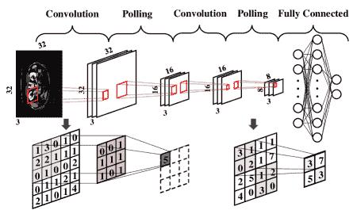

图 1：**CNN**的结构。

源自 CNN 的独特结构——卷积层实现局部区域连接和权重共享，池化层实现维度缩减，全连接层实现分类器的任务。除了交换激活函数，还有四种方法可以改进 CNN。

1.  1.

    针对全连接层，研究人员将该层交换到其他网络中，如条件随机场（CRF [29]）。这种改进使 CNN 不再仅限于分类任务，但保持了特征提取的能力。

1.  2.

    通过堆叠多个卷积层和池化层来增加 CNN 的深度。然而，由于梯度消失和梯度爆炸的问题，这种方法难以实现超深网络。因此，视觉几何组网络（VGGnet [30]）采用了 16 层和 19 层结构。

1.  3.

    为了解决跳跃连接中的退化问题，例如深度残差网络（ResNet [31]），解决了在更深网络中产生的更高错误率的问题。

1.  4.

    通过增加不同尺寸的卷积核并引入 1*1 卷积核的维度缩减来增加特征的多样性，例如 GoogLeNet [32]。

最终，表 1 展示了使用 CNN 在计算机辅助诊断和治疗肿瘤中的最新工作。

表 1：计算机辅助诊断和治疗肿瘤中的 CNN

| 任务 | 参考 |
| --- | --- |
| 检测 | [33] |
| 位置 | [34] |
| 分类 | [35], [36], [37], [38], [39], [40] |
| 分割 |

&#124; [41], [42], [34], [43], [44], [45], &#124;

&#124; [46], [47], [33] &#124;

|

| 预测 |
| --- |

&#124; [42], [48], [49], [50], [51], [52], &#124;

&#124; [42], [53], [54], [55] &#124;

|

位置和检测侧重于指出对象的位置，除了后者可以区分不同的对象。表格 1 显示，CNN 已被用于检测或定位医学任务中的肿瘤，这通常是两阶段工作中的第一步，例如先定位或检测，然后对脑部 MRI 进行分割 [34]。类似地，Bellver 等人将最后一层换成一个神经元以检测健康/不健康的肝组织 [33]。然而，使用 CNN 的这些研究通常是任务的附属产品，因为检测或定位并不是研究的最终目的。因此，使用 CNN 的检测和定位不能被视为独立的医学任务。还有一种计算机科学方法称为 Region-CNN 系列（R-CNNs），将在后续介绍，是最先进的对象检测技术。

分类是 CNN 的强项，这要归功于其出色的特征提取能力，因此许多研究人员倾向于通过 CNN 来处理医学数据。如表格 1 所示，这些研究人员将肿瘤的诊断和治疗集中在乳腺 [35, 36, 38, 40]、肾脏 [39]、膀胱 [40]，甚至基于组织学图像的 13 种癌症类型 [37] 上。

分割是 CNN 的另一种应用，在医学任务中需求很大，无论是初筛、亚型识别还是肿瘤治疗，都围绕着精确的分割展开。该领域的研究人员通常采用我们上面介绍的第一种变体（将 CNN 中的最后一层替换）来实现病灶分割的目标。具体而言，表格 1 的研究反映了 CNN 在处理多模态数据和多组织器官方面分割的广泛应用，如脑部 MRI [41, 42, 34, 43]、直肠 MRI [45]、鼻咽 MRI [46]、肺部 PET [44]、肝脏 CT [33]、前列腺 [56] 和乳腺 [47] 组织学图像。

预测可以被视为分类的延伸，因为其本质是分类未来某种情况是否会发生。一般来说，我们通常需要进行以下预测，例如肿瘤生长预测 [52]，肿瘤侵袭性预测 [55]，放射治疗靶点的运动估计 [49]，辐射剂量估计 [48]，辐射毒性预测 [50]，结果预测 [53]，复发预测 [54]，以及寿命预测 [51]。

总的来说，CNN 是一种具有出色特征提取能力的方法，专门用于分类任务。这两个优势依赖于其结构。在此基础上，研究人员开始从我们之前回顾过的四个方面改进模型，以提升 CNN 的性能，使其易于训练并适应特定任务。在肿瘤诊断和治疗中，CNN 已经用于初步筛查肿瘤、确定亚型、勾画肿瘤，甚至预测治疗计划和结果。总的来说，CNN 可以说是计算机辅助诊断和治疗肿瘤中最广泛使用的模型之一。

#### 2.1.2 DeepMedic

DeepMedic 是一个高效的 11 层深、多尺度、3D CNN 架构，是一个针对 BRATS 2015 和 ISLES 2015 脑 MRI 图像的改进模型 [29]。图 2 展示了 DeepMedic 的结构。DeepMedic 的基线是 CNN，然后是条件随机场（CRF）。

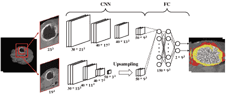

图 2: DeepMedic 的结构

它提出了一种具有并行卷积路径的多尺度处理方案，能够高效地结合局部和上下文信息，并改进分割结果。最后，作者使用 CRF 实现空间正则化。

DeepMedic 最有价值的贡献是密集训练，它可以平衡来自不同分割类别的训练样本分布，这在医学数据集中是一个巨大的问题，因为在临床实践中，存在许多微小的对象。同时，DeepMedic 可以在一次处理多个相邻像素，从而节省计算成本。近年来，基于 DeepMedic 的研究有几项，详见表 2。

表 2: DeepMedic 在计算机辅助诊断和治疗肿瘤中的应用

|         任务 |         参考文献 |
| --- | --- |
|         分割 |         [57], [58], [59], [60], [43] |
|         预测 |         [58] |

DeepMedic 是一种试验性 CNN 变体，专注于医学任务的分割。此外，由于最初用于脑 MRI，其最常见的应用场景仍然是脑 MRI 的分割，如表 2 所示。表中的大多数研究都是由于最后一层的改进而进行的分割。这种结构使得 DeepMedic 在脑分割中表现更佳。除 Kamnitsas 等人的工作 [58] 外，他们在特定病变分割后使用 SVM 预测人口生存率。

总体而言，DeepMedic 对医学数据的改进是突破性的，并广泛应用于脑肿瘤分割任务，但其亮点也同时是其短处。即，其应用仅限于脑分割。在这方面，稍后将介绍的 u-net 破除了基于医学数据的深度学习模型改进仅仅是深度学习的附属物，并不会影响计算机科学领域的发展的刻板印象。

### 2.2 全卷积网络和 U-Net

#### 2.2.1 FCN

作为一种改进方法，全卷积网络（FCN [7]) 将全连接层换成了反卷积层。FCN 的结构如图 3 所示，是一种编码器-解码器模型。FCN 的形式为未来语义分割的发展奠定了基础。这样，FCN 允许端到端的像素级分类，在上采样中保持特征图的原始大小，并且处理多个粗糙的上采样。最重要的是，FCN 可以接受任意大小的输入图像，并在医学任务中的医学图像分割中表现出色。

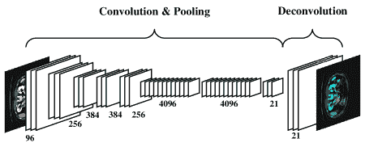

图 3：FCN 的结构。

由于其结构，FCN 通过其固有的优势打开了分割的门槛。确实，FCN 在计算机辅助诊断和治疗肿瘤中具有重要地位。表 3 显示了在肿瘤临床实践中使用 FCN 的工作。

表 3：计算机辅助诊断和治疗肿瘤中的 FCN

| 任务 | 参考文献 |
| --- | --- |
| 分割 | [61], [62], [63], [64], [65], [66], [56] |

FCN 是为了语义分割而诞生的。因此，FCN 在医学图像分割领域成为一个里程碑也就不足为奇了。如表 3 所示，FCN 可以分割肝脏的 CT [33]和心脏的 CT [61]（主要集中在放射治疗计划中的危险器官分割），还可以分割大脑的 MRI [62, 63]、肝脏的 MRI [64]、结直肠的 MRI [65]和前列腺的 MRI [66]。

作为分割时代的先驱，FCN 在肿瘤图像分割任务中占据了重要地位，并开辟了肿瘤轮廓精确定义的新篇章。

#### 2.2.2 U-Net

作为 FCN 的扩展，U-Net 可以说是一个基于医学数据改进的先进深度学习模型。U-Net 继承了 FCN 的所有优点，但改进了反卷积层和跳跃连接层的数量 [8]。此外，它具有如图 4 所示的对称 U 形结构。U-Net 的左侧是收缩路径，通过卷积和最大池化提取特征。右侧是扩展路径，通过拼接和采样特征图来结合来自左侧的特征图。

图 4：U-Net 的结构。

U-Net 关注医学图像的特征，这些特征可以总结为简单的图像结构、大图像尺寸、少量数据、多模态和可解释性。因此，U-Net 具有收缩路径以捕捉语义，以及扩展路径以进行精确定位，适用于大图像的分割，如组织学图像（通常每张图像 2GB）。此外，这两条路径在高分辨率和更抽象特征之间达到了一种权衡。最近的工作在表 4 中使用 U-Net 进行计算机辅助诊断和治疗肿瘤的研究。

表 4：U-Net 在计算机辅助诊断和治疗肿瘤中的应用

| 任务 | 参考文献 |
| --- | --- |
| 分割 | [67], [68], [69], [70], [71], [56] |
| 预测 | [72], [73], [74], [75], [67] |
| 检测 | [67] |

U-Net 最重要的应用之一是语义分割。然而，它卓越的性能也可以支持后续任务。在分割方面，Beers 等人 [68] 和 Isensee 等人 [69] 主要关注大脑的 MRI，Bulten 等人 [56] 研究前列腺的组织学图像，Falk 等人 [67] 研究显微镜视频，Guo 等人 [70] 关注胰腺的 CT，Zhong 等人 [71] 使用肺部的 CT 和 PET。此外，Falk 等人 [67] 还完成了生物标志物的检测，Isensee 等人 [69] 实现了放射生物学中的生存预测。

此外，还有其他研究者，如 Nguyen 等人使用 U-Net 进行预测。简而言之，这些工作分别研究了基于治疗计划数据的前列腺 [72, 74] 和头颈部 (H&N) [73, 75] 放疗剂量预测。

不得不说，U-Net 是提升基于医学数据的深度学习模型的一个重大突破，这种改进是基于简单医学数据结构、小尺寸和目标种类少的特点。这种对任务目标的优化也进一步推动了计算机科学领域中细分的探索。因此，四年后，U-Net 依然在医学和计算机科学领域稳居前列。这一现象非常发人深省。

### 2.3 R-CNN 系列

Region-CNN (R-CNN) 系列是一种两阶段方法，首先在图像上选择建议框，然后根据建议框修正边界框。作为一种原始模型，R-CNN [4] 分为三个部分：寻找候选框，使用 CNN 提取特征向量，以及使用支持向量机 (SVM [76]) 对特征向量进行分类。图 5 显示了具体的方法，它在输入图像中定位 2000 个候选框，并提取每个候选框中图像的特征向量，接着，对每个候选框中的对象进行分类和识别。

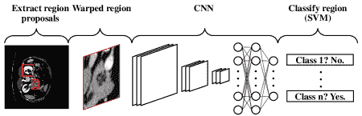

图 5：R-CNN 的结构。

R-CNN 的改进集中在训练速度上。Fast R-CNN [5] 改进了 R-CNN 的多阶段管道训练，并解决了训练时间和空间的紧迫问题。该工作的两个改进包括在最后的卷积层后添加 ROI 池化层，以及使用多任务损失函数将框回归直接添加到 CNN 网络的训练中。此外，Faster R-CNN [6] 可以看作是 Fast R-CNN 与区域提议网络 (RPN [6]) 的结合。相关工作总结在表 5 中。

表 5: R-CNN 在计算机辅助肿瘤诊断和治疗中的应用

| 任务 | 参考文献 |
| --- | --- |
| 检测 | [77], [78], [79], [80], [81] |
| 分类 | [80], [81] |

检测是 R-CNN 系列的最基本功能，很明显基于 R-CNN 的工作在检测任务上做得很好。例如，Li 等人 [77] 使用 Faster R-CNN 检测甲状腺超声图像。Rao 等人 [78] 研究 R-CNN，而 Cai 等人 [79] 研究 Faster R-CNN 以检测乳腺组织图像。此外，Akselrod 等人 [80] 和 Ribli 等人 [81] 的研究中使用 Faster R-CNN 对乳腺 X 光检查进行恶性或良性病变的检测和分类。

作为目标检测的先锋，R-CNN 的两阶段方法在肿瘤诊断和治疗过程中已很好地完成了生物标志物的检测。值得一提的是，在计算机科学领域，实际上还有其他物体检测方法正在更新，例如 You Only Look Once 系列 (YOLO [82], YOLOv2 [83], YOLOv3 [84])，以及 Wu 等人在 2019 年撰写的 Segmentation is all you need [85]。之所以不在此详细描述上述工作，是因为 YOLO 系列作为一阶段方法，已失去了部分精度（这是肿瘤诊断和治疗中的关键指标）。与此同时，名为 Segmentation is all you need 的工作虽然是最新且突破性的深度学习物体检测方法，但在医学领域尚未成为明星。然而，Cheng 等人完成的工作的一个优点是对困难小目标的检测，并且其在后续医学任务中的表现值得期待。

## 3 近期肿瘤智能诊断和治疗的工作

### 3.1 体外诊断 (IVD)

体外诊断（IVD）是肿瘤诊断的第一阶段，主要负责肿瘤标志物或肿瘤特征的检测和筛查。癌症的早期发现通常决定了患者生活质量甚至生命的预后。这是需要在这一阶段运用深度学习的关键原因。IVD 使用三种数据，接下来将介绍。

1.  1.

    使用显微镜生成的血液和组织液中的细胞图像或视频，以发现是否存在循环肿瘤细胞（CTC）。

1.  2.

    | --- | --- | --- |

1.  3.

    从公共数据集中获得的基因表达数组，以发现是否存在基因紊乱。

目前，在线上有带标签的公共数据集。比如，国家癌症研究所基因组数据公用平台（GDC 数据门户）（见：[`portal.gdc.cancer.gov/`](https://portal.gdc.cancer.gov/)）、癌症药物敏感性基因组学（GDSC，见：[`www.cancerrxgene.org/`](https://www.cancerrxgene.org/)）、MICCAI 电子显微镜图像电路重建挑战赛（CREMI，见：[`cremi.org/data/`](https://cremi.org/data/)）以及淋巴细胞评估黑客马拉松（LYSTO，见：[`lysto.grand-challenge.org/`](https://lysto.grand-challenge.org/)）。绝大多数开放数据集可以在 Grand Challenge 找到（见：[`grand-challenge.org/challenges/`](https://grand-challenge.org/challenges/)），甚至是计算机辅助诊断和治疗肿瘤中接下来三个阶段的数据类型。

这一阶段的主要临床问题是早期筛查肿瘤、识别肿瘤阶段和亚型、监测治疗效果以及预测肿瘤预后。所有这些医学任务可以视为计算机科学中的分类任务。当然，如果有必要，分割和目标检测也可以完成上述任务。现在，随着 CNN 的发展，深度学习中有一种实际的方法来解决上述问题。表 6 总结了 CNN 在 IVD 中的最新工作。

表 6：体外诊断中的最新工作

| 数据 | 任务 | 参考 |
| --- | --- | --- |
| 从流式细胞仪（FCM）获得的生物物理和生物化学指标，以发现指定的细胞亚集。 |
| 图像 | 检测 | [67] |
| 分割 | [67], [86], [66] |
| 指标 | 分类 | [87] |
| 基因 | 预测 | [88], [89] |

#### 3.1.1 IVD 中的图像数据诊断

在检测方面，Falk 等人[67]的工作非常出色，利用 U-Net 使非机器学习专家能够分析他们的数据，并可以节省广泛量化任务中的人工标注工作。此外，这项工作支持具有条件适应性的单细胞分割。此外，这项工作中的数据集（如 F1-MSC、F2-GOWT1、F3-SIM、F4-HeLa、DIC1-HeLa、PC1-U373 和 PC2-PSC）来自国际生物医学成像研讨会（ISBI）细胞追踪挑战赛 2015。图 6 ‣ 3 智能肿瘤诊断和治疗的最新工作 ‣ 深度学习在计算机辅助肿瘤诊断和治疗中的应用：综述")展示了这项工作的流程。首先，在本地计算机、专用远程服务器或云服务上训练 U-net。之后，通过使用迁移学习将 U-Net 适应新标注的数据。这项工作在随后的测试中表现良好。

+   1.

    在二维荧光图像中进行共定位的检测（2D）。

+   2.

    在五通道共聚焦图像中进行荧光蛋白标记的小胶质细胞检测（3D）。

+   3.

    从荧光、差分干涉对比、相位对比和亮场显微镜中进行形态计量细胞描述的分割（2D）。

+   4.

    在电子显微镜图像中进行三维亮场图像的分割（3D）和神经突起追踪。

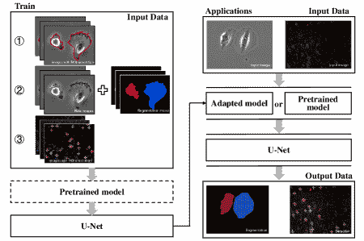

图 6：Falk 等人[67]进行的研究工作流程，基本上是使用 U-Net 的不同标注类型数据学习。

在分割方面，Tran 等人[86]使用了 SegNet（这是 FCN 的一个变体[90]），以高效分割红细胞（WBCs）和白细胞（RBCs）。数据集为来自 ALL-IDB1 数据库的外周血涂片图像。这项工作的细节如图 7 ‣ 3 智能肿瘤诊断和治疗的最新工作 ‣ 深度学习在计算机辅助肿瘤诊断和治疗中的应用：综述")所示。第一步使用 SegNet 将输入图像中的所有 WBCs 和 RBCs 标记为不同的颜色。然后，将所有白细胞和红细胞分离成两个单独的图像。最后，使用结果图像进行各种用途，如早期检测白血病（一种白细胞癌症）和血细胞总数。

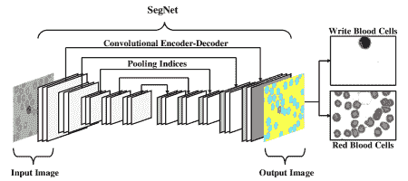

图 7：[86]的工作流程依赖于 SegNet 来分割 WBCs 和 RBCs。

#### 3.1.2 基因数据在体外诊断中的应用

现在，基因组数据通常用于预测，例如癌症预测和抗癌药物反应预测。

Chang 等人[88]在表格 6 ‣ 3 Recent Work in Intelligent Diagnosis and Treatment of Tumors ‣ Deep Learning in Computer-Aided Diagnosis and Treatment of Tumors: A Survey")中有一项标准工作，研究了药物疗效预测，该工作采用 CNN 处理细胞系的基因组突变指纹和药物的分子指纹（这些数据来自 CCLP1、GDSC6、CGC、GDSC）。这可能使未来能够为个体患者的基因组特征选择最有效的抗癌药物。详细信息将显示在图 8 ‣ 3 Recent Work in Intelligent Diagnosis and Treatment of Tumors ‣ Deep Learning in Computer-Aided Diagnosis and Treatment of Tumors: A Survey")中。在这项研究中，模型由两个部分组成，一个是双重收敛 CNN，另一个是可概括的预测模型。此外，模型的输入可以是特定小分子的分子信息，该模型可以预测 GDSC 中的哪些抗癌药物有效。

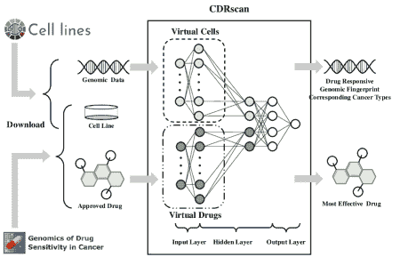

图 8：Chang 等人[88]撰写的工作流程依赖于两步卷积神经网络（CNN）来预测抗癌药物的响应性。

#### 3.1.3 IVD 中的指标数据诊断

随着深度学习方法的日益成熟，越来越多类型的数据预计将由深度学习方法处理，Doan 等人[87]在表格 6 ‣ 3 Recent Work in Intelligent Diagnosis and Treatment of Tumors ‣ Deep Learning in Computer-Aided Diagnosis and Treatment of Tumors: A Survey")中展示了其中之一。Doan 等人分析了成像流式细胞术（FCM）的诊断潜力，其数据库包含每个细胞的图像以及在多个亚细胞区室（包括细胞核、线粒体）中量化的多个特征组成指标（包括蛋白质、核酸、糖脂）。图 9 ‣ 3 Recent Work in Intelligent Diagnosis and Treatment of Tumors ‣ Deep Learning in Computer-Aided Diagnosis and Treatment of Tumors: A Survey")是使用一般卷积神经网络（CNN）进行研究的假设说明。这项工作可能用于分析稀有细胞类型，如循环肿瘤细胞（这些是从原发肿瘤逃逸并在血液中循环的癌细胞）和过渡状态，例如细胞周期阶段（有丝分裂）。

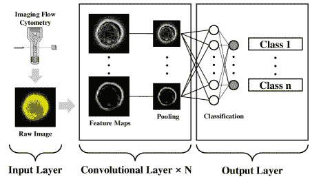

图 9：Doan 等人[87]撰写的工作插图依赖于 CNN 对细胞进行分类分析。例如，Class1 和 Class2 可能对应于白血病细胞和正常细胞。

总结来说，尽管体外诊断是肿瘤诊断的最早阶段，但数据类型和大数据来源仍然有限。这主要是基于临床实践中的几个原因。

+   1.

    许多细胞学报告不需要像影像诊断那样的摄影证据，因此医生在诊断过程中不需要收集图像数据；相反，他们记录的是检测到的数值。

+   2.

    目前，医院进行的一般健康检查不包括肿瘤的基因组检测，医疗机构也是如此。此外，大多数患者对基因风险预测缺乏认知。因此，获得大量高质量的肿瘤基因组筛查数据是困难的。

+   3.

    临床指标数据以文本形式呈现，需要自然语言处理（NLP）来完成文本摘要任务以进行进一步分析。然而，医学报告中很少使用文本摘要，这导致可用数据的缺乏。

### 3.2 影像诊断（ID）

如果在体外诊断（IVD）中发现异常，或因身体不适达到诊断范围，患者可能需要遵循医生的指示完成影像诊断。影像诊断利用医学图像发现是否存在病变和危险器官。这些图像来自超声（UB）、X 射线、CT、MRI、数字减影血管造影（DSA）、放射性核素成像（RNI）、正电子发射计算机断层扫描（PET）和单光子发射计算机断层扫描（SPECT）。关于医学图像的公共数据集有很多。通常，这些数据集可以在大挑战（Grand Challenge）中找到，如肾肿瘤分割挑战（KiTS）、综合健康腹部器官分割（CHAOS）、Decathlon-10。此外，癌症影像档案（TCIA，见：[`www.cancerimagingarchive.net/`](https://www.cancerimagingarchive.net/)）包含打包的数据集，如多模态或多类型的肿瘤数据。当然，一些数据集还包含组织学图像、多种类型的医学图像、基因组数据和临床信息，这些数据适用于多模态数据的整合以及肿瘤的诊断和治疗。

在这个阶段，基本的临床需求包括诊断、检测和勾画肿瘤或危险器官。由于有 CNN、FCN、U-net 和 R-CNN 等技术的支持，大多数影像诊断中的问题可以通过深度学习解决。在这些模型中，CNN 可以用于诊断肿瘤并在勾画肿瘤之前提取特征；FCN 和 U-Net 主要用于勾画肿瘤；R-CNN 则擅长肿瘤的目标检测。近期的相关工作列于表 7 ‣ 3 Recent Work in Intelligent Diagnosis and Treatment of Tumors ‣ Deep Learning in Computer-Aided Diagnosis and Treatment of Tumors: A Survey")。

表 7: 影像诊断的最新工作

| 数据 | 任务 | 参考 |
| --- | --- | --- |
| MRI | 分割 |

&#124; [41], [57], [59], [34], &#124;

&#124; [43], [45], [46], [58], &#124;

&#124; [62], [63], [64], [65], &#124;

&#124; [66], [69], [68], [42] &#124;

|

| 预测 | [42], [58], [69] |
| --- | --- |
| CT | 分割 |

&#124; [33], [61], [64], [66], &#124;

&#124; [70], [91] &#124;

|

| 预测 |
| --- |

&#124; [48], [49], [51], [54], &#124;

&#124; [55]  [91] &#124;

|

| PET | 分割 | [44], [71] |
| --- | --- | --- |
| 预测 | [52] |
| 乳腺摄影 | 检测 | [92], [81] |
| 分类 |
| US | 检测 | [77] |

#### 3.2.1 MRI 在 ID 中的诊断

MRI 具有对软组织的良好分辨能力且不会对人体造成电离辐射损害，因此它在脑部、膀胱、直肠、生殖系统及其他部位的肿瘤成像方面表现优异。

在分割中，我们必须介绍 Drozdzal 等人撰写的工作[66]，该工作结合了全卷积网络（FCNs）和全卷积残差网络（FC-ResNets [93]）用于医学图像分割，如电子显微镜（EM）图像、肝脏 CT 和前列腺 MRI。结果表明，该模型在 2D 和 3D 医学图像中表现良好，这意味着它能够在各种图像模态和不同解剖区域中实现准确的分割。详细信息见图 10，该图使用 FCN 获取预归一化图像，然后通过 FC-ResNet 迭代精炼生成分割预测。

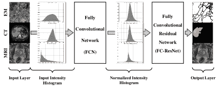

图 10：Drozdzal 等人撰写的工作[66]依赖于 FCN 和 FC-ResNet 对 2D 和 3D 医学图像进行分割，如 EM、CT 和 MRI。

在预测中，Isensee 等人[69]通过训练一个随机森林（RF [94]）回归器和多层感知机来完成生存预测，该模型基于描述肿瘤亚区的形状特征。图 11 ‣ 3 智能诊断和肿瘤治疗的近期工作 ‣ 计算机辅助诊断和肿瘤治疗中的深度学习：综述")是该工作的流程图，源自 U-Net。简而言之，上下文路径（左侧）聚合了高层次的信息，这些信息随后在定位路径（右侧）中被精确定位。此外，该工作通过深度监督将梯度信号注入网络。

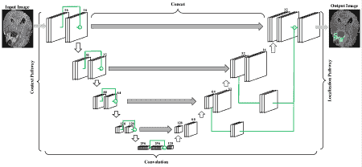

图 11：Isensee 等人[69]的工作插图，依赖 U-Net 对脑 MRI 进行分割，并通过 RF 预测放射组学生存率。

与上述工作[69]不同，这些工作[42, 58]也有一个使用支持向量机（SVM [76]）的预测部分。需要注意的是，随机森林（RF）和支持向量机（SVM）都是机器学习方法，可能在这一领域很快会出现更深层的学习方法用于预测。

#### 3.2.2 CT 诊断在 ID

CT 对中枢神经系统、头颈部、胸部、腹部和盆腔的肿瘤具有很高的诊断价值。它在计算机辅助肿瘤诊断和治疗中被广泛应用。

在分割中，郭等人[70]使用了经过高斯混合模型（GMM）和形态学操作优化的 U-Net 来分割 3D 胰腺肿瘤。为了完成形态学操作，作者采用了一个名为 LOGISMOS 的模型，这是一个基于图的框架，将交互表面和物体的几何约束转换为图弧，并将分割表面定位的可能性转化为图节点/弧的成本。详情见图 12 ‣ 3 智能诊断和肿瘤治疗的近期工作 ‣ 计算机辅助诊断和肿瘤治疗中的深度学习：综述")，它结合了 U-Net（整合切片内和相邻切片的上下文）和 LOGISMOS（调整 3D 形状）用于 3D 肿瘤分割。

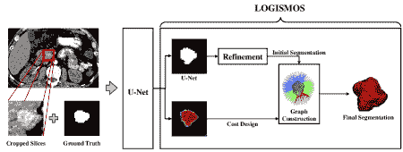

图 12：郭等人[70]的工作流程，采用 U-Net 整合切片内和相邻切片的上下文，并通过 LOGISMOS 调节 3D 形状进行胰腺肿瘤分割。

在预测方面，Ardila 等人 [91] 基于 CNN 建立了一个端到端的方法，用于 CT 图像，输出总体恶性预测、风险桶评分 (LUMAS) 和预测癌性结节的定位。该流程图见图 13 ‣ 3 Recent Work in Intelligent Diagnosis and Treatment of Tumors ‣ Deep Learning in Computer-Aided Diagnosis and Treatment of Tumors: A Survey")，包括基于 CNN 的三个部分。一个是全体积模型（用于 LDCT 的端到端分析），一个是癌症感兴趣区域 (ROI) 检测模型（用于检测 3D 癌症候选区域），一个是癌症风险预测模型（用于处理上述两个模型的输出）。这项工作取得了杰出的结果，即在国家肺癌筛查试验（NLST）病例上曲线下面积约为 94.4%。

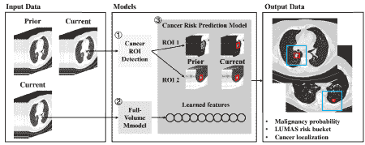

图 13: Ardila 等人 [91] 的工作流程，基本上是基于 CNN 的。

#### 3.2.3 PET 诊断在 ID 中

正电子发射断层扫描与计算机断层扫描 (PET-CT) 双模态成像在当前的癌症诊断和治疗中提供了重要的诊断信息。

在分割方面，Zhong 等人 [71] 采用了结合 3D U-Net 和基于图切割的共同分割模型的模型，实现了基于 PET-CT 的自动、准确的肿瘤轮廓划分，这对计算机辅助肿瘤阅读和解释至关重要。详细信息见图 14 ‣ 3 Recent Work in Intelligent Diagnosis and Treatment of Tumors ‣ Deep Learning in Computer-Aided Diagnosis and Treatment of Tumors: A Survey")。在这项工作中，研究人员关注于肺癌 PET-CT，并生成高质量的体素级肿瘤置信度，进一步用于使用强大的共同分割模型定位肿瘤边界。

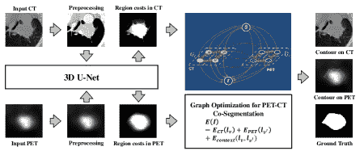

图 14: Zhong 等人 [71] 的工作流程，设计了两个独立的 3D U-Net 用于 PET 和 CT，以生成高质量区域成本，用于随后的基于图的共同分割，针对肺部数据集。

在预测方面，张等人[52]提出了一种 CNN 来预测胰腺肿瘤生长模式，该模式结合了总体趋势和个体化数据。图 15 ‣ 3 Recent Work in Intelligent Diagnosis and Treatment of Tumors ‣ Deep Learning in Computer-Aided Diagnosis and Treatment of Tumors: A Survey")展示了结构。通过 CNN 提取的深度特征与时间间隔和临床因素结合，经过特征选择过程，然后通过支持向量机递归特征消除（SVM RFE）选择了一个稳健的特征子集。最终，使用 SVM 预测模型来预测肿瘤的时空生长和进展。

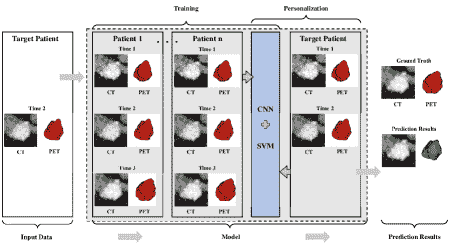

图 15：张等人[52]提出的工作结构，这是一个通过 CNN 和 SVM 进行肿瘤生长的体素级预测框架。

#### 3.2.4 乳腺摄影在智能诊断中的应用

目前，乳腺摄影仅用于乳腺筛查。因此，大多数研究人员专注于早期癌症的检测和分类。如图 16 ‣ 3 Recent Work in Intelligent Diagnosis and Treatment of Tumors ‣ Deep Learning in Computer-Aided Diagnosis and Treatment of Tumors: A Survey")所示，Ribli 等人[81]通过优化目标检测和分类器部分采用了 Faster R-CNN，以便在乳腺 X 光片上检测和分类恶性或良性病变，而无需人工干预。此外，乳腺 X 光图像来自公共 INbreast 数据库。这项研究可以实现乳腺筛查中的计算机辅助检测。

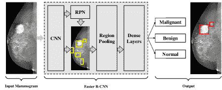

图 16：Ribli 等人[81]提出的工作结构，这是一个通过 Faster R-CNN 和 SVM 进行肿瘤早期筛查的目标检测框架。

#### 3.2.5 超声（US）在智能诊断中的应用

超声（US）是最广泛使用的肿瘤筛查方法，因其无放射性、多方向横截面成像、实时动态、操作简便、快速等特点。然而，由于超声缺乏特异性、关注局部区域，并且容易受到医生经验的影响，因此需要深度学习的辅助。

例如，Li 等人[77]采用了 Faster R-CNN，在 CNN 的输出层之前添加了一个空间约束层，如图 17 diagnosis in ID ‣ 3.2 Imaging Diagnosis (ID) ‣ 3 Recent Work in Intelligent Diagnosis and Treatment of Tumors ‣ Deep Learning in Computer-Aided Diagnosis and Treatment of Tumors: A Survey")所示，该管道连接并规范化了 conv3 和 conv5 层，然后在输出层之前添加了一个空间约束层。这项工作更适合在超声图像中检测甲状腺乳头状癌，其分类性能优于 SVM。这项工作可以提高在甲状腺乳头状癌图像中快速筛查癌症的能力。

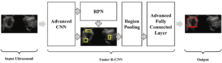

图 17: Li 等人[77]采用 Faster R-CNN 检测甲状腺乳头状癌的工作结构。

总结来说，图像诊断贯穿了肿瘤诊断和治疗的整个过程。其数据易于获取且数据量庞大。由于计算机视觉的快速发展，它已成为当前计算机辅助肿瘤诊断和治疗研究的一个重要组成部分。从这一部分可以看出，对单个器官（尤其是大型器官或易于检查的器官）的研究已达到饱和点，未来的趋势无非是提高准确性和速度。然而，针对小器官肿瘤（如胰腺和卵巢）的研究仍然是必要的。这些小器官肿瘤具有高恶性度和病程短（即数据稀缺）。此外，对多模态数据的研究仍然较少（尽管像 TCIA 这样的多模态数据库已存在）。

### 3.3 病理诊断

病理诊断是肿瘤诊断和治疗的金标准，决定了肿瘤的分期和亚型。此外，治疗计划依赖于病理诊断的结果。然而，由于其侵入性，病理诊断不能用于早期筛查。

基于深度学习的病理诊断利用组织病理学方法（如 H&E 染色）准备的图像来发现病变组织结构、细胞形态和生长模式的异常。目前，公共数据集的数量已可用。通常，Grand Challenge 和 TCIA 是可用的。

这个阶段必须筛选肿瘤的细胞核，描绘病理特征，并检测肿瘤对象。与影像诊断相同，输入数据是图像，深度学习方法（如 CNN、FCN、U-Net 和 R-CNNs）在病理诊断中表现良好。请参见表格 8，这是近期工作的汇总。

表格 8: 近期病理诊断研究工作

| 数据 | 任务 | 参考文献 |
| --- | --- | --- |
| 组织学图像 | 分类 |

&#124; [35], [36], [37], [38], &#124;

&#124; [39],[95], [40], [55] &#124;

|

| 分割 | [56], [47], [96], [55] |
| --- | --- |
| 预测 | [97], [53], [55] |

在分类中，Saltz 等人[37]是标准研究，使用 CNN 对病理图像中的 13 种癌症类型进行分类，与癌症基因组图谱（TCGA）进行比较。在这项研究中，如图 18 所示，每个补丁都标注了由病理学家分割的坏死区域掩模，专家在 CNN 训练阶段审查并修正预测的肿瘤浸润淋巴细胞（TIL）。这一努力评估了多种 TCGA 肿瘤类型中的淋巴细胞浸润情况，以寻找相关性。淋巴细胞浸润的基因组和表观基因组评估，以及临床结果，利用了 TCGA，并显示了 TIL 的分子评估（由 TCGA 的分子平台生成）可以与特定肿瘤类型的临床结果相关联。

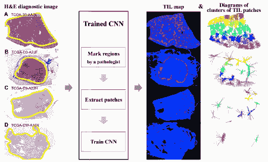

图 18: Saltz 等人[37]的工作流程，该流程通过 CNN 实现对淋巴细胞的全球结构分类。

在分割方面，Coudray 等人[96] 对全切片图像（从癌症基因组图谱（TCGA）获得）进行了一项出色的工作，以分类腺癌（LUAD）、鳞状细胞癌（LUSC）和健康的肺组织，使用了 Inception v3（CNN 的改进模型[98]）。图 19 是这项工作的结构。此外，作者在纽约大学（NYU）朗戈医疗中心的独立数据集（包括冷冻组织、福尔马林固定石蜡包埋组织和活检）上验证了他们的工作。此外，这项工作中训练的网络可以仅凭图像预测 LUAD 中的基因突变，旨在协助病理学家检测癌症亚型或基因突变。分类的平均曲线下面积（AUC）为 0.97，预测的 AUC 从 0.733 到 0.856。

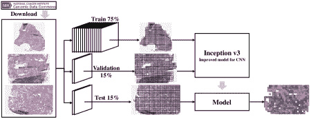

图 19：Coudray 等人[96] 的工作流程图，主要包括数据预处理和通过 CNN 进行模型训练。

在预测方面，Bychkov 等人[53] 结合 CNN 和长短期记忆（LSTM[10]）来预测基于苏木精-伊红（H & E）染色肿瘤组织微阵列（TMA）图像的结直肠癌结果，如图 20 所示。此外，这项工作可以直接预测五年特定疾病的生存率，而无需任何中间组织分类。这项工作表明，从结直肠癌的组织形态中提取的预后信息比经验丰富的人类观察者更多。

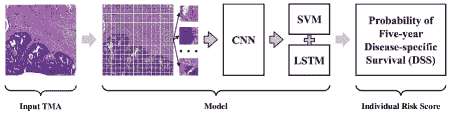

图 20：Bychkov 等人[53] 撰写的工作流程图，使用 CNN 和 LSTM 预测生存率。

总结来说，临床实践中的组织学图像主要用于肿瘤分期、分级和癌症诊断。因此，在计算机辅助病理诊断中，分类是优先考虑的任务。相比之下，分割关注于更好地识别目标细胞，而预测则涉及更广泛的分类（预测未来肿瘤的可能后果）。因此，组织学图像的应用似乎没有进一步发展的空间。然而，由于病理图像的容量较大，当前主流的处理方法是通过块进行训练。这意味着可能会在该领域开发出更新更好的深度学习方法，以提高训练速度或实现端到端处理。

### 3.4 治疗规划

在前三个阶段的诊断之后，医生根据获得的诊断结果制定治疗计划，包括手术治疗、放射治疗、化疗和靶向分子治疗。手术治疗和放射治疗属于局部治疗，需要清楚划分肿瘤体积（GTV）、临床肿瘤体积（CTV）和计划肿瘤体积（PTV）。因此，肿瘤图像将成为手术治疗和放射治疗的合适媒介。化疗是系统治疗，根据临床症状和医学影像等客观指标进行评估。分子靶向治疗基于细胞分子水平以及针对致癌位点（如肿瘤细胞内部的蛋白分子或基因片段）的治疗药物设计，可以导致肿瘤细胞的特异性死亡。因此，治疗计划中的数据类型仍然是图像和基因表达数据。

目前，在治疗计划阶段，医生对准确的病变分割以及对毒性、存活率和疗效的可靠预测有需求，具体细节见表 9。

表 9：治疗计划中的最新工作

| 数据 | 任务 | 参考文献 |
| --- | --- | --- |
| MRI | 预测 | [42], [58], [69] |
| CT |

&#124; [48], [49], [51], [54], &#124;

&#124; [55], [91] &#124;

|

| PET-CT | [52] |
| --- | --- |

|

&#124; 组织学 &#124;

&#124; 图像 &#124;

| [53], [97], [55] |
| --- |
| 基因 | [88], [89], [99] |

|

&#124; 治疗 &#124;

&#124; 计划 &#124;

|

&#124; [72], [73], [74], &#124;

&#124; [75] [50] &#124;

|

通过 MRI、CT、PET-CT 和组织学图像进行肿瘤预测的研究已有很多；接下来，将主要分析关于基因组数据、治疗计划、直肠表面剂量图（RSDM）的研究。

在基因组数据中，Chaudhary 等人 [99] 使用了一种综合方法，该方法结合了 AutoEncoder (AE [2]), K-means 聚类 [100] 和 Support Vector Machine (SVM [76]), 见图 21，以预测肝细胞癌 (HCC) 的生存期。该研究的数据包含来自癌症基因组图谱 (TCGA) 的 RNA 测序 (RNA-Seq)、miRNA 测序 (miRNA-Seq) 和甲基化数据。这项工作预测的预后与考虑基因组学和临床数据的替代模型一样好。

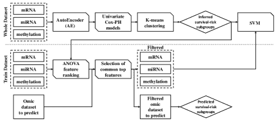

图 21：Chaudhary 等人 [99] 的工作流程，使用 AutoEncoder 架构整合 HCC 数据的 3 种组学。

在治疗计划中，Nguyen 等人专注于预测放疗剂量分布，他们发表的所有论文 [72, 73, 74, 75] 都使用 U-Net 预测放疗剂量。例如，工作 [74] 展示在图 22 中，它是前所未有的完全 3D 剖析前列腺 IMRT 计划的剂量分布预测。在这项研究中，他们使用了一组 7 个光束角度和治疗标准，这意味着模型目前只学习预测来自大致相同方向的剂量，可能无法考虑更复杂的光束几何结构。此外，当前模型无法考虑任何医生的剂量预测偏好，限制了患者治疗的个性化程度。然而，Nguyen 等人的工作在癌症剂量预测方面有意义。

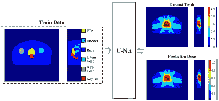

图 22：U-Net 推进的治疗计划管道，用于预测放疗剂量 [74]。

总结而言，本部分的工作繁重且复杂，包含多种预测，但只有少数相关。尽管这些努力涵盖了许多领域（如癌症预测[89]、生命预测[51]和生存预测[58, 69]），但实际上很少有研究帮助医生制定治疗计划（如放射剂量预测[48, 72, 73, 74, 75]、放射毒性[50]、抗癌药物反应[88]和复发预测[54]）。关于治疗计划的实际价值研究仍然稀缺，这可能是因为非医学研究人员难以收集治疗计划数据。大多数研究仅将一些预测作为研究工作的辅助结果，关于深度学习辅助肿瘤治疗的研究仍然存在巨大的空白。目前，计算机辅助肿瘤治疗仍需更多关注。

## 4 结论与展望

### 4.1 结论

总之，如何实现肿瘤的早期发现、准确诊断、适当治疗以及更好的预后成为肿瘤治疗的关键。随着深度学习的迅速发展，医生越来越需要计算机辅助诊断与治疗肿瘤，因为人类的物质缺陷限制了这一领域的进一步发展。这些缺陷通常由感官阈值、认知偏差和个人经验差异造成。特别是，深度学习在自然数据集和不同任务类型中取得了巨大的成功。针对计算机辅助诊断与治疗肿瘤的数据类型（如图像、指标和基因表达数据）以及不同医疗任务（如分类、分割、检测和预测），深度学习可以提供有效的方法（如 CNN、FCN、R-CNN）。这些成功为肿瘤诊断和治疗的一系列医疗任务提供了良好的参考案例和经验。

为了彻底解决临床问题，使用深度学习需要详细了解肿瘤诊断和治疗中的医学数据和医疗任务的具体特征，已总结如下。

+   1.

    医疗任务集中于单一器官及其各种状况，如肺部的钙化、结节、囊肿和肿瘤。

+   2.

    医疗任务依赖于稳定的人体结构，如颅内肿瘤的原发或转移病灶。

+   3.

    医疗任务中的对象较小且具有个体差异，如胰腺和甲状腺。

+   4.

    医疗任务是多学科协作诊断和治疗。

与这些研究相比，这些研究发表在顶级期刊[37、29、63、66、95、99、96、67、91]中，显而易见，这些工作要么是基于医学数据集的新模型（例如 DeepMedic 和 U-Net）改进的有意义突破，要么非常接近医学任务的专业需求。这两类研究都充分理解了临床需求并付诸实践。这意味着，当我们以任务为导向并熟悉医学数据的特征时，计算机科学中的深度学习方法使得计算机辅助诊断和治疗肿瘤的快速发展成为可能。另一方面，随着计算机科学中深度学习的快速发展，只有澄清各种深度学习方法的性质和作用，研究人员才能避免走弯路。

本文从数据类型、器官、医学任务和深度学习方法四个方面回顾了肿瘤计算机辅助诊断和治疗的近期工作。这些工作在肿瘤计算机辅助诊断和治疗中具有重要意义。具体内容总结如下。

首先，本调查总结了肿瘤诊断和治疗的四个阶段的数据类型。每个阶段可能有不同的数据类型，这取决于其特征，或者根据医学任务的要求可能有不同的数据处理倾向。

+   1.

    体外诊断（IVD）阶段。在这一阶段有三种医学数据。1）显微镜、血液涂片和流式细胞仪（FCM）获得的图像。2）癌症相关基因组区域的阵列。3）来自流式细胞仪（FCM）的数值指标。

+   2.

    图像诊断阶段。在这一阶段，大多数数据来自各种医学影像设备，例如磁共振成像（MRI）、计算机断层扫描（CT）、单光子发射计算机断层扫描（SPECT）、正电子发射断层扫描（PET）、超声（US）、乳腺摄影。

+   3.

    病理诊断阶段。在这一阶段，H & E 染色的组织学图像是主要的医学数据类型。

+   4.

    治疗计划阶段。在这一阶段，除了上述总结的图像和基因组数据外，放射治疗数据如直肠表面剂量图（RSDM）也是有意义的。

其次，文章回顾了大多数容易发生肿瘤的器官和组织。

+   1.

    肿瘤的靶器官。例如大脑、肺、结直肠、鼻咽、肝脏、肾脏、膀胱、胃、宫颈、头颈部。

+   2.

    肿瘤的靶腺体。例如乳腺、前列腺、甲状腺、卵巢和胰腺。

+   3.

    风险器官（OAR）。例如心脏、食道、气管和主动脉。

+   4.

    结缔组织，例如血液。

其次，本工作包含了肿瘤诊断和治疗的四个阶段中的几个医学任务，详细内容如下。

+   1.

    检测，这部分包括常见的医学任务，如筛查肿瘤、癌细胞和生物标志物。

+   2.

    分割，例如勾画病变和风险器官（OAR）。

+   3.

    分类，例如识别肿瘤亚型和阶段。

+   4.

    预测，包括许多临床实践类型。包括 1）辐射剂量、放射性毒性、抗癌药物反应和复发预测；2）在呼吸作用下的运动预测；3）癌症、肿瘤侵袭性、肿瘤生长预测；以及 4）寿命和生存预测。

最后，计算机辅助肿瘤诊断与治疗的最先进技术已被详细介绍。这是一项针对不同任务类型及其适用深度学习方法的任务导向回顾，如分类领域中的 CNN 系列，分割领域中的 FCN 系列，以及目标检测中的 R-CNN 系列。一般来说，这些模型在图像数据处理方面表现更好。然而，近期的研究在非图像数据领域相对薄弱，而这也是临床数据的重要来源。

令人印象深刻的是，计算机辅助肿瘤诊断与治疗的发展仍受到许多限制，需要医疗行业和计算机行业通过合作来解决。例如，医学影像缺乏高质量的统一标准和准确标注的数据集，现有模型容易过拟合且鲁棒性差，数据安全性和诊断可靠性问题。因此，仍有大量工作等待研究人员去完成。

### 4.2 展望与挑战

根据上述总结和分析，计算机辅助肿瘤诊断与治疗在临床实践的各个方面都取得了显著进展。然而，基于此工作仍然存在许多值得注意的差距和挑战。以下部分从四个方面详细阐述了这些问题。

#### 4.2.1 从数据类型

最近研究中的数据类型似乎相当全面，但往往人们倾向于关注图像诊断数据。即使这种倾向也延伸到少数几种医学图像，如 MRI 和 CT。组织学图像和与癌症相关的基因组区域部分受到关注。然而，一些问题限制了研究的进展。对于个体组织学图像，大小可达 2G，这要求研究人员使用高级服务器。此外，许多基层医院没有进行基因检测的条件。此外，体外诊断（IVD）阶段和治疗计划中的数据也面临相同的困境——没有存在一个成熟的系统来批量存储肿瘤诊断和治疗的数据。

与此同时，医学任务的多学科协作使得相同任务的多类型数据集具有较强的相关性，逐渐将数据组作为研究对象将成为一种趋势。比如本综述中提到的基因组学与组织病理学的整合[96]。

总之，深度学习是大数据的艺术，早期筛查、肿瘤治疗以及多组学研究中的差距仍需填补。

#### 4.2.2 来自器官和组织

本次调查中提到了近 20 种不同的器官。然而，研究人员更倾向于关注少数几个大器官（如脑部、肝脏和肺部），以及具有特殊检查的器官（如乳腺影像和甲状腺影像）。因此，一些在人体内较小且深部的结构特定器官缺乏相关研究，例如胰腺。这些器官的肿瘤诊断和治疗更加具有挑战性和意义，尤其是胰腺癌，其疾病持续时间短且致命。在这一部分，有大量关注微小器官和组织的工作需要跟进。

#### 4.2.3 来自医学任务

本文总结了计算机辅助诊断与治疗肿瘤中的 17 种以上医学任务。研究表明，大多数研究优先级为检测、分割和分类。包括肿瘤筛查、癌细胞及生物标志物的检测；病灶和风险器官（OAR）的描绘；以及肿瘤亚型和阶段的识别。然而，在肿瘤预测任务中，出现了一种独特的现象。有趣的是，大多数关于生存预测和寿命预测的研究对临床实践没有贡献；它们通常只是其他研究的附加成果。尽管这看似重要，但这种研究告诉我们，患上恶性肿瘤的患者更可能死亡。这些工作没有提供有建设性的建议来帮助医生规划下一步治疗。相反，实际辅助治疗的研究，如运动管理、放射剂量分布预测、放射毒性预测、药物效果预测和肿瘤侵蚀预测，则具有临床意义。然而，由于数据来源稀缺，这类研究进展缓慢，需要更多研究人员投入相关工作。

#### 4.2.4 来自深度学习方法

尽管各种深度学习模型在肿瘤计算机辅助诊断和治疗中的应用总体上符合计算机科学的发展趋势，但应用仍然缓慢。目前，该领域的研究仍然局限于简单的深度学习模型处理，而 U-Net 是唯一一个受到医学数据影响的有影响力模型。现有的最先进模型，如 Segmentation is all you need [85]，在对象检测领域的革命表现优异，对难度较大的小物体表现良好；Transformer [28]、BERT [101]、Transformer-XL [102]、XLNet [103]、Sparse Transformers [104]等自然语言处理（NLP）中的前沿技术，可能会被应用于临床数据，如病史。如果研究人员引入这些先进方法，可能会彻底改变当前肿瘤辅助治疗的表现。当然，如果研究人员致力于基于医学数据改进深度学习模型或创建新的学习模型并以医学任务为目标，将特别受到欢迎。

#### 4.2.5 对抗性研究

鉴于整个行业在肿瘤诊断和治疗中的现有问题，本文进行了前景展望并提出了现有研究的空白。然而，本质上，一些关键研究从未做过，值得注意。对抗性研究就是其中之一。

深度学习中的任何研究都不可避免地会遇到结果是否可信的问题。在这样一个信息时代，信息安全和伦理问题值得讨论。研究人员是否能够在肿瘤诊断和治疗领域的简单信息对抗实验中取得一致的结果尚待观察，更不用说肿瘤的诊断和治疗至关重要，应谨慎对待。就我们所知，除了最近的工作[26]，这一领域几乎是空白的，这不仅是一个非常可怕的空白，同时也是一个充满无限机会的空白。

总结来说，计算机辅助肿瘤诊断和治疗是高度交叉的领域，这要求研究人员既要了解医学，又要精通计算机科学，但很少有人在这两个领域都很熟练，也不是每个人都能找到具有相关专业知识的合作伙伴。这个问题导致了一个局面，即计算机科学家不知道如何结合具体条件推动医学进步，而医生也不知道哪些深度学习方法可以更好地实现他们的目标。这也是为什么大量研究无法指导临床肿瘤治疗的原因。目前，本文可以快速指导医生选择合适的深度学习方法，计算机研究人员也可以更多地了解肿瘤诊断和治疗。在临床实践中，肿瘤诊断和治疗的国际标准参考国家综合癌症网络（NCCN）《肿瘤学临床实践指南》。 (见: [`www.nccn.org/professionals/physician_gls/default.aspx`](https://www.nccn.org/professionals/physician_gls/default.aspx))。如果研究人员希望进一步提高其工作与医学任务之间的契合度，点击此链接将是一个良好的开端。

## 致谢

本研究部分得到了中国国家自然科学基金（资助号 61906063）、中国天津市自然科学基金（资助号 19JCQNJC00400）以及河北工业大学远光学者基金的资助。

## 参考文献

+   [1] F. Bray, J. Ferlay, I. Soerjomataram, R. L. Siegel, L. A. Torre, A. Jemal, Global cancer statistics 2018: Globocan estimates of incidence and mortality worldwide for 36 cancers in 185 countries, CA: A Cancer Journal for Clinicians 68 (6) (2018) 394–424.

+   [2] G. E. Hinton, R. R. Salakhutdinov, Reducing the dimensionality of data with neural networks, Science 313 (5786) (2006) 504–507.

+   [3] Y. LeCun, L. Bottou, Y. Bengio, P. Haffner, et al., Gradient-based learning applied to document recognition, Proceedings of the IEEE 86 (11) (1998) 2278–2324.

+   [4] R. Girshick, J. Donahue, T. Darrell, J. Malik, Rich feature hierarchies for accurate object detection and semantic segmentation, in: In Proceedings of the IEEE Conference on Computer Vision and Pattern Recognition, 2014, pp. 580–587.

+   [5] R. Girshick, Fast r-cnn, in: In Proceedings of the IEEE International Conference on Computer Vision, 2015, pp. 1440–1448.

+   [6] S. Ren, K. He, R. Girshick, J. Sun, Faster r-cnn: Towards real-time object detection with region proposal networks, in: Advances in Neural Information Processing Systems, 2015, pp. 91–99.

+   [7] J. Long, E. Shelhamer, T. Darrell, Fully convolutional networks for semantic segmentation, in: In Proceedings of the IEEE Conference on Computer Vision and Pattern Recognition, 2015, pp. 3431–3440.

+   [8] O. Ronneberger, P. Fischer, T. Brox, U-net: 用于生物医学图像分割的卷积网络，发表于《医学图像计算与计算机辅助手术国际会议论文集》，2015 年，pp. 234–241。

+   [9] Z. C. Lipton, J. Berkowitz, C. Elkan, 对递归神经网络在序列学习中的批判性回顾，ArXiv 预印本 ArXiv:1506.00019。

+   [10] S. Hochreiter, J. Schmidhuber, 长短期记忆，《神经计算》9 (8) (1997) 1735–1780。

+   [11] J. Ker, L. Wang, J. Rao, T. Lim, 深度学习在医学图像分析中的应用，《IEEE Access》6 (2017) 9375–9389。

+   [12] P. Meyer, V. Noblet, C. Mazzara, A. Lallement, 放射治疗中的深度学习调查，《生物医学计算机》98 (2018) 126–146。

+   [13] K. Yasaka, H. Akai, A. Kunimatsu, S. Kiryu, O. Abe, 使用卷积神经网络的深度学习在放射学中的应用，《日本放射学杂志》36 (4) (2018) 257–272。

+   [14] B. Sahiner, A. Pezeshk, L. M. Hadjiiski, X. Wang, K. Drukker, K. H. Cha, R. M. Summers, M. L. Giger, 医学成像与放射治疗中的深度学习，《医学物理》46 (1) (2019) e1–e36。

+   [15] Z. Hu, J. Tang, Z. Wang, K. Zhang, L. Zhang, Q. Sun, 基于图像的癌症检测与诊断的深度学习：综述，《模式识别》83 (2018) 134–149。

+   [16] D. Ueda, A. Shimazaki, Y. Miki, 深度学习在放射学中的技术和临床概述，《日本放射学杂志》37 (1) (2019) 15–33。

+   [17] J. Liu, Y. Pan, M. Li, Z. Chen, L. Tang, C. Lu, J. Wang, 深度学习在 MRI 图像中的应用：综述，《大数据挖掘与分析》1 (1) (2018) 1–18。

+   [18] M. A. Mazurowski, M. Buda, A. Saha, M. R. Bashir, 放射学中的深度学习：概念概述及以 MRI 为重点的最新研究，《磁共振成像杂志》49 (4) (2019) 939–954。

+   [19] S. Liu, Y. Wang, X. Yang, B. Lei, L. Liu, S. X. Li, D. Ni, T. Wang, 医学超声分析中的深度学习：综述，《工程》5 (2) (2019) 261–275。

+   [20] S. Napel, W. Mu, B. V. Jardim-Perassi, H. J. Aerts, R. J. Gillies, 后基因组时代癌症的定量成像：放射（基因）组学、深度学习与栖息地，《癌症》124 (24) (2018) 4633–4649。

+   [21] C. Cao, F. Liu, H. Tan, D. Song, W. Shu, W. Li, Y. Zhou, X. Bo, Z. Xie, 深度学习及其在生物医学中的应用，《基因组学、蛋白质组学与生物信息学》16 (1) (2018) 17–32。

+   [22] D. Shen, G. Wu, H.-I. Suk, 医学图像分析中的深度学习，《生物医学工程年鉴》19 (2017) 221–248。

+   [23] M. I. Razzak, S. Naz, A. Zaib, 医学图像处理中的深度学习：概述、挑战与未来，发表于《BioApps 中的分类》，2018 年，pp. 323–350。

+   [24] T. Ching, D. S. Himmelstein, B. K. Beaulieu-Jones, A. A. Kalinin, B. T. Do, G. P. Way, E. Ferrero, P.-M. Agapow, M. Zietz, M. M. Hoffman, 等，生物学和医学中深度学习的机会与挑战，《皇家学会界面杂志》15 (141) (2018) 20170387。

+   [25] Z. Akkus, J. Cai, A. Boonrod, A. Zeinoddini, A. D. Weston, K. A. Philbrick, B. J. Erickson, 超声中的深度学习应用调查：人工智能驱动的超声用于改善临床工作流程，《美国放射学院杂志》16（9）（2019）1318–1328。

+   [26] S. G. Finlayson, J. D. Bowers, J. Ito, J. L. Zittrain, A. L. Beam, I. S. Kohane, 医疗机器学习中的对抗攻击，《科学》363（6433）（2019）1287–1289。

+   [27] K. He, G. Gkioxari, P. Dollár, R. Girshick, Mask r-cnn, 在《IEEE 国际计算机视觉会议论文集》中，2017 年，第 2961–2969 页。

+   [28] A. Vaswani, N. Shazeer, N. Parmar, J. Uszkoreit, L. Jones, A. N. Gomez, Ł. Kaiser, I. Polosukhin, 注意力机制才是关键，在《神经信息处理系统进展》中，2017 年，第 5998–6008 页。

+   [29] K. Kamnitsas, C. Ledig, V. F. Newcombe, J. P. Simpson, A. D. Kane, D. K. Menon, D. Rueckert, B. Glocker, 高效的多尺度 3D 卷积神经网络与完全连接条件随机场用于准确的脑病变分割，《医学图像分析》36（2017）61–78。

+   [30] K. Simonyan, A. Zisserman, 用于大规模图像识别的非常深的卷积网络，ArXiv 预印本 ArXiv:1409.1556。

+   [31] K. He, X. Zhang, S. Ren, J. Sun, 深度残差学习用于图像识别，在《IEEE 计算机视觉与模式识别会议论文集》中，2016 年，第 770–778 页。

+   [32] C. Szegedy, W. Liu, Y. Jia, P. Sermanet, S. Reed, D. Anguelov, D. Erhan, V. Vanhoucke, A. Rabinovich, 在《IEEE 计算机视觉与模式识别会议论文集》中，深入卷积的研究，2015 年，第 1–9 页。

+   [33] M. Bellver, K.-K. Maninis, J. Pont-Tuset, X. Giró-i Nieto, J. Torres, L. Van Gool, 基于深度学习的检测辅助肝病变分割，ArXiv 预印本 ArXiv:1711.11069。

+   [34] F. Milletari, S.-A. Ahmadi, C. Kroll, A. Plate, V. Rozanski, J. Maiostre, J. Levin, O. Dietrich, B. Ertl-Wagner, K. Bötzel, 等，Hough-cnn: 用于 MRI 和超声中的深脑区域分割的深度学习，《计算机视觉与图像理解》164（2017）92–102。

+   [35] T. Araújo, G. Aresta, E. Castro, J. Rouco, P. Aguiar, C. Eloy, A. Polónia, A. Campilho, 使用卷积神经网络分类乳腺癌组织学图像，《PloS One》12（6）（2017）e0177544。

+   [36] A. Cruz-Roa, H. Gilmore, A. Basavanhally, M. Feldman, S. Ganesan, N. N. Shih, J. Tomaszewski, F. A. González, A. Madabhushi, 精确且可重复的侵袭性乳腺癌检测在全幻灯片图像中：一种深度学习方法用于量化肿瘤范围，《科学报告》7（2017）46450。

+   [37] J. Saltz, R. Gupta, L. Hou, T. Kurc, P. Singh, V. Nguyen, D. Samaras, K. R. Shroyer, T. Zhao, R. Batiste, 等，使用深度学习在病理图像上进行肿瘤浸润淋巴细胞的空间组织和分子相关性分析，《细胞报告》23（1）（2018）181–193。

+   [38] A. Golatkar, D. Anand, A. Sethi, 使用深度学习分类乳腺癌组织学，见：国际图像分析与识别会议论文集，2018 年，页 837–844。

+   [39] M. Khoshdeli, A. Borowsky, B. Parvin, 深度学习模型区分 H&E 染色组织切片中的肿瘤等级，见：IEEE 医学与生物学学会会议论文集，2018 年，页 620–623。

+   [40] P. Khosravi, E. Kazemi, M. Imielinski, O. Elemento, I. Hajirasouliha, 深度卷积神经网络使得异质数字病理图像的区分成为可能，《EBioMedicine》27（2018）317–328。

+   [41] R. Saouli, M. Akil, R. Kachouri, 等，使用端到端增量深度神经网络在 MRI 图像中实现完全自动的脑肿瘤分割，《生物医学计算方法与程序》166（2018）39–49。

+   [42] Z. Li, Y. Wang, J. Yu, Y. Guo, W. Cao, 基于深度学习的放射组学（DLR）及其在低级别胶质瘤的非侵入性 IDH1 预测中的应用，《科学报告》7（1）（2017）5467。

+   [43] K. R. Laukamp, F. Thiele, G. Shakirin, D. Zopfs, A. Faymonville, M. Timmer, D. Maintz, M. Perkuhn, J. Borggrefe, 使用深度学习在常规多参数 MRI 上实现脑膜瘤的全自动检测和分割，《欧洲放射学》29（1）（2019）124–132。

+   [44] K. Leung, W. Marashdeh, R. Wray, S. Ashrafinia, A. Rahmim, M. Pomper, A. Jha, 基于深度学习的全自动分割方法用于描绘肺癌患者的 FDG-PET 图像中的肿瘤，《核医学杂志》59（补刊 1）（2018）323–323。

+   [45] S. Trebeschi, J. J. van Griethuysen, D. M. Lambregts, M. J. Lahaye, C. Parmar, F. C. Bakers, N. H. Peters, R. G. Beets-Tan, H. J. Aerts, 基于深度学习的全自动定位和分割直肠癌的多参数 MRI，《科学报告》7（1）（2017）5301。

+   [46] Q. Li, Y. Xu, Z. Chen, D. Liu, S.-T. Feng, M. Law, Y. Ye, B. Huang, 在增强对比磁共振成像中对鼻咽癌进行肿瘤分割：使用卷积神经网络的深度学习，《生物医学研究国际》2018（2018）9128527。

+   [47] A. Janowczyk, S. Doyle, H. Gilmore, A. Madabhushi, 一种分辨率自适应深层分层（RADHICAL）学习方案应用于数字病理图像的核分割，《计算生物力学与生物医学工程方法：成像与可视化》6（3）（2018）270–276。

+   [48] P. Jackson, N. Hardcastle, N. Dawe, T. Kron, M. Hofman, R. J. Hicks, 深度学习肾脏分割用于全自动辐射剂量估算的未封闭源治疗，《肿瘤学前沿》8（2018）215。

+   [49] M. D. Foote, B. Zimmerman, A. Sawant, S. Joshi, 使用深度学习进行实时患者特异性肺放疗靶向，《ArXiv 预印本》ArXiv:1807.08388。

+   [50] X. 郑，J. 陈，Z. 钟，B. 赫鲁什科，L. 周，S. 江，K. 阿尔布开基，X. 古，基于迁移学习的深度卷积神经网络在宫颈癌放射治疗中的直肠毒性预测：可行性研究，《医学与生物物理学》62 (21) (2017) 8246。

+   [51] L. 奥克登-雷纳，G. 卡尼罗，T. 贝森，J. C. 纳西门托，A. P. 布拉德利，L. J. 帕尔默，精准放射学：在放射组学框架中使用特征工程和深度学习方法预测寿命，《科学报告》7 (1) (2017) 1648。

+   [52] L. 张，L. 陆，R. M. 萨默斯，E. 凯贝比，J. 姚，通过群体学习的个性化胰腺肿瘤生长预测，发表于：2017 年国际医学图像计算与计算机辅助手术会议论文集，页码 424–432。

+   [53] D. 比赫科夫，N. 林德，R. 特基，S. 诺德林，P. E. 科瓦嫩，C. 维里尔，M. 瓦利安德，M. 伦丁，C. 哈格伦，J. 伦丁，基于深度学习的组织分析预测结直肠癌的预后，《科学报告》8 (1) (2018) 3395。

+   [54] S. 王，Z. 刘，Y. 荣，B. 周，Y. 白，W. 魏，M. 王，Y. 郭，J. 田，深度学习提供了一种新的基于计算机断层扫描的预后生物标志物，用于高分级浆液性卵巢癌的复发预测，《放射治疗与肿瘤学》132 (2019) 171–177。

+   [55] W. 赵，J. 杨，Y. 孙，C. 李，W. 吴，L. 金，Z. 杨，B. 倪，P. 高，P. 王，等，基于 CT 扫描的 3D 深度学习预测亚厘米肺腺癌的肿瘤侵袭性，《癌症研究》78 (24) (2018) 6881–6889。

+   [56] W. 布尔滕，P. 班迪，J. 霍文，R. 范·德·洛，J. 洛茨，N. 维斯，J. 范·德·拉克，B. 范·金内肯，C. 胡尔斯伯根-范·德·卡，G. 利特亨，使用深度学习在 H&E 染色前列腺标本中的上皮细胞分割，以免疫组化作为参考标准，《科学报告》9 (1) (2019) 864。

+   [57] M. 佩尔昆，P. 斯塔夫里努，F. 蒂勒，G. 沙基林，M. 莫汉，D. 加尔姆皮斯，C. 卡巴施，J. 博格格雷夫，临床评估使用异质磁共振成像数据的多参数深度学习模型进行胶质母细胞瘤分割，《调查放射学》53 (11) (2018) 647–654。

+   [58] P.-Y. 高，T. 哥，A. 张，J. W. 陈，B. 曼朱纳斯，从结构性 MR 图像中进行脑肿瘤分割和轨迹特征提取以预测总体生存，发表于：2018 年国际医学图像计算与计算机辅助干预脑病变研讨会，页码 128–141。

+   [59] K. 卡姆尼察斯，W. 白，E. 费兰特，S. 麦克唐纳，M. 辛克莱，N. 帕沃斯基，M. 拉赫赫尔，M. 李，B. 凯因茨，D. 劳克特，等，多模型和多架构的集合用于强健的脑肿瘤分割，发表于：2017 年国际医学图像计算与计算机辅助干预脑病变研讨会，页码 450–462。

+   [60] L. S. Castillo, L. A. Daza, L. C. Rivera, P. Arbeláez，体积多模态神经网络用于脑肿瘤分割，载于：国际医学信息处理与分析会议论文集，第 10572 卷，2017 年，第 105720E 页。

+   [61] R. Trullo, C. Petitjean, S. Ruan, B. Dubray, D. Nie, D. Shen，使用 SharpMask 架构和条件随机场进行胸部 CT 图像中的风险器官分割，载于：IEEE 国际生物医学成像研讨会论文集，2017 年，第 1003–1006 页。

+   [62] H. Shen, R. Wang, J. Zhang, S. J. McKenna，边界感知全卷积网络用于脑肿瘤分割，载于：国际医学图像计算与计算机辅助干预会议论文集，2017 年，第 433–441 页。

+   [63] X. Zhao, Y. Wu, G. Song, Z. Li, Y. Zhang, Y. Fan，一个整合 FCNN 和 CRF 的深度学习模型用于脑肿瘤分割，《医学图像分析》43 (2018) 98–111。

+   [64] P. F. Christ, F. Ettlinger, F. Grün, M. E. A. Elshaera, J. Lipkova, S. Schlecht, F. Ahmaddy, S. Tatavarty, M. Bickel, P. Bilic，利用级联全卷积神经网络进行 CT 和 MRI 体积的自动肝脏及肿瘤分割，ArXiv 预印本 ArXiv:1702.05970。

+   [65] M. H. Soomro, G. De Cola, S. Conforto, M. Schmid, G. Giunta, E. Guidi, E. Neri, D. Caruso, M. Ciolina, A. Laghi，结合深度学习和 3D 水平集算法进行结直肠癌的自动分割——初步研究，载于：IEEE 中东生物医学工程会议论文集，2018 年，第 198–203 页。

+   [66] M. Drozdzal, G. Chartrand, E. Vorontsov, M. Shakeri, L. Di Jorio, A. Tang, A. Romero, Y. Bengio, C. Pal, S. Kadoury，学习医学图像分割中的归一化输入进行迭代估计，《医学图像分析》44 (2018) 1–13。

+   [67] T. Falk, D. Mai, R. Bensch, Ö. Çiçek, A. Abdulkadir, Y. Marrakchi, A. Böhm, J. Deubner, Z. Jäckel, K. Seiwald, 等，U-net：用于细胞计数、检测和形态测量的深度学习，《自然方法》16 (1) (2019) 67。

+   [68] A. Beers, K. Chang, J. Brown, E. Sartor, C. Mammen, E. Gerstner, B. Rosen, J. Kalpathy-Cramer，生物学信息驱动的序列 3D U-Net 用于脑肿瘤分割，ArXiv 预印本 ArXiv:1709.02967。

+   [69] F. Isensee, P. Kickingereder, W. Wick, M. Bendszus, K. H. Maier-Hein，脑肿瘤分割与放射组学生存预测：对 BRATS 2017 挑战赛的贡献，载于：国际医学图像计算与计算机辅助手术大会脑病变研讨会论文集，2017 年，第 287–297 页。

+   [70] Z. Guo, L. Zhang, L. Lu, M. Bagheri, R. M. Summers, M. Sonka, J. Yao, 深度逻辑：基于深度学习的胰腺肿瘤 CT 扫描图形分割，载于：IEEE 国际生物医学成像研讨会论文集，2018 年，第 1230–1233 页。

+   [71] Z. Zhong, Y. Kim, L. Zhou, K. Plichta, B. Allen, J. Buatti, X. Wu, 用于 PET-CT 图像肿瘤共分割的 3D 全卷积网络，见：IEEE 国际生物医学成像研讨会论文集，2018，pp. 228–231。

+   [72] D. Nguyen, T. Long, X. Jia, W. Lu, X. Gu, Z. Iqbal, S. Jiang, 使用 u-net 的剂量预测：通过深度学习从前列腺 IMRT 患者的轮廓中预测剂量分布的可行性研究，ArXiv 预印本 ArXiv:1709.09233。

+   [73] D. Nguyen, X. Jia, D. Sher, M.-H. Lin, Z. Iqbal, H. Liu, S. Jiang, 使用层次密集连接的 u-net 深度学习架构进行头颈癌患者三维放疗剂量预测，ArXiv 预印本 ArXiv:1805.10397。

+   [74] D. Nguyen, T. Long, X. Jia, W. Lu, X. Gu, Z. Iqbal, S. Jiang, 从患者解剖学中预测前列腺癌患者最佳放疗剂量分布的深度学习可行性研究，《科学报告》9 (1) (2019) 1076。

+   [75] D. Nguyen, X. Jia, D. Sher, M.-H. Lin, Z. Iqbal, H. Liu, S. Jiang, 使用层次密集连接的 u-net 深度学习架构进行头颈癌患者 3D 放疗剂量预测，《医学与生物学物理学》64 (6) (2019) 065020。

+   [76] C. J. Burges, 关于模式识别的支持向量机教程，《数据挖掘与知识发现》2 (2) (1998) 121–167。

+   [77] H. Li, J. Weng, Y. Shi, W. Gu, Y. Mao, Y. Wang, W. Liu, J. Zhang, 一种改进的深度学习方法用于检测超声图像中的甲状腺乳头状癌，《科学报告》8 (2018) 6600。

+   [78] S. Rao, Mitos-rcnn: 一种新颖的有丝分裂图像检测方法，使用基于区域的卷积神经网络进行乳腺癌组织病理图像的检测，ArXiv 预印本 ArXiv:1807.01788。

+   [79] D. Cai, X. Sun, N. Zhou, X. Han, J. Yao, 通过 RCNN 高效检测乳腺癌组织图像中的有丝分裂，见：IEEE 国际生物医学成像研讨会论文集，2019，pp. 919–922。

+   [80] A. Akselrod-Ballin, L. Karlinsky, S. Alpert, S. Hashoul, R. Ben-Ari, E. Barkan, 基于 CNN 的乳腺 X 线图像自动肿块检测与分类方法，《生物力学与生物医学工程：成像与可视化》7 (3) (2019) 242–249。

+   [81] D. Ribli, A. Horváth, Z. Unger, P. Pollner, I. Csabai, 使用深度学习检测和分类乳腺 X 线图像中的病变，《科学报告》8 (1) (2018) 4165。

+   [82] J. Redmon, S. Divvala, R. Girshick, A. Farhadi, 你只看一次：统一的实时目标检测，见：IEEE 计算机视觉与模式识别会议论文集，2016，pp. 779–788。

+   [83] J. Redmon, A. Farhadi, Yolo9000: 更好、更快、更强，见：IEEE 计算机视觉与模式识别会议论文集，2017，pp. 7263–7271。

+   [84] J. Redmon, A. Farhadi, Yolov3: 一种增量改进，ArXiv 预印本 ArXiv:1804.02767。

+   [85] Y. Wu, Z. Cheng, Z. Xu, W. Wang，分割就是你所需要的，ArXiv 预印本 ArXiv:1904.13300。

+   [86] T. Tran, O.-H. Kwon, K.-R. Kwon, S.-H. Lee, K.-W. Kang，利用深度学习语义分割进行血细胞图像分割，见：2018 年 IEEE 国际电子与通信工程会议论文集，13–16 页。

+   [87] M. Doan, I. Vorobjev, P. Rees, A. Filby, O. Wolkenhauer, A. E. Goldfeld, J. Lieberman, N. Barteneva, A. E. Carpenter, H. Hennig，成像流式细胞术的诊断潜力，《生物技术趋势》36 (7) (2018) 649–652。

+   [88] Y. Chang, H. Park, H.-J. Yang, S. Lee, K.-Y. Lee, T. S. Kim, J. Jung, J.-M. Shin，癌症药物反应概况扫描 (cdrscan)：一种预测药物有效性的深度学习模型，《科学报告》8 (1) (2018) 8857。

+   [89] Y. Xiao, J. Wu, Z. Lin, X. Zhao，一种基于深度学习的多模型集成方法用于癌症预测，《计算方法与生物医学程序》153 (2018) 1–9。

+   [90] V. Badrinarayanan, A. Kendall, R. Cipolla，Segnet：一种用于图像分割的深度卷积编码-解码器架构，《IEEE 模式分析与机器智能学报》39 (12) (2017) 2481–2495。

+   [91] D. Ardila, A. P. Kiraly, S. Bharadwaj, B. Choi, J. J. Reicher, L. Peng, D. Tse, M. Etemadi, W. Ye, G. Corrado 等，利用低剂量胸部计算机断层扫描进行三维深度学习的端到端肺癌筛查，《自然医学》25 (6) (2019) 954。

+   [92] A. Akselrod-Ballin, L. Karlinsky, S. Alpert, S. Hasoul, R. Ben-Ari, E. Barkan，一种基于区域的卷积网络用于乳腺 X 光检查中的肿瘤检测和分类，见：医学应用的深度学习与数据标注，2016 年，197–205 页。

+   [93] M. Drozdzal, E. Vorontsov, G. Chartrand, S. Kadoury, C. Pal，生物医学图像分割中跳过连接的重要性，见：医学应用的深度学习与数据标注，2016 年，179–187 页。

+   [94] L. Breiman，随机森林，《机器学习》45 (1) (2001) 5–32。

+   [95] O. Klein, F. Kanter, H. Kulbe, P. Jank, C. Denkert, G. Nebrich, W. D. Schmitt, Z. Wu, C. A. Kunze, J. Sehouli 等，利用马尔迪成像通过机器学习方法对组织微阵列中的上皮卵巢癌组织类型进行分类，《蛋白质组学临床应用》13 (1) (2019) 1700181。

+   [96] N. Coudray, P. S. Ocampo, T. Sakellaropoulos, N. Narula, M. Snuderl, D. Fenyö, A. L. Moreira, N. Razavian, A. Tsirigos，基于深度学习的非小细胞肺癌组织病理图像的分类与突变预测，《自然医学》24 (10) (2018) 1559。

+   [97] A. J. Schaumberg, M. A. Rubin, T. J. Fuchs，H&E 染色全切片图像深度学习预测前列腺癌中的 SPOP 突变状态，BioRxiv (2018) 064279。

+   [98] C. Szegedy, V. Vanhoucke, S. Ioffe, J. Shlens, Z. Wojna, 重新思考计算机视觉中的 inception 架构，发表于：2016 年 IEEE 计算机视觉与模式识别会议论文集，页码 2818–2826。

+   [99] K. Chaudhary, O. B. Poirion, L. Lu, L. X. Garmire, 基于深度学习的多组学整合稳健预测肝癌生存率，《临床癌症研究》24(6) (2018) 1248–1259。

+   [100] J. A. Hartigan, M. A. Wong, 算法 136: 一种 k-means 聚类算法，《皇家统计学会杂志. C 系列 (应用统计学)》28(1) (1979) 100–108。

+   [101] J. Devlin, M.-W. Chang, K. Lee, K. Toutanova, Bert: 用于语言理解的深度双向变换器预训练，ArXiv 预印本 ArXiv:1810.04805。

+   [102] Z. Dai, Z. Yang, Y. Yang, W. W. Cohen, J. Carbonell, Q. V. Le, R. Salakhutdinov, Transformer-xl: 超越固定长度上下文的注意力语言模型，ArXiv 预印本 ArXiv:1901.02860。

+   [103] Z. Yang, Z. Dai, Y. Yang, J. Carbonell, R. Salakhutdinov, Q. V. Le, Xlnet: 用于语言理解的广义自回归预训练，ArXiv 预印本 ArXiv:1906.08237。

+   [104] R. Child, S. Gray, A. Radford, I. Sutskever, 使用稀疏变换器生成长序列，ArXiv 预印本 ArXiv:1904.10509。
