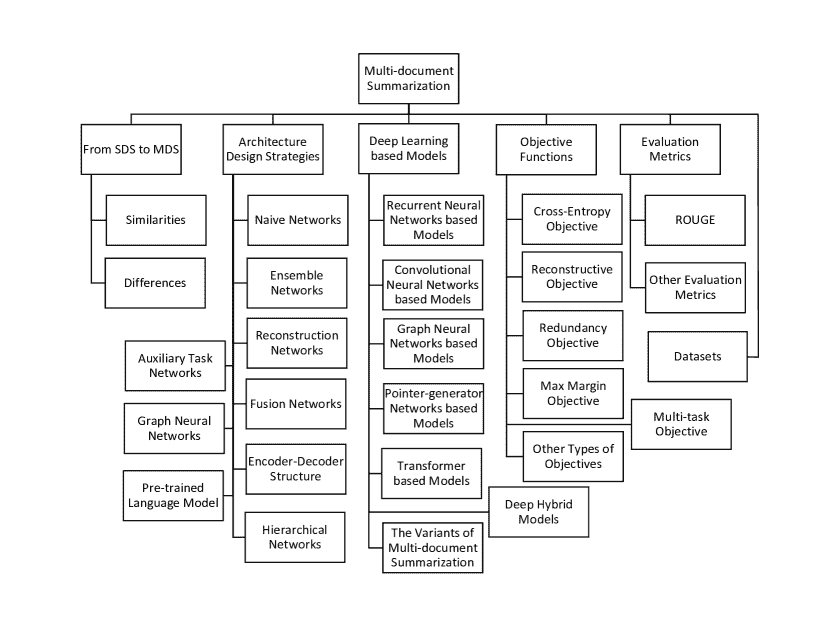
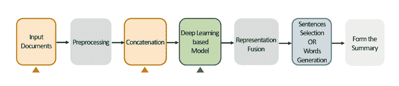
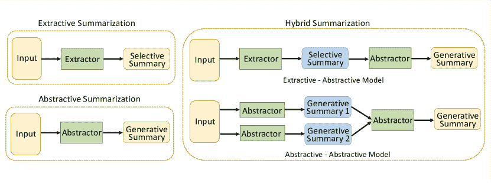
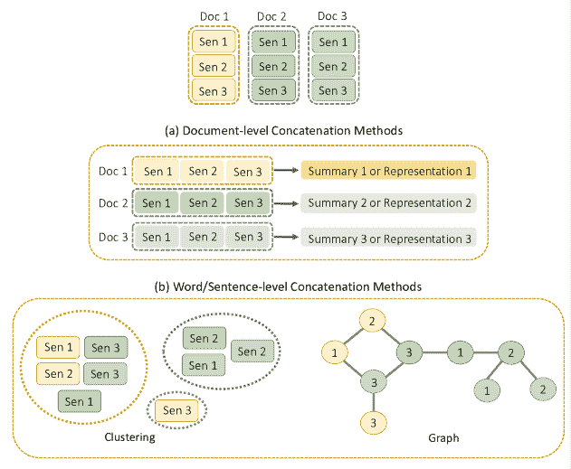
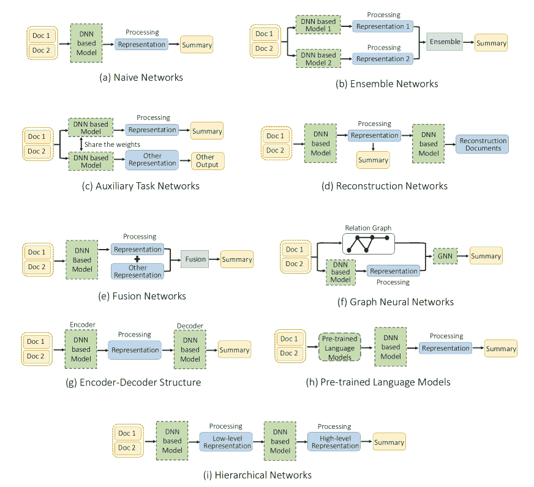

<!--yml

分类：未分类

日期：2024-09-06 19:58:37

-->

# [2011.04843] 通过深度学习技术的多文档摘要生成：综述

> 来源：[`ar5iv.labs.arxiv.org/html/2011.04843`](https://ar5iv.labs.arxiv.org/html/2011.04843)

# 通过深度学习技术的多文档摘要生成：综述

CONGBO MA 阿德莱德大学 congbo.ma@adelaide.edu.au， WEI EMMA ZHANG 阿德莱德大学 wei.e.zhang@adelaide.edu.au， MINGYU GUO 阿德莱德大学 mingyu.guo@adelaide.edu.au， HU WANG 阿德莱德大学 hu.wang@adelaide.edu.au 和 QUAN Z. SHENG 麦考瑞大学 michael.sheng@mq.edu.au

###### 摘要。

多文档摘要生成（MDS）是一种有效的信息聚合工具，它从一组相关主题的文档中生成一个信息丰富且简洁的摘要。我们的综述是首个此类综述，系统性地回顾了近期基于深度学习的 MDS 模型。我们提出了一种新的分类法来总结神经网络的设计策略，并对最先进技术进行了全面的总结。我们强调了现有文献中鲜有讨论的各种目标函数之间的差异。最后，我们提出了几个与这一新兴且令人兴奋的领域相关的未来研究方向。

多文档摘要生成，深度神经网络，机器学习^†^†ccs: 计算方法 自然语言处理^†^†ccs: 计算方法 机器学习算法^†^†ccs: 计算方法 信息提取

## 1\. 引言

在技术迅猛发展的时代，数据可用性的指数增长使得分析和理解文本文件成为一项繁琐、劳动密集且耗时的任务（Oussous et al., 2018; Hu et al., 2017）。快速高效地处理这些大量文本数据的需求催生了新的有效文本摘要技术。文本摘要是一个关键的自然语言处理（NLP）任务，它自动将一段文本或同一主题的文本集合转换为包含关键信息的简洁摘要，这对许多下游应用（如新闻摘要生成、搜索引擎和报告生成）是非常有益的（Paulus et al., 2018）。

文本可以从一个或多个文档中总结，产生单文档摘要（SDS）和多文档摘要（MDS）。虽然 SDS 更简单易行，但可能不会产生全面的摘要，因为它未能充分利用相关或更近期的文档。相反，MDS 从不同时间撰写的文档中生成更全面和准确的摘要，涵盖了不同的观点，但相应地更复杂，因为它尝试解决可能存在的多样和冗余信息（Tas 和 Kiyani，2007）。

此外，过长的输入文档通常会导致模型性能下降（Jin 等，2020）。对于模型来说，保留复杂输入序列的最关键内容，同时生成连贯、不冗余、事实一致且语法可读的摘要是一项挑战。因此，MDS 要求模型具备更强的能力来分析输入文档，识别和合并一致的信息。

MDS 在现实世界中有广泛的应用，包括新闻摘要（Fabbri et al., 2019）、科学出版物（Yasunaga et al., 2019）、电子邮件（Carenini et al., 2007; Zajic et al., 2008）、产品评论（Gerani et al., 2014）、医学文档（Afantenos et al., 2005）、讲座反馈（Luo and Litman, 2015; Luo et al., 2016）、软件项目活动（Alghamdi et al., 2020）以及维基百科文章生成（Liu et al., 2018）。最近，MDS 技术也受到了大量行业关注；一个名为 Xiaomingbot 的智能多语言新闻报道机器人（Xu et al., 2020a）被开发用于新闻生成，能够将多个新闻来源汇总为一篇文章并翻译成多种语言。大量的应用需求和快速增长的在线数据促进了 MDS 的发展。现有使用传统算法的方法基于：词频-逆文档频率（TF-IDF）（Radev et al., 2004; Baralis et al., 2012）、聚类（Goldstein et al., 2000; Wan and Yang, 2008）、图（Mani and Bloedorn, 1997; Wan and Yang, 2006）和潜在语义分析（Arora and Ravindran, 2008; Haghighi and Vanderwende, 2009）。这些工作大多数仍生成具有人工特征（Mihalcea and Tarau, 2005; Wan and Yang, 2006）的摘要，如句子位置特征（Baxendale, 1958; Erkan and Radev, 2004）、句子长度特征（Erkan and Radev, 2004）、专有名词特征（Vodolazova et al., 2013）、提示短语特征（Gupta and Lehal, 2010）、偏向词特征、句子间的连贯性和句子与中心点的连贯性。深度学习由于在计算机视觉（Krizhevsky et al., 2012）、自然语言处理（Devlin et al., 2014）和多模态学习（Wang et al., 2020b）等各个领域取得的成功，近年来引起了极大的关注。由于深度学习能够捕捉数据的高度非线性关系，业界和学界都开始采用深度学习来解决复杂任务。此外，基于深度学习的模型减少了对手动特征提取和语言学领域先验知识的依赖，极大地提高了工程的便利性（Torfi et al., 2020）。因此，基于深度学习的方法在大多数 MDS 任务中表现出色（Li et al., 2020a; Cao et al., 2015b; Lu et al., 2020; Liu and Lapata, 2019; Lebanoff et al., 2019）。随着计算能力的剧增和越来越多公共数据集的发布，具有更深层次和更复杂结构的神经网络已应用于 MDS（Liu and Lapata, 2019; Li et al., 2017b），加速了更强大和更稳健的文本摘要模型的发展。这些任务在自然语言处理社区中引起了关注；基于深度学习的 MDS 研究出版物数量在过去五年中迅速增加。

图 1\. 本次调查的层次结构。

深度学习在学术界和工业界对摘要的繁荣需要对当前出版物进行全面回顾，以便研究人员更好地理解过程和研究进展。然而，大多数现有的摘要调查论文是基于传统算法而不是基于深度学习的方法，或者针对一般文本摘要（Nenkova 和 McKeown，2012；Haque 等，2013；Ferreira 等，2014；Shah 和 Jivani，2016；El-Kassas 等，2021）。因此，我们调查了有关深度学习方法的 MDS 的最新出版物，据我们所知，这是该领域首个全面的调查。本次调查旨在将基于神经网络的 MDS 技术分类为不同的类别，并对这些方法的分类和进展进行详细讨论，以建立读者更清晰的概念。我们希望本次调查为研究人员、从业者和教育者提供一个全景，帮助他们快速了解并进入深度学习基于 MDS 的领域。本次调查的关键贡献有三点：

+   •

    我们提出了一种分类方案，以组织当前的研究，并为基于深度学习的 MDS 技术提供全面的回顾，包括基于深度学习的模型、目标函数、基准数据集和评估指标。

+   •

    我们回顾了发展动态，提供了对最前沿技术的系统概述和总结。我们还总结了基于我们对当前模型的广泛研究的九种网络设计策略。

+   •

    我们讨论了深度学习多文档摘要的开放问题，并确定了该领域的未来研究方向。我们还为一些讨论的研究方向提出了潜在的解决方案。

论文选择。我们使用 Google Scholar 作为主要搜索引擎，从 2015 年到 2021 年选择了具有代表性的工作。我们从顶级 NLP 和 AI 期刊及会议中选择了高质量的论文，包括 ACL¹¹1 计算语言学协会年会，EMNLP²²2 自然语言处理的经验方法，COLING³³3 计算语言学国际会议，NAACL⁴⁴4 北美计算语言学协会年会，AAAI⁵⁵5 人工智能 AAAI 会议，ICML⁶⁶6 机器学习国际会议，ICLR⁷⁷7 学习表征国际会议和 IJCAI⁸⁸8 国际联合人工智能会议。我们使用的主要关键词包括多文档摘要、摘要、抽取式摘要、生成式摘要、深度学习和神经网络。

调查的组织结构。本调查将涵盖 MDS 中最近先进的深度学习工作的各个方面。我们提出的分类法从六个方面对这些工作进行分类（见图 1）。为了更自成体系，在第二部分中，我们给出问题定义、文本摘要的处理框架，讨论 SDS 和 MDS 之间的相似性和差异。在第三部分中，介绍了九种深度学习架构设计策略、六种基于深度学习的方法以及 MDS 的变体任务。第四部分总结了指导模型优化过程的目标函数，而第五部分中的评估指标帮助读者选择合适的指标来评估模型的有效性。第六部分总结了标准和变体 MDS 数据集。最后，第七部分讨论了基于深度学习的 MDS 的未来研究方向，并在第八部分中作出结论。

图 2\. 文本摘要的处理框架。每个突出显示的步骤（带有三角形标记的步骤）表示 SDS 和 MDS 之间的差异。

## 2\. 从单文档到多文档摘要

在我们深入现有基于深度学习的技术细节之前，我们首先定义 SDS 和 MDS，并介绍这两种方法中使用的概念。MDS 的目标是从一组文档$D$中生成一个简洁而信息丰富的摘要$Sum$。$D$表示一个主题相关文档的集合$\left\{d_{i}\mid i\in[1,N]\right\}$，其中$N$是文档的数量。每个文档$d_{i}$包含$M_{d_{i}}$个句子$\left\{s_{i,j}\mid j\in[1,M_{d_{i}}]\right\}$。$s_{i,j}$指的是第$i$个文档中的第$j$个句子。标准摘要$Ref$被称为黄金摘要或参考摘要。目前，大多数黄金摘要由专家编写。我们在整篇文章中保持这一符号的一致性。

为了让读者清楚理解深度学习基于总结任务的处理过程，我们总结并阐述了如图 2 所示的处理框架。第一步是预处理输入文档，如句子分割、非字母字符的标记化和标点符号的去除（Shirwandkar 和 Kulkarni，2018）。尤其是 MDS 模型需要选择合适的连接方法来捕捉跨文档关系。接着，选择一个合适的深度学习模型来生成语义丰富的表示以用于下游任务。下一步是融合这些不同类型的表示以用于后续的句子选择或摘要生成。最后，将文档转化为简洁且信息丰富的摘要。图 2 中每一个用三角形标出的步骤表示了 SDS 和 MDS 之间的差异。基于此过程，MDS 的研究问题可以总结如下：

+   •

    如何从输入文档中捕捉跨文档关系和文档内关系？

+   •

    相比于 SDS，如何在包含冲突、重复和补充信息的大范围搜索空间中提取或生成显著信息？

+   •

    如何最佳地融合来自深度学习模型和外部知识的各种表示？

+   •

    如何全面评估 MDS 模型的性能？

以下各节提供了对 SDS 和 MDS 之间相似性和差异性的全面分析。

图 3\. 文本摘要的总结构建类型。

### 2.1\. SDS 和 MDS 之间的相似性

现有的 SDS 和 MDS 方法共享总结构建类型、学习策略、评估指标和目标函数。SDS 和 MDS 都旨在将文档压缩成简短且信息丰富的摘要。现有的摘要方法可以分为抽象摘要、提取摘要和混合摘要（见图 3）。提取摘要方法从源文档中选择显著的片段以创建信息丰富的摘要，通常包括两个主要组件：句子排名和句子选择（Cao 等，2015a；Nallapati 等，2017）。抽象摘要方法旨在通过自动生成简洁且连贯的摘要来呈现输入文档的主要信息；这一类方法允许模型从语料库中生成新的词汇和句子（Paulus 等，2018）。混合模型则提出结合提取和抽象方法的优点来处理输入文本。摘要研究关注两种学习策略。一种策略通过改进端到端模型的架构设计来提高泛化性能（Fabbri 等，2019；Chu 和 Liu，2019；Jin 等，2020；Liu 和 Lapata，2019）。另一种策略则利用外部知识或其他辅助任务来补充摘要选择或生成（Cao 等，2017；Li 等，2020a）。此外，SDS 和 MDS 都旨在最小化机器生成摘要与黄金摘要之间的距离。因此，SDS 和 MDS 可以共享一些评估摘要模型性能的指标，如召回导向的学习评价（ROUGE，见第五部分），以及用于指导模型优化的目标函数。

### 2.2\. SDS 与 MDS 的区别

在 MDS 的早期阶段，研究人员直接将 SDS 模型应用于 MDS（Mao 等，2020）。然而，MDS 中存在许多与 SDS 不同的方面，这些差异也是探索 MDS 模型的突破点。我们总结了以下五个方面的差异：

+   •

    输入文档类型更加多样化；

+   •

    捕捉跨文档关系的方法不足；

+   •

    输入文档之间存在较高的冗余和矛盾。

+   •

    更大的搜索空间但缺乏足够的训练数据；

+   •

    缺乏专门为 MDS 设计的评估指标。

SDS 和 MDS 之间一个定义性不同的特点是输入文档的数量。MDS 任务处理多个来源，通常可以大致分为三组：

+   •

    许多短文档，每个文档相对较短，但输入数据的数量很大。一个典型的例子是产品评论摘要，旨在从众多单独的评论中生成一个简短而信息丰富的摘要（Angelidis 和 Lapata，2018）。

+   •

    少量长文档。例如，从一组新闻文章中生成摘要（Fabbri 等，2019），或从几篇网络文章中构建维基百科风格的文章（Liu 等，2018）。

+   •

    混合源包含一个或几个长文档和几个到许多较短的文档。例如，新闻文章及其多个读者评论（Li 等，2017a），或从一篇长论文中提取的科学总结和几个短的相关引用（Yasunaga 等，2019）。

由于 SDS 只使用一个输入文档，因此无需额外处理来评估 SDS 输入之间的关系。就其本质而言，MDS 中使用的多个输入文档可能包含更多矛盾、冗余和补充信息（Radev，2000）。因此，MDS 模型需要复杂的算法来识别和处理文档之间的冗余和矛盾，以确保最终的摘要是全面的。检测这些文档间的关系可以为 MDS 模型带来好处。在 MDS 任务中，有两种常见的方法来连接多个输入文档：

图 4\. 分层连接的方法。

+   •

    平坦连接是一种简单而强大的连接方法，其中所有输入文档被展开并作为一个平坦的序列处理；在一定程度上，这种方法将 MDS 任务转换为 SDS 任务。输入平坦连接的文档要求模型具备强大的处理长序列的能力。

+   •

    层次化连接能够保持跨文档的关系。然而，许多现有的深度学习方法并未充分利用这种层次关系（Wang et al., 2020a; Fabbri et al., 2019; Liu et al., 2018）。利用文档之间的层次关系而非简单的平坦连接文章，有助于 MDS 模型获得内置层次信息的表示，从而提高模型的有效性。一个集群中的输入文档在逻辑上和语义上描述了相似的主题。图 4 展示了层次化连接的两个代表性方法。现有的层次化连接方法要么在集群中分别进行文档级的凝练（Amplayo and Lapata, 2021），要么在文档集群内处理词语/句子级别的文档（Nayeem et al., 2018; Antognini and Faltings, 2019; Wang et al., 2020a）。在图 4(a)中，来自输入文档的抽取式或生成式摘要，或表示会在后续过程中融合以生成最终摘要。使用文档级连接方法的模型通常是两阶段模型。在图 4(b)中，文档中的句子可以被词语替代。对于词语或句子级连接方法，聚类算法和基于图的技术是最常用的方法。聚类方法可以帮助 MDS 模型减少冗余，提高生成摘要的信息覆盖率（Nayeem et al., 2018）。句子关系图能够建模多文档之间的层次关系（Antognini and Faltings, 2019; Yasunaga et al., 2019, 2017）。大多数图构建方法利用句子作为顶点，两个句子之间的边表示它们的句子级关系（Antognini and Faltings, 2019）。余弦相似度图（Erkan and Radev, 2004）、话语图（Christensen et al., 2013; Yasunaga et al., 2017; Liu and Lapata, 2019）、语义图（Pasunuru et al., 2021b）和异构图（Wang et al., 2020a）可以用于构建句子图结构。这些图结构都可以作为外部知识来提高 MDS 模型的性能。

除了捕捉文档间的关系，混合摘要模型还可以用于语义上捕捉复杂文档，以及融合在 MDS 任务中更常见的不同特征。这些模型通常分两个阶段处理数据：提取式-抽象式和抽象式-抽象式（见图 3 的右侧部分）。两个阶段的模型尝试在第一阶段通过提取式或抽象式方法从源文档中收集重要信息，从而显著减少文档的长度。在第二阶段，处理过的文本被输入到一个抽象式模型中以形成最终的摘要（Amplayo 和 Lapata，2021；Lebanoff 等，2019；Liu 等，2018；Liu 和 Lapata，2019；Li 等，2020a）。

此外，多源文档之间的冲突、重复和互补性要求 MDS 模型具备更强的处理复杂信息的能力。然而，直接将 SDS 模型应用于 MDS 任务难以处理更高的冗余度（Mao 等，2020）。因此，MDS 模型不仅需要生成连贯且完整的摘要，还需要更复杂的算法来识别和应对文档间的冗余和矛盾，以确保最终的摘要本身是完整的。MDS 还涉及更大的搜索空间，但其训练数据规模小于 SDS，这给基于深度学习的模型学习充分的表示带来了障碍（Mao 等，2020）。此外，目前没有专门针对 MDS 设计的评估指标；然而，现有的 SDS 评估指标无法有效评估生成的摘要与不同输入文档之间的关系。

## 3\. 基于深度学习的多文档摘要方法

深度神经网络（DNN）模型从输入数据中学习多层次的表示和抽象，并可以适应各种研究领域的数据，如计算机视觉（Krizhevsky 等， 2012）和自然语言处理（Devlin 等， 2014）。深度学习算法通过反向传播学习独特特征，以最小化给定的目标函数，从而替代了手动特征工程。众所周知，线性可解问题具有许多优点，如容易解决和具有众多理论支持；然而，许多 NLP 任务是高度非线性的。正如 Hornik 等人（Hornik 等， 1989）理论证明的那样，神经网络可以作为通用近似器拟合任何给定的连续函数。对于 MDS 任务，DNN 由于其强大的拟合能力，也比传统方法表现更好，能有效处理大规模文档并提炼出有用的摘要。在本节中，我们首先介绍我们新颖的分类法，该分类法概括了九种神经网络设计策略（第 3.1 节）。然后，我们根据它们采用的主要神经网络架构介绍最先进的基于 DNN 的 MDS 模型（第 3.2 节至第 3.7 节），最后简要介绍 MDS 变体任务（第 3.8 节）。

### 3.1\. 架构设计策略

架构设计策略在基于深度学习的模型中发挥了关键作用，许多架构已被应用于各种 MDS 任务。在这里，我们对网络架构进行了概括，并根据它们如何生成或融合语义丰富和句法丰富的表示来总结为九种类型，以提高 MDS 模型的性能（图 5）；这些不同的架构也可以作为基本结构或相互堆叠，以获得更多样化的设计策略。在图 5 中，深度神经模型以绿色框表示，可以灵活地用其他主干网络替代。蓝色框表示由神经网络或启发式设计方法处理的神经嵌入，例如，"句子/文档"或"其他"表示。每个子图的解释如下：

图 5\. 网络设计策略。

+   •

    朴素网络（图 5(a)）通过基于深度神经网络（DNN）的模型输入多个串联的文档以提取特征。使用词级、句级或文档级表示来生成下游摘要或选择句子。朴素网络代表了最简单的模型，为其他策略奠定了基础。

+   •

    集成网络（图 5(b)）。集成方法利用多种学习算法来获得比单一算法更好的性能。为了捕捉语义丰富和句法丰富的表示，集成网络将输入文档馈送到具有不同网络结构或操作的多个路径中。随后，来自不同网络的表示被融合以增强模型的表达能力。多数投票或平均得分可以用于确定最终输出。

+   •

    辅助任务网络（图 5(c)）在摘要模型中采用不同的任务，其中文本分类、文本重建或其他辅助任务作为补充表示学习器来获取高级特征。同时，辅助任务网络还为研究人员提供了一种利用其他任务中的适当数据的解决方案。在这种策略中，使用参数共享方案来共同优化不同的任务。

+   •

    重建网络（图 5(d)）从无监督学习范式中优化模型，这使得摘要模型能够克服注释黄金摘要不足的限制。使用这种范式使生成的摘要在自然语言领域内得到良好约束。

+   •

    融合网络（图 5(e)）融合了神经网络生成的表示和手工特征。这些手工特征包含了足够的先验知识，有助于优化摘要模型。

+   •

    图神经网络（图 5(f)）。该策略通过基于源文档构建图结构，包括词汇、句子或文档级别的信息，从而捕捉文档间的关系，这对于多文档模型训练至关重要且有益。

+   •

    编码器-解码器结构（图 5(g)）。编码器将源文档嵌入到隐藏表示中，即词汇、句子和文档表示。这种表示包含压缩的语义和句法信息，传递给解码器，解码器处理潜在的嵌入来综合局部和全局的语义/句法信息，以生成最终的摘要。

+   •

    预训练语言模型（图 5(h)）通过使用大量语料库预测词汇或短语来获得上下文文本表示，这些模型可以进一步微调以适应下游任务（Dong et al., 2019）。由于迁移学习可以帮助模型训练过程，这些模型可以通过随机初始化的解码器以端到端的方式进行微调（Li et al., 2020a）。

+   •

    层次网络（图 5(i)）。多个文档被串联作为输入，输入到第一个基于 DNN 的模型中以捕捉低级表示。另一个基于 DNN 的模型级联生成基于前者的高级表示。层次网络使模型能够更高效地捕捉抽象级别和语义级别的特征。

### 3.2\. 基于递归神经网络的模型

循环神经网络（RNNs）（Rumelhart et al., 1986）擅长通过捕捉序列关系和词序列中的句法/语义信息来建模顺序数据。在 RNN 模型中，神经元通过隐藏层连接，与其他神经网络结构不同，每个 RNN 神经元的输入不仅来自词语或句子嵌入，还来自前一个隐藏状态的输出。尽管功能强大，传统的 RNN 模型通常会遇到梯度爆炸或消失的问题，因此提出了大量的 RNN 变体。最常见的有长短期记忆（LSTM）（Hochreiter and Schmidhuber, 1997）、门控递归单元（GRU）（Chung et al., 2014）和双向长短期记忆（Bi-LSTM）（Huang et al., 2015）。图 5 中的基于 DNN 的模型可以被替换为基于 RNN 的模型进行设计。

自 2015 年以来，基于 RNN 的模型已被应用于 MDS 任务。Cao 等人（Cao et al., 2015a）提出了一种基于 RNN 的模型，称为基于递归神经网络的排序框架（R2N2），该模型利用手动提取的词语和句子级特征作为输入。该模型将句子排序任务转化为层次回归过程，以衡量句子和解析树中成分的重要性。Zheng 等人（Zheng et al., 2019）使用了一个层次 RNN 结构，通过提取句子和文档嵌入以及主题嵌入来利用子主题信息。在这一子主题驱动摘要（STDS）模型中，读者评论被视为辅助文档，模型采用软聚类将评论和句子表示结合起来，以进一步获取子主题表示。Arthur 等人（Bražinskas et al., 2019）介绍了一种基于 GRU 的编码器-解码器架构，用于在生成多评论摘要时最小化反映主流观点的意见多样性。Mao 等人（Mao et al., 2020）提出了一种最大边际相关引导的强化学习框架（RL-MMR），以结合神经序列学习和统计测量的优点。所提出的软注意力用于学习充分的表示，使搜索空间的探索更多。

为了利用混合总结模型的优势，Reinald 等（Amplayo 和 Lapata， 2021）提出了一个两阶段框架，将观点总结视为多源传导的一个实例，以从源文档中提取显著信息。模型的第一阶段利用 Bi-LSTM 自编码器学习词级和文档级表示；第二阶段融合多源表示，并使用简单的 LSTM 解码器结合基本的注意机制（Bahdanau 等， 2015）和复制机制（Vinyals 等， 2015）生成观点总结。

由于配对 MDS 数据集稀缺且难以获得，Li 等（Li 等， 2017b）开发了一个基于 RNN 的框架，以无监督的方式从输入文档中的句子中提取显著信息向量。级联注意机制保留了最相关的嵌入以重构原始输入句子向量。在重构过程中，所提出的模型利用稀疏性约束来惩罚输出向量中的琐碎信息。此外，Chu 等（Chu 和 Liu， 2019）提出了一种无监督的端到端抽象总结架构，称为 MeanSum。该基于 LSTM 的模型将产品或商业评论总结问题形式化为两个独立的闭环。受到 MeanSum 的启发，Coavoux 等（Coavoux 等， 2019）使用了一个两层标准 LSTM 来构建基于方面的多文档抽象总结的句子表示，并发现聚类策略使模型能够奖励评论的多样性并处理矛盾的评论。

### 3.3\. 基于卷积神经网络的模型

卷积神经网络（CNNs）（LeCun 等， 1998）在计算机视觉任务中取得了优异的结果。卷积操作扫描词语/句子嵌入，并使用卷积核从输入数据对象中提取重要信息。通过间歇性地使用池化操作，可以返回从简单到复杂的特征层次。近年来，CNN 已被证明在各种 NLP 任务中有效（Kim， 2014；Dos Santos 和 Gatti， 2014），因为它们可以在句子/词向量化后处理自然语言。大多数基于 CNN 的 MDS 模型使用 CNN 进行语义和句法特征表示。与 RNN 类似，基于 CNN 的模型也可以在网络设计策略中替代基于 DNN 的模型（请参阅图 5）。

在 MDS 中使用 CNN 的一种简单方法是通过在输入文档上滑动多个不同窗口大小的滤波器来进行语义表示。曹等（曹等，2015b）提出了一种基于混合 CNN 的模型 PriorSum 来捕捉潜在的文档表示。所提议的表示学习器在输入文档上滑动，使用不同窗口宽度的滤波器和两层最大时间池化操作（Collobert et al., 2011）以提取比使用标准 CNN 更具信息性的文档独立特征。

类似地，HNet（Singh et al., 2018）使用不同的 CNN 滤波器和最大时间池化来生成用于下游处理的显著特征表示。Cho 等（Cho et al., 2019）也在 DPP 组合模型中使用了不同的滤波器尺寸来提取低级特征。Yin 等（Yin and Pei, 2015）提出了一种无监督的基于 CNN 的模型，称为新颖神经语言模型（NNLM），用于提取句子表示并减少句子选择的冗余。NNLM 框架仅包含一层卷积层和一层最大池化层，同时使用逐元素平均句子表示和上下文词表示来预测下一个词。对于基于方面的意见摘要，Stefanos 等（Angelidis and Lapata, 2018）利用基于 CNN 的模型来编码包含一组意见极性的产品评论。

具有不同背景知识和理解的人可能会产生对同一文档的不同总结。为了考虑这种变异性，张等（张等，2016）提出了一种 MV-CNN 模型，该模型集成了三个独立模型，以结合多视角学习和 CNN 来提高 MDS 的性能。在这项工作中，三个具有双卷积层的 CNN 使用了不同窗口大小的多个滤波器，以提取句子的不同显著性分数。

为了克服训练数据不足的 MDS 瓶颈，曹等（曹等，2017）开发了一个 TCSum 模型，将一个辅助文本分类子任务纳入 MDS 中，以引入更多的监督信号。文本分类模型使用 CNN 描述符将文档映射到分布式表示，并将输入文档分类到不同的类别中。总结模型共享来自分类模型的投影句子嵌入，TCSum 模型根据分类结果选择相应的类别转换矩阵，将句子嵌入转换为摘要嵌入。

与支持处理长时间序列信号的 RNN 不同，天真的 CNN 层由于固定大小的卷积核的限制，难以在处理序列数据时捕捉长距离关系，因为每个卷积核都有特定的感受野大小。然而，基于 CNN 的模型可以通过形成层级结构来增加其感受野，从而以并行的方式计算序列数据。由于这种高度可并行化的特性，基于 CNN 的总结模型的训练效率比基于 RNN 的模型更高。然而，对于 CNN 基础的模型来说，总结长篇输入文章仍然是一个具有挑战性的任务，因为它们不擅长建模非局部关系。

### 3.4\. 基于图神经网络的模型

CNN 已成功应用于许多计算机视觉任务，从欧几里得空间中提取出显著的图像特征，但在处理非欧几里得数据时表现不佳。自然语言数据由具有强关系的词汇和短语组成，这些关系用图比用序列顺序表示更好。图神经网络（GNNs，图 5 (f)）构成了理想的 NLP 架构，因为它们可以在语义和句法上建模实体之间的强关系。图卷积网络（GCNs）和图注意力网络（GANs）是最常用的 GNN，因为它们在与其他神经网络的集成中高效且简单。这些模型首先基于输入文档构建关系图，其中节点可以是单词、句子或文档，边则捕捉它们之间的相似性。同时，输入文档被输入到基于 DNN 的模型中，以生成不同层次的嵌入。然后，在其顶部构建 GNN，以捕捉显著的上下文信息。表 1 描述了当前用于 MDS 的 GNN 基础模型，包括节点、边、边权重和应用的 GNN 方法的详细信息。

表 1\. 基于图神经网络的多文档总结模型。

| 模型 | 节点 | 边 | 边权重 | GNN 方法 |
| --- | --- | --- | --- | --- |

|

&#124; HeterDoc- &#124;

&#124; SumGraph (Wang et al., 2020a) &#124;

|

&#124; 单词，句子，&#124;

&#124; 文档 &#124;

|

&#124; 单词-句子，&#124;

&#124; 单词-文档 &#124;

| TF-IDF |
| --- |

&#124; 图注意力 &#124;

&#124; 网络 &#124;

|

|

&#124; 基于图的 &#124;

&#124; 神经 MDS (Yasunaga et al., 2017) &#124;

| 句子 | 句子-句子 |
| --- | --- |

&#124; 个性化 &#124;

&#124; 话语图 &#124;

|

&#124; 图卷积 &#124;

&#124; 网络 &#124;

|

| SemSentSum (Antognini and Faltings, 2019) | 句子 | 句子-句子 |
| --- | --- | --- |

&#124; 余弦相似度图 &#124;

&#124; 边缘移除方法 &#124;

|

&#124; 图卷积 &#124;

&#124; 网络 &#124;

|

| ScisummNet (Yasunaga et al., 2019) | 句子 | 句子-句子 |
| --- | --- | --- |

&#124; 余弦相似度图 &#124;

|

&#124; 图卷积 &#124;

&#124; 网络 &#124;

|

Yasunage 等人（Yasunaga et al.，2017）开发了一种基于 GCN 的提取式模型，以捕捉句子之间的关系。该模型首先构建一个基于句子的图，然后将预处理后的数据输入到 GCN（Kipf and Welling，2017）中，以捕捉句子级相关特征。模型定义了每个句子作为一个节点，并且每对句子之间的关系定义为一条边。在每个文档集群中，句子关系图可以通过余弦相似度图（Erkan and Radev，2004）、近似话语图（Christensen et al., 2013）和提出的个性化话语图生成。通过句子级 RNN 提取的句子关系图和句子嵌入被输入到 GCN 中，以生成最终的句子表示。在文档级 GRU 的帮助下，该模型生成集群嵌入，以完全聚合句子之间的特征。

同样，Antognini 等人（Antognini and Faltings，2019）提出了一种基于 GCN 的模型，名为 SemSentSum，该模型基于句子关系构建图。与 Yasunage 等人（Yasunaga et al.，2017）的工作相比，该模型利用外部通用嵌入，这些嵌入是在不相关的语料库上预训练的，用于构建句子语义关系图。此外，还应用了一种边缘移除方法来处理稀疏图问题，重点强调句子相似度高的情况；如果边的权重低于给定阈值，则移除该边。句子关系图和句子嵌入被输入到 GCN（Kipf and Welling，2017）中，以生成提取式摘要的显著性估计。

Yasunage 等人（Yasunaga et al.，2019）还设计了一种用于总结科学论文的基于 GCN 的模型。提出的 ScisummNet 模型不仅使用源科学论文的摘要，还使用引用原始来源的论文中的相关文本。总引用次数也作为权威特征纳入模型中。余弦相似度图被应用于形成句子关系图，GCN 被用于从句子关系图、权威分数和句子嵌入中预测句子的显著性估计。

现有的基于图神经网络（GNN）的模型主要关注句子之间的关系，并未充分考虑单词、句子和文档之间的关系。为填补这一空白，王等人（Wang et al., 2020a）提出了一种异构 GAN 模型，称为 HeterDoc-SUM Graph，专门用于提取式多文档摘要（MDS）。这种异构图结构包括单词、句子和文档节点，其中句子节点和文档节点根据包含的单词节点进行连接。单词节点因此充当连接句子节点和文档节点的中介桥梁，并用于更好地建立文档-文档、句子-句子和句子-文档关系。TF-IDF 值被用来加权单词-句子和单词-文档的边，这三个层次的节点表示被传递到图注意力网络中进行模型更新。在每次迭代中，进行单词-句子和单词-文档关系的双向更新，以更好地聚合跨层次的语义知识。

### 3.5. 指针生成网络模型

指针生成（PG）网络（See et al., 2017）被提出以克服摘要任务中的事实错误和高冗余问题。这种网络的灵感来自于指针网络（Vinyals et al., 2015）、CopyNet（Gu et al., 2016）、强制注意力句子压缩（Miao and Blunsom, 2016）以及机器翻译中的覆盖机制（Tu et al., 2016）。PG 网络结合了序列到序列（Seq2Seq）模型和指针网络，获得了一个统一的概率分布，允许从源文本中选择词汇或由机器生成。此外，覆盖机制防止 PG 网络始终选择相同的短语。

最大边际相关性（MMR）方法旨在通过考虑重要性和冗余指数来从源文档中选择一组突出的句子（Carbonell 和 Goldstein，1998）。冗余分数控制句子选择，以最小化与现有摘要的重叠。MMR 模型根据重要性和冗余分数将新句子添加到目标摘要中，直到摘要长度达到一定阈值。受到 MMR 启发，Alexander 等人（Fabbri 等，2019）提出了一种端到端的层次化 MMR-注意力指针生成器（Hi-MAP）模型，以结合 PG 网络和 MMR（Carbonell 和 Goldstein，1998）用于抽象 MDS。Hi-MAP 模型通过修改注意力权重（将 MMR 分数与原始注意力权重相乘）来改进 PG 网络，以将更重要的句子纳入摘要中，并过滤冗余信息。类似地，MMR 方法通过 PG-MMR 模型（Lebanoff 等，2018）实现，以从多文档输入中识别突出的源句子，尽管与 Hi-MAP 计算 MMR 分数的方法不同；而是使用 ROUGE-L 召回率和 ROUGE-L 精确率（Lin，2004）作为评价指标来计算重要性和冗余分数。为了克服 MDS 数据集的稀缺性，PG-MMR 模型利用在 SDS 数据集上预训练的支持向量回归模型来识别重要内容。该支持向量回归模型还通过考虑四个因素来计算每个输入句子的分数：句子长度、句子相对/绝对位置、句子与文档的相似性，以及通过 PG 网络获得的句子质量。分数排名前 $K$ 的句子将输入另一个 PG 网络，以生成简洁的摘要。

### 3.6\. 基于 Transformer 的模型

正如讨论的那样，基于 CNN 的模型在处理序列数据方面不如基于 RNN 的模型。然而，基于 RNN 的模型不适合并行计算，因为 RNN 模型中的当前状态高度依赖于前一步骤的结果。此外，由于在学习过程中前面的知识会逐渐消失，RNN 在处理长序列时会遇到困难。采用基于 Transformer 的架构（Vaswani 等人，2017）是一种解决这些问题的方案。Transformer 基于自注意力机制，具有天然的并行化优势，并且保留了相对较长的依赖关系。Transformer 模型在 MDS 任务中取得了有希望的结果（Liu 等人，2018；Liu 和 Lapata，2019；Li 等人，2020a；Jin 等人，2020），并且可以替代图中的 DNN 基于模型 5。大多数基于 Transformer 的模型遵循编码器-解码器结构。基于 Transformer 的模型可以分为平坦 Transformer、层次 Transformer 和预训练语言模型。

**平坦 Transformer**。刘等人（Liu et al., 2018）将 Transformer 引入 MDS 任务，旨在从给定的主题和参考资料生成一篇 Wikipedia 文章。作者认为基于编码器-解码器的序列转换模型无法很好地处理长输入文档，因此他们的模型选择了一系列前$K$的 tokens，并将它们输入到仅基于 Transformer 的解码器序列转换模型中，以生成 Wikipedia 文章。更具体地说，Transformer 仅解码器架构将从提取阶段得到的结果和黄金总结结合成一个句子进行训练。为了从不同粒度中获得丰富的语义表示，金等人（Jin et al., 2020）提出了一种基于 Transformer 的多粒度交互网络 MGSum，并统一了提取式和抽象式 MDS。单词、句子和文档被视为由粒度层次关系图连接的三个语义单元粒度级别。在相同粒度下，使用自注意力机制来捕捉语义关系。句子粒度表示用于提取式总结，而单词粒度表示则用于生成抽象总结。MGSum 使用融合门来整合和更新语义表示。此外，采用稀疏注意力机制来确保总结生成器关注重要信息。Brazinskas 等人（Brazinskas et al., 2020）为 MDS 的少样本学习创造了一个先例，该方法利用 Transformer 条件语言模型和插件网络进行提取式和抽象式 MDS，以克服因对大参数模型进行天真的微调而导致的快速过拟合和生成质量差的问题。

层次化变换器。为了处理大型输入文档，Yang 等（Liu 和 Lapata，2019）提出了一种两阶段的层次化变换器（HT）模型，该模型具有段落间和图信息驱动的注意机制，使得模型能够以层次化的方式对多个输入文档进行编码，而不是简单的平面拼接。采用逻辑回归模型来选择前$K$个段落，这些段落被输入到局部变换器层以获得上下文特征。全局变换器层混合上下文信息以建模所选段落的依赖关系。为了利用图结构捕捉跨文档关系，Li 等（Li 等，2020a）提出了一种基于 HT 模型的端到端变换器模型 GraphSum。在图编码层中，GraphSum 将自注意机制扩展为图信息驱动的自注意机制，将图表示融入变换器编码过程。此外，采用高斯函数对图表示矩阵进行处理，以控制图结构对摘要模型的影响强度。HT 和 GraphSum 模型均基于自注意机制，因此随着输入序列数量的增加，内存需求呈平方增长；为了解决这一问题，Pasunuru 等（Pasunuru 等，2021b）将全自注意力机制修改为局部和全局注意机制（Beltagy 等，2020），以实现内存线性扩展。提出了双重编码器用于编码截断的拼接文档和来自完整文档的线性图信息。

预训练语言模型（LMs）。在大型文本语料库上预训练的变换器在下游自然语言处理任务中取得了巨大成功，包括文本摘要。预训练的 LMs 可以在非摘要或 SDS 数据集上进行训练，以克服 MDS 数据的缺乏（Zhang et al., 2020d; Li et al., 2020a; Pasunuru et al., 2021b）。大多数预训练 LMs，如 BERT（Devlin et al., 2019）和 RoBERTa（Liu et al., 2019a），在短序列上表现良好。在层次化变换器架构中，用预训练的 LMs 替换低层次变换器（标记级别）编码层有助于模型突破长度限制，感知更多信息（Li et al., 2020a）。在层次化变换器架构中，“[CLS]” 标记的输出向量可以用作高层变换器模型的输入。为了避免在处理文档级序列时自注意力的二次内存增加，可以采用基于 Longformer 的方法（Beltagy et al., 2020），包括局部和全局注意机制，可以与预训练的 LMs 结合，线性扩展 MDS 的内存（Pasunuru et al., 2021b）。另一个解决计算问题的方案可以借鉴 SDS 是使用多层变换器架构来扩展文档长度，使预训练的 LMs 能够编码一小块文本，信息可以在两个连续层之间的块之间共享（Grail et al., 2021）。PEGASUS（Zhang et al., 2020d）是一个基于变换器的编码器-解码器模型，具有生成间隙句子（GSG），专为抽象摘要设计。GSG 表明，基于重要性掩盖整个句子，而不是通过随机或前导选择，对下游摘要任务效果良好。

### 3.7\. 深度混合模型

许多神经模型可以被整合以形成更强大和更具表现力的模型。在这一部分，我们总结了现有的深度混合模型，这些模型已被证明对 MDS 有效。

CNN + LSTM + 胶囊网络。Cho et al.（Cho et al., 2019）提出了一种基于行列式点过程的混合模型，用于语义测量句子相似度。卷积层使用不同大小的滤波器在成对的句子上滑动，以提取低级特征。胶囊网络（Sabour et al., 2017; Yang et al., 2018）用于通过转换空间和方向关系来识别冗余信息，以进行高级表示。作者还使用 LSTM 重新构建成对的句子，并将重构损失添加到最终目标函数中。

CNN + Bi-LSTM + 多层感知机（MLP）。Abhishek et al. (Singh et al., 2018) 提出了一个提取式 MDS 框架，考虑了文档相关和文档无关的信息。在该模型中，一个具有不同过滤器的 CNN 捕捉短语级表示。利用这些显著表示形成的完整二叉树被输入到推荐的 Bi-LSTM 树索引器中，以实现更好的泛化能力。使用 ReLU 函数的 MLP 用于叶节点转换。更具体地说，Bi-LSTM 树索引器利用 LSTM 的时间序列能力和递归模型的组成性来捕捉语义和组成特征。

PG 网络 + Transformer。在生成摘要时，需要考虑多句子，特别是句子对的信息融合。Logan et al. (Lebanoff et al., 2019) 发现大多数摘要句子是通过融合一个或两个源句子生成的；因此，他们提出了一种考虑句子对语义兼容性的两阶段摘要方法。这种方法对单句和句子对进行联合打分，以从原始文档中筛选出代表性内容。得分高的句子或句子对随后被压缩和改写，以生成利用 PG 网络的摘要。本文使用基于 Transformer 的模型对单句和句子对进行不加区分的编码，以获得词语和序列的深层上下文表示。

表 2\. 基于深度学习的方法。“Ext”，“Abs”和“Hyd”分别表示提取式、抽象式和混合式；“FC”和“HC”分别代表平坦拼接、层次拼接。

| 方法 | 工作 |
| --- | --- |

&#124; 构建 &#124;

&#124; 类型 &#124;

|

&#124; 文档级别 &#124;

&#124; 关系 &#124;

|

&#124; 比较 &#124;

&#124; 基于 DL 的技术 &#124;

|

| Ext | Abs | Hyb | FC | HC | 优缺点 |
| --- | --- | --- | --- | --- | --- |
| RNN | MeanSum (Chu and Liu, 2019) |  | ✓ |  | ✓ |  | 优点：能够捕捉词序列中的顺序关系和语法/语义信息 缺点：不容易进行并行计算；高度依赖于前一步的结果 |
| Zhang et al. (Zhang et al., 2018b) |  | ✓ |  | ✓ |  |
| STDS (Zheng et al., 2019) | ✓ |  |  |  | ✓ |
| ParaFuse_doc (Nayeem et al., 2018) |  | ✓ |  |  | ✓ |
| R2N2 (Cao et al., 2015a) | ✓ |  |  | ✓ |  |
| CondaSum (Amplayo and Lapata, 2021) |  |  | ✓ |  | ✓ |
| C-Attention (Li et al., 2017b) |  | ✓ |  | ✓ |  |
| Wang et al. (Wang and Ling, 2016) |  | ✓ |  | ✓ |  |
| RL-MMR (Mao et al., 2020) | ✓ |  |  | ✓ |  |
| Coavoux et al. (Coavoux et al., 2019) |  | ✓ |  | ✓ |  |
| CNN | MV-CNN (Zhang et al., 2016) | ✓ |  |  | ✓ |  | 优点：良好的并行计算；缺点：处理序列数据的能力不足 |
| TCSum (Cao et al., 2017) | ✓ |  |  | ✓ |  |
| CNNLM (Yin and Pei, 2015) | ✓ |  |  | ✓ |  |
| PriorSum (Cao et al., 2015b) | ✓ |  |  | ✓ |  |
| Angelidis et al.(Angelidis and Lapata, 2018) | ✓ |  |  | ✓ |  |
| GNN | Yasunaga et al.(Yasunaga et al., 2017) | ✓ |  |  |  | ✓ | 优点：可以捕捉跨文档和文档内的关系 缺点：处理大图时效率低 |
| SemSentSum (Antognini and Faltings, 2019) | ✓ |  |  |  | ✓ |
| Scisummnet (Yasunaga et al., 2019) | ✓ |  |  |  | ✓ |
| HDSG (Wang et al., 2020a) | ✓ |  |  |  | ✓ |
| PG | PG-MMR (Lebanoff et al., 2018) |  | ✓ |  | ✓ |  | 优点：低冗余 缺点：训练困难 |
| Hi-MAP (Fabbri et al., 2019) |  | ✓ |  | ✓ |  |
| Transformer | HT (Liu and Lapata, 2019) |  | ✓ |  |  | ✓ | 优点：性能良好；良好的并行计算；可以捕捉跨文档和文档内的关系 缺点：耗时；位置编码存在问题 |
| MGSum (Jin et al., 2020) | ✓ | ✓ |  |  | ✓ |
| FewSum (Brazinskas et al., 2020) | ✓ | ✓ |  | ✓ |  |
| GraphSum (Li et al., 2020a) |  | ✓ |  |  | ✓ |
| Bart-Long (Pasunuru et al., 2021b) |  | ✓ |  |  | ✓ |
| WikiSum (Liu et al., 2018) |  |  | ✓ | ✓ |  |
| Deep Hybid Model | Cho et al.(Cho et al., 2019) | ✓ |  |  | ✓ |  | 优点：结合了不同 DL 模型的优点 缺点：计算密集型 |
| GT-SingPairMix (Lebanoff et al., 2019) |  | ✓ |  | ✓ |  |
| HNet (Singh et al., 2018) | ✓ |  |  | ✓ |  |

### 3.8\. 多文档摘要的变体

在本节中，我们简要介绍了几种 MDS 任务变体，以便研究人员对 MDS 有一个全面的了解。这些任务可以被建模为 MDS 问题，并采用上述深度学习技术和神经网络架构。

查询导向 MDS 要求从一组文档中生成一个回答查询的摘要。它试图解决现实中的查询导向场景问题，仅总结最能回答查询的重要信息，并以逻辑顺序进行总结（Pasunuru et al., 2021a）。具体来说，查询导向 MDS 结合了信息检索和 MDS 技术。需要总结的内容基于给定的查询。Liu et al. (Liu and Lapata, 2019) 通过在编码时将查询简单地添加到排名最高的文档上来结合查询。Pasunuru (Pasunuru et al., 2021a) 引入了一个查询编码器，并将查询嵌入集成到 MDS 模型中，为给定的查询排名文档的重要性。

对话摘要旨在从两个或更多参与者的多个文本发言中提供简明的概述，这可以帮助快速捕捉相关信息，而无需听长时间复杂的对话（Liu et al., 2019b）。对话摘要涵盖多个领域，包括会议（Zhu et al., 2020；Koay et al., 2020；Feng et al., 2021）、电子邮件线程（Zhang et al., 2021）、医疗对话（Song et al., 2020；Joshi et al., 2020；Enarvi et al., 2020）、客户服务（Liu et al., 2019b）和媒体采访（Zhu et al., 2021）。对话摘要中的挑战可以总结为以下七个类别：非正式语言使用、多参与者、多轮对话、引用和共指、重复和打断、否定和修辞问题、角色和语言变化（Chen and Yang, 2020）。如果直接将 MDS 模型应用于对话摘要，将忽视对话的流程。刘等（Liu et al., 2019b）依赖人工标注来捕捉对话的逻辑。吴等（Wu et al., 2021）使用摘要草图来识别发言者之间的互动及其在每轮中的对应文本发言。陈等（Chen and Yang, 2020）提出了一个多视角的序列到序列编码器，以提取对话结构，并使用多视角解码器整合不同视角生成最终摘要。

流摘要旨在总结在持续增长的文档流中出现的新文档，例如社交媒体中的信息。时间摘要和实时摘要（RTS）⁹⁹9http://trecrts.github.io/ 可以看作是一种流文档摘要形式。流摘要考虑了文档流的历史依赖性和未来不确定性。杨等（Yang et al., [[n.d.]](#bib.bib162)）使用深度强化学习来解决流摘要中的相关性、冗余性和时效性问题。谭等（Tan et al., 2017）将实时摘要任务转化为一个序列决策问题，并使用了一个 LSTM 层和三个全连接神经网络层以最大化长期奖励。

### 3.9\. 讨论

在本节中，我们已经回顾了根据所应用的神经网络技术的最先进深度学习基础 MDS 模型。表 2 总结了通过考虑神经网络的类型、构建类型和拼接方法来审查的工作，并提供了它们相对优缺点的高级总结。基于变换器的模型在过去三年中最为常用，因为它们克服了 CNN 固定大小感受野和 RNN 无法并行处理的局限性。然而，基于深度学习的 MDS 模型面临一些挑战。首先，深度学习基础模型和数据驱动的深度学习系统确实需要更多的训练数据，相应地增加了数据标注和计算资源的投入，而非深度学习基础的方法则不够高效。其次，深度学习基础的方法缺乏可以在帮助深度学习基础学习者提供信息性表示和更好地指导摘要生成中发挥重要作用的语言知识。我们认为这是一些非深度学习基础的 MDS 方法有时表现优于深度学习基础的方法的一个可能原因（Lu et al., 2020; Cao et al., 2015b），因为非深度学习基础的方法更关注语言信息。我们在第七部分中讨论了这一点。进一步的研究也可以基于非深度学习基础的 MDS 中采用的技术，如（Ferreira et al., 2014; Shah 和 Jivani, 2016; El-Kassas et al., 2021）中审查的内容。

## 4\. 目标函数

在本节中，我们将更详细地考察不同 MDS 模型所采用的目标函数。在摘要模型中，目标函数通过指导模型实现特定目标发挥着重要作用。据我们所知，我们是首次提供关于摘要任务不同目标的综合综述。

### 4.1\. 交叉熵目标

交叉熵通常作为目标函数来测量两个分布之间的距离。许多现有的 MDS 模型采用它来测量生成摘要和黄金摘要之间的差异（Cao et al., 2015a; Zhang et al., 2016; Wang et al., 2020a; Zhang et al., 2018b; Cho et al., 2019; Yasunaga et al., 2019）。正式地，交叉熵损失定义为：

| (1) |  | $\small L_{CE}=-\sum_{i=1}\mathbf{y_{i}}\log(\mathbf{\hat{y}_{i}}),$ |  |
| --- | --- | --- | --- |

其中 $\mathbf{y_{i}}$ 是来自黄金摘要和机器生成摘要的目标分数，而 $\mathbf{\hat{y}_{i}}$ 是基于深度学习模型的预测估计。与其他任务的计算不同，例如文本分类，在摘要任务中，$\mathbf{y_{i}}$ 和 $\mathbf{\hat{y}_{i}}$ 具有几种计算方法。$\mathbf{\hat{y}_{i}}$ 通常通过面向召回的替代评估（ROUGE）计算（请参见第五部分）。例如，ROUGE-1（Antognini 和 Faltings，2019）、ROUGE-2（Liu 和 Lapata，2019）或 ROUGE-1 和 ROUGE-2 分数的标准化平均值（Yasunaga 等，2017）可以用来计算选定句子与黄金摘要之间的真实分数。

### 4.2\. 重建目标

重建目标用于通过以无监督学习的方式重建输入向量来训练一种独特的表示学习模型。目标函数定义为：

| (2) |  | $\small L_{Rec}=\left\&#124;\mathbf{x_{i}}-\phi^{\prime}(\phi(\mathbf{x_{i}};\theta);\theta^{\prime})\right\&#124;_{*},$ |  |
| --- | --- | --- | --- |

其中 $\mathbf{x_{i}}$ 表示输入向量；$\phi$ 和 $\phi^{\prime}$ 分别表示编码器和解码器，其参数分别为 $\theta$ 和 $\theta^{\prime}$，$||\cdot||_{*}$ 表示范数（* 表示 0、1、2、……、无穷大）。 $L_{Rec}$ 是一个测量函数，用于计算源文档与其重建输出之间的距离。Chu 等人（Chu 和 Liu，2019）使用重建损失将生成的文本约束到自然语言领域，以逐词的方式重建评论。此外，本文还提出了一种称为重建循环损失的变体。通过使用该变体，评论被编码到潜在空间中以进一步生成摘要，然后摘要被解码为重建的评论，形成另一个重建闭环。Li 等人（Li 等，2017b）设计了一种无监督学习损失，以 $L_{2}$ 距离将压缩输出向量重建为原始输入句子向量。本文进一步使用 $L_{1}$ 正则化器对压缩输出向量施加约束，以确保稀疏性。类似地，Zheng 等人（Zheng 等，2019）采用了双向 GRU 编码器-解码器框架，以词序列的方式重建新闻句子和评论句子。Liu 等人（Liu 等，2018）在两阶段策略的抽象阶段中使用重建，以缓解长输入文档引入的问题。输入和输出序列被连接以预测下一个 token 来训练抽象模型。还有一些变体，例如利用变分自编码器的潜在向量进行重建，以捕捉更好的表示。Li 等人（Li 等，2017a）引入了三个独立的重建损失，以分别考虑新闻重建和评论重建，并结合变分自编码器下界。Bravzinskas 等人（Bražinskas 等，2019）利用变分自编码器生成给定评论的潜在向量，其中每个评论由潜在向量与其他评论组合进行重建。

### 4.3\. 冗余目标

冗余是最小化机器生成摘要中语义单元重叠的重要目标。通过使用这个目标，模型被鼓励最大化信息覆盖。正式地，

| (3) |  | $\small L_{Red}=Sim(\mathbf{x_{i}},\mathbf{x_{j}}),$ |  |
| --- | --- | --- | --- |

其中 $Sim(\cdot)$ 是测量不同 $\mathbf{x_{i}}$ 和 $\mathbf{x_{j}}$ 之间重叠的相似性函数，这些 $\mathbf{x_{i}}$ 和 $\mathbf{x_{j}}$ 可以是短语、句子、主题或文档。冗余目标通常被视为与其他损失函数结合的辅助目标。Li 等人（Li et al., 2017b）惩罚具有相似意义的短语对，以消除冗余。Nayeem 等人（Nayeem et al., 2018）使用冗余目标来避免生成重复的短语，将句子限制为仅出现一次，同时最大化重要短语的得分。Zheng 等人（Zheng et al., 2019）采用冗余损失函数来测量子主题之间的重叠；直观上，子主题之间的重叠越小，输出领域中的冗余越少。Yin 等人（Yin and Pei, 2015）提出了一种冗余目标来估计不同句子之间的多样性。

### 4.4\. 最大间隔目标

最大间隔目标（MMO）也用于提升 MDS 模型的表示能力。目标函数形式化为：

| (4) |  | $\small L_{Margin}=\max\left(0,f(\mathbf{x_{i}};\theta)-f(\mathbf{x_{j}};\theta)+\gamma\right),$ |  |
| --- | --- | --- | --- |

其中 $\mathbf{x_{i}}$ 和 $\mathbf{x_{j}}$ 代表输入向量，$\theta$ 是模型函数 $f(\cdot)$ 的参数，$\gamma$ 是间隔阈值。MMO 的目标是强制函数 $f(\mathbf{x_{i}};\theta)$ 和函数 $f(\mathbf{x_{j}};\theta)$ 通过预定义的间隔 $\gamma$ 分隔开。在 Cao 等人（Cao et al., 2017）的研究中，设计了一个 MMO 来约束一对随机采样的句子，其显著性分数不同——分数较高的那个应大于另一个，超过一个边际阈值。在 Zhong 等人（Zhong et al., 2020）的研究中，提出了两种最大间隔损失：一种基于间隔的三元组损失，鼓励模型将黄金摘要在语义上拉近到原始文档，而不是机器生成的摘要；另一种是基于成对候选的较大间隔的损失，具有更离散的 ROUGE 分数排名。

### 4.5\. 多任务目标

来自 MDS 目标的监督信号可能对表示学习者不够强，因此一些研究寻找来自多任务的其他监督信号。一般形式如下：

| (5) |  | $\small L_{Mul}=L_{Summ}+L_{Other},$ |  |
| --- | --- | --- | --- |

其中 $L_{Summ}$ 是 MDS 任务的损失函数，$L_{Other}$ 是辅助任务的损失函数。Angelidis 等人（Angelidis 和 Lapata, 2018）假设，相关的词汇不仅为模型的方面重建提供了合理的基础，而且是产品领域的良好指标。同样，Cao 等人（Cao et al., 2017）引入了多任务分类。维持两个模型：文本分类模型和文本摘要模型。在第一个模型中，使用 CNN 来分类文本类别，并使用交叉熵损失作为目标函数。摘要模型和文本分类模型共享参数和池化操作，因此相当于共享的文档向量表示。Coavoux 等人（Coavoux et al., 2019）从语言建模目标和另外两个多任务监督分类损失（极性损失和方面损失）共同优化模型。

### 4.6. 其他类型的目标

除了上述提到的目标，还有许多其他类型的目标。Cao 等人（Cao et al., 2015b）提出使用 ROUGE-2 计算句子重要性评分，并通过线性回归来估计这一重要性。Yin 等人（Yin 和 Pei, 2015）建议通过 PageRank 算法计算的声望向量的平方和来确定句子的重要性。Zhang 等人（Zhang et al., 2016）通过结合多个 CNN 模型的单独评分提出了一个目标函数；除了交叉熵损失，还采用了一个共识目标以最小化每对分类器之间的不一致性。Amplay 等人（Amplayo 和 Lapata, 2021）在摘要模块中使用了两个目标：第一个通过最大化似然来优化生成概率分布；第二个约束模型输出在编码空间中接近其黄金摘要，并且远离随机抽样的负摘要。Chu 等人（Chu 和 Liu, 2019）设计了一个相似性目标，该目标在自编码模块中共享编码器和解码器的权重，而在摘要模块中，平均余弦距离表示生成摘要与评论之间的相似性。进一步提出了一种变体相似性目标，称为早期余弦目标，以计算潜在空间中的相似性，即单元状态和隐藏状态的平均值，以约束生成的摘要在语义上接近评论。

### 4.7. 讨论

在 MDS 中，交叉熵是最常用的目标函数，通过将黄金摘要视为强监督信号来桥接预测候选摘要和黄金摘要。然而，单独采用交叉熵损失可能无法使模型获得良好的性能，因为交叉熵目标的监督信号本身并不足够强大，不能有效地学习良好的表示。因此，其他一些目标可以作为补充，例如，重建目标提供了一种无监督学习的视角；冗余目标约束模型生成冗余内容；而最大边际目标要求从以前的版本中进行步骤性的改进。通过使用多种目标，如果手动注释稀缺，模型优化可以使用输入文档本身。采用多任务目标的模型显式地定义多个辅助任务，以帮助主要摘要任务实现更好的泛化，并从不同角度提供各种约束，从而实现更好的模型优化。

## 5\. 评价指标

评价指标用于客观地衡量给定方法的有效性，因此明确定义的评价指标对 MDS 研究至关重要。我们将现有的评价指标分为两类，并将详细讨论每一类：（1）ROUGE：在摘要社区中最常用的评价指标；（2）其他在 MDS 研究中尚未广泛使用的评价指标。

### 5.1\. ROUGE

面向回忆的概括评价（ROUGE）（Lin, 2004）是一组评价指标，是许多自然语言处理任务中最重要的指标之一，包括机器翻译和文本摘要。ROUGE 通过将自动生成的摘要与一组对应的人工撰写的参考摘要进行比较，从而获得预测/真实值的相似性评分。ROUGE 有许多变体，用于以不同方式衡量候选摘要（Lin, 2004）。最常用的有 ROUGE-N 和 ROUGE-L。

ROUGE-N（带有 n-gram 共现统计的 ROUGE）衡量参考摘要与其对应的候选摘要之间的 n-gram 召回（Lin, 2004）。形式上，ROUGE-N 可以计算为：

| (6) |  | $\small ROUGE\text{-}N=\frac{\sum_{Sum\in\{Ref\}}\sum_{gram_{n}\in Sum}Count_{match}(gram_{n})}{\sum_{Sum\in\{Ref\}}\sum_{gram_{n}\in Sum}Count(gram_{n})},$ |  |
| --- | --- | --- | --- |

其中 $Ref$ 和 $Sum$ 分别是参考摘要和机器生成摘要，$n$ 代表 n-gram 的长度，$Count_{match}(gram_{n})$ 代表参考摘要和对应候选摘要中的 n-gram 的最大数量。ROUGE-N 的分子是参考摘要和生成摘要中共有的 n-gram 数量，而分母是黄金摘要中出现的 n-gram 的总数。分母也可以设置为候选摘要 n-grams 的数量以测量精度；然而，ROUGE-N 主要关注量化召回率，因此通常不计算精度。ROUGE-1 和 ROUGE-2 是 ROUGE-N 的特例，通常被作为最佳实践，分别代表 unigram 和 bigram。

ROUGE-L（ROUGE 与最长公共子序列）采用最长公共子序列算法来计算最长匹配的词汇（Lin，2004）。形式上，ROUGE-L 使用以下公式计算：

| (7) |  | $\small F_{lcs}=\frac{(1+\beta^{2})R_{lcs}P_{lcs}}{R_{lcs}+\beta^{2}P_{lcs}},$ |  |
| --- | --- | --- | --- |

其中

| (8) |  | $\small R_{lcs}=\frac{LCS(Ref,Sum)}{m},$ |  |
| --- | --- | --- | --- |

和

| (9) |  | $\small P_{lcs}=\frac{LCS(Ref,Sum)}{n}.$ |  |
| --- | --- | --- | --- |

其中 LCS($\cdot$) 表示最长公共子序列函数。ROUGE-L 被称为基于 LCS 的 F 测量，因为它是由 LCS-精度 $P_{lcs}$ 和 LCS-召回率 $R_{lcs}$ 得到的。$\beta$ 是 $R_{lcs}$ 和 $P_{lcs}$ 之间的平衡因子。通过设置 $\beta$ 为一个大数字，只考虑 $R_{lcs}$。使用 ROUGE-L 可以在句子级别上衡量两个文本序列的相似度。ROUGE-L 还具有自动决定 n-gram 的优点，无需额外的手动输入，因为 LCS 的计算使模型能够自适应地计数 grams。

其他基于 ROUGE 的指标。ROUGE-W（Lin，2004）提出了加权连续匹配，以更好地测量两个文本之间的语义相似性。ROUGE-S（Lin，2004）代表了 ROUGE 带有跳跃二元组共现统计，这允许二元组跳过任意词。ROUGE-S 的扩展，ROUGE-SU（Lin，2004）指的是带有跳跃二元组和基于单字的共现统计的 ROUGE，并且可以通过在所有参考文献和候选文本的开头添加一个句子开始标记来从 ROUGE-S 获得。ROUGE-WE（Ng 和 Abrecht，2015）提出了进一步扩展 ROUGE 的方法，通过测量词嵌入空间中的配对摘要距离。近年来，更多的基于 ROUGE 的评估模型被提出，不仅仅根据字面相似性来比较黄金和机器生成的摘要，还考虑语义相似性（ShafieiBavani et al., 2018；Zhao et al., 2019；Zhang et al., 2020a）。在多个黄金摘要的 ROUGE 指标方面，引入了 Jackknifing 程序（类似于 K 折验证）（Lin，2004）。$M$个最佳得分是从由$M$-1 个参考摘要组成的集合中计算得出的，最终的 ROUGE-N 是$M$个得分的平均值。此程序也可以应用于 ROUGE-L、ROUGE-W 和 ROUGE-S。

### 5.2\. 其他评估指标

除了基于 ROUGE 的（Lin，2004）指标，还有其他 MDS 的评估指标，但它们比 ROUGE 受到的关注较少。我们希望这一部分能为研究人员和从业者提供关于该领域替代评估指标的全面视角。根据摘要匹配的模式，我们将评估指标分为两组：词汇匹配指标和语义匹配指标。

表 3\. 不同评估指标的优缺点。

| 评估指标 | 优点 | 缺点 |
| --- | --- | --- |
| 词汇匹配指标 | ROUGE |

&#124; • 广泛使用的&#124;

&#124; • 直观的&#124;

&#124; • 易于计算&#124;

|

&#124; • 无法测量文本&#124;

&#124;     语义上的&#124;

&#124; • 精确匹配&#124;

|

| BLEU |
| --- |

&#124; • 直观的&#124;

&#124; • 易于计算&#124;

&#124; • 高度相关于&#124;

&#124;     人工判断&#124;

|

&#124; • 无法测量文本&#124;

&#124;     语义上的&#124;

&#124; • 无法处理&#124;

&#124;     缺乏词汇的语言&#124;

&#124;     边界&#124;

|

| 困惑度 |
| --- |

&#124; • 易于计算&#124;

&#124; • 直观的&#124;

|

&#124; • 对某些&#124;

&#124;     符号和词汇&#124;

|

| 金字塔 |
| --- |

&#124; • 高度相关于&#124;

&#124;     人工判断&#124;

|

&#124; • 需要手动&#124;

&#124;     单元的提取&#124;

&#124; • 容易产生偏差结果&#124;

|

| 响应性 |
| --- |

&#124; • 需要考虑内容和&#124;

&#124;     语言质量&#124;

&#124; •  可以在不依赖于 &#124;

&#124;     参考 &#124;

| •  使用不广泛 |
| --- |

|

&#124; 数据 &#124;

&#124; 统计 &#124;

|

&#124; •  可以测量密度 &#124;

&#124;     以及摘要的覆盖范围 &#124;

|

&#124; •  不能测量文本 &#124;

&#124;     语义上 &#124;

|

| 语义匹配度量 | MEREOR | •  考虑非精确匹配 |
| --- | --- | --- |

&#124; •  对长度敏感 &#124;

|

| SUPERT |
| --- |

&#124; •  可以测量文本的语义 &#124;

&#124;     相似度 &#124;

| •  使用不广泛 |
| --- |

|

&#124; 偏好 &#124;

&#124; 基于度量 &#124;

|

&#124; •  不依赖于 &#124;

&#124;     黄金摘要 &#124;

|

&#124; •  需要人工 &#124;

&#124;     注释 &#124;

|

| BERTScore |
| --- |

&#124; •  从语义上测量文本 &#124;

&#124;     某种程度上 &#124;

&#124; •  模拟人类评估 &#124;

|

&#124; •  高计算成本 &#124;

&#124;     需求 &#124;

|

| MoverScore |
| --- |

&#124; •  从语义上测量文本 &#124;

&#124;     某种程度上 &#124;

&#124; •  更类似于人类 &#124;

&#124;     通过采用地球 &#124;

&#124;     mover’s 距离 &#124;

|

&#124; •  高计算成本 &#124;

&#124;     需求 &#124;

|

| 重要性 |
| --- |

&#124; •  结合冗余 &#124;

&#124;     相关性和信息量 &#124;

&#124; •  理论上支持 &#124;

|

&#124; •  对 &#124;

&#124;     实施 &#124;

|

|

&#124; 人工 &#124;

&#124; 评估 &#124;

|

&#124; •  可以准确测量 &#124;

&#124;     从语义上测量文本 &#124;

|

&#124; •  需要人工 &#124;

&#124;     注释 &#124;

|

词汇匹配指标。**BLEU**（Papineni et al., 2002）是一个常用的基于词汇的评估指标，它提供了基于精确度的评价标准，而 ROUGE 则主要关注召回率。**Perplexity**（Jelinek et al., 1977）用于通过计算单词出现的负对数概率来评估语言模型的质量。测试数据集上的低困惑度是摘要语法质量高的强指示，因为它测量了单词在序列中出现的概率。基于**Pyramid**（Nenkova et al., 2007）的计算，将摘要句子手动划分为若干个总结内容单元（SCUs），每个 SCU 代表一个核心概念，形成自单词或短语/句子。将 SCUs 按重要性排序形成金字塔后，通过计算文档中包含的 SCUs 的数量和重要性来评估自动摘要的质量（Nenkova 和 Passonneau, 2004）。直观地说，更重要的 SCUs 存在于金字塔的更高层级。尽管 Pyramid 与人工判断具有较强的相关性，但它需要专业的标注来匹配和评估生成的摘要与标准摘要中的 SCUs。一些最近的研究集中在 Pyramid 的构建上（Passonneau et al., 2013；Yang et al., 2016；Hirao et al., 2018；Gao et al., 2019；Shapira et al., 2019）。**Responsiveness**（Louis 和 Nenkova, 2013）通过直接评分来衡量摘要的内容选择和语言质量。此外，评估是计算时不参考模型摘要的。**Data Statistics**（Grusky et al., 2018）包含三个评估指标：**extractive fragment coverage** 衡量生成摘要的新颖性，通过计算摘要中出现且也存在于源文档中的单词百分比；**extractive fragment density** 衡量每个单词所属的提取块的平均长度；**compression ratio** 比较源文档和生成摘要中的单词数量。

语义匹配指标。METEOR（Metric for Evaluation of Translation with Explicit Ordering）（Banerjee 和 Lavie，2005）是对 BLEU 的改进。METEOR 的主要思想是，虽然候选摘要的意思可能正确，但与参考文献并不完全匹配。在这种情况下，引入了 WordNet¹⁰¹⁰10https://wordnet.princeton.edu/ 来扩展同义词集，并且还考虑了词形变化。SUPERT（Gao 等，2020）是一个无监督的 MDS 评估指标，用于测量伪参考摘要与机器生成摘要之间的语义相似度。SUPERT 通过不参考黄金摘要而省去了人工注释的需要。利用上下文化的嵌入和软令牌对齐技术，从输入文档中选择显著信息以评估摘要质量。基于偏好的指标（Zopf，2018）是一种基于成对句子偏好的评估模型，它不依赖于黄金摘要。其基本前提是询问注释者他们的成对偏好，而不是编写复杂的黄金摘要，这比传统的参考摘要评估模型更容易且更快获得。BERTScore（Zhang 等，2020a）计算候选句子和参考句子中每个词的相似度得分。它测量两个文本 BERT 嵌入的软重叠。MoverScore（Zhao 等，2019）采用距离来评估 BERT 和 ELMo 词嵌入背景下两个文本之间的一致性。这种提出的指标通过采用地球搬运工距离与人类文本质量判断有很高的相关性。重要性（Peyrard，2019）是一个简单但严谨的信息论角度的评估指标。它是从三个方面计算的最终指标：冗余度、相关性和信息量。一个好的摘要应该具有低冗余度、高相关性和高信息量。人工评估的聚集用于补充相对较小实例上的自动评估。注释者通过对信息量、流畅性、简洁性、可读性、相关性进行评分来评估机器生成的摘要质量。模型评分通常通过对所有选择的摘要对的评分进行平均计算。

### 5.3. 讨论

我们在表 3 中总结了上述评估指标的优缺点。虽然针对 MDS 的评估指标有很多，但 ROUGE 系列的指标通常被总结社区接受。几乎所有的研究都使用 ROUGE 进行评估，而其他评估指标目前只是辅助使用。在 ROUGE 系列中，ROUGE-1、ROUGE-2 和 ROUGE-L 是最常用的评估指标。此外，还有许多现有的自然语言处理任务中的评估指标可能被调整用于 MDS 任务，例如来自信息检索的效率、有效性和覆盖范围。

## 6\. 数据集

与 SDS 任务相比，大规模 MDS 数据集（包含更多通用场景和许多下游任务）相对较少。在这一部分，我们展示了对 10 个最具代表性的数据集的调查，这些数据集通常用于 MDS 及其变体任务。

DUC 与 TAC。DUC¹¹¹¹11http://duc.nist.gov/（文档理解会议）每年从 2001 年至 2007 年提供官方文本摘要竞赛，以促进摘要研究。DUC 于 2008 年更名为文本分析会议（TAC）¹²¹²12 http://www.nist.gov/tac/。在这里，DUC 数据集指的是从 2001 年至 2007 年收集的数据；TAC 数据集指的是 2008 年后的数据集。DUC 和 TAC 数据集都来自新闻领域，涵盖政治、自然灾害和传记等各种主题。然而，如表 4 所示，DUC 和 TAC 数据集提供的小规模数据集仅包含数百篇新闻文档和人工标注的摘要。值得注意的是，新闻项的第一句话通常信息丰富，这在新闻数据集中造成了偏差，因此无法反映日常生活中自然文档的结构。这两个数据集规模较小，不适合大规模深度神经网络 MDS 模型的训练和评估。

表 4\. 不同数据集的比较。表中，“Ave”，“Summ”，“Len”，“bus”，“rev”和“#”分别表示平均值、总结、长度、商业、评论和数量；“Docs”和“sents”分别表示文档和句子。

| Datasets | Cluster # | Document # | Summ # | Ave Summ Len | Topic |
| --- | --- | --- | --- | --- | --- |
| DUC01 | 30 | 309 docs | 60 summ | 100 words | News |
| DUC02 | 59 | 567 docs | 116 summ | 100 words | News |
| DUC03 | 30 | 298 docs | 120 summ | 100 words | News |
| DUC04 | 50 | 10 docs / cluster | 200 summ | 665 bytes | News |
| DUC05 | 50 | 25-50 docs / cluster | 140 summ | 250 words | News |
| DUC06 | 50 | 25 docs / cluster | 4 summ / cluster | 250 words | News |
| DUC07 | 45 | 25 docs / cluster | 4 summ / cluster | 250 words | 新闻 |
| TAC 2008 | 48 | 10 docs / cluster | 4 summ / cluster | 100 words | 新闻 |
| TAC 2009 | 44 | 10 docs / cluster | 4 summ / cluster | 100 words | 新闻 |
| TAC 2010 | 46 | 10 docs / cluster | 4 summ / cluster | 100 words | 新闻 |
| TAC 2011 | 44 | 10 docs / cluster | 4 summ / cluster | 100 words | 新闻 |
| OPOSUM | 60 | 600 评论 | 1 summ / cluster | 100 words |

&#124; 亚马逊 &#124;

&#124; 评论 &#124;

|

| WikiSum | - |
| --- | --- |

&#124; 训练 / 验证 / 测试 &#124;

&#124; 1579360 / 38144 / 38205 &#124;

| 1 summ / cluster | 139.4 tokens/ summ | 维基百科 |
| --- | --- | --- |
| Multi-News | - |

&#124; 训练 / 验证 / 测试 &#124;

&#124; 44972 / 5622 / 5622 &#124;

&#124; 2-10 docs / cluster &#124;

| 1 summ / cluster |
| --- |

&#124; 263.66 words / summ &#124;

&#124; 9.97 sents / summ &#124;

&#124; 262 tokens / summ &#124;

| 新闻 |
| --- |
| Opinosis | 51 | 6457 评论 | 5 summ / cluster | - |

&#124; 站点 &#124;

&#124; 评论 &#124;

|

|

&#124; Rotten &#124;

&#124; 西红柿 &#124;

| 3731 | 99.8 评论 / cluster | 1 summ / cluster | 19.6 tokens / summ |
| --- | --- | --- | --- |

&#124; 电影 &#124;

&#124; 评论 &#124;

|

| Yelp | - |
| --- | --- |

&#124; 训练 / 验证 / 测试 &#124;

&#124; bus: 10695 / 1337 / 1337 &#124;

&#124; 评论: 1038184 / 129856 / 129840 &#124;

| - | - |
| --- | --- |

&#124; 客户 &#124;

&#124; 评论 &#124;

|

| Scisumm | 1000 |
| --- | --- |

&#124; 21 - 928 cites / paper &#124;

&#124; 15 sents / refer &#124;

| 1 summ / cluster | 151 words |
| --- | --- |

&#124; 科学 &#124;

&#124; 论文 &#124;

|

| WCEP | 10200 | 235 docs / cluster | 1 summ / cluster | 32 words | 维基百科 |
| --- | --- | --- | --- | --- | --- |
| Multi-XScience | - |

&#124; 训练 / 验证 / 测试 &#124;

&#124; 30369 / 5066 / 5093 &#124;

| 1 summ / cluster |
| --- |

&#124; 116.44 words / summ &#124;

|

&#124; 科学 &#124;

&#124; 论文 &#124;

|

OPOSUM。OPOSUM（Angelidis 和 Lapata，2018）收集了亚马逊上六个产品领域的多个评论。该数据集不仅包含多个评论和相应的摘要，还包含产品领域和极性信息。后者的信息可用作辅助监督信号。

WikiSum。WikiSum（刘等， 2018）旨在进行抽象化 MDS。对于特定的维基百科主题，维基百科文章中引用的文献或使用维基百科主题作为查询的前 10 个 Google 搜索结果被视为源文档。黄金摘要是真实的维基百科文章。然而，一些网址不可用，并且在部分内容上可能重复。为了解决这些问题，刘等（刘和 Lapata，2019）清理了数据集并删除了重复的例子，因此我们报告了（刘和 Lapata，2019）中的统计结果。

Multi-News。Multi-News（Fabbri 等，2019）是新闻领域中一个相对大规模的数据集；这些文章和人工编写的摘要都来自 Web¹³¹³13http://newser.com。该数据集包含 56,216 对文章-摘要，并包含追溯到原始文档的链接。此外，作者在覆盖范围、密度和压缩方面将 Multi-News 数据集与先前的数据集进行了比较，揭示了该数据集具有各种序列排列风格。

Opinosis。Opinosis 数据集（Ganesan 等，2010）包含了从 TripAdvisor¹⁴¹⁴14https://www.tripadvisor.com/、Amazon¹⁵¹⁵15https://www.amazon.com.au/ 和 Edmunds¹⁶¹⁶16https://www.edmunds.com/ 收集的 51 个主题集群的评论。每个主题平均提供约 100 个句子，评论来自不同的来源。对于每个集群，提供了五个专业编写的黄金摘要，用于模型训练和评估。

Rotten Tomatoes。Rotten Tomatoes 数据集（Wang 和 Ling，2016）包含了来自 Rotten Tomato 网站¹⁷¹⁷17http://rottentomatoes.com 的 3,731 部电影的评论。评论包括专业评论和用户评论。对于每部电影，专业编辑创建了一个一句话的总结。

Yelp。Chu 等人（Chu 和 Liu，2019）提出了一个基于 Yelp 数据集挑战的数据集，名为 Yelp。该数据集包括多个带有五星评级的客户评价。作者使用 Amazon Mechanical Turk（AMT）提供了 100 个人工编写的摘要用于模型评估，每八个输入评论被总结成一个黄金摘要。

Scisumm。Scisumm 数据集（Yasunaga 等，2019）是一个大型的人工注释的科学文献总结语料库。输入文档是科学出版物，即参考论文，以及来自文献中引用该参考论文的多个句子。在 SciSumm 数据集中，来自 ACL Anthology Network（Radev 等，2013）的 1,000 篇最常被引用的论文被视为参考论文，经过清理后提供了平均 15 个引用句子。对于每个集群，由五位基于 NLP 的博士生或等效专业人员创建一个黄金摘要。

WCEP。维基百科时事门户数据集（WCEP）（Ghalandari 等，2020）包含了由人工编写的最近新闻事件的摘要。类似的文章可以通过搜索来自 Common Crawl News 数据集的类似文章来获得，以扩展输入，获得大规模新闻文章。总体而言，WCEP 数据集与实际的工业用例对齐良好。

Multi-XScience。Multi-XScience 的数据源（Lu et al., 2020）来自 Arxiv 和 Microsoft 学术图谱，这个数据集适合用于抽象 MDS。与 WikiSum 和 Multi-News 数据集相比，Multi-XScience 包含的位置信息和提取偏差较少，因此可以在一定程度上避免从某一位置的复制句子中获得更高分数的缺点。

MDS 变体的数据集。代表性的查询导向 MDS 数据集有 Debatepedia（Nema et al., 2017）、AQUAMUSE（Kulkarni et al., 2020）和 QBSUM（Zhao et al., 2021）。代表性的对话摘要数据集有 DIALOGSUM（Chen et al., 2021）、AMI（Carletta et al., 2005）、MEDIASUM（Zhu et al., 2021）和 QMSum（Zhong et al., 2021）。RTS 是文本检索会议（TREC）的一个赛道，提供了几个 RTS 数据集¹⁹¹⁹19http://trecrts.github.io/。Tweet Contextualization 赛道（Bellot et al., 2016）（2012-2014）源自 INEX 2011 问题回答赛道，专注于更多的自然语言处理任务并转向 MDS。

讨论。表格 4 比较了 20 个多文档摘要（MDS）数据集，这些数据集基于簇和文档的数量、摘要的数量和平均长度，以及数据集所属的领域。目前，MDS 数据集主要覆盖的领域是新闻（60%）、科学论文（10%）和维基百科（10%）。在 MDS 任务的早期阶段，大多数研究是在 DUC 和 TAC 数据集上进行的。然而，这些数据集的规模相对较小，因此不太适合用于训练深度神经网络模型。新闻文章数据集也很常见，但新闻文章的结构（每段的第一段或第一句话中高度压缩的信息）可能在训练过程中造成位置和提取偏差。近年来，像 WikiSum 和 Multi-News 这样的规模较大的数据集已经被开发并被研究人员使用，以满足训练要求，反映了数据驱动方法的上升趋势。

## 7\. 未来研究方向和未解决的问题

尽管现有工作为多文档摘要奠定了坚实的基础，但与单文档摘要和其他自然语言处理（NLP）主题相比，它仍是一个相对较少研究的领域。对于多模态数据、医疗记录、代码、项目活动和多文档摘要与物联网的结合（Zhang et al.，2020c）的研究仍然较少。实际上，多文档摘要技术对各种实际应用非常有利，包括生成维基百科文章、总结新闻、科学论文和产品评论，个人和行业对将多个相关文档压缩成高质量摘要的需求巨大。本节概述了我们认为关键的几个前景研究方向和待解决的问题，以推动该领域的发展。

### 7.1\. 捕捉多文档摘要的文档间关系

目前，许多多文档摘要（MDS）模型仍然以简单地将输入文档串联成一个平坦的序列为中心，忽略了文档间的关系。与单文档摘要（SDS）不同，多文档摘要的输入文档可能包含冗余、互补或矛盾的信息（Radev，2000）。发现文档间的关系可以帮助模型提取重要信息，提高摘要的连贯性并减少冗余（Li et al.，2020a）。在过去两年中，捕捉文档间关系的研究开始获得动力；其中一个最广泛研究的主题是图形模型，它们可以很容易地与基于深度学习的模型（如图神经网络和 Transformer 模型）结合。几项现有的工作表明，基于图的深度学习模型在捕捉语义丰富和句法丰富的表示以及生成高质量摘要方面具有良好的效果（Wang et al.，2020a；Yasunaga et al.，2019；Li et al.，2020a；Yasunaga et al.，2017）。为此，一个有前途且重要的方向是设计更好的机制，将不同的图结构（Christensen et al.，2013）或语言知识（Bing et al.，2015；Ma et al.，2021）引入深度学习模型中的注意力机制，以捕捉文档间的关系并促进摘要生成。

### 7.2\. 为多文档摘要创建更多高质量的数据集

基准数据集允许研究人员在相同的阶段上训练、评估和比较不同模型的能力。高质量的数据集对开发 MDS 任务至关重要。DUC 和 TAC 是最常用的 MDS 任务数据集，但由于样本数量相对较少，因此不太适合训练 DNN 模型。近年来，已经提出了一些大型数据集，包括 WikiSum（Liu et al., 2018）、Multi-News（Fabbri et al., 2019）和 WCEP（Ghalandari et al., 2020），但仍需更多努力。为了促进和加速 MDS 研究，迫切需要具有丰富多样性的文档数据集，并且要尽量减少位置和抽取偏差，此外，还需要用于其他应用的数据集，如医疗记录总结或对话（Molenaar et al., 2020）、电子邮件（Ulrich et al., 2008；Zajic et al., 2008）、代码（Rodeghero et al., 2014；McBurney and McMillan, 2014）、软件项目活动（Alghamdi et al., 2020）、法律文件（Kanapala et al., 2019）以及多模态数据（Li et al., 2020b）。开发大规模跨任务数据集将促进多任务学习（Xu et al., 2020b）。然而，MDS 与文本分类、问答或其他语言任务结合的数据集在 MDS 研究社区中很少被提出，但这些数据集在工业应用中至关重要且被广泛使用。

### 7.3. 改进 MDS 评估指标

据我们所知，目前还没有专门为多文档摘要（MDS）模型设计的评估指标——单文档摘要（SDS）和 MDS 模型共享相同的评估指标。新的 MDS 评估指标应能够：(1) 评估生成摘要中不同输入文档之间的关系；(2) 衡量输入文档中的冗余程度是否降低；以及(3) 判断跨文档的矛盾信息是否得到合理处理。一个好的评估指标能够反映 MDS 模型的真实表现，并指导改进模型的设计。然而，当前的评估指标（Fabbri et al., 2021）仍然存在几个明显的缺陷。例如，尽管 ROUGE 指标被广泛使用，但它们在准确测量黄金摘要与生成摘要之间的语义相似性时仍面临困难，因为 ROUGE 基于词汇层面的距离来进行评估；因此，即使 ROUGE 分数有所提高，也不一定意味着摘要质量更高，因此不适合用于模型训练。最近，一些研究扩展了 ROUGE，结合了 WordNet（ShafieiBavani et al., 2018）或预训练语言模型（Zhang et al., 2020a）来缓解这些缺陷。提出能够全面且语义上反映生成摘要真实质量的评估指标是一个挑战。另一个前沿挑战是无监督评估，最近有一些研究在探索这一领域（Sun and Nenkova, 2019；Gao et al., 2020）。

### 7.4\. 强化学习在多文档摘要中的应用

强化学习（Mnih et al., 2016）是一类基于动态规划的算法，依据贝尔曼方程来处理序列决策问题，其中环境的状态转移动态是事先提供的。现有的一些工作（Paulus et al., 2018；Narayan et al., 2018；Yao et al., 2018）将文档摘要任务建模为序列决策问题，并采用强化学习来处理这个任务。尽管深度强化学习在 SDS（序列决策系统）方面取得了巨大进展，但我们仍面临将现有 SDS 模型适应到 MDS（多文档摘要系统）的挑战，因为后者在状态和动作空间上都很庞大，并且存在高度冗余和矛盾的问题（Mao et al., 2020）。此外，目前的摘要方法基于无模型强化学习算法，这些算法在不知道环境动态的情况下，通过简单的试错策略不断探索环境，因此不可避免地存在低采样效率的问题。然而，基于模型的方法可以更高效地利用数据，因为它们在环境先验基础上更新模型。在这种情况下，未来可能会探索用于 MDS 的数据高效强化学习。

### 7.5\. 预训练语言模型在 MDS 中的应用

在许多自然语言处理（NLP）任务中，有限的标注语料库不足以训练出语义丰富的词向量。利用大规模的、未标注的、任务无关的语料库进行预训练可以增强模型的泛化能力，并加速网络的收敛（Peters et al., 2018；Mikolov et al., 2013）。目前，预训练语言模型（LM）在许多基于深度学习的 NLP 任务中取得了成功。在所评审的论文中（Zhong et al., 2020；Lebanoff et al., 2019；Li et al., 2020a），多个研究采用了预训练 LM 用于多文档摘要（MDS），并取得了令人满意的改进。应用诸如 BERT（Devlin et al., 2019）、GPT-2（Radford et al., 2019）、GPT-3（Brown et al., 2020）、XLNet（Yang et al., 2019）、ALBERT（Lan et al., 2020）或 T5（Raffel et al., 2020）等预训练 LM，并在各种下游任务上进行微调，可以使模型实现更快的收敛速度，并提高模型性能。MDS 需要模型具备处理长序列的强大能力。探索专门针对长序列输入特征的强大 LM，并避免自注意力机制的平方级内存增长，例如 Longformer（Beltagy et al., 2020）、REFORMER（Kitaev et al., 2020）或 Big Bird（Zaheer et al., 2020）与预训练模型结合使用，是一个有前景的方向。此外，专门为摘要任务设计的预训练 LM 尚未得到充分探索，例如，使用生成缺失句子的模型比使用掩码语言模型更合适（Zhang et al., 2020d）。大多数 MDS 方法集中于在编码器中结合预训练 LM，对于捕捉跨文档关系，将其应用于解码器也是一个值得研究的方向（Pasunuru et al., 2021b）。

### 7.6. 创建可解释的深度学习模型用于多文档摘要

深度学习模型可以被视为具有高度非线性的黑箱；理解其内部的详细转换极具挑战。然而，一个可解释的模型可以揭示其如何生成候选摘要——区分模型是否从多个文档中学到了生成浓缩和连贯摘要的分布，而没有偏差——因此对模型构建至关重要。最近，大量的研究集中在可解释模型上（Zhang 等，2018a；Rudin，2019），提出了缓解深度神经网络不可解释性的问题，其中模型注意力在模型解释中发挥了特别重要的作用（Zhou 等，2016；Serrano 和 Smith，2019）。虽然可解释方法在 NLP 中得到了广泛研究（Kumar 和 Talukdar，2020；Jain 等，2020），但对可解释 MDS 模型的研究相对稀缺，并且未来的发展将受益于这些研究。

### 7.7\. MDS 的对抗攻击与防御

对抗样本是经过策略性修改的样本，旨在欺骗基于深度神经网络的模型。通过对输入进行最坏情况下的扰动来创建对抗样本，强大的 DNN 模型仍能分配正确的标签，而脆弱的 DNN 模型则对错误的预测充满信心。利用对抗样本来检查 DNN 模型的鲁棒性的想法起源于计算机视觉研究（Szegedy 等，2014），并由 Jia 等（Jia 和 Liang，2017）引入了 NLP。生成对抗样本的一个重要目的是利用这些对抗样本来增强模型的鲁棒性（Goodfellow 等，2015）。因此，对对抗样本的研究不仅有助于识别和应用鲁棒模型，还帮助为不同任务构建鲁棒模型。继 Jia 等（Jia 和 Liang，2017）提出的开创性工作之后，许多攻击方法已被提出以解决 NLP 应用中的这个问题（Zhang 等，2020b），但对 MDS 的研究仍有限（Cheng 等，2020）。值得通过探索现有的和开发新的对抗攻击来填补这一空白，以应对最先进的基于 DNN 的 MDS 模型。

### 7.8\. MDS 的多模态

现有的多模态摘要基于非深度学习技术（Li 等， 2017c；Jangra 等，2021，2020a，2020b），这为利用深度学习技术完成此任务留出了巨大的机会。多模态学习在许多深度学习任务中取得了成功，如视觉语言导航（Wang 等，2020b）和视觉问答（Antol 等，2015）。将 MDS 与多模态结合具有广泛的应用：

+   •

    text + image: 为包含图片的文档生成带有图片和文本的摘要。这种多模态摘要可以提高用户的满意度（Zhu 等，2018）；

+   •

    text + video: 基于视频及其字幕，生成一个简洁的文本摘要，描述视频的主要内容（Palaskar 等，2019）。电影梗概是一个应用场景；

+   •

    text + audio: 生成音频文件的简短摘要，使人们能够快速预览而无需实际听完整个音频录音（Erol 等，2003）。

深度学习非常适合多模态任务（Guo 等，2019），因为它能够有效捕捉图像、文本或视频数据之间的高度非线性关系。现有的 MDS 模型主要针对处理文本数据。涉及基于文本数据的更丰富模态需要模型具备更大的容量来处理这些多模态数据。像 UNITER（Chen 等，2020）、VisualBERT（Li 等，2019）这样的大模型在多模态 MDS 任务中值得更多关注。然而，目前基于 MDS 的多模态研究很少；这是一个有前景但尚未被充分探索的领域，期待有更多研究。

## 8\. 结论

在本文中，我们首次全面回顾了迄今为止在深度学习基础的多文档摘要（MDS）方面最重要的研究成果。我们提出了一种用于组织和聚类现有文献的分类法，并基于最先进的方法制定了网络设计策略。我们还提供了现有多文档目标函数、评估指标和数据集的概述，并讨论了一些最紧迫的开放问题以及 MDS 研究中有前景的未来扩展。我们希望这项调查能够为读者提供对 MDS 任务关键方面的全面理解，阐明最显著的进展，并为未来的研究提供启示。

## 参考文献

+   (1)

+   Afantenos 等（2005）Stergos Afantenos、Vangelis Karkaletsis 和 Panagiotis Stamatopoulos。2005。来自医疗文档的摘要：一项调查。*医学中的人工智能* 33, 2, 157–177。

+   Alghamdi 等（2020）Mahfouth Alghamdi、Christoph Treude 和 Markus Wagner。2020。来自异构和时间窗口软件开发文档的人类化摘要。在*第 6 届自然并行问题解决国际会议（PPSN 2020）*论文集中。荷兰莱顿，329–342。

+   Amplayo 和 Lapata（2021）Reinald Kim Amplayo 和 Mirella Lapata。2021。信息性和可控的意见摘要。在*第 16 届欧洲计算语言学协会年会：主卷（EACL 2021）*论文集中。在线，2662–2672。

+   Angelidis 和 Lapata（2018）Stefanos Angelidis 和 Mirella Lapata。2018 年。总结观点：方面提取遇上情感预测且二者均为弱监督。在 *2018 年自然语言处理经验方法会议（EMNLP 2018）* 论文集中。比利时布鲁塞尔，3675–3686。

+   Antognini 和 Faltings（2019）Diego Antognini 和 Boi Faltings。2019 年。学习创建句子语义关系图以进行多文档摘要。在 *第 2 届摘要新前沿研讨会（EMNLP 2019）* 论文集中。中国香港。

+   Antol 等人（2015）Stanislaw Antol、Aishwarya Agrawal、Jiasen Lu、Margaret Mitchell、Dhruv Batra、C. Lawrence Zitnick 和 Devi Parikh。2015 年。VQA：视觉问答。在 *2015 年 IEEE 计算机视觉国际会议（ICCV 2015）* 论文集中。智利圣地亚哥，2425–2433。

+   Arora 和 Ravindran（2008）Rachit Arora 和 Balaraman Ravindran。2008 年。基于潜在狄利克雷分配和奇异值分解的多文档摘要。在 *2008 年第八届 IEEE 数据挖掘国际会议（ICDM 2008）* 论文集中。意大利比萨，713–718。

+   Bahdanau 等人（2015）Dzmitry Bahdanau、Kyunghyun Cho 和 Yoshua Bengio。2015 年。通过联合学习对齐和翻译的神经机器翻译。在 *第 3 届国际学习表征会议（ICLR 2015）* 论文集中。美国加州圣地亚哥。

+   Banerjee 和 Lavie（2005）Satanjeev Banerjee 和 Alon Lavie。2005 年。METEOR：一种与人类判断改进相关性的机器翻译自动评估指标。在 *机器翻译和/或摘要内在和外在评估度量研讨会（ACL 2005）* 论文集中。65–72。

+   Baralis 等人（2012）Elena Baralis、Luca Cagliero、Saima Jabeen 和 Alessandro Fiori。2012 年。利用频繁项集的多文档摘要。在 *第 27 届年度 ACM 应用计算研讨会（SAC2012）* 论文集中。意大利里瓦，782–786。

+   Baxendale（1958）Phyllis B Baxendale。1958 年。技术文献的机器制作索引 - 一次实验。*IBM 研究与开发期刊* 2, 4, 354–361。

+   Bellot 等人（2016）Patrice Bellot、Véronique Moriceau、Josiane Mothe、Eric SanJuan 和 Xavier Tannier。2016 年。INEX 推文上下文化任务：评估、结果和经验教训。*信息处理与管理* 52, 5 (2016), 801–819。

+   Beltagy 等人（2020）Iz Beltagy、Matthew E Peters 和 Arman Cohan。2020 年。Longformer：长文档变换器。*arXiv 预印本 arXiv:2004.05150*。

+   Bing 等人（2015）Lidong Bing、Piji Li、Yi Liao、Wai Lam、Weiwei Guo 和 Rebecca J. Passonneau。2015 年。通过短语选择和合并进行抽象多文档摘要。在 *第 53 届年度计算语言学协会年会暨第七届亚洲自然语言处理联合会议（ACL 2015）* 论文集中。中国北京，1587–1597。

+   Bražinskas et al. (2019) Arthur Bražinskas、Mirella Lapata 和 Ivan Titov. 2019. 无监督多文档观点摘要作为仿效评论生成。在*第 58 届计算语言学协会年会论文集（ACL 2020）*。在线。

+   Brazinskas et al. (2020) Arthur Brazinskas、Mirella Lapata 和 Ivan Titov. 2020. 用于观点摘要的少样本学习。在*2020 年自然语言处理经验方法会议论文集（EMNLP 2020）*。在线，4119–4135。

+   Brown et al. (2020) Tom B Brown、Benjamin Mann、Nick Ryder、Melanie Subbiah、Jared Kaplan、Prafulla Dhariwal、Arvind Neelakantan、Pranav Shyam、Girish Sastry、Amanda Askell 等. 2020. 语言模型是少样本学习者。在*神经信息处理系统进展 33：2020 年神经信息处理系统年会论文集（NeurIPS 2020）*。在线。

+   Cao et al. (2017) Ziqiang Cao、Wenjie Li、Sujian Li 和 Furu Wei. 2017. 通过文本分类改进多文档摘要。在*第 31 届人工智能 AAAI 会议论文集（AAAI 2017）*。美国旧金山，3053–3059。

+   Cao et al. (2015a) Ziqiang Cao、Furu Wei、Li Dong、Sujian Li 和 Ming Zhou. 2015a. 使用递归神经网络进行排名及其在多文档摘要中的应用。在*第 29 届人工智能 AAAI 会议论文集（AAAI 2015）*。美国奥斯汀，2153–2159。

+   Cao et al. (2015b) Ziqiang Cao、Furu Wei、Sujian Li、Wenjie Li、Ming Zhou 和 Houfeng Wang. 2015b. 学习摘要先验表示用于提取式摘要。在*第 53 届计算语言学协会年会及第 7 届国际自然语言处理联合会议论文集（ACL 2015）*。中国北京，829–833。

+   Carbonell and Goldstein (1998) Jaime G. Carbonell 和 Jade Goldstein. 1998. 使用 MMR，基于多样性的重新排序用于重新排序文档和生成摘要。在*第 21 届国际信息检索研究与发展会议论文集（SIGIR 1998）*。澳大利亚墨尔本，335–336。

+   Carenini et al. (2007) Giuseppe Carenini、Raymond T. Ng 和 Xiaodong Zhou. 2007. 使用线索词总结电子邮件对话。在*第 16 届全球信息网络会议论文集（WWW 2007）*。加拿大班夫，91–100。

+   Carletta et al. (2005) Jean Carletta、Simone Ashby、Sebastien Bourban、Mike Flynn、Maël Guillemot、Thomas Hain、Jaroslav Kadlec、Vasilis Karaiskos、Wessel Kraaij、Melissa Kronenthal、Guillaume Lathoud、Mike Lincoln、Agnes Lisowska、Iain McCowan、Wilfried Post、Dennis Reidsma 和 Pierre Wellner. 2005. AMI 会议语料库：预告。在*多模态交互机器学习，第二届国际研讨会（MLMI 2005）*。英国爱丁堡，28–39。

+   Chen 和 Yang（2020）Jiaao Chen 和 Diyi Yang. 2020. 多视角序列到序列模型与对话结构用于抽象对话总结。在 *2020 年自然语言处理实证方法会议（EMNLP 2020）论文集*。在线，4106–4118。

+   Chen 等（2021）Yulong Chen、Yang Liu、Liang Chen 和 Yue Zhang。2021. DialogSumm: 一种现实场景对话总结数据集。在 *第 59 届计算语言学协会年会（ACL 2021）论文集*。在线。

+   Chen 等（2020）Yen-Chun Chen、Linjie Li、Licheng Yu、Ahmed El Kholy、Faisal Ahmed、Zhe Gan、Yu Cheng 和 Jingjing Liu。2020. Uniter: 通用图像-文本表示学习。在 *欧洲计算机视觉会议*。Springer，104–120。

+   Cheng 等（2020）Minhao Cheng、Jinfeng Yi、Pin-Yu Chen、Huan Zhang 和 Cho-Jui Hsieh。2020. Seq2Sick: 评估序列到序列模型在对抗样本下的鲁棒性。在 *第 34 届 AAAI 人工智能会议（AAAI 2020）论文集*。美国纽约，3601–3608。

+   Cho 等（2019）Sangwoo Cho、Logan Lebanoff、Hassan Foroosh 和 Fei Liu。2019. 改进抽取式多文档总结的决定性点过程相似度度量。在 *第 57 届计算语言学协会会议（ACL 2019）论文集*。意大利佛罗伦萨，1027–1038。

+   Christensen 等（2013）Janara Christensen、Stephen Soderland、Oren Etzioni 等。2013. 朝着连贯的多文档总结迈进。在 *2013 年北美计算语言学协会：人类语言技术会议论文集*。1163–1173。

+   Chu 和 Liu（2019）Eric Chu 和 Peter J. Liu. 2019. MeanSum: 一种用于无监督多文档抽象总结的神经模型。在 *第 36 届国际机器学习会议（ICML 2019）论文集*。美国长滩，1223–1232。

+   Chung 等（2014）Junyoung Chung、Çaglar Gülçehre、KyungHyun Cho 和 Yoshua Bengio。2014. 门控递归神经网络在序列建模中的实证评估。*arXiv 预印本 arXiv:1412.3555*。

+   Coavoux 等（2019）Maximin Coavoux、Hady Elsahar 和 Matthias Gallé。2019. 无监督的基于方面的多文档抽象总结。在 *第 2 届总结新前沿研讨会论文集*。中国香港，42–47。

+   Collobert 等（2011）Ronan Collobert、Jason Weston、Léon Bottou、Michael Karlen、Koray Kavukcuoglu 和 Pavel Kuksa。2011. 从零开始的自然语言处理。*机器学习研究期刊* 12，ARTICLE，2493–2537。

+   Devlin 等人（2019）Jacob Devlin、Ming-Wei Chang、Kenton Lee 和 Kristina Toutanova。2019 年。BERT: 用于语言理解的深度双向变换器的预训练。载于 *2019 年北美计算语言学协会年会：人类语言技术（NAACL-HLT 2019）论文集*。美国明尼阿波利斯，4171–4186。

+   Devlin 等人（2014）Jacob Devlin、Rabih Zbib、Zhongqiang Huang、Thomas Lamar、Richard Schwartz 和 John Makhoul。2014 年。快速而稳健的神经网络联合模型用于统计机器翻译。载于 *第 52 届计算语言学协会年会（ACL 2014）论文集*。美国巴尔的摩，1370–1380。

+   Dong 等人（2019）Li Dong、Nan Yang、Wenhui Wang、Furu Wei、Xiaodong Liu、Yu Wang、Jianfeng Gao、Ming Zhou 和 Hsiao-Wuen Hon。2019 年。统一语言模型预训练用于自然语言理解和生成。载于 *神经信息处理系统进展 32：2019 年神经信息处理系统年会（NeurIPS 2019）*。13042–13054。

+   Dos Santos 和 Gatti（2014）Cicero Dos Santos 和 Maira Gatti。2014 年。用于短文本情感分析的深度卷积神经网络。载于 *国际计算语言学会议论文集（COLING 2014）*。爱尔兰都柏林，69–78。

+   El-Kassas 等人（2021）Wafaa S. El-Kassas、Cherif R. Salama、Ahmed A. Rafea 和 Hoda K. Mohamed。2021 年。自动文本摘要：全面调查。*应用专家系统* 165（2021），113679。

+   Enarvi 等人（2020）Seppo Enarvi、Marilisa Amoia、Miguel Del-Agua Teba、Brian Delaney、Frank Diehl、Stefan Hahn、Kristina Harris、Liam McGrath、Yue Pan、Joel Pinto 等人。2020 年。从患者-医生对话生成医疗报告的序列到序列模型。载于 *首届医疗对话自然语言处理研讨会论文集*。

+   Erkan 和 Radev（2004）Günes Erkan 和 Dragomir R Radev。2004 年。Lexrank：基于图的词汇中心性在文本摘要中的显著性。*人工智能研究期刊* 22, 457–479。

+   Erol 等人（2003）Berna Erol、Dar-Shyang Lee 和 Jonathan J. Hull。2003 年。会议记录的多模态摘要。载于 *2003 年 IEEE 国际多媒体与博览会（ICME 2003）论文集*。美国巴尔的摩，25–28。

+   Fabbri 等人（2021）Alexander R Fabbri、Wojciech Kryściński、Bryan McCann、Caiming Xiong、Richard Socher 和 Dragomir Radev。2021 年。Summeval: 重新评估摘要评估。*计算语言学协会交易* 9, 391–409。

+   Fabbri 等人（2019）Alexander R. Fabbri、Irene Li、Tianwei She、Suyi Li 和 Dragomir R. Radev。2019 年。Multi-News: 大规模多文档摘要数据集和抽象层次模型。载于 *第 57 届计算语言学协会年会（ACL 2019）论文集*。意大利佛罗伦萨，1074–1084。

+   Feng 等人（2021）夏冲·冯、肖成·冯、冰沁·秦、鑫伟·耿和婷刘。2021。对话语篇感知图卷积网络用于抽象会议摘要。见于 *第 30 届国际人工智能联合会议（IJCAI 2021）论文集*。

+   Ferreira 等人（2014）拉斐尔·费雷拉、卢西亚诺·德·索萨·卡布拉尔、弗雷德里科·弗雷塔斯、拉斐尔·杜伊雷·林斯、加布里埃尔·德·弗朗卡·席尔瓦、史蒂文·J·辛斯克和卢西亚诺·法瓦罗。2014。基于统计和语言处理的多文档摘要系统。*专家系统与应用* 41, 13, 5780–5787。

+   Ganesan 等人（2010）卡维塔·加内桑、郑翔·翟和贾伟·韩。2010。Opinosis：一种基于图的抽象总结高度冗余意见的方法。见于 *第 23 届国际计算语言学会议（COLING 2010）论文集*。中国北京，340–348。

+   Gao 等人（2019）严军高、陈孙和丽贝卡·J·帕索纽。2019。自动化金字塔摘要评估。见于 *第 23 届计算自然语言学习会议（CoNLL 2019）论文集*。中国香港，404–418。

+   Gao 等人（2020）杨高、魏赵和斯特芬·埃格尔。2020。SUPERT: 向无监督评估指标的新前沿迈进。见于 *第 58 届计算语言学协会年会（ACL 2020）论文集*。在线，1347–1354。

+   Gerani 等人（2014）希玛·杰拉尼、亚夏·梅赫达德、朱塞佩·卡雷尼、雷蒙德·吴和比塔·内贾特。2014。使用语篇结构的产品评论抽象摘要。见于 *2014 年自然语言处理经验方法会议（EMNLP 2014）论文集*。卡塔尔多哈，1602–1613。

+   Ghalandari 等人（2020）德米安·戈利普尔·贾兰达里、克里斯·霍坎普、阮·塔·范、约翰·格洛弗和乔治安娜·伊弗里姆。2020。来自维基百科时事门户的大规模多文档摘要数据集。见于 *第 58 届计算语言学协会年会（ACL 2020）论文集*。在线，1302–1308。

+   Goldstein 等人（2000）杰德·戈尔斯坦、维布胡·O·米塔尔、哈梅·G·卡博内尔和马克·坎特罗维茨。2000。通过句子提取进行多文档摘要。见于 *北美计算语言学协会应用自然语言处理会议（NAACL-ANLP 2000）论文集*。美国西雅图，91–98。

+   Goodfellow 等人（2015）伊恩·J·古德费洛、乔纳森·什伦斯和克里斯蒂安·塞格迪。2015。解释和利用对抗性样本。见于 *第 3 届国际学习表征会议（ICLR 2015）论文集*。美国加州圣地亚哥。

+   Grail et al. (2021) Quentin Grail, Julien Perez 和 Eric Gaussier. 2021. 全球化基于 BERT 的变换器架构用于长文档摘要. 收录于 *第 16 届欧洲计算语言学协会年会论文集：主卷（EACL2021）*. 在线, 1792–1810.

+   Grusky et al. (2018) Max Grusky, Mor Naaman 和 Yoav Artzi. 2018. 新闻室：一个包含 130 万篇摘要的数据集，具有多样的提取策略. 收录于 *2018 年北美计算语言学协会年会论文集：人类语言技术（NAACL-HLT 2018）*. 美国新奥尔良, 708–719.

+   Gu et al. (2016) Jiatao Gu, Zhengdong Lu, Hang Li 和 Victor O. K. Li. 2016. 在序列到序列学习中融入复制机制. 收录于 *第 54 届计算语言学协会年会论文集（ACL 2016）*. 德国柏林.

+   Guo et al. (2019) Wenzhong Guo, Jianwen Wang 和 Shiping Wang. 2019. 深度多模态表示学习：综述. *IEEE Access* 7 (2019), 63373–63394.

+   Gupta and Lehal (2010) Vishal Gupta 和 Gurpreet Singh Lehal. 2010. 文本摘要提取技术的调查. *网络智能新兴技术期刊* 2, 3, 258–268.

+   Haghighi and Vanderwende (2009) Aria Haghighi 和 Lucy Vanderwende. 2009. 探索多文档摘要的内容模型. 收录于 *2009 年北美计算语言学协会年会论文集（HLT-NAACL 2009）*. 美国博尔德, 362–370.

+   Haque et al. (2013) Majharul Haque, Suraiya Pervin, Zerina Begum 等. 2013. 自动多文档文本摘要的文献综述. *国际创新与应用研究期刊* 3, 1, 121–129.

+   Hirao et al. (2018) Tsutomu Hirao, Hidetaka Kamigaito 和 Masaaki Nagata. 2018. 利用基于教育的提取参考摘要进行自动金字塔评价. 收录于 *2018 年自然语言处理经验方法会议论文集（EMNLP 2018）*. 比利时布鲁塞尔, 4177–4186.

+   Hochreiter and Schmidhuber (1997) Sepp Hochreiter 和 Jürgen Schmidhuber. 1997. 长短期记忆. *神经计算* 9, 8, 1735–1780.

+   Hornik et al. (1989) Kurt Hornik, Maxwell Stinchcombe 和 Halbert White. 1989. 多层前馈网络是通用逼近器. *神经网络* 2, 5 (1989), 359–366.

+   Hu et al. (2017) Ya-Han Hu, Yen-Liang Chen 和 Hui-Ling Chou. 2017. 从在线酒店评论中进行意见挖掘——一种文本摘要方法. *信息处理与管理* 53, 2, 436–449.

+   Huang et al. (2015) Zhiheng Huang, Wei Xu 和 Kai Yu. 2015. 双向 LSTM-CRF 模型用于序列标注. *arXiv 预印本 arXiv:1508.01991*.

+   Jain 等（2020）Sarthak Jain、Sarah Wiegreffe、Yuval Pinter 和 Byron C. Wallace。2020。通过构建学习忠实的推理。见于*第 58 届计算语言学协会年会论文集（ACL 2020）*。在线，4459–4473。

+   Jangra 等（2020a）Anubhav Jangra、Adam Jatowt、Mohammad Hasanuzzaman 和 Sriparna Saha。2020a。使用联合整数线性规划生成文本-图像-视频摘要。*信息检索进展* 12036（2020），190。

+   Jangra 等（2020b）Anubhav Jangra、Sriparna Saha、Adam Jatowt 和 Mohammad Hasanuzzaman。2020b。使用多目标优化的多模态摘要生成。见于*第 43 届国际 ACM SIGIR 信息检索研究与发展会议论文集（SIGIR 2020）*。1745–1748。

+   Jangra 等（2021）Anubhav Jangra、Sriparna Saha、Adam Jatowt 和 Mohammed Hasanuzzaman。2021。使用多目标优化的多模态补充-互补摘要。见于*第 44 届国际 ACM SIGIR 信息检索研究与发展会议论文集（SIGIR2021）*。在线，818–828。

+   Jelinek 等（1977）Fred Jelinek、Robert L Mercer、Lalit R Bahl 和 James K Baker。1977。困惑度 - 语音识别任务难度的衡量标准。*美国声学学会期刊* 62, S1, S63–S63。

+   Jia 和 Liang（2017）Robin Jia 和 Percy Liang。2017。用于评估阅读理解系统的对抗样本。见于*2017 年自然语言处理实证方法会议论文集（EMNLP 2017）*。哥本哈根，丹麦，2021–2031。

+   Jin 等（2020）Hanqi Jin、Tianming Wang 和 Xiaojun Wan。2020。用于抽取式和生成式多文档摘要的多粒度交互网络。见于*第 58 届计算语言学协会年会论文集（ACL 2020）*。在线，6244–6254。

+   Joshi 等（2020）Anirudh Joshi、Namit Katariya、Xavier Amatriain 和 Anitha Kannan。2020。Dr. Summarize：通过利用局部结构对医疗对话进行全球总结。见于*2020 年自然语言处理实证方法会议：发现论文集（EMNLP2020）*。在线，3755–3763。

+   Kanapala 等（2019）Ambedkar Kanapala、Sukomal Pal 和 Rajendra Pamula。2019。从法律文件中提取摘要：一项调查。*人工智能评论* 51, 3, 371–402。

+   Kim（2014）Yoon Kim。2014。用于句子分类的卷积神经网络。见于*2014 年自然语言处理实证方法会议论文集（EMNLP 2014）*。多哈，卡塔尔，1746–1751。

+   Kipf 和 Welling（2017）Thomas N. Kipf 和 Max Welling。2017。带图卷积网络的半监督分类。见于*第五届国际学习表示会议论文集（ICLR 2017）*。图卢兹，法国。

+   Kitaev 等人（2020）Nikita Kitaev, Lukasz Kaiser, 和 Anselm Levskaya。2020。《Reformer：高效的 Transformer》。发表于*第八届国际学习表征会议（ICLR 2020）*。亚的斯亚贝巴，埃塞俄比亚。

+   Koay 等人（2020）Jia Jin Koay, Alexander Roustai, Xiaojin Dai, Dillon Burns, Alec Kerrigan, 和 Fei Liu。2020。《领域术语如何影响会议总结的表现》。发表于*第 28 届国际计算语言学会议（COLING 2020）*。线上，5689–5695。

+   Krizhevsky 等人（2012）Alex Krizhevsky, Ilya Sutskever, 和 Geoffrey E Hinton。2012。《利用深度卷积神经网络进行 Imagenet 分类》。发表于*第 26 届神经信息处理系统年会（NIPS 2012）*。太浩湖，美国，1106–1114。

+   Kulkarni 等人（2020）Sayali Kulkarni, Sheide Chammas, Wan Zhu, Fei Sha, 和 Eugene Ie。2020。《AQuaMuSe：自动生成基于查询的多文档总结数据集》。*CoRR* abs/2010.12694 (2020)。

+   Kumar 和 Talukdar（2020）Sawan Kumar 和 Partha P. Talukdar。2020。《NILE：具有忠实自然语言解释的自然语言推理》。发表于*第 58 届计算语言学协会年会（ACL 2020）*。线上，8730–8742。

+   Lan 等人（2020）Zhenzhong Lan, Mingda Chen, Sebastian Goodman, Kevin Gimpel, Piyush Sharma, 和 Radu Soricut。2020。《ALBERT：一种轻量级 BERT 用于自监督语言表示学习》。发表于*第八届国际学习表征会议（ICLR 2020）*。亚的斯亚贝巴，埃塞俄比亚。

+   Lebanoff 等人（2019）Logan Lebanoff, Kaiqiang Song, Franck Dernoncourt, Doo Soon Kim, Seokhwan Kim, Walter Chang, 和 Fei Liu。2019。《对抽象总结进行句子单体和对的评分》。发表于*第 57 届计算语言学协会会议（ACL 2019）*。佛罗伦萨，意大利，2175–2189。

+   Lebanoff 等人（2018）Logan Lebanoff, Kaiqiang Song, 和 Fei Liu。2018。《将神经编码器-解码器框架从单文档总结适应到多文档总结》。发表于*2018 年自然语言处理实证方法会议（EMNLP 2018）*。布鲁塞尔，比利时，4131–4141。

+   LeCun 等人（1998）Yann LeCun, Léon Bottou, Yoshua Bengio, 和 Patrick Haffner。1998。《基于梯度的学习应用于文档识别》。*Proc. IEEE* 86, 11, 2278–2324。

+   Li 等人（2020b）Haoran Li, Peng Yuan, Song Xu, Youzheng Wu, Xiaodong He, 和 Bowen Zhou。2020b。《面向中文电子商务产品的面向方面的多模态总结》。发表于*第 34 届 AAAI 人工智能大会（AAAI 2020）*。纽约，美国，8188–8195。

+   Li 等 (2017c) 郝然·李、瞿楠·朱、丛·马、贾俊·张和程庆·宗。2017c。异步集合的文本、图像、音频和视频的多模态摘要。在 *2017 年自然语言处理实证方法会议（EMNLP2017）论文集*。丹麦哥本哈根，1092–1102。

+   Li 等 (2019) 刘年·哈罗德·李、马克·亚茨卡、达·尹、朱惠和凯·魏·张。2019。Visualbert：视觉和语言的简单而高效的基线。*arXiv 预印本 arXiv:1908.03557* (2019)。

+   Li 等 (2017a) 皮吉·李、李东·冰和韦·拉姆。2017a。面向阅读者的多文档摘要：一种增强模型及第一个数据集。在 *新前沿摘要工作坊（NFiS@EMNLP 2017）论文集*。丹麦哥本哈根，91–99。

+   Li 等 (2017b) 皮吉·李、韦·拉姆、李东·冰、魏巍·郭和杭·李。2017b。基于级联注意力的无监督信息提取用于压缩摘要。在 *2017 年自然语言处理实证方法会议（EMNLP 2017）论文集*。丹麦哥本哈根，2081–2090。

+   Li 等 (2020a) 韦·李、辛燕·肖、贾晨·刘、华·吴、海峰·王和俊平·杜。2020a。利用图提升抽象多文档摘要。在 *第 58 届计算语言学协会年会（ACL 2020）论文集*。在线，6232–6243。

+   Lin (2004) 林震曜。2004。Rouge：用于自动评估摘要的工具包。在 *文本摘要的分支扩展*。74–81。

+   Liu 等 (2019b) 春怡·刘、彭·王、江·徐、藏·李和杰平·叶。2019b。用于客户服务的自动对话摘要生成。在 *第 25 届 ACM SIGKDD 国际知识发现与数据挖掘大会（KDD 2019）论文集*。美国安克雷奇，1957–1965。

+   Liu 等 (2018) 彼得·J·刘、穆罕默德·萨勒、艾蒂安·波特、本·古德里奇、瑞安·塞帕西、卢卡斯·凯瑟和诺姆·沙泽尔。2018。通过总结长序列生成维基百科。在 *第 6 届国际学习表征会议（ICLR 2018）论文集*。加拿大温哥华。

+   Liu 和 Lapata (2019) 杨刘和米雷拉·拉帕塔。2019。层次化 Transformers 用于多文档摘要。在 *第 57 届计算语言学协会年会（ACL 2019）论文集*。意大利佛罗伦萨，5070–5081。

+   Liu 等 (2019a) 银汉·刘、迈尔·奥特、纳曼·戈亚尔、景飞·杜、曼达尔·乔希、丹琪·陈、奥默·莱维、迈克·刘易斯、卢克·泽特尔莫耶和韦塞林·斯托亚诺夫。2019a。Roberta：一种稳健优化的 Bert 预训练方法。*arXiv 预印本 arXiv:1907.11692*。

+   Louis 和 Nenkova (2013) 安妮·路易斯和阿尼·嫩科娃。2013。自动评估机器摘要内容而无需黄金标准。*计算语言学* 39，2，267–300。

+   Lu 等（2020）Yao Lu、Yue Dong 和 Laurent Charlin。2020。《Multi-XScience：用于极端多文档摘要的大规模数据集》。见于 *2020 年自然语言处理实证方法会议论文集（EMNLP 2020）*。在线，8068–8074。

+   Luo 和 Litman（2015）Wencan Luo 和 Diane Litman。2015。《总结学生对反思提示的回应》。见于 *2015 年自然语言处理实证方法会议论文集（EMNLP 2015）*。葡萄牙里斯本，1955–1960。

+   Luo 等（2016）Wencan Luo、Fei Liu、Zitao Liu 和 Diane J. Litman。2016。《学生课程反馈的自动摘要》。见于 *2016 年北美计算语言学协会人类语言技术会议论文集（NAACL-HLT 2016）*。美国加利福尼亚州圣地亚哥，80–85。

+   Ma 等（2021）Congbo Ma、Wei Emma Zhang、Hu Wang、Shubham Gupta 和 Mingyu Guo。2021。《将语言知识纳入抽象多文档摘要》。*arXiv 预印本 arXiv:2109.11199*（2021 年）。

+   Mani 和 Bloedorn（1997）Inderjeet Mani 和 Eric Bloedorn。1997。《通过图搜索和匹配进行多文档摘要》。见于 *第十四届人工智能全国会议和第九届人工智能创新应用会议论文集（AAAI 1997）*。美国罗德岛州普罗维登斯，622–628。

+   Mao 等（2020）Yuning Mao、Yanru Qu、Yiqing Xie、Xiang Ren 和 Jiawei Han。2020。《通过最大边际相关性引导的强化学习进行多文档摘要》。见于 *2020 年自然语言处理实证方法会议论文集（EMNLP 2020）*。在线，1737–1751。

+   McBurney 和 McMillan（2014）Paul W McBurney 和 Collin McMillan。2014。《通过源代码总结方法上下文进行自动文档生成》。见于 *第 22 届国际程序理解会议论文集（ICPC 2014）*。印度海得拉巴，279–290。

+   Miao 和 Blunsom（2016）Yishu Miao 和 Phil Blunsom。2016。《语言作为潜变量：句子压缩的离散生成模型》。见于 *2016 年自然语言处理实证方法会议论文集（EMNLP 2016）*。美国奥斯汀，319–328。

+   Mihalcea 和 Tarau（2005）Rada Mihalcea 和 Paul Tarau。2005。《一种语言无关的单文档和多文档摘要算法》。见于 *第 2 届国际联合会议，会议附录（包括海报/演示和教程摘要）（IJCNLP 2005）*。韩国济州岛。

+   Mikolov 等（2013）Tomas Mikolov、Ilya Sutskever、Kai Chen、Greg S Corrado 和 Jeff Dean。2013。《词语和短语的分布式表示及其组合性》。见于 *第 27 届神经信息处理系统年会论文集（NIPS 2013）*。美国内华达州湖塔霍，3111–3119。

+   Mnih 等 (2016) Volodymyr Mnih, Adria Puigdomenech Badia, Mehdi Mirza, Alex Graves, Timothy Lillicrap, Tim Harley, David Silver, 和 Koray Kavukcuoglu. 2016. 深度强化学习的异步方法。发表于 *第 33 届国际机器学习大会（ICML 2016）论文集*。美国纽约，1928–1937。

+   Molenaar 等 (2020) Sabine Molenaar, Lientje Maas, Verónica Burriel, Fabiano Dalpiaz, 和 Sjaak Brinkkemper. 2020. 医疗对话摘要用于自动化医疗报告。发表于 *国际先进信息系统工程会议（CAiSE Workshops 2020）论文集*。法国格勒诺布尔，76–88。

+   Nallapati 等 (2017) Ramesh Nallapati, Feifei Zhai, 和 Bowen Zhou. 2017. SummaRuNNer: 基于递归神经网络的文档提取式摘要序列模型。发表于 *第 31 届美国人工智能协会会议（AAAI 2017）论文集*。美国旧金山，3075–3081。

+   Narayan 等 (2018) Shashi Narayan, Shay B. Cohen, 和 Mirella Lapata. 2018. 使用强化学习对提取式摘要进行句子排名。发表于 *2018 年北美计算语言学协会：人类语言技术会议（NAACL-HLT 2018）论文集*。美国新奥尔良，1747–1759。

+   Nayeem 等 (2018) Mir Tafseer Nayeem, Tanvir Ahmed Fuad, 和 Yllias Chali. 2018. 使用释义句子融合的抽象无监督多文档摘要。发表于 *第 27 届计算语言学国际会议（COLING 2018）论文集*。美国圣菲，1191–1204。

+   Nema 等 (2017) Preksha Nema, Mitesh M. Khapra, Anirban Laha, 和 Balaraman Ravindran. 2017. 基于多样性的注意力模型用于查询驱动的抽象摘要。发表于 *第 55 届计算语言学协会年会（ACL 2017）论文集*。加拿大温哥华，1063–1072。

+   Nenkova 和 McKeown (2012) Ani Nenkova 和 Kathleen R. McKeown. 2012. 文本摘要技术综述。发表于 *挖掘文本数据*。

+   Nenkova 等 (2007) Ani Nenkova, Rebecca Passonneau, 和 Kathleen McKeown. 2007. 金字塔方法：在摘要评估中纳入人为内容选择的变化。*ACM 语音与语言处理学报* 4, 2, 4–es。

+   Nenkova 和 Passonneau (2004) Ani Nenkova 和 Rebecca J Passonneau. 2004. 摘要生成中的内容选择评估：金字塔方法。发表于 *北美计算语言学协会人类语言技术会议（HLT-NAACL 2004）论文集*。美国波士顿，145–152。

+   Ng 和 Abrecht (2015) Jun-Ping Ng 和 Viktoria Abrecht. 2015. 使用词嵌入改进 ROUGE 摘要评估。发表于 *2015 年自然语言处理经验方法会议（EMNLP 2015）论文集*。葡萄牙里斯本，1925–1930。

+   Oussous et al. (2018) Ahmed Oussous, Fatima-Zahra Benjelloun, Ayoub Ait Lahcen, 和 Samir Belfkih. 2018. 大数据技术：调查。*国王沙特大学计算机与信息科学期刊* 30, 4, 431–448。

+   Palaskar et al. (2019) Shruti Palaskar, Jindrich Libovický, Spandana Gella, 和 Florian Metze. 2019. How2 视频的多模态抽象总结。载于*第 57 届计算语言学协会会议论文集 (ACL 2019)*。意大利佛罗伦萨，6587–6596。

+   Papineni et al. (2002) Kishore Papineni, Salim Roukos, Todd Ward, 和 Wei-Jing Zhu. 2002. BLEU：一种自动评估机器翻译的方法。载于*第 40 届计算语言学协会年会论文集 (ACL2002)*。美国费城，311–318。

+   Passonneau et al. (2013) Rebecca J Passonneau, Emily Chen, Weiwei Guo, 和 Dolores Perin. 2013. 使用分布语义的自动化金字塔评分。载于*第 51 届计算语言学协会年会论文集 (ACL 2013)*。保加利亚索非亚，143–147。

+   Pasunuru et al. (2021a) Ramakanth Pasunuru, Asli Celikyilmaz, Michel Galley, Chenyan Xiong, Yizhe Zhang, Mohit Bansal, 和 Jianfeng Gao. 2021a. 针对抽象查询聚焦的多文档总结的数据增强。载于*AAAI 人工智能会议论文集 (AAAI 2021)*。在线，13666–13674。

+   Pasunuru et al. (2021b) Ramakanth Pasunuru, Mengwen Liu, Mohit Bansal, Sujith Ravi, 和 Markus Dreyer. 2021b. 高效总结文本和图形编码的多文档集群。载于*2021 年北美计算语言学协会人类语言技术会议论文集 (NAACL-HLT 2021)*。在线，4768–4779。

+   Paulus et al. (2018) Romain Paulus, Caiming Xiong, 和 Richard Socher. 2018. 用于抽象总结的深度强化模型。载于*第 6 届国际学习表征会议论文集 (ICLR 2018)*。加拿大温哥华。

+   Peters et al. (2018) Matthew E. Peters, Mark Neumann, Mohit Iyyer, Matt Gardner, Christopher Clark, Kenton Lee, 和 Luke Zettlemoyer. 2018. 深度上下文化词表示。载于*2018 年北美计算语言学协会人类语言技术会议论文集 (NAACL-HLT 2018)*。美国新奥尔良，2227–2237。

+   Peyrard (2019) Maxime Peyrard. 2019. 一个对摘要重要的简单理论模型。载于*第 57 届计算语言学协会会议论文集 (ACL 2019)*。计算语言学协会，意大利佛罗伦萨，1059–1073。

+   Radev (2000) Dragomir R. Radev. 2000. 多文本源信息融合的共同理论 第一步：跨文档结构。载于*第 1 届年会特殊兴趣小组话语与对话研讨会论文集 (SIGDIAL 2000)*。中国香港，74–83。

+   Radev et al. (2004) Dragomir R Radev, Hongyan Jing, Małgorzata Styś, and Daniel Tam. 2004. 基于中心的多文档摘要。*信息处理与管理* 40, 6, 919–938。

+   Radev et al. (2013) Dragomir R. Radev, Pradeep Muthukrishnan, Vahed Qazvinian, and Amjad Abu-Jbara. 2013. ACL 文献网络语料库。*语言资源与评估* 47, 4, 919–944。

+   Radford et al. (2019) Alec Radford, Jeffrey Wu, Rewon Child, David Luan, Dario Amodei, and Ilya Sutskever. 2019. 语言模型是无监督的多任务学习者。*OpenAI 博客* 1, 8, 9。

+   Raffel et al. (2020) Colin Raffel, Noam Shazeer, Adam Roberts, Katherine Lee, Sharan Narang, Michael Matena, Yanqi Zhou, Wei Li, and Peter J. Liu. 2020. 通过统一的文本到文本变换器探索迁移学习的极限。*机器学习研究杂志* 21, 140:1–140:67。

+   Rodeghero et al. (2014) Paige Rodeghero, Collin McMillan, Paul W McBurney, Nigel Bosch, and Sidney D’Mello. 2014. 通过程序员眼动追踪研究改进自动源代码摘要。载于 *第 36 届国际软件工程大会论文集（ICSE 2014）*。印度海得拉巴，390–401。

+   Rudin (2019) Cynthia Rudin. 2019. 停止解释用于高风险决策的黑箱机器学习模型，改用可解释模型。*自然机器智能* 1, 5, 206–215。

+   Rumelhart et al. (1986) David E Rumelhart, Geoffrey E Hinton, and Ronald J Williams. 1986. 通过反向传播误差学习表示。*自然* 323, 6088, 533–536。

+   Sabour et al. (2017) Sara Sabour, Nicholas Frosst, and Geoffrey E Hinton. 2017. 胶囊之间的动态路由。载于 *2017 年神经信息处理系统年会论文集（NIPS 2017）*。美国长滩，3856–3866。

+   See et al. (2017) Abigail See, Peter J. Liu, and Christopher D. Manning. 2017. 直达要点：使用指针-生成网络进行摘要。载于 *第 55 届计算语言学协会年会论文集（ACL 2017）*。加拿大温哥华，1073–1083。

+   Serrano and Smith (2019) Sofia Serrano and Noah A. Smith. 2019. 注意力是否可解释？载于 *第 57 届计算语言学协会会议论文集（ACL 2019）*。意大利佛罗伦萨，2931–2951。

+   ShafieiBavani et al. (2018) Elaheh ShafieiBavani, Mohammad Ebrahimi, Raymond Wong, and Fang Chen. 2018. 一种基于图论的 Rouge 摘要评估方法。载于 *2018 年自然语言处理经验方法会议论文集（EMNLP 2018）*。762–767。

+   Shah and Jivani (2016) Chintan Shah and Anjali Jivani. 2016. 多文档文本摘要技术的文献综述。载于 *国际智能趋势信息技术与计算机通信会议论文集*。442–451。

+   Shapira 等人（2019）Ori Shapira, David Gabay, Yang Gao, Hadar Ronen, Ramakanth Pasunuru, Mohit Bansal, Yael Amsterdamer, 和 Ido Dagan. 2019. 众包轻量级金字塔用于手动摘要评估。发表于 *北美计算语言学协会：人类语言技术会议（NAACL-HLT 2019）论文集*。美国明尼阿波利斯，682–687。

+   Shirwandkar 和 Kulkarni（2018）Nikhil S Shirwandkar 和 Samidha Kulkarni. 2018. 使用深度学习的提取式文本摘要。发表于 *2018 年第四届国际计算通信控制与自动化会议（ICCUBEA 2018）论文集*。印度浦那。

+   Singh 等人（2018）Abhishek Kumar Singh, Manish Gupta, 和 Vasudeva Varma. 2018. 多样性中的统一：用于提取式摘要的分布式异构句子表示学习。发表于 *第 32 届美国人工智能协会年会（AAAI 2018）论文集*。美国新奥尔良，5473–5480。

+   Song 等人（2020）Yan Song, Yuanhe Tian, Nan Wang, 和 Fei Xia. 2020. 通过识别重要发言总结医疗对话。发表于 *第 28 届国际计算语言学会议（COLING2020）论文集*。在线，717–729。

+   Sun 和 Nenkova（2019）Simeng Sun 和 Ani Nenkova. 2019. 嵌入式自动评估单文档摘要的可行性。发表于 *2019 年自然语言处理经验方法会议与第 9 届国际联合自然语言处理会议（EMNLP-IJCNLP 2019）论文集*。中国香港，1216–1221。

+   Szegedy 等人（2014）Christian Szegedy, Wojciech Zaremba, Ilya Sutskever, Joan Bruna, Dumitru Erhan, Ian J. Goodfellow, 和 Rob Fergus. 2014. 神经网络的有趣属性。发表于 *第 2 届国际学习表征会议（ICLR 2014）论文集*。加拿大班夫。

+   Tan 等人（2017）Haihui Tan, Ziyu Lu, 和 Wenjie Li. 2017. 基于神经网络的实时文本流推送的强化学习。发表于 *第 40 届国际 ACM SIGIR 信息检索研究与开发会议（SIGIR2017）论文集*。日本东京，913–916。

+   Tas 和 Kiyani（2007）Oguzhan Tas 和 Farzad Kiyani. 2007. 自动文本摘要综述。*PressAcademia Procedia* 5, 1, 205–213。

+   Torfi 等人（2020）Amirsina Torfi, Rouzbeh A. Shirvani, Yaser Keneshloo, Nader Tavaf, 和 Edward A. Fox. 2020. 深度学习推动的自然语言处理进展：综述。*CoRR* abs/2003.01200 (2020)。 [`arxiv.org/abs/2003.01200`](https://arxiv.org/abs/2003.01200)

+   Tu 等人（2016）Zhaopeng Tu, Zhengdong Lu, Yang Liu, Xiaohua Liu, 和 Hang Li. 2016. 神经机器翻译中的覆盖建模。发表于 *第 54 届计算语言学协会年会（ACL 2016）论文集*。德国柏林。

+   Ulrich et al. (2008) 简·乌尔里希、加布里埃尔·穆雷和朱塞佩·卡雷尼。2008。**公开可用的带注释的监督邮件摘要语料库**。发表于*第 23 届美国人工智能协会会议增强消息研讨会（AAAI 2008）*。美国芝加哥。

+   Vaswani et al. (2017) 阿希什·瓦斯瓦尼、诺姆·沙泽尔、尼基·帕尔玛、雅各布·乌斯科雷特、利昂·琼斯、艾丹·N·戈麦斯、卢卡斯·凯泽和伊利亚·波洛苏欣。2017。**注意力机制是你所需要的一切**。发表于*年度神经信息处理系统会议（NIPS 2017）论文集*。美国长滩，5998–6008。

+   Vinyals et al. (2015) 奥里奥尔·维尼亚尔斯、梅尔·福图纳托和纳夫迪普·贾特利。2015。**指针网络**。发表于*2015 年度神经信息处理系统会议（NIPS 2015）论文集*。加拿大蒙特利尔，2692–2700。

+   Vodolazova et al. (2013) 塔季扬娜·沃多拉佐娃、埃琳娜·利奥雷特、拉斐尔·穆尼奥斯和曼努埃尔·帕洛马尔。2013。**抽取式文本摘要：我们能否对任何文本使用相同的技术？**。发表于*第 18 届自然语言应用于信息系统国际会议（NLDB 2013）论文集*。英国索尔福德，164–175。

+   Wan and Yang (2006) 万晓军和杨建武。2006。**改进的基于亲和图的多文档摘要**。发表于*北美计算语言学协会人类语言技术会议（NAACL 2006）*。美国纽约，336–347。

+   Wan and Yang (2008) 万晓军和杨建武。2008。**基于集群的链接分析的多文档摘要**。发表于*第 31 届国际 ACM SIGIR 信息检索研究与发展会议（SIGIR 2008）论文集*。新加坡，299–306。

+   Wang et al. (2020a) 汪丹青、刘鹏飞、郑怡宁、邱希鹏和黄璇晶。2020a。**用于抽取式文档摘要的异质图神经网络**。发表于*第 58 届计算语言学协会年会（ACL 2020）论文集*。在线，6209–6219。

+   Wang et al. (2020b) 华王、吴奇和沈春华。2020b。**视觉与语言导航的软专家奖励学习**。发表于*第 16 届欧洲计算机视觉会议（ECCV 2020）论文集*。在线，126–141。

+   Wang and Ling (2016) 王璐和林望。2016。**基于神经网络的意见和论点摘要生成**。发表于*2016 年北美计算语言学协会会议：人类语言技术（HLT-NAACL 2016）*。美国加州圣地亚哥，47–57。

+   Wu et al. (2021) 吴建生、刘林青、刘文浩、庞图斯·斯特内托普和熊采名。2021。**具有草图监督的可控抽象对话摘要**。发表于*计算语言学协会会议成果：（ACL/IJCNLP 2021）*。在线，5108–5122。

+   Xu 等人 (2020b) Canwen Xu, Jiaxin Pei, Hongtao Wu, Yiyu Liu, 和 Chenliang Li. 2020b. MATINF: 一个联合标注的大规模分类、问答和摘要数据集。发表于 *第 58 届计算语言学协会年会 (ACL 2020)*。在线, 3586–3596。

+   Xu 等人 (2020a) Runxin Xu, Jun Cao, Mingxuan Wang, Jiaze Chen, Hao Zhou, Ying Zeng, Yuping Wang, Li Chen, Xiang Yin, Xijin Zhang, Songcheng Jiang, Yuxuan Wang, 和 Lei Li. 2020a. Xiaomingbot: 一个多语言机器人新闻记者。发表于 *第 58 届计算语言学协会年会: 系统展示 (ACL 2020)*。在线, 1–8。

+   Yang 等人 ([n.d.]) Min Yang, Chengming Li, Fei Sun, Zhou Zhao, Ying Shen, 和 Chenglin Wu. [n.d.]. 相关、非冗余、及时: 用于实时事件摘要的深度强化学习。发表于 *第 34 届 AAAI 人工智能会议 (AAAI2020)*。美国纽约, 9410–9417。

+   Yang 等人 (2018) Min Yang, Wei Zhao, Jianbo Ye, Zeyang Lei, Zhou Zhao, 和 Soufei Zhang. 2018. 研究用于文本分类的动态路由胶囊网络。发表于 *2018 年自然语言处理经验方法会议 (EMNLP 2018)*。比利时布鲁塞尔, 3110–3119。

+   Yang 等人 (2016) Qian Yang, Rebecca J Passonneau, 和 Gerard De Melo. 2016. PEAK: 通过自动知识提取的金字塔评估方法。发表于 *第 30 届人工智能 AAAI 会议 (AAAI 2016)*。美国亚利桑那州凤凰城, 2673–2680。

+   Yang 等人 (2019) Zhilin Yang, Zihang Dai, Yiming Yang, Jaime Carbonell, Russ R Salakhutdinov, 和 Quoc V Le. 2019. Xlnet: 一种用于语言理解的广义自回归预训练方法。发表于 *第 33 届神经信息处理系统年会 (NIPS 2019)*。加拿大温哥华, 5754–5764。

+   Yao 等人 (2018) Kaichun Yao, Libo Zhang, Tiejian Luo, 和 Yanjun Wu. 2018. 深度强化学习用于提取式文档摘要。*神经计算* 284, 52–62。

+   Yasunaga 等人 (2019) Michihiro Yasunaga, Jungo Kasai, Rui Zhang, Alexander R Fabbri, Irene Li, Dan Friedman, 和 Dragomir R Radev. 2019. Scisummnet: 一个大型标注语料库和用于科学论文摘要的内容影响模型与引用网络。发表于 *AAAI 人工智能会议 (AAAI 2019)*。美国檀香山, 7386–7393。

+   Yasunaga 等人 (2017) Michihiro Yasunaga, Rui Zhang, Kshitijh Meelu, Ayush Pareek, Krishnan Srinivasan, 和 Dragomir R. Radev. 2017. 基于图的神经多文档摘要。发表于 *第 21 届计算自然语言学习会议 (CoNLL 2017)*。加拿大温哥华, 452–462。

+   Yin 和 Pei (2015) Wenpeng Yin 和 Yulong Pei. 2015. 优化句子建模和选择以进行文档摘要。发表于 *第 24 届国际人工智能联合会议 (IJCAI 2015)*。阿根廷布宜诺斯艾利斯, 1383–1389。

+   Zaheer 等（2020）Manzil Zaheer、Guru Guruganesh、Kumar Avinava Dubey、Joshua Ainslie、Chris Alberti、Santiago Ontañón、Philip Pham、Anirudh Ravula、Qifan Wang、Li Yang 和 Amr Ahmed。2020。《Big Bird：用于更长序列的 Transformer》。发表于 *神经信息处理系统年会 33（NeurIPS 2020）*。在线。

+   Zajic 等（2008）David M Zajic、Bonnie J Dorr 和 Jimmy Lin。2008。《使用句子压缩的单文档和多文档摘要技术应用于电子邮件线程》。*信息处理与管理* 44, 4, 1600–1610。

+   Zhang 等（2018b）Jianmin Zhang、Jiwei Tan 和 Xiaojun Wan。2018b。《为抽象多文档摘要调整神经单文档摘要模型：一项初步研究》。发表于 *第十一届国际自然语言生成会议（INLG 2018）*。荷兰蒂尔堡，381–390。

+   Zhang 等（2020d）Jingqing Zhang、Yao Zhao、Mohammad Saleh 和 Peter J. Liu。2020d。《PEGASUS：使用提取的间隙句子进行抽象摘要的预训练》。发表于 *第 37 届国际机器学习会议（ICML 2020）*。在线，11328–11339。

+   Zhang 等（2018a）Quanshi Zhang、Ying Nian Wu 和 Song-Chun Zhu。2018a。《可解释的卷积神经网络》。发表于 *IEEE 计算机视觉与模式识别会议（CVPR 2018）*。美国盐湖城，8827–8836。

+   Zhang 等（2021）Shiyue Zhang、Asli Celikyilmaz、Jianfeng Gao 和 Mohit Bansal。2021。《EmailSum：抽象电子邮件线程摘要》。发表于 *第 59 届计算语言学协会年会暨第 11 届国际自然语言处理联合会议（ACL/IJCNLP 2021）*。在线，6895–6909。

+   Zhang 等（2020a）Tianyi Zhang、Varsha Kishore、Felix Wu、Kilian Q. Weinberger 和 Yoav Artzi。2020a。《BERTScore：使用 BERT 评估文本生成》。发表于 *第八届国际学习表征会议（ICLR 2020）*。埃塞俄比亚亚的斯亚贝巴。

+   Zhang 等（2020b）Wei Emma Zhang、Quan Z. Sheng、Ahoud Abdulrahmn F. Alhazmi 和 Chenliang Li。2020b。《自然语言处理中的深度学习模型的对抗攻击：综述》。*ACM 智能系统与技术期刊* 11, 3, 24:1–24:41。

+   Zhang 等（2020c）Wei Emma Zhang、Quan Z. Sheng、Adnan Mahmood、Dai Hoang Tran、Munazza Zaib、Salma Abdalla Hamad、Abdulwahab Aljubairy、Ahoud Abdulrahmn F. Alhazmi、Subhash Sagar 和 Congbo Ma。2020c。《物联网中的 10 个研究主题》。发表于 *第六届 IEEE 国际协作与互联网计算会议（CIC 2020）*。美国亚特兰大，34–43。

+   Zhang 等（2016）Yong Zhang、Meng Joo Er、Rui Zhao 和 Mahardhika Pratama。2016。《用于多文档提取摘要的多视图卷积神经网络》。*IEEE 网络系统学报* 47, 10, 3230–3242。

+   Zhao 等人（2021） Mingjun Zhao、Shengli Yan、Bang Liu、Xinwang Zhong、Qian Hao、Haolan Chen、Di Niu、Bowei Long 和 Weidong Guo。2021 年。QBSUM: 一个大规模的基于查询的文档摘要数据集，来自实际应用。*Comput. Speech Lang.* 66（2021），101166。

+   Zhao 等人（2019） Wei Zhao、Maxime Peyrard、Fei Liu、Yang Gao、Christian M. Meyer 和 Steffen Eger。2019 年。MoverScore: 通过上下文化嵌入和地球移动距离评估文本生成。在 *自然语言处理经验方法会议和第 9 届国际自然语言处理联合会议（EMNLP-IJCNLP 2019）*。中国香港，563–578。

+   Zheng 等人（2019） Xin Zheng、Aixin Sun、Jing Li 和 Karthik Muthuswamy。2019 年。基于子主题的多文档摘要。在 *2019 年自然语言处理经验方法会议和第 9 届国际自然语言处理联合会议（EMNLP-IJCNLP 2019）*。中国香港，3151–3160。

+   Zhong 等人（2020） Ming Zhong、Pengfei Liu、Yiran Chen、Danqing Wang、Xipeng Qiu 和 Xuanjing Huang。2020 年。提取式摘要作为文本匹配。在 *第 58 届计算语言学协会年会（ACL 2020）会议论文集*。在线，6197–6208。

+   Zhong 等人（2021） Ming Zhong、Da Yin、Tao Yu、Ahmad Zaidi、Mutethia Mutuma、Rahul Jha、Ahmed Hassan Awadallah、Asli Celikyilmaz、Yang Liu、Xipeng Qiu 和 Dragomir R. Radev。2021 年。QMSum: 基于查询的多领域会议摘要的新基准。在 *2021 年计算语言学协会北美分会：人类语言技术会议（NAACL-HLT 2021）*。在线，5905–5921。

+   Zhou 等人（2016） Bolei Zhou、Aditya Khosla、Agata Lapedriza、Aude Oliva 和 Antonio Torralba。2016 年。学习用于判别定位的深度特征。在 *IEEE 计算机视觉与模式识别会议（CVPR 2016）*。美国拉斯维加斯，2921–2929。

+   Zhu 等人（2021） Chenguang Zhu、Yang Liu、Jie Mei 和 Michael Zeng。2021 年。MediaSum: 一个大规模的媒体访谈数据集，用于对话摘要。在 *2021 年计算语言学协会北美分会：人类语言技术会议（NAACL-HLT 2021）*。在线，5927–5934。

+   Zhu 等人（2020） Chenguang Zhu、Ruochen Xu、Michael Zeng 和 Xuedong Huang。2020 年。用于抽象会议摘要的分层网络与跨领域预训练。在 *2020 年自然语言处理经验方法会议：发现（EMNLP 2020）*。在线，194–203。

+   Zhu 等人（2018） Junnan Zhu、Haoran Li、Tianshang Liu、Yu Zhou、Jiajun Zhang 和 Chengqing Zong。2018 年。MSMO: 具有多模态输出的多模态摘要。在 *2018 年自然语言处理经验方法会议（EMNLP 2018）*。比利时布鲁塞尔，4154–4164。

+   Zopf（2018）马克斯·佐普。2018 年。在*2018 年北美计算语言学协会人类语言技术会议论文集（NAACL-HLT 2018）*中估计摘要质量的配对偏好。新奥尔良，美国，1687–1696。
