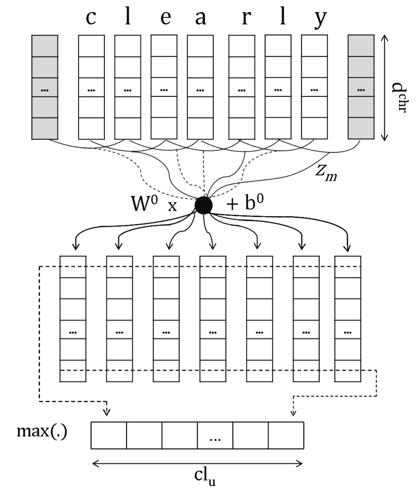
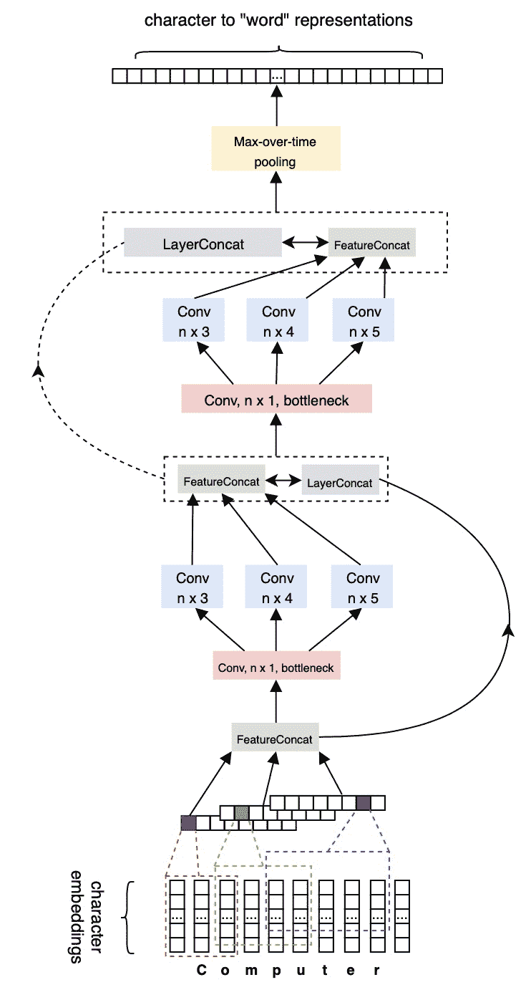
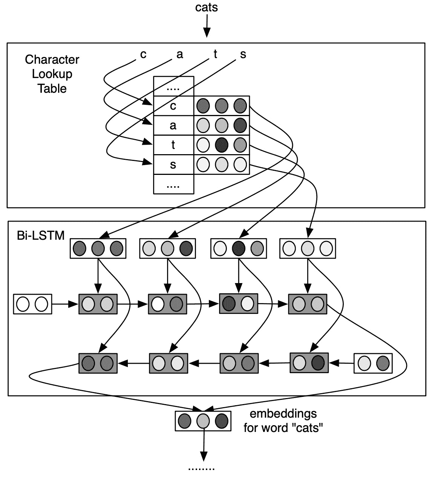
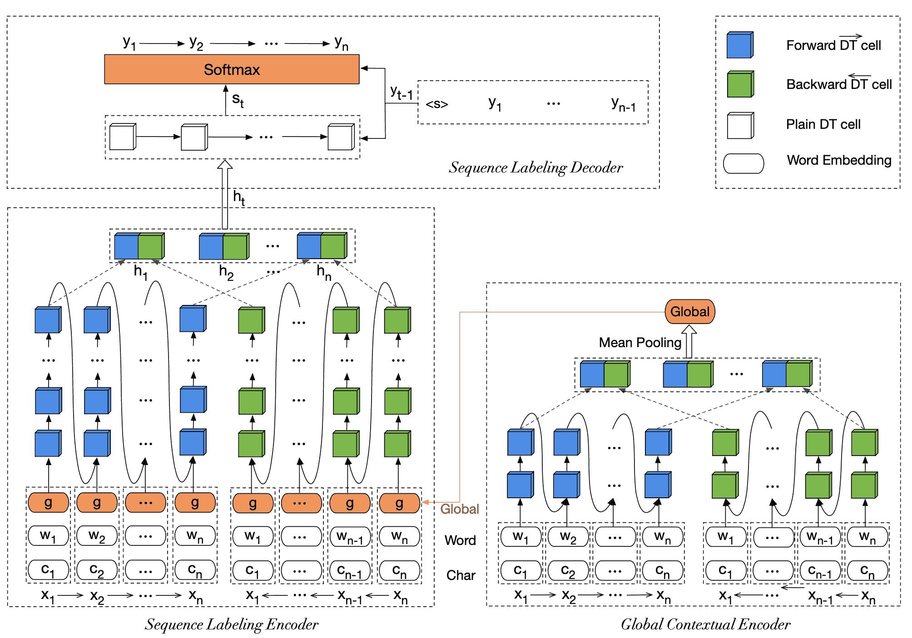
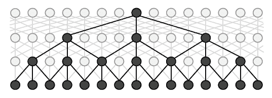
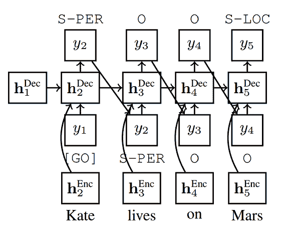
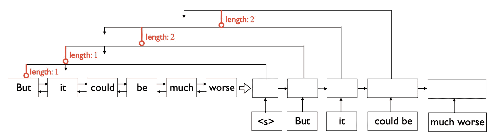

<!--yml

类别：未分类

日期：2024-09-06 19:58:34

-->

# [2011.06727] 深度学习模型在序列标注中的最新进展调查

> 来源：[`ar5iv.labs.arxiv.org/html/2011.06727`](https://ar5iv.labs.arxiv.org/html/2011.06727)

# 深度学习模型在序列标注中的最新进展调查

何志勇、王赞博、魏伟、冯珊珊、毛先凌、姜晟 本工作部分由中国国家自然科学基金资助，基金编号：61602197、61772076、61972448、L1924068，部分由“十三五”设备预研基金资助，基金编号：41412050801。电子邮件地址：weiw@hust.edu.cn（魏伟）何志勇在海军工程大学电子工程学院工作。王赞博、魏伟和姜晟在华中科技大学计算机科学与技术学院工作。冯珊珊在阿布扎比的启迪人工智能研究所工作。毛先凌在北京理工大学计算机学院工作。

###### 摘要

序列标注（SL）是一个基础研究问题，涵盖了多种任务，*例如*，词性标注（POS）、命名实体识别（NER）、文本切块*等*。尽管在许多下游应用（*例如*，信息检索、问答系统和知识图谱嵌入）中，传统的序列标注方法有效且普遍，但它们严重依赖于手工设计或特定语言的特征。最近，由于其自动学习复杂实例特征的强大能力，并且有效地产生了最先进的性能，深度学习已被用于序列标注任务。本文旨在对现有的基于深度学习的序列标注模型进行全面回顾，涵盖了三个相关任务，*例如*，词性标注、命名实体识别和文本切块。接着，我们基于科学分类法系统地介绍现有的方法，以及序列标注领域广泛使用的实验数据集和常用的评估指标。此外，我们还对不同序列标注模型在可能影响性能的因素以及序列标注领域的未来方向进行了深入分析。

###### 关键词：

序列标注、深度学习、自然语言处理。

## I 引言

序列标注是自然语言处理（NLP）这一重要领域中的一种模式识别任务。从语言学的角度来看，语言中最小的有意义单位通常被认为是语素，因此每个句子可以被视为由语素组成的序列。因此，NLP 领域中的序列标注问题可以被表述为一个任务，旨在为一类在句子的语法结构中通常具有相似角色且具有相似语法属性的语素分配标签，而分配的标签的含义通常依赖于具体任务的类型，经典任务的例子包括词性标注（POS）[71]、命名实体识别（NER）[52]、文本切分[65]以及*等等*，这些任务在自然语言理解中扮演着关键角色，并且可以为各种下游应用提供帮助，例如句法解析[81]、关系抽取[64]和实体共指解析[78]以及*等等*，因此迅速获得了大量关注。

通常，传统的序列标注方法通常基于经典的机器学习技术，如隐马尔可夫模型（HMM）[3]和条件随机场（CRFs）[51]，这些方法通常依赖于手工构造的特征（*例如*，单词是否大写）或特定语言的资源（*例如*，地名词典）。尽管取得了优越的性能，但对大量领域知识和特征工程的需求使得这些方法在扩展到新领域时极为困难。在过去十年中，由于其在自动学习数据复杂特征方面的强大能力，深度学习（DL）取得了巨大成功。因此，已经有许多研究致力于如何利用深度神经网络的表示学习能力来提升序列标注任务，许多这些方法相继推动了最先进的性能[8, 1, 19]。这一趋势促使我们进行全面的调查，以总结深度学习技术在序列标注领域的现状。通过比较不同深度学习架构的选择，我们旨在识别对模型性能的影响，使后续研究人员能够更好地理解这些模型的优缺点。

与以往调查的不同。在文献中，已经有很多尝试通过深度学习模型提高序列标注任务的性能。然而，据我们所知，几乎没有全面的调查提供现有神经网络方法或相关发展领域的深入总结。实际上，在过去几年中，已经有几项关于传统序列标注方法的调查。例如，Nguyen *et al.* [79] 提出了一个关于基于机器学习的序列标注问题的系统调查。Nadeau *et al.* [76] 调查了*命名实体识别*问题，并概述了从手工规则算法到机器学习技术的发展趋势。Kumar 和 Josan [49] 对印度语言的*词性标注*进行了简要回顾。总的来说，大多数序列标注的评论主要涵盖传统机器学习方法的论文，而非最近应用的深度学习（DL）技术。最近，有两项工作 [117, 54] 提供了关于命名实体识别（NER）问题的深度学习模型的良好文献调查，但这仅仅是序列标注的一个子任务。据我们所知，迄今为止还没有调查能提供关于基于深度学习的序列标注方法的详尽总结。鉴于深度学习模型在序列标注中的日益流行，系统调查具有较高的学术和实际意义。我们总结并分析了这些相关工作，并涵盖了本调查中的$100$多项研究。

本调查的贡献。本调查的目标是全面回顾深度学习在序列标注（SL）领域的最新应用技术，并提供全景视图，以启发和指导 SL 研究社区的研究人员和从业者，快速理解并进入这一领域。具体而言，我们呈现了基于深度学习的 SL 技术的综合调查，以系统地总结最前沿技术，并通过科学分类法沿三个轴线进行概述，即*嵌入模块*、*上下文编码模块*和*推理模块*。此外，我们还概述了序列标注领域常见任务的实验设置（即*数据集*或*评估指标*）。此外，我们还讨论并比较了最具代表性的模型给出的结果，以分析不同因素和架构的效果。最后，我们向读者呈现了当前基于深度学习的序列标注方法面临的挑战和未解决的问题，并概述了这一领域的未来方向。

路线图。本文的其余部分组织如下：第 II 节介绍了序列标注的背景，包括几个相关任务和传统机器学习方法。第 III 节展示了基于我们提出的分类法的深度学习模型。第 IV 节总结了相关任务的实验设置（*即，*数据集和评估指标）。第 V 节列出了不同方法的结果，并讨论了有前景的未来方向。最后，第 VII 节总结了本次调查。

## II 背景

在本节中，我们首先介绍三个广泛研究的经典*序列标注*任务，即*词性标注*（POS）、*命名实体识别*（NER）和*文本切分*。然后，我们简要介绍序列标注领域中基于传统机器学习的技术。

### II-A 经典序列标注任务

#### II-A1 词性标注（POS）

词性标注在学术界和工业界都得到了高度认可，这是一项标准的序列标注任务，旨在为每个词汇项（*即，*单词）分配正确的词性标签，如名词（NN）、动词（VB）和形容词（JJ）。一般来说，词性标注（POS）也可以视为对语言中所有单词的子类划分，因此也称为词类。在不同的数据集下，词性标签的标注系统通常不是统一的，例如 PTB（Penn Treebank）[72]，它包括$45$种不同类型的词性标签用于词汇分类，例如对于句子“Mr. Jones is editor of the Journal”，它将被标注为像“NNP NNP VBZ NN IN DT NN”的序列。

事实上，词性标注可以视为一种粗粒度的词汇聚类任务，其目标是标注句子中单词的形式和句法信息，这有助于缓解词级特征的稀疏性，并且作为自然语言处理领域中多种后续任务如语义角色标注或句法分析的重要预处理步骤。

#### II-A2 命名实体识别（NER）

命名实体识别（NER，*即*命名实体识别或实体切分）是一个著名的经典序列标注任务，其目标是从文本中识别出属于预定义类别的命名实体，这些类别一般包括三个主要类别（*即* 实体、时间和数字）以及七个子类别（*即* 人名、组织、地点、时间、日期、货币和百分比）。特别地，在本文中，我们主要关注英语中的 NER 问题，广泛采用的英语分类法是 CoNLL2003 NER 语料库[97]，该语料库来自路透社新闻语料库，包括四种不同类型的命名实体，*即* 人物（PER）、地点（LOC）、组织（ORG）和专有名词（MISC）。

通常情况下，NER 中一个单词的标签由两个部分组成，*即* “X-Y”，其中“X”表示标记单词的位置，“Y”指的是预定义分类中的对应类别。特别地，如果一个单词不能被分类到任何预定义类别中，它可能会被标记为特殊标签（*例如*，“none”）。通常，行业中广泛采用的标记方案是 BIOES 系统，即被标记为“B”（开始）、“I”（内部）和“E”（结束）的单词分别表示它是命名实体短语的第一个、中间或最后一个单词。被标记为“0-”（外部）的单词表示它不属于任何命名实体短语，而“S-”（单独）表示它是唯一一个表示实体的单词。

命名实体识别是自然语言处理中的一个非常重要的任务，是许多高级应用的基础技术，例如搜索引擎、问答系统、推荐系统、翻译系统，*等等*。一般来说，我们以机器翻译为例来阐明 NER 对各种下游任务的重要性。在翻译过程中，如果文本中包含具有特定含义的命名实体，翻译系统通常倾向于将组成命名实体的多个单词分开翻译，导致翻译结果生硬甚至错误。但如果首先识别出命名实体，翻译算法将更好地理解文本的词序和语义，从而能够输出更好的翻译结果。

#### II-A3 文本切分

文本块任务的目标是将文本划分为在句法上相关且不重叠的词组，即短语，如名词短语、动词短语等。该任务本质上可以看作是一个序列标注问题，即为句子中的词分配特定标签。类似于 NER，它也可以采用 BIOES 标记系统。例如，句子“The little dog barked at the cat.” 可以被划分为以下短语：“(The little dog) (barked at) (the cat)”。因此，使用 BIOES 标记系统，该句子的标签序列是“B-NP I-NP E-NP B-VP E-VP B-NP E-NP”，这意味着“The little dog”和“the cat”是名词短语，而“barked at”是动词短语。

#### II-A4 其他

已有许多探索将序列标注框架应用于解决其他问题，例如依存句法分析 [105, 60], 语义角色标注 [82, 107], 答案选择 [132, 56], 文本错误检测 [93, 92], 文档摘要 [77], 成分句法分析 [24], 子事件检测 [4], 对话中的情感检测 [102] 和复杂词汇识别 [25]。

### II-B 传统机器学习方法

传统的统计机器学习技术是早期序列标注问题的主要方法。基于精心设计的特征来表示每个训练数据，机器学习算法被用于从示例输入及其期望输出中训练模型，学习对未见样本进行预测。常见的统计机器学习技术包括隐马尔可夫模型（HMM） [21], 支持向量机（SVM） [32], 最大熵模型 [41] 和条件随机场（CRF） [51]。HMM 是一种用于描述具有隐含未知状态的马尔可夫过程的统计模型。Bikel 等人 [7] 提出了第一个基于 HMM 的 NER 系统模型，名为 IdentiFinder。该模型由 Zhou 和 Su [131] 扩展，并通过假设互信息独立性而非 HMM 的条件概率独立性，取得了更好的性能。

被称为大间隔分类器的支持向量机（SVM）因其良好的泛化能力而广受欢迎，并成功应用于许多模式识别问题。在序列标注领域，Kudoh 和 Matsumoto [48] 首次提出将 SVM 分类器应用于短语块任务，并在当时取得了最佳表现。随后的几项研究也相继提出了使用 SVM 进行 NER 任务的应用 [36, 59]。

Ratnaparkhi [90] 提出了第一个最大熵模型用于词性标注，并取得了很好的结果。一些 NER 工作也采用了最大熵模型[12, 5]。最大熵马尔可夫模型进一步提出[73]，相比原始最大熵模型获得了一定程度的改进。Lafferty 等人 [51] 指出，使用最大熵模型进行序列标注可能会遇到标签偏差问题。所提出的 CRF 模型在词性标注和命名实体识别任务中取得了显著改进，并逐渐成为序列标注任务的主流方法 [74, 47]。

## III 基于深度学习的模型

表 I：基于深度学习的序列标注模型概述（LM：语言模型，pre LM emb：预训练语言模型嵌入，gaz：词典，cap：大写化，InNet：漏斗形宽 CNN 架构[116]，AE：自编码器，MO-BiLSTM：多阶 Bi-LSTM [126]，INN：隐式定义的神经网络[42]，EL-CRF：嵌入状态潜在 CRF[108]，SRL：语义角色标注），SA：自注意力

| 参考 | 嵌入模块 | 上下文编码器 | 推理模块 | 任务 |
| --- | --- | --- | --- | --- |
| 外部输入 | 词嵌入 | 字符级别 |
|  [71] | $\backslash$ | Glove | CNN | Bi-LSTM | CRF | POS, NER |
|  [8] | $\backslash$ | Word2vec | Bi-LSTM | Bi-LSTM | Softmax | POS |
|  [121] | $\backslash$ | Glove | Bi-LSTM | Bi-LSTM | CRF | POS |
|  [65] | $\backslash$ | Glove | Bi-LSTM+LM | Bi-LSTM | CRF | POS, NER, chunking |
|  [88] | $\backslash$ | Polyglot | Bi-LSTM | Bi-LSTM | CRF | POS |
|  [91] | $\backslash$ | Word2vec | Bi-LSTM | Bi-LSTM+LM | CRF | POS, NER, chunking |
|  [85] | $\backslash$ | Senna | CNN | Bi-LSTM+预训练 LM | CRF | NER, chunking |
|  [1] | 预训练 LM 嵌入 | Glove | Bi-LSTM | Bi-LSTM | CRF | POS, NER, chunking |
|  [127] | $\backslash$ | - | Bi-LSTM | Bi-LSTM | LSTM+Softmax | POS, NER |
|  [122] | $\backslash$ | Glove | Bi-LSTM+LM | Bi-LSTM | CRF+Semi-CRF | NER |
|  [126] | 拼写，词典 | Senna | $\backslash$ | MO-BiLSTM | Softmax | NER, chunking |
|  [26] | $\backslash$ | Word2vec | Bi-LSTM | 并行 Bi-LSTM | Softmax | NER |
|  [120] | $\backslash$ | Senna, Glove | Bi-GRU | Bi-GRU | CRF | POS, NER, chunking |
|  [62] | $\backslash$ | 在维基百科上训练 | Bi-LSTM | Bi-LSTM | Softmax | POS |
|  [13] | 大写化，词典 | Senna | CNN | Bi-LSTM | CRF | NER |
|  [92] | $\backslash$ | Word2vec | Bi-LSTM | Bi-LSTM | CRF | POS, NER, chunking |
|  [116] | $\backslash$ | Glove | InNet | Bi-LSTM | CRF | POS, NER, chunking |
|  [42] | 拼写，gaze | Senna | $\backslash$ | INN | Softmax | POS |
|  [108] | $\backslash$ | Glove | $\backslash$ | Bi-LSTM | EL-CRF | 引文字段提取 |
|  [37] | $\backslash$ | 经过 skip-gram 训练 | $\backslash$ | Bi-LSTM | Skip-chain CRF | 临床实体检测 |
|  [115] | 词形，gaze | Glove | CNN | Bi-LSTM | CRF | NER |
|  [17] | gaze, cap | Senna | $\backslash$ | CNN | CRF | POS, NER, 分块, SRL |
|  [113] | $\backslash$ | Glove | CNN | Gated-CNN | CRF | NER |
|  [104] | $\backslash$ | Word2vec | $\backslash$ | ID-CNN | CRF | NER |
|  [52] | $\backslash$ | Word2vec | Bi-LSTM | Bi-LSTM | CRF | NER |
|  [35] | 拼写，gaze | Senna | $\backslash$ | Bi-LSTM | CRF | POS, NER, 分块 |
|  [99] | $\backslash$ | Word2vec | CNN | CNN | CRF | POS |
|  [124] | $\backslash$ | Senna | CNN | Bi-LSTM | 指针网络 | 分块, 插槽填充 |
|  [130] | $\backslash$ | Word2vec | $\backslash$ | Bi-LSTM | LSTM | 实体关系提取 |
|  [23] | LS 向量, cap | SSKIP | Bi-LSTM | LSTM | CRF | NER |
|  [103] | $\backslash$ | Word2vec | CNN | CNN | LSTM | NER |
|  [55] | $\backslash$ | Glove | $\backslash$ | Bi-GRU | 指针网络 | 文本分割 |
|  [27] | $\backslash$ | - | CNN | Bi-LSTM | Softmax | POS |
|  [20] | $\backslash$ | Word2vec, FastText | LSTM+attention | Bi-LSTM | Softmax | POS |
|  [34] | $\backslash$ | Glove | CNN | Bi-LSTM | NCRF 变换器 | POS, NER, 分块 |
|  [40] | $\backslash$ | - | Bi-LSTM+AE | Bi-LSTM | softmax | POS |
|  [101] | 词典 | Glove | CNN | Bi-LSTM | 分段级 CRF | NER |
|  [10] | $\backslash$ | Glove | CNN | GRN+CNN | CRF | NER |
|  [114] | $\backslash$ | Glove | CNN | Bi-LSTM+SA | CRF | POS, NER, 分块 |

在本节中，我们探讨了基于深度学习的序列标注方法。我们通过一种科学分类法呈现评述，将现有工作按嵌入模块、上下文编码模块和推理模块三个维度分类，这三个阶段通常构成神经序列标注模型。嵌入模块是第一个阶段，将词映射到其分布式表示。上下文编码模块提取上下文特征，而推理模块预测标签并生成模型输出的最佳标签序列。在表格 I 中，我们简要概述了基于深度学习的序列标注模型，采用上述分类法。我们列出了这些工作在三个阶段采用的不同架构，最后一列给出了关注的任务。

### III-A 嵌入模块

嵌入模块将词映射到其分布式表示作为模型的初始输入。通常需要一个嵌入查找表，将每个词的独热编码转换为一个低维的实值稠密向量，其中每个维度代表一个潜在特征。除了预训练词嵌入，字符级表示、手工设计特征和句子级表示也可以成为嵌入模块的一部分，从不同角度补充初始输入的特征。

#### III-A1 预训练词嵌入

在大量未标记数据上学习的预训练词嵌入已成为许多神经网络自然语言处理模型的关键组成部分。采用它来初始化嵌入查找表，可以显著改善与随机初始化相比的效果，因为在预训练过程中捕捉到了语言中的句法和语义信息。许多已发布的预训练词嵌入被广泛使用，例如 Word2Vec、Senna、GloVe 等。

Word2vec [75] 是一种流行的词向量表示方法，提供了包括连续词袋模型和跳字模型在内的两种模型架构。Santos 等人 [99] 使用 word2vec 的跳字模型来训练词嵌入，并将其添加到他们的序列标注模型中。类似地，一些工作 [91, 92, 20] 用公开的预训练词向量初始化他们的模型，这些向量是使用 word2vec 创建的。Lample 等人 [52] 应用 skip-n-gram [63] 预训练他们的词嵌入，这是一种考虑词序的 word2vec 变体。Gregoric 等人 [26] 跟随他们的工作，也使用了相同的词嵌入。

Collobert 等人 [17] 在 2011 年提出了“SENNA”架构，开创了从神经语言模型的角度解决自然语言处理任务的思路，并且包括了预训练词嵌入的构建方法。许多后续的工作 [85, 126, 13, 35, 119, 70] 将 SENNA 词嵌入作为其序列标注模型的初始输入。此外，斯坦福公开的 GloVe 词嵌入 [84] 是在来自维基百科和网页文本的 60 亿标记语料库上训练的，也被许多工作 [71, 121, 65, 1, 122, 116, 55, 34, 10] 广泛使用和采纳，用于初始化其词嵌入。

上述预训练词嵌入方法仅生成每个词的单一上下文无关向量，忽略了多义性问题的建模。最近，许多学习上下文词表示的方法 [85, 86, 1] 已被提出，其中双向语言模型（LM）在大规模未标注语料上训练，利用相应的内部状态生成词表示。每个词的表示依赖于其上下文。例如，“How many people were present at the meeting?” 中“present”的生成嵌入与 “I’m not at all satisfied with the present situation” 中的不同。

Peters 等人 [85] 提出了来自双向语言模型的预训练上下文嵌入，并将其添加到序列标注模型中，在命名实体识别（NER）和块分割任务上取得了非常优异的性能。该方法首先使用 Bi-LSTM 结构在大规模未标注语料上分别预训练前向和后向神经语言模型。然后，移除顶部 softmax 层，并将前向和后向语言模型嵌入连接起来，形成给定输入序列中每个 token 的双向语言模型嵌入。Peters 等人通过引入 ELMo（来自语言模型的嵌入）在 [86] 中扩展了他们的方法 [85]。与仅使用顶部 LSTM 层的先前方法不同，ELMo 表示是所有双向语言模型层的内部状态的线性组合，其中每一层的权重是特定任务的。通过将这些表示添加到现有模型中，该方法显著提高了各种 NLP 任务的性能 [10, 34, 15]。

Akbik 等人 [1] 提出了类似的方法，通过采用双向字符感知语言模型生成预训练的上下文词嵌入，该模型学习预测下一个和上一个字符，而不是词。

Devlin 等人 [19] 提出了一个名为 BERT 的预训练语言表示模型，BERT 代表双向编码器表示来自变换器。它在十一项任务上取得了新的最先进结果，并在 NLP 社区引起了轰动。BERT 的核心思想是通过在所有层中共同条件化左右上下文来预训练深度双向表示。虽然序列标注任务可以通过微调现有的预训练 BERT 模型来解决，但 BERT 的输出隐藏状态也可以作为额外的词嵌入，以提升序列标注模型的性能 [67, luo2020hierarchica]。

通过建模上下文信息，ELMo 和 BERT 生成的词表示可以编码丰富的语义信息。除了这种上下文建模，最近 He 等人 [31] 提出的工作提供了一种新的词嵌入，这种嵌入既关注上下文又关注知识，编码了来自外部知识库的实体先验知识。所提出的知识图谱增强词表示显著提升了各种领域命名实体识别（NER）的性能。

#### III-A2 字符级表示

尽管预训练的词嵌入中捕获了句法和语义信息，但通常忽略了词的形态和形状信息，这对于许多序列标注任务，如词性标注，极为重要。最近，许多研究通过神经网络学习单词的字符级表示，并将其纳入模型的嵌入模块，以利用有用的词内信息，这也能有效解决词汇表外词汇问题，并已被证明对众多序列标注任务有帮助。捕捉字符到词的表示的两种最常见的架构是卷积神经网络（CNNs）和递归神经网络（RNNs）。

卷积神经网络。

Santos 和 Zadrozny [99] 最初提出了一种方法，使用 CNN 来学习单词的字符级表示用于序列标注，这种方法随后被许多后续工作所采用 [71, 13, 103, 10, 115, 15, 129]。该方法对字符嵌入序列应用卷积操作，并生成每个字符的局部特征。然后，通过对所有字符窗口进行最大池化，提取单词的固定大小字符级嵌入。该过程在图 1 中进行了描述。

图 1：卷积方法进行字符级特征提取 [99]。

Xin 等人 [116] 提出了 IntNet，这是一种漏斗形宽卷积神经网络，用于学习字符级表示以进行序列标注。与之前基于 CNN 的字符嵌入方法不同，这种方法精心设计了包含多个连续操作的卷积块，并利用多个卷积层，其中特征图在每隔一层中连接。这有助于网络捕获不同级别的特征，并充分发挥 CNN 学习单词内部结构的潜力。该模型在其他字符嵌入模型中取得了显著的改进，并在各种序列标注数据集上获得了最先进的性能。其主要架构见图 2。

图 2：IntNet 的主要架构 [116]。

循环神经网络。

Ling 等人 [62] 提出了一个组成字符到单词（C2W）模型，该模型使用双向 LSTM（Bi-LSTM）通过将字符作为基本单位来构建单词嵌入。一个前向 LSTM 和一个反向 LSTM 以直接和反向的顺序处理单词的字符嵌入序列。从其字符获得的单词表示是通过结合双向 LSTM 的最终状态获得的。所提出方法的示意图见图 3。通过有效利用语言中的特征，C2W 模型在语言建模和词性标注中取得了优异的结果。许多工作 [52, 127, 26, 121, 88] 继续使用 Bi-LSTM 获取字符级表示用于序列标注。类似地，Yang 等人 [120] 使用 GRU 替代 LSTM 单元进行字符嵌入模型。

图 3：词汇组成模型的示意图 [62]。

Dozat 等人 [20] 提出了基于 RNN 的字符级模型，其中每个单词的字符嵌入序列输入到一个单向 LSTM 后，再经过一个注意力机制。该方法首先从 LSTM 中提取每个字符的隐藏状态和单元状态，然后对隐藏状态进行线性注意力计算。注意力的输出与最终字符的单元状态连接，形成字符级单词嵌入，用于他们的词性标注模型。

Kann 等人 [40] 提出了一个基于字符的递归序列到序列架构，该架构将 Bi-LSTM 字符编码模型与 LSTM 基于解码器连接，并与一个辅助目标（随机字符串自编码、词自编码或词形还原）相关联。该多任务架构为模型引入了额外的字符级监督，有助于构建更强大的低资源语言神经 POS 标注器。

Bohnet 等人 [8] 提出了一个新颖的句子级字符模型，用于学习上下文敏感的字符级词表示。与所有上述的标记级字符模型不同，该方法将句子的所有字符输入到 Bi-LSTM 层，并将词中第一个和最后一个字符的前向和后向输出向量拼接在一起，形成其最终的字符级表示。这一策略允许在流入上下文编码器模块之前将上下文信息纳入初始词嵌入。类似地，Liu 等人 [65] 也采用了处理句子中所有字符的字符级 Bi-LSTM，而不是单一词的字符级 Bi-LSTM。然而，他们提出的模型重点在于通过利用神经语言模型从原始文本中有效提取字符级信息。特别地，前向和后向字符级 LSTM 将预测词边界的下一个和上一个词。为了调解主要的序列标注任务和辅助的语言模型任务，进一步采用了高速公路网络，将共享字符级层的输出转换为两种不同的表示。一种用于语言模型，另一种可以视为字符级表示，并与词嵌入结合用于序列标注模型。

#### III-A3 手工特征

如前所述，借助自动提取特征的强大能力，基于深度神经网络的模型具有不需要复杂特征工程的优势。然而，在完全端到端的深度学习模型[71, 52]用于序列标注任务之前，特征工程通常在神经模型[17, 35, 13]中使用，其中手工特征，如对 POS 标注大有裨益的单词拼写特征和广泛用于 NER 的词典特征，被表示为离散向量，然后集成到嵌入模块中。例如，Collobert 等人[17]利用词后缀、词典和大写特征以及包含相关任务标签的级联特征。Huang 等人[35]采用了设计的拼写特征（包括词前缀和后缀特征、大写特征*等*），上下文特征（单字、双字和三字特征）和词典特征。Chiu 和 Nichols[13]使用了字符类型、大写和词汇特征。

近年来，有一些工作[115, 23, 94, 61, 66]专注于将手工特征更有效地融入神经模型中，并为序列标注取得了显著的进一步改进。Wu 等人[115]提出了一种混合神经模型，该模型结合了特征自编码器损失组件来利用手工特征，并在命名实体识别任务上显著优于现有的竞争模型。利用的手工特征包括词性标签、单词形状和词典。特别是，自编码器辅助组件将手工特征作为输入，并学习将其重构为输出，这有助于模型保留这些特征中存储的重要信息，从而增强主要的序列标注任务。他们提出的方法展示了手工特征在英文数据上进行命名实体识别的实用性。然而，为低资源语言设计这样的特征是具有挑战性的，因为这些语言中缺乏词典。为解决这个问题，Rijhwani 等人[94]提出了一种“软词典”的方法，通过跨语言实体链接从英文知识库中获取信息，为低资源语言创建连续值的词典特征。

Ghaddar 等人[23]提出了一种新颖的词汇表示（称为词汇相似度 *即，*（LS）向量）用于命名实体识别，表明强大的词汇特征非常有用，并且可以大大提升深度神经网络架构。该方法首先将词汇和命名实体类型嵌入到一个联合的低维向量空间，该空间从一个注释了 120 个细粒度实体类型的维基百科语料库中训练而来。然后，计算每个词的 120 维特征向量（*即，* LS 向量），其中每个维度编码词嵌入与实体类型嵌入的相似度。最后，将 LS 向量纳入他们的神经 NER 模型的嵌入模块中。

#### III-A4 句子级别的表示

图 4：全局上下文编码器（右侧）输出句子级别的表示，作为词表示的增强[67]。

现有研究[128]已证明，从整个句子获取的全局上下文信息对于建模序列非常有用，这在像 Bi-LSTM 这样的上下文编码器中每个词的位置上未被充分捕捉。为了解决这个问题，一些近期的工作[67, 68]将句子级别的表示引入了嵌入模块，即除了预训练的词嵌入和字符级表示之外，他们还为每个词分配了从整个句子中学习到的全局表示，这可以在图 4 中展示。尽管这些工作提出了不同的句子表示方法，但它们都证明了在嵌入模块中添加句子表示对于序列标注任务的最终性能的优越性。

### III-B 上下文编码模块

上下文依赖在序列标注任务中扮演着重要角色。上下文编码模块提取每个词的上下文特征，并捕捉给定输入序列的上下文依赖。学习到的上下文表示将传递到推理模块进行标签预测。上下文编码模块有三种常用的模型架构，*即，* RNN、CNN 和 Transformers。

#### III-B1 循环神经网络

Bi-LSTM 几乎是目前最广泛使用的上下文编码器架构。具体来说，它结合了来自两个方向（前向/后向）的过去/未来上下文，以生成每个标记的隐藏状态，然后将这些状态联合连接以表示整个序列的全局信息。虽然 Hammerton [29] 曾研究过利用 LSTM 进行 NER 任务，但计算能力的不足限制了其模型的效果。随着深度学习的最新进展，许多研究工作致力于使用 Bi-LSTM 架构并取得了优异的表现。Huang 等人 [35] 最初采用 Bi-LSTM 生成序列标注模型中每个词的上下文表示，并在 POS 标注、chunking 和 NER 数据集上取得了最先进的准确性。类似地，[127, 62, 71, 52, 13, 8, 121, 65, 88] 也选择了相同的 Bi-LSTM 架构进行上下文编码。门控递归单元（GRU）是 LSTM 的一种变体，也解决了 RNN 网络中的长期依赖问题，一些工作使用 Bi-GRU 作为其上下文编码器架构 [120, 55, 133]。

Rei [91] 提出了一个多任务学习方法，该方法为 Bi-LSTM 上下文编码器模块配备了辅助训练目标，学习为句子中的每个词预测周围的词。研究表明，语言建模目标在多个序列标注基准测试中提供了一致的性能提升，因为它激励模型学习更通用的语言语义和句法组成模式。

Zhang 等人 [126] 提出了一个新方法称为 Multi-Order BiLSTM，它将低阶和高阶 LSTM 结合在一起，以学习更多的标签依赖关系。高阶 LSTM 为当前标记预测多个标签，这些标签不仅包括当前标签，还包括之前的几个标签。该模型通过修剪技术保持了对高阶模型的可扩展性，并在 chunking 上取得了最先进的结果，并在两个 NER 数据集中取得了高度竞争的结果。

Ma 等人 [69] 提出了一个基于 LSTM 的模型，用于联合训练句子级分类和序列标注任务，其中采用了修改的 LSTM 结构作为其上下文编码器模块。特别地，该方法在 LSTM 之前使用卷积神经网络提取每个词的上下文和之前标签的特征。因此，LSTM 的输入被更改为包括有意义的上下文和标签信息。

现有的大多数基于 LSTM 的方法使用一个或多个堆叠的 LSTM 层来提取单词的上下文特征。然而，Gregoric 等人 [26] 提出了不同的架构，该架构在相同输入上采用多个并行的独立 Bi-LSTM 单元，并通过采用模型间正则化项来促进它们之间的多样性。研究表明，该方法减少了模型中的总参数数量，并在 CoNLL 2003 NER 数据集上相比于其他方法取得了显著改进。

Kazi 等人 [42] 提出了用于序列标注的全新隐式定义神经网络架构。与传统的递归神经网络相比，这项工作提供了一种不同的机制，使得每个状态能够考虑双向的信息。该方法通过改变隐层函数的定义来扩展 RNN：

|  | $h_{t}=f(\xi_{t},h_{t-1},h_{t+1})$ |  |
| --- | --- | --- |

其中，$\xi_{t}$ 表示隐层的输入，$h_{t-1}$ 和 $h_{t+1}$ 分别是前一时间步和下一时间步的隐藏状态。它摒弃了用于构造 RNN 的因果性假设，并为整个隐藏状态序列推导出一组隐式方程。它们通过近似的牛顿法求解，并应用 Krylov 子空间方法 [45]。这种隐式定义的神经网络架构有助于在具有复杂长距离依赖的问题上取得改进。

尽管 Bi-LSTM 已被广泛应用于上下文编码器架构，但仍然存在一些自然限制，比如 RNN 中连续隐藏状态之间的浅连接。在每个时间步，BiLSTM 消耗一个输入单词，并构建过去子序列的新摘要。这个过程应高度非线性，以便隐藏状态能够迅速适应变量输入，同时保留过去的有用摘要 [83]。深度过渡 RNN 通过增加连续隐藏状态的过渡深度来扩展传统 RNN [83]。最近，Liu 等人 [67] 引入了用于序列标注的深度过渡架构，并在文本切分和命名实体识别任务上取得了显著的性能提升。此外，RNN 顺序处理输入的方式可能限制了捕捉句子中标记间非连续关系的能力。为了解决这个问题，Wei 等人 [114] 提出的最新工作采用了自注意力机制，基于 Bi-LSTM 提供补充的上下文信息。他们提出了位置感知自注意力以及精心设计的自注意力上下文融合网络，旨在探索输入序列的相对位置信息，以捕捉标记间的潜在关系。结果表明，该方法在 POS、NER 和切分任务上取得了显著改进。

#### III-B2 卷积神经网络

卷积神经网络（CNNs）是另一种在序列标注模型中编码上下文信息的流行架构。与 RNN 相比，基于 CNN 的方法速度显著更快，因为它可以通过前馈结构充分利用 GPU 并行性。该领域的初步工作由 Collobert 等人提出 [17]。该方法使用一个固定大小滑动窗口的简单前馈神经网络来处理输入序列嵌入，这可以被视为没有池化层的简化 CNN。这个窗口方法基于一个假设，即一个词的标签主要依赖于它的邻居。Santos 等人 [99] 跟随他们的工作，并使用类似的结构进行上下文特征提取。

Shen 等人 [103] 提出了一个基于深度主动学习的模型用于命名实体识别任务。他们的标注模型使用 CNN 提取每个词的上下文表示，因其强大的效率对于他们的迭代再训练方案至关重要。该结构包含两个卷积层，卷积核宽度为三，并将最后一个卷积层的表示与输入嵌入连接形成输出。

Wang 等人 [113] 使用堆叠的门控卷积神经网络（GCNN）进行命名实体识别，这种网络通过门控机制扩展了卷积层。特别地，一个门控卷积层可以表示为

|  | $F_{gating}(\mathbf{X})=(\mathbf{X}*\mathbf{W}+\hat{\mathbf{b}})\odot\sigma(\mathbf{X}*\mathbf{V}+\hat{\mathbf{c}})$ |  |
| --- | --- | --- |

其中 $*$ 表示行卷积，$\mathbf{X}$ 是该层的输入，$\mathbf{W},\hat{\mathbf{b}},\mathbf{V},\hat{\mathbf{c}}$ 是需要学习的参数，$\sigma$ 是 sigmoid 函数，表示逐元素乘积。

尽管效率较高，但 CNN 的一个主要缺点是由于有限的感受野，它在捕捉序列中的长程依赖关系方面存在困难，这使得使用 CNN 进行序列标注任务的方法少于 RNN。近年来，一些基于 CNN 的模型对传统 CNN 进行了修改，以更好地捕捉全局上下文信息，并在序列标注任务中取得了优异的结果。

Strubell 等人 [104] 提出了用于命名实体识别（NER）任务的迭代扩张卷积神经网络（ID-CNNs）方法，该方法在保持与最先进技术相当的准确性的同时，实现了显著的速度提升。扩张卷积 [123] 像典型的 CNN 层一样在滑动窗口的上下文上操作，但上下文不必是连续的。卷积通过跳过多个输入同时定义在更宽的有效输入宽度上，并且有效输入宽度可以随着深度呈指数增长。因此，它能够将比典型 CNN 更广泛的上下文纳入到标记的表示中。图 5 展示了这一结构。

图 5：一个扩张卷积块，最大扩张宽度为 4，滤波器宽度为 3。对最后一层中单个高亮神经元有贡献的神经元也被高亮显示 [104]。

提出的迭代扩张 CNN 架构将相同的扩张卷积块重复应用于逐标记表示。重复使用相同的参数可以防止过拟合问题，并为模型提供理想的泛化能力。

Chen 等人 [10] 提出了用于 NER 的门控关系网络（GRN），其中在 CNNs 之上构建了一个建模任意两个词之间关系的门控关系层，以捕获长距离上下文信息。具体来说，它首先计算任意两个词之间的关系得分向量，

|  | $r_{ij}=\mathbf{W}_{rx}[x_{i};x_{j}]+b_{rx}$ |  |
| --- | --- | --- |

其中 $x_{i}$ 和 $x_{j}$ 表示 CNN 层中序列中第 i 个和第 j 个词的局部上下文特征，$\mathbf{W}_{rx}$ 是权重矩阵，$b_{rx}$ 是偏置向量。请注意，关系得分向量 $r_{ij}$ 的维度与 $x_{i}$ 和 $x_{j}$ 相同。然后，通过执行加权求和操作获得第 i 个词的相应全局上下文表示 $r_{i}$，其中采用了门控机制以自适应选择其他依赖词。

|  | $r_{i}=\frac{1}{T}\sum_{j=1}^{T}\sigma(r_{ij})\odot x_{j}$ |  |
| --- | --- | --- |

其中 $\sigma$ 是一个使用 sigmoid 函数的门控，而 $\odot$ 表示逐元素乘法。由于其更强的捕捉全局上下文依赖的能力，提出的 GRN 模型相比于 ID-CNN [104] 实现了显著更好的性能。

#### III-B3 Transformer

Transformer 模型由 Vaswani 等人[111]于 2017 年提出，并在神经机器翻译（NMT）任务中取得了优异的性能。整体架构完全基于注意力机制，以在输入之间建立全局依赖，完全摆脱了递归和卷积。最初提出的 Transformer 采用了一个由编码器和解码器组成的序列到序列结构。但后续的研究工作通常采用编码器部分作为特征提取器，因此我们这里的介绍仅限于此。

编码器由几个相同的层堆叠而成，这些层包括多头自注意力机制和逐位置全连接前馈网络。它在每个两个子层周围使用残差连接[30]，以简化深度神经网络的训练。层归一化[53]在残差连接之后应用，以稳定模型的激活。

由于其优越的性能，Transformer 在各种 NLP 任务中被广泛使用，并取得了卓越的结果。然而，在序列标注任务中，Transformer 编码器的表现被报道为较差[28]。最近，Yan 等人[118]分析了 Transformer 的属性，探讨了 Transformer 在序列标注任务（特别是 NER）中表现不佳的原因。NER 中，方向和相对距离信息都很重要，但在原始 Transformer 中使用的正弦位置嵌入会丢失这些信息。为了解决这个问题，他们提出了 TENER，这是一种通过结合方向和相对距离感知注意力以及非缩放注意力来调整 Transformer 编码器的架构，这可以大大提升 Transformer 编码器在 NER 任务中的表现。Star-Transformer 是 Shao 等人[28]提出的 Transformer 的轻量级替代方案。它用星形拓扑结构替代了全连接结构，其中每两个非相邻节点通过一个共享的中继节点连接。模型复杂性显著降低，并且在包括序列标注任务在内的各种任务上相较于标准 Transformer 取得了很大改进。

### III-C 推理模块

推理模块将上下文编码器模块的表示作为输入，并生成最佳标签序列。

#### III-C1 Softmax

Softmax 函数，也称为归一化指数函数，是逻辑函数的一个推广，已广泛应用于各种基于概率的多分类方法。它将一个$K$维向量$z$映射到另一个$K$维实数向量$\sigma(z)$，使得每个元素的范围在$0$到$1$之间，并且所有元素的总和等于$1$。该函数的形式通常由以下公式给出

|  | $\sigma(z)_{j}=\frac{e^{z_{j}}}{\sum_{k=1}^{K}e^{z_{k}}}$ |  |
| --- | --- | --- |

其中 $j=1,\dots,K$。

许多序列标注模型将问题视为一组独立的分类任务，并利用 softmax 层作为线性分类器，为序列中的每个词分配最优标签 [8, 26, 62, 42, 27, 69, 43, 44]。具体来说，给定时间步 $t$ 上上下文编码器的输出表示 $h_{t}$，t-th 词标签的概率分布可以通过全连接层和最终的 softmax 函数获得。

|  | $o_{t}=softmax(\mathbf{W}h_{t}+b)$ |  |
| --- | --- | --- |

其中权重矩阵 $\mathbf{W}\in{R^{d\times|T|}}$ 将 $h_{t}$ 映射到标签空间，$d$ 是 $h_{t}$ 的维度，$|T|$ 是所有可能标签的数量。

#### III-C2 条件随机场

上述独立推断给定序列中词标签的方法忽略了标签之间的依赖关系。通常，每个词的正确标签常常依赖于附近元素的选择。因此，有必要考虑邻近区域标签之间的相关性，以共同解码整个序列的最优标签链。CRF 模型 [45] 已被证明在学习输出标签之间的强依赖关系方面非常有效，因此大多数基于神经网络的序列标注模型都将 CRF 作为推断模块 [71, 121, 65, 88, 91, 85, 1, 125, 9, 22]。

具体地，设 $\mathbf{Z}=[\hat{\mathbf{z}}_{1},\hat{\mathbf{z}}_{2},\ldots,\hat{\mathbf{z}}_{n}]^{\top}$ 为给定序列 $\hat{\mathbf{x}}$ 的上下文编码器输出，生成整个标签序列 $y_{i}\in\hat{\mathbf{y}}$ 的概率 $\Pr(\hat{\mathbf{y}}|\hat{\mathbf{x}})$ 相对于 $\mathbf{Z}$ 为

|  | $\Pr(\hat{\mathbf{y}}&#124;\hat{\mathbf{x}})=\frac{\prod_{j=1}^{n}\phi(y_{j-1},y_{j},\hat{\mathbf{z}}_{j})}{\sum_{y^{{}^{\prime}}\in{\mathbf{Y}(\mathbf{Z})}}\prod_{j=1}^{n}\phi(y^{{}^{\prime}}_{j-1},y^{{}^{\prime}}_{j},\hat{\mathbf{z}}_{j})},$ |  |
| --- | --- | --- |

其中 $\mathbf{Y}(\mathbf{Z})$ 是 $\mathbf{Z}$ 的可能标签序列集合；$\phi(y_{j-1},y_{j},\hat{\mathbf{z}}_{j})\!=\!\exp(\mathbf{W}_{y_{j-1},y_{j}}\hat{\mathbf{z}}_{j}+b_{y_{j-1},y_{j}})$，$\mathbf{W}_{y_{j-1},y_{j}}$ 和 $b_{y_{j-1},y_{j}}$ 分别表示与标签对 $(y_{j-1},y_{j})$ 对应的加权矩阵和偏置参数。

半条件随机场。

半马尔可夫条件随机场（semi-CRFs）[100] 是对传统 CRFs 的扩展，其中标签分配给输入序列的片段，而不是单个单词。它提取片段的特征并建模片段之间的过渡，适用于如命名实体识别和短语分块等片段级序列标注任务。与 CRFs 相比，semi-CRFs 的优势在于可以充分利用片段级信息来捕捉片段的内部属性，并考虑更高阶的标签依赖。然而，由于它需要联合学习确定每个片段的长度和相应标签，时间复杂度较高。此外，建模具有不同长度的片段需要更多特征，自动提取有意义的片段级特征是 Semi-CRFs 的重要问题。随着深度学习的进步，一些结合神经网络和 Semi-CRFs 进行序列标注的模型已经被研究。

Kong 等人[46] 提出了用于片段级序列标注问题的片段递归神经网络（SRNNs），该方法采用 semi-CRF 作为推断模块，并通过 Bi-LSTM 学习片段的表示。基于 RNN 的递归特性，该方法进一步设计了一种动态规划算法来降低时间复杂度。Zhuo 等人[134] 提出的一个并行工作 Gated Recursive Semi-CRFs（grSemi-CRFs）使用 Gated Recursive Convolutional Neural Network（grConv）[14] 提取 semi-CRF 的片段特征。grConv 是一种递归神经网络变体，通过构建金字塔结构并递归地组合相邻片段向量来学习片段级表示。Kemos 等人[43] 提出的后续工作利用相同的 grConv 架构在他们的神经 semi-CRF 模型中提取片段特征。该模型以字符为基本输入单位，但不需要任何正确的标记边界，这与现有的字符级模型不同。该模型基于 semi-CRF，联合进行片段（标记）和标签字符，对于具有困难或噪声标记的语言具有鲁棒性。Sato 等人[101] 设计了用于片段级序列标注任务的 Segment-level Neural CRF。该方法应用 CNN 来获得片段级表示，并构建片段格栅以减少搜索空间。

上述模型仅采用段级标签进行段分数计算和模型训练。Ye 等人[122]提出的扩展表明，结合词级标签信息对于构建半 CRF 是有益的。所提出的混合半 CRF (HSCRF) 模型同时利用词级和段级标签来推导段分数。此外，还进一步提出了将 CRF 和 HSCRF 输出层整合到统一网络中以进行联合训练和解码的方法。混合半 CRF 模型也被用作后续工作的基准[66]。

跳链 CRF。跳链 CRF[106] 是传统线性链 CRF 的一种变体，通过跳跃边捕捉长程标签依赖，跳跃边基本上是指标签位置之间不相邻的边。然而，跳链 CRF 在图结构中包含循环，使得模型训练和推断过程变得不可处理。需要多次迭代消息的循环信念传播可以是其中一种近似解决方案，但对于大型神经网络模型来说相当耗时。为了缓解这一问题，Jagannatha 等人[37]提出了一种近似计算边际的方案，该方案采用递归单元来建模消息。所提出的近似神经跳链 CRF 模型用于提高临床实体的精确短语检测。

嵌入状态潜在 CRF。Thai 等人[108]设计了一种新颖的嵌入状态潜在 CRF 用于神经序列标注，该模型在建模传统 CRF 常常忽略的非本地标签依赖方面具有更强的能力。这种方法将潜在变量引入 CRF 模型中，以捕捉标签之间的全局约束，并将表示学习应用于输出空间。为了减少参数数量并防止过拟合，还进一步采用了一种简约的因子化参数策略来学习低秩嵌入矩阵。

NCRF 传输器。基于对标签之间长程依赖建模的相似动机，Hu 等人[34]提出了进一步的扩展，提出了神经 CRF 传输器（NCRF 传输器），它引入了 RNN 传输器以实现 CRF 模型中的边缘潜力。边缘潜力通过考虑来自所有之前标签的依赖来表示当前标签的分数。因此，所提出的模型可以从一开始就捕捉到每个当前位置的长程标签依赖。

#### III-C3 递归神经网络

图 6：用于推断标签的 LSTM 架构[103]。

RNN 非常适合于序列数据的特征提取，因此在序列标注模型中广泛用于编码上下文信息。一些研究表明，RNN 结构也可以用于推理模块，以产生最佳标签序列。除了上下文编码器输出的学习表示，前一个预测标签的信息也作为输入。因此，每个词的相应标签是基于输入序列的特征和之前的预测标签生成的，使得长期标签依赖被捕捉。然而，与全局归一化的 CRF 模型不同，基于 RNN 的推理方法从左到右贪婪解码标签，因此它是一个局部归一化模型，可能会遭遇标签偏倚和曝光偏倚问题 [2]。

Shen 等人 [103] 在上下文编码器上方使用 LSTM 层进行标签解码。如图 6 所示，解码器 LSTM 将最后生成的标签以及当前词的上下文表示作为输入，计算出隐藏状态，然后通过 softmax 函数传递以最终解码标签。Zheng 等人 [130] 采用类似的 LSTM 结构作为其序列标注模型的推理模块。

与上述两项研究不同，Vaswani 等人 [110] 利用可以与上下文编码器模块并行的 LSTM 解码器。LSTM 仅接受最后一个标签作为输入以生成隐藏状态，该状态将与词上下文表示结合用于标签解码。Zhang 等人 [127] 引入了一种基于 LSTM 解码器的新颖联合标注策略。在做出标注决策之前，输出的隐藏状态和上下文表示并没有整合，而是独立估计标注概率。这两个概率通过加权平均合并，生成最终结果。具体而言，通过门控机制动态计算一个参数，以自适应地平衡两个部分的参与。实验表明，提出的标签 LSTM 能显著提高性能。

编码器-解码器-指针框架。

图 7：编码器-解码器-指针框架 [124]。

Zhai 等人[124]提出了一种基于编码器-解码器-指针框架的神经序列块分析模型，适用于需要为句子中的有意义块分配标签的任务，如短语块分析和语义角色标注。该架构如图 7 所示。该模型将原始序列标注任务分为两个步骤：(1) 分割，识别每个块的范围；(2) 标注，将每个块视为一个完整的单元进行标注。它采用指针网络[112]来处理分割，通过确定每个块的结束点，而 LSTM 解码器则用于基于分割结果进行标注。Li 等人[55]提出的模型也采用了类似的架构用于他们的文本分割模型，其中设计了一个配备指针网络的 seq2seq 模型来推断段边界。

## IV 评估指标和数据集

如在第 II 节中提到的，序列标注问题的三个常见相关任务包括 POS 标注、NER 和块分析。在本节中，我们在表 II 中列出了一些广泛使用的数据集，并将描述这三个任务中最常用的几个数据集，同时介绍相应的评估指标。

### IV-A 数据集

表 II: POS 和 NER 的注释数据集列表。

| 任务 | 语料库 | 年份 | 网址 |
| --- | --- | --- | --- |
| POS | 华尔街日报（WSJ） | 2000 | [`catalog.ldc.upenn.edu/LDC2000T43/`](https://catalog.ldc.upenn.edu/LDC2000T43/) |
| NEGRA 德语语料库 | 2006 | [`www.coli.uni-saarland.de/projects/sfb378/negra-corpus/`](http://www.coli.uni-saarland.de/projects/sfb378/negra-corpus/) |
| Rit-Twitter | 2011 | [`github.com/aritter/twitter_nlp`](https://github.com/aritter/twitter_nlp) |
| 布拉格依赖树库 | 2012 - 2013 | [`ufal.mff.cuni.cz/pdt2.0/`](http://ufal.mff.cuni.cz/pdt2.0/) |
| 通用依赖（UD） | 2015 - 2020 | [`universaldependencies.org`](https://universaldependencies.org) |
| NER | ACE | 2000 - 2008 | [`www.ldc.upenn.edu/collaborations/past-projects/ace`](https://www.ldc.upenn.edu/collaborations/past-projects/ace) |
| CoNLL02 | 2002 | [`www.clips.uantwerpen.be/conll2002/ner/`](https://www.clips.uantwerpen.be/conll2002/ner/) |
| CoNLL03 | 2003 | [`www.clips.uantwerpen.be/conll2003/ner/`](https://www.clips.uantwerpen.be/conll2003/ner/) |
| GENIA | 2004 | [`www.geniaproject.org/home`](http://www.geniaproject.org/home) |
| OntoNotes | 2007 - 2012 | [`catalog.ldc.upenn.edu/LDC2013T19`](https://catalog.ldc.upenn.edu/LDC2013T19) |
| WiNER | 2012 | [`rali.iro.umontreal.ca/rali/en/winer-wikipedia-for-ner`](http://rali.iro.umontreal.ca/rali/en/winer-wikipedia-for-ner) |
| W-NUT | 2015 - 2018 | [`noisy-text.github.io`](http://noisy-text.github.io) |

#### IV-A1 词性标注

我们将介绍三种广泛使用的词性标注数据集：WSJ、UD 和 Rit-Twitter。

WSJ。一个标准的词性标注数据集是《华尔街日报》（WSJ）部分的 Penn Treebank [72]，大量研究在实验中使用了该数据集。该数据集包含 $25$ 个部分，将每个词分类为 $45$ 种不同的 POS 标签。[16] 中使用的一种数据拆分方法已经变得流行，其中第 $0$ 到 $18$ 部分作为训练数据，第 $19$ 到 $21$ 部分作为开发数据，第 $22$ 到 $24$ 部分作为测试数据。

UD。Universal Dependencies（UD）是一个开发跨语言语法标注的项目，包含了超过 $100$ 个树库，覆盖 $60$ 多种语言。其原始的词性标注方案采用 Google 通用 POS 标签集 [87]，包括 $12$ 种语言无关的标签。UD 的最新版本 [80] 提出了一个包含 $17$ 个类别的 POS 标签集，这些类别与 [87] 中定义的标签部分重叠，其标注结果被许多近期的研究 [88, 6, 121, 43] 用于模型评估。

Rit-Twitter。Rit-Twitter 数据集 [95] 是一个社交媒体词性标注的基准数据集，包含来自 Twitter 的 $16K$ 个标记。它采用了扩展版本的 PTB 标签集，包括一些 Twitter 特有的标签：转发、@用户名、#标签和网址。

#### IV-A2 NER

我们将介绍三种广泛使用的 NER 数据集：CoNLL 2002、CoNLL 2003 和 OntoNotes。

CoNLL 2002 $\&amp;$ CoNLL 2003。CoNLL 2002 [98] 和 CoNLL 2003 [97] 是两个为命名实体识别（NER）创建的共享任务。这两个数据集都包含来自新闻文本的标注，并标记了四种不同的实体类型——PER（人名）、LOC（地点）、ORG（组织）和 MISC（杂项，包括所有其他类型的实体）。CoNLL02 主要集中于荷兰语和西班牙语，而 CoNLL03 则集中于英语和德语。其中，CoNLL03 的英语数据集是最广泛使用的 NER 数据集，许多近期的研究报告了在该数据集上的性能。

OntoNotes。OntoNotes 项目 [33] 旨在对来自三种语言（英语、中文和阿拉伯语）的大型语料库进行注释，注释层次包括命名实体、共指、词性、词义、命题和句法解析树。关于 NER 数据集，标签集包含 $18$ 种粗略的实体类型，包含 $89$ 个子类型，整个数据集包含 $2$ 百万标记。目前已经有 5 个版本，最新的 Release $5.0$ 版本 [89] 被许多最近的 NER 工作在实验中使用。

#### IV-A3 切分

CoNLL 2000。CoNLL 2000 共享任务 [96] 数据集广泛用于文本切分。该数据集基于 Penn Treebank 的 WSJ 部分作为语料库，注释包括 $12$ 种不同的标签，其中 $11$ 种为句法块类型，另有 Other。由于数据集仅包括训练集和测试集，许多研究者 [65, 85, 120] 随机抽取了一部分训练集中的句子作为开发集。

### IV-B 评估指标

词性标注系统通常根据标记准确性进行评估。F1-score，即精确度和召回率的调和均值，通常作为 NER 和切分的评估指标。

#### IV-B1 准确率

准确率表示正确分类实例的数量与总实例数量的比率，可以使用以下公式计算：

|  | $ACC=\frac{TP+TN}{TP+TN+FP+FN},$ |  |
| --- | --- | --- |

其中 $TP, TN, FP, FN$ 分别表示真正例、真负例、假正例和假负例。

#### IV-B2 F1-score

F1-score 表示数据集中每个类别的正确分类实例的比例，可以按如下公式计算：

|  | $F1=\frac{\sum_{i=1}^{C}{2*PERC_{i}*REC_{i}/(PREC_{i}+REC_{i})}}{C},$ |  |
| --- | --- | --- |

其中 $PREC$ 是通过 $PREC=\frac{TP}{TP+FP}$ 计算的精确度，$REC$ 是通过 $REC=\frac{TP}{TP+FN}$ 计算的召回率，$C$ 表示类别总数。

## V 各种技术的实验结果比较

表 III：不同模型在 WSJ 数据上测试数据的 POS 标注准确率，PTB 的比例。

| 外部资源 | 方法 | 准确率 |
| --- | --- | --- |
| None | Collobert et al. 2011  [17] | 97.29% |
| Santos et al. 2014 [99] | 97.32% |
| Huang et al. 2015 [35] | 97.55% |
| Ling et al. 2015 [62] | 97.78% |
| Plank et al.2016 [88] | 97.22% |
| Rei et al. 2016 [92] | 97.27% |
| Vaswani et al. 2016  [110] | 97.40% |
| Andor et al. 2016 [2] | 97.44% |
| Ma and Hovy 2016 [71] | 97.55% |
| Ma and Sun 2016 [70] | 97.56% |
| Rei 2017 [91] | 97.43% |
| Yang et al. 2017 [120] | 97.55% |
| Kazi and Thompson 2017  [42] | 97.37% |
| Bohnet et al. 2018  [8] | 97.96% |
| Yasunaga et al. 2018 [121] | 97.55% |
| Liu et al. 2018 [65] | 97.53% |
| Zhang et al. 2018 [127] | 97.59% |
| Xin et al. 2018 [116] | 97.58% |
| Zhang et al. 2018 [128] | 97.55% |
| Hu et al. 2019 [34] | 97.52% |
| Cui et al. 2019 [18] | 97.65% |
| Jiang et al. 2020 [39] | 97.7% |
| 未标注词语语料库 | Akbik et al. 2018  [1] | 97.85% |
| Clark et al. 2018  [15] | 97.7% |

表 IV: 不同模型在 CoNLL 2003 NER（英语）测试数据上的 F1-score。

| 外部资源 | 方法 | F1-score |
| --- | --- | --- |
| 无 | Collobert et al. 2011 [17] | 88.67% |
| Kuru et al. 2016 [50] | 84.52% |
| Chiu and Nichols 2016 [13] | 90.91% |
| Lample et al. 2016 [52] | 90.94% |
| Ma and Hovy 2016 [71] | 91.21% |
| Rei 2017  [91] | 86.26% |
| Strubell et al. 2017  [104] | 90.54% |
| Zhang et al. 2017  [126] | 90.70% |
| Tran et al. 2017 [109] | 91.23% |
| Wang et al. 2017  [113] | 91.24% |
| Sato et al. 2017 [101] | 91.28% |
| Shen et al. 2018  [103] | 90.69% |
| Zhang et al. 2018 [127] | 91.22% |
| Liu et al. 2018  [65] | 91.24% |
| Ye and Ling 2018 [122] | 91.38% |
| Gregoric et al. 2018  [26] | 91.48% |
| Zhang et al. 2018 [128] | 91.57% |
| Xin et al. 2018 [116] | 91.64% |
| Hu et al. 2019 [34] | 91.40% |
| Chen et al. 2019 [10] | 91.44% |
| Yan et al. 2019 [118] | 91.45% |
| Liu et al. 2019 [67] | 91.96% |
| Luo et al. 2020 [68] | 91.96% |
| Jiang et al. 2020 [39] | 92.2% |
| Li et al. 2020 [58] | 92.67% |
| CoNLL00,WSJ | Yang et al. 2017  [120] | 91.26% |
| 地名词典 | Collobert et al. 2011 [17] | 89.59% |
| Huang et al. 2015 [35] | 90.10% |
| Wu et al. 2018 [115] | 91.89% |
| Liu et al. 2019 [66] | 92.75% |
| Chen et al. 2020 [11] | 91.76% |
| 词汇表 | Chiu and Nichols 2016 [13] | 91.62% |
| Sato et al. 2017 [101] | 91.55% |
| Ghaddar and Langlais 2018 [23] | 91.73% |
| 未标注词语语料库 | Peters et al. 2017 [85] | 91.93% |
| Peters et al. 2018 [86] | 92.22% |
| Devlin et al. 2018 [19] | 92.80% |
| Akbik et al. 2018 [1] | 93.09% |
| Clark et al. 2018 [15] | 92.6% |
| Li et al. 2020 [57] | 93.04% |
| LM emb | Tran et al. 2017 [109] | 91.69% |
| Chen et al. 2019 [10] | 92.34% |
| Hu et al. 2019 [34] | 92.36% |
| Liu et al. 2019 [67] | 93.47% |
| Jiang et al. 2019 [38] | 93.47% |
| Luo et al. 2019 [68] | 93.37% |
| 知识图谱 | He et al. 2020 [31] | 91.8% |

表 V：不同模型在 CoNLL 2000 Chunking 测试数据上的 F1 分数。

| 外部资源 | 方法 | F1 分数 |
| --- | --- | --- |
| 无 | Collobert et al. 2011 [17] | 94.32% |
| Huang et al. 2015 [35] | 94.46% |
| Rei et al. 2016 [92] | 92.67% |
| Rei 2017 [91] | 93.88% |
| Zhai et al. 2017 [124] | 94.72% |
| Sato et al. 2017 [101] | 94.84% |
| Zhang et al. 2017 [126] | 95.01% |
| Xin et al. 2018 [116] | 95.29% |
| Hu et al. 2019 [34] | 95.14% |
| Liu et al. 2019 [67] | 95.43% |
|  | Chen et al. 2020 [11] | 95.45% |
| 未标记词汇语料库 | Peters et al. 2017 [85] | 96.37% |
| Akbik et al. 2018 [1] | 96.72% |
| Clark et al. 2018 [15] | 97% |
| LM emb | Liu et al. 2019 [67] | 97.3% |
| CoNLL03,WSJ | Yang et al. 2017 [120] | 95.41% |

虽然正式的实验评估超出了本文的范围，我们对各种技术的实验结果进行了简要分析。对于这三项任务中的每一项，我们选择了一个广泛使用的数据集，并报告了各种模型在基准测试上的性能。这三种数据集包括用于词性标注的 WSJ、用于命名实体识别的 CoNLL 2003 和用于块标记的 CoNLL 2000，结果分别列在表 III、表 IV 和表 V 中。我们还在这些表中指明模型是否利用了外部知识或资源。

如表格 III 所示，不同的模型在词性标注的准确性方面已取得了相对较高的表现（超过 $97\%$）。在表中列出的这些工作中，Ma 和 Hovy 提出的 Bi-LSTM-CNN-CRF 模型 [71] 已成为该领域后续大多数工作的流行基线，它也是第一个无需特征工程或数据预处理的端到端序列标注模型。Ma 和 Hovy 报告的准确率为 $97.55\%$，而近年来一些研究通过探索不同问题和建立新模型稍微超越了它。例如，Zhang 等人提出的模型 [127] 在改进 $0.04\%$ 的基础上表现更好，该模型通过在其模型中引入标签 LSTM 来考虑长范围标签依赖。此外，Bohnet 等人 [8] 通过建模句子级上下文来获得初始字符和基于词的表示，取得了 $97.96\%$ 的最新性能。

表格 IV 显示了不同模型在 CoNLL 2003 NER 数据集上的结果。与词性标注任务相比，NER 任务的总体得分较低，大多数工作的得分在 $91\%$ 和 $92\%$ 之间，这表明 NER 比词性标注更为困难。在不使用外部资源的工作中，Li 等人 [58] 的表现最好，平均 F1-score 达到 $92.67\%$。他们提出的模型专注于稀有实体，并应用了包括局部上下文重建和去词汇化实体识别在内的新技术。我们可以观察到，利用外部资源的模型在所有这三项任务上通常可以实现更高的性能，特别是使用大规模未标记词语语料库的预训练语言模型。然而，这些模型需要更大的神经网络，需耗费大量计算资源和更长的训练时间。

## VI 未来研究的有前途的路径

尽管在这一领域取得了许多成功，但从不同的角度来看，仍然存在挑战。在本节中，我们提供了以下针对基于深度学习的序列标注的进一步研究方向。

针对低资源数据的序列标注。监督学习算法，包括基于深度学习的模型，依赖大量标注数据进行训练。然而，数据标注成本高昂且常常耗时，这在许多低资源语言和特定资源匮乏领域的序列标注中带来了巨大挑战。尽管一些研究已经探索了该问题的方法，但仍有很大的改进空间。未来的工作可以集中在以下三个研究方向，以提升低资源数据上的序列标注性能：（1）使用未标注语料库训练类似于`BERT`的语言模型，并用有限的标注语料进行微调；（2）提供更有效的深度迁移学习模型，以将知识从一种语言或领域转移到另一种；（3）探索合适的数据增强技术，以扩大用于序列标注的数据量。

基于深度学习的序列标注的可扩展性。大多数序列标注的神经模型在处理大规模数据时扩展性较差，这使得构建更具可扩展性的基于深度学习的序列标注模型成为一个挑战。主要原因是随着数据规模的增长，模型的参数呈指数级增长，导致反向传播的复杂度增加。尽管一些模型凭借巨大的计算能力取得了出色的性能，但仍需要开发平衡模型复杂性和可扩展性的方法。此外，为了实际应用，有必要开发适用于现实世界的可扩展方法。

外部资源的利用。如在第 V 节中讨论的那样，神经序列标注模型的性能在很大程度上受益于外部资源，包括地名词典、词汇表、大规模未标注词语语料库等。虽然一些研究已经致力于这一问题，但如何有效地将外部资源整合到神经序列标注模型中仍需进一步探索。

## VII 结论

本综述旨在深入审查深度学习技术在序列标注中的应用，并提供一个全景视角，以便读者可以建立对这一领域的全面理解。我们呈现了带有科学分类法的文献总结。此外，我们概述了常见序列标注问题的任务数据集和评估指标。除此之外，我们还讨论和比较了不同模型的结果，并分析了影响性能的因素和不同架构。最后，我们向读者展示了当前方法面临的挑战和未解问题，并确定了该领域的未来方向。我们希望本综述能够帮助启发和指导对序列标注感兴趣的研究人员、从业者和教育工作者。

## 参考文献

+   [1] Alan Akbik, Duncan Blythe, 和 Roland Vollgraf. 用于序列标注的上下文字符串嵌入. 载于 COLING, 第 1638–1649 页, 2018 年。

+   [2] Daniel Andor, Chris Alberti, David Weiss, Aliaksei Severyn, Alessandro Presta, Kuzman Ganchev, Slav Petrov, 和 Michael Collins. 全局归一化的基于转移的神经网络. arXiv 预印本 arXiv:1603.06042, 2016 年。

+   [3] Leonard E Baum 和 Ted Petrie. 有限状态马尔可夫链的概率函数的统计推断. 数学统计年鉴, 37(6):1554–1563, 1966 年。

+   [4] Giannis Bekoulis, Johannes Deleu, Thomas Demeester, 和 Chris Develder. 从 Twitter 流中检测子事件作为序列标注问题. NAACL, 2019 年。

+   [5] Oliver Bender, Franz Josef Och, 和 Hermann Ney. 用于命名实体识别的最大熵模型. 载于第七届自然语言学习会议 HLT-NAACL 2003 年卷 4，第 148–151 页. 计算语言学协会, 2003 年。

+   [6] Gáabor Berend. 多语言序列标注的神经词嵌入稀疏编码. 计算语言学协会会刊, 5:247–261, 2017 年。

+   [7] Daniel M Bikel, Richard Schwartz, 和 Ralph M Weischedel. 一个学习名字内容的算法. 机器学习, 34(1-3):211–231, 1999 年。

+   [8] Bernd Bohnet, Ryan McDonald, Goncalo Simoes, Daniel Andor, Emily Pitler, 和 Joshua Maynez. 使用上下文敏感标记编码的 meta-bilstm 模型进行形态句法标注. ACL, 2018 年。

+   [9] Pengfei Cao, Yubo Chen, Kang Liu, Jun Zhao, 和 Shengping Liu. 使用自注意力机制的中文命名实体识别对抗转移学习. 载于 2018 年自然语言处理经验方法会议论文集，第 182–192 页, 2018 年。

+   [10] Hui Chen, Zijia Lin, Guiguang Ding, Jianguang Lou, Yusen Zhang, 和 Borje Karlsson. GRN：门控关系网络，增强卷积神经网络的命名实体识别. AAAI, 2019 年。

+   [11] Luoxin Chen, Weitong Ruan, Xinyue Liu, 和 Jianhua Lu. Seqvat：用于半监督序列标注的虚拟对抗训练。在第 58 届计算语言学协会年会上，页 8801–8811, 2020。

+   [12] Hai Leong Chieu 和 Hwee Tou Ng. 命名实体识别：一种使用全局信息的最大熵方法。在第 19 届国际计算语言学会议论文集中，第 1 卷，页 1–7。计算语言学协会，2002。

+   [13] Jason PC Chiu 和 Eric Nichols. 使用双向 LSTM-CNNs 的命名实体识别。《计算语言学协会会刊》，4:357–370, 2016。

+   [14] Kyunghyun Cho, Bart Van Merriënboer, Dzmitry Bahdanau, 和 Yoshua Bengio. 神经机器翻译的性质：编码器-解码器方法。arXiv 预印本 arXiv:1409.1259, 2014。

+   [15] Kevin Clark, Minh-Thang Luong, Christopher D Manning, 和 Quoc V Le. 通过跨视角训练的半监督序列建模。EMNLP, 2018。

+   [16] Michael Collins. 隐马尔可夫模型的判别训练方法：理论和感知机算法的实验。在 ACL-02 会议的《自然语言处理的经验方法》论文集中，第 10 卷，页 1–8。计算语言学协会，2002。

+   [17] Ronan Collobert, Koray Kavukcuoglu, Jason Weston, Leon Bottou, Pavel Kuksa, 和 Michael Karlen. 自然语言处理（几乎）从零开始。《机器学习研究期刊》，12(1):2493–2537, 2011。

+   [18] Leyang Cui 和 Yue Zhang. 层次化精细化标签注意力网络用于序列标注。EMNLP, 2019。

+   [19] Jacob Devlin, Ming-Wei Chang, Kenton Lee, 和 Kristina Toutanova. Bert：深度双向变换器的预训练以理解语言。arXiv 预印本 arXiv:1810.04805, 2018。

+   [20] Timothy Dozat, Peng Qi, 和 Christopher D Manning. 斯坦福图基神经依赖解析器在 CoNLL 2017 共享任务中的表现。在 CoNLL 2017 共享任务：从原始文本到通用依赖的多语言解析的论文集中，页 20–30, 2017。

+   [21] Sean R Eddy. 隐马尔可夫模型。《结构生物学当前观点》，6(3):361–365, 1996。

+   [22] Xiaocheng Feng, Xiachong Feng, Bing Qin, Zhangyin Feng, 和 Ting Liu. 使用跨语言知识转移改进低资源命名实体识别。在 IJCAI, 页 4071–4077, 2018。

+   [23] Abbas Ghaddar 和 Philippe Langlais. 为改进神经网络命名实体识别而采用的鲁棒词汇特征。arXiv 预印本 arXiv:1806.03489, 2018。

+   [24] Carlos Gómez-Rodríguez 和 David Vilares. 作为序列标注的成分解析。EMNLP, 2018。

+   [25] Sian Gooding 和 Ekaterina Kochmar. 复杂词汇识别作为序列标注任务。ACL, 2019。

+   [26] Andrej Zukov Gregoric, Yoram Bachrach, 和 Sam Coope. 使用并行递归神经网络进行命名实体识别。载于《第 56 届计算语言学协会年会论文集（第 2 卷：短论文）》，页码 69–74，2018 年。

+   [27] Tao Gui, Qi Zhang, Haoran Huang, Minlong Peng, 和 Xuanjing Huang. 使用对抗神经网络进行 Twitter 的词性标注。载于《2017 年自然语言处理实证方法会议论文集》，页码 2411–2420，2017 年。

+   [28] Qipeng Guo, Xipeng Qiu, Pengfei Liu, Yunfan Shao, Xiangyang Xue, 和 Zheng Zhang. Star-transformer。NAACL，2019 年。

+   [29] James Hammerton. 使用长短期记忆网络进行命名实体识别。载于《第七届自然语言学习会议论文集 HLT-NAACL 2003》第 4 卷，页码 172–175。计算语言学协会，2003 年。

+   [30] Kaiming He, Xiangyu Zhang, Shaoqing Ren, 和 Jian Sun. 用于图像识别的深度残差学习。载于《IEEE 计算机视觉与模式识别会议论文集》，页码 770–778，2016 年。

+   [31] Qizhen He, Liang Wu, Yida Yin, 和 Heming Cai. 知识图谱增强的词表示用于命名实体识别。AAAI，2020 年。

+   [32] Marti A. Hearst, Susan T Dumais, Edgar Osuna, John Platt, 和 Bernhard Scholkopf. 支持向量机。IEEE 智能系统及其应用，13(4):18–28，1998 年。

+   [33] Eduard Hovy, Mitchell Marcus, Martha Palmer, Lance Ramshaw, 和 Ralph Weischedel. Ontonotes: 90$\backslash$% 解决方案。载于 NAACL 人类语言技术会议论文集，附录卷：短论文，2006 年。

+   [34] Kai Hu, Zhijian Ou, Min Hu, 和 Junlan Feng. 用于序列标注的神经 CRF 变换器。载于《ICASSP 2019-2019 IEEE 国际声学、语音与信号处理会议（ICASSP）论文集》，页码 2997–3001。IEEE，2019 年。

+   [35] Zhiheng Huang, Wei Xu, 和 Kai Yu. 双向 LSTM-CRF 模型用于序列标注。计算机科学，2015 年。

+   [36] Hideki Isozaki 和 Hideto Kazawa. 用于命名实体识别的高效支持向量分类器。载于《第 19 届国际计算语言学会议论文集第 1 卷》，页码 1–7。计算语言学协会，2002 年。

+   [37] Abhyuday N Jagannatha 和 Hong Yu. 针对临床文本的 RNN 基础序列标注的结构化预测模型。载于《自然语言处理实证方法会议论文集》。自然语言处理实证方法会议，卷 2016，页码 856。NIH 公共访问，2016 年。

+   [38] Yufan Jiang, Chi Hu, Tong Xiao, Chunliang Zhang, 和 Jingbo Zhu. 改进的可微架构搜索用于语言建模和命名实体识别。载于《2019 年自然语言处理实证方法会议及第 9 届国际联合自然语言处理会议（EMNLP-IJCNLP）论文集》，页码 3576–3581，2019 年。

+   [39] Zhengbao Jiang、Wei Xu、Jun Araki 和 Graham Neubig。通过跨度关系表示来推广自然语言分析。ACL，2020 年。

+   [40] Katharina Kann、Johannes Bjerva、Isabelle Augenstein、Barbara Plank 和 Anders Søgaard。低资源词性标注的字符级监督。发表于低资源自然语言处理深度学习方法研讨会，第 1–11 页，2018 年。

+   [41] Jagat Narain Kapur。科学和工程中的最大熵模型。John Wiley & Sons，1989 年。

+   [42] Michaeel Kazi 和 Brian Thompson。用于序列标注的隐式定义神经网络。发表于第 55 届计算语言学协会年会（第 2 卷：短文集），第 172–177 页，2017 年。

+   [43] Apostolos Kemos、Heike Adel 和 Hinrich Schütze。用于稳健字符级词性标注的神经半马尔可夫条件随机场。arXiv 预印本 arXiv:1808.04208，2018 年。

+   [44] Joo-Kyung Kim、Young-Bum Kim、Ruhi Sarikaya 和 Eric Fosler-Lussier。无需跨语言资源的词性标注跨语言迁移学习。发表于 2017 年自然语言处理实证方法会议，第 2832–2838 页，2017 年。

+   [45] Dana A Knoll 和 David E Keyes。无雅可比自由牛顿–克雷洛夫方法：方法和应用的调查。《计算物理学杂志》，193(2):357–397，2004 年。

+   [46] Lingpeng Kong、Chris Dyer 和 Noah A Smith。分段递归神经网络。arXiv 预印本 arXiv:1511.06018，2015 年。

+   [47] Vijay Krishnan 和 Christopher D Manning。用于利用命名实体识别中的非本地依赖的有效双阶段模型。发表于第 21 届国际计算语言学大会和第 44 届计算语言学协会年会论文集，第 1121–1128 页。计算语言学协会，2006 年。

+   [48] Taku Kudoh 和 Yuji Matsumoto。使用支持向量学习进行块识别。发表于第四届计算自然语言学习会议和第二届逻辑语言学习研讨会，2000 年。

+   [49] Dinesh Kumar 和 Gurpreet Singh Josan。形态丰富的印度语言的词性标注器：调查。《国际计算机应用杂志》，6(5):32–41，2010 年。

+   [50] Onur Kuru、Ozan Arkan Can 和 Deniz Yuret。Charner：字符级命名实体识别。发表于 COLING 2016，第 26 届国际计算语言学大会技术论文集，第 911–921 页，2016 年。

+   [51] John Lafferty、Andrew McCallum 和 Fernando CN Pereira。条件随机场：用于分割和标注序列数据的概率模型。发表于 ICML，2001 年。

+   [52] Guillaume Lample、Miguel Ballesteros、Sandeep Subramanian、Kazuya Kawakami 和 Chris Dyer。用于命名实体识别的神经架构。发表于 NAACL，2016 年。

+   [53] Jimmy Lei Ba、Jamie Ryan Kiros 和 Geoffrey E Hinton。层归一化。arXiv 预印本 arXiv:1607.06450，2016 年。

+   [54] Jing Li, Aixin Sun, Jianglei Han 和 Chenliang Li。深度学习在命名实体识别中的综述。arXiv 预印本 arXiv:1812.09449，2018 年。

+   [55] Jing Li, Aixin Sun 和 Shafiq Joty。Segbot：一种通用的神经文本分割模型，采用指针网络。在 IJCAI 上，页码 4166–4172，2018 年。

+   [56] Peng Li, Wei Li, Zhengyan He, Xuguang Wang, Ying Cao, Jie Zhou 和 Wei Xu。开放域事实性问答的数据集和神经递归序列标注模型。arXiv 预印本 arXiv:1607.06275，2016 年。

+   [57] Xiaoya Li, Jingrong Feng, Yuxian Meng, Qinghong Han, Fei Wu 和 Jiwei Li。一个统一的 MRC 框架用于命名实体识别。ACL，2020。

+   [58] Yangming Li, Han Li, Kaisheng Yao 和 Xiaolong Li。处理神经序列标注中的稀有实体。在第 58 届计算语言学协会年会上，页码 6441–6451，2020 年。

+   [59] Yaoyong Li, Kalina Bontcheva 和 Hamish Cunningham。基于 SVM 的信息抽取学习系统。在机器学习中的确定性和统计方法国际研讨会上，页码 319–339。Springer，2004 年。

+   [60] Zuchao Li, Jiaxun Cai, Shexia He 和 Hai Zhao。Seq2seq 依赖解析。在第 27 届计算语言学国际会议上，页码 3203–3214，2018 年。

+   [61] Hongyu Lin, Yaojie Lu, Xianpei Han, Le Sun, Bin Dong 和 Shanshan Jiang。基于地名库增强的注意力神经网络用于命名实体识别。在 2019 年自然语言处理实证方法会议和第 9 届国际自然语言处理联合会议（EMNLP-IJCNLP）上，页码 6233–6238，2019 年。

+   [62] Wang Ling, Tiago Luís, Luís Marujo, Ramón Fernandez Astudillo, Silvio Amir, Chris Dyer, Alan W Black 和 Isabel Trancoso。形式中的功能：用于开放词汇词表示的组合字符模型。arXiv 预印本 arXiv:1508.02096，2015 年。

+   [63] Wang Ling, Yulia Tsvetkov, Silvio Amir, Ramon Fermandez, Chris Dyer, Alan W Black, Isabel Trancoso 和 Chu-Cheng Lin。并非所有上下文都一样：通过可变注意力实现更好的词表示。在 2015 年自然语言处理实证方法会议上，页码 1367–1372，2015 年。

+   [64] Liyuan Liu, Xiang Ren, Qi Zhu, Shi Zhi, Huan Gui, Heng Ji 和 Jiawei Han。用于关系提取的异构监督：一种表征学习方法。在 EMNLP，2017 年。

+   [65] Liyuan Liu, Jingbo Shang, Xiang Ren, Frank Fangzheng Xu, Huan Gui, Jian Peng 和 Jiawei Han。通过任务感知神经语言模型增强序列标注。在 AAAI，2018 年。

+   [66] Tianyu Liu, Jin-Ge Yao 和 Chin-Yew Lin。利用地名库提高神经命名实体识别。在第 57 届计算语言学协会年会上，页码 5301–5307，2019 年。

+   [67] Yijin Liu, Fandong Meng, Jinchao Zhang, Jinan Xu, Yufeng Chen 和 Jie Zhou. GCDT: 一种全球上下文增强的深度过渡架构用于序列标注。ACL, 2019 年。

+   [68] Ying Luo, Fengshun Xiao 和 Hai Zhao. 用于命名实体识别的层次化上下文化表示。发表于 AAAI, 页码 8441–8448, 2020 年。

+   [69] Mingbo Ma, Kai Zhao, Liang Huang, Bing Xiang 和 Bowen Zhou. 通过稀疏注意力神经网络联合训练的序列标注和分类。arXiv 预印本 arXiv:1709.10191, 2017 年。

+   [70] Shuming Ma 和 Xu Sun. 一种用于学习非线性边缘特征的新型递归神经 CRF。arXiv 预印本 arXiv:1611.04233, 2016 年。

+   [71] Xuezhe Ma 和 Eduard Hovy. 通过双向 LSTM-CNNs-CRF 的端到端序列标注。发表于 ACL, 2016 年。

+   [72] Mitchell Marcus, Beatrice Santorini 和 Mary Ann Marcinkiewicz. 构建大规模标注语料库：宾州树库。1993 年。

+   [73] Andrew McCallum, Dayne Freitag 和 Fernando CN Pereira. 用于信息提取和分段的最大熵马尔可夫模型。发表于 ICML, 卷 17, 页码 591–598, 2000 年。

+   [74] Andrew McCallum 和 Wei Li. 条件随机场、特征诱导和网络增强词典在命名实体识别中的早期结果。发表于第七届自然语言学习会议 HLT-NAACL 2003-卷 4, 页码 188–191. 计算语言学协会, 2003 年。

+   [75] Tomas Mikolov, Kai Chen, Greg Corrado 和 Jeffrey Dean. 高效估计词向量表示。arXiv 预印本 arXiv:1301.3781, 2013 年。

+   [76] David Nadeau 和 Satoshi Sekine. 命名实体识别与分类的综述。语言学研究, 30(1):3–26, 2007 年。

+   [77] Ramesh Nallapati, Feifei Zhai 和 Bowen Zhou. Summarunner: 基于递归神经网络的文档提取摘要序列模型。发表于第三十一届 AAAI 人工智能会议, 2017 年。

+   [78] V. Ng. 监督名词短语共指研究：前十五年。发表于 ACL, 2010 年。

+   [79] Nam Nguyen 和 Yunsong Guo. 序列标注算法及其扩展的比较。发表于第 24 届国际机器学习会议, 页码 681–688. ACM, 2007 年。

+   [80] Joakim Nivre, Željko Agić, Maria Jesus Aranzabe, Masayuki Asahara, Aitziber Atutxa, Miguel Ballesteros, John Bauer, Kepa Bengoetxea, Riyaz Ahmad Bhat, Cristina Bosco 等. Universal Dependencies 1.2. 2015 年。

+   [81] Joakim Nivre 和 Mario Scholz. 英文文本的确定性依赖句法分析。发表于 COLING, 页码 64. 计算语言学协会, 2004 年。

+   [82] Jaehui Park. 用于语义角色标注的选择性连接自注意力机制。应用科学, 9(8):1716, 2019 年。

+   [83] Razvan Pascanu, Caglar Gulcehre, Kyunghyun Cho 和 Yoshua Bengio. 如何构建深度递归神经网络。ICLR, 2014 年。

+   [84] Jeffrey Pennington、Richard Socher 和 Christopher Manning。GloVe：用于词表示的全局向量。发表于 2014 年自然语言处理经验方法会议（EMNLP）论文集中，页码 1532–1543，2014 年。

+   [85] Matthew E Peters、Waleed Ammar、Chandra Bhagavatula 和 Russell Power。使用双向语言模型的半监督序列标注。发表于 ACL，2017 年。

+   [86] Matthew E. Peters、Mark Neumann、Mohit Iyyer、Matt Gardner、Christopher Clark、Kenton Lee 和 Luke Zettlemoyer。深度上下文化词表示。NAACL，2018 年。

+   [87] Slav Petrov、Dipanjan Das 和 Ryan McDonald。一个通用的词性标注集。arXiv 预印本 arXiv:1104.2086，2011 年。

+   [88] Barbara Plank、Anders Søgaard 和 Yoav Goldberg。使用双向长短期记忆模型和辅助损失的多语言词性标注。ACL，2016 年。

+   [89] Sameer Pradhan、Alessandro Moschitti、Nianwen Xue、Hwee Tou Ng、Anders Björkelund、Olga Uryupina、Yuchen Zhang 和 Zhi Zhong。利用 OntoNotes 实现稳健的语言分析。发表于第十七届计算自然语言学习会议论文集中，页码 143–152，2013 年。

+   [90] Adwait Ratnaparkhi。用于词性标注的最大熵模型。发表于自然语言处理经验方法会议，1996 年。

+   [91] Marek Rei。用于序列标注的半监督多任务学习。发表于 ACL，2017 年。

+   [92] Marek Rei、Gamal KO Crichton 和 Sampo Pyysalo。在神经序列标注模型中关注字符。COLING，2016 年。

+   [93] Marek Rei 和 Helen Yannakoudakis。用于学习者写作中的错误检测的组合序列标注模型。arXiv 预印本 arXiv:1607.06153，2016 年。

+   [94] Shruti Rijhwani、Shuyan Zhou、Graham Neubig 和 Jaime Carbonell。用于低资源命名实体识别的软地名库。ACL，2020 年。

+   [95] Alan Ritter、Sam Clark、Oren Etzioni 等人。推文中的命名实体识别：一项实验研究。发表于自然语言处理经验方法会议论文集中，页码 1524–1534。计算语言学协会，2011 年。

+   [96] Erik F Sang 和 Sabine Buchholz。CONLL-2000 共享任务介绍：块标注。arXiv 预印本 cs/0009008，2000 年。

+   [97] Erik F Sang 和 Fien De Meulder。CONLL-2003 共享任务介绍：语言无关的命名实体识别。arXiv 预印本 cs/0306050，2003 年。

+   [98] Erik F. Tjong Kim Sang。CONLL-2002 共享任务介绍：语言无关的命名实体识别。计算机科学，页码 142–147，2002 年。

+   [99] Cicero Nogueira Dos Santos 和 Bianca Zadrozny。为词性标注学习字符级表示。发表于 ICML，2014 年。

+   [100] Sunita Sarawagi 和 William W Cohen。用于信息提取的半马尔可夫条件随机场。发表于神经信息处理系统进展，页码 1185–1192，2005 年。

+   [101] Motoki Sato、Hiroyuki Shindo、Ikuya Yamada 和 Yuji Matsumoto。用于命名实体识别的段级神经条件随机场。在第八届国际自然语言处理联合会议（卷 2：短篇论文）上，第 97–102 页，2017。

+   [102] Rohit Saxena、Savita Bhat 和 Niranjan Pedanekar。Emotionx-area66：使用层次注意力网络进行对话情感预测的序列标注。在第六届国际社交媒体自然语言处理研讨会的论文集中，第 50–55 页，2018。

+   [103] Yanyao Shen、Hyokun Yun、Zachary C Lipton、Yakov Kronrod 和 Animashree Anandkumar。用于命名实体识别的深度主动学习。ICLR，2018。

+   [104] Emma Strubell、Patrick Verga、David Belanger 和 Andrew McCallum。利用迭代膨胀卷积实现快速准确的实体识别。EMNLP，2017。

+   [105] Michalina Strzyz、David Vilares 和 Carlos Gómez-Rodríguez。作为序列标注的可行依存解析。NAACL，2019。

+   [106] Charles Sutton、Andrew McCallum 等。条件随机场简介。机器学习基础与趋势®，4(4):267–373，2012。

+   [107] Zhixing Tan、Mingxuan Wang、Jun Xie、Yidong Chen 和 Xiaodong Shi。使用自注意力的深度语义角色标注。在第三十二届 AAAI 人工智能会议上，2018。

+   [108] Dung Thai、Sree Harsha Ramesh、Shikhar Murty、Luke Vilnis 和 Andrew McCallum。用于序列标注的嵌入状态潜在条件随机场。arXiv 预印本 arXiv:1809.10835，2018。

+   [109] Quan Tran、Andrew MacKinlay 和 Antonio Jimeno Yepes。使用堆叠残差 LSTM 和可训练偏差解码的命名实体识别。arXiv 预印本 arXiv:1706.07598，2017。

+   [110] Ashish Vaswani、Yonatan Bisk、Kenji Sagae 和 Ryan Musa。使用 LSTM 进行超标注。在第 2016 年北美计算语言学协会：人类语言技术会议的论文集中，第 232–237 页，2016。

+   [111] Ashish Vaswani、Noam Shazeer、Niki Parmar、Jakob Uszkoreit、Llion Jones、Aidan N Gomez、Łukasz Kaiser 和 Illia Polosukhin。注意力即全部。NIPS， 第 5998–6008 页，2017。

+   [112] Oriol Vinyals、Meire Fortunato 和 Navdeep Jaitly。指针网络。在神经信息处理系统进展中，第 2692–2700 页，2015。

+   [113] Chunqi Wang、Wei Chen 和 Bo Xu。使用门控卷积神经网络的命名实体识别。在《基于自然注释大数据的中文计算语言学与自然语言处理》中，第 110–121 页。Springer，2017。

+   [114] Wei Wei、Zanbo Wang、Xianling Mao、Guangyou Zhou、Pan Zhou 和 Sheng Jiang。基于位置感知自注意力的神经序列标注。模式识别，第 107636 页，2020。

+   [115] Minghao Wu、Fei Liu 和 Trevor Cohn。评估手工特征在序列标注中的效用。arXiv 预印本 arXiv:1808.09075，2018。

+   [116] Yingwei Xin、Ethan Hart、Vibhuti Mahajan 和 Jean-David Ruvini。学习更好的词内部结构用于序列标注。EMNLP，2018 年。

+   [117] Vikas Yadav 和 Steven Bethard。深度学习模型在命名实体识别中的近期进展调查。载于第 27 届国际计算语言学大会论文集，第 2145–2158 页，2018 年。

+   [118] Hang Yan、Bocao Deng、Xiaonan Li 和 Xipeng Qiu。Tener：为命名实体识别调整 transformer 编码器。arXiv 预印本 arXiv:1911.04474，2019 年。

+   [119] Zhilin Yang、Ruslan Salakhutdinov 和 William Cohen。从头开始的多任务跨语言序列标注。arXiv 预印本 arXiv:1603.06270，2016 年。

+   [120] Zhilin Yang、Ruslan Salakhutdinov 和 William W Cohen。使用层次递归网络的序列标注迁移学习。载于 ICLR，2017 年。

+   [121] Michihiro Yasunaga、Jungo Kasai 和 Dragomir Radev。通过对抗训练实现鲁棒的多语言词性标注。载于 NAACL，2018 年。

+   [122] Zhi-Xiu Ye 和 Zhen-Hua Ling。用于神经序列标注的混合半马尔可夫 CRF。ACL，2018 年。

+   [123] Fisher Yu 和 Vladlen Koltun。通过膨胀卷积进行多尺度上下文聚合。arXiv 预印本 arXiv:1511.07122，2015 年。

+   [124] Feifei Zhai、Saloni Potdar、Bing Xiang 和 Bowen Zhou。用于序列块划分的神经模型。载于第 31 届 AAAI 人工智能会议，2017 年。

+   [125] Boliang Zhang、Di Lu、Xiaoman Pan、Ying Lin、Halidanmu Abudukelimu、Heng Ji 和 Kevin Knight。拥抱非传统语言资源进行低资源语言名称标注。载于第八届国际联合自然语言处理会议（卷 1：长篇论文），第 362–372 页，2017 年。

+   [126] Yi Zhang、Xu Sun、Shuming Ma、Yang Yang 和 Xuancheng Ren。高阶 LSTM 是否在分段和标注序列数据方面有更好准确性？载于 COLING，2017 年。

+   [127] Yuan Zhang、Hongshen Chen、Yihong Zhao、Qun Liu 和 Dawei Yin。序列标注中的标签依赖学习。载于 IJCAI，2018 年。

+   [128] Yue Zhang、Qi Liu 和 Linfeng Song。用于文本表示的句子状态 LSTM。ACL，2018 年。

+   [129] Sendong Zhao、Ting Liu、Sicheng Zhao 和 Fei Wang。用于医学命名实体识别和归一化的神经多任务学习框架。CoRR，abs/1812.06081，2019 年。

+   [130] Suncong Zheng、Feng Wang、Hongyun Bao、Yuexing Hao、Peng Zhou 和 Bo Xu。基于新型标记方案的实体和关系联合提取。arXiv 预印本 arXiv:1706.05075，2017 年。

+   [131] GuoDong Zhou 和 Jian Su。基于 HMM 的块标记器进行命名实体识别。载于第 40 届计算语言学协会年会论文集，第 473–480 页。计算语言学协会，2002 年。

+   [132] Xiaoqiang Zhou、Baotian Hu、Qingcai Chen、Buzhou Tang 和 Xiaolong Wang。用于社区问答中答案选择的神经网络答案序列学习。arXiv 预印本 arXiv:1506.06490，2015 年。

+   [133] 朱玉英、王国新和 Börje F Karlsson。Can-ner：用于中文命名实体识别的卷积注意力网络。NAACL，2019 年。

+   [134] 卓京伟、曹勇、朱俊、张博和聂在青。使用门控递归半马尔可夫条件随机场进行分段级序列建模。载于《第 54 届计算语言学协会年会论文集（第一卷：长篇论文）》中，第一卷，第 1413–1423 页，2016 年。
