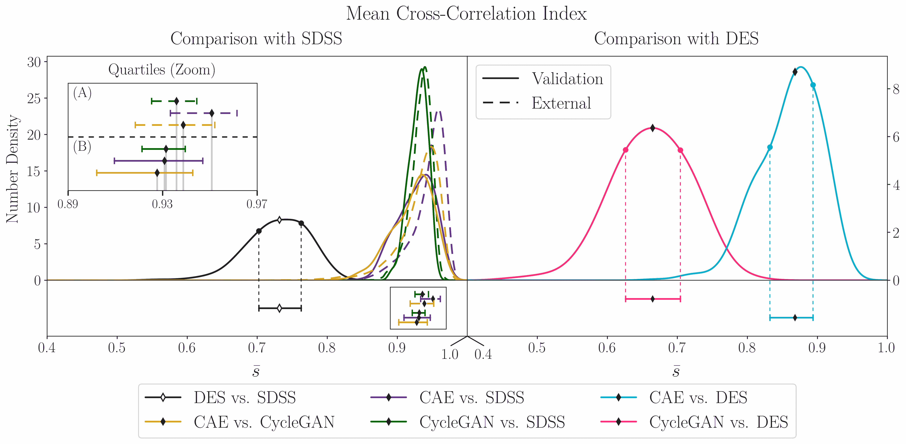
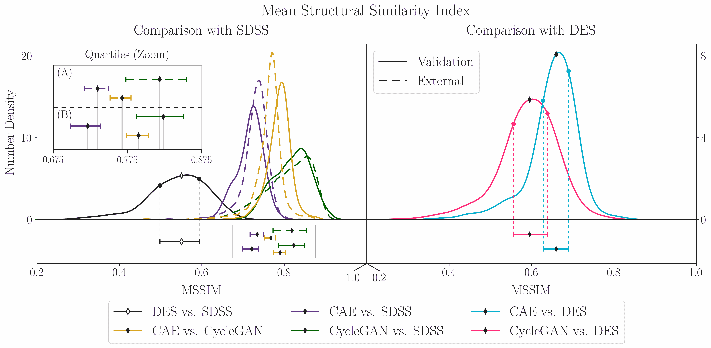
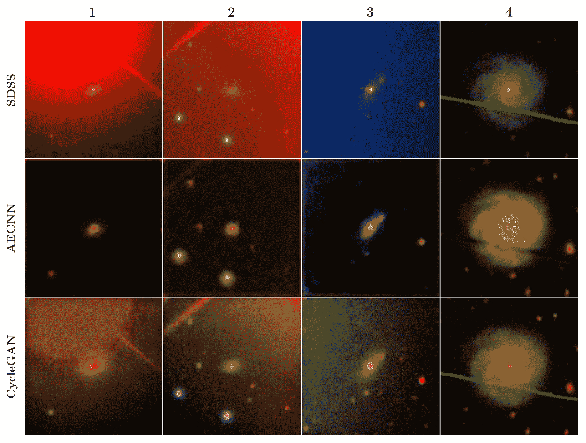

<!--yml

分类：未分类

日期：2024-09-06 19:58:31

-->

# [2011.07124] Survey2Survey: 一种深度学习生成模型方法用于跨调查图像映射

> 来源：[`ar5iv.labs.arxiv.org/html/2011.07124`](https://ar5iv.labs.arxiv.org/html/2011.07124)

# Survey2Survey: 一种深度学习生成模型方法用于跨调查图像映射

Brandon Buncher¹，Awshesh Nath Sharma² 和 Matias Carrasco Kind^(3,4,5)

¹伊利诺伊大学物理系，香槟，IL 61820 美国

²印度理工学院鲁尔基分校，鲁尔基，乌塔拉坎德 247667 印度

³伊利诺伊大学天文学系，厄尔巴纳，IL 61801 美国

⁴国家超级计算应用中心，厄尔巴纳，IL 61801 美国

⁵天体物理调查中心，厄尔巴纳，IL 61801 美国 buncher2@illinois.edu（接受 XXX。收到 YYY；原始形式 ZZZ）

###### 摘要

在过去十年中，调查数据和深度学习技术经历了爆炸式增长，这两者都极大地推动了天文学的发展。来自多个时代、不同波长的各种调查数据量庞大，尽管亮度和质量各异，但利用来自不同调查的重叠观测信息具有无限的潜力来理解银河形成和演化。使用物理模型生成合成银河图像已成为调查数据分析的重要工具，而深度学习生成模型展现了巨大的潜力。在本文中，我们提出了一种通过跨调查特征转换来稳健扩展和改进调查数据的新方法。我们训练了两种神经网络，将斯隆数字天空调查（SDSS）的图像映射到与之对应的暗能量调查（DES）图像。这一映射被用来生成 SDSS 图像的虚假 DES 表示，增加了亮度和信噪比，同时保留了重要的形态信息。我们通过生成来自重叠区域之外的 SDSS 图像的 DES 表示来证明我们方法的稳健性，显示出即使源图像质量低于训练图像时，亮度和质量仍得到改善。最后，我们突出显示了几个重建过程中似乎去除了 SDSS 图像中大块伪影的图像。虽然仅为初步应用，我们的方法在稳健扩展和提高光学调查数据质量方面显示出潜力，并为跨波段重建提供了可能的途径。

###### 关键词：

银河：形成 – 银河：演化 – 技术：图像处理 – 调查 – 虚拟观测工具^†^†pubyear: 2020^†^†pagerange: Survey2Survey: 一种深度学习生成模型方法用于跨调查图像映射–A

## 1 引言

通过各种天文调查收集的宽频率范围内的光学数据分析是研究星系起源和演化的重要组成部分。关于星系形状的数据（Wang et al., 2019）和光度（Padmanabhan & Loeb, 2020; Cortese et al., 2017）在不同波段提供了有关星系在不同宇宙时代演化的信息。由于每个波段提供了有关每个物体不同特征的信息，结合来自广泛波长范围的数据的研究可能会得出更强的结论。虽然大多数现代调查（如暗能量调查（DES；Abbott et al., 2018）和斯隆数字天空调查（SDSS；Abazajian et al., 2009; Jiang et al., 2014a））覆盖了大范围的光学波长，但调查的深度、覆盖区域和信噪比（S/N）因调查而异。特别是，未来的调查如空间与时间遗产调查（LSST）（Ivezić et al., 2019）将大大改善这些情况。因此，由于某些波段中高质量数据的调查覆盖不完全，可能会在特定区域提取特征变得困难。

### 先前的工作

为了理解潜在的星系形成模型及其背后的物理学，模拟是必需的，以模拟观测结果；然而，它们的系统性在计算上是昂贵的。通过深度学习生成单个物体的合成图像是一种替代方法，用于生成合成天空目录，这避免了其他物理驱动模拟所需的时间和计算开销。各种神经网络架构已被用于此目的，包括变分自编码器（Regier et al., 2015a, b; Lanusse et al., 2020; Spindler et al., 2020）和生成对抗网络（GANs）（Smith & Geach, 2019; Ullmo et al., 2020）。尽管这些方法能够高效生成模拟星系图像，但输出图像的准确性取决于输入图像的质量。因此，它们的物理信息在根本上受到它们所训练的调查数据质量的限制。

除了图像生成之外，各种类型的自编码器已被用于天文学中的多种目的，包括异常检测（Villar et al., 2020a）和物体分类（Ralph et al., 2019; Spindler et al., 2020; Villar et al., 2020b）。GANs 也已被用于特征提取（Shirasaki et al., 2019）和异常检测（Storey-Fisher et al., 2020）。

对于这项工作特别重要的两种自编码器架构是卷积自编码器（CAEs）（Masci et al., 2011）和去噪自编码器（DAEs）（Vincent et al., 2008）。CAEs 已在天文学中用于分类/特征提取（Cai et al., 2020；Cheng et al., 2020；Patel & Upla, 2019）和异常检测（Storey-Fisher et al., 2020）。DAEs 接受人为损坏的输入，并被训练以重建该输入的无失真表示。DAEs 主要用于从图像（Graff et al., 2014）和数据（Shen et al., 2017）中消除噪声，以及进行特征提取（Frontera-Pons et al., 2017；Wang et al., 2020）。

改善调查数据集大小和质量的一个鲜有探索的替代方法是通过在调查数据之间使用特征迁移技术。特征迁移模型被训练以识别来自数据集 $\mathbb{X}$ 和 $\mathbb{Y}$ 的相应图像对 $\mathcal{X}$ 和 $\mathcal{Y}$ 中特征的差异。使用来自 $\mathcal{X}^{\prime}\in\mathbb{X}$ 的图像作为输入，训练好的神经网络可以用于构建具有 $\mathbb{Y}$ 中图像特征的图像表示。

在天文学和天体物理学的背景下，利用条件生成对抗网络（GANs）的特征迁移学习最近在数据分析和特征提取方面找到了应用。Moriwaki et al. (2020) 开发了一种从噪声的流体动力学模拟数据中提取/重建 H$\alpha$ 线强度图的方法。此外，Shirasaki et al. (2019) 使用特征迁移技术从弱透镜图中提取信息。然而，其他修改过的 GAN 架构也可以用于特征迁移学习；特别是，循环一致生成对抗网络（CycleGANs；这些在第三部分中描述）特别适用于图像分析和生成。CycleGANs 由 Zhu et al. (2017) 和 Isola et al. (2016) 开发，已用于图像到图像的转换（成对或未配对的图像集之间的特征迁移）（Jia et al., 2020；Liu et al., 2020；Luo et al., 2021；Osakabe et al., 2020；Maziarka et al., 2019）。然而，在天文学和天体物理学中对使用特征迁移学习的生成模型的探索仍然很有限。

最近，Lin 等人（2021）使用图像到图像的翻译技术重建了不同天文调查所特有的高频噪声模式。作者使用了几种经过修改的 CycleGAN 架构，并采用了半监督训练方案，利用未配对的图像来分离来自两个不同调查的图像中的信号和噪声。然后使用噪声模拟器来重建每个调查的噪声模式。噪声模拟器随后可以用于重建具有这些特征噪声模式的目标数据集中的图像。尽管他们的几个模型在模拟噪声模式方面取得了成功，但使用未配对图像的训练妨碍了对信号的小尺度特征的重建。除了这项工作，作者未能识别出 CycleGAN 在天文学和天体物理学中的其他应用。

除了特征转移的方法外，理论上还可以使用其他方法生成具有不同参数的星系表示。特别是，**fader networks**（Lample 等，2017；Perarnau 等，2016）已被 Schawinski 等人（2018）用于测试驱动星系形成机制的假设。虽然这可以作为将星系的个别物理参数从一个数据集转移到另一个数据集的方法，但由于需要知道大量参数才能生成目标数据集中图像的真实表示，因此使用这种方法进行图像重建是不可行的。

我们提出了一种新颖的星系调查之间的特征转移方法，结合 CAEs 和 CycleGANs，可以用于扩展星系图像目录，并可应用于多种波长和分辨率。通过使用来自 DES DR1（Abbott 等，2018）的图像与来自 SDSS DR16（Ahumada 等，2020）的相应图像进行训练，我们证明了 DES 图像中的信息可以转移到 SDSS 图像中，从而提高了它们的 S/N、对比度和亮度。我们展示了从 SDSS 图像重建的合成 DES 图像与真实 DES 图像具有相同的特征，并且这种一致性在使用来自一组质量较低的 SDSS 图像进行重建时得以保留，这些图像在 DES 目录中没有对应项。

尽管其他研究表明变分自编码器（Regier et al., 2015a, b; Lanusse et al., 2020; Spindler et al., 2020）和 GAN（Smith & Geach, 2019; Ullmo et al., 2020）在生成真实合成星系图像和提高信噪比方面是有效的，但这些模型都在相同的数据集上进行训练和验证。我们的方法使用了与这些模型相似的技术；然而，通过使用不同的数据进行训练（SDSS）和验证（DES），我们能够生成与 SDSS 图像具有相同形态特征但亮度和信噪比更具 DES 图像特征的虚假图像。像其他生成模型一样，这可以用于增加调查数据集的规模；然而，这种方法生成了真实观测星系的虚假表示。当研究尚未被高质量调查覆盖的特定区域中的星系特性时，这提供了好处。更重要的是，迁移学习可能允许跨波段重建：所有调查覆盖了在有效分析中具有足够高质量的有限波长范围，使得在某些天空区域提取特定波段的特征变得不可能。通过使用波段少于验证数据的图像进行训练，基于特征转移的生成模型可能能够生成具有比输入图像更大波长范围的星系合成表示。这为在缺乏足够波段覆盖的区域中提供了更彻底分析星系的方法。

在这项工作中，我们展示了 Survey2Survey 的创建，这是一种神经网络架构，用于在 SDSS 和 DES 星系图像之间转移特征，且该方法可以轻松地推广到其他光学调查或甚至跨多个波长。用于训练和验证的 SDSS 和 DES 数据集的参数在第二部分中进行了描述。在第三部分中，我们详细介绍了使用的 CAE 和 CycleGAN 架构。在第四部分中，我们展示了重建图像的定性和定量准确性指标，然后在第五部分中总结了我们的发现。

## 2 数据

在这一节中，我们描述了用于进行本研究的数据集。我们重点关注来自 SDSS 和 DES 调查的光学数据以及 Stripe82（Jiang et al., 2014b）中的重叠区域。本文中使用的所有数据均可通过其各自的网站公开访问。

所有图像由三层组成（每个 RGB 通道一层），每个像素 $P_{i}$ 的亮度由 32 位浮点数表示，$0\leq P_{i}\leq 1$。每张 SDSS 图像为 150 $\times$ 150 $\mathrm{\,pix}$，每张 DES 图像为 228 $\times$ 228 $\mathrm{\,pix}$；在训练和重建之前，DES 图像被缩小以匹配 SDSS 图像的尺寸。重建后，在分析之前，每张三层 150 $\times$ 150 $\mathrm{\,pix}$ 的图像通过对 RGB 通道取平均值减少为单层图像。

#### SDSS

SDSS 图像由 Ritchey-Chrètien 高度-方位望远镜（Gunn 等，2006）、Irènèe du Pont 望远镜（Bowen & Vaughan，1973）和 NMSU 1 米望远镜（Holtzman 等，2010）捕捉。我们选择了 Stripe82 中与 DES 脚印重叠的星系样本，并从该区域外和北极帽区域内随机抽样数据，总计 25,000 个星系。我们选择了带有 Petrosian 亮度限制 $14<R<17.77$、$z<0.25$ 和分辨率 $0.396\mathrm{\,arcsec}/\!\mathrm{\,pix}$ 的星系，使用 SDSS 生成的星系标志来选择高置信度的星系图像。这些星系的图像来自 SDSS 剪切服务器¹¹1http://casjobs.sdss.org/ImgCutoutDR7。

#### DES 和重叠区域

DES 使用安装在智利 Cerro Tololo Inter-American Observatory (CTIO) 的 Blanco 4 米望远镜上的 Dark Energy Camera (DECam; Flaugher 等，2015) 观察南天 ${\sim}\,5000\mathrm{\,deg}^{2}$ 的 $g$、$r$、$i$、$z$ 和 $Y$ 广泛滤光片，波长范围从 ${\sim}\,400\mathrm{\,nm}$ 到 ${\sim}\,1000\mathrm{\,nm}$。

我们使用了 Dark Energy Survey DR1 发布的图像（Abbott 等，2018），其由超过 10,000 张 $0.534\mathrm{\,deg}^{2}$ 的共添加图像组成，分辨率为 $0.263\mathrm{\,arcsec}/\mathrm{\,pix}$，深度达到 S/N ${\sim}\,10$，适用于扩展对象，最大 $i_{AB}\,{\sim}\,23.1$。

我们使用了按照浓度和亮度模型误差过滤的标准选择了 DES 星系，如推荐的²²2https://des.ncsa.illinois.edu/releases/dr1/dr1-faq，$g<17$位于条纹 82 区域（Jiang et al., 2014b），对应约$300\mathrm{\,deg}^{2}$的赤道附近区域。我们选择了所有具有 SDSS 对应图像的条纹 82 区域的图像（Abazajian et al., 2009；Jiang et al., 2014a）。这些图像是通过公共的 DES 剪裁服务³³3https://des.ncsa.illinois.edu/desaccess 获得的。我们删除了覆盖不完整的图像，并通过人工检查清理了星星等异常和污染物。每张 DES 图像被缩放到 150 $\times$ 150 $\mathrm{\,pix}$以匹配 SDSS 图像的分辨率。我们对齐了每对 DES/SDSS 图像的方向和中心像素，最终的 RGB 合成图像使用 Lupton et al. (2004)的配方生成，以尽可能匹配 SDSS 的颜色。图 1 展示了所选星系的示例，其中可以看到 DES 图像比 SDSS 图像更亮、更详细。

重叠区域用于训练和验证；重叠区域中的每张 SDSS 图像都有一个 DES 对应图像。总共有 5,538 张重叠区域的 RGB 图像。5,000 对 SDSS/DES 图像用于训练模型，而剩余的 538 对则用于验证数据集。由于 SDSS 和 DES 数据集中对象亮度和空间范围的巨大变化，我们选择使用一个约为两者使用的数据集$\approx 5\times$大的训练数据集（Isola et al., 2016；Zhu et al., 2017）。

外部数据集，包括 25,076 张来自条纹 82 区域之外的图像，用于提供我们方法论鲁棒性的证据。这些图像比训练和验证数据集中的图像更暗，S/N 比更低。

图 1：来自暗能量调查（DES）（顶部行）和斯隆数字天空调查（SDSS）（底部行）数据集的样本图像。更多示例可见于全文。

## 3 方法论

卷积自编码器（CAE）（Masci 等人，2011）和循环一致生成对抗网络（CycleGAN）（Durugkar 等人，2016）被用于从 SDSS 输入图像中生成合成星系图像。由于图像经过了缩放、旋转和居中处理，使得每对图像对中的像素彼此对应，因此最小化两个模型的损失函数与最小化重建图像与 DES 目标图像之间的像素差异相对应。这两种模型在实现和目标函数上有所不同，如下所述。我们没有对 CAE 或 CycleGAN 进行传统上用于减少过拟合和提供数据增强的方法，例如图像旋转和翻译。空间变换可能会导致失败：由于我们打算进行像素对像素的翻译，任何像素的不对齐都会导致无效的映射函数的生成。虽然在许多其他情况下这可能不会造成问题，但在 SDSS 和 DES 图像上的空间变换可能会由于信号区域相对于背景的空间范围较小而大幅降低映射函数的准确性。虽然这可能会导致过拟合，但外部重建的分析提供了我们方法鲁棒性的证据。作为对假图像生成的图像到图像翻译的初步应用，我们选择最小化可能影响像素对像素映射的因素；未来的研究应致力于建立方法，以确保不会发生过拟合。

### 3.1 卷积自编码器（CAE）

自编码器是一种神经网络架构，通常用于分类，由一个编码器/解码器对组成。编码器使用一个或多个隐藏层压缩来自输入图像的数据，以从该图像中隔离重要特征，生成具有较低维度的图像潜在空间表示。解码器使用潜在空间中的信息来重建输入图像的表示。自编码器被训练以优化损失函数，从而最小化源图像和重建图像之间的差异。卷积自编码器使用卷积滤波器进行编码和解码：在编码阶段，卷积滤波器用于从输入图像中提取信息并减少其维度。额外的卷积滤波器用于将潜在空间表示映射到输入图像的重建。训练通过迭代地修改卷积滤波器的权重，以最小化源图像及其重建之间的差异。

我们的 CAE 使用 Keras（Chollet 等，2015）和 Tensorflow（Abadi 等，2015）后端实现，并在 32 GB Tesla V1000-PCIE GPU 上运行。经过 100 个 epoch 的训练（该值通过提前停止选择）花费了约 30 分钟。关于我们架构的详细信息见表 1 ‣ 3 Methodology ‣ Survey2Survey: A deep learning generative model approach for cross-survey image mapping")。由于我们旨在重现的图像复杂性，我们故意没有大幅减少每一层的潜在空间维度。SDSS 图像通常较暗且噪声较大，而来自 DES 数据集的对象通常有更多的像素与背景噪声区分开（即 DES 图像中的信号具有更大的空间范围），因此低维度的潜在空间不太可能生成足够详细的伪图像。

| 阶段 | 输出形状 | 激活函数 | $\bm{N_{\textnormal{{P}}}}$ |
| --- | --- | --- | --- |
| 输入 | 150 $\times$ 150 $\times$ 3 | N/A |
| 编码器 | 150 $\times$ 150 $\times$ 128 | ReLU | 3584 |
| 150 $\times$ 150 $\times$ 64 | ReLU | 73792 |
| 150 $\times$ 150 $\times$ 32 | ReLU | 18464 |
| 解码器 | 150 $\times$ 150 $\times$ 32 | ReLU | 9248 |
| 150 $\times$ 150 $\times$ 64 | ReLU | 18496 |
| 150 $\times$ 150 $\times$ 128 | ReLU | 73856 |
| 150 $\times$ 150 $\times$ 3 | Sigmoid | 3459 |

表 1: 用于图像重建的 CAE 架构。初始输入和最终输出图像的尺寸为 150 $\times$ 150 $\mathrm{\,pix}$，具有 3 个颜色通道；编码器和解码器阶段中每个图像的输出形状为长度 $\times$ 宽度 $\times$ 滤波器数量。编码器和解码器阶段中的每一行代表一个具有指定激活函数的卷积层；卷积使用 3 $\times$ 3 的核，步幅为 1，填充为零。传递到后续卷积层的图像尺寸与该行的输出形状相对应。$N_{\textnormal{P}}$是该层中训练特征的数量。使用的滤波器数量和激活函数通过手动调节确定。

每张图像的 RGB 数据被分成三个层，每一层用于生成一组独特的滤波器。编码器和解码器都由三个隐藏层组成，每一层使用 150 个 3 $\times$ 3 $\mathrm{\,pix}$的卷积滤波器对来自前一层的图像数据进行过滤。这些滤波器使用随机生成的权重进行初始化。每层的编码器和解码器使用了修正线性单元（ReLU）激活函数，而在最终重建阶段使用了 sigmoid 激活函数。每个周期中，输入图像$\textbf{{x}}_{0}$来自 SDSS 目录，而目标图像$\textbf{{x}}_{T}$则来自 DES 目录。使用均方误差损失函数计算重建图像$\textbf{{x}}^{\prime}_{0}$与目标图像之间的差异。

|  | $\displaystyle\mathcal{L}\left(\textbf{{x}}^{\prime}_{0},\textbf{{x}}_{T}\right)$ | $\displaystyle=\left\lVert\textbf{{x}}_{T}-\textbf{{x}}^{\prime}_{0}\right\rVert$ |  | (1) |
| --- | --- | --- | --- | --- |

Adadelta（Zeiler，2012）优化器被用于确定滤波器权重。在 100 个训练周期结束时，训练后的算法被用来从对应的 SDSS 图像中重建 DES 验证图像。

### 3.2 循环一致性生成对抗网络（CycleGAN）

图 2：CycleGAN 架构的示意图。1. 通过映射函数 $F$ 从目标数据集中的成员 $y$ 生成一个虚假图像表示 $\hat{x}$。2. 通过映射函数 $G$ 将 $\hat{x}$ 映射到虚假图像 $\hat{y}$。3. 判别器 $D_{\mathcal{X}}$ 的 GAN 损失函数 $\mathcal{L}_{\textnormal{GAN}}^{X}$ 通过比较 $x$ 和 $\hat{x}$ 计算得出。4. 反向循环一致性损失函数 $\mathcal{L}_{\textnormal{cyc}}^{\textnormal{b}}$ 通过比较 $\hat{y}$ 和真实目标图像 $y$ 计算得出（前向循环一致性损失函数 $\mathcal{L}_{\textnormal{cyc}}^{\textnormal{f}}$ 通过使用 $\hat{x}$ 和 $x$ 计算得出）。在我们的案例中，为了计算 $\mathcal{L}_{\textnormal{cyc}}^{\textnormal{f}}$，我们生成一个 SDSS 图像 $x$ 的 DES 表示，然后使用 $F$ 生成该图像的虚假 SDSS 表示。$\mathcal{L}_{\textnormal{cyc}}^{\textnormal{f}}$ 量化源 SDSS 图像和虚假 SDSS 图像之间的差异；它与 $\mathcal{L}_{\textnormal{cyc}}^{\textnormal{b}}$ 的结合量化了当 SDSS 图像在 SDSS 和 DES 图像空间之间完成一次完整的“循环”时积累的误差（$\mathbb{X}\to\mathbb{Y}\to\mathbb{X}$）。5. 这些损失函数与 $\mathcal{L}_{\textnormal{GAN}}^{Y}$ 和 $\mathcal{L}_{\textnormal{cyc}}^{\textnormal{f}}$ 结合计算总损失函数 $\mathcal{L}$。然后更新 $F$ 和 $G$ 以最小化 $\mathcal{L}$。这一过程重复进行，以优化神经网络。

生成对抗网络（GAN）（Durugkar 等人，2016）是一种无监督或半监督的生成模型，由生成器 $G$ 和判别器 $D$ 组成。$D$ 被训练用来区分来自“真实”图像训练数据集 ($\mathcal{Y}$) 的图像和通过从 $G$ 的潜在空间采样生成的图像 ($\mathcal{X}$)。通过最小化损失函数 $\mathcal{L}(G,D,\mathcal{X},\mathcal{Y})$，使用 $D$ 的误差反向传播来生成从 $G$ 的潜在空间到“真实”图像数据集的映射 $g:\mathcal{X}\to\mathcal{Y}$。训练后，GAN 可以用来生成复制 $\mathcal{Y}$ 特征的虚假图像。

CycleGAN（Zhu 等，2017；Isola 等，2016）是传统 GAN 的一种变体，通过增加第二对生成器/判别器来最小化循环一致性损失；该架构的图示见图 2 ‣ 3 Methodology ‣ Survey2Survey: A deep learning generative model approach for cross-survey image mapping")。来自 $\mathcal{X}$（$\mathcal{Y}$）的图像用于训练判别器 $D_{\mathcal{X}}$（$D_{\mathcal{Y}}$）。生成器 $F:\mathcal{X}\to\mathcal{Y}$ 和 $G:\mathcal{Y}\to\mathcal{X}$ 被训练以极端化对抗损失函数 $\mathcal{L}(H,D_{\mathcal{Y}},\mathcal{X},\mathcal{Y})$ 对于生成器 $G$、判别器 $D_{\mathcal{Y}}$ 和数据集 $\mathcal{X}$ 和 $\mathcal{Y}$。为了本项目的目的，我们选择使用 Zhu 等（2017）使用的损失函数：

|  | $\displaystyle\mathcal{L}_{\textnormal{GAN}}(G,D_{\mathcal{Y}},\mathcal{X},\mathcal{Y})\kern 2.0pt=\kern 2.0pt$ | $\displaystyle\mathbb{E}_{\kern 0.5pty\sim p_{\textnormal{data}}(y)}\left[\kern 0.5pt\log D_{\mathcal{Y}}(y)\kern 0.5pt\right]+$ |  | (2) |
| --- | --- | --- | --- | --- |
|  |  | $\displaystyle\mathbb{E}_{\kern 0.5ptx\sim p_{\textnormal{data}}(X)}\left[\kern 0.5pt\log(1-D_{\mathcal{Y}}(G(x))\kern 0.5pt\right]$ |  |

对于图像 $x\in\mathcal{X}$ 和 $y\in\mathcal{Y}$，其中 $p_{\textnormal{data}}$ 是真实数据分布。$G$ 被训练以最大化 $\mathcal{L}_{\textnormal{GAN}}$ ($\max_{G}\max_{D_{\mathcal{Y}}}\mathcal{L}_{\textnormal{GAN}}(G,D_{\mathcal{Y}},\mathcal{X},\mathcal{Y})$)，而 $F$ 被训练以最小化它 ($\min_{F}\max_{D_{\mathcal{X}}}\mathcal{L}_{\textnormal{GAN}}(F,D_{\mathcal{X}},\mathcal{Y},\mathcal{X})$)。

为了约束可能映射函数的空间，CycleGAN 通过最小化前向和反向循环一致性误差来优化 $F$ 和 $G$。对于图像 $x\in\mathcal{X}$ 和 $y\in\mathcal{Y}$，令 $x^{\prime}=F(G(x))$ 和 $y^{\prime}=G(F(y))$。当 $x^{\prime}$ 和 $x$ 之间的差异被最小化时（即 $F=G^{-1}+\varepsilon_{x}$，其中 $\varepsilon_{x}$ 是某个小误差），前向循环一致性得以实现，这表明以 $\mathcal{X}$ 开始的完整翻译循环重现了 $x$ 的接近近似；反向循环一致性在图像 $y\in\mathcal{Y}$ 上定义相同，且 $G=F^{-1}+\varepsilon_{y}$，其中 $\varepsilon_{y}$ 是某个小误差。优化后的 CycleGAN 将同时最小化前向和反向循环一致性误差；这等同于确保 $F$ 和 $G$ 是彼此的双射逆，限制了可能映射函数集合的大小。这提高了神经网络的鲁棒性，并减少了相对于许多其他 GAN 变体所需的训练量。

我们注意到，在我们的特定案例中，我们使用了 Isola 等人描述的架构（2016），该架构改编自 Radford 等人提出的无监督表示学习 GAN 架构（2016）。特别是，我们强调使用了带有跳跃连接的生成器和马尔可夫判别器。这些附加功能有助于翻译过程，并将 GAN 判别器限制在高频结构上，减少了伪影的潜在风险。

我们使用的循环一致性损失函数$\mathcal{L}_{\textnormal{cyc}}(G,F)$定义为

|  | $\displaystyle\mathcal{L}_{\textnormal{cyc}}(G,F)=\kern 3.0pt$ | $\displaystyle\mathbb{E}_{x\sim p_{\textnormal{data}}(x)}\left[\kern 0.5pt\left\lvert F(G(x))-x\right\rvert_{1}\right]+$ |  | (3) |
| --- | --- | --- | --- | --- |
|  |  | $\displaystyle\mathbb{E}_{y\sim p_{\textnormal{data}}(y)}\left[\kern 0.5pt\left\lvert G(F(y))-y\right\rvert_{1}\right],$ |  |

其中$\left\lvert A-B\right\rvert_{1}=\sum\limits_{i}\hskip 2.0pt\left\lvert A_{i}-B_{i}\right\rvert$是图像$A$（SDSS）和$B$（DES）之间的像素到像素的$L^{1}$-范数。

用于训练$F$和$G$的完整损失函数是

|  | $\displaystyle\mathcal{L}(G,F,D_{\mathcal{X}},D_{\mathcal{Y}})\kern 2.0pt=\kern 2.0pt$ | $\displaystyle\mathcal{L}_{\textnormal{GAN}}(G,D_{\mathcal{Y}},\mathcal{X},\mathcal{Y})\kern 2.0pt+$ |  | (4) |
| --- | --- | --- | --- | --- |
|  |  | $\displaystyle\mathcal{L}_{\textnormal{GAN}}(F,D_{\mathcal{X}},\mathcal{Y},\mathcal{X})\kern 2.0pt+$ |  |
|  |  | $\displaystyle\lambda\kern 0.5pt\mathcal{L}_{\textnormal{cyc}}(G,F)$ |  |

对于某些参数$\lambda$，它描述了对抗性和循环一致性误差优化的相对重要性。在这项工作中，我们将$\lambda$设置为$0.2$。

使用 CycleGAN 架构进行图像翻译相比传统 GAN 具有优势，通过确保判别对$F$和$G$是互为逆函数来限制允许的映射函数。这有利于噪声图像之间的翻译，因为它确保了$\mathcal{X}$和$\mathcal{Y}$中的噪声模式差异被考虑到，从而在训练多张图像后更容易区分信号和噪声。

## 4 结果与分析

在这里，我们展示了我们可以将信息从 DES 图像转移到其 SDSS 对应图像，生成更亮、更高质量且噪声更少的合成图像，同时保留源图像中的形态信息。我们首先进行定性分析，以理解重建图像的属性，然后量化图像数据集的亮度和噪声水平。接着，我们利用源图像和重建图像的光谱剖面之间的相关性，确定数据集之间的小规模差异。最后，我们结合比较质量评估的信息，确认图像重建过程提高了图像质量，使物体变亮，并减少了背景噪声。我们通过比较验证数据集和外部数据集的统计数据，提供了重建过程鲁棒性的证据。

### 4.1 定性分析

图 3：来自验证数据集的银河图像示例（来自 Stripe82 区域）。每列展示一个 SDSS 银河（A 行）、其对应的 DES 图像（B 行），以及由 CAE（C 行）和 CycleGAN（D 行）方法重建的 DES 图像。CAE 和 CycleGAN 的残差（重建 - DES）分别显示在 E 行和 F 行，而 CAE 和 CycleGAN 的逐像素亮度增加（重建 - SDSS）分别显示在 G 行和 H 行。注意，为了提高可视性，E、F、G 和 H 行的图像经过了功率法则变换（$P_{i}\,\to\,{P_{i}}^{\prime}=P_{i}^{\gamma}$，对于每个像素$P_{i}$）。在 E 和 F 行中，$\gamma=0.3$，而在 G 和 H 行中，$\gamma=0.5$。额外的银河样本可以在附录 A 中找到。

图 4：来自外部数据集的银河图像示例（来自 Stripe82 重叠区域外）。每列展示一个 SDSS 银河（A 行）及其由 CAE（B 行）和 CycleGAN（C 行）方法重建的 DES 图像。CAE 和 CycleGAN 的逐像素亮度增加（重建 - SDSS）分别显示在 D 行和 E 行。注意，为了提高可视性，D 和 E 行的图像经过了功率法则变换（$P_{i}\,\to\,{P_{i}}^{\prime}=P_{i}^{\gamma}$，对于每个像素$P_{i}$，其中$\gamma=0.5$）。额外的银河样本可以在附录 A 中找到。

图 3 展示了神经网络生成的一些虚假图像的示例，并与它们相应的 SDSS 和 DES 图像进行了配对。这些图像被选中以展示验证样本中包含的各种类型和结构的银河，这些银河在训练期间未被包含。A 行包含 SDSS 目录中的图像；相应的 DES 图像位于 B 行。C 行和 D 行分别包含了重建的 CAE 和 CycleGAN 图像。我们可以观察到，DES 图像和 C 行及 D 行中的合成图像非常相似，差异主要来自重建对象的结构分辨率不足。

从定性角度看，重建的图像通常比相应的 DES 图像更模糊。然而，两种模型重建的图像通常比它们的 SDSS 图像更明亮。此外，虚假图像，特别是由 CAE 生成的图像，通常比它们的 SDSS 和/或 DES 图像噪声更少。CAE 和 CycleGAN 重建的图像残差分别显示在 E 行和 F 行。这些显示了重建图像与 DES 图像之间的逐像素亮度差异；请注意，这些图像经过了功率律变换（$P_{i}\,\to\,{P_{i}}^{\prime}=P_{i}^{\gamma}$ 对于每个像素 $P_{i}$；在 E 行和 F 行中，$\gamma=0.3$，而在 G 行和 H 行中，$\gamma=0.5$）。这样做是为了使残差结构可见。看来两种神经网络都隔离并增强了银河信号，同时对背景的影响最小化或试图减少噪声。两个网络还能够区分每张图像中的独立结构；这一点在第二列中尤为明显。

G 行和 H 行显示了相对于对应的 SDSS 银河，CAE 和 CycleGAN 重建提供的逐像素亮度增益。从定性角度看，CAE 重建的图像比 CycleGAN 图像更亮，并且对每个银河的内部结构提供了更大的放大。值得注意的是，两种网络都一致地对银河中心的放大效果超过了其他区域。这种放大并不仅限于银河中心，而是在网络识别为信号区域的大多数区域都存在。其他示例银河可在附录 A 中查看。

图 4 展示了来自外部数据集（Stripe82 区域之外）的图像示例。这些图像通常质量较低；然而，两个重建模型都成功选择并放大了感兴趣的物体，对背景的影响较小，甚至保持了图像的许多小尺度细节（特别是在第四列和第七列）。如图 3 所示，重建一般增加了图像中物体的空间范围。值得注意的是，CAE 重建在最后一列中似乎去除了 SDSS 图像中的一个伪影；这一现象在第 4.4 节中进行了更详细的讨论。

### 4.2 数据集属性

在这里，我们量化了来自每个数据集的图像亮度和质量，以用作原始输入 SDSS 图像、DES 目标图像和重建图像之间的基准比较指标。

#### 伪通量大小

在这项工作中，我们使用了来自 SDSS 和 DES 的 RGB 图像来测试我们的架构。图像亮度通过每幅图像的平均伪通量大小$F$来量化。我们称$F$为“伪通量大小”，因为虽然$F$不代表物理通量大小（我们的图像仅由(r, g, b)通道像素值组成），但由于这两种测量之间的相似性，它充当了该量的代理。伪通量大小$F$的定义如下：

|  | $\displaystyle F$ | $\displaystyle=30-2.5\log\left(\sum_{{\hskip 6.0ptr_{i}\,<\,r_{\textnormal{max}}}}\beta_{i}\hskip 2.0pt\right)$ |  | (5) |
| --- | --- | --- | --- | --- |
|  |  | $\displaystyle=30-2.5\log\,\beta^{\circ}.$ |  |

在这里，像素亮度$\beta_{i}$描述了$P_{i}$中红色、绿色和蓝色通道值的平均值，而$\beta^{\circ}$是半径$r_{\textnormal{max}}=75\mathrm{\,pix}$的孔径内包含的总像素亮度。为了逼近物理量分布的外观，添加了一个常数因子（零点）30。

伪通量幅度直方图的高斯核密度估计（KDEs）如图 5 所示。使用了第一、第二和第三四分位数作为数据分布的保守估计；由于外部数据分布的严重偏斜，因此选择了这些值。然而，它们不能用来确定不同数据集之间的信噪比是否存在显著差异。这是因为伪通量幅度的差异必须在图像到图像的基础上评估，而不是通过每个信噪比值的相对频率来评估。验证数据集中的重建伪通量幅度值与 DES 数据集相当，显示出相对于 SDSS 数据集的亮度有所改善。在外部数据集中，两个重建的伪通量幅度分布都向左偏离了 SDSS 分布，这表明重建过程成功提高了来自外部数据集的图像亮度。

为了量化图像之间的亮度并提供误差估计，定义数据集 $i$ 和 $j$ 之间的均值相对通量差 $\Delta\hbox to0.0pt{\hskip 0.76389pt\leavevmode\hbox{\set@color$\overline{\hbox{}}$}\hss}{\leavevmode\hbox{\set@color$\mathcal{F}$}}^{\kern 1.0ptij}$ 为

|  | $\displaystyle\Delta\hbox to0.0pt{\hskip 0.76389pt\leavevmode\hbox{\set@color$\overline{\hbox{}}$}\hss}{\leavevmode\hbox{\set@color$\mathcal{F}$}}^{\kern 1.0ptij}=\frac{1}{N_{\textnormal{img}}}\sum_{m}^{N_{\textnormal{img}}}\frac{F_{m}^{\kern 1.0ptj}-F_{m}^{\kern 1.0pti}}{F_{m}^{\kern 1.0pti}},$ |  | (6) |
| --- | --- | --- | --- |

其中 $F_{m}^{\kern 1.0pti}$ 和 $F_{m}^{\kern 1.0ptj}$ 是数据集 $\mathbb{X}_{i}$ 和 $\mathbb{X}_{j}$ 中 $N_{\textnormal{img}}$ 张图像的对应伪通量幅度。

外部和验证数据集的$\Delta\hbox to0.0pt{\hskip 0.76389pt\leavevmode\hbox{\set@color$\overline{\hbox{}}$}\hss}{\leavevmode\hbox{\set@color$\mathcal{F}$}}^{\kern 1.0ptij}$值见表 2（为了提高可读性，缩放因子为$10^{3}$）；误差是通过$\frac{F_{m}^{\kern 1.0ptj}-F_{m}^{\kern 1.0pti}}{F_{m}^{\kern 1.0pti}}$的标准差估算的。由于数据的明显偏斜，伪通量幅度图（图 5）的误差是使用四分位数估算的，因此方差不能提供数据分布的充分表示。然而，$\Delta\hbox to0.0pt{\hskip 0.76389pt\leavevmode\hbox{\set@color$\overline{\hbox{}}$}\hss}{\leavevmode\hbox{\set@color$\mathcal{F}$}}^{\kern 1.0ptij}$的分布比$F$的分布更对称，因此可以使用标准差作为误差的估算。

唯一一个在通量之间没有显著差异的数据集对是 CycleGAN 与 DES。这意味着 CycleGAN 的重建将 SDSS 图像的通量降低，以匹配 DES 图像的通量。需要注意的是，这张表中的结果似乎与图 5 中的结果相冲突。这并不意外：图 5 展示了各个伪通量幅度的相对频率分布，而表 2 中的值展示了伪通量幅度的图像对图像比较。因此，表 2 中的值提供了一个适当的度量，用于比较重建图像与源图像之间伪通量幅度的差异。

值得注意的是，在验证和外部数据集中，$\Delta\hbox to0.0pt{\hskip 0.76389pt\leavevmode\hbox{\set@color$\overline{\hbox{}}$}\hss}{\leavevmode\hbox{\set@color$\mathcal{F}$}}^{\kern 1.0ptij}$在 $\mathbb{X}_{i},\mathbb{X}_{j}=\textnormal{SDSS, CAE}$ 之间没有统计学上的显著差异；同样，$\mathbb{X}_{i},\mathbb{X}_{j}=\textnormal{SDSS, CycleGAN}$ 也是如此。因此，重建提供的通量减少在验证和外部数据集中是类似的。这提供了我们方法稳健性的证据：伪图像的亮度增加与输入图像的亮度无关。

图 5：上图：验证和外部数据的伪通量幅度（定义见公式 (5))。下图：相应数据集的第一、第二和第三四分位数，提供了分布范围的度量。SDSS 图像通常比 DES 和重建图像更暗。请注意，四分位数不能用作误差/统计显著性的度量，因为此图并未提供 $F$ 的图像对图像差异的表示；这在文本中有更详细的讨论。

| $\Delta\hbox to0.0pt{\hskip 0.76389pt\leavevmode\hbox{\set@color$\overline{\hbox{}}$}\hss}{\leavevmode\hbox{\set@color$\mathcal{F}$}}^{\kern 1.0ptij}\times 10^{3}$ | 外部 | 验证 |
| --- | --- | --- |
| <svg version="1.1" height="25.53" width="150" overflow="visible"><g transform="translate(0,25.53) scale(1,-1)"><g  transform="translate(0,0)"><g transform="translate(0,13.52) scale(1, -1)"><foreignobject width="24.16" height="13.52" overflow="visible">$\mathbb{X}_{j}$</foreignobject></g></g> <g  transform="translate(124.04,13.52)"><g transform="translate(0,12.01) scale(1, -1)"><foreignobject width="25.96" height="12.01" overflow="visible">$\mathbb{X}_{i}$</foreignobject></g></g></g></svg> | SDSS | SDSS | DES |
| CAE | $-40.65\pm 5.59$ | $-41.90\pm 5.54$ | $-9.36\pm 6.72$ |
| CycleGAN | $-30.44\pm 7.28$ | $-29.33\pm 6.28$ | $\mathit{3.65\pm 8.22}$ |
| DES | 不适用 | $-32.80\pm 9.13$ | 不适用 |

表 2：伪通量幅度中的平均比例差异 $\Delta\hbox to0.0pt{\hskip 0.76389pt\leavevmode\hbox{\set@color$\overline{\hbox{}}$}\hss}{\leavevmode\hbox{\set@color$\mathcal{F}$}}^{\kern 1.0ptij}$(按$10^{3}$的因子缩放)（定义见公式 (6)) 在每组图像之间；标准差用于估计误差。唯一一个没有显示出显著差异的$F$数据集对是 CycleGAN 和 DES。

图 6：顶部：验证和外部数据中均值 S/N 的直方图的 KDEs（定义见方程 (7)）。底部：分布的第一、第二和第三四分位数。两种重建模型都有效地提高了 S/N。请注意，如图 5 所述，四分位数条不能用于确定统计显著性；有关进一步解释，请参见正文。

#### 信噪比

作为图像质量的度量，我们测量了每个数据集中图像的平均信噪比 (S/N)。我们将均值 S/N 定义为

|  | S/N | $\displaystyle=\frac{\mu^{\circ}_{\beta}}{\sigma^{\circ}_{\beta}},$ |  | (7) |
| --- | --- | --- | --- | --- |

其中 $\mu^{\circ}_{\beta}$ $\left(\sigma^{\circ}_{\beta}\right)$ 是半径为 $r_{\textnormal{max}}=75\mathrm{\,pix}$ 的像素亮度 $\beta$ 的均值（标准差）。

在图 6 中，我们展示了均值 S/N 的直方图的 KDEs，以及第一、第二和第三四分位数，这些都用作扩展度量；然而，如表 2 的分析所讨论的，它们不能用作误差度量。平均而言，两种重建模型在提高 S/N 相对于 SDSS 图像方面都有效，而 CycleGAN 重建的 S/N 几乎与 DES 图像匹配。去噪自编码器已被用于减少图像中的噪声（Vincent et al., 2008），因此 CAE 图像中的 S/N 大于目标图像并不令人惊讶。

在表格 3 中，我们列出了图像集$i$和$j$之间的信噪比的平均比例差异，以总结来自图 6 的结果。正如在方程式(6)中定义的，我们定义图像集$i$和$j$之间的平均比例差异为

|  | $\displaystyle\Delta\hbox to0.0pt{\hskip 0.27777pt\leavevmode\hbox{\set@color$\overline{\hbox{}}$}\hss}{\leavevmode\hbox{\set@color$\mathcal{S}$}}^{\kern 1.0ptij}=\frac{1}{N_{\textnormal{img}}}\sum_{m}^{N_{\textnormal{img}}}\frac{\left[\textnormal{S/N}\right]_{m}^{\kern 1.0ptj}-\left[\textnormal{S/N}\right]_{m}^{\kern 1.0pti}}{\left[\textnormal{S/N}\right]_{m}^{\kern 1.0pti}}$ |  | (8) |
| --- | --- | --- | --- |

其中$\left[\textnormal{S/N}\right]_{m}^{\kern 1.0pti}$和$\left[\textnormal{S/N}\right]_{m}^{\kern 1.0ptj}$是信噪比（如方程(7）所定义）对于来自数据集$\mathbb{X}_{i}$和$\mathbb{X}_{j}$的$N_{\textnormal{img}}$张图像中的对应图像对。在表 3 中，我们可以看到，对于验证数据集，CycleGAN 重建并未显著提高相对于 DES 图像的 S/N（$\Delta\hbox to0.0pt{\hskip 0.27777pt\leavevmode\hbox{\set@color$\overline{\hbox{}}$}\hss}{\leavevmode\hbox{\set@color$\mathcal{S}$}}^{\kern 1.0ptij}-\sigma<0<\Delta\hbox to0.0pt{\hskip 0.27777pt\leavevmode\hbox{\set@color$\overline{\hbox{}}$}\hss}{\leavevmode\hbox{\set@color$\mathcal{S}$}}^{\kern 1.0ptij}$，其中$\sigma$是$\Delta\hbox to0.0pt{\hskip 0.27777pt\leavevmode\hbox{\set@color$\overline{\hbox{}}$}\hss}{\leavevmode\hbox{\set@color$\mathcal{S}$}}^{\kern 1.0ptij}$的标准差）。然而，CAE 重建确实显著提高了相对于 DES 图像的 S/N。左侧的第二列和第三列（分别是外部和验证数据中的$\mathbb{X}_{i}=\textnormal{SDSS}$）表明，重建在其对应的 SDSS 图像中的 S/N 显著增加。此外，$\mathbb{X}_{i},\mathbb{X}_{j}=\textnormal{SDSS, CAE}$在验证和外部数据集中$\Delta\hbox to0.0pt{\hskip 0.27777pt\leavevmode\hbox{\set@color$\overline{\hbox{}}$}\hss}{\leavevmode\hbox{\set@color$\mathcal{S}$}}^{\kern 1.0ptij}$的值之间没有显著差异；这一关系在$\mathbb{X}_{i},\mathbb{X}_{j}=\textnormal{SDSS, CycleGAN}$中也是一样。这意味着，通过使用我们的架构进行特征转换的图像重建提供了一种强大的方法来生成与本研究中的 DES 银河相同 S/N 的虚假银河图像。

| $\Delta\hbox to0.0pt{\hskip 0.27777pt\leavevmode\hbox{\set@color$\overline{\hbox{}}$}\hss}{\leavevmode\hbox{\set@color$\mathcal{S}$}}^{\kern 1.0ptij}$ | 外部 | 验证 |
| --- | --- | --- |
| <svg version="1.1" height="25.53" width="150" overflow="visible"><g transform="translate(0,25.53) scale(1,-1)"><g  transform="translate(0,0)"><g transform="translate(0,13.52) scale(1, -1)"><foreignobject width="24.16" height="13.52" overflow="visible">$\mathbb{X}_{j}$</foreignobject></g></g> <g  transform="translate(124.04,13.52)"><g transform="translate(0,12.01) scale(1, -1)"><foreignobject width="25.96" height="12.01" overflow="visible">$\mathbb{X}_{i}$</foreignobject></g></g></g></svg> | SDSS | SDSS | DES |
| CAE | $5.138\pm 2.719$ | $2.893\pm 1.819$ | $0.710\pm 0.317$ |
| CycleGAN | $2.067\pm 1.001$ | $1.334\pm 0.716$ | $\mathit{0.069\pm 0.125}$ |
| DES | N/A | $1.224\pm 0.779$ | N/A |

表 3：各图像集之间信噪比的平均比例差异（见公式 (8))；标准差用于估算误差。如表 2 所示，唯一没有显著信噪比差异的数据集对是 CycleGAN 与 DES。

### 4.3 伪亮度分布

图 7：验证数据（左）和外部数据（右）的伪亮度分布 $\frac{dF}{dS}$；$\frac{dF}{dS}$ 的定义见公式 (9). 实线表示 $\frac{dF}{dS}$，而虚线显示了 $\frac{dF}{dS}\pm\hat{\sigma}$，其中 $\hat{\sigma}$ 是样本标准差。对于任何数据集，伪亮度分布之间没有统计学上显著的差异。

在第 4.2 节中，我们展示了图像重建显著提高了其对应 SDSS 图像的伪流量大小和信噪比，与 DES 图像相匹配。我们还证明了 $F$ 和信噪比的改进不严重依赖于源图像的数据集，为我们方法的稳健性提供了证据。现在，我们将比较这些图像中对象的伪亮度分布，以描述对象本身的结构。

伪亮度分布 $\frac{dF}{dS}$，类似于观测数据中的亮度分布，由以下公式定义

|  | $\displaystyle\frac{dF(r)}{dS}$ | $\displaystyle=\frac{1}{2\pi r{\Delta r}}\sum_{\hskip 4.0ptr_{i}\in\textnormal{Ann}(r)}F_{i}$ |  | (9) |
| --- | --- | --- | --- | --- |
|  |  | $\displaystyle=\frac{F_{\textnormal{Ann}(r)}}{2\pi r{\Delta r}}$ |  |

其中 $F_{\textnormal{Ann}(r)}$ 是包含在一个中心半径为 $r$、面积为 $S=2\pi r{\Delta r}$ 的环形孔径 $\textnormal{Ann}(r)$ 内的总通量，其中 ${\Delta r}=1\mathrm{\,pix}$

验证集和外部数据集的伪亮度曲线图如图 7 所示。使用自助法估计样本方差 $\hat{\sigma}^{2}$；虚线表示 $\frac{dF}{dS}\pm\hat{\sigma}$。$\hat{\sigma}^{2}$ 通过对每个数据集进行 1000 次重采样来估计；验证数据集的样本量为 50，而外部数据集的样本量为 2500。在外部和验证数据集中，任何图像数据集的伪亮度曲线图之间没有显著差异，并且从伪通量幅度结果（图 5）中，我们知道重建图像通常比其 SDSS 对应图像更亮。这意味着重建图像在不丢失对象亮度分布信息的情况下改善了 SDSS 图像的亮度质量。

### 4.4 图像质量比较

图 8：顶部：平均亮度指数 $\bar{\ell}$（定义在方程 (4.4）中）用于验证和外部数据。底部：每个分布的第一个、第二个和第三个四分位数。$\bar{\ell}$ 描述了在小尺度下（$\sim 10\mathrm{\,pix}$）两幅图像之间的亮度相似性。方法的鲁棒性通过左侧图中的验证和外部分布的相似性来表示。在右侧图中，两种重建模型都将 $\bar{\ell}$ 提高了相似的量，表明在小尺度下，两种模型提供的亮度增加是类似的。这支持了图 5 和表 2 中的结论。请注意，与图 5 和 6 不同，四分位数可以用来确定统计显著性，因为 $\ell$ 计算提供了直接的图像对图像比较。

图 9：上图：均值对比指数 $\bar{c}$（定义见 Eqn. (4.4)) 用于验证和外部数据。下图：每个分布的第一个、第二个和第三个四分位数。$\bar{c}$ 描述了在小尺度（$\sim 10\mathrm{\,pix}$）下两幅图像的相对清晰度。方法的稳健性由左侧图中的验证和外部分布的相似性表明。在右侧图中，CAE 重建的 $\bar{c}$ 通常低于 CycleGAN 重建的 $\bar{c}$，这表明 CAE 图像通常比 CycleGAN 图像模糊。这确认了第 4.1 节中关于图像的定性观察（见图 3）。请注意，与图 5 和图 6 不同，四分位数可以用来确定统计显著性，因为 $c$ 计算提供了直接的图像对比。

图 10：上图：用于验证和外部数据的均值交叉相关指数 $\bar{s}$（定义见方程 (4.4)）。下图：每个分布的第一、第二和第三四分位数。$\bar{s}$ 描述了两个图像在小尺度下（$\sim 10\mathrm{\,pix}$）的结构相似性，提供了重建忠实度的度量。方法的稳健性由左图中验证和外部分布的相似性表示。在右图中，CycleGAN 重建的 $\bar{s}$ 一般低于 CAE 重建的 $\bar{s}$，这表明 CAE 架构更准确地重建了 DES 图像的小尺度细节，提供了对图像形态特征的更准确重建。请注意，与图 5 和 6 不同的是，这里的四分位数可以用于确定统计显著性，因为 $s$ 计算提供了直接的图像对图像比较。

图 11：上图：用于验证和外部数据的均值结构相似度指数（定义见方程 (12)）。下图：每个分布的第一、第二和第三四分位数。MSSIM，即 $\ell$、$c$ 和 $s$ 的乘积的均值，提供了整体相对图像质量的度量。方法的稳健性由左图中验证和外部分布的相似性表示。从右图中可以看出，CAE 图像的整体质量与 DES 图像相似，而 CycleGAN 重建的质量则远低于 DES 图像。请注意，与图 5 和 6 不同的是，这里的四分位数可以用于确定统计显著性，因为 MSSIM 计算提供了直接的图像对图像比较。

如 4.2 节所示，重建图像的亮度和信噪比（S/N）大于或与 DES 图像没有显著差异，而在 4.3 节中，我们展示了重建所提供的亮度增加对对象的径向轮廓影响甚微。现在，我们将深入研究每个重建模型在增强图像信号、减少背景噪声、改善图像质量和保留原始图像中的形态信息方面的效果。我们还重点介绍了外部数据集中几个显著的图像，这些图像表明 CAE 重建可能有助于去除图像伪影。

平均结构相似性指数（MSSIM）（Zhou Wang 等，2004）是一种用于比较图像质量的方法，考虑了亮度、清晰度和小尺度特征的差异。MSSIM 定义为亮度指数 $\ell$、对比度指数 $c$ 和互相关指数 $s$ 的乘积。对于一对图像 X 和 Y，其中每个相应条目 $\textbf{{X}}_{ij}$ 和 $\textbf{{Y}}_{ij}$ 是像素 $P_{ij}$ 的像素亮度 $\beta_{ij}$，设 $\textbf{{x}}_{ij}$ $\left(\textbf{{y}}_{ij}\right)$ 为以像素 $x_{ij}$ $\left(y_{ij}\right)$ 为中心的 11 $\times$ 11 窗口。在用 11 次抽头的高斯滤波器平滑 $\textbf{{x}}_{ij}$ $\left(\textbf{{y}}_{ij}\right)$ 之后，定义 $\ell$、$c$ 和 $s$ 如下

|  | $\displaystyle\ell\left(\textbf{{x}}_{ij},\textbf{{y}}_{ij}\right)$ | $\displaystyle=\frac{2\mu_{x}\mu_{y}+C_{1}}{\mu_{x}^{2}+\mu_{y}^{2}+C_{1}}$ |  |
| --- | --- | --- | --- |
|  | $\displaystyle c\left(\textbf{{x}}_{ij},\textbf{{y}}_{ij}\right)$ | $\displaystyle=\frac{2\sigma_{x}\sigma_{y}+C_{2}}{\sigma_{x}^{2}+\sigma_{y}^{2}+C_{2}},$ |  | (10) |
|  | $\displaystyle s\left(\textbf{{x}}_{ij},\textbf{{y}}_{ij}\right)$ | $\displaystyle=\frac{2\sigma_{xy}+C_{2}}{2\sigma_{x}\sigma_{y}+C_{2}}.$ |  |

然后结构相似性指数 SSIM 可以计算为

|  | $\displaystyle\textnormal{SSIM}\left(\textbf{{x}}_{ij},\textbf{{y}}_{ij}\right)$ | $\displaystyle=\ell\left(\textbf{{x}}_{ij},\textbf{{y}}_{ij}\right)c\left(\textbf{{x}}_{ij},\textbf{{y}}_{ij}\right)s\left(\textbf{{x}}_{ij},\textbf{{y}}_{ij}\right)$ |  | (11) |
| --- | --- | --- | --- | --- |
|  |  | $\displaystyle=\frac{\left(2\mu_{x}\mu_{y}+C_{1}\right)\left(2\sigma_{xy}+C_{2}\right)}{\left(\mu_{x}^{2}+\mu_{y}^{2}+C_{1}\right)\left(\sigma_{x}^{2}+\sigma_{y}^{2}+C_{2}\right)},$ |  |

在这里，$\mu_{x}$ ($\mu_{y}$) 是 $\textbf{{x}}_{ij}$ $\left(\textbf{{y}}_{ij}\right)$ 的均值，$\sigma_{x}^{2}$ $\left(\sigma_{y}^{2}\right)$ 是 $\textbf{{x}}_{ij}$ $\left(\textbf{{y}}_{ij}\right)$ 的方差，$\sigma_{xy}^{2}$ 是协方差，$C_{1}=(0.01R_{D})^{2}$ 和 $C_{2}=(0.03R_{D})^{2}$ 是稳定常数，其中 $R_{D}$ 是图像的动态范围（在我们的情况下，$R_{D}=1$）。然后，MSSIM 被定义为

|  | $\displaystyle\textnormal{MSSIM}=\frac{1}{N_{P}^{2}}\sum_{i,j}^{N_{P}}\textnormal{SSIM}\left(\textbf{{x}}_{i,j},\textbf{{y}}_{i,j}\right)$ |  | (12) |
| --- | --- | --- | --- |

平均亮度、对比度和互相关指标（分别为 $\bar{\ell}$、$\bar{c}$ 和 $\bar{s}$）也以类似的方式定义。

$\bar{\ell}$、$\bar{c}$、$\bar{s}$ 和 MSSIM 的直方图的 KDEs 在重叠数据和外部数据中如图 8、9、10 和 11 所示。

由于 SDSS 星系在亮度和半径上有显著差异，因此不适合使用 $\bar{\ell}$、$\bar{c}$、$\bar{s}$ 和 MSSIM 作为 DES/SDSS 和重建/SDSS 图像对的图像质量指标。然而，如果重建过程是稳健的，那么 DES/SDSS 对和重建/SDSS 对的分布在验证和外部数据集中应该是一致的。因此，我们将使用重建/DES 和重建/重建测量来量化重建质量，并将重建/SDSS 测量作为稳健性的指标。

平均亮度指数$\bar{\ell}$是两张（平滑）图像之间像素到像素亮度差异的度量。重建/DES 的$\bar{\ell}$分布形状相似，它们的中位数之间没有显著差异，表明它们之间的亮度质量相似；这与伪流量幅度结果一致（图 5 和表 2）。相对于其 SDSS 对应图像，重建图像的亮度质量在验证和外部分布中极其相似，这意味着两者在提高图像亮度方面效果相当。

虽然外部数据集的$\bar{\ell}$值不能解释为图像亮度质量的度量，但它们可以用来支持重建过程的稳健性。CAE/SDSS $\bar{\ell}$分布的形状在验证数据集和外部数据集中相似，它们的中位数之间没有显著差异；CycleGAN/SDSS 也是如此。这意味着亮度质量的改善在验证和外部 SDSS 数据集中是一致的，为该方法的稳健性提供了证据。

平均对比度指数$\bar{c}$描述了图像对小切片之间的平滑度差异。对于验证数据，CycleGAN 重建的对比度指数显著高于 CAE 重建，表明 CycleGAN 图像的清晰度与 DES 图像的清晰度更为一致。这证实了 CAE 重建往往会使图像变得平滑，从而导致图像模糊，如图 3 和图 4 所示。重建的稳健性可以通过重建/SDSS $\bar{c}$分布与外部分布之间没有显著差异再次体现。注意，每个图像集的 S/N 差异可能影响了$\bar{c}$的值；然而，重建图像的定性清晰度与$\bar{c}$得出的结论是一致的。

平均互相关指数 $\bar{s}$ 是衡量两幅图像之间小尺度结构偏差的指标；较大的 $\bar{s}$ 值表明，在对亮度和清晰度进行标准化后，图像在小尺度上的形态特征彼此相似（强相关）。验证数据的 $\bar{s}$ 分布表明，CAE 重建在小尺度上与其 DES 对应物的相关性显著高于 CycleGAN 重建。这意味着 CAE 重建在小尺度上保留的信息比 CycleGAN 更多。

这些量的组合产生了图 11 中看到的 MSSIM 分布。这一指标表明，CAE 图像的整体质量与 CycleGAN 重建的质量相当；然而，$\bar{\ell}$、$\bar{c}$ 和 $\bar{s}$ 的分解表明重建方法提供了不同的好处。具体而言，CycleGAN 重建通常比 CAE 对应物更清晰，而 CAE 重建在图像的小尺度上保留了更多信息。

图 12：外部数据集中多个显著对象的选择。在这些图像中，CAE 重建可能已经去除了图像中的伪影。重建的对象可能通过填补技术生成。

图 13：验证数据集中几个显著对象的选择。在这些图像中，CAE 重建可能已经去除了图像中的大伪影。请注意，两种重建方法可能都使用了填补技术来生成第一列中的图像，而第二列中中央对象的 CAE 重建似乎去除了该对象的损坏区域。

最后，我们想突出显示外部数据集中几个独特的图像；这些图像如图 12 所示。这些图像是通过对外部数据集中重建/SDSS $\bar{\ell}$、$\bar{c}$、$\bar{s}$ 和/或 MSSIM 值最低的图像进行视觉检查找到的。

图 12 中的每个图像都被伪影严重污染；然而，CAE 重建似乎已经去除了这些伪影，但代价是模糊了图像中的物体。这些结果与去噪自编码器（Vincent et al., 2008）的研究一致，这些去噪自编码器在平滑亮度/颜色变化、去除伪影和恢复受损图像方面被证明是有效的。由于去噪自编码器的基本架构类似于我们的编码器/解码器对，因此图像重建在去除这些伪影方面的效果并不令人惊讶。然而，CycleGAN 重建未能一致地去除这些伪影，但确实成功地增强了这些物体的亮度。

图 13 显示了包含伪影的验证数据集中的几个图像。第 1 行的图像由于其极端的重建/SDSS $\bar{\ell}$, $\bar{c}$, $\bar{s}$ 和 MSSIM 值被发现；然而，第 2 行的图像则通过对验证数据集的人工检查发现。这是可以预料的，因为 Stripe82 数据集通常比外部数据集的质量更高。

在第 1 行中，CAE 重建似乎去除了伪影，但代价是模糊了中心物体。第 2 行中的伪影是一个蓝色条纹穿过中心物体的左上边缘。像图 12 中的第 4 列一样，CAE 重建的这一区域没有信号，这意味着几乎没有进行填补。

由于验证数据和训练数据来自相同的总体，因此训练数据中可能存在与验证数据类似的图像损坏情况。因此，不太可能这两个神经网络都经过充分训练以准确提取来自图像 12 的严重损坏图像中的信号，这意味着这些图像中恢复的物体很可能是通过图像修复得到的。尽管超出了本工作的范围，但考虑到缺乏对损坏图像的训练，图像 12 中图像质量的改善，值得对我们 CAE 架构用于损坏图像重建的效果进行更深入的分析。

## 5 结论

在这项工作中，我们展示了使用神经网络和生成模型进行鲁棒跨调查星系图像转换的可行性。通过使用伪流量幅度（第 4.2 节）和平均亮度指数 $\bar{\ell}$（第 4.4 节），我们展示了重建图像的平均亮度比它们的 SDSS 源图像更接近 DES 图像，同时保留了源星系中的结构信息（第 4.3 节）。在第 4.2 节中，我们还展示了重建过程改善了源图像的信噪比。CycleGAN 图像的信噪比与 DES 图像的信噪比密切相关，而 CAE 图像在相对于 DES 图像的信噪比上有所改善；这种行为是预期的，因为自编码器已经被证明在减少图像噪声方面是有效的（Vincent et al., 2008）。综合来看，这表明我们的方法可以通过图像到图像的转换来改善图像亮度和信号强度。在第 4.4 节中，我们使用平均对比度指数 $\bar{c}$ 和交叉相关指数 $\bar{s}$ 讨论了每种重建方法的优缺点。我们发现，CycleGAN 重建的图像更清晰，而 CAE 重建则在几像素数量级上更准确地再现了 DES 星系的结构，代价是稍微模糊。最后，我们强调了几个重建图像看起来已去除大范围伪影的实例。我们通过对来自 SDSS 目录的外部区域图像进行重建来寻找我们方法鲁棒性的证据，该区域包含没有 DES 对应物的对象。尽管这些图像比重叠区域（Stripe82）中的图像更暗且信噪比更低，但这些图像重建的大尺度和小尺度统计特征与重叠区域的图像类似，这意味着重建过程准确地创建了这些对象的 DES 表示。然而，由于我们选择避免可能影响 SDSS 和 DES 图像之间映射准确性的因素，因此存在我们的模型可能过拟合的可能性。

尽管这仅仅是初步应用，我们的结果显示，特征迁移学习作为生成虚假星系图像的方法展现了前景。这对天文调查数据的分析具有重大意义：假设有足够大的 SDSS 和 DES 图像对样本，可以提高 SDSS 目录中许多图像的亮度和信噪比，减少误差并提高分析的统计功效。此外，这相较于其他用于补充调查数据的生成模型具有重要优势：虽然其他方法生成的虚假图像具有与数据集中图像相似的属性，但特征对特征的翻译提供了观察到的星系的表示，提供了一种扩展星系调查规模和天空覆盖范围的方法。

我们开发的重建管道仅构成初步探索，但重建过程的效率和稳健性展现了生成或改进调查数据的方法的前景。尽管本工作中使用了 SDSS 和 DES 数据，我们预计这可能适用于其他调查，特别是对于 LSST 这样的深层次调查（Ivezić et al., 2019）。所有计算的量均仅来自调查图像的（r, g, b）通道像素值的均值；然而，我们预期类似的方法可以用于生成具有与调查图像一致的物理可观测量的虚假图像。此外，我们的方法可以扩展到实现跨波长或带到带的翻译。可以用包含比目标数据集更少带的特征集来训练神经网络，生成训练数据和目标数据中每对带之间的映射。训练好的网络可以用于补充调查数据，通过生成在该调查未探测的频率带中的真实重建图像数据。我们打算在未来的工作中使用 DES DR2 数据进行这些应用探索，该数据包含更多图像，并且比 DES DR1（Abbott et al., 2021）具有更大的视场深度。

## 6 致谢

本材料基于国家科学基金会研究生研究奖学金项目（Grant No. DGE — 1746047）的支持。M. Carrasco Kind 得到了 NSF Grant AST-1536171 的资助。

### 作者贡献

B. Buncher: 数据分析、图形创建、写作和编辑。

A. N. Sharma: AI 模型创建、数据收集、图形创建、写作和编辑。

M. Carrasco Kind: 监督、数据收集、写作和编辑。

### 使用的软件

本研究使用了 matplotlib（Hunter, 2007）、numpy（Oliphant, 2006；Van Der Walt et al., 2011）、scikit-image（Van der Walt et al., 2014）、SciPY（Virtanen et al., 2019）和 seaborn（Waskom et al., 2017）。

本研究使用了 Astropy，⁴⁴4http://www.astropy.org 这是一个由社区开发的核心 Python 天文学包（Astropy 合作组等，2013；Price-Whelan 等人，2018）。

本研究使用了 Photutils，这是一个用于天文源检测和光度测量的 Astropy 包（Bradley 等人，2019）。

## 数据可用性声明

本文所用数据将在合理要求下与对应作者共享。

## 参考文献

+   Abadi 等人（2015） Abadi M. 等，2015，TensorFlow: 大规模机器学习异构系统，[`tensorflow.org/`](http://tensorflow.org/)

+   Abazajian 等人（2009） Abazajian K. N. 等，2009，[ApJS](http://dx.doi.org/10.1088/0067-0049/182/2/543)，[182, 543](https://ui.adsabs.harvard.edu/abs/2009ApJS..182..543A)

+   Abbott 等人（2018） Abbott T. M. C. 等，2018，[ApJS](http://dx.doi.org/10.3847/1538-4365/aae9f0)，[239, 18](https://ui.adsabs.harvard.edu/abs/2018ApJS..239...18A)

+   Abbott 等人（2021） Abbott T. M. C. 等，2021，arXiv 电子预印本，[p. arXiv:2101.05765](https://ui.adsabs.harvard.edu/abs/2021arXiv210105765A)

+   Ahumada 等人（2020） Ahumada R. 等，2020，[ApJS](http://dx.doi.org/10.3847/1538-4365/ab929e)，[249, 3](https://ui.adsabs.harvard.edu/abs/2020ApJS..249....3A)

+   Astropy 合作组等（2013） Astropy 合作组等，2013，[A&A](http://dx.doi.org/10.1051/0004-6361/201322068)，[558, A33](http://adsabs.harvard.edu/abs/2013A%26A...558A..33A)

+   Bowen & Vaughan（1973） Bowen I. S.，Vaughan A. H.，1973，[Appl. Opt.](http://dx.doi.org/10.1364/AO.12.001430)，12，1430

+   Bradley 等人（2019） Bradley L. 等，2019，astropy/photutils: v0.6，[doi:10.5281/zenodo.2533376](http://dx.doi.org/10.5281/zenodo.2533376)，[`doi.org/10.5281/zenodo.2533376`](https://doi.org/10.5281/zenodo.2533376)

+   Cai 等人（2020） Cai M. X.，Bédorf J.，Saletore V. A.，Codreanu V.，Podareanu D.，Chaibi A.，Qian P. X.，2020，arXiv 电子预印本，[p. arXiv:2010.11630](https://ui.adsabs.harvard.edu/abs/2020arXiv201011630C)

+   Cheng 等人（2020） Cheng T.-Y.，Li N.，Conselice C. J.，Aragón-Salamanca A.，Dye S.，Metcalf R. B.，2020，[MNRAS](http://dx.doi.org/10.1093/mnras/staa1015)，[494, 3750](https://ui.adsabs.harvard.edu/abs/2020MNRAS.494.3750C)

+   Chollet 等人（2015） Chollet F. 等，2015，Keras，[`keras.io`](https://keras.io)

+   Cortese 等人（2017） Cortese L.，Catinella B.，Janowiecki S.，2017，[ApJL](http://dx.doi.org/10.3847/2041-8213/aa8cc3)，[848, L7](https://ui.adsabs.harvard.edu/abs/2017ApJ...848L...7C)

+   Durugkar 等人（2016） Durugkar I. P.，Gemp I.，Mahadevan S.，2016，CoRR，abs/1611.01673

+   Flaugher 等人（2015） Flaugher B.，Diehl H. T.，Honscheid K. 等，2015，[AJ](http://dx.doi.org/10.1088/0004-6256/150/5/150)，[150, 150](http://adsabs.harvard.edu/abs/2015AJ....150..150F)

+   Frontera-Pons 等 (2017) Frontera-Pons J., Sureau F., Bobin J., Le Floc’h E., 2017, [A&A](http://dx.doi.org/10.1051/0004-6361/201630240), [603, A60](https://ui.adsabs.harvard.edu/abs/2017A&A...603A..60F)

+   Graff 等 (2014) Graff P., Feroz F., Hobson M. P., Lasenby A., 2014, [MNRAS](http://dx.doi.org/10.1093/mnras/stu642), [441, 1741](https://ui.adsabs.harvard.edu/abs/2014MNRAS.441.1741G)

+   Gunn 等 (2006) Gunn J. E., 等, 2006, [Astron. J.](http://dx.doi.org/10.1086/500975), 131, 2332

+   Holtzman 等 (2010) Holtzman J., Harrison T., Coughlin J., 2010, [天文学进展](http://dx.doi.org/10.1155/2010/193086), 2010

+   Hunter (2007) Hunter J. D., 2007, 《计算科学与工程》，9, 90

+   Isola 等 (2016) Isola P., Zhu J., Zhou T., Efros A. A., 2016, CoRR, abs/1611.07004

+   Ivezić 等 (2019) Ivezić Ž., 等, 2019, [ApJ](http://dx.doi.org/10.3847/1538-4357/ab042c), [873, 111](https://ui.adsabs.harvard.edu/abs/2019ApJ...873..111I)

+   Jia 等 (2020) Jia Z., Yuan B., Wang K., Wu H., Clifford D., Yuan Z., Su H., 2020, arXiv e-prints, [p. arXiv:2012.04932](https://ui.adsabs.harvard.edu/abs/2020arXiv201204932J)

+   Jiang 等 (2014a) Jiang L., 等, 2014a, [Astrophys. J. Suppl.](http://dx.doi.org/10.1088/0067-0049/213/1/12), 213, 12

+   Jiang 等 (2014b) Jiang L., 等, 2014b, [ApJS](http://dx.doi.org/10.1088/0067-0049/213/1/12), [213, 12](https://ui.adsabs.harvard.edu/abs/2014ApJS..213...12J)

+   Lample 等 (2017) Lample G., Zeghidour N., Usunier N., Bordes A., Denoyer L., Ranzato M., 2017, arXiv e-prints, [p. arXiv:1706.00409](https://ui.adsabs.harvard.edu/abs/2017arXiv170600409L)

+   Lanusse 等 (2020) Lanusse F., Mandelbaum R., Ravanbakhsh S., Li C.-L., Freeman P., Poczos B., 2020, arXiv e-prints, [p. arXiv:2008.03833](https://ui.adsabs.harvard.edu/abs/2020arXiv200803833L)

+   Lin 等 (2021) Lin Q., Fouchez D., Pasquet J., 2021, arXiv e-prints, [p. arXiv:2101.07389](https://ui.adsabs.harvard.edu/abs/2021arXiv210107389L)

+   Liu 等 (2020) Liu H., Liu J., Tao T., Hou S., Han J., 2020, arXiv e-prints, [p. arXiv:2012.14142](https://ui.adsabs.harvard.edu/abs/2020arXiv201214142L)

+   Luo 等 (2021) Luo H., Liao G., Hou X., Liu B., Zhou F., Qiu G., 2021, arXiv e-prints, [p. arXiv:2101.02384](https://ui.adsabs.harvard.edu/abs/2021arXiv210102384L)

+   Lupton 等 (2004) Lupton R., Blanton M. R., Fekete G., Hogg D. W., O’Mullane W., Szalay A., Wherry N., 2004, [PASP](http://dx.doi.org/10.1086/382245), [116, 133](https://ui.adsabs.harvard.edu/abs/2004PASP..116..133L)

+   Masci 等 (2011) Masci J., Meier U., Cireşan D., Schmidhuber J., 2011, 在 Honkela T., Duch W., Girolami M., Kaski S., 主编, 《人工神经网络与机器学习 – ICANN 2011》。Springer Berlin Heidelberg, Berlin, Heidelberg, pp 52–59

+   Maziarka 等 (2019) Maziarka Ł., Pocha A., Kaczmarczyk J., Rataj K., Warchoł M., 2019, arXiv e-prints, [p. arXiv:1902.02119](https://ui.adsabs.harvard.edu/abs/2019arXiv190202119M)

+   Moriwaki 等 (2020) Moriwaki K., Shirasaki M., Yoshida N., 2020, arXiv e-prints, [p. arXiv:2010.00809](https://ui.adsabs.harvard.edu/abs/2020arXiv201000809M)

+   Oliphant (2006) Oliphant T., 2006, NumPy: A guide to NumPy, USA: Trelgol Publishing

+   Osakabe 等 (2020) Osakabe T., Tanaka M., Kinoshita Y., Kiya H., 2020, arXiv e-prints, [p. arXiv:2012.00287](https://ui.adsabs.harvard.edu/abs/2020arXiv201200287O)

+   Padmanabhan 和 Loeb (2020) Padmanabhan H., Loeb A., 2020, arXiv e-prints, [p. arXiv:2002.01489](https://ui.adsabs.harvard.edu/abs/2020arXiv200201489P)

+   Patel 和 Upla (2019) Patel H., Upla K. P., 2019, 在 Arora C., Mitra K., eds, 计算机视觉应用。Springer Singapore, Singapore, pp 115–128

+   Perarnau 等 (2016) Perarnau G., van de Weijer J., Raducanu B., Álvarez J. M., 2016, arXiv e-prints, [p. arXiv:1611.06355](https://ui.adsabs.harvard.edu/abs/2016arXiv161106355P)

+   Price-Whelan 等 (2018) Price-Whelan A. M., 等, 2018, [AJ](http://dx.doi.org/10.3847/1538-3881/aabc4f), [156, 123](https://ui.adsabs.harvard.edu/#abs/2018AJ....156..123T)

+   Radford 等 (2016) Radford A., Metz L., Chintala S., 2016, 无监督表征学习与深度卷积生成对抗网络 ([arXiv:1511.06434](http://arxiv.org/abs/1511.06434))

+   Ralph 等 (2019) Ralph N. O., 等, 2019, [Publications of the Astronomical Society of the Pacific](http://dx.doi.org/10.1088/1538-3873/ab213d), 131, 108011

+   Regier 等 (2015a) Regier J., McAuliffe J., Prabhat M., 2015a, 在 NIPS Workshop: Advances in Approximate Bayesian Inference.

+   Regier 等 (2015b) Regier J., Miller A., McAuliffe J., Adams R., Hoffman M., Lang D., Schlegel D., Prabhat 2015b, arXiv e-prints, [p. arXiv:1506.01351](https://ui.adsabs.harvard.edu/abs/2015arXiv150601351R)

+   Schawinski 等 (2018) Schawinski K., Turp M. D., Zhang C., 2018, [A&A](http://dx.doi.org/10.1051/0004-6361/201833800), [616, L16](https://ui.adsabs.harvard.edu/abs/2018A&A...616L..16S)

+   Shen 等 (2017) Shen H., George D., Huerta E. A., Zhao Z., 2017, arXiv e-prints, [p. arXiv:1711.09919](https://ui.adsabs.harvard.edu/abs/2017arXiv171109919S)

+   Shirasaki 等 (2019) Shirasaki M., Yoshida N., Ikeda S., Oogi T., Nishimichi T., 2019, arXiv e-prints, [p. arXiv:1911.12890](https://ui.adsabs.harvard.edu/abs/2019arXiv191112890S)

+   Smith 和 Geach (2019) Smith M. J., Geach J. E., 2019, [MNRAS](http://dx.doi.org/10.1093/mnras/stz2886), [490, 4985](https://ui.adsabs.harvard.edu/abs/2019MNRAS.490.4985S)

+   Spindler 等 (2020) Spindler A., Geach J. E., Smith M. J., 2020, [MNRAS](http://dx.doi.org/10.1093/mnras/staa3670)

+   Storey-Fisher 等 (2020) Storey-Fisher K., Huertas-Company M., Ramachandra N., Lanusse F., Leauthaud A., Luo Y., Huang S., 2020, arXiv e-prints, [p. arXiv:2012.08082](https://ui.adsabs.harvard.edu/abs/2020arXiv201208082S)

+   Ullmo 等 (2020) Ullmo M., Decelle A., Aghanim N., 2020, arXiv e-prints, [p. arXiv:2011.05244](https://ui.adsabs.harvard.edu/abs/2020arXiv201105244U)

+   Van Der Walt 等（2011）Van Der Walt S., Colbert S. C., Varoquaux G., 2011，计算科学与工程，13，22

+   Van der Walt 等（2014）Van der Walt S., Schönberger J. L., Nunez-Iglesias J., Boulogne F., Warner J. D., Yager N., Gouillart E., Yu T., 2014，PeerJ，2，e453

+   Villar 等（2020a）Villar V. A., Cranmer M., Contardo G., Ho S., Yao-Yu Lin J., 2020a，arXiv 预印本，[p. arXiv:2010.11194](https://ui.adsabs.harvard.edu/abs/2020arXiv201011194V)

+   Villar 等（2020b）Villar V. A., 等，2020b，[ApJ](http://dx.doi.org/10.3847/1538-4357/abc6fd)，[905, 94](https://ui.adsabs.harvard.edu/abs/2020ApJ...905...94V)

+   Vincent 等（2008）Vincent P., Larochelle H., Bengio Y., Manzagol P.-A., 2008，发表于第 25 届国际机器学习会议论文集。ICML ’08。计算机协会，纽约，NY，USA，第 1096–1103 页，[doi:10.1145/1390156.1390294](http://dx.doi.org/10.1145/1390156.1390294)，[`doi.org/10.1145/1390156.1390294`](https://doi.org/10.1145/1390156.1390294)

+   Virtanen 等（2019）Virtanen P., 等，2019，arXiv 预印本，[p. arXiv:1907.10121](https://ui.adsabs.harvard.edu/abs/2019arXiv190710121V)

+   Wang 等（2019）Wang Y., 等，2019，[MNRAS](http://dx.doi.org/10.1093/mnras/stz2907)，[490, 5722](https://ui.adsabs.harvard.edu/abs/2019MNRAS.490.5722W)

+   Wang 等（2020）Wang Y.-C., Xie Y.-B., Zhang T.-J., Huang H.-C., Zhang T., Liu K., 2020，arXiv 预印本，[p. arXiv:2005.10628](https://ui.adsabs.harvard.edu/abs/2020arXiv200510628W)

+   Waskom 等（2017）Waskom M., 等，2017，mwaskom/seaborn: v0.8.1 (2017 年 9 月)，[doi:10.5281/zenodo.883859](http://dx.doi.org/10.5281/zenodo.883859)，[`doi.org/10.5281/zenodo.883859`](https://doi.org/10.5281/zenodo.883859)

+   Zeiler (2012) Zeiler M. D., 2012，arXiv 预印本，[p. arXiv:1212.5701](https://ui.adsabs.harvard.edu/abs/2012arXiv1212.5701Z)

+   Zhou Wang 等（2004）Zhou Wang Bovik A. C., Sheikh H. R., Simoncelli E. P., 2004，IEEE 图像处理学报，13，600

+   Zhu 等（2017）Zhu J.-Y., Park T., Isola P., Efros A. A., 2017，arXiv 预印本，[p. arXiv:1703.10593](https://ui.adsabs.harvard.edu/abs/2017arXiv170310593Z)

## 附录 A 附加图像样本

在这里，我们展示了来自验证数据集的 SDSS、DES 和重建图像的附加示例，与图 3 类似。它们是随机选择的，以提供各种类型、亮度和范围的对象示例。

图 14 - 18 中的行表示以下量：

1.  (A)

    SDSS 表示

1.  (B)

    DES 表示

1.  (C)

    CAE 重建

1.  (D)

    CycleGAN 重建

1.  (E)

    CAE 残差 (CAE - DES)

1.  (F)

    CycleGAN 残差 (CycleGAN - DES)

1.  (G)

    CAE 增益 (CAE - SDSS)

1.  (H)

    CycleGAN 增益 (CycleGAN - SDSS),

在图 19 中，它们表示以下量：

1.  (A)

    SDSS 表示

1.  (B)

    CAE 重建

1.  (C)

    CycleGAN 重建

1.  (D)

    CAE 增益 (CAE - SDSS)

1.  (E)

    CycleGAN 增益 (CycleGAN - SDSS),

请注意，为了提高可见性，残差和增益图像经过了功率法变换的人工增强（详情见图 3 和 4）。

图 14: 来自验证数据集的源图像、目标图像和重建图像的附加示例；格式与图 3 相同。请注意，行 E、F、G 和 H 中的图像经过了清晰度增强。

图 15: 来自验证数据集的源图像、目标图像和重建图像的附加示例；格式与图 3 相同。请注意，行 E、F、G 和 H 中的图像经过了清晰度增强。

图 16: 来自验证数据集的源图像、目标图像和重建图像的附加示例；格式与图 3 相同。请注意，行 E、F、G 和 H 中的图像经过了清晰度增强。

图 17: 来自验证数据集的源图像、目标图像和重建图像的附加示例；格式与图 3 相同。请注意，行 E、F、G 和 H 中的图像经过了清晰度增强。

图 18：验证数据集中的源图像、目标图像和重建图像的附加示例；格式与图 3 中的相同。请注意，E、F、G 和 H 行的图像已进行清晰度增强。

图 19：外部数据集中的源图像、目标图像和重建图像的附加示例；格式与图 4 中的相同。请注意，D 和 E 行的图像已进行清晰度增强。
