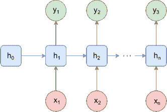

<!--yml

类别：未分类

日期：2024-09-06 19:58:14

-->

# [2011.10187] 基于深度学习的兴趣点（POI）推荐综述

> 来源：[`ar5iv.labs.arxiv.org/html/2011.10187`](https://ar5iv.labs.arxiv.org/html/2011.10187)

# 基于深度学习的兴趣点（POI）推荐综述

Md. Ashraful Islam Mir Mahathir Mohammad Sarkar Snigdha Sarathi Das Mohammed Eunus Ali 计算机科学与工程系 (CSE)

孟加拉国工程技术大学（BUET）

达卡 1000，孟加拉国

###### 摘要

基于位置的社交网络（LBSNs）使用户通过分享签到、意见、照片和评论来与朋友和熟人社交。LBSNs 生成的大量数据开辟了一个新的研究领域，催生了一个新的推荐系统子领域，即兴趣点（POI）推荐。POI 推荐技术本质上利用用户的历史签到和其他多模态信息，如 POI 属性和朋友网络，来推荐适合用户的下一个 POI。大量早期工作集中于使用数据集中的手工特征的传统机器学习技术。随着深度学习研究的近期激增，我们见证了大量利用不同深度学习范式的 POI 推荐工作。这些技术在问题公式、提议技术、使用的数据集和特征等方面差异很大。根据我们的了解，这项工作是对所有主要基于深度学习的 POI 推荐工作的首次全面调查。我们的工作基于不同的深度学习范式和其他相关特征，对最近的 POI 推荐工作进行了分类和深入分析。此综述可以被视为从事 POI 推荐领域的研究人员或从业者的实用手册。

###### 关键词：

基于位置的社交网络（LBSN）、兴趣点（POI）推荐、深度学习、时空模型^†^†期刊：NEUROCOMPUTING

## 1 引言

基于位置的社交网络（LBSNs）为用户提供了一个独特的机会，通过分享他们的签到、观点、照片和评论来进行社交。这些优势与智能手机的广泛普及相结合，显著增加了这些 LBSNs 平台上的用户数量，达到了数十亿级别。因此，我们见证了从这些平台收集到的丰富多模态时空数据的爆炸性增长。这大量数据的可用性为兴趣点（POI）推荐开辟了新的机会，这是一种推荐系统中的独立子领域，近年来受到了用户和商业两方面的广泛关注。POI 推荐技术本质上利用用户的历史签到和其他多模态信息，推荐适合用户的下一个兴趣点。由于数据的规模和模态以及用户期望的广泛变化，拥有大量多模态数据的机会带来了新的挑战，促使研究人员设计新颖的技术，以更好地捕捉移动模式和其他特征（例如，空间、社交、文本），以提高推荐性能。

以往的 POI 推荐工作主要集中在特征工程和传统（非深度学习）机器学习方法上。在这方面，Markov 链基础的随机模型已经得到了广泛的探讨[1, 2, 3, 4, 5, 6, 7, 8, 9]。由于基于矩阵分解（MF[10]）的方法在其他领域的推荐系统中取得了成功，MF 方法[11, 12, 13, 2, 14, 15, 16, 17]也被研究用于改进 POI 推荐建模。为了达到比普通 MF 方法更好的性能，人们已经采用了贝叶斯个性化排序（BPR[18]）方法[19, 20, 21, 22, 23, 24, 25, 8]。其他传统方法如支持向量机（SVM）[26]，协同过滤[27, 28, 29, 30, 31, 32]，高斯建模[33]，传递不相似性[34] 在不同的工作中也被用于个性化 POI 推荐。所有这些方法的一个主要缺点在于特征工程。显式的特征工程需要足够的领域专业知识。来自其他模态的图像、文本和 POI 评论数据的不断增加使得这些特征工程任务变得更加具有挑战性，因为手动地构建这些非结构化特征之间的关系并不是一件微不足道的任务。因此，近年来，基于深度学习的方法取代了大部分传统技术。

深度学习方法，如卷积神经网络（CNN）或递归神经网络（RNN），在自动特征提取方面提供了许多优势，消除了手工特征设计的困难。此外，基于深度学习的方法在建模结构化和非结构化数据之间的复杂关系方面表现优异，这使我们能够在 POI 推荐中利用来自不同领域的多模态数据。近年来，我们看到在所有主要会议（如 AAAI、IJCAI、SIGIR、CIKM、WWW 等）中，利用深度学习进行 POI 推荐的研究数量激增。不同深度学习范式的使用，如 CNN [35、36]、RNN [37、38、39、40]、长短期记忆网络（LSTM） [41、42、43、44]、门控递归单元（GRU） [45、46、47]，以及自注意力机制 [48、49]，极大地提升了 POI 推荐模型的性能。此外，来自自然语言处理（NLP）的最先进技术也被用于复杂的人类移动建模。一些近期的研究利用图嵌入技术丰富了模型的语义地理信息 [50、51、52]。在短时间内介绍的各种深度学习基于 POI 推荐技术需要进行全面的回顾，以（i）展示不同技术如何处理不同特征，（ii）识别每个模型的优缺点，以及（iii）提出潜在差距和未来研究机会的总结指南。

以前的 POI 推荐调查：文献中存在几篇调查论文，回顾了有关兴趣点（POI）推荐的先前工作。在早期的工作中，Bao 等人[53]回顾了传统的（即非深度学习）POI 推荐方法。在稍后的工作中，刘等人[54]对一些当时最先进的传统 POI 推荐模型进行了实验评估。在另一个工作中，赵等人[55]将 POI 推荐模型分类为三类：影响因素基础、方法论基础和任务基础。这些调查主要集中在以特征工程为中心的（即非深度学习）模型上。后来，郑等人[56]对 Twitter 数据集上的位置预测进行了全面的回顾，并承认了深度学习中心方法的兴起。在另一个 POI 推荐模型的综述中，刘等人[57]也提到了一些神经网络模型。从那时起，POI 推荐领域引入了大量利用不同深度学习范式的研究。在过去几年中，研究人员以不同方式利用 RNN、LSTM、CNN、图神经网络、注意力网络，利用不同的特征，取得了显著的性能提升。最近，王等人[58]总结了空间-时间域中的一些深度学习模型。然而，由于这篇论文总结了整个空间-时间域，因此只有少量的 POI 推荐模型被高层次地讨论。最近的一个位置预测模型的综述[59]大多讨论了非深度学习模型，对一些深度学习模型的关注非常粗略。

最近基于深度学习的 POI 推荐工作的多样性在问题表述、提出的技术、使用的数据集、特征等方面差异很大。尚没有统一的研究来系统地讨论不同深度学习范式在 POI 推荐中的优缺点。这些技术的广泛多样性容易使希望深入探索 POI 推荐领域的人感到困惑。本调查工作填补了现有研究的上述空白。

我们的调查贡献：总之，为了填补现有 POI 推荐技术调查中的空白，并涵盖该领域中不断增长的最新论文，我们在这篇综述论文中做出了以下主要贡献。

+   1.

    我们根据应用目标对所有 POI 推荐模型进行了分类（第 2 Recommendations")节）。

+   2.

    我们概述了该领域中所有数据集的特征，并讨论了它们的优点以及局限性（第 4 Recommendations")节）。

+   3.

    我们根据不同的深度学习范式对 POI 推荐模型进行分类，并比较其竞争性（不）优势（第五部分）。

+   4.

    我们识别影响 POI 推荐的不同因素（即，社会影响、顺序效应等），并提供每个因素的表格分析，这些因素被所有模型覆盖（第七部分）。

+   5.

    我们展示了所有先进技术在其性能指标上的比较（表 3）。

+   6.

    最后，我们识别现有工作的不足，并为 POI 研究提供全面的未来建议（第八部分）。

## 2 问题定义

兴趣点（POI）推荐是一类问题，建议用户适合的未来 POI，给定过去用户的历史签到记录和 LBSN 的其他相关数据。设$U=\{u_{1},u_{2},...u_{N}\}$为$N$个 LBSN 用户的集合，$P=\{p_{1},p_{2},...p_{M}\}$为 LBSN 中的$M$个 POI 的集合。用户可能通过一组连接$Ü=\{\langle u_{i},u_{j}\rangle~{}|~{}u_{i},u_{j}\in U\}$彼此关联。每个 POI$p$通过纬度$x_{p}$、经度$y_{p}$和一组表示 POI 语义的属性$W_{p}$进行地理编码。我们首先定义相关术语，然后正式定义问题如下：

### 定义 1（签到）：

一个签到$\rho_{t_{i}}^{u}$表示用户$u$在时间$t_{i}$签到的 POI。

### 定义 2（签到列表）：

每个用户$u$关联一个签到列表$C^{u}=\{\rho_{t_{1}}^{u},\rho_{t_{2}}^{u},...,\rho_{t_{T}}^{u}\}$，其中$\rho_{t_{i}}^{u}$表示用户$u$在时间$t_{i}$的签到记录，$1<=i<=T$。

### 定义 3（下一个 POI 推荐）：

给定用户$u$的签到列表$C^{u}$，下一个 POI 推荐指的是在时间$t_{T+1}$预测下一个 POI。

### 定义 4（POI 推荐序列）：

给定用户$u$的签到列表$C^{u}$，POI 推荐序列将推荐从$t_{T+1}$到$t_{T+n}$的下一个$n$个 POI。

### 定义 5（缺失 POI 签到识别）：

给定用户$u$的签到列表$C^{u}=\{\rho_{t_{1}}^{u},\rho_{t_{2}}^{u},...,\rho_{t_{m-1}}^{u},\rho_{t_{m}}^{u},\rho_{t_{m+1}}^{u},...,\rho_{t_{T}}^{u}\}$，如果签到$\rho_{t_{m}}^{u}$缺失，则缺失的 POI 签到识别将识别出时间$t_{m}$的 POI。

## 3 网络架构初步

在本节中，我们展示了包括前馈网络、卷积神经网络、循环神经网络、长短期记忆、门控循环单元、注意力机制和生成对抗网络等不同深度神经网络范式的初步概述。

### 3.1 前馈网络

图 1: 前馈网络

前馈网络（图 1）是最基本的神经网络形式。神经节点按层堆叠，每层的每个节点都与下一层的所有节点连接。加权连接将一层的特征结合并通过非线性函数（如 ReLU、Sigmoid、tanh 等）传递到下一层。堆叠神经元层显著增加了网络的表现力。

尽管前馈网络能够捕捉特征之间的复杂关系，但其过高的表征能力通常导致过拟合训练数据，从而导致较差的泛化能力。此外，随着层数的增加，模型的规模显著增加，使其训练和部署更加困难。最重要的是，前馈网络没有明确的空间和序列特征处理能力，这限制了它们在时空模型中的使用。

### 3.2 卷积神经网络

卷积神经网络（CNN）特别适合于捕捉给定输入的空间特征。在 CNN 中，卷积滤波器和池化层被系统地用于分层处理输入。输入的子集逐渐通过卷积滤波器，并通过池化层缩小变换后的特征。这个过程有助于 CNN 获得空间感知，同时保持的参数数量显著低于前馈网络。因此，CNN 在提取时空数据的空间模式方面被证明非常有用。图 2 显示了一个 3x3 滤波器大小的 CNN 层的工作流程。

图 2: CNN 层工作流程

### 3.3 循环神经网络

前馈网络或卷积神经网络不考虑输入中的任何序列或时间依赖性。递归神经网络（RNN）通过接受输入序列并使用隐藏状态学习输入序列的序列模式来解决此问题。我们在图 3 Recommendations") 中展示了 RNN 的基本图示。在该图中 $x_{i},y_{i}$ 和 $h_{i}$ 分别表示输入、输出和隐藏状态。我们可以看到，除了输入之外，每个 RNN 模块使用隐藏状态来产生输出。实际上，隐藏状态捕捉了输入序列的上下文信息，即捕捉了序列模式。

图 3：RNN 模型

### 3.4 长短期记忆

RNN 遇到梯度爆炸和梯度消失问题，因此无法捕捉长期偏好。为了解决这些问题，提出了长短期记忆（LSTM）[60]。LSTM 使用门控机制，能够捕捉长期偏好。我们可以在图 4 Recommendations") 中看到一个 LSTM 单元。除了 RNN 中使用的隐藏状态 $h_{t}$，每个 LSTM 模块还有一个单元状态 $c_{t}$。此外，连续 LSTM 单元之间的信息流通过三个门控控制：（1）输入门，（2）遗忘门，以及（3）输出门。

图 4：基本 LSTM 单元

### 3.5 门控递归单元

LSTM 解决了 RNN 的问题，但它有三个门，因此基于 LSTM 的模型训练较慢，并且需要大量训练数据。为了解决这些问题，提出了门控递归单元（GRU）[61]。它只使用两个门，即重置门和遗忘门。因此，当训练数据较少时，GRU 基于的模型训练更快，表现优于 LSTM。

### 3.6 注意力机制

像 RNNs 或 LSTMs 这样的序列模型通过序列的逻辑顺序处理输入。然而，这种方案往往会在较长的序列中丢失特征，从而导致模型性能较差。注意力机制 [62] 在很大程度上解决了这一缺陷，通过模拟类似人类的关注重点在显著的输入区域。人类倾向于对输入的关键部分给予更多关注，这反过来有助于将复杂的输入分解成更简单的部分，从而更易处理。虽然 Seq2Seq 模型 [63] 已经利用了这种注意力机制来提升性能，但最近注意力机制的进展引入了自注意力机制 [64]，这不仅提升了性能，还允许对输入进行并行处理，使其在各种应用中都具有吸引力。这里的关键思想是将输入映射到查询、键和值向量。输出是通过对值向量进行加权求和来计算的，其中权重由查询和键值的函数确定。这项技术在许多 NLP 研究领域中表现出色，显示了其在其他涉及序列数据领域中的潜力。

### 3.7 生成对抗网络

生成对抗网络（GANs） [65] 是一种特殊的生成机器学习框架，其中两个不同的网络相互竞争，目标不同。其中一个被称为“生成器”，另一个被称为“判别器”。生成器网络生成候选样本，而判别器网络尝试评估这些候选样本。生成器试图通过创建新颖的样本候选来“欺骗”判别器，而判别器则试图将这些样本与真实数据分布区分开来。一个通用的 GAN 如图 5 所示。近年来，GANs 在图像合成、视频游戏分辨率提升、艺术生成等方面表现出了令人印象深刻的性能。

图 5：生成对抗网络

## 4 数据集描述

先前的兴趣点（POI）推荐研究使用了从广泛的 LBSN（包括 Foursquare、Gowalla、Yelp、Twitter、Facebook、Brightkite、Instagram、WeChat 和百度地图）收集的签到数据。这些数据集大多数由记录用户-POI 关系和用户-用户关系的表格数据组成。用户-POI 数据通常包含用户的签到信息，包括时间戳、位置和语义特征。这里的 POI 语义特征包括 POI 的类别和用户 LBSN 帖子中的标签、POI 的创建日期、地理位置（纬度、经度）、签到次数、签到用户数量、半径等。另一方面，用户语义特征包括帖子数量、朋友数量、签到数量等。为了保持社交影响的背景，像 Foursquare、Gowalla、Weeplace 这样的数据集还包含了作为多对多模式的用户-用户关系，其中每个用户与所有朋友相连。由于这些数据和大量签到，有些数据集变得极其庞大。因此，大多数先前的研究集中在特定区域或国家，以保持数据规模的可处理性。下面简要讨论了这些 LBSN 数据集：

Foursquare：Foursquare 成立于 2009 年，[Foursquare](https://foursquare.com/)致力于全球范围内的地点数据收集和分发，以支持技术公司和品牌。本文回顾中讨论的大多数 POI 推荐模型使用的是 2010 年至 2014 年间 Foursquare 的数据集。这些数据集包含了主要来自美国和东京的签到数据。该数据集还包含了每个用户在 LBSN 中的所有好友列表。

Gowalla：Gowalla 是一个专注于位置签到的社交媒体平台。该平台成立于 2007 年，并于 2012 年被 Facebook 收购。Gowalla 主要是一个移动应用程序，允许用户通过移动设备签到到他们访问过的地点。Gowalla 运营期间的数据集通过 Gowalla API 提供，目前没有官方数据分发商。Gowalla 是本文讨论的 POI 推荐模型中第二常用的数据集。大多数先前的研究使用了 2009 年 2 月至 2010 年 10 月的签到数据。与 Foursquare 一样，Gowalla 数据集也包含了每个用户的好友列表。此外，该数据集还提供了每个 POI 和用户个人资料的详细描述。

Brightkite：Brightkite 是一个位置基于的社交媒体网络，成立于 2007 年，并于 2012 年解散。该平台允许用户通过短信或移动应用程序在访问某个地点后签到。Brightkite 的数据集目前已不再官方提供，但仍可以通过全球各地的研究档案访问。

Yelp：Yelp ²²2https://www.yelp.com/ 是另一个受欢迎的 LBSN 平台。由于用户倾向于签到不同的商业位置，Yelp 提供了来自客户的评论和评分，这些评论和评分不仅用于个人使用，也用于研究目的。Yelp 成立于 2004 年，仍然作为商业机构的评论公司运营。POI 推荐模型从 Yelp 的文本评论中受益匪浅，因为评论提供了 POI 的语义信息。

Weeplaces：WeePlaces 是一个服务，通过位置基础服务可视化用户的签到情况。Weeplaces 已与 Gowalla 和 Facebook 集成，使用户能够可视化他们在 Foursquare、Gowalla 和 Facebook Places 上向朋友宣布的位置。与 Foursquare 和 Gowalla 数据集类似，Weeplaces 数据集也包含与用户相关联的朋友列表，这可以用于捕捉 POI 推荐中的社交影响。

Instagram：Instagram ³³3https://www.instagram.com 是一个社交媒体平台，最初于 2010 年发布，目前归 Facebook 所有。Instagram 允许用户在线发布和分享照片及视频。用户可以通过标签和位置浏览其他用户的内容。Instagram 数据集主要包含用户签到数据，这些数据已经在一些关于 POI 推荐的近期研究中被使用。

Twitter：Twitter ⁴⁴4https://twitter.com 是一个非常受欢迎的社交媒体平台，用户可以发布、查看和分享被称为“推文”的短消息。Twitter 成立于 2006 年，目前是全球最受欢迎的微博服务。Twitter 的签到功能允许用户记录访问地点。数据集可以通过 Twitter 公共 API 获取。

其他数据集：一些其他使用的数据集来自 WeChat⁵⁵5https://www.wechat.com/、百度地图⁶⁶6https://map.baidu.com/、Facebook⁷⁷7https://facebook.com。WeChat 的功能包括短信、语音消息、视频会议和位置共享。百度地图提供街道地图和视图、地形卫星图以及旅行路线规划。Facebook 目前是最大的社交媒体网站，用户可以发布文本、照片和多媒体，分享关于他们自己的信息。帖子可以包括有关访问地点的签到信息，因此 Facebook 的数据集可以正式用于 POI 预测研究。

有关一些在 POI 推荐中最常用数据集的详细信息，请参见表 1 推荐调查")。要查看与每篇讨论的论文相关的数据集统计信息，请参见表 4 推荐调查")。

表 1：数据集汇总

| 数据集名称 | 列名 | 表格描述 |
| --- | --- | --- |
| Foursquare | userID, Time(GMT), VenueId, VenueName, VenueLocation, VenueCategory | 描述用户与 POI 的关系。包含所有用户签到的日期时间；POI 的名称、位置和类型 |
| userID, friendID | 描述用户间关系。包含 LBSN 中每个用户的所有好友列表 |
| Gowalla | userId, timestamp, latitude, longitude | 描述用户与 POI 的关系。包含每个用户的所有签到信息，如访问的地点和时间 |
| userId, friendId | 描述用户间关系。包含 LBSN 中每个用户的所有好友列表 |
| id, name, created_at, lng, lat, photos_count, checkins_count, users_count, radius_meters, highlights_count, items_count, max_items_count, spot_categories, city_state | 描述 LBSN 中每个 POI，包括用户、签到、照片、物品和亮点的计数。还包括每个 POI 的名称、城市、日期时间、类别和地图上的半径 |
| id, bookmarked_spots_count, challenge_pin_count, country_pin_count, highlights_count, items_count, photos_count, pins_count, province_pin_count, region_pin_count, state_pin_count, trips_count, friends_count, stamps_count, checkin_num, places_num | 每个 LBSN 用户的个人资料详细信息 |
| Brightkite | user, check in time, latitude, longitude, location id | 描述用户与 POI 的关系。每行包含一个用户的签到时间和位置的信息 |
| userid1, userid2 | 描述用户间关系。描述 Brightkite 用户的友谊网络 |
| Yelp | business_id, name, address, city, state, postal_code, latitude, longitude, stars, review_count, is_open, attributes, categories, hours | 包含 POI 商业数据，包括位置数据、属性和类别。属性包括餐厅是否接受外卖以及是否有停车位 |
| review_id, user_id, business_id, stars, date, text, useful, funny, cool | 包含完整的评论文本数据，包括撰写评论的 user_id 和评论所针对的 business_id |
| user_id, name, review_count, yelping_since, friends, useful, funny, cool, fans, elite, average_stars, compliment_hot, compliment_more, compliment_profile, compliment_cute, compliment_list, compliment_note, compliment_plain, compliment_cool, compliment_funny, compliment_writer, compliment_photos | 用户数据，包括用户的好友映射和与用户相关的所有元数据。 |
| business_id, date | 所有用户在 POI 上的签到记录 |
| text, date, compliment_count, business_id, user_id | 用户在 POI 商业地点写的提示。提示比评论简短，通常传达快速建议 |
| photo_id, business_id, caption, label | 包含照片数据，包括标题和分类 |
| Weeplace | userid, placeid, datetime, lat, lon, city, category | 描述用户与兴趣点（POI）之间的关系。每一行包含用户的签到信息、访问的日期和时间。该行还包括兴趣点的地点、类别、子类别以及城市名称。 |
| userid1, userid2 | 描述用户与用户之间的关系。包含 LBSN 中每个用户的所有朋友的列表。 |
| Instagram | user_id, latitude, longitude, timestamp | 描述用户与兴趣点（POI）之间的关系。每一行包含用户的签到信息、访问的日期和时间以及兴趣点的地点。 |
| Twitter | userID, tweetID, latitude, longitude, time, placeID, contentInfo | 包含带有签到的推文信息。每一行代表一条推文、一位用户、地点和兴趣点的标识符以及与兴趣点相关的标签。 |

## 5 个 POI 推荐模型

由于 LBSN 用户基数的惊人增长，近年来从这些平台收集的签到数据量迅速增加。这大量的数据推动了深度学习技术在 POI 推荐领域的应用。虽然早期的研究使用了传统的机器学习模型，但由于其显著更高的性能和进一步提升性能的丰富潜力，最近基于深度学习的模型已大多取代了这些传统模型。因此，在本次调查中，我们主要关注基于深度神经网络（DNN）的 POI 推荐。我们将迄今为止提出的所有模型分为六大类。它们分别是 RNN 模型（第 5.1 节 Recommendations")），LSTM 模型（第 5.2 节 Recommendations")），GRU 模型（第 5.3 节 Recommendations")），图嵌入模型（第 5.4 节 Recommendations")），GAN 模型（第 5.5 节 Recommendations")），以及其他模型（第 5.6 节 Recommendations")）。这些类别在以下子节中进行了描述。我们在表 2 Recommendations")中简要概述了这些模型，表 4 Recommendations")展示了每个模型使用的数据集。表 3 Recommendations")中提供了这些模型、评估指标及其在不同数据集上的性能的简要总结。

### 5.1 RNN 基于的模型

循环神经网络（RNN）因其在自然语言处理（NLP）问题上的高效性而闻名。由于 POI 推荐问题表现出类似于 NLP 任务的属性，许多近期的 POI 推荐模型将 RNN 作为其基础架构。在本节中，我们讨论了基本的基于 RNN 的 POI 推荐模型，这些模型可以将一个 POI 序列映射到另一个 POI 序列（连续 POI 推荐），或者仅映射到一个 POI（下一个 POI 推荐）。

刘等人[37] 提出了一个名为空间-时间递归神经网络（ST-RNN）的模型，用于 POI 推荐。ST-RNN 模型扩展了 RNN 模型，以捕捉空间和时间效应。该模型添加了时间特定和距离特定的转移矩阵，以分别捕捉时间周期效应和地理影响。模型还应用了线性插值来训练转移矩阵。

在另一项近期工作中，杨等人[38] 提出了一个名为 Flashback 的模型，其中使用了基本 RNN。该模型利用稀疏用户移动数据，通过关注丰富的时空上下文和对 RNN 中的隐藏状态进行回溯来进行训练。此外，该模型使用历史隐藏状态的加权平均来更好地捕捉时空效应。另外，论文还使用了用户嵌入来考虑用户偏好。

赵等人[39] 提出了自适应序列分割器与幂律注意力（ASPPA）模型，用于学习签到序列的潜在结构。这个模型的思路融合了 Griffiths 等人[66] 提出的自适应序列分割器（ASP）和 El 等人[67] 的堆叠 RNN 架构。该论文旨在自动检测和识别每个 POI 的语义子序列，并发现其顺序模式。模型设计为堆叠 RNN，并采用了二元边界检测器来控制单元更新的模式。该模型使用幂律注意力（PA）机制，将每次签到的空间和时间上下文整合进模型中。输出层由两个全连接层和一个 drop-out 层组成。

由于大多数 POI 推荐是基于云计算范式设计的，因此存在许多缺点，包括隐私问题。为了缓解这些问题，Wang 等人[40]提出了轻量级位置推荐系统（LLRec）。在这里，作者引入了教师模型和学生模型。教师模型部署在服务器上，而学生模型部署在用户的移动设备上。学生模型将从服务器获取预训练模型。用户可以通过使用预训练模型来获得下一个 POI 推荐，而无需将数据发送到教师模型。然而，移动设备的存储和计算能力非常有限。因此，学生模型必须高效、轻量且快速。为了获得轻量和快速的模型，LLRec 使用了 FastGRNN [68]。该模型的参数通过使用张量训练格式[69]进一步压缩。此外，知识蒸馏框架[70]被用于在非常有限的数据下提高预测质量。原始 FastGRNN 中的时间特定和距离特定转移矩阵用于捕捉两个相邻签到之间的时空相关性。另一方面，一个强大且计算密集的教师模型可以部署在云端。此外，教师模型使用注意力机制来学习用户偏好，并通过 Word2Vec [71]将 POI 的文本内容转换为低维嵌入。此外，Huang 等人[72]和 Liao 等人[73]也在他们的 POI 推荐模型中广泛使用了 RNN 架构。

### 5.2 LSTM 模型

由于 RNN 模型无法捕捉长期依赖性，长短期记忆（LSTM）[60]在最近的 POI 推荐工作中被广泛使用。大多数模型使用基本的未修改 LSTM 进行预测。一些模型对基本的 LSTM 模型进行修改，或使用双向变体以更好地捕捉 POI 领域特定的因素。为了进一步改进长期依赖建模，注意力机制也与 LSTM 一起使用。不同类型的基于 LSTM 的 POI 推荐模型的详细讨论如下：

#### 5.2.1 基本 LSTM

大多数模型使用编码器-解码器方案，其中编码器通常从用户的签到列表和其他属性中收集信息；利用这些信息，解码器预测下一个 POI 或一系列 POI。

我们在基本 LSTM 模型的讨论中从 Kong 等人[74]提出的层次空间-时间长短期记忆（HST-LSTM）模型开始。HST-LSTM 使用层次模型来编码人们运动的周期性。该模型以编码器和解码器的方式捕捉用户的历史访问序列，从而提高了 POI 推荐的性能。

Li 等人[42] 提出了**Temporal and Multi-level Context Attention (TMCA)**，使用基于 LSTM 的编码器-解码器网络和三种类型的注意力：多层次上下文注意力（微观、宏观）和时间注意力。论文介绍了两种注意力机制来选择相关的历史和上下文因素。该模型还使用嵌入以统一的方式整合异质上下文因素。

为了捕捉长期和短期偏好，Wu 等人[75] 提出了**长短期偏好学习模型（LSPL）**。LSPL 具有两个模块，即（1）长期模块包括嵌入层和注意力层，通过学习 POI 的上下文特征来捕捉用户的长期偏好；（2）短期模块使用两个独立的 LSTM 模块：一个用于位置层级，另一个用于类别层级，并捕捉用户的序列行为。然后将所有模块结合起来预测下一个 POI。

LSPL 的作者[75] 通过提出**个性化长短期偏好学习（PLSPL）** [76] 模型扩展了他们的工作。PLSPL 在现有的 LSPL 模型中添加了一个基于用户的线性组合单元，通过学习个性化权重来捕捉不同用户的个性化偏好。

基于嵌入、LSTM 和注意力机制，Doan 等人[77] 提出了**Attentive Spatio TEmporal Neural (ASTEN)** 模型。ASTEN 嵌入了 POI，并高效地表示签到。LSTM 利用 POI 和签到表示，并结合注意力机制捕捉序列、时间和地理影响。该模型通过注意力机制处理用户轨迹数据中的噪声。

Sun 等人[41] 提出了使用基本 LSTM 模型的**长短期偏好建模（LSTPM）**。LSTPM 将所有签到分为若干个轨迹。该模型实际上开发了三个模块，包括长期偏好建模、短期偏好建模和预测模块。长期偏好建模使用所有轨迹，短期偏好建模使用最后一条轨迹，并结合预测下一个 POI。下一个 POI 推荐的另一个重要方面是，下一个 POI 不仅依赖于最近的签到；它也可以依赖于任何早期签到。然而，基于 RNN/LSTM 的方法有一个缺点，就是无法建模两个不连续 POI 之间的关系。为捕捉这种影响，模型在短期偏好建模中使用了 geo-dilated LSTM 方案以及基本的 LSTM。

Zhang 等人[43]提出了交互式多任务学习（iMTL），该方法使用了一个双通道编码器和一个任务特定的解码器。双通道编码器（时间感知活动和空间感知位置偏好编码器）旨在捕捉活动和位置偏好的顺序相关性。LSTM 编码的表示被用于任务特定的解码器，以交互地执行预测任务。本文的一个新颖贡献在于它关注集体 POI。假设，$l_{1}$是一个建筑物，每个建筑物包含许多独立的公寓，即$l_{2},l_{3},l_{4},l_{5}$，那么模型将$l_{1}$标记为集体 POI，将$l_{2},l_{3},l_{4},l_{5}$标记为独立 POI。本文提出了一种模糊特征化策略，以便更好地从集体 POI 中预测独立 POI。

大多数 POI 推荐模型仅预测 POI 的位置而忽略时间戳，但 Yu 等人[44]提出了类别感知深度模型（CatDM），该模型预测用户在接下来的 24 小时内将访问的 POI。CatDM 包括（1）度量嵌入，用于学习用户、POI、POI 类别和时间的潜在特征；（2）第一个深度编码器，用于捕捉用户在 POI 类别中的偏好；（3）两个过滤器，用于减少搜索空间以生成候选项；（4）另一个深度编码器，用于捕捉用户在 POI 中的偏好；（5）一个用于排名候选集的模块。为了排名候选集，该模型同时考虑了四种相关性，即用户与 POI 之间的相关性、用户与 POI 类别之间的相关性、POI 与时间影响之间的相关性以及 POI 与用户当前偏好之间的相关性。该模型利用 POI 类别和地理影响来克服数据稀疏性，并且还使用了注意机制来获得更好的结果。

假设 $l_{1},l_{2},l_{3}$ 是三个位置，并且 $l_{2}$ 离 $l_{1}$ 很近。现在，如果用户签到列表中有从 $l_{2}$ 到 $l_{3}$ 的签到记录，那么在访问 $l_{1}$ 后，用户很可能会去 $l_{3}$。这种情况称为过渡规律。大多数现有的 POI 推荐方法仅捕捉顺序规律。另一方面，Gua 等人[78] 提出了注意力递归神经网络（ARNN）模型，该模型捕捉顺序和过渡规律，以解决稀疏性问题。ARNN 包括几个层，即：（1）邻居发现层：通过使用知识图（KG）和元路径从异质数据中提取邻居；（2）嵌入层：将签到序列的稀疏特征转换为密集表示，并通过多模态嵌入层学习时空特征和语义上下文；（3）注意力层：计算当前位置与每个邻居之间的相似性，并捕捉邻居的过渡规律；（4）递归层：通过使用 LSTM 捕捉高阶顺序规律。除了这些模型，Wang 等人[79]、Huang 等人[80] 和 Li 等人[81] 使用 LSTM 和注意力层进行 POI 预测。Yang 等人[82] 使用 LSTM 和嵌入层进行下一个 POI 推荐。另一个模型 SLSTM [83] 使用堆叠 LSTM 和嵌入层进行顺序签到预测。

#### 5.2.2 Bi-LSTM

Vanilla LSTM 仅按一个方向顺序处理输入。虽然它有助于模型从先前的输入中获取顺序信息，但无法捕捉输入后续部分的信息。双向 LSTM（Bi-LSTM）通过考虑输入的两个方向解决了这个问题。一些近期的 POI 推荐模型也使用 Bi-LSTM 来捕捉两个方向的序列特征，以实现更好的性能。

从模型 GeoIE [13] 中我们发现，POI 有两个倾向，即（1）地理影响：引导访客到其他 POI 和（2）地理易感性：接收来自其他 POI 的访客。考虑到上述特性，刘等人[84] 提出了一个称为地理-时间感知分层注意网络（GT-HAN）的模型。为了更好地捕捉 POI 之间地理共影响的巨大变化，GT-HAN 使用三个因素，即 POI 的地理影响、POI 的地理易感性和 POI 之间的距离。GT-HAN 的主要部分是嵌入层、地理-时间注意网络层和上下文特定的共同注意网络层。嵌入层捕捉地理影响、地理易感性和语义效果。地理-时间部分探讨 POI 之间的地理关系和签到列表的时间依赖性，并使用 Bi-LSTM 模型捕捉用户签到列表的序列依赖性。上下文特定的共同注意网络捕捉动态用户偏好。GT-HAN [84] 实际上是之前模型的改进版本，也称为 GT-HAN [85]，由同一作者提出。

刘等人[86] 提出了时间感知的位置预测（t-LocPred）模型。该模型有两个基本部分，即 ConvAoI 和 mem-attLSTM。ConvAoI 使用 CNN 层和 ConvLSTM 层[12] 来寻找相邻 AoI（兴趣区域）和一天及一周内时间段之间的关联。因此，CNN 和 ConvLSTM 分别作为短期和长期的粗粒度时空建模。另一方面，mem-attLSTM 使用空间感知的记忆增强 LSTM 和时间感知注意机制捕捉复杂的长期关联。因此，mem-attLSTM 作为一个精细化的过滤器，选择用户最可能访问的 POI。

Chang 等人[87] 提出了内容感知的连续 POI 推荐（CAPRE），这是一种完整的 POI 推荐模型，使用用户生成的文本内容。CAPRE 具有四个模块：（1）输入层：以签到历史作为输入；（2）内容编码层：使用字符级 CNN（卷积神经网络）、多头注意机制和 POI 嵌入捕捉用户对 POI 的各种兴趣；（3）用户行为模式：使用 Bi-LSTM 捕捉内容感知和地理用户行为模式；（4）输出层：多层感知机（MLP）捕捉用户对 POI 的一般偏好。

#### 5.2.3 修改的 LSTM

一些模型通过修改基本的 LSTM[60] 模型来增强 POI 预测。其基本思想是通过修改基本的 LSTM 更好地捕捉用户的短期和长期偏好。

Zhao 等人[88] 提出了时空门控网络（STGN），该网络修改了基本的 LSTM [60]，以便更容易捕捉短期和长期偏好。这个模型添加了四个新的门控，即两个用于长期偏好，另外两个用于短期偏好。该模型还新增了一个单元状态。因此，在这个提议的模型中，有一个单元状态用于短期偏好，一个单元状态用于长期偏好。STGN 模型通过使用耦合的输入门和遗忘门进一步改进，称为 STCGN（时空耦合门控网络）。STCGN 减少了参数数量，因此该模型可以更容易地进行训练，并提高了效率。

#### 5.2.4 自注意力

继自注意力在语言建模中的成功之后，最先进的 POI 推荐模型利用了这一强大的方法，以实现最佳性能。在这些模型中，Lian 等人[48] 提出的基于自注意力网络的地理信息感知序列推荐模型（GeoSAN）使用了一个地理信息感知自注意力网络和地理编码器。注意力网络包括一个嵌入层、自注意力编码器、一个目标感知注意力解码器和一个匹配函数。地理编码器使用地图网格化和 GPS 映射，将 GPS 位置编码为四元键。为了解决稀疏性问题，本文提出了一种基于重要性采样的加权二元交叉熵损失函数，从而使信息量大的负样本权重更高。

在另一项工作中，Guo 等人 [49] 提出了一个模型——自注意力网络结合空间和时间模式学习用于下一个 POI 推荐（SANST）。SANST 实际上是模型 SASRec [89] 的一个修改版，该模型使用了一个两层的变换器网络 [64]。SASRec 并不捕捉空间和时间模式。因此，为了捕捉空间模式，SANST 通过添加签到的 POI 的位置来更新签到的嵌入。由于 POI 位置的坐标表示是稀疏的，模型通过一个网格离散化整个数据空间，以便用网格单元 ID 表示 POI 位置。网格单元 ID 通过 GeoHash 编码和 Bi-LSTM 网络学习。为了捕捉时间效应，SANST 在自注意力网络中添加了一个参数，该参数是通过两个签到之间的时间差计算得出的。

### 5.3 GRU

RNN 非常适合分析时间序列数据，LSTM 有助于捕捉访问 POI 的短期和长期效果。然而，RNN 和 LSTM 都容易遭遇冷启动问题。大多数 RNN 模型依赖于最后的隐藏层，这限制了从隐藏层学习用户信息。为了解决这些问题，许多 POI 推荐模型中引入了一种修改版的 LSTM-GRU [61]。与 LSTM 单元相比，GRU 具有更少的参数，但它有额外的门，如遗忘门，以弥补上述问题，同时解决梯度爆炸和消失的问题。

Feng 等人 [45] 提出了一个名为 DeepMove 的流行模型。DeepMove 实际上预测人类的移动，这与我们的 POI 推荐非常相似。DeepMove 有两个模块，即 (1) 多模态递归预测框架：通过将时空和个人特征共同嵌入到密集表示中来提取特征，然后将其输入到 GRU 单元中，以建模轨迹序列中的长程和复杂依赖关系；(2) 历史注意力模块：捕捉人类移动的多级周期性。

大多数模型将不同类型的上下文对用户偏好的影响视为相同。但它们的影响并不相同。为了解决这个问题，Manotumruksa 等人 [46] 提出了上下文注意力递归架构 (CARA) 模型。CARA 有四层，即输入层、嵌入层、递归层、输出层。在递归层中，该模型使用 GRU。为了捕捉不同上下文对用户偏好的影响，该模型使用两种类型的门控机制，即 (1) 上下文注意力门 (CAG)：控制普通和过渡上下文对用户动态偏好的影响；(2) 基于时间和空间的门 (TSG)：考虑连续签到之间的时间间隔和地理距离，以控制前一个 GRU 单元的隐藏状态的影响。

Kala 等人提出了 [47] Multi-GRU (MGRU)，该方法通过添加两个额外的门来改进基本的 GRU 单元，以实现更好的推荐。第一个添加的门是动态上下文注意力门 (DCAG-$\alpha$)，它捕捉动态上下文的影响，例如 - 一天中的时间、同伴、用户的情绪等。另一个门是过渡上下文注意力门 (TCAG-$\beta$)，它捕捉过渡上下文的影响，例如 - 从过去 POI 到未来 POI 的时间间隔和地理距离。MGRU 有三层，即 (1) 输入层：预处理并嵌入签到序列；(2) 循环层：使用 MGRU 捕捉序列模式；(3) 输出层：推荐下一个 POI。

### 5.4 图嵌入

一些最新的技术利用图嵌入 (GE) 的潜力，这些技术学习以不同形式的图（如 POI-POI、用户-POI 和 POI-时间）建模的数据空间的低维关键特征。

Xie 等人[90] 提出了 GE 模型，该模型使用图嵌入来推荐下一个 POI。GE 通过四个双层图以统一的方式共同捕捉序列效应、地理影响、时间周期效应和语义效应。POI-POI 图捕捉序列效应，POI-区域图捕捉地理影响，POI-时间图捕捉时间周期效应，POI-词汇图捕捉语义效应。该模型将这四个关系图嵌入到一个共享的低维空间中。然后，模型计算用户查询（用户的嵌入、查询时间和位置）与未被该用户访问的 POI 之间的相似度。最相似的 POI 被用作推荐。

Liu 等人 [50] 提出了时空感知（STA）模型，该模型在其模型中推广了知识图嵌入 [91]。GE[90] 将用户和 POI 嵌入到一个共同的潜在空间中。由于用户和 POI 本质上是不同的对象，因此这种方法是不自然的。另一方面，STA 将位置和时间作为时空对 $<time,location>$ 并使用这一对的嵌入作为连接用户和 POI 的关系。

Christoforidis 等人 [92] 提出了联合学习图嵌入（JLGE）模型，该模型使用了六个信息图。这些图包括两个单层图（用户-用户和 POI-POI）以及四个双层图（用户-位置、用户-时间、位置-用户和位置-时间）。该模型由三个步骤组成。在第一步，模型构建信息图并加权边。在第二步，模型使用 LINE 模型[93] 从这六个信息图中联合学习用户和 POI 的嵌入到相同的潜在空间中。最后，在第三步，模型通过调整参与网络的影响来个性化每个用户的 POI 推荐，以便为目标用户提供最终建议。

JLGE[92] 模型的作者通过引入一个名为具有多重网络嵌入的推荐模型（RELINE）[51] 扩展了他们的工作。该模型引入了两个新网络：$i)$ 停留点，表示用户停留时间最长的地点，以及 $ii)$ 路线，即访问 POI 时的路径。此外，还在之前的 JLGE[92] 模型中添加了两个新的双层图，即用户-路线和 POI-停留点，以更好地捕捉用户的偏好动态。

在另一项工作中，熊等人[52] 提出了一个名为动态时空 POI 推荐（DYSTAL）的半监督学习框架。DYSTAL 具有两个关键组件：网络嵌入方法和动态因子图模型。网络嵌入方法共同学习用户和 POI 的嵌入向量，包括 POI-POI、用户-POI 和用户-用户三个子图，以挖掘复杂的时空访问行为模式。动态因子图模型通过因子图模型（FGM）[94] 捕捉不同因素，包括来自前一嵌入层的用户向量和 POI 向量的相关性。该模型还通过使用 SentiStrength [95] 工具考虑用户的文本评论。

张等人[96] 提出了层次类别转移（HCT）模型，该模型扩展了 Skip-Gram [71] 模型，以学习 POI（兴趣点）和类别之间的层次依赖关系以及层次类别转移。HCT 通过考虑最近访问的 POI 和相关的层次类别集来建模动态用户偏好。他们通过结合 POI 的表示以及相关的层次类别集来制定动态用户表示。除了这些模型外，陈等人[97] 使用嵌入和上下文过滤来建模空间轨迹，而乔等人[98] 则使用嵌入来预测下一个 POI。

### 5.5 GAN

生成对抗网络（GAN）[65] 是一种深度学习中的流行模型，其中两个神经网络模型相互竞争以提供更好的预测。很少有论文使用 GAN 进行 POI 推荐，因为 POI 推荐问题不一定属于 GAN 可解决的问题领域。

刘等人[99] 提出了基于地理信息的对抗学习模型（Geo-ALM），该模型使用两个模块：判别器和生成器，这两个模块本质上不同但都受传统生成对抗网络的启发。对偶排名被视为一个判别器，试图预测生成样本对之间的排名关系，并通过最大化排名样本的可能性进行训练。生成器不断生成关键的负样本，这些负样本与正样本配对，形成训练实例。该框架在两个不同的模块之间交替学习参数。

周等人[100] 提出了对抗性 POI 推荐（APOIR），该方法结合了 GAN、GRU 和矩阵分解用于 POI 推荐。GRU 和 MF 联合学习用户的时间和顺序偏好。两个竞争的组件：推荐器和判别器，通过训练它们来优化目标函数，交替优化。判别器试图最大化正确区分真实签到位置和推荐器生成的推荐 POI 的概率。高等人[101] 也使用 GAN 网络来利用个体的轨迹进行识别。

### 5.6 其他模型

还有一些使用混合架构的深度学习 POI 推荐模型。在这一节中，我们将介绍这些方法。

赵等人[23] 提出了基于 Skip-Gram [71] 模型的地理-时间序列嵌入排名（Geo-Teaser），该模型学习目标 POI 的上下文 POI 表示。该模型试图通过最大化目标函数来学习时间 POI 嵌入。地理层级对偶偏好排序模型使用贝叶斯个性化排名来学习用户对 POI 的偏好。核心 Geo-Teaser 模型是一个统一框架，结合了时间嵌入模型和对偶排序方法。

常等人[102] 提出了一个稍有不同的方法，称为内容感知分层 POI 嵌入（CAPE），用于 POI 推荐。大多数模型不使用 POI 的文本内容，因为大多数数据集不包含这样的文本内容。因此，作者从 Instagram 生成了一个新数据集，其中包含用户撰写的 POI 文本描述。CAPE 实际上是一个 POI 嵌入模型，由签到上下文层和文本内容层组成。签到内容层捕捉 POI 的地理影响，而文本内容层则捕捉 POI 的特征。

在此背景下，Xi 等人[103] 对缺失 POI 签到识别的不同类型的工作也很值得注意。这里，作者提出了一种称为双向时空依赖和用户动态偏好（Bi-STDDP）的模型，以捕捉复杂的全球空间信息、局部时间依赖关系和用户动态偏好。Bi-STDDP 以两个签到列表作为输入；一个列表用于缺失签到之前，一个用于之后。此外，该模型还在模型中使用了用户嵌入、POI 嵌入和时间模式。

周等人[104]提出了一种名为“主题增强记忆网络”（TEMN）的混合架构。TEMN 由三个关键部分组成：记忆网络（MN）、时间潜在狄利克雷分配（TLDA）[105]和地理建模。MN 学习用户与兴趣点之间的复杂交互，并捕捉用户的基于邻域的兴趣。TLDA 是一种无监督的生成概率模型，用于捕捉用户的时间偏好和内在兴趣。该模块提供了模式-用户概率分布。通过 TLDA，还可以估计与每种模式相关的场所和时间段的分布。TLDA 和 MN 可以共同学习用户和兴趣点的特征。地理模型则捕捉了地理影响。

最近的研究表明，层次结构可以使用双曲表示方法进行建模[106, 107, 108]。为此，冯等人[109]提出了一种新颖的双曲度量嵌入（HME）方法，用于下一个 POI 推荐任务。HME 可以分为两个部分：（1）双曲度量嵌入：使用庞加莱球模型[107]通过在共享的双曲空间中投影，学习四种不同的关系（POI-POI、POI-用户、POI-类别和 POI-区域）；（2）使用双曲嵌入进行推荐：结合用户偏好和 POI 的顺序过渡，使用庞加莱球模型和爱因斯坦中点聚合方法[110, 111]。该模型还考虑了地理距离，因为用户倾向于访问离自己较近的 POI[112]。

除了上述模型，最近的工作还提出了一些先进的模型，这些模型利用多种技术来提高性能。张等人[113]使用嵌入进行地理影响建模。王等人[114]使用嵌入来预测下一个 POI。丁等人[115]使用深度神经网络（DNN）进行时间特定的 POI 推荐。一些先前的工作[35, 36]研究了卷积神经网络（CNN）在 POI 推荐中的应用。另一方面，马西莫等人[116]也尝试了逆强化学习（IRL）[117, 118, 119]，以分析 IRL 在 POI 推荐中的表现。

深度学习模型的不同范式总结：通过分析上述所有模型，我们可以全面了解不同的深度学习范式如何用于处理 POI 推荐模型的不同方面。由于成功的推荐基本上依赖于历史 POI 信息，因此近年来 POI 推荐模型主要采用了序列模型（即 RNN、LSTM）。其中，LSTM 由于其长时间序列信息捕捉能力而成为最受欢迎的方法。大量的研究已经尝试通过对 LSTM 进行细微修改来改善长短期建模偏好。因此，序列信息捕捉一直是 POI 推荐模型关注的重点。近年来的最先进模型利用了自注意力变换器机制来进行 POI 推荐，这大大抑制了与非常长序列相关的问题。它们还可以进行计算上的并行化。除了捕捉历史序列信息，研究人员还分析了空间影响。由于签到数据的性质，用户和 POI 形成了一个关系图，这对建模空间依赖性非常有用。因此，图嵌入方法在过去几年中在 POI 推荐中受到了关注。LSTM 与这些图嵌入模型结合，开辟了从给定数据中捕捉序列和时空特征的机会。先进模型还利用了对抗学习模型和专门的嵌入方法，以实现最先进的性能结果。

表 2：论文分类

| 类别 | 子类别 | 年份 | 参考文献 |
| --- | --- | --- | --- |
| 基础 RNN | - | 2016 | ST-RNN[37] |
| 2018 | MCI-DNN[73] |
| 2020 | Flashback[38], ASPPA[39], LLRec[40], DRLM[72] |
| LSTM | 基础 LSTM | 2018 | HST-LSTM[74], TMCA[42], SLSTM[83] |
| 2019 | LSPL[75], ASTEN[77], ATST-LSTM[80], MMR[81], SGBA[82] |
| 2020 | PLSPL[76], LSTPM[41], iMTL[43], CatDM[44], ARNN[78], STAR[79] |
| Bi-LSTM | 2020 | GT-HAN[84], t-LocPred[86], CAPRE[87] |
| 修改版 LSTM | 2020 | STGN[88] |
| 自注意力 | 2020 | GeoSAN[48], SANST[49] |
| GRU | - | 2018 | DeepMove[45], CARA[46] |
| 2019 | MGRU[47] |
| 图嵌入 | - | 2016 | GE[90] |
| 2017 | STA[50] |
| 2018 | JLGE[92] |
| 2019 | RELINE[51] |
|  |  | 2020 | DYSTAL[52], HCT[96], UP2VEC[98], HMRM[97] |
| GAN | - | 2019 | Geo-ALM[99]，APOIR[100] |
| 2020 | AdattTUL[101] |
| 其他 | - | 2017 | Geo-Teaser[23]，LCE[114] |
| 2018 | CAPE[102]，ST-DME[115] |
| 2019 | Bi-STDDP[103]，TEMN[104]，SSSER [35] |
| 2020 | HME[109]，MPR[120]，PGIM[113]，CEM [36] |

表 3：最先进方法的模型总结和性能

| 模型、会议年份 [参考文献] | 方法总结 | 性能 |
| --- | --- | --- |
| ST-RNN，AAAI 2016 [37] | 使用时间特定和距离特定的转移矩阵分别捕捉时间周期效应和地理影响。 | Gowalla：Rec@5¹=0.1524，Rec@10=0.2714。 GTD：Rec@5=0.4986，Rec@10=0.6812 |
| Flashback，IJCAI 2020 [38] | 通过对 RNN 中的隐藏状态进行回溯来建模稀疏用户移动数据，并使用历史隐藏状态的加权平均值来更好地捕捉时空效应。 | Foursquare：Acc²@5=0.5399，Acc@10=0.6236。 Gowalla：Acc@5=0.2754，Acc@10=0.3479 |
| ASPPA，IJCAI 2020 [39] | 通过分层学习签到列表中的潜在结构和幂律注意力机制，自动识别 POI 的语义子序列并发现其序列模式。 | Foursquare（US）：Acc@10=0.3371，Acc@20=0.3950。 Gowalla：Acc@10=0.2947，Acc@20=0.3573 |
| LLRec（教师），WWW 2020 [40] | 通过使用嵌入、递归组件和注意力机制来捕捉长期、短期偏好、POI 的文本特征以及用户偏好的复杂依赖关系。 | Foursquare：Acc@10=0.3542，Acc@20=0.4594 Gowalla：Acc@10=0.3874，Acc@20=0.4781 |
| HST-LSTM，IJCAI 2018 [74] | 使用层次模型和 LSTM 来编码人类运动的周期性。 | 百度地图：Acc@10=0.4847，Acc@20=0.5657 |
| TMCA，ICDM 2018 [42] | 使用基于 LSTM 的编码器-解码器模型、注意力机制和嵌入方法捕捉历史签到活动中的复杂空间和时间依赖性。 | Gowalla：Rec@5=0.21926，Rec@10=0.27725。 Foursquare：Rec@5=0.02870，Rec@10=0.04809 |
| LSPL，CIKM 2019 [75] | 通过长期和短期偏好学习捕捉序列信息和上下文信息。 | Foursquare（NYC）：Prec³@10=0.3901，Prec@20=0.4461 Foursquare（TKY）：Prec@10=0.3986，Prec@20=0.4596 |
| PLSPL，TKDE 2020 [76] | 通过引入基于用户的线性组合单元来扩展其先前的工作 LSPL [75]，更好地捕捉用户偏好。 | Foursquare（NYC）：Prec@10=0.3953，Prec@20=0.4475 Foursquare（TKY）：Prec@10=0.4020，Prec@20=0.4664 |

| ASTEN，PAKDD 2019  [77] | 通过使用 LSTM 和注意力机制捕捉序列、时间和地理影响。 | Foursquare (US): Rec@5=0.328, Rec@10=0.414 Foursquare (EU): Rec@5=0.281, Rec@10=0.35

Gowalla: Rec@5=0.152, Rec@10=0.266 |

| LSTPM，AAAI 2020  [41] | 通过使用非局部网络进行长期偏好建模，并通过使用地理扩张 LSTM 进行短期偏好建模。 | Foursquare (NY): Rec@5=0.3372, Rec@10=0.4091 Gowalla: Rec@5=0.2021, Rec@10=0.2510 |
| --- | --- | --- |

| iMTL，IJCAI 2020  [43] | 使用双通道编码器和任务特定解码器来捕捉活动和位置偏好的序列相关性。 | POI 预测: Foursquare (CLT): Rec@10=0.0534, Map⁴@10=0.0238

Foursquare (CAL): Rec@10=0.0691, Map@10=0.0443

Foursquare (PHO): Rec@10=0.0769, Map@10=0.0352 |

| CatDM，WWW 2020  [44] | 通过使用两个基于 LSTM 的深度编码器、两个滤波器、度量嵌入和注意力机制来捕捉时间影响、地理影响并克服数据稀疏性。 | Foursquare (NYC): Rec@5=0.2407, Rec@10=0.3113 Foursquare (TKY): Rec@5=0.2148, Rec@10=0.2739. |
| --- | --- | --- |

| ARNN，AAAI 2020  [40] | 通过使用新概念“过渡正则性”来捕捉数据稀疏性。还通过使用嵌入、知识图谱、LSTM 和注意力机制捕捉序列、空间、时间和语义影响。 | Foursquare (NY): Acc@10=0.4162, Acc@20=0.4393 Foursquare (TK): Acc@10=0.4285, Acc@20=0.4864

Gowalla (SF): Acc@10=0.2336, Acc@20=0.2530 |

| GT-HAN，Neurocomputing 2020  [84] | 通过使用嵌入层、Bi-LSTM 和注意力机制捕捉 POI 之间的地理共影响、时间依赖性和序列依赖性。 | Foursquare: AUC⁸=0.9661, acc@5: 0.13-0.15, acc@10: 0.17-0.19, acc@20: 0.23-0.25

(根据潜在维度) |

| t-LocPred，TKDE 2020  [86] | 通过使用 CNN 和 ConvLSTM 捕捉用户粗粒度的时空运动模式，并通过使用空间感知的记忆增强 LSTM 和时间感知注意力捕捉细粒度的 POI 签到信息。 | Gowalla: MRR⁵=0.247 (C=6, all), Weeplaces: MRR=0.277 (C=6, all),

Brightkite: MRR=0.388 (C=4, all) |

| CAPRE，SDM 2020  [87] | 通过使用字符级 CNN、多头注意力、Bi-LSTM 和 MLP 捕捉用户对 POI 的各种观点，并结合内容感知和地理用户行为模式。 | Foursquare: Rec@5=0.1724, Rec@10=0.2084 Instagram: Rec@5=0.2934, Rec@10=0.3588 |
| --- | --- | --- |

| STGCN，AAAI 2019  [88] | 通过引入新的门控和单元，对基本的 LSTM 模型进行轻微修改，从而轻松捕捉短期和长期偏好。 | Foursquare (CA): Acc@5=0.1308, Acc@10=0.1612。 Foursquare (SIN): Acc@5=0.2737, Acc@10=0.3017。

Gowalla: Acc@5=0.1644, Acc@10=0.2020。

Brightkite: Acc@5=0.4953, Acc@10=0.5231. |

+   1

    Recall@K 是指正确的 POI 是否出现在前 K 个推荐 POI 中 [41]。

+   2

    Acc@k 是 1 如果访问的 POI 出现在前 K 个推荐 POI 的集合中，否则为 0 [88]。整体 Acc@K 计算为所有测试实例的平均值。也称为 Accouracy@K 或 Hit Rate@k 或 Hit Ratio@k 或 HR@k。

+   3

    Precision@K 指示地面真实 POI 是否出现在前 k 个推荐 POI 中 [75]。

+   4

    MAP (Mean Average Precision) 衡量我们推荐列表的排序 [75]。

+   5

    MRR 是正例的平均倒数排名。该指标反映了模型的整体排名能力 [39]。

| 模型, 会议年份 [参考] | 方法概述 | 性能 |
| --- | --- | --- |

| GeoSAN, KDD 2020  [48] | 通过引入新的损失函数解决稀疏性问题，并使用基于自注意力的地理编码器表示每个 GPS 点的层次网格，以更好地利用地理信息。 | Foursquare: Acc@5=0.3735, Acc@10=0.4867. Gowalla: Acc@5=0.4951, Acc@10=0.6028.

Brightkite: Acc@5=0.5258, Acc@10=0.6425. |

| SANST, arXiv 2020  [49] | 通过使用嵌入、自注意力网络（transformer 网络）、Bi-LSTM 捕捉时空和序列模式。 | Gowalla: Acc@10=0.2273, 洛杉矶: Acc@10=0.3941,

新加坡: Acc@10=0.2417 |

| DeepMove, WWW 2018  [45] | 通过使用嵌入、GRU 和注意力机制捕捉人类的复杂依赖关系和多层周期性特征。 | Foursquare (NY): Rec@5=0.3372, Rec@10=0.4091\. Gowalla: Rec@5=0.2021, Rec@10=0.2510 |
| --- | --- | --- |
| CARA, SIGIR 2018  [46] | 通过使用嵌入、GRU 和两种门控机制捕捉不同上下文信息的不同影响。 | Foursquare: Acc@10=0.8851, Yelp: Acc@10=0.5587, Brightkite: Acc@10=0.7385 |
| MGRU, JAIHC 2019  [47] | 使用 Multi-GRU（在 GRU 中添加了两个特殊门）捕捉动态和过渡上下文。 | Foursquare: Rec@10=0.9214, Rec@15=0.9214 Gowalla: Rec@10=0.8512, Rec@15=0.8765 |
| GE, CIKM 2016  [90] | 通过将四个图的嵌入映射到一个共享的低维空间来捕捉数据稀疏性、上下文感知、冷启动和个人偏好的动态。 | Foursquare: Acc@10=0.372, Acc@20=0.435\. Gowalla: Acc@10=0.462, Acc@20=0.533. |
| STA, arXiv 2017  [50] | 本文对知识图谱嵌入进行了概括，将位置和时间作为时空对来连接用户和 POI。 | Foursquare: Acc@10=0.439, Acc@20=0.486\. Gowalla: Acc@10=0.488, Acc@20=0.540. |
| JLGE, DSAA 2018  [92] | 从六个信息图中联合学习用户和 POI 的嵌入到相同的潜在空间，使用 LINE 模型[93]。 | Foursquare: Acc@10=0.410, Acc@20=0.462\. Weeplaces: Acc@10=0.488, Acc@20=0.536. |

| RELINE, arXiv 2019  [51] | 本文通过添加两个新网络：即停留点和路线，扩展了之前讨论的论文 [92]。 | Foursquare：Acc@10=0.410，Acc@20=0.462。Weeplaces：Acc@10=0.488，Acc@20=0.536。

Gowalla：Acc@10=0.518，Acc@20=0.556。 |

| Geo-Teaser, WWW 2017  [23] | 使用 Skip-Gram 模型进行时序 POI 嵌入，并使用贝叶斯个性化排序进行 POI 的配对排序。统一框架结合了时序 POI 嵌入和配对排序模型。 | Foursquare：Prec@5=0.13，Prec@10=0.1，Rec@5=0.15，Rec@10=0.2

Gowalla：Prec@5=0.16，Prec@10=0.13，

Rec@5=0.07，Rec@10=0.12 |

| DYSTAL, 信息处理与管理 2020  [52] | 通过联合学习用户社交关系、文本评论和 POI 地理接近度的影响，捕捉复杂的时空行为模式，使用网络嵌入方法和动态因子图模型。 | Foursquare (SIN)：Acc@10=0.232，Rec@10=0.152，Yelp：Acc@10=0.206，Rec@10=0.098 |
| --- | --- | --- |

| HCT, 信息科学, Elsevier 2020[96] | 利用 Skip-Gram 模型对不同层级的类别过渡及 POI 和类别之间的层级依赖关系进行建模 | Foursquare(SIN)：Prec@5=0.613 Rec@5=0.0403 Foursquare(NYC)：Prec@5=0.0585，Rec@5=0.0352

Foursquare(LA)：Prec@5=0.0653，Rec@5=0.0305 |

| APOIR, 2019  [100] | 使用矩阵分解和 GRU 来学习用户偏好，并训练两个竞争组件：推荐器和鉴别器以生成预测。 | Yelp：Prec@5=0.1，Rec@5=0.16，MAP@5=0.233，NDCG⁶@5=0.094 |
| --- | --- | --- |

| CAPE, IJCAI 2018  [102] | 使用文本内容层和签到内容层对 POI 进行嵌入，并生成自己的数据集。 | 使用 STELLAR：Rec@5=0.2384，Rec@10=0.2989 使用 LSTM：Rec@5=0.2412，Rec@10=0.3054

使用 GRU：Rec@5=0.2433，Rec@10=0.3079

使用 ST-RNN：Rec@5=0.2239，Rec@10=0.2601 |

| TEMN, KDD 2019  [104] | 通过结合监督学习和无监督学习来捕捉邻域基础和全局偏好。 | WeChat (GPR)：TEMN (GPR)：Acc@5=0.70389，Acc@10=0.81752。

TEMN (CPR)：Acc@5=0.72876，Acc@10=0.83398。 |

| HME, SIGIR 2020  [109] | 使用双曲度量嵌入和 Poincaré球体以及爱因斯坦中点聚合方法，捕捉 POI 顺序过渡、地理、语义和用户偏好。 | Foursquare (NYC)：Rec@5=0.0962，Rec@10=0.1371 Foursquare (TKY)：Rec@5=0.1527，Rec@10=0.2172\.

Gowalla (休斯顿)：Rec@5=0.1533，Rec@10=0.2318 |

+   6

    NDCG（归一化折扣累积增益）衡量前 K 排名列表的质量 [41]。

表 4：数据集描述

| 数据集名称 | 参考文献 | 日期 | 地区 | 用户数量 | POI 数量 | 签到数量 |
| --- | --- | --- | --- | --- | --- | --- |
| Foursquare | Flashback[38] | 2012 年 4 月 - 2014 年 1 月 | 全球 | 46065 | 69005 | 9450342 |
| ASPPA[39] | 2012 年 4 月 - 2013 年 9 月 | 美国（除阿拉斯加、夏威夷） | 49005 | 206097 | 425691 |
| LSPL[75], PLSPL[76] | 2012 年 4 月 - 2013 年 2 月 | 纽约 | 1083 | 38333 | 227428 |
| CatDM[44], ARNN[78], Bi-STDDP[103], HME[109] | 东京 | 2293 | 61858 | 573703 |
| ASTEN[77] | - | 美国 | 21878 | 21651 | 569091 |
| 欧盟 | 15387 | 115567 | 3227845 |
| LSTPM[41] | 2010 年 2 月 - 2011 年 1 月 | 纽约 | 934 | 9296 | 52983 |
| iMTL[43] | 2012 年 4 月 - 2013 年 9 月 | 夏洛特 | 1580 | 1791 | 20940 |
| 卡尔加里 | 301 | 985 | 13954 |
| 凤凰 | 1623 | 2441 | 22620 |
| GT-HAN[84], APOIR[100] | 2012 年 4 月 - 2013 年 9 月 | 美国 | 24941 | 28593 | 1196248 |
| CAPRE[87] | - | - | 4163 | 121142 | 483813 |
| STGN[88] | 2010 年 1 月 - 2011 年 2 月 | 加利福尼亚 | 49005 | 206097 | 425691 |
| 2010 年 8 月 - 2011 年 7 月 | 新加坡 | 30887 | 18995 | 860888 |
| GeoSAN[48] | 2012 年 4 月 - 2014 年 1 月 | 全球 | 12695 | 37344 | 1941959 |
| DeepMove[45] | 2010 年 2 月 - 2011 年 1 月 | 纽约 | 15639 | 43379 | 293559 |
| CARA[46] | - | 全球 | 10766 | 10695 | 1336278 |
| MGRU[47] | 2010 年 8 月 - 2011 年 7 月 | 新加坡 | 4630 | 6176 | 201525 |
| GE[90] | 2010 年 9 月 - 2011 年 1 月 | 全球 | 114508 | 114,508 | 1434668 |
| STA[50], JLGE[92], RELINE[51] | 2010 年 9 月 - 2011 年 1 月 | 美国 | 114508 | 62462 | 1434668 |
| Geo-ALM[99] | 2010 年 8 月 - 2011 年 7 月 | 新加坡 | 2321 | 5596 | 194108 |
| DYSTAL[52] | - | 新加坡 | 74250 | - | - |
| HCT[96] | - | 新加坡 | 2676 | 1633 | 116757 |
| 纽约市 | 1982 | 2454 | 187750 |
| 洛杉矶 | 2109 | 1576 | 70189 |
| Geo-Teaser[23] | 2011 年 1 月 - 2011 年 7 月 | 全球 | 10034 | 16561 | 865647 |
| Gowalla | ST-RNN[37] | 2009 年 2 月 - 2010 年 10 月 | 全球 | 10997 | - | 6400000 |
| Flashback[38] | 2009 年 2 月 - 2010 年 10 月 | 全球 | 52979 | 121851 | 3300986 |
| ASPPA[39] | 2009 年 2 月 - 2010 年 10 月 | 全球 | 4996 | 6871 | 245157 |
| LLRec[40], RELINE[51] | 2009 年 1 月 - 2011 年 8 月 | 全球 | 319063 | 2844076 | 36001959 |
| TMCA[42] | 2009 年 2 月 - 2010 年 10 月 | 全球 | 22209 | 50569 | 1493799 |
| ASTEN[77] | 2009 年 2 月 - 2010 年 10 月 | 全球 | 52484 | 115567 | 3227845 |
| LSTPM[41] | 2009 年 2 月 - 2010 年 10 月 | 全球 | 5802 | 40868 | 301080 |
| ARNN[78] | 2009 年 2 月 - 2010 年 10 月 | 旧金山 | 170 | 7340 | 32058 |
| GT-HAN[84], STGN[88], APOIR[100] | 2009 年 2 月 - 2010 年 10 月 | 全球 | 18737 | 32510 | 1278274 |
| t-LocPred | 2009 年 1 月 - 2010 年 10 月 | 哥德堡（瑞典） | 5342 | 12229 | 103787 |
| GeoSAN[48] | - | - | 31708 | 131329 | 2963373 |
| SANST[49], Geo-ALM[99] | 2009 年 2 月 - 2010 年 10 月 | 加州, 内华达州 | 10162 | 24250 | 456988 |
| MGRU[47] | 2009 年 11 月 - 2010 年 10 月 | 奥斯汀 | 2321 | 5596 | 194108 |
| GE[90], STA[50], Bi-STDDP[103] | 2009 年 2 月 - 2010 年 10 月 | 全球 | 107092 | 1280969 | 6442892 |
| Geo-Teaser[23] | 2011 年 1 月 - 2011 年 7 月 | 全球 | 3240 | 33578 | 556453 |
| HME[109] | 2010 年 11 月 - 2011 年 6 月 | 休斯顿 | 4627 | 15135 | 362783 |
| Brightkite | t-LocPred[86] | 2008 年 5 月 - 2010 年 10 月 | 东京 | 2263 | 37196 | 183298 |
| STGN[88] | 2008 年 5 月 - 2010 年 10 月 | 全球 | 51406 | 772967 | 4747288 |
| GeoSAN[48] | 2008 年 4 月 - 2010 年 10 月 | 全球 | 5247 | 48181 | 1699579 |
| CARA[46] | 2008 年 4 月 - 2010 年 10 月 | 全球 | 14374 | 5050 | 681024 |
| WeChat | TEMN[104] | 2016 年 9 月 - 2017 年 8 月 | 北京 | 28566 | 13826 | 509589 |
| 75973 | 28183 | 5644965 |
| 数据集名称 | 参考 | 日期 | 地区 | 用户数 | POI 数 | 签到数 |
| Yelp | TMCA[42] | 2014 年 1 月 - 2017 年 6 月 | 全球 | 11564 | 18683 | 492489 |
| CARA[46] | - | 全球 | 38945 | 34245 | 981379 |
| DYSTAL[52] | - | 拉斯维加斯 | 337084 | 26809 | 1605396 |
| APOIR[100] | - | 全球 | 30887 | 18995 | 860888 |
| 百度 | HST-LSTM[74] | 2015 年 12 月 - 2015 年 12 月 | 北京 | - | - | - |
| Instagram | CAPRE[87], CAPE[102] | - | 纽约市 | 78233 | 13187 | 2216631 |
| Weeplaces | LLRec[40], JLGE[92], RELINE[51] | 2003 年 11 月 - 2011 年 6 月 | 全球 | 15799 | 971309 | 7658368 |
| t-LocPred[86] | 2003 年 11 月 - 2011 年 6 月 | 纽约市 | 4855 | 38537 | 900906 |

## 6 POI 序列推荐

到目前为止，我们主要讨论了下一个 POI 推荐模型。然而，一些最先进的方法也推荐了一个序列，这些 POI 更可能在未来被用户访问。在 POI 序列推荐中，输入是一个签到序列或签到列表，输出也是一个签到列表。因此，我们可以将这种推荐视为一个序列到序列（Seq2Seq）任务。近年来，已经提出了几种最先进的方法来解决 POI 序列推荐任务。这里我们简要讨论其中一些。

Baral 等人[121] 提出了上下文化位置序列推荐器（CLoSe），该模型将不同的上下文（例如，社交、时间、类别和空间）融入隐藏层和输出层。这个模型使用简单的 RNN 或 LSTM 模型。结果表明，**CLoSe-LSTM**的表现优于**CLoSe-RNN**。

Huang 等人 [122] 提出了基于 DNN 的动态 POI 顺序推荐（DRPS）。该模型包含一个编码器和一个解码器模块，为了获得更好的性能，该模型考虑了 POI 嵌入特征、历史轨迹的地理和类别影响以及位置编码。本文还提出了两个新的评价指标以改善性能评估。

在另一项研究中，Lu 等人 [123] 提出了基于图的潜在表示模型（GLR），该模型可以捕捉地理影响、时间影响、用户偏好等。GLR 基于 word2vec [124] 技术学习潜在向量。在此，作者将用户偏好、时间上的连续过渡影响、地理影响以及 LSTM [60] 与 GLR 模型结合，提出了一个新的模型 GLR_GT_LSTM，能够捕捉用户复杂的连续过渡行为。

除了这些模型，Wang 等人 [125]、Baral 等人（HiCaPS） [126]、Lin 等人 [127] 还提出了不同的 POI 顺序推荐模型。另一方面，Li 等人 [128] 则利用基于注意力的 seq2seq 生成模型来处理这一任务的变体，即缺失 POI 签到预测。

## 7 影响因素

在第 5 Recommendations") 节中，我们强调了在 POI 推荐领域已进行大量研究。在所有这些工作中，研究人员试图找出影响兴趣点推荐的最重要因素。由于 POI 推荐受人类行为的影响，而这些行为会随时间变化，因此很难得出选择下一个 POI 的因素。然而，大多数研究人员同意一些共同因素，如顺序效应、地理影响、语义效应、社会影响、时间影响等，这些都影响 POI 推荐。这些因素来源于用户决策的行为，我们需要在模型中捕捉这些影响因素，以便更好地推荐 POI。在本节中，我们详细讨论了这些影响因素。在表 5 Recommendations") 中，我们还总结了不同 POI 推荐模型如何涵盖这些影响因素。

### 7.1 顺序效应

POI 推荐的顺序效应类似于 NLP 问题的类比——比如在构造一个句子时，下一个单词依赖于前面的单词。

[2, 4, 90, 51] 也表明，顺序效应对 POI 推荐产生了重大影响。张等人[4] 从所有用户的位置序列中提取顺序模式，并将其建模为简洁的位置-位置转换图。然后，他们根据转换次数和外发次数确定转换概率。最后，该模型根据到达顺序处理签到位置，并逐步更新构建的位置-位置转换图。顺序概率通过在位置-位置图上应用加法马尔可夫链来导出。谢等人 [90] 设计了一个完全连接的深度 LSTM 网络用于基于骨架的动作识别。这一架构能够充分利用骨架关节之间的固有关联以捕捉顺序效应。Christoforidis 等人 [51] 在相同的潜在空间中联合学习不同信息网络的图嵌入。该模型通过负采样进行优化。所有输入二分图的嵌入都被整合到模型中。

### 7.2 地理影响

最新研究表明，人们倾向于访问距离自己较近的地方，或靠近已访问过的地方。用户在一个区域内签到的位置有较大的概率访问附近的地方。用户倾向于去离自己住得比较近的商店、市场或野餐地点。此外，在访问某个旅游景点后，人们倾向于去附近的餐馆或购物中心。因此，空间邻近性是预测用户下一位置的一个值得关注的因素。

[29, 90, 41, 129, 130, 102] 对预测 POI 的地理影响分析表现出浓厚的兴趣。Ye 等人 [29] 对 Foursquare 和 Whrrl 的真实数据集进行了空间分析。该研究通过测量一对签到在某个距离内的概率，发现了距离对用户签到行为的影响。研究确认了上述 POI 接近度对预测下一个 POI 的影响。该模型引入了一种基于朴素贝叶斯方法的协同推荐方法来实现 POI 推荐。论文提出了一个统一的框架，用于执行融合用户偏好、社交影响和地理影响的协同推荐。此外，该模型使用线性融合框架来整合三个推荐系统提供的排序列表。Kefalas 等人 [129] 使用上下文预过滤信息来选择最相关的接近用户进行推荐。用户评价的空间影响表示了那些与目标用户评价类似商业的接近用户的影响。该模型通过两种方式扩展了基于项目的上下文过滤，（i）在计算两个用户的相似性时利用接近度因素，（ii）通过考虑接近用户评价的历史。Liu 等人 [130] 介绍了一个用于 POI 推荐的地理概率因子分析框架。为了学习地理用户偏好，模型将空间影响和用户移动性编码到用户签到过程中。此外，该模型采用了贝叶斯概率非负潜在因子模型来编码空间影响和个性化偏好。

### 7.3 语义效应

每个 POI 具有一些属性，如果两个 POI 拥有类似的属性，则它们在语义上彼此接近。每个人也有自己的偏好，人们希望访问那些符合他们偏好的 POI [131]。因此，从用户的签到列表中，我们可以捕捉用户的偏好，并尝试预测那些在语义上与之前的签到非常相似的 POI。

[131、129、75、42、102] 是一些利用数据集中的语义信息来预测下一个兴趣点（POI）的论文。Kefalas 等人[129] 利用评论之间的文本影响，参考评论之间的相似性。Ye 等人[131] 使用一种语义标注技术为 POI 网络自动标注所有地点的类别标签。该标注算法为标签空间中的每个标签学习一个二元 SVM 分类器，以支持多标签分类。该算法提取特征并处理具有相同标签的地点的语义标注以及地点之间的相关性。Wu 等人[75] 学习 POI 的短期和长期上下文特征，并利用注意力机制捕捉用户的偏好。Li 等人[42] 提出了一种编码器-解码器神经网络模型，利用嵌入方法将与每次签到活动相关的异质上下文因素纳入其中，以填充签到的语义。该论文将签到用户和时间、数值因素以及上下文中的类别因素嵌入其中。Chang 等人[102] 利用提供 POI 特征信息的文本内容。他们还通过计算文本内容中 POI 的 Jaccard 相似性来衡量词语之间的相关性。文本内容层将文本内容视为句子，并使用 Word2Vec [71] 训练词嵌入向量。所有这些工作采用不同的技术，仅仅是为了从 POI 中捕获语义特征，以获得更好的推荐性能。

### 7.4 社会影响

人是社会性生物。因此，一个人的决策很大程度上依赖于他的社会地位、朋友、邻居、文化等。这些社会影响会影响一个人对访问 POI 的兴趣。当用户的朋友对某个 POI 给予好评时，该用户访问该 POI 的概率会增加[102]。为了解决冷启动问题，新用户的社交圈可能会非常有用，因此，模型可以通过建议其社交圈中的相同 POI 来学习用户的偏好。

[51、102、129] 使用社会影响来改善他们的 POI 预测。Christoforidis 等人[51] 将社会影响与空间和时间背景结合起来，并将这些图结合成一个统一的预测模型。Kefalas 等人[129] 尝试通过用户的评论来捕获社会影响。具有相似词汇的用户被认为是相关的。在这里，社会影响对应于目标用户与其他用户之间的相关性，涉及他们评论的词汇分析。大量利用社会影响的研究证明了社会效应在 POI 推荐中的重要性。

### 7.5 时间影响

人类生活包含固定的时间模式。用户在一天的不同时间段表现出不同的签到偏好，并且在连续的小时内往往有类似的偏好，而非连续的小时则不同[132]。用户活动受时间影响。用户在中午会去餐馆而不是酒吧，而人们在假期出现时可能会去访问一些地方。

[133, 132, 90, 51, 77] 研究了 POI 推荐系统中的时间效应。Gao 等人[132] 引入了一个时间状态来表示一天中的小时。然后，他们定义了基于时间的用户签到偏好。该论文提出了一种时间正则化方法，利用时间系数来最小化目标函数。他们提出的框架 LRT 包括时间划分、时间分解和时间聚合。Yuan 等人[133] 通过利用其他用户的时间偏好来进行协同过滤。为了捕捉用户日常移动的固定规律，该模型将时间划分为小时槽，并通过用户在该时间槽内访问的 POI 来建模用户在该时间槽对 POI 的偏好。他们在计算两个用户之间的相似性时利用时间因素，并考虑了历史签到数据。Doan 等人 [77] 使用了一种设计用于利用时空信息的注意力机制。

表 5: 影响因素的描述

| 参考文献 | 顺序 | 地理 | 语义 | 社会 | 时间 |
| --- | --- | --- | --- | --- | --- |
| 效果 | 影响 | 效果 | 影响 | 影响 |
| STGN[88], LSTPM[41], TMCA[42], ASTEN[77], Bi-STDDP[103], GT-HAN[85], Flashback[38], TEMN[104], ST-RNN[37], HST-LSTM[74], DeepMove[45], SANST[49] | ✓ | ✓ | ✗ | ✗ | ✓ |
| LSPL[75], PLSPL[76], iMTL[43], ASPPA[39], ARNN[78], CARA[46], GT-HAN[84], t-LocPred[86], CatDM[44], GE[90], MGRU[47] | ✓ | ✓ | ✓ | ✗ | ✓ |
| CAPE[102] | ✗ | ✓ | ✓ | ✓ | ✗ |
| GeoSAN[48], Geo-Teaser[23] | ✓ | ✓ | ✗ | ✗ | ✗ |
| CAPRE[87] | ✓ | ✓ | ✓ | ✓ | ✗ |
| STA[50] | ✗ | ✓ | ✓ | ✗ | ✓ |
| JLGE[92], RELINE[51], APOIR[100] | ✓ | ✓ | ✗ | ✓ | ✓ |
| LLRec (教师)[40] | ✓ | ✓ | ✓ | ✓ | ✓ |
| HME[109] | ✓ | ✓ | ✓ | ✗ | ✗ |
| DYSTAL[52] | ✗ | ✓ | ✓ | ✓ | ✓ |
| HCT[96] | ✗ | ✓ | ✓ | ✗ | ✗ |

## 8 缺点与挑战

### 8.1 数据稀疏性

数据稀疏性是构建位置推荐系统的最关键问题之一，因为图和矩阵的稀疏程度远远高于大多数其他推荐系统。从用户的角度来看，与可以访问的庞大 POI 数量相比，一个人在一生中旅行到的地点非常有限。此外，探索不同 POI 的成本远高于其他推荐领域的选项，这进一步加剧了数据稀疏性问题。因此，数据集中用户与 POI 之间的关系真正地是稀疏的。因此，设计一个有效的 POI 推荐系统始终是一个挑战。

### 8.2 冷启动

当用户加入 LBSN 网络时，由于缺乏对该用户的适当特征描述，初始推荐性能较差。同样，当创建一个新的 POI 进行探索时，由于缺乏与该 POI 相关的历史轨迹，它在推荐方面远远落后于已经存在的 POI。由于这个问题在大多数现有推荐模型中都很常见，因此消除冷启动问题是 POI 推荐中一个有前景的研究方向。

### 8.3 基准数据集的稀缺

尽管像 Foursquare、Gowalla、Yelp、Weeplaces 这样流行的签到数据集在之前的工作中被广泛使用，但这些数据集的庞大规模使得一次性处理它们变得不可能。因此，大多数先前的工作只取这些数据集的一个子集（例如特定时间范围内某个城市的签到数据）来评估所提出的模型。此外，最近在 POI 推荐中的进展显示，除了签到数据，其他模态的数据如文本描述、用户评论等也可以提高推荐性能。然而，流行的数据集并不包含这些数据，这导致了新的数据集（例如 Instagram 数据集）的提出，这些数据集包含了这些数据。不同模型中使用的数据集的多样性使得很难对比不同先进模型的性能。一个包含各种模态数据的基准数据集可以解决这些问题，为评估不同模型的性能提供坚实的基础。

### 8.4 在线学习的缺乏

在本综述中分析不同模型时，我们发现文献中大多数 POI 推荐模型使用离线学习，即模型只能在部署前用现有数据训练一次。在实际场景中，这种策略并不理想，因为每天用户都会生成大量的新签到数据，这些数据包含了关于用户偏好变化的重要信息。因此，能够随着新数据的出现更新模型的在线学习策略具有重要意义，以便模型即使在变化的环境中也能随着时间的推移提供最佳的推荐性能。

### 8.5 隐私保护的 POI 推荐

像许多其他基于位置的服务一样，用户隐私是 POI 推荐系统普及的主要瓶颈。在许多情况下，用户不愿意分享他们的 GPS 轨迹，因为通过位置轨迹，攻击者可以揭示用户的许多敏感和私人信息。因此，越来越需要制定一个隐私保护的 POI 推荐系统。一些非深度学习的方法，如 Liu 等人[134]和 Chen 等人[135]，保护了用户数据的隐私。然而，由于这些方法也需要从用户那里聚合数据到一个中心位置，仍然存在许多隐私问题。我们设想，POI 推荐技术可以利用隐私保护学习的新领域，即联邦学习，该方法不需要将用户数据集中到任何中心地点。

从本质上讲，联邦学习是一种机器学习技术，它在多个设备上使用本地数据样本训练算法，而不需要交换这些数据。在传统的分布式学习中，所有数据都分布在多个集中式服务器上，这些服务器不能确保用户数据的隐私和数据安全。然而，在联邦学习中，用户不需要分享他们的数据。他们可以使用本地数据训练模型并共享模型参数。因此，联邦学习确保了数据隐私和数据稀疏性问题。在这个背景下，Wang 等人[40]最近提出了一种通过生成教师模型和学生模型的模型 LLRec。虽然这个想法接近联邦学习的概念，但它并没有充分利用像联邦学习那样的参数共享。因此，开发适合联邦学习的模型是这个领域的一个有趣的研究方向。

### 8.6 社交团体推荐

之前的工作主要集中在个性化 POI 推荐上，其中考虑了用户的历史签到以及其他属性。然而，针对一组用户的 POI 推荐在文献中大多被忽视。对社交团体的推荐与个性化 POI 推荐显著不同，因为每个组员可能对选择 POI 有不同的偏好。在为一组用户推荐 POI 时，社交方面变得特别重要，而目前的大多数个性化 POI 推荐模型无法妥善处理这一点。Wang 等人[136]使用矩阵分解和聚类技术进行组 POI 推荐。然而，像这样的简单模型无法利用外部特征，这在很大程度上限制了模型的性能。因此，基于深度学习的社交组 POI 推荐模型对于团体旅游尤其有帮助。

## 9 结论

在本文中，我们对基于深度学习的 POI 推荐系统进行了全面的综述。我们展示了在这一新兴研究领域中的大量最新研究论文的深刻发现。我们根据不同的深度学习范式对 POI 推荐模型进行了分类，并比较了它们的竞争（不）优点。我们还展示了这些技术在不同真实数据集上的各种性能指标的表现结果。我们识别了影响 POI 推荐的不同因素，并提供了每个因素的表格分析。最后，我们讨论了一系列关于 POI 推荐的未来工作，为该领域的新研究者提供了指导。我们认为，这项工作是对基于深度学习的 POI 推荐的首次全面回顾。

.

## 参考文献

+   [1] S. Rendle, C. Freudenthaler, L. Schmidt-Thieme, 为下一篮子推荐分解个性化马尔可夫链，发表于：第 19 届国际万维网会议论文集，2010 年，页码 811–820。

+   [2] C. Cheng, H. Yang, M. R. Lyu, I. King, 你下一个想去哪里：连续兴趣点推荐，发表于：第 23 届国际人工智能联合会议，2013 年。

+   [3] M. Chen, Y. Liu, X. Yu, Nlpmm: 使用马尔可夫模型的下一个位置预测器，发表于：亚太知识发现与数据挖掘会议，Springer，2014 年，页码 186–197。

+   [4] J.-D. Zhang, C.-Y. Chow, Y. Li, Lore: 利用序列影响进行位置推荐，发表于：第 22 届 ACM SIGSPATIAL 国际地理信息系统进展会议论文集，2014 年，页码 103–112。

+   [5] J. Ye, Z. Zhu, H. Cheng, 你下一个动作是什么：基于位置的社交网络中的用户活动预测，发表于：2013 年 SIAM 国际数据挖掘会议论文集，SIAM，2013 年，页码 171–179。

+   [6] R. Yue-Qiang, W. Ze, S. Xiao-Na, S. Shi-Min, 基于位置的社交网络的多元素混合位置推荐算法，IEEE Access 7 (2019) 100416–100427。

+   [7] Y. Wen, J. Zhang, Q. Zeng, X. Chen, F. Zhang, 基于 Loc2vec 的群体层级迁移行为挖掘用于连续 POI 推荐，IEEE Access 7 (2019) 109311–109319。

+   [8] R. Mao, Z. Han, Z. Liu, Y. Liu, X. Lv, P. Xuan, PRME-GTS: 一种具有时间和社交影响的新型连续 POI 推荐模型，发表于：国际先进数据挖掘与应用会议，Springer，2019 年，页码 266–274。

+   [9] X. Xiong, S. Qiao, Y. Li, N. Han, G. Yuan, Y. Zhang, 多源地理社交网络中的兴趣点建议算法，人工智能工程应用 88 (2020) 103374。

+   [10] Y. Koren, R. Bell, C. Volinsky, 推荐系统的矩阵分解技术，计算机 42 (8) (2009) 30–37。

+   [11] D. Lian, C. Zhao, X. Xie, G. Sun, E. Chen, Y. Rui, Geomf：联合地理建模和矩阵分解用于兴趣点推荐，载于：第 20 届 ACM SIGKDD 国际知识发现与数据挖掘大会论文集，2014 年，第 831–840 页。

+   [12] Y. Liu, W. Wei, A. Sun, C. Miao, 利用地理邻域特征进行位置推荐，载于：第 23 届 ACM 国际信息与知识管理会议论文集，2014 年，第 739–748 页。

+   [13] H. Wang, H. Shen, W. Ouyang, X. Cheng, 利用特定兴趣点的地理影响进行兴趣点推荐，载于：IJCAI，2018 年，第 3877–3883 页。

+   [14] Y. Su, X. Li, B. Liu, D. Zha, J. Xiang, W. Tang, N. Gao, Fgcrec：细粒度地理特征建模用于兴趣点推荐，载于：ICC 2020-2020 IEEE 国际通信会议（ICC），IEEE，2020 年，第 1–6 页。

+   [15] Z. Pan, L. Cui, X. Wu, Z. Zhang, X. Li, G. Chen, 深度潜在地理社会关系挖掘用于兴趣点推荐，IEEE Access 7 (2019) 99496–99507。

+   [16] L. Cai, J. Xu, J. Liu, T. Pei, 将空间和时间上下文整合到因素模型中用于兴趣点推荐，《国际地理信息科学杂志》32 (3) (2018) 524–546。

+   [17] H. A. Rahmani, M. Aliannejadi, M. Baratchi, F. Crestani, 基于矩阵分解的联合地理和时间建模用于兴趣点推荐，载于：欧洲信息检索会议，Springer，2020 年，第 205–219 页。

+   [18] S. Rendle, C. Freudenthaler, Z. Gantner, L. Schmidt-Thieme, Bpr：基于隐式反馈的贝叶斯个性化排序，arXiv 预印本 arXiv:1205.2618 (2012)。

+   [19] J. He, X. Li, L. Liao, 类别感知的下一个兴趣点推荐通过列表贝叶斯个性化排序，载于：IJCAI，第 17 卷，2017 年，第 1837–1843 页。

+   [20] J. He, X. Li, L. Liao, M. Wang, 推断连续潜在偏好在过渡区间上的应用用于下一个兴趣点推荐，载于：欧洲机器学习与数据库知识发现联合会议，Springer，2018 年，第 741–756 页。

+   [21] Q. Cui, Y. Tang, S. Wu, L. Wang, Distance2pre：个性化空间偏好用于下一个兴趣点预测，载于：亚太知识发现与数据挖掘会议，Springer，2019 年，第 289–301 页。

+   [22] S. Zhao, T. Zhao, H. Yang, M. R. Lyu, I. King, STELLAR：用于连续兴趣点推荐的空间-时间潜在排序，载于：D. Schuurmans, M. P. Wellman（编），第三十届 AAAI 人工智能大会论文集，2016 年 2 月 12-17 日，美国亚利桑那州凤凰城，2016 年，第 315–322 页。

+   [23] S. Zhao, T. Zhao, I. King, M. R. Lyu, Geo-teaser：用于兴趣点推荐的地理时间序列嵌入排序，载于：第 26 届国际万维网大会论文集，2017 年，第 153–162 页。

+   [24] S. Zhao, I. King, M. R. Lyu, 基于地理配对排序矩阵分解的兴趣点推荐模型，发表于：国际神经信息处理大会，Springer，2017，第 368–377 页。

+   [25] S. Zhao, M. R. Lyu, I. King, Stellar: 空间-时间潜在排序模型用于连续兴趣点推荐，发表于：基于位置的社交网络中的兴趣点推荐，Springer，2018，第 79–94 页。

+   [26] R. Gao, J. Li, X. Li, C. Song, Y. Zhou, 通过融合地理社交信息的个性化兴趣点推荐模型，Neurocomputing 273 (2018) 159–170。

+   [27] W. Liu, Z.-J. Wang, B. Yao, M. Nie, J. Wang, R. Mao, J. Yin, 面向长尾兴趣点推荐的地理相关性模型，发表于：高级应用数据库系统国际会议，Springer，2018，第 67–82 页。

+   [28] M. Ye, P. Yin, W.-C. Lee, 基于位置的社交网络的地点推荐，发表于：第 18 届 SIGSPATIAL 国际地理信息系统大会论文集，2010，第 458–461 页。

+   [29] M. Ye, P. Yin, W.-C. Lee, D.-L. Lee, 利用地理影响进行协同兴趣点推荐，发表于：第 34 届国际 ACM SIGIR 信息检索研究与开发大会论文集，2011，第 325–334 页。

+   [30] C. Yang, L. Bai, C. Zhang, Q. Yuan, J. Han, 弥合协同过滤与半监督学习：一种用于兴趣点推荐的神经方法，发表于：第 23 届 ACM SIGKDD 国际知识发现与数据挖掘大会论文集，2017，第 1245–1254 页。

+   [31] J. Li, G. Liu, C. Yan, C. Jiang, Lori: 基于学习排名的地点推荐集成方法，IEEE 计算社会系统学报 6 (3) (2019) 430–440。

+   [32] S. Qiao, N. Han, J. Zhou, R.-H. Li, C. Jin, L. A. Gutierrez, Socialmix: 一种基于熟悉度和偏好的位置建议方法，工程应用人工智能 68 (2018) 192–204。

+   [33] W. Wang, J. Chen, J. Wang, J. Chen, Z. Gong, 面向智能城市的个性化兴趣点推荐的地理感知诱导矩阵补全，IEEE 物联网学报 7 (5) (2019) 4361–4370。

+   [34] R. Baral, S. S. Iyengar, X. Zhu, T. Li, P. Sniatala, Hirecs: 一个层次上下文位置推荐系统，IEEE 计算社会系统学报 6 (5) (2019) 1020–1037。

+   [35] Y. Xu, X. Li, J. Li, C. Wang, R. Gao, Y. Yu, Ssser: 空间-时间序列和社交嵌入排名用于连续兴趣点推荐，IEEE Access 7 (2019) 156804–156823。

+   [36] M. Chen, Y. Zuo, X. Jia, Y. Liu, X. Yu, K. Zheng, Cem: 一种用于预测下一个位置的卷积嵌入模型，IEEE 智能交通系统学报 (2020)。

+   [37] Q. Liu, S. Wu, L. Wang, T. Tan, 预测下一个位置：一个具有空间和时间上下文的递归模型，发表于：第三十届 AAAI 人工智能大会，2016。

+   [38] D. Yang, B. Fankhauser, P. Rosso, P. Cudre-Mauroux, 基于稀疏用户移动轨迹的地点预测使用 rnns: 隐藏状态中的回顾！, 发表在：第 29 届国际人工智能联合会议，IJCAI-20，2020，第 2184–2190 页。

+   [39] K. Zhao, Y. Zhang, H. Yin, J. Wang, K. Zheng, X. Zhou, C. Xing, 发掘用于下一步 poi 推荐的子序列模式，发表于：第 29 届国际人工智能联合会议论文集，2020，第 3216–3222 页。

+   [40] Q. Wang, H. Yin, T. Chen, Z. Huang, H. Wang, Y. Zhao, N. Q. Viet Hung, 在资源受限的移动设备上进行下一步兴趣点推荐，发表于：2020 年网络会议论文集，2020，第 906–916 页。

+   [41] K. Sun, T. Qian, T. Chen, Y. Liang, Q. V. H. Nguyen, H. Yin, 下一步去哪里：为兴趣点推荐建模长期和短期用户偏好，发表于：AAAI 人工智能会议论文集，第 34 卷，2020，第 214–221 页。

+   [42] R. Li, Y. Shen, Y. Zhu, 基于时间和多层次上下文注意力的下一步兴趣点推荐，发表于：2018 IEEE 数据挖掘国际会议（ICDM），IEEE，2018，第 1110–1115 页。

+   [43] L. Zhang, Z. Sun, J. Zhang, Y. Lei, C. Li, Z. Wu, H. Kloeden, F. Klanner, 针对不确定签到的下一步 poi 推荐的交互式多任务学习框架，CAL 301 (985) (2020) 13954。

+   [44] F. Yu, L. Cui, W. Guo, X. Lu, Q. Li, H. Lu, 基于类别感知的深度模型用于稀疏签到数据的连续 poi 推荐，发表于：2020 年网络会议论文集，2020，第 1264–1274 页。

+   [45] J. Feng, Y. Li, C. Zhang, F. Sun, F. Meng, A. Guo, Deepmove: 使用注意力递归网络预测人类移动，发表于：2018 年世界宽网会议论文集，2018，第 1459–1468 页。

+   [46] J. Manotumruksa, C. Macdonald, I. Ounis, 一种用于上下文感知场所推荐的上下文注意力递归架构，发表于：第 41 届国际 ACM SIGIR 信息检索研究与发展会议，2018，第 555–564 页。

+   [47] K. Kala, M. Nandhini, 基于上下文类别特定序列感知的兴趣点推荐系统，j ambient intell hum comput springer（2019）。

+   [48] D. Lian, Y. Wu, Y. Ge, X. Xie, E. Chen, 地理感知序列位置推荐，发表于：第 26 届 ACM SIGKDD 国际知识发现与数据挖掘会议论文集，2020，第 2009–2019 页。

+   [49] Q. Guo, J. Qi, Sanst: 一种用于下一步兴趣点推荐的自注意力网络，arXiv 预印本 arXiv:2001.10379（2020）。

+   [50] B. Liu, T. Qian, B. Liu, L. Hong, Z. You, Y. Li, 学习时空感知表示用于 poi 推荐，arXiv 预印本 arXiv:1704.08853（2017）。

+   [51] G. Christoforidis, P. Kefalas, A. N. Papadopoulos, Y. Manolopoulos, Reline: 使用多个网络嵌入的兴趣点推荐，arXiv 预印本 arXiv:1902.00773（2019）。

+   [52] X. Xiong, F. Xiong, J. Zhao, S. Qiao, Y. Li, Y. Zhao, 《时空社交网络中最爱地点的动态发现》，《信息处理与管理》57(6) (2020) 102337。

+   [53] J. Bao, Y. Zheng, D. Wilkie, M. Mokbel, 《基于位置的社交网络中的推荐：综述》，《GeoInformatica》19(3) (2015) 525–565。

+   [54] Y. Liu, T.-A. N. Pham, G. Cong, Q. Yuan, 《基于位置的社交网络中兴趣点推荐的实验评估》（2017 年）。

+   [55] S. Zhao, I. King, M. R. Lyu, 《基于位置的社交网络中兴趣点推荐的综述》，arXiv 预印本 arXiv:1607.00647 (2016)。

+   [56] X. Zheng, J. Han, A. Sun, 《Twitter 上的位置预测综述》，《IEEE 知识与数据工程学报》30(9) (2018) 1652–1671。

+   [57] S. Liu, 《基于位置的社交网络中兴趣点推荐的用户建模：现状》，《移动信息系统》2018 (2018)。

+   [58] S. Wang, J. Cao, P. Yu, 《时空数据挖掘中的深度学习：综述》，《IEEE 知识与数据工程学报》 (2020)。

+   [59] S. Xu, X. Fu, J. Cao, B. Liu, Z. Wang, 《基于地理社交网络数据的用户位置预测综述》，《万维网》 (2020) 1–44。

+   [60] S. Hochreiter, J. Schmidhuber, 《长短期记忆》，《神经计算》9 (1997) 1735–80. [doi:10.1162/neco.1997.9.8.1735](https://doi.org/10.1162/neco.1997.9.8.1735)。

+   [61] K. Cho, B. Van Merriënboer, C. Gulcehre, D. Bahdanau, F. Bougares, H. Schwenk, Y. Bengio, 《使用 RNN 编码器-解码器进行短语表示学习的统计机器翻译》，arXiv 预印本 arXiv:1406.1078 (2014)。

+   [62] D. Bahdanau, K. Cho, Y. Bengio, 《通过共同学习对齐和翻译的神经机器翻译》，arXiv 预印本 arXiv:1409.0473 (2014)。

+   [63] I. Sutskever, O. Vinyals, Q. V. Le, 《基于神经网络的序列到序列学习》，发表于《神经信息处理系统进展》，2014 年，页码 3104–3112。

+   [64] A. Vaswani, N. Shazeer, N. Parmar, J. Uszkoreit, L. Jones, A. N. Gomez, Ł. Kaiser, I. Polosukhin, 《注意力机制就是你所需要的一切》，发表于《神经信息处理系统进展》，2017 年，页码 5998–6008。

+   [65] I. Goodfellow, J. Pouget-Abadie, M. Mirza, B. Xu, D. Warde-Farley, S. Ozair, A. Courville, Y. Bengio, 《生成对抗网络》，发表于《神经信息处理系统进展》，2014 年，页码 2672–2680。

+   [66] T. L. Griffiths, M. I. Jordan, J. B. Tenenbaum, D. M. Blei, 《层次主题模型和嵌套的中国餐馆过程》，发表于《神经信息处理系统进展》，2004 年，页码 17–24。

+   [67] S. El Hihi, Y. Bengio, 《用于长期依赖的层次递归神经网络》，发表于《神经信息处理系统进展》，1996 年，页码 493–499。

+   [68] A. Kusupati, M. Singh, K. Bhatia, A. Kumar, P. Jain, M. Varma, 《Fastgrnn：一种快速、准确、稳定且小巧的千字节大小的门控递归神经网络》，发表于《神经信息处理系统进展》，2018 年，页码 9017–9028。

+   [69] X. Ma, P. Zhang, S. Zhang, N. Duan, Y. Hou, M. Zhou, D. Song, 《用于语言建模的张量化变换器》，收录于：神经信息处理系统进展，2019，页码 2232–2242。

+   [70] G. Hinton, O. Vinyals, J. Dean, 《提炼神经网络中的知识》，arXiv 预印本 arXiv:1503.02531 (2015)。

+   [71] T. Mikolov, K. Chen, G. Corrado, J. Dean, 《在向量空间中有效估计词表示》，arXiv 预印本 arXiv:1301.3781 (2013)。

+   [72] Z. Huang, X. Lin, H. Liu, B. Zhang, Y. Chen, Y. Tang, 《基于深度表示学习的基于位置的推荐》，IEEE 计算社会系统汇刊（2020）。

+   [73] J. Liao, T. Liu, M. Liu, J. Wang, Y. Wang, H. Sun, 《用于下一个位置预测的多上下文集成深度神经网络模型》，IEEE Access 6 (2018) 21980–21990。

+   [74] D. Kong, F. Wu, 《HST-LSTM：一种用于位置预测的层次化时空长短期记忆网络》，收录于：IJCAI，第 18 卷，2018，页码 2341–2347。

+   [75] Y. Wu, K. Li, G. Zhao, X. Qian, 《用于下一个兴趣点推荐的长短期偏好学习》，收录于：第 28 届 ACM 国际信息与知识管理会议论文集，2019，页码 2301–2304。

+   [76] Y. Wu, K. Li, G. Zhao, Q. Xueming, 《个性化的长短期偏好学习用于下一个兴趣点推荐》，IEEE 知识与数据工程汇刊（2020）。

+   [77] K. D. Doan, G. Yang, C. K. Reddy, 《一种关注的时空神经模型用于连续兴趣点推荐》，收录于：2019 年太平洋-亚洲知识发现与数据挖掘会议，Springer，页码 346–358。

+   [78] Q. Guo, Z. Sun, J. Zhang, Y.-L. Theng, 《一种关注型递归神经网络用于个性化的下一个位置推荐》，收录于：2020 年 AAAI 人工智能会议论文集，第 34 卷，页码 83–90。

+   [79] H. Wang, H. Shen, X. Cheng, 《为兴趣点推荐建模特定的时空上下文》，收录于：2020 年太平洋-亚洲知识发现与数据挖掘会议，Springer，页码 130–141。

+   [80] L. Huang, Y. Ma, S. Wang, Y. Liu, 《一种基于注意力的时空 LSTM 网络用于下一个兴趣点推荐》，IEEE 服务计算汇刊（2019）。

+   [81] L. Li, Y. Liu, J. Wu, L. He, G. Ren, 《多模态表示学习用于连续的兴趣点推荐》，收录于：2019 年亚洲机器学习会议，页码 441–456。

+   [82] K. Yang, J. Zhu, 《通过图嵌入表示进行下一个兴趣点推荐，从 h-deepwalk 的混合网络中》，IEEE Access 7 (2019) 171105–171113。

+   [83] S. Zhao, X. Chen, I. King, M. R. Lyu, 《个性化顺序签到预测：超越地理和时间上下文》，收录于：2018 年 IEEE 国际多媒体与博览会（ICME），IEEE，2018，页码 1–6。

+   [84] T. Liu, J. Liao, Z. Wu, Y. Wang, J. Wang, 《利用地理-时间感知注意力进行下一个兴趣点推荐》，Neurocomputing（2020）。

+   [85] T. Liu, J. Liao, Z. Wu, Y. Wang, J. Wang, 一种用于下一个兴趣点推荐的地理-时间感知分层注意力网络，发表于 2019 年国际多媒体检索会议论文集，2019 年，页 7–15。

+   [86] C. H. Liu, Y. Wang, C. Piao, Z. Dai, Y. Yuan, G. Wang, D. Wu, 基于卷积兴趣区域建模和记忆增强的注意 LSTM 的时间感知位置预测，IEEE 知识与数据工程学报 (2020)。

+   [87] B. Chang, Y. Koh, D. Park, J. Kang, 内容感知的连续兴趣点推荐，发表于 2020 SIAM 国际数据挖掘会议论文集，SIAM，2020 年，页 100–108。

+   [88] P. Zhao, A. Luo, Y. Liu, F. Zhuang, J. Xu, Z. Li, V. S. Sheng, X. Zhou, 下一步去哪儿：一个用于下一个兴趣点推荐的时空门控网络，发表于 AAAI 人工智能会议论文集，第 33 卷，2019 年，页 5877–5884。

+   [89] W.-C. Kang, J. McAuley, 自注意序列推荐，发表于 2018 年 IEEE 国际数据挖掘会议（ICDM），IEEE，2018 年，页 197–206。

+   [90] M. Xie, H. Yin, H. Wang, F. Xu, W. Chen, S. Wang, 学习基于图的兴趣点嵌入用于位置推荐，发表于第 25 届 ACM 国际信息与知识管理会议论文集，2016 年，页 15–24。

+   [91] Y. Lin, Z. Liu, M. Sun, Y. Liu, X. Zhu, 学习实体和关系嵌入用于知识图谱补全，发表于 AAAI，2015 年，页 2181–2187。

+   [92] G. Christoforidis, P. Kefalas, A. Papadopoulos, Y. Manolopoulos, 使用图嵌入进行兴趣点推荐，发表于 2018 年 IEEE 第 5 届数据科学与高级分析国际会议（DSAA），IEEE，2018 年，页 31–40。

+   [93] J. Tang, M. Qu, M. Wang, M. Zhang, J. Yan, Q. Mei, Line: 大规模信息网络嵌入，发表于第 24 届国际世界广网会议论文集，2015 年，页 1067–1077。

+   [94] H. Lin, J. Jia, J. Qiu, Y. Zhang, G. Shen, L. Xie, J. Tang, L. Feng, T.-S. Chua, 基于社交网络中的社交互动检测压力，IEEE 知识与数据工程学报 29 (9) (2017) 1820–1833。

+   [95] X. Xiong, Y. Li, S. Qiao, N. Han, Y. Wu, J. Peng, B. Li, 一个针对具有多种行为的异质社交媒体的情感传染模型，Physica A: 统计力学及其应用 490 (2018) 185–202。

+   [96] L. Zhang, Z. Sun, J. Zhang, H. Kloeden, F. Klanner, 针对不确定签到的下一个兴趣点推荐的层次类别转移建模，信息科学 515 (2020) 169–190。

+   [97] M. Chen, Y. Zhao, Y. Liu, X. Yu, K. Zheng, 利用属性表示学习建模空间轨迹，IEEE 知识与数据工程学报 (2020)。

+   [98] Y. Qiao, X. Luo, C. Li, H. Tian, J. Ma, 基于异质图的用户与兴趣点联合表示学习在位置社交网络中的应用，信息处理与管理 57 (2) (2020) 102151。

+   [99] W. Liu, Z.-J. Wang, B. Yao, J. Yin, Geo-alm：通过融合地理信息和对抗学习机制的 POI 推荐，载于《IJCAI》，2019 年，页码 1807–1813。

+   [100] F. Zhou, R. Yin, K. Zhang, G. Trajcevski, T. Zhong, J. Wu, 对抗性兴趣点推荐，载于《全球互联网会议》，2019 年，页码 3462–34618。

+   [101] Q. Gao, F. Zhang, F. Yao, A. Li, L. Mei, F. Zhou, 用于人类轨迹分类的对抗性移动学习，《IEEE Access》8（2020）20563–20576。

+   [102] B. Chang, Y. Park, D. Park, S. Kim, J. Kang, 内容感知的层次性兴趣点嵌入模型用于连续的 POI 推荐，载于《IJCAI》，2018 年，页码 3301–3307。

+   [103] D. Xi, F. Zhuang, Y. Liu, J. Gu, H. Xiong, Q. He, 对缺失 POI 签到识别的双向时空依赖及用户动态偏好的建模，载于《AAAI 人工智能会议论文集》，第 33 卷，2019 年，页码 5458–5465。

+   [104] X. Zhou, C. Mascolo, Z. Zhao, 基于主题增强的记忆网络进行个性化兴趣点推荐，载于《第 25 届 ACM SIGKDD 国际知识发现与数据挖掘会议论文集》，2019 年，页码 3018–3028。

+   [105] X. Zhou, A. Noulas, C. Mascolo, Z. Zhao, 发现微信中城市文化互动的潜在模式用于现代城市规划，载于《第 24 届 ACM SIGKDD 国际知识发现与数据挖掘会议论文集》，2018 年，页码 1069–1078。

+   [106] C. De Sa, A. Gu, C. Ré, F. Sala, 双曲嵌入的表示权衡，《机器学习研究论文集》80（2018）4460。

+   [107] M. Nickel, D. Kiela, 用于学习层次表示的庞加莱嵌入，载于《神经信息处理系统进展》，2017 年，页码 6338–6347。

+   [108] M. Nickel, D. Kiela, 在双曲几何的洛伦兹模型中学习连续层次，arXiv 预印本 arXiv:1806.03417（2018）。

+   [109] S. Feng, L. V. Tran, G. Cong, L. Chen, J. Li, F. Li, HME：一种用于下一 POI 推荐的双曲度量嵌入方法，载于《第 43 届国际 ACM SIGIR 信息检索研究与发展会议论文集》，2020 年，页码 1429–1438。

+   [110] C. Gulcehre, M. Denil, M. Malinowski, A. Razavi, R. Pascanu, K. M. Hermann, P. Battaglia, V. Bapst, D. Raposo, A. Santoro, 等，双曲注意力网络，arXiv 预印本 arXiv:1805.09786（2018）。

+   [111] A. A. Ungar, 解析性双曲几何：数学基础与应用，世界科学出版社，2005 年。

+   [112] S. Feng, X. Li, Y. Zeng, G. Cong, Y. M. Chee, 个性化排名度量嵌入用于下一新 POI 推荐，载于《IJCAI’15 第 24 届国际人工智能会议论文集》，ACM，2015 年，页码 2069–2075。

+   [113] Y. Zhang, G. Liu, A. Liu, Y. Zhang, Z. Li, X. Zhang, Q. Li, 基于地理影响建模的个性化 POI 推荐，《IEEE 智能系统》（2020）。

+   [114] Y. Wang, M. Chen, X. Yu, Y. Liu, Lce：一种用于预测 poi 类别标签的地理位置类别嵌入模型，见：国际神经信息处理会议，Springer，2017 年，第 710–720 页。

+   [115] R. Ding, Z. Chen, X. Li, 空间-时间距离度量嵌入用于时间特定的 poi 推荐，IEEE Access 6 (2018) 67035–67045。

+   [116] D. Massimo, F. Ricci, 利用通用用户行为模型进行下一个 poi 推荐，见：第 12 届 ACM 推荐系统会议论文集，2018 年，第 402–406 页。

+   [117] D. Ramachandran, E. Amir, 贝叶斯逆强化学习，见：IJCAI，第 7 卷，2007 年，第 2586–2591 页。

+   [118] G. Neu, C. Szepesvári, 通过逆强化学习训练解析器，机器学习 77 (2-3) (2009) 303。

+   [119] B. D. Ziebart, A. L. Maas, J. A. Bagnell, A. K. Dey, 最大熵逆强化学习，见：Aaai，第 8 卷，美国伊利诺伊州芝加哥，2008 年，第 1433–1438 页。

+   [120] H. Luo, J. Zhou, Z. Bao, S. Li, J. S. Culpepper, H. Ying, H. Liu, H. Xiong, 带提示的空间对象推荐：当空间粒度重要时，见：第 43 届国际 ACM SIGIR 信息检索研究与开发会议论文集，2020 年，第 781–790 页。

+   [121] R. Baral, S. Iyengar, T. Li, N. Balakrishnan, Close：上下文化的位置序列推荐系统，见：第 12 届 ACM 推荐系统会议论文集，2018 年，第 470–474 页。

+   [122] J. Huang, Y. Liu, Y. Chen, C. Jia, 动态推荐历史轨迹响应的 poi 序列，ISPRS 国际地理信息期刊 8 (10) (2019) 433。

+   [123] Y.-S. Lu, J.-L. Huang, Glr：一种基于图的潜在表示模型用于连续 poi 推荐，未来一代计算机系统 102 (2020) 230–244。

+   [124] Q. Le, T. Mikolov, 句子和文档的分布式表示，见：国际机器学习会议，2014 年，第 1188–1196 页。

+   [125] M.-F. Wang, Y.-S. Lu, J.-L. Huang, Spent：一种使用基于相似性的 poi 嵌入和具有时间影响的递归神经网络的连续 poi 推荐方法，见：2019 年 IEEE 国际大数据与智能计算会议（BigComp），IEEE，2019 年，第 1–8 页。

+   [126] R. Baral, S. Iyengar, T. Li, X. Zhu, Hicaps：分层上下文的 poi 序列推荐系统，见：第 26 届 ACM SIGSPATIAL 国际地理信息系统会议论文集，2018 年，第 436–439 页。

+   [127] I.-C. Lin, Y.-S. Lu, W.-Y. Shih, J.-L. Huang, 类别过渡和时间影响下的连续 poi 推荐，见：2018 年 IEEE 第 42 届计算机软件与应用会议（COMPSAC），第 2 卷，IEEE，2018 年，第 57–62 页。

+   [128] Y. Li, Y. Luo, Z. Zhang, S. Sadiq, P. Cui, 面向 poi 推荐的上下文感知注意力数据增强，见：2019 年 IEEE 第 35 届国际数据工程研讨会（ICDEW），IEEE，2019 年，第 177–184 页。

+   [129] P. Kefalas, Y. Manolopoulos, 一种时间感知的空间文本推荐系统，Expert Systems with Applications 78 (2017) 396-406 页。

+   [130] B. Liu, Y. Fu, Z. Yao, H. Xiong, 学习地理偏好的地点推荐，收录于：第 19 届 ACM SIGKDD 国际知识发现与数据挖掘会议论文集，2013 年，第 1043-1051 页。

+   [131] M. Ye, D. Shou, W.-C. Lee, P. Yin, K. Janowicz, 关于位置感知社交网络中地点语义标注的研究，收录于：第 17 届 ACM SIGKDD 国际知识发现与数据挖掘会议论文集，2011 年，第 520-528 页。

+   [132] H. Gao, J. Tang, X. Hu, H. Liu, 探索位置基社交网络上的时间效应对地点推荐的影响，收录于：第 7 届 ACM 推荐系统会议论文集，2013 年，第 93-100 页。

+   [133] Q. Yuan, G. Cong, Z. Ma, A. Sun, N. M. Thalmann, 时间感知的地点推荐，收录于：第 36 届国际 ACM SIGIR 信息检索研究与发展会议论文集，2013 年，第 363-372 页。

+   [134] A. Liu, W. Wang, Z. Li, G. Liu, Q. Li, X. Zhou, X. Zhang, 面向信任的隐私保护地点推荐的框架，IEEE Access 6 (2017) 393-404 页。

+   [135] C. Chen, Z. Liu, P. Zhao, J. Zhou, X. Li, 使用分散矩阵分解的隐私保护地点推荐，arXiv 预印本 arXiv:2003.05610 (2020)。

+   [136] X. Wang, M. Nguyen, J. Carr, L. Cui, K. Lim, 基于群体偏好的隐私保护地点推荐系统，ICT Express (2020)。
