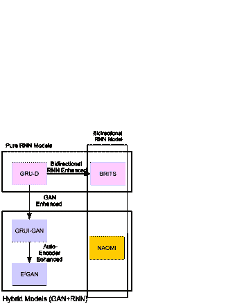
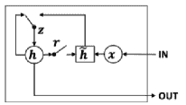
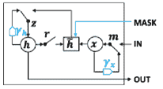
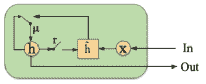
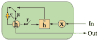
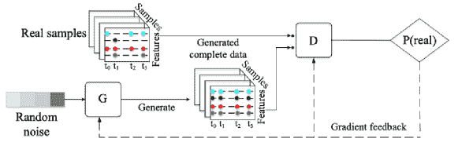
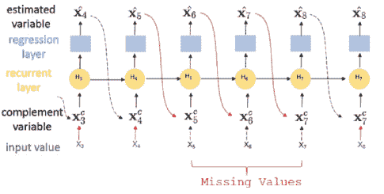
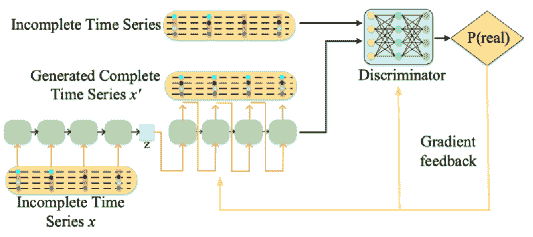
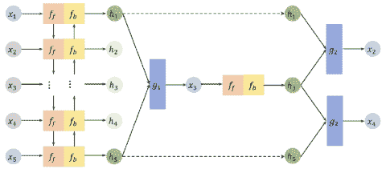

<!--yml

类别：未分类

日期：2024-09-06 19:58:12

-->

# [2011.11347] 时间序列数据插补：深度学习方法综述

> 来源：[`ar5iv.labs.arxiv.org/html/2011.11347`](https://ar5iv.labs.arxiv.org/html/2011.11347)

# 时间序列数据插补：深度学习方法综述

冯成光 fcg19@mails.tsinghua.edu.cn 王晨 wang˙chen@tsinghua.edu.cn 清华大学，北京

###### 摘要

时间序列在现实世界应用中无处不在。然而，意外事故，例如传感器故障或信号丢失，会导致时间序列中出现缺失值，从而使数据难以利用。这对下游应用，如传统的分类或回归、序列数据集成和预测任务，造成了伤害，因此对数据插补的需求增加。目前，时间序列数据插补是一个研究充分的问题，具有不同类别的方法。然而，这些研究很少考虑观察数据之间的时间关系，并将时间序列视为普通的结构化数据，导致丧失时间数据中的信息。近年来，深度学习模型引起了极大的关注。基于深度学习的时间序列方法在使用如 RNN 等模型方面取得了进展，因为它捕捉了数据中的时间信息。本文主要关注使用深度学习方法进行时间序列插补技术，最近在这一领域取得了进展。我们将回顾和讨论它们的模型架构、优缺点及其效果，以展示时间序列插补方法的发展。

###### 关键词：

时间序列插补，深度学习，生成对抗网络（GAN），递归神经网络（RNN）

## 1 引言

时间序列在现实世界应用中至关重要。然而，由于意外事故，例如传感器故障或信号丢失，时间序列中到处都是缺失值。在一些数据集中，缺失率可以达到 90%，这使得数据难以利用[12]。缺失值对下游应用造成了显著的伤害，例如传统的分类或回归、序列数据集成[21]和预测任务[18]，导致对数据插补的需求很高。

我们的初步研究[11]表明，插补缺失值确实显著提高了燃料消耗的预测。在燃料消耗预测的场景中，缺失值发生是由于传感器的错误。我们提出了一种名为 FuelNet 的插补方法来处理这些错误。FuelNet 生成适当的值来插补缺失数据。使用插补数据，燃料消耗可以减少约 45.5%。

目前阶段，时间序列数据插补是一个研究较多的问题，涵盖了不同类别的方法，包括删除方法、简单插补方法和基于学习的方法。然而，这些工作很少考虑观测值之间的时间关系，而是将时间序列视为普通的结构化数据，从而丧失了时间数据的信息。

幸运的是，随着深度学习的不断发展，大量深度学习方法被研究，其中 RNN 是处理序列数据的典型方法之一。深度学习模型能够推动插补任务的直观原因是，它们被证明能够挖掘时间序列中隐藏的信息。这些特性使得它们能够使用这样的模型来插补缺失值。

最近，深度学习方法已被应用于多变量时间序列插补，并在插补缺失值方面显示出积极进展。本文主要调查了三篇关于深度学习方法的时间序列插补论文 [7, 27, 6, 28, 25]，其中 RNN、GRU 和 GAN 被单独或组合使用。我们将回顾这些论文的模型结构、它们共同采用的部分以及通过比较得出的优缺点。

本文的其余部分组织如下。下一节中，我们将对现有的数据插补方法进行分类，并主要介绍深度学习插补方法。第三部分将展示问题的定义和符号。第四部分将详细讨论深度学习方法，主要涉及其具体结构、优缺点。最后，第五部分将总结调研并给出我们的结论。

表 1：不同时间序列插补方法的比较

| 方法论 | 文献中的示例方法 | 时间间隔 | 值类型 | 时间序列维度 |
| --- | --- | --- | --- | --- |
| 删除 | 列删除 [51] | 常规/非规 | 定性 | 多维 |
| 配对删除 [29] | 常规/非规 | 定性 | 多维 |
| 基于邻域的 | QDORC [41] | 常规/非规 | 定量/定性 | 多维 |
| SRKN [46] | 常规/非规 | 定量/定性 | 多维 |
| 基于约束 | DERAND [43, 42] | 常规/非规 | 定量/定性 | 多维 |
| SCREEN [44] | 常规/非规 | 定性 | 单维 |
| 基于回归 | ARX [5] | 常规 | 定性 | 单维 |
| IMR [55] | 常规 | 定性 | 单维 |
| 统计学 | DPC [54] | 常规 | 定性 | 单维 |
| IIM [53] | 常规 | 定性 | 多维 |
| 基于 MF | TRMF [52] | 常规 | 定性 | 多维 |
| NMF [30] | 常规 | 定性 | 多维 |
| 基于 EM | EM [14] | 常规 | 定性 | 多维 |
| EM-GMM [32] | 常规 | 定性 | 多维 |
| 基于 MLP | MLP [35] | 常规 | 定性 | 单维 |
| ANN [33] | 常规 | 定性 | 单维 |
| 基于 DL | GRU-D [7] | 常规/不规则 | 定性 | 多维 |
| GRUI-GAN [27] | 常规/不规则 | 定性 | 多维 |
| BRITS [6] | 常规/不规则 | 定性 | 多维 |
| E2GAN [28] | 常规/不规则 | 定性 | 多维 |
| NAOMI [25] | 常规/不规则 | 定性 | 多维 |

## 2 分类

在本节中，我们将简要介绍主要的时间序列填补方法。此外，我们将根据这些方法所依赖的原则和技术对现有的时间序列填补方法进行分类。

为了填补缺失值，研究人员提出了许多填补方法来处理时间序列中的缺失值。本文主要总结了包括删除方法、基于邻域的方法、基于约束的方法、基于回归的方法、基于统计的方法、基于 MF 的方法、基于 EM 的方法、基于 MLP 的方法和基于 DL 的方法在内的 8 种缺失值填补方法。表 1 显示了我们总结的这些方法的比较。我们将分别介绍每种方法。

删除方法采用简单的策略，即直接从原始数据中删除包含缺失值的观测 [29, 51]。当缺失值不多且删除缺失值不会影响后续应用时，这也是一种常用的策略。然而，当缺失率达到某个水平时（在 [16] 中为 5%），忽略缺失值并删除它们会使数据不完整，不适合后续应用。

基于邻域的方法 [3, 41] 从邻域中找出填补值，例如，通过 KNN 或 DBSCAN 等聚类方法进行识别。它们首先通过其他属性找到缺失值的最近邻，然后用这些邻域的均值来更新缺失值。此外，考虑到局部相似性，一些方法使用最后观察到的有效值来替代空白 [2]。在我们的初步研究中，SRKN（用 K 个邻居进行交换修复） [46] 也可以适用于填补在其他维度上错位的缺失值。

基于约束的方法 [43, 42] 发现数据集中的规则，并利用这些规则进行插补。要应用于时间序列数据，可以使用类似的规则，例如差分依赖 [37, 38] 或可比依赖 [39, 40]，这些规则研究时间戳及其值的距离或相似性 [45]。更先进的约束可以在图结构 [48, 57] 中指定，例如 Petri 网，并用于插补时间序列中事件的定性值 [49, 50]。当数据高度连续或符合某些模式时，这些方法非常有效。例如，当数据线性增长时，使用简单方法或聚类方法既有效又高效。当规则或约束得到满足时，基于约束的方法在时间和准确性上均优于其他方法 [44]。然而，现实世界中的多变量时间序列通常不符合这些规则，因此需要更通用的方法，研究者们正在研究基于学习的方法以自动插补时间序列数据。

基于回归的方法 LOESS [9] 从最近邻中学习回归模型，以预测缺失值，参考完整属性。对于时间序列数据，自回归（AR）模型（如 ARX [5] 和 ARIMA [56]）尝试从历史数据中预测缺失值。更先进的 IMR（迭代最小修复 [55]）同时提供异常检测和数据修复，用于处理异常和缺失值。这些方法大多依赖于历史数据以及最近邻的准确性。因此，当邻居可靠且时间序列高度相关时，它们可以应用。

基于统计的方法依赖于统计模型来插补缺失值 [24]。简单的统计方法仅利用原始数据中的数据来插补缺失值，例如取属性的均值或中位数进行插补 [1, 20]。[54] 通过统计速度和变化来估计概率值。近年来，更先进的 IIM（通过个体模型插补） [53] 自适应地学习各种邻居数量的个体模型。与仅基于历史数据的回归方法不同，基于统计的模型是从整个数据集学习的，包括历史数据和未来数据。因此，它们可能会从原始数据中捕获更多信息。

基于矩阵分解的方法 矩阵分解（MF）算法尝试通过矩阵分解和重构来填补缺失值，以找出数据之间的相关性并完成缺失值的填补，这是协同过滤的经典方法[26]。近年来，基于 MF 的方法被引入时间序列插补领域[52, 30]。一般来说，MF 方法将数据矩阵分解为 2 个低维矩阵，同时从原始数据中提取特征。然后，它们尝试重构原始矩阵，在此过程中填补缺失值。

基于期望最大化的方法 期望最大化（EM）基于的方法已经成功应用于缺失数据插补问题[32, 13, 14]。EM 基于的方法遵循一个由 E（期望）步骤和 M（最大化）步骤组成的两阶段策略，通过迭代地用统计模型参数填补缺失值，然后更新统计模型参数，以最大化填补数据分布的可能性。

基于多层感知器的方法 多层感知器（MLP）基于的方法使用 MLP，也称为全连接网络。MLP 试图通过完整值来预测缺失值。它可以分为 3 部分：输入层、隐藏层和输出层。在这种方法中，通过最小化损失函数，感知器学习一个函数来根据输入变量填补缺失值。在[35]中，MLP 被用于预测神经网络诊断系统中的缺失值。在[33]中，MLP 被用于填补人口普查数据。

最近，基于深度学习的方法[7, 27, 28, 6]主要使用递归神经网络（RNN），因为 RNN 能够捕捉时间信息。在这些论文中，时间信息被单独处理，并赋予更多的重要性。为了填补时间序列，不仅使用了 RNN，还结合了如门控递归单元（GRU）[7, 27, 28]来提取长期信息，生成对抗网络（GAN）[27, 28]来生成填补值，以及双向递归网络来提高准确性[6]。

根据上述分类，由于篇幅限制，时间序列插补方法众多，无法详细介绍。由于这些方法中，基于深度学习的方法最新且最强大，我们将讨论 3 种最新的深度学习时间序列插补方法，找出它们之间的联系和差异。

## 3 初步概述

在本节中，我们首先给出插补任务的形式化定义。这是因为在引入上述深度学习方法时，它们用不同的符号和公式来形式化插补任务。在我们的研究中，我们回顾了这些方法，并用统一的定义来解释它们。

###### 定义 1（多变量时间序列）。

我们首先表示一个时间戳列表 $\mathbf{T}=(t_{0},t_{1},...,t_{n-1})$，以及时间序列 $\mathbf{X}=\{\mathbf{x_{t_{0}}},\mathbf{x_{t_{1}}},...,\mathbf{x_{t_{n-1}}}\}^{T}$ 作为 $n$ 次观测的序列。$\ \mathbf{X}$ 的第 $i$ 次观测是 $\mathbf{x_{t_{i}}}$，由 $d$ 个属性 $\{x_{t_{i}}^{0},x_{t_{i}}^{1},...,x_{t_{i}}^{d}\}$ 组成。

在定义了多变量时间序列之后，我们使用掩码矩阵 $\mathbf{M}$ 来表示缺失值。

###### 定义 2（掩码矩阵）。

掩码矩阵 $\mathbf{M}$ 表示 $\mathbf{X}$ 中的缺失值，即 $\mathbf{M}\in\mathbb{R}^{n\times d}$。$\mathbf{M}$ 的每个元素定义如下。

|  | $\mathbf{M}_{t_{i}}^{j}=\left\{\begin{array}[]{ll}{0}&amp;{\text{ 如果 }x_{t_{i}}^{j}\text{ 未被观察到，即 }x_{t}^{j}=\text{None}}\\ {1}&amp;{\text{ 否则 }}\end{array}\right.$ |  | (1) |
| --- | --- | --- | --- |

为了利用时间信息，时间间隔应该用额外的结构记录。因此，我们引入了时间滞后，一个矩阵用来表示 $\mathbf{X}$ 中两个相邻观测值之间的时间间隔。

###### 定义 3（时间滞后）。

我们使用 $\mathbf{\delta}\in\mathbb{R}^{n\times d}$ 来记录时间滞后，并以如下迭代方式计算它。

|  | <math   alttext="\mathbf{\delta}_{t_{i}}^{j}=\left\{\begin{array}[]{ll}{t_{i}-t_{i-1},}&amp;{\mathbf{M}_{t_{i-1}}^{j}=1}\\ {\mathbf{\delta}_{t_{i-1}}^{j}+t_{i}-t_{i-1},}&amp;{\mathbf{M}_{t_{i-1}}^{j-1}==0\&amp;i>0}\\

{0,}&amp;{i==0}\end{array}\right." display="block"><semantics ><mrow ><msubsup ><mi >δ</mi><msub ><mi >t</mi><mi >i</mi></msub><mi >j</mi></msubsup><mo >=</mo><mrow ><mo >{</mo><mtable columnspacing="5pt" displaystyle="true" rowspacing="2.0pt" ><mtr ><mtd columnalign="left" ><mrow ><mrow ><msub ><mi >t</mi><mi >i</mi></msub><mo >−</mo><msub ><mi >t</mi><mrow ><mi >i</mi><mo >−</mo><mn >1</mn></mrow></msub></mrow><mo >,</mo></mrow></mtd><mtd  columnalign="left" ><mrow ><msubsup ><mi >𝐌</mi><msub ><mi >t</mi><mrow ><mi >i</mi><mo >−</mo><mn >1</mn></mrow></msub><mi >j</mi></msubsup><mo >=</mo><mn >1</mn></mrow></mtd></mtr><mtr ><mtd columnalign="left" ><mrow ><mrow ><mrow ><msubsup ><mi >δ</mi><msub ><mi >t</mi><mrow ><mi >i</mi><mo >−</mo><mn >1</mn></mrow></msub><mi >j</mi></msubsup><mo >+</mo><msub ><mi >t</mi><mi >i</mi></msub></mrow><mo >−</mo><msub ><mi >t</mi><mrow ><mi >i</mi><mo >−</mo><mn >1</mn></mrow></msub></mrow><mo >,</mo></mrow></mtd><mtd  columnalign="left" ><mrow ><msubsup ><mi >𝐌</mi><msub ><mi >t</mi><mrow ><mi >i</mi><mo >−</mo><mn >1</mn></mrow></msub><mrow ><mi >j</mi><mo >−</mo><mn >1</mn></mrow></msubsup><mo rspace="0em" >=</mo><mo lspace="0em" >=</mo><mn >0</mn><mo lspace="0.222em" rspace="0.222em" >&</mo><mi >i</mi><mo >></mo><mn >0</mn></mrow></mtd></mtr><mtr ><mtd  columnalign="left" ><mrow ><mn >0</mn><mo >,</mo></mrow></mtd><mtd columnalign="left" ><mrow ><mi >i</mi><mo rspace="0em" >=</mo><mo lspace="0em" >=</mo><mn >0</mn></mrow></mtd></mtr></mtable></mrow></mrow><annotation encoding="application/x-tex" >\mathbf{\delta}_{t_{i}}^{j}=\left\{\begin{array}[]{ll}{t_{i}-t_{i-1},}&{\mathbf{M}_{t_{i-1}}^{j}=1}\\ {\mathbf{\delta}_{t_{i-1}}^{j}+t_{i}-t_{i-1},}&{\mathbf{M}_{t_{i-1}}^{j-1}==0\&i>0}\\ {0,}&{i==0}\end{array}\right.</annotation></semantics></math> |  | (2) |

###### 示例 1。

现在我们给出时间序列 $\mathbf{X}$ 的一个示例，以及对应的时间戳列表 $\mathbf{T}$

|  | <math alttext="\mathbf{X}=\left[\begin{array}[]{cccc}{1}&amp;{6}&amp;{\text{ None }}&amp;{9}\\ {7}&amp;{\text{ None }}&amp;{7}&amp;{\text{ None }}\\

{9}&amp;{\text{ None }}&amp;{\text{ None }}&amp;{79}\end{array}\right],\mathbf{T}=\left[\begin{array}[]{c}{0}\\

{5}\\

{13}\end{array}\right]" display="block"><semantics ><mrow ><mrow  ><mi >𝐗</mi><mo >=</mo><mrow  ><mo >[</mo><mtable columnspacing="5pt" displaystyle="true" rowspacing="2.0pt"  ><mtr ><mtd  ><mn >1</mn></mtd><mtd ><mn  >6</mn></mtd><mtd ><mtext  > None </mtext></mtd><mtd ><mn  >9</mn></mtd></mtr><mtr ><mtd  ><mn >7</mn></mtd><mtd ><mtext  > None </mtext></mtd><mtd ><mn  >7</mn></mtd><mtd ><mtext  > None </mtext></mtd></mtr><mtr ><mtd  ><mn >9</mn></mtd><mtd ><mtext  > None </mtext></mtd><mtd ><mtext  > None </mtext></mtd><mtd ><mn  >79</mn></mtd></mtr></mtable><mo >]</mo></mrow></mrow><mo >,</mo><mrow ><mi  >𝐓</mi><mo >=</mo><mrow ><mo  >[</mo><mtable displaystyle="true" rowspacing="2.0pt"  ><mtr ><mtd  ><mn >0</mn></mtd></mtr><mtr ><mtd  ><mn >5</mn></mtd></mtr><mtr ><mtd  ><mn >13</mn></mtd></mtr></mtable><mo >]</mo></mrow></mrow></mrow><annotation-xml encoding="MathML-Content" ><apply  ><csymbol cd="ambiguous"  >formulae-sequence</csymbol><apply ><ci >𝐗</ci><apply  ><csymbol cd="latexml"  >delimited-[]</csymbol><matrix ><matrixrow ><cn type="integer"  >1</cn><cn type="integer"  >6</cn><ci ><mtext > None </mtext></ci><cn type="integer" >9</cn></matrixrow><matrixrow ><cn type="integer"  >7</cn><ci ><mtext > None </mtext></ci><cn type="integer" >7</cn><ci  ><mtext > None </mtext></ci></matrixrow><matrixrow ><cn type="integer" >9</cn><ci  ><mtext > None </mtext></ci><ci ><mtext > None </mtext></ci><cn type="integer" >79</cn></matrixrow></matrix></apply></apply><apply ><ci  >𝐓</ci><apply ><csymbol cd="latexml" >delimited-[]</csymbol><matrix ><matrixrow ><cn type="integer"  >0</cn></matrixrow><matrixrow ><cn type="integer" >5</cn></matrixrow><matrixrow ><cn type="integer"  >13</cn></matrixrow></matrix></apply></apply></apply></annotation-xml><annotation encoding="application/x-tex" >\mathbf{X}=\left[\begin{array}[]{cccc}{1}&{6}&{\text{ None }}&{9}\\ {7}&{\text{ None }}&{7}&{\text{ None }}\\ {9}&{\text{ None }}&{\text{ None }}&{79}\end{array}\right],\mathbf{T}=\left[\begin{array}[]{c}{0}\\ {5}\\ {13}\end{array}\right]</annotation></semantics></math> |  | (3) |

因此，我们可以计算掩码矩阵 $\mathbf{M}$ 和时间延迟 $\mathbf{\delta}$。

|  | <math   alttext="{\mathbf{M}}=\left[\begin{array}[]{cccc}{0}&amp;{0}&amp;{1}&amp;{0}\\ {0}&amp;{1}&amp;{0}&amp;{1}\\

{0}&amp;{1}&amp;{1}&amp;{0}\end{array}\right],\delta=\left[\begin{array}[]{cccc}{0}&amp;{0}&amp;{0}&amp;{0}\\

{5}&amp;{5}&amp;{5}&amp;{5}\\

\(\mathbf{M}=\left[\begin{array}{cccc}{0}&{0}&{1}&{0}\\ {0}&{1}&{0}&{1}\\ {0}&{1}&{1}&{0}\end{array}\right], \delta=\left[\begin{array}{cccc}{0}&{0}&{0}&{0}\\ {5}&{5}&{5}&{5}\\ {8}&{13}&{8}&{13}\end{array}\right]\)

## 4 方法

在这一部分，我们将首先对给定方法之间的关系和比较进行总体回顾，然后详细讨论它们。我们研究的主要深度学习方法用于时间序列插补包括 GRU-D [7]、GRUI-GAN [27]、E²GAN [28]、BRITS [6] 和 NAOMI [25]。这些都是最近发表的用于时间序列插补任务的深度学习方法。在这些方法中，递归神经网络（RNN）和生成对抗网络（GAN）是主要采用的架构。原因是 RNN 及其变体（例如 LSTM、GRU）在建模序列数据方面已被证明非常有效，而 GAN 已成功应用于生成和插补任务。

为了描述这些方法之间的关系，我们在图 1 中说明了它们的依赖关系和共通结构。在图 1 中，我们使用箭头来描述依赖关系，例如 GRUI-GAN 通过使用 GAN 改进了工作，而 E²GAN 是 GRUI-GAN 的更新版本。我们还使用框来描述方法之间的共通结构，例如 GRU-D 和 BRITS 都是纯 RNN 模型，BRITS 和 NAOMI 都采用双向 RNN 结构。这有助于我们理解时间序列插补任务如何系统地建模，解决方案是如何开发的，以及人们在这个过程中取得了什么进展。在接下来的部分，我们将按渐进的顺序进行审查。

图 1：我们主要调查的方法之间的关系。

表格 2：所选方法的特征

| 方法论 | 模型原型 | 具体模型 |
| --- | --- | --- |

&#124; 自编码器 &#124;

&#124; 增强 &#124;

|

&#124; 对抗训练 &#124;

&#124; 增强 &#124;

|

&#124; 双向 &#124;

&#124; 增强 &#124;

|

| --- | --- | --- | --- | --- | --- |
| --- | --- | --- | --- | --- | --- |
| GRU-D | RNN | GRU | – | – | – |
| GRUI-GAN | 混合 | GRU+GAN | – | 是 | – |
| E2GAN | 混合 | GRU+GAN | 是 | 是 | – |
| BRITS | RNN | 双向 RNN | – | – | 是 |
| NAOMI | 混合 | RNN+GAN | – | 是 | 是 |

### 4.1 所选方法的特征

在这一部分，我们提供了表格 2 中所选方法的特征，以简要介绍和分类我们审查的所选方法。我们考虑以下标准：

+   •

    *不规则时间序列意识*：时间序列包括具有固定时间间隔的规则时间序列和不规则时间序列。这两种都是常见的类型，对于分类方法的使用条件非常重要[54, 44]。

+   •

    *模型原型*：模型原型总结了方法中的整体模型类型，例如 RNN、GAN 和 CNN。这是对模型类型进行分类的基本信息。如果模型原型是混合的，则意味着使用了多种原型。

+   •

    *具体模型*：具体模型介绍了方法中采用的具体模型类型。这些具体模型可能与方法的基本思想有关。

+   •

    *自动编码器增强*：自动编码器结构是一种可以应用于数据填补的方法。通过编码器和解码器的结构，它从低维层中提取特征，并通过解码器恢复缺失值。因此，它可以作为方法的一种特征。

+   •

    *对抗训练增强*：对抗训练采用对抗结构（例如，GAN [15] 和 CGAN [31]）来增强模型。它采用生成对抗结构的思想，包括生成器和判别器。大量模型可以通过这种思想得到增强。

+   •

    *双向增强*：双向 RNN 分别在前向和后向方向训练两个模型，然后将它们结合到相同的损失函数中[17]。这个想法在数据填补任务中至关重要，因为缺失值的前序系列和后序系列都是已知的。因此，双向结构受益于前向和后向训练过程。这种思想被采用在[25、6]中。

### 4.2 GRU-D

GRU-D 是由 [7] 提出的，作为用深度学习模型填补时间序列的早期尝试之一。它是在 5 篇研究论文中首个系统地将缺失模式建模为 RNN 用于时间序列分类问题的研究。它也是首个利用 RNN 根据时间序列的信息建模多变量时间序列的研究。以前的工作如 [23、8] 尝试通过将时间戳和原始数据拼接来用 RNN 填补缺失值，即将时间戳视为原始数据的一个属性。但在 [7] 中，首次提出了时间滞后概念。本文首次采用门控递归单元（GRU）来生成缺失值。在每一层 GRU 中，由于输入可能包含缺失值，他们用现有值 $x_{t_{i}}^{j}$ 和统计值的组合替换输入 $x_{t_{i}}^{j}$，分别与 $\mathbf{M}$ 和 $\mathbf{1}-\mathbf{M}$ 逐元素相乘。

|  | $x_{t_{i}}^{j}\leftarrow m_{t_{i}}^{j}x_{t_{i}}^{j}+\left(1-m_{t_{i}}^{j}\right)\tilde{x}^{j}$ |  |
| --- | --- | --- |

其中 $\tilde{x}$ 可以是均值、最后观察值或 $\left[\mathbf{x_{i}};\mathbf{m_{i}};\delta_{i}\right]$ 的拼接。

本文的主要贡献是基于 GRU 的模型 GRU-D 和衰减率的提出。为了处理缺失值的填补，他们发现

+   •

    如果缺失变量的最后观察发生在很久以前，那么这些缺失变量往往接近某个默认值。

+   •

    如果变量缺失了一段时间，那么输入变量的影响会随着时间的推移而逐渐消失。

然后他们提出了衰减率$\gamma$，其定义如下：

|  | $\gamma_{t_{i}}=\exp({-\max{(\mathbf{0},\mathbf{W}_{\gamma}\mathbf{\delta_{t_{i}}})}})$ |  |
| --- | --- | --- |

衰减率尝试建模其他值对缺失值的影响。简而言之，它保证了时间间隔越长，它们对缺失值的影响就越小。然后他们将输入变量替换为：

|  | $x_{t_{i}}^{j}\leftarrow m_{t_{i}}^{j}x_{t_{j}}^{j}+\left(1-m_{t_{i}}^{j}\right)\gamma_{\boldsymbol{x}_{t_{i}}}^{j}x_{t_{i}^{\prime}}^{j}+\left(1-m_{t_{i}}^{j}\right)\left(1-\gamma_{\boldsymbol{x}_{t_{i}}}^{j}\right)\tilde{x}^{j}$ |  |
| --- | --- | --- |

因此，如图 2 所示，GRU-D 模型提出了两个不同的可训练衰减因子$\gamma_{\boldsymbol{x}}$和$\gamma_{\boldsymbol{h}}$，其中$\gamma_{\boldsymbol{x}}$是输入衰减率，$\gamma_{\boldsymbol{h}}$是隐藏状态的衰减率。

(a) GRU

(b) GRU-D

图 2：GRU 和 GRU-D 模型。图像摘自[7]。

### 4.3 GRUI-GAN

在[27]中，GRU-I 被提出作为捕捉时间信息的递归单元。如图 3 所示，它遵循了第 4.2 节中 GRU-D 的结构，但移除了输入衰减。因此，RNN 部分及衰减率没有创新。

本文的主要贡献在于 GAN 结构。图 4 展示了该结构。生成对抗网络（GAN）结构由生成器（G）和鉴别器（D）组成。G 学习一个映射$G(z)$，试图将随机噪声向量$z$映射到真实的时间序列。D 试图找到一个映射$D(.)$，告诉我们输入数据的真实性概率。因此，本文模型将随机噪声作为 GAN 模型的输入，这意味着生成是一个随机过程。G 和 D 都基于 GRU-I，并且训练模型以获得数据填补需要大量时间。

GRUI-GAN 利用了 GAN 在插补方面的能力，这在图像插补中已被证明有效，如 [34]。对抗结构提高了准确性。此外，论文采用了 WGAN 结构，改善了学习阶段的稳定性，解决了模式崩溃的问题，并简化了 GAN 模型的优化。

然而，这个模型并不实用，因为生成模型的准确性在随机噪声输入下似乎不稳定，而且使得模型难以收敛。

(a) GRU

(b) GRU-I

图 3：GRU 和 GRU-I 的模型。图像摘自 [27]。

图 4：GRUI-GAN 的结构。图像摘自 [27]。

图 5：BRITS 的结构。图像摘自 [6]。

### 4.4 BRITS

与以往方法不同，BRITS [6] 完全基于 RNN 结构，并提出了具有单向动态的插补。由于时间序列可能是不规则的，还采用了时间滞后（对应于 [6] 中的“时间间隙”）。类似于第 4.2 节中介绍的 GRU-D 的衰减率 $\gamma$ 概念，他们提出了时间衰减因子 $\gamma_{t}=\exp{(-\max\left(0,\mathbf{W}_{\gamma}\delta_{t}+\mathbf{b}_{\gamma}\right))}$。与在 BRITS 中时间滞后被视为输入并充当衰减率不同，GRU-D 将时间滞后考虑在输入中。在 BRITS 中，隐藏状态的更新采用了衰减率 $\gamma$。这意味着在更新隐藏状态时，旧的隐藏状态根据记录在时间滞后的时间持续时间进行衰减。因此，模型的更新方式为：

|  | $\displaystyle\hat{\mathbf{x}}_{t}$ | $\displaystyle=\mathbf{W}_{x}\mathbf{h}_{t-1}+\mathbf{b}_{x}$ |  | (5) |
| --- | --- | --- | --- | --- |
|  | $\displaystyle\mathbf{x}_{t}^{c}$ | $\displaystyle=\mathbf{m}_{t}\odot\mathbf{x}_{t}+\left(1-\mathbf{m}_{t}\right)\odot\hat{\mathbf{x}}_{t}$ |  |
|  | $\displaystyle\gamma_{t}$ | $\displaystyle=\exp\left\{-\max\left(0,\mathbf{W}_{\gamma}\delta_{t}+\mathbf{b}_{\gamma}\right)\right\}$ |  |
|  | $\displaystyle\mathbf{h}_{t}$ | $\displaystyle=\sigma\left(\mathbf{W}_{h}\left[\mathbf{h}_{t-1}\odot\gamma_{t}\right]+\mathbf{U}_{h}\left[\mathbf{x}_{t}^{c}\circ\mathbf{m}_{t}\right]+\mathbf{b}_{h}\right)$ |  |
|  | $\displaystyle\ell_{t}$ | $\displaystyle=\left\langle\mathbf{m}_{t},\mathcal{L}_{e}\left(\mathbf{x}_{t},\hat{\mathbf{x}}_{t}\right)\right\rangle$ |  |

之前名为 RITS 的模型是[6]中提出的方法的单向版本。作为双向版本，BRITS 利用双向递归动态，即分别训练两个前向和后向模型[17]。因此，引入了一致性损失来考虑两个方向的损失。

总结来说，在 BRITS 中，时间滞后仍然被用来处理不规则时间序列。仅使用 RNN 来建模时间序列。从模型和实验中我们还可以得出结论，双向 RNN 有助于提高性能，因为单向模型可能会遭遇梯度爆炸问题 [4]。

图 6：E²GAN 的结构。图像摘自[28]。

### 4.5 E²GAN

E²GAN [28] 是另一个基于 GAN 的工作。虽然第 4.3 节中的 GRUI-GAN 采用随机噪声向量作为输入，这需要大量时间进行训练，但 E²GAN 采用基于 GRUI 的自编码器结构来形成生成器。他们模型的整体结构见图 6。

在 E²GAN 中，诸如掩码、时间滞后、衰减率和 GRUI 等概念都保留了，没有改进，因此 GRUI 结构没有创新。主要贡献是他们在生成器中采用的自编码器结构。这是一种图像生成和填补常用的策略，如 Context-Encoder [34]、PixelGANs [19]，但在基于 RNN 的 GAN 中并不常见。由于模型的输入是原始时间序列，模型通过 GRUI 将输入的不完整时间序列$\mathbf{X}$压缩为一个低维向量$z$。然后，重建部分会重建完整时间序列$\mathbf{X^{\prime}}$以欺骗判别器。该方法的判别器试图通过采用递归神经网络来区分实际的不完整时间序列$\mathbf{X}$和假但完整的样本$\mathbf{X^{\prime}}$。判别器的框架也是一个编码器。

E²GAN 采用了基于编码器-解码器 RNN 的结构作为生成器，这解决了训练模型的难度和准确性。目前，根据论文中的实验，E²GAN 已经达到了最先进的水平，并且优于其他现有方法。

### 4.6 NAOMI

NAOMI（非自回归多分辨率插补[25]）提出了一种非自回归模型，该模型不仅条件化于之前的值，还条件化于未来的值，即，配备了双向 RNN，如第 4.4 节中介绍的 BRITS。由于在插补任务中，未来值和历史值都被观察到，因此直觉是利用这两者，并为它们训练双向模型。如图 7 所示，$f_{f}$和$f_{b}$分别是前向和后向 RNN，因此隐藏状态$h_{t}$是由$h^{f}_{t}$和$h^{b}_{t}$拼接而成的联合隐藏状态。

此论文中执行了一种特殊的预测策略。他们采用了*分而治之策略*。如图 7 所示，给定两个已知值$x_{1}$和$x_{5}$，他们首先利用提出的双向 RNN 模型预测中点$x_{3}$，然后更新$x_{3}$并利用它分别预测$x_{2}$和$x_{4}$。因此，进行了精细的预测。最后，采用对抗训练以增强模型。

然而，在 NAOMI 中，时间间隔被忽略，数据被注入到没有时间戳的 RNN 模型中。这表明该模型虽然可以通过直接移除时间戳来将其作为输入，但并不意识到不规则时间序列。

图 7：NAOMI 的结构。图像摘自[25]。

## 5 结论

在本文中，我们简要介绍了时间序列的插补方法。我们提出现有的方法可以分为三大类：删除方法、传统方法和基于学习的方法。并详细介绍了我们的分类。此外，我们调查了现有的深度学习时间序列插补方法，因为它们在最近的进展中表现优越。我们主要研究了三种深度学习方法，包括 GRU-D、GRUI-GAN 和 E²GAN。它们都基于 RNN，后两者还采用了 GAN 以实现更准确的插补。我们还发现它们之间的关系：GRUI-GAN 基于 GRU-D 的定义，E²GAN 通过自编码器改进了 GRUI-GAN 的生成器。到目前为止，E²GAN 实现了最先进的技术。

由于插补问题是基础性的，我们相信这些方法可以使填充数据在许多方面有利于下游应用。正如我们观察到的那样，其他领域中的大多数技术可以被采用于此任务，因为时间序列数据无处不在。未来，我们希望看到时间信息能得到妥善利用，方法能更加通用和准确，这样我们就不需要从众多方法中选择最佳方法，时间序列的缺失数据也不会成为问题。

## 6 未来研究机会

基于我们对时间序列插补方法发展情况的观察，我们尝试突显该领域的一些潜在研究机会。大多数现有研究主要关注 RNN 的结构，并尝试使用双向 RNN、Auto-Encoder 结构和 GAN 来增强模型。随着深度学习社会（尤其是自然语言处理（NLP），其中时间序列也受到高度关注）的快速发展，一些技术已达到了更好的性能（例如，注意力模型）。这些模型可以被认为用于增强插补模型。此外，大多数现有方法忽略了缺失时间戳的问题，这可能也会显得模糊[36]。因此，对此类技术仍有需求。现有方法可以扩展到插补缺失的时间戳。此外，不直接插补缺失值的查询回答是处理缺失值的另一种视角。在这种情况下，特定值不需要插补，而在不一致的概率数据库中应生成一致的查询。

### 6.1 注意力机制增强

近年来，注意力机制在深度学习领域特别是在 NLP 领域表现成功。当在 RNN 中采用时，注意力机制为每个隐藏状态分配权重，以从序列中提取信息。通过这种机制，模型可以更好地捕捉历史数据中的潜在模式，从而可能有利于时间序列插补。与已经考虑长期依赖的现有 RNN 模型（例如 LSTM 和 GRU）相比，注意力机制，例如时间注意力，使模型能够全球性地看到特征和状态。然而，LSTM 和 GRU 由于遗忘门单元仍然会丢失长期信息。

最近，纯注意力模型被提出而没有使用 RNN。[47]中提出的 Transformer 是其中一个流行的框架。在所提出的 Transformer 框架中，它只采用了一个称为自注意力的注意力层，其计算方式为：

|  | $\operatorname{Attention}(Q,K,V)=\operatorname{softmax}\left(\frac{QK^{T}}{\sqrt{d_{k}}}\right)V$ |  |
| --- | --- | --- |

其中 $Q,K,V$ 分别是查询、键和值，而 $d_{k}$ 是输入的维度。

接受单个序列作为输入，自注意力机制将输入的不同位置进行关联，并尝试计算序列的表示。无需应用 RNN，Transformer 完全依赖于自注意力层形成编码器-解码器结构，这类似于第 4.1 节中介绍的自编码器。这种结构提供了提取高维特征以进行重建的能力，有利于机器翻译等任务，如[47]中介绍的任务。

为了提高数据补全的性能，由于注意力机制的有效性，基于注意力机制的模型也可能解决时间序列补全问题。上述两类注意力机制，包括时间注意力和自注意力，都是可能对时间序列补全有益的潜在技术。此外，利用去除 RNN 仅依靠注意力机制的思想，像 Transformer 这样的结构可能为补全任务提供新的框架。

总结来说，两类注意力机制，包括时间注意力和自注意力，可能会为时间序列补全带来未来的机遇。而纯粹的注意力框架也是建模时间序列的新方向。

### 6.2 补全缺失的时间戳

缺失的时间戳往往表现得很隐蔽[36]，例如，被标记为 00:00:00。现有的大多数方法主要关注时间序列中的缺失值。然而，一旦时间戳缺失，这些方法可能无法捕捉时间信息，从而无法获得准确的补全结果。因此，扩展现有方法以补全缺失的时间戳是处理此类情况的潜在合适方向。

### 6.3 一致性查询回答

根据[22]，在概率数据库[10]中进行查询回答时，不确定每个缺失值的具体补全方式是至关重要的，因为来自多个来源的数据可能不一致且不确定。因此，需要一致性查询回答（CQA）。CQA 问题中的缺失值数据增加了一致回答查询的难度。应考虑来自不同来源的不一致数据和缺失值。因此，数据补全方法和 CQA 方法的结合可能是一种潜在的解决方案。

## 参考文献

+   [1] E. Acuna 和 C. Rodriguez. 缺失值处理及其对分类器准确性的影响。在 Classification, clustering, and data mining applications, 页码 639–647. Springer, 2004.

+   [2] M. Amiri 和 R. Jensen. 使用模糊-粗糙方法进行缺失数据补全。Neurocomputing, 205:152–164, 2016.

+   [3] G. E. Batista, M. C. Monard 等人. k-最近邻作为补全方法的研究。HIS, 87(251-260):48, 2002.

+   [4] S. Bengio, O. Vinyals, N. Jaitly, 和 N. Shazeer. 用于序列预测的调度采样与递归神经网络。在《神经信息处理系统进展 28：2015 年神经信息处理系统年会》，2015 年 12 月 7-12 日，蒙特利尔，魁北克，加拿大，页码 1171–1179，2015 年。

+   [5] G. E. Box, G. M. Jenkins, G. C. Reinsel, 和 G. M. Ljung. 时间序列分析：预测与控制。约翰·威利与儿子公司，2015 年。

+   [6] W. Cao, D. Wang, J. Li, H. Zhou, L. Li, 和 Y. Li. BRITS：用于时间序列的双向递归插补。在《神经信息处理系统进展 31：2018 年神经信息处理系统年会（NeurIPS 2018）》，2018 年 12 月 3-8 日，蒙特利尔，加拿大，页码 6776–6786，2018 年。

+   [7] Z. Che, S. Purushotham, K. Cho, D. Sontag, 和 Y. Liu. 针对缺失值的多变量时间序列的递归神经网络。科学报告，8(1):6085，2018 年。

+   [8] E. Choi, M. T. Bahadori, A. Schuetz, W. F. Stewart, 和 J. Sun. 医生 AI：通过递归神经网络预测临床事件。在医疗保健机器学习会议，页码 301–318，2016 年。

+   [9] W. S. Cleveland 和 C. Loader. 局部回归平滑：原理与方法，页码 10–49。Physica-Verlag HD，海德堡，1996 年。

+   [10] N. N. Dalvi 和 D. Suciu. 在概率数据库上高效查询评估。VLDB J., 16(4):523–544，2007 年。

+   [11] C. Fang, S. Song, Z. Chen, 和 A. Gui. 细粒度燃料消耗预测。在第 28 届 ACM 国际信息与知识管理会议（CIKM 2019），中国北京，2019 年 11 月 3-7 日，页码 2783–2791，2019。

+   [12] P. J. García-Laencina, P. H. Abreu, M. H. Abreu, 和 N. Afonoso. 乳腺癌患者未知离散值的 5 年生存预测中的缺失数据插补。计算生物医学，59:125–133，2015 年。

+   [13] P. J. García-Laencina, J. Sancho-Gómez, 和 A. R. Figueiras-Vidal. 缺失数据的模式分类：综述。神经计算与应用，19(2):263–282，2010 年。

+   [14] Z. Ghahramani 和 M. I. Jordan. 通过 EM 方法从不完整数据中进行监督学习。在 J. D. Cowan, G. Tesauro, 和 J. Alspector 编者的《神经信息处理系统进展 6》，[第 7 届 NIPS 会议，科罗拉多州丹佛，1993 年]，页码 120–127。摩根·考夫曼，1993 年。

+   [15] I. J. Goodfellow, J. Pouget-Abadie, M. Mirza, B. Xu, D. Warde-Farley, S. Ozair, A. C. Courville, 和 Y. Bengio. 生成对抗网络。在《神经信息处理系统进展 27：2014 年神经信息处理系统年会》，2014 年 12 月 8-13 日，蒙特利尔，魁北克，加拿大，页码 2672–2680，2014 年。

+   [16] J. W. Graham. 缺失数据分析：在现实世界中使其有效。心理学年鉴，60:549–576，2009 年。

+   [17] A. Graves 和 J. Schmidhuber. 使用双向 LSTM 和其他神经网络架构的逐帧音素分类。神经网络，18(5-6):602–610，2005 年。

+   [18] T. Hsieh, H. Hsiao, 和 W. Yeh. 使用小波变换和递归神经网络预测股市：基于人工蜂群算法的集成系统。应用软计算，11(2):2510–2525，2011 年。

+   [19] P. Isola, J.-Y. Zhu, T. Zhou, 和 A. A. Efros. 基于条件对抗网络的图像到图像转换。发表于 IEEE 计算机视觉与模式识别会议论文集，页码 1125–1134，2017 年。

+   [20] M. Kantardzic. 数据挖掘：概念、模型、方法和算法。John Wiley & Sons，2011 年。

+   [21] Y. Li, Y. Wang, Z. Zhang, Y. Wang, D. Ma, 和 J. Huang. 一种新型的快速且内存高效的并行 MLCS 算法用于长序列大规模对齐。发表于第 32 届 IEEE 国际数据工程会议，ICDE 2016，芬兰赫尔辛基，2016 年 5 月 16-20 日，页码 1170–1181。IEEE 计算机学会，2016 年。

+   [22] X. Lian, L. Chen, 和 S. Song. 不一致概率数据库中的一致查询答案。发表于 ACM SIGMOD 国际数据管理会议论文集，SIGMOD 2010，美国印第安纳波利斯，2010 年 6 月 6-10 日，页码 303–314，2010 年。

+   [23] Z. C. Lipton, D. Kale, 和 R. Wetzel. 直接建模序列中的缺失数据：改进临床时间序列分类。发表于医疗保健机器学习会议论文集，页码 253–270，2016 年。

+   [24] R. J. Little 和 D. B. Rubin. 缺失数据的统计分析，第 793 卷。John Wiley & Sons，2019 年。

+   [25] Y. Liu, R. Yu, S. Zheng, E. Zhan, 和 Y. Yue. NAOMI：非自回归多分辨率序列插补。发表于神经信息处理系统进展 32: 神经信息处理系统年度会议 2019，NeurIPS 2019，2019 年 12 月 8-14 日，加拿大温哥华，页码 11236–11246，2019 年。

+   [26] X. Luo, M. Zhou, H. Leung, Y. Xia, Q. Zhu, Z. You, 和 S. Li. 一种增量与静态结合的矩阵分解基础协同过滤方案。IEEE 自动化科学与工程学报，13(1):333–343，2014 年。

+   [27] Y. Luo, X. Cai, Y. Zhang, J. Xu, 和 X. Yuan. 使用生成对抗网络进行多变量时间序列插补。发表于神经信息处理系统进展 31: 神经信息处理系统年度会议 2018，NeurIPS 2018，2018 年 12 月 3-8 日，加拿大蒙特利尔，页码 1603–1614，2018 年。

+   [28] Y. Luo, Y. Zhang, X. Cai, 和 X. Yuan. E²gan: 端到端生成对抗网络用于多变量时间序列插补。发表于第二十八届国际人工智能联合会议论文集，IJCAI 2019，澳门，中国，2019 年 8 月 10-16 日，页码 3094–3100。ijcai.org，2019 年。

+   [29] P. E. McKnight, K. M. McKnight, S. Sidani, 和 A. J. Figueredo. 缺失数据：温和的介绍。Guilford Press，2007 年。

+   [30] J. Mei, Y. de Castro, Y. Goude, 和 G. Hébrail. 非负矩阵分解用于从少量时间聚合中恢复时间序列。发表于第 34 届国际机器学习大会，ICML 2017，澳大利亚悉尼，2017 年 8 月 6 日至 11 日，第 70 卷机器学习研究会议论文集，页面 2382–2390。PMLR, 2017。

+   [31] M. Mirza 和 S. Osindero. 条件生成对抗网络。CoRR, abs/1411.1784, 2014。

+   [32] F. V. Nelwamondo, S. Mohamed, 和 T. Marwala. 缺失数据：神经网络与期望最大化技术的比较。当前科学, 页面 1514–1521, 2007。

+   [33] S. Nordbotten. 神经网络插补应用于挪威 1990 年人口普查数据。官方统计学杂志-斯德哥尔摩-, 12:385–402, 1996。

+   [34] D. Pathak, P. Krahenbuhl, J. Donahue, T. Darrell, 和 A. A. Efros. 上下文编码器：通过修补进行特征学习。发表于 IEEE 计算机视觉与模式识别会议，页面 2536–2544, 2016。

+   [35] P. K. Sharpe 和 R. J. Solly. 处理神经网络诊断系统中的缺失值。神经计算与应用, 3(2):73–77, 1995。

+   [36] S. Song, Y. Cao, 和 J. Wang. 带时间约束的时间戳清洗。PVLDB, 9(10):708–719, 2016。

+   [37] S. Song 和 L. Chen. 差异依赖性：推理与发现。ACM 数据库系统通讯, 36(3):16:1–16:41, 2011。

+   [38] S. Song, L. Chen, 和 H. Cheng. 高效确定差异依赖性的距离阈值。IEEE 知识与数据工程学报, 26(9):2179–2192, 2014。

+   [39] S. Song, L. Chen, 和 P. S. Yu. 数据空间中的数据依赖性。发表于第 27 届国际数据工程会议，ICDE 2011，2011 年 4 月 11 日至 16 日，德国汉诺威，页面 470–481, 2011。

+   [40] S. Song, L. Chen, 和 P. S. Yu. 异质数据上的可比依赖性。VLDB J., 22(2):253–274, 2013。

+   [41] S. Song, C. Li, 和 X. Zhang. 将废物变为财富：关于脏数据的同时聚类和清洗。发表于第 21 届 ACM SIGKDD 国际知识发现与数据挖掘大会，澳大利亚悉尼，2015 年 8 月 10 日至 13 日，页面 1115–1124, 2015。

+   [42] S. Song, Y. Sun, A. Zhang, L. Chen, 和 J. Wang. 在相似性规则约束下丰富数据插补。IEEE 知识与数据工程学报, 32(2):275–287, 2020。

+   [43] S. Song, A. Zhang, L. Chen, 和 J. Wang. 通过广泛的相似性邻居丰富数据插补。PVLDB, 8(11):1286–1297, 2015。

+   [44] S. Song, A. Zhang, J. Wang, 和 P. S. Yu. SCREEN: 在速度约束下的流数据清洗。发表于 2015 年 ACM SIGMOD 国际数据管理会议，澳大利亚墨尔本，2015 年 5 月 31 日至 6 月 4 日，页面 827–841, 2015。

+   [45] S. Song, H. Zhu, 和 L. Chen. 基于概率相关性的文本记录相似性度量。信息科学, 289:8–24, 2014。

+   [46] Y. Sun, S. Song, C. Wang, 和 J. Wang. 用交换修复错误的属性值. 在第 36 届 IEEE 国际数据工程大会，ICDE 2020. IEEE, 2020.

+   [47] A. Vaswani, N. Shazeer, N. Parmar, J. Uszkoreit, L. Jones, A. N. Gomez, L. Kaiser, 和 I. Polosukhin. 注意力机制是你所需要的一切. 在《神经信息处理系统进展 30：神经信息处理系统年会 2017》，2017 年 12 月 4-9 日，美国加州长滩，页面 5998–6008, 2017.

+   [48] J. Wang, S. Song, X. Lin, X. Zhu, 和 J. Pei. 清洗结构化事件日志：一种图修复方法. 在第 31 届 IEEE 国际数据工程大会，ICDE 2015，韩国首尔，2015 年 4 月 13-17 日，页面 30–41, 2015.

+   [49] J. Wang, S. Song, X. Zhu, 和 X. Lin. 高效恢复缺失事件. PVLDB, 6(10):841–852, 2013.

+   [50] J. Wang, S. Song, X. Zhu, X. Lin, 和 J. Sun. 高效恢复缺失事件. IEEE Trans. Knowl. Data Eng., 28(11):2943–2957, 2016.

+   [51] W. Wothke. 长期和多组建模的缺失数据. 2000.

+   [52] H. Yu, N. Rao, 和 I. S. Dhillon. 高维时间序列预测的时间正则化矩阵分解. 在《神经信息处理系统进展 29：神经信息处理系统年会 2016》，2016 年 12 月 5-10 日，西班牙巴塞罗那，页面 847–855, 2016.

+   [53] A. Zhang, S. Song, Y. Sun, 和 J. Wang. 为插补学习单独模型. 在第 35 届 IEEE 国际数据工程大会，ICDE 2019，中国澳门，2019 年 4 月 8-11 日，页面 160–171\. IEEE, 2019.

+   [54] A. Zhang, S. Song, 和 J. Wang. 序列数据清洗：一种统计方法. 在 2016 年国际数据管理会议论文集，SIGMOD 会议 2016，美国加州旧金山，2016 年 6 月 26 日-7 月 1 日，页面 909–924\. ACM, 2016.

+   [55] A. Zhang, S. Song, J. Wang, 和 P. S. Yu. 时间序列数据清洗：从异常检测到异常修复. PVLDB, 10(10):1046–1057, 2017.

+   [56] G. P. Zhang. 使用混合 ARIMA 和神经网络模型进行时间序列预测. Neurocomputing, 50:159–175, 2003.

+   [57] X. Zhu, S. Song, X. Lian, J. Wang, 和 L. Zou. 匹配异构事件数据. 在国际数据管理会议，SIGMOD 2014，美国犹他州雪鸟，2014 年 6 月 22-27 日，页面 1211–1222, 2014.
