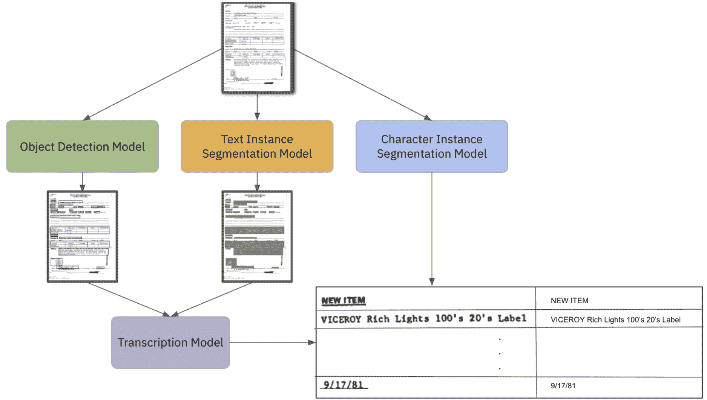
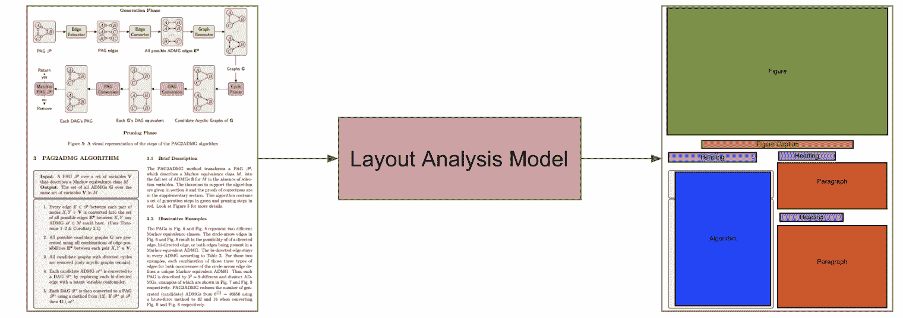

<!--yml

类别：未分类

日期：2024-09-06 19:58:09

-->

# [2011.13534] 深度学习在 OCR 和文档理解中的应用调查

> 来源：[`ar5iv.labs.arxiv.org/html/2011.13534`](https://ar5iv.labs.arxiv.org/html/2011.13534)

# 深度学习在 OCR 和文档理解中的应用调查

Nishant Subramani

Intel Labs

Masakhane

nishant.subramani23@gmail.com Alexandre Matton

Scale AI

alexandre.matton@scale.com Malcolm Greaves

Scale AI

malcolm.greaves@scale.com Adrian Lam

Scale AI

adrian.lam@scale.com

###### 摘要

文档是许多行业（如法律、金融和技术等）核心的一部分。自动理解文档（如发票、合同和简历）具有很高的价值，开辟了许多新的商业机会。自然语言处理和计算机视觉领域通过深度学习取得了巨大的进展，这些方法已开始融入当代文档理解系统。在这篇调查论文中，我们回顾了用于理解英文文档的不同技术，并整合了文献中存在的方法，作为研究人员探索这一领域的起点。

## 1 引言

人类编写文档以记录和保存信息。作为信息载体，文档采用不同的布局来表示多样的信息，以满足各种不同的需求。在这项工作中，我们关注的是英文文档的理解问题。这里，我们将文档理解定义为从文档页面中的书面文本和插图中自动读取、解释和提取信息的过程。从机器学习实践者的角度来看，这项调查涵盖了我们如何构建模型来自动理解最初为人类使用而编写的文档。文档理解模型接收文档并将文档页面分割成有用的部分（即对应于特定表格或属性的区域），通常使用光学字符识别（OCR）（Mori 等人，1999）和一定程度的文档布局分析。这些模型利用这些信息来理解文档的整体内容，例如该区域或边界框对应于一个地址。在这项调查中，我们更详细地关注文档理解的这些方面，并讨论这些任务的常见方法。我们的目标是总结现代文档理解中的方法，并突出当前的趋势和局限性。

在第二部分中，我们讨论了现代 NLP 和文档理解中的一些一般主题，并提供了构建端到端自动化文档理解系统的框架。接下来，在第三部分中，我们查看了最佳的 OCR 方法，包括文本检测（第 3.1 节")和文本转录（第 3.3 节）。在第四部分中，我们从更广泛的视角看待文档理解问题，介绍了文档布局分析的多种方法：即在每页上定位相关信息的问题。接下来，我们讨论了信息提取的流行方法（第五部分）。

## 2 文档处理与理解

文档处理在历史上涉及手工制作的基于规则的算法（Lebourgeois et al., 1992; Ha et al., 1995; Amin and Shiu, 2001），但随着深度学习的广泛成功（Collobert and Weston, 2008; Krizhevsky et al., 2012; Sutskever et al., 2014），计算机视觉（CV）和自然语言处理（NLP）方法已经成为主流。对象检测和图像分割的进展导致了接近人类表现的系统（Redmon et al., 2016; Lin et al., 2017）。因此，这些方法已被应用于包括 NLP 和语音在内的各种其他领域（Gehring et al., 2017; Wu et al., 2018; Subramani and Rao, 2020）。由于文档可以被视为一种视觉信息媒介，许多从业者也利用计算机视觉技术，用于文本检测和实例分割（Long et al., 2018; Katti et al., 2018）。我们在第 3.1 节和第 4.1 节中详细介绍了这些具体方法。

大型预训练语言模型如 ELMo 和 BERT 的广泛成功和流行使得文档理解转向使用基于深度学习的模型（Peters 等， 2018；Devlin 等， 2019）。这些模型可以针对各种任务进行微调，并已取代词向量成为自然语言任务预训练的事实标准。然而，语言模型，无论是基于递归神经网络还是基于变换器（Vaswani 等， 2017），在处理长序列时仍然存在困难（Cho 等， 2014a；Subramani 等， 2019；Subramani 和 Suresh， 2020）。鉴于商业文档中的文本可能非常密集和冗长，因此需要对模型架构进行修改。最简单的方法是将文档截断为较小的 512 个标记的序列，以便可以直接使用预训练语言模型（Xie 等， 2019；Joshi 等， 2019）。另一个最近获得关注的方法是基于减少变换器模型中自注意力组件的复杂性（Child 等， 2019；Beltagy 等， 2020；Katharopoulos 等， 2020；Kitaev 等， 2020；Choromanski 等， 2020）。

文献中现有的所有有效、现代的端到端文档理解系统都整合了多种深度神经网络架构，以便读取和理解文档内容。由于文档是为人类而非机器制作的，因此从业者必须将计算机视觉（CV）和自然语言处理（NLP）架构结合成一个统一的解决方案。尽管具体的使用案例会决定使用的确切技术，但完整的端到端系统包括：

+   •

    基于计算机视觉的文档布局分析模块，将每个文档页面分割成不同的内容区域。该模型不仅区分了相关区域和不相关区域，还用于分类它所识别的内容类型。

+   •

    光学字符识别（OCR）模型的目的是定位和准确转录文档中所有的书面文本。OCR 模型横跨计算机视觉（CV）和自然语言处理（NLP）的边界，它们可以直接使用文档布局分析，也可以以独立的方式解决问题。

+   •

    信息提取模型利用 OCR 或文档布局分析的输出，以理解和识别文档中所传达的信息之间的关系。这些模型通常针对特定领域和任务进行专业化，提供了使文档机器可读所需的结构，在文档理解中提供了实用性。

在接下来的部分中，我们将详细阐述这些构成端到端文档理解解决方案的概念。

## 3 光学字符识别

OCR 主要包括两个组件：文本检测和文本转录。通常，这两个组件是分开的，并为每个任务使用不同的模型。下面，我们将讨论每个组件的最新方法，并展示如何通过不同的通用 OCR 系统处理文档。详细信息请参见图 1。

### 3.1 文本检测

文本检测是识别页面或图像中存在的文本的任务。输入，即图像，通常由三维张量表示，$C\times H\times W$，其中 $C$ 是通道数（通常为三，分别对应红色、绿色和蓝色），$H$ 是高度，$W$ 是图像的宽度。文本检测是一个具有挑战性的问题，因为文本的形状和方向多种多样，并且往往会发生扭曲。我们探讨了研究人员提出文本检测问题的两种常见方式：作为物体检测任务和作为实例分割任务。文本检测模型必须学习输出围绕文本的边界框的坐标（物体检测），或一个掩膜，其中文本像素被标记，而没有文本的像素未被标记（实例分割）。

图 1：这里展示了通用的 OCR 过程。文档可以沿着左侧路径，通过物体检测模型，该模型输出边界框，以及转录模型，该模型转录每个边界框中的文本。如果文档走中间路径，则物体经过通用文本实例分割模型，该模型将包含文本的像素标记为黑色，并且文本转录模型转录实例分割模型识别的文本区域。如果文档走右侧路径，则模型经过特定字符的实例分割模型，该模型输出每个像素对应的字符。所有路径产生相同的结构化输出。文档来源于 FUNSD（Jaume 等，2019）。

#### 3.1.1 将文本检测视为物体检测

传统上，文本检测依赖于手工设计特征来检测字符（Matas 等，2004；Lowe，2004）。深度学习的进步，特别是在物体检测和语义分割方面，已经改变了文本检测的处理方式。利用传统计算机视觉文献中的高性能物体检测器，如单次检测多框检测器（SSD）和 Faster R-CNN 模型（Liu 等，2016；Ren 等，2015），从业人员构建了高效的文本检测器。

第一个将回归基础的检测器应用于文本的论文之一是 TextBoxes (Liao 等，2016，2018a)。他们在 SSD 中添加了具有大长宽比的长默认框，以便将目标检测器适应于文本。几篇论文在此基础上进行了扩展，使回归基础的模型对方向具有韧性，如 Deep Matching Prior Network (DMPNet) 和 Rotation-Sensitive Regression Detector (RRD) (Liu 和 Jin，2017；Liao 等，2018b)。其他论文采用类似的方法，但开发了自己的提议网络，该网络针对文本而非自然图像进行调优。例如，Tian 等人 (2016) 在其 Connectionist Text Proposal Network 中结合了卷积网络和递归网络，使用垂直锚点机制以提高对横向文本的准确性。

目标检测模型通常通过交并比 (IoU) 指标和 F1 分数来评估。该指标计算候选边界框与真实边界框（交集）重叠的部分除以候选和真实边界框占据的总空间（并集）。接下来，选择 IoU 阈值 $\tau$ 来确定哪些预测框算作真正的正例（IoU $\geq\tau$）。其余的被归类为假正例。模型未能检测到的任何框都被归类为假负例。使用这些定义，计算 F1 分数来评估目标检测模型。

#### 3.1.2 文本检测作为实例分割

文档中的文本检测面临着独特的挑战：尤其是文本通常非常密集，而且文档中的文本量远超过自然图像中通常出现的文本量。为了应对这种密度问题，文本检测可以被视为一个超密集的实例分割任务。实例分割的任务是将图像的每一个像素分类为特定的、预定义的类别。

基于分割的文本检测器在像素级别工作，以识别文本区域。这些每像素预测通常用于估计文本区域、字符及其相邻字符之间关系的概率。实践者使用流行的分割方法，如全卷积网络（FCN），来检测文本（Long et al., 2015），改进了对象检测模型，尤其是在文本错位或扭曲时。几篇论文在这个分割基础上建立，通过直接从分割输出中提取边界区域来输出单词边界区域（Yao et al., 2016; He et al., 2017a; Deng et al., 2018）。TextSnake 进一步扩展了这一点，通过从 FCN（Long et al., 2018）中预测文本区域、中心线、文本方向和候选半径。这些特征然后与步幅算法结合，提取中央轴点以重建文本实例。

### 3.2 单词级与字符级

尽管上面提到的大多数论文尝试直接检测单词甚至单词行，但一些论文认为字符级检测比一般的文本检测更容易，因为字符比文本行或单词更不容易产生歧义。CRAFT 使用 FCN 模型为每个字符输出一个二维高斯热图（Baek et al., 2019）。然后，将相互靠近的字符组合在一个旋转的矩形中，该矩形具有最小的面积，以便仍能包含这些字符集合。最近，Ye 等人（2020）结合了通过区域提议网络（RPN）获得的全局、单词级和字符级特征，取得了巨大的成功。

上述描述的大多数模型主要用于文本场景检测，但可以很容易地调整用于文档文本检测，以处理诸如扭曲文本等困难情况。我们预期文档中的扭曲程度会比自然图像中的少，但扫描质量差的文档或具有某些字体的文档仍可能存在这些问题。

### 3.3 文本转录

文本转录是将图像中存在的文本转录的任务。输入图像通常是对应于字符、单词或单词序列的裁剪图像，维度为 $C\times H^{\prime}\times W^{\prime}$。文本转录模型必须学习接收这个裁剪图像，并输出一个属于某些预先指定词汇表 $V$ 的令牌序列。$V$ 通常对应于一组字符。例如，对于数字识别，这是一种最直观的方法（Goodfellow et al., 2013）。否则，$V$ 也可以对应于一组单词，类似于单词级语言建模问题（Jaderberg et al., 2014）。在这两种情况下，问题都可以被表述为一个多类分类问题，类的数量等于词汇表 $V$ 的大小。

词级别的文本转录模型需要更多的数据，因为多分类问题中的类别数量比字符级别要大得多。一方面，预测词语而不是字符可以减少出现小错误的概率（例如，将“elephant”中的“a”替换为“o”）。另一方面，限制自己使用词汇表意味着无法转录不在词汇表中的词汇。这种问题在字符级别不存在，因为字符的数量是有限的。只要我们知道文档的语言，建立一个包含所有可能字符的词汇表是直接的。子词单元是一个可行的替代方案（Sennrich 等，2016），因为它们缓解了词级和字符级转录中存在的问题。

最近，研究社区已经转向使用递归神经网络，特别是将 LSTM 或 GRU 单元叠加在卷积图像特征提取器上（Hochreiter 和 Schmidhuber，1997；Cho 等，2014b；Wang 和 Hu，2017）。在转录一个标记时，通常使用两种不同的解码机制。一种是标准的贪心解码或基于注意力的序列解码器使用的束搜索，带有交叉熵损失（Bahdanau 等，2014），与使用条件语言模型的解码完全一样。有时图像的方向不佳或对齐不准确，这降低了标准序列注意力的有效性。为了解决这个问题，He 等人（2018）使用了注意力对齐，直接编码字符的空间信息，而 Shi 等人（2016）直接使用了空间注意力机制。第二种常用的转录解码方式是使用连接时序分类（CTC）损失（Graves 等，2006），这是一种在语音中常见的损失函数，能够很好地建模序列输出中的重复字符。

大多数文本转录模型借鉴了文本和语音序列建模的进展，并且通常只需少量调整即可很好地利用这些进展。因此，实践者很少直接处理相对于文档理解任务其他组件的这一方面。

### 3.4 端到端模型

端到端方法结合了文本检测和文本转录，以便共同改进这两个组件（Li et al., 2017）。例如，如果文本预测的概率非常低，这意味着检测到的框要么没有捕捉到整个单词，要么捕捉到的是非文本内容。在这种情况下，端到端的方法可能非常有效。结合这两种方法是相当常见的，Fast Oriented Text Spotting（FOTS）和 TextSpotter with Explicit Alignment and Attention 依次结合这些模型以进行端到端训练（Liu et al., 2018; He et al., 2018）。这些方法使用共享卷积作为文本检测和识别的特征，并实施文本复杂方向的方法。Feng et al.（2019）介绍了 TextDragon，这是一种端到端模型，通过利用可微分的兴趣区域滑动操作符，在扭曲文本上表现良好，该操作符专注于纠正兴趣区域中的扭曲。Mask TextSpotter 是另一种端到端模型，结合了边界框的区域建议网络与文本和字符分割（Liao et al., 2020）。这些近期工作展示了端到端 OCR 解决方案在减少错误方面的强大能力。

然而，拥有独立的文本检测和文本识别模型提供了更多的灵活性。首先，这两个模型可以分别训练。在仅有一个小数据集用于训练整个 OCR 模块，但有大量文本识别数据容易获取的情况下，利用这大量数据进行识别模型的训练是有意义的。此外，通过两个独立的模型，可以计算两个独立的指标集，从而更全面地了解瓶颈可能在哪里。

因此，双模型和端到端方法都是可行的。哪个方法更好主要取决于可用的数据和想要达到的目标。

### 3.5 文本检测和转录的数据集

大部分文献围绕场景文本检测展开，而不是文档文本检测，并在这些数据集上报告结果。一些主要的数据集包括 ICDAR（Karatzas et al., 2013, 2015），Total-Text（Ch’ng and Chan, 2017），CTW1500（Yuliang et al., 2017），以及 SynthText（Gupta et al., 2016）。

Jaume 等（2019）提出了 FUNSD，一个用于文本检测、转录和文档理解的数据集，包含 199 个完全标注的表单，共计 31k 词级边界框。另一个近期的文档理解数据集来自 ICDAR 2019 年扫描收据 OCR 和信息提取（SROIE）的鲁棒阅读挑战。它包含 1000 个完整的扫描收据图像，具有文本检测/转录的行级注释和关键信息提取的标签。该网站包含了针对这个问题提出的解决方案的排名。由于比赛结束后仍会有解决方案发布，这是一种跟踪最新方法的好方法。

## 4 文档布局分析

文档布局分析是定位和分类图片或扫描图像中感兴趣区域的过程。大体上，大多数方法可以提炼为页面分割和逻辑结构分析（Binmakhashen 和 Mahmoud, 2019; Okun 等, 1999）。页面分割方法关注于外观，利用视觉线索将页面划分为不同区域；最常见的有文本、图形、图像和表格。相反，逻辑结构分析专注于对这些区域提供更细粒度的语义分类，即识别一个文本区域是否为段落，并将其与标题或文档标题区分开来。

文档布局分析方法的研究有着悠久的历史，无论是在学术界还是工业界。¹¹1 第一部定义现代文档布局分析方面的 ISO 标准起草于四十年前：ISO 8613-1:1989。从最早的启发式方法（Lebourgeois 等, 1992; Okun 等, 1999; Liang 等, 1997），到多阶段经典机器学习系统（Qin 等, 2018; Wei 等, 2013; Eskenazi 等, 2017），文档布局分析方法的演变现在主要由端到端的可微方法主导（Yang 等, 2017; Binmakhashen 和 Mahmoud, 2019; Ares Oliveira 等, 2018; Agarwal 等, 2020; Monnier, 2020; Pramanik 等, 2020）。

### 4.1 布局分析的实例分割

当应用于商业文档的布局分析问题时，实例分割方法预测每个像素的标签以分类感兴趣区域。这些方法灵活且易于适应粗粒度的页面分割任务或更具体的逻辑结构分析任务。

图 2：文档通过一个通用的布局分析模型处理，结果生成一个布局分割掩模，包含以下类别：图像（绿色）、图像说明（橙色）、标题（紫色）、段落（红色）和算法（蓝色）。该文档已获得许可转载（Subramani，2016）。

在 Yang 等人（2017）的研究中，作者描述了一种端到端的神经网络，该网络结合了文本和视觉特征，采用编码器-解码器架构，并融合了无监督预训练网络。在推断过程中，他们的方法使用下采样级联的池化层来编码视觉信息，然后输入到对称的上采样级联中进行解码。在每个级联层次中，生成的编码也直接传递到相应的解码块，连接下采样和上采样的表示。这种架构确保在编码和解码过程中考虑不同分辨率层次的视觉特征信息（Burt 和 Adelson，1983）。对于最终的解码层，局部文本嵌入与计算出的视觉表示一起提供。

这种受 U-Net 启发的编码-解码架构已被采用于几种不同的文档布局分析方法（Ronneberger 等人，2015）。Ares Oliveira 等人（2018）的方法，随后由 Barman 等人（2020）通过额外的文本嵌入进行扩展，使用大滤波器尺寸的卷积最大池化层将文档图像传递通过 ResNet 瓶颈（He 等人，2015）。然后，表示通过双线性上采样层和较小的 1x1 和 3x3 卷积层进行处理。这两项工作分别用于对来自多种欧洲语言的历史文档和报纸进行布局分析。在 Lee 等人（2019）的研究中，作者将 U-Net 架构模式与可训练的乘法层结合。这种层类型专门用于从网络的卷积特征图中提取共现纹理特征，这些特征对于定位周期性重复信息的区域（如表格）非常有效。

### 4.2 解决数据稀缺和替代方法

获取高质量的布局分析训练数据是一项劳动密集型任务，需要机械精度和对文档内容的理解。由于对全新领域文档进行布局注释的困难，存在几种方法可以利用未标记数据中的结构或使用明确的规则集生成合成标记文档，从而进一步提高文档布局分析系统的普适性和性能。

像 BERT 和 RoBERTa 这样的掩码语言模型在许多下游 NLP 任务中展示了有效的实证性能（Devlin et al., 2019; Liu et al., 2019b）。受到 BERT 和 RoBERTa 中预训练策略的启发，Xu 等（2020）定义了一种掩码视觉语言模型，该模型随机掩盖输入标记并使用模型预测被掩盖的标记。与 BERT 不同，他们的方法在这一掩码预测任务中提供了标记的 2-D 位置嵌入，这使得模型能够结合文本元素之间的语义和空间关系。如第 4.1 节所提到的，Yang 等（2017）在他们更广泛的基于实例分割的网络中引入了一种辅助文档图像重建任务。在训练过程中，这个辅助模块使用一个独立的上采样解码器，在没有跳跃连接的帮助下，从编码表示中预测原始像素值。

尽管预训练使从业者能够从未标记文档中获得更多价值，但仅靠这种技术往往不足以有效解决数据稀缺的问题。基于许多商业和学术文档在内容和页面级组织中都有重复模式的直觉，已经出现了几种方法来生成合成标记数据，以提供适合预训练类似流程的数据（Zhong et al., 2019b）。在 Monnier（2020）中，作者提出了一种三阶段生成新标记文档的方法。首先，他们从近 200 个已知文档背景中随机选择一个文档背景来生成文档。其次，他们使用基于网格的布局方法来定义每个文档元素的内容及其各自的大小。第三，他们的过程引入了诸如高斯模糊和随机图像裁剪等破坏。这个模块化、基于规则的合成文档生成方法创建了一个异质数据集，使得布局分析模型的预训练更加稳健。

作为替代，除了定义规则生成异质文档集之外，一些合成过程借鉴了数据增强方法。Capobianco 和 Marinai（2017）以及 Journet 等（2017）描述了使用现有标记文档集引入变形和扰动的通用工具包。重要的是，这些对训练数据的更改经过平衡，以保持原始语义内容，同时让模型训练暴露于必须在对未见数据进行推理时考虑的现实错误中。

### 4.3 布局分析的数据集

最近，针对文档布局分析问题的数据集激增。国际文档分析与识别会议（ICDAR）通过他们的各种年度比赛产生了多个数据集；最近的 2017 年和 2019 年数据集提供了文档布局分析及其他文档处理任务的金标准数据（Gao et al., 2017; Clausner et al., 2019; Huang et al., 2019; Gao et al., 2019）。

从更大的角度来看，DocBank 是一个包含 50 万页文档的集合，具有适合训练和评估文档布局分析系统的标记级注释（Li et al., 2020）。作者使用弱监督（Hoffmann et al., 2011）构建了这个数据集，将已知 PDF 的 LaTeX 源数据匹配形成注释。类似地，Zhong et al. (2019b)通过自动匹配 PubMed Central™上的一百万多个 PDF 的 XML 内容表示创建了 PubLayNet，包含约 36 万张文档图像。虽然不是完整的文档布局，Zhong et al. (2019a)也从 PubMed Central 创建了 PubTabNet。他们的数据包括 56.8 万张表格图像和内容的 HTML 表示。

## 5 信息提取

文档理解的信息提取的目标是将可能具有多样化布局的文档提取成结构化格式。示例包括收据理解以识别项目名称、数量和价格，以及表单理解以识别不同的键值对。人类对信息的提取超越了简单地阅读页面上的文本，因为通常需要学习页面布局以获得完整的理解。因此，近期的改进通过以多种方式额外编码文本的结构和视觉信息，扩展了文档的文本编码策略。

### 5.1 2D 位置嵌入

已提出多种序列标记方法，这些方法通过嵌入 2D 边界框的属性并将其与文本嵌入合并，增强了当前的命名实体识别（NER）方法，以创建同时关注上下文和空间位置的模型，从而在提取信息时能够感知这两者。Xu et al. (2020) 使用两个不同的嵌入表嵌入定义边界框的 $x,y$ 坐标，并预训练一个掩码语言模型（LM）。在预训练过程中，文本被随机掩码，但 2D 位置嵌入被保留。然后，该模型可以在下游任务上进行微调。或者，边界框坐标也可以使用 $sin$ 和 $cos$ 函数进行嵌入，如位置编码方法（Vaswani et al., 2017; Hwang et al., 2020）。还可以嵌入其他特征，如行号或序列号（Hwang et al., 2019）。在这种情况下，文档会被预处理以为每个单独的标记分配行号。每个标记从左到右排序，并赋予一个序列位置。最后，同时嵌入行位置和序列位置。

尽管这些策略取得了成功，但仅依赖行号或边界框坐标在文档在不平整的表面上扫描时可能会导致误导，从而导致文本弯曲。此外，基于边界框的嵌入仍然缺少关键的视觉信息，如排版强调（粗体、斜体）和图像（如徽标）。为了克服这些问题，可以使用 Faster R-CNN 模型嵌入与感兴趣标记对应的图像裁剪，从而创建标记图像嵌入，并与 2D 位置嵌入结合（Xu et al., 2020）。

### 5.2 图像嵌入

文档的信息提取也可以被框架化为计算机视觉挑战，其中模型的目标是语义分割信息或对感兴趣区域进行边界框回归。这一策略有助于保留文档的 2D 布局，并允许模型利用 2D 相关性。虽然从理论上讲，可以严格从文档图像中学习，但直接将文本信息嵌入图像可以简化模型理解 2D 文本关系的任务。在这些情况下，将对建议的文本级别（即字符、标记、词）应用编码函数，以创建单个嵌入向量。这些向量被转置到组成边界框的每个像素中，最终创建一个 $W\times H\times D$ 的图像，其中 $W$ 是宽度，$H$ 是高度，$D$ 是嵌入维度。提出的变体列举如下：

1.  1.

    CharGrid 使用一热编码将字符嵌入图像中（Katti et al., 2018）。

1.  2.

    WordGrid 使用 word2vec 或 FastText 嵌入单个词汇（Kerroumi et al., 2020）。

1.  3.

    BERTgrid 在任务特定文档上对 BERT 进行微调，用于获得上下文相关的词片向量 （Denk 和 Reisswig，2019）。

1.  4。

    C+BERTgrid，结合了上下文特定和字符向量 （Denk 和 Reisswig，2019）。

在比较网格方法时，C+BERTgrid 展现了最佳性能，这可能归因于其上下文化的词向量结合了对 OCR 错误的一定抵抗力。赵等人（2019）提出了一种替代方法，直接将文本嵌入应用到图像上。网格被投影到图像上，并且映射函数将每个标记分配给网格中的唯一单元格。模型然后学习将每个单元格分配给一个类别。由于其网格系统，该方法显著减少了维度，同时仍保留了大部分 2D 空间关系。

### 5.3 文档作为图形

文档中的非结构化文本也可以表示为图网络，其中图中的节点代表不同的文本片段。如果两个节点在空间上相邻，则它们之间有一条边，这允许直接建模词之间的关系 （Qian 等，2019）。如 BiLSTM 这样的编码器将文本片段编码为节点 （Qian 等，2019）。边缘可以表示为二进制邻接矩阵或更丰富的矩阵，编码额外的视觉信息，如片段之间的距离或源节点和目标节点的形状 （Liu 等，2019a）。然后，图卷积网络以类似于扩张卷积的方式在不同的感受野上应用 （Yu 和 Koltun，2015），以确保可以学习到局部和全局信息 （Qian 等，2019）。之后，将表示传递给序列标记解码器。

文档也可以表示为有向图和空间依赖解析器 （Hwang 等，2020）。在这种表示中，节点由文本片段表示，但用于初始化每个 DAG 的字段节点表示节点类型。此外，定义了两种边：

1.  1。

    将属于同一类别的片段分组在一起的边（STORENAME $\rightarrow$ Peet’s $\rightarrow$ Coffee；一个字段节点后跟两个表示商店名称的节点）

1.  2。

    连接不同组之间关系的边（Peet’s $\rightarrow$ 94107；一个邮政编码）。

使用带有额外 2D 位置信息嵌入的变换器对文本进行空间编码。之后的任务是预测每种边缘类型的关系矩阵。这种方法能够表示任意深度的层级结构，并且可以应用于复杂的文档布局。

### 5.4 表格

表格数据提取仍然是信息提取中的一个挑战性方面，因其格式多样且层次复杂。表格数据集通常需要执行多个任务（Shahab 等，2010；Göbel 等，2013；Gao 等，2019；Zhong 等，2019a）。第一个任务是表格检测，即在文档中定位包含表格的边界框。接下来的任务是表格结构识别，这需要将行、列和单元格信息提取为一种通用格式。这一步可以进一步发展为表格识别，要求理解结构信息以及通过分类表格中的单元格来理解内容（Zhong 等，2019a）。由于文本特征和视觉特征对正确提取和理解表格同等重要，已经提出了许多不同的方法来完成这一任务。

一个名为 TableSense 的提议同时执行表格检测和结构识别（Dong 等，2019a）。TableSense 使用三阶段方法：单元格特征化、使用卷积模型的对象检测，以及基于不确定性的主动学习采样机制。TableSense 提出的表格检测架构在计算机视觉领域中的传统方法如 YOLO-v3 或 Mask R-CNN（Redmon 和 Farhadi，2018；He 等，2017b）中表现显著更好。由于这种方法在通用电子表格中的效果不佳，Dong 等（2019b）通过使用多任务框架来扩展先前的工作，以共同学习表格区域、电子表格的结构组件和单元格类型。他们增加了一个额外的阶段，利用语言模型来学习表格单元格的语义内容，以便将复杂表格扁平化为单一标准格式。

Wang 等（2020）提出了 TUTA，重点是在结构确定后理解表格中的内容。作者通过使用基于树的变压器，提出了用于表格理解的语言模型预训练的三个新目标。为预训练引入的目标旨在帮助模型在标记、单元格和表格级别理解表格。作者根据表格单元格的不同遮盖一部分标记，让模型预测，随机遮盖特定的单元格标题，让模型根据其位置预测标题字符串，并提供表格上下文，如表格标题或描述，以便模型识别与表格正相关的上下文元素。变压器架构被修改，以通过将注意力连接限制为基于单元格的层次距离来减少来自注意力的干扰。TUTA 的微调在多个数据集中显示了最先进的细胞类型分类性能。

## 6 结论

文档理解在工业界是一个热门话题，并具有巨大的经济价值。大多数文档是与私人合同、发票和记录相关的私人数据。因此，公开可用的数据集很难获得，并且在学术界相对于其他应用领域并未成为重点。相对于图像分类和翻译等数据丰富的领域，处理文档理解的方法学的学术文献也同样稀少。然而，最有效的文档理解方法利用了深度神经网络建模的最新进展。通过创建一个执行布局分析、光学字符识别和领域特定信息提取的集成系统，可以实现端到端的文档理解。在这项综述中，我们尝试整合和组织现有文献中的方法，以便为那些希望探索文档理解的学者和从业者提供一个起点。

## 参考文献

+   Agarwal 等（2020）M. Agarwal、Ajoy Mondal 和 C. Jawahar。2020 年。Cdec-net：用于文档图像中的表格检测的复合变形级联网络。*ArXiv*。

+   Amin 和 Shiu（2001）A. Amin 和 R. Shiu。2001 年。利用自下而上的方法进行页面分割和分类。*Int. J. Image Graph.*

+   Ares Oliveira 等（2018）Sofia Ares Oliveira、Benoit Seguin 和 Frederic Kaplan。2018 年。dhsegment：一种通用深度学习文档分割方法。*ICFHR*。

+   Baek 等（2019）Youngmin Baek、Bado Lee、Dongyoon Han、Sangdoo Yun 和 Hwalsuk Lee。2019 年。用于文本检测的字符区域感知。发表于*CVPR*。

+   Bahdanau 等（2014）Dzmitry Bahdanau、Kyunghyun Cho 和 Yoshua Bengio。2014 年。通过联合学习对齐和翻译的神经机器翻译。发表于*ICLR*。

+   Barman 等（2020）Raphaël Barman、Maud Ehrmann、Simon Clematide、Sofia Ares Oliveira 和 Frédéric Kaplan。2020。结合视觉和文本特征进行历史报纸的语义分割。*arXiv*。

+   Beltagy 等（2020）Iz Beltagy、Matthew E. Peters 和 Arman Cohan。2020。Longformer：长文档变换器。*ArXiv*。

+   Binmakhashen 和 Mahmoud（2019）Galal M. Binmakhashen 和 Sabri A. Mahmoud。2019。文档布局分析：综合调查。*ACM Comput. Surv.*。

+   Burt 和 Adelson（1983）P. Burt 和 E. Adelson。1983。拉普拉斯金字塔作为紧凑的图像编码。*IEEE Transactions on Communications*。

+   Capobianco 和 Marinai（2017）S. Capobianco 和 S. Marinai。2017。Docemul：生成结构化历史文档的工具包。在 *ICDAR*。

+   Child 等（2019）Rewon Child、Scott Gray、Alec Radford 和 Ilya Sutskever。2019。用稀疏变换器生成长序列。*arXiv preprint arXiv:1904.10509*。

+   Ch’ng 和 Chan（2017）Chee Kheng Ch’ng 和 Chee Seng Chan。2017。Total-text：一个用于场景文本检测和识别的综合数据集。在 *2017 14th IAPR International Conference on Document Analysis and Recognition (ICDAR)*。

+   Cho 等（2014a）Kyunghyun Cho、B. V. Merrienboer、Dzmitry Bahdanau 和 Yoshua Bengio。2014a。神经机器翻译的属性：编码器–解码器方法。在 *SSST@EMNLP*。

+   Cho 等（2014b）Kyunghyun Cho、Bart van Merriënboer、Caglar Gulcehre、Dzmitry Bahdanau、Fethi Bougares、Holger Schwenk 和 Yoshua Bengio。2014b。使用 RNN 编码器–解码器学习短语表示用于统计机器翻译。在 *EMNLP*。

+   Choromanski 等（2020）Krzysztof Choromanski、Valerii Likhosherstov、David Dohan、Xingyou Song、Andreea Gane、Tamas Sarlos、Peter Hawkins、Jared Davis、Afroz Mohiuddin、Lukasz Kaiser 等。2020。重新思考带有表演者的注意力。*arXiv preprint arXiv:2009.14794*。

+   Clausner 等（2019）C. Clausner、A. Antonacopoulos 和 S. Pletschacher。2019。ICDAR2019 复杂布局文档识别竞赛 - RDCL2019。*ICDAR*。

+   Collobert 和 Weston（2008）Ronan Collobert 和 Jason Weston。2008。自然语言处理的统一架构：具有多任务学习的深度神经网络。在 *ICML*。

+   Deng 等（2018）Dan Deng、Haifeng Liu、Xuelong Li 和 Deng Cai。2018。Pixellink：通过实例分割检测场景文本。在 *AAAI*。

+   Denk 和 Reisswig（2019）Timo I. Denk 和 C. Reisswig。2019。Bertgrid：用于 2D 文档表示和理解的上下文化嵌入。*ArXiv*, abs/1909.04948。

+   Devlin 等（2019）J. Devlin、Ming-Wei Chang、Kenton Lee 和 Kristina Toutanova。2019。Bert：用于语言理解的深度双向变换器预训练。在 *NAACL-HLT*。

+   Dong 等（2019a）Haoyu Dong、S. Liu、S. Han、Z. Fu 和 D. Zhang。2019a。Tablesense：使用卷积神经网络检测电子表格表格。在 *AAAI*。

+   Dong et al. (2019b) Haoyu Dong, Shijie Liu, Zhouyu Fu, Shi Han, 和 Dongmei Zhang. 2019b. 基于多任务学习架构的电子表格表格语义结构提取。载于 *Workshop on Document Intelligence at NeurIPS 2019*。

+   Eskenazi et al. (2017) Sébastien Eskenazi, Petra Gomez-Krämer, 和 Jean-Marc Ogier. 2017. 自 2008 年以来的主要文本文档分割算法的综合调查。*Pattern Recognition*。

+   Feng et al. (2019) Wei Feng, Wenhao He, Fei Yin, Xu-Yao Zhang, 和 Cheng-Lin Liu. 2019. Textdragon: 一种用于任意形状文本检测的端到端框架。载于 *CVPR*。

+   Gao et al. (2019) L. Gao, Yilun Huang, H. Déjean, Jean-Luc Meunier, Q. Yan, Y. Fang, F. Kleber, 和 E. M. Lang. 2019. ICDAR 2019 表格检测与识别竞赛（CTDAR）。*ICDAR*。

+   Gao et al. (2017) L. Gao, X. Yi, Z. Jiang, L. Hao, 和 Z. Tang. 2017. ICDAR 2017 页面对象检测竞赛。载于 *2017 第十四届 IAPR 国际文档分析与识别大会（ICDAR）*。

+   Gehring et al. (2017) Jonas Gehring, M. Auli, David Grangier, Denis Yarats, 和 Yann Dauphin. 2017. 卷积序列到序列学习。载于 *ICML*。

+   Goodfellow et al. (2013) Ian J Goodfellow, Yaroslav Bulatov, Julian Ibarz, Sacha Arnoud, 和 Vinay Shet. 2013. 利用深度卷积神经网络从街景图像中识别多位数数字。载于 *ICLR*。

+   Graves et al. (2006) Alex Graves, Santiago Fernández, Faustino Gomez, 和 Jürgen Schmidhuber. 2006. 连接主义时间分类：用递归神经网络标注未分段的序列数据。载于 *ICML*。

+   Gupta et al. (2016) Ankush Gupta, Andrea Vedaldi, 和 Andrew Zisserman. 2016. 用于自然图像中文字定位的合成数据。载于 *CVPR*。

+   Göbel et al. (2013) M. Göbel, T. Hassan, E. Oro, 和 G. Orsi. 2013. ICDAR 2013 表格竞赛。载于 *2013 第十二届国际文档分析与识别大会*。

+   Ha et al. (1995) J. Ha, R. Haralick, 和 I. Phillips. 1995. 通过边界框投影进行文档页面分解。*ICDAR*。

+   He et al. (2017a) Dafang He, Xiao Yang, Chen Liang, Zihan Zhou, Alexander G Ororbi, Daniel Kifer, 和 C Lee Giles. 2017a. 多尺度 FCN 与级联实例感知分割用于自然场景中任意方向的单词检测。载于 *CVPR*。

+   He et al. (2017b) Kaiming He, Georgia Gkioxari, Piotr Dollár, 和 Ross Girshick. 2017b. Mask R-CNN。载于 *ICCV*。

+   He et al. (2015) Kaiming He, Xiangyu Zhang, Shaoqing Ren, 和 Jian Sun. 2015. 用于图像识别的深度残差学习。载于 *CVPR*。

+   He et al. (2018) Tong He, Zhi Tian, Weilin Huang, Chunhua Shen, Yu Qiao, 和 Changming Sun. 2018. 一种具有显式对齐和注意机制的端到端文本定位器。载于 *CVPR*。

+   Hochreiter and Schmidhuber (1997) Sepp Hochreiter 和 Jürgen Schmidhuber. 1997. 长短期记忆。*Neural computation*。

+   Hoffmann et al. (2011) Raphael Hoffmann, Congle Zhang, Xiao Ling, Luke Zettlemoyer, and Daniel S. Weld. 2011. Knowledge-based weak supervision for information extraction of overlapping relations. In *ACL*.

+   Huang et al. (2019) Z. Huang, Ke-Han Chen, Jianhua He, X. Bai, Dimosthenis Karatzas, S. Lu, and C. Jawahar. 2019. Icdar2019 competition on scanned receipt ocr and information extraction. *ICDAR*.

+   Hwang et al. (2019) Wonseok Hwang, Seonghyeon Kim, Minjoon Seo, Jinyeong Yim, Seunghyun Park, Sungrae Park, Junyeop Lee, Bado Lee, and Hwalsuk Lee. 2019. Post-{ocr} parsing: building simple and robust parser via {bio} tagging. In *Workshop on Document Intelligence at NeurIPS 2019*.

+   Hwang et al. (2020) Wonseok Hwang, Jinyeong Yim, Seunghyun Park, Sohee Yang, and Minjoon Seo. 2020. Spatial dependency parsing for semi-structured document information extraction. *arXiv*.

+   Jaderberg et al. (2014) Max Jaderberg, K. Simonyan, A. Vedaldi, and Andrew Zisserman. 2014. Synthetic data and artificial neural networks for natural scene text recognition. *ArXiv*.

+   Jaume et al. (2019) Guillaume Jaume, Hazim Kemal Ekenel, and Jean-Philippe Thiran. 2019. Funsd: A dataset for form understanding in noisy scanned documents. In *ICDARW*.

+   Joshi et al. (2019) Mandar Joshi, Omer Levy, Daniel S. Weld, and Luke Zettlemoyer. 2019. Bert for coreference resolution: Baselines and analysis. In *EMNLP/IJCNLP*.

+   Journet et al. (2017) Nicholas Journet, Muriel Visani, Boris Mansencal, Kieu Van-Cuong, and Antoine Billy. 2017. Doccreator: A new software for creating synthetic ground-truthed document images. *Journal of Imaging*.

+   Karatzas et al. (2015) Dimosthenis Karatzas, Lluis Gomez-Bigorda, Anguelos Nicolaou, Suman Ghosh, Andrew Bagdanov, Masakazu Iwamura, Jiri Matas, Lukas Neumann, Vijay Ramaseshan Chandrasekhar, Shijian Lu, et al. 2015. Icdar 2015 competition on robust reading. In *ICDAR*.

+   Karatzas et al. (2013) Dimosthenis Karatzas, Faisal Shafait, Seiichi Uchida, Masakazu Iwamura, Lluis Gomez i Bigorda, Sergi Robles Mestre, Joan Mas, David Fernandez Mota, Jon Almazan Almazan, and Lluis Pere De Las Heras. 2013. Icdar 2013 robust reading competition. In *CVPR*.

+   Katharopoulos et al. (2020) Angelos Katharopoulos, Apoorv Vyas, Nikolaos Pappas, and François Fleuret. 2020. Transformers are rnns: Fast autoregressive transformers with linear attention. In *ICML*.

+   Katti et al. (2018) A. R. Katti, C. Reisswig, Cordula Guder, Sebastian Brarda, S. Bickel, J. Höhne, and Jean Baptiste Faddoul. 2018. Chargrid: Towards understanding 2d documents. In *EMNLP*.

+   Kerroumi et al. (2020) Mohamed Kerroumi, Othmane Sayem, and Aymen Shabou. 2020. Visualwordgrid: Information extraction from scanned documents using a multimodal approach. *ArXiv*.

+   Kitaev et al. (2020) Nikita Kitaev, Łukasz Kaiser, and Anselm Levskaya. 2020. Reformer: The efficient transformer. In *ICLR*.

+   Krizhevsky 等人（2012）Alex Krizhevsky、Ilya Sutskever 和 Geoffrey E Hinton。2012 年。使用深度卷积神经网络的 ImageNet 分类。发表于*NeurIPS*。

+   Lebourgeois 等人（1992）F. Lebourgeois、Z. Bublinski 和 H. Emptoz。1992 年。一个快速高效的从非约束文档中提取文本段落和图形的方法。发表于*ICPR*。

+   Lee 等人（2019）Joonho Lee、Hideaki Hayashi、Wataru Ohyama 和 Seiichi Uchida。2019 年。使用可训练共现特征的卷积神经网络进行页面分割。发表于*ICDAR*。

+   Li 等人（2017）Hui Li、Peng Wang 和 Chunhua Shen。2017 年。朝着端到端文本识别的卷积递归神经网络。发表于*CVPR*。

+   Li 等人（2020）Minghao Li、Yiheng Xu、Lei Cui、Shaohan Huang、Furu Wei、Zhoujun Li 和 Ming Zhou。2020 年。Docbank：一个用于文档布局分析的基准数据集。发表于*arXiv*。

+   Liang 等人（1997）Jisheng Liang、Richard Rogers、Robert M Haralick 和 Ihsin T Phillips。1997 年。Uw-isl 文档图像分析工具箱：一个实验环境。发表于*ICDAR*。

+   Liao 等人（2020）Minghui Liao、Guan Pang、Jing Huang、Tal Hassner 和 Xiang Bai。2020 年。Mask TextSpotter V3：用于鲁棒场景文本识别的分割建议网络。发表于*arXiv*。

+   Liao 等人（2018a）Minghui Liao、Baoguang Shi 和 Xiang Bai。2018a 年。Textboxes++：一个单次定向场景文本检测器。发表于*IEEE Transactions on Image Processing*。

+   Liao 等人（2016）Minghui Liao、Baoguang Shi、Xiang Bai、Xinggang Wang 和 Wenyu Liu。2016 年。Textboxes：一个使用单个深度神经网络的快速文本检测器。发表于*AAAI*。

+   Liao 等人（2018b）Minghui Liao、Zhen Zhu、Baoguang Shi、Gui-song Xia 和 Xiang Bai。2018b 年。面向旋转的回归用于定向场景文本检测。发表于*CVPR*。

+   Lin 等人（2017）Tsung-Yi Lin、Piotr Dollár、Ross Girshick、Kaiming He、Bharath Hariharan 和 Serge Belongie。2017 年。用于对象检测的特征金字塔网络。发表于*CVPR*。

+   Liu 等人（2016）Wei Liu、Dragomir Anguelov、Dumitru Erhan、Christian Szegedy、Scott Reed、Cheng-Yang Fu 和 Alexander C Berg。2016 年。SSD：单次多框检测器。发表于*ECCV*。

+   Liu 等人（2019a）Xiaojing Liu、Feiyu Gao、Qiong Zhang 和 Huasha Zhao。2019a 年。图卷积用于从视觉丰富文档中提取多模态信息。发表于*NAACL*。

+   Liu 等人（2018）Xuebo Liu、Ding Liang、Shi Yan、Dagui Chen、Yu Qiao 和 Junjie Yan。2018 年。FOTS：使用统一网络的快速定向文本识别。发表于*CVPR*。

+   Liu 等人（2019b）Yinhan Liu、Myle Ott、Naman Goyal、Jingfei Du、Mandar Joshi、Danqi Chen、Omer Levy、Mike Lewis、Luke Zettlemoyer 和 Veselin Stoyanov。2019b 年。Roberta：一种稳健优化的 BERT 预训练方法。发表于*arXiv*。

+   Liu 和 Jin（2017）Yuliang Liu 和 Lianwen Jin。2017 年。深度匹配先验网络：朝着更紧密的多定向文本检测。发表于*CVPR*。

+   Long 等人（2015）Jonathan Long、Evan Shelhamer 和 Trevor Darrell。2015 年。用于语义分割的全卷积网络。发表于*CVPR*。

+   Long 等人（2018）Shangbang Long, Jiaqiang Ruan, Wenjie Zhang, Xin He, Wenhao Wu, 和 Cong Yao. 2018. Textsnake：一种用于检测任意形状文本的灵活表示。在 *ECCV*。

+   Lowe（2004）David G Lowe. 2004. 从尺度不变关键点中提取的独特图像特征。*IJCV*。

+   Matas 等人（2004）Jiri Matas, Ondrej Chum, Martin Urban, 和 Tomás Pajdla. 2004. 从最大稳定极值区域获得的鲁棒宽基线立体视觉。*Image and vision computing*。

+   Monnier（2020）Tom Monnier. 2020. docextractor：一款现成的历史文档元素提取工具。在 *Semantic Scholar*。

+   Mori 等人（1999）Shunji Mori, Hirobumi Nishida, 和 Hiromitsu Yamada. 1999. *光学字符识别*。John Wiley & Sons, Inc.

+   Okun 等人（1999）Oleg Okun, David Doermann, 和 Matti Pietikainen. 1999. 页面分割和区域分类：技术现状。技术报告，OULU UNIV（芬兰）电气工程系。

+   Peters 等人（2018）Matthew E Peters, Mark Neumann, Mohit Iyyer, Matt Gardner, Christopher Clark, Kenton Lee, 和 Luke Zettlemoyer. 2018. 深度上下文化词表示。在 *NAACL-HLT*。

+   Pramanik 等人（2020）Subhojeet Pramanik, Shashank Mujumdar, 和 Hima Patel. 2020. 面向文档表示学习的多模态、多任务学习预训练框架。*arXiv*。

+   Qian 等人（2019）Yujie Qian, Enrico Santus, Zhijing Jin, Jiang Guo, 和 Regina Barzilay. 2019. GraphIE：一种基于图的框架用于信息提取。在 *NAACL*。

+   Qin 等人（2018）W. Qin, R. Elanwar, 和 M. Betke. 2018. Laba：使用多个支持向量机对阿拉伯语书页图像进行逻辑布局分析。在 *ASAR*。

+   Redmon 等人（2016）Joseph Redmon, Santosh Divvala, Ross Girshick, 和 Ali Farhadi. 2016. 你只看一次：统一的实时目标检测。在 *CVPR*。

+   Redmon 和 Farhadi（2018）Joseph Redmon 和 Ali Farhadi. 2018. Yolov3：增量改进。*ArXiv*。

+   Ren 等人（2015）Shaoqing Ren, Kaiming He, Ross Girshick, 和 Jian Sun. 2015. Faster R-CNN：面向实时目标检测的区域提议网络。在 *NeurIPS*。

+   Ronneberger 等人（2015）Olaf Ronneberger, Philipp Fischer, 和 Thomas Brox. 2015. U-net：用于生物医学图像分割的卷积网络。在 *International Conference on Medical image computing and computer-assisted intervention*。

+   Sennrich 等人（2016）Rico Sennrich, Barry Haddow, 和 Alexandra Birch. 2016. 使用子词单元的稀有词神经机器翻译。在 *ACL*。

+   Shahab 等人（2010）Asif Shahab, F. Shafait, T. Kieninger, 和 A. Dengel. 2010. 面向表格结构识别系统的开放基准测试方法。在 *DAS ’10*。

+   Shi 等人（2016）Baoguang Shi, Xinggang Wang, Pengyuan Lyu, Cong Yao, 和 X. Bai. 2016. 具有自动矫正的鲁棒场景文本识别。*CVPR*。

+   Subramani (2016) Nishant Subramani. 2016. Pag2admg: 用于马尔可夫等价类的完全因果枚举的算法。*arXiv 预印本 arXiv:1612.00099*。

+   Subramani 等 (2019) Nishant Subramani, Samuel R. Bowman, 和 Kyunghyun Cho. 2019. 无条件语言模型能恢复任意句子吗？发表于*NeurIPS*。

+   Subramani 和 Rao (2020) Nishant Subramani 和 D. Rao. 2020. 高效表示学习用于虚假语音检测。发表于*AAAI*。

+   Subramani 和 Suresh (2020) Nishant Subramani 和 Nivedita Suresh. 2020. 从大型预训练语言模型中发现有用的句子表示。*ArXiv*。

+   Sutskever 等 (2014) Ilya Sutskever, Oriol Vinyals, 和 Quoc V Le. 2014. 使用神经网络的序列到序列学习。发表于*NeurIPS*。

+   Tian 等 (2016) Zhi Tian, Weilin Huang, Tong He, Pan He, 和 Yu Qiao. 2016. 使用连接主义文本提议网络检测自然图像中的文本。发表于*ECCV*。

+   Vaswani 等 (2017) Ashish Vaswani, Noam Shazeer, Niki Parmar, Jakob Uszkoreit, Llion Jones, Aidan N Gomez, Łukasz Kaiser, 和 Illia Polosukhin. 2017. 注意力即一切。发表于*NeurIPS*。

+   Wang 和 Hu (2017) J. Wang 和 Xiaolin Hu. 2017. 用于光学字符识别的门控递归卷积神经网络。发表于*NeurIPS*。

+   Wang 等 (2020) Zhiruo Wang, Haoyu Dong, Ran Jia, Jiugang Li, Zhiyi Fu, Shi Han, 和 Dongmei Zhang. 2020. 基于结构的预训练用于表格理解的树基变换器。*ArXiv*。

+   Wei 等 (2013) Hao Wei, Micheal Baechler, Fouad Slimane, 和 Rolf Ingold. 2013. 用于历史文档布局分析的支持向量机、多层感知机和高斯混合模型分类器评估。发表于*ICDAR*。

+   Wu 等 (2018) Xiang Wu, R. He, Z. Sun, 和 T. Tan. 2018. 一种轻量级卷积神经网络用于带有噪声标签的深度人脸表示。*IEEE 信息取证与安全学报*。

+   Xie 等 (2019) Qizhe Xie, Zihang Dai, E. Hovy, Minh-Thang Luong, 和 Quoc V. Le. 2019. 一致性训练的无监督数据增强。*ArXiv*。

+   Xu 等 (2020) Yiheng Xu, Minghao Li, Lei Cui, Shaohan Huang, Furu Wei, 和 Ming Zhou. 2020. Layoutlm 预训练用于文档图像理解的文本和布局。*KDD*。

+   Yang 等 (2017) Xiao Yang, Ersin Yumer, Paul Asente, Mike Kraley, Daniel Kifer, 和 C Lee Giles. 2017. 学习从文档中提取语义结构使用多模态全卷积神经网络。发表于*CVPR*。

+   Yao 等 (2016) Cong Yao, Xiang Bai, Nong Sang, Xinyu Zhou, Shuchang Zhou, 和 Zhimin Cao. 2016. 通过整体多通道预测进行场景文本检测。*arXiv*。

+   Ye 等 (2020) Jian Ye, Z. Chen, J. Liu, 和 Bo Du. 2020. Textfusenet: 使用更丰富的融合特征进行场景文本检测。发表于*IJCAI*。

+   Yu 和 Koltun (2015) Fisher Yu 和 Vladlen Koltun. 2015. 通过扩张卷积进行多尺度上下文聚合。发表于*ICLR*。

+   Yuliang 等 (2017) Liu Yuliang, Jin Lianwen, Zhang Shuaitao, 和 Zhang Sheng. 2017. 森林中检测曲线文本: 新数据集和新解决方案。*arXiv*。

+   Zhao 等（2019）肖辉 Zhao、Endi Niu、Zhuo Wu 和 Xiaoguang Wang。2019。Cutie：学习通过卷积通用文本信息提取器理解文档。*ArXiv*。

+   Zhong 等（2019a）徐中、Elaheh ShafieiBavani 和 Antonio Jimeno-Yepes。2019a。基于图像的表格识别：数据、模型和评估。见于 *ECCV*。

+   Zhong 等（2019b）徐中、简斌 Tang 和 Antonio Jimeno Yepes。2019b。Publaynet：有史以来最大的文档布局分析数据集。见于 *ICDAR*。
