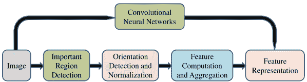
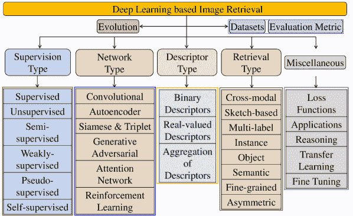
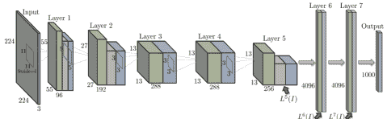
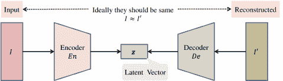
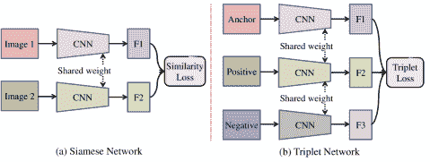

<!--yml

类别：未分类

日期：2024-09-06 19:58:05

-->

# [2012.00641] 基于深度学习的内容图像检索的十年综述

> 来源：[`ar5iv.labs.arxiv.org/html/2012.00641`](https://ar5iv.labs.arxiv.org/html/2012.00641)

# 基于深度学习的内容图像检索的十年综述

Shiv Ram Dubey S.R. Dubey 现任印度信息技术学院计算机视觉组成员，位于印度安得拉邦奇图尔 Sri City，邮政编码 517646（电子邮件：shivram1987@gmail.com, srdubey@iiits.in）。

###### 摘要

基于内容的图像检索旨在从大规模数据集中找到与查询图像相似的图像。通常，查询图像和数据集图像的代表性特征之间的相似性用于对图像进行排名以进行检索。在早期，研究了基于颜色、纹理、形状等视觉线索的各种手工设计特征描述符，这些特征用于表示图像。然而，深度学习在过去十年中成为了手工设计特征工程的主导替代方案。它能够自动从数据中学习特征。本文提供了过去十年中基于深度学习的内容图像检索发展的全面综述。同时，也对现有的先进方法从不同角度进行了分类，以便更好地理解进展。本综述中使用的分类法涵盖了不同的监督方式、不同的网络、不同的描述符类型和不同的检索类型。还使用最先进的方法进行了性能分析，并提供了有助于研究人员观察进展并做出最佳选择的见解。本文的综述将有助于进一步研究基于深度学习的图像检索进展。

###### 索引词：

基于内容的图像检索；深度学习；卷积神经网络（CNNs）；综述；监督学习和无监督学习。

## I 引言

图像检索是一个研究广泛的问题，旨在从数据库中检索与给定查询图像相似的图像[1], [2]。基本上，查询图像与数据库图像之间的相似性用于对数据库图像进行降序排名[3]。因此，任何图像检索方法的性能都依赖于图像之间的相似性计算。理想情况下，两幅图像之间的相似性分数计算方法应该是有区分度的、稳健的和高效的。

### I-A 手工设计描述符基础的图像检索

为了使检索对几何和光度变化具有鲁棒性，图像之间的相似度是基于图像内容计算的。基本上，图像的内容（即视觉外观）在颜色、纹理、形状、梯度等方面被表示为特征描述符[4]。相应图像的特征向量之间的相似度被视为图像之间的相似度。因此，任何基于内容的图像检索（CBIR）方法的性能在很大程度上取决于图像的特征描述符表示。任何特征描述符表示方法都应具备区分能力、鲁棒性和低维度。已研究各种特征描述符表示方法来计算两个图像之间的相似度，以用于基于内容的图像检索。特征描述符表示利用了根据需要手动选择的图像视觉线索[5], [6], [7], [8], [9], [10], [11], [12], [13], [14], [15], [16]。这些方法也被称为手工设计或手工工程的特征描述。此外，通常这些方法是无监督的，因为它们在设计特征表示方法时不需要数据。各种调查也不时进行，以展示基于内容的图像检索的进展，包括 2008 年的[17]，2014 年的[18]以及 2017 年的[19]。手工工程特征用于图像检索曾是一个非常活跃的研究领域。然而，由于手工设计的特征无法准确表示图像特性，其性能受到限制。

图 1：先进的特征表示管道被基于 CNN 的特征表示所替代。

### I-B 距离度量学习基础的图像检索

距离度量学习在特征向量表示中也被广泛使用[20]。它在图像检索中也得到了很好的探索[21]。一些显著的基于深度度量学习的图像检索方法包括上下文约束距离度量学习[22]、基于核的距离度量学习[23]、[24]、视觉保留距离度量学习[25]、基于排序的距离度量学习[26]、半监督距离度量学习[27]、汉明距离度量学习[28]、[29]和基于排序的度量学习[30]、[31]。总体来说，与手工制作的方法相比，基于深度度量学习的方法在检索性能上显示出了良好的前景。然而，大多数现有的基于深度度量学习的方法依赖于线性距离函数，这限制了其对非线性数据进行图像检索的判别能力和鲁棒性。此外，它也无法有效处理多模态检索。

### I-C 基于深度学习的图像检索

从十年前开始，随着深度学习的出现，特征表示从手工工程转向了基于学习的方法[32]、[33]。这一过渡在图 Fig. 1 中有所体现，其中卷积神经网络基于特征学习取代了传统手工工程特征表示的最先进管道。深度学习是一种分层特征表示技术，用于从数据中学习对数据集和应用程序重要的抽象特征[34]。根据处理的数据类型，出现了不同的架构，例如用于 1-D 数据的人工神经网络 (ANN)/多层感知器 (MLP) [35]、[36]，用于图像数据的卷积神经网络 (CNN) [37]、[38]，以及用于时间序列数据的递归神经网络 (RNN) [39]、[40]。在过去十年中，在利用深度学习进行基于内容的图像检索方面取得了巨大的进展[32]、[41]、[42]、[43]、[44]。因此，本调查主要集中在从其起源到目前为止最先进的深度学习模型和特征在基于内容的图像检索中的进展。相关的分类法在图 Fig. 2 中描绘。此调查的主要贡献可以概括如下：

图 2：本调查中用于分类现有基于深度学习的图像检索方法的分类法。

1.  1.

    本调查在基于深度学习的图像检索方法方面进行了非常全面的覆盖，涉及图像检索的演变、不同的监督类型、网络类型、描述符类型、检索类型及其他方面。

1.  2.

    与最近的综述[42]、[21]、[43]相比，本调查专门涵盖了 2011-2020 年十年间基于深度学习的图像检索的进展。提供了一个信息丰富的分类法，与最近的综述[44]相比，覆盖了现有的基于深度学习的图像检索方法。

1.  3.

    本调查通过从不同角度分析，丰富了读者对基于深度学习的最先进图像检索技术的了解。

1.  4.

    本文还简要介绍了重点内容和重要讨论，并对使用最先进的基于深度学习的图像检索方法在基准数据集上的综合比较进行了描述。

本调查的组织结构如下：背景介绍见第 II 节，基于深度学习的图像检索的演变编纂见第 III ‣ A Decade Survey of Content Based Image Retrieval using Deep Learning")节；基于监督类型、网络类型、描述符类型和检索类型的现有方法分类分别在第 IV、V、VI 和第 VII 节中讨论；第 VIII 节突出了其他一些方面；第 IX 节对流行方法的性能进行了比较；结论和未来方向见第 X 节。

## II 背景

本节介绍了背景，包括常用的评估指标和基准数据集。

### II-A 检索评估指标

为了评估图像检索方法的性能，**精度**、**召回率**和**f-分数**是常用的评估指标。均值平均精度（$mAP$）在文献中被广泛使用。精度定义为从总检索图像中正确检索出的图像的百分比。召回率是通过计算正确检索的图像占数据集中所有相关图像总数的百分比来评估图像检索的另一种性能指标。f-分数是从精度和召回率的调和均值计算得出的。

表 I: 深度学习图像检索的大规模数据集总结。

数据集 年份 类别数 训练 测试 图像类型 CIFAR-10 [45] 2009 10 50,000 10,000 对象类别图像 NUS-WIDE [46] 2009 21 97,214 65,075 场景图像 MNIST [47] 1998 10 60,000 10,000 手写数字图像 SVHN [48] 2011 10 73,257 26,032 房屋号码图像 SUN397 [49] 2010 397 100,754 8,000 场景图像 UT-ZAP50K [50] 2014 4 42,025 8,000 鞋子图像 Yahoo-1M [51] 2015 116 1,011,723 112,363 服装图像 ILSVRC2012 [52] 2012 1,000 $\sim$1.2 M 50,000 对象类别图像 MS COCO [53] 2015 80 82,783 40,504 常见对象图像 MIRFlicker-1M [54] 2010 - 1 M - 场景图像 Google Landmarks [55] 2017 15 K $\sim$1 M - 地标图像 Google Landmarks v2 [56] 2020 200 K 5 M - 地标图像 Clickture [57] 2013 73.6 M 40 M - 搜索日志

\startchronology

[startyear=1,stopyear=43, startdate=false, color=blue!100, height=0.2cm, stopdate=false, arrow=true, arrowwidth=0.6cm, arrowheight=0.45cm] \setupchronoeventtextstyle=,datestyle= \chronoevent[markdepth=-15pt, year=false]12011 \chronoevent[markdepth=15pt,year=false,textwidth=1.5cm]2 深度自编码器 [58] \chronoevent[markdepth=-15pt, year=false]32012 \chronoevent[markdepth=-30pt,year=false,textwidth=1.5cm]4 深度多视图哈希 (DMVH) [59] \chronoevent[markdepth=-15pt, year=false]52013 \chronoevent[markdepth=5pt,year=false,textwidth=1.5cm]6 在线多模态深度相似性学习 (OMDSL) [60] \chronoevent[markdepth=-15pt, year=false]72014 \chronoevent[markdepth=-50pt,year=false,textwidth=1.5cm]8 神经编码 [61] \chronoevent[markdepth=15pt,year=false,textwidth=1cm]9 深度排序模型 [62] \chronoevent[markdepth=-15pt, year=false]102015 \chronoevent[markdepth=-25pt,year=false,textwidth=1.5cm]11 卷积层堆叠 [63] \chronoevent[markdepth=35pt,year=false,textwidth=1cm]12 三元组排序损失 [63] \chronoevent[markdepth=-50pt,year=false,textwidth=1cm]13DRSCH [64] \chronoevent[markdepth=-15pt, year=false]142016 \chronoevent[markdepth=5pt,year=false,textwidth=1.5cm]15 基于区域的 CNN 描述符 [65] \chronoevent[markdepth=-25pt,year=false,textwidth=1.6cm]16 提升结构嵌入 [66] \chronoevent[markdepth=40pt,year=false,textwidth=1.5cm]17 深度哈希网络 (DHN) [67] \chronoevent[markdepth=-55pt,year=false,textwidth=1.5cm]18 深度量化网络 (DQN) [68] \chronoevent[markdepth=10pt,year=false,textwidth=1.2cm]19 特征聚合 [69] \chronoevent[markdepth=-30pt,year=false,textwidth=1.3cm]20 基于 sigmoid 的特征 [70] \chronoevent[markdepth=-15pt, year=false]212017 \chronoevent[markdepth=40pt,year=false,textwidth=1cm]22 哈希网络 (HashNet) [71] \chronoevent[markdepth=-60pt,year=false,textwidth=2cm]23 孪生网络 [72] \chronoevent[markdepth=10pt,year=false,textwidth=1.3cm]24 基于掩码的特征 [73] \chronoevent[markdepth=-30pt,year=false,textwidth=1.3cm]25 双线性网络 [74] \chronoevent[markdepth=-15pt, year=false]262018 \chronoevent[markdepth=30pt,year=false,textwidth=1.3cm]27 深度柯西哈希 (DCH) [75] \chronoevent[markdepth=-60pt,year=false,textwidth=1.3cm]28 贪婪哈希 [76] \chronoevent[markdepth=5pt,year=false,textwidth=1.3cm]29 策略梯度 [77] \chronoevent[markdepth=-20pt,year=false,textwidth=1.3cm]30 放松方法 [78] \chronoevent[markdepth=40pt,year=false,textwidth=1.3cm]31 深度索引兼容哈希 (DICH) [79] \chronoevent[markdepth=-15pt, year=false]322019 \chronoevent[markdepth=-45pt,year=false,textwidth=1.3cm]33 深度增量哈希网络 (DIHN) [80] \chronoevent[markdepth=7pt,year=false,textwidth=1.3cm]34 深度球面量化 (DSQ) [81] \chronoevent[markdepth=-30pt,year=false,textwidth=1.3cm]35DistillHash [82] \chronoevent[markdepth=45pt,year=false,textwidth=2cm]36 深度渐进哈希 (DPH) [83] \chronoevent[markdepth=-20pt,year=false,textwidth=1.3cm]37DHA [84] \chronoevent[markdepth=5pt,year=false,textwidth=1.3cm]38 仅最大化似然哈希 (JMLH) [85] \chronoevent[markdepth=-45pt,year=false,textwidth=1.1cm]39 深度变分二进制 (DVB) [86] \chronoevent[markdepth=-15pt, year=false]402020 \chronoevent[markdepth=55pt,year=false,textwidth=2.2cm]41 双瓶颈哈希 (TBH) [87] \chronoevent[markdepth=-22pt,year=false,textwidth=1.1cm]42 来自深度卷积特征的共现 [88] \chronoevent[markdepth=10pt,year=false,textwidth=1.45cm]43 深度位置感知哈希 (DPAH) [89] \stopchronology

图 3：基于深度学习的图像检索方法的时间序列视图，展示了其从 2011 年到 2020 年的演变。

### II-B 数据集

随着深度学习模型的出现，创建了各种大规模数据集以促进图像识别和检索的研究。大规模数据集的详细信息总结在表格 I 中。可以用于测试深度学习方法的各种图像类型的数据集包括物体类别数据集 [45], [52], [53], 场景数据集 [46], [49], [90], 数字数据集 [47], [48], 服装数据集 [50], [51], 地标数据集 [55], [56] 等。CIFAR-10 数据集是非常广泛使用的物体类别数据集 [45]。ImageNet（ILSVRC2012）是一个大规模数据集，也是一种物体类别数据集，包含超过一百万张图像 [52]。MS COCO 数据集 [53] 为通用物体检测而创建，也被用于图像检索。常用于检索目的的场景图像数据集包括来自新加坡国立大学的 NUS-WIDE 数据集 [46]; Sun397 是一个场景理解数据集，包含来自 397 个类别的超过十万张图像 [49], [91]; MIRFlicker-1M [90] 数据集包含从社交摄影网站 Flickr 下载的一百万张图像。MNIST 数据集是旧的且大规模的数字图像数据集 [47]，包含光学字符。SVHN 是另一个数字数据集 [48]，来源于街景房号图像，复杂程度高于 MNIST 数据集。鞋类服装数据集 UT-ZAP50K [50] 包含大约 50K 张图像。Yahoo-1M 是另一个在 [51] 中用于图像检索的大规模服装数据集。Google 地标数据集包含大约一百万张地标图像 [55]。Google 地标的扩展版本（即 v2） [56] 包含大约 500 万张地标图像。文献中还有更多用于检索的数据集，如 Corel、Oxford、Paris 等，但这些不是大规模数据集。CIFAR-10、MNIST、SVHN 和 ImageNet 是大多数研究中广泛使用的数据集。Clickture 是一个基于用户查询的搜索日志常用数据集 [57]。点击属性已被用于不同的应用，如基于图像搜索的交叉视图学习 [92]、图像排名的距离度量学习 [93] 和具有视觉注意力的深度结构保留嵌入 [94]。

注意，只有 CIFAR-10 和 MNIST 数据集在每个类别中包含相同数量的样本。其他数据集通常是在非约束环境下创建的，样本数量巨大，因此类别不均衡。数据集的选择可能依赖于需要使用图像检索模型的场景，例如用于非约束环境的对象类别和场景数据集，用于电子商务应用的服装数据集，以及用于驾驶应用的地标数据集。

## III 基于内容的图像检索（CBIR）的深度学习发展

基于深度学习的描述符或哈希码生成是大规模基于内容的图像检索的最新趋势，由于其计算效率和检索质量[21]。在本节中，图 3 展示了从 2011 年到 2020 年的深度学习模型图像检索的历程。

#### III-1 2011-2013

在最初的尝试中，2011 年，Krizhevsky 和 Hinton 使用了深度自编码器将图像映射到短二进制代码以进行基于内容的图像检索（CBIR）[58]。Kang 等人（2012）提出了一种深度多视角哈希方法，通过建模具有视角特定和共享隐藏节点的层，从多个视角的数据中生成 CBIR 代码[59]。2013 年，Wu 等人考虑了多个预训练的堆叠去噪自编码器用于图像的低特征[60]。他们还在预训练自编码器的输出上微调了多个深度网络。

#### III-2 2014

在一项杰出的工作中，大型卷积神经网络（CNN）顶层的激活被用作图像检索的描述符（神经编码）[61]，如图 4 所示。即使模型在不相关数据上训练，使用神经编码进行图像检索也记录了非常有前景的性能。神经编码通过主成分分析（PCA）压缩以生成紧凑的描述符。2014 年，通过直接从图像中学习相似性度量，深度排序模型得到了研究[62]。基本上，三元组用于捕捉类间和类内图像差异。

图 4：卷积神经网络（CNN）中神经编码生成的说明[61]。

#### III-3 2015

在 2015 年，开发了一种深度架构，由一系列卷积层组成，以生成中间图像特征[63]，这些特征用于生成哈希位。在[63]中也使用了三元组排序损失来结合类间和类内差异进行图像检索。Zhang 等人（2015）开发了一种深度正则化相似性比较哈希（DRSCH），通过训练深度 CNN 模型来同时优化区分性图像特征和哈希函数[64]。

#### III-4 2016

在 2016 年，Gordo 等人利用区域建议网络汇总相关区域，以形成描述符，从而优先考虑重要的物体区域[65]。Song 等人（2016）计算了 CNN 与原始特征之间的提升结构损失[66]。监督深度哈希网络（DHN）通过控制量化误差来学习重要的图像表示[67]。与此同时，Cao 等人引入了一个与 DHN 模型非常相似的深度量化网络（DQN）[68]。基于 CNN 的特征在[69]中通过排名感知的多分配和基于方向的组合进行汇总。在 CNN 的损失层之前添加了一个 Sigmoid 层，以学习用于 CBIR 的二进制码[70]。

#### III-5 2017

在 2017 年，Cao 等人提出了 HashNet 深度架构，通过续接方法生成哈希码[71]。它利用续接方法学习不光滑的二进制激活，从不平衡的相似性数据中生成二进制哈希码。Gordo 等人（2017）表明，噪声训练数据、不适当的深度架构和次优的训练程序是利用深度学习进行图像检索的主要障碍[72]。不同的掩码方案在[73]中被用来选择突出的 CNN 特征进行图像检索。[74]中也使用了一个具有两个并行 CNN 的双线性网络作为特征提取器。

#### III-6 2018

在 2018 年，Cao 等人研究了一种基于 Cauchy 分布的深度 Cauchy 哈希（DCH）模型，用于二进制哈希码，使用了基于成对交叉熵损失的帮助[75]。Su 等人采用了贪婪哈希，通过在反向传播过程中保持梯度不变来进行哈希编码层的计算，该层在前向传播中使用符号函数[76]。不同的方法如策略梯度[77]和级数展开[78]也被用来训练模型。通过最小化类间图像二进制码的相似位数，研究了深度索引兼容哈希（DICH）方法[79]。

#### III-7 2019

2019 年，提出了一种深度增量哈希网络（DIHN）[80]，以直接学习与新类别图像对应的哈希码，同时保留现有类别图像的哈希码。在深度球面量化（DSQ）模型[81]中使用了基于监督量化的单位超球面点表示。DistillHash[82]通过贝叶斯学习框架从蒸馏数据集中提炼数据对，并学习深度哈希函数。深度渐进哈希（DPH）模型[83]利用逐步扩展的显著区域生成一系列二进制代码。自适应损失函数基础的深度哈希[84]、最大似然哈希（JMLH）[85]和深度变分二进制（DVB）[86]是 2019 年发现的其他方法。

#### III-8 2020

最近，在 2020 年，Shen 等人提出了一个编码器和解码器网络之间的双瓶颈哈希（TBH）模型[87]。他们以协作方式使用了二进制和连续瓶颈作为潜在变量。Forcen 等人（2020）通过对深度卷积特征的共现建模，利用了 CNN 表示的最后卷积层[88]。2020 年提出了一种深度位置感知哈希（DPAH）模型[89]，该模型约束数据样本与类别中心之间的距离。

大多数在 2011 年至 2015 年间开发的方法使用了由自编码器和卷积神经网络学习到的特征。然而，这些方法面临的问题是模型通常为分类问题而训练，导致区分能力较差以及由于特征量化造成的信息丢失。深度学习在 2016 年至 2020 年间的图像检索领域经历了巨大的增长。由于图像检索应用需要特征学习来进行匹配，因此采用了不同类型的网络。近期的方法设计了多个目标函数，导致特征空间中类间分离度高和类内凝聚度高。此外，不同网络架构的发展也推动了图像检索领域的增长。深度学习方法正在解决的关键问题是学习具有很强区分性、鲁棒性和紧凑性的图像检索特征。

## IV 不同监督分类

本节讨论了不同监督类型下的图像检索方法。基本上，包括有监督、无监督、半监督、弱监督、伪监督和自监督方法。

### IV-A 有监督方法

研究人员非常频繁地使用监督深度学习模型来学习类特定和辨别特征以进行图像检索。在 2014 年，Xia 等人使用 CNN 学习图像的表示，用于生成哈希码和类别标签[95]。在 MNIST，CIFAR-10 和 NUS-WIDE 数据集上报告了有前景的性能。Shen 等人（2015）[96]提出了基于监督离散哈希（SDH）的图像描述生成，借助离散循环坐标下降进行检索。Liu 等人（2016）通过引入深度监督哈希（DSH）方法，进行了一项革命性工作，以从相似/不相似的图像对中学习二进制代码[97]。在深度成对监督哈希（DPSH）方法中也提出了类似的工作，用于图像检索[98]。将成对标签扩展为三元组标签（即查询，正图像和负图像），以训练共享的深度 CNN 模型进行特征学习[99]。在[100]中执行了独立的层级局部更新，以高效训练非常深的监督哈希（VDSH）模型。

在 2017 年，Li 等人将分类信息和成对标签信息在一个单一框架中用于深度监督离散哈希（DSDH）码的学习[101]。监督语义保留深度哈希（SSDH）模型整合了特征学习中的检索和分类特征[102]。通过引入以下三种特性，在[103]中执行了可扩展的图像搜索：1）最小化真实值代码与等效转换的二进制代码之间的损失，2）确保二进制代码中每个位的均匀分布，3）减少二进制代码中一个位的冗余。

监督训练也被选择用于非对称哈希[104]。在图像搜索和检索的监督学习模式中，采用了深度产品量化（DPQ）模型[105]。监督深度特征嵌入也用于与手工特征[106]。最近，Ng 等人（2020）进行了深度特征的多级哈希[107]。使用角度哈希损失函数以监督方式训练网络[108]。监督哈希也用于多深度排名[109]以提高检索效率。其他监督方法包括深度二进制哈希码[51]，深度哈希网络[67]，深度球形量化[81]，以及基于自适应损失的监督深度学习哈希[84]。

### IV-B 无监督方法

尽管有监督模型在检索中表现出色，但始终获得标注的大规模数据并不容易。因此，还研究了几种无需类别标签的无监督模型。无监督模型通常对哈希码和/或生成的输出施加约束以学习特征。

Erin 等人（2015）[110] 使用深度网络在无监督模式下，通过量化损失、平衡位和独立位等约束来学习哈希码。Huang 等人（2016）[111] 则利用了结合无监督判别聚类的卷积神经网络（CNN）。在一项出色的工作中，DeepBit 利用最小量化损失、均匀分布的编码和不相关位等约束进行无监督图像检索 [112]，[113]。为了提高 DeepBit 的鲁棒性，还进行了基于旋转数据增强的微调。然而，由于使用符号函数对数据进行严格二值化而未考虑其分布特性，DeepBit 模型遭遇了严重的量化损失。带有多量化的深度二值描述符（DBD-MQ）[114] 通过使用 K-自动编码器（KAEs）共同学习参数和二值化函数来解决 DeepBit 的量化问题。

在 [115] 中观察到，如果用困难的正样本和负样本进行微调，无监督卷积神经网络（CNN）可以学习到更具区分性的特征。使用补丁卷积核网络的补丁表示法也被适用于补丁检索 [116]。无监督三元组哈希（UTH）使用锚图像、旋转图像和随机图像组成的三元组来学习用于图像检索的二进制码 [117]。UTH 目标函数结合了判别损失、量化损失和熵损失。[118] 提出了无监督相似性自适应深度哈希（SADH），通过更新相似性图并优化二进制码。Xu 等人（2018）[119] 提出了使用基于部分的检测器的语义感知部分加权聚合方法用于内容基图像检索（CBIR）系统。无监督生成对抗网络 [120]，[121]，[122] 也被研究用于图像检索。还使用了蒸馏数据对 [82] 和深度变分网络 [86] 进行无监督图像检索。伪三元组基于的无监督深度三元组哈希（UDTH）技术 [123] 被引入用于可扩展的图像检索。最近，Liu 等人（2020）[124] 也利用了无监督深度迁移学习来进行遥感图像检索。

尽管无监督模型不需要标记数据，但其性能通常低于监督方法。因此，研究人员探索了监督和无监督之间的模型，例如半监督、弱监督、伪监督和自监督。

\startchronology

[startyear=1,stopyear=50, startdate=false, color=blue!100, stopdate=false, arrow=true, arrowwidth=0.8cm, arrowheight=0.5cm] \setupchronoeventtextstyle=,datestyle= \chronoevent[markdepth=-15pt, year=false]12011 \chronoevent[markdepth=-30pt,year=false,textwidth=1cm]2 深度自编码器 [58] \chronoevent[markdepth=-15pt, year=false]32013 \chronoevent[markdepth=-75pt,year=false,textwidth=1cm]4 去噪自编码器 [60]

\chronoevent

[markdepth=-15pt, year=false]52014 \chronoevent[markdepth=-30pt,year=false,textwidth=1cm]6 对应自编码器 [125] \chronoevent[markdepth=-75pt,year=false,textwidth=1cm]8Siamese [62]

\chronoevent

[markdepth=65pt,year=false,textwidth=2cm]7CNN 特征 [95], [126] \chronoevent[markdepth=40pt,year=false,textwidth=2cm]7 神经编码 [61] \chronoevent[markdepth=5pt,year=false,textwidth=2cm]7CNN 即用 [32]

\chronoevent

[markdepth=-15pt, year=false]92015 \chronoevent[markdepth=-30pt,year=false,textwidth=1cm]10 二进制自编码器 [127] \chronoevent[markdepth=-70pt,year=false,textwidth=1cm]11 补丁 + Siamese [128], [129] \chronoevent[markdepth=-105pt,year=false,textwidth=1cm]13 邻接一致性三元组 [64] \chronoevent[markdepth=-25pt,year=false,textwidth=1cm]13 三元组排序 [63]

\chronoevent

[markdepth=-15pt, year=false]142016 \chronoevent[markdepth=-78pt,year=false,textwidth=1cm]16 基于三元组 [130], [131], [132], [99], [133] \chronoevent[markdepth=-45pt,year=false,textwidth=1cm]16 图像对 [97]

\chronoevent

[markdepth=70pt,year=false,textwidth=2cm]15 成对标签 [97], [98] \chronoevent[markdepth=38pt,year=false,textwidth=2cm]15 不同损失 [65], [68], [71] \chronoevent[markdepth=5pt,year=false,textwidth=2cm]15CNN 特征 [112], [97], [134]

\chronoevent

[markdepth=-15pt, year=false]172017 \chronoevent[markdepth=-120pt,year=false,textwidth=1cm]19Triplet + Siamese [72] \chronoevent[markdepth=-75pt,year=false,textwidth=1cm]19Triplet Quantization Loss [135] \chronoevent[markdepth=-25pt,year=false,textwidth=1cm]19Triplet Hashing [117] \chronoevent[markdepth=-50pt,year=false,textwidth=1cm]21Fisher + Siamese [136] \chronoevent[markdepth=-75pt,year=false,textwidth=1cm]24Attention Based [55], [137] \chronoevent[markdepth=-25pt,year=false,textwidth=1cm]24Two-stream Attention [138] \chronoevent[markdepth=-85pt,year=false,textwidth=1cm]27LSTM Based [139], [139] \chronoevent[markdepth=-35pt,year=false,textwidth=1cm]27Recurrent Neural Hashing [140]

\chronoevent

[markdepth=55pt,year=false,textwidth=1.5cm]21HashNet [71] \chronoevent[markdepth=5pt,year=false,textwidth=1.5cm]21CNN Features [114], [103], [141], [142] \chronoevent[markdepth=75pt,year=false,textwidth=1.5cm]24GAN Based [143]

\chronoevent

[markdepth=-15pt, year=false]282018 \chronoevent[markdepth=-75pt,year=false,textwidth=1cm]30Binary Siamese [144] \chronoevent[markdepth=-25pt,year=false,textwidth=1cm]32Attention GAN [145]

\chronoevent

[markdepth=72pt,year=false,textwidth=2cm]29SSAH [146], SSGAH [147], GDH [148] \chronoevent[markdepth=50pt,year=false,textwidth=2.5cm]29HashGAN [120], [149] \chronoevent[markdepth=5pt,year=false,textwidth=1.5cm]29Binary GAN [121], Regularized GAN [150] \chronoevent[markdepth=5pt,year=false,textwidth=1cm]33CNN Features [118], [113], [151] \chronoevent[markdepth=67pt,year=false,textwidth=1.5cm]34Reinforcement Learning Based [77]

\chronoevent

[markdepth=-15pt, year=false]352019 \chronoevent[markdepth=-115pt,year=false,textwidth=1.2cm]36Deep Variational Binaries [86] \chronoevent[markdepth=-75pt,year=false,textwidth=1.5cm]36Unsupervised Autoencoder [123] \chronoevent[markdepth=-25pt,year=false,textwidth=1.5cm]36Relaxed Binary Autoencoder [152] \chronoevent[markdepth=-100pt,year=false,textwidth=1.2cm]39Triplet Based [153], [123] \chronoevent[markdepth=-125pt,year=false,textwidth=1cm]41Gradient Attention [154] \chronoevent[markdepth=-72pt,year=false,textwidth=1cm]41Spatial Attention [155] \chronoevent[markdepth=-25pt,year=false,textwidth=1cm]41Two-stream Attention [156] \chronoevent[markdepth=-100pt,year=false,textwidth=1.2cm]43LSTM Based [83], [157]

\chronoevent

[markdepth=5pt,year=false,textwidth=1cm]39CNN 特征 [106], [158] \chronoevent[markdepth=70pt,year=false,textwidth=1.5cm]42 基于 GAN [159], [160] \chronoevent[markdepth=38pt,year=false,textwidth=1.5cm]42 无监督 GAN [122] \chronoevent[markdepth=5pt,year=false,textwidth=1cm]42SSAH [161]

\chronoevent

[markdepth=-15pt, year=false]442020 \chronoevent[markdepth=-25pt,year=false,textwidth=1.2cm]45 瓶颈自编码器 [87] \chronoevent[markdepth=-125pt,year=false,textwidth=1cm]48SBS-CNN [124] \chronoevent[markdepth=-95pt,year=false,textwidth=1cm]48 成对 [162] \chronoevent[markdepth=-63pt,year=false,textwidth=1.5cm]48 对抗性孪生 [163] \chronoevent[markdepth=-25pt,year=false,textwidth=1cm]50 二阶相似性 [164]

\chronoevent

[markdepth=5pt,year=false,textwidth=1cm]45CNN 特征 [165] \chronoevent[markdepth=75pt,year=false,textwidth=1.5cm]47BGAN+ [166] \chronoevent[markdepth=35pt,year=false,textwidth=1.5cm]47Stack GAN [163] \chronoevent[markdepth=5pt,year=false,textwidth=1.5cm]50 基于强化学习 [167]

\stopchronology

图 5：深度学习基于图像检索方法的时间顺序视图，描绘了从 2011 年到 2020 年使用的不同类型的神经网络。卷积神经网络、自编码器网络、孪生网络与三元组网络、递归神经网络、生成对抗网络、注意力网络和强化学习网络基于图像检索的深度学习方法分别用红色、青色、洋红色、黑色、蓝色、绿色和黄色表示。

### IV-C 半监督、弱监督、伪监督和自监督方法

半监督方法通常使用标注数据和未标注数据的组合进行特征学习 [168], [169]。半监督深度哈希 (SSDH) [141] 使用标注数据进行经验误差最小化，并利用标注和未标注数据进行嵌入误差最小化。生成对抗学习也被广泛应用于半监督图像检索 [147], [161], [170]。基于教师-学生的半监督图像检索 [171] 利用教师网络学到的成对信息作为指导，训练学生网络。

弱监督方法也被探索用于图像检索。Tang 等（2017）提出了一种利用视觉空间中的局部区分和几何结构的弱监督多模态哈希（WMH）[172]。Guan 等（2018）[173]在弱监督模式下进行了预训练，并在监督模式下进行了微调。利用 tag 嵌入的弱监督深度哈希（WDHT）[174]使用了 word2vec 语义嵌入。语义引导哈希（SGH）[175]通过同时利用弱监督标签信息和固有的数据关系来进行图像检索。

伪监督网络也被开发用于图像检索。伪三元组在[123]中用于无监督图像检索。基于 K-means 聚类的伪标签被生成并用于训练深度哈希网络[176]，[177]。在 CIFAR-10 和 Flickr 数据集上使用伪标签进行图像检索时，观察到了令人满意的性能。

自监督是一些研究工作中用于图像检索的另一种监督方式。例如，Li 等（2018）[146]通过利用多标签注释，在自监督模式下使用对抗网络。Zhang 等（2016）[178]为视频检索引入了一种自监督时间哈希（SSTH）。

### IV-D 总结

以下是从监督角度对深度学习模型的讨论中的要点：

+   •

    监督方法通过分类误差利用类特定的语义信息，除了与哈希码生成相关的其他目标。通常，由于学习了细粒度和类特定的信息，监督模型的性能优于其他模型。

+   •

    无监督模型利用对哈希码（即量化损失、独立位等）和/或数据重构（即使用自编码器类型的网络）施加的无监督约束来学习特征。

+   •

    半监督方法利用标记和未标记数据进行深度网络特征学习。这些方法通常利用来自不同模态的信息，通过不同的网络进行处理。

+   •

    伪监督方法使用其他方法生成伪标签，以利用生成的标签促进训练。自监督方法生成时间性或生成性信息，以便在训练周期中学习模型。

+   •

    最小化量化误差、独立位、低维特征和区分性编码是大多数检索方法的共同目标。

## V 图像检索的网络类型

在本节中，基于深度学习的图像检索方法将从不同架构的角度进行介绍。图 5 展示了从 2011 年到 2020 年的按时间顺序的概述，涵盖了不同类型的图像检索网络。

### V-A 卷积神经网络用于图像检索

基于卷积神经网络（CNN）的特征学习已被广泛应用于图像检索，如图 4 ‣ A Decade Survey of Content Based Image Retrieval using Deep Learning") 所示。2014 年，相比于手工设计的特征，现成的 CNN 特征在图像识别和检索中表现出显著的性能提升[32]。同时，训练后的 CNN 激活也被探索作为检索的神经编码[61]。使用 CNN 模型进行图像表示学习以生成图像检索描述符也有所实现[95]。2016 年，利用成对标签学习 CNN 特征进行图像检索[97], [98]。CNN 激活被广泛用于生成哈希码以提高图像检索效率，采用了不同的损失函数[65], [68], [71]。CNN 的抽象特征用于在不同模式下的图像检索，例如无监督图像检索[112], [114], [118], [113]，有监督图像检索[95], [97], [103], [106]，半监督图像检索[141]，跨模态检索[134], [142]，基于草图的图像检索[151], [158]，以及物体检索[126], [165]。

图 6：一个典型的自编码器网络由编码器和解码器网络组成。通常，编码器是卷积神经网络（CNN），解码器是上卷积神经网络（up-CNN）。编码器的输出是一个潜在空间，用于生成哈希码。

### V-B 自编码器网络基于图像检索

自编码器（$AE$）是一种无监督神经网络，可以从潜在空间重建输入图像，如图 6 所示。基本上，它由两个网络组成，即编码器（$En$）和解码器（$De$）。编码器网络将输入（$I$）转换为潜在特征空间（$z$），表示为$En:I\rightarrow z$。而解码器网络试图从潜在特征空间重建原始图像（$I^{\prime}$），表示为$De:z\rightarrow I^{\prime}$。该模型通过最小化原始图像（$I$）和重建图像（$I^{\prime}$）之间的重建误差来训练，使用$L_{1}$或$L_{2}$损失函数。

自编码器已被广泛用于学习作为图像检索的潜在空间的特征。在最初的尝试中，2011 年使用了深度自编码器进行图像检索[58]。堆叠去噪自编码器用于训练多个深度神经网络以进行检索任务[60]。冯等人（2014）利用了对应自编码器（Corr-AE）进行跨模态检索[125]。使用二进制自编码器通过从二进制代码函数中重建图像来学习二进制代码以实现快速图像检索[127]。近年来，自编码器在图像检索中的使用取得了巨大进展，例如使用变分贝叶斯网络的深度变分二进制（DVB）[86]；三元组上的自编码器[123]；以及放松二进制自编码器（RBA）[152]在 2019 年进行了研究。在最近的工作中，双潜在瓶颈被应用于自编码器[87]。它包括二进制潜变量和连续潜变量。潜变量瓶颈协同交换关键信息，二进制代码瓶颈使用基于代码的图来捕捉数据的内在结构。

图 7： (a) 孪生网络计算图像对之间的相似性。 (b) 三元组网络在特征空间中最小化锚点与正样本之间的距离，同时最大化锚点与负样本之间的距离。

### V-C 图像检索中的孪生网络和三元组网络

#### V-C1 孪生网络

Siamese 网络是一种利用图像对特征之间距离的神经网络，如图 7(a)所示。基于 Siamese 网络学习的特征在细粒度图像检索中表现出了非常有前景的性能[62]。刘等人[97]联合处理一对相似或不相似的图像，通过 CNN 输出 1 或-1 以学习图像检索的特征。Ong 等人（2017）在自编码器网络中使用 CNN 特征上计算的 Fisher 向量来生成用于图像检索的判别特征描述符[136]。Siamese 网络还被用来开发轻量级模型以实现高效的图像检索[144], [124]。在[162]中采用了成对相似度保持的量化损失。Siamese 网络与堆叠对抗网络在[163]中结合使用。Siamese 网络还用于基于补丁的图像匹配[128], [129]。

#### V-C2 三元组网络

三元组网络是 Siamese 网络的一种变体，它利用一个包含锚点图像、正样本图像和负样本图像的三元组，如图 7(b)所示。三元组网络最小化锚点和正样本图像特征之间的距离，同时最大化锚点和负样本图像特征之间的距离。2015 年，在共享 CNN 特征上利用了三元组排序损失，以学习网络用于计算图像检索的二进制描述符[63]。在三元组网络中引入了基于邻接一致性的正则化项，以增强 CNN 特征描述的判别能力[64]。Zhuang 等人（2016）[130]通过采用关系权重矩阵和图割优化来使用三元组学习哈希码。在[131]中，三元组排序损失、正交性约束和 Softmax 损失被联合最小化。基于三元组的 Siamese 网络也用于图像检索[132], [72]。基于三元组的量化目标函数最小化信息损失[135], [179]。三元组特征学习也被用于基于草图的图像检索[153]。三元组还被用于监督哈希[99]和无监督哈希[117], [123]的图像检索。

### V-D 生成对抗网络基础的检索

生成对抗网络（GAN）使用两个网络，即生成器和判别器。生成器网络从随机向量中生成训练集中的新样本。而判别器网络则区分生成的图像和原始图像。2018 年，Song 等人介绍了一种用于图像检索的二进制生成对抗网络（BGAN），用于生成表征二进制码[121]。同时，使用正则化 GAN 引入了 BinGAN 模型[150]以学习紧凑的二进制模式。BinGAN 使用了两个正则化器，包括距离匹配正则化器和二值化表示熵（BRE）正则化器。2018 年，生成网络也被应用于[120]以无监督方式开发 HashGAN，用于生成图像检索的哈希码。同时，另一种 HashGAN 通过使用配对条件 Wasserstein GAN 来进行图像检索[149]。GAN 还被用于跨模态检索[143]，[145]，[146]，[160]，半监督哈希[147]，[161]，基于草图的图像检索[148]，[159]，[163]和无监督对抗哈希[122]。2020 年，基于二进制生成对抗网络的统一 BGAN+框架[166]被开发用于图像检索。

### V-E 注意力网络用于图像检索

注意力机制已被观察到是一种非常有效的方法，它将显著性信息建模到特征空间中，以避免背景的影响。2017 年，Noh 等人使用了基于注意力的关键点来选择重要的深度局部特征[55]。Yang 等人（2017 年）引入了一种双流注意力卷积神经网络（CNN），通过融合主 CNN 和辅助 CNN（MAC）来进行图像检索[138]。主 CNN 侧重于语义信息的区分视觉特征，而辅助 CNN 则关注于注意力信息的部分特征。同样，[155]中也使用了两个子网络，分别用于空间注意力和全局特征。最近，Ng 等人[164]计算了基于注意力选择区域的输入图像的二阶相似性（SOS）损失用于图像检索。基于注意力的模型已经开发用于跨模态检索[145]和细粒度草图图像检索[137]。基于梯度注意力网络的深度哈希[154]强制一对 CNN 二进制特征最小化它们之间的距离，而不管它们的符号或方向。为了定位用于特征描述的重要图像区域，[180]中使用了一个注意力异质双线性网络用于时尚图像检索。

\startchronology

[startyear=1,stopyear=49, startdate=false, color=blue!100, stopdate=false, arrow=true, arrowwidth=0.8cm, arrowheight=0.5cm] \setupchronoeventtextstyle=,datestyle= \chronoevent[markdepth=-15pt, year=false]12011 \chronoevent[markdepth=-25pt,year=false,textwidth=1cm]2 深度自编码器 [58] \chronoevent[markdepth=-15pt, year=false]32015 \chronoevent[markdepth=-75pt,year=false,textwidth=1.5cm]4 卷积神经网络 [110] \chronoevent[markdepth=-50pt,year=false,textwidth=1.5cm]4 深度神经网络 [110] \chronoevent[markdepth=-25pt,year=false,textwidth=1cm]6 自编码器 [127] \chronoevent[markdepth=-55pt,year=false,textwidth=1cm]8 二进制编码 [181], [96] \chronoevent[markdepth=10pt,year=false,textwidth=1cm]4 卷积神经网络特征聚合 [182] \chronoevent[markdepth=65pt,year=false,textwidth=2cm]6 多卷积神经网络融合 [183] \chronoevent[markdepth=42pt,year=false,textwidth=1.3cm]8 卷积神经网络-VLAD [184] \chronoevent[markdepth=10pt,year=false,textwidth=1.2cm]8 卷积神经网络-BoF [185] \chronoevent[markdepth=-15pt, year=false]92016 \chronoevent[markdepth=-25pt,year=false,textwidth=1cm]10 二进制深度神经网络 [186] \chronoevent[markdepth=-50pt,year=false,textwidth=1.5cm]12 二进制编码 [97], [112], [178], [97], [112] \chronoevent[markdepth=-25pt,year=false,textwidth=1cm]14Siamese + Triplet [132] \chronoevent[markdepth=50pt,year=false,textwidth=1cm]11 卷积神经网络特征聚合 [69] \chronoevent[markdepth=10pt,year=false,textwidth=1.3cm]13 卷积神经网络特征包 [187] \chronoevent[markdepth=-15pt, year=false]162017 \chronoevent[markdepth=-25pt,year=false,textwidth=1cm]17Siamese 网络 [144] \chronoevent[markdepth=-50pt,year=false,textwidth=1cm]19 二进制哈希 [101], [101] \chronoevent[markdepth=-65pt,year=false,textwidth=1.2cm]22 实值描述符 [188] \chronoevent[markdepth=-25pt,year=false,textwidth=1.2cm]22Siamese 网络 [136], [72] \chronoevent[markdepth=60pt,year=false,textwidth=1.5cm]17 选择性卷积描述符聚合 (SCDA) [189] \chronoevent[markdepth=10pt,year=false,textwidth=1.5cm]17 卷积神经网络高低层融合 [190] \chronoevent[markdepth=60pt,year=false,textwidth=1.5cm]23 联合特征聚合与哈希 [191] \chronoevent[markdepth=10pt,year=false,textwidth=1.5cm]23 基于注意力的聚合 [138] \chronoevent[markdepth=10pt,year=false,textwidth=0.7cm]20 卷积神经网络 + 手工设计融合 [192] \chronoevent[markdepth=-15pt, year=false]242018 \chronoevent[markdepth=-70pt,year=false,textwidth=1.5cm]26 二进制量化 [75], [76] \chronoevent[markdepth=-25pt,year=false,textwidth=1.2cm]26 二进制哈希 [113], [120], [113] \chronoevent[markdepth=-35pt,year=false,textwidth=1cm]29 生成对抗网络 [121], [150], [120] \chronoevent[markdepth=-70pt,year=false,textwidth=1.5cm]31 基于部分的卷积神经网络 [119] \chronoevent[markdepth=60pt,year=false,textwidth=1.2cm]27 基于部分的加权 [119] \chronoevent[markdepth=10pt,year=false,textwidth=1.2cm]27 视觉词学习 [193] \chronoevent[markdepth=10pt,year=false,textwidth=1cm]30 卷积神经网络特征的多层融合 [151] \chronoevent[markdepth=-15pt, year=false]322019 \chronoevent[markdepth=-25pt,year=false,textwidth=1cm]33Triplet 网络 [123] \chronoevent[markdepth=-65pt,year=false,textwidth=1.5cm]35 深度变分网络 [86] \chronoevent[markdepth=-25pt,year=false,textwidth=1.3cm]38 二进制特征 [194], [152], [195], [196] \chronoevent[markdepth=-60pt,year=false,textwidth=1.2cm]41 实值描述符 [197], [198] \chronoevent[markdepth=60pt,year=false,textwidth=1.5cm]33 联合特征聚合与哈希 [152] \chronoevent[markdepth=10pt,year=false,textwidth=1.2cm]35 选择性卷积神经网络特征聚合 [195] \chronoevent[markdepth=50pt,year=false,textwidth=1.2cm]37 基于注意力的特征聚合 [156] \chronoevent[markdepth=10pt,year=false,textwidth=1.2cm]39 多网络融合 [155] \chronoevent[markdepth=10pt,year=false,textwidth=1.25cm]42 基于共同加权的卷积神经网络特征融合 [199] \chronoevent[markdepth=50pt,year=false,textwidth=1.2cm]40 卷积神经网络 + 手工设计融合 [106] \chronoevent[markdepth=-15pt, year=false]432019 \chronoevent[markdepth=-25pt,year=false,textwidth=1.2cm]44 生成对抗网络 [166] \chronoevent[markdepth=-38pt,year=false,textwidth=1.3cm]46 成对相关离散哈希 (PCDH) [200] \chronoevent[markdepth=-25pt,year=false,textwidth=1cm]49 双瓶颈哈希 [87] \chronoevent[markdepth=10pt,year=false,textwidth=1.2cm]46 共现 + 特征图融合 [88] \stopchronology

图 8：展示不同类型描述符的深度学习基础图像检索方法的时间顺序视图。基于二进制和实值特征向量的模型分别用红色和蓝色表示。基于特征聚合的模型用青色表示。

### V-F 递归神经网络用于图像检索

2018 年，陆等人利用了递归神经网络（RNN）概念来执行层次递归神经哈希（HRNH），以生成有效的图像检索哈希码[140]。2017 年，沈等人使用了基于区域的卷积网络与长短期记忆（LSTM）模块进行文本视觉跨检索[139]。白等人（2019）还在三元组哈希框架中应用了基于 LSTM 的递归深度网络，以自然地继承用于图像检索的有用信息[83]。

### V-G 强化学习网络基础的检索

2018 年，袁等人利用了强化学习进行图像检索[77]。他们通过策略梯度采用了一种无松弛的方法来生成图像检索的哈希码。生成的二进制码通过相似性保持作为奖励函数。在 2020 年，杨等人[167]利用深度强化学习来执行哈希位的去冗余，以去除冗余和/或有害的位，从而减少图像检索中相似性计算的模糊性。

### V-H 总结

不同网络驱动的深度学习基础图像检索方法的总结如下：

+   •

    通过采用各种约束（如分类误差、量化误差、独立位等），卷积神经网络特征被用于哈希码和描述符的学习。

+   •

    为了使特征更具代表性，使用了自编码器网络，这些网络通过重建损失来强制学习。

+   •

    通过利用孪生网络和三元组网络来增强描述性哈希码的判别能力。对哈希码施加不同的约束以使其具有判别性和紧凑性。

+   •

    基于生成对抗网络的方法被广泛用于提高通过编码器网络学习的特征的判别能力和鲁棒性，编码器网络通过鉴别网络进行指导。

+   •

    自动重要特征选择使用注意力模块来控制特征空间中的冗余。递归神经网络和强化学习网络在图像检索中也显示出非常有效。

## VI 图像检索的描述符类型

本节涵盖了高效图像检索的二进制哈希码、实值描述符以及用于判别性图像检索的特征聚合，如图 8 所示。

### VI-A 二进制描述符

不同类型的网络用于学习二进制描述，如深度神经网络[110]、卷积神经网络[51]、自编码器网络[127]、孪生网络[144]、三元组网络[123]、生成对抗网络[166]和变分网络[86]。2015 年，Liong 等人[110]提出了一种监督深度哈希（SDH）。SDH 方法使用量化损失、平衡位和独立位约束。二进制哈希码也通过监督方式在[51]中的潜层中学习。二进制自编码器[58]、[127]和孪生网络[144]用于学习高效图像检索的二进制特征。通过将隐藏层输出转换为二进制代码[186]、[194]，提出了二进制深度神经网络（BDNN）。二进制代码与特征聚合在[152]中共同学习。通过对卷积特征进行掩蔽技术，生成用于图像检索的二进制描述[195]。在[196]中使用了排名优化离散哈希（RODH）方法，通过利用排名信息生成离散哈希码（+1 或-1）。在[75]中使用了 Cauchy 量化损失，以提高二进制描述符的判别能力。使用迭代量化方法将特征转换为二进制代码，以避免量化损失[76]。二进制哈希码也用于服装图像检索[181]。二进制描述通过监督[96]、[97]、[101]、无监督[112]、[113]、[120]和自监督[178]深度学习技术进行学习。在生成方法中，使用二进制生成对抗网络（BGAN）来学习二进制代码[121]。同时，通过最大化二值化层的熵来使用正则化 GAN 进行图像检索[150]。GAN 以无监督模式[120]训练，以学习图像检索的二进制代码。在 2020 年，二进制 GAN[166]被用于图像检索和压缩。

### VI-B 实值描述符

二进制哈希方法存在明显的不足。首先，使用二进制代码难以表示细粒度的相似性。其次，即使是不同的图像，生成相似的二进制代码也很常见。因此，研究人员还使用真实值特征来表示图像以进行检索。孪生网络被广泛用于学习用于图像检索的真实值特征描述符 [132]，[136]，[72]。在 2018 年，基于部分的 CNN 特征被用来提取非二进制哈希码 [119]。使用 CNN 生成的真实值描述符用于医学图像检索 [188]，[197] 和跨模态检索 [198]。Chen 等人（2020） [200] 通过利用深度特征的成对相关性开发了一种成对相关离散哈希（PCDH）方法用于图像检索。Shen 等人（2020） [87] 也使用了真实值描述符，并通过双瓶颈哈希方法进行图像检索。

### VI-C 描述符的聚合

一些研究人员还尝试在网络的不同阶段或多个网络之间进行特征的组合/融合，以生成用于图像检索的描述符聚合 [69]，[182]，[185]。特征聚合的不同策略包括对从不同层提取的特征使用局部聚合描述符（VLAD） [184]；局部卷积特征的袋 [187]；选择性卷积描述符聚合 [189]，[195]；多层特征的融合 [190]，[151]；基于部分的加权聚合 [119]；特征聚合与哈希的联合训练 [191]；特征聚合和哈希函数的联合学习 [152]；以及基于共同加权的 CNN 特征融合 [199]。来自不同 CNN 的特征也被整合用于图像检索 [183]，[138]，[156]。在 [155] 中，主要子网络和其他基于注意力的子网络在最后一个全连接层处也进行了融合。手工设计的特征与 CNN [106]，[192] 进行了融合。最近，Forcen 等人（2020） [88] 通过将共现图与特征图结合来生成图像表示以进行图像检索。

### VI-D 总结

以下是从特征描述符类型的角度总结的深度学习方法：

+   •

    为了方便大规模图像检索，使用不同的网络生成紧凑且二进制的哈希码。不同的方法尝试在不同的监督模式下提高区分能力，降低位之间的冗余性，改善二进制哈希码的泛化能力等。

+   •

    实值描述符专注于提高图像检索中学习到的特征的区分能力，但代价是增加了特征匹配的计算复杂度。这些方法试图提高鲁棒性并减少描述符的维度。

+   •

    特征聚合方法试图利用不同网络、不同子网络以及同一网络不同层之间的互补信息，以提高图像检索性能。

## VII 检索类型

根据问题和数据的性质，已经探索了各种基于深度学习的方法进行检索类型。

### VII-A 跨模态检索

跨模态检索指的是通过测量异质数据对象之间的相似性来进行的图像检索。Feng 等人（2014）引入了一种用于跨模态检索的对应自编码器（Corr-AE）网络[125]。在 2016 年[201]，开发了一种深度视觉-语义哈希（DVSH）网络，通过联合学习图像和句子的嵌入来实现基于句子和图像的跨模态检索。文本-视觉深度二进制（TVDB）模型表示长描述句子及其对应的有信息量的图像[139]。CNN 视觉特征也被用于跨模态检索，如用于标注的 CNN 现成特征[134]，带有双向铰链损失的 CNN 特征[202]，以及基于成对约束的深度哈希网络[142]。对抗神经网络也被用于跨模态检索，例如对抗性跨模态检索（ACMR）[143]，自监督对抗哈希（SSAH）[146]，注意力感知深度对抗哈希（ADAH）[145]，对抗引导的非对称哈希（AGAH）[160]，深度多层语义哈希（DMSH）[198]，以及师生学习[203]。

### VII-B 基于草图的图像检索

基于草图的图像检索（SBIR）是跨模态检索的一个特殊情况，其中查询图像在草图领域，检索必须在图像领域进行 [204]。在 2017 年，探讨了一种细粒度 SBIR（FG-SBIR） [137]，借助注意力模块和高阶可学习能量函数损失。刘等（2017 年） [205] 通过利用手绘草图的表示，提出了一种半异质深度草图哈希（DSH）模型用于 SBIR。在 [151] 中，草图和自然照片在深度 CNN 框架中进行多层映射以进行 SBIR。提出了一种零样本 SBIR（ZS-SBIR）用于检索来自未见类别的照片 [153]。王等（2019 年） [158] 提出了一种基于 CNN 的 SBIR 重新排序方法以优化检索结果。生成对抗网络也被广泛用于 SBIR，例如使用循环一致性损失的生成领域迁移哈希（GDH） [148]，基于类别草图的生成模型 [159]，语义对齐的成对循环一致生成模型 [206]，以及堆叠对抗网络 [163]。

### VII-C 多标签图像检索

多标签检索涉及在生成图像检索的图像表示时使用多个分类标签。已经研究了几种深度学习方法用于多标签图像检索，采用不同策略，例如多层次相似性信息 [207]，多层次语义相似性保持哈希 [208]，多标签注释 [146]，类别感知的基于对象的哈希 [209]，[210]，以及用于多层次相似性哈希的细粒度特征 [211]。读者可以参考 2020 年发布的多标签图像检索综述 [43]，以获取更广泛的视角和发展情况。

### VII-D 实例检索

在 2015 年，Razavian 等人开发了一种基于深度 CNN 的视觉实例检索基线 [212]。在 [209] 中提出了一种通过对一个类别的特征建模来实现多标签图像数据的实例感知图像表示的方法。图像实例检索的其他方法包括局部卷积特征的袋子 [187]，学习全局表示 [65]，以及群体不变的深度表示 [213]。在 2020 年，陈等人提出了一种深度多实例排名基础哈希（DMIRH）模型用于多标签图像检索，采用了类别感知的特征袋 [210]。有关图像实例检索的更多细节可以在 [42] 中找到。

### VII-E 对象检索

对象检索旨在基于图像中特定对象的特征进行检索。在 2014 年，Sun 等人通过对象检测技术提取了感兴趣区域的 CNN 特征用于基于对象的检索[126]。已经研究了多种深度学习模型用于对象检索，例如基于 CNN 激活的积分图驱动最大池化[214]，基于区域提议网络的相关特征池化[65]，基于复制方程的原始深度 CNN 特征的同时选择和加权[215]，基于共加权的语义 CNN 特征聚合[199]，以及考虑空间和通道贡献以提高区域检测[216]。Gao 等人（2020 年）[165]通过多视图判别和成对 CNN（MDPCNN）网络进行了 3D 对象检索。

### VII-F 语义检索

在 2016 年，Yao 等人[131]提出了一种深度语义保持和基于排序的哈希（DSRH）方法，通过利用哈希和分类损失。类似的损失也被用于[217]。深度视觉-语义量化（DVSQ）[218]通过联合学习视觉-语义嵌入和量化器来实现。自适应高斯滤波器基于 CNN 特征的聚合在[199]中用于利用语义信息。语义哈希也被广泛应用于基于草图的图像检索[137]，[153]，[206]，[158]，跨模态检索[198]，[201]，[139]。其他显著的基于深度学习的语义信息建模工作包括多标签检索[207]，无监督图像检索[219]，有监督图像检索[102]，以及半监督图像检索[141]。在 Hamming 空间中的语义相似性基于深度位置感知哈希（DPAH）[89]和语义亲和深度语义重构哈希（DSRH）[162]是近期的语义检索方法。

### VII-G 细粒度图像检索

为了提高深度学习描述符的区分能力，许多研究人员在深度网络中利用了细粒度约束。不同的研究通过不同的方法融入了细粒度特性，例如使用孪生网络捕捉类间和类内图像相似性[62]，基于注意力模块的空间-语义信息融合[137]，使用选择性 CNN 特征[189]，使用加权汉明距离的细粒度排序[220]，使用多标签图像对之间的多层次语义相似性[211]，以及使用分段交叉熵损失[221]。

### VII-H 非对称量化基础的检索

2017 年，Wu 等人进行了在线非对称相似性学习以保持异质数据之间的相似性[202]。非对称深度监督哈希（ADSH）用于仅对查询图像学习深度哈希函数，而对库图像的哈希码直接学习[104]。2019 年，Yang 等人研究了使用三流网络建模异质数据的非对称深度语义量化（ADSQ）[222]。通过利用图像子集和所有数据库项的标签信息提出了相似性保持深度非对称量化（SPDAQ）[223]。在[160]中引入了一种对抗指导的非对称哈希（AGAH），该方法借助对抗学习指导的多标签注意力模块用于跨模态图像检索。

### VII-I 总结

基于深度学习方法在不同检索类型的图像检索进展，以下是本节的概要：

+   •

    跨模态检索方法使用不同的网络学习多个模态的联合特征。近期的方法利用对抗网络进行跨模态检索。类似的观察和趋势也出现在基于草图的图像检索中。

+   •

    多标签和实例检索方法在图像中存在多种视觉场景时通常很有用。基于深度学习的方法能够通过不同类型的网络促进特征学习，从而处理这种检索。

+   •

    区域提议网络基础的特征选择已被现有的深度学习方法用于对象检索。

+   •

    不同的网络通过抽象特征使用图像的语义信息来增强语义图像检索。基于重建的网络更适合于语义保持哈希。

+   •

    不同的特征选择和聚合基础网络已被用于细粒度图像检索。

+   •

    非对称哈希也展示了深度学习模型的适用性，通过用不同网络处理查询和图库图像。

## VIII 杂项

本节涵盖了深度学习模型在检索中的进展，包括不同的损失函数、应用及其他方面。

### VIII-A 检索损失的进展

Kumar 等人（2016）在[132]中使用了基于孪生网络的损失函数，以最小化全局损失，从而实现判别特征学习。Zhou 等人（2017）使用了三元组量化损失进行深度哈希，该损失基于锚点-正样本对和锚点-负样本对之间的相似性[135]。Revaud 等人（2019）采用了列表损失[224]，直接优化端到端深度学习中的全局均值平均精度。在 2020 年，[221]中使用了分段交叉熵损失函数用于细粒度图像检索。不同的特征学习方法使用了几种创新损失，例如提升结构化损失[66]和排序损失[147]。

表 II：不同基于深度学习的图像检索方法在 NUS-WIDE、MS COCO 和 CIFAR-10 数据集上以 5000 张检索图像的均值平均精度（mAP@5000）百分比表示的结果。注意第$2^{nd}$列列出了结果的来源。以下是结果中不同网络类型的缩写：DNN - 深度神经网络，CNN - 卷积神经网络，SN - 孪生网络，TN - 三元组网络，GAN - 生成对抗网络，DQN - 深度 Q 网络，PTN - 参数变换网络，DVN - 深度变分网络，AE - 自编码器。

|  |  |  | NUS-WIDE | MS COCO |
| --- | --- | --- | --- | --- |
| 方法名称 | 网络类型 | 结果来源 | 16 位 | 32 位 | 64 位 | 16 位 | 32 位 | 64 位 |
| CNNH’14 [95] | CNN | [71] | 57.0 | 58.3 | 60.0 | 56.4 | 57.4 | 56.7 |
| SDH’15 [96] | PTN | [71] | 47.6 | 55.5 | 58.1 | 55.5 | 56.4 | 58.0 |
| DNNH’15 [63] | DNN | [71] | 59.8 | 61.6 | 63.9 | 59.3 | 60.3 | 61.0 |
| DHN’16 [67] | CNN | [71] | 63.7 | 66.4 | 67.1 | 67.7 | 70.1 | 69.4 |
| HashNet’17 [71] | CNN | [71] | 66.2 | 69.9 | 71.6 | 68.7 | 71.8 | 73.6 |
| DeepBit’16 [112] | CNN | [87] | 39.2 | 40.3 | 42.9 | 40.7 | 41.9 | 43.0 |
| BGAN’18 [121] | GAN | [87] | 68.4 | 71.4 | 73.0 | 64.5 | 68.2 | 70.7 |
| GreedyHash’18 [76] | CNN | [87] | 63.3 | 69.1 | 73.1 | 58.2 | 66.8 | 71.0 |
| BinGAN’18 [150] | GAN | [87] | 65.4 | 70.9 | 71.3 | 65.1 | 67.3 | 69.6 |
| DVB’19 [86] | DVN | [87] | 60.4 | 63.2 | 66.5 | 57.0 | 62.9 | 62.3 |
| DistillHash’19 [82] | SN | [87] | 66.7 | 67.5 | 67.7 | - | - | - |
| TBH’20 [87] | AE | [87] | 71.7 | 72.5 | 73.5 | 70.6 | 73.5 | 72.2 |
| CNNH’14 [95] | CNN | [84] | 57.0 | 58.3 | 60.0 | 56.4 | 57.4 | 56.7 |
| DNNH’15 [63] | DNN | [84] | 59.8 | 61.6 | 63.9 | 59.3 | 60.3 | 61.0 |
| DHN’16 [67] | CNN | [84] | 63.7 | 66.4 | 67.1 | 67.7 | 70.1 | 69.4 |
| HashNet’17 [71] | CNN | [84] | 66.3 | 69.9 | 71.6 | 68.7 | 71.8 | 73.6 |
| DHA’19 [84] | CNN | [84] | 66.9 | 70.6 | 72.7 | 70.8 | 73.1 | 75.2 |
| HashGAN’18 [120] | GAN | [120] | 71.5 | 73.7 | 74.8 | 69.7 | 72.5 | 74.4 |
| UH-BDNN’16 [186] | DNN | [123] | 59.2 | 59.0 | 61.0 | - | - | - |
| UTH’17 [117] | TN | [123] | 54.3 | 53.7 | 54.7 | - | - | - |
| UDTH’19 [123] | TN | [123] | 64.4 | 67.7 | 69.6 | - | - | - |
| SSDH’17 [102] | CNN | [89] | - | - | - | 69.7 | 72.5 | 74.4 |
| DPAH’20 [89] | PTN | [89] | - | - | - | 73.3 | 76.8 | 78.2 |
| DRDH’20 [167] | DQN | [167] | 80.5 | 81.7 | 81.8 | 71.5 | 74.8 | 76.1 |
| DVSQ’17 [218] | CNN | [223] | 79.0 | 79.7 | - | 71.2 | 72.0 | - |
| DTQ’18 [179] | TN | [223] | 79.8 | 80.1 | - | 76.0 | 76.7 | - |
| SPDAQ’19 [223] | CNN | [223] | 84.2 | 85.1 | - | 84.4 | 84.7 | - |
| DSQ’19 [81] | CNN | [81] | 77.9 | 79.0 | 79.9 | - | - | - |
|  |  |  | CIFAR-10 数据集 |
|  |  |  | - | 12 位 | 24 位 | 32 位 | 48 位 | - |
| SDH’15 [96] | PTN | [225] | - | 45.4 | 63.3 | 65.1 | 66.0 | - |
| DSH’16 [97] | CNN | [225] | - | 64.4 | 74.2 | 77.0 | 79.9 | - |
| DHN’16 [67] | CNN | [225] | - | 68.1 | 72.1 | 72.3 | 73.3 | - |
| DPSH’16 [98] | SN | [225] | - | 68.2 | 72.0 | 73.4 | 74.6 | - |
| DQN’16 [68] | CNN | [225] | - | 55.4 | 55.8 | 56.4 | 58.0 | - |
| DSDH’17 [101] | CNN | [225] | - | 74.0 | 78.6 | 80.1 | 82.0 | - |
| ADSH’18 [104] | CNN | [225] | - | 89.0 | 92.8 | 93.1 | 93.9 | - |
| DIHN2+ADSH’19 [80] | CNN | [225] | - | 89.8 | 92.9 | 92.9 | 93.9 | - |
| DTH’20 [225] | CNN | [225] | - | 92.1 | 93.3 | 93.7 | 94.9 | - |

### VIII-B 应用

基于深度学习的方法已被应用于不同领域的图像检索，包括衣物检索 [181]、生物医学图像检索 [197]、面部检索 [226]、[227]、遥感图像检索 [124]、地标检索 [228]、社交图像检索 [229] 和视频检索 [178]。

表 III：不同深度学习基于图像检索方法在 ImageNet、CIFAR-10 和 MNIST 数据集上的 1000 张检索图像的平均精度（mAP@1000）百分比。

| 方法 | 网络类型 | 结果来源 | 16 位 | 32 位 | 48 位 | 64 位 |
| --- | --- | --- | --- | --- | --- | --- |
|  |  |  | ImageNet 数据集 |
| CNNH’14 [95] | CNN | [71] | 28.1 | 45.0 | 52.5 | 55.4 |
| SDH’15 [96] | PTN | [71] | 29.9 | 45.5 | 55.5 | 58.5 |
| DNNH’15 [63] | DNN | [71] | 29.0 | 46.1 | 53.0 | 56.5 |
| DHN’16 [67] | CNN | [71] | 31.1 | 47.2 | 54.2 | 57.3 |
| HashNet’17 [71] | CNN | [71] | 50.6 | 63.1 | 66.3 | 68.4 |
| SSDH’17 [102] | CNN | [89] | 63.4 | 69.2 | 70.1 | 70.7 |
| DSQ’19 [81] | CNN | [81] | 57.8 | 65.4 | 68.0 | 69.4 |
| DPAH’20 [89] | PTN | [89] | 65.2 | 70.0 | 71.5 | 71.4 |
|  |  |  | CIFAR-10 数据集 |
| BGAN’18 [121] | GAN | [87] | 52.5 | 53.1 | - | 56.2 |
| GreedyHash’18 [76] | CNN | [87] | 44.8 | 47.3 | - | 50.1 |
| BinGAN’18 [150] | GAN | [87] | 47.6 | 51.2 | - | 52.0 |
| HashGAN’18 [120] | GAN | [87] | 44.7 | 46.3 | - | 48.1 |
| DVB’19 [86] | DVN | [87] | 40.3 | 42.2 | - | 44.6 |
| DistillHash’19 [82] | SN | [87] | 28.4 | 28.5 | - | 28.8 |
| TBH’20 [87] | AE | [87] | 53.2 | 57.3 | - | 57.8 |
| SDH’15 [110] | PTN | [110] | 18.8 | 20.8 | - | 22.5 |
| DAR’16 [111] | TN | [111] | 16.8 | 17.0 | - | 17.2 |
| DH’15 [110] | DNN | [117] | 16.2 | 16.6 | - | 17.0 |
| DeepBit’16 [112] | CNN | [117] | 19.4 | 24.9 | - | 27.7 |
| UTH’17 [117] | TN | [117] | 28.7 | 30.7 | - | 32.4 |
| DBD-MQ’17 [114] | CNN | [114] | 21.5 | 26.5 | - | 31.9 |
| UCBD’18 [113] | CNN | [113] | 26.4 | 27.9 | - | 34.1 |
| UH-BDNN’16 [186] | DNN | [123] | 30.1 | 30.9 | - | 31.2 |
| UDTH’19 [123] | TN | [123] | 46.1 | 50.4 | - | 54.3 |
|  |  |  | MNIST 数据集 |
| SDH’15 [110] | PTN | [110] | 46.8 | 51.0 | - | 52.5 |
| DH’15 [110] | DNN | [117] | 43.1 | 45.0 | - | 46.7 |
| DeepBit’16 [112] | CNN | [117] | 28.2 | 32.0 | - | 44.5 |
| UTH’17 [117] | TN | [117] | 43.2 | 46.6 | - | 49.9 |

### VIII-C 其他

哈希难度也通过以自我节奏的方式生成更难的样本[161]来增加，以使网络训练更具推理导向。在早期的工作中，预训练的 CNN 特征也表现出了非常有前景的检索性能[61]。最近，转移学习也被用于[225]中的深度转移哈希。

### VIII-D 总结

研究人员提出了各种损失函数，以促进网络在图像检索中的特征辨别学习。这些损失函数限制并引导深度学习模型的训练。图像检索在解决现实生活问题方面显示了极大的应用价值。研究人员还尝试理解深度学习图像检索中有效和无效的部分。转移学习也被用于检索。

表 IV：在 CIFAR-10 数据集上，最新图像检索方法的 mAP@54000 和 mAP@All 的百分比。

|  |  |  | CIFAR-10 数据集 |
| --- | --- | --- | --- |
| 方法名称 | 网络类型 | 结果来源 | 16 位 | 24 位 | 32 位 | 48 位 | 64 位 |
|  |  |  | mAP@54000 |
| CNNH’14 [95] | CNN | [84] | 47.6 | - | 47.2 | 48.9 | 50.1 |
| DNNH’15 [63] | TN | [84] | 55.9 | - | 55.8 | 58.1 | 58.3 |
| SDH’15 [96] | PTN | [84] | 46.1 | - | 52.0 | 55.3 | 56.8 |
| DHN’16 [67] | CNN | [84] | 56.8 |  | 60.3 | 62.1 | 63.5 |
| HashNet’17 [71] | CNN | [84] | 64.3 | - | 66.7 | 67.5 | 68.7 |
| DHA’14 [84] | CNN | [84] | 65.2 |  | 68.1 | 69.0 | 69.9 |
| HashGAN’18 [120] | GAN | [120] | 66.8 | - | 73.1 | 73.5 | 74.9 |
| DTQ’18 [179] | TN | [179] | 78.9 | - | 79.2 | - | - |
| DRDH’20 [167] | DQN | [167] | 78.7 | - | 80.5 | 80.6 | 80.3 |
|  |  |  | mAP@All |
| DQN’16 [68] | CNN | [223] | - | 55.8 | 56.4 | 58.0 | - |
| DPSH’16 [98] | SN | [223] | - | 72.7 | 74.4 | 75.7 | - |
| DSDH’17 [101] | CNN | [223] | - | 78.6 | 80.1 | 82.0 | - |
| DTQ’18 [179] | DQN | [223] | - | 79.0 | 79.2 | - | - |
| DVSQ’17 [218] | CNN | [223] | - | 80.3 | 80.8 | 81.1 | - |
| SPDAQ’19 [223] | CNN | [223] | - | 88.4 | 89.1 | 89.3 | - |
| SSAH’19 [161] | GAN | [161] | - | 87.8 | - | 88.6 | - |
| DeepBit’19 [112] | CNN | [122] | 22.0 | - | 24.1 | - | 29.0 |
| BGAN’19 [121] | GAN | [122] | 49.7 | - | 47.0 | - | 50.7 |
| UADH’19 [122] | GAN | [122] | 67.7 | - | 68.9 | - | 69.6 |
| DSAH’19 [155] | CNN | [155] | - | 84.1 | 84.5 | 84.9 | - |

## IX 性能比较

本调查还呈现了最先进的基于深度学习的图像检索方法的性能分析。不同图像检索方法的平均精度均值（mAP）总结在表 II、III 和 IV 中。使用各种现有深度学习方法的 mAP@5000（即，5000 张检索图像）在表 II 中总结，数据集包括 CIFAR-10、NUS-WIDE 和 MS COCO。表 III 中汇总了不同最先进深度学习方法在 CIFAR-10、ImageNet 和 MNIST 数据集上的 mAP@1000 的结果。表 IV 中报告了使用少数方法的 mAP@54000，数据集为 CIFAR-10。表 IV 还展示了标准 mAP，通过考虑 CIFAR-10 数据集中所有检索图像以及一些现有文献。注意，表 II、III 和 IV 中的第 2 列列出了对应方法报告结果的来源参考。以下是这些深度学习方法的观察结果：

+   •

    最近，Zhai 等（2020 年）提出的深度迁移哈希（DTH）[225]在 CIFAR-10 和 NUS-WIDE 数据集上的 mAP@5000 方面表现出色。其他有前景的方法包括 Ge 等（2019 年）的深度空间注意力哈希（DSAH）[155]、Chen 等（2019 年）的相似性保留深度非对称量化（SPDAQ）[223]、Wang 等（2020 年）的深度位置感知哈希（DPAH）[89]和 Yang 等（2020 年）的深度强化去冗余哈希（DRDH）[167]。

+   •

    Shen 等（2020 年）提出的双瓶颈哈希（TBH）[87]也被认为是一种有吸引力的方法，使用具有双瓶颈的自动编码器在 CIFAR-10 数据集上的 mAP@1000 方面表现出色。然而，Wang 等（2020 年）研究的深度位置感知哈希（DPAH）[89]在 ImageNet 数据集上的表现超过了其他方法。Erin 等（2015 年）的监督深度哈希（SDH）[110]在 MNIST 数据集上展现了良好的性能。

+   •

    由 Yang 等（2020 年）提出的深度强化学习基于图像检索模型，即深度强化去冗余哈希（DRDH）[167]，是最近的一项突破，在 CIFAR-10 数据集上的 mAP@54000 表现出色。深度三元组量化[179]也是特征学习的一个优选模型。

+   •

    Chen 等（2019 年）的相似性保留深度非对称量化（SPDAQ）[223]和 Deng 等（2019 年）的无监督对抗哈希（UADH）[122]方法在 CIFAR-10 数据集上考虑所有检索图像的 mAP 也被认为非常鼓舞人心。

## X 结论与未来方向

### X-A 结论与趋势

本文提供了针对基于内容的图像检索的深度学习方法的全面调查。由于大多数基于深度学习的开发都是近期出现的，本调查主要集中在 2011 年至 2020 年间使用深度学习的图像检索方法。提供了一个详细的分类，包括不同的监督类型、不同的网络使用、不同的数据描述符类型、不同的检索类型及其他方面。每个部分下的详细讨论也进行了进一步分类。提供了一个按时间顺序的总结，以展示深度学习模型在图像检索中的演变。此外，各类别下的按时间顺序概述也展示了图像检索方法的增长。本调查还汇编了用于图像检索的大规模公共数据集的总结。同时，还对最先进的深度学习图像检索方法进行了性能分析，依据不同检索图像数量的平均精度。

图像检索领域的研究趋势表明，基于深度学习的模型正在推动进展。最近开发的模型如生成对抗网络、自动编码器网络和强化学习网络在图像检索中表现优越。发现更好的目标函数也是一种趋势，目的是约束哈希码的学习，以实现具有判别性、鲁棒性和高效性的图像检索。使用不同网络和量化技术进行语义保留的类别特征学习也是图像检索中的一种新趋势。其他趋势还包括注意力模块的利用、迁移学习等。

### X-B 未来方向

使用深度学习进行图像检索的未来工作可以包括改进深度学习模型、更相关的目标函数、基于最小损失的量化技术、语义保留特征学习以及关注注意力的特征学习。图像检索的未来方向可能会受到预期解决方案基本目标的驱动。任何检索系统有三个重要方面，包括判别能力、鲁棒性和快速图像搜索。为了实现判别能力，不同类别样本对应的特征应该尽可能远离。因此，可以利用三元组目标函数、类别分布的考虑、类别中心距离的引入等不同方法。为了保持鲁棒性，可以探索各种数据增强、层操作、基于孪生网络损失的目标函数、特征归一化、类别分布的引入和特征表示中的多数投票等方法。为了实现更快的图像搜索，学习到的特征或哈希码应该尽可能低维且紧凑。因此，更好的特征量化策略和将相关信息以紧凑方式最大化到特征空间的策略可以视为未来的方向之一。自监督学习在不同下游任务中表现出了非常有前景的性能，并有潜力以紧凑的形式学习重要特征。因此，在未来，自监督学习可以显著提升图像检索模型的性能。

## 致谢

本研究由全球创新与技术联盟（GITA）资助，代表印度政府科学与技术部（DST），项目编号为 GITA/DST/TWN/P-83/2019。

## 参考文献

+   [1] M. Flickner, H. Sawhney, W. Niblack, J. Ashley, Q. Huang, B. Dom, M. Gorkani, J. Hafner, D. Lee, D. Petkovic *等*，“通过图像和视频内容查询：qbic 系统，” *计算机*，第 28 卷，第 9 期，页码 23–32，1995 年。

+   [2] A. W. Smeulders, M. Worring, S. Santini, A. Gupta 和 R. Jain，"早期几年结束时的基于内容的图像检索"，*IEEE TPAMI*，第 22 卷，第 12 期，页码 1349–1380，2000 年。

+   [3] H. Müller, W. Müller, D. M. Squire, S. Marchand-Maillet 和 T. Pun，"基于内容的图像检索性能评估：概述与建议"，*模式识别信函*，第 22 卷，第 5 期，页码 593–601，2001 年。

+   [4] T. Deselaers, D. Keysers 和 H. Ney，"图像检索的特征：实验比较"，*信息检索*，第 11 卷，第 2 期，页码 77–107，2008 年。

+   [5] D. G. Lowe，"来自尺度不变关键点的独特图像特征"，*国际计算机视觉*，第 60 卷，第 2 期，页码 91–110，2004 年。

+   [6] T. Ojala, M. Pietikainen 和 T. Maenpaa，"利用局部二进制模式进行多分辨率灰度和旋转不变纹理分类"，*IEEE TPAMI*，第 24 卷，第 7 期，页码 971–987，2002 年。

+   [7] S. R. Dubey, S. K. Singh 和 R. K. Singh，"旋转和光照不变的交错强度顺序局部描述符"，*IEEE TIP*，第 23 卷，第 12 期，页码 5323–5333，2014 年。

+   [8] I. J. Jacob, K. Srinivasagan 和 K. Jayapriya，"用于图像检索系统的局部对抗颜色纹理模式"，*模式识别信函*，第 42 卷，页码 72–78，2014 年。

+   [9] D. Song 和 D. Tao，"生物启发的特征流形用于场景分类"，*IEEE TIP*，第 19 卷，第 1 期，页码 174–184，2009 年。

+   [10] H. Jegou, F. Perronnin, M. Douze, J. Sánchez, P. Perez 和 C. Schmid，"将局部图像描述符聚合成紧凑编码"，*IEEE TPAMI*，第 34 卷，第 9 期，页码 1704–1716，2011 年。

+   [11] S. Murala, R. Maheshwari 和 R. Balasubramanian，"局部四面体模式：用于基于内容的图像检索的新特征描述符"，*IEEE TIP*，第 21 卷，第 5 期，页码 2874–2886，2012 年。

+   [12] S. R. Dubey, S. K. Singh 和 R. K. Singh，"局部小波模式：用于医学 CT 数据库图像检索的新特征描述符"，*IEEE TIP*，第 24 卷，第 12 期，页码 5892–5903，2015 年。

+   [13] Y. Gong, S. Lazebnik, A. Gordo 和 F. Perronnin，"迭代量化：用于大规模图像检索的 Procrustes 方法学习二进制编码"，*IEEE TPAMI*，第 35 卷，第 12 期，页码 2916–2929，2012 年。

+   [14] K.-C. Fan 和 T.-Y. Hung，"一种新颖的局部模式描述符——高阶导数空间中的局部向量模式用于人脸识别"，*IEEE TIP*，第 23 卷，第 7 期，页码 2877–2891，2014 年。

+   [15] S. R. Dubey, S. K. Singh 和 R. K. Singh，"多通道解码局部二进制模式用于基于内容的图像检索"，*IEEE TIP*，第 25 卷，第 9 期，页码 4018–4032，2016 年。

+   [16] S. Chakraborty, S. K. Singh 和 P. Chakraborty，"局部梯度六边形模式：用于人脸识别和检索的描述符"，*IEEE TCSVT*，第 28 卷，第 1 期，页码 171–180，2016 年。

+   [17] R. Datta, D. Joshi, J. Li 和 J. Z. Wang，"图像检索：新时代的理念、影响与趋势"，*ACM 计算机调查*，第 40 卷，第 2 期，页码 1–60，2008 年。

+   [18] T. Mei, Y. Rui, S. Li, 和 Q. Tian，“多媒体搜索重排：文献综述，” *ACM 计算机调查*，第 46 卷，第 3 期，第 1–38 页，2014 年。

+   [19] W. Zhou, H. Li, 和 Q. Tian，“基于内容的图像检索的最新进展：文献综述，” *arXiv 预印本 arXiv:1706.06064*，2017 年。

+   [20] A. Bellet, A. Habrard, 和 M. Sebban，“关于特征向量和结构化数据的度量学习综述，” *arXiv 预印本 arXiv:1306.6709*，2013 年。

+   [21] J. Wang, T. Zhang, N. Sebe, H. T. Shen *等*，“学习哈希的综述，” *IEEE TPAMI*，第 40 卷，第 4 期，第 769–790 页，2017 年。

+   [22] S. C. Hoi, W. Liu, M. R. Lyu, 和 W.-Y. Ma，“带上下文约束的距离度量学习用于图像检索，” 见于 *CVPR*，第 2 卷，2006 年，第 2072–2078 页。

+   [23] H. Chang 和 D.-Y. Yeung，“基于核的距离度量学习用于基于内容的图像检索，” *图像与视觉计算*，第 25 卷，第 5 期，第 695–703 页，2007 年。

+   [24] W. Liu, J. Wang, R. Ji, Y.-G. Jiang, 和 S.-F. Chang，“带核的监督哈希，” 见于 *IEEE CVPR*。 IEEE，2012，第 2074–2081 页。

+   [25] L. Yang, R. Jin, L. Mummert, R. Sukthankar, A. Goode, B. Zheng, S. C. Hoi, 和 M. Satyanarayanan，“一种用于视觉保留距离度量学习的提升框架及其在医学图像检索中的应用，” *IEEE TPAMI*，第 32 卷，第 1 期，第 30–44 页，2008 年。

+   [26] J.-E. Lee, R. Jin, 和 A. K. Jain，“基于排名的距离度量学习：应用于图像检索，” 见于 *CVPR*，2008 年，第 1–8 页。

+   [27] S. C. Hoi, W. Liu, 和 S.-F. Chang，“用于协作图像检索和聚类的半监督距离度量学习，” *ACM TOMM*，第 6 卷，第 3 期，第 1–26 页，2010 年。

+   [28] M. Norouzi, D. J. Fleet, 和 R. R. Salakhutdinov，“汉明距离度量学习，” 见于 *NIPS*，2012 年，第 1061–1069 页。

+   [29] D. Song, W. Liu, 和 D. A. Meyer，“快速结构化二进制编码。” 见于 *IJCAI*，2016，第 2018–2024 页。

+   [30] D. Song, W. Liu, D. A. Meyer, D. Tao, 和 R. Ji，“用于快速图像搜索的排名保留哈希，” 见于 *数据压缩会议*。 IEEE，2015 年，第 353–362 页。

+   [31] D. Song, W. Liu, R. Ji, D. A. Meyer, 和 J. R. Smith，“用于视觉搜索的顶级排名监督二进制编码，” 见于 *IEEE ICCV*，2015 年，第 1922–1930 页。

+   [32] A. Sharif Razavian, H. Azizpour, J. Sullivan, 和 S. Carlsson，“现成的 CNN 特征：一个惊人的识别基线，” 见于 *CVPR workshops*，2014 年，第 806–813 页。

+   [33] L. Jing 和 Y. Tian，“基于深度神经网络的自监督视觉特征学习：综述，” *IEEE TPAMI*，2020 年。

+   [34] Y. LeCun, Y. Bengio, 和 G. Hinton，“深度学习，” *自然*，第 521 卷，第 7553 期，第 436–444 页，2015 年。

+   [35] C. H. Dagli，*智能制造中的人工神经网络*。 Springer Science & Business Media，2012 年。

+   [36] F. Amato, A. López, E. M. Peña-Méndez, P. Vaňhara, A. Hampl, 和 J. Havel，“医学诊断中的人工神经网络，” *J Appl Biomed*，第 11 卷，第 47–58 页，2013 年。

+   [37] A. Krizhevsky, I. Sutskever, 和 G. E. Hinton, “使用深度卷积神经网络进行 Imagenet 分类，”在 *NIPS*，2012 年，页码 1097–1105。

+   [38] K. He, X. Zhang, S. Ren, 和 J. Sun, “用于图像识别的深度残差学习，”在 *CVPR*，2016 年，页码 770–778。

+   [39] M. Sundermeyer, R. Schlüter, 和 H. Ney, “用于语言建模的 LSTM 神经网络，”在 *国际语音通信协会会议*，2012 年。

+   [40] J. Chung, C. Gulcehre, K. Cho, 和 Y. Bengio, “门控反馈递归神经网络，”在 *ICML*，2015 年，页码 2067–2075。

+   [41] J. Wan, D. Wang, S. C. H. Hoi, P. Wu, J. Zhu, Y. Zhang, 和 J. Li, “基于内容的图像检索的深度学习：一项综合研究，”在 *第 22 届 ACMMM 会议录*，2014 年，页码 157–166。

+   [42] L. Zheng, Y. Yang, 和 Q. Tian, “Sift 遇上 cnn：实例检索的十年综述，” *IEEE TPAMI*，第 40 卷，第 5 期，页码 1224–1244，2017 年。

+   [43] J. Rodrigues, M. Cristo, 和 J. G. Colonna, “多标签图像检索的深度哈希：一项综述，” *人工智能评论*，页码 1–47，2020 年。

+   [44] X. Luo, C. Chen, H. Zhong, H. Zhang, M. Deng, J. Huang, 和 X. Hua, “深度哈希方法的综述，” *arXiv 预印本 arXiv:2003.03369*，2020 年。

+   [45] A. Krizhevsky, “从微小图像中学习多个层次的特征，” *硕士论文，特隆特大学*，2009 年。

+   [46] T.-S. Chua, J. Tang, R. Hong, H. Li, Z. Luo, 和 Y. Zheng, “nus-wide：来自新加坡国立大学的真实世界网页图像数据库，”在 *ACM 国际图像和视频检索会议*，2009 年，页码 1–9。

+   [47] Y. LeCun, L. Bottou, Y. Bengio, 和 P. Haffner, “基于梯度的学习应用于文档识别，” *IEEE 会议录*，第 86 卷，第 11 期，页码 2278–2324，1998 年。

+   [48] Y. Netzer, T. Wang, A. Coates, A. Bissacco, B. Wu, 和 A. Y. Ng, “通过无监督特征学习在自然图像中读取数字，”在 *NIPS*，2011 年。

+   [49] J. Xiao, J. Hays, K. A. Ehinger, A. Oliva, 和 A. Torralba, “Sun 数据库：从修道院到动物园的大规模场景识别，”在 *CVPR*，2010 年，页码 3485–3492。

+   [50] A. Yu 和 K. Grauman, “通过局部学习进行细粒度视觉比较，”在 *CVPR*，2014 年，页码 192–199。

+   [51] K. Lin, H.-F. Yang, J.-H. Hsiao, 和 C.-S. Chen, “用于快速图像检索的二进制哈希码深度学习，”在 *CVPR 研讨会*，2015 年，页码 27–35。

+   [52] O. Russakovsky, J. Deng, H. Su, J. Krause, S. Satheesh, S. Ma, Z. Huang, A. Karpathy, A. Khosla, M. Bernstein *等*，“Imagenet 大规模视觉识别挑战，” *IJCV*，第 115 卷，第 3 期，页码 211–252，2015 年。

+   [53] T.-Y. Lin, M. Maire, S. Belongie, J. Hays, P. Perona, D. Ramanan, P. Dollár, 和 C. L. Zitnick, “微软 coco：背景中的常见对象，”在 *ECCV*，2014 年，页码 740–755。

+   [54] M. J. Huiskes, B. Thomee, 和 M. S. Lew, “视觉概念检测的新趋势和想法：mir flickr 检索评估计划，”在 *ICMIR*，2010 年，页码 527–536。

+   [55] H. Noh, A. Araujo, J. Sim, T. Weyand 和 B. Han，“具有关注型深度局部特征的大规模图像检索，”发表于*ICCV*，2017 年，第 3456–3465 页。

+   [56] T. Weyand, A. Araujo, B. Cao 和 J. Sim，“Google 地标数据集 v2—用于实例级识别和检索的大规模基准测试，”发表于*CVPR*，2020 年，第 2575–2584 页。

+   [57] X.-S. Hua, L. Yang, J. Wang, J. Wang, M. Ye, K. Wang, Y. Rui 和 J. Li，“Clickage：通过挖掘搜索引擎的点击日志缩小语义和意图差距，”发表于*第 21 届 ACM 国际多媒体会议论文集*，2013 年，第 243–252 页。

+   [58] A. Krizhevsky 和 G. E. Hinton，“使用非常深的自编码器进行基于内容的图像检索。”发表于*ESANN*，第 1 卷，2011 年，第 2 页。

+   [59] Y. Kang, S. Kim 和 S. Choi，“使用多重表示的深度学习哈希，”发表于*ICDM*，2012 年，第 930–935 页。

+   [60] P. Wu, S. C. Hoi, H. Xia, P. Zhao, D. Wang 和 C. Miao，“用于图像检索的在线多模态深度相似性学习，”发表于*ACMMM*，2013 年，第 153–162 页。

+   [61] A. Babenko, A. Slesarev, A. Chigorin 和 V. Lempitsky，“图像检索的神经编码，”发表于*ECCV*，2014 年，第 584–599 页。

+   [62] J. Wang, Y. Song, T. Leung, C. Rosenberg, J. Wang, J. Philbin, B. Chen 和 Y. Wu，“通过深度排序学习细粒度图像相似性，”发表于*CVPR*，2014 年，第 1386–1393 页。

+   [63] H. Lai, Y. Pan, Y. Liu 和 S. Yan，“利用深度神经网络进行特征学习和哈希编码，”发表于*CVPR*，2015 年，第 3270–3278 页。

+   [64] R. Zhang, L. Lin, R. Zhang, W. Zuo 和 L. Zhang，“具有正则化相似性学习的位扩展深度哈希，用于图像检索和人物重识别，”*IEEE TIP*，第 24 卷，第 12 期，第 4766–4779 页，2015 年。

+   [65] A. Gordo, J. Almazán, J. Revaud 和 D. Larlus，“深度图像检索：学习图像搜索的全局表示，”发表于*ECCV*，2016 年，第 241–257 页。

+   [66] H. Oh Song, Y. Xiang, S. Jegelka 和 S. Savarese，“通过提升结构化特征嵌入进行深度度量学习，”发表于*CVPR*，2016 年，第 4004–4012 页。

+   [67] H. Zhu, M. Long, J. Wang 和 Y. Cao，“用于高效相似性检索的深度哈希网络，”发表于*AAAI*，2016 年。

+   [68] Y. Cao, M. Long, J. Wang, H. Zhu 和 Q. Wen，“用于高效图像检索的深度量化网络，”发表于*AAAI*，2016 年。

+   [69] S. S. Husain 和 M. Bober，“通过鲁棒聚合局部描述符改善大规模图像检索，”*IEEE TPAMI*，第 39 卷，第 9 期，第 1783–1796 页，2016 年。

+   [70] G. Zhong, H. Xu, P. Yang, S. Wang 和 J. Dong，“深度哈希学习网络，”发表于*IJCNN*，2016 年，第 2236–2243 页。

+   [71] Z. Cao, M. Long, J. Wang 和 P. S. Yu，“Hashnet：通过继续学习进行深度哈希，”发表于*ICCV*，2017 年，第 5608–5617 页。

+   [72] A. Gordo, J. Almazan, J. Revaud 和 D. Larlus，“端到端学习深度视觉表示用于图像检索，”*IJCV*，第 124 卷，第 2 期，第 237–254 页，2017 年。

+   [73] T. Hoang, T.-T. Do, D.-K. Le Tan 和 N.-M. Cheung，“用于图像检索的选择性深度卷积特征，”发表于*ACMMM*，2017 年，第 1600–1608 页。

+   [74] A. Alzu’bi, A. Amira, 和 N. Ramzan，“基于内容的图像检索与紧凑深度卷积特征，” *Neurocomputing*，第 249 卷，第 95–105 页，2017 年。

+   [75] Y. Cao, M. Long, B. Liu, 和 J. Wang，“用于哈明空间检索的深度 Cauchy 哈希，” 在 *CVPR*，2018 年，第 1229–1237 页。

+   [76] S. Su, C. Zhang, K. Han, 和 Y. Tian，“贪婪哈希：为了在 CNN 中准确的哈希编码进行快速优化，” 在 *NIPS*，2018 年，第 798–807 页。

+   [77] X. Yuan, L. Ren, J. Lu, 和 J. Zhou，“通过策略梯度进行无松弛深度哈希，” 在 *ECCV*，2018 年，第 134–150 页。

+   [78] Z. Chen, X. Yuan, J. Lu, Q. Tian, 和 J. Zhou，“通过差异最小化进行深度哈希，” 在 *CVPR*，2018 年，第 6838–6847 页。

+   [79] D. Wu, J. Liu, B. Li, 和 W. Wang，“用于快速图像检索的深度索引兼容哈希，” 在 *ICME*，2018 年，第 1–6 页。

+   [80] D. Wu, Q. Dai, J. Liu, B. Li, 和 W. Wang，“用于高效图像检索的深度增量哈希网络，” 在 *CVPR*，2019 年，第 9069–9077 页。

+   [81] S. Eghbali 和 L. Tahvildari，“用于图像搜索的深度球形量化，” 在 *CVPR*，2019 年，第 11 690–11 699 页。

+   [82] E. Yang, T. Liu, C. Deng, W. Liu, 和 D. Tao，“Distillhash：通过提炼数据对进行无监督深度哈希，” 在 *CVPR*，2019 年，第 2946–2955 页。

+   [83] J. Bai, B. Ni, M. Wang, Z. Li, S. Cheng, X. Yang, C. Hu, 和 W. Gao，“深度渐进哈希用于图像检索，” *IEEE TMM*，第 21 卷，第 12 期，第 3178–3193 页，2019 年。

+   [84] J. Xu, C. Guo, Q. Liu, J. Qin, Y. Wang, 和 L. Liu，“DHA：使用自适应损失函数的监督深度学习哈希，” 在 *ICCV 工作坊*，2019 年。

+   [85] Y. Shen, J. Qin, J. Chen, L. Liu, F. Zhu, 和 Z. Shen，“令人尴尬的简单二进制表示学习，” 在 *ICCV 工作坊*，2019 年。

+   [86] Y. Shen, L. Liu, 和 L. Shao，“基于深度变分网络的无监督二进制表示学习，” *IJCV*，第 127 卷，第 11-12 期，第 1614–1628 页，2019 年。

+   [87] Y. Shen, J. Qin, J. Chen, M. Yu, L. Liu, F. Zhu, F. Shen, 和 L. Shao，“自编码双瓶颈哈希，” 在 *CVPR*，2020 年，第 2818–2827 页。

+   [88] J. I. Forcen, M. Pagola, E. Barrenechea, 和 H. Bustince，“深度卷积特征的共现用于图像搜索，” *图像与视觉计算*，第 103909 页，2020 年。

+   [89] R. Wang, R. Wang, S. Qiao, S. Shan, 和 X. Chen，“用于语义连续图像检索的深度位置感知哈希，” 在 *WACV*，2020 年，第 2493–2502 页。

+   [90] M. J. Huiskes 和 M. S. Lew，“Mir Flickr 检索评估，” 在 *ACMMM 信息检索*，2008 年，第 39–43 页。

+   [91] J. Xiao, K. A. Ehinger, J. Hays, A. Torralba, 和 A. Oliva，“Sun 数据库：探索大规模场景类别集合，” *IJCV*，第 119 卷，第 1 期，第 3–22 页，2016 年。

+   [92] Y. Pan, T. Yao, T. Mei, H. Li, C.-W. Ngo, 和 Y. Rui，“基于点击率的跨视图学习用于图像搜索，” 在 *第 37 届国际 ACM SIGIR 信息检索研究与开发会议论文集*，2014 年，第 717–726 页。

+   [93] J. Yu, X. Yang, F. Gao, 和 D. Tao, “使用点击约束的深度多模态距离度量学习用于图像排序”，*IEEE Transactions on Cybernetics*, 第 47 卷，第 12 期，第 4014–4024 页，2016 年。

+   [94] Y. Li, Y. Pan, T. Yao, H. Chao, Y. Rui, 和 T. Mei, “基于点击的深度结构保留嵌入学习与视觉注意”，*ACM Transactions on Multimedia Computing, Communications, and Applications (TOMM)*, 第 15 卷，第 3 期，第 1–19 页，2019 年。

+   [95] R. Xia, Y. Pan, H. Lai, C. Liu, 和 S. Yan, “通过图像表示学习的图像检索监督哈希”，在*AAAI*，2014 年。

+   [96] F. Shen, C. Shen, W. Liu, 和 H. Tao Shen, “监督离散哈希”，在*CVPR*，2015 年，第 37–45 页。

+   [97] H. Liu, R. Wang, S. Shan, 和 X. Chen, “用于快速图像检索的深度监督哈希”，在*CVPR*，2016 年，第 2064–2072 页。

+   [98] W.-J. Li, S. Wang, 和 W.-C. Kang, “基于特征学习的深度监督哈希与成对标签”，在*IJCAI*，2016 年，第 1711–1717 页。

+   [99] X. Wang, Y. Shi, 和 K. M. Kitani, “具有三元组标签的深度监督哈希”，在*ACCV*，2016 年，第 70–84 页。

+   [100] Z. Zhang, Y. Chen, 和 V. Saligrama, “针对监督哈希的非常深层神经网络的高效训练”，在*CVPR*，2016 年，第 1487–1495 页。

+   [101] Q. Li, Z. Sun, R. He, 和 T. Tan, “深度监督离散哈希”，在*NIPS*，2017 年，第 2482–2491 页。

+   [102] H.-F. Yang, K. Lin, 和 C.-S. Chen, “通过深度卷积神经网络监督学习语义保留哈希”，*IEEE TPAMI*, 第 40 卷，第 2 期，第 437–451 页，2017 年。

+   [103] J. Lu, V. E. Liong, 和 J. Zhou, “用于可扩展图像搜索的深度哈希”，*IEEE TIP*, 第 26 卷，第 5 期，第 2352–2367 页，2017 年。

+   [104] Q.-Y. Jiang 和 W.-J. Li, “非对称深度监督哈希”，在*AAAI*，2018 年。

+   [105] B. Klein 和 L. Wolf, “用于图像搜索和检索的端到端监督产品量化”，在*CVPR*，2019 年，第 5041–5050 页。

+   [106] S. Kan, Y. Cen, Z. He, Z. Zhang, L. Zhang, 和 Y. Wang, “具有手工特征的监督深度特征嵌入”，*IEEE TIP*, 第 28 卷，第 12 期，第 5809–5823 页，2019 年。

+   [107] W. W. Ng, J. Li, X. Tian, H. Wang, S. Kwong, 和 J. Wallace, “具有深度特征的多层次监督哈希用于高效图像检索”，*Neurocomputing*, 2020 年。

+   [108] C. Zhou, L.-M. Po, W. Y. Yuen, K. W. Cheung, X. Xu, K. W. Lau, Y. Zhao, M. Liu, 和 P. H. Wong, “用于图像检索的角度深度监督哈希”，*IEEE Access*, 第 7 卷，第 127 521–127 532 页，2019 年。

+   [109] J. Li, W. W. Ng, X. Tian, S. Kwong, 和 H. Wang, “加权多深层排序监督哈希用于高效图像检索”，*Int. Journal of Machine Learning and Cybernetics*, 第 1–15 页，2019 年。

+   [110] V. Erin Liong, J. Lu, G. Wang, P. Moulin, 和 J. Zhou, “紧凑二进制码学习的深度哈希”，在*CVPR*，2015 年，第 2475–2483 页。

+   [111] C. Huang, C. Change Loy, 和 X. Tang, “无监督学习区分属性和视觉表示”，在*CVPR*，2016 年，第 5175–5184 页。

+   [112] K. Lin, J. Lu, C.-S. Chen, 和 J. Zhou，“通过无监督深度神经网络学习紧凑的二进制描述符，” 见 *CVPR*，2016 年，第 1183–1192 页。

+   [113] K. Lin, J. Lu, C.-S. Chen, J. Zhou, 和 M.-T. Sun，“无监督深度学习紧凑的二进制描述符，” *IEEE TPAMI*，第 41 卷，第 6 期，第 1501–1514 页，2018 年。

+   [114] Y. Duan, J. Lu, Z. Wang, J. Feng, 和 J. Zhou，“带有多量化的深度二进制描述符学习，” 见 *CVPR*，2017 年，第 1183–1192 页。

+   [115] F. Radenović, G. Tolias, 和 O. Chum，“CNN 图像检索从词袋学习：使用困难样本的无监督微调，” 见 *ECCV*，2016 年，第 3–20 页。

+   [116] M. Paulin, J. Mairal, M. Douze, Z. Harchaoui, F. Perronnin, 和 C. Schmid，“用于图像检索的卷积补丁表示：一种无监督的方法，” *IJCV*，第 121 卷，第 1 期，第 149–168 页，2017 年。

+   [117] S. Huang, Y. Xiong, Y. Zhang, 和 J. Wang，“无监督三元组哈希用于快速图像检索，” 见 *Thematic Workshops of ACM Multimedia*，2017 年，第 84–92 页。

+   [118] F. Shen, Y. Xu, L. Liu, Y. Yang, Z. Huang, 和 H. T. Shen，“带有相似性自适应和离散优化的无监督深度哈希，” *IEEE TPAMI*，第 40 卷，第 12 期，第 3034–3044 页，2018 年。

+   [119] J. Xu, C. Shi, C. Qi, C. Wang, 和 B. Xiao，“用于图像检索的无监督部分基于加权的深度卷积特征聚合，” 见 *AAAI*，2018 年。

+   [120] K. Ghasedi Dizaji, F. Zheng, N. Sadoughi, Y. Yang, C. Deng, 和 H. Huang，“无监督深度生成对抗哈希网络，” 见 *CVPR*，2018 年，第 3664–3673 页。

+   [121] J. Song, T. He, L. Gao, X. Xu, A. Hanjalic, 和 H. T. Shen，“用于图像检索的二进制生成对抗网络，” 见 *AAAI*，2018 年。

+   [122] C. Deng, E. Yang, T. Liu, J. Li, W. Liu, 和 D. Tao，“无监督语义保留对抗哈希用于图像搜索，” *IEEE TIP*，第 28 卷，第 8 期，第 4032–4044 页，2019 年。

+   [123] Y. Gu, H. Zhang, Z. Zhang, 和 Q. Ye，“带有伪三元组的无监督深度三元组哈希，用于可扩展图像检索，” *Multimedia Tools and Applications*，第 1–22 页，2019 年。

+   [124] Y. Liu, L. Ding, C. Chen, 和 Y. Liu，“基于相似性的无监督深度迁移学习用于遥感图像检索，” *IEEE TGRS*，2020 年。

+   [125] F. Feng, X. Wang, 和 R. Li，“使用对应自编码器的跨模态检索，” 见 *ACMMM*，2014 年，第 7–16 页。

+   [126] S. Sun, W. Zhou, H. Li, 和 Q. Tian，“通过检测进行搜索：图像检索的对象级特征，” 见 *Int. conf. on Internet Multimedia Computing and Service*，2014 年，第 46–49 页。

+   [127] M. A. Carreira-Perpinán 和 R. Raziperchikolaei，“带有二进制自编码器的哈希，” 见 *CVPR*，2015 年，第 557–566 页。

+   [128] S. Zagoruyko 和 N. Komodakis，“通过卷积神经网络学习比较图像补丁，” 见 *CVPR*，2015 年，第 4353–4361 页。

+   [129] X. Han, T. Leung, Y. Jia, R. Sukthankar, 和 A. C. Berg，“Matchnet：统一的特征和度量学习用于补丁匹配，” 见 *CVPR*，2015 年，第 3279–3286 页。

+   [130] B. Zhuang, G. Lin, C. Shen, 和 I. Reid，“基于三元组的深度二进制嵌入网络的快速训练，” 见 *CVPR*，2016 年，第 5955–5964 页。

+   [131] T. Yao, F. Long, T. Mei, 和 Y. Rui，“深度语义保留和基于排名的哈希用于图像检索，” 见 *IJCAI*，第 1 卷，2016 年，第 4 页。

+   [132] V. Kumar BG, G. Carneiro, 和 I. Reid，“通过最小化全局损失函数学习局部图像描述符，使用深度孪生和三元组卷积网络，” 见 *CVPR*，2016 年，第 5385–5394 页。

+   [133] J. Lin, O. Morere, J. Petta, V. Chandrasekhar, 和 A. Veillard，“用于图像检索的无监督三元组哈希的小型描述符，” 见 *DCC*，2016 年，第 397–406 页。

+   [134] Y. Wei, Y. Zhao, C. Lu, S. Wei, L. Liu, Z. Zhu, 和 S. Yan，“使用 CNN 视觉特征的跨模态检索：一个新的基准，” *IEEE Transactions on Cybernetics*，第 47 卷，第 2 期，第 449–460 页，2016 年。

+   [135] Y. Zhou, S. Huang, Y. Zhang, 和 Y. Wang，“具有三元组量化损失的深度哈希，” 见 *VCIP*，2017 年，第 1–4 页。

+   [136] E.-J. Ong, S. Husain, 和 M. Bober，“用于图像检索的深度 Fisher 向量描述符的孪生网络，” *arXiv preprint arXiv:1702.00338*，2017 年。

+   [137] J. Song, Q. Yu, Y.-Z. Song, T. Xiang, 和 T. M. Hospedales，“用于细粒度草图基图像检索的深度空间-语义注意力，” 见 *ICCV*，2017 年，第 5551–5560 页。

+   [138] F. Yang, J. Li, S. Wei, Q. Zheng, T. Liu, 和 Y. Zhao，“用于图像检索的双流注意力 CNNs，” 见 *ACMMM*，2017 年，第 1513–1521 页。

+   [139] Y. Shen, L. Liu, L. Shao, 和 J. Song，“深度二进制：编码丰富语义线索以实现高效的文本-视觉跨检索，” 见 *ICCV*，2017 年，第 4097–4106 页。

+   [140] X. Lu, Y. Chen, 和 X. Li，“用于图像检索的层次递归神经哈希与层次卷积特征，” *IEEE TIP*，第 27 卷，第 1 期，第 106–120 页，2017 年。

+   [141] J. Zhang 和 Y. Peng，“SSDH：用于大规模图像检索的半监督深度哈希，” *IEEE TCSVT*，第 29 卷，第 1 期，第 212–225 页，2017 年。

+   [142] E. Yang, C. Deng, W. Liu, X. Liu, D. Tao, 和 X. Gao，“基于对的关系引导的深度哈希用于跨模态检索，” 见 *AAAI*，2017 年。

+   [143] B. Wang, Y. Yang, X. Xu, A. Hanjalic, 和 H. T. Shen，“对抗性跨模态检索，” 见 *ACMMM*，2017 年，第 154–162 页。

+   [144] A. Jose, S. Yan, 和 I. Heisterklaus，“使用孪生神经网络的二进制哈希，” 见 *ICIP*，2017 年，第 2916–2920 页。

+   [145] X. Zhang, H. Lai, 和 J. Feng，“关注度感知的深度对抗性哈希用于跨模态检索，” 见 *ECCV*，2018 年，第 591–606 页。

+   [146] C. Li, C. Deng, N. Li, W. Liu, X. Gao, 和 D. Tao，“自监督对抗性哈希网络用于跨模态检索，” 见 *CVPR*，2018 年，第 4242–4251 页。

+   [147] G. Wang, Q. Hu, J. Cheng, 和 Z. Hou，“用于图像检索的半监督生成对抗哈希，” 见 *ECCV*，2018 年，第 469–485 页。

+   [148] J. Zhang, F. Shen, L. Liu, F. Zhu, M. Yu, L. Shao, H. Tao Shen, 和 L. Van Gool，“用于草图到图像检索的生成领域迁移哈希，” 见 *ECCV*，2018 年，第 297–314 页。

+   [149] Y. Cao, B. Liu, M. Long, 和 J. Wang, “Hashgan: 通过对条件 Wasserstein 生成对抗网络进行深度学习以实现哈希”，发表于 *CVPR*，2018 年，第 1287–1296 页。

+   [150] M. Zieba, P. Semberecki, T. El-Gaaly, 和 T. Trzcinski, “Bingan: 通过正则化的生成对抗网络学习紧凑的二进制描述符”，发表于 *NIPS*，2018 年，第 3608–3618 页。

+   [151] D. Yu, Y. Liu, Y. Pang, Z. Li, 和 H. Li, “一种多层深度融合卷积神经网络用于基于草图的图像检索”，*Neurocomputing*，第 296 卷，第 23–32 页，2018 年。

+   [152] T.-T. Do, K. Le, T. Hoang, H. Le, T. V. Nguyen, 和 N.-M. Cheung, “同时特征聚合和哈希用于紧凑二进制代码学习”，*IEEE TIP*，第 28 卷，第 10 期，第 4954–4969 页，2019 年。

+   [153] S. Dey, P. Riba, A. Dutta, J. Llados, 和 Y.-Z. Song, “涂鸦搜索：实用的零样本基于草图的图像检索”，发表于 *CVPR*，2019 年，第 2179–2188 页。

+   [154] L.-K. Huang, J. Chen, 和 S. J. Pan, “通过梯度注意力加速深度哈希学习”，发表于 *ICCV*，2019 年，第 5271–5280 页。

+   [155] L.-W. Ge, J. Zhang, Y. Xia, P. Chen, B. Wang, 和 C.-H. Zheng, “用于图像检索的深度空间注意力哈希网络”，*JVCIR*，第 63 卷，第 102577 页，2019 年。

+   [156] S. Wei, L. Liao, J. Li, Q. Zheng, F. Yang, 和 Y. Zhao, “内在显著性：学习专注的卷积神经网络用于基于内容的图像检索”，*IEEE TIP*，第 28 卷，第 9 期，第 4580–4593 页，2019 年。

+   [157] Z. Chen, J. Lin, Z. Wang, V. Chandrasekhar, 和 W. Lin, “超越排序损失：用于多标签视频搜索的深度全息网络”，发表于 *ICIP*，2019 年，第 879–883 页。

+   [158] L. Wang, X. Qian, Y. Zhang, J. Shen, 和 X. Cao, “通过卷积神经网络语义重新排序提升基于草图的图像检索”，*IEEE Transactions on Cybernetics*，2019 年。

+   [159] V. Kumar Verma, A. Mishra, A. Mishra, 和 P. Rai, “用于零样本基于草图的图像检索的生成模型”，发表于 *CVPR Workshops*，2019 年。

+   [160] W. Gu, X. Gu, J. Gu, B. Li, Z. Xiong, 和 W. Wang, “用于跨模态检索的对抗性引导不对称哈希”，发表于 *ICMR*，2019 年，第 159–167 页。

+   [161] S. Jin, S. Zhou, Y. Liu, C. Chen, X. Sun, H. Yao, 和 X. Hua, “Ssah: 半监督对抗深度哈希与自适应困难样本生成”，*arXiv 预印本 arXiv:1911.08688*，2019 年。

+   [162] Y. Wang, X. Ou, J. Liang, 和 Z. Sun, “用于相似性检索的深度语义重建哈希”，*IEEE TCSVT*，2020 年。

+   [163] A. Pandey, A. Mishra, V. K. Verma, A. Mittal, 和 H. Murthy, “用于零样本草图图像检索的堆叠对抗网络”，发表于 *WACV*，2020 年，第 2540–2549 页。

+   [164] T. Ng, V. Balntas, Y. Tian, 和 K. Mikolajczyk, “Solar: 用于图像检索的二阶损失和注意力”，*arXiv 预印本 arXiv:2001.08972*，2020 年。

+   [165] Z. Gao, H. Xue, 和 S. Wan, “用于基于视图的 3D 物体检索的多重判别和配对卷积神经网络”，*Neural Networks*，2020 年。

+   [166] J. Song, T. He, L. Gao, X. Xu, A. Hanjalic, 和 H. T. Shen, “用于图像检索和压缩的统一二进制生成对抗网络”，*IJCV*，第 1–22 页，2020 年。

+   [167] J. Yang, Y. Zhang, R. Feng, T. Zhang, 和 W. Fan, “带有冗余消除的深度强化哈希用于有效图像检索，” *Pattern Recognition*, 第 100 卷，第 107116 页, 2020。

+   [168] Y. Pan, T. Yao, H. Li, C.-W. Ngo, 和 T. Mei, “带有语义置信度的半监督哈希用于大规模视觉搜索，” 在 *第 38 届国际 ACM SIGIR 信息检索研究与开发会议论文集*, 2015, 第 53–62 页。

+   [169] X. Yan, L. Zhang, 和 W.-J. Li, “带有二分图的半监督深度哈希。” 在 *IJCAI*, 2017, 第 3238–3244 页。

+   [170] Z. Qiu, Y. Pan, T. Yao, 和 T. Mei, “使用生成对抗网络的深度语义哈希，” 在 *第 40 届国际 ACM SIGIR 信息检索研究与开发会议论文集*, 2017, 第 225–234 页。

+   [171] S. Zhang, J. Li, 和 B. Zhang, “用于半监督哈希的对偶教师-学生网络，” 在 *CVPR Workshops*, 2019。

+   [172] J. Tang 和 Z. Li, “用于可扩展社交图像检索的弱监督多模态哈希，” *IEEE TCSVT*, 第 28 卷，第 10 期，第 2730–2741 页, 2017。

+   [173] Z. Guan, F. Xie, W. Zhao, X. Wang, L. Chen, W. Zhao, 和 J. Peng, “基于标签的弱监督哈希用于图像检索。” 在 *IJCAI*, 2018, 第 3776–3782 页。

+   [174] V. Gattupalli, Y. Zhuo, 和 B. Li, “通过标签嵌入的弱监督深度图像哈希，” 在 *CVPR*, 2019, 第 10 375–10 384 页。

+   [175] Z. Li, J. Tang, L. Zhang, 和 J. Yang, “弱监督语义引导哈希用于社交图像检索，” *IJCV*, 2020。

+   [176] Q. Hu, J. Wu, J. Cheng, L. Wu, 和 H. Lu, “基于伪标签的无监督深度判别哈希用于图像检索，” 在 *ACMMM*, 2017, 第 1584–1590 页。

+   [177] X. Dong, L. Liu, L. Zhu, Z. Cheng, 和 H. Zhang, “无监督深度 k-means 哈希用于高效的图像检索和聚类，” *IEEE TCSVT*, 2020。

+   [178] H. Zhang, M. Wang, R. Hong, 和 T.-S. Chua, “播放和回放：通过自监督时间哈希优化视频的二进制表示，” 在 *ACMMM*, 2016, 第 781–790 页。

+   [179] B. Liu, Y. Cao, M. Long, J. Wang, 和 J. Wang, “深度三元组量化，” 在 *ACMMM*, 2018, 第 755–763 页。

+   [180] H. Su, P. Wang, L. Liu, H. Li, Z. Li, 和 Y. Zhang, “如何观察和描述：通过注意力异构双线性网络进行时尚图像检索，” *IEEE TCSVT*, 2020。

+   [181] K. Lin, H.-F. Yang, K.-H. Liu, J.-H. Hsiao, 和 C.-S. Chen, “通过深度学习二进制代码和层次搜索实现快速服装检索，” 在 *ICMR*, 2015, 第 499–502 页。

+   [182] A. Babenko 和 V. Lempitsky, “聚合局部深度特征用于图像检索，” 在 *ICCV*, 2015, 第 1269–1277 页。

+   [183] Y. Liu, Y. Guo, S. Wu, 和 M. S. Lew, “用于准确和高效图像检索的 Deepindex，” 在 *ICMR*, 2015, 第 43–50 页。

+   [184] J. Yue-Hei Ng, F. Yang, 和 L. S. Davis, “利用深度网络的局部特征进行图像检索，” 在 *CVPR workshops*, 2015, 第 53–61 页。

+   [185] T. Uricchio, M. Bertini, L. Seidenari, 和 A. Bimbo, “用于高效图像检索和社交图像标记的 Fisher 编码卷积窗口包，” 见 *ICCV Workshops*，2015 年，第 9–15 页。

+   [186] T.-T. Do, A.-D. Doan, 和 N.-M. Cheung, “使用二进制深度神经网络学习哈希，” 见 *ECCV*，2016 年，第 219–234 页。

+   [187] E. Mohedano, K. McGuinness, N. E. O’Connor, A. Salvador, F. Marques, 和 X. Giro-i Nieto, “用于可扩展实例检索的局部卷积特征包，” 见 *ICMR*，2016 年，第 327–331 页。

+   [188] A. Qayyum, S. M. Anwar, M. Awais, 和 M. Majid, “使用深度卷积神经网络的医学图像检索，” *Neurocomputing*，第 266 卷，第 8–20 页，2017 年。

+   [189] X.-S. Wei, J.-H. Luo, J. Wu, 和 Z.-H. Zhou, “用于精细图像检索的选择性卷积描述符聚合，” *IEEE TIP*，第 26 卷，第 6 期，第 2868–2881 页，2017 年。

+   [190] W. Yu, K. Yang, H. Yao, X. Sun, 和 P. Xu, “利用多层 CNN 特征的互补优势进行图像检索，” *Neurocomputing*，第 237 卷，第 235–241 页，2017 年。

+   [191] T.-T. Do, D.-K. Le Tan, T. T. Pham, 和 N.-M. Cheung, “大规模图像检索的特征聚合与哈希同步，” 见 *CVPR*，2017 年，第 6618–6627 页。

+   [192] W. Zhou, H. Li, J. Sun, 和 Q. Tian, “用于图像检索的协作索引嵌入，” *IEEE TPAMI*，第 40 卷，第 5 期，第 1154–1166 页，2017 年。

+   [193] X. Liu, S. Zhang, T. Huang, 和 Q. Tian, “E2bows: 基于深度卷积神经网络的端到端词袋模型用于图像检索，” *Neurocomputing*，2019 年。

+   [194] T.-T. Do, T. Hoang, D.-K. Le Tan, A.-D. Doan, 和 N.-M. Cheung, “使用二进制深度神经网络的紧凑哈希码学习，” *IEEE TMM*，第 22 卷，第 4 期，第 992–1004 页，2019 年。

+   [195] T.-T. Do, T. Hoang, D.-K. L. Tan, H. Le, T. V. Nguyen, 和 N.-M. Cheung, “从选择性深度卷积特征到紧凑的二进制表示用于图像检索，” *ACM TOMM*，第 15 卷，第 2 期，第 1–22 页，2019 年。

+   [196] X. Lu, Y. Chen, 和 X. Li, “用于图像检索的离散深度哈希与排序优化，” *IEEE TNNLS*，2019 年。

+   [197] S. R. Dubey, S. K. Roy, S. Chakraborty, S. Mukherjee, 和 B. B. Chaudhuri, “用于生物医学图像检索的局部比特平面解码卷积神经网络特征，” *NCAA*，第 1–13 页，2019 年。

+   [198] Z. Ji, W. Yao, W. Wei, H. Song, 和 H. Pi, “用于跨模态检索的深度多级语义哈希，” *IEEE Access*，第 7 卷，第 23,667–23,674 页，2019 年。

+   [199] J. Zhu, J. Wang, S. Pang, W. Guan, Z. Li, Y. Li, 和 X. Qian, “用于对象检索的语义卷积特征协同加权，” *JVCIR*，第 62 卷，第 368–380 页，2019 年。

+   [200] Y. Chen 和 X. Lu, “深度离散哈希与成对相关学习，” *Neurocomputing*，第 385 卷，第 111–121 页，2020 年。

+   [201] Y. Cao, M. Long, J. Wang, Q. Yang, 和 P. S. Yu, “用于跨模态检索的深度视觉-语义哈希，” 见 *ACM ICKDDM*，2016 年，第 1445–1454 页。

+   [202] Y. Wu, S. Wang, 和 Q. Huang，“在线非对称相似性学习用于跨模态检索，” 见 *CVPR*，2017 年，第 4269–4278 页。

+   [203] J. Liu, M. Yang, C. Li, 和 R. Xu，“通过师生学习提高跨模态图像-文本检索，” *IEEE TCSVT*，2020 年。

+   [204] J. Lei, Y. Song, B. Peng, Z. Ma, L. Shao, 和 Y.-Z. Song，“用于基于草图的图像检索的半异质三路联合嵌入网络，” *IEEE TCSVT*，第 30 卷，第 9 期，第 3226–3237 页，2019 年。

+   [205] L. Liu, F. Shen, Y. Shen, X. Liu, 和 L. Shao，“深度草图哈希：快速自由手绘草图图像检索，” 见 *CVPR*，2017 年，第 2862–2871 页。

+   [206] A. Dutta 和 Z. Akata，“用于零样本草图基础图像检索的语义绑定成对循环一致性，” 见 *CVPR*，2019 年，第 5089–5098 页。

+   [207] F. Zhao, Y. Huang, L. Wang, 和 T. Tan，“基于深度语义排名的哈希用于多标签图像检索，” 见 *CVPR*，2015 年，第 1556–1564 页。

+   [208] D. Wu, Z. Lin, B. Li, M. Ye, 和 W. Wang，“用于多标签和大规模图像检索的深度监督哈希，” 见 *ICMR*，2017 年，第 150–158 页。

+   [209] H. Lai, P. Yan, X. Shu, Y. Wei, 和 S. Yan，“面向实例的哈希用于多标签图像检索，” *IEEE TIP*，第 25 卷，第 6 期，第 2469–2479 页，2016 年。

+   [210] G. Chen, X. Cheng, S. Su, 和 C. Tang，“基于多实例排序的深度哈希用于多标签图像检索，” *Neurocomp.*，2020 年。

+   [211] Q. Qin, L. Huang, 和 Z. Wei，“深度多级相似性哈希与细粒度特征用于多标签图像检索，” *Neurocomp.*，2020 年。

+   [212] A. Sharif Razavian, J. Sullivan, A. Maki, 和 S. Carlsson，“使用深度卷积网络进行视觉实例检索的基准，” 见 *ICLR*，2015 年。

+   [213] O. Morère, A. Veillard, L. Jie, J. Petta, V. Chandrasekhar, 和 T. Poggio，“用于图像实例检索的群体不变深度表示，” 见 *AAAI Spring Symposium Series*，2017 年。

+   [214] G. Tolias, R. Sicre, 和 H. Jégou，“通过 CNN 激活的积分最大池化进行特定对象检索，” *arXiv 预印本 arXiv:1511.05879*，2015 年。

+   [215] S. Pang, J. Zhu, J. Wang, V. Ordonez, 和 J. Xue，“利用复制方程构建区分性 CNN 图像表示用于对象检索，” *Pattern Recognition*，第 83 卷，第 150–160 页，2018 年。

+   [216] X. Shi 和 X. Qian，“探索对象基础图像检索的空间和通道贡献，” *Knowledge-Based Systems*，第 186 卷，第 104955 页，2019 年。

+   [217] J. Guo, S. Zhang, 和 J. Li，“用于语义基础图像检索的卷积神经网络哈希学习，” 见 *KDDM*，2016 年，第 227–238 页。

+   [218] Y. Cao, M. Long, J. Wang, 和 S. Liu，“用于高效图像检索的深度视觉-语义量化，” 见 *CVPR*，2017 年，第 1328–1337 页。

+   [219] Q. Qin, L. Huang, Z. Wei, K. Xie, 和 W. Zhang，“用于图像检索的无监督深度多相似性哈希与语义结构，” *IEEE TCSVT*，2020 年。

+   [220] J. Zhang 和 Y. Peng, “通过深度加权哈希进行查询自适应图像检索，” *IEEE TMM*，第 20 卷，第 9 期，第 2400–2414 页，2018 年。

+   [221] X. Zeng, Y. Zhang, X. Wang, K. Chen, D. Li, 和 W. Yang, “通过分段交叉熵损失进行细粒度图像检索，” *图像与视觉计算*，第 93 卷，第 103820 页，2020 年。

+   [222] Z. Yang, O. I. Raymond, W. Sun, 和 J. Long, “用于图像检索的非对称深度语义量化，” *IEEE Access*，第 7 卷，第 72 684–72 695 页，2019 年。

+   [223] J. Chen 和 W. K. Cheung, “用于图像检索的相似性保持深度非对称量化，” 见 *AAAI*，第 33 卷，2019 年，第 8183–8190 页。

+   [224] J. Revaud, J. Almazán, R. S. Rezende, 和 C. R. d. Souza, “使用平均精度学习：用列表损失训练图像检索，” 见 *ICCV*，2019 年，第 5107–5116 页。

+   [225] H. Zhai, S. Lai, H. Jin, X. Qian, 和 T. Mei, “深度迁移哈希用于图像检索，” *IEEE TCSVT*，2020 年。

+   [226] Z. Dong, C. Jing, M. Pei, 和 Y. Jia, “基于深度 CNN 的二进制哈希视频表示用于人脸检索，” *模式识别*，第 81 卷，第 357–369 页，2018 年。

+   [227] S. R. Dubey 和 S. Chakraborty, “基于平均偏置 Relu 的 CNN 描述符用于改进的人脸检索，” *arXiv 预印本 arXiv:1804.02051*，2018 年。

+   [228] T.-Y. Yang, D. Kien Nguyen, H. Heijnen, 和 V. Balntas, “Dame web：动态均值与白化集成二值化用于无人工注释的地标检索，” 见 *ICCV Workshops*，2019 年。

+   [229] L. Zhu, H. Cui, Z. Cheng, J. Li, 和 Z. Zhang, “双层语义转移深度哈希用于高效社交图像检索，” *IEEE TCSVT*，2020 年。

| ![[未标注图像]](img/2edc107d25d332d63b13c724d00c95ff.png) | Shiv Ram Dubey 自 2016 年 6 月以来一直在印度信息技术学院（IIIT），斯里城担任计算机科学与工程助理教授。他于 2016 年在印度信息技术学院，阿拉哈巴德（IIIT Allahabad）获得计算机视觉和图像处理的博士学位。在此之前，从 2012 年 8 月到 2013 年 2 月，他在印度理工学院，马德拉斯（IIT Madras）计算机科学与工程系担任项目官员。他曾获得多个奖项，包括 IIITM Gwalior 的 PhD Symposium 最佳博士奖和 NVIDIA 的两次 GPU 奖学金。他的研究兴趣包括计算机视觉、深度学习、图像特征描述和基于内容的图像检索。 |
| --- | --- |
