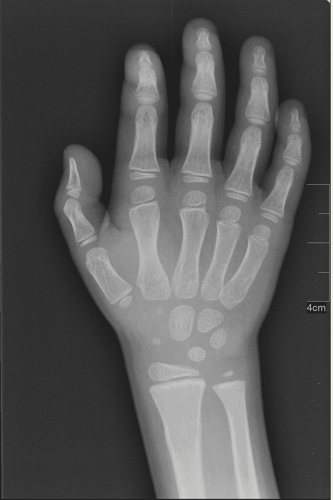

<!--yml

类别：未分类

日期：2024-09-06 19:58:02

-->

# [2012.02364] 深度学习在医学异常检测中的应用 - 调研

> 来源：[`ar5iv.labs.arxiv.org/html/2012.02364`](https://ar5iv.labs.arxiv.org/html/2012.02364)

# 深度学习在医学异常检测中的应用 - 调研

Tharindu Fernando、Harshala Gammulle、Simon Denman、Sridha Sridharan 和 Clinton Fookes T. Fernando、H. Gammulle、S. Denman、S. Sridharan 和 C. Fookes 均在澳大利亚昆士兰科技大学 SAIVT 工作（电子邮件：t.warnakulasuriya@qut.edu.au.）

###### 摘要

基于机器学习的医学异常检测是一个重要问题，已被广泛研究。许多方法在不同的医学应用领域提出，我们观察到这些不同应用之间存在若干相似之处。尽管存在这些可比性，我们仍发现缺乏对这些不同研究应用的结构化组织，以便研究它们的优缺点。本调研的主要目的是对流行的深度学习技术在医学异常检测中的应用进行全面的理论分析。特别地，我们提供了对最先进技术的连贯和系统的综述，比较和对比它们的架构差异以及训练算法。此外，我们提供了对深度模型解释策略的全面概述，以帮助解释模型决策。我们还概述了现有深度医学异常检测技术的主要局限性，并提出了进一步研究的关键方向。

###### 关键词：

深度学习，异常检测，机器学习，时间分析

## I 引言

识别不符合整体数据分布的数据样本是异常检测的主要任务。异常可能由于数据捕获过程中的噪声、潜在现象的变化，或由于捕获环境中新出现的或以前未见过的条件而发生。因此，异常检测在医学信号分析中是一个至关重要的任务。

深度学习的曙光彻底改变了机器学习领域，它的成功已渗透到医学异常检测领域，催生了大量利用深度机器学习架构进行医学异常检测的研究文章。

本调研的主要目的是对现有文献进行结构化和全面的综述，系统地比较和对比方法。此外，我们提供了对深度模型解释策略的深入研究，这在应用‘黑箱’深度模型进行医学诊断时至关重要，以理解决策的原因。此外，我们总结了现有研究的挑战和局限性，并确定了未来的关键研究方向，为深度学习在医学异常检测中的广泛有效应用铺平道路。

### I-A 异常是什么？

异常检测是识别分布外示例的任务。简单来说，它旨在检测不符合数据集中普遍模式的示例。这是一项关键任务，因为异常观察与问题或故障类型相关，如结构缺陷、系统或恶意软件入侵、生产错误、金融欺诈或健康问题。尽管定义简单，但在机器学习中识别异常是一项具有挑战性的任务。主要挑战之一是不同异常的不一致行为，以及对异常的定义缺乏一致性 [1, 2, 3]。例如，在特定上下文中，某个心率可能是正常的，而在不同的上下文中，它可能表明健康问题。此外，噪声数据捕获设置和/或监控环境的动态变化可能导致正常示例看起来像分布外样本（即异常），从而导致较高的假阳性率 [4]。因此，需要具有高建模能力的智能学习策略，以更好地将异常样本与正常数据区分开来。

### I-B 为什么医学异常不同？

图 1 展示了机器学习在医学数据处理中的主要阶段，以及每个阶段如何与异常检测相关。收集到的生理数据被分析，通常用于 i) 预测和/或 ii) 诊断。预测任务包括预测生理信号的未来状态，如血压，或其他特征如恢复率。对于诊断任务，分析数据的一部分以识别特定医学条件的病理征兆。异常检测与预测和诊断任务相关，因为它捕捉生理数据的独特特征，这些特征可能提供有关数据或患者的信息。

图 1：医学数据处理的主要阶段及异常检测如何与其他阶段相关的插图。

类似于其他应用领域，医学异常检测也继承了在第 I-A 节中描述的挑战。例如，图 2 (a) 展示了来自 Kvasir 内窥镜图像数据集[5]的两个示例。尽管它们在视觉上非常相似，但左侧的图像来自正常盲肠类别，而右侧的图像来自溃疡性结肠炎病类别。另一个示例见图 2 (b)，该图展示了典型医学数据集中正常数据的多样性。这些示例是来自 PhysioNet 心脏病学挑战赛 2016 的心音录音[6]。顶部的图像显示了一个干净的正常心音录音。第二行的图像代表了一个在数据捕获过程中被噪声污染的正常类别录音。因此，在建模正常示例时，模型应具有表示正常数据分布多样性的能力。

(a)

(b)

图 2：与医学异常检测相关的挑战。(a) 来自 Kvasir 内窥镜图像数据集[5]的两个示例（正常和异常），具有强烈的视觉相似性。(b) 来自 PhysioNet CinC 2016 心音数据集[6]的两个正常示例，其中底部行的信号被噪声污染。

除了这些固有的挑战，医疗异常检测还有一些特定于应用的额外障碍。首先，由于最终应用主要是医疗诊断，测试灵敏度（正确识别异常样本的能力）是一个决定性且至关重要的因素，因此异常检测模型需要高度准确。其次，不同数据样本之间存在许多患者特有的特征，这些特征会导致差异。例如，在[7]中，作者发现不同人群中的儿童在 EEG 数据的静息状态下存在显著差异。不同年龄组、性别等之间也存在显著差异。因此，在设计准确的医疗异常检测框架时，需要采取措施以减轻这些障碍。考虑到这些挑战，医疗异常检测通常被视为一个监督学习任务[8, 1]，其中为模型提供监督信号，以便模型学习区分正常样本和异常样本。这与其他领域如生产缺陷检测或金融欺诈检测有所不同，在这些领域中，异常是以无监督的方式检测的。

### I-C 为什么使用深度学习进行医疗异常检测？

深度学习在生物医学工程领域的研究人员中越来越受欢迎，因为它提供了一种解决上述挑战的方法。深度学习的一个突出特点是它建模非线性的能力。增加模型的非线性可以更好地区分正常样本和异常样本，并更好地建模数据中的不一致性。深度学习的另一个优点是其自动特征学习能力。大数据[9]和计算资源的增加使深度学习的层级特征学习过程得以实现，避免了显式手工设计和定义什么构成异常的需要。深度学习的另一个有趣特点是其通过神经网络架构[1]无缝发现数据中的长期关系的能力，而无需在特征设计过程中显式定义这些关系。例如，像长短期记忆（LSTM）[10]和门控递归单元（GRU）[11]这样的递归架构可以使用所谓的“记忆”高效地建模时间序列数据中的时间关系。

### I-D 我们的贡献

尽管几篇近期的综述文章 [3, 2] 简要涉及了医学异常检测领域，尽管有许多专门针对特定医学应用领域的综述论文 [12, 13, 14, 15, 16]，但仍缺乏关于深度学习医学异常检测技术的系统性综述，这种综述可以使读者比较不同深度学习技术的优缺点，并将这些发现应用于不同的医学应用领域。表 I 总结了这些局限性。本文直接解决了这一需求，提供了对流行深度学习模型架构的详细理论分析，包括卷积神经网络、递归神经网络、生成对抗网络、自编码器和神经记忆网络；以及它们在医学异常检测中的应用。此外，我们还广泛分析了不同的模型训练策略，包括无监督学习、有监督学习和多任务学习。

表 I：我们综述与其他相关研究的比较

|  |  | 参考文献 |
| --- | --- | --- |
|  |  | [3] | [2] | [14] | [13] | [15] | [12] | [16] | 提出的 |
| --- | --- | --- | --- | --- | --- | --- | --- | --- | --- |
| 算法方法 | 无监督 | ✓ | ✓ | ✓ | ✓ | ✓ | ✓ |  | ✓ |
| 有监督 | ✓ | ✓ | ✓ | ✓ | ✓ | ✓ | ✓ | ✓ |
| 循环神经网络 | ✓ |  | ✓ | ✓ | ✓ | ✓ |  | ✓ |
| 多任务 |  |  |  |  |  |  |  | ✓ |
| 网络架构 | 自编码器 | ✓ |  | ✓ |  |  |  |  | ✓ |
| 生成对抗网络 | ✓ |  | ✓ |  | ✓ | ✓ |  | ✓ |
| 神经记忆网络 |  |  |  |  |  |  |  | ✓ |
| 长短期记忆网络 | ✓ |  | ✓ | ✓ | ✓ |  |  | ✓ |
| 门控循环单元 | ✓ |  | ✓ | ✓ | ✓ |  |  | ✓ |
| 应用 | 基于 MRI 的异常检测 | ✓ |  |  |  | ✓ |  |  | ✓ |
| 内窥镜图像中的异常 |  |  | ✓ |  |  |  | ✓ | ✓ |
| 心音异常 |  |  |  | ✓ |  |  |  | ✓ |
| 癫痫发作 | ✓ |  |  |  |  | ✓ |  | ✓ |
| 模型解释方法 |  |  |  |  |  |  |  |  | ✓ |
| 医学数据捕捉过程 |  |  |  |  |  |  |  |  | ✓ |

此外，本文还提供了深度模型解释策略的全面概述，这些策略可以用来解释模型决策。该分析系统地阐述了这些方法如何生成与模型无关的解释，以及这些方法在应用于医学数据时的局限性。

最后，本综述详细描述了现有深度医疗异常检测方法的局限性，并列出了关键的研究方向，激励读者将未来的研究方向转向可泛化和可解释的深度医疗异常检测框架，以及可能揭示数据中因果关系的概率性和因果性方法。

### I-E 组织结构

在节 II 中，我们展示了深度异常检测算法的不同方面，阐明了这些架构的动机，并强调了与医疗异常检测相关的复杂性。具体而言，节 II-A 展示了医疗异常检测领域中的数据类型，以及不同的深度学习架构如何设计以捕获来自不同模态的信息。节 II-B 根据训练目标对深度异常检测架构进行分类，讨论了这些算法背后的理论及其优缺点。节 II-C 概述了深度医疗异常检测应用的关键领域。在节 III 中，我们理论性地概述了深度模型解释策略，这是在医疗应用中部署深度模型时的一个关键考虑因素。节 IV 说明了现有深度异常检测框架的一些挑战和限制，并提供了未来的研究方向。节 V 包含了结论性评论。

## II 使用深度学习检测医疗异常

在本节中，我们将识别深度医疗异常检测算法的不同方面，包括使用的数据类型、不同的算法架构以及考虑的不同应用领域。以下小节讨论了这些类别中现有的深度医疗异常检测算法。

### II-A 数据类型

生物医学信号可以大致分为生物医学图像、电生物医学信号和其他生物医学数据，如实验室结果数据、音频记录和可穿戴医疗设备的数据。以下小节将简要讨论流行的应用场景。我们还将读者引导到补充材料中，在那里我们提供了有关这些类别的更全面讨论。

#### II-A1 生物医学成像

X 射线摄影：X 射线的波长比可见光短，可以穿透人体大多数组织。然而，骨骼中的钙含量更高，能够散射 X 射线。位于 X 射线源对面的胶卷呈负片形式，使得暴露在更多光线下的区域显得更暗。因此，当更多 X 射线穿透如肺和肌肉等组织时，这些区域在胶卷上显得更暗，而骨骼则显得更亮。X 射线成像通常用于各种诊断目的，包括检测骨折、牙科问题、肺炎和某些类型的肿瘤。

计算机断层扫描（CT）：在 CT 成像中，使用窄束 X 射线生成身体的横截面图像，这些射线在患者快速旋转时发射。CT 成像收集多个横截面切片，并将其叠加生成三维图像，这比传统的 X 射线图像更具信息性。CT 扫描是识别身体各个区域疾病或损伤的常用诊断工具。应用包括检测腹部肿瘤或病变，以及定位头部损伤、肿瘤和血块。它们也用于诊断复杂的骨折和骨肿瘤。

磁共振成像（MRI）：顾名思义，MRI 通过施加磁场来进行成像，迫使体内的质子与施加的磁场对齐。

具体来说，人体内的质子旋转并产生一个小的磁场。当引入如 MRI 机产生的强磁场时，质子会与该磁场对齐。然后引入一个射频脉冲，扰乱质子的对齐。当射频脉冲关闭时，质子释放能量并试图重新对齐磁场。不同组织类型释放的能量不同，使得 MRI 扫描能够区分不同区域。因此，MRI 通常用于成像非骨骼或软组织区域。对比研究表明，脑部、脊髓、神经和肌肉在 MRI 下的成像效果优于 CT 扫描。因此，MRI 是脑肿瘤检测和识别组织损伤等任务的首选技术。

除了这些流行的生物医学成像传感器类别外，还存在其他常见的数据源，如正电子发射断层扫描 (PET)、超声和医学光学成像。不同医学成像信号类型的示意图见图 3。在附录材料的第 1.1 节中，我们提供了对这些不同数据源的全面讨论，包括对其在深度学习中的最新应用的讨论，以及公开可用数据集的列表。

(a)

(b)

(c)

(d)

(e)

(f)

图 3: 不同医学成像信号的示意图。 (a) X 射线图像 ([图像来源](https://commons.wikimedia.org/))， (b) 健康和病态受试者的肺部 CT 扫描，取自 [SARS-CoV-2 CT 扫描数据集](https://www.kaggle.com/plameneduardo/sarscov2-ctscan-dataset)， (c) 带有脑肿瘤的 MRI 图像，取自 [Kaggle 脑部 MRI 图像用于脑肿瘤检测数据集](https://www.kaggle.com/navoneel/brain-mri-images-for-brain-tumor-detection)， (d) 一个 PET 扫描示例。图像取自 [PET 放射组学挑战](https://www.kaggle.com/c/pet-radiomics-challenges)， (e) 颈部超声图像，取自 [Kaggle 超声神经分割数据集](https://www.kaggle.com/navoneel/brain-mri-images-for-brain-tumor-detection)， (f) 胃肠道内窥镜图像，取自 [Nerthus 内窥镜数据集](https://datasets.simula.no/nerthus/)

#### II-A2 电生物医学信号

心电图 (ECG): ECG 是一种可视化心脏电流的工具，它产生心跳，从心脏顶部开始，向底部传播。在静息状态下，心脏细胞相对于外部环境带负电，当它们去极化时，变为正电。心电图捕捉到这种极化差异。通过分析心电图，可以提取两种信息 [17]。首先，通过测量心电图上的时间间隔，可以筛查不规则的电活动。其次，电活动的强度可以指示心脏的哪些区域过度工作或受到压力。

脑电图（EEG）：EEG 检测大脑中的电活动，大脑使用电信号进行通讯。为了捕捉电活动，在头皮上放置小金属圆片（电极）。这些电极捕捉到的电信号会被放大，以便更好地可视化大脑活动。

脑电图（EEG）是观察被试认知过程的一个重要工具。它们通常用于研究睡眠模式、心理障碍、头部损伤造成的脑损伤以及癫痫。

磁脑图（MEG）：如上所述，EEG 捕捉由大脑外部电流生成的电场，而 MEG 主要检测这些外部电流引起的磁场 [18]。我们承认 MEG 不是一种电生物医学信号，但由于它捕捉的是大脑电活动的副产品，因此我们将 MEG 与其他电信号一起列出。多项研究 [19, 20, 21, 22, 23, 24] 探讨了 MEG 信号在检测异常脑活动和状态中的实用性。

除了 ECG、EEG 和 MEG 这几种最常用的电生物医学信号外，我们还希望承认肌电图（EMG）传感器，通过监测肌肉细胞产生的电位来诊断肌肉和运动神经元的健康状况。我们建议读者参阅补充材料第 1.2 节，以获取有关 ECG、EEG、MEG、EMG 的更全面讨论，以及关于它们在深度学习研究中的最新应用和公开数据集的列表。

#### II-A3 其他数据类型

除了上述主要数据类型外，我们还希望承认其他杂项数据来源，例如心音图（PCG）和可穿戴医疗设备，这些设备也提供了对医学诊断有用的信息。我们建议读者参阅补充材料第 1.3 节，其中详细讨论了这些数据来源，并讨论了它们在深度学习研究中的最新应用。

### II-B 医疗异常检测的算法方法

在本小节中，我们总结了现有的深度学习算法，基于其训练目标以及训练过程中是否提供正常/异常的标签。此外，第 II-B3 节总结了在医疗领域中常用的循环深度神经网络架构。最后，我们讨论了不同数据类型之间的维度差异，以及现有深度学习研究如何管理这些差异。

#### II-B1 无监督异常检测

在无监督异常检测中，训练过程中不提供监督信号（指示样本是否正常或异常）。因此，无监督算法不需要标记数据集，这使它们对机器学习社区具有吸引力。自编码器（AEs）和生成对抗网络（GANs）是两种常见的无监督深度学习架构，并在以下子章节中介绍。

自编码器（AEs）自从[25]被提出作为深度神经网络的预训练方法以来，已被广泛用于自动特征学习[26]。图 4 展示了 AE 的结构。它们是对称的，模型被训练以从学习到的压缩表示（捕获在架构中心）重建输入。

图 4：自编码器的主要组件示意图。

正式地，设数据集中有$N$个样本，当前输入为$x$，$f$和$g$分别表示编码器和解码器网络。则压缩表示$z$由下式给出，

|  | $z=f(x),$ |  | (1) |
| --- | --- | --- | --- |

并通过以下公式重建，

|  | $y=g(z).$ |  | (2) |
| --- | --- | --- | --- |

该模型的训练目的是最小化重建损失，

|  | $\sum_{x\in N}{L(x,g(f(x)))},$ |  | (3) |
| --- | --- | --- | --- |

其中$L$是一个距离函数，通常是均方误差（MSE）。

存在几种不同的自编码器（AEs）变体。其中之一是稀疏自编码器（S-AE）。额外的稀疏性约束限制了编码表示$z$中非零元素的数量。这是通过添加一个惩罚项到损失中来强制执行的（即方程 3）。

|  | $L_{S-AE}=\sum_{x\in N}{L(x,g(f(x)))}+\lambda\frac{1}{ | N | }\sum_{x\in N} | f(x) | ,$ |  | (4) |
| --- | --- | --- | --- | --- | --- | --- | --- |

其中$\lambda$是一个超参数，用于控制稀疏性约束的强度。

去噪自编码器（De-Noising AEs）[27] 学会从嘈杂（损坏）的输入中重建干净的信号；其目的是利用去噪能力来学习稳健且通用的特征编码。收缩自编码器（Contractive AEs）试图减轻自编码器对输入样本扰动的敏感性。在定义的损失中添加了正则化项（参见 Eq. 3），该项测量了所学习的嵌入对输入小变化的敏感性。使用编码器的雅可比矩阵的 Frobenius 范数来测量这种敏感性[26]。

最终，变分自编码器（VAE）假设观察值$x$是从概率分布中采样的，并试图估计该分布的参数。正式地，给定观察值$x$，VAE 试图近似潜在分布$P_{\phi}$。令${\phi}$表示近似真实潜在分布的分布参数，而${\theta}$表示采样分布的参数，则 VAE 的目标是，

|  | $L_{VAE}(\theta,\phi;x)=\mathrm{KL}(P_{\phi}(z&#124;x)&#124;&#124;P_{\theta}(z))-\mathbb{E}_{P_{\phi}(z&#124;x)}(log(P_{\theta}(x&#124;z))),$ |  | (5) |
| --- | --- | --- | --- |

其中$\mathrm{KL}$是 Kullback-Leibler 散度。

自编码器在医学异常检测中的应用已有多种。在[28]中，作者提出了一种基于 AE 的方法，用于早期检测猪的呼吸疾病。AE 由 GRU 组成，用于从时间序列记录中学习。在[29]中，提出了一种基于 EEG 的异常检测方法，其中作者使用了基于卷积神经网络（CNN）的 AE。在[30]中，使用了基于 3D-CNN 的 AE 从体积 CT 扫描中学习。

在[31]中，提出了一种基于 VAE 的框架，用于检测皮肤图像中的异常。在[32]中，作者引入了扰动以评估输入表示变化对建模表示的影响；并提出了一种双分支结构，其中“上下文相关”的变化也被添加到 VAE 模型的一个分支中。该方法在 MRI 异常检测任务上进行了验证。在[33]中，提出了另一种条件模型，其中作者将 VAE 输出条件化于先验知识。该方法已在 2D 和 3D 异常检测任务中进行了验证。

尽管具有有趣的特性，自编码器在建模高维数据分布时能力有限，通常会导致错误的重建和对建模数据分布的不准确近似[34]。因此，另一类生成模型，即生成对抗网络，受到了越来越多的关注。

生成对抗网络（GANs）：另一类自编码器（AE）是对抗性自编码器，更广为人知的是 GAN [35]。它们训练两个网络，一个是‘生成器’（G），另一个是‘判别器’（D），它们进行一个最小-最大游戏。G 尝试欺骗 D，而 D 则试图避免被欺骗。

图 5：生成对抗网络的主要组件

图 5 说明了 GAN 训练的基本结构。生成器接收来自 $P_{z}(z)$ 的噪声，并尝试学习真实数据 $P_{data}(x)$ 的分布，建模从噪声空间到数据空间的映射。判别器 $D$ 在给定合成（虚假）或真实（真实）示例时输出一个标量变量。判别器被训练为输出真实/虚假分类的正确标签，这一目标可以写成，

|  | $\min_{G}\max_{D}V(D,G)=\mathbb{E}_{x\sim P_{data}(x)}[logD(x)]+\mathbb{E}_{z\sim P_{z}(z)}[log1-D(G(z))].$ |  | (6) |
| --- | --- | --- | --- |

虽然为判别器提供了监督信号以训练真实/虚假分类任务，但真实/虚假分类不是主要任务，并且模型没有看到任何异常示例。因此，GAN 框架没有得到关于如何识别异常的监督，使其成为无监督的。

GANs 的一个流行子类是条件 GAN（cGAN），在这种方法中，生成器和判别器的输出都依赖于额外的数据 $c$。cGAN 的目标是，

|  | $\min_{G}\max_{D}V(D,G)=\mathbb{E}_{x\sim P_{data}(x)}[logD(x&#124;c)]+\mathbb{E}_{z\sim P_{z}(z)}[log1-D(G(z&#124;c)&#124;c)].$ |  | (7) |
| --- | --- | --- | --- |

cGAN 在合成输出应该与刺激相关的任务中非常受欢迎 [36, 37]。

循环一致性 GAN（Cycle-GAN）在图像到图像转换任务中非常受欢迎。Cycle-GAN 为框架提供了额外的约束：即原始输入可以从生成的输出中合成出来。

GAN 在医学异常检测中的一个应用示例是 Schlegl 等人 [38]，作者使用 GAN 框架进行光学相干断层扫描（OCT）中的异常检测。他们训练了一个 GAN 以使用潜在分布 $z$ 生成正常的 OCT 扫描。然后，使用编码器将正常的 OCT 扫描映射到 $z$。因此，当从图像映射到 $z$ 使用编码器时，并从 $z$ 到图像使用生成器时，应该能够恢复出相同的图像。当存在异常时，作者表明这种转换中存在差异，并利用此过程识别异常。

#### II-B2 监督异常检测

考虑到对高敏感性和鲁棒性的要求，特别是由于诊断应用，监督学习已广泛应用于医学异常检测，并且表现出优于无监督方法的性能。与无监督学习方法（参见第 II-B1），在监督异常检测中，提供了一个监督信号，指示哪些示例来自正常类别，哪些是异常的。因此，这实际上是一个二分类任务，模型通常使用二分类交叉熵损失进行训练 [39]，

|  | $L=-y\log(f(x))-(1-y)\log(1-f(x)),$ |  | (8) |
| --- | --- | --- | --- |

其中 $y$ 是真实标签，$f$ 是分类器，$x$ 是模型的输入。示例架构包括 [40] 和 [41] 中的 CNN 结构，它们分别用于通过监督学习识别视网膜图像中的异常和自动分类皮肤病变。在 [42] 中，训练了一个深度信念网络以检测脑电图数据中的癫痫发作。

多任务学习（MtL）是监督学习的一个子类别，旨在在多个相关任务之间共享相关信息，而不是单独学习这些任务 [43]。例如，为了克服由于个体特异性变异带来的挑战，可以将一个次要的个体识别任务与主要的异常检测任务结合起来。因此，模型在学习分类异常的同时，学会识别个体之间的相似性和差异性。多个研究在医学领域利用了 MtL。在 [43] 中，提出了一种高效的多任务内核学习结构，并应用于回归帕金森病症状评分。在 [44] 中，通过检测和定位医学图像中的病变，制定了多任务学习策略，该策略共同学习检测可疑图像并分割这些图像中的感兴趣区域。

到目前为止讨论的深度学习架构是前馈架构，即数据沿着一个方向流动，从输入到输出。这限制了它们建模时间信号的能力。为了解决这个限制，引入了递归神经网络（RNN）。

#### II-B3 递归神经网络（RNNs）

递归是时间序列建模等任务的一个关键特征，意味着当前时间步的输出也会作为输入传递到下一个时间步。在医学数据处理方面，这对于建模诸如脑电图（EEG）和心音图数据这样的序列数据非常重要，因为我们关心的是信号的时间演变。

图 6: 递归神经网络结构的示意图及其时间展开。

图 6 ‣ II-B Algorithmic Approaches for Medical Anomaly Detection ‣ II Detecting Medical Anomalies with Deep Learning ‣ Deep Learning for Medical Anomaly Detection - A Survey") 展示了 RNN 的基本结构，包括时间展开。这种结构要求使用时间反向传播（BPTT）[45]，因为给定时间步的误差梯度依赖于前一个时间步的预测，并且随着时间的推移误差会积累。尽管具有很有趣的特性，简单的 RNN 结构由于 BPTT 导致梯度消失[46, 47]，这使得它们对建模长期依赖性（远距离时间步之间的关系）不起作用。

已经提出了几种 RNN 变体来解决这些限制。在下面的章节中，我们介绍了三种流行的变体：长短期记忆（LSTM）网络、门控循环单元（GRU）和神经记忆网络（NMN）。

长短期记忆（LSTM）[10] 网络专门设计来模拟 RNN 不能很好表示的长期依赖性。它们引入了一个 “记忆单元”（或称为状态单元）来捕捉长期依赖性，并使用一系列门操作来操作存储在记忆中的信息并随时间更新。LSTM 的核心思想是长期依赖性可以存储在状态单元中[10]。

图 7: 长短期记忆单元的可视化示意图。

有三个门控制从和写入到状态单元的信息。 “遗忘门” 决定保留在当前时间步上一个时间步的信息的部分。它由上一个时间步的输出和当前输入控制，其值在 0 和 1 之间以控制信息流动（参见图 7 ‣ II-B Algorithmic Approaches for Medical Anomaly Detection ‣ II Detecting Medical Anomalies with Deep Learning ‣ Deep Learning for Medical Anomaly Detection - A Survey")）。可以表示为，

|  | $f_{t}=\sigma(w^{f}[h_{t-1},x_{t}]+b^{f}),$ |  | (9) |
| --- | --- | --- | --- |

其中 $w^{f}$ 和 $b^{f}$ 是门的权重和偏置，$h_{t-1}$ 是上一时间步的输出，$x_{t}$ 是当前输入，$\sigma$ 是一个 sigmoid 函数。

“输入门”决定写入单元中的信息。与前一个门类似，我们有一个函数来确定要写入的信息的部分，

|  | $g_{t}=\sigma(w^{i}[h_{t-1},x_{t}]+b^{i}),$ |  | (10) |
| --- | --- | --- | --- |

我们使用 $\mathrm{tanh}$ 函数来生成写入的信息，

|  | $\tilde{c}_{t}=\mathrm{tanh}(w^{c}[h_{t-1},x_{t}]+b^{c}).$ |  | (11) |
| --- | --- | --- | --- |

然后可以使用以下公式更新单元状态，

|  | $c_{t}=f_{t}\times c_{t-1}+i_{t}\times\tilde{c}_{t}.$ |  | (12) |
| --- | --- | --- | --- |

来自先前单元状态的信息和当前时间步的信息通过遗忘门和输入门值进行控制。最后一步是决定在当前时间步从单元中输出什么信息。这是通过输出门完成的，

|  | $o_{t}=\sigma(w^{o}[h_{t-1},x_{t}]+b^{o}),$ |  | (13) |
| --- | --- | --- | --- |

并且，$h_{t}$，当前时间步的输出由以下公式给出，

|  | $h_{t}=o_{t}\times\mathrm{tanh}(c_{t}).$ |  | (14) |
| --- | --- | --- | --- |

门控递归单元（GRUs）是 LSTM 的一种流行变体，由 Cho 等人于 2014 年引入[48]。它们将遗忘门和输入门合并为一个“更新门”。具体地，方程 12 ‣ II-B Algorithmic Approaches for Medical Anomaly Detection ‣ II Detecting Medical Anomalies with Deep Learning ‣ Deep Learning for Medical Anomaly Detection - A Survey")变为，

|  | $c_{t}=f_{t}\times c_{t-1}+(1-f_{t})\times\tilde{c}_{t}.$ |  | (15) |
| --- | --- | --- | --- |

神经记忆网络（NMNs）是 RNN 的另一种变体，其中使用外部记忆堆栈来存储信息。LSTMs 和 GRUs 的一个限制是，当呈现新序列时，内容会被擦除[49, 50]，因为这些架构设计用于映射序列内的时间关系，而不是序列之间的关系[49, 50, 51, 52]。因此，内部单元状态的有限容量不足以建模跨大语料库的关系[53, 49]。

图 8：神经记忆网络的主要组成部分示意图。

图 8 ‣ II-B Algorithmic Approaches for Medical Anomaly Detection ‣ II Detecting Medical Anomalies with Deep Learning ‣ Deep Learning for Medical Anomaly Detection - A Survey")展示了一个典型的神经记忆网络（NMN）架构，该架构由一个用于存储信息的记忆堆栈和一组控制器（读取、输出和写入）组成，以操作记忆。LSTM 门控操作与这些操作外部记忆的控制器之间有相似之处。具体地，设外部记忆的状态为$M\in\mathbb{R}^{k\times l}$，在时间点$t-1$时为$M_{t-1}$，其中$l$是记忆槽的数量，$k$是每个槽的大小。当前输入记作$x_{t}$。然后读取控制器$f^{r}$生成一个向量$q_{t}$来查询记忆，

|  | $q_{t}=f^{r}(x_{t}).$ |  | (16) |
| --- | --- | --- | --- |

使用 softmax 函数，我们测量每个记忆槽的内容与查询向量之间的相似度，如下所示，

|  | $z_{t}=\textrm{softmax}({q_{t}}^{\top}M_{t-1}).$ |  | (17) |
| --- | --- | --- | --- |

得分向量$z_{t}$捕获内存内容与当前输入的相关性。这与 LSTM 的输入门功能相类似，LSTM 决定从历史中提取哪些信息。然而，与 LSTM 中只有一个向量存储历史信息不同，NMN 需要考虑多个内存块。因此，采用了注意力机制来提取最相关的信息。

输出控制器$f_{o}$生成输出，使得，

|  | $\bar{m}_{t}=z_{t}[M_{t-1}]^{\top},$ |  | (18) |
| --- | --- | --- | --- |

并且，

|  | $m_{t}=f^{o}(\bar{m}_{t}).$ |  | (19) |
| --- | --- | --- | --- |

这与 LSTM 的输出门功能相一致，使用当前时间步的输入和从内存中检索的信息来组成输出。最后，写控制器$f^{w}$生成一个向量以更新内存，

|  | $m^{\prime}_{t}=f^{w}(m_{t}),$ |  | (20) |
| --- | --- | --- | --- |

并使用下列公式更新内存，

|  | $M_{t}=M_{t-1}(I-z_{t}\otimes e_{k})^{\top}+(m^{\prime}_{t}\otimes e_{l})(z_{t}\otimes e_{k})^{\top},$ |  | (21) |
| --- | --- | --- | --- |

其中，$I$是一个全 1 矩阵，$e_{l}\in\mathbb{R}^{l}$和$e_{k}\in\mathbb{R}^{k}$是全 1 向量，而$\otimes$表示外积，它将其左向量重复$l$次或$k$次以形成一个矩阵[54, 1]。由于 NMN 是一个相对较新的概念，我们建议感兴趣的读者参考[53]以获取更多细节。

虽然 LSTM 和 NMN 的内存更新机制不完全相同，但我们想强调 LSTM 的遗忘门和写控制器之间的相似性。LSTM 的遗忘门考虑当前时间步的输入和之前的单元状态（即内存），并决定从历史中传递什么信息。同样，写控制器利用 NMN 的输出和检索的历史信息，决定更新哪些内存槽。

有许多研究利用了 RNN 进行医学异常检测。例如，RNN 已在[55]和[56]中用于电子健康记录中的基于文本的异常检测；以及在[57]中用于在心音图记录中检测异常心跳。

最近，NMN 已被应用于医学异常检测，其中的研究展示了外部内存存储在记忆正常和异常样本之间的相似性和差异性的价值。具体而言，在[1]中，作者将 NMN 与神经可塑性框架结合，以识别 MRI 扫描中的肿瘤和 EEG 中的异常。此外，在[58]中，使用相同的架构来识别 EEG 中的不同癫痫类型。

### II-C 背景和相关应用

本小节详细讨论了深度医学异常检测中的热门应用领域，说明了之前讨论的架构变体如何在这些领域中得到应用。

#### II-C1 基于 MRI 的异常检测

在本节中，我们总结了最近关于基于深度学习的 MRI 数据异常检测的关键文献。融合多模态成为最近 MRI 分析中出现的研究方向。在 [59] 中，作者们研究了 T1 加权（T1w）MRI 和 MRI 的髓鞘水成像（这是一种特别测量髓鞘含量的定量 MRI 技术）在多发性硬化（MS）诊断中的融合。在他们提出的结构中，他们利用两种模态特定的深信念网络（DBN）[60] 从个体 T1w 和髓鞘图中提取特征。然后使用多模态 DBN 共同学习两种模式的互补信息。他们通过连接多模态 DBN 的顶层隐藏单元激活来检索多模态特征向量。最后，使用随机森林[61] 对异常进行训练。提出的算法使用内部数据集进行验证，该数据集包括 55 名复发缓解型 MS 患者和 44 名健康对照者。 T1w 和髓鞘图模态的分类准确率分别为 $70.1\pm 13.6$% 和 $83.8\pm 11.0$%，而融合表现达到了 $87.9\pm 8.4$%。

在 [62] 中提出了一种融合 MRI 图像与氟脱氧葡萄糖正电子发射断层扫描（FDG-PET）样本的策略。在他们的方法中，作者首先将 MRI 图像分割为灰白质区域，然后将灰质分成 87 个解剖感兴趣区（ROI）。然后从这些区域提取尺寸为 1488、705 和 343 的补丁。同样大小的补丁也从 FDG-PET 图像中提取。然后使用 6 个独立的具有密集层的深度神经网络（DNN）来嵌入补丁信息，并使用另一个 DNN 来融合编码嵌入。使用 softmax 层生成最终的异常分类。作者们利用这种架构来检测与阿尔茨海默病相关的病理，并使用公开可用的阿尔茨海默病神经影像学倡议（ADNI）数据库[63] 进行评估，该数据库包含 1242 名受试者。提出的方法实现了 82.93% 的准确率，比仅使用 FDG-PET 提高了约 1.5%。

在[64]中提出了一种将 MRI 的表观扩散系数（ADC）与 T2 加权 MRI 图像（T2w）融合的方法。与预测单一评分级别分类相反，他们提出了一种方法，该方法输出每种模态的分割图，指示每个像素属于感兴趣类别的可能性。他们提出利用一种新颖的相似性损失函数，使得 ADC 和 T2WI 流产生一致的预测，从而允许流之间共享互补信息。初步分割图与手工特征结合，并通过 SVM 生成最终预测。评估使用了一个包含 364 个受试者的数据集，共有 463 个前列腺癌病灶和 450 个识别出的非癌性图像块，在这个框架下，实现了 89.85%的灵敏度和 95.83%的特异性，以区分癌性与非癌性组织。

与上述采用特征级融合的方法不同，[65]中提出了一种使用决策级融合的架构。该方法有一个由 3 个卷积神经网络组成的分类器集合，这些网络分别训练。每个网络提供一个 softmax 分类，表示四种阿尔茨海默病类别的可能性：非痴呆、非常轻度、轻度和中度。个别分类的融合通过多数投票完成。评估是在公共的 OASIS 数据集[66]上进行的，该数据集包含 416 个受试者，提出的集合方法实现了 94%的精准率和 93%的召回率。

尽管架构有所不同，上述讨论的方法都是监督式深度卷积神经网络（DCNN）模型，这些模型主导了基于 MRI 的异常检测文献。这显然是因为监督式 CNN 模型在从二维输入中提取任务特定空间信息时非常有效。

尽管监督的深度卷积神经网络（DCNN）模型很常见，但也有许多方法使用了自编码器（AE）[67, 68]。在[68]中，提出了一种具有稀疏性约束的 AE 网络，用于诊断精神分裂症患者。首先，AE 以无监督方式进行特征提取训练；在第二阶段，作者使用数据集的验证集来微调网络，在 AE 中添加一个 softmax 层。作为最终阶段，使用线性支持向量机对样本进行分类。该系统使用了从 7 个图像来源收集的大规模 MRI 数据集进行验证，数据集中包括 474 名精神分裂症患者和 607 名健康对照组。该模型在 k 折交叉验证设置中实现了约 85%的准确率。类似地，在[67]中，AE 被训练用于急性肾移植排斥的早期检测。在第一阶段，AE 以无监督方式进行训练。为了分类输入，移除了 AE 的解码器，并使用监督学习训练了一个 softmax 层。这种方法在 100 名受试者的留一法实验设置中实现了 97%的分类准确率。

批判性地，与第 II-B1 节中讨论的无监督自编码器（AE）模型不同，这些模型并非完全无监督架构。相反，在 AE 的初步训练之后，会添加一个分类层，并使用监督信号进行训练以检测异常。

在不同的研究领域中，[69] 提出了一个多尺度多任务学习框架，用于腰椎神经孔狭窄症（LNFS）的诊断。图 9 展示了所使用的架构。作者展示了每个腰椎图像可以捕捉到多个器官，并且这些器官在不同的尺度下进行捕捉。此外，他们说明了多任务学习可以通过从多个相关任务中学习来提升学习效果，如在 Sec. II-B2 中讨论的那样，我们注意到这种策略在多个应用领域中都有体现。特征图在多个尺度下提取，并且在每个级别上，模型尝试执行两项任务，即回归边界框以定位器官，以及预测已定位器官中的异常。该系统通过 200 名临床患者进行验证，能够以 0.83 的精确度和 0.8 的召回率诊断异常神经孔。

图 9: [69] 提出的用于腰椎神经孔狭窄症诊断的架构。重新制作自 [69]

除了这些方法，[1] 中提出了一种基于神经记忆网络（NMN）的方法。这种方法利用 NMN 的递归结构，通过监督学习比较和对比整个数据集中的样本特征。记忆堆栈存储了区分正常样本和异常样本的重要特征。因此，这种架构与之前描述的其他方法有显著不同。具体而言，使用 ResNet-50 CNN 从输入的 MRI 图像中提取一个 $14\times 14\times 256$ 的特征。该特征作为 NMN 的读取控制器的输入。利用这个特征作为查询向量，读取控制器会关注存储在记忆中的内容，并与输入进行比较，以找到最佳匹配。记忆读取函数的输出和输入向量通过输出控制器，生成记忆输出（即，随后用于生成最终分类的特征向量）。最后，写入控制器决定如何更新记忆槽中的内容，以反映从当前输入中检索到的信息。除了 NMN 的典型功能外，NMN 控制器还利用了可塑性，以便它们可以动态调整连接性，改变 NMN 的整体行为。该框架使用包含来自 233 名不同类型脑肿瘤患者的 MRI 图像的数据集[70]进行了评估：脑膜瘤（708 个样本）、胶质瘤（1426 个样本）和垂体瘤（930 个样本）。在 5 折交叉验证设置下，该模型达到了 97.52%的分类准确率。这里我们要指出的是，与二分类正常/异常分类不同，这里进行了多类分类，模型通过使用分类交叉熵损失在不同异常类别之间进行区分。

#### II-C2 内镜数据中的异常检测

在这一部分，我们总结了一些用于内镜异常检测的流行深度学习架构。

考虑到内窥镜设备捕捉 RGB 数据，预先在大规模物体检测基准（如 Image-Net）上训练的**卷积神经网络**（CNNs）被广泛应用。例如，在[72]中，作者应用了在[71]上预训练的 Xception [73] CNN 架构来检测内窥镜图像中的溃疡。该系统使用包含 49 名受试者的数据集进行评估，作者进行了 5 折交叉验证和留一法评估。该系统在 5 折交叉验证设置中实现了 96.05%的平均准确率，而在留一法评估中，性能在 73.7%到 98.2%之间变化。同样，在[74]中，已经研究了预训练的 GoogLeNet [75]和 AlexNet [76]网络用于溃疡分类。这些模型在包含 1875 张图像的公共数据集[74]上进行了测试，两种模型在该数据集上均达到了 100%的准确率。此外，在[77]中，AlexNet [76]被应用于溃疡和侵蚀检测。结果模型在测试 500 张溃疡图像和 690 张侵蚀图像时，能够达到 95.16%和 95.34%的准确率。

与这些架构相比，在[78]中提出了一种两阶段的方法。RetinaNet [79]被用于初始检测阶段，它接收内窥镜图像并预测输入图像的分类得分和边界框。然后，他们从该图像中提取多个固定大小为$160\times 160$的图像块，并将其通过 ResNet-18 [80]网络，最终的全连接层对溃疡的检测进行二分类。该系统在 4917 张溃疡帧和 5007 张正常帧上进行了测试，模型达到了 0.9469 的 ROC-AUC 值。

最近，在[81]中提出了一种双流框架，其中作者从 ResNet-50 [80]架构的两个层级提取特征，并通过关系网络[82]将其结合。图 10 说明了这种方法。具体来说，关系网络使得这种方法能够映射两个层级提取特征之间的所有可能关系。最终的增强特征向量通过 LSTM 网络，并使用全连接层进行分类。该框架已在两个公共基准测试上进行评估，Kvasir [5]（包含 8000 张内窥镜图像）和 Nerthus [83]（包含 2552 张结肠镜图像）。在 Kvasir 数据集中，该系统能够以 98.4%的准确率检测 8 种异常类，并在 Nerthus 数据集中对肠道清洁度的分类达到 100%的准确率。我们注意到，这项研究利用了 CNN 的层次结构特性来满足内窥镜图像分析的需求。CNN 的顶层卷积核捕捉输入的局部空间特征，如纹理和轮廓，而底层则捕捉更语义化的特征，如图像的整体表示。这是因为局部特征在通过 CNN 时会按层次聚合。因此，从 CNN 中提取特征时，顶层层具有空间变化的特征，而底层层具有空间不变的特征。[81]中的作者利用了 CNN 的这一特性用于内窥镜图像分析，其中，特定独特模式的存在以及其位置对诊断至关重要。

图 10：在[81]中提出的用于内窥镜数据异常检测的架构。重建自[81]

类似于 MRI 图像分析，DCNNs 在内窥镜图像异常检测中已占据主导地位。此外，大多数方法利用在大规模自然图像数据集上训练的预训练特征提取器，利用内窥镜图像也使用可见光的事实。与二分类监督学习相比，如[81]和[5]等方法采用多类分类（通常使用类别交叉熵损失训练），使得模型不仅能检测正常和异常示例，还能识别个体异常。

#### II-C3 心音异常检测

相较于使用图像的 MRI 和内窥镜应用，心音异常检测则处理一维音频信号，主要使用 1D CNNs 和 RNN 架构，然而一些预处理方法可以将音频信号转换为图像表示，从而允许使用 2D CNNs。在[85]中，提出了一种 VGG 网络的集成方法[84]，作者首先应用 Savitzky–Golay 滤波器[86]来去除输入信号中的噪声。然后从音频信号中提取一系列 2D 特征，包括频谱图特征、Mel 频谱图和 Mel 频率倒谱系数（MFCCs）。这些独立的特征流通过不同的 VGG 网络处理，最终通过多数投票来做出决策。这种方法也在 PhysioNet/CinC 2016 数据集上进行了 10 折交叉验证评估，达到了 89.81%的准确率。

在[87]中，作者利用从 8 个领域手工制作的 497 个特征值，包括时域特征、高阶统计量、信号能量和频域特征。这些提取的特征被连接并通过一个包含 3 个卷积层的 1D CNN 进行处理，接着是一个全局平均池化层和一个带有 sigmoid 激活函数的全连接层，用于进行正常/异常分类。该系统在 PhysioNet/CinC 2016 数据集上进行了评估，并取得了 86.8%的准确率。

与上述方法相比，提出了一些在原始音频信号上操作的框架，参见[88、89]。具体来说，在[88]中，作者通过执行离散傅里叶变换（DFT）并将每个数据样本的方差和标准差添加到原始音频中，从 PhysioNet/CinC 2016 数据集中增强了原始音频信号。然后，使用[90]的算法将录音分割为 S1 和 S2 心脏状态。这些分割的录音通过 RNN 进行正常性验证。该框架在 PhysioNet/CinC 2016 挑战中实现了 80%的准确率。在[89]中提出了类似的方法，利用 GRUs。与[88]类似，原始音频录音通过[90]的算法被分割为心脏状态。然而，[89]中的作者省略了[88]中使用的基于 DFT 的心音增强步骤。分割的音频通过 GRU 网络生成分类。该框架已被验证用于心力衰竭检测。作者从重庆医科大学附属大学城医院获得了心力衰竭数据，正常录音则来自 PhysioNet/CinC 2016 数据集（1286 个随机抽样的正常录音）。在 10 折交叉验证设置下，该模型的平均准确率为 98.82%。本文中，作者还测试了使用 LSTM 和全卷积网络（FCN）替代 GRU 网络，但这些模型分别只能达到 96.29%和 94.65%的准确率。

对于在检测异常心音之前是否需要心音分割，研究者们的反馈意见不一。心音分割主要用于认为 S1 和 S2 心音位置周围的特征包含重要的异常检测信息。然而，有些人认为这一预处理步骤中的错误可能会传递到异常检测模块，并且模型应该有自由选择其自身的有用特征 [91]。在 [91] 中，作者进行了一项比较研究，探讨了心音先前分割成心脏状态对异常检测的重要性。作者利用从最先进的声音分割模型 [92] 中提取的特征，训练了一个分类器来检测这些异常。为了比较，他们还训练了一个没有分割的 2D CNN 模型，该模型使用 MFCC 特征作为输入。比较使用 PhysioNet/CinC 2016 数据集进行，他们的评估表明，没有分割的 2D CNN 模型能够获得比接受分割输入的模型更优的结果。在 10 倍交叉验证设置中，无分割模型的准确率为 $98.94\pm 0.27$ %，而分割模型的准确率为 $98.49\pm 0.13$ %。利用 SHAP 模型解释 [93]，作者得出结论，无分割模型也关注了与 S1 和 S2 位置对应的音频波段，但相比之下，该模型能够学习异常检测任务中的有用特征，而不是像分割模型那样受限的输入。

最后，Oh 等人 [94] 提出了一个深度学习模型 WaveNet，用于将心音分类为五种类型，即：正常、主动脉狭窄、二尖瓣脱垂、二尖瓣狭窄和二尖瓣返流。本研究中使用的架构如图 11 所示。具体来说，受到 [80] 启发，作者提出了一个由 1D 膨胀卷积组成的残差块，用于从原始音频信号中提取特征。该架构由 6 个这样的残差块组成，这 6 个块捕获的特征被聚合成一个单一的特征向量，然后通过两个 1D 卷积层和两个全连接层进行分类。该模型使用包含 1000 个 PCG 记录（每种类别 200 个）的内部数据集进行评估，在 10 倍交叉验证设置中，模型达到了 97% 的平均准确率。

图 11：[94] 提出的异常心音检测架构。重新创建自[94]

如前所述，1D-CNN 网络和 RNNs 已广泛应用于异常心音检测。这主要是由于信号的时间特性，1D-CNN 网络可以在时间轴上执行卷积并提取时间特征，而递归结构可以建模信号的时间演变，并生成更好的特征来检测异常。如前所讨论，这些模型之间只有轻微的差异，并且它们通常利用监督学习来训练模型。此外，与自动特征学习相对，手工制作的频域特征如 MFCCs 在心音异常检测领域被广泛应用。最后，与其他应用领域观察到的情况一样，监督方法是异常检测中最常见的方法。

#### II-C4 癫痫发作预测

图 12：癫痫发作前后脑电图记录的变化。

图 26 展示了四种脑状态：间歇期、发作前期、发作期和发作后期；这些状态在脑电图中的位置。间歇期状态是受试者的正常脑状态，而发作事件前的脑状态称为发作前期状态。发生癫痫发作的状态被标记为发作期状态，而在发作事件后，大脑会转变为发作后期状态。

癫痫发作预测问题可以视为一个异常检测问题，在该问题中，机器学习模型被训练以区分发作前期和间歇期脑状态，从而识别特定受试者的大脑活动何时从正常的间歇期状态转变为发作前期（异常状态）。由于发作前期是癫痫发作前的大脑状态，因此这个问题被称为癫痫发作预测。

我们承认癫痫发作预测相比于上述讨论的其他异常检测应用领域具有几个显著特点，但许多研究将这一任务视为异常检测任务[95, 96, 97]，因此我们在此讨论。

设计一个通用的癫痫预测框架的一个关键挑战是受试者之间前癫痫发作时间的巨大差异。这种差异可能从几分钟到几小时不等，具体取决于受试者[98]。一种显著的尝试是[99] 的框架，其中作者提出了一种基于短期傅里叶变换（STFT）特征的 2D CNN 架构，该特征从原始 EEG 信号中提取。该框架在弗赖堡脑内 EEG（iEEG）[100] 和 CHB-MIT 头皮 EEG（sEEG）数据集[101] 上进行了验证，在留一受试者交叉验证设置中实现了约 81%的灵敏度。

尽管表现出色，[102, 103] 的作者指出了[99] 中显著的性能差异。例如，对于一些受试者，灵敏度下降到 33.3%。[102] 提出了一个多尺度 CNN 架构以解决这个限制。作者将原始 400Hz 的 iEEG 数据集重新采样到 100Hz，并从这一降采样信号中提取 STFT 特征。他们将 STFT 作为每个 EEG 通道的 2D 图像提取，导致每个数据样本生成 16 个 STFT 图像。提出的多尺度 CNN 由 3 个卷积流组成，每个流具有不同的滤波器大小（$1\times 1$, $3\times 3$ 和 $5\times 5$）。作者建议使用这些单独的流捕捉不同尺度的特征。这些特征被连接并通过一个全连接层生成相关预测。他们的系统在 2016 年 Kaggle 癫痫预测竞赛数据集[104] 上进行了评估，提出的系统实现了 87.85%的灵敏度，其中每个受试者的最低值仅为 79.65%。

相比之下，[103] 中提出了一种基于微调的方法。作者首先使用一个平衡的数据集训练模型，该数据集由等量的前癫痫发作数据和间歇期数据组成。当系统部署时，作者建议添加一个可调节的处理层，该层可以根据患者需求进行优化。这个两阶段的框架使用[105] 中提出的数据集进行了评估，系统达到了 69%的平均灵敏度。

与这些基于 CNN 的方法相比，[96、97] 中利用了递归神经网络。具体来说，[96] 的作者使用了一个 2 层 LSTM 网络，该网络在手工设计的时域、频域、图论（即聚类系数、直径、半径、局部效率、中心性等）和相关特征上进行训练。该系统使用 CHB-MIT sEEG 数据集进行评估，在 15 分钟前兆期的灵敏度达到 99.28%。受到这种方法的启发，[97] 提出了一个基于双向 LSTM 的架构。与 [96] 类似，使用了 2 层 LSTM 和双向结构，但与 [96] 相比，它处理的是原始 EEG 信号。该框架已通过 Bonn University EEG 数据库 [106] 进行验证，整体灵敏度得分为 89.2%。

与心音异常检测相比，大多数现有的癫痫预测工作使用了 DCNN 架构。这主要是由于使用了手工设计的类似 2D 图像的特征，这些特征通过考虑所有 EEG 电极共同提取。再一次，监督学习方法最为普遍，架构包括标准的深度学习方法。

[107] 提出了另一种方法，提出了一种基于 GAN 的方法，详见图 13。GAN 模型的生成器能够利用噪声向量合成逼真的 STFT 图像。生成的 STFT 图像通过鉴别器进行真假验证。一旦生成器在癫痫预测任务上经过训练，作者通过添加两个全连接层来调整鉴别器网络，使其训练以进行正常/异常分类，而不是真假分类。因此，所提系统不仅利用标记的 EEG 信号信息，还利用训练过程中的未标记合成样本。该系统已使用 CHB-MIT sEEG、Freiburg iEEG 和 EPILEPSIAE [108] 数据集进行验证，分别获得 77.68%、75.47% 和 65.05% 的 AUC 值。

我们强调，这种方法偏离了在 Sec. II-B1 中所示的标准 GAN 模型，因为在此模型中使用了次级训练过程，其中鉴别器被微调以进行正常/异常分类，采用的是监督学习。因此，像在 II-C1 中讨论的自编码器方法一样，这并不是一个完全的无监督模型。相反，这种架构是半监督的，其中使用了标记和未标记的示例进行模型训练 [109]。在表 II 中，我们提供了关于这些不同应用类型的关键研究的综合总结，包括评估细节、结果和局限性。

图 13: [107] 提出的癫痫发作预测架构。重建自 [107]。

表 II: 不同应用中的关键研究总结，包括其评估结果和局限性。

| 应用类型 | 参考文献 | 方法 | 任务 | 数据集 | 结果 | 局限性和研究空白 |
| --- | --- | --- | --- | --- | --- | --- |
| 基于 MRI 的异常检测 | [59] | 融合 T1 加权 MRI 和髓鞘水成像的 MRI | 多发性硬化症的诊断 | 内部数据（55 名复发缓解型 MS 患者和 44 名健康对照） | $87.9\pm 8.4$ % 准确率 | 使用简单的特征拼接进行融合，非端到端学习框架，因果关系或不确定性未被调查。 |
| [62] | 融合 MRI 和 FDG-PET | 阿尔茨海默病检测 | 阿尔茨海默病神经影像学倡议 (ADNI) 数据库 [63] | 82.93 % 准确率 | 使用简单的特征拼接进行融合，缺乏可解释性，需要两阶段训练，因果关系或不确定性未被调查。 |
| [64] | 融合 MRI 的表观扩散系数和 T2 加权 MRI 图像 | 前列腺癌病灶检测 | 内部数据（463 个癌症病灶和 450 张非癌症图像） | 敏感性 89.85% 和特异性 95.83% | 依赖于预处理，缺乏可解释性，因果关系或不确定性未被调查。 |
|  | [65] | 使用分类器集成的决策级融合 | 四种阿尔茨海默病类别的分类（无痴呆、非常轻度、轻度和中度） | OASIS 数据集 [66] | 94 % 精度和 93 % 召回率 | 由于使用了分类器集成，计算成本较高，缺乏可解释性，因果关系或不确定性未被调查。 |
|  | [68] | 自动编码器的多阶段训练 | 精神分裂症诊断 | 内部数据（474 名精神分裂症患者和 607 名健康对照） | 85 % 准确率 | 由于多阶段训练，开发时间较长，严重依赖预处理，缺乏可解释性，因果关系或不确定性未被调查。 |
|  | [67] | 自动编码器的多阶段训练 | 急性肾移植排斥的早期检测 | 内部数据（100 名受试者） | 97% 准确率 | 需要 3D 分割图作为输入，缺乏可解释性，因果关系或不确定性未被调查。 |
|  | [69] | 多尺度多任务学习算法 | 腰椎神经孔狭窄的诊断 | 内部数据（200 名受试者） | 83 % 精度和 80 % 召回率 | 由于多阶段流程，评估可能较慢，因果关系或不确定性未被调查。 |
|  | [1] | 神经记忆网络 | 脑肿瘤分类 | 数据集 [70]。脑膜瘤（708），胶质瘤（1426），垂体瘤（930） | 97.52% 准确率 | 由于使用了记忆网络，计算成本高且数据密集，缺乏可解释性，因果关系或不确定性未被调查。 |
| 检测内窥镜数据中的异常 | [72] | 微调 Xception | 溃疡检测 | 内部数据（49 名受试者） | 96.05 % 准确率 | 无法识别不同类型的溃疡，缺乏可解释性，因果关系或不确定性未被调查。 |
| [74] | 微调 GoogLeNet 和 AlexNet | 溃疡检测 | 数据集 [74] | 100% 准确率 | 无法识别不同类型的溃疡，缺乏可解释性，因果关系或不确定性未被调查。 |
| [77] | 微调 AlexNet | 溃疡和侵蚀检测 | 内部数据（500 张溃疡图像和 690 张侵蚀图像） | 溃疡和侵蚀检测的准确率分别为 95.16% 和 95.34% | 缺乏可解释性，因果关系或不确定性未被调查。 |
|  | [78] | 使用 RetinaNet 的两阶段方法 | 溃疡检测 | 内部数据（4917 溃疡帧和 5007 正常帧） | 0.9469 ROC-AUC | 无法识别不同类型的溃疡，由于两阶段方法计算成本高，缺乏可解释性。 |
|  | [81] | 使用 ResNet-50 的双流框架 | 异常分类，肠道清洁度分类 | Kvasir [5]（含 8000 张内镜图像）和 Nerthus [83]（含 2552 张结肠镜图像） | 检测 8 类异常时准确率 98.4%，在 Nerthus 数据集上对肠道清洁度分类准确率 100% | 由于关系网络架构计算开销大，缺乏可解释性，因果关系或不确定性未被探讨。 |
| 心音异常检测 | [85] | VGG 网络的集成 | 异常心音检测 | PhysioNet/CinC 2016 | 89.81 % 准确率 | 严重依赖预处理，由于模型集成计算开销大，缺乏可解释性，因果关系或不确定性未被探讨。 |
| [87] | 1D CNN 使用时间、统计、能量和频率域特征的组合 | 异常心音检测 | PhysioNet/CinC 2016 | 86.8 % 准确率 | 手工设计特征，缺乏可解释性，因果关系或不确定性未被探讨。 |
| [88] | RNN $+$ DFT 基于心音增强 $+$ 分割 | 异常心音检测 | PhysioNet/CinC 2016 | 80 % 准确率 | 严重依赖预处理，缺乏可解释性，因果关系或不确定性未被探讨。 |
|  | [89] | GRU $+$ 分割 | 心衰检测 | 重庆医科大学附属大学城医院 | 98.82% 准确率 | 严重依赖预处理，缺乏可解释性，因果关系或不确定性未被探讨。 |
|  | [91] | 使用 MFCC 特征的 2D CNN 且不进行分割 | 异常心音检测 | PhysioNet/CinC 2016 | $98.94\pm 0.27$ % 准确率 | 因果关系或不确定性未被探讨。 |
|  | [94] | 原始音频的残差块 | 心音分类（正常、主动脉狭窄、二尖瓣脱垂、二尖瓣狭窄和二尖瓣返流） | 内部数据集包含 1000 个录音。 | 97 % 准确率 | 因果关系或不确定性未被探讨。 |
| 癫痫发作预测 | [99] | 训练于短时傅里叶变换（STFT）特征的 2D CNN 架构 | 癫痫预测 | Freiburg 颅内 EEG (iEEG) [100] 和 CHB-MIT 头皮 EEG (sEEG) 数据集 [101] | 81 % 灵敏度 | 严重依赖预处理，缺乏可解释性，因果关系或不确定性未被探讨。 |
| [102] | 多尺度 CNN | 癫痫预测 | 2016 Kaggle 癫痫预测竞赛数据集 [104] | 87.85 % 灵敏度 | 严重依赖预处理，由于多尺度架构计算开销大，缺乏可解释性，因果关系或不确定性未被探讨。 |
| [103] | 可调层用于基于患者的微调 | 癫痫预测 | [105] 数据集 | 69%的灵敏度 | 部署时需要特定于患者的数据，缺乏可解释性，因果关系或不确定性未被调查。 |
|  | [96] | 在时间、频率、图论和相关特征上训练的 2 层 LSTM | 癫痫预测 | CHB-MIT sEEG 数据集 | 99.28%的灵敏度 | 手工工程特征，缺乏可解释性，因果关系或不确定性未被调查。 |
|  | [97] | 使用原始信号的双向 LSTM | 癫痫预测 | 波恩大学 EEG 数据库 [106] | 89.2%的灵敏度 | 缺乏可解释性，因果关系或不确定性未被调查。 |
|  | [107] | 使用 GAN 合成 STFT 图像 | 癫痫预测 | CHB-MIT sEEG、Freiburg iEEG 和 EPILEPSIAE [108] 数据集 | AUC 值分别为 77.68%、75.47%和 65.05%。 | 开发时间长，因训练阶段多，缺乏可解释性，因果关系或不确定性未被调查。 |

## III 模型解释

可解释性是现代深度学习方法面临的关键挑战之一。尽管这些方法取得了巨大的成功，并且预测结果往往令人惊讶地准确，但由于我们无法了解模型是如何得出这些预测的，这限制了这些方法在现实世界诊断任务中的应用。深度学习模型的复杂性进一步加剧了这一问题，因为决策是基于数十万个参数，这些参数对人类来说不可解释。因此，可解释的机器学习已成为一个活跃的研究领域，研究者们致力于将黑箱深度模型转化为白箱模型。

图 14 说明了一种模型解释方法的分类，这在 [110] 中有所采用。模型无关的解释方法是不限制于特定架构的解释方法。相反，模型特定的解释方法旨在解释单个模型。

模型解释方法可以进一步分为局部方法和全局方法。局部方法尝试对特定预测进行推理，而全局方法则通过利用有关架构、训练过程和训练数据的知识来探索整体模型行为。我们考虑的第三类是代理方法与可视化方法。在代理方法中，训练一个具有更简单架构的模型（代理模型）以模拟原始黑箱模型的行为。这样做的目的是理解代理模型的决策比理解复杂模型更简单。相反，可视化方法使用如从黑箱模型获得的激活图等视觉表示来解释行为。最后，根据[110]，医学领域的模型解释技术可以大致分为基于归因和非基于归因的方法。基于归因的方法旨在确定输入特征对生成分类的贡献。非基于归因的方法则探讨生成新方法来验证模型在特定问题上的行为[110]。

图 14：模型解释方法的分类。

现有文献中关于医学领域深度学习模型可解释性的研究主要集中于基于归因的方法。它们在研究中利用了基于归因的方法的模型无关即插即用特性。以下段落说明了最常用的模型无关可解释性方法。

视觉化激活图：这提供了理解哪些特征导致模型特定决策的最简单方法之一。由于深度学习方法层次性地编码特征，模型的顶部层捕捉局部特征，而后续层则将局部特征聚合在一起以得出决策。这个概念是类别激活图（CAM）的基础[111]。

我们可以将卷积层中的卷积核视为一组控制信息流向后续层的滤波器，在最终的分类层中，正特征（来自滤波器的强化特征）会乘以学习到的值以获得分类决策。图 15 说明了这一概念。因此，激活图或在最终卷积层提取的特征图会与相关权重相乘，并聚合以生成预测类别的最终激活图。结果图会进行上采样，以便可以与输入图像叠加。这可以揭示输入的哪些区域/特征被高度激活并传递信息给分类器。这种技术可以应用于基于 CNN 的 MRI 肿瘤检测等任务，以确定肿瘤区域的特征是否实际贡献于分类，或者模型是否在处理样本中的其他噪声特征。

图 15: 创建类别激活图的过程说明。重建自 [111]

CAM 生成过程的一个缺点是该技术受限于在预测之前对卷积图进行全局平均池化的架构。这是利用激活值的加权线性和生成最终卷积图的要求。

Grad-Cam [112] 方法解决了这一缺点，并使用流入网络最后一个卷积层的梯度信息来了解每个像素如何对决策做出贡献。设最终卷积层的 $k^{t}$ 特征图的大小为 $u\times v$，记为 $A^{k}$。然后计算类别 $c$ 的分数 $y^{c}$ 对特征图 $A^{k}$ 的梯度，并在 $u\times v$ 上进行平均，如下所示，

|  | $\alpha^{c,k}=\frac{1}{uv}\sum_{i\in u}\sum_{j\in v}{\frac{\partial y^{c}}{\partial A^{k}_{i,j}}}$ |  | (22) |
| --- | --- | --- | --- |

然后，为生成所有 $k$ 特征图的最终激活图，计算激活图的加权组合。结果特征图通过 ReLU 激活函数以将负值设为零。

|  | $L_{Grad-Cam}=\mathrm{ReLU}(\sum_{k}{\alpha^{c,k}A^{k}})$ |  | (23) |
| --- | --- | --- | --- |

然而，Grad-Cam 不能处理输入图像中存在多个相同对象的情况，在这种情况下，它无法正确定位多个实例 [113]。

局部可解释模型无关解释（LIME）：顾名思义，LIME 是一种局部解释方法。它通过理解输入数据扰动下预测的变化来尝试解释模型在不同输入下的行为。图 16 说明了 LIME 背后的概念。首先，输入被分为一系列可解释的组件，其中一部分输入被屏蔽。然后，每个扰动样本都通过模型以获取特定类别的概率，图像中权重最高的组件被返回作为解释。

图 16：局部可解释模型无关解释方法的说明。重新制作自 [114]

LIME 的一个主要限制是，在采样可解释组件的数据点时，可能会采样到不现实的数据点。此外，由于解释偏向这些数据点，生成的解释可能不稳定，例如，两个相近的组件可能导致非常不同的解释。

SHapley Additive exPlanations（SHAP）：SHAP 的灵感来自博弈论[115]。具体来说，我们将单个特征值（或特征值组）定义为游戏中的‘玩家’，并通过增加和移除玩家来衡量每个玩家对游戏的贡献。设输入 $x$ 由 $N$ 个特征 $\omega_{i}$ 组成，其中 $x=[\omega_{1},\omega_{2},\ldots,\omega_{N}]$，$M$ 是使用 $N$ 个特征生成的最大联盟（或特征组合）数。然后，模型使用不同的特征联盟进行查询，其中一些特征值存在，而一些特征值缺失。（例如，$x_{1}=[\omega_{1}],x_{2}=[\omega_{2}],x_{1,2}=[\omega_{1},\omega_{2}],x_{1,3}=[\omega_{1},\omega_{3}],\ldots$）。这允许识别哪些特征对某个预测有贡献，哪些没有。

图 17：SHapley Additive exPlanations 的说明，探讨不同特征如何影响低氧血症的风险。图片来源于 [116]

图 17 说明了不同特征如身高/体重、呼吸频率和脉搏如何影响接下来五分钟内低氧血症的风险。紫色特征增加风险，而绿色特征降低风险。

在[93]中，作者建议 SHAP 是少数几个具有强理论基础的解释方法之一，并且是目前存在的唯一能够提供完整解释的方法。然而，计算 SAHPly 值是计算密集型的，因为我们必须考虑所有可能的特征组合。

医学异常检测方法的解释：除了上述常用的解释方法，我们还承认 DeepLIFT（Deep Learning Important FeaTures）[117]、DeepTaylor [118]、Guided backpropagation（GBP）[119]和 Integrated Gradients [120]等方法，这些方法也被提出用以解释黑箱深度学习模型。

在[121]中，作者尝试解释他们为从 MRI 图像中自动评估脑肿瘤而提出的 CNN 所学到的特征，使用了 GradCAM 和 GBP 技术。在[122]中，30 个 CNN 模型被训练用于黑色素瘤检测，使用皮肤图像，作者使用 SHAP 和 GradCAM 解释模型特征。他们展示了模型有时会关注与诊断无关的特征。

在近期研究[123, 124]中，GradCAM、GBP、CAM、DeepLIFT 和 IG 被用于解释基于胸部 X 光的 COVID-19 检测深度学习模型。最近，SHAP 解释被用于说明心音异常检测方法可以自动学会关注 S1 和 S2 声音，而无需提供分段输入[91]。

与之前展示的基于归因的方法不同，非归因方法使用诸如注意力图和专家知识等概念来解释模型决策。然而，这些方法特定于某个特定问题。例如，在[125]中，注意力机制用于映射医学图像与相应诊断报告之间的关系。这一机制揭示了图像与诊断报告之间的映射。在[126]中，提出了一种用于乳腺肿块分类任务的文本化理由。该理由模型接收分类器的视觉特征和嵌入，并生成解释模型分类的诊断句子。在[127]中，提出了一种利用一组可解释规则生成易于理解的解释的方法。在这种方法中，基于分割和解剖学规律（即预定义规则集）定义了一组解剖特征，并基于扰动评估特征重要性。

考虑到上述讨论，很明显解释方法的选择依赖于几个因素：

1.  1.

    是否需要全局级别的模型解释方法，或仅生成局部（示例级别）解释是否足够；

1.  2.

    终端用户在理解结果解释方面的专业水平；以及

1.  3.

    应用领域是否有时间限制，即解释是否需要实时生成？

可解释的机器学习是一个活跃的研究领域，而医疗领域是评估提出的方法的良好试验场。对黑箱模型决策的更好理解不仅会增强医疗从业者对机器学习算法的信任，还会帮助机器学习研究者理解模型架构的局限性，并有助于设计更好的模型。然而，如前所述，不同的解释方法具有不同的优缺点，设计最佳解释策略是未来探索的一个开放研究问题。

## IV 挑战和开放研究问题

在本节中，我们概述了现有深度医疗异常检测技术的局限性以及各种未解的研究问题，并强调了未来的研究方向。

### IV-A 缺乏可解释性

如 III 节所示，基于归因的方法由于其模型无关的即插即用特性，在医疗领域的深度模型解释中广受研究者欢迎。然而，在选择解释方法时，应考虑到特定医疗应用的最终用户（即临床医生）。尽管这些方法如 GradCAM、LIME 和 GBP 很受欢迎，但它们并不是专门为医疗领域的可解释性开发的，虽然对机器学习从业者有帮助，但对临床医生的实用性可能较低。因此，需要更多像[128、129]这样的研究，利用专家临床医生对不同应用领域的解释进行评分。这些示例将评估模型无关解释方法的适用性和局限性。可以利用人机协作学习技术等混合技术来设计可解释的诊断模型，使临床专家能够优化深度模型决策以模拟自己的决策过程。

此外，我们观察到缺乏通用的方法来解释多模态深度方法。这些方法因决策依赖于多个输入特征流而增加了复杂性，需要更复杂的策略来解释行为。

最后，我们提出了强化学习（RL）作为生成可解释决策的一个可能未来方向[130, 131]。在强化学习中，自动化代理的行为由“奖励函数”控制，代理试图最大化这一奖励。因此，代理利用探索来检测异常，并在多个迭代中改善其检测过程。代理用于检测异常的探索过程可以揭示其行为背后的直觉。

### IV-B 因果关系与不确定性

因果识别是现有大多数深度医学异常检测方法所缺乏的关键特性。因果关系常常与关联混淆[132, 133, 134]。例如，如果$X$和$Y$存在关联（依赖），这仅意味着这两个因素之间存在依赖关系。关联并不意味着$X$是导致$Y$的原因。关联可以在存在或不存在因果关系的情况下出现。如果$X$和$Y$有一个共同的原因，它们可以在没有因果关系的情况下表现出关联关系[134]。

在医学诊断中，医生试图解释患者症状的原因，这就是因果识别。然而，在大多数现有的深度学习方法中，诊断纯粹是关联性的。这些方法试图将患者的症状与特定的疾病类别关联起来，而不试图揭示实际导致这些症状的原因（以及这种疾病是否是这些症状唯一的原因）[132]。因此，因果估计是一个需要研究界额外关注的关键领域。例如，在癫痫预测中，如果能够识别出实际导致癫痫发作的大脑区域，那么癫痫专家可以对该特定区域进行外科治疗，以解决患者癫痫发作的根本原因。现有的深度学习研究中的因果估计方法包括因果图结构[135]、基于算法信息理论的方法[136, 137]以及因果贝叶斯网络[138, 139]；然而，这些方法在医学异常检测中的应用仍然很少。

不确定性估计是目前大多数最先进的异常检测算法缺乏的另一个特征。这些方法定量估计输入参数的微小变化如何影响模型预测。这可以指示模型的信心。例如，贝叶斯深度学习 [140] 可以用来生成概率评分，其中模型参数通过变分方法进行近似，从而生成关于模型权重的不确定性信息，使得可以观察到模型输出的不确定性。我们想要感谢 Leibig 等人 [141] 的工作，他们展示了如何利用计算出的不确定性度量来将一部分困难案例转交进一步检查。此外，贝叶斯不确定性估计已被应用于医学图像分割质量 [142, 143, 144] 和硬化性病变检测 [145]。我们相信，进一步的广泛研究将允许在医学异常检测算法中快速应用不确定性估计度量。

### IV-C 缺乏泛化能力

我们在当前研究中观察到的另一个限制是对不同操作条件的缺乏泛化能力。例如，[146] 观察到一个异常心音检测模型在处理未见数据集时，其准确率从超过 99% 降低到 52.27%。这种性能不稳定显著阻碍了深度学习模型在实际生死医疗应用中的适用性。模型特异性的一个主要原因是医疗领域的数据稀缺。尽管公开数据集的数量不断增加，但可用的数据样本仍然有限（与如 ImageNet 这样的大规模数据集相比）。大多数数据集也都是高度筛选的，收集于受控环境和限制设置中，这些环境无法捕捉到真实的数据分布。例如，在图 18 中，我们可视化了为 [146] 中的模型生成的 t-SNE 图，该图使用了来自 PhysioNet/CinC 2016 数据集的 2,000 个随机选择的样本（包括正常样本和异常样本）。该数据集由 6 个子数据集（图中标记为 a-f）组成，收集自不同设备（Welch Allyn Meditron、3M Littmann 和 ABES 电子听诊器）、不同采集环境（实验室设置和医院）、不同年龄组等。

图 18：PhysioNet/CinC 2016 数据集异常心音检测挑战中，不同领域 t-SNE 图的可视化。图片摘自 [146]

如图 18 所示，每个子集的样本在嵌入空间中有所分组，而不同子集的样本则分布在不同区域。这个例子清楚地展示了医学异常检测中的挑战，因为获得的样本可能无法最优地捕捉总体特征。如果诊断模型仅在这个数据集的特定子集上进行训练，它在其他子集上可能会产生错误的检测。因此，需要捕捉整个总体多样性的的大规模数据集。

尽管类似于 ImageNet 的大规模数据集是理想的，但在医学诊断研究中收集大规模注释数据集非常昂贵，有时也不切实际[147, 148]。因此，当注释样本稀缺时，元学习和领域适应方法可能会有用。特别是，元学习作为迁移学习的一个子领域，专注于如何将为特定任务训练的模型快速适应新任务。因此，学习到的知识在两个任务之间共享。元学习是医学领域的新兴技术[149, 148, 147]，可以广泛用于使用有限的数据样本训练大规模模型。与元学习相比，领域适应专注于如何将为相同任务训练的通用模型适应到特定的子领域（如图 18 中的 a-f 子集）[146]。这些方法也可以用于在医学异常检测中实现泛化，使得在特定领域训练的模型可以使用少量标记样本适应其他领域。

### IV-D 处理数据不平衡和未标记数据

现有的大多数公共医学异常检测基准在正常样本和异常样本的数量上高度不平衡。在大多数情况下，相比于异常样本，获取正常样本相对容易，从而导致数据集的不平衡。这在监督训练中通常会成为一个问题，因为模型对多数类产生的损失变得更加敏感，而对少数类的损失则相对较小。解决医学异常检测中类别不平衡的最常见方法是数据重新采样（过采样或欠采样）和成本敏感训练，其中对少数类的损失赋予更多的权重[150]。

然而，数据增强策略，如使用 GANs 的方法，最近出现了能够生成用于训练的合成数据，并且它们比传统方法更受青睐以处理数据不平衡 [151, 152]。例如，在 [153, 151, 152] 中，生成器被用来合成具有现实感的少数类样本，从而平衡类别分布并避免过拟合。尽管与传统方法相比，它们的结果更优越，但生成现实感数据样本仍然是一个未解决的研究问题 [152]。需要进一步研究以提高合成样本的质量，并确定能够更好适应异常（通常是少数类）新情况的有效 GAN 学习策略。

另一个有趣的研究方向是处理未标记数据的方法。在大多数情况下，获取未标记数据的成本低于获取标记样本的成本。因此，如果训练机制能够利用未标记样本中的信息，这可能会带来极大的好处。半监督学习的子领域处理这种情况，GANs 在半监督环境中也展示了巨大的成功 [109]，在这种情况下，训练的鉴别器被调整为执行正常与异常分类任务，而不是实际/虚假验证 [107]。然而，我们观察到深度医学异常检测方法很少利用半监督学习策略。因此，应该进一步研究将这些策略引入医学领域。

除了半监督学习，自监督学习是另一个具有显著潜力的新研究方向。与半监督学习不同，自监督学习考虑从内部线索中学习。特别是，它使用诸如上下文预测 [154]、着色 [155] 和设计拼图游戏 [156] 等预备任务来预训练模型，从而让其了解数据分布。最重要的是，这些预任务不需要标记数据，目标是自动生成标签。然后，学到的知识被转移到不同的下游任务中，如图像分类、目标检测和动作识别。

最近的研究探讨了自监督学习在异常检测中的应用。例如，在[157]中，作者研究了将随机排列的视频帧的索引作为自监督目标。作者表明，通过隐式推理对象的相对位置及其运动，有助于检测异常行为。然而，我们观察到自监督学习尚未在医学异常检测领域出现。我们发现，利用诸如医学图像分割、人工合成旋转图像等预文本任务作为自监督目标在此领域具有潜力。因此，进一步的研究可以评估这些技术的可行性。

## 结论

在这篇综述论文中，我们讨论了基于深度学习的医学异常检测的各种方法。特别是，我们概述了不同医学应用中的数据捕捉设置，介绍了由于这些不同数据类型和问题规格而激发的多种深度学习架构，以及应用的各种学习策略。这种对深度医学异常检测研究方法的结构化分析使得尽管存在应用差异，但仍能够比较和对比现有的最先进技术。此外，我们提供了深度模型解释策略的全面概述，概述了这些解释机制的优缺点。作为结论，我们概述了现有深度医学异常检测技术的主要局限性，并提出了未来进一步研究的可能方向。

## 参考文献

+   [1] T. Fernando, S. Denman, D. Ahmedt-Aristizabal, S. Sridharan, K. R. Laurens, P. Johnston 和 C. Fookes，“医学异常检测的神经记忆可塑性”，*神经网络*，2020 年。

+   [2] S. Thudumu, P. Branch, J. Jin 和 J. J. Singh，“高维大数据异常检测技术的全面综述”，*大数据期刊*，第 7 卷，第 1 期，页码 1–30，2020 年。

+   [3] R. Chalapathy 和 S. Chawla，“异常检测的深度学习：综述”，*arXiv 预印本 arXiv:1901.03407*，2019 年。

+   [4] Z. Zhao, S. Cerf, R. Birke, B. Robu, S. Bouchenak, S. B. Mokhtar 和 L. Y. Chen，“在不可靠数据上进行稳健的异常检测”，收录于*2019 年第 49 届 IEEE/IFIP 国际依赖系统与网络会议（DSN）*。IEEE，2019 年，页码 630–637。

+   [5] K. Pogorelov, K. R. Randel, C. Griwodz, S. L. Eskeland, T. de Lange, D. Johansen, C. Spampinato, D.-T. Dang-Nguyen, M. Lux, P. T. Schmidt *等人*，“Kvasir: 一种用于计算机辅助胃肠疾病检测的多类别图像数据集”，收录于*第 8 届 ACM 多媒体系统会议论文集*，2017 年，页码 164–169。

+   [6] G. D. Clifford, C. Liu, B. Moody, D. Springer, I. Silva, Q. Li 和 R. G. Mark，“正常/异常心音记录的分类：PhysioNet/计算心脏病学挑战 2016，” 在 *2016 计算心脏病学会议 (CinC)*。 IEEE，2016 年，第 609–612 页。

+   [7] N. Alahmadi, S. A. Evdokimov, Y. J. Kropotov, A. M. Müller 和 L. Jäncke，“瑞士和沙特阿拉伯儿童的不同静息状态 EEG 特征，” *人类神经科学前沿*，第 10 卷，第 559 页，2016 年。

+   [8] N. Görnitz, M. Kloft, K. Rieck 和 U. Brefeld，“朝着监督异常检测的方向，” *人工智能研究期刊*，第 46 卷，第 235–262 页，2013 年。

+   [9] A. L. Beam 和 I. S. Kohane，“医疗保健中的大数据和机器学习，” *Jama*，第 319 卷，第 13 期，第 1317–1318 页，2018 年。

+   [10] S. Hochreiter 和 J. Schmidhuber，“长短期记忆，” *神经计算*，第 9 卷，第 8 期，第 1735–1780 页，1997 年。

+   [11] J. Chung, C. Gulcehre, K. Cho 和 Y. Bengio，“门控递归神经网络在序列建模中的实证评估，” *arXiv 预印本 arXiv:1412.3555*，2014 年。

+   [12] K. Rasheed, A. Qayyum, J. Qadir, S. Sivathamboo, P. Kwan, L. Kuhlmann, T. O’Brien 和 A. Razi，“利用 EEG 信号预测癫痫发作的机器学习：综述，” *arXiv 预印本 arXiv:2002.01925*，2020 年。

+   [13] S. Li, F. Li, S. Tang 和 W. Xiong，“计算机辅助心音检测技术综述，” *生物医学研究国际*，第 2020 卷，2020 年。

+   [14] W. Du, N. Rao, D. Liu, H. Jiang, C. Luo, Z. Li, T. Gan 和 B. Zeng，“关于深度学习在胃肠内窥镜图像分析中的应用综述，” *IEEE Access*，第 7 卷，第 142 053–142 069 页，2019 年。

+   [15] A. S. Lundervold 和 A. Lundervold，“聚焦于 MRI 的医学成像中深度学习的概述，” *医学物理学杂志*，第 29 卷，第 2 期，第 102–127 页，2019 年。

+   [16] S. Soffer, E. Klang, O. Shimon, N. Nachmias, R. Eliakim, S. Ben-Horin, U. Kopylov 和 Y. Barash，“无线胶囊内窥镜的深度学习：系统评价与荟萃分析，” *胃肠内窥镜*，2020 年。

+   [17] Z. Ebrahimi, M. Loni, M. Daneshtalab 和 A. Gharehbaghi，“深度学习方法在 ECG 心律失常分类中的综述，” *应用专家系统：X*，第 100033 页，2020 年。

+   [18] S. P. Singh，“磁脑电图：基本原理，” *印度神经学会年鉴*，第 17 卷，第补充 1 期，第 S107 页，2014 年。

+   [19] A. Lardone, M. Liparoti, P. Sorrentino, R. Rucco, F. Jacini, A. Polverino, R. Minino, M. Pesoli, F. Baselice 和 A. Sorriso *等*，“正念冥想与静息状态下海马功能拓扑的持久变化相关：一项磁脑电图研究，” *神经可塑性*，第 2018 卷，2018 年。

+   [20] F. Jacini, P. Sorrentino, A. Lardone, R. Rucco, F. Baselice, C. Cavaliere, M. Aiello, M. Orsini, A. Iavarone, V. Manzo *等*，"健忘型轻度认知障碍与颞极特定频率脑网络改变相关"，*衰老神经科学前沿*，第 10 卷，第 400 页，2018 年。

+   [21] R. Rucco, M. Liparoti, F. Jacini, F. Baselice, A. Antenora, G. De Michele, C. Criscuolo, A. Vettoliere, L. Mandolesi, G. Sorrentino *等*，"导致遗传性痉挛性截瘫的 spast 基因突变与脑功能网络的全球拓扑变化相关"，*神经科学*，第 40 卷，第 5 期，第 979–984 页，2019 年。

+   [22] A. Hasasneh, N. Kampel, P. Sripad, N. J. Shah, 和 J. Dammers，"基于深度学习的 MEG 数据中眼部和心脏伪影的自动分类方法"，*工程学杂志*，第 2018 卷，2018 年。

+   [23] M. Lopez-Martin, A. Nevado, 和 B. Carro，"基于 MEG 活动和随机卷积神经网络的早期阿尔茨海默病检测"，*医学中的人工智能*，第 107 卷，第 101924 页，2020 年。

+   [24] J. Aoe, R. Fukuma, T. Yanagisawa, T. Harada, M. Tanaka, M. Kobayashi, Y. Inoue, S. Yamamoto, Y. Ohnishi, 和 H. Kishima，"使用 MEG 信号和深度神经网络自动诊断神经系统疾病"，*科学报告*，第 9 卷，第 1 期，第 1–9 页，2019 年。

+   [25] D. H. Ballard，"神经网络中的模块化学习"，在 *AAAI*，1987 年，第 279–284 页。

+   [26] D. Charte, F. Charte, S. García, M. J. del Jesus, 和 F. Herrera，"关于自编码器在非线性特征融合中的实用教程：分类、模型、软件和指南"，*信息融合*，第 44 卷，第 78–96 页，2018 年。

+   [27] P. Vincent, H. Larochelle, Y. Bengio, 和 P.-A. Manzagol，"通过去噪自编码器提取和组合鲁棒特征"，在 *第 25 届国际机器学习会议论文集*，2008 年，第 1096–1103 页。

+   [28] J. Cowton, I. Kyriazakis, T. Plötz, 和 J. Bacardit，"一种结合深度学习的 GRU-自编码器用于利用多种环境传感器早期检测猪的呼吸道疾病"，*传感器*，第 18 卷，第 8 期，第 2521 页，2018 年。

+   [29] K. Wang, Y. Zhao, Q. Xiong, M. Fan, G. Sun, L. Ma, 和 T. Liu，"基于深度学习的多时间序列生理信号健康异常检测模型研究"，*科学编程*，第 2016 卷，2016 年。

+   [30] D. Sato, S. Hanaoka, Y. Nomura, T. Takenaga, S. Miki, T. Yoshikawa, N. Hayashi, 和 O. Abe，"一种关于紧急头部 CT 体积中无监督异常检测的初步研究"，在 *医学成像 2018: 计算机辅助诊断*，第 10575 卷。国际光学与光子学学会，2018 年，第 105751P 页。

+   [31] Y. Lu 和 P. Xu，"使用变分自编码器进行皮肤病图像异常检测"，*arXiv 预印本 arXiv:1807.01349*，2018 年。

+   [32] D. Zimmerer, S. A. Kohl, J. Petersen, F. Isensee, 和 K. H. Maier-Hein, “用于无监督异常检测的上下文编码变分自编码器，” *arXiv 预印本 arXiv:1812.05941*，2018。

+   [33] H. Uzunova, S. Schultz, H. Handels, 和 J. Ehrhardt, “使用条件变分自编码器在医学图像中进行无监督病理检测，” *国际计算机辅助放射学与外科杂志*，第 14 卷，第 3 期，第 451–461 页，2019。

+   [34] D. Saxena 和 J. Cao, “生成对抗网络（GANs）：挑战、解决方案和未来方向，” *arXiv 预印本 arXiv:2005.00065*，2020。

+   [35] I. Goodfellow, J. Pouget-Abadie, M. Mirza, B. Xu, D. Warde-Farley, S. Ozair, A. Courville, 和 Y. Bengio, “生成对抗网络，” 收录于 *神经信息处理系统进展*，2014，第 2672–2680 页。

+   [36] T. Fernando, S. Denman, S. Sridharan, 和 C. Fookes, “基于记忆增强的条件生成对抗网络的任务特定视觉显著性预测，” 收录于 *2018 IEEE 冬季计算机视觉应用会议（WACV）*。 IEEE，2018，第 1539–1548 页。

+   [37] ——, “Gd-gan：用于人群中的轨迹预测和群体检测的生成对抗网络，” 收录于 *亚洲计算机视觉会议*。 Springer，2018，第 314–330 页。

+   [38] T. Schlegl, P. Seeböck, S. M. Waldstein, G. Langs, 和 U. Schmidt-Erfurth, “f-anogan：使用生成对抗网络进行快速无监督异常检测，” *医学图像分析*，第 54 卷，第 30–44 页，2019。

+   [39] Z. Zhang 和 M. Sabuncu, “针对噪声标签训练深度神经网络的广义交叉熵损失，” 收录于 *神经信息处理系统进展*，2018，第 8778–8788 页。

+   [40] U. Schmidt-Erfurth, A. Sadeghipour, B. S. Gerendas, S. M. Waldstein, 和 H. Bogunović, “视网膜中的人工智能，” *视网膜与眼部研究进展*，第 67 卷，第 1–29 页，2018。

+   [41] A. Esteva, B. Kuprel, R. A. Novoa, J. Ko, S. M. Swetter, H. M. Blau, 和 S. Thrun, “利用深度神经网络进行皮肤癌的皮肤科医生级别分类，” *自然*，第 542 卷，第 7639 期，第 115–118 页，2017。

+   [42] J. Turner, A. Page, T. Mohsenin, 和 T. Oates, “深度信念网络在高分辨率多通道脑电图数据上的癫痫检测应用，” *arXiv 预印本 arXiv:1708.08430*，2017。

+   [43] P. K. Jawanpuria, M. Lapin, M. Hein, 和 B. Schiele, “多任务高效输出核学习，” 收录于 *神经信息处理系统进展*，2015，第 1189–1197 页。

+   [44] P. Kisilev, E. Sason, E. Barkan, 和 S. Hashoul, “使用多任务损失 CNN 进行医学图像描述，” 收录于 *深度学习与医学应用的数据标注*。 Springer，2016，第 121–129 页。

+   [45] R. Williams, “基于梯度的递归网络学习算法，” *反向传播：理论、架构和应用*，1995。

+   [46] S. Hochreiter，“学习递归神经网络时的梯度消失问题及其解决方案，” *国际不确定性、模糊性和知识基础系统期刊*，第 6 卷，第 02 期，页码 107–116，1998 年。

+   [47] Y. Bengio, P. Simard, 和 P. Frasconi，“使用梯度下降学习长期依赖性是困难的，” *IEEE Transactions on Neural Networks*，第 5 卷，第 2 期，页码 157–166，1994 年。

+   [48] K. Cho, B. Van Merriënboer, C. Gulcehre, D. Bahdanau, F. Bougares, H. Schwenk, 和 Y. Bengio，“使用 rnn 编码器-解码器学习短语表示用于统计机器翻译，” *arXiv 预印本 arXiv:1406.1078*，2014 年。

+   [49] T. Fernando, S. Denman, A. McFadyen, S. Sridharan, 和 C. Fookes，“用于建模长期时间依赖性的树记忆网络，” *Neurocomputing*，第 304 卷，页码 64–81，2018 年。

+   [50] T. Fernando, S. Denman, S. Sridharan, 和 C. Fookes，“使用生成对抗模仿学习学习时间战略关系，” 收录于 *第 17 届国际自主代理与多代理系统会议论文集*。 国际自主代理与多代理系统基金会，2018 年，页码 113–121。

+   [51] ——，“用于预测网球下一个击球位置的记忆增强深度生成模型，” *IEEE Transactions on Knowledge and Data Engineering*，2019 年。

+   [52] H. Gammulle, S. Denman, S. Sridharan, 和 C. Fookes，“使用神经记忆网络预测未来动作序列，” *英国机器视觉会议（BMVC）*，2019 年。

+   [53] Y. Ma 和 J. C. Principe，“神经记忆网络的分类法，” *IEEE Transactions on Neural Networks and Learning Systems*，2019 年。

+   [54] T. Munkhdalai 和 H. Yu，“神经语义编码器，” 收录于 *计算语言学协会会议论文集*，第 1 卷。 NIH 公共访问，2017 年，页码 397。

+   [55] A. N. Jagannatha 和 H. Yu，“用于电子健康记录中医疗事件检测的双向 rnn，” 收录于 *计算语言学协会北美章节会议论文集*，第 2016 卷。 NIH 公共访问，2016 年，页码 473。

+   [56] H. Yang 和 H. Gao，“迈向可持续虚拟医疗：使用深度神经网络从中文在线健康咨询中提取医疗实体，” *Sustainability*，第 10 卷，第 9 期，页码 3292，2018 年。

+   [57] S. Latif, M. Usman, R. Rana, 和 J. Qadir，“使用深度学习进行异常心跳检测的心音图传感，” *IEEE Sensors Journal*，第 18 卷，第 22 期，页码 9393–9400，2018 年。

+   [58] D. Ahmedt-Aristizabal, T. Fernando, S. Denman, L. Petersson, M. J. Aburn, 和 C. Fookes，“用于稳健分类癫痫类型的神经记忆网络，” *国际工程医学与生物学学会会议*，2020 年。

+   [59] Y. Yoo, L. Y. Tang, T. Brosch, D. K. Li, S. Kolind, I. Vavasour, A. Rauscher, A. L. MacKay, A. Traboulsee, 和 R. C. Tam，“深度学习正常外观脑组织中的髓鞘和 t1w mri 特征，以区分多发性硬化症患者和健康对照组，” *NeuroImage: Clinical*，第 17 卷，页码 169–178，2018 年。

+   [60] G. E. Hinton，“深度信念网络，” *Scholarpedia*，第 4 卷，第 5 期，页码 5947，2009 年。

+   [61] L. Breiman，“随机森林，” *Machine learning*，第 45 卷，第 1 期，页码 5–32，2001 年。

+   [62] D. Lu, K. Popuri, G. W. Ding, R. Balachandar, 和 M. F. Beg，“用于阿尔茨海默病早期诊断的多模态和多尺度深度神经网络，基于结构 mri 和 fdg-pet 图像，” *Scientific reports*，第 8 卷，第 1 期，页码 1–13，2018 年。

+   [63] C. R. Jack Jr, M. A. Bernstein, N. C. Fox, P. Thompson, G. Alexander, D. Harvey, B. Borowski, P. J. Britson, J. L. Whitwell, C. Ward *等*，“阿尔茨海默病神经影像学倡议 (adni)：mri 方法，” *Journal of Magnetic Resonance Imaging: An Official Journal of the International Society for Magnetic Resonance in Medicine*，第 27 卷，第 4 期，页码 685–691，2008 年。

+   [64] M. H. Le, J. Chen, L. Wang, Z. Wang, W. Liu, K.-T. T. Cheng, 和 X. Yang，“基于多模态卷积神经网络的多参数 mri 前列腺癌自动化诊断，” *Physics in Medicine & Biology*，第 62 卷，第 16 期，页码 6497，2017 年。

+   [65] J. Islam 和 Y. Zhang，“用于阿尔茨海默病诊断的脑 mri 分析，采用深度卷积神经网络的集成系统，” *Brain informatics*，第 5 卷，第 2 期，页码 2，2018 年。

+   [66] D. Marcus, T. Wang *等*，“Oasis: 年轻、中年、非痴呆和痴呆老年人的横断面 mri 数据，” *Journal of Cognitive Neuroscience*。

+   [67] M. Shehata, F. Khalifa, A. Soliman, M. Ghazal, F. Taher, M. Abou El-Ghar, A. C. Dwyer, G. Gimel’farb, R. S. Keynton, 和 A. El-Baz，“基于扩散加权 mri 的急性肾移植排斥反应早期检测计算机辅助诊断系统，” *IEEE Transactions on Biomedical Engineering*，第 66 卷，第 2 期，页码 539–552，2018 年。

+   [68] L.-L. Zeng, H. Wang, P. Hu, B. Yang, W. Pu, H. Shen, X. Chen, Z. Liu, H. Yin, Q. Tan *等*，“使用功能连接 mri 进行多站点精神分裂症诊断分类的判别深度学习，” *EBioMedicine*，第 30 卷，页码 74–85，2018 年。

+   [69] Z. Han, B. Wei, S. Leung, I. B. Nachum, D. Laidley, 和 S. Li，“通过深度多尺度多任务学习自动化诊断腰椎神经孔狭窄，” *Neuroinformatics*，第 16 卷，第 3-4 期，页码 325–337，2018 年。

+   [70] J. Cheng, W. Huang, S. Cao, R. Yang, W. Yang, Z. Yun, Z. Wang, 和 Q. Feng，“通过肿瘤区域增强和分割提升脑肿瘤分类性能，” *PloS one*，第 10 卷，第 10 期，页码 e0140381，2015 年。

+   [71] J. Deng, W. Dong, R. Socher, L.-J. Li, K. Li, 和 L. Fei-Fei，"Imagenet：用于大规模图像识别的深度卷积网络分层图像数据库"，在*2009 IEEE 计算机视觉与模式识别会议*，2009 年，第 248–255 页。

+   [72] E. Klang, Y. Barash, R. Y. Margalit, S. Soffer, O. Shimon, A. Albshesh, S. Ben-Horin, M. M. Amitai, R. Eliakim, 和 U. Kopylov，"基于深度学习算法的克罗恩病溃疡视频胶囊内镜自动检测"，*胃肠内镜*，第 91 卷，第 3 期，第 606–613 页，2020 年。

+   [73] F. Chollet，"Xception：深度学习与深度可分卷积"，在*IEEE 计算机视觉与模式识别会议论文集*，2017 年，第 1251–1258 页。

+   [74] H. Alaskar, A. Hussain, N. Al-Aseem, P. Liatsis, 和 D. Al-Jumeily，"卷积神经网络在无线胶囊内镜图像中自动检测溃疡的应用"，*传感器*，第 19 卷，第 6 期，第 1265 页，2019 年。

+   [75] C. Szegedy, W. Liu, Y. Jia, P. Sermanet, S. Reed, D. Anguelov, D. Erhan, V. Vanhoucke, 和 A. Rabinovich，"卷积更深"，在*IEEE 计算机视觉与模式识别会议论文集*，2015 年，第 1–9 页。

+   [76] A. Krizhevsky, I. Sutskever, 和 G. E. Hinton，"使用深度卷积神经网络的 Imagenet 分类"，在*神经信息处理系统进展*，2012 年，第 1097–1105 页。

+   [77] S. Fan, L. Xu, Y. Fan, K. Wei, 和 L. Li，"计算机辅助检测无线胶囊内镜图像中的小肠溃疡和侵蚀"，*医学物理与生物学*，第 63 卷，第 16 期，第 165001 页，2018 年。

+   [78] S. Wang, Y. Xing, L. Zhang, H. Gao, 和 H. Zhang，"基于深度卷积神经网络的大数据集无线胶囊内镜中溃疡自动检测的系统评估和优化"，*医学物理与生物学*，第 64 卷，第 23 期，第 235014 页，2019 年。

+   [79] T.-Y. Lin, P. Goyal, R. Girshick, K. He, 和 P. Dollár，"密集目标检测的焦点损失"，在*IEEE 国际计算机视觉会议论文集*，2017 年，第 2980–2988 页。

+   [80] K. He, X. Zhang, S. Ren, 和 J. Sun，"用于图像识别的深度残差学习"，在*IEEE 计算机视觉与模式识别会议论文集*，2016 年，第 770–778 页。

+   [81] H. Gammulle, S. Denman, S. Sridharan, 和 C. Fookes，"用于自动视频内镜数据分析的双流深度特征建模"，*医学图像计算与计算机辅助手术国际会议*，2020 年。

+   [82] A. Santoro, D. Raposo, D. G. Barrett, M. Malinowski, R. Pascanu, P. Battaglia, 和 T. Lillicrap，"用于关系推理的简单神经网络模块"，在*神经信息处理系统进展*，2017 年，第 4967–4976 页。

+   [83] K. Pogorelov, K. R. Randel, T. de Lange, S. L. Eskeland, C. Griwodz, D. Johansen, C. Spampinato, M. Taschwer, M. Lux, P. T. Schmidt *等*，“Nerthus: 一种肠道准备质量视频数据集，” 在 *第 8 届 ACM 多媒体系统会议论文集*，2017 年，页码 170–174。

+   [84] K. Simonyan 和 A. Zisserman, “用于大规模图像识别的非常深的卷积网络，” *arXiv 预印本 arXiv:1409.1556*，2014 年。

+   [85] J. M.-T. Wu, M.-H. Tsai, Y. Z. Huang, S. H. Islam, M. M. Hassan, A. Alelaiwi, 和 G. Fortino, “应用 Savitzky–Golay 滤波器的集成卷积神经网络构建心音图预测模型，” *应用软计算*，第 78 卷，页码 29–40，2019 年。

+   [86] A. Savitzky 和 M. J. Golay, “通过简化的最小二乘法程序对数据进行平滑和微分。” *分析化学*，第 36 卷，第 8 期，页码 1627–1639，1964 年。

+   [87] F. Li, H. Tang, S. Shang, K. Mathiak, 和 F. Cong, “使用卷积神经网络分类心音，” *应用科学*，第 10 卷，第 11 期，页码 3956，2020 年。

+   [88] T.-c. I. Yang 和 H. Hsieh, “基于深度学习神经网络和增强特征的声学生理信号分类，” 在 *2016 年计算机心脏病学会议 (CinC)*。IEEE，2016 年，页码 569–572。

+   [89] S. Gao, Y. Zheng, 和 X. Guo, “基于门控递归单元的心音分析用于心力衰竭筛查，” *生物医学工程在线*，第 19 卷，第 1 期，页码 3，2020 年。

+   [90] D. B. Springer, L. Tarassenko, 和 G. D. Clifford, “基于逻辑回归-HSMM 的心音分割，” *IEEE 生物医学工程学报*，第 63 卷，第 4 期，页码 822–832，2015 年。

+   [91] T. Dissanayake, T. Fernando, S. Denman, S. Sridharan, H. Ghaemmaghami, 和 C. Fookes, “一种稳健且可解释的深度学习分类器，用于无需分割的心脏异常检测，” *IEEE 生物医学与健康信息学期刊*，2020 年。

+   [92] T. Fernando, H. Ghaemmaghami, S. Denman, S. Sridharan, N. Hussain, 和 C. Fookes, “使用双向 LSTM 和注意力机制进行心音分割，” *IEEE 生物医学与健康信息学期刊*，第 24 卷，第 6 期，页码 1601–1609，2019 年。

+   [93] C. Molnar, *可解释的机器学习*。Lulu.com，2020 年。

+   [94] S. L. Oh, V. Jahmunah, C. P. Ooi, R.-S. Tan, E. J. Ciaccio, T. Yamakawa, M. Tanabe, M. Kobayashi, 和 U. R. Acharya, “使用新型深度 WaveNet 模型分类心音信号，” *生物医学计算方法与程序*，页码 105604，2020 年。

+   [95] K. Gadhoumi, J.-M. Lina, 和 J. Gotman, “利用小波分析区分颞叶癫痫患者的先兆状态和间歇状态，” *临床神经生理学*，第 123 卷，第 10 期，页码 1906–1916，2012 年。

+   [96] K. M. Tsiouris, V. C. Pezoulas, M. Zervakis, S. Konitsiotis, D. D. Koutsouris 和 D. I. Fotiadis，“用于癫痫发作预测的长短期记忆深度学习网络，基于 EEG 信号，” *计算生物学与医学*，第 99 卷，页码 24–37，2018 年。

+   [97] D. Thara, B. PremaSudha 和 F. Xiong，“使用堆叠双向长短期记忆网络进行癫痫发作检测和预测，” *模式识别快报*，第 128 卷，页码 529–535，2019 年。

+   [98] H. Khan, L. Marcuse, M. Fields, K. Swann 和 B. Yener，“使用卷积网络进行局部发作预测，” *IEEE 生物医学工程学报*，第 65 卷，第 9 期，页码 2109–2118，2018 年 9 月。

+   [99] N. D. Truong, A. D. Nguyen, L. Kuhlmann, M. R. Bonyadi, J. Yang 和 O. Kavehei，“基于卷积神经网络的通用发作预测，用于脑内和头皮 EEG 数据分析，” *arXiv 预印本 arXiv:1707.01976*，2017 年。

+   [100] M. Winterhalder, T. Maiwald, H. Voss, R. Aschenbrenner-Scheibe, J. Timmer 和 A. Schulze-Bonhage，“发作预测特征：评估和比较发作预测方法的一般框架，” *癫痫与行为*，第 4 卷，第 3 期，页码 318–325，2003 年。

+   [101] A. H. Shoeb，“机器学习在癫痫发作起始检测和治疗中的应用，” 博士学位论文，麻省理工学院，2009 年。

+   [102] R. Hussein, M. O. Ahmed, R. Ward, Z. J. Wang, L. Kuhlmann 和 Y. Guo，“人脑皮层 EEG 定量分析及癫痫发作预测的自动特征学习，” *arXiv 预印本 arXiv:1904.03603*，2019 年。

+   [103] I. Kiral-Kornek, S. Roy, E. Nurse, B. Mashford, P. Karoly, T. Carroll, D. Payne, S. Saha, S. Baldassano, T. O’Brien *等*，“使用大数据和深度学习进行癫痫发作预测：迈向移动系统，” *EBioMedicine*，第 27 卷，页码 103–111，2018 年。

+   [104] L. Kuhlmann, P. Karoly, D. R. Freestone, B. H. Brinkmann, A. Temko, A. Barachant, F. Li, G. Titericz Jr, B. W. Lang, D. Lavery *等*，“Epilepsyecosystem.org：通过长期人脑皮层 EEG 的众包重复发作预测，” *Brain*，第 141 卷，第 9 期，页码 2619–2630，2018 年。

+   [105] M. J. Cook, T. J. O’Brien, S. F. Berkovic, M. Murphy, A. Morokoff, G. Fabinyi, W. D’Souza, R. Yerra, J. Archer, L. Litewka *等*，“在药物耐受性癫痫患者中使用长期植入发作建议系统预测发作可能性：首次人体研究，” *柳叶刀神经学*，第 12 卷，第 6 期，页码 563–571，2013 年。

+   [106] R. G. Andrzejak, K. Lehnertz, F. Mormann, C. Rieke, P. David 和 C. E. Elger，“脑电活动时间序列中非线性确定性和有限维结构的迹象：依赖于记录区域和脑状态，” *物理评论 E*，第 64 卷，第 6 期，页码 061907，2001 年。

+   [107] N. D. Truong, L. Kuhlmann, M. R. Bonyadi, D. Querlioz, L. Zhou, 和 O. Kavehei，“使用生成对抗网络预测癫痫发作，” *IEEE Access*，第 7 卷，页 143 999–144 009，2019 年。

+   [108] M. Ihle, H. Feldwisch-Drentrup, C. A. Teixeira, A. Witon, B. Schelter, J. Timmer, 和 A. Schulze-Bonhage，“Epilepsiae——一个欧洲癫痫数据库，” *计算机方法与生物医学程序*，第 106 卷，第 3 期，页 127–138，2012 年。

+   [109] H. Gammulle, S. Denman, S. Sridharan, 和 C. Fookes，“使用半监督动作 GAN 进行细粒度动作分割，” *模式识别*，第 98 卷，页 107039，2020 年。

+   [110] A. Singh, S. Sengupta, 和 V. Lakshminarayanan，“医疗图像分析中的可解释深度学习模型，” *arXiv 预印本 arXiv:2005.13799*，2020 年。

+   [111] B. Zhou, A. Khosla, A. Lapedriza, A. Oliva, 和 A. Torralba，“用于辨别定位的深度特征学习，” 见 *IEEE 计算机视觉与模式识别会议论文集*，2016 年，页 2921–2929。

+   [112] R. R. Selvaraju, M. Cogswell, A. Das, R. Vedantam, D. Parikh, 和 D. Batra，“Grad-cam：通过基于梯度的定位从深度网络获得可视化解释，” 见 *IEEE 国际计算机视觉会议论文集*，2017 年，页 618–626。

+   [113] A. Chattopadhay, A. Sarkar, P. Howlader, 和 V. N. Balasubramanian，“Grad-cam++：基于梯度的深度卷积网络可视化解释的推广，” 见 *2018 IEEE 冬季计算机视觉应用大会 (WACV)*。 IEEE，2018 年，页 839–847。

+   [114] M. T. Ribeiro, S. Singh, 和 C. Guestrin，“‘为什么我应该相信你？’解释任何分类器的预测，” 见 *第 22 届 ACM SIGKDD 国际知识发现与数据挖掘大会论文集*，2016 年，页 1135–1144。

+   [115] S. M. Lundberg 和 S.-I. Lee，“解释模型预测的统一方法，” 见 *神经信息处理系统进展*，2017 年，页 4765–4774。

+   [116] S. M. Lundberg, B. Nair, M. S. Vavilala, M. Horibe, M. J. Eisses, T. Adams, D. E. Liston, D. K.-W. Low, S.-F. Newman, J. Kim *等*，“用于手术期间预防低氧血症的可解释机器学习预测，” *自然生物医学工程*，第 2 卷，第 10 期，页 749–760，2018 年。

+   [117] A. Shrikumar, P. Greenside, 和 A. Kundaje，“通过传播激活差异学习重要特征，” *arXiv 预印本 arXiv:1704.02685*，2017 年。

+   [118] G. Montavon, S. Lapuschkin, A. Binder, W. Samek, 和 K.-R. Müller，“使用深度泰勒分解解释非线性分类决策，” *模式识别*，第 65 卷，页 211–222，2017 年。

+   [119] J. T. Springenberg, A. Dosovitskiy, T. Brox, 和 M. Riedmiller，“追求简单性：全卷积网络，” *arXiv 预印本 arXiv:1412.6806*，2014 年。

+   [120] M. Sundararajan, A. Taly, 和 Q. Yan，“深度网络的公理归因，” *arXiv 预印本 arXiv:1703.01365*，2017 年。

+   [121] S. Pereira, R. Meier, V. Alves, M. Reyes, 和 C. A. Silva，“基于卷积神经网络和质量评估的自动脑肿瘤分级，”在 *医学图像计算应用中的机器学习理解与解释*。Springer，2018 年，第 106–114 页。

+   [122] K. Young, G. Booth, B. Simpson, R. Dutton, 和 S. Shrapnel，“深度神经网络还是皮肤科医生？”在 *医学图像计算和临床决策支持的机器智能解释性*。Springer，2019 年，第 48–55 页。

+   [123] N. Tsiknakis, E. Trivizakis, E. E. Vassalou, G. Z. Papadakis, D. A. Spandidos, A. Tsatsakis, J. Sánchez-García, R. López-González, N. Papanikolaou, A. H. Karantanas *等*，“用于 COVID-19 筛查的可解释人工智能框架在胸部 X 光片上的应用，” *实验与治疗医学*，第 20 卷，第 2 期，第 727–735 页，2020 年。

+   [124] S. Chatterjee, F. Saad, C. Sarasaen, S. Ghosh, R. Khatun, P. Radeva, G. Rose, S. Stober, O. Speck, 和 A. Nürnberg，“使用胸部 X 光图像进行深度 COVID-19 分类的可解释性技术探索，” *arXiv 预印本 arXiv:2006.02570*，2020 年。

+   [125] Z. Zhang, Y. Xie, F. Xing, M. McGough, 和 L. Yang，“Mdnet：一种语义和视觉可解释的医学图像诊断网络，”在 *IEEE 计算机视觉与模式识别会议论文集*，2017 年，第 6428–6436 页。

+   [126] H. Lee, S. T. Kim, 和 Y. M. Ro，“利用视觉词约束模型生成多模态解释，用于可解释的计算机辅助诊断，”在 *医学图像计算和临床决策支持的机器智能解释性*。Springer，2019 年，第 21–29 页。

+   [127] P. Zhu 和 M. Ogino，“基于指南的附加解释用于计算机辅助诊断肺结节，”在 *医学图像计算和临床决策支持的机器智能解释性*。Springer，2019 年，第 39–47 页。

+   [128] M. R. Arbabshirani, B. K. Fornwalt, G. J. Mongelluzzo, J. D. Suever, B. D. Geise, A. A. Patel, 和 G. J. Moore，“先进的机器学习应用：头部 CT 扫描中的颅内出血识别及其与临床工作流程的集成，” *NPJ 数字医学*，第 1 卷，第 1 期，第 1–7 页，2018 年。

+   [129] A. Almazroa, S. Alodhayb, E. Osman, E. Ramadan, M. Hummadi, M. Dlaim, M. Alkatee, K. Raahemifar, 和 V. Lakshminarayanan，“眼科医生在视网膜图像中标记视盘和视杯的协议，” *国际眼科学*，第 37 卷，第 3 期，第 701–717 页，2017 年。

+   [130] C. Huang, Y. Wu, Y. Zuo, K. Pei, 和 G. Min，“通过强化学习实现经验异常检测器，”在 *AAAI*，2018 年。

+   [131] M.-h. Oh 和 G. Iyengar，“使用逆强化学习进行序列异常检测，”在 *第 25 届 ACM SIGKDD 国际知识发现与数据挖掘会议论文集*，2019 年，第 1480–1490 页。

+   [132] J. G. Richens, C. M. Lee, 和 S. Johri，“利用因果机器学习提高医学诊断的准确性，” *自然通讯*，第 11 卷，第 1 期，页码 1–9，2020 年。

+   [133] D. C. Castro, I. Walker, 和 B. Glocker，“因果性在医学成像中的重要性，” *自然通讯*，第 11 卷，第 1 期，页码 1–10，2020 年。

+   [134] N. Altman 和 M. Krzywinski，“关联、相关性和因果关系，” *自然方法*，2015 年。

+   [135] M. Nauta, D. Bucur, 和 C. Seifert，“基于注意力的卷积神经网络中的因果发现，” *机器学习与知识提取*，第 1 卷，第 1 期，页码 312–340，2019 年。

+   [136] H. Zenil, N. A. Kiani, F. Marabita, Y. Deng, S. Elias, A. Schmidt, G. Ball, 和 J. Tegnér，“用于因果发现和重编程系统的算法信息微积分，” *iScience*，第 19 卷，页码 1160–1172，2019 年。

+   [137] H. Zenil, N. A. Kiani, A. A. Zea, 和 J. Tegnér，“通过算法生成模型进行因果解卷积，” *自然机器智能*，第 1 卷，第 1 期，页码 58–66，2019 年。

+   [138] Y. Zhang, S. Pal, M. Coates, 和 D. Ustebay，“用于半监督分类的贝叶斯图卷积神经网络，” 见 *AAAI 人工智能会议论文集*，第 33 卷，2019 年，页码 5829–5836。

+   [139] S. Pal, F. Regol, 和 M. Coates，“使用节点复制的贝叶斯图卷积神经网络，” *arXiv 预印本 arXiv:1911.04965*，2019 年。

+   [140] A. Kendall 和 Y. Gal，“在计算机视觉的贝叶斯深度学习中，我们需要哪些不确定性？” 见 *神经信息处理系统进展*，2017 年，页码 5574–5584。

+   [141] C. Leibig, V. Allken, M. S. Ayhan, P. Berens, 和 S. Wahl，“利用深度神经网络中的不确定性信息进行疾病检测，” *科学报告*，第 7 卷，第 1 期，页码 1–14，2017 年。

+   [142] Y. Kwon, J.-H. Won, B. J. Kim, 和 M. C. Paik，“分类中的贝叶斯神经网络的不确定性量化：应用于生物医学图像分割，” *计算统计与数据分析*，第 142 卷，页码 106816，2020 年。

+   [143] T. DeVries 和 G. W. Taylor，“利用不确定性估计预测分割质量，” *arXiv 预印本 arXiv:1807.00502*，2018 年。

+   [144] P. Seeböck, J. I. Orlando, T. Schlegl, S. M. Waldstein, H. Bogunović, S. Klimscha, G. Langs, 和 U. Schmidt-Erfurth，“利用解剖分割的认知不确定性检测视网膜 OCT 中的异常，” *IEEE 医学成像事务*，第 39 卷，第 1 期，页码 87–98，2019 年。

+   [145] T. Nair, D. Precup, D. L. Arnold, 和 T. Arbel，“探索深度网络中的不确定性度量用于多发性硬化症病变检测和分割，” *医学图像分析*，第 59 卷，页码 101557，2020 年。

+   [146] T. Dissanayake, T. Fernando, S. Denman, H. Ghaemmaghami, S. Sridharan, 和 C. Fookes，“生物信号分类中的领域泛化，” *arXiv 预印本 arXiv:2011.06207*，2020 年。

+   [147] S. Hu, J. Tomczak, 和 M. Welling，“医疗图像分类的元学习，” *医疗影像深度学习会议（MIDL 2018）*，2018 年。

+   [148] K. Mahajan, M. Sharma, 和 L. Vig，“Meta-dermdiagnosis：使用元学习的少样本皮肤病识别，” *IEEE/CVF 计算机视觉与模式识别会议研讨会论文集*，2020 年，第 730–731 页。

+   [149] X. S. Zhang, F. Tang, H. H. Dodge, J. Zhou, 和 F. Wang，“Metapred：用于有限患者电子健康记录的临床风险预测的元学习，” *第 25 届 ACM SIGKDD 国际知识发现与数据挖掘会议论文集*，2019 年，第 2487–2495 页。

+   [150] J. M. Johnson 和 T. M. Khoshgoftaar，“关于类不平衡的深度学习综述，” *大数据杂志*，第 6 卷，第 1 期，第 27 页，2019 年。

+   [151] L. Zhang, H. Yang, 和 Z. Jiang，“使用自适应多层 ELM 结合动态 GAN 进行不平衡生物医学数据分类，” *生物医学工程在线*，第 17 卷，第 1 期，第 181 页，2018 年。

+   [152] S. S. Mullick, S. Datta, 和 S. Das，“生成对抗少数类过采样，” *IEEE 国际计算机视觉会议论文集*，2019 年，第 1695–1704 页。

+   [153] T. Zhou, W. Liu, C. Zhou, 和 L. Chen，“基于 GAN 的半监督不平衡数据分类，” *2018 年第四届国际信息管理会议（ICIM）*。IEEE，2018 年，第 17–21 页。

+   [154] C. Doersch, A. Gupta, 和 A. A. Efros，“通过上下文预测进行无监督视觉表示学习，” *IEEE 国际计算机视觉会议论文集*，2015 年，第 1422–1430 页。

+   [155] R. Zhang, P. Isola, 和 A. A. Efros，“色彩丰富的图像上色，” *欧洲计算机视觉会议*。Springer，2016 年，第 649–666 页。

+   [156] M. Noroozi 和 P. Favaro，“通过解决拼图难题进行无监督学习的视觉表示，” *欧洲计算机视觉会议*。Springer，2016 年，第 69–84 页。

+   [157] R. Ali, M. U. K. Khan, 和 C. M. Kyung，“用于视觉异常检测的自监督表示学习，” *arXiv 预印本 arXiv:2006.09654*，2020 年。

+   [158] E. D. Bhandari 和 M. S. Badmera，“使用深度学习从 X 光中检测胸部异常，” *Chest*，第 6 卷，第 11 期，2019 年。

+   [159] C. Tataru, D. Yi, A. Shenoyas, 和 A. Ma，“用于胸部 X 光图像异常检测的深度学习，” *IEEE 深度学习会议*，2017 年。

+   [160] Y.-X. Tang, Y.-B. Tang, Y. Peng, K. Yan, M. Bagheri, B. A. Redd, C. J. Brandon, Z. Lu, M. Han, J. Xiao *等人*, “使用深度卷积神经网络对胸部 X 光片进行自动异常分类，” *NPJ Digital Medicine*，第 3 卷，第 1 期，第 1–8 页，2020 年。

+   [161] H. Wang 和 Y. Xia，“Chestnet：用于胸部 X 光影像中胸部疾病分类的深度神经网络，” *arXiv 预印本 arXiv:1807.03058*，2018 年。

+   [162] H. H. Pham, T. T. Le, D. T. Ngo, D. Q. Tran 和 H. Q. Nguyen, “通过利用分层疾病依赖性和不确定性标签的 CNN 解读胸部 X 射线，” *arXiv 预印本 arXiv:2005.12734*，2020 年。

+   [163] J. Zhang, Y. Xie, Z. Liao, G. Pang, J. Verjans, W. Li, Z. Sun, J. He, Y. Li, C. Shen *等*，“使用基于信心的异常检测在胸部 X 射线图像上筛查病毒性肺炎，” *arXiv: 2003.12338*，2020 年。

+   [164] S. Basu 和 S. Mitra, “使用胸部 X 射线图像筛查 COVID-19 的深度学习，” *arXiv 预印本 arXiv:2004.10507*，2020 年。

+   [165] V. Shah, R. Keniya, A. Shridharani, M. Punjabi, J. Shah 和 N. Mehendale, “使用 CT 扫描图像和深度学习技术诊断 COVID-19，” *medRxiv*，2020 年。

+   [166] A. K. Mishra, S. K. Das, P. Roy 和 S. Bandyopadhyay, “从胸部 CT 图像中识别 COVID-19：基于深度卷积神经网络的方法，” *医疗保健工程杂志*，2020 年。

+   [167] V. Perumal, V. Narayanan 和 S. J. S. Rajasekar, “使用迁移学习和 Haralick 特征检测 COVID-19 的胸部 X 射线和 CT 图像，” *应用智能*，第 1-18 页，2020 年。

+   [168] S. Sharma, “从 COVID-19 感染患者的 CT 扫描图像和机器学习技术中获取见解：对 200 名患者的研究，” *环境科学与污染研究*，第 1-9 页，2020 年。

+   [169] S. A. Harmon, T. H. Sanford, S. Xu, E. B. Turkbey, H. Roth, Z. Xu, D. Yang, A. Myronenko, V. Anderson 和 A. Amalou *等*，“利用多国数据集在胸部 CT 中检测 COVID-19 肺炎的人工智能，” *自然通讯*，第 11 卷，第 1 期，第 1-7 页，2020 年。

+   [170] V. Makde, J. Bhavsar, S. Jain 和 P. Sharma, “基于深度神经网络的肿瘤性和非肿瘤性医学图像分类，” 在 *智能系统的信息与通信技术国际会议*。 施普林格，2017 年，第 199-206 页。

+   [171] X. Huang, J. Shan 和 V. Vaidya, “使用 3D 卷积神经网络在 CT 中检测肺结节，” 在 *2017 年第 14 届 IEEE 生物医学成像国际研讨会（ISBI 2017）*。 IEEE，2017 年，第 379-383 页。

+   [172] G. Jakimovski 和 D. Davcev, “使用双卷积神经网络进行肺癌分期检测，” *应用科学*，第 9 卷，第 3 期，第 427 页，2019 年。

+   [173] P. Afshar, A. Mohammadi 和 K. N. Plataniotis, “通过胶囊网络进行脑肿瘤类型分类，” 在 *2018 年第 25 届 IEEE 国际图像处理会议（ICIP）*。 IEEE，2018 年，第 3129-3133 页。

+   [174] N. Abiwinanda, M. Hanif, S. T. Hesaputra, A. Handayani 和 T. R. Mengko, “使用卷积神经网络进行脑肿瘤分类，” 在 *2018 年世界医学物理与生物医学工程大会*。 施普林格，2019 年，第 183-189 页。

+   [175] A. Ari 和 D. Hanbay, “基于深度学习的脑肿瘤分类和检测系统，” *土耳其电气工程与计算机科学杂志*，第 26 卷，第 5 期，第 2275-2286 页，2018 年。

+   [176] Y. Zhou, Z. Li, H. Zhu, C. Chen, M. Gao, K. Xu, 和 J. Xu，"基于 Densenet 和递归神经网络的整体脑肿瘤筛查与分类"，在 *国际 MICCAI 脑病变研讨会*。 Springer，2018 年，第 208–217 页。

+   [177] Y. Xu, Z. Jia, Y. Ai, F. Zhang, M. Lai, I. Eric, 和 C. Chang，"用于大规模脑肿瘤组织病理图像分类和分割的深度卷积激活特征"，在 *2015 年 IEEE 国际声学、语音和信号处理会议（ICASSP）*。 IEEE，2015 年，第 947–951 页。

+   [178] C.-L. DENG, H.-Y. JIANG, 和 H.-M. LI，"基于全卷积网络的高摄取区域识别与淋巴瘤检测，针对胸部和腹部 PET 图像"，*DEStech 生物与健康学会文集*，第 icmsb 期，2017 年。

+   [179] K. Kawauchi, S. Furuya, K. Hirata, C. Katoh, O. Manabe, K. Kobayashi, S. Watanabe, 和 T. Shiga，"基于卷积神经网络的系统，用于通过 FDG PET/CT 检查对患者进行分类"，*BMC 癌症*，第 20 卷，第 1 期，第 1–10 页，2020 年。

+   [180] A. Teramoto, H. Fujita, O. Yamamuro, 和 T. Tamaki，"PET/CT 图像中的肺结节自动检测：使用卷积神经网络技术的集成假阳性减少"，*医学物理学*，第 43 卷，第 6 期第一部分，第 2821–2827 页，2016 年。

+   [181] L. Xu, G. Tetteh, J. Lipkova, Y. Zhao, H. Li, P. Christ, M. Piraud, A. Buck, K. Shi, 和 B. H. Menze，"使用深度学习方法在 68GA-Pentixafor PET/CT 成像上自动检测多发性骨髓瘤全身骨损伤"，*对比媒体与分子成像*，第 2018 卷，2018 年。

+   [182] A. R. Jamieson, K. Drukker, 和 M. L. Giger，"使用自适应反卷积网络的乳腺图像特征学习"，在 *医学成像 2012：计算机辅助诊断*，第 8315 卷。 国际光学与光子学学会，2012 年，第 831506 页。

+   [183] X. Liu, J. Shi, 和 Q. Zhang，"通过深度多项式网络和多核学习对小型超声图像数据集进行肿瘤分类"，在 *国际医学成像机器学习研讨会*。 Springer，2015 年，第 313–320 页。

+   [184] J. Shi, S. Zhou, X. Liu, Q. Zhang, M. Lu, 和 T. Wang，"基于堆叠深度多项式网络的肿瘤分类表征学习，针对小型超声图像数据集"，*神经计算*，第 194 卷，第 87–94 页，2016 年。

+   [185] S. Han, H.-K. Kang, J.-Y. Jeong, M.-H. Park, W. Kim, W.-C. Bang, 和 Y.-K. Seong，"一个支持乳腺病变分类的深度学习框架"，*医学与生物物理学*，第 62 卷，第 19 期，第 7714 页，2017 年。

+   [186] N. Antropova, B. Q. Huynh, 和 M. L. Giger，"一种深度特征融合方法，用于乳腺癌诊断，展示在三个成像模式数据集上"，*医学物理学*，第 44 卷，第 10 期，第 5162–5171 页，2017 年。

+   [187] T. Liu, S. Xie, Y. Zhang, J. Yu, L. Niu, 和 W. Sun，“特征选择与甲状腺结节分类的迁移学习，”发表于*2017 IEEE 第 14 届生物医学成像国际研讨会 (ISBI 2017)*。IEEE，2017 年，第 1096–1099 页。

+   [188] T. Liu, S. Xie, J. Yu, L. Niu, 和 W. Sun，“基于深度模型的迁移学习和混合特征的甲状腺结节分类，”发表于*2017 IEEE 国际声学、语音与信号处理会议 (ICASSP)*。IEEE，2017 年，第 919–923 页。

+   [189] S. Petscharnig, K. Schöffmann, 和 M. Lux，“一种类似于 Inception 的 CNN 架构用于 GI 疾病和解剖学标志分类。”发表于*MediaEval*，2017 年。

+   [190] R. J. Borgli, H. K. Stensland, M. A. Riegler, 和 P. Halvorsen，“基于贝叶斯优化的医学图像数据集迁移学习的自动超参数优化，”发表于*2019 年第 13 届医学信息与通信技术国际研讨会 (ISMICT)*。IEEE，2019 年，第 1–6 页。

+   [191] T. Agrawal, R. Gupta, 和 S. Narayanan，“评估 CNN 表示在低资源医学图像分类中的表现，”发表于*ICASSP 2019-2019 IEEE 国际声学、语音与信号处理会议 (ICASSP)*。IEEE，2019 年，第 1363–1367 页。

+   [192] D. Ahmedt-Aristizabal, C. Fookes, S. Denman, K. Nguyen, T. Fernando, S. Sridharan, 和 S. Dionisio，“一种用于癫痫患者运动分析的分层多模态系统，”*癫痫与行为*，第 87 卷，第 46–58 页，2018 年。

+   [193] D. Ahmedt-Aristizabal, K. Nguyen, S. Denman, S. Sridharan, S. Dionisio, 和 C. Fookes，“癫痫发作分类的深度运动分析，”发表于*2018 年第 40 届 IEEE 医学与生物学工程学会年会 (EMBC)*。IEEE，2018 年，第 3578–3581 页。

+   [194] D. Ahmedt-Aristizabal, M. S. Sarfraz, S. Denman, K. Nguyen, C. Fookes, S. Dionisio, 和 R. Stiefelhagen，“癫痫发作演变分析的运动特征，”发表于*2019 年第 41 届 IEEE 医学与生物学工程学会年会 (EMBC)*。IEEE，2019 年，第 2099–2105 页。

+   [195] D. Ahmedt-Aristizabal, C. Fookes, S. Denman, K. Nguyen, S. Sridharan, 和 S. Dionisio，“异常癫痫发作识别：计算机视觉视角，”*癫痫*，第 65 卷，第 65–71 页，2019 年。

+   [196] Y. Gurovich, Y. Hanani, O. Bar, G. Nadav, N. Fleischer, D. Gelbman, L. Basel-Salmon, P. M. Krawitz, S. B. Kamphausen, M. Zenker *等*，“利用深度学习识别遗传疾病的面部表型，”*自然医学*，第 25 卷，第 1 期，第 60–64 页，2019 年。

+   [197] F. Marbach, C. F. Rustad, A. Riess, D. ukić, T.-C. Hsieh, I. Jobani, T. Prescott, A. Bevot, F. Erger, G. Houge *等*，“发现一种与 lemd2 相关的核包膜病伴有早期早衰样表现，表明了对 AI 驱动的面部表型分析的高级应用，”*美国人类遗传学杂志*，第 104 卷，第 4 期，第 749–757 页，2019 年。

+   [198] J. Yang、K. Zhang、H. Fan、Z. Huang、Y. Xiang、J. Yang、L. He、L. Zhang、Y. Yang、R. Li *等*，“用于脊柱侧弯筛查的深度学习算法的发展与验证，基于背部图像”，*通讯生物学*，第 2 卷，第 1 期，页 1–8，2019 年。

+   [199] Z. Wu、S. Zhao、Y. Peng、X. He、X. Zhao、K. Huang、X. Wu、W. Fan、F. Li、M. Chen *等*，“基于临床图像的不同 CNN 算法在面部皮肤病分类中的研究”，*IEEE 访问*，第 7 卷，页 66 505–66 511，2019 年。

+   [200] A. Subasi，*基于机器学习技术的生物医学信号分析实用指南：一种基于 MATLAB 的方法*。 Academic Press，2019 年。

+   [201] W. Liu、Q. Huang、S. Chang、H. Wang 和 J. He，“基于多特征分支卷积神经网络的心肌梗死诊断，使用心电图”，*生物医学信号处理与控制*，第 45 卷，页 22–32，2018 年。

+   [202] J. Takalo-Mattila、J. Kiljander 和 J.-P. Soininen， “使用深度卷积神经网络进行患者间 ECG 分类”，见于 *2018 年第 21 届欧罗微数字系统设计会议（DSD）*。 IEEE，2018，页 421–425。

+   [203] F. Plesinger、P. Nejedly、I. Viscor、J. Halamek 和 P. Jurak，“利用节律特征和神经网络在 Holter ECG 记录中自动检测房颤和其他心律失常”，见于 *2017 年计算心脏病学会议（CinC）*。 IEEE，2017，页 1–4。

+   [204] T. J. Jun、H. M. Nguyen、D. Kang、D. Kim、D. Kim 和 Y.-H. Kim，“使用 2D 卷积神经网络进行 ECG 心律失常分类”，*arXiv 预印本 arXiv:1804.06812*，2018 年。

+   [205] U. R. Acharya、H. Fujita、S. L. Oh、Y. Hagiwara、J. H. Tan、M. Adam 和 R. San Tan，“基于 ECG 信号的充血性心力衰竭自动诊断的深度卷积神经网络”，*应用智能*，第 49 卷，第 1 期，页 16–27，2019 年。

+   [206] S. Singh、S. K. Pandey、U. Pawar 和 R. R. Janghel，“使用递归神经网络对 ECG 心律失常进行分类”，*程序计算机科学*，第 132 卷，页 1290–1297，2018 年。

+   [207] P. Schwab、G. C. Scebba、J. Zhang、M. Delai 和 W. Karlen，“逐搏分类：使用递归神经网络对心律失常进行分类”，见于 *2017 年计算心脏病学会议（CinC）*。 IEEE，2017，页 1–4。

+   [208] V. Sujadevi、K. Soman 和 R. Vinayakumar，“使用递归神经网络从短时间单导联 ECG 记录中实时检测房颤”，见于 *国际智能系统技术与应用研讨会*。 Springer，2017，页 212–221。

+   [209] O. Faust、A. Shenfield、M. Kareem、T. R. San、H. Fujita 和 U. R. Acharya，“使用长短期记忆网络和 RR 间隔信号自动检测房颤”，*计算机生物医学*，第 102 卷，页 327–335，2018 年。

+   [210] M. Liu 和 Y. Kim，“基于 ECG 信号的心脏疾病分类，使用长短期记忆网络，” 见 *2018 年第 40 届国际 IEEE 医学与生物工程学会年会（EMBC）*。   IEEE，2018 年，第 2707–2710 页。

+   [211] Ö. Yildirim，“一种基于深度双向 LSTM 网络模型的新型小波序列用于 ECG 信号分类，” *生物医学与医学计算机*，第 96 卷，第 189–202 页，2018 年。

+   [212] C. Zhang, G. Wang, J. Zhao, P. Gao, J. Lin, 和 H. Yang，“基于递归神经网络和聚类技术的患者特定 ECG 分类，” 见 *2017 年第 13 届 IASTED 国际生物医学工程会议（BioMed）*。   IEEE，2017 年，第 63–67 页。

+   [213] L. Chu, R. Qiu, H. Liu, Z. Ling, T. Zhang, 和 J. Wang，“使用随机森林和投票分类器的深度学习方法在精神分裂症中的个体识别：基于静息状态 EEG 流的见解，” *arXiv 预印本 arXiv:1707.03467*，2017 年。

+   [214] D. Ahmedt Aristizabal, T. Fernando, S. Denman, J. E. Robinson, S. Sridharan, P. J. Johnston, K. R. Laurens, 和 C. Fookes，“通过深度学习和 EEG 反应识别风险精神分裂症的儿童，” *IEEE 生物医学与健康信息学杂志*，第 1–7 页，2020 年。

+   [215] U. R. Acharya, S. L. Oh, Y. Hagiwara, J. H. Tan, 和 H. Adeli，“用于自动检测和诊断癫痫的深度卷积神经网络，基于 EEG 信号，” *生物医学与医学计算机*，第 100 卷，第 270–278 页，2018 年。

+   [216] A. O’Shea, G. Lightbody, G. Boylan, 和 A. Temko，“研究 CNN 深度对新生儿癫痫检测性能的影响，” 见 *2018 年第 40 届国际 IEEE 医学与生物工程学会年会（EMBC）*。   IEEE，2018 年，第 5862–5865 页。

+   [217] P. Thodoroff, J. Pineau, 和 A. Lim，“使用深度学习学习鲁棒特征以实现自动癫痫检测，” 见 *医疗保健机器学习会议*，2016 年，第 178–190 页。

+   [218] I. Ullah, M. Hussain, H. Aboalsamh *等*，“基于深度学习方法的 EEG 脑信号自动癫痫检测系统，” *专家系统与应用*，第 107 卷，第 61–71 页，2018 年。

+   [219] A. O’Shea, G. Lightbody, G. Boylan, 和 A. Temko，“使用卷积神经网络的新生儿癫痫检测，” 见 *2017 IEEE 第 27 届机器学习信号处理国际研讨会（MLSP）*。   IEEE，2017 年，第 1–6 页。

+   [220] S. S. Talathi，“用于癫痫检测和早期癫痫检测系统的深度递归神经网络，” *arXiv 预印本 arXiv:1706.03283*，2017 年。

+   [221] R. Hussein, H. Palangi, R. Ward, 和 Z. J. Wang，“癫痫发作检测：一种深度学习方法，” *arXiv 预印本 arXiv:1803.09848*，2018 年。

+   [222] M. A. Naderi 和 H. Mahdavi-Nasab，“利用频谱分析和递归神经网络分析和分类 EEG 信号，” 见 *2010 年第 17 届伊朗生物医学工程会议（ICBME）*。   IEEE，2010 年，第 1–4 页。

+   [223] G. Ruffini, D. Ibañez, M. Castellano, L. Dubreuil-Vall, A. Soria-Frisch, R. Postuma, J.-F. Gagnon, 和 J. Montplaisir, “使用 EEG 频谱图进行快速眼动行为障碍的深度学习，” *神经学前沿*, 第 10 卷, 2019 年。

+   [224] I. A. Khowailed 和 A. Abotabl, “神经肌肉激活检测：一种使用表面肌电图的深度学习方法，” *生物力学杂志*, 第 95 卷, 页码 109322, 2019 年。

+   [225] A. E. Olsson, P. Sager, E. Andersson, A. Björkman, N. Malešević, 和 C. Antfolk, “从原始 hd-semg 图像中提取多标签运动信息，带时间域深度，” *科学报告*, 第 9 卷，第 1 期, 页码 1–10, 2019 年。

+   [226] H. Dantas, D. J. Warren, S. M. Wendelken, T. S. Davis, G. A. Clark, 和 V. J. Mathews, “通过数据集聚合训练的深度学习运动意图解码器用于假肢控制，” *IEEE 生物医学工程学报*, 第 66 卷，第 11 期, 页码 3192–3203, 2019 年。

+   [227] W. Zhang, J. Han, 和 S. Deng, “使用时间准周期特征和长短期记忆进行异常心音检测，无需分段，” *生物医学信号处理与控制*, 第 53 卷, 2019 年 8 月。

+   [228] V. Maknickas 和 A. Maknickas, “使用深度卷积神经网络和梅尔频率谱系数识别正常-异常心音信号，” *生理测量*, 第 38 卷，第 8 期, 页码 1671–1684, 2017 年 7 月。

+   [229] C. Potes, S. Parvaneh, A. Rahman, 和 B. Conroy, “基于特征的和基于深度学习的分类器集成用于异常心音检测，” 在 *2016 年计算心脏病学会议（CinC）*。IEEE, 2016 年, 页码 621–624。

+   [230] G. Sannino, N. Bouguila, G. De Pietro, 和 A. Celesti, “用于移动健康数据分析和处理的人工智能，” *移动信息系统*, 第 2019 卷, 2019 年。

+   [231] S. Potluri, S. Ravuri, C. Diedrich, 和 L. Schega, “基于深度学习的步态异常检测使用可穿戴传感器系统，” 在 *2019 年第 41 届国际医学与生物工程学会年会（EMBC）*。IEEE, 2019 年, 页码 3613–3619。

+   [232] T. R. Mauldin, M. E. Canby, V. Metsis, A. H. Ngu, 和 C. C. Rivera, “Smartfall: 一种基于智能手表的跌倒检测系统，使用深度学习，” *传感器*, 第 18 卷，第 10 期, 页码 3363, 2018 年。

[医疗异常检测的深度学习 - 调查：补充材料]

## 附录 A 数据类型

### A-A 生物医学成像

X 光放射摄影：X 光的波长比可见光短，能穿透人体大部分组织。然而，骨头中的钙更为密集，能散射 X 光。位于 X 光源对面的一张胶卷呈现负片图像，曝光更多光线的区域显得更暗。因此，X 光穿透肺部和肌肉等组织越多，这些区域在胶卷上会显得越暗，而骨头则显得更亮。X 光成像通常用于各种诊断目的，包括检测骨折、牙齿问题、肺炎和某些类型的肿瘤。

针对使用 X 光图像进行异常检测的深度学习模型应用，在 [158] 中，作者利用 CNN 架构检测胸部 X 光图像中的异常，而在 [159, 160] 中，作者研究了使用不同的预训练 CNN 架构，如 VGG-16 和 GoogLeNet，对 X 光图像进行分类。在 [161] 中，作者提出了一种称为 ChestNet 的架构，其中提出了一个双分支框架用于诊断。分类分支检测异常，另一个引入了注意力分支，旨在揭示类别标签与病理异常位置之间的关联。在不同的研究中，[162] 的作者利用多标签分类框架来捕捉不同异常类别之间的层次依赖关系。他们将任务设定为多类分类，而不是二元正常/异常分类，模型预测输入 X 光的异常类别。最近，深度学习方法被引入用于使用胸部 X 光筛查 COVID-19 [163, 164]。

计算机断层扫描（CT）：在 CT 成像中，通过在患者快速旋转时发射的一束狭窄的 X 光生成身体的横截面图像。CT 成像收集多个横截面切片，将它们叠加生成三维表示，这比传统的 X 光图像更具信息量。图 19 说明了腹部 CT 扫描过程的一个例子。

图 19：计算机断层扫描（CT）过程的示意图。图像 [来源](https://www.cancer.gov/publications/dictionaries/cancer-terms/def/computed-tomography-scan)

CT 扫描在识别身体不同区域的疾病或伤害时是一种常见的诊断工具。应用包括检测腹部肿瘤或病变，以及定位头部伤害、肿瘤和血块。它们也用于诊断复杂的骨折和骨肿瘤。图 20 展示了健康和患病患者的胸部 CT 扫描示例。此示例取自[SARS-CoV-2 CT 扫描数据集](https://www.kaggle.com/plameneduardo/sarscov2-ctscan-dataset)，其中患病对象显示出 COVID-19 症状。

图 20：健康和患病对象的肺部 CT 扫描，来自[SARS-CoV-2 CT 扫描数据集](https://www.kaggle.com/plameneduardo/sarscov2-ctscan-dataset)

现存许多研究利用深度学习进行 CT 扫描症状诊断。例如，在[165, 166, 167, 168, 169]中，作者利用胸部 CT 扫描检测 COVID-19 肺炎症状。Makde 等[170]提出了一种检测 CT 图像中肾肿瘤的算法，而[171, 172]使用 CT 扫描检测肺癌。

磁共振成像（MRI）：顾名思义，MRI 通过强迫体内质子与施加的磁场对齐来使用磁场进行成像。图 21 (a)提供了 MRI 过程的示例。

(a)

(b)

图 21： (a) 磁共振成像（MRI）系统的示例。图像来源[原链接](https://commons.wikimedia.org/wiki/Main_Page)。 (b) 来自[Kaggle 脑部 MRI 图像用于脑肿瘤检测数据集](https://www.kaggle.com/navoneel/brain-mri-images-for-brain-tumor-detection)的脑肿瘤 MRI 图像。

具体而言，人体内的质子旋转并产生一个小的磁场。当引入强磁场（如 MRI 机器的磁场）时，质子会与该磁场对齐。随后引入射频脉冲，扰乱质子的对齐。当射频脉冲关闭时，质子释放能量并试图重新对齐磁场。释放的能量因组织类型不同而异，从而使 MRI 扫描能够区分不同区域。因此，MRI 通常用于成像人体的非骨质或软组织区域。比较研究显示，MRI 比 CT 扫描更能清晰捕捉大脑、脊髓、神经和肌肉。因此，MRI 是检测脑肿瘤和识别组织损伤等任务的首选方法。

大量研究集中在应用深度学习技术来检测 MRI 中的异常。例如，在[173、174、175]中，使用了卷积神经网络（CNN）来检测异常，而在[176]中，则采用了结合 CNN 和递归神经网络（RNN）的混合模型。在[177]中，作者进行了一项研究，探讨了 CNN 激活如何从预训练的自然图像分类任务转移到 MRI 领域，以进行脑肿瘤检测任务。

正电子发射断层扫描（PET）：PET 通过注射、吞咽或吸入放射性物质（示踪剂）来工作，这些物质会在化学活动水平较高的区域聚集，这些区域通常对应于疾病区域。来自放射性物质的能量由 PET 扫描仪内的探测器环检测。PET 扫描对于揭示或评估多种状况具有重要价值，包括不同类型的癌症（食管癌、黑色素瘤、甲状腺癌、宫颈癌等）、心脏病如心脏血流减少以及脑部疾病。图 22 显示了一个 PET 脑部图像。

图 22：一个 PET 扫描的示例。图像来源于 [PET 放射组学挑战](https://www.kaggle.com/c/pet-radiomics-challenges)

关于基于深度学习的 PET 数据异常检测，Deng 等人[178]提出了一个检测淋巴瘤的框架。[179]中提出了一种基于 CNN 的系统，可以对全身氟脱氧葡萄糖 PET 扫描进行分类。[180]中提出了一种 PET-CT 混合系统，作者使用 CNN 从 PET 和 CT 图像中提取特征，并采用规则基础和支持向量机（SVM）分类器的组合来获得最终分类。[181]中提出了一种自动化的全身骨病变检测框架，也使用了 CT 和 PET 扫描的组合，并且在这项工作中采用了完整的深度学习管道，与[180]的两阶段方法形成对比。

超声：超声成像设备的主要组件是转换器，它将电能转换为声波。这是通过在转换器中使用一组压电晶体来完成的，当施加电信号时，这些晶体会振动并产生高频声波。这些超声波穿过身体，并由不同深度的不同组织反射回来。压电晶体检测到反射的超声波，并生成电信号。返回的电信号通过计算机转换为图像。

超声是一种非侵入性的内部器官成像方法。超声的主要应用之一是监测胎儿在妊娠期间的生长和发育。它们还用于检测心脏、血管、乳腺、腹部器官等的异常。超声成像的一个关键特性是能够以 2D、3D 或 4D（其中 3D 图像与运动一起可视化）显示。

(a)

(b)

图 23: (a) 超声扫描的示意图。图像 [来源](https://commons.wikimedia.org/wiki/Main_Page)。 (b) 来自 [Kaggle 超声神经分割数据集](https://www.kaggle.com/navoneel/brain-mri-images-for-brain-tumor-detection) 的颈部超声图像。

其中一项首次将深度学习应用于超声图像的研究是由 Jamieson 等人进行的[182]，他们提出了一种无监督深度学习模型来对超声图像中的乳腺肿瘤进行分类。随后，监督深度学习技术[183, 184, 185] 已被广泛应用于超声图像的异常检测。此外，[186, 187, 188] 中提出了融合从预训练深度学习模型中提取的特征与手工特征的策略。

医学光学成像类似于之前讨论的 X 射线和 PET 成像技术，但与使用辐射创建图像的技术不同，光学成像使用可见光。这是医学光学成像的一个关键优势，因为它减少了患者接触有害辐射的风险。此外，光学成像在成像软组织时特别有用，因为软组织在暴露于光线时具有不同的吸收特性。光学成像通常作为 MRI 或 X 射线等其他技术的补充模式，并且可以设计为捕获更高分辨率的图像。

内窥镜是最常见的光学成像技术之一，其中医生将成像设备和光源插入患者体内，并拍摄一系列图像以供后续诊断。例如，在诊断消化系统异常时，内窥镜通过患者的口腔插入，捕获的图像可用于诊断如肠道疾病、胃肠道出血和癌症等情况。图 24 (a) 显示了一个胶囊内窥镜设备的图像，其中一个小型无线摄像头被放置在一个胶囊状组件内。患者吞下这个胶囊，内窥镜设备对患者的胃肠道进行视频记录。

(a)

(b)

图 24： (a) 胶囊内窥镜设备的图像。图像 [来源](https://commons.wikimedia.org/wiki/Main_Page)。 (b) 从[The Nerthus 内窥镜数据集](https://datasets.simula.no/nerthus/)中拍摄的胃肠道内窥镜图像。

深度学习技术主要应用于从预训练的 CNN 中提取判别特征，用于计算机辅助的视频内窥镜分析[5、189、190]。这些研究的作者利用学习到的特征在不同视觉数据集之间的可迁移性，并尝试将训练于大型数据集（如 ImageNet[71]）的特征提取模型适配到小规模内窥镜数据集上。在[191]中，作者测试了多种现有的预训练 CNN 网络特征，以更好地检测异常。

除了内窥镜图像分析，光学图像和视频也用于其他诊断目的。例如，在[192、193、194、195]中，作者利用深度学习获得半语义特征，以分类不同类型的癫痫。具体来说，他们提取面部特征以及上半身、手部运动特征和姿势特征，并使用深度学习技术进行分类。通过深度学习技术提取的面部特征在[196、197]中也被广泛分析，用于从面部图像中识别遗传性疾病。此外，像[198]这样的研究测试了光学图像在脊柱侧弯筛查中的可行性，以及在[199]中用于皮肤疾病识别。

摘要

总之，大多数生物医学成像技术利用相似类型的成像传感器以及不同的能源来源，例如 X 射线或可见光，生成具有 2 个或更多维度的图像。生物医学成像的一个有趣特点是其创建多维空间表示的能力，从 2D（如 X 射线）、3D（如 CT）到 4D（如超声）。这促使大多数生物医学成像中的异常检测技术使用基于 CNN 的架构来建模这些数据。请参见主文档的第 2.2 节和第 2.3 节，我们将在这些部分详细讨论这些方法。

表 III 总结了可公开获取并在机器学习研究中被广泛应用的生物医学成像数据集列表。

表 III：公开可用的生物医学成像数据集列表

数据类型 任务 数据集名称 描述 参考 X-ray 胸部放射成像 CheXpert 该数据集包括 65,240 名患者的 224,316 张胸部 X 光片，并标记了 14 种常见胸部 X 光观察结果的存在。 [link](https://stanfordmlgroup.github.io/competitions/chexpert/) ChestX-ray8 包括 32,717 名独特患者的 108,948 张正面 X 光图像，并挖掘了八种疾病标签 [link](https://github.com/TRKuan/cxr8) 骨骼放射成像 MURA（肌肉骨骼放射成像） 包含 9,045 张正常和 5,818 张异常的肌肉骨骼放射成像研究，涉及肩部、肱骨、肘部、前臂、手腕、手和手指。 [link](https://stanfordmlgroup.github.io/competitions/mura/) MRI 阿尔茨海默病评估 ADNI 该数据集包括 819 名受试者（229 名正常，398 名轻度认知障碍患者，192 名阿尔茨海默病患者）。 [link](http://adni.loni.usc.edu/data-samples/access-data/) 自闭症障碍识别 自闭症脑影像数据交换（ABIDE） 539 名自闭症谱系障碍患者和 573 名健康对照者。 [link](http://preprocessed-connectomes-project.org/abide/) 超声心脏功能评估 EchoNet-Dynamic 包括 10,030 个标记的超声心动图视频和人工专家注释（测量、描记和计算）。 [link](https://echonet.github.io/dynamic/index.html#access) CT 肺癌检测 肺部图像数据库联盟（LIDC）包含来自 1018 名参与者的数据，共 244,527 张图像。 [link](https://wiki.cancerimagingarchive.net/display/Public/LIDC-IDRI#) RIDER 肺部 CT 32 名肺癌患者，每位患者在 15 分钟内接受了两次胸部 CT 扫描 [link](https://wiki.cancerimagingarchive.net/display/Public/RIDER+Lung+CT)

### A-B 电生物医学信号

心电图（ECG）：ECG 是一个用于可视化流经心脏的电流的工具，这些电流产生心跳，从心脏的顶部开始，传到底部。在静息状态下，心脏细胞相对于外部环境呈负电荷，当它们去极化时，它们变为正电荷。ECG 捕捉到的极化差异。通过分析 ECG 可以提取两种类型的信息[17]。首先，通过测量 ECG 上的时间间隔可以筛查不规则的电活动。其次，电活动的强度提供了心脏工作过度或受压的区域的指示。图 25 提供了正常和异常（心房早期收缩）ECG 信号的样本。ECG 被用作筛查心律失常和其他心血管疾病（如阻塞或狭窄的动脉）的初步工具。

图 25: 正常和异常 ECG 信号的示意图。重建自 [200]

许多研究利用深度学习进行 ECG 分析。例如，基于 CNN 的 ECG 心律失常检测在 [201, 202, 203, 204, 205] 中进行了研究。应用 2D CNN 架构时，作者将 1D 信号的时间表示视为图像，并通过 CNN 核进行特征提取。另一个研究领域是使用递归神经网络（RNNs）来建模 ECG 信号的时间演变。例如，在 [206, 207, 208, 209, 210, 211] 中，作者研究了 LSTMs 和 GRUs 等 RNN 变体，而在 [212] 中，作者使用 RNN 来建模特征，然后使用聚类技术来识别异常。

脑电图 (EEG)：EEG 检测大脑中的电活动，利用电脉冲进行通信。为了捕捉电活动，小金属圆盘（电极）被放置在头皮上。这些电极捕捉到的电信号被放大，以便更好地可视化脑活动。

在头皮上放置电极有不同的标准。图 26 (a) 显示了一种流行的标准，称为 10-20 系统。脑区被划分为额前区 (Fp)、额区 (F)、颞区 (T)、顶区 (P)、枕区 (O) 和中央区 (C)。与电极相关的数字反映了它是放置在大脑的左侧还是右侧。如果是偶数（2,4,6,8），电极放置在头部右侧，而奇数（1,3,5,7）则在左侧。两个标记为‘A1’和‘A2’的参考电极放置在外耳后面。

(a)

(b)

图 26: (a) 10-20 EEG 电极放置系统的示意图。 (b) 癫痫发作前后的 EEG 记录变化。

EEG 是观察受试者认知过程的一个重要工具。它们常用于研究睡眠模式、心理障碍、头部伤害造成的脑损伤以及癫痫。图 26 (b) 显示了当患者发生癫痫发作时 EEG 如何清晰地捕捉到脑活动的变化。

与基于 ECG 的分析类似，CNN 和 RNN 也成为 EEG 分析中的热门选择。例如，在 [213] 中应用了基于 CNN 的特征提取器用于 EEG 基于的精神分裂症检测，而在 [214] 中，作者使用了 CNN 和 LSTM 的混合体。CNN 也广泛用于分析 EEG 以检测癫痫 [215, 216, 217, 218, 219]；尽管 RNN 也常被使用，如 [220, 221, 222] 中所示。在考虑基于深度学习的 EEG 睡眠异常检测研究时，[223] 中的作者评估了 CNN 和 RNN 架构以及频谱图特征用于诊断睡眠障碍。

磁脑电图（MEG）：是一种功能性神经成像机制，它捕捉大脑电活动产生的磁场，因此，我们将 MEG 与其他电生物医学信号归为一类。图 9 说明了这一过程。在突触传递过程中，离子电流在神经元的树突中流动并产生磁场。MEG 被广泛用于识别知觉和认知脑过程，以及定位大脑中的异常区域。

图 27：大脑磁场的示意图。图片 [来源](https://commons.wikimedia.org/wiki/Main_Page)

一些研究 [19, 20, 21, 22, 23, 24] 探讨了 MEG 信号在检测异常脑活动和状况中的应用。具体而言，在 [22] 中，作者提出了一种时空神经网络结构来识别眼动和心脏活动。在 [23] 中，提出了基于 MEG 信号的早期阿尔茨海默病检测的 1D 和 2D CNN 架构。作者手工制作了 870 个特征从 MEG 信号中提取，并应用 1D 卷积层，之后是两个全连接层，然后生成二元分类（即健康或轻度认知障碍）。对于 2D CNN 架构，作者首先将 870 个特征重塑为矩阵，作为 2D 卷积层的输入。在另一项工作中，[24] 中提出了一种操作原始 MEG 信号的深度学习架构。具体来说，作者提出了一种方法来区分癫痫患者、脊髓损伤患者和健康受试者。模型的输入是 160 通道的 MEG 信号，使用一系列卷积和池化层处理。在分类之前，作者将该网络的结果特征向量与输入 MEG 信号的傅里叶变换连接，然后通过一系列全连接层生成三类分类。

电动肌图（EMG）：EMG 是记录肌肉细胞生成的电位以诊断肌肉和运动神经元健康的过程。根据研究的不同，可能会使用针电极或表面电极来测量电活动。图 28 显示了正常和异常 EMG 信号的示例。针电极可以直接测量肌肉的电活动，而表面电极用于测量在两个或多个点之间传播的电信号。EMG 常用于诊断肌肉疾病，如肌营养不良和多发性肌炎，以及影响运动神经元（如肌萎缩侧索硬化症或小儿麻痹症）、神经和肌肉（如重症肌无力）的疾病。

图 28：正常和异常 EMG 信号的示意图。重绘自 [200]

考虑到现有的文献，我们观察到基于 EMG 的异常检测研究还不广泛。然而，确实存在基于深度学习的研究，利用 EMG 来检测肌肉激活 [224]，提取肌肉运动信息 [225]，以及预测运动意图 [226]。

摘要

类似于生物医学成像传感器，我们观察到电生物医学传感器在不同传感器类型之间也具有相似的设计和信号特征。然而，与生物医学成像不同的是，电生物医学信号携带了时间信息。因此，建模信号的时间演变以及识别信号特征如何随时间变化是至关重要的。因此，时间建模在检测电生物医学信号的异常时变得至关重要，已经出现了几种不同的这种架构。有关这些架构的详细比较，请参见主文档第 2.2 节。

表 IV 总结了公开获取的电生物医学信号数据集，这些数据集在机器学习研究中被广泛使用。

表 IV：公开获取的电生物医学信号数据集列表。

数据类型 任务 数据集名称 描述 通道数量 受试者数量 参考文献 心电图 心脏异常检测 PhysioNet-CinC 2020 识别临床诊断 12 43,135 [link](https://physionet.org/content/challenge-2020/1.0.0/) MIT-BIH 房颤数据库 房颤患者。 2 25 (记录) [link](https://physionet.org/content/afdb/1.0.0/) MIT-BIH 心律失常数据库 心律失常检测评估 2 48 [link](https://www.physionet.org/content/mitdb/1.0.0/) BIDMC 充血性心力衰竭检测 2 15 [link](https://physionet.org/content/chfdb/1.0.0/) Fantasia 充血性心力衰竭检测 2 40 [link](https://physionet.org/content/fantasia/1.0.0/) INCART 心律失常检测 12 32 [link](https://physionet.org/content/incartdb/1.0.0/) CCDD 心血管疾病诊断 12 1500 (记录) [link](https://ieeexplore.ieee.org/document/5521712) CSE 心血管疾病诊断 12 1000 (记录) [link](https://archive.physionet.org/physiobank/other.shtml) 脑电图 癫痫 Bonn University 癫痫检测 1 25 [link](http://epileptologie-bonn.de/cms/upload/workgroup/lehnertz/eegdata.html) TUH 异常脑电图数据库 脑部疾病诊断 24-36 10874 [link](https://www.isip.piconepress.com/projects/tuh_eeg/) Freiburg Hospital 癫痫检测 128 200 [link](https://epilepsy.uni-freiburg.de/database) EPILEPSIAE 癫痫检测 122 30 [link](http://epilepsy-database.eu/) MSSM 癫痫检测 22 28 [link](https://icahn.mssm.edu/research/portal?tab=Labs) CHB-MIT 癫痫检测 23 22 [link](https://icahn.mssm.edu/research/portal?tab=Labs) 睡眠 EDF 数据库 睡眠障碍诊断 2 197 (记录) [link](https://physionet.org/content/sleep-edfx/) 脑电图活动的周期交替模式 (CAP) 数据集 睡眠障碍诊断 3 108 [link](https://physionet.org/content/capslpdb/1.0.0/) 头磁图 大脑功能 Cam-CAN 与年龄相关的大脑功能分离 306 674 [link](https://camcan-archive.mrc-cbu.cam.ac.uk/dataaccess/)

### A-C 杂项数据类型

心音图（PCG）：PCG 是记录在心脏听诊期间观察到的声音。这是临床实践中体格检查的一个基本步骤。它被证明是筛查多种心脏异常（包括心律失常、瓣膜病和心力衰竭）最具成本效益的方法之一。在每个心动周期中，由二尖瓣和三尖瓣关闭引起的血压变化及其震动产生第一心音（S1）。接着，由主动脉瓣和肺动脉瓣关闭及其震动产生第二心音（S2）。S1 和 S2 之间的窗口称为收缩间期，而舒张间期是从 S2 到下一个心动周期的 S1 开始。图 29 (a) 显示了在典型 PCG 记录中，第一心音和第二心音的出现方式。

(a)

(b)

图 29: (a)心脏状态及收缩/舒张间期的示意图。 (b) [Stethee®](https://www.stethee.com/)无线电子听诊器的示意图

电子听诊器如 Littmann、Cardionics E-Scope 和 Stethee，它们将模拟音频录音数字化，以及大规模数据集如 2016 PhysioNet/CinC Challenge [6] 的公开可用性，鼓励了许多深度学习从业者应用深度学习技术来检测异常心音。例如，在 [227] 中，作者提出结合时间准周期特征和 LSTM 网络来检测异常心音。相反，[228, 91] 采用卷积神经网络结构，并从心音录音中提取 Mel 频率倒谱系数（MFCCs）。在 [229] 中，作者提出使用手工制作的特征集，如 PCG 振幅、功率谱和基于频率的特征，并结合 CNN。

可穿戴医疗设备: 可穿戴传感设备是一项新兴技术，用于监测佩戴者的健康状况和检测异常。现代可穿戴设备如智能手表、智能服装、智能鞋履和健身追踪器具有测量各种参数的能力，包括心率、体温、肌肉活动以及血液/组织氧合 [230]。

针对使用这些可穿戴设备的异常检测，现有的深度学习方法相对较少。在 [231] 中，作者使用阵列鞋垫传感器捕获的数据检测步态异常。这些传感器测量行走和站立期间的压力分布，并利用基于 LSTM 的架构分析收集的数据。在另一项研究中 [232]，利用从智能手表收集的加速度计数据设计了一个跌倒检测系统。作者提出在与智能手表配对的智能手机上运行他们的 RNN 异常检测框架，以在检测到跌倒时发出警报。

尽管我们讨论的传感器类型差异巨大，包括听觉传感器、运动传感器到温度传感器，所有上述设备都捕获了类似于电生物医学传感器的时间信号。因此，在现有文献中，类似的模型架构被用于捕捉这些生物医学信号中的时间信息。在主文档的第 2.3 节中，我们详细讨论了这些算法。

表 V 总结了一份公开可用于机器学习研究的音频和可穿戴设备数据集清单。

表 V：公开可用的音频、生命体征和可穿戴设备数据集清单。

数据类型任务数据集名称描述录音数量其他模态参考文献 PCG 心音异常检测 PhysioNet-CinC 2016 识别心血管疾病 3,126 ECG for subset (a) [link](https://physionet.org/content/challenge-2016/) 胎儿心音数据库由孕妇录音构建 109 PCG from mother and the fetal [link](https://physionet.org/content/sufhsdb/) PASCAL 识别心血管疾病 461 NO [link](http://www.peterjbentley.com/heartchallenge/)杂音数据库识别心血管疾病 1000 NO [link](https://github.com/yaseen21khan/Classification-of-Heart-Sound-Signal-Using-Multiple-Features-)呼吸声音呼吸系统疾病分类呼吸声音数据库检测呼吸周期和异常 920 NO [link](https://www.kaggle.com/vbookshelf/respiratory-sound-database) R.A.L.E 检测呼吸周期和异常 50 NO [link](http://www.rale.ca/LungSounds.htm) HF Lung V1 检测呼吸周期和异常 9,765 NO [link](https://gitlab.com/techsupportHF/HF_Lung_V1/-/tree/master/)生命体征患者监测昆士兰大学生命体征数据集麻醉患者监测 32 EEG, ECG, pulse oximeter, capnograph, arterial blood pressure [link](https://outbox.eait.uq.edu.au/uqdliu3/uqvitalsignsdataset/browse.html) MIMIC-III 死亡率和住院时长预测 34,472 ECG, respiration waveform, arterial blood pressure [link](https://mimic.physionet.org/) MIMIC II: 波形数据库异常检测和血压预测 23,180 ECG, respiration waveform, arterial blood pressure, plethysmograph [link](https://archive.physionet.org/mimic2/mimic2_waveform_overview.shtml)可穿戴设备压力和情感检测 WESAD 情感状态和情绪识别 15 skin temperature, ECG, blood volume pulse, respiration, accelerometers [link](https://archive.ics.uci.edu/ml/datasets/WESAD+%28Wearable+Stress+and+Affect+Detection%29)跌倒检测 MobiFall 和 MobiAct 在主动日常生活场景中的跌倒检测 3,200 accelerometer, gyroscope [link](https://bmi.hmu.gr/the-mobifall-and-mobiact-datasets-2/) UR 跌倒检测数据集在主动日常生活场景中的跌倒检测 70 accelerometer, RGB images, depth images [link](http://fenix.univ.rzeszow.pl/~mkepski/ds/uf.html) TST V2 在主动日常生活场景中的跌倒检测 264 accelerometer, RGB images, depth images [link](https://ieee-dataport.org/documents/tst-fall-detection-dataset-v2) UniMiB SHAR 运动异常和跌倒检测 11,771 accelerometer [link](http://www.sal.disco.unimib.it/technologies/unimib-shar/)
