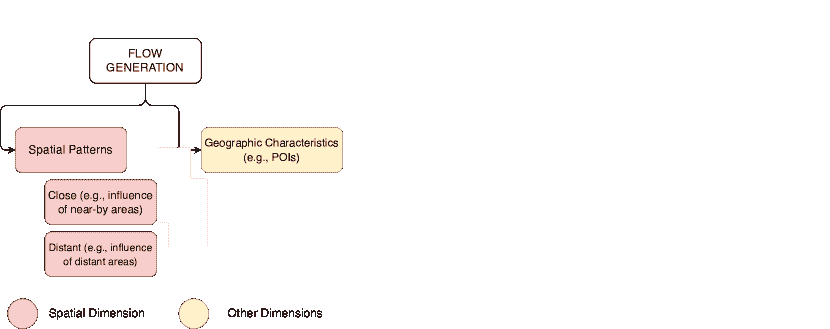
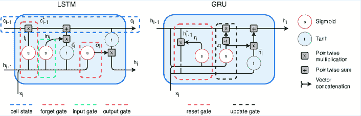

<!--yml

类别：未分类

日期：2024-09-06 19:57:53

-->

# [2012.02825] 关于人类移动性的深度学习调查

> 来源：[`ar5iv.labs.arxiv.org/html/2012.02825`](https://ar5iv.labs.arxiv.org/html/2012.02825)

# 关于人类移动性的深度学习调查

Massimiliano Luca Fondazione Bruno Kessler (FBK)Via Sommarive, 19Povo - TrentoItaly Free University of BolzanoPiazza Domenicani, 3BolzanoItaly mluca@fbk.eu [0000-0001-6964-9877](https://orcid.org/0000-0001-6964-9877 "ORCID identifier") ,  Gianni Barlacchi Amazon AlexaBerlinGermany gianni.barlacchi@gmail.com ,  Bruno Lepri Fondazione Bruno Kessler (FBK)Via Sommarive, 19Povo - TrentoItaly  和  Luca Pappalardo Institute of Information Science and Technologies, National Research Council (ISTI-CNR)Via G. Moruzzi 1, 56124PisaItaly luca.pappalardo@isti.cnr.it [0000-0002-1547-6007](https://orcid.org/0000-0002-1547-6007 "ORCID identifier")

###### 摘要。

研究人类移动性至关重要，因为它对我们社会的多个方面产生影响，如疾病传播、城市规划、福祉、污染等。数字移动数据的激增，如电话记录、GPS 路径和社交媒体帖子，加上人工智能的预测能力，推动了深度学习在人类移动性领域的应用。现有的调查主要集中于单一任务、数据来源、机械或传统的机器学习方法，而缺乏对深度学习解决方案的全面描述。本调查提供了移动性任务的分类，讨论了与每个任务相关的挑战以及深度学习如何克服传统模型的局限性，描述了对上述移动性任务最相关的解决方案以及未来的相关挑战。我们的调查是对下一个位置预测、人群流动预测、轨迹生成和流量生成的领先深度学习解决方案的指南。同时，它帮助深度学习科学家和从业者理解人类移动性研究的基本概念和未解挑战。

人类移动性、深度学习、数据集、下一个位置预测、人群流动预测、轨迹生成、轨迹、移动流、人工智能^†^†版权：无^†^†ccs：计算方法 人工智能^†^†ccs：计算方法 机器学习^†^†ccs：应用计算 交通

## 1\. 引言

城市人口正在显著增加，人类的流动性变得更加复杂和庞大，影响了人们生活中的关键方面，如病毒传播（例如 COVID-19 大流行）（Pepe et al., 2020; Lai et al., 2019; Ruktanonchai et al., 2020; Kraemer et al., 2020; Oliver et al., 2020; Pappalardo et al., 2020a），自然灾害情况下人们的行为（Song et al., 2016; Jiang et al., 2018; Wang and Taylor, 2018），公共和私人交通以及由此产生的交通量（Rossi et al., 2019; Ferretti et al., 2018; Chen et al., 2019; Khaidem et al., 2020），市民的福祉（Pappalardo et al., 2016; Voukelatou et al., 2020; Soto et al., 2011），空气污染的严重程度、能源和水的消耗（Bohm et al., 2021; Stewart et al., 2018; Nyhan et al., 2019）。此外，城市间的人员流动受到从农村到城市的迁移的影响，这些迁移可能是由自然灾害、气候变化和冲突引发的（Prieto Curiel et al., 2018a; Ahmed et al., 2016; Gray and Mueller, 2012; Reuveny, 2007; Simini et al., 2020; Luca et al., 2021; Sîrbu et al., 2020）。

幸运的是，政策制定者在面对这些挑战时并非毫无准备。无处不在的计算（例如，移动电话、物联网、社交媒体平台）的兴起提供了一种始终最新且准确的方式来感知人类在不同时间和空间尺度上的运动。移动数据的例子包括嵌入智能手机中的 GPS 设备记录的轨迹（Zheng et al., 2010; Bracciale et al., 2014; Moreira-Matias et al., 2013; Laurila et al., 2012; Piorkowski et al., 2009）、车辆（Bazzani et al., 2010; Pappalardo et al., 2013; Gallotti et al., 2013; Pappalardo et al., 2015）或船只（Chang et al., 2010; Fernandez Arguedas et al., 2018; Riveiro et al., 2018; Yan et al., 2020）；手机与蜂窝网络之间通信产生的记录（Blondel et al., 2015; Gonzalez et al., 2008）；以及社交媒体平台上的地理标签帖子（Jurdak et al., 2015; Rebelo et al., 2015; Blanford et al., 2015; Liao et al., 2019; Cui et al., 2018）。这一数字数据的洪流催生了关于人类移动性各个方面的大量科学研究，如轨迹数据的挖掘（Zheng, 2015; Zhao et al., 2016; Mazimpaka 和 Timpf, 2016; Wang et al., 2020c; Jiang et al., 2013）、统计模式的揭示（Gonzalez et al., 2008; Song et al., 2010b; Blondel et al., 2015; Barbosa et al., 2018）以及隐私风险的估算（Pellungrini et al., 2017; de Montjoye et al., 2018; Rossi et al., 2015; Pellungrini et al., 2020; Perentis et al., 2017; Fiore et al., 2019）。强大的人工智能（AI）技术的发展和大规模移动数据的可用性为研究人员提供了前所未有的机会，可以利用深度学习（DL）方法解决与移动性相关的挑战。在本次调查中，我们重点关注 DL 解决方案以预测或生成人的运动，并排除了解决其他问题的方法，例如移动数据的语义丰富（例如，预测运动目的）（Rinzivillo et al., 2014）、家庭位置检测（Pappalardo et al., 2021）和人口推断（Deville et al., 2014）。特别是，我们专注于两类任务：预测性任务和生成性任务（见图 1）。我们讨论了两个预测性任务，即下一位置预测和人群流动预测，以及两个生成性任务，即轨迹生成和流动生成。

图 1\. 我们在本调查中讨论的移动任务的分类法。我们将移动任务分为预测型，旨在预测个体或集体层面的未来移动（第三部分），和生成型，旨在生成逼真的移动流轨迹（第四部分）。在预测型任务中，我们包括 *i)* 下一位置预测，即根据个体的移动历史预测未来去向的问题（第 3.1 节），以及 *ii)* 人群流动预测，其目标是根据历史观察预测未来的汇总流动（第 3.2 节）。另一方面，我们有两个生成型任务：*i)* 轨迹生成，旨在生成逼真的个体轨迹（第 4.1 节），以及 *ii)* 流动生成，其目标是在地理区域内生成逼真的流动（第 4.2 节）。我们使用这个分类法来映射相关工作到它们解决的任务，并塑造本调查的结构。

下一位置预测是基于个人的移动历史数据预测其将要访问的位置。这在许多应用中至关重要，例如旅行推荐、位置感知广告和地理营销、潜在公共紧急情况的早期预警，以及社交网络平台上的好友推荐（Zhu 等，2015；Burbey 和 Martin，2012；Wu 等，2018；Zheng 等，2018；Zhao，2020）。而人流预测则是预测某地的进出流量，这对公共安全、按需服务的定义、土地使用管理以及交通优化都有影响（Jayarajah 等，2018；Yin 等，2020；Xie 等，2020；Ebrahimpour 等，2019；Shi 等，2019）。在生成任务方面，轨迹生成涉及生成可以现实地再现个人统计移动模式的合成轨迹（Barbosa 等，2018；Hess 等，2015；Solmaz 和 Turgut，2019；Wang 等，2019a）。流量生成则是根据位置的特征和它们之间的距离生成现实的流量，而无需了解真实流量。尽管基于机器学习（ML）的方法在解决这四项任务上取得了良好结果（Burbey 和 Martin，2012；Wu 等，2018；Zheng 等，2018；Yin 等，2020；Xie 等，2020；Ebrahimpour 等，2019；Shi 等，2019），多种原因促使研究人员采用深度学习（DL）技术，例如从（非）结构化和异质数据中自动提取相关模式的能力，以及在其他领域（例如计算机视觉、自然语言处理）获得的卓越成果。

几篇提供关于单一移动任务有趣视角的综述论文（Koolwal 和 Mohbey, 2020；Xie 等, 2020；Ebrahimpour 等, 2019；Shi 等, 2019；Barbosa 等, 2018；Hess 等, 2015；Solmaz 和 Turgut, 2019；Shin 等, 2020），移动数据来源（Xu 等, 2020；Zheng 等, 2018），或传统的机器学习方法（Hess 等, 2015；Wang 等, 2019a；Toch 等, 2019）。一些综述讨论了针对时空数据挖掘的深度学习方法（Wang 等, 2020a），与智能城市生态系统相关的任务（Chen 等, 2019b）或交通相关问题（Wang 等, 2019b；Jiang 和 Luo, 2021），涵盖了与人类移动性相关的一些方面，但没有特别关注移动任务的挑战和解决方案。

在本综述中，我们讨论了深度学习解决方案在下一位置预测、 crowd flow 预测、轨迹生成和流量生成中的应用，将这些解决方案组织成一个适当的分类法，并讨论为什么这些解决方案可能克服现有传统模型的局限性。为了找到相关的论文，我们在 Scopus 上搜索了以下关键词：“crowd flow”，“next-location”，“flow prediction”，“flow generation”，“trajectory generation”，“mobility generation”，和“mobility prediction”。在获得的结果中，我们选择了那些使用深度学习的论文，这些论文通常被用作后续论文的基线，代表了它们所处理任务的开创性工作，并在深度学习管道、深度学习模块的组合方式和数据处理方面提供了一些新颖性。对于每个任务，我们还描述了论文中使用的开放移动数据集和通常采用的评估指标。在附录中，我们提供了对深度学习模块（附录 B）、数据集（附录 C）、评估指标（附录 D）和移动模式（附录 E）的更详细描述。总之，本综述为读者提供了：

+   •

    对人类移动性的基本概念和术语的介绍（第 2.1 节）以及深度学习模块背后的关键思想（第 2.2 节）。

+   •

    与预测和生成人体移动相关的任务分类，包括对下一个位置预测（第 3.1 节）、人群流动预测（第 3.2 节）、轨迹生成（第 4.1 节）和流动生成（第 4.2 节）的全面讨论。对于每个任务，我们定义问题，讨论文献中用于解决该问题的深度学习模块，突出使用深度学习相对于传统模型的优势，并列出每个任务常用的公共数据集和评估指标。

+   •

    讨论关于四个任务的最有趣的开放挑战（第五部分）。我们还提供了一个 GitHub 仓库（[bit.ly/DL4HM](https://bit.ly/DL4HM)），研究人员可以在其中合作更新相关的移动数据集和论文列表。

+   •

    讨论深度学习模块的特点、数据来源、公共数据集、所选论文中使用的评估指标以及用于评估生成模型现实性的移动模式的附录。

调查结构如下。在第二部分中，我们提供了时空轨迹和空间聚合的定义（第 2.1 节），并简要讨论了模型处理人类移动性挑战所使用的关键深度学习模块（第 2.2 节）。这些模块的详细讨论以及人类移动性著名规律和模式的更详细概述见附录 E。

在 3 节和 4 节中，我们分别探讨了图 1 中总结的预测任务和生成任务。对于每个任务，我们在讨论其相关性后，正式定义该任务。接着，简要介绍传统的机械式和/或基于机器学习的方法，详细描述这些模型未能捕获或仅部分捕获的方面。然后，我们突出深度学习模型如何克服这些局限性，以及哪些深度学习模块通常被用来取得成功。最后，在 5 节中，我们讨论一些未解决的挑战，并得出一些结论。

## 2\. 背景

在这里，我们介绍本文余下部分中使用的符号。在 2.1 节中，我们定义了关键的移动概念，而在 2.2 节中，我们简要介绍了本综述中使用的深度学习概念和符号。

### 2.1\. 时空轨迹与空间聚合

移动数据描述了一组个体在观察期内的移动情况。它们通常通过电子设备收集，并以时空轨迹或移动流的形式存储。

个体的轨迹是一系列记录，可以重建其在观察期内的移动（Zheng et al., 2014; Zheng, 2015）。通常，每条记录包含个体的标识符、一个表示地理位置的空间点，以及一个时间戳，指示个体经过该位置的时间。

###### 定义 2.1。

设 $u$ 为个体，轨迹 $T_{u}=\langle p_{1},p_{2},...,p_{n_{u}}\rangle$ 是一个按时间顺序排列的序列，由 $u$ 访问的 $n_{u}$ 个时空点组成。一个时空点是一个对 $p=(t,l)$，其中 $t$ 表示点 $l=(x,y)$ 被 $u$ 访问的时间，$x$ 和 $y$ 是给定参考系统中的空间坐标，例如纬度和经度。一个语义时空点 $p$ 是一个元组 $p=(o,t,l)$，其中 $t$ 表示点 $l=(x,y)$ 被 $u$ 访问的时间，$l$ 是坐标对 $(x,y)$，而 $o$ 是为该点赋予一些意义的参数（例如，家、工作地点或其他类别），如果有的话。

通常，通过在时空轨迹上检测停留点（或停靠点），找到用户花费最少时间的地点（Pappalardo et al., 2019; Zheng, 2015）。在一些任务中，通过将坐标映射到空间镶嵌，即用可数个几何形状（称为瓷砖）覆盖二维空间，且没有重叠和空隙，来离散化地理空间。例如，在人群流动预测中，使用空间镶嵌来汇总在瓷砖之间移动的人员流量。

###### 定义 2.2。

给定一个区域 $A$，定义一个称为镶嵌的地理多边形集合 $\mathcal{G}$，其具有以下性质：（1）$\mathcal{G}$ 包含有限数量的多边形 $g_{i}$，称为瓷砖，$\mathcal{G}=\{g_{i}:i=1,...,n\}$；（2）瓷砖之间不重叠，$g_{i}\cap g_{j}=\emptyset,\,\forall i\neq j$；（3）所有瓷砖的并集完全覆盖 $A$，$\bigcup_{i=1}^{n}g_{i}=A$。

地理空间的镶嵌旨在使用规则的瓷砖（如等边三角形、方形、四边形、六边形瓷砖或定义建筑、普查单元或行政区划形状的不规则瓷砖）来覆盖整个感兴趣区域。随后，可以使用空间连接将每个轨迹点或停留点与包含它的瓷砖关联起来。由于镶嵌没有重叠的瓷砖和空隙，每个点仅分配给一个瓷砖。更多详细信息请参见附录 A。

### 2.2. 深度学习模块

这里介绍了在本文余下部分使用的 DL 符号。有关这里介绍的 DL 模块的详细描述，请参见附录 B。

FCs: 全连接网络（FCs）由一系列全连接层组成，其中所有神经元都连接到下一层的神经元。FCs 是通用逼近器（即可以学习任何表示函数）（Goodfellow et al., 2016）。在人体流动任务中，FC 网络通常用于捕捉外部特征和/或偏好（例如天气条件、公共事件的存在）对个体或集体流动的影响。

RNNs、LSTMs 和 GRUs：递归神经网络（RNNs）（Rumelhart 等，1986）可以有效处理序列数据，并用于捕捉移动任务中的空间和时间模式。例如，RNNs 用于下一个位置预测，以发现周期性轨迹模式，表现为停留点序列。在人群流动预测中，RNNs 用于捕捉流动的时间模式。然而，RNNs 存在梯度消失问题（Kolen 和 Kremer，2001），无法传播早期步骤中发现的信息，在分析序列末尾时会丢失序列开头的相关信息（Kolen 和 Kremer，2001）。长短期记忆网络（LSTMs）（Hochreiter 和 Schmidhuber，1997）和门控递归单元（GRUs）（Cho 等，2014a）是两种门控实现，可以缓解此问题。附录 B.1 提供了关于 RNNs、LSTMs 和 GRUs 的进一步细节和参考文献。

注意力机制：这些机制基于这样一个思想，当处理大量信息时，我们的大脑会集中关注最重要的部分，将其他部分视为背景信息。在注意力机制中，输入中的信息根据上下文（例如，注意力图）进行评分，模型会更加关注高分的信息。在人类移动性中，注意力机制被广泛用于下一个位置预测和人群流动预测，以捕捉用户偏好和突出相关历史模式。进一步的细节可以在附录 B.3 中找到。

CNNs：类似于视觉皮层（HUBEL 和 WIESEL，1959；Hubel 和 Wiesel，1962），卷积神经网络（CNNs）由对视觉场景中特定刺激有反应的神经元组成（Krizhevsky 等，2012）。它们在计算机视觉应用中非常有效，如物体识别（Simonyan 和 Zisserman，2015；Ren 等，2015）、图像分类和分割（Krizhevsky 等，2012；Farabet 等，2013）、运动或事件识别（Toshev 和 Szegedy，2014）等（Khan 等，2020）。在人类移动性任务中，CNNs 被广泛用于捕捉数据中的空间模式，特别是在预测人群流动时，人们在地理区域上的分布被表示为图像。关于 CNNs 的附加信息可以在附录 B.2 中找到。

生成模型：在人类移动领域，变分自编码器（VAEs）和生成对抗网络（GANs）用于生成现实的轨迹（即，能够真实再现移动模式的合成轨迹）。VAEs 将输入数据（例如轨迹）从高维空间转换为低维空间，将样本编码为分布（Kingma 和 Welling，2013）。GANs（Goodfellow 等，2014）设立了生成器（例如神经网络）和判别器（例如分类器）之间的对抗游戏。生成器的目标是生成真实的数据以欺骗判别器，而判别器的目的是区分真实数据和虚假数据，并向生成器提供反馈以提高生成数据的真实性。有关 VAEs 和 GANs 的详细信息可以在附录 B.4 中找到。

## 3\. 预测模型

人类移动预测模型的目标是预测未来的去向，无论是在个体还是集体层面。在个体层面，下一位置预测模型根据历史观察数据预测个人的未来去向（第 3.1 节）。在集体层面，众流预测模型基于关于聚合人群流动的历史信息，预测从某地或到某地的人流量（第 3.2 节）。

在本节中，我们描述了这两个任务，讨论了深度学习如何相对于传统方法带来显著改进，并描述了每个任务的最新解决方案，参考了公共数据集以及用于训练和测试模型的指标。

### 3.1\. 下一位置预测

预测个体未来的位置在多个应用中相关，例如监测公共健康（Barlacchi 等，2017a；Canzian 和 Musolesi，2015）、幸福感（Pappalardo 等，2016；Voukelatou 等，2020）和交通拥堵（Shi 等，2019），以及改善旅行推荐、地理营销和社交网络平台的链接预测（Zhu 等，2015；Burbey 和 Martin，2012；Wu 等，2018；Zheng 等，2018；Zhao，2020）。下一个位置预测可能帮助决策者组织公共交通网络、城市规划者决定城市未来的发展，以及交通公司为市民提供更好的服务，以减少交通和提升流动性。预测个体的下一个位置具有挑战性，因为它需要捕捉表征人类习惯的空间和时间模式（Barbosa 等，2018），并结合异质数据源来建模影响人类位移的多个因素（例如，天气、交通方式、兴趣点的存在）。

问题定义。下一个位置预测包括预测个体在未来将访问的下一个位置（停留点），根据其历史移动数据。形式上，设$u$为用户，$T_{u}$为其轨迹，$p_{t}\in T_{u}$为$u$的当前位置，下一个位置预测旨在预测$u$的下一个目的地$p_{t+1}$。这个问题有两种处理方式：*(i)* 作为多类分类任务，其中类别数量与位置数量相等，我们的目标是预测下一个访问的位置$p_{t+1}$；或*(ii)* 作为回归任务，预测$p_{t+1}=(x_{t+1},y_{t+1})$，其中$x_{t+1}$和$y_{t+1}$是下一个位置的地理坐标。下一个位置预测的一个变体旨在预测个体$u$根据其轨迹$T_{u}$将访问的下一个兴趣点（POI）$p_{t+1}$。无论具体定义如何，下一个位置预测器输出每个位置成为$u$下一个目的地的概率排名。

深度学习 vs 传统方法。下一位置预测在深度学习爆炸之前已经广泛探讨，使用的是概率或基于模式的方法，这些方法可以处理相对较少的数据量（Burbey 和 Martin, 2012; Zheng 等, 2018）。在一项开创性工作中，Calabrese 等（Calabrese 等, 2010）提出了一种将人们的轨迹和地理特征（如土地使用、兴趣点和旅行距离）结合起来的概率模型。Ashbrook 等（Ashbrook 和 Starner, 2002）将 GPS 数据聚类成有意义的位置，并将其纳入一个马尔可夫模型中以预测个体的未来移动。Gambs 等（Gambs 等, 2010）引入了一种移动马尔可夫链（MMC），其中状态表示兴趣点，状态之间的转换对应于两个兴趣点之间的移动（Gambs 等, 2010, 2012）。在基于模式的方法中，Monreale 等（Monreale 等, 2009）开发了一种轨迹模式挖掘算法，将移动模式表示为经常访问的区域序列以及典型的旅行时间。尽管传统方法在少量数据上表现良好，但它们有显著的局限性。特别是，它们在特征工程上需要大量努力，并且无法捕捉长程的时间和空间依赖（Sabarish 等, 2015）。

图 2\. a) 下一位置预测器应捕捉的人类流动性数据的空间维度（红色）、时间维度（蓝色）以及社会和地理维度（黄色）。b) 捕捉每个维度的深度学习模块，及文献中实施这些模块的选定论文的参考。

下一位置预测器应当捕捉人类流动性的空间、时间和社会地理维度（图 2）。关于空间和时间维度，预测器必须同时捕捉隐藏在人类运动中的空间和时间规律，以及人们脱离常规的倾向。同时，预测器还应捕捉外部因素和个人偏好对移动决策的影响（例如，天气条件、对某些兴趣点的偏好、友谊的影响）。传统方法只能部分捕捉这些方面，特别是在捕捉数据中复杂的序列模式时表现不佳。深度学习方法通过使用诸如 RNN、LSTM、GRU、FC、注意力机制和 CNN 等机制来捕捉数据中的时间、空间和社会地理模式，从而克服了这些问题。

数据集和评估指标。下一个位置预测器主要在公共签到数据集上进行训练和测试，这些数据集通常来自地理社交网络平台（例如，Gowalla，Foursquare）以及通过智能手机或车辆上的 GPS 设备收集的 GPS 轨迹。用于下一个位置预测的广泛使用的签到数据集示例包括 Cho 等（Cho et al., 2011），Feng 等（Feng et al., 2018）和 Yang 等（Yang et al., 2019）。

常用的轨迹数据集示例包括在葡萄牙波尔图收集的出租车轨迹（Moreira-Matias 等，2013）和在美国旧金山收集的出租车轨迹（Piorkowski 等，2009）。有关上述签到和轨迹数据集的详细信息，请参阅附录 C.2 和 C.3。

每当下一个位置预测被作为回归任务时，预测器会使用 Haversine 距离或实际位置与预测位置之间的等矩形距离进行评估（有关详细信息，请参见附录 D.1）。当下一个位置预测被作为多分类任务时，预测器会使用准确率（ACC/ACC@k）、召回率（Rec@k）、F1-score（F1@k）、平均绝对百分比误差（MAPE）和/或曲线下面积进行评估（有关详细信息，请参见附录 D.2）。

DL 方法。表格 1 包含了用于下一个位置预测的选定 DL 方法，包括相应的 DL 模块、数据集和评估指标，并提供了实现的链接（如果有的话）。

|  | 参考文献 | 名称 | 年份 | DL 模块 | 评估 | 数据集 | 代码 (https://bit.ly) |
| --- | --- | --- | --- | --- | --- | --- | --- |
| 下一个位置预测 | *Abideen et al.*(Abideen et al., 2021) | DWSTTN | 2021 | Encoder, Decoder, Attention, FC | 距离 | (Moreira-Matias et al., 2013) | - |
| *Tang et al.*(Tang et al., 2021) | CLNN | 2021 | LSTM, Embedding, FC | 距离 | (Moreira-Matias et al., 2013) | - |
| *Bao et al.*(Bao et al., 2020) | BiLSTM-CNN | 2020 | Embedding, BiLSTM, CNN | ACC@k | - |  |
| *Chen et al.*(Chen et al., 2020) | DeepJMT | 2020 | GRU, FC, Encoder | ACC@k | (Yang et al., 2019) | - |
| *Yang et al.*(Yang et al., 2020a) | Flashback | 2020 | Attention, RNN | ACC@k | (Cho et al., 2011) | [Flashback-1](https://bit.ly/Flashback-1) |
| *埃贝尔等人*(Ebel et al., 2020) | - | 2020 | RNN, FC, Embedding | Distance | (Moreira-Matias et al., 2013; Piorkowski et al., 2009) | - |
| *罗西等人*(Rossi et al., 2019) | - | 2019 | Attention, LSTM | Distance | (Moreira-Matias et al., 2013; TLC, 2009; Piorkowski et al., 2009) | - |
| *高等人*(Gao et al., 2019) | VANext | 2019 | CNN, GRU, Attention | ACC@k | (Cho et al., 2011) | - |
| *孔等人*(Kong and Wu, 2018) | HST-LSTM | 2018 | LSTM | ACC | - | [HST-LSTM](https://bit.ly/HST-LSTM) |
| *吕等人*(Lv et al., 2018) | T-CONV | 2018 | CNN, FC | Distance | (Moreira-Matias et al., 2013) | [T-CONV](https://bit.ly/T-CONV) |
| *冯等人*(Feng et al., 2018) | DeepMove | 2018 | Attention, GRU, FC | ACC | (Feng et al., 2018) | [DeepMove](https://bit.ly/DeepMove) |
| *姚等人*(Yao et al., 2017) | SERM | 2017 | LSTM | ACC@k | - | [SERM-Repo](https://bit.ly/SERM-Repo) |
| *刘等人*(Liu et al., 2016) | ST-RNN | 2016 | RNN | Rec@k, F1@k, MAPE, AUC | (Cho et al., 2011; Start, 2009) | [STRNN](https://bit.ly/STRNN) |
| *德布雷比松等人*(De Brébisson et al., 2015) | - | 2015 | FC | Distance | (Moreira-Matias et al., 2013) | [next-loc-1](https://bit.ly/next-loc-1) |

表 1\. 处理下一个位置预测的选定论文列表。对于每篇论文，我们描述相应提出的模型名称（如有）、出版年份、提出的解决方案中使用的深度学习模块、用于性能评估的指标、用于训练和测试模型的公开数据集链接，以及代码存储库的链接（如有）。这些论文按出版年份降序排列。

德布雷比松等人（De Brébisson et al., 2015）使用一个 FC 预测出租车的乘客下车位置。输入数据包括作为可变长度 GPS 点序列表示的轨迹以及其他元信息，如出发时间、司机身份和客户信息。模型性能在波尔图出租车的数据集（Moreira-Matias et al., 2013）上进行评估，以实际访问位置的等距矩形距离为标准。然而，该方法无法考虑出行数据的时间维度。

ST-RNN（空间时间递归神经网络）（Liu 等，2016）通过扩展 RNN 以包含时间和空间特定的过渡矩阵来解决这一问题。每个 RNN 层通过线性插值学习时间和空间矩阵的上下界。该模型在 Gowalla 数据集（Cho 等，2011）和全球恐怖主义数据集（GTD）（Start，2009）上使用 F1 分数、Rec@k、MAPE 和 AUC 进行评估。

DeepMove（Feng 等，2018）是一种用于从长且稀疏的轨迹中进行移动预测的注意力递归网络。首先，将历史轨迹和当前轨迹传递给一个多模态嵌入模块，以创建空间-时间和个体特征的密集表示。历史轨迹通过注意力机制处理以提取移动模式，而当前轨迹由 GRU 处理。多模态嵌入的输出、GRU 和注意力机制的输出被连接并传递给一个全连接层（FC），以预测个人的下一个位置。DeepMove 使用 ACC@k 在 Foursquare 数据（Feng 等，2018）、私有手机数据和一个流行的中国社交网络平台的私有数据集上进行评估。

HST-LSTM（层次空间时间 LSTM）（Kong 和 Wu，2018）旨在预测个人的短期下一个位置。首先，作者设计了一个 ST-LSTM（空间时间 LSTM），它使用 LSTM 结合轨迹的空间和时间特征。然后，将 ST-LSTM 扩展为 HST-LSTM，通过编码器-解码器模块建模周期性模式。编码器对用户在给定时间段和感兴趣区域内访问的地点进行编码，而解码器预测用户接下来可能访问的感兴趣区域。HST-LSTM 使用私有的百度数据进行 ACC 评估。

T-Conv (Lv 等，2018) 将轨迹视作图像，并使用 CNN 来处理这些轨迹，以捕捉不同尺度的空间模式。CNN 的输出、轨迹的起始日期时间以及用户的其他个人信息会传递给一个全连接层（FC），以处理预测。T-Conv 使用波尔图的出租车数据集（Moreira-Matias 等，2013）和哈弗赛因距离进行评估。

Rossi 等（Rossi 等，2019）提出了一种配备自注意力模块的 LSTM 网络，用于预测出租车下一次下车位置的坐标。地点通过地理数据进行丰富，以语义上描述位置周围的区域。该模型使用哈弗赛因距离进行测试，并在波尔图的出租车数据集（Moreira-Matias 等，2013）、纽约市（TLC，2009）和旧金山（Piorkowski 等，2009）上进行测试。

另一项研究方向专注于利用语义轨迹预测个人将访问的下一个 POI。例如，SERM（语义增强循环模型）（Yao et al., 2017）依赖嵌入层来简洁地表示时间戳、位置和社交媒体帖子的关键词。用户的轨迹和嵌入都被输入到一个负责预测下一个 POI 的 LSTM 中。SERM 使用 ACC@k 在纽约市的 Foursquare 签到数据（Zhang et al., 2014）和洛杉矶的推文（Zhang et al., 2016）上进行评估。

在 VANext（变分注意力下一个位置）（Gao et al., 2019）中，历史轨迹和当前轨迹使用两个独立的因果编码器进行嵌入，以表示 POI 之间的语义关系。编码的历史轨迹被传递给 CNN；编码的当前轨迹被传递给 GRU。CNN 和 GRU 的输出被传递给一个注意力机制，该机制检测与当前轨迹最相似的历史轨迹，并将其传递给一个全连接层（FC），该层预测个人的下一个 POI。VANext 使用 ACC@k 在 Gowalla（Cho et al., 2011）和 Foursquare 的数据集上进行评估，涵盖新加坡和纽约市。

Flashback（Yang et al., 2020a）基于 RNN 和闪回的概念，这是一种通过寻找在时间特征方面相似的轨迹来预测下一个 POI 的稀疏语义轨迹技术。Flashback 还使用嵌入来建模个人访问特定 POI 的偏好。RNN 和嵌入的输出被传递给一个全连接层（FC），该层预测下一个访问的 POI。Flashback 在 Gowalla（Cho et al., 2011）和 Foursquare 的签到数据上使用 ACC@k 进行评估。

DeepJMT（Deep Model for Joint Mobility and Time）（Chen et al., 2020）可以预测个体的下一个 POI 以及他们将何时访问它。该模型基于四个管道：一个序列依赖编码器、一个空间上下文编码器、一个周期性上下文提取器和一个社会-时间上下文提取器。序列依赖编码器是一个层次化的 GRU，以用户轨迹的嵌入作为输入。高层 GRU 捕捉轨迹之间的过渡；而低层 GRU 建模轨迹内部的过渡。空间上下文提取器确定空间邻居的动态影响，将其建模为图，其中最近的点影响最终预测。周期性上下文提取器是一个注意力 GRU，旨在从个体的历史轨迹中提取周期性模式。社会-时间上下文提取器利用社会关系，通过 FC 和池化函数促进下一个 POI 和时间的预测。最后，四个模块的输出被串联起来生成预测。DeepJMT 使用 ACC@k 在纽约市（Yang et al., 2019）、东京（Yang et al., 2019）和伊斯坦布尔的 Foursquare 签到上进行评估。

Ebel 等人（Ebel et al., 2020）提出了一种模型，用于根据部分轨迹和上下文数据（例如，日期、时间、天气）预测车辆的目的地和路线。首先，区域被切分，GPS 点通过基于 k-d 树的空间分区方法分配到这些网格中。该模型基于两个主要模块。第一个模块是一个 RNN，它以映射后的轨迹作为输入；第二个模块是一个 FC，它以嵌入的上下文数据作为输入。两个模块的输出被合并并传递给一个额外的 FC，该 FC 生成个体在特定网格中结束旅行的概率。该模型通过在波尔图（Moreira-Matias et al., 2013）和旧金山（Piorkowski et al., 2009）的出租车轨迹上使用平均哈弗辛距离和实际到达点的距离进行评估。

BiLSTM-CNN（Bao et al., 2020）依赖于空间聚类算法，从 POI 中推导出感兴趣区域，并使用双向 LSTM 和 CNN 来预测个体将访问的下一个区域。人们的历史移动数据被传递到双向 LSTM 中，然后传递到 CNN，以捕捉整体的空间和时间模式。CNN 的输出随后传递给一个 FC，用于处理下一个位置的预测。该模型通过 ACC@1 和 ACC@5 在收集自中国武汉的微博签到私有数据集上进行评估。

CLNN（分类学习神经网络）（Tang et al., 2021）依赖于一个信息提取模块，该模块从移动数据（例如，相似轨迹）中提取坐标、日期、时间、驾驶员特征、兴趣点和历史信息。使用 LSTM 处理坐标。日期、时间、驾驶员特征和兴趣点被嵌入到密集表示中。两个全连接层（FC）分别处理嵌入和历史信息。这两个 FC 和 LSTM 的输出通过加权和融合在一起，融合后的输出传入一个 FC，以预测下一辆出租车的目的地坐标。该模型通过在波尔图的出租车数据集上使用平均哈弗辛距离进行评估（Moreira-Matias et al., 2013）。

DWSTTN（深度宽度时空变换网络）（Abideen et al., 2021）是一种类似变换器的架构，利用历史接送观察数据和出租车特征及偏好来预测出租车的下一个目的地。该模型由两个相同的部分组成，即编码器和解码器。编码器负责学习阶段，解码器负责预测出租车下一个位置的坐标。在两者中，有关出租车的信息（例如，标识符和站点标识符）和时间信息（例如，工作日、小时、天类型）传递给嵌入层（时序变换器），而位置信息则通过空间变换器进行嵌入。时序和空间变换器的输出通过两个注意力机制进一步提取相关的时空信息。注意力机制的输出通过加权和融合在一起，融合后的输出传递给一个 FC。在编码器中，FC 输出学习到的特征表示；在解码器中，FC 输出下一个位置的坐标。该模型通过在波尔图（Moreira-Matias et al., 2013）和纽约（TLC, 2009）的出租车数据集上使用哈弗辛距离进行评估。

### 3.2\. 人群流动预测

人群流动预测是预测地理区域内位置的进出流量的问题，通常将其划分为空间镶嵌中的瓦片（Xie et al., 2020; Zheng et al., 2014）。这是一个关键问题，因为它对社会的多个方面产生影响，从公共安全（Zheng et al., 2014）到按需服务的定义（Zhou et al., 2018），土地使用管理（Jayarajah et al., 2018），以及交通优化（Zheng et al., 2014）。例如，人群流动预测器可以帮助城市管理者和政策制定者发现城市中的交通拥堵；商业人士发现潜在的投资区域；市民改进旅行计划并错开高峰期。这些预测器还可以通过提前发出警报或疏散人群来防止或缓解危险情况，例如避免大量人群涌入某个区域。

人群流动预测具有挑战性，因为它需要处理空间和时间依赖性。实际上，一个区域的流出量可能会影响邻近和远离区域的流入量。同时，人群流动的特点包括时间的紧密性、趋势和周期性。时间紧密性标志着时间上接近的事件之间的依赖关系；趋势突出显示了随时间重复的模式（例如，周末和工作日）；周期性捕捉相关事件的重复性（例如，早高峰）。此外，天气条件、节假日和公共城市事件等外部因素可能会影响人群流动模式。

问题定义。给定一个个体的轨迹 $T_{u}$ 和地理空间的空间镶嵌 $\mathcal{G}$（通常是一个 $i\times j$ 的网格），轨迹在时间间隔 $\Delta t$ 中交叉的地点（瓦片）集合为：

| (1) |  | $\small q^{t}_{T_{u}}=\{(p_{k}\rightarrow t)\in\Delta t\wedge(p_{k}\rightarrow(x,y))\in(i,j)&#124;(i,j)\},$ |  |
| --- | --- | --- | --- |

其中 $(i,j)$ 表示 $\mathcal{G}$ 上的位置，$p_{k}$ 是用户 $u$ 的当前位置，由坐标 $(x,y)$ 确定。设 $Q$ 为所有个体轨迹覆盖的位置集合，$t-1$、$t$ 和 $t+1$ 为三个连续的时间段，则位置 $(i,j)$ 的进流量 $\text{in}_{t}^{(i,j)}$ 是时间 $t$ 时在 $(i,j)$ 的个体数量，但在时间 $t-1$ 时不在 $(i,j)$。类似地，位置 $(i,j)$ 的出流量 $\text{out}_{t}^{(i,j)}$ 是时间 $t$ 时在 $(i,j)$ 的个体数量，并在时间 $t+1$ 时移动到另一个位置。

| (2) |  | $\small\text{in}_{t}^{(i,j)}=\sum_{T\in Q}&#124;\{t>1&#124;(i,j)\notin q_{T}^{t-1}\wedge(i,j)\in q_{T}^{t}\}&#124;;\mbox{\quad}\text{out}_{t}^{(i,j)}=\sum_{T\in Q}&#124;\{t>1&#124;(i,j)\in q_{T}^{t}\wedge(i,j)\notin q_{T}^{t+1}\}&#124;.$ |  |
| --- | --- | --- | --- |

我们可以将一个区域的流动表示为张量 $X_{t}\in R^{2\times I\times J}$，其中一个维度与入流相关 $(X_{t})_{1,i,j}=\text{in}_{t}^{(i,j)}$，另一个维度与出流相关 $(X_{t})_{2,i,j}=\text{out}_{t}^{(i,j)}$。因此，人群流动预测就是在给定历史流动 $\{X_{t}|1,\dots,X_{t}|t\}$ 的情况下预测 $X_{t+\Delta}$ 的任务。在大多数选定的论文中，$\Delta=1$。当 $\Delta>1$（例如在 (Wang et al., 2020b; Zhou et al., 2019)），这个问题被称为多步人群流动预测。

人群流动预测的一个变体旨在根据历史人群流动观察（Rong et al., 2019）预测整个起点-终点矩阵（即，位置对之间的流动）。

深度学习与传统方法。人群流动预测可以使用基于自回归（AR）的经典时间序列预测模型来解决，例如自回归滑动平均（ARMA）(Box et al., 2015)、自回归积分滑动平均（ARIMA）(Moorthy and Ratcliffe, 1988; Lee and Fambro, 1999)，以及如平稳和季节性 ARIMA（SARIMA）（Williams and Hoel, 2003）、向量 ARMA (Kamarianakis and Prastacos, 2003) 和时空 ARIMA (Kamarianakis and Prastacos, 2005) 等变体。由于 ARMA 和 ARIMA 只能基于时间上不发生统计变化的平稳时间序列进行预测，因此它们无法准确预测新事件。SARIMA、向量 ARMA 和时空 ARMA 旨在超越这一假设，但它们存在其他问题。例如，SARIMA 在处理长期季节模式时，其预测性能会降低。总体而言，AR 预测器在处理空间依赖关系和短期样本、捕捉时间序列中的模式以及包括附加特征（例如天气条件、公共城市事件存在）时存在困难，使它们在预测人群流动方面效果不佳。

图 3\. a) 人群流动预测器应该捕捉的人类移动数据的空间维度（红色）、时间维度（蓝色）和社会及地理维度（黄色）。b) 允许捕捉每个维度的深度学习模块，参考文献中实现这些模块的论文。

相对而言，深度学习方法能够有效建模空间和时间依赖关系，并捕捉外部因素的影响（参见图 3）。由于空间网格描述了二维空间，深度学习预测器将群体流动表示为矩阵，并利用卷积神经网络（CNN）在矩阵中检测近距离和远距离的空间和时间依赖关系的有效性。同时，由于门控循环神经网络（如 LSTM 和 GRU）可以用于建模数据中的复杂序列模式，深度学习方法可以有效捕捉群体流动的时间演变模式。卷积 LSTM（ConvLSTM）模型可以将 CNN 和 RNN 结合起来，同时捕捉空间和时间模式。最后，我们还应考虑可能影响群体流动的其他方面，如天气条件和城市中的公共事件。这些外部因素可以通过全连接层（FC）处理，并与 CNN/RNN 模块的输出结合起来。

数据集和评估指标。用于训练和评估群体流动预测器的最常用数据集包括描述纽约市自行车共享站点之间旅行的 Citi Bike 数据集（Bike, 2013），以及张等人的数据集（张等, 2017），该数据集提供了纽约市和北京每个网格的汇总进出流量，这些数据来自原始出租车的 GPS 轨迹。一些论文使用了关于华盛顿特区自行车共享系统的数据集（Bikeshare, 2011），以及描述纽约市出租车上下车地点的数据集（TLC, 2009）。有关这些数据集的详细信息，请参阅附录 C.2 和 C.3。

群体流动预测器的性能通过实测的群体流动与预测的流动之间的误差来评估。常用的误差指标包括均值绝对误差（MAE）、均方根误差（RMSE）和均值绝对百分比误差（MAPE）（参见附录 D.3 的定义和详细信息）。

深度学习方法。

表 2 显示了关于群体流动预测的选定论文，突出显示了它们使用的深度学习模块、评估指标和数据集，并提供了实现的链接（如果有的话）。

|  | 参考文献 | 名称 | 年份 | 深度学习模块 | 评估指标 | 数据集 | 代码 (https://bit.ly) |
| --- | --- | --- | --- | --- | --- | --- | --- |
| 人群流量预测 | *蒋等人*(Jiang et al., 2021) | DeepCrowd | 2021 | ConvLSTM, Attention, FC | MSE, MAE, MAPE, RMSE | (蒋等人, 2021) | DeepCrowd |
| *戴等人*(Dai et al., 2021) | - | 2021 | Attention, CNN, FC | RMSE | (张等人, 2017) | - |
| *王等人*(Wang et al., 2020b) | SeqST | 2020 | LSTM, CNN, Attention | MAE, RMSE | (Bike, 2013; TLC, 2009) | - |
| *杨等人*(Yang et al., 2020b) | ST-ESNet | 2020 | CNN, FC | RMSE | (张等人, 2017) | - |
| *任等人*(Ren et al., 2020) | HIDLST | 2020 | LSTM, CNN, FC | RMSE | (张等人, 2017) | - |
| *田等人*(Tian et al., 2020) | LDRSN | 2020 | CNN, ConvLSTM, Attention | RMSE, MAPE, MAE | (Bike, 2013; TLC, 2009) | - |
| *袁等人*(Yuan et al., 2020) | MV-RANet | 2020 | CNN, Attention, FC | RMSE, MAPE | (张等人, 2017) | - |
| *刘等人*(Liu et al., 2020b) | ATFM | 2020 | ConvLSTM | RMSE | (张等人, 2017) | ATFM-2 |
| *孙等人*(Sun et al., 2020) | MVGCN | 2020 | GCN, FC | RMSE, MAE | (TLC, 2009; 张等人, 2017; Bikeshare, 2011; Bike, 2013) | - |
| *穆拉德等人*(Mourad et al., 2019) | ASTIR | 2019 | ConvLSTM, CNN, FC | RMSE | (张等人, 2017) | ASTIR_Model |
| *周等人*(Zhou et al., 2019) | ST-Attn | 2019 | Attention, FC | RMSE | (张等人, 2017; Bike, 2013) | ST-Attn |
| *荣等人* (Rong et al., 2019) |  | 2019 | CNN, ResNet | RMSE, MAE | - | - |
| *李等人*(Li et al., 2019) | ST-DCCNAL | 2019 | CNN, Attention, LSTM, FC | RMSE | (张等人, 2017) | ST-DCCNAL |
| *林等人*(Lin et al., 2019) | DeepSTN+ | 2019 | CNN | RMSE, MAE | (Bike, 2013) | DeepSTN |
| *杜等人*(Du et al., 2019) | DST-ICRL | 2019 | CNN, LSTM, FC | RMSE, MAE | (张等人, 2017) | DST-ICRL |
| *艾等人*(Ai et al., 2019) | - | 2018 | ConvLSTM | RMSE, MAE | - | - |
| *姚等人*(Yao et al., 2019) | STDN | 2018 | CNN, LSTM, Attention, FC | RMSE, MAPE | (Bike, 2013) | STDN-2 |
| *金等人* (Jin et al., 2018) | STRCN | 2018 | CNN, LSTM, FC | RMSE | (张等人, 2017) | - |
| *Zonoozi 等人*(Zonoozi et al., 2018) | PCRN | 2018 | ConvGRU, CNN, FC | RMSE | (张等人, 2017) | - |
|  | *张等人*(Zhang et al., 2017) | ST-ResNet | 2017 | CNN, FC | RMSE | (张等人, 2017) | ST-ResNet |

表 2\. 处理人群流动预测的选定论文列表。对于每篇论文，我们描述了相应提出的模型名称（如果有的话）、发表年份、在提出的解决方案中使用的深度学习模块、用于性能评估的指标、用于训练和测试模型的公共数据集的链接，以及包含代码的仓库链接（如果有的话）。这些论文按发表年份降序排列。

在他们的开创性工作中，Zhang et al. 提出了**ST-ResNet**（Zhang et al., 2017），该模型由三个模块组成，这些模块依赖于 CNNs 来捕捉趋势、周期性模式和时间接近度。这些模块的输出与处理天气条件和公共事件存在等外部因素的**FC**的输出结合。该模型在北京的出租车数据集和纽约市的自行车数据集上进行评估（Zhang et al., 2017），使用均方根误差（RMSE）。

**ST-ESNet**（Yang et al., 2020b）通过添加卷积层来扩展**STRes-Net**（Zhang et al., 2017），以对人群流动表示的矩阵进行上采样和下采样。该模型使用北京的出租车数据集（Zhang et al., 2017）进行评估，采用均方根误差（RMSE）。

文献中的许多工作将卷积神经网络（CNNs）与递归神经网络（RNNs）结合，以利用后者处理时间模式的能力。**STRCN**（时空递归卷积网络）（Jin et al., 2018）使用三个 CNN 来捕捉短期（每日影响）、和中期（工作日与周末之间的差异）的空间模式。CNN 的输出被输入到三个 LSTM 中，以处理时间动态。**STRCN**还通过全连接层（FC）使用外部特征，如天气条件和区分工作日与假期的特征。**FC**和 LSTM 的输出被结合起来。模型的性能在北京的出租车数据集和纽约市的自行车数据集上进行评估（Zhang et al., 2017），使用均方根误差（RMSE）。

STDN（空间-时间动态网络）（Yao et al., 2019）由两个 CNN 组成：第一个 CNN 基于历史交通流量的相似性捕捉局部空间依赖，以揭示流量；第二个 CNN 捕捉交通流量。这两个 CNN 的输出经过成对相乘后与处理外部特征（例如天气事件）的全连接层（FC）输出相加。此外，STDN 使用三个 LSTM 捕捉描述人群流动的历史数据的时间依赖性。CNN 和 LSTM 在两个独立的管道上工作，这些输出被相加并传递给另一个带有注意力机制的 LSTM，用于分析当前日期的时间动态。最后，该 LSTM 的输出传递给额外的全连接层以进行人群流动和交通预测。模型性能在纽约市的自行车数据集（Bike，2013）和纽约市出租车流量数据集（TLC，2009）上使用 MAPE 进行评估。

DST-ICRL（深度时空不规则卷积残差网络）（Du et al., 2019）将卷积残差单元与 LSTM 结合，以捕捉不同交通线路中交通流量的不规则特性。类似于 STDN（Yao et al., 2019）和 ST-RESNET（Zhang et al., 2017），DST-ICRL 使用三个管道来揭示日常、每周和近期的时空动态，并使用全连接层处理外部特征。作者在北京公交车和地铁的电子卡签到的两个私有数据集上评估了 DST-ICRL，使用 MAE 和 RMSE 进行评估。

另一类人群流动预测模型利用了注意力机制。ST-DCCNAL（时空密集连接卷积网络与注意力 LSTM）（Li et al., 2019）将 CNN 与注意力 LSTM 结合，以简化输入选择。作者使用 DenseNet（Huang et al., 2017）来处理空间模式，并使用全连接层来处理外部特征。DenseNet 和全连接层的输出被输入到注意力 LSTM 中，以提取时间模式并进行预测。性能在北京出租车和纽约市自行车的数据集（Zhang et al., 2017）上使用 RMSE 进行评估。

MV-RANet（多视角残差注意网络）（Yuan et al., 2020）使用两个管道处理时空模式和移动模式。第一个管道使用三个注意力残差网络建模人群流动的紧密性、周期和趋势，这些网络的输出被融合并传递到一个卷积层。卷积层的输出然后传递到一个全连接层。第二个管道捕捉数据中的移动模式，生成三个图：一个用于转移概率，一个用于转移距离，以及一个模拟流动模式的图。这三个图使用 Node2Vec（Grover 和 Leskovec, 2016）进行编码，这是一个学习图节点连续特征表示的算法框架，然后传递到一个全连接层以提取相关的移动模式。处理图表示的全连接层和处理时空模式的全连接层的输出被送入一个额外的全连接层，负责进行预测。MV-RANet 在北京的出租车流量（Zhang et al., 2017）和三亚市的私人手机数据（CDRs）上使用 RMSE、MAPE 和 MAE 进行评估。

LDRSN（局部扩张区域移动网络）（Tian et al., 2020）由五个模块组成。第一个是处理局部空间依赖性的 CNN；第二个使用扩张单元处理远程空间依赖性。一个$k$-扩张单元是一个卷积，捕捉两个距离为$k$的区域的相关性。这两个模块的输出被融合并传递到其他两个模块：一个处理长期时间依赖性，另一个处理短期时间模式。长期模块由三个连续卷积层组成，每个卷积层后面跟随注意力 LSTM。一个单独的 ConvLSTM 处理短期模式。两个时间模块的输出被输入到一个最终模块中：首先，它将两个时间模块的输出相加，并将结果传递到一个卷积层进行预测。该模型在纽约市的自行车（Zhang et al., 2017）和出租车（TLC, 2009）数据集上使用 MAE、MAPE 和 RMSE 进行评估。

为了捕捉长期空间依赖，DeepSTN+（深度时空网络增强版）（Lin 等，2019）用 ResPlus 和 ConvPlus 替代了传统的残差单元和卷积层。ResPlus 单元采用 ConvPlus 层和标准卷积层来捕捉远程空间依赖。ConvPlus 层的理念是将输入矩阵的通道分开，并使用全连接层（FC）捕捉各区域对之间的长期空间依赖。最后，DeepSTN+ 在全连接层之前使用平均池化层以减少参数数量。DeepSTN+ 的另一个特点是，它使用时间因素和兴趣点（POI）的分布来获得人群流动的先验知识。实验在纽约市的自行车数据集（Bike，2013）和中国最受欢迎的社交网络供应商的私人数据集上进行，使用了 MAE 和 RMSE 作为评估指标。

ST-Attn（Zhou 等，2019）专门设计用于多步骤人群流量预测。它依赖于基于两种注意机制（一个捕捉空间模式，一个捕捉时间模式）的编码器和解码器，以及多个全连接层。编码器是空间和时间注意机制与全连接层的堆叠。解码器有两个连续的注意机制来捕捉空间和时间模式：第一个使用关于人群流动的历史观察，第二个使用第一个注意机制的输出和编码器的输出。解码器的输出传递给一个全连接层，以预测 $\Delta$ 下一步的人群流动。该模型在北京的出租车数据集（Zhang 等，2017）、纽约市的出租车数据集（TLC，2009）和纽约市的自行车数据集（Bike，2013）上进行评估，使用了 RMSE 作为评估指标。

ASTIR（Mourad 等，2019）由三个管道组成，每个管道使用 ConvLSTM 分别捕捉周期性、长期和短期的空间和时间依赖。三个 ConvLSTM 的输出传递给三个注意机制，这些注意机制的输出再传递给三个 ConvLSTM。三个管道的输出与处理外部因素的全连接层的结果结合，并传递给 tanh 激活函数以进行预测。ASTIR 在北京的出租车数据集和纽约市的自行车数据集（Zhang 等，2017）上进行评估，使用了 RMSE 作为评估指标。

SeqST（Wang 等，2020b）使用序列到序列的生成对抗网络（GAN）进行多步骤人群流动预测。GAN 的生成器和鉴别器依赖于卷积神经网络（CNN）和长短期记忆网络（LSTM）从数据中提取时空模式。在生成器中，他们使用进一步的 CNN 来考虑外部因素的影响，而鉴别器则推动生成器预测现实的人群流动。该模型在出租车数据集（TLC，2009）和纽约市的自行车数据集（Bike，2013）上进行评估，使用了 MAE 和 RMSE 作为评估指标。

DeepCrowd（Jiang et al., 2021）使用三个管道来捕捉前几小时、几天和几周的模式。它由三个 ConvLSTM 组成，这些 ConvLSTM 对输入数据进行下采样和上采样。每个 ConvLSTM 后跟一个注意机制，以提取相关的局部时空模式。三个注意机制的输出被拼接并传递给额外的注意机制，以进一步提取相关模式。注意机制的输出传递给 CNN 以预测 crowd flow。DeepCrowd 在东京和大阪的公开 crowd flow 数据集（Jiang et al., 2021）上使用 MSE、MAE、MAPE 和 RMSE 进行评估。

与大多数 crowd flow prediction 解决方案不同，Dai 等（Dai et al., 2021）仅使用单个管道来捕捉近距离和远距离的时间和空间模式。所有表示 crowd flow 的矩阵都传递到一个时间注意机制，其输出传递到空间注意机制。空间注意机制的输出被输入到 CNN 以提取时空模式。此 CNN 的输出与处理外部特征的 FC 的结果融合。该模型在北京的出租车和纽约市的共享单车数据集（Zhang et al., 2017）上使用 RMSE 进行评估。

其他一些模型处理略有不同的 crowd flow prediction 定义（Zonoozi et al., 2018; Ai et al., 2019; Sun et al., 2020）。PCRN（周期性卷积递归网络）（Zonoozi et al., 2018）解决了预测城市中存在分布的问题。作者使用由三个 ConvGRU 组成的金字塔模型（具有 CNN 和 GRU 的优点），以及一个通过记忆由堆叠 ConvGRU 学习到的周期性表示来捕捉模式周期性的外部模块。作者提出了三种检索和更新周期性模式的方法：使用顺序周期性表示，使用估计的周期性表示平均值，采用时间顺序表示。周期性模块和 ConvGRU 的输出被融合。该模型在北京的出租车和纽约市的共享单车数据集（Zhang et al., 2017）上使用 RMSE 进行评估。

Ai 等（Ai et al., 2019）旨在预测描述无桩共享单车系统中自行车移动的特征的短期分布。他们依赖于 ConvLSTM 来处理空间和时间依赖性。ConvLSTM 以由区域内自行车数量、分布均匀性、使用分布和一天中的时间组成的时空序列作为输入，预测未来的值。作者使用来自中国成都的两家共享单车公司私有数据集来评估他们的模型。评估指标包括 MAE 和 RMSE。

一些近期的研究解决了流预测的问题，这是人群流预测的一种变体，旨在使用历史观察数据来预测整个起点-终点矩阵，即位置对之间的流动。

MVGCN（多视图图卷积网络）（Sun 等，2020）通过两个全连接层处理外部特征（例如，天气数据），处理天气信息和时间及星期几等元信息。作者选择关键时间快照来处理表示最近、每日、每周、每月和每季度移动流的图。这些图中的每个节点代表一个具有时间变化流的区域。这些图被送入五个图卷积网络，七个网络（五个图卷积网络和两个用于外部特征的全连接层）的输出通过多视图融合机制进行融合。融合模块的输出被送入一个额外的全连接层，该层输出预测图，其中每个节点是一个区域，链接是预测的流动。实验在纽约市的自行车（Bike，2013）和出租车（TLC，2009）、华盛顿特区的自行车（Bikeshare，2011）以及北京的出租车（Zhang 等，2017）数据集上进行。两种情况下都使用 RMSE 和 MAE 评估模型的性能。

Rong 等（Rong 等，2019）为每个位置使用不同的 CNN，表示为类似图像的矩阵，以提取长期和短期的空间和时间特征。每个矩阵由多个通道组成，每个通道对应于一个历史观察时间间隔。该模型在中国社交网络的私人数据集上进行评估，涉及北京的流动，使用 MAE 和 RMSE。

## 4\. 生成模型

人类移动生成模型旨在生成真实的时空轨迹（轨迹生成，见 4.1）或移动流（流生成，见 4.2）。

在本节中，我们描述了两个任务，讨论了深度学习相较于传统方法带来的显著改进，并描述了每个任务的相关前沿解决方案，同时参考了用于训练和测试模型的公共数据集及度量标准。

### 4.1\. 轨迹生成

生成个体人类移动性的目标是生成具有现实移动模式的合成轨迹（Karamshuk et al., 2011; Hess et al., 2015; Wang et al., 2019a; Barbosa et al., 2018; Feng et al., 2020; Shin et al., 2020）。生成的合成轨迹必须再现一系列空间和时间的移动模式，例如特征距离分布和人类行踪的可预测性（参见附录 E）。生成模型的使用在许多应用中至关重要。首先，合成轨迹对网络协议的性能分析有帮助，例如移动自组网，其中网络用户的位移用于路由和传递消息（Karamshuk et al., 2011; Hess et al., 2015; Tomasini et al., 2017）。其次，合成轨迹对城市规划、假设分析和计算流行病学至关重要，例如在新基础设施存在下模拟城市移动的变化、流行病传播、恐怖袭击或国际事件（Cutter et al., 2013; UNISDR, 2012; Yabe et al., 2016, 2017）。此外，生成模型是保护轨迹数据地理隐私的可行解决方案（Mir et al., 2013; Fiore et al., 2019; Pellungrini et al., 2020）：虽然披露真实数据需要在不确定性和实用性之间做出难以控制的权衡，但保留统计特性的合成记录在多项任务中可以实现与真实数据相当的性能。

解决轨迹生成问题需要同时捕捉个体人类移动的时间和空间模式。一个现实的生成模型应该重现实证观察到的时间统计数据，包括访问地点的数量和顺序，以及访问的时间和持续时间。特别是，最大的难点在于同时描述个体的日常活动和偶发的非日常移动模式。关于空间模式，生成模型应当重现个体倾向于在短距离内移动的趋势（Gonzalez et al., 2008; Pappalardo et al., 2013），特征距离的异质性（Gonzalez et al., 2008; Pappalardo et al., 2013）及其尺度（Alessandretti et al., 2020），个体分为回访者和探险者的倾向（Pappalardo et al., 2015），人类位移的规律性和可预测性（Song et al., 2010b），以及个体访问的地点数量在时间上保持不变的事实（Alessandretti et al., 2018）。

问题定义。一个生成移动模型 $M$ 是任何能够生成一组 $n$ 个合成轨迹 $\mathcal{T}_{M}=\{T_{a_{1}},\dots,T_{a_{n}}\}$ 的算法，这些轨迹描述了 $n$ 个独立代理 $a_{1},\dots,a_{n}$ 在某段时间内的移动。为单个代理 $a_{i}$ 生成的合成轨迹应符合定义 2.1，即一个时间顺序的序列 $T_{a_{i}}=\langle p_{1},p_{2},...,p_{k}\rangle$，由描述 $a_{i}$ 访问的 $k$ 个地点的时空点组成。$M$ 的现实性通过以下方面来评估：

1.  (1)

    一组空间模式 ($s_{1},\dots,s_{m_{s}}$) 和时间模式 ($t_{1},\dots,t_{m_{t}}$) $\mathcal{K}=\{s_{1},\dots,s_{m_{s}},t_{1},\dots,t_{m_{t}}\}$（见附录 E）。这些模式指的是个体测量的分布，量化与单个个体的移动相关的方面（例如，回旋半径、移动熵），或集体测量，量化与一个区域整体的移动相关的方面（例如，OD 矩阵）。一个现实的 $\mathcal{T}_{M}$ 应该尽可能重现尽可能多的移动模式。

1.  (2)

    一组 $\mathcal{X}=\{T_{u_{1}},\dots,T_{u_{m}}\}$ 的真实移动轨迹，对应于在与生成合成轨迹相同区域中移动的 $m$ 个真实个体 $u_{1}\dots u_{m}$。通常，一部分 $\mathcal{X}_{\mbox{\footnotesize train}}\in\mathcal{X}$ 被用来训练 $M$ 或调整其参数。剩余部分 $\mathcal{X}_{\mbox{\footnotesize test}}$ 被用来计算模式集合 $\mathcal{K}$，这些模式与在 $\mathcal{T}_{M}$ 上计算的模式进行比较。

1.  （3）

    一个计算两个分布之间差异的函数 $D$，例如 KL 散度或 JS（见附录 D.4 获取定义）。具体来说，对于 $f\in\mathcal{K}$ 中的每一个度量，$D(P_{(f,\mathcal{T}_{M})}||P_{(f,\mathcal{X}_{\mbox{\footnotesize test}})})$ 表示 $P_{(f,\mathcal{T}_{M})}$ 和 $P_{(f,\mathcal{X}_{\mbox{\footnotesize test}})}$ 之间的差异，其中 $P_{(f,\mathcal{T}_{M})}$ 是在 $\mathcal{T}_{M}$ 中计算的合成轨迹的度量分布，而 $P_{(f,\mathcal{X}_{\mbox{\footnotesize test}})}$ 是在 $\mathcal{X}_{\mbox{\footnotesize test}}$ 中计算的真实轨迹的度量分布。$D(P_{(f,\mathcal{T}_{M})}||P_{(f,\mathcal{X}_{\mbox{\footnotesize test}})})$ 越低，模型 $M$ 在 $f$ 和 $\mathcal{X}_{\mbox{\footnotesize test}}$ 方面就越逼真。

DL 与传统方法的对比。关于机制生成模型的文献非常丰富，这些模型再现了人类移动的简单时间、空间和社会模式（Barbosa et al., 2018; Pappalardo and Simini, 2018; Karamshuk et al., 2011; Hess et al., 2015; Wang et al., 2019a）。例如，在探索与优先返回（EPR）模型中（Song et al., 2010a），代理可以在两个竞争机制之间选择：探索，其中代理选择一个从未访问过的新位置，基于具有幂律跳跃大小分布的随机游走过程；以及优先返回，在此机制中，代理根据访问频率返回到以前访问过的位置。随后，多个研究通过增加越来越复杂的空间或社会机制改进了 EPR 模型（Pappalardo et al., 2015; Barbosa et al., 2015; Alessandretti et al., 2018; Toole et al., 2015; Cornacchia and Pappalardo, 2021）。EPR 及其扩展主要关注人类移动的空间方面，实施了不切实际的时间机制。TimeGeo（Jiang et al., 2016）和 DITRAS（Pappalardo and Simini, 2018）通过将数据驱动模型集成到类似 EPR 的模型中，改进了时间机制，该模型捕捉了昼夜节律的旅行倾向和非例行旅行。尽管机制模型由于设计上的原因具有可解释性，但由于实现机制的简单性，其现实性有限。

图 4\. a) 轨迹生成器应捕捉的空间维度（红色）、时间维度（蓝色）和社会及地理维度（黄色）的人类移动数据方面。b) 允许捕捉每个维度的 DL 模块，以及参考文献中实现这些模块的选定论文。

上述限制可以通过使用如 GANs 和 VAEs 的 DL 生成范式来解决。在这两种情况下，模型依赖于 DL 模块来学习数据的分布并生成来自相同分布的移动轨迹（见图 4）。由于 DL 模块的多样性，GANs 和 VAEs 可以同时捕捉不同的方面（例如，移动的空间、时间、社会维度），而传统方法只能捕捉到移动的特殊方面（例如，仅空间维度）。此外，DL 模型可以捕捉数据中的复杂和非线性关系，而传统方法可能无法捕捉。因此，这些模型能够生成比传统模型更真实的数据。

数据集和评估指标。轨迹生成器通常在 GPS 数据集上进行训练和评估，如 Geolife (Zheng et al., 2010)、MDC (Laurila et al., 2012) 和旧金山的出租车轨迹 (Piorkowski et al., 2009)。有关这些数据集的更多信息可以在附录 C.2 中找到。分布间的距离衡量轨迹生成器的性能（例如，使用 KL 或 JS 散度，详见附录 D.4）即计算在真实数据集和生成数据集上的标准流动性指标。附录 D.1 描述了一组标准的流动性指标，常用于评估轨迹生成器的真实性。

深度学习方法。

|  | 参考文献 | 名称 | 年份 | 深度学习模块 | 评估 | 数据集 | 代码 (https://bit.ly) |
| --- | --- | --- | --- | --- | --- | --- | --- |
| 轨迹生成 | Wang 等 (Wang et al., 2021) | TSG | 2021 | GAN, CNN, LSTM | 距离，$r_{g}$，$p(r,d)$ | (Moreira-Matias et al., 2013) | TSG_Model |
| Feng 等 (Feng et al., 2020) | MoveSim | 2020 | GAN, 自注意力 CNN | 距离，$r_{g}$，$p(r,d)$，DailyLoc，G-rank，I-rank | (Zheng et al., 2010) |  |
| Huang 等 (Huang et al., 2019) | SVAE | 2019 | VAE, LSTM | MDE | - | - |
| Ouyang 等 (Ouyang et al., 2018) | Ouyang GAN | 2018 | WGAN, CNN | $p(r)$, $p(r,t)$, $p(r,d)$, $p(r,d_{total})$, $p_{d_{total}}$, 位置频率 | (Laurila et al., 2012) | - |
| Kulkarni 等 (Kulkarni et al., 2018) | - | 2018 | RNN, GAN | 访问频率，统计相似性，隐私测试 | (Laurila et al., 2012) | - |
| Yin 等 (Yin and Yang, 2018) | - | 2018 | GAN, FC | 重建误差，效用损失 | (Piorkowski et al., 2009) | - |
| Liu 等 (Liu et al., 2018) | trajGANs | 2018 | GANs | - | - | - |

表 3\. 列出了处理轨迹生成的选定论文。对于每篇论文，我们描述了对应提出的模型名称（如有）、出版年份、提出解决方案中使用的深度学习模块、用于性能评估的指标、用于训练和测试模型的公开数据集的链接，以及代码仓库的链接（如有）。论文按出版年份降序排序。

大多数用于轨迹生成的深度学习方法基于 GAN（生成对抗网络），而少数则基于 VAE（变分自编码器）。表格 3 列出了最相关的深度学习轨迹生成方法。

在他们的愿景论文中，Liu 等人（Liu et al., 2018）提出了 trajGANs 框架，以应对使用 GAN 进行轨迹生成的潜力和挑战。类似于典型的 GAN（Goodfellow et al., 2014），trajGAN 由一个生成器 $G$ 和一个判别器 $D$ 组成。生成器 $G$ 接受一个随机向量 $z$ 并生成合成轨迹样本的密集表示，而判别器 $D$ 将输入轨迹样本分类为“真实”或“伪造”。Liu 等人（Liu et al., 2018）建议使用递归神经网络（RNNs）来创建轨迹的密集表示，并在轨迹与分布表示之间进行转换。

Ouyang 等人（Ouyang et al., 2018）将轨迹表示为一系列停留，每个停留都有地理位置、开始时间和持续时间。具体而言，轨迹是一个 $n_{1}\times n_{2}\times k$ 矩阵，其中 $n_{1}\times n_{2}$ 是一个方形网格的大小，$k$ 是每个位置的最大停留重复次数（实验中设置为 $k=4$）。使用 Wasserstein GAN（Gulrajani et al., 2017）来训练轨迹生成器。生成器和判别器都基于 CNN（卷积神经网络）。实验在 MDC 数据集（Laurila et al., 2012）上进行，使用 $64\times 64$ 的方形网格，地点在瑞士洛桑市。使用 JS 散度来评估合成轨迹与真实轨迹之间的相似性，评估指标包括位置的流行度 $p(r)$ 和时间流行度 $p(r,t$)、停留模式 $p(r,d)$、语义重要性 $p_{d_{total}}(r)$、语义距离以及 G-rank。

Song 等人（Song et al., 2019）在 GAN 框架中使用具有四层的 CNN 来生成表示为 $512\times 512$ 矩阵的轨迹。在数据卷积过程中，输入的 $512\times 512$ 矩阵被调整为 $32\times 32$ 矩阵。由于可用的（私有）手机数据集较小，实验包括通过随机打乱真实轨迹获得的合成轨迹。在解卷积过程中，GAN 的输出（$32\times 32$ 矩阵）使用最近邻函数调整回 $512\times 512$ 矩阵。没有提供模型现实性的定量评估。

黄等人（黄等人，2019）提出了 SVAE（Sequential Variational Autoencoder），这是一种生成模型，基于变分自编码器（VAE）和长短期记忆网络（LSTM）的结合，结合了 VAE 构建潜在空间捕捉训练数据显著特征的能力和 LSTM 处理序列数据的能力。在数据处理阶段，他们强制输入轨迹具有固定的时间戳，并在实验中通过真实与合成轨迹对之间的均值距离误差（MDE）评估 SVAE 的现实性，发现 SVAE 的重建误差小于 800 米。

库尔卡尔尼等人（库尔卡尔尼等人，2018）对 RNN、SeqGAN（Yu 等人，2017）、RGAN（Esteban 等人，2017）和非参数共轭分布进行了性能基准测试，以生成合成轨迹。他们根据地理和语义相似性、统计相似性、长程依赖和隐私测试将生成的轨迹与从 MDC 数据集（Laurila 等人，2012）中提取的真实轨迹进行比较。他们发现，共轭分布在模型性能和计算时间方面优于所有其他方法。

MoveSim（Feng 等人，2020）是一个无模型 GAN 框架，融合了人类移动规律的领域知识。生成器由基于自注意力的序列模型组成，用于捕捉人类移动中的时间过渡。判别器包括一个移动规律感知损失，用于区分生成的轨迹与虚假轨迹。空间连续性和时间周期性这两个移动规律用于预训练生成器和判别器，以加速学习过程。他们在一个私有手机数据集上进行实验，以基站作为空间单位，并在 GeoLife（Zheng 等人，2010）上进行实验，将 GPS 坐标投影到网格中。对于时间粒度，基本时间段设置为一天的半小时。MoveSim 的现实性通过使用 JS 散度与真实轨迹相比，对距离分布、回转半径、每日访问地点数量、G-rank 和 I-rank 进行评估。

Yin et al.（Yin and Yang, 2018）使用基于 GAN 的框架来生成密度分布，而不是轨迹，即每个时间段每个位置的用户数量。生成器和鉴别器都采用全连接层（FCs）实现。实验在从 MoMo（空间分辨率 2 公里，时间段 30 分钟）提取的数据集和旧金山出租车的数据集（50 公里$\times$50 公里的正方形镶嵌，时间段两分钟）（Piorkowski et al., 2009）上进行。所提出的模型在重建误差和效用损失方面进行评估，优于差分隐私方法在数据效用和攻击误差方面。

TSG（两阶段 GAN）（Wang et al., 2021）由两个具有不同目标的 GAN 组成。第一个 GAN 从轨迹中捕捉时空模式，这些模式通过 CNN（生成器和鉴别器均使用）映射到空间镶嵌中。生成的矩阵随后被处理，旅行的起点（进入点）和终点（出口点）被提取。第二个 GAN 使用 CNN 从道路地图中提取道路信息，并使用 LSTM 在道路网络中生成从起始道路到目的道路的轨迹。模型性能通过测量轨迹长度分布与前 50 个访问地点频率之间的 JS 散度，使用波尔图出租车数据集（Moreira-Matias et al., 2013）进行评估。

### 4.2. 流量生成

流量生成包括在一组地理位置之间生成流量，考虑到某些位置的特征（例如，人口、兴趣点、土地使用、与其他位置的距离），而没有任何关于真实流量的信息（Barbosa et al., 2018）。流量生成对于我们社会的许多方面至关重要，例如交通规划（Erlander and Stewart, 1990）和空间经济学（Karemera et al., 2000；Patuelli et al., 2007；Prieto Curiel et al., 2018b），以减少不平等并设计更可持续的社区，以及流行病传播模式的建模（Balcan et al., 2010；Li et al., 2011；Cevik, 2020；Zhang et al., 2020）。解决流量生成问题需要捕捉近距离和远距离流量的空间模式、移动网络中的依赖关系以及位置特征。

问题定义。给定一个区域$A$上的镶嵌$\mathcal{G}$，位置$g_{i}$和$g_{j}$之间的流量$y(g_{i},g_{j})$表示从$g_{i}$到$g_{j}$移动的人数。从位置$g_{i}$的总流出量$O_{i}$是指从位置$g_{i}$起始的总人数，即$O_{i}=\sum_{j}y(g_{i},g_{j})$。流量生成旨在估计$y(g_{i},g_{j})\forall$  $i,j\in\mathcal{G}$，$i\neq j$，即给定每对位置$(g_{i},g_{j})$的总流出量$O_{i}$和$O_{j}$，计算它们之间的流量。

DL 与传统方法的比较。流量生成已经引起了很长时间的关注。特别是，1946 年乔治·K·齐普夫提出了一种估计流动的模型，将其与牛顿的万有引力定律进行类比（齐普夫，1946）。这个模型被称为重力模型，基于这样一个假设：两个位置之间的旅行者数量（流量）随着位置人口的增加而增加，同时随着它们之间的距离而减少（Barbosa et al.，2018）。尽管重力模型取得了显著成果，但它存在一些缺陷，包括不能准确捕捉实际流动的结构以及实际流动的变异性比预期的更大（Simini et al.，2020）。此外，生成过程中没有考虑其他因素（例如，POI、街道网络等）。其他机械模型旨在通过捕捉额外信息（如辐射模型）来扩展重力模型。所有提到的模型都无法捕捉数据中的非线性关系，并且依赖于有限的参数集。

图 5\. a) 流量生成器应该捕捉到的人类流动数据的空间维度（红色）以及社会和地理维度（黄色）。b) 允许捕捉每个维度的 DL 模块，并参考文献中实现这些模块的相关论文。

相比之下，DL 方法能够捕捉数据中的复杂和非线性关系，并且可以轻松地整合关于位置的额外信息，如人口、POI（图 5）。例如，一个全连接层（FC）可以接收表示 POI 的数据，类似地，POI 可以作为图神经网络中的节点特征。最后，卷积神经网络（CNNs）可以捕捉传统方法无法捕捉的空间关系。同样，全连接网络可以接收表示流量源和目的地附近区域的额外特征，以描绘其空间模式。

数据集和评估指标。流生成器通常在来自官方统计机构的通勤数据（Simini et al., 2020; Kang et al., 2020）上进行评估。另一种数据集是北京市出租车轨迹数据（Zheng, 2011; Yao et al., 2020），这些数据被聚合成流（详细信息请参见附录 C）。流生成通常通过实际流和生成流之间的 CPC（通勤者共同部分）来评估。其他常用的指标包括 MAE、RMSE 和 MAPE。有关这些指标的附加信息可以在附录 D.3 中找到。

DL 方法。关于流生成的文献有限（表 4）。

DeepGravity（Simini et al., 2020）使用 FCs 扩展原始引力模型，能够捕捉非线性关系，并有可能整合额外的信息来轻松表征位置（例如，人口、POI）。该模型在来自英国和意大利的官方统计通勤数据以及从美国个体轨迹聚合的流数据集（Kang et al., 2020）上使用 CPC 和 RMSE 进行评估。作者还提供了对生成流的有意义解释，涉及来源和目的地位置的特征。

SI-GCN（空间交互 GCN）（Yao et al., 2020）由三部分组成：*(i)* 处理数据空间表示的层（例如，构建局部图、负采样、特征组织）；接着是*(ii)* 一个编码器，利用图卷积生成所有地理单元的潜在空间表示；以及*(iii)* 一个解码器，负责从潜在表示生成缺失的流。SI-GCN 在 T-Drive 数据集（Zheng, 2011）上使用 RMSE、MAPE 和 CPC 作为评估指标。

GML（地理上下文多任务嵌入学习器）（Liu et al., 2020a）捕捉地理上下文信息中的空间关联，并依赖于两个具有注意力机制的图神经网络（GAT）。GAT 的作用是学习嵌入表示，然后传递给负责生成流的梯度提升模型。该模型使用 MAE、RMSE 和 CPC 在纽约市的通勤数据上进行评估。

|  | 参考文献 | 名称 | 年份 | DL 模块 | 评估 | 数据集 | 代码 (https://bit.ly) |
| --- | --- | --- | --- | --- | --- | --- | --- |
| F. G. | Yao et al. (Yao et al., 2020) | SI-GCN | 2020 | GCN | RMSE, MAPE, CPC | (Zheng, 2011) |  |
| Simini et al. (Simini et al., 2020) | Deep Gravity | 2020 | FC | CPC | (Kang et al., 2020) | [DeepGravity](https://bit.ly/DeepGravity) |
| Liu et al. (Liu et al., 2020a) | GMEL | 2020 | GNN, Attention | RMSE, MAE, CPC |  | [GMEL-Code](http://bit.ly/GMEL-Code) |

表 4\. 处理流量生成的精选论文列表。对于每篇论文，我们描述了相应提出的模型名称（如果有的话）、发表年份、所用的深度学习模块、性能评估中使用的指标、用于训练和评估模型的公开数据集的链接，以及包含代码的仓库链接（如果有的话）。这些论文按发表年份降序排序。

## 5\. 结论

在本次调查中，我们提出了对人类移动性深度学习方法的看法，重点关注下一个位置预测、人群流动预测、轨迹生成和流量生成。对于每个任务，我们突出了相关的挑战以及深度学习如何比传统模型更好地捕捉人类移动性。我们描述了每个任务的相关最先进解决方案。作为对社区的额外贡献，我们创建了一个 GitHub 仓库（[bit.ly/DL4HM](https://bit.ly/DL4HM)），研究人员可以在其中贡献，保持相关论文列表的最新状态。我们的调查揭示了预测任务（下一个位置预测和人群流动预测）在社区中已经相当成熟，并由各种深度学习方法进行处理。相比之下，深度学习用于生成任务（轨迹生成和流量生成）则较为新颖，未来应引起更多关注。

我们对人类移动性的深度学习（DL）技术现状的概述揭示了现有解决方案存在若干局限性，许多相关方面需要在未来加以解决。特别地，我们识别出以下开放挑战。

##### 地理可迁移性。

尽管深度学习模型可以自动捕捉复杂的移动模式，但它们严格依赖于用于训练的数据，并且可能不具备*地理可迁移性*，即，训练于特定区域的一个模型可能无法用于预测其他区域的位置或人群流动，或生成不同、不重叠区域的合成轨迹。地理可迁移性在区域缺乏或甚至没有移动数据的情况下可能至关重要，并且带来多个相关挑战，例如设计适合的移动轨迹或流动的编码器。作为朝着这一方向迈出的首个尝试，RegionTrans（Wang et al., 2018）提供了如何解决人群流动预测的迁移性问题的见解。但仍需更多工作来解决这一开放挑战。

##### 可解释性。

深度学习（DL）模型本质上是*不透明*的，即它们是黑箱，难以重建导致生成轨迹或预测位置或流动的推理过程。然而，可解释性对深入理解移动模式和揭示模型推理中的偏差至关重要。开发与移动相关的解释，提供示例和反例来从不同角度验证轨迹和人群流动是重要的。虽然模型依赖于许多特征，无论是外部特征（例如天气数据、兴趣点）还是时空特征，但每个特征对模型预测或生成的作用并不明确。为人类移动设计可解释的深度学习模型对于获取可能对决策者和城市规划者等用户有用的知识至关重要。

##### 隐私。

深度学习（DL）模型在训练和预测或生成阶段都存在隐私问题。例如，在轨迹生成中，评估从合成轨迹中重新识别真实用户的风险至关重要，尤其是在数据稀缺的情况下。合成轨迹可能与真实轨迹相似，恶意对手可能利用这些信息进行重新识别。在训练阶段，无论移动任务是什么，泄露私人数据的风险都很高，因为使用的信息部分无法直接控制。文献中对训练轨迹或人群流动可以在不降低生成模型的真实性和预测模型准确性的情况下进行扰动的程度的研究几乎没有。

##### 可调性。

有意义的预测和模拟需要能够在相关的移动维度上进行控制的模型，如地理空间、时间粒度、移动限制或其他可能改变移动性、轨迹或人群流动的事件等。目前的深度学习（DL）模型具有有限的可调性，这限制了它们在实践中的可用性。例如，模型的真实性或准确性在多大程度上依赖于空间切分的大小或形状尚不清楚，这可能根据用户的需求而有所不同。例如，假设决策者有兴趣识别一个城市中每日移动性最活跃的区域。在这种情况下，使用行政区块可能会提供更具解释性的结果。相反，如果他们想了解交通和道路网络如何影响大事件以及如何受到影响，使用细粒度网格状切分可能会有所帮助。

##### 交互维度。

下一位置预测器和轨迹生成器假设个体流动性独立，尽管社会目的或集体需求可以解释人类运动的显著部分。人们的移动并非完全独立，它们可能导致如交通堵塞、事故或大规模通勤模式等情况。需要设计能够包括这些方面的模型，以更全面地捕捉人类流动性的复杂性。

###### 致谢。

Luca Pappalardo 部分得到了欧盟 H2020 SoBigData++ 资助协议 #871042 的支持。

## 参考文献

+   (1)

+   Abideen 等人 (2021) Zain Ul Abideen, Heli Sun, Zhou Yang, Rana Zeeshan Ahmad, Adnan Iftekhar, 和 Amir Ali. 2021. 基于深度宽度空间-时间变换网络的建模用于预测出租车司机行为的下一目的地。*应用科学* 11, 1 (2021), 17.

+   Ahmed 等人 (2016) Mohammed N Ahmed, Gianni Barlacchi, Stefano Braghin, Francesco Calabrese, Michele Ferretti, Vincent PA Lonij, Rahul Nair, Rana Novack, Jurij Paraszczak, 和 Andeep S Toor. 2016. 数据驱动的大规模迁移分析的多尺度方法。在*SoGood@ ECML-PKDD*。

+   Ai 等人 (2019) Yi Ai, Zongping Li, Mi Gan, Yunpeng Zhang, Daben Yu, Wei Chen, 和 Yanni Ju. 2019. 一种基于深度学习的无桩共享单车系统短期时空分布预测方法。*神经计算与应用* 31, 5 (2019), 1665–1677.

+   Alessandretti 等人 (2020) Laura Alessandretti, Ulf Aslak, 和 Sune Lehmann. 2020. 人类流动性的尺度。*自然* 587, 7834 (2020), 402–407. [`doi.org/10.1038/s41586-020-2909-1`](https://doi.org/10.1038/s41586-020-2909-1)

+   Alessandretti 等人 (2018) Laura Alessandretti, Piotr Sapiezynski, Vedran Sekara, Sune Lehmann, 和 Andrea Baronchelli. 2018. 人类流动性中存在保守量的证据。*自然人类行为* 2, 7 (2018), 485–491.

+   Ashbrook 和 Starner (2002) Daniel Ashbrook 和 Thad Starner. 2002. 通过 GPS 学习重要位置并预测用户移动。在*第六届国际可穿戴计算机研讨会论文集中,* IEEE, 101–108.

+   Balcan 等人 (2010) Duygu Balcan, Bruno Gonçalves, Hao Hu, José J Ramasco, Vittoria Colizza, 和 Alessandro Vespignani. 2010. 传染病空间传播建模：全球流行病与流动性计算模型。*计算科学杂志* 1, 3 (2010), 132–145.

+   Bao 等人 (2020) Yi Bao, Zhou Huang, Linna Li, Yaoli Wang, 和 Yu Liu. 2020. 基于地理标记社交媒体的用户下一位置预测的 BiLSTM-CNN 模型。*国际地理信息科学杂志* (2020), 1–22.

+   Barbosa 等人 (2018) Hugo Barbosa, Marc Barthelemy, Gourab Ghoshal, Charlotte R James, Maxime Lenormand, Thomas Louail, Ronaldo Menezes, José J Ramasco, Filippo Simini, 和 Marcello Tomasini. 2018. 人类流动性：模型与应用。*物理学报告* 734 (2018), 1–74.

+   Barbosa 等 (2015) Hugo Barbosa、Fernando B de Lima-Neto、Alexandre Evsukoff 和 Ronaldo Menezes。2015。人类流动的时效性影响。*EPJ Data Science* 4 (2015), 1–14。

+   Barlacchi 等 (2017a) Gianni Barlacchi、Christos Perentis、Abhinav Mehrotra、Mirco Musolesi 和 Bruno Lepri。2017a。你感到生病了吗？利用人类流动行为预测流感样症状。*EPJ Data Science* 6, 1 (2017), 27。

+   Barlacchi 等 (2017b) Gianni Barlacchi、Alberto Rossi、Bruno Lepri 和 Alessandro Moschitti。2017b。用于自动分析城市区域的结构语义模型。发表于 *欧洲机器学习与数据库知识发现联合会议*。Springer, 279–291。

+   Bazzani 等 (2010) Armando Bazzani、Bruno Giorgini、Sandro Rambaldi、Riccardo Gallotti 和 Luca Giovannini。2010。佛罗伦萨地区微观 GPS 数据中的城市流动统计规律。*统计力学期刊：理论与实验* 2010, 05 (2010), P05001。

+   Bike (2013) Citi Bike。2013。*Citi Bike 系统数据 - 纽约市*。 [`www.citibikenyc.com/system-data`](https://www.citibikenyc.com/system-data)

+   Bikeshare (2011) Capital Bikeshare。2011。*Capital Bikeshare - 华盛顿特区*。 [`www.capitalbikeshare.com/system-data`](https://www.capitalbikeshare.com/system-data)

+   Bindschaedler 和 Shokri (2016) V. Bindschaedler 和 R. Shokri。2016。合成可信的隐私保护位置轨迹。发表于 *2016 IEEE 安全与隐私研讨会 (SP)*。546–563。

+   Blanford 等 (2015) Justine I. Blanford、Zhuojie Huang、Alexander Savelyev 和 Alan M. MacEachren。2015。地理位置推文。增强流动性地图并捕捉跨境移动。*PLOS ONE* 10, 6 (2015), 1–16。

+   Blondel 等 (2015) Vincent D. Blondel、Adeline Decuyper 和 Gautier Krings。2015。移动电话数据集分析结果综述。*EPJ Data Science* 4, 1 (2015), 10。

+   Bohm 等 (2021) M Bohm、Mirco Nanni 和 Luca Pappalardo。2021。高时空分辨率下量化道路网络中的空气污染物。发表于 *Climate Change AI, NeurIPS Workshop*。

+   Box 等 (2015) George EP Box、Gwilym M Jenkins、Gregory C Reinsel 和 Greta M Ljung。2015。*时间序列分析：预测与控制*。John Wiley & Sons。

+   Bracciale 等 (2014) Lorenzo Bracciale、Marco Bonola、Pierpaolo Loreti、Giuseppe Bianchi、Raul Amici 和 Antonello Rabuffi。2014。CRAWDAD 数据集 roma/taxi (v. 2014-07-17)。

+   Brockmann 等 (2006) Dirk Brockmann、Lars Hufnagel 和 Theo Geisel。2006。人类旅行的规模律。*自然* 439, 7075 (2006), 462–465。

+   Burbey 和 Martin (2012) Ingrid Burbey 和 Thomas L Martin。2012。个人流动预测调查。*国际普适计算与通信期刊* (2012)。

+   Calabrese 等 (2011) F. Calabrese、G. Di Lorenzo、L. Liu 和 C. Ratti。2011。利用移动电话位置数据估计起点-终点流量。*IEEE 普适计算* (2011), 36–44。

+   Calabrese 等人（2010） Francesco Calabrese、Giusy Di Lorenzo 和 Carlo Ratti。2010。《基于个人和集体地理偏好的人类移动性预测》。在 *第 13 届国际 IEEE 智能交通系统会议* 中，312–317。

+   Canzian 和 Musolesi（2015） Luca Canzian 和 Mirco Musolesi。2015。《抑郁轨迹：通过智能手机移动轨迹分析进行不干扰的抑郁状态监测》。在 *2015 年 ACM 国际联合会议论文集：普适计算与无处不在的计算* 中，1293–1304。

+   Carlson（2010） Justin David Carlson。2010。*利用 GPS 辅助 SLAM 进行大规模城市环境映射*。博士学位论文。卡内基梅隆大学。

+   Cevik（2020） Serhan Cevik。2020。《病毒传播：传染病与旅游流动的重力模型》。 （2020）。

+   Chang 等人（2010） Shwu-Jing Chang、Gong-Ying Hsu、Jia-Ao Yang、Kuan-Ning Chen、Yung-Fang Chiu 和 Fu-Tong Chang。2010。《用于海事智能交通系统的船舶交通分析》。在 *2010 年 IEEE 第 71 届车辆技术会议* 中，IEEE，1–4。

+   Chen 等人（2019a） Guangshuo Chen、Aline Carneiro Viana、Marco Fiore 和 Carlos Sarraute。2019a。《从稀疏手机数据中完整重建轨迹》。*EPJ 数据科学* 8, 1（2019），30。

+   Chen 等人（2019） J. Chen、Z. Xiao、D. Wang、W. Long 和 V. Havyarimana。2019。《兴趣停留：一种动态时空停留行为感知方法用于私家车用户》。在 *2019 年 IEEE 第 21 届高性能计算与通信国际会议* 中，1526–1532。

+   Chen 等人（2019b） Qi Chen、Wei Wang、Fangyu Wu、Suparna De、Ruili Wang、Bailing Zhang 和 Xin Huang。2019b。《一个新兴领域的调查：智能城市数据的深度学习》。*IEEE 计算智能新兴主题汇刊* 3, 5（2019），392–410。

+   Chen 等人（2020） Yile Chen、Cheng Long、Gao Cong 和 Chenliang Li。2020。《面向上下文的深度模型用于联合移动性和时间预测》。在 *第 13 届国际网络搜索与数据挖掘会议论文集* 中，106–114。

+   Cho 等人（2011） Eunjoon Cho、Seth A Myers 和 Jure Leskovec。2011。《友谊与移动性：基于位置的社交网络中的用户移动》。在 *第 17 届 ACM SIGKDD 国际知识发现与数据挖掘会议论文集* 中，1082–1090。

+   Cho 等人（2014a） Kyunghyun Cho、Bart van Merriënboer、Caglar Gulcehre、Dzmitry Bahdanau、Fethi Bougares、Holger Schwenk 和 Yoshua Bengio。2014a。《使用 RNN 编码器-解码器学习短语表示以进行统计机器翻译》。在 *2014 年自然语言处理经验方法会议论文集（EMNLP）* 中，计算语言学协会，1724–1734。

+   Cho 等（2014b）Kyunghyun Cho，Bart Van Merriënboer，Caglar Gulcehre，Dzmitry Bahdanau，Fethi Bougares，Holger Schwenk 和 Yoshua Bengio。2014b 年。使用 RNN 编码器-解码器学习短语表示，用于统计机器翻译。*arXiv preprint arXiv:1406.1078*（2014）。

+   Choi 等（2016）Edward Choi，Mohammad Taha Bahadori，Jimeng Sun，Joshua Kulas，Andy Schuetz 和 Walter Stewart。2016 年。Retain：一种使用反向时间注意机制的可解释预测模型。见于 *Advances in Neural Information Processing Systems*。3504–3512。

+   Chorowski 等（2015）Jan K Chorowski，Dzmitry Bahdanau，Dmitriy Serdyuk，Kyunghyun Cho 和 Yoshua Bengio。2015 年。基于注意力的语音识别模型。见于 *Advances in Neural Information Processing Systems*。577–585。

+   Cornacchia 和 Pappalardo（2021） Giuliano Cornacchia 和 Luca Pappalardo。2021 年。STS-EPR：综合考虑空间、时间和社会维度的个体流动建模。*Procedia Computer Science* 184（2021），258–265。[`doi.org/10.1016/j.procs.2021.03.035`](https://doi.org/10.1016/j.procs.2021.03.035) 第 12 届国际环境系统、网络和技术会议（ANT）/ 第 4 届国际新兴数据与工业 4.0 会议（EDI40）/ 附属研讨会。

+   Csáji 等（2013）Balázs Cs Csáji，Arnaud Browet，Vincent A Traag，Jean-Charles Delvenne，Etienne Huens，Paul Van Dooren，Zbigniew Smoreda 和 Vincent D Blondel。2013 年。探索移动电话用户的流动性。*Physica A: Statistical Mechanics and Its Applications* 392，第 6 期（2013），1459–1473。

+   Cui 等（2018）Yilan Cui，Xing Xie 和 Yi Liu。2018 年。社交媒体和流动性格局：利用多源数据揭示城市人类流动的空间模式。*Frontiers of Environmental Science & Engineering* 12，第 5 期（2018），7。

+   Cutter 等（2013）Susan L Cutter，Joseph A Ahearn，Bernard Amadei，Patrick Crawford，Elizabeth A Eide，Gerald E Galloway，Michael F Goodchild，Howard C Kunreuther，Meredith Li-Vollmer，Monica Schoch-Spana 等。2013 年。灾难韧性：国家的紧迫任务。*Environment: Science and Policy for Sustainable Development* 55，第 2 期（2013），25–29。

+   Dai 等（2021）Genan Dai，Xiaoyang Hu，Youming Ge，Zhiqing Ning 和 Yubao Liu。2021 年。基于注意力的简化深度残差网络用于全市人群流动预测。*Frontiers of Computer Science* 15，第 2 期（2021），1–12。

+   De Brébisson 等（2015）Alexandre De Brébisson，Étienne Simon，Alex Auvolat，Pascal Vincent 和 Yoshua Bengio。2015 年。应用于出租车目的地预测的人工神经网络。见于 *Proceedings of the 2015th International Conference on ECML PKDD Discovery Challenge*。40–51。

+   de Montjoye 等（2018）Yves-Alexandre de Montjoye, Sébastien Gambs, Vincent Blondel, Geoffrey Canright, Nicolas de Cordes, Sébastien Deletaille, Kenth Engø-Monsen, Manuel Garcia-Herranz, Jake Kendall, Cameron Kerry, Gautier Krings, Emmanuel Letouzé, Miguel Luengo-Oroz, Nuria Oliver, Luc Rocher, Alex Rutherford, Zbigniew Smoreda, Jessica Steele, Erik Wetter, Alex “Sandy” Pentland, 和 Linus Bengtsson. 2018. 关于隐私意识的手机数据使用。*Scientific Data* 5, 1 (2018), 180286。

+   Deville 等（2014）Pierre Deville, Catherine Linard, Samuel Martin, Marius Gilbert, Forrest R Stevens, Andrea E Gaughan, Vincent D Blondel, 和 Andrew J Tatem. 2014. 使用手机数据进行动态人口绘图。*Proceedings of the National Academy of Sciences* 111, 45 (2014), 15888–15893。

+   Du 等（2019）Bowen Du, Hao Peng, Senzhang Wang, Md Zakirul Alam Bhuiyan, Lihong Wang, Qiran Gong, Lin Liu, 和 Jing Li. 2019. 用于城市交通乘客流量预测的深度不规则卷积残差 LSTM。*IEEE Transactions on Intelligent Transportation Systems* 21, 3 (2019), 972–985。

+   Eagle 和 Pentland（2009）Nathan Eagle 和 Alex Sandy Pentland. 2009. Eigenbehaviors：识别日常活动中的结构。*Behavioral Ecology and Sociobiology* 63, 11 (2009), 1689–1689。

+   Ebel 等（2020）Patrick Ebel, Ibrahim Emre Göl, Christoph Lingenfelder, 和 Andreas Vogelsang. 2020. 基于部分轨迹数据的目的地预测。*arXiv 预印本 arXiv:2004.07473*（2020）。

+   Ebrahimpour 等（2019）Zeinab Ebrahimpour, Wanggen Wan, Ofelia Cervantes, Tianhang Luo, 和 Hidayat Ullah. 2019. 从人群流动分析中提取行为特征的主要方法比较。*ISPRS International Journal of Geo-Information* 8, 10 (2019), 440。

+   Erlander 和 Stewart（1990）Sven Erlander 和 Neil F Stewart. 1990. *交通分析中的引力模型：理论与扩展*。第 3 卷。Vsp。

+   Esteban 等（2017）Cristóbal Esteban, Stephanie L Hyland, 和 Gunnar Rätsch. 2017. 使用递归条件 GAN 生成实值（医学）时间序列。*arXiv 预印本 arXiv:1706.02633*（2017）。

+   Farabet 等（2013）Clement Farabet, Camille Couprie, Laurent Najman, 和 Yann LeCun. 2013. 学习层次特征用于场景标注。*IEEE Trans. Pattern Anal. Mach. Intell.* 35, 8 (2013), 1915–1929。

+   Feng 等（2018）Jie Feng, Yong Li, Chao Zhang, Funing Sun, Fanchao Meng, Ang Guo, 和 Depeng Jin. 2018. Deepmove：使用注意力递归网络预测人类移动性。在 *2018 年全球网络会议论文集* 中。1459–1468。

+   Feng 等（2020）Jie Feng, Zeyu Yang, Fengli Xu, Haisu Yu, Mudan Wang, 和 Yong Li. 2020. 学习模拟人类移动性。在 *第 26 届 ACM SIGKDD 国际知识发现与数据挖掘大会*（虚拟会议，CA，美国）*(KDD ’20)*。计算机协会，纽约，NY，美国，3426–3433。 [`doi.org/10.1145/3394486.3412862`](https://doi.org/10.1145/3394486.3412862)

+   Feng 和 Zhu（2016）Z. Feng 和 Y. Zhu. 2016. 关于轨迹数据挖掘的调查：技术与应用。*IEEE Access* 4 (2016), 2056–2067。

+   Fernandez Arguedas 等（2018）V. Fernandez Arguedas, G. Pallotta, 和 M. Vespe. 2018. 海事交通网络：从历史定位数据到无监督海事交通监测。*IEEE 智能交通系统汇刊* 19, 3 (2018), 722–732。

+   Ferretti 等（2018）Michele Ferretti, Gianni Barlacchi, Luca Pappalardo, Lorenzo Lucchini, 和 Bruno Lepri. 2018. 城市交通系统中的弱节点检测：新加坡的弹性规划。在 *2018 IEEE 第五届数据科学与高级分析国际会议（DSAA）*。IEEE, 472–480。

+   Fiore 等（2019）Marco Fiore, Panagiota Katsikouli, Elli Zavou, Mathieu Cunche, Franccoise Fessant, Dominique Le Hello, Ulrich Matchi Aivodji, Baptiste Olivier, Tony Quertier, 和 Razvan Stanica. 2019. 轨迹微数据发布中的隐私：调查。*arXiv: 密码学与安全*（2019）。

+   Gallotti 等（2013）Riccardo Gallotti, Armando Bazzani, Mirko Degli Esposti, 和 Sandro Rambaldi. 2013. 个体移动模式的熵度量。*统计力学杂志：理论与实验* 2013, 10 (2013), P10022。

+   Gallotti 等（2016）Riccardo Gallotti, Armando Bazzani, Sandro Rambaldi, 和 Marc Barthelemy. 2016. 随机加速步态者的人类移动性随机模型。*自然通讯* 7, 1 (2016), 12600。

+   Gambs 等（2010）Sébastien Gambs, Marc-Olivier Killijian, 和 Miguel Núñez del Prado Cortez. 2010. 展示你的移动方式，我将告诉你你是谁。在 *第 3 届 ACM SIGSPATIAL 国际地理信息系统和位置服务安全与隐私研讨会论文集*。34–41。

+   Gambs 等（2012）Sébastien Gambs, Marc-Olivier Killijian, 和 Miguel Núñez del Prado Cortez. 2012. 使用移动马尔可夫链预测下一个地点。在 *第一次测量、隐私与移动性研讨会论文集*。1–6。

+   Gao 等（2019）Qiang Gao, Fan Zhou, Goce Trajcevski, Kunpeng Zhang, Ting Zhong, 和 Fengli Zhang. 2019. 通过变分注意力预测人类移动性。在 *世界宽网大会*。2750–2756。

+   Gonzalez 等（2008）Marta C Gonzalez, Cesar A Hidalgo, 和 Albert-Laszlo Barabasi. 2008. 理解个体人类移动模式。*自然* 453, 7196 (2008), 779–782。

+   Goodfellow 等（2016）Ian Goodfellow, Yoshua Bengio, Aaron Courville, 和 Yoshua Bengio. 2016. *深度学习*。第 1 卷。麻省理工学院出版社剑桥。

+   Goodfellow 等 (2014) Ian J. Goodfellow, Jean Pouget-Abadie, Mehdi Mirza, Bing Xu, David Warde-Farley, Sherjil Ozair, Aaron Courville 和 Yoshua Bengio. 2014. 生成对抗网络。在 *第 27 届国际神经信息处理系统会议论文集* 中，2672–2680。

+   Graves 等 (2013) Alex Graves, Navdeep Jaitly 和 Abdel-rahman Mohamed. 2013. 具有深度双向 LSTM 的混合语音识别。在 *2013 IEEE 自动语音识别与理解研讨会* 中，IEEE，273–278。

+   Graves 和 Schmidhuber (2005) Alex Graves 和 Jürgen Schmidhuber. 2005. 使用双向 LSTM 和其他神经网络架构的逐帧音素分类。*神经网络* 18, 5-6 (2005), 602–610。

+   Gray 和 Mueller (2012) Clark L Gray 和 Valerie Mueller. 2012. 自然灾害与孟加拉国的人口流动。*国家科学院院刊* 109, 16 (2012), 6000–6005。

+   Grover 和 Leskovec (2016) Aditya Grover 和 Jure Leskovec. 2016. Node2vec：可扩展的网络特征学习。在 *第 22 届 ACM SIGKDD 国际知识发现与数据挖掘大会论文集* 中。计算机协会，855–864。

+   Gulrajani 等 (2017) Ishaan Gulrajani, Faruk Ahmed, Martin Arjovsky, Vincent Dumoulin 和 Aaron Courville. 2017. 改进的 Wasserstein GANs 训练。在 *第 31 届国际神经信息处理系统会议论文集* 中，5769–5779。

+   He 等 (2016) Kaiming He, Xiangyu Zhang, Shaoqing Ren 和 Jian Sun. 2016. 图像识别的深度残差学习。在 *IEEE 计算机视觉与模式识别会议论文集* 中，770–778。

+   Hess 等 (2015) Andrea Hess, Karin Anna Hummel, Wilfried N Gansterer 和 Günter Haring. 2015. 基于数据的人类活动建模：移动网络的调查和工程指导。*ACM 计算机调查 (CSUR)* 48, 3 (2015), 1–39。

+   Hochreiter 和 Schmidhuber (1997) Sepp Hochreiter 和 Jürgen Schmidhuber. 1997. 长短期记忆。*神经计算* 9, 8 (1997), 1735–1780。

+   Huang 等 (2019) D. Huang, X. Song, Z. Fan, R. Jiang, R. Shibasaki, Y. Zhang, H. Wang 和 Y. Kato. 2019. 基于变分自编码器的城市人类活动生成模型。在 *2019 IEEE 多媒体信息处理与检索会议 (MIPR)* 中，425–430。

+   Huang 等 (2017) G. Huang, Z. Liu, L. Van Der Maaten 和 K. Q. Weinberger. 2017. 密集连接卷积网络。在 *2017 IEEE 计算机视觉与模式识别会议 (CVPR)* 中，2261–2269。

+   HUBEL 和 WIESEL (1959) D H HUBEL 和 T N WIESEL. 1959. 猫的条纹皮层中单神经元的感受野。*生理学杂志* 148, 3 (1959), 574–591。

+   Hubel 和 Wiesel (1962) D. H. Hubel 和 T. N. Wiesel. 1962. 猫的视觉皮层中的感受野、双眼互动和功能结构。*生理学杂志* 160, 1 (1962), 106–154。

+   Iwata 和 Shimizu (2019) Tomoharu Iwata 和 Hitoshi Shimizu. 2019. 用于从汇总数据估计时空人口流动的神经集体图模型。见 *AAAI 人工智能会议论文集*，第 33 卷，3935–3942。

+   Jayarajah 等 (2018) Kasthuri Jayarajah、Andrew Tan 和 Archan Misra. 2018. 理解土地使用和流动性在城市规划中的相互依赖性。见 *2018 年 ACM 国际联合会议和 2018 年普适计算与可穿戴计算国际研讨会论文集*。计算机协会，1079–1087。

+   Jiang 等 (2021) Renhe Jiang、Zekun Cai、Zhaonan Wang、Chuang Yang、Zipei Fan、Quanjun Chen、Kota Tsubouchi、Xuan Song 和 Ryosuke Shibasaki. 2021. DeepCrowd：一种用于大规模城市人群密度和流动预测的深度模型。*IEEE 知识与数据工程学报* (2021)。

+   Jiang 等 (2018) Renhe Jiang、Xuan Song、Zipei Fan、Tianqi Xia、Quanjun Chen、Satoshi Miyazawa 和 Ryosuke Shibasaki. 2018. Deepurbanmomentum：一种用于短期城市流动预测的在线深度学习系统。见 *第三十二届 AAAI 人工智能会议*。

+   Jiang 等 (2013) Shan Jiang、Gaston A. Fiore、Yingxiang Yang、Joseph Ferreira、Emilio Frazzoli 和 Marta C. González. 2013. 移动电话痕迹的城市计算综述：当前方法、挑战与机遇。见 *第 2 届 ACM SIGKDD 国际城市计算研讨会论文集*。

+   Jiang 等 (2016) Shan Jiang、Yingxiang Yang、Siddharth Gupta、Daniele Veneziano、Shounak Athavale 和 Marta C. Gonzalez. 2016. TimeGeo 建模框架：无旅行调查的城市流动性。*国家科学院学报* 113 (2016)，201524261。

+   Jiang 和 Luo (2021) Weiwei Jiang 和 Jiayun Luo. 2021. 用于交通预测的图神经网络：综述。arXiv:cs.LG/2101.11174

+   Jin 等 (2018) Wenwei Jin、Youfang Lin、Zhihao Wu 和 Huaiyu Wan. 2018. 用于城市范围短期人群流动预测的时空递归卷积网络。

+   Jurdak 等 (2015) Raja Jurdak、Kun Zhao、Jiajun Liu、Maurice AbouJaoude、Mark Cameron 和 David Newth. 2015. 从 Twitter 理解人类流动性。*PLOS ONE* 10, 7 (2015)，1–16。

+   Kamarianakis 和 Prastacos (2003) Yiannis Kamarianakis 和 Poulicos Prastacos. 2003. 预测城市网络中的交通流动情况：多变量与单变量方法的比较。*交通研究记录* 1857, 1 (2003)，74–84。

+   Kamarianakis 和 Prastacos (2005) Yiannis Kamarianakis 和 Poulicos Prastacos. 2005. 交通流动的时空建模。*计算机与地球科学* 31, 2 (2005)，119–133。

+   Kang 等 (2020) Yuhao Kang、Song Gao、Yunlei Liang、Mingxiao Li、Jinmeng Rao 和 Jake Kruse. 2020. COVID-19 疫情期间美国的多尺度动态人类流动数据集。*科学数据* 7, 1 (2020)，1–13。

+   Karamshuk 等人（2011） Dmytro Karamshuk, Chiara Boldrini, Marco Conti 和 Andrea Passarella. 2011. 机会网络的人类流动性模型。*IEEE 通信杂志* 49, 12 (2011), 157–165.

+   Karemera 等人（2000） David Karemera, Victor Iwuagwu Oguledo 和 Bobby Davis. 2000. 对北美国际移民的重力模型分析。*应用经济学* 32, 13 (2000), 1745–1755.

+   Khaidem 等人（2020） L. Khaidem, M. Luca, F. Yang, A. Anand, B. Lepri 和 W. Dong. 2020. 使用强化学习框架优化城市规模的交通动态。*IEEE Access* 8 (2020), 171528–171541.

+   Khan 等人（2020） Asifullah Khan, Anabia Sohail, Umme Zahoora 和 Aqsa Saeed Qureshi. 2020. 深度卷积神经网络的最新架构综述。*人工智能评论* (2020).

+   Kingma 和 Welling（2013） Diederik P Kingma 和 Max Welling. 2013. 自编码变分贝叶斯。*arXiv 预印本 arXiv:1312.6114* (2013).

+   Kiukkonen 等人（2010） Niko Kiukkonen, Jan Blom, Olivier Dousse, Daniel Gatica-Perez 和 Juha Laurila. 2010. 朝着丰富的手机数据集迈进：洛桑数据收集活动。*ICPS 会议录，柏林* 68 (2010).

+   Kolen 和 Kremer（2001） J. F. Kolen 和 S. C. Kremer. 2001. *递归网络中的梯度流：学习长期依赖的困难*。237–243.

+   Kong 和 Wu（2018） Dejiang Kong 和 Fei Wu. 2018. HST-LSTM：用于位置预测的分层空间-时间长短期记忆网络。*IJCAI*. 2341–2347.

+   Koolwal 和 Mohbey（2020） Vartika Koolwal 和 Krishna Kumar Mohbey. 2020. 关于基于轨迹的位置预测的全面调查。*伊朗计算机科学期刊* 3, 2 (2020), 65–91.

+   Kraemer 等人（2020） Moritz UG Kraemer, Chia-Hung Yang, Bernardo Gutierrez, Chieh-Hsi Wu, Brennan Klein, David M Pigott, Louis Du Plessis, Nuno R Faria, Ruoran Li, William P Hanage 等. 2020. 人类流动性和控制措施对中国 COVID-19 流行病的影响。*科学* 368, 6490 (2020), 493–497.

+   Kramer（1991） Mark A Kramer. 1991. 使用自关联神经网络的非线性主成分分析。*AIChE 期刊* 37, 2 (1991), 233–243.

+   Krizhevsky 等人（2012） Alex Krizhevsky, Ilya Sutskever 和 Geoffrey E Hinton. 2012. 使用深度卷积神经网络进行 ImageNet 分类。*神经信息处理系统进展 25*，F. Pereira, C. J. C. Burges, L. Bottou 和 K. Q. Weinberger（编）。Curran Associates, Inc., 1097–1105.

+   Kulkarni 等人（2018） Vaibhav Kulkarni, Natasa Tagasovska, Thibault Vatter 和 Benoit Garbinato. 2018. 用于模拟流动轨迹的生成模型。*arXiv 预印本 arXiv:1811.12801* (2018).

+   Lai 等人（2019） Shengjie Lai, Andrea Farnham, Nick W Ruktanonchai 和 Andrew J Tatem. 2019. 测量流动性、疾病连接性和个体风险：使用手机数据和健康进行旅行医学的综述。*旅行医学期刊* 26, 3 (2019).

+   Laurila et al. (2012) 朱哈·K·劳里拉、丹尼尔·加提卡-佩雷斯、伊马德·阿阿德、奥利维耶·博内、杜廷铭-特里、奥利维耶·杜斯、朱利安·厄贝尔、马库斯·米耶廷恩等。2012. *移动数据挑战：移动计算研究的大数据*。技术报告。

+   Lee and Fambro (1999) 李尚洙和丹尼尔·B·范布罗。1999. 子集自回归积分滑动平均模型在短期高速公路交通流量预测中的应用。*交通研究记录* 1678, 1 (1999)，179–188。

+   Lenormand et al. (2016) 马克西姆·勒诺曼、阿列克斯·巴索拉斯和何塞·J·拉马斯科。2016. 旅行分布法则和模型的系统比较。*运输地理学杂志* 51 (2016)，158–169。

+   Li et al. (2019) 李伟、陶伟、邱俊阳、刘鑫、周星宇和潘志松。2019. 使用注意力 LSTM 的密集连接卷积网络进行人群流量预测。*IEEE Access* 7 (2019)，140488–140498。

+   Li et al. (2011) 李新海、田辉东、赖德建和张志斌。2011. 引力模型在预测全球流感传播中的验证。*国际环境研究与公共健康杂志* 8, 8 (2011)，3134–3143。

+   Liao et al. (2019) 廖元、叶索尼亚和古斯塔沃·S·杰肯。2019. 从个体到集体行为：基于社交媒体数据探索人类移动性的群体异质性。*EPJ 数据科学* 8, 1 (2019)，34。

+   Lin et al. (2019) 林子倩、冯杰、陆自扬、李勇和金德鹏。2019. Deepstn+：用于大城市人群流量预测的上下文感知时空神经网络。发表于*AAAI 人工智能会议论文集*，第 33 卷。1020–1027。

+   Liu et al. (2020b) 刘灵波、甄佳杰、李冠斌、詹耿、何昭成、杜博文和林亮。2020b. 动态时空表征学习用于交通流量预测。*IEEE 智能交通系统汇刊* (2020)。

+   Liu et al. (2016) 刘强、吴曙、王亮和谭天宇。2016. 预测下一个位置：具有空间和时间上下文的递归模型。发表于*第三十届 AAAI 人工智能会议*。

+   Liu et al. (2018) 刘希、陈汉周和克里奥·安德里斯。2018. trajGANs：使用生成对抗网络保护轨迹数据的地理隐私（愿景论文）。发表于*位置隐私与安全研讨会*。1–7。

+   Liu et al. (2020a) 刘志成、法比奥·米兰达、熊伟婷、杨军艳、王桥和克劳迪奥·席尔瓦。2020a. 学习地理上下文嵌入以预测通勤流。发表于*AAAI 人工智能会议论文集*，第 34 卷。808–816。

+   Luca et al. (2021) 马西米利亚诺·卢卡、吉安尼·巴尔拉基、努里亚·奥利弗和布鲁诺·勒普里。2021. 利用移动电话数据进行迁移流动预测。arXiv:cs.CY/2105.14956

+   Lv et al. (2018) Jianming Lv, Qing Li, Qinghui Sun, 和 Xintong Wang. 2018. T-CONV: 用于多尺度出租车轨迹预测的卷积神经网络。见于*2018 年 IEEE 国际大数据与智能计算大会（bigcomp）*。82–89.

+   Mazimpaka and Timpf (2016) Jean Damascène Mazimpaka 和 Sabine Timpf. 2016. 轨迹数据挖掘：方法和应用的综述。*空间信息科学期刊* 2016, 13 (2016), 61–99.

+   Mir et al. (2013) D. J. Mir, S. Isaacman, R. Cáceres, M. Martonosi, 和 R. N. Wright. 2013. DP-WHERE: 差分隐私的人类流动建模。见于*2013 IEEE 国际大数据会议*。580–588.

+   Monreale et al. (2009) Anna Monreale, Fabio Pinelli, Roberto Trasarti, 和 Fosca Giannotti. 2009. Wherenext: 基于轨迹模式挖掘的位置预测器。见于*第 15 届 ACM SIGKDD 国际知识发现与数据挖掘大会论文集*。637–646.

+   Moorthy and Ratcliffe (1988) CK Moorthy 和 BG Ratcliffe. 1988. 使用时间序列方法的短期交通预测。*运输规划与技术* 12, 1 (1988), 45–56.

+   Moreira-Matias et al. (2013) Luis Moreira-Matias, Joao Gama, Michel Ferreira, Joao Mendes-Moreira, 和 Luis Damas. 2013. 使用流数据预测出租车乘客需求。*IEEE 智能交通系统汇刊* 14, 3 (2013), 1393–1402.

+   Mourad et al. (2019) Lablack Mourad, Heng Qi, Yanming Shen, 和 Baocai Yin. 2019. ASTIR: 用于人群流动预测的时空数据挖掘。*IEEE Access* 7 (2019), 175159–175165.

+   Noulas et al. (2012) Anastasios Noulas, Salvatore Scellato, Renaud Lambiotte, Massimiliano Pontil, 和 Cecilia Mascolo. 2012. 多城故事：人类城市流动性的普遍模式。*PLOS ONE* 7, 5 (2012), 1–10.

+   Nyhan et al. (2019) MM Nyhan, I Kloog, R Britter, C Ratti, 和 P Koutrakis. 2019. 使用从移动电话数据推断的个体流动模式量化人口暴露于空气污染中的情况。*暴露科学与环境流行病学杂志* 29, 2 (2019), 238.

+   Oliver et al. (2020) Nuria Oliver, Bruno Lepri, Harald Sterly, Renaud Lambiotte, Sébastien Deletaille, Marco De Nadai, Emmanuel Letouzé, Albert Ali Salah, Richard Benjamins, Ciro Cattuto 等. 2020. 移动电话数据用于在 COVID-19 大流行生命周期中指导公共卫生行动。

+   Ouyang et al. (2018) Kun Ouyang, Reza Shokri, David S Rosenblum, 和 Wenzhuo Yang. 2018. 一种用于人类轨迹的非参数生成模型。见于*IJCAI*。3812–3817.

+   Ouyang et al. (2016) Xi Ouyang, Chaoyun Zhang, Pan Zhou, Hao Jiang, 和 Shimin Gong. 2016. Deepspace: 一种用于移动大数据的在线深度学习框架，以理解人类流动模式。*arXiv 预印本 arXiv:1610.07009* (2016).

+   Pappalardo et al. (2020a) Luca Pappalardo, Giuliano Cornacchia, Victor Navarro, Loreto Bravo, 和 Leo Ferres. 2020a. 一个评估智利地方隔离后流动性变化的数据集。arXiv:physics.soc-ph/2011.12162

+   Pappalardo 等（2020b）Luca Pappalardo、Leo Ferres、Manuel Sacasa、Ciro Cattuto 和 Loreto Bravo。2020b。用于家庭位置检测的个体级真实数据集。arXiv:2010.08814

+   Pappalardo 等（2021）Luca Pappalardo、Leo Ferres、Manuel Sacasa、Ciro Cattuto 和 Loreto Bravo。2021。基于个体级真实数据的移动电话数据家庭检测算法评估。*EPJ 数据科学* 10, 1（2021），29。 [`doi.org/10.1140/epjds/s13688-021-00284-9`](https://doi.org/10.1140/epjds/s13688-021-00284-9)

+   Pappalardo 等（2013）Luca Pappalardo、Salvatore Rinzivillo、Zehui Qu、Dino Pedreschi 和 Fosca Giannotti。2013。理解汽车旅行模式。*欧洲物理学杂志特刊* 215, 1（2013），61–73。

+   Pappalardo 和 Simini（2018）Luca Pappalardo 和 Filippo Simini。2018。数据驱动的人类流动时空例程生成。*数据挖掘与知识发现* 32, 3（2018），787–829。

+   Pappalardo 等（2019）Luca Pappalardo、F Simini、G Barlacchi 和 R Pellungrini。2019。scikit-mobility：一个用于流动数据分析、生成和风险评估的 Python 库。*arXiv 预印本 arXiv:1907.07062*（2019）。

+   Pappalardo 等（2015）Luca Pappalardo、Filippo Simini、Salvatore Rinzivillo、Dino Pedreschi、Fosca Giannotti 和 Albert-László Barabási。2015。人类流动中的回归者与探险者二分法。*自然通讯* 6, 1（2015），8166。

+   Pappalardo 等（2016）Luca Pappalardo、Maarten Vanhoof、Lorenzo Gabrielli、Zbigniew Smoreda、Dino Pedreschi 和 Fosca Giannotti。2016。利用移动电话数据进行幸福感即时预测的分析框架。*国际数据科学与分析杂志*（2016），75–92。

+   Patuelli 等（2007）Roberto Patuelli、Aura Reggiani、Sean P Gorman、Peter Nijkamp 和 Franz-Josef Bade。2007。通勤流的网络分析：对德国数据的比较静态方法。*网络与空间经济学* 7, 4（2007），315–331。

+   Pellungrini 等（2017）Roberto Pellungrini、Luca Pappalardo、Francesca Pratesi 和 Anna Monreale。2017。评估人类流动数据隐私风险的数据挖掘方法。*ACM 智能系统与技术汇刊* 9, 3（2017）。

+   Pellungrini 等（2020）R. Pellungrini、L. Pappalardo、F. Simini 和 A. Monreale。2020。针对流动数据隐私的对抗行为建模。*IEEE 智能运输系统汇刊*（2020），1–14。

+   Pepe 等（2020）Emanuele Pepe、Paolo Bajardi、Laetitia Gauvin、Filippo Privitera、Brennan Lake、Ciro Cattuto 和 Michele Tizzoni。2020。COVID-19 爆发响应，评估意大利全国封锁后流动变化的数据集。*科学数据* 7, 1（2020），1–7。

+   Perentis et al. (2017) Christos Perentis, Michele Vescovi, Chiara Leonardi, Corrado Moiso, Mirco Musolesi, Fabio Pianesi, 和 Bruno Lepri. 2017. 匿名还是非匿名？理解影响个人移动数据披露的因素。*ACM 互联网技术杂志* 17, 2 (2017)。

+   Piorkowski et al. (2009) Michal Piorkowski, Natasa Sarafijanovic-Djukic, 和 Matthias Grossglauser. 2009. CRAWDAD 数据集 epfl/mobility (v. 2009-02-24)。

+   Prieto Curiel et al. (2018a) Rafael Prieto Curiel, Luca Pappalardo, Lorenzo Gabrielli, 和 Steven Richard Bishop. 2018a. 城市间迁移的重力和尺度法则。*PLOS ONE* 13, 7 (2018), 1–19。

+   Prieto Curiel et al. (2018b) Rafael Prieto Curiel, Luca Pappalardo, Lorenzo Gabrielli, 和 Steven Richard Bishop. 2018b. 城市间迁移的重力和尺度法则。*PLOS ONE* 13, 7 (07 2018), 1–19. [`doi.org/10.1371/journal.pone.0199892`](https://doi.org/10.1371/journal.pone.0199892)

+   Rebelo et al. (2015) F. Rebelo, C. Soares, 和 R. J. F. Rossetti. 2015. TwitterJam：基于推文识别城市中心的流动模式。发表于 *2015 IEEE 第一届国际智慧城市会议（ISC2）*。1–6。

+   Ren et al. (2015) Shaoqing Ren, Kaiming He, Ross Girshick, 和 Jian Sun. 2015. Faster R-CNN：基于区域提议网络的实时目标检测。发表于 *第 28 届国际神经信息处理系统大会论文集*。91–99。

+   Ren et al. (2020) Yibin Ren, Huanfa Chen, Yong Han, Tao Cheng, Yang Zhang, 和 Ge Chen. 2020. 一种混合集成深度学习模型用于预测城市范围的时空流量。*国际地理信息科学期刊* 34, 4 (2020), 802–823。

+   Reuveny (2007) Rafael Reuveny. 2007. 气候变化引发的迁移与暴力冲突。*政治地理* 26, 6 (2007), 656–673。

+   Rinzivillo et al. (2014) S. Rinzivillo, L. Gabrielli, M. Nanni, L. Pappalardo, D. Pedreschi, 和 F. Giannotti. 2014. 动作的目的：从个人流动网络学习活动。发表于 *2014 国际数据科学与高级分析会议（DSAA）*。312–318。

+   Riveiro et al. (2018) Maria Riveiro, Giuliana Pallotta, 和 Michele Vespe. 2018. 海洋异常检测：综述。*Wiley 跨学科评论：数据挖掘与知识发现* 8, 5 (2018), e1266。

+   Rong et al. (2019) Can Rong, Jie Feng, 和 Yong Li. 2019. 基于聚合流动数据的深度学习模型用于人口流动生成。发表于 *2019 ACM 国际普适计算与可穿戴计算联合会议附录论文集*。1008–1013。

+   Rossi et al. (2019) Alberto Rossi, Gianni Barlacchi, Monica Bianchini, 和 Bruno Lepri. 2019. 模拟出租车司机行为以预测下一个目的地。*IEEE 智能交通系统学报* (2019)。

+   Rossi 等（2018）Alessio Rossi、Luca Pappalardo、Paolo Cintia、F. Marcello Iaia、Javier Fernández 和 Daniel Medina。2018 年。《利用 GPS 训练数据和机器学习进行足球伤害预测》。*PLOS ONE* 13，7（2018），1–15。

+   Rossi 等（2015）Luca Rossi、Matthew J. Williams、Christopher Stich 和 Mirco Musolesi。2015 年。《隐私与城市：基于位置的社交网络中的用户识别和位置语义》。见于*第 9 届国际 AAAI 网络与社交媒体会议论文集*。

+   Ruktanonchai 等（2020）N. W. Ruktanonchai、J. R. Floyd、S. Lai、C. W. Ruktanonchai、A. Sadilek、P. Rente-Lourenco、X. Ben、A. Carioli、J. Gwinn、J. E. Steele、O. Prosper、A. Schneider、A. Oplinger、P. Eastham 和 A. J. Tatem。2020 年。《评估协调的 COVID-19 退出策略在欧洲的影响》。*科学* 369，6510（2020），1465–1470。

+   Rumelhart 等（1986）D. E. Rumelhart、G. E. Hinton 和 R. J. Williams。1986 年。《*通过误差传播学习内部表示*》。MIT 出版社，318–362。

+   Russo 等（2016）T. Russo、L. D’Andrea、A. Parisi、M. Martinelli、A. Belardinelli、F. Boccoli、I. Cignini、M. Tordoni 和 S. Cataudella。2016 年。《利用不同跟踪设备整合的数据评估捕鱼足迹：问题与机会》。*生态指标* 69（2016），818–827。

+   Sabarish 等（2015）BA Sabarish、R Karthi 和 T Gireeshkumar。2015 年。《基于轨迹挖掘的地点预测调查》。见于*人工智能与工程系统中的进化算法*。Springer，119–127。

+   Schneider 等（2013）Christian M. Schneider、Vitaly Belik、Thomas Couronné、Zbigniew Smoreda 和 Marta C. González。2013 年。《揭示每日人类移动模式》。*皇家学会接口期刊* 10，84（2013），20130246。

+   Schuster 和 Paliwal（1997）M. Schuster 和 K. K. Paliwal。1997 年。《双向递归神经网络》。*IEEE 信号处理学报* 45，11（1997），2673–2681。

+   Seo 等（2017）Sungyong Seo、Jing Huang、Hao Yang 和 Yan Liu。2017 年。《具有双重局部和全局注意力的可解释卷积神经网络用于评论评分预测》。见于*第十一届 ACM 推荐系统会议论文集*。297–305。

+   Sherstinsky（2020）Alex Sherstinsky。2020 年。《递归神经网络（RNN）和长短期记忆（LSTM）网络基础》。*Physica D: 非线性现象* 404（2020），132306。

+   Shi 等（2019）Yan Shi、Haoran Feng、Xiongfei Geng、Xingui Tang 和 Yongcai Wang。2019 年。《基于混合深度学习方法的交通流预测调查》。见于*2019 年第 3 届国际图像处理进展会议论文集*。计算机协会，133–138。

+   Shin 等（2020）Seungjae Shin、Hongseok Jeon、Chunglae Cho、Seunghyun Yoon 和 Taeyeon Kim。2020 年。基于生成对抗网络的用户移动性综合：综述。在 *2020 年第 22 届国际高级通信技术会议（ICACT）*。IEEE，94–103。

+   Simini 等（2020）Filippo Simini、Gianni Barlacchi、Massimiliano Luca 和 Luca Pappalardo。2020 年。深度重力：利用深度神经网络和地理信息增强移动流生成。arXiv:cs.LG/2012.00489

+   Simini 等（2012）Filippo Simini、Marta C. González、Amos Maritan 和 Albert-László Barabási。2012 年。适用于移动性和迁移模式的通用模型。*自然* 484，7392（2012），96–100。

+   Simonyan 和 Zisserman（2015）Karen Simonyan 和 Andrew Zisserman。2015 年。用于大规模图像识别的深度卷积网络。在 *第三届国际学习表征会议论文集*，Yoshua Bengio 和 Yann LeCun（编辑）。

+   Sîrbu 等（2020）Alina Sîrbu、Gennady Andrienko、Natalia Andrienko、Chiara Boldrini、Marco Conti、Fosca Giannotti、Riccardo Guidotti、Simone Bertoli、Jisu Kim、Cristina Ioana Muntean 等。2020 年。人类迁移：大数据视角。*国际数据科学与分析期刊*（2020），1–20。

+   Soleimani 等（2015）B. H. Soleimani、E. N. De Souza、C. Hilliard 和 S. Matwin。2015 年。基于轨迹几何分析的海事数据异常检测。在 *2015 年第 18 届国际信息融合会议（Fusion）*。1100–1105。

+   Solmaz 和 Turgut（2019）G. Solmaz 和 D. Turgut。2019 年。人类移动性模型综述。*IEEE Access* 7（2019），125711–125731。

+   Song 等（2010a）Chaoming Song、Tal Koren、Pu Wang 和 Albert-László Barabási。2010a 年。建模人类移动性的尺度特性。*自然物理学* 6，10（2010），818–823。

+   Song 等（2010b）Chaoming Song、Zehui Qu、Nicholas Blumm 和 Albert-László Barabási。2010b 年。人类移动性的可预测性限制。*科学* 327，5968（2010），1018–1021。

+   Song 等（2019）H. Y. Song、M. S. Baek 和 M. Sung。2019 年。基于生成对抗网络的人类移动路线生成。在 *2019 年计算机科学与信息系统联合会议（FedCSIS）*。91–99。

+   Song 等（2016）Xuan Song、Quanshi Zhang、Yoshihide Sekimoto、Ryosuke Shibasaki、Nicholas Jing Yuan 和 Xing Xie。2016 年。自然灾害后的人员移动预测与模拟。*ACM 智能系统与技术期刊* 8，2（2016）。

+   Soto 等（2011）Victor Soto、Vanessa Frias-Martinez、Jesus Virseda 和 Enrique Frias-Martinez。2011 年。使用手机记录预测社会经济水平。在 *国际用户建模、适应和个性化会议*。377–388。

+   Start（2009）马里兰大学 Start。2009 年。*全球恐怖主义数据库*。 [`www.start-dev.umd.edu/gtd/`](http://www.start-dev.umd.edu/gtd/)

+   Stewart 等（2018 年）Iain D Stewart，Chris A Kennedy，Angelo Facchini 和 Renata Mele。2018 年。电力城市作为可持续城市发展的解决方案。*Journal of Urban Technology* 25，1（2018），3–20。

+   Stopczynski 等（2014 年）Arkadiusz Stopczynski，Vedran Sekara，Piotr Sapiezynski，Andrea Cuttone，Mette My Madsen，Jakob Eg Larsen 和 Sune Lehmann。2014 年。使用高分辨率测量大规模社交网络。*PLOS ONE* 9，4（2014），1–24。

+   Sun 等（2020 年）Junkai Sun，Junbo Zhang，Qiaofei Li，Xiuwen Yi，Yuxuan Liang 和 Yu Zheng。2020 年。利用多视图图卷积网络预测不规则区域的城市范围人群流动。*IEEE Transactions on Knowledge and Data Engineering*（2020）。

+   Sutskever 等（2014 年）Ilya Sutskever，Oriol Vinyals 和 Quoc V Le。2014 年。使用神经网络的序列到序列学习。在*神经信息处理系统进展*。3104–3112。

+   Tang 等（2021 年）Jinjun Tang，Jian Liang，Tianjian Yu，Yong Xiong 和 Guoliang Zeng。2021 年。基于深度集成网络的行程目的地预测，通过融合出租车轨迹中的多个特征。*IET Intelligent Transport Systems*（2021）。

+   Tian 等（2020 年）Chujie Tian，Xinning Zhu，Zheng Hu 和 Jian Ma。2020 年。通过膨胀卷积和区域位移注意机制进行人群流动预测的深度时空网络。*Applied Intelligence*（2020），1–14。

+   TLC (2009) 纽约市 TLC。2009 年。*纽约市出租车和豪华轿车委员会*。[`www1.nyc.gov/site/tlc/about/tlc-trip-record-data.page`](https://www1.nyc.gov/site/tlc/about/tlc-trip-record-data.page)

+   Toch 等（2019 年）Eran Toch，Boaz Lerner，Eyal Ben-Zion 和 Irad Ben-Gal。2019 年。分析大规模人类移动数据：机器学习方法和应用的调查。*Knowledge and Information Systems* 58，3（2019），501–523。

+   Tomasini 等（2017 年）Marcello Tomasini，Basim Mahmood，Franco Zambonelli，Angelo Brayner 和 Ronaldo Menezes。2017 年。人类移动性对城市移动机会传感器网络设计的影响。*Pervasive and Mobile Computing* 38（2017），215 – 232。

+   Toole 等（2015 年）Jameson Toole，Carlos Herrera-Yague，Christian Schneider 和 Marta C. Gonzalez。2015 年。人类移动性与社会联系的耦合。*Journal of the Royal Society Interface* 12（2015）。

+   Toshev 和 Szegedy（2014 年）Alexander Toshev 和 Christian Szegedy。2014 年。DeepPose：通过深度神经网络进行人体姿态估计。在*2014 年 IEEE 计算机视觉与模式识别会议论文集*。IEEE 计算机学会，1653–1660。

+   Union（2019 年）国际电信联盟。2019 年。*测量数字发展事实与数据*。技术报告。国际电信联盟。

+   UNISDR（2012 年）WMO UNISDR。2012 年。灾害风险与韧性。*主题思考稿，联合国系统任务组关于 2015 年后的联合国发展议程*（2012）。

+   Vespe et al. (2016) Michele Vespe, Maurizio Gibin, Alfredo Alessandrini, Fabrizio Natale, Fabio Mazzarella, 和 Giacomo C. Osio. 2016. 使用船舶跟踪数据绘制欧盟渔业活动。*地图杂志* 12, sup1 (2016), 520–525。

+   Voukelatou et al. (2020) Vasiliki Voukelatou, Lorenzo Gabrielli, Ioanna Miliou, Stefano Cresci, Rajesh Sharma, Maurizio Tesconi, 和 Luca Pappalardo. 2020. 测量客观和主观幸福感：维度和数据来源。*国际数据科学与分析杂志* (2020)。

+   Wang et al. (2020c) Di Wang, Tomio Miwa, 和 Takayuki Morikawa. 2020c. 大轨迹数据挖掘：方法、应用和服务的综述。*传感器* 20, 16 (2020), 4571。

+   Wang et al. (2019a) Jinzhong Wang, Xiangjie Kong, Feng Xia, 和 Lijun Sun. 2019a. 城市人类流动性：数据驱动的建模与预测。*ACM SIGKDD 探索杂志* (2019), 1–19。

+   Wang et al. (2018) Leye Wang, Xu Geng, Xiaojuan Ma, Feng Liu, 和 Qiang Yang. 2018. 用于深度时空预测的跨城市迁移学习。*arXiv 预印本 arXiv:1802.00386* (2018)。

+   Wang et al. (2020b) Senzhang Wang, Jiannong Cao, Hao Chen, Hao Peng, 和 Zhiqiu Huang. 2020b. SeqST-GAN：用于多步城市人群流量预测的 Seq2Seq 生成对抗网络。*ACM 空间算法与系统事务 (TSAS)* 6, 4 (2020), 1–24。

+   Wang et al. (2020a) Senzhang Wang, Jiannong Cao, 和 Philip Yu. 2020a. 时空数据挖掘的深度学习：综述。*IEEE 知识与数据工程学报* (2020)。

+   Wang et al. (2021) Xingrui Wang, Xinyu Liu, Ziteng Lu, 和 Hanfang Yang. 2021. 基于两阶段 GAN 的大规模 GPS 轨迹生成。*数据科学杂志* 19, 1 (2021), 126–141。

+   Wang and Taylor (2018) Yan Wang 和 John E Taylor. 2018. 自然灾害中的情感与人类流动性的耦合：基于 Twitter 的 2014 年南纳帕地震研究。*自然灾害* 92, 2 (2018), 907–925。

+   Wang et al. (2019b) Yuan Wang, Dongxiang Zhang, Ying Liu, Bo Dai, 和 Loo Hay Lee. 2019b. 通过深度学习增强交通系统：综述。*交通研究 C 部分：新兴技术* 99 (2019), 144–163。

+   Williams and Hoel (2003) Billy M Williams 和 Lester A Hoel. 2003. 将车辆交通流建模和预测为季节性 ARIMA 过程：理论基础和实证结果。*交通工程学报* 129, 6 (2003), 664–672。

+   Wu (2017) Jianxin Wu. 2017. 卷积神经网络简介。*国家重点新型软件技术实验室，南京大学，中国* 5 (2017), 23。

+   Wu et al. (2018) Ruizhi Wu, Guangchun Luo, Junming Shao, L. Tian, 和 Chengzong Peng. 2018. 轨迹数据上的位置预测：综述。*大数据挖掘与分析* 1 (2018), 108–127。

+   Xie et al. (2020) Peng Xie, Tianrui Li, Jia Liu, Shengdong Du, Xin Yang, 和 Junbo Zhang. 2020. 基于时空数据的城市流量预测：综述。*信息融合* 59 (2020), 1–12。

+   Xingjian et al. (2015) 石兴建、陈周荣、王浩、叶帝言、黄伟健和吴王春。2015 年。卷积 LSTM 网络：一种降水现在预报的机器学习方法。发表于 *神经信息处理系统进展*。802–810。

+   Xu et al. (2015) 许凯文、吉米·巴、瑞安·基罗斯、崔京贤、亚伦·库维尔、鲁斯兰·萨拉赫丁诺夫、里奇·泽梅尔和约书亚·本吉奥。2015 年。展示、关注和讲述：具有视觉注意力的神经图像描述生成。发表于 *国际机器学习会议*。2048–2057。

+   Xu et al. (2020) 许帅、傅晓明、曹久鑫、刘博和王志晓。2020 年。基于地理社交网络数据的用户位置预测调查。*万维网* (2020)，1–44。

+   Yabe et al. (2017) 矢部贵弘、坪内光和关本义秀。2017 年。CityFlowFragility：利用从智能手机收集的 GPS 数据测量城市人流对灾害的脆弱性。*ACM 互动移动可穿戴无处不在技术会议论文集* 1, 3, 文章 117 (2017 年 9 月)，17 页。 [`doi.org/10.1145/3130982`](https://doi.org/10.1145/3130982)

+   Yabe et al. (2016) 矢部贵弘、坪内光、须藤明人和关本义秀。2016 年。基于智能手机位置数据的大规模灾后疏散热点检测框架：以熊本地震为案例。发表于 *第 24 届 ACM SIGSPATIAL 国际地理信息系统进展会议论文集*（加利福尼亚州伯灵戈姆）*(SIGSPACIAL ’16)*。美国计算机协会，纽约，NY，USA，文章 44，10 页。 [`doi.org/10.1145/2996913.2997014`](https://doi.org/10.1145/2996913.2997014)

+   Yan et al. (2020) 赵锦、肖依佳、程亮、何荣、阮晓光、周晓、李曼春和边然。2020 年。探索 AIS 数据以智能化提取海洋航线。*应用海洋研究* 101 (2020), 102271。

+   Yang et al. (2020b) 杨炳、康艳、李浩、张雅川、杨燕和张岚。2020b 年。用于大都市人群流动预测的时空扩展与收缩网络。*IET 智能交通系统* 14, 5 (2020)，313–322。

+   Yang et al. (2020a) 丁琦·杨、本杰明·范克豪瑟、保罗·罗索和菲利普·库德-毛罗。2020a 年。基于 RNN 的稀疏用户移动轨迹位置预测：隐状态中的回顾！发表于 *第二十九届国际人工智能联合会议论文集，IJCAI-20*。2184–2190。

+   Yang et al. (2019) 丁琦·杨、邱冰清、杨杰和菲利普·库德-毛罗。2019 年。重新审视 LBSNs 中的用户移动性和社交关系：一种超图嵌入方法。2147–2157。

+   Yao et al. (2017) 迪·姚、赵超、黄建辉和毕静平。2017 年。Serm：一种用于语义轨迹下一个位置预测的递归模型。发表于 *2017 年 ACM 信息与知识管理会议论文集*。2411–2414。

+   Yao 等人 (2019) 姚华秀, 唐显锋, 华伟, 郑冠杰, 和李振辉. 2019. 重新审视空间-时间相似性：交通预测的深度学习框架。在 *人工智能 AAAI 大会论文集*, 卷. 33\. 5668–5675。

+   Yao 等人 (2018) 姚华秀, 唐显锋, 华伟, 郑冠杰, 余燕伟, 和李振辉. 2018. 用于交通预测的空间-时间动力学建模。*arXiv 预印本 arXiv:1803.01254* (2018)。

+   Yao 等人 (2020) 姚鑫, 高勇, 朱迪, Ed Manley, 王嘉娥, 和刘宇. 2020. 使用图卷积网络进行空间起点-终点流补全。*IEEE 智能运输系统交易* (2020)。

+   Yin 和杨(2018) Dan Yin and Qing Yang. 2018. 基于 GAN 的移动数据隐私保护密度分布。*安全与通信网络* 2018 (2018)。

+   Yin 等人 (2020) 殷学艳, 吴根泽, 魏金泽, 沈岩明, 齐恒, 和尹宝才. 2020. 交通预测全面调查。*arXiv 预印本 arXiv:2004.08555* (2020)。

+   Yu 等人 (2017) Lantao Yu, Weinan Zhang, Jun Wang, and Yong Yu. 2017. Seqgan: 带有策略梯度的序列生成对抗网络。在*第三十一届 AAAI 人工智能大会*中。

+   Yuan 等人 (2020) 郝元, 辛宁朱, 李峙, 和张春红. 2020. 用于人群流预测的深层多视图残差注意力网络。*神经计算* (2020)。

+   Zhang 等人 (2014) 章超, 韩晶, 寿力丹, 卢家俊, 和托马斯·拉波塔. 2014. Splitter: 在语义轨迹中挖掘细粒度序列模式。*VLDb 终刊* 7, 9 (2014)，769–780。

+   Zhang 等人 (2016) 章超, 张科杨, 袁泉, 张鹿鸣, 提姆·汉拉蒂, 和韩家崴. 2016. Gmove: 使用地理标记社交媒体进行群体级别的移动性建模。在*第 22 届 ACM SIGKDD 国际数据挖掘大会论文集*. 1305–1314。

+   Zhang 等人 (2017) 张俊波, 郑宇, 和齐德康. 2017. 用于城市范围人流预测的深度时空残差网络。在*第三十一届 AAAI 人工智能大会*中。

+   Zhang 等人 (2020) 张亚华, 张安铭, 和王嘉娥. 2020. 探索高铁、航空和长途客运在中国 COVID-19 传播中的作用。*交通政策* 94 (2020)，34 – 42。[`doi.org/10.1016/j.tranpol.2020.05.012`](https://doi.org/10.1016/j.tranpol.2020.05.012)

+   Zhao 等人 (2016) K. Zhao, S. Tarkoma, S. 刘, 和 H. Vo. 2016. 城市人类移动数据挖掘概述。在*2016 IEEE 国际大数据会议 (Big Data)*. 1911–1920。

+   Zhao (2020) Liang Zhao. 2020. 大数据时代的事件预测：系统调研。*arXiv 预印本 arXiv:2007.09815* (2020)。

+   郑等人 (2018) 郑鑫, 韩家龙, 和孙艾欣. 2018. Twitter 位置预测综述。*IEEE 知识与数据工程交易* 30, 9 (2018)，1652–1671。

+   Zheng (2011) Yu Zheng. 2011. T-Drive 轨迹数据样本。

+   Zheng (2015) Yu Zheng. 2015. 轨迹数据挖掘：概述. *ACM 智能系统与技术交易（TIST）* (2015), 1–41。

+   Zheng et al. (2014) Yu Zheng, Licia Capra, Ouri Wolfson, 和 Hai Yang. 2014. 城市计算：概念、方法论和应用. *ACM 智能系统与技术交易（TIST）* 5, 3 (2014), 1–55。

+   Zheng et al. (2010) Yu Zheng, Xing Xie, Wei-Ying Ma, 等. 2010. GeoLife：用户、位置和轨迹之间的协作社交网络服务. *IEEE 数据工程公报* 33, 2 (2010), 32–39。

+   Zhou et al. (2019) Yirong Zhou, Hao Chen, Jun Li, Ye Wu, Jiangjiang Wu, 和 Luo Chen. 2019. ST-Attn：用于多步城市人群流动预测的时空注意力机制. 见于 *2019 年国际数据挖掘研讨会（ICDMW）*。IEEE, 609–614。

+   Zhou et al. (2018) Yirong Zhou, Ye Wu, Jiangjiang Wu, Luo Chen, 和 Jun Li. 2018. 使用 ST-Vec 的精细出租车需求预测. 见于 *2018 年第 26 届国际地理信息学会议*。IEEE, 1–6。

+   Zhu et al. (2015) Wen-Yuan Zhu, Wen-Chih Peng, Ling-Jyh Chen, Kai Zheng, 和 Xiaofang Zhou. 2015. 用户流动建模用于位置推广在基于位置的社交网络中. 见于 *第 21 届 ACM SIGKDD 国际知识发现与数据挖掘会议论文集*。1573–1582。

+   Zipf (1946) George Kingsley Zipf. 1946. P 1 P 2/D 假设：关于城市间人员流动的研究. *美国社会学评论* 11, 6 (1946), 677–686。

+   Zonoozi et al. (2018) Ali Zonoozi, Jung-jae Kim, Xiao-Li Li, 和 Gao Cong. 2018. 周期性-CRN：一种用于预测人群密度的卷积递归模型，具有重复周期模式. 见于 *IJCAI*。3732–3738。

## 附录 A 空间镶嵌

空间镶嵌可以使用多个开源工具进行计算。图 6 展示了纽约市的镶嵌示例。

库 scikit-mobility (Pappalardo et al., 2019) 允许在给定的参考地理区域和以米为单位的瓦片大小的情况下创建一个方形空间镶嵌。

S2 Geometry 是一个开源项目，用于在三维球面上表示空间数据。它提供了高效且可扩展的空间索引技术，以执行诸如测试对象之间的关系、测量质心、距离等操作。S2 Geometry 将单位球面分解为一个层次结构的单元（瓦片），每个单元是由四条测地线界定的四边形。层次结构的顶层是通过将立方体的六个面投射到单位球面上获得的，较低的层次则通过递归地将每个单元分割成四个子单元获得。层次结构中的每个单元都有一个层级，定义为单元被分割的次数（从面单元开始）。单元的层级范围从 0 到 30。层级 30 的最小单元称为叶子单元；总共有 $6\times 4^{30}$ 个单元，每个在地球表面大约 $1$ 厘米宽。

H3 地理空间索引系统由一个六边形的球面镶嵌和层次索引组成。六边形网格系统是在一个球面外接的二十面体的平面面上创建的，然后使用特定的投影将网格单元投射到球面上。H3 网格通过递归地创建越来越高精度的六边形网格，直到达到所需的分辨率。第一个 H3 分辨率（分辨率 0）由 122 个基础单元组成，每个后续分辨率通过递归地将每个单元分割成七个子单元来创建。H3 提供了 15 个更细的网格分辨率，除了分辨率 0。最细的分辨率，即分辨率 15，单元的面积小于 $1m^{2}$。

图 6\. 在纽约市上构建的空间镶嵌示例。左侧是使用 H3（分辨率 6）对城市进行的六边形镶嵌。在第二张图中，该区域根据从纽约市开放数据门户下载的 GeoJSON 文件中的行政边界进行了分割。在第三张图中，我们使用 scikit-mobility 将一个区域分割成 1km$\times$1km 的方格。在最后一张图中，我们使用 S2 Geometry 进行镶嵌。

## 附录 B 深度学习模块

### B.1\. 循环神经网络

一个全连接神经网络（FC）由一系列全连接层组成。一个层中的所有神经元都与下一层中的神经元相连。因此，FC 层是一个函数，给定输入 $x\in\mathcal{R}^{m}$，将值从 $\mathcal{R}^{m}\rightarrow\mathcal{R}^{n}$ 映射，其中 $m$ 和 $n$ 是两个连续层中的神经元数量。全连接层是通用逼近器（即可以学习任何表示函数）（Goodfellow 等，2016），但它们无法处理序列数据。

递归神经网络（RNNs）（Rumelhart 等，1986）可以高效地处理顺序数据，例如时间序列（其中值按时间排序）或自然语言中的句子（其中单词的顺序对意义的形成至关重要）。RNN 由一系列门 $G=\{G_{0},\dots,G_{n-1}\}$ 组成，每个门根据当前输入 $x_{i}$ 和前一个门的输出 $h_{i-1}$ 生成一个隐藏状态 $h_{i}$（图 7）。在 Vanilla RNN 中，门 $G_{i}$ 是通过使用双曲正切函数（tanh）来实现的，该函数以 $x_{i}$ 和 $h_{i-1}$ 为输入，计算当前状态 $h_{i}$。RNN 遇到梯度消失问题（Kolen 和 Kremer，2001），无法传播早期步骤中找到的信息，在分析序列末尾时丢失序列开始时的相关信息（Kolen 和 Kremer，2001）。长短期记忆网络（LSTM）（Hochreiter 和 Schmidhuber，1997）和门控递归单元（GRU）（Cho 等，2014a）是两种减轻此问题的门控实现（图 7）。

图 7\. （上）一个递归神经网络（RNN）的示例。方程的右侧对应于左侧方程的展开版本。一般来说，RNN 的输入是一个序列 $X=\langle x_{0},x_{1},\dots x_{n}\rangle$，输出为 $h_{i}$，该输出在某个时刻 $i$ 基于当前输入 $x_{i}$ 和前一个门的输出 $h_{i-1}$。通常，在 Vanilla RNN 中，使用 tanh 函数（绿色圆圈）来结合当前输入 $x_{i}$ 和前一个隐藏状态 $h_{i-1}$。 （下）LSTM 门（左）和 GRU 门（右）的结构。在 LSTM 门中，我们用虚线突出显示了单元状态（蓝色）、遗忘门（橙色）、输入门（绿色）和输出门（紫色）。在 GRU 门中，我们用虚线突出显示了重置门（红色）和更新门（绿色）。

在 LSTM 中，单元状态$c_{i}$负责在网络中传递数据，而内部门控则从数据流中移除无用信息或将相关知识添加到单元状态中。内部门控分为三种：遗忘门、输入门和输出门（见图 7）。遗忘门将前一个隐藏状态$h_{i-1}$和当前输入$x_{i}$传递给一个范围为$[0,1]$的 sigmoid 激活函数。sigmoid 的输出($f_{i}$)越接近 0，信息被认为相关的可能性越小。然后将 sigmoid 的输出$f_{i}$与前一个单元状态$c_{i-1}$逐点相乘，形成$c_{i-1}^{*}$。接近 0 的$c_{i-1}^{*}$值不会被当前单元状态考虑。输入门将$h_{i-1}$和$x_{i}$传递给一个 sigmoid 激活函数和一个 tanh 激活函数。sigmoid 函数输出$in_{i}$，即新数据的相关性（0 表示不相关；1 表示相关）。tanh 的输出$\overline{c}_{i}\in[-1,1]$与$in_{i}$逐点相乘，结果与$c_{i-1}^{*}$逐点相加，得到新的单元状态$c_{i}$。输出门生成隐藏状态$h_{i}$。前一个隐藏状态$h_{i-1}$和当前输入$x_{i}$传递给一个 sigmoid 激活函数，生成$o_{i}$。该值与应用于新单元状态$c_{i}$的 tanh 的输出逐点相乘，形成新的隐藏状态$h_{i}$。隐藏状态$h_{i}$和单元状态$c_{i}$传递给递归网络的下一个门控。在一些研究中，使用双向 LSTM（Bi-LSTM）（Schuster 和 Paliwal, 1997）代替 LSTM。Bi-LSTM 复制递归层：序列作为输入提供给一层，反向序列作为输入提供给另一层。在两个方向上分析时间依赖性在语音识别等需要上下文解释句子意义的场景中具有优势（Graves 和 Schmidhuber, 2005；Graves 等, 2013）。

在 GRUs 中，相关信息仅通过隐藏状态在网络中传播（图 7）。GRUs 有两种内部门控。重置门决定遗忘的程度，并由一个 sigmoid 函数组成，该函数以前一步的隐藏层 $h_{i-1}$ 和当前输入 $x_{i}$ 为输入。sigmoid 的输出 $r_{i}$ 与 $h_{i-1}$ 按位相乘，生成 $h_{i-1}^{*}$。根据 $h_{i-1}^{*}$，我们可以确定是遗忘（低值）还是保留（高值）过去的信息。更新门确定过去的信息是否对未来预测相关，因此是否应传播到下一步。它由一个 sigmoid 函数组成，该函数以 $h_{i-1}$ 和 $x_{i}$ 为输入，输出 $z_{i}$。下一隐藏状态 $h_{i}$ 通过以下步骤获得：*(i)* 计算 $\hat{h}_{i}$，这是 $h_{i-1}^{*}$ 和当前输入 $x_{i}$ 的 tanh 函数的输出；*(ii)* 将 $1-z_{i}$ 与 $h_{i-1}$ 相乘；和 *(iii)* 将得到的和与 $z_{i}$ 和 $\hat{h}_{i}$ 的乘积相加。

关于 RNNs 和 LSTMs 的更多数学细节和形式化可以参考（Sherstinsky，2020），关于 GRUs 的细节则见（Cho 等，2014b）。

RNNs 广泛用于下一位置预测（第 3.1 节），通常与注意力机制结合使用，以捕捉个体轨迹中的时间关系。此外，RNNs 常与卷积神经网络结合用于人群流动预测（第 3.2 节）和轨迹生成（第 4.1 节），以同时捕捉时间和空间模式。

### B.2\. 卷积神经网络

卷积神经网络（CNNs）因其在物体识别（Simonyan 和 Zisserman，2015；Ren 等，2015）、图像分类和分割（Krizhevsky 等，2012；Farabet 等，2013）、运动或事件识别（Toshev 和 Szegedy，2014）等方面的高效性而广泛应用于计算机视觉领域，以及更多应用（Khan 等，2020）。类似于视觉皮层（HUBEL 和 WIESEL，1959；Hubel 和 Wiesel，1962），CNN 是由神经元组成的网络，这些神经元仅对视觉场的某个有限区域中的特定刺激做出反应（Krizhevsky 等，2012）。

CNNs 交替使用两种类型的层：*(i)* 卷积层通过应用保持所有相关信息的核函数或滤波器来减少矩阵的大小；*(ii)* 池化层则通过减少卷积特征的空间大小来降低处理数据所需的计算能力。图 8 显示了一个包含两个卷积层和两个池化层的 CNN 架构示例。通常，在 CNN 的末尾会使用一个全连接层 (FC) 来计算输出。

图 8\. CNN 的架构示例。神经网络由两个卷积层和两个池化层组成。在卷积/池化层之后，使用一个 FC 来输出预测。例如，为了将样本分类到 $n$ 类中的一种，最后一层通常会连接到一个 FC，该 FC 输出一个 $1\times n$ 向量，包含样本属于特定类的概率。

卷积层将一个或多个滤波器应用于输入矩阵 $A$ 以提取相关特征，并将 $A$ 的 $i\times j$ 区域的特征总结为一个单一值。具体而言，给定一个大小为 $n\times m$ 的输入矩阵 $A$，滤波器是原始矩阵 $A$ 与另一个大小为 $k\times l$ 的矩阵 $B$ 之间的数学操作，其中 $k<n$ 且 $l<m$。滤波器通常通过称为步幅的滑动窗口机制应用。

池化层旨在对输入矩阵进行降采样，将每一部分替换为摘要统计信息。在实际应用中，池化层有最大池化或平均池化两种。最大池化从由给定大小和步幅滤波器卷积的矩阵部分中返回最大值。平均池化返回滤波操作产生值的平均值。池化层创建的矩阵表示大致对输入的微小平移不变。

CNN 的一个显著限制，尤其是对于具有多个层的网络而言，是梯度消失问题 (Kolen 和 Kremer, 2001)。所谓的残差单元是解决这一问题的方案 (He 等, 2016)。残差单元实现了跳跃连接，也称为恒等连接。给定一个具有 $l_{1},\dots,l_{k}$ 层的网络，将层 $l_{i}$ 的输出加到层 $l_{i+j}$ 的输出中，以保留信息损失。变量 $j$ 表示跳跃大小，通常小于 4。

CNN 的数学形式化可以在 (Wu, 2017) 中找到。

与递归神经网络（RNNs）按序列处理输入不同，卷积神经网络（CNNs）并非设计用来处理序列数据，它们主要用于人群流动预测（见 3.2）：城市中的进出流量被表示为矩阵序列。CNNs 用于捕捉城市区域之间空间依赖的动态。CNNs 通常与 RNNs 结合使用，以捕捉时间依赖性（例如，ConvLSTM (Xingjian et al., 2015))。CNNs 还用于轨迹生成（见 4.1）：实际轨迹被表示为图像，并用于训练生成对抗网络（GAN），其中两个 CNNs 被用作生成器和判别器来生成逼真的轨迹。

### B.3\. 注意力机制

注意力机制基于这样一个理念：在处理大量信息时，我们的大脑会集中注意最重要的部分，并将其他部分视为背景信息。最初，注意力机制被引入自然语言处理（例如，机器翻译 (Cho et al., 2014b; Sutskever et al., 2014) 和语音识别任务 (Chorowski et al., 2015))，随后迅速扩展到计算机视觉、医疗保健和推荐系统 (Xu et al., 2015; Seo et al., 2017; Choi et al., 2016)。给定当前输入 $x$ 和上下文，注意力机制为 $x$ 的每个元素生成一个评分。这些评分通常使用适当的激活函数（例如，softmax）进行计算，并组织成一个向量 $s$。上下文向量 $\hat{c}$ 通过 $s$ 和 $x$ 的逐对乘法计算得出。上下文在确定哪些特征对模型最重要方面发挥着至关重要的作用。

### B.4\. 生成模型

降维是将数据从高维空间转换到低维空间的过程，同时保留原始数据的重要属性和信息（Kramer，1991）。通常，这通过使用一个称为编码器的模块（即神经网络）来完成，它减少了原始特征的空间，生成一个*潜在空间*；以及一个解码器（即神经网络），将潜在空间转换回原始空间。自编码器（AEs）（Kramer，1991）在解码时减少了重构误差。自编码器的设计是始终以相同的方式编码样本，因此不能被认为是生成模型，因为它们无法解码（即生成）具有不同特征的数据。变分自编码器（VAEs）（Kingma 和 Welling，2013）通过将样本编码为一个分布而不是一组固定值来解决这个问题。这样，解码器可以用于生成与原始数据类似（例如，因它们应遵循类似模式而现实）的但又多样化的数据。

生成对抗网络（GANs）（Goodfellow 等，2014）是生成模型的一个例子，即任何从一个由样本组成的训练集入手的模型，这些样本是从一个分布中抽取的，并学习表示该分布的估计。生成的流动模型可以生成合成的时空轨迹，真实地再现流动模式。最近，GANs 正在用于生成合成流动轨迹（Liu 等，2018；Ouyang 等，2018）。

GAN 的基本思想是建立一个生成器（例如神经网络）和一个鉴别器（例如分类器）之间的博弈（图 9）。生成器从分布 $p_{g}$ 中创建样本，这些样本旨在来自与训练数据 $p_{data}$ 相同的分布，因此与原始样本相似。鉴别器检查生成的样本，以确定它们是真实的还是伪造的。换句话说，生成器被训练来欺骗鉴别器，通过生成与真实样本无法区分的样本。

图 9\. 生成对抗网络 (GAN) 的可视化表示。一个 GAN 由一个生成器 $G$ 和一个鉴别器 $D$ 组成。生成器是一个可微分函数 $G(z;\Theta^{(G)})$，它根据分布 $p_{g}$ 输出新的数据，其中 $\Theta^{(G)}$ 是生成模型的参数。鉴别器表示一个可微分函数 $D(x;\Theta^{(D)})$，其中 $\Theta^{(D)}$ 是鉴别模型的参数，它输出 $x$ 来自训练数据分布 $p_{data}$ 的概率。目标是获得一个能够很好估计 $p_{data}$ 的生成器。当这发生时，鉴别器会被“欺骗”，不再能区分 $p_{data}$ 和 $p_{g}$ 中的样本。

从数学上讲，生成器和鉴别器是两个对输入和参数均可微分的函数。鉴别器是一个函数 $D$，它以 $x$（例如，轨迹）作为输入，并使用 $\Theta^{(D)}$ 作为参数。生成器是一个函数 $G$，它以 $z$（例如，轨迹集合）作为输入，并使用 $\Theta^{(G)}$ 作为参数。$D$ 希望最小化一个成本函数 $J(D)(\Theta^{(D)},\Theta^{(G)})$，同时仅控制 $\Theta^{(D)}$。类似地，$G$ 希望最小化一个成本函数 $J(G)(\Theta^{(D)},\Theta^{(G)})$，同时仅控制 $\Theta^{(G)}$。这种情况是一个博弈，其解为纳什均衡 (Goodfellow et al., 2016)，即一个元组 $(\Theta^{(D)},\Theta^{(G)})$，它是 $J(D)$ 对 $\Theta^{(D)}$ 的局部最小值，以及 $J(G)$ 对 $\Theta^{(G)}$ 的局部最小值。

训练过程包括两个同时进行的随机梯度下降 (SGD) (Goodfellow et al., 2016)。SGD 是梯度下降优化的随机近似，它用一个估计值代替实际梯度，从而在降低收敛率的同时实现更快的迭代。两个梯度步骤同时进行：一个更新 $\Theta^{(D)}$ 以减少 $J(D)$，另一个更新 $\Theta^{(G)}$ 以减少 $J(G)$。通常，鉴别器和生成器使用的成本函数是交叉熵 (Goodfellow et al., 2016)，定义为：$H(P,Q)=-E_{P}[logQ]$，其中 $P,Q$ 是两个分布，$E_{P}$ 是 $P$ 下 $logQ$ 的期望值。

GAN 的概念的形式化可以参考 (Goodfellow et al., 2014)。

## 附录 C 数据

过去十年见证了大规模数字痕迹数据集的出现，这些数据集以前所未有的规模和细节描绘了人类的移动。例子包括嵌入智能手机（Zheng et al., 2010）或私家车（Pappalardo et al., 2013）中的 GPS 设备生成的轨迹；手机记录（Blondel et al., 2015）；以及社交媒体平台上的地理标签帖子（Noulas et al., 2012）。不幸的是，这些数据集大多为专有数据，且不对公众开放，这使得关于人类移动性的研究难以复制。在本节中，我们讨论了各种移动数据源的特性，并为每种数据源提供了一个常用于训练和测试本调查中介绍的模型的公共数据集参考列表（表 5").

### C.1\. 手机记录

手机无处不在，大多数国家的覆盖率几乎达到 100%（Blondel et al., 2015; Union, 2019）。电信公司记录手机用户的活动以用于计费和运营目的，因此存储了大量关于用户何时、何地以及与谁通讯的信息（Blondel et al., 2015）。每当用户进行电信互动——如通话、短信、数据连接——运营商都会分配一个无线基站（RBS）来通过网络传递通讯。由于每个 RBS 的位置和覆盖区域都是已知的，用户的电信互动反映了他们的地理位置。每次互动都会生成几种移动数据格式（Blondel et al., 2015; Pappalardo et al., 2020b）。

每次用户拨打/接听电话或发送/接收短信时，会生成一个新的通话详单记录（CDR）。CDR 是一个元组 $(\mbox{u}_{o},\mbox{u}_{i},t,A_{o},A_{i},d)$，其中 $\mbox{u}_{o}$ 和 $\mbox{u}_{i}$ 是拨打者和接听者的标识符，$t$ 是通话开始的时间戳。$A_{o}$ 和 $A_{i}$ 分别是管理外呼和接听呼叫的基站，$d$ 是通话时长。假设在两个连续记录的基站之间有移动，可以从 CDR 重建个人的移动轨迹（Blondel et al., 2015）。可以通过统计在给定时间窗口内移动的用户数量来推断聚合的流动性，例如在两个基站或其空间聚合（如社区或市镇）之间的流动（Calabrese et al., 2011）。CDR 在时间上是稀疏的，即只有在用户拨打或接听电话或发送短信时才知道用户的位置，导致移动轨迹稀疏且不完整。尽管如此，它们仍然是人类移动研究中最常见的格式（Gonzalez et al., 2008; Simini et al., 2012; Csáji et al., 2013; Barbosa et al., 2015; Pappalardo et al., 2015; Blondel et al., 2015）。

当用户使用手机连接上传或下载互联网数据时，他们会生成一个扩展详单记录（XDR），这是一个元组 $(\mbox{u},t,A,k)$，其中 $A$ 是服务连接的基站，$k$ 是上传/下载的信息量。与 CDR 相比，XDR 在文献中较少出现，主要是因为移动数据连接的出现相对较晚。XDR 部分克服了 CDR 中存在的稀疏性问题（Chen et al., 2019a），因为移动连接的频率高于电话和短信。

对于 CDR 和 XDR，空间粒度是基站级别，即用户的位置通过用于通信活动的基站位置来近似。这种近似意味着用户在基站覆盖区域内的位置未知，用户追踪依赖于区域内天线的空间分布，而这又取决于人口密度。然而，手机数据可能覆盖大规模的国家样本。手机数据的一个优点是其多维性：CDR 还提供关于用户之间社会互动的信息；CDR 和 XDR 可能还附带用户的社会人口统计信息（如年龄、性别）。

#### C.1.1\. 可用数据集

由于手机数据包含敏感信息（Pellungrini et al., 2017; de Montjoye et al., 2018），这些数据通常不会公开，并且特定研究小组收集的数据可能不会与其他小组共享，这使得结果的可重复性变得困难。

### C.2\. GPS 跟踪

全球导航卫星系统（GNSS）利用卫星提供地理空间定位，允许电子接收器通过卫星沿视线传输的信号来确定其位置（经度、纬度和高度）以及时间。美国全球定位系统（GPS）是最常用的，GPS 接收器在许多日常生活工具中无处不在，如手机（Zheng et al., 2010; Stopczynski et al., 2014; Alessandretti et al., 2018），车辆（Pappalardo et al., 2013, 2015; Gallotti et al., 2016），船只（Russo et al., 2016; Vespe et al., 2016; Soleimani et al., 2015）以及可穿戴设备（Rossi et al., 2018）。在手机上，GPS 接收器由需要用户位置的应用程序激活（例如，Google Maps）。在车辆上，GPS 设备在车辆启动时自动开启，以每几秒的频率将位置发送到服务器。GPS 接收器的精度从几厘米到几米不等，取决于设备的质量和系统生成的误差（Carlson, 2010）。GPS 无法在封闭空间内（如建筑物和隧道）跟踪设备。典型的 GPS 路径是 $(u,t,lat,lng)$ 的一组元组，其中 $u$ 是用户，$t$ 是测量的时间戳，$lat,lng$ 是位置的纬度和经度。GPS 路径可能需要几个预处理任务，以减轻误差并提取有意义的语义。例如，由于 GPS 路径是稠密的时空点序列，它们没有明确地定义语义位置，必须通过特定的预处理技术来推断（Feng and Zhu, 2016; Zheng et al., 2014; Zheng, 2015）。

#### C.2.1\. 可用数据集

GeoLife（Zheng et al., 2010）是一个公开可用的数据集，描述了 182 个用户在 4.5 年间的 GPS 轨迹，使用不同设备（例如，GPS 接收器和手机）每 1-5 秒或 5-10 米收集。GeoLife 涵盖了用户的广泛户外活动，从日常生活如回家和上班到娱乐和体育活动。GeoLife 轨迹中的每一点包含纬度、经度、高度和时间戳。此外，大多数轨迹的用户交通模式也可用。

其他公共数据集提供了装备 GPS 的出租车在多个城市的行程信息。Piorkowski 等人（Piorkowski et al., 2009）提供了 2008 年 5 月旧金山出租车的轨迹数据，数据采样间隔平均为每 10 秒。每个轨迹点包括出租车的标识符、纬度、经度、时间戳和载客情况。Moreira 等人（Moreira-Matias et al., 2013）（ECML/PKDD 挑战赛）提供了葡萄牙波尔图出租车的行程数据，其中的点包含纬度、经度和一个表示行程开始时间的时间戳。数据约每 15 秒收集一次。每个行程的数据集提供了若干辅助信息，例如行程类型（例如，从中心派遣、请求给运营商、请求给司机）、出租车出发的站点以及乘客电话号码的标识符。纽约市的出租车和豪华车委员会从 2009 年开始收集了黄出租车和绿出租车的数据集（TLC, 2009）。该数据集提供了关于接送日期/时间和地点、行程距离、逐项费用、费率类型、支付类型和司机报告的乘客数量的信息。

T-Drive 数据集（Zheng, 2011）描述了中国北京约 10,000 辆出租车在一周内的轨迹。数据点每 177 秒采样一次，包含出租车的标识符、纬度、经度和时间戳。Zhang 等人（Zhang et al., 2017）在纽约市和北京创建了一个方形网格，并为每个网格提供了进出流量。北京的流量基于出租车的 GPS 信号；纽约市的流量则基于城市的自行车共享系统。

类似地，Jiang 等人（Jiang et al., 2021）在日本东京和大阪生成了一个 450 $\times$ 450 米的网格，并为每个网格提供了人口密度以及进出流量。移动性是通过 GPS 设备捕捉的。

Lyft 的 Citi Bike（Bike, 2013）提供了一个描述纽约市自行车共享站点之间行程的数据集。每条记录描述了行程开始和结束的站点、行程发生的时间以及站点的坐标。其他城市也有类似的开放数据集，例如华盛顿特区（Bikeshare, 2011）。

Mobile Data Challenge 数据集（MDC）（Laurila 等，2012）描述了在洛桑进行的数据收集活动中 185 名参与者的轨迹，这些数据是从手机上收集的（Kiukkonen 等，2010）。该数据集提供了各种信息（例如日历日志、加速度计数据），包括两个文件，描述了个体通过 GPS 接收器和无线局域网（WLAN）的移动情况。第一个文件中的每条记录描述了用户的标识符、纬度、经度、高度、时间戳、速度、航向和精度。第二个文件中的记录描述了用户的标识符、时间戳、设备 MAC 地址的前三个字节以及接入点的位置。

最近，为了采取应对 COVID-19 大流行的对策，Cuebiq 和 SafeGraph 等公司提供了在请求下免费访问其数据。¹¹1Cuebiq: [cuebiq.com/visitation-insights-covid19/](https://www.cuebiq.com/visitation-insights-covid19/)，SafeGraph: [safegraph.com/covid-19-data-consortium](https://www.safegraph.com/covid-19-data-consortium)。例如，（Kang 等，2020）是一个基于 SafeGraph 的最近发布的数据集。它包含了不同空间聚合下的每日流动量数据，如国家间、州际和普查区间的流动。

### C.3 社交媒体数据

用户在社交媒体上的帖子（例如照片、文本、视频）可以与地理位置和时间（地理标记）相关联。空间和时间信息的存在允许从已发布帖子的序列中重建用户的轨迹。一些平台如 Twitter 提供帖子精确的地理标记（即纬度和经度对，最近已移除的格式）或由平台建议的预定义位置（例如城市、区域、餐馆）。在其他平台如 Foursquare 和 Facebook 中，用户可以在称为场所的预定义位置签到，即提供有关地理区域（例如城市、商店、博物馆）社交、文化和基础设施组件信息的兴趣点（POI）。场所与物理位置（纬度和经度对）以及文本信息（地方的描述或与地方相关的活动）相关联，并且可以遵循层次化的分类，提供不同细节级别的活动（例如，食品、亚洲餐馆、中餐馆）（Barlacchi 等，2017b）。

一般来说，地理标记记录描述了发帖用户的标识符、资源标识符（例如帖子、推文、照片）、发帖时间，以及根据平台的不同，场所标识符/类别或作为字符串的位置（例如，自由女神像，纽约）或纬度/经度对。

对于大多数社交媒体平台，地理标签的帖子可以通过其 API 下载。API 对每日可下载的帖子和查询次数施加限制，或要求平台用户授权以下载数据。用户的位置只有在他们发布内容或签到到场所时才会可用，这导致了数据稀疏问题。尽管如此，社交媒体数据的优势在于可以获得客观的位置定义，方便数据预处理阶段（Cui et al., 2018）。

#### C.3.1\. 可用数据集

关于不再活跃的社交媒体平台（如 Gowalla 和 Brightkite）的签到数据集可以免费获取。Gowalla 是一个基于位置的社交网络平台，用户可以通过网站或应用程序在所谓的“地点”（场所）签到，类似于 Foursquare。相关数据集（Cho et al., 2011）包含了从 2009 年 2 月到 2010 年 10 月的一年半时间内超过六百万次的签到记录。每次签到描述了用户标识符、位置标识符、经纬度对和时间戳。数据集还提供了用户的好友网络信息，包含约 200,000 个节点和一百万条边（Cho et al., 2011）。在另一个不再活跃的平台 Brightkite 中，用户可以在 POI（兴趣点）签到，以指定当前附近的人以及之前到过 POI 的人。数据集包含了从 2008 年 4 月到 2010 年 10 月的近 450 万次签到记录和用户好友网络，约有 60,000 个节点和 220,000 条边（Cho et al., 2011）。

通过 Foursquare API 收集的数据集在 (Feng et al., 2018) 中介绍，包含了 16,000 名用户在纽约市的一年内的签到记录。

Twitter 提供了几个开放的数据集，其中位置通常表示为由平台建议的语义兴趣点（例如，帝国大厦，纽约市）或由用户输入的（例如，家），或者作为经纬度对。地理标签的推文可以通过 Twitter API 直接检索。例如，Zhang et al.（Zhang et al., 2016）(GMove) 提供了一个 Twitter 数据集，描述了 2014 年 8 月到 11 月期间的 140 万条推文，覆盖了洛杉矶地区。

一个全面的 Twitter 数据集列表可以在 [github.com/shaypal5/awesome-twitter-data](https://github.com/shaypal5/awesome-twitter-data) 上获取。

|  | 参考 | 名称 | 项目 | 时间跨度 | 区域 | 使用者 | 任务 | 链接 (https://bit.ly/) |
| --- | --- | --- | --- | --- | --- | --- | --- | --- |
| GPS 轨迹 | (Zheng et al., 2010) | GeoLife | 182 | 4.5 年 | 亚洲 | (Feng et al., 2020) | 轨迹生成 | [Geolife](https://bit.ly/Geolife) |
| (Zheng, 2011) | T-Drive | 10k | 1 周 | 中国，北京 | (Iwata 和 Shimizu, 2019) | 流动预测 | [T-Drive-Data](https://bit.ly/T-Drive-Data) |
| (Jiang et al., 2021) | DeepCrowd | - | 4 个月 | 东京和大阪，日本 | (Jiang et al., 2021) | Crowd Flow Pred. | [DeepCrowd](https://bit.ly/DeepCrowd) |
| (Zhang et al., 2017) | ST-ResNet 出租车 | - | 4，6 个月 | 北京，中国 | (Ren et al., 2020; Yuan et al., 2020; Liu et al., 2020b; Li et al., 2019; Sun et al., 2020; Du et al., 2019; Jin et al., 2018; Zonoozi et al., 2018; Zhang et al., 2017) | Crowd Flow Pred. | [ST-ResNet](https://bit.ly/ST-ResNet) |
| (Zhang et al., 2017) | ST-ResNet 自行车 | - | 6 个月 | 纽约市，美国 | (Ren et al., 2020; Yuan et al., 2020; Liu et al., 2020b; Li et al., 2019; Sun et al., 2020; Du et al., 2019; Jin et al., 2018; Zonoozi et al., 2018; Zhang et al., 2017) | Crowd Flow Pred. | [ST-ResNet](https://bit.ly/ST-ResNet) |
| (Piorkowski et al., 2009) | 旧金山出租车 | 500 | 30 天 | 旧金山，美国 | (Ebel et al., 2020; Rossi et al., 2019; Yin and Yang, 2018) | Next-Loc., Traj. Gen. | [TaxiSF](https://bit.ly/TaxiSF) |
| (Moreira-Matias et al., 2013) | ECML-PKDD 出租车 | 441 | 9 个月 | 波尔图，葡萄牙 | (Ebel et al., 2020; Rossi et al., 2019; Lv et al., 2018; De Brébisson et al., 2015) | Next-Loc. | [TaxiPorto](https://bit.ly/TaxiPorto) |
| (TLC, 2009) | 纽约市出租车 | - | 从 2009 年开始 | 纽约市 | (Rossi et al., 2019; Tian et al., 2020; Sun et al., 2020) | Next-Loc. | [TaxiNYC-2](https://bit.ly/TaxiNYC-2) |
| (Laurila et al., 2012) | MDC | 185 | 2 年 | 洛桑，瑞士 | (Ouyang et al., 2016; Kulkarni et al., 2018) | Traj. Gen | [MDC-2](https://bit.ly/MDC-2) |
| (Kang et al., 2020) | COVID 19 美国流量 | - | 从 2019 年开始 | 美国 | (Simini et al., 2020) | Flow Gen. | [USFlows](https://bit.ly/USFlows) |
| check-ins | (Cho et al., 2011) | Gowalla | 196k | 20 个月 | 加利福尼亚州和内华达州，美国 | (Yang et al., 2020a; Gao et al., 2019; Liu et al., 2016) | Next-Loc. | [GowallaData](https://bit.ly/GowallaData) |
| (Cho et al., 2011) | Brightkite | 58k | 30 个月 | - | (Yang et al., 2020a; Gao et al., 2019; Liu et al., 2016) | Next-Loc. | [Brightkite](https://bit.ly/Brightkite) |
| (Feng et al., 2018) | DeepMove | 16k | 1 年 | 纽约市 | (Feng et al., 2018) | Next-Loc. | [DeepMove](https://bit.ly/DeepMove) |
| (Zhang et al., 2016) | GMove | 1.4M | 4 个月 | 洛杉矶 | (Yao et al., 2017) | 下一位置 | [SERM-Repo](https://bit.ly/SERM-Repo) |
| (Bike, 2013) | 纽约市自行车 | - | 从 2013 年开始 | 美国纽约市 | (Tian et al., 2020; Sun et al., 2020; Lin et al., 2019; Yao et al., 2018) | 人流预测 | [BikeNYCData](https://bit.ly/BikeNYCData) |
| (Bikeshare, 2011) | 华盛顿特区自行车 | - | 从 2010 年开始 | 美国华盛顿特区 | (Sun et al., 2020) | 人流预测 | [BikeWashington](https://bit.ly/BikeWashington) |

表 5\. 在选定论文中使用的公共移动数据集。对于每个数据集，我们提供介绍它的论文的参考，数据集中项目（用户或点）的数量（符号“ - ”表示数据集已被汇总、数量不可用或数据集在持续更新），其时间跨度，覆盖的地理区域，使用它的选定论文列表，数据集用于的移动任务，以及下载链接。

## 附录 D 评估指标

### D.1\. 距离指标

Haversine 距离是球面地球上的距离²²平面地球者可以使用欧几里得距离，定义如下：给定两个点 $p_{1}=(x_{1},y_{1})$ 和 $p_{2}=(x_{2},y_{2})$，$d_{\text{flatearth}}{=}\sqrt{(x_{1}-x_{2})^{2}+(y_{1}-y_{2})^{2}}$ 两点 $p_{1}$ 和 $p_{2}$ 之间的距离：

| (3) |  | $\small d_{h}(p_{1},p_{2})=2R\left(\sqrt{\frac{a(p_{1},p_{2})}{a(p_{1},p_{2})-1}}\right);\mbox{\quad}a(p_{1},p_{2})=sin^{2}\left(\frac{\phi_{2}-\phi_{1}}{2}\right)\\ +cos(\phi_{1})cos(\phi_{2})sin^{2}\left(\frac{\lambda_{2}-\lambda_{1}}{2}\right)$ |  |
| --- | --- | --- | --- |

其中 $R$ 是地球半径，$\lambda_{i}$ 和 $\phi_{i}$，其中 $i=1,2$，分别是 $p_{i}$ 的经度和纬度。Haversine 距离范围为 $[0,\infty]$，较低的值表示更好的性能。等距矩形距离定义为：

| (4) |  | $\small d_{eq}(p_{1},p_{2})=R\sqrt{\left((\lambda_{p_{2}}-\lambda_{p_{1}})cos\left(\frac{\phi_{p_{2}}-\phi_{p_{1}}}{2}\right)\right)^{2}+(\phi_{p_{2}}-\phi_{p_{1}})^{2}}$ |  |
| --- | --- | --- | --- |

其中 $\lambda_{p_{i}}$ 和 $\phi_{p_{i}}$ 分别是点 $p_{i}$ 的经度和纬度。

### D.2\. 分类指标

准确率（ACC）表示个人将访问的地点中有多少被正确预测。k-准确率（ACC@k）通常用来代替 ACC：预测器输出个人下一个可能访问的所有地点的列表，从最可能到最不可能进行排序，而 ACC@k 是实际地点出现在模型预测的前$k$个最可能地点中的比例，即长度为$k$的预测列表覆盖真实位置的百分比（ACC = ACC@1）。

精度测量预测器在正类上的准确性。召回率测量真正阳性率（TPR），即模型正确预测的正实例的比例。F1 分数总结了模型的性能，它是精度和召回率的调和平均值。给定真正阳性（TP）、假阳性（FP）和假阴性（FN）的数量，我们将精度、召回率和 F1 分数定义为：

| (5) |  | $\small 精度=\frac{TP}{(TP+FP)};\mbox{\quad}召回率=\frac{TP}{(TP+FN)};\mbox{\quad}F1=2\frac{精度\times 召回率}{精度+召回率}$ |  |
| --- | --- | --- | --- |

接收者操作特征曲线（ROC）通过绘制召回率与假阳性率（FPR）的关系来可视化分类器的性能。FPR 是假阳性（FP）与假阳性和真阴性（TN）之和的比例。AUC（$ \in[0,1] $）测量 ROC 下的面积。它是尺度不变的，并提供了跨所有可能分类阈值的整体性能度量。AUC 值越高，模型越好，其中 AUC=0.50 表示模型的预测性能与随机预测相当。

### D.3\. 误差指标

常用的误差指标包括平均绝对误差（MAE）、均方误差（MSE）、均方根误差（RMSE）和平均绝对百分比误差（MAPE），定义如下：

| (6) |  | $\small\mbox{MAE}=\frac{1}{n}\sum_{i=1}^{n} | y_{i}-\hat{y}_{i} | ;\mbox{\quad}\mbox{MSE}=\frac{1}{n}\sum_{i=1}^{n}(y_{i}-\hat{y}_{i})^{2};\mbox{\quad}\mbox{RMSE}=\sqrt{\frac{1}{n}\sum_{i=1}^{n}(y_{i}-\hat{y}_{i})^{2}};\mbox{\quad}\mbox{MAPE}=\left(\frac{1}{n}\sum_{i=1}^{n}\frac{ | y_{i}-\hat{y}_{i} | }{ | y_{i} | }\right)*100$ |  |
| --- | --- | --- | --- | --- | --- | --- | --- | --- | --- |

其中$\hat{y}_{i}$表示预测值，$y_{i}$表示实际值，$n$是预测数量。所有指标的范围是$[0,\infty]$，值越低表示性能越好。由于 MAE 使用误差的绝对值，它不考虑模型是高估还是低估了实际值。MSE 比 MAE 对大误差的权重更高，并且对离群值敏感。RMSE 对误差的权重大于 MAE，因此惩罚产生大误差的模型。由于值被平方，RMSE 的单位与预测值相同。

Sørensen-Dice 指数，也称为通勤者共同部分（CPC）（Barbosa 等，2018; Lenormand 等，2016）。它是计算实际流量$y^{r}$和生成流量$y^{g}$之间相似性的公认度量：

| (7) |  | $CPC=\frac{2\sum_{i,j}min(y^{g}(l_{i},l_{j}),y^{r}(l_{i},l_{j}))}{\sum_{i,j}y^{g}(l_{i},l_{j})+\sum_{i,j}y^{r}(l_{i},l_{j})}$ |  |
| --- | --- | --- | --- |

CPC 总是正值，并包含在闭区间$(0,1)$中，其中 1 表示生成流量与真实值完全匹配，0 则表示没有重叠的差劲表现。

### D.4\. 发散度指标

Kullback-Leibler (KL) 散度测量一个概率分布与参考概率分布之间的差异。它用于通过计算合成轨迹与真实轨迹在相关移动模式下的相似程度来评估生成移动模型的性能。形式上，给定两个离散概率分布 $P$ 和 $Q$，定义在相同的概率空间 $X$ 上，从 $P$ 到 $Q$ 的 KL 散度定义为：

| (8) |  | $\small D_{\mbox{\scriptsize KL}}(P&#124;&#124;Q)=\sum_{x\in X}P(x)log\left(\frac{P(x)}{Q(x)}\right).$ |  |
| --- | --- | --- | --- |

形式上，给定两个概率分布 $P$ 和 $Q$，KL 散度是 $P$ 和 $Q$ 概率之间对数差异的期望，其中期望值是使用 $P$ 的概率进行计算的。KL 散度总是非负的（$D_{\mbox{\scriptsize KL}}(P||Q)\geq 0$），且不对称，即 $D_{\mbox{\scriptsize KL}}(P||Q)\neq D_{\mbox{\scriptsize KL}}(Q||P)$。如果 $D_{\mbox{\scriptsize KL}}(P||Q)=0$，则 $P$ 和 $Q$ 是相同的分布。

Jensen-Shannon (JS) 散度是一种评估两个分布相似性的度量。它基于 KL 散度，但它是对称的（$JS(P||Q)=JS(Q||P)$），并且范围在 $[0,1]$ 之间。形式上，给定两个概率分布 $P$ 和 $Q$，以及 $M=\frac{1}{2}(P||Q)$，我们定义 JS 散度为：

| (9) |  | $\small D_{\mbox{\scriptsize JS}}(P&#124;&#124;Q)=\frac{1}{2}D_{\mbox{\scriptsize KL}}(P&#124;&#124;M)+\frac{1}{2}D_{KL}(Q&#124;&#124;M).$ |  |
| --- | --- | --- | --- |

JS 散度作为 KL 散度的替代，用于评估生成移动模型的性能。

## 附录 E 人类移动模式

人类运动远非随机，它遵循明确的统计模式（Barbosa et al., 2018；Wang et al., 2019a）。在这一部分，我们回顾了人类移动的最相关的空间（第 E.1 节）和时间（第 E.2 节）模式。

### E.1\. 空间模式

##### 位移

个人访问的两个连续位置之间的距离称为跳跃长度或位移（Brockmann 等，2006；Gonzalez 等，2008）。位置一词通常表示一个空间点，其中个人花费了最少的时间，这反映了驱使人们在两个地方之间移动的行为倾向。形式上，跳跃长度 $\Delta r=d(s_{i},s_{i+1})$ 是轨迹 $T_{u}=\langle s_{1},s_{2},...,s_{n}\rangle$ 中两个时空点 $s_{i}$ 和 $s_{i+1}$ 之间的距离。一个截断的幂律很好地近似了个体群体中的经验分布 $P(\Delta r)$，其中指数的值根据数据类型和空间尺度略有不同（Brockmann 等，2006；Gonzalez 等，2008）。

##### 回转半径

个体 $u$ 在一定时间内旅行的特征距离可以通过其回转半径来量化（Gonzalez 等，2008），定义为 $r_{g}(u)=\sqrt{\frac{1}{n_{u}}\sum_{i=1}^{n_{u}}d(s_{i},s_{cm})^{2}}$，其中 $n_{u}$ 是 $T_{u}$ 中的点数，$s_{i}\in T_{u}$，而 $s_{cm}=\frac{1}{n_{u}}\sum_{i=1}^{n_{u}}s_{i}$ 是 $T_{u}$ 中点集的质心位置向量。一个截断的幂律很好地近似了 $r_{g}$ 的分布（Gonzalez 等，2008；Pappalardo 等，2013）。在集体层面上，个体 $r_{g}$ 的时间演变遵循对数曲线 $\langle r_{g}(t)\rangle\sim\alpha+\beta\ln t$（Gonzalez 等，2008；Song 等，2010a）。

个体 $u$ 的 $k$-回转半径定义为其 $k$ 个最常访问位置的半径（Pappalardo 等，2015），$r_{g}^{(k)}(u)=\sqrt{\frac{1}{N_{k}}\sum_{i=1}^{k}n_{i}d(s_{i}-s_{cm}^{(k)})^{2}}$，其中 $s_{i}\in T_{u}$，$N_{k}$ 是 $u$ 的 $k$ 个最常访问位置的访问总次数，$s_{cm}^{(k)}=\frac{1}{N_{k}}\sum_{i=1}^{k}s_{i}$ 是基于 $u$ 的 $k$ 个最常访问位置计算的质心。对比 $r_{g}$ 和 $r_{g}^{(k)}$ 的全体人群研究揭示了回归者和探险者的二分法（Pappalardo 等，2015）。

##### 移动熵

个体 $u$ 的时间无关熵表征其空间移动的可预测性，定义为 $S_{unc}(u)=-\sum_{i=1}^{n_{u}}p_{u}(i)\log_{2}p_{u}(i)$，其中 $n_{u}$ 是 $u$ 访问的不同位置的数量，$p_{u}(i)$ 是 $u$ 访问位置 $i$ 的概率（Eagle and Pentland, 2009; Song et al., 2010b）。个体 $u$ 的真实熵还考虑了访问地点的顺序和在每个位置的停留时间，定义为 $S(u)=-\sum_{T_{u}^{\prime}\subset T_{u}}P(T_{u}^{\prime})\log_{2}P(T_{u}^{\prime})$（Song et al., 2010b），其中 $P(T_{u}^{\prime})$ 是在轨迹 $T_{u}$ 中找到特定时间排序子序列 $T_{u}^{\prime}$ 的概率。$S_{unc}$ 和 $S$ 的分布都是峰值分布，特别是 $P(S)$ 在 $S\approx 0.8$ 处达到峰值，表明典型用户的真实时空不确定性为 $2^{0.8}=1.74$，即少于两个位置（Song et al., 2010b）。

##### I-rank 和 G-rank

位置排名识别一个位置对个体移动的重要性：访问最频繁的位置（可能是家或工作地点）排名第 1，访问第二频繁的位置（例如学校或本地商店）排名第 2，以此类推。位置的访问频率 $P(L)$，或 I-rank，遵循 Zipf 定律：在排名为 $L$ 的位置找到个体的概率可以用 $P(L)\sim 1/L$ 近似（Gonzalez et al., 2008; Pappalardo et al., 2013）。类似地，位置 $P(r)$ 的集体访问频率，或 G-rank，指示了根据人们在地理空间上访问这些位置的情况来衡量位置的受欢迎程度（Pappalardo and Simini, 2018; Ouyang et al., 2018）。

##### 语义重要性

对于一个个体的轨迹 $T_{u}$，我们定义 $p_{d_{\text{total}}}(r)=\frac{d_{total}(r)}{\sum_{r^{{}^{\prime}}}d_{total}(r^{{}^{\prime}})}$，其中 $d_{total}(r)$ 是在位置 $r$ 的总停留时间，解释为 $r$ 的语义重要性（Ouyang et al., 2018; Bindschaedler and Shokri, 2016）。两个轨迹 $T_{u}$ 和 $T_{v}$ 之间的语义距离是 $p_{d_{total}}(r)$ 在 $u$ 和 $v$ 的分布之间的距离。

##### 均值距离误差

给定两个相同大小的轨迹集 $\mathcal{T}=\{T_{1},\dots,T_{N}\}$ 和 $\mathcal{\hat{T}}=\{\hat{T}_{1},\dots,\hat{T}_{N}\}$，$\mathcal{T}$ 和 $\mathcal{\hat{T}}$ 之间的均值距离误差（MDE）定义为 $MDE=\frac{\sum_{i}^{N}d(T_{i},\hat{T_{i}})}{N}$，其中 $d$ 是两个点之间的距离（Huang et al., 2019）。

##### 移动网络

在个体移动网络（IMN）中，节点代表位置，定向边表示个体在位置之间的旅行（Schneider et al., 2013; Rinzivillo et al., 2014）。绝大多数个体的旅行可以用有限数量的每日模式来描述，这些模式代表了日常移动中的基本规律（Schneider et al., 2013）。个体轨迹可以被汇总以研究不同时空尺度下个体在位置之间的流动。流动通常可以用起点-终点（OD）矩阵或移动网络来描述，该矩阵具有特定的结构和动态（Simini et al., 2012）。

### E.2\. 时间度量

##### 等待时间和昼夜节律

等待时间 $\Delta t$ 是个体 $u$ 在移动轨迹中两个连续点之间经过的时间，或者等同于在某个位置上花费的时间：$\Delta t=t_{i}-t_{i-1}$。从经验上看，等待时间的分布可以用截断的幂律来很好地近似（Song et al., 2010a）。个体的移动在一天中的时间分布并不是均匀的，而是遵循昼夜节律（Pappalardo and Simini, 2018; Karamshuk et al., 2011）；人们通常在夜间保持静止，而在一天中的特定时间段内偏好移动，例如，前往工作地点或回到家中。

##### 时间位置模式。

时间流行度 $p(r,t)$ 测量某个位置 $r$ 在任何时间 $t$ 的访问概率（Ouyang et al., 2018）。停留模式 $p(r,d)$ 测量在某个位置 $r$ 停留时长 $d$ 的访问概率（Ouyang et al., 2018）。
